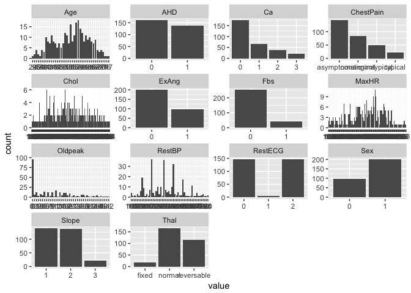
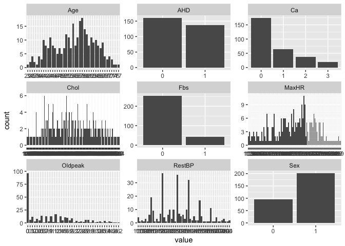
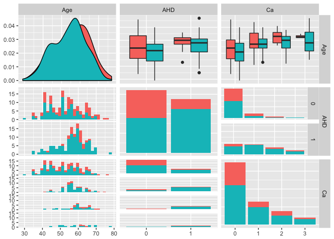

```r
library(tidyverse)
```

```
## ── Attaching packages ────────────────────────────────── tidyverse 1.2.1 ──
```

```
## ✔ ggplot2 2.2.1     ✔ purrr   0.2.4
## ✔ tibble  1.3.4     ✔ dplyr   0.7.4
## ✔ tidyr   0.7.2     ✔ stringr 1.2.0
## ✔ readr   1.1.1     ✔ forcats 0.2.0
```

```
## ── Conflicts ───────────────────────────────────── tidyverse_conflicts() ──
## ✖ dplyr::filter() masks stats::filter()
## ✖ dplyr::lag()    masks stats::lag()
```

```r
library(GGally)
```

```
## 
## Attaching package: 'GGally'
```

```
## The following object is masked from 'package:dplyr':
## 
##     nasa
```

I have very little information about the raw data. It's from "Introduction to Statistical Thinking", found at: http://www-bcf.usc.edu/~gareth/ISL/data.html

It's heart attack data, perhaps from people in South Africa.

## data


```r
heart <- read.delim("data/Heart.csv", header=T, sep=",",row.names = 1)
colnames(heart)
```

```
##  [1] "Age"       "Sex"       "ChestPain" "RestBP"    "Chol"     
##  [6] "Fbs"       "RestECG"   "MaxHR"     "ExAng"     "Oldpeak"  
## [11] "Slope"     "Ca"        "Thal"      "AHD"
```

# Data cleaning

look for and remove missing data and re-factor the sex, heart disease T/F

I can do that with a single command:


```r
heart <- read.delim("data/Heart.csv", header=T, sep=",",row.names = 1)
summary(heart)
```

```
##       Age             Sex                ChestPain       RestBP     
##  Min.   :29.00   Min.   :0.0000   asymptomatic:144   Min.   : 94.0  
##  1st Qu.:48.00   1st Qu.:0.0000   nonanginal  : 86   1st Qu.:120.0  
##  Median :56.00   Median :1.0000   nontypical  : 50   Median :130.0  
##  Mean   :54.44   Mean   :0.6799   typical     : 23   Mean   :131.7  
##  3rd Qu.:61.00   3rd Qu.:1.0000                      3rd Qu.:140.0  
##  Max.   :77.00   Max.   :1.0000                      Max.   :200.0  
##                                                                     
##       Chol            Fbs            RestECG           MaxHR      
##  Min.   :126.0   Min.   :0.0000   Min.   :0.0000   Min.   : 71.0  
##  1st Qu.:211.0   1st Qu.:0.0000   1st Qu.:0.0000   1st Qu.:133.5  
##  Median :241.0   Median :0.0000   Median :1.0000   Median :153.0  
##  Mean   :246.7   Mean   :0.1485   Mean   :0.9901   Mean   :149.6  
##  3rd Qu.:275.0   3rd Qu.:0.0000   3rd Qu.:2.0000   3rd Qu.:166.0  
##  Max.   :564.0   Max.   :1.0000   Max.   :2.0000   Max.   :202.0  
##                                                                   
##      ExAng           Oldpeak         Slope             Ca        
##  Min.   :0.0000   Min.   :0.00   Min.   :1.000   Min.   :0.0000  
##  1st Qu.:0.0000   1st Qu.:0.00   1st Qu.:1.000   1st Qu.:0.0000  
##  Median :0.0000   Median :0.80   Median :2.000   Median :0.0000  
##  Mean   :0.3267   Mean   :1.04   Mean   :1.601   Mean   :0.6722  
##  3rd Qu.:1.0000   3rd Qu.:1.60   3rd Qu.:2.000   3rd Qu.:1.0000  
##  Max.   :1.0000   Max.   :6.20   Max.   :3.000   Max.   :3.0000  
##                                                  NA's   :4       
##          Thal      AHD     
##  fixed     : 18   No :164  
##  normal    :166   Yes:139  
##  reversable:117            
##  NA's      :  2            
##                            
##                            
## 
```

```r
heart <- heart %>% 
  na.omit() %>% 
  mutate(AHD = as.factor(if_else(AHD == "No", 0, 1)), Ca = as.factor(Ca), Sex = as.factor(Sex))
summary(heart)
```

```
##       Age        Sex            ChestPain       RestBP     
##  Min.   :29.00   0: 96   asymptomatic:142   Min.   : 94.0  
##  1st Qu.:48.00   1:201   nonanginal  : 83   1st Qu.:120.0  
##  Median :56.00           nontypical  : 49   Median :130.0  
##  Mean   :54.54           typical     : 23   Mean   :131.7  
##  3rd Qu.:61.00                              3rd Qu.:140.0  
##  Max.   :77.00                              Max.   :200.0  
##       Chol            Fbs            RestECG           MaxHR      
##  Min.   :126.0   Min.   :0.0000   Min.   :0.0000   Min.   : 71.0  
##  1st Qu.:211.0   1st Qu.:0.0000   1st Qu.:0.0000   1st Qu.:133.0  
##  Median :243.0   Median :0.0000   Median :1.0000   Median :153.0  
##  Mean   :247.4   Mean   :0.1448   Mean   :0.9966   Mean   :149.6  
##  3rd Qu.:276.0   3rd Qu.:0.0000   3rd Qu.:2.0000   3rd Qu.:166.0  
##  Max.   :564.0   Max.   :1.0000   Max.   :2.0000   Max.   :202.0  
##      ExAng           Oldpeak          Slope       Ca              Thal    
##  Min.   :0.0000   Min.   :0.000   Min.   :1.000   0:174   fixed     : 18  
##  1st Qu.:0.0000   1st Qu.:0.000   1st Qu.:1.000   1: 65   normal    :164  
##  Median :0.0000   Median :0.800   Median :2.000   2: 38   reversable:115  
##  Mean   :0.3266   Mean   :1.056   Mean   :1.603   3: 20                   
##  3rd Qu.:1.0000   3rd Qu.:1.600   3rd Qu.:2.000                           
##  Max.   :1.0000   Max.   :6.200   Max.   :3.000                           
##  AHD    
##  0:160  
##  1:137  
##         
##         
##         
## 
```

# Exploring data


```r
heart %>% 
  gather(trait, value) %>% 
  ggplot(aes(x=value)) + geom_histogram(stat="count") + facet_wrap(~trait, scales = "free")
```

```
## Warning: attributes are not identical across measure variables;
## they will be dropped
```

```
## Warning: Ignoring unknown parameters: binwidth, bins, pad
```

<!-- -->

I'm going to remove a few variables.


```r
heart <- heart %>% select(-c(Thal, Slope, RestECG, ExAng, ChestPain))
heart %>% 
  gather(trait, value) %>% 
  ggplot(aes(x=value)) + geom_histogram(stat="count") + facet_wrap(~trait, scales = "free")
```

```
## Warning: attributes are not identical across measure variables;
## they will be dropped
```

```
## Warning: Ignoring unknown parameters: binwidth, bins, pad
```

<!-- -->


# Logistic Regression


```r
heartfit <- glm(AHD ~ ., data = heart, family = "binomial")
summary(heartfit)
```

```
## 
## Call:
## glm(formula = AHD ~ ., family = "binomial", data = heart)
## 
## Deviance Residuals: 
##     Min       1Q   Median       3Q      Max  
## -2.3616  -0.6482  -0.2406   0.5658   2.5318  
## 
## Coefficients:
##              Estimate Std. Error z value Pr(>|z|)    
## (Intercept)  0.290370   2.138503   0.136 0.891994    
## Age         -0.029251   0.021266  -1.375 0.168983    
## Sex1         1.732749   0.401450   4.316 1.59e-05 ***
## RestBP       0.023761   0.009687   2.453 0.014175 *  
## Chol         0.006847   0.003312   2.067 0.038725 *  
## Fbs         -0.747501   0.446954  -1.672 0.094439 .  
## MaxHR       -0.041528   0.009295  -4.468 7.91e-06 ***
## Oldpeak      0.564538   0.164390   3.434 0.000594 ***
## Ca1          1.818898   0.408164   4.456 8.34e-06 ***
## Ca2          2.930869   0.588746   4.978 6.42e-07 ***
## Ca3          2.060638   0.771733   2.670 0.007582 ** 
## ---
## Signif. codes:  0 '***' 0.001 '**' 0.01 '*' 0.05 '.' 0.1 ' ' 1
## 
## (Dispersion parameter for binomial family taken to be 1)
## 
##     Null deviance: 409.95  on 296  degrees of freedom
## Residual deviance: 244.70  on 286  degrees of freedom
## AIC: 266.7
## 
## Number of Fisher Scoring iterations: 5
```

# Compounding factors


```r
heart %>% ggpairs(columns = c("Age", "AHD", "Ca"), aes(color=Sex))
```

```
## `stat_bin()` using `bins = 30`. Pick better value with `binwidth`.
## `stat_bin()` using `bins = 30`. Pick better value with `binwidth`.
```

<!-- -->

A fairly incomplete look, but it's the end of the day. It will be useful to build on this later, and it seems like a good dataset to deep dive into logistic regressions.
