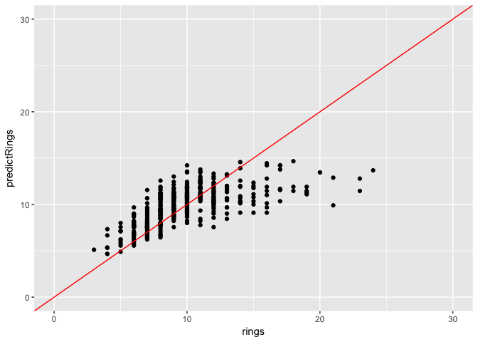

## Introduction

Return to the abalone data set from sketch 1 to do some 3D plotting.

## Set Up


```r
library(tidyverse)
```

```
## ── Attaching packages ────────────────────────────────── tidyverse 1.2.1 ──
```

```
## ✔ ggplot2 2.2.1     ✔ purrr   0.2.4
## ✔ tibble  1.3.4     ✔ dplyr   0.7.4
## ✔ tidyr   0.7.2     ✔ stringr 1.2.0
## ✔ readr   1.1.1     ✔ forcats 0.2.0
```

```
## ── Conflicts ───────────────────────────────────── tidyverse_conflicts() ──
## ✖ dplyr::filter() masks stats::filter()
## ✖ dplyr::lag()    masks stats::lag()
```

```r
library(plot3D)
library(GGally)
```

```
## 
## Attaching package: 'GGally'
```

```
## The following object is masked from 'package:dplyr':
## 
##     nasa
```


## Data


```r
abalone <- read.delim("../sketch1/data/abalone.data", sep=",", header=F)
```

### Attribute information

| Name | Data Type | Measurement Unit | Description |
| ---- | --------- | ---------------- | ----------- |
| Sex | nominal | -- | M, F, and I (infant) |
| Length | continuous | mm | Longest shell measurement |
| Diameter | continuous | mm | perpendicular to length |
| Height | continuous | mm | with meat in shell |
| Whole weight | continuous | grams | whole abalone |
| Shucked weight | continuous | grams | weight of meat |
| Viscera weight | continuous | grams | gut weight (after bleeding) |
| Shell weight | continuous | grams | after being dried |
| Rings | integer | -- | +1.5 gives the age in years |


```r
colnames(abalone) <- c("sex","length", "diameter", "height", "whole", "shucked", "viscera","shell", "rings")
```

### clean data


```r
summary(abalone)
```

```
##  sex          length         diameter          height      
##  F:1307   Min.   :0.075   Min.   :0.0550   Min.   :0.0000  
##  I:1342   1st Qu.:0.450   1st Qu.:0.3500   1st Qu.:0.1150  
##  M:1528   Median :0.545   Median :0.4250   Median :0.1400  
##           Mean   :0.524   Mean   :0.4079   Mean   :0.1395  
##           3rd Qu.:0.615   3rd Qu.:0.4800   3rd Qu.:0.1650  
##           Max.   :0.815   Max.   :0.6500   Max.   :1.1300  
##      whole           shucked          viscera           shell       
##  Min.   :0.0020   Min.   :0.0010   Min.   :0.0005   Min.   :0.0015  
##  1st Qu.:0.4415   1st Qu.:0.1860   1st Qu.:0.0935   1st Qu.:0.1300  
##  Median :0.7995   Median :0.3360   Median :0.1710   Median :0.2340  
##  Mean   :0.8287   Mean   :0.3594   Mean   :0.1806   Mean   :0.2388  
##  3rd Qu.:1.1530   3rd Qu.:0.5020   3rd Qu.:0.2530   3rd Qu.:0.3290  
##  Max.   :2.8255   Max.   :1.4880   Max.   :0.7600   Max.   :1.0050  
##      rings       
##  Min.   : 1.000  
##  1st Qu.: 8.000  
##  Median : 9.000  
##  Mean   : 9.934  
##  3rd Qu.:11.000  
##  Max.   :29.000
```

```r
str(abalone)
```

```
## 'data.frame':	4177 obs. of  9 variables:
##  $ sex     : Factor w/ 3 levels "F","I","M": 3 3 1 3 2 2 1 1 3 1 ...
##  $ length  : num  0.455 0.35 0.53 0.44 0.33 0.425 0.53 0.545 0.475 0.55 ...
##  $ diameter: num  0.365 0.265 0.42 0.365 0.255 0.3 0.415 0.425 0.37 0.44 ...
##  $ height  : num  0.095 0.09 0.135 0.125 0.08 0.095 0.15 0.125 0.125 0.15 ...
##  $ whole   : num  0.514 0.226 0.677 0.516 0.205 ...
##  $ shucked : num  0.2245 0.0995 0.2565 0.2155 0.0895 ...
##  $ viscera : num  0.101 0.0485 0.1415 0.114 0.0395 ...
##  $ shell   : num  0.15 0.07 0.21 0.155 0.055 0.12 0.33 0.26 0.165 0.32 ...
##  $ rings   : int  15 7 9 10 7 8 20 16 9 19 ...
```

```r
dim(abalone)
```

```
## [1] 4177    9
```

```r
abalone <- abalone %>% na.omit()
dim(abalone)
```

```
## [1] 4177    9
```

The curious thing about this data set is that some samples have a height of zero. That may be a typo, or an indication of missing data, but there is probably not a real abalone with a height of zero. So let's remove those.


```r
abalone %>% filter(height == 0)
```

```
##   sex length diameter height whole shucked viscera  shell rings
## 1   I  0.430     0.34      0 0.428  0.2065  0.0860 0.1150     8
## 2   I  0.315     0.23      0 0.134  0.0575  0.0285 0.3505     6
```

Yeah, the lengths and diameter are middle of the road, and so the height seems to be incorrect here. REMOVE.


```r
abalone <- abalone %>% filter(height != 0)
```


## 3D plots

Summarizing the data to figure out what values works best on what axes


```r
abalone %>% gather(trait, value, -sex) %>%
  group_by(trait) %>% 
  summarise(traitMin = min(value), traitMax = max(value))
```

```
## # A tibble: 8 x 3
##      trait traitMin traitMax
##      <chr>    <dbl>    <dbl>
## 1 diameter   0.0550   0.6500
## 2   height   0.0100   1.1300
## 3   length   0.0750   0.8150
## 4    rings   1.0000  29.0000
## 5    shell   0.0015   1.0050
## 6  shucked   0.0010   1.4880
## 7  viscera   0.0005   0.7600
## 8    whole   0.0020   2.8255
```

I'm curious about the number of rings, and I want to know what the best predictors for the number of rings are.


```r
abalone %>% 
  gather(trait, value, -rings) %>% 
  ggplot(aes(x=value, y=rings)) + geom_point() + facet_wrap(~trait, scale="free")
```

```
## Warning: attributes are not identical across measure variables;
## they will be dropped
```

<!-- -->

```r
abalone %>%
  gather(trait, value, -c(sex, rings)) %>%
  ggplot(aes(x=value, y=rings, color=sex)) + geom_point() + facet_wrap(~trait, scale="free")
```

<!-- -->

In general, it appears that the larger an abalone is, the more rings it will have.

Length, diameter and height


```r
points3D(abalone$height, abalone$diameter, abalone$rings, phi = 30, theta = 30)
```

<!-- -->

So there are these two points that are way out there. What's going on with those?


```r
abalone %>% ggplot(aes(x=height, y=rings)) + geom_point()
```

<!-- -->


```r
tail(sort(abalone$height), 2)
```

```
## [1] 0.515 1.130
```

```r
weird1 <- abalone %>% filter(height == tail(sort(height), 2)[1])
weird2 <- abalone %>% filter(height == tail(sort(height), 2)[2])

abalone %>% ggplot(aes(x=length, y=diameter, color=height)) + geom_point() +
  geom_point(data=weird1, color="red") +
  geom_point(data=weird2, color="red")
```

<!-- -->

These two abarant points are more or less middle of the pack in otherwise pretty linearly correlated traits (color height is a pretty nice gradient with a peppering of light spots).


```r
abalone %>% ggplot(aes(x=length, y=diameter, color=height)) + geom_point() +
  geom_point(data=weird1, color="red") +
  geom_point(data=weird2)
```

<!-- -->

Bringing those two spots to the front with the same coloring scheme. Ah, the agony of removal! I cannot say if they are wrong - maybe the middle one is a rad mutant, or actually reflects the actual biodiversity range and the people who collected it didn't like handling long 


```r
abalone %>% ggplot(aes(x=length, y=whole, color=height)) + geom_point() +
  geom_point(data=weird1, color="red") +
  geom_point(data=weird2)
```

<!-- -->

```r
abalone %>% ggplot(aes(x=length, y=rings, color=height)) + geom_point() +
  geom_point(data=weird1, color="red") +
  geom_point(data=weird2)
```

<!-- -->

However, the top weight is so middle of the pack that it's hard to not think it's a data entry error.


```r
 tail(sort(abalone$height), 10)
```

```
##  [1] 0.235 0.240 0.240 0.240 0.240 0.250 0.250 0.250 0.515 1.130
```

```r
abalone <- abalone %>% filter(height < 0.3)
abalone %>% ggplot(aes(x=height, y=rings)) + geom_point()
```

<!-- -->

Ok, agony over. Back to rings.


```r
abalone %>%
  gather(trait, value, -c(sex, rings)) %>%
  ggplot(aes(x=value, y=rings, color=sex)) + geom_point() + facet_wrap(~trait, scale="free")
```

<!-- -->

```r
points3D(abalone$height, abalone$diameter, abalone$rings, phi = 30, theta = 30)
```

<!-- -->

## Predictive model

remove 10% of the dataset for prediction and model testing


```r
n_samples <- dim(abalone)[1]
test_remove <- sample(1:n_samples, 0.1*n_samples)
test_abalone <- abalone[test_remove,]
train_abalone <- abalone[-test_remove,]
```

#### Starting with the most basic


```r
md1 <- lm(rings ~ height, data=train_abalone)
summary(md1)
```

```
## 
## Call:
## lm(formula = rings ~ height, data = train_abalone)
## 
## Residuals:
##     Min      1Q  Median      3Q     Max 
## -6.0161 -1.6848 -0.5256  0.8056 16.7291 
## 
## Coefficients:
##             Estimate Std. Error t value Pr(>|t|)    
## (Intercept)   2.8440     0.1578   18.03   <2e-16 ***
## height       50.9558     1.0917   46.68   <2e-16 ***
## ---
## Signif. codes:  0 '***' 0.001 '**' 0.01 '*' 0.05 '.' 0.1 ' ' 1
## 
## Residual standard error: 2.559 on 3754 degrees of freedom
## Multiple R-squared:  0.3672,	Adjusted R-squared:  0.3671 
## F-statistic:  2179 on 1 and 3754 DF,  p-value: < 2.2e-16
```

```r
train_abalone %>% ggplot(aes(x=height, y=rings)) + geom_point() + geom_abline(intercept = coef(md1)[1], slope=coef(md1)[2])
```

<!-- -->

That's not terrible, but it also seems not that great - it's failing to cover the upper variation of rings.

Is height or length a better predictor?


```r
md2 <- lm(rings ~ length, data=train_abalone)
summary(md2)
```

```
## 
## Call:
## lm(formula = rings ~ length, data = train_abalone)
## 
## Residuals:
##     Min      1Q  Median      3Q     Max 
## -5.9698 -1.6999 -0.7457  0.8857 16.6736 
## 
## Coefficients:
##             Estimate Std. Error t value Pr(>|t|)    
## (Intercept)   2.1094     0.1955   10.79   <2e-16 ***
## length       14.9400     0.3634   41.11   <2e-16 ***
## ---
## Signif. codes:  0 '***' 0.001 '**' 0.01 '*' 0.05 '.' 0.1 ' ' 1
## 
## Residual standard error: 2.671 on 3754 degrees of freedom
## Multiple R-squared:  0.3104,	Adjusted R-squared:  0.3102 
## F-statistic:  1690 on 1 and 3754 DF,  p-value: < 2.2e-16
```

```r
anova(md1, md2)
```

```
## Analysis of Variance Table
## 
## Model 1: rings ~ height
## Model 2: rings ~ length
##   Res.Df   RSS Df Sum of Sq F Pr(>F)
## 1   3754 24574                      
## 2   3754 26781  0   -2207.2
```

Height has a larger adjusted R squared, and has a lower RSS. I'll use height going forward as a better predictor, especially since they are very correlated


```r
md3 <- lm(rings ~ height + diameter, data= train_abalone)
summary(md3)
```

```
## 
## Call:
## lm(formula = rings ~ height + diameter, data = train_abalone)
## 
## Residuals:
##     Min      1Q  Median      3Q     Max 
## -5.8809 -1.6368 -0.6043  0.8798 16.4021 
## 
## Coefficients:
##             Estimate Std. Error t value Pr(>|t|)    
## (Intercept)    2.464      0.177  13.924  < 2e-16 ***
## height        39.901      2.597  15.364  < 2e-16 ***
## diameter       4.705      1.003   4.689 2.85e-06 ***
## ---
## Signif. codes:  0 '***' 0.001 '**' 0.01 '*' 0.05 '.' 0.1 ' ' 1
## 
## Residual standard error: 2.551 on 3753 degrees of freedom
## Multiple R-squared:  0.3709,	Adjusted R-squared:  0.3706 
## F-statistic:  1106 on 2 and 3753 DF,  p-value: < 2.2e-16
```

```r
anova(md1, md3)
```

```
## Analysis of Variance Table
## 
## Model 1: rings ~ height
## Model 2: rings ~ height + diameter
##   Res.Df   RSS Df Sum of Sq      F    Pr(>F)    
## 1   3754 24574                                  
## 2   3753 24431  1     143.1 21.983 2.849e-06 ***
## ---
## Signif. codes:  0 '***' 0.001 '**' 0.01 '*' 0.05 '.' 0.1 ' ' 1
```

```r
train_abalone %>% ggplot(aes(x=height, y=rings)) + geom_point() + geom_abline(intercept = coef(md3)[1], slope=coef(md3)[2])
```

<!-- -->

The second model is different from the other, but not really that much better.

Diameter does have a significant effect on the number of rings, but diameter and height are also correlated, so we may be getting a confounding effect here.

### Adding Random effects


```r
library(lme4)
```

```
## Loading required package: Matrix
```

```
## 
## Attaching package: 'Matrix'
```

```
## The following object is masked from 'package:tidyr':
## 
##     expand
```

Adding sex identification as a random effect - each sex (M, F, I) will have a separate effect on the number of rings.
I think this will improve the prediction, as the infant abalone take up a majority of the low-ring numbers.


```r
md4 <- lmer(rings ~ (1|sex) + height, data=train_abalone)
summary(md4)
```

```
## Linear mixed model fit by REML ['lmerMod']
## Formula: rings ~ (1 | sex) + height
##    Data: train_abalone
## 
## REML criterion at convergence: 17644.1
## 
## Scaled residuals: 
##     Min      1Q  Median      3Q     Max 
## -2.4202 -0.6582 -0.2193  0.3495  6.5782 
## 
## Random effects:
##  Groups   Name        Variance Std.Dev.
##  sex      (Intercept) 0.3095   0.5563  
##  Residual             6.4075   2.5313  
## Number of obs: 3756, groups:  sex, 3
## 
## Fixed effects:
##             Estimate Std. Error t value
## (Intercept)   3.7465     0.3709   10.10
## height       44.4480     1.2992   34.21
## 
## Correlation of Fixed Effects:
##        (Intr)
## height -0.487
```

```r
cat("==============\n")
```

```
## ==============
```

```r
coef(md4)
```

```
## $sex
##   (Intercept)   height
## F    4.125685 44.44802
## I    3.114798 44.44802
## M    3.998894 44.44802
## 
## attr(,"class")
## [1] "coef.mer"
```


```r
train_abalone %>% 
  ggplot(aes(x=height, y=rings, color=sex)) + 
  geom_point() + 
  geom_smooth(method = "lm")
```

<!-- -->

```r
  # geom_smooth(formula = rings ~ (1|sex) + height)
```

Well... Maybe this is not a linear fit. Future models may do better with a polynomial or logarithmic fit, or thoughtful transoformations of the data.

### Prediction

Going with the random effects model to predict ring values from my testing data set


```r
test_abalone <- test_abalone %>% mutate(predictRings = predict(md4, .))
test_abalone %>% 
  ggplot(aes(x=rings, y=predictRings)) + geom_point() + xlim(0,30) + ylim(0,30) +
  geom_abline(intercept = 0, slope = 1, color="red")
```

<!-- -->

I've built better models in my life! Looking forward to figuring this one out...

## What I learned

I started out today wanting to fiddle with 3D plots, but got caught up with predicting ring number. That's ok, but perhaps I should keep these sketched more focused.

I learned about theta and phi in the 3D plotting library. Tomorrow perhaps I should just focus on visualizing 3D stuff.
3D visualization can be tricky, because sometimes it adds more confusion than information. 

Today I also touched on some basics of linear modeling - comparing models and parameters, using a model to predict values, and assessing my model using a testing data set.
