# Intro

Data from: https://data.world/makeovermonday/2018-w-4-turkey-vulture-migration-in-north-and-south-america

Data originally from: https://www.movebank.org/

And published here: http://rstb.royalsocietypublishing.org/content/369/1643/20130195

# Set Up


```r
library(tidyverse)
```


# Data


```r
turkeys <- read.delim("data/Turkey vultures in North and South America - migration.csv", sep = ",", header=T)
```

# Clean and first glances


```r
str(turkeys)
```

```
## 'data.frame':	220077 obs. of  32 variables:
##  $ event.id                       : int  283203879 283203880 283203881 283203882 283203883 283203884 283203885 283203886 283203887 283203888 ...
##  $ visible                        : logi  TRUE TRUE TRUE TRUE TRUE TRUE ...
##  $ timestamp                      : Factor w/ 86343 levels "2003-11-14 16:00:00.000",..: 1 2 3 4 5 6 7 8 9 10 ...
##  $ location.long                  : num  -75.4 -75.4 -75.3 -75.4 -75.4 ...
##  $ location.lat                   : num  40.5 40.5 40.3 40.3 40.3 ...
##  $ manually.marked.outlier        : logi  FALSE FALSE FALSE FALSE FALSE FALSE ...
##  $ sensor.type                    : Factor w/ 1 level "gps": 1 1 1 1 1 1 1 1 1 1 ...
##  $ individual.taxon.canonical.name: Factor w/ 1 level "Cathartes aura": 1 1 1 1 1 1 1 1 1 1 ...
##  $ tag.local.identifier           : int  42500 42500 42500 42500 42500 42500 42500 42500 42500 42500 ...
##  $ individual.local.identifier    : Factor w/ 19 levels "Argentina","Butterball",..: 2 2 2 2 2 2 2 2 2 2 ...
##  $ study.name                     : Factor w/ 1 level "Turkey vultures in North and South America (data from Dodge et al. 2014)": 1 1 1 1 1 1 1 1 1 1 ...
##  $ utm.easting                    : num  466341 466341 471696 469749 463762 ...
##  $ utm.northing                   : num  4482146 4482146 4463847 4465537 4462863 ...
##  $ utm.zone                       : Factor w/ 15 levels "10N","11N","12N",..: 9 9 9 9 9 9 9 9 9 9 ...
##  $ study.timezone                 : Factor w/ 1 level "Pacific Standard Time": 1 1 1 1 1 1 1 1 1 1 ...
##  $ study.local.timestamp          : Factor w/ 86338 levels "2003-11-14 08:00:00.000",..: 1 2 3 4 5 6 7 8 9 10 ...
##  $ tag.id                         : int  42500 42500 42500 42500 42500 42500 42500 42500 42500 42500 ...
##  $ animal.id                      : Factor w/ 19 levels "Argentina","Butterball",..: 2 2 2 2 2 2 2 2 2 2 ...
##  $ animal.taxon                   : Factor w/ 1 level "Cathartes aura": 1 1 1 1 1 1 1 1 1 1 ...
##  $ deploy.on.date                 : Factor w/ 19 levels "2003-11-14 16:00:00.000",..: 1 1 1 1 1 1 1 1 1 1 ...
##  $ deploy.off.date                : Factor w/ 19 levels "2004-03-14 20:00:01.000",..: 1 1 1 1 1 1 1 1 1 1 ...
##  $ animal.comments                : Factor w/ 2 levels "migratory","non-migratory": 1 1 1 1 1 1 1 1 1 1 ...
##  $ animal.life.stage              : Factor w/ 2 levels "adult","juvenile": 1 1 1 1 1 1 1 1 1 1 ...
##  $ animal.mass                    : int  2372 2372 2372 2372 2372 2372 2372 2372 2372 2372 ...
##  $ attachment.type                : Factor w/ 1 level "harness": 1 1 1 1 1 1 1 1 1 1 ...
##  $ deployment.comments            : Factor w/ 4 levels "trapped in California using walk-in traps",..: 3 3 3 3 3 3 3 3 3 3 ...
##  $ deployment.id                  : Factor w/ 19 levels "42500-Butterball",..: 1 1 1 1 1 1 1 1 1 1 ...
##  $ duty.cycle                     : Factor w/ 2 levels "1 fix every 3 hours",..: 2 2 2 2 2 2 2 2 2 2 ...
##  $ study.site                     : Factor w/ 4 levels "East Coast of North America",..: 1 1 1 1 1 1 1 1 1 1 ...
##  $ tag.manufacturer.name          : Factor w/ 3 levels "Microwave Telemetry",..: 1 1 1 1 1 1 1 1 1 1 ...
##  $ tag.mass                       : int  70 70 70 70 70 70 70 70 70 70 ...
##  $ tag.model                      : Factor w/ 2 levels "40GPS","PTT100": 2 2 2 2 2 2 2 2 2 2 ...
```

Columns I just don't need: study.name


```r
turkeys <- turkeys %>% select(-study.name)
```

Any NAs?


```r
summary(turkeys)
```

```
##     event.id         visible                          timestamp     
##  Min.   :283038789   Mode:logical   2011-04-03 15:00:00.000:     8  
##  1st Qu.:283093808   TRUE:220077    2011-04-03 21:00:00.000:     8  
##  Median :283148827                  2011-04-05 15:00:00.000:     8  
##  Mean   :283147824                  2011-04-05 18:00:00.000:     8  
##  3rd Qu.:283203846                  2011-04-11 18:00:00.000:     8  
##  Max.   :283254507                  2011-04-11 21:00:00.000:     8  
##                                     (Other)                :220029  
##  location.long      location.lat    manually.marked.outlier sensor.type 
##  Min.   :-123.93   Min.   :-39.82   Mode :logical           gps:220077  
##  1st Qu.:-111.42   1st Qu.: 17.96   FALSE:220077                        
##  Median : -82.56   Median : 33.87                                       
##  Mean   : -92.48   Mean   : 27.99                                       
##  3rd Qu.: -75.19   3rd Qu.: 40.96                                       
##  Max.   : -48.58   Max.   : 54.02                                       
##                                                                         
##  individual.taxon.canonical.name tag.local.identifier
##  Cathartes aura:220077           Min.   :42500       
##                                  1st Qu.:52069       
##                                  Median :57956       
##                                  Mean   :61601       
##                                  3rd Qu.:65545       
##                                  Max.   :85756       
##                                                      
##  individual.local.identifier  utm.easting      utm.northing    
##  Leo    :32947               Min.   :169798   Min.   : 791837  
##  Disney :28578               1st Qu.:396162   1st Qu.:3259847  
##  Rosalie:28101               Median :458528   Median :4275064  
##  Prado  :20967               Mean   :472248   Mean   :4124074  
##  Morongo:19868               3rd Qu.:537261   3rd Qu.:5124251  
##  Irma   :18314               Max.   :830851   Max.   :8851771  
##  (Other):71302                                                 
##     utm.zone                   study.timezone  
##  17N    :35376   Pacific Standard Time:220077  
##  13N    :33988                                 
##  18N    :33164                                 
##  10N    :29340                                 
##  11N    :24559                                 
##  20S    :19884                                 
##  (Other):43766                                 
##              study.local.timestamp     tag.id        animal.id    
##  2011-04-03 08:00:00.000:     8    Min.   :42500   Leo    :32947  
##  2011-04-03 14:00:00.000:     8    1st Qu.:52069   Disney :28578  
##  2011-04-05 08:00:00.000:     8    Median :57956   Rosalie:28101  
##  2011-04-05 11:00:00.000:     8    Mean   :61601   Prado  :20967  
##  2011-04-11 11:00:00.000:     8    3rd Qu.:65545   Morongo:19868  
##  2011-04-11 14:00:00.000:     8    Max.   :85756   Irma   :18314  
##  (Other)                :220029                    (Other):71302  
##          animal.taxon                    deploy.on.date 
##  Cathartes aura:220077   2007-09-24 17:00:00.000:32947  
##                          2004-10-11 14:00:00.000:28578  
##                          2006-04-11 04:00:00.000:28101  
##                          2005-11-02 15:00:00.000:20967  
##                          2006-04-10 04:00:00.000:19868  
##                          2004-09-06 17:00:00.000:18314  
##                          (Other)                :71302  
##                 deploy.off.date       animal.comments   animal.life.stage
##  2013-03-15 12:00:01.000:32947   migratory    :177497   adult   :212419  
##  2011-10-18 23:00:01.000:28578   non-migratory: 42580   juvenile:  7658  
##  2010-03-28 00:00:01.000:28101                                           
##  2009-07-07 00:00:01.000:20967                                           
##  2009-04-05 22:00:01.000:19868                                           
##  2013-03-18 22:00:01.000:18314                                           
##  (Other)                :71302                                           
##   animal.mass    attachment.type 
##  Min.   :1600    harness:220077  
##  1st Qu.:1750                    
##  Median :1975                    
##  Mean   :1948                    
##  3rd Qu.:2108                    
##  Max.   :2431                    
##  NA's   :63359                   
##                                                                        deployment.comments
##  trapped in California using walk-in traps                                       :77387   
##  trapped in La Pampa Argentina using walk-in and noose-string traps              :22548   
##  trapped in Pennsylvania using padded-leg hold traps and monofilament noose traps:64260   
##  trapped on their nests in Saskatchewan                                          :55882   
##                                                                                           
##                                                                                           
##                                                                                           
##        deployment.id                 duty.cycle    
##  65545-Leo    :32947   1 fix every 3 hours: 46271  
##  52069-Disney :28578   1 fix per hour     :173806  
##  57956-Rosalie:28101                               
##  57954-Prado  :20967                               
##  57957-Morongo:19868                               
##  52067-Irma   :18314                               
##  (Other)      :71302                               
##                        study.site   
##  East Coast of North America:64260  
##  Interior of North America  :55882  
##  Interior of South America  :22548  
##  West Coast of North America:77387  
##                                     
##                                     
##                                     
##                       tag.manufacturer.name    tag.mass    
##  Microwave Telemetry             :173806    Min.   :40.00  
##  Northstar Science and Technology: 42706    1st Qu.:70.00  
##  Northstar Science and Techology :  3565    Median :70.00  
##                                             Mean   :63.69  
##                                             3rd Qu.:70.00  
##                                             Max.   :70.00  
##                                                            
##   tag.model     
##  40GPS : 46271  
##  PTT100:173806  
##                 
##                 
##                 
##                 
## 
```


```r
dim(turkeys)
```

```
## [1] 220077     31
```

```r
dim(turkeys[complete.cases(turkeys),])
```

```
## [1] 156718     31
```

Two methods to look for NAs here - `summary()` and `complete.cases()`. Summary can be overwhelming, and I initially missed the NAs in the summary. The tip off is that the dimensions of `turkeys` and of the subset of complet cases of `turkeys` does not match. Let's figure out why.


```r
dim(turkeys)[1] - dim(turkeys[complete.cases(turkeys),])[1]
```

```
## [1] 63359
```

```r
# looks like all the missing values might be 

missing_turkeys <- turkeys[!complete.cases(turkeys),]
summary(missing_turkeys)
```

```
##     event.id         visible                          timestamp    
##  Min.   :283163068   Mode:logical   2011-07-29 03:00:00.000:    4  
##  1st Qu.:283178908   TRUE:63359     2011-09-24 12:00:00.000:    4  
##  Median :283194747                  2011-09-28 15:00:00.000:    4  
##  Mean   :283204740                  2011-04-01 18:00:00.000:    3  
##  3rd Qu.:283238668                  2011-04-01 21:00:00.000:    3  
##  Max.   :283254507                  2011-04-02 03:00:00.000:    3  
##                                     (Other)                :63338  
##  location.long      location.lat     manually.marked.outlier sensor.type
##  Min.   :-108.83   Min.   :-39.821   Mode :logical           gps:63359  
##  1st Qu.:-104.58   1st Qu.:-16.869   FALSE:63359                        
##  Median : -69.87   Median :  7.324                                      
##  Mean   : -79.95   Mean   : 10.141                                      
##  3rd Qu.: -63.80   3rd Qu.: 50.815                                      
##  Max.   : -48.58   Max.   : 54.018                                      
##                                                                         
##  individual.taxon.canonical.name tag.local.identifier
##  Cathartes aura:63359            Min.   :53797       
##                                  1st Qu.:65544       
##                                  Median :65545       
##                                  Mean   :66694       
##                                  3rd Qu.:65545       
##                                  Max.   :84797       
##                                                      
##  individual.local.identifier  utm.easting      utm.northing    
##  Leo       :32947            Min.   :169798   Min.   : 791837  
##  Mac       : 7864            1st Qu.:335841   1st Qu.:1000389  
##  Young Luro: 7658            Median :404960   Median :5868097  
##  Argentina : 4058            Mean   :448021   Mean   :4683563  
##  La Pampa  : 4032            3rd Qu.:533757   3rd Qu.:5950676  
##  Whitey    : 3565            Max.   :829886   Max.   :8851771  
##  (Other)   : 3235                                              
##     utm.zone                   study.timezone 
##  20S    :19884   Pacific Standard Time:63359  
##  13N    :16288                                
##  19N    :14217                                
##  14N    : 4484                                
##  22S    : 2406                                
##  17N    : 1797                                
##  (Other): 4283                                
##              study.local.timestamp     tag.id           animal.id    
##  2007-11-04 01:00:00.000:    4     Min.   :53797   Leo       :32947  
##  2011-07-28 20:00:00.000:    4     1st Qu.:65544   Mac       : 7864  
##  2011-09-24 05:00:00.000:    4     Median :65545   Young Luro: 7658  
##  2011-09-28 08:00:00.000:    4     Mean   :66694   Argentina : 4058  
##  2009-11-01 01:00:00.000:    3     3rd Qu.:65545   La Pampa  : 4032  
##  2011-04-01 11:00:00.000:    3     Max.   :84797   Whitey    : 3565  
##  (Other)                :63337                     (Other)   : 3235  
##          animal.taxon                   deploy.on.date 
##  Cathartes aura:63359   2007-09-24 17:00:00.000:32947  
##                         2007-09-27 20:00:00.000: 7864  
##                         2009-03-31 15:00:00.000: 7658  
##                         2011-04-19 16:36:00.000: 4058  
##                         2011-04-16 15:51:00.000: 4032  
##                         2011-03-26 13:52:00.000: 3565  
##                         (Other)                : 3235  
##                 deploy.off.date       animal.comments  animal.life.stage
##  2013-03-15 12:00:01.000:32947   migratory    :63359   adult   :55701   
##  2008-09-13 16:00:01.000: 7864   non-migratory:    0   juvenile: 7658   
##  2012-09-19 21:00:01.000: 7658                                          
##  2012-09-23 03:13:01.000: 4058                                          
##  2012-09-26 00:54:01.000: 4032                                          
##  2012-10-12 03:39:01.000: 3565                                          
##  (Other)                : 3235                                          
##   animal.mass    attachment.type
##  Min.   : NA     harness:63359  
##  1st Qu.: NA                    
##  Median : NA                    
##  Mean   :NaN                    
##  3rd Qu.: NA                    
##  Max.   : NA                    
##  NA's   :63359                  
##                                                                        deployment.comments
##  trapped in California using walk-in traps                                       :    0   
##  trapped in La Pampa Argentina using walk-in and noose-string traps              :22548   
##  trapped in Pennsylvania using padded-leg hold traps and monofilament noose traps:    0   
##  trapped on their nests in Saskatchewan                                          :40811   
##                                                                                           
##                                                                                           
##                                                                                           
##           deployment.id                 duty.cycle   
##  65545-Leo       :32947   1 fix every 3 hours:22548  
##  65544-Mac       : 7864   1 fix per hour     :40811  
##  84796-Young Luro: 7658                              
##  53800-Argentina : 4058                              
##  53797-La Pampa  : 4032                              
##  53798-Whitey    : 3565                              
##  (Other)         : 3235                              
##                        study.site   
##  East Coast of North America:    0  
##  Interior of North America  :40811  
##  Interior of South America  :22548  
##  West Coast of North America:    0  
##                                     
##                                     
##                                     
##                       tag.manufacturer.name    tag.mass      tag.model    
##  Microwave Telemetry             :40811     Min.   :40.00   40GPS :22548  
##  Northstar Science and Technology:18983     1st Qu.:40.00   PTT100:40811  
##  Northstar Science and Techology : 3565     Median :70.00                 
##                                             Mean   :59.32                 
##                                             3rd Qu.:70.00                 
##                                             Max.   :70.00                 
## 
```

I'm going to leave these in for now, because all the NAs are only associated with not having a turkey's mass. I don't think that will matter for my analysis, which is focused on migratory pathes. If mass comes in to the picture, I will deal with the NAs.


```r
rm(missing_turkeys)
```


```r
names(turkeys)
```

```
##  [1] "event.id"                        "visible"                        
##  [3] "timestamp"                       "location.long"                  
##  [5] "location.lat"                    "manually.marked.outlier"        
##  [7] "sensor.type"                     "individual.taxon.canonical.name"
##  [9] "tag.local.identifier"            "individual.local.identifier"    
## [11] "utm.easting"                     "utm.northing"                   
## [13] "utm.zone"                        "study.timezone"                 
## [15] "study.local.timestamp"           "tag.id"                         
## [17] "animal.id"                       "animal.taxon"                   
## [19] "deploy.on.date"                  "deploy.off.date"                
## [21] "animal.comments"                 "animal.life.stage"              
## [23] "animal.mass"                     "attachment.type"                
## [25] "deployment.comments"             "deployment.id"                  
## [27] "duty.cycle"                      "study.site"                     
## [29] "tag.manufacturer.name"           "tag.mass"                       
## [31] "tag.model"
```

### Individuals and Samples

What is the relationship between "individual.local.identifier" and the "event.id", "study.id", etc.


```r
turkeys %>% ggplot(aes(x=animal.life.stage)) + geom_bar(stat = "count") +
  facet_wrap(~individual.local.identifier)
```

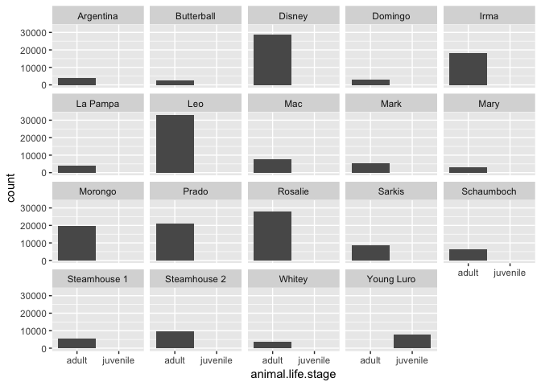<!-- -->


```r
turkeys %>% ggplot(aes(x=animal.life.stage, fill=individual.local.identifier)) + geom_bar(stat = "count") +
  facet_wrap(~animal.id)
```

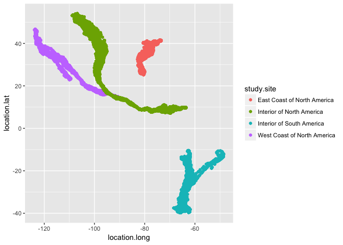<!-- -->

So "individual.local.identifier" == "animal.id", and "tag.local.identifier" is probably an integer id.

**Except** it looks like there may be trouble with Butterball and Schaumboch.


```r
turkeys %>% ggplot(aes(x=animal.life.stage, fill=as.factor(tag.local.identifier))) + geom_bar(stat = "count") +
  facet_wrap(~animal.id)
```

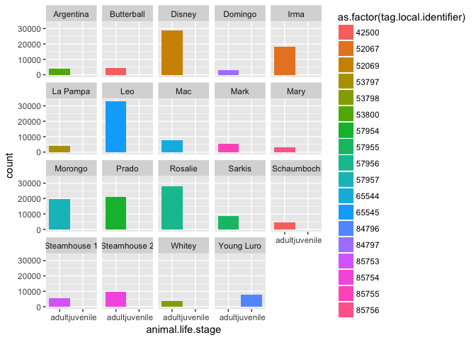<!-- -->

Cool, **now I have several useful methods to identify individuals.** I'll have to keep in mind that Butterball and Schaumboch may be compromised. For now though, I'd like to explore the data more.

From this, I can see some individuals were sampled more often than others.

### Locations

Each sample comes with latitude and logitude information.

These samples were taken from four different study regions:


```r
table(turkeys$study.site)
```

```
## 
## East Coast of North America   Interior of North America 
##                       64260                       55882 
##   Interior of South America West Coast of North America 
##                       22548                       77387
```


```r
turkeys %>% ggplot(aes(x=location.long, y = location.lat, color=study.site)) + geom_point()
```

<!-- -->

This is a map-less way of looking at the regions just based on their lat and longitude.

# Time analysis

## West Coast Birds

Initially, I am going to just look at one group. The West coast group, because that's where I live and I am acquanted with some of these turkies.


```r
westies <- turkeys %>% filter(study.site == "West Coast of North America")
```

Which glorious individuals live in the west coast?


```r
table(westies$animal.id)
```

```
## 
##    Argentina   Butterball       Disney      Domingo         Irma 
##            0            0            0            0            0 
##     La Pampa          Leo          Mac         Mark         Mary 
##            0            0            0            0            0 
##      Morongo        Prado      Rosalie       Sarkis   Schaumboch 
##        19868        20967        28101         8451            0 
## Steamhouse 1 Steamhouse 2       Whitey   Young Luro 
##            0            0            0            0
```

We have four animals, Morongo, Prado, Rosalie, and Sarkis.

Let's check out Sarkis' path:


```r
westies %>% filter(animal.id == "Sarkis") %>% ggplot(aes(x=location.long, y=location.lat)) + geom_path()
```

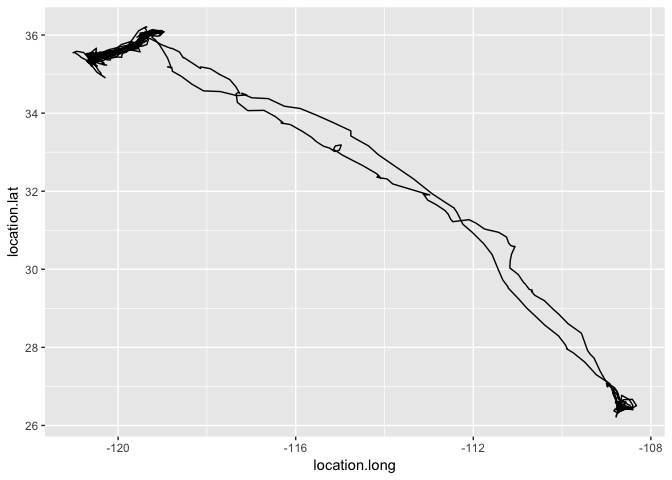<!-- -->

What about all of their paths?


```r
westies %>% ggplot(aes(x=location.long, y=location.lat, color=animal.id)) + geom_path()
```

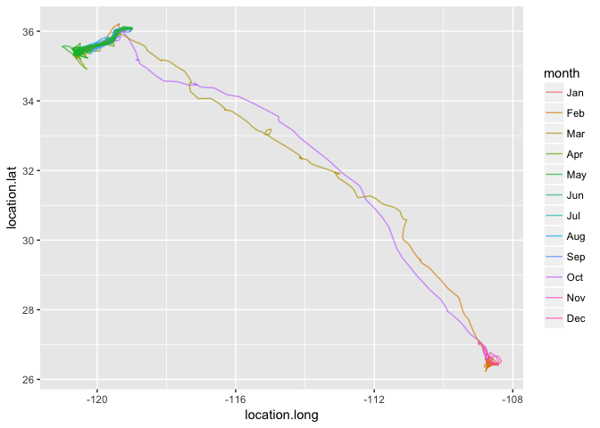<!-- -->

So here are some things to do:

* There is seasonality and direction to these movements. Add in the time layer.
* Put this on a map, with a scale

## Time Layer

I'm going to tackle the time layer today, and the map layer next week.


```r
library(parsedate)
library(lubridate)
```

Parse the date column using the `parsedate` package:


```r
fulldate <- parse_iso_8601(westies$timestamp)
datesplit <-  t(as.data.frame(strsplit(as.character(fulldate), split = " ")))
rownames(datesplit) <- NULL
colnames(datesplit) <- c("date", "hour")
westies <- cbind(datesplit, westies)
westies <- westies %>% mutate(month = month(date, label=TRUE))
```

Add time layer to individual:


```r
westies %>% filter(animal.id == "Sarkis") %>% ggplot(aes(x=location.long, y=location.lat, color=month, group=animal.id)) + geom_path(alpha = 0.7)
```

<!-- -->

So it looks like Arkis hangs out at the north end of its range February through September, and at the south end of the range November through January. It migrates during February and October, with some wandering during March.


```r
westies %>% ggplot(aes(x=location.long, y=location.lat, color=month, group=animal.id)) + geom_path(alpha = 0.7)
```

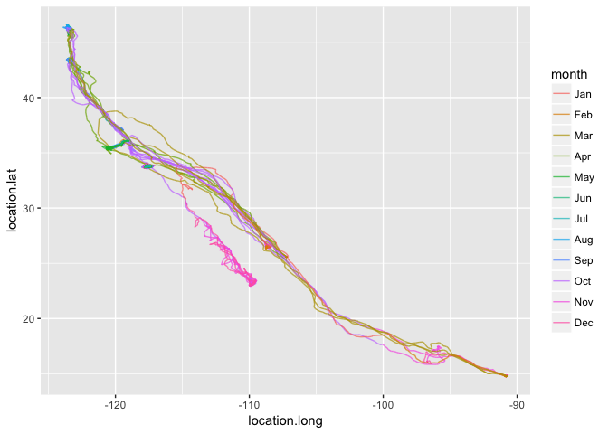<!-- -->

In general, we can see that this is true for all four of these birds - south in the winter and north in the spring and summer. 

That is, you know, what we exect in the northern hemisphere. So that's good!

### Prado's range

But dude, what is Prado doing?


```r
westies %>% filter(animal.id == "Prado") %>% ggplot(aes(x=location.long, y=location.lat, group=animal.id, color=month)) + geom_path()
```

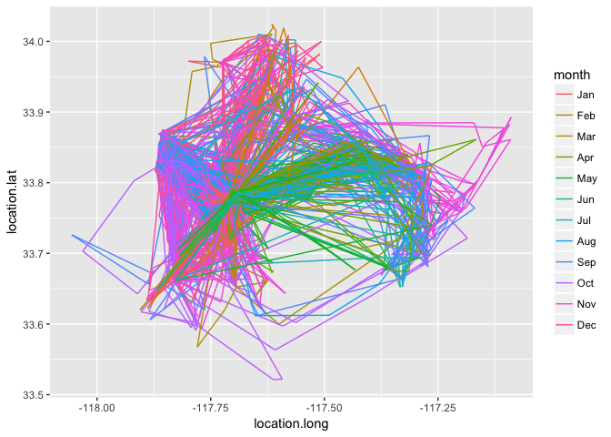<!-- -->

Prado clearly does not migrate.

We could also see that by just quickly summarizing  the ranges of each bird:


```r
westies %>% group_by(animal.id) %>%
  summarise(long_min = min(location.long), long_max = max(location.long), lat_min = min(location.lat), lat_max = max(location.lat) )
```

```
## # A tibble: 4 x 5
##   animal.id  long_min   long_max  lat_min  lat_max
##      <fctr>     <dbl>      <dbl>    <dbl>    <dbl>
## 1   Morongo -123.6838  -90.65983 14.69767 43.60800
## 2     Prado -118.0558 -117.08900 33.52117 34.02400
## 3   Rosalie -123.9255 -107.16650 25.49967 46.64167
## 4    Sarkis -121.0138 -108.32317 26.21600 36.21050
```


```r
westies %>% ggplot(aes(x=animal.id, y = location.long)) + geom_boxplot()
```

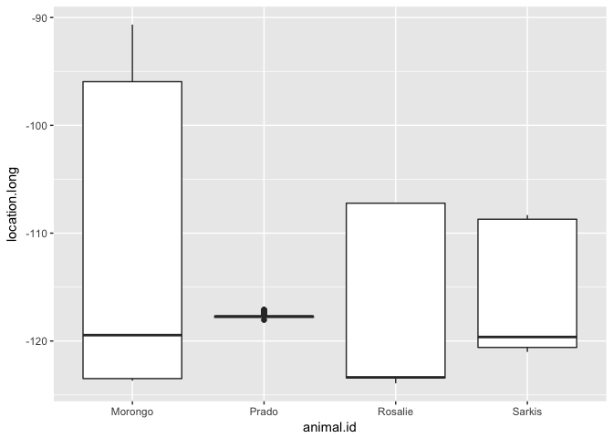<!-- -->

```r
westies %>% ggplot(aes(x=animal.id, y = location.lat)) + geom_boxplot()
```

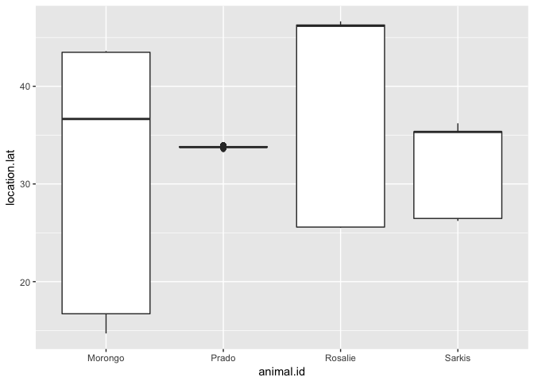<!-- -->

This is definitely not the correct use of latitude and longitude data, but I can quickly see that Prado is not migratory (or I could have looked at the data set, but hey! this is about visualizing.)

I bet you that Prado is a Davis, CA turkey. Next time we'll find out with maps!

## Seasonal Migration

So looking at the month could provide direction - and I may have to re-classify. But let's also look at the year.


```r
westies <- westies %>% mutate(year = year(date))
westies %>% 
  ggplot(aes(x=location.long, y=location.lat, group=animal.id, color=as.factor(year))) +
  geom_path(alpha = 0.7) + 
  facet_wrap(~animal.id)
```

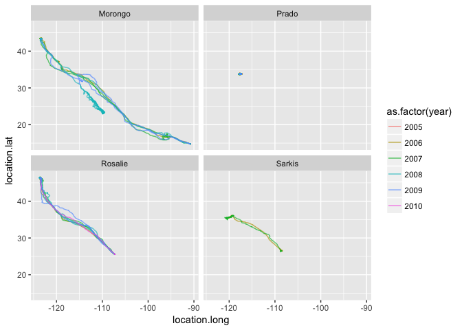<!-- -->

So we're limited by data here, but over all, it looks like the turkeys have been very consistent over the years with their migratory patterns, except Morongo in 2008. It looks like Morongo got stuck somewhere.

Rosalie, who also has the most data points, is the most consistent with her migration patterns.

## South American Turkeys

Let's check out some south american turkeys.


```r
southAm <- turkeys %>% filter(study.site == "Interior of South America")
table(southAm$animal.id)
```

```
## 
##    Argentina   Butterball       Disney      Domingo         Irma 
##         4058            0            0         3235            0 
##     La Pampa          Leo          Mac         Mark         Mary 
##         4032            0            0            0            0 
##      Morongo        Prado      Rosalie       Sarkis   Schaumboch 
##            0            0            0            0            0 
## Steamhouse 1 Steamhouse 2       Whitey   Young Luro 
##            0            0         3565         7658
```

Get time data


```r
fulldate <- parse_iso_8601(southAm$timestamp)
datesplit <-  t(as.data.frame(strsplit(as.character(fulldate), split = " ")))
rownames(datesplit) <- NULL
colnames(datesplit) <- c("date", "hour")
southAm <- cbind(datesplit, southAm)
southAm <- southAm %>% mutate(month = month(date, label=TRUE), year = year(date))
```


```r
southAm %>% ggplot(aes(x=location.long, y = location.lat, group=animal.id, color=animal.id)) + geom_path() +
  facet_wrap(~year)
```

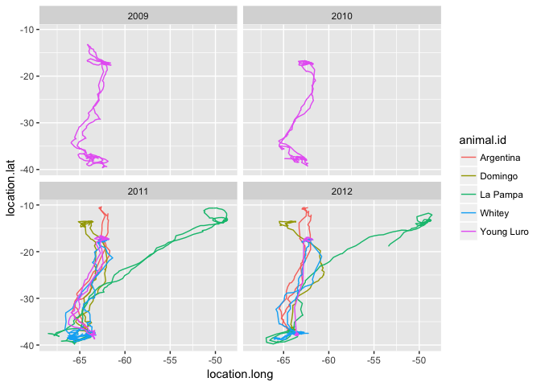<!-- -->


```r
southAm %>% ggplot(aes(x=location.long, y = location.lat, group=animal.id, color=as.factor(year))) + geom_path() +
  facet_wrap(~animal.id)
```

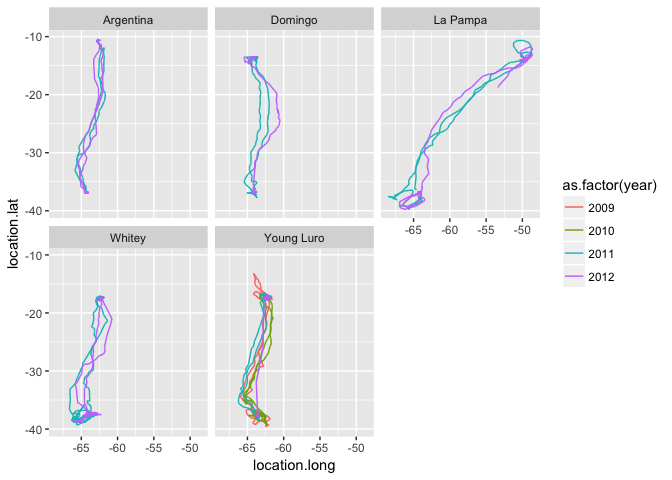<!-- -->

I like La Pampa's adenturous spirit.


```r
southAm %>% ggplot(aes(x=location.long, y = location.lat, group=animal.id, color=month)) + geom_path() +
  facet_wrap(~animal.id)
```

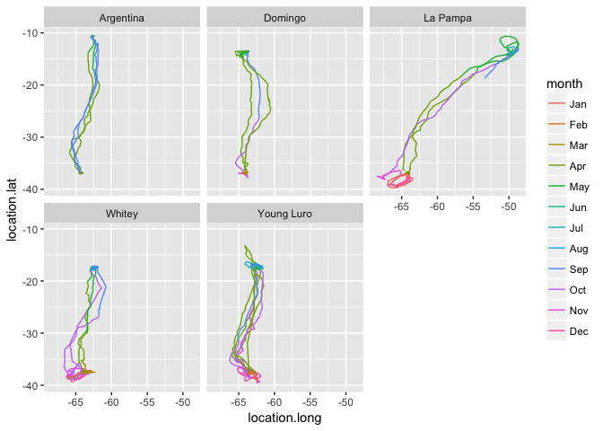<!-- -->

## Some time for all Turkeys


```r
fulldate <- parse_iso_8601(turkeys$timestamp)
datesplit <-  t(as.data.frame(strsplit(as.character(fulldate), split = " ")))
rownames(datesplit) <- NULL
colnames(datesplit) <- c("date", "hour")
turkeys <- cbind(datesplit, turkeys)
turkeys <- turkeys %>% mutate(month = month(date, label=TRUE), year = year(date))
```


```r
turkeys %>% filter(animal.comments != "non-migratory") %>%
  ggplot(aes(x=location.long, y=location.lat, group = animal.id, color=as.factor(year))) +
  geom_path() +
  facet_wrap(~study.site, scale="free")
```

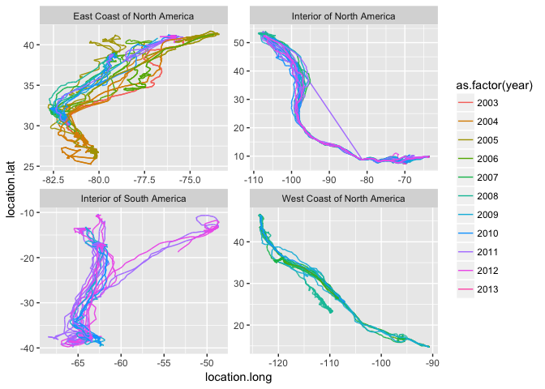<!-- -->

Probably should have done this first. It looks as though the East Coast data does see some consistent variation between years. but also probably because it's been doing it the longest.

## Migration

One last visualization for this one. 


```r
turkeys %>% filter(study.site == "East Coast of North America") %>%
  ggplot(aes(x=location.long, y=location.lat, group=animal.id, color=animal.id)) +
  geom_path(alpha = 0.7) + 
  facet_wrap(~year)
```

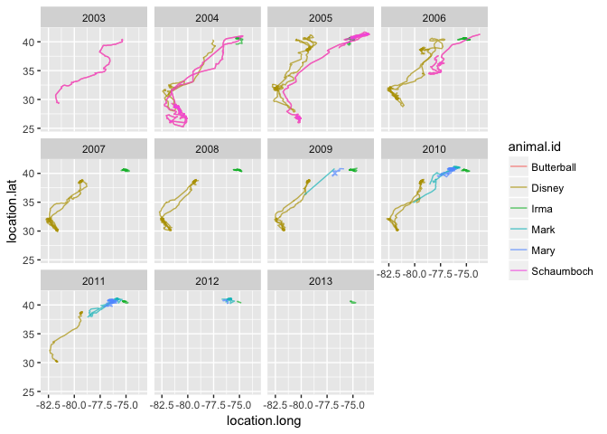<!-- -->
Disney's migratory route changed a bit. Now sure where Butterball is, but that data was potentially mixed up with Schaumboch's data.

It looks like there were two groups of turkeys on the east coast - and it looks like Mark is a turn-coat.
