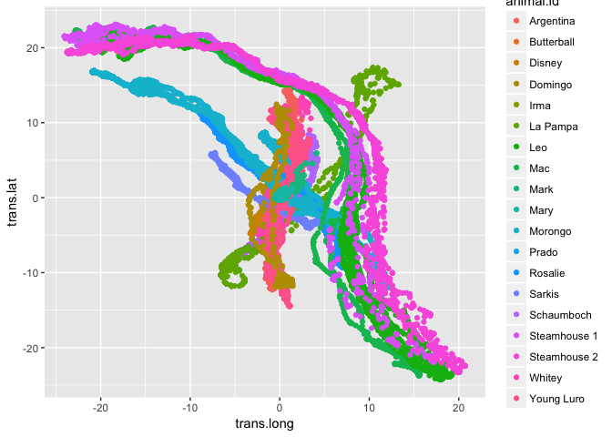

# Introduction

Use the turkey migration data to construct a classification model if they turkeys are migrating or not.

# Data


```r
turkeys <- read.delim("../sketch4/data/Turkey vultures in North and South America - migration.csv", header=T, sep=",")
```

# Set Up


```r
library(tidyverse)
library(parsedate)
library(lubridate)
```


```r
fulldate <- parse_iso_8601(turkeys$timestamp)
datesplit <-  t(as.data.frame(strsplit(as.character(fulldate), split = " ")))
rownames(datesplit) <- NULL
colnames(datesplit) <- c("date", "hour")
turkeys <- cbind(datesplit, turkeys)
turkeys <- turkeys %>% mutate(month = month(date, label=TRUE), year = year(date))
```


# Analysis


```r
turkeys %>% filter(animal.id == "Morongo") %>% ggplot(aes(x=location.long, y=location.lat, color=month)) + geom_point()
```

<!-- -->

Tranform the data for each turkey vulture around a single central point.


```r
turkeys %>% group_by(animal.id) %>% 
  filter(animal.id == "Morongo") %>%
  mutate(long.mean = mean(location.long), lat.mean = mean(location.lat)) %>%
  mutate(trans.long = long.mean - location.long, trans.lat = lat.mean - location.lat) %>%
  ggplot(aes(x=trans.long, y=trans.lat, color=month)) + geom_point()
```

<!-- -->


```r
turkeys %>% group_by(animal.id) %>% 
  mutate(long.mean = mean(location.long), lat.mean = mean(location.lat)) %>%
  mutate(trans.long = long.mean - location.long, trans.lat = lat.mean - location.lat) %>%
  ggplot(aes(x=trans.long, y=trans.lat, color=month)) + geom_point()
```

<!-- -->


```r
turkeys %>% group_by(animal.id) %>% 
  mutate(long.mean = mean(location.long), lat.mean = mean(location.lat)) %>%
  mutate(trans.long = long.mean - location.long, trans.lat = lat.mean - location.lat) %>%
  ggplot(aes(x=trans.long, y=trans.lat, color=animal.id)) + geom_point()
```

<!-- -->


```r
turkeys %>% group_by(animal.id) %>% 
  mutate(long.mean = mean(location.long), lat.mean = mean(location.lat)) %>%
  mutate(trans.long = long.mean - location.long, trans.lat = lat.mean - location.lat) %>%
  ggplot(aes(x=trans.long, y=trans.lat, color=animal.comments)) + geom_point()
```

<!-- -->


```r
turkeys %>% group_by(animal.id) %>% 
  mutate(long.mean = mean(location.long), lat.mean = mean(location.lat)) %>%
  mutate(trans.long = long.mean - location.long, trans.lat = lat.mean - location.lat) %>%
  ggplot(aes(x=trans.long, y=trans.lat, color=study.site)) + geom_point()
```

<!-- -->

Grouping by Study Site changes the transformation a bit.


```r
turkeys %>% group_by(study.site) %>% 
  mutate(long.mean = mean(location.long), lat.mean = mean(location.lat)) %>%
  mutate(trans.long = long.mean - location.long, trans.lat = lat.mean - location.lat) %>%
  ggplot(aes(x=trans.long, y=trans.lat, color=month)) + geom_point(alpha=0.5) + facet_wrap(~study.site)
```

<!-- -->


```r
turkeys %>% 
  filter(study.site == "Interior of North America") %>%
  mutate(long.mean = mean(location.long), lat.mean = mean(location.lat)) %>%
  mutate(trans.long = long.mean - location.long, trans.lat = lat.mean - location.lat) %>%
  ggplot(aes(x=trans.long, y=trans.lat, color=month)) + geom_point(alpha=0.5) 
```

<!-- -->

```r
turkeys %>% 
  filter(study.site == "Interior of North America") %>%
  mutate(long.mean = mean(location.long), lat.mean = mean(location.lat)) %>%
  mutate(trans.long = long.mean - location.long, trans.lat = lat.mean - location.lat) %>%
  ggplot(aes(x=trans.long, y=trans.lat, color=animal.id)) + geom_point(alpha=0.5) 
```

<!-- -->


```r
turkeys %>% 
  filter(study.site == "Interior of North America") %>%
  mutate(long.mean = mean(location.long), lat.mean = mean(location.lat)) %>%
  mutate(trans.long = long.mean - location.long, trans.lat = lat.mean - location.lat) %>%
  ggplot(aes(x=trans.long, y=trans.lat, color=animal.id)) + geom_point(alpha=0.5) + facet_wrap(~month)
```

<!-- -->

So there are are locatins where you could say that the animals are not in a state of migration, or are in a state of migration.

So, not being a zoologist, I'm just going to make a longitudinal cut-off, based on my transform longitude.


```r
turkeys %>% 
  filter(study.site == "Interior of North America") %>%
  mutate(long.mean = mean(location.long), lat.mean = mean(location.lat)) %>%
  mutate(trans.long = long.mean - location.long, trans.lat = lat.mean - location.lat) %>%
  ggplot(aes(x=trans.long, y=trans.lat, color=animal.id)) + geom_point(alpha=0.5) + facet_wrap(~month) + geom_vline(xintercept = c(-15,13))
```

<!-- -->

```r
turkeys %>% 
  filter(study.site == "Interior of North America") %>%
  mutate(long.mean = mean(location.long), lat.mean = mean(location.lat)) %>%
  mutate(trans.long = long.mean - location.long, trans.lat = lat.mean - location.lat) %>%
  ggplot(aes(x=trans.long, y=trans.lat, color=animal.id)) + geom_point(alpha=0.5) + geom_vline(xintercept = c(-15,13))
```

<!-- -->

I declare that if you are above 13 degrees of transformed log, and below -15 degrees of transfomred log, you are not in the act of migrating. Or the animal has reached a general region where it will remain.


```r
ina_transformed <- turkeys %>% 
  filter(study.site == "Interior of North America") %>%
  mutate(long.mean = mean(location.long), lat.mean = mean(location.lat)) %>%
  mutate(trans.long = long.mean - location.long, trans.lat = lat.mean - location.lat) %>%
  mutate(migration_status = ifelse(trans.long > 13 | trans.long < -15, yes = 0, no = 1))
```

Plotting the migration status


```r
ina_transformed %>%  
  ggplot(aes(x=trans.long, y=trans.lat, color=as.factor(migration_status))) + geom_point(alpha=0.5) + geom_vline(xintercept = c(-15,13)) + facet_wrap(~animal.id)
```

<!-- -->

# Distance and Speed traveled over time

So, let's check out how to calculate how fast the birds are moving.

Do they vultures move faster while they are migrating compared to when they occupy a region for a fixed period of time?


```r
leo <- ina_transformed %>% 
  filter(animal.id == "Leo")
ggplot(leo[1:2,], aes(x= trans.long, y= trans.lat)) + geom_point()
```

<!-- -->

Distance traveled between two points will be the hypotnus of a triangle.


```r
calc_hour_distance <- function(start, stop) {
  delta_long <- start$trans.long - stop$trans.long
  delta_lat <- start$trans.lat - stop$trans.lat
  distance <- sqrt(delta_long^2 + delta_lat^2)
  return(distance)
}
calc_hour_distance(leo[1,], leo[2,])
```

```
## [1] 0.4391711
```
This is probably not the way to go for a few reasons. Mostly that the data I'm using here is the data I transformed - and so this distance may not mean very much.

But it's a starting point. Stayed tuned for the next sketch in turkey vultures - finally I may be incorporating maps!
