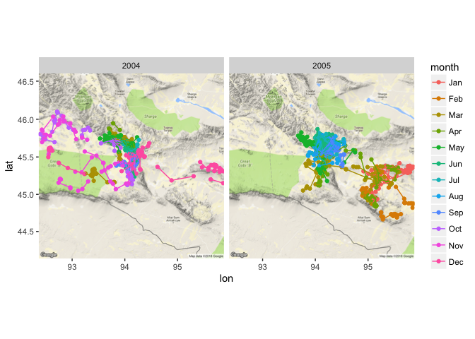

# Introduction

Study citation: Kaczensky, P., Ganbaatar, O., Enksaikhaan, N., Walzer, C. 2006. Wolves in Great Gobi B SPA GPS tracking study 2003-2005 dataset.

This data is about MONGOLIAN WOLVES.


# Set up


```r
library(tidyverse)
```

```
## ── Attaching packages ────────────────────────────────── tidyverse 1.2.1 ──
```

```
## ✔ ggplot2 2.2.1     ✔ purrr   0.2.4
## ✔ tibble  1.3.4     ✔ dplyr   0.7.4
## ✔ tidyr   0.7.2     ✔ stringr 1.2.0
## ✔ readr   1.1.1     ✔ forcats 0.2.0
```

```
## ── Conflicts ───────────────────────────────────── tidyverse_conflicts() ──
## ✖ dplyr::filter() masks stats::filter()
## ✖ dplyr::lag()    masks stats::lag()
```

# Data


```r
wolves <- read.delim("data/Wolves_Mongolia_2003-2005.csv", header=T, sep=",")
```

# Data first pass


```r
summary(wolves)
```

```
##     event.id         visible                       timestamp   
##  Min.   :260324557   true:3681   2004-04-10 16:00:38.000:   2  
##  1st Qu.:260325477               2004-04-16 16:01:07.000:   2  
##  Median :260326397               2004-04-24 08:01:07.000:   2  
##  Mean   :260326398               2004-05-01 08:01:07.000:   2  
##  3rd Qu.:260327319               2004-05-24 08:00:38.000:   2  
##  Max.   :260328239               2004-06-14 08:00:38.000:   2  
##                                  (Other)                :3669  
##  location.long    location.lat   sensor.type
##  Min.   :92.36   Min.   :44.66   gps:3681   
##  1st Qu.:93.42   1st Qu.:45.48              
##  Median :93.54   Median :45.55              
##  Mean   :93.72   Mean   :45.52              
##  3rd Qu.:94.09   3rd Qu.:45.60              
##  Max.   :95.88   Max.   :46.10              
##                                             
##  individual.taxon.canonical.name tag.local.identifier
##  Canis lupus:3681                Min.   :25756       
##                                  1st Qu.:25756       
##                                  Median :25756       
##                                  Mean   :25765       
##                                  3rd Qu.:25778       
##                                  Max.   :25778       
##                                                      
##  individual.local.identifier                     study.name  
##  Boroo :2226                 Wolves Mongolia 2003-2005:3681  
##  Zimzik:1455                                                 
##                                                              
##                                                              
##                                                              
##                                                              
## 
```

```r
wolves[!complete.cases(wolves),]
```

```
##  [1] event.id                        visible                        
##  [3] timestamp                       location.long                  
##  [5] location.lat                    sensor.type                    
##  [7] individual.taxon.canonical.name tag.local.identifier           
##  [9] individual.local.identifier     study.name                     
## <0 rows> (or 0-length row.names)
```

There are no missing values in this dataset. (This is the second movesbank data set I work with - perhaps they clean the data before entry, or perhaps, due to the nature of GPS data collection, there are usually no missing data....)


```r
wolves %>% head()
```

```
##    event.id visible               timestamp location.long location.lat
## 1 260324557    true 2003-05-06 08:01:25.000      93.45050     45.51852
## 2 260324558    true 2003-05-07 08:01:06.000      93.46202     45.55822
## 3 260324559    true 2003-05-10 16:01:06.000      93.45571     45.52488
## 4 260324560    true 2003-05-12 16:01:36.000      93.39969     45.54871
## 5 260324561    true 2003-05-13 00:01:25.000      93.44021     45.51346
## 6 260324562    true 2003-05-13 08:00:38.000      93.40192     45.51775
##   sensor.type individual.taxon.canonical.name tag.local.identifier
## 1         gps                     Canis lupus                25756
## 2         gps                     Canis lupus                25756
## 3         gps                     Canis lupus                25756
## 4         gps                     Canis lupus                25756
## 5         gps                     Canis lupus                25756
## 6         gps                     Canis lupus                25756
##   individual.local.identifier                study.name
## 1                       Boroo Wolves Mongolia 2003-2005
## 2                       Boroo Wolves Mongolia 2003-2005
## 3                       Boroo Wolves Mongolia 2003-2005
## 4                       Boroo Wolves Mongolia 2003-2005
## 5                       Boroo Wolves Mongolia 2003-2005
## 6                       Boroo Wolves Mongolia 2003-2005
```


```r
table(wolves$individual.local.identifier)
```

```
## 
##  Boroo Zimzik 
##   2226   1455
```


```r
table(wolves$visible)
```

```
## 
## true 
## 3681
```


# Clean data

Split the time stamp into more usable date and time 


```r
library(parsedate)
library(lubridate)
```


```r
fulldate <- parse_iso_8601(wolves$timestamp)
datesplit <-  t(as.data.frame(strsplit(as.character(fulldate), split = " ")))
rownames(datesplit) <- NULL
colnames(datesplit) <- c("date", "time")
wolves <- cbind(datesplit, wolves)
wolves <- wolves %>% mutate(month = month(date, label=TRUE), year = year(date))
```

# Basic visualization and Exploration


```r
wolves %>% 
  ggplot(aes(x=location.long, y=location.lat, color=individual.local.identifier)) +
  geom_point() + facet_wrap(~year*month)
```

<!-- -->

### ggmap


```r
library(ggmap)
```

Let's map Boroo


```r
# make a bbox
boroo <- wolves %>% filter(individual.local.identifier == "Boroo")

boroo_box <- make_bbox(lon = location.long, lat=location.lat, data=boroo)
#get map
boroo_map <- get_map(location = boroo_box, source = "google", maptype = "terrain")
```

```
## Warning: bounding box given to google - spatial extent only approximate.
```

```
## converting bounding box to center/zoom specification. (experimental)
```

```
## Map from URL : http://maps.googleapis.com/maps/api/staticmap?center=45.416071,93.307817&zoom=9&size=640x640&scale=2&maptype=terrain&language=en-EN&sensor=false
```


```r
ggmap(boroo_map) + geom_point(data=boroo, mapping = aes(x = location.long, y = location.lat))
```

<!-- -->


```r
ggmap(boroo_map) + geom_point(data=boroo, mapping = aes(x = location.long, y = location.lat, color=as.factor(month)), alpha=0.5) +facet_wrap(~year)
```

<!-- -->

Perhaps Boroo grew older and wiser, and began to migrate? Or perhaps it had to begin leaving the protection of a mother? Or perhaps humans moved in and distrupted the original area, or had distrupted before and the 2005 range is more natural.

For Zimzik


```r
zimzik <- wolves %>% filter(individual.local.identifier == "Zimzik")
```

Pub Zimzik on the map


```r
zimzik_box <- make_bbox(lon = location.long, lat=location.lat, data=zimzik)
zimzik_map <- get_map(location = zimzik_box, maptype = "terrain", source = "google")
```

```
## Warning: bounding box given to google - spatial extent only approximate.
```

```
## converting bounding box to center/zoom specification. (experimental)
```

```
## Map from URL : http://maps.googleapis.com/maps/api/staticmap?center=45.381982,94.120273&zoom=8&size=640x640&scale=2&maptype=terrain&language=en-EN&sensor=false
```


```r
zimzik_box
```

```
##     left   bottom    right      top 
## 92.18843 44.59255 96.05211 46.17141
```

```r
zimzik %>% summarise(max.long = max(location.long), min.long = min(location.long), max.lat = max(location.lat), min.lat=min(location.lat))
```

```
##   max.long min.long  max.lat  min.lat
## 1 95.87649 92.36405 46.09965 44.66432
```


```r
ggmap(zimzik_map) + geom_point(zimzik, mapping = aes(x=location.long, y=location.lat))
```

```
## Warning: Removed 1 rows containing missing values (geom_point).
```

<!-- -->


```r
ggmap(zimzik_map) + geom_point(zimzik, mapping = aes(x=location.long, y=location.lat, color=as.factor(year)))
```

```
## Warning: Removed 1 rows containing missing values (geom_point).
```

<!-- -->

```r
ggmap(zimzik_map) + geom_point(zimzik, mapping = aes(x=location.long, y=location.lat,color=month)) + facet_wrap(~year)
```

```
## Warning: Removed 1 rows containing missing values (geom_point).
```

<!-- -->

```r
ggmap(zimzik_map) + geom_point(zimzik, mapping = aes(x=location.long, y=location.lat,color=month, group=individual.local.identifier)) + geom_line(zimzik, mapping = aes(x=location.long, y=location.lat,color=month, group=date)) + facet_wrap(~year)
```

```
## Warning: Removed 1 rows containing missing values (geom_point).
```

```
## Warning: Removed 1 rows containing missing values (geom_path).
```

<!-- -->

Map both wolves together


```r
wolf_box <- make_bbox(lon=location.long, lat=location.lat, data=wolves)
wolf_map <- get_map(location = wolf_box, source = "google", maptype = "terrain")
```

```
## Warning: bounding box given to google - spatial extent only approximate.
```

```
## converting bounding box to center/zoom specification. (experimental)
```

```
## Map from URL : http://maps.googleapis.com/maps/api/staticmap?center=45.381982,94.120273&zoom=8&size=640x640&scale=2&maptype=terrain&language=en-EN&sensor=false
```


```r
ggmap(wolf_map) + geom_point(wolves, mapping = aes(x=location.long, y=location.lat, color=individual.local.identifier)) + facet_wrap(~year)
```

```
## Warning: Removed 1 rows containing missing values (geom_point).
```

<!-- -->

