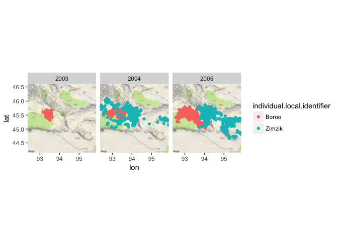

# Introduction

Study citation: Kaczensky, P., Ganbaatar, O., Enksaikhaan, N., Walzer, C. 2006. Wolves in Great Gobi B SPA GPS tracking study 2003-2005 dataset.

# Set up


```r
library(tidyverse)
```

# Data


```r
wolves <- read.delim("Wolves_Mongolia_2003-2005.csv", header=T, sep=",")
```

From a previous sketch I know that this data is clean. There are no missing values.

# Parse date

Split the time stamp into more usable date and time 


```r
library(parsedate)
library(lubridate)
```


```r
fulldate <- parse_iso_8601(wolves$timestamp)
datesplit <-  t(as.data.frame(strsplit(as.character(fulldate), split = " ")))
rownames(datesplit) <- NULL
colnames(datesplit) <- c("date", "time")
wolves <- cbind(datesplit, wolves)
wolves <- wolves %>% mutate(month = month(date, label=TRUE), year = year(date))
```

# Wolf data on a map


```r
library(ggmap)
wolf_box <- make_bbox(lon=location.long, lat=location.lat, data=wolves)
wolf_map <- get_map(location = wolf_box, source = "google", maptype = "terrain")
```

```
## Warning: bounding box given to google - spatial extent only approximate.
```

```
## converting bounding box to center/zoom specification. (experimental)
```

```
## Map from URL : http://maps.googleapis.com/maps/api/staticmap?center=45.381982,94.120273&zoom=8&size=640x640&scale=2&maptype=terrain&language=en-EN&sensor=false
```


```r
ggmap(wolf_map) + geom_point(wolves, mapping = aes(x=location.long, y=location.lat, color=individual.local.identifier)) + facet_wrap(~year)
```

```
## Warning: Removed 1 rows containing missing values (geom_point).
```

<!-- -->

# Plotly

I would like to plot the migration over time

## Plotly animation


```r
library(plotly)
```

Need to make the "frames", which is a concept that I don't yet fully understand. However, I think, essentially what is happening is that plotly is re-creating the graph for every single factor level of what is on the x-axis. 


```r
accumulate_by <- function(dat, var) {
  var <- lazyeval::f_eval(var, dat)
  lvls <- plotly:::getLevels(var)
  dats <- lapply(seq_along(lvls), function(x) {
    cbind(dat[var %in% lvls[seq(1, x)], ], frame = lvls[[x]])
  })
  dplyr::bind_rows(dats)
}
```


```r
wolves_animate <- wolves %>%
  accumulate_by(~date)
```

```
## Warning in bind_rows_(x, .id): Unequal factor levels: coercing to character
```

```
## Warning in bind_rows_(x, .id): binding character and factor vector,
## coercing into character vector

## Warning in bind_rows_(x, .id): binding character and factor vector,
## coercing into character vector

## Warning in bind_rows_(x, .id): binding character and factor vector,
## coercing into character vector

## Warning in bind_rows_(x, .id): binding character and factor vector,
## coercing into character vector

## Warning in bind_rows_(x, .id): binding character and factor vector,
## coercing into character vector

## Warning in bind_rows_(x, .id): binding character and factor vector,
## coercing into character vector

## Warning in bind_rows_(x, .id): binding character and factor vector,
## coercing into character vector

## Warning in bind_rows_(x, .id): binding character and factor vector,
## coercing into character vector

## Warning in bind_rows_(x, .id): binding character and factor vector,
## coercing into character vector

## Warning in bind_rows_(x, .id): binding character and factor vector,
## coercing into character vector

## Warning in bind_rows_(x, .id): binding character and factor vector,
## coercing into character vector

## Warning in bind_rows_(x, .id): binding character and factor vector,
## coercing into character vector

## Warning in bind_rows_(x, .id): binding character and factor vector,
## coercing into character vector

## Warning in bind_rows_(x, .id): binding character and factor vector,
## coercing into character vector

## Warning in bind_rows_(x, .id): binding character and factor vector,
## coercing into character vector

## Warning in bind_rows_(x, .id): binding character and factor vector,
## coercing into character vector

## Warning in bind_rows_(x, .id): binding character and factor vector,
## coercing into character vector

## Warning in bind_rows_(x, .id): binding character and factor vector,
## coercing into character vector

## Warning in bind_rows_(x, .id): binding character and factor vector,
## coercing into character vector

## Warning in bind_rows_(x, .id): binding character and factor vector,
## coercing into character vector

## Warning in bind_rows_(x, .id): binding character and factor vector,
## coercing into character vector

## Warning in bind_rows_(x, .id): binding character and factor vector,
## coercing into character vector

## Warning in bind_rows_(x, .id): binding character and factor vector,
## coercing into character vector

## Warning in bind_rows_(x, .id): binding character and factor vector,
## coercing into character vector

## Warning in bind_rows_(x, .id): binding character and factor vector,
## coercing into character vector

## Warning in bind_rows_(x, .id): binding character and factor vector,
## coercing into character vector

## Warning in bind_rows_(x, .id): binding character and factor vector,
## coercing into character vector

## Warning in bind_rows_(x, .id): binding character and factor vector,
## coercing into character vector

## Warning in bind_rows_(x, .id): binding character and factor vector,
## coercing into character vector

## Warning in bind_rows_(x, .id): binding character and factor vector,
## coercing into character vector

## Warning in bind_rows_(x, .id): binding character and factor vector,
## coercing into character vector

## Warning in bind_rows_(x, .id): binding character and factor vector,
## coercing into character vector

## Warning in bind_rows_(x, .id): binding character and factor vector,
## coercing into character vector

## Warning in bind_rows_(x, .id): binding character and factor vector,
## coercing into character vector

## Warning in bind_rows_(x, .id): binding character and factor vector,
## coercing into character vector

## Warning in bind_rows_(x, .id): binding character and factor vector,
## coercing into character vector

## Warning in bind_rows_(x, .id): binding character and factor vector,
## coercing into character vector

## Warning in bind_rows_(x, .id): binding character and factor vector,
## coercing into character vector

## Warning in bind_rows_(x, .id): binding character and factor vector,
## coercing into character vector

## Warning in bind_rows_(x, .id): binding character and factor vector,
## coercing into character vector

## Warning in bind_rows_(x, .id): binding character and factor vector,
## coercing into character vector

## Warning in bind_rows_(x, .id): binding character and factor vector,
## coercing into character vector

## Warning in bind_rows_(x, .id): binding character and factor vector,
## coercing into character vector

## Warning in bind_rows_(x, .id): binding character and factor vector,
## coercing into character vector

## Warning in bind_rows_(x, .id): binding character and factor vector,
## coercing into character vector

## Warning in bind_rows_(x, .id): binding character and factor vector,
## coercing into character vector

## Warning in bind_rows_(x, .id): binding character and factor vector,
## coercing into character vector

## Warning in bind_rows_(x, .id): binding character and factor vector,
## coercing into character vector

## Warning in bind_rows_(x, .id): binding character and factor vector,
## coercing into character vector

## Warning in bind_rows_(x, .id): binding character and factor vector,
## coercing into character vector

## Warning in bind_rows_(x, .id): binding character and factor vector,
## coercing into character vector

## Warning in bind_rows_(x, .id): binding character and factor vector,
## coercing into character vector

## Warning in bind_rows_(x, .id): binding character and factor vector,
## coercing into character vector

## Warning in bind_rows_(x, .id): binding character and factor vector,
## coercing into character vector

## Warning in bind_rows_(x, .id): binding character and factor vector,
## coercing into character vector

## Warning in bind_rows_(x, .id): binding character and factor vector,
## coercing into character vector

## Warning in bind_rows_(x, .id): binding character and factor vector,
## coercing into character vector

## Warning in bind_rows_(x, .id): binding character and factor vector,
## coercing into character vector

## Warning in bind_rows_(x, .id): binding character and factor vector,
## coercing into character vector

## Warning in bind_rows_(x, .id): binding character and factor vector,
## coercing into character vector

## Warning in bind_rows_(x, .id): binding character and factor vector,
## coercing into character vector

## Warning in bind_rows_(x, .id): binding character and factor vector,
## coercing into character vector

## Warning in bind_rows_(x, .id): binding character and factor vector,
## coercing into character vector

## Warning in bind_rows_(x, .id): binding character and factor vector,
## coercing into character vector

## Warning in bind_rows_(x, .id): binding character and factor vector,
## coercing into character vector

## Warning in bind_rows_(x, .id): binding character and factor vector,
## coercing into character vector

## Warning in bind_rows_(x, .id): binding character and factor vector,
## coercing into character vector

## Warning in bind_rows_(x, .id): binding character and factor vector,
## coercing into character vector

## Warning in bind_rows_(x, .id): binding character and factor vector,
## coercing into character vector

## Warning in bind_rows_(x, .id): binding character and factor vector,
## coercing into character vector

## Warning in bind_rows_(x, .id): binding character and factor vector,
## coercing into character vector

## Warning in bind_rows_(x, .id): binding character and factor vector,
## coercing into character vector

## Warning in bind_rows_(x, .id): binding character and factor vector,
## coercing into character vector

## Warning in bind_rows_(x, .id): binding character and factor vector,
## coercing into character vector

## Warning in bind_rows_(x, .id): binding character and factor vector,
## coercing into character vector

## Warning in bind_rows_(x, .id): binding character and factor vector,
## coercing into character vector

## Warning in bind_rows_(x, .id): binding character and factor vector,
## coercing into character vector

## Warning in bind_rows_(x, .id): binding character and factor vector,
## coercing into character vector

## Warning in bind_rows_(x, .id): binding character and factor vector,
## coercing into character vector

## Warning in bind_rows_(x, .id): binding character and factor vector,
## coercing into character vector

## Warning in bind_rows_(x, .id): binding character and factor vector,
## coercing into character vector

## Warning in bind_rows_(x, .id): binding character and factor vector,
## coercing into character vector

## Warning in bind_rows_(x, .id): binding character and factor vector,
## coercing into character vector

## Warning in bind_rows_(x, .id): binding character and factor vector,
## coercing into character vector

## Warning in bind_rows_(x, .id): binding character and factor vector,
## coercing into character vector

## Warning in bind_rows_(x, .id): binding character and factor vector,
## coercing into character vector

## Warning in bind_rows_(x, .id): binding character and factor vector,
## coercing into character vector

## Warning in bind_rows_(x, .id): binding character and factor vector,
## coercing into character vector

## Warning in bind_rows_(x, .id): binding character and factor vector,
## coercing into character vector

## Warning in bind_rows_(x, .id): binding character and factor vector,
## coercing into character vector

## Warning in bind_rows_(x, .id): binding character and factor vector,
## coercing into character vector

## Warning in bind_rows_(x, .id): binding character and factor vector,
## coercing into character vector

## Warning in bind_rows_(x, .id): binding character and factor vector,
## coercing into character vector

## Warning in bind_rows_(x, .id): binding character and factor vector,
## coercing into character vector

## Warning in bind_rows_(x, .id): binding character and factor vector,
## coercing into character vector

## Warning in bind_rows_(x, .id): binding character and factor vector,
## coercing into character vector

## Warning in bind_rows_(x, .id): binding character and factor vector,
## coercing into character vector

## Warning in bind_rows_(x, .id): binding character and factor vector,
## coercing into character vector

## Warning in bind_rows_(x, .id): binding character and factor vector,
## coercing into character vector

## Warning in bind_rows_(x, .id): binding character and factor vector,
## coercing into character vector

## Warning in bind_rows_(x, .id): binding character and factor vector,
## coercing into character vector

## Warning in bind_rows_(x, .id): binding character and factor vector,
## coercing into character vector

## Warning in bind_rows_(x, .id): binding character and factor vector,
## coercing into character vector

## Warning in bind_rows_(x, .id): binding character and factor vector,
## coercing into character vector

## Warning in bind_rows_(x, .id): binding character and factor vector,
## coercing into character vector

## Warning in bind_rows_(x, .id): binding character and factor vector,
## coercing into character vector

## Warning in bind_rows_(x, .id): binding character and factor vector,
## coercing into character vector

## Warning in bind_rows_(x, .id): binding character and factor vector,
## coercing into character vector

## Warning in bind_rows_(x, .id): binding character and factor vector,
## coercing into character vector

## Warning in bind_rows_(x, .id): binding character and factor vector,
## coercing into character vector

## Warning in bind_rows_(x, .id): binding character and factor vector,
## coercing into character vector

## Warning in bind_rows_(x, .id): binding character and factor vector,
## coercing into character vector

## Warning in bind_rows_(x, .id): binding character and factor vector,
## coercing into character vector

## Warning in bind_rows_(x, .id): binding character and factor vector,
## coercing into character vector

## Warning in bind_rows_(x, .id): binding character and factor vector,
## coercing into character vector

## Warning in bind_rows_(x, .id): binding character and factor vector,
## coercing into character vector

## Warning in bind_rows_(x, .id): binding character and factor vector,
## coercing into character vector

## Warning in bind_rows_(x, .id): binding character and factor vector,
## coercing into character vector

## Warning in bind_rows_(x, .id): binding character and factor vector,
## coercing into character vector

## Warning in bind_rows_(x, .id): binding character and factor vector,
## coercing into character vector

## Warning in bind_rows_(x, .id): binding character and factor vector,
## coercing into character vector

## Warning in bind_rows_(x, .id): binding character and factor vector,
## coercing into character vector

## Warning in bind_rows_(x, .id): binding character and factor vector,
## coercing into character vector

## Warning in bind_rows_(x, .id): binding character and factor vector,
## coercing into character vector

## Warning in bind_rows_(x, .id): binding character and factor vector,
## coercing into character vector

## Warning in bind_rows_(x, .id): binding character and factor vector,
## coercing into character vector

## Warning in bind_rows_(x, .id): binding character and factor vector,
## coercing into character vector

## Warning in bind_rows_(x, .id): binding character and factor vector,
## coercing into character vector

## Warning in bind_rows_(x, .id): binding character and factor vector,
## coercing into character vector

## Warning in bind_rows_(x, .id): binding character and factor vector,
## coercing into character vector

## Warning in bind_rows_(x, .id): binding character and factor vector,
## coercing into character vector

## Warning in bind_rows_(x, .id): binding character and factor vector,
## coercing into character vector

## Warning in bind_rows_(x, .id): binding character and factor vector,
## coercing into character vector

## Warning in bind_rows_(x, .id): binding character and factor vector,
## coercing into character vector

## Warning in bind_rows_(x, .id): binding character and factor vector,
## coercing into character vector

## Warning in bind_rows_(x, .id): binding character and factor vector,
## coercing into character vector

## Warning in bind_rows_(x, .id): binding character and factor vector,
## coercing into character vector

## Warning in bind_rows_(x, .id): binding character and factor vector,
## coercing into character vector

## Warning in bind_rows_(x, .id): binding character and factor vector,
## coercing into character vector

## Warning in bind_rows_(x, .id): binding character and factor vector,
## coercing into character vector

## Warning in bind_rows_(x, .id): binding character and factor vector,
## coercing into character vector

## Warning in bind_rows_(x, .id): binding character and factor vector,
## coercing into character vector

## Warning in bind_rows_(x, .id): binding character and factor vector,
## coercing into character vector

## Warning in bind_rows_(x, .id): binding character and factor vector,
## coercing into character vector

## Warning in bind_rows_(x, .id): binding character and factor vector,
## coercing into character vector

## Warning in bind_rows_(x, .id): binding character and factor vector,
## coercing into character vector

## Warning in bind_rows_(x, .id): binding character and factor vector,
## coercing into character vector

## Warning in bind_rows_(x, .id): binding character and factor vector,
## coercing into character vector

## Warning in bind_rows_(x, .id): binding character and factor vector,
## coercing into character vector

## Warning in bind_rows_(x, .id): binding character and factor vector,
## coercing into character vector

## Warning in bind_rows_(x, .id): binding character and factor vector,
## coercing into character vector

## Warning in bind_rows_(x, .id): binding character and factor vector,
## coercing into character vector

## Warning in bind_rows_(x, .id): binding character and factor vector,
## coercing into character vector

## Warning in bind_rows_(x, .id): binding character and factor vector,
## coercing into character vector

## Warning in bind_rows_(x, .id): binding character and factor vector,
## coercing into character vector

## Warning in bind_rows_(x, .id): binding character and factor vector,
## coercing into character vector

## Warning in bind_rows_(x, .id): binding character and factor vector,
## coercing into character vector

## Warning in bind_rows_(x, .id): binding character and factor vector,
## coercing into character vector

## Warning in bind_rows_(x, .id): binding character and factor vector,
## coercing into character vector

## Warning in bind_rows_(x, .id): binding character and factor vector,
## coercing into character vector

## Warning in bind_rows_(x, .id): binding character and factor vector,
## coercing into character vector

## Warning in bind_rows_(x, .id): binding character and factor vector,
## coercing into character vector

## Warning in bind_rows_(x, .id): binding character and factor vector,
## coercing into character vector

## Warning in bind_rows_(x, .id): binding character and factor vector,
## coercing into character vector

## Warning in bind_rows_(x, .id): binding character and factor vector,
## coercing into character vector

## Warning in bind_rows_(x, .id): binding character and factor vector,
## coercing into character vector

## Warning in bind_rows_(x, .id): binding character and factor vector,
## coercing into character vector

## Warning in bind_rows_(x, .id): binding character and factor vector,
## coercing into character vector

## Warning in bind_rows_(x, .id): binding character and factor vector,
## coercing into character vector

## Warning in bind_rows_(x, .id): binding character and factor vector,
## coercing into character vector

## Warning in bind_rows_(x, .id): binding character and factor vector,
## coercing into character vector

## Warning in bind_rows_(x, .id): binding character and factor vector,
## coercing into character vector

## Warning in bind_rows_(x, .id): binding character and factor vector,
## coercing into character vector

## Warning in bind_rows_(x, .id): binding character and factor vector,
## coercing into character vector

## Warning in bind_rows_(x, .id): binding character and factor vector,
## coercing into character vector

## Warning in bind_rows_(x, .id): binding character and factor vector,
## coercing into character vector

## Warning in bind_rows_(x, .id): binding character and factor vector,
## coercing into character vector

## Warning in bind_rows_(x, .id): binding character and factor vector,
## coercing into character vector

## Warning in bind_rows_(x, .id): binding character and factor vector,
## coercing into character vector

## Warning in bind_rows_(x, .id): binding character and factor vector,
## coercing into character vector

## Warning in bind_rows_(x, .id): binding character and factor vector,
## coercing into character vector

## Warning in bind_rows_(x, .id): binding character and factor vector,
## coercing into character vector

## Warning in bind_rows_(x, .id): binding character and factor vector,
## coercing into character vector

## Warning in bind_rows_(x, .id): binding character and factor vector,
## coercing into character vector

## Warning in bind_rows_(x, .id): binding character and factor vector,
## coercing into character vector

## Warning in bind_rows_(x, .id): binding character and factor vector,
## coercing into character vector

## Warning in bind_rows_(x, .id): binding character and factor vector,
## coercing into character vector

## Warning in bind_rows_(x, .id): binding character and factor vector,
## coercing into character vector

## Warning in bind_rows_(x, .id): binding character and factor vector,
## coercing into character vector

## Warning in bind_rows_(x, .id): binding character and factor vector,
## coercing into character vector

## Warning in bind_rows_(x, .id): binding character and factor vector,
## coercing into character vector

## Warning in bind_rows_(x, .id): binding character and factor vector,
## coercing into character vector

## Warning in bind_rows_(x, .id): binding character and factor vector,
## coercing into character vector

## Warning in bind_rows_(x, .id): binding character and factor vector,
## coercing into character vector

## Warning in bind_rows_(x, .id): binding character and factor vector,
## coercing into character vector

## Warning in bind_rows_(x, .id): binding character and factor vector,
## coercing into character vector

## Warning in bind_rows_(x, .id): binding character and factor vector,
## coercing into character vector

## Warning in bind_rows_(x, .id): binding character and factor vector,
## coercing into character vector

## Warning in bind_rows_(x, .id): binding character and factor vector,
## coercing into character vector

## Warning in bind_rows_(x, .id): binding character and factor vector,
## coercing into character vector

## Warning in bind_rows_(x, .id): binding character and factor vector,
## coercing into character vector

## Warning in bind_rows_(x, .id): binding character and factor vector,
## coercing into character vector

## Warning in bind_rows_(x, .id): binding character and factor vector,
## coercing into character vector

## Warning in bind_rows_(x, .id): binding character and factor vector,
## coercing into character vector

## Warning in bind_rows_(x, .id): binding character and factor vector,
## coercing into character vector

## Warning in bind_rows_(x, .id): binding character and factor vector,
## coercing into character vector

## Warning in bind_rows_(x, .id): binding character and factor vector,
## coercing into character vector

## Warning in bind_rows_(x, .id): binding character and factor vector,
## coercing into character vector

## Warning in bind_rows_(x, .id): binding character and factor vector,
## coercing into character vector

## Warning in bind_rows_(x, .id): binding character and factor vector,
## coercing into character vector

## Warning in bind_rows_(x, .id): binding character and factor vector,
## coercing into character vector

## Warning in bind_rows_(x, .id): binding character and factor vector,
## coercing into character vector

## Warning in bind_rows_(x, .id): binding character and factor vector,
## coercing into character vector

## Warning in bind_rows_(x, .id): binding character and factor vector,
## coercing into character vector

## Warning in bind_rows_(x, .id): binding character and factor vector,
## coercing into character vector

## Warning in bind_rows_(x, .id): binding character and factor vector,
## coercing into character vector

## Warning in bind_rows_(x, .id): binding character and factor vector,
## coercing into character vector

## Warning in bind_rows_(x, .id): binding character and factor vector,
## coercing into character vector

## Warning in bind_rows_(x, .id): binding character and factor vector,
## coercing into character vector

## Warning in bind_rows_(x, .id): binding character and factor vector,
## coercing into character vector

## Warning in bind_rows_(x, .id): binding character and factor vector,
## coercing into character vector

## Warning in bind_rows_(x, .id): binding character and factor vector,
## coercing into character vector

## Warning in bind_rows_(x, .id): binding character and factor vector,
## coercing into character vector

## Warning in bind_rows_(x, .id): binding character and factor vector,
## coercing into character vector

## Warning in bind_rows_(x, .id): binding character and factor vector,
## coercing into character vector

## Warning in bind_rows_(x, .id): binding character and factor vector,
## coercing into character vector

## Warning in bind_rows_(x, .id): binding character and factor vector,
## coercing into character vector

## Warning in bind_rows_(x, .id): binding character and factor vector,
## coercing into character vector

## Warning in bind_rows_(x, .id): binding character and factor vector,
## coercing into character vector

## Warning in bind_rows_(x, .id): binding character and factor vector,
## coercing into character vector

## Warning in bind_rows_(x, .id): binding character and factor vector,
## coercing into character vector

## Warning in bind_rows_(x, .id): binding character and factor vector,
## coercing into character vector

## Warning in bind_rows_(x, .id): binding character and factor vector,
## coercing into character vector

## Warning in bind_rows_(x, .id): binding character and factor vector,
## coercing into character vector

## Warning in bind_rows_(x, .id): binding character and factor vector,
## coercing into character vector

## Warning in bind_rows_(x, .id): binding character and factor vector,
## coercing into character vector

## Warning in bind_rows_(x, .id): binding character and factor vector,
## coercing into character vector

## Warning in bind_rows_(x, .id): binding character and factor vector,
## coercing into character vector

## Warning in bind_rows_(x, .id): binding character and factor vector,
## coercing into character vector

## Warning in bind_rows_(x, .id): binding character and factor vector,
## coercing into character vector

## Warning in bind_rows_(x, .id): binding character and factor vector,
## coercing into character vector

## Warning in bind_rows_(x, .id): binding character and factor vector,
## coercing into character vector

## Warning in bind_rows_(x, .id): binding character and factor vector,
## coercing into character vector

## Warning in bind_rows_(x, .id): binding character and factor vector,
## coercing into character vector

## Warning in bind_rows_(x, .id): binding character and factor vector,
## coercing into character vector

## Warning in bind_rows_(x, .id): binding character and factor vector,
## coercing into character vector

## Warning in bind_rows_(x, .id): binding character and factor vector,
## coercing into character vector

## Warning in bind_rows_(x, .id): binding character and factor vector,
## coercing into character vector

## Warning in bind_rows_(x, .id): binding character and factor vector,
## coercing into character vector

## Warning in bind_rows_(x, .id): binding character and factor vector,
## coercing into character vector

## Warning in bind_rows_(x, .id): binding character and factor vector,
## coercing into character vector

## Warning in bind_rows_(x, .id): binding character and factor vector,
## coercing into character vector

## Warning in bind_rows_(x, .id): binding character and factor vector,
## coercing into character vector

## Warning in bind_rows_(x, .id): binding character and factor vector,
## coercing into character vector

## Warning in bind_rows_(x, .id): binding character and factor vector,
## coercing into character vector

## Warning in bind_rows_(x, .id): binding character and factor vector,
## coercing into character vector

## Warning in bind_rows_(x, .id): binding character and factor vector,
## coercing into character vector

## Warning in bind_rows_(x, .id): binding character and factor vector,
## coercing into character vector

## Warning in bind_rows_(x, .id): binding character and factor vector,
## coercing into character vector

## Warning in bind_rows_(x, .id): binding character and factor vector,
## coercing into character vector

## Warning in bind_rows_(x, .id): binding character and factor vector,
## coercing into character vector

## Warning in bind_rows_(x, .id): binding character and factor vector,
## coercing into character vector

## Warning in bind_rows_(x, .id): binding character and factor vector,
## coercing into character vector

## Warning in bind_rows_(x, .id): binding character and factor vector,
## coercing into character vector

## Warning in bind_rows_(x, .id): binding character and factor vector,
## coercing into character vector

## Warning in bind_rows_(x, .id): binding character and factor vector,
## coercing into character vector

## Warning in bind_rows_(x, .id): binding character and factor vector,
## coercing into character vector

## Warning in bind_rows_(x, .id): binding character and factor vector,
## coercing into character vector

## Warning in bind_rows_(x, .id): binding character and factor vector,
## coercing into character vector

## Warning in bind_rows_(x, .id): binding character and factor vector,
## coercing into character vector

## Warning in bind_rows_(x, .id): binding character and factor vector,
## coercing into character vector

## Warning in bind_rows_(x, .id): binding character and factor vector,
## coercing into character vector

## Warning in bind_rows_(x, .id): binding character and factor vector,
## coercing into character vector

## Warning in bind_rows_(x, .id): binding character and factor vector,
## coercing into character vector

## Warning in bind_rows_(x, .id): binding character and factor vector,
## coercing into character vector

## Warning in bind_rows_(x, .id): binding character and factor vector,
## coercing into character vector

## Warning in bind_rows_(x, .id): binding character and factor vector,
## coercing into character vector

## Warning in bind_rows_(x, .id): binding character and factor vector,
## coercing into character vector

## Warning in bind_rows_(x, .id): binding character and factor vector,
## coercing into character vector

## Warning in bind_rows_(x, .id): binding character and factor vector,
## coercing into character vector

## Warning in bind_rows_(x, .id): binding character and factor vector,
## coercing into character vector

## Warning in bind_rows_(x, .id): binding character and factor vector,
## coercing into character vector

## Warning in bind_rows_(x, .id): binding character and factor vector,
## coercing into character vector

## Warning in bind_rows_(x, .id): binding character and factor vector,
## coercing into character vector

## Warning in bind_rows_(x, .id): binding character and factor vector,
## coercing into character vector

## Warning in bind_rows_(x, .id): binding character and factor vector,
## coercing into character vector

## Warning in bind_rows_(x, .id): binding character and factor vector,
## coercing into character vector

## Warning in bind_rows_(x, .id): binding character and factor vector,
## coercing into character vector

## Warning in bind_rows_(x, .id): binding character and factor vector,
## coercing into character vector

## Warning in bind_rows_(x, .id): binding character and factor vector,
## coercing into character vector

## Warning in bind_rows_(x, .id): binding character and factor vector,
## coercing into character vector

## Warning in bind_rows_(x, .id): binding character and factor vector,
## coercing into character vector

## Warning in bind_rows_(x, .id): binding character and factor vector,
## coercing into character vector

## Warning in bind_rows_(x, .id): binding character and factor vector,
## coercing into character vector

## Warning in bind_rows_(x, .id): binding character and factor vector,
## coercing into character vector

## Warning in bind_rows_(x, .id): binding character and factor vector,
## coercing into character vector

## Warning in bind_rows_(x, .id): binding character and factor vector,
## coercing into character vector

## Warning in bind_rows_(x, .id): binding character and factor vector,
## coercing into character vector

## Warning in bind_rows_(x, .id): binding character and factor vector,
## coercing into character vector

## Warning in bind_rows_(x, .id): binding character and factor vector,
## coercing into character vector

## Warning in bind_rows_(x, .id): binding character and factor vector,
## coercing into character vector

## Warning in bind_rows_(x, .id): binding character and factor vector,
## coercing into character vector

## Warning in bind_rows_(x, .id): binding character and factor vector,
## coercing into character vector

## Warning in bind_rows_(x, .id): binding character and factor vector,
## coercing into character vector

## Warning in bind_rows_(x, .id): binding character and factor vector,
## coercing into character vector

## Warning in bind_rows_(x, .id): binding character and factor vector,
## coercing into character vector

## Warning in bind_rows_(x, .id): binding character and factor vector,
## coercing into character vector

## Warning in bind_rows_(x, .id): binding character and factor vector,
## coercing into character vector

## Warning in bind_rows_(x, .id): binding character and factor vector,
## coercing into character vector

## Warning in bind_rows_(x, .id): binding character and factor vector,
## coercing into character vector

## Warning in bind_rows_(x, .id): binding character and factor vector,
## coercing into character vector

## Warning in bind_rows_(x, .id): binding character and factor vector,
## coercing into character vector

## Warning in bind_rows_(x, .id): binding character and factor vector,
## coercing into character vector

## Warning in bind_rows_(x, .id): binding character and factor vector,
## coercing into character vector

## Warning in bind_rows_(x, .id): binding character and factor vector,
## coercing into character vector

## Warning in bind_rows_(x, .id): binding character and factor vector,
## coercing into character vector

## Warning in bind_rows_(x, .id): binding character and factor vector,
## coercing into character vector

## Warning in bind_rows_(x, .id): binding character and factor vector,
## coercing into character vector

## Warning in bind_rows_(x, .id): binding character and factor vector,
## coercing into character vector

## Warning in bind_rows_(x, .id): binding character and factor vector,
## coercing into character vector

## Warning in bind_rows_(x, .id): binding character and factor vector,
## coercing into character vector

## Warning in bind_rows_(x, .id): binding character and factor vector,
## coercing into character vector

## Warning in bind_rows_(x, .id): binding character and factor vector,
## coercing into character vector

## Warning in bind_rows_(x, .id): binding character and factor vector,
## coercing into character vector

## Warning in bind_rows_(x, .id): binding character and factor vector,
## coercing into character vector

## Warning in bind_rows_(x, .id): binding character and factor vector,
## coercing into character vector

## Warning in bind_rows_(x, .id): binding character and factor vector,
## coercing into character vector

## Warning in bind_rows_(x, .id): binding character and factor vector,
## coercing into character vector

## Warning in bind_rows_(x, .id): binding character and factor vector,
## coercing into character vector

## Warning in bind_rows_(x, .id): binding character and factor vector,
## coercing into character vector

## Warning in bind_rows_(x, .id): binding character and factor vector,
## coercing into character vector

## Warning in bind_rows_(x, .id): binding character and factor vector,
## coercing into character vector

## Warning in bind_rows_(x, .id): binding character and factor vector,
## coercing into character vector

## Warning in bind_rows_(x, .id): binding character and factor vector,
## coercing into character vector

## Warning in bind_rows_(x, .id): binding character and factor vector,
## coercing into character vector

## Warning in bind_rows_(x, .id): binding character and factor vector,
## coercing into character vector

## Warning in bind_rows_(x, .id): binding character and factor vector,
## coercing into character vector

## Warning in bind_rows_(x, .id): binding character and factor vector,
## coercing into character vector

## Warning in bind_rows_(x, .id): binding character and factor vector,
## coercing into character vector

## Warning in bind_rows_(x, .id): binding character and factor vector,
## coercing into character vector

## Warning in bind_rows_(x, .id): binding character and factor vector,
## coercing into character vector

## Warning in bind_rows_(x, .id): binding character and factor vector,
## coercing into character vector

## Warning in bind_rows_(x, .id): binding character and factor vector,
## coercing into character vector

## Warning in bind_rows_(x, .id): binding character and factor vector,
## coercing into character vector

## Warning in bind_rows_(x, .id): binding character and factor vector,
## coercing into character vector

## Warning in bind_rows_(x, .id): binding character and factor vector,
## coercing into character vector

## Warning in bind_rows_(x, .id): binding character and factor vector,
## coercing into character vector

## Warning in bind_rows_(x, .id): binding character and factor vector,
## coercing into character vector

## Warning in bind_rows_(x, .id): binding character and factor vector,
## coercing into character vector

## Warning in bind_rows_(x, .id): binding character and factor vector,
## coercing into character vector

## Warning in bind_rows_(x, .id): binding character and factor vector,
## coercing into character vector

## Warning in bind_rows_(x, .id): binding character and factor vector,
## coercing into character vector

## Warning in bind_rows_(x, .id): binding character and factor vector,
## coercing into character vector

## Warning in bind_rows_(x, .id): binding character and factor vector,
## coercing into character vector

## Warning in bind_rows_(x, .id): binding character and factor vector,
## coercing into character vector

## Warning in bind_rows_(x, .id): binding character and factor vector,
## coercing into character vector

## Warning in bind_rows_(x, .id): binding character and factor vector,
## coercing into character vector

## Warning in bind_rows_(x, .id): binding character and factor vector,
## coercing into character vector

## Warning in bind_rows_(x, .id): binding character and factor vector,
## coercing into character vector

## Warning in bind_rows_(x, .id): binding character and factor vector,
## coercing into character vector

## Warning in bind_rows_(x, .id): binding character and factor vector,
## coercing into character vector

## Warning in bind_rows_(x, .id): binding character and factor vector,
## coercing into character vector

## Warning in bind_rows_(x, .id): binding character and factor vector,
## coercing into character vector

## Warning in bind_rows_(x, .id): binding character and factor vector,
## coercing into character vector

## Warning in bind_rows_(x, .id): binding character and factor vector,
## coercing into character vector

## Warning in bind_rows_(x, .id): binding character and factor vector,
## coercing into character vector

## Warning in bind_rows_(x, .id): binding character and factor vector,
## coercing into character vector

## Warning in bind_rows_(x, .id): binding character and factor vector,
## coercing into character vector

## Warning in bind_rows_(x, .id): binding character and factor vector,
## coercing into character vector

## Warning in bind_rows_(x, .id): binding character and factor vector,
## coercing into character vector

## Warning in bind_rows_(x, .id): binding character and factor vector,
## coercing into character vector

## Warning in bind_rows_(x, .id): binding character and factor vector,
## coercing into character vector

## Warning in bind_rows_(x, .id): binding character and factor vector,
## coercing into character vector

## Warning in bind_rows_(x, .id): binding character and factor vector,
## coercing into character vector

## Warning in bind_rows_(x, .id): binding character and factor vector,
## coercing into character vector

## Warning in bind_rows_(x, .id): binding character and factor vector,
## coercing into character vector

## Warning in bind_rows_(x, .id): binding character and factor vector,
## coercing into character vector

## Warning in bind_rows_(x, .id): binding character and factor vector,
## coercing into character vector

## Warning in bind_rows_(x, .id): binding character and factor vector,
## coercing into character vector

## Warning in bind_rows_(x, .id): binding character and factor vector,
## coercing into character vector

## Warning in bind_rows_(x, .id): binding character and factor vector,
## coercing into character vector

## Warning in bind_rows_(x, .id): binding character and factor vector,
## coercing into character vector

## Warning in bind_rows_(x, .id): binding character and factor vector,
## coercing into character vector

## Warning in bind_rows_(x, .id): binding character and factor vector,
## coercing into character vector

## Warning in bind_rows_(x, .id): binding character and factor vector,
## coercing into character vector

## Warning in bind_rows_(x, .id): binding character and factor vector,
## coercing into character vector

## Warning in bind_rows_(x, .id): binding character and factor vector,
## coercing into character vector

## Warning in bind_rows_(x, .id): binding character and factor vector,
## coercing into character vector

## Warning in bind_rows_(x, .id): binding character and factor vector,
## coercing into character vector

## Warning in bind_rows_(x, .id): binding character and factor vector,
## coercing into character vector

## Warning in bind_rows_(x, .id): binding character and factor vector,
## coercing into character vector

## Warning in bind_rows_(x, .id): binding character and factor vector,
## coercing into character vector

## Warning in bind_rows_(x, .id): binding character and factor vector,
## coercing into character vector

## Warning in bind_rows_(x, .id): binding character and factor vector,
## coercing into character vector

## Warning in bind_rows_(x, .id): binding character and factor vector,
## coercing into character vector

## Warning in bind_rows_(x, .id): binding character and factor vector,
## coercing into character vector

## Warning in bind_rows_(x, .id): binding character and factor vector,
## coercing into character vector

## Warning in bind_rows_(x, .id): binding character and factor vector,
## coercing into character vector

## Warning in bind_rows_(x, .id): binding character and factor vector,
## coercing into character vector

## Warning in bind_rows_(x, .id): binding character and factor vector,
## coercing into character vector

## Warning in bind_rows_(x, .id): binding character and factor vector,
## coercing into character vector

## Warning in bind_rows_(x, .id): binding character and factor vector,
## coercing into character vector

## Warning in bind_rows_(x, .id): binding character and factor vector,
## coercing into character vector

## Warning in bind_rows_(x, .id): binding character and factor vector,
## coercing into character vector

## Warning in bind_rows_(x, .id): binding character and factor vector,
## coercing into character vector

## Warning in bind_rows_(x, .id): binding character and factor vector,
## coercing into character vector

## Warning in bind_rows_(x, .id): binding character and factor vector,
## coercing into character vector

## Warning in bind_rows_(x, .id): binding character and factor vector,
## coercing into character vector

## Warning in bind_rows_(x, .id): binding character and factor vector,
## coercing into character vector

## Warning in bind_rows_(x, .id): binding character and factor vector,
## coercing into character vector

## Warning in bind_rows_(x, .id): binding character and factor vector,
## coercing into character vector

## Warning in bind_rows_(x, .id): binding character and factor vector,
## coercing into character vector

## Warning in bind_rows_(x, .id): binding character and factor vector,
## coercing into character vector

## Warning in bind_rows_(x, .id): binding character and factor vector,
## coercing into character vector

## Warning in bind_rows_(x, .id): binding character and factor vector,
## coercing into character vector

## Warning in bind_rows_(x, .id): binding character and factor vector,
## coercing into character vector

## Warning in bind_rows_(x, .id): binding character and factor vector,
## coercing into character vector

## Warning in bind_rows_(x, .id): binding character and factor vector,
## coercing into character vector

## Warning in bind_rows_(x, .id): binding character and factor vector,
## coercing into character vector

## Warning in bind_rows_(x, .id): binding character and factor vector,
## coercing into character vector

## Warning in bind_rows_(x, .id): binding character and factor vector,
## coercing into character vector

## Warning in bind_rows_(x, .id): binding character and factor vector,
## coercing into character vector

## Warning in bind_rows_(x, .id): binding character and factor vector,
## coercing into character vector

## Warning in bind_rows_(x, .id): binding character and factor vector,
## coercing into character vector

## Warning in bind_rows_(x, .id): binding character and factor vector,
## coercing into character vector

## Warning in bind_rows_(x, .id): binding character and factor vector,
## coercing into character vector

## Warning in bind_rows_(x, .id): binding character and factor vector,
## coercing into character vector

## Warning in bind_rows_(x, .id): binding character and factor vector,
## coercing into character vector

## Warning in bind_rows_(x, .id): binding character and factor vector,
## coercing into character vector

## Warning in bind_rows_(x, .id): binding character and factor vector,
## coercing into character vector

## Warning in bind_rows_(x, .id): binding character and factor vector,
## coercing into character vector

## Warning in bind_rows_(x, .id): binding character and factor vector,
## coercing into character vector

## Warning in bind_rows_(x, .id): binding character and factor vector,
## coercing into character vector

## Warning in bind_rows_(x, .id): binding character and factor vector,
## coercing into character vector

## Warning in bind_rows_(x, .id): binding character and factor vector,
## coercing into character vector

## Warning in bind_rows_(x, .id): binding character and factor vector,
## coercing into character vector

## Warning in bind_rows_(x, .id): binding character and factor vector,
## coercing into character vector

## Warning in bind_rows_(x, .id): binding character and factor vector,
## coercing into character vector

## Warning in bind_rows_(x, .id): binding character and factor vector,
## coercing into character vector

## Warning in bind_rows_(x, .id): binding character and factor vector,
## coercing into character vector

## Warning in bind_rows_(x, .id): binding character and factor vector,
## coercing into character vector

## Warning in bind_rows_(x, .id): binding character and factor vector,
## coercing into character vector

## Warning in bind_rows_(x, .id): binding character and factor vector,
## coercing into character vector

## Warning in bind_rows_(x, .id): binding character and factor vector,
## coercing into character vector

## Warning in bind_rows_(x, .id): binding character and factor vector,
## coercing into character vector

## Warning in bind_rows_(x, .id): binding character and factor vector,
## coercing into character vector

## Warning in bind_rows_(x, .id): binding character and factor vector,
## coercing into character vector

## Warning in bind_rows_(x, .id): binding character and factor vector,
## coercing into character vector

## Warning in bind_rows_(x, .id): binding character and factor vector,
## coercing into character vector

## Warning in bind_rows_(x, .id): binding character and factor vector,
## coercing into character vector

## Warning in bind_rows_(x, .id): binding character and factor vector,
## coercing into character vector

## Warning in bind_rows_(x, .id): binding character and factor vector,
## coercing into character vector

## Warning in bind_rows_(x, .id): binding character and factor vector,
## coercing into character vector

## Warning in bind_rows_(x, .id): binding character and factor vector,
## coercing into character vector

## Warning in bind_rows_(x, .id): binding character and factor vector,
## coercing into character vector

## Warning in bind_rows_(x, .id): binding character and factor vector,
## coercing into character vector

## Warning in bind_rows_(x, .id): binding character and factor vector,
## coercing into character vector

## Warning in bind_rows_(x, .id): binding character and factor vector,
## coercing into character vector

## Warning in bind_rows_(x, .id): binding character and factor vector,
## coercing into character vector

## Warning in bind_rows_(x, .id): binding character and factor vector,
## coercing into character vector

## Warning in bind_rows_(x, .id): binding character and factor vector,
## coercing into character vector

## Warning in bind_rows_(x, .id): binding character and factor vector,
## coercing into character vector

## Warning in bind_rows_(x, .id): binding character and factor vector,
## coercing into character vector

## Warning in bind_rows_(x, .id): binding character and factor vector,
## coercing into character vector

## Warning in bind_rows_(x, .id): binding character and factor vector,
## coercing into character vector

## Warning in bind_rows_(x, .id): binding character and factor vector,
## coercing into character vector

## Warning in bind_rows_(x, .id): binding character and factor vector,
## coercing into character vector

## Warning in bind_rows_(x, .id): binding character and factor vector,
## coercing into character vector

## Warning in bind_rows_(x, .id): binding character and factor vector,
## coercing into character vector

## Warning in bind_rows_(x, .id): binding character and factor vector,
## coercing into character vector

## Warning in bind_rows_(x, .id): binding character and factor vector,
## coercing into character vector

## Warning in bind_rows_(x, .id): binding character and factor vector,
## coercing into character vector

## Warning in bind_rows_(x, .id): binding character and factor vector,
## coercing into character vector

## Warning in bind_rows_(x, .id): binding character and factor vector,
## coercing into character vector

## Warning in bind_rows_(x, .id): binding character and factor vector,
## coercing into character vector

## Warning in bind_rows_(x, .id): binding character and factor vector,
## coercing into character vector

## Warning in bind_rows_(x, .id): binding character and factor vector,
## coercing into character vector

## Warning in bind_rows_(x, .id): binding character and factor vector,
## coercing into character vector

## Warning in bind_rows_(x, .id): binding character and factor vector,
## coercing into character vector

## Warning in bind_rows_(x, .id): binding character and factor vector,
## coercing into character vector

## Warning in bind_rows_(x, .id): binding character and factor vector,
## coercing into character vector

## Warning in bind_rows_(x, .id): binding character and factor vector,
## coercing into character vector

## Warning in bind_rows_(x, .id): binding character and factor vector,
## coercing into character vector

## Warning in bind_rows_(x, .id): binding character and factor vector,
## coercing into character vector

## Warning in bind_rows_(x, .id): binding character and factor vector,
## coercing into character vector

## Warning in bind_rows_(x, .id): binding character and factor vector,
## coercing into character vector

## Warning in bind_rows_(x, .id): binding character and factor vector,
## coercing into character vector

## Warning in bind_rows_(x, .id): binding character and factor vector,
## coercing into character vector

## Warning in bind_rows_(x, .id): binding character and factor vector,
## coercing into character vector

## Warning in bind_rows_(x, .id): binding character and factor vector,
## coercing into character vector

## Warning in bind_rows_(x, .id): binding character and factor vector,
## coercing into character vector

## Warning in bind_rows_(x, .id): binding character and factor vector,
## coercing into character vector

## Warning in bind_rows_(x, .id): binding character and factor vector,
## coercing into character vector

## Warning in bind_rows_(x, .id): binding character and factor vector,
## coercing into character vector

## Warning in bind_rows_(x, .id): binding character and factor vector,
## coercing into character vector

## Warning in bind_rows_(x, .id): binding character and factor vector,
## coercing into character vector

## Warning in bind_rows_(x, .id): binding character and factor vector,
## coercing into character vector

## Warning in bind_rows_(x, .id): binding character and factor vector,
## coercing into character vector

## Warning in bind_rows_(x, .id): binding character and factor vector,
## coercing into character vector

## Warning in bind_rows_(x, .id): binding character and factor vector,
## coercing into character vector

## Warning in bind_rows_(x, .id): binding character and factor vector,
## coercing into character vector

## Warning in bind_rows_(x, .id): binding character and factor vector,
## coercing into character vector

## Warning in bind_rows_(x, .id): binding character and factor vector,
## coercing into character vector

## Warning in bind_rows_(x, .id): binding character and factor vector,
## coercing into character vector

## Warning in bind_rows_(x, .id): binding character and factor vector,
## coercing into character vector

## Warning in bind_rows_(x, .id): binding character and factor vector,
## coercing into character vector

## Warning in bind_rows_(x, .id): binding character and factor vector,
## coercing into character vector

## Warning in bind_rows_(x, .id): binding character and factor vector,
## coercing into character vector

## Warning in bind_rows_(x, .id): binding character and factor vector,
## coercing into character vector

## Warning in bind_rows_(x, .id): binding character and factor vector,
## coercing into character vector

## Warning in bind_rows_(x, .id): binding character and factor vector,
## coercing into character vector

## Warning in bind_rows_(x, .id): binding character and factor vector,
## coercing into character vector

## Warning in bind_rows_(x, .id): binding character and factor vector,
## coercing into character vector

## Warning in bind_rows_(x, .id): binding character and factor vector,
## coercing into character vector

## Warning in bind_rows_(x, .id): binding character and factor vector,
## coercing into character vector

## Warning in bind_rows_(x, .id): binding character and factor vector,
## coercing into character vector

## Warning in bind_rows_(x, .id): binding character and factor vector,
## coercing into character vector

## Warning in bind_rows_(x, .id): binding character and factor vector,
## coercing into character vector

## Warning in bind_rows_(x, .id): binding character and factor vector,
## coercing into character vector

## Warning in bind_rows_(x, .id): binding character and factor vector,
## coercing into character vector

## Warning in bind_rows_(x, .id): binding character and factor vector,
## coercing into character vector

## Warning in bind_rows_(x, .id): binding character and factor vector,
## coercing into character vector

## Warning in bind_rows_(x, .id): binding character and factor vector,
## coercing into character vector

## Warning in bind_rows_(x, .id): binding character and factor vector,
## coercing into character vector

## Warning in bind_rows_(x, .id): binding character and factor vector,
## coercing into character vector

## Warning in bind_rows_(x, .id): binding character and factor vector,
## coercing into character vector

## Warning in bind_rows_(x, .id): binding character and factor vector,
## coercing into character vector

## Warning in bind_rows_(x, .id): binding character and factor vector,
## coercing into character vector

## Warning in bind_rows_(x, .id): binding character and factor vector,
## coercing into character vector

## Warning in bind_rows_(x, .id): binding character and factor vector,
## coercing into character vector

## Warning in bind_rows_(x, .id): binding character and factor vector,
## coercing into character vector

## Warning in bind_rows_(x, .id): binding character and factor vector,
## coercing into character vector

## Warning in bind_rows_(x, .id): binding character and factor vector,
## coercing into character vector

## Warning in bind_rows_(x, .id): binding character and factor vector,
## coercing into character vector

## Warning in bind_rows_(x, .id): binding character and factor vector,
## coercing into character vector

## Warning in bind_rows_(x, .id): binding character and factor vector,
## coercing into character vector

## Warning in bind_rows_(x, .id): binding character and factor vector,
## coercing into character vector

## Warning in bind_rows_(x, .id): binding character and factor vector,
## coercing into character vector

## Warning in bind_rows_(x, .id): binding character and factor vector,
## coercing into character vector

## Warning in bind_rows_(x, .id): binding character and factor vector,
## coercing into character vector

## Warning in bind_rows_(x, .id): binding character and factor vector,
## coercing into character vector

## Warning in bind_rows_(x, .id): binding character and factor vector,
## coercing into character vector

## Warning in bind_rows_(x, .id): binding character and factor vector,
## coercing into character vector

## Warning in bind_rows_(x, .id): binding character and factor vector,
## coercing into character vector

## Warning in bind_rows_(x, .id): binding character and factor vector,
## coercing into character vector

## Warning in bind_rows_(x, .id): binding character and factor vector,
## coercing into character vector

## Warning in bind_rows_(x, .id): binding character and factor vector,
## coercing into character vector

## Warning in bind_rows_(x, .id): binding character and factor vector,
## coercing into character vector

## Warning in bind_rows_(x, .id): binding character and factor vector,
## coercing into character vector

## Warning in bind_rows_(x, .id): binding character and factor vector,
## coercing into character vector

## Warning in bind_rows_(x, .id): binding character and factor vector,
## coercing into character vector

## Warning in bind_rows_(x, .id): binding character and factor vector,
## coercing into character vector

## Warning in bind_rows_(x, .id): binding character and factor vector,
## coercing into character vector

## Warning in bind_rows_(x, .id): binding character and factor vector,
## coercing into character vector

## Warning in bind_rows_(x, .id): binding character and factor vector,
## coercing into character vector

## Warning in bind_rows_(x, .id): binding character and factor vector,
## coercing into character vector

## Warning in bind_rows_(x, .id): binding character and factor vector,
## coercing into character vector

## Warning in bind_rows_(x, .id): binding character and factor vector,
## coercing into character vector

## Warning in bind_rows_(x, .id): binding character and factor vector,
## coercing into character vector

## Warning in bind_rows_(x, .id): binding character and factor vector,
## coercing into character vector

## Warning in bind_rows_(x, .id): binding character and factor vector,
## coercing into character vector

## Warning in bind_rows_(x, .id): binding character and factor vector,
## coercing into character vector

## Warning in bind_rows_(x, .id): binding character and factor vector,
## coercing into character vector

## Warning in bind_rows_(x, .id): binding character and factor vector,
## coercing into character vector

## Warning in bind_rows_(x, .id): binding character and factor vector,
## coercing into character vector

## Warning in bind_rows_(x, .id): binding character and factor vector,
## coercing into character vector

## Warning in bind_rows_(x, .id): binding character and factor vector,
## coercing into character vector

## Warning in bind_rows_(x, .id): binding character and factor vector,
## coercing into character vector

## Warning in bind_rows_(x, .id): binding character and factor vector,
## coercing into character vector

## Warning in bind_rows_(x, .id): binding character and factor vector,
## coercing into character vector

## Warning in bind_rows_(x, .id): binding character and factor vector,
## coercing into character vector

## Warning in bind_rows_(x, .id): binding character and factor vector,
## coercing into character vector

## Warning in bind_rows_(x, .id): binding character and factor vector,
## coercing into character vector

## Warning in bind_rows_(x, .id): binding character and factor vector,
## coercing into character vector

## Warning in bind_rows_(x, .id): binding character and factor vector,
## coercing into character vector

## Warning in bind_rows_(x, .id): binding character and factor vector,
## coercing into character vector

## Warning in bind_rows_(x, .id): binding character and factor vector,
## coercing into character vector

## Warning in bind_rows_(x, .id): binding character and factor vector,
## coercing into character vector

## Warning in bind_rows_(x, .id): binding character and factor vector,
## coercing into character vector

## Warning in bind_rows_(x, .id): binding character and factor vector,
## coercing into character vector

## Warning in bind_rows_(x, .id): binding character and factor vector,
## coercing into character vector

## Warning in bind_rows_(x, .id): binding character and factor vector,
## coercing into character vector

## Warning in bind_rows_(x, .id): binding character and factor vector,
## coercing into character vector

## Warning in bind_rows_(x, .id): binding character and factor vector,
## coercing into character vector

## Warning in bind_rows_(x, .id): binding character and factor vector,
## coercing into character vector

## Warning in bind_rows_(x, .id): binding character and factor vector,
## coercing into character vector

## Warning in bind_rows_(x, .id): binding character and factor vector,
## coercing into character vector

## Warning in bind_rows_(x, .id): binding character and factor vector,
## coercing into character vector

## Warning in bind_rows_(x, .id): binding character and factor vector,
## coercing into character vector

## Warning in bind_rows_(x, .id): binding character and factor vector,
## coercing into character vector

## Warning in bind_rows_(x, .id): binding character and factor vector,
## coercing into character vector

## Warning in bind_rows_(x, .id): binding character and factor vector,
## coercing into character vector

## Warning in bind_rows_(x, .id): binding character and factor vector,
## coercing into character vector

## Warning in bind_rows_(x, .id): binding character and factor vector,
## coercing into character vector

## Warning in bind_rows_(x, .id): binding character and factor vector,
## coercing into character vector

## Warning in bind_rows_(x, .id): binding character and factor vector,
## coercing into character vector

## Warning in bind_rows_(x, .id): binding character and factor vector,
## coercing into character vector

## Warning in bind_rows_(x, .id): binding character and factor vector,
## coercing into character vector

## Warning in bind_rows_(x, .id): binding character and factor vector,
## coercing into character vector

## Warning in bind_rows_(x, .id): binding character and factor vector,
## coercing into character vector

## Warning in bind_rows_(x, .id): binding character and factor vector,
## coercing into character vector

## Warning in bind_rows_(x, .id): binding character and factor vector,
## coercing into character vector

## Warning in bind_rows_(x, .id): binding character and factor vector,
## coercing into character vector

## Warning in bind_rows_(x, .id): binding character and factor vector,
## coercing into character vector

## Warning in bind_rows_(x, .id): binding character and factor vector,
## coercing into character vector

## Warning in bind_rows_(x, .id): binding character and factor vector,
## coercing into character vector

## Warning in bind_rows_(x, .id): binding character and factor vector,
## coercing into character vector

## Warning in bind_rows_(x, .id): binding character and factor vector,
## coercing into character vector

## Warning in bind_rows_(x, .id): binding character and factor vector,
## coercing into character vector

## Warning in bind_rows_(x, .id): binding character and factor vector,
## coercing into character vector

## Warning in bind_rows_(x, .id): binding character and factor vector,
## coercing into character vector

## Warning in bind_rows_(x, .id): binding character and factor vector,
## coercing into character vector

## Warning in bind_rows_(x, .id): binding character and factor vector,
## coercing into character vector

## Warning in bind_rows_(x, .id): binding character and factor vector,
## coercing into character vector

## Warning in bind_rows_(x, .id): binding character and factor vector,
## coercing into character vector

## Warning in bind_rows_(x, .id): binding character and factor vector,
## coercing into character vector

## Warning in bind_rows_(x, .id): binding character and factor vector,
## coercing into character vector

## Warning in bind_rows_(x, .id): binding character and factor vector,
## coercing into character vector

## Warning in bind_rows_(x, .id): binding character and factor vector,
## coercing into character vector

## Warning in bind_rows_(x, .id): binding character and factor vector,
## coercing into character vector

## Warning in bind_rows_(x, .id): binding character and factor vector,
## coercing into character vector

## Warning in bind_rows_(x, .id): binding character and factor vector,
## coercing into character vector

## Warning in bind_rows_(x, .id): binding character and factor vector,
## coercing into character vector

## Warning in bind_rows_(x, .id): binding character and factor vector,
## coercing into character vector

## Warning in bind_rows_(x, .id): binding character and factor vector,
## coercing into character vector

## Warning in bind_rows_(x, .id): binding character and factor vector,
## coercing into character vector

## Warning in bind_rows_(x, .id): binding character and factor vector,
## coercing into character vector

## Warning in bind_rows_(x, .id): binding character and factor vector,
## coercing into character vector

## Warning in bind_rows_(x, .id): binding character and factor vector,
## coercing into character vector

## Warning in bind_rows_(x, .id): binding character and factor vector,
## coercing into character vector

## Warning in bind_rows_(x, .id): binding character and factor vector,
## coercing into character vector

## Warning in bind_rows_(x, .id): binding character and factor vector,
## coercing into character vector

## Warning in bind_rows_(x, .id): binding character and factor vector,
## coercing into character vector

## Warning in bind_rows_(x, .id): binding character and factor vector,
## coercing into character vector

## Warning in bind_rows_(x, .id): binding character and factor vector,
## coercing into character vector

## Warning in bind_rows_(x, .id): binding character and factor vector,
## coercing into character vector

## Warning in bind_rows_(x, .id): binding character and factor vector,
## coercing into character vector

## Warning in bind_rows_(x, .id): binding character and factor vector,
## coercing into character vector

## Warning in bind_rows_(x, .id): binding character and factor vector,
## coercing into character vector

## Warning in bind_rows_(x, .id): binding character and factor vector,
## coercing into character vector

## Warning in bind_rows_(x, .id): binding character and factor vector,
## coercing into character vector

## Warning in bind_rows_(x, .id): binding character and factor vector,
## coercing into character vector

## Warning in bind_rows_(x, .id): binding character and factor vector,
## coercing into character vector

## Warning in bind_rows_(x, .id): binding character and factor vector,
## coercing into character vector

## Warning in bind_rows_(x, .id): binding character and factor vector,
## coercing into character vector

## Warning in bind_rows_(x, .id): binding character and factor vector,
## coercing into character vector

## Warning in bind_rows_(x, .id): binding character and factor vector,
## coercing into character vector

## Warning in bind_rows_(x, .id): binding character and factor vector,
## coercing into character vector

## Warning in bind_rows_(x, .id): binding character and factor vector,
## coercing into character vector

## Warning in bind_rows_(x, .id): binding character and factor vector,
## coercing into character vector

## Warning in bind_rows_(x, .id): binding character and factor vector,
## coercing into character vector

## Warning in bind_rows_(x, .id): binding character and factor vector,
## coercing into character vector

## Warning in bind_rows_(x, .id): binding character and factor vector,
## coercing into character vector

## Warning in bind_rows_(x, .id): binding character and factor vector,
## coercing into character vector

## Warning in bind_rows_(x, .id): binding character and factor vector,
## coercing into character vector

## Warning in bind_rows_(x, .id): binding character and factor vector,
## coercing into character vector

## Warning in bind_rows_(x, .id): binding character and factor vector,
## coercing into character vector

## Warning in bind_rows_(x, .id): binding character and factor vector,
## coercing into character vector

## Warning in bind_rows_(x, .id): binding character and factor vector,
## coercing into character vector

## Warning in bind_rows_(x, .id): binding character and factor vector,
## coercing into character vector

## Warning in bind_rows_(x, .id): binding character and factor vector,
## coercing into character vector

## Warning in bind_rows_(x, .id): binding character and factor vector,
## coercing into character vector

## Warning in bind_rows_(x, .id): binding character and factor vector,
## coercing into character vector

## Warning in bind_rows_(x, .id): binding character and factor vector,
## coercing into character vector

## Warning in bind_rows_(x, .id): binding character and factor vector,
## coercing into character vector

## Warning in bind_rows_(x, .id): binding character and factor vector,
## coercing into character vector

## Warning in bind_rows_(x, .id): binding character and factor vector,
## coercing into character vector

## Warning in bind_rows_(x, .id): binding character and factor vector,
## coercing into character vector

## Warning in bind_rows_(x, .id): binding character and factor vector,
## coercing into character vector

## Warning in bind_rows_(x, .id): binding character and factor vector,
## coercing into character vector

## Warning in bind_rows_(x, .id): binding character and factor vector,
## coercing into character vector

## Warning in bind_rows_(x, .id): binding character and factor vector,
## coercing into character vector

## Warning in bind_rows_(x, .id): binding character and factor vector,
## coercing into character vector

## Warning in bind_rows_(x, .id): binding character and factor vector,
## coercing into character vector

## Warning in bind_rows_(x, .id): binding character and factor vector,
## coercing into character vector

## Warning in bind_rows_(x, .id): binding character and factor vector,
## coercing into character vector

## Warning in bind_rows_(x, .id): binding character and factor vector,
## coercing into character vector

## Warning in bind_rows_(x, .id): binding character and factor vector,
## coercing into character vector

## Warning in bind_rows_(x, .id): binding character and factor vector,
## coercing into character vector

## Warning in bind_rows_(x, .id): binding character and factor vector,
## coercing into character vector

## Warning in bind_rows_(x, .id): binding character and factor vector,
## coercing into character vector

## Warning in bind_rows_(x, .id): binding character and factor vector,
## coercing into character vector

## Warning in bind_rows_(x, .id): binding character and factor vector,
## coercing into character vector

## Warning in bind_rows_(x, .id): binding character and factor vector,
## coercing into character vector

## Warning in bind_rows_(x, .id): binding character and factor vector,
## coercing into character vector

## Warning in bind_rows_(x, .id): binding character and factor vector,
## coercing into character vector

## Warning in bind_rows_(x, .id): binding character and factor vector,
## coercing into character vector

## Warning in bind_rows_(x, .id): binding character and factor vector,
## coercing into character vector

## Warning in bind_rows_(x, .id): binding character and factor vector,
## coercing into character vector

## Warning in bind_rows_(x, .id): binding character and factor vector,
## coercing into character vector

## Warning in bind_rows_(x, .id): binding character and factor vector,
## coercing into character vector

## Warning in bind_rows_(x, .id): binding character and factor vector,
## coercing into character vector

## Warning in bind_rows_(x, .id): binding character and factor vector,
## coercing into character vector

## Warning in bind_rows_(x, .id): binding character and factor vector,
## coercing into character vector

## Warning in bind_rows_(x, .id): binding character and factor vector,
## coercing into character vector

## Warning in bind_rows_(x, .id): binding character and factor vector,
## coercing into character vector

## Warning in bind_rows_(x, .id): binding character and factor vector,
## coercing into character vector

## Warning in bind_rows_(x, .id): binding character and factor vector,
## coercing into character vector

## Warning in bind_rows_(x, .id): binding character and factor vector,
## coercing into character vector

## Warning in bind_rows_(x, .id): binding character and factor vector,
## coercing into character vector

## Warning in bind_rows_(x, .id): binding character and factor vector,
## coercing into character vector

## Warning in bind_rows_(x, .id): binding character and factor vector,
## coercing into character vector

## Warning in bind_rows_(x, .id): binding character and factor vector,
## coercing into character vector

## Warning in bind_rows_(x, .id): binding character and factor vector,
## coercing into character vector

## Warning in bind_rows_(x, .id): binding character and factor vector,
## coercing into character vector

## Warning in bind_rows_(x, .id): binding character and factor vector,
## coercing into character vector

## Warning in bind_rows_(x, .id): binding character and factor vector,
## coercing into character vector

## Warning in bind_rows_(x, .id): binding character and factor vector,
## coercing into character vector

## Warning in bind_rows_(x, .id): binding character and factor vector,
## coercing into character vector

## Warning in bind_rows_(x, .id): binding character and factor vector,
## coercing into character vector

## Warning in bind_rows_(x, .id): binding character and factor vector,
## coercing into character vector

## Warning in bind_rows_(x, .id): binding character and factor vector,
## coercing into character vector

## Warning in bind_rows_(x, .id): binding character and factor vector,
## coercing into character vector

## Warning in bind_rows_(x, .id): binding character and factor vector,
## coercing into character vector

## Warning in bind_rows_(x, .id): binding character and factor vector,
## coercing into character vector

## Warning in bind_rows_(x, .id): binding character and factor vector,
## coercing into character vector

## Warning in bind_rows_(x, .id): binding character and factor vector,
## coercing into character vector

## Warning in bind_rows_(x, .id): binding character and factor vector,
## coercing into character vector

## Warning in bind_rows_(x, .id): binding character and factor vector,
## coercing into character vector

## Warning in bind_rows_(x, .id): binding character and factor vector,
## coercing into character vector

## Warning in bind_rows_(x, .id): binding character and factor vector,
## coercing into character vector

## Warning in bind_rows_(x, .id): binding character and factor vector,
## coercing into character vector

## Warning in bind_rows_(x, .id): binding character and factor vector,
## coercing into character vector

## Warning in bind_rows_(x, .id): binding character and factor vector,
## coercing into character vector

## Warning in bind_rows_(x, .id): binding character and factor vector,
## coercing into character vector

## Warning in bind_rows_(x, .id): binding character and factor vector,
## coercing into character vector

## Warning in bind_rows_(x, .id): binding character and factor vector,
## coercing into character vector

## Warning in bind_rows_(x, .id): binding character and factor vector,
## coercing into character vector

## Warning in bind_rows_(x, .id): binding character and factor vector,
## coercing into character vector

## Warning in bind_rows_(x, .id): binding character and factor vector,
## coercing into character vector

## Warning in bind_rows_(x, .id): binding character and factor vector,
## coercing into character vector

## Warning in bind_rows_(x, .id): binding character and factor vector,
## coercing into character vector

## Warning in bind_rows_(x, .id): binding character and factor vector,
## coercing into character vector

## Warning in bind_rows_(x, .id): binding character and factor vector,
## coercing into character vector

## Warning in bind_rows_(x, .id): binding character and factor vector,
## coercing into character vector

## Warning in bind_rows_(x, .id): binding character and factor vector,
## coercing into character vector

## Warning in bind_rows_(x, .id): binding character and factor vector,
## coercing into character vector

## Warning in bind_rows_(x, .id): binding character and factor vector,
## coercing into character vector

## Warning in bind_rows_(x, .id): binding character and factor vector,
## coercing into character vector

## Warning in bind_rows_(x, .id): binding character and factor vector,
## coercing into character vector

## Warning in bind_rows_(x, .id): binding character and factor vector,
## coercing into character vector

## Warning in bind_rows_(x, .id): binding character and factor vector,
## coercing into character vector

## Warning in bind_rows_(x, .id): binding character and factor vector,
## coercing into character vector

## Warning in bind_rows_(x, .id): binding character and factor vector,
## coercing into character vector

## Warning in bind_rows_(x, .id): binding character and factor vector,
## coercing into character vector

## Warning in bind_rows_(x, .id): binding character and factor vector,
## coercing into character vector

## Warning in bind_rows_(x, .id): binding character and factor vector,
## coercing into character vector

## Warning in bind_rows_(x, .id): binding character and factor vector,
## coercing into character vector

## Warning in bind_rows_(x, .id): binding character and factor vector,
## coercing into character vector

## Warning in bind_rows_(x, .id): binding character and factor vector,
## coercing into character vector

## Warning in bind_rows_(x, .id): binding character and factor vector,
## coercing into character vector

## Warning in bind_rows_(x, .id): binding character and factor vector,
## coercing into character vector

## Warning in bind_rows_(x, .id): binding character and factor vector,
## coercing into character vector

## Warning in bind_rows_(x, .id): binding character and factor vector,
## coercing into character vector

## Warning in bind_rows_(x, .id): binding character and factor vector,
## coercing into character vector

## Warning in bind_rows_(x, .id): binding character and factor vector,
## coercing into character vector

## Warning in bind_rows_(x, .id): binding character and factor vector,
## coercing into character vector

## Warning in bind_rows_(x, .id): binding character and factor vector,
## coercing into character vector

## Warning in bind_rows_(x, .id): binding character and factor vector,
## coercing into character vector

## Warning in bind_rows_(x, .id): binding character and factor vector,
## coercing into character vector

## Warning in bind_rows_(x, .id): binding character and factor vector,
## coercing into character vector

## Warning in bind_rows_(x, .id): binding character and factor vector,
## coercing into character vector

## Warning in bind_rows_(x, .id): binding character and factor vector,
## coercing into character vector

## Warning in bind_rows_(x, .id): binding character and factor vector,
## coercing into character vector

## Warning in bind_rows_(x, .id): binding character and factor vector,
## coercing into character vector

## Warning in bind_rows_(x, .id): binding character and factor vector,
## coercing into character vector

## Warning in bind_rows_(x, .id): binding character and factor vector,
## coercing into character vector

## Warning in bind_rows_(x, .id): binding character and factor vector,
## coercing into character vector

## Warning in bind_rows_(x, .id): binding character and factor vector,
## coercing into character vector

## Warning in bind_rows_(x, .id): binding character and factor vector,
## coercing into character vector

## Warning in bind_rows_(x, .id): binding character and factor vector,
## coercing into character vector

## Warning in bind_rows_(x, .id): binding character and factor vector,
## coercing into character vector

## Warning in bind_rows_(x, .id): binding character and factor vector,
## coercing into character vector

## Warning in bind_rows_(x, .id): binding character and factor vector,
## coercing into character vector

## Warning in bind_rows_(x, .id): binding character and factor vector,
## coercing into character vector

## Warning in bind_rows_(x, .id): binding character and factor vector,
## coercing into character vector

## Warning in bind_rows_(x, .id): binding character and factor vector,
## coercing into character vector

## Warning in bind_rows_(x, .id): binding character and factor vector,
## coercing into character vector

## Warning in bind_rows_(x, .id): binding character and factor vector,
## coercing into character vector

## Warning in bind_rows_(x, .id): binding character and factor vector,
## coercing into character vector

## Warning in bind_rows_(x, .id): binding character and factor vector,
## coercing into character vector

## Warning in bind_rows_(x, .id): binding character and factor vector,
## coercing into character vector

## Warning in bind_rows_(x, .id): binding character and factor vector,
## coercing into character vector

## Warning in bind_rows_(x, .id): binding character and factor vector,
## coercing into character vector

## Warning in bind_rows_(x, .id): binding character and factor vector,
## coercing into character vector

## Warning in bind_rows_(x, .id): binding character and factor vector,
## coercing into character vector

## Warning in bind_rows_(x, .id): binding character and factor vector,
## coercing into character vector

## Warning in bind_rows_(x, .id): binding character and factor vector,
## coercing into character vector

## Warning in bind_rows_(x, .id): binding character and factor vector,
## coercing into character vector

## Warning in bind_rows_(x, .id): binding character and factor vector,
## coercing into character vector

## Warning in bind_rows_(x, .id): binding character and factor vector,
## coercing into character vector

## Warning in bind_rows_(x, .id): binding character and factor vector,
## coercing into character vector

## Warning in bind_rows_(x, .id): binding character and factor vector,
## coercing into character vector

## Warning in bind_rows_(x, .id): binding character and factor vector,
## coercing into character vector

## Warning in bind_rows_(x, .id): binding character and factor vector,
## coercing into character vector

## Warning in bind_rows_(x, .id): binding character and factor vector,
## coercing into character vector

## Warning in bind_rows_(x, .id): binding character and factor vector,
## coercing into character vector

## Warning in bind_rows_(x, .id): binding character and factor vector,
## coercing into character vector

## Warning in bind_rows_(x, .id): binding character and factor vector,
## coercing into character vector

## Warning in bind_rows_(x, .id): binding character and factor vector,
## coercing into character vector

## Warning in bind_rows_(x, .id): binding character and factor vector,
## coercing into character vector

## Warning in bind_rows_(x, .id): binding character and factor vector,
## coercing into character vector

## Warning in bind_rows_(x, .id): binding character and factor vector,
## coercing into character vector

## Warning in bind_rows_(x, .id): binding character and factor vector,
## coercing into character vector

## Warning in bind_rows_(x, .id): binding character and factor vector,
## coercing into character vector

## Warning in bind_rows_(x, .id): binding character and factor vector,
## coercing into character vector

## Warning in bind_rows_(x, .id): binding character and factor vector,
## coercing into character vector

## Warning in bind_rows_(x, .id): binding character and factor vector,
## coercing into character vector

## Warning in bind_rows_(x, .id): binding character and factor vector,
## coercing into character vector

## Warning in bind_rows_(x, .id): binding character and factor vector,
## coercing into character vector

## Warning in bind_rows_(x, .id): binding character and factor vector,
## coercing into character vector

## Warning in bind_rows_(x, .id): binding character and factor vector,
## coercing into character vector

## Warning in bind_rows_(x, .id): binding character and factor vector,
## coercing into character vector

## Warning in bind_rows_(x, .id): binding character and factor vector,
## coercing into character vector

## Warning in bind_rows_(x, .id): binding character and factor vector,
## coercing into character vector

## Warning in bind_rows_(x, .id): binding character and factor vector,
## coercing into character vector

## Warning in bind_rows_(x, .id): binding character and factor vector,
## coercing into character vector

## Warning in bind_rows_(x, .id): binding character and factor vector,
## coercing into character vector

## Warning in bind_rows_(x, .id): binding character and factor vector,
## coercing into character vector

## Warning in bind_rows_(x, .id): binding character and factor vector,
## coercing into character vector

## Warning in bind_rows_(x, .id): binding character and factor vector,
## coercing into character vector

## Warning in bind_rows_(x, .id): binding character and factor vector,
## coercing into character vector

## Warning in bind_rows_(x, .id): binding character and factor vector,
## coercing into character vector

## Warning in bind_rows_(x, .id): binding character and factor vector,
## coercing into character vector

## Warning in bind_rows_(x, .id): binding character and factor vector,
## coercing into character vector

## Warning in bind_rows_(x, .id): binding character and factor vector,
## coercing into character vector

## Warning in bind_rows_(x, .id): binding character and factor vector,
## coercing into character vector

## Warning in bind_rows_(x, .id): binding character and factor vector,
## coercing into character vector

## Warning in bind_rows_(x, .id): binding character and factor vector,
## coercing into character vector

## Warning in bind_rows_(x, .id): binding character and factor vector,
## coercing into character vector

## Warning in bind_rows_(x, .id): binding character and factor vector,
## coercing into character vector

## Warning in bind_rows_(x, .id): binding character and factor vector,
## coercing into character vector

## Warning in bind_rows_(x, .id): binding character and factor vector,
## coercing into character vector

## Warning in bind_rows_(x, .id): binding character and factor vector,
## coercing into character vector

## Warning in bind_rows_(x, .id): binding character and factor vector,
## coercing into character vector

## Warning in bind_rows_(x, .id): binding character and factor vector,
## coercing into character vector

## Warning in bind_rows_(x, .id): binding character and factor vector,
## coercing into character vector

## Warning in bind_rows_(x, .id): binding character and factor vector,
## coercing into character vector

## Warning in bind_rows_(x, .id): binding character and factor vector,
## coercing into character vector

## Warning in bind_rows_(x, .id): binding character and factor vector,
## coercing into character vector

## Warning in bind_rows_(x, .id): binding character and factor vector,
## coercing into character vector

## Warning in bind_rows_(x, .id): binding character and factor vector,
## coercing into character vector

## Warning in bind_rows_(x, .id): binding character and factor vector,
## coercing into character vector

## Warning in bind_rows_(x, .id): binding character and factor vector,
## coercing into character vector

## Warning in bind_rows_(x, .id): binding character and factor vector,
## coercing into character vector

## Warning in bind_rows_(x, .id): binding character and factor vector,
## coercing into character vector

## Warning in bind_rows_(x, .id): binding character and factor vector,
## coercing into character vector

## Warning in bind_rows_(x, .id): binding character and factor vector,
## coercing into character vector

## Warning in bind_rows_(x, .id): binding character and factor vector,
## coercing into character vector

## Warning in bind_rows_(x, .id): binding character and factor vector,
## coercing into character vector

## Warning in bind_rows_(x, .id): binding character and factor vector,
## coercing into character vector

## Warning in bind_rows_(x, .id): binding character and factor vector,
## coercing into character vector

## Warning in bind_rows_(x, .id): binding character and factor vector,
## coercing into character vector

## Warning in bind_rows_(x, .id): binding character and factor vector,
## coercing into character vector

## Warning in bind_rows_(x, .id): binding character and factor vector,
## coercing into character vector

## Warning in bind_rows_(x, .id): binding character and factor vector,
## coercing into character vector

## Warning in bind_rows_(x, .id): binding character and factor vector,
## coercing into character vector

## Warning in bind_rows_(x, .id): binding character and factor vector,
## coercing into character vector

## Warning in bind_rows_(x, .id): binding character and factor vector,
## coercing into character vector

## Warning in bind_rows_(x, .id): binding character and factor vector,
## coercing into character vector
```

```r
wolves_animate %>% head()
```

```
##         date     time  event.id visible               timestamp
## 1 2003-05-06 08:01:25 260324557    true 2003-05-06 08:01:25.000
## 2 2003-05-06 08:01:25 260324557    true 2003-05-06 08:01:25.000
## 3 2003-05-07 08:01:06 260324558    true 2003-05-07 08:01:06.000
## 4 2003-05-06 08:01:25 260324557    true 2003-05-06 08:01:25.000
## 5 2003-05-07 08:01:06 260324558    true 2003-05-07 08:01:06.000
## 6 2003-05-10 16:01:06 260324559    true 2003-05-10 16:01:06.000
##   location.long location.lat sensor.type individual.taxon.canonical.name
## 1      93.45050     45.51852         gps                     Canis lupus
## 2      93.45050     45.51852         gps                     Canis lupus
## 3      93.46202     45.55822         gps                     Canis lupus
## 4      93.45050     45.51852         gps                     Canis lupus
## 5      93.46202     45.55822         gps                     Canis lupus
## 6      93.45571     45.52488         gps                     Canis lupus
##   tag.local.identifier individual.local.identifier
## 1                25756                       Boroo
## 2                25756                       Boroo
## 3                25756                       Boroo
## 4                25756                       Boroo
## 5                25756                       Boroo
## 6                25756                       Boroo
##                  study.name month year      frame
## 1 Wolves Mongolia 2003-2005   May 2003 2003-05-06
## 2 Wolves Mongolia 2003-2005   May 2003 2003-05-07
## 3 Wolves Mongolia 2003-2005   May 2003 2003-05-07
## 4 Wolves Mongolia 2003-2005   May 2003 2003-05-10
## 5 Wolves Mongolia 2003-2005   May 2003 2003-05-10
## 6 Wolves Mongolia 2003-2005   May 2003 2003-05-10
```


```r
p <- wolves_animate %>%
  filter(year == 2005) %>% 
  plot_ly(
    x = ~location.long,
    y = ~location.lat,
    split = ~individual.local.identifier,
    frame = ~frame,
    type = 'scatter',
    mode = 'lines',
    showlegend = T
  ) %>% 
  animation_opts(
    frame = 100, 
    transition = 0, 
    redraw = FALSE
  )
p
```

<!--html_preserve--><div id="5693342ec07b" style="width:672px;height:480px;" class="plotly html-widget"></div>
<script type="application/json" data-for="5693342ec07b">{"x":{"visdat":{"5693310e945e":["function () ","plotlyVisDat"]},"cur_data":"5693310e945e","attrs":{"5693310e945e":{"x":{},"y":{},"mode":"lines","showlegend":true,"split":{},"frame":{},"alpha":1,"sizes":[10,100],"type":"scatter"}},"layout":{"margin":{"b":40,"l":60,"t":25,"r":10},"xaxis":{"domain":[0,1],"title":"location.long","range":[92.3712203,96.0434097]},"yaxis":{"domain":[0,1],"title":"location.lat","range":[44.60409165,45.92904935]},"hovermode":"closest","showlegend":true,"sliders":[{"currentvalue":{"prefix":"frame: ","xanchor":"right","font":{"size":16,"color":"rgba(204,204,204,1)"}},"steps":[{"method":"animate","args":[["2005-01-01"],{"transition":{"duration":0,"easing":"linear"},"frame":{"duration":100,"redraw":false},"mode":"immediate"}],"label":"2005-01-01","value":"2005-01-01"},{"method":"animate","args":[["2005-01-02"],{"transition":{"duration":0,"easing":"linear"},"frame":{"duration":100,"redraw":false},"mode":"immediate"}],"label":"2005-01-02","value":"2005-01-02"},{"method":"animate","args":[["2005-01-03"],{"transition":{"duration":0,"easing":"linear"},"frame":{"duration":100,"redraw":false},"mode":"immediate"}],"label":"2005-01-03","value":"2005-01-03"},{"method":"animate","args":[["2005-01-04"],{"transition":{"duration":0,"easing":"linear"},"frame":{"duration":100,"redraw":false},"mode":"immediate"}],"label":"2005-01-04","value":"2005-01-04"},{"method":"animate","args":[["2005-01-05"],{"transition":{"duration":0,"easing":"linear"},"frame":{"duration":100,"redraw":false},"mode":"immediate"}],"label":"2005-01-05","value":"2005-01-05"},{"method":"animate","args":[["2005-01-06"],{"transition":{"duration":0,"easing":"linear"},"frame":{"duration":100,"redraw":false},"mode":"immediate"}],"label":"2005-01-06","value":"2005-01-06"},{"method":"animate","args":[["2005-01-07"],{"transition":{"duration":0,"easing":"linear"},"frame":{"duration":100,"redraw":false},"mode":"immediate"}],"label":"2005-01-07","value":"2005-01-07"},{"method":"animate","args":[["2005-01-08"],{"transition":{"duration":0,"easing":"linear"},"frame":{"duration":100,"redraw":false},"mode":"immediate"}],"label":"2005-01-08","value":"2005-01-08"},{"method":"animate","args":[["2005-01-09"],{"transition":{"duration":0,"easing":"linear"},"frame":{"duration":100,"redraw":false},"mode":"immediate"}],"label":"2005-01-09","value":"2005-01-09"},{"method":"animate","args":[["2005-01-10"],{"transition":{"duration":0,"easing":"linear"},"frame":{"duration":100,"redraw":false},"mode":"immediate"}],"label":"2005-01-10","value":"2005-01-10"},{"method":"animate","args":[["2005-01-11"],{"transition":{"duration":0,"easing":"linear"},"frame":{"duration":100,"redraw":false},"mode":"immediate"}],"label":"2005-01-11","value":"2005-01-11"},{"method":"animate","args":[["2005-01-12"],{"transition":{"duration":0,"easing":"linear"},"frame":{"duration":100,"redraw":false},"mode":"immediate"}],"label":"2005-01-12","value":"2005-01-12"},{"method":"animate","args":[["2005-01-13"],{"transition":{"duration":0,"easing":"linear"},"frame":{"duration":100,"redraw":false},"mode":"immediate"}],"label":"2005-01-13","value":"2005-01-13"},{"method":"animate","args":[["2005-01-14"],{"transition":{"duration":0,"easing":"linear"},"frame":{"duration":100,"redraw":false},"mode":"immediate"}],"label":"2005-01-14","value":"2005-01-14"},{"method":"animate","args":[["2005-01-15"],{"transition":{"duration":0,"easing":"linear"},"frame":{"duration":100,"redraw":false},"mode":"immediate"}],"label":"2005-01-15","value":"2005-01-15"},{"method":"animate","args":[["2005-01-16"],{"transition":{"duration":0,"easing":"linear"},"frame":{"duration":100,"redraw":false},"mode":"immediate"}],"label":"2005-01-16","value":"2005-01-16"},{"method":"animate","args":[["2005-01-17"],{"transition":{"duration":0,"easing":"linear"},"frame":{"duration":100,"redraw":false},"mode":"immediate"}],"label":"2005-01-17","value":"2005-01-17"},{"method":"animate","args":[["2005-01-18"],{"transition":{"duration":0,"easing":"linear"},"frame":{"duration":100,"redraw":false},"mode":"immediate"}],"label":"2005-01-18","value":"2005-01-18"},{"method":"animate","args":[["2005-01-19"],{"transition":{"duration":0,"easing":"linear"},"frame":{"duration":100,"redraw":false},"mode":"immediate"}],"label":"2005-01-19","value":"2005-01-19"},{"method":"animate","args":[["2005-01-20"],{"transition":{"duration":0,"easing":"linear"},"frame":{"duration":100,"redraw":false},"mode":"immediate"}],"label":"2005-01-20","value":"2005-01-20"},{"method":"animate","args":[["2005-01-21"],{"transition":{"duration":0,"easing":"linear"},"frame":{"duration":100,"redraw":false},"mode":"immediate"}],"label":"2005-01-21","value":"2005-01-21"},{"method":"animate","args":[["2005-01-22"],{"transition":{"duration":0,"easing":"linear"},"frame":{"duration":100,"redraw":false},"mode":"immediate"}],"label":"2005-01-22","value":"2005-01-22"},{"method":"animate","args":[["2005-01-23"],{"transition":{"duration":0,"easing":"linear"},"frame":{"duration":100,"redraw":false},"mode":"immediate"}],"label":"2005-01-23","value":"2005-01-23"},{"method":"animate","args":[["2005-01-24"],{"transition":{"duration":0,"easing":"linear"},"frame":{"duration":100,"redraw":false},"mode":"immediate"}],"label":"2005-01-24","value":"2005-01-24"},{"method":"animate","args":[["2005-01-25"],{"transition":{"duration":0,"easing":"linear"},"frame":{"duration":100,"redraw":false},"mode":"immediate"}],"label":"2005-01-25","value":"2005-01-25"},{"method":"animate","args":[["2005-01-26"],{"transition":{"duration":0,"easing":"linear"},"frame":{"duration":100,"redraw":false},"mode":"immediate"}],"label":"2005-01-26","value":"2005-01-26"},{"method":"animate","args":[["2005-01-27"],{"transition":{"duration":0,"easing":"linear"},"frame":{"duration":100,"redraw":false},"mode":"immediate"}],"label":"2005-01-27","value":"2005-01-27"},{"method":"animate","args":[["2005-01-28"],{"transition":{"duration":0,"easing":"linear"},"frame":{"duration":100,"redraw":false},"mode":"immediate"}],"label":"2005-01-28","value":"2005-01-28"},{"method":"animate","args":[["2005-01-29"],{"transition":{"duration":0,"easing":"linear"},"frame":{"duration":100,"redraw":false},"mode":"immediate"}],"label":"2005-01-29","value":"2005-01-29"},{"method":"animate","args":[["2005-01-30"],{"transition":{"duration":0,"easing":"linear"},"frame":{"duration":100,"redraw":false},"mode":"immediate"}],"label":"2005-01-30","value":"2005-01-30"},{"method":"animate","args":[["2005-01-31"],{"transition":{"duration":0,"easing":"linear"},"frame":{"duration":100,"redraw":false},"mode":"immediate"}],"label":"2005-01-31","value":"2005-01-31"},{"method":"animate","args":[["2005-02-01"],{"transition":{"duration":0,"easing":"linear"},"frame":{"duration":100,"redraw":false},"mode":"immediate"}],"label":"2005-02-01","value":"2005-02-01"},{"method":"animate","args":[["2005-02-02"],{"transition":{"duration":0,"easing":"linear"},"frame":{"duration":100,"redraw":false},"mode":"immediate"}],"label":"2005-02-02","value":"2005-02-02"},{"method":"animate","args":[["2005-02-03"],{"transition":{"duration":0,"easing":"linear"},"frame":{"duration":100,"redraw":false},"mode":"immediate"}],"label":"2005-02-03","value":"2005-02-03"},{"method":"animate","args":[["2005-02-04"],{"transition":{"duration":0,"easing":"linear"},"frame":{"duration":100,"redraw":false},"mode":"immediate"}],"label":"2005-02-04","value":"2005-02-04"},{"method":"animate","args":[["2005-02-05"],{"transition":{"duration":0,"easing":"linear"},"frame":{"duration":100,"redraw":false},"mode":"immediate"}],"label":"2005-02-05","value":"2005-02-05"},{"method":"animate","args":[["2005-02-06"],{"transition":{"duration":0,"easing":"linear"},"frame":{"duration":100,"redraw":false},"mode":"immediate"}],"label":"2005-02-06","value":"2005-02-06"},{"method":"animate","args":[["2005-02-07"],{"transition":{"duration":0,"easing":"linear"},"frame":{"duration":100,"redraw":false},"mode":"immediate"}],"label":"2005-02-07","value":"2005-02-07"},{"method":"animate","args":[["2005-02-08"],{"transition":{"duration":0,"easing":"linear"},"frame":{"duration":100,"redraw":false},"mode":"immediate"}],"label":"2005-02-08","value":"2005-02-08"},{"method":"animate","args":[["2005-02-09"],{"transition":{"duration":0,"easing":"linear"},"frame":{"duration":100,"redraw":false},"mode":"immediate"}],"label":"2005-02-09","value":"2005-02-09"},{"method":"animate","args":[["2005-02-10"],{"transition":{"duration":0,"easing":"linear"},"frame":{"duration":100,"redraw":false},"mode":"immediate"}],"label":"2005-02-10","value":"2005-02-10"},{"method":"animate","args":[["2005-02-11"],{"transition":{"duration":0,"easing":"linear"},"frame":{"duration":100,"redraw":false},"mode":"immediate"}],"label":"2005-02-11","value":"2005-02-11"},{"method":"animate","args":[["2005-02-12"],{"transition":{"duration":0,"easing":"linear"},"frame":{"duration":100,"redraw":false},"mode":"immediate"}],"label":"2005-02-12","value":"2005-02-12"},{"method":"animate","args":[["2005-02-13"],{"transition":{"duration":0,"easing":"linear"},"frame":{"duration":100,"redraw":false},"mode":"immediate"}],"label":"2005-02-13","value":"2005-02-13"},{"method":"animate","args":[["2005-02-14"],{"transition":{"duration":0,"easing":"linear"},"frame":{"duration":100,"redraw":false},"mode":"immediate"}],"label":"2005-02-14","value":"2005-02-14"},{"method":"animate","args":[["2005-02-15"],{"transition":{"duration":0,"easing":"linear"},"frame":{"duration":100,"redraw":false},"mode":"immediate"}],"label":"2005-02-15","value":"2005-02-15"},{"method":"animate","args":[["2005-02-16"],{"transition":{"duration":0,"easing":"linear"},"frame":{"duration":100,"redraw":false},"mode":"immediate"}],"label":"2005-02-16","value":"2005-02-16"},{"method":"animate","args":[["2005-02-17"],{"transition":{"duration":0,"easing":"linear"},"frame":{"duration":100,"redraw":false},"mode":"immediate"}],"label":"2005-02-17","value":"2005-02-17"},{"method":"animate","args":[["2005-02-18"],{"transition":{"duration":0,"easing":"linear"},"frame":{"duration":100,"redraw":false},"mode":"immediate"}],"label":"2005-02-18","value":"2005-02-18"},{"method":"animate","args":[["2005-02-19"],{"transition":{"duration":0,"easing":"linear"},"frame":{"duration":100,"redraw":false},"mode":"immediate"}],"label":"2005-02-19","value":"2005-02-19"},{"method":"animate","args":[["2005-02-20"],{"transition":{"duration":0,"easing":"linear"},"frame":{"duration":100,"redraw":false},"mode":"immediate"}],"label":"2005-02-20","value":"2005-02-20"},{"method":"animate","args":[["2005-02-21"],{"transition":{"duration":0,"easing":"linear"},"frame":{"duration":100,"redraw":false},"mode":"immediate"}],"label":"2005-02-21","value":"2005-02-21"},{"method":"animate","args":[["2005-02-22"],{"transition":{"duration":0,"easing":"linear"},"frame":{"duration":100,"redraw":false},"mode":"immediate"}],"label":"2005-02-22","value":"2005-02-22"},{"method":"animate","args":[["2005-02-23"],{"transition":{"duration":0,"easing":"linear"},"frame":{"duration":100,"redraw":false},"mode":"immediate"}],"label":"2005-02-23","value":"2005-02-23"},{"method":"animate","args":[["2005-02-24"],{"transition":{"duration":0,"easing":"linear"},"frame":{"duration":100,"redraw":false},"mode":"immediate"}],"label":"2005-02-24","value":"2005-02-24"},{"method":"animate","args":[["2005-02-25"],{"transition":{"duration":0,"easing":"linear"},"frame":{"duration":100,"redraw":false},"mode":"immediate"}],"label":"2005-02-25","value":"2005-02-25"},{"method":"animate","args":[["2005-02-26"],{"transition":{"duration":0,"easing":"linear"},"frame":{"duration":100,"redraw":false},"mode":"immediate"}],"label":"2005-02-26","value":"2005-02-26"},{"method":"animate","args":[["2005-02-27"],{"transition":{"duration":0,"easing":"linear"},"frame":{"duration":100,"redraw":false},"mode":"immediate"}],"label":"2005-02-27","value":"2005-02-27"},{"method":"animate","args":[["2005-02-28"],{"transition":{"duration":0,"easing":"linear"},"frame":{"duration":100,"redraw":false},"mode":"immediate"}],"label":"2005-02-28","value":"2005-02-28"},{"method":"animate","args":[["2005-03-01"],{"transition":{"duration":0,"easing":"linear"},"frame":{"duration":100,"redraw":false},"mode":"immediate"}],"label":"2005-03-01","value":"2005-03-01"},{"method":"animate","args":[["2005-03-02"],{"transition":{"duration":0,"easing":"linear"},"frame":{"duration":100,"redraw":false},"mode":"immediate"}],"label":"2005-03-02","value":"2005-03-02"},{"method":"animate","args":[["2005-03-03"],{"transition":{"duration":0,"easing":"linear"},"frame":{"duration":100,"redraw":false},"mode":"immediate"}],"label":"2005-03-03","value":"2005-03-03"},{"method":"animate","args":[["2005-03-04"],{"transition":{"duration":0,"easing":"linear"},"frame":{"duration":100,"redraw":false},"mode":"immediate"}],"label":"2005-03-04","value":"2005-03-04"},{"method":"animate","args":[["2005-03-05"],{"transition":{"duration":0,"easing":"linear"},"frame":{"duration":100,"redraw":false},"mode":"immediate"}],"label":"2005-03-05","value":"2005-03-05"},{"method":"animate","args":[["2005-03-06"],{"transition":{"duration":0,"easing":"linear"},"frame":{"duration":100,"redraw":false},"mode":"immediate"}],"label":"2005-03-06","value":"2005-03-06"},{"method":"animate","args":[["2005-03-07"],{"transition":{"duration":0,"easing":"linear"},"frame":{"duration":100,"redraw":false},"mode":"immediate"}],"label":"2005-03-07","value":"2005-03-07"},{"method":"animate","args":[["2005-03-08"],{"transition":{"duration":0,"easing":"linear"},"frame":{"duration":100,"redraw":false},"mode":"immediate"}],"label":"2005-03-08","value":"2005-03-08"},{"method":"animate","args":[["2005-03-09"],{"transition":{"duration":0,"easing":"linear"},"frame":{"duration":100,"redraw":false},"mode":"immediate"}],"label":"2005-03-09","value":"2005-03-09"},{"method":"animate","args":[["2005-03-10"],{"transition":{"duration":0,"easing":"linear"},"frame":{"duration":100,"redraw":false},"mode":"immediate"}],"label":"2005-03-10","value":"2005-03-10"},{"method":"animate","args":[["2005-03-11"],{"transition":{"duration":0,"easing":"linear"},"frame":{"duration":100,"redraw":false},"mode":"immediate"}],"label":"2005-03-11","value":"2005-03-11"},{"method":"animate","args":[["2005-03-12"],{"transition":{"duration":0,"easing":"linear"},"frame":{"duration":100,"redraw":false},"mode":"immediate"}],"label":"2005-03-12","value":"2005-03-12"},{"method":"animate","args":[["2005-03-13"],{"transition":{"duration":0,"easing":"linear"},"frame":{"duration":100,"redraw":false},"mode":"immediate"}],"label":"2005-03-13","value":"2005-03-13"},{"method":"animate","args":[["2005-03-14"],{"transition":{"duration":0,"easing":"linear"},"frame":{"duration":100,"redraw":false},"mode":"immediate"}],"label":"2005-03-14","value":"2005-03-14"},{"method":"animate","args":[["2005-03-15"],{"transition":{"duration":0,"easing":"linear"},"frame":{"duration":100,"redraw":false},"mode":"immediate"}],"label":"2005-03-15","value":"2005-03-15"},{"method":"animate","args":[["2005-03-16"],{"transition":{"duration":0,"easing":"linear"},"frame":{"duration":100,"redraw":false},"mode":"immediate"}],"label":"2005-03-16","value":"2005-03-16"},{"method":"animate","args":[["2005-03-17"],{"transition":{"duration":0,"easing":"linear"},"frame":{"duration":100,"redraw":false},"mode":"immediate"}],"label":"2005-03-17","value":"2005-03-17"},{"method":"animate","args":[["2005-03-18"],{"transition":{"duration":0,"easing":"linear"},"frame":{"duration":100,"redraw":false},"mode":"immediate"}],"label":"2005-03-18","value":"2005-03-18"},{"method":"animate","args":[["2005-03-19"],{"transition":{"duration":0,"easing":"linear"},"frame":{"duration":100,"redraw":false},"mode":"immediate"}],"label":"2005-03-19","value":"2005-03-19"},{"method":"animate","args":[["2005-03-20"],{"transition":{"duration":0,"easing":"linear"},"frame":{"duration":100,"redraw":false},"mode":"immediate"}],"label":"2005-03-20","value":"2005-03-20"},{"method":"animate","args":[["2005-03-21"],{"transition":{"duration":0,"easing":"linear"},"frame":{"duration":100,"redraw":false},"mode":"immediate"}],"label":"2005-03-21","value":"2005-03-21"},{"method":"animate","args":[["2005-03-22"],{"transition":{"duration":0,"easing":"linear"},"frame":{"duration":100,"redraw":false},"mode":"immediate"}],"label":"2005-03-22","value":"2005-03-22"},{"method":"animate","args":[["2005-03-23"],{"transition":{"duration":0,"easing":"linear"},"frame":{"duration":100,"redraw":false},"mode":"immediate"}],"label":"2005-03-23","value":"2005-03-23"},{"method":"animate","args":[["2005-03-24"],{"transition":{"duration":0,"easing":"linear"},"frame":{"duration":100,"redraw":false},"mode":"immediate"}],"label":"2005-03-24","value":"2005-03-24"},{"method":"animate","args":[["2005-03-25"],{"transition":{"duration":0,"easing":"linear"},"frame":{"duration":100,"redraw":false},"mode":"immediate"}],"label":"2005-03-25","value":"2005-03-25"},{"method":"animate","args":[["2005-03-26"],{"transition":{"duration":0,"easing":"linear"},"frame":{"duration":100,"redraw":false},"mode":"immediate"}],"label":"2005-03-26","value":"2005-03-26"},{"method":"animate","args":[["2005-03-27"],{"transition":{"duration":0,"easing":"linear"},"frame":{"duration":100,"redraw":false},"mode":"immediate"}],"label":"2005-03-27","value":"2005-03-27"},{"method":"animate","args":[["2005-03-28"],{"transition":{"duration":0,"easing":"linear"},"frame":{"duration":100,"redraw":false},"mode":"immediate"}],"label":"2005-03-28","value":"2005-03-28"},{"method":"animate","args":[["2005-03-29"],{"transition":{"duration":0,"easing":"linear"},"frame":{"duration":100,"redraw":false},"mode":"immediate"}],"label":"2005-03-29","value":"2005-03-29"},{"method":"animate","args":[["2005-03-30"],{"transition":{"duration":0,"easing":"linear"},"frame":{"duration":100,"redraw":false},"mode":"immediate"}],"label":"2005-03-30","value":"2005-03-30"},{"method":"animate","args":[["2005-03-31"],{"transition":{"duration":0,"easing":"linear"},"frame":{"duration":100,"redraw":false},"mode":"immediate"}],"label":"2005-03-31","value":"2005-03-31"},{"method":"animate","args":[["2005-04-01"],{"transition":{"duration":0,"easing":"linear"},"frame":{"duration":100,"redraw":false},"mode":"immediate"}],"label":"2005-04-01","value":"2005-04-01"},{"method":"animate","args":[["2005-04-02"],{"transition":{"duration":0,"easing":"linear"},"frame":{"duration":100,"redraw":false},"mode":"immediate"}],"label":"2005-04-02","value":"2005-04-02"},{"method":"animate","args":[["2005-04-03"],{"transition":{"duration":0,"easing":"linear"},"frame":{"duration":100,"redraw":false},"mode":"immediate"}],"label":"2005-04-03","value":"2005-04-03"},{"method":"animate","args":[["2005-04-04"],{"transition":{"duration":0,"easing":"linear"},"frame":{"duration":100,"redraw":false},"mode":"immediate"}],"label":"2005-04-04","value":"2005-04-04"},{"method":"animate","args":[["2005-04-05"],{"transition":{"duration":0,"easing":"linear"},"frame":{"duration":100,"redraw":false},"mode":"immediate"}],"label":"2005-04-05","value":"2005-04-05"},{"method":"animate","args":[["2005-04-06"],{"transition":{"duration":0,"easing":"linear"},"frame":{"duration":100,"redraw":false},"mode":"immediate"}],"label":"2005-04-06","value":"2005-04-06"},{"method":"animate","args":[["2005-04-07"],{"transition":{"duration":0,"easing":"linear"},"frame":{"duration":100,"redraw":false},"mode":"immediate"}],"label":"2005-04-07","value":"2005-04-07"},{"method":"animate","args":[["2005-04-08"],{"transition":{"duration":0,"easing":"linear"},"frame":{"duration":100,"redraw":false},"mode":"immediate"}],"label":"2005-04-08","value":"2005-04-08"},{"method":"animate","args":[["2005-04-09"],{"transition":{"duration":0,"easing":"linear"},"frame":{"duration":100,"redraw":false},"mode":"immediate"}],"label":"2005-04-09","value":"2005-04-09"},{"method":"animate","args":[["2005-04-10"],{"transition":{"duration":0,"easing":"linear"},"frame":{"duration":100,"redraw":false},"mode":"immediate"}],"label":"2005-04-10","value":"2005-04-10"},{"method":"animate","args":[["2005-04-11"],{"transition":{"duration":0,"easing":"linear"},"frame":{"duration":100,"redraw":false},"mode":"immediate"}],"label":"2005-04-11","value":"2005-04-11"},{"method":"animate","args":[["2005-04-12"],{"transition":{"duration":0,"easing":"linear"},"frame":{"duration":100,"redraw":false},"mode":"immediate"}],"label":"2005-04-12","value":"2005-04-12"},{"method":"animate","args":[["2005-04-13"],{"transition":{"duration":0,"easing":"linear"},"frame":{"duration":100,"redraw":false},"mode":"immediate"}],"label":"2005-04-13","value":"2005-04-13"},{"method":"animate","args":[["2005-04-14"],{"transition":{"duration":0,"easing":"linear"},"frame":{"duration":100,"redraw":false},"mode":"immediate"}],"label":"2005-04-14","value":"2005-04-14"},{"method":"animate","args":[["2005-04-15"],{"transition":{"duration":0,"easing":"linear"},"frame":{"duration":100,"redraw":false},"mode":"immediate"}],"label":"2005-04-15","value":"2005-04-15"},{"method":"animate","args":[["2005-04-16"],{"transition":{"duration":0,"easing":"linear"},"frame":{"duration":100,"redraw":false},"mode":"immediate"}],"label":"2005-04-16","value":"2005-04-16"},{"method":"animate","args":[["2005-04-17"],{"transition":{"duration":0,"easing":"linear"},"frame":{"duration":100,"redraw":false},"mode":"immediate"}],"label":"2005-04-17","value":"2005-04-17"},{"method":"animate","args":[["2005-04-18"],{"transition":{"duration":0,"easing":"linear"},"frame":{"duration":100,"redraw":false},"mode":"immediate"}],"label":"2005-04-18","value":"2005-04-18"},{"method":"animate","args":[["2005-04-19"],{"transition":{"duration":0,"easing":"linear"},"frame":{"duration":100,"redraw":false},"mode":"immediate"}],"label":"2005-04-19","value":"2005-04-19"},{"method":"animate","args":[["2005-04-20"],{"transition":{"duration":0,"easing":"linear"},"frame":{"duration":100,"redraw":false},"mode":"immediate"}],"label":"2005-04-20","value":"2005-04-20"},{"method":"animate","args":[["2005-04-21"],{"transition":{"duration":0,"easing":"linear"},"frame":{"duration":100,"redraw":false},"mode":"immediate"}],"label":"2005-04-21","value":"2005-04-21"},{"method":"animate","args":[["2005-04-22"],{"transition":{"duration":0,"easing":"linear"},"frame":{"duration":100,"redraw":false},"mode":"immediate"}],"label":"2005-04-22","value":"2005-04-22"},{"method":"animate","args":[["2005-04-23"],{"transition":{"duration":0,"easing":"linear"},"frame":{"duration":100,"redraw":false},"mode":"immediate"}],"label":"2005-04-23","value":"2005-04-23"},{"method":"animate","args":[["2005-04-24"],{"transition":{"duration":0,"easing":"linear"},"frame":{"duration":100,"redraw":false},"mode":"immediate"}],"label":"2005-04-24","value":"2005-04-24"},{"method":"animate","args":[["2005-04-25"],{"transition":{"duration":0,"easing":"linear"},"frame":{"duration":100,"redraw":false},"mode":"immediate"}],"label":"2005-04-25","value":"2005-04-25"},{"method":"animate","args":[["2005-04-26"],{"transition":{"duration":0,"easing":"linear"},"frame":{"duration":100,"redraw":false},"mode":"immediate"}],"label":"2005-04-26","value":"2005-04-26"},{"method":"animate","args":[["2005-04-27"],{"transition":{"duration":0,"easing":"linear"},"frame":{"duration":100,"redraw":false},"mode":"immediate"}],"label":"2005-04-27","value":"2005-04-27"},{"method":"animate","args":[["2005-04-28"],{"transition":{"duration":0,"easing":"linear"},"frame":{"duration":100,"redraw":false},"mode":"immediate"}],"label":"2005-04-28","value":"2005-04-28"},{"method":"animate","args":[["2005-04-29"],{"transition":{"duration":0,"easing":"linear"},"frame":{"duration":100,"redraw":false},"mode":"immediate"}],"label":"2005-04-29","value":"2005-04-29"},{"method":"animate","args":[["2005-04-30"],{"transition":{"duration":0,"easing":"linear"},"frame":{"duration":100,"redraw":false},"mode":"immediate"}],"label":"2005-04-30","value":"2005-04-30"},{"method":"animate","args":[["2005-05-01"],{"transition":{"duration":0,"easing":"linear"},"frame":{"duration":100,"redraw":false},"mode":"immediate"}],"label":"2005-05-01","value":"2005-05-01"},{"method":"animate","args":[["2005-05-02"],{"transition":{"duration":0,"easing":"linear"},"frame":{"duration":100,"redraw":false},"mode":"immediate"}],"label":"2005-05-02","value":"2005-05-02"},{"method":"animate","args":[["2005-05-03"],{"transition":{"duration":0,"easing":"linear"},"frame":{"duration":100,"redraw":false},"mode":"immediate"}],"label":"2005-05-03","value":"2005-05-03"},{"method":"animate","args":[["2005-05-04"],{"transition":{"duration":0,"easing":"linear"},"frame":{"duration":100,"redraw":false},"mode":"immediate"}],"label":"2005-05-04","value":"2005-05-04"},{"method":"animate","args":[["2005-05-05"],{"transition":{"duration":0,"easing":"linear"},"frame":{"duration":100,"redraw":false},"mode":"immediate"}],"label":"2005-05-05","value":"2005-05-05"},{"method":"animate","args":[["2005-05-06"],{"transition":{"duration":0,"easing":"linear"},"frame":{"duration":100,"redraw":false},"mode":"immediate"}],"label":"2005-05-06","value":"2005-05-06"},{"method":"animate","args":[["2005-05-07"],{"transition":{"duration":0,"easing":"linear"},"frame":{"duration":100,"redraw":false},"mode":"immediate"}],"label":"2005-05-07","value":"2005-05-07"},{"method":"animate","args":[["2005-05-08"],{"transition":{"duration":0,"easing":"linear"},"frame":{"duration":100,"redraw":false},"mode":"immediate"}],"label":"2005-05-08","value":"2005-05-08"},{"method":"animate","args":[["2005-05-09"],{"transition":{"duration":0,"easing":"linear"},"frame":{"duration":100,"redraw":false},"mode":"immediate"}],"label":"2005-05-09","value":"2005-05-09"},{"method":"animate","args":[["2005-05-10"],{"transition":{"duration":0,"easing":"linear"},"frame":{"duration":100,"redraw":false},"mode":"immediate"}],"label":"2005-05-10","value":"2005-05-10"},{"method":"animate","args":[["2005-05-11"],{"transition":{"duration":0,"easing":"linear"},"frame":{"duration":100,"redraw":false},"mode":"immediate"}],"label":"2005-05-11","value":"2005-05-11"},{"method":"animate","args":[["2005-05-12"],{"transition":{"duration":0,"easing":"linear"},"frame":{"duration":100,"redraw":false},"mode":"immediate"}],"label":"2005-05-12","value":"2005-05-12"},{"method":"animate","args":[["2005-05-13"],{"transition":{"duration":0,"easing":"linear"},"frame":{"duration":100,"redraw":false},"mode":"immediate"}],"label":"2005-05-13","value":"2005-05-13"},{"method":"animate","args":[["2005-05-14"],{"transition":{"duration":0,"easing":"linear"},"frame":{"duration":100,"redraw":false},"mode":"immediate"}],"label":"2005-05-14","value":"2005-05-14"},{"method":"animate","args":[["2005-05-15"],{"transition":{"duration":0,"easing":"linear"},"frame":{"duration":100,"redraw":false},"mode":"immediate"}],"label":"2005-05-15","value":"2005-05-15"},{"method":"animate","args":[["2005-05-16"],{"transition":{"duration":0,"easing":"linear"},"frame":{"duration":100,"redraw":false},"mode":"immediate"}],"label":"2005-05-16","value":"2005-05-16"},{"method":"animate","args":[["2005-05-17"],{"transition":{"duration":0,"easing":"linear"},"frame":{"duration":100,"redraw":false},"mode":"immediate"}],"label":"2005-05-17","value":"2005-05-17"},{"method":"animate","args":[["2005-05-18"],{"transition":{"duration":0,"easing":"linear"},"frame":{"duration":100,"redraw":false},"mode":"immediate"}],"label":"2005-05-18","value":"2005-05-18"},{"method":"animate","args":[["2005-05-19"],{"transition":{"duration":0,"easing":"linear"},"frame":{"duration":100,"redraw":false},"mode":"immediate"}],"label":"2005-05-19","value":"2005-05-19"},{"method":"animate","args":[["2005-05-20"],{"transition":{"duration":0,"easing":"linear"},"frame":{"duration":100,"redraw":false},"mode":"immediate"}],"label":"2005-05-20","value":"2005-05-20"},{"method":"animate","args":[["2005-05-21"],{"transition":{"duration":0,"easing":"linear"},"frame":{"duration":100,"redraw":false},"mode":"immediate"}],"label":"2005-05-21","value":"2005-05-21"},{"method":"animate","args":[["2005-05-22"],{"transition":{"duration":0,"easing":"linear"},"frame":{"duration":100,"redraw":false},"mode":"immediate"}],"label":"2005-05-22","value":"2005-05-22"},{"method":"animate","args":[["2005-05-23"],{"transition":{"duration":0,"easing":"linear"},"frame":{"duration":100,"redraw":false},"mode":"immediate"}],"label":"2005-05-23","value":"2005-05-23"},{"method":"animate","args":[["2005-05-24"],{"transition":{"duration":0,"easing":"linear"},"frame":{"duration":100,"redraw":false},"mode":"immediate"}],"label":"2005-05-24","value":"2005-05-24"},{"method":"animate","args":[["2005-05-25"],{"transition":{"duration":0,"easing":"linear"},"frame":{"duration":100,"redraw":false},"mode":"immediate"}],"label":"2005-05-25","value":"2005-05-25"},{"method":"animate","args":[["2005-05-26"],{"transition":{"duration":0,"easing":"linear"},"frame":{"duration":100,"redraw":false},"mode":"immediate"}],"label":"2005-05-26","value":"2005-05-26"},{"method":"animate","args":[["2005-05-27"],{"transition":{"duration":0,"easing":"linear"},"frame":{"duration":100,"redraw":false},"mode":"immediate"}],"label":"2005-05-27","value":"2005-05-27"},{"method":"animate","args":[["2005-05-28"],{"transition":{"duration":0,"easing":"linear"},"frame":{"duration":100,"redraw":false},"mode":"immediate"}],"label":"2005-05-28","value":"2005-05-28"},{"method":"animate","args":[["2005-05-29"],{"transition":{"duration":0,"easing":"linear"},"frame":{"duration":100,"redraw":false},"mode":"immediate"}],"label":"2005-05-29","value":"2005-05-29"},{"method":"animate","args":[["2005-05-30"],{"transition":{"duration":0,"easing":"linear"},"frame":{"duration":100,"redraw":false},"mode":"immediate"}],"label":"2005-05-30","value":"2005-05-30"},{"method":"animate","args":[["2005-05-31"],{"transition":{"duration":0,"easing":"linear"},"frame":{"duration":100,"redraw":false},"mode":"immediate"}],"label":"2005-05-31","value":"2005-05-31"},{"method":"animate","args":[["2005-06-01"],{"transition":{"duration":0,"easing":"linear"},"frame":{"duration":100,"redraw":false},"mode":"immediate"}],"label":"2005-06-01","value":"2005-06-01"},{"method":"animate","args":[["2005-06-02"],{"transition":{"duration":0,"easing":"linear"},"frame":{"duration":100,"redraw":false},"mode":"immediate"}],"label":"2005-06-02","value":"2005-06-02"},{"method":"animate","args":[["2005-06-03"],{"transition":{"duration":0,"easing":"linear"},"frame":{"duration":100,"redraw":false},"mode":"immediate"}],"label":"2005-06-03","value":"2005-06-03"},{"method":"animate","args":[["2005-06-04"],{"transition":{"duration":0,"easing":"linear"},"frame":{"duration":100,"redraw":false},"mode":"immediate"}],"label":"2005-06-04","value":"2005-06-04"},{"method":"animate","args":[["2005-06-05"],{"transition":{"duration":0,"easing":"linear"},"frame":{"duration":100,"redraw":false},"mode":"immediate"}],"label":"2005-06-05","value":"2005-06-05"},{"method":"animate","args":[["2005-06-06"],{"transition":{"duration":0,"easing":"linear"},"frame":{"duration":100,"redraw":false},"mode":"immediate"}],"label":"2005-06-06","value":"2005-06-06"},{"method":"animate","args":[["2005-06-07"],{"transition":{"duration":0,"easing":"linear"},"frame":{"duration":100,"redraw":false},"mode":"immediate"}],"label":"2005-06-07","value":"2005-06-07"},{"method":"animate","args":[["2005-06-08"],{"transition":{"duration":0,"easing":"linear"},"frame":{"duration":100,"redraw":false},"mode":"immediate"}],"label":"2005-06-08","value":"2005-06-08"},{"method":"animate","args":[["2005-06-09"],{"transition":{"duration":0,"easing":"linear"},"frame":{"duration":100,"redraw":false},"mode":"immediate"}],"label":"2005-06-09","value":"2005-06-09"},{"method":"animate","args":[["2005-06-10"],{"transition":{"duration":0,"easing":"linear"},"frame":{"duration":100,"redraw":false},"mode":"immediate"}],"label":"2005-06-10","value":"2005-06-10"},{"method":"animate","args":[["2005-06-11"],{"transition":{"duration":0,"easing":"linear"},"frame":{"duration":100,"redraw":false},"mode":"immediate"}],"label":"2005-06-11","value":"2005-06-11"},{"method":"animate","args":[["2005-06-12"],{"transition":{"duration":0,"easing":"linear"},"frame":{"duration":100,"redraw":false},"mode":"immediate"}],"label":"2005-06-12","value":"2005-06-12"},{"method":"animate","args":[["2005-06-13"],{"transition":{"duration":0,"easing":"linear"},"frame":{"duration":100,"redraw":false},"mode":"immediate"}],"label":"2005-06-13","value":"2005-06-13"},{"method":"animate","args":[["2005-06-14"],{"transition":{"duration":0,"easing":"linear"},"frame":{"duration":100,"redraw":false},"mode":"immediate"}],"label":"2005-06-14","value":"2005-06-14"},{"method":"animate","args":[["2005-06-15"],{"transition":{"duration":0,"easing":"linear"},"frame":{"duration":100,"redraw":false},"mode":"immediate"}],"label":"2005-06-15","value":"2005-06-15"},{"method":"animate","args":[["2005-06-16"],{"transition":{"duration":0,"easing":"linear"},"frame":{"duration":100,"redraw":false},"mode":"immediate"}],"label":"2005-06-16","value":"2005-06-16"},{"method":"animate","args":[["2005-06-17"],{"transition":{"duration":0,"easing":"linear"},"frame":{"duration":100,"redraw":false},"mode":"immediate"}],"label":"2005-06-17","value":"2005-06-17"},{"method":"animate","args":[["2005-06-18"],{"transition":{"duration":0,"easing":"linear"},"frame":{"duration":100,"redraw":false},"mode":"immediate"}],"label":"2005-06-18","value":"2005-06-18"},{"method":"animate","args":[["2005-06-19"],{"transition":{"duration":0,"easing":"linear"},"frame":{"duration":100,"redraw":false},"mode":"immediate"}],"label":"2005-06-19","value":"2005-06-19"},{"method":"animate","args":[["2005-06-20"],{"transition":{"duration":0,"easing":"linear"},"frame":{"duration":100,"redraw":false},"mode":"immediate"}],"label":"2005-06-20","value":"2005-06-20"},{"method":"animate","args":[["2005-06-21"],{"transition":{"duration":0,"easing":"linear"},"frame":{"duration":100,"redraw":false},"mode":"immediate"}],"label":"2005-06-21","value":"2005-06-21"},{"method":"animate","args":[["2005-06-22"],{"transition":{"duration":0,"easing":"linear"},"frame":{"duration":100,"redraw":false},"mode":"immediate"}],"label":"2005-06-22","value":"2005-06-22"},{"method":"animate","args":[["2005-06-23"],{"transition":{"duration":0,"easing":"linear"},"frame":{"duration":100,"redraw":false},"mode":"immediate"}],"label":"2005-06-23","value":"2005-06-23"},{"method":"animate","args":[["2005-06-24"],{"transition":{"duration":0,"easing":"linear"},"frame":{"duration":100,"redraw":false},"mode":"immediate"}],"label":"2005-06-24","value":"2005-06-24"},{"method":"animate","args":[["2005-06-25"],{"transition":{"duration":0,"easing":"linear"},"frame":{"duration":100,"redraw":false},"mode":"immediate"}],"label":"2005-06-25","value":"2005-06-25"},{"method":"animate","args":[["2005-06-26"],{"transition":{"duration":0,"easing":"linear"},"frame":{"duration":100,"redraw":false},"mode":"immediate"}],"label":"2005-06-26","value":"2005-06-26"},{"method":"animate","args":[["2005-06-27"],{"transition":{"duration":0,"easing":"linear"},"frame":{"duration":100,"redraw":false},"mode":"immediate"}],"label":"2005-06-27","value":"2005-06-27"},{"method":"animate","args":[["2005-06-28"],{"transition":{"duration":0,"easing":"linear"},"frame":{"duration":100,"redraw":false},"mode":"immediate"}],"label":"2005-06-28","value":"2005-06-28"},{"method":"animate","args":[["2005-06-29"],{"transition":{"duration":0,"easing":"linear"},"frame":{"duration":100,"redraw":false},"mode":"immediate"}],"label":"2005-06-29","value":"2005-06-29"},{"method":"animate","args":[["2005-06-30"],{"transition":{"duration":0,"easing":"linear"},"frame":{"duration":100,"redraw":false},"mode":"immediate"}],"label":"2005-06-30","value":"2005-06-30"},{"method":"animate","args":[["2005-07-01"],{"transition":{"duration":0,"easing":"linear"},"frame":{"duration":100,"redraw":false},"mode":"immediate"}],"label":"2005-07-01","value":"2005-07-01"},{"method":"animate","args":[["2005-07-02"],{"transition":{"duration":0,"easing":"linear"},"frame":{"duration":100,"redraw":false},"mode":"immediate"}],"label":"2005-07-02","value":"2005-07-02"},{"method":"animate","args":[["2005-07-03"],{"transition":{"duration":0,"easing":"linear"},"frame":{"duration":100,"redraw":false},"mode":"immediate"}],"label":"2005-07-03","value":"2005-07-03"},{"method":"animate","args":[["2005-07-04"],{"transition":{"duration":0,"easing":"linear"},"frame":{"duration":100,"redraw":false},"mode":"immediate"}],"label":"2005-07-04","value":"2005-07-04"},{"method":"animate","args":[["2005-07-05"],{"transition":{"duration":0,"easing":"linear"},"frame":{"duration":100,"redraw":false},"mode":"immediate"}],"label":"2005-07-05","value":"2005-07-05"},{"method":"animate","args":[["2005-07-06"],{"transition":{"duration":0,"easing":"linear"},"frame":{"duration":100,"redraw":false},"mode":"immediate"}],"label":"2005-07-06","value":"2005-07-06"},{"method":"animate","args":[["2005-07-07"],{"transition":{"duration":0,"easing":"linear"},"frame":{"duration":100,"redraw":false},"mode":"immediate"}],"label":"2005-07-07","value":"2005-07-07"},{"method":"animate","args":[["2005-07-08"],{"transition":{"duration":0,"easing":"linear"},"frame":{"duration":100,"redraw":false},"mode":"immediate"}],"label":"2005-07-08","value":"2005-07-08"},{"method":"animate","args":[["2005-07-09"],{"transition":{"duration":0,"easing":"linear"},"frame":{"duration":100,"redraw":false},"mode":"immediate"}],"label":"2005-07-09","value":"2005-07-09"},{"method":"animate","args":[["2005-07-10"],{"transition":{"duration":0,"easing":"linear"},"frame":{"duration":100,"redraw":false},"mode":"immediate"}],"label":"2005-07-10","value":"2005-07-10"},{"method":"animate","args":[["2005-07-11"],{"transition":{"duration":0,"easing":"linear"},"frame":{"duration":100,"redraw":false},"mode":"immediate"}],"label":"2005-07-11","value":"2005-07-11"},{"method":"animate","args":[["2005-07-12"],{"transition":{"duration":0,"easing":"linear"},"frame":{"duration":100,"redraw":false},"mode":"immediate"}],"label":"2005-07-12","value":"2005-07-12"},{"method":"animate","args":[["2005-07-13"],{"transition":{"duration":0,"easing":"linear"},"frame":{"duration":100,"redraw":false},"mode":"immediate"}],"label":"2005-07-13","value":"2005-07-13"},{"method":"animate","args":[["2005-07-14"],{"transition":{"duration":0,"easing":"linear"},"frame":{"duration":100,"redraw":false},"mode":"immediate"}],"label":"2005-07-14","value":"2005-07-14"},{"method":"animate","args":[["2005-07-15"],{"transition":{"duration":0,"easing":"linear"},"frame":{"duration":100,"redraw":false},"mode":"immediate"}],"label":"2005-07-15","value":"2005-07-15"},{"method":"animate","args":[["2005-07-16"],{"transition":{"duration":0,"easing":"linear"},"frame":{"duration":100,"redraw":false},"mode":"immediate"}],"label":"2005-07-16","value":"2005-07-16"},{"method":"animate","args":[["2005-07-17"],{"transition":{"duration":0,"easing":"linear"},"frame":{"duration":100,"redraw":false},"mode":"immediate"}],"label":"2005-07-17","value":"2005-07-17"},{"method":"animate","args":[["2005-07-18"],{"transition":{"duration":0,"easing":"linear"},"frame":{"duration":100,"redraw":false},"mode":"immediate"}],"label":"2005-07-18","value":"2005-07-18"},{"method":"animate","args":[["2005-07-19"],{"transition":{"duration":0,"easing":"linear"},"frame":{"duration":100,"redraw":false},"mode":"immediate"}],"label":"2005-07-19","value":"2005-07-19"},{"method":"animate","args":[["2005-07-20"],{"transition":{"duration":0,"easing":"linear"},"frame":{"duration":100,"redraw":false},"mode":"immediate"}],"label":"2005-07-20","value":"2005-07-20"},{"method":"animate","args":[["2005-07-21"],{"transition":{"duration":0,"easing":"linear"},"frame":{"duration":100,"redraw":false},"mode":"immediate"}],"label":"2005-07-21","value":"2005-07-21"},{"method":"animate","args":[["2005-07-22"],{"transition":{"duration":0,"easing":"linear"},"frame":{"duration":100,"redraw":false},"mode":"immediate"}],"label":"2005-07-22","value":"2005-07-22"},{"method":"animate","args":[["2005-07-23"],{"transition":{"duration":0,"easing":"linear"},"frame":{"duration":100,"redraw":false},"mode":"immediate"}],"label":"2005-07-23","value":"2005-07-23"},{"method":"animate","args":[["2005-07-24"],{"transition":{"duration":0,"easing":"linear"},"frame":{"duration":100,"redraw":false},"mode":"immediate"}],"label":"2005-07-24","value":"2005-07-24"},{"method":"animate","args":[["2005-07-25"],{"transition":{"duration":0,"easing":"linear"},"frame":{"duration":100,"redraw":false},"mode":"immediate"}],"label":"2005-07-25","value":"2005-07-25"},{"method":"animate","args":[["2005-07-26"],{"transition":{"duration":0,"easing":"linear"},"frame":{"duration":100,"redraw":false},"mode":"immediate"}],"label":"2005-07-26","value":"2005-07-26"},{"method":"animate","args":[["2005-07-27"],{"transition":{"duration":0,"easing":"linear"},"frame":{"duration":100,"redraw":false},"mode":"immediate"}],"label":"2005-07-27","value":"2005-07-27"},{"method":"animate","args":[["2005-07-28"],{"transition":{"duration":0,"easing":"linear"},"frame":{"duration":100,"redraw":false},"mode":"immediate"}],"label":"2005-07-28","value":"2005-07-28"},{"method":"animate","args":[["2005-07-29"],{"transition":{"duration":0,"easing":"linear"},"frame":{"duration":100,"redraw":false},"mode":"immediate"}],"label":"2005-07-29","value":"2005-07-29"},{"method":"animate","args":[["2005-07-30"],{"transition":{"duration":0,"easing":"linear"},"frame":{"duration":100,"redraw":false},"mode":"immediate"}],"label":"2005-07-30","value":"2005-07-30"},{"method":"animate","args":[["2005-07-31"],{"transition":{"duration":0,"easing":"linear"},"frame":{"duration":100,"redraw":false},"mode":"immediate"}],"label":"2005-07-31","value":"2005-07-31"},{"method":"animate","args":[["2005-08-01"],{"transition":{"duration":0,"easing":"linear"},"frame":{"duration":100,"redraw":false},"mode":"immediate"}],"label":"2005-08-01","value":"2005-08-01"},{"method":"animate","args":[["2005-08-02"],{"transition":{"duration":0,"easing":"linear"},"frame":{"duration":100,"redraw":false},"mode":"immediate"}],"label":"2005-08-02","value":"2005-08-02"},{"method":"animate","args":[["2005-08-03"],{"transition":{"duration":0,"easing":"linear"},"frame":{"duration":100,"redraw":false},"mode":"immediate"}],"label":"2005-08-03","value":"2005-08-03"},{"method":"animate","args":[["2005-08-04"],{"transition":{"duration":0,"easing":"linear"},"frame":{"duration":100,"redraw":false},"mode":"immediate"}],"label":"2005-08-04","value":"2005-08-04"},{"method":"animate","args":[["2005-08-05"],{"transition":{"duration":0,"easing":"linear"},"frame":{"duration":100,"redraw":false},"mode":"immediate"}],"label":"2005-08-05","value":"2005-08-05"},{"method":"animate","args":[["2005-08-06"],{"transition":{"duration":0,"easing":"linear"},"frame":{"duration":100,"redraw":false},"mode":"immediate"}],"label":"2005-08-06","value":"2005-08-06"},{"method":"animate","args":[["2005-08-07"],{"transition":{"duration":0,"easing":"linear"},"frame":{"duration":100,"redraw":false},"mode":"immediate"}],"label":"2005-08-07","value":"2005-08-07"},{"method":"animate","args":[["2005-08-08"],{"transition":{"duration":0,"easing":"linear"},"frame":{"duration":100,"redraw":false},"mode":"immediate"}],"label":"2005-08-08","value":"2005-08-08"},{"method":"animate","args":[["2005-08-09"],{"transition":{"duration":0,"easing":"linear"},"frame":{"duration":100,"redraw":false},"mode":"immediate"}],"label":"2005-08-09","value":"2005-08-09"},{"method":"animate","args":[["2005-08-10"],{"transition":{"duration":0,"easing":"linear"},"frame":{"duration":100,"redraw":false},"mode":"immediate"}],"label":"2005-08-10","value":"2005-08-10"},{"method":"animate","args":[["2005-08-11"],{"transition":{"duration":0,"easing":"linear"},"frame":{"duration":100,"redraw":false},"mode":"immediate"}],"label":"2005-08-11","value":"2005-08-11"},{"method":"animate","args":[["2005-08-12"],{"transition":{"duration":0,"easing":"linear"},"frame":{"duration":100,"redraw":false},"mode":"immediate"}],"label":"2005-08-12","value":"2005-08-12"},{"method":"animate","args":[["2005-08-13"],{"transition":{"duration":0,"easing":"linear"},"frame":{"duration":100,"redraw":false},"mode":"immediate"}],"label":"2005-08-13","value":"2005-08-13"},{"method":"animate","args":[["2005-08-14"],{"transition":{"duration":0,"easing":"linear"},"frame":{"duration":100,"redraw":false},"mode":"immediate"}],"label":"2005-08-14","value":"2005-08-14"},{"method":"animate","args":[["2005-08-15"],{"transition":{"duration":0,"easing":"linear"},"frame":{"duration":100,"redraw":false},"mode":"immediate"}],"label":"2005-08-15","value":"2005-08-15"},{"method":"animate","args":[["2005-08-16"],{"transition":{"duration":0,"easing":"linear"},"frame":{"duration":100,"redraw":false},"mode":"immediate"}],"label":"2005-08-16","value":"2005-08-16"},{"method":"animate","args":[["2005-08-17"],{"transition":{"duration":0,"easing":"linear"},"frame":{"duration":100,"redraw":false},"mode":"immediate"}],"label":"2005-08-17","value":"2005-08-17"},{"method":"animate","args":[["2005-08-18"],{"transition":{"duration":0,"easing":"linear"},"frame":{"duration":100,"redraw":false},"mode":"immediate"}],"label":"2005-08-18","value":"2005-08-18"},{"method":"animate","args":[["2005-08-19"],{"transition":{"duration":0,"easing":"linear"},"frame":{"duration":100,"redraw":false},"mode":"immediate"}],"label":"2005-08-19","value":"2005-08-19"},{"method":"animate","args":[["2005-08-20"],{"transition":{"duration":0,"easing":"linear"},"frame":{"duration":100,"redraw":false},"mode":"immediate"}],"label":"2005-08-20","value":"2005-08-20"},{"method":"animate","args":[["2005-08-21"],{"transition":{"duration":0,"easing":"linear"},"frame":{"duration":100,"redraw":false},"mode":"immediate"}],"label":"2005-08-21","value":"2005-08-21"},{"method":"animate","args":[["2005-08-22"],{"transition":{"duration":0,"easing":"linear"},"frame":{"duration":100,"redraw":false},"mode":"immediate"}],"label":"2005-08-22","value":"2005-08-22"},{"method":"animate","args":[["2005-08-23"],{"transition":{"duration":0,"easing":"linear"},"frame":{"duration":100,"redraw":false},"mode":"immediate"}],"label":"2005-08-23","value":"2005-08-23"},{"method":"animate","args":[["2005-08-24"],{"transition":{"duration":0,"easing":"linear"},"frame":{"duration":100,"redraw":false},"mode":"immediate"}],"label":"2005-08-24","value":"2005-08-24"},{"method":"animate","args":[["2005-08-25"],{"transition":{"duration":0,"easing":"linear"},"frame":{"duration":100,"redraw":false},"mode":"immediate"}],"label":"2005-08-25","value":"2005-08-25"},{"method":"animate","args":[["2005-08-26"],{"transition":{"duration":0,"easing":"linear"},"frame":{"duration":100,"redraw":false},"mode":"immediate"}],"label":"2005-08-26","value":"2005-08-26"},{"method":"animate","args":[["2005-08-27"],{"transition":{"duration":0,"easing":"linear"},"frame":{"duration":100,"redraw":false},"mode":"immediate"}],"label":"2005-08-27","value":"2005-08-27"},{"method":"animate","args":[["2005-08-28"],{"transition":{"duration":0,"easing":"linear"},"frame":{"duration":100,"redraw":false},"mode":"immediate"}],"label":"2005-08-28","value":"2005-08-28"},{"method":"animate","args":[["2005-08-29"],{"transition":{"duration":0,"easing":"linear"},"frame":{"duration":100,"redraw":false},"mode":"immediate"}],"label":"2005-08-29","value":"2005-08-29"},{"method":"animate","args":[["2005-08-30"],{"transition":{"duration":0,"easing":"linear"},"frame":{"duration":100,"redraw":false},"mode":"immediate"}],"label":"2005-08-30","value":"2005-08-30"},{"method":"animate","args":[["2005-08-31"],{"transition":{"duration":0,"easing":"linear"},"frame":{"duration":100,"redraw":false},"mode":"immediate"}],"label":"2005-08-31","value":"2005-08-31"},{"method":"animate","args":[["2005-09-01"],{"transition":{"duration":0,"easing":"linear"},"frame":{"duration":100,"redraw":false},"mode":"immediate"}],"label":"2005-09-01","value":"2005-09-01"},{"method":"animate","args":[["2005-09-02"],{"transition":{"duration":0,"easing":"linear"},"frame":{"duration":100,"redraw":false},"mode":"immediate"}],"label":"2005-09-02","value":"2005-09-02"},{"method":"animate","args":[["2005-09-03"],{"transition":{"duration":0,"easing":"linear"},"frame":{"duration":100,"redraw":false},"mode":"immediate"}],"label":"2005-09-03","value":"2005-09-03"},{"method":"animate","args":[["2005-09-04"],{"transition":{"duration":0,"easing":"linear"},"frame":{"duration":100,"redraw":false},"mode":"immediate"}],"label":"2005-09-04","value":"2005-09-04"},{"method":"animate","args":[["2005-09-05"],{"transition":{"duration":0,"easing":"linear"},"frame":{"duration":100,"redraw":false},"mode":"immediate"}],"label":"2005-09-05","value":"2005-09-05"},{"method":"animate","args":[["2005-09-06"],{"transition":{"duration":0,"easing":"linear"},"frame":{"duration":100,"redraw":false},"mode":"immediate"}],"label":"2005-09-06","value":"2005-09-06"},{"method":"animate","args":[["2005-09-07"],{"transition":{"duration":0,"easing":"linear"},"frame":{"duration":100,"redraw":false},"mode":"immediate"}],"label":"2005-09-07","value":"2005-09-07"},{"method":"animate","args":[["2005-09-08"],{"transition":{"duration":0,"easing":"linear"},"frame":{"duration":100,"redraw":false},"mode":"immediate"}],"label":"2005-09-08","value":"2005-09-08"},{"method":"animate","args":[["2005-09-09"],{"transition":{"duration":0,"easing":"linear"},"frame":{"duration":100,"redraw":false},"mode":"immediate"}],"label":"2005-09-09","value":"2005-09-09"},{"method":"animate","args":[["2005-09-10"],{"transition":{"duration":0,"easing":"linear"},"frame":{"duration":100,"redraw":false},"mode":"immediate"}],"label":"2005-09-10","value":"2005-09-10"},{"method":"animate","args":[["2005-09-11"],{"transition":{"duration":0,"easing":"linear"},"frame":{"duration":100,"redraw":false},"mode":"immediate"}],"label":"2005-09-11","value":"2005-09-11"},{"method":"animate","args":[["2005-09-12"],{"transition":{"duration":0,"easing":"linear"},"frame":{"duration":100,"redraw":false},"mode":"immediate"}],"label":"2005-09-12","value":"2005-09-12"},{"method":"animate","args":[["2005-09-13"],{"transition":{"duration":0,"easing":"linear"},"frame":{"duration":100,"redraw":false},"mode":"immediate"}],"label":"2005-09-13","value":"2005-09-13"},{"method":"animate","args":[["2005-09-14"],{"transition":{"duration":0,"easing":"linear"},"frame":{"duration":100,"redraw":false},"mode":"immediate"}],"label":"2005-09-14","value":"2005-09-14"},{"method":"animate","args":[["2005-09-15"],{"transition":{"duration":0,"easing":"linear"},"frame":{"duration":100,"redraw":false},"mode":"immediate"}],"label":"2005-09-15","value":"2005-09-15"},{"method":"animate","args":[["2005-09-16"],{"transition":{"duration":0,"easing":"linear"},"frame":{"duration":100,"redraw":false},"mode":"immediate"}],"label":"2005-09-16","value":"2005-09-16"},{"method":"animate","args":[["2005-09-17"],{"transition":{"duration":0,"easing":"linear"},"frame":{"duration":100,"redraw":false},"mode":"immediate"}],"label":"2005-09-17","value":"2005-09-17"},{"method":"animate","args":[["2005-09-18"],{"transition":{"duration":0,"easing":"linear"},"frame":{"duration":100,"redraw":false},"mode":"immediate"}],"label":"2005-09-18","value":"2005-09-18"}],"visible":true,"pad":{"t":40}}],"updatemenus":[{"type":"buttons","direction":"right","showactive":false,"y":0,"x":0,"yanchor":"top","xanchor":"right","pad":{"t":60,"r":5},"buttons":[{"label":"Play","method":"animate","args":[null,{"fromcurrent":true,"mode":"immediate","transition":{"duration":0,"easing":"linear"},"frame":{"duration":100,"redraw":false}}]}]}]},"source":"A","config":{"modeBarButtonsToAdd":[{"name":"Collaborate","icon":{"width":1000,"ascent":500,"descent":-50,"path":"M487 375c7-10 9-23 5-36l-79-259c-3-12-11-23-22-31-11-8-22-12-35-12l-263 0c-15 0-29 5-43 15-13 10-23 23-28 37-5 13-5 25-1 37 0 0 0 3 1 7 1 5 1 8 1 11 0 2 0 4-1 6 0 3-1 5-1 6 1 2 2 4 3 6 1 2 2 4 4 6 2 3 4 5 5 7 5 7 9 16 13 26 4 10 7 19 9 26 0 2 0 5 0 9-1 4-1 6 0 8 0 2 2 5 4 8 3 3 5 5 5 7 4 6 8 15 12 26 4 11 7 19 7 26 1 1 0 4 0 9-1 4-1 7 0 8 1 2 3 5 6 8 4 4 6 6 6 7 4 5 8 13 13 24 4 11 7 20 7 28 1 1 0 4 0 7-1 3-1 6-1 7 0 2 1 4 3 6 1 1 3 4 5 6 2 3 3 5 5 6 1 2 3 5 4 9 2 3 3 7 5 10 1 3 2 6 4 10 2 4 4 7 6 9 2 3 4 5 7 7 3 2 7 3 11 3 3 0 8 0 13-1l0-1c7 2 12 2 14 2l218 0c14 0 25-5 32-16 8-10 10-23 6-37l-79-259c-7-22-13-37-20-43-7-7-19-10-37-10l-248 0c-5 0-9-2-11-5-2-3-2-7 0-12 4-13 18-20 41-20l264 0c5 0 10 2 16 5 5 3 8 6 10 11l85 282c2 5 2 10 2 17 7-3 13-7 17-13z m-304 0c-1-3-1-5 0-7 1-1 3-2 6-2l174 0c2 0 4 1 7 2 2 2 4 4 5 7l6 18c0 3 0 5-1 7-1 1-3 2-6 2l-173 0c-3 0-5-1-8-2-2-2-4-4-4-7z m-24-73c-1-3-1-5 0-7 2-2 3-2 6-2l174 0c2 0 5 0 7 2 3 2 4 4 5 7l6 18c1 2 0 5-1 6-1 2-3 3-5 3l-174 0c-3 0-5-1-7-3-3-1-4-4-5-6z"},"click":"function(gd) { \n        // is this being viewed in RStudio?\n        if (location.search == '?viewer_pane=1') {\n          alert('To learn about plotly for collaboration, visit:\\n https://cpsievert.github.io/plotly_book/plot-ly-for-collaboration.html');\n        } else {\n          window.open('https://cpsievert.github.io/plotly_book/plot-ly-for-collaboration.html', '_blank');\n        }\n      }"}],"cloud":false},"data":[{"x":[93.110181,93.065233],"y":[45.745107,45.740275],"mode":"lines","showlegend":true,"frame":"2005-01-01","type":"scatter","name":"Boroo","line":{"fillcolor":"rgba(31,119,180,1)","color":"rgba(31,119,180,1)"},"xaxis":"x","yaxis":"y","visible":true},{"x":[95.597385,95.485517,95.361912],"y":[45.416575,45.348956,45.372408],"mode":"lines","showlegend":true,"frame":"2005-01-01","type":"scatter","name":"Zimzik","line":{"fillcolor":"rgba(255,127,14,1)","color":"rgba(255,127,14,1)"},"xaxis":"x","yaxis":"y","visible":true}],"highlight":{"on":"plotly_click","persistent":false,"dynamic":false,"selectize":false,"opacityDim":0.2,"selected":{"opacity":1}},"frames":[{"name":"2005-01-01","data":[{"x":[93.110181,93.065233],"y":[45.745107,45.740275],"mode":"lines","showlegend":true,"frame":"2005-01-01","type":"scatter","name":"Boroo","line":{"fillcolor":"rgba(31,119,180,1)","color":"rgba(31,119,180,1)"},"xaxis":"x","yaxis":"y","visible":true},{"x":[95.597385,95.485517,95.361912],"y":[45.416575,45.348956,45.372408],"mode":"lines","showlegend":true,"frame":"2005-01-01","type":"scatter","name":"Zimzik","line":{"fillcolor":"rgba(255,127,14,1)","color":"rgba(255,127,14,1)"},"xaxis":"x","yaxis":"y","visible":true}],"traces":[0,1]},{"name":"2005-01-02","data":[{"x":[93.110181,93.065233,93.036723,92.999349,92.986005],"y":[45.745107,45.740275,45.737024,45.794214,45.672976],"mode":"lines","showlegend":true,"frame":"2005-01-02","type":"scatter","name":"Boroo","line":{"fillcolor":"rgba(255,127,14,1)","color":"rgba(31,119,180,1)"},"xaxis":"x","yaxis":"y","visible":true},{"x":[95.597385,95.485517,95.361912,95.330221,95.404677,95.377689],"y":[45.416575,45.348956,45.372408,45.383084,45.341582,45.227874],"mode":"lines","showlegend":true,"frame":"2005-01-02","type":"scatter","name":"Zimzik","line":{"fillcolor":"rgba(44,160,44,1)","color":"rgba(255,127,14,1)"},"xaxis":"x","yaxis":"y","visible":true}],"traces":[0,1]},{"name":"2005-01-03","data":[{"x":[93.110181,93.065233,93.036723,92.999349,92.986005,93.006188,92.93177,92.986003],"y":[45.745107,45.740275,45.737024,45.794214,45.672976,45.66522,45.665062,45.666046],"mode":"lines","showlegend":true,"frame":"2005-01-03","type":"scatter","name":"Boroo","line":{"fillcolor":"rgba(44,160,44,1)","color":"rgba(31,119,180,1)"},"xaxis":"x","yaxis":"y","visible":true},{"x":[95.597385,95.485517,95.361912,95.330221,95.404677,95.377689,95.242635,95.190912,95.188957],"y":[45.416575,45.348956,45.372408,45.383084,45.341582,45.227874,45.13535,45.188419,45.261233],"mode":"lines","showlegend":true,"frame":"2005-01-03","type":"scatter","name":"Zimzik","line":{"fillcolor":"rgba(214,39,40,1)","color":"rgba(255,127,14,1)"},"xaxis":"x","yaxis":"y","visible":true}],"traces":[0,1]},{"name":"2005-01-04","data":[{"x":[93.110181,93.065233,93.036723,92.999349,92.986005,93.006188,92.93177,92.986003,92.998483,93.036755],"y":[45.745107,45.740275,45.737024,45.794214,45.672976,45.66522,45.665062,45.666046,45.67045,45.553929],"mode":"lines","showlegend":true,"frame":"2005-01-04","type":"scatter","name":"Boroo","line":{"fillcolor":"rgba(214,39,40,1)","color":"rgba(31,119,180,1)"},"xaxis":"x","yaxis":"y","visible":true},{"x":[95.597385,95.485517,95.361912,95.330221,95.404677,95.377689,95.242635,95.190912,95.188957,95.297404,95.496555,95.74468],"y":[45.416575,45.348956,45.372408,45.383084,45.341582,45.227874,45.13535,45.188419,45.261233,45.296041,45.208061,45.289993],"mode":"lines","showlegend":true,"frame":"2005-01-04","type":"scatter","name":"Zimzik","line":{"fillcolor":"rgba(148,103,189,1)","color":"rgba(255,127,14,1)"},"xaxis":"x","yaxis":"y","visible":true}],"traces":[0,1]},{"name":"2005-01-05","data":[{"x":[93.110181,93.065233,93.036723,92.999349,92.986005,93.006188,92.93177,92.986003,92.998483,93.036755,93.073049,93.030805,93.102861],"y":[45.745107,45.740275,45.737024,45.794214,45.672976,45.66522,45.665062,45.666046,45.67045,45.553929,45.628785,45.564979,45.592377],"mode":"lines","showlegend":true,"frame":"2005-01-05","type":"scatter","name":"Boroo","line":{"fillcolor":"rgba(148,103,189,1)","color":"rgba(31,119,180,1)"},"xaxis":"x","yaxis":"y","visible":true},{"x":[95.597385,95.485517,95.361912,95.330221,95.404677,95.377689,95.242635,95.190912,95.188957,95.297404,95.496555,95.74468,95.755611,95.791893,95.791797],"y":[45.416575,45.348956,45.372408,45.383084,45.341582,45.227874,45.13535,45.188419,45.261233,45.296041,45.208061,45.289993,45.286522,45.297992,45.297974],"mode":"lines","showlegend":true,"frame":"2005-01-05","type":"scatter","name":"Zimzik","line":{"fillcolor":"rgba(140,86,75,1)","color":"rgba(255,127,14,1)"},"xaxis":"x","yaxis":"y","visible":true}],"traces":[0,1]},{"name":"2005-01-06","data":[{"x":[93.110181,93.065233,93.036723,92.999349,92.986005,93.006188,92.93177,92.986003,92.998483,93.036755,93.073049,93.030805,93.102861,93.292535,93.2477],"y":[45.745107,45.740275,45.737024,45.794214,45.672976,45.66522,45.665062,45.666046,45.67045,45.553929,45.628785,45.564979,45.592377,45.578301,45.581906],"mode":"lines","showlegend":true,"frame":"2005-01-06","type":"scatter","name":"Boroo","line":{"fillcolor":"rgba(140,86,75,1)","color":"rgba(31,119,180,1)"},"xaxis":"x","yaxis":"y","visible":true},{"x":[95.597385,95.485517,95.361912,95.330221,95.404677,95.377689,95.242635,95.190912,95.188957,95.297404,95.496555,95.74468,95.755611,95.791893,95.791797,95.812186,95.818308,95.820825],"y":[45.416575,45.348956,45.372408,45.383084,45.341582,45.227874,45.13535,45.188419,45.261233,45.296041,45.208061,45.289993,45.286522,45.297992,45.297974,45.351024,45.348477,45.349808],"mode":"lines","showlegend":true,"frame":"2005-01-06","type":"scatter","name":"Zimzik","line":{"fillcolor":"rgba(227,119,194,1)","color":"rgba(255,127,14,1)"},"xaxis":"x","yaxis":"y","visible":true}],"traces":[0,1]},{"name":"2005-01-07","data":[{"x":[93.110181,93.065233,93.036723,92.999349,92.986005,93.006188,92.93177,92.986003,92.998483,93.036755,93.073049,93.030805,93.102861,93.292535,93.2477,93.247782,93.322193,93.401893],"y":[45.745107,45.740275,45.737024,45.794214,45.672976,45.66522,45.665062,45.666046,45.67045,45.553929,45.628785,45.564979,45.592377,45.578301,45.581906,45.581974,45.517388,45.516013],"mode":"lines","showlegend":true,"frame":"2005-01-07","type":"scatter","name":"Boroo","line":{"fillcolor":"rgba(227,119,194,1)","color":"rgba(31,119,180,1)"},"xaxis":"x","yaxis":"y","visible":true},{"x":[95.597385,95.485517,95.361912,95.330221,95.404677,95.377689,95.242635,95.190912,95.188957,95.297404,95.496555,95.74468,95.755611,95.791893,95.791797,95.812186,95.818308,95.820825,95.868598,95.804012,95.798353],"y":[45.416575,45.348956,45.372408,45.383084,45.341582,45.227874,45.13535,45.188419,45.261233,45.296041,45.208061,45.289993,45.286522,45.297992,45.297974,45.351024,45.348477,45.349808,45.367021,45.348371,45.356363],"mode":"lines","showlegend":true,"frame":"2005-01-07","type":"scatter","name":"Zimzik","line":{"fillcolor":"rgba(127,127,127,1)","color":"rgba(255,127,14,1)"},"xaxis":"x","yaxis":"y","visible":true}],"traces":[0,1]},{"name":"2005-01-08","data":[{"x":[93.110181,93.065233,93.036723,92.999349,92.986005,93.006188,92.93177,92.986003,92.998483,93.036755,93.073049,93.030805,93.102861,93.292535,93.2477,93.247782,93.322193,93.401893,93.402126,93.376885],"y":[45.745107,45.740275,45.737024,45.794214,45.672976,45.66522,45.665062,45.666046,45.67045,45.553929,45.628785,45.564979,45.592377,45.578301,45.581906,45.581974,45.517388,45.516013,45.51624,45.478287],"mode":"lines","showlegend":true,"frame":"2005-01-08","type":"scatter","name":"Boroo","line":{"fillcolor":"rgba(127,127,127,1)","color":"rgba(31,119,180,1)"},"xaxis":"x","yaxis":"y","visible":true},{"x":[95.597385,95.485517,95.361912,95.330221,95.404677,95.377689,95.242635,95.190912,95.188957,95.297404,95.496555,95.74468,95.755611,95.791893,95.791797,95.812186,95.818308,95.820825,95.868598,95.804012,95.798353,95.796084,95.751985,95.798893],"y":[45.416575,45.348956,45.372408,45.383084,45.341582,45.227874,45.13535,45.188419,45.261233,45.296041,45.208061,45.289993,45.286522,45.297992,45.297974,45.351024,45.348477,45.349808,45.367021,45.348371,45.356363,45.354592,45.34044,45.341219],"mode":"lines","showlegend":true,"frame":"2005-01-08","type":"scatter","name":"Zimzik","line":{"fillcolor":"rgba(188,189,34,1)","color":"rgba(255,127,14,1)"},"xaxis":"x","yaxis":"y","visible":true}],"traces":[0,1]},{"name":"2005-01-09","data":[{"x":[93.110181,93.065233,93.036723,92.999349,92.986005,93.006188,92.93177,92.986003,92.998483,93.036755,93.073049,93.030805,93.102861,93.292535,93.2477,93.247782,93.322193,93.401893,93.402126,93.376885,93.179141,93.068977,92.98821],"y":[45.745107,45.740275,45.737024,45.794214,45.672976,45.66522,45.665062,45.666046,45.67045,45.553929,45.628785,45.564979,45.592377,45.578301,45.581906,45.581974,45.517388,45.516013,45.51624,45.478287,45.56979,45.53807,45.667412],"mode":"lines","showlegend":true,"frame":"2005-01-09","type":"scatter","name":"Boroo","line":{"fillcolor":"rgba(188,189,34,1)","color":"rgba(31,119,180,1)"},"xaxis":"x","yaxis":"y","visible":true},{"x":[95.597385,95.485517,95.361912,95.330221,95.404677,95.377689,95.242635,95.190912,95.188957,95.297404,95.496555,95.74468,95.755611,95.791893,95.791797,95.812186,95.818308,95.820825,95.868598,95.804012,95.798353,95.796084,95.751985,95.798893,95.792458,95.705686,95.690535],"y":[45.416575,45.348956,45.372408,45.383084,45.341582,45.227874,45.13535,45.188419,45.261233,45.296041,45.208061,45.289993,45.286522,45.297992,45.297974,45.351024,45.348477,45.349808,45.367021,45.348371,45.356363,45.354592,45.34044,45.341219,45.383255,45.324326,45.295817],"mode":"lines","showlegend":true,"frame":"2005-01-09","type":"scatter","name":"Zimzik","line":{"fillcolor":"rgba(23,190,207,1)","color":"rgba(255,127,14,1)"},"xaxis":"x","yaxis":"y","visible":true}],"traces":[0,1]},{"name":"2005-01-10","data":[{"x":[93.110181,93.065233,93.036723,92.999349,92.986005,93.006188,92.93177,92.986003,92.998483,93.036755,93.073049,93.030805,93.102861,93.292535,93.2477,93.247782,93.322193,93.401893,93.402126,93.376885,93.179141,93.068977,92.98821,92.993539,93.035667,93.035248],"y":[45.745107,45.740275,45.737024,45.794214,45.672976,45.66522,45.665062,45.666046,45.67045,45.553929,45.628785,45.564979,45.592377,45.578301,45.581906,45.581974,45.517388,45.516013,45.51624,45.478287,45.56979,45.53807,45.667412,45.665718,45.525902,45.525408],"mode":"lines","showlegend":true,"frame":"2005-01-10","type":"scatter","name":"Boroo","line":{"fillcolor":"rgba(23,190,207,1)","color":"rgba(31,119,180,1)"},"xaxis":"x","yaxis":"y","visible":true},{"x":[95.597385,95.485517,95.361912,95.330221,95.404677,95.377689,95.242635,95.190912,95.188957,95.297404,95.496555,95.74468,95.755611,95.791893,95.791797,95.812186,95.818308,95.820825,95.868598,95.804012,95.798353,95.796084,95.751985,95.798893,95.792458,95.705686,95.690535,95.539169,95.313367],"y":[45.416575,45.348956,45.372408,45.383084,45.341582,45.227874,45.13535,45.188419,45.261233,45.296041,45.208061,45.289993,45.286522,45.297992,45.297974,45.351024,45.348477,45.349808,45.367021,45.348371,45.356363,45.354592,45.34044,45.341219,45.383255,45.324326,45.295817,45.248085,45.178119],"mode":"lines","showlegend":true,"frame":"2005-01-10","type":"scatter","name":"Zimzik","line":{"fillcolor":"rgba(31,119,180,1)","color":"rgba(255,127,14,1)"},"xaxis":"x","yaxis":"y","visible":true}],"traces":[0,1]},{"name":"2005-01-11","data":[{"x":[93.110181,93.065233,93.036723,92.999349,92.986005,93.006188,92.93177,92.986003,92.998483,93.036755,93.073049,93.030805,93.102861,93.292535,93.2477,93.247782,93.322193,93.401893,93.402126,93.376885,93.179141,93.068977,92.98821,92.993539,93.035667,93.035248,93.035127,92.991307,92.811976],"y":[45.745107,45.740275,45.737024,45.794214,45.672976,45.66522,45.665062,45.666046,45.67045,45.553929,45.628785,45.564979,45.592377,45.578301,45.581906,45.581974,45.517388,45.516013,45.51624,45.478287,45.56979,45.53807,45.667412,45.665718,45.525902,45.525408,45.525339,45.494029,45.564882],"mode":"lines","showlegend":true,"frame":"2005-01-11","type":"scatter","name":"Boroo","line":{"fillcolor":"rgba(31,119,180,1)","color":"rgba(31,119,180,1)"},"xaxis":"x","yaxis":"y","visible":true},{"x":[95.597385,95.485517,95.361912,95.330221,95.404677,95.377689,95.242635,95.190912,95.188957,95.297404,95.496555,95.74468,95.755611,95.791893,95.791797,95.812186,95.818308,95.820825,95.868598,95.804012,95.798353,95.796084,95.751985,95.798893,95.792458,95.705686,95.690535,95.539169,95.313367,95.203771,95.143407,95.067368],"y":[45.416575,45.348956,45.372408,45.383084,45.341582,45.227874,45.13535,45.188419,45.261233,45.296041,45.208061,45.289993,45.286522,45.297992,45.297974,45.351024,45.348477,45.349808,45.367021,45.348371,45.356363,45.354592,45.34044,45.341219,45.383255,45.324326,45.295817,45.248085,45.178119,45.079999,45.034171,45.024526],"mode":"lines","showlegend":true,"frame":"2005-01-11","type":"scatter","name":"Zimzik","line":{"fillcolor":"rgba(255,127,14,1)","color":"rgba(255,127,14,1)"},"xaxis":"x","yaxis":"y","visible":true}],"traces":[0,1]},{"name":"2005-01-12","data":[{"x":[93.110181,93.065233,93.036723,92.999349,92.986005,93.006188,92.93177,92.986003,92.998483,93.036755,93.073049,93.030805,93.102861,93.292535,93.2477,93.247782,93.322193,93.401893,93.402126,93.376885,93.179141,93.068977,92.98821,92.993539,93.035667,93.035248,93.035127,92.991307,92.811976,92.778078,92.751454,92.821253],"y":[45.745107,45.740275,45.737024,45.794214,45.672976,45.66522,45.665062,45.666046,45.67045,45.553929,45.628785,45.564979,45.592377,45.578301,45.581906,45.581974,45.517388,45.516013,45.51624,45.478287,45.56979,45.53807,45.667412,45.665718,45.525902,45.525408,45.525339,45.494029,45.564882,45.602605,45.597258,45.664825],"mode":"lines","showlegend":true,"frame":"2005-01-12","type":"scatter","name":"Boroo","line":{"fillcolor":"rgba(255,127,14,1)","color":"rgba(31,119,180,1)"},"xaxis":"x","yaxis":"y","visible":true},{"x":[95.597385,95.485517,95.361912,95.330221,95.404677,95.377689,95.242635,95.190912,95.188957,95.297404,95.496555,95.74468,95.755611,95.791893,95.791797,95.812186,95.818308,95.820825,95.868598,95.804012,95.798353,95.796084,95.751985,95.798893,95.792458,95.705686,95.690535,95.539169,95.313367,95.203771,95.143407,95.067368,95.132591,95.131076,95.130304],"y":[45.416575,45.348956,45.372408,45.383084,45.341582,45.227874,45.13535,45.188419,45.261233,45.296041,45.208061,45.289993,45.286522,45.297992,45.297974,45.351024,45.348477,45.349808,45.367021,45.348371,45.356363,45.354592,45.34044,45.341219,45.383255,45.324326,45.295817,45.248085,45.178119,45.079999,45.034171,45.024526,44.923847,44.924515,44.934949],"mode":"lines","showlegend":true,"frame":"2005-01-12","type":"scatter","name":"Zimzik","line":{"fillcolor":"rgba(44,160,44,1)","color":"rgba(255,127,14,1)"},"xaxis":"x","yaxis":"y","visible":true}],"traces":[0,1]},{"name":"2005-01-13","data":[{"x":[93.110181,93.065233,93.036723,92.999349,92.986005,93.006188,92.93177,92.986003,92.998483,93.036755,93.073049,93.030805,93.102861,93.292535,93.2477,93.247782,93.322193,93.401893,93.402126,93.376885,93.179141,93.068977,92.98821,92.993539,93.035667,93.035248,93.035127,92.991307,92.811976,92.778078,92.751454,92.821253,92.946895,92.933931,93.099402],"y":[45.745107,45.740275,45.737024,45.794214,45.672976,45.66522,45.665062,45.666046,45.67045,45.553929,45.628785,45.564979,45.592377,45.578301,45.581906,45.581974,45.517388,45.516013,45.51624,45.478287,45.56979,45.53807,45.667412,45.665718,45.525902,45.525408,45.525339,45.494029,45.564882,45.602605,45.597258,45.664825,45.663916,45.639297,45.625923],"mode":"lines","showlegend":true,"frame":"2005-01-13","type":"scatter","name":"Boroo","line":{"fillcolor":"rgba(44,160,44,1)","color":"rgba(31,119,180,1)"},"xaxis":"x","yaxis":"y","visible":true},{"x":[95.597385,95.485517,95.361912,95.330221,95.404677,95.377689,95.242635,95.190912,95.188957,95.297404,95.496555,95.74468,95.755611,95.791893,95.791797,95.812186,95.818308,95.820825,95.868598,95.804012,95.798353,95.796084,95.751985,95.798893,95.792458,95.705686,95.690535,95.539169,95.313367,95.203771,95.143407,95.067368,95.132591,95.131076,95.130304,95.132424,95.141384],"y":[45.416575,45.348956,45.372408,45.383084,45.341582,45.227874,45.13535,45.188419,45.261233,45.296041,45.208061,45.289993,45.286522,45.297992,45.297974,45.351024,45.348477,45.349808,45.367021,45.348371,45.356363,45.354592,45.34044,45.341219,45.383255,45.324326,45.295817,45.248085,45.178119,45.079999,45.034171,45.024526,44.923847,44.924515,44.934949,44.928281,44.921462],"mode":"lines","showlegend":true,"frame":"2005-01-13","type":"scatter","name":"Zimzik","line":{"fillcolor":"rgba(214,39,40,1)","color":"rgba(255,127,14,1)"},"xaxis":"x","yaxis":"y","visible":true}],"traces":[0,1]},{"name":"2005-01-14","data":[{"x":[93.110181,93.065233,93.036723,92.999349,92.986005,93.006188,92.93177,92.986003,92.998483,93.036755,93.073049,93.030805,93.102861,93.292535,93.2477,93.247782,93.322193,93.401893,93.402126,93.376885,93.179141,93.068977,92.98821,92.993539,93.035667,93.035248,93.035127,92.991307,92.811976,92.778078,92.751454,92.821253,92.946895,92.933931,93.099402,93.049298,92.996382],"y":[45.745107,45.740275,45.737024,45.794214,45.672976,45.66522,45.665062,45.666046,45.67045,45.553929,45.628785,45.564979,45.592377,45.578301,45.581906,45.581974,45.517388,45.516013,45.51624,45.478287,45.56979,45.53807,45.667412,45.665718,45.525902,45.525408,45.525339,45.494029,45.564882,45.602605,45.597258,45.664825,45.663916,45.639297,45.625923,45.563574,45.681225],"mode":"lines","showlegend":true,"frame":"2005-01-14","type":"scatter","name":"Boroo","line":{"fillcolor":"rgba(214,39,40,1)","color":"rgba(31,119,180,1)"},"xaxis":"x","yaxis":"y","visible":true},{"x":[95.597385,95.485517,95.361912,95.330221,95.404677,95.377689,95.242635,95.190912,95.188957,95.297404,95.496555,95.74468,95.755611,95.791893,95.791797,95.812186,95.818308,95.820825,95.868598,95.804012,95.798353,95.796084,95.751985,95.798893,95.792458,95.705686,95.690535,95.539169,95.313367,95.203771,95.143407,95.067368,95.132591,95.131076,95.130304,95.132424,95.141384,95.142258,95.082545,95.123741],"y":[45.416575,45.348956,45.372408,45.383084,45.341582,45.227874,45.13535,45.188419,45.261233,45.296041,45.208061,45.289993,45.286522,45.297992,45.297974,45.351024,45.348477,45.349808,45.367021,45.348371,45.356363,45.354592,45.34044,45.341219,45.383255,45.324326,45.295817,45.248085,45.178119,45.079999,45.034171,45.024526,44.923847,44.924515,44.934949,44.928281,44.921462,44.921791,44.879255,44.923092],"mode":"lines","showlegend":true,"frame":"2005-01-14","type":"scatter","name":"Zimzik","line":{"fillcolor":"rgba(148,103,189,1)","color":"rgba(255,127,14,1)"},"xaxis":"x","yaxis":"y","visible":true}],"traces":[0,1]},{"name":"2005-01-15","data":[{"x":[93.110181,93.065233,93.036723,92.999349,92.986005,93.006188,92.93177,92.986003,92.998483,93.036755,93.073049,93.030805,93.102861,93.292535,93.2477,93.247782,93.322193,93.401893,93.402126,93.376885,93.179141,93.068977,92.98821,92.993539,93.035667,93.035248,93.035127,92.991307,92.811976,92.778078,92.751454,92.821253,92.946895,92.933931,93.099402,93.049298,92.996382,93.019626,92.872188],"y":[45.745107,45.740275,45.737024,45.794214,45.672976,45.66522,45.665062,45.666046,45.67045,45.553929,45.628785,45.564979,45.592377,45.578301,45.581906,45.581974,45.517388,45.516013,45.51624,45.478287,45.56979,45.53807,45.667412,45.665718,45.525902,45.525408,45.525339,45.494029,45.564882,45.602605,45.597258,45.664825,45.663916,45.639297,45.625923,45.563574,45.681225,45.721872,45.660464],"mode":"lines","showlegend":true,"frame":"2005-01-15","type":"scatter","name":"Boroo","line":{"fillcolor":"rgba(148,103,189,1)","color":"rgba(31,119,180,1)"},"xaxis":"x","yaxis":"y","visible":true},{"x":[95.597385,95.485517,95.361912,95.330221,95.404677,95.377689,95.242635,95.190912,95.188957,95.297404,95.496555,95.74468,95.755611,95.791893,95.791797,95.812186,95.818308,95.820825,95.868598,95.804012,95.798353,95.796084,95.751985,95.798893,95.792458,95.705686,95.690535,95.539169,95.313367,95.203771,95.143407,95.067368,95.132591,95.131076,95.130304,95.132424,95.141384,95.142258,95.082545,95.123741,95.175156,95.166423,95.056112],"y":[45.416575,45.348956,45.372408,45.383084,45.341582,45.227874,45.13535,45.188419,45.261233,45.296041,45.208061,45.289993,45.286522,45.297992,45.297974,45.351024,45.348477,45.349808,45.367021,45.348371,45.356363,45.354592,45.34044,45.341219,45.383255,45.324326,45.295817,45.248085,45.178119,45.079999,45.034171,45.024526,44.923847,44.924515,44.934949,44.928281,44.921462,44.921791,44.879255,44.923092,44.935838,44.941237,45.046149],"mode":"lines","showlegend":true,"frame":"2005-01-15","type":"scatter","name":"Zimzik","line":{"fillcolor":"rgba(140,86,75,1)","color":"rgba(255,127,14,1)"},"xaxis":"x","yaxis":"y","visible":true}],"traces":[0,1]},{"name":"2005-01-16","data":[{"x":[93.110181,93.065233,93.036723,92.999349,92.986005,93.006188,92.93177,92.986003,92.998483,93.036755,93.073049,93.030805,93.102861,93.292535,93.2477,93.247782,93.322193,93.401893,93.402126,93.376885,93.179141,93.068977,92.98821,92.993539,93.035667,93.035248,93.035127,92.991307,92.811976,92.778078,92.751454,92.821253,92.946895,92.933931,93.099402,93.049298,92.996382,93.019626,92.872188,92.706046,92.93673],"y":[45.745107,45.740275,45.737024,45.794214,45.672976,45.66522,45.665062,45.666046,45.67045,45.553929,45.628785,45.564979,45.592377,45.578301,45.581906,45.581974,45.517388,45.516013,45.51624,45.478287,45.56979,45.53807,45.667412,45.665718,45.525902,45.525408,45.525339,45.494029,45.564882,45.602605,45.597258,45.664825,45.663916,45.639297,45.625923,45.563574,45.681225,45.721872,45.660464,45.703228,45.738369],"mode":"lines","showlegend":true,"frame":"2005-01-16","type":"scatter","name":"Boroo","line":{"fillcolor":"rgba(140,86,75,1)","color":"rgba(31,119,180,1)"},"xaxis":"x","yaxis":"y","visible":true},{"x":[95.597385,95.485517,95.361912,95.330221,95.404677,95.377689,95.242635,95.190912,95.188957,95.297404,95.496555,95.74468,95.755611,95.791893,95.791797,95.812186,95.818308,95.820825,95.868598,95.804012,95.798353,95.796084,95.751985,95.798893,95.792458,95.705686,95.690535,95.539169,95.313367,95.203771,95.143407,95.067368,95.132591,95.131076,95.130304,95.132424,95.141384,95.142258,95.082545,95.123741,95.175156,95.166423,95.056112,95.07066,95.070552,95.217373],"y":[45.416575,45.348956,45.372408,45.383084,45.341582,45.227874,45.13535,45.188419,45.261233,45.296041,45.208061,45.289993,45.286522,45.297992,45.297974,45.351024,45.348477,45.349808,45.367021,45.348371,45.356363,45.354592,45.34044,45.341219,45.383255,45.324326,45.295817,45.248085,45.178119,45.079999,45.034171,45.024526,44.923847,44.924515,44.934949,44.928281,44.921462,44.921791,44.879255,44.923092,44.935838,44.941237,45.046149,45.110407,45.11054,45.13686],"mode":"lines","showlegend":true,"frame":"2005-01-16","type":"scatter","name":"Zimzik","line":{"fillcolor":"rgba(227,119,194,1)","color":"rgba(255,127,14,1)"},"xaxis":"x","yaxis":"y","visible":true}],"traces":[0,1]},{"name":"2005-01-17","data":[{"x":[93.110181,93.065233,93.036723,92.999349,92.986005,93.006188,92.93177,92.986003,92.998483,93.036755,93.073049,93.030805,93.102861,93.292535,93.2477,93.247782,93.322193,93.401893,93.402126,93.376885,93.179141,93.068977,92.98821,92.993539,93.035667,93.035248,93.035127,92.991307,92.811976,92.778078,92.751454,92.821253,92.946895,92.933931,93.099402,93.049298,92.996382,93.019626,92.872188,92.706046,92.93673,92.937028,92.913547,92.997679],"y":[45.745107,45.740275,45.737024,45.794214,45.672976,45.66522,45.665062,45.666046,45.67045,45.553929,45.628785,45.564979,45.592377,45.578301,45.581906,45.581974,45.517388,45.516013,45.51624,45.478287,45.56979,45.53807,45.667412,45.665718,45.525902,45.525408,45.525339,45.494029,45.564882,45.602605,45.597258,45.664825,45.663916,45.639297,45.625923,45.563574,45.681225,45.721872,45.660464,45.703228,45.738369,45.737143,45.699151,45.715108],"mode":"lines","showlegend":true,"frame":"2005-01-17","type":"scatter","name":"Boroo","line":{"fillcolor":"rgba(227,119,194,1)","color":"rgba(31,119,180,1)"},"xaxis":"x","yaxis":"y","visible":true},{"x":[95.597385,95.485517,95.361912,95.330221,95.404677,95.377689,95.242635,95.190912,95.188957,95.297404,95.496555,95.74468,95.755611,95.791893,95.791797,95.812186,95.818308,95.820825,95.868598,95.804012,95.798353,95.796084,95.751985,95.798893,95.792458,95.705686,95.690535,95.539169,95.313367,95.203771,95.143407,95.067368,95.132591,95.131076,95.130304,95.132424,95.141384,95.142258,95.082545,95.123741,95.175156,95.166423,95.056112,95.07066,95.070552,95.217373,95.22062,95.397273],"y":[45.416575,45.348956,45.372408,45.383084,45.341582,45.227874,45.13535,45.188419,45.261233,45.296041,45.208061,45.289993,45.286522,45.297992,45.297974,45.351024,45.348477,45.349808,45.367021,45.348371,45.356363,45.354592,45.34044,45.341219,45.383255,45.324326,45.295817,45.248085,45.178119,45.079999,45.034171,45.024526,44.923847,44.924515,44.934949,44.928281,44.921462,44.921791,44.879255,44.923092,44.935838,44.941237,45.046149,45.110407,45.11054,45.13686,45.137865,45.158379],"mode":"lines","showlegend":true,"frame":"2005-01-17","type":"scatter","name":"Zimzik","line":{"fillcolor":"rgba(127,127,127,1)","color":"rgba(255,127,14,1)"},"xaxis":"x","yaxis":"y","visible":true}],"traces":[0,1]},{"name":"2005-01-18","data":[{"x":[93.110181,93.065233,93.036723,92.999349,92.986005,93.006188,92.93177,92.986003,92.998483,93.036755,93.073049,93.030805,93.102861,93.292535,93.2477,93.247782,93.322193,93.401893,93.402126,93.376885,93.179141,93.068977,92.98821,92.993539,93.035667,93.035248,93.035127,92.991307,92.811976,92.778078,92.751454,92.821253,92.946895,92.933931,93.099402,93.049298,92.996382,93.019626,92.872188,92.706046,92.93673,92.937028,92.913547,92.997679,93.04703,93.042041],"y":[45.745107,45.740275,45.737024,45.794214,45.672976,45.66522,45.665062,45.666046,45.67045,45.553929,45.628785,45.564979,45.592377,45.578301,45.581906,45.581974,45.517388,45.516013,45.51624,45.478287,45.56979,45.53807,45.667412,45.665718,45.525902,45.525408,45.525339,45.494029,45.564882,45.602605,45.597258,45.664825,45.663916,45.639297,45.625923,45.563574,45.681225,45.721872,45.660464,45.703228,45.738369,45.737143,45.699151,45.715108,45.672961,45.574711],"mode":"lines","showlegend":true,"frame":"2005-01-18","type":"scatter","name":"Boroo","line":{"fillcolor":"rgba(127,127,127,1)","color":"rgba(31,119,180,1)"},"xaxis":"x","yaxis":"y","visible":true},{"x":[95.597385,95.485517,95.361912,95.330221,95.404677,95.377689,95.242635,95.190912,95.188957,95.297404,95.496555,95.74468,95.755611,95.791893,95.791797,95.812186,95.818308,95.820825,95.868598,95.804012,95.798353,95.796084,95.751985,95.798893,95.792458,95.705686,95.690535,95.539169,95.313367,95.203771,95.143407,95.067368,95.132591,95.131076,95.130304,95.132424,95.141384,95.142258,95.082545,95.123741,95.175156,95.166423,95.056112,95.07066,95.070552,95.217373,95.22062,95.397273,95.653758,95.648738],"y":[45.416575,45.348956,45.372408,45.383084,45.341582,45.227874,45.13535,45.188419,45.261233,45.296041,45.208061,45.289993,45.286522,45.297992,45.297974,45.351024,45.348477,45.349808,45.367021,45.348371,45.356363,45.354592,45.34044,45.341219,45.383255,45.324326,45.295817,45.248085,45.178119,45.079999,45.034171,45.024526,44.923847,44.924515,44.934949,44.928281,44.921462,44.921791,44.879255,44.923092,44.935838,44.941237,45.046149,45.110407,45.11054,45.13686,45.137865,45.158379,45.306758,45.316239],"mode":"lines","showlegend":true,"frame":"2005-01-18","type":"scatter","name":"Zimzik","line":{"fillcolor":"rgba(188,189,34,1)","color":"rgba(255,127,14,1)"},"xaxis":"x","yaxis":"y","visible":true}],"traces":[0,1]},{"name":"2005-01-19","data":[{"x":[93.110181,93.065233,93.036723,92.999349,92.986005,93.006188,92.93177,92.986003,92.998483,93.036755,93.073049,93.030805,93.102861,93.292535,93.2477,93.247782,93.322193,93.401893,93.402126,93.376885,93.179141,93.068977,92.98821,92.993539,93.035667,93.035248,93.035127,92.991307,92.811976,92.778078,92.751454,92.821253,92.946895,92.933931,93.099402,93.049298,92.996382,93.019626,92.872188,92.706046,92.93673,92.937028,92.913547,92.997679,93.04703,93.042041,93.160109],"y":[45.745107,45.740275,45.737024,45.794214,45.672976,45.66522,45.665062,45.666046,45.67045,45.553929,45.628785,45.564979,45.592377,45.578301,45.581906,45.581974,45.517388,45.516013,45.51624,45.478287,45.56979,45.53807,45.667412,45.665718,45.525902,45.525408,45.525339,45.494029,45.564882,45.602605,45.597258,45.664825,45.663916,45.639297,45.625923,45.563574,45.681225,45.721872,45.660464,45.703228,45.738369,45.737143,45.699151,45.715108,45.672961,45.574711,45.601321],"mode":"lines","showlegend":true,"frame":"2005-01-19","type":"scatter","name":"Boroo","line":{"fillcolor":"rgba(188,189,34,1)","color":"rgba(31,119,180,1)"},"xaxis":"x","yaxis":"y","visible":true},{"x":[95.597385,95.485517,95.361912,95.330221,95.404677,95.377689,95.242635,95.190912,95.188957,95.297404,95.496555,95.74468,95.755611,95.791893,95.791797,95.812186,95.818308,95.820825,95.868598,95.804012,95.798353,95.796084,95.751985,95.798893,95.792458,95.705686,95.690535,95.539169,95.313367,95.203771,95.143407,95.067368,95.132591,95.131076,95.130304,95.132424,95.141384,95.142258,95.082545,95.123741,95.175156,95.166423,95.056112,95.07066,95.070552,95.217373,95.22062,95.397273,95.653758,95.648738,95.654243,95.637205,95.64031],"y":[45.416575,45.348956,45.372408,45.383084,45.341582,45.227874,45.13535,45.188419,45.261233,45.296041,45.208061,45.289993,45.286522,45.297992,45.297974,45.351024,45.348477,45.349808,45.367021,45.348371,45.356363,45.354592,45.34044,45.341219,45.383255,45.324326,45.295817,45.248085,45.178119,45.079999,45.034171,45.024526,44.923847,44.924515,44.934949,44.928281,44.921462,44.921791,44.879255,44.923092,44.935838,44.941237,45.046149,45.110407,45.11054,45.13686,45.137865,45.158379,45.306758,45.316239,45.307852,45.314721,45.316533],"mode":"lines","showlegend":true,"frame":"2005-01-19","type":"scatter","name":"Zimzik","line":{"fillcolor":"rgba(23,190,207,1)","color":"rgba(255,127,14,1)"},"xaxis":"x","yaxis":"y","visible":true}],"traces":[0,1]},{"name":"2005-01-20","data":[{"x":[93.110181,93.065233,93.036723,92.999349,92.986005,93.006188,92.93177,92.986003,92.998483,93.036755,93.073049,93.030805,93.102861,93.292535,93.2477,93.247782,93.322193,93.401893,93.402126,93.376885,93.179141,93.068977,92.98821,92.993539,93.035667,93.035248,93.035127,92.991307,92.811976,92.778078,92.751454,92.821253,92.946895,92.933931,93.099402,93.049298,92.996382,93.019626,92.872188,92.706046,92.93673,92.937028,92.913547,92.997679,93.04703,93.042041,93.160109,93.098536,93.081937,92.962183],"y":[45.745107,45.740275,45.737024,45.794214,45.672976,45.66522,45.665062,45.666046,45.67045,45.553929,45.628785,45.564979,45.592377,45.578301,45.581906,45.581974,45.517388,45.516013,45.51624,45.478287,45.56979,45.53807,45.667412,45.665718,45.525902,45.525408,45.525339,45.494029,45.564882,45.602605,45.597258,45.664825,45.663916,45.639297,45.625923,45.563574,45.681225,45.721872,45.660464,45.703228,45.738369,45.737143,45.699151,45.715108,45.672961,45.574711,45.601321,45.625463,45.527791,45.611457],"mode":"lines","showlegend":true,"frame":"2005-01-20","type":"scatter","name":"Boroo","line":{"fillcolor":"rgba(23,190,207,1)","color":"rgba(31,119,180,1)"},"xaxis":"x","yaxis":"y","visible":true},{"x":[95.597385,95.485517,95.361912,95.330221,95.404677,95.377689,95.242635,95.190912,95.188957,95.297404,95.496555,95.74468,95.755611,95.791893,95.791797,95.812186,95.818308,95.820825,95.868598,95.804012,95.798353,95.796084,95.751985,95.798893,95.792458,95.705686,95.690535,95.539169,95.313367,95.203771,95.143407,95.067368,95.132591,95.131076,95.130304,95.132424,95.141384,95.142258,95.082545,95.123741,95.175156,95.166423,95.056112,95.07066,95.070552,95.217373,95.22062,95.397273,95.653758,95.648738,95.654243,95.637205,95.64031,95.842382,95.828863,95.833826],"y":[45.416575,45.348956,45.372408,45.383084,45.341582,45.227874,45.13535,45.188419,45.261233,45.296041,45.208061,45.289993,45.286522,45.297992,45.297974,45.351024,45.348477,45.349808,45.367021,45.348371,45.356363,45.354592,45.34044,45.341219,45.383255,45.324326,45.295817,45.248085,45.178119,45.079999,45.034171,45.024526,44.923847,44.924515,44.934949,44.928281,44.921462,44.921791,44.879255,44.923092,44.935838,44.941237,45.046149,45.110407,45.11054,45.13686,45.137865,45.158379,45.306758,45.316239,45.307852,45.314721,45.316533,45.370969,45.349045,45.348346],"mode":"lines","showlegend":true,"frame":"2005-01-20","type":"scatter","name":"Zimzik","line":{"fillcolor":"rgba(31,119,180,1)","color":"rgba(255,127,14,1)"},"xaxis":"x","yaxis":"y","visible":true}],"traces":[0,1]},{"name":"2005-01-21","data":[{"x":[93.110181,93.065233,93.036723,92.999349,92.986005,93.006188,92.93177,92.986003,92.998483,93.036755,93.073049,93.030805,93.102861,93.292535,93.2477,93.247782,93.322193,93.401893,93.402126,93.376885,93.179141,93.068977,92.98821,92.993539,93.035667,93.035248,93.035127,92.991307,92.811976,92.778078,92.751454,92.821253,92.946895,92.933931,93.099402,93.049298,92.996382,93.019626,92.872188,92.706046,92.93673,92.937028,92.913547,92.997679,93.04703,93.042041,93.160109,93.098536,93.081937,92.962183,93.021027,93.03901,92.903052],"y":[45.745107,45.740275,45.737024,45.794214,45.672976,45.66522,45.665062,45.666046,45.67045,45.553929,45.628785,45.564979,45.592377,45.578301,45.581906,45.581974,45.517388,45.516013,45.51624,45.478287,45.56979,45.53807,45.667412,45.665718,45.525902,45.525408,45.525339,45.494029,45.564882,45.602605,45.597258,45.664825,45.663916,45.639297,45.625923,45.563574,45.681225,45.721872,45.660464,45.703228,45.738369,45.737143,45.699151,45.715108,45.672961,45.574711,45.601321,45.625463,45.527791,45.611457,45.700189,45.70483,45.660803],"mode":"lines","showlegend":true,"frame":"2005-01-21","type":"scatter","name":"Boroo","line":{"fillcolor":"rgba(31,119,180,1)","color":"rgba(31,119,180,1)"},"xaxis":"x","yaxis":"y","visible":true},{"x":[95.597385,95.485517,95.361912,95.330221,95.404677,95.377689,95.242635,95.190912,95.188957,95.297404,95.496555,95.74468,95.755611,95.791893,95.791797,95.812186,95.818308,95.820825,95.868598,95.804012,95.798353,95.796084,95.751985,95.798893,95.792458,95.705686,95.690535,95.539169,95.313367,95.203771,95.143407,95.067368,95.132591,95.131076,95.130304,95.132424,95.141384,95.142258,95.082545,95.123741,95.175156,95.166423,95.056112,95.07066,95.070552,95.217373,95.22062,95.397273,95.653758,95.648738,95.654243,95.637205,95.64031,95.842382,95.828863,95.833826,95.821018,95.758903],"y":[45.416575,45.348956,45.372408,45.383084,45.341582,45.227874,45.13535,45.188419,45.261233,45.296041,45.208061,45.289993,45.286522,45.297992,45.297974,45.351024,45.348477,45.349808,45.367021,45.348371,45.356363,45.354592,45.34044,45.341219,45.383255,45.324326,45.295817,45.248085,45.178119,45.079999,45.034171,45.024526,44.923847,44.924515,44.934949,44.928281,44.921462,44.921791,44.879255,44.923092,44.935838,44.941237,45.046149,45.110407,45.11054,45.13686,45.137865,45.158379,45.306758,45.316239,45.307852,45.314721,45.316533,45.370969,45.349045,45.348346,45.350512,45.377775],"mode":"lines","showlegend":true,"frame":"2005-01-21","type":"scatter","name":"Zimzik","line":{"fillcolor":"rgba(255,127,14,1)","color":"rgba(255,127,14,1)"},"xaxis":"x","yaxis":"y","visible":true}],"traces":[0,1]},{"name":"2005-01-22","data":[{"x":[93.110181,93.065233,93.036723,92.999349,92.986005,93.006188,92.93177,92.986003,92.998483,93.036755,93.073049,93.030805,93.102861,93.292535,93.2477,93.247782,93.322193,93.401893,93.402126,93.376885,93.179141,93.068977,92.98821,92.993539,93.035667,93.035248,93.035127,92.991307,92.811976,92.778078,92.751454,92.821253,92.946895,92.933931,93.099402,93.049298,92.996382,93.019626,92.872188,92.706046,92.93673,92.937028,92.913547,92.997679,93.04703,93.042041,93.160109,93.098536,93.081937,92.962183,93.021027,93.03901,92.903052,92.903051,92.811978,92.882813],"y":[45.745107,45.740275,45.737024,45.794214,45.672976,45.66522,45.665062,45.666046,45.67045,45.553929,45.628785,45.564979,45.592377,45.578301,45.581906,45.581974,45.517388,45.516013,45.51624,45.478287,45.56979,45.53807,45.667412,45.665718,45.525902,45.525408,45.525339,45.494029,45.564882,45.602605,45.597258,45.664825,45.663916,45.639297,45.625923,45.563574,45.681225,45.721872,45.660464,45.703228,45.738369,45.737143,45.699151,45.715108,45.672961,45.574711,45.601321,45.625463,45.527791,45.611457,45.700189,45.70483,45.660803,45.660817,45.680631,45.647978],"mode":"lines","showlegend":true,"frame":"2005-01-22","type":"scatter","name":"Boroo","line":{"fillcolor":"rgba(255,127,14,1)","color":"rgba(31,119,180,1)"},"xaxis":"x","yaxis":"y","visible":true},{"x":[95.597385,95.485517,95.361912,95.330221,95.404677,95.377689,95.242635,95.190912,95.188957,95.297404,95.496555,95.74468,95.755611,95.791893,95.791797,95.812186,95.818308,95.820825,95.868598,95.804012,95.798353,95.796084,95.751985,95.798893,95.792458,95.705686,95.690535,95.539169,95.313367,95.203771,95.143407,95.067368,95.132591,95.131076,95.130304,95.132424,95.141384,95.142258,95.082545,95.123741,95.175156,95.166423,95.056112,95.07066,95.070552,95.217373,95.22062,95.397273,95.653758,95.648738,95.654243,95.637205,95.64031,95.842382,95.828863,95.833826,95.821018,95.758903,95.65232,95.624981,95.461443],"y":[45.416575,45.348956,45.372408,45.383084,45.341582,45.227874,45.13535,45.188419,45.261233,45.296041,45.208061,45.289993,45.286522,45.297992,45.297974,45.351024,45.348477,45.349808,45.367021,45.348371,45.356363,45.354592,45.34044,45.341219,45.383255,45.324326,45.295817,45.248085,45.178119,45.079999,45.034171,45.024526,44.923847,44.924515,44.934949,44.928281,44.921462,44.921791,44.879255,44.923092,44.935838,44.941237,45.046149,45.110407,45.11054,45.13686,45.137865,45.158379,45.306758,45.316239,45.307852,45.314721,45.316533,45.370969,45.349045,45.348346,45.350512,45.377775,45.30726,45.325784,45.36971],"mode":"lines","showlegend":true,"frame":"2005-01-22","type":"scatter","name":"Zimzik","line":{"fillcolor":"rgba(44,160,44,1)","color":"rgba(255,127,14,1)"},"xaxis":"x","yaxis":"y","visible":true}],"traces":[0,1]},{"name":"2005-01-23","data":[{"x":[93.110181,93.065233,93.036723,92.999349,92.986005,93.006188,92.93177,92.986003,92.998483,93.036755,93.073049,93.030805,93.102861,93.292535,93.2477,93.247782,93.322193,93.401893,93.402126,93.376885,93.179141,93.068977,92.98821,92.993539,93.035667,93.035248,93.035127,92.991307,92.811976,92.778078,92.751454,92.821253,92.946895,92.933931,93.099402,93.049298,92.996382,93.019626,92.872188,92.706046,92.93673,92.937028,92.913547,92.997679,93.04703,93.042041,93.160109,93.098536,93.081937,92.962183,93.021027,93.03901,92.903052,92.903051,92.811978,92.882813,92.883675,92.948942,93.051137],"y":[45.745107,45.740275,45.737024,45.794214,45.672976,45.66522,45.665062,45.666046,45.67045,45.553929,45.628785,45.564979,45.592377,45.578301,45.581906,45.581974,45.517388,45.516013,45.51624,45.478287,45.56979,45.53807,45.667412,45.665718,45.525902,45.525408,45.525339,45.494029,45.564882,45.602605,45.597258,45.664825,45.663916,45.639297,45.625923,45.563574,45.681225,45.721872,45.660464,45.703228,45.738369,45.737143,45.699151,45.715108,45.672961,45.574711,45.601321,45.625463,45.527791,45.611457,45.700189,45.70483,45.660803,45.660817,45.680631,45.647978,45.649164,45.596634,45.611273],"mode":"lines","showlegend":true,"frame":"2005-01-23","type":"scatter","name":"Boroo","line":{"fillcolor":"rgba(44,160,44,1)","color":"rgba(31,119,180,1)"},"xaxis":"x","yaxis":"y","visible":true},{"x":[95.597385,95.485517,95.361912,95.330221,95.404677,95.377689,95.242635,95.190912,95.188957,95.297404,95.496555,95.74468,95.755611,95.791893,95.791797,95.812186,95.818308,95.820825,95.868598,95.804012,95.798353,95.796084,95.751985,95.798893,95.792458,95.705686,95.690535,95.539169,95.313367,95.203771,95.143407,95.067368,95.132591,95.131076,95.130304,95.132424,95.141384,95.142258,95.082545,95.123741,95.175156,95.166423,95.056112,95.07066,95.070552,95.217373,95.22062,95.397273,95.653758,95.648738,95.654243,95.637205,95.64031,95.842382,95.828863,95.833826,95.821018,95.758903,95.65232,95.624981,95.461443,95.383831,95.20659,95.181263],"y":[45.416575,45.348956,45.372408,45.383084,45.341582,45.227874,45.13535,45.188419,45.261233,45.296041,45.208061,45.289993,45.286522,45.297992,45.297974,45.351024,45.348477,45.349808,45.367021,45.348371,45.356363,45.354592,45.34044,45.341219,45.383255,45.324326,45.295817,45.248085,45.178119,45.079999,45.034171,45.024526,44.923847,44.924515,44.934949,44.928281,44.921462,44.921791,44.879255,44.923092,44.935838,44.941237,45.046149,45.110407,45.11054,45.13686,45.137865,45.158379,45.306758,45.316239,45.307852,45.314721,45.316533,45.370969,45.349045,45.348346,45.350512,45.377775,45.30726,45.325784,45.36971,45.371518,45.318809,45.30394],"mode":"lines","showlegend":true,"frame":"2005-01-23","type":"scatter","name":"Zimzik","line":{"fillcolor":"rgba(214,39,40,1)","color":"rgba(255,127,14,1)"},"xaxis":"x","yaxis":"y","visible":true}],"traces":[0,1]},{"name":"2005-01-24","data":[{"x":[93.110181,93.065233,93.036723,92.999349,92.986005,93.006188,92.93177,92.986003,92.998483,93.036755,93.073049,93.030805,93.102861,93.292535,93.2477,93.247782,93.322193,93.401893,93.402126,93.376885,93.179141,93.068977,92.98821,92.993539,93.035667,93.035248,93.035127,92.991307,92.811976,92.778078,92.751454,92.821253,92.946895,92.933931,93.099402,93.049298,92.996382,93.019626,92.872188,92.706046,92.93673,92.937028,92.913547,92.997679,93.04703,93.042041,93.160109,93.098536,93.081937,92.962183,93.021027,93.03901,92.903052,92.903051,92.811978,92.882813,92.883675,92.948942,93.051137,93.121566,93.197536,93.138979],"y":[45.745107,45.740275,45.737024,45.794214,45.672976,45.66522,45.665062,45.666046,45.67045,45.553929,45.628785,45.564979,45.592377,45.578301,45.581906,45.581974,45.517388,45.516013,45.51624,45.478287,45.56979,45.53807,45.667412,45.665718,45.525902,45.525408,45.525339,45.494029,45.564882,45.602605,45.597258,45.664825,45.663916,45.639297,45.625923,45.563574,45.681225,45.721872,45.660464,45.703228,45.738369,45.737143,45.699151,45.715108,45.672961,45.574711,45.601321,45.625463,45.527791,45.611457,45.700189,45.70483,45.660803,45.660817,45.680631,45.647978,45.649164,45.596634,45.611273,45.584667,45.494356,45.562165],"mode":"lines","showlegend":true,"frame":"2005-01-24","type":"scatter","name":"Boroo","line":{"fillcolor":"rgba(214,39,40,1)","color":"rgba(31,119,180,1)"},"xaxis":"x","yaxis":"y","visible":true},{"x":[95.597385,95.485517,95.361912,95.330221,95.404677,95.377689,95.242635,95.190912,95.188957,95.297404,95.496555,95.74468,95.755611,95.791893,95.791797,95.812186,95.818308,95.820825,95.868598,95.804012,95.798353,95.796084,95.751985,95.798893,95.792458,95.705686,95.690535,95.539169,95.313367,95.203771,95.143407,95.067368,95.132591,95.131076,95.130304,95.132424,95.141384,95.142258,95.082545,95.123741,95.175156,95.166423,95.056112,95.07066,95.070552,95.217373,95.22062,95.397273,95.653758,95.648738,95.654243,95.637205,95.64031,95.842382,95.828863,95.833826,95.821018,95.758903,95.65232,95.624981,95.461443,95.383831,95.20659,95.181263,95.17807,95.215232,95.064921],"y":[45.416575,45.348956,45.372408,45.383084,45.341582,45.227874,45.13535,45.188419,45.261233,45.296041,45.208061,45.289993,45.286522,45.297992,45.297974,45.351024,45.348477,45.349808,45.367021,45.348371,45.356363,45.354592,45.34044,45.341219,45.383255,45.324326,45.295817,45.248085,45.178119,45.079999,45.034171,45.024526,44.923847,44.924515,44.934949,44.928281,44.921462,44.921791,44.879255,44.923092,44.935838,44.941237,45.046149,45.110407,45.11054,45.13686,45.137865,45.158379,45.306758,45.316239,45.307852,45.314721,45.316533,45.370969,45.349045,45.348346,45.350512,45.377775,45.30726,45.325784,45.36971,45.371518,45.318809,45.30394,45.307889,45.302698,45.323481],"mode":"lines","showlegend":true,"frame":"2005-01-24","type":"scatter","name":"Zimzik","line":{"fillcolor":"rgba(148,103,189,1)","color":"rgba(255,127,14,1)"},"xaxis":"x","yaxis":"y","visible":true}],"traces":[0,1]},{"name":"2005-01-25","data":[{"x":[93.110181,93.065233,93.036723,92.999349,92.986005,93.006188,92.93177,92.986003,92.998483,93.036755,93.073049,93.030805,93.102861,93.292535,93.2477,93.247782,93.322193,93.401893,93.402126,93.376885,93.179141,93.068977,92.98821,92.993539,93.035667,93.035248,93.035127,92.991307,92.811976,92.778078,92.751454,92.821253,92.946895,92.933931,93.099402,93.049298,92.996382,93.019626,92.872188,92.706046,92.93673,92.937028,92.913547,92.997679,93.04703,93.042041,93.160109,93.098536,93.081937,92.962183,93.021027,93.03901,92.903052,92.903051,92.811978,92.882813,92.883675,92.948942,93.051137,93.121566,93.197536,93.138979,93.10521,93.081875,92.891679],"y":[45.745107,45.740275,45.737024,45.794214,45.672976,45.66522,45.665062,45.666046,45.67045,45.553929,45.628785,45.564979,45.592377,45.578301,45.581906,45.581974,45.517388,45.516013,45.51624,45.478287,45.56979,45.53807,45.667412,45.665718,45.525902,45.525408,45.525339,45.494029,45.564882,45.602605,45.597258,45.664825,45.663916,45.639297,45.625923,45.563574,45.681225,45.721872,45.660464,45.703228,45.738369,45.737143,45.699151,45.715108,45.672961,45.574711,45.601321,45.625463,45.527791,45.611457,45.700189,45.70483,45.660803,45.660817,45.680631,45.647978,45.649164,45.596634,45.611273,45.584667,45.494356,45.562165,45.553347,45.527706,45.530033],"mode":"lines","showlegend":true,"frame":"2005-01-25","type":"scatter","name":"Boroo","line":{"fillcolor":"rgba(148,103,189,1)","color":"rgba(31,119,180,1)"},"xaxis":"x","yaxis":"y","visible":true},{"x":[95.597385,95.485517,95.361912,95.330221,95.404677,95.377689,95.242635,95.190912,95.188957,95.297404,95.496555,95.74468,95.755611,95.791893,95.791797,95.812186,95.818308,95.820825,95.868598,95.804012,95.798353,95.796084,95.751985,95.798893,95.792458,95.705686,95.690535,95.539169,95.313367,95.203771,95.143407,95.067368,95.132591,95.131076,95.130304,95.132424,95.141384,95.142258,95.082545,95.123741,95.175156,95.166423,95.056112,95.07066,95.070552,95.217373,95.22062,95.397273,95.653758,95.648738,95.654243,95.637205,95.64031,95.842382,95.828863,95.833826,95.821018,95.758903,95.65232,95.624981,95.461443,95.383831,95.20659,95.181263,95.17807,95.215232,95.064921,95.08828,95.005524,95.081685],"y":[45.416575,45.348956,45.372408,45.383084,45.341582,45.227874,45.13535,45.188419,45.261233,45.296041,45.208061,45.289993,45.286522,45.297992,45.297974,45.351024,45.348477,45.349808,45.367021,45.348371,45.356363,45.354592,45.34044,45.341219,45.383255,45.324326,45.295817,45.248085,45.178119,45.079999,45.034171,45.024526,44.923847,44.924515,44.934949,44.928281,44.921462,44.921791,44.879255,44.923092,44.935838,44.941237,45.046149,45.110407,45.11054,45.13686,45.137865,45.158379,45.306758,45.316239,45.307852,45.314721,45.316533,45.370969,45.349045,45.348346,45.350512,45.377775,45.30726,45.325784,45.36971,45.371518,45.318809,45.30394,45.307889,45.302698,45.323481,45.26629,45.276767,45.263963],"mode":"lines","showlegend":true,"frame":"2005-01-25","type":"scatter","name":"Zimzik","line":{"fillcolor":"rgba(140,86,75,1)","color":"rgba(255,127,14,1)"},"xaxis":"x","yaxis":"y","visible":true}],"traces":[0,1]},{"name":"2005-01-26","data":[{"x":[93.110181,93.065233,93.036723,92.999349,92.986005,93.006188,92.93177,92.986003,92.998483,93.036755,93.073049,93.030805,93.102861,93.292535,93.2477,93.247782,93.322193,93.401893,93.402126,93.376885,93.179141,93.068977,92.98821,92.993539,93.035667,93.035248,93.035127,92.991307,92.811976,92.778078,92.751454,92.821253,92.946895,92.933931,93.099402,93.049298,92.996382,93.019626,92.872188,92.706046,92.93673,92.937028,92.913547,92.997679,93.04703,93.042041,93.160109,93.098536,93.081937,92.962183,93.021027,93.03901,92.903052,92.903051,92.811978,92.882813,92.883675,92.948942,93.051137,93.121566,93.197536,93.138979,93.10521,93.081875,92.891679,92.872747,92.804076],"y":[45.745107,45.740275,45.737024,45.794214,45.672976,45.66522,45.665062,45.666046,45.67045,45.553929,45.628785,45.564979,45.592377,45.578301,45.581906,45.581974,45.517388,45.516013,45.51624,45.478287,45.56979,45.53807,45.667412,45.665718,45.525902,45.525408,45.525339,45.494029,45.564882,45.602605,45.597258,45.664825,45.663916,45.639297,45.625923,45.563574,45.681225,45.721872,45.660464,45.703228,45.738369,45.737143,45.699151,45.715108,45.672961,45.574711,45.601321,45.625463,45.527791,45.611457,45.700189,45.70483,45.660803,45.660817,45.680631,45.647978,45.649164,45.596634,45.611273,45.584667,45.494356,45.562165,45.553347,45.527706,45.530033,45.56334,45.548331],"mode":"lines","showlegend":true,"frame":"2005-01-26","type":"scatter","name":"Boroo","line":{"fillcolor":"rgba(140,86,75,1)","color":"rgba(31,119,180,1)"},"xaxis":"x","yaxis":"y","visible":true},{"x":[95.597385,95.485517,95.361912,95.330221,95.404677,95.377689,95.242635,95.190912,95.188957,95.297404,95.496555,95.74468,95.755611,95.791893,95.791797,95.812186,95.818308,95.820825,95.868598,95.804012,95.798353,95.796084,95.751985,95.798893,95.792458,95.705686,95.690535,95.539169,95.313367,95.203771,95.143407,95.067368,95.132591,95.131076,95.130304,95.132424,95.141384,95.142258,95.082545,95.123741,95.175156,95.166423,95.056112,95.07066,95.070552,95.217373,95.22062,95.397273,95.653758,95.648738,95.654243,95.637205,95.64031,95.842382,95.828863,95.833826,95.821018,95.758903,95.65232,95.624981,95.461443,95.383831,95.20659,95.181263,95.17807,95.215232,95.064921,95.08828,95.005524,95.081685,95.080016,95.124504],"y":[45.416575,45.348956,45.372408,45.383084,45.341582,45.227874,45.13535,45.188419,45.261233,45.296041,45.208061,45.289993,45.286522,45.297992,45.297974,45.351024,45.348477,45.349808,45.367021,45.348371,45.356363,45.354592,45.34044,45.341219,45.383255,45.324326,45.295817,45.248085,45.178119,45.079999,45.034171,45.024526,44.923847,44.924515,44.934949,44.928281,44.921462,44.921791,44.879255,44.923092,44.935838,44.941237,45.046149,45.110407,45.11054,45.13686,45.137865,45.158379,45.306758,45.316239,45.307852,45.314721,45.316533,45.370969,45.349045,45.348346,45.350512,45.377775,45.30726,45.325784,45.36971,45.371518,45.318809,45.30394,45.307889,45.302698,45.323481,45.26629,45.276767,45.263963,45.264234,45.26076],"mode":"lines","showlegend":true,"frame":"2005-01-26","type":"scatter","name":"Zimzik","line":{"fillcolor":"rgba(227,119,194,1)","color":"rgba(255,127,14,1)"},"xaxis":"x","yaxis":"y","visible":true}],"traces":[0,1]},{"name":"2005-01-27","data":[{"x":[93.110181,93.065233,93.036723,92.999349,92.986005,93.006188,92.93177,92.986003,92.998483,93.036755,93.073049,93.030805,93.102861,93.292535,93.2477,93.247782,93.322193,93.401893,93.402126,93.376885,93.179141,93.068977,92.98821,92.993539,93.035667,93.035248,93.035127,92.991307,92.811976,92.778078,92.751454,92.821253,92.946895,92.933931,93.099402,93.049298,92.996382,93.019626,92.872188,92.706046,92.93673,92.937028,92.913547,92.997679,93.04703,93.042041,93.160109,93.098536,93.081937,92.962183,93.021027,93.03901,92.903052,92.903051,92.811978,92.882813,92.883675,92.948942,93.051137,93.121566,93.197536,93.138979,93.10521,93.081875,92.891679,92.872747,92.804076,92.724361,92.717081,92.729933],"y":[45.745107,45.740275,45.737024,45.794214,45.672976,45.66522,45.665062,45.666046,45.67045,45.553929,45.628785,45.564979,45.592377,45.578301,45.581906,45.581974,45.517388,45.516013,45.51624,45.478287,45.56979,45.53807,45.667412,45.665718,45.525902,45.525408,45.525339,45.494029,45.564882,45.602605,45.597258,45.664825,45.663916,45.639297,45.625923,45.563574,45.681225,45.721872,45.660464,45.703228,45.738369,45.737143,45.699151,45.715108,45.672961,45.574711,45.601321,45.625463,45.527791,45.611457,45.700189,45.70483,45.660803,45.660817,45.680631,45.647978,45.649164,45.596634,45.611273,45.584667,45.494356,45.562165,45.553347,45.527706,45.530033,45.56334,45.548331,45.552584,45.565555,45.555939],"mode":"lines","showlegend":true,"frame":"2005-01-27","type":"scatter","name":"Boroo","line":{"fillcolor":"rgba(227,119,194,1)","color":"rgba(31,119,180,1)"},"xaxis":"x","yaxis":"y","visible":true},{"x":[95.597385,95.485517,95.361912,95.330221,95.404677,95.377689,95.242635,95.190912,95.188957,95.297404,95.496555,95.74468,95.755611,95.791893,95.791797,95.812186,95.818308,95.820825,95.868598,95.804012,95.798353,95.796084,95.751985,95.798893,95.792458,95.705686,95.690535,95.539169,95.313367,95.203771,95.143407,95.067368,95.132591,95.131076,95.130304,95.132424,95.141384,95.142258,95.082545,95.123741,95.175156,95.166423,95.056112,95.07066,95.070552,95.217373,95.22062,95.397273,95.653758,95.648738,95.654243,95.637205,95.64031,95.842382,95.828863,95.833826,95.821018,95.758903,95.65232,95.624981,95.461443,95.383831,95.20659,95.181263,95.17807,95.215232,95.064921,95.08828,95.005524,95.081685,95.080016,95.124504,95.155914,95.212854,95.239166],"y":[45.416575,45.348956,45.372408,45.383084,45.341582,45.227874,45.13535,45.188419,45.261233,45.296041,45.208061,45.289993,45.286522,45.297992,45.297974,45.351024,45.348477,45.349808,45.367021,45.348371,45.356363,45.354592,45.34044,45.341219,45.383255,45.324326,45.295817,45.248085,45.178119,45.079999,45.034171,45.024526,44.923847,44.924515,44.934949,44.928281,44.921462,44.921791,44.879255,44.923092,44.935838,44.941237,45.046149,45.110407,45.11054,45.13686,45.137865,45.158379,45.306758,45.316239,45.307852,45.314721,45.316533,45.370969,45.349045,45.348346,45.350512,45.377775,45.30726,45.325784,45.36971,45.371518,45.318809,45.30394,45.307889,45.302698,45.323481,45.26629,45.276767,45.263963,45.264234,45.26076,45.229669,45.196881,45.200098],"mode":"lines","showlegend":true,"frame":"2005-01-27","type":"scatter","name":"Zimzik","line":{"fillcolor":"rgba(127,127,127,1)","color":"rgba(255,127,14,1)"},"xaxis":"x","yaxis":"y","visible":true}],"traces":[0,1]},{"name":"2005-01-28","data":[{"x":[93.110181,93.065233,93.036723,92.999349,92.986005,93.006188,92.93177,92.986003,92.998483,93.036755,93.073049,93.030805,93.102861,93.292535,93.2477,93.247782,93.322193,93.401893,93.402126,93.376885,93.179141,93.068977,92.98821,92.993539,93.035667,93.035248,93.035127,92.991307,92.811976,92.778078,92.751454,92.821253,92.946895,92.933931,93.099402,93.049298,92.996382,93.019626,92.872188,92.706046,92.93673,92.937028,92.913547,92.997679,93.04703,93.042041,93.160109,93.098536,93.081937,92.962183,93.021027,93.03901,92.903052,92.903051,92.811978,92.882813,92.883675,92.948942,93.051137,93.121566,93.197536,93.138979,93.10521,93.081875,92.891679,92.872747,92.804076,92.724361,92.717081,92.729933,92.702114,92.721539,92.725899],"y":[45.745107,45.740275,45.737024,45.794214,45.672976,45.66522,45.665062,45.666046,45.67045,45.553929,45.628785,45.564979,45.592377,45.578301,45.581906,45.581974,45.517388,45.516013,45.51624,45.478287,45.56979,45.53807,45.667412,45.665718,45.525902,45.525408,45.525339,45.494029,45.564882,45.602605,45.597258,45.664825,45.663916,45.639297,45.625923,45.563574,45.681225,45.721872,45.660464,45.703228,45.738369,45.737143,45.699151,45.715108,45.672961,45.574711,45.601321,45.625463,45.527791,45.611457,45.700189,45.70483,45.660803,45.660817,45.680631,45.647978,45.649164,45.596634,45.611273,45.584667,45.494356,45.562165,45.553347,45.527706,45.530033,45.56334,45.548331,45.552584,45.565555,45.555939,45.557994,45.562951,45.517463],"mode":"lines","showlegend":true,"frame":"2005-01-28","type":"scatter","name":"Boroo","line":{"fillcolor":"rgba(127,127,127,1)","color":"rgba(31,119,180,1)"},"xaxis":"x","yaxis":"y","visible":true},{"x":[95.597385,95.485517,95.361912,95.330221,95.404677,95.377689,95.242635,95.190912,95.188957,95.297404,95.496555,95.74468,95.755611,95.791893,95.791797,95.812186,95.818308,95.820825,95.868598,95.804012,95.798353,95.796084,95.751985,95.798893,95.792458,95.705686,95.690535,95.539169,95.313367,95.203771,95.143407,95.067368,95.132591,95.131076,95.130304,95.132424,95.141384,95.142258,95.082545,95.123741,95.175156,95.166423,95.056112,95.07066,95.070552,95.217373,95.22062,95.397273,95.653758,95.648738,95.654243,95.637205,95.64031,95.842382,95.828863,95.833826,95.821018,95.758903,95.65232,95.624981,95.461443,95.383831,95.20659,95.181263,95.17807,95.215232,95.064921,95.08828,95.005524,95.081685,95.080016,95.124504,95.155914,95.212854,95.239166,95.237399,95.203167,95.172765],"y":[45.416575,45.348956,45.372408,45.383084,45.341582,45.227874,45.13535,45.188419,45.261233,45.296041,45.208061,45.289993,45.286522,45.297992,45.297974,45.351024,45.348477,45.349808,45.367021,45.348371,45.356363,45.354592,45.34044,45.341219,45.383255,45.324326,45.295817,45.248085,45.178119,45.079999,45.034171,45.024526,44.923847,44.924515,44.934949,44.928281,44.921462,44.921791,44.879255,44.923092,44.935838,44.941237,45.046149,45.110407,45.11054,45.13686,45.137865,45.158379,45.306758,45.316239,45.307852,45.314721,45.316533,45.370969,45.349045,45.348346,45.350512,45.377775,45.30726,45.325784,45.36971,45.371518,45.318809,45.30394,45.307889,45.302698,45.323481,45.26629,45.276767,45.263963,45.264234,45.26076,45.229669,45.196881,45.200098,45.20331,45.210798,45.214003],"mode":"lines","showlegend":true,"frame":"2005-01-28","type":"scatter","name":"Zimzik","line":{"fillcolor":"rgba(188,189,34,1)","color":"rgba(255,127,14,1)"},"xaxis":"x","yaxis":"y","visible":true}],"traces":[0,1]},{"name":"2005-01-29","data":[{"x":[93.110181,93.065233,93.036723,92.999349,92.986005,93.006188,92.93177,92.986003,92.998483,93.036755,93.073049,93.030805,93.102861,93.292535,93.2477,93.247782,93.322193,93.401893,93.402126,93.376885,93.179141,93.068977,92.98821,92.993539,93.035667,93.035248,93.035127,92.991307,92.811976,92.778078,92.751454,92.821253,92.946895,92.933931,93.099402,93.049298,92.996382,93.019626,92.872188,92.706046,92.93673,92.937028,92.913547,92.997679,93.04703,93.042041,93.160109,93.098536,93.081937,92.962183,93.021027,93.03901,92.903052,92.903051,92.811978,92.882813,92.883675,92.948942,93.051137,93.121566,93.197536,93.138979,93.10521,93.081875,92.891679,92.872747,92.804076,92.724361,92.717081,92.729933,92.702114,92.721539,92.725899,92.696433,92.680996,92.732413],"y":[45.745107,45.740275,45.737024,45.794214,45.672976,45.66522,45.665062,45.666046,45.67045,45.553929,45.628785,45.564979,45.592377,45.578301,45.581906,45.581974,45.517388,45.516013,45.51624,45.478287,45.56979,45.53807,45.667412,45.665718,45.525902,45.525408,45.525339,45.494029,45.564882,45.602605,45.597258,45.664825,45.663916,45.639297,45.625923,45.563574,45.681225,45.721872,45.660464,45.703228,45.738369,45.737143,45.699151,45.715108,45.672961,45.574711,45.601321,45.625463,45.527791,45.611457,45.700189,45.70483,45.660803,45.660817,45.680631,45.647978,45.649164,45.596634,45.611273,45.584667,45.494356,45.562165,45.553347,45.527706,45.530033,45.56334,45.548331,45.552584,45.565555,45.555939,45.557994,45.562951,45.517463,45.547706,45.468922,45.460322],"mode":"lines","showlegend":true,"frame":"2005-01-29","type":"scatter","name":"Boroo","line":{"fillcolor":"rgba(188,189,34,1)","color":"rgba(31,119,180,1)"},"xaxis":"x","yaxis":"y","visible":true},{"x":[95.597385,95.485517,95.361912,95.330221,95.404677,95.377689,95.242635,95.190912,95.188957,95.297404,95.496555,95.74468,95.755611,95.791893,95.791797,95.812186,95.818308,95.820825,95.868598,95.804012,95.798353,95.796084,95.751985,95.798893,95.792458,95.705686,95.690535,95.539169,95.313367,95.203771,95.143407,95.067368,95.132591,95.131076,95.130304,95.132424,95.141384,95.142258,95.082545,95.123741,95.175156,95.166423,95.056112,95.07066,95.070552,95.217373,95.22062,95.397273,95.653758,95.648738,95.654243,95.637205,95.64031,95.842382,95.828863,95.833826,95.821018,95.758903,95.65232,95.624981,95.461443,95.383831,95.20659,95.181263,95.17807,95.215232,95.064921,95.08828,95.005524,95.081685,95.080016,95.124504,95.155914,95.212854,95.239166,95.237399,95.203167,95.172765,95.080056,94.913355,95.230097],"y":[45.416575,45.348956,45.372408,45.383084,45.341582,45.227874,45.13535,45.188419,45.261233,45.296041,45.208061,45.289993,45.286522,45.297992,45.297974,45.351024,45.348477,45.349808,45.367021,45.348371,45.356363,45.354592,45.34044,45.341219,45.383255,45.324326,45.295817,45.248085,45.178119,45.079999,45.034171,45.024526,44.923847,44.924515,44.934949,44.928281,44.921462,44.921791,44.879255,44.923092,44.935838,44.941237,45.046149,45.110407,45.11054,45.13686,45.137865,45.158379,45.306758,45.316239,45.307852,45.314721,45.316533,45.370969,45.349045,45.348346,45.350512,45.377775,45.30726,45.325784,45.36971,45.371518,45.318809,45.30394,45.307889,45.302698,45.323481,45.26629,45.276767,45.263963,45.264234,45.26076,45.229669,45.196881,45.200098,45.20331,45.210798,45.214003,45.264359,45.308988,45.256406],"mode":"lines","showlegend":true,"frame":"2005-01-29","type":"scatter","name":"Zimzik","line":{"fillcolor":"rgba(23,190,207,1)","color":"rgba(255,127,14,1)"},"xaxis":"x","yaxis":"y","visible":true}],"traces":[0,1]},{"name":"2005-01-30","data":[{"x":[93.110181,93.065233,93.036723,92.999349,92.986005,93.006188,92.93177,92.986003,92.998483,93.036755,93.073049,93.030805,93.102861,93.292535,93.2477,93.247782,93.322193,93.401893,93.402126,93.376885,93.179141,93.068977,92.98821,92.993539,93.035667,93.035248,93.035127,92.991307,92.811976,92.778078,92.751454,92.821253,92.946895,92.933931,93.099402,93.049298,92.996382,93.019626,92.872188,92.706046,92.93673,92.937028,92.913547,92.997679,93.04703,93.042041,93.160109,93.098536,93.081937,92.962183,93.021027,93.03901,92.903052,92.903051,92.811978,92.882813,92.883675,92.948942,93.051137,93.121566,93.197536,93.138979,93.10521,93.081875,92.891679,92.872747,92.804076,92.724361,92.717081,92.729933,92.702114,92.721539,92.725899,92.696433,92.680996,92.732413,92.764222,92.680329,92.603679],"y":[45.745107,45.740275,45.737024,45.794214,45.672976,45.66522,45.665062,45.666046,45.67045,45.553929,45.628785,45.564979,45.592377,45.578301,45.581906,45.581974,45.517388,45.516013,45.51624,45.478287,45.56979,45.53807,45.667412,45.665718,45.525902,45.525408,45.525339,45.494029,45.564882,45.602605,45.597258,45.664825,45.663916,45.639297,45.625923,45.563574,45.681225,45.721872,45.660464,45.703228,45.738369,45.737143,45.699151,45.715108,45.672961,45.574711,45.601321,45.625463,45.527791,45.611457,45.700189,45.70483,45.660803,45.660817,45.680631,45.647978,45.649164,45.596634,45.611273,45.584667,45.494356,45.562165,45.553347,45.527706,45.530033,45.56334,45.548331,45.552584,45.565555,45.555939,45.557994,45.562951,45.517463,45.547706,45.468922,45.460322,45.514245,45.258439,45.273997],"mode":"lines","showlegend":true,"frame":"2005-01-30","type":"scatter","name":"Boroo","line":{"fillcolor":"rgba(23,190,207,1)","color":"rgba(31,119,180,1)"},"xaxis":"x","yaxis":"y","visible":true},{"x":[95.597385,95.485517,95.361912,95.330221,95.404677,95.377689,95.242635,95.190912,95.188957,95.297404,95.496555,95.74468,95.755611,95.791893,95.791797,95.812186,95.818308,95.820825,95.868598,95.804012,95.798353,95.796084,95.751985,95.798893,95.792458,95.705686,95.690535,95.539169,95.313367,95.203771,95.143407,95.067368,95.132591,95.131076,95.130304,95.132424,95.141384,95.142258,95.082545,95.123741,95.175156,95.166423,95.056112,95.07066,95.070552,95.217373,95.22062,95.397273,95.653758,95.648738,95.654243,95.637205,95.64031,95.842382,95.828863,95.833826,95.821018,95.758903,95.65232,95.624981,95.461443,95.383831,95.20659,95.181263,95.17807,95.215232,95.064921,95.08828,95.005524,95.081685,95.080016,95.124504,95.155914,95.212854,95.239166,95.237399,95.203167,95.172765,95.080056,94.913355,95.230097,95.234611,95.227292,95.156102],"y":[45.416575,45.348956,45.372408,45.383084,45.341582,45.227874,45.13535,45.188419,45.261233,45.296041,45.208061,45.289993,45.286522,45.297992,45.297974,45.351024,45.348477,45.349808,45.367021,45.348371,45.356363,45.354592,45.34044,45.341219,45.383255,45.324326,45.295817,45.248085,45.178119,45.079999,45.034171,45.024526,44.923847,44.924515,44.934949,44.928281,44.921462,44.921791,44.879255,44.923092,44.935838,44.941237,45.046149,45.110407,45.11054,45.13686,45.137865,45.158379,45.306758,45.316239,45.307852,45.314721,45.316533,45.370969,45.349045,45.348346,45.350512,45.377775,45.30726,45.325784,45.36971,45.371518,45.318809,45.30394,45.307889,45.302698,45.323481,45.26629,45.276767,45.263963,45.264234,45.26076,45.229669,45.196881,45.200098,45.20331,45.210798,45.214003,45.264359,45.308988,45.256406,45.200093,45.20339,45.230616],"mode":"lines","showlegend":true,"frame":"2005-01-30","type":"scatter","name":"Zimzik","line":{"fillcolor":"rgba(31,119,180,1)","color":"rgba(255,127,14,1)"},"xaxis":"x","yaxis":"y","visible":true}],"traces":[0,1]},{"name":"2005-01-31","data":[{"x":[93.110181,93.065233,93.036723,92.999349,92.986005,93.006188,92.93177,92.986003,92.998483,93.036755,93.073049,93.030805,93.102861,93.292535,93.2477,93.247782,93.322193,93.401893,93.402126,93.376885,93.179141,93.068977,92.98821,92.993539,93.035667,93.035248,93.035127,92.991307,92.811976,92.778078,92.751454,92.821253,92.946895,92.933931,93.099402,93.049298,92.996382,93.019626,92.872188,92.706046,92.93673,92.937028,92.913547,92.997679,93.04703,93.042041,93.160109,93.098536,93.081937,92.962183,93.021027,93.03901,92.903052,92.903051,92.811978,92.882813,92.883675,92.948942,93.051137,93.121566,93.197536,93.138979,93.10521,93.081875,92.891679,92.872747,92.804076,92.724361,92.717081,92.729933,92.702114,92.721539,92.725899,92.696433,92.680996,92.732413,92.764222,92.680329,92.603679,92.603894,92.701332,92.735269],"y":[45.745107,45.740275,45.737024,45.794214,45.672976,45.66522,45.665062,45.666046,45.67045,45.553929,45.628785,45.564979,45.592377,45.578301,45.581906,45.581974,45.517388,45.516013,45.51624,45.478287,45.56979,45.53807,45.667412,45.665718,45.525902,45.525408,45.525339,45.494029,45.564882,45.602605,45.597258,45.664825,45.663916,45.639297,45.625923,45.563574,45.681225,45.721872,45.660464,45.703228,45.738369,45.737143,45.699151,45.715108,45.672961,45.574711,45.601321,45.625463,45.527791,45.611457,45.700189,45.70483,45.660803,45.660817,45.680631,45.647978,45.649164,45.596634,45.611273,45.584667,45.494356,45.562165,45.553347,45.527706,45.530033,45.56334,45.548331,45.552584,45.565555,45.555939,45.557994,45.562951,45.517463,45.547706,45.468922,45.460322,45.514245,45.258439,45.273997,45.273807,45.383569,45.462619],"mode":"lines","showlegend":true,"frame":"2005-01-31","type":"scatter","name":"Boroo","line":{"fillcolor":"rgba(31,119,180,1)","color":"rgba(31,119,180,1)"},"xaxis":"x","yaxis":"y","visible":true},{"x":[95.597385,95.485517,95.361912,95.330221,95.404677,95.377689,95.242635,95.190912,95.188957,95.297404,95.496555,95.74468,95.755611,95.791893,95.791797,95.812186,95.818308,95.820825,95.868598,95.804012,95.798353,95.796084,95.751985,95.798893,95.792458,95.705686,95.690535,95.539169,95.313367,95.203771,95.143407,95.067368,95.132591,95.131076,95.130304,95.132424,95.141384,95.142258,95.082545,95.123741,95.175156,95.166423,95.056112,95.07066,95.070552,95.217373,95.22062,95.397273,95.653758,95.648738,95.654243,95.637205,95.64031,95.842382,95.828863,95.833826,95.821018,95.758903,95.65232,95.624981,95.461443,95.383831,95.20659,95.181263,95.17807,95.215232,95.064921,95.08828,95.005524,95.081685,95.080016,95.124504,95.155914,95.212854,95.239166,95.237399,95.203167,95.172765,95.080056,94.913355,95.230097,95.234611,95.227292,95.156102,95.079341,95.099659,95.080121],"y":[45.416575,45.348956,45.372408,45.383084,45.341582,45.227874,45.13535,45.188419,45.261233,45.296041,45.208061,45.289993,45.286522,45.297992,45.297974,45.351024,45.348477,45.349808,45.367021,45.348371,45.356363,45.354592,45.34044,45.341219,45.383255,45.324326,45.295817,45.248085,45.178119,45.079999,45.034171,45.024526,44.923847,44.924515,44.934949,44.928281,44.921462,44.921791,44.879255,44.923092,44.935838,44.941237,45.046149,45.110407,45.11054,45.13686,45.137865,45.158379,45.306758,45.316239,45.307852,45.314721,45.316533,45.370969,45.349045,45.348346,45.350512,45.377775,45.30726,45.325784,45.36971,45.371518,45.318809,45.30394,45.307889,45.302698,45.323481,45.26629,45.276767,45.263963,45.264234,45.26076,45.229669,45.196881,45.200098,45.20331,45.210798,45.214003,45.264359,45.308988,45.256406,45.200093,45.20339,45.230616,45.264,45.267718,45.264324],"mode":"lines","showlegend":true,"frame":"2005-01-31","type":"scatter","name":"Zimzik","line":{"fillcolor":"rgba(255,127,14,1)","color":"rgba(255,127,14,1)"},"xaxis":"x","yaxis":"y","visible":true}],"traces":[0,1]},{"name":"2005-02-01","data":[{"x":[93.110181,93.065233,93.036723,92.999349,92.986005,93.006188,92.93177,92.986003,92.998483,93.036755,93.073049,93.030805,93.102861,93.292535,93.2477,93.247782,93.322193,93.401893,93.402126,93.376885,93.179141,93.068977,92.98821,92.993539,93.035667,93.035248,93.035127,92.991307,92.811976,92.778078,92.751454,92.821253,92.946895,92.933931,93.099402,93.049298,92.996382,93.019626,92.872188,92.706046,92.93673,92.937028,92.913547,92.997679,93.04703,93.042041,93.160109,93.098536,93.081937,92.962183,93.021027,93.03901,92.903052,92.903051,92.811978,92.882813,92.883675,92.948942,93.051137,93.121566,93.197536,93.138979,93.10521,93.081875,92.891679,92.872747,92.804076,92.724361,92.717081,92.729933,92.702114,92.721539,92.725899,92.696433,92.680996,92.732413,92.764222,92.680329,92.603679,92.603894,92.701332,92.735269,92.735264,92.726932,92.735236],"y":[45.745107,45.740275,45.737024,45.794214,45.672976,45.66522,45.665062,45.666046,45.67045,45.553929,45.628785,45.564979,45.592377,45.578301,45.581906,45.581974,45.517388,45.516013,45.51624,45.478287,45.56979,45.53807,45.667412,45.665718,45.525902,45.525408,45.525339,45.494029,45.564882,45.602605,45.597258,45.664825,45.663916,45.639297,45.625923,45.563574,45.681225,45.721872,45.660464,45.703228,45.738369,45.737143,45.699151,45.715108,45.672961,45.574711,45.601321,45.625463,45.527791,45.611457,45.700189,45.70483,45.660803,45.660817,45.680631,45.647978,45.649164,45.596634,45.611273,45.584667,45.494356,45.562165,45.553347,45.527706,45.530033,45.56334,45.548331,45.552584,45.565555,45.555939,45.557994,45.562951,45.517463,45.547706,45.468922,45.460322,45.514245,45.258439,45.273997,45.273807,45.383569,45.462619,45.462724,45.456097,45.46275],"mode":"lines","showlegend":true,"frame":"2005-02-01","type":"scatter","name":"Boroo","line":{"fillcolor":"rgba(255,127,14,1)","color":"rgba(31,119,180,1)"},"xaxis":"x","yaxis":"y","visible":true},{"x":[95.597385,95.485517,95.361912,95.330221,95.404677,95.377689,95.242635,95.190912,95.188957,95.297404,95.496555,95.74468,95.755611,95.791893,95.791797,95.812186,95.818308,95.820825,95.868598,95.804012,95.798353,95.796084,95.751985,95.798893,95.792458,95.705686,95.690535,95.539169,95.313367,95.203771,95.143407,95.067368,95.132591,95.131076,95.130304,95.132424,95.141384,95.142258,95.082545,95.123741,95.175156,95.166423,95.056112,95.07066,95.070552,95.217373,95.22062,95.397273,95.653758,95.648738,95.654243,95.637205,95.64031,95.842382,95.828863,95.833826,95.821018,95.758903,95.65232,95.624981,95.461443,95.383831,95.20659,95.181263,95.17807,95.215232,95.064921,95.08828,95.005524,95.081685,95.080016,95.124504,95.155914,95.212854,95.239166,95.237399,95.203167,95.172765,95.080056,94.913355,95.230097,95.234611,95.227292,95.156102,95.079341,95.099659,95.080121,95.128214,95.079506,95.10927],"y":[45.416575,45.348956,45.372408,45.383084,45.341582,45.227874,45.13535,45.188419,45.261233,45.296041,45.208061,45.289993,45.286522,45.297992,45.297974,45.351024,45.348477,45.349808,45.367021,45.348371,45.356363,45.354592,45.34044,45.341219,45.383255,45.324326,45.295817,45.248085,45.178119,45.079999,45.034171,45.024526,44.923847,44.924515,44.934949,44.928281,44.921462,44.921791,44.879255,44.923092,44.935838,44.941237,45.046149,45.110407,45.11054,45.13686,45.137865,45.158379,45.306758,45.316239,45.307852,45.314721,45.316533,45.370969,45.349045,45.348346,45.350512,45.377775,45.30726,45.325784,45.36971,45.371518,45.318809,45.30394,45.307889,45.302698,45.323481,45.26629,45.276767,45.263963,45.264234,45.26076,45.229669,45.196881,45.200098,45.20331,45.210798,45.214003,45.264359,45.308988,45.256406,45.200093,45.20339,45.230616,45.264,45.267718,45.264324,45.269635,45.264277,45.275898],"mode":"lines","showlegend":true,"frame":"2005-02-01","type":"scatter","name":"Zimzik","line":{"fillcolor":"rgba(44,160,44,1)","color":"rgba(255,127,14,1)"},"xaxis":"x","yaxis":"y","visible":true}],"traces":[0,1]},{"name":"2005-02-02","data":[{"x":[93.110181,93.065233,93.036723,92.999349,92.986005,93.006188,92.93177,92.986003,92.998483,93.036755,93.073049,93.030805,93.102861,93.292535,93.2477,93.247782,93.322193,93.401893,93.402126,93.376885,93.179141,93.068977,92.98821,92.993539,93.035667,93.035248,93.035127,92.991307,92.811976,92.778078,92.751454,92.821253,92.946895,92.933931,93.099402,93.049298,92.996382,93.019626,92.872188,92.706046,92.93673,92.937028,92.913547,92.997679,93.04703,93.042041,93.160109,93.098536,93.081937,92.962183,93.021027,93.03901,92.903052,92.903051,92.811978,92.882813,92.883675,92.948942,93.051137,93.121566,93.197536,93.138979,93.10521,93.081875,92.891679,92.872747,92.804076,92.724361,92.717081,92.729933,92.702114,92.721539,92.725899,92.696433,92.680996,92.732413,92.764222,92.680329,92.603679,92.603894,92.701332,92.735269,92.735264,92.726932,92.735236,92.73528,92.63123,92.626082],"y":[45.745107,45.740275,45.737024,45.794214,45.672976,45.66522,45.665062,45.666046,45.67045,45.553929,45.628785,45.564979,45.592377,45.578301,45.581906,45.581974,45.517388,45.516013,45.51624,45.478287,45.56979,45.53807,45.667412,45.665718,45.525902,45.525408,45.525339,45.494029,45.564882,45.602605,45.597258,45.664825,45.663916,45.639297,45.625923,45.563574,45.681225,45.721872,45.660464,45.703228,45.738369,45.737143,45.699151,45.715108,45.672961,45.574711,45.601321,45.625463,45.527791,45.611457,45.700189,45.70483,45.660803,45.660817,45.680631,45.647978,45.649164,45.596634,45.611273,45.584667,45.494356,45.562165,45.553347,45.527706,45.530033,45.56334,45.548331,45.552584,45.565555,45.555939,45.557994,45.562951,45.517463,45.547706,45.468922,45.460322,45.514245,45.258439,45.273997,45.273807,45.383569,45.462619,45.462724,45.456097,45.46275,45.462695,45.459122,45.458117],"mode":"lines","showlegend":true,"frame":"2005-02-02","type":"scatter","name":"Boroo","line":{"fillcolor":"rgba(44,160,44,1)","color":"rgba(31,119,180,1)"},"xaxis":"x","yaxis":"y","visible":true},{"x":[95.597385,95.485517,95.361912,95.330221,95.404677,95.377689,95.242635,95.190912,95.188957,95.297404,95.496555,95.74468,95.755611,95.791893,95.791797,95.812186,95.818308,95.820825,95.868598,95.804012,95.798353,95.796084,95.751985,95.798893,95.792458,95.705686,95.690535,95.539169,95.313367,95.203771,95.143407,95.067368,95.132591,95.131076,95.130304,95.132424,95.141384,95.142258,95.082545,95.123741,95.175156,95.166423,95.056112,95.07066,95.070552,95.217373,95.22062,95.397273,95.653758,95.648738,95.654243,95.637205,95.64031,95.842382,95.828863,95.833826,95.821018,95.758903,95.65232,95.624981,95.461443,95.383831,95.20659,95.181263,95.17807,95.215232,95.064921,95.08828,95.005524,95.081685,95.080016,95.124504,95.155914,95.212854,95.239166,95.237399,95.203167,95.172765,95.080056,94.913355,95.230097,95.234611,95.227292,95.156102,95.079341,95.099659,95.080121,95.128214,95.079506,95.10927,95.235089,95.207587,95.080073],"y":[45.416575,45.348956,45.372408,45.383084,45.341582,45.227874,45.13535,45.188419,45.261233,45.296041,45.208061,45.289993,45.286522,45.297992,45.297974,45.351024,45.348477,45.349808,45.367021,45.348371,45.356363,45.354592,45.34044,45.341219,45.383255,45.324326,45.295817,45.248085,45.178119,45.079999,45.034171,45.024526,44.923847,44.924515,44.934949,44.928281,44.921462,44.921791,44.879255,44.923092,44.935838,44.941237,45.046149,45.110407,45.11054,45.13686,45.137865,45.158379,45.306758,45.316239,45.307852,45.314721,45.316533,45.370969,45.349045,45.348346,45.350512,45.377775,45.30726,45.325784,45.36971,45.371518,45.318809,45.30394,45.307889,45.302698,45.323481,45.26629,45.276767,45.263963,45.264234,45.26076,45.229669,45.196881,45.200098,45.20331,45.210798,45.214003,45.264359,45.308988,45.256406,45.200093,45.20339,45.230616,45.264,45.267718,45.264324,45.269635,45.264277,45.275898,45.288726,45.316598,45.264433],"mode":"lines","showlegend":true,"frame":"2005-02-02","type":"scatter","name":"Zimzik","line":{"fillcolor":"rgba(214,39,40,1)","color":"rgba(255,127,14,1)"},"xaxis":"x","yaxis":"y","visible":true}],"traces":[0,1]},{"name":"2005-02-03","data":[{"x":[93.110181,93.065233,93.036723,92.999349,92.986005,93.006188,92.93177,92.986003,92.998483,93.036755,93.073049,93.030805,93.102861,93.292535,93.2477,93.247782,93.322193,93.401893,93.402126,93.376885,93.179141,93.068977,92.98821,92.993539,93.035667,93.035248,93.035127,92.991307,92.811976,92.778078,92.751454,92.821253,92.946895,92.933931,93.099402,93.049298,92.996382,93.019626,92.872188,92.706046,92.93673,92.937028,92.913547,92.997679,93.04703,93.042041,93.160109,93.098536,93.081937,92.962183,93.021027,93.03901,92.903052,92.903051,92.811978,92.882813,92.883675,92.948942,93.051137,93.121566,93.197536,93.138979,93.10521,93.081875,92.891679,92.872747,92.804076,92.724361,92.717081,92.729933,92.702114,92.721539,92.725899,92.696433,92.680996,92.732413,92.764222,92.680329,92.603679,92.603894,92.701332,92.735269,92.735264,92.726932,92.735236,92.73528,92.63123,92.626082,92.667323,92.735499,92.729671],"y":[45.745107,45.740275,45.737024,45.794214,45.672976,45.66522,45.665062,45.666046,45.67045,45.553929,45.628785,45.564979,45.592377,45.578301,45.581906,45.581974,45.517388,45.516013,45.51624,45.478287,45.56979,45.53807,45.667412,45.665718,45.525902,45.525408,45.525339,45.494029,45.564882,45.602605,45.597258,45.664825,45.663916,45.639297,45.625923,45.563574,45.681225,45.721872,45.660464,45.703228,45.738369,45.737143,45.699151,45.715108,45.672961,45.574711,45.601321,45.625463,45.527791,45.611457,45.700189,45.70483,45.660803,45.660817,45.680631,45.647978,45.649164,45.596634,45.611273,45.584667,45.494356,45.562165,45.553347,45.527706,45.530033,45.56334,45.548331,45.552584,45.565555,45.555939,45.557994,45.562951,45.517463,45.547706,45.468922,45.460322,45.514245,45.258439,45.273997,45.273807,45.383569,45.462619,45.462724,45.456097,45.46275,45.462695,45.459122,45.458117,45.526396,45.462813,45.459605],"mode":"lines","showlegend":true,"frame":"2005-02-03","type":"scatter","name":"Boroo","line":{"fillcolor":"rgba(214,39,40,1)","color":"rgba(31,119,180,1)"},"xaxis":"x","yaxis":"y","visible":true},{"x":[95.597385,95.485517,95.361912,95.330221,95.404677,95.377689,95.242635,95.190912,95.188957,95.297404,95.496555,95.74468,95.755611,95.791893,95.791797,95.812186,95.818308,95.820825,95.868598,95.804012,95.798353,95.796084,95.751985,95.798893,95.792458,95.705686,95.690535,95.539169,95.313367,95.203771,95.143407,95.067368,95.132591,95.131076,95.130304,95.132424,95.141384,95.142258,95.082545,95.123741,95.175156,95.166423,95.056112,95.07066,95.070552,95.217373,95.22062,95.397273,95.653758,95.648738,95.654243,95.637205,95.64031,95.842382,95.828863,95.833826,95.821018,95.758903,95.65232,95.624981,95.461443,95.383831,95.20659,95.181263,95.17807,95.215232,95.064921,95.08828,95.005524,95.081685,95.080016,95.124504,95.155914,95.212854,95.239166,95.237399,95.203167,95.172765,95.080056,94.913355,95.230097,95.234611,95.227292,95.156102,95.079341,95.099659,95.080121,95.128214,95.079506,95.10927,95.235089,95.207587,95.080073,95.11165,94.938698],"y":[45.416575,45.348956,45.372408,45.383084,45.341582,45.227874,45.13535,45.188419,45.261233,45.296041,45.208061,45.289993,45.286522,45.297992,45.297974,45.351024,45.348477,45.349808,45.367021,45.348371,45.356363,45.354592,45.34044,45.341219,45.383255,45.324326,45.295817,45.248085,45.178119,45.079999,45.034171,45.024526,44.923847,44.924515,44.934949,44.928281,44.921462,44.921791,44.879255,44.923092,44.935838,44.941237,45.046149,45.110407,45.11054,45.13686,45.137865,45.158379,45.306758,45.316239,45.307852,45.314721,45.316533,45.370969,45.349045,45.348346,45.350512,45.377775,45.30726,45.325784,45.36971,45.371518,45.318809,45.30394,45.307889,45.302698,45.323481,45.26629,45.276767,45.263963,45.264234,45.26076,45.229669,45.196881,45.200098,45.20331,45.210798,45.214003,45.264359,45.308988,45.256406,45.200093,45.20339,45.230616,45.264,45.267718,45.264324,45.269635,45.264277,45.275898,45.288726,45.316598,45.264433,45.128764,45.008158],"mode":"lines","showlegend":true,"frame":"2005-02-03","type":"scatter","name":"Zimzik","line":{"fillcolor":"rgba(148,103,189,1)","color":"rgba(255,127,14,1)"},"xaxis":"x","yaxis":"y","visible":true}],"traces":[0,1]},{"name":"2005-02-04","data":[{"x":[93.110181,93.065233,93.036723,92.999349,92.986005,93.006188,92.93177,92.986003,92.998483,93.036755,93.073049,93.030805,93.102861,93.292535,93.2477,93.247782,93.322193,93.401893,93.402126,93.376885,93.179141,93.068977,92.98821,92.993539,93.035667,93.035248,93.035127,92.991307,92.811976,92.778078,92.751454,92.821253,92.946895,92.933931,93.099402,93.049298,92.996382,93.019626,92.872188,92.706046,92.93673,92.937028,92.913547,92.997679,93.04703,93.042041,93.160109,93.098536,93.081937,92.962183,93.021027,93.03901,92.903052,92.903051,92.811978,92.882813,92.883675,92.948942,93.051137,93.121566,93.197536,93.138979,93.10521,93.081875,92.891679,92.872747,92.804076,92.724361,92.717081,92.729933,92.702114,92.721539,92.725899,92.696433,92.680996,92.732413,92.764222,92.680329,92.603679,92.603894,92.701332,92.735269,92.735264,92.726932,92.735236,92.73528,92.63123,92.626082,92.667323,92.735499,92.729671,92.73554,92.842302,92.903224],"y":[45.745107,45.740275,45.737024,45.794214,45.672976,45.66522,45.665062,45.666046,45.67045,45.553929,45.628785,45.564979,45.592377,45.578301,45.581906,45.581974,45.517388,45.516013,45.51624,45.478287,45.56979,45.53807,45.667412,45.665718,45.525902,45.525408,45.525339,45.494029,45.564882,45.602605,45.597258,45.664825,45.663916,45.639297,45.625923,45.563574,45.681225,45.721872,45.660464,45.703228,45.738369,45.737143,45.699151,45.715108,45.672961,45.574711,45.601321,45.625463,45.527791,45.611457,45.700189,45.70483,45.660803,45.660817,45.680631,45.647978,45.649164,45.596634,45.611273,45.584667,45.494356,45.562165,45.553347,45.527706,45.530033,45.56334,45.548331,45.552584,45.565555,45.555939,45.557994,45.562951,45.517463,45.547706,45.468922,45.460322,45.514245,45.258439,45.273997,45.273807,45.383569,45.462619,45.462724,45.456097,45.46275,45.462695,45.459122,45.458117,45.526396,45.462813,45.459605,45.462821,45.437693,45.576207],"mode":"lines","showlegend":true,"frame":"2005-02-04","type":"scatter","name":"Boroo","line":{"fillcolor":"rgba(148,103,189,1)","color":"rgba(31,119,180,1)"},"xaxis":"x","yaxis":"y","visible":true},{"x":[95.597385,95.485517,95.361912,95.330221,95.404677,95.377689,95.242635,95.190912,95.188957,95.297404,95.496555,95.74468,95.755611,95.791893,95.791797,95.812186,95.818308,95.820825,95.868598,95.804012,95.798353,95.796084,95.751985,95.798893,95.792458,95.705686,95.690535,95.539169,95.313367,95.203771,95.143407,95.067368,95.132591,95.131076,95.130304,95.132424,95.141384,95.142258,95.082545,95.123741,95.175156,95.166423,95.056112,95.07066,95.070552,95.217373,95.22062,95.397273,95.653758,95.648738,95.654243,95.637205,95.64031,95.842382,95.828863,95.833826,95.821018,95.758903,95.65232,95.624981,95.461443,95.383831,95.20659,95.181263,95.17807,95.215232,95.064921,95.08828,95.005524,95.081685,95.080016,95.124504,95.155914,95.212854,95.239166,95.237399,95.203167,95.172765,95.080056,94.913355,95.230097,95.234611,95.227292,95.156102,95.079341,95.099659,95.080121,95.128214,95.079506,95.10927,95.235089,95.207587,95.080073,95.11165,94.938698,94.919888,94.941537,94.942449],"y":[45.416575,45.348956,45.372408,45.383084,45.341582,45.227874,45.13535,45.188419,45.261233,45.296041,45.208061,45.289993,45.286522,45.297992,45.297974,45.351024,45.348477,45.349808,45.367021,45.348371,45.356363,45.354592,45.34044,45.341219,45.383255,45.324326,45.295817,45.248085,45.178119,45.079999,45.034171,45.024526,44.923847,44.924515,44.934949,44.928281,44.921462,44.921791,44.879255,44.923092,44.935838,44.941237,45.046149,45.110407,45.11054,45.13686,45.137865,45.158379,45.306758,45.316239,45.307852,45.314721,45.316533,45.370969,45.349045,45.348346,45.350512,45.377775,45.30726,45.325784,45.36971,45.371518,45.318809,45.30394,45.307889,45.302698,45.323481,45.26629,45.276767,45.263963,45.264234,45.26076,45.229669,45.196881,45.200098,45.20331,45.210798,45.214003,45.264359,45.308988,45.256406,45.200093,45.20339,45.230616,45.264,45.267718,45.264324,45.269635,45.264277,45.275898,45.288726,45.316598,45.264433,45.128764,45.008158,45.025211,45.025813,45.000583],"mode":"lines","showlegend":true,"frame":"2005-02-04","type":"scatter","name":"Zimzik","line":{"fillcolor":"rgba(140,86,75,1)","color":"rgba(255,127,14,1)"},"xaxis":"x","yaxis":"y","visible":true}],"traces":[0,1]},{"name":"2005-02-05","data":[{"x":[93.110181,93.065233,93.036723,92.999349,92.986005,93.006188,92.93177,92.986003,92.998483,93.036755,93.073049,93.030805,93.102861,93.292535,93.2477,93.247782,93.322193,93.401893,93.402126,93.376885,93.179141,93.068977,92.98821,92.993539,93.035667,93.035248,93.035127,92.991307,92.811976,92.778078,92.751454,92.821253,92.946895,92.933931,93.099402,93.049298,92.996382,93.019626,92.872188,92.706046,92.93673,92.937028,92.913547,92.997679,93.04703,93.042041,93.160109,93.098536,93.081937,92.962183,93.021027,93.03901,92.903052,92.903051,92.811978,92.882813,92.883675,92.948942,93.051137,93.121566,93.197536,93.138979,93.10521,93.081875,92.891679,92.872747,92.804076,92.724361,92.717081,92.729933,92.702114,92.721539,92.725899,92.696433,92.680996,92.732413,92.764222,92.680329,92.603679,92.603894,92.701332,92.735269,92.735264,92.726932,92.735236,92.73528,92.63123,92.626082,92.667323,92.735499,92.729671,92.73554,92.842302,92.903224,92.903166,92.925007],"y":[45.745107,45.740275,45.737024,45.794214,45.672976,45.66522,45.665062,45.666046,45.67045,45.553929,45.628785,45.564979,45.592377,45.578301,45.581906,45.581974,45.517388,45.516013,45.51624,45.478287,45.56979,45.53807,45.667412,45.665718,45.525902,45.525408,45.525339,45.494029,45.564882,45.602605,45.597258,45.664825,45.663916,45.639297,45.625923,45.563574,45.681225,45.721872,45.660464,45.703228,45.738369,45.737143,45.699151,45.715108,45.672961,45.574711,45.601321,45.625463,45.527791,45.611457,45.700189,45.70483,45.660803,45.660817,45.680631,45.647978,45.649164,45.596634,45.611273,45.584667,45.494356,45.562165,45.553347,45.527706,45.530033,45.56334,45.548331,45.552584,45.565555,45.555939,45.557994,45.562951,45.517463,45.547706,45.468922,45.460322,45.514245,45.258439,45.273997,45.273807,45.383569,45.462619,45.462724,45.456097,45.46275,45.462695,45.459122,45.458117,45.526396,45.462813,45.459605,45.462821,45.437693,45.576207,45.576171,45.619199],"mode":"lines","showlegend":true,"frame":"2005-02-05","type":"scatter","name":"Boroo","line":{"fillcolor":"rgba(140,86,75,1)","color":"rgba(31,119,180,1)"},"xaxis":"x","yaxis":"y","visible":true},{"x":[95.597385,95.485517,95.361912,95.330221,95.404677,95.377689,95.242635,95.190912,95.188957,95.297404,95.496555,95.74468,95.755611,95.791893,95.791797,95.812186,95.818308,95.820825,95.868598,95.804012,95.798353,95.796084,95.751985,95.798893,95.792458,95.705686,95.690535,95.539169,95.313367,95.203771,95.143407,95.067368,95.132591,95.131076,95.130304,95.132424,95.141384,95.142258,95.082545,95.123741,95.175156,95.166423,95.056112,95.07066,95.070552,95.217373,95.22062,95.397273,95.653758,95.648738,95.654243,95.637205,95.64031,95.842382,95.828863,95.833826,95.821018,95.758903,95.65232,95.624981,95.461443,95.383831,95.20659,95.181263,95.17807,95.215232,95.064921,95.08828,95.005524,95.081685,95.080016,95.124504,95.155914,95.212854,95.239166,95.237399,95.203167,95.172765,95.080056,94.913355,95.230097,95.234611,95.227292,95.156102,95.079341,95.099659,95.080121,95.128214,95.079506,95.10927,95.235089,95.207587,95.080073,95.11165,94.938698,94.919888,94.941537,94.942449,94.940931,94.940951,94.8923],"y":[45.416575,45.348956,45.372408,45.383084,45.341582,45.227874,45.13535,45.188419,45.261233,45.296041,45.208061,45.289993,45.286522,45.297992,45.297974,45.351024,45.348477,45.349808,45.367021,45.348371,45.356363,45.354592,45.34044,45.341219,45.383255,45.324326,45.295817,45.248085,45.178119,45.079999,45.034171,45.024526,44.923847,44.924515,44.934949,44.928281,44.921462,44.921791,44.879255,44.923092,44.935838,44.941237,45.046149,45.110407,45.11054,45.13686,45.137865,45.158379,45.306758,45.316239,45.307852,45.314721,45.316533,45.370969,45.349045,45.348346,45.350512,45.377775,45.30726,45.325784,45.36971,45.371518,45.318809,45.30394,45.307889,45.302698,45.323481,45.26629,45.276767,45.263963,45.264234,45.26076,45.229669,45.196881,45.200098,45.20331,45.210798,45.214003,45.264359,45.308988,45.256406,45.200093,45.20339,45.230616,45.264,45.267718,45.264324,45.269635,45.264277,45.275898,45.288726,45.316598,45.264433,45.128764,45.008158,45.025211,45.025813,45.000583,44.989996,44.990006,44.984472],"mode":"lines","showlegend":true,"frame":"2005-02-05","type":"scatter","name":"Zimzik","line":{"fillcolor":"rgba(227,119,194,1)","color":"rgba(255,127,14,1)"},"xaxis":"x","yaxis":"y","visible":true}],"traces":[0,1]},{"name":"2005-02-06","data":[{"x":[93.110181,93.065233,93.036723,92.999349,92.986005,93.006188,92.93177,92.986003,92.998483,93.036755,93.073049,93.030805,93.102861,93.292535,93.2477,93.247782,93.322193,93.401893,93.402126,93.376885,93.179141,93.068977,92.98821,92.993539,93.035667,93.035248,93.035127,92.991307,92.811976,92.778078,92.751454,92.821253,92.946895,92.933931,93.099402,93.049298,92.996382,93.019626,92.872188,92.706046,92.93673,92.937028,92.913547,92.997679,93.04703,93.042041,93.160109,93.098536,93.081937,92.962183,93.021027,93.03901,92.903052,92.903051,92.811978,92.882813,92.883675,92.948942,93.051137,93.121566,93.197536,93.138979,93.10521,93.081875,92.891679,92.872747,92.804076,92.724361,92.717081,92.729933,92.702114,92.721539,92.725899,92.696433,92.680996,92.732413,92.764222,92.680329,92.603679,92.603894,92.701332,92.735269,92.735264,92.726932,92.735236,92.73528,92.63123,92.626082,92.667323,92.735499,92.729671,92.73554,92.842302,92.903224,92.903166,92.925007,92.92497,92.815304,92.781691],"y":[45.745107,45.740275,45.737024,45.794214,45.672976,45.66522,45.665062,45.666046,45.67045,45.553929,45.628785,45.564979,45.592377,45.578301,45.581906,45.581974,45.517388,45.516013,45.51624,45.478287,45.56979,45.53807,45.667412,45.665718,45.525902,45.525408,45.525339,45.494029,45.564882,45.602605,45.597258,45.664825,45.663916,45.639297,45.625923,45.563574,45.681225,45.721872,45.660464,45.703228,45.738369,45.737143,45.699151,45.715108,45.672961,45.574711,45.601321,45.625463,45.527791,45.611457,45.700189,45.70483,45.660803,45.660817,45.680631,45.647978,45.649164,45.596634,45.611273,45.584667,45.494356,45.562165,45.553347,45.527706,45.530033,45.56334,45.548331,45.552584,45.565555,45.555939,45.557994,45.562951,45.517463,45.547706,45.468922,45.460322,45.514245,45.258439,45.273997,45.273807,45.383569,45.462619,45.462724,45.456097,45.46275,45.462695,45.459122,45.458117,45.526396,45.462813,45.459605,45.462821,45.437693,45.576207,45.576171,45.619199,45.619537,45.509625,45.443699],"mode":"lines","showlegend":true,"frame":"2005-02-06","type":"scatter","name":"Boroo","line":{"fillcolor":"rgba(227,119,194,1)","color":"rgba(31,119,180,1)"},"xaxis":"x","yaxis":"y","visible":true},{"x":[95.597385,95.485517,95.361912,95.330221,95.404677,95.377689,95.242635,95.190912,95.188957,95.297404,95.496555,95.74468,95.755611,95.791893,95.791797,95.812186,95.818308,95.820825,95.868598,95.804012,95.798353,95.796084,95.751985,95.798893,95.792458,95.705686,95.690535,95.539169,95.313367,95.203771,95.143407,95.067368,95.132591,95.131076,95.130304,95.132424,95.141384,95.142258,95.082545,95.123741,95.175156,95.166423,95.056112,95.07066,95.070552,95.217373,95.22062,95.397273,95.653758,95.648738,95.654243,95.637205,95.64031,95.842382,95.828863,95.833826,95.821018,95.758903,95.65232,95.624981,95.461443,95.383831,95.20659,95.181263,95.17807,95.215232,95.064921,95.08828,95.005524,95.081685,95.080016,95.124504,95.155914,95.212854,95.239166,95.237399,95.203167,95.172765,95.080056,94.913355,95.230097,95.234611,95.227292,95.156102,95.079341,95.099659,95.080121,95.128214,95.079506,95.10927,95.235089,95.207587,95.080073,95.11165,94.938698,94.919888,94.941537,94.942449,94.940931,94.940951,94.8923,94.929545,94.939982,94.942274],"y":[45.416575,45.348956,45.372408,45.383084,45.341582,45.227874,45.13535,45.188419,45.261233,45.296041,45.208061,45.289993,45.286522,45.297992,45.297974,45.351024,45.348477,45.349808,45.367021,45.348371,45.356363,45.354592,45.34044,45.341219,45.383255,45.324326,45.295817,45.248085,45.178119,45.079999,45.034171,45.024526,44.923847,44.924515,44.934949,44.928281,44.921462,44.921791,44.879255,44.923092,44.935838,44.941237,45.046149,45.110407,45.11054,45.13686,45.137865,45.158379,45.306758,45.316239,45.307852,45.314721,45.316533,45.370969,45.349045,45.348346,45.350512,45.377775,45.30726,45.325784,45.36971,45.371518,45.318809,45.30394,45.307889,45.302698,45.323481,45.26629,45.276767,45.263963,45.264234,45.26076,45.229669,45.196881,45.200098,45.20331,45.210798,45.214003,45.264359,45.308988,45.256406,45.200093,45.20339,45.230616,45.264,45.267718,45.264324,45.269635,45.264277,45.275898,45.288726,45.316598,45.264433,45.128764,45.008158,45.025211,45.025813,45.000583,44.989996,44.990006,44.984472,45.002626,45.007779,45.007039],"mode":"lines","showlegend":true,"frame":"2005-02-06","type":"scatter","name":"Zimzik","line":{"fillcolor":"rgba(127,127,127,1)","color":"rgba(255,127,14,1)"},"xaxis":"x","yaxis":"y","visible":true}],"traces":[0,1]},{"name":"2005-02-07","data":[{"x":[93.110181,93.065233,93.036723,92.999349,92.986005,93.006188,92.93177,92.986003,92.998483,93.036755,93.073049,93.030805,93.102861,93.292535,93.2477,93.247782,93.322193,93.401893,93.402126,93.376885,93.179141,93.068977,92.98821,92.993539,93.035667,93.035248,93.035127,92.991307,92.811976,92.778078,92.751454,92.821253,92.946895,92.933931,93.099402,93.049298,92.996382,93.019626,92.872188,92.706046,92.93673,92.937028,92.913547,92.997679,93.04703,93.042041,93.160109,93.098536,93.081937,92.962183,93.021027,93.03901,92.903052,92.903051,92.811978,92.882813,92.883675,92.948942,93.051137,93.121566,93.197536,93.138979,93.10521,93.081875,92.891679,92.872747,92.804076,92.724361,92.717081,92.729933,92.702114,92.721539,92.725899,92.696433,92.680996,92.732413,92.764222,92.680329,92.603679,92.603894,92.701332,92.735269,92.735264,92.726932,92.735236,92.73528,92.63123,92.626082,92.667323,92.735499,92.729671,92.73554,92.842302,92.903224,92.903166,92.925007,92.92497,92.815304,92.781691,92.758373,92.689489],"y":[45.745107,45.740275,45.737024,45.794214,45.672976,45.66522,45.665062,45.666046,45.67045,45.553929,45.628785,45.564979,45.592377,45.578301,45.581906,45.581974,45.517388,45.516013,45.51624,45.478287,45.56979,45.53807,45.667412,45.665718,45.525902,45.525408,45.525339,45.494029,45.564882,45.602605,45.597258,45.664825,45.663916,45.639297,45.625923,45.563574,45.681225,45.721872,45.660464,45.703228,45.738369,45.737143,45.699151,45.715108,45.672961,45.574711,45.601321,45.625463,45.527791,45.611457,45.700189,45.70483,45.660803,45.660817,45.680631,45.647978,45.649164,45.596634,45.611273,45.584667,45.494356,45.562165,45.553347,45.527706,45.530033,45.56334,45.548331,45.552584,45.565555,45.555939,45.557994,45.562951,45.517463,45.547706,45.468922,45.460322,45.514245,45.258439,45.273997,45.273807,45.383569,45.462619,45.462724,45.456097,45.46275,45.462695,45.459122,45.458117,45.526396,45.462813,45.459605,45.462821,45.437693,45.576207,45.576171,45.619199,45.619537,45.509625,45.443699,45.422502,45.437919],"mode":"lines","showlegend":true,"frame":"2005-02-07","type":"scatter","name":"Boroo","line":{"fillcolor":"rgba(127,127,127,1)","color":"rgba(31,119,180,1)"},"xaxis":"x","yaxis":"y","visible":true},{"x":[95.597385,95.485517,95.361912,95.330221,95.404677,95.377689,95.242635,95.190912,95.188957,95.297404,95.496555,95.74468,95.755611,95.791893,95.791797,95.812186,95.818308,95.820825,95.868598,95.804012,95.798353,95.796084,95.751985,95.798893,95.792458,95.705686,95.690535,95.539169,95.313367,95.203771,95.143407,95.067368,95.132591,95.131076,95.130304,95.132424,95.141384,95.142258,95.082545,95.123741,95.175156,95.166423,95.056112,95.07066,95.070552,95.217373,95.22062,95.397273,95.653758,95.648738,95.654243,95.637205,95.64031,95.842382,95.828863,95.833826,95.821018,95.758903,95.65232,95.624981,95.461443,95.383831,95.20659,95.181263,95.17807,95.215232,95.064921,95.08828,95.005524,95.081685,95.080016,95.124504,95.155914,95.212854,95.239166,95.237399,95.203167,95.172765,95.080056,94.913355,95.230097,95.234611,95.227292,95.156102,95.079341,95.099659,95.080121,95.128214,95.079506,95.10927,95.235089,95.207587,95.080073,95.11165,94.938698,94.919888,94.941537,94.942449,94.940931,94.940951,94.8923,94.929545,94.939982,94.942274,94.949854,94.968278,94.943296],"y":[45.416575,45.348956,45.372408,45.383084,45.341582,45.227874,45.13535,45.188419,45.261233,45.296041,45.208061,45.289993,45.286522,45.297992,45.297974,45.351024,45.348477,45.349808,45.367021,45.348371,45.356363,45.354592,45.34044,45.341219,45.383255,45.324326,45.295817,45.248085,45.178119,45.079999,45.034171,45.024526,44.923847,44.924515,44.934949,44.928281,44.921462,44.921791,44.879255,44.923092,44.935838,44.941237,45.046149,45.110407,45.11054,45.13686,45.137865,45.158379,45.306758,45.316239,45.307852,45.314721,45.316533,45.370969,45.349045,45.348346,45.350512,45.377775,45.30726,45.325784,45.36971,45.371518,45.318809,45.30394,45.307889,45.302698,45.323481,45.26629,45.276767,45.263963,45.264234,45.26076,45.229669,45.196881,45.200098,45.20331,45.210798,45.214003,45.264359,45.308988,45.256406,45.200093,45.20339,45.230616,45.264,45.267718,45.264324,45.269635,45.264277,45.275898,45.288726,45.316598,45.264433,45.128764,45.008158,45.025211,45.025813,45.000583,44.989996,44.990006,44.984472,45.002626,45.007779,45.007039,45.008353,45.008129,45.005502],"mode":"lines","showlegend":true,"frame":"2005-02-07","type":"scatter","name":"Zimzik","line":{"fillcolor":"rgba(188,189,34,1)","color":"rgba(255,127,14,1)"},"xaxis":"x","yaxis":"y","visible":true}],"traces":[0,1]},{"name":"2005-02-08","data":[{"x":[93.110181,93.065233,93.036723,92.999349,92.986005,93.006188,92.93177,92.986003,92.998483,93.036755,93.073049,93.030805,93.102861,93.292535,93.2477,93.247782,93.322193,93.401893,93.402126,93.376885,93.179141,93.068977,92.98821,92.993539,93.035667,93.035248,93.035127,92.991307,92.811976,92.778078,92.751454,92.821253,92.946895,92.933931,93.099402,93.049298,92.996382,93.019626,92.872188,92.706046,92.93673,92.937028,92.913547,92.997679,93.04703,93.042041,93.160109,93.098536,93.081937,92.962183,93.021027,93.03901,92.903052,92.903051,92.811978,92.882813,92.883675,92.948942,93.051137,93.121566,93.197536,93.138979,93.10521,93.081875,92.891679,92.872747,92.804076,92.724361,92.717081,92.729933,92.702114,92.721539,92.725899,92.696433,92.680996,92.732413,92.764222,92.680329,92.603679,92.603894,92.701332,92.735269,92.735264,92.726932,92.735236,92.73528,92.63123,92.626082,92.667323,92.735499,92.729671,92.73554,92.842302,92.903224,92.903166,92.925007,92.92497,92.815304,92.781691,92.758373,92.689489,92.690679,92.700445,92.688558],"y":[45.745107,45.740275,45.737024,45.794214,45.672976,45.66522,45.665062,45.666046,45.67045,45.553929,45.628785,45.564979,45.592377,45.578301,45.581906,45.581974,45.517388,45.516013,45.51624,45.478287,45.56979,45.53807,45.667412,45.665718,45.525902,45.525408,45.525339,45.494029,45.564882,45.602605,45.597258,45.664825,45.663916,45.639297,45.625923,45.563574,45.681225,45.721872,45.660464,45.703228,45.738369,45.737143,45.699151,45.715108,45.672961,45.574711,45.601321,45.625463,45.527791,45.611457,45.700189,45.70483,45.660803,45.660817,45.680631,45.647978,45.649164,45.596634,45.611273,45.584667,45.494356,45.562165,45.553347,45.527706,45.530033,45.56334,45.548331,45.552584,45.565555,45.555939,45.557994,45.562951,45.517463,45.547706,45.468922,45.460322,45.514245,45.258439,45.273997,45.273807,45.383569,45.462619,45.462724,45.456097,45.46275,45.462695,45.459122,45.458117,45.526396,45.462813,45.459605,45.462821,45.437693,45.576207,45.576171,45.619199,45.619537,45.509625,45.443699,45.422502,45.437919,45.438206,45.44389,45.437643],"mode":"lines","showlegend":true,"frame":"2005-02-08","type":"scatter","name":"Boroo","line":{"fillcolor":"rgba(188,189,34,1)","color":"rgba(31,119,180,1)"},"xaxis":"x","yaxis":"y","visible":true},{"x":[95.597385,95.485517,95.361912,95.330221,95.404677,95.377689,95.242635,95.190912,95.188957,95.297404,95.496555,95.74468,95.755611,95.791893,95.791797,95.812186,95.818308,95.820825,95.868598,95.804012,95.798353,95.796084,95.751985,95.798893,95.792458,95.705686,95.690535,95.539169,95.313367,95.203771,95.143407,95.067368,95.132591,95.131076,95.130304,95.132424,95.141384,95.142258,95.082545,95.123741,95.175156,95.166423,95.056112,95.07066,95.070552,95.217373,95.22062,95.397273,95.653758,95.648738,95.654243,95.637205,95.64031,95.842382,95.828863,95.833826,95.821018,95.758903,95.65232,95.624981,95.461443,95.383831,95.20659,95.181263,95.17807,95.215232,95.064921,95.08828,95.005524,95.081685,95.080016,95.124504,95.155914,95.212854,95.239166,95.237399,95.203167,95.172765,95.080056,94.913355,95.230097,95.234611,95.227292,95.156102,95.079341,95.099659,95.080121,95.128214,95.079506,95.10927,95.235089,95.207587,95.080073,95.11165,94.938698,94.919888,94.941537,94.942449,94.940931,94.940951,94.8923,94.929545,94.939982,94.942274,94.949854,94.968278,94.943296,94.939065,94.981915,94.973869],"y":[45.416575,45.348956,45.372408,45.383084,45.341582,45.227874,45.13535,45.188419,45.261233,45.296041,45.208061,45.289993,45.286522,45.297992,45.297974,45.351024,45.348477,45.349808,45.367021,45.348371,45.356363,45.354592,45.34044,45.341219,45.383255,45.324326,45.295817,45.248085,45.178119,45.079999,45.034171,45.024526,44.923847,44.924515,44.934949,44.928281,44.921462,44.921791,44.879255,44.923092,44.935838,44.941237,45.046149,45.110407,45.11054,45.13686,45.137865,45.158379,45.306758,45.316239,45.307852,45.314721,45.316533,45.370969,45.349045,45.348346,45.350512,45.377775,45.30726,45.325784,45.36971,45.371518,45.318809,45.30394,45.307889,45.302698,45.323481,45.26629,45.276767,45.263963,45.264234,45.26076,45.229669,45.196881,45.200098,45.20331,45.210798,45.214003,45.264359,45.308988,45.256406,45.200093,45.20339,45.230616,45.264,45.267718,45.264324,45.269635,45.264277,45.275898,45.288726,45.316598,45.264433,45.128764,45.008158,45.025211,45.025813,45.000583,44.989996,44.990006,44.984472,45.002626,45.007779,45.007039,45.008353,45.008129,45.005502,45.006183,45.023664,45.011361],"mode":"lines","showlegend":true,"frame":"2005-02-08","type":"scatter","name":"Zimzik","line":{"fillcolor":"rgba(23,190,207,1)","color":"rgba(255,127,14,1)"},"xaxis":"x","yaxis":"y","visible":true}],"traces":[0,1]},{"name":"2005-02-09","data":[{"x":[93.110181,93.065233,93.036723,92.999349,92.986005,93.006188,92.93177,92.986003,92.998483,93.036755,93.073049,93.030805,93.102861,93.292535,93.2477,93.247782,93.322193,93.401893,93.402126,93.376885,93.179141,93.068977,92.98821,92.993539,93.035667,93.035248,93.035127,92.991307,92.811976,92.778078,92.751454,92.821253,92.946895,92.933931,93.099402,93.049298,92.996382,93.019626,92.872188,92.706046,92.93673,92.937028,92.913547,92.997679,93.04703,93.042041,93.160109,93.098536,93.081937,92.962183,93.021027,93.03901,92.903052,92.903051,92.811978,92.882813,92.883675,92.948942,93.051137,93.121566,93.197536,93.138979,93.10521,93.081875,92.891679,92.872747,92.804076,92.724361,92.717081,92.729933,92.702114,92.721539,92.725899,92.696433,92.680996,92.732413,92.764222,92.680329,92.603679,92.603894,92.701332,92.735269,92.735264,92.726932,92.735236,92.73528,92.63123,92.626082,92.667323,92.735499,92.729671,92.73554,92.842302,92.903224,92.903166,92.925007,92.92497,92.815304,92.781691,92.758373,92.689489,92.690679,92.700445,92.688558,92.731164,92.656273],"y":[45.745107,45.740275,45.737024,45.794214,45.672976,45.66522,45.665062,45.666046,45.67045,45.553929,45.628785,45.564979,45.592377,45.578301,45.581906,45.581974,45.517388,45.516013,45.51624,45.478287,45.56979,45.53807,45.667412,45.665718,45.525902,45.525408,45.525339,45.494029,45.564882,45.602605,45.597258,45.664825,45.663916,45.639297,45.625923,45.563574,45.681225,45.721872,45.660464,45.703228,45.738369,45.737143,45.699151,45.715108,45.672961,45.574711,45.601321,45.625463,45.527791,45.611457,45.700189,45.70483,45.660803,45.660817,45.680631,45.647978,45.649164,45.596634,45.611273,45.584667,45.494356,45.562165,45.553347,45.527706,45.530033,45.56334,45.548331,45.552584,45.565555,45.555939,45.557994,45.562951,45.517463,45.547706,45.468922,45.460322,45.514245,45.258439,45.273997,45.273807,45.383569,45.462619,45.462724,45.456097,45.46275,45.462695,45.459122,45.458117,45.526396,45.462813,45.459605,45.462821,45.437693,45.576207,45.576171,45.619199,45.619537,45.509625,45.443699,45.422502,45.437919,45.438206,45.44389,45.437643,45.456685,45.482319],"mode":"lines","showlegend":true,"frame":"2005-02-09","type":"scatter","name":"Boroo","line":{"fillcolor":"rgba(23,190,207,1)","color":"rgba(31,119,180,1)"},"xaxis":"x","yaxis":"y","visible":true},{"x":[95.597385,95.485517,95.361912,95.330221,95.404677,95.377689,95.242635,95.190912,95.188957,95.297404,95.496555,95.74468,95.755611,95.791893,95.791797,95.812186,95.818308,95.820825,95.868598,95.804012,95.798353,95.796084,95.751985,95.798893,95.792458,95.705686,95.690535,95.539169,95.313367,95.203771,95.143407,95.067368,95.132591,95.131076,95.130304,95.132424,95.141384,95.142258,95.082545,95.123741,95.175156,95.166423,95.056112,95.07066,95.070552,95.217373,95.22062,95.397273,95.653758,95.648738,95.654243,95.637205,95.64031,95.842382,95.828863,95.833826,95.821018,95.758903,95.65232,95.624981,95.461443,95.383831,95.20659,95.181263,95.17807,95.215232,95.064921,95.08828,95.005524,95.081685,95.080016,95.124504,95.155914,95.212854,95.239166,95.237399,95.203167,95.172765,95.080056,94.913355,95.230097,95.234611,95.227292,95.156102,95.079341,95.099659,95.080121,95.128214,95.079506,95.10927,95.235089,95.207587,95.080073,95.11165,94.938698,94.919888,94.941537,94.942449,94.940931,94.940951,94.8923,94.929545,94.939982,94.942274,94.949854,94.968278,94.943296,94.939065,94.981915,94.973869,94.915697,94.986207,94.949174],"y":[45.416575,45.348956,45.372408,45.383084,45.341582,45.227874,45.13535,45.188419,45.261233,45.296041,45.208061,45.289993,45.286522,45.297992,45.297974,45.351024,45.348477,45.349808,45.367021,45.348371,45.356363,45.354592,45.34044,45.341219,45.383255,45.324326,45.295817,45.248085,45.178119,45.079999,45.034171,45.024526,44.923847,44.924515,44.934949,44.928281,44.921462,44.921791,44.879255,44.923092,44.935838,44.941237,45.046149,45.110407,45.11054,45.13686,45.137865,45.158379,45.306758,45.316239,45.307852,45.314721,45.316533,45.370969,45.349045,45.348346,45.350512,45.377775,45.30726,45.325784,45.36971,45.371518,45.318809,45.30394,45.307889,45.302698,45.323481,45.26629,45.276767,45.263963,45.264234,45.26076,45.229669,45.196881,45.200098,45.20331,45.210798,45.214003,45.264359,45.308988,45.256406,45.200093,45.20339,45.230616,45.264,45.267718,45.264324,45.269635,45.264277,45.275898,45.288726,45.316598,45.264433,45.128764,45.008158,45.025211,45.025813,45.000583,44.989996,44.990006,44.984472,45.002626,45.007779,45.007039,45.008353,45.008129,45.005502,45.006183,45.023664,45.011361,45.012218,45.023517,45.027458],"mode":"lines","showlegend":true,"frame":"2005-02-09","type":"scatter","name":"Zimzik","line":{"fillcolor":"rgba(31,119,180,1)","color":"rgba(255,127,14,1)"},"xaxis":"x","yaxis":"y","visible":true}],"traces":[0,1]},{"name":"2005-02-10","data":[{"x":[93.110181,93.065233,93.036723,92.999349,92.986005,93.006188,92.93177,92.986003,92.998483,93.036755,93.073049,93.030805,93.102861,93.292535,93.2477,93.247782,93.322193,93.401893,93.402126,93.376885,93.179141,93.068977,92.98821,92.993539,93.035667,93.035248,93.035127,92.991307,92.811976,92.778078,92.751454,92.821253,92.946895,92.933931,93.099402,93.049298,92.996382,93.019626,92.872188,92.706046,92.93673,92.937028,92.913547,92.997679,93.04703,93.042041,93.160109,93.098536,93.081937,92.962183,93.021027,93.03901,92.903052,92.903051,92.811978,92.882813,92.883675,92.948942,93.051137,93.121566,93.197536,93.138979,93.10521,93.081875,92.891679,92.872747,92.804076,92.724361,92.717081,92.729933,92.702114,92.721539,92.725899,92.696433,92.680996,92.732413,92.764222,92.680329,92.603679,92.603894,92.701332,92.735269,92.735264,92.726932,92.735236,92.73528,92.63123,92.626082,92.667323,92.735499,92.729671,92.73554,92.842302,92.903224,92.903166,92.925007,92.92497,92.815304,92.781691,92.758373,92.689489,92.690679,92.700445,92.688558,92.731164,92.656273,92.65621,92.670844,92.734954],"y":[45.745107,45.740275,45.737024,45.794214,45.672976,45.66522,45.665062,45.666046,45.67045,45.553929,45.628785,45.564979,45.592377,45.578301,45.581906,45.581974,45.517388,45.516013,45.51624,45.478287,45.56979,45.53807,45.667412,45.665718,45.525902,45.525408,45.525339,45.494029,45.564882,45.602605,45.597258,45.664825,45.663916,45.639297,45.625923,45.563574,45.681225,45.721872,45.660464,45.703228,45.738369,45.737143,45.699151,45.715108,45.672961,45.574711,45.601321,45.625463,45.527791,45.611457,45.700189,45.70483,45.660803,45.660817,45.680631,45.647978,45.649164,45.596634,45.611273,45.584667,45.494356,45.562165,45.553347,45.527706,45.530033,45.56334,45.548331,45.552584,45.565555,45.555939,45.557994,45.562951,45.517463,45.547706,45.468922,45.460322,45.514245,45.258439,45.273997,45.273807,45.383569,45.462619,45.462724,45.456097,45.46275,45.462695,45.459122,45.458117,45.526396,45.462813,45.459605,45.462821,45.437693,45.576207,45.576171,45.619199,45.619537,45.509625,45.443699,45.422502,45.437919,45.438206,45.44389,45.437643,45.456685,45.482319,45.482303,45.430476,45.462745],"mode":"lines","showlegend":true,"frame":"2005-02-10","type":"scatter","name":"Boroo","line":{"fillcolor":"rgba(31,119,180,1)","color":"rgba(31,119,180,1)"},"xaxis":"x","yaxis":"y","visible":true},{"x":[95.597385,95.485517,95.361912,95.330221,95.404677,95.377689,95.242635,95.190912,95.188957,95.297404,95.496555,95.74468,95.755611,95.791893,95.791797,95.812186,95.818308,95.820825,95.868598,95.804012,95.798353,95.796084,95.751985,95.798893,95.792458,95.705686,95.690535,95.539169,95.313367,95.203771,95.143407,95.067368,95.132591,95.131076,95.130304,95.132424,95.141384,95.142258,95.082545,95.123741,95.175156,95.166423,95.056112,95.07066,95.070552,95.217373,95.22062,95.397273,95.653758,95.648738,95.654243,95.637205,95.64031,95.842382,95.828863,95.833826,95.821018,95.758903,95.65232,95.624981,95.461443,95.383831,95.20659,95.181263,95.17807,95.215232,95.064921,95.08828,95.005524,95.081685,95.080016,95.124504,95.155914,95.212854,95.239166,95.237399,95.203167,95.172765,95.080056,94.913355,95.230097,95.234611,95.227292,95.156102,95.079341,95.099659,95.080121,95.128214,95.079506,95.10927,95.235089,95.207587,95.080073,95.11165,94.938698,94.919888,94.941537,94.942449,94.940931,94.940951,94.8923,94.929545,94.939982,94.942274,94.949854,94.968278,94.943296,94.939065,94.981915,94.973869,94.915697,94.986207,94.949174,94.949186,94.952056,94.949163],"y":[45.416575,45.348956,45.372408,45.383084,45.341582,45.227874,45.13535,45.188419,45.261233,45.296041,45.208061,45.289993,45.286522,45.297992,45.297974,45.351024,45.348477,45.349808,45.367021,45.348371,45.356363,45.354592,45.34044,45.341219,45.383255,45.324326,45.295817,45.248085,45.178119,45.079999,45.034171,45.024526,44.923847,44.924515,44.934949,44.928281,44.921462,44.921791,44.879255,44.923092,44.935838,44.941237,45.046149,45.110407,45.11054,45.13686,45.137865,45.158379,45.306758,45.316239,45.307852,45.314721,45.316533,45.370969,45.349045,45.348346,45.350512,45.377775,45.30726,45.325784,45.36971,45.371518,45.318809,45.30394,45.307889,45.302698,45.323481,45.26629,45.276767,45.263963,45.264234,45.26076,45.229669,45.196881,45.200098,45.20331,45.210798,45.214003,45.264359,45.308988,45.256406,45.200093,45.20339,45.230616,45.264,45.267718,45.264324,45.269635,45.264277,45.275898,45.288726,45.316598,45.264433,45.128764,45.008158,45.025211,45.025813,45.000583,44.989996,44.990006,44.984472,45.002626,45.007779,45.007039,45.008353,45.008129,45.005502,45.006183,45.023664,45.011361,45.012218,45.023517,45.027458,45.027464,45.028192,45.026242],"mode":"lines","showlegend":true,"frame":"2005-02-10","type":"scatter","name":"Zimzik","line":{"fillcolor":"rgba(255,127,14,1)","color":"rgba(255,127,14,1)"},"xaxis":"x","yaxis":"y","visible":true}],"traces":[0,1]},{"name":"2005-02-11","data":[{"x":[93.110181,93.065233,93.036723,92.999349,92.986005,93.006188,92.93177,92.986003,92.998483,93.036755,93.073049,93.030805,93.102861,93.292535,93.2477,93.247782,93.322193,93.401893,93.402126,93.376885,93.179141,93.068977,92.98821,92.993539,93.035667,93.035248,93.035127,92.991307,92.811976,92.778078,92.751454,92.821253,92.946895,92.933931,93.099402,93.049298,92.996382,93.019626,92.872188,92.706046,92.93673,92.937028,92.913547,92.997679,93.04703,93.042041,93.160109,93.098536,93.081937,92.962183,93.021027,93.03901,92.903052,92.903051,92.811978,92.882813,92.883675,92.948942,93.051137,93.121566,93.197536,93.138979,93.10521,93.081875,92.891679,92.872747,92.804076,92.724361,92.717081,92.729933,92.702114,92.721539,92.725899,92.696433,92.680996,92.732413,92.764222,92.680329,92.603679,92.603894,92.701332,92.735269,92.735264,92.726932,92.735236,92.73528,92.63123,92.626082,92.667323,92.735499,92.729671,92.73554,92.842302,92.903224,92.903166,92.925007,92.92497,92.815304,92.781691,92.758373,92.689489,92.690679,92.700445,92.688558,92.731164,92.656273,92.65621,92.670844,92.734954,92.668993],"y":[45.745107,45.740275,45.737024,45.794214,45.672976,45.66522,45.665062,45.666046,45.67045,45.553929,45.628785,45.564979,45.592377,45.578301,45.581906,45.581974,45.517388,45.516013,45.51624,45.478287,45.56979,45.53807,45.667412,45.665718,45.525902,45.525408,45.525339,45.494029,45.564882,45.602605,45.597258,45.664825,45.663916,45.639297,45.625923,45.563574,45.681225,45.721872,45.660464,45.703228,45.738369,45.737143,45.699151,45.715108,45.672961,45.574711,45.601321,45.625463,45.527791,45.611457,45.700189,45.70483,45.660803,45.660817,45.680631,45.647978,45.649164,45.596634,45.611273,45.584667,45.494356,45.562165,45.553347,45.527706,45.530033,45.56334,45.548331,45.552584,45.565555,45.555939,45.557994,45.562951,45.517463,45.547706,45.468922,45.460322,45.514245,45.258439,45.273997,45.273807,45.383569,45.462619,45.462724,45.456097,45.46275,45.462695,45.459122,45.458117,45.526396,45.462813,45.459605,45.462821,45.437693,45.576207,45.576171,45.619199,45.619537,45.509625,45.443699,45.422502,45.437919,45.438206,45.44389,45.437643,45.456685,45.482319,45.482303,45.430476,45.462745,45.425631],"mode":"lines","showlegend":true,"frame":"2005-02-11","type":"scatter","name":"Boroo","line":{"fillcolor":"rgba(255,127,14,1)","color":"rgba(31,119,180,1)"},"xaxis":"x","yaxis":"y","visible":true},{"x":[95.597385,95.485517,95.361912,95.330221,95.404677,95.377689,95.242635,95.190912,95.188957,95.297404,95.496555,95.74468,95.755611,95.791893,95.791797,95.812186,95.818308,95.820825,95.868598,95.804012,95.798353,95.796084,95.751985,95.798893,95.792458,95.705686,95.690535,95.539169,95.313367,95.203771,95.143407,95.067368,95.132591,95.131076,95.130304,95.132424,95.141384,95.142258,95.082545,95.123741,95.175156,95.166423,95.056112,95.07066,95.070552,95.217373,95.22062,95.397273,95.653758,95.648738,95.654243,95.637205,95.64031,95.842382,95.828863,95.833826,95.821018,95.758903,95.65232,95.624981,95.461443,95.383831,95.20659,95.181263,95.17807,95.215232,95.064921,95.08828,95.005524,95.081685,95.080016,95.124504,95.155914,95.212854,95.239166,95.237399,95.203167,95.172765,95.080056,94.913355,95.230097,95.234611,95.227292,95.156102,95.079341,95.099659,95.080121,95.128214,95.079506,95.10927,95.235089,95.207587,95.080073,95.11165,94.938698,94.919888,94.941537,94.942449,94.940931,94.940951,94.8923,94.929545,94.939982,94.942274,94.949854,94.968278,94.943296,94.939065,94.981915,94.973869,94.915697,94.986207,94.949174,94.949186,94.952056,94.949163,94.951749,94.94891,94.941413],"y":[45.416575,45.348956,45.372408,45.383084,45.341582,45.227874,45.13535,45.188419,45.261233,45.296041,45.208061,45.289993,45.286522,45.297992,45.297974,45.351024,45.348477,45.349808,45.367021,45.348371,45.356363,45.354592,45.34044,45.341219,45.383255,45.324326,45.295817,45.248085,45.178119,45.079999,45.034171,45.024526,44.923847,44.924515,44.934949,44.928281,44.921462,44.921791,44.879255,44.923092,44.935838,44.941237,45.046149,45.110407,45.11054,45.13686,45.137865,45.158379,45.306758,45.316239,45.307852,45.314721,45.316533,45.370969,45.349045,45.348346,45.350512,45.377775,45.30726,45.325784,45.36971,45.371518,45.318809,45.30394,45.307889,45.302698,45.323481,45.26629,45.276767,45.263963,45.264234,45.26076,45.229669,45.196881,45.200098,45.20331,45.210798,45.214003,45.264359,45.308988,45.256406,45.200093,45.20339,45.230616,45.264,45.267718,45.264324,45.269635,45.264277,45.275898,45.288726,45.316598,45.264433,45.128764,45.008158,45.025211,45.025813,45.000583,44.989996,44.990006,44.984472,45.002626,45.007779,45.007039,45.008353,45.008129,45.005502,45.006183,45.023664,45.011361,45.012218,45.023517,45.027458,45.027464,45.028192,45.026242,45.028134,45.009596,45.025793],"mode":"lines","showlegend":true,"frame":"2005-02-11","type":"scatter","name":"Zimzik","line":{"fillcolor":"rgba(44,160,44,1)","color":"rgba(255,127,14,1)"},"xaxis":"x","yaxis":"y","visible":true}],"traces":[0,1]},{"name":"2005-02-12","data":[{"x":[93.110181,93.065233,93.036723,92.999349,92.986005,93.006188,92.93177,92.986003,92.998483,93.036755,93.073049,93.030805,93.102861,93.292535,93.2477,93.247782,93.322193,93.401893,93.402126,93.376885,93.179141,93.068977,92.98821,92.993539,93.035667,93.035248,93.035127,92.991307,92.811976,92.778078,92.751454,92.821253,92.946895,92.933931,93.099402,93.049298,92.996382,93.019626,92.872188,92.706046,92.93673,92.937028,92.913547,92.997679,93.04703,93.042041,93.160109,93.098536,93.081937,92.962183,93.021027,93.03901,92.903052,92.903051,92.811978,92.882813,92.883675,92.948942,93.051137,93.121566,93.197536,93.138979,93.10521,93.081875,92.891679,92.872747,92.804076,92.724361,92.717081,92.729933,92.702114,92.721539,92.725899,92.696433,92.680996,92.732413,92.764222,92.680329,92.603679,92.603894,92.701332,92.735269,92.735264,92.726932,92.735236,92.73528,92.63123,92.626082,92.667323,92.735499,92.729671,92.73554,92.842302,92.903224,92.903166,92.925007,92.92497,92.815304,92.781691,92.758373,92.689489,92.690679,92.700445,92.688558,92.731164,92.656273,92.65621,92.670844,92.734954,92.668993],"y":[45.745107,45.740275,45.737024,45.794214,45.672976,45.66522,45.665062,45.666046,45.67045,45.553929,45.628785,45.564979,45.592377,45.578301,45.581906,45.581974,45.517388,45.516013,45.51624,45.478287,45.56979,45.53807,45.667412,45.665718,45.525902,45.525408,45.525339,45.494029,45.564882,45.602605,45.597258,45.664825,45.663916,45.639297,45.625923,45.563574,45.681225,45.721872,45.660464,45.703228,45.738369,45.737143,45.699151,45.715108,45.672961,45.574711,45.601321,45.625463,45.527791,45.611457,45.700189,45.70483,45.660803,45.660817,45.680631,45.647978,45.649164,45.596634,45.611273,45.584667,45.494356,45.562165,45.553347,45.527706,45.530033,45.56334,45.548331,45.552584,45.565555,45.555939,45.557994,45.562951,45.517463,45.547706,45.468922,45.460322,45.514245,45.258439,45.273997,45.273807,45.383569,45.462619,45.462724,45.456097,45.46275,45.462695,45.459122,45.458117,45.526396,45.462813,45.459605,45.462821,45.437693,45.576207,45.576171,45.619199,45.619537,45.509625,45.443699,45.422502,45.437919,45.438206,45.44389,45.437643,45.456685,45.482319,45.482303,45.430476,45.462745,45.425631],"mode":"lines","showlegend":true,"frame":"2005-02-12","type":"scatter","name":"Boroo","line":{"fillcolor":"rgba(44,160,44,1)","color":"rgba(31,119,180,1)"},"xaxis":"x","yaxis":"y","visible":true},{"x":[95.597385,95.485517,95.361912,95.330221,95.404677,95.377689,95.242635,95.190912,95.188957,95.297404,95.496555,95.74468,95.755611,95.791893,95.791797,95.812186,95.818308,95.820825,95.868598,95.804012,95.798353,95.796084,95.751985,95.798893,95.792458,95.705686,95.690535,95.539169,95.313367,95.203771,95.143407,95.067368,95.132591,95.131076,95.130304,95.132424,95.141384,95.142258,95.082545,95.123741,95.175156,95.166423,95.056112,95.07066,95.070552,95.217373,95.22062,95.397273,95.653758,95.648738,95.654243,95.637205,95.64031,95.842382,95.828863,95.833826,95.821018,95.758903,95.65232,95.624981,95.461443,95.383831,95.20659,95.181263,95.17807,95.215232,95.064921,95.08828,95.005524,95.081685,95.080016,95.124504,95.155914,95.212854,95.239166,95.237399,95.203167,95.172765,95.080056,94.913355,95.230097,95.234611,95.227292,95.156102,95.079341,95.099659,95.080121,95.128214,95.079506,95.10927,95.235089,95.207587,95.080073,95.11165,94.938698,94.919888,94.941537,94.942449,94.940931,94.940951,94.8923,94.929545,94.939982,94.942274,94.949854,94.968278,94.943296,94.939065,94.981915,94.973869,94.915697,94.986207,94.949174,94.949186,94.952056,94.949163,94.951749,94.94891,94.941413,94.952813,94.935841,94.879312],"y":[45.416575,45.348956,45.372408,45.383084,45.341582,45.227874,45.13535,45.188419,45.261233,45.296041,45.208061,45.289993,45.286522,45.297992,45.297974,45.351024,45.348477,45.349808,45.367021,45.348371,45.356363,45.354592,45.34044,45.341219,45.383255,45.324326,45.295817,45.248085,45.178119,45.079999,45.034171,45.024526,44.923847,44.924515,44.934949,44.928281,44.921462,44.921791,44.879255,44.923092,44.935838,44.941237,45.046149,45.110407,45.11054,45.13686,45.137865,45.158379,45.306758,45.316239,45.307852,45.314721,45.316533,45.370969,45.349045,45.348346,45.350512,45.377775,45.30726,45.325784,45.36971,45.371518,45.318809,45.30394,45.307889,45.302698,45.323481,45.26629,45.276767,45.263963,45.264234,45.26076,45.229669,45.196881,45.200098,45.20331,45.210798,45.214003,45.264359,45.308988,45.256406,45.200093,45.20339,45.230616,45.264,45.267718,45.264324,45.269635,45.264277,45.275898,45.288726,45.316598,45.264433,45.128764,45.008158,45.025211,45.025813,45.000583,44.989996,44.990006,44.984472,45.002626,45.007779,45.007039,45.008353,45.008129,45.005502,45.006183,45.023664,45.011361,45.012218,45.023517,45.027458,45.027464,45.028192,45.026242,45.028134,45.009596,45.025793,45.028215,45.076611,45.060147],"mode":"lines","showlegend":true,"frame":"2005-02-12","type":"scatter","name":"Zimzik","line":{"fillcolor":"rgba(214,39,40,1)","color":"rgba(255,127,14,1)"},"xaxis":"x","yaxis":"y","visible":true}],"traces":[0,1]},{"name":"2005-02-13","data":[{"x":[93.110181,93.065233,93.036723,92.999349,92.986005,93.006188,92.93177,92.986003,92.998483,93.036755,93.073049,93.030805,93.102861,93.292535,93.2477,93.247782,93.322193,93.401893,93.402126,93.376885,93.179141,93.068977,92.98821,92.993539,93.035667,93.035248,93.035127,92.991307,92.811976,92.778078,92.751454,92.821253,92.946895,92.933931,93.099402,93.049298,92.996382,93.019626,92.872188,92.706046,92.93673,92.937028,92.913547,92.997679,93.04703,93.042041,93.160109,93.098536,93.081937,92.962183,93.021027,93.03901,92.903052,92.903051,92.811978,92.882813,92.883675,92.948942,93.051137,93.121566,93.197536,93.138979,93.10521,93.081875,92.891679,92.872747,92.804076,92.724361,92.717081,92.729933,92.702114,92.721539,92.725899,92.696433,92.680996,92.732413,92.764222,92.680329,92.603679,92.603894,92.701332,92.735269,92.735264,92.726932,92.735236,92.73528,92.63123,92.626082,92.667323,92.735499,92.729671,92.73554,92.842302,92.903224,92.903166,92.925007,92.92497,92.815304,92.781691,92.758373,92.689489,92.690679,92.700445,92.688558,92.731164,92.656273,92.65621,92.670844,92.734954,92.668993,92.73229,92.680245],"y":[45.745107,45.740275,45.737024,45.794214,45.672976,45.66522,45.665062,45.666046,45.67045,45.553929,45.628785,45.564979,45.592377,45.578301,45.581906,45.581974,45.517388,45.516013,45.51624,45.478287,45.56979,45.53807,45.667412,45.665718,45.525902,45.525408,45.525339,45.494029,45.564882,45.602605,45.597258,45.664825,45.663916,45.639297,45.625923,45.563574,45.681225,45.721872,45.660464,45.703228,45.738369,45.737143,45.699151,45.715108,45.672961,45.574711,45.601321,45.625463,45.527791,45.611457,45.700189,45.70483,45.660803,45.660817,45.680631,45.647978,45.649164,45.596634,45.611273,45.584667,45.494356,45.562165,45.553347,45.527706,45.530033,45.56334,45.548331,45.552584,45.565555,45.555939,45.557994,45.562951,45.517463,45.547706,45.468922,45.460322,45.514245,45.258439,45.273997,45.273807,45.383569,45.462619,45.462724,45.456097,45.46275,45.462695,45.459122,45.458117,45.526396,45.462813,45.459605,45.462821,45.437693,45.576207,45.576171,45.619199,45.619537,45.509625,45.443699,45.422502,45.437919,45.438206,45.44389,45.437643,45.456685,45.482319,45.482303,45.430476,45.462745,45.425631,45.460349,45.525804],"mode":"lines","showlegend":true,"frame":"2005-02-13","type":"scatter","name":"Boroo","line":{"fillcolor":"rgba(214,39,40,1)","color":"rgba(31,119,180,1)"},"xaxis":"x","yaxis":"y","visible":true},{"x":[95.597385,95.485517,95.361912,95.330221,95.404677,95.377689,95.242635,95.190912,95.188957,95.297404,95.496555,95.74468,95.755611,95.791893,95.791797,95.812186,95.818308,95.820825,95.868598,95.804012,95.798353,95.796084,95.751985,95.798893,95.792458,95.705686,95.690535,95.539169,95.313367,95.203771,95.143407,95.067368,95.132591,95.131076,95.130304,95.132424,95.141384,95.142258,95.082545,95.123741,95.175156,95.166423,95.056112,95.07066,95.070552,95.217373,95.22062,95.397273,95.653758,95.648738,95.654243,95.637205,95.64031,95.842382,95.828863,95.833826,95.821018,95.758903,95.65232,95.624981,95.461443,95.383831,95.20659,95.181263,95.17807,95.215232,95.064921,95.08828,95.005524,95.081685,95.080016,95.124504,95.155914,95.212854,95.239166,95.237399,95.203167,95.172765,95.080056,94.913355,95.230097,95.234611,95.227292,95.156102,95.079341,95.099659,95.080121,95.128214,95.079506,95.10927,95.235089,95.207587,95.080073,95.11165,94.938698,94.919888,94.941537,94.942449,94.940931,94.940951,94.8923,94.929545,94.939982,94.942274,94.949854,94.968278,94.943296,94.939065,94.981915,94.973869,94.915697,94.986207,94.949174,94.949186,94.952056,94.949163,94.951749,94.94891,94.941413,94.952813,94.935841,94.879312,94.901812,94.971227,94.978029],"y":[45.416575,45.348956,45.372408,45.383084,45.341582,45.227874,45.13535,45.188419,45.261233,45.296041,45.208061,45.289993,45.286522,45.297992,45.297974,45.351024,45.348477,45.349808,45.367021,45.348371,45.356363,45.354592,45.34044,45.341219,45.383255,45.324326,45.295817,45.248085,45.178119,45.079999,45.034171,45.024526,44.923847,44.924515,44.934949,44.928281,44.921462,44.921791,44.879255,44.923092,44.935838,44.941237,45.046149,45.110407,45.11054,45.13686,45.137865,45.158379,45.306758,45.316239,45.307852,45.314721,45.316533,45.370969,45.349045,45.348346,45.350512,45.377775,45.30726,45.325784,45.36971,45.371518,45.318809,45.30394,45.307889,45.302698,45.323481,45.26629,45.276767,45.263963,45.264234,45.26076,45.229669,45.196881,45.200098,45.20331,45.210798,45.214003,45.264359,45.308988,45.256406,45.200093,45.20339,45.230616,45.264,45.267718,45.264324,45.269635,45.264277,45.275898,45.288726,45.316598,45.264433,45.128764,45.008158,45.025211,45.025813,45.000583,44.989996,44.990006,44.984472,45.002626,45.007779,45.007039,45.008353,45.008129,45.005502,45.006183,45.023664,45.011361,45.012218,45.023517,45.027458,45.027464,45.028192,45.026242,45.028134,45.009596,45.025793,45.028215,45.076611,45.060147,45.082567,45.08651,45.01993],"mode":"lines","showlegend":true,"frame":"2005-02-13","type":"scatter","name":"Zimzik","line":{"fillcolor":"rgba(148,103,189,1)","color":"rgba(255,127,14,1)"},"xaxis":"x","yaxis":"y","visible":true}],"traces":[0,1]},{"name":"2005-02-14","data":[{"x":[93.110181,93.065233,93.036723,92.999349,92.986005,93.006188,92.93177,92.986003,92.998483,93.036755,93.073049,93.030805,93.102861,93.292535,93.2477,93.247782,93.322193,93.401893,93.402126,93.376885,93.179141,93.068977,92.98821,92.993539,93.035667,93.035248,93.035127,92.991307,92.811976,92.778078,92.751454,92.821253,92.946895,92.933931,93.099402,93.049298,92.996382,93.019626,92.872188,92.706046,92.93673,92.937028,92.913547,92.997679,93.04703,93.042041,93.160109,93.098536,93.081937,92.962183,93.021027,93.03901,92.903052,92.903051,92.811978,92.882813,92.883675,92.948942,93.051137,93.121566,93.197536,93.138979,93.10521,93.081875,92.891679,92.872747,92.804076,92.724361,92.717081,92.729933,92.702114,92.721539,92.725899,92.696433,92.680996,92.732413,92.764222,92.680329,92.603679,92.603894,92.701332,92.735269,92.735264,92.726932,92.735236,92.73528,92.63123,92.626082,92.667323,92.735499,92.729671,92.73554,92.842302,92.903224,92.903166,92.925007,92.92497,92.815304,92.781691,92.758373,92.689489,92.690679,92.700445,92.688558,92.731164,92.656273,92.65621,92.670844,92.734954,92.668993,92.73229,92.680245,92.708435,92.909196,93.017109],"y":[45.745107,45.740275,45.737024,45.794214,45.672976,45.66522,45.665062,45.666046,45.67045,45.553929,45.628785,45.564979,45.592377,45.578301,45.581906,45.581974,45.517388,45.516013,45.51624,45.478287,45.56979,45.53807,45.667412,45.665718,45.525902,45.525408,45.525339,45.494029,45.564882,45.602605,45.597258,45.664825,45.663916,45.639297,45.625923,45.563574,45.681225,45.721872,45.660464,45.703228,45.738369,45.737143,45.699151,45.715108,45.672961,45.574711,45.601321,45.625463,45.527791,45.611457,45.700189,45.70483,45.660803,45.660817,45.680631,45.647978,45.649164,45.596634,45.611273,45.584667,45.494356,45.562165,45.553347,45.527706,45.530033,45.56334,45.548331,45.552584,45.565555,45.555939,45.557994,45.562951,45.517463,45.547706,45.468922,45.460322,45.514245,45.258439,45.273997,45.273807,45.383569,45.462619,45.462724,45.456097,45.46275,45.462695,45.459122,45.458117,45.526396,45.462813,45.459605,45.462821,45.437693,45.576207,45.576171,45.619199,45.619537,45.509625,45.443699,45.422502,45.437919,45.438206,45.44389,45.437643,45.456685,45.482319,45.482303,45.430476,45.462745,45.425631,45.460349,45.525804,45.589371,45.586094,45.553364],"mode":"lines","showlegend":true,"frame":"2005-02-14","type":"scatter","name":"Boroo","line":{"fillcolor":"rgba(148,103,189,1)","color":"rgba(31,119,180,1)"},"xaxis":"x","yaxis":"y","visible":true},{"x":[95.597385,95.485517,95.361912,95.330221,95.404677,95.377689,95.242635,95.190912,95.188957,95.297404,95.496555,95.74468,95.755611,95.791893,95.791797,95.812186,95.818308,95.820825,95.868598,95.804012,95.798353,95.796084,95.751985,95.798893,95.792458,95.705686,95.690535,95.539169,95.313367,95.203771,95.143407,95.067368,95.132591,95.131076,95.130304,95.132424,95.141384,95.142258,95.082545,95.123741,95.175156,95.166423,95.056112,95.07066,95.070552,95.217373,95.22062,95.397273,95.653758,95.648738,95.654243,95.637205,95.64031,95.842382,95.828863,95.833826,95.821018,95.758903,95.65232,95.624981,95.461443,95.383831,95.20659,95.181263,95.17807,95.215232,95.064921,95.08828,95.005524,95.081685,95.080016,95.124504,95.155914,95.212854,95.239166,95.237399,95.203167,95.172765,95.080056,94.913355,95.230097,95.234611,95.227292,95.156102,95.079341,95.099659,95.080121,95.128214,95.079506,95.10927,95.235089,95.207587,95.080073,95.11165,94.938698,94.919888,94.941537,94.942449,94.940931,94.940951,94.8923,94.929545,94.939982,94.942274,94.949854,94.968278,94.943296,94.939065,94.981915,94.973869,94.915697,94.986207,94.949174,94.949186,94.952056,94.949163,94.951749,94.94891,94.941413,94.952813,94.935841,94.879312,94.901812,94.971227,94.978029,94.977997,95.010558,94.937238],"y":[45.416575,45.348956,45.372408,45.383084,45.341582,45.227874,45.13535,45.188419,45.261233,45.296041,45.208061,45.289993,45.286522,45.297992,45.297974,45.351024,45.348477,45.349808,45.367021,45.348371,45.356363,45.354592,45.34044,45.341219,45.383255,45.324326,45.295817,45.248085,45.178119,45.079999,45.034171,45.024526,44.923847,44.924515,44.934949,44.928281,44.921462,44.921791,44.879255,44.923092,44.935838,44.941237,45.046149,45.110407,45.11054,45.13686,45.137865,45.158379,45.306758,45.316239,45.307852,45.314721,45.316533,45.370969,45.349045,45.348346,45.350512,45.377775,45.30726,45.325784,45.36971,45.371518,45.318809,45.30394,45.307889,45.302698,45.323481,45.26629,45.276767,45.263963,45.264234,45.26076,45.229669,45.196881,45.200098,45.20331,45.210798,45.214003,45.264359,45.308988,45.256406,45.200093,45.20339,45.230616,45.264,45.267718,45.264324,45.269635,45.264277,45.275898,45.288726,45.316598,45.264433,45.128764,45.008158,45.025211,45.025813,45.000583,44.989996,44.990006,44.984472,45.002626,45.007779,45.007039,45.008353,45.008129,45.005502,45.006183,45.023664,45.011361,45.012218,45.023517,45.027458,45.027464,45.028192,45.026242,45.028134,45.009596,45.025793,45.028215,45.076611,45.060147,45.082567,45.08651,45.01993,45.01721,45.027688,44.963995],"mode":"lines","showlegend":true,"frame":"2005-02-14","type":"scatter","name":"Zimzik","line":{"fillcolor":"rgba(140,86,75,1)","color":"rgba(255,127,14,1)"},"xaxis":"x","yaxis":"y","visible":true}],"traces":[0,1]},{"name":"2005-02-15","data":[{"x":[93.110181,93.065233,93.036723,92.999349,92.986005,93.006188,92.93177,92.986003,92.998483,93.036755,93.073049,93.030805,93.102861,93.292535,93.2477,93.247782,93.322193,93.401893,93.402126,93.376885,93.179141,93.068977,92.98821,92.993539,93.035667,93.035248,93.035127,92.991307,92.811976,92.778078,92.751454,92.821253,92.946895,92.933931,93.099402,93.049298,92.996382,93.019626,92.872188,92.706046,92.93673,92.937028,92.913547,92.997679,93.04703,93.042041,93.160109,93.098536,93.081937,92.962183,93.021027,93.03901,92.903052,92.903051,92.811978,92.882813,92.883675,92.948942,93.051137,93.121566,93.197536,93.138979,93.10521,93.081875,92.891679,92.872747,92.804076,92.724361,92.717081,92.729933,92.702114,92.721539,92.725899,92.696433,92.680996,92.732413,92.764222,92.680329,92.603679,92.603894,92.701332,92.735269,92.735264,92.726932,92.735236,92.73528,92.63123,92.626082,92.667323,92.735499,92.729671,92.73554,92.842302,92.903224,92.903166,92.925007,92.92497,92.815304,92.781691,92.758373,92.689489,92.690679,92.700445,92.688558,92.731164,92.656273,92.65621,92.670844,92.734954,92.668993,92.73229,92.680245,92.708435,92.909196,93.017109,93.017003,93.085063,93.025188],"y":[45.745107,45.740275,45.737024,45.794214,45.672976,45.66522,45.665062,45.666046,45.67045,45.553929,45.628785,45.564979,45.592377,45.578301,45.581906,45.581974,45.517388,45.516013,45.51624,45.478287,45.56979,45.53807,45.667412,45.665718,45.525902,45.525408,45.525339,45.494029,45.564882,45.602605,45.597258,45.664825,45.663916,45.639297,45.625923,45.563574,45.681225,45.721872,45.660464,45.703228,45.738369,45.737143,45.699151,45.715108,45.672961,45.574711,45.601321,45.625463,45.527791,45.611457,45.700189,45.70483,45.660803,45.660817,45.680631,45.647978,45.649164,45.596634,45.611273,45.584667,45.494356,45.562165,45.553347,45.527706,45.530033,45.56334,45.548331,45.552584,45.565555,45.555939,45.557994,45.562951,45.517463,45.547706,45.468922,45.460322,45.514245,45.258439,45.273997,45.273807,45.383569,45.462619,45.462724,45.456097,45.46275,45.462695,45.459122,45.458117,45.526396,45.462813,45.459605,45.462821,45.437693,45.576207,45.576171,45.619199,45.619537,45.509625,45.443699,45.422502,45.437919,45.438206,45.44389,45.437643,45.456685,45.482319,45.482303,45.430476,45.462745,45.425631,45.460349,45.525804,45.589371,45.586094,45.553364,45.553262,45.524445,45.521256],"mode":"lines","showlegend":true,"frame":"2005-02-15","type":"scatter","name":"Boroo","line":{"fillcolor":"rgba(140,86,75,1)","color":"rgba(31,119,180,1)"},"xaxis":"x","yaxis":"y","visible":true},{"x":[95.597385,95.485517,95.361912,95.330221,95.404677,95.377689,95.242635,95.190912,95.188957,95.297404,95.496555,95.74468,95.755611,95.791893,95.791797,95.812186,95.818308,95.820825,95.868598,95.804012,95.798353,95.796084,95.751985,95.798893,95.792458,95.705686,95.690535,95.539169,95.313367,95.203771,95.143407,95.067368,95.132591,95.131076,95.130304,95.132424,95.141384,95.142258,95.082545,95.123741,95.175156,95.166423,95.056112,95.07066,95.070552,95.217373,95.22062,95.397273,95.653758,95.648738,95.654243,95.637205,95.64031,95.842382,95.828863,95.833826,95.821018,95.758903,95.65232,95.624981,95.461443,95.383831,95.20659,95.181263,95.17807,95.215232,95.064921,95.08828,95.005524,95.081685,95.080016,95.124504,95.155914,95.212854,95.239166,95.237399,95.203167,95.172765,95.080056,94.913355,95.230097,95.234611,95.227292,95.156102,95.079341,95.099659,95.080121,95.128214,95.079506,95.10927,95.235089,95.207587,95.080073,95.11165,94.938698,94.919888,94.941537,94.942449,94.940931,94.940951,94.8923,94.929545,94.939982,94.942274,94.949854,94.968278,94.943296,94.939065,94.981915,94.973869,94.915697,94.986207,94.949174,94.949186,94.952056,94.949163,94.951749,94.94891,94.941413,94.952813,94.935841,94.879312,94.901812,94.971227,94.978029,94.977997,95.010558,94.937238,95.039285,95.061953,95.072128],"y":[45.416575,45.348956,45.372408,45.383084,45.341582,45.227874,45.13535,45.188419,45.261233,45.296041,45.208061,45.289993,45.286522,45.297992,45.297974,45.351024,45.348477,45.349808,45.367021,45.348371,45.356363,45.354592,45.34044,45.341219,45.383255,45.324326,45.295817,45.248085,45.178119,45.079999,45.034171,45.024526,44.923847,44.924515,44.934949,44.928281,44.921462,44.921791,44.879255,44.923092,44.935838,44.941237,45.046149,45.110407,45.11054,45.13686,45.137865,45.158379,45.306758,45.316239,45.307852,45.314721,45.316533,45.370969,45.349045,45.348346,45.350512,45.377775,45.30726,45.325784,45.36971,45.371518,45.318809,45.30394,45.307889,45.302698,45.323481,45.26629,45.276767,45.263963,45.264234,45.26076,45.229669,45.196881,45.200098,45.20331,45.210798,45.214003,45.264359,45.308988,45.256406,45.200093,45.20339,45.230616,45.264,45.267718,45.264324,45.269635,45.264277,45.275898,45.288726,45.316598,45.264433,45.128764,45.008158,45.025211,45.025813,45.000583,44.989996,44.990006,44.984472,45.002626,45.007779,45.007039,45.008353,45.008129,45.005502,45.006183,45.023664,45.011361,45.012218,45.023517,45.027458,45.027464,45.028192,45.026242,45.028134,45.009596,45.025793,45.028215,45.076611,45.060147,45.082567,45.08651,45.01993,45.01721,45.027688,44.963995,44.925829,44.883431,44.87299],"mode":"lines","showlegend":true,"frame":"2005-02-15","type":"scatter","name":"Zimzik","line":{"fillcolor":"rgba(227,119,194,1)","color":"rgba(255,127,14,1)"},"xaxis":"x","yaxis":"y","visible":true}],"traces":[0,1]},{"name":"2005-02-16","data":[{"x":[93.110181,93.065233,93.036723,92.999349,92.986005,93.006188,92.93177,92.986003,92.998483,93.036755,93.073049,93.030805,93.102861,93.292535,93.2477,93.247782,93.322193,93.401893,93.402126,93.376885,93.179141,93.068977,92.98821,92.993539,93.035667,93.035248,93.035127,92.991307,92.811976,92.778078,92.751454,92.821253,92.946895,92.933931,93.099402,93.049298,92.996382,93.019626,92.872188,92.706046,92.93673,92.937028,92.913547,92.997679,93.04703,93.042041,93.160109,93.098536,93.081937,92.962183,93.021027,93.03901,92.903052,92.903051,92.811978,92.882813,92.883675,92.948942,93.051137,93.121566,93.197536,93.138979,93.10521,93.081875,92.891679,92.872747,92.804076,92.724361,92.717081,92.729933,92.702114,92.721539,92.725899,92.696433,92.680996,92.732413,92.764222,92.680329,92.603679,92.603894,92.701332,92.735269,92.735264,92.726932,92.735236,92.73528,92.63123,92.626082,92.667323,92.735499,92.729671,92.73554,92.842302,92.903224,92.903166,92.925007,92.92497,92.815304,92.781691,92.758373,92.689489,92.690679,92.700445,92.688558,92.731164,92.656273,92.65621,92.670844,92.734954,92.668993,92.73229,92.680245,92.708435,92.909196,93.017109,93.017003,93.085063,93.025188,93.025145,92.697352],"y":[45.745107,45.740275,45.737024,45.794214,45.672976,45.66522,45.665062,45.666046,45.67045,45.553929,45.628785,45.564979,45.592377,45.578301,45.581906,45.581974,45.517388,45.516013,45.51624,45.478287,45.56979,45.53807,45.667412,45.665718,45.525902,45.525408,45.525339,45.494029,45.564882,45.602605,45.597258,45.664825,45.663916,45.639297,45.625923,45.563574,45.681225,45.721872,45.660464,45.703228,45.738369,45.737143,45.699151,45.715108,45.672961,45.574711,45.601321,45.625463,45.527791,45.611457,45.700189,45.70483,45.660803,45.660817,45.680631,45.647978,45.649164,45.596634,45.611273,45.584667,45.494356,45.562165,45.553347,45.527706,45.530033,45.56334,45.548331,45.552584,45.565555,45.555939,45.557994,45.562951,45.517463,45.547706,45.468922,45.460322,45.514245,45.258439,45.273997,45.273807,45.383569,45.462619,45.462724,45.456097,45.46275,45.462695,45.459122,45.458117,45.526396,45.462813,45.459605,45.462821,45.437693,45.576207,45.576171,45.619199,45.619537,45.509625,45.443699,45.422502,45.437919,45.438206,45.44389,45.437643,45.456685,45.482319,45.482303,45.430476,45.462745,45.425631,45.460349,45.525804,45.589371,45.586094,45.553364,45.553262,45.524445,45.521256,45.52124,45.520922],"mode":"lines","showlegend":true,"frame":"2005-02-16","type":"scatter","name":"Boroo","line":{"fillcolor":"rgba(227,119,194,1)","color":"rgba(31,119,180,1)"},"xaxis":"x","yaxis":"y","visible":true},{"x":[95.597385,95.485517,95.361912,95.330221,95.404677,95.377689,95.242635,95.190912,95.188957,95.297404,95.496555,95.74468,95.755611,95.791893,95.791797,95.812186,95.818308,95.820825,95.868598,95.804012,95.798353,95.796084,95.751985,95.798893,95.792458,95.705686,95.690535,95.539169,95.313367,95.203771,95.143407,95.067368,95.132591,95.131076,95.130304,95.132424,95.141384,95.142258,95.082545,95.123741,95.175156,95.166423,95.056112,95.07066,95.070552,95.217373,95.22062,95.397273,95.653758,95.648738,95.654243,95.637205,95.64031,95.842382,95.828863,95.833826,95.821018,95.758903,95.65232,95.624981,95.461443,95.383831,95.20659,95.181263,95.17807,95.215232,95.064921,95.08828,95.005524,95.081685,95.080016,95.124504,95.155914,95.212854,95.239166,95.237399,95.203167,95.172765,95.080056,94.913355,95.230097,95.234611,95.227292,95.156102,95.079341,95.099659,95.080121,95.128214,95.079506,95.10927,95.235089,95.207587,95.080073,95.11165,94.938698,94.919888,94.941537,94.942449,94.940931,94.940951,94.8923,94.929545,94.939982,94.942274,94.949854,94.968278,94.943296,94.939065,94.981915,94.973869,94.915697,94.986207,94.949174,94.949186,94.952056,94.949163,94.951749,94.94891,94.941413,94.952813,94.935841,94.879312,94.901812,94.971227,94.978029,94.977997,95.010558,94.937238,95.039285,95.061953,95.072128,95.248017,95.248031,95.281577],"y":[45.416575,45.348956,45.372408,45.383084,45.341582,45.227874,45.13535,45.188419,45.261233,45.296041,45.208061,45.289993,45.286522,45.297992,45.297974,45.351024,45.348477,45.349808,45.367021,45.348371,45.356363,45.354592,45.34044,45.341219,45.383255,45.324326,45.295817,45.248085,45.178119,45.079999,45.034171,45.024526,44.923847,44.924515,44.934949,44.928281,44.921462,44.921791,44.879255,44.923092,44.935838,44.941237,45.046149,45.110407,45.11054,45.13686,45.137865,45.158379,45.306758,45.316239,45.307852,45.314721,45.316533,45.370969,45.349045,45.348346,45.350512,45.377775,45.30726,45.325784,45.36971,45.371518,45.318809,45.30394,45.307889,45.302698,45.323481,45.26629,45.276767,45.263963,45.264234,45.26076,45.229669,45.196881,45.200098,45.20331,45.210798,45.214003,45.264359,45.308988,45.256406,45.200093,45.20339,45.230616,45.264,45.267718,45.264324,45.269635,45.264277,45.275898,45.288726,45.316598,45.264433,45.128764,45.008158,45.025211,45.025813,45.000583,44.989996,44.990006,44.984472,45.002626,45.007779,45.007039,45.008353,45.008129,45.005502,45.006183,45.023664,45.011361,45.012218,45.023517,45.027458,45.027464,45.028192,45.026242,45.028134,45.009596,45.025793,45.028215,45.076611,45.060147,45.082567,45.08651,45.01993,45.01721,45.027688,44.963995,44.925829,44.883431,44.87299,44.758599,44.758643,44.699359],"mode":"lines","showlegend":true,"frame":"2005-02-16","type":"scatter","name":"Zimzik","line":{"fillcolor":"rgba(127,127,127,1)","color":"rgba(255,127,14,1)"},"xaxis":"x","yaxis":"y","visible":true}],"traces":[0,1]},{"name":"2005-02-17","data":[{"x":[93.110181,93.065233,93.036723,92.999349,92.986005,93.006188,92.93177,92.986003,92.998483,93.036755,93.073049,93.030805,93.102861,93.292535,93.2477,93.247782,93.322193,93.401893,93.402126,93.376885,93.179141,93.068977,92.98821,92.993539,93.035667,93.035248,93.035127,92.991307,92.811976,92.778078,92.751454,92.821253,92.946895,92.933931,93.099402,93.049298,92.996382,93.019626,92.872188,92.706046,92.93673,92.937028,92.913547,92.997679,93.04703,93.042041,93.160109,93.098536,93.081937,92.962183,93.021027,93.03901,92.903052,92.903051,92.811978,92.882813,92.883675,92.948942,93.051137,93.121566,93.197536,93.138979,93.10521,93.081875,92.891679,92.872747,92.804076,92.724361,92.717081,92.729933,92.702114,92.721539,92.725899,92.696433,92.680996,92.732413,92.764222,92.680329,92.603679,92.603894,92.701332,92.735269,92.735264,92.726932,92.735236,92.73528,92.63123,92.626082,92.667323,92.735499,92.729671,92.73554,92.842302,92.903224,92.903166,92.925007,92.92497,92.815304,92.781691,92.758373,92.689489,92.690679,92.700445,92.688558,92.731164,92.656273,92.65621,92.670844,92.734954,92.668993,92.73229,92.680245,92.708435,92.909196,93.017109,93.017003,93.085063,93.025188,93.025145,92.697352,92.703806,92.718575,92.734956],"y":[45.745107,45.740275,45.737024,45.794214,45.672976,45.66522,45.665062,45.666046,45.67045,45.553929,45.628785,45.564979,45.592377,45.578301,45.581906,45.581974,45.517388,45.516013,45.51624,45.478287,45.56979,45.53807,45.667412,45.665718,45.525902,45.525408,45.525339,45.494029,45.564882,45.602605,45.597258,45.664825,45.663916,45.639297,45.625923,45.563574,45.681225,45.721872,45.660464,45.703228,45.738369,45.737143,45.699151,45.715108,45.672961,45.574711,45.601321,45.625463,45.527791,45.611457,45.700189,45.70483,45.660803,45.660817,45.680631,45.647978,45.649164,45.596634,45.611273,45.584667,45.494356,45.562165,45.553347,45.527706,45.530033,45.56334,45.548331,45.552584,45.565555,45.555939,45.557994,45.562951,45.517463,45.547706,45.468922,45.460322,45.514245,45.258439,45.273997,45.273807,45.383569,45.462619,45.462724,45.456097,45.46275,45.462695,45.459122,45.458117,45.526396,45.462813,45.459605,45.462821,45.437693,45.576207,45.576171,45.619199,45.619537,45.509625,45.443699,45.422502,45.437919,45.438206,45.44389,45.437643,45.456685,45.482319,45.482303,45.430476,45.462745,45.425631,45.460349,45.525804,45.589371,45.586094,45.553364,45.553262,45.524445,45.521256,45.52124,45.520922,45.441505,45.447701,45.462665],"mode":"lines","showlegend":true,"frame":"2005-02-17","type":"scatter","name":"Boroo","line":{"fillcolor":"rgba(127,127,127,1)","color":"rgba(31,119,180,1)"},"xaxis":"x","yaxis":"y","visible":true},{"x":[95.597385,95.485517,95.361912,95.330221,95.404677,95.377689,95.242635,95.190912,95.188957,95.297404,95.496555,95.74468,95.755611,95.791893,95.791797,95.812186,95.818308,95.820825,95.868598,95.804012,95.798353,95.796084,95.751985,95.798893,95.792458,95.705686,95.690535,95.539169,95.313367,95.203771,95.143407,95.067368,95.132591,95.131076,95.130304,95.132424,95.141384,95.142258,95.082545,95.123741,95.175156,95.166423,95.056112,95.07066,95.070552,95.217373,95.22062,95.397273,95.653758,95.648738,95.654243,95.637205,95.64031,95.842382,95.828863,95.833826,95.821018,95.758903,95.65232,95.624981,95.461443,95.383831,95.20659,95.181263,95.17807,95.215232,95.064921,95.08828,95.005524,95.081685,95.080016,95.124504,95.155914,95.212854,95.239166,95.237399,95.203167,95.172765,95.080056,94.913355,95.230097,95.234611,95.227292,95.156102,95.079341,95.099659,95.080121,95.128214,95.079506,95.10927,95.235089,95.207587,95.080073,95.11165,94.938698,94.919888,94.941537,94.942449,94.940931,94.940951,94.8923,94.929545,94.939982,94.942274,94.949854,94.968278,94.943296,94.939065,94.981915,94.973869,94.915697,94.986207,94.949174,94.949186,94.952056,94.949163,94.951749,94.94891,94.941413,94.952813,94.935841,94.879312,94.901812,94.971227,94.978029,94.977997,95.010558,94.937238,95.039285,95.061953,95.072128,95.248017,95.248031,95.281577,95.28119,95.252282,95.440756],"y":[45.416575,45.348956,45.372408,45.383084,45.341582,45.227874,45.13535,45.188419,45.261233,45.296041,45.208061,45.289993,45.286522,45.297992,45.297974,45.351024,45.348477,45.349808,45.367021,45.348371,45.356363,45.354592,45.34044,45.341219,45.383255,45.324326,45.295817,45.248085,45.178119,45.079999,45.034171,45.024526,44.923847,44.924515,44.934949,44.928281,44.921462,44.921791,44.879255,44.923092,44.935838,44.941237,45.046149,45.110407,45.11054,45.13686,45.137865,45.158379,45.306758,45.316239,45.307852,45.314721,45.316533,45.370969,45.349045,45.348346,45.350512,45.377775,45.30726,45.325784,45.36971,45.371518,45.318809,45.30394,45.307889,45.302698,45.323481,45.26629,45.276767,45.263963,45.264234,45.26076,45.229669,45.196881,45.200098,45.20331,45.210798,45.214003,45.264359,45.308988,45.256406,45.200093,45.20339,45.230616,45.264,45.267718,45.264324,45.269635,45.264277,45.275898,45.288726,45.316598,45.264433,45.128764,45.008158,45.025211,45.025813,45.000583,44.989996,44.990006,44.984472,45.002626,45.007779,45.007039,45.008353,45.008129,45.005502,45.006183,45.023664,45.011361,45.012218,45.023517,45.027458,45.027464,45.028192,45.026242,45.028134,45.009596,45.025793,45.028215,45.076611,45.060147,45.082567,45.08651,45.01993,45.01721,45.027688,44.963995,44.925829,44.883431,44.87299,44.758599,44.758643,44.699359,44.664317,44.704407,44.732137],"mode":"lines","showlegend":true,"frame":"2005-02-17","type":"scatter","name":"Zimzik","line":{"fillcolor":"rgba(188,189,34,1)","color":"rgba(255,127,14,1)"},"xaxis":"x","yaxis":"y","visible":true}],"traces":[0,1]},{"name":"2005-02-18","data":[{"x":[93.110181,93.065233,93.036723,92.999349,92.986005,93.006188,92.93177,92.986003,92.998483,93.036755,93.073049,93.030805,93.102861,93.292535,93.2477,93.247782,93.322193,93.401893,93.402126,93.376885,93.179141,93.068977,92.98821,92.993539,93.035667,93.035248,93.035127,92.991307,92.811976,92.778078,92.751454,92.821253,92.946895,92.933931,93.099402,93.049298,92.996382,93.019626,92.872188,92.706046,92.93673,92.937028,92.913547,92.997679,93.04703,93.042041,93.160109,93.098536,93.081937,92.962183,93.021027,93.03901,92.903052,92.903051,92.811978,92.882813,92.883675,92.948942,93.051137,93.121566,93.197536,93.138979,93.10521,93.081875,92.891679,92.872747,92.804076,92.724361,92.717081,92.729933,92.702114,92.721539,92.725899,92.696433,92.680996,92.732413,92.764222,92.680329,92.603679,92.603894,92.701332,92.735269,92.735264,92.726932,92.735236,92.73528,92.63123,92.626082,92.667323,92.735499,92.729671,92.73554,92.842302,92.903224,92.903166,92.925007,92.92497,92.815304,92.781691,92.758373,92.689489,92.690679,92.700445,92.688558,92.731164,92.656273,92.65621,92.670844,92.734954,92.668993,92.73229,92.680245,92.708435,92.909196,93.017109,93.017003,93.085063,93.025188,93.025145,92.697352,92.703806,92.718575,92.734956,92.738021,92.91111,92.808436],"y":[45.745107,45.740275,45.737024,45.794214,45.672976,45.66522,45.665062,45.666046,45.67045,45.553929,45.628785,45.564979,45.592377,45.578301,45.581906,45.581974,45.517388,45.516013,45.51624,45.478287,45.56979,45.53807,45.667412,45.665718,45.525902,45.525408,45.525339,45.494029,45.564882,45.602605,45.597258,45.664825,45.663916,45.639297,45.625923,45.563574,45.681225,45.721872,45.660464,45.703228,45.738369,45.737143,45.699151,45.715108,45.672961,45.574711,45.601321,45.625463,45.527791,45.611457,45.700189,45.70483,45.660803,45.660817,45.680631,45.647978,45.649164,45.596634,45.611273,45.584667,45.494356,45.562165,45.553347,45.527706,45.530033,45.56334,45.548331,45.552584,45.565555,45.555939,45.557994,45.562951,45.517463,45.547706,45.468922,45.460322,45.514245,45.258439,45.273997,45.273807,45.383569,45.462619,45.462724,45.456097,45.46275,45.462695,45.459122,45.458117,45.526396,45.462813,45.459605,45.462821,45.437693,45.576207,45.576171,45.619199,45.619537,45.509625,45.443699,45.422502,45.437919,45.438206,45.44389,45.437643,45.456685,45.482319,45.482303,45.430476,45.462745,45.425631,45.460349,45.525804,45.589371,45.586094,45.553364,45.553262,45.524445,45.521256,45.52124,45.520922,45.441505,45.447701,45.462665,45.513235,45.588779,45.578716],"mode":"lines","showlegend":true,"frame":"2005-02-18","type":"scatter","name":"Boroo","line":{"fillcolor":"rgba(188,189,34,1)","color":"rgba(31,119,180,1)"},"xaxis":"x","yaxis":"y","visible":true},{"x":[95.597385,95.485517,95.361912,95.330221,95.404677,95.377689,95.242635,95.190912,95.188957,95.297404,95.496555,95.74468,95.755611,95.791893,95.791797,95.812186,95.818308,95.820825,95.868598,95.804012,95.798353,95.796084,95.751985,95.798893,95.792458,95.705686,95.690535,95.539169,95.313367,95.203771,95.143407,95.067368,95.132591,95.131076,95.130304,95.132424,95.141384,95.142258,95.082545,95.123741,95.175156,95.166423,95.056112,95.07066,95.070552,95.217373,95.22062,95.397273,95.653758,95.648738,95.654243,95.637205,95.64031,95.842382,95.828863,95.833826,95.821018,95.758903,95.65232,95.624981,95.461443,95.383831,95.20659,95.181263,95.17807,95.215232,95.064921,95.08828,95.005524,95.081685,95.080016,95.124504,95.155914,95.212854,95.239166,95.237399,95.203167,95.172765,95.080056,94.913355,95.230097,95.234611,95.227292,95.156102,95.079341,95.099659,95.080121,95.128214,95.079506,95.10927,95.235089,95.207587,95.080073,95.11165,94.938698,94.919888,94.941537,94.942449,94.940931,94.940951,94.8923,94.929545,94.939982,94.942274,94.949854,94.968278,94.943296,94.939065,94.981915,94.973869,94.915697,94.986207,94.949174,94.949186,94.952056,94.949163,94.951749,94.94891,94.941413,94.952813,94.935841,94.879312,94.901812,94.971227,94.978029,94.977997,95.010558,94.937238,95.039285,95.061953,95.072128,95.248017,95.248031,95.281577,95.28119,95.252282,95.440756,95.440787,95.47926,95.528615],"y":[45.416575,45.348956,45.372408,45.383084,45.341582,45.227874,45.13535,45.188419,45.261233,45.296041,45.208061,45.289993,45.286522,45.297992,45.297974,45.351024,45.348477,45.349808,45.367021,45.348371,45.356363,45.354592,45.34044,45.341219,45.383255,45.324326,45.295817,45.248085,45.178119,45.079999,45.034171,45.024526,44.923847,44.924515,44.934949,44.928281,44.921462,44.921791,44.879255,44.923092,44.935838,44.941237,45.046149,45.110407,45.11054,45.13686,45.137865,45.158379,45.306758,45.316239,45.307852,45.314721,45.316533,45.370969,45.349045,45.348346,45.350512,45.377775,45.30726,45.325784,45.36971,45.371518,45.318809,45.30394,45.307889,45.302698,45.323481,45.26629,45.276767,45.263963,45.264234,45.26076,45.229669,45.196881,45.200098,45.20331,45.210798,45.214003,45.264359,45.308988,45.256406,45.200093,45.20339,45.230616,45.264,45.267718,45.264324,45.269635,45.264277,45.275898,45.288726,45.316598,45.264433,45.128764,45.008158,45.025211,45.025813,45.000583,44.989996,44.990006,44.984472,45.002626,45.007779,45.007039,45.008353,45.008129,45.005502,45.006183,45.023664,45.011361,45.012218,45.023517,45.027458,45.027464,45.028192,45.026242,45.028134,45.009596,45.025793,45.028215,45.076611,45.060147,45.082567,45.08651,45.01993,45.01721,45.027688,44.963995,44.925829,44.883431,44.87299,44.758599,44.758643,44.699359,44.664317,44.704407,44.732137,44.732236,44.732505,44.718132],"mode":"lines","showlegend":true,"frame":"2005-02-18","type":"scatter","name":"Zimzik","line":{"fillcolor":"rgba(23,190,207,1)","color":"rgba(255,127,14,1)"},"xaxis":"x","yaxis":"y","visible":true}],"traces":[0,1]},{"name":"2005-02-19","data":[{"x":[93.110181,93.065233,93.036723,92.999349,92.986005,93.006188,92.93177,92.986003,92.998483,93.036755,93.073049,93.030805,93.102861,93.292535,93.2477,93.247782,93.322193,93.401893,93.402126,93.376885,93.179141,93.068977,92.98821,92.993539,93.035667,93.035248,93.035127,92.991307,92.811976,92.778078,92.751454,92.821253,92.946895,92.933931,93.099402,93.049298,92.996382,93.019626,92.872188,92.706046,92.93673,92.937028,92.913547,92.997679,93.04703,93.042041,93.160109,93.098536,93.081937,92.962183,93.021027,93.03901,92.903052,92.903051,92.811978,92.882813,92.883675,92.948942,93.051137,93.121566,93.197536,93.138979,93.10521,93.081875,92.891679,92.872747,92.804076,92.724361,92.717081,92.729933,92.702114,92.721539,92.725899,92.696433,92.680996,92.732413,92.764222,92.680329,92.603679,92.603894,92.701332,92.735269,92.735264,92.726932,92.735236,92.73528,92.63123,92.626082,92.667323,92.735499,92.729671,92.73554,92.842302,92.903224,92.903166,92.925007,92.92497,92.815304,92.781691,92.758373,92.689489,92.690679,92.700445,92.688558,92.731164,92.656273,92.65621,92.670844,92.734954,92.668993,92.73229,92.680245,92.708435,92.909196,93.017109,93.017003,93.085063,93.025188,93.025145,92.697352,92.703806,92.718575,92.734956,92.738021,92.91111,92.808436,92.748116,92.72661,92.734373],"y":[45.745107,45.740275,45.737024,45.794214,45.672976,45.66522,45.665062,45.666046,45.67045,45.553929,45.628785,45.564979,45.592377,45.578301,45.581906,45.581974,45.517388,45.516013,45.51624,45.478287,45.56979,45.53807,45.667412,45.665718,45.525902,45.525408,45.525339,45.494029,45.564882,45.602605,45.597258,45.664825,45.663916,45.639297,45.625923,45.563574,45.681225,45.721872,45.660464,45.703228,45.738369,45.737143,45.699151,45.715108,45.672961,45.574711,45.601321,45.625463,45.527791,45.611457,45.700189,45.70483,45.660803,45.660817,45.680631,45.647978,45.649164,45.596634,45.611273,45.584667,45.494356,45.562165,45.553347,45.527706,45.530033,45.56334,45.548331,45.552584,45.565555,45.555939,45.557994,45.562951,45.517463,45.547706,45.468922,45.460322,45.514245,45.258439,45.273997,45.273807,45.383569,45.462619,45.462724,45.456097,45.46275,45.462695,45.459122,45.458117,45.526396,45.462813,45.459605,45.462821,45.437693,45.576207,45.576171,45.619199,45.619537,45.509625,45.443699,45.422502,45.437919,45.438206,45.44389,45.437643,45.456685,45.482319,45.482303,45.430476,45.462745,45.425631,45.460349,45.525804,45.589371,45.586094,45.553364,45.553262,45.524445,45.521256,45.52124,45.520922,45.441505,45.447701,45.462665,45.513235,45.588779,45.578716,45.579039,45.587923,45.566713],"mode":"lines","showlegend":true,"frame":"2005-02-19","type":"scatter","name":"Boroo","line":{"fillcolor":"rgba(23,190,207,1)","color":"rgba(31,119,180,1)"},"xaxis":"x","yaxis":"y","visible":true},{"x":[95.597385,95.485517,95.361912,95.330221,95.404677,95.377689,95.242635,95.190912,95.188957,95.297404,95.496555,95.74468,95.755611,95.791893,95.791797,95.812186,95.818308,95.820825,95.868598,95.804012,95.798353,95.796084,95.751985,95.798893,95.792458,95.705686,95.690535,95.539169,95.313367,95.203771,95.143407,95.067368,95.132591,95.131076,95.130304,95.132424,95.141384,95.142258,95.082545,95.123741,95.175156,95.166423,95.056112,95.07066,95.070552,95.217373,95.22062,95.397273,95.653758,95.648738,95.654243,95.637205,95.64031,95.842382,95.828863,95.833826,95.821018,95.758903,95.65232,95.624981,95.461443,95.383831,95.20659,95.181263,95.17807,95.215232,95.064921,95.08828,95.005524,95.081685,95.080016,95.124504,95.155914,95.212854,95.239166,95.237399,95.203167,95.172765,95.080056,94.913355,95.230097,95.234611,95.227292,95.156102,95.079341,95.099659,95.080121,95.128214,95.079506,95.10927,95.235089,95.207587,95.080073,95.11165,94.938698,94.919888,94.941537,94.942449,94.940931,94.940951,94.8923,94.929545,94.939982,94.942274,94.949854,94.968278,94.943296,94.939065,94.981915,94.973869,94.915697,94.986207,94.949174,94.949186,94.952056,94.949163,94.951749,94.94891,94.941413,94.952813,94.935841,94.879312,94.901812,94.971227,94.978029,94.977997,95.010558,94.937238,95.039285,95.061953,95.072128,95.248017,95.248031,95.281577,95.28119,95.252282,95.440756,95.440787,95.47926,95.528615,95.557545,95.476791,95.494599],"y":[45.416575,45.348956,45.372408,45.383084,45.341582,45.227874,45.13535,45.188419,45.261233,45.296041,45.208061,45.289993,45.286522,45.297992,45.297974,45.351024,45.348477,45.349808,45.367021,45.348371,45.356363,45.354592,45.34044,45.341219,45.383255,45.324326,45.295817,45.248085,45.178119,45.079999,45.034171,45.024526,44.923847,44.924515,44.934949,44.928281,44.921462,44.921791,44.879255,44.923092,44.935838,44.941237,45.046149,45.110407,45.11054,45.13686,45.137865,45.158379,45.306758,45.316239,45.307852,45.314721,45.316533,45.370969,45.349045,45.348346,45.350512,45.377775,45.30726,45.325784,45.36971,45.371518,45.318809,45.30394,45.307889,45.302698,45.323481,45.26629,45.276767,45.263963,45.264234,45.26076,45.229669,45.196881,45.200098,45.20331,45.210798,45.214003,45.264359,45.308988,45.256406,45.200093,45.20339,45.230616,45.264,45.267718,45.264324,45.269635,45.264277,45.275898,45.288726,45.316598,45.264433,45.128764,45.008158,45.025211,45.025813,45.000583,44.989996,44.990006,44.984472,45.002626,45.007779,45.007039,45.008353,45.008129,45.005502,45.006183,45.023664,45.011361,45.012218,45.023517,45.027458,45.027464,45.028192,45.026242,45.028134,45.009596,45.025793,45.028215,45.076611,45.060147,45.082567,45.08651,45.01993,45.01721,45.027688,44.963995,44.925829,44.883431,44.87299,44.758599,44.758643,44.699359,44.664317,44.704407,44.732137,44.732236,44.732505,44.718132,44.718619,44.709361,44.725345],"mode":"lines","showlegend":true,"frame":"2005-02-19","type":"scatter","name":"Zimzik","line":{"fillcolor":"rgba(31,119,180,1)","color":"rgba(255,127,14,1)"},"xaxis":"x","yaxis":"y","visible":true}],"traces":[0,1]},{"name":"2005-02-20","data":[{"x":[93.110181,93.065233,93.036723,92.999349,92.986005,93.006188,92.93177,92.986003,92.998483,93.036755,93.073049,93.030805,93.102861,93.292535,93.2477,93.247782,93.322193,93.401893,93.402126,93.376885,93.179141,93.068977,92.98821,92.993539,93.035667,93.035248,93.035127,92.991307,92.811976,92.778078,92.751454,92.821253,92.946895,92.933931,93.099402,93.049298,92.996382,93.019626,92.872188,92.706046,92.93673,92.937028,92.913547,92.997679,93.04703,93.042041,93.160109,93.098536,93.081937,92.962183,93.021027,93.03901,92.903052,92.903051,92.811978,92.882813,92.883675,92.948942,93.051137,93.121566,93.197536,93.138979,93.10521,93.081875,92.891679,92.872747,92.804076,92.724361,92.717081,92.729933,92.702114,92.721539,92.725899,92.696433,92.680996,92.732413,92.764222,92.680329,92.603679,92.603894,92.701332,92.735269,92.735264,92.726932,92.735236,92.73528,92.63123,92.626082,92.667323,92.735499,92.729671,92.73554,92.842302,92.903224,92.903166,92.925007,92.92497,92.815304,92.781691,92.758373,92.689489,92.690679,92.700445,92.688558,92.731164,92.656273,92.65621,92.670844,92.734954,92.668993,92.73229,92.680245,92.708435,92.909196,93.017109,93.017003,93.085063,93.025188,93.025145,92.697352,92.703806,92.718575,92.734956,92.738021,92.91111,92.808436,92.748116,92.72661,92.734373,92.694282,92.736165,92.726839],"y":[45.745107,45.740275,45.737024,45.794214,45.672976,45.66522,45.665062,45.666046,45.67045,45.553929,45.628785,45.564979,45.592377,45.578301,45.581906,45.581974,45.517388,45.516013,45.51624,45.478287,45.56979,45.53807,45.667412,45.665718,45.525902,45.525408,45.525339,45.494029,45.564882,45.602605,45.597258,45.664825,45.663916,45.639297,45.625923,45.563574,45.681225,45.721872,45.660464,45.703228,45.738369,45.737143,45.699151,45.715108,45.672961,45.574711,45.601321,45.625463,45.527791,45.611457,45.700189,45.70483,45.660803,45.660817,45.680631,45.647978,45.649164,45.596634,45.611273,45.584667,45.494356,45.562165,45.553347,45.527706,45.530033,45.56334,45.548331,45.552584,45.565555,45.555939,45.557994,45.562951,45.517463,45.547706,45.468922,45.460322,45.514245,45.258439,45.273997,45.273807,45.383569,45.462619,45.462724,45.456097,45.46275,45.462695,45.459122,45.458117,45.526396,45.462813,45.459605,45.462821,45.437693,45.576207,45.576171,45.619199,45.619537,45.509625,45.443699,45.422502,45.437919,45.438206,45.44389,45.437643,45.456685,45.482319,45.482303,45.430476,45.462745,45.425631,45.460349,45.525804,45.589371,45.586094,45.553364,45.553262,45.524445,45.521256,45.52124,45.520922,45.441505,45.447701,45.462665,45.513235,45.588779,45.578716,45.579039,45.587923,45.566713,45.541555,45.458788,45.515936],"mode":"lines","showlegend":true,"frame":"2005-02-20","type":"scatter","name":"Boroo","line":{"fillcolor":"rgba(31,119,180,1)","color":"rgba(31,119,180,1)"},"xaxis":"x","yaxis":"y","visible":true},{"x":[95.597385,95.485517,95.361912,95.330221,95.404677,95.377689,95.242635,95.190912,95.188957,95.297404,95.496555,95.74468,95.755611,95.791893,95.791797,95.812186,95.818308,95.820825,95.868598,95.804012,95.798353,95.796084,95.751985,95.798893,95.792458,95.705686,95.690535,95.539169,95.313367,95.203771,95.143407,95.067368,95.132591,95.131076,95.130304,95.132424,95.141384,95.142258,95.082545,95.123741,95.175156,95.166423,95.056112,95.07066,95.070552,95.217373,95.22062,95.397273,95.653758,95.648738,95.654243,95.637205,95.64031,95.842382,95.828863,95.833826,95.821018,95.758903,95.65232,95.624981,95.461443,95.383831,95.20659,95.181263,95.17807,95.215232,95.064921,95.08828,95.005524,95.081685,95.080016,95.124504,95.155914,95.212854,95.239166,95.237399,95.203167,95.172765,95.080056,94.913355,95.230097,95.234611,95.227292,95.156102,95.079341,95.099659,95.080121,95.128214,95.079506,95.10927,95.235089,95.207587,95.080073,95.11165,94.938698,94.919888,94.941537,94.942449,94.940931,94.940951,94.8923,94.929545,94.939982,94.942274,94.949854,94.968278,94.943296,94.939065,94.981915,94.973869,94.915697,94.986207,94.949174,94.949186,94.952056,94.949163,94.951749,94.94891,94.941413,94.952813,94.935841,94.879312,94.901812,94.971227,94.978029,94.977997,95.010558,94.937238,95.039285,95.061953,95.072128,95.248017,95.248031,95.281577,95.28119,95.252282,95.440756,95.440787,95.47926,95.528615,95.557545,95.476791,95.494599,95.542041,95.547325,95.510091],"y":[45.416575,45.348956,45.372408,45.383084,45.341582,45.227874,45.13535,45.188419,45.261233,45.296041,45.208061,45.289993,45.286522,45.297992,45.297974,45.351024,45.348477,45.349808,45.367021,45.348371,45.356363,45.354592,45.34044,45.341219,45.383255,45.324326,45.295817,45.248085,45.178119,45.079999,45.034171,45.024526,44.923847,44.924515,44.934949,44.928281,44.921462,44.921791,44.879255,44.923092,44.935838,44.941237,45.046149,45.110407,45.11054,45.13686,45.137865,45.158379,45.306758,45.316239,45.307852,45.314721,45.316533,45.370969,45.349045,45.348346,45.350512,45.377775,45.30726,45.325784,45.36971,45.371518,45.318809,45.30394,45.307889,45.302698,45.323481,45.26629,45.276767,45.263963,45.264234,45.26076,45.229669,45.196881,45.200098,45.20331,45.210798,45.214003,45.264359,45.308988,45.256406,45.200093,45.20339,45.230616,45.264,45.267718,45.264324,45.269635,45.264277,45.275898,45.288726,45.316598,45.264433,45.128764,45.008158,45.025211,45.025813,45.000583,44.989996,44.990006,44.984472,45.002626,45.007779,45.007039,45.008353,45.008129,45.005502,45.006183,45.023664,45.011361,45.012218,45.023517,45.027458,45.027464,45.028192,45.026242,45.028134,45.009596,45.025793,45.028215,45.076611,45.060147,45.082567,45.08651,45.01993,45.01721,45.027688,44.963995,44.925829,44.883431,44.87299,44.758599,44.758643,44.699359,44.664317,44.704407,44.732137,44.732236,44.732505,44.718132,44.718619,44.709361,44.725345,44.723778,44.689245,44.735684],"mode":"lines","showlegend":true,"frame":"2005-02-20","type":"scatter","name":"Zimzik","line":{"fillcolor":"rgba(255,127,14,1)","color":"rgba(255,127,14,1)"},"xaxis":"x","yaxis":"y","visible":true}],"traces":[0,1]},{"name":"2005-02-21","data":[{"x":[93.110181,93.065233,93.036723,92.999349,92.986005,93.006188,92.93177,92.986003,92.998483,93.036755,93.073049,93.030805,93.102861,93.292535,93.2477,93.247782,93.322193,93.401893,93.402126,93.376885,93.179141,93.068977,92.98821,92.993539,93.035667,93.035248,93.035127,92.991307,92.811976,92.778078,92.751454,92.821253,92.946895,92.933931,93.099402,93.049298,92.996382,93.019626,92.872188,92.706046,92.93673,92.937028,92.913547,92.997679,93.04703,93.042041,93.160109,93.098536,93.081937,92.962183,93.021027,93.03901,92.903052,92.903051,92.811978,92.882813,92.883675,92.948942,93.051137,93.121566,93.197536,93.138979,93.10521,93.081875,92.891679,92.872747,92.804076,92.724361,92.717081,92.729933,92.702114,92.721539,92.725899,92.696433,92.680996,92.732413,92.764222,92.680329,92.603679,92.603894,92.701332,92.735269,92.735264,92.726932,92.735236,92.73528,92.63123,92.626082,92.667323,92.735499,92.729671,92.73554,92.842302,92.903224,92.903166,92.925007,92.92497,92.815304,92.781691,92.758373,92.689489,92.690679,92.700445,92.688558,92.731164,92.656273,92.65621,92.670844,92.734954,92.668993,92.73229,92.680245,92.708435,92.909196,93.017109,93.017003,93.085063,93.025188,93.025145,92.697352,92.703806,92.718575,92.734956,92.738021,92.91111,92.808436,92.748116,92.72661,92.734373,92.694282,92.736165,92.726839,92.73736,92.723027,92.702659],"y":[45.745107,45.740275,45.737024,45.794214,45.672976,45.66522,45.665062,45.666046,45.67045,45.553929,45.628785,45.564979,45.592377,45.578301,45.581906,45.581974,45.517388,45.516013,45.51624,45.478287,45.56979,45.53807,45.667412,45.665718,45.525902,45.525408,45.525339,45.494029,45.564882,45.602605,45.597258,45.664825,45.663916,45.639297,45.625923,45.563574,45.681225,45.721872,45.660464,45.703228,45.738369,45.737143,45.699151,45.715108,45.672961,45.574711,45.601321,45.625463,45.527791,45.611457,45.700189,45.70483,45.660803,45.660817,45.680631,45.647978,45.649164,45.596634,45.611273,45.584667,45.494356,45.562165,45.553347,45.527706,45.530033,45.56334,45.548331,45.552584,45.565555,45.555939,45.557994,45.562951,45.517463,45.547706,45.468922,45.460322,45.514245,45.258439,45.273997,45.273807,45.383569,45.462619,45.462724,45.456097,45.46275,45.462695,45.459122,45.458117,45.526396,45.462813,45.459605,45.462821,45.437693,45.576207,45.576171,45.619199,45.619537,45.509625,45.443699,45.422502,45.437919,45.438206,45.44389,45.437643,45.456685,45.482319,45.482303,45.430476,45.462745,45.425631,45.460349,45.525804,45.589371,45.586094,45.553364,45.553262,45.524445,45.521256,45.52124,45.520922,45.441505,45.447701,45.462665,45.513235,45.588779,45.578716,45.579039,45.587923,45.566713,45.541555,45.458788,45.515936,45.567137,45.564746,45.54258],"mode":"lines","showlegend":true,"frame":"2005-02-21","type":"scatter","name":"Boroo","line":{"fillcolor":"rgba(255,127,14,1)","color":"rgba(31,119,180,1)"},"xaxis":"x","yaxis":"y","visible":true},{"x":[95.597385,95.485517,95.361912,95.330221,95.404677,95.377689,95.242635,95.190912,95.188957,95.297404,95.496555,95.74468,95.755611,95.791893,95.791797,95.812186,95.818308,95.820825,95.868598,95.804012,95.798353,95.796084,95.751985,95.798893,95.792458,95.705686,95.690535,95.539169,95.313367,95.203771,95.143407,95.067368,95.132591,95.131076,95.130304,95.132424,95.141384,95.142258,95.082545,95.123741,95.175156,95.166423,95.056112,95.07066,95.070552,95.217373,95.22062,95.397273,95.653758,95.648738,95.654243,95.637205,95.64031,95.842382,95.828863,95.833826,95.821018,95.758903,95.65232,95.624981,95.461443,95.383831,95.20659,95.181263,95.17807,95.215232,95.064921,95.08828,95.005524,95.081685,95.080016,95.124504,95.155914,95.212854,95.239166,95.237399,95.203167,95.172765,95.080056,94.913355,95.230097,95.234611,95.227292,95.156102,95.079341,95.099659,95.080121,95.128214,95.079506,95.10927,95.235089,95.207587,95.080073,95.11165,94.938698,94.919888,94.941537,94.942449,94.940931,94.940951,94.8923,94.929545,94.939982,94.942274,94.949854,94.968278,94.943296,94.939065,94.981915,94.973869,94.915697,94.986207,94.949174,94.949186,94.952056,94.949163,94.951749,94.94891,94.941413,94.952813,94.935841,94.879312,94.901812,94.971227,94.978029,94.977997,95.010558,94.937238,95.039285,95.061953,95.072128,95.248017,95.248031,95.281577,95.28119,95.252282,95.440756,95.440787,95.47926,95.528615,95.557545,95.476791,95.494599,95.542041,95.547325,95.510091,95.50948,95.509643,95.622742],"y":[45.416575,45.348956,45.372408,45.383084,45.341582,45.227874,45.13535,45.188419,45.261233,45.296041,45.208061,45.289993,45.286522,45.297992,45.297974,45.351024,45.348477,45.349808,45.367021,45.348371,45.356363,45.354592,45.34044,45.341219,45.383255,45.324326,45.295817,45.248085,45.178119,45.079999,45.034171,45.024526,44.923847,44.924515,44.934949,44.928281,44.921462,44.921791,44.879255,44.923092,44.935838,44.941237,45.046149,45.110407,45.11054,45.13686,45.137865,45.158379,45.306758,45.316239,45.307852,45.314721,45.316533,45.370969,45.349045,45.348346,45.350512,45.377775,45.30726,45.325784,45.36971,45.371518,45.318809,45.30394,45.307889,45.302698,45.323481,45.26629,45.276767,45.263963,45.264234,45.26076,45.229669,45.196881,45.200098,45.20331,45.210798,45.214003,45.264359,45.308988,45.256406,45.200093,45.20339,45.230616,45.264,45.267718,45.264324,45.269635,45.264277,45.275898,45.288726,45.316598,45.264433,45.128764,45.008158,45.025211,45.025813,45.000583,44.989996,44.990006,44.984472,45.002626,45.007779,45.007039,45.008353,45.008129,45.005502,45.006183,45.023664,45.011361,45.012218,45.023517,45.027458,45.027464,45.028192,45.026242,45.028134,45.009596,45.025793,45.028215,45.076611,45.060147,45.082567,45.08651,45.01993,45.01721,45.027688,44.963995,44.925829,44.883431,44.87299,44.758599,44.758643,44.699359,44.664317,44.704407,44.732137,44.732236,44.732505,44.718132,44.718619,44.709361,44.725345,44.723778,44.689245,44.735684,44.736167,44.736056,44.73466],"mode":"lines","showlegend":true,"frame":"2005-02-21","type":"scatter","name":"Zimzik","line":{"fillcolor":"rgba(44,160,44,1)","color":"rgba(255,127,14,1)"},"xaxis":"x","yaxis":"y","visible":true}],"traces":[0,1]},{"name":"2005-02-22","data":[{"x":[93.110181,93.065233,93.036723,92.999349,92.986005,93.006188,92.93177,92.986003,92.998483,93.036755,93.073049,93.030805,93.102861,93.292535,93.2477,93.247782,93.322193,93.401893,93.402126,93.376885,93.179141,93.068977,92.98821,92.993539,93.035667,93.035248,93.035127,92.991307,92.811976,92.778078,92.751454,92.821253,92.946895,92.933931,93.099402,93.049298,92.996382,93.019626,92.872188,92.706046,92.93673,92.937028,92.913547,92.997679,93.04703,93.042041,93.160109,93.098536,93.081937,92.962183,93.021027,93.03901,92.903052,92.903051,92.811978,92.882813,92.883675,92.948942,93.051137,93.121566,93.197536,93.138979,93.10521,93.081875,92.891679,92.872747,92.804076,92.724361,92.717081,92.729933,92.702114,92.721539,92.725899,92.696433,92.680996,92.732413,92.764222,92.680329,92.603679,92.603894,92.701332,92.735269,92.735264,92.726932,92.735236,92.73528,92.63123,92.626082,92.667323,92.735499,92.729671,92.73554,92.842302,92.903224,92.903166,92.925007,92.92497,92.815304,92.781691,92.758373,92.689489,92.690679,92.700445,92.688558,92.731164,92.656273,92.65621,92.670844,92.734954,92.668993,92.73229,92.680245,92.708435,92.909196,93.017109,93.017003,93.085063,93.025188,93.025145,92.697352,92.703806,92.718575,92.734956,92.738021,92.91111,92.808436,92.748116,92.72661,92.734373,92.694282,92.736165,92.726839,92.73736,92.723027,92.702659,92.702731,92.680607,92.654105],"y":[45.745107,45.740275,45.737024,45.794214,45.672976,45.66522,45.665062,45.666046,45.67045,45.553929,45.628785,45.564979,45.592377,45.578301,45.581906,45.581974,45.517388,45.516013,45.51624,45.478287,45.56979,45.53807,45.667412,45.665718,45.525902,45.525408,45.525339,45.494029,45.564882,45.602605,45.597258,45.664825,45.663916,45.639297,45.625923,45.563574,45.681225,45.721872,45.660464,45.703228,45.738369,45.737143,45.699151,45.715108,45.672961,45.574711,45.601321,45.625463,45.527791,45.611457,45.700189,45.70483,45.660803,45.660817,45.680631,45.647978,45.649164,45.596634,45.611273,45.584667,45.494356,45.562165,45.553347,45.527706,45.530033,45.56334,45.548331,45.552584,45.565555,45.555939,45.557994,45.562951,45.517463,45.547706,45.468922,45.460322,45.514245,45.258439,45.273997,45.273807,45.383569,45.462619,45.462724,45.456097,45.46275,45.462695,45.459122,45.458117,45.526396,45.462813,45.459605,45.462821,45.437693,45.576207,45.576171,45.619199,45.619537,45.509625,45.443699,45.422502,45.437919,45.438206,45.44389,45.437643,45.456685,45.482319,45.482303,45.430476,45.462745,45.425631,45.460349,45.525804,45.589371,45.586094,45.553364,45.553262,45.524445,45.521256,45.52124,45.520922,45.441505,45.447701,45.462665,45.513235,45.588779,45.578716,45.579039,45.587923,45.566713,45.541555,45.458788,45.515936,45.567137,45.564746,45.54258,45.542516,45.38198,45.448467],"mode":"lines","showlegend":true,"frame":"2005-02-22","type":"scatter","name":"Boroo","line":{"fillcolor":"rgba(44,160,44,1)","color":"rgba(31,119,180,1)"},"xaxis":"x","yaxis":"y","visible":true},{"x":[95.597385,95.485517,95.361912,95.330221,95.404677,95.377689,95.242635,95.190912,95.188957,95.297404,95.496555,95.74468,95.755611,95.791893,95.791797,95.812186,95.818308,95.820825,95.868598,95.804012,95.798353,95.796084,95.751985,95.798893,95.792458,95.705686,95.690535,95.539169,95.313367,95.203771,95.143407,95.067368,95.132591,95.131076,95.130304,95.132424,95.141384,95.142258,95.082545,95.123741,95.175156,95.166423,95.056112,95.07066,95.070552,95.217373,95.22062,95.397273,95.653758,95.648738,95.654243,95.637205,95.64031,95.842382,95.828863,95.833826,95.821018,95.758903,95.65232,95.624981,95.461443,95.383831,95.20659,95.181263,95.17807,95.215232,95.064921,95.08828,95.005524,95.081685,95.080016,95.124504,95.155914,95.212854,95.239166,95.237399,95.203167,95.172765,95.080056,94.913355,95.230097,95.234611,95.227292,95.156102,95.079341,95.099659,95.080121,95.128214,95.079506,95.10927,95.235089,95.207587,95.080073,95.11165,94.938698,94.919888,94.941537,94.942449,94.940931,94.940951,94.8923,94.929545,94.939982,94.942274,94.949854,94.968278,94.943296,94.939065,94.981915,94.973869,94.915697,94.986207,94.949174,94.949186,94.952056,94.949163,94.951749,94.94891,94.941413,94.952813,94.935841,94.879312,94.901812,94.971227,94.978029,94.977997,95.010558,94.937238,95.039285,95.061953,95.072128,95.248017,95.248031,95.281577,95.28119,95.252282,95.440756,95.440787,95.47926,95.528615,95.557545,95.476791,95.494599,95.542041,95.547325,95.510091,95.50948,95.509643,95.622742,95.842045,95.815247,95.845625],"y":[45.416575,45.348956,45.372408,45.383084,45.341582,45.227874,45.13535,45.188419,45.261233,45.296041,45.208061,45.289993,45.286522,45.297992,45.297974,45.351024,45.348477,45.349808,45.367021,45.348371,45.356363,45.354592,45.34044,45.341219,45.383255,45.324326,45.295817,45.248085,45.178119,45.079999,45.034171,45.024526,44.923847,44.924515,44.934949,44.928281,44.921462,44.921791,44.879255,44.923092,44.935838,44.941237,45.046149,45.110407,45.11054,45.13686,45.137865,45.158379,45.306758,45.316239,45.307852,45.314721,45.316533,45.370969,45.349045,45.348346,45.350512,45.377775,45.30726,45.325784,45.36971,45.371518,45.318809,45.30394,45.307889,45.302698,45.323481,45.26629,45.276767,45.263963,45.264234,45.26076,45.229669,45.196881,45.200098,45.20331,45.210798,45.214003,45.264359,45.308988,45.256406,45.200093,45.20339,45.230616,45.264,45.267718,45.264324,45.269635,45.264277,45.275898,45.288726,45.316598,45.264433,45.128764,45.008158,45.025211,45.025813,45.000583,44.989996,44.990006,44.984472,45.002626,45.007779,45.007039,45.008353,45.008129,45.005502,45.006183,45.023664,45.011361,45.012218,45.023517,45.027458,45.027464,45.028192,45.026242,45.028134,45.009596,45.025793,45.028215,45.076611,45.060147,45.082567,45.08651,45.01993,45.01721,45.027688,44.963995,44.925829,44.883431,44.87299,44.758599,44.758643,44.699359,44.664317,44.704407,44.732137,44.732236,44.732505,44.718132,44.718619,44.709361,44.725345,44.723778,44.689245,44.735684,44.736167,44.736056,44.73466,44.871719,44.879839,44.820929],"mode":"lines","showlegend":true,"frame":"2005-02-22","type":"scatter","name":"Zimzik","line":{"fillcolor":"rgba(214,39,40,1)","color":"rgba(255,127,14,1)"},"xaxis":"x","yaxis":"y","visible":true}],"traces":[0,1]},{"name":"2005-02-23","data":[{"x":[93.110181,93.065233,93.036723,92.999349,92.986005,93.006188,92.93177,92.986003,92.998483,93.036755,93.073049,93.030805,93.102861,93.292535,93.2477,93.247782,93.322193,93.401893,93.402126,93.376885,93.179141,93.068977,92.98821,92.993539,93.035667,93.035248,93.035127,92.991307,92.811976,92.778078,92.751454,92.821253,92.946895,92.933931,93.099402,93.049298,92.996382,93.019626,92.872188,92.706046,92.93673,92.937028,92.913547,92.997679,93.04703,93.042041,93.160109,93.098536,93.081937,92.962183,93.021027,93.03901,92.903052,92.903051,92.811978,92.882813,92.883675,92.948942,93.051137,93.121566,93.197536,93.138979,93.10521,93.081875,92.891679,92.872747,92.804076,92.724361,92.717081,92.729933,92.702114,92.721539,92.725899,92.696433,92.680996,92.732413,92.764222,92.680329,92.603679,92.603894,92.701332,92.735269,92.735264,92.726932,92.735236,92.73528,92.63123,92.626082,92.667323,92.735499,92.729671,92.73554,92.842302,92.903224,92.903166,92.925007,92.92497,92.815304,92.781691,92.758373,92.689489,92.690679,92.700445,92.688558,92.731164,92.656273,92.65621,92.670844,92.734954,92.668993,92.73229,92.680245,92.708435,92.909196,93.017109,93.017003,93.085063,93.025188,93.025145,92.697352,92.703806,92.718575,92.734956,92.738021,92.91111,92.808436,92.748116,92.72661,92.734373,92.694282,92.736165,92.726839,92.73736,92.723027,92.702659,92.702731,92.680607,92.654105,92.680331,92.635946,92.675322],"y":[45.745107,45.740275,45.737024,45.794214,45.672976,45.66522,45.665062,45.666046,45.67045,45.553929,45.628785,45.564979,45.592377,45.578301,45.581906,45.581974,45.517388,45.516013,45.51624,45.478287,45.56979,45.53807,45.667412,45.665718,45.525902,45.525408,45.525339,45.494029,45.564882,45.602605,45.597258,45.664825,45.663916,45.639297,45.625923,45.563574,45.681225,45.721872,45.660464,45.703228,45.738369,45.737143,45.699151,45.715108,45.672961,45.574711,45.601321,45.625463,45.527791,45.611457,45.700189,45.70483,45.660803,45.660817,45.680631,45.647978,45.649164,45.596634,45.611273,45.584667,45.494356,45.562165,45.553347,45.527706,45.530033,45.56334,45.548331,45.552584,45.565555,45.555939,45.557994,45.562951,45.517463,45.547706,45.468922,45.460322,45.514245,45.258439,45.273997,45.273807,45.383569,45.462619,45.462724,45.456097,45.46275,45.462695,45.459122,45.458117,45.526396,45.462813,45.459605,45.462821,45.437693,45.576207,45.576171,45.619199,45.619537,45.509625,45.443699,45.422502,45.437919,45.438206,45.44389,45.437643,45.456685,45.482319,45.482303,45.430476,45.462745,45.425631,45.460349,45.525804,45.589371,45.586094,45.553364,45.553262,45.524445,45.521256,45.52124,45.520922,45.441505,45.447701,45.462665,45.513235,45.588779,45.578716,45.579039,45.587923,45.566713,45.541555,45.458788,45.515936,45.567137,45.564746,45.54258,45.542516,45.38198,45.448467,45.52581,45.391935,45.514121],"mode":"lines","showlegend":true,"frame":"2005-02-23","type":"scatter","name":"Boroo","line":{"fillcolor":"rgba(214,39,40,1)","color":"rgba(31,119,180,1)"},"xaxis":"x","yaxis":"y","visible":true},{"x":[95.597385,95.485517,95.361912,95.330221,95.404677,95.377689,95.242635,95.190912,95.188957,95.297404,95.496555,95.74468,95.755611,95.791893,95.791797,95.812186,95.818308,95.820825,95.868598,95.804012,95.798353,95.796084,95.751985,95.798893,95.792458,95.705686,95.690535,95.539169,95.313367,95.203771,95.143407,95.067368,95.132591,95.131076,95.130304,95.132424,95.141384,95.142258,95.082545,95.123741,95.175156,95.166423,95.056112,95.07066,95.070552,95.217373,95.22062,95.397273,95.653758,95.648738,95.654243,95.637205,95.64031,95.842382,95.828863,95.833826,95.821018,95.758903,95.65232,95.624981,95.461443,95.383831,95.20659,95.181263,95.17807,95.215232,95.064921,95.08828,95.005524,95.081685,95.080016,95.124504,95.155914,95.212854,95.239166,95.237399,95.203167,95.172765,95.080056,94.913355,95.230097,95.234611,95.227292,95.156102,95.079341,95.099659,95.080121,95.128214,95.079506,95.10927,95.235089,95.207587,95.080073,95.11165,94.938698,94.919888,94.941537,94.942449,94.940931,94.940951,94.8923,94.929545,94.939982,94.942274,94.949854,94.968278,94.943296,94.939065,94.981915,94.973869,94.915697,94.986207,94.949174,94.949186,94.952056,94.949163,94.951749,94.94891,94.941413,94.952813,94.935841,94.879312,94.901812,94.971227,94.978029,94.977997,95.010558,94.937238,95.039285,95.061953,95.072128,95.248017,95.248031,95.281577,95.28119,95.252282,95.440756,95.440787,95.47926,95.528615,95.557545,95.476791,95.494599,95.542041,95.547325,95.510091,95.50948,95.509643,95.622742,95.842045,95.815247,95.845625,95.697069,95.697252],"y":[45.416575,45.348956,45.372408,45.383084,45.341582,45.227874,45.13535,45.188419,45.261233,45.296041,45.208061,45.289993,45.286522,45.297992,45.297974,45.351024,45.348477,45.349808,45.367021,45.348371,45.356363,45.354592,45.34044,45.341219,45.383255,45.324326,45.295817,45.248085,45.178119,45.079999,45.034171,45.024526,44.923847,44.924515,44.934949,44.928281,44.921462,44.921791,44.879255,44.923092,44.935838,44.941237,45.046149,45.110407,45.11054,45.13686,45.137865,45.158379,45.306758,45.316239,45.307852,45.314721,45.316533,45.370969,45.349045,45.348346,45.350512,45.377775,45.30726,45.325784,45.36971,45.371518,45.318809,45.30394,45.307889,45.302698,45.323481,45.26629,45.276767,45.263963,45.264234,45.26076,45.229669,45.196881,45.200098,45.20331,45.210798,45.214003,45.264359,45.308988,45.256406,45.200093,45.20339,45.230616,45.264,45.267718,45.264324,45.269635,45.264277,45.275898,45.288726,45.316598,45.264433,45.128764,45.008158,45.025211,45.025813,45.000583,44.989996,44.990006,44.984472,45.002626,45.007779,45.007039,45.008353,45.008129,45.005502,45.006183,45.023664,45.011361,45.012218,45.023517,45.027458,45.027464,45.028192,45.026242,45.028134,45.009596,45.025793,45.028215,45.076611,45.060147,45.082567,45.08651,45.01993,45.01721,45.027688,44.963995,44.925829,44.883431,44.87299,44.758599,44.758643,44.699359,44.664317,44.704407,44.732137,44.732236,44.732505,44.718132,44.718619,44.709361,44.725345,44.723778,44.689245,44.735684,44.736167,44.736056,44.73466,44.871719,44.879839,44.820929,44.886671,44.888201],"mode":"lines","showlegend":true,"frame":"2005-02-23","type":"scatter","name":"Zimzik","line":{"fillcolor":"rgba(148,103,189,1)","color":"rgba(255,127,14,1)"},"xaxis":"x","yaxis":"y","visible":true}],"traces":[0,1]},{"name":"2005-02-24","data":[{"x":[93.110181,93.065233,93.036723,92.999349,92.986005,93.006188,92.93177,92.986003,92.998483,93.036755,93.073049,93.030805,93.102861,93.292535,93.2477,93.247782,93.322193,93.401893,93.402126,93.376885,93.179141,93.068977,92.98821,92.993539,93.035667,93.035248,93.035127,92.991307,92.811976,92.778078,92.751454,92.821253,92.946895,92.933931,93.099402,93.049298,92.996382,93.019626,92.872188,92.706046,92.93673,92.937028,92.913547,92.997679,93.04703,93.042041,93.160109,93.098536,93.081937,92.962183,93.021027,93.03901,92.903052,92.903051,92.811978,92.882813,92.883675,92.948942,93.051137,93.121566,93.197536,93.138979,93.10521,93.081875,92.891679,92.872747,92.804076,92.724361,92.717081,92.729933,92.702114,92.721539,92.725899,92.696433,92.680996,92.732413,92.764222,92.680329,92.603679,92.603894,92.701332,92.735269,92.735264,92.726932,92.735236,92.73528,92.63123,92.626082,92.667323,92.735499,92.729671,92.73554,92.842302,92.903224,92.903166,92.925007,92.92497,92.815304,92.781691,92.758373,92.689489,92.690679,92.700445,92.688558,92.731164,92.656273,92.65621,92.670844,92.734954,92.668993,92.73229,92.680245,92.708435,92.909196,93.017109,93.017003,93.085063,93.025188,93.025145,92.697352,92.703806,92.718575,92.734956,92.738021,92.91111,92.808436,92.748116,92.72661,92.734373,92.694282,92.736165,92.726839,92.73736,92.723027,92.702659,92.702731,92.680607,92.654105,92.680331,92.635946,92.675322,92.677979,92.538138,92.678752],"y":[45.745107,45.740275,45.737024,45.794214,45.672976,45.66522,45.665062,45.666046,45.67045,45.553929,45.628785,45.564979,45.592377,45.578301,45.581906,45.581974,45.517388,45.516013,45.51624,45.478287,45.56979,45.53807,45.667412,45.665718,45.525902,45.525408,45.525339,45.494029,45.564882,45.602605,45.597258,45.664825,45.663916,45.639297,45.625923,45.563574,45.681225,45.721872,45.660464,45.703228,45.738369,45.737143,45.699151,45.715108,45.672961,45.574711,45.601321,45.625463,45.527791,45.611457,45.700189,45.70483,45.660803,45.660817,45.680631,45.647978,45.649164,45.596634,45.611273,45.584667,45.494356,45.562165,45.553347,45.527706,45.530033,45.56334,45.548331,45.552584,45.565555,45.555939,45.557994,45.562951,45.517463,45.547706,45.468922,45.460322,45.514245,45.258439,45.273997,45.273807,45.383569,45.462619,45.462724,45.456097,45.46275,45.462695,45.459122,45.458117,45.526396,45.462813,45.459605,45.462821,45.437693,45.576207,45.576171,45.619199,45.619537,45.509625,45.443699,45.422502,45.437919,45.438206,45.44389,45.437643,45.456685,45.482319,45.482303,45.430476,45.462745,45.425631,45.460349,45.525804,45.589371,45.586094,45.553364,45.553262,45.524445,45.521256,45.52124,45.520922,45.441505,45.447701,45.462665,45.513235,45.588779,45.578716,45.579039,45.587923,45.566713,45.541555,45.458788,45.515936,45.567137,45.564746,45.54258,45.542516,45.38198,45.448467,45.52581,45.391935,45.514121,45.521351,45.414186,45.522303],"mode":"lines","showlegend":true,"frame":"2005-02-24","type":"scatter","name":"Boroo","line":{"fillcolor":"rgba(148,103,189,1)","color":"rgba(31,119,180,1)"},"xaxis":"x","yaxis":"y","visible":true},{"x":[95.597385,95.485517,95.361912,95.330221,95.404677,95.377689,95.242635,95.190912,95.188957,95.297404,95.496555,95.74468,95.755611,95.791893,95.791797,95.812186,95.818308,95.820825,95.868598,95.804012,95.798353,95.796084,95.751985,95.798893,95.792458,95.705686,95.690535,95.539169,95.313367,95.203771,95.143407,95.067368,95.132591,95.131076,95.130304,95.132424,95.141384,95.142258,95.082545,95.123741,95.175156,95.166423,95.056112,95.07066,95.070552,95.217373,95.22062,95.397273,95.653758,95.648738,95.654243,95.637205,95.64031,95.842382,95.828863,95.833826,95.821018,95.758903,95.65232,95.624981,95.461443,95.383831,95.20659,95.181263,95.17807,95.215232,95.064921,95.08828,95.005524,95.081685,95.080016,95.124504,95.155914,95.212854,95.239166,95.237399,95.203167,95.172765,95.080056,94.913355,95.230097,95.234611,95.227292,95.156102,95.079341,95.099659,95.080121,95.128214,95.079506,95.10927,95.235089,95.207587,95.080073,95.11165,94.938698,94.919888,94.941537,94.942449,94.940931,94.940951,94.8923,94.929545,94.939982,94.942274,94.949854,94.968278,94.943296,94.939065,94.981915,94.973869,94.915697,94.986207,94.949174,94.949186,94.952056,94.949163,94.951749,94.94891,94.941413,94.952813,94.935841,94.879312,94.901812,94.971227,94.978029,94.977997,95.010558,94.937238,95.039285,95.061953,95.072128,95.248017,95.248031,95.281577,95.28119,95.252282,95.440756,95.440787,95.47926,95.528615,95.557545,95.476791,95.494599,95.542041,95.547325,95.510091,95.50948,95.509643,95.622742,95.842045,95.815247,95.845625,95.697069,95.697252,95.692003,95.770027,95.849449],"y":[45.416575,45.348956,45.372408,45.383084,45.341582,45.227874,45.13535,45.188419,45.261233,45.296041,45.208061,45.289993,45.286522,45.297992,45.297974,45.351024,45.348477,45.349808,45.367021,45.348371,45.356363,45.354592,45.34044,45.341219,45.383255,45.324326,45.295817,45.248085,45.178119,45.079999,45.034171,45.024526,44.923847,44.924515,44.934949,44.928281,44.921462,44.921791,44.879255,44.923092,44.935838,44.941237,45.046149,45.110407,45.11054,45.13686,45.137865,45.158379,45.306758,45.316239,45.307852,45.314721,45.316533,45.370969,45.349045,45.348346,45.350512,45.377775,45.30726,45.325784,45.36971,45.371518,45.318809,45.30394,45.307889,45.302698,45.323481,45.26629,45.276767,45.263963,45.264234,45.26076,45.229669,45.196881,45.200098,45.20331,45.210798,45.214003,45.264359,45.308988,45.256406,45.200093,45.20339,45.230616,45.264,45.267718,45.264324,45.269635,45.264277,45.275898,45.288726,45.316598,45.264433,45.128764,45.008158,45.025211,45.025813,45.000583,44.989996,44.990006,44.984472,45.002626,45.007779,45.007039,45.008353,45.008129,45.005502,45.006183,45.023664,45.011361,45.012218,45.023517,45.027458,45.027464,45.028192,45.026242,45.028134,45.009596,45.025793,45.028215,45.076611,45.060147,45.082567,45.08651,45.01993,45.01721,45.027688,44.963995,44.925829,44.883431,44.87299,44.758599,44.758643,44.699359,44.664317,44.704407,44.732137,44.732236,44.732505,44.718132,44.718619,44.709361,44.725345,44.723778,44.689245,44.735684,44.736167,44.736056,44.73466,44.871719,44.879839,44.820929,44.886671,44.888201,44.887831,44.878143,44.875772],"mode":"lines","showlegend":true,"frame":"2005-02-24","type":"scatter","name":"Zimzik","line":{"fillcolor":"rgba(140,86,75,1)","color":"rgba(255,127,14,1)"},"xaxis":"x","yaxis":"y","visible":true}],"traces":[0,1]},{"name":"2005-02-25","data":[{"x":[93.110181,93.065233,93.036723,92.999349,92.986005,93.006188,92.93177,92.986003,92.998483,93.036755,93.073049,93.030805,93.102861,93.292535,93.2477,93.247782,93.322193,93.401893,93.402126,93.376885,93.179141,93.068977,92.98821,92.993539,93.035667,93.035248,93.035127,92.991307,92.811976,92.778078,92.751454,92.821253,92.946895,92.933931,93.099402,93.049298,92.996382,93.019626,92.872188,92.706046,92.93673,92.937028,92.913547,92.997679,93.04703,93.042041,93.160109,93.098536,93.081937,92.962183,93.021027,93.03901,92.903052,92.903051,92.811978,92.882813,92.883675,92.948942,93.051137,93.121566,93.197536,93.138979,93.10521,93.081875,92.891679,92.872747,92.804076,92.724361,92.717081,92.729933,92.702114,92.721539,92.725899,92.696433,92.680996,92.732413,92.764222,92.680329,92.603679,92.603894,92.701332,92.735269,92.735264,92.726932,92.735236,92.73528,92.63123,92.626082,92.667323,92.735499,92.729671,92.73554,92.842302,92.903224,92.903166,92.925007,92.92497,92.815304,92.781691,92.758373,92.689489,92.690679,92.700445,92.688558,92.731164,92.656273,92.65621,92.670844,92.734954,92.668993,92.73229,92.680245,92.708435,92.909196,93.017109,93.017003,93.085063,93.025188,93.025145,92.697352,92.703806,92.718575,92.734956,92.738021,92.91111,92.808436,92.748116,92.72661,92.734373,92.694282,92.736165,92.726839,92.73736,92.723027,92.702659,92.702731,92.680607,92.654105,92.680331,92.635946,92.675322,92.677979,92.538138,92.678752,92.683882,92.782518,92.798747],"y":[45.745107,45.740275,45.737024,45.794214,45.672976,45.66522,45.665062,45.666046,45.67045,45.553929,45.628785,45.564979,45.592377,45.578301,45.581906,45.581974,45.517388,45.516013,45.51624,45.478287,45.56979,45.53807,45.667412,45.665718,45.525902,45.525408,45.525339,45.494029,45.564882,45.602605,45.597258,45.664825,45.663916,45.639297,45.625923,45.563574,45.681225,45.721872,45.660464,45.703228,45.738369,45.737143,45.699151,45.715108,45.672961,45.574711,45.601321,45.625463,45.527791,45.611457,45.700189,45.70483,45.660803,45.660817,45.680631,45.647978,45.649164,45.596634,45.611273,45.584667,45.494356,45.562165,45.553347,45.527706,45.530033,45.56334,45.548331,45.552584,45.565555,45.555939,45.557994,45.562951,45.517463,45.547706,45.468922,45.460322,45.514245,45.258439,45.273997,45.273807,45.383569,45.462619,45.462724,45.456097,45.46275,45.462695,45.459122,45.458117,45.526396,45.462813,45.459605,45.462821,45.437693,45.576207,45.576171,45.619199,45.619537,45.509625,45.443699,45.422502,45.437919,45.438206,45.44389,45.437643,45.456685,45.482319,45.482303,45.430476,45.462745,45.425631,45.460349,45.525804,45.589371,45.586094,45.553364,45.553262,45.524445,45.521256,45.52124,45.520922,45.441505,45.447701,45.462665,45.513235,45.588779,45.578716,45.579039,45.587923,45.566713,45.541555,45.458788,45.515936,45.567137,45.564746,45.54258,45.542516,45.38198,45.448467,45.52581,45.391935,45.514121,45.521351,45.414186,45.522303,45.527528,45.558047,45.566144],"mode":"lines","showlegend":true,"frame":"2005-02-25","type":"scatter","name":"Boroo","line":{"fillcolor":"rgba(140,86,75,1)","color":"rgba(31,119,180,1)"},"xaxis":"x","yaxis":"y","visible":true},{"x":[95.597385,95.485517,95.361912,95.330221,95.404677,95.377689,95.242635,95.190912,95.188957,95.297404,95.496555,95.74468,95.755611,95.791893,95.791797,95.812186,95.818308,95.820825,95.868598,95.804012,95.798353,95.796084,95.751985,95.798893,95.792458,95.705686,95.690535,95.539169,95.313367,95.203771,95.143407,95.067368,95.132591,95.131076,95.130304,95.132424,95.141384,95.142258,95.082545,95.123741,95.175156,95.166423,95.056112,95.07066,95.070552,95.217373,95.22062,95.397273,95.653758,95.648738,95.654243,95.637205,95.64031,95.842382,95.828863,95.833826,95.821018,95.758903,95.65232,95.624981,95.461443,95.383831,95.20659,95.181263,95.17807,95.215232,95.064921,95.08828,95.005524,95.081685,95.080016,95.124504,95.155914,95.212854,95.239166,95.237399,95.203167,95.172765,95.080056,94.913355,95.230097,95.234611,95.227292,95.156102,95.079341,95.099659,95.080121,95.128214,95.079506,95.10927,95.235089,95.207587,95.080073,95.11165,94.938698,94.919888,94.941537,94.942449,94.940931,94.940951,94.8923,94.929545,94.939982,94.942274,94.949854,94.968278,94.943296,94.939065,94.981915,94.973869,94.915697,94.986207,94.949174,94.949186,94.952056,94.949163,94.951749,94.94891,94.941413,94.952813,94.935841,94.879312,94.901812,94.971227,94.978029,94.977997,95.010558,94.937238,95.039285,95.061953,95.072128,95.248017,95.248031,95.281577,95.28119,95.252282,95.440756,95.440787,95.47926,95.528615,95.557545,95.476791,95.494599,95.542041,95.547325,95.510091,95.50948,95.509643,95.622742,95.842045,95.815247,95.845625,95.697069,95.697252,95.692003,95.770027,95.849449,95.876492,95.695923,95.704161],"y":[45.416575,45.348956,45.372408,45.383084,45.341582,45.227874,45.13535,45.188419,45.261233,45.296041,45.208061,45.289993,45.286522,45.297992,45.297974,45.351024,45.348477,45.349808,45.367021,45.348371,45.356363,45.354592,45.34044,45.341219,45.383255,45.324326,45.295817,45.248085,45.178119,45.079999,45.034171,45.024526,44.923847,44.924515,44.934949,44.928281,44.921462,44.921791,44.879255,44.923092,44.935838,44.941237,45.046149,45.110407,45.11054,45.13686,45.137865,45.158379,45.306758,45.316239,45.307852,45.314721,45.316533,45.370969,45.349045,45.348346,45.350512,45.377775,45.30726,45.325784,45.36971,45.371518,45.318809,45.30394,45.307889,45.302698,45.323481,45.26629,45.276767,45.263963,45.264234,45.26076,45.229669,45.196881,45.200098,45.20331,45.210798,45.214003,45.264359,45.308988,45.256406,45.200093,45.20339,45.230616,45.264,45.267718,45.264324,45.269635,45.264277,45.275898,45.288726,45.316598,45.264433,45.128764,45.008158,45.025211,45.025813,45.000583,44.989996,44.990006,44.984472,45.002626,45.007779,45.007039,45.008353,45.008129,45.005502,45.006183,45.023664,45.011361,45.012218,45.023517,45.027458,45.027464,45.028192,45.026242,45.028134,45.009596,45.025793,45.028215,45.076611,45.060147,45.082567,45.08651,45.01993,45.01721,45.027688,44.963995,44.925829,44.883431,44.87299,44.758599,44.758643,44.699359,44.664317,44.704407,44.732137,44.732236,44.732505,44.718132,44.718619,44.709361,44.725345,44.723778,44.689245,44.735684,44.736167,44.736056,44.73466,44.871719,44.879839,44.820929,44.886671,44.888201,44.887831,44.878143,44.875772,44.874236,44.886092,44.889231],"mode":"lines","showlegend":true,"frame":"2005-02-25","type":"scatter","name":"Zimzik","line":{"fillcolor":"rgba(227,119,194,1)","color":"rgba(255,127,14,1)"},"xaxis":"x","yaxis":"y","visible":true}],"traces":[0,1]},{"name":"2005-02-26","data":[{"x":[93.110181,93.065233,93.036723,92.999349,92.986005,93.006188,92.93177,92.986003,92.998483,93.036755,93.073049,93.030805,93.102861,93.292535,93.2477,93.247782,93.322193,93.401893,93.402126,93.376885,93.179141,93.068977,92.98821,92.993539,93.035667,93.035248,93.035127,92.991307,92.811976,92.778078,92.751454,92.821253,92.946895,92.933931,93.099402,93.049298,92.996382,93.019626,92.872188,92.706046,92.93673,92.937028,92.913547,92.997679,93.04703,93.042041,93.160109,93.098536,93.081937,92.962183,93.021027,93.03901,92.903052,92.903051,92.811978,92.882813,92.883675,92.948942,93.051137,93.121566,93.197536,93.138979,93.10521,93.081875,92.891679,92.872747,92.804076,92.724361,92.717081,92.729933,92.702114,92.721539,92.725899,92.696433,92.680996,92.732413,92.764222,92.680329,92.603679,92.603894,92.701332,92.735269,92.735264,92.726932,92.735236,92.73528,92.63123,92.626082,92.667323,92.735499,92.729671,92.73554,92.842302,92.903224,92.903166,92.925007,92.92497,92.815304,92.781691,92.758373,92.689489,92.690679,92.700445,92.688558,92.731164,92.656273,92.65621,92.670844,92.734954,92.668993,92.73229,92.680245,92.708435,92.909196,93.017109,93.017003,93.085063,93.025188,93.025145,92.697352,92.703806,92.718575,92.734956,92.738021,92.91111,92.808436,92.748116,92.72661,92.734373,92.694282,92.736165,92.726839,92.73736,92.723027,92.702659,92.702731,92.680607,92.654105,92.680331,92.635946,92.675322,92.677979,92.538138,92.678752,92.683882,92.782518,92.798747,92.830639],"y":[45.745107,45.740275,45.737024,45.794214,45.672976,45.66522,45.665062,45.666046,45.67045,45.553929,45.628785,45.564979,45.592377,45.578301,45.581906,45.581974,45.517388,45.516013,45.51624,45.478287,45.56979,45.53807,45.667412,45.665718,45.525902,45.525408,45.525339,45.494029,45.564882,45.602605,45.597258,45.664825,45.663916,45.639297,45.625923,45.563574,45.681225,45.721872,45.660464,45.703228,45.738369,45.737143,45.699151,45.715108,45.672961,45.574711,45.601321,45.625463,45.527791,45.611457,45.700189,45.70483,45.660803,45.660817,45.680631,45.647978,45.649164,45.596634,45.611273,45.584667,45.494356,45.562165,45.553347,45.527706,45.530033,45.56334,45.548331,45.552584,45.565555,45.555939,45.557994,45.562951,45.517463,45.547706,45.468922,45.460322,45.514245,45.258439,45.273997,45.273807,45.383569,45.462619,45.462724,45.456097,45.46275,45.462695,45.459122,45.458117,45.526396,45.462813,45.459605,45.462821,45.437693,45.576207,45.576171,45.619199,45.619537,45.509625,45.443699,45.422502,45.437919,45.438206,45.44389,45.437643,45.456685,45.482319,45.482303,45.430476,45.462745,45.425631,45.460349,45.525804,45.589371,45.586094,45.553364,45.553262,45.524445,45.521256,45.52124,45.520922,45.441505,45.447701,45.462665,45.513235,45.588779,45.578716,45.579039,45.587923,45.566713,45.541555,45.458788,45.515936,45.567137,45.564746,45.54258,45.542516,45.38198,45.448467,45.52581,45.391935,45.514121,45.521351,45.414186,45.522303,45.527528,45.558047,45.566144,45.565906],"mode":"lines","showlegend":true,"frame":"2005-02-26","type":"scatter","name":"Boroo","line":{"fillcolor":"rgba(227,119,194,1)","color":"rgba(31,119,180,1)"},"xaxis":"x","yaxis":"y","visible":true},{"x":[95.597385,95.485517,95.361912,95.330221,95.404677,95.377689,95.242635,95.190912,95.188957,95.297404,95.496555,95.74468,95.755611,95.791893,95.791797,95.812186,95.818308,95.820825,95.868598,95.804012,95.798353,95.796084,95.751985,95.798893,95.792458,95.705686,95.690535,95.539169,95.313367,95.203771,95.143407,95.067368,95.132591,95.131076,95.130304,95.132424,95.141384,95.142258,95.082545,95.123741,95.175156,95.166423,95.056112,95.07066,95.070552,95.217373,95.22062,95.397273,95.653758,95.648738,95.654243,95.637205,95.64031,95.842382,95.828863,95.833826,95.821018,95.758903,95.65232,95.624981,95.461443,95.383831,95.20659,95.181263,95.17807,95.215232,95.064921,95.08828,95.005524,95.081685,95.080016,95.124504,95.155914,95.212854,95.239166,95.237399,95.203167,95.172765,95.080056,94.913355,95.230097,95.234611,95.227292,95.156102,95.079341,95.099659,95.080121,95.128214,95.079506,95.10927,95.235089,95.207587,95.080073,95.11165,94.938698,94.919888,94.941537,94.942449,94.940931,94.940951,94.8923,94.929545,94.939982,94.942274,94.949854,94.968278,94.943296,94.939065,94.981915,94.973869,94.915697,94.986207,94.949174,94.949186,94.952056,94.949163,94.951749,94.94891,94.941413,94.952813,94.935841,94.879312,94.901812,94.971227,94.978029,94.977997,95.010558,94.937238,95.039285,95.061953,95.072128,95.248017,95.248031,95.281577,95.28119,95.252282,95.440756,95.440787,95.47926,95.528615,95.557545,95.476791,95.494599,95.542041,95.547325,95.510091,95.50948,95.509643,95.622742,95.842045,95.815247,95.845625,95.697069,95.697252,95.692003,95.770027,95.849449,95.876492,95.695923,95.704161,95.691899,95.68518,95.528543],"y":[45.416575,45.348956,45.372408,45.383084,45.341582,45.227874,45.13535,45.188419,45.261233,45.296041,45.208061,45.289993,45.286522,45.297992,45.297974,45.351024,45.348477,45.349808,45.367021,45.348371,45.356363,45.354592,45.34044,45.341219,45.383255,45.324326,45.295817,45.248085,45.178119,45.079999,45.034171,45.024526,44.923847,44.924515,44.934949,44.928281,44.921462,44.921791,44.879255,44.923092,44.935838,44.941237,45.046149,45.110407,45.11054,45.13686,45.137865,45.158379,45.306758,45.316239,45.307852,45.314721,45.316533,45.370969,45.349045,45.348346,45.350512,45.377775,45.30726,45.325784,45.36971,45.371518,45.318809,45.30394,45.307889,45.302698,45.323481,45.26629,45.276767,45.263963,45.264234,45.26076,45.229669,45.196881,45.200098,45.20331,45.210798,45.214003,45.264359,45.308988,45.256406,45.200093,45.20339,45.230616,45.264,45.267718,45.264324,45.269635,45.264277,45.275898,45.288726,45.316598,45.264433,45.128764,45.008158,45.025211,45.025813,45.000583,44.989996,44.990006,44.984472,45.002626,45.007779,45.007039,45.008353,45.008129,45.005502,45.006183,45.023664,45.011361,45.012218,45.023517,45.027458,45.027464,45.028192,45.026242,45.028134,45.009596,45.025793,45.028215,45.076611,45.060147,45.082567,45.08651,45.01993,45.01721,45.027688,44.963995,44.925829,44.883431,44.87299,44.758599,44.758643,44.699359,44.664317,44.704407,44.732137,44.732236,44.732505,44.718132,44.718619,44.709361,44.725345,44.723778,44.689245,44.735684,44.736167,44.736056,44.73466,44.871719,44.879839,44.820929,44.886671,44.888201,44.887831,44.878143,44.875772,44.874236,44.886092,44.889231,44.889337,44.941395,45.100886],"mode":"lines","showlegend":true,"frame":"2005-02-26","type":"scatter","name":"Zimzik","line":{"fillcolor":"rgba(127,127,127,1)","color":"rgba(255,127,14,1)"},"xaxis":"x","yaxis":"y","visible":true}],"traces":[0,1]},{"name":"2005-02-27","data":[{"x":[93.110181,93.065233,93.036723,92.999349,92.986005,93.006188,92.93177,92.986003,92.998483,93.036755,93.073049,93.030805,93.102861,93.292535,93.2477,93.247782,93.322193,93.401893,93.402126,93.376885,93.179141,93.068977,92.98821,92.993539,93.035667,93.035248,93.035127,92.991307,92.811976,92.778078,92.751454,92.821253,92.946895,92.933931,93.099402,93.049298,92.996382,93.019626,92.872188,92.706046,92.93673,92.937028,92.913547,92.997679,93.04703,93.042041,93.160109,93.098536,93.081937,92.962183,93.021027,93.03901,92.903052,92.903051,92.811978,92.882813,92.883675,92.948942,93.051137,93.121566,93.197536,93.138979,93.10521,93.081875,92.891679,92.872747,92.804076,92.724361,92.717081,92.729933,92.702114,92.721539,92.725899,92.696433,92.680996,92.732413,92.764222,92.680329,92.603679,92.603894,92.701332,92.735269,92.735264,92.726932,92.735236,92.73528,92.63123,92.626082,92.667323,92.735499,92.729671,92.73554,92.842302,92.903224,92.903166,92.925007,92.92497,92.815304,92.781691,92.758373,92.689489,92.690679,92.700445,92.688558,92.731164,92.656273,92.65621,92.670844,92.734954,92.668993,92.73229,92.680245,92.708435,92.909196,93.017109,93.017003,93.085063,93.025188,93.025145,92.697352,92.703806,92.718575,92.734956,92.738021,92.91111,92.808436,92.748116,92.72661,92.734373,92.694282,92.736165,92.726839,92.73736,92.723027,92.702659,92.702731,92.680607,92.654105,92.680331,92.635946,92.675322,92.677979,92.538138,92.678752,92.683882,92.782518,92.798747,92.830639,93.139439],"y":[45.745107,45.740275,45.737024,45.794214,45.672976,45.66522,45.665062,45.666046,45.67045,45.553929,45.628785,45.564979,45.592377,45.578301,45.581906,45.581974,45.517388,45.516013,45.51624,45.478287,45.56979,45.53807,45.667412,45.665718,45.525902,45.525408,45.525339,45.494029,45.564882,45.602605,45.597258,45.664825,45.663916,45.639297,45.625923,45.563574,45.681225,45.721872,45.660464,45.703228,45.738369,45.737143,45.699151,45.715108,45.672961,45.574711,45.601321,45.625463,45.527791,45.611457,45.700189,45.70483,45.660803,45.660817,45.680631,45.647978,45.649164,45.596634,45.611273,45.584667,45.494356,45.562165,45.553347,45.527706,45.530033,45.56334,45.548331,45.552584,45.565555,45.555939,45.557994,45.562951,45.517463,45.547706,45.468922,45.460322,45.514245,45.258439,45.273997,45.273807,45.383569,45.462619,45.462724,45.456097,45.46275,45.462695,45.459122,45.458117,45.526396,45.462813,45.459605,45.462821,45.437693,45.576207,45.576171,45.619199,45.619537,45.509625,45.443699,45.422502,45.437919,45.438206,45.44389,45.437643,45.456685,45.482319,45.482303,45.430476,45.462745,45.425631,45.460349,45.525804,45.589371,45.586094,45.553364,45.553262,45.524445,45.521256,45.52124,45.520922,45.441505,45.447701,45.462665,45.513235,45.588779,45.578716,45.579039,45.587923,45.566713,45.541555,45.458788,45.515936,45.567137,45.564746,45.54258,45.542516,45.38198,45.448467,45.52581,45.391935,45.514121,45.521351,45.414186,45.522303,45.527528,45.558047,45.566144,45.565906,45.594013],"mode":"lines","showlegend":true,"frame":"2005-02-27","type":"scatter","name":"Boroo","line":{"fillcolor":"rgba(127,127,127,1)","color":"rgba(31,119,180,1)"},"xaxis":"x","yaxis":"y","visible":true},{"x":[95.597385,95.485517,95.361912,95.330221,95.404677,95.377689,95.242635,95.190912,95.188957,95.297404,95.496555,95.74468,95.755611,95.791893,95.791797,95.812186,95.818308,95.820825,95.868598,95.804012,95.798353,95.796084,95.751985,95.798893,95.792458,95.705686,95.690535,95.539169,95.313367,95.203771,95.143407,95.067368,95.132591,95.131076,95.130304,95.132424,95.141384,95.142258,95.082545,95.123741,95.175156,95.166423,95.056112,95.07066,95.070552,95.217373,95.22062,95.397273,95.653758,95.648738,95.654243,95.637205,95.64031,95.842382,95.828863,95.833826,95.821018,95.758903,95.65232,95.624981,95.461443,95.383831,95.20659,95.181263,95.17807,95.215232,95.064921,95.08828,95.005524,95.081685,95.080016,95.124504,95.155914,95.212854,95.239166,95.237399,95.203167,95.172765,95.080056,94.913355,95.230097,95.234611,95.227292,95.156102,95.079341,95.099659,95.080121,95.128214,95.079506,95.10927,95.235089,95.207587,95.080073,95.11165,94.938698,94.919888,94.941537,94.942449,94.940931,94.940951,94.8923,94.929545,94.939982,94.942274,94.949854,94.968278,94.943296,94.939065,94.981915,94.973869,94.915697,94.986207,94.949174,94.949186,94.952056,94.949163,94.951749,94.94891,94.941413,94.952813,94.935841,94.879312,94.901812,94.971227,94.978029,94.977997,95.010558,94.937238,95.039285,95.061953,95.072128,95.248017,95.248031,95.281577,95.28119,95.252282,95.440756,95.440787,95.47926,95.528615,95.557545,95.476791,95.494599,95.542041,95.547325,95.510091,95.50948,95.509643,95.622742,95.842045,95.815247,95.845625,95.697069,95.697252,95.692003,95.770027,95.849449,95.876492,95.695923,95.704161,95.691899,95.68518,95.528543,95.433129,95.391885,95.435708],"y":[45.416575,45.348956,45.372408,45.383084,45.341582,45.227874,45.13535,45.188419,45.261233,45.296041,45.208061,45.289993,45.286522,45.297992,45.297974,45.351024,45.348477,45.349808,45.367021,45.348371,45.356363,45.354592,45.34044,45.341219,45.383255,45.324326,45.295817,45.248085,45.178119,45.079999,45.034171,45.024526,44.923847,44.924515,44.934949,44.928281,44.921462,44.921791,44.879255,44.923092,44.935838,44.941237,45.046149,45.110407,45.11054,45.13686,45.137865,45.158379,45.306758,45.316239,45.307852,45.314721,45.316533,45.370969,45.349045,45.348346,45.350512,45.377775,45.30726,45.325784,45.36971,45.371518,45.318809,45.30394,45.307889,45.302698,45.323481,45.26629,45.276767,45.263963,45.264234,45.26076,45.229669,45.196881,45.200098,45.20331,45.210798,45.214003,45.264359,45.308988,45.256406,45.200093,45.20339,45.230616,45.264,45.267718,45.264324,45.269635,45.264277,45.275898,45.288726,45.316598,45.264433,45.128764,45.008158,45.025211,45.025813,45.000583,44.989996,44.990006,44.984472,45.002626,45.007779,45.007039,45.008353,45.008129,45.005502,45.006183,45.023664,45.011361,45.012218,45.023517,45.027458,45.027464,45.028192,45.026242,45.028134,45.009596,45.025793,45.028215,45.076611,45.060147,45.082567,45.08651,45.01993,45.01721,45.027688,44.963995,44.925829,44.883431,44.87299,44.758599,44.758643,44.699359,44.664317,44.704407,44.732137,44.732236,44.732505,44.718132,44.718619,44.709361,44.725345,44.723778,44.689245,44.735684,44.736167,44.736056,44.73466,44.871719,44.879839,44.820929,44.886671,44.888201,44.887831,44.878143,44.875772,44.874236,44.886092,44.889231,44.889337,44.941395,45.100886,45.151094,45.091886,45.152564],"mode":"lines","showlegend":true,"frame":"2005-02-27","type":"scatter","name":"Zimzik","line":{"fillcolor":"rgba(188,189,34,1)","color":"rgba(255,127,14,1)"},"xaxis":"x","yaxis":"y","visible":true}],"traces":[0,1]},{"name":"2005-02-28","data":[{"x":[93.110181,93.065233,93.036723,92.999349,92.986005,93.006188,92.93177,92.986003,92.998483,93.036755,93.073049,93.030805,93.102861,93.292535,93.2477,93.247782,93.322193,93.401893,93.402126,93.376885,93.179141,93.068977,92.98821,92.993539,93.035667,93.035248,93.035127,92.991307,92.811976,92.778078,92.751454,92.821253,92.946895,92.933931,93.099402,93.049298,92.996382,93.019626,92.872188,92.706046,92.93673,92.937028,92.913547,92.997679,93.04703,93.042041,93.160109,93.098536,93.081937,92.962183,93.021027,93.03901,92.903052,92.903051,92.811978,92.882813,92.883675,92.948942,93.051137,93.121566,93.197536,93.138979,93.10521,93.081875,92.891679,92.872747,92.804076,92.724361,92.717081,92.729933,92.702114,92.721539,92.725899,92.696433,92.680996,92.732413,92.764222,92.680329,92.603679,92.603894,92.701332,92.735269,92.735264,92.726932,92.735236,92.73528,92.63123,92.626082,92.667323,92.735499,92.729671,92.73554,92.842302,92.903224,92.903166,92.925007,92.92497,92.815304,92.781691,92.758373,92.689489,92.690679,92.700445,92.688558,92.731164,92.656273,92.65621,92.670844,92.734954,92.668993,92.73229,92.680245,92.708435,92.909196,93.017109,93.017003,93.085063,93.025188,93.025145,92.697352,92.703806,92.718575,92.734956,92.738021,92.91111,92.808436,92.748116,92.72661,92.734373,92.694282,92.736165,92.726839,92.73736,92.723027,92.702659,92.702731,92.680607,92.654105,92.680331,92.635946,92.675322,92.677979,92.538138,92.678752,92.683882,92.782518,92.798747,92.830639,93.139439,92.674682,92.640977,92.660373],"y":[45.745107,45.740275,45.737024,45.794214,45.672976,45.66522,45.665062,45.666046,45.67045,45.553929,45.628785,45.564979,45.592377,45.578301,45.581906,45.581974,45.517388,45.516013,45.51624,45.478287,45.56979,45.53807,45.667412,45.665718,45.525902,45.525408,45.525339,45.494029,45.564882,45.602605,45.597258,45.664825,45.663916,45.639297,45.625923,45.563574,45.681225,45.721872,45.660464,45.703228,45.738369,45.737143,45.699151,45.715108,45.672961,45.574711,45.601321,45.625463,45.527791,45.611457,45.700189,45.70483,45.660803,45.660817,45.680631,45.647978,45.649164,45.596634,45.611273,45.584667,45.494356,45.562165,45.553347,45.527706,45.530033,45.56334,45.548331,45.552584,45.565555,45.555939,45.557994,45.562951,45.517463,45.547706,45.468922,45.460322,45.514245,45.258439,45.273997,45.273807,45.383569,45.462619,45.462724,45.456097,45.46275,45.462695,45.459122,45.458117,45.526396,45.462813,45.459605,45.462821,45.437693,45.576207,45.576171,45.619199,45.619537,45.509625,45.443699,45.422502,45.437919,45.438206,45.44389,45.437643,45.456685,45.482319,45.482303,45.430476,45.462745,45.425631,45.460349,45.525804,45.589371,45.586094,45.553364,45.553262,45.524445,45.521256,45.52124,45.520922,45.441505,45.447701,45.462665,45.513235,45.588779,45.578716,45.579039,45.587923,45.566713,45.541555,45.458788,45.515936,45.567137,45.564746,45.54258,45.542516,45.38198,45.448467,45.52581,45.391935,45.514121,45.521351,45.414186,45.522303,45.527528,45.558047,45.566144,45.565906,45.594013,45.514036,45.419776,45.500791],"mode":"lines","showlegend":true,"frame":"2005-02-28","type":"scatter","name":"Boroo","line":{"fillcolor":"rgba(188,189,34,1)","color":"rgba(31,119,180,1)"},"xaxis":"x","yaxis":"y","visible":true},{"x":[95.597385,95.485517,95.361912,95.330221,95.404677,95.377689,95.242635,95.190912,95.188957,95.297404,95.496555,95.74468,95.755611,95.791893,95.791797,95.812186,95.818308,95.820825,95.868598,95.804012,95.798353,95.796084,95.751985,95.798893,95.792458,95.705686,95.690535,95.539169,95.313367,95.203771,95.143407,95.067368,95.132591,95.131076,95.130304,95.132424,95.141384,95.142258,95.082545,95.123741,95.175156,95.166423,95.056112,95.07066,95.070552,95.217373,95.22062,95.397273,95.653758,95.648738,95.654243,95.637205,95.64031,95.842382,95.828863,95.833826,95.821018,95.758903,95.65232,95.624981,95.461443,95.383831,95.20659,95.181263,95.17807,95.215232,95.064921,95.08828,95.005524,95.081685,95.080016,95.124504,95.155914,95.212854,95.239166,95.237399,95.203167,95.172765,95.080056,94.913355,95.230097,95.234611,95.227292,95.156102,95.079341,95.099659,95.080121,95.128214,95.079506,95.10927,95.235089,95.207587,95.080073,95.11165,94.938698,94.919888,94.941537,94.942449,94.940931,94.940951,94.8923,94.929545,94.939982,94.942274,94.949854,94.968278,94.943296,94.939065,94.981915,94.973869,94.915697,94.986207,94.949174,94.949186,94.952056,94.949163,94.951749,94.94891,94.941413,94.952813,94.935841,94.879312,94.901812,94.971227,94.978029,94.977997,95.010558,94.937238,95.039285,95.061953,95.072128,95.248017,95.248031,95.281577,95.28119,95.252282,95.440756,95.440787,95.47926,95.528615,95.557545,95.476791,95.494599,95.542041,95.547325,95.510091,95.50948,95.509643,95.622742,95.842045,95.815247,95.845625,95.697069,95.697252,95.692003,95.770027,95.849449,95.876492,95.695923,95.704161,95.691899,95.68518,95.528543,95.433129,95.391885,95.435708,95.438217,95.265788,95.16533],"y":[45.416575,45.348956,45.372408,45.383084,45.341582,45.227874,45.13535,45.188419,45.261233,45.296041,45.208061,45.289993,45.286522,45.297992,45.297974,45.351024,45.348477,45.349808,45.367021,45.348371,45.356363,45.354592,45.34044,45.341219,45.383255,45.324326,45.295817,45.248085,45.178119,45.079999,45.034171,45.024526,44.923847,44.924515,44.934949,44.928281,44.921462,44.921791,44.879255,44.923092,44.935838,44.941237,45.046149,45.110407,45.11054,45.13686,45.137865,45.158379,45.306758,45.316239,45.307852,45.314721,45.316533,45.370969,45.349045,45.348346,45.350512,45.377775,45.30726,45.325784,45.36971,45.371518,45.318809,45.30394,45.307889,45.302698,45.323481,45.26629,45.276767,45.263963,45.264234,45.26076,45.229669,45.196881,45.200098,45.20331,45.210798,45.214003,45.264359,45.308988,45.256406,45.200093,45.20339,45.230616,45.264,45.267718,45.264324,45.269635,45.264277,45.275898,45.288726,45.316598,45.264433,45.128764,45.008158,45.025211,45.025813,45.000583,44.989996,44.990006,44.984472,45.002626,45.007779,45.007039,45.008353,45.008129,45.005502,45.006183,45.023664,45.011361,45.012218,45.023517,45.027458,45.027464,45.028192,45.026242,45.028134,45.009596,45.025793,45.028215,45.076611,45.060147,45.082567,45.08651,45.01993,45.01721,45.027688,44.963995,44.925829,44.883431,44.87299,44.758599,44.758643,44.699359,44.664317,44.704407,44.732137,44.732236,44.732505,44.718132,44.718619,44.709361,44.725345,44.723778,44.689245,44.735684,44.736167,44.736056,44.73466,44.871719,44.879839,44.820929,44.886671,44.888201,44.887831,44.878143,44.875772,44.874236,44.886092,44.889231,44.889337,44.941395,45.100886,45.151094,45.091886,45.152564,45.152921,45.301243,45.372708],"mode":"lines","showlegend":true,"frame":"2005-02-28","type":"scatter","name":"Zimzik","line":{"fillcolor":"rgba(23,190,207,1)","color":"rgba(255,127,14,1)"},"xaxis":"x","yaxis":"y","visible":true}],"traces":[0,1]},{"name":"2005-03-01","data":[{"x":[93.110181,93.065233,93.036723,92.999349,92.986005,93.006188,92.93177,92.986003,92.998483,93.036755,93.073049,93.030805,93.102861,93.292535,93.2477,93.247782,93.322193,93.401893,93.402126,93.376885,93.179141,93.068977,92.98821,92.993539,93.035667,93.035248,93.035127,92.991307,92.811976,92.778078,92.751454,92.821253,92.946895,92.933931,93.099402,93.049298,92.996382,93.019626,92.872188,92.706046,92.93673,92.937028,92.913547,92.997679,93.04703,93.042041,93.160109,93.098536,93.081937,92.962183,93.021027,93.03901,92.903052,92.903051,92.811978,92.882813,92.883675,92.948942,93.051137,93.121566,93.197536,93.138979,93.10521,93.081875,92.891679,92.872747,92.804076,92.724361,92.717081,92.729933,92.702114,92.721539,92.725899,92.696433,92.680996,92.732413,92.764222,92.680329,92.603679,92.603894,92.701332,92.735269,92.735264,92.726932,92.735236,92.73528,92.63123,92.626082,92.667323,92.735499,92.729671,92.73554,92.842302,92.903224,92.903166,92.925007,92.92497,92.815304,92.781691,92.758373,92.689489,92.690679,92.700445,92.688558,92.731164,92.656273,92.65621,92.670844,92.734954,92.668993,92.73229,92.680245,92.708435,92.909196,93.017109,93.017003,93.085063,93.025188,93.025145,92.697352,92.703806,92.718575,92.734956,92.738021,92.91111,92.808436,92.748116,92.72661,92.734373,92.694282,92.736165,92.726839,92.73736,92.723027,92.702659,92.702731,92.680607,92.654105,92.680331,92.635946,92.675322,92.677979,92.538138,92.678752,92.683882,92.782518,92.798747,92.830639,93.139439,92.674682,92.640977,92.660373,92.694487,92.721984,92.711929],"y":[45.745107,45.740275,45.737024,45.794214,45.672976,45.66522,45.665062,45.666046,45.67045,45.553929,45.628785,45.564979,45.592377,45.578301,45.581906,45.581974,45.517388,45.516013,45.51624,45.478287,45.56979,45.53807,45.667412,45.665718,45.525902,45.525408,45.525339,45.494029,45.564882,45.602605,45.597258,45.664825,45.663916,45.639297,45.625923,45.563574,45.681225,45.721872,45.660464,45.703228,45.738369,45.737143,45.699151,45.715108,45.672961,45.574711,45.601321,45.625463,45.527791,45.611457,45.700189,45.70483,45.660803,45.660817,45.680631,45.647978,45.649164,45.596634,45.611273,45.584667,45.494356,45.562165,45.553347,45.527706,45.530033,45.56334,45.548331,45.552584,45.565555,45.555939,45.557994,45.562951,45.517463,45.547706,45.468922,45.460322,45.514245,45.258439,45.273997,45.273807,45.383569,45.462619,45.462724,45.456097,45.46275,45.462695,45.459122,45.458117,45.526396,45.462813,45.459605,45.462821,45.437693,45.576207,45.576171,45.619199,45.619537,45.509625,45.443699,45.422502,45.437919,45.438206,45.44389,45.437643,45.456685,45.482319,45.482303,45.430476,45.462745,45.425631,45.460349,45.525804,45.589371,45.586094,45.553364,45.553262,45.524445,45.521256,45.52124,45.520922,45.441505,45.447701,45.462665,45.513235,45.588779,45.578716,45.579039,45.587923,45.566713,45.541555,45.458788,45.515936,45.567137,45.564746,45.54258,45.542516,45.38198,45.448467,45.52581,45.391935,45.514121,45.521351,45.414186,45.522303,45.527528,45.558047,45.566144,45.565906,45.594013,45.514036,45.419776,45.500791,45.542126,45.56111,45.567072],"mode":"lines","showlegend":true,"frame":"2005-03-01","type":"scatter","name":"Boroo","line":{"fillcolor":"rgba(23,190,207,1)","color":"rgba(31,119,180,1)"},"xaxis":"x","yaxis":"y","visible":true},{"x":[95.597385,95.485517,95.361912,95.330221,95.404677,95.377689,95.242635,95.190912,95.188957,95.297404,95.496555,95.74468,95.755611,95.791893,95.791797,95.812186,95.818308,95.820825,95.868598,95.804012,95.798353,95.796084,95.751985,95.798893,95.792458,95.705686,95.690535,95.539169,95.313367,95.203771,95.143407,95.067368,95.132591,95.131076,95.130304,95.132424,95.141384,95.142258,95.082545,95.123741,95.175156,95.166423,95.056112,95.07066,95.070552,95.217373,95.22062,95.397273,95.653758,95.648738,95.654243,95.637205,95.64031,95.842382,95.828863,95.833826,95.821018,95.758903,95.65232,95.624981,95.461443,95.383831,95.20659,95.181263,95.17807,95.215232,95.064921,95.08828,95.005524,95.081685,95.080016,95.124504,95.155914,95.212854,95.239166,95.237399,95.203167,95.172765,95.080056,94.913355,95.230097,95.234611,95.227292,95.156102,95.079341,95.099659,95.080121,95.128214,95.079506,95.10927,95.235089,95.207587,95.080073,95.11165,94.938698,94.919888,94.941537,94.942449,94.940931,94.940951,94.8923,94.929545,94.939982,94.942274,94.949854,94.968278,94.943296,94.939065,94.981915,94.973869,94.915697,94.986207,94.949174,94.949186,94.952056,94.949163,94.951749,94.94891,94.941413,94.952813,94.935841,94.879312,94.901812,94.971227,94.978029,94.977997,95.010558,94.937238,95.039285,95.061953,95.072128,95.248017,95.248031,95.281577,95.28119,95.252282,95.440756,95.440787,95.47926,95.528615,95.557545,95.476791,95.494599,95.542041,95.547325,95.510091,95.50948,95.509643,95.622742,95.842045,95.815247,95.845625,95.697069,95.697252,95.692003,95.770027,95.849449,95.876492,95.695923,95.704161,95.691899,95.68518,95.528543,95.433129,95.391885,95.435708,95.438217,95.265788,95.16533,95.235123,95.276759,94.990072],"y":[45.416575,45.348956,45.372408,45.383084,45.341582,45.227874,45.13535,45.188419,45.261233,45.296041,45.208061,45.289993,45.286522,45.297992,45.297974,45.351024,45.348477,45.349808,45.367021,45.348371,45.356363,45.354592,45.34044,45.341219,45.383255,45.324326,45.295817,45.248085,45.178119,45.079999,45.034171,45.024526,44.923847,44.924515,44.934949,44.928281,44.921462,44.921791,44.879255,44.923092,44.935838,44.941237,45.046149,45.110407,45.11054,45.13686,45.137865,45.158379,45.306758,45.316239,45.307852,45.314721,45.316533,45.370969,45.349045,45.348346,45.350512,45.377775,45.30726,45.325784,45.36971,45.371518,45.318809,45.30394,45.307889,45.302698,45.323481,45.26629,45.276767,45.263963,45.264234,45.26076,45.229669,45.196881,45.200098,45.20331,45.210798,45.214003,45.264359,45.308988,45.256406,45.200093,45.20339,45.230616,45.264,45.267718,45.264324,45.269635,45.264277,45.275898,45.288726,45.316598,45.264433,45.128764,45.008158,45.025211,45.025813,45.000583,44.989996,44.990006,44.984472,45.002626,45.007779,45.007039,45.008353,45.008129,45.005502,45.006183,45.023664,45.011361,45.012218,45.023517,45.027458,45.027464,45.028192,45.026242,45.028134,45.009596,45.025793,45.028215,45.076611,45.060147,45.082567,45.08651,45.01993,45.01721,45.027688,44.963995,44.925829,44.883431,44.87299,44.758599,44.758643,44.699359,44.664317,44.704407,44.732137,44.732236,44.732505,44.718132,44.718619,44.709361,44.725345,44.723778,44.689245,44.735684,44.736167,44.736056,44.73466,44.871719,44.879839,44.820929,44.886671,44.888201,44.887831,44.878143,44.875772,44.874236,44.886092,44.889231,44.889337,44.941395,45.100886,45.151094,45.091886,45.152564,45.152921,45.301243,45.372708,45.375076,45.370678,45.365914],"mode":"lines","showlegend":true,"frame":"2005-03-01","type":"scatter","name":"Zimzik","line":{"fillcolor":"rgba(31,119,180,1)","color":"rgba(255,127,14,1)"},"xaxis":"x","yaxis":"y","visible":true}],"traces":[0,1]},{"name":"2005-03-02","data":[{"x":[93.110181,93.065233,93.036723,92.999349,92.986005,93.006188,92.93177,92.986003,92.998483,93.036755,93.073049,93.030805,93.102861,93.292535,93.2477,93.247782,93.322193,93.401893,93.402126,93.376885,93.179141,93.068977,92.98821,92.993539,93.035667,93.035248,93.035127,92.991307,92.811976,92.778078,92.751454,92.821253,92.946895,92.933931,93.099402,93.049298,92.996382,93.019626,92.872188,92.706046,92.93673,92.937028,92.913547,92.997679,93.04703,93.042041,93.160109,93.098536,93.081937,92.962183,93.021027,93.03901,92.903052,92.903051,92.811978,92.882813,92.883675,92.948942,93.051137,93.121566,93.197536,93.138979,93.10521,93.081875,92.891679,92.872747,92.804076,92.724361,92.717081,92.729933,92.702114,92.721539,92.725899,92.696433,92.680996,92.732413,92.764222,92.680329,92.603679,92.603894,92.701332,92.735269,92.735264,92.726932,92.735236,92.73528,92.63123,92.626082,92.667323,92.735499,92.729671,92.73554,92.842302,92.903224,92.903166,92.925007,92.92497,92.815304,92.781691,92.758373,92.689489,92.690679,92.700445,92.688558,92.731164,92.656273,92.65621,92.670844,92.734954,92.668993,92.73229,92.680245,92.708435,92.909196,93.017109,93.017003,93.085063,93.025188,93.025145,92.697352,92.703806,92.718575,92.734956,92.738021,92.91111,92.808436,92.748116,92.72661,92.734373,92.694282,92.736165,92.726839,92.73736,92.723027,92.702659,92.702731,92.680607,92.654105,92.680331,92.635946,92.675322,92.677979,92.538138,92.678752,92.683882,92.782518,92.798747,92.830639,93.139439,92.674682,92.640977,92.660373,92.694487,92.721984,92.711929,92.741084,92.698551],"y":[45.745107,45.740275,45.737024,45.794214,45.672976,45.66522,45.665062,45.666046,45.67045,45.553929,45.628785,45.564979,45.592377,45.578301,45.581906,45.581974,45.517388,45.516013,45.51624,45.478287,45.56979,45.53807,45.667412,45.665718,45.525902,45.525408,45.525339,45.494029,45.564882,45.602605,45.597258,45.664825,45.663916,45.639297,45.625923,45.563574,45.681225,45.721872,45.660464,45.703228,45.738369,45.737143,45.699151,45.715108,45.672961,45.574711,45.601321,45.625463,45.527791,45.611457,45.700189,45.70483,45.660803,45.660817,45.680631,45.647978,45.649164,45.596634,45.611273,45.584667,45.494356,45.562165,45.553347,45.527706,45.530033,45.56334,45.548331,45.552584,45.565555,45.555939,45.557994,45.562951,45.517463,45.547706,45.468922,45.460322,45.514245,45.258439,45.273997,45.273807,45.383569,45.462619,45.462724,45.456097,45.46275,45.462695,45.459122,45.458117,45.526396,45.462813,45.459605,45.462821,45.437693,45.576207,45.576171,45.619199,45.619537,45.509625,45.443699,45.422502,45.437919,45.438206,45.44389,45.437643,45.456685,45.482319,45.482303,45.430476,45.462745,45.425631,45.460349,45.525804,45.589371,45.586094,45.553364,45.553262,45.524445,45.521256,45.52124,45.520922,45.441505,45.447701,45.462665,45.513235,45.588779,45.578716,45.579039,45.587923,45.566713,45.541555,45.458788,45.515936,45.567137,45.564746,45.54258,45.542516,45.38198,45.448467,45.52581,45.391935,45.514121,45.521351,45.414186,45.522303,45.527528,45.558047,45.566144,45.565906,45.594013,45.514036,45.419776,45.500791,45.542126,45.56111,45.567072,45.52892,45.397459],"mode":"lines","showlegend":true,"frame":"2005-03-02","type":"scatter","name":"Boroo","line":{"fillcolor":"rgba(31,119,180,1)","color":"rgba(31,119,180,1)"},"xaxis":"x","yaxis":"y","visible":true},{"x":[95.597385,95.485517,95.361912,95.330221,95.404677,95.377689,95.242635,95.190912,95.188957,95.297404,95.496555,95.74468,95.755611,95.791893,95.791797,95.812186,95.818308,95.820825,95.868598,95.804012,95.798353,95.796084,95.751985,95.798893,95.792458,95.705686,95.690535,95.539169,95.313367,95.203771,95.143407,95.067368,95.132591,95.131076,95.130304,95.132424,95.141384,95.142258,95.082545,95.123741,95.175156,95.166423,95.056112,95.07066,95.070552,95.217373,95.22062,95.397273,95.653758,95.648738,95.654243,95.637205,95.64031,95.842382,95.828863,95.833826,95.821018,95.758903,95.65232,95.624981,95.461443,95.383831,95.20659,95.181263,95.17807,95.215232,95.064921,95.08828,95.005524,95.081685,95.080016,95.124504,95.155914,95.212854,95.239166,95.237399,95.203167,95.172765,95.080056,94.913355,95.230097,95.234611,95.227292,95.156102,95.079341,95.099659,95.080121,95.128214,95.079506,95.10927,95.235089,95.207587,95.080073,95.11165,94.938698,94.919888,94.941537,94.942449,94.940931,94.940951,94.8923,94.929545,94.939982,94.942274,94.949854,94.968278,94.943296,94.939065,94.981915,94.973869,94.915697,94.986207,94.949174,94.949186,94.952056,94.949163,94.951749,94.94891,94.941413,94.952813,94.935841,94.879312,94.901812,94.971227,94.978029,94.977997,95.010558,94.937238,95.039285,95.061953,95.072128,95.248017,95.248031,95.281577,95.28119,95.252282,95.440756,95.440787,95.47926,95.528615,95.557545,95.476791,95.494599,95.542041,95.547325,95.510091,95.50948,95.509643,95.622742,95.842045,95.815247,95.845625,95.697069,95.697252,95.692003,95.770027,95.849449,95.876492,95.695923,95.704161,95.691899,95.68518,95.528543,95.433129,95.391885,95.435708,95.438217,95.265788,95.16533,95.235123,95.276759,94.990072,94.776168,94.720145],"y":[45.416575,45.348956,45.372408,45.383084,45.341582,45.227874,45.13535,45.188419,45.261233,45.296041,45.208061,45.289993,45.286522,45.297992,45.297974,45.351024,45.348477,45.349808,45.367021,45.348371,45.356363,45.354592,45.34044,45.341219,45.383255,45.324326,45.295817,45.248085,45.178119,45.079999,45.034171,45.024526,44.923847,44.924515,44.934949,44.928281,44.921462,44.921791,44.879255,44.923092,44.935838,44.941237,45.046149,45.110407,45.11054,45.13686,45.137865,45.158379,45.306758,45.316239,45.307852,45.314721,45.316533,45.370969,45.349045,45.348346,45.350512,45.377775,45.30726,45.325784,45.36971,45.371518,45.318809,45.30394,45.307889,45.302698,45.323481,45.26629,45.276767,45.263963,45.264234,45.26076,45.229669,45.196881,45.200098,45.20331,45.210798,45.214003,45.264359,45.308988,45.256406,45.200093,45.20339,45.230616,45.264,45.267718,45.264324,45.269635,45.264277,45.275898,45.288726,45.316598,45.264433,45.128764,45.008158,45.025211,45.025813,45.000583,44.989996,44.990006,44.984472,45.002626,45.007779,45.007039,45.008353,45.008129,45.005502,45.006183,45.023664,45.011361,45.012218,45.023517,45.027458,45.027464,45.028192,45.026242,45.028134,45.009596,45.025793,45.028215,45.076611,45.060147,45.082567,45.08651,45.01993,45.01721,45.027688,44.963995,44.925829,44.883431,44.87299,44.758599,44.758643,44.699359,44.664317,44.704407,44.732137,44.732236,44.732505,44.718132,44.718619,44.709361,44.725345,44.723778,44.689245,44.735684,44.736167,44.736056,44.73466,44.871719,44.879839,44.820929,44.886671,44.888201,44.887831,44.878143,44.875772,44.874236,44.886092,44.889231,44.889337,44.941395,45.100886,45.151094,45.091886,45.152564,45.152921,45.301243,45.372708,45.375076,45.370678,45.365914,45.36567,45.37309],"mode":"lines","showlegend":true,"frame":"2005-03-02","type":"scatter","name":"Zimzik","line":{"fillcolor":"rgba(255,127,14,1)","color":"rgba(255,127,14,1)"},"xaxis":"x","yaxis":"y","visible":true}],"traces":[0,1]},{"name":"2005-03-03","data":[{"x":[93.110181,93.065233,93.036723,92.999349,92.986005,93.006188,92.93177,92.986003,92.998483,93.036755,93.073049,93.030805,93.102861,93.292535,93.2477,93.247782,93.322193,93.401893,93.402126,93.376885,93.179141,93.068977,92.98821,92.993539,93.035667,93.035248,93.035127,92.991307,92.811976,92.778078,92.751454,92.821253,92.946895,92.933931,93.099402,93.049298,92.996382,93.019626,92.872188,92.706046,92.93673,92.937028,92.913547,92.997679,93.04703,93.042041,93.160109,93.098536,93.081937,92.962183,93.021027,93.03901,92.903052,92.903051,92.811978,92.882813,92.883675,92.948942,93.051137,93.121566,93.197536,93.138979,93.10521,93.081875,92.891679,92.872747,92.804076,92.724361,92.717081,92.729933,92.702114,92.721539,92.725899,92.696433,92.680996,92.732413,92.764222,92.680329,92.603679,92.603894,92.701332,92.735269,92.735264,92.726932,92.735236,92.73528,92.63123,92.626082,92.667323,92.735499,92.729671,92.73554,92.842302,92.903224,92.903166,92.925007,92.92497,92.815304,92.781691,92.758373,92.689489,92.690679,92.700445,92.688558,92.731164,92.656273,92.65621,92.670844,92.734954,92.668993,92.73229,92.680245,92.708435,92.909196,93.017109,93.017003,93.085063,93.025188,93.025145,92.697352,92.703806,92.718575,92.734956,92.738021,92.91111,92.808436,92.748116,92.72661,92.734373,92.694282,92.736165,92.726839,92.73736,92.723027,92.702659,92.702731,92.680607,92.654105,92.680331,92.635946,92.675322,92.677979,92.538138,92.678752,92.683882,92.782518,92.798747,92.830639,93.139439,92.674682,92.640977,92.660373,92.694487,92.721984,92.711929,92.741084,92.698551,92.674785,92.674627],"y":[45.745107,45.740275,45.737024,45.794214,45.672976,45.66522,45.665062,45.666046,45.67045,45.553929,45.628785,45.564979,45.592377,45.578301,45.581906,45.581974,45.517388,45.516013,45.51624,45.478287,45.56979,45.53807,45.667412,45.665718,45.525902,45.525408,45.525339,45.494029,45.564882,45.602605,45.597258,45.664825,45.663916,45.639297,45.625923,45.563574,45.681225,45.721872,45.660464,45.703228,45.738369,45.737143,45.699151,45.715108,45.672961,45.574711,45.601321,45.625463,45.527791,45.611457,45.700189,45.70483,45.660803,45.660817,45.680631,45.647978,45.649164,45.596634,45.611273,45.584667,45.494356,45.562165,45.553347,45.527706,45.530033,45.56334,45.548331,45.552584,45.565555,45.555939,45.557994,45.562951,45.517463,45.547706,45.468922,45.460322,45.514245,45.258439,45.273997,45.273807,45.383569,45.462619,45.462724,45.456097,45.46275,45.462695,45.459122,45.458117,45.526396,45.462813,45.459605,45.462821,45.437693,45.576207,45.576171,45.619199,45.619537,45.509625,45.443699,45.422502,45.437919,45.438206,45.44389,45.437643,45.456685,45.482319,45.482303,45.430476,45.462745,45.425631,45.460349,45.525804,45.589371,45.586094,45.553364,45.553262,45.524445,45.521256,45.52124,45.520922,45.441505,45.447701,45.462665,45.513235,45.588779,45.578716,45.579039,45.587923,45.566713,45.541555,45.458788,45.515936,45.567137,45.564746,45.54258,45.542516,45.38198,45.448467,45.52581,45.391935,45.514121,45.521351,45.414186,45.522303,45.527528,45.558047,45.566144,45.565906,45.594013,45.514036,45.419776,45.500791,45.542126,45.56111,45.567072,45.52892,45.397459,45.514143,45.513978],"mode":"lines","showlegend":true,"frame":"2005-03-03","type":"scatter","name":"Boroo","line":{"fillcolor":"rgba(255,127,14,1)","color":"rgba(31,119,180,1)"},"xaxis":"x","yaxis":"y","visible":true},{"x":[95.597385,95.485517,95.361912,95.330221,95.404677,95.377689,95.242635,95.190912,95.188957,95.297404,95.496555,95.74468,95.755611,95.791893,95.791797,95.812186,95.818308,95.820825,95.868598,95.804012,95.798353,95.796084,95.751985,95.798893,95.792458,95.705686,95.690535,95.539169,95.313367,95.203771,95.143407,95.067368,95.132591,95.131076,95.130304,95.132424,95.141384,95.142258,95.082545,95.123741,95.175156,95.166423,95.056112,95.07066,95.070552,95.217373,95.22062,95.397273,95.653758,95.648738,95.654243,95.637205,95.64031,95.842382,95.828863,95.833826,95.821018,95.758903,95.65232,95.624981,95.461443,95.383831,95.20659,95.181263,95.17807,95.215232,95.064921,95.08828,95.005524,95.081685,95.080016,95.124504,95.155914,95.212854,95.239166,95.237399,95.203167,95.172765,95.080056,94.913355,95.230097,95.234611,95.227292,95.156102,95.079341,95.099659,95.080121,95.128214,95.079506,95.10927,95.235089,95.207587,95.080073,95.11165,94.938698,94.919888,94.941537,94.942449,94.940931,94.940951,94.8923,94.929545,94.939982,94.942274,94.949854,94.968278,94.943296,94.939065,94.981915,94.973869,94.915697,94.986207,94.949174,94.949186,94.952056,94.949163,94.951749,94.94891,94.941413,94.952813,94.935841,94.879312,94.901812,94.971227,94.978029,94.977997,95.010558,94.937238,95.039285,95.061953,95.072128,95.248017,95.248031,95.281577,95.28119,95.252282,95.440756,95.440787,95.47926,95.528615,95.557545,95.476791,95.494599,95.542041,95.547325,95.510091,95.50948,95.509643,95.622742,95.842045,95.815247,95.845625,95.697069,95.697252,95.692003,95.770027,95.849449,95.876492,95.695923,95.704161,95.691899,95.68518,95.528543,95.433129,95.391885,95.435708,95.438217,95.265788,95.16533,95.235123,95.276759,94.990072,94.776168,94.720145,94.257943,94.223416,94.229643],"y":[45.416575,45.348956,45.372408,45.383084,45.341582,45.227874,45.13535,45.188419,45.261233,45.296041,45.208061,45.289993,45.286522,45.297992,45.297974,45.351024,45.348477,45.349808,45.367021,45.348371,45.356363,45.354592,45.34044,45.341219,45.383255,45.324326,45.295817,45.248085,45.178119,45.079999,45.034171,45.024526,44.923847,44.924515,44.934949,44.928281,44.921462,44.921791,44.879255,44.923092,44.935838,44.941237,45.046149,45.110407,45.11054,45.13686,45.137865,45.158379,45.306758,45.316239,45.307852,45.314721,45.316533,45.370969,45.349045,45.348346,45.350512,45.377775,45.30726,45.325784,45.36971,45.371518,45.318809,45.30394,45.307889,45.302698,45.323481,45.26629,45.276767,45.263963,45.264234,45.26076,45.229669,45.196881,45.200098,45.20331,45.210798,45.214003,45.264359,45.308988,45.256406,45.200093,45.20339,45.230616,45.264,45.267718,45.264324,45.269635,45.264277,45.275898,45.288726,45.316598,45.264433,45.128764,45.008158,45.025211,45.025813,45.000583,44.989996,44.990006,44.984472,45.002626,45.007779,45.007039,45.008353,45.008129,45.005502,45.006183,45.023664,45.011361,45.012218,45.023517,45.027458,45.027464,45.028192,45.026242,45.028134,45.009596,45.025793,45.028215,45.076611,45.060147,45.082567,45.08651,45.01993,45.01721,45.027688,44.963995,44.925829,44.883431,44.87299,44.758599,44.758643,44.699359,44.664317,44.704407,44.732137,44.732236,44.732505,44.718132,44.718619,44.709361,44.725345,44.723778,44.689245,44.735684,44.736167,44.736056,44.73466,44.871719,44.879839,44.820929,44.886671,44.888201,44.887831,44.878143,44.875772,44.874236,44.886092,44.889231,44.889337,44.941395,45.100886,45.151094,45.091886,45.152564,45.152921,45.301243,45.372708,45.375076,45.370678,45.365914,45.36567,45.37309,45.457247,45.455135,45.452762],"mode":"lines","showlegend":true,"frame":"2005-03-03","type":"scatter","name":"Zimzik","line":{"fillcolor":"rgba(44,160,44,1)","color":"rgba(255,127,14,1)"},"xaxis":"x","yaxis":"y","visible":true}],"traces":[0,1]},{"name":"2005-03-04","data":[{"x":[93.110181,93.065233,93.036723,92.999349,92.986005,93.006188,92.93177,92.986003,92.998483,93.036755,93.073049,93.030805,93.102861,93.292535,93.2477,93.247782,93.322193,93.401893,93.402126,93.376885,93.179141,93.068977,92.98821,92.993539,93.035667,93.035248,93.035127,92.991307,92.811976,92.778078,92.751454,92.821253,92.946895,92.933931,93.099402,93.049298,92.996382,93.019626,92.872188,92.706046,92.93673,92.937028,92.913547,92.997679,93.04703,93.042041,93.160109,93.098536,93.081937,92.962183,93.021027,93.03901,92.903052,92.903051,92.811978,92.882813,92.883675,92.948942,93.051137,93.121566,93.197536,93.138979,93.10521,93.081875,92.891679,92.872747,92.804076,92.724361,92.717081,92.729933,92.702114,92.721539,92.725899,92.696433,92.680996,92.732413,92.764222,92.680329,92.603679,92.603894,92.701332,92.735269,92.735264,92.726932,92.735236,92.73528,92.63123,92.626082,92.667323,92.735499,92.729671,92.73554,92.842302,92.903224,92.903166,92.925007,92.92497,92.815304,92.781691,92.758373,92.689489,92.690679,92.700445,92.688558,92.731164,92.656273,92.65621,92.670844,92.734954,92.668993,92.73229,92.680245,92.708435,92.909196,93.017109,93.017003,93.085063,93.025188,93.025145,92.697352,92.703806,92.718575,92.734956,92.738021,92.91111,92.808436,92.748116,92.72661,92.734373,92.694282,92.736165,92.726839,92.73736,92.723027,92.702659,92.702731,92.680607,92.654105,92.680331,92.635946,92.675322,92.677979,92.538138,92.678752,92.683882,92.782518,92.798747,92.830639,93.139439,92.674682,92.640977,92.660373,92.694487,92.721984,92.711929,92.741084,92.698551,92.674785,92.674627,92.674725,92.714675,92.674036],"y":[45.745107,45.740275,45.737024,45.794214,45.672976,45.66522,45.665062,45.666046,45.67045,45.553929,45.628785,45.564979,45.592377,45.578301,45.581906,45.581974,45.517388,45.516013,45.51624,45.478287,45.56979,45.53807,45.667412,45.665718,45.525902,45.525408,45.525339,45.494029,45.564882,45.602605,45.597258,45.664825,45.663916,45.639297,45.625923,45.563574,45.681225,45.721872,45.660464,45.703228,45.738369,45.737143,45.699151,45.715108,45.672961,45.574711,45.601321,45.625463,45.527791,45.611457,45.700189,45.70483,45.660803,45.660817,45.680631,45.647978,45.649164,45.596634,45.611273,45.584667,45.494356,45.562165,45.553347,45.527706,45.530033,45.56334,45.548331,45.552584,45.565555,45.555939,45.557994,45.562951,45.517463,45.547706,45.468922,45.460322,45.514245,45.258439,45.273997,45.273807,45.383569,45.462619,45.462724,45.456097,45.46275,45.462695,45.459122,45.458117,45.526396,45.462813,45.459605,45.462821,45.437693,45.576207,45.576171,45.619199,45.619537,45.509625,45.443699,45.422502,45.437919,45.438206,45.44389,45.437643,45.456685,45.482319,45.482303,45.430476,45.462745,45.425631,45.460349,45.525804,45.589371,45.586094,45.553364,45.553262,45.524445,45.521256,45.52124,45.520922,45.441505,45.447701,45.462665,45.513235,45.588779,45.578716,45.579039,45.587923,45.566713,45.541555,45.458788,45.515936,45.567137,45.564746,45.54258,45.542516,45.38198,45.448467,45.52581,45.391935,45.514121,45.521351,45.414186,45.522303,45.527528,45.558047,45.566144,45.565906,45.594013,45.514036,45.419776,45.500791,45.542126,45.56111,45.567072,45.52892,45.397459,45.514143,45.513978,45.514069,45.56473,45.514713],"mode":"lines","showlegend":true,"frame":"2005-03-04","type":"scatter","name":"Boroo","line":{"fillcolor":"rgba(44,160,44,1)","color":"rgba(31,119,180,1)"},"xaxis":"x","yaxis":"y","visible":true},{"x":[95.597385,95.485517,95.361912,95.330221,95.404677,95.377689,95.242635,95.190912,95.188957,95.297404,95.496555,95.74468,95.755611,95.791893,95.791797,95.812186,95.818308,95.820825,95.868598,95.804012,95.798353,95.796084,95.751985,95.798893,95.792458,95.705686,95.690535,95.539169,95.313367,95.203771,95.143407,95.067368,95.132591,95.131076,95.130304,95.132424,95.141384,95.142258,95.082545,95.123741,95.175156,95.166423,95.056112,95.07066,95.070552,95.217373,95.22062,95.397273,95.653758,95.648738,95.654243,95.637205,95.64031,95.842382,95.828863,95.833826,95.821018,95.758903,95.65232,95.624981,95.461443,95.383831,95.20659,95.181263,95.17807,95.215232,95.064921,95.08828,95.005524,95.081685,95.080016,95.124504,95.155914,95.212854,95.239166,95.237399,95.203167,95.172765,95.080056,94.913355,95.230097,95.234611,95.227292,95.156102,95.079341,95.099659,95.080121,95.128214,95.079506,95.10927,95.235089,95.207587,95.080073,95.11165,94.938698,94.919888,94.941537,94.942449,94.940931,94.940951,94.8923,94.929545,94.939982,94.942274,94.949854,94.968278,94.943296,94.939065,94.981915,94.973869,94.915697,94.986207,94.949174,94.949186,94.952056,94.949163,94.951749,94.94891,94.941413,94.952813,94.935841,94.879312,94.901812,94.971227,94.978029,94.977997,95.010558,94.937238,95.039285,95.061953,95.072128,95.248017,95.248031,95.281577,95.28119,95.252282,95.440756,95.440787,95.47926,95.528615,95.557545,95.476791,95.494599,95.542041,95.547325,95.510091,95.50948,95.509643,95.622742,95.842045,95.815247,95.845625,95.697069,95.697252,95.692003,95.770027,95.849449,95.876492,95.695923,95.704161,95.691899,95.68518,95.528543,95.433129,95.391885,95.435708,95.438217,95.265788,95.16533,95.235123,95.276759,94.990072,94.776168,94.720145,94.257943,94.223416,94.229643,94.07806,94.077712,94.207349],"y":[45.416575,45.348956,45.372408,45.383084,45.341582,45.227874,45.13535,45.188419,45.261233,45.296041,45.208061,45.289993,45.286522,45.297992,45.297974,45.351024,45.348477,45.349808,45.367021,45.348371,45.356363,45.354592,45.34044,45.341219,45.383255,45.324326,45.295817,45.248085,45.178119,45.079999,45.034171,45.024526,44.923847,44.924515,44.934949,44.928281,44.921462,44.921791,44.879255,44.923092,44.935838,44.941237,45.046149,45.110407,45.11054,45.13686,45.137865,45.158379,45.306758,45.316239,45.307852,45.314721,45.316533,45.370969,45.349045,45.348346,45.350512,45.377775,45.30726,45.325784,45.36971,45.371518,45.318809,45.30394,45.307889,45.302698,45.323481,45.26629,45.276767,45.263963,45.264234,45.26076,45.229669,45.196881,45.200098,45.20331,45.210798,45.214003,45.264359,45.308988,45.256406,45.200093,45.20339,45.230616,45.264,45.267718,45.264324,45.269635,45.264277,45.275898,45.288726,45.316598,45.264433,45.128764,45.008158,45.025211,45.025813,45.000583,44.989996,44.990006,44.984472,45.002626,45.007779,45.007039,45.008353,45.008129,45.005502,45.006183,45.023664,45.011361,45.012218,45.023517,45.027458,45.027464,45.028192,45.026242,45.028134,45.009596,45.025793,45.028215,45.076611,45.060147,45.082567,45.08651,45.01993,45.01721,45.027688,44.963995,44.925829,44.883431,44.87299,44.758599,44.758643,44.699359,44.664317,44.704407,44.732137,44.732236,44.732505,44.718132,44.718619,44.709361,44.725345,44.723778,44.689245,44.735684,44.736167,44.736056,44.73466,44.871719,44.879839,44.820929,44.886671,44.888201,44.887831,44.878143,44.875772,44.874236,44.886092,44.889231,44.889337,44.941395,45.100886,45.151094,45.091886,45.152564,45.152921,45.301243,45.372708,45.375076,45.370678,45.365914,45.36567,45.37309,45.457247,45.455135,45.452762,45.501943,45.522994,45.52609],"mode":"lines","showlegend":true,"frame":"2005-03-04","type":"scatter","name":"Zimzik","line":{"fillcolor":"rgba(214,39,40,1)","color":"rgba(255,127,14,1)"},"xaxis":"x","yaxis":"y","visible":true}],"traces":[0,1]},{"name":"2005-03-05","data":[{"x":[93.110181,93.065233,93.036723,92.999349,92.986005,93.006188,92.93177,92.986003,92.998483,93.036755,93.073049,93.030805,93.102861,93.292535,93.2477,93.247782,93.322193,93.401893,93.402126,93.376885,93.179141,93.068977,92.98821,92.993539,93.035667,93.035248,93.035127,92.991307,92.811976,92.778078,92.751454,92.821253,92.946895,92.933931,93.099402,93.049298,92.996382,93.019626,92.872188,92.706046,92.93673,92.937028,92.913547,92.997679,93.04703,93.042041,93.160109,93.098536,93.081937,92.962183,93.021027,93.03901,92.903052,92.903051,92.811978,92.882813,92.883675,92.948942,93.051137,93.121566,93.197536,93.138979,93.10521,93.081875,92.891679,92.872747,92.804076,92.724361,92.717081,92.729933,92.702114,92.721539,92.725899,92.696433,92.680996,92.732413,92.764222,92.680329,92.603679,92.603894,92.701332,92.735269,92.735264,92.726932,92.735236,92.73528,92.63123,92.626082,92.667323,92.735499,92.729671,92.73554,92.842302,92.903224,92.903166,92.925007,92.92497,92.815304,92.781691,92.758373,92.689489,92.690679,92.700445,92.688558,92.731164,92.656273,92.65621,92.670844,92.734954,92.668993,92.73229,92.680245,92.708435,92.909196,93.017109,93.017003,93.085063,93.025188,93.025145,92.697352,92.703806,92.718575,92.734956,92.738021,92.91111,92.808436,92.748116,92.72661,92.734373,92.694282,92.736165,92.726839,92.73736,92.723027,92.702659,92.702731,92.680607,92.654105,92.680331,92.635946,92.675322,92.677979,92.538138,92.678752,92.683882,92.782518,92.798747,92.830639,93.139439,92.674682,92.640977,92.660373,92.694487,92.721984,92.711929,92.741084,92.698551,92.674785,92.674627,92.674725,92.714675,92.674036,92.647953,92.674712],"y":[45.745107,45.740275,45.737024,45.794214,45.672976,45.66522,45.665062,45.666046,45.67045,45.553929,45.628785,45.564979,45.592377,45.578301,45.581906,45.581974,45.517388,45.516013,45.51624,45.478287,45.56979,45.53807,45.667412,45.665718,45.525902,45.525408,45.525339,45.494029,45.564882,45.602605,45.597258,45.664825,45.663916,45.639297,45.625923,45.563574,45.681225,45.721872,45.660464,45.703228,45.738369,45.737143,45.699151,45.715108,45.672961,45.574711,45.601321,45.625463,45.527791,45.611457,45.700189,45.70483,45.660803,45.660817,45.680631,45.647978,45.649164,45.596634,45.611273,45.584667,45.494356,45.562165,45.553347,45.527706,45.530033,45.56334,45.548331,45.552584,45.565555,45.555939,45.557994,45.562951,45.517463,45.547706,45.468922,45.460322,45.514245,45.258439,45.273997,45.273807,45.383569,45.462619,45.462724,45.456097,45.46275,45.462695,45.459122,45.458117,45.526396,45.462813,45.459605,45.462821,45.437693,45.576207,45.576171,45.619199,45.619537,45.509625,45.443699,45.422502,45.437919,45.438206,45.44389,45.437643,45.456685,45.482319,45.482303,45.430476,45.462745,45.425631,45.460349,45.525804,45.589371,45.586094,45.553364,45.553262,45.524445,45.521256,45.52124,45.520922,45.441505,45.447701,45.462665,45.513235,45.588779,45.578716,45.579039,45.587923,45.566713,45.541555,45.458788,45.515936,45.567137,45.564746,45.54258,45.542516,45.38198,45.448467,45.52581,45.391935,45.514121,45.521351,45.414186,45.522303,45.527528,45.558047,45.566144,45.565906,45.594013,45.514036,45.419776,45.500791,45.542126,45.56111,45.567072,45.52892,45.397459,45.514143,45.513978,45.514069,45.56473,45.514713,45.425924,45.513931],"mode":"lines","showlegend":true,"frame":"2005-03-05","type":"scatter","name":"Boroo","line":{"fillcolor":"rgba(214,39,40,1)","color":"rgba(31,119,180,1)"},"xaxis":"x","yaxis":"y","visible":true},{"x":[95.597385,95.485517,95.361912,95.330221,95.404677,95.377689,95.242635,95.190912,95.188957,95.297404,95.496555,95.74468,95.755611,95.791893,95.791797,95.812186,95.818308,95.820825,95.868598,95.804012,95.798353,95.796084,95.751985,95.798893,95.792458,95.705686,95.690535,95.539169,95.313367,95.203771,95.143407,95.067368,95.132591,95.131076,95.130304,95.132424,95.141384,95.142258,95.082545,95.123741,95.175156,95.166423,95.056112,95.07066,95.070552,95.217373,95.22062,95.397273,95.653758,95.648738,95.654243,95.637205,95.64031,95.842382,95.828863,95.833826,95.821018,95.758903,95.65232,95.624981,95.461443,95.383831,95.20659,95.181263,95.17807,95.215232,95.064921,95.08828,95.005524,95.081685,95.080016,95.124504,95.155914,95.212854,95.239166,95.237399,95.203167,95.172765,95.080056,94.913355,95.230097,95.234611,95.227292,95.156102,95.079341,95.099659,95.080121,95.128214,95.079506,95.10927,95.235089,95.207587,95.080073,95.11165,94.938698,94.919888,94.941537,94.942449,94.940931,94.940951,94.8923,94.929545,94.939982,94.942274,94.949854,94.968278,94.943296,94.939065,94.981915,94.973869,94.915697,94.986207,94.949174,94.949186,94.952056,94.949163,94.951749,94.94891,94.941413,94.952813,94.935841,94.879312,94.901812,94.971227,94.978029,94.977997,95.010558,94.937238,95.039285,95.061953,95.072128,95.248017,95.248031,95.281577,95.28119,95.252282,95.440756,95.440787,95.47926,95.528615,95.557545,95.476791,95.494599,95.542041,95.547325,95.510091,95.50948,95.509643,95.622742,95.842045,95.815247,95.845625,95.697069,95.697252,95.692003,95.770027,95.849449,95.876492,95.695923,95.704161,95.691899,95.68518,95.528543,95.433129,95.391885,95.435708,95.438217,95.265788,95.16533,95.235123,95.276759,94.990072,94.776168,94.720145,94.257943,94.223416,94.229643,94.07806,94.077712,94.207349,94.23053,94.244725,94.233288],"y":[45.416575,45.348956,45.372408,45.383084,45.341582,45.227874,45.13535,45.188419,45.261233,45.296041,45.208061,45.289993,45.286522,45.297992,45.297974,45.351024,45.348477,45.349808,45.367021,45.348371,45.356363,45.354592,45.34044,45.341219,45.383255,45.324326,45.295817,45.248085,45.178119,45.079999,45.034171,45.024526,44.923847,44.924515,44.934949,44.928281,44.921462,44.921791,44.879255,44.923092,44.935838,44.941237,45.046149,45.110407,45.11054,45.13686,45.137865,45.158379,45.306758,45.316239,45.307852,45.314721,45.316533,45.370969,45.349045,45.348346,45.350512,45.377775,45.30726,45.325784,45.36971,45.371518,45.318809,45.30394,45.307889,45.302698,45.323481,45.26629,45.276767,45.263963,45.264234,45.26076,45.229669,45.196881,45.200098,45.20331,45.210798,45.214003,45.264359,45.308988,45.256406,45.200093,45.20339,45.230616,45.264,45.267718,45.264324,45.269635,45.264277,45.275898,45.288726,45.316598,45.264433,45.128764,45.008158,45.025211,45.025813,45.000583,44.989996,44.990006,44.984472,45.002626,45.007779,45.007039,45.008353,45.008129,45.005502,45.006183,45.023664,45.011361,45.012218,45.023517,45.027458,45.027464,45.028192,45.026242,45.028134,45.009596,45.025793,45.028215,45.076611,45.060147,45.082567,45.08651,45.01993,45.01721,45.027688,44.963995,44.925829,44.883431,44.87299,44.758599,44.758643,44.699359,44.664317,44.704407,44.732137,44.732236,44.732505,44.718132,44.718619,44.709361,44.725345,44.723778,44.689245,44.735684,44.736167,44.736056,44.73466,44.871719,44.879839,44.820929,44.886671,44.888201,44.887831,44.878143,44.875772,44.874236,44.886092,44.889231,44.889337,44.941395,45.100886,45.151094,45.091886,45.152564,45.152921,45.301243,45.372708,45.375076,45.370678,45.365914,45.36567,45.37309,45.457247,45.455135,45.452762,45.501943,45.522994,45.52609,45.510726,45.460583,45.466985],"mode":"lines","showlegend":true,"frame":"2005-03-05","type":"scatter","name":"Zimzik","line":{"fillcolor":"rgba(148,103,189,1)","color":"rgba(255,127,14,1)"},"xaxis":"x","yaxis":"y","visible":true}],"traces":[0,1]},{"name":"2005-03-06","data":[{"x":[93.110181,93.065233,93.036723,92.999349,92.986005,93.006188,92.93177,92.986003,92.998483,93.036755,93.073049,93.030805,93.102861,93.292535,93.2477,93.247782,93.322193,93.401893,93.402126,93.376885,93.179141,93.068977,92.98821,92.993539,93.035667,93.035248,93.035127,92.991307,92.811976,92.778078,92.751454,92.821253,92.946895,92.933931,93.099402,93.049298,92.996382,93.019626,92.872188,92.706046,92.93673,92.937028,92.913547,92.997679,93.04703,93.042041,93.160109,93.098536,93.081937,92.962183,93.021027,93.03901,92.903052,92.903051,92.811978,92.882813,92.883675,92.948942,93.051137,93.121566,93.197536,93.138979,93.10521,93.081875,92.891679,92.872747,92.804076,92.724361,92.717081,92.729933,92.702114,92.721539,92.725899,92.696433,92.680996,92.732413,92.764222,92.680329,92.603679,92.603894,92.701332,92.735269,92.735264,92.726932,92.735236,92.73528,92.63123,92.626082,92.667323,92.735499,92.729671,92.73554,92.842302,92.903224,92.903166,92.925007,92.92497,92.815304,92.781691,92.758373,92.689489,92.690679,92.700445,92.688558,92.731164,92.656273,92.65621,92.670844,92.734954,92.668993,92.73229,92.680245,92.708435,92.909196,93.017109,93.017003,93.085063,93.025188,93.025145,92.697352,92.703806,92.718575,92.734956,92.738021,92.91111,92.808436,92.748116,92.72661,92.734373,92.694282,92.736165,92.726839,92.73736,92.723027,92.702659,92.702731,92.680607,92.654105,92.680331,92.635946,92.675322,92.677979,92.538138,92.678752,92.683882,92.782518,92.798747,92.830639,93.139439,92.674682,92.640977,92.660373,92.694487,92.721984,92.711929,92.741084,92.698551,92.674785,92.674627,92.674725,92.714675,92.674036,92.647953,92.674712,92.674605,92.675574,92.772247],"y":[45.745107,45.740275,45.737024,45.794214,45.672976,45.66522,45.665062,45.666046,45.67045,45.553929,45.628785,45.564979,45.592377,45.578301,45.581906,45.581974,45.517388,45.516013,45.51624,45.478287,45.56979,45.53807,45.667412,45.665718,45.525902,45.525408,45.525339,45.494029,45.564882,45.602605,45.597258,45.664825,45.663916,45.639297,45.625923,45.563574,45.681225,45.721872,45.660464,45.703228,45.738369,45.737143,45.699151,45.715108,45.672961,45.574711,45.601321,45.625463,45.527791,45.611457,45.700189,45.70483,45.660803,45.660817,45.680631,45.647978,45.649164,45.596634,45.611273,45.584667,45.494356,45.562165,45.553347,45.527706,45.530033,45.56334,45.548331,45.552584,45.565555,45.555939,45.557994,45.562951,45.517463,45.547706,45.468922,45.460322,45.514245,45.258439,45.273997,45.273807,45.383569,45.462619,45.462724,45.456097,45.46275,45.462695,45.459122,45.458117,45.526396,45.462813,45.459605,45.462821,45.437693,45.576207,45.576171,45.619199,45.619537,45.509625,45.443699,45.422502,45.437919,45.438206,45.44389,45.437643,45.456685,45.482319,45.482303,45.430476,45.462745,45.425631,45.460349,45.525804,45.589371,45.586094,45.553364,45.553262,45.524445,45.521256,45.52124,45.520922,45.441505,45.447701,45.462665,45.513235,45.588779,45.578716,45.579039,45.587923,45.566713,45.541555,45.458788,45.515936,45.567137,45.564746,45.54258,45.542516,45.38198,45.448467,45.52581,45.391935,45.514121,45.521351,45.414186,45.522303,45.527528,45.558047,45.566144,45.565906,45.594013,45.514036,45.419776,45.500791,45.542126,45.56111,45.567072,45.52892,45.397459,45.514143,45.513978,45.514069,45.56473,45.514713,45.425924,45.513931,45.514047,45.483328,45.533737],"mode":"lines","showlegend":true,"frame":"2005-03-06","type":"scatter","name":"Boroo","line":{"fillcolor":"rgba(148,103,189,1)","color":"rgba(31,119,180,1)"},"xaxis":"x","yaxis":"y","visible":true},{"x":[95.597385,95.485517,95.361912,95.330221,95.404677,95.377689,95.242635,95.190912,95.188957,95.297404,95.496555,95.74468,95.755611,95.791893,95.791797,95.812186,95.818308,95.820825,95.868598,95.804012,95.798353,95.796084,95.751985,95.798893,95.792458,95.705686,95.690535,95.539169,95.313367,95.203771,95.143407,95.067368,95.132591,95.131076,95.130304,95.132424,95.141384,95.142258,95.082545,95.123741,95.175156,95.166423,95.056112,95.07066,95.070552,95.217373,95.22062,95.397273,95.653758,95.648738,95.654243,95.637205,95.64031,95.842382,95.828863,95.833826,95.821018,95.758903,95.65232,95.624981,95.461443,95.383831,95.20659,95.181263,95.17807,95.215232,95.064921,95.08828,95.005524,95.081685,95.080016,95.124504,95.155914,95.212854,95.239166,95.237399,95.203167,95.172765,95.080056,94.913355,95.230097,95.234611,95.227292,95.156102,95.079341,95.099659,95.080121,95.128214,95.079506,95.10927,95.235089,95.207587,95.080073,95.11165,94.938698,94.919888,94.941537,94.942449,94.940931,94.940951,94.8923,94.929545,94.939982,94.942274,94.949854,94.968278,94.943296,94.939065,94.981915,94.973869,94.915697,94.986207,94.949174,94.949186,94.952056,94.949163,94.951749,94.94891,94.941413,94.952813,94.935841,94.879312,94.901812,94.971227,94.978029,94.977997,95.010558,94.937238,95.039285,95.061953,95.072128,95.248017,95.248031,95.281577,95.28119,95.252282,95.440756,95.440787,95.47926,95.528615,95.557545,95.476791,95.494599,95.542041,95.547325,95.510091,95.50948,95.509643,95.622742,95.842045,95.815247,95.845625,95.697069,95.697252,95.692003,95.770027,95.849449,95.876492,95.695923,95.704161,95.691899,95.68518,95.528543,95.433129,95.391885,95.435708,95.438217,95.265788,95.16533,95.235123,95.276759,94.990072,94.776168,94.720145,94.257943,94.223416,94.229643,94.07806,94.077712,94.207349,94.23053,94.244725,94.233288,94.230644,94.238764,94.2356],"y":[45.416575,45.348956,45.372408,45.383084,45.341582,45.227874,45.13535,45.188419,45.261233,45.296041,45.208061,45.289993,45.286522,45.297992,45.297974,45.351024,45.348477,45.349808,45.367021,45.348371,45.356363,45.354592,45.34044,45.341219,45.383255,45.324326,45.295817,45.248085,45.178119,45.079999,45.034171,45.024526,44.923847,44.924515,44.934949,44.928281,44.921462,44.921791,44.879255,44.923092,44.935838,44.941237,45.046149,45.110407,45.11054,45.13686,45.137865,45.158379,45.306758,45.316239,45.307852,45.314721,45.316533,45.370969,45.349045,45.348346,45.350512,45.377775,45.30726,45.325784,45.36971,45.371518,45.318809,45.30394,45.307889,45.302698,45.323481,45.26629,45.276767,45.263963,45.264234,45.26076,45.229669,45.196881,45.200098,45.20331,45.210798,45.214003,45.264359,45.308988,45.256406,45.200093,45.20339,45.230616,45.264,45.267718,45.264324,45.269635,45.264277,45.275898,45.288726,45.316598,45.264433,45.128764,45.008158,45.025211,45.025813,45.000583,44.989996,44.990006,44.984472,45.002626,45.007779,45.007039,45.008353,45.008129,45.005502,45.006183,45.023664,45.011361,45.012218,45.023517,45.027458,45.027464,45.028192,45.026242,45.028134,45.009596,45.025793,45.028215,45.076611,45.060147,45.082567,45.08651,45.01993,45.01721,45.027688,44.963995,44.925829,44.883431,44.87299,44.758599,44.758643,44.699359,44.664317,44.704407,44.732137,44.732236,44.732505,44.718132,44.718619,44.709361,44.725345,44.723778,44.689245,44.735684,44.736167,44.736056,44.73466,44.871719,44.879839,44.820929,44.886671,44.888201,44.887831,44.878143,44.875772,44.874236,44.886092,44.889231,44.889337,44.941395,45.100886,45.151094,45.091886,45.152564,45.152921,45.301243,45.372708,45.375076,45.370678,45.365914,45.36567,45.37309,45.457247,45.455135,45.452762,45.501943,45.522994,45.52609,45.510726,45.460583,45.466985,45.467948,45.450184,45.465568],"mode":"lines","showlegend":true,"frame":"2005-03-06","type":"scatter","name":"Zimzik","line":{"fillcolor":"rgba(140,86,75,1)","color":"rgba(255,127,14,1)"},"xaxis":"x","yaxis":"y","visible":true}],"traces":[0,1]},{"name":"2005-03-07","data":[{"x":[93.110181,93.065233,93.036723,92.999349,92.986005,93.006188,92.93177,92.986003,92.998483,93.036755,93.073049,93.030805,93.102861,93.292535,93.2477,93.247782,93.322193,93.401893,93.402126,93.376885,93.179141,93.068977,92.98821,92.993539,93.035667,93.035248,93.035127,92.991307,92.811976,92.778078,92.751454,92.821253,92.946895,92.933931,93.099402,93.049298,92.996382,93.019626,92.872188,92.706046,92.93673,92.937028,92.913547,92.997679,93.04703,93.042041,93.160109,93.098536,93.081937,92.962183,93.021027,93.03901,92.903052,92.903051,92.811978,92.882813,92.883675,92.948942,93.051137,93.121566,93.197536,93.138979,93.10521,93.081875,92.891679,92.872747,92.804076,92.724361,92.717081,92.729933,92.702114,92.721539,92.725899,92.696433,92.680996,92.732413,92.764222,92.680329,92.603679,92.603894,92.701332,92.735269,92.735264,92.726932,92.735236,92.73528,92.63123,92.626082,92.667323,92.735499,92.729671,92.73554,92.842302,92.903224,92.903166,92.925007,92.92497,92.815304,92.781691,92.758373,92.689489,92.690679,92.700445,92.688558,92.731164,92.656273,92.65621,92.670844,92.734954,92.668993,92.73229,92.680245,92.708435,92.909196,93.017109,93.017003,93.085063,93.025188,93.025145,92.697352,92.703806,92.718575,92.734956,92.738021,92.91111,92.808436,92.748116,92.72661,92.734373,92.694282,92.736165,92.726839,92.73736,92.723027,92.702659,92.702731,92.680607,92.654105,92.680331,92.635946,92.675322,92.677979,92.538138,92.678752,92.683882,92.782518,92.798747,92.830639,93.139439,92.674682,92.640977,92.660373,92.694487,92.721984,92.711929,92.741084,92.698551,92.674785,92.674627,92.674725,92.714675,92.674036,92.647953,92.674712,92.674605,92.675574,92.772247,92.689283,92.714911,92.721949],"y":[45.745107,45.740275,45.737024,45.794214,45.672976,45.66522,45.665062,45.666046,45.67045,45.553929,45.628785,45.564979,45.592377,45.578301,45.581906,45.581974,45.517388,45.516013,45.51624,45.478287,45.56979,45.53807,45.667412,45.665718,45.525902,45.525408,45.525339,45.494029,45.564882,45.602605,45.597258,45.664825,45.663916,45.639297,45.625923,45.563574,45.681225,45.721872,45.660464,45.703228,45.738369,45.737143,45.699151,45.715108,45.672961,45.574711,45.601321,45.625463,45.527791,45.611457,45.700189,45.70483,45.660803,45.660817,45.680631,45.647978,45.649164,45.596634,45.611273,45.584667,45.494356,45.562165,45.553347,45.527706,45.530033,45.56334,45.548331,45.552584,45.565555,45.555939,45.557994,45.562951,45.517463,45.547706,45.468922,45.460322,45.514245,45.258439,45.273997,45.273807,45.383569,45.462619,45.462724,45.456097,45.46275,45.462695,45.459122,45.458117,45.526396,45.462813,45.459605,45.462821,45.437693,45.576207,45.576171,45.619199,45.619537,45.509625,45.443699,45.422502,45.437919,45.438206,45.44389,45.437643,45.456685,45.482319,45.482303,45.430476,45.462745,45.425631,45.460349,45.525804,45.589371,45.586094,45.553364,45.553262,45.524445,45.521256,45.52124,45.520922,45.441505,45.447701,45.462665,45.513235,45.588779,45.578716,45.579039,45.587923,45.566713,45.541555,45.458788,45.515936,45.567137,45.564746,45.54258,45.542516,45.38198,45.448467,45.52581,45.391935,45.514121,45.521351,45.414186,45.522303,45.527528,45.558047,45.566144,45.565906,45.594013,45.514036,45.419776,45.500791,45.542126,45.56111,45.567072,45.52892,45.397459,45.514143,45.513978,45.514069,45.56473,45.514713,45.425924,45.513931,45.514047,45.483328,45.533737,45.521877,45.569298,45.557111],"mode":"lines","showlegend":true,"frame":"2005-03-07","type":"scatter","name":"Boroo","line":{"fillcolor":"rgba(140,86,75,1)","color":"rgba(31,119,180,1)"},"xaxis":"x","yaxis":"y","visible":true},{"x":[95.597385,95.485517,95.361912,95.330221,95.404677,95.377689,95.242635,95.190912,95.188957,95.297404,95.496555,95.74468,95.755611,95.791893,95.791797,95.812186,95.818308,95.820825,95.868598,95.804012,95.798353,95.796084,95.751985,95.798893,95.792458,95.705686,95.690535,95.539169,95.313367,95.203771,95.143407,95.067368,95.132591,95.131076,95.130304,95.132424,95.141384,95.142258,95.082545,95.123741,95.175156,95.166423,95.056112,95.07066,95.070552,95.217373,95.22062,95.397273,95.653758,95.648738,95.654243,95.637205,95.64031,95.842382,95.828863,95.833826,95.821018,95.758903,95.65232,95.624981,95.461443,95.383831,95.20659,95.181263,95.17807,95.215232,95.064921,95.08828,95.005524,95.081685,95.080016,95.124504,95.155914,95.212854,95.239166,95.237399,95.203167,95.172765,95.080056,94.913355,95.230097,95.234611,95.227292,95.156102,95.079341,95.099659,95.080121,95.128214,95.079506,95.10927,95.235089,95.207587,95.080073,95.11165,94.938698,94.919888,94.941537,94.942449,94.940931,94.940951,94.8923,94.929545,94.939982,94.942274,94.949854,94.968278,94.943296,94.939065,94.981915,94.973869,94.915697,94.986207,94.949174,94.949186,94.952056,94.949163,94.951749,94.94891,94.941413,94.952813,94.935841,94.879312,94.901812,94.971227,94.978029,94.977997,95.010558,94.937238,95.039285,95.061953,95.072128,95.248017,95.248031,95.281577,95.28119,95.252282,95.440756,95.440787,95.47926,95.528615,95.557545,95.476791,95.494599,95.542041,95.547325,95.510091,95.50948,95.509643,95.622742,95.842045,95.815247,95.845625,95.697069,95.697252,95.692003,95.770027,95.849449,95.876492,95.695923,95.704161,95.691899,95.68518,95.528543,95.433129,95.391885,95.435708,95.438217,95.265788,95.16533,95.235123,95.276759,94.990072,94.776168,94.720145,94.257943,94.223416,94.229643,94.07806,94.077712,94.207349,94.23053,94.244725,94.233288,94.230644,94.238764,94.2356,94.250226,94.064289,93.869124],"y":[45.416575,45.348956,45.372408,45.383084,45.341582,45.227874,45.13535,45.188419,45.261233,45.296041,45.208061,45.289993,45.286522,45.297992,45.297974,45.351024,45.348477,45.349808,45.367021,45.348371,45.356363,45.354592,45.34044,45.341219,45.383255,45.324326,45.295817,45.248085,45.178119,45.079999,45.034171,45.024526,44.923847,44.924515,44.934949,44.928281,44.921462,44.921791,44.879255,44.923092,44.935838,44.941237,45.046149,45.110407,45.11054,45.13686,45.137865,45.158379,45.306758,45.316239,45.307852,45.314721,45.316533,45.370969,45.349045,45.348346,45.350512,45.377775,45.30726,45.325784,45.36971,45.371518,45.318809,45.30394,45.307889,45.302698,45.323481,45.26629,45.276767,45.263963,45.264234,45.26076,45.229669,45.196881,45.200098,45.20331,45.210798,45.214003,45.264359,45.308988,45.256406,45.200093,45.20339,45.230616,45.264,45.267718,45.264324,45.269635,45.264277,45.275898,45.288726,45.316598,45.264433,45.128764,45.008158,45.025211,45.025813,45.000583,44.989996,44.990006,44.984472,45.002626,45.007779,45.007039,45.008353,45.008129,45.005502,45.006183,45.023664,45.011361,45.012218,45.023517,45.027458,45.027464,45.028192,45.026242,45.028134,45.009596,45.025793,45.028215,45.076611,45.060147,45.082567,45.08651,45.01993,45.01721,45.027688,44.963995,44.925829,44.883431,44.87299,44.758599,44.758643,44.699359,44.664317,44.704407,44.732137,44.732236,44.732505,44.718132,44.718619,44.709361,44.725345,44.723778,44.689245,44.735684,44.736167,44.736056,44.73466,44.871719,44.879839,44.820929,44.886671,44.888201,44.887831,44.878143,44.875772,44.874236,44.886092,44.889231,44.889337,44.941395,45.100886,45.151094,45.091886,45.152564,45.152921,45.301243,45.372708,45.375076,45.370678,45.365914,45.36567,45.37309,45.457247,45.455135,45.452762,45.501943,45.522994,45.52609,45.510726,45.460583,45.466985,45.467948,45.450184,45.465568,45.467568,45.429085,45.453191],"mode":"lines","showlegend":true,"frame":"2005-03-07","type":"scatter","name":"Zimzik","line":{"fillcolor":"rgba(227,119,194,1)","color":"rgba(255,127,14,1)"},"xaxis":"x","yaxis":"y","visible":true}],"traces":[0,1]},{"name":"2005-03-08","data":[{"x":[93.110181,93.065233,93.036723,92.999349,92.986005,93.006188,92.93177,92.986003,92.998483,93.036755,93.073049,93.030805,93.102861,93.292535,93.2477,93.247782,93.322193,93.401893,93.402126,93.376885,93.179141,93.068977,92.98821,92.993539,93.035667,93.035248,93.035127,92.991307,92.811976,92.778078,92.751454,92.821253,92.946895,92.933931,93.099402,93.049298,92.996382,93.019626,92.872188,92.706046,92.93673,92.937028,92.913547,92.997679,93.04703,93.042041,93.160109,93.098536,93.081937,92.962183,93.021027,93.03901,92.903052,92.903051,92.811978,92.882813,92.883675,92.948942,93.051137,93.121566,93.197536,93.138979,93.10521,93.081875,92.891679,92.872747,92.804076,92.724361,92.717081,92.729933,92.702114,92.721539,92.725899,92.696433,92.680996,92.732413,92.764222,92.680329,92.603679,92.603894,92.701332,92.735269,92.735264,92.726932,92.735236,92.73528,92.63123,92.626082,92.667323,92.735499,92.729671,92.73554,92.842302,92.903224,92.903166,92.925007,92.92497,92.815304,92.781691,92.758373,92.689489,92.690679,92.700445,92.688558,92.731164,92.656273,92.65621,92.670844,92.734954,92.668993,92.73229,92.680245,92.708435,92.909196,93.017109,93.017003,93.085063,93.025188,93.025145,92.697352,92.703806,92.718575,92.734956,92.738021,92.91111,92.808436,92.748116,92.72661,92.734373,92.694282,92.736165,92.726839,92.73736,92.723027,92.702659,92.702731,92.680607,92.654105,92.680331,92.635946,92.675322,92.677979,92.538138,92.678752,92.683882,92.782518,92.798747,92.830639,93.139439,92.674682,92.640977,92.660373,92.694487,92.721984,92.711929,92.741084,92.698551,92.674785,92.674627,92.674725,92.714675,92.674036,92.647953,92.674712,92.674605,92.675574,92.772247,92.689283,92.714911,92.721949,92.688716,92.719076,92.72137],"y":[45.745107,45.740275,45.737024,45.794214,45.672976,45.66522,45.665062,45.666046,45.67045,45.553929,45.628785,45.564979,45.592377,45.578301,45.581906,45.581974,45.517388,45.516013,45.51624,45.478287,45.56979,45.53807,45.667412,45.665718,45.525902,45.525408,45.525339,45.494029,45.564882,45.602605,45.597258,45.664825,45.663916,45.639297,45.625923,45.563574,45.681225,45.721872,45.660464,45.703228,45.738369,45.737143,45.699151,45.715108,45.672961,45.574711,45.601321,45.625463,45.527791,45.611457,45.700189,45.70483,45.660803,45.660817,45.680631,45.647978,45.649164,45.596634,45.611273,45.584667,45.494356,45.562165,45.553347,45.527706,45.530033,45.56334,45.548331,45.552584,45.565555,45.555939,45.557994,45.562951,45.517463,45.547706,45.468922,45.460322,45.514245,45.258439,45.273997,45.273807,45.383569,45.462619,45.462724,45.456097,45.46275,45.462695,45.459122,45.458117,45.526396,45.462813,45.459605,45.462821,45.437693,45.576207,45.576171,45.619199,45.619537,45.509625,45.443699,45.422502,45.437919,45.438206,45.44389,45.437643,45.456685,45.482319,45.482303,45.430476,45.462745,45.425631,45.460349,45.525804,45.589371,45.586094,45.553364,45.553262,45.524445,45.521256,45.52124,45.520922,45.441505,45.447701,45.462665,45.513235,45.588779,45.578716,45.579039,45.587923,45.566713,45.541555,45.458788,45.515936,45.567137,45.564746,45.54258,45.542516,45.38198,45.448467,45.52581,45.391935,45.514121,45.521351,45.414186,45.522303,45.527528,45.558047,45.566144,45.565906,45.594013,45.514036,45.419776,45.500791,45.542126,45.56111,45.567072,45.52892,45.397459,45.514143,45.513978,45.514069,45.56473,45.514713,45.425924,45.513931,45.514047,45.483328,45.533737,45.521877,45.569298,45.557111,45.524623,45.557816,45.557592],"mode":"lines","showlegend":true,"frame":"2005-03-08","type":"scatter","name":"Boroo","line":{"fillcolor":"rgba(227,119,194,1)","color":"rgba(31,119,180,1)"},"xaxis":"x","yaxis":"y","visible":true},{"x":[95.597385,95.485517,95.361912,95.330221,95.404677,95.377689,95.242635,95.190912,95.188957,95.297404,95.496555,95.74468,95.755611,95.791893,95.791797,95.812186,95.818308,95.820825,95.868598,95.804012,95.798353,95.796084,95.751985,95.798893,95.792458,95.705686,95.690535,95.539169,95.313367,95.203771,95.143407,95.067368,95.132591,95.131076,95.130304,95.132424,95.141384,95.142258,95.082545,95.123741,95.175156,95.166423,95.056112,95.07066,95.070552,95.217373,95.22062,95.397273,95.653758,95.648738,95.654243,95.637205,95.64031,95.842382,95.828863,95.833826,95.821018,95.758903,95.65232,95.624981,95.461443,95.383831,95.20659,95.181263,95.17807,95.215232,95.064921,95.08828,95.005524,95.081685,95.080016,95.124504,95.155914,95.212854,95.239166,95.237399,95.203167,95.172765,95.080056,94.913355,95.230097,95.234611,95.227292,95.156102,95.079341,95.099659,95.080121,95.128214,95.079506,95.10927,95.235089,95.207587,95.080073,95.11165,94.938698,94.919888,94.941537,94.942449,94.940931,94.940951,94.8923,94.929545,94.939982,94.942274,94.949854,94.968278,94.943296,94.939065,94.981915,94.973869,94.915697,94.986207,94.949174,94.949186,94.952056,94.949163,94.951749,94.94891,94.941413,94.952813,94.935841,94.879312,94.901812,94.971227,94.978029,94.977997,95.010558,94.937238,95.039285,95.061953,95.072128,95.248017,95.248031,95.281577,95.28119,95.252282,95.440756,95.440787,95.47926,95.528615,95.557545,95.476791,95.494599,95.542041,95.547325,95.510091,95.50948,95.509643,95.622742,95.842045,95.815247,95.845625,95.697069,95.697252,95.692003,95.770027,95.849449,95.876492,95.695923,95.704161,95.691899,95.68518,95.528543,95.433129,95.391885,95.435708,95.438217,95.265788,95.16533,95.235123,95.276759,94.990072,94.776168,94.720145,94.257943,94.223416,94.229643,94.07806,94.077712,94.207349,94.23053,94.244725,94.233288,94.230644,94.238764,94.2356,94.250226,94.064289,93.869124,93.819868,93.903062,93.83749],"y":[45.416575,45.348956,45.372408,45.383084,45.341582,45.227874,45.13535,45.188419,45.261233,45.296041,45.208061,45.289993,45.286522,45.297992,45.297974,45.351024,45.348477,45.349808,45.367021,45.348371,45.356363,45.354592,45.34044,45.341219,45.383255,45.324326,45.295817,45.248085,45.178119,45.079999,45.034171,45.024526,44.923847,44.924515,44.934949,44.928281,44.921462,44.921791,44.879255,44.923092,44.935838,44.941237,45.046149,45.110407,45.11054,45.13686,45.137865,45.158379,45.306758,45.316239,45.307852,45.314721,45.316533,45.370969,45.349045,45.348346,45.350512,45.377775,45.30726,45.325784,45.36971,45.371518,45.318809,45.30394,45.307889,45.302698,45.323481,45.26629,45.276767,45.263963,45.264234,45.26076,45.229669,45.196881,45.200098,45.20331,45.210798,45.214003,45.264359,45.308988,45.256406,45.200093,45.20339,45.230616,45.264,45.267718,45.264324,45.269635,45.264277,45.275898,45.288726,45.316598,45.264433,45.128764,45.008158,45.025211,45.025813,45.000583,44.989996,44.990006,44.984472,45.002626,45.007779,45.007039,45.008353,45.008129,45.005502,45.006183,45.023664,45.011361,45.012218,45.023517,45.027458,45.027464,45.028192,45.026242,45.028134,45.009596,45.025793,45.028215,45.076611,45.060147,45.082567,45.08651,45.01993,45.01721,45.027688,44.963995,44.925829,44.883431,44.87299,44.758599,44.758643,44.699359,44.664317,44.704407,44.732137,44.732236,44.732505,44.718132,44.718619,44.709361,44.725345,44.723778,44.689245,44.735684,44.736167,44.736056,44.73466,44.871719,44.879839,44.820929,44.886671,44.888201,44.887831,44.878143,44.875772,44.874236,44.886092,44.889231,44.889337,44.941395,45.100886,45.151094,45.091886,45.152564,45.152921,45.301243,45.372708,45.375076,45.370678,45.365914,45.36567,45.37309,45.457247,45.455135,45.452762,45.501943,45.522994,45.52609,45.510726,45.460583,45.466985,45.467948,45.450184,45.465568,45.467568,45.429085,45.453191,45.410177,45.414246,45.40223],"mode":"lines","showlegend":true,"frame":"2005-03-08","type":"scatter","name":"Zimzik","line":{"fillcolor":"rgba(127,127,127,1)","color":"rgba(255,127,14,1)"},"xaxis":"x","yaxis":"y","visible":true}],"traces":[0,1]},{"name":"2005-03-09","data":[{"x":[93.110181,93.065233,93.036723,92.999349,92.986005,93.006188,92.93177,92.986003,92.998483,93.036755,93.073049,93.030805,93.102861,93.292535,93.2477,93.247782,93.322193,93.401893,93.402126,93.376885,93.179141,93.068977,92.98821,92.993539,93.035667,93.035248,93.035127,92.991307,92.811976,92.778078,92.751454,92.821253,92.946895,92.933931,93.099402,93.049298,92.996382,93.019626,92.872188,92.706046,92.93673,92.937028,92.913547,92.997679,93.04703,93.042041,93.160109,93.098536,93.081937,92.962183,93.021027,93.03901,92.903052,92.903051,92.811978,92.882813,92.883675,92.948942,93.051137,93.121566,93.197536,93.138979,93.10521,93.081875,92.891679,92.872747,92.804076,92.724361,92.717081,92.729933,92.702114,92.721539,92.725899,92.696433,92.680996,92.732413,92.764222,92.680329,92.603679,92.603894,92.701332,92.735269,92.735264,92.726932,92.735236,92.73528,92.63123,92.626082,92.667323,92.735499,92.729671,92.73554,92.842302,92.903224,92.903166,92.925007,92.92497,92.815304,92.781691,92.758373,92.689489,92.690679,92.700445,92.688558,92.731164,92.656273,92.65621,92.670844,92.734954,92.668993,92.73229,92.680245,92.708435,92.909196,93.017109,93.017003,93.085063,93.025188,93.025145,92.697352,92.703806,92.718575,92.734956,92.738021,92.91111,92.808436,92.748116,92.72661,92.734373,92.694282,92.736165,92.726839,92.73736,92.723027,92.702659,92.702731,92.680607,92.654105,92.680331,92.635946,92.675322,92.677979,92.538138,92.678752,92.683882,92.782518,92.798747,92.830639,93.139439,92.674682,92.640977,92.660373,92.694487,92.721984,92.711929,92.741084,92.698551,92.674785,92.674627,92.674725,92.714675,92.674036,92.647953,92.674712,92.674605,92.675574,92.772247,92.689283,92.714911,92.721949,92.688716,92.719076,92.72137,92.724352,92.674678],"y":[45.745107,45.740275,45.737024,45.794214,45.672976,45.66522,45.665062,45.666046,45.67045,45.553929,45.628785,45.564979,45.592377,45.578301,45.581906,45.581974,45.517388,45.516013,45.51624,45.478287,45.56979,45.53807,45.667412,45.665718,45.525902,45.525408,45.525339,45.494029,45.564882,45.602605,45.597258,45.664825,45.663916,45.639297,45.625923,45.563574,45.681225,45.721872,45.660464,45.703228,45.738369,45.737143,45.699151,45.715108,45.672961,45.574711,45.601321,45.625463,45.527791,45.611457,45.700189,45.70483,45.660803,45.660817,45.680631,45.647978,45.649164,45.596634,45.611273,45.584667,45.494356,45.562165,45.553347,45.527706,45.530033,45.56334,45.548331,45.552584,45.565555,45.555939,45.557994,45.562951,45.517463,45.547706,45.468922,45.460322,45.514245,45.258439,45.273997,45.273807,45.383569,45.462619,45.462724,45.456097,45.46275,45.462695,45.459122,45.458117,45.526396,45.462813,45.459605,45.462821,45.437693,45.576207,45.576171,45.619199,45.619537,45.509625,45.443699,45.422502,45.437919,45.438206,45.44389,45.437643,45.456685,45.482319,45.482303,45.430476,45.462745,45.425631,45.460349,45.525804,45.589371,45.586094,45.553364,45.553262,45.524445,45.521256,45.52124,45.520922,45.441505,45.447701,45.462665,45.513235,45.588779,45.578716,45.579039,45.587923,45.566713,45.541555,45.458788,45.515936,45.567137,45.564746,45.54258,45.542516,45.38198,45.448467,45.52581,45.391935,45.514121,45.521351,45.414186,45.522303,45.527528,45.558047,45.566144,45.565906,45.594013,45.514036,45.419776,45.500791,45.542126,45.56111,45.567072,45.52892,45.397459,45.514143,45.513978,45.514069,45.56473,45.514713,45.425924,45.513931,45.514047,45.483328,45.533737,45.521877,45.569298,45.557111,45.524623,45.557816,45.557592,45.557777,45.514021],"mode":"lines","showlegend":true,"frame":"2005-03-09","type":"scatter","name":"Boroo","line":{"fillcolor":"rgba(127,127,127,1)","color":"rgba(31,119,180,1)"},"xaxis":"x","yaxis":"y","visible":true},{"x":[95.597385,95.485517,95.361912,95.330221,95.404677,95.377689,95.242635,95.190912,95.188957,95.297404,95.496555,95.74468,95.755611,95.791893,95.791797,95.812186,95.818308,95.820825,95.868598,95.804012,95.798353,95.796084,95.751985,95.798893,95.792458,95.705686,95.690535,95.539169,95.313367,95.203771,95.143407,95.067368,95.132591,95.131076,95.130304,95.132424,95.141384,95.142258,95.082545,95.123741,95.175156,95.166423,95.056112,95.07066,95.070552,95.217373,95.22062,95.397273,95.653758,95.648738,95.654243,95.637205,95.64031,95.842382,95.828863,95.833826,95.821018,95.758903,95.65232,95.624981,95.461443,95.383831,95.20659,95.181263,95.17807,95.215232,95.064921,95.08828,95.005524,95.081685,95.080016,95.124504,95.155914,95.212854,95.239166,95.237399,95.203167,95.172765,95.080056,94.913355,95.230097,95.234611,95.227292,95.156102,95.079341,95.099659,95.080121,95.128214,95.079506,95.10927,95.235089,95.207587,95.080073,95.11165,94.938698,94.919888,94.941537,94.942449,94.940931,94.940951,94.8923,94.929545,94.939982,94.942274,94.949854,94.968278,94.943296,94.939065,94.981915,94.973869,94.915697,94.986207,94.949174,94.949186,94.952056,94.949163,94.951749,94.94891,94.941413,94.952813,94.935841,94.879312,94.901812,94.971227,94.978029,94.977997,95.010558,94.937238,95.039285,95.061953,95.072128,95.248017,95.248031,95.281577,95.28119,95.252282,95.440756,95.440787,95.47926,95.528615,95.557545,95.476791,95.494599,95.542041,95.547325,95.510091,95.50948,95.509643,95.622742,95.842045,95.815247,95.845625,95.697069,95.697252,95.692003,95.770027,95.849449,95.876492,95.695923,95.704161,95.691899,95.68518,95.528543,95.433129,95.391885,95.435708,95.438217,95.265788,95.16533,95.235123,95.276759,94.990072,94.776168,94.720145,94.257943,94.223416,94.229643,94.07806,94.077712,94.207349,94.23053,94.244725,94.233288,94.230644,94.238764,94.2356,94.250226,94.064289,93.869124,93.819868,93.903062,93.83749,93.819722,93.895631,93.973179],"y":[45.416575,45.348956,45.372408,45.383084,45.341582,45.227874,45.13535,45.188419,45.261233,45.296041,45.208061,45.289993,45.286522,45.297992,45.297974,45.351024,45.348477,45.349808,45.367021,45.348371,45.356363,45.354592,45.34044,45.341219,45.383255,45.324326,45.295817,45.248085,45.178119,45.079999,45.034171,45.024526,44.923847,44.924515,44.934949,44.928281,44.921462,44.921791,44.879255,44.923092,44.935838,44.941237,45.046149,45.110407,45.11054,45.13686,45.137865,45.158379,45.306758,45.316239,45.307852,45.314721,45.316533,45.370969,45.349045,45.348346,45.350512,45.377775,45.30726,45.325784,45.36971,45.371518,45.318809,45.30394,45.307889,45.302698,45.323481,45.26629,45.276767,45.263963,45.264234,45.26076,45.229669,45.196881,45.200098,45.20331,45.210798,45.214003,45.264359,45.308988,45.256406,45.200093,45.20339,45.230616,45.264,45.267718,45.264324,45.269635,45.264277,45.275898,45.288726,45.316598,45.264433,45.128764,45.008158,45.025211,45.025813,45.000583,44.989996,44.990006,44.984472,45.002626,45.007779,45.007039,45.008353,45.008129,45.005502,45.006183,45.023664,45.011361,45.012218,45.023517,45.027458,45.027464,45.028192,45.026242,45.028134,45.009596,45.025793,45.028215,45.076611,45.060147,45.082567,45.08651,45.01993,45.01721,45.027688,44.963995,44.925829,44.883431,44.87299,44.758599,44.758643,44.699359,44.664317,44.704407,44.732137,44.732236,44.732505,44.718132,44.718619,44.709361,44.725345,44.723778,44.689245,44.735684,44.736167,44.736056,44.73466,44.871719,44.879839,44.820929,44.886671,44.888201,44.887831,44.878143,44.875772,44.874236,44.886092,44.889231,44.889337,44.941395,45.100886,45.151094,45.091886,45.152564,45.152921,45.301243,45.372708,45.375076,45.370678,45.365914,45.36567,45.37309,45.457247,45.455135,45.452762,45.501943,45.522994,45.52609,45.510726,45.460583,45.466985,45.467948,45.450184,45.465568,45.467568,45.429085,45.453191,45.410177,45.414246,45.40223,45.409888,45.412036,45.39382],"mode":"lines","showlegend":true,"frame":"2005-03-09","type":"scatter","name":"Zimzik","line":{"fillcolor":"rgba(188,189,34,1)","color":"rgba(255,127,14,1)"},"xaxis":"x","yaxis":"y","visible":true}],"traces":[0,1]},{"name":"2005-03-10","data":[{"x":[93.110181,93.065233,93.036723,92.999349,92.986005,93.006188,92.93177,92.986003,92.998483,93.036755,93.073049,93.030805,93.102861,93.292535,93.2477,93.247782,93.322193,93.401893,93.402126,93.376885,93.179141,93.068977,92.98821,92.993539,93.035667,93.035248,93.035127,92.991307,92.811976,92.778078,92.751454,92.821253,92.946895,92.933931,93.099402,93.049298,92.996382,93.019626,92.872188,92.706046,92.93673,92.937028,92.913547,92.997679,93.04703,93.042041,93.160109,93.098536,93.081937,92.962183,93.021027,93.03901,92.903052,92.903051,92.811978,92.882813,92.883675,92.948942,93.051137,93.121566,93.197536,93.138979,93.10521,93.081875,92.891679,92.872747,92.804076,92.724361,92.717081,92.729933,92.702114,92.721539,92.725899,92.696433,92.680996,92.732413,92.764222,92.680329,92.603679,92.603894,92.701332,92.735269,92.735264,92.726932,92.735236,92.73528,92.63123,92.626082,92.667323,92.735499,92.729671,92.73554,92.842302,92.903224,92.903166,92.925007,92.92497,92.815304,92.781691,92.758373,92.689489,92.690679,92.700445,92.688558,92.731164,92.656273,92.65621,92.670844,92.734954,92.668993,92.73229,92.680245,92.708435,92.909196,93.017109,93.017003,93.085063,93.025188,93.025145,92.697352,92.703806,92.718575,92.734956,92.738021,92.91111,92.808436,92.748116,92.72661,92.734373,92.694282,92.736165,92.726839,92.73736,92.723027,92.702659,92.702731,92.680607,92.654105,92.680331,92.635946,92.675322,92.677979,92.538138,92.678752,92.683882,92.782518,92.798747,92.830639,93.139439,92.674682,92.640977,92.660373,92.694487,92.721984,92.711929,92.741084,92.698551,92.674785,92.674627,92.674725,92.714675,92.674036,92.647953,92.674712,92.674605,92.675574,92.772247,92.689283,92.714911,92.721949,92.688716,92.719076,92.72137,92.724352,92.674678,92.759648,93.00586,92.907785],"y":[45.745107,45.740275,45.737024,45.794214,45.672976,45.66522,45.665062,45.666046,45.67045,45.553929,45.628785,45.564979,45.592377,45.578301,45.581906,45.581974,45.517388,45.516013,45.51624,45.478287,45.56979,45.53807,45.667412,45.665718,45.525902,45.525408,45.525339,45.494029,45.564882,45.602605,45.597258,45.664825,45.663916,45.639297,45.625923,45.563574,45.681225,45.721872,45.660464,45.703228,45.738369,45.737143,45.699151,45.715108,45.672961,45.574711,45.601321,45.625463,45.527791,45.611457,45.700189,45.70483,45.660803,45.660817,45.680631,45.647978,45.649164,45.596634,45.611273,45.584667,45.494356,45.562165,45.553347,45.527706,45.530033,45.56334,45.548331,45.552584,45.565555,45.555939,45.557994,45.562951,45.517463,45.547706,45.468922,45.460322,45.514245,45.258439,45.273997,45.273807,45.383569,45.462619,45.462724,45.456097,45.46275,45.462695,45.459122,45.458117,45.526396,45.462813,45.459605,45.462821,45.437693,45.576207,45.576171,45.619199,45.619537,45.509625,45.443699,45.422502,45.437919,45.438206,45.44389,45.437643,45.456685,45.482319,45.482303,45.430476,45.462745,45.425631,45.460349,45.525804,45.589371,45.586094,45.553364,45.553262,45.524445,45.521256,45.52124,45.520922,45.441505,45.447701,45.462665,45.513235,45.588779,45.578716,45.579039,45.587923,45.566713,45.541555,45.458788,45.515936,45.567137,45.564746,45.54258,45.542516,45.38198,45.448467,45.52581,45.391935,45.514121,45.521351,45.414186,45.522303,45.527528,45.558047,45.566144,45.565906,45.594013,45.514036,45.419776,45.500791,45.542126,45.56111,45.567072,45.52892,45.397459,45.514143,45.513978,45.514069,45.56473,45.514713,45.425924,45.513931,45.514047,45.483328,45.533737,45.521877,45.569298,45.557111,45.524623,45.557816,45.557592,45.557777,45.514021,45.574638,45.538368,45.583003],"mode":"lines","showlegend":true,"frame":"2005-03-10","type":"scatter","name":"Boroo","line":{"fillcolor":"rgba(188,189,34,1)","color":"rgba(31,119,180,1)"},"xaxis":"x","yaxis":"y","visible":true},{"x":[95.597385,95.485517,95.361912,95.330221,95.404677,95.377689,95.242635,95.190912,95.188957,95.297404,95.496555,95.74468,95.755611,95.791893,95.791797,95.812186,95.818308,95.820825,95.868598,95.804012,95.798353,95.796084,95.751985,95.798893,95.792458,95.705686,95.690535,95.539169,95.313367,95.203771,95.143407,95.067368,95.132591,95.131076,95.130304,95.132424,95.141384,95.142258,95.082545,95.123741,95.175156,95.166423,95.056112,95.07066,95.070552,95.217373,95.22062,95.397273,95.653758,95.648738,95.654243,95.637205,95.64031,95.842382,95.828863,95.833826,95.821018,95.758903,95.65232,95.624981,95.461443,95.383831,95.20659,95.181263,95.17807,95.215232,95.064921,95.08828,95.005524,95.081685,95.080016,95.124504,95.155914,95.212854,95.239166,95.237399,95.203167,95.172765,95.080056,94.913355,95.230097,95.234611,95.227292,95.156102,95.079341,95.099659,95.080121,95.128214,95.079506,95.10927,95.235089,95.207587,95.080073,95.11165,94.938698,94.919888,94.941537,94.942449,94.940931,94.940951,94.8923,94.929545,94.939982,94.942274,94.949854,94.968278,94.943296,94.939065,94.981915,94.973869,94.915697,94.986207,94.949174,94.949186,94.952056,94.949163,94.951749,94.94891,94.941413,94.952813,94.935841,94.879312,94.901812,94.971227,94.978029,94.977997,95.010558,94.937238,95.039285,95.061953,95.072128,95.248017,95.248031,95.281577,95.28119,95.252282,95.440756,95.440787,95.47926,95.528615,95.557545,95.476791,95.494599,95.542041,95.547325,95.510091,95.50948,95.509643,95.622742,95.842045,95.815247,95.845625,95.697069,95.697252,95.692003,95.770027,95.849449,95.876492,95.695923,95.704161,95.691899,95.68518,95.528543,95.433129,95.391885,95.435708,95.438217,95.265788,95.16533,95.235123,95.276759,94.990072,94.776168,94.720145,94.257943,94.223416,94.229643,94.07806,94.077712,94.207349,94.23053,94.244725,94.233288,94.230644,94.238764,94.2356,94.250226,94.064289,93.869124,93.819868,93.903062,93.83749,93.819722,93.895631,93.973179,94.196588,94.261825,94.500971],"y":[45.416575,45.348956,45.372408,45.383084,45.341582,45.227874,45.13535,45.188419,45.261233,45.296041,45.208061,45.289993,45.286522,45.297992,45.297974,45.351024,45.348477,45.349808,45.367021,45.348371,45.356363,45.354592,45.34044,45.341219,45.383255,45.324326,45.295817,45.248085,45.178119,45.079999,45.034171,45.024526,44.923847,44.924515,44.934949,44.928281,44.921462,44.921791,44.879255,44.923092,44.935838,44.941237,45.046149,45.110407,45.11054,45.13686,45.137865,45.158379,45.306758,45.316239,45.307852,45.314721,45.316533,45.370969,45.349045,45.348346,45.350512,45.377775,45.30726,45.325784,45.36971,45.371518,45.318809,45.30394,45.307889,45.302698,45.323481,45.26629,45.276767,45.263963,45.264234,45.26076,45.229669,45.196881,45.200098,45.20331,45.210798,45.214003,45.264359,45.308988,45.256406,45.200093,45.20339,45.230616,45.264,45.267718,45.264324,45.269635,45.264277,45.275898,45.288726,45.316598,45.264433,45.128764,45.008158,45.025211,45.025813,45.000583,44.989996,44.990006,44.984472,45.002626,45.007779,45.007039,45.008353,45.008129,45.005502,45.006183,45.023664,45.011361,45.012218,45.023517,45.027458,45.027464,45.028192,45.026242,45.028134,45.009596,45.025793,45.028215,45.076611,45.060147,45.082567,45.08651,45.01993,45.01721,45.027688,44.963995,44.925829,44.883431,44.87299,44.758599,44.758643,44.699359,44.664317,44.704407,44.732137,44.732236,44.732505,44.718132,44.718619,44.709361,44.725345,44.723778,44.689245,44.735684,44.736167,44.736056,44.73466,44.871719,44.879839,44.820929,44.886671,44.888201,44.887831,44.878143,44.875772,44.874236,44.886092,44.889231,44.889337,44.941395,45.100886,45.151094,45.091886,45.152564,45.152921,45.301243,45.372708,45.375076,45.370678,45.365914,45.36567,45.37309,45.457247,45.455135,45.452762,45.501943,45.522994,45.52609,45.510726,45.460583,45.466985,45.467948,45.450184,45.465568,45.467568,45.429085,45.453191,45.410177,45.414246,45.40223,45.409888,45.412036,45.39382,45.437545,45.385826,45.366913],"mode":"lines","showlegend":true,"frame":"2005-03-10","type":"scatter","name":"Zimzik","line":{"fillcolor":"rgba(23,190,207,1)","color":"rgba(255,127,14,1)"},"xaxis":"x","yaxis":"y","visible":true}],"traces":[0,1]},{"name":"2005-03-11","data":[{"x":[93.110181,93.065233,93.036723,92.999349,92.986005,93.006188,92.93177,92.986003,92.998483,93.036755,93.073049,93.030805,93.102861,93.292535,93.2477,93.247782,93.322193,93.401893,93.402126,93.376885,93.179141,93.068977,92.98821,92.993539,93.035667,93.035248,93.035127,92.991307,92.811976,92.778078,92.751454,92.821253,92.946895,92.933931,93.099402,93.049298,92.996382,93.019626,92.872188,92.706046,92.93673,92.937028,92.913547,92.997679,93.04703,93.042041,93.160109,93.098536,93.081937,92.962183,93.021027,93.03901,92.903052,92.903051,92.811978,92.882813,92.883675,92.948942,93.051137,93.121566,93.197536,93.138979,93.10521,93.081875,92.891679,92.872747,92.804076,92.724361,92.717081,92.729933,92.702114,92.721539,92.725899,92.696433,92.680996,92.732413,92.764222,92.680329,92.603679,92.603894,92.701332,92.735269,92.735264,92.726932,92.735236,92.73528,92.63123,92.626082,92.667323,92.735499,92.729671,92.73554,92.842302,92.903224,92.903166,92.925007,92.92497,92.815304,92.781691,92.758373,92.689489,92.690679,92.700445,92.688558,92.731164,92.656273,92.65621,92.670844,92.734954,92.668993,92.73229,92.680245,92.708435,92.909196,93.017109,93.017003,93.085063,93.025188,93.025145,92.697352,92.703806,92.718575,92.734956,92.738021,92.91111,92.808436,92.748116,92.72661,92.734373,92.694282,92.736165,92.726839,92.73736,92.723027,92.702659,92.702731,92.680607,92.654105,92.680331,92.635946,92.675322,92.677979,92.538138,92.678752,92.683882,92.782518,92.798747,92.830639,93.139439,92.674682,92.640977,92.660373,92.694487,92.721984,92.711929,92.741084,92.698551,92.674785,92.674627,92.674725,92.714675,92.674036,92.647953,92.674712,92.674605,92.675574,92.772247,92.689283,92.714911,92.721949,92.688716,92.719076,92.72137,92.724352,92.674678,92.759648,93.00586,92.907785,93.028189,92.907442],"y":[45.745107,45.740275,45.737024,45.794214,45.672976,45.66522,45.665062,45.666046,45.67045,45.553929,45.628785,45.564979,45.592377,45.578301,45.581906,45.581974,45.517388,45.516013,45.51624,45.478287,45.56979,45.53807,45.667412,45.665718,45.525902,45.525408,45.525339,45.494029,45.564882,45.602605,45.597258,45.664825,45.663916,45.639297,45.625923,45.563574,45.681225,45.721872,45.660464,45.703228,45.738369,45.737143,45.699151,45.715108,45.672961,45.574711,45.601321,45.625463,45.527791,45.611457,45.700189,45.70483,45.660803,45.660817,45.680631,45.647978,45.649164,45.596634,45.611273,45.584667,45.494356,45.562165,45.553347,45.527706,45.530033,45.56334,45.548331,45.552584,45.565555,45.555939,45.557994,45.562951,45.517463,45.547706,45.468922,45.460322,45.514245,45.258439,45.273997,45.273807,45.383569,45.462619,45.462724,45.456097,45.46275,45.462695,45.459122,45.458117,45.526396,45.462813,45.459605,45.462821,45.437693,45.576207,45.576171,45.619199,45.619537,45.509625,45.443699,45.422502,45.437919,45.438206,45.44389,45.437643,45.456685,45.482319,45.482303,45.430476,45.462745,45.425631,45.460349,45.525804,45.589371,45.586094,45.553364,45.553262,45.524445,45.521256,45.52124,45.520922,45.441505,45.447701,45.462665,45.513235,45.588779,45.578716,45.579039,45.587923,45.566713,45.541555,45.458788,45.515936,45.567137,45.564746,45.54258,45.542516,45.38198,45.448467,45.52581,45.391935,45.514121,45.521351,45.414186,45.522303,45.527528,45.558047,45.566144,45.565906,45.594013,45.514036,45.419776,45.500791,45.542126,45.56111,45.567072,45.52892,45.397459,45.514143,45.513978,45.514069,45.56473,45.514713,45.425924,45.513931,45.514047,45.483328,45.533737,45.521877,45.569298,45.557111,45.524623,45.557816,45.557592,45.557777,45.514021,45.574638,45.538368,45.583003,45.536017,45.580846],"mode":"lines","showlegend":true,"frame":"2005-03-11","type":"scatter","name":"Boroo","line":{"fillcolor":"rgba(23,190,207,1)","color":"rgba(31,119,180,1)"},"xaxis":"x","yaxis":"y","visible":true},{"x":[95.597385,95.485517,95.361912,95.330221,95.404677,95.377689,95.242635,95.190912,95.188957,95.297404,95.496555,95.74468,95.755611,95.791893,95.791797,95.812186,95.818308,95.820825,95.868598,95.804012,95.798353,95.796084,95.751985,95.798893,95.792458,95.705686,95.690535,95.539169,95.313367,95.203771,95.143407,95.067368,95.132591,95.131076,95.130304,95.132424,95.141384,95.142258,95.082545,95.123741,95.175156,95.166423,95.056112,95.07066,95.070552,95.217373,95.22062,95.397273,95.653758,95.648738,95.654243,95.637205,95.64031,95.842382,95.828863,95.833826,95.821018,95.758903,95.65232,95.624981,95.461443,95.383831,95.20659,95.181263,95.17807,95.215232,95.064921,95.08828,95.005524,95.081685,95.080016,95.124504,95.155914,95.212854,95.239166,95.237399,95.203167,95.172765,95.080056,94.913355,95.230097,95.234611,95.227292,95.156102,95.079341,95.099659,95.080121,95.128214,95.079506,95.10927,95.235089,95.207587,95.080073,95.11165,94.938698,94.919888,94.941537,94.942449,94.940931,94.940951,94.8923,94.929545,94.939982,94.942274,94.949854,94.968278,94.943296,94.939065,94.981915,94.973869,94.915697,94.986207,94.949174,94.949186,94.952056,94.949163,94.951749,94.94891,94.941413,94.952813,94.935841,94.879312,94.901812,94.971227,94.978029,94.977997,95.010558,94.937238,95.039285,95.061953,95.072128,95.248017,95.248031,95.281577,95.28119,95.252282,95.440756,95.440787,95.47926,95.528615,95.557545,95.476791,95.494599,95.542041,95.547325,95.510091,95.50948,95.509643,95.622742,95.842045,95.815247,95.845625,95.697069,95.697252,95.692003,95.770027,95.849449,95.876492,95.695923,95.704161,95.691899,95.68518,95.528543,95.433129,95.391885,95.435708,95.438217,95.265788,95.16533,95.235123,95.276759,94.990072,94.776168,94.720145,94.257943,94.223416,94.229643,94.07806,94.077712,94.207349,94.23053,94.244725,94.233288,94.230644,94.238764,94.2356,94.250226,94.064289,93.869124,93.819868,93.903062,93.83749,93.819722,93.895631,93.973179,94.196588,94.261825,94.500971,94.576356,94.585124,95.134998],"y":[45.416575,45.348956,45.372408,45.383084,45.341582,45.227874,45.13535,45.188419,45.261233,45.296041,45.208061,45.289993,45.286522,45.297992,45.297974,45.351024,45.348477,45.349808,45.367021,45.348371,45.356363,45.354592,45.34044,45.341219,45.383255,45.324326,45.295817,45.248085,45.178119,45.079999,45.034171,45.024526,44.923847,44.924515,44.934949,44.928281,44.921462,44.921791,44.879255,44.923092,44.935838,44.941237,45.046149,45.110407,45.11054,45.13686,45.137865,45.158379,45.306758,45.316239,45.307852,45.314721,45.316533,45.370969,45.349045,45.348346,45.350512,45.377775,45.30726,45.325784,45.36971,45.371518,45.318809,45.30394,45.307889,45.302698,45.323481,45.26629,45.276767,45.263963,45.264234,45.26076,45.229669,45.196881,45.200098,45.20331,45.210798,45.214003,45.264359,45.308988,45.256406,45.200093,45.20339,45.230616,45.264,45.267718,45.264324,45.269635,45.264277,45.275898,45.288726,45.316598,45.264433,45.128764,45.008158,45.025211,45.025813,45.000583,44.989996,44.990006,44.984472,45.002626,45.007779,45.007039,45.008353,45.008129,45.005502,45.006183,45.023664,45.011361,45.012218,45.023517,45.027458,45.027464,45.028192,45.026242,45.028134,45.009596,45.025793,45.028215,45.076611,45.060147,45.082567,45.08651,45.01993,45.01721,45.027688,44.963995,44.925829,44.883431,44.87299,44.758599,44.758643,44.699359,44.664317,44.704407,44.732137,44.732236,44.732505,44.718132,44.718619,44.709361,44.725345,44.723778,44.689245,44.735684,44.736167,44.736056,44.73466,44.871719,44.879839,44.820929,44.886671,44.888201,44.887831,44.878143,44.875772,44.874236,44.886092,44.889231,44.889337,44.941395,45.100886,45.151094,45.091886,45.152564,45.152921,45.301243,45.372708,45.375076,45.370678,45.365914,45.36567,45.37309,45.457247,45.455135,45.452762,45.501943,45.522994,45.52609,45.510726,45.460583,45.466985,45.467948,45.450184,45.465568,45.467568,45.429085,45.453191,45.410177,45.414246,45.40223,45.409888,45.412036,45.39382,45.437545,45.385826,45.366913,45.339453,45.3353,45.177788],"mode":"lines","showlegend":true,"frame":"2005-03-11","type":"scatter","name":"Zimzik","line":{"fillcolor":"rgba(31,119,180,1)","color":"rgba(255,127,14,1)"},"xaxis":"x","yaxis":"y","visible":true}],"traces":[0,1]},{"name":"2005-03-12","data":[{"x":[93.110181,93.065233,93.036723,92.999349,92.986005,93.006188,92.93177,92.986003,92.998483,93.036755,93.073049,93.030805,93.102861,93.292535,93.2477,93.247782,93.322193,93.401893,93.402126,93.376885,93.179141,93.068977,92.98821,92.993539,93.035667,93.035248,93.035127,92.991307,92.811976,92.778078,92.751454,92.821253,92.946895,92.933931,93.099402,93.049298,92.996382,93.019626,92.872188,92.706046,92.93673,92.937028,92.913547,92.997679,93.04703,93.042041,93.160109,93.098536,93.081937,92.962183,93.021027,93.03901,92.903052,92.903051,92.811978,92.882813,92.883675,92.948942,93.051137,93.121566,93.197536,93.138979,93.10521,93.081875,92.891679,92.872747,92.804076,92.724361,92.717081,92.729933,92.702114,92.721539,92.725899,92.696433,92.680996,92.732413,92.764222,92.680329,92.603679,92.603894,92.701332,92.735269,92.735264,92.726932,92.735236,92.73528,92.63123,92.626082,92.667323,92.735499,92.729671,92.73554,92.842302,92.903224,92.903166,92.925007,92.92497,92.815304,92.781691,92.758373,92.689489,92.690679,92.700445,92.688558,92.731164,92.656273,92.65621,92.670844,92.734954,92.668993,92.73229,92.680245,92.708435,92.909196,93.017109,93.017003,93.085063,93.025188,93.025145,92.697352,92.703806,92.718575,92.734956,92.738021,92.91111,92.808436,92.748116,92.72661,92.734373,92.694282,92.736165,92.726839,92.73736,92.723027,92.702659,92.702731,92.680607,92.654105,92.680331,92.635946,92.675322,92.677979,92.538138,92.678752,92.683882,92.782518,92.798747,92.830639,93.139439,92.674682,92.640977,92.660373,92.694487,92.721984,92.711929,92.741084,92.698551,92.674785,92.674627,92.674725,92.714675,92.674036,92.647953,92.674712,92.674605,92.675574,92.772247,92.689283,92.714911,92.721949,92.688716,92.719076,92.72137,92.724352,92.674678,92.759648,93.00586,92.907785,93.028189,92.907442,92.916096,93.084023,92.894806],"y":[45.745107,45.740275,45.737024,45.794214,45.672976,45.66522,45.665062,45.666046,45.67045,45.553929,45.628785,45.564979,45.592377,45.578301,45.581906,45.581974,45.517388,45.516013,45.51624,45.478287,45.56979,45.53807,45.667412,45.665718,45.525902,45.525408,45.525339,45.494029,45.564882,45.602605,45.597258,45.664825,45.663916,45.639297,45.625923,45.563574,45.681225,45.721872,45.660464,45.703228,45.738369,45.737143,45.699151,45.715108,45.672961,45.574711,45.601321,45.625463,45.527791,45.611457,45.700189,45.70483,45.660803,45.660817,45.680631,45.647978,45.649164,45.596634,45.611273,45.584667,45.494356,45.562165,45.553347,45.527706,45.530033,45.56334,45.548331,45.552584,45.565555,45.555939,45.557994,45.562951,45.517463,45.547706,45.468922,45.460322,45.514245,45.258439,45.273997,45.273807,45.383569,45.462619,45.462724,45.456097,45.46275,45.462695,45.459122,45.458117,45.526396,45.462813,45.459605,45.462821,45.437693,45.576207,45.576171,45.619199,45.619537,45.509625,45.443699,45.422502,45.437919,45.438206,45.44389,45.437643,45.456685,45.482319,45.482303,45.430476,45.462745,45.425631,45.460349,45.525804,45.589371,45.586094,45.553364,45.553262,45.524445,45.521256,45.52124,45.520922,45.441505,45.447701,45.462665,45.513235,45.588779,45.578716,45.579039,45.587923,45.566713,45.541555,45.458788,45.515936,45.567137,45.564746,45.54258,45.542516,45.38198,45.448467,45.52581,45.391935,45.514121,45.521351,45.414186,45.522303,45.527528,45.558047,45.566144,45.565906,45.594013,45.514036,45.419776,45.500791,45.542126,45.56111,45.567072,45.52892,45.397459,45.514143,45.513978,45.514069,45.56473,45.514713,45.425924,45.513931,45.514047,45.483328,45.533737,45.521877,45.569298,45.557111,45.524623,45.557816,45.557592,45.557777,45.514021,45.574638,45.538368,45.583003,45.536017,45.580846,45.577077,45.529327,45.573202],"mode":"lines","showlegend":true,"frame":"2005-03-12","type":"scatter","name":"Boroo","line":{"fillcolor":"rgba(31,119,180,1)","color":"rgba(31,119,180,1)"},"xaxis":"x","yaxis":"y","visible":true},{"x":[95.597385,95.485517,95.361912,95.330221,95.404677,95.377689,95.242635,95.190912,95.188957,95.297404,95.496555,95.74468,95.755611,95.791893,95.791797,95.812186,95.818308,95.820825,95.868598,95.804012,95.798353,95.796084,95.751985,95.798893,95.792458,95.705686,95.690535,95.539169,95.313367,95.203771,95.143407,95.067368,95.132591,95.131076,95.130304,95.132424,95.141384,95.142258,95.082545,95.123741,95.175156,95.166423,95.056112,95.07066,95.070552,95.217373,95.22062,95.397273,95.653758,95.648738,95.654243,95.637205,95.64031,95.842382,95.828863,95.833826,95.821018,95.758903,95.65232,95.624981,95.461443,95.383831,95.20659,95.181263,95.17807,95.215232,95.064921,95.08828,95.005524,95.081685,95.080016,95.124504,95.155914,95.212854,95.239166,95.237399,95.203167,95.172765,95.080056,94.913355,95.230097,95.234611,95.227292,95.156102,95.079341,95.099659,95.080121,95.128214,95.079506,95.10927,95.235089,95.207587,95.080073,95.11165,94.938698,94.919888,94.941537,94.942449,94.940931,94.940951,94.8923,94.929545,94.939982,94.942274,94.949854,94.968278,94.943296,94.939065,94.981915,94.973869,94.915697,94.986207,94.949174,94.949186,94.952056,94.949163,94.951749,94.94891,94.941413,94.952813,94.935841,94.879312,94.901812,94.971227,94.978029,94.977997,95.010558,94.937238,95.039285,95.061953,95.072128,95.248017,95.248031,95.281577,95.28119,95.252282,95.440756,95.440787,95.47926,95.528615,95.557545,95.476791,95.494599,95.542041,95.547325,95.510091,95.50948,95.509643,95.622742,95.842045,95.815247,95.845625,95.697069,95.697252,95.692003,95.770027,95.849449,95.876492,95.695923,95.704161,95.691899,95.68518,95.528543,95.433129,95.391885,95.435708,95.438217,95.265788,95.16533,95.235123,95.276759,94.990072,94.776168,94.720145,94.257943,94.223416,94.229643,94.07806,94.077712,94.207349,94.23053,94.244725,94.233288,94.230644,94.238764,94.2356,94.250226,94.064289,93.869124,93.819868,93.903062,93.83749,93.819722,93.895631,93.973179,94.196588,94.261825,94.500971,94.576356,94.585124,95.134998,95.162294,95.215244,95.185999],"y":[45.416575,45.348956,45.372408,45.383084,45.341582,45.227874,45.13535,45.188419,45.261233,45.296041,45.208061,45.289993,45.286522,45.297992,45.297974,45.351024,45.348477,45.349808,45.367021,45.348371,45.356363,45.354592,45.34044,45.341219,45.383255,45.324326,45.295817,45.248085,45.178119,45.079999,45.034171,45.024526,44.923847,44.924515,44.934949,44.928281,44.921462,44.921791,44.879255,44.923092,44.935838,44.941237,45.046149,45.110407,45.11054,45.13686,45.137865,45.158379,45.306758,45.316239,45.307852,45.314721,45.316533,45.370969,45.349045,45.348346,45.350512,45.377775,45.30726,45.325784,45.36971,45.371518,45.318809,45.30394,45.307889,45.302698,45.323481,45.26629,45.276767,45.263963,45.264234,45.26076,45.229669,45.196881,45.200098,45.20331,45.210798,45.214003,45.264359,45.308988,45.256406,45.200093,45.20339,45.230616,45.264,45.267718,45.264324,45.269635,45.264277,45.275898,45.288726,45.316598,45.264433,45.128764,45.008158,45.025211,45.025813,45.000583,44.989996,44.990006,44.984472,45.002626,45.007779,45.007039,45.008353,45.008129,45.005502,45.006183,45.023664,45.011361,45.012218,45.023517,45.027458,45.027464,45.028192,45.026242,45.028134,45.009596,45.025793,45.028215,45.076611,45.060147,45.082567,45.08651,45.01993,45.01721,45.027688,44.963995,44.925829,44.883431,44.87299,44.758599,44.758643,44.699359,44.664317,44.704407,44.732137,44.732236,44.732505,44.718132,44.718619,44.709361,44.725345,44.723778,44.689245,44.735684,44.736167,44.736056,44.73466,44.871719,44.879839,44.820929,44.886671,44.888201,44.887831,44.878143,44.875772,44.874236,44.886092,44.889231,44.889337,44.941395,45.100886,45.151094,45.091886,45.152564,45.152921,45.301243,45.372708,45.375076,45.370678,45.365914,45.36567,45.37309,45.457247,45.455135,45.452762,45.501943,45.522994,45.52609,45.510726,45.460583,45.466985,45.467948,45.450184,45.465568,45.467568,45.429085,45.453191,45.410177,45.414246,45.40223,45.409888,45.412036,45.39382,45.437545,45.385826,45.366913,45.339453,45.3353,45.177788,45.162426,45.202628,45.187778],"mode":"lines","showlegend":true,"frame":"2005-03-12","type":"scatter","name":"Zimzik","line":{"fillcolor":"rgba(255,127,14,1)","color":"rgba(255,127,14,1)"},"xaxis":"x","yaxis":"y","visible":true}],"traces":[0,1]},{"name":"2005-03-13","data":[{"x":[93.110181,93.065233,93.036723,92.999349,92.986005,93.006188,92.93177,92.986003,92.998483,93.036755,93.073049,93.030805,93.102861,93.292535,93.2477,93.247782,93.322193,93.401893,93.402126,93.376885,93.179141,93.068977,92.98821,92.993539,93.035667,93.035248,93.035127,92.991307,92.811976,92.778078,92.751454,92.821253,92.946895,92.933931,93.099402,93.049298,92.996382,93.019626,92.872188,92.706046,92.93673,92.937028,92.913547,92.997679,93.04703,93.042041,93.160109,93.098536,93.081937,92.962183,93.021027,93.03901,92.903052,92.903051,92.811978,92.882813,92.883675,92.948942,93.051137,93.121566,93.197536,93.138979,93.10521,93.081875,92.891679,92.872747,92.804076,92.724361,92.717081,92.729933,92.702114,92.721539,92.725899,92.696433,92.680996,92.732413,92.764222,92.680329,92.603679,92.603894,92.701332,92.735269,92.735264,92.726932,92.735236,92.73528,92.63123,92.626082,92.667323,92.735499,92.729671,92.73554,92.842302,92.903224,92.903166,92.925007,92.92497,92.815304,92.781691,92.758373,92.689489,92.690679,92.700445,92.688558,92.731164,92.656273,92.65621,92.670844,92.734954,92.668993,92.73229,92.680245,92.708435,92.909196,93.017109,93.017003,93.085063,93.025188,93.025145,92.697352,92.703806,92.718575,92.734956,92.738021,92.91111,92.808436,92.748116,92.72661,92.734373,92.694282,92.736165,92.726839,92.73736,92.723027,92.702659,92.702731,92.680607,92.654105,92.680331,92.635946,92.675322,92.677979,92.538138,92.678752,92.683882,92.782518,92.798747,92.830639,93.139439,92.674682,92.640977,92.660373,92.694487,92.721984,92.711929,92.741084,92.698551,92.674785,92.674627,92.674725,92.714675,92.674036,92.647953,92.674712,92.674605,92.675574,92.772247,92.689283,92.714911,92.721949,92.688716,92.719076,92.72137,92.724352,92.674678,92.759648,93.00586,92.907785,93.028189,92.907442,92.916096,93.084023,92.894806,92.864539,93.032834],"y":[45.745107,45.740275,45.737024,45.794214,45.672976,45.66522,45.665062,45.666046,45.67045,45.553929,45.628785,45.564979,45.592377,45.578301,45.581906,45.581974,45.517388,45.516013,45.51624,45.478287,45.56979,45.53807,45.667412,45.665718,45.525902,45.525408,45.525339,45.494029,45.564882,45.602605,45.597258,45.664825,45.663916,45.639297,45.625923,45.563574,45.681225,45.721872,45.660464,45.703228,45.738369,45.737143,45.699151,45.715108,45.672961,45.574711,45.601321,45.625463,45.527791,45.611457,45.700189,45.70483,45.660803,45.660817,45.680631,45.647978,45.649164,45.596634,45.611273,45.584667,45.494356,45.562165,45.553347,45.527706,45.530033,45.56334,45.548331,45.552584,45.565555,45.555939,45.557994,45.562951,45.517463,45.547706,45.468922,45.460322,45.514245,45.258439,45.273997,45.273807,45.383569,45.462619,45.462724,45.456097,45.46275,45.462695,45.459122,45.458117,45.526396,45.462813,45.459605,45.462821,45.437693,45.576207,45.576171,45.619199,45.619537,45.509625,45.443699,45.422502,45.437919,45.438206,45.44389,45.437643,45.456685,45.482319,45.482303,45.430476,45.462745,45.425631,45.460349,45.525804,45.589371,45.586094,45.553364,45.553262,45.524445,45.521256,45.52124,45.520922,45.441505,45.447701,45.462665,45.513235,45.588779,45.578716,45.579039,45.587923,45.566713,45.541555,45.458788,45.515936,45.567137,45.564746,45.54258,45.542516,45.38198,45.448467,45.52581,45.391935,45.514121,45.521351,45.414186,45.522303,45.527528,45.558047,45.566144,45.565906,45.594013,45.514036,45.419776,45.500791,45.542126,45.56111,45.567072,45.52892,45.397459,45.514143,45.513978,45.514069,45.56473,45.514713,45.425924,45.513931,45.514047,45.483328,45.533737,45.521877,45.569298,45.557111,45.524623,45.557816,45.557592,45.557777,45.514021,45.574638,45.538368,45.583003,45.536017,45.580846,45.577077,45.529327,45.573202,45.572012,45.526248],"mode":"lines","showlegend":true,"frame":"2005-03-13","type":"scatter","name":"Boroo","line":{"fillcolor":"rgba(255,127,14,1)","color":"rgba(31,119,180,1)"},"xaxis":"x","yaxis":"y","visible":true},{"x":[95.597385,95.485517,95.361912,95.330221,95.404677,95.377689,95.242635,95.190912,95.188957,95.297404,95.496555,95.74468,95.755611,95.791893,95.791797,95.812186,95.818308,95.820825,95.868598,95.804012,95.798353,95.796084,95.751985,95.798893,95.792458,95.705686,95.690535,95.539169,95.313367,95.203771,95.143407,95.067368,95.132591,95.131076,95.130304,95.132424,95.141384,95.142258,95.082545,95.123741,95.175156,95.166423,95.056112,95.07066,95.070552,95.217373,95.22062,95.397273,95.653758,95.648738,95.654243,95.637205,95.64031,95.842382,95.828863,95.833826,95.821018,95.758903,95.65232,95.624981,95.461443,95.383831,95.20659,95.181263,95.17807,95.215232,95.064921,95.08828,95.005524,95.081685,95.080016,95.124504,95.155914,95.212854,95.239166,95.237399,95.203167,95.172765,95.080056,94.913355,95.230097,95.234611,95.227292,95.156102,95.079341,95.099659,95.080121,95.128214,95.079506,95.10927,95.235089,95.207587,95.080073,95.11165,94.938698,94.919888,94.941537,94.942449,94.940931,94.940951,94.8923,94.929545,94.939982,94.942274,94.949854,94.968278,94.943296,94.939065,94.981915,94.973869,94.915697,94.986207,94.949174,94.949186,94.952056,94.949163,94.951749,94.94891,94.941413,94.952813,94.935841,94.879312,94.901812,94.971227,94.978029,94.977997,95.010558,94.937238,95.039285,95.061953,95.072128,95.248017,95.248031,95.281577,95.28119,95.252282,95.440756,95.440787,95.47926,95.528615,95.557545,95.476791,95.494599,95.542041,95.547325,95.510091,95.50948,95.509643,95.622742,95.842045,95.815247,95.845625,95.697069,95.697252,95.692003,95.770027,95.849449,95.876492,95.695923,95.704161,95.691899,95.68518,95.528543,95.433129,95.391885,95.435708,95.438217,95.265788,95.16533,95.235123,95.276759,94.990072,94.776168,94.720145,94.257943,94.223416,94.229643,94.07806,94.077712,94.207349,94.23053,94.244725,94.233288,94.230644,94.238764,94.2356,94.250226,94.064289,93.869124,93.819868,93.903062,93.83749,93.819722,93.895631,93.973179,94.196588,94.261825,94.500971,94.576356,94.585124,95.134998,95.162294,95.215244,95.185999,95.186078,95.182489,95.16804],"y":[45.416575,45.348956,45.372408,45.383084,45.341582,45.227874,45.13535,45.188419,45.261233,45.296041,45.208061,45.289993,45.286522,45.297992,45.297974,45.351024,45.348477,45.349808,45.367021,45.348371,45.356363,45.354592,45.34044,45.341219,45.383255,45.324326,45.295817,45.248085,45.178119,45.079999,45.034171,45.024526,44.923847,44.924515,44.934949,44.928281,44.921462,44.921791,44.879255,44.923092,44.935838,44.941237,45.046149,45.110407,45.11054,45.13686,45.137865,45.158379,45.306758,45.316239,45.307852,45.314721,45.316533,45.370969,45.349045,45.348346,45.350512,45.377775,45.30726,45.325784,45.36971,45.371518,45.318809,45.30394,45.307889,45.302698,45.323481,45.26629,45.276767,45.263963,45.264234,45.26076,45.229669,45.196881,45.200098,45.20331,45.210798,45.214003,45.264359,45.308988,45.256406,45.200093,45.20339,45.230616,45.264,45.267718,45.264324,45.269635,45.264277,45.275898,45.288726,45.316598,45.264433,45.128764,45.008158,45.025211,45.025813,45.000583,44.989996,44.990006,44.984472,45.002626,45.007779,45.007039,45.008353,45.008129,45.005502,45.006183,45.023664,45.011361,45.012218,45.023517,45.027458,45.027464,45.028192,45.026242,45.028134,45.009596,45.025793,45.028215,45.076611,45.060147,45.082567,45.08651,45.01993,45.01721,45.027688,44.963995,44.925829,44.883431,44.87299,44.758599,44.758643,44.699359,44.664317,44.704407,44.732137,44.732236,44.732505,44.718132,44.718619,44.709361,44.725345,44.723778,44.689245,44.735684,44.736167,44.736056,44.73466,44.871719,44.879839,44.820929,44.886671,44.888201,44.887831,44.878143,44.875772,44.874236,44.886092,44.889231,44.889337,44.941395,45.100886,45.151094,45.091886,45.152564,45.152921,45.301243,45.372708,45.375076,45.370678,45.365914,45.36567,45.37309,45.457247,45.455135,45.452762,45.501943,45.522994,45.52609,45.510726,45.460583,45.466985,45.467948,45.450184,45.465568,45.467568,45.429085,45.453191,45.410177,45.414246,45.40223,45.409888,45.412036,45.39382,45.437545,45.385826,45.366913,45.339453,45.3353,45.177788,45.162426,45.202628,45.187778,45.187909,45.240248,45.168128],"mode":"lines","showlegend":true,"frame":"2005-03-13","type":"scatter","name":"Zimzik","line":{"fillcolor":"rgba(44,160,44,1)","color":"rgba(255,127,14,1)"},"xaxis":"x","yaxis":"y","visible":true}],"traces":[0,1]},{"name":"2005-03-14","data":[{"x":[93.110181,93.065233,93.036723,92.999349,92.986005,93.006188,92.93177,92.986003,92.998483,93.036755,93.073049,93.030805,93.102861,93.292535,93.2477,93.247782,93.322193,93.401893,93.402126,93.376885,93.179141,93.068977,92.98821,92.993539,93.035667,93.035248,93.035127,92.991307,92.811976,92.778078,92.751454,92.821253,92.946895,92.933931,93.099402,93.049298,92.996382,93.019626,92.872188,92.706046,92.93673,92.937028,92.913547,92.997679,93.04703,93.042041,93.160109,93.098536,93.081937,92.962183,93.021027,93.03901,92.903052,92.903051,92.811978,92.882813,92.883675,92.948942,93.051137,93.121566,93.197536,93.138979,93.10521,93.081875,92.891679,92.872747,92.804076,92.724361,92.717081,92.729933,92.702114,92.721539,92.725899,92.696433,92.680996,92.732413,92.764222,92.680329,92.603679,92.603894,92.701332,92.735269,92.735264,92.726932,92.735236,92.73528,92.63123,92.626082,92.667323,92.735499,92.729671,92.73554,92.842302,92.903224,92.903166,92.925007,92.92497,92.815304,92.781691,92.758373,92.689489,92.690679,92.700445,92.688558,92.731164,92.656273,92.65621,92.670844,92.734954,92.668993,92.73229,92.680245,92.708435,92.909196,93.017109,93.017003,93.085063,93.025188,93.025145,92.697352,92.703806,92.718575,92.734956,92.738021,92.91111,92.808436,92.748116,92.72661,92.734373,92.694282,92.736165,92.726839,92.73736,92.723027,92.702659,92.702731,92.680607,92.654105,92.680331,92.635946,92.675322,92.677979,92.538138,92.678752,92.683882,92.782518,92.798747,92.830639,93.139439,92.674682,92.640977,92.660373,92.694487,92.721984,92.711929,92.741084,92.698551,92.674785,92.674627,92.674725,92.714675,92.674036,92.647953,92.674712,92.674605,92.675574,92.772247,92.689283,92.714911,92.721949,92.688716,92.719076,92.72137,92.724352,92.674678,92.759648,93.00586,92.907785,93.028189,92.907442,92.916096,93.084023,92.894806,92.864539,93.032834,93.148474,93.309296,93.359527],"y":[45.745107,45.740275,45.737024,45.794214,45.672976,45.66522,45.665062,45.666046,45.67045,45.553929,45.628785,45.564979,45.592377,45.578301,45.581906,45.581974,45.517388,45.516013,45.51624,45.478287,45.56979,45.53807,45.667412,45.665718,45.525902,45.525408,45.525339,45.494029,45.564882,45.602605,45.597258,45.664825,45.663916,45.639297,45.625923,45.563574,45.681225,45.721872,45.660464,45.703228,45.738369,45.737143,45.699151,45.715108,45.672961,45.574711,45.601321,45.625463,45.527791,45.611457,45.700189,45.70483,45.660803,45.660817,45.680631,45.647978,45.649164,45.596634,45.611273,45.584667,45.494356,45.562165,45.553347,45.527706,45.530033,45.56334,45.548331,45.552584,45.565555,45.555939,45.557994,45.562951,45.517463,45.547706,45.468922,45.460322,45.514245,45.258439,45.273997,45.273807,45.383569,45.462619,45.462724,45.456097,45.46275,45.462695,45.459122,45.458117,45.526396,45.462813,45.459605,45.462821,45.437693,45.576207,45.576171,45.619199,45.619537,45.509625,45.443699,45.422502,45.437919,45.438206,45.44389,45.437643,45.456685,45.482319,45.482303,45.430476,45.462745,45.425631,45.460349,45.525804,45.589371,45.586094,45.553364,45.553262,45.524445,45.521256,45.52124,45.520922,45.441505,45.447701,45.462665,45.513235,45.588779,45.578716,45.579039,45.587923,45.566713,45.541555,45.458788,45.515936,45.567137,45.564746,45.54258,45.542516,45.38198,45.448467,45.52581,45.391935,45.514121,45.521351,45.414186,45.522303,45.527528,45.558047,45.566144,45.565906,45.594013,45.514036,45.419776,45.500791,45.542126,45.56111,45.567072,45.52892,45.397459,45.514143,45.513978,45.514069,45.56473,45.514713,45.425924,45.513931,45.514047,45.483328,45.533737,45.521877,45.569298,45.557111,45.524623,45.557816,45.557592,45.557777,45.514021,45.574638,45.538368,45.583003,45.536017,45.580846,45.577077,45.529327,45.573202,45.572012,45.526248,45.565598,45.581817,45.598103],"mode":"lines","showlegend":true,"frame":"2005-03-14","type":"scatter","name":"Boroo","line":{"fillcolor":"rgba(44,160,44,1)","color":"rgba(31,119,180,1)"},"xaxis":"x","yaxis":"y","visible":true},{"x":[95.597385,95.485517,95.361912,95.330221,95.404677,95.377689,95.242635,95.190912,95.188957,95.297404,95.496555,95.74468,95.755611,95.791893,95.791797,95.812186,95.818308,95.820825,95.868598,95.804012,95.798353,95.796084,95.751985,95.798893,95.792458,95.705686,95.690535,95.539169,95.313367,95.203771,95.143407,95.067368,95.132591,95.131076,95.130304,95.132424,95.141384,95.142258,95.082545,95.123741,95.175156,95.166423,95.056112,95.07066,95.070552,95.217373,95.22062,95.397273,95.653758,95.648738,95.654243,95.637205,95.64031,95.842382,95.828863,95.833826,95.821018,95.758903,95.65232,95.624981,95.461443,95.383831,95.20659,95.181263,95.17807,95.215232,95.064921,95.08828,95.005524,95.081685,95.080016,95.124504,95.155914,95.212854,95.239166,95.237399,95.203167,95.172765,95.080056,94.913355,95.230097,95.234611,95.227292,95.156102,95.079341,95.099659,95.080121,95.128214,95.079506,95.10927,95.235089,95.207587,95.080073,95.11165,94.938698,94.919888,94.941537,94.942449,94.940931,94.940951,94.8923,94.929545,94.939982,94.942274,94.949854,94.968278,94.943296,94.939065,94.981915,94.973869,94.915697,94.986207,94.949174,94.949186,94.952056,94.949163,94.951749,94.94891,94.941413,94.952813,94.935841,94.879312,94.901812,94.971227,94.978029,94.977997,95.010558,94.937238,95.039285,95.061953,95.072128,95.248017,95.248031,95.281577,95.28119,95.252282,95.440756,95.440787,95.47926,95.528615,95.557545,95.476791,95.494599,95.542041,95.547325,95.510091,95.50948,95.509643,95.622742,95.842045,95.815247,95.845625,95.697069,95.697252,95.692003,95.770027,95.849449,95.876492,95.695923,95.704161,95.691899,95.68518,95.528543,95.433129,95.391885,95.435708,95.438217,95.265788,95.16533,95.235123,95.276759,94.990072,94.776168,94.720145,94.257943,94.223416,94.229643,94.07806,94.077712,94.207349,94.23053,94.244725,94.233288,94.230644,94.238764,94.2356,94.250226,94.064289,93.869124,93.819868,93.903062,93.83749,93.819722,93.895631,93.973179,94.196588,94.261825,94.500971,94.576356,94.585124,95.134998,95.162294,95.215244,95.185999,95.186078,95.182489,95.16804,95.147043,95.140802,95.147202],"y":[45.416575,45.348956,45.372408,45.383084,45.341582,45.227874,45.13535,45.188419,45.261233,45.296041,45.208061,45.289993,45.286522,45.297992,45.297974,45.351024,45.348477,45.349808,45.367021,45.348371,45.356363,45.354592,45.34044,45.341219,45.383255,45.324326,45.295817,45.248085,45.178119,45.079999,45.034171,45.024526,44.923847,44.924515,44.934949,44.928281,44.921462,44.921791,44.879255,44.923092,44.935838,44.941237,45.046149,45.110407,45.11054,45.13686,45.137865,45.158379,45.306758,45.316239,45.307852,45.314721,45.316533,45.370969,45.349045,45.348346,45.350512,45.377775,45.30726,45.325784,45.36971,45.371518,45.318809,45.30394,45.307889,45.302698,45.323481,45.26629,45.276767,45.263963,45.264234,45.26076,45.229669,45.196881,45.200098,45.20331,45.210798,45.214003,45.264359,45.308988,45.256406,45.200093,45.20339,45.230616,45.264,45.267718,45.264324,45.269635,45.264277,45.275898,45.288726,45.316598,45.264433,45.128764,45.008158,45.025211,45.025813,45.000583,44.989996,44.990006,44.984472,45.002626,45.007779,45.007039,45.008353,45.008129,45.005502,45.006183,45.023664,45.011361,45.012218,45.023517,45.027458,45.027464,45.028192,45.026242,45.028134,45.009596,45.025793,45.028215,45.076611,45.060147,45.082567,45.08651,45.01993,45.01721,45.027688,44.963995,44.925829,44.883431,44.87299,44.758599,44.758643,44.699359,44.664317,44.704407,44.732137,44.732236,44.732505,44.718132,44.718619,44.709361,44.725345,44.723778,44.689245,44.735684,44.736167,44.736056,44.73466,44.871719,44.879839,44.820929,44.886671,44.888201,44.887831,44.878143,44.875772,44.874236,44.886092,44.889231,44.889337,44.941395,45.100886,45.151094,45.091886,45.152564,45.152921,45.301243,45.372708,45.375076,45.370678,45.365914,45.36567,45.37309,45.457247,45.455135,45.452762,45.501943,45.522994,45.52609,45.510726,45.460583,45.466985,45.467948,45.450184,45.465568,45.467568,45.429085,45.453191,45.410177,45.414246,45.40223,45.409888,45.412036,45.39382,45.437545,45.385826,45.366913,45.339453,45.3353,45.177788,45.162426,45.202628,45.187778,45.187909,45.240248,45.168128,45.157828,45.147217,45.229878],"mode":"lines","showlegend":true,"frame":"2005-03-14","type":"scatter","name":"Zimzik","line":{"fillcolor":"rgba(214,39,40,1)","color":"rgba(255,127,14,1)"},"xaxis":"x","yaxis":"y","visible":true}],"traces":[0,1]},{"name":"2005-03-15","data":[{"x":[93.110181,93.065233,93.036723,92.999349,92.986005,93.006188,92.93177,92.986003,92.998483,93.036755,93.073049,93.030805,93.102861,93.292535,93.2477,93.247782,93.322193,93.401893,93.402126,93.376885,93.179141,93.068977,92.98821,92.993539,93.035667,93.035248,93.035127,92.991307,92.811976,92.778078,92.751454,92.821253,92.946895,92.933931,93.099402,93.049298,92.996382,93.019626,92.872188,92.706046,92.93673,92.937028,92.913547,92.997679,93.04703,93.042041,93.160109,93.098536,93.081937,92.962183,93.021027,93.03901,92.903052,92.903051,92.811978,92.882813,92.883675,92.948942,93.051137,93.121566,93.197536,93.138979,93.10521,93.081875,92.891679,92.872747,92.804076,92.724361,92.717081,92.729933,92.702114,92.721539,92.725899,92.696433,92.680996,92.732413,92.764222,92.680329,92.603679,92.603894,92.701332,92.735269,92.735264,92.726932,92.735236,92.73528,92.63123,92.626082,92.667323,92.735499,92.729671,92.73554,92.842302,92.903224,92.903166,92.925007,92.92497,92.815304,92.781691,92.758373,92.689489,92.690679,92.700445,92.688558,92.731164,92.656273,92.65621,92.670844,92.734954,92.668993,92.73229,92.680245,92.708435,92.909196,93.017109,93.017003,93.085063,93.025188,93.025145,92.697352,92.703806,92.718575,92.734956,92.738021,92.91111,92.808436,92.748116,92.72661,92.734373,92.694282,92.736165,92.726839,92.73736,92.723027,92.702659,92.702731,92.680607,92.654105,92.680331,92.635946,92.675322,92.677979,92.538138,92.678752,92.683882,92.782518,92.798747,92.830639,93.139439,92.674682,92.640977,92.660373,92.694487,92.721984,92.711929,92.741084,92.698551,92.674785,92.674627,92.674725,92.714675,92.674036,92.647953,92.674712,92.674605,92.675574,92.772247,92.689283,92.714911,92.721949,92.688716,92.719076,92.72137,92.724352,92.674678,92.759648,93.00586,92.907785,93.028189,92.907442,92.916096,93.084023,92.894806,92.864539,93.032834,93.148474,93.309296,93.359527,93.427107,93.433858],"y":[45.745107,45.740275,45.737024,45.794214,45.672976,45.66522,45.665062,45.666046,45.67045,45.553929,45.628785,45.564979,45.592377,45.578301,45.581906,45.581974,45.517388,45.516013,45.51624,45.478287,45.56979,45.53807,45.667412,45.665718,45.525902,45.525408,45.525339,45.494029,45.564882,45.602605,45.597258,45.664825,45.663916,45.639297,45.625923,45.563574,45.681225,45.721872,45.660464,45.703228,45.738369,45.737143,45.699151,45.715108,45.672961,45.574711,45.601321,45.625463,45.527791,45.611457,45.700189,45.70483,45.660803,45.660817,45.680631,45.647978,45.649164,45.596634,45.611273,45.584667,45.494356,45.562165,45.553347,45.527706,45.530033,45.56334,45.548331,45.552584,45.565555,45.555939,45.557994,45.562951,45.517463,45.547706,45.468922,45.460322,45.514245,45.258439,45.273997,45.273807,45.383569,45.462619,45.462724,45.456097,45.46275,45.462695,45.459122,45.458117,45.526396,45.462813,45.459605,45.462821,45.437693,45.576207,45.576171,45.619199,45.619537,45.509625,45.443699,45.422502,45.437919,45.438206,45.44389,45.437643,45.456685,45.482319,45.482303,45.430476,45.462745,45.425631,45.460349,45.525804,45.589371,45.586094,45.553364,45.553262,45.524445,45.521256,45.52124,45.520922,45.441505,45.447701,45.462665,45.513235,45.588779,45.578716,45.579039,45.587923,45.566713,45.541555,45.458788,45.515936,45.567137,45.564746,45.54258,45.542516,45.38198,45.448467,45.52581,45.391935,45.514121,45.521351,45.414186,45.522303,45.527528,45.558047,45.566144,45.565906,45.594013,45.514036,45.419776,45.500791,45.542126,45.56111,45.567072,45.52892,45.397459,45.514143,45.513978,45.514069,45.56473,45.514713,45.425924,45.513931,45.514047,45.483328,45.533737,45.521877,45.569298,45.557111,45.524623,45.557816,45.557592,45.557777,45.514021,45.574638,45.538368,45.583003,45.536017,45.580846,45.577077,45.529327,45.573202,45.572012,45.526248,45.565598,45.581817,45.598103,45.529133,45.521795],"mode":"lines","showlegend":true,"frame":"2005-03-15","type":"scatter","name":"Boroo","line":{"fillcolor":"rgba(214,39,40,1)","color":"rgba(31,119,180,1)"},"xaxis":"x","yaxis":"y","visible":true},{"x":[95.597385,95.485517,95.361912,95.330221,95.404677,95.377689,95.242635,95.190912,95.188957,95.297404,95.496555,95.74468,95.755611,95.791893,95.791797,95.812186,95.818308,95.820825,95.868598,95.804012,95.798353,95.796084,95.751985,95.798893,95.792458,95.705686,95.690535,95.539169,95.313367,95.203771,95.143407,95.067368,95.132591,95.131076,95.130304,95.132424,95.141384,95.142258,95.082545,95.123741,95.175156,95.166423,95.056112,95.07066,95.070552,95.217373,95.22062,95.397273,95.653758,95.648738,95.654243,95.637205,95.64031,95.842382,95.828863,95.833826,95.821018,95.758903,95.65232,95.624981,95.461443,95.383831,95.20659,95.181263,95.17807,95.215232,95.064921,95.08828,95.005524,95.081685,95.080016,95.124504,95.155914,95.212854,95.239166,95.237399,95.203167,95.172765,95.080056,94.913355,95.230097,95.234611,95.227292,95.156102,95.079341,95.099659,95.080121,95.128214,95.079506,95.10927,95.235089,95.207587,95.080073,95.11165,94.938698,94.919888,94.941537,94.942449,94.940931,94.940951,94.8923,94.929545,94.939982,94.942274,94.949854,94.968278,94.943296,94.939065,94.981915,94.973869,94.915697,94.986207,94.949174,94.949186,94.952056,94.949163,94.951749,94.94891,94.941413,94.952813,94.935841,94.879312,94.901812,94.971227,94.978029,94.977997,95.010558,94.937238,95.039285,95.061953,95.072128,95.248017,95.248031,95.281577,95.28119,95.252282,95.440756,95.440787,95.47926,95.528615,95.557545,95.476791,95.494599,95.542041,95.547325,95.510091,95.50948,95.509643,95.622742,95.842045,95.815247,95.845625,95.697069,95.697252,95.692003,95.770027,95.849449,95.876492,95.695923,95.704161,95.691899,95.68518,95.528543,95.433129,95.391885,95.435708,95.438217,95.265788,95.16533,95.235123,95.276759,94.990072,94.776168,94.720145,94.257943,94.223416,94.229643,94.07806,94.077712,94.207349,94.23053,94.244725,94.233288,94.230644,94.238764,94.2356,94.250226,94.064289,93.869124,93.819868,93.903062,93.83749,93.819722,93.895631,93.973179,94.196588,94.261825,94.500971,94.576356,94.585124,95.134998,95.162294,95.215244,95.185999,95.186078,95.182489,95.16804,95.147043,95.140802,95.147202,95.142209,95.180678],"y":[45.416575,45.348956,45.372408,45.383084,45.341582,45.227874,45.13535,45.188419,45.261233,45.296041,45.208061,45.289993,45.286522,45.297992,45.297974,45.351024,45.348477,45.349808,45.367021,45.348371,45.356363,45.354592,45.34044,45.341219,45.383255,45.324326,45.295817,45.248085,45.178119,45.079999,45.034171,45.024526,44.923847,44.924515,44.934949,44.928281,44.921462,44.921791,44.879255,44.923092,44.935838,44.941237,45.046149,45.110407,45.11054,45.13686,45.137865,45.158379,45.306758,45.316239,45.307852,45.314721,45.316533,45.370969,45.349045,45.348346,45.350512,45.377775,45.30726,45.325784,45.36971,45.371518,45.318809,45.30394,45.307889,45.302698,45.323481,45.26629,45.276767,45.263963,45.264234,45.26076,45.229669,45.196881,45.200098,45.20331,45.210798,45.214003,45.264359,45.308988,45.256406,45.200093,45.20339,45.230616,45.264,45.267718,45.264324,45.269635,45.264277,45.275898,45.288726,45.316598,45.264433,45.128764,45.008158,45.025211,45.025813,45.000583,44.989996,44.990006,44.984472,45.002626,45.007779,45.007039,45.008353,45.008129,45.005502,45.006183,45.023664,45.011361,45.012218,45.023517,45.027458,45.027464,45.028192,45.026242,45.028134,45.009596,45.025793,45.028215,45.076611,45.060147,45.082567,45.08651,45.01993,45.01721,45.027688,44.963995,44.925829,44.883431,44.87299,44.758599,44.758643,44.699359,44.664317,44.704407,44.732137,44.732236,44.732505,44.718132,44.718619,44.709361,44.725345,44.723778,44.689245,44.735684,44.736167,44.736056,44.73466,44.871719,44.879839,44.820929,44.886671,44.888201,44.887831,44.878143,44.875772,44.874236,44.886092,44.889231,44.889337,44.941395,45.100886,45.151094,45.091886,45.152564,45.152921,45.301243,45.372708,45.375076,45.370678,45.365914,45.36567,45.37309,45.457247,45.455135,45.452762,45.501943,45.522994,45.52609,45.510726,45.460583,45.466985,45.467948,45.450184,45.465568,45.467568,45.429085,45.453191,45.410177,45.414246,45.40223,45.409888,45.412036,45.39382,45.437545,45.385826,45.366913,45.339453,45.3353,45.177788,45.162426,45.202628,45.187778,45.187909,45.240248,45.168128,45.157828,45.147217,45.229878,45.232602,45.289929],"mode":"lines","showlegend":true,"frame":"2005-03-15","type":"scatter","name":"Zimzik","line":{"fillcolor":"rgba(148,103,189,1)","color":"rgba(255,127,14,1)"},"xaxis":"x","yaxis":"y","visible":true}],"traces":[0,1]},{"name":"2005-03-16","data":[{"x":[93.110181,93.065233,93.036723,92.999349,92.986005,93.006188,92.93177,92.986003,92.998483,93.036755,93.073049,93.030805,93.102861,93.292535,93.2477,93.247782,93.322193,93.401893,93.402126,93.376885,93.179141,93.068977,92.98821,92.993539,93.035667,93.035248,93.035127,92.991307,92.811976,92.778078,92.751454,92.821253,92.946895,92.933931,93.099402,93.049298,92.996382,93.019626,92.872188,92.706046,92.93673,92.937028,92.913547,92.997679,93.04703,93.042041,93.160109,93.098536,93.081937,92.962183,93.021027,93.03901,92.903052,92.903051,92.811978,92.882813,92.883675,92.948942,93.051137,93.121566,93.197536,93.138979,93.10521,93.081875,92.891679,92.872747,92.804076,92.724361,92.717081,92.729933,92.702114,92.721539,92.725899,92.696433,92.680996,92.732413,92.764222,92.680329,92.603679,92.603894,92.701332,92.735269,92.735264,92.726932,92.735236,92.73528,92.63123,92.626082,92.667323,92.735499,92.729671,92.73554,92.842302,92.903224,92.903166,92.925007,92.92497,92.815304,92.781691,92.758373,92.689489,92.690679,92.700445,92.688558,92.731164,92.656273,92.65621,92.670844,92.734954,92.668993,92.73229,92.680245,92.708435,92.909196,93.017109,93.017003,93.085063,93.025188,93.025145,92.697352,92.703806,92.718575,92.734956,92.738021,92.91111,92.808436,92.748116,92.72661,92.734373,92.694282,92.736165,92.726839,92.73736,92.723027,92.702659,92.702731,92.680607,92.654105,92.680331,92.635946,92.675322,92.677979,92.538138,92.678752,92.683882,92.782518,92.798747,92.830639,93.139439,92.674682,92.640977,92.660373,92.694487,92.721984,92.711929,92.741084,92.698551,92.674785,92.674627,92.674725,92.714675,92.674036,92.647953,92.674712,92.674605,92.675574,92.772247,92.689283,92.714911,92.721949,92.688716,92.719076,92.72137,92.724352,92.674678,92.759648,93.00586,92.907785,93.028189,92.907442,92.916096,93.084023,92.894806,92.864539,93.032834,93.148474,93.309296,93.359527,93.427107,93.433858,93.437635,93.350886],"y":[45.745107,45.740275,45.737024,45.794214,45.672976,45.66522,45.665062,45.666046,45.67045,45.553929,45.628785,45.564979,45.592377,45.578301,45.581906,45.581974,45.517388,45.516013,45.51624,45.478287,45.56979,45.53807,45.667412,45.665718,45.525902,45.525408,45.525339,45.494029,45.564882,45.602605,45.597258,45.664825,45.663916,45.639297,45.625923,45.563574,45.681225,45.721872,45.660464,45.703228,45.738369,45.737143,45.699151,45.715108,45.672961,45.574711,45.601321,45.625463,45.527791,45.611457,45.700189,45.70483,45.660803,45.660817,45.680631,45.647978,45.649164,45.596634,45.611273,45.584667,45.494356,45.562165,45.553347,45.527706,45.530033,45.56334,45.548331,45.552584,45.565555,45.555939,45.557994,45.562951,45.517463,45.547706,45.468922,45.460322,45.514245,45.258439,45.273997,45.273807,45.383569,45.462619,45.462724,45.456097,45.46275,45.462695,45.459122,45.458117,45.526396,45.462813,45.459605,45.462821,45.437693,45.576207,45.576171,45.619199,45.619537,45.509625,45.443699,45.422502,45.437919,45.438206,45.44389,45.437643,45.456685,45.482319,45.482303,45.430476,45.462745,45.425631,45.460349,45.525804,45.589371,45.586094,45.553364,45.553262,45.524445,45.521256,45.52124,45.520922,45.441505,45.447701,45.462665,45.513235,45.588779,45.578716,45.579039,45.587923,45.566713,45.541555,45.458788,45.515936,45.567137,45.564746,45.54258,45.542516,45.38198,45.448467,45.52581,45.391935,45.514121,45.521351,45.414186,45.522303,45.527528,45.558047,45.566144,45.565906,45.594013,45.514036,45.419776,45.500791,45.542126,45.56111,45.567072,45.52892,45.397459,45.514143,45.513978,45.514069,45.56473,45.514713,45.425924,45.513931,45.514047,45.483328,45.533737,45.521877,45.569298,45.557111,45.524623,45.557816,45.557592,45.557777,45.514021,45.574638,45.538368,45.583003,45.536017,45.580846,45.577077,45.529327,45.573202,45.572012,45.526248,45.565598,45.581817,45.598103,45.529133,45.521795,45.500206,45.499921],"mode":"lines","showlegend":true,"frame":"2005-03-16","type":"scatter","name":"Boroo","line":{"fillcolor":"rgba(148,103,189,1)","color":"rgba(31,119,180,1)"},"xaxis":"x","yaxis":"y","visible":true},{"x":[95.597385,95.485517,95.361912,95.330221,95.404677,95.377689,95.242635,95.190912,95.188957,95.297404,95.496555,95.74468,95.755611,95.791893,95.791797,95.812186,95.818308,95.820825,95.868598,95.804012,95.798353,95.796084,95.751985,95.798893,95.792458,95.705686,95.690535,95.539169,95.313367,95.203771,95.143407,95.067368,95.132591,95.131076,95.130304,95.132424,95.141384,95.142258,95.082545,95.123741,95.175156,95.166423,95.056112,95.07066,95.070552,95.217373,95.22062,95.397273,95.653758,95.648738,95.654243,95.637205,95.64031,95.842382,95.828863,95.833826,95.821018,95.758903,95.65232,95.624981,95.461443,95.383831,95.20659,95.181263,95.17807,95.215232,95.064921,95.08828,95.005524,95.081685,95.080016,95.124504,95.155914,95.212854,95.239166,95.237399,95.203167,95.172765,95.080056,94.913355,95.230097,95.234611,95.227292,95.156102,95.079341,95.099659,95.080121,95.128214,95.079506,95.10927,95.235089,95.207587,95.080073,95.11165,94.938698,94.919888,94.941537,94.942449,94.940931,94.940951,94.8923,94.929545,94.939982,94.942274,94.949854,94.968278,94.943296,94.939065,94.981915,94.973869,94.915697,94.986207,94.949174,94.949186,94.952056,94.949163,94.951749,94.94891,94.941413,94.952813,94.935841,94.879312,94.901812,94.971227,94.978029,94.977997,95.010558,94.937238,95.039285,95.061953,95.072128,95.248017,95.248031,95.281577,95.28119,95.252282,95.440756,95.440787,95.47926,95.528615,95.557545,95.476791,95.494599,95.542041,95.547325,95.510091,95.50948,95.509643,95.622742,95.842045,95.815247,95.845625,95.697069,95.697252,95.692003,95.770027,95.849449,95.876492,95.695923,95.704161,95.691899,95.68518,95.528543,95.433129,95.391885,95.435708,95.438217,95.265788,95.16533,95.235123,95.276759,94.990072,94.776168,94.720145,94.257943,94.223416,94.229643,94.07806,94.077712,94.207349,94.23053,94.244725,94.233288,94.230644,94.238764,94.2356,94.250226,94.064289,93.869124,93.819868,93.903062,93.83749,93.819722,93.895631,93.973179,94.196588,94.261825,94.500971,94.576356,94.585124,95.134998,95.162294,95.215244,95.185999,95.186078,95.182489,95.16804,95.147043,95.140802,95.147202,95.142209,95.180678,95.132434,95.234127,95.113939],"y":[45.416575,45.348956,45.372408,45.383084,45.341582,45.227874,45.13535,45.188419,45.261233,45.296041,45.208061,45.289993,45.286522,45.297992,45.297974,45.351024,45.348477,45.349808,45.367021,45.348371,45.356363,45.354592,45.34044,45.341219,45.383255,45.324326,45.295817,45.248085,45.178119,45.079999,45.034171,45.024526,44.923847,44.924515,44.934949,44.928281,44.921462,44.921791,44.879255,44.923092,44.935838,44.941237,45.046149,45.110407,45.11054,45.13686,45.137865,45.158379,45.306758,45.316239,45.307852,45.314721,45.316533,45.370969,45.349045,45.348346,45.350512,45.377775,45.30726,45.325784,45.36971,45.371518,45.318809,45.30394,45.307889,45.302698,45.323481,45.26629,45.276767,45.263963,45.264234,45.26076,45.229669,45.196881,45.200098,45.20331,45.210798,45.214003,45.264359,45.308988,45.256406,45.200093,45.20339,45.230616,45.264,45.267718,45.264324,45.269635,45.264277,45.275898,45.288726,45.316598,45.264433,45.128764,45.008158,45.025211,45.025813,45.000583,44.989996,44.990006,44.984472,45.002626,45.007779,45.007039,45.008353,45.008129,45.005502,45.006183,45.023664,45.011361,45.012218,45.023517,45.027458,45.027464,45.028192,45.026242,45.028134,45.009596,45.025793,45.028215,45.076611,45.060147,45.082567,45.08651,45.01993,45.01721,45.027688,44.963995,44.925829,44.883431,44.87299,44.758599,44.758643,44.699359,44.664317,44.704407,44.732137,44.732236,44.732505,44.718132,44.718619,44.709361,44.725345,44.723778,44.689245,44.735684,44.736167,44.736056,44.73466,44.871719,44.879839,44.820929,44.886671,44.888201,44.887831,44.878143,44.875772,44.874236,44.886092,44.889231,44.889337,44.941395,45.100886,45.151094,45.091886,45.152564,45.152921,45.301243,45.372708,45.375076,45.370678,45.365914,45.36567,45.37309,45.457247,45.455135,45.452762,45.501943,45.522994,45.52609,45.510726,45.460583,45.466985,45.467948,45.450184,45.465568,45.467568,45.429085,45.453191,45.410177,45.414246,45.40223,45.409888,45.412036,45.39382,45.437545,45.385826,45.366913,45.339453,45.3353,45.177788,45.162426,45.202628,45.187778,45.187909,45.240248,45.168128,45.157828,45.147217,45.229878,45.232602,45.289929,45.339107,45.309682,45.268868],"mode":"lines","showlegend":true,"frame":"2005-03-16","type":"scatter","name":"Zimzik","line":{"fillcolor":"rgba(140,86,75,1)","color":"rgba(255,127,14,1)"},"xaxis":"x","yaxis":"y","visible":true}],"traces":[0,1]},{"name":"2005-03-17","data":[{"x":[93.110181,93.065233,93.036723,92.999349,92.986005,93.006188,92.93177,92.986003,92.998483,93.036755,93.073049,93.030805,93.102861,93.292535,93.2477,93.247782,93.322193,93.401893,93.402126,93.376885,93.179141,93.068977,92.98821,92.993539,93.035667,93.035248,93.035127,92.991307,92.811976,92.778078,92.751454,92.821253,92.946895,92.933931,93.099402,93.049298,92.996382,93.019626,92.872188,92.706046,92.93673,92.937028,92.913547,92.997679,93.04703,93.042041,93.160109,93.098536,93.081937,92.962183,93.021027,93.03901,92.903052,92.903051,92.811978,92.882813,92.883675,92.948942,93.051137,93.121566,93.197536,93.138979,93.10521,93.081875,92.891679,92.872747,92.804076,92.724361,92.717081,92.729933,92.702114,92.721539,92.725899,92.696433,92.680996,92.732413,92.764222,92.680329,92.603679,92.603894,92.701332,92.735269,92.735264,92.726932,92.735236,92.73528,92.63123,92.626082,92.667323,92.735499,92.729671,92.73554,92.842302,92.903224,92.903166,92.925007,92.92497,92.815304,92.781691,92.758373,92.689489,92.690679,92.700445,92.688558,92.731164,92.656273,92.65621,92.670844,92.734954,92.668993,92.73229,92.680245,92.708435,92.909196,93.017109,93.017003,93.085063,93.025188,93.025145,92.697352,92.703806,92.718575,92.734956,92.738021,92.91111,92.808436,92.748116,92.72661,92.734373,92.694282,92.736165,92.726839,92.73736,92.723027,92.702659,92.702731,92.680607,92.654105,92.680331,92.635946,92.675322,92.677979,92.538138,92.678752,92.683882,92.782518,92.798747,92.830639,93.139439,92.674682,92.640977,92.660373,92.694487,92.721984,92.711929,92.741084,92.698551,92.674785,92.674627,92.674725,92.714675,92.674036,92.647953,92.674712,92.674605,92.675574,92.772247,92.689283,92.714911,92.721949,92.688716,92.719076,92.72137,92.724352,92.674678,92.759648,93.00586,92.907785,93.028189,92.907442,92.916096,93.084023,92.894806,92.864539,93.032834,93.148474,93.309296,93.359527,93.427107,93.433858,93.437635,93.350886,93.324354,93.295965,93.066837],"y":[45.745107,45.740275,45.737024,45.794214,45.672976,45.66522,45.665062,45.666046,45.67045,45.553929,45.628785,45.564979,45.592377,45.578301,45.581906,45.581974,45.517388,45.516013,45.51624,45.478287,45.56979,45.53807,45.667412,45.665718,45.525902,45.525408,45.525339,45.494029,45.564882,45.602605,45.597258,45.664825,45.663916,45.639297,45.625923,45.563574,45.681225,45.721872,45.660464,45.703228,45.738369,45.737143,45.699151,45.715108,45.672961,45.574711,45.601321,45.625463,45.527791,45.611457,45.700189,45.70483,45.660803,45.660817,45.680631,45.647978,45.649164,45.596634,45.611273,45.584667,45.494356,45.562165,45.553347,45.527706,45.530033,45.56334,45.548331,45.552584,45.565555,45.555939,45.557994,45.562951,45.517463,45.547706,45.468922,45.460322,45.514245,45.258439,45.273997,45.273807,45.383569,45.462619,45.462724,45.456097,45.46275,45.462695,45.459122,45.458117,45.526396,45.462813,45.459605,45.462821,45.437693,45.576207,45.576171,45.619199,45.619537,45.509625,45.443699,45.422502,45.437919,45.438206,45.44389,45.437643,45.456685,45.482319,45.482303,45.430476,45.462745,45.425631,45.460349,45.525804,45.589371,45.586094,45.553364,45.553262,45.524445,45.521256,45.52124,45.520922,45.441505,45.447701,45.462665,45.513235,45.588779,45.578716,45.579039,45.587923,45.566713,45.541555,45.458788,45.515936,45.567137,45.564746,45.54258,45.542516,45.38198,45.448467,45.52581,45.391935,45.514121,45.521351,45.414186,45.522303,45.527528,45.558047,45.566144,45.565906,45.594013,45.514036,45.419776,45.500791,45.542126,45.56111,45.567072,45.52892,45.397459,45.514143,45.513978,45.514069,45.56473,45.514713,45.425924,45.513931,45.514047,45.483328,45.533737,45.521877,45.569298,45.557111,45.524623,45.557816,45.557592,45.557777,45.514021,45.574638,45.538368,45.583003,45.536017,45.580846,45.577077,45.529327,45.573202,45.572012,45.526248,45.565598,45.581817,45.598103,45.529133,45.521795,45.500206,45.499921,45.491226,45.412648,45.501117],"mode":"lines","showlegend":true,"frame":"2005-03-17","type":"scatter","name":"Boroo","line":{"fillcolor":"rgba(140,86,75,1)","color":"rgba(31,119,180,1)"},"xaxis":"x","yaxis":"y","visible":true},{"x":[95.597385,95.485517,95.361912,95.330221,95.404677,95.377689,95.242635,95.190912,95.188957,95.297404,95.496555,95.74468,95.755611,95.791893,95.791797,95.812186,95.818308,95.820825,95.868598,95.804012,95.798353,95.796084,95.751985,95.798893,95.792458,95.705686,95.690535,95.539169,95.313367,95.203771,95.143407,95.067368,95.132591,95.131076,95.130304,95.132424,95.141384,95.142258,95.082545,95.123741,95.175156,95.166423,95.056112,95.07066,95.070552,95.217373,95.22062,95.397273,95.653758,95.648738,95.654243,95.637205,95.64031,95.842382,95.828863,95.833826,95.821018,95.758903,95.65232,95.624981,95.461443,95.383831,95.20659,95.181263,95.17807,95.215232,95.064921,95.08828,95.005524,95.081685,95.080016,95.124504,95.155914,95.212854,95.239166,95.237399,95.203167,95.172765,95.080056,94.913355,95.230097,95.234611,95.227292,95.156102,95.079341,95.099659,95.080121,95.128214,95.079506,95.10927,95.235089,95.207587,95.080073,95.11165,94.938698,94.919888,94.941537,94.942449,94.940931,94.940951,94.8923,94.929545,94.939982,94.942274,94.949854,94.968278,94.943296,94.939065,94.981915,94.973869,94.915697,94.986207,94.949174,94.949186,94.952056,94.949163,94.951749,94.94891,94.941413,94.952813,94.935841,94.879312,94.901812,94.971227,94.978029,94.977997,95.010558,94.937238,95.039285,95.061953,95.072128,95.248017,95.248031,95.281577,95.28119,95.252282,95.440756,95.440787,95.47926,95.528615,95.557545,95.476791,95.494599,95.542041,95.547325,95.510091,95.50948,95.509643,95.622742,95.842045,95.815247,95.845625,95.697069,95.697252,95.692003,95.770027,95.849449,95.876492,95.695923,95.704161,95.691899,95.68518,95.528543,95.433129,95.391885,95.435708,95.438217,95.265788,95.16533,95.235123,95.276759,94.990072,94.776168,94.720145,94.257943,94.223416,94.229643,94.07806,94.077712,94.207349,94.23053,94.244725,94.233288,94.230644,94.238764,94.2356,94.250226,94.064289,93.869124,93.819868,93.903062,93.83749,93.819722,93.895631,93.973179,94.196588,94.261825,94.500971,94.576356,94.585124,95.134998,95.162294,95.215244,95.185999,95.186078,95.182489,95.16804,95.147043,95.140802,95.147202,95.142209,95.180678,95.132434,95.234127,95.113939,95.150312,95.151974,95.171031],"y":[45.416575,45.348956,45.372408,45.383084,45.341582,45.227874,45.13535,45.188419,45.261233,45.296041,45.208061,45.289993,45.286522,45.297992,45.297974,45.351024,45.348477,45.349808,45.367021,45.348371,45.356363,45.354592,45.34044,45.341219,45.383255,45.324326,45.295817,45.248085,45.178119,45.079999,45.034171,45.024526,44.923847,44.924515,44.934949,44.928281,44.921462,44.921791,44.879255,44.923092,44.935838,44.941237,45.046149,45.110407,45.11054,45.13686,45.137865,45.158379,45.306758,45.316239,45.307852,45.314721,45.316533,45.370969,45.349045,45.348346,45.350512,45.377775,45.30726,45.325784,45.36971,45.371518,45.318809,45.30394,45.307889,45.302698,45.323481,45.26629,45.276767,45.263963,45.264234,45.26076,45.229669,45.196881,45.200098,45.20331,45.210798,45.214003,45.264359,45.308988,45.256406,45.200093,45.20339,45.230616,45.264,45.267718,45.264324,45.269635,45.264277,45.275898,45.288726,45.316598,45.264433,45.128764,45.008158,45.025211,45.025813,45.000583,44.989996,44.990006,44.984472,45.002626,45.007779,45.007039,45.008353,45.008129,45.005502,45.006183,45.023664,45.011361,45.012218,45.023517,45.027458,45.027464,45.028192,45.026242,45.028134,45.009596,45.025793,45.028215,45.076611,45.060147,45.082567,45.08651,45.01993,45.01721,45.027688,44.963995,44.925829,44.883431,44.87299,44.758599,44.758643,44.699359,44.664317,44.704407,44.732137,44.732236,44.732505,44.718132,44.718619,44.709361,44.725345,44.723778,44.689245,44.735684,44.736167,44.736056,44.73466,44.871719,44.879839,44.820929,44.886671,44.888201,44.887831,44.878143,44.875772,44.874236,44.886092,44.889231,44.889337,44.941395,45.100886,45.151094,45.091886,45.152564,45.152921,45.301243,45.372708,45.375076,45.370678,45.365914,45.36567,45.37309,45.457247,45.455135,45.452762,45.501943,45.522994,45.52609,45.510726,45.460583,45.466985,45.467948,45.450184,45.465568,45.467568,45.429085,45.453191,45.410177,45.414246,45.40223,45.409888,45.412036,45.39382,45.437545,45.385826,45.366913,45.339453,45.3353,45.177788,45.162426,45.202628,45.187778,45.187909,45.240248,45.168128,45.157828,45.147217,45.229878,45.232602,45.289929,45.339107,45.309682,45.268868,45.158839,45.137439,45.131484],"mode":"lines","showlegend":true,"frame":"2005-03-17","type":"scatter","name":"Zimzik","line":{"fillcolor":"rgba(227,119,194,1)","color":"rgba(255,127,14,1)"},"xaxis":"x","yaxis":"y","visible":true}],"traces":[0,1]},{"name":"2005-03-18","data":[{"x":[93.110181,93.065233,93.036723,92.999349,92.986005,93.006188,92.93177,92.986003,92.998483,93.036755,93.073049,93.030805,93.102861,93.292535,93.2477,93.247782,93.322193,93.401893,93.402126,93.376885,93.179141,93.068977,92.98821,92.993539,93.035667,93.035248,93.035127,92.991307,92.811976,92.778078,92.751454,92.821253,92.946895,92.933931,93.099402,93.049298,92.996382,93.019626,92.872188,92.706046,92.93673,92.937028,92.913547,92.997679,93.04703,93.042041,93.160109,93.098536,93.081937,92.962183,93.021027,93.03901,92.903052,92.903051,92.811978,92.882813,92.883675,92.948942,93.051137,93.121566,93.197536,93.138979,93.10521,93.081875,92.891679,92.872747,92.804076,92.724361,92.717081,92.729933,92.702114,92.721539,92.725899,92.696433,92.680996,92.732413,92.764222,92.680329,92.603679,92.603894,92.701332,92.735269,92.735264,92.726932,92.735236,92.73528,92.63123,92.626082,92.667323,92.735499,92.729671,92.73554,92.842302,92.903224,92.903166,92.925007,92.92497,92.815304,92.781691,92.758373,92.689489,92.690679,92.700445,92.688558,92.731164,92.656273,92.65621,92.670844,92.734954,92.668993,92.73229,92.680245,92.708435,92.909196,93.017109,93.017003,93.085063,93.025188,93.025145,92.697352,92.703806,92.718575,92.734956,92.738021,92.91111,92.808436,92.748116,92.72661,92.734373,92.694282,92.736165,92.726839,92.73736,92.723027,92.702659,92.702731,92.680607,92.654105,92.680331,92.635946,92.675322,92.677979,92.538138,92.678752,92.683882,92.782518,92.798747,92.830639,93.139439,92.674682,92.640977,92.660373,92.694487,92.721984,92.711929,92.741084,92.698551,92.674785,92.674627,92.674725,92.714675,92.674036,92.647953,92.674712,92.674605,92.675574,92.772247,92.689283,92.714911,92.721949,92.688716,92.719076,92.72137,92.724352,92.674678,92.759648,93.00586,92.907785,93.028189,92.907442,92.916096,93.084023,92.894806,92.864539,93.032834,93.148474,93.309296,93.359527,93.427107,93.433858,93.437635,93.350886,93.324354,93.295965,93.066837,92.841656,92.840868],"y":[45.745107,45.740275,45.737024,45.794214,45.672976,45.66522,45.665062,45.666046,45.67045,45.553929,45.628785,45.564979,45.592377,45.578301,45.581906,45.581974,45.517388,45.516013,45.51624,45.478287,45.56979,45.53807,45.667412,45.665718,45.525902,45.525408,45.525339,45.494029,45.564882,45.602605,45.597258,45.664825,45.663916,45.639297,45.625923,45.563574,45.681225,45.721872,45.660464,45.703228,45.738369,45.737143,45.699151,45.715108,45.672961,45.574711,45.601321,45.625463,45.527791,45.611457,45.700189,45.70483,45.660803,45.660817,45.680631,45.647978,45.649164,45.596634,45.611273,45.584667,45.494356,45.562165,45.553347,45.527706,45.530033,45.56334,45.548331,45.552584,45.565555,45.555939,45.557994,45.562951,45.517463,45.547706,45.468922,45.460322,45.514245,45.258439,45.273997,45.273807,45.383569,45.462619,45.462724,45.456097,45.46275,45.462695,45.459122,45.458117,45.526396,45.462813,45.459605,45.462821,45.437693,45.576207,45.576171,45.619199,45.619537,45.509625,45.443699,45.422502,45.437919,45.438206,45.44389,45.437643,45.456685,45.482319,45.482303,45.430476,45.462745,45.425631,45.460349,45.525804,45.589371,45.586094,45.553364,45.553262,45.524445,45.521256,45.52124,45.520922,45.441505,45.447701,45.462665,45.513235,45.588779,45.578716,45.579039,45.587923,45.566713,45.541555,45.458788,45.515936,45.567137,45.564746,45.54258,45.542516,45.38198,45.448467,45.52581,45.391935,45.514121,45.521351,45.414186,45.522303,45.527528,45.558047,45.566144,45.565906,45.594013,45.514036,45.419776,45.500791,45.542126,45.56111,45.567072,45.52892,45.397459,45.514143,45.513978,45.514069,45.56473,45.514713,45.425924,45.513931,45.514047,45.483328,45.533737,45.521877,45.569298,45.557111,45.524623,45.557816,45.557592,45.557777,45.514021,45.574638,45.538368,45.583003,45.536017,45.580846,45.577077,45.529327,45.573202,45.572012,45.526248,45.565598,45.581817,45.598103,45.529133,45.521795,45.500206,45.499921,45.491226,45.412648,45.501117,45.564474,45.564928],"mode":"lines","showlegend":true,"frame":"2005-03-18","type":"scatter","name":"Boroo","line":{"fillcolor":"rgba(227,119,194,1)","color":"rgba(31,119,180,1)"},"xaxis":"x","yaxis":"y","visible":true},{"x":[95.597385,95.485517,95.361912,95.330221,95.404677,95.377689,95.242635,95.190912,95.188957,95.297404,95.496555,95.74468,95.755611,95.791893,95.791797,95.812186,95.818308,95.820825,95.868598,95.804012,95.798353,95.796084,95.751985,95.798893,95.792458,95.705686,95.690535,95.539169,95.313367,95.203771,95.143407,95.067368,95.132591,95.131076,95.130304,95.132424,95.141384,95.142258,95.082545,95.123741,95.175156,95.166423,95.056112,95.07066,95.070552,95.217373,95.22062,95.397273,95.653758,95.648738,95.654243,95.637205,95.64031,95.842382,95.828863,95.833826,95.821018,95.758903,95.65232,95.624981,95.461443,95.383831,95.20659,95.181263,95.17807,95.215232,95.064921,95.08828,95.005524,95.081685,95.080016,95.124504,95.155914,95.212854,95.239166,95.237399,95.203167,95.172765,95.080056,94.913355,95.230097,95.234611,95.227292,95.156102,95.079341,95.099659,95.080121,95.128214,95.079506,95.10927,95.235089,95.207587,95.080073,95.11165,94.938698,94.919888,94.941537,94.942449,94.940931,94.940951,94.8923,94.929545,94.939982,94.942274,94.949854,94.968278,94.943296,94.939065,94.981915,94.973869,94.915697,94.986207,94.949174,94.949186,94.952056,94.949163,94.951749,94.94891,94.941413,94.952813,94.935841,94.879312,94.901812,94.971227,94.978029,94.977997,95.010558,94.937238,95.039285,95.061953,95.072128,95.248017,95.248031,95.281577,95.28119,95.252282,95.440756,95.440787,95.47926,95.528615,95.557545,95.476791,95.494599,95.542041,95.547325,95.510091,95.50948,95.509643,95.622742,95.842045,95.815247,95.845625,95.697069,95.697252,95.692003,95.770027,95.849449,95.876492,95.695923,95.704161,95.691899,95.68518,95.528543,95.433129,95.391885,95.435708,95.438217,95.265788,95.16533,95.235123,95.276759,94.990072,94.776168,94.720145,94.257943,94.223416,94.229643,94.07806,94.077712,94.207349,94.23053,94.244725,94.233288,94.230644,94.238764,94.2356,94.250226,94.064289,93.869124,93.819868,93.903062,93.83749,93.819722,93.895631,93.973179,94.196588,94.261825,94.500971,94.576356,94.585124,95.134998,95.162294,95.215244,95.185999,95.186078,95.182489,95.16804,95.147043,95.140802,95.147202,95.142209,95.180678,95.132434,95.234127,95.113939,95.150312,95.151974,95.171031,95.154414,95.178927,95.177121],"y":[45.416575,45.348956,45.372408,45.383084,45.341582,45.227874,45.13535,45.188419,45.261233,45.296041,45.208061,45.289993,45.286522,45.297992,45.297974,45.351024,45.348477,45.349808,45.367021,45.348371,45.356363,45.354592,45.34044,45.341219,45.383255,45.324326,45.295817,45.248085,45.178119,45.079999,45.034171,45.024526,44.923847,44.924515,44.934949,44.928281,44.921462,44.921791,44.879255,44.923092,44.935838,44.941237,45.046149,45.110407,45.11054,45.13686,45.137865,45.158379,45.306758,45.316239,45.307852,45.314721,45.316533,45.370969,45.349045,45.348346,45.350512,45.377775,45.30726,45.325784,45.36971,45.371518,45.318809,45.30394,45.307889,45.302698,45.323481,45.26629,45.276767,45.263963,45.264234,45.26076,45.229669,45.196881,45.200098,45.20331,45.210798,45.214003,45.264359,45.308988,45.256406,45.200093,45.20339,45.230616,45.264,45.267718,45.264324,45.269635,45.264277,45.275898,45.288726,45.316598,45.264433,45.128764,45.008158,45.025211,45.025813,45.000583,44.989996,44.990006,44.984472,45.002626,45.007779,45.007039,45.008353,45.008129,45.005502,45.006183,45.023664,45.011361,45.012218,45.023517,45.027458,45.027464,45.028192,45.026242,45.028134,45.009596,45.025793,45.028215,45.076611,45.060147,45.082567,45.08651,45.01993,45.01721,45.027688,44.963995,44.925829,44.883431,44.87299,44.758599,44.758643,44.699359,44.664317,44.704407,44.732137,44.732236,44.732505,44.718132,44.718619,44.709361,44.725345,44.723778,44.689245,44.735684,44.736167,44.736056,44.73466,44.871719,44.879839,44.820929,44.886671,44.888201,44.887831,44.878143,44.875772,44.874236,44.886092,44.889231,44.889337,44.941395,45.100886,45.151094,45.091886,45.152564,45.152921,45.301243,45.372708,45.375076,45.370678,45.365914,45.36567,45.37309,45.457247,45.455135,45.452762,45.501943,45.522994,45.52609,45.510726,45.460583,45.466985,45.467948,45.450184,45.465568,45.467568,45.429085,45.453191,45.410177,45.414246,45.40223,45.409888,45.412036,45.39382,45.437545,45.385826,45.366913,45.339453,45.3353,45.177788,45.162426,45.202628,45.187778,45.187909,45.240248,45.168128,45.157828,45.147217,45.229878,45.232602,45.289929,45.339107,45.309682,45.268868,45.158839,45.137439,45.131484,45.164753,45.149144,45.150554],"mode":"lines","showlegend":true,"frame":"2005-03-18","type":"scatter","name":"Zimzik","line":{"fillcolor":"rgba(127,127,127,1)","color":"rgba(255,127,14,1)"},"xaxis":"x","yaxis":"y","visible":true}],"traces":[0,1]},{"name":"2005-03-19","data":[{"x":[93.110181,93.065233,93.036723,92.999349,92.986005,93.006188,92.93177,92.986003,92.998483,93.036755,93.073049,93.030805,93.102861,93.292535,93.2477,93.247782,93.322193,93.401893,93.402126,93.376885,93.179141,93.068977,92.98821,92.993539,93.035667,93.035248,93.035127,92.991307,92.811976,92.778078,92.751454,92.821253,92.946895,92.933931,93.099402,93.049298,92.996382,93.019626,92.872188,92.706046,92.93673,92.937028,92.913547,92.997679,93.04703,93.042041,93.160109,93.098536,93.081937,92.962183,93.021027,93.03901,92.903052,92.903051,92.811978,92.882813,92.883675,92.948942,93.051137,93.121566,93.197536,93.138979,93.10521,93.081875,92.891679,92.872747,92.804076,92.724361,92.717081,92.729933,92.702114,92.721539,92.725899,92.696433,92.680996,92.732413,92.764222,92.680329,92.603679,92.603894,92.701332,92.735269,92.735264,92.726932,92.735236,92.73528,92.63123,92.626082,92.667323,92.735499,92.729671,92.73554,92.842302,92.903224,92.903166,92.925007,92.92497,92.815304,92.781691,92.758373,92.689489,92.690679,92.700445,92.688558,92.731164,92.656273,92.65621,92.670844,92.734954,92.668993,92.73229,92.680245,92.708435,92.909196,93.017109,93.017003,93.085063,93.025188,93.025145,92.697352,92.703806,92.718575,92.734956,92.738021,92.91111,92.808436,92.748116,92.72661,92.734373,92.694282,92.736165,92.726839,92.73736,92.723027,92.702659,92.702731,92.680607,92.654105,92.680331,92.635946,92.675322,92.677979,92.538138,92.678752,92.683882,92.782518,92.798747,92.830639,93.139439,92.674682,92.640977,92.660373,92.694487,92.721984,92.711929,92.741084,92.698551,92.674785,92.674627,92.674725,92.714675,92.674036,92.647953,92.674712,92.674605,92.675574,92.772247,92.689283,92.714911,92.721949,92.688716,92.719076,92.72137,92.724352,92.674678,92.759648,93.00586,92.907785,93.028189,92.907442,92.916096,93.084023,92.894806,92.864539,93.032834,93.148474,93.309296,93.359527,93.427107,93.433858,93.437635,93.350886,93.324354,93.295965,93.066837,92.841656,92.840868,92.811721,92.772345],"y":[45.745107,45.740275,45.737024,45.794214,45.672976,45.66522,45.665062,45.666046,45.67045,45.553929,45.628785,45.564979,45.592377,45.578301,45.581906,45.581974,45.517388,45.516013,45.51624,45.478287,45.56979,45.53807,45.667412,45.665718,45.525902,45.525408,45.525339,45.494029,45.564882,45.602605,45.597258,45.664825,45.663916,45.639297,45.625923,45.563574,45.681225,45.721872,45.660464,45.703228,45.738369,45.737143,45.699151,45.715108,45.672961,45.574711,45.601321,45.625463,45.527791,45.611457,45.700189,45.70483,45.660803,45.660817,45.680631,45.647978,45.649164,45.596634,45.611273,45.584667,45.494356,45.562165,45.553347,45.527706,45.530033,45.56334,45.548331,45.552584,45.565555,45.555939,45.557994,45.562951,45.517463,45.547706,45.468922,45.460322,45.514245,45.258439,45.273997,45.273807,45.383569,45.462619,45.462724,45.456097,45.46275,45.462695,45.459122,45.458117,45.526396,45.462813,45.459605,45.462821,45.437693,45.576207,45.576171,45.619199,45.619537,45.509625,45.443699,45.422502,45.437919,45.438206,45.44389,45.437643,45.456685,45.482319,45.482303,45.430476,45.462745,45.425631,45.460349,45.525804,45.589371,45.586094,45.553364,45.553262,45.524445,45.521256,45.52124,45.520922,45.441505,45.447701,45.462665,45.513235,45.588779,45.578716,45.579039,45.587923,45.566713,45.541555,45.458788,45.515936,45.567137,45.564746,45.54258,45.542516,45.38198,45.448467,45.52581,45.391935,45.514121,45.521351,45.414186,45.522303,45.527528,45.558047,45.566144,45.565906,45.594013,45.514036,45.419776,45.500791,45.542126,45.56111,45.567072,45.52892,45.397459,45.514143,45.513978,45.514069,45.56473,45.514713,45.425924,45.513931,45.514047,45.483328,45.533737,45.521877,45.569298,45.557111,45.524623,45.557816,45.557592,45.557777,45.514021,45.574638,45.538368,45.583003,45.536017,45.580846,45.577077,45.529327,45.573202,45.572012,45.526248,45.565598,45.581817,45.598103,45.529133,45.521795,45.500206,45.499921,45.491226,45.412648,45.501117,45.564474,45.564928,45.562881,45.522369],"mode":"lines","showlegend":true,"frame":"2005-03-19","type":"scatter","name":"Boroo","line":{"fillcolor":"rgba(127,127,127,1)","color":"rgba(31,119,180,1)"},"xaxis":"x","yaxis":"y","visible":true},{"x":[95.597385,95.485517,95.361912,95.330221,95.404677,95.377689,95.242635,95.190912,95.188957,95.297404,95.496555,95.74468,95.755611,95.791893,95.791797,95.812186,95.818308,95.820825,95.868598,95.804012,95.798353,95.796084,95.751985,95.798893,95.792458,95.705686,95.690535,95.539169,95.313367,95.203771,95.143407,95.067368,95.132591,95.131076,95.130304,95.132424,95.141384,95.142258,95.082545,95.123741,95.175156,95.166423,95.056112,95.07066,95.070552,95.217373,95.22062,95.397273,95.653758,95.648738,95.654243,95.637205,95.64031,95.842382,95.828863,95.833826,95.821018,95.758903,95.65232,95.624981,95.461443,95.383831,95.20659,95.181263,95.17807,95.215232,95.064921,95.08828,95.005524,95.081685,95.080016,95.124504,95.155914,95.212854,95.239166,95.237399,95.203167,95.172765,95.080056,94.913355,95.230097,95.234611,95.227292,95.156102,95.079341,95.099659,95.080121,95.128214,95.079506,95.10927,95.235089,95.207587,95.080073,95.11165,94.938698,94.919888,94.941537,94.942449,94.940931,94.940951,94.8923,94.929545,94.939982,94.942274,94.949854,94.968278,94.943296,94.939065,94.981915,94.973869,94.915697,94.986207,94.949174,94.949186,94.952056,94.949163,94.951749,94.94891,94.941413,94.952813,94.935841,94.879312,94.901812,94.971227,94.978029,94.977997,95.010558,94.937238,95.039285,95.061953,95.072128,95.248017,95.248031,95.281577,95.28119,95.252282,95.440756,95.440787,95.47926,95.528615,95.557545,95.476791,95.494599,95.542041,95.547325,95.510091,95.50948,95.509643,95.622742,95.842045,95.815247,95.845625,95.697069,95.697252,95.692003,95.770027,95.849449,95.876492,95.695923,95.704161,95.691899,95.68518,95.528543,95.433129,95.391885,95.435708,95.438217,95.265788,95.16533,95.235123,95.276759,94.990072,94.776168,94.720145,94.257943,94.223416,94.229643,94.07806,94.077712,94.207349,94.23053,94.244725,94.233288,94.230644,94.238764,94.2356,94.250226,94.064289,93.869124,93.819868,93.903062,93.83749,93.819722,93.895631,93.973179,94.196588,94.261825,94.500971,94.576356,94.585124,95.134998,95.162294,95.215244,95.185999,95.186078,95.182489,95.16804,95.147043,95.140802,95.147202,95.142209,95.180678,95.132434,95.234127,95.113939,95.150312,95.151974,95.171031,95.154414,95.178927,95.177121,95.173293,95.132247,95.129719],"y":[45.416575,45.348956,45.372408,45.383084,45.341582,45.227874,45.13535,45.188419,45.261233,45.296041,45.208061,45.289993,45.286522,45.297992,45.297974,45.351024,45.348477,45.349808,45.367021,45.348371,45.356363,45.354592,45.34044,45.341219,45.383255,45.324326,45.295817,45.248085,45.178119,45.079999,45.034171,45.024526,44.923847,44.924515,44.934949,44.928281,44.921462,44.921791,44.879255,44.923092,44.935838,44.941237,45.046149,45.110407,45.11054,45.13686,45.137865,45.158379,45.306758,45.316239,45.307852,45.314721,45.316533,45.370969,45.349045,45.348346,45.350512,45.377775,45.30726,45.325784,45.36971,45.371518,45.318809,45.30394,45.307889,45.302698,45.323481,45.26629,45.276767,45.263963,45.264234,45.26076,45.229669,45.196881,45.200098,45.20331,45.210798,45.214003,45.264359,45.308988,45.256406,45.200093,45.20339,45.230616,45.264,45.267718,45.264324,45.269635,45.264277,45.275898,45.288726,45.316598,45.264433,45.128764,45.008158,45.025211,45.025813,45.000583,44.989996,44.990006,44.984472,45.002626,45.007779,45.007039,45.008353,45.008129,45.005502,45.006183,45.023664,45.011361,45.012218,45.023517,45.027458,45.027464,45.028192,45.026242,45.028134,45.009596,45.025793,45.028215,45.076611,45.060147,45.082567,45.08651,45.01993,45.01721,45.027688,44.963995,44.925829,44.883431,44.87299,44.758599,44.758643,44.699359,44.664317,44.704407,44.732137,44.732236,44.732505,44.718132,44.718619,44.709361,44.725345,44.723778,44.689245,44.735684,44.736167,44.736056,44.73466,44.871719,44.879839,44.820929,44.886671,44.888201,44.887831,44.878143,44.875772,44.874236,44.886092,44.889231,44.889337,44.941395,45.100886,45.151094,45.091886,45.152564,45.152921,45.301243,45.372708,45.375076,45.370678,45.365914,45.36567,45.37309,45.457247,45.455135,45.452762,45.501943,45.522994,45.52609,45.510726,45.460583,45.466985,45.467948,45.450184,45.465568,45.467568,45.429085,45.453191,45.410177,45.414246,45.40223,45.409888,45.412036,45.39382,45.437545,45.385826,45.366913,45.339453,45.3353,45.177788,45.162426,45.202628,45.187778,45.187909,45.240248,45.168128,45.157828,45.147217,45.229878,45.232602,45.289929,45.339107,45.309682,45.268868,45.158839,45.137439,45.131484,45.164753,45.149144,45.150554,45.16733,45.234754,45.226903],"mode":"lines","showlegend":true,"frame":"2005-03-19","type":"scatter","name":"Zimzik","line":{"fillcolor":"rgba(188,189,34,1)","color":"rgba(255,127,14,1)"},"xaxis":"x","yaxis":"y","visible":true}],"traces":[0,1]},{"name":"2005-03-20","data":[{"x":[93.110181,93.065233,93.036723,92.999349,92.986005,93.006188,92.93177,92.986003,92.998483,93.036755,93.073049,93.030805,93.102861,93.292535,93.2477,93.247782,93.322193,93.401893,93.402126,93.376885,93.179141,93.068977,92.98821,92.993539,93.035667,93.035248,93.035127,92.991307,92.811976,92.778078,92.751454,92.821253,92.946895,92.933931,93.099402,93.049298,92.996382,93.019626,92.872188,92.706046,92.93673,92.937028,92.913547,92.997679,93.04703,93.042041,93.160109,93.098536,93.081937,92.962183,93.021027,93.03901,92.903052,92.903051,92.811978,92.882813,92.883675,92.948942,93.051137,93.121566,93.197536,93.138979,93.10521,93.081875,92.891679,92.872747,92.804076,92.724361,92.717081,92.729933,92.702114,92.721539,92.725899,92.696433,92.680996,92.732413,92.764222,92.680329,92.603679,92.603894,92.701332,92.735269,92.735264,92.726932,92.735236,92.73528,92.63123,92.626082,92.667323,92.735499,92.729671,92.73554,92.842302,92.903224,92.903166,92.925007,92.92497,92.815304,92.781691,92.758373,92.689489,92.690679,92.700445,92.688558,92.731164,92.656273,92.65621,92.670844,92.734954,92.668993,92.73229,92.680245,92.708435,92.909196,93.017109,93.017003,93.085063,93.025188,93.025145,92.697352,92.703806,92.718575,92.734956,92.738021,92.91111,92.808436,92.748116,92.72661,92.734373,92.694282,92.736165,92.726839,92.73736,92.723027,92.702659,92.702731,92.680607,92.654105,92.680331,92.635946,92.675322,92.677979,92.538138,92.678752,92.683882,92.782518,92.798747,92.830639,93.139439,92.674682,92.640977,92.660373,92.694487,92.721984,92.711929,92.741084,92.698551,92.674785,92.674627,92.674725,92.714675,92.674036,92.647953,92.674712,92.674605,92.675574,92.772247,92.689283,92.714911,92.721949,92.688716,92.719076,92.72137,92.724352,92.674678,92.759648,93.00586,92.907785,93.028189,92.907442,92.916096,93.084023,92.894806,92.864539,93.032834,93.148474,93.309296,93.359527,93.427107,93.433858,93.437635,93.350886,93.324354,93.295965,93.066837,92.841656,92.840868,92.811721,92.772345,92.772314,92.72978],"y":[45.745107,45.740275,45.737024,45.794214,45.672976,45.66522,45.665062,45.666046,45.67045,45.553929,45.628785,45.564979,45.592377,45.578301,45.581906,45.581974,45.517388,45.516013,45.51624,45.478287,45.56979,45.53807,45.667412,45.665718,45.525902,45.525408,45.525339,45.494029,45.564882,45.602605,45.597258,45.664825,45.663916,45.639297,45.625923,45.563574,45.681225,45.721872,45.660464,45.703228,45.738369,45.737143,45.699151,45.715108,45.672961,45.574711,45.601321,45.625463,45.527791,45.611457,45.700189,45.70483,45.660803,45.660817,45.680631,45.647978,45.649164,45.596634,45.611273,45.584667,45.494356,45.562165,45.553347,45.527706,45.530033,45.56334,45.548331,45.552584,45.565555,45.555939,45.557994,45.562951,45.517463,45.547706,45.468922,45.460322,45.514245,45.258439,45.273997,45.273807,45.383569,45.462619,45.462724,45.456097,45.46275,45.462695,45.459122,45.458117,45.526396,45.462813,45.459605,45.462821,45.437693,45.576207,45.576171,45.619199,45.619537,45.509625,45.443699,45.422502,45.437919,45.438206,45.44389,45.437643,45.456685,45.482319,45.482303,45.430476,45.462745,45.425631,45.460349,45.525804,45.589371,45.586094,45.553364,45.553262,45.524445,45.521256,45.52124,45.520922,45.441505,45.447701,45.462665,45.513235,45.588779,45.578716,45.579039,45.587923,45.566713,45.541555,45.458788,45.515936,45.567137,45.564746,45.54258,45.542516,45.38198,45.448467,45.52581,45.391935,45.514121,45.521351,45.414186,45.522303,45.527528,45.558047,45.566144,45.565906,45.594013,45.514036,45.419776,45.500791,45.542126,45.56111,45.567072,45.52892,45.397459,45.514143,45.513978,45.514069,45.56473,45.514713,45.425924,45.513931,45.514047,45.483328,45.533737,45.521877,45.569298,45.557111,45.524623,45.557816,45.557592,45.557777,45.514021,45.574638,45.538368,45.583003,45.536017,45.580846,45.577077,45.529327,45.573202,45.572012,45.526248,45.565598,45.581817,45.598103,45.529133,45.521795,45.500206,45.499921,45.491226,45.412648,45.501117,45.564474,45.564928,45.562881,45.522369,45.522338,45.550831],"mode":"lines","showlegend":true,"frame":"2005-03-20","type":"scatter","name":"Boroo","line":{"fillcolor":"rgba(188,189,34,1)","color":"rgba(31,119,180,1)"},"xaxis":"x","yaxis":"y","visible":true},{"x":[95.597385,95.485517,95.361912,95.330221,95.404677,95.377689,95.242635,95.190912,95.188957,95.297404,95.496555,95.74468,95.755611,95.791893,95.791797,95.812186,95.818308,95.820825,95.868598,95.804012,95.798353,95.796084,95.751985,95.798893,95.792458,95.705686,95.690535,95.539169,95.313367,95.203771,95.143407,95.067368,95.132591,95.131076,95.130304,95.132424,95.141384,95.142258,95.082545,95.123741,95.175156,95.166423,95.056112,95.07066,95.070552,95.217373,95.22062,95.397273,95.653758,95.648738,95.654243,95.637205,95.64031,95.842382,95.828863,95.833826,95.821018,95.758903,95.65232,95.624981,95.461443,95.383831,95.20659,95.181263,95.17807,95.215232,95.064921,95.08828,95.005524,95.081685,95.080016,95.124504,95.155914,95.212854,95.239166,95.237399,95.203167,95.172765,95.080056,94.913355,95.230097,95.234611,95.227292,95.156102,95.079341,95.099659,95.080121,95.128214,95.079506,95.10927,95.235089,95.207587,95.080073,95.11165,94.938698,94.919888,94.941537,94.942449,94.940931,94.940951,94.8923,94.929545,94.939982,94.942274,94.949854,94.968278,94.943296,94.939065,94.981915,94.973869,94.915697,94.986207,94.949174,94.949186,94.952056,94.949163,94.951749,94.94891,94.941413,94.952813,94.935841,94.879312,94.901812,94.971227,94.978029,94.977997,95.010558,94.937238,95.039285,95.061953,95.072128,95.248017,95.248031,95.281577,95.28119,95.252282,95.440756,95.440787,95.47926,95.528615,95.557545,95.476791,95.494599,95.542041,95.547325,95.510091,95.50948,95.509643,95.622742,95.842045,95.815247,95.845625,95.697069,95.697252,95.692003,95.770027,95.849449,95.876492,95.695923,95.704161,95.691899,95.68518,95.528543,95.433129,95.391885,95.435708,95.438217,95.265788,95.16533,95.235123,95.276759,94.990072,94.776168,94.720145,94.257943,94.223416,94.229643,94.07806,94.077712,94.207349,94.23053,94.244725,94.233288,94.230644,94.238764,94.2356,94.250226,94.064289,93.869124,93.819868,93.903062,93.83749,93.819722,93.895631,93.973179,94.196588,94.261825,94.500971,94.576356,94.585124,95.134998,95.162294,95.215244,95.185999,95.186078,95.182489,95.16804,95.147043,95.140802,95.147202,95.142209,95.180678,95.132434,95.234127,95.113939,95.150312,95.151974,95.171031,95.154414,95.178927,95.177121,95.173293,95.132247,95.129719,95.123868,95.075414,95.049638],"y":[45.416575,45.348956,45.372408,45.383084,45.341582,45.227874,45.13535,45.188419,45.261233,45.296041,45.208061,45.289993,45.286522,45.297992,45.297974,45.351024,45.348477,45.349808,45.367021,45.348371,45.356363,45.354592,45.34044,45.341219,45.383255,45.324326,45.295817,45.248085,45.178119,45.079999,45.034171,45.024526,44.923847,44.924515,44.934949,44.928281,44.921462,44.921791,44.879255,44.923092,44.935838,44.941237,45.046149,45.110407,45.11054,45.13686,45.137865,45.158379,45.306758,45.316239,45.307852,45.314721,45.316533,45.370969,45.349045,45.348346,45.350512,45.377775,45.30726,45.325784,45.36971,45.371518,45.318809,45.30394,45.307889,45.302698,45.323481,45.26629,45.276767,45.263963,45.264234,45.26076,45.229669,45.196881,45.200098,45.20331,45.210798,45.214003,45.264359,45.308988,45.256406,45.200093,45.20339,45.230616,45.264,45.267718,45.264324,45.269635,45.264277,45.275898,45.288726,45.316598,45.264433,45.128764,45.008158,45.025211,45.025813,45.000583,44.989996,44.990006,44.984472,45.002626,45.007779,45.007039,45.008353,45.008129,45.005502,45.006183,45.023664,45.011361,45.012218,45.023517,45.027458,45.027464,45.028192,45.026242,45.028134,45.009596,45.025793,45.028215,45.076611,45.060147,45.082567,45.08651,45.01993,45.01721,45.027688,44.963995,44.925829,44.883431,44.87299,44.758599,44.758643,44.699359,44.664317,44.704407,44.732137,44.732236,44.732505,44.718132,44.718619,44.709361,44.725345,44.723778,44.689245,44.735684,44.736167,44.736056,44.73466,44.871719,44.879839,44.820929,44.886671,44.888201,44.887831,44.878143,44.875772,44.874236,44.886092,44.889231,44.889337,44.941395,45.100886,45.151094,45.091886,45.152564,45.152921,45.301243,45.372708,45.375076,45.370678,45.365914,45.36567,45.37309,45.457247,45.455135,45.452762,45.501943,45.522994,45.52609,45.510726,45.460583,45.466985,45.467948,45.450184,45.465568,45.467568,45.429085,45.453191,45.410177,45.414246,45.40223,45.409888,45.412036,45.39382,45.437545,45.385826,45.366913,45.339453,45.3353,45.177788,45.162426,45.202628,45.187778,45.187909,45.240248,45.168128,45.157828,45.147217,45.229878,45.232602,45.289929,45.339107,45.309682,45.268868,45.158839,45.137439,45.131484,45.164753,45.149144,45.150554,45.16733,45.234754,45.226903,45.174158,45.124596,45.062445],"mode":"lines","showlegend":true,"frame":"2005-03-20","type":"scatter","name":"Zimzik","line":{"fillcolor":"rgba(23,190,207,1)","color":"rgba(255,127,14,1)"},"xaxis":"x","yaxis":"y","visible":true}],"traces":[0,1]},{"name":"2005-03-21","data":[{"x":[93.110181,93.065233,93.036723,92.999349,92.986005,93.006188,92.93177,92.986003,92.998483,93.036755,93.073049,93.030805,93.102861,93.292535,93.2477,93.247782,93.322193,93.401893,93.402126,93.376885,93.179141,93.068977,92.98821,92.993539,93.035667,93.035248,93.035127,92.991307,92.811976,92.778078,92.751454,92.821253,92.946895,92.933931,93.099402,93.049298,92.996382,93.019626,92.872188,92.706046,92.93673,92.937028,92.913547,92.997679,93.04703,93.042041,93.160109,93.098536,93.081937,92.962183,93.021027,93.03901,92.903052,92.903051,92.811978,92.882813,92.883675,92.948942,93.051137,93.121566,93.197536,93.138979,93.10521,93.081875,92.891679,92.872747,92.804076,92.724361,92.717081,92.729933,92.702114,92.721539,92.725899,92.696433,92.680996,92.732413,92.764222,92.680329,92.603679,92.603894,92.701332,92.735269,92.735264,92.726932,92.735236,92.73528,92.63123,92.626082,92.667323,92.735499,92.729671,92.73554,92.842302,92.903224,92.903166,92.925007,92.92497,92.815304,92.781691,92.758373,92.689489,92.690679,92.700445,92.688558,92.731164,92.656273,92.65621,92.670844,92.734954,92.668993,92.73229,92.680245,92.708435,92.909196,93.017109,93.017003,93.085063,93.025188,93.025145,92.697352,92.703806,92.718575,92.734956,92.738021,92.91111,92.808436,92.748116,92.72661,92.734373,92.694282,92.736165,92.726839,92.73736,92.723027,92.702659,92.702731,92.680607,92.654105,92.680331,92.635946,92.675322,92.677979,92.538138,92.678752,92.683882,92.782518,92.798747,92.830639,93.139439,92.674682,92.640977,92.660373,92.694487,92.721984,92.711929,92.741084,92.698551,92.674785,92.674627,92.674725,92.714675,92.674036,92.647953,92.674712,92.674605,92.675574,92.772247,92.689283,92.714911,92.721949,92.688716,92.719076,92.72137,92.724352,92.674678,92.759648,93.00586,92.907785,93.028189,92.907442,92.916096,93.084023,92.894806,92.864539,93.032834,93.148474,93.309296,93.359527,93.427107,93.433858,93.437635,93.350886,93.324354,93.295965,93.066837,92.841656,92.840868,92.811721,92.772345,92.772314,92.72978,93.392947],"y":[45.745107,45.740275,45.737024,45.794214,45.672976,45.66522,45.665062,45.666046,45.67045,45.553929,45.628785,45.564979,45.592377,45.578301,45.581906,45.581974,45.517388,45.516013,45.51624,45.478287,45.56979,45.53807,45.667412,45.665718,45.525902,45.525408,45.525339,45.494029,45.564882,45.602605,45.597258,45.664825,45.663916,45.639297,45.625923,45.563574,45.681225,45.721872,45.660464,45.703228,45.738369,45.737143,45.699151,45.715108,45.672961,45.574711,45.601321,45.625463,45.527791,45.611457,45.700189,45.70483,45.660803,45.660817,45.680631,45.647978,45.649164,45.596634,45.611273,45.584667,45.494356,45.562165,45.553347,45.527706,45.530033,45.56334,45.548331,45.552584,45.565555,45.555939,45.557994,45.562951,45.517463,45.547706,45.468922,45.460322,45.514245,45.258439,45.273997,45.273807,45.383569,45.462619,45.462724,45.456097,45.46275,45.462695,45.459122,45.458117,45.526396,45.462813,45.459605,45.462821,45.437693,45.576207,45.576171,45.619199,45.619537,45.509625,45.443699,45.422502,45.437919,45.438206,45.44389,45.437643,45.456685,45.482319,45.482303,45.430476,45.462745,45.425631,45.460349,45.525804,45.589371,45.586094,45.553364,45.553262,45.524445,45.521256,45.52124,45.520922,45.441505,45.447701,45.462665,45.513235,45.588779,45.578716,45.579039,45.587923,45.566713,45.541555,45.458788,45.515936,45.567137,45.564746,45.54258,45.542516,45.38198,45.448467,45.52581,45.391935,45.514121,45.521351,45.414186,45.522303,45.527528,45.558047,45.566144,45.565906,45.594013,45.514036,45.419776,45.500791,45.542126,45.56111,45.567072,45.52892,45.397459,45.514143,45.513978,45.514069,45.56473,45.514713,45.425924,45.513931,45.514047,45.483328,45.533737,45.521877,45.569298,45.557111,45.524623,45.557816,45.557592,45.557777,45.514021,45.574638,45.538368,45.583003,45.536017,45.580846,45.577077,45.529327,45.573202,45.572012,45.526248,45.565598,45.581817,45.598103,45.529133,45.521795,45.500206,45.499921,45.491226,45.412648,45.501117,45.564474,45.564928,45.562881,45.522369,45.522338,45.550831,45.668564],"mode":"lines","showlegend":true,"frame":"2005-03-21","type":"scatter","name":"Boroo","line":{"fillcolor":"rgba(23,190,207,1)","color":"rgba(31,119,180,1)"},"xaxis":"x","yaxis":"y","visible":true},{"x":[95.597385,95.485517,95.361912,95.330221,95.404677,95.377689,95.242635,95.190912,95.188957,95.297404,95.496555,95.74468,95.755611,95.791893,95.791797,95.812186,95.818308,95.820825,95.868598,95.804012,95.798353,95.796084,95.751985,95.798893,95.792458,95.705686,95.690535,95.539169,95.313367,95.203771,95.143407,95.067368,95.132591,95.131076,95.130304,95.132424,95.141384,95.142258,95.082545,95.123741,95.175156,95.166423,95.056112,95.07066,95.070552,95.217373,95.22062,95.397273,95.653758,95.648738,95.654243,95.637205,95.64031,95.842382,95.828863,95.833826,95.821018,95.758903,95.65232,95.624981,95.461443,95.383831,95.20659,95.181263,95.17807,95.215232,95.064921,95.08828,95.005524,95.081685,95.080016,95.124504,95.155914,95.212854,95.239166,95.237399,95.203167,95.172765,95.080056,94.913355,95.230097,95.234611,95.227292,95.156102,95.079341,95.099659,95.080121,95.128214,95.079506,95.10927,95.235089,95.207587,95.080073,95.11165,94.938698,94.919888,94.941537,94.942449,94.940931,94.940951,94.8923,94.929545,94.939982,94.942274,94.949854,94.968278,94.943296,94.939065,94.981915,94.973869,94.915697,94.986207,94.949174,94.949186,94.952056,94.949163,94.951749,94.94891,94.941413,94.952813,94.935841,94.879312,94.901812,94.971227,94.978029,94.977997,95.010558,94.937238,95.039285,95.061953,95.072128,95.248017,95.248031,95.281577,95.28119,95.252282,95.440756,95.440787,95.47926,95.528615,95.557545,95.476791,95.494599,95.542041,95.547325,95.510091,95.50948,95.509643,95.622742,95.842045,95.815247,95.845625,95.697069,95.697252,95.692003,95.770027,95.849449,95.876492,95.695923,95.704161,95.691899,95.68518,95.528543,95.433129,95.391885,95.435708,95.438217,95.265788,95.16533,95.235123,95.276759,94.990072,94.776168,94.720145,94.257943,94.223416,94.229643,94.07806,94.077712,94.207349,94.23053,94.244725,94.233288,94.230644,94.238764,94.2356,94.250226,94.064289,93.869124,93.819868,93.903062,93.83749,93.819722,93.895631,93.973179,94.196588,94.261825,94.500971,94.576356,94.585124,95.134998,95.162294,95.215244,95.185999,95.186078,95.182489,95.16804,95.147043,95.140802,95.147202,95.142209,95.180678,95.132434,95.234127,95.113939,95.150312,95.151974,95.171031,95.154414,95.178927,95.177121,95.173293,95.132247,95.129719,95.123868,95.075414,95.049638,94.999658,94.914352,94.911551],"y":[45.416575,45.348956,45.372408,45.383084,45.341582,45.227874,45.13535,45.188419,45.261233,45.296041,45.208061,45.289993,45.286522,45.297992,45.297974,45.351024,45.348477,45.349808,45.367021,45.348371,45.356363,45.354592,45.34044,45.341219,45.383255,45.324326,45.295817,45.248085,45.178119,45.079999,45.034171,45.024526,44.923847,44.924515,44.934949,44.928281,44.921462,44.921791,44.879255,44.923092,44.935838,44.941237,45.046149,45.110407,45.11054,45.13686,45.137865,45.158379,45.306758,45.316239,45.307852,45.314721,45.316533,45.370969,45.349045,45.348346,45.350512,45.377775,45.30726,45.325784,45.36971,45.371518,45.318809,45.30394,45.307889,45.302698,45.323481,45.26629,45.276767,45.263963,45.264234,45.26076,45.229669,45.196881,45.200098,45.20331,45.210798,45.214003,45.264359,45.308988,45.256406,45.200093,45.20339,45.230616,45.264,45.267718,45.264324,45.269635,45.264277,45.275898,45.288726,45.316598,45.264433,45.128764,45.008158,45.025211,45.025813,45.000583,44.989996,44.990006,44.984472,45.002626,45.007779,45.007039,45.008353,45.008129,45.005502,45.006183,45.023664,45.011361,45.012218,45.023517,45.027458,45.027464,45.028192,45.026242,45.028134,45.009596,45.025793,45.028215,45.076611,45.060147,45.082567,45.08651,45.01993,45.01721,45.027688,44.963995,44.925829,44.883431,44.87299,44.758599,44.758643,44.699359,44.664317,44.704407,44.732137,44.732236,44.732505,44.718132,44.718619,44.709361,44.725345,44.723778,44.689245,44.735684,44.736167,44.736056,44.73466,44.871719,44.879839,44.820929,44.886671,44.888201,44.887831,44.878143,44.875772,44.874236,44.886092,44.889231,44.889337,44.941395,45.100886,45.151094,45.091886,45.152564,45.152921,45.301243,45.372708,45.375076,45.370678,45.365914,45.36567,45.37309,45.457247,45.455135,45.452762,45.501943,45.522994,45.52609,45.510726,45.460583,45.466985,45.467948,45.450184,45.465568,45.467568,45.429085,45.453191,45.410177,45.414246,45.40223,45.409888,45.412036,45.39382,45.437545,45.385826,45.366913,45.339453,45.3353,45.177788,45.162426,45.202628,45.187778,45.187909,45.240248,45.168128,45.157828,45.147217,45.229878,45.232602,45.289929,45.339107,45.309682,45.268868,45.158839,45.137439,45.131484,45.164753,45.149144,45.150554,45.16733,45.234754,45.226903,45.174158,45.124596,45.062445,44.921065,45.00919,45.015582],"mode":"lines","showlegend":true,"frame":"2005-03-21","type":"scatter","name":"Zimzik","line":{"fillcolor":"rgba(31,119,180,1)","color":"rgba(255,127,14,1)"},"xaxis":"x","yaxis":"y","visible":true}],"traces":[0,1]},{"name":"2005-03-22","data":[{"x":[93.110181,93.065233,93.036723,92.999349,92.986005,93.006188,92.93177,92.986003,92.998483,93.036755,93.073049,93.030805,93.102861,93.292535,93.2477,93.247782,93.322193,93.401893,93.402126,93.376885,93.179141,93.068977,92.98821,92.993539,93.035667,93.035248,93.035127,92.991307,92.811976,92.778078,92.751454,92.821253,92.946895,92.933931,93.099402,93.049298,92.996382,93.019626,92.872188,92.706046,92.93673,92.937028,92.913547,92.997679,93.04703,93.042041,93.160109,93.098536,93.081937,92.962183,93.021027,93.03901,92.903052,92.903051,92.811978,92.882813,92.883675,92.948942,93.051137,93.121566,93.197536,93.138979,93.10521,93.081875,92.891679,92.872747,92.804076,92.724361,92.717081,92.729933,92.702114,92.721539,92.725899,92.696433,92.680996,92.732413,92.764222,92.680329,92.603679,92.603894,92.701332,92.735269,92.735264,92.726932,92.735236,92.73528,92.63123,92.626082,92.667323,92.735499,92.729671,92.73554,92.842302,92.903224,92.903166,92.925007,92.92497,92.815304,92.781691,92.758373,92.689489,92.690679,92.700445,92.688558,92.731164,92.656273,92.65621,92.670844,92.734954,92.668993,92.73229,92.680245,92.708435,92.909196,93.017109,93.017003,93.085063,93.025188,93.025145,92.697352,92.703806,92.718575,92.734956,92.738021,92.91111,92.808436,92.748116,92.72661,92.734373,92.694282,92.736165,92.726839,92.73736,92.723027,92.702659,92.702731,92.680607,92.654105,92.680331,92.635946,92.675322,92.677979,92.538138,92.678752,92.683882,92.782518,92.798747,92.830639,93.139439,92.674682,92.640977,92.660373,92.694487,92.721984,92.711929,92.741084,92.698551,92.674785,92.674627,92.674725,92.714675,92.674036,92.647953,92.674712,92.674605,92.675574,92.772247,92.689283,92.714911,92.721949,92.688716,92.719076,92.72137,92.724352,92.674678,92.759648,93.00586,92.907785,93.028189,92.907442,92.916096,93.084023,92.894806,92.864539,93.032834,93.148474,93.309296,93.359527,93.427107,93.433858,93.437635,93.350886,93.324354,93.295965,93.066837,92.841656,92.840868,92.811721,92.772345,92.772314,92.72978,93.392947,93.539801,93.540595,93.47241],"y":[45.745107,45.740275,45.737024,45.794214,45.672976,45.66522,45.665062,45.666046,45.67045,45.553929,45.628785,45.564979,45.592377,45.578301,45.581906,45.581974,45.517388,45.516013,45.51624,45.478287,45.56979,45.53807,45.667412,45.665718,45.525902,45.525408,45.525339,45.494029,45.564882,45.602605,45.597258,45.664825,45.663916,45.639297,45.625923,45.563574,45.681225,45.721872,45.660464,45.703228,45.738369,45.737143,45.699151,45.715108,45.672961,45.574711,45.601321,45.625463,45.527791,45.611457,45.700189,45.70483,45.660803,45.660817,45.680631,45.647978,45.649164,45.596634,45.611273,45.584667,45.494356,45.562165,45.553347,45.527706,45.530033,45.56334,45.548331,45.552584,45.565555,45.555939,45.557994,45.562951,45.517463,45.547706,45.468922,45.460322,45.514245,45.258439,45.273997,45.273807,45.383569,45.462619,45.462724,45.456097,45.46275,45.462695,45.459122,45.458117,45.526396,45.462813,45.459605,45.462821,45.437693,45.576207,45.576171,45.619199,45.619537,45.509625,45.443699,45.422502,45.437919,45.438206,45.44389,45.437643,45.456685,45.482319,45.482303,45.430476,45.462745,45.425631,45.460349,45.525804,45.589371,45.586094,45.553364,45.553262,45.524445,45.521256,45.52124,45.520922,45.441505,45.447701,45.462665,45.513235,45.588779,45.578716,45.579039,45.587923,45.566713,45.541555,45.458788,45.515936,45.567137,45.564746,45.54258,45.542516,45.38198,45.448467,45.52581,45.391935,45.514121,45.521351,45.414186,45.522303,45.527528,45.558047,45.566144,45.565906,45.594013,45.514036,45.419776,45.500791,45.542126,45.56111,45.567072,45.52892,45.397459,45.514143,45.513978,45.514069,45.56473,45.514713,45.425924,45.513931,45.514047,45.483328,45.533737,45.521877,45.569298,45.557111,45.524623,45.557816,45.557592,45.557777,45.514021,45.574638,45.538368,45.583003,45.536017,45.580846,45.577077,45.529327,45.573202,45.572012,45.526248,45.565598,45.581817,45.598103,45.529133,45.521795,45.500206,45.499921,45.491226,45.412648,45.501117,45.564474,45.564928,45.562881,45.522369,45.522338,45.550831,45.668564,45.580985,45.58087,45.509747],"mode":"lines","showlegend":true,"frame":"2005-03-22","type":"scatter","name":"Boroo","line":{"fillcolor":"rgba(31,119,180,1)","color":"rgba(31,119,180,1)"},"xaxis":"x","yaxis":"y","visible":true},{"x":[95.597385,95.485517,95.361912,95.330221,95.404677,95.377689,95.242635,95.190912,95.188957,95.297404,95.496555,95.74468,95.755611,95.791893,95.791797,95.812186,95.818308,95.820825,95.868598,95.804012,95.798353,95.796084,95.751985,95.798893,95.792458,95.705686,95.690535,95.539169,95.313367,95.203771,95.143407,95.067368,95.132591,95.131076,95.130304,95.132424,95.141384,95.142258,95.082545,95.123741,95.175156,95.166423,95.056112,95.07066,95.070552,95.217373,95.22062,95.397273,95.653758,95.648738,95.654243,95.637205,95.64031,95.842382,95.828863,95.833826,95.821018,95.758903,95.65232,95.624981,95.461443,95.383831,95.20659,95.181263,95.17807,95.215232,95.064921,95.08828,95.005524,95.081685,95.080016,95.124504,95.155914,95.212854,95.239166,95.237399,95.203167,95.172765,95.080056,94.913355,95.230097,95.234611,95.227292,95.156102,95.079341,95.099659,95.080121,95.128214,95.079506,95.10927,95.235089,95.207587,95.080073,95.11165,94.938698,94.919888,94.941537,94.942449,94.940931,94.940951,94.8923,94.929545,94.939982,94.942274,94.949854,94.968278,94.943296,94.939065,94.981915,94.973869,94.915697,94.986207,94.949174,94.949186,94.952056,94.949163,94.951749,94.94891,94.941413,94.952813,94.935841,94.879312,94.901812,94.971227,94.978029,94.977997,95.010558,94.937238,95.039285,95.061953,95.072128,95.248017,95.248031,95.281577,95.28119,95.252282,95.440756,95.440787,95.47926,95.528615,95.557545,95.476791,95.494599,95.542041,95.547325,95.510091,95.50948,95.509643,95.622742,95.842045,95.815247,95.845625,95.697069,95.697252,95.692003,95.770027,95.849449,95.876492,95.695923,95.704161,95.691899,95.68518,95.528543,95.433129,95.391885,95.435708,95.438217,95.265788,95.16533,95.235123,95.276759,94.990072,94.776168,94.720145,94.257943,94.223416,94.229643,94.07806,94.077712,94.207349,94.23053,94.244725,94.233288,94.230644,94.238764,94.2356,94.250226,94.064289,93.869124,93.819868,93.903062,93.83749,93.819722,93.895631,93.973179,94.196588,94.261825,94.500971,94.576356,94.585124,95.134998,95.162294,95.215244,95.185999,95.186078,95.182489,95.16804,95.147043,95.140802,95.147202,95.142209,95.180678,95.132434,95.234127,95.113939,95.150312,95.151974,95.171031,95.154414,95.178927,95.177121,95.173293,95.132247,95.129719,95.123868,95.075414,95.049638,94.999658,94.914352,94.911551,94.941186,95.183531,95.311912],"y":[45.416575,45.348956,45.372408,45.383084,45.341582,45.227874,45.13535,45.188419,45.261233,45.296041,45.208061,45.289993,45.286522,45.297992,45.297974,45.351024,45.348477,45.349808,45.367021,45.348371,45.356363,45.354592,45.34044,45.341219,45.383255,45.324326,45.295817,45.248085,45.178119,45.079999,45.034171,45.024526,44.923847,44.924515,44.934949,44.928281,44.921462,44.921791,44.879255,44.923092,44.935838,44.941237,45.046149,45.110407,45.11054,45.13686,45.137865,45.158379,45.306758,45.316239,45.307852,45.314721,45.316533,45.370969,45.349045,45.348346,45.350512,45.377775,45.30726,45.325784,45.36971,45.371518,45.318809,45.30394,45.307889,45.302698,45.323481,45.26629,45.276767,45.263963,45.264234,45.26076,45.229669,45.196881,45.200098,45.20331,45.210798,45.214003,45.264359,45.308988,45.256406,45.200093,45.20339,45.230616,45.264,45.267718,45.264324,45.269635,45.264277,45.275898,45.288726,45.316598,45.264433,45.128764,45.008158,45.025211,45.025813,45.000583,44.989996,44.990006,44.984472,45.002626,45.007779,45.007039,45.008353,45.008129,45.005502,45.006183,45.023664,45.011361,45.012218,45.023517,45.027458,45.027464,45.028192,45.026242,45.028134,45.009596,45.025793,45.028215,45.076611,45.060147,45.082567,45.08651,45.01993,45.01721,45.027688,44.963995,44.925829,44.883431,44.87299,44.758599,44.758643,44.699359,44.664317,44.704407,44.732137,44.732236,44.732505,44.718132,44.718619,44.709361,44.725345,44.723778,44.689245,44.735684,44.736167,44.736056,44.73466,44.871719,44.879839,44.820929,44.886671,44.888201,44.887831,44.878143,44.875772,44.874236,44.886092,44.889231,44.889337,44.941395,45.100886,45.151094,45.091886,45.152564,45.152921,45.301243,45.372708,45.375076,45.370678,45.365914,45.36567,45.37309,45.457247,45.455135,45.452762,45.501943,45.522994,45.52609,45.510726,45.460583,45.466985,45.467948,45.450184,45.465568,45.467568,45.429085,45.453191,45.410177,45.414246,45.40223,45.409888,45.412036,45.39382,45.437545,45.385826,45.366913,45.339453,45.3353,45.177788,45.162426,45.202628,45.187778,45.187909,45.240248,45.168128,45.157828,45.147217,45.229878,45.232602,45.289929,45.339107,45.309682,45.268868,45.158839,45.137439,45.131484,45.164753,45.149144,45.150554,45.16733,45.234754,45.226903,45.174158,45.124596,45.062445,44.921065,45.00919,45.015582,45.193448,45.248811,45.232455],"mode":"lines","showlegend":true,"frame":"2005-03-22","type":"scatter","name":"Zimzik","line":{"fillcolor":"rgba(255,127,14,1)","color":"rgba(255,127,14,1)"},"xaxis":"x","yaxis":"y","visible":true}],"traces":[0,1]},{"name":"2005-03-23","data":[{"x":[93.110181,93.065233,93.036723,92.999349,92.986005,93.006188,92.93177,92.986003,92.998483,93.036755,93.073049,93.030805,93.102861,93.292535,93.2477,93.247782,93.322193,93.401893,93.402126,93.376885,93.179141,93.068977,92.98821,92.993539,93.035667,93.035248,93.035127,92.991307,92.811976,92.778078,92.751454,92.821253,92.946895,92.933931,93.099402,93.049298,92.996382,93.019626,92.872188,92.706046,92.93673,92.937028,92.913547,92.997679,93.04703,93.042041,93.160109,93.098536,93.081937,92.962183,93.021027,93.03901,92.903052,92.903051,92.811978,92.882813,92.883675,92.948942,93.051137,93.121566,93.197536,93.138979,93.10521,93.081875,92.891679,92.872747,92.804076,92.724361,92.717081,92.729933,92.702114,92.721539,92.725899,92.696433,92.680996,92.732413,92.764222,92.680329,92.603679,92.603894,92.701332,92.735269,92.735264,92.726932,92.735236,92.73528,92.63123,92.626082,92.667323,92.735499,92.729671,92.73554,92.842302,92.903224,92.903166,92.925007,92.92497,92.815304,92.781691,92.758373,92.689489,92.690679,92.700445,92.688558,92.731164,92.656273,92.65621,92.670844,92.734954,92.668993,92.73229,92.680245,92.708435,92.909196,93.017109,93.017003,93.085063,93.025188,93.025145,92.697352,92.703806,92.718575,92.734956,92.738021,92.91111,92.808436,92.748116,92.72661,92.734373,92.694282,92.736165,92.726839,92.73736,92.723027,92.702659,92.702731,92.680607,92.654105,92.680331,92.635946,92.675322,92.677979,92.538138,92.678752,92.683882,92.782518,92.798747,92.830639,93.139439,92.674682,92.640977,92.660373,92.694487,92.721984,92.711929,92.741084,92.698551,92.674785,92.674627,92.674725,92.714675,92.674036,92.647953,92.674712,92.674605,92.675574,92.772247,92.689283,92.714911,92.721949,92.688716,92.719076,92.72137,92.724352,92.674678,92.759648,93.00586,92.907785,93.028189,92.907442,92.916096,93.084023,92.894806,92.864539,93.032834,93.148474,93.309296,93.359527,93.427107,93.433858,93.437635,93.350886,93.324354,93.295965,93.066837,92.841656,92.840868,92.811721,92.772345,92.772314,92.72978,93.392947,93.539801,93.540595,93.47241,93.375641],"y":[45.745107,45.740275,45.737024,45.794214,45.672976,45.66522,45.665062,45.666046,45.67045,45.553929,45.628785,45.564979,45.592377,45.578301,45.581906,45.581974,45.517388,45.516013,45.51624,45.478287,45.56979,45.53807,45.667412,45.665718,45.525902,45.525408,45.525339,45.494029,45.564882,45.602605,45.597258,45.664825,45.663916,45.639297,45.625923,45.563574,45.681225,45.721872,45.660464,45.703228,45.738369,45.737143,45.699151,45.715108,45.672961,45.574711,45.601321,45.625463,45.527791,45.611457,45.700189,45.70483,45.660803,45.660817,45.680631,45.647978,45.649164,45.596634,45.611273,45.584667,45.494356,45.562165,45.553347,45.527706,45.530033,45.56334,45.548331,45.552584,45.565555,45.555939,45.557994,45.562951,45.517463,45.547706,45.468922,45.460322,45.514245,45.258439,45.273997,45.273807,45.383569,45.462619,45.462724,45.456097,45.46275,45.462695,45.459122,45.458117,45.526396,45.462813,45.459605,45.462821,45.437693,45.576207,45.576171,45.619199,45.619537,45.509625,45.443699,45.422502,45.437919,45.438206,45.44389,45.437643,45.456685,45.482319,45.482303,45.430476,45.462745,45.425631,45.460349,45.525804,45.589371,45.586094,45.553364,45.553262,45.524445,45.521256,45.52124,45.520922,45.441505,45.447701,45.462665,45.513235,45.588779,45.578716,45.579039,45.587923,45.566713,45.541555,45.458788,45.515936,45.567137,45.564746,45.54258,45.542516,45.38198,45.448467,45.52581,45.391935,45.514121,45.521351,45.414186,45.522303,45.527528,45.558047,45.566144,45.565906,45.594013,45.514036,45.419776,45.500791,45.542126,45.56111,45.567072,45.52892,45.397459,45.514143,45.513978,45.514069,45.56473,45.514713,45.425924,45.513931,45.514047,45.483328,45.533737,45.521877,45.569298,45.557111,45.524623,45.557816,45.557592,45.557777,45.514021,45.574638,45.538368,45.583003,45.536017,45.580846,45.577077,45.529327,45.573202,45.572012,45.526248,45.565598,45.581817,45.598103,45.529133,45.521795,45.500206,45.499921,45.491226,45.412648,45.501117,45.564474,45.564928,45.562881,45.522369,45.522338,45.550831,45.668564,45.580985,45.58087,45.509747,45.363532],"mode":"lines","showlegend":true,"frame":"2005-03-23","type":"scatter","name":"Boroo","line":{"fillcolor":"rgba(255,127,14,1)","color":"rgba(31,119,180,1)"},"xaxis":"x","yaxis":"y","visible":true},{"x":[95.597385,95.485517,95.361912,95.330221,95.404677,95.377689,95.242635,95.190912,95.188957,95.297404,95.496555,95.74468,95.755611,95.791893,95.791797,95.812186,95.818308,95.820825,95.868598,95.804012,95.798353,95.796084,95.751985,95.798893,95.792458,95.705686,95.690535,95.539169,95.313367,95.203771,95.143407,95.067368,95.132591,95.131076,95.130304,95.132424,95.141384,95.142258,95.082545,95.123741,95.175156,95.166423,95.056112,95.07066,95.070552,95.217373,95.22062,95.397273,95.653758,95.648738,95.654243,95.637205,95.64031,95.842382,95.828863,95.833826,95.821018,95.758903,95.65232,95.624981,95.461443,95.383831,95.20659,95.181263,95.17807,95.215232,95.064921,95.08828,95.005524,95.081685,95.080016,95.124504,95.155914,95.212854,95.239166,95.237399,95.203167,95.172765,95.080056,94.913355,95.230097,95.234611,95.227292,95.156102,95.079341,95.099659,95.080121,95.128214,95.079506,95.10927,95.235089,95.207587,95.080073,95.11165,94.938698,94.919888,94.941537,94.942449,94.940931,94.940951,94.8923,94.929545,94.939982,94.942274,94.949854,94.968278,94.943296,94.939065,94.981915,94.973869,94.915697,94.986207,94.949174,94.949186,94.952056,94.949163,94.951749,94.94891,94.941413,94.952813,94.935841,94.879312,94.901812,94.971227,94.978029,94.977997,95.010558,94.937238,95.039285,95.061953,95.072128,95.248017,95.248031,95.281577,95.28119,95.252282,95.440756,95.440787,95.47926,95.528615,95.557545,95.476791,95.494599,95.542041,95.547325,95.510091,95.50948,95.509643,95.622742,95.842045,95.815247,95.845625,95.697069,95.697252,95.692003,95.770027,95.849449,95.876492,95.695923,95.704161,95.691899,95.68518,95.528543,95.433129,95.391885,95.435708,95.438217,95.265788,95.16533,95.235123,95.276759,94.990072,94.776168,94.720145,94.257943,94.223416,94.229643,94.07806,94.077712,94.207349,94.23053,94.244725,94.233288,94.230644,94.238764,94.2356,94.250226,94.064289,93.869124,93.819868,93.903062,93.83749,93.819722,93.895631,93.973179,94.196588,94.261825,94.500971,94.576356,94.585124,95.134998,95.162294,95.215244,95.185999,95.186078,95.182489,95.16804,95.147043,95.140802,95.147202,95.142209,95.180678,95.132434,95.234127,95.113939,95.150312,95.151974,95.171031,95.154414,95.178927,95.177121,95.173293,95.132247,95.129719,95.123868,95.075414,95.049638,94.999658,94.914352,94.911551,94.941186,95.183531,95.311912,95.448373,95.42118,95.438865],"y":[45.416575,45.348956,45.372408,45.383084,45.341582,45.227874,45.13535,45.188419,45.261233,45.296041,45.208061,45.289993,45.286522,45.297992,45.297974,45.351024,45.348477,45.349808,45.367021,45.348371,45.356363,45.354592,45.34044,45.341219,45.383255,45.324326,45.295817,45.248085,45.178119,45.079999,45.034171,45.024526,44.923847,44.924515,44.934949,44.928281,44.921462,44.921791,44.879255,44.923092,44.935838,44.941237,45.046149,45.110407,45.11054,45.13686,45.137865,45.158379,45.306758,45.316239,45.307852,45.314721,45.316533,45.370969,45.349045,45.348346,45.350512,45.377775,45.30726,45.325784,45.36971,45.371518,45.318809,45.30394,45.307889,45.302698,45.323481,45.26629,45.276767,45.263963,45.264234,45.26076,45.229669,45.196881,45.200098,45.20331,45.210798,45.214003,45.264359,45.308988,45.256406,45.200093,45.20339,45.230616,45.264,45.267718,45.264324,45.269635,45.264277,45.275898,45.288726,45.316598,45.264433,45.128764,45.008158,45.025211,45.025813,45.000583,44.989996,44.990006,44.984472,45.002626,45.007779,45.007039,45.008353,45.008129,45.005502,45.006183,45.023664,45.011361,45.012218,45.023517,45.027458,45.027464,45.028192,45.026242,45.028134,45.009596,45.025793,45.028215,45.076611,45.060147,45.082567,45.08651,45.01993,45.01721,45.027688,44.963995,44.925829,44.883431,44.87299,44.758599,44.758643,44.699359,44.664317,44.704407,44.732137,44.732236,44.732505,44.718132,44.718619,44.709361,44.725345,44.723778,44.689245,44.735684,44.736167,44.736056,44.73466,44.871719,44.879839,44.820929,44.886671,44.888201,44.887831,44.878143,44.875772,44.874236,44.886092,44.889231,44.889337,44.941395,45.100886,45.151094,45.091886,45.152564,45.152921,45.301243,45.372708,45.375076,45.370678,45.365914,45.36567,45.37309,45.457247,45.455135,45.452762,45.501943,45.522994,45.52609,45.510726,45.460583,45.466985,45.467948,45.450184,45.465568,45.467568,45.429085,45.453191,45.410177,45.414246,45.40223,45.409888,45.412036,45.39382,45.437545,45.385826,45.366913,45.339453,45.3353,45.177788,45.162426,45.202628,45.187778,45.187909,45.240248,45.168128,45.157828,45.147217,45.229878,45.232602,45.289929,45.339107,45.309682,45.268868,45.158839,45.137439,45.131484,45.164753,45.149144,45.150554,45.16733,45.234754,45.226903,45.174158,45.124596,45.062445,44.921065,45.00919,45.015582,45.193448,45.248811,45.232455,45.144138,45.125276,45.151851],"mode":"lines","showlegend":true,"frame":"2005-03-23","type":"scatter","name":"Zimzik","line":{"fillcolor":"rgba(44,160,44,1)","color":"rgba(255,127,14,1)"},"xaxis":"x","yaxis":"y","visible":true}],"traces":[0,1]},{"name":"2005-03-24","data":[{"x":[93.110181,93.065233,93.036723,92.999349,92.986005,93.006188,92.93177,92.986003,92.998483,93.036755,93.073049,93.030805,93.102861,93.292535,93.2477,93.247782,93.322193,93.401893,93.402126,93.376885,93.179141,93.068977,92.98821,92.993539,93.035667,93.035248,93.035127,92.991307,92.811976,92.778078,92.751454,92.821253,92.946895,92.933931,93.099402,93.049298,92.996382,93.019626,92.872188,92.706046,92.93673,92.937028,92.913547,92.997679,93.04703,93.042041,93.160109,93.098536,93.081937,92.962183,93.021027,93.03901,92.903052,92.903051,92.811978,92.882813,92.883675,92.948942,93.051137,93.121566,93.197536,93.138979,93.10521,93.081875,92.891679,92.872747,92.804076,92.724361,92.717081,92.729933,92.702114,92.721539,92.725899,92.696433,92.680996,92.732413,92.764222,92.680329,92.603679,92.603894,92.701332,92.735269,92.735264,92.726932,92.735236,92.73528,92.63123,92.626082,92.667323,92.735499,92.729671,92.73554,92.842302,92.903224,92.903166,92.925007,92.92497,92.815304,92.781691,92.758373,92.689489,92.690679,92.700445,92.688558,92.731164,92.656273,92.65621,92.670844,92.734954,92.668993,92.73229,92.680245,92.708435,92.909196,93.017109,93.017003,93.085063,93.025188,93.025145,92.697352,92.703806,92.718575,92.734956,92.738021,92.91111,92.808436,92.748116,92.72661,92.734373,92.694282,92.736165,92.726839,92.73736,92.723027,92.702659,92.702731,92.680607,92.654105,92.680331,92.635946,92.675322,92.677979,92.538138,92.678752,92.683882,92.782518,92.798747,92.830639,93.139439,92.674682,92.640977,92.660373,92.694487,92.721984,92.711929,92.741084,92.698551,92.674785,92.674627,92.674725,92.714675,92.674036,92.647953,92.674712,92.674605,92.675574,92.772247,92.689283,92.714911,92.721949,92.688716,92.719076,92.72137,92.724352,92.674678,92.759648,93.00586,92.907785,93.028189,92.907442,92.916096,93.084023,92.894806,92.864539,93.032834,93.148474,93.309296,93.359527,93.427107,93.433858,93.437635,93.350886,93.324354,93.295965,93.066837,92.841656,92.840868,92.811721,92.772345,92.772314,92.72978,93.392947,93.539801,93.540595,93.47241,93.375641,92.838047,92.806973,92.806982],"y":[45.745107,45.740275,45.737024,45.794214,45.672976,45.66522,45.665062,45.666046,45.67045,45.553929,45.628785,45.564979,45.592377,45.578301,45.581906,45.581974,45.517388,45.516013,45.51624,45.478287,45.56979,45.53807,45.667412,45.665718,45.525902,45.525408,45.525339,45.494029,45.564882,45.602605,45.597258,45.664825,45.663916,45.639297,45.625923,45.563574,45.681225,45.721872,45.660464,45.703228,45.738369,45.737143,45.699151,45.715108,45.672961,45.574711,45.601321,45.625463,45.527791,45.611457,45.700189,45.70483,45.660803,45.660817,45.680631,45.647978,45.649164,45.596634,45.611273,45.584667,45.494356,45.562165,45.553347,45.527706,45.530033,45.56334,45.548331,45.552584,45.565555,45.555939,45.557994,45.562951,45.517463,45.547706,45.468922,45.460322,45.514245,45.258439,45.273997,45.273807,45.383569,45.462619,45.462724,45.456097,45.46275,45.462695,45.459122,45.458117,45.526396,45.462813,45.459605,45.462821,45.437693,45.576207,45.576171,45.619199,45.619537,45.509625,45.443699,45.422502,45.437919,45.438206,45.44389,45.437643,45.456685,45.482319,45.482303,45.430476,45.462745,45.425631,45.460349,45.525804,45.589371,45.586094,45.553364,45.553262,45.524445,45.521256,45.52124,45.520922,45.441505,45.447701,45.462665,45.513235,45.588779,45.578716,45.579039,45.587923,45.566713,45.541555,45.458788,45.515936,45.567137,45.564746,45.54258,45.542516,45.38198,45.448467,45.52581,45.391935,45.514121,45.521351,45.414186,45.522303,45.527528,45.558047,45.566144,45.565906,45.594013,45.514036,45.419776,45.500791,45.542126,45.56111,45.567072,45.52892,45.397459,45.514143,45.513978,45.514069,45.56473,45.514713,45.425924,45.513931,45.514047,45.483328,45.533737,45.521877,45.569298,45.557111,45.524623,45.557816,45.557592,45.557777,45.514021,45.574638,45.538368,45.583003,45.536017,45.580846,45.577077,45.529327,45.573202,45.572012,45.526248,45.565598,45.581817,45.598103,45.529133,45.521795,45.500206,45.499921,45.491226,45.412648,45.501117,45.564474,45.564928,45.562881,45.522369,45.522338,45.550831,45.668564,45.580985,45.58087,45.509747,45.363532,45.563387,45.549822,45.549783],"mode":"lines","showlegend":true,"frame":"2005-03-24","type":"scatter","name":"Boroo","line":{"fillcolor":"rgba(44,160,44,1)","color":"rgba(31,119,180,1)"},"xaxis":"x","yaxis":"y","visible":true},{"x":[95.597385,95.485517,95.361912,95.330221,95.404677,95.377689,95.242635,95.190912,95.188957,95.297404,95.496555,95.74468,95.755611,95.791893,95.791797,95.812186,95.818308,95.820825,95.868598,95.804012,95.798353,95.796084,95.751985,95.798893,95.792458,95.705686,95.690535,95.539169,95.313367,95.203771,95.143407,95.067368,95.132591,95.131076,95.130304,95.132424,95.141384,95.142258,95.082545,95.123741,95.175156,95.166423,95.056112,95.07066,95.070552,95.217373,95.22062,95.397273,95.653758,95.648738,95.654243,95.637205,95.64031,95.842382,95.828863,95.833826,95.821018,95.758903,95.65232,95.624981,95.461443,95.383831,95.20659,95.181263,95.17807,95.215232,95.064921,95.08828,95.005524,95.081685,95.080016,95.124504,95.155914,95.212854,95.239166,95.237399,95.203167,95.172765,95.080056,94.913355,95.230097,95.234611,95.227292,95.156102,95.079341,95.099659,95.080121,95.128214,95.079506,95.10927,95.235089,95.207587,95.080073,95.11165,94.938698,94.919888,94.941537,94.942449,94.940931,94.940951,94.8923,94.929545,94.939982,94.942274,94.949854,94.968278,94.943296,94.939065,94.981915,94.973869,94.915697,94.986207,94.949174,94.949186,94.952056,94.949163,94.951749,94.94891,94.941413,94.952813,94.935841,94.879312,94.901812,94.971227,94.978029,94.977997,95.010558,94.937238,95.039285,95.061953,95.072128,95.248017,95.248031,95.281577,95.28119,95.252282,95.440756,95.440787,95.47926,95.528615,95.557545,95.476791,95.494599,95.542041,95.547325,95.510091,95.50948,95.509643,95.622742,95.842045,95.815247,95.845625,95.697069,95.697252,95.692003,95.770027,95.849449,95.876492,95.695923,95.704161,95.691899,95.68518,95.528543,95.433129,95.391885,95.435708,95.438217,95.265788,95.16533,95.235123,95.276759,94.990072,94.776168,94.720145,94.257943,94.223416,94.229643,94.07806,94.077712,94.207349,94.23053,94.244725,94.233288,94.230644,94.238764,94.2356,94.250226,94.064289,93.869124,93.819868,93.903062,93.83749,93.819722,93.895631,93.973179,94.196588,94.261825,94.500971,94.576356,94.585124,95.134998,95.162294,95.215244,95.185999,95.186078,95.182489,95.16804,95.147043,95.140802,95.147202,95.142209,95.180678,95.132434,95.234127,95.113939,95.150312,95.151974,95.171031,95.154414,95.178927,95.177121,95.173293,95.132247,95.129719,95.123868,95.075414,95.049638,94.999658,94.914352,94.911551,94.941186,95.183531,95.311912,95.448373,95.42118,95.438865,95.438436,95.561972,95.599589],"y":[45.416575,45.348956,45.372408,45.383084,45.341582,45.227874,45.13535,45.188419,45.261233,45.296041,45.208061,45.289993,45.286522,45.297992,45.297974,45.351024,45.348477,45.349808,45.367021,45.348371,45.356363,45.354592,45.34044,45.341219,45.383255,45.324326,45.295817,45.248085,45.178119,45.079999,45.034171,45.024526,44.923847,44.924515,44.934949,44.928281,44.921462,44.921791,44.879255,44.923092,44.935838,44.941237,45.046149,45.110407,45.11054,45.13686,45.137865,45.158379,45.306758,45.316239,45.307852,45.314721,45.316533,45.370969,45.349045,45.348346,45.350512,45.377775,45.30726,45.325784,45.36971,45.371518,45.318809,45.30394,45.307889,45.302698,45.323481,45.26629,45.276767,45.263963,45.264234,45.26076,45.229669,45.196881,45.200098,45.20331,45.210798,45.214003,45.264359,45.308988,45.256406,45.200093,45.20339,45.230616,45.264,45.267718,45.264324,45.269635,45.264277,45.275898,45.288726,45.316598,45.264433,45.128764,45.008158,45.025211,45.025813,45.000583,44.989996,44.990006,44.984472,45.002626,45.007779,45.007039,45.008353,45.008129,45.005502,45.006183,45.023664,45.011361,45.012218,45.023517,45.027458,45.027464,45.028192,45.026242,45.028134,45.009596,45.025793,45.028215,45.076611,45.060147,45.082567,45.08651,45.01993,45.01721,45.027688,44.963995,44.925829,44.883431,44.87299,44.758599,44.758643,44.699359,44.664317,44.704407,44.732137,44.732236,44.732505,44.718132,44.718619,44.709361,44.725345,44.723778,44.689245,44.735684,44.736167,44.736056,44.73466,44.871719,44.879839,44.820929,44.886671,44.888201,44.887831,44.878143,44.875772,44.874236,44.886092,44.889231,44.889337,44.941395,45.100886,45.151094,45.091886,45.152564,45.152921,45.301243,45.372708,45.375076,45.370678,45.365914,45.36567,45.37309,45.457247,45.455135,45.452762,45.501943,45.522994,45.52609,45.510726,45.460583,45.466985,45.467948,45.450184,45.465568,45.467568,45.429085,45.453191,45.410177,45.414246,45.40223,45.409888,45.412036,45.39382,45.437545,45.385826,45.366913,45.339453,45.3353,45.177788,45.162426,45.202628,45.187778,45.187909,45.240248,45.168128,45.157828,45.147217,45.229878,45.232602,45.289929,45.339107,45.309682,45.268868,45.158839,45.137439,45.131484,45.164753,45.149144,45.150554,45.16733,45.234754,45.226903,45.174158,45.124596,45.062445,44.921065,45.00919,45.015582,45.193448,45.248811,45.232455,45.144138,45.125276,45.151851,45.152984,45.296348,45.306506],"mode":"lines","showlegend":true,"frame":"2005-03-24","type":"scatter","name":"Zimzik","line":{"fillcolor":"rgba(214,39,40,1)","color":"rgba(255,127,14,1)"},"xaxis":"x","yaxis":"y","visible":true}],"traces":[0,1]},{"name":"2005-03-25","data":[{"x":[93.110181,93.065233,93.036723,92.999349,92.986005,93.006188,92.93177,92.986003,92.998483,93.036755,93.073049,93.030805,93.102861,93.292535,93.2477,93.247782,93.322193,93.401893,93.402126,93.376885,93.179141,93.068977,92.98821,92.993539,93.035667,93.035248,93.035127,92.991307,92.811976,92.778078,92.751454,92.821253,92.946895,92.933931,93.099402,93.049298,92.996382,93.019626,92.872188,92.706046,92.93673,92.937028,92.913547,92.997679,93.04703,93.042041,93.160109,93.098536,93.081937,92.962183,93.021027,93.03901,92.903052,92.903051,92.811978,92.882813,92.883675,92.948942,93.051137,93.121566,93.197536,93.138979,93.10521,93.081875,92.891679,92.872747,92.804076,92.724361,92.717081,92.729933,92.702114,92.721539,92.725899,92.696433,92.680996,92.732413,92.764222,92.680329,92.603679,92.603894,92.701332,92.735269,92.735264,92.726932,92.735236,92.73528,92.63123,92.626082,92.667323,92.735499,92.729671,92.73554,92.842302,92.903224,92.903166,92.925007,92.92497,92.815304,92.781691,92.758373,92.689489,92.690679,92.700445,92.688558,92.731164,92.656273,92.65621,92.670844,92.734954,92.668993,92.73229,92.680245,92.708435,92.909196,93.017109,93.017003,93.085063,93.025188,93.025145,92.697352,92.703806,92.718575,92.734956,92.738021,92.91111,92.808436,92.748116,92.72661,92.734373,92.694282,92.736165,92.726839,92.73736,92.723027,92.702659,92.702731,92.680607,92.654105,92.680331,92.635946,92.675322,92.677979,92.538138,92.678752,92.683882,92.782518,92.798747,92.830639,93.139439,92.674682,92.640977,92.660373,92.694487,92.721984,92.711929,92.741084,92.698551,92.674785,92.674627,92.674725,92.714675,92.674036,92.647953,92.674712,92.674605,92.675574,92.772247,92.689283,92.714911,92.721949,92.688716,92.719076,92.72137,92.724352,92.674678,92.759648,93.00586,92.907785,93.028189,92.907442,92.916096,93.084023,92.894806,92.864539,93.032834,93.148474,93.309296,93.359527,93.427107,93.433858,93.437635,93.350886,93.324354,93.295965,93.066837,92.841656,92.840868,92.811721,92.772345,92.772314,92.72978,93.392947,93.539801,93.540595,93.47241,93.375641,92.838047,92.806973,92.806982,92.808623,92.798414,92.777501],"y":[45.745107,45.740275,45.737024,45.794214,45.672976,45.66522,45.665062,45.666046,45.67045,45.553929,45.628785,45.564979,45.592377,45.578301,45.581906,45.581974,45.517388,45.516013,45.51624,45.478287,45.56979,45.53807,45.667412,45.665718,45.525902,45.525408,45.525339,45.494029,45.564882,45.602605,45.597258,45.664825,45.663916,45.639297,45.625923,45.563574,45.681225,45.721872,45.660464,45.703228,45.738369,45.737143,45.699151,45.715108,45.672961,45.574711,45.601321,45.625463,45.527791,45.611457,45.700189,45.70483,45.660803,45.660817,45.680631,45.647978,45.649164,45.596634,45.611273,45.584667,45.494356,45.562165,45.553347,45.527706,45.530033,45.56334,45.548331,45.552584,45.565555,45.555939,45.557994,45.562951,45.517463,45.547706,45.468922,45.460322,45.514245,45.258439,45.273997,45.273807,45.383569,45.462619,45.462724,45.456097,45.46275,45.462695,45.459122,45.458117,45.526396,45.462813,45.459605,45.462821,45.437693,45.576207,45.576171,45.619199,45.619537,45.509625,45.443699,45.422502,45.437919,45.438206,45.44389,45.437643,45.456685,45.482319,45.482303,45.430476,45.462745,45.425631,45.460349,45.525804,45.589371,45.586094,45.553364,45.553262,45.524445,45.521256,45.52124,45.520922,45.441505,45.447701,45.462665,45.513235,45.588779,45.578716,45.579039,45.587923,45.566713,45.541555,45.458788,45.515936,45.567137,45.564746,45.54258,45.542516,45.38198,45.448467,45.52581,45.391935,45.514121,45.521351,45.414186,45.522303,45.527528,45.558047,45.566144,45.565906,45.594013,45.514036,45.419776,45.500791,45.542126,45.56111,45.567072,45.52892,45.397459,45.514143,45.513978,45.514069,45.56473,45.514713,45.425924,45.513931,45.514047,45.483328,45.533737,45.521877,45.569298,45.557111,45.524623,45.557816,45.557592,45.557777,45.514021,45.574638,45.538368,45.583003,45.536017,45.580846,45.577077,45.529327,45.573202,45.572012,45.526248,45.565598,45.581817,45.598103,45.529133,45.521795,45.500206,45.499921,45.491226,45.412648,45.501117,45.564474,45.564928,45.562881,45.522369,45.522338,45.550831,45.668564,45.580985,45.58087,45.509747,45.363532,45.563387,45.549822,45.549783,45.550354,45.547473,45.528163],"mode":"lines","showlegend":true,"frame":"2005-03-25","type":"scatter","name":"Boroo","line":{"fillcolor":"rgba(214,39,40,1)","color":"rgba(31,119,180,1)"},"xaxis":"x","yaxis":"y","visible":true},{"x":[95.597385,95.485517,95.361912,95.330221,95.404677,95.377689,95.242635,95.190912,95.188957,95.297404,95.496555,95.74468,95.755611,95.791893,95.791797,95.812186,95.818308,95.820825,95.868598,95.804012,95.798353,95.796084,95.751985,95.798893,95.792458,95.705686,95.690535,95.539169,95.313367,95.203771,95.143407,95.067368,95.132591,95.131076,95.130304,95.132424,95.141384,95.142258,95.082545,95.123741,95.175156,95.166423,95.056112,95.07066,95.070552,95.217373,95.22062,95.397273,95.653758,95.648738,95.654243,95.637205,95.64031,95.842382,95.828863,95.833826,95.821018,95.758903,95.65232,95.624981,95.461443,95.383831,95.20659,95.181263,95.17807,95.215232,95.064921,95.08828,95.005524,95.081685,95.080016,95.124504,95.155914,95.212854,95.239166,95.237399,95.203167,95.172765,95.080056,94.913355,95.230097,95.234611,95.227292,95.156102,95.079341,95.099659,95.080121,95.128214,95.079506,95.10927,95.235089,95.207587,95.080073,95.11165,94.938698,94.919888,94.941537,94.942449,94.940931,94.940951,94.8923,94.929545,94.939982,94.942274,94.949854,94.968278,94.943296,94.939065,94.981915,94.973869,94.915697,94.986207,94.949174,94.949186,94.952056,94.949163,94.951749,94.94891,94.941413,94.952813,94.935841,94.879312,94.901812,94.971227,94.978029,94.977997,95.010558,94.937238,95.039285,95.061953,95.072128,95.248017,95.248031,95.281577,95.28119,95.252282,95.440756,95.440787,95.47926,95.528615,95.557545,95.476791,95.494599,95.542041,95.547325,95.510091,95.50948,95.509643,95.622742,95.842045,95.815247,95.845625,95.697069,95.697252,95.692003,95.770027,95.849449,95.876492,95.695923,95.704161,95.691899,95.68518,95.528543,95.433129,95.391885,95.435708,95.438217,95.265788,95.16533,95.235123,95.276759,94.990072,94.776168,94.720145,94.257943,94.223416,94.229643,94.07806,94.077712,94.207349,94.23053,94.244725,94.233288,94.230644,94.238764,94.2356,94.250226,94.064289,93.869124,93.819868,93.903062,93.83749,93.819722,93.895631,93.973179,94.196588,94.261825,94.500971,94.576356,94.585124,95.134998,95.162294,95.215244,95.185999,95.186078,95.182489,95.16804,95.147043,95.140802,95.147202,95.142209,95.180678,95.132434,95.234127,95.113939,95.150312,95.151974,95.171031,95.154414,95.178927,95.177121,95.173293,95.132247,95.129719,95.123868,95.075414,95.049638,94.999658,94.914352,94.911551,94.941186,95.183531,95.311912,95.448373,95.42118,95.438865,95.438436,95.561972,95.599589,95.576397,95.467385],"y":[45.416575,45.348956,45.372408,45.383084,45.341582,45.227874,45.13535,45.188419,45.261233,45.296041,45.208061,45.289993,45.286522,45.297992,45.297974,45.351024,45.348477,45.349808,45.367021,45.348371,45.356363,45.354592,45.34044,45.341219,45.383255,45.324326,45.295817,45.248085,45.178119,45.079999,45.034171,45.024526,44.923847,44.924515,44.934949,44.928281,44.921462,44.921791,44.879255,44.923092,44.935838,44.941237,45.046149,45.110407,45.11054,45.13686,45.137865,45.158379,45.306758,45.316239,45.307852,45.314721,45.316533,45.370969,45.349045,45.348346,45.350512,45.377775,45.30726,45.325784,45.36971,45.371518,45.318809,45.30394,45.307889,45.302698,45.323481,45.26629,45.276767,45.263963,45.264234,45.26076,45.229669,45.196881,45.200098,45.20331,45.210798,45.214003,45.264359,45.308988,45.256406,45.200093,45.20339,45.230616,45.264,45.267718,45.264324,45.269635,45.264277,45.275898,45.288726,45.316598,45.264433,45.128764,45.008158,45.025211,45.025813,45.000583,44.989996,44.990006,44.984472,45.002626,45.007779,45.007039,45.008353,45.008129,45.005502,45.006183,45.023664,45.011361,45.012218,45.023517,45.027458,45.027464,45.028192,45.026242,45.028134,45.009596,45.025793,45.028215,45.076611,45.060147,45.082567,45.08651,45.01993,45.01721,45.027688,44.963995,44.925829,44.883431,44.87299,44.758599,44.758643,44.699359,44.664317,44.704407,44.732137,44.732236,44.732505,44.718132,44.718619,44.709361,44.725345,44.723778,44.689245,44.735684,44.736167,44.736056,44.73466,44.871719,44.879839,44.820929,44.886671,44.888201,44.887831,44.878143,44.875772,44.874236,44.886092,44.889231,44.889337,44.941395,45.100886,45.151094,45.091886,45.152564,45.152921,45.301243,45.372708,45.375076,45.370678,45.365914,45.36567,45.37309,45.457247,45.455135,45.452762,45.501943,45.522994,45.52609,45.510726,45.460583,45.466985,45.467948,45.450184,45.465568,45.467568,45.429085,45.453191,45.410177,45.414246,45.40223,45.409888,45.412036,45.39382,45.437545,45.385826,45.366913,45.339453,45.3353,45.177788,45.162426,45.202628,45.187778,45.187909,45.240248,45.168128,45.157828,45.147217,45.229878,45.232602,45.289929,45.339107,45.309682,45.268868,45.158839,45.137439,45.131484,45.164753,45.149144,45.150554,45.16733,45.234754,45.226903,45.174158,45.124596,45.062445,44.921065,45.00919,45.015582,45.193448,45.248811,45.232455,45.144138,45.125276,45.151851,45.152984,45.296348,45.306506,45.32787,45.360151],"mode":"lines","showlegend":true,"frame":"2005-03-25","type":"scatter","name":"Zimzik","line":{"fillcolor":"rgba(148,103,189,1)","color":"rgba(255,127,14,1)"},"xaxis":"x","yaxis":"y","visible":true}],"traces":[0,1]},{"name":"2005-03-26","data":[{"x":[93.110181,93.065233,93.036723,92.999349,92.986005,93.006188,92.93177,92.986003,92.998483,93.036755,93.073049,93.030805,93.102861,93.292535,93.2477,93.247782,93.322193,93.401893,93.402126,93.376885,93.179141,93.068977,92.98821,92.993539,93.035667,93.035248,93.035127,92.991307,92.811976,92.778078,92.751454,92.821253,92.946895,92.933931,93.099402,93.049298,92.996382,93.019626,92.872188,92.706046,92.93673,92.937028,92.913547,92.997679,93.04703,93.042041,93.160109,93.098536,93.081937,92.962183,93.021027,93.03901,92.903052,92.903051,92.811978,92.882813,92.883675,92.948942,93.051137,93.121566,93.197536,93.138979,93.10521,93.081875,92.891679,92.872747,92.804076,92.724361,92.717081,92.729933,92.702114,92.721539,92.725899,92.696433,92.680996,92.732413,92.764222,92.680329,92.603679,92.603894,92.701332,92.735269,92.735264,92.726932,92.735236,92.73528,92.63123,92.626082,92.667323,92.735499,92.729671,92.73554,92.842302,92.903224,92.903166,92.925007,92.92497,92.815304,92.781691,92.758373,92.689489,92.690679,92.700445,92.688558,92.731164,92.656273,92.65621,92.670844,92.734954,92.668993,92.73229,92.680245,92.708435,92.909196,93.017109,93.017003,93.085063,93.025188,93.025145,92.697352,92.703806,92.718575,92.734956,92.738021,92.91111,92.808436,92.748116,92.72661,92.734373,92.694282,92.736165,92.726839,92.73736,92.723027,92.702659,92.702731,92.680607,92.654105,92.680331,92.635946,92.675322,92.677979,92.538138,92.678752,92.683882,92.782518,92.798747,92.830639,93.139439,92.674682,92.640977,92.660373,92.694487,92.721984,92.711929,92.741084,92.698551,92.674785,92.674627,92.674725,92.714675,92.674036,92.647953,92.674712,92.674605,92.675574,92.772247,92.689283,92.714911,92.721949,92.688716,92.719076,92.72137,92.724352,92.674678,92.759648,93.00586,92.907785,93.028189,92.907442,92.916096,93.084023,92.894806,92.864539,93.032834,93.148474,93.309296,93.359527,93.427107,93.433858,93.437635,93.350886,93.324354,93.295965,93.066837,92.841656,92.840868,92.811721,92.772345,92.772314,92.72978,93.392947,93.539801,93.540595,93.47241,93.375641,92.838047,92.806973,92.806982,92.808623,92.798414,92.777501,93.063706,93.175723],"y":[45.745107,45.740275,45.737024,45.794214,45.672976,45.66522,45.665062,45.666046,45.67045,45.553929,45.628785,45.564979,45.592377,45.578301,45.581906,45.581974,45.517388,45.516013,45.51624,45.478287,45.56979,45.53807,45.667412,45.665718,45.525902,45.525408,45.525339,45.494029,45.564882,45.602605,45.597258,45.664825,45.663916,45.639297,45.625923,45.563574,45.681225,45.721872,45.660464,45.703228,45.738369,45.737143,45.699151,45.715108,45.672961,45.574711,45.601321,45.625463,45.527791,45.611457,45.700189,45.70483,45.660803,45.660817,45.680631,45.647978,45.649164,45.596634,45.611273,45.584667,45.494356,45.562165,45.553347,45.527706,45.530033,45.56334,45.548331,45.552584,45.565555,45.555939,45.557994,45.562951,45.517463,45.547706,45.468922,45.460322,45.514245,45.258439,45.273997,45.273807,45.383569,45.462619,45.462724,45.456097,45.46275,45.462695,45.459122,45.458117,45.526396,45.462813,45.459605,45.462821,45.437693,45.576207,45.576171,45.619199,45.619537,45.509625,45.443699,45.422502,45.437919,45.438206,45.44389,45.437643,45.456685,45.482319,45.482303,45.430476,45.462745,45.425631,45.460349,45.525804,45.589371,45.586094,45.553364,45.553262,45.524445,45.521256,45.52124,45.520922,45.441505,45.447701,45.462665,45.513235,45.588779,45.578716,45.579039,45.587923,45.566713,45.541555,45.458788,45.515936,45.567137,45.564746,45.54258,45.542516,45.38198,45.448467,45.52581,45.391935,45.514121,45.521351,45.414186,45.522303,45.527528,45.558047,45.566144,45.565906,45.594013,45.514036,45.419776,45.500791,45.542126,45.56111,45.567072,45.52892,45.397459,45.514143,45.513978,45.514069,45.56473,45.514713,45.425924,45.513931,45.514047,45.483328,45.533737,45.521877,45.569298,45.557111,45.524623,45.557816,45.557592,45.557777,45.514021,45.574638,45.538368,45.583003,45.536017,45.580846,45.577077,45.529327,45.573202,45.572012,45.526248,45.565598,45.581817,45.598103,45.529133,45.521795,45.500206,45.499921,45.491226,45.412648,45.501117,45.564474,45.564928,45.562881,45.522369,45.522338,45.550831,45.668564,45.580985,45.58087,45.509747,45.363532,45.563387,45.549822,45.549783,45.550354,45.547473,45.528163,45.56104,45.593763],"mode":"lines","showlegend":true,"frame":"2005-03-26","type":"scatter","name":"Boroo","line":{"fillcolor":"rgba(148,103,189,1)","color":"rgba(31,119,180,1)"},"xaxis":"x","yaxis":"y","visible":true},{"x":[95.597385,95.485517,95.361912,95.330221,95.404677,95.377689,95.242635,95.190912,95.188957,95.297404,95.496555,95.74468,95.755611,95.791893,95.791797,95.812186,95.818308,95.820825,95.868598,95.804012,95.798353,95.796084,95.751985,95.798893,95.792458,95.705686,95.690535,95.539169,95.313367,95.203771,95.143407,95.067368,95.132591,95.131076,95.130304,95.132424,95.141384,95.142258,95.082545,95.123741,95.175156,95.166423,95.056112,95.07066,95.070552,95.217373,95.22062,95.397273,95.653758,95.648738,95.654243,95.637205,95.64031,95.842382,95.828863,95.833826,95.821018,95.758903,95.65232,95.624981,95.461443,95.383831,95.20659,95.181263,95.17807,95.215232,95.064921,95.08828,95.005524,95.081685,95.080016,95.124504,95.155914,95.212854,95.239166,95.237399,95.203167,95.172765,95.080056,94.913355,95.230097,95.234611,95.227292,95.156102,95.079341,95.099659,95.080121,95.128214,95.079506,95.10927,95.235089,95.207587,95.080073,95.11165,94.938698,94.919888,94.941537,94.942449,94.940931,94.940951,94.8923,94.929545,94.939982,94.942274,94.949854,94.968278,94.943296,94.939065,94.981915,94.973869,94.915697,94.986207,94.949174,94.949186,94.952056,94.949163,94.951749,94.94891,94.941413,94.952813,94.935841,94.879312,94.901812,94.971227,94.978029,94.977997,95.010558,94.937238,95.039285,95.061953,95.072128,95.248017,95.248031,95.281577,95.28119,95.252282,95.440756,95.440787,95.47926,95.528615,95.557545,95.476791,95.494599,95.542041,95.547325,95.510091,95.50948,95.509643,95.622742,95.842045,95.815247,95.845625,95.697069,95.697252,95.692003,95.770027,95.849449,95.876492,95.695923,95.704161,95.691899,95.68518,95.528543,95.433129,95.391885,95.435708,95.438217,95.265788,95.16533,95.235123,95.276759,94.990072,94.776168,94.720145,94.257943,94.223416,94.229643,94.07806,94.077712,94.207349,94.23053,94.244725,94.233288,94.230644,94.238764,94.2356,94.250226,94.064289,93.869124,93.819868,93.903062,93.83749,93.819722,93.895631,93.973179,94.196588,94.261825,94.500971,94.576356,94.585124,95.134998,95.162294,95.215244,95.185999,95.186078,95.182489,95.16804,95.147043,95.140802,95.147202,95.142209,95.180678,95.132434,95.234127,95.113939,95.150312,95.151974,95.171031,95.154414,95.178927,95.177121,95.173293,95.132247,95.129719,95.123868,95.075414,95.049638,94.999658,94.914352,94.911551,94.941186,95.183531,95.311912,95.448373,95.42118,95.438865,95.438436,95.561972,95.599589,95.576397,95.467385,95.177627,95.077812,94.816172],"y":[45.416575,45.348956,45.372408,45.383084,45.341582,45.227874,45.13535,45.188419,45.261233,45.296041,45.208061,45.289993,45.286522,45.297992,45.297974,45.351024,45.348477,45.349808,45.367021,45.348371,45.356363,45.354592,45.34044,45.341219,45.383255,45.324326,45.295817,45.248085,45.178119,45.079999,45.034171,45.024526,44.923847,44.924515,44.934949,44.928281,44.921462,44.921791,44.879255,44.923092,44.935838,44.941237,45.046149,45.110407,45.11054,45.13686,45.137865,45.158379,45.306758,45.316239,45.307852,45.314721,45.316533,45.370969,45.349045,45.348346,45.350512,45.377775,45.30726,45.325784,45.36971,45.371518,45.318809,45.30394,45.307889,45.302698,45.323481,45.26629,45.276767,45.263963,45.264234,45.26076,45.229669,45.196881,45.200098,45.20331,45.210798,45.214003,45.264359,45.308988,45.256406,45.200093,45.20339,45.230616,45.264,45.267718,45.264324,45.269635,45.264277,45.275898,45.288726,45.316598,45.264433,45.128764,45.008158,45.025211,45.025813,45.000583,44.989996,44.990006,44.984472,45.002626,45.007779,45.007039,45.008353,45.008129,45.005502,45.006183,45.023664,45.011361,45.012218,45.023517,45.027458,45.027464,45.028192,45.026242,45.028134,45.009596,45.025793,45.028215,45.076611,45.060147,45.082567,45.08651,45.01993,45.01721,45.027688,44.963995,44.925829,44.883431,44.87299,44.758599,44.758643,44.699359,44.664317,44.704407,44.732137,44.732236,44.732505,44.718132,44.718619,44.709361,44.725345,44.723778,44.689245,44.735684,44.736167,44.736056,44.73466,44.871719,44.879839,44.820929,44.886671,44.888201,44.887831,44.878143,44.875772,44.874236,44.886092,44.889231,44.889337,44.941395,45.100886,45.151094,45.091886,45.152564,45.152921,45.301243,45.372708,45.375076,45.370678,45.365914,45.36567,45.37309,45.457247,45.455135,45.452762,45.501943,45.522994,45.52609,45.510726,45.460583,45.466985,45.467948,45.450184,45.465568,45.467568,45.429085,45.453191,45.410177,45.414246,45.40223,45.409888,45.412036,45.39382,45.437545,45.385826,45.366913,45.339453,45.3353,45.177788,45.162426,45.202628,45.187778,45.187909,45.240248,45.168128,45.157828,45.147217,45.229878,45.232602,45.289929,45.339107,45.309682,45.268868,45.158839,45.137439,45.131484,45.164753,45.149144,45.150554,45.16733,45.234754,45.226903,45.174158,45.124596,45.062445,44.921065,45.00919,45.015582,45.193448,45.248811,45.232455,45.144138,45.125276,45.151851,45.152984,45.296348,45.306506,45.32787,45.360151,45.320177,45.264752,45.365961],"mode":"lines","showlegend":true,"frame":"2005-03-26","type":"scatter","name":"Zimzik","line":{"fillcolor":"rgba(140,86,75,1)","color":"rgba(255,127,14,1)"},"xaxis":"x","yaxis":"y","visible":true}],"traces":[0,1]},{"name":"2005-03-27","data":[{"x":[93.110181,93.065233,93.036723,92.999349,92.986005,93.006188,92.93177,92.986003,92.998483,93.036755,93.073049,93.030805,93.102861,93.292535,93.2477,93.247782,93.322193,93.401893,93.402126,93.376885,93.179141,93.068977,92.98821,92.993539,93.035667,93.035248,93.035127,92.991307,92.811976,92.778078,92.751454,92.821253,92.946895,92.933931,93.099402,93.049298,92.996382,93.019626,92.872188,92.706046,92.93673,92.937028,92.913547,92.997679,93.04703,93.042041,93.160109,93.098536,93.081937,92.962183,93.021027,93.03901,92.903052,92.903051,92.811978,92.882813,92.883675,92.948942,93.051137,93.121566,93.197536,93.138979,93.10521,93.081875,92.891679,92.872747,92.804076,92.724361,92.717081,92.729933,92.702114,92.721539,92.725899,92.696433,92.680996,92.732413,92.764222,92.680329,92.603679,92.603894,92.701332,92.735269,92.735264,92.726932,92.735236,92.73528,92.63123,92.626082,92.667323,92.735499,92.729671,92.73554,92.842302,92.903224,92.903166,92.925007,92.92497,92.815304,92.781691,92.758373,92.689489,92.690679,92.700445,92.688558,92.731164,92.656273,92.65621,92.670844,92.734954,92.668993,92.73229,92.680245,92.708435,92.909196,93.017109,93.017003,93.085063,93.025188,93.025145,92.697352,92.703806,92.718575,92.734956,92.738021,92.91111,92.808436,92.748116,92.72661,92.734373,92.694282,92.736165,92.726839,92.73736,92.723027,92.702659,92.702731,92.680607,92.654105,92.680331,92.635946,92.675322,92.677979,92.538138,92.678752,92.683882,92.782518,92.798747,92.830639,93.139439,92.674682,92.640977,92.660373,92.694487,92.721984,92.711929,92.741084,92.698551,92.674785,92.674627,92.674725,92.714675,92.674036,92.647953,92.674712,92.674605,92.675574,92.772247,92.689283,92.714911,92.721949,92.688716,92.719076,92.72137,92.724352,92.674678,92.759648,93.00586,92.907785,93.028189,92.907442,92.916096,93.084023,92.894806,92.864539,93.032834,93.148474,93.309296,93.359527,93.427107,93.433858,93.437635,93.350886,93.324354,93.295965,93.066837,92.841656,92.840868,92.811721,92.772345,92.772314,92.72978,93.392947,93.539801,93.540595,93.47241,93.375641,92.838047,92.806973,92.806982,92.808623,92.798414,92.777501,93.063706,93.175723,93.079886,93.079611,93.154491],"y":[45.745107,45.740275,45.737024,45.794214,45.672976,45.66522,45.665062,45.666046,45.67045,45.553929,45.628785,45.564979,45.592377,45.578301,45.581906,45.581974,45.517388,45.516013,45.51624,45.478287,45.56979,45.53807,45.667412,45.665718,45.525902,45.525408,45.525339,45.494029,45.564882,45.602605,45.597258,45.664825,45.663916,45.639297,45.625923,45.563574,45.681225,45.721872,45.660464,45.703228,45.738369,45.737143,45.699151,45.715108,45.672961,45.574711,45.601321,45.625463,45.527791,45.611457,45.700189,45.70483,45.660803,45.660817,45.680631,45.647978,45.649164,45.596634,45.611273,45.584667,45.494356,45.562165,45.553347,45.527706,45.530033,45.56334,45.548331,45.552584,45.565555,45.555939,45.557994,45.562951,45.517463,45.547706,45.468922,45.460322,45.514245,45.258439,45.273997,45.273807,45.383569,45.462619,45.462724,45.456097,45.46275,45.462695,45.459122,45.458117,45.526396,45.462813,45.459605,45.462821,45.437693,45.576207,45.576171,45.619199,45.619537,45.509625,45.443699,45.422502,45.437919,45.438206,45.44389,45.437643,45.456685,45.482319,45.482303,45.430476,45.462745,45.425631,45.460349,45.525804,45.589371,45.586094,45.553364,45.553262,45.524445,45.521256,45.52124,45.520922,45.441505,45.447701,45.462665,45.513235,45.588779,45.578716,45.579039,45.587923,45.566713,45.541555,45.458788,45.515936,45.567137,45.564746,45.54258,45.542516,45.38198,45.448467,45.52581,45.391935,45.514121,45.521351,45.414186,45.522303,45.527528,45.558047,45.566144,45.565906,45.594013,45.514036,45.419776,45.500791,45.542126,45.56111,45.567072,45.52892,45.397459,45.514143,45.513978,45.514069,45.56473,45.514713,45.425924,45.513931,45.514047,45.483328,45.533737,45.521877,45.569298,45.557111,45.524623,45.557816,45.557592,45.557777,45.514021,45.574638,45.538368,45.583003,45.536017,45.580846,45.577077,45.529327,45.573202,45.572012,45.526248,45.565598,45.581817,45.598103,45.529133,45.521795,45.500206,45.499921,45.491226,45.412648,45.501117,45.564474,45.564928,45.562881,45.522369,45.522338,45.550831,45.668564,45.580985,45.58087,45.509747,45.363532,45.563387,45.549822,45.549783,45.550354,45.547473,45.528163,45.56104,45.593763,45.720518,45.720614,45.700909],"mode":"lines","showlegend":true,"frame":"2005-03-27","type":"scatter","name":"Boroo","line":{"fillcolor":"rgba(140,86,75,1)","color":"rgba(31,119,180,1)"},"xaxis":"x","yaxis":"y","visible":true},{"x":[95.597385,95.485517,95.361912,95.330221,95.404677,95.377689,95.242635,95.190912,95.188957,95.297404,95.496555,95.74468,95.755611,95.791893,95.791797,95.812186,95.818308,95.820825,95.868598,95.804012,95.798353,95.796084,95.751985,95.798893,95.792458,95.705686,95.690535,95.539169,95.313367,95.203771,95.143407,95.067368,95.132591,95.131076,95.130304,95.132424,95.141384,95.142258,95.082545,95.123741,95.175156,95.166423,95.056112,95.07066,95.070552,95.217373,95.22062,95.397273,95.653758,95.648738,95.654243,95.637205,95.64031,95.842382,95.828863,95.833826,95.821018,95.758903,95.65232,95.624981,95.461443,95.383831,95.20659,95.181263,95.17807,95.215232,95.064921,95.08828,95.005524,95.081685,95.080016,95.124504,95.155914,95.212854,95.239166,95.237399,95.203167,95.172765,95.080056,94.913355,95.230097,95.234611,95.227292,95.156102,95.079341,95.099659,95.080121,95.128214,95.079506,95.10927,95.235089,95.207587,95.080073,95.11165,94.938698,94.919888,94.941537,94.942449,94.940931,94.940951,94.8923,94.929545,94.939982,94.942274,94.949854,94.968278,94.943296,94.939065,94.981915,94.973869,94.915697,94.986207,94.949174,94.949186,94.952056,94.949163,94.951749,94.94891,94.941413,94.952813,94.935841,94.879312,94.901812,94.971227,94.978029,94.977997,95.010558,94.937238,95.039285,95.061953,95.072128,95.248017,95.248031,95.281577,95.28119,95.252282,95.440756,95.440787,95.47926,95.528615,95.557545,95.476791,95.494599,95.542041,95.547325,95.510091,95.50948,95.509643,95.622742,95.842045,95.815247,95.845625,95.697069,95.697252,95.692003,95.770027,95.849449,95.876492,95.695923,95.704161,95.691899,95.68518,95.528543,95.433129,95.391885,95.435708,95.438217,95.265788,95.16533,95.235123,95.276759,94.990072,94.776168,94.720145,94.257943,94.223416,94.229643,94.07806,94.077712,94.207349,94.23053,94.244725,94.233288,94.230644,94.238764,94.2356,94.250226,94.064289,93.869124,93.819868,93.903062,93.83749,93.819722,93.895631,93.973179,94.196588,94.261825,94.500971,94.576356,94.585124,95.134998,95.162294,95.215244,95.185999,95.186078,95.182489,95.16804,95.147043,95.140802,95.147202,95.142209,95.180678,95.132434,95.234127,95.113939,95.150312,95.151974,95.171031,95.154414,95.178927,95.177121,95.173293,95.132247,95.129719,95.123868,95.075414,95.049638,94.999658,94.914352,94.911551,94.941186,95.183531,95.311912,95.448373,95.42118,95.438865,95.438436,95.561972,95.599589,95.576397,95.467385,95.177627,95.077812,94.816172,94.254956,94.094228],"y":[45.416575,45.348956,45.372408,45.383084,45.341582,45.227874,45.13535,45.188419,45.261233,45.296041,45.208061,45.289993,45.286522,45.297992,45.297974,45.351024,45.348477,45.349808,45.367021,45.348371,45.356363,45.354592,45.34044,45.341219,45.383255,45.324326,45.295817,45.248085,45.178119,45.079999,45.034171,45.024526,44.923847,44.924515,44.934949,44.928281,44.921462,44.921791,44.879255,44.923092,44.935838,44.941237,45.046149,45.110407,45.11054,45.13686,45.137865,45.158379,45.306758,45.316239,45.307852,45.314721,45.316533,45.370969,45.349045,45.348346,45.350512,45.377775,45.30726,45.325784,45.36971,45.371518,45.318809,45.30394,45.307889,45.302698,45.323481,45.26629,45.276767,45.263963,45.264234,45.26076,45.229669,45.196881,45.200098,45.20331,45.210798,45.214003,45.264359,45.308988,45.256406,45.200093,45.20339,45.230616,45.264,45.267718,45.264324,45.269635,45.264277,45.275898,45.288726,45.316598,45.264433,45.128764,45.008158,45.025211,45.025813,45.000583,44.989996,44.990006,44.984472,45.002626,45.007779,45.007039,45.008353,45.008129,45.005502,45.006183,45.023664,45.011361,45.012218,45.023517,45.027458,45.027464,45.028192,45.026242,45.028134,45.009596,45.025793,45.028215,45.076611,45.060147,45.082567,45.08651,45.01993,45.01721,45.027688,44.963995,44.925829,44.883431,44.87299,44.758599,44.758643,44.699359,44.664317,44.704407,44.732137,44.732236,44.732505,44.718132,44.718619,44.709361,44.725345,44.723778,44.689245,44.735684,44.736167,44.736056,44.73466,44.871719,44.879839,44.820929,44.886671,44.888201,44.887831,44.878143,44.875772,44.874236,44.886092,44.889231,44.889337,44.941395,45.100886,45.151094,45.091886,45.152564,45.152921,45.301243,45.372708,45.375076,45.370678,45.365914,45.36567,45.37309,45.457247,45.455135,45.452762,45.501943,45.522994,45.52609,45.510726,45.460583,45.466985,45.467948,45.450184,45.465568,45.467568,45.429085,45.453191,45.410177,45.414246,45.40223,45.409888,45.412036,45.39382,45.437545,45.385826,45.366913,45.339453,45.3353,45.177788,45.162426,45.202628,45.187778,45.187909,45.240248,45.168128,45.157828,45.147217,45.229878,45.232602,45.289929,45.339107,45.309682,45.268868,45.158839,45.137439,45.131484,45.164753,45.149144,45.150554,45.16733,45.234754,45.226903,45.174158,45.124596,45.062445,44.921065,45.00919,45.015582,45.193448,45.248811,45.232455,45.144138,45.125276,45.151851,45.152984,45.296348,45.306506,45.32787,45.360151,45.320177,45.264752,45.365961,45.460593,45.404069],"mode":"lines","showlegend":true,"frame":"2005-03-27","type":"scatter","name":"Zimzik","line":{"fillcolor":"rgba(227,119,194,1)","color":"rgba(255,127,14,1)"},"xaxis":"x","yaxis":"y","visible":true}],"traces":[0,1]},{"name":"2005-03-28","data":[{"x":[93.110181,93.065233,93.036723,92.999349,92.986005,93.006188,92.93177,92.986003,92.998483,93.036755,93.073049,93.030805,93.102861,93.292535,93.2477,93.247782,93.322193,93.401893,93.402126,93.376885,93.179141,93.068977,92.98821,92.993539,93.035667,93.035248,93.035127,92.991307,92.811976,92.778078,92.751454,92.821253,92.946895,92.933931,93.099402,93.049298,92.996382,93.019626,92.872188,92.706046,92.93673,92.937028,92.913547,92.997679,93.04703,93.042041,93.160109,93.098536,93.081937,92.962183,93.021027,93.03901,92.903052,92.903051,92.811978,92.882813,92.883675,92.948942,93.051137,93.121566,93.197536,93.138979,93.10521,93.081875,92.891679,92.872747,92.804076,92.724361,92.717081,92.729933,92.702114,92.721539,92.725899,92.696433,92.680996,92.732413,92.764222,92.680329,92.603679,92.603894,92.701332,92.735269,92.735264,92.726932,92.735236,92.73528,92.63123,92.626082,92.667323,92.735499,92.729671,92.73554,92.842302,92.903224,92.903166,92.925007,92.92497,92.815304,92.781691,92.758373,92.689489,92.690679,92.700445,92.688558,92.731164,92.656273,92.65621,92.670844,92.734954,92.668993,92.73229,92.680245,92.708435,92.909196,93.017109,93.017003,93.085063,93.025188,93.025145,92.697352,92.703806,92.718575,92.734956,92.738021,92.91111,92.808436,92.748116,92.72661,92.734373,92.694282,92.736165,92.726839,92.73736,92.723027,92.702659,92.702731,92.680607,92.654105,92.680331,92.635946,92.675322,92.677979,92.538138,92.678752,92.683882,92.782518,92.798747,92.830639,93.139439,92.674682,92.640977,92.660373,92.694487,92.721984,92.711929,92.741084,92.698551,92.674785,92.674627,92.674725,92.714675,92.674036,92.647953,92.674712,92.674605,92.675574,92.772247,92.689283,92.714911,92.721949,92.688716,92.719076,92.72137,92.724352,92.674678,92.759648,93.00586,92.907785,93.028189,92.907442,92.916096,93.084023,92.894806,92.864539,93.032834,93.148474,93.309296,93.359527,93.427107,93.433858,93.437635,93.350886,93.324354,93.295965,93.066837,92.841656,92.840868,92.811721,92.772345,92.772314,92.72978,93.392947,93.539801,93.540595,93.47241,93.375641,92.838047,92.806973,92.806982,92.808623,92.798414,92.777501,93.063706,93.175723,93.079886,93.079611,93.154491,93.409156,93.424786,93.426921],"y":[45.745107,45.740275,45.737024,45.794214,45.672976,45.66522,45.665062,45.666046,45.67045,45.553929,45.628785,45.564979,45.592377,45.578301,45.581906,45.581974,45.517388,45.516013,45.51624,45.478287,45.56979,45.53807,45.667412,45.665718,45.525902,45.525408,45.525339,45.494029,45.564882,45.602605,45.597258,45.664825,45.663916,45.639297,45.625923,45.563574,45.681225,45.721872,45.660464,45.703228,45.738369,45.737143,45.699151,45.715108,45.672961,45.574711,45.601321,45.625463,45.527791,45.611457,45.700189,45.70483,45.660803,45.660817,45.680631,45.647978,45.649164,45.596634,45.611273,45.584667,45.494356,45.562165,45.553347,45.527706,45.530033,45.56334,45.548331,45.552584,45.565555,45.555939,45.557994,45.562951,45.517463,45.547706,45.468922,45.460322,45.514245,45.258439,45.273997,45.273807,45.383569,45.462619,45.462724,45.456097,45.46275,45.462695,45.459122,45.458117,45.526396,45.462813,45.459605,45.462821,45.437693,45.576207,45.576171,45.619199,45.619537,45.509625,45.443699,45.422502,45.437919,45.438206,45.44389,45.437643,45.456685,45.482319,45.482303,45.430476,45.462745,45.425631,45.460349,45.525804,45.589371,45.586094,45.553364,45.553262,45.524445,45.521256,45.52124,45.520922,45.441505,45.447701,45.462665,45.513235,45.588779,45.578716,45.579039,45.587923,45.566713,45.541555,45.458788,45.515936,45.567137,45.564746,45.54258,45.542516,45.38198,45.448467,45.52581,45.391935,45.514121,45.521351,45.414186,45.522303,45.527528,45.558047,45.566144,45.565906,45.594013,45.514036,45.419776,45.500791,45.542126,45.56111,45.567072,45.52892,45.397459,45.514143,45.513978,45.514069,45.56473,45.514713,45.425924,45.513931,45.514047,45.483328,45.533737,45.521877,45.569298,45.557111,45.524623,45.557816,45.557592,45.557777,45.514021,45.574638,45.538368,45.583003,45.536017,45.580846,45.577077,45.529327,45.573202,45.572012,45.526248,45.565598,45.581817,45.598103,45.529133,45.521795,45.500206,45.499921,45.491226,45.412648,45.501117,45.564474,45.564928,45.562881,45.522369,45.522338,45.550831,45.668564,45.580985,45.58087,45.509747,45.363532,45.563387,45.549822,45.549783,45.550354,45.547473,45.528163,45.56104,45.593763,45.720518,45.720614,45.700909,45.508509,45.498121,45.420652],"mode":"lines","showlegend":true,"frame":"2005-03-28","type":"scatter","name":"Boroo","line":{"fillcolor":"rgba(227,119,194,1)","color":"rgba(31,119,180,1)"},"xaxis":"x","yaxis":"y","visible":true},{"x":[95.597385,95.485517,95.361912,95.330221,95.404677,95.377689,95.242635,95.190912,95.188957,95.297404,95.496555,95.74468,95.755611,95.791893,95.791797,95.812186,95.818308,95.820825,95.868598,95.804012,95.798353,95.796084,95.751985,95.798893,95.792458,95.705686,95.690535,95.539169,95.313367,95.203771,95.143407,95.067368,95.132591,95.131076,95.130304,95.132424,95.141384,95.142258,95.082545,95.123741,95.175156,95.166423,95.056112,95.07066,95.070552,95.217373,95.22062,95.397273,95.653758,95.648738,95.654243,95.637205,95.64031,95.842382,95.828863,95.833826,95.821018,95.758903,95.65232,95.624981,95.461443,95.383831,95.20659,95.181263,95.17807,95.215232,95.064921,95.08828,95.005524,95.081685,95.080016,95.124504,95.155914,95.212854,95.239166,95.237399,95.203167,95.172765,95.080056,94.913355,95.230097,95.234611,95.227292,95.156102,95.079341,95.099659,95.080121,95.128214,95.079506,95.10927,95.235089,95.207587,95.080073,95.11165,94.938698,94.919888,94.941537,94.942449,94.940931,94.940951,94.8923,94.929545,94.939982,94.942274,94.949854,94.968278,94.943296,94.939065,94.981915,94.973869,94.915697,94.986207,94.949174,94.949186,94.952056,94.949163,94.951749,94.94891,94.941413,94.952813,94.935841,94.879312,94.901812,94.971227,94.978029,94.977997,95.010558,94.937238,95.039285,95.061953,95.072128,95.248017,95.248031,95.281577,95.28119,95.252282,95.440756,95.440787,95.47926,95.528615,95.557545,95.476791,95.494599,95.542041,95.547325,95.510091,95.50948,95.509643,95.622742,95.842045,95.815247,95.845625,95.697069,95.697252,95.692003,95.770027,95.849449,95.876492,95.695923,95.704161,95.691899,95.68518,95.528543,95.433129,95.391885,95.435708,95.438217,95.265788,95.16533,95.235123,95.276759,94.990072,94.776168,94.720145,94.257943,94.223416,94.229643,94.07806,94.077712,94.207349,94.23053,94.244725,94.233288,94.230644,94.238764,94.2356,94.250226,94.064289,93.869124,93.819868,93.903062,93.83749,93.819722,93.895631,93.973179,94.196588,94.261825,94.500971,94.576356,94.585124,95.134998,95.162294,95.215244,95.185999,95.186078,95.182489,95.16804,95.147043,95.140802,95.147202,95.142209,95.180678,95.132434,95.234127,95.113939,95.150312,95.151974,95.171031,95.154414,95.178927,95.177121,95.173293,95.132247,95.129719,95.123868,95.075414,95.049638,94.999658,94.914352,94.911551,94.941186,95.183531,95.311912,95.448373,95.42118,95.438865,95.438436,95.561972,95.599589,95.576397,95.467385,95.177627,95.077812,94.816172,94.254956,94.094228,93.83088,94.01995,94.017777],"y":[45.416575,45.348956,45.372408,45.383084,45.341582,45.227874,45.13535,45.188419,45.261233,45.296041,45.208061,45.289993,45.286522,45.297992,45.297974,45.351024,45.348477,45.349808,45.367021,45.348371,45.356363,45.354592,45.34044,45.341219,45.383255,45.324326,45.295817,45.248085,45.178119,45.079999,45.034171,45.024526,44.923847,44.924515,44.934949,44.928281,44.921462,44.921791,44.879255,44.923092,44.935838,44.941237,45.046149,45.110407,45.11054,45.13686,45.137865,45.158379,45.306758,45.316239,45.307852,45.314721,45.316533,45.370969,45.349045,45.348346,45.350512,45.377775,45.30726,45.325784,45.36971,45.371518,45.318809,45.30394,45.307889,45.302698,45.323481,45.26629,45.276767,45.263963,45.264234,45.26076,45.229669,45.196881,45.200098,45.20331,45.210798,45.214003,45.264359,45.308988,45.256406,45.200093,45.20339,45.230616,45.264,45.267718,45.264324,45.269635,45.264277,45.275898,45.288726,45.316598,45.264433,45.128764,45.008158,45.025211,45.025813,45.000583,44.989996,44.990006,44.984472,45.002626,45.007779,45.007039,45.008353,45.008129,45.005502,45.006183,45.023664,45.011361,45.012218,45.023517,45.027458,45.027464,45.028192,45.026242,45.028134,45.009596,45.025793,45.028215,45.076611,45.060147,45.082567,45.08651,45.01993,45.01721,45.027688,44.963995,44.925829,44.883431,44.87299,44.758599,44.758643,44.699359,44.664317,44.704407,44.732137,44.732236,44.732505,44.718132,44.718619,44.709361,44.725345,44.723778,44.689245,44.735684,44.736167,44.736056,44.73466,44.871719,44.879839,44.820929,44.886671,44.888201,44.887831,44.878143,44.875772,44.874236,44.886092,44.889231,44.889337,44.941395,45.100886,45.151094,45.091886,45.152564,45.152921,45.301243,45.372708,45.375076,45.370678,45.365914,45.36567,45.37309,45.457247,45.455135,45.452762,45.501943,45.522994,45.52609,45.510726,45.460583,45.466985,45.467948,45.450184,45.465568,45.467568,45.429085,45.453191,45.410177,45.414246,45.40223,45.409888,45.412036,45.39382,45.437545,45.385826,45.366913,45.339453,45.3353,45.177788,45.162426,45.202628,45.187778,45.187909,45.240248,45.168128,45.157828,45.147217,45.229878,45.232602,45.289929,45.339107,45.309682,45.268868,45.158839,45.137439,45.131484,45.164753,45.149144,45.150554,45.16733,45.234754,45.226903,45.174158,45.124596,45.062445,44.921065,45.00919,45.015582,45.193448,45.248811,45.232455,45.144138,45.125276,45.151851,45.152984,45.296348,45.306506,45.32787,45.360151,45.320177,45.264752,45.365961,45.460593,45.404069,45.380099,45.322146,45.293638],"mode":"lines","showlegend":true,"frame":"2005-03-28","type":"scatter","name":"Zimzik","line":{"fillcolor":"rgba(127,127,127,1)","color":"rgba(255,127,14,1)"},"xaxis":"x","yaxis":"y","visible":true}],"traces":[0,1]},{"name":"2005-03-29","data":[{"x":[93.110181,93.065233,93.036723,92.999349,92.986005,93.006188,92.93177,92.986003,92.998483,93.036755,93.073049,93.030805,93.102861,93.292535,93.2477,93.247782,93.322193,93.401893,93.402126,93.376885,93.179141,93.068977,92.98821,92.993539,93.035667,93.035248,93.035127,92.991307,92.811976,92.778078,92.751454,92.821253,92.946895,92.933931,93.099402,93.049298,92.996382,93.019626,92.872188,92.706046,92.93673,92.937028,92.913547,92.997679,93.04703,93.042041,93.160109,93.098536,93.081937,92.962183,93.021027,93.03901,92.903052,92.903051,92.811978,92.882813,92.883675,92.948942,93.051137,93.121566,93.197536,93.138979,93.10521,93.081875,92.891679,92.872747,92.804076,92.724361,92.717081,92.729933,92.702114,92.721539,92.725899,92.696433,92.680996,92.732413,92.764222,92.680329,92.603679,92.603894,92.701332,92.735269,92.735264,92.726932,92.735236,92.73528,92.63123,92.626082,92.667323,92.735499,92.729671,92.73554,92.842302,92.903224,92.903166,92.925007,92.92497,92.815304,92.781691,92.758373,92.689489,92.690679,92.700445,92.688558,92.731164,92.656273,92.65621,92.670844,92.734954,92.668993,92.73229,92.680245,92.708435,92.909196,93.017109,93.017003,93.085063,93.025188,93.025145,92.697352,92.703806,92.718575,92.734956,92.738021,92.91111,92.808436,92.748116,92.72661,92.734373,92.694282,92.736165,92.726839,92.73736,92.723027,92.702659,92.702731,92.680607,92.654105,92.680331,92.635946,92.675322,92.677979,92.538138,92.678752,92.683882,92.782518,92.798747,92.830639,93.139439,92.674682,92.640977,92.660373,92.694487,92.721984,92.711929,92.741084,92.698551,92.674785,92.674627,92.674725,92.714675,92.674036,92.647953,92.674712,92.674605,92.675574,92.772247,92.689283,92.714911,92.721949,92.688716,92.719076,92.72137,92.724352,92.674678,92.759648,93.00586,92.907785,93.028189,92.907442,92.916096,93.084023,92.894806,92.864539,93.032834,93.148474,93.309296,93.359527,93.427107,93.433858,93.437635,93.350886,93.324354,93.295965,93.066837,92.841656,92.840868,92.811721,92.772345,92.772314,92.72978,93.392947,93.539801,93.540595,93.47241,93.375641,92.838047,92.806973,92.806982,92.808623,92.798414,92.777501,93.063706,93.175723,93.079886,93.079611,93.154491,93.409156,93.424786,93.426921,92.909714,92.821943,92.712567],"y":[45.745107,45.740275,45.737024,45.794214,45.672976,45.66522,45.665062,45.666046,45.67045,45.553929,45.628785,45.564979,45.592377,45.578301,45.581906,45.581974,45.517388,45.516013,45.51624,45.478287,45.56979,45.53807,45.667412,45.665718,45.525902,45.525408,45.525339,45.494029,45.564882,45.602605,45.597258,45.664825,45.663916,45.639297,45.625923,45.563574,45.681225,45.721872,45.660464,45.703228,45.738369,45.737143,45.699151,45.715108,45.672961,45.574711,45.601321,45.625463,45.527791,45.611457,45.700189,45.70483,45.660803,45.660817,45.680631,45.647978,45.649164,45.596634,45.611273,45.584667,45.494356,45.562165,45.553347,45.527706,45.530033,45.56334,45.548331,45.552584,45.565555,45.555939,45.557994,45.562951,45.517463,45.547706,45.468922,45.460322,45.514245,45.258439,45.273997,45.273807,45.383569,45.462619,45.462724,45.456097,45.46275,45.462695,45.459122,45.458117,45.526396,45.462813,45.459605,45.462821,45.437693,45.576207,45.576171,45.619199,45.619537,45.509625,45.443699,45.422502,45.437919,45.438206,45.44389,45.437643,45.456685,45.482319,45.482303,45.430476,45.462745,45.425631,45.460349,45.525804,45.589371,45.586094,45.553364,45.553262,45.524445,45.521256,45.52124,45.520922,45.441505,45.447701,45.462665,45.513235,45.588779,45.578716,45.579039,45.587923,45.566713,45.541555,45.458788,45.515936,45.567137,45.564746,45.54258,45.542516,45.38198,45.448467,45.52581,45.391935,45.514121,45.521351,45.414186,45.522303,45.527528,45.558047,45.566144,45.565906,45.594013,45.514036,45.419776,45.500791,45.542126,45.56111,45.567072,45.52892,45.397459,45.514143,45.513978,45.514069,45.56473,45.514713,45.425924,45.513931,45.514047,45.483328,45.533737,45.521877,45.569298,45.557111,45.524623,45.557816,45.557592,45.557777,45.514021,45.574638,45.538368,45.583003,45.536017,45.580846,45.577077,45.529327,45.573202,45.572012,45.526248,45.565598,45.581817,45.598103,45.529133,45.521795,45.500206,45.499921,45.491226,45.412648,45.501117,45.564474,45.564928,45.562881,45.522369,45.522338,45.550831,45.668564,45.580985,45.58087,45.509747,45.363532,45.563387,45.549822,45.549783,45.550354,45.547473,45.528163,45.56104,45.593763,45.720518,45.720614,45.700909,45.508509,45.498121,45.420652,45.446962,45.43919,45.480491],"mode":"lines","showlegend":true,"frame":"2005-03-29","type":"scatter","name":"Boroo","line":{"fillcolor":"rgba(127,127,127,1)","color":"rgba(31,119,180,1)"},"xaxis":"x","yaxis":"y","visible":true},{"x":[95.597385,95.485517,95.361912,95.330221,95.404677,95.377689,95.242635,95.190912,95.188957,95.297404,95.496555,95.74468,95.755611,95.791893,95.791797,95.812186,95.818308,95.820825,95.868598,95.804012,95.798353,95.796084,95.751985,95.798893,95.792458,95.705686,95.690535,95.539169,95.313367,95.203771,95.143407,95.067368,95.132591,95.131076,95.130304,95.132424,95.141384,95.142258,95.082545,95.123741,95.175156,95.166423,95.056112,95.07066,95.070552,95.217373,95.22062,95.397273,95.653758,95.648738,95.654243,95.637205,95.64031,95.842382,95.828863,95.833826,95.821018,95.758903,95.65232,95.624981,95.461443,95.383831,95.20659,95.181263,95.17807,95.215232,95.064921,95.08828,95.005524,95.081685,95.080016,95.124504,95.155914,95.212854,95.239166,95.237399,95.203167,95.172765,95.080056,94.913355,95.230097,95.234611,95.227292,95.156102,95.079341,95.099659,95.080121,95.128214,95.079506,95.10927,95.235089,95.207587,95.080073,95.11165,94.938698,94.919888,94.941537,94.942449,94.940931,94.940951,94.8923,94.929545,94.939982,94.942274,94.949854,94.968278,94.943296,94.939065,94.981915,94.973869,94.915697,94.986207,94.949174,94.949186,94.952056,94.949163,94.951749,94.94891,94.941413,94.952813,94.935841,94.879312,94.901812,94.971227,94.978029,94.977997,95.010558,94.937238,95.039285,95.061953,95.072128,95.248017,95.248031,95.281577,95.28119,95.252282,95.440756,95.440787,95.47926,95.528615,95.557545,95.476791,95.494599,95.542041,95.547325,95.510091,95.50948,95.509643,95.622742,95.842045,95.815247,95.845625,95.697069,95.697252,95.692003,95.770027,95.849449,95.876492,95.695923,95.704161,95.691899,95.68518,95.528543,95.433129,95.391885,95.435708,95.438217,95.265788,95.16533,95.235123,95.276759,94.990072,94.776168,94.720145,94.257943,94.223416,94.229643,94.07806,94.077712,94.207349,94.23053,94.244725,94.233288,94.230644,94.238764,94.2356,94.250226,94.064289,93.869124,93.819868,93.903062,93.83749,93.819722,93.895631,93.973179,94.196588,94.261825,94.500971,94.576356,94.585124,95.134998,95.162294,95.215244,95.185999,95.186078,95.182489,95.16804,95.147043,95.140802,95.147202,95.142209,95.180678,95.132434,95.234127,95.113939,95.150312,95.151974,95.171031,95.154414,95.178927,95.177121,95.173293,95.132247,95.129719,95.123868,95.075414,95.049638,94.999658,94.914352,94.911551,94.941186,95.183531,95.311912,95.448373,95.42118,95.438865,95.438436,95.561972,95.599589,95.576397,95.467385,95.177627,95.077812,94.816172,94.254956,94.094228,93.83088,94.01995,94.017777,94.035443,94.056539,93.896624],"y":[45.416575,45.348956,45.372408,45.383084,45.341582,45.227874,45.13535,45.188419,45.261233,45.296041,45.208061,45.289993,45.286522,45.297992,45.297974,45.351024,45.348477,45.349808,45.367021,45.348371,45.356363,45.354592,45.34044,45.341219,45.383255,45.324326,45.295817,45.248085,45.178119,45.079999,45.034171,45.024526,44.923847,44.924515,44.934949,44.928281,44.921462,44.921791,44.879255,44.923092,44.935838,44.941237,45.046149,45.110407,45.11054,45.13686,45.137865,45.158379,45.306758,45.316239,45.307852,45.314721,45.316533,45.370969,45.349045,45.348346,45.350512,45.377775,45.30726,45.325784,45.36971,45.371518,45.318809,45.30394,45.307889,45.302698,45.323481,45.26629,45.276767,45.263963,45.264234,45.26076,45.229669,45.196881,45.200098,45.20331,45.210798,45.214003,45.264359,45.308988,45.256406,45.200093,45.20339,45.230616,45.264,45.267718,45.264324,45.269635,45.264277,45.275898,45.288726,45.316598,45.264433,45.128764,45.008158,45.025211,45.025813,45.000583,44.989996,44.990006,44.984472,45.002626,45.007779,45.007039,45.008353,45.008129,45.005502,45.006183,45.023664,45.011361,45.012218,45.023517,45.027458,45.027464,45.028192,45.026242,45.028134,45.009596,45.025793,45.028215,45.076611,45.060147,45.082567,45.08651,45.01993,45.01721,45.027688,44.963995,44.925829,44.883431,44.87299,44.758599,44.758643,44.699359,44.664317,44.704407,44.732137,44.732236,44.732505,44.718132,44.718619,44.709361,44.725345,44.723778,44.689245,44.735684,44.736167,44.736056,44.73466,44.871719,44.879839,44.820929,44.886671,44.888201,44.887831,44.878143,44.875772,44.874236,44.886092,44.889231,44.889337,44.941395,45.100886,45.151094,45.091886,45.152564,45.152921,45.301243,45.372708,45.375076,45.370678,45.365914,45.36567,45.37309,45.457247,45.455135,45.452762,45.501943,45.522994,45.52609,45.510726,45.460583,45.466985,45.467948,45.450184,45.465568,45.467568,45.429085,45.453191,45.410177,45.414246,45.40223,45.409888,45.412036,45.39382,45.437545,45.385826,45.366913,45.339453,45.3353,45.177788,45.162426,45.202628,45.187778,45.187909,45.240248,45.168128,45.157828,45.147217,45.229878,45.232602,45.289929,45.339107,45.309682,45.268868,45.158839,45.137439,45.131484,45.164753,45.149144,45.150554,45.16733,45.234754,45.226903,45.174158,45.124596,45.062445,44.921065,45.00919,45.015582,45.193448,45.248811,45.232455,45.144138,45.125276,45.151851,45.152984,45.296348,45.306506,45.32787,45.360151,45.320177,45.264752,45.365961,45.460593,45.404069,45.380099,45.322146,45.293638,45.296415,45.229429,45.077614],"mode":"lines","showlegend":true,"frame":"2005-03-29","type":"scatter","name":"Zimzik","line":{"fillcolor":"rgba(188,189,34,1)","color":"rgba(255,127,14,1)"},"xaxis":"x","yaxis":"y","visible":true}],"traces":[0,1]},{"name":"2005-03-30","data":[{"x":[93.110181,93.065233,93.036723,92.999349,92.986005,93.006188,92.93177,92.986003,92.998483,93.036755,93.073049,93.030805,93.102861,93.292535,93.2477,93.247782,93.322193,93.401893,93.402126,93.376885,93.179141,93.068977,92.98821,92.993539,93.035667,93.035248,93.035127,92.991307,92.811976,92.778078,92.751454,92.821253,92.946895,92.933931,93.099402,93.049298,92.996382,93.019626,92.872188,92.706046,92.93673,92.937028,92.913547,92.997679,93.04703,93.042041,93.160109,93.098536,93.081937,92.962183,93.021027,93.03901,92.903052,92.903051,92.811978,92.882813,92.883675,92.948942,93.051137,93.121566,93.197536,93.138979,93.10521,93.081875,92.891679,92.872747,92.804076,92.724361,92.717081,92.729933,92.702114,92.721539,92.725899,92.696433,92.680996,92.732413,92.764222,92.680329,92.603679,92.603894,92.701332,92.735269,92.735264,92.726932,92.735236,92.73528,92.63123,92.626082,92.667323,92.735499,92.729671,92.73554,92.842302,92.903224,92.903166,92.925007,92.92497,92.815304,92.781691,92.758373,92.689489,92.690679,92.700445,92.688558,92.731164,92.656273,92.65621,92.670844,92.734954,92.668993,92.73229,92.680245,92.708435,92.909196,93.017109,93.017003,93.085063,93.025188,93.025145,92.697352,92.703806,92.718575,92.734956,92.738021,92.91111,92.808436,92.748116,92.72661,92.734373,92.694282,92.736165,92.726839,92.73736,92.723027,92.702659,92.702731,92.680607,92.654105,92.680331,92.635946,92.675322,92.677979,92.538138,92.678752,92.683882,92.782518,92.798747,92.830639,93.139439,92.674682,92.640977,92.660373,92.694487,92.721984,92.711929,92.741084,92.698551,92.674785,92.674627,92.674725,92.714675,92.674036,92.647953,92.674712,92.674605,92.675574,92.772247,92.689283,92.714911,92.721949,92.688716,92.719076,92.72137,92.724352,92.674678,92.759648,93.00586,92.907785,93.028189,92.907442,92.916096,93.084023,92.894806,92.864539,93.032834,93.148474,93.309296,93.359527,93.427107,93.433858,93.437635,93.350886,93.324354,93.295965,93.066837,92.841656,92.840868,92.811721,92.772345,92.772314,92.72978,93.392947,93.539801,93.540595,93.47241,93.375641,92.838047,92.806973,92.806982,92.808623,92.798414,92.777501,93.063706,93.175723,93.079886,93.079611,93.154491,93.409156,93.424786,93.426921,92.909714,92.821943,92.712567,92.71682,92.719302,92.806534],"y":[45.745107,45.740275,45.737024,45.794214,45.672976,45.66522,45.665062,45.666046,45.67045,45.553929,45.628785,45.564979,45.592377,45.578301,45.581906,45.581974,45.517388,45.516013,45.51624,45.478287,45.56979,45.53807,45.667412,45.665718,45.525902,45.525408,45.525339,45.494029,45.564882,45.602605,45.597258,45.664825,45.663916,45.639297,45.625923,45.563574,45.681225,45.721872,45.660464,45.703228,45.738369,45.737143,45.699151,45.715108,45.672961,45.574711,45.601321,45.625463,45.527791,45.611457,45.700189,45.70483,45.660803,45.660817,45.680631,45.647978,45.649164,45.596634,45.611273,45.584667,45.494356,45.562165,45.553347,45.527706,45.530033,45.56334,45.548331,45.552584,45.565555,45.555939,45.557994,45.562951,45.517463,45.547706,45.468922,45.460322,45.514245,45.258439,45.273997,45.273807,45.383569,45.462619,45.462724,45.456097,45.46275,45.462695,45.459122,45.458117,45.526396,45.462813,45.459605,45.462821,45.437693,45.576207,45.576171,45.619199,45.619537,45.509625,45.443699,45.422502,45.437919,45.438206,45.44389,45.437643,45.456685,45.482319,45.482303,45.430476,45.462745,45.425631,45.460349,45.525804,45.589371,45.586094,45.553364,45.553262,45.524445,45.521256,45.52124,45.520922,45.441505,45.447701,45.462665,45.513235,45.588779,45.578716,45.579039,45.587923,45.566713,45.541555,45.458788,45.515936,45.567137,45.564746,45.54258,45.542516,45.38198,45.448467,45.52581,45.391935,45.514121,45.521351,45.414186,45.522303,45.527528,45.558047,45.566144,45.565906,45.594013,45.514036,45.419776,45.500791,45.542126,45.56111,45.567072,45.52892,45.397459,45.514143,45.513978,45.514069,45.56473,45.514713,45.425924,45.513931,45.514047,45.483328,45.533737,45.521877,45.569298,45.557111,45.524623,45.557816,45.557592,45.557777,45.514021,45.574638,45.538368,45.583003,45.536017,45.580846,45.577077,45.529327,45.573202,45.572012,45.526248,45.565598,45.581817,45.598103,45.529133,45.521795,45.500206,45.499921,45.491226,45.412648,45.501117,45.564474,45.564928,45.562881,45.522369,45.522338,45.550831,45.668564,45.580985,45.58087,45.509747,45.363532,45.563387,45.549822,45.549783,45.550354,45.547473,45.528163,45.56104,45.593763,45.720518,45.720614,45.700909,45.508509,45.498121,45.420652,45.446962,45.43919,45.480491,45.564054,45.563287,45.580208],"mode":"lines","showlegend":true,"frame":"2005-03-30","type":"scatter","name":"Boroo","line":{"fillcolor":"rgba(188,189,34,1)","color":"rgba(31,119,180,1)"},"xaxis":"x","yaxis":"y","visible":true},{"x":[95.597385,95.485517,95.361912,95.330221,95.404677,95.377689,95.242635,95.190912,95.188957,95.297404,95.496555,95.74468,95.755611,95.791893,95.791797,95.812186,95.818308,95.820825,95.868598,95.804012,95.798353,95.796084,95.751985,95.798893,95.792458,95.705686,95.690535,95.539169,95.313367,95.203771,95.143407,95.067368,95.132591,95.131076,95.130304,95.132424,95.141384,95.142258,95.082545,95.123741,95.175156,95.166423,95.056112,95.07066,95.070552,95.217373,95.22062,95.397273,95.653758,95.648738,95.654243,95.637205,95.64031,95.842382,95.828863,95.833826,95.821018,95.758903,95.65232,95.624981,95.461443,95.383831,95.20659,95.181263,95.17807,95.215232,95.064921,95.08828,95.005524,95.081685,95.080016,95.124504,95.155914,95.212854,95.239166,95.237399,95.203167,95.172765,95.080056,94.913355,95.230097,95.234611,95.227292,95.156102,95.079341,95.099659,95.080121,95.128214,95.079506,95.10927,95.235089,95.207587,95.080073,95.11165,94.938698,94.919888,94.941537,94.942449,94.940931,94.940951,94.8923,94.929545,94.939982,94.942274,94.949854,94.968278,94.943296,94.939065,94.981915,94.973869,94.915697,94.986207,94.949174,94.949186,94.952056,94.949163,94.951749,94.94891,94.941413,94.952813,94.935841,94.879312,94.901812,94.971227,94.978029,94.977997,95.010558,94.937238,95.039285,95.061953,95.072128,95.248017,95.248031,95.281577,95.28119,95.252282,95.440756,95.440787,95.47926,95.528615,95.557545,95.476791,95.494599,95.542041,95.547325,95.510091,95.50948,95.509643,95.622742,95.842045,95.815247,95.845625,95.697069,95.697252,95.692003,95.770027,95.849449,95.876492,95.695923,95.704161,95.691899,95.68518,95.528543,95.433129,95.391885,95.435708,95.438217,95.265788,95.16533,95.235123,95.276759,94.990072,94.776168,94.720145,94.257943,94.223416,94.229643,94.07806,94.077712,94.207349,94.23053,94.244725,94.233288,94.230644,94.238764,94.2356,94.250226,94.064289,93.869124,93.819868,93.903062,93.83749,93.819722,93.895631,93.973179,94.196588,94.261825,94.500971,94.576356,94.585124,95.134998,95.162294,95.215244,95.185999,95.186078,95.182489,95.16804,95.147043,95.140802,95.147202,95.142209,95.180678,95.132434,95.234127,95.113939,95.150312,95.151974,95.171031,95.154414,95.178927,95.177121,95.173293,95.132247,95.129719,95.123868,95.075414,95.049638,94.999658,94.914352,94.911551,94.941186,95.183531,95.311912,95.448373,95.42118,95.438865,95.438436,95.561972,95.599589,95.576397,95.467385,95.177627,95.077812,94.816172,94.254956,94.094228,93.83088,94.01995,94.017777,94.035443,94.056539,93.896624,93.829793,93.766496,93.841316],"y":[45.416575,45.348956,45.372408,45.383084,45.341582,45.227874,45.13535,45.188419,45.261233,45.296041,45.208061,45.289993,45.286522,45.297992,45.297974,45.351024,45.348477,45.349808,45.367021,45.348371,45.356363,45.354592,45.34044,45.341219,45.383255,45.324326,45.295817,45.248085,45.178119,45.079999,45.034171,45.024526,44.923847,44.924515,44.934949,44.928281,44.921462,44.921791,44.879255,44.923092,44.935838,44.941237,45.046149,45.110407,45.11054,45.13686,45.137865,45.158379,45.306758,45.316239,45.307852,45.314721,45.316533,45.370969,45.349045,45.348346,45.350512,45.377775,45.30726,45.325784,45.36971,45.371518,45.318809,45.30394,45.307889,45.302698,45.323481,45.26629,45.276767,45.263963,45.264234,45.26076,45.229669,45.196881,45.200098,45.20331,45.210798,45.214003,45.264359,45.308988,45.256406,45.200093,45.20339,45.230616,45.264,45.267718,45.264324,45.269635,45.264277,45.275898,45.288726,45.316598,45.264433,45.128764,45.008158,45.025211,45.025813,45.000583,44.989996,44.990006,44.984472,45.002626,45.007779,45.007039,45.008353,45.008129,45.005502,45.006183,45.023664,45.011361,45.012218,45.023517,45.027458,45.027464,45.028192,45.026242,45.028134,45.009596,45.025793,45.028215,45.076611,45.060147,45.082567,45.08651,45.01993,45.01721,45.027688,44.963995,44.925829,44.883431,44.87299,44.758599,44.758643,44.699359,44.664317,44.704407,44.732137,44.732236,44.732505,44.718132,44.718619,44.709361,44.725345,44.723778,44.689245,44.735684,44.736167,44.736056,44.73466,44.871719,44.879839,44.820929,44.886671,44.888201,44.887831,44.878143,44.875772,44.874236,44.886092,44.889231,44.889337,44.941395,45.100886,45.151094,45.091886,45.152564,45.152921,45.301243,45.372708,45.375076,45.370678,45.365914,45.36567,45.37309,45.457247,45.455135,45.452762,45.501943,45.522994,45.52609,45.510726,45.460583,45.466985,45.467948,45.450184,45.465568,45.467568,45.429085,45.453191,45.410177,45.414246,45.40223,45.409888,45.412036,45.39382,45.437545,45.385826,45.366913,45.339453,45.3353,45.177788,45.162426,45.202628,45.187778,45.187909,45.240248,45.168128,45.157828,45.147217,45.229878,45.232602,45.289929,45.339107,45.309682,45.268868,45.158839,45.137439,45.131484,45.164753,45.149144,45.150554,45.16733,45.234754,45.226903,45.174158,45.124596,45.062445,44.921065,45.00919,45.015582,45.193448,45.248811,45.232455,45.144138,45.125276,45.151851,45.152984,45.296348,45.306506,45.32787,45.360151,45.320177,45.264752,45.365961,45.460593,45.404069,45.380099,45.322146,45.293638,45.296415,45.229429,45.077614,45.087014,45.052376,45.106887],"mode":"lines","showlegend":true,"frame":"2005-03-30","type":"scatter","name":"Zimzik","line":{"fillcolor":"rgba(23,190,207,1)","color":"rgba(255,127,14,1)"},"xaxis":"x","yaxis":"y","visible":true}],"traces":[0,1]},{"name":"2005-03-31","data":[{"x":[93.110181,93.065233,93.036723,92.999349,92.986005,93.006188,92.93177,92.986003,92.998483,93.036755,93.073049,93.030805,93.102861,93.292535,93.2477,93.247782,93.322193,93.401893,93.402126,93.376885,93.179141,93.068977,92.98821,92.993539,93.035667,93.035248,93.035127,92.991307,92.811976,92.778078,92.751454,92.821253,92.946895,92.933931,93.099402,93.049298,92.996382,93.019626,92.872188,92.706046,92.93673,92.937028,92.913547,92.997679,93.04703,93.042041,93.160109,93.098536,93.081937,92.962183,93.021027,93.03901,92.903052,92.903051,92.811978,92.882813,92.883675,92.948942,93.051137,93.121566,93.197536,93.138979,93.10521,93.081875,92.891679,92.872747,92.804076,92.724361,92.717081,92.729933,92.702114,92.721539,92.725899,92.696433,92.680996,92.732413,92.764222,92.680329,92.603679,92.603894,92.701332,92.735269,92.735264,92.726932,92.735236,92.73528,92.63123,92.626082,92.667323,92.735499,92.729671,92.73554,92.842302,92.903224,92.903166,92.925007,92.92497,92.815304,92.781691,92.758373,92.689489,92.690679,92.700445,92.688558,92.731164,92.656273,92.65621,92.670844,92.734954,92.668993,92.73229,92.680245,92.708435,92.909196,93.017109,93.017003,93.085063,93.025188,93.025145,92.697352,92.703806,92.718575,92.734956,92.738021,92.91111,92.808436,92.748116,92.72661,92.734373,92.694282,92.736165,92.726839,92.73736,92.723027,92.702659,92.702731,92.680607,92.654105,92.680331,92.635946,92.675322,92.677979,92.538138,92.678752,92.683882,92.782518,92.798747,92.830639,93.139439,92.674682,92.640977,92.660373,92.694487,92.721984,92.711929,92.741084,92.698551,92.674785,92.674627,92.674725,92.714675,92.674036,92.647953,92.674712,92.674605,92.675574,92.772247,92.689283,92.714911,92.721949,92.688716,92.719076,92.72137,92.724352,92.674678,92.759648,93.00586,92.907785,93.028189,92.907442,92.916096,93.084023,92.894806,92.864539,93.032834,93.148474,93.309296,93.359527,93.427107,93.433858,93.437635,93.350886,93.324354,93.295965,93.066837,92.841656,92.840868,92.811721,92.772345,92.772314,92.72978,93.392947,93.539801,93.540595,93.47241,93.375641,92.838047,92.806973,92.806982,92.808623,92.798414,92.777501,93.063706,93.175723,93.079886,93.079611,93.154491,93.409156,93.424786,93.426921,92.909714,92.821943,92.712567,92.71682,92.719302,92.806534,92.835603,93.082677,93.085433],"y":[45.745107,45.740275,45.737024,45.794214,45.672976,45.66522,45.665062,45.666046,45.67045,45.553929,45.628785,45.564979,45.592377,45.578301,45.581906,45.581974,45.517388,45.516013,45.51624,45.478287,45.56979,45.53807,45.667412,45.665718,45.525902,45.525408,45.525339,45.494029,45.564882,45.602605,45.597258,45.664825,45.663916,45.639297,45.625923,45.563574,45.681225,45.721872,45.660464,45.703228,45.738369,45.737143,45.699151,45.715108,45.672961,45.574711,45.601321,45.625463,45.527791,45.611457,45.700189,45.70483,45.660803,45.660817,45.680631,45.647978,45.649164,45.596634,45.611273,45.584667,45.494356,45.562165,45.553347,45.527706,45.530033,45.56334,45.548331,45.552584,45.565555,45.555939,45.557994,45.562951,45.517463,45.547706,45.468922,45.460322,45.514245,45.258439,45.273997,45.273807,45.383569,45.462619,45.462724,45.456097,45.46275,45.462695,45.459122,45.458117,45.526396,45.462813,45.459605,45.462821,45.437693,45.576207,45.576171,45.619199,45.619537,45.509625,45.443699,45.422502,45.437919,45.438206,45.44389,45.437643,45.456685,45.482319,45.482303,45.430476,45.462745,45.425631,45.460349,45.525804,45.589371,45.586094,45.553364,45.553262,45.524445,45.521256,45.52124,45.520922,45.441505,45.447701,45.462665,45.513235,45.588779,45.578716,45.579039,45.587923,45.566713,45.541555,45.458788,45.515936,45.567137,45.564746,45.54258,45.542516,45.38198,45.448467,45.52581,45.391935,45.514121,45.521351,45.414186,45.522303,45.527528,45.558047,45.566144,45.565906,45.594013,45.514036,45.419776,45.500791,45.542126,45.56111,45.567072,45.52892,45.397459,45.514143,45.513978,45.514069,45.56473,45.514713,45.425924,45.513931,45.514047,45.483328,45.533737,45.521877,45.569298,45.557111,45.524623,45.557816,45.557592,45.557777,45.514021,45.574638,45.538368,45.583003,45.536017,45.580846,45.577077,45.529327,45.573202,45.572012,45.526248,45.565598,45.581817,45.598103,45.529133,45.521795,45.500206,45.499921,45.491226,45.412648,45.501117,45.564474,45.564928,45.562881,45.522369,45.522338,45.550831,45.668564,45.580985,45.58087,45.509747,45.363532,45.563387,45.549822,45.549783,45.550354,45.547473,45.528163,45.56104,45.593763,45.720518,45.720614,45.700909,45.508509,45.498121,45.420652,45.446962,45.43919,45.480491,45.564054,45.563287,45.580208,45.565398,45.526714,45.541034],"mode":"lines","showlegend":true,"frame":"2005-03-31","type":"scatter","name":"Boroo","line":{"fillcolor":"rgba(23,190,207,1)","color":"rgba(31,119,180,1)"},"xaxis":"x","yaxis":"y","visible":true},{"x":[95.597385,95.485517,95.361912,95.330221,95.404677,95.377689,95.242635,95.190912,95.188957,95.297404,95.496555,95.74468,95.755611,95.791893,95.791797,95.812186,95.818308,95.820825,95.868598,95.804012,95.798353,95.796084,95.751985,95.798893,95.792458,95.705686,95.690535,95.539169,95.313367,95.203771,95.143407,95.067368,95.132591,95.131076,95.130304,95.132424,95.141384,95.142258,95.082545,95.123741,95.175156,95.166423,95.056112,95.07066,95.070552,95.217373,95.22062,95.397273,95.653758,95.648738,95.654243,95.637205,95.64031,95.842382,95.828863,95.833826,95.821018,95.758903,95.65232,95.624981,95.461443,95.383831,95.20659,95.181263,95.17807,95.215232,95.064921,95.08828,95.005524,95.081685,95.080016,95.124504,95.155914,95.212854,95.239166,95.237399,95.203167,95.172765,95.080056,94.913355,95.230097,95.234611,95.227292,95.156102,95.079341,95.099659,95.080121,95.128214,95.079506,95.10927,95.235089,95.207587,95.080073,95.11165,94.938698,94.919888,94.941537,94.942449,94.940931,94.940951,94.8923,94.929545,94.939982,94.942274,94.949854,94.968278,94.943296,94.939065,94.981915,94.973869,94.915697,94.986207,94.949174,94.949186,94.952056,94.949163,94.951749,94.94891,94.941413,94.952813,94.935841,94.879312,94.901812,94.971227,94.978029,94.977997,95.010558,94.937238,95.039285,95.061953,95.072128,95.248017,95.248031,95.281577,95.28119,95.252282,95.440756,95.440787,95.47926,95.528615,95.557545,95.476791,95.494599,95.542041,95.547325,95.510091,95.50948,95.509643,95.622742,95.842045,95.815247,95.845625,95.697069,95.697252,95.692003,95.770027,95.849449,95.876492,95.695923,95.704161,95.691899,95.68518,95.528543,95.433129,95.391885,95.435708,95.438217,95.265788,95.16533,95.235123,95.276759,94.990072,94.776168,94.720145,94.257943,94.223416,94.229643,94.07806,94.077712,94.207349,94.23053,94.244725,94.233288,94.230644,94.238764,94.2356,94.250226,94.064289,93.869124,93.819868,93.903062,93.83749,93.819722,93.895631,93.973179,94.196588,94.261825,94.500971,94.576356,94.585124,95.134998,95.162294,95.215244,95.185999,95.186078,95.182489,95.16804,95.147043,95.140802,95.147202,95.142209,95.180678,95.132434,95.234127,95.113939,95.150312,95.151974,95.171031,95.154414,95.178927,95.177121,95.173293,95.132247,95.129719,95.123868,95.075414,95.049638,94.999658,94.914352,94.911551,94.941186,95.183531,95.311912,95.448373,95.42118,95.438865,95.438436,95.561972,95.599589,95.576397,95.467385,95.177627,95.077812,94.816172,94.254956,94.094228,93.83088,94.01995,94.017777,94.035443,94.056539,93.896624,93.829793,93.766496,93.841316,94.003749,94.077675,94.078824],"y":[45.416575,45.348956,45.372408,45.383084,45.341582,45.227874,45.13535,45.188419,45.261233,45.296041,45.208061,45.289993,45.286522,45.297992,45.297974,45.351024,45.348477,45.349808,45.367021,45.348371,45.356363,45.354592,45.34044,45.341219,45.383255,45.324326,45.295817,45.248085,45.178119,45.079999,45.034171,45.024526,44.923847,44.924515,44.934949,44.928281,44.921462,44.921791,44.879255,44.923092,44.935838,44.941237,45.046149,45.110407,45.11054,45.13686,45.137865,45.158379,45.306758,45.316239,45.307852,45.314721,45.316533,45.370969,45.349045,45.348346,45.350512,45.377775,45.30726,45.325784,45.36971,45.371518,45.318809,45.30394,45.307889,45.302698,45.323481,45.26629,45.276767,45.263963,45.264234,45.26076,45.229669,45.196881,45.200098,45.20331,45.210798,45.214003,45.264359,45.308988,45.256406,45.200093,45.20339,45.230616,45.264,45.267718,45.264324,45.269635,45.264277,45.275898,45.288726,45.316598,45.264433,45.128764,45.008158,45.025211,45.025813,45.000583,44.989996,44.990006,44.984472,45.002626,45.007779,45.007039,45.008353,45.008129,45.005502,45.006183,45.023664,45.011361,45.012218,45.023517,45.027458,45.027464,45.028192,45.026242,45.028134,45.009596,45.025793,45.028215,45.076611,45.060147,45.082567,45.08651,45.01993,45.01721,45.027688,44.963995,44.925829,44.883431,44.87299,44.758599,44.758643,44.699359,44.664317,44.704407,44.732137,44.732236,44.732505,44.718132,44.718619,44.709361,44.725345,44.723778,44.689245,44.735684,44.736167,44.736056,44.73466,44.871719,44.879839,44.820929,44.886671,44.888201,44.887831,44.878143,44.875772,44.874236,44.886092,44.889231,44.889337,44.941395,45.100886,45.151094,45.091886,45.152564,45.152921,45.301243,45.372708,45.375076,45.370678,45.365914,45.36567,45.37309,45.457247,45.455135,45.452762,45.501943,45.522994,45.52609,45.510726,45.460583,45.466985,45.467948,45.450184,45.465568,45.467568,45.429085,45.453191,45.410177,45.414246,45.40223,45.409888,45.412036,45.39382,45.437545,45.385826,45.366913,45.339453,45.3353,45.177788,45.162426,45.202628,45.187778,45.187909,45.240248,45.168128,45.157828,45.147217,45.229878,45.232602,45.289929,45.339107,45.309682,45.268868,45.158839,45.137439,45.131484,45.164753,45.149144,45.150554,45.16733,45.234754,45.226903,45.174158,45.124596,45.062445,44.921065,45.00919,45.015582,45.193448,45.248811,45.232455,45.144138,45.125276,45.151851,45.152984,45.296348,45.306506,45.32787,45.360151,45.320177,45.264752,45.365961,45.460593,45.404069,45.380099,45.322146,45.293638,45.296415,45.229429,45.077614,45.087014,45.052376,45.106887,45.135196,45.12395,45.134254],"mode":"lines","showlegend":true,"frame":"2005-03-31","type":"scatter","name":"Zimzik","line":{"fillcolor":"rgba(31,119,180,1)","color":"rgba(255,127,14,1)"},"xaxis":"x","yaxis":"y","visible":true}],"traces":[0,1]},{"name":"2005-04-01","data":[{"x":[93.110181,93.065233,93.036723,92.999349,92.986005,93.006188,92.93177,92.986003,92.998483,93.036755,93.073049,93.030805,93.102861,93.292535,93.2477,93.247782,93.322193,93.401893,93.402126,93.376885,93.179141,93.068977,92.98821,92.993539,93.035667,93.035248,93.035127,92.991307,92.811976,92.778078,92.751454,92.821253,92.946895,92.933931,93.099402,93.049298,92.996382,93.019626,92.872188,92.706046,92.93673,92.937028,92.913547,92.997679,93.04703,93.042041,93.160109,93.098536,93.081937,92.962183,93.021027,93.03901,92.903052,92.903051,92.811978,92.882813,92.883675,92.948942,93.051137,93.121566,93.197536,93.138979,93.10521,93.081875,92.891679,92.872747,92.804076,92.724361,92.717081,92.729933,92.702114,92.721539,92.725899,92.696433,92.680996,92.732413,92.764222,92.680329,92.603679,92.603894,92.701332,92.735269,92.735264,92.726932,92.735236,92.73528,92.63123,92.626082,92.667323,92.735499,92.729671,92.73554,92.842302,92.903224,92.903166,92.925007,92.92497,92.815304,92.781691,92.758373,92.689489,92.690679,92.700445,92.688558,92.731164,92.656273,92.65621,92.670844,92.734954,92.668993,92.73229,92.680245,92.708435,92.909196,93.017109,93.017003,93.085063,93.025188,93.025145,92.697352,92.703806,92.718575,92.734956,92.738021,92.91111,92.808436,92.748116,92.72661,92.734373,92.694282,92.736165,92.726839,92.73736,92.723027,92.702659,92.702731,92.680607,92.654105,92.680331,92.635946,92.675322,92.677979,92.538138,92.678752,92.683882,92.782518,92.798747,92.830639,93.139439,92.674682,92.640977,92.660373,92.694487,92.721984,92.711929,92.741084,92.698551,92.674785,92.674627,92.674725,92.714675,92.674036,92.647953,92.674712,92.674605,92.675574,92.772247,92.689283,92.714911,92.721949,92.688716,92.719076,92.72137,92.724352,92.674678,92.759648,93.00586,92.907785,93.028189,92.907442,92.916096,93.084023,92.894806,92.864539,93.032834,93.148474,93.309296,93.359527,93.427107,93.433858,93.437635,93.350886,93.324354,93.295965,93.066837,92.841656,92.840868,92.811721,92.772345,92.772314,92.72978,93.392947,93.539801,93.540595,93.47241,93.375641,92.838047,92.806973,92.806982,92.808623,92.798414,92.777501,93.063706,93.175723,93.079886,93.079611,93.154491,93.409156,93.424786,93.426921,92.909714,92.821943,92.712567,92.71682,92.719302,92.806534,92.835603,93.082677,93.085433,93.301126,93.353233],"y":[45.745107,45.740275,45.737024,45.794214,45.672976,45.66522,45.665062,45.666046,45.67045,45.553929,45.628785,45.564979,45.592377,45.578301,45.581906,45.581974,45.517388,45.516013,45.51624,45.478287,45.56979,45.53807,45.667412,45.665718,45.525902,45.525408,45.525339,45.494029,45.564882,45.602605,45.597258,45.664825,45.663916,45.639297,45.625923,45.563574,45.681225,45.721872,45.660464,45.703228,45.738369,45.737143,45.699151,45.715108,45.672961,45.574711,45.601321,45.625463,45.527791,45.611457,45.700189,45.70483,45.660803,45.660817,45.680631,45.647978,45.649164,45.596634,45.611273,45.584667,45.494356,45.562165,45.553347,45.527706,45.530033,45.56334,45.548331,45.552584,45.565555,45.555939,45.557994,45.562951,45.517463,45.547706,45.468922,45.460322,45.514245,45.258439,45.273997,45.273807,45.383569,45.462619,45.462724,45.456097,45.46275,45.462695,45.459122,45.458117,45.526396,45.462813,45.459605,45.462821,45.437693,45.576207,45.576171,45.619199,45.619537,45.509625,45.443699,45.422502,45.437919,45.438206,45.44389,45.437643,45.456685,45.482319,45.482303,45.430476,45.462745,45.425631,45.460349,45.525804,45.589371,45.586094,45.553364,45.553262,45.524445,45.521256,45.52124,45.520922,45.441505,45.447701,45.462665,45.513235,45.588779,45.578716,45.579039,45.587923,45.566713,45.541555,45.458788,45.515936,45.567137,45.564746,45.54258,45.542516,45.38198,45.448467,45.52581,45.391935,45.514121,45.521351,45.414186,45.522303,45.527528,45.558047,45.566144,45.565906,45.594013,45.514036,45.419776,45.500791,45.542126,45.56111,45.567072,45.52892,45.397459,45.514143,45.513978,45.514069,45.56473,45.514713,45.425924,45.513931,45.514047,45.483328,45.533737,45.521877,45.569298,45.557111,45.524623,45.557816,45.557592,45.557777,45.514021,45.574638,45.538368,45.583003,45.536017,45.580846,45.577077,45.529327,45.573202,45.572012,45.526248,45.565598,45.581817,45.598103,45.529133,45.521795,45.500206,45.499921,45.491226,45.412648,45.501117,45.564474,45.564928,45.562881,45.522369,45.522338,45.550831,45.668564,45.580985,45.58087,45.509747,45.363532,45.563387,45.549822,45.549783,45.550354,45.547473,45.528163,45.56104,45.593763,45.720518,45.720614,45.700909,45.508509,45.498121,45.420652,45.446962,45.43919,45.480491,45.564054,45.563287,45.580208,45.565398,45.526714,45.541034,45.486699,45.42043],"mode":"lines","showlegend":true,"frame":"2005-04-01","type":"scatter","name":"Boroo","line":{"fillcolor":"rgba(31,119,180,1)","color":"rgba(31,119,180,1)"},"xaxis":"x","yaxis":"y","visible":true},{"x":[95.597385,95.485517,95.361912,95.330221,95.404677,95.377689,95.242635,95.190912,95.188957,95.297404,95.496555,95.74468,95.755611,95.791893,95.791797,95.812186,95.818308,95.820825,95.868598,95.804012,95.798353,95.796084,95.751985,95.798893,95.792458,95.705686,95.690535,95.539169,95.313367,95.203771,95.143407,95.067368,95.132591,95.131076,95.130304,95.132424,95.141384,95.142258,95.082545,95.123741,95.175156,95.166423,95.056112,95.07066,95.070552,95.217373,95.22062,95.397273,95.653758,95.648738,95.654243,95.637205,95.64031,95.842382,95.828863,95.833826,95.821018,95.758903,95.65232,95.624981,95.461443,95.383831,95.20659,95.181263,95.17807,95.215232,95.064921,95.08828,95.005524,95.081685,95.080016,95.124504,95.155914,95.212854,95.239166,95.237399,95.203167,95.172765,95.080056,94.913355,95.230097,95.234611,95.227292,95.156102,95.079341,95.099659,95.080121,95.128214,95.079506,95.10927,95.235089,95.207587,95.080073,95.11165,94.938698,94.919888,94.941537,94.942449,94.940931,94.940951,94.8923,94.929545,94.939982,94.942274,94.949854,94.968278,94.943296,94.939065,94.981915,94.973869,94.915697,94.986207,94.949174,94.949186,94.952056,94.949163,94.951749,94.94891,94.941413,94.952813,94.935841,94.879312,94.901812,94.971227,94.978029,94.977997,95.010558,94.937238,95.039285,95.061953,95.072128,95.248017,95.248031,95.281577,95.28119,95.252282,95.440756,95.440787,95.47926,95.528615,95.557545,95.476791,95.494599,95.542041,95.547325,95.510091,95.50948,95.509643,95.622742,95.842045,95.815247,95.845625,95.697069,95.697252,95.692003,95.770027,95.849449,95.876492,95.695923,95.704161,95.691899,95.68518,95.528543,95.433129,95.391885,95.435708,95.438217,95.265788,95.16533,95.235123,95.276759,94.990072,94.776168,94.720145,94.257943,94.223416,94.229643,94.07806,94.077712,94.207349,94.23053,94.244725,94.233288,94.230644,94.238764,94.2356,94.250226,94.064289,93.869124,93.819868,93.903062,93.83749,93.819722,93.895631,93.973179,94.196588,94.261825,94.500971,94.576356,94.585124,95.134998,95.162294,95.215244,95.185999,95.186078,95.182489,95.16804,95.147043,95.140802,95.147202,95.142209,95.180678,95.132434,95.234127,95.113939,95.150312,95.151974,95.171031,95.154414,95.178927,95.177121,95.173293,95.132247,95.129719,95.123868,95.075414,95.049638,94.999658,94.914352,94.911551,94.941186,95.183531,95.311912,95.448373,95.42118,95.438865,95.438436,95.561972,95.599589,95.576397,95.467385,95.177627,95.077812,94.816172,94.254956,94.094228,93.83088,94.01995,94.017777,94.035443,94.056539,93.896624,93.829793,93.766496,93.841316,94.003749,94.077675,94.078824,94.058896,94.098246],"y":[45.416575,45.348956,45.372408,45.383084,45.341582,45.227874,45.13535,45.188419,45.261233,45.296041,45.208061,45.289993,45.286522,45.297992,45.297974,45.351024,45.348477,45.349808,45.367021,45.348371,45.356363,45.354592,45.34044,45.341219,45.383255,45.324326,45.295817,45.248085,45.178119,45.079999,45.034171,45.024526,44.923847,44.924515,44.934949,44.928281,44.921462,44.921791,44.879255,44.923092,44.935838,44.941237,45.046149,45.110407,45.11054,45.13686,45.137865,45.158379,45.306758,45.316239,45.307852,45.314721,45.316533,45.370969,45.349045,45.348346,45.350512,45.377775,45.30726,45.325784,45.36971,45.371518,45.318809,45.30394,45.307889,45.302698,45.323481,45.26629,45.276767,45.263963,45.264234,45.26076,45.229669,45.196881,45.200098,45.20331,45.210798,45.214003,45.264359,45.308988,45.256406,45.200093,45.20339,45.230616,45.264,45.267718,45.264324,45.269635,45.264277,45.275898,45.288726,45.316598,45.264433,45.128764,45.008158,45.025211,45.025813,45.000583,44.989996,44.990006,44.984472,45.002626,45.007779,45.007039,45.008353,45.008129,45.005502,45.006183,45.023664,45.011361,45.012218,45.023517,45.027458,45.027464,45.028192,45.026242,45.028134,45.009596,45.025793,45.028215,45.076611,45.060147,45.082567,45.08651,45.01993,45.01721,45.027688,44.963995,44.925829,44.883431,44.87299,44.758599,44.758643,44.699359,44.664317,44.704407,44.732137,44.732236,44.732505,44.718132,44.718619,44.709361,44.725345,44.723778,44.689245,44.735684,44.736167,44.736056,44.73466,44.871719,44.879839,44.820929,44.886671,44.888201,44.887831,44.878143,44.875772,44.874236,44.886092,44.889231,44.889337,44.941395,45.100886,45.151094,45.091886,45.152564,45.152921,45.301243,45.372708,45.375076,45.370678,45.365914,45.36567,45.37309,45.457247,45.455135,45.452762,45.501943,45.522994,45.52609,45.510726,45.460583,45.466985,45.467948,45.450184,45.465568,45.467568,45.429085,45.453191,45.410177,45.414246,45.40223,45.409888,45.412036,45.39382,45.437545,45.385826,45.366913,45.339453,45.3353,45.177788,45.162426,45.202628,45.187778,45.187909,45.240248,45.168128,45.157828,45.147217,45.229878,45.232602,45.289929,45.339107,45.309682,45.268868,45.158839,45.137439,45.131484,45.164753,45.149144,45.150554,45.16733,45.234754,45.226903,45.174158,45.124596,45.062445,44.921065,45.00919,45.015582,45.193448,45.248811,45.232455,45.144138,45.125276,45.151851,45.152984,45.296348,45.306506,45.32787,45.360151,45.320177,45.264752,45.365961,45.460593,45.404069,45.380099,45.322146,45.293638,45.296415,45.229429,45.077614,45.087014,45.052376,45.106887,45.135196,45.12395,45.134254,45.148402,45.17236],"mode":"lines","showlegend":true,"frame":"2005-04-01","type":"scatter","name":"Zimzik","line":{"fillcolor":"rgba(255,127,14,1)","color":"rgba(255,127,14,1)"},"xaxis":"x","yaxis":"y","visible":true}],"traces":[0,1]},{"name":"2005-04-02","data":[{"x":[93.110181,93.065233,93.036723,92.999349,92.986005,93.006188,92.93177,92.986003,92.998483,93.036755,93.073049,93.030805,93.102861,93.292535,93.2477,93.247782,93.322193,93.401893,93.402126,93.376885,93.179141,93.068977,92.98821,92.993539,93.035667,93.035248,93.035127,92.991307,92.811976,92.778078,92.751454,92.821253,92.946895,92.933931,93.099402,93.049298,92.996382,93.019626,92.872188,92.706046,92.93673,92.937028,92.913547,92.997679,93.04703,93.042041,93.160109,93.098536,93.081937,92.962183,93.021027,93.03901,92.903052,92.903051,92.811978,92.882813,92.883675,92.948942,93.051137,93.121566,93.197536,93.138979,93.10521,93.081875,92.891679,92.872747,92.804076,92.724361,92.717081,92.729933,92.702114,92.721539,92.725899,92.696433,92.680996,92.732413,92.764222,92.680329,92.603679,92.603894,92.701332,92.735269,92.735264,92.726932,92.735236,92.73528,92.63123,92.626082,92.667323,92.735499,92.729671,92.73554,92.842302,92.903224,92.903166,92.925007,92.92497,92.815304,92.781691,92.758373,92.689489,92.690679,92.700445,92.688558,92.731164,92.656273,92.65621,92.670844,92.734954,92.668993,92.73229,92.680245,92.708435,92.909196,93.017109,93.017003,93.085063,93.025188,93.025145,92.697352,92.703806,92.718575,92.734956,92.738021,92.91111,92.808436,92.748116,92.72661,92.734373,92.694282,92.736165,92.726839,92.73736,92.723027,92.702659,92.702731,92.680607,92.654105,92.680331,92.635946,92.675322,92.677979,92.538138,92.678752,92.683882,92.782518,92.798747,92.830639,93.139439,92.674682,92.640977,92.660373,92.694487,92.721984,92.711929,92.741084,92.698551,92.674785,92.674627,92.674725,92.714675,92.674036,92.647953,92.674712,92.674605,92.675574,92.772247,92.689283,92.714911,92.721949,92.688716,92.719076,92.72137,92.724352,92.674678,92.759648,93.00586,92.907785,93.028189,92.907442,92.916096,93.084023,92.894806,92.864539,93.032834,93.148474,93.309296,93.359527,93.427107,93.433858,93.437635,93.350886,93.324354,93.295965,93.066837,92.841656,92.840868,92.811721,92.772345,92.772314,92.72978,93.392947,93.539801,93.540595,93.47241,93.375641,92.838047,92.806973,92.806982,92.808623,92.798414,92.777501,93.063706,93.175723,93.079886,93.079611,93.154491,93.409156,93.424786,93.426921,92.909714,92.821943,92.712567,92.71682,92.719302,92.806534,92.835603,93.082677,93.085433,93.301126,93.353233,93.34069,93.354978,93.348533],"y":[45.745107,45.740275,45.737024,45.794214,45.672976,45.66522,45.665062,45.666046,45.67045,45.553929,45.628785,45.564979,45.592377,45.578301,45.581906,45.581974,45.517388,45.516013,45.51624,45.478287,45.56979,45.53807,45.667412,45.665718,45.525902,45.525408,45.525339,45.494029,45.564882,45.602605,45.597258,45.664825,45.663916,45.639297,45.625923,45.563574,45.681225,45.721872,45.660464,45.703228,45.738369,45.737143,45.699151,45.715108,45.672961,45.574711,45.601321,45.625463,45.527791,45.611457,45.700189,45.70483,45.660803,45.660817,45.680631,45.647978,45.649164,45.596634,45.611273,45.584667,45.494356,45.562165,45.553347,45.527706,45.530033,45.56334,45.548331,45.552584,45.565555,45.555939,45.557994,45.562951,45.517463,45.547706,45.468922,45.460322,45.514245,45.258439,45.273997,45.273807,45.383569,45.462619,45.462724,45.456097,45.46275,45.462695,45.459122,45.458117,45.526396,45.462813,45.459605,45.462821,45.437693,45.576207,45.576171,45.619199,45.619537,45.509625,45.443699,45.422502,45.437919,45.438206,45.44389,45.437643,45.456685,45.482319,45.482303,45.430476,45.462745,45.425631,45.460349,45.525804,45.589371,45.586094,45.553364,45.553262,45.524445,45.521256,45.52124,45.520922,45.441505,45.447701,45.462665,45.513235,45.588779,45.578716,45.579039,45.587923,45.566713,45.541555,45.458788,45.515936,45.567137,45.564746,45.54258,45.542516,45.38198,45.448467,45.52581,45.391935,45.514121,45.521351,45.414186,45.522303,45.527528,45.558047,45.566144,45.565906,45.594013,45.514036,45.419776,45.500791,45.542126,45.56111,45.567072,45.52892,45.397459,45.514143,45.513978,45.514069,45.56473,45.514713,45.425924,45.513931,45.514047,45.483328,45.533737,45.521877,45.569298,45.557111,45.524623,45.557816,45.557592,45.557777,45.514021,45.574638,45.538368,45.583003,45.536017,45.580846,45.577077,45.529327,45.573202,45.572012,45.526248,45.565598,45.581817,45.598103,45.529133,45.521795,45.500206,45.499921,45.491226,45.412648,45.501117,45.564474,45.564928,45.562881,45.522369,45.522338,45.550831,45.668564,45.580985,45.58087,45.509747,45.363532,45.563387,45.549822,45.549783,45.550354,45.547473,45.528163,45.56104,45.593763,45.720518,45.720614,45.700909,45.508509,45.498121,45.420652,45.446962,45.43919,45.480491,45.564054,45.563287,45.580208,45.565398,45.526714,45.541034,45.486699,45.42043,45.428125,45.423403,45.439535],"mode":"lines","showlegend":true,"frame":"2005-04-02","type":"scatter","name":"Boroo","line":{"fillcolor":"rgba(255,127,14,1)","color":"rgba(31,119,180,1)"},"xaxis":"x","yaxis":"y","visible":true},{"x":[95.597385,95.485517,95.361912,95.330221,95.404677,95.377689,95.242635,95.190912,95.188957,95.297404,95.496555,95.74468,95.755611,95.791893,95.791797,95.812186,95.818308,95.820825,95.868598,95.804012,95.798353,95.796084,95.751985,95.798893,95.792458,95.705686,95.690535,95.539169,95.313367,95.203771,95.143407,95.067368,95.132591,95.131076,95.130304,95.132424,95.141384,95.142258,95.082545,95.123741,95.175156,95.166423,95.056112,95.07066,95.070552,95.217373,95.22062,95.397273,95.653758,95.648738,95.654243,95.637205,95.64031,95.842382,95.828863,95.833826,95.821018,95.758903,95.65232,95.624981,95.461443,95.383831,95.20659,95.181263,95.17807,95.215232,95.064921,95.08828,95.005524,95.081685,95.080016,95.124504,95.155914,95.212854,95.239166,95.237399,95.203167,95.172765,95.080056,94.913355,95.230097,95.234611,95.227292,95.156102,95.079341,95.099659,95.080121,95.128214,95.079506,95.10927,95.235089,95.207587,95.080073,95.11165,94.938698,94.919888,94.941537,94.942449,94.940931,94.940951,94.8923,94.929545,94.939982,94.942274,94.949854,94.968278,94.943296,94.939065,94.981915,94.973869,94.915697,94.986207,94.949174,94.949186,94.952056,94.949163,94.951749,94.94891,94.941413,94.952813,94.935841,94.879312,94.901812,94.971227,94.978029,94.977997,95.010558,94.937238,95.039285,95.061953,95.072128,95.248017,95.248031,95.281577,95.28119,95.252282,95.440756,95.440787,95.47926,95.528615,95.557545,95.476791,95.494599,95.542041,95.547325,95.510091,95.50948,95.509643,95.622742,95.842045,95.815247,95.845625,95.697069,95.697252,95.692003,95.770027,95.849449,95.876492,95.695923,95.704161,95.691899,95.68518,95.528543,95.433129,95.391885,95.435708,95.438217,95.265788,95.16533,95.235123,95.276759,94.990072,94.776168,94.720145,94.257943,94.223416,94.229643,94.07806,94.077712,94.207349,94.23053,94.244725,94.233288,94.230644,94.238764,94.2356,94.250226,94.064289,93.869124,93.819868,93.903062,93.83749,93.819722,93.895631,93.973179,94.196588,94.261825,94.500971,94.576356,94.585124,95.134998,95.162294,95.215244,95.185999,95.186078,95.182489,95.16804,95.147043,95.140802,95.147202,95.142209,95.180678,95.132434,95.234127,95.113939,95.150312,95.151974,95.171031,95.154414,95.178927,95.177121,95.173293,95.132247,95.129719,95.123868,95.075414,95.049638,94.999658,94.914352,94.911551,94.941186,95.183531,95.311912,95.448373,95.42118,95.438865,95.438436,95.561972,95.599589,95.576397,95.467385,95.177627,95.077812,94.816172,94.254956,94.094228,93.83088,94.01995,94.017777,94.035443,94.056539,93.896624,93.829793,93.766496,93.841316,94.003749,94.077675,94.078824,94.058896,94.098246,94.063905],"y":[45.416575,45.348956,45.372408,45.383084,45.341582,45.227874,45.13535,45.188419,45.261233,45.296041,45.208061,45.289993,45.286522,45.297992,45.297974,45.351024,45.348477,45.349808,45.367021,45.348371,45.356363,45.354592,45.34044,45.341219,45.383255,45.324326,45.295817,45.248085,45.178119,45.079999,45.034171,45.024526,44.923847,44.924515,44.934949,44.928281,44.921462,44.921791,44.879255,44.923092,44.935838,44.941237,45.046149,45.110407,45.11054,45.13686,45.137865,45.158379,45.306758,45.316239,45.307852,45.314721,45.316533,45.370969,45.349045,45.348346,45.350512,45.377775,45.30726,45.325784,45.36971,45.371518,45.318809,45.30394,45.307889,45.302698,45.323481,45.26629,45.276767,45.263963,45.264234,45.26076,45.229669,45.196881,45.200098,45.20331,45.210798,45.214003,45.264359,45.308988,45.256406,45.200093,45.20339,45.230616,45.264,45.267718,45.264324,45.269635,45.264277,45.275898,45.288726,45.316598,45.264433,45.128764,45.008158,45.025211,45.025813,45.000583,44.989996,44.990006,44.984472,45.002626,45.007779,45.007039,45.008353,45.008129,45.005502,45.006183,45.023664,45.011361,45.012218,45.023517,45.027458,45.027464,45.028192,45.026242,45.028134,45.009596,45.025793,45.028215,45.076611,45.060147,45.082567,45.08651,45.01993,45.01721,45.027688,44.963995,44.925829,44.883431,44.87299,44.758599,44.758643,44.699359,44.664317,44.704407,44.732137,44.732236,44.732505,44.718132,44.718619,44.709361,44.725345,44.723778,44.689245,44.735684,44.736167,44.736056,44.73466,44.871719,44.879839,44.820929,44.886671,44.888201,44.887831,44.878143,44.875772,44.874236,44.886092,44.889231,44.889337,44.941395,45.100886,45.151094,45.091886,45.152564,45.152921,45.301243,45.372708,45.375076,45.370678,45.365914,45.36567,45.37309,45.457247,45.455135,45.452762,45.501943,45.522994,45.52609,45.510726,45.460583,45.466985,45.467948,45.450184,45.465568,45.467568,45.429085,45.453191,45.410177,45.414246,45.40223,45.409888,45.412036,45.39382,45.437545,45.385826,45.366913,45.339453,45.3353,45.177788,45.162426,45.202628,45.187778,45.187909,45.240248,45.168128,45.157828,45.147217,45.229878,45.232602,45.289929,45.339107,45.309682,45.268868,45.158839,45.137439,45.131484,45.164753,45.149144,45.150554,45.16733,45.234754,45.226903,45.174158,45.124596,45.062445,44.921065,45.00919,45.015582,45.193448,45.248811,45.232455,45.144138,45.125276,45.151851,45.152984,45.296348,45.306506,45.32787,45.360151,45.320177,45.264752,45.365961,45.460593,45.404069,45.380099,45.322146,45.293638,45.296415,45.229429,45.077614,45.087014,45.052376,45.106887,45.135196,45.12395,45.134254,45.148402,45.17236,45.146706],"mode":"lines","showlegend":true,"frame":"2005-04-02","type":"scatter","name":"Zimzik","line":{"fillcolor":"rgba(44,160,44,1)","color":"rgba(255,127,14,1)"},"xaxis":"x","yaxis":"y","visible":true}],"traces":[0,1]},{"name":"2005-04-03","data":[{"x":[93.110181,93.065233,93.036723,92.999349,92.986005,93.006188,92.93177,92.986003,92.998483,93.036755,93.073049,93.030805,93.102861,93.292535,93.2477,93.247782,93.322193,93.401893,93.402126,93.376885,93.179141,93.068977,92.98821,92.993539,93.035667,93.035248,93.035127,92.991307,92.811976,92.778078,92.751454,92.821253,92.946895,92.933931,93.099402,93.049298,92.996382,93.019626,92.872188,92.706046,92.93673,92.937028,92.913547,92.997679,93.04703,93.042041,93.160109,93.098536,93.081937,92.962183,93.021027,93.03901,92.903052,92.903051,92.811978,92.882813,92.883675,92.948942,93.051137,93.121566,93.197536,93.138979,93.10521,93.081875,92.891679,92.872747,92.804076,92.724361,92.717081,92.729933,92.702114,92.721539,92.725899,92.696433,92.680996,92.732413,92.764222,92.680329,92.603679,92.603894,92.701332,92.735269,92.735264,92.726932,92.735236,92.73528,92.63123,92.626082,92.667323,92.735499,92.729671,92.73554,92.842302,92.903224,92.903166,92.925007,92.92497,92.815304,92.781691,92.758373,92.689489,92.690679,92.700445,92.688558,92.731164,92.656273,92.65621,92.670844,92.734954,92.668993,92.73229,92.680245,92.708435,92.909196,93.017109,93.017003,93.085063,93.025188,93.025145,92.697352,92.703806,92.718575,92.734956,92.738021,92.91111,92.808436,92.748116,92.72661,92.734373,92.694282,92.736165,92.726839,92.73736,92.723027,92.702659,92.702731,92.680607,92.654105,92.680331,92.635946,92.675322,92.677979,92.538138,92.678752,92.683882,92.782518,92.798747,92.830639,93.139439,92.674682,92.640977,92.660373,92.694487,92.721984,92.711929,92.741084,92.698551,92.674785,92.674627,92.674725,92.714675,92.674036,92.647953,92.674712,92.674605,92.675574,92.772247,92.689283,92.714911,92.721949,92.688716,92.719076,92.72137,92.724352,92.674678,92.759648,93.00586,92.907785,93.028189,92.907442,92.916096,93.084023,92.894806,92.864539,93.032834,93.148474,93.309296,93.359527,93.427107,93.433858,93.437635,93.350886,93.324354,93.295965,93.066837,92.841656,92.840868,92.811721,92.772345,92.772314,92.72978,93.392947,93.539801,93.540595,93.47241,93.375641,92.838047,92.806973,92.806982,92.808623,92.798414,92.777501,93.063706,93.175723,93.079886,93.079611,93.154491,93.409156,93.424786,93.426921,92.909714,92.821943,92.712567,92.71682,92.719302,92.806534,92.835603,93.082677,93.085433,93.301126,93.353233,93.34069,93.354978,93.348533,93.404907,93.310164],"y":[45.745107,45.740275,45.737024,45.794214,45.672976,45.66522,45.665062,45.666046,45.67045,45.553929,45.628785,45.564979,45.592377,45.578301,45.581906,45.581974,45.517388,45.516013,45.51624,45.478287,45.56979,45.53807,45.667412,45.665718,45.525902,45.525408,45.525339,45.494029,45.564882,45.602605,45.597258,45.664825,45.663916,45.639297,45.625923,45.563574,45.681225,45.721872,45.660464,45.703228,45.738369,45.737143,45.699151,45.715108,45.672961,45.574711,45.601321,45.625463,45.527791,45.611457,45.700189,45.70483,45.660803,45.660817,45.680631,45.647978,45.649164,45.596634,45.611273,45.584667,45.494356,45.562165,45.553347,45.527706,45.530033,45.56334,45.548331,45.552584,45.565555,45.555939,45.557994,45.562951,45.517463,45.547706,45.468922,45.460322,45.514245,45.258439,45.273997,45.273807,45.383569,45.462619,45.462724,45.456097,45.46275,45.462695,45.459122,45.458117,45.526396,45.462813,45.459605,45.462821,45.437693,45.576207,45.576171,45.619199,45.619537,45.509625,45.443699,45.422502,45.437919,45.438206,45.44389,45.437643,45.456685,45.482319,45.482303,45.430476,45.462745,45.425631,45.460349,45.525804,45.589371,45.586094,45.553364,45.553262,45.524445,45.521256,45.52124,45.520922,45.441505,45.447701,45.462665,45.513235,45.588779,45.578716,45.579039,45.587923,45.566713,45.541555,45.458788,45.515936,45.567137,45.564746,45.54258,45.542516,45.38198,45.448467,45.52581,45.391935,45.514121,45.521351,45.414186,45.522303,45.527528,45.558047,45.566144,45.565906,45.594013,45.514036,45.419776,45.500791,45.542126,45.56111,45.567072,45.52892,45.397459,45.514143,45.513978,45.514069,45.56473,45.514713,45.425924,45.513931,45.514047,45.483328,45.533737,45.521877,45.569298,45.557111,45.524623,45.557816,45.557592,45.557777,45.514021,45.574638,45.538368,45.583003,45.536017,45.580846,45.577077,45.529327,45.573202,45.572012,45.526248,45.565598,45.581817,45.598103,45.529133,45.521795,45.500206,45.499921,45.491226,45.412648,45.501117,45.564474,45.564928,45.562881,45.522369,45.522338,45.550831,45.668564,45.580985,45.58087,45.509747,45.363532,45.563387,45.549822,45.549783,45.550354,45.547473,45.528163,45.56104,45.593763,45.720518,45.720614,45.700909,45.508509,45.498121,45.420652,45.446962,45.43919,45.480491,45.564054,45.563287,45.580208,45.565398,45.526714,45.541034,45.486699,45.42043,45.428125,45.423403,45.439535,45.481953,45.426714],"mode":"lines","showlegend":true,"frame":"2005-04-03","type":"scatter","name":"Boroo","line":{"fillcolor":"rgba(44,160,44,1)","color":"rgba(31,119,180,1)"},"xaxis":"x","yaxis":"y","visible":true},{"x":[95.597385,95.485517,95.361912,95.330221,95.404677,95.377689,95.242635,95.190912,95.188957,95.297404,95.496555,95.74468,95.755611,95.791893,95.791797,95.812186,95.818308,95.820825,95.868598,95.804012,95.798353,95.796084,95.751985,95.798893,95.792458,95.705686,95.690535,95.539169,95.313367,95.203771,95.143407,95.067368,95.132591,95.131076,95.130304,95.132424,95.141384,95.142258,95.082545,95.123741,95.175156,95.166423,95.056112,95.07066,95.070552,95.217373,95.22062,95.397273,95.653758,95.648738,95.654243,95.637205,95.64031,95.842382,95.828863,95.833826,95.821018,95.758903,95.65232,95.624981,95.461443,95.383831,95.20659,95.181263,95.17807,95.215232,95.064921,95.08828,95.005524,95.081685,95.080016,95.124504,95.155914,95.212854,95.239166,95.237399,95.203167,95.172765,95.080056,94.913355,95.230097,95.234611,95.227292,95.156102,95.079341,95.099659,95.080121,95.128214,95.079506,95.10927,95.235089,95.207587,95.080073,95.11165,94.938698,94.919888,94.941537,94.942449,94.940931,94.940951,94.8923,94.929545,94.939982,94.942274,94.949854,94.968278,94.943296,94.939065,94.981915,94.973869,94.915697,94.986207,94.949174,94.949186,94.952056,94.949163,94.951749,94.94891,94.941413,94.952813,94.935841,94.879312,94.901812,94.971227,94.978029,94.977997,95.010558,94.937238,95.039285,95.061953,95.072128,95.248017,95.248031,95.281577,95.28119,95.252282,95.440756,95.440787,95.47926,95.528615,95.557545,95.476791,95.494599,95.542041,95.547325,95.510091,95.50948,95.509643,95.622742,95.842045,95.815247,95.845625,95.697069,95.697252,95.692003,95.770027,95.849449,95.876492,95.695923,95.704161,95.691899,95.68518,95.528543,95.433129,95.391885,95.435708,95.438217,95.265788,95.16533,95.235123,95.276759,94.990072,94.776168,94.720145,94.257943,94.223416,94.229643,94.07806,94.077712,94.207349,94.23053,94.244725,94.233288,94.230644,94.238764,94.2356,94.250226,94.064289,93.869124,93.819868,93.903062,93.83749,93.819722,93.895631,93.973179,94.196588,94.261825,94.500971,94.576356,94.585124,95.134998,95.162294,95.215244,95.185999,95.186078,95.182489,95.16804,95.147043,95.140802,95.147202,95.142209,95.180678,95.132434,95.234127,95.113939,95.150312,95.151974,95.171031,95.154414,95.178927,95.177121,95.173293,95.132247,95.129719,95.123868,95.075414,95.049638,94.999658,94.914352,94.911551,94.941186,95.183531,95.311912,95.448373,95.42118,95.438865,95.438436,95.561972,95.599589,95.576397,95.467385,95.177627,95.077812,94.816172,94.254956,94.094228,93.83088,94.01995,94.017777,94.035443,94.056539,93.896624,93.829793,93.766496,93.841316,94.003749,94.077675,94.078824,94.058896,94.098246,94.063905,94.059252,94.08694],"y":[45.416575,45.348956,45.372408,45.383084,45.341582,45.227874,45.13535,45.188419,45.261233,45.296041,45.208061,45.289993,45.286522,45.297992,45.297974,45.351024,45.348477,45.349808,45.367021,45.348371,45.356363,45.354592,45.34044,45.341219,45.383255,45.324326,45.295817,45.248085,45.178119,45.079999,45.034171,45.024526,44.923847,44.924515,44.934949,44.928281,44.921462,44.921791,44.879255,44.923092,44.935838,44.941237,45.046149,45.110407,45.11054,45.13686,45.137865,45.158379,45.306758,45.316239,45.307852,45.314721,45.316533,45.370969,45.349045,45.348346,45.350512,45.377775,45.30726,45.325784,45.36971,45.371518,45.318809,45.30394,45.307889,45.302698,45.323481,45.26629,45.276767,45.263963,45.264234,45.26076,45.229669,45.196881,45.200098,45.20331,45.210798,45.214003,45.264359,45.308988,45.256406,45.200093,45.20339,45.230616,45.264,45.267718,45.264324,45.269635,45.264277,45.275898,45.288726,45.316598,45.264433,45.128764,45.008158,45.025211,45.025813,45.000583,44.989996,44.990006,44.984472,45.002626,45.007779,45.007039,45.008353,45.008129,45.005502,45.006183,45.023664,45.011361,45.012218,45.023517,45.027458,45.027464,45.028192,45.026242,45.028134,45.009596,45.025793,45.028215,45.076611,45.060147,45.082567,45.08651,45.01993,45.01721,45.027688,44.963995,44.925829,44.883431,44.87299,44.758599,44.758643,44.699359,44.664317,44.704407,44.732137,44.732236,44.732505,44.718132,44.718619,44.709361,44.725345,44.723778,44.689245,44.735684,44.736167,44.736056,44.73466,44.871719,44.879839,44.820929,44.886671,44.888201,44.887831,44.878143,44.875772,44.874236,44.886092,44.889231,44.889337,44.941395,45.100886,45.151094,45.091886,45.152564,45.152921,45.301243,45.372708,45.375076,45.370678,45.365914,45.36567,45.37309,45.457247,45.455135,45.452762,45.501943,45.522994,45.52609,45.510726,45.460583,45.466985,45.467948,45.450184,45.465568,45.467568,45.429085,45.453191,45.410177,45.414246,45.40223,45.409888,45.412036,45.39382,45.437545,45.385826,45.366913,45.339453,45.3353,45.177788,45.162426,45.202628,45.187778,45.187909,45.240248,45.168128,45.157828,45.147217,45.229878,45.232602,45.289929,45.339107,45.309682,45.268868,45.158839,45.137439,45.131484,45.164753,45.149144,45.150554,45.16733,45.234754,45.226903,45.174158,45.124596,45.062445,44.921065,45.00919,45.015582,45.193448,45.248811,45.232455,45.144138,45.125276,45.151851,45.152984,45.296348,45.306506,45.32787,45.360151,45.320177,45.264752,45.365961,45.460593,45.404069,45.380099,45.322146,45.293638,45.296415,45.229429,45.077614,45.087014,45.052376,45.106887,45.135196,45.12395,45.134254,45.148402,45.17236,45.146706,45.148595,45.161591],"mode":"lines","showlegend":true,"frame":"2005-04-03","type":"scatter","name":"Zimzik","line":{"fillcolor":"rgba(214,39,40,1)","color":"rgba(255,127,14,1)"},"xaxis":"x","yaxis":"y","visible":true}],"traces":[0,1]},{"name":"2005-04-04","data":[{"x":[93.110181,93.065233,93.036723,92.999349,92.986005,93.006188,92.93177,92.986003,92.998483,93.036755,93.073049,93.030805,93.102861,93.292535,93.2477,93.247782,93.322193,93.401893,93.402126,93.376885,93.179141,93.068977,92.98821,92.993539,93.035667,93.035248,93.035127,92.991307,92.811976,92.778078,92.751454,92.821253,92.946895,92.933931,93.099402,93.049298,92.996382,93.019626,92.872188,92.706046,92.93673,92.937028,92.913547,92.997679,93.04703,93.042041,93.160109,93.098536,93.081937,92.962183,93.021027,93.03901,92.903052,92.903051,92.811978,92.882813,92.883675,92.948942,93.051137,93.121566,93.197536,93.138979,93.10521,93.081875,92.891679,92.872747,92.804076,92.724361,92.717081,92.729933,92.702114,92.721539,92.725899,92.696433,92.680996,92.732413,92.764222,92.680329,92.603679,92.603894,92.701332,92.735269,92.735264,92.726932,92.735236,92.73528,92.63123,92.626082,92.667323,92.735499,92.729671,92.73554,92.842302,92.903224,92.903166,92.925007,92.92497,92.815304,92.781691,92.758373,92.689489,92.690679,92.700445,92.688558,92.731164,92.656273,92.65621,92.670844,92.734954,92.668993,92.73229,92.680245,92.708435,92.909196,93.017109,93.017003,93.085063,93.025188,93.025145,92.697352,92.703806,92.718575,92.734956,92.738021,92.91111,92.808436,92.748116,92.72661,92.734373,92.694282,92.736165,92.726839,92.73736,92.723027,92.702659,92.702731,92.680607,92.654105,92.680331,92.635946,92.675322,92.677979,92.538138,92.678752,92.683882,92.782518,92.798747,92.830639,93.139439,92.674682,92.640977,92.660373,92.694487,92.721984,92.711929,92.741084,92.698551,92.674785,92.674627,92.674725,92.714675,92.674036,92.647953,92.674712,92.674605,92.675574,92.772247,92.689283,92.714911,92.721949,92.688716,92.719076,92.72137,92.724352,92.674678,92.759648,93.00586,92.907785,93.028189,92.907442,92.916096,93.084023,92.894806,92.864539,93.032834,93.148474,93.309296,93.359527,93.427107,93.433858,93.437635,93.350886,93.324354,93.295965,93.066837,92.841656,92.840868,92.811721,92.772345,92.772314,92.72978,93.392947,93.539801,93.540595,93.47241,93.375641,92.838047,92.806973,92.806982,92.808623,92.798414,92.777501,93.063706,93.175723,93.079886,93.079611,93.154491,93.409156,93.424786,93.426921,92.909714,92.821943,92.712567,92.71682,92.719302,92.806534,92.835603,93.082677,93.085433,93.301126,93.353233,93.34069,93.354978,93.348533,93.404907,93.310164,92.775894],"y":[45.745107,45.740275,45.737024,45.794214,45.672976,45.66522,45.665062,45.666046,45.67045,45.553929,45.628785,45.564979,45.592377,45.578301,45.581906,45.581974,45.517388,45.516013,45.51624,45.478287,45.56979,45.53807,45.667412,45.665718,45.525902,45.525408,45.525339,45.494029,45.564882,45.602605,45.597258,45.664825,45.663916,45.639297,45.625923,45.563574,45.681225,45.721872,45.660464,45.703228,45.738369,45.737143,45.699151,45.715108,45.672961,45.574711,45.601321,45.625463,45.527791,45.611457,45.700189,45.70483,45.660803,45.660817,45.680631,45.647978,45.649164,45.596634,45.611273,45.584667,45.494356,45.562165,45.553347,45.527706,45.530033,45.56334,45.548331,45.552584,45.565555,45.555939,45.557994,45.562951,45.517463,45.547706,45.468922,45.460322,45.514245,45.258439,45.273997,45.273807,45.383569,45.462619,45.462724,45.456097,45.46275,45.462695,45.459122,45.458117,45.526396,45.462813,45.459605,45.462821,45.437693,45.576207,45.576171,45.619199,45.619537,45.509625,45.443699,45.422502,45.437919,45.438206,45.44389,45.437643,45.456685,45.482319,45.482303,45.430476,45.462745,45.425631,45.460349,45.525804,45.589371,45.586094,45.553364,45.553262,45.524445,45.521256,45.52124,45.520922,45.441505,45.447701,45.462665,45.513235,45.588779,45.578716,45.579039,45.587923,45.566713,45.541555,45.458788,45.515936,45.567137,45.564746,45.54258,45.542516,45.38198,45.448467,45.52581,45.391935,45.514121,45.521351,45.414186,45.522303,45.527528,45.558047,45.566144,45.565906,45.594013,45.514036,45.419776,45.500791,45.542126,45.56111,45.567072,45.52892,45.397459,45.514143,45.513978,45.514069,45.56473,45.514713,45.425924,45.513931,45.514047,45.483328,45.533737,45.521877,45.569298,45.557111,45.524623,45.557816,45.557592,45.557777,45.514021,45.574638,45.538368,45.583003,45.536017,45.580846,45.577077,45.529327,45.573202,45.572012,45.526248,45.565598,45.581817,45.598103,45.529133,45.521795,45.500206,45.499921,45.491226,45.412648,45.501117,45.564474,45.564928,45.562881,45.522369,45.522338,45.550831,45.668564,45.580985,45.58087,45.509747,45.363532,45.563387,45.549822,45.549783,45.550354,45.547473,45.528163,45.56104,45.593763,45.720518,45.720614,45.700909,45.508509,45.498121,45.420652,45.446962,45.43919,45.480491,45.564054,45.563287,45.580208,45.565398,45.526714,45.541034,45.486699,45.42043,45.428125,45.423403,45.439535,45.481953,45.426714,45.583903],"mode":"lines","showlegend":true,"frame":"2005-04-04","type":"scatter","name":"Boroo","line":{"fillcolor":"rgba(214,39,40,1)","color":"rgba(31,119,180,1)"},"xaxis":"x","yaxis":"y","visible":true},{"x":[95.597385,95.485517,95.361912,95.330221,95.404677,95.377689,95.242635,95.190912,95.188957,95.297404,95.496555,95.74468,95.755611,95.791893,95.791797,95.812186,95.818308,95.820825,95.868598,95.804012,95.798353,95.796084,95.751985,95.798893,95.792458,95.705686,95.690535,95.539169,95.313367,95.203771,95.143407,95.067368,95.132591,95.131076,95.130304,95.132424,95.141384,95.142258,95.082545,95.123741,95.175156,95.166423,95.056112,95.07066,95.070552,95.217373,95.22062,95.397273,95.653758,95.648738,95.654243,95.637205,95.64031,95.842382,95.828863,95.833826,95.821018,95.758903,95.65232,95.624981,95.461443,95.383831,95.20659,95.181263,95.17807,95.215232,95.064921,95.08828,95.005524,95.081685,95.080016,95.124504,95.155914,95.212854,95.239166,95.237399,95.203167,95.172765,95.080056,94.913355,95.230097,95.234611,95.227292,95.156102,95.079341,95.099659,95.080121,95.128214,95.079506,95.10927,95.235089,95.207587,95.080073,95.11165,94.938698,94.919888,94.941537,94.942449,94.940931,94.940951,94.8923,94.929545,94.939982,94.942274,94.949854,94.968278,94.943296,94.939065,94.981915,94.973869,94.915697,94.986207,94.949174,94.949186,94.952056,94.949163,94.951749,94.94891,94.941413,94.952813,94.935841,94.879312,94.901812,94.971227,94.978029,94.977997,95.010558,94.937238,95.039285,95.061953,95.072128,95.248017,95.248031,95.281577,95.28119,95.252282,95.440756,95.440787,95.47926,95.528615,95.557545,95.476791,95.494599,95.542041,95.547325,95.510091,95.50948,95.509643,95.622742,95.842045,95.815247,95.845625,95.697069,95.697252,95.692003,95.770027,95.849449,95.876492,95.695923,95.704161,95.691899,95.68518,95.528543,95.433129,95.391885,95.435708,95.438217,95.265788,95.16533,95.235123,95.276759,94.990072,94.776168,94.720145,94.257943,94.223416,94.229643,94.07806,94.077712,94.207349,94.23053,94.244725,94.233288,94.230644,94.238764,94.2356,94.250226,94.064289,93.869124,93.819868,93.903062,93.83749,93.819722,93.895631,93.973179,94.196588,94.261825,94.500971,94.576356,94.585124,95.134998,95.162294,95.215244,95.185999,95.186078,95.182489,95.16804,95.147043,95.140802,95.147202,95.142209,95.180678,95.132434,95.234127,95.113939,95.150312,95.151974,95.171031,95.154414,95.178927,95.177121,95.173293,95.132247,95.129719,95.123868,95.075414,95.049638,94.999658,94.914352,94.911551,94.941186,95.183531,95.311912,95.448373,95.42118,95.438865,95.438436,95.561972,95.599589,95.576397,95.467385,95.177627,95.077812,94.816172,94.254956,94.094228,93.83088,94.01995,94.017777,94.035443,94.056539,93.896624,93.829793,93.766496,93.841316,94.003749,94.077675,94.078824,94.058896,94.098246,94.063905,94.059252,94.08694,94.053869,94.082129,94.080981],"y":[45.416575,45.348956,45.372408,45.383084,45.341582,45.227874,45.13535,45.188419,45.261233,45.296041,45.208061,45.289993,45.286522,45.297992,45.297974,45.351024,45.348477,45.349808,45.367021,45.348371,45.356363,45.354592,45.34044,45.341219,45.383255,45.324326,45.295817,45.248085,45.178119,45.079999,45.034171,45.024526,44.923847,44.924515,44.934949,44.928281,44.921462,44.921791,44.879255,44.923092,44.935838,44.941237,45.046149,45.110407,45.11054,45.13686,45.137865,45.158379,45.306758,45.316239,45.307852,45.314721,45.316533,45.370969,45.349045,45.348346,45.350512,45.377775,45.30726,45.325784,45.36971,45.371518,45.318809,45.30394,45.307889,45.302698,45.323481,45.26629,45.276767,45.263963,45.264234,45.26076,45.229669,45.196881,45.200098,45.20331,45.210798,45.214003,45.264359,45.308988,45.256406,45.200093,45.20339,45.230616,45.264,45.267718,45.264324,45.269635,45.264277,45.275898,45.288726,45.316598,45.264433,45.128764,45.008158,45.025211,45.025813,45.000583,44.989996,44.990006,44.984472,45.002626,45.007779,45.007039,45.008353,45.008129,45.005502,45.006183,45.023664,45.011361,45.012218,45.023517,45.027458,45.027464,45.028192,45.026242,45.028134,45.009596,45.025793,45.028215,45.076611,45.060147,45.082567,45.08651,45.01993,45.01721,45.027688,44.963995,44.925829,44.883431,44.87299,44.758599,44.758643,44.699359,44.664317,44.704407,44.732137,44.732236,44.732505,44.718132,44.718619,44.709361,44.725345,44.723778,44.689245,44.735684,44.736167,44.736056,44.73466,44.871719,44.879839,44.820929,44.886671,44.888201,44.887831,44.878143,44.875772,44.874236,44.886092,44.889231,44.889337,44.941395,45.100886,45.151094,45.091886,45.152564,45.152921,45.301243,45.372708,45.375076,45.370678,45.365914,45.36567,45.37309,45.457247,45.455135,45.452762,45.501943,45.522994,45.52609,45.510726,45.460583,45.466985,45.467948,45.450184,45.465568,45.467568,45.429085,45.453191,45.410177,45.414246,45.40223,45.409888,45.412036,45.39382,45.437545,45.385826,45.366913,45.339453,45.3353,45.177788,45.162426,45.202628,45.187778,45.187909,45.240248,45.168128,45.157828,45.147217,45.229878,45.232602,45.289929,45.339107,45.309682,45.268868,45.158839,45.137439,45.131484,45.164753,45.149144,45.150554,45.16733,45.234754,45.226903,45.174158,45.124596,45.062445,44.921065,45.00919,45.015582,45.193448,45.248811,45.232455,45.144138,45.125276,45.151851,45.152984,45.296348,45.306506,45.32787,45.360151,45.320177,45.264752,45.365961,45.460593,45.404069,45.380099,45.322146,45.293638,45.296415,45.229429,45.077614,45.087014,45.052376,45.106887,45.135196,45.12395,45.134254,45.148402,45.17236,45.146706,45.148595,45.161591,45.122559,45.122311,45.122057],"mode":"lines","showlegend":true,"frame":"2005-04-04","type":"scatter","name":"Zimzik","line":{"fillcolor":"rgba(148,103,189,1)","color":"rgba(255,127,14,1)"},"xaxis":"x","yaxis":"y","visible":true}],"traces":[0,1]},{"name":"2005-04-05","data":[{"x":[93.110181,93.065233,93.036723,92.999349,92.986005,93.006188,92.93177,92.986003,92.998483,93.036755,93.073049,93.030805,93.102861,93.292535,93.2477,93.247782,93.322193,93.401893,93.402126,93.376885,93.179141,93.068977,92.98821,92.993539,93.035667,93.035248,93.035127,92.991307,92.811976,92.778078,92.751454,92.821253,92.946895,92.933931,93.099402,93.049298,92.996382,93.019626,92.872188,92.706046,92.93673,92.937028,92.913547,92.997679,93.04703,93.042041,93.160109,93.098536,93.081937,92.962183,93.021027,93.03901,92.903052,92.903051,92.811978,92.882813,92.883675,92.948942,93.051137,93.121566,93.197536,93.138979,93.10521,93.081875,92.891679,92.872747,92.804076,92.724361,92.717081,92.729933,92.702114,92.721539,92.725899,92.696433,92.680996,92.732413,92.764222,92.680329,92.603679,92.603894,92.701332,92.735269,92.735264,92.726932,92.735236,92.73528,92.63123,92.626082,92.667323,92.735499,92.729671,92.73554,92.842302,92.903224,92.903166,92.925007,92.92497,92.815304,92.781691,92.758373,92.689489,92.690679,92.700445,92.688558,92.731164,92.656273,92.65621,92.670844,92.734954,92.668993,92.73229,92.680245,92.708435,92.909196,93.017109,93.017003,93.085063,93.025188,93.025145,92.697352,92.703806,92.718575,92.734956,92.738021,92.91111,92.808436,92.748116,92.72661,92.734373,92.694282,92.736165,92.726839,92.73736,92.723027,92.702659,92.702731,92.680607,92.654105,92.680331,92.635946,92.675322,92.677979,92.538138,92.678752,92.683882,92.782518,92.798747,92.830639,93.139439,92.674682,92.640977,92.660373,92.694487,92.721984,92.711929,92.741084,92.698551,92.674785,92.674627,92.674725,92.714675,92.674036,92.647953,92.674712,92.674605,92.675574,92.772247,92.689283,92.714911,92.721949,92.688716,92.719076,92.72137,92.724352,92.674678,92.759648,93.00586,92.907785,93.028189,92.907442,92.916096,93.084023,92.894806,92.864539,93.032834,93.148474,93.309296,93.359527,93.427107,93.433858,93.437635,93.350886,93.324354,93.295965,93.066837,92.841656,92.840868,92.811721,92.772345,92.772314,92.72978,93.392947,93.539801,93.540595,93.47241,93.375641,92.838047,92.806973,92.806982,92.808623,92.798414,92.777501,93.063706,93.175723,93.079886,93.079611,93.154491,93.409156,93.424786,93.426921,92.909714,92.821943,92.712567,92.71682,92.719302,92.806534,92.835603,93.082677,93.085433,93.301126,93.353233,93.34069,93.354978,93.348533,93.404907,93.310164,92.775894,92.74068,92.7366,92.743247],"y":[45.745107,45.740275,45.737024,45.794214,45.672976,45.66522,45.665062,45.666046,45.67045,45.553929,45.628785,45.564979,45.592377,45.578301,45.581906,45.581974,45.517388,45.516013,45.51624,45.478287,45.56979,45.53807,45.667412,45.665718,45.525902,45.525408,45.525339,45.494029,45.564882,45.602605,45.597258,45.664825,45.663916,45.639297,45.625923,45.563574,45.681225,45.721872,45.660464,45.703228,45.738369,45.737143,45.699151,45.715108,45.672961,45.574711,45.601321,45.625463,45.527791,45.611457,45.700189,45.70483,45.660803,45.660817,45.680631,45.647978,45.649164,45.596634,45.611273,45.584667,45.494356,45.562165,45.553347,45.527706,45.530033,45.56334,45.548331,45.552584,45.565555,45.555939,45.557994,45.562951,45.517463,45.547706,45.468922,45.460322,45.514245,45.258439,45.273997,45.273807,45.383569,45.462619,45.462724,45.456097,45.46275,45.462695,45.459122,45.458117,45.526396,45.462813,45.459605,45.462821,45.437693,45.576207,45.576171,45.619199,45.619537,45.509625,45.443699,45.422502,45.437919,45.438206,45.44389,45.437643,45.456685,45.482319,45.482303,45.430476,45.462745,45.425631,45.460349,45.525804,45.589371,45.586094,45.553364,45.553262,45.524445,45.521256,45.52124,45.520922,45.441505,45.447701,45.462665,45.513235,45.588779,45.578716,45.579039,45.587923,45.566713,45.541555,45.458788,45.515936,45.567137,45.564746,45.54258,45.542516,45.38198,45.448467,45.52581,45.391935,45.514121,45.521351,45.414186,45.522303,45.527528,45.558047,45.566144,45.565906,45.594013,45.514036,45.419776,45.500791,45.542126,45.56111,45.567072,45.52892,45.397459,45.514143,45.513978,45.514069,45.56473,45.514713,45.425924,45.513931,45.514047,45.483328,45.533737,45.521877,45.569298,45.557111,45.524623,45.557816,45.557592,45.557777,45.514021,45.574638,45.538368,45.583003,45.536017,45.580846,45.577077,45.529327,45.573202,45.572012,45.526248,45.565598,45.581817,45.598103,45.529133,45.521795,45.500206,45.499921,45.491226,45.412648,45.501117,45.564474,45.564928,45.562881,45.522369,45.522338,45.550831,45.668564,45.580985,45.58087,45.509747,45.363532,45.563387,45.549822,45.549783,45.550354,45.547473,45.528163,45.56104,45.593763,45.720518,45.720614,45.700909,45.508509,45.498121,45.420652,45.446962,45.43919,45.480491,45.564054,45.563287,45.580208,45.565398,45.526714,45.541034,45.486699,45.42043,45.428125,45.423403,45.439535,45.481953,45.426714,45.583903,45.589611,45.584731,45.588594],"mode":"lines","showlegend":true,"frame":"2005-04-05","type":"scatter","name":"Boroo","line":{"fillcolor":"rgba(148,103,189,1)","color":"rgba(31,119,180,1)"},"xaxis":"x","yaxis":"y","visible":true},{"x":[95.597385,95.485517,95.361912,95.330221,95.404677,95.377689,95.242635,95.190912,95.188957,95.297404,95.496555,95.74468,95.755611,95.791893,95.791797,95.812186,95.818308,95.820825,95.868598,95.804012,95.798353,95.796084,95.751985,95.798893,95.792458,95.705686,95.690535,95.539169,95.313367,95.203771,95.143407,95.067368,95.132591,95.131076,95.130304,95.132424,95.141384,95.142258,95.082545,95.123741,95.175156,95.166423,95.056112,95.07066,95.070552,95.217373,95.22062,95.397273,95.653758,95.648738,95.654243,95.637205,95.64031,95.842382,95.828863,95.833826,95.821018,95.758903,95.65232,95.624981,95.461443,95.383831,95.20659,95.181263,95.17807,95.215232,95.064921,95.08828,95.005524,95.081685,95.080016,95.124504,95.155914,95.212854,95.239166,95.237399,95.203167,95.172765,95.080056,94.913355,95.230097,95.234611,95.227292,95.156102,95.079341,95.099659,95.080121,95.128214,95.079506,95.10927,95.235089,95.207587,95.080073,95.11165,94.938698,94.919888,94.941537,94.942449,94.940931,94.940951,94.8923,94.929545,94.939982,94.942274,94.949854,94.968278,94.943296,94.939065,94.981915,94.973869,94.915697,94.986207,94.949174,94.949186,94.952056,94.949163,94.951749,94.94891,94.941413,94.952813,94.935841,94.879312,94.901812,94.971227,94.978029,94.977997,95.010558,94.937238,95.039285,95.061953,95.072128,95.248017,95.248031,95.281577,95.28119,95.252282,95.440756,95.440787,95.47926,95.528615,95.557545,95.476791,95.494599,95.542041,95.547325,95.510091,95.50948,95.509643,95.622742,95.842045,95.815247,95.845625,95.697069,95.697252,95.692003,95.770027,95.849449,95.876492,95.695923,95.704161,95.691899,95.68518,95.528543,95.433129,95.391885,95.435708,95.438217,95.265788,95.16533,95.235123,95.276759,94.990072,94.776168,94.720145,94.257943,94.223416,94.229643,94.07806,94.077712,94.207349,94.23053,94.244725,94.233288,94.230644,94.238764,94.2356,94.250226,94.064289,93.869124,93.819868,93.903062,93.83749,93.819722,93.895631,93.973179,94.196588,94.261825,94.500971,94.576356,94.585124,95.134998,95.162294,95.215244,95.185999,95.186078,95.182489,95.16804,95.147043,95.140802,95.147202,95.142209,95.180678,95.132434,95.234127,95.113939,95.150312,95.151974,95.171031,95.154414,95.178927,95.177121,95.173293,95.132247,95.129719,95.123868,95.075414,95.049638,94.999658,94.914352,94.911551,94.941186,95.183531,95.311912,95.448373,95.42118,95.438865,95.438436,95.561972,95.599589,95.576397,95.467385,95.177627,95.077812,94.816172,94.254956,94.094228,93.83088,94.01995,94.017777,94.035443,94.056539,93.896624,93.829793,93.766496,93.841316,94.003749,94.077675,94.078824,94.058896,94.098246,94.063905,94.059252,94.08694,94.053869,94.082129,94.080981,94.082816,94.14044,94.162135],"y":[45.416575,45.348956,45.372408,45.383084,45.341582,45.227874,45.13535,45.188419,45.261233,45.296041,45.208061,45.289993,45.286522,45.297992,45.297974,45.351024,45.348477,45.349808,45.367021,45.348371,45.356363,45.354592,45.34044,45.341219,45.383255,45.324326,45.295817,45.248085,45.178119,45.079999,45.034171,45.024526,44.923847,44.924515,44.934949,44.928281,44.921462,44.921791,44.879255,44.923092,44.935838,44.941237,45.046149,45.110407,45.11054,45.13686,45.137865,45.158379,45.306758,45.316239,45.307852,45.314721,45.316533,45.370969,45.349045,45.348346,45.350512,45.377775,45.30726,45.325784,45.36971,45.371518,45.318809,45.30394,45.307889,45.302698,45.323481,45.26629,45.276767,45.263963,45.264234,45.26076,45.229669,45.196881,45.200098,45.20331,45.210798,45.214003,45.264359,45.308988,45.256406,45.200093,45.20339,45.230616,45.264,45.267718,45.264324,45.269635,45.264277,45.275898,45.288726,45.316598,45.264433,45.128764,45.008158,45.025211,45.025813,45.000583,44.989996,44.990006,44.984472,45.002626,45.007779,45.007039,45.008353,45.008129,45.005502,45.006183,45.023664,45.011361,45.012218,45.023517,45.027458,45.027464,45.028192,45.026242,45.028134,45.009596,45.025793,45.028215,45.076611,45.060147,45.082567,45.08651,45.01993,45.01721,45.027688,44.963995,44.925829,44.883431,44.87299,44.758599,44.758643,44.699359,44.664317,44.704407,44.732137,44.732236,44.732505,44.718132,44.718619,44.709361,44.725345,44.723778,44.689245,44.735684,44.736167,44.736056,44.73466,44.871719,44.879839,44.820929,44.886671,44.888201,44.887831,44.878143,44.875772,44.874236,44.886092,44.889231,44.889337,44.941395,45.100886,45.151094,45.091886,45.152564,45.152921,45.301243,45.372708,45.375076,45.370678,45.365914,45.36567,45.37309,45.457247,45.455135,45.452762,45.501943,45.522994,45.52609,45.510726,45.460583,45.466985,45.467948,45.450184,45.465568,45.467568,45.429085,45.453191,45.410177,45.414246,45.40223,45.409888,45.412036,45.39382,45.437545,45.385826,45.366913,45.339453,45.3353,45.177788,45.162426,45.202628,45.187778,45.187909,45.240248,45.168128,45.157828,45.147217,45.229878,45.232602,45.289929,45.339107,45.309682,45.268868,45.158839,45.137439,45.131484,45.164753,45.149144,45.150554,45.16733,45.234754,45.226903,45.174158,45.124596,45.062445,44.921065,45.00919,45.015582,45.193448,45.248811,45.232455,45.144138,45.125276,45.151851,45.152984,45.296348,45.306506,45.32787,45.360151,45.320177,45.264752,45.365961,45.460593,45.404069,45.380099,45.322146,45.293638,45.296415,45.229429,45.077614,45.087014,45.052376,45.106887,45.135196,45.12395,45.134254,45.148402,45.17236,45.146706,45.148595,45.161591,45.122559,45.122311,45.122057,45.185291,45.245047,45.348336],"mode":"lines","showlegend":true,"frame":"2005-04-05","type":"scatter","name":"Zimzik","line":{"fillcolor":"rgba(140,86,75,1)","color":"rgba(255,127,14,1)"},"xaxis":"x","yaxis":"y","visible":true}],"traces":[0,1]},{"name":"2005-04-06","data":[{"x":[93.110181,93.065233,93.036723,92.999349,92.986005,93.006188,92.93177,92.986003,92.998483,93.036755,93.073049,93.030805,93.102861,93.292535,93.2477,93.247782,93.322193,93.401893,93.402126,93.376885,93.179141,93.068977,92.98821,92.993539,93.035667,93.035248,93.035127,92.991307,92.811976,92.778078,92.751454,92.821253,92.946895,92.933931,93.099402,93.049298,92.996382,93.019626,92.872188,92.706046,92.93673,92.937028,92.913547,92.997679,93.04703,93.042041,93.160109,93.098536,93.081937,92.962183,93.021027,93.03901,92.903052,92.903051,92.811978,92.882813,92.883675,92.948942,93.051137,93.121566,93.197536,93.138979,93.10521,93.081875,92.891679,92.872747,92.804076,92.724361,92.717081,92.729933,92.702114,92.721539,92.725899,92.696433,92.680996,92.732413,92.764222,92.680329,92.603679,92.603894,92.701332,92.735269,92.735264,92.726932,92.735236,92.73528,92.63123,92.626082,92.667323,92.735499,92.729671,92.73554,92.842302,92.903224,92.903166,92.925007,92.92497,92.815304,92.781691,92.758373,92.689489,92.690679,92.700445,92.688558,92.731164,92.656273,92.65621,92.670844,92.734954,92.668993,92.73229,92.680245,92.708435,92.909196,93.017109,93.017003,93.085063,93.025188,93.025145,92.697352,92.703806,92.718575,92.734956,92.738021,92.91111,92.808436,92.748116,92.72661,92.734373,92.694282,92.736165,92.726839,92.73736,92.723027,92.702659,92.702731,92.680607,92.654105,92.680331,92.635946,92.675322,92.677979,92.538138,92.678752,92.683882,92.782518,92.798747,92.830639,93.139439,92.674682,92.640977,92.660373,92.694487,92.721984,92.711929,92.741084,92.698551,92.674785,92.674627,92.674725,92.714675,92.674036,92.647953,92.674712,92.674605,92.675574,92.772247,92.689283,92.714911,92.721949,92.688716,92.719076,92.72137,92.724352,92.674678,92.759648,93.00586,92.907785,93.028189,92.907442,92.916096,93.084023,92.894806,92.864539,93.032834,93.148474,93.309296,93.359527,93.427107,93.433858,93.437635,93.350886,93.324354,93.295965,93.066837,92.841656,92.840868,92.811721,92.772345,92.772314,92.72978,93.392947,93.539801,93.540595,93.47241,93.375641,92.838047,92.806973,92.806982,92.808623,92.798414,92.777501,93.063706,93.175723,93.079886,93.079611,93.154491,93.409156,93.424786,93.426921,92.909714,92.821943,92.712567,92.71682,92.719302,92.806534,92.835603,93.082677,93.085433,93.301126,93.353233,93.34069,93.354978,93.348533,93.404907,93.310164,92.775894,92.74068,92.7366,92.743247,92.744744,92.780977],"y":[45.745107,45.740275,45.737024,45.794214,45.672976,45.66522,45.665062,45.666046,45.67045,45.553929,45.628785,45.564979,45.592377,45.578301,45.581906,45.581974,45.517388,45.516013,45.51624,45.478287,45.56979,45.53807,45.667412,45.665718,45.525902,45.525408,45.525339,45.494029,45.564882,45.602605,45.597258,45.664825,45.663916,45.639297,45.625923,45.563574,45.681225,45.721872,45.660464,45.703228,45.738369,45.737143,45.699151,45.715108,45.672961,45.574711,45.601321,45.625463,45.527791,45.611457,45.700189,45.70483,45.660803,45.660817,45.680631,45.647978,45.649164,45.596634,45.611273,45.584667,45.494356,45.562165,45.553347,45.527706,45.530033,45.56334,45.548331,45.552584,45.565555,45.555939,45.557994,45.562951,45.517463,45.547706,45.468922,45.460322,45.514245,45.258439,45.273997,45.273807,45.383569,45.462619,45.462724,45.456097,45.46275,45.462695,45.459122,45.458117,45.526396,45.462813,45.459605,45.462821,45.437693,45.576207,45.576171,45.619199,45.619537,45.509625,45.443699,45.422502,45.437919,45.438206,45.44389,45.437643,45.456685,45.482319,45.482303,45.430476,45.462745,45.425631,45.460349,45.525804,45.589371,45.586094,45.553364,45.553262,45.524445,45.521256,45.52124,45.520922,45.441505,45.447701,45.462665,45.513235,45.588779,45.578716,45.579039,45.587923,45.566713,45.541555,45.458788,45.515936,45.567137,45.564746,45.54258,45.542516,45.38198,45.448467,45.52581,45.391935,45.514121,45.521351,45.414186,45.522303,45.527528,45.558047,45.566144,45.565906,45.594013,45.514036,45.419776,45.500791,45.542126,45.56111,45.567072,45.52892,45.397459,45.514143,45.513978,45.514069,45.56473,45.514713,45.425924,45.513931,45.514047,45.483328,45.533737,45.521877,45.569298,45.557111,45.524623,45.557816,45.557592,45.557777,45.514021,45.574638,45.538368,45.583003,45.536017,45.580846,45.577077,45.529327,45.573202,45.572012,45.526248,45.565598,45.581817,45.598103,45.529133,45.521795,45.500206,45.499921,45.491226,45.412648,45.501117,45.564474,45.564928,45.562881,45.522369,45.522338,45.550831,45.668564,45.580985,45.58087,45.509747,45.363532,45.563387,45.549822,45.549783,45.550354,45.547473,45.528163,45.56104,45.593763,45.720518,45.720614,45.700909,45.508509,45.498121,45.420652,45.446962,45.43919,45.480491,45.564054,45.563287,45.580208,45.565398,45.526714,45.541034,45.486699,45.42043,45.428125,45.423403,45.439535,45.481953,45.426714,45.583903,45.589611,45.584731,45.588594,45.587962,45.545815],"mode":"lines","showlegend":true,"frame":"2005-04-06","type":"scatter","name":"Boroo","line":{"fillcolor":"rgba(140,86,75,1)","color":"rgba(31,119,180,1)"},"xaxis":"x","yaxis":"y","visible":true},{"x":[95.597385,95.485517,95.361912,95.330221,95.404677,95.377689,95.242635,95.190912,95.188957,95.297404,95.496555,95.74468,95.755611,95.791893,95.791797,95.812186,95.818308,95.820825,95.868598,95.804012,95.798353,95.796084,95.751985,95.798893,95.792458,95.705686,95.690535,95.539169,95.313367,95.203771,95.143407,95.067368,95.132591,95.131076,95.130304,95.132424,95.141384,95.142258,95.082545,95.123741,95.175156,95.166423,95.056112,95.07066,95.070552,95.217373,95.22062,95.397273,95.653758,95.648738,95.654243,95.637205,95.64031,95.842382,95.828863,95.833826,95.821018,95.758903,95.65232,95.624981,95.461443,95.383831,95.20659,95.181263,95.17807,95.215232,95.064921,95.08828,95.005524,95.081685,95.080016,95.124504,95.155914,95.212854,95.239166,95.237399,95.203167,95.172765,95.080056,94.913355,95.230097,95.234611,95.227292,95.156102,95.079341,95.099659,95.080121,95.128214,95.079506,95.10927,95.235089,95.207587,95.080073,95.11165,94.938698,94.919888,94.941537,94.942449,94.940931,94.940951,94.8923,94.929545,94.939982,94.942274,94.949854,94.968278,94.943296,94.939065,94.981915,94.973869,94.915697,94.986207,94.949174,94.949186,94.952056,94.949163,94.951749,94.94891,94.941413,94.952813,94.935841,94.879312,94.901812,94.971227,94.978029,94.977997,95.010558,94.937238,95.039285,95.061953,95.072128,95.248017,95.248031,95.281577,95.28119,95.252282,95.440756,95.440787,95.47926,95.528615,95.557545,95.476791,95.494599,95.542041,95.547325,95.510091,95.50948,95.509643,95.622742,95.842045,95.815247,95.845625,95.697069,95.697252,95.692003,95.770027,95.849449,95.876492,95.695923,95.704161,95.691899,95.68518,95.528543,95.433129,95.391885,95.435708,95.438217,95.265788,95.16533,95.235123,95.276759,94.990072,94.776168,94.720145,94.257943,94.223416,94.229643,94.07806,94.077712,94.207349,94.23053,94.244725,94.233288,94.230644,94.238764,94.2356,94.250226,94.064289,93.869124,93.819868,93.903062,93.83749,93.819722,93.895631,93.973179,94.196588,94.261825,94.500971,94.576356,94.585124,95.134998,95.162294,95.215244,95.185999,95.186078,95.182489,95.16804,95.147043,95.140802,95.147202,95.142209,95.180678,95.132434,95.234127,95.113939,95.150312,95.151974,95.171031,95.154414,95.178927,95.177121,95.173293,95.132247,95.129719,95.123868,95.075414,95.049638,94.999658,94.914352,94.911551,94.941186,95.183531,95.311912,95.448373,95.42118,95.438865,95.438436,95.561972,95.599589,95.576397,95.467385,95.177627,95.077812,94.816172,94.254956,94.094228,93.83088,94.01995,94.017777,94.035443,94.056539,93.896624,93.829793,93.766496,93.841316,94.003749,94.077675,94.078824,94.058896,94.098246,94.063905,94.059252,94.08694,94.053869,94.082129,94.080981,94.082816,94.14044,94.162135,94.135803,94.161149,94.32926],"y":[45.416575,45.348956,45.372408,45.383084,45.341582,45.227874,45.13535,45.188419,45.261233,45.296041,45.208061,45.289993,45.286522,45.297992,45.297974,45.351024,45.348477,45.349808,45.367021,45.348371,45.356363,45.354592,45.34044,45.341219,45.383255,45.324326,45.295817,45.248085,45.178119,45.079999,45.034171,45.024526,44.923847,44.924515,44.934949,44.928281,44.921462,44.921791,44.879255,44.923092,44.935838,44.941237,45.046149,45.110407,45.11054,45.13686,45.137865,45.158379,45.306758,45.316239,45.307852,45.314721,45.316533,45.370969,45.349045,45.348346,45.350512,45.377775,45.30726,45.325784,45.36971,45.371518,45.318809,45.30394,45.307889,45.302698,45.323481,45.26629,45.276767,45.263963,45.264234,45.26076,45.229669,45.196881,45.200098,45.20331,45.210798,45.214003,45.264359,45.308988,45.256406,45.200093,45.20339,45.230616,45.264,45.267718,45.264324,45.269635,45.264277,45.275898,45.288726,45.316598,45.264433,45.128764,45.008158,45.025211,45.025813,45.000583,44.989996,44.990006,44.984472,45.002626,45.007779,45.007039,45.008353,45.008129,45.005502,45.006183,45.023664,45.011361,45.012218,45.023517,45.027458,45.027464,45.028192,45.026242,45.028134,45.009596,45.025793,45.028215,45.076611,45.060147,45.082567,45.08651,45.01993,45.01721,45.027688,44.963995,44.925829,44.883431,44.87299,44.758599,44.758643,44.699359,44.664317,44.704407,44.732137,44.732236,44.732505,44.718132,44.718619,44.709361,44.725345,44.723778,44.689245,44.735684,44.736167,44.736056,44.73466,44.871719,44.879839,44.820929,44.886671,44.888201,44.887831,44.878143,44.875772,44.874236,44.886092,44.889231,44.889337,44.941395,45.100886,45.151094,45.091886,45.152564,45.152921,45.301243,45.372708,45.375076,45.370678,45.365914,45.36567,45.37309,45.457247,45.455135,45.452762,45.501943,45.522994,45.52609,45.510726,45.460583,45.466985,45.467948,45.450184,45.465568,45.467568,45.429085,45.453191,45.410177,45.414246,45.40223,45.409888,45.412036,45.39382,45.437545,45.385826,45.366913,45.339453,45.3353,45.177788,45.162426,45.202628,45.187778,45.187909,45.240248,45.168128,45.157828,45.147217,45.229878,45.232602,45.289929,45.339107,45.309682,45.268868,45.158839,45.137439,45.131484,45.164753,45.149144,45.150554,45.16733,45.234754,45.226903,45.174158,45.124596,45.062445,44.921065,45.00919,45.015582,45.193448,45.248811,45.232455,45.144138,45.125276,45.151851,45.152984,45.296348,45.306506,45.32787,45.360151,45.320177,45.264752,45.365961,45.460593,45.404069,45.380099,45.322146,45.293638,45.296415,45.229429,45.077614,45.087014,45.052376,45.106887,45.135196,45.12395,45.134254,45.148402,45.17236,45.146706,45.148595,45.161591,45.122559,45.122311,45.122057,45.185291,45.245047,45.348336,45.481403,45.553666,45.505902],"mode":"lines","showlegend":true,"frame":"2005-04-06","type":"scatter","name":"Zimzik","line":{"fillcolor":"rgba(227,119,194,1)","color":"rgba(255,127,14,1)"},"xaxis":"x","yaxis":"y","visible":true}],"traces":[0,1]},{"name":"2005-04-07","data":[{"x":[93.110181,93.065233,93.036723,92.999349,92.986005,93.006188,92.93177,92.986003,92.998483,93.036755,93.073049,93.030805,93.102861,93.292535,93.2477,93.247782,93.322193,93.401893,93.402126,93.376885,93.179141,93.068977,92.98821,92.993539,93.035667,93.035248,93.035127,92.991307,92.811976,92.778078,92.751454,92.821253,92.946895,92.933931,93.099402,93.049298,92.996382,93.019626,92.872188,92.706046,92.93673,92.937028,92.913547,92.997679,93.04703,93.042041,93.160109,93.098536,93.081937,92.962183,93.021027,93.03901,92.903052,92.903051,92.811978,92.882813,92.883675,92.948942,93.051137,93.121566,93.197536,93.138979,93.10521,93.081875,92.891679,92.872747,92.804076,92.724361,92.717081,92.729933,92.702114,92.721539,92.725899,92.696433,92.680996,92.732413,92.764222,92.680329,92.603679,92.603894,92.701332,92.735269,92.735264,92.726932,92.735236,92.73528,92.63123,92.626082,92.667323,92.735499,92.729671,92.73554,92.842302,92.903224,92.903166,92.925007,92.92497,92.815304,92.781691,92.758373,92.689489,92.690679,92.700445,92.688558,92.731164,92.656273,92.65621,92.670844,92.734954,92.668993,92.73229,92.680245,92.708435,92.909196,93.017109,93.017003,93.085063,93.025188,93.025145,92.697352,92.703806,92.718575,92.734956,92.738021,92.91111,92.808436,92.748116,92.72661,92.734373,92.694282,92.736165,92.726839,92.73736,92.723027,92.702659,92.702731,92.680607,92.654105,92.680331,92.635946,92.675322,92.677979,92.538138,92.678752,92.683882,92.782518,92.798747,92.830639,93.139439,92.674682,92.640977,92.660373,92.694487,92.721984,92.711929,92.741084,92.698551,92.674785,92.674627,92.674725,92.714675,92.674036,92.647953,92.674712,92.674605,92.675574,92.772247,92.689283,92.714911,92.721949,92.688716,92.719076,92.72137,92.724352,92.674678,92.759648,93.00586,92.907785,93.028189,92.907442,92.916096,93.084023,92.894806,92.864539,93.032834,93.148474,93.309296,93.359527,93.427107,93.433858,93.437635,93.350886,93.324354,93.295965,93.066837,92.841656,92.840868,92.811721,92.772345,92.772314,92.72978,93.392947,93.539801,93.540595,93.47241,93.375641,92.838047,92.806973,92.806982,92.808623,92.798414,92.777501,93.063706,93.175723,93.079886,93.079611,93.154491,93.409156,93.424786,93.426921,92.909714,92.821943,92.712567,92.71682,92.719302,92.806534,92.835603,93.082677,93.085433,93.301126,93.353233,93.34069,93.354978,93.348533,93.404907,93.310164,92.775894,92.74068,92.7366,92.743247,92.744744,92.780977,92.743205,92.737614,92.769108],"y":[45.745107,45.740275,45.737024,45.794214,45.672976,45.66522,45.665062,45.666046,45.67045,45.553929,45.628785,45.564979,45.592377,45.578301,45.581906,45.581974,45.517388,45.516013,45.51624,45.478287,45.56979,45.53807,45.667412,45.665718,45.525902,45.525408,45.525339,45.494029,45.564882,45.602605,45.597258,45.664825,45.663916,45.639297,45.625923,45.563574,45.681225,45.721872,45.660464,45.703228,45.738369,45.737143,45.699151,45.715108,45.672961,45.574711,45.601321,45.625463,45.527791,45.611457,45.700189,45.70483,45.660803,45.660817,45.680631,45.647978,45.649164,45.596634,45.611273,45.584667,45.494356,45.562165,45.553347,45.527706,45.530033,45.56334,45.548331,45.552584,45.565555,45.555939,45.557994,45.562951,45.517463,45.547706,45.468922,45.460322,45.514245,45.258439,45.273997,45.273807,45.383569,45.462619,45.462724,45.456097,45.46275,45.462695,45.459122,45.458117,45.526396,45.462813,45.459605,45.462821,45.437693,45.576207,45.576171,45.619199,45.619537,45.509625,45.443699,45.422502,45.437919,45.438206,45.44389,45.437643,45.456685,45.482319,45.482303,45.430476,45.462745,45.425631,45.460349,45.525804,45.589371,45.586094,45.553364,45.553262,45.524445,45.521256,45.52124,45.520922,45.441505,45.447701,45.462665,45.513235,45.588779,45.578716,45.579039,45.587923,45.566713,45.541555,45.458788,45.515936,45.567137,45.564746,45.54258,45.542516,45.38198,45.448467,45.52581,45.391935,45.514121,45.521351,45.414186,45.522303,45.527528,45.558047,45.566144,45.565906,45.594013,45.514036,45.419776,45.500791,45.542126,45.56111,45.567072,45.52892,45.397459,45.514143,45.513978,45.514069,45.56473,45.514713,45.425924,45.513931,45.514047,45.483328,45.533737,45.521877,45.569298,45.557111,45.524623,45.557816,45.557592,45.557777,45.514021,45.574638,45.538368,45.583003,45.536017,45.580846,45.577077,45.529327,45.573202,45.572012,45.526248,45.565598,45.581817,45.598103,45.529133,45.521795,45.500206,45.499921,45.491226,45.412648,45.501117,45.564474,45.564928,45.562881,45.522369,45.522338,45.550831,45.668564,45.580985,45.58087,45.509747,45.363532,45.563387,45.549822,45.549783,45.550354,45.547473,45.528163,45.56104,45.593763,45.720518,45.720614,45.700909,45.508509,45.498121,45.420652,45.446962,45.43919,45.480491,45.564054,45.563287,45.580208,45.565398,45.526714,45.541034,45.486699,45.42043,45.428125,45.423403,45.439535,45.481953,45.426714,45.583903,45.589611,45.584731,45.588594,45.587962,45.545815,45.590313,45.585466,45.547347],"mode":"lines","showlegend":true,"frame":"2005-04-07","type":"scatter","name":"Boroo","line":{"fillcolor":"rgba(227,119,194,1)","color":"rgba(31,119,180,1)"},"xaxis":"x","yaxis":"y","visible":true},{"x":[95.597385,95.485517,95.361912,95.330221,95.404677,95.377689,95.242635,95.190912,95.188957,95.297404,95.496555,95.74468,95.755611,95.791893,95.791797,95.812186,95.818308,95.820825,95.868598,95.804012,95.798353,95.796084,95.751985,95.798893,95.792458,95.705686,95.690535,95.539169,95.313367,95.203771,95.143407,95.067368,95.132591,95.131076,95.130304,95.132424,95.141384,95.142258,95.082545,95.123741,95.175156,95.166423,95.056112,95.07066,95.070552,95.217373,95.22062,95.397273,95.653758,95.648738,95.654243,95.637205,95.64031,95.842382,95.828863,95.833826,95.821018,95.758903,95.65232,95.624981,95.461443,95.383831,95.20659,95.181263,95.17807,95.215232,95.064921,95.08828,95.005524,95.081685,95.080016,95.124504,95.155914,95.212854,95.239166,95.237399,95.203167,95.172765,95.080056,94.913355,95.230097,95.234611,95.227292,95.156102,95.079341,95.099659,95.080121,95.128214,95.079506,95.10927,95.235089,95.207587,95.080073,95.11165,94.938698,94.919888,94.941537,94.942449,94.940931,94.940951,94.8923,94.929545,94.939982,94.942274,94.949854,94.968278,94.943296,94.939065,94.981915,94.973869,94.915697,94.986207,94.949174,94.949186,94.952056,94.949163,94.951749,94.94891,94.941413,94.952813,94.935841,94.879312,94.901812,94.971227,94.978029,94.977997,95.010558,94.937238,95.039285,95.061953,95.072128,95.248017,95.248031,95.281577,95.28119,95.252282,95.440756,95.440787,95.47926,95.528615,95.557545,95.476791,95.494599,95.542041,95.547325,95.510091,95.50948,95.509643,95.622742,95.842045,95.815247,95.845625,95.697069,95.697252,95.692003,95.770027,95.849449,95.876492,95.695923,95.704161,95.691899,95.68518,95.528543,95.433129,95.391885,95.435708,95.438217,95.265788,95.16533,95.235123,95.276759,94.990072,94.776168,94.720145,94.257943,94.223416,94.229643,94.07806,94.077712,94.207349,94.23053,94.244725,94.233288,94.230644,94.238764,94.2356,94.250226,94.064289,93.869124,93.819868,93.903062,93.83749,93.819722,93.895631,93.973179,94.196588,94.261825,94.500971,94.576356,94.585124,95.134998,95.162294,95.215244,95.185999,95.186078,95.182489,95.16804,95.147043,95.140802,95.147202,95.142209,95.180678,95.132434,95.234127,95.113939,95.150312,95.151974,95.171031,95.154414,95.178927,95.177121,95.173293,95.132247,95.129719,95.123868,95.075414,95.049638,94.999658,94.914352,94.911551,94.941186,95.183531,95.311912,95.448373,95.42118,95.438865,95.438436,95.561972,95.599589,95.576397,95.467385,95.177627,95.077812,94.816172,94.254956,94.094228,93.83088,94.01995,94.017777,94.035443,94.056539,93.896624,93.829793,93.766496,93.841316,94.003749,94.077675,94.078824,94.058896,94.098246,94.063905,94.059252,94.08694,94.053869,94.082129,94.080981,94.082816,94.14044,94.162135,94.135803,94.161149,94.32926,94.578142,94.754259],"y":[45.416575,45.348956,45.372408,45.383084,45.341582,45.227874,45.13535,45.188419,45.261233,45.296041,45.208061,45.289993,45.286522,45.297992,45.297974,45.351024,45.348477,45.349808,45.367021,45.348371,45.356363,45.354592,45.34044,45.341219,45.383255,45.324326,45.295817,45.248085,45.178119,45.079999,45.034171,45.024526,44.923847,44.924515,44.934949,44.928281,44.921462,44.921791,44.879255,44.923092,44.935838,44.941237,45.046149,45.110407,45.11054,45.13686,45.137865,45.158379,45.306758,45.316239,45.307852,45.314721,45.316533,45.370969,45.349045,45.348346,45.350512,45.377775,45.30726,45.325784,45.36971,45.371518,45.318809,45.30394,45.307889,45.302698,45.323481,45.26629,45.276767,45.263963,45.264234,45.26076,45.229669,45.196881,45.200098,45.20331,45.210798,45.214003,45.264359,45.308988,45.256406,45.200093,45.20339,45.230616,45.264,45.267718,45.264324,45.269635,45.264277,45.275898,45.288726,45.316598,45.264433,45.128764,45.008158,45.025211,45.025813,45.000583,44.989996,44.990006,44.984472,45.002626,45.007779,45.007039,45.008353,45.008129,45.005502,45.006183,45.023664,45.011361,45.012218,45.023517,45.027458,45.027464,45.028192,45.026242,45.028134,45.009596,45.025793,45.028215,45.076611,45.060147,45.082567,45.08651,45.01993,45.01721,45.027688,44.963995,44.925829,44.883431,44.87299,44.758599,44.758643,44.699359,44.664317,44.704407,44.732137,44.732236,44.732505,44.718132,44.718619,44.709361,44.725345,44.723778,44.689245,44.735684,44.736167,44.736056,44.73466,44.871719,44.879839,44.820929,44.886671,44.888201,44.887831,44.878143,44.875772,44.874236,44.886092,44.889231,44.889337,44.941395,45.100886,45.151094,45.091886,45.152564,45.152921,45.301243,45.372708,45.375076,45.370678,45.365914,45.36567,45.37309,45.457247,45.455135,45.452762,45.501943,45.522994,45.52609,45.510726,45.460583,45.466985,45.467948,45.450184,45.465568,45.467568,45.429085,45.453191,45.410177,45.414246,45.40223,45.409888,45.412036,45.39382,45.437545,45.385826,45.366913,45.339453,45.3353,45.177788,45.162426,45.202628,45.187778,45.187909,45.240248,45.168128,45.157828,45.147217,45.229878,45.232602,45.289929,45.339107,45.309682,45.268868,45.158839,45.137439,45.131484,45.164753,45.149144,45.150554,45.16733,45.234754,45.226903,45.174158,45.124596,45.062445,44.921065,45.00919,45.015582,45.193448,45.248811,45.232455,45.144138,45.125276,45.151851,45.152984,45.296348,45.306506,45.32787,45.360151,45.320177,45.264752,45.365961,45.460593,45.404069,45.380099,45.322146,45.293638,45.296415,45.229429,45.077614,45.087014,45.052376,45.106887,45.135196,45.12395,45.134254,45.148402,45.17236,45.146706,45.148595,45.161591,45.122559,45.122311,45.122057,45.185291,45.245047,45.348336,45.481403,45.553666,45.505902,45.584287,45.588421],"mode":"lines","showlegend":true,"frame":"2005-04-07","type":"scatter","name":"Zimzik","line":{"fillcolor":"rgba(127,127,127,1)","color":"rgba(255,127,14,1)"},"xaxis":"x","yaxis":"y","visible":true}],"traces":[0,1]},{"name":"2005-04-08","data":[{"x":[93.110181,93.065233,93.036723,92.999349,92.986005,93.006188,92.93177,92.986003,92.998483,93.036755,93.073049,93.030805,93.102861,93.292535,93.2477,93.247782,93.322193,93.401893,93.402126,93.376885,93.179141,93.068977,92.98821,92.993539,93.035667,93.035248,93.035127,92.991307,92.811976,92.778078,92.751454,92.821253,92.946895,92.933931,93.099402,93.049298,92.996382,93.019626,92.872188,92.706046,92.93673,92.937028,92.913547,92.997679,93.04703,93.042041,93.160109,93.098536,93.081937,92.962183,93.021027,93.03901,92.903052,92.903051,92.811978,92.882813,92.883675,92.948942,93.051137,93.121566,93.197536,93.138979,93.10521,93.081875,92.891679,92.872747,92.804076,92.724361,92.717081,92.729933,92.702114,92.721539,92.725899,92.696433,92.680996,92.732413,92.764222,92.680329,92.603679,92.603894,92.701332,92.735269,92.735264,92.726932,92.735236,92.73528,92.63123,92.626082,92.667323,92.735499,92.729671,92.73554,92.842302,92.903224,92.903166,92.925007,92.92497,92.815304,92.781691,92.758373,92.689489,92.690679,92.700445,92.688558,92.731164,92.656273,92.65621,92.670844,92.734954,92.668993,92.73229,92.680245,92.708435,92.909196,93.017109,93.017003,93.085063,93.025188,93.025145,92.697352,92.703806,92.718575,92.734956,92.738021,92.91111,92.808436,92.748116,92.72661,92.734373,92.694282,92.736165,92.726839,92.73736,92.723027,92.702659,92.702731,92.680607,92.654105,92.680331,92.635946,92.675322,92.677979,92.538138,92.678752,92.683882,92.782518,92.798747,92.830639,93.139439,92.674682,92.640977,92.660373,92.694487,92.721984,92.711929,92.741084,92.698551,92.674785,92.674627,92.674725,92.714675,92.674036,92.647953,92.674712,92.674605,92.675574,92.772247,92.689283,92.714911,92.721949,92.688716,92.719076,92.72137,92.724352,92.674678,92.759648,93.00586,92.907785,93.028189,92.907442,92.916096,93.084023,92.894806,92.864539,93.032834,93.148474,93.309296,93.359527,93.427107,93.433858,93.437635,93.350886,93.324354,93.295965,93.066837,92.841656,92.840868,92.811721,92.772345,92.772314,92.72978,93.392947,93.539801,93.540595,93.47241,93.375641,92.838047,92.806973,92.806982,92.808623,92.798414,92.777501,93.063706,93.175723,93.079886,93.079611,93.154491,93.409156,93.424786,93.426921,92.909714,92.821943,92.712567,92.71682,92.719302,92.806534,92.835603,93.082677,93.085433,93.301126,93.353233,93.34069,93.354978,93.348533,93.404907,93.310164,92.775894,92.74068,92.7366,92.743247,92.744744,92.780977,92.743205,92.737614,92.769108,92.744325,92.767765,92.749086],"y":[45.745107,45.740275,45.737024,45.794214,45.672976,45.66522,45.665062,45.666046,45.67045,45.553929,45.628785,45.564979,45.592377,45.578301,45.581906,45.581974,45.517388,45.516013,45.51624,45.478287,45.56979,45.53807,45.667412,45.665718,45.525902,45.525408,45.525339,45.494029,45.564882,45.602605,45.597258,45.664825,45.663916,45.639297,45.625923,45.563574,45.681225,45.721872,45.660464,45.703228,45.738369,45.737143,45.699151,45.715108,45.672961,45.574711,45.601321,45.625463,45.527791,45.611457,45.700189,45.70483,45.660803,45.660817,45.680631,45.647978,45.649164,45.596634,45.611273,45.584667,45.494356,45.562165,45.553347,45.527706,45.530033,45.56334,45.548331,45.552584,45.565555,45.555939,45.557994,45.562951,45.517463,45.547706,45.468922,45.460322,45.514245,45.258439,45.273997,45.273807,45.383569,45.462619,45.462724,45.456097,45.46275,45.462695,45.459122,45.458117,45.526396,45.462813,45.459605,45.462821,45.437693,45.576207,45.576171,45.619199,45.619537,45.509625,45.443699,45.422502,45.437919,45.438206,45.44389,45.437643,45.456685,45.482319,45.482303,45.430476,45.462745,45.425631,45.460349,45.525804,45.589371,45.586094,45.553364,45.553262,45.524445,45.521256,45.52124,45.520922,45.441505,45.447701,45.462665,45.513235,45.588779,45.578716,45.579039,45.587923,45.566713,45.541555,45.458788,45.515936,45.567137,45.564746,45.54258,45.542516,45.38198,45.448467,45.52581,45.391935,45.514121,45.521351,45.414186,45.522303,45.527528,45.558047,45.566144,45.565906,45.594013,45.514036,45.419776,45.500791,45.542126,45.56111,45.567072,45.52892,45.397459,45.514143,45.513978,45.514069,45.56473,45.514713,45.425924,45.513931,45.514047,45.483328,45.533737,45.521877,45.569298,45.557111,45.524623,45.557816,45.557592,45.557777,45.514021,45.574638,45.538368,45.583003,45.536017,45.580846,45.577077,45.529327,45.573202,45.572012,45.526248,45.565598,45.581817,45.598103,45.529133,45.521795,45.500206,45.499921,45.491226,45.412648,45.501117,45.564474,45.564928,45.562881,45.522369,45.522338,45.550831,45.668564,45.580985,45.58087,45.509747,45.363532,45.563387,45.549822,45.549783,45.550354,45.547473,45.528163,45.56104,45.593763,45.720518,45.720614,45.700909,45.508509,45.498121,45.420652,45.446962,45.43919,45.480491,45.564054,45.563287,45.580208,45.565398,45.526714,45.541034,45.486699,45.42043,45.428125,45.423403,45.439535,45.481953,45.426714,45.583903,45.589611,45.584731,45.588594,45.587962,45.545815,45.590313,45.585466,45.547347,45.588118,45.559154,45.479412],"mode":"lines","showlegend":true,"frame":"2005-04-08","type":"scatter","name":"Boroo","line":{"fillcolor":"rgba(127,127,127,1)","color":"rgba(31,119,180,1)"},"xaxis":"x","yaxis":"y","visible":true},{"x":[95.597385,95.485517,95.361912,95.330221,95.404677,95.377689,95.242635,95.190912,95.188957,95.297404,95.496555,95.74468,95.755611,95.791893,95.791797,95.812186,95.818308,95.820825,95.868598,95.804012,95.798353,95.796084,95.751985,95.798893,95.792458,95.705686,95.690535,95.539169,95.313367,95.203771,95.143407,95.067368,95.132591,95.131076,95.130304,95.132424,95.141384,95.142258,95.082545,95.123741,95.175156,95.166423,95.056112,95.07066,95.070552,95.217373,95.22062,95.397273,95.653758,95.648738,95.654243,95.637205,95.64031,95.842382,95.828863,95.833826,95.821018,95.758903,95.65232,95.624981,95.461443,95.383831,95.20659,95.181263,95.17807,95.215232,95.064921,95.08828,95.005524,95.081685,95.080016,95.124504,95.155914,95.212854,95.239166,95.237399,95.203167,95.172765,95.080056,94.913355,95.230097,95.234611,95.227292,95.156102,95.079341,95.099659,95.080121,95.128214,95.079506,95.10927,95.235089,95.207587,95.080073,95.11165,94.938698,94.919888,94.941537,94.942449,94.940931,94.940951,94.8923,94.929545,94.939982,94.942274,94.949854,94.968278,94.943296,94.939065,94.981915,94.973869,94.915697,94.986207,94.949174,94.949186,94.952056,94.949163,94.951749,94.94891,94.941413,94.952813,94.935841,94.879312,94.901812,94.971227,94.978029,94.977997,95.010558,94.937238,95.039285,95.061953,95.072128,95.248017,95.248031,95.281577,95.28119,95.252282,95.440756,95.440787,95.47926,95.528615,95.557545,95.476791,95.494599,95.542041,95.547325,95.510091,95.50948,95.509643,95.622742,95.842045,95.815247,95.845625,95.697069,95.697252,95.692003,95.770027,95.849449,95.876492,95.695923,95.704161,95.691899,95.68518,95.528543,95.433129,95.391885,95.435708,95.438217,95.265788,95.16533,95.235123,95.276759,94.990072,94.776168,94.720145,94.257943,94.223416,94.229643,94.07806,94.077712,94.207349,94.23053,94.244725,94.233288,94.230644,94.238764,94.2356,94.250226,94.064289,93.869124,93.819868,93.903062,93.83749,93.819722,93.895631,93.973179,94.196588,94.261825,94.500971,94.576356,94.585124,95.134998,95.162294,95.215244,95.185999,95.186078,95.182489,95.16804,95.147043,95.140802,95.147202,95.142209,95.180678,95.132434,95.234127,95.113939,95.150312,95.151974,95.171031,95.154414,95.178927,95.177121,95.173293,95.132247,95.129719,95.123868,95.075414,95.049638,94.999658,94.914352,94.911551,94.941186,95.183531,95.311912,95.448373,95.42118,95.438865,95.438436,95.561972,95.599589,95.576397,95.467385,95.177627,95.077812,94.816172,94.254956,94.094228,93.83088,94.01995,94.017777,94.035443,94.056539,93.896624,93.829793,93.766496,93.841316,94.003749,94.077675,94.078824,94.058896,94.098246,94.063905,94.059252,94.08694,94.053869,94.082129,94.080981,94.082816,94.14044,94.162135,94.135803,94.161149,94.32926,94.578142,94.754259,95.063908,95.192807,95.206466],"y":[45.416575,45.348956,45.372408,45.383084,45.341582,45.227874,45.13535,45.188419,45.261233,45.296041,45.208061,45.289993,45.286522,45.297992,45.297974,45.351024,45.348477,45.349808,45.367021,45.348371,45.356363,45.354592,45.34044,45.341219,45.383255,45.324326,45.295817,45.248085,45.178119,45.079999,45.034171,45.024526,44.923847,44.924515,44.934949,44.928281,44.921462,44.921791,44.879255,44.923092,44.935838,44.941237,45.046149,45.110407,45.11054,45.13686,45.137865,45.158379,45.306758,45.316239,45.307852,45.314721,45.316533,45.370969,45.349045,45.348346,45.350512,45.377775,45.30726,45.325784,45.36971,45.371518,45.318809,45.30394,45.307889,45.302698,45.323481,45.26629,45.276767,45.263963,45.264234,45.26076,45.229669,45.196881,45.200098,45.20331,45.210798,45.214003,45.264359,45.308988,45.256406,45.200093,45.20339,45.230616,45.264,45.267718,45.264324,45.269635,45.264277,45.275898,45.288726,45.316598,45.264433,45.128764,45.008158,45.025211,45.025813,45.000583,44.989996,44.990006,44.984472,45.002626,45.007779,45.007039,45.008353,45.008129,45.005502,45.006183,45.023664,45.011361,45.012218,45.023517,45.027458,45.027464,45.028192,45.026242,45.028134,45.009596,45.025793,45.028215,45.076611,45.060147,45.082567,45.08651,45.01993,45.01721,45.027688,44.963995,44.925829,44.883431,44.87299,44.758599,44.758643,44.699359,44.664317,44.704407,44.732137,44.732236,44.732505,44.718132,44.718619,44.709361,44.725345,44.723778,44.689245,44.735684,44.736167,44.736056,44.73466,44.871719,44.879839,44.820929,44.886671,44.888201,44.887831,44.878143,44.875772,44.874236,44.886092,44.889231,44.889337,44.941395,45.100886,45.151094,45.091886,45.152564,45.152921,45.301243,45.372708,45.375076,45.370678,45.365914,45.36567,45.37309,45.457247,45.455135,45.452762,45.501943,45.522994,45.52609,45.510726,45.460583,45.466985,45.467948,45.450184,45.465568,45.467568,45.429085,45.453191,45.410177,45.414246,45.40223,45.409888,45.412036,45.39382,45.437545,45.385826,45.366913,45.339453,45.3353,45.177788,45.162426,45.202628,45.187778,45.187909,45.240248,45.168128,45.157828,45.147217,45.229878,45.232602,45.289929,45.339107,45.309682,45.268868,45.158839,45.137439,45.131484,45.164753,45.149144,45.150554,45.16733,45.234754,45.226903,45.174158,45.124596,45.062445,44.921065,45.00919,45.015582,45.193448,45.248811,45.232455,45.144138,45.125276,45.151851,45.152984,45.296348,45.306506,45.32787,45.360151,45.320177,45.264752,45.365961,45.460593,45.404069,45.380099,45.322146,45.293638,45.296415,45.229429,45.077614,45.087014,45.052376,45.106887,45.135196,45.12395,45.134254,45.148402,45.17236,45.146706,45.148595,45.161591,45.122559,45.122311,45.122057,45.185291,45.245047,45.348336,45.481403,45.553666,45.505902,45.584287,45.588421,45.467544,45.296187,45.151562],"mode":"lines","showlegend":true,"frame":"2005-04-08","type":"scatter","name":"Zimzik","line":{"fillcolor":"rgba(188,189,34,1)","color":"rgba(255,127,14,1)"},"xaxis":"x","yaxis":"y","visible":true}],"traces":[0,1]},{"name":"2005-04-09","data":[{"x":[93.110181,93.065233,93.036723,92.999349,92.986005,93.006188,92.93177,92.986003,92.998483,93.036755,93.073049,93.030805,93.102861,93.292535,93.2477,93.247782,93.322193,93.401893,93.402126,93.376885,93.179141,93.068977,92.98821,92.993539,93.035667,93.035248,93.035127,92.991307,92.811976,92.778078,92.751454,92.821253,92.946895,92.933931,93.099402,93.049298,92.996382,93.019626,92.872188,92.706046,92.93673,92.937028,92.913547,92.997679,93.04703,93.042041,93.160109,93.098536,93.081937,92.962183,93.021027,93.03901,92.903052,92.903051,92.811978,92.882813,92.883675,92.948942,93.051137,93.121566,93.197536,93.138979,93.10521,93.081875,92.891679,92.872747,92.804076,92.724361,92.717081,92.729933,92.702114,92.721539,92.725899,92.696433,92.680996,92.732413,92.764222,92.680329,92.603679,92.603894,92.701332,92.735269,92.735264,92.726932,92.735236,92.73528,92.63123,92.626082,92.667323,92.735499,92.729671,92.73554,92.842302,92.903224,92.903166,92.925007,92.92497,92.815304,92.781691,92.758373,92.689489,92.690679,92.700445,92.688558,92.731164,92.656273,92.65621,92.670844,92.734954,92.668993,92.73229,92.680245,92.708435,92.909196,93.017109,93.017003,93.085063,93.025188,93.025145,92.697352,92.703806,92.718575,92.734956,92.738021,92.91111,92.808436,92.748116,92.72661,92.734373,92.694282,92.736165,92.726839,92.73736,92.723027,92.702659,92.702731,92.680607,92.654105,92.680331,92.635946,92.675322,92.677979,92.538138,92.678752,92.683882,92.782518,92.798747,92.830639,93.139439,92.674682,92.640977,92.660373,92.694487,92.721984,92.711929,92.741084,92.698551,92.674785,92.674627,92.674725,92.714675,92.674036,92.647953,92.674712,92.674605,92.675574,92.772247,92.689283,92.714911,92.721949,92.688716,92.719076,92.72137,92.724352,92.674678,92.759648,93.00586,92.907785,93.028189,92.907442,92.916096,93.084023,92.894806,92.864539,93.032834,93.148474,93.309296,93.359527,93.427107,93.433858,93.437635,93.350886,93.324354,93.295965,93.066837,92.841656,92.840868,92.811721,92.772345,92.772314,92.72978,93.392947,93.539801,93.540595,93.47241,93.375641,92.838047,92.806973,92.806982,92.808623,92.798414,92.777501,93.063706,93.175723,93.079886,93.079611,93.154491,93.409156,93.424786,93.426921,92.909714,92.821943,92.712567,92.71682,92.719302,92.806534,92.835603,93.082677,93.085433,93.301126,93.353233,93.34069,93.354978,93.348533,93.404907,93.310164,92.775894,92.74068,92.7366,92.743247,92.744744,92.780977,92.743205,92.737614,92.769108,92.744325,92.767765,92.749086,93.090844,93.110403,93.145516],"y":[45.745107,45.740275,45.737024,45.794214,45.672976,45.66522,45.665062,45.666046,45.67045,45.553929,45.628785,45.564979,45.592377,45.578301,45.581906,45.581974,45.517388,45.516013,45.51624,45.478287,45.56979,45.53807,45.667412,45.665718,45.525902,45.525408,45.525339,45.494029,45.564882,45.602605,45.597258,45.664825,45.663916,45.639297,45.625923,45.563574,45.681225,45.721872,45.660464,45.703228,45.738369,45.737143,45.699151,45.715108,45.672961,45.574711,45.601321,45.625463,45.527791,45.611457,45.700189,45.70483,45.660803,45.660817,45.680631,45.647978,45.649164,45.596634,45.611273,45.584667,45.494356,45.562165,45.553347,45.527706,45.530033,45.56334,45.548331,45.552584,45.565555,45.555939,45.557994,45.562951,45.517463,45.547706,45.468922,45.460322,45.514245,45.258439,45.273997,45.273807,45.383569,45.462619,45.462724,45.456097,45.46275,45.462695,45.459122,45.458117,45.526396,45.462813,45.459605,45.462821,45.437693,45.576207,45.576171,45.619199,45.619537,45.509625,45.443699,45.422502,45.437919,45.438206,45.44389,45.437643,45.456685,45.482319,45.482303,45.430476,45.462745,45.425631,45.460349,45.525804,45.589371,45.586094,45.553364,45.553262,45.524445,45.521256,45.52124,45.520922,45.441505,45.447701,45.462665,45.513235,45.588779,45.578716,45.579039,45.587923,45.566713,45.541555,45.458788,45.515936,45.567137,45.564746,45.54258,45.542516,45.38198,45.448467,45.52581,45.391935,45.514121,45.521351,45.414186,45.522303,45.527528,45.558047,45.566144,45.565906,45.594013,45.514036,45.419776,45.500791,45.542126,45.56111,45.567072,45.52892,45.397459,45.514143,45.513978,45.514069,45.56473,45.514713,45.425924,45.513931,45.514047,45.483328,45.533737,45.521877,45.569298,45.557111,45.524623,45.557816,45.557592,45.557777,45.514021,45.574638,45.538368,45.583003,45.536017,45.580846,45.577077,45.529327,45.573202,45.572012,45.526248,45.565598,45.581817,45.598103,45.529133,45.521795,45.500206,45.499921,45.491226,45.412648,45.501117,45.564474,45.564928,45.562881,45.522369,45.522338,45.550831,45.668564,45.580985,45.58087,45.509747,45.363532,45.563387,45.549822,45.549783,45.550354,45.547473,45.528163,45.56104,45.593763,45.720518,45.720614,45.700909,45.508509,45.498121,45.420652,45.446962,45.43919,45.480491,45.564054,45.563287,45.580208,45.565398,45.526714,45.541034,45.486699,45.42043,45.428125,45.423403,45.439535,45.481953,45.426714,45.583903,45.589611,45.584731,45.588594,45.587962,45.545815,45.590313,45.585466,45.547347,45.588118,45.559154,45.479412,45.635411,45.637831,45.67378],"mode":"lines","showlegend":true,"frame":"2005-04-09","type":"scatter","name":"Boroo","line":{"fillcolor":"rgba(188,189,34,1)","color":"rgba(31,119,180,1)"},"xaxis":"x","yaxis":"y","visible":true},{"x":[95.597385,95.485517,95.361912,95.330221,95.404677,95.377689,95.242635,95.190912,95.188957,95.297404,95.496555,95.74468,95.755611,95.791893,95.791797,95.812186,95.818308,95.820825,95.868598,95.804012,95.798353,95.796084,95.751985,95.798893,95.792458,95.705686,95.690535,95.539169,95.313367,95.203771,95.143407,95.067368,95.132591,95.131076,95.130304,95.132424,95.141384,95.142258,95.082545,95.123741,95.175156,95.166423,95.056112,95.07066,95.070552,95.217373,95.22062,95.397273,95.653758,95.648738,95.654243,95.637205,95.64031,95.842382,95.828863,95.833826,95.821018,95.758903,95.65232,95.624981,95.461443,95.383831,95.20659,95.181263,95.17807,95.215232,95.064921,95.08828,95.005524,95.081685,95.080016,95.124504,95.155914,95.212854,95.239166,95.237399,95.203167,95.172765,95.080056,94.913355,95.230097,95.234611,95.227292,95.156102,95.079341,95.099659,95.080121,95.128214,95.079506,95.10927,95.235089,95.207587,95.080073,95.11165,94.938698,94.919888,94.941537,94.942449,94.940931,94.940951,94.8923,94.929545,94.939982,94.942274,94.949854,94.968278,94.943296,94.939065,94.981915,94.973869,94.915697,94.986207,94.949174,94.949186,94.952056,94.949163,94.951749,94.94891,94.941413,94.952813,94.935841,94.879312,94.901812,94.971227,94.978029,94.977997,95.010558,94.937238,95.039285,95.061953,95.072128,95.248017,95.248031,95.281577,95.28119,95.252282,95.440756,95.440787,95.47926,95.528615,95.557545,95.476791,95.494599,95.542041,95.547325,95.510091,95.50948,95.509643,95.622742,95.842045,95.815247,95.845625,95.697069,95.697252,95.692003,95.770027,95.849449,95.876492,95.695923,95.704161,95.691899,95.68518,95.528543,95.433129,95.391885,95.435708,95.438217,95.265788,95.16533,95.235123,95.276759,94.990072,94.776168,94.720145,94.257943,94.223416,94.229643,94.07806,94.077712,94.207349,94.23053,94.244725,94.233288,94.230644,94.238764,94.2356,94.250226,94.064289,93.869124,93.819868,93.903062,93.83749,93.819722,93.895631,93.973179,94.196588,94.261825,94.500971,94.576356,94.585124,95.134998,95.162294,95.215244,95.185999,95.186078,95.182489,95.16804,95.147043,95.140802,95.147202,95.142209,95.180678,95.132434,95.234127,95.113939,95.150312,95.151974,95.171031,95.154414,95.178927,95.177121,95.173293,95.132247,95.129719,95.123868,95.075414,95.049638,94.999658,94.914352,94.911551,94.941186,95.183531,95.311912,95.448373,95.42118,95.438865,95.438436,95.561972,95.599589,95.576397,95.467385,95.177627,95.077812,94.816172,94.254956,94.094228,93.83088,94.01995,94.017777,94.035443,94.056539,93.896624,93.829793,93.766496,93.841316,94.003749,94.077675,94.078824,94.058896,94.098246,94.063905,94.059252,94.08694,94.053869,94.082129,94.080981,94.082816,94.14044,94.162135,94.135803,94.161149,94.32926,94.578142,94.754259,95.063908,95.192807,95.206466,95.215879,95.232219,95.370528],"y":[45.416575,45.348956,45.372408,45.383084,45.341582,45.227874,45.13535,45.188419,45.261233,45.296041,45.208061,45.289993,45.286522,45.297992,45.297974,45.351024,45.348477,45.349808,45.367021,45.348371,45.356363,45.354592,45.34044,45.341219,45.383255,45.324326,45.295817,45.248085,45.178119,45.079999,45.034171,45.024526,44.923847,44.924515,44.934949,44.928281,44.921462,44.921791,44.879255,44.923092,44.935838,44.941237,45.046149,45.110407,45.11054,45.13686,45.137865,45.158379,45.306758,45.316239,45.307852,45.314721,45.316533,45.370969,45.349045,45.348346,45.350512,45.377775,45.30726,45.325784,45.36971,45.371518,45.318809,45.30394,45.307889,45.302698,45.323481,45.26629,45.276767,45.263963,45.264234,45.26076,45.229669,45.196881,45.200098,45.20331,45.210798,45.214003,45.264359,45.308988,45.256406,45.200093,45.20339,45.230616,45.264,45.267718,45.264324,45.269635,45.264277,45.275898,45.288726,45.316598,45.264433,45.128764,45.008158,45.025211,45.025813,45.000583,44.989996,44.990006,44.984472,45.002626,45.007779,45.007039,45.008353,45.008129,45.005502,45.006183,45.023664,45.011361,45.012218,45.023517,45.027458,45.027464,45.028192,45.026242,45.028134,45.009596,45.025793,45.028215,45.076611,45.060147,45.082567,45.08651,45.01993,45.01721,45.027688,44.963995,44.925829,44.883431,44.87299,44.758599,44.758643,44.699359,44.664317,44.704407,44.732137,44.732236,44.732505,44.718132,44.718619,44.709361,44.725345,44.723778,44.689245,44.735684,44.736167,44.736056,44.73466,44.871719,44.879839,44.820929,44.886671,44.888201,44.887831,44.878143,44.875772,44.874236,44.886092,44.889231,44.889337,44.941395,45.100886,45.151094,45.091886,45.152564,45.152921,45.301243,45.372708,45.375076,45.370678,45.365914,45.36567,45.37309,45.457247,45.455135,45.452762,45.501943,45.522994,45.52609,45.510726,45.460583,45.466985,45.467948,45.450184,45.465568,45.467568,45.429085,45.453191,45.410177,45.414246,45.40223,45.409888,45.412036,45.39382,45.437545,45.385826,45.366913,45.339453,45.3353,45.177788,45.162426,45.202628,45.187778,45.187909,45.240248,45.168128,45.157828,45.147217,45.229878,45.232602,45.289929,45.339107,45.309682,45.268868,45.158839,45.137439,45.131484,45.164753,45.149144,45.150554,45.16733,45.234754,45.226903,45.174158,45.124596,45.062445,44.921065,45.00919,45.015582,45.193448,45.248811,45.232455,45.144138,45.125276,45.151851,45.152984,45.296348,45.306506,45.32787,45.360151,45.320177,45.264752,45.365961,45.460593,45.404069,45.380099,45.322146,45.293638,45.296415,45.229429,45.077614,45.087014,45.052376,45.106887,45.135196,45.12395,45.134254,45.148402,45.17236,45.146706,45.148595,45.161591,45.122559,45.122311,45.122057,45.185291,45.245047,45.348336,45.481403,45.553666,45.505902,45.584287,45.588421,45.467544,45.296187,45.151562,45.202273,45.203388,45.168822],"mode":"lines","showlegend":true,"frame":"2005-04-09","type":"scatter","name":"Zimzik","line":{"fillcolor":"rgba(23,190,207,1)","color":"rgba(255,127,14,1)"},"xaxis":"x","yaxis":"y","visible":true}],"traces":[0,1]},{"name":"2005-04-10","data":[{"x":[93.110181,93.065233,93.036723,92.999349,92.986005,93.006188,92.93177,92.986003,92.998483,93.036755,93.073049,93.030805,93.102861,93.292535,93.2477,93.247782,93.322193,93.401893,93.402126,93.376885,93.179141,93.068977,92.98821,92.993539,93.035667,93.035248,93.035127,92.991307,92.811976,92.778078,92.751454,92.821253,92.946895,92.933931,93.099402,93.049298,92.996382,93.019626,92.872188,92.706046,92.93673,92.937028,92.913547,92.997679,93.04703,93.042041,93.160109,93.098536,93.081937,92.962183,93.021027,93.03901,92.903052,92.903051,92.811978,92.882813,92.883675,92.948942,93.051137,93.121566,93.197536,93.138979,93.10521,93.081875,92.891679,92.872747,92.804076,92.724361,92.717081,92.729933,92.702114,92.721539,92.725899,92.696433,92.680996,92.732413,92.764222,92.680329,92.603679,92.603894,92.701332,92.735269,92.735264,92.726932,92.735236,92.73528,92.63123,92.626082,92.667323,92.735499,92.729671,92.73554,92.842302,92.903224,92.903166,92.925007,92.92497,92.815304,92.781691,92.758373,92.689489,92.690679,92.700445,92.688558,92.731164,92.656273,92.65621,92.670844,92.734954,92.668993,92.73229,92.680245,92.708435,92.909196,93.017109,93.017003,93.085063,93.025188,93.025145,92.697352,92.703806,92.718575,92.734956,92.738021,92.91111,92.808436,92.748116,92.72661,92.734373,92.694282,92.736165,92.726839,92.73736,92.723027,92.702659,92.702731,92.680607,92.654105,92.680331,92.635946,92.675322,92.677979,92.538138,92.678752,92.683882,92.782518,92.798747,92.830639,93.139439,92.674682,92.640977,92.660373,92.694487,92.721984,92.711929,92.741084,92.698551,92.674785,92.674627,92.674725,92.714675,92.674036,92.647953,92.674712,92.674605,92.675574,92.772247,92.689283,92.714911,92.721949,92.688716,92.719076,92.72137,92.724352,92.674678,92.759648,93.00586,92.907785,93.028189,92.907442,92.916096,93.084023,92.894806,92.864539,93.032834,93.148474,93.309296,93.359527,93.427107,93.433858,93.437635,93.350886,93.324354,93.295965,93.066837,92.841656,92.840868,92.811721,92.772345,92.772314,92.72978,93.392947,93.539801,93.540595,93.47241,93.375641,92.838047,92.806973,92.806982,92.808623,92.798414,92.777501,93.063706,93.175723,93.079886,93.079611,93.154491,93.409156,93.424786,93.426921,92.909714,92.821943,92.712567,92.71682,92.719302,92.806534,92.835603,93.082677,93.085433,93.301126,93.353233,93.34069,93.354978,93.348533,93.404907,93.310164,92.775894,92.74068,92.7366,92.743247,92.744744,92.780977,92.743205,92.737614,92.769108,92.744325,92.767765,92.749086,93.090844,93.110403,93.145516,93.540095,93.572869],"y":[45.745107,45.740275,45.737024,45.794214,45.672976,45.66522,45.665062,45.666046,45.67045,45.553929,45.628785,45.564979,45.592377,45.578301,45.581906,45.581974,45.517388,45.516013,45.51624,45.478287,45.56979,45.53807,45.667412,45.665718,45.525902,45.525408,45.525339,45.494029,45.564882,45.602605,45.597258,45.664825,45.663916,45.639297,45.625923,45.563574,45.681225,45.721872,45.660464,45.703228,45.738369,45.737143,45.699151,45.715108,45.672961,45.574711,45.601321,45.625463,45.527791,45.611457,45.700189,45.70483,45.660803,45.660817,45.680631,45.647978,45.649164,45.596634,45.611273,45.584667,45.494356,45.562165,45.553347,45.527706,45.530033,45.56334,45.548331,45.552584,45.565555,45.555939,45.557994,45.562951,45.517463,45.547706,45.468922,45.460322,45.514245,45.258439,45.273997,45.273807,45.383569,45.462619,45.462724,45.456097,45.46275,45.462695,45.459122,45.458117,45.526396,45.462813,45.459605,45.462821,45.437693,45.576207,45.576171,45.619199,45.619537,45.509625,45.443699,45.422502,45.437919,45.438206,45.44389,45.437643,45.456685,45.482319,45.482303,45.430476,45.462745,45.425631,45.460349,45.525804,45.589371,45.586094,45.553364,45.553262,45.524445,45.521256,45.52124,45.520922,45.441505,45.447701,45.462665,45.513235,45.588779,45.578716,45.579039,45.587923,45.566713,45.541555,45.458788,45.515936,45.567137,45.564746,45.54258,45.542516,45.38198,45.448467,45.52581,45.391935,45.514121,45.521351,45.414186,45.522303,45.527528,45.558047,45.566144,45.565906,45.594013,45.514036,45.419776,45.500791,45.542126,45.56111,45.567072,45.52892,45.397459,45.514143,45.513978,45.514069,45.56473,45.514713,45.425924,45.513931,45.514047,45.483328,45.533737,45.521877,45.569298,45.557111,45.524623,45.557816,45.557592,45.557777,45.514021,45.574638,45.538368,45.583003,45.536017,45.580846,45.577077,45.529327,45.573202,45.572012,45.526248,45.565598,45.581817,45.598103,45.529133,45.521795,45.500206,45.499921,45.491226,45.412648,45.501117,45.564474,45.564928,45.562881,45.522369,45.522338,45.550831,45.668564,45.580985,45.58087,45.509747,45.363532,45.563387,45.549822,45.549783,45.550354,45.547473,45.528163,45.56104,45.593763,45.720518,45.720614,45.700909,45.508509,45.498121,45.420652,45.446962,45.43919,45.480491,45.564054,45.563287,45.580208,45.565398,45.526714,45.541034,45.486699,45.42043,45.428125,45.423403,45.439535,45.481953,45.426714,45.583903,45.589611,45.584731,45.588594,45.587962,45.545815,45.590313,45.585466,45.547347,45.588118,45.559154,45.479412,45.635411,45.637831,45.67378,45.577988,45.540976],"mode":"lines","showlegend":true,"frame":"2005-04-10","type":"scatter","name":"Boroo","line":{"fillcolor":"rgba(23,190,207,1)","color":"rgba(31,119,180,1)"},"xaxis":"x","yaxis":"y","visible":true},{"x":[95.597385,95.485517,95.361912,95.330221,95.404677,95.377689,95.242635,95.190912,95.188957,95.297404,95.496555,95.74468,95.755611,95.791893,95.791797,95.812186,95.818308,95.820825,95.868598,95.804012,95.798353,95.796084,95.751985,95.798893,95.792458,95.705686,95.690535,95.539169,95.313367,95.203771,95.143407,95.067368,95.132591,95.131076,95.130304,95.132424,95.141384,95.142258,95.082545,95.123741,95.175156,95.166423,95.056112,95.07066,95.070552,95.217373,95.22062,95.397273,95.653758,95.648738,95.654243,95.637205,95.64031,95.842382,95.828863,95.833826,95.821018,95.758903,95.65232,95.624981,95.461443,95.383831,95.20659,95.181263,95.17807,95.215232,95.064921,95.08828,95.005524,95.081685,95.080016,95.124504,95.155914,95.212854,95.239166,95.237399,95.203167,95.172765,95.080056,94.913355,95.230097,95.234611,95.227292,95.156102,95.079341,95.099659,95.080121,95.128214,95.079506,95.10927,95.235089,95.207587,95.080073,95.11165,94.938698,94.919888,94.941537,94.942449,94.940931,94.940951,94.8923,94.929545,94.939982,94.942274,94.949854,94.968278,94.943296,94.939065,94.981915,94.973869,94.915697,94.986207,94.949174,94.949186,94.952056,94.949163,94.951749,94.94891,94.941413,94.952813,94.935841,94.879312,94.901812,94.971227,94.978029,94.977997,95.010558,94.937238,95.039285,95.061953,95.072128,95.248017,95.248031,95.281577,95.28119,95.252282,95.440756,95.440787,95.47926,95.528615,95.557545,95.476791,95.494599,95.542041,95.547325,95.510091,95.50948,95.509643,95.622742,95.842045,95.815247,95.845625,95.697069,95.697252,95.692003,95.770027,95.849449,95.876492,95.695923,95.704161,95.691899,95.68518,95.528543,95.433129,95.391885,95.435708,95.438217,95.265788,95.16533,95.235123,95.276759,94.990072,94.776168,94.720145,94.257943,94.223416,94.229643,94.07806,94.077712,94.207349,94.23053,94.244725,94.233288,94.230644,94.238764,94.2356,94.250226,94.064289,93.869124,93.819868,93.903062,93.83749,93.819722,93.895631,93.973179,94.196588,94.261825,94.500971,94.576356,94.585124,95.134998,95.162294,95.215244,95.185999,95.186078,95.182489,95.16804,95.147043,95.140802,95.147202,95.142209,95.180678,95.132434,95.234127,95.113939,95.150312,95.151974,95.171031,95.154414,95.178927,95.177121,95.173293,95.132247,95.129719,95.123868,95.075414,95.049638,94.999658,94.914352,94.911551,94.941186,95.183531,95.311912,95.448373,95.42118,95.438865,95.438436,95.561972,95.599589,95.576397,95.467385,95.177627,95.077812,94.816172,94.254956,94.094228,93.83088,94.01995,94.017777,94.035443,94.056539,93.896624,93.829793,93.766496,93.841316,94.003749,94.077675,94.078824,94.058896,94.098246,94.063905,94.059252,94.08694,94.053869,94.082129,94.080981,94.082816,94.14044,94.162135,94.135803,94.161149,94.32926,94.578142,94.754259,95.063908,95.192807,95.206466,95.215879,95.232219,95.370528,95.508525,95.556955],"y":[45.416575,45.348956,45.372408,45.383084,45.341582,45.227874,45.13535,45.188419,45.261233,45.296041,45.208061,45.289993,45.286522,45.297992,45.297974,45.351024,45.348477,45.349808,45.367021,45.348371,45.356363,45.354592,45.34044,45.341219,45.383255,45.324326,45.295817,45.248085,45.178119,45.079999,45.034171,45.024526,44.923847,44.924515,44.934949,44.928281,44.921462,44.921791,44.879255,44.923092,44.935838,44.941237,45.046149,45.110407,45.11054,45.13686,45.137865,45.158379,45.306758,45.316239,45.307852,45.314721,45.316533,45.370969,45.349045,45.348346,45.350512,45.377775,45.30726,45.325784,45.36971,45.371518,45.318809,45.30394,45.307889,45.302698,45.323481,45.26629,45.276767,45.263963,45.264234,45.26076,45.229669,45.196881,45.200098,45.20331,45.210798,45.214003,45.264359,45.308988,45.256406,45.200093,45.20339,45.230616,45.264,45.267718,45.264324,45.269635,45.264277,45.275898,45.288726,45.316598,45.264433,45.128764,45.008158,45.025211,45.025813,45.000583,44.989996,44.990006,44.984472,45.002626,45.007779,45.007039,45.008353,45.008129,45.005502,45.006183,45.023664,45.011361,45.012218,45.023517,45.027458,45.027464,45.028192,45.026242,45.028134,45.009596,45.025793,45.028215,45.076611,45.060147,45.082567,45.08651,45.01993,45.01721,45.027688,44.963995,44.925829,44.883431,44.87299,44.758599,44.758643,44.699359,44.664317,44.704407,44.732137,44.732236,44.732505,44.718132,44.718619,44.709361,44.725345,44.723778,44.689245,44.735684,44.736167,44.736056,44.73466,44.871719,44.879839,44.820929,44.886671,44.888201,44.887831,44.878143,44.875772,44.874236,44.886092,44.889231,44.889337,44.941395,45.100886,45.151094,45.091886,45.152564,45.152921,45.301243,45.372708,45.375076,45.370678,45.365914,45.36567,45.37309,45.457247,45.455135,45.452762,45.501943,45.522994,45.52609,45.510726,45.460583,45.466985,45.467948,45.450184,45.465568,45.467568,45.429085,45.453191,45.410177,45.414246,45.40223,45.409888,45.412036,45.39382,45.437545,45.385826,45.366913,45.339453,45.3353,45.177788,45.162426,45.202628,45.187778,45.187909,45.240248,45.168128,45.157828,45.147217,45.229878,45.232602,45.289929,45.339107,45.309682,45.268868,45.158839,45.137439,45.131484,45.164753,45.149144,45.150554,45.16733,45.234754,45.226903,45.174158,45.124596,45.062445,44.921065,45.00919,45.015582,45.193448,45.248811,45.232455,45.144138,45.125276,45.151851,45.152984,45.296348,45.306506,45.32787,45.360151,45.320177,45.264752,45.365961,45.460593,45.404069,45.380099,45.322146,45.293638,45.296415,45.229429,45.077614,45.087014,45.052376,45.106887,45.135196,45.12395,45.134254,45.148402,45.17236,45.146706,45.148595,45.161591,45.122559,45.122311,45.122057,45.185291,45.245047,45.348336,45.481403,45.553666,45.505902,45.584287,45.588421,45.467544,45.296187,45.151562,45.202273,45.203388,45.168822,45.202283,45.31287],"mode":"lines","showlegend":true,"frame":"2005-04-10","type":"scatter","name":"Zimzik","line":{"fillcolor":"rgba(31,119,180,1)","color":"rgba(255,127,14,1)"},"xaxis":"x","yaxis":"y","visible":true}],"traces":[0,1]},{"name":"2005-04-11","data":[{"x":[93.110181,93.065233,93.036723,92.999349,92.986005,93.006188,92.93177,92.986003,92.998483,93.036755,93.073049,93.030805,93.102861,93.292535,93.2477,93.247782,93.322193,93.401893,93.402126,93.376885,93.179141,93.068977,92.98821,92.993539,93.035667,93.035248,93.035127,92.991307,92.811976,92.778078,92.751454,92.821253,92.946895,92.933931,93.099402,93.049298,92.996382,93.019626,92.872188,92.706046,92.93673,92.937028,92.913547,92.997679,93.04703,93.042041,93.160109,93.098536,93.081937,92.962183,93.021027,93.03901,92.903052,92.903051,92.811978,92.882813,92.883675,92.948942,93.051137,93.121566,93.197536,93.138979,93.10521,93.081875,92.891679,92.872747,92.804076,92.724361,92.717081,92.729933,92.702114,92.721539,92.725899,92.696433,92.680996,92.732413,92.764222,92.680329,92.603679,92.603894,92.701332,92.735269,92.735264,92.726932,92.735236,92.73528,92.63123,92.626082,92.667323,92.735499,92.729671,92.73554,92.842302,92.903224,92.903166,92.925007,92.92497,92.815304,92.781691,92.758373,92.689489,92.690679,92.700445,92.688558,92.731164,92.656273,92.65621,92.670844,92.734954,92.668993,92.73229,92.680245,92.708435,92.909196,93.017109,93.017003,93.085063,93.025188,93.025145,92.697352,92.703806,92.718575,92.734956,92.738021,92.91111,92.808436,92.748116,92.72661,92.734373,92.694282,92.736165,92.726839,92.73736,92.723027,92.702659,92.702731,92.680607,92.654105,92.680331,92.635946,92.675322,92.677979,92.538138,92.678752,92.683882,92.782518,92.798747,92.830639,93.139439,92.674682,92.640977,92.660373,92.694487,92.721984,92.711929,92.741084,92.698551,92.674785,92.674627,92.674725,92.714675,92.674036,92.647953,92.674712,92.674605,92.675574,92.772247,92.689283,92.714911,92.721949,92.688716,92.719076,92.72137,92.724352,92.674678,92.759648,93.00586,92.907785,93.028189,92.907442,92.916096,93.084023,92.894806,92.864539,93.032834,93.148474,93.309296,93.359527,93.427107,93.433858,93.437635,93.350886,93.324354,93.295965,93.066837,92.841656,92.840868,92.811721,92.772345,92.772314,92.72978,93.392947,93.539801,93.540595,93.47241,93.375641,92.838047,92.806973,92.806982,92.808623,92.798414,92.777501,93.063706,93.175723,93.079886,93.079611,93.154491,93.409156,93.424786,93.426921,92.909714,92.821943,92.712567,92.71682,92.719302,92.806534,92.835603,93.082677,93.085433,93.301126,93.353233,93.34069,93.354978,93.348533,93.404907,93.310164,92.775894,92.74068,92.7366,92.743247,92.744744,92.780977,92.743205,92.737614,92.769108,92.744325,92.767765,92.749086,93.090844,93.110403,93.145516,93.540095,93.572869,93.57975,93.541983],"y":[45.745107,45.740275,45.737024,45.794214,45.672976,45.66522,45.665062,45.666046,45.67045,45.553929,45.628785,45.564979,45.592377,45.578301,45.581906,45.581974,45.517388,45.516013,45.51624,45.478287,45.56979,45.53807,45.667412,45.665718,45.525902,45.525408,45.525339,45.494029,45.564882,45.602605,45.597258,45.664825,45.663916,45.639297,45.625923,45.563574,45.681225,45.721872,45.660464,45.703228,45.738369,45.737143,45.699151,45.715108,45.672961,45.574711,45.601321,45.625463,45.527791,45.611457,45.700189,45.70483,45.660803,45.660817,45.680631,45.647978,45.649164,45.596634,45.611273,45.584667,45.494356,45.562165,45.553347,45.527706,45.530033,45.56334,45.548331,45.552584,45.565555,45.555939,45.557994,45.562951,45.517463,45.547706,45.468922,45.460322,45.514245,45.258439,45.273997,45.273807,45.383569,45.462619,45.462724,45.456097,45.46275,45.462695,45.459122,45.458117,45.526396,45.462813,45.459605,45.462821,45.437693,45.576207,45.576171,45.619199,45.619537,45.509625,45.443699,45.422502,45.437919,45.438206,45.44389,45.437643,45.456685,45.482319,45.482303,45.430476,45.462745,45.425631,45.460349,45.525804,45.589371,45.586094,45.553364,45.553262,45.524445,45.521256,45.52124,45.520922,45.441505,45.447701,45.462665,45.513235,45.588779,45.578716,45.579039,45.587923,45.566713,45.541555,45.458788,45.515936,45.567137,45.564746,45.54258,45.542516,45.38198,45.448467,45.52581,45.391935,45.514121,45.521351,45.414186,45.522303,45.527528,45.558047,45.566144,45.565906,45.594013,45.514036,45.419776,45.500791,45.542126,45.56111,45.567072,45.52892,45.397459,45.514143,45.513978,45.514069,45.56473,45.514713,45.425924,45.513931,45.514047,45.483328,45.533737,45.521877,45.569298,45.557111,45.524623,45.557816,45.557592,45.557777,45.514021,45.574638,45.538368,45.583003,45.536017,45.580846,45.577077,45.529327,45.573202,45.572012,45.526248,45.565598,45.581817,45.598103,45.529133,45.521795,45.500206,45.499921,45.491226,45.412648,45.501117,45.564474,45.564928,45.562881,45.522369,45.522338,45.550831,45.668564,45.580985,45.58087,45.509747,45.363532,45.563387,45.549822,45.549783,45.550354,45.547473,45.528163,45.56104,45.593763,45.720518,45.720614,45.700909,45.508509,45.498121,45.420652,45.446962,45.43919,45.480491,45.564054,45.563287,45.580208,45.565398,45.526714,45.541034,45.486699,45.42043,45.428125,45.423403,45.439535,45.481953,45.426714,45.583903,45.589611,45.584731,45.588594,45.587962,45.545815,45.590313,45.585466,45.547347,45.588118,45.559154,45.479412,45.635411,45.637831,45.67378,45.577988,45.540976,45.657078,45.533132],"mode":"lines","showlegend":true,"frame":"2005-04-11","type":"scatter","name":"Boroo","line":{"fillcolor":"rgba(31,119,180,1)","color":"rgba(31,119,180,1)"},"xaxis":"x","yaxis":"y","visible":true},{"x":[95.597385,95.485517,95.361912,95.330221,95.404677,95.377689,95.242635,95.190912,95.188957,95.297404,95.496555,95.74468,95.755611,95.791893,95.791797,95.812186,95.818308,95.820825,95.868598,95.804012,95.798353,95.796084,95.751985,95.798893,95.792458,95.705686,95.690535,95.539169,95.313367,95.203771,95.143407,95.067368,95.132591,95.131076,95.130304,95.132424,95.141384,95.142258,95.082545,95.123741,95.175156,95.166423,95.056112,95.07066,95.070552,95.217373,95.22062,95.397273,95.653758,95.648738,95.654243,95.637205,95.64031,95.842382,95.828863,95.833826,95.821018,95.758903,95.65232,95.624981,95.461443,95.383831,95.20659,95.181263,95.17807,95.215232,95.064921,95.08828,95.005524,95.081685,95.080016,95.124504,95.155914,95.212854,95.239166,95.237399,95.203167,95.172765,95.080056,94.913355,95.230097,95.234611,95.227292,95.156102,95.079341,95.099659,95.080121,95.128214,95.079506,95.10927,95.235089,95.207587,95.080073,95.11165,94.938698,94.919888,94.941537,94.942449,94.940931,94.940951,94.8923,94.929545,94.939982,94.942274,94.949854,94.968278,94.943296,94.939065,94.981915,94.973869,94.915697,94.986207,94.949174,94.949186,94.952056,94.949163,94.951749,94.94891,94.941413,94.952813,94.935841,94.879312,94.901812,94.971227,94.978029,94.977997,95.010558,94.937238,95.039285,95.061953,95.072128,95.248017,95.248031,95.281577,95.28119,95.252282,95.440756,95.440787,95.47926,95.528615,95.557545,95.476791,95.494599,95.542041,95.547325,95.510091,95.50948,95.509643,95.622742,95.842045,95.815247,95.845625,95.697069,95.697252,95.692003,95.770027,95.849449,95.876492,95.695923,95.704161,95.691899,95.68518,95.528543,95.433129,95.391885,95.435708,95.438217,95.265788,95.16533,95.235123,95.276759,94.990072,94.776168,94.720145,94.257943,94.223416,94.229643,94.07806,94.077712,94.207349,94.23053,94.244725,94.233288,94.230644,94.238764,94.2356,94.250226,94.064289,93.869124,93.819868,93.903062,93.83749,93.819722,93.895631,93.973179,94.196588,94.261825,94.500971,94.576356,94.585124,95.134998,95.162294,95.215244,95.185999,95.186078,95.182489,95.16804,95.147043,95.140802,95.147202,95.142209,95.180678,95.132434,95.234127,95.113939,95.150312,95.151974,95.171031,95.154414,95.178927,95.177121,95.173293,95.132247,95.129719,95.123868,95.075414,95.049638,94.999658,94.914352,94.911551,94.941186,95.183531,95.311912,95.448373,95.42118,95.438865,95.438436,95.561972,95.599589,95.576397,95.467385,95.177627,95.077812,94.816172,94.254956,94.094228,93.83088,94.01995,94.017777,94.035443,94.056539,93.896624,93.829793,93.766496,93.841316,94.003749,94.077675,94.078824,94.058896,94.098246,94.063905,94.059252,94.08694,94.053869,94.082129,94.080981,94.082816,94.14044,94.162135,94.135803,94.161149,94.32926,94.578142,94.754259,95.063908,95.192807,95.206466,95.215879,95.232219,95.370528,95.508525,95.556955,95.567959,95.516108,95.50911],"y":[45.416575,45.348956,45.372408,45.383084,45.341582,45.227874,45.13535,45.188419,45.261233,45.296041,45.208061,45.289993,45.286522,45.297992,45.297974,45.351024,45.348477,45.349808,45.367021,45.348371,45.356363,45.354592,45.34044,45.341219,45.383255,45.324326,45.295817,45.248085,45.178119,45.079999,45.034171,45.024526,44.923847,44.924515,44.934949,44.928281,44.921462,44.921791,44.879255,44.923092,44.935838,44.941237,45.046149,45.110407,45.11054,45.13686,45.137865,45.158379,45.306758,45.316239,45.307852,45.314721,45.316533,45.370969,45.349045,45.348346,45.350512,45.377775,45.30726,45.325784,45.36971,45.371518,45.318809,45.30394,45.307889,45.302698,45.323481,45.26629,45.276767,45.263963,45.264234,45.26076,45.229669,45.196881,45.200098,45.20331,45.210798,45.214003,45.264359,45.308988,45.256406,45.200093,45.20339,45.230616,45.264,45.267718,45.264324,45.269635,45.264277,45.275898,45.288726,45.316598,45.264433,45.128764,45.008158,45.025211,45.025813,45.000583,44.989996,44.990006,44.984472,45.002626,45.007779,45.007039,45.008353,45.008129,45.005502,45.006183,45.023664,45.011361,45.012218,45.023517,45.027458,45.027464,45.028192,45.026242,45.028134,45.009596,45.025793,45.028215,45.076611,45.060147,45.082567,45.08651,45.01993,45.01721,45.027688,44.963995,44.925829,44.883431,44.87299,44.758599,44.758643,44.699359,44.664317,44.704407,44.732137,44.732236,44.732505,44.718132,44.718619,44.709361,44.725345,44.723778,44.689245,44.735684,44.736167,44.736056,44.73466,44.871719,44.879839,44.820929,44.886671,44.888201,44.887831,44.878143,44.875772,44.874236,44.886092,44.889231,44.889337,44.941395,45.100886,45.151094,45.091886,45.152564,45.152921,45.301243,45.372708,45.375076,45.370678,45.365914,45.36567,45.37309,45.457247,45.455135,45.452762,45.501943,45.522994,45.52609,45.510726,45.460583,45.466985,45.467948,45.450184,45.465568,45.467568,45.429085,45.453191,45.410177,45.414246,45.40223,45.409888,45.412036,45.39382,45.437545,45.385826,45.366913,45.339453,45.3353,45.177788,45.162426,45.202628,45.187778,45.187909,45.240248,45.168128,45.157828,45.147217,45.229878,45.232602,45.289929,45.339107,45.309682,45.268868,45.158839,45.137439,45.131484,45.164753,45.149144,45.150554,45.16733,45.234754,45.226903,45.174158,45.124596,45.062445,44.921065,45.00919,45.015582,45.193448,45.248811,45.232455,45.144138,45.125276,45.151851,45.152984,45.296348,45.306506,45.32787,45.360151,45.320177,45.264752,45.365961,45.460593,45.404069,45.380099,45.322146,45.293638,45.296415,45.229429,45.077614,45.087014,45.052376,45.106887,45.135196,45.12395,45.134254,45.148402,45.17236,45.146706,45.148595,45.161591,45.122559,45.122311,45.122057,45.185291,45.245047,45.348336,45.481403,45.553666,45.505902,45.584287,45.588421,45.467544,45.296187,45.151562,45.202273,45.203388,45.168822,45.202283,45.31287,45.35791,45.334968,45.327417],"mode":"lines","showlegend":true,"frame":"2005-04-11","type":"scatter","name":"Zimzik","line":{"fillcolor":"rgba(255,127,14,1)","color":"rgba(255,127,14,1)"},"xaxis":"x","yaxis":"y","visible":true}],"traces":[0,1]},{"name":"2005-04-12","data":[{"x":[93.110181,93.065233,93.036723,92.999349,92.986005,93.006188,92.93177,92.986003,92.998483,93.036755,93.073049,93.030805,93.102861,93.292535,93.2477,93.247782,93.322193,93.401893,93.402126,93.376885,93.179141,93.068977,92.98821,92.993539,93.035667,93.035248,93.035127,92.991307,92.811976,92.778078,92.751454,92.821253,92.946895,92.933931,93.099402,93.049298,92.996382,93.019626,92.872188,92.706046,92.93673,92.937028,92.913547,92.997679,93.04703,93.042041,93.160109,93.098536,93.081937,92.962183,93.021027,93.03901,92.903052,92.903051,92.811978,92.882813,92.883675,92.948942,93.051137,93.121566,93.197536,93.138979,93.10521,93.081875,92.891679,92.872747,92.804076,92.724361,92.717081,92.729933,92.702114,92.721539,92.725899,92.696433,92.680996,92.732413,92.764222,92.680329,92.603679,92.603894,92.701332,92.735269,92.735264,92.726932,92.735236,92.73528,92.63123,92.626082,92.667323,92.735499,92.729671,92.73554,92.842302,92.903224,92.903166,92.925007,92.92497,92.815304,92.781691,92.758373,92.689489,92.690679,92.700445,92.688558,92.731164,92.656273,92.65621,92.670844,92.734954,92.668993,92.73229,92.680245,92.708435,92.909196,93.017109,93.017003,93.085063,93.025188,93.025145,92.697352,92.703806,92.718575,92.734956,92.738021,92.91111,92.808436,92.748116,92.72661,92.734373,92.694282,92.736165,92.726839,92.73736,92.723027,92.702659,92.702731,92.680607,92.654105,92.680331,92.635946,92.675322,92.677979,92.538138,92.678752,92.683882,92.782518,92.798747,92.830639,93.139439,92.674682,92.640977,92.660373,92.694487,92.721984,92.711929,92.741084,92.698551,92.674785,92.674627,92.674725,92.714675,92.674036,92.647953,92.674712,92.674605,92.675574,92.772247,92.689283,92.714911,92.721949,92.688716,92.719076,92.72137,92.724352,92.674678,92.759648,93.00586,92.907785,93.028189,92.907442,92.916096,93.084023,92.894806,92.864539,93.032834,93.148474,93.309296,93.359527,93.427107,93.433858,93.437635,93.350886,93.324354,93.295965,93.066837,92.841656,92.840868,92.811721,92.772345,92.772314,92.72978,93.392947,93.539801,93.540595,93.47241,93.375641,92.838047,92.806973,92.806982,92.808623,92.798414,92.777501,93.063706,93.175723,93.079886,93.079611,93.154491,93.409156,93.424786,93.426921,92.909714,92.821943,92.712567,92.71682,92.719302,92.806534,92.835603,93.082677,93.085433,93.301126,93.353233,93.34069,93.354978,93.348533,93.404907,93.310164,92.775894,92.74068,92.7366,92.743247,92.744744,92.780977,92.743205,92.737614,92.769108,92.744325,92.767765,92.749086,93.090844,93.110403,93.145516,93.540095,93.572869,93.57975,93.541983,93.508263,93.686507,93.572611],"y":[45.745107,45.740275,45.737024,45.794214,45.672976,45.66522,45.665062,45.666046,45.67045,45.553929,45.628785,45.564979,45.592377,45.578301,45.581906,45.581974,45.517388,45.516013,45.51624,45.478287,45.56979,45.53807,45.667412,45.665718,45.525902,45.525408,45.525339,45.494029,45.564882,45.602605,45.597258,45.664825,45.663916,45.639297,45.625923,45.563574,45.681225,45.721872,45.660464,45.703228,45.738369,45.737143,45.699151,45.715108,45.672961,45.574711,45.601321,45.625463,45.527791,45.611457,45.700189,45.70483,45.660803,45.660817,45.680631,45.647978,45.649164,45.596634,45.611273,45.584667,45.494356,45.562165,45.553347,45.527706,45.530033,45.56334,45.548331,45.552584,45.565555,45.555939,45.557994,45.562951,45.517463,45.547706,45.468922,45.460322,45.514245,45.258439,45.273997,45.273807,45.383569,45.462619,45.462724,45.456097,45.46275,45.462695,45.459122,45.458117,45.526396,45.462813,45.459605,45.462821,45.437693,45.576207,45.576171,45.619199,45.619537,45.509625,45.443699,45.422502,45.437919,45.438206,45.44389,45.437643,45.456685,45.482319,45.482303,45.430476,45.462745,45.425631,45.460349,45.525804,45.589371,45.586094,45.553364,45.553262,45.524445,45.521256,45.52124,45.520922,45.441505,45.447701,45.462665,45.513235,45.588779,45.578716,45.579039,45.587923,45.566713,45.541555,45.458788,45.515936,45.567137,45.564746,45.54258,45.542516,45.38198,45.448467,45.52581,45.391935,45.514121,45.521351,45.414186,45.522303,45.527528,45.558047,45.566144,45.565906,45.594013,45.514036,45.419776,45.500791,45.542126,45.56111,45.567072,45.52892,45.397459,45.514143,45.513978,45.514069,45.56473,45.514713,45.425924,45.513931,45.514047,45.483328,45.533737,45.521877,45.569298,45.557111,45.524623,45.557816,45.557592,45.557777,45.514021,45.574638,45.538368,45.583003,45.536017,45.580846,45.577077,45.529327,45.573202,45.572012,45.526248,45.565598,45.581817,45.598103,45.529133,45.521795,45.500206,45.499921,45.491226,45.412648,45.501117,45.564474,45.564928,45.562881,45.522369,45.522338,45.550831,45.668564,45.580985,45.58087,45.509747,45.363532,45.563387,45.549822,45.549783,45.550354,45.547473,45.528163,45.56104,45.593763,45.720518,45.720614,45.700909,45.508509,45.498121,45.420652,45.446962,45.43919,45.480491,45.564054,45.563287,45.580208,45.565398,45.526714,45.541034,45.486699,45.42043,45.428125,45.423403,45.439535,45.481953,45.426714,45.583903,45.589611,45.584731,45.588594,45.587962,45.545815,45.590313,45.585466,45.547347,45.588118,45.559154,45.479412,45.635411,45.637831,45.67378,45.577988,45.540976,45.657078,45.533132,45.437657,45.358407,45.328814],"mode":"lines","showlegend":true,"frame":"2005-04-12","type":"scatter","name":"Boroo","line":{"fillcolor":"rgba(255,127,14,1)","color":"rgba(31,119,180,1)"},"xaxis":"x","yaxis":"y","visible":true},{"x":[95.597385,95.485517,95.361912,95.330221,95.404677,95.377689,95.242635,95.190912,95.188957,95.297404,95.496555,95.74468,95.755611,95.791893,95.791797,95.812186,95.818308,95.820825,95.868598,95.804012,95.798353,95.796084,95.751985,95.798893,95.792458,95.705686,95.690535,95.539169,95.313367,95.203771,95.143407,95.067368,95.132591,95.131076,95.130304,95.132424,95.141384,95.142258,95.082545,95.123741,95.175156,95.166423,95.056112,95.07066,95.070552,95.217373,95.22062,95.397273,95.653758,95.648738,95.654243,95.637205,95.64031,95.842382,95.828863,95.833826,95.821018,95.758903,95.65232,95.624981,95.461443,95.383831,95.20659,95.181263,95.17807,95.215232,95.064921,95.08828,95.005524,95.081685,95.080016,95.124504,95.155914,95.212854,95.239166,95.237399,95.203167,95.172765,95.080056,94.913355,95.230097,95.234611,95.227292,95.156102,95.079341,95.099659,95.080121,95.128214,95.079506,95.10927,95.235089,95.207587,95.080073,95.11165,94.938698,94.919888,94.941537,94.942449,94.940931,94.940951,94.8923,94.929545,94.939982,94.942274,94.949854,94.968278,94.943296,94.939065,94.981915,94.973869,94.915697,94.986207,94.949174,94.949186,94.952056,94.949163,94.951749,94.94891,94.941413,94.952813,94.935841,94.879312,94.901812,94.971227,94.978029,94.977997,95.010558,94.937238,95.039285,95.061953,95.072128,95.248017,95.248031,95.281577,95.28119,95.252282,95.440756,95.440787,95.47926,95.528615,95.557545,95.476791,95.494599,95.542041,95.547325,95.510091,95.50948,95.509643,95.622742,95.842045,95.815247,95.845625,95.697069,95.697252,95.692003,95.770027,95.849449,95.876492,95.695923,95.704161,95.691899,95.68518,95.528543,95.433129,95.391885,95.435708,95.438217,95.265788,95.16533,95.235123,95.276759,94.990072,94.776168,94.720145,94.257943,94.223416,94.229643,94.07806,94.077712,94.207349,94.23053,94.244725,94.233288,94.230644,94.238764,94.2356,94.250226,94.064289,93.869124,93.819868,93.903062,93.83749,93.819722,93.895631,93.973179,94.196588,94.261825,94.500971,94.576356,94.585124,95.134998,95.162294,95.215244,95.185999,95.186078,95.182489,95.16804,95.147043,95.140802,95.147202,95.142209,95.180678,95.132434,95.234127,95.113939,95.150312,95.151974,95.171031,95.154414,95.178927,95.177121,95.173293,95.132247,95.129719,95.123868,95.075414,95.049638,94.999658,94.914352,94.911551,94.941186,95.183531,95.311912,95.448373,95.42118,95.438865,95.438436,95.561972,95.599589,95.576397,95.467385,95.177627,95.077812,94.816172,94.254956,94.094228,93.83088,94.01995,94.017777,94.035443,94.056539,93.896624,93.829793,93.766496,93.841316,94.003749,94.077675,94.078824,94.058896,94.098246,94.063905,94.059252,94.08694,94.053869,94.082129,94.080981,94.082816,94.14044,94.162135,94.135803,94.161149,94.32926,94.578142,94.754259,95.063908,95.192807,95.206466,95.215879,95.232219,95.370528,95.508525,95.556955,95.567959,95.516108,95.50911,95.529515,95.427253],"y":[45.416575,45.348956,45.372408,45.383084,45.341582,45.227874,45.13535,45.188419,45.261233,45.296041,45.208061,45.289993,45.286522,45.297992,45.297974,45.351024,45.348477,45.349808,45.367021,45.348371,45.356363,45.354592,45.34044,45.341219,45.383255,45.324326,45.295817,45.248085,45.178119,45.079999,45.034171,45.024526,44.923847,44.924515,44.934949,44.928281,44.921462,44.921791,44.879255,44.923092,44.935838,44.941237,45.046149,45.110407,45.11054,45.13686,45.137865,45.158379,45.306758,45.316239,45.307852,45.314721,45.316533,45.370969,45.349045,45.348346,45.350512,45.377775,45.30726,45.325784,45.36971,45.371518,45.318809,45.30394,45.307889,45.302698,45.323481,45.26629,45.276767,45.263963,45.264234,45.26076,45.229669,45.196881,45.200098,45.20331,45.210798,45.214003,45.264359,45.308988,45.256406,45.200093,45.20339,45.230616,45.264,45.267718,45.264324,45.269635,45.264277,45.275898,45.288726,45.316598,45.264433,45.128764,45.008158,45.025211,45.025813,45.000583,44.989996,44.990006,44.984472,45.002626,45.007779,45.007039,45.008353,45.008129,45.005502,45.006183,45.023664,45.011361,45.012218,45.023517,45.027458,45.027464,45.028192,45.026242,45.028134,45.009596,45.025793,45.028215,45.076611,45.060147,45.082567,45.08651,45.01993,45.01721,45.027688,44.963995,44.925829,44.883431,44.87299,44.758599,44.758643,44.699359,44.664317,44.704407,44.732137,44.732236,44.732505,44.718132,44.718619,44.709361,44.725345,44.723778,44.689245,44.735684,44.736167,44.736056,44.73466,44.871719,44.879839,44.820929,44.886671,44.888201,44.887831,44.878143,44.875772,44.874236,44.886092,44.889231,44.889337,44.941395,45.100886,45.151094,45.091886,45.152564,45.152921,45.301243,45.372708,45.375076,45.370678,45.365914,45.36567,45.37309,45.457247,45.455135,45.452762,45.501943,45.522994,45.52609,45.510726,45.460583,45.466985,45.467948,45.450184,45.465568,45.467568,45.429085,45.453191,45.410177,45.414246,45.40223,45.409888,45.412036,45.39382,45.437545,45.385826,45.366913,45.339453,45.3353,45.177788,45.162426,45.202628,45.187778,45.187909,45.240248,45.168128,45.157828,45.147217,45.229878,45.232602,45.289929,45.339107,45.309682,45.268868,45.158839,45.137439,45.131484,45.164753,45.149144,45.150554,45.16733,45.234754,45.226903,45.174158,45.124596,45.062445,44.921065,45.00919,45.015582,45.193448,45.248811,45.232455,45.144138,45.125276,45.151851,45.152984,45.296348,45.306506,45.32787,45.360151,45.320177,45.264752,45.365961,45.460593,45.404069,45.380099,45.322146,45.293638,45.296415,45.229429,45.077614,45.087014,45.052376,45.106887,45.135196,45.12395,45.134254,45.148402,45.17236,45.146706,45.148595,45.161591,45.122559,45.122311,45.122057,45.185291,45.245047,45.348336,45.481403,45.553666,45.505902,45.584287,45.588421,45.467544,45.296187,45.151562,45.202273,45.203388,45.168822,45.202283,45.31287,45.35791,45.334968,45.327417,45.352862,45.345759],"mode":"lines","showlegend":true,"frame":"2005-04-12","type":"scatter","name":"Zimzik","line":{"fillcolor":"rgba(44,160,44,1)","color":"rgba(255,127,14,1)"},"xaxis":"x","yaxis":"y","visible":true}],"traces":[0,1]},{"name":"2005-04-13","data":[{"x":[93.110181,93.065233,93.036723,92.999349,92.986005,93.006188,92.93177,92.986003,92.998483,93.036755,93.073049,93.030805,93.102861,93.292535,93.2477,93.247782,93.322193,93.401893,93.402126,93.376885,93.179141,93.068977,92.98821,92.993539,93.035667,93.035248,93.035127,92.991307,92.811976,92.778078,92.751454,92.821253,92.946895,92.933931,93.099402,93.049298,92.996382,93.019626,92.872188,92.706046,92.93673,92.937028,92.913547,92.997679,93.04703,93.042041,93.160109,93.098536,93.081937,92.962183,93.021027,93.03901,92.903052,92.903051,92.811978,92.882813,92.883675,92.948942,93.051137,93.121566,93.197536,93.138979,93.10521,93.081875,92.891679,92.872747,92.804076,92.724361,92.717081,92.729933,92.702114,92.721539,92.725899,92.696433,92.680996,92.732413,92.764222,92.680329,92.603679,92.603894,92.701332,92.735269,92.735264,92.726932,92.735236,92.73528,92.63123,92.626082,92.667323,92.735499,92.729671,92.73554,92.842302,92.903224,92.903166,92.925007,92.92497,92.815304,92.781691,92.758373,92.689489,92.690679,92.700445,92.688558,92.731164,92.656273,92.65621,92.670844,92.734954,92.668993,92.73229,92.680245,92.708435,92.909196,93.017109,93.017003,93.085063,93.025188,93.025145,92.697352,92.703806,92.718575,92.734956,92.738021,92.91111,92.808436,92.748116,92.72661,92.734373,92.694282,92.736165,92.726839,92.73736,92.723027,92.702659,92.702731,92.680607,92.654105,92.680331,92.635946,92.675322,92.677979,92.538138,92.678752,92.683882,92.782518,92.798747,92.830639,93.139439,92.674682,92.640977,92.660373,92.694487,92.721984,92.711929,92.741084,92.698551,92.674785,92.674627,92.674725,92.714675,92.674036,92.647953,92.674712,92.674605,92.675574,92.772247,92.689283,92.714911,92.721949,92.688716,92.719076,92.72137,92.724352,92.674678,92.759648,93.00586,92.907785,93.028189,92.907442,92.916096,93.084023,92.894806,92.864539,93.032834,93.148474,93.309296,93.359527,93.427107,93.433858,93.437635,93.350886,93.324354,93.295965,93.066837,92.841656,92.840868,92.811721,92.772345,92.772314,92.72978,93.392947,93.539801,93.540595,93.47241,93.375641,92.838047,92.806973,92.806982,92.808623,92.798414,92.777501,93.063706,93.175723,93.079886,93.079611,93.154491,93.409156,93.424786,93.426921,92.909714,92.821943,92.712567,92.71682,92.719302,92.806534,92.835603,93.082677,93.085433,93.301126,93.353233,93.34069,93.354978,93.348533,93.404907,93.310164,92.775894,92.74068,92.7366,92.743247,92.744744,92.780977,92.743205,92.737614,92.769108,92.744325,92.767765,92.749086,93.090844,93.110403,93.145516,93.540095,93.572869,93.57975,93.541983,93.508263,93.686507,93.572611,93.571117,93.253927],"y":[45.745107,45.740275,45.737024,45.794214,45.672976,45.66522,45.665062,45.666046,45.67045,45.553929,45.628785,45.564979,45.592377,45.578301,45.581906,45.581974,45.517388,45.516013,45.51624,45.478287,45.56979,45.53807,45.667412,45.665718,45.525902,45.525408,45.525339,45.494029,45.564882,45.602605,45.597258,45.664825,45.663916,45.639297,45.625923,45.563574,45.681225,45.721872,45.660464,45.703228,45.738369,45.737143,45.699151,45.715108,45.672961,45.574711,45.601321,45.625463,45.527791,45.611457,45.700189,45.70483,45.660803,45.660817,45.680631,45.647978,45.649164,45.596634,45.611273,45.584667,45.494356,45.562165,45.553347,45.527706,45.530033,45.56334,45.548331,45.552584,45.565555,45.555939,45.557994,45.562951,45.517463,45.547706,45.468922,45.460322,45.514245,45.258439,45.273997,45.273807,45.383569,45.462619,45.462724,45.456097,45.46275,45.462695,45.459122,45.458117,45.526396,45.462813,45.459605,45.462821,45.437693,45.576207,45.576171,45.619199,45.619537,45.509625,45.443699,45.422502,45.437919,45.438206,45.44389,45.437643,45.456685,45.482319,45.482303,45.430476,45.462745,45.425631,45.460349,45.525804,45.589371,45.586094,45.553364,45.553262,45.524445,45.521256,45.52124,45.520922,45.441505,45.447701,45.462665,45.513235,45.588779,45.578716,45.579039,45.587923,45.566713,45.541555,45.458788,45.515936,45.567137,45.564746,45.54258,45.542516,45.38198,45.448467,45.52581,45.391935,45.514121,45.521351,45.414186,45.522303,45.527528,45.558047,45.566144,45.565906,45.594013,45.514036,45.419776,45.500791,45.542126,45.56111,45.567072,45.52892,45.397459,45.514143,45.513978,45.514069,45.56473,45.514713,45.425924,45.513931,45.514047,45.483328,45.533737,45.521877,45.569298,45.557111,45.524623,45.557816,45.557592,45.557777,45.514021,45.574638,45.538368,45.583003,45.536017,45.580846,45.577077,45.529327,45.573202,45.572012,45.526248,45.565598,45.581817,45.598103,45.529133,45.521795,45.500206,45.499921,45.491226,45.412648,45.501117,45.564474,45.564928,45.562881,45.522369,45.522338,45.550831,45.668564,45.580985,45.58087,45.509747,45.363532,45.563387,45.549822,45.549783,45.550354,45.547473,45.528163,45.56104,45.593763,45.720518,45.720614,45.700909,45.508509,45.498121,45.420652,45.446962,45.43919,45.480491,45.564054,45.563287,45.580208,45.565398,45.526714,45.541034,45.486699,45.42043,45.428125,45.423403,45.439535,45.481953,45.426714,45.583903,45.589611,45.584731,45.588594,45.587962,45.545815,45.590313,45.585466,45.547347,45.588118,45.559154,45.479412,45.635411,45.637831,45.67378,45.577988,45.540976,45.657078,45.533132,45.437657,45.358407,45.328814,45.329671,45.610717],"mode":"lines","showlegend":true,"frame":"2005-04-13","type":"scatter","name":"Boroo","line":{"fillcolor":"rgba(44,160,44,1)","color":"rgba(31,119,180,1)"},"xaxis":"x","yaxis":"y","visible":true},{"x":[95.597385,95.485517,95.361912,95.330221,95.404677,95.377689,95.242635,95.190912,95.188957,95.297404,95.496555,95.74468,95.755611,95.791893,95.791797,95.812186,95.818308,95.820825,95.868598,95.804012,95.798353,95.796084,95.751985,95.798893,95.792458,95.705686,95.690535,95.539169,95.313367,95.203771,95.143407,95.067368,95.132591,95.131076,95.130304,95.132424,95.141384,95.142258,95.082545,95.123741,95.175156,95.166423,95.056112,95.07066,95.070552,95.217373,95.22062,95.397273,95.653758,95.648738,95.654243,95.637205,95.64031,95.842382,95.828863,95.833826,95.821018,95.758903,95.65232,95.624981,95.461443,95.383831,95.20659,95.181263,95.17807,95.215232,95.064921,95.08828,95.005524,95.081685,95.080016,95.124504,95.155914,95.212854,95.239166,95.237399,95.203167,95.172765,95.080056,94.913355,95.230097,95.234611,95.227292,95.156102,95.079341,95.099659,95.080121,95.128214,95.079506,95.10927,95.235089,95.207587,95.080073,95.11165,94.938698,94.919888,94.941537,94.942449,94.940931,94.940951,94.8923,94.929545,94.939982,94.942274,94.949854,94.968278,94.943296,94.939065,94.981915,94.973869,94.915697,94.986207,94.949174,94.949186,94.952056,94.949163,94.951749,94.94891,94.941413,94.952813,94.935841,94.879312,94.901812,94.971227,94.978029,94.977997,95.010558,94.937238,95.039285,95.061953,95.072128,95.248017,95.248031,95.281577,95.28119,95.252282,95.440756,95.440787,95.47926,95.528615,95.557545,95.476791,95.494599,95.542041,95.547325,95.510091,95.50948,95.509643,95.622742,95.842045,95.815247,95.845625,95.697069,95.697252,95.692003,95.770027,95.849449,95.876492,95.695923,95.704161,95.691899,95.68518,95.528543,95.433129,95.391885,95.435708,95.438217,95.265788,95.16533,95.235123,95.276759,94.990072,94.776168,94.720145,94.257943,94.223416,94.229643,94.07806,94.077712,94.207349,94.23053,94.244725,94.233288,94.230644,94.238764,94.2356,94.250226,94.064289,93.869124,93.819868,93.903062,93.83749,93.819722,93.895631,93.973179,94.196588,94.261825,94.500971,94.576356,94.585124,95.134998,95.162294,95.215244,95.185999,95.186078,95.182489,95.16804,95.147043,95.140802,95.147202,95.142209,95.180678,95.132434,95.234127,95.113939,95.150312,95.151974,95.171031,95.154414,95.178927,95.177121,95.173293,95.132247,95.129719,95.123868,95.075414,95.049638,94.999658,94.914352,94.911551,94.941186,95.183531,95.311912,95.448373,95.42118,95.438865,95.438436,95.561972,95.599589,95.576397,95.467385,95.177627,95.077812,94.816172,94.254956,94.094228,93.83088,94.01995,94.017777,94.035443,94.056539,93.896624,93.829793,93.766496,93.841316,94.003749,94.077675,94.078824,94.058896,94.098246,94.063905,94.059252,94.08694,94.053869,94.082129,94.080981,94.082816,94.14044,94.162135,94.135803,94.161149,94.32926,94.578142,94.754259,95.063908,95.192807,95.206466,95.215879,95.232219,95.370528,95.508525,95.556955,95.567959,95.516108,95.50911,95.529515,95.427253,95.368236,95.37223,95.431547],"y":[45.416575,45.348956,45.372408,45.383084,45.341582,45.227874,45.13535,45.188419,45.261233,45.296041,45.208061,45.289993,45.286522,45.297992,45.297974,45.351024,45.348477,45.349808,45.367021,45.348371,45.356363,45.354592,45.34044,45.341219,45.383255,45.324326,45.295817,45.248085,45.178119,45.079999,45.034171,45.024526,44.923847,44.924515,44.934949,44.928281,44.921462,44.921791,44.879255,44.923092,44.935838,44.941237,45.046149,45.110407,45.11054,45.13686,45.137865,45.158379,45.306758,45.316239,45.307852,45.314721,45.316533,45.370969,45.349045,45.348346,45.350512,45.377775,45.30726,45.325784,45.36971,45.371518,45.318809,45.30394,45.307889,45.302698,45.323481,45.26629,45.276767,45.263963,45.264234,45.26076,45.229669,45.196881,45.200098,45.20331,45.210798,45.214003,45.264359,45.308988,45.256406,45.200093,45.20339,45.230616,45.264,45.267718,45.264324,45.269635,45.264277,45.275898,45.288726,45.316598,45.264433,45.128764,45.008158,45.025211,45.025813,45.000583,44.989996,44.990006,44.984472,45.002626,45.007779,45.007039,45.008353,45.008129,45.005502,45.006183,45.023664,45.011361,45.012218,45.023517,45.027458,45.027464,45.028192,45.026242,45.028134,45.009596,45.025793,45.028215,45.076611,45.060147,45.082567,45.08651,45.01993,45.01721,45.027688,44.963995,44.925829,44.883431,44.87299,44.758599,44.758643,44.699359,44.664317,44.704407,44.732137,44.732236,44.732505,44.718132,44.718619,44.709361,44.725345,44.723778,44.689245,44.735684,44.736167,44.736056,44.73466,44.871719,44.879839,44.820929,44.886671,44.888201,44.887831,44.878143,44.875772,44.874236,44.886092,44.889231,44.889337,44.941395,45.100886,45.151094,45.091886,45.152564,45.152921,45.301243,45.372708,45.375076,45.370678,45.365914,45.36567,45.37309,45.457247,45.455135,45.452762,45.501943,45.522994,45.52609,45.510726,45.460583,45.466985,45.467948,45.450184,45.465568,45.467568,45.429085,45.453191,45.410177,45.414246,45.40223,45.409888,45.412036,45.39382,45.437545,45.385826,45.366913,45.339453,45.3353,45.177788,45.162426,45.202628,45.187778,45.187909,45.240248,45.168128,45.157828,45.147217,45.229878,45.232602,45.289929,45.339107,45.309682,45.268868,45.158839,45.137439,45.131484,45.164753,45.149144,45.150554,45.16733,45.234754,45.226903,45.174158,45.124596,45.062445,44.921065,45.00919,45.015582,45.193448,45.248811,45.232455,45.144138,45.125276,45.151851,45.152984,45.296348,45.306506,45.32787,45.360151,45.320177,45.264752,45.365961,45.460593,45.404069,45.380099,45.322146,45.293638,45.296415,45.229429,45.077614,45.087014,45.052376,45.106887,45.135196,45.12395,45.134254,45.148402,45.17236,45.146706,45.148595,45.161591,45.122559,45.122311,45.122057,45.185291,45.245047,45.348336,45.481403,45.553666,45.505902,45.584287,45.588421,45.467544,45.296187,45.151562,45.202273,45.203388,45.168822,45.202283,45.31287,45.35791,45.334968,45.327417,45.352862,45.345759,45.367342,45.372393,45.362332],"mode":"lines","showlegend":true,"frame":"2005-04-13","type":"scatter","name":"Zimzik","line":{"fillcolor":"rgba(214,39,40,1)","color":"rgba(255,127,14,1)"},"xaxis":"x","yaxis":"y","visible":true}],"traces":[0,1]},{"name":"2005-04-14","data":[{"x":[93.110181,93.065233,93.036723,92.999349,92.986005,93.006188,92.93177,92.986003,92.998483,93.036755,93.073049,93.030805,93.102861,93.292535,93.2477,93.247782,93.322193,93.401893,93.402126,93.376885,93.179141,93.068977,92.98821,92.993539,93.035667,93.035248,93.035127,92.991307,92.811976,92.778078,92.751454,92.821253,92.946895,92.933931,93.099402,93.049298,92.996382,93.019626,92.872188,92.706046,92.93673,92.937028,92.913547,92.997679,93.04703,93.042041,93.160109,93.098536,93.081937,92.962183,93.021027,93.03901,92.903052,92.903051,92.811978,92.882813,92.883675,92.948942,93.051137,93.121566,93.197536,93.138979,93.10521,93.081875,92.891679,92.872747,92.804076,92.724361,92.717081,92.729933,92.702114,92.721539,92.725899,92.696433,92.680996,92.732413,92.764222,92.680329,92.603679,92.603894,92.701332,92.735269,92.735264,92.726932,92.735236,92.73528,92.63123,92.626082,92.667323,92.735499,92.729671,92.73554,92.842302,92.903224,92.903166,92.925007,92.92497,92.815304,92.781691,92.758373,92.689489,92.690679,92.700445,92.688558,92.731164,92.656273,92.65621,92.670844,92.734954,92.668993,92.73229,92.680245,92.708435,92.909196,93.017109,93.017003,93.085063,93.025188,93.025145,92.697352,92.703806,92.718575,92.734956,92.738021,92.91111,92.808436,92.748116,92.72661,92.734373,92.694282,92.736165,92.726839,92.73736,92.723027,92.702659,92.702731,92.680607,92.654105,92.680331,92.635946,92.675322,92.677979,92.538138,92.678752,92.683882,92.782518,92.798747,92.830639,93.139439,92.674682,92.640977,92.660373,92.694487,92.721984,92.711929,92.741084,92.698551,92.674785,92.674627,92.674725,92.714675,92.674036,92.647953,92.674712,92.674605,92.675574,92.772247,92.689283,92.714911,92.721949,92.688716,92.719076,92.72137,92.724352,92.674678,92.759648,93.00586,92.907785,93.028189,92.907442,92.916096,93.084023,92.894806,92.864539,93.032834,93.148474,93.309296,93.359527,93.427107,93.433858,93.437635,93.350886,93.324354,93.295965,93.066837,92.841656,92.840868,92.811721,92.772345,92.772314,92.72978,93.392947,93.539801,93.540595,93.47241,93.375641,92.838047,92.806973,92.806982,92.808623,92.798414,92.777501,93.063706,93.175723,93.079886,93.079611,93.154491,93.409156,93.424786,93.426921,92.909714,92.821943,92.712567,92.71682,92.719302,92.806534,92.835603,93.082677,93.085433,93.301126,93.353233,93.34069,93.354978,93.348533,93.404907,93.310164,92.775894,92.74068,92.7366,92.743247,92.744744,92.780977,92.743205,92.737614,92.769108,92.744325,92.767765,92.749086,93.090844,93.110403,93.145516,93.540095,93.572869,93.57975,93.541983,93.508263,93.686507,93.572611,93.571117,93.253927,93.167175,93.152896,93.150787],"y":[45.745107,45.740275,45.737024,45.794214,45.672976,45.66522,45.665062,45.666046,45.67045,45.553929,45.628785,45.564979,45.592377,45.578301,45.581906,45.581974,45.517388,45.516013,45.51624,45.478287,45.56979,45.53807,45.667412,45.665718,45.525902,45.525408,45.525339,45.494029,45.564882,45.602605,45.597258,45.664825,45.663916,45.639297,45.625923,45.563574,45.681225,45.721872,45.660464,45.703228,45.738369,45.737143,45.699151,45.715108,45.672961,45.574711,45.601321,45.625463,45.527791,45.611457,45.700189,45.70483,45.660803,45.660817,45.680631,45.647978,45.649164,45.596634,45.611273,45.584667,45.494356,45.562165,45.553347,45.527706,45.530033,45.56334,45.548331,45.552584,45.565555,45.555939,45.557994,45.562951,45.517463,45.547706,45.468922,45.460322,45.514245,45.258439,45.273997,45.273807,45.383569,45.462619,45.462724,45.456097,45.46275,45.462695,45.459122,45.458117,45.526396,45.462813,45.459605,45.462821,45.437693,45.576207,45.576171,45.619199,45.619537,45.509625,45.443699,45.422502,45.437919,45.438206,45.44389,45.437643,45.456685,45.482319,45.482303,45.430476,45.462745,45.425631,45.460349,45.525804,45.589371,45.586094,45.553364,45.553262,45.524445,45.521256,45.52124,45.520922,45.441505,45.447701,45.462665,45.513235,45.588779,45.578716,45.579039,45.587923,45.566713,45.541555,45.458788,45.515936,45.567137,45.564746,45.54258,45.542516,45.38198,45.448467,45.52581,45.391935,45.514121,45.521351,45.414186,45.522303,45.527528,45.558047,45.566144,45.565906,45.594013,45.514036,45.419776,45.500791,45.542126,45.56111,45.567072,45.52892,45.397459,45.514143,45.513978,45.514069,45.56473,45.514713,45.425924,45.513931,45.514047,45.483328,45.533737,45.521877,45.569298,45.557111,45.524623,45.557816,45.557592,45.557777,45.514021,45.574638,45.538368,45.583003,45.536017,45.580846,45.577077,45.529327,45.573202,45.572012,45.526248,45.565598,45.581817,45.598103,45.529133,45.521795,45.500206,45.499921,45.491226,45.412648,45.501117,45.564474,45.564928,45.562881,45.522369,45.522338,45.550831,45.668564,45.580985,45.58087,45.509747,45.363532,45.563387,45.549822,45.549783,45.550354,45.547473,45.528163,45.56104,45.593763,45.720518,45.720614,45.700909,45.508509,45.498121,45.420652,45.446962,45.43919,45.480491,45.564054,45.563287,45.580208,45.565398,45.526714,45.541034,45.486699,45.42043,45.428125,45.423403,45.439535,45.481953,45.426714,45.583903,45.589611,45.584731,45.588594,45.587962,45.545815,45.590313,45.585466,45.547347,45.588118,45.559154,45.479412,45.635411,45.637831,45.67378,45.577988,45.540976,45.657078,45.533132,45.437657,45.358407,45.328814,45.329671,45.610717,45.616509,45.624659,45.626139],"mode":"lines","showlegend":true,"frame":"2005-04-14","type":"scatter","name":"Boroo","line":{"fillcolor":"rgba(214,39,40,1)","color":"rgba(31,119,180,1)"},"xaxis":"x","yaxis":"y","visible":true},{"x":[95.597385,95.485517,95.361912,95.330221,95.404677,95.377689,95.242635,95.190912,95.188957,95.297404,95.496555,95.74468,95.755611,95.791893,95.791797,95.812186,95.818308,95.820825,95.868598,95.804012,95.798353,95.796084,95.751985,95.798893,95.792458,95.705686,95.690535,95.539169,95.313367,95.203771,95.143407,95.067368,95.132591,95.131076,95.130304,95.132424,95.141384,95.142258,95.082545,95.123741,95.175156,95.166423,95.056112,95.07066,95.070552,95.217373,95.22062,95.397273,95.653758,95.648738,95.654243,95.637205,95.64031,95.842382,95.828863,95.833826,95.821018,95.758903,95.65232,95.624981,95.461443,95.383831,95.20659,95.181263,95.17807,95.215232,95.064921,95.08828,95.005524,95.081685,95.080016,95.124504,95.155914,95.212854,95.239166,95.237399,95.203167,95.172765,95.080056,94.913355,95.230097,95.234611,95.227292,95.156102,95.079341,95.099659,95.080121,95.128214,95.079506,95.10927,95.235089,95.207587,95.080073,95.11165,94.938698,94.919888,94.941537,94.942449,94.940931,94.940951,94.8923,94.929545,94.939982,94.942274,94.949854,94.968278,94.943296,94.939065,94.981915,94.973869,94.915697,94.986207,94.949174,94.949186,94.952056,94.949163,94.951749,94.94891,94.941413,94.952813,94.935841,94.879312,94.901812,94.971227,94.978029,94.977997,95.010558,94.937238,95.039285,95.061953,95.072128,95.248017,95.248031,95.281577,95.28119,95.252282,95.440756,95.440787,95.47926,95.528615,95.557545,95.476791,95.494599,95.542041,95.547325,95.510091,95.50948,95.509643,95.622742,95.842045,95.815247,95.845625,95.697069,95.697252,95.692003,95.770027,95.849449,95.876492,95.695923,95.704161,95.691899,95.68518,95.528543,95.433129,95.391885,95.435708,95.438217,95.265788,95.16533,95.235123,95.276759,94.990072,94.776168,94.720145,94.257943,94.223416,94.229643,94.07806,94.077712,94.207349,94.23053,94.244725,94.233288,94.230644,94.238764,94.2356,94.250226,94.064289,93.869124,93.819868,93.903062,93.83749,93.819722,93.895631,93.973179,94.196588,94.261825,94.500971,94.576356,94.585124,95.134998,95.162294,95.215244,95.185999,95.186078,95.182489,95.16804,95.147043,95.140802,95.147202,95.142209,95.180678,95.132434,95.234127,95.113939,95.150312,95.151974,95.171031,95.154414,95.178927,95.177121,95.173293,95.132247,95.129719,95.123868,95.075414,95.049638,94.999658,94.914352,94.911551,94.941186,95.183531,95.311912,95.448373,95.42118,95.438865,95.438436,95.561972,95.599589,95.576397,95.467385,95.177627,95.077812,94.816172,94.254956,94.094228,93.83088,94.01995,94.017777,94.035443,94.056539,93.896624,93.829793,93.766496,93.841316,94.003749,94.077675,94.078824,94.058896,94.098246,94.063905,94.059252,94.08694,94.053869,94.082129,94.080981,94.082816,94.14044,94.162135,94.135803,94.161149,94.32926,94.578142,94.754259,95.063908,95.192807,95.206466,95.215879,95.232219,95.370528,95.508525,95.556955,95.567959,95.516108,95.50911,95.529515,95.427253,95.368236,95.37223,95.431547,95.526946,95.473146,95.444654],"y":[45.416575,45.348956,45.372408,45.383084,45.341582,45.227874,45.13535,45.188419,45.261233,45.296041,45.208061,45.289993,45.286522,45.297992,45.297974,45.351024,45.348477,45.349808,45.367021,45.348371,45.356363,45.354592,45.34044,45.341219,45.383255,45.324326,45.295817,45.248085,45.178119,45.079999,45.034171,45.024526,44.923847,44.924515,44.934949,44.928281,44.921462,44.921791,44.879255,44.923092,44.935838,44.941237,45.046149,45.110407,45.11054,45.13686,45.137865,45.158379,45.306758,45.316239,45.307852,45.314721,45.316533,45.370969,45.349045,45.348346,45.350512,45.377775,45.30726,45.325784,45.36971,45.371518,45.318809,45.30394,45.307889,45.302698,45.323481,45.26629,45.276767,45.263963,45.264234,45.26076,45.229669,45.196881,45.200098,45.20331,45.210798,45.214003,45.264359,45.308988,45.256406,45.200093,45.20339,45.230616,45.264,45.267718,45.264324,45.269635,45.264277,45.275898,45.288726,45.316598,45.264433,45.128764,45.008158,45.025211,45.025813,45.000583,44.989996,44.990006,44.984472,45.002626,45.007779,45.007039,45.008353,45.008129,45.005502,45.006183,45.023664,45.011361,45.012218,45.023517,45.027458,45.027464,45.028192,45.026242,45.028134,45.009596,45.025793,45.028215,45.076611,45.060147,45.082567,45.08651,45.01993,45.01721,45.027688,44.963995,44.925829,44.883431,44.87299,44.758599,44.758643,44.699359,44.664317,44.704407,44.732137,44.732236,44.732505,44.718132,44.718619,44.709361,44.725345,44.723778,44.689245,44.735684,44.736167,44.736056,44.73466,44.871719,44.879839,44.820929,44.886671,44.888201,44.887831,44.878143,44.875772,44.874236,44.886092,44.889231,44.889337,44.941395,45.100886,45.151094,45.091886,45.152564,45.152921,45.301243,45.372708,45.375076,45.370678,45.365914,45.36567,45.37309,45.457247,45.455135,45.452762,45.501943,45.522994,45.52609,45.510726,45.460583,45.466985,45.467948,45.450184,45.465568,45.467568,45.429085,45.453191,45.410177,45.414246,45.40223,45.409888,45.412036,45.39382,45.437545,45.385826,45.366913,45.339453,45.3353,45.177788,45.162426,45.202628,45.187778,45.187909,45.240248,45.168128,45.157828,45.147217,45.229878,45.232602,45.289929,45.339107,45.309682,45.268868,45.158839,45.137439,45.131484,45.164753,45.149144,45.150554,45.16733,45.234754,45.226903,45.174158,45.124596,45.062445,44.921065,45.00919,45.015582,45.193448,45.248811,45.232455,45.144138,45.125276,45.151851,45.152984,45.296348,45.306506,45.32787,45.360151,45.320177,45.264752,45.365961,45.460593,45.404069,45.380099,45.322146,45.293638,45.296415,45.229429,45.077614,45.087014,45.052376,45.106887,45.135196,45.12395,45.134254,45.148402,45.17236,45.146706,45.148595,45.161591,45.122559,45.122311,45.122057,45.185291,45.245047,45.348336,45.481403,45.553666,45.505902,45.584287,45.588421,45.467544,45.296187,45.151562,45.202273,45.203388,45.168822,45.202283,45.31287,45.35791,45.334968,45.327417,45.352862,45.345759,45.367342,45.372393,45.362332,45.356958,45.348754,45.33441],"mode":"lines","showlegend":true,"frame":"2005-04-14","type":"scatter","name":"Zimzik","line":{"fillcolor":"rgba(148,103,189,1)","color":"rgba(255,127,14,1)"},"xaxis":"x","yaxis":"y","visible":true}],"traces":[0,1]},{"name":"2005-04-15","data":[{"x":[93.110181,93.065233,93.036723,92.999349,92.986005,93.006188,92.93177,92.986003,92.998483,93.036755,93.073049,93.030805,93.102861,93.292535,93.2477,93.247782,93.322193,93.401893,93.402126,93.376885,93.179141,93.068977,92.98821,92.993539,93.035667,93.035248,93.035127,92.991307,92.811976,92.778078,92.751454,92.821253,92.946895,92.933931,93.099402,93.049298,92.996382,93.019626,92.872188,92.706046,92.93673,92.937028,92.913547,92.997679,93.04703,93.042041,93.160109,93.098536,93.081937,92.962183,93.021027,93.03901,92.903052,92.903051,92.811978,92.882813,92.883675,92.948942,93.051137,93.121566,93.197536,93.138979,93.10521,93.081875,92.891679,92.872747,92.804076,92.724361,92.717081,92.729933,92.702114,92.721539,92.725899,92.696433,92.680996,92.732413,92.764222,92.680329,92.603679,92.603894,92.701332,92.735269,92.735264,92.726932,92.735236,92.73528,92.63123,92.626082,92.667323,92.735499,92.729671,92.73554,92.842302,92.903224,92.903166,92.925007,92.92497,92.815304,92.781691,92.758373,92.689489,92.690679,92.700445,92.688558,92.731164,92.656273,92.65621,92.670844,92.734954,92.668993,92.73229,92.680245,92.708435,92.909196,93.017109,93.017003,93.085063,93.025188,93.025145,92.697352,92.703806,92.718575,92.734956,92.738021,92.91111,92.808436,92.748116,92.72661,92.734373,92.694282,92.736165,92.726839,92.73736,92.723027,92.702659,92.702731,92.680607,92.654105,92.680331,92.635946,92.675322,92.677979,92.538138,92.678752,92.683882,92.782518,92.798747,92.830639,93.139439,92.674682,92.640977,92.660373,92.694487,92.721984,92.711929,92.741084,92.698551,92.674785,92.674627,92.674725,92.714675,92.674036,92.647953,92.674712,92.674605,92.675574,92.772247,92.689283,92.714911,92.721949,92.688716,92.719076,92.72137,92.724352,92.674678,92.759648,93.00586,92.907785,93.028189,92.907442,92.916096,93.084023,92.894806,92.864539,93.032834,93.148474,93.309296,93.359527,93.427107,93.433858,93.437635,93.350886,93.324354,93.295965,93.066837,92.841656,92.840868,92.811721,92.772345,92.772314,92.72978,93.392947,93.539801,93.540595,93.47241,93.375641,92.838047,92.806973,92.806982,92.808623,92.798414,92.777501,93.063706,93.175723,93.079886,93.079611,93.154491,93.409156,93.424786,93.426921,92.909714,92.821943,92.712567,92.71682,92.719302,92.806534,92.835603,93.082677,93.085433,93.301126,93.353233,93.34069,93.354978,93.348533,93.404907,93.310164,92.775894,92.74068,92.7366,92.743247,92.744744,92.780977,92.743205,92.737614,92.769108,92.744325,92.767765,92.749086,93.090844,93.110403,93.145516,93.540095,93.572869,93.57975,93.541983,93.508263,93.686507,93.572611,93.571117,93.253927,93.167175,93.152896,93.150787,93.123108,93.119696,93.056547],"y":[45.745107,45.740275,45.737024,45.794214,45.672976,45.66522,45.665062,45.666046,45.67045,45.553929,45.628785,45.564979,45.592377,45.578301,45.581906,45.581974,45.517388,45.516013,45.51624,45.478287,45.56979,45.53807,45.667412,45.665718,45.525902,45.525408,45.525339,45.494029,45.564882,45.602605,45.597258,45.664825,45.663916,45.639297,45.625923,45.563574,45.681225,45.721872,45.660464,45.703228,45.738369,45.737143,45.699151,45.715108,45.672961,45.574711,45.601321,45.625463,45.527791,45.611457,45.700189,45.70483,45.660803,45.660817,45.680631,45.647978,45.649164,45.596634,45.611273,45.584667,45.494356,45.562165,45.553347,45.527706,45.530033,45.56334,45.548331,45.552584,45.565555,45.555939,45.557994,45.562951,45.517463,45.547706,45.468922,45.460322,45.514245,45.258439,45.273997,45.273807,45.383569,45.462619,45.462724,45.456097,45.46275,45.462695,45.459122,45.458117,45.526396,45.462813,45.459605,45.462821,45.437693,45.576207,45.576171,45.619199,45.619537,45.509625,45.443699,45.422502,45.437919,45.438206,45.44389,45.437643,45.456685,45.482319,45.482303,45.430476,45.462745,45.425631,45.460349,45.525804,45.589371,45.586094,45.553364,45.553262,45.524445,45.521256,45.52124,45.520922,45.441505,45.447701,45.462665,45.513235,45.588779,45.578716,45.579039,45.587923,45.566713,45.541555,45.458788,45.515936,45.567137,45.564746,45.54258,45.542516,45.38198,45.448467,45.52581,45.391935,45.514121,45.521351,45.414186,45.522303,45.527528,45.558047,45.566144,45.565906,45.594013,45.514036,45.419776,45.500791,45.542126,45.56111,45.567072,45.52892,45.397459,45.514143,45.513978,45.514069,45.56473,45.514713,45.425924,45.513931,45.514047,45.483328,45.533737,45.521877,45.569298,45.557111,45.524623,45.557816,45.557592,45.557777,45.514021,45.574638,45.538368,45.583003,45.536017,45.580846,45.577077,45.529327,45.573202,45.572012,45.526248,45.565598,45.581817,45.598103,45.529133,45.521795,45.500206,45.499921,45.491226,45.412648,45.501117,45.564474,45.564928,45.562881,45.522369,45.522338,45.550831,45.668564,45.580985,45.58087,45.509747,45.363532,45.563387,45.549822,45.549783,45.550354,45.547473,45.528163,45.56104,45.593763,45.720518,45.720614,45.700909,45.508509,45.498121,45.420652,45.446962,45.43919,45.480491,45.564054,45.563287,45.580208,45.565398,45.526714,45.541034,45.486699,45.42043,45.428125,45.423403,45.439535,45.481953,45.426714,45.583903,45.589611,45.584731,45.588594,45.587962,45.545815,45.590313,45.585466,45.547347,45.588118,45.559154,45.479412,45.635411,45.637831,45.67378,45.577988,45.540976,45.657078,45.533132,45.437657,45.358407,45.328814,45.329671,45.610717,45.616509,45.624659,45.626139,45.66317,45.66374,45.674093],"mode":"lines","showlegend":true,"frame":"2005-04-15","type":"scatter","name":"Boroo","line":{"fillcolor":"rgba(148,103,189,1)","color":"rgba(31,119,180,1)"},"xaxis":"x","yaxis":"y","visible":true},{"x":[95.597385,95.485517,95.361912,95.330221,95.404677,95.377689,95.242635,95.190912,95.188957,95.297404,95.496555,95.74468,95.755611,95.791893,95.791797,95.812186,95.818308,95.820825,95.868598,95.804012,95.798353,95.796084,95.751985,95.798893,95.792458,95.705686,95.690535,95.539169,95.313367,95.203771,95.143407,95.067368,95.132591,95.131076,95.130304,95.132424,95.141384,95.142258,95.082545,95.123741,95.175156,95.166423,95.056112,95.07066,95.070552,95.217373,95.22062,95.397273,95.653758,95.648738,95.654243,95.637205,95.64031,95.842382,95.828863,95.833826,95.821018,95.758903,95.65232,95.624981,95.461443,95.383831,95.20659,95.181263,95.17807,95.215232,95.064921,95.08828,95.005524,95.081685,95.080016,95.124504,95.155914,95.212854,95.239166,95.237399,95.203167,95.172765,95.080056,94.913355,95.230097,95.234611,95.227292,95.156102,95.079341,95.099659,95.080121,95.128214,95.079506,95.10927,95.235089,95.207587,95.080073,95.11165,94.938698,94.919888,94.941537,94.942449,94.940931,94.940951,94.8923,94.929545,94.939982,94.942274,94.949854,94.968278,94.943296,94.939065,94.981915,94.973869,94.915697,94.986207,94.949174,94.949186,94.952056,94.949163,94.951749,94.94891,94.941413,94.952813,94.935841,94.879312,94.901812,94.971227,94.978029,94.977997,95.010558,94.937238,95.039285,95.061953,95.072128,95.248017,95.248031,95.281577,95.28119,95.252282,95.440756,95.440787,95.47926,95.528615,95.557545,95.476791,95.494599,95.542041,95.547325,95.510091,95.50948,95.509643,95.622742,95.842045,95.815247,95.845625,95.697069,95.697252,95.692003,95.770027,95.849449,95.876492,95.695923,95.704161,95.691899,95.68518,95.528543,95.433129,95.391885,95.435708,95.438217,95.265788,95.16533,95.235123,95.276759,94.990072,94.776168,94.720145,94.257943,94.223416,94.229643,94.07806,94.077712,94.207349,94.23053,94.244725,94.233288,94.230644,94.238764,94.2356,94.250226,94.064289,93.869124,93.819868,93.903062,93.83749,93.819722,93.895631,93.973179,94.196588,94.261825,94.500971,94.576356,94.585124,95.134998,95.162294,95.215244,95.185999,95.186078,95.182489,95.16804,95.147043,95.140802,95.147202,95.142209,95.180678,95.132434,95.234127,95.113939,95.150312,95.151974,95.171031,95.154414,95.178927,95.177121,95.173293,95.132247,95.129719,95.123868,95.075414,95.049638,94.999658,94.914352,94.911551,94.941186,95.183531,95.311912,95.448373,95.42118,95.438865,95.438436,95.561972,95.599589,95.576397,95.467385,95.177627,95.077812,94.816172,94.254956,94.094228,93.83088,94.01995,94.017777,94.035443,94.056539,93.896624,93.829793,93.766496,93.841316,94.003749,94.077675,94.078824,94.058896,94.098246,94.063905,94.059252,94.08694,94.053869,94.082129,94.080981,94.082816,94.14044,94.162135,94.135803,94.161149,94.32926,94.578142,94.754259,95.063908,95.192807,95.206466,95.215879,95.232219,95.370528,95.508525,95.556955,95.567959,95.516108,95.50911,95.529515,95.427253,95.368236,95.37223,95.431547,95.526946,95.473146,95.444654,95.146462,95.178948,95.157474],"y":[45.416575,45.348956,45.372408,45.383084,45.341582,45.227874,45.13535,45.188419,45.261233,45.296041,45.208061,45.289993,45.286522,45.297992,45.297974,45.351024,45.348477,45.349808,45.367021,45.348371,45.356363,45.354592,45.34044,45.341219,45.383255,45.324326,45.295817,45.248085,45.178119,45.079999,45.034171,45.024526,44.923847,44.924515,44.934949,44.928281,44.921462,44.921791,44.879255,44.923092,44.935838,44.941237,45.046149,45.110407,45.11054,45.13686,45.137865,45.158379,45.306758,45.316239,45.307852,45.314721,45.316533,45.370969,45.349045,45.348346,45.350512,45.377775,45.30726,45.325784,45.36971,45.371518,45.318809,45.30394,45.307889,45.302698,45.323481,45.26629,45.276767,45.263963,45.264234,45.26076,45.229669,45.196881,45.200098,45.20331,45.210798,45.214003,45.264359,45.308988,45.256406,45.200093,45.20339,45.230616,45.264,45.267718,45.264324,45.269635,45.264277,45.275898,45.288726,45.316598,45.264433,45.128764,45.008158,45.025211,45.025813,45.000583,44.989996,44.990006,44.984472,45.002626,45.007779,45.007039,45.008353,45.008129,45.005502,45.006183,45.023664,45.011361,45.012218,45.023517,45.027458,45.027464,45.028192,45.026242,45.028134,45.009596,45.025793,45.028215,45.076611,45.060147,45.082567,45.08651,45.01993,45.01721,45.027688,44.963995,44.925829,44.883431,44.87299,44.758599,44.758643,44.699359,44.664317,44.704407,44.732137,44.732236,44.732505,44.718132,44.718619,44.709361,44.725345,44.723778,44.689245,44.735684,44.736167,44.736056,44.73466,44.871719,44.879839,44.820929,44.886671,44.888201,44.887831,44.878143,44.875772,44.874236,44.886092,44.889231,44.889337,44.941395,45.100886,45.151094,45.091886,45.152564,45.152921,45.301243,45.372708,45.375076,45.370678,45.365914,45.36567,45.37309,45.457247,45.455135,45.452762,45.501943,45.522994,45.52609,45.510726,45.460583,45.466985,45.467948,45.450184,45.465568,45.467568,45.429085,45.453191,45.410177,45.414246,45.40223,45.409888,45.412036,45.39382,45.437545,45.385826,45.366913,45.339453,45.3353,45.177788,45.162426,45.202628,45.187778,45.187909,45.240248,45.168128,45.157828,45.147217,45.229878,45.232602,45.289929,45.339107,45.309682,45.268868,45.158839,45.137439,45.131484,45.164753,45.149144,45.150554,45.16733,45.234754,45.226903,45.174158,45.124596,45.062445,44.921065,45.00919,45.015582,45.193448,45.248811,45.232455,45.144138,45.125276,45.151851,45.152984,45.296348,45.306506,45.32787,45.360151,45.320177,45.264752,45.365961,45.460593,45.404069,45.380099,45.322146,45.293638,45.296415,45.229429,45.077614,45.087014,45.052376,45.106887,45.135196,45.12395,45.134254,45.148402,45.17236,45.146706,45.148595,45.161591,45.122559,45.122311,45.122057,45.185291,45.245047,45.348336,45.481403,45.553666,45.505902,45.584287,45.588421,45.467544,45.296187,45.151562,45.202273,45.203388,45.168822,45.202283,45.31287,45.35791,45.334968,45.327417,45.352862,45.345759,45.367342,45.372393,45.362332,45.356958,45.348754,45.33441,45.228573,45.149964,45.091414],"mode":"lines","showlegend":true,"frame":"2005-04-15","type":"scatter","name":"Zimzik","line":{"fillcolor":"rgba(140,86,75,1)","color":"rgba(255,127,14,1)"},"xaxis":"x","yaxis":"y","visible":true}],"traces":[0,1]},{"name":"2005-04-16","data":[{"x":[93.110181,93.065233,93.036723,92.999349,92.986005,93.006188,92.93177,92.986003,92.998483,93.036755,93.073049,93.030805,93.102861,93.292535,93.2477,93.247782,93.322193,93.401893,93.402126,93.376885,93.179141,93.068977,92.98821,92.993539,93.035667,93.035248,93.035127,92.991307,92.811976,92.778078,92.751454,92.821253,92.946895,92.933931,93.099402,93.049298,92.996382,93.019626,92.872188,92.706046,92.93673,92.937028,92.913547,92.997679,93.04703,93.042041,93.160109,93.098536,93.081937,92.962183,93.021027,93.03901,92.903052,92.903051,92.811978,92.882813,92.883675,92.948942,93.051137,93.121566,93.197536,93.138979,93.10521,93.081875,92.891679,92.872747,92.804076,92.724361,92.717081,92.729933,92.702114,92.721539,92.725899,92.696433,92.680996,92.732413,92.764222,92.680329,92.603679,92.603894,92.701332,92.735269,92.735264,92.726932,92.735236,92.73528,92.63123,92.626082,92.667323,92.735499,92.729671,92.73554,92.842302,92.903224,92.903166,92.925007,92.92497,92.815304,92.781691,92.758373,92.689489,92.690679,92.700445,92.688558,92.731164,92.656273,92.65621,92.670844,92.734954,92.668993,92.73229,92.680245,92.708435,92.909196,93.017109,93.017003,93.085063,93.025188,93.025145,92.697352,92.703806,92.718575,92.734956,92.738021,92.91111,92.808436,92.748116,92.72661,92.734373,92.694282,92.736165,92.726839,92.73736,92.723027,92.702659,92.702731,92.680607,92.654105,92.680331,92.635946,92.675322,92.677979,92.538138,92.678752,92.683882,92.782518,92.798747,92.830639,93.139439,92.674682,92.640977,92.660373,92.694487,92.721984,92.711929,92.741084,92.698551,92.674785,92.674627,92.674725,92.714675,92.674036,92.647953,92.674712,92.674605,92.675574,92.772247,92.689283,92.714911,92.721949,92.688716,92.719076,92.72137,92.724352,92.674678,92.759648,93.00586,92.907785,93.028189,92.907442,92.916096,93.084023,92.894806,92.864539,93.032834,93.148474,93.309296,93.359527,93.427107,93.433858,93.437635,93.350886,93.324354,93.295965,93.066837,92.841656,92.840868,92.811721,92.772345,92.772314,92.72978,93.392947,93.539801,93.540595,93.47241,93.375641,92.838047,92.806973,92.806982,92.808623,92.798414,92.777501,93.063706,93.175723,93.079886,93.079611,93.154491,93.409156,93.424786,93.426921,92.909714,92.821943,92.712567,92.71682,92.719302,92.806534,92.835603,93.082677,93.085433,93.301126,93.353233,93.34069,93.354978,93.348533,93.404907,93.310164,92.775894,92.74068,92.7366,92.743247,92.744744,92.780977,92.743205,92.737614,92.769108,92.744325,92.767765,92.749086,93.090844,93.110403,93.145516,93.540095,93.572869,93.57975,93.541983,93.508263,93.686507,93.572611,93.571117,93.253927,93.167175,93.152896,93.150787,93.123108,93.119696,93.056547,93.025572,93.038062,93.144493],"y":[45.745107,45.740275,45.737024,45.794214,45.672976,45.66522,45.665062,45.666046,45.67045,45.553929,45.628785,45.564979,45.592377,45.578301,45.581906,45.581974,45.517388,45.516013,45.51624,45.478287,45.56979,45.53807,45.667412,45.665718,45.525902,45.525408,45.525339,45.494029,45.564882,45.602605,45.597258,45.664825,45.663916,45.639297,45.625923,45.563574,45.681225,45.721872,45.660464,45.703228,45.738369,45.737143,45.699151,45.715108,45.672961,45.574711,45.601321,45.625463,45.527791,45.611457,45.700189,45.70483,45.660803,45.660817,45.680631,45.647978,45.649164,45.596634,45.611273,45.584667,45.494356,45.562165,45.553347,45.527706,45.530033,45.56334,45.548331,45.552584,45.565555,45.555939,45.557994,45.562951,45.517463,45.547706,45.468922,45.460322,45.514245,45.258439,45.273997,45.273807,45.383569,45.462619,45.462724,45.456097,45.46275,45.462695,45.459122,45.458117,45.526396,45.462813,45.459605,45.462821,45.437693,45.576207,45.576171,45.619199,45.619537,45.509625,45.443699,45.422502,45.437919,45.438206,45.44389,45.437643,45.456685,45.482319,45.482303,45.430476,45.462745,45.425631,45.460349,45.525804,45.589371,45.586094,45.553364,45.553262,45.524445,45.521256,45.52124,45.520922,45.441505,45.447701,45.462665,45.513235,45.588779,45.578716,45.579039,45.587923,45.566713,45.541555,45.458788,45.515936,45.567137,45.564746,45.54258,45.542516,45.38198,45.448467,45.52581,45.391935,45.514121,45.521351,45.414186,45.522303,45.527528,45.558047,45.566144,45.565906,45.594013,45.514036,45.419776,45.500791,45.542126,45.56111,45.567072,45.52892,45.397459,45.514143,45.513978,45.514069,45.56473,45.514713,45.425924,45.513931,45.514047,45.483328,45.533737,45.521877,45.569298,45.557111,45.524623,45.557816,45.557592,45.557777,45.514021,45.574638,45.538368,45.583003,45.536017,45.580846,45.577077,45.529327,45.573202,45.572012,45.526248,45.565598,45.581817,45.598103,45.529133,45.521795,45.500206,45.499921,45.491226,45.412648,45.501117,45.564474,45.564928,45.562881,45.522369,45.522338,45.550831,45.668564,45.580985,45.58087,45.509747,45.363532,45.563387,45.549822,45.549783,45.550354,45.547473,45.528163,45.56104,45.593763,45.720518,45.720614,45.700909,45.508509,45.498121,45.420652,45.446962,45.43919,45.480491,45.564054,45.563287,45.580208,45.565398,45.526714,45.541034,45.486699,45.42043,45.428125,45.423403,45.439535,45.481953,45.426714,45.583903,45.589611,45.584731,45.588594,45.587962,45.545815,45.590313,45.585466,45.547347,45.588118,45.559154,45.479412,45.635411,45.637831,45.67378,45.577988,45.540976,45.657078,45.533132,45.437657,45.358407,45.328814,45.329671,45.610717,45.616509,45.624659,45.626139,45.66317,45.66374,45.674093,45.709968,45.702043,45.674308],"mode":"lines","showlegend":true,"frame":"2005-04-16","type":"scatter","name":"Boroo","line":{"fillcolor":"rgba(140,86,75,1)","color":"rgba(31,119,180,1)"},"xaxis":"x","yaxis":"y","visible":true},{"x":[95.597385,95.485517,95.361912,95.330221,95.404677,95.377689,95.242635,95.190912,95.188957,95.297404,95.496555,95.74468,95.755611,95.791893,95.791797,95.812186,95.818308,95.820825,95.868598,95.804012,95.798353,95.796084,95.751985,95.798893,95.792458,95.705686,95.690535,95.539169,95.313367,95.203771,95.143407,95.067368,95.132591,95.131076,95.130304,95.132424,95.141384,95.142258,95.082545,95.123741,95.175156,95.166423,95.056112,95.07066,95.070552,95.217373,95.22062,95.397273,95.653758,95.648738,95.654243,95.637205,95.64031,95.842382,95.828863,95.833826,95.821018,95.758903,95.65232,95.624981,95.461443,95.383831,95.20659,95.181263,95.17807,95.215232,95.064921,95.08828,95.005524,95.081685,95.080016,95.124504,95.155914,95.212854,95.239166,95.237399,95.203167,95.172765,95.080056,94.913355,95.230097,95.234611,95.227292,95.156102,95.079341,95.099659,95.080121,95.128214,95.079506,95.10927,95.235089,95.207587,95.080073,95.11165,94.938698,94.919888,94.941537,94.942449,94.940931,94.940951,94.8923,94.929545,94.939982,94.942274,94.949854,94.968278,94.943296,94.939065,94.981915,94.973869,94.915697,94.986207,94.949174,94.949186,94.952056,94.949163,94.951749,94.94891,94.941413,94.952813,94.935841,94.879312,94.901812,94.971227,94.978029,94.977997,95.010558,94.937238,95.039285,95.061953,95.072128,95.248017,95.248031,95.281577,95.28119,95.252282,95.440756,95.440787,95.47926,95.528615,95.557545,95.476791,95.494599,95.542041,95.547325,95.510091,95.50948,95.509643,95.622742,95.842045,95.815247,95.845625,95.697069,95.697252,95.692003,95.770027,95.849449,95.876492,95.695923,95.704161,95.691899,95.68518,95.528543,95.433129,95.391885,95.435708,95.438217,95.265788,95.16533,95.235123,95.276759,94.990072,94.776168,94.720145,94.257943,94.223416,94.229643,94.07806,94.077712,94.207349,94.23053,94.244725,94.233288,94.230644,94.238764,94.2356,94.250226,94.064289,93.869124,93.819868,93.903062,93.83749,93.819722,93.895631,93.973179,94.196588,94.261825,94.500971,94.576356,94.585124,95.134998,95.162294,95.215244,95.185999,95.186078,95.182489,95.16804,95.147043,95.140802,95.147202,95.142209,95.180678,95.132434,95.234127,95.113939,95.150312,95.151974,95.171031,95.154414,95.178927,95.177121,95.173293,95.132247,95.129719,95.123868,95.075414,95.049638,94.999658,94.914352,94.911551,94.941186,95.183531,95.311912,95.448373,95.42118,95.438865,95.438436,95.561972,95.599589,95.576397,95.467385,95.177627,95.077812,94.816172,94.254956,94.094228,93.83088,94.01995,94.017777,94.035443,94.056539,93.896624,93.829793,93.766496,93.841316,94.003749,94.077675,94.078824,94.058896,94.098246,94.063905,94.059252,94.08694,94.053869,94.082129,94.080981,94.082816,94.14044,94.162135,94.135803,94.161149,94.32926,94.578142,94.754259,95.063908,95.192807,95.206466,95.215879,95.232219,95.370528,95.508525,95.556955,95.567959,95.516108,95.50911,95.529515,95.427253,95.368236,95.37223,95.431547,95.526946,95.473146,95.444654,95.146462,95.178948,95.157474,95.099849,95.13429,95.14819],"y":[45.416575,45.348956,45.372408,45.383084,45.341582,45.227874,45.13535,45.188419,45.261233,45.296041,45.208061,45.289993,45.286522,45.297992,45.297974,45.351024,45.348477,45.349808,45.367021,45.348371,45.356363,45.354592,45.34044,45.341219,45.383255,45.324326,45.295817,45.248085,45.178119,45.079999,45.034171,45.024526,44.923847,44.924515,44.934949,44.928281,44.921462,44.921791,44.879255,44.923092,44.935838,44.941237,45.046149,45.110407,45.11054,45.13686,45.137865,45.158379,45.306758,45.316239,45.307852,45.314721,45.316533,45.370969,45.349045,45.348346,45.350512,45.377775,45.30726,45.325784,45.36971,45.371518,45.318809,45.30394,45.307889,45.302698,45.323481,45.26629,45.276767,45.263963,45.264234,45.26076,45.229669,45.196881,45.200098,45.20331,45.210798,45.214003,45.264359,45.308988,45.256406,45.200093,45.20339,45.230616,45.264,45.267718,45.264324,45.269635,45.264277,45.275898,45.288726,45.316598,45.264433,45.128764,45.008158,45.025211,45.025813,45.000583,44.989996,44.990006,44.984472,45.002626,45.007779,45.007039,45.008353,45.008129,45.005502,45.006183,45.023664,45.011361,45.012218,45.023517,45.027458,45.027464,45.028192,45.026242,45.028134,45.009596,45.025793,45.028215,45.076611,45.060147,45.082567,45.08651,45.01993,45.01721,45.027688,44.963995,44.925829,44.883431,44.87299,44.758599,44.758643,44.699359,44.664317,44.704407,44.732137,44.732236,44.732505,44.718132,44.718619,44.709361,44.725345,44.723778,44.689245,44.735684,44.736167,44.736056,44.73466,44.871719,44.879839,44.820929,44.886671,44.888201,44.887831,44.878143,44.875772,44.874236,44.886092,44.889231,44.889337,44.941395,45.100886,45.151094,45.091886,45.152564,45.152921,45.301243,45.372708,45.375076,45.370678,45.365914,45.36567,45.37309,45.457247,45.455135,45.452762,45.501943,45.522994,45.52609,45.510726,45.460583,45.466985,45.467948,45.450184,45.465568,45.467568,45.429085,45.453191,45.410177,45.414246,45.40223,45.409888,45.412036,45.39382,45.437545,45.385826,45.366913,45.339453,45.3353,45.177788,45.162426,45.202628,45.187778,45.187909,45.240248,45.168128,45.157828,45.147217,45.229878,45.232602,45.289929,45.339107,45.309682,45.268868,45.158839,45.137439,45.131484,45.164753,45.149144,45.150554,45.16733,45.234754,45.226903,45.174158,45.124596,45.062445,44.921065,45.00919,45.015582,45.193448,45.248811,45.232455,45.144138,45.125276,45.151851,45.152984,45.296348,45.306506,45.32787,45.360151,45.320177,45.264752,45.365961,45.460593,45.404069,45.380099,45.322146,45.293638,45.296415,45.229429,45.077614,45.087014,45.052376,45.106887,45.135196,45.12395,45.134254,45.148402,45.17236,45.146706,45.148595,45.161591,45.122559,45.122311,45.122057,45.185291,45.245047,45.348336,45.481403,45.553666,45.505902,45.584287,45.588421,45.467544,45.296187,45.151562,45.202273,45.203388,45.168822,45.202283,45.31287,45.35791,45.334968,45.327417,45.352862,45.345759,45.367342,45.372393,45.362332,45.356958,45.348754,45.33441,45.228573,45.149964,45.091414,44.893184,44.85026,44.835718],"mode":"lines","showlegend":true,"frame":"2005-04-16","type":"scatter","name":"Zimzik","line":{"fillcolor":"rgba(227,119,194,1)","color":"rgba(255,127,14,1)"},"xaxis":"x","yaxis":"y","visible":true}],"traces":[0,1]},{"name":"2005-04-17","data":[{"x":[93.110181,93.065233,93.036723,92.999349,92.986005,93.006188,92.93177,92.986003,92.998483,93.036755,93.073049,93.030805,93.102861,93.292535,93.2477,93.247782,93.322193,93.401893,93.402126,93.376885,93.179141,93.068977,92.98821,92.993539,93.035667,93.035248,93.035127,92.991307,92.811976,92.778078,92.751454,92.821253,92.946895,92.933931,93.099402,93.049298,92.996382,93.019626,92.872188,92.706046,92.93673,92.937028,92.913547,92.997679,93.04703,93.042041,93.160109,93.098536,93.081937,92.962183,93.021027,93.03901,92.903052,92.903051,92.811978,92.882813,92.883675,92.948942,93.051137,93.121566,93.197536,93.138979,93.10521,93.081875,92.891679,92.872747,92.804076,92.724361,92.717081,92.729933,92.702114,92.721539,92.725899,92.696433,92.680996,92.732413,92.764222,92.680329,92.603679,92.603894,92.701332,92.735269,92.735264,92.726932,92.735236,92.73528,92.63123,92.626082,92.667323,92.735499,92.729671,92.73554,92.842302,92.903224,92.903166,92.925007,92.92497,92.815304,92.781691,92.758373,92.689489,92.690679,92.700445,92.688558,92.731164,92.656273,92.65621,92.670844,92.734954,92.668993,92.73229,92.680245,92.708435,92.909196,93.017109,93.017003,93.085063,93.025188,93.025145,92.697352,92.703806,92.718575,92.734956,92.738021,92.91111,92.808436,92.748116,92.72661,92.734373,92.694282,92.736165,92.726839,92.73736,92.723027,92.702659,92.702731,92.680607,92.654105,92.680331,92.635946,92.675322,92.677979,92.538138,92.678752,92.683882,92.782518,92.798747,92.830639,93.139439,92.674682,92.640977,92.660373,92.694487,92.721984,92.711929,92.741084,92.698551,92.674785,92.674627,92.674725,92.714675,92.674036,92.647953,92.674712,92.674605,92.675574,92.772247,92.689283,92.714911,92.721949,92.688716,92.719076,92.72137,92.724352,92.674678,92.759648,93.00586,92.907785,93.028189,92.907442,92.916096,93.084023,92.894806,92.864539,93.032834,93.148474,93.309296,93.359527,93.427107,93.433858,93.437635,93.350886,93.324354,93.295965,93.066837,92.841656,92.840868,92.811721,92.772345,92.772314,92.72978,93.392947,93.539801,93.540595,93.47241,93.375641,92.838047,92.806973,92.806982,92.808623,92.798414,92.777501,93.063706,93.175723,93.079886,93.079611,93.154491,93.409156,93.424786,93.426921,92.909714,92.821943,92.712567,92.71682,92.719302,92.806534,92.835603,93.082677,93.085433,93.301126,93.353233,93.34069,93.354978,93.348533,93.404907,93.310164,92.775894,92.74068,92.7366,92.743247,92.744744,92.780977,92.743205,92.737614,92.769108,92.744325,92.767765,92.749086,93.090844,93.110403,93.145516,93.540095,93.572869,93.57975,93.541983,93.508263,93.686507,93.572611,93.571117,93.253927,93.167175,93.152896,93.150787,93.123108,93.119696,93.056547,93.025572,93.038062,93.144493,93.130609,93.144839],"y":[45.745107,45.740275,45.737024,45.794214,45.672976,45.66522,45.665062,45.666046,45.67045,45.553929,45.628785,45.564979,45.592377,45.578301,45.581906,45.581974,45.517388,45.516013,45.51624,45.478287,45.56979,45.53807,45.667412,45.665718,45.525902,45.525408,45.525339,45.494029,45.564882,45.602605,45.597258,45.664825,45.663916,45.639297,45.625923,45.563574,45.681225,45.721872,45.660464,45.703228,45.738369,45.737143,45.699151,45.715108,45.672961,45.574711,45.601321,45.625463,45.527791,45.611457,45.700189,45.70483,45.660803,45.660817,45.680631,45.647978,45.649164,45.596634,45.611273,45.584667,45.494356,45.562165,45.553347,45.527706,45.530033,45.56334,45.548331,45.552584,45.565555,45.555939,45.557994,45.562951,45.517463,45.547706,45.468922,45.460322,45.514245,45.258439,45.273997,45.273807,45.383569,45.462619,45.462724,45.456097,45.46275,45.462695,45.459122,45.458117,45.526396,45.462813,45.459605,45.462821,45.437693,45.576207,45.576171,45.619199,45.619537,45.509625,45.443699,45.422502,45.437919,45.438206,45.44389,45.437643,45.456685,45.482319,45.482303,45.430476,45.462745,45.425631,45.460349,45.525804,45.589371,45.586094,45.553364,45.553262,45.524445,45.521256,45.52124,45.520922,45.441505,45.447701,45.462665,45.513235,45.588779,45.578716,45.579039,45.587923,45.566713,45.541555,45.458788,45.515936,45.567137,45.564746,45.54258,45.542516,45.38198,45.448467,45.52581,45.391935,45.514121,45.521351,45.414186,45.522303,45.527528,45.558047,45.566144,45.565906,45.594013,45.514036,45.419776,45.500791,45.542126,45.56111,45.567072,45.52892,45.397459,45.514143,45.513978,45.514069,45.56473,45.514713,45.425924,45.513931,45.514047,45.483328,45.533737,45.521877,45.569298,45.557111,45.524623,45.557816,45.557592,45.557777,45.514021,45.574638,45.538368,45.583003,45.536017,45.580846,45.577077,45.529327,45.573202,45.572012,45.526248,45.565598,45.581817,45.598103,45.529133,45.521795,45.500206,45.499921,45.491226,45.412648,45.501117,45.564474,45.564928,45.562881,45.522369,45.522338,45.550831,45.668564,45.580985,45.58087,45.509747,45.363532,45.563387,45.549822,45.549783,45.550354,45.547473,45.528163,45.56104,45.593763,45.720518,45.720614,45.700909,45.508509,45.498121,45.420652,45.446962,45.43919,45.480491,45.564054,45.563287,45.580208,45.565398,45.526714,45.541034,45.486699,45.42043,45.428125,45.423403,45.439535,45.481953,45.426714,45.583903,45.589611,45.584731,45.588594,45.587962,45.545815,45.590313,45.585466,45.547347,45.588118,45.559154,45.479412,45.635411,45.637831,45.67378,45.577988,45.540976,45.657078,45.533132,45.437657,45.358407,45.328814,45.329671,45.610717,45.616509,45.624659,45.626139,45.66317,45.66374,45.674093,45.709968,45.702043,45.674308,45.668512,45.674176],"mode":"lines","showlegend":true,"frame":"2005-04-17","type":"scatter","name":"Boroo","line":{"fillcolor":"rgba(227,119,194,1)","color":"rgba(31,119,180,1)"},"xaxis":"x","yaxis":"y","visible":true},{"x":[95.597385,95.485517,95.361912,95.330221,95.404677,95.377689,95.242635,95.190912,95.188957,95.297404,95.496555,95.74468,95.755611,95.791893,95.791797,95.812186,95.818308,95.820825,95.868598,95.804012,95.798353,95.796084,95.751985,95.798893,95.792458,95.705686,95.690535,95.539169,95.313367,95.203771,95.143407,95.067368,95.132591,95.131076,95.130304,95.132424,95.141384,95.142258,95.082545,95.123741,95.175156,95.166423,95.056112,95.07066,95.070552,95.217373,95.22062,95.397273,95.653758,95.648738,95.654243,95.637205,95.64031,95.842382,95.828863,95.833826,95.821018,95.758903,95.65232,95.624981,95.461443,95.383831,95.20659,95.181263,95.17807,95.215232,95.064921,95.08828,95.005524,95.081685,95.080016,95.124504,95.155914,95.212854,95.239166,95.237399,95.203167,95.172765,95.080056,94.913355,95.230097,95.234611,95.227292,95.156102,95.079341,95.099659,95.080121,95.128214,95.079506,95.10927,95.235089,95.207587,95.080073,95.11165,94.938698,94.919888,94.941537,94.942449,94.940931,94.940951,94.8923,94.929545,94.939982,94.942274,94.949854,94.968278,94.943296,94.939065,94.981915,94.973869,94.915697,94.986207,94.949174,94.949186,94.952056,94.949163,94.951749,94.94891,94.941413,94.952813,94.935841,94.879312,94.901812,94.971227,94.978029,94.977997,95.010558,94.937238,95.039285,95.061953,95.072128,95.248017,95.248031,95.281577,95.28119,95.252282,95.440756,95.440787,95.47926,95.528615,95.557545,95.476791,95.494599,95.542041,95.547325,95.510091,95.50948,95.509643,95.622742,95.842045,95.815247,95.845625,95.697069,95.697252,95.692003,95.770027,95.849449,95.876492,95.695923,95.704161,95.691899,95.68518,95.528543,95.433129,95.391885,95.435708,95.438217,95.265788,95.16533,95.235123,95.276759,94.990072,94.776168,94.720145,94.257943,94.223416,94.229643,94.07806,94.077712,94.207349,94.23053,94.244725,94.233288,94.230644,94.238764,94.2356,94.250226,94.064289,93.869124,93.819868,93.903062,93.83749,93.819722,93.895631,93.973179,94.196588,94.261825,94.500971,94.576356,94.585124,95.134998,95.162294,95.215244,95.185999,95.186078,95.182489,95.16804,95.147043,95.140802,95.147202,95.142209,95.180678,95.132434,95.234127,95.113939,95.150312,95.151974,95.171031,95.154414,95.178927,95.177121,95.173293,95.132247,95.129719,95.123868,95.075414,95.049638,94.999658,94.914352,94.911551,94.941186,95.183531,95.311912,95.448373,95.42118,95.438865,95.438436,95.561972,95.599589,95.576397,95.467385,95.177627,95.077812,94.816172,94.254956,94.094228,93.83088,94.01995,94.017777,94.035443,94.056539,93.896624,93.829793,93.766496,93.841316,94.003749,94.077675,94.078824,94.058896,94.098246,94.063905,94.059252,94.08694,94.053869,94.082129,94.080981,94.082816,94.14044,94.162135,94.135803,94.161149,94.32926,94.578142,94.754259,95.063908,95.192807,95.206466,95.215879,95.232219,95.370528,95.508525,95.556955,95.567959,95.516108,95.50911,95.529515,95.427253,95.368236,95.37223,95.431547,95.526946,95.473146,95.444654,95.146462,95.178948,95.157474,95.099849,95.13429,95.14819,95.156848,95.126985,95.138447],"y":[45.416575,45.348956,45.372408,45.383084,45.341582,45.227874,45.13535,45.188419,45.261233,45.296041,45.208061,45.289993,45.286522,45.297992,45.297974,45.351024,45.348477,45.349808,45.367021,45.348371,45.356363,45.354592,45.34044,45.341219,45.383255,45.324326,45.295817,45.248085,45.178119,45.079999,45.034171,45.024526,44.923847,44.924515,44.934949,44.928281,44.921462,44.921791,44.879255,44.923092,44.935838,44.941237,45.046149,45.110407,45.11054,45.13686,45.137865,45.158379,45.306758,45.316239,45.307852,45.314721,45.316533,45.370969,45.349045,45.348346,45.350512,45.377775,45.30726,45.325784,45.36971,45.371518,45.318809,45.30394,45.307889,45.302698,45.323481,45.26629,45.276767,45.263963,45.264234,45.26076,45.229669,45.196881,45.200098,45.20331,45.210798,45.214003,45.264359,45.308988,45.256406,45.200093,45.20339,45.230616,45.264,45.267718,45.264324,45.269635,45.264277,45.275898,45.288726,45.316598,45.264433,45.128764,45.008158,45.025211,45.025813,45.000583,44.989996,44.990006,44.984472,45.002626,45.007779,45.007039,45.008353,45.008129,45.005502,45.006183,45.023664,45.011361,45.012218,45.023517,45.027458,45.027464,45.028192,45.026242,45.028134,45.009596,45.025793,45.028215,45.076611,45.060147,45.082567,45.08651,45.01993,45.01721,45.027688,44.963995,44.925829,44.883431,44.87299,44.758599,44.758643,44.699359,44.664317,44.704407,44.732137,44.732236,44.732505,44.718132,44.718619,44.709361,44.725345,44.723778,44.689245,44.735684,44.736167,44.736056,44.73466,44.871719,44.879839,44.820929,44.886671,44.888201,44.887831,44.878143,44.875772,44.874236,44.886092,44.889231,44.889337,44.941395,45.100886,45.151094,45.091886,45.152564,45.152921,45.301243,45.372708,45.375076,45.370678,45.365914,45.36567,45.37309,45.457247,45.455135,45.452762,45.501943,45.522994,45.52609,45.510726,45.460583,45.466985,45.467948,45.450184,45.465568,45.467568,45.429085,45.453191,45.410177,45.414246,45.40223,45.409888,45.412036,45.39382,45.437545,45.385826,45.366913,45.339453,45.3353,45.177788,45.162426,45.202628,45.187778,45.187909,45.240248,45.168128,45.157828,45.147217,45.229878,45.232602,45.289929,45.339107,45.309682,45.268868,45.158839,45.137439,45.131484,45.164753,45.149144,45.150554,45.16733,45.234754,45.226903,45.174158,45.124596,45.062445,44.921065,45.00919,45.015582,45.193448,45.248811,45.232455,45.144138,45.125276,45.151851,45.152984,45.296348,45.306506,45.32787,45.360151,45.320177,45.264752,45.365961,45.460593,45.404069,45.380099,45.322146,45.293638,45.296415,45.229429,45.077614,45.087014,45.052376,45.106887,45.135196,45.12395,45.134254,45.148402,45.17236,45.146706,45.148595,45.161591,45.122559,45.122311,45.122057,45.185291,45.245047,45.348336,45.481403,45.553666,45.505902,45.584287,45.588421,45.467544,45.296187,45.151562,45.202273,45.203388,45.168822,45.202283,45.31287,45.35791,45.334968,45.327417,45.352862,45.345759,45.367342,45.372393,45.362332,45.356958,45.348754,45.33441,45.228573,45.149964,45.091414,44.893184,44.85026,44.835718,44.848772,44.844972,44.957162],"mode":"lines","showlegend":true,"frame":"2005-04-17","type":"scatter","name":"Zimzik","line":{"fillcolor":"rgba(127,127,127,1)","color":"rgba(255,127,14,1)"},"xaxis":"x","yaxis":"y","visible":true}],"traces":[0,1]},{"name":"2005-04-18","data":[{"x":[93.110181,93.065233,93.036723,92.999349,92.986005,93.006188,92.93177,92.986003,92.998483,93.036755,93.073049,93.030805,93.102861,93.292535,93.2477,93.247782,93.322193,93.401893,93.402126,93.376885,93.179141,93.068977,92.98821,92.993539,93.035667,93.035248,93.035127,92.991307,92.811976,92.778078,92.751454,92.821253,92.946895,92.933931,93.099402,93.049298,92.996382,93.019626,92.872188,92.706046,92.93673,92.937028,92.913547,92.997679,93.04703,93.042041,93.160109,93.098536,93.081937,92.962183,93.021027,93.03901,92.903052,92.903051,92.811978,92.882813,92.883675,92.948942,93.051137,93.121566,93.197536,93.138979,93.10521,93.081875,92.891679,92.872747,92.804076,92.724361,92.717081,92.729933,92.702114,92.721539,92.725899,92.696433,92.680996,92.732413,92.764222,92.680329,92.603679,92.603894,92.701332,92.735269,92.735264,92.726932,92.735236,92.73528,92.63123,92.626082,92.667323,92.735499,92.729671,92.73554,92.842302,92.903224,92.903166,92.925007,92.92497,92.815304,92.781691,92.758373,92.689489,92.690679,92.700445,92.688558,92.731164,92.656273,92.65621,92.670844,92.734954,92.668993,92.73229,92.680245,92.708435,92.909196,93.017109,93.017003,93.085063,93.025188,93.025145,92.697352,92.703806,92.718575,92.734956,92.738021,92.91111,92.808436,92.748116,92.72661,92.734373,92.694282,92.736165,92.726839,92.73736,92.723027,92.702659,92.702731,92.680607,92.654105,92.680331,92.635946,92.675322,92.677979,92.538138,92.678752,92.683882,92.782518,92.798747,92.830639,93.139439,92.674682,92.640977,92.660373,92.694487,92.721984,92.711929,92.741084,92.698551,92.674785,92.674627,92.674725,92.714675,92.674036,92.647953,92.674712,92.674605,92.675574,92.772247,92.689283,92.714911,92.721949,92.688716,92.719076,92.72137,92.724352,92.674678,92.759648,93.00586,92.907785,93.028189,92.907442,92.916096,93.084023,92.894806,92.864539,93.032834,93.148474,93.309296,93.359527,93.427107,93.433858,93.437635,93.350886,93.324354,93.295965,93.066837,92.841656,92.840868,92.811721,92.772345,92.772314,92.72978,93.392947,93.539801,93.540595,93.47241,93.375641,92.838047,92.806973,92.806982,92.808623,92.798414,92.777501,93.063706,93.175723,93.079886,93.079611,93.154491,93.409156,93.424786,93.426921,92.909714,92.821943,92.712567,92.71682,92.719302,92.806534,92.835603,93.082677,93.085433,93.301126,93.353233,93.34069,93.354978,93.348533,93.404907,93.310164,92.775894,92.74068,92.7366,92.743247,92.744744,92.780977,92.743205,92.737614,92.769108,92.744325,92.767765,92.749086,93.090844,93.110403,93.145516,93.540095,93.572869,93.57975,93.541983,93.508263,93.686507,93.572611,93.571117,93.253927,93.167175,93.152896,93.150787,93.123108,93.119696,93.056547,93.025572,93.038062,93.144493,93.130609,93.144839,93.130397,93.131148,93.144316],"y":[45.745107,45.740275,45.737024,45.794214,45.672976,45.66522,45.665062,45.666046,45.67045,45.553929,45.628785,45.564979,45.592377,45.578301,45.581906,45.581974,45.517388,45.516013,45.51624,45.478287,45.56979,45.53807,45.667412,45.665718,45.525902,45.525408,45.525339,45.494029,45.564882,45.602605,45.597258,45.664825,45.663916,45.639297,45.625923,45.563574,45.681225,45.721872,45.660464,45.703228,45.738369,45.737143,45.699151,45.715108,45.672961,45.574711,45.601321,45.625463,45.527791,45.611457,45.700189,45.70483,45.660803,45.660817,45.680631,45.647978,45.649164,45.596634,45.611273,45.584667,45.494356,45.562165,45.553347,45.527706,45.530033,45.56334,45.548331,45.552584,45.565555,45.555939,45.557994,45.562951,45.517463,45.547706,45.468922,45.460322,45.514245,45.258439,45.273997,45.273807,45.383569,45.462619,45.462724,45.456097,45.46275,45.462695,45.459122,45.458117,45.526396,45.462813,45.459605,45.462821,45.437693,45.576207,45.576171,45.619199,45.619537,45.509625,45.443699,45.422502,45.437919,45.438206,45.44389,45.437643,45.456685,45.482319,45.482303,45.430476,45.462745,45.425631,45.460349,45.525804,45.589371,45.586094,45.553364,45.553262,45.524445,45.521256,45.52124,45.520922,45.441505,45.447701,45.462665,45.513235,45.588779,45.578716,45.579039,45.587923,45.566713,45.541555,45.458788,45.515936,45.567137,45.564746,45.54258,45.542516,45.38198,45.448467,45.52581,45.391935,45.514121,45.521351,45.414186,45.522303,45.527528,45.558047,45.566144,45.565906,45.594013,45.514036,45.419776,45.500791,45.542126,45.56111,45.567072,45.52892,45.397459,45.514143,45.513978,45.514069,45.56473,45.514713,45.425924,45.513931,45.514047,45.483328,45.533737,45.521877,45.569298,45.557111,45.524623,45.557816,45.557592,45.557777,45.514021,45.574638,45.538368,45.583003,45.536017,45.580846,45.577077,45.529327,45.573202,45.572012,45.526248,45.565598,45.581817,45.598103,45.529133,45.521795,45.500206,45.499921,45.491226,45.412648,45.501117,45.564474,45.564928,45.562881,45.522369,45.522338,45.550831,45.668564,45.580985,45.58087,45.509747,45.363532,45.563387,45.549822,45.549783,45.550354,45.547473,45.528163,45.56104,45.593763,45.720518,45.720614,45.700909,45.508509,45.498121,45.420652,45.446962,45.43919,45.480491,45.564054,45.563287,45.580208,45.565398,45.526714,45.541034,45.486699,45.42043,45.428125,45.423403,45.439535,45.481953,45.426714,45.583903,45.589611,45.584731,45.588594,45.587962,45.545815,45.590313,45.585466,45.547347,45.588118,45.559154,45.479412,45.635411,45.637831,45.67378,45.577988,45.540976,45.657078,45.533132,45.437657,45.358407,45.328814,45.329671,45.610717,45.616509,45.624659,45.626139,45.66317,45.66374,45.674093,45.709968,45.702043,45.674308,45.668512,45.674176,45.669177,45.668642,45.674481],"mode":"lines","showlegend":true,"frame":"2005-04-18","type":"scatter","name":"Boroo","line":{"fillcolor":"rgba(127,127,127,1)","color":"rgba(31,119,180,1)"},"xaxis":"x","yaxis":"y","visible":true},{"x":[95.597385,95.485517,95.361912,95.330221,95.404677,95.377689,95.242635,95.190912,95.188957,95.297404,95.496555,95.74468,95.755611,95.791893,95.791797,95.812186,95.818308,95.820825,95.868598,95.804012,95.798353,95.796084,95.751985,95.798893,95.792458,95.705686,95.690535,95.539169,95.313367,95.203771,95.143407,95.067368,95.132591,95.131076,95.130304,95.132424,95.141384,95.142258,95.082545,95.123741,95.175156,95.166423,95.056112,95.07066,95.070552,95.217373,95.22062,95.397273,95.653758,95.648738,95.654243,95.637205,95.64031,95.842382,95.828863,95.833826,95.821018,95.758903,95.65232,95.624981,95.461443,95.383831,95.20659,95.181263,95.17807,95.215232,95.064921,95.08828,95.005524,95.081685,95.080016,95.124504,95.155914,95.212854,95.239166,95.237399,95.203167,95.172765,95.080056,94.913355,95.230097,95.234611,95.227292,95.156102,95.079341,95.099659,95.080121,95.128214,95.079506,95.10927,95.235089,95.207587,95.080073,95.11165,94.938698,94.919888,94.941537,94.942449,94.940931,94.940951,94.8923,94.929545,94.939982,94.942274,94.949854,94.968278,94.943296,94.939065,94.981915,94.973869,94.915697,94.986207,94.949174,94.949186,94.952056,94.949163,94.951749,94.94891,94.941413,94.952813,94.935841,94.879312,94.901812,94.971227,94.978029,94.977997,95.010558,94.937238,95.039285,95.061953,95.072128,95.248017,95.248031,95.281577,95.28119,95.252282,95.440756,95.440787,95.47926,95.528615,95.557545,95.476791,95.494599,95.542041,95.547325,95.510091,95.50948,95.509643,95.622742,95.842045,95.815247,95.845625,95.697069,95.697252,95.692003,95.770027,95.849449,95.876492,95.695923,95.704161,95.691899,95.68518,95.528543,95.433129,95.391885,95.435708,95.438217,95.265788,95.16533,95.235123,95.276759,94.990072,94.776168,94.720145,94.257943,94.223416,94.229643,94.07806,94.077712,94.207349,94.23053,94.244725,94.233288,94.230644,94.238764,94.2356,94.250226,94.064289,93.869124,93.819868,93.903062,93.83749,93.819722,93.895631,93.973179,94.196588,94.261825,94.500971,94.576356,94.585124,95.134998,95.162294,95.215244,95.185999,95.186078,95.182489,95.16804,95.147043,95.140802,95.147202,95.142209,95.180678,95.132434,95.234127,95.113939,95.150312,95.151974,95.171031,95.154414,95.178927,95.177121,95.173293,95.132247,95.129719,95.123868,95.075414,95.049638,94.999658,94.914352,94.911551,94.941186,95.183531,95.311912,95.448373,95.42118,95.438865,95.438436,95.561972,95.599589,95.576397,95.467385,95.177627,95.077812,94.816172,94.254956,94.094228,93.83088,94.01995,94.017777,94.035443,94.056539,93.896624,93.829793,93.766496,93.841316,94.003749,94.077675,94.078824,94.058896,94.098246,94.063905,94.059252,94.08694,94.053869,94.082129,94.080981,94.082816,94.14044,94.162135,94.135803,94.161149,94.32926,94.578142,94.754259,95.063908,95.192807,95.206466,95.215879,95.232219,95.370528,95.508525,95.556955,95.567959,95.516108,95.50911,95.529515,95.427253,95.368236,95.37223,95.431547,95.526946,95.473146,95.444654,95.146462,95.178948,95.157474,95.099849,95.13429,95.14819,95.156848,95.126985,95.138447,95.07481,94.958901,95.02614],"y":[45.416575,45.348956,45.372408,45.383084,45.341582,45.227874,45.13535,45.188419,45.261233,45.296041,45.208061,45.289993,45.286522,45.297992,45.297974,45.351024,45.348477,45.349808,45.367021,45.348371,45.356363,45.354592,45.34044,45.341219,45.383255,45.324326,45.295817,45.248085,45.178119,45.079999,45.034171,45.024526,44.923847,44.924515,44.934949,44.928281,44.921462,44.921791,44.879255,44.923092,44.935838,44.941237,45.046149,45.110407,45.11054,45.13686,45.137865,45.158379,45.306758,45.316239,45.307852,45.314721,45.316533,45.370969,45.349045,45.348346,45.350512,45.377775,45.30726,45.325784,45.36971,45.371518,45.318809,45.30394,45.307889,45.302698,45.323481,45.26629,45.276767,45.263963,45.264234,45.26076,45.229669,45.196881,45.200098,45.20331,45.210798,45.214003,45.264359,45.308988,45.256406,45.200093,45.20339,45.230616,45.264,45.267718,45.264324,45.269635,45.264277,45.275898,45.288726,45.316598,45.264433,45.128764,45.008158,45.025211,45.025813,45.000583,44.989996,44.990006,44.984472,45.002626,45.007779,45.007039,45.008353,45.008129,45.005502,45.006183,45.023664,45.011361,45.012218,45.023517,45.027458,45.027464,45.028192,45.026242,45.028134,45.009596,45.025793,45.028215,45.076611,45.060147,45.082567,45.08651,45.01993,45.01721,45.027688,44.963995,44.925829,44.883431,44.87299,44.758599,44.758643,44.699359,44.664317,44.704407,44.732137,44.732236,44.732505,44.718132,44.718619,44.709361,44.725345,44.723778,44.689245,44.735684,44.736167,44.736056,44.73466,44.871719,44.879839,44.820929,44.886671,44.888201,44.887831,44.878143,44.875772,44.874236,44.886092,44.889231,44.889337,44.941395,45.100886,45.151094,45.091886,45.152564,45.152921,45.301243,45.372708,45.375076,45.370678,45.365914,45.36567,45.37309,45.457247,45.455135,45.452762,45.501943,45.522994,45.52609,45.510726,45.460583,45.466985,45.467948,45.450184,45.465568,45.467568,45.429085,45.453191,45.410177,45.414246,45.40223,45.409888,45.412036,45.39382,45.437545,45.385826,45.366913,45.339453,45.3353,45.177788,45.162426,45.202628,45.187778,45.187909,45.240248,45.168128,45.157828,45.147217,45.229878,45.232602,45.289929,45.339107,45.309682,45.268868,45.158839,45.137439,45.131484,45.164753,45.149144,45.150554,45.16733,45.234754,45.226903,45.174158,45.124596,45.062445,44.921065,45.00919,45.015582,45.193448,45.248811,45.232455,45.144138,45.125276,45.151851,45.152984,45.296348,45.306506,45.32787,45.360151,45.320177,45.264752,45.365961,45.460593,45.404069,45.380099,45.322146,45.293638,45.296415,45.229429,45.077614,45.087014,45.052376,45.106887,45.135196,45.12395,45.134254,45.148402,45.17236,45.146706,45.148595,45.161591,45.122559,45.122311,45.122057,45.185291,45.245047,45.348336,45.481403,45.553666,45.505902,45.584287,45.588421,45.467544,45.296187,45.151562,45.202273,45.203388,45.168822,45.202283,45.31287,45.35791,45.334968,45.327417,45.352862,45.345759,45.367342,45.372393,45.362332,45.356958,45.348754,45.33441,45.228573,45.149964,45.091414,44.893184,44.85026,44.835718,44.848772,44.844972,44.957162,44.972338,44.957436,44.945158],"mode":"lines","showlegend":true,"frame":"2005-04-18","type":"scatter","name":"Zimzik","line":{"fillcolor":"rgba(188,189,34,1)","color":"rgba(255,127,14,1)"},"xaxis":"x","yaxis":"y","visible":true}],"traces":[0,1]},{"name":"2005-04-19","data":[{"x":[93.110181,93.065233,93.036723,92.999349,92.986005,93.006188,92.93177,92.986003,92.998483,93.036755,93.073049,93.030805,93.102861,93.292535,93.2477,93.247782,93.322193,93.401893,93.402126,93.376885,93.179141,93.068977,92.98821,92.993539,93.035667,93.035248,93.035127,92.991307,92.811976,92.778078,92.751454,92.821253,92.946895,92.933931,93.099402,93.049298,92.996382,93.019626,92.872188,92.706046,92.93673,92.937028,92.913547,92.997679,93.04703,93.042041,93.160109,93.098536,93.081937,92.962183,93.021027,93.03901,92.903052,92.903051,92.811978,92.882813,92.883675,92.948942,93.051137,93.121566,93.197536,93.138979,93.10521,93.081875,92.891679,92.872747,92.804076,92.724361,92.717081,92.729933,92.702114,92.721539,92.725899,92.696433,92.680996,92.732413,92.764222,92.680329,92.603679,92.603894,92.701332,92.735269,92.735264,92.726932,92.735236,92.73528,92.63123,92.626082,92.667323,92.735499,92.729671,92.73554,92.842302,92.903224,92.903166,92.925007,92.92497,92.815304,92.781691,92.758373,92.689489,92.690679,92.700445,92.688558,92.731164,92.656273,92.65621,92.670844,92.734954,92.668993,92.73229,92.680245,92.708435,92.909196,93.017109,93.017003,93.085063,93.025188,93.025145,92.697352,92.703806,92.718575,92.734956,92.738021,92.91111,92.808436,92.748116,92.72661,92.734373,92.694282,92.736165,92.726839,92.73736,92.723027,92.702659,92.702731,92.680607,92.654105,92.680331,92.635946,92.675322,92.677979,92.538138,92.678752,92.683882,92.782518,92.798747,92.830639,93.139439,92.674682,92.640977,92.660373,92.694487,92.721984,92.711929,92.741084,92.698551,92.674785,92.674627,92.674725,92.714675,92.674036,92.647953,92.674712,92.674605,92.675574,92.772247,92.689283,92.714911,92.721949,92.688716,92.719076,92.72137,92.724352,92.674678,92.759648,93.00586,92.907785,93.028189,92.907442,92.916096,93.084023,92.894806,92.864539,93.032834,93.148474,93.309296,93.359527,93.427107,93.433858,93.437635,93.350886,93.324354,93.295965,93.066837,92.841656,92.840868,92.811721,92.772345,92.772314,92.72978,93.392947,93.539801,93.540595,93.47241,93.375641,92.838047,92.806973,92.806982,92.808623,92.798414,92.777501,93.063706,93.175723,93.079886,93.079611,93.154491,93.409156,93.424786,93.426921,92.909714,92.821943,92.712567,92.71682,92.719302,92.806534,92.835603,93.082677,93.085433,93.301126,93.353233,93.34069,93.354978,93.348533,93.404907,93.310164,92.775894,92.74068,92.7366,92.743247,92.744744,92.780977,92.743205,92.737614,92.769108,92.744325,92.767765,92.749086,93.090844,93.110403,93.145516,93.540095,93.572869,93.57975,93.541983,93.508263,93.686507,93.572611,93.571117,93.253927,93.167175,93.152896,93.150787,93.123108,93.119696,93.056547,93.025572,93.038062,93.144493,93.130609,93.144839,93.130397,93.131148,93.144316,93.130978,93.130379,93.144075],"y":[45.745107,45.740275,45.737024,45.794214,45.672976,45.66522,45.665062,45.666046,45.67045,45.553929,45.628785,45.564979,45.592377,45.578301,45.581906,45.581974,45.517388,45.516013,45.51624,45.478287,45.56979,45.53807,45.667412,45.665718,45.525902,45.525408,45.525339,45.494029,45.564882,45.602605,45.597258,45.664825,45.663916,45.639297,45.625923,45.563574,45.681225,45.721872,45.660464,45.703228,45.738369,45.737143,45.699151,45.715108,45.672961,45.574711,45.601321,45.625463,45.527791,45.611457,45.700189,45.70483,45.660803,45.660817,45.680631,45.647978,45.649164,45.596634,45.611273,45.584667,45.494356,45.562165,45.553347,45.527706,45.530033,45.56334,45.548331,45.552584,45.565555,45.555939,45.557994,45.562951,45.517463,45.547706,45.468922,45.460322,45.514245,45.258439,45.273997,45.273807,45.383569,45.462619,45.462724,45.456097,45.46275,45.462695,45.459122,45.458117,45.526396,45.462813,45.459605,45.462821,45.437693,45.576207,45.576171,45.619199,45.619537,45.509625,45.443699,45.422502,45.437919,45.438206,45.44389,45.437643,45.456685,45.482319,45.482303,45.430476,45.462745,45.425631,45.460349,45.525804,45.589371,45.586094,45.553364,45.553262,45.524445,45.521256,45.52124,45.520922,45.441505,45.447701,45.462665,45.513235,45.588779,45.578716,45.579039,45.587923,45.566713,45.541555,45.458788,45.515936,45.567137,45.564746,45.54258,45.542516,45.38198,45.448467,45.52581,45.391935,45.514121,45.521351,45.414186,45.522303,45.527528,45.558047,45.566144,45.565906,45.594013,45.514036,45.419776,45.500791,45.542126,45.56111,45.567072,45.52892,45.397459,45.514143,45.513978,45.514069,45.56473,45.514713,45.425924,45.513931,45.514047,45.483328,45.533737,45.521877,45.569298,45.557111,45.524623,45.557816,45.557592,45.557777,45.514021,45.574638,45.538368,45.583003,45.536017,45.580846,45.577077,45.529327,45.573202,45.572012,45.526248,45.565598,45.581817,45.598103,45.529133,45.521795,45.500206,45.499921,45.491226,45.412648,45.501117,45.564474,45.564928,45.562881,45.522369,45.522338,45.550831,45.668564,45.580985,45.58087,45.509747,45.363532,45.563387,45.549822,45.549783,45.550354,45.547473,45.528163,45.56104,45.593763,45.720518,45.720614,45.700909,45.508509,45.498121,45.420652,45.446962,45.43919,45.480491,45.564054,45.563287,45.580208,45.565398,45.526714,45.541034,45.486699,45.42043,45.428125,45.423403,45.439535,45.481953,45.426714,45.583903,45.589611,45.584731,45.588594,45.587962,45.545815,45.590313,45.585466,45.547347,45.588118,45.559154,45.479412,45.635411,45.637831,45.67378,45.577988,45.540976,45.657078,45.533132,45.437657,45.358407,45.328814,45.329671,45.610717,45.616509,45.624659,45.626139,45.66317,45.66374,45.674093,45.709968,45.702043,45.674308,45.668512,45.674176,45.669177,45.668642,45.674481,45.669005,45.667824,45.674326],"mode":"lines","showlegend":true,"frame":"2005-04-19","type":"scatter","name":"Boroo","line":{"fillcolor":"rgba(188,189,34,1)","color":"rgba(31,119,180,1)"},"xaxis":"x","yaxis":"y","visible":true},{"x":[95.597385,95.485517,95.361912,95.330221,95.404677,95.377689,95.242635,95.190912,95.188957,95.297404,95.496555,95.74468,95.755611,95.791893,95.791797,95.812186,95.818308,95.820825,95.868598,95.804012,95.798353,95.796084,95.751985,95.798893,95.792458,95.705686,95.690535,95.539169,95.313367,95.203771,95.143407,95.067368,95.132591,95.131076,95.130304,95.132424,95.141384,95.142258,95.082545,95.123741,95.175156,95.166423,95.056112,95.07066,95.070552,95.217373,95.22062,95.397273,95.653758,95.648738,95.654243,95.637205,95.64031,95.842382,95.828863,95.833826,95.821018,95.758903,95.65232,95.624981,95.461443,95.383831,95.20659,95.181263,95.17807,95.215232,95.064921,95.08828,95.005524,95.081685,95.080016,95.124504,95.155914,95.212854,95.239166,95.237399,95.203167,95.172765,95.080056,94.913355,95.230097,95.234611,95.227292,95.156102,95.079341,95.099659,95.080121,95.128214,95.079506,95.10927,95.235089,95.207587,95.080073,95.11165,94.938698,94.919888,94.941537,94.942449,94.940931,94.940951,94.8923,94.929545,94.939982,94.942274,94.949854,94.968278,94.943296,94.939065,94.981915,94.973869,94.915697,94.986207,94.949174,94.949186,94.952056,94.949163,94.951749,94.94891,94.941413,94.952813,94.935841,94.879312,94.901812,94.971227,94.978029,94.977997,95.010558,94.937238,95.039285,95.061953,95.072128,95.248017,95.248031,95.281577,95.28119,95.252282,95.440756,95.440787,95.47926,95.528615,95.557545,95.476791,95.494599,95.542041,95.547325,95.510091,95.50948,95.509643,95.622742,95.842045,95.815247,95.845625,95.697069,95.697252,95.692003,95.770027,95.849449,95.876492,95.695923,95.704161,95.691899,95.68518,95.528543,95.433129,95.391885,95.435708,95.438217,95.265788,95.16533,95.235123,95.276759,94.990072,94.776168,94.720145,94.257943,94.223416,94.229643,94.07806,94.077712,94.207349,94.23053,94.244725,94.233288,94.230644,94.238764,94.2356,94.250226,94.064289,93.869124,93.819868,93.903062,93.83749,93.819722,93.895631,93.973179,94.196588,94.261825,94.500971,94.576356,94.585124,95.134998,95.162294,95.215244,95.185999,95.186078,95.182489,95.16804,95.147043,95.140802,95.147202,95.142209,95.180678,95.132434,95.234127,95.113939,95.150312,95.151974,95.171031,95.154414,95.178927,95.177121,95.173293,95.132247,95.129719,95.123868,95.075414,95.049638,94.999658,94.914352,94.911551,94.941186,95.183531,95.311912,95.448373,95.42118,95.438865,95.438436,95.561972,95.599589,95.576397,95.467385,95.177627,95.077812,94.816172,94.254956,94.094228,93.83088,94.01995,94.017777,94.035443,94.056539,93.896624,93.829793,93.766496,93.841316,94.003749,94.077675,94.078824,94.058896,94.098246,94.063905,94.059252,94.08694,94.053869,94.082129,94.080981,94.082816,94.14044,94.162135,94.135803,94.161149,94.32926,94.578142,94.754259,95.063908,95.192807,95.206466,95.215879,95.232219,95.370528,95.508525,95.556955,95.567959,95.516108,95.50911,95.529515,95.427253,95.368236,95.37223,95.431547,95.526946,95.473146,95.444654,95.146462,95.178948,95.157474,95.099849,95.13429,95.14819,95.156848,95.126985,95.138447,95.07481,94.958901,95.02614,95.147379,95.124565,95.13539],"y":[45.416575,45.348956,45.372408,45.383084,45.341582,45.227874,45.13535,45.188419,45.261233,45.296041,45.208061,45.289993,45.286522,45.297992,45.297974,45.351024,45.348477,45.349808,45.367021,45.348371,45.356363,45.354592,45.34044,45.341219,45.383255,45.324326,45.295817,45.248085,45.178119,45.079999,45.034171,45.024526,44.923847,44.924515,44.934949,44.928281,44.921462,44.921791,44.879255,44.923092,44.935838,44.941237,45.046149,45.110407,45.11054,45.13686,45.137865,45.158379,45.306758,45.316239,45.307852,45.314721,45.316533,45.370969,45.349045,45.348346,45.350512,45.377775,45.30726,45.325784,45.36971,45.371518,45.318809,45.30394,45.307889,45.302698,45.323481,45.26629,45.276767,45.263963,45.264234,45.26076,45.229669,45.196881,45.200098,45.20331,45.210798,45.214003,45.264359,45.308988,45.256406,45.200093,45.20339,45.230616,45.264,45.267718,45.264324,45.269635,45.264277,45.275898,45.288726,45.316598,45.264433,45.128764,45.008158,45.025211,45.025813,45.000583,44.989996,44.990006,44.984472,45.002626,45.007779,45.007039,45.008353,45.008129,45.005502,45.006183,45.023664,45.011361,45.012218,45.023517,45.027458,45.027464,45.028192,45.026242,45.028134,45.009596,45.025793,45.028215,45.076611,45.060147,45.082567,45.08651,45.01993,45.01721,45.027688,44.963995,44.925829,44.883431,44.87299,44.758599,44.758643,44.699359,44.664317,44.704407,44.732137,44.732236,44.732505,44.718132,44.718619,44.709361,44.725345,44.723778,44.689245,44.735684,44.736167,44.736056,44.73466,44.871719,44.879839,44.820929,44.886671,44.888201,44.887831,44.878143,44.875772,44.874236,44.886092,44.889231,44.889337,44.941395,45.100886,45.151094,45.091886,45.152564,45.152921,45.301243,45.372708,45.375076,45.370678,45.365914,45.36567,45.37309,45.457247,45.455135,45.452762,45.501943,45.522994,45.52609,45.510726,45.460583,45.466985,45.467948,45.450184,45.465568,45.467568,45.429085,45.453191,45.410177,45.414246,45.40223,45.409888,45.412036,45.39382,45.437545,45.385826,45.366913,45.339453,45.3353,45.177788,45.162426,45.202628,45.187778,45.187909,45.240248,45.168128,45.157828,45.147217,45.229878,45.232602,45.289929,45.339107,45.309682,45.268868,45.158839,45.137439,45.131484,45.164753,45.149144,45.150554,45.16733,45.234754,45.226903,45.174158,45.124596,45.062445,44.921065,45.00919,45.015582,45.193448,45.248811,45.232455,45.144138,45.125276,45.151851,45.152984,45.296348,45.306506,45.32787,45.360151,45.320177,45.264752,45.365961,45.460593,45.404069,45.380099,45.322146,45.293638,45.296415,45.229429,45.077614,45.087014,45.052376,45.106887,45.135196,45.12395,45.134254,45.148402,45.17236,45.146706,45.148595,45.161591,45.122559,45.122311,45.122057,45.185291,45.245047,45.348336,45.481403,45.553666,45.505902,45.584287,45.588421,45.467544,45.296187,45.151562,45.202273,45.203388,45.168822,45.202283,45.31287,45.35791,45.334968,45.327417,45.352862,45.345759,45.367342,45.372393,45.362332,45.356958,45.348754,45.33441,45.228573,45.149964,45.091414,44.893184,44.85026,44.835718,44.848772,44.844972,44.957162,44.972338,44.957436,44.945158,44.849236,44.856613,44.854443],"mode":"lines","showlegend":true,"frame":"2005-04-19","type":"scatter","name":"Zimzik","line":{"fillcolor":"rgba(23,190,207,1)","color":"rgba(255,127,14,1)"},"xaxis":"x","yaxis":"y","visible":true}],"traces":[0,1]},{"name":"2005-04-20","data":[{"x":[93.110181,93.065233,93.036723,92.999349,92.986005,93.006188,92.93177,92.986003,92.998483,93.036755,93.073049,93.030805,93.102861,93.292535,93.2477,93.247782,93.322193,93.401893,93.402126,93.376885,93.179141,93.068977,92.98821,92.993539,93.035667,93.035248,93.035127,92.991307,92.811976,92.778078,92.751454,92.821253,92.946895,92.933931,93.099402,93.049298,92.996382,93.019626,92.872188,92.706046,92.93673,92.937028,92.913547,92.997679,93.04703,93.042041,93.160109,93.098536,93.081937,92.962183,93.021027,93.03901,92.903052,92.903051,92.811978,92.882813,92.883675,92.948942,93.051137,93.121566,93.197536,93.138979,93.10521,93.081875,92.891679,92.872747,92.804076,92.724361,92.717081,92.729933,92.702114,92.721539,92.725899,92.696433,92.680996,92.732413,92.764222,92.680329,92.603679,92.603894,92.701332,92.735269,92.735264,92.726932,92.735236,92.73528,92.63123,92.626082,92.667323,92.735499,92.729671,92.73554,92.842302,92.903224,92.903166,92.925007,92.92497,92.815304,92.781691,92.758373,92.689489,92.690679,92.700445,92.688558,92.731164,92.656273,92.65621,92.670844,92.734954,92.668993,92.73229,92.680245,92.708435,92.909196,93.017109,93.017003,93.085063,93.025188,93.025145,92.697352,92.703806,92.718575,92.734956,92.738021,92.91111,92.808436,92.748116,92.72661,92.734373,92.694282,92.736165,92.726839,92.73736,92.723027,92.702659,92.702731,92.680607,92.654105,92.680331,92.635946,92.675322,92.677979,92.538138,92.678752,92.683882,92.782518,92.798747,92.830639,93.139439,92.674682,92.640977,92.660373,92.694487,92.721984,92.711929,92.741084,92.698551,92.674785,92.674627,92.674725,92.714675,92.674036,92.647953,92.674712,92.674605,92.675574,92.772247,92.689283,92.714911,92.721949,92.688716,92.719076,92.72137,92.724352,92.674678,92.759648,93.00586,92.907785,93.028189,92.907442,92.916096,93.084023,92.894806,92.864539,93.032834,93.148474,93.309296,93.359527,93.427107,93.433858,93.437635,93.350886,93.324354,93.295965,93.066837,92.841656,92.840868,92.811721,92.772345,92.772314,92.72978,93.392947,93.539801,93.540595,93.47241,93.375641,92.838047,92.806973,92.806982,92.808623,92.798414,92.777501,93.063706,93.175723,93.079886,93.079611,93.154491,93.409156,93.424786,93.426921,92.909714,92.821943,92.712567,92.71682,92.719302,92.806534,92.835603,93.082677,93.085433,93.301126,93.353233,93.34069,93.354978,93.348533,93.404907,93.310164,92.775894,92.74068,92.7366,92.743247,92.744744,92.780977,92.743205,92.737614,92.769108,92.744325,92.767765,92.749086,93.090844,93.110403,93.145516,93.540095,93.572869,93.57975,93.541983,93.508263,93.686507,93.572611,93.571117,93.253927,93.167175,93.152896,93.150787,93.123108,93.119696,93.056547,93.025572,93.038062,93.144493,93.130609,93.144839,93.130397,93.131148,93.144316,93.130978,93.130379,93.144075,93.172,93.17509,93.253932],"y":[45.745107,45.740275,45.737024,45.794214,45.672976,45.66522,45.665062,45.666046,45.67045,45.553929,45.628785,45.564979,45.592377,45.578301,45.581906,45.581974,45.517388,45.516013,45.51624,45.478287,45.56979,45.53807,45.667412,45.665718,45.525902,45.525408,45.525339,45.494029,45.564882,45.602605,45.597258,45.664825,45.663916,45.639297,45.625923,45.563574,45.681225,45.721872,45.660464,45.703228,45.738369,45.737143,45.699151,45.715108,45.672961,45.574711,45.601321,45.625463,45.527791,45.611457,45.700189,45.70483,45.660803,45.660817,45.680631,45.647978,45.649164,45.596634,45.611273,45.584667,45.494356,45.562165,45.553347,45.527706,45.530033,45.56334,45.548331,45.552584,45.565555,45.555939,45.557994,45.562951,45.517463,45.547706,45.468922,45.460322,45.514245,45.258439,45.273997,45.273807,45.383569,45.462619,45.462724,45.456097,45.46275,45.462695,45.459122,45.458117,45.526396,45.462813,45.459605,45.462821,45.437693,45.576207,45.576171,45.619199,45.619537,45.509625,45.443699,45.422502,45.437919,45.438206,45.44389,45.437643,45.456685,45.482319,45.482303,45.430476,45.462745,45.425631,45.460349,45.525804,45.589371,45.586094,45.553364,45.553262,45.524445,45.521256,45.52124,45.520922,45.441505,45.447701,45.462665,45.513235,45.588779,45.578716,45.579039,45.587923,45.566713,45.541555,45.458788,45.515936,45.567137,45.564746,45.54258,45.542516,45.38198,45.448467,45.52581,45.391935,45.514121,45.521351,45.414186,45.522303,45.527528,45.558047,45.566144,45.565906,45.594013,45.514036,45.419776,45.500791,45.542126,45.56111,45.567072,45.52892,45.397459,45.514143,45.513978,45.514069,45.56473,45.514713,45.425924,45.513931,45.514047,45.483328,45.533737,45.521877,45.569298,45.557111,45.524623,45.557816,45.557592,45.557777,45.514021,45.574638,45.538368,45.583003,45.536017,45.580846,45.577077,45.529327,45.573202,45.572012,45.526248,45.565598,45.581817,45.598103,45.529133,45.521795,45.500206,45.499921,45.491226,45.412648,45.501117,45.564474,45.564928,45.562881,45.522369,45.522338,45.550831,45.668564,45.580985,45.58087,45.509747,45.363532,45.563387,45.549822,45.549783,45.550354,45.547473,45.528163,45.56104,45.593763,45.720518,45.720614,45.700909,45.508509,45.498121,45.420652,45.446962,45.43919,45.480491,45.564054,45.563287,45.580208,45.565398,45.526714,45.541034,45.486699,45.42043,45.428125,45.423403,45.439535,45.481953,45.426714,45.583903,45.589611,45.584731,45.588594,45.587962,45.545815,45.590313,45.585466,45.547347,45.588118,45.559154,45.479412,45.635411,45.637831,45.67378,45.577988,45.540976,45.657078,45.533132,45.437657,45.358407,45.328814,45.329671,45.610717,45.616509,45.624659,45.626139,45.66317,45.66374,45.674093,45.709968,45.702043,45.674308,45.668512,45.674176,45.669177,45.668642,45.674481,45.669005,45.667824,45.674326,45.67465,45.662524,45.604092],"mode":"lines","showlegend":true,"frame":"2005-04-20","type":"scatter","name":"Boroo","line":{"fillcolor":"rgba(23,190,207,1)","color":"rgba(31,119,180,1)"},"xaxis":"x","yaxis":"y","visible":true},{"x":[95.597385,95.485517,95.361912,95.330221,95.404677,95.377689,95.242635,95.190912,95.188957,95.297404,95.496555,95.74468,95.755611,95.791893,95.791797,95.812186,95.818308,95.820825,95.868598,95.804012,95.798353,95.796084,95.751985,95.798893,95.792458,95.705686,95.690535,95.539169,95.313367,95.203771,95.143407,95.067368,95.132591,95.131076,95.130304,95.132424,95.141384,95.142258,95.082545,95.123741,95.175156,95.166423,95.056112,95.07066,95.070552,95.217373,95.22062,95.397273,95.653758,95.648738,95.654243,95.637205,95.64031,95.842382,95.828863,95.833826,95.821018,95.758903,95.65232,95.624981,95.461443,95.383831,95.20659,95.181263,95.17807,95.215232,95.064921,95.08828,95.005524,95.081685,95.080016,95.124504,95.155914,95.212854,95.239166,95.237399,95.203167,95.172765,95.080056,94.913355,95.230097,95.234611,95.227292,95.156102,95.079341,95.099659,95.080121,95.128214,95.079506,95.10927,95.235089,95.207587,95.080073,95.11165,94.938698,94.919888,94.941537,94.942449,94.940931,94.940951,94.8923,94.929545,94.939982,94.942274,94.949854,94.968278,94.943296,94.939065,94.981915,94.973869,94.915697,94.986207,94.949174,94.949186,94.952056,94.949163,94.951749,94.94891,94.941413,94.952813,94.935841,94.879312,94.901812,94.971227,94.978029,94.977997,95.010558,94.937238,95.039285,95.061953,95.072128,95.248017,95.248031,95.281577,95.28119,95.252282,95.440756,95.440787,95.47926,95.528615,95.557545,95.476791,95.494599,95.542041,95.547325,95.510091,95.50948,95.509643,95.622742,95.842045,95.815247,95.845625,95.697069,95.697252,95.692003,95.770027,95.849449,95.876492,95.695923,95.704161,95.691899,95.68518,95.528543,95.433129,95.391885,95.435708,95.438217,95.265788,95.16533,95.235123,95.276759,94.990072,94.776168,94.720145,94.257943,94.223416,94.229643,94.07806,94.077712,94.207349,94.23053,94.244725,94.233288,94.230644,94.238764,94.2356,94.250226,94.064289,93.869124,93.819868,93.903062,93.83749,93.819722,93.895631,93.973179,94.196588,94.261825,94.500971,94.576356,94.585124,95.134998,95.162294,95.215244,95.185999,95.186078,95.182489,95.16804,95.147043,95.140802,95.147202,95.142209,95.180678,95.132434,95.234127,95.113939,95.150312,95.151974,95.171031,95.154414,95.178927,95.177121,95.173293,95.132247,95.129719,95.123868,95.075414,95.049638,94.999658,94.914352,94.911551,94.941186,95.183531,95.311912,95.448373,95.42118,95.438865,95.438436,95.561972,95.599589,95.576397,95.467385,95.177627,95.077812,94.816172,94.254956,94.094228,93.83088,94.01995,94.017777,94.035443,94.056539,93.896624,93.829793,93.766496,93.841316,94.003749,94.077675,94.078824,94.058896,94.098246,94.063905,94.059252,94.08694,94.053869,94.082129,94.080981,94.082816,94.14044,94.162135,94.135803,94.161149,94.32926,94.578142,94.754259,95.063908,95.192807,95.206466,95.215879,95.232219,95.370528,95.508525,95.556955,95.567959,95.516108,95.50911,95.529515,95.427253,95.368236,95.37223,95.431547,95.526946,95.473146,95.444654,95.146462,95.178948,95.157474,95.099849,95.13429,95.14819,95.156848,95.126985,95.138447,95.07481,94.958901,95.02614,95.147379,95.124565,95.13539,95.158563,95.151966,95.156004],"y":[45.416575,45.348956,45.372408,45.383084,45.341582,45.227874,45.13535,45.188419,45.261233,45.296041,45.208061,45.289993,45.286522,45.297992,45.297974,45.351024,45.348477,45.349808,45.367021,45.348371,45.356363,45.354592,45.34044,45.341219,45.383255,45.324326,45.295817,45.248085,45.178119,45.079999,45.034171,45.024526,44.923847,44.924515,44.934949,44.928281,44.921462,44.921791,44.879255,44.923092,44.935838,44.941237,45.046149,45.110407,45.11054,45.13686,45.137865,45.158379,45.306758,45.316239,45.307852,45.314721,45.316533,45.370969,45.349045,45.348346,45.350512,45.377775,45.30726,45.325784,45.36971,45.371518,45.318809,45.30394,45.307889,45.302698,45.323481,45.26629,45.276767,45.263963,45.264234,45.26076,45.229669,45.196881,45.200098,45.20331,45.210798,45.214003,45.264359,45.308988,45.256406,45.200093,45.20339,45.230616,45.264,45.267718,45.264324,45.269635,45.264277,45.275898,45.288726,45.316598,45.264433,45.128764,45.008158,45.025211,45.025813,45.000583,44.989996,44.990006,44.984472,45.002626,45.007779,45.007039,45.008353,45.008129,45.005502,45.006183,45.023664,45.011361,45.012218,45.023517,45.027458,45.027464,45.028192,45.026242,45.028134,45.009596,45.025793,45.028215,45.076611,45.060147,45.082567,45.08651,45.01993,45.01721,45.027688,44.963995,44.925829,44.883431,44.87299,44.758599,44.758643,44.699359,44.664317,44.704407,44.732137,44.732236,44.732505,44.718132,44.718619,44.709361,44.725345,44.723778,44.689245,44.735684,44.736167,44.736056,44.73466,44.871719,44.879839,44.820929,44.886671,44.888201,44.887831,44.878143,44.875772,44.874236,44.886092,44.889231,44.889337,44.941395,45.100886,45.151094,45.091886,45.152564,45.152921,45.301243,45.372708,45.375076,45.370678,45.365914,45.36567,45.37309,45.457247,45.455135,45.452762,45.501943,45.522994,45.52609,45.510726,45.460583,45.466985,45.467948,45.450184,45.465568,45.467568,45.429085,45.453191,45.410177,45.414246,45.40223,45.409888,45.412036,45.39382,45.437545,45.385826,45.366913,45.339453,45.3353,45.177788,45.162426,45.202628,45.187778,45.187909,45.240248,45.168128,45.157828,45.147217,45.229878,45.232602,45.289929,45.339107,45.309682,45.268868,45.158839,45.137439,45.131484,45.164753,45.149144,45.150554,45.16733,45.234754,45.226903,45.174158,45.124596,45.062445,44.921065,45.00919,45.015582,45.193448,45.248811,45.232455,45.144138,45.125276,45.151851,45.152984,45.296348,45.306506,45.32787,45.360151,45.320177,45.264752,45.365961,45.460593,45.404069,45.380099,45.322146,45.293638,45.296415,45.229429,45.077614,45.087014,45.052376,45.106887,45.135196,45.12395,45.134254,45.148402,45.17236,45.146706,45.148595,45.161591,45.122559,45.122311,45.122057,45.185291,45.245047,45.348336,45.481403,45.553666,45.505902,45.584287,45.588421,45.467544,45.296187,45.151562,45.202273,45.203388,45.168822,45.202283,45.31287,45.35791,45.334968,45.327417,45.352862,45.345759,45.367342,45.372393,45.362332,45.356958,45.348754,45.33441,45.228573,45.149964,45.091414,44.893184,44.85026,44.835718,44.848772,44.844972,44.957162,44.972338,44.957436,44.945158,44.849236,44.856613,44.854443,44.845904,44.85754,44.847866],"mode":"lines","showlegend":true,"frame":"2005-04-20","type":"scatter","name":"Zimzik","line":{"fillcolor":"rgba(31,119,180,1)","color":"rgba(255,127,14,1)"},"xaxis":"x","yaxis":"y","visible":true}],"traces":[0,1]},{"name":"2005-04-21","data":[{"x":[93.110181,93.065233,93.036723,92.999349,92.986005,93.006188,92.93177,92.986003,92.998483,93.036755,93.073049,93.030805,93.102861,93.292535,93.2477,93.247782,93.322193,93.401893,93.402126,93.376885,93.179141,93.068977,92.98821,92.993539,93.035667,93.035248,93.035127,92.991307,92.811976,92.778078,92.751454,92.821253,92.946895,92.933931,93.099402,93.049298,92.996382,93.019626,92.872188,92.706046,92.93673,92.937028,92.913547,92.997679,93.04703,93.042041,93.160109,93.098536,93.081937,92.962183,93.021027,93.03901,92.903052,92.903051,92.811978,92.882813,92.883675,92.948942,93.051137,93.121566,93.197536,93.138979,93.10521,93.081875,92.891679,92.872747,92.804076,92.724361,92.717081,92.729933,92.702114,92.721539,92.725899,92.696433,92.680996,92.732413,92.764222,92.680329,92.603679,92.603894,92.701332,92.735269,92.735264,92.726932,92.735236,92.73528,92.63123,92.626082,92.667323,92.735499,92.729671,92.73554,92.842302,92.903224,92.903166,92.925007,92.92497,92.815304,92.781691,92.758373,92.689489,92.690679,92.700445,92.688558,92.731164,92.656273,92.65621,92.670844,92.734954,92.668993,92.73229,92.680245,92.708435,92.909196,93.017109,93.017003,93.085063,93.025188,93.025145,92.697352,92.703806,92.718575,92.734956,92.738021,92.91111,92.808436,92.748116,92.72661,92.734373,92.694282,92.736165,92.726839,92.73736,92.723027,92.702659,92.702731,92.680607,92.654105,92.680331,92.635946,92.675322,92.677979,92.538138,92.678752,92.683882,92.782518,92.798747,92.830639,93.139439,92.674682,92.640977,92.660373,92.694487,92.721984,92.711929,92.741084,92.698551,92.674785,92.674627,92.674725,92.714675,92.674036,92.647953,92.674712,92.674605,92.675574,92.772247,92.689283,92.714911,92.721949,92.688716,92.719076,92.72137,92.724352,92.674678,92.759648,93.00586,92.907785,93.028189,92.907442,92.916096,93.084023,92.894806,92.864539,93.032834,93.148474,93.309296,93.359527,93.427107,93.433858,93.437635,93.350886,93.324354,93.295965,93.066837,92.841656,92.840868,92.811721,92.772345,92.772314,92.72978,93.392947,93.539801,93.540595,93.47241,93.375641,92.838047,92.806973,92.806982,92.808623,92.798414,92.777501,93.063706,93.175723,93.079886,93.079611,93.154491,93.409156,93.424786,93.426921,92.909714,92.821943,92.712567,92.71682,92.719302,92.806534,92.835603,93.082677,93.085433,93.301126,93.353233,93.34069,93.354978,93.348533,93.404907,93.310164,92.775894,92.74068,92.7366,92.743247,92.744744,92.780977,92.743205,92.737614,92.769108,92.744325,92.767765,92.749086,93.090844,93.110403,93.145516,93.540095,93.572869,93.57975,93.541983,93.508263,93.686507,93.572611,93.571117,93.253927,93.167175,93.152896,93.150787,93.123108,93.119696,93.056547,93.025572,93.038062,93.144493,93.130609,93.144839,93.130397,93.131148,93.144316,93.130978,93.130379,93.144075,93.172,93.17509,93.253932,93.427644,93.492473],"y":[45.745107,45.740275,45.737024,45.794214,45.672976,45.66522,45.665062,45.666046,45.67045,45.553929,45.628785,45.564979,45.592377,45.578301,45.581906,45.581974,45.517388,45.516013,45.51624,45.478287,45.56979,45.53807,45.667412,45.665718,45.525902,45.525408,45.525339,45.494029,45.564882,45.602605,45.597258,45.664825,45.663916,45.639297,45.625923,45.563574,45.681225,45.721872,45.660464,45.703228,45.738369,45.737143,45.699151,45.715108,45.672961,45.574711,45.601321,45.625463,45.527791,45.611457,45.700189,45.70483,45.660803,45.660817,45.680631,45.647978,45.649164,45.596634,45.611273,45.584667,45.494356,45.562165,45.553347,45.527706,45.530033,45.56334,45.548331,45.552584,45.565555,45.555939,45.557994,45.562951,45.517463,45.547706,45.468922,45.460322,45.514245,45.258439,45.273997,45.273807,45.383569,45.462619,45.462724,45.456097,45.46275,45.462695,45.459122,45.458117,45.526396,45.462813,45.459605,45.462821,45.437693,45.576207,45.576171,45.619199,45.619537,45.509625,45.443699,45.422502,45.437919,45.438206,45.44389,45.437643,45.456685,45.482319,45.482303,45.430476,45.462745,45.425631,45.460349,45.525804,45.589371,45.586094,45.553364,45.553262,45.524445,45.521256,45.52124,45.520922,45.441505,45.447701,45.462665,45.513235,45.588779,45.578716,45.579039,45.587923,45.566713,45.541555,45.458788,45.515936,45.567137,45.564746,45.54258,45.542516,45.38198,45.448467,45.52581,45.391935,45.514121,45.521351,45.414186,45.522303,45.527528,45.558047,45.566144,45.565906,45.594013,45.514036,45.419776,45.500791,45.542126,45.56111,45.567072,45.52892,45.397459,45.514143,45.513978,45.514069,45.56473,45.514713,45.425924,45.513931,45.514047,45.483328,45.533737,45.521877,45.569298,45.557111,45.524623,45.557816,45.557592,45.557777,45.514021,45.574638,45.538368,45.583003,45.536017,45.580846,45.577077,45.529327,45.573202,45.572012,45.526248,45.565598,45.581817,45.598103,45.529133,45.521795,45.500206,45.499921,45.491226,45.412648,45.501117,45.564474,45.564928,45.562881,45.522369,45.522338,45.550831,45.668564,45.580985,45.58087,45.509747,45.363532,45.563387,45.549822,45.549783,45.550354,45.547473,45.528163,45.56104,45.593763,45.720518,45.720614,45.700909,45.508509,45.498121,45.420652,45.446962,45.43919,45.480491,45.564054,45.563287,45.580208,45.565398,45.526714,45.541034,45.486699,45.42043,45.428125,45.423403,45.439535,45.481953,45.426714,45.583903,45.589611,45.584731,45.588594,45.587962,45.545815,45.590313,45.585466,45.547347,45.588118,45.559154,45.479412,45.635411,45.637831,45.67378,45.577988,45.540976,45.657078,45.533132,45.437657,45.358407,45.328814,45.329671,45.610717,45.616509,45.624659,45.626139,45.66317,45.66374,45.674093,45.709968,45.702043,45.674308,45.668512,45.674176,45.669177,45.668642,45.674481,45.669005,45.667824,45.674326,45.67465,45.662524,45.604092,45.530058,45.493308],"mode":"lines","showlegend":true,"frame":"2005-04-21","type":"scatter","name":"Boroo","line":{"fillcolor":"rgba(31,119,180,1)","color":"rgba(31,119,180,1)"},"xaxis":"x","yaxis":"y","visible":true},{"x":[95.597385,95.485517,95.361912,95.330221,95.404677,95.377689,95.242635,95.190912,95.188957,95.297404,95.496555,95.74468,95.755611,95.791893,95.791797,95.812186,95.818308,95.820825,95.868598,95.804012,95.798353,95.796084,95.751985,95.798893,95.792458,95.705686,95.690535,95.539169,95.313367,95.203771,95.143407,95.067368,95.132591,95.131076,95.130304,95.132424,95.141384,95.142258,95.082545,95.123741,95.175156,95.166423,95.056112,95.07066,95.070552,95.217373,95.22062,95.397273,95.653758,95.648738,95.654243,95.637205,95.64031,95.842382,95.828863,95.833826,95.821018,95.758903,95.65232,95.624981,95.461443,95.383831,95.20659,95.181263,95.17807,95.215232,95.064921,95.08828,95.005524,95.081685,95.080016,95.124504,95.155914,95.212854,95.239166,95.237399,95.203167,95.172765,95.080056,94.913355,95.230097,95.234611,95.227292,95.156102,95.079341,95.099659,95.080121,95.128214,95.079506,95.10927,95.235089,95.207587,95.080073,95.11165,94.938698,94.919888,94.941537,94.942449,94.940931,94.940951,94.8923,94.929545,94.939982,94.942274,94.949854,94.968278,94.943296,94.939065,94.981915,94.973869,94.915697,94.986207,94.949174,94.949186,94.952056,94.949163,94.951749,94.94891,94.941413,94.952813,94.935841,94.879312,94.901812,94.971227,94.978029,94.977997,95.010558,94.937238,95.039285,95.061953,95.072128,95.248017,95.248031,95.281577,95.28119,95.252282,95.440756,95.440787,95.47926,95.528615,95.557545,95.476791,95.494599,95.542041,95.547325,95.510091,95.50948,95.509643,95.622742,95.842045,95.815247,95.845625,95.697069,95.697252,95.692003,95.770027,95.849449,95.876492,95.695923,95.704161,95.691899,95.68518,95.528543,95.433129,95.391885,95.435708,95.438217,95.265788,95.16533,95.235123,95.276759,94.990072,94.776168,94.720145,94.257943,94.223416,94.229643,94.07806,94.077712,94.207349,94.23053,94.244725,94.233288,94.230644,94.238764,94.2356,94.250226,94.064289,93.869124,93.819868,93.903062,93.83749,93.819722,93.895631,93.973179,94.196588,94.261825,94.500971,94.576356,94.585124,95.134998,95.162294,95.215244,95.185999,95.186078,95.182489,95.16804,95.147043,95.140802,95.147202,95.142209,95.180678,95.132434,95.234127,95.113939,95.150312,95.151974,95.171031,95.154414,95.178927,95.177121,95.173293,95.132247,95.129719,95.123868,95.075414,95.049638,94.999658,94.914352,94.911551,94.941186,95.183531,95.311912,95.448373,95.42118,95.438865,95.438436,95.561972,95.599589,95.576397,95.467385,95.177627,95.077812,94.816172,94.254956,94.094228,93.83088,94.01995,94.017777,94.035443,94.056539,93.896624,93.829793,93.766496,93.841316,94.003749,94.077675,94.078824,94.058896,94.098246,94.063905,94.059252,94.08694,94.053869,94.082129,94.080981,94.082816,94.14044,94.162135,94.135803,94.161149,94.32926,94.578142,94.754259,95.063908,95.192807,95.206466,95.215879,95.232219,95.370528,95.508525,95.556955,95.567959,95.516108,95.50911,95.529515,95.427253,95.368236,95.37223,95.431547,95.526946,95.473146,95.444654,95.146462,95.178948,95.157474,95.099849,95.13429,95.14819,95.156848,95.126985,95.138447,95.07481,94.958901,95.02614,95.147379,95.124565,95.13539,95.158563,95.151966,95.156004,95.064002,95.020806,94.976659],"y":[45.416575,45.348956,45.372408,45.383084,45.341582,45.227874,45.13535,45.188419,45.261233,45.296041,45.208061,45.289993,45.286522,45.297992,45.297974,45.351024,45.348477,45.349808,45.367021,45.348371,45.356363,45.354592,45.34044,45.341219,45.383255,45.324326,45.295817,45.248085,45.178119,45.079999,45.034171,45.024526,44.923847,44.924515,44.934949,44.928281,44.921462,44.921791,44.879255,44.923092,44.935838,44.941237,45.046149,45.110407,45.11054,45.13686,45.137865,45.158379,45.306758,45.316239,45.307852,45.314721,45.316533,45.370969,45.349045,45.348346,45.350512,45.377775,45.30726,45.325784,45.36971,45.371518,45.318809,45.30394,45.307889,45.302698,45.323481,45.26629,45.276767,45.263963,45.264234,45.26076,45.229669,45.196881,45.200098,45.20331,45.210798,45.214003,45.264359,45.308988,45.256406,45.200093,45.20339,45.230616,45.264,45.267718,45.264324,45.269635,45.264277,45.275898,45.288726,45.316598,45.264433,45.128764,45.008158,45.025211,45.025813,45.000583,44.989996,44.990006,44.984472,45.002626,45.007779,45.007039,45.008353,45.008129,45.005502,45.006183,45.023664,45.011361,45.012218,45.023517,45.027458,45.027464,45.028192,45.026242,45.028134,45.009596,45.025793,45.028215,45.076611,45.060147,45.082567,45.08651,45.01993,45.01721,45.027688,44.963995,44.925829,44.883431,44.87299,44.758599,44.758643,44.699359,44.664317,44.704407,44.732137,44.732236,44.732505,44.718132,44.718619,44.709361,44.725345,44.723778,44.689245,44.735684,44.736167,44.736056,44.73466,44.871719,44.879839,44.820929,44.886671,44.888201,44.887831,44.878143,44.875772,44.874236,44.886092,44.889231,44.889337,44.941395,45.100886,45.151094,45.091886,45.152564,45.152921,45.301243,45.372708,45.375076,45.370678,45.365914,45.36567,45.37309,45.457247,45.455135,45.452762,45.501943,45.522994,45.52609,45.510726,45.460583,45.466985,45.467948,45.450184,45.465568,45.467568,45.429085,45.453191,45.410177,45.414246,45.40223,45.409888,45.412036,45.39382,45.437545,45.385826,45.366913,45.339453,45.3353,45.177788,45.162426,45.202628,45.187778,45.187909,45.240248,45.168128,45.157828,45.147217,45.229878,45.232602,45.289929,45.339107,45.309682,45.268868,45.158839,45.137439,45.131484,45.164753,45.149144,45.150554,45.16733,45.234754,45.226903,45.174158,45.124596,45.062445,44.921065,45.00919,45.015582,45.193448,45.248811,45.232455,45.144138,45.125276,45.151851,45.152984,45.296348,45.306506,45.32787,45.360151,45.320177,45.264752,45.365961,45.460593,45.404069,45.380099,45.322146,45.293638,45.296415,45.229429,45.077614,45.087014,45.052376,45.106887,45.135196,45.12395,45.134254,45.148402,45.17236,45.146706,45.148595,45.161591,45.122559,45.122311,45.122057,45.185291,45.245047,45.348336,45.481403,45.553666,45.505902,45.584287,45.588421,45.467544,45.296187,45.151562,45.202273,45.203388,45.168822,45.202283,45.31287,45.35791,45.334968,45.327417,45.352862,45.345759,45.367342,45.372393,45.362332,45.356958,45.348754,45.33441,45.228573,45.149964,45.091414,44.893184,44.85026,44.835718,44.848772,44.844972,44.957162,44.972338,44.957436,44.945158,44.849236,44.856613,44.854443,44.845904,44.85754,44.847866,44.897048,44.940499,45.005442],"mode":"lines","showlegend":true,"frame":"2005-04-21","type":"scatter","name":"Zimzik","line":{"fillcolor":"rgba(255,127,14,1)","color":"rgba(255,127,14,1)"},"xaxis":"x","yaxis":"y","visible":true}],"traces":[0,1]},{"name":"2005-04-22","data":[{"x":[93.110181,93.065233,93.036723,92.999349,92.986005,93.006188,92.93177,92.986003,92.998483,93.036755,93.073049,93.030805,93.102861,93.292535,93.2477,93.247782,93.322193,93.401893,93.402126,93.376885,93.179141,93.068977,92.98821,92.993539,93.035667,93.035248,93.035127,92.991307,92.811976,92.778078,92.751454,92.821253,92.946895,92.933931,93.099402,93.049298,92.996382,93.019626,92.872188,92.706046,92.93673,92.937028,92.913547,92.997679,93.04703,93.042041,93.160109,93.098536,93.081937,92.962183,93.021027,93.03901,92.903052,92.903051,92.811978,92.882813,92.883675,92.948942,93.051137,93.121566,93.197536,93.138979,93.10521,93.081875,92.891679,92.872747,92.804076,92.724361,92.717081,92.729933,92.702114,92.721539,92.725899,92.696433,92.680996,92.732413,92.764222,92.680329,92.603679,92.603894,92.701332,92.735269,92.735264,92.726932,92.735236,92.73528,92.63123,92.626082,92.667323,92.735499,92.729671,92.73554,92.842302,92.903224,92.903166,92.925007,92.92497,92.815304,92.781691,92.758373,92.689489,92.690679,92.700445,92.688558,92.731164,92.656273,92.65621,92.670844,92.734954,92.668993,92.73229,92.680245,92.708435,92.909196,93.017109,93.017003,93.085063,93.025188,93.025145,92.697352,92.703806,92.718575,92.734956,92.738021,92.91111,92.808436,92.748116,92.72661,92.734373,92.694282,92.736165,92.726839,92.73736,92.723027,92.702659,92.702731,92.680607,92.654105,92.680331,92.635946,92.675322,92.677979,92.538138,92.678752,92.683882,92.782518,92.798747,92.830639,93.139439,92.674682,92.640977,92.660373,92.694487,92.721984,92.711929,92.741084,92.698551,92.674785,92.674627,92.674725,92.714675,92.674036,92.647953,92.674712,92.674605,92.675574,92.772247,92.689283,92.714911,92.721949,92.688716,92.719076,92.72137,92.724352,92.674678,92.759648,93.00586,92.907785,93.028189,92.907442,92.916096,93.084023,92.894806,92.864539,93.032834,93.148474,93.309296,93.359527,93.427107,93.433858,93.437635,93.350886,93.324354,93.295965,93.066837,92.841656,92.840868,92.811721,92.772345,92.772314,92.72978,93.392947,93.539801,93.540595,93.47241,93.375641,92.838047,92.806973,92.806982,92.808623,92.798414,92.777501,93.063706,93.175723,93.079886,93.079611,93.154491,93.409156,93.424786,93.426921,92.909714,92.821943,92.712567,92.71682,92.719302,92.806534,92.835603,93.082677,93.085433,93.301126,93.353233,93.34069,93.354978,93.348533,93.404907,93.310164,92.775894,92.74068,92.7366,92.743247,92.744744,92.780977,92.743205,92.737614,92.769108,92.744325,92.767765,92.749086,93.090844,93.110403,93.145516,93.540095,93.572869,93.57975,93.541983,93.508263,93.686507,93.572611,93.571117,93.253927,93.167175,93.152896,93.150787,93.123108,93.119696,93.056547,93.025572,93.038062,93.144493,93.130609,93.144839,93.130397,93.131148,93.144316,93.130978,93.130379,93.144075,93.172,93.17509,93.253932,93.427644,93.492473,93.697232,93.7514,93.870961],"y":[45.745107,45.740275,45.737024,45.794214,45.672976,45.66522,45.665062,45.666046,45.67045,45.553929,45.628785,45.564979,45.592377,45.578301,45.581906,45.581974,45.517388,45.516013,45.51624,45.478287,45.56979,45.53807,45.667412,45.665718,45.525902,45.525408,45.525339,45.494029,45.564882,45.602605,45.597258,45.664825,45.663916,45.639297,45.625923,45.563574,45.681225,45.721872,45.660464,45.703228,45.738369,45.737143,45.699151,45.715108,45.672961,45.574711,45.601321,45.625463,45.527791,45.611457,45.700189,45.70483,45.660803,45.660817,45.680631,45.647978,45.649164,45.596634,45.611273,45.584667,45.494356,45.562165,45.553347,45.527706,45.530033,45.56334,45.548331,45.552584,45.565555,45.555939,45.557994,45.562951,45.517463,45.547706,45.468922,45.460322,45.514245,45.258439,45.273997,45.273807,45.383569,45.462619,45.462724,45.456097,45.46275,45.462695,45.459122,45.458117,45.526396,45.462813,45.459605,45.462821,45.437693,45.576207,45.576171,45.619199,45.619537,45.509625,45.443699,45.422502,45.437919,45.438206,45.44389,45.437643,45.456685,45.482319,45.482303,45.430476,45.462745,45.425631,45.460349,45.525804,45.589371,45.586094,45.553364,45.553262,45.524445,45.521256,45.52124,45.520922,45.441505,45.447701,45.462665,45.513235,45.588779,45.578716,45.579039,45.587923,45.566713,45.541555,45.458788,45.515936,45.567137,45.564746,45.54258,45.542516,45.38198,45.448467,45.52581,45.391935,45.514121,45.521351,45.414186,45.522303,45.527528,45.558047,45.566144,45.565906,45.594013,45.514036,45.419776,45.500791,45.542126,45.56111,45.567072,45.52892,45.397459,45.514143,45.513978,45.514069,45.56473,45.514713,45.425924,45.513931,45.514047,45.483328,45.533737,45.521877,45.569298,45.557111,45.524623,45.557816,45.557592,45.557777,45.514021,45.574638,45.538368,45.583003,45.536017,45.580846,45.577077,45.529327,45.573202,45.572012,45.526248,45.565598,45.581817,45.598103,45.529133,45.521795,45.500206,45.499921,45.491226,45.412648,45.501117,45.564474,45.564928,45.562881,45.522369,45.522338,45.550831,45.668564,45.580985,45.58087,45.509747,45.363532,45.563387,45.549822,45.549783,45.550354,45.547473,45.528163,45.56104,45.593763,45.720518,45.720614,45.700909,45.508509,45.498121,45.420652,45.446962,45.43919,45.480491,45.564054,45.563287,45.580208,45.565398,45.526714,45.541034,45.486699,45.42043,45.428125,45.423403,45.439535,45.481953,45.426714,45.583903,45.589611,45.584731,45.588594,45.587962,45.545815,45.590313,45.585466,45.547347,45.588118,45.559154,45.479412,45.635411,45.637831,45.67378,45.577988,45.540976,45.657078,45.533132,45.437657,45.358407,45.328814,45.329671,45.610717,45.616509,45.624659,45.626139,45.66317,45.66374,45.674093,45.709968,45.702043,45.674308,45.668512,45.674176,45.669177,45.668642,45.674481,45.669005,45.667824,45.674326,45.67465,45.662524,45.604092,45.530058,45.493308,45.295661,45.192723,45.158722],"mode":"lines","showlegend":true,"frame":"2005-04-22","type":"scatter","name":"Boroo","line":{"fillcolor":"rgba(255,127,14,1)","color":"rgba(31,119,180,1)"},"xaxis":"x","yaxis":"y","visible":true},{"x":[95.597385,95.485517,95.361912,95.330221,95.404677,95.377689,95.242635,95.190912,95.188957,95.297404,95.496555,95.74468,95.755611,95.791893,95.791797,95.812186,95.818308,95.820825,95.868598,95.804012,95.798353,95.796084,95.751985,95.798893,95.792458,95.705686,95.690535,95.539169,95.313367,95.203771,95.143407,95.067368,95.132591,95.131076,95.130304,95.132424,95.141384,95.142258,95.082545,95.123741,95.175156,95.166423,95.056112,95.07066,95.070552,95.217373,95.22062,95.397273,95.653758,95.648738,95.654243,95.637205,95.64031,95.842382,95.828863,95.833826,95.821018,95.758903,95.65232,95.624981,95.461443,95.383831,95.20659,95.181263,95.17807,95.215232,95.064921,95.08828,95.005524,95.081685,95.080016,95.124504,95.155914,95.212854,95.239166,95.237399,95.203167,95.172765,95.080056,94.913355,95.230097,95.234611,95.227292,95.156102,95.079341,95.099659,95.080121,95.128214,95.079506,95.10927,95.235089,95.207587,95.080073,95.11165,94.938698,94.919888,94.941537,94.942449,94.940931,94.940951,94.8923,94.929545,94.939982,94.942274,94.949854,94.968278,94.943296,94.939065,94.981915,94.973869,94.915697,94.986207,94.949174,94.949186,94.952056,94.949163,94.951749,94.94891,94.941413,94.952813,94.935841,94.879312,94.901812,94.971227,94.978029,94.977997,95.010558,94.937238,95.039285,95.061953,95.072128,95.248017,95.248031,95.281577,95.28119,95.252282,95.440756,95.440787,95.47926,95.528615,95.557545,95.476791,95.494599,95.542041,95.547325,95.510091,95.50948,95.509643,95.622742,95.842045,95.815247,95.845625,95.697069,95.697252,95.692003,95.770027,95.849449,95.876492,95.695923,95.704161,95.691899,95.68518,95.528543,95.433129,95.391885,95.435708,95.438217,95.265788,95.16533,95.235123,95.276759,94.990072,94.776168,94.720145,94.257943,94.223416,94.229643,94.07806,94.077712,94.207349,94.23053,94.244725,94.233288,94.230644,94.238764,94.2356,94.250226,94.064289,93.869124,93.819868,93.903062,93.83749,93.819722,93.895631,93.973179,94.196588,94.261825,94.500971,94.576356,94.585124,95.134998,95.162294,95.215244,95.185999,95.186078,95.182489,95.16804,95.147043,95.140802,95.147202,95.142209,95.180678,95.132434,95.234127,95.113939,95.150312,95.151974,95.171031,95.154414,95.178927,95.177121,95.173293,95.132247,95.129719,95.123868,95.075414,95.049638,94.999658,94.914352,94.911551,94.941186,95.183531,95.311912,95.448373,95.42118,95.438865,95.438436,95.561972,95.599589,95.576397,95.467385,95.177627,95.077812,94.816172,94.254956,94.094228,93.83088,94.01995,94.017777,94.035443,94.056539,93.896624,93.829793,93.766496,93.841316,94.003749,94.077675,94.078824,94.058896,94.098246,94.063905,94.059252,94.08694,94.053869,94.082129,94.080981,94.082816,94.14044,94.162135,94.135803,94.161149,94.32926,94.578142,94.754259,95.063908,95.192807,95.206466,95.215879,95.232219,95.370528,95.508525,95.556955,95.567959,95.516108,95.50911,95.529515,95.427253,95.368236,95.37223,95.431547,95.526946,95.473146,95.444654,95.146462,95.178948,95.157474,95.099849,95.13429,95.14819,95.156848,95.126985,95.138447,95.07481,94.958901,95.02614,95.147379,95.124565,95.13539,95.158563,95.151966,95.156004,95.064002,95.020806,94.976659,94.966415,94.86122,94.855944],"y":[45.416575,45.348956,45.372408,45.383084,45.341582,45.227874,45.13535,45.188419,45.261233,45.296041,45.208061,45.289993,45.286522,45.297992,45.297974,45.351024,45.348477,45.349808,45.367021,45.348371,45.356363,45.354592,45.34044,45.341219,45.383255,45.324326,45.295817,45.248085,45.178119,45.079999,45.034171,45.024526,44.923847,44.924515,44.934949,44.928281,44.921462,44.921791,44.879255,44.923092,44.935838,44.941237,45.046149,45.110407,45.11054,45.13686,45.137865,45.158379,45.306758,45.316239,45.307852,45.314721,45.316533,45.370969,45.349045,45.348346,45.350512,45.377775,45.30726,45.325784,45.36971,45.371518,45.318809,45.30394,45.307889,45.302698,45.323481,45.26629,45.276767,45.263963,45.264234,45.26076,45.229669,45.196881,45.200098,45.20331,45.210798,45.214003,45.264359,45.308988,45.256406,45.200093,45.20339,45.230616,45.264,45.267718,45.264324,45.269635,45.264277,45.275898,45.288726,45.316598,45.264433,45.128764,45.008158,45.025211,45.025813,45.000583,44.989996,44.990006,44.984472,45.002626,45.007779,45.007039,45.008353,45.008129,45.005502,45.006183,45.023664,45.011361,45.012218,45.023517,45.027458,45.027464,45.028192,45.026242,45.028134,45.009596,45.025793,45.028215,45.076611,45.060147,45.082567,45.08651,45.01993,45.01721,45.027688,44.963995,44.925829,44.883431,44.87299,44.758599,44.758643,44.699359,44.664317,44.704407,44.732137,44.732236,44.732505,44.718132,44.718619,44.709361,44.725345,44.723778,44.689245,44.735684,44.736167,44.736056,44.73466,44.871719,44.879839,44.820929,44.886671,44.888201,44.887831,44.878143,44.875772,44.874236,44.886092,44.889231,44.889337,44.941395,45.100886,45.151094,45.091886,45.152564,45.152921,45.301243,45.372708,45.375076,45.370678,45.365914,45.36567,45.37309,45.457247,45.455135,45.452762,45.501943,45.522994,45.52609,45.510726,45.460583,45.466985,45.467948,45.450184,45.465568,45.467568,45.429085,45.453191,45.410177,45.414246,45.40223,45.409888,45.412036,45.39382,45.437545,45.385826,45.366913,45.339453,45.3353,45.177788,45.162426,45.202628,45.187778,45.187909,45.240248,45.168128,45.157828,45.147217,45.229878,45.232602,45.289929,45.339107,45.309682,45.268868,45.158839,45.137439,45.131484,45.164753,45.149144,45.150554,45.16733,45.234754,45.226903,45.174158,45.124596,45.062445,44.921065,45.00919,45.015582,45.193448,45.248811,45.232455,45.144138,45.125276,45.151851,45.152984,45.296348,45.306506,45.32787,45.360151,45.320177,45.264752,45.365961,45.460593,45.404069,45.380099,45.322146,45.293638,45.296415,45.229429,45.077614,45.087014,45.052376,45.106887,45.135196,45.12395,45.134254,45.148402,45.17236,45.146706,45.148595,45.161591,45.122559,45.122311,45.122057,45.185291,45.245047,45.348336,45.481403,45.553666,45.505902,45.584287,45.588421,45.467544,45.296187,45.151562,45.202273,45.203388,45.168822,45.202283,45.31287,45.35791,45.334968,45.327417,45.352862,45.345759,45.367342,45.372393,45.362332,45.356958,45.348754,45.33441,45.228573,45.149964,45.091414,44.893184,44.85026,44.835718,44.848772,44.844972,44.957162,44.972338,44.957436,44.945158,44.849236,44.856613,44.854443,44.845904,44.85754,44.847866,44.897048,44.940499,45.005442,45.225598,45.497412,45.544367],"mode":"lines","showlegend":true,"frame":"2005-04-22","type":"scatter","name":"Zimzik","line":{"fillcolor":"rgba(44,160,44,1)","color":"rgba(255,127,14,1)"},"xaxis":"x","yaxis":"y","visible":true}],"traces":[0,1]},{"name":"2005-04-23","data":[{"x":[93.110181,93.065233,93.036723,92.999349,92.986005,93.006188,92.93177,92.986003,92.998483,93.036755,93.073049,93.030805,93.102861,93.292535,93.2477,93.247782,93.322193,93.401893,93.402126,93.376885,93.179141,93.068977,92.98821,92.993539,93.035667,93.035248,93.035127,92.991307,92.811976,92.778078,92.751454,92.821253,92.946895,92.933931,93.099402,93.049298,92.996382,93.019626,92.872188,92.706046,92.93673,92.937028,92.913547,92.997679,93.04703,93.042041,93.160109,93.098536,93.081937,92.962183,93.021027,93.03901,92.903052,92.903051,92.811978,92.882813,92.883675,92.948942,93.051137,93.121566,93.197536,93.138979,93.10521,93.081875,92.891679,92.872747,92.804076,92.724361,92.717081,92.729933,92.702114,92.721539,92.725899,92.696433,92.680996,92.732413,92.764222,92.680329,92.603679,92.603894,92.701332,92.735269,92.735264,92.726932,92.735236,92.73528,92.63123,92.626082,92.667323,92.735499,92.729671,92.73554,92.842302,92.903224,92.903166,92.925007,92.92497,92.815304,92.781691,92.758373,92.689489,92.690679,92.700445,92.688558,92.731164,92.656273,92.65621,92.670844,92.734954,92.668993,92.73229,92.680245,92.708435,92.909196,93.017109,93.017003,93.085063,93.025188,93.025145,92.697352,92.703806,92.718575,92.734956,92.738021,92.91111,92.808436,92.748116,92.72661,92.734373,92.694282,92.736165,92.726839,92.73736,92.723027,92.702659,92.702731,92.680607,92.654105,92.680331,92.635946,92.675322,92.677979,92.538138,92.678752,92.683882,92.782518,92.798747,92.830639,93.139439,92.674682,92.640977,92.660373,92.694487,92.721984,92.711929,92.741084,92.698551,92.674785,92.674627,92.674725,92.714675,92.674036,92.647953,92.674712,92.674605,92.675574,92.772247,92.689283,92.714911,92.721949,92.688716,92.719076,92.72137,92.724352,92.674678,92.759648,93.00586,92.907785,93.028189,92.907442,92.916096,93.084023,92.894806,92.864539,93.032834,93.148474,93.309296,93.359527,93.427107,93.433858,93.437635,93.350886,93.324354,93.295965,93.066837,92.841656,92.840868,92.811721,92.772345,92.772314,92.72978,93.392947,93.539801,93.540595,93.47241,93.375641,92.838047,92.806973,92.806982,92.808623,92.798414,92.777501,93.063706,93.175723,93.079886,93.079611,93.154491,93.409156,93.424786,93.426921,92.909714,92.821943,92.712567,92.71682,92.719302,92.806534,92.835603,93.082677,93.085433,93.301126,93.353233,93.34069,93.354978,93.348533,93.404907,93.310164,92.775894,92.74068,92.7366,92.743247,92.744744,92.780977,92.743205,92.737614,92.769108,92.744325,92.767765,92.749086,93.090844,93.110403,93.145516,93.540095,93.572869,93.57975,93.541983,93.508263,93.686507,93.572611,93.571117,93.253927,93.167175,93.152896,93.150787,93.123108,93.119696,93.056547,93.025572,93.038062,93.144493,93.130609,93.144839,93.130397,93.131148,93.144316,93.130978,93.130379,93.144075,93.172,93.17509,93.253932,93.427644,93.492473,93.697232,93.7514,93.870961,94.077495,94.053163,94.040632],"y":[45.745107,45.740275,45.737024,45.794214,45.672976,45.66522,45.665062,45.666046,45.67045,45.553929,45.628785,45.564979,45.592377,45.578301,45.581906,45.581974,45.517388,45.516013,45.51624,45.478287,45.56979,45.53807,45.667412,45.665718,45.525902,45.525408,45.525339,45.494029,45.564882,45.602605,45.597258,45.664825,45.663916,45.639297,45.625923,45.563574,45.681225,45.721872,45.660464,45.703228,45.738369,45.737143,45.699151,45.715108,45.672961,45.574711,45.601321,45.625463,45.527791,45.611457,45.700189,45.70483,45.660803,45.660817,45.680631,45.647978,45.649164,45.596634,45.611273,45.584667,45.494356,45.562165,45.553347,45.527706,45.530033,45.56334,45.548331,45.552584,45.565555,45.555939,45.557994,45.562951,45.517463,45.547706,45.468922,45.460322,45.514245,45.258439,45.273997,45.273807,45.383569,45.462619,45.462724,45.456097,45.46275,45.462695,45.459122,45.458117,45.526396,45.462813,45.459605,45.462821,45.437693,45.576207,45.576171,45.619199,45.619537,45.509625,45.443699,45.422502,45.437919,45.438206,45.44389,45.437643,45.456685,45.482319,45.482303,45.430476,45.462745,45.425631,45.460349,45.525804,45.589371,45.586094,45.553364,45.553262,45.524445,45.521256,45.52124,45.520922,45.441505,45.447701,45.462665,45.513235,45.588779,45.578716,45.579039,45.587923,45.566713,45.541555,45.458788,45.515936,45.567137,45.564746,45.54258,45.542516,45.38198,45.448467,45.52581,45.391935,45.514121,45.521351,45.414186,45.522303,45.527528,45.558047,45.566144,45.565906,45.594013,45.514036,45.419776,45.500791,45.542126,45.56111,45.567072,45.52892,45.397459,45.514143,45.513978,45.514069,45.56473,45.514713,45.425924,45.513931,45.514047,45.483328,45.533737,45.521877,45.569298,45.557111,45.524623,45.557816,45.557592,45.557777,45.514021,45.574638,45.538368,45.583003,45.536017,45.580846,45.577077,45.529327,45.573202,45.572012,45.526248,45.565598,45.581817,45.598103,45.529133,45.521795,45.500206,45.499921,45.491226,45.412648,45.501117,45.564474,45.564928,45.562881,45.522369,45.522338,45.550831,45.668564,45.580985,45.58087,45.509747,45.363532,45.563387,45.549822,45.549783,45.550354,45.547473,45.528163,45.56104,45.593763,45.720518,45.720614,45.700909,45.508509,45.498121,45.420652,45.446962,45.43919,45.480491,45.564054,45.563287,45.580208,45.565398,45.526714,45.541034,45.486699,45.42043,45.428125,45.423403,45.439535,45.481953,45.426714,45.583903,45.589611,45.584731,45.588594,45.587962,45.545815,45.590313,45.585466,45.547347,45.588118,45.559154,45.479412,45.635411,45.637831,45.67378,45.577988,45.540976,45.657078,45.533132,45.437657,45.358407,45.328814,45.329671,45.610717,45.616509,45.624659,45.626139,45.66317,45.66374,45.674093,45.709968,45.702043,45.674308,45.668512,45.674176,45.669177,45.668642,45.674481,45.669005,45.667824,45.674326,45.67465,45.662524,45.604092,45.530058,45.493308,45.295661,45.192723,45.158722,45.117583,45.10506,45.031975],"mode":"lines","showlegend":true,"frame":"2005-04-23","type":"scatter","name":"Boroo","line":{"fillcolor":"rgba(44,160,44,1)","color":"rgba(31,119,180,1)"},"xaxis":"x","yaxis":"y","visible":true},{"x":[95.597385,95.485517,95.361912,95.330221,95.404677,95.377689,95.242635,95.190912,95.188957,95.297404,95.496555,95.74468,95.755611,95.791893,95.791797,95.812186,95.818308,95.820825,95.868598,95.804012,95.798353,95.796084,95.751985,95.798893,95.792458,95.705686,95.690535,95.539169,95.313367,95.203771,95.143407,95.067368,95.132591,95.131076,95.130304,95.132424,95.141384,95.142258,95.082545,95.123741,95.175156,95.166423,95.056112,95.07066,95.070552,95.217373,95.22062,95.397273,95.653758,95.648738,95.654243,95.637205,95.64031,95.842382,95.828863,95.833826,95.821018,95.758903,95.65232,95.624981,95.461443,95.383831,95.20659,95.181263,95.17807,95.215232,95.064921,95.08828,95.005524,95.081685,95.080016,95.124504,95.155914,95.212854,95.239166,95.237399,95.203167,95.172765,95.080056,94.913355,95.230097,95.234611,95.227292,95.156102,95.079341,95.099659,95.080121,95.128214,95.079506,95.10927,95.235089,95.207587,95.080073,95.11165,94.938698,94.919888,94.941537,94.942449,94.940931,94.940951,94.8923,94.929545,94.939982,94.942274,94.949854,94.968278,94.943296,94.939065,94.981915,94.973869,94.915697,94.986207,94.949174,94.949186,94.952056,94.949163,94.951749,94.94891,94.941413,94.952813,94.935841,94.879312,94.901812,94.971227,94.978029,94.977997,95.010558,94.937238,95.039285,95.061953,95.072128,95.248017,95.248031,95.281577,95.28119,95.252282,95.440756,95.440787,95.47926,95.528615,95.557545,95.476791,95.494599,95.542041,95.547325,95.510091,95.50948,95.509643,95.622742,95.842045,95.815247,95.845625,95.697069,95.697252,95.692003,95.770027,95.849449,95.876492,95.695923,95.704161,95.691899,95.68518,95.528543,95.433129,95.391885,95.435708,95.438217,95.265788,95.16533,95.235123,95.276759,94.990072,94.776168,94.720145,94.257943,94.223416,94.229643,94.07806,94.077712,94.207349,94.23053,94.244725,94.233288,94.230644,94.238764,94.2356,94.250226,94.064289,93.869124,93.819868,93.903062,93.83749,93.819722,93.895631,93.973179,94.196588,94.261825,94.500971,94.576356,94.585124,95.134998,95.162294,95.215244,95.185999,95.186078,95.182489,95.16804,95.147043,95.140802,95.147202,95.142209,95.180678,95.132434,95.234127,95.113939,95.150312,95.151974,95.171031,95.154414,95.178927,95.177121,95.173293,95.132247,95.129719,95.123868,95.075414,95.049638,94.999658,94.914352,94.911551,94.941186,95.183531,95.311912,95.448373,95.42118,95.438865,95.438436,95.561972,95.599589,95.576397,95.467385,95.177627,95.077812,94.816172,94.254956,94.094228,93.83088,94.01995,94.017777,94.035443,94.056539,93.896624,93.829793,93.766496,93.841316,94.003749,94.077675,94.078824,94.058896,94.098246,94.063905,94.059252,94.08694,94.053869,94.082129,94.080981,94.082816,94.14044,94.162135,94.135803,94.161149,94.32926,94.578142,94.754259,95.063908,95.192807,95.206466,95.215879,95.232219,95.370528,95.508525,95.556955,95.567959,95.516108,95.50911,95.529515,95.427253,95.368236,95.37223,95.431547,95.526946,95.473146,95.444654,95.146462,95.178948,95.157474,95.099849,95.13429,95.14819,95.156848,95.126985,95.138447,95.07481,94.958901,95.02614,95.147379,95.124565,95.13539,95.158563,95.151966,95.156004,95.064002,95.020806,94.976659,94.966415,94.86122,94.855944,94.559708,94.568581,94.424904],"y":[45.416575,45.348956,45.372408,45.383084,45.341582,45.227874,45.13535,45.188419,45.261233,45.296041,45.208061,45.289993,45.286522,45.297992,45.297974,45.351024,45.348477,45.349808,45.367021,45.348371,45.356363,45.354592,45.34044,45.341219,45.383255,45.324326,45.295817,45.248085,45.178119,45.079999,45.034171,45.024526,44.923847,44.924515,44.934949,44.928281,44.921462,44.921791,44.879255,44.923092,44.935838,44.941237,45.046149,45.110407,45.11054,45.13686,45.137865,45.158379,45.306758,45.316239,45.307852,45.314721,45.316533,45.370969,45.349045,45.348346,45.350512,45.377775,45.30726,45.325784,45.36971,45.371518,45.318809,45.30394,45.307889,45.302698,45.323481,45.26629,45.276767,45.263963,45.264234,45.26076,45.229669,45.196881,45.200098,45.20331,45.210798,45.214003,45.264359,45.308988,45.256406,45.200093,45.20339,45.230616,45.264,45.267718,45.264324,45.269635,45.264277,45.275898,45.288726,45.316598,45.264433,45.128764,45.008158,45.025211,45.025813,45.000583,44.989996,44.990006,44.984472,45.002626,45.007779,45.007039,45.008353,45.008129,45.005502,45.006183,45.023664,45.011361,45.012218,45.023517,45.027458,45.027464,45.028192,45.026242,45.028134,45.009596,45.025793,45.028215,45.076611,45.060147,45.082567,45.08651,45.01993,45.01721,45.027688,44.963995,44.925829,44.883431,44.87299,44.758599,44.758643,44.699359,44.664317,44.704407,44.732137,44.732236,44.732505,44.718132,44.718619,44.709361,44.725345,44.723778,44.689245,44.735684,44.736167,44.736056,44.73466,44.871719,44.879839,44.820929,44.886671,44.888201,44.887831,44.878143,44.875772,44.874236,44.886092,44.889231,44.889337,44.941395,45.100886,45.151094,45.091886,45.152564,45.152921,45.301243,45.372708,45.375076,45.370678,45.365914,45.36567,45.37309,45.457247,45.455135,45.452762,45.501943,45.522994,45.52609,45.510726,45.460583,45.466985,45.467948,45.450184,45.465568,45.467568,45.429085,45.453191,45.410177,45.414246,45.40223,45.409888,45.412036,45.39382,45.437545,45.385826,45.366913,45.339453,45.3353,45.177788,45.162426,45.202628,45.187778,45.187909,45.240248,45.168128,45.157828,45.147217,45.229878,45.232602,45.289929,45.339107,45.309682,45.268868,45.158839,45.137439,45.131484,45.164753,45.149144,45.150554,45.16733,45.234754,45.226903,45.174158,45.124596,45.062445,44.921065,45.00919,45.015582,45.193448,45.248811,45.232455,45.144138,45.125276,45.151851,45.152984,45.296348,45.306506,45.32787,45.360151,45.320177,45.264752,45.365961,45.460593,45.404069,45.380099,45.322146,45.293638,45.296415,45.229429,45.077614,45.087014,45.052376,45.106887,45.135196,45.12395,45.134254,45.148402,45.17236,45.146706,45.148595,45.161591,45.122559,45.122311,45.122057,45.185291,45.245047,45.348336,45.481403,45.553666,45.505902,45.584287,45.588421,45.467544,45.296187,45.151562,45.202273,45.203388,45.168822,45.202283,45.31287,45.35791,45.334968,45.327417,45.352862,45.345759,45.367342,45.372393,45.362332,45.356958,45.348754,45.33441,45.228573,45.149964,45.091414,44.893184,44.85026,44.835718,44.848772,44.844972,44.957162,44.972338,44.957436,44.945158,44.849236,44.856613,44.854443,44.845904,44.85754,44.847866,44.897048,44.940499,45.005442,45.225598,45.497412,45.544367,45.645633,45.652096,45.584068],"mode":"lines","showlegend":true,"frame":"2005-04-23","type":"scatter","name":"Zimzik","line":{"fillcolor":"rgba(214,39,40,1)","color":"rgba(255,127,14,1)"},"xaxis":"x","yaxis":"y","visible":true}],"traces":[0,1]},{"name":"2005-04-24","data":[{"x":[93.110181,93.065233,93.036723,92.999349,92.986005,93.006188,92.93177,92.986003,92.998483,93.036755,93.073049,93.030805,93.102861,93.292535,93.2477,93.247782,93.322193,93.401893,93.402126,93.376885,93.179141,93.068977,92.98821,92.993539,93.035667,93.035248,93.035127,92.991307,92.811976,92.778078,92.751454,92.821253,92.946895,92.933931,93.099402,93.049298,92.996382,93.019626,92.872188,92.706046,92.93673,92.937028,92.913547,92.997679,93.04703,93.042041,93.160109,93.098536,93.081937,92.962183,93.021027,93.03901,92.903052,92.903051,92.811978,92.882813,92.883675,92.948942,93.051137,93.121566,93.197536,93.138979,93.10521,93.081875,92.891679,92.872747,92.804076,92.724361,92.717081,92.729933,92.702114,92.721539,92.725899,92.696433,92.680996,92.732413,92.764222,92.680329,92.603679,92.603894,92.701332,92.735269,92.735264,92.726932,92.735236,92.73528,92.63123,92.626082,92.667323,92.735499,92.729671,92.73554,92.842302,92.903224,92.903166,92.925007,92.92497,92.815304,92.781691,92.758373,92.689489,92.690679,92.700445,92.688558,92.731164,92.656273,92.65621,92.670844,92.734954,92.668993,92.73229,92.680245,92.708435,92.909196,93.017109,93.017003,93.085063,93.025188,93.025145,92.697352,92.703806,92.718575,92.734956,92.738021,92.91111,92.808436,92.748116,92.72661,92.734373,92.694282,92.736165,92.726839,92.73736,92.723027,92.702659,92.702731,92.680607,92.654105,92.680331,92.635946,92.675322,92.677979,92.538138,92.678752,92.683882,92.782518,92.798747,92.830639,93.139439,92.674682,92.640977,92.660373,92.694487,92.721984,92.711929,92.741084,92.698551,92.674785,92.674627,92.674725,92.714675,92.674036,92.647953,92.674712,92.674605,92.675574,92.772247,92.689283,92.714911,92.721949,92.688716,92.719076,92.72137,92.724352,92.674678,92.759648,93.00586,92.907785,93.028189,92.907442,92.916096,93.084023,92.894806,92.864539,93.032834,93.148474,93.309296,93.359527,93.427107,93.433858,93.437635,93.350886,93.324354,93.295965,93.066837,92.841656,92.840868,92.811721,92.772345,92.772314,92.72978,93.392947,93.539801,93.540595,93.47241,93.375641,92.838047,92.806973,92.806982,92.808623,92.798414,92.777501,93.063706,93.175723,93.079886,93.079611,93.154491,93.409156,93.424786,93.426921,92.909714,92.821943,92.712567,92.71682,92.719302,92.806534,92.835603,93.082677,93.085433,93.301126,93.353233,93.34069,93.354978,93.348533,93.404907,93.310164,92.775894,92.74068,92.7366,92.743247,92.744744,92.780977,92.743205,92.737614,92.769108,92.744325,92.767765,92.749086,93.090844,93.110403,93.145516,93.540095,93.572869,93.57975,93.541983,93.508263,93.686507,93.572611,93.571117,93.253927,93.167175,93.152896,93.150787,93.123108,93.119696,93.056547,93.025572,93.038062,93.144493,93.130609,93.144839,93.130397,93.131148,93.144316,93.130978,93.130379,93.144075,93.172,93.17509,93.253932,93.427644,93.492473,93.697232,93.7514,93.870961,94.077495,94.053163,94.040632,94.054788,94.042658],"y":[45.745107,45.740275,45.737024,45.794214,45.672976,45.66522,45.665062,45.666046,45.67045,45.553929,45.628785,45.564979,45.592377,45.578301,45.581906,45.581974,45.517388,45.516013,45.51624,45.478287,45.56979,45.53807,45.667412,45.665718,45.525902,45.525408,45.525339,45.494029,45.564882,45.602605,45.597258,45.664825,45.663916,45.639297,45.625923,45.563574,45.681225,45.721872,45.660464,45.703228,45.738369,45.737143,45.699151,45.715108,45.672961,45.574711,45.601321,45.625463,45.527791,45.611457,45.700189,45.70483,45.660803,45.660817,45.680631,45.647978,45.649164,45.596634,45.611273,45.584667,45.494356,45.562165,45.553347,45.527706,45.530033,45.56334,45.548331,45.552584,45.565555,45.555939,45.557994,45.562951,45.517463,45.547706,45.468922,45.460322,45.514245,45.258439,45.273997,45.273807,45.383569,45.462619,45.462724,45.456097,45.46275,45.462695,45.459122,45.458117,45.526396,45.462813,45.459605,45.462821,45.437693,45.576207,45.576171,45.619199,45.619537,45.509625,45.443699,45.422502,45.437919,45.438206,45.44389,45.437643,45.456685,45.482319,45.482303,45.430476,45.462745,45.425631,45.460349,45.525804,45.589371,45.586094,45.553364,45.553262,45.524445,45.521256,45.52124,45.520922,45.441505,45.447701,45.462665,45.513235,45.588779,45.578716,45.579039,45.587923,45.566713,45.541555,45.458788,45.515936,45.567137,45.564746,45.54258,45.542516,45.38198,45.448467,45.52581,45.391935,45.514121,45.521351,45.414186,45.522303,45.527528,45.558047,45.566144,45.565906,45.594013,45.514036,45.419776,45.500791,45.542126,45.56111,45.567072,45.52892,45.397459,45.514143,45.513978,45.514069,45.56473,45.514713,45.425924,45.513931,45.514047,45.483328,45.533737,45.521877,45.569298,45.557111,45.524623,45.557816,45.557592,45.557777,45.514021,45.574638,45.538368,45.583003,45.536017,45.580846,45.577077,45.529327,45.573202,45.572012,45.526248,45.565598,45.581817,45.598103,45.529133,45.521795,45.500206,45.499921,45.491226,45.412648,45.501117,45.564474,45.564928,45.562881,45.522369,45.522338,45.550831,45.668564,45.580985,45.58087,45.509747,45.363532,45.563387,45.549822,45.549783,45.550354,45.547473,45.528163,45.56104,45.593763,45.720518,45.720614,45.700909,45.508509,45.498121,45.420652,45.446962,45.43919,45.480491,45.564054,45.563287,45.580208,45.565398,45.526714,45.541034,45.486699,45.42043,45.428125,45.423403,45.439535,45.481953,45.426714,45.583903,45.589611,45.584731,45.588594,45.587962,45.545815,45.590313,45.585466,45.547347,45.588118,45.559154,45.479412,45.635411,45.637831,45.67378,45.577988,45.540976,45.657078,45.533132,45.437657,45.358407,45.328814,45.329671,45.610717,45.616509,45.624659,45.626139,45.66317,45.66374,45.674093,45.709968,45.702043,45.674308,45.668512,45.674176,45.669177,45.668642,45.674481,45.669005,45.667824,45.674326,45.67465,45.662524,45.604092,45.530058,45.493308,45.295661,45.192723,45.158722,45.117583,45.10506,45.031975,45.105089,45.136431],"mode":"lines","showlegend":true,"frame":"2005-04-24","type":"scatter","name":"Boroo","line":{"fillcolor":"rgba(214,39,40,1)","color":"rgba(31,119,180,1)"},"xaxis":"x","yaxis":"y","visible":true},{"x":[95.597385,95.485517,95.361912,95.330221,95.404677,95.377689,95.242635,95.190912,95.188957,95.297404,95.496555,95.74468,95.755611,95.791893,95.791797,95.812186,95.818308,95.820825,95.868598,95.804012,95.798353,95.796084,95.751985,95.798893,95.792458,95.705686,95.690535,95.539169,95.313367,95.203771,95.143407,95.067368,95.132591,95.131076,95.130304,95.132424,95.141384,95.142258,95.082545,95.123741,95.175156,95.166423,95.056112,95.07066,95.070552,95.217373,95.22062,95.397273,95.653758,95.648738,95.654243,95.637205,95.64031,95.842382,95.828863,95.833826,95.821018,95.758903,95.65232,95.624981,95.461443,95.383831,95.20659,95.181263,95.17807,95.215232,95.064921,95.08828,95.005524,95.081685,95.080016,95.124504,95.155914,95.212854,95.239166,95.237399,95.203167,95.172765,95.080056,94.913355,95.230097,95.234611,95.227292,95.156102,95.079341,95.099659,95.080121,95.128214,95.079506,95.10927,95.235089,95.207587,95.080073,95.11165,94.938698,94.919888,94.941537,94.942449,94.940931,94.940951,94.8923,94.929545,94.939982,94.942274,94.949854,94.968278,94.943296,94.939065,94.981915,94.973869,94.915697,94.986207,94.949174,94.949186,94.952056,94.949163,94.951749,94.94891,94.941413,94.952813,94.935841,94.879312,94.901812,94.971227,94.978029,94.977997,95.010558,94.937238,95.039285,95.061953,95.072128,95.248017,95.248031,95.281577,95.28119,95.252282,95.440756,95.440787,95.47926,95.528615,95.557545,95.476791,95.494599,95.542041,95.547325,95.510091,95.50948,95.509643,95.622742,95.842045,95.815247,95.845625,95.697069,95.697252,95.692003,95.770027,95.849449,95.876492,95.695923,95.704161,95.691899,95.68518,95.528543,95.433129,95.391885,95.435708,95.438217,95.265788,95.16533,95.235123,95.276759,94.990072,94.776168,94.720145,94.257943,94.223416,94.229643,94.07806,94.077712,94.207349,94.23053,94.244725,94.233288,94.230644,94.238764,94.2356,94.250226,94.064289,93.869124,93.819868,93.903062,93.83749,93.819722,93.895631,93.973179,94.196588,94.261825,94.500971,94.576356,94.585124,95.134998,95.162294,95.215244,95.185999,95.186078,95.182489,95.16804,95.147043,95.140802,95.147202,95.142209,95.180678,95.132434,95.234127,95.113939,95.150312,95.151974,95.171031,95.154414,95.178927,95.177121,95.173293,95.132247,95.129719,95.123868,95.075414,95.049638,94.999658,94.914352,94.911551,94.941186,95.183531,95.311912,95.448373,95.42118,95.438865,95.438436,95.561972,95.599589,95.576397,95.467385,95.177627,95.077812,94.816172,94.254956,94.094228,93.83088,94.01995,94.017777,94.035443,94.056539,93.896624,93.829793,93.766496,93.841316,94.003749,94.077675,94.078824,94.058896,94.098246,94.063905,94.059252,94.08694,94.053869,94.082129,94.080981,94.082816,94.14044,94.162135,94.135803,94.161149,94.32926,94.578142,94.754259,95.063908,95.192807,95.206466,95.215879,95.232219,95.370528,95.508525,95.556955,95.567959,95.516108,95.50911,95.529515,95.427253,95.368236,95.37223,95.431547,95.526946,95.473146,95.444654,95.146462,95.178948,95.157474,95.099849,95.13429,95.14819,95.156848,95.126985,95.138447,95.07481,94.958901,95.02614,95.147379,95.124565,95.13539,95.158563,95.151966,95.156004,95.064002,95.020806,94.976659,94.966415,94.86122,94.855944,94.559708,94.568581,94.424904,94.122724,94.033794],"y":[45.416575,45.348956,45.372408,45.383084,45.341582,45.227874,45.13535,45.188419,45.261233,45.296041,45.208061,45.289993,45.286522,45.297992,45.297974,45.351024,45.348477,45.349808,45.367021,45.348371,45.356363,45.354592,45.34044,45.341219,45.383255,45.324326,45.295817,45.248085,45.178119,45.079999,45.034171,45.024526,44.923847,44.924515,44.934949,44.928281,44.921462,44.921791,44.879255,44.923092,44.935838,44.941237,45.046149,45.110407,45.11054,45.13686,45.137865,45.158379,45.306758,45.316239,45.307852,45.314721,45.316533,45.370969,45.349045,45.348346,45.350512,45.377775,45.30726,45.325784,45.36971,45.371518,45.318809,45.30394,45.307889,45.302698,45.323481,45.26629,45.276767,45.263963,45.264234,45.26076,45.229669,45.196881,45.200098,45.20331,45.210798,45.214003,45.264359,45.308988,45.256406,45.200093,45.20339,45.230616,45.264,45.267718,45.264324,45.269635,45.264277,45.275898,45.288726,45.316598,45.264433,45.128764,45.008158,45.025211,45.025813,45.000583,44.989996,44.990006,44.984472,45.002626,45.007779,45.007039,45.008353,45.008129,45.005502,45.006183,45.023664,45.011361,45.012218,45.023517,45.027458,45.027464,45.028192,45.026242,45.028134,45.009596,45.025793,45.028215,45.076611,45.060147,45.082567,45.08651,45.01993,45.01721,45.027688,44.963995,44.925829,44.883431,44.87299,44.758599,44.758643,44.699359,44.664317,44.704407,44.732137,44.732236,44.732505,44.718132,44.718619,44.709361,44.725345,44.723778,44.689245,44.735684,44.736167,44.736056,44.73466,44.871719,44.879839,44.820929,44.886671,44.888201,44.887831,44.878143,44.875772,44.874236,44.886092,44.889231,44.889337,44.941395,45.100886,45.151094,45.091886,45.152564,45.152921,45.301243,45.372708,45.375076,45.370678,45.365914,45.36567,45.37309,45.457247,45.455135,45.452762,45.501943,45.522994,45.52609,45.510726,45.460583,45.466985,45.467948,45.450184,45.465568,45.467568,45.429085,45.453191,45.410177,45.414246,45.40223,45.409888,45.412036,45.39382,45.437545,45.385826,45.366913,45.339453,45.3353,45.177788,45.162426,45.202628,45.187778,45.187909,45.240248,45.168128,45.157828,45.147217,45.229878,45.232602,45.289929,45.339107,45.309682,45.268868,45.158839,45.137439,45.131484,45.164753,45.149144,45.150554,45.16733,45.234754,45.226903,45.174158,45.124596,45.062445,44.921065,45.00919,45.015582,45.193448,45.248811,45.232455,45.144138,45.125276,45.151851,45.152984,45.296348,45.306506,45.32787,45.360151,45.320177,45.264752,45.365961,45.460593,45.404069,45.380099,45.322146,45.293638,45.296415,45.229429,45.077614,45.087014,45.052376,45.106887,45.135196,45.12395,45.134254,45.148402,45.17236,45.146706,45.148595,45.161591,45.122559,45.122311,45.122057,45.185291,45.245047,45.348336,45.481403,45.553666,45.505902,45.584287,45.588421,45.467544,45.296187,45.151562,45.202273,45.203388,45.168822,45.202283,45.31287,45.35791,45.334968,45.327417,45.352862,45.345759,45.367342,45.372393,45.362332,45.356958,45.348754,45.33441,45.228573,45.149964,45.091414,44.893184,44.85026,44.835718,44.848772,44.844972,44.957162,44.972338,44.957436,44.945158,44.849236,44.856613,44.854443,44.845904,44.85754,44.847866,44.897048,44.940499,45.005442,45.225598,45.497412,45.544367,45.645633,45.652096,45.584068,45.624533,45.574219],"mode":"lines","showlegend":true,"frame":"2005-04-24","type":"scatter","name":"Zimzik","line":{"fillcolor":"rgba(148,103,189,1)","color":"rgba(255,127,14,1)"},"xaxis":"x","yaxis":"y","visible":true}],"traces":[0,1]},{"name":"2005-04-25","data":[{"x":[93.110181,93.065233,93.036723,92.999349,92.986005,93.006188,92.93177,92.986003,92.998483,93.036755,93.073049,93.030805,93.102861,93.292535,93.2477,93.247782,93.322193,93.401893,93.402126,93.376885,93.179141,93.068977,92.98821,92.993539,93.035667,93.035248,93.035127,92.991307,92.811976,92.778078,92.751454,92.821253,92.946895,92.933931,93.099402,93.049298,92.996382,93.019626,92.872188,92.706046,92.93673,92.937028,92.913547,92.997679,93.04703,93.042041,93.160109,93.098536,93.081937,92.962183,93.021027,93.03901,92.903052,92.903051,92.811978,92.882813,92.883675,92.948942,93.051137,93.121566,93.197536,93.138979,93.10521,93.081875,92.891679,92.872747,92.804076,92.724361,92.717081,92.729933,92.702114,92.721539,92.725899,92.696433,92.680996,92.732413,92.764222,92.680329,92.603679,92.603894,92.701332,92.735269,92.735264,92.726932,92.735236,92.73528,92.63123,92.626082,92.667323,92.735499,92.729671,92.73554,92.842302,92.903224,92.903166,92.925007,92.92497,92.815304,92.781691,92.758373,92.689489,92.690679,92.700445,92.688558,92.731164,92.656273,92.65621,92.670844,92.734954,92.668993,92.73229,92.680245,92.708435,92.909196,93.017109,93.017003,93.085063,93.025188,93.025145,92.697352,92.703806,92.718575,92.734956,92.738021,92.91111,92.808436,92.748116,92.72661,92.734373,92.694282,92.736165,92.726839,92.73736,92.723027,92.702659,92.702731,92.680607,92.654105,92.680331,92.635946,92.675322,92.677979,92.538138,92.678752,92.683882,92.782518,92.798747,92.830639,93.139439,92.674682,92.640977,92.660373,92.694487,92.721984,92.711929,92.741084,92.698551,92.674785,92.674627,92.674725,92.714675,92.674036,92.647953,92.674712,92.674605,92.675574,92.772247,92.689283,92.714911,92.721949,92.688716,92.719076,92.72137,92.724352,92.674678,92.759648,93.00586,92.907785,93.028189,92.907442,92.916096,93.084023,92.894806,92.864539,93.032834,93.148474,93.309296,93.359527,93.427107,93.433858,93.437635,93.350886,93.324354,93.295965,93.066837,92.841656,92.840868,92.811721,92.772345,92.772314,92.72978,93.392947,93.539801,93.540595,93.47241,93.375641,92.838047,92.806973,92.806982,92.808623,92.798414,92.777501,93.063706,93.175723,93.079886,93.079611,93.154491,93.409156,93.424786,93.426921,92.909714,92.821943,92.712567,92.71682,92.719302,92.806534,92.835603,93.082677,93.085433,93.301126,93.353233,93.34069,93.354978,93.348533,93.404907,93.310164,92.775894,92.74068,92.7366,92.743247,92.744744,92.780977,92.743205,92.737614,92.769108,92.744325,92.767765,92.749086,93.090844,93.110403,93.145516,93.540095,93.572869,93.57975,93.541983,93.508263,93.686507,93.572611,93.571117,93.253927,93.167175,93.152896,93.150787,93.123108,93.119696,93.056547,93.025572,93.038062,93.144493,93.130609,93.144839,93.130397,93.131148,93.144316,93.130978,93.130379,93.144075,93.172,93.17509,93.253932,93.427644,93.492473,93.697232,93.7514,93.870961,94.077495,94.053163,94.040632,94.054788,94.042658,93.861679],"y":[45.745107,45.740275,45.737024,45.794214,45.672976,45.66522,45.665062,45.666046,45.67045,45.553929,45.628785,45.564979,45.592377,45.578301,45.581906,45.581974,45.517388,45.516013,45.51624,45.478287,45.56979,45.53807,45.667412,45.665718,45.525902,45.525408,45.525339,45.494029,45.564882,45.602605,45.597258,45.664825,45.663916,45.639297,45.625923,45.563574,45.681225,45.721872,45.660464,45.703228,45.738369,45.737143,45.699151,45.715108,45.672961,45.574711,45.601321,45.625463,45.527791,45.611457,45.700189,45.70483,45.660803,45.660817,45.680631,45.647978,45.649164,45.596634,45.611273,45.584667,45.494356,45.562165,45.553347,45.527706,45.530033,45.56334,45.548331,45.552584,45.565555,45.555939,45.557994,45.562951,45.517463,45.547706,45.468922,45.460322,45.514245,45.258439,45.273997,45.273807,45.383569,45.462619,45.462724,45.456097,45.46275,45.462695,45.459122,45.458117,45.526396,45.462813,45.459605,45.462821,45.437693,45.576207,45.576171,45.619199,45.619537,45.509625,45.443699,45.422502,45.437919,45.438206,45.44389,45.437643,45.456685,45.482319,45.482303,45.430476,45.462745,45.425631,45.460349,45.525804,45.589371,45.586094,45.553364,45.553262,45.524445,45.521256,45.52124,45.520922,45.441505,45.447701,45.462665,45.513235,45.588779,45.578716,45.579039,45.587923,45.566713,45.541555,45.458788,45.515936,45.567137,45.564746,45.54258,45.542516,45.38198,45.448467,45.52581,45.391935,45.514121,45.521351,45.414186,45.522303,45.527528,45.558047,45.566144,45.565906,45.594013,45.514036,45.419776,45.500791,45.542126,45.56111,45.567072,45.52892,45.397459,45.514143,45.513978,45.514069,45.56473,45.514713,45.425924,45.513931,45.514047,45.483328,45.533737,45.521877,45.569298,45.557111,45.524623,45.557816,45.557592,45.557777,45.514021,45.574638,45.538368,45.583003,45.536017,45.580846,45.577077,45.529327,45.573202,45.572012,45.526248,45.565598,45.581817,45.598103,45.529133,45.521795,45.500206,45.499921,45.491226,45.412648,45.501117,45.564474,45.564928,45.562881,45.522369,45.522338,45.550831,45.668564,45.580985,45.58087,45.509747,45.363532,45.563387,45.549822,45.549783,45.550354,45.547473,45.528163,45.56104,45.593763,45.720518,45.720614,45.700909,45.508509,45.498121,45.420652,45.446962,45.43919,45.480491,45.564054,45.563287,45.580208,45.565398,45.526714,45.541034,45.486699,45.42043,45.428125,45.423403,45.439535,45.481953,45.426714,45.583903,45.589611,45.584731,45.588594,45.587962,45.545815,45.590313,45.585466,45.547347,45.588118,45.559154,45.479412,45.635411,45.637831,45.67378,45.577988,45.540976,45.657078,45.533132,45.437657,45.358407,45.328814,45.329671,45.610717,45.616509,45.624659,45.626139,45.66317,45.66374,45.674093,45.709968,45.702043,45.674308,45.668512,45.674176,45.669177,45.668642,45.674481,45.669005,45.667824,45.674326,45.67465,45.662524,45.604092,45.530058,45.493308,45.295661,45.192723,45.158722,45.117583,45.10506,45.031975,45.105089,45.136431,45.206808],"mode":"lines","showlegend":true,"frame":"2005-04-25","type":"scatter","name":"Boroo","line":{"fillcolor":"rgba(148,103,189,1)","color":"rgba(31,119,180,1)"},"xaxis":"x","yaxis":"y","visible":true},{"x":[95.597385,95.485517,95.361912,95.330221,95.404677,95.377689,95.242635,95.190912,95.188957,95.297404,95.496555,95.74468,95.755611,95.791893,95.791797,95.812186,95.818308,95.820825,95.868598,95.804012,95.798353,95.796084,95.751985,95.798893,95.792458,95.705686,95.690535,95.539169,95.313367,95.203771,95.143407,95.067368,95.132591,95.131076,95.130304,95.132424,95.141384,95.142258,95.082545,95.123741,95.175156,95.166423,95.056112,95.07066,95.070552,95.217373,95.22062,95.397273,95.653758,95.648738,95.654243,95.637205,95.64031,95.842382,95.828863,95.833826,95.821018,95.758903,95.65232,95.624981,95.461443,95.383831,95.20659,95.181263,95.17807,95.215232,95.064921,95.08828,95.005524,95.081685,95.080016,95.124504,95.155914,95.212854,95.239166,95.237399,95.203167,95.172765,95.080056,94.913355,95.230097,95.234611,95.227292,95.156102,95.079341,95.099659,95.080121,95.128214,95.079506,95.10927,95.235089,95.207587,95.080073,95.11165,94.938698,94.919888,94.941537,94.942449,94.940931,94.940951,94.8923,94.929545,94.939982,94.942274,94.949854,94.968278,94.943296,94.939065,94.981915,94.973869,94.915697,94.986207,94.949174,94.949186,94.952056,94.949163,94.951749,94.94891,94.941413,94.952813,94.935841,94.879312,94.901812,94.971227,94.978029,94.977997,95.010558,94.937238,95.039285,95.061953,95.072128,95.248017,95.248031,95.281577,95.28119,95.252282,95.440756,95.440787,95.47926,95.528615,95.557545,95.476791,95.494599,95.542041,95.547325,95.510091,95.50948,95.509643,95.622742,95.842045,95.815247,95.845625,95.697069,95.697252,95.692003,95.770027,95.849449,95.876492,95.695923,95.704161,95.691899,95.68518,95.528543,95.433129,95.391885,95.435708,95.438217,95.265788,95.16533,95.235123,95.276759,94.990072,94.776168,94.720145,94.257943,94.223416,94.229643,94.07806,94.077712,94.207349,94.23053,94.244725,94.233288,94.230644,94.238764,94.2356,94.250226,94.064289,93.869124,93.819868,93.903062,93.83749,93.819722,93.895631,93.973179,94.196588,94.261825,94.500971,94.576356,94.585124,95.134998,95.162294,95.215244,95.185999,95.186078,95.182489,95.16804,95.147043,95.140802,95.147202,95.142209,95.180678,95.132434,95.234127,95.113939,95.150312,95.151974,95.171031,95.154414,95.178927,95.177121,95.173293,95.132247,95.129719,95.123868,95.075414,95.049638,94.999658,94.914352,94.911551,94.941186,95.183531,95.311912,95.448373,95.42118,95.438865,95.438436,95.561972,95.599589,95.576397,95.467385,95.177627,95.077812,94.816172,94.254956,94.094228,93.83088,94.01995,94.017777,94.035443,94.056539,93.896624,93.829793,93.766496,93.841316,94.003749,94.077675,94.078824,94.058896,94.098246,94.063905,94.059252,94.08694,94.053869,94.082129,94.080981,94.082816,94.14044,94.162135,94.135803,94.161149,94.32926,94.578142,94.754259,95.063908,95.192807,95.206466,95.215879,95.232219,95.370528,95.508525,95.556955,95.567959,95.516108,95.50911,95.529515,95.427253,95.368236,95.37223,95.431547,95.526946,95.473146,95.444654,95.146462,95.178948,95.157474,95.099849,95.13429,95.14819,95.156848,95.126985,95.138447,95.07481,94.958901,95.02614,95.147379,95.124565,95.13539,95.158563,95.151966,95.156004,95.064002,95.020806,94.976659,94.966415,94.86122,94.855944,94.559708,94.568581,94.424904,94.122724,94.033794,94.057322,94.095293,94.088942],"y":[45.416575,45.348956,45.372408,45.383084,45.341582,45.227874,45.13535,45.188419,45.261233,45.296041,45.208061,45.289993,45.286522,45.297992,45.297974,45.351024,45.348477,45.349808,45.367021,45.348371,45.356363,45.354592,45.34044,45.341219,45.383255,45.324326,45.295817,45.248085,45.178119,45.079999,45.034171,45.024526,44.923847,44.924515,44.934949,44.928281,44.921462,44.921791,44.879255,44.923092,44.935838,44.941237,45.046149,45.110407,45.11054,45.13686,45.137865,45.158379,45.306758,45.316239,45.307852,45.314721,45.316533,45.370969,45.349045,45.348346,45.350512,45.377775,45.30726,45.325784,45.36971,45.371518,45.318809,45.30394,45.307889,45.302698,45.323481,45.26629,45.276767,45.263963,45.264234,45.26076,45.229669,45.196881,45.200098,45.20331,45.210798,45.214003,45.264359,45.308988,45.256406,45.200093,45.20339,45.230616,45.264,45.267718,45.264324,45.269635,45.264277,45.275898,45.288726,45.316598,45.264433,45.128764,45.008158,45.025211,45.025813,45.000583,44.989996,44.990006,44.984472,45.002626,45.007779,45.007039,45.008353,45.008129,45.005502,45.006183,45.023664,45.011361,45.012218,45.023517,45.027458,45.027464,45.028192,45.026242,45.028134,45.009596,45.025793,45.028215,45.076611,45.060147,45.082567,45.08651,45.01993,45.01721,45.027688,44.963995,44.925829,44.883431,44.87299,44.758599,44.758643,44.699359,44.664317,44.704407,44.732137,44.732236,44.732505,44.718132,44.718619,44.709361,44.725345,44.723778,44.689245,44.735684,44.736167,44.736056,44.73466,44.871719,44.879839,44.820929,44.886671,44.888201,44.887831,44.878143,44.875772,44.874236,44.886092,44.889231,44.889337,44.941395,45.100886,45.151094,45.091886,45.152564,45.152921,45.301243,45.372708,45.375076,45.370678,45.365914,45.36567,45.37309,45.457247,45.455135,45.452762,45.501943,45.522994,45.52609,45.510726,45.460583,45.466985,45.467948,45.450184,45.465568,45.467568,45.429085,45.453191,45.410177,45.414246,45.40223,45.409888,45.412036,45.39382,45.437545,45.385826,45.366913,45.339453,45.3353,45.177788,45.162426,45.202628,45.187778,45.187909,45.240248,45.168128,45.157828,45.147217,45.229878,45.232602,45.289929,45.339107,45.309682,45.268868,45.158839,45.137439,45.131484,45.164753,45.149144,45.150554,45.16733,45.234754,45.226903,45.174158,45.124596,45.062445,44.921065,45.00919,45.015582,45.193448,45.248811,45.232455,45.144138,45.125276,45.151851,45.152984,45.296348,45.306506,45.32787,45.360151,45.320177,45.264752,45.365961,45.460593,45.404069,45.380099,45.322146,45.293638,45.296415,45.229429,45.077614,45.087014,45.052376,45.106887,45.135196,45.12395,45.134254,45.148402,45.17236,45.146706,45.148595,45.161591,45.122559,45.122311,45.122057,45.185291,45.245047,45.348336,45.481403,45.553666,45.505902,45.584287,45.588421,45.467544,45.296187,45.151562,45.202273,45.203388,45.168822,45.202283,45.31287,45.35791,45.334968,45.327417,45.352862,45.345759,45.367342,45.372393,45.362332,45.356958,45.348754,45.33441,45.228573,45.149964,45.091414,44.893184,44.85026,44.835718,44.848772,44.844972,44.957162,44.972338,44.957436,44.945158,44.849236,44.856613,44.854443,44.845904,44.85754,44.847866,44.897048,44.940499,45.005442,45.225598,45.497412,45.544367,45.645633,45.652096,45.584068,45.624533,45.574219,45.570266,45.575998,45.573811],"mode":"lines","showlegend":true,"frame":"2005-04-25","type":"scatter","name":"Zimzik","line":{"fillcolor":"rgba(140,86,75,1)","color":"rgba(255,127,14,1)"},"xaxis":"x","yaxis":"y","visible":true}],"traces":[0,1]},{"name":"2005-04-26","data":[{"x":[93.110181,93.065233,93.036723,92.999349,92.986005,93.006188,92.93177,92.986003,92.998483,93.036755,93.073049,93.030805,93.102861,93.292535,93.2477,93.247782,93.322193,93.401893,93.402126,93.376885,93.179141,93.068977,92.98821,92.993539,93.035667,93.035248,93.035127,92.991307,92.811976,92.778078,92.751454,92.821253,92.946895,92.933931,93.099402,93.049298,92.996382,93.019626,92.872188,92.706046,92.93673,92.937028,92.913547,92.997679,93.04703,93.042041,93.160109,93.098536,93.081937,92.962183,93.021027,93.03901,92.903052,92.903051,92.811978,92.882813,92.883675,92.948942,93.051137,93.121566,93.197536,93.138979,93.10521,93.081875,92.891679,92.872747,92.804076,92.724361,92.717081,92.729933,92.702114,92.721539,92.725899,92.696433,92.680996,92.732413,92.764222,92.680329,92.603679,92.603894,92.701332,92.735269,92.735264,92.726932,92.735236,92.73528,92.63123,92.626082,92.667323,92.735499,92.729671,92.73554,92.842302,92.903224,92.903166,92.925007,92.92497,92.815304,92.781691,92.758373,92.689489,92.690679,92.700445,92.688558,92.731164,92.656273,92.65621,92.670844,92.734954,92.668993,92.73229,92.680245,92.708435,92.909196,93.017109,93.017003,93.085063,93.025188,93.025145,92.697352,92.703806,92.718575,92.734956,92.738021,92.91111,92.808436,92.748116,92.72661,92.734373,92.694282,92.736165,92.726839,92.73736,92.723027,92.702659,92.702731,92.680607,92.654105,92.680331,92.635946,92.675322,92.677979,92.538138,92.678752,92.683882,92.782518,92.798747,92.830639,93.139439,92.674682,92.640977,92.660373,92.694487,92.721984,92.711929,92.741084,92.698551,92.674785,92.674627,92.674725,92.714675,92.674036,92.647953,92.674712,92.674605,92.675574,92.772247,92.689283,92.714911,92.721949,92.688716,92.719076,92.72137,92.724352,92.674678,92.759648,93.00586,92.907785,93.028189,92.907442,92.916096,93.084023,92.894806,92.864539,93.032834,93.148474,93.309296,93.359527,93.427107,93.433858,93.437635,93.350886,93.324354,93.295965,93.066837,92.841656,92.840868,92.811721,92.772345,92.772314,92.72978,93.392947,93.539801,93.540595,93.47241,93.375641,92.838047,92.806973,92.806982,92.808623,92.798414,92.777501,93.063706,93.175723,93.079886,93.079611,93.154491,93.409156,93.424786,93.426921,92.909714,92.821943,92.712567,92.71682,92.719302,92.806534,92.835603,93.082677,93.085433,93.301126,93.353233,93.34069,93.354978,93.348533,93.404907,93.310164,92.775894,92.74068,92.7366,92.743247,92.744744,92.780977,92.743205,92.737614,92.769108,92.744325,92.767765,92.749086,93.090844,93.110403,93.145516,93.540095,93.572869,93.57975,93.541983,93.508263,93.686507,93.572611,93.571117,93.253927,93.167175,93.152896,93.150787,93.123108,93.119696,93.056547,93.025572,93.038062,93.144493,93.130609,93.144839,93.130397,93.131148,93.144316,93.130978,93.130379,93.144075,93.172,93.17509,93.253932,93.427644,93.492473,93.697232,93.7514,93.870961,94.077495,94.053163,94.040632,94.054788,94.042658,93.861679,93.645347,93.684414],"y":[45.745107,45.740275,45.737024,45.794214,45.672976,45.66522,45.665062,45.666046,45.67045,45.553929,45.628785,45.564979,45.592377,45.578301,45.581906,45.581974,45.517388,45.516013,45.51624,45.478287,45.56979,45.53807,45.667412,45.665718,45.525902,45.525408,45.525339,45.494029,45.564882,45.602605,45.597258,45.664825,45.663916,45.639297,45.625923,45.563574,45.681225,45.721872,45.660464,45.703228,45.738369,45.737143,45.699151,45.715108,45.672961,45.574711,45.601321,45.625463,45.527791,45.611457,45.700189,45.70483,45.660803,45.660817,45.680631,45.647978,45.649164,45.596634,45.611273,45.584667,45.494356,45.562165,45.553347,45.527706,45.530033,45.56334,45.548331,45.552584,45.565555,45.555939,45.557994,45.562951,45.517463,45.547706,45.468922,45.460322,45.514245,45.258439,45.273997,45.273807,45.383569,45.462619,45.462724,45.456097,45.46275,45.462695,45.459122,45.458117,45.526396,45.462813,45.459605,45.462821,45.437693,45.576207,45.576171,45.619199,45.619537,45.509625,45.443699,45.422502,45.437919,45.438206,45.44389,45.437643,45.456685,45.482319,45.482303,45.430476,45.462745,45.425631,45.460349,45.525804,45.589371,45.586094,45.553364,45.553262,45.524445,45.521256,45.52124,45.520922,45.441505,45.447701,45.462665,45.513235,45.588779,45.578716,45.579039,45.587923,45.566713,45.541555,45.458788,45.515936,45.567137,45.564746,45.54258,45.542516,45.38198,45.448467,45.52581,45.391935,45.514121,45.521351,45.414186,45.522303,45.527528,45.558047,45.566144,45.565906,45.594013,45.514036,45.419776,45.500791,45.542126,45.56111,45.567072,45.52892,45.397459,45.514143,45.513978,45.514069,45.56473,45.514713,45.425924,45.513931,45.514047,45.483328,45.533737,45.521877,45.569298,45.557111,45.524623,45.557816,45.557592,45.557777,45.514021,45.574638,45.538368,45.583003,45.536017,45.580846,45.577077,45.529327,45.573202,45.572012,45.526248,45.565598,45.581817,45.598103,45.529133,45.521795,45.500206,45.499921,45.491226,45.412648,45.501117,45.564474,45.564928,45.562881,45.522369,45.522338,45.550831,45.668564,45.580985,45.58087,45.509747,45.363532,45.563387,45.549822,45.549783,45.550354,45.547473,45.528163,45.56104,45.593763,45.720518,45.720614,45.700909,45.508509,45.498121,45.420652,45.446962,45.43919,45.480491,45.564054,45.563287,45.580208,45.565398,45.526714,45.541034,45.486699,45.42043,45.428125,45.423403,45.439535,45.481953,45.426714,45.583903,45.589611,45.584731,45.588594,45.587962,45.545815,45.590313,45.585466,45.547347,45.588118,45.559154,45.479412,45.635411,45.637831,45.67378,45.577988,45.540976,45.657078,45.533132,45.437657,45.358407,45.328814,45.329671,45.610717,45.616509,45.624659,45.626139,45.66317,45.66374,45.674093,45.709968,45.702043,45.674308,45.668512,45.674176,45.669177,45.668642,45.674481,45.669005,45.667824,45.674326,45.67465,45.662524,45.604092,45.530058,45.493308,45.295661,45.192723,45.158722,45.117583,45.10506,45.031975,45.105089,45.136431,45.206808,45.186829,45.192459],"mode":"lines","showlegend":true,"frame":"2005-04-26","type":"scatter","name":"Boroo","line":{"fillcolor":"rgba(140,86,75,1)","color":"rgba(31,119,180,1)"},"xaxis":"x","yaxis":"y","visible":true},{"x":[95.597385,95.485517,95.361912,95.330221,95.404677,95.377689,95.242635,95.190912,95.188957,95.297404,95.496555,95.74468,95.755611,95.791893,95.791797,95.812186,95.818308,95.820825,95.868598,95.804012,95.798353,95.796084,95.751985,95.798893,95.792458,95.705686,95.690535,95.539169,95.313367,95.203771,95.143407,95.067368,95.132591,95.131076,95.130304,95.132424,95.141384,95.142258,95.082545,95.123741,95.175156,95.166423,95.056112,95.07066,95.070552,95.217373,95.22062,95.397273,95.653758,95.648738,95.654243,95.637205,95.64031,95.842382,95.828863,95.833826,95.821018,95.758903,95.65232,95.624981,95.461443,95.383831,95.20659,95.181263,95.17807,95.215232,95.064921,95.08828,95.005524,95.081685,95.080016,95.124504,95.155914,95.212854,95.239166,95.237399,95.203167,95.172765,95.080056,94.913355,95.230097,95.234611,95.227292,95.156102,95.079341,95.099659,95.080121,95.128214,95.079506,95.10927,95.235089,95.207587,95.080073,95.11165,94.938698,94.919888,94.941537,94.942449,94.940931,94.940951,94.8923,94.929545,94.939982,94.942274,94.949854,94.968278,94.943296,94.939065,94.981915,94.973869,94.915697,94.986207,94.949174,94.949186,94.952056,94.949163,94.951749,94.94891,94.941413,94.952813,94.935841,94.879312,94.901812,94.971227,94.978029,94.977997,95.010558,94.937238,95.039285,95.061953,95.072128,95.248017,95.248031,95.281577,95.28119,95.252282,95.440756,95.440787,95.47926,95.528615,95.557545,95.476791,95.494599,95.542041,95.547325,95.510091,95.50948,95.509643,95.622742,95.842045,95.815247,95.845625,95.697069,95.697252,95.692003,95.770027,95.849449,95.876492,95.695923,95.704161,95.691899,95.68518,95.528543,95.433129,95.391885,95.435708,95.438217,95.265788,95.16533,95.235123,95.276759,94.990072,94.776168,94.720145,94.257943,94.223416,94.229643,94.07806,94.077712,94.207349,94.23053,94.244725,94.233288,94.230644,94.238764,94.2356,94.250226,94.064289,93.869124,93.819868,93.903062,93.83749,93.819722,93.895631,93.973179,94.196588,94.261825,94.500971,94.576356,94.585124,95.134998,95.162294,95.215244,95.185999,95.186078,95.182489,95.16804,95.147043,95.140802,95.147202,95.142209,95.180678,95.132434,95.234127,95.113939,95.150312,95.151974,95.171031,95.154414,95.178927,95.177121,95.173293,95.132247,95.129719,95.123868,95.075414,95.049638,94.999658,94.914352,94.911551,94.941186,95.183531,95.311912,95.448373,95.42118,95.438865,95.438436,95.561972,95.599589,95.576397,95.467385,95.177627,95.077812,94.816172,94.254956,94.094228,93.83088,94.01995,94.017777,94.035443,94.056539,93.896624,93.829793,93.766496,93.841316,94.003749,94.077675,94.078824,94.058896,94.098246,94.063905,94.059252,94.08694,94.053869,94.082129,94.080981,94.082816,94.14044,94.162135,94.135803,94.161149,94.32926,94.578142,94.754259,95.063908,95.192807,95.206466,95.215879,95.232219,95.370528,95.508525,95.556955,95.567959,95.516108,95.50911,95.529515,95.427253,95.368236,95.37223,95.431547,95.526946,95.473146,95.444654,95.146462,95.178948,95.157474,95.099849,95.13429,95.14819,95.156848,95.126985,95.138447,95.07481,94.958901,95.02614,95.147379,95.124565,95.13539,95.158563,95.151966,95.156004,95.064002,95.020806,94.976659,94.966415,94.86122,94.855944,94.559708,94.568581,94.424904,94.122724,94.033794,94.057322,94.095293,94.088942,94.090162,94.045944,94.079761],"y":[45.416575,45.348956,45.372408,45.383084,45.341582,45.227874,45.13535,45.188419,45.261233,45.296041,45.208061,45.289993,45.286522,45.297992,45.297974,45.351024,45.348477,45.349808,45.367021,45.348371,45.356363,45.354592,45.34044,45.341219,45.383255,45.324326,45.295817,45.248085,45.178119,45.079999,45.034171,45.024526,44.923847,44.924515,44.934949,44.928281,44.921462,44.921791,44.879255,44.923092,44.935838,44.941237,45.046149,45.110407,45.11054,45.13686,45.137865,45.158379,45.306758,45.316239,45.307852,45.314721,45.316533,45.370969,45.349045,45.348346,45.350512,45.377775,45.30726,45.325784,45.36971,45.371518,45.318809,45.30394,45.307889,45.302698,45.323481,45.26629,45.276767,45.263963,45.264234,45.26076,45.229669,45.196881,45.200098,45.20331,45.210798,45.214003,45.264359,45.308988,45.256406,45.200093,45.20339,45.230616,45.264,45.267718,45.264324,45.269635,45.264277,45.275898,45.288726,45.316598,45.264433,45.128764,45.008158,45.025211,45.025813,45.000583,44.989996,44.990006,44.984472,45.002626,45.007779,45.007039,45.008353,45.008129,45.005502,45.006183,45.023664,45.011361,45.012218,45.023517,45.027458,45.027464,45.028192,45.026242,45.028134,45.009596,45.025793,45.028215,45.076611,45.060147,45.082567,45.08651,45.01993,45.01721,45.027688,44.963995,44.925829,44.883431,44.87299,44.758599,44.758643,44.699359,44.664317,44.704407,44.732137,44.732236,44.732505,44.718132,44.718619,44.709361,44.725345,44.723778,44.689245,44.735684,44.736167,44.736056,44.73466,44.871719,44.879839,44.820929,44.886671,44.888201,44.887831,44.878143,44.875772,44.874236,44.886092,44.889231,44.889337,44.941395,45.100886,45.151094,45.091886,45.152564,45.152921,45.301243,45.372708,45.375076,45.370678,45.365914,45.36567,45.37309,45.457247,45.455135,45.452762,45.501943,45.522994,45.52609,45.510726,45.460583,45.466985,45.467948,45.450184,45.465568,45.467568,45.429085,45.453191,45.410177,45.414246,45.40223,45.409888,45.412036,45.39382,45.437545,45.385826,45.366913,45.339453,45.3353,45.177788,45.162426,45.202628,45.187778,45.187909,45.240248,45.168128,45.157828,45.147217,45.229878,45.232602,45.289929,45.339107,45.309682,45.268868,45.158839,45.137439,45.131484,45.164753,45.149144,45.150554,45.16733,45.234754,45.226903,45.174158,45.124596,45.062445,44.921065,45.00919,45.015582,45.193448,45.248811,45.232455,45.144138,45.125276,45.151851,45.152984,45.296348,45.306506,45.32787,45.360151,45.320177,45.264752,45.365961,45.460593,45.404069,45.380099,45.322146,45.293638,45.296415,45.229429,45.077614,45.087014,45.052376,45.106887,45.135196,45.12395,45.134254,45.148402,45.17236,45.146706,45.148595,45.161591,45.122559,45.122311,45.122057,45.185291,45.245047,45.348336,45.481403,45.553666,45.505902,45.584287,45.588421,45.467544,45.296187,45.151562,45.202273,45.203388,45.168822,45.202283,45.31287,45.35791,45.334968,45.327417,45.352862,45.345759,45.367342,45.372393,45.362332,45.356958,45.348754,45.33441,45.228573,45.149964,45.091414,44.893184,44.85026,44.835718,44.848772,44.844972,44.957162,44.972338,44.957436,44.945158,44.849236,44.856613,44.854443,44.845904,44.85754,44.847866,44.897048,44.940499,45.005442,45.225598,45.497412,45.544367,45.645633,45.652096,45.584068,45.624533,45.574219,45.570266,45.575998,45.573811,45.573978,45.607234,45.592362],"mode":"lines","showlegend":true,"frame":"2005-04-26","type":"scatter","name":"Zimzik","line":{"fillcolor":"rgba(227,119,194,1)","color":"rgba(255,127,14,1)"},"xaxis":"x","yaxis":"y","visible":true}],"traces":[0,1]},{"name":"2005-04-27","data":[{"x":[93.110181,93.065233,93.036723,92.999349,92.986005,93.006188,92.93177,92.986003,92.998483,93.036755,93.073049,93.030805,93.102861,93.292535,93.2477,93.247782,93.322193,93.401893,93.402126,93.376885,93.179141,93.068977,92.98821,92.993539,93.035667,93.035248,93.035127,92.991307,92.811976,92.778078,92.751454,92.821253,92.946895,92.933931,93.099402,93.049298,92.996382,93.019626,92.872188,92.706046,92.93673,92.937028,92.913547,92.997679,93.04703,93.042041,93.160109,93.098536,93.081937,92.962183,93.021027,93.03901,92.903052,92.903051,92.811978,92.882813,92.883675,92.948942,93.051137,93.121566,93.197536,93.138979,93.10521,93.081875,92.891679,92.872747,92.804076,92.724361,92.717081,92.729933,92.702114,92.721539,92.725899,92.696433,92.680996,92.732413,92.764222,92.680329,92.603679,92.603894,92.701332,92.735269,92.735264,92.726932,92.735236,92.73528,92.63123,92.626082,92.667323,92.735499,92.729671,92.73554,92.842302,92.903224,92.903166,92.925007,92.92497,92.815304,92.781691,92.758373,92.689489,92.690679,92.700445,92.688558,92.731164,92.656273,92.65621,92.670844,92.734954,92.668993,92.73229,92.680245,92.708435,92.909196,93.017109,93.017003,93.085063,93.025188,93.025145,92.697352,92.703806,92.718575,92.734956,92.738021,92.91111,92.808436,92.748116,92.72661,92.734373,92.694282,92.736165,92.726839,92.73736,92.723027,92.702659,92.702731,92.680607,92.654105,92.680331,92.635946,92.675322,92.677979,92.538138,92.678752,92.683882,92.782518,92.798747,92.830639,93.139439,92.674682,92.640977,92.660373,92.694487,92.721984,92.711929,92.741084,92.698551,92.674785,92.674627,92.674725,92.714675,92.674036,92.647953,92.674712,92.674605,92.675574,92.772247,92.689283,92.714911,92.721949,92.688716,92.719076,92.72137,92.724352,92.674678,92.759648,93.00586,92.907785,93.028189,92.907442,92.916096,93.084023,92.894806,92.864539,93.032834,93.148474,93.309296,93.359527,93.427107,93.433858,93.437635,93.350886,93.324354,93.295965,93.066837,92.841656,92.840868,92.811721,92.772345,92.772314,92.72978,93.392947,93.539801,93.540595,93.47241,93.375641,92.838047,92.806973,92.806982,92.808623,92.798414,92.777501,93.063706,93.175723,93.079886,93.079611,93.154491,93.409156,93.424786,93.426921,92.909714,92.821943,92.712567,92.71682,92.719302,92.806534,92.835603,93.082677,93.085433,93.301126,93.353233,93.34069,93.354978,93.348533,93.404907,93.310164,92.775894,92.74068,92.7366,92.743247,92.744744,92.780977,92.743205,92.737614,92.769108,92.744325,92.767765,92.749086,93.090844,93.110403,93.145516,93.540095,93.572869,93.57975,93.541983,93.508263,93.686507,93.572611,93.571117,93.253927,93.167175,93.152896,93.150787,93.123108,93.119696,93.056547,93.025572,93.038062,93.144493,93.130609,93.144839,93.130397,93.131148,93.144316,93.130978,93.130379,93.144075,93.172,93.17509,93.253932,93.427644,93.492473,93.697232,93.7514,93.870961,94.077495,94.053163,94.040632,94.054788,94.042658,93.861679,93.645347,93.684414,93.675941,93.662582,93.674764],"y":[45.745107,45.740275,45.737024,45.794214,45.672976,45.66522,45.665062,45.666046,45.67045,45.553929,45.628785,45.564979,45.592377,45.578301,45.581906,45.581974,45.517388,45.516013,45.51624,45.478287,45.56979,45.53807,45.667412,45.665718,45.525902,45.525408,45.525339,45.494029,45.564882,45.602605,45.597258,45.664825,45.663916,45.639297,45.625923,45.563574,45.681225,45.721872,45.660464,45.703228,45.738369,45.737143,45.699151,45.715108,45.672961,45.574711,45.601321,45.625463,45.527791,45.611457,45.700189,45.70483,45.660803,45.660817,45.680631,45.647978,45.649164,45.596634,45.611273,45.584667,45.494356,45.562165,45.553347,45.527706,45.530033,45.56334,45.548331,45.552584,45.565555,45.555939,45.557994,45.562951,45.517463,45.547706,45.468922,45.460322,45.514245,45.258439,45.273997,45.273807,45.383569,45.462619,45.462724,45.456097,45.46275,45.462695,45.459122,45.458117,45.526396,45.462813,45.459605,45.462821,45.437693,45.576207,45.576171,45.619199,45.619537,45.509625,45.443699,45.422502,45.437919,45.438206,45.44389,45.437643,45.456685,45.482319,45.482303,45.430476,45.462745,45.425631,45.460349,45.525804,45.589371,45.586094,45.553364,45.553262,45.524445,45.521256,45.52124,45.520922,45.441505,45.447701,45.462665,45.513235,45.588779,45.578716,45.579039,45.587923,45.566713,45.541555,45.458788,45.515936,45.567137,45.564746,45.54258,45.542516,45.38198,45.448467,45.52581,45.391935,45.514121,45.521351,45.414186,45.522303,45.527528,45.558047,45.566144,45.565906,45.594013,45.514036,45.419776,45.500791,45.542126,45.56111,45.567072,45.52892,45.397459,45.514143,45.513978,45.514069,45.56473,45.514713,45.425924,45.513931,45.514047,45.483328,45.533737,45.521877,45.569298,45.557111,45.524623,45.557816,45.557592,45.557777,45.514021,45.574638,45.538368,45.583003,45.536017,45.580846,45.577077,45.529327,45.573202,45.572012,45.526248,45.565598,45.581817,45.598103,45.529133,45.521795,45.500206,45.499921,45.491226,45.412648,45.501117,45.564474,45.564928,45.562881,45.522369,45.522338,45.550831,45.668564,45.580985,45.58087,45.509747,45.363532,45.563387,45.549822,45.549783,45.550354,45.547473,45.528163,45.56104,45.593763,45.720518,45.720614,45.700909,45.508509,45.498121,45.420652,45.446962,45.43919,45.480491,45.564054,45.563287,45.580208,45.565398,45.526714,45.541034,45.486699,45.42043,45.428125,45.423403,45.439535,45.481953,45.426714,45.583903,45.589611,45.584731,45.588594,45.587962,45.545815,45.590313,45.585466,45.547347,45.588118,45.559154,45.479412,45.635411,45.637831,45.67378,45.577988,45.540976,45.657078,45.533132,45.437657,45.358407,45.328814,45.329671,45.610717,45.616509,45.624659,45.626139,45.66317,45.66374,45.674093,45.709968,45.702043,45.674308,45.668512,45.674176,45.669177,45.668642,45.674481,45.669005,45.667824,45.674326,45.67465,45.662524,45.604092,45.530058,45.493308,45.295661,45.192723,45.158722,45.117583,45.10506,45.031975,45.105089,45.136431,45.206808,45.186829,45.192459,45.275833,45.353783,45.271],"mode":"lines","showlegend":true,"frame":"2005-04-27","type":"scatter","name":"Boroo","line":{"fillcolor":"rgba(227,119,194,1)","color":"rgba(31,119,180,1)"},"xaxis":"x","yaxis":"y","visible":true},{"x":[95.597385,95.485517,95.361912,95.330221,95.404677,95.377689,95.242635,95.190912,95.188957,95.297404,95.496555,95.74468,95.755611,95.791893,95.791797,95.812186,95.818308,95.820825,95.868598,95.804012,95.798353,95.796084,95.751985,95.798893,95.792458,95.705686,95.690535,95.539169,95.313367,95.203771,95.143407,95.067368,95.132591,95.131076,95.130304,95.132424,95.141384,95.142258,95.082545,95.123741,95.175156,95.166423,95.056112,95.07066,95.070552,95.217373,95.22062,95.397273,95.653758,95.648738,95.654243,95.637205,95.64031,95.842382,95.828863,95.833826,95.821018,95.758903,95.65232,95.624981,95.461443,95.383831,95.20659,95.181263,95.17807,95.215232,95.064921,95.08828,95.005524,95.081685,95.080016,95.124504,95.155914,95.212854,95.239166,95.237399,95.203167,95.172765,95.080056,94.913355,95.230097,95.234611,95.227292,95.156102,95.079341,95.099659,95.080121,95.128214,95.079506,95.10927,95.235089,95.207587,95.080073,95.11165,94.938698,94.919888,94.941537,94.942449,94.940931,94.940951,94.8923,94.929545,94.939982,94.942274,94.949854,94.968278,94.943296,94.939065,94.981915,94.973869,94.915697,94.986207,94.949174,94.949186,94.952056,94.949163,94.951749,94.94891,94.941413,94.952813,94.935841,94.879312,94.901812,94.971227,94.978029,94.977997,95.010558,94.937238,95.039285,95.061953,95.072128,95.248017,95.248031,95.281577,95.28119,95.252282,95.440756,95.440787,95.47926,95.528615,95.557545,95.476791,95.494599,95.542041,95.547325,95.510091,95.50948,95.509643,95.622742,95.842045,95.815247,95.845625,95.697069,95.697252,95.692003,95.770027,95.849449,95.876492,95.695923,95.704161,95.691899,95.68518,95.528543,95.433129,95.391885,95.435708,95.438217,95.265788,95.16533,95.235123,95.276759,94.990072,94.776168,94.720145,94.257943,94.223416,94.229643,94.07806,94.077712,94.207349,94.23053,94.244725,94.233288,94.230644,94.238764,94.2356,94.250226,94.064289,93.869124,93.819868,93.903062,93.83749,93.819722,93.895631,93.973179,94.196588,94.261825,94.500971,94.576356,94.585124,95.134998,95.162294,95.215244,95.185999,95.186078,95.182489,95.16804,95.147043,95.140802,95.147202,95.142209,95.180678,95.132434,95.234127,95.113939,95.150312,95.151974,95.171031,95.154414,95.178927,95.177121,95.173293,95.132247,95.129719,95.123868,95.075414,95.049638,94.999658,94.914352,94.911551,94.941186,95.183531,95.311912,95.448373,95.42118,95.438865,95.438436,95.561972,95.599589,95.576397,95.467385,95.177627,95.077812,94.816172,94.254956,94.094228,93.83088,94.01995,94.017777,94.035443,94.056539,93.896624,93.829793,93.766496,93.841316,94.003749,94.077675,94.078824,94.058896,94.098246,94.063905,94.059252,94.08694,94.053869,94.082129,94.080981,94.082816,94.14044,94.162135,94.135803,94.161149,94.32926,94.578142,94.754259,95.063908,95.192807,95.206466,95.215879,95.232219,95.370528,95.508525,95.556955,95.567959,95.516108,95.50911,95.529515,95.427253,95.368236,95.37223,95.431547,95.526946,95.473146,95.444654,95.146462,95.178948,95.157474,95.099849,95.13429,95.14819,95.156848,95.126985,95.138447,95.07481,94.958901,95.02614,95.147379,95.124565,95.13539,95.158563,95.151966,95.156004,95.064002,95.020806,94.976659,94.966415,94.86122,94.855944,94.559708,94.568581,94.424904,94.122724,94.033794,94.057322,94.095293,94.088942,94.090162,94.045944,94.079761,94.100707,94.024151],"y":[45.416575,45.348956,45.372408,45.383084,45.341582,45.227874,45.13535,45.188419,45.261233,45.296041,45.208061,45.289993,45.286522,45.297992,45.297974,45.351024,45.348477,45.349808,45.367021,45.348371,45.356363,45.354592,45.34044,45.341219,45.383255,45.324326,45.295817,45.248085,45.178119,45.079999,45.034171,45.024526,44.923847,44.924515,44.934949,44.928281,44.921462,44.921791,44.879255,44.923092,44.935838,44.941237,45.046149,45.110407,45.11054,45.13686,45.137865,45.158379,45.306758,45.316239,45.307852,45.314721,45.316533,45.370969,45.349045,45.348346,45.350512,45.377775,45.30726,45.325784,45.36971,45.371518,45.318809,45.30394,45.307889,45.302698,45.323481,45.26629,45.276767,45.263963,45.264234,45.26076,45.229669,45.196881,45.200098,45.20331,45.210798,45.214003,45.264359,45.308988,45.256406,45.200093,45.20339,45.230616,45.264,45.267718,45.264324,45.269635,45.264277,45.275898,45.288726,45.316598,45.264433,45.128764,45.008158,45.025211,45.025813,45.000583,44.989996,44.990006,44.984472,45.002626,45.007779,45.007039,45.008353,45.008129,45.005502,45.006183,45.023664,45.011361,45.012218,45.023517,45.027458,45.027464,45.028192,45.026242,45.028134,45.009596,45.025793,45.028215,45.076611,45.060147,45.082567,45.08651,45.01993,45.01721,45.027688,44.963995,44.925829,44.883431,44.87299,44.758599,44.758643,44.699359,44.664317,44.704407,44.732137,44.732236,44.732505,44.718132,44.718619,44.709361,44.725345,44.723778,44.689245,44.735684,44.736167,44.736056,44.73466,44.871719,44.879839,44.820929,44.886671,44.888201,44.887831,44.878143,44.875772,44.874236,44.886092,44.889231,44.889337,44.941395,45.100886,45.151094,45.091886,45.152564,45.152921,45.301243,45.372708,45.375076,45.370678,45.365914,45.36567,45.37309,45.457247,45.455135,45.452762,45.501943,45.522994,45.52609,45.510726,45.460583,45.466985,45.467948,45.450184,45.465568,45.467568,45.429085,45.453191,45.410177,45.414246,45.40223,45.409888,45.412036,45.39382,45.437545,45.385826,45.366913,45.339453,45.3353,45.177788,45.162426,45.202628,45.187778,45.187909,45.240248,45.168128,45.157828,45.147217,45.229878,45.232602,45.289929,45.339107,45.309682,45.268868,45.158839,45.137439,45.131484,45.164753,45.149144,45.150554,45.16733,45.234754,45.226903,45.174158,45.124596,45.062445,44.921065,45.00919,45.015582,45.193448,45.248811,45.232455,45.144138,45.125276,45.151851,45.152984,45.296348,45.306506,45.32787,45.360151,45.320177,45.264752,45.365961,45.460593,45.404069,45.380099,45.322146,45.293638,45.296415,45.229429,45.077614,45.087014,45.052376,45.106887,45.135196,45.12395,45.134254,45.148402,45.17236,45.146706,45.148595,45.161591,45.122559,45.122311,45.122057,45.185291,45.245047,45.348336,45.481403,45.553666,45.505902,45.584287,45.588421,45.467544,45.296187,45.151562,45.202273,45.203388,45.168822,45.202283,45.31287,45.35791,45.334968,45.327417,45.352862,45.345759,45.367342,45.372393,45.362332,45.356958,45.348754,45.33441,45.228573,45.149964,45.091414,44.893184,44.85026,44.835718,44.848772,44.844972,44.957162,44.972338,44.957436,44.945158,44.849236,44.856613,44.854443,44.845904,44.85754,44.847866,44.897048,44.940499,45.005442,45.225598,45.497412,45.544367,45.645633,45.652096,45.584068,45.624533,45.574219,45.570266,45.575998,45.573811,45.573978,45.607234,45.592362,45.574251,45.483634],"mode":"lines","showlegend":true,"frame":"2005-04-27","type":"scatter","name":"Zimzik","line":{"fillcolor":"rgba(127,127,127,1)","color":"rgba(255,127,14,1)"},"xaxis":"x","yaxis":"y","visible":true}],"traces":[0,1]},{"name":"2005-04-28","data":[{"x":[93.110181,93.065233,93.036723,92.999349,92.986005,93.006188,92.93177,92.986003,92.998483,93.036755,93.073049,93.030805,93.102861,93.292535,93.2477,93.247782,93.322193,93.401893,93.402126,93.376885,93.179141,93.068977,92.98821,92.993539,93.035667,93.035248,93.035127,92.991307,92.811976,92.778078,92.751454,92.821253,92.946895,92.933931,93.099402,93.049298,92.996382,93.019626,92.872188,92.706046,92.93673,92.937028,92.913547,92.997679,93.04703,93.042041,93.160109,93.098536,93.081937,92.962183,93.021027,93.03901,92.903052,92.903051,92.811978,92.882813,92.883675,92.948942,93.051137,93.121566,93.197536,93.138979,93.10521,93.081875,92.891679,92.872747,92.804076,92.724361,92.717081,92.729933,92.702114,92.721539,92.725899,92.696433,92.680996,92.732413,92.764222,92.680329,92.603679,92.603894,92.701332,92.735269,92.735264,92.726932,92.735236,92.73528,92.63123,92.626082,92.667323,92.735499,92.729671,92.73554,92.842302,92.903224,92.903166,92.925007,92.92497,92.815304,92.781691,92.758373,92.689489,92.690679,92.700445,92.688558,92.731164,92.656273,92.65621,92.670844,92.734954,92.668993,92.73229,92.680245,92.708435,92.909196,93.017109,93.017003,93.085063,93.025188,93.025145,92.697352,92.703806,92.718575,92.734956,92.738021,92.91111,92.808436,92.748116,92.72661,92.734373,92.694282,92.736165,92.726839,92.73736,92.723027,92.702659,92.702731,92.680607,92.654105,92.680331,92.635946,92.675322,92.677979,92.538138,92.678752,92.683882,92.782518,92.798747,92.830639,93.139439,92.674682,92.640977,92.660373,92.694487,92.721984,92.711929,92.741084,92.698551,92.674785,92.674627,92.674725,92.714675,92.674036,92.647953,92.674712,92.674605,92.675574,92.772247,92.689283,92.714911,92.721949,92.688716,92.719076,92.72137,92.724352,92.674678,92.759648,93.00586,92.907785,93.028189,92.907442,92.916096,93.084023,92.894806,92.864539,93.032834,93.148474,93.309296,93.359527,93.427107,93.433858,93.437635,93.350886,93.324354,93.295965,93.066837,92.841656,92.840868,92.811721,92.772345,92.772314,92.72978,93.392947,93.539801,93.540595,93.47241,93.375641,92.838047,92.806973,92.806982,92.808623,92.798414,92.777501,93.063706,93.175723,93.079886,93.079611,93.154491,93.409156,93.424786,93.426921,92.909714,92.821943,92.712567,92.71682,92.719302,92.806534,92.835603,93.082677,93.085433,93.301126,93.353233,93.34069,93.354978,93.348533,93.404907,93.310164,92.775894,92.74068,92.7366,92.743247,92.744744,92.780977,92.743205,92.737614,92.769108,92.744325,92.767765,92.749086,93.090844,93.110403,93.145516,93.540095,93.572869,93.57975,93.541983,93.508263,93.686507,93.572611,93.571117,93.253927,93.167175,93.152896,93.150787,93.123108,93.119696,93.056547,93.025572,93.038062,93.144493,93.130609,93.144839,93.130397,93.131148,93.144316,93.130978,93.130379,93.144075,93.172,93.17509,93.253932,93.427644,93.492473,93.697232,93.7514,93.870961,94.077495,94.053163,94.040632,94.054788,94.042658,93.861679,93.645347,93.684414,93.675941,93.662582,93.674764,93.55049,93.513818,93.549994],"y":[45.745107,45.740275,45.737024,45.794214,45.672976,45.66522,45.665062,45.666046,45.67045,45.553929,45.628785,45.564979,45.592377,45.578301,45.581906,45.581974,45.517388,45.516013,45.51624,45.478287,45.56979,45.53807,45.667412,45.665718,45.525902,45.525408,45.525339,45.494029,45.564882,45.602605,45.597258,45.664825,45.663916,45.639297,45.625923,45.563574,45.681225,45.721872,45.660464,45.703228,45.738369,45.737143,45.699151,45.715108,45.672961,45.574711,45.601321,45.625463,45.527791,45.611457,45.700189,45.70483,45.660803,45.660817,45.680631,45.647978,45.649164,45.596634,45.611273,45.584667,45.494356,45.562165,45.553347,45.527706,45.530033,45.56334,45.548331,45.552584,45.565555,45.555939,45.557994,45.562951,45.517463,45.547706,45.468922,45.460322,45.514245,45.258439,45.273997,45.273807,45.383569,45.462619,45.462724,45.456097,45.46275,45.462695,45.459122,45.458117,45.526396,45.462813,45.459605,45.462821,45.437693,45.576207,45.576171,45.619199,45.619537,45.509625,45.443699,45.422502,45.437919,45.438206,45.44389,45.437643,45.456685,45.482319,45.482303,45.430476,45.462745,45.425631,45.460349,45.525804,45.589371,45.586094,45.553364,45.553262,45.524445,45.521256,45.52124,45.520922,45.441505,45.447701,45.462665,45.513235,45.588779,45.578716,45.579039,45.587923,45.566713,45.541555,45.458788,45.515936,45.567137,45.564746,45.54258,45.542516,45.38198,45.448467,45.52581,45.391935,45.514121,45.521351,45.414186,45.522303,45.527528,45.558047,45.566144,45.565906,45.594013,45.514036,45.419776,45.500791,45.542126,45.56111,45.567072,45.52892,45.397459,45.514143,45.513978,45.514069,45.56473,45.514713,45.425924,45.513931,45.514047,45.483328,45.533737,45.521877,45.569298,45.557111,45.524623,45.557816,45.557592,45.557777,45.514021,45.574638,45.538368,45.583003,45.536017,45.580846,45.577077,45.529327,45.573202,45.572012,45.526248,45.565598,45.581817,45.598103,45.529133,45.521795,45.500206,45.499921,45.491226,45.412648,45.501117,45.564474,45.564928,45.562881,45.522369,45.522338,45.550831,45.668564,45.580985,45.58087,45.509747,45.363532,45.563387,45.549822,45.549783,45.550354,45.547473,45.528163,45.56104,45.593763,45.720518,45.720614,45.700909,45.508509,45.498121,45.420652,45.446962,45.43919,45.480491,45.564054,45.563287,45.580208,45.565398,45.526714,45.541034,45.486699,45.42043,45.428125,45.423403,45.439535,45.481953,45.426714,45.583903,45.589611,45.584731,45.588594,45.587962,45.545815,45.590313,45.585466,45.547347,45.588118,45.559154,45.479412,45.635411,45.637831,45.67378,45.577988,45.540976,45.657078,45.533132,45.437657,45.358407,45.328814,45.329671,45.610717,45.616509,45.624659,45.626139,45.66317,45.66374,45.674093,45.709968,45.702043,45.674308,45.668512,45.674176,45.669177,45.668642,45.674481,45.669005,45.667824,45.674326,45.67465,45.662524,45.604092,45.530058,45.493308,45.295661,45.192723,45.158722,45.117583,45.10506,45.031975,45.105089,45.136431,45.206808,45.186829,45.192459,45.275833,45.353783,45.271,45.314342,45.25741,45.314265],"mode":"lines","showlegend":true,"frame":"2005-04-28","type":"scatter","name":"Boroo","line":{"fillcolor":"rgba(127,127,127,1)","color":"rgba(31,119,180,1)"},"xaxis":"x","yaxis":"y","visible":true},{"x":[95.597385,95.485517,95.361912,95.330221,95.404677,95.377689,95.242635,95.190912,95.188957,95.297404,95.496555,95.74468,95.755611,95.791893,95.791797,95.812186,95.818308,95.820825,95.868598,95.804012,95.798353,95.796084,95.751985,95.798893,95.792458,95.705686,95.690535,95.539169,95.313367,95.203771,95.143407,95.067368,95.132591,95.131076,95.130304,95.132424,95.141384,95.142258,95.082545,95.123741,95.175156,95.166423,95.056112,95.07066,95.070552,95.217373,95.22062,95.397273,95.653758,95.648738,95.654243,95.637205,95.64031,95.842382,95.828863,95.833826,95.821018,95.758903,95.65232,95.624981,95.461443,95.383831,95.20659,95.181263,95.17807,95.215232,95.064921,95.08828,95.005524,95.081685,95.080016,95.124504,95.155914,95.212854,95.239166,95.237399,95.203167,95.172765,95.080056,94.913355,95.230097,95.234611,95.227292,95.156102,95.079341,95.099659,95.080121,95.128214,95.079506,95.10927,95.235089,95.207587,95.080073,95.11165,94.938698,94.919888,94.941537,94.942449,94.940931,94.940951,94.8923,94.929545,94.939982,94.942274,94.949854,94.968278,94.943296,94.939065,94.981915,94.973869,94.915697,94.986207,94.949174,94.949186,94.952056,94.949163,94.951749,94.94891,94.941413,94.952813,94.935841,94.879312,94.901812,94.971227,94.978029,94.977997,95.010558,94.937238,95.039285,95.061953,95.072128,95.248017,95.248031,95.281577,95.28119,95.252282,95.440756,95.440787,95.47926,95.528615,95.557545,95.476791,95.494599,95.542041,95.547325,95.510091,95.50948,95.509643,95.622742,95.842045,95.815247,95.845625,95.697069,95.697252,95.692003,95.770027,95.849449,95.876492,95.695923,95.704161,95.691899,95.68518,95.528543,95.433129,95.391885,95.435708,95.438217,95.265788,95.16533,95.235123,95.276759,94.990072,94.776168,94.720145,94.257943,94.223416,94.229643,94.07806,94.077712,94.207349,94.23053,94.244725,94.233288,94.230644,94.238764,94.2356,94.250226,94.064289,93.869124,93.819868,93.903062,93.83749,93.819722,93.895631,93.973179,94.196588,94.261825,94.500971,94.576356,94.585124,95.134998,95.162294,95.215244,95.185999,95.186078,95.182489,95.16804,95.147043,95.140802,95.147202,95.142209,95.180678,95.132434,95.234127,95.113939,95.150312,95.151974,95.171031,95.154414,95.178927,95.177121,95.173293,95.132247,95.129719,95.123868,95.075414,95.049638,94.999658,94.914352,94.911551,94.941186,95.183531,95.311912,95.448373,95.42118,95.438865,95.438436,95.561972,95.599589,95.576397,95.467385,95.177627,95.077812,94.816172,94.254956,94.094228,93.83088,94.01995,94.017777,94.035443,94.056539,93.896624,93.829793,93.766496,93.841316,94.003749,94.077675,94.078824,94.058896,94.098246,94.063905,94.059252,94.08694,94.053869,94.082129,94.080981,94.082816,94.14044,94.162135,94.135803,94.161149,94.32926,94.578142,94.754259,95.063908,95.192807,95.206466,95.215879,95.232219,95.370528,95.508525,95.556955,95.567959,95.516108,95.50911,95.529515,95.427253,95.368236,95.37223,95.431547,95.526946,95.473146,95.444654,95.146462,95.178948,95.157474,95.099849,95.13429,95.14819,95.156848,95.126985,95.138447,95.07481,94.958901,95.02614,95.147379,95.124565,95.13539,95.158563,95.151966,95.156004,95.064002,95.020806,94.976659,94.966415,94.86122,94.855944,94.559708,94.568581,94.424904,94.122724,94.033794,94.057322,94.095293,94.088942,94.090162,94.045944,94.079761,94.100707,94.024151,94.099124,94.100419],"y":[45.416575,45.348956,45.372408,45.383084,45.341582,45.227874,45.13535,45.188419,45.261233,45.296041,45.208061,45.289993,45.286522,45.297992,45.297974,45.351024,45.348477,45.349808,45.367021,45.348371,45.356363,45.354592,45.34044,45.341219,45.383255,45.324326,45.295817,45.248085,45.178119,45.079999,45.034171,45.024526,44.923847,44.924515,44.934949,44.928281,44.921462,44.921791,44.879255,44.923092,44.935838,44.941237,45.046149,45.110407,45.11054,45.13686,45.137865,45.158379,45.306758,45.316239,45.307852,45.314721,45.316533,45.370969,45.349045,45.348346,45.350512,45.377775,45.30726,45.325784,45.36971,45.371518,45.318809,45.30394,45.307889,45.302698,45.323481,45.26629,45.276767,45.263963,45.264234,45.26076,45.229669,45.196881,45.200098,45.20331,45.210798,45.214003,45.264359,45.308988,45.256406,45.200093,45.20339,45.230616,45.264,45.267718,45.264324,45.269635,45.264277,45.275898,45.288726,45.316598,45.264433,45.128764,45.008158,45.025211,45.025813,45.000583,44.989996,44.990006,44.984472,45.002626,45.007779,45.007039,45.008353,45.008129,45.005502,45.006183,45.023664,45.011361,45.012218,45.023517,45.027458,45.027464,45.028192,45.026242,45.028134,45.009596,45.025793,45.028215,45.076611,45.060147,45.082567,45.08651,45.01993,45.01721,45.027688,44.963995,44.925829,44.883431,44.87299,44.758599,44.758643,44.699359,44.664317,44.704407,44.732137,44.732236,44.732505,44.718132,44.718619,44.709361,44.725345,44.723778,44.689245,44.735684,44.736167,44.736056,44.73466,44.871719,44.879839,44.820929,44.886671,44.888201,44.887831,44.878143,44.875772,44.874236,44.886092,44.889231,44.889337,44.941395,45.100886,45.151094,45.091886,45.152564,45.152921,45.301243,45.372708,45.375076,45.370678,45.365914,45.36567,45.37309,45.457247,45.455135,45.452762,45.501943,45.522994,45.52609,45.510726,45.460583,45.466985,45.467948,45.450184,45.465568,45.467568,45.429085,45.453191,45.410177,45.414246,45.40223,45.409888,45.412036,45.39382,45.437545,45.385826,45.366913,45.339453,45.3353,45.177788,45.162426,45.202628,45.187778,45.187909,45.240248,45.168128,45.157828,45.147217,45.229878,45.232602,45.289929,45.339107,45.309682,45.268868,45.158839,45.137439,45.131484,45.164753,45.149144,45.150554,45.16733,45.234754,45.226903,45.174158,45.124596,45.062445,44.921065,45.00919,45.015582,45.193448,45.248811,45.232455,45.144138,45.125276,45.151851,45.152984,45.296348,45.306506,45.32787,45.360151,45.320177,45.264752,45.365961,45.460593,45.404069,45.380099,45.322146,45.293638,45.296415,45.229429,45.077614,45.087014,45.052376,45.106887,45.135196,45.12395,45.134254,45.148402,45.17236,45.146706,45.148595,45.161591,45.122559,45.122311,45.122057,45.185291,45.245047,45.348336,45.481403,45.553666,45.505902,45.584287,45.588421,45.467544,45.296187,45.151562,45.202273,45.203388,45.168822,45.202283,45.31287,45.35791,45.334968,45.327417,45.352862,45.345759,45.367342,45.372393,45.362332,45.356958,45.348754,45.33441,45.228573,45.149964,45.091414,44.893184,44.85026,44.835718,44.848772,44.844972,44.957162,44.972338,44.957436,44.945158,44.849236,44.856613,44.854443,44.845904,44.85754,44.847866,44.897048,44.940499,45.005442,45.225598,45.497412,45.544367,45.645633,45.652096,45.584068,45.624533,45.574219,45.570266,45.575998,45.573811,45.573978,45.607234,45.592362,45.574251,45.483634,45.295394,45.311166],"mode":"lines","showlegend":true,"frame":"2005-04-28","type":"scatter","name":"Zimzik","line":{"fillcolor":"rgba(188,189,34,1)","color":"rgba(255,127,14,1)"},"xaxis":"x","yaxis":"y","visible":true}],"traces":[0,1]},{"name":"2005-04-29","data":[{"x":[93.110181,93.065233,93.036723,92.999349,92.986005,93.006188,92.93177,92.986003,92.998483,93.036755,93.073049,93.030805,93.102861,93.292535,93.2477,93.247782,93.322193,93.401893,93.402126,93.376885,93.179141,93.068977,92.98821,92.993539,93.035667,93.035248,93.035127,92.991307,92.811976,92.778078,92.751454,92.821253,92.946895,92.933931,93.099402,93.049298,92.996382,93.019626,92.872188,92.706046,92.93673,92.937028,92.913547,92.997679,93.04703,93.042041,93.160109,93.098536,93.081937,92.962183,93.021027,93.03901,92.903052,92.903051,92.811978,92.882813,92.883675,92.948942,93.051137,93.121566,93.197536,93.138979,93.10521,93.081875,92.891679,92.872747,92.804076,92.724361,92.717081,92.729933,92.702114,92.721539,92.725899,92.696433,92.680996,92.732413,92.764222,92.680329,92.603679,92.603894,92.701332,92.735269,92.735264,92.726932,92.735236,92.73528,92.63123,92.626082,92.667323,92.735499,92.729671,92.73554,92.842302,92.903224,92.903166,92.925007,92.92497,92.815304,92.781691,92.758373,92.689489,92.690679,92.700445,92.688558,92.731164,92.656273,92.65621,92.670844,92.734954,92.668993,92.73229,92.680245,92.708435,92.909196,93.017109,93.017003,93.085063,93.025188,93.025145,92.697352,92.703806,92.718575,92.734956,92.738021,92.91111,92.808436,92.748116,92.72661,92.734373,92.694282,92.736165,92.726839,92.73736,92.723027,92.702659,92.702731,92.680607,92.654105,92.680331,92.635946,92.675322,92.677979,92.538138,92.678752,92.683882,92.782518,92.798747,92.830639,93.139439,92.674682,92.640977,92.660373,92.694487,92.721984,92.711929,92.741084,92.698551,92.674785,92.674627,92.674725,92.714675,92.674036,92.647953,92.674712,92.674605,92.675574,92.772247,92.689283,92.714911,92.721949,92.688716,92.719076,92.72137,92.724352,92.674678,92.759648,93.00586,92.907785,93.028189,92.907442,92.916096,93.084023,92.894806,92.864539,93.032834,93.148474,93.309296,93.359527,93.427107,93.433858,93.437635,93.350886,93.324354,93.295965,93.066837,92.841656,92.840868,92.811721,92.772345,92.772314,92.72978,93.392947,93.539801,93.540595,93.47241,93.375641,92.838047,92.806973,92.806982,92.808623,92.798414,92.777501,93.063706,93.175723,93.079886,93.079611,93.154491,93.409156,93.424786,93.426921,92.909714,92.821943,92.712567,92.71682,92.719302,92.806534,92.835603,93.082677,93.085433,93.301126,93.353233,93.34069,93.354978,93.348533,93.404907,93.310164,92.775894,92.74068,92.7366,92.743247,92.744744,92.780977,92.743205,92.737614,92.769108,92.744325,92.767765,92.749086,93.090844,93.110403,93.145516,93.540095,93.572869,93.57975,93.541983,93.508263,93.686507,93.572611,93.571117,93.253927,93.167175,93.152896,93.150787,93.123108,93.119696,93.056547,93.025572,93.038062,93.144493,93.130609,93.144839,93.130397,93.131148,93.144316,93.130978,93.130379,93.144075,93.172,93.17509,93.253932,93.427644,93.492473,93.697232,93.7514,93.870961,94.077495,94.053163,94.040632,94.054788,94.042658,93.861679,93.645347,93.684414,93.675941,93.662582,93.674764,93.55049,93.513818,93.549994,93.517153,93.511474],"y":[45.745107,45.740275,45.737024,45.794214,45.672976,45.66522,45.665062,45.666046,45.67045,45.553929,45.628785,45.564979,45.592377,45.578301,45.581906,45.581974,45.517388,45.516013,45.51624,45.478287,45.56979,45.53807,45.667412,45.665718,45.525902,45.525408,45.525339,45.494029,45.564882,45.602605,45.597258,45.664825,45.663916,45.639297,45.625923,45.563574,45.681225,45.721872,45.660464,45.703228,45.738369,45.737143,45.699151,45.715108,45.672961,45.574711,45.601321,45.625463,45.527791,45.611457,45.700189,45.70483,45.660803,45.660817,45.680631,45.647978,45.649164,45.596634,45.611273,45.584667,45.494356,45.562165,45.553347,45.527706,45.530033,45.56334,45.548331,45.552584,45.565555,45.555939,45.557994,45.562951,45.517463,45.547706,45.468922,45.460322,45.514245,45.258439,45.273997,45.273807,45.383569,45.462619,45.462724,45.456097,45.46275,45.462695,45.459122,45.458117,45.526396,45.462813,45.459605,45.462821,45.437693,45.576207,45.576171,45.619199,45.619537,45.509625,45.443699,45.422502,45.437919,45.438206,45.44389,45.437643,45.456685,45.482319,45.482303,45.430476,45.462745,45.425631,45.460349,45.525804,45.589371,45.586094,45.553364,45.553262,45.524445,45.521256,45.52124,45.520922,45.441505,45.447701,45.462665,45.513235,45.588779,45.578716,45.579039,45.587923,45.566713,45.541555,45.458788,45.515936,45.567137,45.564746,45.54258,45.542516,45.38198,45.448467,45.52581,45.391935,45.514121,45.521351,45.414186,45.522303,45.527528,45.558047,45.566144,45.565906,45.594013,45.514036,45.419776,45.500791,45.542126,45.56111,45.567072,45.52892,45.397459,45.514143,45.513978,45.514069,45.56473,45.514713,45.425924,45.513931,45.514047,45.483328,45.533737,45.521877,45.569298,45.557111,45.524623,45.557816,45.557592,45.557777,45.514021,45.574638,45.538368,45.583003,45.536017,45.580846,45.577077,45.529327,45.573202,45.572012,45.526248,45.565598,45.581817,45.598103,45.529133,45.521795,45.500206,45.499921,45.491226,45.412648,45.501117,45.564474,45.564928,45.562881,45.522369,45.522338,45.550831,45.668564,45.580985,45.58087,45.509747,45.363532,45.563387,45.549822,45.549783,45.550354,45.547473,45.528163,45.56104,45.593763,45.720518,45.720614,45.700909,45.508509,45.498121,45.420652,45.446962,45.43919,45.480491,45.564054,45.563287,45.580208,45.565398,45.526714,45.541034,45.486699,45.42043,45.428125,45.423403,45.439535,45.481953,45.426714,45.583903,45.589611,45.584731,45.588594,45.587962,45.545815,45.590313,45.585466,45.547347,45.588118,45.559154,45.479412,45.635411,45.637831,45.67378,45.577988,45.540976,45.657078,45.533132,45.437657,45.358407,45.328814,45.329671,45.610717,45.616509,45.624659,45.626139,45.66317,45.66374,45.674093,45.709968,45.702043,45.674308,45.668512,45.674176,45.669177,45.668642,45.674481,45.669005,45.667824,45.674326,45.67465,45.662524,45.604092,45.530058,45.493308,45.295661,45.192723,45.158722,45.117583,45.10506,45.031975,45.105089,45.136431,45.206808,45.186829,45.192459,45.275833,45.353783,45.271,45.314342,45.25741,45.314265,45.265095,45.256837],"mode":"lines","showlegend":true,"frame":"2005-04-29","type":"scatter","name":"Boroo","line":{"fillcolor":"rgba(188,189,34,1)","color":"rgba(31,119,180,1)"},"xaxis":"x","yaxis":"y","visible":true},{"x":[95.597385,95.485517,95.361912,95.330221,95.404677,95.377689,95.242635,95.190912,95.188957,95.297404,95.496555,95.74468,95.755611,95.791893,95.791797,95.812186,95.818308,95.820825,95.868598,95.804012,95.798353,95.796084,95.751985,95.798893,95.792458,95.705686,95.690535,95.539169,95.313367,95.203771,95.143407,95.067368,95.132591,95.131076,95.130304,95.132424,95.141384,95.142258,95.082545,95.123741,95.175156,95.166423,95.056112,95.07066,95.070552,95.217373,95.22062,95.397273,95.653758,95.648738,95.654243,95.637205,95.64031,95.842382,95.828863,95.833826,95.821018,95.758903,95.65232,95.624981,95.461443,95.383831,95.20659,95.181263,95.17807,95.215232,95.064921,95.08828,95.005524,95.081685,95.080016,95.124504,95.155914,95.212854,95.239166,95.237399,95.203167,95.172765,95.080056,94.913355,95.230097,95.234611,95.227292,95.156102,95.079341,95.099659,95.080121,95.128214,95.079506,95.10927,95.235089,95.207587,95.080073,95.11165,94.938698,94.919888,94.941537,94.942449,94.940931,94.940951,94.8923,94.929545,94.939982,94.942274,94.949854,94.968278,94.943296,94.939065,94.981915,94.973869,94.915697,94.986207,94.949174,94.949186,94.952056,94.949163,94.951749,94.94891,94.941413,94.952813,94.935841,94.879312,94.901812,94.971227,94.978029,94.977997,95.010558,94.937238,95.039285,95.061953,95.072128,95.248017,95.248031,95.281577,95.28119,95.252282,95.440756,95.440787,95.47926,95.528615,95.557545,95.476791,95.494599,95.542041,95.547325,95.510091,95.50948,95.509643,95.622742,95.842045,95.815247,95.845625,95.697069,95.697252,95.692003,95.770027,95.849449,95.876492,95.695923,95.704161,95.691899,95.68518,95.528543,95.433129,95.391885,95.435708,95.438217,95.265788,95.16533,95.235123,95.276759,94.990072,94.776168,94.720145,94.257943,94.223416,94.229643,94.07806,94.077712,94.207349,94.23053,94.244725,94.233288,94.230644,94.238764,94.2356,94.250226,94.064289,93.869124,93.819868,93.903062,93.83749,93.819722,93.895631,93.973179,94.196588,94.261825,94.500971,94.576356,94.585124,95.134998,95.162294,95.215244,95.185999,95.186078,95.182489,95.16804,95.147043,95.140802,95.147202,95.142209,95.180678,95.132434,95.234127,95.113939,95.150312,95.151974,95.171031,95.154414,95.178927,95.177121,95.173293,95.132247,95.129719,95.123868,95.075414,95.049638,94.999658,94.914352,94.911551,94.941186,95.183531,95.311912,95.448373,95.42118,95.438865,95.438436,95.561972,95.599589,95.576397,95.467385,95.177627,95.077812,94.816172,94.254956,94.094228,93.83088,94.01995,94.017777,94.035443,94.056539,93.896624,93.829793,93.766496,93.841316,94.003749,94.077675,94.078824,94.058896,94.098246,94.063905,94.059252,94.08694,94.053869,94.082129,94.080981,94.082816,94.14044,94.162135,94.135803,94.161149,94.32926,94.578142,94.754259,95.063908,95.192807,95.206466,95.215879,95.232219,95.370528,95.508525,95.556955,95.567959,95.516108,95.50911,95.529515,95.427253,95.368236,95.37223,95.431547,95.526946,95.473146,95.444654,95.146462,95.178948,95.157474,95.099849,95.13429,95.14819,95.156848,95.126985,95.138447,95.07481,94.958901,95.02614,95.147379,95.124565,95.13539,95.158563,95.151966,95.156004,95.064002,95.020806,94.976659,94.966415,94.86122,94.855944,94.559708,94.568581,94.424904,94.122724,94.033794,94.057322,94.095293,94.088942,94.090162,94.045944,94.079761,94.100707,94.024151,94.099124,94.100419,94.185521,94.230313,94.118874],"y":[45.416575,45.348956,45.372408,45.383084,45.341582,45.227874,45.13535,45.188419,45.261233,45.296041,45.208061,45.289993,45.286522,45.297992,45.297974,45.351024,45.348477,45.349808,45.367021,45.348371,45.356363,45.354592,45.34044,45.341219,45.383255,45.324326,45.295817,45.248085,45.178119,45.079999,45.034171,45.024526,44.923847,44.924515,44.934949,44.928281,44.921462,44.921791,44.879255,44.923092,44.935838,44.941237,45.046149,45.110407,45.11054,45.13686,45.137865,45.158379,45.306758,45.316239,45.307852,45.314721,45.316533,45.370969,45.349045,45.348346,45.350512,45.377775,45.30726,45.325784,45.36971,45.371518,45.318809,45.30394,45.307889,45.302698,45.323481,45.26629,45.276767,45.263963,45.264234,45.26076,45.229669,45.196881,45.200098,45.20331,45.210798,45.214003,45.264359,45.308988,45.256406,45.200093,45.20339,45.230616,45.264,45.267718,45.264324,45.269635,45.264277,45.275898,45.288726,45.316598,45.264433,45.128764,45.008158,45.025211,45.025813,45.000583,44.989996,44.990006,44.984472,45.002626,45.007779,45.007039,45.008353,45.008129,45.005502,45.006183,45.023664,45.011361,45.012218,45.023517,45.027458,45.027464,45.028192,45.026242,45.028134,45.009596,45.025793,45.028215,45.076611,45.060147,45.082567,45.08651,45.01993,45.01721,45.027688,44.963995,44.925829,44.883431,44.87299,44.758599,44.758643,44.699359,44.664317,44.704407,44.732137,44.732236,44.732505,44.718132,44.718619,44.709361,44.725345,44.723778,44.689245,44.735684,44.736167,44.736056,44.73466,44.871719,44.879839,44.820929,44.886671,44.888201,44.887831,44.878143,44.875772,44.874236,44.886092,44.889231,44.889337,44.941395,45.100886,45.151094,45.091886,45.152564,45.152921,45.301243,45.372708,45.375076,45.370678,45.365914,45.36567,45.37309,45.457247,45.455135,45.452762,45.501943,45.522994,45.52609,45.510726,45.460583,45.466985,45.467948,45.450184,45.465568,45.467568,45.429085,45.453191,45.410177,45.414246,45.40223,45.409888,45.412036,45.39382,45.437545,45.385826,45.366913,45.339453,45.3353,45.177788,45.162426,45.202628,45.187778,45.187909,45.240248,45.168128,45.157828,45.147217,45.229878,45.232602,45.289929,45.339107,45.309682,45.268868,45.158839,45.137439,45.131484,45.164753,45.149144,45.150554,45.16733,45.234754,45.226903,45.174158,45.124596,45.062445,44.921065,45.00919,45.015582,45.193448,45.248811,45.232455,45.144138,45.125276,45.151851,45.152984,45.296348,45.306506,45.32787,45.360151,45.320177,45.264752,45.365961,45.460593,45.404069,45.380099,45.322146,45.293638,45.296415,45.229429,45.077614,45.087014,45.052376,45.106887,45.135196,45.12395,45.134254,45.148402,45.17236,45.146706,45.148595,45.161591,45.122559,45.122311,45.122057,45.185291,45.245047,45.348336,45.481403,45.553666,45.505902,45.584287,45.588421,45.467544,45.296187,45.151562,45.202273,45.203388,45.168822,45.202283,45.31287,45.35791,45.334968,45.327417,45.352862,45.345759,45.367342,45.372393,45.362332,45.356958,45.348754,45.33441,45.228573,45.149964,45.091414,44.893184,44.85026,44.835718,44.848772,44.844972,44.957162,44.972338,44.957436,44.945158,44.849236,44.856613,44.854443,44.845904,44.85754,44.847866,44.897048,44.940499,45.005442,45.225598,45.497412,45.544367,45.645633,45.652096,45.584068,45.624533,45.574219,45.570266,45.575998,45.573811,45.573978,45.607234,45.592362,45.574251,45.483634,45.295394,45.311166,45.298912,45.267546,45.320651],"mode":"lines","showlegend":true,"frame":"2005-04-29","type":"scatter","name":"Zimzik","line":{"fillcolor":"rgba(23,190,207,1)","color":"rgba(255,127,14,1)"},"xaxis":"x","yaxis":"y","visible":true}],"traces":[0,1]},{"name":"2005-04-30","data":[{"x":[93.110181,93.065233,93.036723,92.999349,92.986005,93.006188,92.93177,92.986003,92.998483,93.036755,93.073049,93.030805,93.102861,93.292535,93.2477,93.247782,93.322193,93.401893,93.402126,93.376885,93.179141,93.068977,92.98821,92.993539,93.035667,93.035248,93.035127,92.991307,92.811976,92.778078,92.751454,92.821253,92.946895,92.933931,93.099402,93.049298,92.996382,93.019626,92.872188,92.706046,92.93673,92.937028,92.913547,92.997679,93.04703,93.042041,93.160109,93.098536,93.081937,92.962183,93.021027,93.03901,92.903052,92.903051,92.811978,92.882813,92.883675,92.948942,93.051137,93.121566,93.197536,93.138979,93.10521,93.081875,92.891679,92.872747,92.804076,92.724361,92.717081,92.729933,92.702114,92.721539,92.725899,92.696433,92.680996,92.732413,92.764222,92.680329,92.603679,92.603894,92.701332,92.735269,92.735264,92.726932,92.735236,92.73528,92.63123,92.626082,92.667323,92.735499,92.729671,92.73554,92.842302,92.903224,92.903166,92.925007,92.92497,92.815304,92.781691,92.758373,92.689489,92.690679,92.700445,92.688558,92.731164,92.656273,92.65621,92.670844,92.734954,92.668993,92.73229,92.680245,92.708435,92.909196,93.017109,93.017003,93.085063,93.025188,93.025145,92.697352,92.703806,92.718575,92.734956,92.738021,92.91111,92.808436,92.748116,92.72661,92.734373,92.694282,92.736165,92.726839,92.73736,92.723027,92.702659,92.702731,92.680607,92.654105,92.680331,92.635946,92.675322,92.677979,92.538138,92.678752,92.683882,92.782518,92.798747,92.830639,93.139439,92.674682,92.640977,92.660373,92.694487,92.721984,92.711929,92.741084,92.698551,92.674785,92.674627,92.674725,92.714675,92.674036,92.647953,92.674712,92.674605,92.675574,92.772247,92.689283,92.714911,92.721949,92.688716,92.719076,92.72137,92.724352,92.674678,92.759648,93.00586,92.907785,93.028189,92.907442,92.916096,93.084023,92.894806,92.864539,93.032834,93.148474,93.309296,93.359527,93.427107,93.433858,93.437635,93.350886,93.324354,93.295965,93.066837,92.841656,92.840868,92.811721,92.772345,92.772314,92.72978,93.392947,93.539801,93.540595,93.47241,93.375641,92.838047,92.806973,92.806982,92.808623,92.798414,92.777501,93.063706,93.175723,93.079886,93.079611,93.154491,93.409156,93.424786,93.426921,92.909714,92.821943,92.712567,92.71682,92.719302,92.806534,92.835603,93.082677,93.085433,93.301126,93.353233,93.34069,93.354978,93.348533,93.404907,93.310164,92.775894,92.74068,92.7366,92.743247,92.744744,92.780977,92.743205,92.737614,92.769108,92.744325,92.767765,92.749086,93.090844,93.110403,93.145516,93.540095,93.572869,93.57975,93.541983,93.508263,93.686507,93.572611,93.571117,93.253927,93.167175,93.152896,93.150787,93.123108,93.119696,93.056547,93.025572,93.038062,93.144493,93.130609,93.144839,93.130397,93.131148,93.144316,93.130978,93.130379,93.144075,93.172,93.17509,93.253932,93.427644,93.492473,93.697232,93.7514,93.870961,94.077495,94.053163,94.040632,94.054788,94.042658,93.861679,93.645347,93.684414,93.675941,93.662582,93.674764,93.55049,93.513818,93.549994,93.517153,93.511474,93.507201,93.485188,93.480795],"y":[45.745107,45.740275,45.737024,45.794214,45.672976,45.66522,45.665062,45.666046,45.67045,45.553929,45.628785,45.564979,45.592377,45.578301,45.581906,45.581974,45.517388,45.516013,45.51624,45.478287,45.56979,45.53807,45.667412,45.665718,45.525902,45.525408,45.525339,45.494029,45.564882,45.602605,45.597258,45.664825,45.663916,45.639297,45.625923,45.563574,45.681225,45.721872,45.660464,45.703228,45.738369,45.737143,45.699151,45.715108,45.672961,45.574711,45.601321,45.625463,45.527791,45.611457,45.700189,45.70483,45.660803,45.660817,45.680631,45.647978,45.649164,45.596634,45.611273,45.584667,45.494356,45.562165,45.553347,45.527706,45.530033,45.56334,45.548331,45.552584,45.565555,45.555939,45.557994,45.562951,45.517463,45.547706,45.468922,45.460322,45.514245,45.258439,45.273997,45.273807,45.383569,45.462619,45.462724,45.456097,45.46275,45.462695,45.459122,45.458117,45.526396,45.462813,45.459605,45.462821,45.437693,45.576207,45.576171,45.619199,45.619537,45.509625,45.443699,45.422502,45.437919,45.438206,45.44389,45.437643,45.456685,45.482319,45.482303,45.430476,45.462745,45.425631,45.460349,45.525804,45.589371,45.586094,45.553364,45.553262,45.524445,45.521256,45.52124,45.520922,45.441505,45.447701,45.462665,45.513235,45.588779,45.578716,45.579039,45.587923,45.566713,45.541555,45.458788,45.515936,45.567137,45.564746,45.54258,45.542516,45.38198,45.448467,45.52581,45.391935,45.514121,45.521351,45.414186,45.522303,45.527528,45.558047,45.566144,45.565906,45.594013,45.514036,45.419776,45.500791,45.542126,45.56111,45.567072,45.52892,45.397459,45.514143,45.513978,45.514069,45.56473,45.514713,45.425924,45.513931,45.514047,45.483328,45.533737,45.521877,45.569298,45.557111,45.524623,45.557816,45.557592,45.557777,45.514021,45.574638,45.538368,45.583003,45.536017,45.580846,45.577077,45.529327,45.573202,45.572012,45.526248,45.565598,45.581817,45.598103,45.529133,45.521795,45.500206,45.499921,45.491226,45.412648,45.501117,45.564474,45.564928,45.562881,45.522369,45.522338,45.550831,45.668564,45.580985,45.58087,45.509747,45.363532,45.563387,45.549822,45.549783,45.550354,45.547473,45.528163,45.56104,45.593763,45.720518,45.720614,45.700909,45.508509,45.498121,45.420652,45.446962,45.43919,45.480491,45.564054,45.563287,45.580208,45.565398,45.526714,45.541034,45.486699,45.42043,45.428125,45.423403,45.439535,45.481953,45.426714,45.583903,45.589611,45.584731,45.588594,45.587962,45.545815,45.590313,45.585466,45.547347,45.588118,45.559154,45.479412,45.635411,45.637831,45.67378,45.577988,45.540976,45.657078,45.533132,45.437657,45.358407,45.328814,45.329671,45.610717,45.616509,45.624659,45.626139,45.66317,45.66374,45.674093,45.709968,45.702043,45.674308,45.668512,45.674176,45.669177,45.668642,45.674481,45.669005,45.667824,45.674326,45.67465,45.662524,45.604092,45.530058,45.493308,45.295661,45.192723,45.158722,45.117583,45.10506,45.031975,45.105089,45.136431,45.206808,45.186829,45.192459,45.275833,45.353783,45.271,45.314342,45.25741,45.314265,45.265095,45.256837,45.335858,45.343574,45.427693],"mode":"lines","showlegend":true,"frame":"2005-04-30","type":"scatter","name":"Boroo","line":{"fillcolor":"rgba(23,190,207,1)","color":"rgba(31,119,180,1)"},"xaxis":"x","yaxis":"y","visible":true},{"x":[95.597385,95.485517,95.361912,95.330221,95.404677,95.377689,95.242635,95.190912,95.188957,95.297404,95.496555,95.74468,95.755611,95.791893,95.791797,95.812186,95.818308,95.820825,95.868598,95.804012,95.798353,95.796084,95.751985,95.798893,95.792458,95.705686,95.690535,95.539169,95.313367,95.203771,95.143407,95.067368,95.132591,95.131076,95.130304,95.132424,95.141384,95.142258,95.082545,95.123741,95.175156,95.166423,95.056112,95.07066,95.070552,95.217373,95.22062,95.397273,95.653758,95.648738,95.654243,95.637205,95.64031,95.842382,95.828863,95.833826,95.821018,95.758903,95.65232,95.624981,95.461443,95.383831,95.20659,95.181263,95.17807,95.215232,95.064921,95.08828,95.005524,95.081685,95.080016,95.124504,95.155914,95.212854,95.239166,95.237399,95.203167,95.172765,95.080056,94.913355,95.230097,95.234611,95.227292,95.156102,95.079341,95.099659,95.080121,95.128214,95.079506,95.10927,95.235089,95.207587,95.080073,95.11165,94.938698,94.919888,94.941537,94.942449,94.940931,94.940951,94.8923,94.929545,94.939982,94.942274,94.949854,94.968278,94.943296,94.939065,94.981915,94.973869,94.915697,94.986207,94.949174,94.949186,94.952056,94.949163,94.951749,94.94891,94.941413,94.952813,94.935841,94.879312,94.901812,94.971227,94.978029,94.977997,95.010558,94.937238,95.039285,95.061953,95.072128,95.248017,95.248031,95.281577,95.28119,95.252282,95.440756,95.440787,95.47926,95.528615,95.557545,95.476791,95.494599,95.542041,95.547325,95.510091,95.50948,95.509643,95.622742,95.842045,95.815247,95.845625,95.697069,95.697252,95.692003,95.770027,95.849449,95.876492,95.695923,95.704161,95.691899,95.68518,95.528543,95.433129,95.391885,95.435708,95.438217,95.265788,95.16533,95.235123,95.276759,94.990072,94.776168,94.720145,94.257943,94.223416,94.229643,94.07806,94.077712,94.207349,94.23053,94.244725,94.233288,94.230644,94.238764,94.2356,94.250226,94.064289,93.869124,93.819868,93.903062,93.83749,93.819722,93.895631,93.973179,94.196588,94.261825,94.500971,94.576356,94.585124,95.134998,95.162294,95.215244,95.185999,95.186078,95.182489,95.16804,95.147043,95.140802,95.147202,95.142209,95.180678,95.132434,95.234127,95.113939,95.150312,95.151974,95.171031,95.154414,95.178927,95.177121,95.173293,95.132247,95.129719,95.123868,95.075414,95.049638,94.999658,94.914352,94.911551,94.941186,95.183531,95.311912,95.448373,95.42118,95.438865,95.438436,95.561972,95.599589,95.576397,95.467385,95.177627,95.077812,94.816172,94.254956,94.094228,93.83088,94.01995,94.017777,94.035443,94.056539,93.896624,93.829793,93.766496,93.841316,94.003749,94.077675,94.078824,94.058896,94.098246,94.063905,94.059252,94.08694,94.053869,94.082129,94.080981,94.082816,94.14044,94.162135,94.135803,94.161149,94.32926,94.578142,94.754259,95.063908,95.192807,95.206466,95.215879,95.232219,95.370528,95.508525,95.556955,95.567959,95.516108,95.50911,95.529515,95.427253,95.368236,95.37223,95.431547,95.526946,95.473146,95.444654,95.146462,95.178948,95.157474,95.099849,95.13429,95.14819,95.156848,95.126985,95.138447,95.07481,94.958901,95.02614,95.147379,95.124565,95.13539,95.158563,95.151966,95.156004,95.064002,95.020806,94.976659,94.966415,94.86122,94.855944,94.559708,94.568581,94.424904,94.122724,94.033794,94.057322,94.095293,94.088942,94.090162,94.045944,94.079761,94.100707,94.024151,94.099124,94.100419,94.185521,94.230313,94.118874,94.20088,94.216289,94.119621],"y":[45.416575,45.348956,45.372408,45.383084,45.341582,45.227874,45.13535,45.188419,45.261233,45.296041,45.208061,45.289993,45.286522,45.297992,45.297974,45.351024,45.348477,45.349808,45.367021,45.348371,45.356363,45.354592,45.34044,45.341219,45.383255,45.324326,45.295817,45.248085,45.178119,45.079999,45.034171,45.024526,44.923847,44.924515,44.934949,44.928281,44.921462,44.921791,44.879255,44.923092,44.935838,44.941237,45.046149,45.110407,45.11054,45.13686,45.137865,45.158379,45.306758,45.316239,45.307852,45.314721,45.316533,45.370969,45.349045,45.348346,45.350512,45.377775,45.30726,45.325784,45.36971,45.371518,45.318809,45.30394,45.307889,45.302698,45.323481,45.26629,45.276767,45.263963,45.264234,45.26076,45.229669,45.196881,45.200098,45.20331,45.210798,45.214003,45.264359,45.308988,45.256406,45.200093,45.20339,45.230616,45.264,45.267718,45.264324,45.269635,45.264277,45.275898,45.288726,45.316598,45.264433,45.128764,45.008158,45.025211,45.025813,45.000583,44.989996,44.990006,44.984472,45.002626,45.007779,45.007039,45.008353,45.008129,45.005502,45.006183,45.023664,45.011361,45.012218,45.023517,45.027458,45.027464,45.028192,45.026242,45.028134,45.009596,45.025793,45.028215,45.076611,45.060147,45.082567,45.08651,45.01993,45.01721,45.027688,44.963995,44.925829,44.883431,44.87299,44.758599,44.758643,44.699359,44.664317,44.704407,44.732137,44.732236,44.732505,44.718132,44.718619,44.709361,44.725345,44.723778,44.689245,44.735684,44.736167,44.736056,44.73466,44.871719,44.879839,44.820929,44.886671,44.888201,44.887831,44.878143,44.875772,44.874236,44.886092,44.889231,44.889337,44.941395,45.100886,45.151094,45.091886,45.152564,45.152921,45.301243,45.372708,45.375076,45.370678,45.365914,45.36567,45.37309,45.457247,45.455135,45.452762,45.501943,45.522994,45.52609,45.510726,45.460583,45.466985,45.467948,45.450184,45.465568,45.467568,45.429085,45.453191,45.410177,45.414246,45.40223,45.409888,45.412036,45.39382,45.437545,45.385826,45.366913,45.339453,45.3353,45.177788,45.162426,45.202628,45.187778,45.187909,45.240248,45.168128,45.157828,45.147217,45.229878,45.232602,45.289929,45.339107,45.309682,45.268868,45.158839,45.137439,45.131484,45.164753,45.149144,45.150554,45.16733,45.234754,45.226903,45.174158,45.124596,45.062445,44.921065,45.00919,45.015582,45.193448,45.248811,45.232455,45.144138,45.125276,45.151851,45.152984,45.296348,45.306506,45.32787,45.360151,45.320177,45.264752,45.365961,45.460593,45.404069,45.380099,45.322146,45.293638,45.296415,45.229429,45.077614,45.087014,45.052376,45.106887,45.135196,45.12395,45.134254,45.148402,45.17236,45.146706,45.148595,45.161591,45.122559,45.122311,45.122057,45.185291,45.245047,45.348336,45.481403,45.553666,45.505902,45.584287,45.588421,45.467544,45.296187,45.151562,45.202273,45.203388,45.168822,45.202283,45.31287,45.35791,45.334968,45.327417,45.352862,45.345759,45.367342,45.372393,45.362332,45.356958,45.348754,45.33441,45.228573,45.149964,45.091414,44.893184,44.85026,44.835718,44.848772,44.844972,44.957162,44.972338,44.957436,44.945158,44.849236,44.856613,44.854443,44.845904,44.85754,44.847866,44.897048,44.940499,45.005442,45.225598,45.497412,45.544367,45.645633,45.652096,45.584068,45.624533,45.574219,45.570266,45.575998,45.573811,45.573978,45.607234,45.592362,45.574251,45.483634,45.295394,45.311166,45.298912,45.267546,45.320651,45.366364,45.459128,45.415487],"mode":"lines","showlegend":true,"frame":"2005-04-30","type":"scatter","name":"Zimzik","line":{"fillcolor":"rgba(31,119,180,1)","color":"rgba(255,127,14,1)"},"xaxis":"x","yaxis":"y","visible":true}],"traces":[0,1]},{"name":"2005-05-01","data":[{"x":[93.110181,93.065233,93.036723,92.999349,92.986005,93.006188,92.93177,92.986003,92.998483,93.036755,93.073049,93.030805,93.102861,93.292535,93.2477,93.247782,93.322193,93.401893,93.402126,93.376885,93.179141,93.068977,92.98821,92.993539,93.035667,93.035248,93.035127,92.991307,92.811976,92.778078,92.751454,92.821253,92.946895,92.933931,93.099402,93.049298,92.996382,93.019626,92.872188,92.706046,92.93673,92.937028,92.913547,92.997679,93.04703,93.042041,93.160109,93.098536,93.081937,92.962183,93.021027,93.03901,92.903052,92.903051,92.811978,92.882813,92.883675,92.948942,93.051137,93.121566,93.197536,93.138979,93.10521,93.081875,92.891679,92.872747,92.804076,92.724361,92.717081,92.729933,92.702114,92.721539,92.725899,92.696433,92.680996,92.732413,92.764222,92.680329,92.603679,92.603894,92.701332,92.735269,92.735264,92.726932,92.735236,92.73528,92.63123,92.626082,92.667323,92.735499,92.729671,92.73554,92.842302,92.903224,92.903166,92.925007,92.92497,92.815304,92.781691,92.758373,92.689489,92.690679,92.700445,92.688558,92.731164,92.656273,92.65621,92.670844,92.734954,92.668993,92.73229,92.680245,92.708435,92.909196,93.017109,93.017003,93.085063,93.025188,93.025145,92.697352,92.703806,92.718575,92.734956,92.738021,92.91111,92.808436,92.748116,92.72661,92.734373,92.694282,92.736165,92.726839,92.73736,92.723027,92.702659,92.702731,92.680607,92.654105,92.680331,92.635946,92.675322,92.677979,92.538138,92.678752,92.683882,92.782518,92.798747,92.830639,93.139439,92.674682,92.640977,92.660373,92.694487,92.721984,92.711929,92.741084,92.698551,92.674785,92.674627,92.674725,92.714675,92.674036,92.647953,92.674712,92.674605,92.675574,92.772247,92.689283,92.714911,92.721949,92.688716,92.719076,92.72137,92.724352,92.674678,92.759648,93.00586,92.907785,93.028189,92.907442,92.916096,93.084023,92.894806,92.864539,93.032834,93.148474,93.309296,93.359527,93.427107,93.433858,93.437635,93.350886,93.324354,93.295965,93.066837,92.841656,92.840868,92.811721,92.772345,92.772314,92.72978,93.392947,93.539801,93.540595,93.47241,93.375641,92.838047,92.806973,92.806982,92.808623,92.798414,92.777501,93.063706,93.175723,93.079886,93.079611,93.154491,93.409156,93.424786,93.426921,92.909714,92.821943,92.712567,92.71682,92.719302,92.806534,92.835603,93.082677,93.085433,93.301126,93.353233,93.34069,93.354978,93.348533,93.404907,93.310164,92.775894,92.74068,92.7366,92.743247,92.744744,92.780977,92.743205,92.737614,92.769108,92.744325,92.767765,92.749086,93.090844,93.110403,93.145516,93.540095,93.572869,93.57975,93.541983,93.508263,93.686507,93.572611,93.571117,93.253927,93.167175,93.152896,93.150787,93.123108,93.119696,93.056547,93.025572,93.038062,93.144493,93.130609,93.144839,93.130397,93.131148,93.144316,93.130978,93.130379,93.144075,93.172,93.17509,93.253932,93.427644,93.492473,93.697232,93.7514,93.870961,94.077495,94.053163,94.040632,94.054788,94.042658,93.861679,93.645347,93.684414,93.675941,93.662582,93.674764,93.55049,93.513818,93.549994,93.517153,93.511474,93.507201,93.485188,93.480795,93.671948,93.619546],"y":[45.745107,45.740275,45.737024,45.794214,45.672976,45.66522,45.665062,45.666046,45.67045,45.553929,45.628785,45.564979,45.592377,45.578301,45.581906,45.581974,45.517388,45.516013,45.51624,45.478287,45.56979,45.53807,45.667412,45.665718,45.525902,45.525408,45.525339,45.494029,45.564882,45.602605,45.597258,45.664825,45.663916,45.639297,45.625923,45.563574,45.681225,45.721872,45.660464,45.703228,45.738369,45.737143,45.699151,45.715108,45.672961,45.574711,45.601321,45.625463,45.527791,45.611457,45.700189,45.70483,45.660803,45.660817,45.680631,45.647978,45.649164,45.596634,45.611273,45.584667,45.494356,45.562165,45.553347,45.527706,45.530033,45.56334,45.548331,45.552584,45.565555,45.555939,45.557994,45.562951,45.517463,45.547706,45.468922,45.460322,45.514245,45.258439,45.273997,45.273807,45.383569,45.462619,45.462724,45.456097,45.46275,45.462695,45.459122,45.458117,45.526396,45.462813,45.459605,45.462821,45.437693,45.576207,45.576171,45.619199,45.619537,45.509625,45.443699,45.422502,45.437919,45.438206,45.44389,45.437643,45.456685,45.482319,45.482303,45.430476,45.462745,45.425631,45.460349,45.525804,45.589371,45.586094,45.553364,45.553262,45.524445,45.521256,45.52124,45.520922,45.441505,45.447701,45.462665,45.513235,45.588779,45.578716,45.579039,45.587923,45.566713,45.541555,45.458788,45.515936,45.567137,45.564746,45.54258,45.542516,45.38198,45.448467,45.52581,45.391935,45.514121,45.521351,45.414186,45.522303,45.527528,45.558047,45.566144,45.565906,45.594013,45.514036,45.419776,45.500791,45.542126,45.56111,45.567072,45.52892,45.397459,45.514143,45.513978,45.514069,45.56473,45.514713,45.425924,45.513931,45.514047,45.483328,45.533737,45.521877,45.569298,45.557111,45.524623,45.557816,45.557592,45.557777,45.514021,45.574638,45.538368,45.583003,45.536017,45.580846,45.577077,45.529327,45.573202,45.572012,45.526248,45.565598,45.581817,45.598103,45.529133,45.521795,45.500206,45.499921,45.491226,45.412648,45.501117,45.564474,45.564928,45.562881,45.522369,45.522338,45.550831,45.668564,45.580985,45.58087,45.509747,45.363532,45.563387,45.549822,45.549783,45.550354,45.547473,45.528163,45.56104,45.593763,45.720518,45.720614,45.700909,45.508509,45.498121,45.420652,45.446962,45.43919,45.480491,45.564054,45.563287,45.580208,45.565398,45.526714,45.541034,45.486699,45.42043,45.428125,45.423403,45.439535,45.481953,45.426714,45.583903,45.589611,45.584731,45.588594,45.587962,45.545815,45.590313,45.585466,45.547347,45.588118,45.559154,45.479412,45.635411,45.637831,45.67378,45.577988,45.540976,45.657078,45.533132,45.437657,45.358407,45.328814,45.329671,45.610717,45.616509,45.624659,45.626139,45.66317,45.66374,45.674093,45.709968,45.702043,45.674308,45.668512,45.674176,45.669177,45.668642,45.674481,45.669005,45.667824,45.674326,45.67465,45.662524,45.604092,45.530058,45.493308,45.295661,45.192723,45.158722,45.117583,45.10506,45.031975,45.105089,45.136431,45.206808,45.186829,45.192459,45.275833,45.353783,45.271,45.314342,45.25741,45.314265,45.265095,45.256837,45.335858,45.343574,45.427693,45.350018,45.263961],"mode":"lines","showlegend":true,"frame":"2005-05-01","type":"scatter","name":"Boroo","line":{"fillcolor":"rgba(31,119,180,1)","color":"rgba(31,119,180,1)"},"xaxis":"x","yaxis":"y","visible":true},{"x":[95.597385,95.485517,95.361912,95.330221,95.404677,95.377689,95.242635,95.190912,95.188957,95.297404,95.496555,95.74468,95.755611,95.791893,95.791797,95.812186,95.818308,95.820825,95.868598,95.804012,95.798353,95.796084,95.751985,95.798893,95.792458,95.705686,95.690535,95.539169,95.313367,95.203771,95.143407,95.067368,95.132591,95.131076,95.130304,95.132424,95.141384,95.142258,95.082545,95.123741,95.175156,95.166423,95.056112,95.07066,95.070552,95.217373,95.22062,95.397273,95.653758,95.648738,95.654243,95.637205,95.64031,95.842382,95.828863,95.833826,95.821018,95.758903,95.65232,95.624981,95.461443,95.383831,95.20659,95.181263,95.17807,95.215232,95.064921,95.08828,95.005524,95.081685,95.080016,95.124504,95.155914,95.212854,95.239166,95.237399,95.203167,95.172765,95.080056,94.913355,95.230097,95.234611,95.227292,95.156102,95.079341,95.099659,95.080121,95.128214,95.079506,95.10927,95.235089,95.207587,95.080073,95.11165,94.938698,94.919888,94.941537,94.942449,94.940931,94.940951,94.8923,94.929545,94.939982,94.942274,94.949854,94.968278,94.943296,94.939065,94.981915,94.973869,94.915697,94.986207,94.949174,94.949186,94.952056,94.949163,94.951749,94.94891,94.941413,94.952813,94.935841,94.879312,94.901812,94.971227,94.978029,94.977997,95.010558,94.937238,95.039285,95.061953,95.072128,95.248017,95.248031,95.281577,95.28119,95.252282,95.440756,95.440787,95.47926,95.528615,95.557545,95.476791,95.494599,95.542041,95.547325,95.510091,95.50948,95.509643,95.622742,95.842045,95.815247,95.845625,95.697069,95.697252,95.692003,95.770027,95.849449,95.876492,95.695923,95.704161,95.691899,95.68518,95.528543,95.433129,95.391885,95.435708,95.438217,95.265788,95.16533,95.235123,95.276759,94.990072,94.776168,94.720145,94.257943,94.223416,94.229643,94.07806,94.077712,94.207349,94.23053,94.244725,94.233288,94.230644,94.238764,94.2356,94.250226,94.064289,93.869124,93.819868,93.903062,93.83749,93.819722,93.895631,93.973179,94.196588,94.261825,94.500971,94.576356,94.585124,95.134998,95.162294,95.215244,95.185999,95.186078,95.182489,95.16804,95.147043,95.140802,95.147202,95.142209,95.180678,95.132434,95.234127,95.113939,95.150312,95.151974,95.171031,95.154414,95.178927,95.177121,95.173293,95.132247,95.129719,95.123868,95.075414,95.049638,94.999658,94.914352,94.911551,94.941186,95.183531,95.311912,95.448373,95.42118,95.438865,95.438436,95.561972,95.599589,95.576397,95.467385,95.177627,95.077812,94.816172,94.254956,94.094228,93.83088,94.01995,94.017777,94.035443,94.056539,93.896624,93.829793,93.766496,93.841316,94.003749,94.077675,94.078824,94.058896,94.098246,94.063905,94.059252,94.08694,94.053869,94.082129,94.080981,94.082816,94.14044,94.162135,94.135803,94.161149,94.32926,94.578142,94.754259,95.063908,95.192807,95.206466,95.215879,95.232219,95.370528,95.508525,95.556955,95.567959,95.516108,95.50911,95.529515,95.427253,95.368236,95.37223,95.431547,95.526946,95.473146,95.444654,95.146462,95.178948,95.157474,95.099849,95.13429,95.14819,95.156848,95.126985,95.138447,95.07481,94.958901,95.02614,95.147379,95.124565,95.13539,95.158563,95.151966,95.156004,95.064002,95.020806,94.976659,94.966415,94.86122,94.855944,94.559708,94.568581,94.424904,94.122724,94.033794,94.057322,94.095293,94.088942,94.090162,94.045944,94.079761,94.100707,94.024151,94.099124,94.100419,94.185521,94.230313,94.118874,94.20088,94.216289,94.119621,94.097817],"y":[45.416575,45.348956,45.372408,45.383084,45.341582,45.227874,45.13535,45.188419,45.261233,45.296041,45.208061,45.289993,45.286522,45.297992,45.297974,45.351024,45.348477,45.349808,45.367021,45.348371,45.356363,45.354592,45.34044,45.341219,45.383255,45.324326,45.295817,45.248085,45.178119,45.079999,45.034171,45.024526,44.923847,44.924515,44.934949,44.928281,44.921462,44.921791,44.879255,44.923092,44.935838,44.941237,45.046149,45.110407,45.11054,45.13686,45.137865,45.158379,45.306758,45.316239,45.307852,45.314721,45.316533,45.370969,45.349045,45.348346,45.350512,45.377775,45.30726,45.325784,45.36971,45.371518,45.318809,45.30394,45.307889,45.302698,45.323481,45.26629,45.276767,45.263963,45.264234,45.26076,45.229669,45.196881,45.200098,45.20331,45.210798,45.214003,45.264359,45.308988,45.256406,45.200093,45.20339,45.230616,45.264,45.267718,45.264324,45.269635,45.264277,45.275898,45.288726,45.316598,45.264433,45.128764,45.008158,45.025211,45.025813,45.000583,44.989996,44.990006,44.984472,45.002626,45.007779,45.007039,45.008353,45.008129,45.005502,45.006183,45.023664,45.011361,45.012218,45.023517,45.027458,45.027464,45.028192,45.026242,45.028134,45.009596,45.025793,45.028215,45.076611,45.060147,45.082567,45.08651,45.01993,45.01721,45.027688,44.963995,44.925829,44.883431,44.87299,44.758599,44.758643,44.699359,44.664317,44.704407,44.732137,44.732236,44.732505,44.718132,44.718619,44.709361,44.725345,44.723778,44.689245,44.735684,44.736167,44.736056,44.73466,44.871719,44.879839,44.820929,44.886671,44.888201,44.887831,44.878143,44.875772,44.874236,44.886092,44.889231,44.889337,44.941395,45.100886,45.151094,45.091886,45.152564,45.152921,45.301243,45.372708,45.375076,45.370678,45.365914,45.36567,45.37309,45.457247,45.455135,45.452762,45.501943,45.522994,45.52609,45.510726,45.460583,45.466985,45.467948,45.450184,45.465568,45.467568,45.429085,45.453191,45.410177,45.414246,45.40223,45.409888,45.412036,45.39382,45.437545,45.385826,45.366913,45.339453,45.3353,45.177788,45.162426,45.202628,45.187778,45.187909,45.240248,45.168128,45.157828,45.147217,45.229878,45.232602,45.289929,45.339107,45.309682,45.268868,45.158839,45.137439,45.131484,45.164753,45.149144,45.150554,45.16733,45.234754,45.226903,45.174158,45.124596,45.062445,44.921065,45.00919,45.015582,45.193448,45.248811,45.232455,45.144138,45.125276,45.151851,45.152984,45.296348,45.306506,45.32787,45.360151,45.320177,45.264752,45.365961,45.460593,45.404069,45.380099,45.322146,45.293638,45.296415,45.229429,45.077614,45.087014,45.052376,45.106887,45.135196,45.12395,45.134254,45.148402,45.17236,45.146706,45.148595,45.161591,45.122559,45.122311,45.122057,45.185291,45.245047,45.348336,45.481403,45.553666,45.505902,45.584287,45.588421,45.467544,45.296187,45.151562,45.202273,45.203388,45.168822,45.202283,45.31287,45.35791,45.334968,45.327417,45.352862,45.345759,45.367342,45.372393,45.362332,45.356958,45.348754,45.33441,45.228573,45.149964,45.091414,44.893184,44.85026,44.835718,44.848772,44.844972,44.957162,44.972338,44.957436,44.945158,44.849236,44.856613,44.854443,44.845904,44.85754,44.847866,44.897048,44.940499,45.005442,45.225598,45.497412,45.544367,45.645633,45.652096,45.584068,45.624533,45.574219,45.570266,45.575998,45.573811,45.573978,45.607234,45.592362,45.574251,45.483634,45.295394,45.311166,45.298912,45.267546,45.320651,45.366364,45.459128,45.415487,45.393116],"mode":"lines","showlegend":true,"frame":"2005-05-01","type":"scatter","name":"Zimzik","line":{"fillcolor":"rgba(255,127,14,1)","color":"rgba(255,127,14,1)"},"xaxis":"x","yaxis":"y","visible":true}],"traces":[0,1]},{"name":"2005-05-02","data":[{"x":[93.110181,93.065233,93.036723,92.999349,92.986005,93.006188,92.93177,92.986003,92.998483,93.036755,93.073049,93.030805,93.102861,93.292535,93.2477,93.247782,93.322193,93.401893,93.402126,93.376885,93.179141,93.068977,92.98821,92.993539,93.035667,93.035248,93.035127,92.991307,92.811976,92.778078,92.751454,92.821253,92.946895,92.933931,93.099402,93.049298,92.996382,93.019626,92.872188,92.706046,92.93673,92.937028,92.913547,92.997679,93.04703,93.042041,93.160109,93.098536,93.081937,92.962183,93.021027,93.03901,92.903052,92.903051,92.811978,92.882813,92.883675,92.948942,93.051137,93.121566,93.197536,93.138979,93.10521,93.081875,92.891679,92.872747,92.804076,92.724361,92.717081,92.729933,92.702114,92.721539,92.725899,92.696433,92.680996,92.732413,92.764222,92.680329,92.603679,92.603894,92.701332,92.735269,92.735264,92.726932,92.735236,92.73528,92.63123,92.626082,92.667323,92.735499,92.729671,92.73554,92.842302,92.903224,92.903166,92.925007,92.92497,92.815304,92.781691,92.758373,92.689489,92.690679,92.700445,92.688558,92.731164,92.656273,92.65621,92.670844,92.734954,92.668993,92.73229,92.680245,92.708435,92.909196,93.017109,93.017003,93.085063,93.025188,93.025145,92.697352,92.703806,92.718575,92.734956,92.738021,92.91111,92.808436,92.748116,92.72661,92.734373,92.694282,92.736165,92.726839,92.73736,92.723027,92.702659,92.702731,92.680607,92.654105,92.680331,92.635946,92.675322,92.677979,92.538138,92.678752,92.683882,92.782518,92.798747,92.830639,93.139439,92.674682,92.640977,92.660373,92.694487,92.721984,92.711929,92.741084,92.698551,92.674785,92.674627,92.674725,92.714675,92.674036,92.647953,92.674712,92.674605,92.675574,92.772247,92.689283,92.714911,92.721949,92.688716,92.719076,92.72137,92.724352,92.674678,92.759648,93.00586,92.907785,93.028189,92.907442,92.916096,93.084023,92.894806,92.864539,93.032834,93.148474,93.309296,93.359527,93.427107,93.433858,93.437635,93.350886,93.324354,93.295965,93.066837,92.841656,92.840868,92.811721,92.772345,92.772314,92.72978,93.392947,93.539801,93.540595,93.47241,93.375641,92.838047,92.806973,92.806982,92.808623,92.798414,92.777501,93.063706,93.175723,93.079886,93.079611,93.154491,93.409156,93.424786,93.426921,92.909714,92.821943,92.712567,92.71682,92.719302,92.806534,92.835603,93.082677,93.085433,93.301126,93.353233,93.34069,93.354978,93.348533,93.404907,93.310164,92.775894,92.74068,92.7366,92.743247,92.744744,92.780977,92.743205,92.737614,92.769108,92.744325,92.767765,92.749086,93.090844,93.110403,93.145516,93.540095,93.572869,93.57975,93.541983,93.508263,93.686507,93.572611,93.571117,93.253927,93.167175,93.152896,93.150787,93.123108,93.119696,93.056547,93.025572,93.038062,93.144493,93.130609,93.144839,93.130397,93.131148,93.144316,93.130978,93.130379,93.144075,93.172,93.17509,93.253932,93.427644,93.492473,93.697232,93.7514,93.870961,94.077495,94.053163,94.040632,94.054788,94.042658,93.861679,93.645347,93.684414,93.675941,93.662582,93.674764,93.55049,93.513818,93.549994,93.517153,93.511474,93.507201,93.485188,93.480795,93.671948,93.619546,93.536888,93.512898,93.537592],"y":[45.745107,45.740275,45.737024,45.794214,45.672976,45.66522,45.665062,45.666046,45.67045,45.553929,45.628785,45.564979,45.592377,45.578301,45.581906,45.581974,45.517388,45.516013,45.51624,45.478287,45.56979,45.53807,45.667412,45.665718,45.525902,45.525408,45.525339,45.494029,45.564882,45.602605,45.597258,45.664825,45.663916,45.639297,45.625923,45.563574,45.681225,45.721872,45.660464,45.703228,45.738369,45.737143,45.699151,45.715108,45.672961,45.574711,45.601321,45.625463,45.527791,45.611457,45.700189,45.70483,45.660803,45.660817,45.680631,45.647978,45.649164,45.596634,45.611273,45.584667,45.494356,45.562165,45.553347,45.527706,45.530033,45.56334,45.548331,45.552584,45.565555,45.555939,45.557994,45.562951,45.517463,45.547706,45.468922,45.460322,45.514245,45.258439,45.273997,45.273807,45.383569,45.462619,45.462724,45.456097,45.46275,45.462695,45.459122,45.458117,45.526396,45.462813,45.459605,45.462821,45.437693,45.576207,45.576171,45.619199,45.619537,45.509625,45.443699,45.422502,45.437919,45.438206,45.44389,45.437643,45.456685,45.482319,45.482303,45.430476,45.462745,45.425631,45.460349,45.525804,45.589371,45.586094,45.553364,45.553262,45.524445,45.521256,45.52124,45.520922,45.441505,45.447701,45.462665,45.513235,45.588779,45.578716,45.579039,45.587923,45.566713,45.541555,45.458788,45.515936,45.567137,45.564746,45.54258,45.542516,45.38198,45.448467,45.52581,45.391935,45.514121,45.521351,45.414186,45.522303,45.527528,45.558047,45.566144,45.565906,45.594013,45.514036,45.419776,45.500791,45.542126,45.56111,45.567072,45.52892,45.397459,45.514143,45.513978,45.514069,45.56473,45.514713,45.425924,45.513931,45.514047,45.483328,45.533737,45.521877,45.569298,45.557111,45.524623,45.557816,45.557592,45.557777,45.514021,45.574638,45.538368,45.583003,45.536017,45.580846,45.577077,45.529327,45.573202,45.572012,45.526248,45.565598,45.581817,45.598103,45.529133,45.521795,45.500206,45.499921,45.491226,45.412648,45.501117,45.564474,45.564928,45.562881,45.522369,45.522338,45.550831,45.668564,45.580985,45.58087,45.509747,45.363532,45.563387,45.549822,45.549783,45.550354,45.547473,45.528163,45.56104,45.593763,45.720518,45.720614,45.700909,45.508509,45.498121,45.420652,45.446962,45.43919,45.480491,45.564054,45.563287,45.580208,45.565398,45.526714,45.541034,45.486699,45.42043,45.428125,45.423403,45.439535,45.481953,45.426714,45.583903,45.589611,45.584731,45.588594,45.587962,45.545815,45.590313,45.585466,45.547347,45.588118,45.559154,45.479412,45.635411,45.637831,45.67378,45.577988,45.540976,45.657078,45.533132,45.437657,45.358407,45.328814,45.329671,45.610717,45.616509,45.624659,45.626139,45.66317,45.66374,45.674093,45.709968,45.702043,45.674308,45.668512,45.674176,45.669177,45.668642,45.674481,45.669005,45.667824,45.674326,45.67465,45.662524,45.604092,45.530058,45.493308,45.295661,45.192723,45.158722,45.117583,45.10506,45.031975,45.105089,45.136431,45.206808,45.186829,45.192459,45.275833,45.353783,45.271,45.314342,45.25741,45.314265,45.265095,45.256837,45.335858,45.343574,45.427693,45.350018,45.263961,45.320964,45.334405,45.294857],"mode":"lines","showlegend":true,"frame":"2005-05-02","type":"scatter","name":"Boroo","line":{"fillcolor":"rgba(255,127,14,1)","color":"rgba(31,119,180,1)"},"xaxis":"x","yaxis":"y","visible":true},{"x":[95.597385,95.485517,95.361912,95.330221,95.404677,95.377689,95.242635,95.190912,95.188957,95.297404,95.496555,95.74468,95.755611,95.791893,95.791797,95.812186,95.818308,95.820825,95.868598,95.804012,95.798353,95.796084,95.751985,95.798893,95.792458,95.705686,95.690535,95.539169,95.313367,95.203771,95.143407,95.067368,95.132591,95.131076,95.130304,95.132424,95.141384,95.142258,95.082545,95.123741,95.175156,95.166423,95.056112,95.07066,95.070552,95.217373,95.22062,95.397273,95.653758,95.648738,95.654243,95.637205,95.64031,95.842382,95.828863,95.833826,95.821018,95.758903,95.65232,95.624981,95.461443,95.383831,95.20659,95.181263,95.17807,95.215232,95.064921,95.08828,95.005524,95.081685,95.080016,95.124504,95.155914,95.212854,95.239166,95.237399,95.203167,95.172765,95.080056,94.913355,95.230097,95.234611,95.227292,95.156102,95.079341,95.099659,95.080121,95.128214,95.079506,95.10927,95.235089,95.207587,95.080073,95.11165,94.938698,94.919888,94.941537,94.942449,94.940931,94.940951,94.8923,94.929545,94.939982,94.942274,94.949854,94.968278,94.943296,94.939065,94.981915,94.973869,94.915697,94.986207,94.949174,94.949186,94.952056,94.949163,94.951749,94.94891,94.941413,94.952813,94.935841,94.879312,94.901812,94.971227,94.978029,94.977997,95.010558,94.937238,95.039285,95.061953,95.072128,95.248017,95.248031,95.281577,95.28119,95.252282,95.440756,95.440787,95.47926,95.528615,95.557545,95.476791,95.494599,95.542041,95.547325,95.510091,95.50948,95.509643,95.622742,95.842045,95.815247,95.845625,95.697069,95.697252,95.692003,95.770027,95.849449,95.876492,95.695923,95.704161,95.691899,95.68518,95.528543,95.433129,95.391885,95.435708,95.438217,95.265788,95.16533,95.235123,95.276759,94.990072,94.776168,94.720145,94.257943,94.223416,94.229643,94.07806,94.077712,94.207349,94.23053,94.244725,94.233288,94.230644,94.238764,94.2356,94.250226,94.064289,93.869124,93.819868,93.903062,93.83749,93.819722,93.895631,93.973179,94.196588,94.261825,94.500971,94.576356,94.585124,95.134998,95.162294,95.215244,95.185999,95.186078,95.182489,95.16804,95.147043,95.140802,95.147202,95.142209,95.180678,95.132434,95.234127,95.113939,95.150312,95.151974,95.171031,95.154414,95.178927,95.177121,95.173293,95.132247,95.129719,95.123868,95.075414,95.049638,94.999658,94.914352,94.911551,94.941186,95.183531,95.311912,95.448373,95.42118,95.438865,95.438436,95.561972,95.599589,95.576397,95.467385,95.177627,95.077812,94.816172,94.254956,94.094228,93.83088,94.01995,94.017777,94.035443,94.056539,93.896624,93.829793,93.766496,93.841316,94.003749,94.077675,94.078824,94.058896,94.098246,94.063905,94.059252,94.08694,94.053869,94.082129,94.080981,94.082816,94.14044,94.162135,94.135803,94.161149,94.32926,94.578142,94.754259,95.063908,95.192807,95.206466,95.215879,95.232219,95.370528,95.508525,95.556955,95.567959,95.516108,95.50911,95.529515,95.427253,95.368236,95.37223,95.431547,95.526946,95.473146,95.444654,95.146462,95.178948,95.157474,95.099849,95.13429,95.14819,95.156848,95.126985,95.138447,95.07481,94.958901,95.02614,95.147379,95.124565,95.13539,95.158563,95.151966,95.156004,95.064002,95.020806,94.976659,94.966415,94.86122,94.855944,94.559708,94.568581,94.424904,94.122724,94.033794,94.057322,94.095293,94.088942,94.090162,94.045944,94.079761,94.100707,94.024151,94.099124,94.100419,94.185521,94.230313,94.118874,94.20088,94.216289,94.119621,94.097817,94.107706,94.119078,94.097745],"y":[45.416575,45.348956,45.372408,45.383084,45.341582,45.227874,45.13535,45.188419,45.261233,45.296041,45.208061,45.289993,45.286522,45.297992,45.297974,45.351024,45.348477,45.349808,45.367021,45.348371,45.356363,45.354592,45.34044,45.341219,45.383255,45.324326,45.295817,45.248085,45.178119,45.079999,45.034171,45.024526,44.923847,44.924515,44.934949,44.928281,44.921462,44.921791,44.879255,44.923092,44.935838,44.941237,45.046149,45.110407,45.11054,45.13686,45.137865,45.158379,45.306758,45.316239,45.307852,45.314721,45.316533,45.370969,45.349045,45.348346,45.350512,45.377775,45.30726,45.325784,45.36971,45.371518,45.318809,45.30394,45.307889,45.302698,45.323481,45.26629,45.276767,45.263963,45.264234,45.26076,45.229669,45.196881,45.200098,45.20331,45.210798,45.214003,45.264359,45.308988,45.256406,45.200093,45.20339,45.230616,45.264,45.267718,45.264324,45.269635,45.264277,45.275898,45.288726,45.316598,45.264433,45.128764,45.008158,45.025211,45.025813,45.000583,44.989996,44.990006,44.984472,45.002626,45.007779,45.007039,45.008353,45.008129,45.005502,45.006183,45.023664,45.011361,45.012218,45.023517,45.027458,45.027464,45.028192,45.026242,45.028134,45.009596,45.025793,45.028215,45.076611,45.060147,45.082567,45.08651,45.01993,45.01721,45.027688,44.963995,44.925829,44.883431,44.87299,44.758599,44.758643,44.699359,44.664317,44.704407,44.732137,44.732236,44.732505,44.718132,44.718619,44.709361,44.725345,44.723778,44.689245,44.735684,44.736167,44.736056,44.73466,44.871719,44.879839,44.820929,44.886671,44.888201,44.887831,44.878143,44.875772,44.874236,44.886092,44.889231,44.889337,44.941395,45.100886,45.151094,45.091886,45.152564,45.152921,45.301243,45.372708,45.375076,45.370678,45.365914,45.36567,45.37309,45.457247,45.455135,45.452762,45.501943,45.522994,45.52609,45.510726,45.460583,45.466985,45.467948,45.450184,45.465568,45.467568,45.429085,45.453191,45.410177,45.414246,45.40223,45.409888,45.412036,45.39382,45.437545,45.385826,45.366913,45.339453,45.3353,45.177788,45.162426,45.202628,45.187778,45.187909,45.240248,45.168128,45.157828,45.147217,45.229878,45.232602,45.289929,45.339107,45.309682,45.268868,45.158839,45.137439,45.131484,45.164753,45.149144,45.150554,45.16733,45.234754,45.226903,45.174158,45.124596,45.062445,44.921065,45.00919,45.015582,45.193448,45.248811,45.232455,45.144138,45.125276,45.151851,45.152984,45.296348,45.306506,45.32787,45.360151,45.320177,45.264752,45.365961,45.460593,45.404069,45.380099,45.322146,45.293638,45.296415,45.229429,45.077614,45.087014,45.052376,45.106887,45.135196,45.12395,45.134254,45.148402,45.17236,45.146706,45.148595,45.161591,45.122559,45.122311,45.122057,45.185291,45.245047,45.348336,45.481403,45.553666,45.505902,45.584287,45.588421,45.467544,45.296187,45.151562,45.202273,45.203388,45.168822,45.202283,45.31287,45.35791,45.334968,45.327417,45.352862,45.345759,45.367342,45.372393,45.362332,45.356958,45.348754,45.33441,45.228573,45.149964,45.091414,44.893184,44.85026,44.835718,44.848772,44.844972,44.957162,44.972338,44.957436,44.945158,44.849236,44.856613,44.854443,44.845904,44.85754,44.847866,44.897048,44.940499,45.005442,45.225598,45.497412,45.544367,45.645633,45.652096,45.584068,45.624533,45.574219,45.570266,45.575998,45.573811,45.573978,45.607234,45.592362,45.574251,45.483634,45.295394,45.311166,45.298912,45.267546,45.320651,45.366364,45.459128,45.415487,45.393116,45.389286,45.382717,45.392415],"mode":"lines","showlegend":true,"frame":"2005-05-02","type":"scatter","name":"Zimzik","line":{"fillcolor":"rgba(44,160,44,1)","color":"rgba(255,127,14,1)"},"xaxis":"x","yaxis":"y","visible":true}],"traces":[0,1]},{"name":"2005-05-03","data":[{"x":[93.110181,93.065233,93.036723,92.999349,92.986005,93.006188,92.93177,92.986003,92.998483,93.036755,93.073049,93.030805,93.102861,93.292535,93.2477,93.247782,93.322193,93.401893,93.402126,93.376885,93.179141,93.068977,92.98821,92.993539,93.035667,93.035248,93.035127,92.991307,92.811976,92.778078,92.751454,92.821253,92.946895,92.933931,93.099402,93.049298,92.996382,93.019626,92.872188,92.706046,92.93673,92.937028,92.913547,92.997679,93.04703,93.042041,93.160109,93.098536,93.081937,92.962183,93.021027,93.03901,92.903052,92.903051,92.811978,92.882813,92.883675,92.948942,93.051137,93.121566,93.197536,93.138979,93.10521,93.081875,92.891679,92.872747,92.804076,92.724361,92.717081,92.729933,92.702114,92.721539,92.725899,92.696433,92.680996,92.732413,92.764222,92.680329,92.603679,92.603894,92.701332,92.735269,92.735264,92.726932,92.735236,92.73528,92.63123,92.626082,92.667323,92.735499,92.729671,92.73554,92.842302,92.903224,92.903166,92.925007,92.92497,92.815304,92.781691,92.758373,92.689489,92.690679,92.700445,92.688558,92.731164,92.656273,92.65621,92.670844,92.734954,92.668993,92.73229,92.680245,92.708435,92.909196,93.017109,93.017003,93.085063,93.025188,93.025145,92.697352,92.703806,92.718575,92.734956,92.738021,92.91111,92.808436,92.748116,92.72661,92.734373,92.694282,92.736165,92.726839,92.73736,92.723027,92.702659,92.702731,92.680607,92.654105,92.680331,92.635946,92.675322,92.677979,92.538138,92.678752,92.683882,92.782518,92.798747,92.830639,93.139439,92.674682,92.640977,92.660373,92.694487,92.721984,92.711929,92.741084,92.698551,92.674785,92.674627,92.674725,92.714675,92.674036,92.647953,92.674712,92.674605,92.675574,92.772247,92.689283,92.714911,92.721949,92.688716,92.719076,92.72137,92.724352,92.674678,92.759648,93.00586,92.907785,93.028189,92.907442,92.916096,93.084023,92.894806,92.864539,93.032834,93.148474,93.309296,93.359527,93.427107,93.433858,93.437635,93.350886,93.324354,93.295965,93.066837,92.841656,92.840868,92.811721,92.772345,92.772314,92.72978,93.392947,93.539801,93.540595,93.47241,93.375641,92.838047,92.806973,92.806982,92.808623,92.798414,92.777501,93.063706,93.175723,93.079886,93.079611,93.154491,93.409156,93.424786,93.426921,92.909714,92.821943,92.712567,92.71682,92.719302,92.806534,92.835603,93.082677,93.085433,93.301126,93.353233,93.34069,93.354978,93.348533,93.404907,93.310164,92.775894,92.74068,92.7366,92.743247,92.744744,92.780977,92.743205,92.737614,92.769108,92.744325,92.767765,92.749086,93.090844,93.110403,93.145516,93.540095,93.572869,93.57975,93.541983,93.508263,93.686507,93.572611,93.571117,93.253927,93.167175,93.152896,93.150787,93.123108,93.119696,93.056547,93.025572,93.038062,93.144493,93.130609,93.144839,93.130397,93.131148,93.144316,93.130978,93.130379,93.144075,93.172,93.17509,93.253932,93.427644,93.492473,93.697232,93.7514,93.870961,94.077495,94.053163,94.040632,94.054788,94.042658,93.861679,93.645347,93.684414,93.675941,93.662582,93.674764,93.55049,93.513818,93.549994,93.517153,93.511474,93.507201,93.485188,93.480795,93.671948,93.619546,93.536888,93.512898,93.537592,93.471958,93.465749,93.487525],"y":[45.745107,45.740275,45.737024,45.794214,45.672976,45.66522,45.665062,45.666046,45.67045,45.553929,45.628785,45.564979,45.592377,45.578301,45.581906,45.581974,45.517388,45.516013,45.51624,45.478287,45.56979,45.53807,45.667412,45.665718,45.525902,45.525408,45.525339,45.494029,45.564882,45.602605,45.597258,45.664825,45.663916,45.639297,45.625923,45.563574,45.681225,45.721872,45.660464,45.703228,45.738369,45.737143,45.699151,45.715108,45.672961,45.574711,45.601321,45.625463,45.527791,45.611457,45.700189,45.70483,45.660803,45.660817,45.680631,45.647978,45.649164,45.596634,45.611273,45.584667,45.494356,45.562165,45.553347,45.527706,45.530033,45.56334,45.548331,45.552584,45.565555,45.555939,45.557994,45.562951,45.517463,45.547706,45.468922,45.460322,45.514245,45.258439,45.273997,45.273807,45.383569,45.462619,45.462724,45.456097,45.46275,45.462695,45.459122,45.458117,45.526396,45.462813,45.459605,45.462821,45.437693,45.576207,45.576171,45.619199,45.619537,45.509625,45.443699,45.422502,45.437919,45.438206,45.44389,45.437643,45.456685,45.482319,45.482303,45.430476,45.462745,45.425631,45.460349,45.525804,45.589371,45.586094,45.553364,45.553262,45.524445,45.521256,45.52124,45.520922,45.441505,45.447701,45.462665,45.513235,45.588779,45.578716,45.579039,45.587923,45.566713,45.541555,45.458788,45.515936,45.567137,45.564746,45.54258,45.542516,45.38198,45.448467,45.52581,45.391935,45.514121,45.521351,45.414186,45.522303,45.527528,45.558047,45.566144,45.565906,45.594013,45.514036,45.419776,45.500791,45.542126,45.56111,45.567072,45.52892,45.397459,45.514143,45.513978,45.514069,45.56473,45.514713,45.425924,45.513931,45.514047,45.483328,45.533737,45.521877,45.569298,45.557111,45.524623,45.557816,45.557592,45.557777,45.514021,45.574638,45.538368,45.583003,45.536017,45.580846,45.577077,45.529327,45.573202,45.572012,45.526248,45.565598,45.581817,45.598103,45.529133,45.521795,45.500206,45.499921,45.491226,45.412648,45.501117,45.564474,45.564928,45.562881,45.522369,45.522338,45.550831,45.668564,45.580985,45.58087,45.509747,45.363532,45.563387,45.549822,45.549783,45.550354,45.547473,45.528163,45.56104,45.593763,45.720518,45.720614,45.700909,45.508509,45.498121,45.420652,45.446962,45.43919,45.480491,45.564054,45.563287,45.580208,45.565398,45.526714,45.541034,45.486699,45.42043,45.428125,45.423403,45.439535,45.481953,45.426714,45.583903,45.589611,45.584731,45.588594,45.587962,45.545815,45.590313,45.585466,45.547347,45.588118,45.559154,45.479412,45.635411,45.637831,45.67378,45.577988,45.540976,45.657078,45.533132,45.437657,45.358407,45.328814,45.329671,45.610717,45.616509,45.624659,45.626139,45.66317,45.66374,45.674093,45.709968,45.702043,45.674308,45.668512,45.674176,45.669177,45.668642,45.674481,45.669005,45.667824,45.674326,45.67465,45.662524,45.604092,45.530058,45.493308,45.295661,45.192723,45.158722,45.117583,45.10506,45.031975,45.105089,45.136431,45.206808,45.186829,45.192459,45.275833,45.353783,45.271,45.314342,45.25741,45.314265,45.265095,45.256837,45.335858,45.343574,45.427693,45.350018,45.263961,45.320964,45.334405,45.294857,45.479107,45.480849,45.508135],"mode":"lines","showlegend":true,"frame":"2005-05-03","type":"scatter","name":"Boroo","line":{"fillcolor":"rgba(44,160,44,1)","color":"rgba(31,119,180,1)"},"xaxis":"x","yaxis":"y","visible":true},{"x":[95.597385,95.485517,95.361912,95.330221,95.404677,95.377689,95.242635,95.190912,95.188957,95.297404,95.496555,95.74468,95.755611,95.791893,95.791797,95.812186,95.818308,95.820825,95.868598,95.804012,95.798353,95.796084,95.751985,95.798893,95.792458,95.705686,95.690535,95.539169,95.313367,95.203771,95.143407,95.067368,95.132591,95.131076,95.130304,95.132424,95.141384,95.142258,95.082545,95.123741,95.175156,95.166423,95.056112,95.07066,95.070552,95.217373,95.22062,95.397273,95.653758,95.648738,95.654243,95.637205,95.64031,95.842382,95.828863,95.833826,95.821018,95.758903,95.65232,95.624981,95.461443,95.383831,95.20659,95.181263,95.17807,95.215232,95.064921,95.08828,95.005524,95.081685,95.080016,95.124504,95.155914,95.212854,95.239166,95.237399,95.203167,95.172765,95.080056,94.913355,95.230097,95.234611,95.227292,95.156102,95.079341,95.099659,95.080121,95.128214,95.079506,95.10927,95.235089,95.207587,95.080073,95.11165,94.938698,94.919888,94.941537,94.942449,94.940931,94.940951,94.8923,94.929545,94.939982,94.942274,94.949854,94.968278,94.943296,94.939065,94.981915,94.973869,94.915697,94.986207,94.949174,94.949186,94.952056,94.949163,94.951749,94.94891,94.941413,94.952813,94.935841,94.879312,94.901812,94.971227,94.978029,94.977997,95.010558,94.937238,95.039285,95.061953,95.072128,95.248017,95.248031,95.281577,95.28119,95.252282,95.440756,95.440787,95.47926,95.528615,95.557545,95.476791,95.494599,95.542041,95.547325,95.510091,95.50948,95.509643,95.622742,95.842045,95.815247,95.845625,95.697069,95.697252,95.692003,95.770027,95.849449,95.876492,95.695923,95.704161,95.691899,95.68518,95.528543,95.433129,95.391885,95.435708,95.438217,95.265788,95.16533,95.235123,95.276759,94.990072,94.776168,94.720145,94.257943,94.223416,94.229643,94.07806,94.077712,94.207349,94.23053,94.244725,94.233288,94.230644,94.238764,94.2356,94.250226,94.064289,93.869124,93.819868,93.903062,93.83749,93.819722,93.895631,93.973179,94.196588,94.261825,94.500971,94.576356,94.585124,95.134998,95.162294,95.215244,95.185999,95.186078,95.182489,95.16804,95.147043,95.140802,95.147202,95.142209,95.180678,95.132434,95.234127,95.113939,95.150312,95.151974,95.171031,95.154414,95.178927,95.177121,95.173293,95.132247,95.129719,95.123868,95.075414,95.049638,94.999658,94.914352,94.911551,94.941186,95.183531,95.311912,95.448373,95.42118,95.438865,95.438436,95.561972,95.599589,95.576397,95.467385,95.177627,95.077812,94.816172,94.254956,94.094228,93.83088,94.01995,94.017777,94.035443,94.056539,93.896624,93.829793,93.766496,93.841316,94.003749,94.077675,94.078824,94.058896,94.098246,94.063905,94.059252,94.08694,94.053869,94.082129,94.080981,94.082816,94.14044,94.162135,94.135803,94.161149,94.32926,94.578142,94.754259,95.063908,95.192807,95.206466,95.215879,95.232219,95.370528,95.508525,95.556955,95.567959,95.516108,95.50911,95.529515,95.427253,95.368236,95.37223,95.431547,95.526946,95.473146,95.444654,95.146462,95.178948,95.157474,95.099849,95.13429,95.14819,95.156848,95.126985,95.138447,95.07481,94.958901,95.02614,95.147379,95.124565,95.13539,95.158563,95.151966,95.156004,95.064002,95.020806,94.976659,94.966415,94.86122,94.855944,94.559708,94.568581,94.424904,94.122724,94.033794,94.057322,94.095293,94.088942,94.090162,94.045944,94.079761,94.100707,94.024151,94.099124,94.100419,94.185521,94.230313,94.118874,94.20088,94.216289,94.119621,94.097817,94.107706,94.119078,94.097745,94.046743,94.049707],"y":[45.416575,45.348956,45.372408,45.383084,45.341582,45.227874,45.13535,45.188419,45.261233,45.296041,45.208061,45.289993,45.286522,45.297992,45.297974,45.351024,45.348477,45.349808,45.367021,45.348371,45.356363,45.354592,45.34044,45.341219,45.383255,45.324326,45.295817,45.248085,45.178119,45.079999,45.034171,45.024526,44.923847,44.924515,44.934949,44.928281,44.921462,44.921791,44.879255,44.923092,44.935838,44.941237,45.046149,45.110407,45.11054,45.13686,45.137865,45.158379,45.306758,45.316239,45.307852,45.314721,45.316533,45.370969,45.349045,45.348346,45.350512,45.377775,45.30726,45.325784,45.36971,45.371518,45.318809,45.30394,45.307889,45.302698,45.323481,45.26629,45.276767,45.263963,45.264234,45.26076,45.229669,45.196881,45.200098,45.20331,45.210798,45.214003,45.264359,45.308988,45.256406,45.200093,45.20339,45.230616,45.264,45.267718,45.264324,45.269635,45.264277,45.275898,45.288726,45.316598,45.264433,45.128764,45.008158,45.025211,45.025813,45.000583,44.989996,44.990006,44.984472,45.002626,45.007779,45.007039,45.008353,45.008129,45.005502,45.006183,45.023664,45.011361,45.012218,45.023517,45.027458,45.027464,45.028192,45.026242,45.028134,45.009596,45.025793,45.028215,45.076611,45.060147,45.082567,45.08651,45.01993,45.01721,45.027688,44.963995,44.925829,44.883431,44.87299,44.758599,44.758643,44.699359,44.664317,44.704407,44.732137,44.732236,44.732505,44.718132,44.718619,44.709361,44.725345,44.723778,44.689245,44.735684,44.736167,44.736056,44.73466,44.871719,44.879839,44.820929,44.886671,44.888201,44.887831,44.878143,44.875772,44.874236,44.886092,44.889231,44.889337,44.941395,45.100886,45.151094,45.091886,45.152564,45.152921,45.301243,45.372708,45.375076,45.370678,45.365914,45.36567,45.37309,45.457247,45.455135,45.452762,45.501943,45.522994,45.52609,45.510726,45.460583,45.466985,45.467948,45.450184,45.465568,45.467568,45.429085,45.453191,45.410177,45.414246,45.40223,45.409888,45.412036,45.39382,45.437545,45.385826,45.366913,45.339453,45.3353,45.177788,45.162426,45.202628,45.187778,45.187909,45.240248,45.168128,45.157828,45.147217,45.229878,45.232602,45.289929,45.339107,45.309682,45.268868,45.158839,45.137439,45.131484,45.164753,45.149144,45.150554,45.16733,45.234754,45.226903,45.174158,45.124596,45.062445,44.921065,45.00919,45.015582,45.193448,45.248811,45.232455,45.144138,45.125276,45.151851,45.152984,45.296348,45.306506,45.32787,45.360151,45.320177,45.264752,45.365961,45.460593,45.404069,45.380099,45.322146,45.293638,45.296415,45.229429,45.077614,45.087014,45.052376,45.106887,45.135196,45.12395,45.134254,45.148402,45.17236,45.146706,45.148595,45.161591,45.122559,45.122311,45.122057,45.185291,45.245047,45.348336,45.481403,45.553666,45.505902,45.584287,45.588421,45.467544,45.296187,45.151562,45.202273,45.203388,45.168822,45.202283,45.31287,45.35791,45.334968,45.327417,45.352862,45.345759,45.367342,45.372393,45.362332,45.356958,45.348754,45.33441,45.228573,45.149964,45.091414,44.893184,44.85026,44.835718,44.848772,44.844972,44.957162,44.972338,44.957436,44.945158,44.849236,44.856613,44.854443,44.845904,44.85754,44.847866,44.897048,44.940499,45.005442,45.225598,45.497412,45.544367,45.645633,45.652096,45.584068,45.624533,45.574219,45.570266,45.575998,45.573811,45.573978,45.607234,45.592362,45.574251,45.483634,45.295394,45.311166,45.298912,45.267546,45.320651,45.366364,45.459128,45.415487,45.393116,45.389286,45.382717,45.392415,45.338503,45.328089],"mode":"lines","showlegend":true,"frame":"2005-05-03","type":"scatter","name":"Zimzik","line":{"fillcolor":"rgba(214,39,40,1)","color":"rgba(255,127,14,1)"},"xaxis":"x","yaxis":"y","visible":true}],"traces":[0,1]},{"name":"2005-05-04","data":[{"x":[93.110181,93.065233,93.036723,92.999349,92.986005,93.006188,92.93177,92.986003,92.998483,93.036755,93.073049,93.030805,93.102861,93.292535,93.2477,93.247782,93.322193,93.401893,93.402126,93.376885,93.179141,93.068977,92.98821,92.993539,93.035667,93.035248,93.035127,92.991307,92.811976,92.778078,92.751454,92.821253,92.946895,92.933931,93.099402,93.049298,92.996382,93.019626,92.872188,92.706046,92.93673,92.937028,92.913547,92.997679,93.04703,93.042041,93.160109,93.098536,93.081937,92.962183,93.021027,93.03901,92.903052,92.903051,92.811978,92.882813,92.883675,92.948942,93.051137,93.121566,93.197536,93.138979,93.10521,93.081875,92.891679,92.872747,92.804076,92.724361,92.717081,92.729933,92.702114,92.721539,92.725899,92.696433,92.680996,92.732413,92.764222,92.680329,92.603679,92.603894,92.701332,92.735269,92.735264,92.726932,92.735236,92.73528,92.63123,92.626082,92.667323,92.735499,92.729671,92.73554,92.842302,92.903224,92.903166,92.925007,92.92497,92.815304,92.781691,92.758373,92.689489,92.690679,92.700445,92.688558,92.731164,92.656273,92.65621,92.670844,92.734954,92.668993,92.73229,92.680245,92.708435,92.909196,93.017109,93.017003,93.085063,93.025188,93.025145,92.697352,92.703806,92.718575,92.734956,92.738021,92.91111,92.808436,92.748116,92.72661,92.734373,92.694282,92.736165,92.726839,92.73736,92.723027,92.702659,92.702731,92.680607,92.654105,92.680331,92.635946,92.675322,92.677979,92.538138,92.678752,92.683882,92.782518,92.798747,92.830639,93.139439,92.674682,92.640977,92.660373,92.694487,92.721984,92.711929,92.741084,92.698551,92.674785,92.674627,92.674725,92.714675,92.674036,92.647953,92.674712,92.674605,92.675574,92.772247,92.689283,92.714911,92.721949,92.688716,92.719076,92.72137,92.724352,92.674678,92.759648,93.00586,92.907785,93.028189,92.907442,92.916096,93.084023,92.894806,92.864539,93.032834,93.148474,93.309296,93.359527,93.427107,93.433858,93.437635,93.350886,93.324354,93.295965,93.066837,92.841656,92.840868,92.811721,92.772345,92.772314,92.72978,93.392947,93.539801,93.540595,93.47241,93.375641,92.838047,92.806973,92.806982,92.808623,92.798414,92.777501,93.063706,93.175723,93.079886,93.079611,93.154491,93.409156,93.424786,93.426921,92.909714,92.821943,92.712567,92.71682,92.719302,92.806534,92.835603,93.082677,93.085433,93.301126,93.353233,93.34069,93.354978,93.348533,93.404907,93.310164,92.775894,92.74068,92.7366,92.743247,92.744744,92.780977,92.743205,92.737614,92.769108,92.744325,92.767765,92.749086,93.090844,93.110403,93.145516,93.540095,93.572869,93.57975,93.541983,93.508263,93.686507,93.572611,93.571117,93.253927,93.167175,93.152896,93.150787,93.123108,93.119696,93.056547,93.025572,93.038062,93.144493,93.130609,93.144839,93.130397,93.131148,93.144316,93.130978,93.130379,93.144075,93.172,93.17509,93.253932,93.427644,93.492473,93.697232,93.7514,93.870961,94.077495,94.053163,94.040632,94.054788,94.042658,93.861679,93.645347,93.684414,93.675941,93.662582,93.674764,93.55049,93.513818,93.549994,93.517153,93.511474,93.507201,93.485188,93.480795,93.671948,93.619546,93.536888,93.512898,93.537592,93.471958,93.465749,93.487525,93.158786,93.136365,93.139501],"y":[45.745107,45.740275,45.737024,45.794214,45.672976,45.66522,45.665062,45.666046,45.67045,45.553929,45.628785,45.564979,45.592377,45.578301,45.581906,45.581974,45.517388,45.516013,45.51624,45.478287,45.56979,45.53807,45.667412,45.665718,45.525902,45.525408,45.525339,45.494029,45.564882,45.602605,45.597258,45.664825,45.663916,45.639297,45.625923,45.563574,45.681225,45.721872,45.660464,45.703228,45.738369,45.737143,45.699151,45.715108,45.672961,45.574711,45.601321,45.625463,45.527791,45.611457,45.700189,45.70483,45.660803,45.660817,45.680631,45.647978,45.649164,45.596634,45.611273,45.584667,45.494356,45.562165,45.553347,45.527706,45.530033,45.56334,45.548331,45.552584,45.565555,45.555939,45.557994,45.562951,45.517463,45.547706,45.468922,45.460322,45.514245,45.258439,45.273997,45.273807,45.383569,45.462619,45.462724,45.456097,45.46275,45.462695,45.459122,45.458117,45.526396,45.462813,45.459605,45.462821,45.437693,45.576207,45.576171,45.619199,45.619537,45.509625,45.443699,45.422502,45.437919,45.438206,45.44389,45.437643,45.456685,45.482319,45.482303,45.430476,45.462745,45.425631,45.460349,45.525804,45.589371,45.586094,45.553364,45.553262,45.524445,45.521256,45.52124,45.520922,45.441505,45.447701,45.462665,45.513235,45.588779,45.578716,45.579039,45.587923,45.566713,45.541555,45.458788,45.515936,45.567137,45.564746,45.54258,45.542516,45.38198,45.448467,45.52581,45.391935,45.514121,45.521351,45.414186,45.522303,45.527528,45.558047,45.566144,45.565906,45.594013,45.514036,45.419776,45.500791,45.542126,45.56111,45.567072,45.52892,45.397459,45.514143,45.513978,45.514069,45.56473,45.514713,45.425924,45.513931,45.514047,45.483328,45.533737,45.521877,45.569298,45.557111,45.524623,45.557816,45.557592,45.557777,45.514021,45.574638,45.538368,45.583003,45.536017,45.580846,45.577077,45.529327,45.573202,45.572012,45.526248,45.565598,45.581817,45.598103,45.529133,45.521795,45.500206,45.499921,45.491226,45.412648,45.501117,45.564474,45.564928,45.562881,45.522369,45.522338,45.550831,45.668564,45.580985,45.58087,45.509747,45.363532,45.563387,45.549822,45.549783,45.550354,45.547473,45.528163,45.56104,45.593763,45.720518,45.720614,45.700909,45.508509,45.498121,45.420652,45.446962,45.43919,45.480491,45.564054,45.563287,45.580208,45.565398,45.526714,45.541034,45.486699,45.42043,45.428125,45.423403,45.439535,45.481953,45.426714,45.583903,45.589611,45.584731,45.588594,45.587962,45.545815,45.590313,45.585466,45.547347,45.588118,45.559154,45.479412,45.635411,45.637831,45.67378,45.577988,45.540976,45.657078,45.533132,45.437657,45.358407,45.328814,45.329671,45.610717,45.616509,45.624659,45.626139,45.66317,45.66374,45.674093,45.709968,45.702043,45.674308,45.668512,45.674176,45.669177,45.668642,45.674481,45.669005,45.667824,45.674326,45.67465,45.662524,45.604092,45.530058,45.493308,45.295661,45.192723,45.158722,45.117583,45.10506,45.031975,45.105089,45.136431,45.206808,45.186829,45.192459,45.275833,45.353783,45.271,45.314342,45.25741,45.314265,45.265095,45.256837,45.335858,45.343574,45.427693,45.350018,45.263961,45.320964,45.334405,45.294857,45.479107,45.480849,45.508135,45.676878,45.67496,45.7039],"mode":"lines","showlegend":true,"frame":"2005-05-04","type":"scatter","name":"Boroo","line":{"fillcolor":"rgba(214,39,40,1)","color":"rgba(31,119,180,1)"},"xaxis":"x","yaxis":"y","visible":true},{"x":[95.597385,95.485517,95.361912,95.330221,95.404677,95.377689,95.242635,95.190912,95.188957,95.297404,95.496555,95.74468,95.755611,95.791893,95.791797,95.812186,95.818308,95.820825,95.868598,95.804012,95.798353,95.796084,95.751985,95.798893,95.792458,95.705686,95.690535,95.539169,95.313367,95.203771,95.143407,95.067368,95.132591,95.131076,95.130304,95.132424,95.141384,95.142258,95.082545,95.123741,95.175156,95.166423,95.056112,95.07066,95.070552,95.217373,95.22062,95.397273,95.653758,95.648738,95.654243,95.637205,95.64031,95.842382,95.828863,95.833826,95.821018,95.758903,95.65232,95.624981,95.461443,95.383831,95.20659,95.181263,95.17807,95.215232,95.064921,95.08828,95.005524,95.081685,95.080016,95.124504,95.155914,95.212854,95.239166,95.237399,95.203167,95.172765,95.080056,94.913355,95.230097,95.234611,95.227292,95.156102,95.079341,95.099659,95.080121,95.128214,95.079506,95.10927,95.235089,95.207587,95.080073,95.11165,94.938698,94.919888,94.941537,94.942449,94.940931,94.940951,94.8923,94.929545,94.939982,94.942274,94.949854,94.968278,94.943296,94.939065,94.981915,94.973869,94.915697,94.986207,94.949174,94.949186,94.952056,94.949163,94.951749,94.94891,94.941413,94.952813,94.935841,94.879312,94.901812,94.971227,94.978029,94.977997,95.010558,94.937238,95.039285,95.061953,95.072128,95.248017,95.248031,95.281577,95.28119,95.252282,95.440756,95.440787,95.47926,95.528615,95.557545,95.476791,95.494599,95.542041,95.547325,95.510091,95.50948,95.509643,95.622742,95.842045,95.815247,95.845625,95.697069,95.697252,95.692003,95.770027,95.849449,95.876492,95.695923,95.704161,95.691899,95.68518,95.528543,95.433129,95.391885,95.435708,95.438217,95.265788,95.16533,95.235123,95.276759,94.990072,94.776168,94.720145,94.257943,94.223416,94.229643,94.07806,94.077712,94.207349,94.23053,94.244725,94.233288,94.230644,94.238764,94.2356,94.250226,94.064289,93.869124,93.819868,93.903062,93.83749,93.819722,93.895631,93.973179,94.196588,94.261825,94.500971,94.576356,94.585124,95.134998,95.162294,95.215244,95.185999,95.186078,95.182489,95.16804,95.147043,95.140802,95.147202,95.142209,95.180678,95.132434,95.234127,95.113939,95.150312,95.151974,95.171031,95.154414,95.178927,95.177121,95.173293,95.132247,95.129719,95.123868,95.075414,95.049638,94.999658,94.914352,94.911551,94.941186,95.183531,95.311912,95.448373,95.42118,95.438865,95.438436,95.561972,95.599589,95.576397,95.467385,95.177627,95.077812,94.816172,94.254956,94.094228,93.83088,94.01995,94.017777,94.035443,94.056539,93.896624,93.829793,93.766496,93.841316,94.003749,94.077675,94.078824,94.058896,94.098246,94.063905,94.059252,94.08694,94.053869,94.082129,94.080981,94.082816,94.14044,94.162135,94.135803,94.161149,94.32926,94.578142,94.754259,95.063908,95.192807,95.206466,95.215879,95.232219,95.370528,95.508525,95.556955,95.567959,95.516108,95.50911,95.529515,95.427253,95.368236,95.37223,95.431547,95.526946,95.473146,95.444654,95.146462,95.178948,95.157474,95.099849,95.13429,95.14819,95.156848,95.126985,95.138447,95.07481,94.958901,95.02614,95.147379,95.124565,95.13539,95.158563,95.151966,95.156004,95.064002,95.020806,94.976659,94.966415,94.86122,94.855944,94.559708,94.568581,94.424904,94.122724,94.033794,94.057322,94.095293,94.088942,94.090162,94.045944,94.079761,94.100707,94.024151,94.099124,94.100419,94.185521,94.230313,94.118874,94.20088,94.216289,94.119621,94.097817,94.107706,94.119078,94.097745,94.046743,94.049707,94.083026,94.028991,93.864615],"y":[45.416575,45.348956,45.372408,45.383084,45.341582,45.227874,45.13535,45.188419,45.261233,45.296041,45.208061,45.289993,45.286522,45.297992,45.297974,45.351024,45.348477,45.349808,45.367021,45.348371,45.356363,45.354592,45.34044,45.341219,45.383255,45.324326,45.295817,45.248085,45.178119,45.079999,45.034171,45.024526,44.923847,44.924515,44.934949,44.928281,44.921462,44.921791,44.879255,44.923092,44.935838,44.941237,45.046149,45.110407,45.11054,45.13686,45.137865,45.158379,45.306758,45.316239,45.307852,45.314721,45.316533,45.370969,45.349045,45.348346,45.350512,45.377775,45.30726,45.325784,45.36971,45.371518,45.318809,45.30394,45.307889,45.302698,45.323481,45.26629,45.276767,45.263963,45.264234,45.26076,45.229669,45.196881,45.200098,45.20331,45.210798,45.214003,45.264359,45.308988,45.256406,45.200093,45.20339,45.230616,45.264,45.267718,45.264324,45.269635,45.264277,45.275898,45.288726,45.316598,45.264433,45.128764,45.008158,45.025211,45.025813,45.000583,44.989996,44.990006,44.984472,45.002626,45.007779,45.007039,45.008353,45.008129,45.005502,45.006183,45.023664,45.011361,45.012218,45.023517,45.027458,45.027464,45.028192,45.026242,45.028134,45.009596,45.025793,45.028215,45.076611,45.060147,45.082567,45.08651,45.01993,45.01721,45.027688,44.963995,44.925829,44.883431,44.87299,44.758599,44.758643,44.699359,44.664317,44.704407,44.732137,44.732236,44.732505,44.718132,44.718619,44.709361,44.725345,44.723778,44.689245,44.735684,44.736167,44.736056,44.73466,44.871719,44.879839,44.820929,44.886671,44.888201,44.887831,44.878143,44.875772,44.874236,44.886092,44.889231,44.889337,44.941395,45.100886,45.151094,45.091886,45.152564,45.152921,45.301243,45.372708,45.375076,45.370678,45.365914,45.36567,45.37309,45.457247,45.455135,45.452762,45.501943,45.522994,45.52609,45.510726,45.460583,45.466985,45.467948,45.450184,45.465568,45.467568,45.429085,45.453191,45.410177,45.414246,45.40223,45.409888,45.412036,45.39382,45.437545,45.385826,45.366913,45.339453,45.3353,45.177788,45.162426,45.202628,45.187778,45.187909,45.240248,45.168128,45.157828,45.147217,45.229878,45.232602,45.289929,45.339107,45.309682,45.268868,45.158839,45.137439,45.131484,45.164753,45.149144,45.150554,45.16733,45.234754,45.226903,45.174158,45.124596,45.062445,44.921065,45.00919,45.015582,45.193448,45.248811,45.232455,45.144138,45.125276,45.151851,45.152984,45.296348,45.306506,45.32787,45.360151,45.320177,45.264752,45.365961,45.460593,45.404069,45.380099,45.322146,45.293638,45.296415,45.229429,45.077614,45.087014,45.052376,45.106887,45.135196,45.12395,45.134254,45.148402,45.17236,45.146706,45.148595,45.161591,45.122559,45.122311,45.122057,45.185291,45.245047,45.348336,45.481403,45.553666,45.505902,45.584287,45.588421,45.467544,45.296187,45.151562,45.202273,45.203388,45.168822,45.202283,45.31287,45.35791,45.334968,45.327417,45.352862,45.345759,45.367342,45.372393,45.362332,45.356958,45.348754,45.33441,45.228573,45.149964,45.091414,44.893184,44.85026,44.835718,44.848772,44.844972,44.957162,44.972338,44.957436,44.945158,44.849236,44.856613,44.854443,44.845904,44.85754,44.847866,44.897048,44.940499,45.005442,45.225598,45.497412,45.544367,45.645633,45.652096,45.584068,45.624533,45.574219,45.570266,45.575998,45.573811,45.573978,45.607234,45.592362,45.574251,45.483634,45.295394,45.311166,45.298912,45.267546,45.320651,45.366364,45.459128,45.415487,45.393116,45.389286,45.382717,45.392415,45.338503,45.328089,45.578463,45.631455,45.673721],"mode":"lines","showlegend":true,"frame":"2005-05-04","type":"scatter","name":"Zimzik","line":{"fillcolor":"rgba(148,103,189,1)","color":"rgba(255,127,14,1)"},"xaxis":"x","yaxis":"y","visible":true}],"traces":[0,1]},{"name":"2005-05-05","data":[{"x":[93.110181,93.065233,93.036723,92.999349,92.986005,93.006188,92.93177,92.986003,92.998483,93.036755,93.073049,93.030805,93.102861,93.292535,93.2477,93.247782,93.322193,93.401893,93.402126,93.376885,93.179141,93.068977,92.98821,92.993539,93.035667,93.035248,93.035127,92.991307,92.811976,92.778078,92.751454,92.821253,92.946895,92.933931,93.099402,93.049298,92.996382,93.019626,92.872188,92.706046,92.93673,92.937028,92.913547,92.997679,93.04703,93.042041,93.160109,93.098536,93.081937,92.962183,93.021027,93.03901,92.903052,92.903051,92.811978,92.882813,92.883675,92.948942,93.051137,93.121566,93.197536,93.138979,93.10521,93.081875,92.891679,92.872747,92.804076,92.724361,92.717081,92.729933,92.702114,92.721539,92.725899,92.696433,92.680996,92.732413,92.764222,92.680329,92.603679,92.603894,92.701332,92.735269,92.735264,92.726932,92.735236,92.73528,92.63123,92.626082,92.667323,92.735499,92.729671,92.73554,92.842302,92.903224,92.903166,92.925007,92.92497,92.815304,92.781691,92.758373,92.689489,92.690679,92.700445,92.688558,92.731164,92.656273,92.65621,92.670844,92.734954,92.668993,92.73229,92.680245,92.708435,92.909196,93.017109,93.017003,93.085063,93.025188,93.025145,92.697352,92.703806,92.718575,92.734956,92.738021,92.91111,92.808436,92.748116,92.72661,92.734373,92.694282,92.736165,92.726839,92.73736,92.723027,92.702659,92.702731,92.680607,92.654105,92.680331,92.635946,92.675322,92.677979,92.538138,92.678752,92.683882,92.782518,92.798747,92.830639,93.139439,92.674682,92.640977,92.660373,92.694487,92.721984,92.711929,92.741084,92.698551,92.674785,92.674627,92.674725,92.714675,92.674036,92.647953,92.674712,92.674605,92.675574,92.772247,92.689283,92.714911,92.721949,92.688716,92.719076,92.72137,92.724352,92.674678,92.759648,93.00586,92.907785,93.028189,92.907442,92.916096,93.084023,92.894806,92.864539,93.032834,93.148474,93.309296,93.359527,93.427107,93.433858,93.437635,93.350886,93.324354,93.295965,93.066837,92.841656,92.840868,92.811721,92.772345,92.772314,92.72978,93.392947,93.539801,93.540595,93.47241,93.375641,92.838047,92.806973,92.806982,92.808623,92.798414,92.777501,93.063706,93.175723,93.079886,93.079611,93.154491,93.409156,93.424786,93.426921,92.909714,92.821943,92.712567,92.71682,92.719302,92.806534,92.835603,93.082677,93.085433,93.301126,93.353233,93.34069,93.354978,93.348533,93.404907,93.310164,92.775894,92.74068,92.7366,92.743247,92.744744,92.780977,92.743205,92.737614,92.769108,92.744325,92.767765,92.749086,93.090844,93.110403,93.145516,93.540095,93.572869,93.57975,93.541983,93.508263,93.686507,93.572611,93.571117,93.253927,93.167175,93.152896,93.150787,93.123108,93.119696,93.056547,93.025572,93.038062,93.144493,93.130609,93.144839,93.130397,93.131148,93.144316,93.130978,93.130379,93.144075,93.172,93.17509,93.253932,93.427644,93.492473,93.697232,93.7514,93.870961,94.077495,94.053163,94.040632,94.054788,94.042658,93.861679,93.645347,93.684414,93.675941,93.662582,93.674764,93.55049,93.513818,93.549994,93.517153,93.511474,93.507201,93.485188,93.480795,93.671948,93.619546,93.536888,93.512898,93.537592,93.471958,93.465749,93.487525,93.158786,93.136365,93.139501,93.174625,93.168147,93.237088],"y":[45.745107,45.740275,45.737024,45.794214,45.672976,45.66522,45.665062,45.666046,45.67045,45.553929,45.628785,45.564979,45.592377,45.578301,45.581906,45.581974,45.517388,45.516013,45.51624,45.478287,45.56979,45.53807,45.667412,45.665718,45.525902,45.525408,45.525339,45.494029,45.564882,45.602605,45.597258,45.664825,45.663916,45.639297,45.625923,45.563574,45.681225,45.721872,45.660464,45.703228,45.738369,45.737143,45.699151,45.715108,45.672961,45.574711,45.601321,45.625463,45.527791,45.611457,45.700189,45.70483,45.660803,45.660817,45.680631,45.647978,45.649164,45.596634,45.611273,45.584667,45.494356,45.562165,45.553347,45.527706,45.530033,45.56334,45.548331,45.552584,45.565555,45.555939,45.557994,45.562951,45.517463,45.547706,45.468922,45.460322,45.514245,45.258439,45.273997,45.273807,45.383569,45.462619,45.462724,45.456097,45.46275,45.462695,45.459122,45.458117,45.526396,45.462813,45.459605,45.462821,45.437693,45.576207,45.576171,45.619199,45.619537,45.509625,45.443699,45.422502,45.437919,45.438206,45.44389,45.437643,45.456685,45.482319,45.482303,45.430476,45.462745,45.425631,45.460349,45.525804,45.589371,45.586094,45.553364,45.553262,45.524445,45.521256,45.52124,45.520922,45.441505,45.447701,45.462665,45.513235,45.588779,45.578716,45.579039,45.587923,45.566713,45.541555,45.458788,45.515936,45.567137,45.564746,45.54258,45.542516,45.38198,45.448467,45.52581,45.391935,45.514121,45.521351,45.414186,45.522303,45.527528,45.558047,45.566144,45.565906,45.594013,45.514036,45.419776,45.500791,45.542126,45.56111,45.567072,45.52892,45.397459,45.514143,45.513978,45.514069,45.56473,45.514713,45.425924,45.513931,45.514047,45.483328,45.533737,45.521877,45.569298,45.557111,45.524623,45.557816,45.557592,45.557777,45.514021,45.574638,45.538368,45.583003,45.536017,45.580846,45.577077,45.529327,45.573202,45.572012,45.526248,45.565598,45.581817,45.598103,45.529133,45.521795,45.500206,45.499921,45.491226,45.412648,45.501117,45.564474,45.564928,45.562881,45.522369,45.522338,45.550831,45.668564,45.580985,45.58087,45.509747,45.363532,45.563387,45.549822,45.549783,45.550354,45.547473,45.528163,45.56104,45.593763,45.720518,45.720614,45.700909,45.508509,45.498121,45.420652,45.446962,45.43919,45.480491,45.564054,45.563287,45.580208,45.565398,45.526714,45.541034,45.486699,45.42043,45.428125,45.423403,45.439535,45.481953,45.426714,45.583903,45.589611,45.584731,45.588594,45.587962,45.545815,45.590313,45.585466,45.547347,45.588118,45.559154,45.479412,45.635411,45.637831,45.67378,45.577988,45.540976,45.657078,45.533132,45.437657,45.358407,45.328814,45.329671,45.610717,45.616509,45.624659,45.626139,45.66317,45.66374,45.674093,45.709968,45.702043,45.674308,45.668512,45.674176,45.669177,45.668642,45.674481,45.669005,45.667824,45.674326,45.67465,45.662524,45.604092,45.530058,45.493308,45.295661,45.192723,45.158722,45.117583,45.10506,45.031975,45.105089,45.136431,45.206808,45.186829,45.192459,45.275833,45.353783,45.271,45.314342,45.25741,45.314265,45.265095,45.256837,45.335858,45.343574,45.427693,45.350018,45.263961,45.320964,45.334405,45.294857,45.479107,45.480849,45.508135,45.676878,45.67496,45.7039,45.629232,45.627409,45.59744],"mode":"lines","showlegend":true,"frame":"2005-05-05","type":"scatter","name":"Boroo","line":{"fillcolor":"rgba(148,103,189,1)","color":"rgba(31,119,180,1)"},"xaxis":"x","yaxis":"y","visible":true},{"x":[95.597385,95.485517,95.361912,95.330221,95.404677,95.377689,95.242635,95.190912,95.188957,95.297404,95.496555,95.74468,95.755611,95.791893,95.791797,95.812186,95.818308,95.820825,95.868598,95.804012,95.798353,95.796084,95.751985,95.798893,95.792458,95.705686,95.690535,95.539169,95.313367,95.203771,95.143407,95.067368,95.132591,95.131076,95.130304,95.132424,95.141384,95.142258,95.082545,95.123741,95.175156,95.166423,95.056112,95.07066,95.070552,95.217373,95.22062,95.397273,95.653758,95.648738,95.654243,95.637205,95.64031,95.842382,95.828863,95.833826,95.821018,95.758903,95.65232,95.624981,95.461443,95.383831,95.20659,95.181263,95.17807,95.215232,95.064921,95.08828,95.005524,95.081685,95.080016,95.124504,95.155914,95.212854,95.239166,95.237399,95.203167,95.172765,95.080056,94.913355,95.230097,95.234611,95.227292,95.156102,95.079341,95.099659,95.080121,95.128214,95.079506,95.10927,95.235089,95.207587,95.080073,95.11165,94.938698,94.919888,94.941537,94.942449,94.940931,94.940951,94.8923,94.929545,94.939982,94.942274,94.949854,94.968278,94.943296,94.939065,94.981915,94.973869,94.915697,94.986207,94.949174,94.949186,94.952056,94.949163,94.951749,94.94891,94.941413,94.952813,94.935841,94.879312,94.901812,94.971227,94.978029,94.977997,95.010558,94.937238,95.039285,95.061953,95.072128,95.248017,95.248031,95.281577,95.28119,95.252282,95.440756,95.440787,95.47926,95.528615,95.557545,95.476791,95.494599,95.542041,95.547325,95.510091,95.50948,95.509643,95.622742,95.842045,95.815247,95.845625,95.697069,95.697252,95.692003,95.770027,95.849449,95.876492,95.695923,95.704161,95.691899,95.68518,95.528543,95.433129,95.391885,95.435708,95.438217,95.265788,95.16533,95.235123,95.276759,94.990072,94.776168,94.720145,94.257943,94.223416,94.229643,94.07806,94.077712,94.207349,94.23053,94.244725,94.233288,94.230644,94.238764,94.2356,94.250226,94.064289,93.869124,93.819868,93.903062,93.83749,93.819722,93.895631,93.973179,94.196588,94.261825,94.500971,94.576356,94.585124,95.134998,95.162294,95.215244,95.185999,95.186078,95.182489,95.16804,95.147043,95.140802,95.147202,95.142209,95.180678,95.132434,95.234127,95.113939,95.150312,95.151974,95.171031,95.154414,95.178927,95.177121,95.173293,95.132247,95.129719,95.123868,95.075414,95.049638,94.999658,94.914352,94.911551,94.941186,95.183531,95.311912,95.448373,95.42118,95.438865,95.438436,95.561972,95.599589,95.576397,95.467385,95.177627,95.077812,94.816172,94.254956,94.094228,93.83088,94.01995,94.017777,94.035443,94.056539,93.896624,93.829793,93.766496,93.841316,94.003749,94.077675,94.078824,94.058896,94.098246,94.063905,94.059252,94.08694,94.053869,94.082129,94.080981,94.082816,94.14044,94.162135,94.135803,94.161149,94.32926,94.578142,94.754259,95.063908,95.192807,95.206466,95.215879,95.232219,95.370528,95.508525,95.556955,95.567959,95.516108,95.50911,95.529515,95.427253,95.368236,95.37223,95.431547,95.526946,95.473146,95.444654,95.146462,95.178948,95.157474,95.099849,95.13429,95.14819,95.156848,95.126985,95.138447,95.07481,94.958901,95.02614,95.147379,95.124565,95.13539,95.158563,95.151966,95.156004,95.064002,95.020806,94.976659,94.966415,94.86122,94.855944,94.559708,94.568581,94.424904,94.122724,94.033794,94.057322,94.095293,94.088942,94.090162,94.045944,94.079761,94.100707,94.024151,94.099124,94.100419,94.185521,94.230313,94.118874,94.20088,94.216289,94.119621,94.097817,94.107706,94.119078,94.097745,94.046743,94.049707,94.083026,94.028991,93.864615,93.758902,93.772242],"y":[45.416575,45.348956,45.372408,45.383084,45.341582,45.227874,45.13535,45.188419,45.261233,45.296041,45.208061,45.289993,45.286522,45.297992,45.297974,45.351024,45.348477,45.349808,45.367021,45.348371,45.356363,45.354592,45.34044,45.341219,45.383255,45.324326,45.295817,45.248085,45.178119,45.079999,45.034171,45.024526,44.923847,44.924515,44.934949,44.928281,44.921462,44.921791,44.879255,44.923092,44.935838,44.941237,45.046149,45.110407,45.11054,45.13686,45.137865,45.158379,45.306758,45.316239,45.307852,45.314721,45.316533,45.370969,45.349045,45.348346,45.350512,45.377775,45.30726,45.325784,45.36971,45.371518,45.318809,45.30394,45.307889,45.302698,45.323481,45.26629,45.276767,45.263963,45.264234,45.26076,45.229669,45.196881,45.200098,45.20331,45.210798,45.214003,45.264359,45.308988,45.256406,45.200093,45.20339,45.230616,45.264,45.267718,45.264324,45.269635,45.264277,45.275898,45.288726,45.316598,45.264433,45.128764,45.008158,45.025211,45.025813,45.000583,44.989996,44.990006,44.984472,45.002626,45.007779,45.007039,45.008353,45.008129,45.005502,45.006183,45.023664,45.011361,45.012218,45.023517,45.027458,45.027464,45.028192,45.026242,45.028134,45.009596,45.025793,45.028215,45.076611,45.060147,45.082567,45.08651,45.01993,45.01721,45.027688,44.963995,44.925829,44.883431,44.87299,44.758599,44.758643,44.699359,44.664317,44.704407,44.732137,44.732236,44.732505,44.718132,44.718619,44.709361,44.725345,44.723778,44.689245,44.735684,44.736167,44.736056,44.73466,44.871719,44.879839,44.820929,44.886671,44.888201,44.887831,44.878143,44.875772,44.874236,44.886092,44.889231,44.889337,44.941395,45.100886,45.151094,45.091886,45.152564,45.152921,45.301243,45.372708,45.375076,45.370678,45.365914,45.36567,45.37309,45.457247,45.455135,45.452762,45.501943,45.522994,45.52609,45.510726,45.460583,45.466985,45.467948,45.450184,45.465568,45.467568,45.429085,45.453191,45.410177,45.414246,45.40223,45.409888,45.412036,45.39382,45.437545,45.385826,45.366913,45.339453,45.3353,45.177788,45.162426,45.202628,45.187778,45.187909,45.240248,45.168128,45.157828,45.147217,45.229878,45.232602,45.289929,45.339107,45.309682,45.268868,45.158839,45.137439,45.131484,45.164753,45.149144,45.150554,45.16733,45.234754,45.226903,45.174158,45.124596,45.062445,44.921065,45.00919,45.015582,45.193448,45.248811,45.232455,45.144138,45.125276,45.151851,45.152984,45.296348,45.306506,45.32787,45.360151,45.320177,45.264752,45.365961,45.460593,45.404069,45.380099,45.322146,45.293638,45.296415,45.229429,45.077614,45.087014,45.052376,45.106887,45.135196,45.12395,45.134254,45.148402,45.17236,45.146706,45.148595,45.161591,45.122559,45.122311,45.122057,45.185291,45.245047,45.348336,45.481403,45.553666,45.505902,45.584287,45.588421,45.467544,45.296187,45.151562,45.202273,45.203388,45.168822,45.202283,45.31287,45.35791,45.334968,45.327417,45.352862,45.345759,45.367342,45.372393,45.362332,45.356958,45.348754,45.33441,45.228573,45.149964,45.091414,44.893184,44.85026,44.835718,44.848772,44.844972,44.957162,44.972338,44.957436,44.945158,44.849236,44.856613,44.854443,44.845904,44.85754,44.847866,44.897048,44.940499,45.005442,45.225598,45.497412,45.544367,45.645633,45.652096,45.584068,45.624533,45.574219,45.570266,45.575998,45.573811,45.573978,45.607234,45.592362,45.574251,45.483634,45.295394,45.311166,45.298912,45.267546,45.320651,45.366364,45.459128,45.415487,45.393116,45.389286,45.382717,45.392415,45.338503,45.328089,45.578463,45.631455,45.673721,45.767796,45.75645],"mode":"lines","showlegend":true,"frame":"2005-05-05","type":"scatter","name":"Zimzik","line":{"fillcolor":"rgba(140,86,75,1)","color":"rgba(255,127,14,1)"},"xaxis":"x","yaxis":"y","visible":true}],"traces":[0,1]},{"name":"2005-05-06","data":[{"x":[93.110181,93.065233,93.036723,92.999349,92.986005,93.006188,92.93177,92.986003,92.998483,93.036755,93.073049,93.030805,93.102861,93.292535,93.2477,93.247782,93.322193,93.401893,93.402126,93.376885,93.179141,93.068977,92.98821,92.993539,93.035667,93.035248,93.035127,92.991307,92.811976,92.778078,92.751454,92.821253,92.946895,92.933931,93.099402,93.049298,92.996382,93.019626,92.872188,92.706046,92.93673,92.937028,92.913547,92.997679,93.04703,93.042041,93.160109,93.098536,93.081937,92.962183,93.021027,93.03901,92.903052,92.903051,92.811978,92.882813,92.883675,92.948942,93.051137,93.121566,93.197536,93.138979,93.10521,93.081875,92.891679,92.872747,92.804076,92.724361,92.717081,92.729933,92.702114,92.721539,92.725899,92.696433,92.680996,92.732413,92.764222,92.680329,92.603679,92.603894,92.701332,92.735269,92.735264,92.726932,92.735236,92.73528,92.63123,92.626082,92.667323,92.735499,92.729671,92.73554,92.842302,92.903224,92.903166,92.925007,92.92497,92.815304,92.781691,92.758373,92.689489,92.690679,92.700445,92.688558,92.731164,92.656273,92.65621,92.670844,92.734954,92.668993,92.73229,92.680245,92.708435,92.909196,93.017109,93.017003,93.085063,93.025188,93.025145,92.697352,92.703806,92.718575,92.734956,92.738021,92.91111,92.808436,92.748116,92.72661,92.734373,92.694282,92.736165,92.726839,92.73736,92.723027,92.702659,92.702731,92.680607,92.654105,92.680331,92.635946,92.675322,92.677979,92.538138,92.678752,92.683882,92.782518,92.798747,92.830639,93.139439,92.674682,92.640977,92.660373,92.694487,92.721984,92.711929,92.741084,92.698551,92.674785,92.674627,92.674725,92.714675,92.674036,92.647953,92.674712,92.674605,92.675574,92.772247,92.689283,92.714911,92.721949,92.688716,92.719076,92.72137,92.724352,92.674678,92.759648,93.00586,92.907785,93.028189,92.907442,92.916096,93.084023,92.894806,92.864539,93.032834,93.148474,93.309296,93.359527,93.427107,93.433858,93.437635,93.350886,93.324354,93.295965,93.066837,92.841656,92.840868,92.811721,92.772345,92.772314,92.72978,93.392947,93.539801,93.540595,93.47241,93.375641,92.838047,92.806973,92.806982,92.808623,92.798414,92.777501,93.063706,93.175723,93.079886,93.079611,93.154491,93.409156,93.424786,93.426921,92.909714,92.821943,92.712567,92.71682,92.719302,92.806534,92.835603,93.082677,93.085433,93.301126,93.353233,93.34069,93.354978,93.348533,93.404907,93.310164,92.775894,92.74068,92.7366,92.743247,92.744744,92.780977,92.743205,92.737614,92.769108,92.744325,92.767765,92.749086,93.090844,93.110403,93.145516,93.540095,93.572869,93.57975,93.541983,93.508263,93.686507,93.572611,93.571117,93.253927,93.167175,93.152896,93.150787,93.123108,93.119696,93.056547,93.025572,93.038062,93.144493,93.130609,93.144839,93.130397,93.131148,93.144316,93.130978,93.130379,93.144075,93.172,93.17509,93.253932,93.427644,93.492473,93.697232,93.7514,93.870961,94.077495,94.053163,94.040632,94.054788,94.042658,93.861679,93.645347,93.684414,93.675941,93.662582,93.674764,93.55049,93.513818,93.549994,93.517153,93.511474,93.507201,93.485188,93.480795,93.671948,93.619546,93.536888,93.512898,93.537592,93.471958,93.465749,93.487525,93.158786,93.136365,93.139501,93.174625,93.168147,93.237088,93.469685,93.616082],"y":[45.745107,45.740275,45.737024,45.794214,45.672976,45.66522,45.665062,45.666046,45.67045,45.553929,45.628785,45.564979,45.592377,45.578301,45.581906,45.581974,45.517388,45.516013,45.51624,45.478287,45.56979,45.53807,45.667412,45.665718,45.525902,45.525408,45.525339,45.494029,45.564882,45.602605,45.597258,45.664825,45.663916,45.639297,45.625923,45.563574,45.681225,45.721872,45.660464,45.703228,45.738369,45.737143,45.699151,45.715108,45.672961,45.574711,45.601321,45.625463,45.527791,45.611457,45.700189,45.70483,45.660803,45.660817,45.680631,45.647978,45.649164,45.596634,45.611273,45.584667,45.494356,45.562165,45.553347,45.527706,45.530033,45.56334,45.548331,45.552584,45.565555,45.555939,45.557994,45.562951,45.517463,45.547706,45.468922,45.460322,45.514245,45.258439,45.273997,45.273807,45.383569,45.462619,45.462724,45.456097,45.46275,45.462695,45.459122,45.458117,45.526396,45.462813,45.459605,45.462821,45.437693,45.576207,45.576171,45.619199,45.619537,45.509625,45.443699,45.422502,45.437919,45.438206,45.44389,45.437643,45.456685,45.482319,45.482303,45.430476,45.462745,45.425631,45.460349,45.525804,45.589371,45.586094,45.553364,45.553262,45.524445,45.521256,45.52124,45.520922,45.441505,45.447701,45.462665,45.513235,45.588779,45.578716,45.579039,45.587923,45.566713,45.541555,45.458788,45.515936,45.567137,45.564746,45.54258,45.542516,45.38198,45.448467,45.52581,45.391935,45.514121,45.521351,45.414186,45.522303,45.527528,45.558047,45.566144,45.565906,45.594013,45.514036,45.419776,45.500791,45.542126,45.56111,45.567072,45.52892,45.397459,45.514143,45.513978,45.514069,45.56473,45.514713,45.425924,45.513931,45.514047,45.483328,45.533737,45.521877,45.569298,45.557111,45.524623,45.557816,45.557592,45.557777,45.514021,45.574638,45.538368,45.583003,45.536017,45.580846,45.577077,45.529327,45.573202,45.572012,45.526248,45.565598,45.581817,45.598103,45.529133,45.521795,45.500206,45.499921,45.491226,45.412648,45.501117,45.564474,45.564928,45.562881,45.522369,45.522338,45.550831,45.668564,45.580985,45.58087,45.509747,45.363532,45.563387,45.549822,45.549783,45.550354,45.547473,45.528163,45.56104,45.593763,45.720518,45.720614,45.700909,45.508509,45.498121,45.420652,45.446962,45.43919,45.480491,45.564054,45.563287,45.580208,45.565398,45.526714,45.541034,45.486699,45.42043,45.428125,45.423403,45.439535,45.481953,45.426714,45.583903,45.589611,45.584731,45.588594,45.587962,45.545815,45.590313,45.585466,45.547347,45.588118,45.559154,45.479412,45.635411,45.637831,45.67378,45.577988,45.540976,45.657078,45.533132,45.437657,45.358407,45.328814,45.329671,45.610717,45.616509,45.624659,45.626139,45.66317,45.66374,45.674093,45.709968,45.702043,45.674308,45.668512,45.674176,45.669177,45.668642,45.674481,45.669005,45.667824,45.674326,45.67465,45.662524,45.604092,45.530058,45.493308,45.295661,45.192723,45.158722,45.117583,45.10506,45.031975,45.105089,45.136431,45.206808,45.186829,45.192459,45.275833,45.353783,45.271,45.314342,45.25741,45.314265,45.265095,45.256837,45.335858,45.343574,45.427693,45.350018,45.263961,45.320964,45.334405,45.294857,45.479107,45.480849,45.508135,45.676878,45.67496,45.7039,45.629232,45.627409,45.59744,45.475534,45.416788],"mode":"lines","showlegend":true,"frame":"2005-05-06","type":"scatter","name":"Boroo","line":{"fillcolor":"rgba(140,86,75,1)","color":"rgba(31,119,180,1)"},"xaxis":"x","yaxis":"y","visible":true},{"x":[95.597385,95.485517,95.361912,95.330221,95.404677,95.377689,95.242635,95.190912,95.188957,95.297404,95.496555,95.74468,95.755611,95.791893,95.791797,95.812186,95.818308,95.820825,95.868598,95.804012,95.798353,95.796084,95.751985,95.798893,95.792458,95.705686,95.690535,95.539169,95.313367,95.203771,95.143407,95.067368,95.132591,95.131076,95.130304,95.132424,95.141384,95.142258,95.082545,95.123741,95.175156,95.166423,95.056112,95.07066,95.070552,95.217373,95.22062,95.397273,95.653758,95.648738,95.654243,95.637205,95.64031,95.842382,95.828863,95.833826,95.821018,95.758903,95.65232,95.624981,95.461443,95.383831,95.20659,95.181263,95.17807,95.215232,95.064921,95.08828,95.005524,95.081685,95.080016,95.124504,95.155914,95.212854,95.239166,95.237399,95.203167,95.172765,95.080056,94.913355,95.230097,95.234611,95.227292,95.156102,95.079341,95.099659,95.080121,95.128214,95.079506,95.10927,95.235089,95.207587,95.080073,95.11165,94.938698,94.919888,94.941537,94.942449,94.940931,94.940951,94.8923,94.929545,94.939982,94.942274,94.949854,94.968278,94.943296,94.939065,94.981915,94.973869,94.915697,94.986207,94.949174,94.949186,94.952056,94.949163,94.951749,94.94891,94.941413,94.952813,94.935841,94.879312,94.901812,94.971227,94.978029,94.977997,95.010558,94.937238,95.039285,95.061953,95.072128,95.248017,95.248031,95.281577,95.28119,95.252282,95.440756,95.440787,95.47926,95.528615,95.557545,95.476791,95.494599,95.542041,95.547325,95.510091,95.50948,95.509643,95.622742,95.842045,95.815247,95.845625,95.697069,95.697252,95.692003,95.770027,95.849449,95.876492,95.695923,95.704161,95.691899,95.68518,95.528543,95.433129,95.391885,95.435708,95.438217,95.265788,95.16533,95.235123,95.276759,94.990072,94.776168,94.720145,94.257943,94.223416,94.229643,94.07806,94.077712,94.207349,94.23053,94.244725,94.233288,94.230644,94.238764,94.2356,94.250226,94.064289,93.869124,93.819868,93.903062,93.83749,93.819722,93.895631,93.973179,94.196588,94.261825,94.500971,94.576356,94.585124,95.134998,95.162294,95.215244,95.185999,95.186078,95.182489,95.16804,95.147043,95.140802,95.147202,95.142209,95.180678,95.132434,95.234127,95.113939,95.150312,95.151974,95.171031,95.154414,95.178927,95.177121,95.173293,95.132247,95.129719,95.123868,95.075414,95.049638,94.999658,94.914352,94.911551,94.941186,95.183531,95.311912,95.448373,95.42118,95.438865,95.438436,95.561972,95.599589,95.576397,95.467385,95.177627,95.077812,94.816172,94.254956,94.094228,93.83088,94.01995,94.017777,94.035443,94.056539,93.896624,93.829793,93.766496,93.841316,94.003749,94.077675,94.078824,94.058896,94.098246,94.063905,94.059252,94.08694,94.053869,94.082129,94.080981,94.082816,94.14044,94.162135,94.135803,94.161149,94.32926,94.578142,94.754259,95.063908,95.192807,95.206466,95.215879,95.232219,95.370528,95.508525,95.556955,95.567959,95.516108,95.50911,95.529515,95.427253,95.368236,95.37223,95.431547,95.526946,95.473146,95.444654,95.146462,95.178948,95.157474,95.099849,95.13429,95.14819,95.156848,95.126985,95.138447,95.07481,94.958901,95.02614,95.147379,95.124565,95.13539,95.158563,95.151966,95.156004,95.064002,95.020806,94.976659,94.966415,94.86122,94.855944,94.559708,94.568581,94.424904,94.122724,94.033794,94.057322,94.095293,94.088942,94.090162,94.045944,94.079761,94.100707,94.024151,94.099124,94.100419,94.185521,94.230313,94.118874,94.20088,94.216289,94.119621,94.097817,94.107706,94.119078,94.097745,94.046743,94.049707,94.083026,94.028991,93.864615,93.758902,93.772242,93.834416,93.904965,93.973834],"y":[45.416575,45.348956,45.372408,45.383084,45.341582,45.227874,45.13535,45.188419,45.261233,45.296041,45.208061,45.289993,45.286522,45.297992,45.297974,45.351024,45.348477,45.349808,45.367021,45.348371,45.356363,45.354592,45.34044,45.341219,45.383255,45.324326,45.295817,45.248085,45.178119,45.079999,45.034171,45.024526,44.923847,44.924515,44.934949,44.928281,44.921462,44.921791,44.879255,44.923092,44.935838,44.941237,45.046149,45.110407,45.11054,45.13686,45.137865,45.158379,45.306758,45.316239,45.307852,45.314721,45.316533,45.370969,45.349045,45.348346,45.350512,45.377775,45.30726,45.325784,45.36971,45.371518,45.318809,45.30394,45.307889,45.302698,45.323481,45.26629,45.276767,45.263963,45.264234,45.26076,45.229669,45.196881,45.200098,45.20331,45.210798,45.214003,45.264359,45.308988,45.256406,45.200093,45.20339,45.230616,45.264,45.267718,45.264324,45.269635,45.264277,45.275898,45.288726,45.316598,45.264433,45.128764,45.008158,45.025211,45.025813,45.000583,44.989996,44.990006,44.984472,45.002626,45.007779,45.007039,45.008353,45.008129,45.005502,45.006183,45.023664,45.011361,45.012218,45.023517,45.027458,45.027464,45.028192,45.026242,45.028134,45.009596,45.025793,45.028215,45.076611,45.060147,45.082567,45.08651,45.01993,45.01721,45.027688,44.963995,44.925829,44.883431,44.87299,44.758599,44.758643,44.699359,44.664317,44.704407,44.732137,44.732236,44.732505,44.718132,44.718619,44.709361,44.725345,44.723778,44.689245,44.735684,44.736167,44.736056,44.73466,44.871719,44.879839,44.820929,44.886671,44.888201,44.887831,44.878143,44.875772,44.874236,44.886092,44.889231,44.889337,44.941395,45.100886,45.151094,45.091886,45.152564,45.152921,45.301243,45.372708,45.375076,45.370678,45.365914,45.36567,45.37309,45.457247,45.455135,45.452762,45.501943,45.522994,45.52609,45.510726,45.460583,45.466985,45.467948,45.450184,45.465568,45.467568,45.429085,45.453191,45.410177,45.414246,45.40223,45.409888,45.412036,45.39382,45.437545,45.385826,45.366913,45.339453,45.3353,45.177788,45.162426,45.202628,45.187778,45.187909,45.240248,45.168128,45.157828,45.147217,45.229878,45.232602,45.289929,45.339107,45.309682,45.268868,45.158839,45.137439,45.131484,45.164753,45.149144,45.150554,45.16733,45.234754,45.226903,45.174158,45.124596,45.062445,44.921065,45.00919,45.015582,45.193448,45.248811,45.232455,45.144138,45.125276,45.151851,45.152984,45.296348,45.306506,45.32787,45.360151,45.320177,45.264752,45.365961,45.460593,45.404069,45.380099,45.322146,45.293638,45.296415,45.229429,45.077614,45.087014,45.052376,45.106887,45.135196,45.12395,45.134254,45.148402,45.17236,45.146706,45.148595,45.161591,45.122559,45.122311,45.122057,45.185291,45.245047,45.348336,45.481403,45.553666,45.505902,45.584287,45.588421,45.467544,45.296187,45.151562,45.202273,45.203388,45.168822,45.202283,45.31287,45.35791,45.334968,45.327417,45.352862,45.345759,45.367342,45.372393,45.362332,45.356958,45.348754,45.33441,45.228573,45.149964,45.091414,44.893184,44.85026,44.835718,44.848772,44.844972,44.957162,44.972338,44.957436,44.945158,44.849236,44.856613,44.854443,44.845904,44.85754,44.847866,44.897048,44.940499,45.005442,45.225598,45.497412,45.544367,45.645633,45.652096,45.584068,45.624533,45.574219,45.570266,45.575998,45.573811,45.573978,45.607234,45.592362,45.574251,45.483634,45.295394,45.311166,45.298912,45.267546,45.320651,45.366364,45.459128,45.415487,45.393116,45.389286,45.382717,45.392415,45.338503,45.328089,45.578463,45.631455,45.673721,45.767796,45.75645,45.648764,45.669833,45.701723],"mode":"lines","showlegend":true,"frame":"2005-05-06","type":"scatter","name":"Zimzik","line":{"fillcolor":"rgba(227,119,194,1)","color":"rgba(255,127,14,1)"},"xaxis":"x","yaxis":"y","visible":true}],"traces":[0,1]},{"name":"2005-05-07","data":[{"x":[93.110181,93.065233,93.036723,92.999349,92.986005,93.006188,92.93177,92.986003,92.998483,93.036755,93.073049,93.030805,93.102861,93.292535,93.2477,93.247782,93.322193,93.401893,93.402126,93.376885,93.179141,93.068977,92.98821,92.993539,93.035667,93.035248,93.035127,92.991307,92.811976,92.778078,92.751454,92.821253,92.946895,92.933931,93.099402,93.049298,92.996382,93.019626,92.872188,92.706046,92.93673,92.937028,92.913547,92.997679,93.04703,93.042041,93.160109,93.098536,93.081937,92.962183,93.021027,93.03901,92.903052,92.903051,92.811978,92.882813,92.883675,92.948942,93.051137,93.121566,93.197536,93.138979,93.10521,93.081875,92.891679,92.872747,92.804076,92.724361,92.717081,92.729933,92.702114,92.721539,92.725899,92.696433,92.680996,92.732413,92.764222,92.680329,92.603679,92.603894,92.701332,92.735269,92.735264,92.726932,92.735236,92.73528,92.63123,92.626082,92.667323,92.735499,92.729671,92.73554,92.842302,92.903224,92.903166,92.925007,92.92497,92.815304,92.781691,92.758373,92.689489,92.690679,92.700445,92.688558,92.731164,92.656273,92.65621,92.670844,92.734954,92.668993,92.73229,92.680245,92.708435,92.909196,93.017109,93.017003,93.085063,93.025188,93.025145,92.697352,92.703806,92.718575,92.734956,92.738021,92.91111,92.808436,92.748116,92.72661,92.734373,92.694282,92.736165,92.726839,92.73736,92.723027,92.702659,92.702731,92.680607,92.654105,92.680331,92.635946,92.675322,92.677979,92.538138,92.678752,92.683882,92.782518,92.798747,92.830639,93.139439,92.674682,92.640977,92.660373,92.694487,92.721984,92.711929,92.741084,92.698551,92.674785,92.674627,92.674725,92.714675,92.674036,92.647953,92.674712,92.674605,92.675574,92.772247,92.689283,92.714911,92.721949,92.688716,92.719076,92.72137,92.724352,92.674678,92.759648,93.00586,92.907785,93.028189,92.907442,92.916096,93.084023,92.894806,92.864539,93.032834,93.148474,93.309296,93.359527,93.427107,93.433858,93.437635,93.350886,93.324354,93.295965,93.066837,92.841656,92.840868,92.811721,92.772345,92.772314,92.72978,93.392947,93.539801,93.540595,93.47241,93.375641,92.838047,92.806973,92.806982,92.808623,92.798414,92.777501,93.063706,93.175723,93.079886,93.079611,93.154491,93.409156,93.424786,93.426921,92.909714,92.821943,92.712567,92.71682,92.719302,92.806534,92.835603,93.082677,93.085433,93.301126,93.353233,93.34069,93.354978,93.348533,93.404907,93.310164,92.775894,92.74068,92.7366,92.743247,92.744744,92.780977,92.743205,92.737614,92.769108,92.744325,92.767765,92.749086,93.090844,93.110403,93.145516,93.540095,93.572869,93.57975,93.541983,93.508263,93.686507,93.572611,93.571117,93.253927,93.167175,93.152896,93.150787,93.123108,93.119696,93.056547,93.025572,93.038062,93.144493,93.130609,93.144839,93.130397,93.131148,93.144316,93.130978,93.130379,93.144075,93.172,93.17509,93.253932,93.427644,93.492473,93.697232,93.7514,93.870961,94.077495,94.053163,94.040632,94.054788,94.042658,93.861679,93.645347,93.684414,93.675941,93.662582,93.674764,93.55049,93.513818,93.549994,93.517153,93.511474,93.507201,93.485188,93.480795,93.671948,93.619546,93.536888,93.512898,93.537592,93.471958,93.465749,93.487525,93.158786,93.136365,93.139501,93.174625,93.168147,93.237088,93.469685,93.616082,93.829311,93.755799,93.759522],"y":[45.745107,45.740275,45.737024,45.794214,45.672976,45.66522,45.665062,45.666046,45.67045,45.553929,45.628785,45.564979,45.592377,45.578301,45.581906,45.581974,45.517388,45.516013,45.51624,45.478287,45.56979,45.53807,45.667412,45.665718,45.525902,45.525408,45.525339,45.494029,45.564882,45.602605,45.597258,45.664825,45.663916,45.639297,45.625923,45.563574,45.681225,45.721872,45.660464,45.703228,45.738369,45.737143,45.699151,45.715108,45.672961,45.574711,45.601321,45.625463,45.527791,45.611457,45.700189,45.70483,45.660803,45.660817,45.680631,45.647978,45.649164,45.596634,45.611273,45.584667,45.494356,45.562165,45.553347,45.527706,45.530033,45.56334,45.548331,45.552584,45.565555,45.555939,45.557994,45.562951,45.517463,45.547706,45.468922,45.460322,45.514245,45.258439,45.273997,45.273807,45.383569,45.462619,45.462724,45.456097,45.46275,45.462695,45.459122,45.458117,45.526396,45.462813,45.459605,45.462821,45.437693,45.576207,45.576171,45.619199,45.619537,45.509625,45.443699,45.422502,45.437919,45.438206,45.44389,45.437643,45.456685,45.482319,45.482303,45.430476,45.462745,45.425631,45.460349,45.525804,45.589371,45.586094,45.553364,45.553262,45.524445,45.521256,45.52124,45.520922,45.441505,45.447701,45.462665,45.513235,45.588779,45.578716,45.579039,45.587923,45.566713,45.541555,45.458788,45.515936,45.567137,45.564746,45.54258,45.542516,45.38198,45.448467,45.52581,45.391935,45.514121,45.521351,45.414186,45.522303,45.527528,45.558047,45.566144,45.565906,45.594013,45.514036,45.419776,45.500791,45.542126,45.56111,45.567072,45.52892,45.397459,45.514143,45.513978,45.514069,45.56473,45.514713,45.425924,45.513931,45.514047,45.483328,45.533737,45.521877,45.569298,45.557111,45.524623,45.557816,45.557592,45.557777,45.514021,45.574638,45.538368,45.583003,45.536017,45.580846,45.577077,45.529327,45.573202,45.572012,45.526248,45.565598,45.581817,45.598103,45.529133,45.521795,45.500206,45.499921,45.491226,45.412648,45.501117,45.564474,45.564928,45.562881,45.522369,45.522338,45.550831,45.668564,45.580985,45.58087,45.509747,45.363532,45.563387,45.549822,45.549783,45.550354,45.547473,45.528163,45.56104,45.593763,45.720518,45.720614,45.700909,45.508509,45.498121,45.420652,45.446962,45.43919,45.480491,45.564054,45.563287,45.580208,45.565398,45.526714,45.541034,45.486699,45.42043,45.428125,45.423403,45.439535,45.481953,45.426714,45.583903,45.589611,45.584731,45.588594,45.587962,45.545815,45.590313,45.585466,45.547347,45.588118,45.559154,45.479412,45.635411,45.637831,45.67378,45.577988,45.540976,45.657078,45.533132,45.437657,45.358407,45.328814,45.329671,45.610717,45.616509,45.624659,45.626139,45.66317,45.66374,45.674093,45.709968,45.702043,45.674308,45.668512,45.674176,45.669177,45.668642,45.674481,45.669005,45.667824,45.674326,45.67465,45.662524,45.604092,45.530058,45.493308,45.295661,45.192723,45.158722,45.117583,45.10506,45.031975,45.105089,45.136431,45.206808,45.186829,45.192459,45.275833,45.353783,45.271,45.314342,45.25741,45.314265,45.265095,45.256837,45.335858,45.343574,45.427693,45.350018,45.263961,45.320964,45.334405,45.294857,45.479107,45.480849,45.508135,45.676878,45.67496,45.7039,45.629232,45.627409,45.59744,45.475534,45.416788,45.241228,45.196858,45.20671],"mode":"lines","showlegend":true,"frame":"2005-05-07","type":"scatter","name":"Boroo","line":{"fillcolor":"rgba(227,119,194,1)","color":"rgba(31,119,180,1)"},"xaxis":"x","yaxis":"y","visible":true},{"x":[95.597385,95.485517,95.361912,95.330221,95.404677,95.377689,95.242635,95.190912,95.188957,95.297404,95.496555,95.74468,95.755611,95.791893,95.791797,95.812186,95.818308,95.820825,95.868598,95.804012,95.798353,95.796084,95.751985,95.798893,95.792458,95.705686,95.690535,95.539169,95.313367,95.203771,95.143407,95.067368,95.132591,95.131076,95.130304,95.132424,95.141384,95.142258,95.082545,95.123741,95.175156,95.166423,95.056112,95.07066,95.070552,95.217373,95.22062,95.397273,95.653758,95.648738,95.654243,95.637205,95.64031,95.842382,95.828863,95.833826,95.821018,95.758903,95.65232,95.624981,95.461443,95.383831,95.20659,95.181263,95.17807,95.215232,95.064921,95.08828,95.005524,95.081685,95.080016,95.124504,95.155914,95.212854,95.239166,95.237399,95.203167,95.172765,95.080056,94.913355,95.230097,95.234611,95.227292,95.156102,95.079341,95.099659,95.080121,95.128214,95.079506,95.10927,95.235089,95.207587,95.080073,95.11165,94.938698,94.919888,94.941537,94.942449,94.940931,94.940951,94.8923,94.929545,94.939982,94.942274,94.949854,94.968278,94.943296,94.939065,94.981915,94.973869,94.915697,94.986207,94.949174,94.949186,94.952056,94.949163,94.951749,94.94891,94.941413,94.952813,94.935841,94.879312,94.901812,94.971227,94.978029,94.977997,95.010558,94.937238,95.039285,95.061953,95.072128,95.248017,95.248031,95.281577,95.28119,95.252282,95.440756,95.440787,95.47926,95.528615,95.557545,95.476791,95.494599,95.542041,95.547325,95.510091,95.50948,95.509643,95.622742,95.842045,95.815247,95.845625,95.697069,95.697252,95.692003,95.770027,95.849449,95.876492,95.695923,95.704161,95.691899,95.68518,95.528543,95.433129,95.391885,95.435708,95.438217,95.265788,95.16533,95.235123,95.276759,94.990072,94.776168,94.720145,94.257943,94.223416,94.229643,94.07806,94.077712,94.207349,94.23053,94.244725,94.233288,94.230644,94.238764,94.2356,94.250226,94.064289,93.869124,93.819868,93.903062,93.83749,93.819722,93.895631,93.973179,94.196588,94.261825,94.500971,94.576356,94.585124,95.134998,95.162294,95.215244,95.185999,95.186078,95.182489,95.16804,95.147043,95.140802,95.147202,95.142209,95.180678,95.132434,95.234127,95.113939,95.150312,95.151974,95.171031,95.154414,95.178927,95.177121,95.173293,95.132247,95.129719,95.123868,95.075414,95.049638,94.999658,94.914352,94.911551,94.941186,95.183531,95.311912,95.448373,95.42118,95.438865,95.438436,95.561972,95.599589,95.576397,95.467385,95.177627,95.077812,94.816172,94.254956,94.094228,93.83088,94.01995,94.017777,94.035443,94.056539,93.896624,93.829793,93.766496,93.841316,94.003749,94.077675,94.078824,94.058896,94.098246,94.063905,94.059252,94.08694,94.053869,94.082129,94.080981,94.082816,94.14044,94.162135,94.135803,94.161149,94.32926,94.578142,94.754259,95.063908,95.192807,95.206466,95.215879,95.232219,95.370528,95.508525,95.556955,95.567959,95.516108,95.50911,95.529515,95.427253,95.368236,95.37223,95.431547,95.526946,95.473146,95.444654,95.146462,95.178948,95.157474,95.099849,95.13429,95.14819,95.156848,95.126985,95.138447,95.07481,94.958901,95.02614,95.147379,95.124565,95.13539,95.158563,95.151966,95.156004,95.064002,95.020806,94.976659,94.966415,94.86122,94.855944,94.559708,94.568581,94.424904,94.122724,94.033794,94.057322,94.095293,94.088942,94.090162,94.045944,94.079761,94.100707,94.024151,94.099124,94.100419,94.185521,94.230313,94.118874,94.20088,94.216289,94.119621,94.097817,94.107706,94.119078,94.097745,94.046743,94.049707,94.083026,94.028991,93.864615,93.758902,93.772242,93.834416,93.904965,93.973834,93.807657,93.844671,93.820343],"y":[45.416575,45.348956,45.372408,45.383084,45.341582,45.227874,45.13535,45.188419,45.261233,45.296041,45.208061,45.289993,45.286522,45.297992,45.297974,45.351024,45.348477,45.349808,45.367021,45.348371,45.356363,45.354592,45.34044,45.341219,45.383255,45.324326,45.295817,45.248085,45.178119,45.079999,45.034171,45.024526,44.923847,44.924515,44.934949,44.928281,44.921462,44.921791,44.879255,44.923092,44.935838,44.941237,45.046149,45.110407,45.11054,45.13686,45.137865,45.158379,45.306758,45.316239,45.307852,45.314721,45.316533,45.370969,45.349045,45.348346,45.350512,45.377775,45.30726,45.325784,45.36971,45.371518,45.318809,45.30394,45.307889,45.302698,45.323481,45.26629,45.276767,45.263963,45.264234,45.26076,45.229669,45.196881,45.200098,45.20331,45.210798,45.214003,45.264359,45.308988,45.256406,45.200093,45.20339,45.230616,45.264,45.267718,45.264324,45.269635,45.264277,45.275898,45.288726,45.316598,45.264433,45.128764,45.008158,45.025211,45.025813,45.000583,44.989996,44.990006,44.984472,45.002626,45.007779,45.007039,45.008353,45.008129,45.005502,45.006183,45.023664,45.011361,45.012218,45.023517,45.027458,45.027464,45.028192,45.026242,45.028134,45.009596,45.025793,45.028215,45.076611,45.060147,45.082567,45.08651,45.01993,45.01721,45.027688,44.963995,44.925829,44.883431,44.87299,44.758599,44.758643,44.699359,44.664317,44.704407,44.732137,44.732236,44.732505,44.718132,44.718619,44.709361,44.725345,44.723778,44.689245,44.735684,44.736167,44.736056,44.73466,44.871719,44.879839,44.820929,44.886671,44.888201,44.887831,44.878143,44.875772,44.874236,44.886092,44.889231,44.889337,44.941395,45.100886,45.151094,45.091886,45.152564,45.152921,45.301243,45.372708,45.375076,45.370678,45.365914,45.36567,45.37309,45.457247,45.455135,45.452762,45.501943,45.522994,45.52609,45.510726,45.460583,45.466985,45.467948,45.450184,45.465568,45.467568,45.429085,45.453191,45.410177,45.414246,45.40223,45.409888,45.412036,45.39382,45.437545,45.385826,45.366913,45.339453,45.3353,45.177788,45.162426,45.202628,45.187778,45.187909,45.240248,45.168128,45.157828,45.147217,45.229878,45.232602,45.289929,45.339107,45.309682,45.268868,45.158839,45.137439,45.131484,45.164753,45.149144,45.150554,45.16733,45.234754,45.226903,45.174158,45.124596,45.062445,44.921065,45.00919,45.015582,45.193448,45.248811,45.232455,45.144138,45.125276,45.151851,45.152984,45.296348,45.306506,45.32787,45.360151,45.320177,45.264752,45.365961,45.460593,45.404069,45.380099,45.322146,45.293638,45.296415,45.229429,45.077614,45.087014,45.052376,45.106887,45.135196,45.12395,45.134254,45.148402,45.17236,45.146706,45.148595,45.161591,45.122559,45.122311,45.122057,45.185291,45.245047,45.348336,45.481403,45.553666,45.505902,45.584287,45.588421,45.467544,45.296187,45.151562,45.202273,45.203388,45.168822,45.202283,45.31287,45.35791,45.334968,45.327417,45.352862,45.345759,45.367342,45.372393,45.362332,45.356958,45.348754,45.33441,45.228573,45.149964,45.091414,44.893184,44.85026,44.835718,44.848772,44.844972,44.957162,44.972338,44.957436,44.945158,44.849236,44.856613,44.854443,44.845904,44.85754,44.847866,44.897048,44.940499,45.005442,45.225598,45.497412,45.544367,45.645633,45.652096,45.584068,45.624533,45.574219,45.570266,45.575998,45.573811,45.573978,45.607234,45.592362,45.574251,45.483634,45.295394,45.311166,45.298912,45.267546,45.320651,45.366364,45.459128,45.415487,45.393116,45.389286,45.382717,45.392415,45.338503,45.328089,45.578463,45.631455,45.673721,45.767796,45.75645,45.648764,45.669833,45.701723,45.713075,45.768404,45.752142],"mode":"lines","showlegend":true,"frame":"2005-05-07","type":"scatter","name":"Zimzik","line":{"fillcolor":"rgba(127,127,127,1)","color":"rgba(255,127,14,1)"},"xaxis":"x","yaxis":"y","visible":true}],"traces":[0,1]},{"name":"2005-05-08","data":[{"x":[93.110181,93.065233,93.036723,92.999349,92.986005,93.006188,92.93177,92.986003,92.998483,93.036755,93.073049,93.030805,93.102861,93.292535,93.2477,93.247782,93.322193,93.401893,93.402126,93.376885,93.179141,93.068977,92.98821,92.993539,93.035667,93.035248,93.035127,92.991307,92.811976,92.778078,92.751454,92.821253,92.946895,92.933931,93.099402,93.049298,92.996382,93.019626,92.872188,92.706046,92.93673,92.937028,92.913547,92.997679,93.04703,93.042041,93.160109,93.098536,93.081937,92.962183,93.021027,93.03901,92.903052,92.903051,92.811978,92.882813,92.883675,92.948942,93.051137,93.121566,93.197536,93.138979,93.10521,93.081875,92.891679,92.872747,92.804076,92.724361,92.717081,92.729933,92.702114,92.721539,92.725899,92.696433,92.680996,92.732413,92.764222,92.680329,92.603679,92.603894,92.701332,92.735269,92.735264,92.726932,92.735236,92.73528,92.63123,92.626082,92.667323,92.735499,92.729671,92.73554,92.842302,92.903224,92.903166,92.925007,92.92497,92.815304,92.781691,92.758373,92.689489,92.690679,92.700445,92.688558,92.731164,92.656273,92.65621,92.670844,92.734954,92.668993,92.73229,92.680245,92.708435,92.909196,93.017109,93.017003,93.085063,93.025188,93.025145,92.697352,92.703806,92.718575,92.734956,92.738021,92.91111,92.808436,92.748116,92.72661,92.734373,92.694282,92.736165,92.726839,92.73736,92.723027,92.702659,92.702731,92.680607,92.654105,92.680331,92.635946,92.675322,92.677979,92.538138,92.678752,92.683882,92.782518,92.798747,92.830639,93.139439,92.674682,92.640977,92.660373,92.694487,92.721984,92.711929,92.741084,92.698551,92.674785,92.674627,92.674725,92.714675,92.674036,92.647953,92.674712,92.674605,92.675574,92.772247,92.689283,92.714911,92.721949,92.688716,92.719076,92.72137,92.724352,92.674678,92.759648,93.00586,92.907785,93.028189,92.907442,92.916096,93.084023,92.894806,92.864539,93.032834,93.148474,93.309296,93.359527,93.427107,93.433858,93.437635,93.350886,93.324354,93.295965,93.066837,92.841656,92.840868,92.811721,92.772345,92.772314,92.72978,93.392947,93.539801,93.540595,93.47241,93.375641,92.838047,92.806973,92.806982,92.808623,92.798414,92.777501,93.063706,93.175723,93.079886,93.079611,93.154491,93.409156,93.424786,93.426921,92.909714,92.821943,92.712567,92.71682,92.719302,92.806534,92.835603,93.082677,93.085433,93.301126,93.353233,93.34069,93.354978,93.348533,93.404907,93.310164,92.775894,92.74068,92.7366,92.743247,92.744744,92.780977,92.743205,92.737614,92.769108,92.744325,92.767765,92.749086,93.090844,93.110403,93.145516,93.540095,93.572869,93.57975,93.541983,93.508263,93.686507,93.572611,93.571117,93.253927,93.167175,93.152896,93.150787,93.123108,93.119696,93.056547,93.025572,93.038062,93.144493,93.130609,93.144839,93.130397,93.131148,93.144316,93.130978,93.130379,93.144075,93.172,93.17509,93.253932,93.427644,93.492473,93.697232,93.7514,93.870961,94.077495,94.053163,94.040632,94.054788,94.042658,93.861679,93.645347,93.684414,93.675941,93.662582,93.674764,93.55049,93.513818,93.549994,93.517153,93.511474,93.507201,93.485188,93.480795,93.671948,93.619546,93.536888,93.512898,93.537592,93.471958,93.465749,93.487525,93.158786,93.136365,93.139501,93.174625,93.168147,93.237088,93.469685,93.616082,93.829311,93.755799,93.759522,93.786564,93.770009,93.769975],"y":[45.745107,45.740275,45.737024,45.794214,45.672976,45.66522,45.665062,45.666046,45.67045,45.553929,45.628785,45.564979,45.592377,45.578301,45.581906,45.581974,45.517388,45.516013,45.51624,45.478287,45.56979,45.53807,45.667412,45.665718,45.525902,45.525408,45.525339,45.494029,45.564882,45.602605,45.597258,45.664825,45.663916,45.639297,45.625923,45.563574,45.681225,45.721872,45.660464,45.703228,45.738369,45.737143,45.699151,45.715108,45.672961,45.574711,45.601321,45.625463,45.527791,45.611457,45.700189,45.70483,45.660803,45.660817,45.680631,45.647978,45.649164,45.596634,45.611273,45.584667,45.494356,45.562165,45.553347,45.527706,45.530033,45.56334,45.548331,45.552584,45.565555,45.555939,45.557994,45.562951,45.517463,45.547706,45.468922,45.460322,45.514245,45.258439,45.273997,45.273807,45.383569,45.462619,45.462724,45.456097,45.46275,45.462695,45.459122,45.458117,45.526396,45.462813,45.459605,45.462821,45.437693,45.576207,45.576171,45.619199,45.619537,45.509625,45.443699,45.422502,45.437919,45.438206,45.44389,45.437643,45.456685,45.482319,45.482303,45.430476,45.462745,45.425631,45.460349,45.525804,45.589371,45.586094,45.553364,45.553262,45.524445,45.521256,45.52124,45.520922,45.441505,45.447701,45.462665,45.513235,45.588779,45.578716,45.579039,45.587923,45.566713,45.541555,45.458788,45.515936,45.567137,45.564746,45.54258,45.542516,45.38198,45.448467,45.52581,45.391935,45.514121,45.521351,45.414186,45.522303,45.527528,45.558047,45.566144,45.565906,45.594013,45.514036,45.419776,45.500791,45.542126,45.56111,45.567072,45.52892,45.397459,45.514143,45.513978,45.514069,45.56473,45.514713,45.425924,45.513931,45.514047,45.483328,45.533737,45.521877,45.569298,45.557111,45.524623,45.557816,45.557592,45.557777,45.514021,45.574638,45.538368,45.583003,45.536017,45.580846,45.577077,45.529327,45.573202,45.572012,45.526248,45.565598,45.581817,45.598103,45.529133,45.521795,45.500206,45.499921,45.491226,45.412648,45.501117,45.564474,45.564928,45.562881,45.522369,45.522338,45.550831,45.668564,45.580985,45.58087,45.509747,45.363532,45.563387,45.549822,45.549783,45.550354,45.547473,45.528163,45.56104,45.593763,45.720518,45.720614,45.700909,45.508509,45.498121,45.420652,45.446962,45.43919,45.480491,45.564054,45.563287,45.580208,45.565398,45.526714,45.541034,45.486699,45.42043,45.428125,45.423403,45.439535,45.481953,45.426714,45.583903,45.589611,45.584731,45.588594,45.587962,45.545815,45.590313,45.585466,45.547347,45.588118,45.559154,45.479412,45.635411,45.637831,45.67378,45.577988,45.540976,45.657078,45.533132,45.437657,45.358407,45.328814,45.329671,45.610717,45.616509,45.624659,45.626139,45.66317,45.66374,45.674093,45.709968,45.702043,45.674308,45.668512,45.674176,45.669177,45.668642,45.674481,45.669005,45.667824,45.674326,45.67465,45.662524,45.604092,45.530058,45.493308,45.295661,45.192723,45.158722,45.117583,45.10506,45.031975,45.105089,45.136431,45.206808,45.186829,45.192459,45.275833,45.353783,45.271,45.314342,45.25741,45.314265,45.265095,45.256837,45.335858,45.343574,45.427693,45.350018,45.263961,45.320964,45.334405,45.294857,45.479107,45.480849,45.508135,45.676878,45.67496,45.7039,45.629232,45.627409,45.59744,45.475534,45.416788,45.241228,45.196858,45.20671,45.228162,45.222079,45.222092],"mode":"lines","showlegend":true,"frame":"2005-05-08","type":"scatter","name":"Boroo","line":{"fillcolor":"rgba(127,127,127,1)","color":"rgba(31,119,180,1)"},"xaxis":"x","yaxis":"y","visible":true},{"x":[95.597385,95.485517,95.361912,95.330221,95.404677,95.377689,95.242635,95.190912,95.188957,95.297404,95.496555,95.74468,95.755611,95.791893,95.791797,95.812186,95.818308,95.820825,95.868598,95.804012,95.798353,95.796084,95.751985,95.798893,95.792458,95.705686,95.690535,95.539169,95.313367,95.203771,95.143407,95.067368,95.132591,95.131076,95.130304,95.132424,95.141384,95.142258,95.082545,95.123741,95.175156,95.166423,95.056112,95.07066,95.070552,95.217373,95.22062,95.397273,95.653758,95.648738,95.654243,95.637205,95.64031,95.842382,95.828863,95.833826,95.821018,95.758903,95.65232,95.624981,95.461443,95.383831,95.20659,95.181263,95.17807,95.215232,95.064921,95.08828,95.005524,95.081685,95.080016,95.124504,95.155914,95.212854,95.239166,95.237399,95.203167,95.172765,95.080056,94.913355,95.230097,95.234611,95.227292,95.156102,95.079341,95.099659,95.080121,95.128214,95.079506,95.10927,95.235089,95.207587,95.080073,95.11165,94.938698,94.919888,94.941537,94.942449,94.940931,94.940951,94.8923,94.929545,94.939982,94.942274,94.949854,94.968278,94.943296,94.939065,94.981915,94.973869,94.915697,94.986207,94.949174,94.949186,94.952056,94.949163,94.951749,94.94891,94.941413,94.952813,94.935841,94.879312,94.901812,94.971227,94.978029,94.977997,95.010558,94.937238,95.039285,95.061953,95.072128,95.248017,95.248031,95.281577,95.28119,95.252282,95.440756,95.440787,95.47926,95.528615,95.557545,95.476791,95.494599,95.542041,95.547325,95.510091,95.50948,95.509643,95.622742,95.842045,95.815247,95.845625,95.697069,95.697252,95.692003,95.770027,95.849449,95.876492,95.695923,95.704161,95.691899,95.68518,95.528543,95.433129,95.391885,95.435708,95.438217,95.265788,95.16533,95.235123,95.276759,94.990072,94.776168,94.720145,94.257943,94.223416,94.229643,94.07806,94.077712,94.207349,94.23053,94.244725,94.233288,94.230644,94.238764,94.2356,94.250226,94.064289,93.869124,93.819868,93.903062,93.83749,93.819722,93.895631,93.973179,94.196588,94.261825,94.500971,94.576356,94.585124,95.134998,95.162294,95.215244,95.185999,95.186078,95.182489,95.16804,95.147043,95.140802,95.147202,95.142209,95.180678,95.132434,95.234127,95.113939,95.150312,95.151974,95.171031,95.154414,95.178927,95.177121,95.173293,95.132247,95.129719,95.123868,95.075414,95.049638,94.999658,94.914352,94.911551,94.941186,95.183531,95.311912,95.448373,95.42118,95.438865,95.438436,95.561972,95.599589,95.576397,95.467385,95.177627,95.077812,94.816172,94.254956,94.094228,93.83088,94.01995,94.017777,94.035443,94.056539,93.896624,93.829793,93.766496,93.841316,94.003749,94.077675,94.078824,94.058896,94.098246,94.063905,94.059252,94.08694,94.053869,94.082129,94.080981,94.082816,94.14044,94.162135,94.135803,94.161149,94.32926,94.578142,94.754259,95.063908,95.192807,95.206466,95.215879,95.232219,95.370528,95.508525,95.556955,95.567959,95.516108,95.50911,95.529515,95.427253,95.368236,95.37223,95.431547,95.526946,95.473146,95.444654,95.146462,95.178948,95.157474,95.099849,95.13429,95.14819,95.156848,95.126985,95.138447,95.07481,94.958901,95.02614,95.147379,95.124565,95.13539,95.158563,95.151966,95.156004,95.064002,95.020806,94.976659,94.966415,94.86122,94.855944,94.559708,94.568581,94.424904,94.122724,94.033794,94.057322,94.095293,94.088942,94.090162,94.045944,94.079761,94.100707,94.024151,94.099124,94.100419,94.185521,94.230313,94.118874,94.20088,94.216289,94.119621,94.097817,94.107706,94.119078,94.097745,94.046743,94.049707,94.083026,94.028991,93.864615,93.758902,93.772242,93.834416,93.904965,93.973834,93.807657,93.844671,93.820343,93.79978,93.795969],"y":[45.416575,45.348956,45.372408,45.383084,45.341582,45.227874,45.13535,45.188419,45.261233,45.296041,45.208061,45.289993,45.286522,45.297992,45.297974,45.351024,45.348477,45.349808,45.367021,45.348371,45.356363,45.354592,45.34044,45.341219,45.383255,45.324326,45.295817,45.248085,45.178119,45.079999,45.034171,45.024526,44.923847,44.924515,44.934949,44.928281,44.921462,44.921791,44.879255,44.923092,44.935838,44.941237,45.046149,45.110407,45.11054,45.13686,45.137865,45.158379,45.306758,45.316239,45.307852,45.314721,45.316533,45.370969,45.349045,45.348346,45.350512,45.377775,45.30726,45.325784,45.36971,45.371518,45.318809,45.30394,45.307889,45.302698,45.323481,45.26629,45.276767,45.263963,45.264234,45.26076,45.229669,45.196881,45.200098,45.20331,45.210798,45.214003,45.264359,45.308988,45.256406,45.200093,45.20339,45.230616,45.264,45.267718,45.264324,45.269635,45.264277,45.275898,45.288726,45.316598,45.264433,45.128764,45.008158,45.025211,45.025813,45.000583,44.989996,44.990006,44.984472,45.002626,45.007779,45.007039,45.008353,45.008129,45.005502,45.006183,45.023664,45.011361,45.012218,45.023517,45.027458,45.027464,45.028192,45.026242,45.028134,45.009596,45.025793,45.028215,45.076611,45.060147,45.082567,45.08651,45.01993,45.01721,45.027688,44.963995,44.925829,44.883431,44.87299,44.758599,44.758643,44.699359,44.664317,44.704407,44.732137,44.732236,44.732505,44.718132,44.718619,44.709361,44.725345,44.723778,44.689245,44.735684,44.736167,44.736056,44.73466,44.871719,44.879839,44.820929,44.886671,44.888201,44.887831,44.878143,44.875772,44.874236,44.886092,44.889231,44.889337,44.941395,45.100886,45.151094,45.091886,45.152564,45.152921,45.301243,45.372708,45.375076,45.370678,45.365914,45.36567,45.37309,45.457247,45.455135,45.452762,45.501943,45.522994,45.52609,45.510726,45.460583,45.466985,45.467948,45.450184,45.465568,45.467568,45.429085,45.453191,45.410177,45.414246,45.40223,45.409888,45.412036,45.39382,45.437545,45.385826,45.366913,45.339453,45.3353,45.177788,45.162426,45.202628,45.187778,45.187909,45.240248,45.168128,45.157828,45.147217,45.229878,45.232602,45.289929,45.339107,45.309682,45.268868,45.158839,45.137439,45.131484,45.164753,45.149144,45.150554,45.16733,45.234754,45.226903,45.174158,45.124596,45.062445,44.921065,45.00919,45.015582,45.193448,45.248811,45.232455,45.144138,45.125276,45.151851,45.152984,45.296348,45.306506,45.32787,45.360151,45.320177,45.264752,45.365961,45.460593,45.404069,45.380099,45.322146,45.293638,45.296415,45.229429,45.077614,45.087014,45.052376,45.106887,45.135196,45.12395,45.134254,45.148402,45.17236,45.146706,45.148595,45.161591,45.122559,45.122311,45.122057,45.185291,45.245047,45.348336,45.481403,45.553666,45.505902,45.584287,45.588421,45.467544,45.296187,45.151562,45.202273,45.203388,45.168822,45.202283,45.31287,45.35791,45.334968,45.327417,45.352862,45.345759,45.367342,45.372393,45.362332,45.356958,45.348754,45.33441,45.228573,45.149964,45.091414,44.893184,44.85026,44.835718,44.848772,44.844972,44.957162,44.972338,44.957436,44.945158,44.849236,44.856613,44.854443,44.845904,44.85754,44.847866,44.897048,44.940499,45.005442,45.225598,45.497412,45.544367,45.645633,45.652096,45.584068,45.624533,45.574219,45.570266,45.575998,45.573811,45.573978,45.607234,45.592362,45.574251,45.483634,45.295394,45.311166,45.298912,45.267546,45.320651,45.366364,45.459128,45.415487,45.393116,45.389286,45.382717,45.392415,45.338503,45.328089,45.578463,45.631455,45.673721,45.767796,45.75645,45.648764,45.669833,45.701723,45.713075,45.768404,45.752142,45.717515,45.718766],"mode":"lines","showlegend":true,"frame":"2005-05-08","type":"scatter","name":"Zimzik","line":{"fillcolor":"rgba(188,189,34,1)","color":"rgba(255,127,14,1)"},"xaxis":"x","yaxis":"y","visible":true}],"traces":[0,1]},{"name":"2005-05-09","data":[{"x":[93.110181,93.065233,93.036723,92.999349,92.986005,93.006188,92.93177,92.986003,92.998483,93.036755,93.073049,93.030805,93.102861,93.292535,93.2477,93.247782,93.322193,93.401893,93.402126,93.376885,93.179141,93.068977,92.98821,92.993539,93.035667,93.035248,93.035127,92.991307,92.811976,92.778078,92.751454,92.821253,92.946895,92.933931,93.099402,93.049298,92.996382,93.019626,92.872188,92.706046,92.93673,92.937028,92.913547,92.997679,93.04703,93.042041,93.160109,93.098536,93.081937,92.962183,93.021027,93.03901,92.903052,92.903051,92.811978,92.882813,92.883675,92.948942,93.051137,93.121566,93.197536,93.138979,93.10521,93.081875,92.891679,92.872747,92.804076,92.724361,92.717081,92.729933,92.702114,92.721539,92.725899,92.696433,92.680996,92.732413,92.764222,92.680329,92.603679,92.603894,92.701332,92.735269,92.735264,92.726932,92.735236,92.73528,92.63123,92.626082,92.667323,92.735499,92.729671,92.73554,92.842302,92.903224,92.903166,92.925007,92.92497,92.815304,92.781691,92.758373,92.689489,92.690679,92.700445,92.688558,92.731164,92.656273,92.65621,92.670844,92.734954,92.668993,92.73229,92.680245,92.708435,92.909196,93.017109,93.017003,93.085063,93.025188,93.025145,92.697352,92.703806,92.718575,92.734956,92.738021,92.91111,92.808436,92.748116,92.72661,92.734373,92.694282,92.736165,92.726839,92.73736,92.723027,92.702659,92.702731,92.680607,92.654105,92.680331,92.635946,92.675322,92.677979,92.538138,92.678752,92.683882,92.782518,92.798747,92.830639,93.139439,92.674682,92.640977,92.660373,92.694487,92.721984,92.711929,92.741084,92.698551,92.674785,92.674627,92.674725,92.714675,92.674036,92.647953,92.674712,92.674605,92.675574,92.772247,92.689283,92.714911,92.721949,92.688716,92.719076,92.72137,92.724352,92.674678,92.759648,93.00586,92.907785,93.028189,92.907442,92.916096,93.084023,92.894806,92.864539,93.032834,93.148474,93.309296,93.359527,93.427107,93.433858,93.437635,93.350886,93.324354,93.295965,93.066837,92.841656,92.840868,92.811721,92.772345,92.772314,92.72978,93.392947,93.539801,93.540595,93.47241,93.375641,92.838047,92.806973,92.806982,92.808623,92.798414,92.777501,93.063706,93.175723,93.079886,93.079611,93.154491,93.409156,93.424786,93.426921,92.909714,92.821943,92.712567,92.71682,92.719302,92.806534,92.835603,93.082677,93.085433,93.301126,93.353233,93.34069,93.354978,93.348533,93.404907,93.310164,92.775894,92.74068,92.7366,92.743247,92.744744,92.780977,92.743205,92.737614,92.769108,92.744325,92.767765,92.749086,93.090844,93.110403,93.145516,93.540095,93.572869,93.57975,93.541983,93.508263,93.686507,93.572611,93.571117,93.253927,93.167175,93.152896,93.150787,93.123108,93.119696,93.056547,93.025572,93.038062,93.144493,93.130609,93.144839,93.130397,93.131148,93.144316,93.130978,93.130379,93.144075,93.172,93.17509,93.253932,93.427644,93.492473,93.697232,93.7514,93.870961,94.077495,94.053163,94.040632,94.054788,94.042658,93.861679,93.645347,93.684414,93.675941,93.662582,93.674764,93.55049,93.513818,93.549994,93.517153,93.511474,93.507201,93.485188,93.480795,93.671948,93.619546,93.536888,93.512898,93.537592,93.471958,93.465749,93.487525,93.158786,93.136365,93.139501,93.174625,93.168147,93.237088,93.469685,93.616082,93.829311,93.755799,93.759522,93.786564,93.770009,93.769975,93.769102,93.763749,93.768824],"y":[45.745107,45.740275,45.737024,45.794214,45.672976,45.66522,45.665062,45.666046,45.67045,45.553929,45.628785,45.564979,45.592377,45.578301,45.581906,45.581974,45.517388,45.516013,45.51624,45.478287,45.56979,45.53807,45.667412,45.665718,45.525902,45.525408,45.525339,45.494029,45.564882,45.602605,45.597258,45.664825,45.663916,45.639297,45.625923,45.563574,45.681225,45.721872,45.660464,45.703228,45.738369,45.737143,45.699151,45.715108,45.672961,45.574711,45.601321,45.625463,45.527791,45.611457,45.700189,45.70483,45.660803,45.660817,45.680631,45.647978,45.649164,45.596634,45.611273,45.584667,45.494356,45.562165,45.553347,45.527706,45.530033,45.56334,45.548331,45.552584,45.565555,45.555939,45.557994,45.562951,45.517463,45.547706,45.468922,45.460322,45.514245,45.258439,45.273997,45.273807,45.383569,45.462619,45.462724,45.456097,45.46275,45.462695,45.459122,45.458117,45.526396,45.462813,45.459605,45.462821,45.437693,45.576207,45.576171,45.619199,45.619537,45.509625,45.443699,45.422502,45.437919,45.438206,45.44389,45.437643,45.456685,45.482319,45.482303,45.430476,45.462745,45.425631,45.460349,45.525804,45.589371,45.586094,45.553364,45.553262,45.524445,45.521256,45.52124,45.520922,45.441505,45.447701,45.462665,45.513235,45.588779,45.578716,45.579039,45.587923,45.566713,45.541555,45.458788,45.515936,45.567137,45.564746,45.54258,45.542516,45.38198,45.448467,45.52581,45.391935,45.514121,45.521351,45.414186,45.522303,45.527528,45.558047,45.566144,45.565906,45.594013,45.514036,45.419776,45.500791,45.542126,45.56111,45.567072,45.52892,45.397459,45.514143,45.513978,45.514069,45.56473,45.514713,45.425924,45.513931,45.514047,45.483328,45.533737,45.521877,45.569298,45.557111,45.524623,45.557816,45.557592,45.557777,45.514021,45.574638,45.538368,45.583003,45.536017,45.580846,45.577077,45.529327,45.573202,45.572012,45.526248,45.565598,45.581817,45.598103,45.529133,45.521795,45.500206,45.499921,45.491226,45.412648,45.501117,45.564474,45.564928,45.562881,45.522369,45.522338,45.550831,45.668564,45.580985,45.58087,45.509747,45.363532,45.563387,45.549822,45.549783,45.550354,45.547473,45.528163,45.56104,45.593763,45.720518,45.720614,45.700909,45.508509,45.498121,45.420652,45.446962,45.43919,45.480491,45.564054,45.563287,45.580208,45.565398,45.526714,45.541034,45.486699,45.42043,45.428125,45.423403,45.439535,45.481953,45.426714,45.583903,45.589611,45.584731,45.588594,45.587962,45.545815,45.590313,45.585466,45.547347,45.588118,45.559154,45.479412,45.635411,45.637831,45.67378,45.577988,45.540976,45.657078,45.533132,45.437657,45.358407,45.328814,45.329671,45.610717,45.616509,45.624659,45.626139,45.66317,45.66374,45.674093,45.709968,45.702043,45.674308,45.668512,45.674176,45.669177,45.668642,45.674481,45.669005,45.667824,45.674326,45.67465,45.662524,45.604092,45.530058,45.493308,45.295661,45.192723,45.158722,45.117583,45.10506,45.031975,45.105089,45.136431,45.206808,45.186829,45.192459,45.275833,45.353783,45.271,45.314342,45.25741,45.314265,45.265095,45.256837,45.335858,45.343574,45.427693,45.350018,45.263961,45.320964,45.334405,45.294857,45.479107,45.480849,45.508135,45.676878,45.67496,45.7039,45.629232,45.627409,45.59744,45.475534,45.416788,45.241228,45.196858,45.20671,45.228162,45.222079,45.222092,45.206642,45.204996,45.221516],"mode":"lines","showlegend":true,"frame":"2005-05-09","type":"scatter","name":"Boroo","line":{"fillcolor":"rgba(188,189,34,1)","color":"rgba(31,119,180,1)"},"xaxis":"x","yaxis":"y","visible":true},{"x":[95.597385,95.485517,95.361912,95.330221,95.404677,95.377689,95.242635,95.190912,95.188957,95.297404,95.496555,95.74468,95.755611,95.791893,95.791797,95.812186,95.818308,95.820825,95.868598,95.804012,95.798353,95.796084,95.751985,95.798893,95.792458,95.705686,95.690535,95.539169,95.313367,95.203771,95.143407,95.067368,95.132591,95.131076,95.130304,95.132424,95.141384,95.142258,95.082545,95.123741,95.175156,95.166423,95.056112,95.07066,95.070552,95.217373,95.22062,95.397273,95.653758,95.648738,95.654243,95.637205,95.64031,95.842382,95.828863,95.833826,95.821018,95.758903,95.65232,95.624981,95.461443,95.383831,95.20659,95.181263,95.17807,95.215232,95.064921,95.08828,95.005524,95.081685,95.080016,95.124504,95.155914,95.212854,95.239166,95.237399,95.203167,95.172765,95.080056,94.913355,95.230097,95.234611,95.227292,95.156102,95.079341,95.099659,95.080121,95.128214,95.079506,95.10927,95.235089,95.207587,95.080073,95.11165,94.938698,94.919888,94.941537,94.942449,94.940931,94.940951,94.8923,94.929545,94.939982,94.942274,94.949854,94.968278,94.943296,94.939065,94.981915,94.973869,94.915697,94.986207,94.949174,94.949186,94.952056,94.949163,94.951749,94.94891,94.941413,94.952813,94.935841,94.879312,94.901812,94.971227,94.978029,94.977997,95.010558,94.937238,95.039285,95.061953,95.072128,95.248017,95.248031,95.281577,95.28119,95.252282,95.440756,95.440787,95.47926,95.528615,95.557545,95.476791,95.494599,95.542041,95.547325,95.510091,95.50948,95.509643,95.622742,95.842045,95.815247,95.845625,95.697069,95.697252,95.692003,95.770027,95.849449,95.876492,95.695923,95.704161,95.691899,95.68518,95.528543,95.433129,95.391885,95.435708,95.438217,95.265788,95.16533,95.235123,95.276759,94.990072,94.776168,94.720145,94.257943,94.223416,94.229643,94.07806,94.077712,94.207349,94.23053,94.244725,94.233288,94.230644,94.238764,94.2356,94.250226,94.064289,93.869124,93.819868,93.903062,93.83749,93.819722,93.895631,93.973179,94.196588,94.261825,94.500971,94.576356,94.585124,95.134998,95.162294,95.215244,95.185999,95.186078,95.182489,95.16804,95.147043,95.140802,95.147202,95.142209,95.180678,95.132434,95.234127,95.113939,95.150312,95.151974,95.171031,95.154414,95.178927,95.177121,95.173293,95.132247,95.129719,95.123868,95.075414,95.049638,94.999658,94.914352,94.911551,94.941186,95.183531,95.311912,95.448373,95.42118,95.438865,95.438436,95.561972,95.599589,95.576397,95.467385,95.177627,95.077812,94.816172,94.254956,94.094228,93.83088,94.01995,94.017777,94.035443,94.056539,93.896624,93.829793,93.766496,93.841316,94.003749,94.077675,94.078824,94.058896,94.098246,94.063905,94.059252,94.08694,94.053869,94.082129,94.080981,94.082816,94.14044,94.162135,94.135803,94.161149,94.32926,94.578142,94.754259,95.063908,95.192807,95.206466,95.215879,95.232219,95.370528,95.508525,95.556955,95.567959,95.516108,95.50911,95.529515,95.427253,95.368236,95.37223,95.431547,95.526946,95.473146,95.444654,95.146462,95.178948,95.157474,95.099849,95.13429,95.14819,95.156848,95.126985,95.138447,95.07481,94.958901,95.02614,95.147379,95.124565,95.13539,95.158563,95.151966,95.156004,95.064002,95.020806,94.976659,94.966415,94.86122,94.855944,94.559708,94.568581,94.424904,94.122724,94.033794,94.057322,94.095293,94.088942,94.090162,94.045944,94.079761,94.100707,94.024151,94.099124,94.100419,94.185521,94.230313,94.118874,94.20088,94.216289,94.119621,94.097817,94.107706,94.119078,94.097745,94.046743,94.049707,94.083026,94.028991,93.864615,93.758902,93.772242,93.834416,93.904965,93.973834,93.807657,93.844671,93.820343,93.79978,93.795969,93.889351,94.055854,94.040062],"y":[45.416575,45.348956,45.372408,45.383084,45.341582,45.227874,45.13535,45.188419,45.261233,45.296041,45.208061,45.289993,45.286522,45.297992,45.297974,45.351024,45.348477,45.349808,45.367021,45.348371,45.356363,45.354592,45.34044,45.341219,45.383255,45.324326,45.295817,45.248085,45.178119,45.079999,45.034171,45.024526,44.923847,44.924515,44.934949,44.928281,44.921462,44.921791,44.879255,44.923092,44.935838,44.941237,45.046149,45.110407,45.11054,45.13686,45.137865,45.158379,45.306758,45.316239,45.307852,45.314721,45.316533,45.370969,45.349045,45.348346,45.350512,45.377775,45.30726,45.325784,45.36971,45.371518,45.318809,45.30394,45.307889,45.302698,45.323481,45.26629,45.276767,45.263963,45.264234,45.26076,45.229669,45.196881,45.200098,45.20331,45.210798,45.214003,45.264359,45.308988,45.256406,45.200093,45.20339,45.230616,45.264,45.267718,45.264324,45.269635,45.264277,45.275898,45.288726,45.316598,45.264433,45.128764,45.008158,45.025211,45.025813,45.000583,44.989996,44.990006,44.984472,45.002626,45.007779,45.007039,45.008353,45.008129,45.005502,45.006183,45.023664,45.011361,45.012218,45.023517,45.027458,45.027464,45.028192,45.026242,45.028134,45.009596,45.025793,45.028215,45.076611,45.060147,45.082567,45.08651,45.01993,45.01721,45.027688,44.963995,44.925829,44.883431,44.87299,44.758599,44.758643,44.699359,44.664317,44.704407,44.732137,44.732236,44.732505,44.718132,44.718619,44.709361,44.725345,44.723778,44.689245,44.735684,44.736167,44.736056,44.73466,44.871719,44.879839,44.820929,44.886671,44.888201,44.887831,44.878143,44.875772,44.874236,44.886092,44.889231,44.889337,44.941395,45.100886,45.151094,45.091886,45.152564,45.152921,45.301243,45.372708,45.375076,45.370678,45.365914,45.36567,45.37309,45.457247,45.455135,45.452762,45.501943,45.522994,45.52609,45.510726,45.460583,45.466985,45.467948,45.450184,45.465568,45.467568,45.429085,45.453191,45.410177,45.414246,45.40223,45.409888,45.412036,45.39382,45.437545,45.385826,45.366913,45.339453,45.3353,45.177788,45.162426,45.202628,45.187778,45.187909,45.240248,45.168128,45.157828,45.147217,45.229878,45.232602,45.289929,45.339107,45.309682,45.268868,45.158839,45.137439,45.131484,45.164753,45.149144,45.150554,45.16733,45.234754,45.226903,45.174158,45.124596,45.062445,44.921065,45.00919,45.015582,45.193448,45.248811,45.232455,45.144138,45.125276,45.151851,45.152984,45.296348,45.306506,45.32787,45.360151,45.320177,45.264752,45.365961,45.460593,45.404069,45.380099,45.322146,45.293638,45.296415,45.229429,45.077614,45.087014,45.052376,45.106887,45.135196,45.12395,45.134254,45.148402,45.17236,45.146706,45.148595,45.161591,45.122559,45.122311,45.122057,45.185291,45.245047,45.348336,45.481403,45.553666,45.505902,45.584287,45.588421,45.467544,45.296187,45.151562,45.202273,45.203388,45.168822,45.202283,45.31287,45.35791,45.334968,45.327417,45.352862,45.345759,45.367342,45.372393,45.362332,45.356958,45.348754,45.33441,45.228573,45.149964,45.091414,44.893184,44.85026,44.835718,44.848772,44.844972,44.957162,44.972338,44.957436,44.945158,44.849236,44.856613,44.854443,44.845904,44.85754,44.847866,44.897048,44.940499,45.005442,45.225598,45.497412,45.544367,45.645633,45.652096,45.584068,45.624533,45.574219,45.570266,45.575998,45.573811,45.573978,45.607234,45.592362,45.574251,45.483634,45.295394,45.311166,45.298912,45.267546,45.320651,45.366364,45.459128,45.415487,45.393116,45.389286,45.382717,45.392415,45.338503,45.328089,45.578463,45.631455,45.673721,45.767796,45.75645,45.648764,45.669833,45.701723,45.713075,45.768404,45.752142,45.717515,45.718766,45.703937,45.607026,45.635403],"mode":"lines","showlegend":true,"frame":"2005-05-09","type":"scatter","name":"Zimzik","line":{"fillcolor":"rgba(23,190,207,1)","color":"rgba(255,127,14,1)"},"xaxis":"x","yaxis":"y","visible":true}],"traces":[0,1]},{"name":"2005-05-10","data":[{"x":[93.110181,93.065233,93.036723,92.999349,92.986005,93.006188,92.93177,92.986003,92.998483,93.036755,93.073049,93.030805,93.102861,93.292535,93.2477,93.247782,93.322193,93.401893,93.402126,93.376885,93.179141,93.068977,92.98821,92.993539,93.035667,93.035248,93.035127,92.991307,92.811976,92.778078,92.751454,92.821253,92.946895,92.933931,93.099402,93.049298,92.996382,93.019626,92.872188,92.706046,92.93673,92.937028,92.913547,92.997679,93.04703,93.042041,93.160109,93.098536,93.081937,92.962183,93.021027,93.03901,92.903052,92.903051,92.811978,92.882813,92.883675,92.948942,93.051137,93.121566,93.197536,93.138979,93.10521,93.081875,92.891679,92.872747,92.804076,92.724361,92.717081,92.729933,92.702114,92.721539,92.725899,92.696433,92.680996,92.732413,92.764222,92.680329,92.603679,92.603894,92.701332,92.735269,92.735264,92.726932,92.735236,92.73528,92.63123,92.626082,92.667323,92.735499,92.729671,92.73554,92.842302,92.903224,92.903166,92.925007,92.92497,92.815304,92.781691,92.758373,92.689489,92.690679,92.700445,92.688558,92.731164,92.656273,92.65621,92.670844,92.734954,92.668993,92.73229,92.680245,92.708435,92.909196,93.017109,93.017003,93.085063,93.025188,93.025145,92.697352,92.703806,92.718575,92.734956,92.738021,92.91111,92.808436,92.748116,92.72661,92.734373,92.694282,92.736165,92.726839,92.73736,92.723027,92.702659,92.702731,92.680607,92.654105,92.680331,92.635946,92.675322,92.677979,92.538138,92.678752,92.683882,92.782518,92.798747,92.830639,93.139439,92.674682,92.640977,92.660373,92.694487,92.721984,92.711929,92.741084,92.698551,92.674785,92.674627,92.674725,92.714675,92.674036,92.647953,92.674712,92.674605,92.675574,92.772247,92.689283,92.714911,92.721949,92.688716,92.719076,92.72137,92.724352,92.674678,92.759648,93.00586,92.907785,93.028189,92.907442,92.916096,93.084023,92.894806,92.864539,93.032834,93.148474,93.309296,93.359527,93.427107,93.433858,93.437635,93.350886,93.324354,93.295965,93.066837,92.841656,92.840868,92.811721,92.772345,92.772314,92.72978,93.392947,93.539801,93.540595,93.47241,93.375641,92.838047,92.806973,92.806982,92.808623,92.798414,92.777501,93.063706,93.175723,93.079886,93.079611,93.154491,93.409156,93.424786,93.426921,92.909714,92.821943,92.712567,92.71682,92.719302,92.806534,92.835603,93.082677,93.085433,93.301126,93.353233,93.34069,93.354978,93.348533,93.404907,93.310164,92.775894,92.74068,92.7366,92.743247,92.744744,92.780977,92.743205,92.737614,92.769108,92.744325,92.767765,92.749086,93.090844,93.110403,93.145516,93.540095,93.572869,93.57975,93.541983,93.508263,93.686507,93.572611,93.571117,93.253927,93.167175,93.152896,93.150787,93.123108,93.119696,93.056547,93.025572,93.038062,93.144493,93.130609,93.144839,93.130397,93.131148,93.144316,93.130978,93.130379,93.144075,93.172,93.17509,93.253932,93.427644,93.492473,93.697232,93.7514,93.870961,94.077495,94.053163,94.040632,94.054788,94.042658,93.861679,93.645347,93.684414,93.675941,93.662582,93.674764,93.55049,93.513818,93.549994,93.517153,93.511474,93.507201,93.485188,93.480795,93.671948,93.619546,93.536888,93.512898,93.537592,93.471958,93.465749,93.487525,93.158786,93.136365,93.139501,93.174625,93.168147,93.237088,93.469685,93.616082,93.829311,93.755799,93.759522,93.786564,93.770009,93.769975,93.769102,93.763749,93.768824,93.724521,93.68516],"y":[45.745107,45.740275,45.737024,45.794214,45.672976,45.66522,45.665062,45.666046,45.67045,45.553929,45.628785,45.564979,45.592377,45.578301,45.581906,45.581974,45.517388,45.516013,45.51624,45.478287,45.56979,45.53807,45.667412,45.665718,45.525902,45.525408,45.525339,45.494029,45.564882,45.602605,45.597258,45.664825,45.663916,45.639297,45.625923,45.563574,45.681225,45.721872,45.660464,45.703228,45.738369,45.737143,45.699151,45.715108,45.672961,45.574711,45.601321,45.625463,45.527791,45.611457,45.700189,45.70483,45.660803,45.660817,45.680631,45.647978,45.649164,45.596634,45.611273,45.584667,45.494356,45.562165,45.553347,45.527706,45.530033,45.56334,45.548331,45.552584,45.565555,45.555939,45.557994,45.562951,45.517463,45.547706,45.468922,45.460322,45.514245,45.258439,45.273997,45.273807,45.383569,45.462619,45.462724,45.456097,45.46275,45.462695,45.459122,45.458117,45.526396,45.462813,45.459605,45.462821,45.437693,45.576207,45.576171,45.619199,45.619537,45.509625,45.443699,45.422502,45.437919,45.438206,45.44389,45.437643,45.456685,45.482319,45.482303,45.430476,45.462745,45.425631,45.460349,45.525804,45.589371,45.586094,45.553364,45.553262,45.524445,45.521256,45.52124,45.520922,45.441505,45.447701,45.462665,45.513235,45.588779,45.578716,45.579039,45.587923,45.566713,45.541555,45.458788,45.515936,45.567137,45.564746,45.54258,45.542516,45.38198,45.448467,45.52581,45.391935,45.514121,45.521351,45.414186,45.522303,45.527528,45.558047,45.566144,45.565906,45.594013,45.514036,45.419776,45.500791,45.542126,45.56111,45.567072,45.52892,45.397459,45.514143,45.513978,45.514069,45.56473,45.514713,45.425924,45.513931,45.514047,45.483328,45.533737,45.521877,45.569298,45.557111,45.524623,45.557816,45.557592,45.557777,45.514021,45.574638,45.538368,45.583003,45.536017,45.580846,45.577077,45.529327,45.573202,45.572012,45.526248,45.565598,45.581817,45.598103,45.529133,45.521795,45.500206,45.499921,45.491226,45.412648,45.501117,45.564474,45.564928,45.562881,45.522369,45.522338,45.550831,45.668564,45.580985,45.58087,45.509747,45.363532,45.563387,45.549822,45.549783,45.550354,45.547473,45.528163,45.56104,45.593763,45.720518,45.720614,45.700909,45.508509,45.498121,45.420652,45.446962,45.43919,45.480491,45.564054,45.563287,45.580208,45.565398,45.526714,45.541034,45.486699,45.42043,45.428125,45.423403,45.439535,45.481953,45.426714,45.583903,45.589611,45.584731,45.588594,45.587962,45.545815,45.590313,45.585466,45.547347,45.588118,45.559154,45.479412,45.635411,45.637831,45.67378,45.577988,45.540976,45.657078,45.533132,45.437657,45.358407,45.328814,45.329671,45.610717,45.616509,45.624659,45.626139,45.66317,45.66374,45.674093,45.709968,45.702043,45.674308,45.668512,45.674176,45.669177,45.668642,45.674481,45.669005,45.667824,45.674326,45.67465,45.662524,45.604092,45.530058,45.493308,45.295661,45.192723,45.158722,45.117583,45.10506,45.031975,45.105089,45.136431,45.206808,45.186829,45.192459,45.275833,45.353783,45.271,45.314342,45.25741,45.314265,45.265095,45.256837,45.335858,45.343574,45.427693,45.350018,45.263961,45.320964,45.334405,45.294857,45.479107,45.480849,45.508135,45.676878,45.67496,45.7039,45.629232,45.627409,45.59744,45.475534,45.416788,45.241228,45.196858,45.20671,45.228162,45.222079,45.222092,45.206642,45.204996,45.221516,45.131609,45.086171],"mode":"lines","showlegend":true,"frame":"2005-05-10","type":"scatter","name":"Boroo","line":{"fillcolor":"rgba(23,190,207,1)","color":"rgba(31,119,180,1)"},"xaxis":"x","yaxis":"y","visible":true},{"x":[95.597385,95.485517,95.361912,95.330221,95.404677,95.377689,95.242635,95.190912,95.188957,95.297404,95.496555,95.74468,95.755611,95.791893,95.791797,95.812186,95.818308,95.820825,95.868598,95.804012,95.798353,95.796084,95.751985,95.798893,95.792458,95.705686,95.690535,95.539169,95.313367,95.203771,95.143407,95.067368,95.132591,95.131076,95.130304,95.132424,95.141384,95.142258,95.082545,95.123741,95.175156,95.166423,95.056112,95.07066,95.070552,95.217373,95.22062,95.397273,95.653758,95.648738,95.654243,95.637205,95.64031,95.842382,95.828863,95.833826,95.821018,95.758903,95.65232,95.624981,95.461443,95.383831,95.20659,95.181263,95.17807,95.215232,95.064921,95.08828,95.005524,95.081685,95.080016,95.124504,95.155914,95.212854,95.239166,95.237399,95.203167,95.172765,95.080056,94.913355,95.230097,95.234611,95.227292,95.156102,95.079341,95.099659,95.080121,95.128214,95.079506,95.10927,95.235089,95.207587,95.080073,95.11165,94.938698,94.919888,94.941537,94.942449,94.940931,94.940951,94.8923,94.929545,94.939982,94.942274,94.949854,94.968278,94.943296,94.939065,94.981915,94.973869,94.915697,94.986207,94.949174,94.949186,94.952056,94.949163,94.951749,94.94891,94.941413,94.952813,94.935841,94.879312,94.901812,94.971227,94.978029,94.977997,95.010558,94.937238,95.039285,95.061953,95.072128,95.248017,95.248031,95.281577,95.28119,95.252282,95.440756,95.440787,95.47926,95.528615,95.557545,95.476791,95.494599,95.542041,95.547325,95.510091,95.50948,95.509643,95.622742,95.842045,95.815247,95.845625,95.697069,95.697252,95.692003,95.770027,95.849449,95.876492,95.695923,95.704161,95.691899,95.68518,95.528543,95.433129,95.391885,95.435708,95.438217,95.265788,95.16533,95.235123,95.276759,94.990072,94.776168,94.720145,94.257943,94.223416,94.229643,94.07806,94.077712,94.207349,94.23053,94.244725,94.233288,94.230644,94.238764,94.2356,94.250226,94.064289,93.869124,93.819868,93.903062,93.83749,93.819722,93.895631,93.973179,94.196588,94.261825,94.500971,94.576356,94.585124,95.134998,95.162294,95.215244,95.185999,95.186078,95.182489,95.16804,95.147043,95.140802,95.147202,95.142209,95.180678,95.132434,95.234127,95.113939,95.150312,95.151974,95.171031,95.154414,95.178927,95.177121,95.173293,95.132247,95.129719,95.123868,95.075414,95.049638,94.999658,94.914352,94.911551,94.941186,95.183531,95.311912,95.448373,95.42118,95.438865,95.438436,95.561972,95.599589,95.576397,95.467385,95.177627,95.077812,94.816172,94.254956,94.094228,93.83088,94.01995,94.017777,94.035443,94.056539,93.896624,93.829793,93.766496,93.841316,94.003749,94.077675,94.078824,94.058896,94.098246,94.063905,94.059252,94.08694,94.053869,94.082129,94.080981,94.082816,94.14044,94.162135,94.135803,94.161149,94.32926,94.578142,94.754259,95.063908,95.192807,95.206466,95.215879,95.232219,95.370528,95.508525,95.556955,95.567959,95.516108,95.50911,95.529515,95.427253,95.368236,95.37223,95.431547,95.526946,95.473146,95.444654,95.146462,95.178948,95.157474,95.099849,95.13429,95.14819,95.156848,95.126985,95.138447,95.07481,94.958901,95.02614,95.147379,95.124565,95.13539,95.158563,95.151966,95.156004,95.064002,95.020806,94.976659,94.966415,94.86122,94.855944,94.559708,94.568581,94.424904,94.122724,94.033794,94.057322,94.095293,94.088942,94.090162,94.045944,94.079761,94.100707,94.024151,94.099124,94.100419,94.185521,94.230313,94.118874,94.20088,94.216289,94.119621,94.097817,94.107706,94.119078,94.097745,94.046743,94.049707,94.083026,94.028991,93.864615,93.758902,93.772242,93.834416,93.904965,93.973834,93.807657,93.844671,93.820343,93.79978,93.795969,93.889351,94.055854,94.040062,93.812658,93.801198,93.790783],"y":[45.416575,45.348956,45.372408,45.383084,45.341582,45.227874,45.13535,45.188419,45.261233,45.296041,45.208061,45.289993,45.286522,45.297992,45.297974,45.351024,45.348477,45.349808,45.367021,45.348371,45.356363,45.354592,45.34044,45.341219,45.383255,45.324326,45.295817,45.248085,45.178119,45.079999,45.034171,45.024526,44.923847,44.924515,44.934949,44.928281,44.921462,44.921791,44.879255,44.923092,44.935838,44.941237,45.046149,45.110407,45.11054,45.13686,45.137865,45.158379,45.306758,45.316239,45.307852,45.314721,45.316533,45.370969,45.349045,45.348346,45.350512,45.377775,45.30726,45.325784,45.36971,45.371518,45.318809,45.30394,45.307889,45.302698,45.323481,45.26629,45.276767,45.263963,45.264234,45.26076,45.229669,45.196881,45.200098,45.20331,45.210798,45.214003,45.264359,45.308988,45.256406,45.200093,45.20339,45.230616,45.264,45.267718,45.264324,45.269635,45.264277,45.275898,45.288726,45.316598,45.264433,45.128764,45.008158,45.025211,45.025813,45.000583,44.989996,44.990006,44.984472,45.002626,45.007779,45.007039,45.008353,45.008129,45.005502,45.006183,45.023664,45.011361,45.012218,45.023517,45.027458,45.027464,45.028192,45.026242,45.028134,45.009596,45.025793,45.028215,45.076611,45.060147,45.082567,45.08651,45.01993,45.01721,45.027688,44.963995,44.925829,44.883431,44.87299,44.758599,44.758643,44.699359,44.664317,44.704407,44.732137,44.732236,44.732505,44.718132,44.718619,44.709361,44.725345,44.723778,44.689245,44.735684,44.736167,44.736056,44.73466,44.871719,44.879839,44.820929,44.886671,44.888201,44.887831,44.878143,44.875772,44.874236,44.886092,44.889231,44.889337,44.941395,45.100886,45.151094,45.091886,45.152564,45.152921,45.301243,45.372708,45.375076,45.370678,45.365914,45.36567,45.37309,45.457247,45.455135,45.452762,45.501943,45.522994,45.52609,45.510726,45.460583,45.466985,45.467948,45.450184,45.465568,45.467568,45.429085,45.453191,45.410177,45.414246,45.40223,45.409888,45.412036,45.39382,45.437545,45.385826,45.366913,45.339453,45.3353,45.177788,45.162426,45.202628,45.187778,45.187909,45.240248,45.168128,45.157828,45.147217,45.229878,45.232602,45.289929,45.339107,45.309682,45.268868,45.158839,45.137439,45.131484,45.164753,45.149144,45.150554,45.16733,45.234754,45.226903,45.174158,45.124596,45.062445,44.921065,45.00919,45.015582,45.193448,45.248811,45.232455,45.144138,45.125276,45.151851,45.152984,45.296348,45.306506,45.32787,45.360151,45.320177,45.264752,45.365961,45.460593,45.404069,45.380099,45.322146,45.293638,45.296415,45.229429,45.077614,45.087014,45.052376,45.106887,45.135196,45.12395,45.134254,45.148402,45.17236,45.146706,45.148595,45.161591,45.122559,45.122311,45.122057,45.185291,45.245047,45.348336,45.481403,45.553666,45.505902,45.584287,45.588421,45.467544,45.296187,45.151562,45.202273,45.203388,45.168822,45.202283,45.31287,45.35791,45.334968,45.327417,45.352862,45.345759,45.367342,45.372393,45.362332,45.356958,45.348754,45.33441,45.228573,45.149964,45.091414,44.893184,44.85026,44.835718,44.848772,44.844972,44.957162,44.972338,44.957436,44.945158,44.849236,44.856613,44.854443,44.845904,44.85754,44.847866,44.897048,44.940499,45.005442,45.225598,45.497412,45.544367,45.645633,45.652096,45.584068,45.624533,45.574219,45.570266,45.575998,45.573811,45.573978,45.607234,45.592362,45.574251,45.483634,45.295394,45.311166,45.298912,45.267546,45.320651,45.366364,45.459128,45.415487,45.393116,45.389286,45.382717,45.392415,45.338503,45.328089,45.578463,45.631455,45.673721,45.767796,45.75645,45.648764,45.669833,45.701723,45.713075,45.768404,45.752142,45.717515,45.718766,45.703937,45.607026,45.635403,45.66503,45.699101,45.699757],"mode":"lines","showlegend":true,"frame":"2005-05-10","type":"scatter","name":"Zimzik","line":{"fillcolor":"rgba(31,119,180,1)","color":"rgba(255,127,14,1)"},"xaxis":"x","yaxis":"y","visible":true}],"traces":[0,1]},{"name":"2005-05-11","data":[{"x":[93.110181,93.065233,93.036723,92.999349,92.986005,93.006188,92.93177,92.986003,92.998483,93.036755,93.073049,93.030805,93.102861,93.292535,93.2477,93.247782,93.322193,93.401893,93.402126,93.376885,93.179141,93.068977,92.98821,92.993539,93.035667,93.035248,93.035127,92.991307,92.811976,92.778078,92.751454,92.821253,92.946895,92.933931,93.099402,93.049298,92.996382,93.019626,92.872188,92.706046,92.93673,92.937028,92.913547,92.997679,93.04703,93.042041,93.160109,93.098536,93.081937,92.962183,93.021027,93.03901,92.903052,92.903051,92.811978,92.882813,92.883675,92.948942,93.051137,93.121566,93.197536,93.138979,93.10521,93.081875,92.891679,92.872747,92.804076,92.724361,92.717081,92.729933,92.702114,92.721539,92.725899,92.696433,92.680996,92.732413,92.764222,92.680329,92.603679,92.603894,92.701332,92.735269,92.735264,92.726932,92.735236,92.73528,92.63123,92.626082,92.667323,92.735499,92.729671,92.73554,92.842302,92.903224,92.903166,92.925007,92.92497,92.815304,92.781691,92.758373,92.689489,92.690679,92.700445,92.688558,92.731164,92.656273,92.65621,92.670844,92.734954,92.668993,92.73229,92.680245,92.708435,92.909196,93.017109,93.017003,93.085063,93.025188,93.025145,92.697352,92.703806,92.718575,92.734956,92.738021,92.91111,92.808436,92.748116,92.72661,92.734373,92.694282,92.736165,92.726839,92.73736,92.723027,92.702659,92.702731,92.680607,92.654105,92.680331,92.635946,92.675322,92.677979,92.538138,92.678752,92.683882,92.782518,92.798747,92.830639,93.139439,92.674682,92.640977,92.660373,92.694487,92.721984,92.711929,92.741084,92.698551,92.674785,92.674627,92.674725,92.714675,92.674036,92.647953,92.674712,92.674605,92.675574,92.772247,92.689283,92.714911,92.721949,92.688716,92.719076,92.72137,92.724352,92.674678,92.759648,93.00586,92.907785,93.028189,92.907442,92.916096,93.084023,92.894806,92.864539,93.032834,93.148474,93.309296,93.359527,93.427107,93.433858,93.437635,93.350886,93.324354,93.295965,93.066837,92.841656,92.840868,92.811721,92.772345,92.772314,92.72978,93.392947,93.539801,93.540595,93.47241,93.375641,92.838047,92.806973,92.806982,92.808623,92.798414,92.777501,93.063706,93.175723,93.079886,93.079611,93.154491,93.409156,93.424786,93.426921,92.909714,92.821943,92.712567,92.71682,92.719302,92.806534,92.835603,93.082677,93.085433,93.301126,93.353233,93.34069,93.354978,93.348533,93.404907,93.310164,92.775894,92.74068,92.7366,92.743247,92.744744,92.780977,92.743205,92.737614,92.769108,92.744325,92.767765,92.749086,93.090844,93.110403,93.145516,93.540095,93.572869,93.57975,93.541983,93.508263,93.686507,93.572611,93.571117,93.253927,93.167175,93.152896,93.150787,93.123108,93.119696,93.056547,93.025572,93.038062,93.144493,93.130609,93.144839,93.130397,93.131148,93.144316,93.130978,93.130379,93.144075,93.172,93.17509,93.253932,93.427644,93.492473,93.697232,93.7514,93.870961,94.077495,94.053163,94.040632,94.054788,94.042658,93.861679,93.645347,93.684414,93.675941,93.662582,93.674764,93.55049,93.513818,93.549994,93.517153,93.511474,93.507201,93.485188,93.480795,93.671948,93.619546,93.536888,93.512898,93.537592,93.471958,93.465749,93.487525,93.158786,93.136365,93.139501,93.174625,93.168147,93.237088,93.469685,93.616082,93.829311,93.755799,93.759522,93.786564,93.770009,93.769975,93.769102,93.763749,93.768824,93.724521,93.68516,93.806757,93.80651,93.829434],"y":[45.745107,45.740275,45.737024,45.794214,45.672976,45.66522,45.665062,45.666046,45.67045,45.553929,45.628785,45.564979,45.592377,45.578301,45.581906,45.581974,45.517388,45.516013,45.51624,45.478287,45.56979,45.53807,45.667412,45.665718,45.525902,45.525408,45.525339,45.494029,45.564882,45.602605,45.597258,45.664825,45.663916,45.639297,45.625923,45.563574,45.681225,45.721872,45.660464,45.703228,45.738369,45.737143,45.699151,45.715108,45.672961,45.574711,45.601321,45.625463,45.527791,45.611457,45.700189,45.70483,45.660803,45.660817,45.680631,45.647978,45.649164,45.596634,45.611273,45.584667,45.494356,45.562165,45.553347,45.527706,45.530033,45.56334,45.548331,45.552584,45.565555,45.555939,45.557994,45.562951,45.517463,45.547706,45.468922,45.460322,45.514245,45.258439,45.273997,45.273807,45.383569,45.462619,45.462724,45.456097,45.46275,45.462695,45.459122,45.458117,45.526396,45.462813,45.459605,45.462821,45.437693,45.576207,45.576171,45.619199,45.619537,45.509625,45.443699,45.422502,45.437919,45.438206,45.44389,45.437643,45.456685,45.482319,45.482303,45.430476,45.462745,45.425631,45.460349,45.525804,45.589371,45.586094,45.553364,45.553262,45.524445,45.521256,45.52124,45.520922,45.441505,45.447701,45.462665,45.513235,45.588779,45.578716,45.579039,45.587923,45.566713,45.541555,45.458788,45.515936,45.567137,45.564746,45.54258,45.542516,45.38198,45.448467,45.52581,45.391935,45.514121,45.521351,45.414186,45.522303,45.527528,45.558047,45.566144,45.565906,45.594013,45.514036,45.419776,45.500791,45.542126,45.56111,45.567072,45.52892,45.397459,45.514143,45.513978,45.514069,45.56473,45.514713,45.425924,45.513931,45.514047,45.483328,45.533737,45.521877,45.569298,45.557111,45.524623,45.557816,45.557592,45.557777,45.514021,45.574638,45.538368,45.583003,45.536017,45.580846,45.577077,45.529327,45.573202,45.572012,45.526248,45.565598,45.581817,45.598103,45.529133,45.521795,45.500206,45.499921,45.491226,45.412648,45.501117,45.564474,45.564928,45.562881,45.522369,45.522338,45.550831,45.668564,45.580985,45.58087,45.509747,45.363532,45.563387,45.549822,45.549783,45.550354,45.547473,45.528163,45.56104,45.593763,45.720518,45.720614,45.700909,45.508509,45.498121,45.420652,45.446962,45.43919,45.480491,45.564054,45.563287,45.580208,45.565398,45.526714,45.541034,45.486699,45.42043,45.428125,45.423403,45.439535,45.481953,45.426714,45.583903,45.589611,45.584731,45.588594,45.587962,45.545815,45.590313,45.585466,45.547347,45.588118,45.559154,45.479412,45.635411,45.637831,45.67378,45.577988,45.540976,45.657078,45.533132,45.437657,45.358407,45.328814,45.329671,45.610717,45.616509,45.624659,45.626139,45.66317,45.66374,45.674093,45.709968,45.702043,45.674308,45.668512,45.674176,45.669177,45.668642,45.674481,45.669005,45.667824,45.674326,45.67465,45.662524,45.604092,45.530058,45.493308,45.295661,45.192723,45.158722,45.117583,45.10506,45.031975,45.105089,45.136431,45.206808,45.186829,45.192459,45.275833,45.353783,45.271,45.314342,45.25741,45.314265,45.265095,45.256837,45.335858,45.343574,45.427693,45.350018,45.263961,45.320964,45.334405,45.294857,45.479107,45.480849,45.508135,45.676878,45.67496,45.7039,45.629232,45.627409,45.59744,45.475534,45.416788,45.241228,45.196858,45.20671,45.228162,45.222079,45.222092,45.206642,45.204996,45.221516,45.131609,45.086171,45.155855,45.156073,45.241193],"mode":"lines","showlegend":true,"frame":"2005-05-11","type":"scatter","name":"Boroo","line":{"fillcolor":"rgba(31,119,180,1)","color":"rgba(31,119,180,1)"},"xaxis":"x","yaxis":"y","visible":true},{"x":[95.597385,95.485517,95.361912,95.330221,95.404677,95.377689,95.242635,95.190912,95.188957,95.297404,95.496555,95.74468,95.755611,95.791893,95.791797,95.812186,95.818308,95.820825,95.868598,95.804012,95.798353,95.796084,95.751985,95.798893,95.792458,95.705686,95.690535,95.539169,95.313367,95.203771,95.143407,95.067368,95.132591,95.131076,95.130304,95.132424,95.141384,95.142258,95.082545,95.123741,95.175156,95.166423,95.056112,95.07066,95.070552,95.217373,95.22062,95.397273,95.653758,95.648738,95.654243,95.637205,95.64031,95.842382,95.828863,95.833826,95.821018,95.758903,95.65232,95.624981,95.461443,95.383831,95.20659,95.181263,95.17807,95.215232,95.064921,95.08828,95.005524,95.081685,95.080016,95.124504,95.155914,95.212854,95.239166,95.237399,95.203167,95.172765,95.080056,94.913355,95.230097,95.234611,95.227292,95.156102,95.079341,95.099659,95.080121,95.128214,95.079506,95.10927,95.235089,95.207587,95.080073,95.11165,94.938698,94.919888,94.941537,94.942449,94.940931,94.940951,94.8923,94.929545,94.939982,94.942274,94.949854,94.968278,94.943296,94.939065,94.981915,94.973869,94.915697,94.986207,94.949174,94.949186,94.952056,94.949163,94.951749,94.94891,94.941413,94.952813,94.935841,94.879312,94.901812,94.971227,94.978029,94.977997,95.010558,94.937238,95.039285,95.061953,95.072128,95.248017,95.248031,95.281577,95.28119,95.252282,95.440756,95.440787,95.47926,95.528615,95.557545,95.476791,95.494599,95.542041,95.547325,95.510091,95.50948,95.509643,95.622742,95.842045,95.815247,95.845625,95.697069,95.697252,95.692003,95.770027,95.849449,95.876492,95.695923,95.704161,95.691899,95.68518,95.528543,95.433129,95.391885,95.435708,95.438217,95.265788,95.16533,95.235123,95.276759,94.990072,94.776168,94.720145,94.257943,94.223416,94.229643,94.07806,94.077712,94.207349,94.23053,94.244725,94.233288,94.230644,94.238764,94.2356,94.250226,94.064289,93.869124,93.819868,93.903062,93.83749,93.819722,93.895631,93.973179,94.196588,94.261825,94.500971,94.576356,94.585124,95.134998,95.162294,95.215244,95.185999,95.186078,95.182489,95.16804,95.147043,95.140802,95.147202,95.142209,95.180678,95.132434,95.234127,95.113939,95.150312,95.151974,95.171031,95.154414,95.178927,95.177121,95.173293,95.132247,95.129719,95.123868,95.075414,95.049638,94.999658,94.914352,94.911551,94.941186,95.183531,95.311912,95.448373,95.42118,95.438865,95.438436,95.561972,95.599589,95.576397,95.467385,95.177627,95.077812,94.816172,94.254956,94.094228,93.83088,94.01995,94.017777,94.035443,94.056539,93.896624,93.829793,93.766496,93.841316,94.003749,94.077675,94.078824,94.058896,94.098246,94.063905,94.059252,94.08694,94.053869,94.082129,94.080981,94.082816,94.14044,94.162135,94.135803,94.161149,94.32926,94.578142,94.754259,95.063908,95.192807,95.206466,95.215879,95.232219,95.370528,95.508525,95.556955,95.567959,95.516108,95.50911,95.529515,95.427253,95.368236,95.37223,95.431547,95.526946,95.473146,95.444654,95.146462,95.178948,95.157474,95.099849,95.13429,95.14819,95.156848,95.126985,95.138447,95.07481,94.958901,95.02614,95.147379,95.124565,95.13539,95.158563,95.151966,95.156004,95.064002,95.020806,94.976659,94.966415,94.86122,94.855944,94.559708,94.568581,94.424904,94.122724,94.033794,94.057322,94.095293,94.088942,94.090162,94.045944,94.079761,94.100707,94.024151,94.099124,94.100419,94.185521,94.230313,94.118874,94.20088,94.216289,94.119621,94.097817,94.107706,94.119078,94.097745,94.046743,94.049707,94.083026,94.028991,93.864615,93.758902,93.772242,93.834416,93.904965,93.973834,93.807657,93.844671,93.820343,93.79978,93.795969,93.889351,94.055854,94.040062,93.812658,93.801198,93.790783,93.885956,93.873115],"y":[45.416575,45.348956,45.372408,45.383084,45.341582,45.227874,45.13535,45.188419,45.261233,45.296041,45.208061,45.289993,45.286522,45.297992,45.297974,45.351024,45.348477,45.349808,45.367021,45.348371,45.356363,45.354592,45.34044,45.341219,45.383255,45.324326,45.295817,45.248085,45.178119,45.079999,45.034171,45.024526,44.923847,44.924515,44.934949,44.928281,44.921462,44.921791,44.879255,44.923092,44.935838,44.941237,45.046149,45.110407,45.11054,45.13686,45.137865,45.158379,45.306758,45.316239,45.307852,45.314721,45.316533,45.370969,45.349045,45.348346,45.350512,45.377775,45.30726,45.325784,45.36971,45.371518,45.318809,45.30394,45.307889,45.302698,45.323481,45.26629,45.276767,45.263963,45.264234,45.26076,45.229669,45.196881,45.200098,45.20331,45.210798,45.214003,45.264359,45.308988,45.256406,45.200093,45.20339,45.230616,45.264,45.267718,45.264324,45.269635,45.264277,45.275898,45.288726,45.316598,45.264433,45.128764,45.008158,45.025211,45.025813,45.000583,44.989996,44.990006,44.984472,45.002626,45.007779,45.007039,45.008353,45.008129,45.005502,45.006183,45.023664,45.011361,45.012218,45.023517,45.027458,45.027464,45.028192,45.026242,45.028134,45.009596,45.025793,45.028215,45.076611,45.060147,45.082567,45.08651,45.01993,45.01721,45.027688,44.963995,44.925829,44.883431,44.87299,44.758599,44.758643,44.699359,44.664317,44.704407,44.732137,44.732236,44.732505,44.718132,44.718619,44.709361,44.725345,44.723778,44.689245,44.735684,44.736167,44.736056,44.73466,44.871719,44.879839,44.820929,44.886671,44.888201,44.887831,44.878143,44.875772,44.874236,44.886092,44.889231,44.889337,44.941395,45.100886,45.151094,45.091886,45.152564,45.152921,45.301243,45.372708,45.375076,45.370678,45.365914,45.36567,45.37309,45.457247,45.455135,45.452762,45.501943,45.522994,45.52609,45.510726,45.460583,45.466985,45.467948,45.450184,45.465568,45.467568,45.429085,45.453191,45.410177,45.414246,45.40223,45.409888,45.412036,45.39382,45.437545,45.385826,45.366913,45.339453,45.3353,45.177788,45.162426,45.202628,45.187778,45.187909,45.240248,45.168128,45.157828,45.147217,45.229878,45.232602,45.289929,45.339107,45.309682,45.268868,45.158839,45.137439,45.131484,45.164753,45.149144,45.150554,45.16733,45.234754,45.226903,45.174158,45.124596,45.062445,44.921065,45.00919,45.015582,45.193448,45.248811,45.232455,45.144138,45.125276,45.151851,45.152984,45.296348,45.306506,45.32787,45.360151,45.320177,45.264752,45.365961,45.460593,45.404069,45.380099,45.322146,45.293638,45.296415,45.229429,45.077614,45.087014,45.052376,45.106887,45.135196,45.12395,45.134254,45.148402,45.17236,45.146706,45.148595,45.161591,45.122559,45.122311,45.122057,45.185291,45.245047,45.348336,45.481403,45.553666,45.505902,45.584287,45.588421,45.467544,45.296187,45.151562,45.202273,45.203388,45.168822,45.202283,45.31287,45.35791,45.334968,45.327417,45.352862,45.345759,45.367342,45.372393,45.362332,45.356958,45.348754,45.33441,45.228573,45.149964,45.091414,44.893184,44.85026,44.835718,44.848772,44.844972,44.957162,44.972338,44.957436,44.945158,44.849236,44.856613,44.854443,44.845904,44.85754,44.847866,44.897048,44.940499,45.005442,45.225598,45.497412,45.544367,45.645633,45.652096,45.584068,45.624533,45.574219,45.570266,45.575998,45.573811,45.573978,45.607234,45.592362,45.574251,45.483634,45.295394,45.311166,45.298912,45.267546,45.320651,45.366364,45.459128,45.415487,45.393116,45.389286,45.382717,45.392415,45.338503,45.328089,45.578463,45.631455,45.673721,45.767796,45.75645,45.648764,45.669833,45.701723,45.713075,45.768404,45.752142,45.717515,45.718766,45.703937,45.607026,45.635403,45.66503,45.699101,45.699757,45.70218,45.703144],"mode":"lines","showlegend":true,"frame":"2005-05-11","type":"scatter","name":"Zimzik","line":{"fillcolor":"rgba(255,127,14,1)","color":"rgba(255,127,14,1)"},"xaxis":"x","yaxis":"y","visible":true}],"traces":[0,1]},{"name":"2005-05-12","data":[{"x":[93.110181,93.065233,93.036723,92.999349,92.986005,93.006188,92.93177,92.986003,92.998483,93.036755,93.073049,93.030805,93.102861,93.292535,93.2477,93.247782,93.322193,93.401893,93.402126,93.376885,93.179141,93.068977,92.98821,92.993539,93.035667,93.035248,93.035127,92.991307,92.811976,92.778078,92.751454,92.821253,92.946895,92.933931,93.099402,93.049298,92.996382,93.019626,92.872188,92.706046,92.93673,92.937028,92.913547,92.997679,93.04703,93.042041,93.160109,93.098536,93.081937,92.962183,93.021027,93.03901,92.903052,92.903051,92.811978,92.882813,92.883675,92.948942,93.051137,93.121566,93.197536,93.138979,93.10521,93.081875,92.891679,92.872747,92.804076,92.724361,92.717081,92.729933,92.702114,92.721539,92.725899,92.696433,92.680996,92.732413,92.764222,92.680329,92.603679,92.603894,92.701332,92.735269,92.735264,92.726932,92.735236,92.73528,92.63123,92.626082,92.667323,92.735499,92.729671,92.73554,92.842302,92.903224,92.903166,92.925007,92.92497,92.815304,92.781691,92.758373,92.689489,92.690679,92.700445,92.688558,92.731164,92.656273,92.65621,92.670844,92.734954,92.668993,92.73229,92.680245,92.708435,92.909196,93.017109,93.017003,93.085063,93.025188,93.025145,92.697352,92.703806,92.718575,92.734956,92.738021,92.91111,92.808436,92.748116,92.72661,92.734373,92.694282,92.736165,92.726839,92.73736,92.723027,92.702659,92.702731,92.680607,92.654105,92.680331,92.635946,92.675322,92.677979,92.538138,92.678752,92.683882,92.782518,92.798747,92.830639,93.139439,92.674682,92.640977,92.660373,92.694487,92.721984,92.711929,92.741084,92.698551,92.674785,92.674627,92.674725,92.714675,92.674036,92.647953,92.674712,92.674605,92.675574,92.772247,92.689283,92.714911,92.721949,92.688716,92.719076,92.72137,92.724352,92.674678,92.759648,93.00586,92.907785,93.028189,92.907442,92.916096,93.084023,92.894806,92.864539,93.032834,93.148474,93.309296,93.359527,93.427107,93.433858,93.437635,93.350886,93.324354,93.295965,93.066837,92.841656,92.840868,92.811721,92.772345,92.772314,92.72978,93.392947,93.539801,93.540595,93.47241,93.375641,92.838047,92.806973,92.806982,92.808623,92.798414,92.777501,93.063706,93.175723,93.079886,93.079611,93.154491,93.409156,93.424786,93.426921,92.909714,92.821943,92.712567,92.71682,92.719302,92.806534,92.835603,93.082677,93.085433,93.301126,93.353233,93.34069,93.354978,93.348533,93.404907,93.310164,92.775894,92.74068,92.7366,92.743247,92.744744,92.780977,92.743205,92.737614,92.769108,92.744325,92.767765,92.749086,93.090844,93.110403,93.145516,93.540095,93.572869,93.57975,93.541983,93.508263,93.686507,93.572611,93.571117,93.253927,93.167175,93.152896,93.150787,93.123108,93.119696,93.056547,93.025572,93.038062,93.144493,93.130609,93.144839,93.130397,93.131148,93.144316,93.130978,93.130379,93.144075,93.172,93.17509,93.253932,93.427644,93.492473,93.697232,93.7514,93.870961,94.077495,94.053163,94.040632,94.054788,94.042658,93.861679,93.645347,93.684414,93.675941,93.662582,93.674764,93.55049,93.513818,93.549994,93.517153,93.511474,93.507201,93.485188,93.480795,93.671948,93.619546,93.536888,93.512898,93.537592,93.471958,93.465749,93.487525,93.158786,93.136365,93.139501,93.174625,93.168147,93.237088,93.469685,93.616082,93.829311,93.755799,93.759522,93.786564,93.770009,93.769975,93.769102,93.763749,93.768824,93.724521,93.68516,93.806757,93.80651,93.829434,93.868114,93.844827,93.775344],"y":[45.745107,45.740275,45.737024,45.794214,45.672976,45.66522,45.665062,45.666046,45.67045,45.553929,45.628785,45.564979,45.592377,45.578301,45.581906,45.581974,45.517388,45.516013,45.51624,45.478287,45.56979,45.53807,45.667412,45.665718,45.525902,45.525408,45.525339,45.494029,45.564882,45.602605,45.597258,45.664825,45.663916,45.639297,45.625923,45.563574,45.681225,45.721872,45.660464,45.703228,45.738369,45.737143,45.699151,45.715108,45.672961,45.574711,45.601321,45.625463,45.527791,45.611457,45.700189,45.70483,45.660803,45.660817,45.680631,45.647978,45.649164,45.596634,45.611273,45.584667,45.494356,45.562165,45.553347,45.527706,45.530033,45.56334,45.548331,45.552584,45.565555,45.555939,45.557994,45.562951,45.517463,45.547706,45.468922,45.460322,45.514245,45.258439,45.273997,45.273807,45.383569,45.462619,45.462724,45.456097,45.46275,45.462695,45.459122,45.458117,45.526396,45.462813,45.459605,45.462821,45.437693,45.576207,45.576171,45.619199,45.619537,45.509625,45.443699,45.422502,45.437919,45.438206,45.44389,45.437643,45.456685,45.482319,45.482303,45.430476,45.462745,45.425631,45.460349,45.525804,45.589371,45.586094,45.553364,45.553262,45.524445,45.521256,45.52124,45.520922,45.441505,45.447701,45.462665,45.513235,45.588779,45.578716,45.579039,45.587923,45.566713,45.541555,45.458788,45.515936,45.567137,45.564746,45.54258,45.542516,45.38198,45.448467,45.52581,45.391935,45.514121,45.521351,45.414186,45.522303,45.527528,45.558047,45.566144,45.565906,45.594013,45.514036,45.419776,45.500791,45.542126,45.56111,45.567072,45.52892,45.397459,45.514143,45.513978,45.514069,45.56473,45.514713,45.425924,45.513931,45.514047,45.483328,45.533737,45.521877,45.569298,45.557111,45.524623,45.557816,45.557592,45.557777,45.514021,45.574638,45.538368,45.583003,45.536017,45.580846,45.577077,45.529327,45.573202,45.572012,45.526248,45.565598,45.581817,45.598103,45.529133,45.521795,45.500206,45.499921,45.491226,45.412648,45.501117,45.564474,45.564928,45.562881,45.522369,45.522338,45.550831,45.668564,45.580985,45.58087,45.509747,45.363532,45.563387,45.549822,45.549783,45.550354,45.547473,45.528163,45.56104,45.593763,45.720518,45.720614,45.700909,45.508509,45.498121,45.420652,45.446962,45.43919,45.480491,45.564054,45.563287,45.580208,45.565398,45.526714,45.541034,45.486699,45.42043,45.428125,45.423403,45.439535,45.481953,45.426714,45.583903,45.589611,45.584731,45.588594,45.587962,45.545815,45.590313,45.585466,45.547347,45.588118,45.559154,45.479412,45.635411,45.637831,45.67378,45.577988,45.540976,45.657078,45.533132,45.437657,45.358407,45.328814,45.329671,45.610717,45.616509,45.624659,45.626139,45.66317,45.66374,45.674093,45.709968,45.702043,45.674308,45.668512,45.674176,45.669177,45.668642,45.674481,45.669005,45.667824,45.674326,45.67465,45.662524,45.604092,45.530058,45.493308,45.295661,45.192723,45.158722,45.117583,45.10506,45.031975,45.105089,45.136431,45.206808,45.186829,45.192459,45.275833,45.353783,45.271,45.314342,45.25741,45.314265,45.265095,45.256837,45.335858,45.343574,45.427693,45.350018,45.263961,45.320964,45.334405,45.294857,45.479107,45.480849,45.508135,45.676878,45.67496,45.7039,45.629232,45.627409,45.59744,45.475534,45.416788,45.241228,45.196858,45.20671,45.228162,45.222079,45.222092,45.206642,45.204996,45.221516,45.131609,45.086171,45.155855,45.156073,45.241193,45.214635,45.213456,45.256553],"mode":"lines","showlegend":true,"frame":"2005-05-12","type":"scatter","name":"Boroo","line":{"fillcolor":"rgba(255,127,14,1)","color":"rgba(31,119,180,1)"},"xaxis":"x","yaxis":"y","visible":true},{"x":[95.597385,95.485517,95.361912,95.330221,95.404677,95.377689,95.242635,95.190912,95.188957,95.297404,95.496555,95.74468,95.755611,95.791893,95.791797,95.812186,95.818308,95.820825,95.868598,95.804012,95.798353,95.796084,95.751985,95.798893,95.792458,95.705686,95.690535,95.539169,95.313367,95.203771,95.143407,95.067368,95.132591,95.131076,95.130304,95.132424,95.141384,95.142258,95.082545,95.123741,95.175156,95.166423,95.056112,95.07066,95.070552,95.217373,95.22062,95.397273,95.653758,95.648738,95.654243,95.637205,95.64031,95.842382,95.828863,95.833826,95.821018,95.758903,95.65232,95.624981,95.461443,95.383831,95.20659,95.181263,95.17807,95.215232,95.064921,95.08828,95.005524,95.081685,95.080016,95.124504,95.155914,95.212854,95.239166,95.237399,95.203167,95.172765,95.080056,94.913355,95.230097,95.234611,95.227292,95.156102,95.079341,95.099659,95.080121,95.128214,95.079506,95.10927,95.235089,95.207587,95.080073,95.11165,94.938698,94.919888,94.941537,94.942449,94.940931,94.940951,94.8923,94.929545,94.939982,94.942274,94.949854,94.968278,94.943296,94.939065,94.981915,94.973869,94.915697,94.986207,94.949174,94.949186,94.952056,94.949163,94.951749,94.94891,94.941413,94.952813,94.935841,94.879312,94.901812,94.971227,94.978029,94.977997,95.010558,94.937238,95.039285,95.061953,95.072128,95.248017,95.248031,95.281577,95.28119,95.252282,95.440756,95.440787,95.47926,95.528615,95.557545,95.476791,95.494599,95.542041,95.547325,95.510091,95.50948,95.509643,95.622742,95.842045,95.815247,95.845625,95.697069,95.697252,95.692003,95.770027,95.849449,95.876492,95.695923,95.704161,95.691899,95.68518,95.528543,95.433129,95.391885,95.435708,95.438217,95.265788,95.16533,95.235123,95.276759,94.990072,94.776168,94.720145,94.257943,94.223416,94.229643,94.07806,94.077712,94.207349,94.23053,94.244725,94.233288,94.230644,94.238764,94.2356,94.250226,94.064289,93.869124,93.819868,93.903062,93.83749,93.819722,93.895631,93.973179,94.196588,94.261825,94.500971,94.576356,94.585124,95.134998,95.162294,95.215244,95.185999,95.186078,95.182489,95.16804,95.147043,95.140802,95.147202,95.142209,95.180678,95.132434,95.234127,95.113939,95.150312,95.151974,95.171031,95.154414,95.178927,95.177121,95.173293,95.132247,95.129719,95.123868,95.075414,95.049638,94.999658,94.914352,94.911551,94.941186,95.183531,95.311912,95.448373,95.42118,95.438865,95.438436,95.561972,95.599589,95.576397,95.467385,95.177627,95.077812,94.816172,94.254956,94.094228,93.83088,94.01995,94.017777,94.035443,94.056539,93.896624,93.829793,93.766496,93.841316,94.003749,94.077675,94.078824,94.058896,94.098246,94.063905,94.059252,94.08694,94.053869,94.082129,94.080981,94.082816,94.14044,94.162135,94.135803,94.161149,94.32926,94.578142,94.754259,95.063908,95.192807,95.206466,95.215879,95.232219,95.370528,95.508525,95.556955,95.567959,95.516108,95.50911,95.529515,95.427253,95.368236,95.37223,95.431547,95.526946,95.473146,95.444654,95.146462,95.178948,95.157474,95.099849,95.13429,95.14819,95.156848,95.126985,95.138447,95.07481,94.958901,95.02614,95.147379,95.124565,95.13539,95.158563,95.151966,95.156004,95.064002,95.020806,94.976659,94.966415,94.86122,94.855944,94.559708,94.568581,94.424904,94.122724,94.033794,94.057322,94.095293,94.088942,94.090162,94.045944,94.079761,94.100707,94.024151,94.099124,94.100419,94.185521,94.230313,94.118874,94.20088,94.216289,94.119621,94.097817,94.107706,94.119078,94.097745,94.046743,94.049707,94.083026,94.028991,93.864615,93.758902,93.772242,93.834416,93.904965,93.973834,93.807657,93.844671,93.820343,93.79978,93.795969,93.889351,94.055854,94.040062,93.812658,93.801198,93.790783,93.885956,93.873115,93.870382,93.903384],"y":[45.416575,45.348956,45.372408,45.383084,45.341582,45.227874,45.13535,45.188419,45.261233,45.296041,45.208061,45.289993,45.286522,45.297992,45.297974,45.351024,45.348477,45.349808,45.367021,45.348371,45.356363,45.354592,45.34044,45.341219,45.383255,45.324326,45.295817,45.248085,45.178119,45.079999,45.034171,45.024526,44.923847,44.924515,44.934949,44.928281,44.921462,44.921791,44.879255,44.923092,44.935838,44.941237,45.046149,45.110407,45.11054,45.13686,45.137865,45.158379,45.306758,45.316239,45.307852,45.314721,45.316533,45.370969,45.349045,45.348346,45.350512,45.377775,45.30726,45.325784,45.36971,45.371518,45.318809,45.30394,45.307889,45.302698,45.323481,45.26629,45.276767,45.263963,45.264234,45.26076,45.229669,45.196881,45.200098,45.20331,45.210798,45.214003,45.264359,45.308988,45.256406,45.200093,45.20339,45.230616,45.264,45.267718,45.264324,45.269635,45.264277,45.275898,45.288726,45.316598,45.264433,45.128764,45.008158,45.025211,45.025813,45.000583,44.989996,44.990006,44.984472,45.002626,45.007779,45.007039,45.008353,45.008129,45.005502,45.006183,45.023664,45.011361,45.012218,45.023517,45.027458,45.027464,45.028192,45.026242,45.028134,45.009596,45.025793,45.028215,45.076611,45.060147,45.082567,45.08651,45.01993,45.01721,45.027688,44.963995,44.925829,44.883431,44.87299,44.758599,44.758643,44.699359,44.664317,44.704407,44.732137,44.732236,44.732505,44.718132,44.718619,44.709361,44.725345,44.723778,44.689245,44.735684,44.736167,44.736056,44.73466,44.871719,44.879839,44.820929,44.886671,44.888201,44.887831,44.878143,44.875772,44.874236,44.886092,44.889231,44.889337,44.941395,45.100886,45.151094,45.091886,45.152564,45.152921,45.301243,45.372708,45.375076,45.370678,45.365914,45.36567,45.37309,45.457247,45.455135,45.452762,45.501943,45.522994,45.52609,45.510726,45.460583,45.466985,45.467948,45.450184,45.465568,45.467568,45.429085,45.453191,45.410177,45.414246,45.40223,45.409888,45.412036,45.39382,45.437545,45.385826,45.366913,45.339453,45.3353,45.177788,45.162426,45.202628,45.187778,45.187909,45.240248,45.168128,45.157828,45.147217,45.229878,45.232602,45.289929,45.339107,45.309682,45.268868,45.158839,45.137439,45.131484,45.164753,45.149144,45.150554,45.16733,45.234754,45.226903,45.174158,45.124596,45.062445,44.921065,45.00919,45.015582,45.193448,45.248811,45.232455,45.144138,45.125276,45.151851,45.152984,45.296348,45.306506,45.32787,45.360151,45.320177,45.264752,45.365961,45.460593,45.404069,45.380099,45.322146,45.293638,45.296415,45.229429,45.077614,45.087014,45.052376,45.106887,45.135196,45.12395,45.134254,45.148402,45.17236,45.146706,45.148595,45.161591,45.122559,45.122311,45.122057,45.185291,45.245047,45.348336,45.481403,45.553666,45.505902,45.584287,45.588421,45.467544,45.296187,45.151562,45.202273,45.203388,45.168822,45.202283,45.31287,45.35791,45.334968,45.327417,45.352862,45.345759,45.367342,45.372393,45.362332,45.356958,45.348754,45.33441,45.228573,45.149964,45.091414,44.893184,44.85026,44.835718,44.848772,44.844972,44.957162,44.972338,44.957436,44.945158,44.849236,44.856613,44.854443,44.845904,44.85754,44.847866,44.897048,44.940499,45.005442,45.225598,45.497412,45.544367,45.645633,45.652096,45.584068,45.624533,45.574219,45.570266,45.575998,45.573811,45.573978,45.607234,45.592362,45.574251,45.483634,45.295394,45.311166,45.298912,45.267546,45.320651,45.366364,45.459128,45.415487,45.393116,45.389286,45.382717,45.392415,45.338503,45.328089,45.578463,45.631455,45.673721,45.767796,45.75645,45.648764,45.669833,45.701723,45.713075,45.768404,45.752142,45.717515,45.718766,45.703937,45.607026,45.635403,45.66503,45.699101,45.699757,45.70218,45.703144,45.69837,45.703608],"mode":"lines","showlegend":true,"frame":"2005-05-12","type":"scatter","name":"Zimzik","line":{"fillcolor":"rgba(44,160,44,1)","color":"rgba(255,127,14,1)"},"xaxis":"x","yaxis":"y","visible":true}],"traces":[0,1]},{"name":"2005-05-13","data":[{"x":[93.110181,93.065233,93.036723,92.999349,92.986005,93.006188,92.93177,92.986003,92.998483,93.036755,93.073049,93.030805,93.102861,93.292535,93.2477,93.247782,93.322193,93.401893,93.402126,93.376885,93.179141,93.068977,92.98821,92.993539,93.035667,93.035248,93.035127,92.991307,92.811976,92.778078,92.751454,92.821253,92.946895,92.933931,93.099402,93.049298,92.996382,93.019626,92.872188,92.706046,92.93673,92.937028,92.913547,92.997679,93.04703,93.042041,93.160109,93.098536,93.081937,92.962183,93.021027,93.03901,92.903052,92.903051,92.811978,92.882813,92.883675,92.948942,93.051137,93.121566,93.197536,93.138979,93.10521,93.081875,92.891679,92.872747,92.804076,92.724361,92.717081,92.729933,92.702114,92.721539,92.725899,92.696433,92.680996,92.732413,92.764222,92.680329,92.603679,92.603894,92.701332,92.735269,92.735264,92.726932,92.735236,92.73528,92.63123,92.626082,92.667323,92.735499,92.729671,92.73554,92.842302,92.903224,92.903166,92.925007,92.92497,92.815304,92.781691,92.758373,92.689489,92.690679,92.700445,92.688558,92.731164,92.656273,92.65621,92.670844,92.734954,92.668993,92.73229,92.680245,92.708435,92.909196,93.017109,93.017003,93.085063,93.025188,93.025145,92.697352,92.703806,92.718575,92.734956,92.738021,92.91111,92.808436,92.748116,92.72661,92.734373,92.694282,92.736165,92.726839,92.73736,92.723027,92.702659,92.702731,92.680607,92.654105,92.680331,92.635946,92.675322,92.677979,92.538138,92.678752,92.683882,92.782518,92.798747,92.830639,93.139439,92.674682,92.640977,92.660373,92.694487,92.721984,92.711929,92.741084,92.698551,92.674785,92.674627,92.674725,92.714675,92.674036,92.647953,92.674712,92.674605,92.675574,92.772247,92.689283,92.714911,92.721949,92.688716,92.719076,92.72137,92.724352,92.674678,92.759648,93.00586,92.907785,93.028189,92.907442,92.916096,93.084023,92.894806,92.864539,93.032834,93.148474,93.309296,93.359527,93.427107,93.433858,93.437635,93.350886,93.324354,93.295965,93.066837,92.841656,92.840868,92.811721,92.772345,92.772314,92.72978,93.392947,93.539801,93.540595,93.47241,93.375641,92.838047,92.806973,92.806982,92.808623,92.798414,92.777501,93.063706,93.175723,93.079886,93.079611,93.154491,93.409156,93.424786,93.426921,92.909714,92.821943,92.712567,92.71682,92.719302,92.806534,92.835603,93.082677,93.085433,93.301126,93.353233,93.34069,93.354978,93.348533,93.404907,93.310164,92.775894,92.74068,92.7366,92.743247,92.744744,92.780977,92.743205,92.737614,92.769108,92.744325,92.767765,92.749086,93.090844,93.110403,93.145516,93.540095,93.572869,93.57975,93.541983,93.508263,93.686507,93.572611,93.571117,93.253927,93.167175,93.152896,93.150787,93.123108,93.119696,93.056547,93.025572,93.038062,93.144493,93.130609,93.144839,93.130397,93.131148,93.144316,93.130978,93.130379,93.144075,93.172,93.17509,93.253932,93.427644,93.492473,93.697232,93.7514,93.870961,94.077495,94.053163,94.040632,94.054788,94.042658,93.861679,93.645347,93.684414,93.675941,93.662582,93.674764,93.55049,93.513818,93.549994,93.517153,93.511474,93.507201,93.485188,93.480795,93.671948,93.619546,93.536888,93.512898,93.537592,93.471958,93.465749,93.487525,93.158786,93.136365,93.139501,93.174625,93.168147,93.237088,93.469685,93.616082,93.829311,93.755799,93.759522,93.786564,93.770009,93.769975,93.769102,93.763749,93.768824,93.724521,93.68516,93.806757,93.80651,93.829434,93.868114,93.844827,93.775344,93.724046,93.715098],"y":[45.745107,45.740275,45.737024,45.794214,45.672976,45.66522,45.665062,45.666046,45.67045,45.553929,45.628785,45.564979,45.592377,45.578301,45.581906,45.581974,45.517388,45.516013,45.51624,45.478287,45.56979,45.53807,45.667412,45.665718,45.525902,45.525408,45.525339,45.494029,45.564882,45.602605,45.597258,45.664825,45.663916,45.639297,45.625923,45.563574,45.681225,45.721872,45.660464,45.703228,45.738369,45.737143,45.699151,45.715108,45.672961,45.574711,45.601321,45.625463,45.527791,45.611457,45.700189,45.70483,45.660803,45.660817,45.680631,45.647978,45.649164,45.596634,45.611273,45.584667,45.494356,45.562165,45.553347,45.527706,45.530033,45.56334,45.548331,45.552584,45.565555,45.555939,45.557994,45.562951,45.517463,45.547706,45.468922,45.460322,45.514245,45.258439,45.273997,45.273807,45.383569,45.462619,45.462724,45.456097,45.46275,45.462695,45.459122,45.458117,45.526396,45.462813,45.459605,45.462821,45.437693,45.576207,45.576171,45.619199,45.619537,45.509625,45.443699,45.422502,45.437919,45.438206,45.44389,45.437643,45.456685,45.482319,45.482303,45.430476,45.462745,45.425631,45.460349,45.525804,45.589371,45.586094,45.553364,45.553262,45.524445,45.521256,45.52124,45.520922,45.441505,45.447701,45.462665,45.513235,45.588779,45.578716,45.579039,45.587923,45.566713,45.541555,45.458788,45.515936,45.567137,45.564746,45.54258,45.542516,45.38198,45.448467,45.52581,45.391935,45.514121,45.521351,45.414186,45.522303,45.527528,45.558047,45.566144,45.565906,45.594013,45.514036,45.419776,45.500791,45.542126,45.56111,45.567072,45.52892,45.397459,45.514143,45.513978,45.514069,45.56473,45.514713,45.425924,45.513931,45.514047,45.483328,45.533737,45.521877,45.569298,45.557111,45.524623,45.557816,45.557592,45.557777,45.514021,45.574638,45.538368,45.583003,45.536017,45.580846,45.577077,45.529327,45.573202,45.572012,45.526248,45.565598,45.581817,45.598103,45.529133,45.521795,45.500206,45.499921,45.491226,45.412648,45.501117,45.564474,45.564928,45.562881,45.522369,45.522338,45.550831,45.668564,45.580985,45.58087,45.509747,45.363532,45.563387,45.549822,45.549783,45.550354,45.547473,45.528163,45.56104,45.593763,45.720518,45.720614,45.700909,45.508509,45.498121,45.420652,45.446962,45.43919,45.480491,45.564054,45.563287,45.580208,45.565398,45.526714,45.541034,45.486699,45.42043,45.428125,45.423403,45.439535,45.481953,45.426714,45.583903,45.589611,45.584731,45.588594,45.587962,45.545815,45.590313,45.585466,45.547347,45.588118,45.559154,45.479412,45.635411,45.637831,45.67378,45.577988,45.540976,45.657078,45.533132,45.437657,45.358407,45.328814,45.329671,45.610717,45.616509,45.624659,45.626139,45.66317,45.66374,45.674093,45.709968,45.702043,45.674308,45.668512,45.674176,45.669177,45.668642,45.674481,45.669005,45.667824,45.674326,45.67465,45.662524,45.604092,45.530058,45.493308,45.295661,45.192723,45.158722,45.117583,45.10506,45.031975,45.105089,45.136431,45.206808,45.186829,45.192459,45.275833,45.353783,45.271,45.314342,45.25741,45.314265,45.265095,45.256837,45.335858,45.343574,45.427693,45.350018,45.263961,45.320964,45.334405,45.294857,45.479107,45.480849,45.508135,45.676878,45.67496,45.7039,45.629232,45.627409,45.59744,45.475534,45.416788,45.241228,45.196858,45.20671,45.228162,45.222079,45.222092,45.206642,45.204996,45.221516,45.131609,45.086171,45.155855,45.156073,45.241193,45.214635,45.213456,45.256553,45.215254,45.212023],"mode":"lines","showlegend":true,"frame":"2005-05-13","type":"scatter","name":"Boroo","line":{"fillcolor":"rgba(44,160,44,1)","color":"rgba(31,119,180,1)"},"xaxis":"x","yaxis":"y","visible":true},{"x":[95.597385,95.485517,95.361912,95.330221,95.404677,95.377689,95.242635,95.190912,95.188957,95.297404,95.496555,95.74468,95.755611,95.791893,95.791797,95.812186,95.818308,95.820825,95.868598,95.804012,95.798353,95.796084,95.751985,95.798893,95.792458,95.705686,95.690535,95.539169,95.313367,95.203771,95.143407,95.067368,95.132591,95.131076,95.130304,95.132424,95.141384,95.142258,95.082545,95.123741,95.175156,95.166423,95.056112,95.07066,95.070552,95.217373,95.22062,95.397273,95.653758,95.648738,95.654243,95.637205,95.64031,95.842382,95.828863,95.833826,95.821018,95.758903,95.65232,95.624981,95.461443,95.383831,95.20659,95.181263,95.17807,95.215232,95.064921,95.08828,95.005524,95.081685,95.080016,95.124504,95.155914,95.212854,95.239166,95.237399,95.203167,95.172765,95.080056,94.913355,95.230097,95.234611,95.227292,95.156102,95.079341,95.099659,95.080121,95.128214,95.079506,95.10927,95.235089,95.207587,95.080073,95.11165,94.938698,94.919888,94.941537,94.942449,94.940931,94.940951,94.8923,94.929545,94.939982,94.942274,94.949854,94.968278,94.943296,94.939065,94.981915,94.973869,94.915697,94.986207,94.949174,94.949186,94.952056,94.949163,94.951749,94.94891,94.941413,94.952813,94.935841,94.879312,94.901812,94.971227,94.978029,94.977997,95.010558,94.937238,95.039285,95.061953,95.072128,95.248017,95.248031,95.281577,95.28119,95.252282,95.440756,95.440787,95.47926,95.528615,95.557545,95.476791,95.494599,95.542041,95.547325,95.510091,95.50948,95.509643,95.622742,95.842045,95.815247,95.845625,95.697069,95.697252,95.692003,95.770027,95.849449,95.876492,95.695923,95.704161,95.691899,95.68518,95.528543,95.433129,95.391885,95.435708,95.438217,95.265788,95.16533,95.235123,95.276759,94.990072,94.776168,94.720145,94.257943,94.223416,94.229643,94.07806,94.077712,94.207349,94.23053,94.244725,94.233288,94.230644,94.238764,94.2356,94.250226,94.064289,93.869124,93.819868,93.903062,93.83749,93.819722,93.895631,93.973179,94.196588,94.261825,94.500971,94.576356,94.585124,95.134998,95.162294,95.215244,95.185999,95.186078,95.182489,95.16804,95.147043,95.140802,95.147202,95.142209,95.180678,95.132434,95.234127,95.113939,95.150312,95.151974,95.171031,95.154414,95.178927,95.177121,95.173293,95.132247,95.129719,95.123868,95.075414,95.049638,94.999658,94.914352,94.911551,94.941186,95.183531,95.311912,95.448373,95.42118,95.438865,95.438436,95.561972,95.599589,95.576397,95.467385,95.177627,95.077812,94.816172,94.254956,94.094228,93.83088,94.01995,94.017777,94.035443,94.056539,93.896624,93.829793,93.766496,93.841316,94.003749,94.077675,94.078824,94.058896,94.098246,94.063905,94.059252,94.08694,94.053869,94.082129,94.080981,94.082816,94.14044,94.162135,94.135803,94.161149,94.32926,94.578142,94.754259,95.063908,95.192807,95.206466,95.215879,95.232219,95.370528,95.508525,95.556955,95.567959,95.516108,95.50911,95.529515,95.427253,95.368236,95.37223,95.431547,95.526946,95.473146,95.444654,95.146462,95.178948,95.157474,95.099849,95.13429,95.14819,95.156848,95.126985,95.138447,95.07481,94.958901,95.02614,95.147379,95.124565,95.13539,95.158563,95.151966,95.156004,95.064002,95.020806,94.976659,94.966415,94.86122,94.855944,94.559708,94.568581,94.424904,94.122724,94.033794,94.057322,94.095293,94.088942,94.090162,94.045944,94.079761,94.100707,94.024151,94.099124,94.100419,94.185521,94.230313,94.118874,94.20088,94.216289,94.119621,94.097817,94.107706,94.119078,94.097745,94.046743,94.049707,94.083026,94.028991,93.864615,93.758902,93.772242,93.834416,93.904965,93.973834,93.807657,93.844671,93.820343,93.79978,93.795969,93.889351,94.055854,94.040062,93.812658,93.801198,93.790783,93.885956,93.873115,93.870382,93.903384,93.766264,93.773613,93.767605],"y":[45.416575,45.348956,45.372408,45.383084,45.341582,45.227874,45.13535,45.188419,45.261233,45.296041,45.208061,45.289993,45.286522,45.297992,45.297974,45.351024,45.348477,45.349808,45.367021,45.348371,45.356363,45.354592,45.34044,45.341219,45.383255,45.324326,45.295817,45.248085,45.178119,45.079999,45.034171,45.024526,44.923847,44.924515,44.934949,44.928281,44.921462,44.921791,44.879255,44.923092,44.935838,44.941237,45.046149,45.110407,45.11054,45.13686,45.137865,45.158379,45.306758,45.316239,45.307852,45.314721,45.316533,45.370969,45.349045,45.348346,45.350512,45.377775,45.30726,45.325784,45.36971,45.371518,45.318809,45.30394,45.307889,45.302698,45.323481,45.26629,45.276767,45.263963,45.264234,45.26076,45.229669,45.196881,45.200098,45.20331,45.210798,45.214003,45.264359,45.308988,45.256406,45.200093,45.20339,45.230616,45.264,45.267718,45.264324,45.269635,45.264277,45.275898,45.288726,45.316598,45.264433,45.128764,45.008158,45.025211,45.025813,45.000583,44.989996,44.990006,44.984472,45.002626,45.007779,45.007039,45.008353,45.008129,45.005502,45.006183,45.023664,45.011361,45.012218,45.023517,45.027458,45.027464,45.028192,45.026242,45.028134,45.009596,45.025793,45.028215,45.076611,45.060147,45.082567,45.08651,45.01993,45.01721,45.027688,44.963995,44.925829,44.883431,44.87299,44.758599,44.758643,44.699359,44.664317,44.704407,44.732137,44.732236,44.732505,44.718132,44.718619,44.709361,44.725345,44.723778,44.689245,44.735684,44.736167,44.736056,44.73466,44.871719,44.879839,44.820929,44.886671,44.888201,44.887831,44.878143,44.875772,44.874236,44.886092,44.889231,44.889337,44.941395,45.100886,45.151094,45.091886,45.152564,45.152921,45.301243,45.372708,45.375076,45.370678,45.365914,45.36567,45.37309,45.457247,45.455135,45.452762,45.501943,45.522994,45.52609,45.510726,45.460583,45.466985,45.467948,45.450184,45.465568,45.467568,45.429085,45.453191,45.410177,45.414246,45.40223,45.409888,45.412036,45.39382,45.437545,45.385826,45.366913,45.339453,45.3353,45.177788,45.162426,45.202628,45.187778,45.187909,45.240248,45.168128,45.157828,45.147217,45.229878,45.232602,45.289929,45.339107,45.309682,45.268868,45.158839,45.137439,45.131484,45.164753,45.149144,45.150554,45.16733,45.234754,45.226903,45.174158,45.124596,45.062445,44.921065,45.00919,45.015582,45.193448,45.248811,45.232455,45.144138,45.125276,45.151851,45.152984,45.296348,45.306506,45.32787,45.360151,45.320177,45.264752,45.365961,45.460593,45.404069,45.380099,45.322146,45.293638,45.296415,45.229429,45.077614,45.087014,45.052376,45.106887,45.135196,45.12395,45.134254,45.148402,45.17236,45.146706,45.148595,45.161591,45.122559,45.122311,45.122057,45.185291,45.245047,45.348336,45.481403,45.553666,45.505902,45.584287,45.588421,45.467544,45.296187,45.151562,45.202273,45.203388,45.168822,45.202283,45.31287,45.35791,45.334968,45.327417,45.352862,45.345759,45.367342,45.372393,45.362332,45.356958,45.348754,45.33441,45.228573,45.149964,45.091414,44.893184,44.85026,44.835718,44.848772,44.844972,44.957162,44.972338,44.957436,44.945158,44.849236,44.856613,44.854443,44.845904,44.85754,44.847866,44.897048,44.940499,45.005442,45.225598,45.497412,45.544367,45.645633,45.652096,45.584068,45.624533,45.574219,45.570266,45.575998,45.573811,45.573978,45.607234,45.592362,45.574251,45.483634,45.295394,45.311166,45.298912,45.267546,45.320651,45.366364,45.459128,45.415487,45.393116,45.389286,45.382717,45.392415,45.338503,45.328089,45.578463,45.631455,45.673721,45.767796,45.75645,45.648764,45.669833,45.701723,45.713075,45.768404,45.752142,45.717515,45.718766,45.703937,45.607026,45.635403,45.66503,45.699101,45.699757,45.70218,45.703144,45.69837,45.703608,45.724266,45.712381,45.734205],"mode":"lines","showlegend":true,"frame":"2005-05-13","type":"scatter","name":"Zimzik","line":{"fillcolor":"rgba(214,39,40,1)","color":"rgba(255,127,14,1)"},"xaxis":"x","yaxis":"y","visible":true}],"traces":[0,1]},{"name":"2005-05-14","data":[{"x":[93.110181,93.065233,93.036723,92.999349,92.986005,93.006188,92.93177,92.986003,92.998483,93.036755,93.073049,93.030805,93.102861,93.292535,93.2477,93.247782,93.322193,93.401893,93.402126,93.376885,93.179141,93.068977,92.98821,92.993539,93.035667,93.035248,93.035127,92.991307,92.811976,92.778078,92.751454,92.821253,92.946895,92.933931,93.099402,93.049298,92.996382,93.019626,92.872188,92.706046,92.93673,92.937028,92.913547,92.997679,93.04703,93.042041,93.160109,93.098536,93.081937,92.962183,93.021027,93.03901,92.903052,92.903051,92.811978,92.882813,92.883675,92.948942,93.051137,93.121566,93.197536,93.138979,93.10521,93.081875,92.891679,92.872747,92.804076,92.724361,92.717081,92.729933,92.702114,92.721539,92.725899,92.696433,92.680996,92.732413,92.764222,92.680329,92.603679,92.603894,92.701332,92.735269,92.735264,92.726932,92.735236,92.73528,92.63123,92.626082,92.667323,92.735499,92.729671,92.73554,92.842302,92.903224,92.903166,92.925007,92.92497,92.815304,92.781691,92.758373,92.689489,92.690679,92.700445,92.688558,92.731164,92.656273,92.65621,92.670844,92.734954,92.668993,92.73229,92.680245,92.708435,92.909196,93.017109,93.017003,93.085063,93.025188,93.025145,92.697352,92.703806,92.718575,92.734956,92.738021,92.91111,92.808436,92.748116,92.72661,92.734373,92.694282,92.736165,92.726839,92.73736,92.723027,92.702659,92.702731,92.680607,92.654105,92.680331,92.635946,92.675322,92.677979,92.538138,92.678752,92.683882,92.782518,92.798747,92.830639,93.139439,92.674682,92.640977,92.660373,92.694487,92.721984,92.711929,92.741084,92.698551,92.674785,92.674627,92.674725,92.714675,92.674036,92.647953,92.674712,92.674605,92.675574,92.772247,92.689283,92.714911,92.721949,92.688716,92.719076,92.72137,92.724352,92.674678,92.759648,93.00586,92.907785,93.028189,92.907442,92.916096,93.084023,92.894806,92.864539,93.032834,93.148474,93.309296,93.359527,93.427107,93.433858,93.437635,93.350886,93.324354,93.295965,93.066837,92.841656,92.840868,92.811721,92.772345,92.772314,92.72978,93.392947,93.539801,93.540595,93.47241,93.375641,92.838047,92.806973,92.806982,92.808623,92.798414,92.777501,93.063706,93.175723,93.079886,93.079611,93.154491,93.409156,93.424786,93.426921,92.909714,92.821943,92.712567,92.71682,92.719302,92.806534,92.835603,93.082677,93.085433,93.301126,93.353233,93.34069,93.354978,93.348533,93.404907,93.310164,92.775894,92.74068,92.7366,92.743247,92.744744,92.780977,92.743205,92.737614,92.769108,92.744325,92.767765,92.749086,93.090844,93.110403,93.145516,93.540095,93.572869,93.57975,93.541983,93.508263,93.686507,93.572611,93.571117,93.253927,93.167175,93.152896,93.150787,93.123108,93.119696,93.056547,93.025572,93.038062,93.144493,93.130609,93.144839,93.130397,93.131148,93.144316,93.130978,93.130379,93.144075,93.172,93.17509,93.253932,93.427644,93.492473,93.697232,93.7514,93.870961,94.077495,94.053163,94.040632,94.054788,94.042658,93.861679,93.645347,93.684414,93.675941,93.662582,93.674764,93.55049,93.513818,93.549994,93.517153,93.511474,93.507201,93.485188,93.480795,93.671948,93.619546,93.536888,93.512898,93.537592,93.471958,93.465749,93.487525,93.158786,93.136365,93.139501,93.174625,93.168147,93.237088,93.469685,93.616082,93.829311,93.755799,93.759522,93.786564,93.770009,93.769975,93.769102,93.763749,93.768824,93.724521,93.68516,93.806757,93.80651,93.829434,93.868114,93.844827,93.775344,93.724046,93.715098,93.644861,93.661475,93.655414],"y":[45.745107,45.740275,45.737024,45.794214,45.672976,45.66522,45.665062,45.666046,45.67045,45.553929,45.628785,45.564979,45.592377,45.578301,45.581906,45.581974,45.517388,45.516013,45.51624,45.478287,45.56979,45.53807,45.667412,45.665718,45.525902,45.525408,45.525339,45.494029,45.564882,45.602605,45.597258,45.664825,45.663916,45.639297,45.625923,45.563574,45.681225,45.721872,45.660464,45.703228,45.738369,45.737143,45.699151,45.715108,45.672961,45.574711,45.601321,45.625463,45.527791,45.611457,45.700189,45.70483,45.660803,45.660817,45.680631,45.647978,45.649164,45.596634,45.611273,45.584667,45.494356,45.562165,45.553347,45.527706,45.530033,45.56334,45.548331,45.552584,45.565555,45.555939,45.557994,45.562951,45.517463,45.547706,45.468922,45.460322,45.514245,45.258439,45.273997,45.273807,45.383569,45.462619,45.462724,45.456097,45.46275,45.462695,45.459122,45.458117,45.526396,45.462813,45.459605,45.462821,45.437693,45.576207,45.576171,45.619199,45.619537,45.509625,45.443699,45.422502,45.437919,45.438206,45.44389,45.437643,45.456685,45.482319,45.482303,45.430476,45.462745,45.425631,45.460349,45.525804,45.589371,45.586094,45.553364,45.553262,45.524445,45.521256,45.52124,45.520922,45.441505,45.447701,45.462665,45.513235,45.588779,45.578716,45.579039,45.587923,45.566713,45.541555,45.458788,45.515936,45.567137,45.564746,45.54258,45.542516,45.38198,45.448467,45.52581,45.391935,45.514121,45.521351,45.414186,45.522303,45.527528,45.558047,45.566144,45.565906,45.594013,45.514036,45.419776,45.500791,45.542126,45.56111,45.567072,45.52892,45.397459,45.514143,45.513978,45.514069,45.56473,45.514713,45.425924,45.513931,45.514047,45.483328,45.533737,45.521877,45.569298,45.557111,45.524623,45.557816,45.557592,45.557777,45.514021,45.574638,45.538368,45.583003,45.536017,45.580846,45.577077,45.529327,45.573202,45.572012,45.526248,45.565598,45.581817,45.598103,45.529133,45.521795,45.500206,45.499921,45.491226,45.412648,45.501117,45.564474,45.564928,45.562881,45.522369,45.522338,45.550831,45.668564,45.580985,45.58087,45.509747,45.363532,45.563387,45.549822,45.549783,45.550354,45.547473,45.528163,45.56104,45.593763,45.720518,45.720614,45.700909,45.508509,45.498121,45.420652,45.446962,45.43919,45.480491,45.564054,45.563287,45.580208,45.565398,45.526714,45.541034,45.486699,45.42043,45.428125,45.423403,45.439535,45.481953,45.426714,45.583903,45.589611,45.584731,45.588594,45.587962,45.545815,45.590313,45.585466,45.547347,45.588118,45.559154,45.479412,45.635411,45.637831,45.67378,45.577988,45.540976,45.657078,45.533132,45.437657,45.358407,45.328814,45.329671,45.610717,45.616509,45.624659,45.626139,45.66317,45.66374,45.674093,45.709968,45.702043,45.674308,45.668512,45.674176,45.669177,45.668642,45.674481,45.669005,45.667824,45.674326,45.67465,45.662524,45.604092,45.530058,45.493308,45.295661,45.192723,45.158722,45.117583,45.10506,45.031975,45.105089,45.136431,45.206808,45.186829,45.192459,45.275833,45.353783,45.271,45.314342,45.25741,45.314265,45.265095,45.256837,45.335858,45.343574,45.427693,45.350018,45.263961,45.320964,45.334405,45.294857,45.479107,45.480849,45.508135,45.676878,45.67496,45.7039,45.629232,45.627409,45.59744,45.475534,45.416788,45.241228,45.196858,45.20671,45.228162,45.222079,45.222092,45.206642,45.204996,45.221516,45.131609,45.086171,45.155855,45.156073,45.241193,45.214635,45.213456,45.256553,45.215254,45.212023,45.334,45.352015,45.343843],"mode":"lines","showlegend":true,"frame":"2005-05-14","type":"scatter","name":"Boroo","line":{"fillcolor":"rgba(214,39,40,1)","color":"rgba(31,119,180,1)"},"xaxis":"x","yaxis":"y","visible":true},{"x":[95.597385,95.485517,95.361912,95.330221,95.404677,95.377689,95.242635,95.190912,95.188957,95.297404,95.496555,95.74468,95.755611,95.791893,95.791797,95.812186,95.818308,95.820825,95.868598,95.804012,95.798353,95.796084,95.751985,95.798893,95.792458,95.705686,95.690535,95.539169,95.313367,95.203771,95.143407,95.067368,95.132591,95.131076,95.130304,95.132424,95.141384,95.142258,95.082545,95.123741,95.175156,95.166423,95.056112,95.07066,95.070552,95.217373,95.22062,95.397273,95.653758,95.648738,95.654243,95.637205,95.64031,95.842382,95.828863,95.833826,95.821018,95.758903,95.65232,95.624981,95.461443,95.383831,95.20659,95.181263,95.17807,95.215232,95.064921,95.08828,95.005524,95.081685,95.080016,95.124504,95.155914,95.212854,95.239166,95.237399,95.203167,95.172765,95.080056,94.913355,95.230097,95.234611,95.227292,95.156102,95.079341,95.099659,95.080121,95.128214,95.079506,95.10927,95.235089,95.207587,95.080073,95.11165,94.938698,94.919888,94.941537,94.942449,94.940931,94.940951,94.8923,94.929545,94.939982,94.942274,94.949854,94.968278,94.943296,94.939065,94.981915,94.973869,94.915697,94.986207,94.949174,94.949186,94.952056,94.949163,94.951749,94.94891,94.941413,94.952813,94.935841,94.879312,94.901812,94.971227,94.978029,94.977997,95.010558,94.937238,95.039285,95.061953,95.072128,95.248017,95.248031,95.281577,95.28119,95.252282,95.440756,95.440787,95.47926,95.528615,95.557545,95.476791,95.494599,95.542041,95.547325,95.510091,95.50948,95.509643,95.622742,95.842045,95.815247,95.845625,95.697069,95.697252,95.692003,95.770027,95.849449,95.876492,95.695923,95.704161,95.691899,95.68518,95.528543,95.433129,95.391885,95.435708,95.438217,95.265788,95.16533,95.235123,95.276759,94.990072,94.776168,94.720145,94.257943,94.223416,94.229643,94.07806,94.077712,94.207349,94.23053,94.244725,94.233288,94.230644,94.238764,94.2356,94.250226,94.064289,93.869124,93.819868,93.903062,93.83749,93.819722,93.895631,93.973179,94.196588,94.261825,94.500971,94.576356,94.585124,95.134998,95.162294,95.215244,95.185999,95.186078,95.182489,95.16804,95.147043,95.140802,95.147202,95.142209,95.180678,95.132434,95.234127,95.113939,95.150312,95.151974,95.171031,95.154414,95.178927,95.177121,95.173293,95.132247,95.129719,95.123868,95.075414,95.049638,94.999658,94.914352,94.911551,94.941186,95.183531,95.311912,95.448373,95.42118,95.438865,95.438436,95.561972,95.599589,95.576397,95.467385,95.177627,95.077812,94.816172,94.254956,94.094228,93.83088,94.01995,94.017777,94.035443,94.056539,93.896624,93.829793,93.766496,93.841316,94.003749,94.077675,94.078824,94.058896,94.098246,94.063905,94.059252,94.08694,94.053869,94.082129,94.080981,94.082816,94.14044,94.162135,94.135803,94.161149,94.32926,94.578142,94.754259,95.063908,95.192807,95.206466,95.215879,95.232219,95.370528,95.508525,95.556955,95.567959,95.516108,95.50911,95.529515,95.427253,95.368236,95.37223,95.431547,95.526946,95.473146,95.444654,95.146462,95.178948,95.157474,95.099849,95.13429,95.14819,95.156848,95.126985,95.138447,95.07481,94.958901,95.02614,95.147379,95.124565,95.13539,95.158563,95.151966,95.156004,95.064002,95.020806,94.976659,94.966415,94.86122,94.855944,94.559708,94.568581,94.424904,94.122724,94.033794,94.057322,94.095293,94.088942,94.090162,94.045944,94.079761,94.100707,94.024151,94.099124,94.100419,94.185521,94.230313,94.118874,94.20088,94.216289,94.119621,94.097817,94.107706,94.119078,94.097745,94.046743,94.049707,94.083026,94.028991,93.864615,93.758902,93.772242,93.834416,93.904965,93.973834,93.807657,93.844671,93.820343,93.79978,93.795969,93.889351,94.055854,94.040062,93.812658,93.801198,93.790783,93.885956,93.873115,93.870382,93.903384,93.766264,93.773613,93.767605,93.692595],"y":[45.416575,45.348956,45.372408,45.383084,45.341582,45.227874,45.13535,45.188419,45.261233,45.296041,45.208061,45.289993,45.286522,45.297992,45.297974,45.351024,45.348477,45.349808,45.367021,45.348371,45.356363,45.354592,45.34044,45.341219,45.383255,45.324326,45.295817,45.248085,45.178119,45.079999,45.034171,45.024526,44.923847,44.924515,44.934949,44.928281,44.921462,44.921791,44.879255,44.923092,44.935838,44.941237,45.046149,45.110407,45.11054,45.13686,45.137865,45.158379,45.306758,45.316239,45.307852,45.314721,45.316533,45.370969,45.349045,45.348346,45.350512,45.377775,45.30726,45.325784,45.36971,45.371518,45.318809,45.30394,45.307889,45.302698,45.323481,45.26629,45.276767,45.263963,45.264234,45.26076,45.229669,45.196881,45.200098,45.20331,45.210798,45.214003,45.264359,45.308988,45.256406,45.200093,45.20339,45.230616,45.264,45.267718,45.264324,45.269635,45.264277,45.275898,45.288726,45.316598,45.264433,45.128764,45.008158,45.025211,45.025813,45.000583,44.989996,44.990006,44.984472,45.002626,45.007779,45.007039,45.008353,45.008129,45.005502,45.006183,45.023664,45.011361,45.012218,45.023517,45.027458,45.027464,45.028192,45.026242,45.028134,45.009596,45.025793,45.028215,45.076611,45.060147,45.082567,45.08651,45.01993,45.01721,45.027688,44.963995,44.925829,44.883431,44.87299,44.758599,44.758643,44.699359,44.664317,44.704407,44.732137,44.732236,44.732505,44.718132,44.718619,44.709361,44.725345,44.723778,44.689245,44.735684,44.736167,44.736056,44.73466,44.871719,44.879839,44.820929,44.886671,44.888201,44.887831,44.878143,44.875772,44.874236,44.886092,44.889231,44.889337,44.941395,45.100886,45.151094,45.091886,45.152564,45.152921,45.301243,45.372708,45.375076,45.370678,45.365914,45.36567,45.37309,45.457247,45.455135,45.452762,45.501943,45.522994,45.52609,45.510726,45.460583,45.466985,45.467948,45.450184,45.465568,45.467568,45.429085,45.453191,45.410177,45.414246,45.40223,45.409888,45.412036,45.39382,45.437545,45.385826,45.366913,45.339453,45.3353,45.177788,45.162426,45.202628,45.187778,45.187909,45.240248,45.168128,45.157828,45.147217,45.229878,45.232602,45.289929,45.339107,45.309682,45.268868,45.158839,45.137439,45.131484,45.164753,45.149144,45.150554,45.16733,45.234754,45.226903,45.174158,45.124596,45.062445,44.921065,45.00919,45.015582,45.193448,45.248811,45.232455,45.144138,45.125276,45.151851,45.152984,45.296348,45.306506,45.32787,45.360151,45.320177,45.264752,45.365961,45.460593,45.404069,45.380099,45.322146,45.293638,45.296415,45.229429,45.077614,45.087014,45.052376,45.106887,45.135196,45.12395,45.134254,45.148402,45.17236,45.146706,45.148595,45.161591,45.122559,45.122311,45.122057,45.185291,45.245047,45.348336,45.481403,45.553666,45.505902,45.584287,45.588421,45.467544,45.296187,45.151562,45.202273,45.203388,45.168822,45.202283,45.31287,45.35791,45.334968,45.327417,45.352862,45.345759,45.367342,45.372393,45.362332,45.356958,45.348754,45.33441,45.228573,45.149964,45.091414,44.893184,44.85026,44.835718,44.848772,44.844972,44.957162,44.972338,44.957436,44.945158,44.849236,44.856613,44.854443,44.845904,44.85754,44.847866,44.897048,44.940499,45.005442,45.225598,45.497412,45.544367,45.645633,45.652096,45.584068,45.624533,45.574219,45.570266,45.575998,45.573811,45.573978,45.607234,45.592362,45.574251,45.483634,45.295394,45.311166,45.298912,45.267546,45.320651,45.366364,45.459128,45.415487,45.393116,45.389286,45.382717,45.392415,45.338503,45.328089,45.578463,45.631455,45.673721,45.767796,45.75645,45.648764,45.669833,45.701723,45.713075,45.768404,45.752142,45.717515,45.718766,45.703937,45.607026,45.635403,45.66503,45.699101,45.699757,45.70218,45.703144,45.69837,45.703608,45.724266,45.712381,45.734205,45.76529],"mode":"lines","showlegend":true,"frame":"2005-05-14","type":"scatter","name":"Zimzik","line":{"fillcolor":"rgba(148,103,189,1)","color":"rgba(255,127,14,1)"},"xaxis":"x","yaxis":"y","visible":true}],"traces":[0,1]},{"name":"2005-05-15","data":[{"x":[93.110181,93.065233,93.036723,92.999349,92.986005,93.006188,92.93177,92.986003,92.998483,93.036755,93.073049,93.030805,93.102861,93.292535,93.2477,93.247782,93.322193,93.401893,93.402126,93.376885,93.179141,93.068977,92.98821,92.993539,93.035667,93.035248,93.035127,92.991307,92.811976,92.778078,92.751454,92.821253,92.946895,92.933931,93.099402,93.049298,92.996382,93.019626,92.872188,92.706046,92.93673,92.937028,92.913547,92.997679,93.04703,93.042041,93.160109,93.098536,93.081937,92.962183,93.021027,93.03901,92.903052,92.903051,92.811978,92.882813,92.883675,92.948942,93.051137,93.121566,93.197536,93.138979,93.10521,93.081875,92.891679,92.872747,92.804076,92.724361,92.717081,92.729933,92.702114,92.721539,92.725899,92.696433,92.680996,92.732413,92.764222,92.680329,92.603679,92.603894,92.701332,92.735269,92.735264,92.726932,92.735236,92.73528,92.63123,92.626082,92.667323,92.735499,92.729671,92.73554,92.842302,92.903224,92.903166,92.925007,92.92497,92.815304,92.781691,92.758373,92.689489,92.690679,92.700445,92.688558,92.731164,92.656273,92.65621,92.670844,92.734954,92.668993,92.73229,92.680245,92.708435,92.909196,93.017109,93.017003,93.085063,93.025188,93.025145,92.697352,92.703806,92.718575,92.734956,92.738021,92.91111,92.808436,92.748116,92.72661,92.734373,92.694282,92.736165,92.726839,92.73736,92.723027,92.702659,92.702731,92.680607,92.654105,92.680331,92.635946,92.675322,92.677979,92.538138,92.678752,92.683882,92.782518,92.798747,92.830639,93.139439,92.674682,92.640977,92.660373,92.694487,92.721984,92.711929,92.741084,92.698551,92.674785,92.674627,92.674725,92.714675,92.674036,92.647953,92.674712,92.674605,92.675574,92.772247,92.689283,92.714911,92.721949,92.688716,92.719076,92.72137,92.724352,92.674678,92.759648,93.00586,92.907785,93.028189,92.907442,92.916096,93.084023,92.894806,92.864539,93.032834,93.148474,93.309296,93.359527,93.427107,93.433858,93.437635,93.350886,93.324354,93.295965,93.066837,92.841656,92.840868,92.811721,92.772345,92.772314,92.72978,93.392947,93.539801,93.540595,93.47241,93.375641,92.838047,92.806973,92.806982,92.808623,92.798414,92.777501,93.063706,93.175723,93.079886,93.079611,93.154491,93.409156,93.424786,93.426921,92.909714,92.821943,92.712567,92.71682,92.719302,92.806534,92.835603,93.082677,93.085433,93.301126,93.353233,93.34069,93.354978,93.348533,93.404907,93.310164,92.775894,92.74068,92.7366,92.743247,92.744744,92.780977,92.743205,92.737614,92.769108,92.744325,92.767765,92.749086,93.090844,93.110403,93.145516,93.540095,93.572869,93.57975,93.541983,93.508263,93.686507,93.572611,93.571117,93.253927,93.167175,93.152896,93.150787,93.123108,93.119696,93.056547,93.025572,93.038062,93.144493,93.130609,93.144839,93.130397,93.131148,93.144316,93.130978,93.130379,93.144075,93.172,93.17509,93.253932,93.427644,93.492473,93.697232,93.7514,93.870961,94.077495,94.053163,94.040632,94.054788,94.042658,93.861679,93.645347,93.684414,93.675941,93.662582,93.674764,93.55049,93.513818,93.549994,93.517153,93.511474,93.507201,93.485188,93.480795,93.671948,93.619546,93.536888,93.512898,93.537592,93.471958,93.465749,93.487525,93.158786,93.136365,93.139501,93.174625,93.168147,93.237088,93.469685,93.616082,93.829311,93.755799,93.759522,93.786564,93.770009,93.769975,93.769102,93.763749,93.768824,93.724521,93.68516,93.806757,93.80651,93.829434,93.868114,93.844827,93.775344,93.724046,93.715098,93.644861,93.661475,93.655414,93.661006,93.663834,93.623466],"y":[45.745107,45.740275,45.737024,45.794214,45.672976,45.66522,45.665062,45.666046,45.67045,45.553929,45.628785,45.564979,45.592377,45.578301,45.581906,45.581974,45.517388,45.516013,45.51624,45.478287,45.56979,45.53807,45.667412,45.665718,45.525902,45.525408,45.525339,45.494029,45.564882,45.602605,45.597258,45.664825,45.663916,45.639297,45.625923,45.563574,45.681225,45.721872,45.660464,45.703228,45.738369,45.737143,45.699151,45.715108,45.672961,45.574711,45.601321,45.625463,45.527791,45.611457,45.700189,45.70483,45.660803,45.660817,45.680631,45.647978,45.649164,45.596634,45.611273,45.584667,45.494356,45.562165,45.553347,45.527706,45.530033,45.56334,45.548331,45.552584,45.565555,45.555939,45.557994,45.562951,45.517463,45.547706,45.468922,45.460322,45.514245,45.258439,45.273997,45.273807,45.383569,45.462619,45.462724,45.456097,45.46275,45.462695,45.459122,45.458117,45.526396,45.462813,45.459605,45.462821,45.437693,45.576207,45.576171,45.619199,45.619537,45.509625,45.443699,45.422502,45.437919,45.438206,45.44389,45.437643,45.456685,45.482319,45.482303,45.430476,45.462745,45.425631,45.460349,45.525804,45.589371,45.586094,45.553364,45.553262,45.524445,45.521256,45.52124,45.520922,45.441505,45.447701,45.462665,45.513235,45.588779,45.578716,45.579039,45.587923,45.566713,45.541555,45.458788,45.515936,45.567137,45.564746,45.54258,45.542516,45.38198,45.448467,45.52581,45.391935,45.514121,45.521351,45.414186,45.522303,45.527528,45.558047,45.566144,45.565906,45.594013,45.514036,45.419776,45.500791,45.542126,45.56111,45.567072,45.52892,45.397459,45.514143,45.513978,45.514069,45.56473,45.514713,45.425924,45.513931,45.514047,45.483328,45.533737,45.521877,45.569298,45.557111,45.524623,45.557816,45.557592,45.557777,45.514021,45.574638,45.538368,45.583003,45.536017,45.580846,45.577077,45.529327,45.573202,45.572012,45.526248,45.565598,45.581817,45.598103,45.529133,45.521795,45.500206,45.499921,45.491226,45.412648,45.501117,45.564474,45.564928,45.562881,45.522369,45.522338,45.550831,45.668564,45.580985,45.58087,45.509747,45.363532,45.563387,45.549822,45.549783,45.550354,45.547473,45.528163,45.56104,45.593763,45.720518,45.720614,45.700909,45.508509,45.498121,45.420652,45.446962,45.43919,45.480491,45.564054,45.563287,45.580208,45.565398,45.526714,45.541034,45.486699,45.42043,45.428125,45.423403,45.439535,45.481953,45.426714,45.583903,45.589611,45.584731,45.588594,45.587962,45.545815,45.590313,45.585466,45.547347,45.588118,45.559154,45.479412,45.635411,45.637831,45.67378,45.577988,45.540976,45.657078,45.533132,45.437657,45.358407,45.328814,45.329671,45.610717,45.616509,45.624659,45.626139,45.66317,45.66374,45.674093,45.709968,45.702043,45.674308,45.668512,45.674176,45.669177,45.668642,45.674481,45.669005,45.667824,45.674326,45.67465,45.662524,45.604092,45.530058,45.493308,45.295661,45.192723,45.158722,45.117583,45.10506,45.031975,45.105089,45.136431,45.206808,45.186829,45.192459,45.275833,45.353783,45.271,45.314342,45.25741,45.314265,45.265095,45.256837,45.335858,45.343574,45.427693,45.350018,45.263961,45.320964,45.334405,45.294857,45.479107,45.480849,45.508135,45.676878,45.67496,45.7039,45.629232,45.627409,45.59744,45.475534,45.416788,45.241228,45.196858,45.20671,45.228162,45.222079,45.222092,45.206642,45.204996,45.221516,45.131609,45.086171,45.155855,45.156073,45.241193,45.214635,45.213456,45.256553,45.215254,45.212023,45.334,45.352015,45.343843,45.3478,45.349632,45.354882],"mode":"lines","showlegend":true,"frame":"2005-05-15","type":"scatter","name":"Boroo","line":{"fillcolor":"rgba(148,103,189,1)","color":"rgba(31,119,180,1)"},"xaxis":"x","yaxis":"y","visible":true},{"x":[95.597385,95.485517,95.361912,95.330221,95.404677,95.377689,95.242635,95.190912,95.188957,95.297404,95.496555,95.74468,95.755611,95.791893,95.791797,95.812186,95.818308,95.820825,95.868598,95.804012,95.798353,95.796084,95.751985,95.798893,95.792458,95.705686,95.690535,95.539169,95.313367,95.203771,95.143407,95.067368,95.132591,95.131076,95.130304,95.132424,95.141384,95.142258,95.082545,95.123741,95.175156,95.166423,95.056112,95.07066,95.070552,95.217373,95.22062,95.397273,95.653758,95.648738,95.654243,95.637205,95.64031,95.842382,95.828863,95.833826,95.821018,95.758903,95.65232,95.624981,95.461443,95.383831,95.20659,95.181263,95.17807,95.215232,95.064921,95.08828,95.005524,95.081685,95.080016,95.124504,95.155914,95.212854,95.239166,95.237399,95.203167,95.172765,95.080056,94.913355,95.230097,95.234611,95.227292,95.156102,95.079341,95.099659,95.080121,95.128214,95.079506,95.10927,95.235089,95.207587,95.080073,95.11165,94.938698,94.919888,94.941537,94.942449,94.940931,94.940951,94.8923,94.929545,94.939982,94.942274,94.949854,94.968278,94.943296,94.939065,94.981915,94.973869,94.915697,94.986207,94.949174,94.949186,94.952056,94.949163,94.951749,94.94891,94.941413,94.952813,94.935841,94.879312,94.901812,94.971227,94.978029,94.977997,95.010558,94.937238,95.039285,95.061953,95.072128,95.248017,95.248031,95.281577,95.28119,95.252282,95.440756,95.440787,95.47926,95.528615,95.557545,95.476791,95.494599,95.542041,95.547325,95.510091,95.50948,95.509643,95.622742,95.842045,95.815247,95.845625,95.697069,95.697252,95.692003,95.770027,95.849449,95.876492,95.695923,95.704161,95.691899,95.68518,95.528543,95.433129,95.391885,95.435708,95.438217,95.265788,95.16533,95.235123,95.276759,94.990072,94.776168,94.720145,94.257943,94.223416,94.229643,94.07806,94.077712,94.207349,94.23053,94.244725,94.233288,94.230644,94.238764,94.2356,94.250226,94.064289,93.869124,93.819868,93.903062,93.83749,93.819722,93.895631,93.973179,94.196588,94.261825,94.500971,94.576356,94.585124,95.134998,95.162294,95.215244,95.185999,95.186078,95.182489,95.16804,95.147043,95.140802,95.147202,95.142209,95.180678,95.132434,95.234127,95.113939,95.150312,95.151974,95.171031,95.154414,95.178927,95.177121,95.173293,95.132247,95.129719,95.123868,95.075414,95.049638,94.999658,94.914352,94.911551,94.941186,95.183531,95.311912,95.448373,95.42118,95.438865,95.438436,95.561972,95.599589,95.576397,95.467385,95.177627,95.077812,94.816172,94.254956,94.094228,93.83088,94.01995,94.017777,94.035443,94.056539,93.896624,93.829793,93.766496,93.841316,94.003749,94.077675,94.078824,94.058896,94.098246,94.063905,94.059252,94.08694,94.053869,94.082129,94.080981,94.082816,94.14044,94.162135,94.135803,94.161149,94.32926,94.578142,94.754259,95.063908,95.192807,95.206466,95.215879,95.232219,95.370528,95.508525,95.556955,95.567959,95.516108,95.50911,95.529515,95.427253,95.368236,95.37223,95.431547,95.526946,95.473146,95.444654,95.146462,95.178948,95.157474,95.099849,95.13429,95.14819,95.156848,95.126985,95.138447,95.07481,94.958901,95.02614,95.147379,95.124565,95.13539,95.158563,95.151966,95.156004,95.064002,95.020806,94.976659,94.966415,94.86122,94.855944,94.559708,94.568581,94.424904,94.122724,94.033794,94.057322,94.095293,94.088942,94.090162,94.045944,94.079761,94.100707,94.024151,94.099124,94.100419,94.185521,94.230313,94.118874,94.20088,94.216289,94.119621,94.097817,94.107706,94.119078,94.097745,94.046743,94.049707,94.083026,94.028991,93.864615,93.758902,93.772242,93.834416,93.904965,93.973834,93.807657,93.844671,93.820343,93.79978,93.795969,93.889351,94.055854,94.040062,93.812658,93.801198,93.790783,93.885956,93.873115,93.870382,93.903384,93.766264,93.773613,93.767605,93.692595,93.720257,93.674908,93.718901],"y":[45.416575,45.348956,45.372408,45.383084,45.341582,45.227874,45.13535,45.188419,45.261233,45.296041,45.208061,45.289993,45.286522,45.297992,45.297974,45.351024,45.348477,45.349808,45.367021,45.348371,45.356363,45.354592,45.34044,45.341219,45.383255,45.324326,45.295817,45.248085,45.178119,45.079999,45.034171,45.024526,44.923847,44.924515,44.934949,44.928281,44.921462,44.921791,44.879255,44.923092,44.935838,44.941237,45.046149,45.110407,45.11054,45.13686,45.137865,45.158379,45.306758,45.316239,45.307852,45.314721,45.316533,45.370969,45.349045,45.348346,45.350512,45.377775,45.30726,45.325784,45.36971,45.371518,45.318809,45.30394,45.307889,45.302698,45.323481,45.26629,45.276767,45.263963,45.264234,45.26076,45.229669,45.196881,45.200098,45.20331,45.210798,45.214003,45.264359,45.308988,45.256406,45.200093,45.20339,45.230616,45.264,45.267718,45.264324,45.269635,45.264277,45.275898,45.288726,45.316598,45.264433,45.128764,45.008158,45.025211,45.025813,45.000583,44.989996,44.990006,44.984472,45.002626,45.007779,45.007039,45.008353,45.008129,45.005502,45.006183,45.023664,45.011361,45.012218,45.023517,45.027458,45.027464,45.028192,45.026242,45.028134,45.009596,45.025793,45.028215,45.076611,45.060147,45.082567,45.08651,45.01993,45.01721,45.027688,44.963995,44.925829,44.883431,44.87299,44.758599,44.758643,44.699359,44.664317,44.704407,44.732137,44.732236,44.732505,44.718132,44.718619,44.709361,44.725345,44.723778,44.689245,44.735684,44.736167,44.736056,44.73466,44.871719,44.879839,44.820929,44.886671,44.888201,44.887831,44.878143,44.875772,44.874236,44.886092,44.889231,44.889337,44.941395,45.100886,45.151094,45.091886,45.152564,45.152921,45.301243,45.372708,45.375076,45.370678,45.365914,45.36567,45.37309,45.457247,45.455135,45.452762,45.501943,45.522994,45.52609,45.510726,45.460583,45.466985,45.467948,45.450184,45.465568,45.467568,45.429085,45.453191,45.410177,45.414246,45.40223,45.409888,45.412036,45.39382,45.437545,45.385826,45.366913,45.339453,45.3353,45.177788,45.162426,45.202628,45.187778,45.187909,45.240248,45.168128,45.157828,45.147217,45.229878,45.232602,45.289929,45.339107,45.309682,45.268868,45.158839,45.137439,45.131484,45.164753,45.149144,45.150554,45.16733,45.234754,45.226903,45.174158,45.124596,45.062445,44.921065,45.00919,45.015582,45.193448,45.248811,45.232455,45.144138,45.125276,45.151851,45.152984,45.296348,45.306506,45.32787,45.360151,45.320177,45.264752,45.365961,45.460593,45.404069,45.380099,45.322146,45.293638,45.296415,45.229429,45.077614,45.087014,45.052376,45.106887,45.135196,45.12395,45.134254,45.148402,45.17236,45.146706,45.148595,45.161591,45.122559,45.122311,45.122057,45.185291,45.245047,45.348336,45.481403,45.553666,45.505902,45.584287,45.588421,45.467544,45.296187,45.151562,45.202273,45.203388,45.168822,45.202283,45.31287,45.35791,45.334968,45.327417,45.352862,45.345759,45.367342,45.372393,45.362332,45.356958,45.348754,45.33441,45.228573,45.149964,45.091414,44.893184,44.85026,44.835718,44.848772,44.844972,44.957162,44.972338,44.957436,44.945158,44.849236,44.856613,44.854443,44.845904,44.85754,44.847866,44.897048,44.940499,45.005442,45.225598,45.497412,45.544367,45.645633,45.652096,45.584068,45.624533,45.574219,45.570266,45.575998,45.573811,45.573978,45.607234,45.592362,45.574251,45.483634,45.295394,45.311166,45.298912,45.267546,45.320651,45.366364,45.459128,45.415487,45.393116,45.389286,45.382717,45.392415,45.338503,45.328089,45.578463,45.631455,45.673721,45.767796,45.75645,45.648764,45.669833,45.701723,45.713075,45.768404,45.752142,45.717515,45.718766,45.703937,45.607026,45.635403,45.66503,45.699101,45.699757,45.70218,45.703144,45.69837,45.703608,45.724266,45.712381,45.734205,45.76529,45.762596,45.781843,45.762133],"mode":"lines","showlegend":true,"frame":"2005-05-15","type":"scatter","name":"Zimzik","line":{"fillcolor":"rgba(140,86,75,1)","color":"rgba(255,127,14,1)"},"xaxis":"x","yaxis":"y","visible":true}],"traces":[0,1]},{"name":"2005-05-16","data":[{"x":[93.110181,93.065233,93.036723,92.999349,92.986005,93.006188,92.93177,92.986003,92.998483,93.036755,93.073049,93.030805,93.102861,93.292535,93.2477,93.247782,93.322193,93.401893,93.402126,93.376885,93.179141,93.068977,92.98821,92.993539,93.035667,93.035248,93.035127,92.991307,92.811976,92.778078,92.751454,92.821253,92.946895,92.933931,93.099402,93.049298,92.996382,93.019626,92.872188,92.706046,92.93673,92.937028,92.913547,92.997679,93.04703,93.042041,93.160109,93.098536,93.081937,92.962183,93.021027,93.03901,92.903052,92.903051,92.811978,92.882813,92.883675,92.948942,93.051137,93.121566,93.197536,93.138979,93.10521,93.081875,92.891679,92.872747,92.804076,92.724361,92.717081,92.729933,92.702114,92.721539,92.725899,92.696433,92.680996,92.732413,92.764222,92.680329,92.603679,92.603894,92.701332,92.735269,92.735264,92.726932,92.735236,92.73528,92.63123,92.626082,92.667323,92.735499,92.729671,92.73554,92.842302,92.903224,92.903166,92.925007,92.92497,92.815304,92.781691,92.758373,92.689489,92.690679,92.700445,92.688558,92.731164,92.656273,92.65621,92.670844,92.734954,92.668993,92.73229,92.680245,92.708435,92.909196,93.017109,93.017003,93.085063,93.025188,93.025145,92.697352,92.703806,92.718575,92.734956,92.738021,92.91111,92.808436,92.748116,92.72661,92.734373,92.694282,92.736165,92.726839,92.73736,92.723027,92.702659,92.702731,92.680607,92.654105,92.680331,92.635946,92.675322,92.677979,92.538138,92.678752,92.683882,92.782518,92.798747,92.830639,93.139439,92.674682,92.640977,92.660373,92.694487,92.721984,92.711929,92.741084,92.698551,92.674785,92.674627,92.674725,92.714675,92.674036,92.647953,92.674712,92.674605,92.675574,92.772247,92.689283,92.714911,92.721949,92.688716,92.719076,92.72137,92.724352,92.674678,92.759648,93.00586,92.907785,93.028189,92.907442,92.916096,93.084023,92.894806,92.864539,93.032834,93.148474,93.309296,93.359527,93.427107,93.433858,93.437635,93.350886,93.324354,93.295965,93.066837,92.841656,92.840868,92.811721,92.772345,92.772314,92.72978,93.392947,93.539801,93.540595,93.47241,93.375641,92.838047,92.806973,92.806982,92.808623,92.798414,92.777501,93.063706,93.175723,93.079886,93.079611,93.154491,93.409156,93.424786,93.426921,92.909714,92.821943,92.712567,92.71682,92.719302,92.806534,92.835603,93.082677,93.085433,93.301126,93.353233,93.34069,93.354978,93.348533,93.404907,93.310164,92.775894,92.74068,92.7366,92.743247,92.744744,92.780977,92.743205,92.737614,92.769108,92.744325,92.767765,92.749086,93.090844,93.110403,93.145516,93.540095,93.572869,93.57975,93.541983,93.508263,93.686507,93.572611,93.571117,93.253927,93.167175,93.152896,93.150787,93.123108,93.119696,93.056547,93.025572,93.038062,93.144493,93.130609,93.144839,93.130397,93.131148,93.144316,93.130978,93.130379,93.144075,93.172,93.17509,93.253932,93.427644,93.492473,93.697232,93.7514,93.870961,94.077495,94.053163,94.040632,94.054788,94.042658,93.861679,93.645347,93.684414,93.675941,93.662582,93.674764,93.55049,93.513818,93.549994,93.517153,93.511474,93.507201,93.485188,93.480795,93.671948,93.619546,93.536888,93.512898,93.537592,93.471958,93.465749,93.487525,93.158786,93.136365,93.139501,93.174625,93.168147,93.237088,93.469685,93.616082,93.829311,93.755799,93.759522,93.786564,93.770009,93.769975,93.769102,93.763749,93.768824,93.724521,93.68516,93.806757,93.80651,93.829434,93.868114,93.844827,93.775344,93.724046,93.715098,93.644861,93.661475,93.655414,93.661006,93.663834,93.623466,93.622102,93.65828],"y":[45.745107,45.740275,45.737024,45.794214,45.672976,45.66522,45.665062,45.666046,45.67045,45.553929,45.628785,45.564979,45.592377,45.578301,45.581906,45.581974,45.517388,45.516013,45.51624,45.478287,45.56979,45.53807,45.667412,45.665718,45.525902,45.525408,45.525339,45.494029,45.564882,45.602605,45.597258,45.664825,45.663916,45.639297,45.625923,45.563574,45.681225,45.721872,45.660464,45.703228,45.738369,45.737143,45.699151,45.715108,45.672961,45.574711,45.601321,45.625463,45.527791,45.611457,45.700189,45.70483,45.660803,45.660817,45.680631,45.647978,45.649164,45.596634,45.611273,45.584667,45.494356,45.562165,45.553347,45.527706,45.530033,45.56334,45.548331,45.552584,45.565555,45.555939,45.557994,45.562951,45.517463,45.547706,45.468922,45.460322,45.514245,45.258439,45.273997,45.273807,45.383569,45.462619,45.462724,45.456097,45.46275,45.462695,45.459122,45.458117,45.526396,45.462813,45.459605,45.462821,45.437693,45.576207,45.576171,45.619199,45.619537,45.509625,45.443699,45.422502,45.437919,45.438206,45.44389,45.437643,45.456685,45.482319,45.482303,45.430476,45.462745,45.425631,45.460349,45.525804,45.589371,45.586094,45.553364,45.553262,45.524445,45.521256,45.52124,45.520922,45.441505,45.447701,45.462665,45.513235,45.588779,45.578716,45.579039,45.587923,45.566713,45.541555,45.458788,45.515936,45.567137,45.564746,45.54258,45.542516,45.38198,45.448467,45.52581,45.391935,45.514121,45.521351,45.414186,45.522303,45.527528,45.558047,45.566144,45.565906,45.594013,45.514036,45.419776,45.500791,45.542126,45.56111,45.567072,45.52892,45.397459,45.514143,45.513978,45.514069,45.56473,45.514713,45.425924,45.513931,45.514047,45.483328,45.533737,45.521877,45.569298,45.557111,45.524623,45.557816,45.557592,45.557777,45.514021,45.574638,45.538368,45.583003,45.536017,45.580846,45.577077,45.529327,45.573202,45.572012,45.526248,45.565598,45.581817,45.598103,45.529133,45.521795,45.500206,45.499921,45.491226,45.412648,45.501117,45.564474,45.564928,45.562881,45.522369,45.522338,45.550831,45.668564,45.580985,45.58087,45.509747,45.363532,45.563387,45.549822,45.549783,45.550354,45.547473,45.528163,45.56104,45.593763,45.720518,45.720614,45.700909,45.508509,45.498121,45.420652,45.446962,45.43919,45.480491,45.564054,45.563287,45.580208,45.565398,45.526714,45.541034,45.486699,45.42043,45.428125,45.423403,45.439535,45.481953,45.426714,45.583903,45.589611,45.584731,45.588594,45.587962,45.545815,45.590313,45.585466,45.547347,45.588118,45.559154,45.479412,45.635411,45.637831,45.67378,45.577988,45.540976,45.657078,45.533132,45.437657,45.358407,45.328814,45.329671,45.610717,45.616509,45.624659,45.626139,45.66317,45.66374,45.674093,45.709968,45.702043,45.674308,45.668512,45.674176,45.669177,45.668642,45.674481,45.669005,45.667824,45.674326,45.67465,45.662524,45.604092,45.530058,45.493308,45.295661,45.192723,45.158722,45.117583,45.10506,45.031975,45.105089,45.136431,45.206808,45.186829,45.192459,45.275833,45.353783,45.271,45.314342,45.25741,45.314265,45.265095,45.256837,45.335858,45.343574,45.427693,45.350018,45.263961,45.320964,45.334405,45.294857,45.479107,45.480849,45.508135,45.676878,45.67496,45.7039,45.629232,45.627409,45.59744,45.475534,45.416788,45.241228,45.196858,45.20671,45.228162,45.222079,45.222092,45.206642,45.204996,45.221516,45.131609,45.086171,45.155855,45.156073,45.241193,45.214635,45.213456,45.256553,45.215254,45.212023,45.334,45.352015,45.343843,45.3478,45.349632,45.354882,45.401186,45.357648],"mode":"lines","showlegend":true,"frame":"2005-05-16","type":"scatter","name":"Boroo","line":{"fillcolor":"rgba(140,86,75,1)","color":"rgba(31,119,180,1)"},"xaxis":"x","yaxis":"y","visible":true},{"x":[95.597385,95.485517,95.361912,95.330221,95.404677,95.377689,95.242635,95.190912,95.188957,95.297404,95.496555,95.74468,95.755611,95.791893,95.791797,95.812186,95.818308,95.820825,95.868598,95.804012,95.798353,95.796084,95.751985,95.798893,95.792458,95.705686,95.690535,95.539169,95.313367,95.203771,95.143407,95.067368,95.132591,95.131076,95.130304,95.132424,95.141384,95.142258,95.082545,95.123741,95.175156,95.166423,95.056112,95.07066,95.070552,95.217373,95.22062,95.397273,95.653758,95.648738,95.654243,95.637205,95.64031,95.842382,95.828863,95.833826,95.821018,95.758903,95.65232,95.624981,95.461443,95.383831,95.20659,95.181263,95.17807,95.215232,95.064921,95.08828,95.005524,95.081685,95.080016,95.124504,95.155914,95.212854,95.239166,95.237399,95.203167,95.172765,95.080056,94.913355,95.230097,95.234611,95.227292,95.156102,95.079341,95.099659,95.080121,95.128214,95.079506,95.10927,95.235089,95.207587,95.080073,95.11165,94.938698,94.919888,94.941537,94.942449,94.940931,94.940951,94.8923,94.929545,94.939982,94.942274,94.949854,94.968278,94.943296,94.939065,94.981915,94.973869,94.915697,94.986207,94.949174,94.949186,94.952056,94.949163,94.951749,94.94891,94.941413,94.952813,94.935841,94.879312,94.901812,94.971227,94.978029,94.977997,95.010558,94.937238,95.039285,95.061953,95.072128,95.248017,95.248031,95.281577,95.28119,95.252282,95.440756,95.440787,95.47926,95.528615,95.557545,95.476791,95.494599,95.542041,95.547325,95.510091,95.50948,95.509643,95.622742,95.842045,95.815247,95.845625,95.697069,95.697252,95.692003,95.770027,95.849449,95.876492,95.695923,95.704161,95.691899,95.68518,95.528543,95.433129,95.391885,95.435708,95.438217,95.265788,95.16533,95.235123,95.276759,94.990072,94.776168,94.720145,94.257943,94.223416,94.229643,94.07806,94.077712,94.207349,94.23053,94.244725,94.233288,94.230644,94.238764,94.2356,94.250226,94.064289,93.869124,93.819868,93.903062,93.83749,93.819722,93.895631,93.973179,94.196588,94.261825,94.500971,94.576356,94.585124,95.134998,95.162294,95.215244,95.185999,95.186078,95.182489,95.16804,95.147043,95.140802,95.147202,95.142209,95.180678,95.132434,95.234127,95.113939,95.150312,95.151974,95.171031,95.154414,95.178927,95.177121,95.173293,95.132247,95.129719,95.123868,95.075414,95.049638,94.999658,94.914352,94.911551,94.941186,95.183531,95.311912,95.448373,95.42118,95.438865,95.438436,95.561972,95.599589,95.576397,95.467385,95.177627,95.077812,94.816172,94.254956,94.094228,93.83088,94.01995,94.017777,94.035443,94.056539,93.896624,93.829793,93.766496,93.841316,94.003749,94.077675,94.078824,94.058896,94.098246,94.063905,94.059252,94.08694,94.053869,94.082129,94.080981,94.082816,94.14044,94.162135,94.135803,94.161149,94.32926,94.578142,94.754259,95.063908,95.192807,95.206466,95.215879,95.232219,95.370528,95.508525,95.556955,95.567959,95.516108,95.50911,95.529515,95.427253,95.368236,95.37223,95.431547,95.526946,95.473146,95.444654,95.146462,95.178948,95.157474,95.099849,95.13429,95.14819,95.156848,95.126985,95.138447,95.07481,94.958901,95.02614,95.147379,95.124565,95.13539,95.158563,95.151966,95.156004,95.064002,95.020806,94.976659,94.966415,94.86122,94.855944,94.559708,94.568581,94.424904,94.122724,94.033794,94.057322,94.095293,94.088942,94.090162,94.045944,94.079761,94.100707,94.024151,94.099124,94.100419,94.185521,94.230313,94.118874,94.20088,94.216289,94.119621,94.097817,94.107706,94.119078,94.097745,94.046743,94.049707,94.083026,94.028991,93.864615,93.758902,93.772242,93.834416,93.904965,93.973834,93.807657,93.844671,93.820343,93.79978,93.795969,93.889351,94.055854,94.040062,93.812658,93.801198,93.790783,93.885956,93.873115,93.870382,93.903384,93.766264,93.773613,93.767605,93.692595,93.720257,93.674908,93.718901,93.717981,93.73447,93.716428],"y":[45.416575,45.348956,45.372408,45.383084,45.341582,45.227874,45.13535,45.188419,45.261233,45.296041,45.208061,45.289993,45.286522,45.297992,45.297974,45.351024,45.348477,45.349808,45.367021,45.348371,45.356363,45.354592,45.34044,45.341219,45.383255,45.324326,45.295817,45.248085,45.178119,45.079999,45.034171,45.024526,44.923847,44.924515,44.934949,44.928281,44.921462,44.921791,44.879255,44.923092,44.935838,44.941237,45.046149,45.110407,45.11054,45.13686,45.137865,45.158379,45.306758,45.316239,45.307852,45.314721,45.316533,45.370969,45.349045,45.348346,45.350512,45.377775,45.30726,45.325784,45.36971,45.371518,45.318809,45.30394,45.307889,45.302698,45.323481,45.26629,45.276767,45.263963,45.264234,45.26076,45.229669,45.196881,45.200098,45.20331,45.210798,45.214003,45.264359,45.308988,45.256406,45.200093,45.20339,45.230616,45.264,45.267718,45.264324,45.269635,45.264277,45.275898,45.288726,45.316598,45.264433,45.128764,45.008158,45.025211,45.025813,45.000583,44.989996,44.990006,44.984472,45.002626,45.007779,45.007039,45.008353,45.008129,45.005502,45.006183,45.023664,45.011361,45.012218,45.023517,45.027458,45.027464,45.028192,45.026242,45.028134,45.009596,45.025793,45.028215,45.076611,45.060147,45.082567,45.08651,45.01993,45.01721,45.027688,44.963995,44.925829,44.883431,44.87299,44.758599,44.758643,44.699359,44.664317,44.704407,44.732137,44.732236,44.732505,44.718132,44.718619,44.709361,44.725345,44.723778,44.689245,44.735684,44.736167,44.736056,44.73466,44.871719,44.879839,44.820929,44.886671,44.888201,44.887831,44.878143,44.875772,44.874236,44.886092,44.889231,44.889337,44.941395,45.100886,45.151094,45.091886,45.152564,45.152921,45.301243,45.372708,45.375076,45.370678,45.365914,45.36567,45.37309,45.457247,45.455135,45.452762,45.501943,45.522994,45.52609,45.510726,45.460583,45.466985,45.467948,45.450184,45.465568,45.467568,45.429085,45.453191,45.410177,45.414246,45.40223,45.409888,45.412036,45.39382,45.437545,45.385826,45.366913,45.339453,45.3353,45.177788,45.162426,45.202628,45.187778,45.187909,45.240248,45.168128,45.157828,45.147217,45.229878,45.232602,45.289929,45.339107,45.309682,45.268868,45.158839,45.137439,45.131484,45.164753,45.149144,45.150554,45.16733,45.234754,45.226903,45.174158,45.124596,45.062445,44.921065,45.00919,45.015582,45.193448,45.248811,45.232455,45.144138,45.125276,45.151851,45.152984,45.296348,45.306506,45.32787,45.360151,45.320177,45.264752,45.365961,45.460593,45.404069,45.380099,45.322146,45.293638,45.296415,45.229429,45.077614,45.087014,45.052376,45.106887,45.135196,45.12395,45.134254,45.148402,45.17236,45.146706,45.148595,45.161591,45.122559,45.122311,45.122057,45.185291,45.245047,45.348336,45.481403,45.553666,45.505902,45.584287,45.588421,45.467544,45.296187,45.151562,45.202273,45.203388,45.168822,45.202283,45.31287,45.35791,45.334968,45.327417,45.352862,45.345759,45.367342,45.372393,45.362332,45.356958,45.348754,45.33441,45.228573,45.149964,45.091414,44.893184,44.85026,44.835718,44.848772,44.844972,44.957162,44.972338,44.957436,44.945158,44.849236,44.856613,44.854443,44.845904,44.85754,44.847866,44.897048,44.940499,45.005442,45.225598,45.497412,45.544367,45.645633,45.652096,45.584068,45.624533,45.574219,45.570266,45.575998,45.573811,45.573978,45.607234,45.592362,45.574251,45.483634,45.295394,45.311166,45.298912,45.267546,45.320651,45.366364,45.459128,45.415487,45.393116,45.389286,45.382717,45.392415,45.338503,45.328089,45.578463,45.631455,45.673721,45.767796,45.75645,45.648764,45.669833,45.701723,45.713075,45.768404,45.752142,45.717515,45.718766,45.703937,45.607026,45.635403,45.66503,45.699101,45.699757,45.70218,45.703144,45.69837,45.703608,45.724266,45.712381,45.734205,45.76529,45.762596,45.781843,45.762133,45.763113,45.825981,45.756456],"mode":"lines","showlegend":true,"frame":"2005-05-16","type":"scatter","name":"Zimzik","line":{"fillcolor":"rgba(227,119,194,1)","color":"rgba(255,127,14,1)"},"xaxis":"x","yaxis":"y","visible":true}],"traces":[0,1]},{"name":"2005-05-17","data":[{"x":[93.110181,93.065233,93.036723,92.999349,92.986005,93.006188,92.93177,92.986003,92.998483,93.036755,93.073049,93.030805,93.102861,93.292535,93.2477,93.247782,93.322193,93.401893,93.402126,93.376885,93.179141,93.068977,92.98821,92.993539,93.035667,93.035248,93.035127,92.991307,92.811976,92.778078,92.751454,92.821253,92.946895,92.933931,93.099402,93.049298,92.996382,93.019626,92.872188,92.706046,92.93673,92.937028,92.913547,92.997679,93.04703,93.042041,93.160109,93.098536,93.081937,92.962183,93.021027,93.03901,92.903052,92.903051,92.811978,92.882813,92.883675,92.948942,93.051137,93.121566,93.197536,93.138979,93.10521,93.081875,92.891679,92.872747,92.804076,92.724361,92.717081,92.729933,92.702114,92.721539,92.725899,92.696433,92.680996,92.732413,92.764222,92.680329,92.603679,92.603894,92.701332,92.735269,92.735264,92.726932,92.735236,92.73528,92.63123,92.626082,92.667323,92.735499,92.729671,92.73554,92.842302,92.903224,92.903166,92.925007,92.92497,92.815304,92.781691,92.758373,92.689489,92.690679,92.700445,92.688558,92.731164,92.656273,92.65621,92.670844,92.734954,92.668993,92.73229,92.680245,92.708435,92.909196,93.017109,93.017003,93.085063,93.025188,93.025145,92.697352,92.703806,92.718575,92.734956,92.738021,92.91111,92.808436,92.748116,92.72661,92.734373,92.694282,92.736165,92.726839,92.73736,92.723027,92.702659,92.702731,92.680607,92.654105,92.680331,92.635946,92.675322,92.677979,92.538138,92.678752,92.683882,92.782518,92.798747,92.830639,93.139439,92.674682,92.640977,92.660373,92.694487,92.721984,92.711929,92.741084,92.698551,92.674785,92.674627,92.674725,92.714675,92.674036,92.647953,92.674712,92.674605,92.675574,92.772247,92.689283,92.714911,92.721949,92.688716,92.719076,92.72137,92.724352,92.674678,92.759648,93.00586,92.907785,93.028189,92.907442,92.916096,93.084023,92.894806,92.864539,93.032834,93.148474,93.309296,93.359527,93.427107,93.433858,93.437635,93.350886,93.324354,93.295965,93.066837,92.841656,92.840868,92.811721,92.772345,92.772314,92.72978,93.392947,93.539801,93.540595,93.47241,93.375641,92.838047,92.806973,92.806982,92.808623,92.798414,92.777501,93.063706,93.175723,93.079886,93.079611,93.154491,93.409156,93.424786,93.426921,92.909714,92.821943,92.712567,92.71682,92.719302,92.806534,92.835603,93.082677,93.085433,93.301126,93.353233,93.34069,93.354978,93.348533,93.404907,93.310164,92.775894,92.74068,92.7366,92.743247,92.744744,92.780977,92.743205,92.737614,92.769108,92.744325,92.767765,92.749086,93.090844,93.110403,93.145516,93.540095,93.572869,93.57975,93.541983,93.508263,93.686507,93.572611,93.571117,93.253927,93.167175,93.152896,93.150787,93.123108,93.119696,93.056547,93.025572,93.038062,93.144493,93.130609,93.144839,93.130397,93.131148,93.144316,93.130978,93.130379,93.144075,93.172,93.17509,93.253932,93.427644,93.492473,93.697232,93.7514,93.870961,94.077495,94.053163,94.040632,94.054788,94.042658,93.861679,93.645347,93.684414,93.675941,93.662582,93.674764,93.55049,93.513818,93.549994,93.517153,93.511474,93.507201,93.485188,93.480795,93.671948,93.619546,93.536888,93.512898,93.537592,93.471958,93.465749,93.487525,93.158786,93.136365,93.139501,93.174625,93.168147,93.237088,93.469685,93.616082,93.829311,93.755799,93.759522,93.786564,93.770009,93.769975,93.769102,93.763749,93.768824,93.724521,93.68516,93.806757,93.80651,93.829434,93.868114,93.844827,93.775344,93.724046,93.715098,93.644861,93.661475,93.655414,93.661006,93.663834,93.623466,93.622102,93.65828,93.518703,93.459749],"y":[45.745107,45.740275,45.737024,45.794214,45.672976,45.66522,45.665062,45.666046,45.67045,45.553929,45.628785,45.564979,45.592377,45.578301,45.581906,45.581974,45.517388,45.516013,45.51624,45.478287,45.56979,45.53807,45.667412,45.665718,45.525902,45.525408,45.525339,45.494029,45.564882,45.602605,45.597258,45.664825,45.663916,45.639297,45.625923,45.563574,45.681225,45.721872,45.660464,45.703228,45.738369,45.737143,45.699151,45.715108,45.672961,45.574711,45.601321,45.625463,45.527791,45.611457,45.700189,45.70483,45.660803,45.660817,45.680631,45.647978,45.649164,45.596634,45.611273,45.584667,45.494356,45.562165,45.553347,45.527706,45.530033,45.56334,45.548331,45.552584,45.565555,45.555939,45.557994,45.562951,45.517463,45.547706,45.468922,45.460322,45.514245,45.258439,45.273997,45.273807,45.383569,45.462619,45.462724,45.456097,45.46275,45.462695,45.459122,45.458117,45.526396,45.462813,45.459605,45.462821,45.437693,45.576207,45.576171,45.619199,45.619537,45.509625,45.443699,45.422502,45.437919,45.438206,45.44389,45.437643,45.456685,45.482319,45.482303,45.430476,45.462745,45.425631,45.460349,45.525804,45.589371,45.586094,45.553364,45.553262,45.524445,45.521256,45.52124,45.520922,45.441505,45.447701,45.462665,45.513235,45.588779,45.578716,45.579039,45.587923,45.566713,45.541555,45.458788,45.515936,45.567137,45.564746,45.54258,45.542516,45.38198,45.448467,45.52581,45.391935,45.514121,45.521351,45.414186,45.522303,45.527528,45.558047,45.566144,45.565906,45.594013,45.514036,45.419776,45.500791,45.542126,45.56111,45.567072,45.52892,45.397459,45.514143,45.513978,45.514069,45.56473,45.514713,45.425924,45.513931,45.514047,45.483328,45.533737,45.521877,45.569298,45.557111,45.524623,45.557816,45.557592,45.557777,45.514021,45.574638,45.538368,45.583003,45.536017,45.580846,45.577077,45.529327,45.573202,45.572012,45.526248,45.565598,45.581817,45.598103,45.529133,45.521795,45.500206,45.499921,45.491226,45.412648,45.501117,45.564474,45.564928,45.562881,45.522369,45.522338,45.550831,45.668564,45.580985,45.58087,45.509747,45.363532,45.563387,45.549822,45.549783,45.550354,45.547473,45.528163,45.56104,45.593763,45.720518,45.720614,45.700909,45.508509,45.498121,45.420652,45.446962,45.43919,45.480491,45.564054,45.563287,45.580208,45.565398,45.526714,45.541034,45.486699,45.42043,45.428125,45.423403,45.439535,45.481953,45.426714,45.583903,45.589611,45.584731,45.588594,45.587962,45.545815,45.590313,45.585466,45.547347,45.588118,45.559154,45.479412,45.635411,45.637831,45.67378,45.577988,45.540976,45.657078,45.533132,45.437657,45.358407,45.328814,45.329671,45.610717,45.616509,45.624659,45.626139,45.66317,45.66374,45.674093,45.709968,45.702043,45.674308,45.668512,45.674176,45.669177,45.668642,45.674481,45.669005,45.667824,45.674326,45.67465,45.662524,45.604092,45.530058,45.493308,45.295661,45.192723,45.158722,45.117583,45.10506,45.031975,45.105089,45.136431,45.206808,45.186829,45.192459,45.275833,45.353783,45.271,45.314342,45.25741,45.314265,45.265095,45.256837,45.335858,45.343574,45.427693,45.350018,45.263961,45.320964,45.334405,45.294857,45.479107,45.480849,45.508135,45.676878,45.67496,45.7039,45.629232,45.627409,45.59744,45.475534,45.416788,45.241228,45.196858,45.20671,45.228162,45.222079,45.222092,45.206642,45.204996,45.221516,45.131609,45.086171,45.155855,45.156073,45.241193,45.214635,45.213456,45.256553,45.215254,45.212023,45.334,45.352015,45.343843,45.3478,45.349632,45.354882,45.401186,45.357648,45.474926,45.484005],"mode":"lines","showlegend":true,"frame":"2005-05-17","type":"scatter","name":"Boroo","line":{"fillcolor":"rgba(227,119,194,1)","color":"rgba(31,119,180,1)"},"xaxis":"x","yaxis":"y","visible":true},{"x":[95.597385,95.485517,95.361912,95.330221,95.404677,95.377689,95.242635,95.190912,95.188957,95.297404,95.496555,95.74468,95.755611,95.791893,95.791797,95.812186,95.818308,95.820825,95.868598,95.804012,95.798353,95.796084,95.751985,95.798893,95.792458,95.705686,95.690535,95.539169,95.313367,95.203771,95.143407,95.067368,95.132591,95.131076,95.130304,95.132424,95.141384,95.142258,95.082545,95.123741,95.175156,95.166423,95.056112,95.07066,95.070552,95.217373,95.22062,95.397273,95.653758,95.648738,95.654243,95.637205,95.64031,95.842382,95.828863,95.833826,95.821018,95.758903,95.65232,95.624981,95.461443,95.383831,95.20659,95.181263,95.17807,95.215232,95.064921,95.08828,95.005524,95.081685,95.080016,95.124504,95.155914,95.212854,95.239166,95.237399,95.203167,95.172765,95.080056,94.913355,95.230097,95.234611,95.227292,95.156102,95.079341,95.099659,95.080121,95.128214,95.079506,95.10927,95.235089,95.207587,95.080073,95.11165,94.938698,94.919888,94.941537,94.942449,94.940931,94.940951,94.8923,94.929545,94.939982,94.942274,94.949854,94.968278,94.943296,94.939065,94.981915,94.973869,94.915697,94.986207,94.949174,94.949186,94.952056,94.949163,94.951749,94.94891,94.941413,94.952813,94.935841,94.879312,94.901812,94.971227,94.978029,94.977997,95.010558,94.937238,95.039285,95.061953,95.072128,95.248017,95.248031,95.281577,95.28119,95.252282,95.440756,95.440787,95.47926,95.528615,95.557545,95.476791,95.494599,95.542041,95.547325,95.510091,95.50948,95.509643,95.622742,95.842045,95.815247,95.845625,95.697069,95.697252,95.692003,95.770027,95.849449,95.876492,95.695923,95.704161,95.691899,95.68518,95.528543,95.433129,95.391885,95.435708,95.438217,95.265788,95.16533,95.235123,95.276759,94.990072,94.776168,94.720145,94.257943,94.223416,94.229643,94.07806,94.077712,94.207349,94.23053,94.244725,94.233288,94.230644,94.238764,94.2356,94.250226,94.064289,93.869124,93.819868,93.903062,93.83749,93.819722,93.895631,93.973179,94.196588,94.261825,94.500971,94.576356,94.585124,95.134998,95.162294,95.215244,95.185999,95.186078,95.182489,95.16804,95.147043,95.140802,95.147202,95.142209,95.180678,95.132434,95.234127,95.113939,95.150312,95.151974,95.171031,95.154414,95.178927,95.177121,95.173293,95.132247,95.129719,95.123868,95.075414,95.049638,94.999658,94.914352,94.911551,94.941186,95.183531,95.311912,95.448373,95.42118,95.438865,95.438436,95.561972,95.599589,95.576397,95.467385,95.177627,95.077812,94.816172,94.254956,94.094228,93.83088,94.01995,94.017777,94.035443,94.056539,93.896624,93.829793,93.766496,93.841316,94.003749,94.077675,94.078824,94.058896,94.098246,94.063905,94.059252,94.08694,94.053869,94.082129,94.080981,94.082816,94.14044,94.162135,94.135803,94.161149,94.32926,94.578142,94.754259,95.063908,95.192807,95.206466,95.215879,95.232219,95.370528,95.508525,95.556955,95.567959,95.516108,95.50911,95.529515,95.427253,95.368236,95.37223,95.431547,95.526946,95.473146,95.444654,95.146462,95.178948,95.157474,95.099849,95.13429,95.14819,95.156848,95.126985,95.138447,95.07481,94.958901,95.02614,95.147379,95.124565,95.13539,95.158563,95.151966,95.156004,95.064002,95.020806,94.976659,94.966415,94.86122,94.855944,94.559708,94.568581,94.424904,94.122724,94.033794,94.057322,94.095293,94.088942,94.090162,94.045944,94.079761,94.100707,94.024151,94.099124,94.100419,94.185521,94.230313,94.118874,94.20088,94.216289,94.119621,94.097817,94.107706,94.119078,94.097745,94.046743,94.049707,94.083026,94.028991,93.864615,93.758902,93.772242,93.834416,93.904965,93.973834,93.807657,93.844671,93.820343,93.79978,93.795969,93.889351,94.055854,94.040062,93.812658,93.801198,93.790783,93.885956,93.873115,93.870382,93.903384,93.766264,93.773613,93.767605,93.692595,93.720257,93.674908,93.718901,93.717981,93.73447,93.716428,93.718778,93.70338,93.722369],"y":[45.416575,45.348956,45.372408,45.383084,45.341582,45.227874,45.13535,45.188419,45.261233,45.296041,45.208061,45.289993,45.286522,45.297992,45.297974,45.351024,45.348477,45.349808,45.367021,45.348371,45.356363,45.354592,45.34044,45.341219,45.383255,45.324326,45.295817,45.248085,45.178119,45.079999,45.034171,45.024526,44.923847,44.924515,44.934949,44.928281,44.921462,44.921791,44.879255,44.923092,44.935838,44.941237,45.046149,45.110407,45.11054,45.13686,45.137865,45.158379,45.306758,45.316239,45.307852,45.314721,45.316533,45.370969,45.349045,45.348346,45.350512,45.377775,45.30726,45.325784,45.36971,45.371518,45.318809,45.30394,45.307889,45.302698,45.323481,45.26629,45.276767,45.263963,45.264234,45.26076,45.229669,45.196881,45.200098,45.20331,45.210798,45.214003,45.264359,45.308988,45.256406,45.200093,45.20339,45.230616,45.264,45.267718,45.264324,45.269635,45.264277,45.275898,45.288726,45.316598,45.264433,45.128764,45.008158,45.025211,45.025813,45.000583,44.989996,44.990006,44.984472,45.002626,45.007779,45.007039,45.008353,45.008129,45.005502,45.006183,45.023664,45.011361,45.012218,45.023517,45.027458,45.027464,45.028192,45.026242,45.028134,45.009596,45.025793,45.028215,45.076611,45.060147,45.082567,45.08651,45.01993,45.01721,45.027688,44.963995,44.925829,44.883431,44.87299,44.758599,44.758643,44.699359,44.664317,44.704407,44.732137,44.732236,44.732505,44.718132,44.718619,44.709361,44.725345,44.723778,44.689245,44.735684,44.736167,44.736056,44.73466,44.871719,44.879839,44.820929,44.886671,44.888201,44.887831,44.878143,44.875772,44.874236,44.886092,44.889231,44.889337,44.941395,45.100886,45.151094,45.091886,45.152564,45.152921,45.301243,45.372708,45.375076,45.370678,45.365914,45.36567,45.37309,45.457247,45.455135,45.452762,45.501943,45.522994,45.52609,45.510726,45.460583,45.466985,45.467948,45.450184,45.465568,45.467568,45.429085,45.453191,45.410177,45.414246,45.40223,45.409888,45.412036,45.39382,45.437545,45.385826,45.366913,45.339453,45.3353,45.177788,45.162426,45.202628,45.187778,45.187909,45.240248,45.168128,45.157828,45.147217,45.229878,45.232602,45.289929,45.339107,45.309682,45.268868,45.158839,45.137439,45.131484,45.164753,45.149144,45.150554,45.16733,45.234754,45.226903,45.174158,45.124596,45.062445,44.921065,45.00919,45.015582,45.193448,45.248811,45.232455,45.144138,45.125276,45.151851,45.152984,45.296348,45.306506,45.32787,45.360151,45.320177,45.264752,45.365961,45.460593,45.404069,45.380099,45.322146,45.293638,45.296415,45.229429,45.077614,45.087014,45.052376,45.106887,45.135196,45.12395,45.134254,45.148402,45.17236,45.146706,45.148595,45.161591,45.122559,45.122311,45.122057,45.185291,45.245047,45.348336,45.481403,45.553666,45.505902,45.584287,45.588421,45.467544,45.296187,45.151562,45.202273,45.203388,45.168822,45.202283,45.31287,45.35791,45.334968,45.327417,45.352862,45.345759,45.367342,45.372393,45.362332,45.356958,45.348754,45.33441,45.228573,45.149964,45.091414,44.893184,44.85026,44.835718,44.848772,44.844972,44.957162,44.972338,44.957436,44.945158,44.849236,44.856613,44.854443,44.845904,44.85754,44.847866,44.897048,44.940499,45.005442,45.225598,45.497412,45.544367,45.645633,45.652096,45.584068,45.624533,45.574219,45.570266,45.575998,45.573811,45.573978,45.607234,45.592362,45.574251,45.483634,45.295394,45.311166,45.298912,45.267546,45.320651,45.366364,45.459128,45.415487,45.393116,45.389286,45.382717,45.392415,45.338503,45.328089,45.578463,45.631455,45.673721,45.767796,45.75645,45.648764,45.669833,45.701723,45.713075,45.768404,45.752142,45.717515,45.718766,45.703937,45.607026,45.635403,45.66503,45.699101,45.699757,45.70218,45.703144,45.69837,45.703608,45.724266,45.712381,45.734205,45.76529,45.762596,45.781843,45.762133,45.763113,45.825981,45.756456,45.769813,45.782338,45.757572],"mode":"lines","showlegend":true,"frame":"2005-05-17","type":"scatter","name":"Zimzik","line":{"fillcolor":"rgba(127,127,127,1)","color":"rgba(255,127,14,1)"},"xaxis":"x","yaxis":"y","visible":true}],"traces":[0,1]},{"name":"2005-05-18","data":[{"x":[93.110181,93.065233,93.036723,92.999349,92.986005,93.006188,92.93177,92.986003,92.998483,93.036755,93.073049,93.030805,93.102861,93.292535,93.2477,93.247782,93.322193,93.401893,93.402126,93.376885,93.179141,93.068977,92.98821,92.993539,93.035667,93.035248,93.035127,92.991307,92.811976,92.778078,92.751454,92.821253,92.946895,92.933931,93.099402,93.049298,92.996382,93.019626,92.872188,92.706046,92.93673,92.937028,92.913547,92.997679,93.04703,93.042041,93.160109,93.098536,93.081937,92.962183,93.021027,93.03901,92.903052,92.903051,92.811978,92.882813,92.883675,92.948942,93.051137,93.121566,93.197536,93.138979,93.10521,93.081875,92.891679,92.872747,92.804076,92.724361,92.717081,92.729933,92.702114,92.721539,92.725899,92.696433,92.680996,92.732413,92.764222,92.680329,92.603679,92.603894,92.701332,92.735269,92.735264,92.726932,92.735236,92.73528,92.63123,92.626082,92.667323,92.735499,92.729671,92.73554,92.842302,92.903224,92.903166,92.925007,92.92497,92.815304,92.781691,92.758373,92.689489,92.690679,92.700445,92.688558,92.731164,92.656273,92.65621,92.670844,92.734954,92.668993,92.73229,92.680245,92.708435,92.909196,93.017109,93.017003,93.085063,93.025188,93.025145,92.697352,92.703806,92.718575,92.734956,92.738021,92.91111,92.808436,92.748116,92.72661,92.734373,92.694282,92.736165,92.726839,92.73736,92.723027,92.702659,92.702731,92.680607,92.654105,92.680331,92.635946,92.675322,92.677979,92.538138,92.678752,92.683882,92.782518,92.798747,92.830639,93.139439,92.674682,92.640977,92.660373,92.694487,92.721984,92.711929,92.741084,92.698551,92.674785,92.674627,92.674725,92.714675,92.674036,92.647953,92.674712,92.674605,92.675574,92.772247,92.689283,92.714911,92.721949,92.688716,92.719076,92.72137,92.724352,92.674678,92.759648,93.00586,92.907785,93.028189,92.907442,92.916096,93.084023,92.894806,92.864539,93.032834,93.148474,93.309296,93.359527,93.427107,93.433858,93.437635,93.350886,93.324354,93.295965,93.066837,92.841656,92.840868,92.811721,92.772345,92.772314,92.72978,93.392947,93.539801,93.540595,93.47241,93.375641,92.838047,92.806973,92.806982,92.808623,92.798414,92.777501,93.063706,93.175723,93.079886,93.079611,93.154491,93.409156,93.424786,93.426921,92.909714,92.821943,92.712567,92.71682,92.719302,92.806534,92.835603,93.082677,93.085433,93.301126,93.353233,93.34069,93.354978,93.348533,93.404907,93.310164,92.775894,92.74068,92.7366,92.743247,92.744744,92.780977,92.743205,92.737614,92.769108,92.744325,92.767765,92.749086,93.090844,93.110403,93.145516,93.540095,93.572869,93.57975,93.541983,93.508263,93.686507,93.572611,93.571117,93.253927,93.167175,93.152896,93.150787,93.123108,93.119696,93.056547,93.025572,93.038062,93.144493,93.130609,93.144839,93.130397,93.131148,93.144316,93.130978,93.130379,93.144075,93.172,93.17509,93.253932,93.427644,93.492473,93.697232,93.7514,93.870961,94.077495,94.053163,94.040632,94.054788,94.042658,93.861679,93.645347,93.684414,93.675941,93.662582,93.674764,93.55049,93.513818,93.549994,93.517153,93.511474,93.507201,93.485188,93.480795,93.671948,93.619546,93.536888,93.512898,93.537592,93.471958,93.465749,93.487525,93.158786,93.136365,93.139501,93.174625,93.168147,93.237088,93.469685,93.616082,93.829311,93.755799,93.759522,93.786564,93.770009,93.769975,93.769102,93.763749,93.768824,93.724521,93.68516,93.806757,93.80651,93.829434,93.868114,93.844827,93.775344,93.724046,93.715098,93.644861,93.661475,93.655414,93.661006,93.663834,93.623466,93.622102,93.65828,93.518703,93.459749,93.565476,93.675057,93.660948],"y":[45.745107,45.740275,45.737024,45.794214,45.672976,45.66522,45.665062,45.666046,45.67045,45.553929,45.628785,45.564979,45.592377,45.578301,45.581906,45.581974,45.517388,45.516013,45.51624,45.478287,45.56979,45.53807,45.667412,45.665718,45.525902,45.525408,45.525339,45.494029,45.564882,45.602605,45.597258,45.664825,45.663916,45.639297,45.625923,45.563574,45.681225,45.721872,45.660464,45.703228,45.738369,45.737143,45.699151,45.715108,45.672961,45.574711,45.601321,45.625463,45.527791,45.611457,45.700189,45.70483,45.660803,45.660817,45.680631,45.647978,45.649164,45.596634,45.611273,45.584667,45.494356,45.562165,45.553347,45.527706,45.530033,45.56334,45.548331,45.552584,45.565555,45.555939,45.557994,45.562951,45.517463,45.547706,45.468922,45.460322,45.514245,45.258439,45.273997,45.273807,45.383569,45.462619,45.462724,45.456097,45.46275,45.462695,45.459122,45.458117,45.526396,45.462813,45.459605,45.462821,45.437693,45.576207,45.576171,45.619199,45.619537,45.509625,45.443699,45.422502,45.437919,45.438206,45.44389,45.437643,45.456685,45.482319,45.482303,45.430476,45.462745,45.425631,45.460349,45.525804,45.589371,45.586094,45.553364,45.553262,45.524445,45.521256,45.52124,45.520922,45.441505,45.447701,45.462665,45.513235,45.588779,45.578716,45.579039,45.587923,45.566713,45.541555,45.458788,45.515936,45.567137,45.564746,45.54258,45.542516,45.38198,45.448467,45.52581,45.391935,45.514121,45.521351,45.414186,45.522303,45.527528,45.558047,45.566144,45.565906,45.594013,45.514036,45.419776,45.500791,45.542126,45.56111,45.567072,45.52892,45.397459,45.514143,45.513978,45.514069,45.56473,45.514713,45.425924,45.513931,45.514047,45.483328,45.533737,45.521877,45.569298,45.557111,45.524623,45.557816,45.557592,45.557777,45.514021,45.574638,45.538368,45.583003,45.536017,45.580846,45.577077,45.529327,45.573202,45.572012,45.526248,45.565598,45.581817,45.598103,45.529133,45.521795,45.500206,45.499921,45.491226,45.412648,45.501117,45.564474,45.564928,45.562881,45.522369,45.522338,45.550831,45.668564,45.580985,45.58087,45.509747,45.363532,45.563387,45.549822,45.549783,45.550354,45.547473,45.528163,45.56104,45.593763,45.720518,45.720614,45.700909,45.508509,45.498121,45.420652,45.446962,45.43919,45.480491,45.564054,45.563287,45.580208,45.565398,45.526714,45.541034,45.486699,45.42043,45.428125,45.423403,45.439535,45.481953,45.426714,45.583903,45.589611,45.584731,45.588594,45.587962,45.545815,45.590313,45.585466,45.547347,45.588118,45.559154,45.479412,45.635411,45.637831,45.67378,45.577988,45.540976,45.657078,45.533132,45.437657,45.358407,45.328814,45.329671,45.610717,45.616509,45.624659,45.626139,45.66317,45.66374,45.674093,45.709968,45.702043,45.674308,45.668512,45.674176,45.669177,45.668642,45.674481,45.669005,45.667824,45.674326,45.67465,45.662524,45.604092,45.530058,45.493308,45.295661,45.192723,45.158722,45.117583,45.10506,45.031975,45.105089,45.136431,45.206808,45.186829,45.192459,45.275833,45.353783,45.271,45.314342,45.25741,45.314265,45.265095,45.256837,45.335858,45.343574,45.427693,45.350018,45.263961,45.320964,45.334405,45.294857,45.479107,45.480849,45.508135,45.676878,45.67496,45.7039,45.629232,45.627409,45.59744,45.475534,45.416788,45.241228,45.196858,45.20671,45.228162,45.222079,45.222092,45.206642,45.204996,45.221516,45.131609,45.086171,45.155855,45.156073,45.241193,45.214635,45.213456,45.256553,45.215254,45.212023,45.334,45.352015,45.343843,45.3478,45.349632,45.354882,45.401186,45.357648,45.474926,45.484005,45.2864,45.215943,45.25794],"mode":"lines","showlegend":true,"frame":"2005-05-18","type":"scatter","name":"Boroo","line":{"fillcolor":"rgba(127,127,127,1)","color":"rgba(31,119,180,1)"},"xaxis":"x","yaxis":"y","visible":true},{"x":[95.597385,95.485517,95.361912,95.330221,95.404677,95.377689,95.242635,95.190912,95.188957,95.297404,95.496555,95.74468,95.755611,95.791893,95.791797,95.812186,95.818308,95.820825,95.868598,95.804012,95.798353,95.796084,95.751985,95.798893,95.792458,95.705686,95.690535,95.539169,95.313367,95.203771,95.143407,95.067368,95.132591,95.131076,95.130304,95.132424,95.141384,95.142258,95.082545,95.123741,95.175156,95.166423,95.056112,95.07066,95.070552,95.217373,95.22062,95.397273,95.653758,95.648738,95.654243,95.637205,95.64031,95.842382,95.828863,95.833826,95.821018,95.758903,95.65232,95.624981,95.461443,95.383831,95.20659,95.181263,95.17807,95.215232,95.064921,95.08828,95.005524,95.081685,95.080016,95.124504,95.155914,95.212854,95.239166,95.237399,95.203167,95.172765,95.080056,94.913355,95.230097,95.234611,95.227292,95.156102,95.079341,95.099659,95.080121,95.128214,95.079506,95.10927,95.235089,95.207587,95.080073,95.11165,94.938698,94.919888,94.941537,94.942449,94.940931,94.940951,94.8923,94.929545,94.939982,94.942274,94.949854,94.968278,94.943296,94.939065,94.981915,94.973869,94.915697,94.986207,94.949174,94.949186,94.952056,94.949163,94.951749,94.94891,94.941413,94.952813,94.935841,94.879312,94.901812,94.971227,94.978029,94.977997,95.010558,94.937238,95.039285,95.061953,95.072128,95.248017,95.248031,95.281577,95.28119,95.252282,95.440756,95.440787,95.47926,95.528615,95.557545,95.476791,95.494599,95.542041,95.547325,95.510091,95.50948,95.509643,95.622742,95.842045,95.815247,95.845625,95.697069,95.697252,95.692003,95.770027,95.849449,95.876492,95.695923,95.704161,95.691899,95.68518,95.528543,95.433129,95.391885,95.435708,95.438217,95.265788,95.16533,95.235123,95.276759,94.990072,94.776168,94.720145,94.257943,94.223416,94.229643,94.07806,94.077712,94.207349,94.23053,94.244725,94.233288,94.230644,94.238764,94.2356,94.250226,94.064289,93.869124,93.819868,93.903062,93.83749,93.819722,93.895631,93.973179,94.196588,94.261825,94.500971,94.576356,94.585124,95.134998,95.162294,95.215244,95.185999,95.186078,95.182489,95.16804,95.147043,95.140802,95.147202,95.142209,95.180678,95.132434,95.234127,95.113939,95.150312,95.151974,95.171031,95.154414,95.178927,95.177121,95.173293,95.132247,95.129719,95.123868,95.075414,95.049638,94.999658,94.914352,94.911551,94.941186,95.183531,95.311912,95.448373,95.42118,95.438865,95.438436,95.561972,95.599589,95.576397,95.467385,95.177627,95.077812,94.816172,94.254956,94.094228,93.83088,94.01995,94.017777,94.035443,94.056539,93.896624,93.829793,93.766496,93.841316,94.003749,94.077675,94.078824,94.058896,94.098246,94.063905,94.059252,94.08694,94.053869,94.082129,94.080981,94.082816,94.14044,94.162135,94.135803,94.161149,94.32926,94.578142,94.754259,95.063908,95.192807,95.206466,95.215879,95.232219,95.370528,95.508525,95.556955,95.567959,95.516108,95.50911,95.529515,95.427253,95.368236,95.37223,95.431547,95.526946,95.473146,95.444654,95.146462,95.178948,95.157474,95.099849,95.13429,95.14819,95.156848,95.126985,95.138447,95.07481,94.958901,95.02614,95.147379,95.124565,95.13539,95.158563,95.151966,95.156004,95.064002,95.020806,94.976659,94.966415,94.86122,94.855944,94.559708,94.568581,94.424904,94.122724,94.033794,94.057322,94.095293,94.088942,94.090162,94.045944,94.079761,94.100707,94.024151,94.099124,94.100419,94.185521,94.230313,94.118874,94.20088,94.216289,94.119621,94.097817,94.107706,94.119078,94.097745,94.046743,94.049707,94.083026,94.028991,93.864615,93.758902,93.772242,93.834416,93.904965,93.973834,93.807657,93.844671,93.820343,93.79978,93.795969,93.889351,94.055854,94.040062,93.812658,93.801198,93.790783,93.885956,93.873115,93.870382,93.903384,93.766264,93.773613,93.767605,93.692595,93.720257,93.674908,93.718901,93.717981,93.73447,93.716428,93.718778,93.70338,93.722369,93.872069,94.03841,94.07571],"y":[45.416575,45.348956,45.372408,45.383084,45.341582,45.227874,45.13535,45.188419,45.261233,45.296041,45.208061,45.289993,45.286522,45.297992,45.297974,45.351024,45.348477,45.349808,45.367021,45.348371,45.356363,45.354592,45.34044,45.341219,45.383255,45.324326,45.295817,45.248085,45.178119,45.079999,45.034171,45.024526,44.923847,44.924515,44.934949,44.928281,44.921462,44.921791,44.879255,44.923092,44.935838,44.941237,45.046149,45.110407,45.11054,45.13686,45.137865,45.158379,45.306758,45.316239,45.307852,45.314721,45.316533,45.370969,45.349045,45.348346,45.350512,45.377775,45.30726,45.325784,45.36971,45.371518,45.318809,45.30394,45.307889,45.302698,45.323481,45.26629,45.276767,45.263963,45.264234,45.26076,45.229669,45.196881,45.200098,45.20331,45.210798,45.214003,45.264359,45.308988,45.256406,45.200093,45.20339,45.230616,45.264,45.267718,45.264324,45.269635,45.264277,45.275898,45.288726,45.316598,45.264433,45.128764,45.008158,45.025211,45.025813,45.000583,44.989996,44.990006,44.984472,45.002626,45.007779,45.007039,45.008353,45.008129,45.005502,45.006183,45.023664,45.011361,45.012218,45.023517,45.027458,45.027464,45.028192,45.026242,45.028134,45.009596,45.025793,45.028215,45.076611,45.060147,45.082567,45.08651,45.01993,45.01721,45.027688,44.963995,44.925829,44.883431,44.87299,44.758599,44.758643,44.699359,44.664317,44.704407,44.732137,44.732236,44.732505,44.718132,44.718619,44.709361,44.725345,44.723778,44.689245,44.735684,44.736167,44.736056,44.73466,44.871719,44.879839,44.820929,44.886671,44.888201,44.887831,44.878143,44.875772,44.874236,44.886092,44.889231,44.889337,44.941395,45.100886,45.151094,45.091886,45.152564,45.152921,45.301243,45.372708,45.375076,45.370678,45.365914,45.36567,45.37309,45.457247,45.455135,45.452762,45.501943,45.522994,45.52609,45.510726,45.460583,45.466985,45.467948,45.450184,45.465568,45.467568,45.429085,45.453191,45.410177,45.414246,45.40223,45.409888,45.412036,45.39382,45.437545,45.385826,45.366913,45.339453,45.3353,45.177788,45.162426,45.202628,45.187778,45.187909,45.240248,45.168128,45.157828,45.147217,45.229878,45.232602,45.289929,45.339107,45.309682,45.268868,45.158839,45.137439,45.131484,45.164753,45.149144,45.150554,45.16733,45.234754,45.226903,45.174158,45.124596,45.062445,44.921065,45.00919,45.015582,45.193448,45.248811,45.232455,45.144138,45.125276,45.151851,45.152984,45.296348,45.306506,45.32787,45.360151,45.320177,45.264752,45.365961,45.460593,45.404069,45.380099,45.322146,45.293638,45.296415,45.229429,45.077614,45.087014,45.052376,45.106887,45.135196,45.12395,45.134254,45.148402,45.17236,45.146706,45.148595,45.161591,45.122559,45.122311,45.122057,45.185291,45.245047,45.348336,45.481403,45.553666,45.505902,45.584287,45.588421,45.467544,45.296187,45.151562,45.202273,45.203388,45.168822,45.202283,45.31287,45.35791,45.334968,45.327417,45.352862,45.345759,45.367342,45.372393,45.362332,45.356958,45.348754,45.33441,45.228573,45.149964,45.091414,44.893184,44.85026,44.835718,44.848772,44.844972,44.957162,44.972338,44.957436,44.945158,44.849236,44.856613,44.854443,44.845904,44.85754,44.847866,44.897048,44.940499,45.005442,45.225598,45.497412,45.544367,45.645633,45.652096,45.584068,45.624533,45.574219,45.570266,45.575998,45.573811,45.573978,45.607234,45.592362,45.574251,45.483634,45.295394,45.311166,45.298912,45.267546,45.320651,45.366364,45.459128,45.415487,45.393116,45.389286,45.382717,45.392415,45.338503,45.328089,45.578463,45.631455,45.673721,45.767796,45.75645,45.648764,45.669833,45.701723,45.713075,45.768404,45.752142,45.717515,45.718766,45.703937,45.607026,45.635403,45.66503,45.699101,45.699757,45.70218,45.703144,45.69837,45.703608,45.724266,45.712381,45.734205,45.76529,45.762596,45.781843,45.762133,45.763113,45.825981,45.756456,45.769813,45.782338,45.757572,45.693244,45.628535,45.683921],"mode":"lines","showlegend":true,"frame":"2005-05-18","type":"scatter","name":"Zimzik","line":{"fillcolor":"rgba(188,189,34,1)","color":"rgba(255,127,14,1)"},"xaxis":"x","yaxis":"y","visible":true}],"traces":[0,1]},{"name":"2005-05-19","data":[{"x":[93.110181,93.065233,93.036723,92.999349,92.986005,93.006188,92.93177,92.986003,92.998483,93.036755,93.073049,93.030805,93.102861,93.292535,93.2477,93.247782,93.322193,93.401893,93.402126,93.376885,93.179141,93.068977,92.98821,92.993539,93.035667,93.035248,93.035127,92.991307,92.811976,92.778078,92.751454,92.821253,92.946895,92.933931,93.099402,93.049298,92.996382,93.019626,92.872188,92.706046,92.93673,92.937028,92.913547,92.997679,93.04703,93.042041,93.160109,93.098536,93.081937,92.962183,93.021027,93.03901,92.903052,92.903051,92.811978,92.882813,92.883675,92.948942,93.051137,93.121566,93.197536,93.138979,93.10521,93.081875,92.891679,92.872747,92.804076,92.724361,92.717081,92.729933,92.702114,92.721539,92.725899,92.696433,92.680996,92.732413,92.764222,92.680329,92.603679,92.603894,92.701332,92.735269,92.735264,92.726932,92.735236,92.73528,92.63123,92.626082,92.667323,92.735499,92.729671,92.73554,92.842302,92.903224,92.903166,92.925007,92.92497,92.815304,92.781691,92.758373,92.689489,92.690679,92.700445,92.688558,92.731164,92.656273,92.65621,92.670844,92.734954,92.668993,92.73229,92.680245,92.708435,92.909196,93.017109,93.017003,93.085063,93.025188,93.025145,92.697352,92.703806,92.718575,92.734956,92.738021,92.91111,92.808436,92.748116,92.72661,92.734373,92.694282,92.736165,92.726839,92.73736,92.723027,92.702659,92.702731,92.680607,92.654105,92.680331,92.635946,92.675322,92.677979,92.538138,92.678752,92.683882,92.782518,92.798747,92.830639,93.139439,92.674682,92.640977,92.660373,92.694487,92.721984,92.711929,92.741084,92.698551,92.674785,92.674627,92.674725,92.714675,92.674036,92.647953,92.674712,92.674605,92.675574,92.772247,92.689283,92.714911,92.721949,92.688716,92.719076,92.72137,92.724352,92.674678,92.759648,93.00586,92.907785,93.028189,92.907442,92.916096,93.084023,92.894806,92.864539,93.032834,93.148474,93.309296,93.359527,93.427107,93.433858,93.437635,93.350886,93.324354,93.295965,93.066837,92.841656,92.840868,92.811721,92.772345,92.772314,92.72978,93.392947,93.539801,93.540595,93.47241,93.375641,92.838047,92.806973,92.806982,92.808623,92.798414,92.777501,93.063706,93.175723,93.079886,93.079611,93.154491,93.409156,93.424786,93.426921,92.909714,92.821943,92.712567,92.71682,92.719302,92.806534,92.835603,93.082677,93.085433,93.301126,93.353233,93.34069,93.354978,93.348533,93.404907,93.310164,92.775894,92.74068,92.7366,92.743247,92.744744,92.780977,92.743205,92.737614,92.769108,92.744325,92.767765,92.749086,93.090844,93.110403,93.145516,93.540095,93.572869,93.57975,93.541983,93.508263,93.686507,93.572611,93.571117,93.253927,93.167175,93.152896,93.150787,93.123108,93.119696,93.056547,93.025572,93.038062,93.144493,93.130609,93.144839,93.130397,93.131148,93.144316,93.130978,93.130379,93.144075,93.172,93.17509,93.253932,93.427644,93.492473,93.697232,93.7514,93.870961,94.077495,94.053163,94.040632,94.054788,94.042658,93.861679,93.645347,93.684414,93.675941,93.662582,93.674764,93.55049,93.513818,93.549994,93.517153,93.511474,93.507201,93.485188,93.480795,93.671948,93.619546,93.536888,93.512898,93.537592,93.471958,93.465749,93.487525,93.158786,93.136365,93.139501,93.174625,93.168147,93.237088,93.469685,93.616082,93.829311,93.755799,93.759522,93.786564,93.770009,93.769975,93.769102,93.763749,93.768824,93.724521,93.68516,93.806757,93.80651,93.829434,93.868114,93.844827,93.775344,93.724046,93.715098,93.644861,93.661475,93.655414,93.661006,93.663834,93.623466,93.622102,93.65828,93.518703,93.459749,93.565476,93.675057,93.660948,93.715409,93.831149],"y":[45.745107,45.740275,45.737024,45.794214,45.672976,45.66522,45.665062,45.666046,45.67045,45.553929,45.628785,45.564979,45.592377,45.578301,45.581906,45.581974,45.517388,45.516013,45.51624,45.478287,45.56979,45.53807,45.667412,45.665718,45.525902,45.525408,45.525339,45.494029,45.564882,45.602605,45.597258,45.664825,45.663916,45.639297,45.625923,45.563574,45.681225,45.721872,45.660464,45.703228,45.738369,45.737143,45.699151,45.715108,45.672961,45.574711,45.601321,45.625463,45.527791,45.611457,45.700189,45.70483,45.660803,45.660817,45.680631,45.647978,45.649164,45.596634,45.611273,45.584667,45.494356,45.562165,45.553347,45.527706,45.530033,45.56334,45.548331,45.552584,45.565555,45.555939,45.557994,45.562951,45.517463,45.547706,45.468922,45.460322,45.514245,45.258439,45.273997,45.273807,45.383569,45.462619,45.462724,45.456097,45.46275,45.462695,45.459122,45.458117,45.526396,45.462813,45.459605,45.462821,45.437693,45.576207,45.576171,45.619199,45.619537,45.509625,45.443699,45.422502,45.437919,45.438206,45.44389,45.437643,45.456685,45.482319,45.482303,45.430476,45.462745,45.425631,45.460349,45.525804,45.589371,45.586094,45.553364,45.553262,45.524445,45.521256,45.52124,45.520922,45.441505,45.447701,45.462665,45.513235,45.588779,45.578716,45.579039,45.587923,45.566713,45.541555,45.458788,45.515936,45.567137,45.564746,45.54258,45.542516,45.38198,45.448467,45.52581,45.391935,45.514121,45.521351,45.414186,45.522303,45.527528,45.558047,45.566144,45.565906,45.594013,45.514036,45.419776,45.500791,45.542126,45.56111,45.567072,45.52892,45.397459,45.514143,45.513978,45.514069,45.56473,45.514713,45.425924,45.513931,45.514047,45.483328,45.533737,45.521877,45.569298,45.557111,45.524623,45.557816,45.557592,45.557777,45.514021,45.574638,45.538368,45.583003,45.536017,45.580846,45.577077,45.529327,45.573202,45.572012,45.526248,45.565598,45.581817,45.598103,45.529133,45.521795,45.500206,45.499921,45.491226,45.412648,45.501117,45.564474,45.564928,45.562881,45.522369,45.522338,45.550831,45.668564,45.580985,45.58087,45.509747,45.363532,45.563387,45.549822,45.549783,45.550354,45.547473,45.528163,45.56104,45.593763,45.720518,45.720614,45.700909,45.508509,45.498121,45.420652,45.446962,45.43919,45.480491,45.564054,45.563287,45.580208,45.565398,45.526714,45.541034,45.486699,45.42043,45.428125,45.423403,45.439535,45.481953,45.426714,45.583903,45.589611,45.584731,45.588594,45.587962,45.545815,45.590313,45.585466,45.547347,45.588118,45.559154,45.479412,45.635411,45.637831,45.67378,45.577988,45.540976,45.657078,45.533132,45.437657,45.358407,45.328814,45.329671,45.610717,45.616509,45.624659,45.626139,45.66317,45.66374,45.674093,45.709968,45.702043,45.674308,45.668512,45.674176,45.669177,45.668642,45.674481,45.669005,45.667824,45.674326,45.67465,45.662524,45.604092,45.530058,45.493308,45.295661,45.192723,45.158722,45.117583,45.10506,45.031975,45.105089,45.136431,45.206808,45.186829,45.192459,45.275833,45.353783,45.271,45.314342,45.25741,45.314265,45.265095,45.256837,45.335858,45.343574,45.427693,45.350018,45.263961,45.320964,45.334405,45.294857,45.479107,45.480849,45.508135,45.676878,45.67496,45.7039,45.629232,45.627409,45.59744,45.475534,45.416788,45.241228,45.196858,45.20671,45.228162,45.222079,45.222092,45.206642,45.204996,45.221516,45.131609,45.086171,45.155855,45.156073,45.241193,45.214635,45.213456,45.256553,45.215254,45.212023,45.334,45.352015,45.343843,45.3478,45.349632,45.354882,45.401186,45.357648,45.474926,45.484005,45.2864,45.215943,45.25794,45.198974,45.211737],"mode":"lines","showlegend":true,"frame":"2005-05-19","type":"scatter","name":"Boroo","line":{"fillcolor":"rgba(188,189,34,1)","color":"rgba(31,119,180,1)"},"xaxis":"x","yaxis":"y","visible":true},{"x":[95.597385,95.485517,95.361912,95.330221,95.404677,95.377689,95.242635,95.190912,95.188957,95.297404,95.496555,95.74468,95.755611,95.791893,95.791797,95.812186,95.818308,95.820825,95.868598,95.804012,95.798353,95.796084,95.751985,95.798893,95.792458,95.705686,95.690535,95.539169,95.313367,95.203771,95.143407,95.067368,95.132591,95.131076,95.130304,95.132424,95.141384,95.142258,95.082545,95.123741,95.175156,95.166423,95.056112,95.07066,95.070552,95.217373,95.22062,95.397273,95.653758,95.648738,95.654243,95.637205,95.64031,95.842382,95.828863,95.833826,95.821018,95.758903,95.65232,95.624981,95.461443,95.383831,95.20659,95.181263,95.17807,95.215232,95.064921,95.08828,95.005524,95.081685,95.080016,95.124504,95.155914,95.212854,95.239166,95.237399,95.203167,95.172765,95.080056,94.913355,95.230097,95.234611,95.227292,95.156102,95.079341,95.099659,95.080121,95.128214,95.079506,95.10927,95.235089,95.207587,95.080073,95.11165,94.938698,94.919888,94.941537,94.942449,94.940931,94.940951,94.8923,94.929545,94.939982,94.942274,94.949854,94.968278,94.943296,94.939065,94.981915,94.973869,94.915697,94.986207,94.949174,94.949186,94.952056,94.949163,94.951749,94.94891,94.941413,94.952813,94.935841,94.879312,94.901812,94.971227,94.978029,94.977997,95.010558,94.937238,95.039285,95.061953,95.072128,95.248017,95.248031,95.281577,95.28119,95.252282,95.440756,95.440787,95.47926,95.528615,95.557545,95.476791,95.494599,95.542041,95.547325,95.510091,95.50948,95.509643,95.622742,95.842045,95.815247,95.845625,95.697069,95.697252,95.692003,95.770027,95.849449,95.876492,95.695923,95.704161,95.691899,95.68518,95.528543,95.433129,95.391885,95.435708,95.438217,95.265788,95.16533,95.235123,95.276759,94.990072,94.776168,94.720145,94.257943,94.223416,94.229643,94.07806,94.077712,94.207349,94.23053,94.244725,94.233288,94.230644,94.238764,94.2356,94.250226,94.064289,93.869124,93.819868,93.903062,93.83749,93.819722,93.895631,93.973179,94.196588,94.261825,94.500971,94.576356,94.585124,95.134998,95.162294,95.215244,95.185999,95.186078,95.182489,95.16804,95.147043,95.140802,95.147202,95.142209,95.180678,95.132434,95.234127,95.113939,95.150312,95.151974,95.171031,95.154414,95.178927,95.177121,95.173293,95.132247,95.129719,95.123868,95.075414,95.049638,94.999658,94.914352,94.911551,94.941186,95.183531,95.311912,95.448373,95.42118,95.438865,95.438436,95.561972,95.599589,95.576397,95.467385,95.177627,95.077812,94.816172,94.254956,94.094228,93.83088,94.01995,94.017777,94.035443,94.056539,93.896624,93.829793,93.766496,93.841316,94.003749,94.077675,94.078824,94.058896,94.098246,94.063905,94.059252,94.08694,94.053869,94.082129,94.080981,94.082816,94.14044,94.162135,94.135803,94.161149,94.32926,94.578142,94.754259,95.063908,95.192807,95.206466,95.215879,95.232219,95.370528,95.508525,95.556955,95.567959,95.516108,95.50911,95.529515,95.427253,95.368236,95.37223,95.431547,95.526946,95.473146,95.444654,95.146462,95.178948,95.157474,95.099849,95.13429,95.14819,95.156848,95.126985,95.138447,95.07481,94.958901,95.02614,95.147379,95.124565,95.13539,95.158563,95.151966,95.156004,95.064002,95.020806,94.976659,94.966415,94.86122,94.855944,94.559708,94.568581,94.424904,94.122724,94.033794,94.057322,94.095293,94.088942,94.090162,94.045944,94.079761,94.100707,94.024151,94.099124,94.100419,94.185521,94.230313,94.118874,94.20088,94.216289,94.119621,94.097817,94.107706,94.119078,94.097745,94.046743,94.049707,94.083026,94.028991,93.864615,93.758902,93.772242,93.834416,93.904965,93.973834,93.807657,93.844671,93.820343,93.79978,93.795969,93.889351,94.055854,94.040062,93.812658,93.801198,93.790783,93.885956,93.873115,93.870382,93.903384,93.766264,93.773613,93.767605,93.692595,93.720257,93.674908,93.718901,93.717981,93.73447,93.716428,93.718778,93.70338,93.722369,93.872069,94.03841,94.07571,94.357132,94.343545,94.53988],"y":[45.416575,45.348956,45.372408,45.383084,45.341582,45.227874,45.13535,45.188419,45.261233,45.296041,45.208061,45.289993,45.286522,45.297992,45.297974,45.351024,45.348477,45.349808,45.367021,45.348371,45.356363,45.354592,45.34044,45.341219,45.383255,45.324326,45.295817,45.248085,45.178119,45.079999,45.034171,45.024526,44.923847,44.924515,44.934949,44.928281,44.921462,44.921791,44.879255,44.923092,44.935838,44.941237,45.046149,45.110407,45.11054,45.13686,45.137865,45.158379,45.306758,45.316239,45.307852,45.314721,45.316533,45.370969,45.349045,45.348346,45.350512,45.377775,45.30726,45.325784,45.36971,45.371518,45.318809,45.30394,45.307889,45.302698,45.323481,45.26629,45.276767,45.263963,45.264234,45.26076,45.229669,45.196881,45.200098,45.20331,45.210798,45.214003,45.264359,45.308988,45.256406,45.200093,45.20339,45.230616,45.264,45.267718,45.264324,45.269635,45.264277,45.275898,45.288726,45.316598,45.264433,45.128764,45.008158,45.025211,45.025813,45.000583,44.989996,44.990006,44.984472,45.002626,45.007779,45.007039,45.008353,45.008129,45.005502,45.006183,45.023664,45.011361,45.012218,45.023517,45.027458,45.027464,45.028192,45.026242,45.028134,45.009596,45.025793,45.028215,45.076611,45.060147,45.082567,45.08651,45.01993,45.01721,45.027688,44.963995,44.925829,44.883431,44.87299,44.758599,44.758643,44.699359,44.664317,44.704407,44.732137,44.732236,44.732505,44.718132,44.718619,44.709361,44.725345,44.723778,44.689245,44.735684,44.736167,44.736056,44.73466,44.871719,44.879839,44.820929,44.886671,44.888201,44.887831,44.878143,44.875772,44.874236,44.886092,44.889231,44.889337,44.941395,45.100886,45.151094,45.091886,45.152564,45.152921,45.301243,45.372708,45.375076,45.370678,45.365914,45.36567,45.37309,45.457247,45.455135,45.452762,45.501943,45.522994,45.52609,45.510726,45.460583,45.466985,45.467948,45.450184,45.465568,45.467568,45.429085,45.453191,45.410177,45.414246,45.40223,45.409888,45.412036,45.39382,45.437545,45.385826,45.366913,45.339453,45.3353,45.177788,45.162426,45.202628,45.187778,45.187909,45.240248,45.168128,45.157828,45.147217,45.229878,45.232602,45.289929,45.339107,45.309682,45.268868,45.158839,45.137439,45.131484,45.164753,45.149144,45.150554,45.16733,45.234754,45.226903,45.174158,45.124596,45.062445,44.921065,45.00919,45.015582,45.193448,45.248811,45.232455,45.144138,45.125276,45.151851,45.152984,45.296348,45.306506,45.32787,45.360151,45.320177,45.264752,45.365961,45.460593,45.404069,45.380099,45.322146,45.293638,45.296415,45.229429,45.077614,45.087014,45.052376,45.106887,45.135196,45.12395,45.134254,45.148402,45.17236,45.146706,45.148595,45.161591,45.122559,45.122311,45.122057,45.185291,45.245047,45.348336,45.481403,45.553666,45.505902,45.584287,45.588421,45.467544,45.296187,45.151562,45.202273,45.203388,45.168822,45.202283,45.31287,45.35791,45.334968,45.327417,45.352862,45.345759,45.367342,45.372393,45.362332,45.356958,45.348754,45.33441,45.228573,45.149964,45.091414,44.893184,44.85026,44.835718,44.848772,44.844972,44.957162,44.972338,44.957436,44.945158,44.849236,44.856613,44.854443,44.845904,44.85754,44.847866,44.897048,44.940499,45.005442,45.225598,45.497412,45.544367,45.645633,45.652096,45.584068,45.624533,45.574219,45.570266,45.575998,45.573811,45.573978,45.607234,45.592362,45.574251,45.483634,45.295394,45.311166,45.298912,45.267546,45.320651,45.366364,45.459128,45.415487,45.393116,45.389286,45.382717,45.392415,45.338503,45.328089,45.578463,45.631455,45.673721,45.767796,45.75645,45.648764,45.669833,45.701723,45.713075,45.768404,45.752142,45.717515,45.718766,45.703937,45.607026,45.635403,45.66503,45.699101,45.699757,45.70218,45.703144,45.69837,45.703608,45.724266,45.712381,45.734205,45.76529,45.762596,45.781843,45.762133,45.763113,45.825981,45.756456,45.769813,45.782338,45.757572,45.693244,45.628535,45.683921,45.726751,45.728488,45.682987],"mode":"lines","showlegend":true,"frame":"2005-05-19","type":"scatter","name":"Zimzik","line":{"fillcolor":"rgba(23,190,207,1)","color":"rgba(255,127,14,1)"},"xaxis":"x","yaxis":"y","visible":true}],"traces":[0,1]},{"name":"2005-05-20","data":[{"x":[93.110181,93.065233,93.036723,92.999349,92.986005,93.006188,92.93177,92.986003,92.998483,93.036755,93.073049,93.030805,93.102861,93.292535,93.2477,93.247782,93.322193,93.401893,93.402126,93.376885,93.179141,93.068977,92.98821,92.993539,93.035667,93.035248,93.035127,92.991307,92.811976,92.778078,92.751454,92.821253,92.946895,92.933931,93.099402,93.049298,92.996382,93.019626,92.872188,92.706046,92.93673,92.937028,92.913547,92.997679,93.04703,93.042041,93.160109,93.098536,93.081937,92.962183,93.021027,93.03901,92.903052,92.903051,92.811978,92.882813,92.883675,92.948942,93.051137,93.121566,93.197536,93.138979,93.10521,93.081875,92.891679,92.872747,92.804076,92.724361,92.717081,92.729933,92.702114,92.721539,92.725899,92.696433,92.680996,92.732413,92.764222,92.680329,92.603679,92.603894,92.701332,92.735269,92.735264,92.726932,92.735236,92.73528,92.63123,92.626082,92.667323,92.735499,92.729671,92.73554,92.842302,92.903224,92.903166,92.925007,92.92497,92.815304,92.781691,92.758373,92.689489,92.690679,92.700445,92.688558,92.731164,92.656273,92.65621,92.670844,92.734954,92.668993,92.73229,92.680245,92.708435,92.909196,93.017109,93.017003,93.085063,93.025188,93.025145,92.697352,92.703806,92.718575,92.734956,92.738021,92.91111,92.808436,92.748116,92.72661,92.734373,92.694282,92.736165,92.726839,92.73736,92.723027,92.702659,92.702731,92.680607,92.654105,92.680331,92.635946,92.675322,92.677979,92.538138,92.678752,92.683882,92.782518,92.798747,92.830639,93.139439,92.674682,92.640977,92.660373,92.694487,92.721984,92.711929,92.741084,92.698551,92.674785,92.674627,92.674725,92.714675,92.674036,92.647953,92.674712,92.674605,92.675574,92.772247,92.689283,92.714911,92.721949,92.688716,92.719076,92.72137,92.724352,92.674678,92.759648,93.00586,92.907785,93.028189,92.907442,92.916096,93.084023,92.894806,92.864539,93.032834,93.148474,93.309296,93.359527,93.427107,93.433858,93.437635,93.350886,93.324354,93.295965,93.066837,92.841656,92.840868,92.811721,92.772345,92.772314,92.72978,93.392947,93.539801,93.540595,93.47241,93.375641,92.838047,92.806973,92.806982,92.808623,92.798414,92.777501,93.063706,93.175723,93.079886,93.079611,93.154491,93.409156,93.424786,93.426921,92.909714,92.821943,92.712567,92.71682,92.719302,92.806534,92.835603,93.082677,93.085433,93.301126,93.353233,93.34069,93.354978,93.348533,93.404907,93.310164,92.775894,92.74068,92.7366,92.743247,92.744744,92.780977,92.743205,92.737614,92.769108,92.744325,92.767765,92.749086,93.090844,93.110403,93.145516,93.540095,93.572869,93.57975,93.541983,93.508263,93.686507,93.572611,93.571117,93.253927,93.167175,93.152896,93.150787,93.123108,93.119696,93.056547,93.025572,93.038062,93.144493,93.130609,93.144839,93.130397,93.131148,93.144316,93.130978,93.130379,93.144075,93.172,93.17509,93.253932,93.427644,93.492473,93.697232,93.7514,93.870961,94.077495,94.053163,94.040632,94.054788,94.042658,93.861679,93.645347,93.684414,93.675941,93.662582,93.674764,93.55049,93.513818,93.549994,93.517153,93.511474,93.507201,93.485188,93.480795,93.671948,93.619546,93.536888,93.512898,93.537592,93.471958,93.465749,93.487525,93.158786,93.136365,93.139501,93.174625,93.168147,93.237088,93.469685,93.616082,93.829311,93.755799,93.759522,93.786564,93.770009,93.769975,93.769102,93.763749,93.768824,93.724521,93.68516,93.806757,93.80651,93.829434,93.868114,93.844827,93.775344,93.724046,93.715098,93.644861,93.661475,93.655414,93.661006,93.663834,93.623466,93.622102,93.65828,93.518703,93.459749,93.565476,93.675057,93.660948,93.715409,93.831149,93.694366],"y":[45.745107,45.740275,45.737024,45.794214,45.672976,45.66522,45.665062,45.666046,45.67045,45.553929,45.628785,45.564979,45.592377,45.578301,45.581906,45.581974,45.517388,45.516013,45.51624,45.478287,45.56979,45.53807,45.667412,45.665718,45.525902,45.525408,45.525339,45.494029,45.564882,45.602605,45.597258,45.664825,45.663916,45.639297,45.625923,45.563574,45.681225,45.721872,45.660464,45.703228,45.738369,45.737143,45.699151,45.715108,45.672961,45.574711,45.601321,45.625463,45.527791,45.611457,45.700189,45.70483,45.660803,45.660817,45.680631,45.647978,45.649164,45.596634,45.611273,45.584667,45.494356,45.562165,45.553347,45.527706,45.530033,45.56334,45.548331,45.552584,45.565555,45.555939,45.557994,45.562951,45.517463,45.547706,45.468922,45.460322,45.514245,45.258439,45.273997,45.273807,45.383569,45.462619,45.462724,45.456097,45.46275,45.462695,45.459122,45.458117,45.526396,45.462813,45.459605,45.462821,45.437693,45.576207,45.576171,45.619199,45.619537,45.509625,45.443699,45.422502,45.437919,45.438206,45.44389,45.437643,45.456685,45.482319,45.482303,45.430476,45.462745,45.425631,45.460349,45.525804,45.589371,45.586094,45.553364,45.553262,45.524445,45.521256,45.52124,45.520922,45.441505,45.447701,45.462665,45.513235,45.588779,45.578716,45.579039,45.587923,45.566713,45.541555,45.458788,45.515936,45.567137,45.564746,45.54258,45.542516,45.38198,45.448467,45.52581,45.391935,45.514121,45.521351,45.414186,45.522303,45.527528,45.558047,45.566144,45.565906,45.594013,45.514036,45.419776,45.500791,45.542126,45.56111,45.567072,45.52892,45.397459,45.514143,45.513978,45.514069,45.56473,45.514713,45.425924,45.513931,45.514047,45.483328,45.533737,45.521877,45.569298,45.557111,45.524623,45.557816,45.557592,45.557777,45.514021,45.574638,45.538368,45.583003,45.536017,45.580846,45.577077,45.529327,45.573202,45.572012,45.526248,45.565598,45.581817,45.598103,45.529133,45.521795,45.500206,45.499921,45.491226,45.412648,45.501117,45.564474,45.564928,45.562881,45.522369,45.522338,45.550831,45.668564,45.580985,45.58087,45.509747,45.363532,45.563387,45.549822,45.549783,45.550354,45.547473,45.528163,45.56104,45.593763,45.720518,45.720614,45.700909,45.508509,45.498121,45.420652,45.446962,45.43919,45.480491,45.564054,45.563287,45.580208,45.565398,45.526714,45.541034,45.486699,45.42043,45.428125,45.423403,45.439535,45.481953,45.426714,45.583903,45.589611,45.584731,45.588594,45.587962,45.545815,45.590313,45.585466,45.547347,45.588118,45.559154,45.479412,45.635411,45.637831,45.67378,45.577988,45.540976,45.657078,45.533132,45.437657,45.358407,45.328814,45.329671,45.610717,45.616509,45.624659,45.626139,45.66317,45.66374,45.674093,45.709968,45.702043,45.674308,45.668512,45.674176,45.669177,45.668642,45.674481,45.669005,45.667824,45.674326,45.67465,45.662524,45.604092,45.530058,45.493308,45.295661,45.192723,45.158722,45.117583,45.10506,45.031975,45.105089,45.136431,45.206808,45.186829,45.192459,45.275833,45.353783,45.271,45.314342,45.25741,45.314265,45.265095,45.256837,45.335858,45.343574,45.427693,45.350018,45.263961,45.320964,45.334405,45.294857,45.479107,45.480849,45.508135,45.676878,45.67496,45.7039,45.629232,45.627409,45.59744,45.475534,45.416788,45.241228,45.196858,45.20671,45.228162,45.222079,45.222092,45.206642,45.204996,45.221516,45.131609,45.086171,45.155855,45.156073,45.241193,45.214635,45.213456,45.256553,45.215254,45.212023,45.334,45.352015,45.343843,45.3478,45.349632,45.354882,45.401186,45.357648,45.474926,45.484005,45.2864,45.215943,45.25794,45.198974,45.211737,45.276048],"mode":"lines","showlegend":true,"frame":"2005-05-20","type":"scatter","name":"Boroo","line":{"fillcolor":"rgba(23,190,207,1)","color":"rgba(31,119,180,1)"},"xaxis":"x","yaxis":"y","visible":true},{"x":[95.597385,95.485517,95.361912,95.330221,95.404677,95.377689,95.242635,95.190912,95.188957,95.297404,95.496555,95.74468,95.755611,95.791893,95.791797,95.812186,95.818308,95.820825,95.868598,95.804012,95.798353,95.796084,95.751985,95.798893,95.792458,95.705686,95.690535,95.539169,95.313367,95.203771,95.143407,95.067368,95.132591,95.131076,95.130304,95.132424,95.141384,95.142258,95.082545,95.123741,95.175156,95.166423,95.056112,95.07066,95.070552,95.217373,95.22062,95.397273,95.653758,95.648738,95.654243,95.637205,95.64031,95.842382,95.828863,95.833826,95.821018,95.758903,95.65232,95.624981,95.461443,95.383831,95.20659,95.181263,95.17807,95.215232,95.064921,95.08828,95.005524,95.081685,95.080016,95.124504,95.155914,95.212854,95.239166,95.237399,95.203167,95.172765,95.080056,94.913355,95.230097,95.234611,95.227292,95.156102,95.079341,95.099659,95.080121,95.128214,95.079506,95.10927,95.235089,95.207587,95.080073,95.11165,94.938698,94.919888,94.941537,94.942449,94.940931,94.940951,94.8923,94.929545,94.939982,94.942274,94.949854,94.968278,94.943296,94.939065,94.981915,94.973869,94.915697,94.986207,94.949174,94.949186,94.952056,94.949163,94.951749,94.94891,94.941413,94.952813,94.935841,94.879312,94.901812,94.971227,94.978029,94.977997,95.010558,94.937238,95.039285,95.061953,95.072128,95.248017,95.248031,95.281577,95.28119,95.252282,95.440756,95.440787,95.47926,95.528615,95.557545,95.476791,95.494599,95.542041,95.547325,95.510091,95.50948,95.509643,95.622742,95.842045,95.815247,95.845625,95.697069,95.697252,95.692003,95.770027,95.849449,95.876492,95.695923,95.704161,95.691899,95.68518,95.528543,95.433129,95.391885,95.435708,95.438217,95.265788,95.16533,95.235123,95.276759,94.990072,94.776168,94.720145,94.257943,94.223416,94.229643,94.07806,94.077712,94.207349,94.23053,94.244725,94.233288,94.230644,94.238764,94.2356,94.250226,94.064289,93.869124,93.819868,93.903062,93.83749,93.819722,93.895631,93.973179,94.196588,94.261825,94.500971,94.576356,94.585124,95.134998,95.162294,95.215244,95.185999,95.186078,95.182489,95.16804,95.147043,95.140802,95.147202,95.142209,95.180678,95.132434,95.234127,95.113939,95.150312,95.151974,95.171031,95.154414,95.178927,95.177121,95.173293,95.132247,95.129719,95.123868,95.075414,95.049638,94.999658,94.914352,94.911551,94.941186,95.183531,95.311912,95.448373,95.42118,95.438865,95.438436,95.561972,95.599589,95.576397,95.467385,95.177627,95.077812,94.816172,94.254956,94.094228,93.83088,94.01995,94.017777,94.035443,94.056539,93.896624,93.829793,93.766496,93.841316,94.003749,94.077675,94.078824,94.058896,94.098246,94.063905,94.059252,94.08694,94.053869,94.082129,94.080981,94.082816,94.14044,94.162135,94.135803,94.161149,94.32926,94.578142,94.754259,95.063908,95.192807,95.206466,95.215879,95.232219,95.370528,95.508525,95.556955,95.567959,95.516108,95.50911,95.529515,95.427253,95.368236,95.37223,95.431547,95.526946,95.473146,95.444654,95.146462,95.178948,95.157474,95.099849,95.13429,95.14819,95.156848,95.126985,95.138447,95.07481,94.958901,95.02614,95.147379,95.124565,95.13539,95.158563,95.151966,95.156004,95.064002,95.020806,94.976659,94.966415,94.86122,94.855944,94.559708,94.568581,94.424904,94.122724,94.033794,94.057322,94.095293,94.088942,94.090162,94.045944,94.079761,94.100707,94.024151,94.099124,94.100419,94.185521,94.230313,94.118874,94.20088,94.216289,94.119621,94.097817,94.107706,94.119078,94.097745,94.046743,94.049707,94.083026,94.028991,93.864615,93.758902,93.772242,93.834416,93.904965,93.973834,93.807657,93.844671,93.820343,93.79978,93.795969,93.889351,94.055854,94.040062,93.812658,93.801198,93.790783,93.885956,93.873115,93.870382,93.903384,93.766264,93.773613,93.767605,93.692595,93.720257,93.674908,93.718901,93.717981,93.73447,93.716428,93.718778,93.70338,93.722369,93.872069,94.03841,94.07571,94.357132,94.343545,94.53988,94.719742,94.754242,94.547499],"y":[45.416575,45.348956,45.372408,45.383084,45.341582,45.227874,45.13535,45.188419,45.261233,45.296041,45.208061,45.289993,45.286522,45.297992,45.297974,45.351024,45.348477,45.349808,45.367021,45.348371,45.356363,45.354592,45.34044,45.341219,45.383255,45.324326,45.295817,45.248085,45.178119,45.079999,45.034171,45.024526,44.923847,44.924515,44.934949,44.928281,44.921462,44.921791,44.879255,44.923092,44.935838,44.941237,45.046149,45.110407,45.11054,45.13686,45.137865,45.158379,45.306758,45.316239,45.307852,45.314721,45.316533,45.370969,45.349045,45.348346,45.350512,45.377775,45.30726,45.325784,45.36971,45.371518,45.318809,45.30394,45.307889,45.302698,45.323481,45.26629,45.276767,45.263963,45.264234,45.26076,45.229669,45.196881,45.200098,45.20331,45.210798,45.214003,45.264359,45.308988,45.256406,45.200093,45.20339,45.230616,45.264,45.267718,45.264324,45.269635,45.264277,45.275898,45.288726,45.316598,45.264433,45.128764,45.008158,45.025211,45.025813,45.000583,44.989996,44.990006,44.984472,45.002626,45.007779,45.007039,45.008353,45.008129,45.005502,45.006183,45.023664,45.011361,45.012218,45.023517,45.027458,45.027464,45.028192,45.026242,45.028134,45.009596,45.025793,45.028215,45.076611,45.060147,45.082567,45.08651,45.01993,45.01721,45.027688,44.963995,44.925829,44.883431,44.87299,44.758599,44.758643,44.699359,44.664317,44.704407,44.732137,44.732236,44.732505,44.718132,44.718619,44.709361,44.725345,44.723778,44.689245,44.735684,44.736167,44.736056,44.73466,44.871719,44.879839,44.820929,44.886671,44.888201,44.887831,44.878143,44.875772,44.874236,44.886092,44.889231,44.889337,44.941395,45.100886,45.151094,45.091886,45.152564,45.152921,45.301243,45.372708,45.375076,45.370678,45.365914,45.36567,45.37309,45.457247,45.455135,45.452762,45.501943,45.522994,45.52609,45.510726,45.460583,45.466985,45.467948,45.450184,45.465568,45.467568,45.429085,45.453191,45.410177,45.414246,45.40223,45.409888,45.412036,45.39382,45.437545,45.385826,45.366913,45.339453,45.3353,45.177788,45.162426,45.202628,45.187778,45.187909,45.240248,45.168128,45.157828,45.147217,45.229878,45.232602,45.289929,45.339107,45.309682,45.268868,45.158839,45.137439,45.131484,45.164753,45.149144,45.150554,45.16733,45.234754,45.226903,45.174158,45.124596,45.062445,44.921065,45.00919,45.015582,45.193448,45.248811,45.232455,45.144138,45.125276,45.151851,45.152984,45.296348,45.306506,45.32787,45.360151,45.320177,45.264752,45.365961,45.460593,45.404069,45.380099,45.322146,45.293638,45.296415,45.229429,45.077614,45.087014,45.052376,45.106887,45.135196,45.12395,45.134254,45.148402,45.17236,45.146706,45.148595,45.161591,45.122559,45.122311,45.122057,45.185291,45.245047,45.348336,45.481403,45.553666,45.505902,45.584287,45.588421,45.467544,45.296187,45.151562,45.202273,45.203388,45.168822,45.202283,45.31287,45.35791,45.334968,45.327417,45.352862,45.345759,45.367342,45.372393,45.362332,45.356958,45.348754,45.33441,45.228573,45.149964,45.091414,44.893184,44.85026,44.835718,44.848772,44.844972,44.957162,44.972338,44.957436,44.945158,44.849236,44.856613,44.854443,44.845904,44.85754,44.847866,44.897048,44.940499,45.005442,45.225598,45.497412,45.544367,45.645633,45.652096,45.584068,45.624533,45.574219,45.570266,45.575998,45.573811,45.573978,45.607234,45.592362,45.574251,45.483634,45.295394,45.311166,45.298912,45.267546,45.320651,45.366364,45.459128,45.415487,45.393116,45.389286,45.382717,45.392415,45.338503,45.328089,45.578463,45.631455,45.673721,45.767796,45.75645,45.648764,45.669833,45.701723,45.713075,45.768404,45.752142,45.717515,45.718766,45.703937,45.607026,45.635403,45.66503,45.699101,45.699757,45.70218,45.703144,45.69837,45.703608,45.724266,45.712381,45.734205,45.76529,45.762596,45.781843,45.762133,45.763113,45.825981,45.756456,45.769813,45.782338,45.757572,45.693244,45.628535,45.683921,45.726751,45.728488,45.682987,45.591086,45.563363,45.425636],"mode":"lines","showlegend":true,"frame":"2005-05-20","type":"scatter","name":"Zimzik","line":{"fillcolor":"rgba(31,119,180,1)","color":"rgba(255,127,14,1)"},"xaxis":"x","yaxis":"y","visible":true}],"traces":[0,1]},{"name":"2005-05-21","data":[{"x":[93.110181,93.065233,93.036723,92.999349,92.986005,93.006188,92.93177,92.986003,92.998483,93.036755,93.073049,93.030805,93.102861,93.292535,93.2477,93.247782,93.322193,93.401893,93.402126,93.376885,93.179141,93.068977,92.98821,92.993539,93.035667,93.035248,93.035127,92.991307,92.811976,92.778078,92.751454,92.821253,92.946895,92.933931,93.099402,93.049298,92.996382,93.019626,92.872188,92.706046,92.93673,92.937028,92.913547,92.997679,93.04703,93.042041,93.160109,93.098536,93.081937,92.962183,93.021027,93.03901,92.903052,92.903051,92.811978,92.882813,92.883675,92.948942,93.051137,93.121566,93.197536,93.138979,93.10521,93.081875,92.891679,92.872747,92.804076,92.724361,92.717081,92.729933,92.702114,92.721539,92.725899,92.696433,92.680996,92.732413,92.764222,92.680329,92.603679,92.603894,92.701332,92.735269,92.735264,92.726932,92.735236,92.73528,92.63123,92.626082,92.667323,92.735499,92.729671,92.73554,92.842302,92.903224,92.903166,92.925007,92.92497,92.815304,92.781691,92.758373,92.689489,92.690679,92.700445,92.688558,92.731164,92.656273,92.65621,92.670844,92.734954,92.668993,92.73229,92.680245,92.708435,92.909196,93.017109,93.017003,93.085063,93.025188,93.025145,92.697352,92.703806,92.718575,92.734956,92.738021,92.91111,92.808436,92.748116,92.72661,92.734373,92.694282,92.736165,92.726839,92.73736,92.723027,92.702659,92.702731,92.680607,92.654105,92.680331,92.635946,92.675322,92.677979,92.538138,92.678752,92.683882,92.782518,92.798747,92.830639,93.139439,92.674682,92.640977,92.660373,92.694487,92.721984,92.711929,92.741084,92.698551,92.674785,92.674627,92.674725,92.714675,92.674036,92.647953,92.674712,92.674605,92.675574,92.772247,92.689283,92.714911,92.721949,92.688716,92.719076,92.72137,92.724352,92.674678,92.759648,93.00586,92.907785,93.028189,92.907442,92.916096,93.084023,92.894806,92.864539,93.032834,93.148474,93.309296,93.359527,93.427107,93.433858,93.437635,93.350886,93.324354,93.295965,93.066837,92.841656,92.840868,92.811721,92.772345,92.772314,92.72978,93.392947,93.539801,93.540595,93.47241,93.375641,92.838047,92.806973,92.806982,92.808623,92.798414,92.777501,93.063706,93.175723,93.079886,93.079611,93.154491,93.409156,93.424786,93.426921,92.909714,92.821943,92.712567,92.71682,92.719302,92.806534,92.835603,93.082677,93.085433,93.301126,93.353233,93.34069,93.354978,93.348533,93.404907,93.310164,92.775894,92.74068,92.7366,92.743247,92.744744,92.780977,92.743205,92.737614,92.769108,92.744325,92.767765,92.749086,93.090844,93.110403,93.145516,93.540095,93.572869,93.57975,93.541983,93.508263,93.686507,93.572611,93.571117,93.253927,93.167175,93.152896,93.150787,93.123108,93.119696,93.056547,93.025572,93.038062,93.144493,93.130609,93.144839,93.130397,93.131148,93.144316,93.130978,93.130379,93.144075,93.172,93.17509,93.253932,93.427644,93.492473,93.697232,93.7514,93.870961,94.077495,94.053163,94.040632,94.054788,94.042658,93.861679,93.645347,93.684414,93.675941,93.662582,93.674764,93.55049,93.513818,93.549994,93.517153,93.511474,93.507201,93.485188,93.480795,93.671948,93.619546,93.536888,93.512898,93.537592,93.471958,93.465749,93.487525,93.158786,93.136365,93.139501,93.174625,93.168147,93.237088,93.469685,93.616082,93.829311,93.755799,93.759522,93.786564,93.770009,93.769975,93.769102,93.763749,93.768824,93.724521,93.68516,93.806757,93.80651,93.829434,93.868114,93.844827,93.775344,93.724046,93.715098,93.644861,93.661475,93.655414,93.661006,93.663834,93.623466,93.622102,93.65828,93.518703,93.459749,93.565476,93.675057,93.660948,93.715409,93.831149,93.694366,93.621978,93.605586,93.519452],"y":[45.745107,45.740275,45.737024,45.794214,45.672976,45.66522,45.665062,45.666046,45.67045,45.553929,45.628785,45.564979,45.592377,45.578301,45.581906,45.581974,45.517388,45.516013,45.51624,45.478287,45.56979,45.53807,45.667412,45.665718,45.525902,45.525408,45.525339,45.494029,45.564882,45.602605,45.597258,45.664825,45.663916,45.639297,45.625923,45.563574,45.681225,45.721872,45.660464,45.703228,45.738369,45.737143,45.699151,45.715108,45.672961,45.574711,45.601321,45.625463,45.527791,45.611457,45.700189,45.70483,45.660803,45.660817,45.680631,45.647978,45.649164,45.596634,45.611273,45.584667,45.494356,45.562165,45.553347,45.527706,45.530033,45.56334,45.548331,45.552584,45.565555,45.555939,45.557994,45.562951,45.517463,45.547706,45.468922,45.460322,45.514245,45.258439,45.273997,45.273807,45.383569,45.462619,45.462724,45.456097,45.46275,45.462695,45.459122,45.458117,45.526396,45.462813,45.459605,45.462821,45.437693,45.576207,45.576171,45.619199,45.619537,45.509625,45.443699,45.422502,45.437919,45.438206,45.44389,45.437643,45.456685,45.482319,45.482303,45.430476,45.462745,45.425631,45.460349,45.525804,45.589371,45.586094,45.553364,45.553262,45.524445,45.521256,45.52124,45.520922,45.441505,45.447701,45.462665,45.513235,45.588779,45.578716,45.579039,45.587923,45.566713,45.541555,45.458788,45.515936,45.567137,45.564746,45.54258,45.542516,45.38198,45.448467,45.52581,45.391935,45.514121,45.521351,45.414186,45.522303,45.527528,45.558047,45.566144,45.565906,45.594013,45.514036,45.419776,45.500791,45.542126,45.56111,45.567072,45.52892,45.397459,45.514143,45.513978,45.514069,45.56473,45.514713,45.425924,45.513931,45.514047,45.483328,45.533737,45.521877,45.569298,45.557111,45.524623,45.557816,45.557592,45.557777,45.514021,45.574638,45.538368,45.583003,45.536017,45.580846,45.577077,45.529327,45.573202,45.572012,45.526248,45.565598,45.581817,45.598103,45.529133,45.521795,45.500206,45.499921,45.491226,45.412648,45.501117,45.564474,45.564928,45.562881,45.522369,45.522338,45.550831,45.668564,45.580985,45.58087,45.509747,45.363532,45.563387,45.549822,45.549783,45.550354,45.547473,45.528163,45.56104,45.593763,45.720518,45.720614,45.700909,45.508509,45.498121,45.420652,45.446962,45.43919,45.480491,45.564054,45.563287,45.580208,45.565398,45.526714,45.541034,45.486699,45.42043,45.428125,45.423403,45.439535,45.481953,45.426714,45.583903,45.589611,45.584731,45.588594,45.587962,45.545815,45.590313,45.585466,45.547347,45.588118,45.559154,45.479412,45.635411,45.637831,45.67378,45.577988,45.540976,45.657078,45.533132,45.437657,45.358407,45.328814,45.329671,45.610717,45.616509,45.624659,45.626139,45.66317,45.66374,45.674093,45.709968,45.702043,45.674308,45.668512,45.674176,45.669177,45.668642,45.674481,45.669005,45.667824,45.674326,45.67465,45.662524,45.604092,45.530058,45.493308,45.295661,45.192723,45.158722,45.117583,45.10506,45.031975,45.105089,45.136431,45.206808,45.186829,45.192459,45.275833,45.353783,45.271,45.314342,45.25741,45.314265,45.265095,45.256837,45.335858,45.343574,45.427693,45.350018,45.263961,45.320964,45.334405,45.294857,45.479107,45.480849,45.508135,45.676878,45.67496,45.7039,45.629232,45.627409,45.59744,45.475534,45.416788,45.241228,45.196858,45.20671,45.228162,45.222079,45.222092,45.206642,45.204996,45.221516,45.131609,45.086171,45.155855,45.156073,45.241193,45.214635,45.213456,45.256553,45.215254,45.212023,45.334,45.352015,45.343843,45.3478,45.349632,45.354882,45.401186,45.357648,45.474926,45.484005,45.2864,45.215943,45.25794,45.198974,45.211737,45.276048,45.315365,45.318819,45.473825],"mode":"lines","showlegend":true,"frame":"2005-05-21","type":"scatter","name":"Boroo","line":{"fillcolor":"rgba(31,119,180,1)","color":"rgba(31,119,180,1)"},"xaxis":"x","yaxis":"y","visible":true},{"x":[95.597385,95.485517,95.361912,95.330221,95.404677,95.377689,95.242635,95.190912,95.188957,95.297404,95.496555,95.74468,95.755611,95.791893,95.791797,95.812186,95.818308,95.820825,95.868598,95.804012,95.798353,95.796084,95.751985,95.798893,95.792458,95.705686,95.690535,95.539169,95.313367,95.203771,95.143407,95.067368,95.132591,95.131076,95.130304,95.132424,95.141384,95.142258,95.082545,95.123741,95.175156,95.166423,95.056112,95.07066,95.070552,95.217373,95.22062,95.397273,95.653758,95.648738,95.654243,95.637205,95.64031,95.842382,95.828863,95.833826,95.821018,95.758903,95.65232,95.624981,95.461443,95.383831,95.20659,95.181263,95.17807,95.215232,95.064921,95.08828,95.005524,95.081685,95.080016,95.124504,95.155914,95.212854,95.239166,95.237399,95.203167,95.172765,95.080056,94.913355,95.230097,95.234611,95.227292,95.156102,95.079341,95.099659,95.080121,95.128214,95.079506,95.10927,95.235089,95.207587,95.080073,95.11165,94.938698,94.919888,94.941537,94.942449,94.940931,94.940951,94.8923,94.929545,94.939982,94.942274,94.949854,94.968278,94.943296,94.939065,94.981915,94.973869,94.915697,94.986207,94.949174,94.949186,94.952056,94.949163,94.951749,94.94891,94.941413,94.952813,94.935841,94.879312,94.901812,94.971227,94.978029,94.977997,95.010558,94.937238,95.039285,95.061953,95.072128,95.248017,95.248031,95.281577,95.28119,95.252282,95.440756,95.440787,95.47926,95.528615,95.557545,95.476791,95.494599,95.542041,95.547325,95.510091,95.50948,95.509643,95.622742,95.842045,95.815247,95.845625,95.697069,95.697252,95.692003,95.770027,95.849449,95.876492,95.695923,95.704161,95.691899,95.68518,95.528543,95.433129,95.391885,95.435708,95.438217,95.265788,95.16533,95.235123,95.276759,94.990072,94.776168,94.720145,94.257943,94.223416,94.229643,94.07806,94.077712,94.207349,94.23053,94.244725,94.233288,94.230644,94.238764,94.2356,94.250226,94.064289,93.869124,93.819868,93.903062,93.83749,93.819722,93.895631,93.973179,94.196588,94.261825,94.500971,94.576356,94.585124,95.134998,95.162294,95.215244,95.185999,95.186078,95.182489,95.16804,95.147043,95.140802,95.147202,95.142209,95.180678,95.132434,95.234127,95.113939,95.150312,95.151974,95.171031,95.154414,95.178927,95.177121,95.173293,95.132247,95.129719,95.123868,95.075414,95.049638,94.999658,94.914352,94.911551,94.941186,95.183531,95.311912,95.448373,95.42118,95.438865,95.438436,95.561972,95.599589,95.576397,95.467385,95.177627,95.077812,94.816172,94.254956,94.094228,93.83088,94.01995,94.017777,94.035443,94.056539,93.896624,93.829793,93.766496,93.841316,94.003749,94.077675,94.078824,94.058896,94.098246,94.063905,94.059252,94.08694,94.053869,94.082129,94.080981,94.082816,94.14044,94.162135,94.135803,94.161149,94.32926,94.578142,94.754259,95.063908,95.192807,95.206466,95.215879,95.232219,95.370528,95.508525,95.556955,95.567959,95.516108,95.50911,95.529515,95.427253,95.368236,95.37223,95.431547,95.526946,95.473146,95.444654,95.146462,95.178948,95.157474,95.099849,95.13429,95.14819,95.156848,95.126985,95.138447,95.07481,94.958901,95.02614,95.147379,95.124565,95.13539,95.158563,95.151966,95.156004,95.064002,95.020806,94.976659,94.966415,94.86122,94.855944,94.559708,94.568581,94.424904,94.122724,94.033794,94.057322,94.095293,94.088942,94.090162,94.045944,94.079761,94.100707,94.024151,94.099124,94.100419,94.185521,94.230313,94.118874,94.20088,94.216289,94.119621,94.097817,94.107706,94.119078,94.097745,94.046743,94.049707,94.083026,94.028991,93.864615,93.758902,93.772242,93.834416,93.904965,93.973834,93.807657,93.844671,93.820343,93.79978,93.795969,93.889351,94.055854,94.040062,93.812658,93.801198,93.790783,93.885956,93.873115,93.870382,93.903384,93.766264,93.773613,93.767605,93.692595,93.720257,93.674908,93.718901,93.717981,93.73447,93.716428,93.718778,93.70338,93.722369,93.872069,94.03841,94.07571,94.357132,94.343545,94.53988,94.719742,94.754242,94.547499,94.089113,94.05643,94.097279],"y":[45.416575,45.348956,45.372408,45.383084,45.341582,45.227874,45.13535,45.188419,45.261233,45.296041,45.208061,45.289993,45.286522,45.297992,45.297974,45.351024,45.348477,45.349808,45.367021,45.348371,45.356363,45.354592,45.34044,45.341219,45.383255,45.324326,45.295817,45.248085,45.178119,45.079999,45.034171,45.024526,44.923847,44.924515,44.934949,44.928281,44.921462,44.921791,44.879255,44.923092,44.935838,44.941237,45.046149,45.110407,45.11054,45.13686,45.137865,45.158379,45.306758,45.316239,45.307852,45.314721,45.316533,45.370969,45.349045,45.348346,45.350512,45.377775,45.30726,45.325784,45.36971,45.371518,45.318809,45.30394,45.307889,45.302698,45.323481,45.26629,45.276767,45.263963,45.264234,45.26076,45.229669,45.196881,45.200098,45.20331,45.210798,45.214003,45.264359,45.308988,45.256406,45.200093,45.20339,45.230616,45.264,45.267718,45.264324,45.269635,45.264277,45.275898,45.288726,45.316598,45.264433,45.128764,45.008158,45.025211,45.025813,45.000583,44.989996,44.990006,44.984472,45.002626,45.007779,45.007039,45.008353,45.008129,45.005502,45.006183,45.023664,45.011361,45.012218,45.023517,45.027458,45.027464,45.028192,45.026242,45.028134,45.009596,45.025793,45.028215,45.076611,45.060147,45.082567,45.08651,45.01993,45.01721,45.027688,44.963995,44.925829,44.883431,44.87299,44.758599,44.758643,44.699359,44.664317,44.704407,44.732137,44.732236,44.732505,44.718132,44.718619,44.709361,44.725345,44.723778,44.689245,44.735684,44.736167,44.736056,44.73466,44.871719,44.879839,44.820929,44.886671,44.888201,44.887831,44.878143,44.875772,44.874236,44.886092,44.889231,44.889337,44.941395,45.100886,45.151094,45.091886,45.152564,45.152921,45.301243,45.372708,45.375076,45.370678,45.365914,45.36567,45.37309,45.457247,45.455135,45.452762,45.501943,45.522994,45.52609,45.510726,45.460583,45.466985,45.467948,45.450184,45.465568,45.467568,45.429085,45.453191,45.410177,45.414246,45.40223,45.409888,45.412036,45.39382,45.437545,45.385826,45.366913,45.339453,45.3353,45.177788,45.162426,45.202628,45.187778,45.187909,45.240248,45.168128,45.157828,45.147217,45.229878,45.232602,45.289929,45.339107,45.309682,45.268868,45.158839,45.137439,45.131484,45.164753,45.149144,45.150554,45.16733,45.234754,45.226903,45.174158,45.124596,45.062445,44.921065,45.00919,45.015582,45.193448,45.248811,45.232455,45.144138,45.125276,45.151851,45.152984,45.296348,45.306506,45.32787,45.360151,45.320177,45.264752,45.365961,45.460593,45.404069,45.380099,45.322146,45.293638,45.296415,45.229429,45.077614,45.087014,45.052376,45.106887,45.135196,45.12395,45.134254,45.148402,45.17236,45.146706,45.148595,45.161591,45.122559,45.122311,45.122057,45.185291,45.245047,45.348336,45.481403,45.553666,45.505902,45.584287,45.588421,45.467544,45.296187,45.151562,45.202273,45.203388,45.168822,45.202283,45.31287,45.35791,45.334968,45.327417,45.352862,45.345759,45.367342,45.372393,45.362332,45.356958,45.348754,45.33441,45.228573,45.149964,45.091414,44.893184,44.85026,44.835718,44.848772,44.844972,44.957162,44.972338,44.957436,44.945158,44.849236,44.856613,44.854443,44.845904,44.85754,44.847866,44.897048,44.940499,45.005442,45.225598,45.497412,45.544367,45.645633,45.652096,45.584068,45.624533,45.574219,45.570266,45.575998,45.573811,45.573978,45.607234,45.592362,45.574251,45.483634,45.295394,45.311166,45.298912,45.267546,45.320651,45.366364,45.459128,45.415487,45.393116,45.389286,45.382717,45.392415,45.338503,45.328089,45.578463,45.631455,45.673721,45.767796,45.75645,45.648764,45.669833,45.701723,45.713075,45.768404,45.752142,45.717515,45.718766,45.703937,45.607026,45.635403,45.66503,45.699101,45.699757,45.70218,45.703144,45.69837,45.703608,45.724266,45.712381,45.734205,45.76529,45.762596,45.781843,45.762133,45.763113,45.825981,45.756456,45.769813,45.782338,45.757572,45.693244,45.628535,45.683921,45.726751,45.728488,45.682987,45.591086,45.563363,45.425636,45.359666,45.355464,45.2813],"mode":"lines","showlegend":true,"frame":"2005-05-21","type":"scatter","name":"Zimzik","line":{"fillcolor":"rgba(255,127,14,1)","color":"rgba(255,127,14,1)"},"xaxis":"x","yaxis":"y","visible":true}],"traces":[0,1]},{"name":"2005-05-22","data":[{"x":[93.110181,93.065233,93.036723,92.999349,92.986005,93.006188,92.93177,92.986003,92.998483,93.036755,93.073049,93.030805,93.102861,93.292535,93.2477,93.247782,93.322193,93.401893,93.402126,93.376885,93.179141,93.068977,92.98821,92.993539,93.035667,93.035248,93.035127,92.991307,92.811976,92.778078,92.751454,92.821253,92.946895,92.933931,93.099402,93.049298,92.996382,93.019626,92.872188,92.706046,92.93673,92.937028,92.913547,92.997679,93.04703,93.042041,93.160109,93.098536,93.081937,92.962183,93.021027,93.03901,92.903052,92.903051,92.811978,92.882813,92.883675,92.948942,93.051137,93.121566,93.197536,93.138979,93.10521,93.081875,92.891679,92.872747,92.804076,92.724361,92.717081,92.729933,92.702114,92.721539,92.725899,92.696433,92.680996,92.732413,92.764222,92.680329,92.603679,92.603894,92.701332,92.735269,92.735264,92.726932,92.735236,92.73528,92.63123,92.626082,92.667323,92.735499,92.729671,92.73554,92.842302,92.903224,92.903166,92.925007,92.92497,92.815304,92.781691,92.758373,92.689489,92.690679,92.700445,92.688558,92.731164,92.656273,92.65621,92.670844,92.734954,92.668993,92.73229,92.680245,92.708435,92.909196,93.017109,93.017003,93.085063,93.025188,93.025145,92.697352,92.703806,92.718575,92.734956,92.738021,92.91111,92.808436,92.748116,92.72661,92.734373,92.694282,92.736165,92.726839,92.73736,92.723027,92.702659,92.702731,92.680607,92.654105,92.680331,92.635946,92.675322,92.677979,92.538138,92.678752,92.683882,92.782518,92.798747,92.830639,93.139439,92.674682,92.640977,92.660373,92.694487,92.721984,92.711929,92.741084,92.698551,92.674785,92.674627,92.674725,92.714675,92.674036,92.647953,92.674712,92.674605,92.675574,92.772247,92.689283,92.714911,92.721949,92.688716,92.719076,92.72137,92.724352,92.674678,92.759648,93.00586,92.907785,93.028189,92.907442,92.916096,93.084023,92.894806,92.864539,93.032834,93.148474,93.309296,93.359527,93.427107,93.433858,93.437635,93.350886,93.324354,93.295965,93.066837,92.841656,92.840868,92.811721,92.772345,92.772314,92.72978,93.392947,93.539801,93.540595,93.47241,93.375641,92.838047,92.806973,92.806982,92.808623,92.798414,92.777501,93.063706,93.175723,93.079886,93.079611,93.154491,93.409156,93.424786,93.426921,92.909714,92.821943,92.712567,92.71682,92.719302,92.806534,92.835603,93.082677,93.085433,93.301126,93.353233,93.34069,93.354978,93.348533,93.404907,93.310164,92.775894,92.74068,92.7366,92.743247,92.744744,92.780977,92.743205,92.737614,92.769108,92.744325,92.767765,92.749086,93.090844,93.110403,93.145516,93.540095,93.572869,93.57975,93.541983,93.508263,93.686507,93.572611,93.571117,93.253927,93.167175,93.152896,93.150787,93.123108,93.119696,93.056547,93.025572,93.038062,93.144493,93.130609,93.144839,93.130397,93.131148,93.144316,93.130978,93.130379,93.144075,93.172,93.17509,93.253932,93.427644,93.492473,93.697232,93.7514,93.870961,94.077495,94.053163,94.040632,94.054788,94.042658,93.861679,93.645347,93.684414,93.675941,93.662582,93.674764,93.55049,93.513818,93.549994,93.517153,93.511474,93.507201,93.485188,93.480795,93.671948,93.619546,93.536888,93.512898,93.537592,93.471958,93.465749,93.487525,93.158786,93.136365,93.139501,93.174625,93.168147,93.237088,93.469685,93.616082,93.829311,93.755799,93.759522,93.786564,93.770009,93.769975,93.769102,93.763749,93.768824,93.724521,93.68516,93.806757,93.80651,93.829434,93.868114,93.844827,93.775344,93.724046,93.715098,93.644861,93.661475,93.655414,93.661006,93.663834,93.623466,93.622102,93.65828,93.518703,93.459749,93.565476,93.675057,93.660948,93.715409,93.831149,93.694366,93.621978,93.605586,93.519452,93.578526,93.569714,93.514757],"y":[45.745107,45.740275,45.737024,45.794214,45.672976,45.66522,45.665062,45.666046,45.67045,45.553929,45.628785,45.564979,45.592377,45.578301,45.581906,45.581974,45.517388,45.516013,45.51624,45.478287,45.56979,45.53807,45.667412,45.665718,45.525902,45.525408,45.525339,45.494029,45.564882,45.602605,45.597258,45.664825,45.663916,45.639297,45.625923,45.563574,45.681225,45.721872,45.660464,45.703228,45.738369,45.737143,45.699151,45.715108,45.672961,45.574711,45.601321,45.625463,45.527791,45.611457,45.700189,45.70483,45.660803,45.660817,45.680631,45.647978,45.649164,45.596634,45.611273,45.584667,45.494356,45.562165,45.553347,45.527706,45.530033,45.56334,45.548331,45.552584,45.565555,45.555939,45.557994,45.562951,45.517463,45.547706,45.468922,45.460322,45.514245,45.258439,45.273997,45.273807,45.383569,45.462619,45.462724,45.456097,45.46275,45.462695,45.459122,45.458117,45.526396,45.462813,45.459605,45.462821,45.437693,45.576207,45.576171,45.619199,45.619537,45.509625,45.443699,45.422502,45.437919,45.438206,45.44389,45.437643,45.456685,45.482319,45.482303,45.430476,45.462745,45.425631,45.460349,45.525804,45.589371,45.586094,45.553364,45.553262,45.524445,45.521256,45.52124,45.520922,45.441505,45.447701,45.462665,45.513235,45.588779,45.578716,45.579039,45.587923,45.566713,45.541555,45.458788,45.515936,45.567137,45.564746,45.54258,45.542516,45.38198,45.448467,45.52581,45.391935,45.514121,45.521351,45.414186,45.522303,45.527528,45.558047,45.566144,45.565906,45.594013,45.514036,45.419776,45.500791,45.542126,45.56111,45.567072,45.52892,45.397459,45.514143,45.513978,45.514069,45.56473,45.514713,45.425924,45.513931,45.514047,45.483328,45.533737,45.521877,45.569298,45.557111,45.524623,45.557816,45.557592,45.557777,45.514021,45.574638,45.538368,45.583003,45.536017,45.580846,45.577077,45.529327,45.573202,45.572012,45.526248,45.565598,45.581817,45.598103,45.529133,45.521795,45.500206,45.499921,45.491226,45.412648,45.501117,45.564474,45.564928,45.562881,45.522369,45.522338,45.550831,45.668564,45.580985,45.58087,45.509747,45.363532,45.563387,45.549822,45.549783,45.550354,45.547473,45.528163,45.56104,45.593763,45.720518,45.720614,45.700909,45.508509,45.498121,45.420652,45.446962,45.43919,45.480491,45.564054,45.563287,45.580208,45.565398,45.526714,45.541034,45.486699,45.42043,45.428125,45.423403,45.439535,45.481953,45.426714,45.583903,45.589611,45.584731,45.588594,45.587962,45.545815,45.590313,45.585466,45.547347,45.588118,45.559154,45.479412,45.635411,45.637831,45.67378,45.577988,45.540976,45.657078,45.533132,45.437657,45.358407,45.328814,45.329671,45.610717,45.616509,45.624659,45.626139,45.66317,45.66374,45.674093,45.709968,45.702043,45.674308,45.668512,45.674176,45.669177,45.668642,45.674481,45.669005,45.667824,45.674326,45.67465,45.662524,45.604092,45.530058,45.493308,45.295661,45.192723,45.158722,45.117583,45.10506,45.031975,45.105089,45.136431,45.206808,45.186829,45.192459,45.275833,45.353783,45.271,45.314342,45.25741,45.314265,45.265095,45.256837,45.335858,45.343574,45.427693,45.350018,45.263961,45.320964,45.334405,45.294857,45.479107,45.480849,45.508135,45.676878,45.67496,45.7039,45.629232,45.627409,45.59744,45.475534,45.416788,45.241228,45.196858,45.20671,45.228162,45.222079,45.222092,45.206642,45.204996,45.221516,45.131609,45.086171,45.155855,45.156073,45.241193,45.214635,45.213456,45.256553,45.215254,45.212023,45.334,45.352015,45.343843,45.3478,45.349632,45.354882,45.401186,45.357648,45.474926,45.484005,45.2864,45.215943,45.25794,45.198974,45.211737,45.276048,45.315365,45.318819,45.473825,45.508443,45.517899,45.527546],"mode":"lines","showlegend":true,"frame":"2005-05-22","type":"scatter","name":"Boroo","line":{"fillcolor":"rgba(255,127,14,1)","color":"rgba(31,119,180,1)"},"xaxis":"x","yaxis":"y","visible":true},{"x":[95.597385,95.485517,95.361912,95.330221,95.404677,95.377689,95.242635,95.190912,95.188957,95.297404,95.496555,95.74468,95.755611,95.791893,95.791797,95.812186,95.818308,95.820825,95.868598,95.804012,95.798353,95.796084,95.751985,95.798893,95.792458,95.705686,95.690535,95.539169,95.313367,95.203771,95.143407,95.067368,95.132591,95.131076,95.130304,95.132424,95.141384,95.142258,95.082545,95.123741,95.175156,95.166423,95.056112,95.07066,95.070552,95.217373,95.22062,95.397273,95.653758,95.648738,95.654243,95.637205,95.64031,95.842382,95.828863,95.833826,95.821018,95.758903,95.65232,95.624981,95.461443,95.383831,95.20659,95.181263,95.17807,95.215232,95.064921,95.08828,95.005524,95.081685,95.080016,95.124504,95.155914,95.212854,95.239166,95.237399,95.203167,95.172765,95.080056,94.913355,95.230097,95.234611,95.227292,95.156102,95.079341,95.099659,95.080121,95.128214,95.079506,95.10927,95.235089,95.207587,95.080073,95.11165,94.938698,94.919888,94.941537,94.942449,94.940931,94.940951,94.8923,94.929545,94.939982,94.942274,94.949854,94.968278,94.943296,94.939065,94.981915,94.973869,94.915697,94.986207,94.949174,94.949186,94.952056,94.949163,94.951749,94.94891,94.941413,94.952813,94.935841,94.879312,94.901812,94.971227,94.978029,94.977997,95.010558,94.937238,95.039285,95.061953,95.072128,95.248017,95.248031,95.281577,95.28119,95.252282,95.440756,95.440787,95.47926,95.528615,95.557545,95.476791,95.494599,95.542041,95.547325,95.510091,95.50948,95.509643,95.622742,95.842045,95.815247,95.845625,95.697069,95.697252,95.692003,95.770027,95.849449,95.876492,95.695923,95.704161,95.691899,95.68518,95.528543,95.433129,95.391885,95.435708,95.438217,95.265788,95.16533,95.235123,95.276759,94.990072,94.776168,94.720145,94.257943,94.223416,94.229643,94.07806,94.077712,94.207349,94.23053,94.244725,94.233288,94.230644,94.238764,94.2356,94.250226,94.064289,93.869124,93.819868,93.903062,93.83749,93.819722,93.895631,93.973179,94.196588,94.261825,94.500971,94.576356,94.585124,95.134998,95.162294,95.215244,95.185999,95.186078,95.182489,95.16804,95.147043,95.140802,95.147202,95.142209,95.180678,95.132434,95.234127,95.113939,95.150312,95.151974,95.171031,95.154414,95.178927,95.177121,95.173293,95.132247,95.129719,95.123868,95.075414,95.049638,94.999658,94.914352,94.911551,94.941186,95.183531,95.311912,95.448373,95.42118,95.438865,95.438436,95.561972,95.599589,95.576397,95.467385,95.177627,95.077812,94.816172,94.254956,94.094228,93.83088,94.01995,94.017777,94.035443,94.056539,93.896624,93.829793,93.766496,93.841316,94.003749,94.077675,94.078824,94.058896,94.098246,94.063905,94.059252,94.08694,94.053869,94.082129,94.080981,94.082816,94.14044,94.162135,94.135803,94.161149,94.32926,94.578142,94.754259,95.063908,95.192807,95.206466,95.215879,95.232219,95.370528,95.508525,95.556955,95.567959,95.516108,95.50911,95.529515,95.427253,95.368236,95.37223,95.431547,95.526946,95.473146,95.444654,95.146462,95.178948,95.157474,95.099849,95.13429,95.14819,95.156848,95.126985,95.138447,95.07481,94.958901,95.02614,95.147379,95.124565,95.13539,95.158563,95.151966,95.156004,95.064002,95.020806,94.976659,94.966415,94.86122,94.855944,94.559708,94.568581,94.424904,94.122724,94.033794,94.057322,94.095293,94.088942,94.090162,94.045944,94.079761,94.100707,94.024151,94.099124,94.100419,94.185521,94.230313,94.118874,94.20088,94.216289,94.119621,94.097817,94.107706,94.119078,94.097745,94.046743,94.049707,94.083026,94.028991,93.864615,93.758902,93.772242,93.834416,93.904965,93.973834,93.807657,93.844671,93.820343,93.79978,93.795969,93.889351,94.055854,94.040062,93.812658,93.801198,93.790783,93.885956,93.873115,93.870382,93.903384,93.766264,93.773613,93.767605,93.692595,93.720257,93.674908,93.718901,93.717981,93.73447,93.716428,93.718778,93.70338,93.722369,93.872069,94.03841,94.07571,94.357132,94.343545,94.53988,94.719742,94.754242,94.547499,94.089113,94.05643,94.097279,94.222567,94.128144],"y":[45.416575,45.348956,45.372408,45.383084,45.341582,45.227874,45.13535,45.188419,45.261233,45.296041,45.208061,45.289993,45.286522,45.297992,45.297974,45.351024,45.348477,45.349808,45.367021,45.348371,45.356363,45.354592,45.34044,45.341219,45.383255,45.324326,45.295817,45.248085,45.178119,45.079999,45.034171,45.024526,44.923847,44.924515,44.934949,44.928281,44.921462,44.921791,44.879255,44.923092,44.935838,44.941237,45.046149,45.110407,45.11054,45.13686,45.137865,45.158379,45.306758,45.316239,45.307852,45.314721,45.316533,45.370969,45.349045,45.348346,45.350512,45.377775,45.30726,45.325784,45.36971,45.371518,45.318809,45.30394,45.307889,45.302698,45.323481,45.26629,45.276767,45.263963,45.264234,45.26076,45.229669,45.196881,45.200098,45.20331,45.210798,45.214003,45.264359,45.308988,45.256406,45.200093,45.20339,45.230616,45.264,45.267718,45.264324,45.269635,45.264277,45.275898,45.288726,45.316598,45.264433,45.128764,45.008158,45.025211,45.025813,45.000583,44.989996,44.990006,44.984472,45.002626,45.007779,45.007039,45.008353,45.008129,45.005502,45.006183,45.023664,45.011361,45.012218,45.023517,45.027458,45.027464,45.028192,45.026242,45.028134,45.009596,45.025793,45.028215,45.076611,45.060147,45.082567,45.08651,45.01993,45.01721,45.027688,44.963995,44.925829,44.883431,44.87299,44.758599,44.758643,44.699359,44.664317,44.704407,44.732137,44.732236,44.732505,44.718132,44.718619,44.709361,44.725345,44.723778,44.689245,44.735684,44.736167,44.736056,44.73466,44.871719,44.879839,44.820929,44.886671,44.888201,44.887831,44.878143,44.875772,44.874236,44.886092,44.889231,44.889337,44.941395,45.100886,45.151094,45.091886,45.152564,45.152921,45.301243,45.372708,45.375076,45.370678,45.365914,45.36567,45.37309,45.457247,45.455135,45.452762,45.501943,45.522994,45.52609,45.510726,45.460583,45.466985,45.467948,45.450184,45.465568,45.467568,45.429085,45.453191,45.410177,45.414246,45.40223,45.409888,45.412036,45.39382,45.437545,45.385826,45.366913,45.339453,45.3353,45.177788,45.162426,45.202628,45.187778,45.187909,45.240248,45.168128,45.157828,45.147217,45.229878,45.232602,45.289929,45.339107,45.309682,45.268868,45.158839,45.137439,45.131484,45.164753,45.149144,45.150554,45.16733,45.234754,45.226903,45.174158,45.124596,45.062445,44.921065,45.00919,45.015582,45.193448,45.248811,45.232455,45.144138,45.125276,45.151851,45.152984,45.296348,45.306506,45.32787,45.360151,45.320177,45.264752,45.365961,45.460593,45.404069,45.380099,45.322146,45.293638,45.296415,45.229429,45.077614,45.087014,45.052376,45.106887,45.135196,45.12395,45.134254,45.148402,45.17236,45.146706,45.148595,45.161591,45.122559,45.122311,45.122057,45.185291,45.245047,45.348336,45.481403,45.553666,45.505902,45.584287,45.588421,45.467544,45.296187,45.151562,45.202273,45.203388,45.168822,45.202283,45.31287,45.35791,45.334968,45.327417,45.352862,45.345759,45.367342,45.372393,45.362332,45.356958,45.348754,45.33441,45.228573,45.149964,45.091414,44.893184,44.85026,44.835718,44.848772,44.844972,44.957162,44.972338,44.957436,44.945158,44.849236,44.856613,44.854443,44.845904,44.85754,44.847866,44.897048,44.940499,45.005442,45.225598,45.497412,45.544367,45.645633,45.652096,45.584068,45.624533,45.574219,45.570266,45.575998,45.573811,45.573978,45.607234,45.592362,45.574251,45.483634,45.295394,45.311166,45.298912,45.267546,45.320651,45.366364,45.459128,45.415487,45.393116,45.389286,45.382717,45.392415,45.338503,45.328089,45.578463,45.631455,45.673721,45.767796,45.75645,45.648764,45.669833,45.701723,45.713075,45.768404,45.752142,45.717515,45.718766,45.703937,45.607026,45.635403,45.66503,45.699101,45.699757,45.70218,45.703144,45.69837,45.703608,45.724266,45.712381,45.734205,45.76529,45.762596,45.781843,45.762133,45.763113,45.825981,45.756456,45.769813,45.782338,45.757572,45.693244,45.628535,45.683921,45.726751,45.728488,45.682987,45.591086,45.563363,45.425636,45.359666,45.355464,45.2813,45.179411,45.321164],"mode":"lines","showlegend":true,"frame":"2005-05-22","type":"scatter","name":"Zimzik","line":{"fillcolor":"rgba(44,160,44,1)","color":"rgba(255,127,14,1)"},"xaxis":"x","yaxis":"y","visible":true}],"traces":[0,1]},{"name":"2005-05-23","data":[{"x":[93.110181,93.065233,93.036723,92.999349,92.986005,93.006188,92.93177,92.986003,92.998483,93.036755,93.073049,93.030805,93.102861,93.292535,93.2477,93.247782,93.322193,93.401893,93.402126,93.376885,93.179141,93.068977,92.98821,92.993539,93.035667,93.035248,93.035127,92.991307,92.811976,92.778078,92.751454,92.821253,92.946895,92.933931,93.099402,93.049298,92.996382,93.019626,92.872188,92.706046,92.93673,92.937028,92.913547,92.997679,93.04703,93.042041,93.160109,93.098536,93.081937,92.962183,93.021027,93.03901,92.903052,92.903051,92.811978,92.882813,92.883675,92.948942,93.051137,93.121566,93.197536,93.138979,93.10521,93.081875,92.891679,92.872747,92.804076,92.724361,92.717081,92.729933,92.702114,92.721539,92.725899,92.696433,92.680996,92.732413,92.764222,92.680329,92.603679,92.603894,92.701332,92.735269,92.735264,92.726932,92.735236,92.73528,92.63123,92.626082,92.667323,92.735499,92.729671,92.73554,92.842302,92.903224,92.903166,92.925007,92.92497,92.815304,92.781691,92.758373,92.689489,92.690679,92.700445,92.688558,92.731164,92.656273,92.65621,92.670844,92.734954,92.668993,92.73229,92.680245,92.708435,92.909196,93.017109,93.017003,93.085063,93.025188,93.025145,92.697352,92.703806,92.718575,92.734956,92.738021,92.91111,92.808436,92.748116,92.72661,92.734373,92.694282,92.736165,92.726839,92.73736,92.723027,92.702659,92.702731,92.680607,92.654105,92.680331,92.635946,92.675322,92.677979,92.538138,92.678752,92.683882,92.782518,92.798747,92.830639,93.139439,92.674682,92.640977,92.660373,92.694487,92.721984,92.711929,92.741084,92.698551,92.674785,92.674627,92.674725,92.714675,92.674036,92.647953,92.674712,92.674605,92.675574,92.772247,92.689283,92.714911,92.721949,92.688716,92.719076,92.72137,92.724352,92.674678,92.759648,93.00586,92.907785,93.028189,92.907442,92.916096,93.084023,92.894806,92.864539,93.032834,93.148474,93.309296,93.359527,93.427107,93.433858,93.437635,93.350886,93.324354,93.295965,93.066837,92.841656,92.840868,92.811721,92.772345,92.772314,92.72978,93.392947,93.539801,93.540595,93.47241,93.375641,92.838047,92.806973,92.806982,92.808623,92.798414,92.777501,93.063706,93.175723,93.079886,93.079611,93.154491,93.409156,93.424786,93.426921,92.909714,92.821943,92.712567,92.71682,92.719302,92.806534,92.835603,93.082677,93.085433,93.301126,93.353233,93.34069,93.354978,93.348533,93.404907,93.310164,92.775894,92.74068,92.7366,92.743247,92.744744,92.780977,92.743205,92.737614,92.769108,92.744325,92.767765,92.749086,93.090844,93.110403,93.145516,93.540095,93.572869,93.57975,93.541983,93.508263,93.686507,93.572611,93.571117,93.253927,93.167175,93.152896,93.150787,93.123108,93.119696,93.056547,93.025572,93.038062,93.144493,93.130609,93.144839,93.130397,93.131148,93.144316,93.130978,93.130379,93.144075,93.172,93.17509,93.253932,93.427644,93.492473,93.697232,93.7514,93.870961,94.077495,94.053163,94.040632,94.054788,94.042658,93.861679,93.645347,93.684414,93.675941,93.662582,93.674764,93.55049,93.513818,93.549994,93.517153,93.511474,93.507201,93.485188,93.480795,93.671948,93.619546,93.536888,93.512898,93.537592,93.471958,93.465749,93.487525,93.158786,93.136365,93.139501,93.174625,93.168147,93.237088,93.469685,93.616082,93.829311,93.755799,93.759522,93.786564,93.770009,93.769975,93.769102,93.763749,93.768824,93.724521,93.68516,93.806757,93.80651,93.829434,93.868114,93.844827,93.775344,93.724046,93.715098,93.644861,93.661475,93.655414,93.661006,93.663834,93.623466,93.622102,93.65828,93.518703,93.459749,93.565476,93.675057,93.660948,93.715409,93.831149,93.694366,93.621978,93.605586,93.519452,93.578526,93.569714,93.514757,93.404956,93.320791],"y":[45.745107,45.740275,45.737024,45.794214,45.672976,45.66522,45.665062,45.666046,45.67045,45.553929,45.628785,45.564979,45.592377,45.578301,45.581906,45.581974,45.517388,45.516013,45.51624,45.478287,45.56979,45.53807,45.667412,45.665718,45.525902,45.525408,45.525339,45.494029,45.564882,45.602605,45.597258,45.664825,45.663916,45.639297,45.625923,45.563574,45.681225,45.721872,45.660464,45.703228,45.738369,45.737143,45.699151,45.715108,45.672961,45.574711,45.601321,45.625463,45.527791,45.611457,45.700189,45.70483,45.660803,45.660817,45.680631,45.647978,45.649164,45.596634,45.611273,45.584667,45.494356,45.562165,45.553347,45.527706,45.530033,45.56334,45.548331,45.552584,45.565555,45.555939,45.557994,45.562951,45.517463,45.547706,45.468922,45.460322,45.514245,45.258439,45.273997,45.273807,45.383569,45.462619,45.462724,45.456097,45.46275,45.462695,45.459122,45.458117,45.526396,45.462813,45.459605,45.462821,45.437693,45.576207,45.576171,45.619199,45.619537,45.509625,45.443699,45.422502,45.437919,45.438206,45.44389,45.437643,45.456685,45.482319,45.482303,45.430476,45.462745,45.425631,45.460349,45.525804,45.589371,45.586094,45.553364,45.553262,45.524445,45.521256,45.52124,45.520922,45.441505,45.447701,45.462665,45.513235,45.588779,45.578716,45.579039,45.587923,45.566713,45.541555,45.458788,45.515936,45.567137,45.564746,45.54258,45.542516,45.38198,45.448467,45.52581,45.391935,45.514121,45.521351,45.414186,45.522303,45.527528,45.558047,45.566144,45.565906,45.594013,45.514036,45.419776,45.500791,45.542126,45.56111,45.567072,45.52892,45.397459,45.514143,45.513978,45.514069,45.56473,45.514713,45.425924,45.513931,45.514047,45.483328,45.533737,45.521877,45.569298,45.557111,45.524623,45.557816,45.557592,45.557777,45.514021,45.574638,45.538368,45.583003,45.536017,45.580846,45.577077,45.529327,45.573202,45.572012,45.526248,45.565598,45.581817,45.598103,45.529133,45.521795,45.500206,45.499921,45.491226,45.412648,45.501117,45.564474,45.564928,45.562881,45.522369,45.522338,45.550831,45.668564,45.580985,45.58087,45.509747,45.363532,45.563387,45.549822,45.549783,45.550354,45.547473,45.528163,45.56104,45.593763,45.720518,45.720614,45.700909,45.508509,45.498121,45.420652,45.446962,45.43919,45.480491,45.564054,45.563287,45.580208,45.565398,45.526714,45.541034,45.486699,45.42043,45.428125,45.423403,45.439535,45.481953,45.426714,45.583903,45.589611,45.584731,45.588594,45.587962,45.545815,45.590313,45.585466,45.547347,45.588118,45.559154,45.479412,45.635411,45.637831,45.67378,45.577988,45.540976,45.657078,45.533132,45.437657,45.358407,45.328814,45.329671,45.610717,45.616509,45.624659,45.626139,45.66317,45.66374,45.674093,45.709968,45.702043,45.674308,45.668512,45.674176,45.669177,45.668642,45.674481,45.669005,45.667824,45.674326,45.67465,45.662524,45.604092,45.530058,45.493308,45.295661,45.192723,45.158722,45.117583,45.10506,45.031975,45.105089,45.136431,45.206808,45.186829,45.192459,45.275833,45.353783,45.271,45.314342,45.25741,45.314265,45.265095,45.256837,45.335858,45.343574,45.427693,45.350018,45.263961,45.320964,45.334405,45.294857,45.479107,45.480849,45.508135,45.676878,45.67496,45.7039,45.629232,45.627409,45.59744,45.475534,45.416788,45.241228,45.196858,45.20671,45.228162,45.222079,45.222092,45.206642,45.204996,45.221516,45.131609,45.086171,45.155855,45.156073,45.241193,45.214635,45.213456,45.256553,45.215254,45.212023,45.334,45.352015,45.343843,45.3478,45.349632,45.354882,45.401186,45.357648,45.474926,45.484005,45.2864,45.215943,45.25794,45.198974,45.211737,45.276048,45.315365,45.318819,45.473825,45.508443,45.517899,45.527546,45.537743,45.55085],"mode":"lines","showlegend":true,"frame":"2005-05-23","type":"scatter","name":"Boroo","line":{"fillcolor":"rgba(44,160,44,1)","color":"rgba(31,119,180,1)"},"xaxis":"x","yaxis":"y","visible":true},{"x":[95.597385,95.485517,95.361912,95.330221,95.404677,95.377689,95.242635,95.190912,95.188957,95.297404,95.496555,95.74468,95.755611,95.791893,95.791797,95.812186,95.818308,95.820825,95.868598,95.804012,95.798353,95.796084,95.751985,95.798893,95.792458,95.705686,95.690535,95.539169,95.313367,95.203771,95.143407,95.067368,95.132591,95.131076,95.130304,95.132424,95.141384,95.142258,95.082545,95.123741,95.175156,95.166423,95.056112,95.07066,95.070552,95.217373,95.22062,95.397273,95.653758,95.648738,95.654243,95.637205,95.64031,95.842382,95.828863,95.833826,95.821018,95.758903,95.65232,95.624981,95.461443,95.383831,95.20659,95.181263,95.17807,95.215232,95.064921,95.08828,95.005524,95.081685,95.080016,95.124504,95.155914,95.212854,95.239166,95.237399,95.203167,95.172765,95.080056,94.913355,95.230097,95.234611,95.227292,95.156102,95.079341,95.099659,95.080121,95.128214,95.079506,95.10927,95.235089,95.207587,95.080073,95.11165,94.938698,94.919888,94.941537,94.942449,94.940931,94.940951,94.8923,94.929545,94.939982,94.942274,94.949854,94.968278,94.943296,94.939065,94.981915,94.973869,94.915697,94.986207,94.949174,94.949186,94.952056,94.949163,94.951749,94.94891,94.941413,94.952813,94.935841,94.879312,94.901812,94.971227,94.978029,94.977997,95.010558,94.937238,95.039285,95.061953,95.072128,95.248017,95.248031,95.281577,95.28119,95.252282,95.440756,95.440787,95.47926,95.528615,95.557545,95.476791,95.494599,95.542041,95.547325,95.510091,95.50948,95.509643,95.622742,95.842045,95.815247,95.845625,95.697069,95.697252,95.692003,95.770027,95.849449,95.876492,95.695923,95.704161,95.691899,95.68518,95.528543,95.433129,95.391885,95.435708,95.438217,95.265788,95.16533,95.235123,95.276759,94.990072,94.776168,94.720145,94.257943,94.223416,94.229643,94.07806,94.077712,94.207349,94.23053,94.244725,94.233288,94.230644,94.238764,94.2356,94.250226,94.064289,93.869124,93.819868,93.903062,93.83749,93.819722,93.895631,93.973179,94.196588,94.261825,94.500971,94.576356,94.585124,95.134998,95.162294,95.215244,95.185999,95.186078,95.182489,95.16804,95.147043,95.140802,95.147202,95.142209,95.180678,95.132434,95.234127,95.113939,95.150312,95.151974,95.171031,95.154414,95.178927,95.177121,95.173293,95.132247,95.129719,95.123868,95.075414,95.049638,94.999658,94.914352,94.911551,94.941186,95.183531,95.311912,95.448373,95.42118,95.438865,95.438436,95.561972,95.599589,95.576397,95.467385,95.177627,95.077812,94.816172,94.254956,94.094228,93.83088,94.01995,94.017777,94.035443,94.056539,93.896624,93.829793,93.766496,93.841316,94.003749,94.077675,94.078824,94.058896,94.098246,94.063905,94.059252,94.08694,94.053869,94.082129,94.080981,94.082816,94.14044,94.162135,94.135803,94.161149,94.32926,94.578142,94.754259,95.063908,95.192807,95.206466,95.215879,95.232219,95.370528,95.508525,95.556955,95.567959,95.516108,95.50911,95.529515,95.427253,95.368236,95.37223,95.431547,95.526946,95.473146,95.444654,95.146462,95.178948,95.157474,95.099849,95.13429,95.14819,95.156848,95.126985,95.138447,95.07481,94.958901,95.02614,95.147379,95.124565,95.13539,95.158563,95.151966,95.156004,95.064002,95.020806,94.976659,94.966415,94.86122,94.855944,94.559708,94.568581,94.424904,94.122724,94.033794,94.057322,94.095293,94.088942,94.090162,94.045944,94.079761,94.100707,94.024151,94.099124,94.100419,94.185521,94.230313,94.118874,94.20088,94.216289,94.119621,94.097817,94.107706,94.119078,94.097745,94.046743,94.049707,94.083026,94.028991,93.864615,93.758902,93.772242,93.834416,93.904965,93.973834,93.807657,93.844671,93.820343,93.79978,93.795969,93.889351,94.055854,94.040062,93.812658,93.801198,93.790783,93.885956,93.873115,93.870382,93.903384,93.766264,93.773613,93.767605,93.692595,93.720257,93.674908,93.718901,93.717981,93.73447,93.716428,93.718778,93.70338,93.722369,93.872069,94.03841,94.07571,94.357132,94.343545,94.53988,94.719742,94.754242,94.547499,94.089113,94.05643,94.097279,94.222567,94.128144,93.983368,93.986856],"y":[45.416575,45.348956,45.372408,45.383084,45.341582,45.227874,45.13535,45.188419,45.261233,45.296041,45.208061,45.289993,45.286522,45.297992,45.297974,45.351024,45.348477,45.349808,45.367021,45.348371,45.356363,45.354592,45.34044,45.341219,45.383255,45.324326,45.295817,45.248085,45.178119,45.079999,45.034171,45.024526,44.923847,44.924515,44.934949,44.928281,44.921462,44.921791,44.879255,44.923092,44.935838,44.941237,45.046149,45.110407,45.11054,45.13686,45.137865,45.158379,45.306758,45.316239,45.307852,45.314721,45.316533,45.370969,45.349045,45.348346,45.350512,45.377775,45.30726,45.325784,45.36971,45.371518,45.318809,45.30394,45.307889,45.302698,45.323481,45.26629,45.276767,45.263963,45.264234,45.26076,45.229669,45.196881,45.200098,45.20331,45.210798,45.214003,45.264359,45.308988,45.256406,45.200093,45.20339,45.230616,45.264,45.267718,45.264324,45.269635,45.264277,45.275898,45.288726,45.316598,45.264433,45.128764,45.008158,45.025211,45.025813,45.000583,44.989996,44.990006,44.984472,45.002626,45.007779,45.007039,45.008353,45.008129,45.005502,45.006183,45.023664,45.011361,45.012218,45.023517,45.027458,45.027464,45.028192,45.026242,45.028134,45.009596,45.025793,45.028215,45.076611,45.060147,45.082567,45.08651,45.01993,45.01721,45.027688,44.963995,44.925829,44.883431,44.87299,44.758599,44.758643,44.699359,44.664317,44.704407,44.732137,44.732236,44.732505,44.718132,44.718619,44.709361,44.725345,44.723778,44.689245,44.735684,44.736167,44.736056,44.73466,44.871719,44.879839,44.820929,44.886671,44.888201,44.887831,44.878143,44.875772,44.874236,44.886092,44.889231,44.889337,44.941395,45.100886,45.151094,45.091886,45.152564,45.152921,45.301243,45.372708,45.375076,45.370678,45.365914,45.36567,45.37309,45.457247,45.455135,45.452762,45.501943,45.522994,45.52609,45.510726,45.460583,45.466985,45.467948,45.450184,45.465568,45.467568,45.429085,45.453191,45.410177,45.414246,45.40223,45.409888,45.412036,45.39382,45.437545,45.385826,45.366913,45.339453,45.3353,45.177788,45.162426,45.202628,45.187778,45.187909,45.240248,45.168128,45.157828,45.147217,45.229878,45.232602,45.289929,45.339107,45.309682,45.268868,45.158839,45.137439,45.131484,45.164753,45.149144,45.150554,45.16733,45.234754,45.226903,45.174158,45.124596,45.062445,44.921065,45.00919,45.015582,45.193448,45.248811,45.232455,45.144138,45.125276,45.151851,45.152984,45.296348,45.306506,45.32787,45.360151,45.320177,45.264752,45.365961,45.460593,45.404069,45.380099,45.322146,45.293638,45.296415,45.229429,45.077614,45.087014,45.052376,45.106887,45.135196,45.12395,45.134254,45.148402,45.17236,45.146706,45.148595,45.161591,45.122559,45.122311,45.122057,45.185291,45.245047,45.348336,45.481403,45.553666,45.505902,45.584287,45.588421,45.467544,45.296187,45.151562,45.202273,45.203388,45.168822,45.202283,45.31287,45.35791,45.334968,45.327417,45.352862,45.345759,45.367342,45.372393,45.362332,45.356958,45.348754,45.33441,45.228573,45.149964,45.091414,44.893184,44.85026,44.835718,44.848772,44.844972,44.957162,44.972338,44.957436,44.945158,44.849236,44.856613,44.854443,44.845904,44.85754,44.847866,44.897048,44.940499,45.005442,45.225598,45.497412,45.544367,45.645633,45.652096,45.584068,45.624533,45.574219,45.570266,45.575998,45.573811,45.573978,45.607234,45.592362,45.574251,45.483634,45.295394,45.311166,45.298912,45.267546,45.320651,45.366364,45.459128,45.415487,45.393116,45.389286,45.382717,45.392415,45.338503,45.328089,45.578463,45.631455,45.673721,45.767796,45.75645,45.648764,45.669833,45.701723,45.713075,45.768404,45.752142,45.717515,45.718766,45.703937,45.607026,45.635403,45.66503,45.699101,45.699757,45.70218,45.703144,45.69837,45.703608,45.724266,45.712381,45.734205,45.76529,45.762596,45.781843,45.762133,45.763113,45.825981,45.756456,45.769813,45.782338,45.757572,45.693244,45.628535,45.683921,45.726751,45.728488,45.682987,45.591086,45.563363,45.425636,45.359666,45.355464,45.2813,45.179411,45.321164,45.632034,45.634257],"mode":"lines","showlegend":true,"frame":"2005-05-23","type":"scatter","name":"Zimzik","line":{"fillcolor":"rgba(214,39,40,1)","color":"rgba(255,127,14,1)"},"xaxis":"x","yaxis":"y","visible":true}],"traces":[0,1]},{"name":"2005-05-24","data":[{"x":[93.110181,93.065233,93.036723,92.999349,92.986005,93.006188,92.93177,92.986003,92.998483,93.036755,93.073049,93.030805,93.102861,93.292535,93.2477,93.247782,93.322193,93.401893,93.402126,93.376885,93.179141,93.068977,92.98821,92.993539,93.035667,93.035248,93.035127,92.991307,92.811976,92.778078,92.751454,92.821253,92.946895,92.933931,93.099402,93.049298,92.996382,93.019626,92.872188,92.706046,92.93673,92.937028,92.913547,92.997679,93.04703,93.042041,93.160109,93.098536,93.081937,92.962183,93.021027,93.03901,92.903052,92.903051,92.811978,92.882813,92.883675,92.948942,93.051137,93.121566,93.197536,93.138979,93.10521,93.081875,92.891679,92.872747,92.804076,92.724361,92.717081,92.729933,92.702114,92.721539,92.725899,92.696433,92.680996,92.732413,92.764222,92.680329,92.603679,92.603894,92.701332,92.735269,92.735264,92.726932,92.735236,92.73528,92.63123,92.626082,92.667323,92.735499,92.729671,92.73554,92.842302,92.903224,92.903166,92.925007,92.92497,92.815304,92.781691,92.758373,92.689489,92.690679,92.700445,92.688558,92.731164,92.656273,92.65621,92.670844,92.734954,92.668993,92.73229,92.680245,92.708435,92.909196,93.017109,93.017003,93.085063,93.025188,93.025145,92.697352,92.703806,92.718575,92.734956,92.738021,92.91111,92.808436,92.748116,92.72661,92.734373,92.694282,92.736165,92.726839,92.73736,92.723027,92.702659,92.702731,92.680607,92.654105,92.680331,92.635946,92.675322,92.677979,92.538138,92.678752,92.683882,92.782518,92.798747,92.830639,93.139439,92.674682,92.640977,92.660373,92.694487,92.721984,92.711929,92.741084,92.698551,92.674785,92.674627,92.674725,92.714675,92.674036,92.647953,92.674712,92.674605,92.675574,92.772247,92.689283,92.714911,92.721949,92.688716,92.719076,92.72137,92.724352,92.674678,92.759648,93.00586,92.907785,93.028189,92.907442,92.916096,93.084023,92.894806,92.864539,93.032834,93.148474,93.309296,93.359527,93.427107,93.433858,93.437635,93.350886,93.324354,93.295965,93.066837,92.841656,92.840868,92.811721,92.772345,92.772314,92.72978,93.392947,93.539801,93.540595,93.47241,93.375641,92.838047,92.806973,92.806982,92.808623,92.798414,92.777501,93.063706,93.175723,93.079886,93.079611,93.154491,93.409156,93.424786,93.426921,92.909714,92.821943,92.712567,92.71682,92.719302,92.806534,92.835603,93.082677,93.085433,93.301126,93.353233,93.34069,93.354978,93.348533,93.404907,93.310164,92.775894,92.74068,92.7366,92.743247,92.744744,92.780977,92.743205,92.737614,92.769108,92.744325,92.767765,92.749086,93.090844,93.110403,93.145516,93.540095,93.572869,93.57975,93.541983,93.508263,93.686507,93.572611,93.571117,93.253927,93.167175,93.152896,93.150787,93.123108,93.119696,93.056547,93.025572,93.038062,93.144493,93.130609,93.144839,93.130397,93.131148,93.144316,93.130978,93.130379,93.144075,93.172,93.17509,93.253932,93.427644,93.492473,93.697232,93.7514,93.870961,94.077495,94.053163,94.040632,94.054788,94.042658,93.861679,93.645347,93.684414,93.675941,93.662582,93.674764,93.55049,93.513818,93.549994,93.517153,93.511474,93.507201,93.485188,93.480795,93.671948,93.619546,93.536888,93.512898,93.537592,93.471958,93.465749,93.487525,93.158786,93.136365,93.139501,93.174625,93.168147,93.237088,93.469685,93.616082,93.829311,93.755799,93.759522,93.786564,93.770009,93.769975,93.769102,93.763749,93.768824,93.724521,93.68516,93.806757,93.80651,93.829434,93.868114,93.844827,93.775344,93.724046,93.715098,93.644861,93.661475,93.655414,93.661006,93.663834,93.623466,93.622102,93.65828,93.518703,93.459749,93.565476,93.675057,93.660948,93.715409,93.831149,93.694366,93.621978,93.605586,93.519452,93.578526,93.569714,93.514757,93.404956,93.320791,93.365781,93.422599,93.521267],"y":[45.745107,45.740275,45.737024,45.794214,45.672976,45.66522,45.665062,45.666046,45.67045,45.553929,45.628785,45.564979,45.592377,45.578301,45.581906,45.581974,45.517388,45.516013,45.51624,45.478287,45.56979,45.53807,45.667412,45.665718,45.525902,45.525408,45.525339,45.494029,45.564882,45.602605,45.597258,45.664825,45.663916,45.639297,45.625923,45.563574,45.681225,45.721872,45.660464,45.703228,45.738369,45.737143,45.699151,45.715108,45.672961,45.574711,45.601321,45.625463,45.527791,45.611457,45.700189,45.70483,45.660803,45.660817,45.680631,45.647978,45.649164,45.596634,45.611273,45.584667,45.494356,45.562165,45.553347,45.527706,45.530033,45.56334,45.548331,45.552584,45.565555,45.555939,45.557994,45.562951,45.517463,45.547706,45.468922,45.460322,45.514245,45.258439,45.273997,45.273807,45.383569,45.462619,45.462724,45.456097,45.46275,45.462695,45.459122,45.458117,45.526396,45.462813,45.459605,45.462821,45.437693,45.576207,45.576171,45.619199,45.619537,45.509625,45.443699,45.422502,45.437919,45.438206,45.44389,45.437643,45.456685,45.482319,45.482303,45.430476,45.462745,45.425631,45.460349,45.525804,45.589371,45.586094,45.553364,45.553262,45.524445,45.521256,45.52124,45.520922,45.441505,45.447701,45.462665,45.513235,45.588779,45.578716,45.579039,45.587923,45.566713,45.541555,45.458788,45.515936,45.567137,45.564746,45.54258,45.542516,45.38198,45.448467,45.52581,45.391935,45.514121,45.521351,45.414186,45.522303,45.527528,45.558047,45.566144,45.565906,45.594013,45.514036,45.419776,45.500791,45.542126,45.56111,45.567072,45.52892,45.397459,45.514143,45.513978,45.514069,45.56473,45.514713,45.425924,45.513931,45.514047,45.483328,45.533737,45.521877,45.569298,45.557111,45.524623,45.557816,45.557592,45.557777,45.514021,45.574638,45.538368,45.583003,45.536017,45.580846,45.577077,45.529327,45.573202,45.572012,45.526248,45.565598,45.581817,45.598103,45.529133,45.521795,45.500206,45.499921,45.491226,45.412648,45.501117,45.564474,45.564928,45.562881,45.522369,45.522338,45.550831,45.668564,45.580985,45.58087,45.509747,45.363532,45.563387,45.549822,45.549783,45.550354,45.547473,45.528163,45.56104,45.593763,45.720518,45.720614,45.700909,45.508509,45.498121,45.420652,45.446962,45.43919,45.480491,45.564054,45.563287,45.580208,45.565398,45.526714,45.541034,45.486699,45.42043,45.428125,45.423403,45.439535,45.481953,45.426714,45.583903,45.589611,45.584731,45.588594,45.587962,45.545815,45.590313,45.585466,45.547347,45.588118,45.559154,45.479412,45.635411,45.637831,45.67378,45.577988,45.540976,45.657078,45.533132,45.437657,45.358407,45.328814,45.329671,45.610717,45.616509,45.624659,45.626139,45.66317,45.66374,45.674093,45.709968,45.702043,45.674308,45.668512,45.674176,45.669177,45.668642,45.674481,45.669005,45.667824,45.674326,45.67465,45.662524,45.604092,45.530058,45.493308,45.295661,45.192723,45.158722,45.117583,45.10506,45.031975,45.105089,45.136431,45.206808,45.186829,45.192459,45.275833,45.353783,45.271,45.314342,45.25741,45.314265,45.265095,45.256837,45.335858,45.343574,45.427693,45.350018,45.263961,45.320964,45.334405,45.294857,45.479107,45.480849,45.508135,45.676878,45.67496,45.7039,45.629232,45.627409,45.59744,45.475534,45.416788,45.241228,45.196858,45.20671,45.228162,45.222079,45.222092,45.206642,45.204996,45.221516,45.131609,45.086171,45.155855,45.156073,45.241193,45.214635,45.213456,45.256553,45.215254,45.212023,45.334,45.352015,45.343843,45.3478,45.349632,45.354882,45.401186,45.357648,45.474926,45.484005,45.2864,45.215943,45.25794,45.198974,45.211737,45.276048,45.315365,45.318819,45.473825,45.508443,45.517899,45.527546,45.537743,45.55085,45.472579,45.475853,45.452946],"mode":"lines","showlegend":true,"frame":"2005-05-24","type":"scatter","name":"Boroo","line":{"fillcolor":"rgba(214,39,40,1)","color":"rgba(31,119,180,1)"},"xaxis":"x","yaxis":"y","visible":true},{"x":[95.597385,95.485517,95.361912,95.330221,95.404677,95.377689,95.242635,95.190912,95.188957,95.297404,95.496555,95.74468,95.755611,95.791893,95.791797,95.812186,95.818308,95.820825,95.868598,95.804012,95.798353,95.796084,95.751985,95.798893,95.792458,95.705686,95.690535,95.539169,95.313367,95.203771,95.143407,95.067368,95.132591,95.131076,95.130304,95.132424,95.141384,95.142258,95.082545,95.123741,95.175156,95.166423,95.056112,95.07066,95.070552,95.217373,95.22062,95.397273,95.653758,95.648738,95.654243,95.637205,95.64031,95.842382,95.828863,95.833826,95.821018,95.758903,95.65232,95.624981,95.461443,95.383831,95.20659,95.181263,95.17807,95.215232,95.064921,95.08828,95.005524,95.081685,95.080016,95.124504,95.155914,95.212854,95.239166,95.237399,95.203167,95.172765,95.080056,94.913355,95.230097,95.234611,95.227292,95.156102,95.079341,95.099659,95.080121,95.128214,95.079506,95.10927,95.235089,95.207587,95.080073,95.11165,94.938698,94.919888,94.941537,94.942449,94.940931,94.940951,94.8923,94.929545,94.939982,94.942274,94.949854,94.968278,94.943296,94.939065,94.981915,94.973869,94.915697,94.986207,94.949174,94.949186,94.952056,94.949163,94.951749,94.94891,94.941413,94.952813,94.935841,94.879312,94.901812,94.971227,94.978029,94.977997,95.010558,94.937238,95.039285,95.061953,95.072128,95.248017,95.248031,95.281577,95.28119,95.252282,95.440756,95.440787,95.47926,95.528615,95.557545,95.476791,95.494599,95.542041,95.547325,95.510091,95.50948,95.509643,95.622742,95.842045,95.815247,95.845625,95.697069,95.697252,95.692003,95.770027,95.849449,95.876492,95.695923,95.704161,95.691899,95.68518,95.528543,95.433129,95.391885,95.435708,95.438217,95.265788,95.16533,95.235123,95.276759,94.990072,94.776168,94.720145,94.257943,94.223416,94.229643,94.07806,94.077712,94.207349,94.23053,94.244725,94.233288,94.230644,94.238764,94.2356,94.250226,94.064289,93.869124,93.819868,93.903062,93.83749,93.819722,93.895631,93.973179,94.196588,94.261825,94.500971,94.576356,94.585124,95.134998,95.162294,95.215244,95.185999,95.186078,95.182489,95.16804,95.147043,95.140802,95.147202,95.142209,95.180678,95.132434,95.234127,95.113939,95.150312,95.151974,95.171031,95.154414,95.178927,95.177121,95.173293,95.132247,95.129719,95.123868,95.075414,95.049638,94.999658,94.914352,94.911551,94.941186,95.183531,95.311912,95.448373,95.42118,95.438865,95.438436,95.561972,95.599589,95.576397,95.467385,95.177627,95.077812,94.816172,94.254956,94.094228,93.83088,94.01995,94.017777,94.035443,94.056539,93.896624,93.829793,93.766496,93.841316,94.003749,94.077675,94.078824,94.058896,94.098246,94.063905,94.059252,94.08694,94.053869,94.082129,94.080981,94.082816,94.14044,94.162135,94.135803,94.161149,94.32926,94.578142,94.754259,95.063908,95.192807,95.206466,95.215879,95.232219,95.370528,95.508525,95.556955,95.567959,95.516108,95.50911,95.529515,95.427253,95.368236,95.37223,95.431547,95.526946,95.473146,95.444654,95.146462,95.178948,95.157474,95.099849,95.13429,95.14819,95.156848,95.126985,95.138447,95.07481,94.958901,95.02614,95.147379,95.124565,95.13539,95.158563,95.151966,95.156004,95.064002,95.020806,94.976659,94.966415,94.86122,94.855944,94.559708,94.568581,94.424904,94.122724,94.033794,94.057322,94.095293,94.088942,94.090162,94.045944,94.079761,94.100707,94.024151,94.099124,94.100419,94.185521,94.230313,94.118874,94.20088,94.216289,94.119621,94.097817,94.107706,94.119078,94.097745,94.046743,94.049707,94.083026,94.028991,93.864615,93.758902,93.772242,93.834416,93.904965,93.973834,93.807657,93.844671,93.820343,93.79978,93.795969,93.889351,94.055854,94.040062,93.812658,93.801198,93.790783,93.885956,93.873115,93.870382,93.903384,93.766264,93.773613,93.767605,93.692595,93.720257,93.674908,93.718901,93.717981,93.73447,93.716428,93.718778,93.70338,93.722369,93.872069,94.03841,94.07571,94.357132,94.343545,94.53988,94.719742,94.754242,94.547499,94.089113,94.05643,94.097279,94.222567,94.128144,93.983368,93.986856,93.987099,93.982505],"y":[45.416575,45.348956,45.372408,45.383084,45.341582,45.227874,45.13535,45.188419,45.261233,45.296041,45.208061,45.289993,45.286522,45.297992,45.297974,45.351024,45.348477,45.349808,45.367021,45.348371,45.356363,45.354592,45.34044,45.341219,45.383255,45.324326,45.295817,45.248085,45.178119,45.079999,45.034171,45.024526,44.923847,44.924515,44.934949,44.928281,44.921462,44.921791,44.879255,44.923092,44.935838,44.941237,45.046149,45.110407,45.11054,45.13686,45.137865,45.158379,45.306758,45.316239,45.307852,45.314721,45.316533,45.370969,45.349045,45.348346,45.350512,45.377775,45.30726,45.325784,45.36971,45.371518,45.318809,45.30394,45.307889,45.302698,45.323481,45.26629,45.276767,45.263963,45.264234,45.26076,45.229669,45.196881,45.200098,45.20331,45.210798,45.214003,45.264359,45.308988,45.256406,45.200093,45.20339,45.230616,45.264,45.267718,45.264324,45.269635,45.264277,45.275898,45.288726,45.316598,45.264433,45.128764,45.008158,45.025211,45.025813,45.000583,44.989996,44.990006,44.984472,45.002626,45.007779,45.007039,45.008353,45.008129,45.005502,45.006183,45.023664,45.011361,45.012218,45.023517,45.027458,45.027464,45.028192,45.026242,45.028134,45.009596,45.025793,45.028215,45.076611,45.060147,45.082567,45.08651,45.01993,45.01721,45.027688,44.963995,44.925829,44.883431,44.87299,44.758599,44.758643,44.699359,44.664317,44.704407,44.732137,44.732236,44.732505,44.718132,44.718619,44.709361,44.725345,44.723778,44.689245,44.735684,44.736167,44.736056,44.73466,44.871719,44.879839,44.820929,44.886671,44.888201,44.887831,44.878143,44.875772,44.874236,44.886092,44.889231,44.889337,44.941395,45.100886,45.151094,45.091886,45.152564,45.152921,45.301243,45.372708,45.375076,45.370678,45.365914,45.36567,45.37309,45.457247,45.455135,45.452762,45.501943,45.522994,45.52609,45.510726,45.460583,45.466985,45.467948,45.450184,45.465568,45.467568,45.429085,45.453191,45.410177,45.414246,45.40223,45.409888,45.412036,45.39382,45.437545,45.385826,45.366913,45.339453,45.3353,45.177788,45.162426,45.202628,45.187778,45.187909,45.240248,45.168128,45.157828,45.147217,45.229878,45.232602,45.289929,45.339107,45.309682,45.268868,45.158839,45.137439,45.131484,45.164753,45.149144,45.150554,45.16733,45.234754,45.226903,45.174158,45.124596,45.062445,44.921065,45.00919,45.015582,45.193448,45.248811,45.232455,45.144138,45.125276,45.151851,45.152984,45.296348,45.306506,45.32787,45.360151,45.320177,45.264752,45.365961,45.460593,45.404069,45.380099,45.322146,45.293638,45.296415,45.229429,45.077614,45.087014,45.052376,45.106887,45.135196,45.12395,45.134254,45.148402,45.17236,45.146706,45.148595,45.161591,45.122559,45.122311,45.122057,45.185291,45.245047,45.348336,45.481403,45.553666,45.505902,45.584287,45.588421,45.467544,45.296187,45.151562,45.202273,45.203388,45.168822,45.202283,45.31287,45.35791,45.334968,45.327417,45.352862,45.345759,45.367342,45.372393,45.362332,45.356958,45.348754,45.33441,45.228573,45.149964,45.091414,44.893184,44.85026,44.835718,44.848772,44.844972,44.957162,44.972338,44.957436,44.945158,44.849236,44.856613,44.854443,44.845904,44.85754,44.847866,44.897048,44.940499,45.005442,45.225598,45.497412,45.544367,45.645633,45.652096,45.584068,45.624533,45.574219,45.570266,45.575998,45.573811,45.573978,45.607234,45.592362,45.574251,45.483634,45.295394,45.311166,45.298912,45.267546,45.320651,45.366364,45.459128,45.415487,45.393116,45.389286,45.382717,45.392415,45.338503,45.328089,45.578463,45.631455,45.673721,45.767796,45.75645,45.648764,45.669833,45.701723,45.713075,45.768404,45.752142,45.717515,45.718766,45.703937,45.607026,45.635403,45.66503,45.699101,45.699757,45.70218,45.703144,45.69837,45.703608,45.724266,45.712381,45.734205,45.76529,45.762596,45.781843,45.762133,45.763113,45.825981,45.756456,45.769813,45.782338,45.757572,45.693244,45.628535,45.683921,45.726751,45.728488,45.682987,45.591086,45.563363,45.425636,45.359666,45.355464,45.2813,45.179411,45.321164,45.632034,45.634257,45.635087,45.633842],"mode":"lines","showlegend":true,"frame":"2005-05-24","type":"scatter","name":"Zimzik","line":{"fillcolor":"rgba(148,103,189,1)","color":"rgba(255,127,14,1)"},"xaxis":"x","yaxis":"y","visible":true}],"traces":[0,1]},{"name":"2005-05-25","data":[{"x":[93.110181,93.065233,93.036723,92.999349,92.986005,93.006188,92.93177,92.986003,92.998483,93.036755,93.073049,93.030805,93.102861,93.292535,93.2477,93.247782,93.322193,93.401893,93.402126,93.376885,93.179141,93.068977,92.98821,92.993539,93.035667,93.035248,93.035127,92.991307,92.811976,92.778078,92.751454,92.821253,92.946895,92.933931,93.099402,93.049298,92.996382,93.019626,92.872188,92.706046,92.93673,92.937028,92.913547,92.997679,93.04703,93.042041,93.160109,93.098536,93.081937,92.962183,93.021027,93.03901,92.903052,92.903051,92.811978,92.882813,92.883675,92.948942,93.051137,93.121566,93.197536,93.138979,93.10521,93.081875,92.891679,92.872747,92.804076,92.724361,92.717081,92.729933,92.702114,92.721539,92.725899,92.696433,92.680996,92.732413,92.764222,92.680329,92.603679,92.603894,92.701332,92.735269,92.735264,92.726932,92.735236,92.73528,92.63123,92.626082,92.667323,92.735499,92.729671,92.73554,92.842302,92.903224,92.903166,92.925007,92.92497,92.815304,92.781691,92.758373,92.689489,92.690679,92.700445,92.688558,92.731164,92.656273,92.65621,92.670844,92.734954,92.668993,92.73229,92.680245,92.708435,92.909196,93.017109,93.017003,93.085063,93.025188,93.025145,92.697352,92.703806,92.718575,92.734956,92.738021,92.91111,92.808436,92.748116,92.72661,92.734373,92.694282,92.736165,92.726839,92.73736,92.723027,92.702659,92.702731,92.680607,92.654105,92.680331,92.635946,92.675322,92.677979,92.538138,92.678752,92.683882,92.782518,92.798747,92.830639,93.139439,92.674682,92.640977,92.660373,92.694487,92.721984,92.711929,92.741084,92.698551,92.674785,92.674627,92.674725,92.714675,92.674036,92.647953,92.674712,92.674605,92.675574,92.772247,92.689283,92.714911,92.721949,92.688716,92.719076,92.72137,92.724352,92.674678,92.759648,93.00586,92.907785,93.028189,92.907442,92.916096,93.084023,92.894806,92.864539,93.032834,93.148474,93.309296,93.359527,93.427107,93.433858,93.437635,93.350886,93.324354,93.295965,93.066837,92.841656,92.840868,92.811721,92.772345,92.772314,92.72978,93.392947,93.539801,93.540595,93.47241,93.375641,92.838047,92.806973,92.806982,92.808623,92.798414,92.777501,93.063706,93.175723,93.079886,93.079611,93.154491,93.409156,93.424786,93.426921,92.909714,92.821943,92.712567,92.71682,92.719302,92.806534,92.835603,93.082677,93.085433,93.301126,93.353233,93.34069,93.354978,93.348533,93.404907,93.310164,92.775894,92.74068,92.7366,92.743247,92.744744,92.780977,92.743205,92.737614,92.769108,92.744325,92.767765,92.749086,93.090844,93.110403,93.145516,93.540095,93.572869,93.57975,93.541983,93.508263,93.686507,93.572611,93.571117,93.253927,93.167175,93.152896,93.150787,93.123108,93.119696,93.056547,93.025572,93.038062,93.144493,93.130609,93.144839,93.130397,93.131148,93.144316,93.130978,93.130379,93.144075,93.172,93.17509,93.253932,93.427644,93.492473,93.697232,93.7514,93.870961,94.077495,94.053163,94.040632,94.054788,94.042658,93.861679,93.645347,93.684414,93.675941,93.662582,93.674764,93.55049,93.513818,93.549994,93.517153,93.511474,93.507201,93.485188,93.480795,93.671948,93.619546,93.536888,93.512898,93.537592,93.471958,93.465749,93.487525,93.158786,93.136365,93.139501,93.174625,93.168147,93.237088,93.469685,93.616082,93.829311,93.755799,93.759522,93.786564,93.770009,93.769975,93.769102,93.763749,93.768824,93.724521,93.68516,93.806757,93.80651,93.829434,93.868114,93.844827,93.775344,93.724046,93.715098,93.644861,93.661475,93.655414,93.661006,93.663834,93.623466,93.622102,93.65828,93.518703,93.459749,93.565476,93.675057,93.660948,93.715409,93.831149,93.694366,93.621978,93.605586,93.519452,93.578526,93.569714,93.514757,93.404956,93.320791,93.365781,93.422599,93.521267,93.570726,93.561897,93.574504],"y":[45.745107,45.740275,45.737024,45.794214,45.672976,45.66522,45.665062,45.666046,45.67045,45.553929,45.628785,45.564979,45.592377,45.578301,45.581906,45.581974,45.517388,45.516013,45.51624,45.478287,45.56979,45.53807,45.667412,45.665718,45.525902,45.525408,45.525339,45.494029,45.564882,45.602605,45.597258,45.664825,45.663916,45.639297,45.625923,45.563574,45.681225,45.721872,45.660464,45.703228,45.738369,45.737143,45.699151,45.715108,45.672961,45.574711,45.601321,45.625463,45.527791,45.611457,45.700189,45.70483,45.660803,45.660817,45.680631,45.647978,45.649164,45.596634,45.611273,45.584667,45.494356,45.562165,45.553347,45.527706,45.530033,45.56334,45.548331,45.552584,45.565555,45.555939,45.557994,45.562951,45.517463,45.547706,45.468922,45.460322,45.514245,45.258439,45.273997,45.273807,45.383569,45.462619,45.462724,45.456097,45.46275,45.462695,45.459122,45.458117,45.526396,45.462813,45.459605,45.462821,45.437693,45.576207,45.576171,45.619199,45.619537,45.509625,45.443699,45.422502,45.437919,45.438206,45.44389,45.437643,45.456685,45.482319,45.482303,45.430476,45.462745,45.425631,45.460349,45.525804,45.589371,45.586094,45.553364,45.553262,45.524445,45.521256,45.52124,45.520922,45.441505,45.447701,45.462665,45.513235,45.588779,45.578716,45.579039,45.587923,45.566713,45.541555,45.458788,45.515936,45.567137,45.564746,45.54258,45.542516,45.38198,45.448467,45.52581,45.391935,45.514121,45.521351,45.414186,45.522303,45.527528,45.558047,45.566144,45.565906,45.594013,45.514036,45.419776,45.500791,45.542126,45.56111,45.567072,45.52892,45.397459,45.514143,45.513978,45.514069,45.56473,45.514713,45.425924,45.513931,45.514047,45.483328,45.533737,45.521877,45.569298,45.557111,45.524623,45.557816,45.557592,45.557777,45.514021,45.574638,45.538368,45.583003,45.536017,45.580846,45.577077,45.529327,45.573202,45.572012,45.526248,45.565598,45.581817,45.598103,45.529133,45.521795,45.500206,45.499921,45.491226,45.412648,45.501117,45.564474,45.564928,45.562881,45.522369,45.522338,45.550831,45.668564,45.580985,45.58087,45.509747,45.363532,45.563387,45.549822,45.549783,45.550354,45.547473,45.528163,45.56104,45.593763,45.720518,45.720614,45.700909,45.508509,45.498121,45.420652,45.446962,45.43919,45.480491,45.564054,45.563287,45.580208,45.565398,45.526714,45.541034,45.486699,45.42043,45.428125,45.423403,45.439535,45.481953,45.426714,45.583903,45.589611,45.584731,45.588594,45.587962,45.545815,45.590313,45.585466,45.547347,45.588118,45.559154,45.479412,45.635411,45.637831,45.67378,45.577988,45.540976,45.657078,45.533132,45.437657,45.358407,45.328814,45.329671,45.610717,45.616509,45.624659,45.626139,45.66317,45.66374,45.674093,45.709968,45.702043,45.674308,45.668512,45.674176,45.669177,45.668642,45.674481,45.669005,45.667824,45.674326,45.67465,45.662524,45.604092,45.530058,45.493308,45.295661,45.192723,45.158722,45.117583,45.10506,45.031975,45.105089,45.136431,45.206808,45.186829,45.192459,45.275833,45.353783,45.271,45.314342,45.25741,45.314265,45.265095,45.256837,45.335858,45.343574,45.427693,45.350018,45.263961,45.320964,45.334405,45.294857,45.479107,45.480849,45.508135,45.676878,45.67496,45.7039,45.629232,45.627409,45.59744,45.475534,45.416788,45.241228,45.196858,45.20671,45.228162,45.222079,45.222092,45.206642,45.204996,45.221516,45.131609,45.086171,45.155855,45.156073,45.241193,45.214635,45.213456,45.256553,45.215254,45.212023,45.334,45.352015,45.343843,45.3478,45.349632,45.354882,45.401186,45.357648,45.474926,45.484005,45.2864,45.215943,45.25794,45.198974,45.211737,45.276048,45.315365,45.318819,45.473825,45.508443,45.517899,45.527546,45.537743,45.55085,45.472579,45.475853,45.452946,45.513801,45.511725,45.490526],"mode":"lines","showlegend":true,"frame":"2005-05-25","type":"scatter","name":"Boroo","line":{"fillcolor":"rgba(148,103,189,1)","color":"rgba(31,119,180,1)"},"xaxis":"x","yaxis":"y","visible":true},{"x":[95.597385,95.485517,95.361912,95.330221,95.404677,95.377689,95.242635,95.190912,95.188957,95.297404,95.496555,95.74468,95.755611,95.791893,95.791797,95.812186,95.818308,95.820825,95.868598,95.804012,95.798353,95.796084,95.751985,95.798893,95.792458,95.705686,95.690535,95.539169,95.313367,95.203771,95.143407,95.067368,95.132591,95.131076,95.130304,95.132424,95.141384,95.142258,95.082545,95.123741,95.175156,95.166423,95.056112,95.07066,95.070552,95.217373,95.22062,95.397273,95.653758,95.648738,95.654243,95.637205,95.64031,95.842382,95.828863,95.833826,95.821018,95.758903,95.65232,95.624981,95.461443,95.383831,95.20659,95.181263,95.17807,95.215232,95.064921,95.08828,95.005524,95.081685,95.080016,95.124504,95.155914,95.212854,95.239166,95.237399,95.203167,95.172765,95.080056,94.913355,95.230097,95.234611,95.227292,95.156102,95.079341,95.099659,95.080121,95.128214,95.079506,95.10927,95.235089,95.207587,95.080073,95.11165,94.938698,94.919888,94.941537,94.942449,94.940931,94.940951,94.8923,94.929545,94.939982,94.942274,94.949854,94.968278,94.943296,94.939065,94.981915,94.973869,94.915697,94.986207,94.949174,94.949186,94.952056,94.949163,94.951749,94.94891,94.941413,94.952813,94.935841,94.879312,94.901812,94.971227,94.978029,94.977997,95.010558,94.937238,95.039285,95.061953,95.072128,95.248017,95.248031,95.281577,95.28119,95.252282,95.440756,95.440787,95.47926,95.528615,95.557545,95.476791,95.494599,95.542041,95.547325,95.510091,95.50948,95.509643,95.622742,95.842045,95.815247,95.845625,95.697069,95.697252,95.692003,95.770027,95.849449,95.876492,95.695923,95.704161,95.691899,95.68518,95.528543,95.433129,95.391885,95.435708,95.438217,95.265788,95.16533,95.235123,95.276759,94.990072,94.776168,94.720145,94.257943,94.223416,94.229643,94.07806,94.077712,94.207349,94.23053,94.244725,94.233288,94.230644,94.238764,94.2356,94.250226,94.064289,93.869124,93.819868,93.903062,93.83749,93.819722,93.895631,93.973179,94.196588,94.261825,94.500971,94.576356,94.585124,95.134998,95.162294,95.215244,95.185999,95.186078,95.182489,95.16804,95.147043,95.140802,95.147202,95.142209,95.180678,95.132434,95.234127,95.113939,95.150312,95.151974,95.171031,95.154414,95.178927,95.177121,95.173293,95.132247,95.129719,95.123868,95.075414,95.049638,94.999658,94.914352,94.911551,94.941186,95.183531,95.311912,95.448373,95.42118,95.438865,95.438436,95.561972,95.599589,95.576397,95.467385,95.177627,95.077812,94.816172,94.254956,94.094228,93.83088,94.01995,94.017777,94.035443,94.056539,93.896624,93.829793,93.766496,93.841316,94.003749,94.077675,94.078824,94.058896,94.098246,94.063905,94.059252,94.08694,94.053869,94.082129,94.080981,94.082816,94.14044,94.162135,94.135803,94.161149,94.32926,94.578142,94.754259,95.063908,95.192807,95.206466,95.215879,95.232219,95.370528,95.508525,95.556955,95.567959,95.516108,95.50911,95.529515,95.427253,95.368236,95.37223,95.431547,95.526946,95.473146,95.444654,95.146462,95.178948,95.157474,95.099849,95.13429,95.14819,95.156848,95.126985,95.138447,95.07481,94.958901,95.02614,95.147379,95.124565,95.13539,95.158563,95.151966,95.156004,95.064002,95.020806,94.976659,94.966415,94.86122,94.855944,94.559708,94.568581,94.424904,94.122724,94.033794,94.057322,94.095293,94.088942,94.090162,94.045944,94.079761,94.100707,94.024151,94.099124,94.100419,94.185521,94.230313,94.118874,94.20088,94.216289,94.119621,94.097817,94.107706,94.119078,94.097745,94.046743,94.049707,94.083026,94.028991,93.864615,93.758902,93.772242,93.834416,93.904965,93.973834,93.807657,93.844671,93.820343,93.79978,93.795969,93.889351,94.055854,94.040062,93.812658,93.801198,93.790783,93.885956,93.873115,93.870382,93.903384,93.766264,93.773613,93.767605,93.692595,93.720257,93.674908,93.718901,93.717981,93.73447,93.716428,93.718778,93.70338,93.722369,93.872069,94.03841,94.07571,94.357132,94.343545,94.53988,94.719742,94.754242,94.547499,94.089113,94.05643,94.097279,94.222567,94.128144,93.983368,93.986856,93.987099,93.982505,93.984245,94.081862,94.083674],"y":[45.416575,45.348956,45.372408,45.383084,45.341582,45.227874,45.13535,45.188419,45.261233,45.296041,45.208061,45.289993,45.286522,45.297992,45.297974,45.351024,45.348477,45.349808,45.367021,45.348371,45.356363,45.354592,45.34044,45.341219,45.383255,45.324326,45.295817,45.248085,45.178119,45.079999,45.034171,45.024526,44.923847,44.924515,44.934949,44.928281,44.921462,44.921791,44.879255,44.923092,44.935838,44.941237,45.046149,45.110407,45.11054,45.13686,45.137865,45.158379,45.306758,45.316239,45.307852,45.314721,45.316533,45.370969,45.349045,45.348346,45.350512,45.377775,45.30726,45.325784,45.36971,45.371518,45.318809,45.30394,45.307889,45.302698,45.323481,45.26629,45.276767,45.263963,45.264234,45.26076,45.229669,45.196881,45.200098,45.20331,45.210798,45.214003,45.264359,45.308988,45.256406,45.200093,45.20339,45.230616,45.264,45.267718,45.264324,45.269635,45.264277,45.275898,45.288726,45.316598,45.264433,45.128764,45.008158,45.025211,45.025813,45.000583,44.989996,44.990006,44.984472,45.002626,45.007779,45.007039,45.008353,45.008129,45.005502,45.006183,45.023664,45.011361,45.012218,45.023517,45.027458,45.027464,45.028192,45.026242,45.028134,45.009596,45.025793,45.028215,45.076611,45.060147,45.082567,45.08651,45.01993,45.01721,45.027688,44.963995,44.925829,44.883431,44.87299,44.758599,44.758643,44.699359,44.664317,44.704407,44.732137,44.732236,44.732505,44.718132,44.718619,44.709361,44.725345,44.723778,44.689245,44.735684,44.736167,44.736056,44.73466,44.871719,44.879839,44.820929,44.886671,44.888201,44.887831,44.878143,44.875772,44.874236,44.886092,44.889231,44.889337,44.941395,45.100886,45.151094,45.091886,45.152564,45.152921,45.301243,45.372708,45.375076,45.370678,45.365914,45.36567,45.37309,45.457247,45.455135,45.452762,45.501943,45.522994,45.52609,45.510726,45.460583,45.466985,45.467948,45.450184,45.465568,45.467568,45.429085,45.453191,45.410177,45.414246,45.40223,45.409888,45.412036,45.39382,45.437545,45.385826,45.366913,45.339453,45.3353,45.177788,45.162426,45.202628,45.187778,45.187909,45.240248,45.168128,45.157828,45.147217,45.229878,45.232602,45.289929,45.339107,45.309682,45.268868,45.158839,45.137439,45.131484,45.164753,45.149144,45.150554,45.16733,45.234754,45.226903,45.174158,45.124596,45.062445,44.921065,45.00919,45.015582,45.193448,45.248811,45.232455,45.144138,45.125276,45.151851,45.152984,45.296348,45.306506,45.32787,45.360151,45.320177,45.264752,45.365961,45.460593,45.404069,45.380099,45.322146,45.293638,45.296415,45.229429,45.077614,45.087014,45.052376,45.106887,45.135196,45.12395,45.134254,45.148402,45.17236,45.146706,45.148595,45.161591,45.122559,45.122311,45.122057,45.185291,45.245047,45.348336,45.481403,45.553666,45.505902,45.584287,45.588421,45.467544,45.296187,45.151562,45.202273,45.203388,45.168822,45.202283,45.31287,45.35791,45.334968,45.327417,45.352862,45.345759,45.367342,45.372393,45.362332,45.356958,45.348754,45.33441,45.228573,45.149964,45.091414,44.893184,44.85026,44.835718,44.848772,44.844972,44.957162,44.972338,44.957436,44.945158,44.849236,44.856613,44.854443,44.845904,44.85754,44.847866,44.897048,44.940499,45.005442,45.225598,45.497412,45.544367,45.645633,45.652096,45.584068,45.624533,45.574219,45.570266,45.575998,45.573811,45.573978,45.607234,45.592362,45.574251,45.483634,45.295394,45.311166,45.298912,45.267546,45.320651,45.366364,45.459128,45.415487,45.393116,45.389286,45.382717,45.392415,45.338503,45.328089,45.578463,45.631455,45.673721,45.767796,45.75645,45.648764,45.669833,45.701723,45.713075,45.768404,45.752142,45.717515,45.718766,45.703937,45.607026,45.635403,45.66503,45.699101,45.699757,45.70218,45.703144,45.69837,45.703608,45.724266,45.712381,45.734205,45.76529,45.762596,45.781843,45.762133,45.763113,45.825981,45.756456,45.769813,45.782338,45.757572,45.693244,45.628535,45.683921,45.726751,45.728488,45.682987,45.591086,45.563363,45.425636,45.359666,45.355464,45.2813,45.179411,45.321164,45.632034,45.634257,45.635087,45.633842,45.632393,45.586626,45.585522],"mode":"lines","showlegend":true,"frame":"2005-05-25","type":"scatter","name":"Zimzik","line":{"fillcolor":"rgba(140,86,75,1)","color":"rgba(255,127,14,1)"},"xaxis":"x","yaxis":"y","visible":true}],"traces":[0,1]},{"name":"2005-05-26","data":[{"x":[93.110181,93.065233,93.036723,92.999349,92.986005,93.006188,92.93177,92.986003,92.998483,93.036755,93.073049,93.030805,93.102861,93.292535,93.2477,93.247782,93.322193,93.401893,93.402126,93.376885,93.179141,93.068977,92.98821,92.993539,93.035667,93.035248,93.035127,92.991307,92.811976,92.778078,92.751454,92.821253,92.946895,92.933931,93.099402,93.049298,92.996382,93.019626,92.872188,92.706046,92.93673,92.937028,92.913547,92.997679,93.04703,93.042041,93.160109,93.098536,93.081937,92.962183,93.021027,93.03901,92.903052,92.903051,92.811978,92.882813,92.883675,92.948942,93.051137,93.121566,93.197536,93.138979,93.10521,93.081875,92.891679,92.872747,92.804076,92.724361,92.717081,92.729933,92.702114,92.721539,92.725899,92.696433,92.680996,92.732413,92.764222,92.680329,92.603679,92.603894,92.701332,92.735269,92.735264,92.726932,92.735236,92.73528,92.63123,92.626082,92.667323,92.735499,92.729671,92.73554,92.842302,92.903224,92.903166,92.925007,92.92497,92.815304,92.781691,92.758373,92.689489,92.690679,92.700445,92.688558,92.731164,92.656273,92.65621,92.670844,92.734954,92.668993,92.73229,92.680245,92.708435,92.909196,93.017109,93.017003,93.085063,93.025188,93.025145,92.697352,92.703806,92.718575,92.734956,92.738021,92.91111,92.808436,92.748116,92.72661,92.734373,92.694282,92.736165,92.726839,92.73736,92.723027,92.702659,92.702731,92.680607,92.654105,92.680331,92.635946,92.675322,92.677979,92.538138,92.678752,92.683882,92.782518,92.798747,92.830639,93.139439,92.674682,92.640977,92.660373,92.694487,92.721984,92.711929,92.741084,92.698551,92.674785,92.674627,92.674725,92.714675,92.674036,92.647953,92.674712,92.674605,92.675574,92.772247,92.689283,92.714911,92.721949,92.688716,92.719076,92.72137,92.724352,92.674678,92.759648,93.00586,92.907785,93.028189,92.907442,92.916096,93.084023,92.894806,92.864539,93.032834,93.148474,93.309296,93.359527,93.427107,93.433858,93.437635,93.350886,93.324354,93.295965,93.066837,92.841656,92.840868,92.811721,92.772345,92.772314,92.72978,93.392947,93.539801,93.540595,93.47241,93.375641,92.838047,92.806973,92.806982,92.808623,92.798414,92.777501,93.063706,93.175723,93.079886,93.079611,93.154491,93.409156,93.424786,93.426921,92.909714,92.821943,92.712567,92.71682,92.719302,92.806534,92.835603,93.082677,93.085433,93.301126,93.353233,93.34069,93.354978,93.348533,93.404907,93.310164,92.775894,92.74068,92.7366,92.743247,92.744744,92.780977,92.743205,92.737614,92.769108,92.744325,92.767765,92.749086,93.090844,93.110403,93.145516,93.540095,93.572869,93.57975,93.541983,93.508263,93.686507,93.572611,93.571117,93.253927,93.167175,93.152896,93.150787,93.123108,93.119696,93.056547,93.025572,93.038062,93.144493,93.130609,93.144839,93.130397,93.131148,93.144316,93.130978,93.130379,93.144075,93.172,93.17509,93.253932,93.427644,93.492473,93.697232,93.7514,93.870961,94.077495,94.053163,94.040632,94.054788,94.042658,93.861679,93.645347,93.684414,93.675941,93.662582,93.674764,93.55049,93.513818,93.549994,93.517153,93.511474,93.507201,93.485188,93.480795,93.671948,93.619546,93.536888,93.512898,93.537592,93.471958,93.465749,93.487525,93.158786,93.136365,93.139501,93.174625,93.168147,93.237088,93.469685,93.616082,93.829311,93.755799,93.759522,93.786564,93.770009,93.769975,93.769102,93.763749,93.768824,93.724521,93.68516,93.806757,93.80651,93.829434,93.868114,93.844827,93.775344,93.724046,93.715098,93.644861,93.661475,93.655414,93.661006,93.663834,93.623466,93.622102,93.65828,93.518703,93.459749,93.565476,93.675057,93.660948,93.715409,93.831149,93.694366,93.621978,93.605586,93.519452,93.578526,93.569714,93.514757,93.404956,93.320791,93.365781,93.422599,93.521267,93.570726,93.561897,93.574504,93.675452,93.68056],"y":[45.745107,45.740275,45.737024,45.794214,45.672976,45.66522,45.665062,45.666046,45.67045,45.553929,45.628785,45.564979,45.592377,45.578301,45.581906,45.581974,45.517388,45.516013,45.51624,45.478287,45.56979,45.53807,45.667412,45.665718,45.525902,45.525408,45.525339,45.494029,45.564882,45.602605,45.597258,45.664825,45.663916,45.639297,45.625923,45.563574,45.681225,45.721872,45.660464,45.703228,45.738369,45.737143,45.699151,45.715108,45.672961,45.574711,45.601321,45.625463,45.527791,45.611457,45.700189,45.70483,45.660803,45.660817,45.680631,45.647978,45.649164,45.596634,45.611273,45.584667,45.494356,45.562165,45.553347,45.527706,45.530033,45.56334,45.548331,45.552584,45.565555,45.555939,45.557994,45.562951,45.517463,45.547706,45.468922,45.460322,45.514245,45.258439,45.273997,45.273807,45.383569,45.462619,45.462724,45.456097,45.46275,45.462695,45.459122,45.458117,45.526396,45.462813,45.459605,45.462821,45.437693,45.576207,45.576171,45.619199,45.619537,45.509625,45.443699,45.422502,45.437919,45.438206,45.44389,45.437643,45.456685,45.482319,45.482303,45.430476,45.462745,45.425631,45.460349,45.525804,45.589371,45.586094,45.553364,45.553262,45.524445,45.521256,45.52124,45.520922,45.441505,45.447701,45.462665,45.513235,45.588779,45.578716,45.579039,45.587923,45.566713,45.541555,45.458788,45.515936,45.567137,45.564746,45.54258,45.542516,45.38198,45.448467,45.52581,45.391935,45.514121,45.521351,45.414186,45.522303,45.527528,45.558047,45.566144,45.565906,45.594013,45.514036,45.419776,45.500791,45.542126,45.56111,45.567072,45.52892,45.397459,45.514143,45.513978,45.514069,45.56473,45.514713,45.425924,45.513931,45.514047,45.483328,45.533737,45.521877,45.569298,45.557111,45.524623,45.557816,45.557592,45.557777,45.514021,45.574638,45.538368,45.583003,45.536017,45.580846,45.577077,45.529327,45.573202,45.572012,45.526248,45.565598,45.581817,45.598103,45.529133,45.521795,45.500206,45.499921,45.491226,45.412648,45.501117,45.564474,45.564928,45.562881,45.522369,45.522338,45.550831,45.668564,45.580985,45.58087,45.509747,45.363532,45.563387,45.549822,45.549783,45.550354,45.547473,45.528163,45.56104,45.593763,45.720518,45.720614,45.700909,45.508509,45.498121,45.420652,45.446962,45.43919,45.480491,45.564054,45.563287,45.580208,45.565398,45.526714,45.541034,45.486699,45.42043,45.428125,45.423403,45.439535,45.481953,45.426714,45.583903,45.589611,45.584731,45.588594,45.587962,45.545815,45.590313,45.585466,45.547347,45.588118,45.559154,45.479412,45.635411,45.637831,45.67378,45.577988,45.540976,45.657078,45.533132,45.437657,45.358407,45.328814,45.329671,45.610717,45.616509,45.624659,45.626139,45.66317,45.66374,45.674093,45.709968,45.702043,45.674308,45.668512,45.674176,45.669177,45.668642,45.674481,45.669005,45.667824,45.674326,45.67465,45.662524,45.604092,45.530058,45.493308,45.295661,45.192723,45.158722,45.117583,45.10506,45.031975,45.105089,45.136431,45.206808,45.186829,45.192459,45.275833,45.353783,45.271,45.314342,45.25741,45.314265,45.265095,45.256837,45.335858,45.343574,45.427693,45.350018,45.263961,45.320964,45.334405,45.294857,45.479107,45.480849,45.508135,45.676878,45.67496,45.7039,45.629232,45.627409,45.59744,45.475534,45.416788,45.241228,45.196858,45.20671,45.228162,45.222079,45.222092,45.206642,45.204996,45.221516,45.131609,45.086171,45.155855,45.156073,45.241193,45.214635,45.213456,45.256553,45.215254,45.212023,45.334,45.352015,45.343843,45.3478,45.349632,45.354882,45.401186,45.357648,45.474926,45.484005,45.2864,45.215943,45.25794,45.198974,45.211737,45.276048,45.315365,45.318819,45.473825,45.508443,45.517899,45.527546,45.537743,45.55085,45.472579,45.475853,45.452946,45.513801,45.511725,45.490526,45.36662,45.368603],"mode":"lines","showlegend":true,"frame":"2005-05-26","type":"scatter","name":"Boroo","line":{"fillcolor":"rgba(140,86,75,1)","color":"rgba(31,119,180,1)"},"xaxis":"x","yaxis":"y","visible":true},{"x":[95.597385,95.485517,95.361912,95.330221,95.404677,95.377689,95.242635,95.190912,95.188957,95.297404,95.496555,95.74468,95.755611,95.791893,95.791797,95.812186,95.818308,95.820825,95.868598,95.804012,95.798353,95.796084,95.751985,95.798893,95.792458,95.705686,95.690535,95.539169,95.313367,95.203771,95.143407,95.067368,95.132591,95.131076,95.130304,95.132424,95.141384,95.142258,95.082545,95.123741,95.175156,95.166423,95.056112,95.07066,95.070552,95.217373,95.22062,95.397273,95.653758,95.648738,95.654243,95.637205,95.64031,95.842382,95.828863,95.833826,95.821018,95.758903,95.65232,95.624981,95.461443,95.383831,95.20659,95.181263,95.17807,95.215232,95.064921,95.08828,95.005524,95.081685,95.080016,95.124504,95.155914,95.212854,95.239166,95.237399,95.203167,95.172765,95.080056,94.913355,95.230097,95.234611,95.227292,95.156102,95.079341,95.099659,95.080121,95.128214,95.079506,95.10927,95.235089,95.207587,95.080073,95.11165,94.938698,94.919888,94.941537,94.942449,94.940931,94.940951,94.8923,94.929545,94.939982,94.942274,94.949854,94.968278,94.943296,94.939065,94.981915,94.973869,94.915697,94.986207,94.949174,94.949186,94.952056,94.949163,94.951749,94.94891,94.941413,94.952813,94.935841,94.879312,94.901812,94.971227,94.978029,94.977997,95.010558,94.937238,95.039285,95.061953,95.072128,95.248017,95.248031,95.281577,95.28119,95.252282,95.440756,95.440787,95.47926,95.528615,95.557545,95.476791,95.494599,95.542041,95.547325,95.510091,95.50948,95.509643,95.622742,95.842045,95.815247,95.845625,95.697069,95.697252,95.692003,95.770027,95.849449,95.876492,95.695923,95.704161,95.691899,95.68518,95.528543,95.433129,95.391885,95.435708,95.438217,95.265788,95.16533,95.235123,95.276759,94.990072,94.776168,94.720145,94.257943,94.223416,94.229643,94.07806,94.077712,94.207349,94.23053,94.244725,94.233288,94.230644,94.238764,94.2356,94.250226,94.064289,93.869124,93.819868,93.903062,93.83749,93.819722,93.895631,93.973179,94.196588,94.261825,94.500971,94.576356,94.585124,95.134998,95.162294,95.215244,95.185999,95.186078,95.182489,95.16804,95.147043,95.140802,95.147202,95.142209,95.180678,95.132434,95.234127,95.113939,95.150312,95.151974,95.171031,95.154414,95.178927,95.177121,95.173293,95.132247,95.129719,95.123868,95.075414,95.049638,94.999658,94.914352,94.911551,94.941186,95.183531,95.311912,95.448373,95.42118,95.438865,95.438436,95.561972,95.599589,95.576397,95.467385,95.177627,95.077812,94.816172,94.254956,94.094228,93.83088,94.01995,94.017777,94.035443,94.056539,93.896624,93.829793,93.766496,93.841316,94.003749,94.077675,94.078824,94.058896,94.098246,94.063905,94.059252,94.08694,94.053869,94.082129,94.080981,94.082816,94.14044,94.162135,94.135803,94.161149,94.32926,94.578142,94.754259,95.063908,95.192807,95.206466,95.215879,95.232219,95.370528,95.508525,95.556955,95.567959,95.516108,95.50911,95.529515,95.427253,95.368236,95.37223,95.431547,95.526946,95.473146,95.444654,95.146462,95.178948,95.157474,95.099849,95.13429,95.14819,95.156848,95.126985,95.138447,95.07481,94.958901,95.02614,95.147379,95.124565,95.13539,95.158563,95.151966,95.156004,95.064002,95.020806,94.976659,94.966415,94.86122,94.855944,94.559708,94.568581,94.424904,94.122724,94.033794,94.057322,94.095293,94.088942,94.090162,94.045944,94.079761,94.100707,94.024151,94.099124,94.100419,94.185521,94.230313,94.118874,94.20088,94.216289,94.119621,94.097817,94.107706,94.119078,94.097745,94.046743,94.049707,94.083026,94.028991,93.864615,93.758902,93.772242,93.834416,93.904965,93.973834,93.807657,93.844671,93.820343,93.79978,93.795969,93.889351,94.055854,94.040062,93.812658,93.801198,93.790783,93.885956,93.873115,93.870382,93.903384,93.766264,93.773613,93.767605,93.692595,93.720257,93.674908,93.718901,93.717981,93.73447,93.716428,93.718778,93.70338,93.722369,93.872069,94.03841,94.07571,94.357132,94.343545,94.53988,94.719742,94.754242,94.547499,94.089113,94.05643,94.097279,94.222567,94.128144,93.983368,93.986856,93.987099,93.982505,93.984245,94.081862,94.083674,94.081771,94.104056,93.987977],"y":[45.416575,45.348956,45.372408,45.383084,45.341582,45.227874,45.13535,45.188419,45.261233,45.296041,45.208061,45.289993,45.286522,45.297992,45.297974,45.351024,45.348477,45.349808,45.367021,45.348371,45.356363,45.354592,45.34044,45.341219,45.383255,45.324326,45.295817,45.248085,45.178119,45.079999,45.034171,45.024526,44.923847,44.924515,44.934949,44.928281,44.921462,44.921791,44.879255,44.923092,44.935838,44.941237,45.046149,45.110407,45.11054,45.13686,45.137865,45.158379,45.306758,45.316239,45.307852,45.314721,45.316533,45.370969,45.349045,45.348346,45.350512,45.377775,45.30726,45.325784,45.36971,45.371518,45.318809,45.30394,45.307889,45.302698,45.323481,45.26629,45.276767,45.263963,45.264234,45.26076,45.229669,45.196881,45.200098,45.20331,45.210798,45.214003,45.264359,45.308988,45.256406,45.200093,45.20339,45.230616,45.264,45.267718,45.264324,45.269635,45.264277,45.275898,45.288726,45.316598,45.264433,45.128764,45.008158,45.025211,45.025813,45.000583,44.989996,44.990006,44.984472,45.002626,45.007779,45.007039,45.008353,45.008129,45.005502,45.006183,45.023664,45.011361,45.012218,45.023517,45.027458,45.027464,45.028192,45.026242,45.028134,45.009596,45.025793,45.028215,45.076611,45.060147,45.082567,45.08651,45.01993,45.01721,45.027688,44.963995,44.925829,44.883431,44.87299,44.758599,44.758643,44.699359,44.664317,44.704407,44.732137,44.732236,44.732505,44.718132,44.718619,44.709361,44.725345,44.723778,44.689245,44.735684,44.736167,44.736056,44.73466,44.871719,44.879839,44.820929,44.886671,44.888201,44.887831,44.878143,44.875772,44.874236,44.886092,44.889231,44.889337,44.941395,45.100886,45.151094,45.091886,45.152564,45.152921,45.301243,45.372708,45.375076,45.370678,45.365914,45.36567,45.37309,45.457247,45.455135,45.452762,45.501943,45.522994,45.52609,45.510726,45.460583,45.466985,45.467948,45.450184,45.465568,45.467568,45.429085,45.453191,45.410177,45.414246,45.40223,45.409888,45.412036,45.39382,45.437545,45.385826,45.366913,45.339453,45.3353,45.177788,45.162426,45.202628,45.187778,45.187909,45.240248,45.168128,45.157828,45.147217,45.229878,45.232602,45.289929,45.339107,45.309682,45.268868,45.158839,45.137439,45.131484,45.164753,45.149144,45.150554,45.16733,45.234754,45.226903,45.174158,45.124596,45.062445,44.921065,45.00919,45.015582,45.193448,45.248811,45.232455,45.144138,45.125276,45.151851,45.152984,45.296348,45.306506,45.32787,45.360151,45.320177,45.264752,45.365961,45.460593,45.404069,45.380099,45.322146,45.293638,45.296415,45.229429,45.077614,45.087014,45.052376,45.106887,45.135196,45.12395,45.134254,45.148402,45.17236,45.146706,45.148595,45.161591,45.122559,45.122311,45.122057,45.185291,45.245047,45.348336,45.481403,45.553666,45.505902,45.584287,45.588421,45.467544,45.296187,45.151562,45.202273,45.203388,45.168822,45.202283,45.31287,45.35791,45.334968,45.327417,45.352862,45.345759,45.367342,45.372393,45.362332,45.356958,45.348754,45.33441,45.228573,45.149964,45.091414,44.893184,44.85026,44.835718,44.848772,44.844972,44.957162,44.972338,44.957436,44.945158,44.849236,44.856613,44.854443,44.845904,44.85754,44.847866,44.897048,44.940499,45.005442,45.225598,45.497412,45.544367,45.645633,45.652096,45.584068,45.624533,45.574219,45.570266,45.575998,45.573811,45.573978,45.607234,45.592362,45.574251,45.483634,45.295394,45.311166,45.298912,45.267546,45.320651,45.366364,45.459128,45.415487,45.393116,45.389286,45.382717,45.392415,45.338503,45.328089,45.578463,45.631455,45.673721,45.767796,45.75645,45.648764,45.669833,45.701723,45.713075,45.768404,45.752142,45.717515,45.718766,45.703937,45.607026,45.635403,45.66503,45.699101,45.699757,45.70218,45.703144,45.69837,45.703608,45.724266,45.712381,45.734205,45.76529,45.762596,45.781843,45.762133,45.763113,45.825981,45.756456,45.769813,45.782338,45.757572,45.693244,45.628535,45.683921,45.726751,45.728488,45.682987,45.591086,45.563363,45.425636,45.359666,45.355464,45.2813,45.179411,45.321164,45.632034,45.634257,45.635087,45.633842,45.632393,45.586626,45.585522,45.585588,45.565979,45.645149],"mode":"lines","showlegend":true,"frame":"2005-05-26","type":"scatter","name":"Zimzik","line":{"fillcolor":"rgba(227,119,194,1)","color":"rgba(255,127,14,1)"},"xaxis":"x","yaxis":"y","visible":true}],"traces":[0,1]},{"name":"2005-05-27","data":[{"x":[93.110181,93.065233,93.036723,92.999349,92.986005,93.006188,92.93177,92.986003,92.998483,93.036755,93.073049,93.030805,93.102861,93.292535,93.2477,93.247782,93.322193,93.401893,93.402126,93.376885,93.179141,93.068977,92.98821,92.993539,93.035667,93.035248,93.035127,92.991307,92.811976,92.778078,92.751454,92.821253,92.946895,92.933931,93.099402,93.049298,92.996382,93.019626,92.872188,92.706046,92.93673,92.937028,92.913547,92.997679,93.04703,93.042041,93.160109,93.098536,93.081937,92.962183,93.021027,93.03901,92.903052,92.903051,92.811978,92.882813,92.883675,92.948942,93.051137,93.121566,93.197536,93.138979,93.10521,93.081875,92.891679,92.872747,92.804076,92.724361,92.717081,92.729933,92.702114,92.721539,92.725899,92.696433,92.680996,92.732413,92.764222,92.680329,92.603679,92.603894,92.701332,92.735269,92.735264,92.726932,92.735236,92.73528,92.63123,92.626082,92.667323,92.735499,92.729671,92.73554,92.842302,92.903224,92.903166,92.925007,92.92497,92.815304,92.781691,92.758373,92.689489,92.690679,92.700445,92.688558,92.731164,92.656273,92.65621,92.670844,92.734954,92.668993,92.73229,92.680245,92.708435,92.909196,93.017109,93.017003,93.085063,93.025188,93.025145,92.697352,92.703806,92.718575,92.734956,92.738021,92.91111,92.808436,92.748116,92.72661,92.734373,92.694282,92.736165,92.726839,92.73736,92.723027,92.702659,92.702731,92.680607,92.654105,92.680331,92.635946,92.675322,92.677979,92.538138,92.678752,92.683882,92.782518,92.798747,92.830639,93.139439,92.674682,92.640977,92.660373,92.694487,92.721984,92.711929,92.741084,92.698551,92.674785,92.674627,92.674725,92.714675,92.674036,92.647953,92.674712,92.674605,92.675574,92.772247,92.689283,92.714911,92.721949,92.688716,92.719076,92.72137,92.724352,92.674678,92.759648,93.00586,92.907785,93.028189,92.907442,92.916096,93.084023,92.894806,92.864539,93.032834,93.148474,93.309296,93.359527,93.427107,93.433858,93.437635,93.350886,93.324354,93.295965,93.066837,92.841656,92.840868,92.811721,92.772345,92.772314,92.72978,93.392947,93.539801,93.540595,93.47241,93.375641,92.838047,92.806973,92.806982,92.808623,92.798414,92.777501,93.063706,93.175723,93.079886,93.079611,93.154491,93.409156,93.424786,93.426921,92.909714,92.821943,92.712567,92.71682,92.719302,92.806534,92.835603,93.082677,93.085433,93.301126,93.353233,93.34069,93.354978,93.348533,93.404907,93.310164,92.775894,92.74068,92.7366,92.743247,92.744744,92.780977,92.743205,92.737614,92.769108,92.744325,92.767765,92.749086,93.090844,93.110403,93.145516,93.540095,93.572869,93.57975,93.541983,93.508263,93.686507,93.572611,93.571117,93.253927,93.167175,93.152896,93.150787,93.123108,93.119696,93.056547,93.025572,93.038062,93.144493,93.130609,93.144839,93.130397,93.131148,93.144316,93.130978,93.130379,93.144075,93.172,93.17509,93.253932,93.427644,93.492473,93.697232,93.7514,93.870961,94.077495,94.053163,94.040632,94.054788,94.042658,93.861679,93.645347,93.684414,93.675941,93.662582,93.674764,93.55049,93.513818,93.549994,93.517153,93.511474,93.507201,93.485188,93.480795,93.671948,93.619546,93.536888,93.512898,93.537592,93.471958,93.465749,93.487525,93.158786,93.136365,93.139501,93.174625,93.168147,93.237088,93.469685,93.616082,93.829311,93.755799,93.759522,93.786564,93.770009,93.769975,93.769102,93.763749,93.768824,93.724521,93.68516,93.806757,93.80651,93.829434,93.868114,93.844827,93.775344,93.724046,93.715098,93.644861,93.661475,93.655414,93.661006,93.663834,93.623466,93.622102,93.65828,93.518703,93.459749,93.565476,93.675057,93.660948,93.715409,93.831149,93.694366,93.621978,93.605586,93.519452,93.578526,93.569714,93.514757,93.404956,93.320791,93.365781,93.422599,93.521267,93.570726,93.561897,93.574504,93.675452,93.68056,93.466823,93.4615,93.347509],"y":[45.745107,45.740275,45.737024,45.794214,45.672976,45.66522,45.665062,45.666046,45.67045,45.553929,45.628785,45.564979,45.592377,45.578301,45.581906,45.581974,45.517388,45.516013,45.51624,45.478287,45.56979,45.53807,45.667412,45.665718,45.525902,45.525408,45.525339,45.494029,45.564882,45.602605,45.597258,45.664825,45.663916,45.639297,45.625923,45.563574,45.681225,45.721872,45.660464,45.703228,45.738369,45.737143,45.699151,45.715108,45.672961,45.574711,45.601321,45.625463,45.527791,45.611457,45.700189,45.70483,45.660803,45.660817,45.680631,45.647978,45.649164,45.596634,45.611273,45.584667,45.494356,45.562165,45.553347,45.527706,45.530033,45.56334,45.548331,45.552584,45.565555,45.555939,45.557994,45.562951,45.517463,45.547706,45.468922,45.460322,45.514245,45.258439,45.273997,45.273807,45.383569,45.462619,45.462724,45.456097,45.46275,45.462695,45.459122,45.458117,45.526396,45.462813,45.459605,45.462821,45.437693,45.576207,45.576171,45.619199,45.619537,45.509625,45.443699,45.422502,45.437919,45.438206,45.44389,45.437643,45.456685,45.482319,45.482303,45.430476,45.462745,45.425631,45.460349,45.525804,45.589371,45.586094,45.553364,45.553262,45.524445,45.521256,45.52124,45.520922,45.441505,45.447701,45.462665,45.513235,45.588779,45.578716,45.579039,45.587923,45.566713,45.541555,45.458788,45.515936,45.567137,45.564746,45.54258,45.542516,45.38198,45.448467,45.52581,45.391935,45.514121,45.521351,45.414186,45.522303,45.527528,45.558047,45.566144,45.565906,45.594013,45.514036,45.419776,45.500791,45.542126,45.56111,45.567072,45.52892,45.397459,45.514143,45.513978,45.514069,45.56473,45.514713,45.425924,45.513931,45.514047,45.483328,45.533737,45.521877,45.569298,45.557111,45.524623,45.557816,45.557592,45.557777,45.514021,45.574638,45.538368,45.583003,45.536017,45.580846,45.577077,45.529327,45.573202,45.572012,45.526248,45.565598,45.581817,45.598103,45.529133,45.521795,45.500206,45.499921,45.491226,45.412648,45.501117,45.564474,45.564928,45.562881,45.522369,45.522338,45.550831,45.668564,45.580985,45.58087,45.509747,45.363532,45.563387,45.549822,45.549783,45.550354,45.547473,45.528163,45.56104,45.593763,45.720518,45.720614,45.700909,45.508509,45.498121,45.420652,45.446962,45.43919,45.480491,45.564054,45.563287,45.580208,45.565398,45.526714,45.541034,45.486699,45.42043,45.428125,45.423403,45.439535,45.481953,45.426714,45.583903,45.589611,45.584731,45.588594,45.587962,45.545815,45.590313,45.585466,45.547347,45.588118,45.559154,45.479412,45.635411,45.637831,45.67378,45.577988,45.540976,45.657078,45.533132,45.437657,45.358407,45.328814,45.329671,45.610717,45.616509,45.624659,45.626139,45.66317,45.66374,45.674093,45.709968,45.702043,45.674308,45.668512,45.674176,45.669177,45.668642,45.674481,45.669005,45.667824,45.674326,45.67465,45.662524,45.604092,45.530058,45.493308,45.295661,45.192723,45.158722,45.117583,45.10506,45.031975,45.105089,45.136431,45.206808,45.186829,45.192459,45.275833,45.353783,45.271,45.314342,45.25741,45.314265,45.265095,45.256837,45.335858,45.343574,45.427693,45.350018,45.263961,45.320964,45.334405,45.294857,45.479107,45.480849,45.508135,45.676878,45.67496,45.7039,45.629232,45.627409,45.59744,45.475534,45.416788,45.241228,45.196858,45.20671,45.228162,45.222079,45.222092,45.206642,45.204996,45.221516,45.131609,45.086171,45.155855,45.156073,45.241193,45.214635,45.213456,45.256553,45.215254,45.212023,45.334,45.352015,45.343843,45.3478,45.349632,45.354882,45.401186,45.357648,45.474926,45.484005,45.2864,45.215943,45.25794,45.198974,45.211737,45.276048,45.315365,45.318819,45.473825,45.508443,45.517899,45.527546,45.537743,45.55085,45.472579,45.475853,45.452946,45.513801,45.511725,45.490526,45.36662,45.368603,45.482702,45.485585,45.481056],"mode":"lines","showlegend":true,"frame":"2005-05-27","type":"scatter","name":"Boroo","line":{"fillcolor":"rgba(227,119,194,1)","color":"rgba(31,119,180,1)"},"xaxis":"x","yaxis":"y","visible":true},{"x":[95.597385,95.485517,95.361912,95.330221,95.404677,95.377689,95.242635,95.190912,95.188957,95.297404,95.496555,95.74468,95.755611,95.791893,95.791797,95.812186,95.818308,95.820825,95.868598,95.804012,95.798353,95.796084,95.751985,95.798893,95.792458,95.705686,95.690535,95.539169,95.313367,95.203771,95.143407,95.067368,95.132591,95.131076,95.130304,95.132424,95.141384,95.142258,95.082545,95.123741,95.175156,95.166423,95.056112,95.07066,95.070552,95.217373,95.22062,95.397273,95.653758,95.648738,95.654243,95.637205,95.64031,95.842382,95.828863,95.833826,95.821018,95.758903,95.65232,95.624981,95.461443,95.383831,95.20659,95.181263,95.17807,95.215232,95.064921,95.08828,95.005524,95.081685,95.080016,95.124504,95.155914,95.212854,95.239166,95.237399,95.203167,95.172765,95.080056,94.913355,95.230097,95.234611,95.227292,95.156102,95.079341,95.099659,95.080121,95.128214,95.079506,95.10927,95.235089,95.207587,95.080073,95.11165,94.938698,94.919888,94.941537,94.942449,94.940931,94.940951,94.8923,94.929545,94.939982,94.942274,94.949854,94.968278,94.943296,94.939065,94.981915,94.973869,94.915697,94.986207,94.949174,94.949186,94.952056,94.949163,94.951749,94.94891,94.941413,94.952813,94.935841,94.879312,94.901812,94.971227,94.978029,94.977997,95.010558,94.937238,95.039285,95.061953,95.072128,95.248017,95.248031,95.281577,95.28119,95.252282,95.440756,95.440787,95.47926,95.528615,95.557545,95.476791,95.494599,95.542041,95.547325,95.510091,95.50948,95.509643,95.622742,95.842045,95.815247,95.845625,95.697069,95.697252,95.692003,95.770027,95.849449,95.876492,95.695923,95.704161,95.691899,95.68518,95.528543,95.433129,95.391885,95.435708,95.438217,95.265788,95.16533,95.235123,95.276759,94.990072,94.776168,94.720145,94.257943,94.223416,94.229643,94.07806,94.077712,94.207349,94.23053,94.244725,94.233288,94.230644,94.238764,94.2356,94.250226,94.064289,93.869124,93.819868,93.903062,93.83749,93.819722,93.895631,93.973179,94.196588,94.261825,94.500971,94.576356,94.585124,95.134998,95.162294,95.215244,95.185999,95.186078,95.182489,95.16804,95.147043,95.140802,95.147202,95.142209,95.180678,95.132434,95.234127,95.113939,95.150312,95.151974,95.171031,95.154414,95.178927,95.177121,95.173293,95.132247,95.129719,95.123868,95.075414,95.049638,94.999658,94.914352,94.911551,94.941186,95.183531,95.311912,95.448373,95.42118,95.438865,95.438436,95.561972,95.599589,95.576397,95.467385,95.177627,95.077812,94.816172,94.254956,94.094228,93.83088,94.01995,94.017777,94.035443,94.056539,93.896624,93.829793,93.766496,93.841316,94.003749,94.077675,94.078824,94.058896,94.098246,94.063905,94.059252,94.08694,94.053869,94.082129,94.080981,94.082816,94.14044,94.162135,94.135803,94.161149,94.32926,94.578142,94.754259,95.063908,95.192807,95.206466,95.215879,95.232219,95.370528,95.508525,95.556955,95.567959,95.516108,95.50911,95.529515,95.427253,95.368236,95.37223,95.431547,95.526946,95.473146,95.444654,95.146462,95.178948,95.157474,95.099849,95.13429,95.14819,95.156848,95.126985,95.138447,95.07481,94.958901,95.02614,95.147379,95.124565,95.13539,95.158563,95.151966,95.156004,95.064002,95.020806,94.976659,94.966415,94.86122,94.855944,94.559708,94.568581,94.424904,94.122724,94.033794,94.057322,94.095293,94.088942,94.090162,94.045944,94.079761,94.100707,94.024151,94.099124,94.100419,94.185521,94.230313,94.118874,94.20088,94.216289,94.119621,94.097817,94.107706,94.119078,94.097745,94.046743,94.049707,94.083026,94.028991,93.864615,93.758902,93.772242,93.834416,93.904965,93.973834,93.807657,93.844671,93.820343,93.79978,93.795969,93.889351,94.055854,94.040062,93.812658,93.801198,93.790783,93.885956,93.873115,93.870382,93.903384,93.766264,93.773613,93.767605,93.692595,93.720257,93.674908,93.718901,93.717981,93.73447,93.716428,93.718778,93.70338,93.722369,93.872069,94.03841,94.07571,94.357132,94.343545,94.53988,94.719742,94.754242,94.547499,94.089113,94.05643,94.097279,94.222567,94.128144,93.983368,93.986856,93.987099,93.982505,93.984245,94.081862,94.083674,94.081771,94.104056,93.987977,93.949657,93.891375],"y":[45.416575,45.348956,45.372408,45.383084,45.341582,45.227874,45.13535,45.188419,45.261233,45.296041,45.208061,45.289993,45.286522,45.297992,45.297974,45.351024,45.348477,45.349808,45.367021,45.348371,45.356363,45.354592,45.34044,45.341219,45.383255,45.324326,45.295817,45.248085,45.178119,45.079999,45.034171,45.024526,44.923847,44.924515,44.934949,44.928281,44.921462,44.921791,44.879255,44.923092,44.935838,44.941237,45.046149,45.110407,45.11054,45.13686,45.137865,45.158379,45.306758,45.316239,45.307852,45.314721,45.316533,45.370969,45.349045,45.348346,45.350512,45.377775,45.30726,45.325784,45.36971,45.371518,45.318809,45.30394,45.307889,45.302698,45.323481,45.26629,45.276767,45.263963,45.264234,45.26076,45.229669,45.196881,45.200098,45.20331,45.210798,45.214003,45.264359,45.308988,45.256406,45.200093,45.20339,45.230616,45.264,45.267718,45.264324,45.269635,45.264277,45.275898,45.288726,45.316598,45.264433,45.128764,45.008158,45.025211,45.025813,45.000583,44.989996,44.990006,44.984472,45.002626,45.007779,45.007039,45.008353,45.008129,45.005502,45.006183,45.023664,45.011361,45.012218,45.023517,45.027458,45.027464,45.028192,45.026242,45.028134,45.009596,45.025793,45.028215,45.076611,45.060147,45.082567,45.08651,45.01993,45.01721,45.027688,44.963995,44.925829,44.883431,44.87299,44.758599,44.758643,44.699359,44.664317,44.704407,44.732137,44.732236,44.732505,44.718132,44.718619,44.709361,44.725345,44.723778,44.689245,44.735684,44.736167,44.736056,44.73466,44.871719,44.879839,44.820929,44.886671,44.888201,44.887831,44.878143,44.875772,44.874236,44.886092,44.889231,44.889337,44.941395,45.100886,45.151094,45.091886,45.152564,45.152921,45.301243,45.372708,45.375076,45.370678,45.365914,45.36567,45.37309,45.457247,45.455135,45.452762,45.501943,45.522994,45.52609,45.510726,45.460583,45.466985,45.467948,45.450184,45.465568,45.467568,45.429085,45.453191,45.410177,45.414246,45.40223,45.409888,45.412036,45.39382,45.437545,45.385826,45.366913,45.339453,45.3353,45.177788,45.162426,45.202628,45.187778,45.187909,45.240248,45.168128,45.157828,45.147217,45.229878,45.232602,45.289929,45.339107,45.309682,45.268868,45.158839,45.137439,45.131484,45.164753,45.149144,45.150554,45.16733,45.234754,45.226903,45.174158,45.124596,45.062445,44.921065,45.00919,45.015582,45.193448,45.248811,45.232455,45.144138,45.125276,45.151851,45.152984,45.296348,45.306506,45.32787,45.360151,45.320177,45.264752,45.365961,45.460593,45.404069,45.380099,45.322146,45.293638,45.296415,45.229429,45.077614,45.087014,45.052376,45.106887,45.135196,45.12395,45.134254,45.148402,45.17236,45.146706,45.148595,45.161591,45.122559,45.122311,45.122057,45.185291,45.245047,45.348336,45.481403,45.553666,45.505902,45.584287,45.588421,45.467544,45.296187,45.151562,45.202273,45.203388,45.168822,45.202283,45.31287,45.35791,45.334968,45.327417,45.352862,45.345759,45.367342,45.372393,45.362332,45.356958,45.348754,45.33441,45.228573,45.149964,45.091414,44.893184,44.85026,44.835718,44.848772,44.844972,44.957162,44.972338,44.957436,44.945158,44.849236,44.856613,44.854443,44.845904,44.85754,44.847866,44.897048,44.940499,45.005442,45.225598,45.497412,45.544367,45.645633,45.652096,45.584068,45.624533,45.574219,45.570266,45.575998,45.573811,45.573978,45.607234,45.592362,45.574251,45.483634,45.295394,45.311166,45.298912,45.267546,45.320651,45.366364,45.459128,45.415487,45.393116,45.389286,45.382717,45.392415,45.338503,45.328089,45.578463,45.631455,45.673721,45.767796,45.75645,45.648764,45.669833,45.701723,45.713075,45.768404,45.752142,45.717515,45.718766,45.703937,45.607026,45.635403,45.66503,45.699101,45.699757,45.70218,45.703144,45.69837,45.703608,45.724266,45.712381,45.734205,45.76529,45.762596,45.781843,45.762133,45.763113,45.825981,45.756456,45.769813,45.782338,45.757572,45.693244,45.628535,45.683921,45.726751,45.728488,45.682987,45.591086,45.563363,45.425636,45.359666,45.355464,45.2813,45.179411,45.321164,45.632034,45.634257,45.635087,45.633842,45.632393,45.586626,45.585522,45.585588,45.565979,45.645149,45.654511,45.676802],"mode":"lines","showlegend":true,"frame":"2005-05-27","type":"scatter","name":"Zimzik","line":{"fillcolor":"rgba(127,127,127,1)","color":"rgba(255,127,14,1)"},"xaxis":"x","yaxis":"y","visible":true}],"traces":[0,1]},{"name":"2005-05-28","data":[{"x":[93.110181,93.065233,93.036723,92.999349,92.986005,93.006188,92.93177,92.986003,92.998483,93.036755,93.073049,93.030805,93.102861,93.292535,93.2477,93.247782,93.322193,93.401893,93.402126,93.376885,93.179141,93.068977,92.98821,92.993539,93.035667,93.035248,93.035127,92.991307,92.811976,92.778078,92.751454,92.821253,92.946895,92.933931,93.099402,93.049298,92.996382,93.019626,92.872188,92.706046,92.93673,92.937028,92.913547,92.997679,93.04703,93.042041,93.160109,93.098536,93.081937,92.962183,93.021027,93.03901,92.903052,92.903051,92.811978,92.882813,92.883675,92.948942,93.051137,93.121566,93.197536,93.138979,93.10521,93.081875,92.891679,92.872747,92.804076,92.724361,92.717081,92.729933,92.702114,92.721539,92.725899,92.696433,92.680996,92.732413,92.764222,92.680329,92.603679,92.603894,92.701332,92.735269,92.735264,92.726932,92.735236,92.73528,92.63123,92.626082,92.667323,92.735499,92.729671,92.73554,92.842302,92.903224,92.903166,92.925007,92.92497,92.815304,92.781691,92.758373,92.689489,92.690679,92.700445,92.688558,92.731164,92.656273,92.65621,92.670844,92.734954,92.668993,92.73229,92.680245,92.708435,92.909196,93.017109,93.017003,93.085063,93.025188,93.025145,92.697352,92.703806,92.718575,92.734956,92.738021,92.91111,92.808436,92.748116,92.72661,92.734373,92.694282,92.736165,92.726839,92.73736,92.723027,92.702659,92.702731,92.680607,92.654105,92.680331,92.635946,92.675322,92.677979,92.538138,92.678752,92.683882,92.782518,92.798747,92.830639,93.139439,92.674682,92.640977,92.660373,92.694487,92.721984,92.711929,92.741084,92.698551,92.674785,92.674627,92.674725,92.714675,92.674036,92.647953,92.674712,92.674605,92.675574,92.772247,92.689283,92.714911,92.721949,92.688716,92.719076,92.72137,92.724352,92.674678,92.759648,93.00586,92.907785,93.028189,92.907442,92.916096,93.084023,92.894806,92.864539,93.032834,93.148474,93.309296,93.359527,93.427107,93.433858,93.437635,93.350886,93.324354,93.295965,93.066837,92.841656,92.840868,92.811721,92.772345,92.772314,92.72978,93.392947,93.539801,93.540595,93.47241,93.375641,92.838047,92.806973,92.806982,92.808623,92.798414,92.777501,93.063706,93.175723,93.079886,93.079611,93.154491,93.409156,93.424786,93.426921,92.909714,92.821943,92.712567,92.71682,92.719302,92.806534,92.835603,93.082677,93.085433,93.301126,93.353233,93.34069,93.354978,93.348533,93.404907,93.310164,92.775894,92.74068,92.7366,92.743247,92.744744,92.780977,92.743205,92.737614,92.769108,92.744325,92.767765,92.749086,93.090844,93.110403,93.145516,93.540095,93.572869,93.57975,93.541983,93.508263,93.686507,93.572611,93.571117,93.253927,93.167175,93.152896,93.150787,93.123108,93.119696,93.056547,93.025572,93.038062,93.144493,93.130609,93.144839,93.130397,93.131148,93.144316,93.130978,93.130379,93.144075,93.172,93.17509,93.253932,93.427644,93.492473,93.697232,93.7514,93.870961,94.077495,94.053163,94.040632,94.054788,94.042658,93.861679,93.645347,93.684414,93.675941,93.662582,93.674764,93.55049,93.513818,93.549994,93.517153,93.511474,93.507201,93.485188,93.480795,93.671948,93.619546,93.536888,93.512898,93.537592,93.471958,93.465749,93.487525,93.158786,93.136365,93.139501,93.174625,93.168147,93.237088,93.469685,93.616082,93.829311,93.755799,93.759522,93.786564,93.770009,93.769975,93.769102,93.763749,93.768824,93.724521,93.68516,93.806757,93.80651,93.829434,93.868114,93.844827,93.775344,93.724046,93.715098,93.644861,93.661475,93.655414,93.661006,93.663834,93.623466,93.622102,93.65828,93.518703,93.459749,93.565476,93.675057,93.660948,93.715409,93.831149,93.694366,93.621978,93.605586,93.519452,93.578526,93.569714,93.514757,93.404956,93.320791,93.365781,93.422599,93.521267,93.570726,93.561897,93.574504,93.675452,93.68056,93.466823,93.4615,93.347509,93.347273,93.350468,93.317036],"y":[45.745107,45.740275,45.737024,45.794214,45.672976,45.66522,45.665062,45.666046,45.67045,45.553929,45.628785,45.564979,45.592377,45.578301,45.581906,45.581974,45.517388,45.516013,45.51624,45.478287,45.56979,45.53807,45.667412,45.665718,45.525902,45.525408,45.525339,45.494029,45.564882,45.602605,45.597258,45.664825,45.663916,45.639297,45.625923,45.563574,45.681225,45.721872,45.660464,45.703228,45.738369,45.737143,45.699151,45.715108,45.672961,45.574711,45.601321,45.625463,45.527791,45.611457,45.700189,45.70483,45.660803,45.660817,45.680631,45.647978,45.649164,45.596634,45.611273,45.584667,45.494356,45.562165,45.553347,45.527706,45.530033,45.56334,45.548331,45.552584,45.565555,45.555939,45.557994,45.562951,45.517463,45.547706,45.468922,45.460322,45.514245,45.258439,45.273997,45.273807,45.383569,45.462619,45.462724,45.456097,45.46275,45.462695,45.459122,45.458117,45.526396,45.462813,45.459605,45.462821,45.437693,45.576207,45.576171,45.619199,45.619537,45.509625,45.443699,45.422502,45.437919,45.438206,45.44389,45.437643,45.456685,45.482319,45.482303,45.430476,45.462745,45.425631,45.460349,45.525804,45.589371,45.586094,45.553364,45.553262,45.524445,45.521256,45.52124,45.520922,45.441505,45.447701,45.462665,45.513235,45.588779,45.578716,45.579039,45.587923,45.566713,45.541555,45.458788,45.515936,45.567137,45.564746,45.54258,45.542516,45.38198,45.448467,45.52581,45.391935,45.514121,45.521351,45.414186,45.522303,45.527528,45.558047,45.566144,45.565906,45.594013,45.514036,45.419776,45.500791,45.542126,45.56111,45.567072,45.52892,45.397459,45.514143,45.513978,45.514069,45.56473,45.514713,45.425924,45.513931,45.514047,45.483328,45.533737,45.521877,45.569298,45.557111,45.524623,45.557816,45.557592,45.557777,45.514021,45.574638,45.538368,45.583003,45.536017,45.580846,45.577077,45.529327,45.573202,45.572012,45.526248,45.565598,45.581817,45.598103,45.529133,45.521795,45.500206,45.499921,45.491226,45.412648,45.501117,45.564474,45.564928,45.562881,45.522369,45.522338,45.550831,45.668564,45.580985,45.58087,45.509747,45.363532,45.563387,45.549822,45.549783,45.550354,45.547473,45.528163,45.56104,45.593763,45.720518,45.720614,45.700909,45.508509,45.498121,45.420652,45.446962,45.43919,45.480491,45.564054,45.563287,45.580208,45.565398,45.526714,45.541034,45.486699,45.42043,45.428125,45.423403,45.439535,45.481953,45.426714,45.583903,45.589611,45.584731,45.588594,45.587962,45.545815,45.590313,45.585466,45.547347,45.588118,45.559154,45.479412,45.635411,45.637831,45.67378,45.577988,45.540976,45.657078,45.533132,45.437657,45.358407,45.328814,45.329671,45.610717,45.616509,45.624659,45.626139,45.66317,45.66374,45.674093,45.709968,45.702043,45.674308,45.668512,45.674176,45.669177,45.668642,45.674481,45.669005,45.667824,45.674326,45.67465,45.662524,45.604092,45.530058,45.493308,45.295661,45.192723,45.158722,45.117583,45.10506,45.031975,45.105089,45.136431,45.206808,45.186829,45.192459,45.275833,45.353783,45.271,45.314342,45.25741,45.314265,45.265095,45.256837,45.335858,45.343574,45.427693,45.350018,45.263961,45.320964,45.334405,45.294857,45.479107,45.480849,45.508135,45.676878,45.67496,45.7039,45.629232,45.627409,45.59744,45.475534,45.416788,45.241228,45.196858,45.20671,45.228162,45.222079,45.222092,45.206642,45.204996,45.221516,45.131609,45.086171,45.155855,45.156073,45.241193,45.214635,45.213456,45.256553,45.215254,45.212023,45.334,45.352015,45.343843,45.3478,45.349632,45.354882,45.401186,45.357648,45.474926,45.484005,45.2864,45.215943,45.25794,45.198974,45.211737,45.276048,45.315365,45.318819,45.473825,45.508443,45.517899,45.527546,45.537743,45.55085,45.472579,45.475853,45.452946,45.513801,45.511725,45.490526,45.36662,45.368603,45.482702,45.485585,45.481056,45.480396,45.483542,45.497133],"mode":"lines","showlegend":true,"frame":"2005-05-28","type":"scatter","name":"Boroo","line":{"fillcolor":"rgba(127,127,127,1)","color":"rgba(31,119,180,1)"},"xaxis":"x","yaxis":"y","visible":true},{"x":[95.597385,95.485517,95.361912,95.330221,95.404677,95.377689,95.242635,95.190912,95.188957,95.297404,95.496555,95.74468,95.755611,95.791893,95.791797,95.812186,95.818308,95.820825,95.868598,95.804012,95.798353,95.796084,95.751985,95.798893,95.792458,95.705686,95.690535,95.539169,95.313367,95.203771,95.143407,95.067368,95.132591,95.131076,95.130304,95.132424,95.141384,95.142258,95.082545,95.123741,95.175156,95.166423,95.056112,95.07066,95.070552,95.217373,95.22062,95.397273,95.653758,95.648738,95.654243,95.637205,95.64031,95.842382,95.828863,95.833826,95.821018,95.758903,95.65232,95.624981,95.461443,95.383831,95.20659,95.181263,95.17807,95.215232,95.064921,95.08828,95.005524,95.081685,95.080016,95.124504,95.155914,95.212854,95.239166,95.237399,95.203167,95.172765,95.080056,94.913355,95.230097,95.234611,95.227292,95.156102,95.079341,95.099659,95.080121,95.128214,95.079506,95.10927,95.235089,95.207587,95.080073,95.11165,94.938698,94.919888,94.941537,94.942449,94.940931,94.940951,94.8923,94.929545,94.939982,94.942274,94.949854,94.968278,94.943296,94.939065,94.981915,94.973869,94.915697,94.986207,94.949174,94.949186,94.952056,94.949163,94.951749,94.94891,94.941413,94.952813,94.935841,94.879312,94.901812,94.971227,94.978029,94.977997,95.010558,94.937238,95.039285,95.061953,95.072128,95.248017,95.248031,95.281577,95.28119,95.252282,95.440756,95.440787,95.47926,95.528615,95.557545,95.476791,95.494599,95.542041,95.547325,95.510091,95.50948,95.509643,95.622742,95.842045,95.815247,95.845625,95.697069,95.697252,95.692003,95.770027,95.849449,95.876492,95.695923,95.704161,95.691899,95.68518,95.528543,95.433129,95.391885,95.435708,95.438217,95.265788,95.16533,95.235123,95.276759,94.990072,94.776168,94.720145,94.257943,94.223416,94.229643,94.07806,94.077712,94.207349,94.23053,94.244725,94.233288,94.230644,94.238764,94.2356,94.250226,94.064289,93.869124,93.819868,93.903062,93.83749,93.819722,93.895631,93.973179,94.196588,94.261825,94.500971,94.576356,94.585124,95.134998,95.162294,95.215244,95.185999,95.186078,95.182489,95.16804,95.147043,95.140802,95.147202,95.142209,95.180678,95.132434,95.234127,95.113939,95.150312,95.151974,95.171031,95.154414,95.178927,95.177121,95.173293,95.132247,95.129719,95.123868,95.075414,95.049638,94.999658,94.914352,94.911551,94.941186,95.183531,95.311912,95.448373,95.42118,95.438865,95.438436,95.561972,95.599589,95.576397,95.467385,95.177627,95.077812,94.816172,94.254956,94.094228,93.83088,94.01995,94.017777,94.035443,94.056539,93.896624,93.829793,93.766496,93.841316,94.003749,94.077675,94.078824,94.058896,94.098246,94.063905,94.059252,94.08694,94.053869,94.082129,94.080981,94.082816,94.14044,94.162135,94.135803,94.161149,94.32926,94.578142,94.754259,95.063908,95.192807,95.206466,95.215879,95.232219,95.370528,95.508525,95.556955,95.567959,95.516108,95.50911,95.529515,95.427253,95.368236,95.37223,95.431547,95.526946,95.473146,95.444654,95.146462,95.178948,95.157474,95.099849,95.13429,95.14819,95.156848,95.126985,95.138447,95.07481,94.958901,95.02614,95.147379,95.124565,95.13539,95.158563,95.151966,95.156004,95.064002,95.020806,94.976659,94.966415,94.86122,94.855944,94.559708,94.568581,94.424904,94.122724,94.033794,94.057322,94.095293,94.088942,94.090162,94.045944,94.079761,94.100707,94.024151,94.099124,94.100419,94.185521,94.230313,94.118874,94.20088,94.216289,94.119621,94.097817,94.107706,94.119078,94.097745,94.046743,94.049707,94.083026,94.028991,93.864615,93.758902,93.772242,93.834416,93.904965,93.973834,93.807657,93.844671,93.820343,93.79978,93.795969,93.889351,94.055854,94.040062,93.812658,93.801198,93.790783,93.885956,93.873115,93.870382,93.903384,93.766264,93.773613,93.767605,93.692595,93.720257,93.674908,93.718901,93.717981,93.73447,93.716428,93.718778,93.70338,93.722369,93.872069,94.03841,94.07571,94.357132,94.343545,94.53988,94.719742,94.754242,94.547499,94.089113,94.05643,94.097279,94.222567,94.128144,93.983368,93.986856,93.987099,93.982505,93.984245,94.081862,94.083674,94.081771,94.104056,93.987977,93.949657,93.891375,93.727169,93.727681,93.801551],"y":[45.416575,45.348956,45.372408,45.383084,45.341582,45.227874,45.13535,45.188419,45.261233,45.296041,45.208061,45.289993,45.286522,45.297992,45.297974,45.351024,45.348477,45.349808,45.367021,45.348371,45.356363,45.354592,45.34044,45.341219,45.383255,45.324326,45.295817,45.248085,45.178119,45.079999,45.034171,45.024526,44.923847,44.924515,44.934949,44.928281,44.921462,44.921791,44.879255,44.923092,44.935838,44.941237,45.046149,45.110407,45.11054,45.13686,45.137865,45.158379,45.306758,45.316239,45.307852,45.314721,45.316533,45.370969,45.349045,45.348346,45.350512,45.377775,45.30726,45.325784,45.36971,45.371518,45.318809,45.30394,45.307889,45.302698,45.323481,45.26629,45.276767,45.263963,45.264234,45.26076,45.229669,45.196881,45.200098,45.20331,45.210798,45.214003,45.264359,45.308988,45.256406,45.200093,45.20339,45.230616,45.264,45.267718,45.264324,45.269635,45.264277,45.275898,45.288726,45.316598,45.264433,45.128764,45.008158,45.025211,45.025813,45.000583,44.989996,44.990006,44.984472,45.002626,45.007779,45.007039,45.008353,45.008129,45.005502,45.006183,45.023664,45.011361,45.012218,45.023517,45.027458,45.027464,45.028192,45.026242,45.028134,45.009596,45.025793,45.028215,45.076611,45.060147,45.082567,45.08651,45.01993,45.01721,45.027688,44.963995,44.925829,44.883431,44.87299,44.758599,44.758643,44.699359,44.664317,44.704407,44.732137,44.732236,44.732505,44.718132,44.718619,44.709361,44.725345,44.723778,44.689245,44.735684,44.736167,44.736056,44.73466,44.871719,44.879839,44.820929,44.886671,44.888201,44.887831,44.878143,44.875772,44.874236,44.886092,44.889231,44.889337,44.941395,45.100886,45.151094,45.091886,45.152564,45.152921,45.301243,45.372708,45.375076,45.370678,45.365914,45.36567,45.37309,45.457247,45.455135,45.452762,45.501943,45.522994,45.52609,45.510726,45.460583,45.466985,45.467948,45.450184,45.465568,45.467568,45.429085,45.453191,45.410177,45.414246,45.40223,45.409888,45.412036,45.39382,45.437545,45.385826,45.366913,45.339453,45.3353,45.177788,45.162426,45.202628,45.187778,45.187909,45.240248,45.168128,45.157828,45.147217,45.229878,45.232602,45.289929,45.339107,45.309682,45.268868,45.158839,45.137439,45.131484,45.164753,45.149144,45.150554,45.16733,45.234754,45.226903,45.174158,45.124596,45.062445,44.921065,45.00919,45.015582,45.193448,45.248811,45.232455,45.144138,45.125276,45.151851,45.152984,45.296348,45.306506,45.32787,45.360151,45.320177,45.264752,45.365961,45.460593,45.404069,45.380099,45.322146,45.293638,45.296415,45.229429,45.077614,45.087014,45.052376,45.106887,45.135196,45.12395,45.134254,45.148402,45.17236,45.146706,45.148595,45.161591,45.122559,45.122311,45.122057,45.185291,45.245047,45.348336,45.481403,45.553666,45.505902,45.584287,45.588421,45.467544,45.296187,45.151562,45.202273,45.203388,45.168822,45.202283,45.31287,45.35791,45.334968,45.327417,45.352862,45.345759,45.367342,45.372393,45.362332,45.356958,45.348754,45.33441,45.228573,45.149964,45.091414,44.893184,44.85026,44.835718,44.848772,44.844972,44.957162,44.972338,44.957436,44.945158,44.849236,44.856613,44.854443,44.845904,44.85754,44.847866,44.897048,44.940499,45.005442,45.225598,45.497412,45.544367,45.645633,45.652096,45.584068,45.624533,45.574219,45.570266,45.575998,45.573811,45.573978,45.607234,45.592362,45.574251,45.483634,45.295394,45.311166,45.298912,45.267546,45.320651,45.366364,45.459128,45.415487,45.393116,45.389286,45.382717,45.392415,45.338503,45.328089,45.578463,45.631455,45.673721,45.767796,45.75645,45.648764,45.669833,45.701723,45.713075,45.768404,45.752142,45.717515,45.718766,45.703937,45.607026,45.635403,45.66503,45.699101,45.699757,45.70218,45.703144,45.69837,45.703608,45.724266,45.712381,45.734205,45.76529,45.762596,45.781843,45.762133,45.763113,45.825981,45.756456,45.769813,45.782338,45.757572,45.693244,45.628535,45.683921,45.726751,45.728488,45.682987,45.591086,45.563363,45.425636,45.359666,45.355464,45.2813,45.179411,45.321164,45.632034,45.634257,45.635087,45.633842,45.632393,45.586626,45.585522,45.585588,45.565979,45.645149,45.654511,45.676802,45.729677,45.73109,45.711312],"mode":"lines","showlegend":true,"frame":"2005-05-28","type":"scatter","name":"Zimzik","line":{"fillcolor":"rgba(188,189,34,1)","color":"rgba(255,127,14,1)"},"xaxis":"x","yaxis":"y","visible":true}],"traces":[0,1]},{"name":"2005-05-29","data":[{"x":[93.110181,93.065233,93.036723,92.999349,92.986005,93.006188,92.93177,92.986003,92.998483,93.036755,93.073049,93.030805,93.102861,93.292535,93.2477,93.247782,93.322193,93.401893,93.402126,93.376885,93.179141,93.068977,92.98821,92.993539,93.035667,93.035248,93.035127,92.991307,92.811976,92.778078,92.751454,92.821253,92.946895,92.933931,93.099402,93.049298,92.996382,93.019626,92.872188,92.706046,92.93673,92.937028,92.913547,92.997679,93.04703,93.042041,93.160109,93.098536,93.081937,92.962183,93.021027,93.03901,92.903052,92.903051,92.811978,92.882813,92.883675,92.948942,93.051137,93.121566,93.197536,93.138979,93.10521,93.081875,92.891679,92.872747,92.804076,92.724361,92.717081,92.729933,92.702114,92.721539,92.725899,92.696433,92.680996,92.732413,92.764222,92.680329,92.603679,92.603894,92.701332,92.735269,92.735264,92.726932,92.735236,92.73528,92.63123,92.626082,92.667323,92.735499,92.729671,92.73554,92.842302,92.903224,92.903166,92.925007,92.92497,92.815304,92.781691,92.758373,92.689489,92.690679,92.700445,92.688558,92.731164,92.656273,92.65621,92.670844,92.734954,92.668993,92.73229,92.680245,92.708435,92.909196,93.017109,93.017003,93.085063,93.025188,93.025145,92.697352,92.703806,92.718575,92.734956,92.738021,92.91111,92.808436,92.748116,92.72661,92.734373,92.694282,92.736165,92.726839,92.73736,92.723027,92.702659,92.702731,92.680607,92.654105,92.680331,92.635946,92.675322,92.677979,92.538138,92.678752,92.683882,92.782518,92.798747,92.830639,93.139439,92.674682,92.640977,92.660373,92.694487,92.721984,92.711929,92.741084,92.698551,92.674785,92.674627,92.674725,92.714675,92.674036,92.647953,92.674712,92.674605,92.675574,92.772247,92.689283,92.714911,92.721949,92.688716,92.719076,92.72137,92.724352,92.674678,92.759648,93.00586,92.907785,93.028189,92.907442,92.916096,93.084023,92.894806,92.864539,93.032834,93.148474,93.309296,93.359527,93.427107,93.433858,93.437635,93.350886,93.324354,93.295965,93.066837,92.841656,92.840868,92.811721,92.772345,92.772314,92.72978,93.392947,93.539801,93.540595,93.47241,93.375641,92.838047,92.806973,92.806982,92.808623,92.798414,92.777501,93.063706,93.175723,93.079886,93.079611,93.154491,93.409156,93.424786,93.426921,92.909714,92.821943,92.712567,92.71682,92.719302,92.806534,92.835603,93.082677,93.085433,93.301126,93.353233,93.34069,93.354978,93.348533,93.404907,93.310164,92.775894,92.74068,92.7366,92.743247,92.744744,92.780977,92.743205,92.737614,92.769108,92.744325,92.767765,92.749086,93.090844,93.110403,93.145516,93.540095,93.572869,93.57975,93.541983,93.508263,93.686507,93.572611,93.571117,93.253927,93.167175,93.152896,93.150787,93.123108,93.119696,93.056547,93.025572,93.038062,93.144493,93.130609,93.144839,93.130397,93.131148,93.144316,93.130978,93.130379,93.144075,93.172,93.17509,93.253932,93.427644,93.492473,93.697232,93.7514,93.870961,94.077495,94.053163,94.040632,94.054788,94.042658,93.861679,93.645347,93.684414,93.675941,93.662582,93.674764,93.55049,93.513818,93.549994,93.517153,93.511474,93.507201,93.485188,93.480795,93.671948,93.619546,93.536888,93.512898,93.537592,93.471958,93.465749,93.487525,93.158786,93.136365,93.139501,93.174625,93.168147,93.237088,93.469685,93.616082,93.829311,93.755799,93.759522,93.786564,93.770009,93.769975,93.769102,93.763749,93.768824,93.724521,93.68516,93.806757,93.80651,93.829434,93.868114,93.844827,93.775344,93.724046,93.715098,93.644861,93.661475,93.655414,93.661006,93.663834,93.623466,93.622102,93.65828,93.518703,93.459749,93.565476,93.675057,93.660948,93.715409,93.831149,93.694366,93.621978,93.605586,93.519452,93.578526,93.569714,93.514757,93.404956,93.320791,93.365781,93.422599,93.521267,93.570726,93.561897,93.574504,93.675452,93.68056,93.466823,93.4615,93.347509,93.347273,93.350468,93.317036,93.319208,93.322987,93.318605],"y":[45.745107,45.740275,45.737024,45.794214,45.672976,45.66522,45.665062,45.666046,45.67045,45.553929,45.628785,45.564979,45.592377,45.578301,45.581906,45.581974,45.517388,45.516013,45.51624,45.478287,45.56979,45.53807,45.667412,45.665718,45.525902,45.525408,45.525339,45.494029,45.564882,45.602605,45.597258,45.664825,45.663916,45.639297,45.625923,45.563574,45.681225,45.721872,45.660464,45.703228,45.738369,45.737143,45.699151,45.715108,45.672961,45.574711,45.601321,45.625463,45.527791,45.611457,45.700189,45.70483,45.660803,45.660817,45.680631,45.647978,45.649164,45.596634,45.611273,45.584667,45.494356,45.562165,45.553347,45.527706,45.530033,45.56334,45.548331,45.552584,45.565555,45.555939,45.557994,45.562951,45.517463,45.547706,45.468922,45.460322,45.514245,45.258439,45.273997,45.273807,45.383569,45.462619,45.462724,45.456097,45.46275,45.462695,45.459122,45.458117,45.526396,45.462813,45.459605,45.462821,45.437693,45.576207,45.576171,45.619199,45.619537,45.509625,45.443699,45.422502,45.437919,45.438206,45.44389,45.437643,45.456685,45.482319,45.482303,45.430476,45.462745,45.425631,45.460349,45.525804,45.589371,45.586094,45.553364,45.553262,45.524445,45.521256,45.52124,45.520922,45.441505,45.447701,45.462665,45.513235,45.588779,45.578716,45.579039,45.587923,45.566713,45.541555,45.458788,45.515936,45.567137,45.564746,45.54258,45.542516,45.38198,45.448467,45.52581,45.391935,45.514121,45.521351,45.414186,45.522303,45.527528,45.558047,45.566144,45.565906,45.594013,45.514036,45.419776,45.500791,45.542126,45.56111,45.567072,45.52892,45.397459,45.514143,45.513978,45.514069,45.56473,45.514713,45.425924,45.513931,45.514047,45.483328,45.533737,45.521877,45.569298,45.557111,45.524623,45.557816,45.557592,45.557777,45.514021,45.574638,45.538368,45.583003,45.536017,45.580846,45.577077,45.529327,45.573202,45.572012,45.526248,45.565598,45.581817,45.598103,45.529133,45.521795,45.500206,45.499921,45.491226,45.412648,45.501117,45.564474,45.564928,45.562881,45.522369,45.522338,45.550831,45.668564,45.580985,45.58087,45.509747,45.363532,45.563387,45.549822,45.549783,45.550354,45.547473,45.528163,45.56104,45.593763,45.720518,45.720614,45.700909,45.508509,45.498121,45.420652,45.446962,45.43919,45.480491,45.564054,45.563287,45.580208,45.565398,45.526714,45.541034,45.486699,45.42043,45.428125,45.423403,45.439535,45.481953,45.426714,45.583903,45.589611,45.584731,45.588594,45.587962,45.545815,45.590313,45.585466,45.547347,45.588118,45.559154,45.479412,45.635411,45.637831,45.67378,45.577988,45.540976,45.657078,45.533132,45.437657,45.358407,45.328814,45.329671,45.610717,45.616509,45.624659,45.626139,45.66317,45.66374,45.674093,45.709968,45.702043,45.674308,45.668512,45.674176,45.669177,45.668642,45.674481,45.669005,45.667824,45.674326,45.67465,45.662524,45.604092,45.530058,45.493308,45.295661,45.192723,45.158722,45.117583,45.10506,45.031975,45.105089,45.136431,45.206808,45.186829,45.192459,45.275833,45.353783,45.271,45.314342,45.25741,45.314265,45.265095,45.256837,45.335858,45.343574,45.427693,45.350018,45.263961,45.320964,45.334405,45.294857,45.479107,45.480849,45.508135,45.676878,45.67496,45.7039,45.629232,45.627409,45.59744,45.475534,45.416788,45.241228,45.196858,45.20671,45.228162,45.222079,45.222092,45.206642,45.204996,45.221516,45.131609,45.086171,45.155855,45.156073,45.241193,45.214635,45.213456,45.256553,45.215254,45.212023,45.334,45.352015,45.343843,45.3478,45.349632,45.354882,45.401186,45.357648,45.474926,45.484005,45.2864,45.215943,45.25794,45.198974,45.211737,45.276048,45.315365,45.318819,45.473825,45.508443,45.517899,45.527546,45.537743,45.55085,45.472579,45.475853,45.452946,45.513801,45.511725,45.490526,45.36662,45.368603,45.482702,45.485585,45.481056,45.480396,45.483542,45.497133,45.495726,45.487316,45.494418],"mode":"lines","showlegend":true,"frame":"2005-05-29","type":"scatter","name":"Boroo","line":{"fillcolor":"rgba(188,189,34,1)","color":"rgba(31,119,180,1)"},"xaxis":"x","yaxis":"y","visible":true},{"x":[95.597385,95.485517,95.361912,95.330221,95.404677,95.377689,95.242635,95.190912,95.188957,95.297404,95.496555,95.74468,95.755611,95.791893,95.791797,95.812186,95.818308,95.820825,95.868598,95.804012,95.798353,95.796084,95.751985,95.798893,95.792458,95.705686,95.690535,95.539169,95.313367,95.203771,95.143407,95.067368,95.132591,95.131076,95.130304,95.132424,95.141384,95.142258,95.082545,95.123741,95.175156,95.166423,95.056112,95.07066,95.070552,95.217373,95.22062,95.397273,95.653758,95.648738,95.654243,95.637205,95.64031,95.842382,95.828863,95.833826,95.821018,95.758903,95.65232,95.624981,95.461443,95.383831,95.20659,95.181263,95.17807,95.215232,95.064921,95.08828,95.005524,95.081685,95.080016,95.124504,95.155914,95.212854,95.239166,95.237399,95.203167,95.172765,95.080056,94.913355,95.230097,95.234611,95.227292,95.156102,95.079341,95.099659,95.080121,95.128214,95.079506,95.10927,95.235089,95.207587,95.080073,95.11165,94.938698,94.919888,94.941537,94.942449,94.940931,94.940951,94.8923,94.929545,94.939982,94.942274,94.949854,94.968278,94.943296,94.939065,94.981915,94.973869,94.915697,94.986207,94.949174,94.949186,94.952056,94.949163,94.951749,94.94891,94.941413,94.952813,94.935841,94.879312,94.901812,94.971227,94.978029,94.977997,95.010558,94.937238,95.039285,95.061953,95.072128,95.248017,95.248031,95.281577,95.28119,95.252282,95.440756,95.440787,95.47926,95.528615,95.557545,95.476791,95.494599,95.542041,95.547325,95.510091,95.50948,95.509643,95.622742,95.842045,95.815247,95.845625,95.697069,95.697252,95.692003,95.770027,95.849449,95.876492,95.695923,95.704161,95.691899,95.68518,95.528543,95.433129,95.391885,95.435708,95.438217,95.265788,95.16533,95.235123,95.276759,94.990072,94.776168,94.720145,94.257943,94.223416,94.229643,94.07806,94.077712,94.207349,94.23053,94.244725,94.233288,94.230644,94.238764,94.2356,94.250226,94.064289,93.869124,93.819868,93.903062,93.83749,93.819722,93.895631,93.973179,94.196588,94.261825,94.500971,94.576356,94.585124,95.134998,95.162294,95.215244,95.185999,95.186078,95.182489,95.16804,95.147043,95.140802,95.147202,95.142209,95.180678,95.132434,95.234127,95.113939,95.150312,95.151974,95.171031,95.154414,95.178927,95.177121,95.173293,95.132247,95.129719,95.123868,95.075414,95.049638,94.999658,94.914352,94.911551,94.941186,95.183531,95.311912,95.448373,95.42118,95.438865,95.438436,95.561972,95.599589,95.576397,95.467385,95.177627,95.077812,94.816172,94.254956,94.094228,93.83088,94.01995,94.017777,94.035443,94.056539,93.896624,93.829793,93.766496,93.841316,94.003749,94.077675,94.078824,94.058896,94.098246,94.063905,94.059252,94.08694,94.053869,94.082129,94.080981,94.082816,94.14044,94.162135,94.135803,94.161149,94.32926,94.578142,94.754259,95.063908,95.192807,95.206466,95.215879,95.232219,95.370528,95.508525,95.556955,95.567959,95.516108,95.50911,95.529515,95.427253,95.368236,95.37223,95.431547,95.526946,95.473146,95.444654,95.146462,95.178948,95.157474,95.099849,95.13429,95.14819,95.156848,95.126985,95.138447,95.07481,94.958901,95.02614,95.147379,95.124565,95.13539,95.158563,95.151966,95.156004,95.064002,95.020806,94.976659,94.966415,94.86122,94.855944,94.559708,94.568581,94.424904,94.122724,94.033794,94.057322,94.095293,94.088942,94.090162,94.045944,94.079761,94.100707,94.024151,94.099124,94.100419,94.185521,94.230313,94.118874,94.20088,94.216289,94.119621,94.097817,94.107706,94.119078,94.097745,94.046743,94.049707,94.083026,94.028991,93.864615,93.758902,93.772242,93.834416,93.904965,93.973834,93.807657,93.844671,93.820343,93.79978,93.795969,93.889351,94.055854,94.040062,93.812658,93.801198,93.790783,93.885956,93.873115,93.870382,93.903384,93.766264,93.773613,93.767605,93.692595,93.720257,93.674908,93.718901,93.717981,93.73447,93.716428,93.718778,93.70338,93.722369,93.872069,94.03841,94.07571,94.357132,94.343545,94.53988,94.719742,94.754242,94.547499,94.089113,94.05643,94.097279,94.222567,94.128144,93.983368,93.986856,93.987099,93.982505,93.984245,94.081862,94.083674,94.081771,94.104056,93.987977,93.949657,93.891375,93.727169,93.727681,93.801551,94.019882,94.016197,94.060486],"y":[45.416575,45.348956,45.372408,45.383084,45.341582,45.227874,45.13535,45.188419,45.261233,45.296041,45.208061,45.289993,45.286522,45.297992,45.297974,45.351024,45.348477,45.349808,45.367021,45.348371,45.356363,45.354592,45.34044,45.341219,45.383255,45.324326,45.295817,45.248085,45.178119,45.079999,45.034171,45.024526,44.923847,44.924515,44.934949,44.928281,44.921462,44.921791,44.879255,44.923092,44.935838,44.941237,45.046149,45.110407,45.11054,45.13686,45.137865,45.158379,45.306758,45.316239,45.307852,45.314721,45.316533,45.370969,45.349045,45.348346,45.350512,45.377775,45.30726,45.325784,45.36971,45.371518,45.318809,45.30394,45.307889,45.302698,45.323481,45.26629,45.276767,45.263963,45.264234,45.26076,45.229669,45.196881,45.200098,45.20331,45.210798,45.214003,45.264359,45.308988,45.256406,45.200093,45.20339,45.230616,45.264,45.267718,45.264324,45.269635,45.264277,45.275898,45.288726,45.316598,45.264433,45.128764,45.008158,45.025211,45.025813,45.000583,44.989996,44.990006,44.984472,45.002626,45.007779,45.007039,45.008353,45.008129,45.005502,45.006183,45.023664,45.011361,45.012218,45.023517,45.027458,45.027464,45.028192,45.026242,45.028134,45.009596,45.025793,45.028215,45.076611,45.060147,45.082567,45.08651,45.01993,45.01721,45.027688,44.963995,44.925829,44.883431,44.87299,44.758599,44.758643,44.699359,44.664317,44.704407,44.732137,44.732236,44.732505,44.718132,44.718619,44.709361,44.725345,44.723778,44.689245,44.735684,44.736167,44.736056,44.73466,44.871719,44.879839,44.820929,44.886671,44.888201,44.887831,44.878143,44.875772,44.874236,44.886092,44.889231,44.889337,44.941395,45.100886,45.151094,45.091886,45.152564,45.152921,45.301243,45.372708,45.375076,45.370678,45.365914,45.36567,45.37309,45.457247,45.455135,45.452762,45.501943,45.522994,45.52609,45.510726,45.460583,45.466985,45.467948,45.450184,45.465568,45.467568,45.429085,45.453191,45.410177,45.414246,45.40223,45.409888,45.412036,45.39382,45.437545,45.385826,45.366913,45.339453,45.3353,45.177788,45.162426,45.202628,45.187778,45.187909,45.240248,45.168128,45.157828,45.147217,45.229878,45.232602,45.289929,45.339107,45.309682,45.268868,45.158839,45.137439,45.131484,45.164753,45.149144,45.150554,45.16733,45.234754,45.226903,45.174158,45.124596,45.062445,44.921065,45.00919,45.015582,45.193448,45.248811,45.232455,45.144138,45.125276,45.151851,45.152984,45.296348,45.306506,45.32787,45.360151,45.320177,45.264752,45.365961,45.460593,45.404069,45.380099,45.322146,45.293638,45.296415,45.229429,45.077614,45.087014,45.052376,45.106887,45.135196,45.12395,45.134254,45.148402,45.17236,45.146706,45.148595,45.161591,45.122559,45.122311,45.122057,45.185291,45.245047,45.348336,45.481403,45.553666,45.505902,45.584287,45.588421,45.467544,45.296187,45.151562,45.202273,45.203388,45.168822,45.202283,45.31287,45.35791,45.334968,45.327417,45.352862,45.345759,45.367342,45.372393,45.362332,45.356958,45.348754,45.33441,45.228573,45.149964,45.091414,44.893184,44.85026,44.835718,44.848772,44.844972,44.957162,44.972338,44.957436,44.945158,44.849236,44.856613,44.854443,44.845904,44.85754,44.847866,44.897048,44.940499,45.005442,45.225598,45.497412,45.544367,45.645633,45.652096,45.584068,45.624533,45.574219,45.570266,45.575998,45.573811,45.573978,45.607234,45.592362,45.574251,45.483634,45.295394,45.311166,45.298912,45.267546,45.320651,45.366364,45.459128,45.415487,45.393116,45.389286,45.382717,45.392415,45.338503,45.328089,45.578463,45.631455,45.673721,45.767796,45.75645,45.648764,45.669833,45.701723,45.713075,45.768404,45.752142,45.717515,45.718766,45.703937,45.607026,45.635403,45.66503,45.699101,45.699757,45.70218,45.703144,45.69837,45.703608,45.724266,45.712381,45.734205,45.76529,45.762596,45.781843,45.762133,45.763113,45.825981,45.756456,45.769813,45.782338,45.757572,45.693244,45.628535,45.683921,45.726751,45.728488,45.682987,45.591086,45.563363,45.425636,45.359666,45.355464,45.2813,45.179411,45.321164,45.632034,45.634257,45.635087,45.633842,45.632393,45.586626,45.585522,45.585588,45.565979,45.645149,45.654511,45.676802,45.729677,45.73109,45.711312,45.652169,45.640417,45.559865],"mode":"lines","showlegend":true,"frame":"2005-05-29","type":"scatter","name":"Zimzik","line":{"fillcolor":"rgba(23,190,207,1)","color":"rgba(255,127,14,1)"},"xaxis":"x","yaxis":"y","visible":true}],"traces":[0,1]},{"name":"2005-05-30","data":[{"x":[93.110181,93.065233,93.036723,92.999349,92.986005,93.006188,92.93177,92.986003,92.998483,93.036755,93.073049,93.030805,93.102861,93.292535,93.2477,93.247782,93.322193,93.401893,93.402126,93.376885,93.179141,93.068977,92.98821,92.993539,93.035667,93.035248,93.035127,92.991307,92.811976,92.778078,92.751454,92.821253,92.946895,92.933931,93.099402,93.049298,92.996382,93.019626,92.872188,92.706046,92.93673,92.937028,92.913547,92.997679,93.04703,93.042041,93.160109,93.098536,93.081937,92.962183,93.021027,93.03901,92.903052,92.903051,92.811978,92.882813,92.883675,92.948942,93.051137,93.121566,93.197536,93.138979,93.10521,93.081875,92.891679,92.872747,92.804076,92.724361,92.717081,92.729933,92.702114,92.721539,92.725899,92.696433,92.680996,92.732413,92.764222,92.680329,92.603679,92.603894,92.701332,92.735269,92.735264,92.726932,92.735236,92.73528,92.63123,92.626082,92.667323,92.735499,92.729671,92.73554,92.842302,92.903224,92.903166,92.925007,92.92497,92.815304,92.781691,92.758373,92.689489,92.690679,92.700445,92.688558,92.731164,92.656273,92.65621,92.670844,92.734954,92.668993,92.73229,92.680245,92.708435,92.909196,93.017109,93.017003,93.085063,93.025188,93.025145,92.697352,92.703806,92.718575,92.734956,92.738021,92.91111,92.808436,92.748116,92.72661,92.734373,92.694282,92.736165,92.726839,92.73736,92.723027,92.702659,92.702731,92.680607,92.654105,92.680331,92.635946,92.675322,92.677979,92.538138,92.678752,92.683882,92.782518,92.798747,92.830639,93.139439,92.674682,92.640977,92.660373,92.694487,92.721984,92.711929,92.741084,92.698551,92.674785,92.674627,92.674725,92.714675,92.674036,92.647953,92.674712,92.674605,92.675574,92.772247,92.689283,92.714911,92.721949,92.688716,92.719076,92.72137,92.724352,92.674678,92.759648,93.00586,92.907785,93.028189,92.907442,92.916096,93.084023,92.894806,92.864539,93.032834,93.148474,93.309296,93.359527,93.427107,93.433858,93.437635,93.350886,93.324354,93.295965,93.066837,92.841656,92.840868,92.811721,92.772345,92.772314,92.72978,93.392947,93.539801,93.540595,93.47241,93.375641,92.838047,92.806973,92.806982,92.808623,92.798414,92.777501,93.063706,93.175723,93.079886,93.079611,93.154491,93.409156,93.424786,93.426921,92.909714,92.821943,92.712567,92.71682,92.719302,92.806534,92.835603,93.082677,93.085433,93.301126,93.353233,93.34069,93.354978,93.348533,93.404907,93.310164,92.775894,92.74068,92.7366,92.743247,92.744744,92.780977,92.743205,92.737614,92.769108,92.744325,92.767765,92.749086,93.090844,93.110403,93.145516,93.540095,93.572869,93.57975,93.541983,93.508263,93.686507,93.572611,93.571117,93.253927,93.167175,93.152896,93.150787,93.123108,93.119696,93.056547,93.025572,93.038062,93.144493,93.130609,93.144839,93.130397,93.131148,93.144316,93.130978,93.130379,93.144075,93.172,93.17509,93.253932,93.427644,93.492473,93.697232,93.7514,93.870961,94.077495,94.053163,94.040632,94.054788,94.042658,93.861679,93.645347,93.684414,93.675941,93.662582,93.674764,93.55049,93.513818,93.549994,93.517153,93.511474,93.507201,93.485188,93.480795,93.671948,93.619546,93.536888,93.512898,93.537592,93.471958,93.465749,93.487525,93.158786,93.136365,93.139501,93.174625,93.168147,93.237088,93.469685,93.616082,93.829311,93.755799,93.759522,93.786564,93.770009,93.769975,93.769102,93.763749,93.768824,93.724521,93.68516,93.806757,93.80651,93.829434,93.868114,93.844827,93.775344,93.724046,93.715098,93.644861,93.661475,93.655414,93.661006,93.663834,93.623466,93.622102,93.65828,93.518703,93.459749,93.565476,93.675057,93.660948,93.715409,93.831149,93.694366,93.621978,93.605586,93.519452,93.578526,93.569714,93.514757,93.404956,93.320791,93.365781,93.422599,93.521267,93.570726,93.561897,93.574504,93.675452,93.68056,93.466823,93.4615,93.347509,93.347273,93.350468,93.317036,93.319208,93.322987,93.318605,93.320519,93.331152,93.304277],"y":[45.745107,45.740275,45.737024,45.794214,45.672976,45.66522,45.665062,45.666046,45.67045,45.553929,45.628785,45.564979,45.592377,45.578301,45.581906,45.581974,45.517388,45.516013,45.51624,45.478287,45.56979,45.53807,45.667412,45.665718,45.525902,45.525408,45.525339,45.494029,45.564882,45.602605,45.597258,45.664825,45.663916,45.639297,45.625923,45.563574,45.681225,45.721872,45.660464,45.703228,45.738369,45.737143,45.699151,45.715108,45.672961,45.574711,45.601321,45.625463,45.527791,45.611457,45.700189,45.70483,45.660803,45.660817,45.680631,45.647978,45.649164,45.596634,45.611273,45.584667,45.494356,45.562165,45.553347,45.527706,45.530033,45.56334,45.548331,45.552584,45.565555,45.555939,45.557994,45.562951,45.517463,45.547706,45.468922,45.460322,45.514245,45.258439,45.273997,45.273807,45.383569,45.462619,45.462724,45.456097,45.46275,45.462695,45.459122,45.458117,45.526396,45.462813,45.459605,45.462821,45.437693,45.576207,45.576171,45.619199,45.619537,45.509625,45.443699,45.422502,45.437919,45.438206,45.44389,45.437643,45.456685,45.482319,45.482303,45.430476,45.462745,45.425631,45.460349,45.525804,45.589371,45.586094,45.553364,45.553262,45.524445,45.521256,45.52124,45.520922,45.441505,45.447701,45.462665,45.513235,45.588779,45.578716,45.579039,45.587923,45.566713,45.541555,45.458788,45.515936,45.567137,45.564746,45.54258,45.542516,45.38198,45.448467,45.52581,45.391935,45.514121,45.521351,45.414186,45.522303,45.527528,45.558047,45.566144,45.565906,45.594013,45.514036,45.419776,45.500791,45.542126,45.56111,45.567072,45.52892,45.397459,45.514143,45.513978,45.514069,45.56473,45.514713,45.425924,45.513931,45.514047,45.483328,45.533737,45.521877,45.569298,45.557111,45.524623,45.557816,45.557592,45.557777,45.514021,45.574638,45.538368,45.583003,45.536017,45.580846,45.577077,45.529327,45.573202,45.572012,45.526248,45.565598,45.581817,45.598103,45.529133,45.521795,45.500206,45.499921,45.491226,45.412648,45.501117,45.564474,45.564928,45.562881,45.522369,45.522338,45.550831,45.668564,45.580985,45.58087,45.509747,45.363532,45.563387,45.549822,45.549783,45.550354,45.547473,45.528163,45.56104,45.593763,45.720518,45.720614,45.700909,45.508509,45.498121,45.420652,45.446962,45.43919,45.480491,45.564054,45.563287,45.580208,45.565398,45.526714,45.541034,45.486699,45.42043,45.428125,45.423403,45.439535,45.481953,45.426714,45.583903,45.589611,45.584731,45.588594,45.587962,45.545815,45.590313,45.585466,45.547347,45.588118,45.559154,45.479412,45.635411,45.637831,45.67378,45.577988,45.540976,45.657078,45.533132,45.437657,45.358407,45.328814,45.329671,45.610717,45.616509,45.624659,45.626139,45.66317,45.66374,45.674093,45.709968,45.702043,45.674308,45.668512,45.674176,45.669177,45.668642,45.674481,45.669005,45.667824,45.674326,45.67465,45.662524,45.604092,45.530058,45.493308,45.295661,45.192723,45.158722,45.117583,45.10506,45.031975,45.105089,45.136431,45.206808,45.186829,45.192459,45.275833,45.353783,45.271,45.314342,45.25741,45.314265,45.265095,45.256837,45.335858,45.343574,45.427693,45.350018,45.263961,45.320964,45.334405,45.294857,45.479107,45.480849,45.508135,45.676878,45.67496,45.7039,45.629232,45.627409,45.59744,45.475534,45.416788,45.241228,45.196858,45.20671,45.228162,45.222079,45.222092,45.206642,45.204996,45.221516,45.131609,45.086171,45.155855,45.156073,45.241193,45.214635,45.213456,45.256553,45.215254,45.212023,45.334,45.352015,45.343843,45.3478,45.349632,45.354882,45.401186,45.357648,45.474926,45.484005,45.2864,45.215943,45.25794,45.198974,45.211737,45.276048,45.315365,45.318819,45.473825,45.508443,45.517899,45.527546,45.537743,45.55085,45.472579,45.475853,45.452946,45.513801,45.511725,45.490526,45.36662,45.368603,45.482702,45.485585,45.481056,45.480396,45.483542,45.497133,45.495726,45.487316,45.494418,45.500014,45.499122,45.481721],"mode":"lines","showlegend":true,"frame":"2005-05-30","type":"scatter","name":"Boroo","line":{"fillcolor":"rgba(23,190,207,1)","color":"rgba(31,119,180,1)"},"xaxis":"x","yaxis":"y","visible":true},{"x":[95.597385,95.485517,95.361912,95.330221,95.404677,95.377689,95.242635,95.190912,95.188957,95.297404,95.496555,95.74468,95.755611,95.791893,95.791797,95.812186,95.818308,95.820825,95.868598,95.804012,95.798353,95.796084,95.751985,95.798893,95.792458,95.705686,95.690535,95.539169,95.313367,95.203771,95.143407,95.067368,95.132591,95.131076,95.130304,95.132424,95.141384,95.142258,95.082545,95.123741,95.175156,95.166423,95.056112,95.07066,95.070552,95.217373,95.22062,95.397273,95.653758,95.648738,95.654243,95.637205,95.64031,95.842382,95.828863,95.833826,95.821018,95.758903,95.65232,95.624981,95.461443,95.383831,95.20659,95.181263,95.17807,95.215232,95.064921,95.08828,95.005524,95.081685,95.080016,95.124504,95.155914,95.212854,95.239166,95.237399,95.203167,95.172765,95.080056,94.913355,95.230097,95.234611,95.227292,95.156102,95.079341,95.099659,95.080121,95.128214,95.079506,95.10927,95.235089,95.207587,95.080073,95.11165,94.938698,94.919888,94.941537,94.942449,94.940931,94.940951,94.8923,94.929545,94.939982,94.942274,94.949854,94.968278,94.943296,94.939065,94.981915,94.973869,94.915697,94.986207,94.949174,94.949186,94.952056,94.949163,94.951749,94.94891,94.941413,94.952813,94.935841,94.879312,94.901812,94.971227,94.978029,94.977997,95.010558,94.937238,95.039285,95.061953,95.072128,95.248017,95.248031,95.281577,95.28119,95.252282,95.440756,95.440787,95.47926,95.528615,95.557545,95.476791,95.494599,95.542041,95.547325,95.510091,95.50948,95.509643,95.622742,95.842045,95.815247,95.845625,95.697069,95.697252,95.692003,95.770027,95.849449,95.876492,95.695923,95.704161,95.691899,95.68518,95.528543,95.433129,95.391885,95.435708,95.438217,95.265788,95.16533,95.235123,95.276759,94.990072,94.776168,94.720145,94.257943,94.223416,94.229643,94.07806,94.077712,94.207349,94.23053,94.244725,94.233288,94.230644,94.238764,94.2356,94.250226,94.064289,93.869124,93.819868,93.903062,93.83749,93.819722,93.895631,93.973179,94.196588,94.261825,94.500971,94.576356,94.585124,95.134998,95.162294,95.215244,95.185999,95.186078,95.182489,95.16804,95.147043,95.140802,95.147202,95.142209,95.180678,95.132434,95.234127,95.113939,95.150312,95.151974,95.171031,95.154414,95.178927,95.177121,95.173293,95.132247,95.129719,95.123868,95.075414,95.049638,94.999658,94.914352,94.911551,94.941186,95.183531,95.311912,95.448373,95.42118,95.438865,95.438436,95.561972,95.599589,95.576397,95.467385,95.177627,95.077812,94.816172,94.254956,94.094228,93.83088,94.01995,94.017777,94.035443,94.056539,93.896624,93.829793,93.766496,93.841316,94.003749,94.077675,94.078824,94.058896,94.098246,94.063905,94.059252,94.08694,94.053869,94.082129,94.080981,94.082816,94.14044,94.162135,94.135803,94.161149,94.32926,94.578142,94.754259,95.063908,95.192807,95.206466,95.215879,95.232219,95.370528,95.508525,95.556955,95.567959,95.516108,95.50911,95.529515,95.427253,95.368236,95.37223,95.431547,95.526946,95.473146,95.444654,95.146462,95.178948,95.157474,95.099849,95.13429,95.14819,95.156848,95.126985,95.138447,95.07481,94.958901,95.02614,95.147379,95.124565,95.13539,95.158563,95.151966,95.156004,95.064002,95.020806,94.976659,94.966415,94.86122,94.855944,94.559708,94.568581,94.424904,94.122724,94.033794,94.057322,94.095293,94.088942,94.090162,94.045944,94.079761,94.100707,94.024151,94.099124,94.100419,94.185521,94.230313,94.118874,94.20088,94.216289,94.119621,94.097817,94.107706,94.119078,94.097745,94.046743,94.049707,94.083026,94.028991,93.864615,93.758902,93.772242,93.834416,93.904965,93.973834,93.807657,93.844671,93.820343,93.79978,93.795969,93.889351,94.055854,94.040062,93.812658,93.801198,93.790783,93.885956,93.873115,93.870382,93.903384,93.766264,93.773613,93.767605,93.692595,93.720257,93.674908,93.718901,93.717981,93.73447,93.716428,93.718778,93.70338,93.722369,93.872069,94.03841,94.07571,94.357132,94.343545,94.53988,94.719742,94.754242,94.547499,94.089113,94.05643,94.097279,94.222567,94.128144,93.983368,93.986856,93.987099,93.982505,93.984245,94.081862,94.083674,94.081771,94.104056,93.987977,93.949657,93.891375,93.727169,93.727681,93.801551,94.019882,94.016197,94.060486,94.122309,94.163878,94.088155],"y":[45.416575,45.348956,45.372408,45.383084,45.341582,45.227874,45.13535,45.188419,45.261233,45.296041,45.208061,45.289993,45.286522,45.297992,45.297974,45.351024,45.348477,45.349808,45.367021,45.348371,45.356363,45.354592,45.34044,45.341219,45.383255,45.324326,45.295817,45.248085,45.178119,45.079999,45.034171,45.024526,44.923847,44.924515,44.934949,44.928281,44.921462,44.921791,44.879255,44.923092,44.935838,44.941237,45.046149,45.110407,45.11054,45.13686,45.137865,45.158379,45.306758,45.316239,45.307852,45.314721,45.316533,45.370969,45.349045,45.348346,45.350512,45.377775,45.30726,45.325784,45.36971,45.371518,45.318809,45.30394,45.307889,45.302698,45.323481,45.26629,45.276767,45.263963,45.264234,45.26076,45.229669,45.196881,45.200098,45.20331,45.210798,45.214003,45.264359,45.308988,45.256406,45.200093,45.20339,45.230616,45.264,45.267718,45.264324,45.269635,45.264277,45.275898,45.288726,45.316598,45.264433,45.128764,45.008158,45.025211,45.025813,45.000583,44.989996,44.990006,44.984472,45.002626,45.007779,45.007039,45.008353,45.008129,45.005502,45.006183,45.023664,45.011361,45.012218,45.023517,45.027458,45.027464,45.028192,45.026242,45.028134,45.009596,45.025793,45.028215,45.076611,45.060147,45.082567,45.08651,45.01993,45.01721,45.027688,44.963995,44.925829,44.883431,44.87299,44.758599,44.758643,44.699359,44.664317,44.704407,44.732137,44.732236,44.732505,44.718132,44.718619,44.709361,44.725345,44.723778,44.689245,44.735684,44.736167,44.736056,44.73466,44.871719,44.879839,44.820929,44.886671,44.888201,44.887831,44.878143,44.875772,44.874236,44.886092,44.889231,44.889337,44.941395,45.100886,45.151094,45.091886,45.152564,45.152921,45.301243,45.372708,45.375076,45.370678,45.365914,45.36567,45.37309,45.457247,45.455135,45.452762,45.501943,45.522994,45.52609,45.510726,45.460583,45.466985,45.467948,45.450184,45.465568,45.467568,45.429085,45.453191,45.410177,45.414246,45.40223,45.409888,45.412036,45.39382,45.437545,45.385826,45.366913,45.339453,45.3353,45.177788,45.162426,45.202628,45.187778,45.187909,45.240248,45.168128,45.157828,45.147217,45.229878,45.232602,45.289929,45.339107,45.309682,45.268868,45.158839,45.137439,45.131484,45.164753,45.149144,45.150554,45.16733,45.234754,45.226903,45.174158,45.124596,45.062445,44.921065,45.00919,45.015582,45.193448,45.248811,45.232455,45.144138,45.125276,45.151851,45.152984,45.296348,45.306506,45.32787,45.360151,45.320177,45.264752,45.365961,45.460593,45.404069,45.380099,45.322146,45.293638,45.296415,45.229429,45.077614,45.087014,45.052376,45.106887,45.135196,45.12395,45.134254,45.148402,45.17236,45.146706,45.148595,45.161591,45.122559,45.122311,45.122057,45.185291,45.245047,45.348336,45.481403,45.553666,45.505902,45.584287,45.588421,45.467544,45.296187,45.151562,45.202273,45.203388,45.168822,45.202283,45.31287,45.35791,45.334968,45.327417,45.352862,45.345759,45.367342,45.372393,45.362332,45.356958,45.348754,45.33441,45.228573,45.149964,45.091414,44.893184,44.85026,44.835718,44.848772,44.844972,44.957162,44.972338,44.957436,44.945158,44.849236,44.856613,44.854443,44.845904,44.85754,44.847866,44.897048,44.940499,45.005442,45.225598,45.497412,45.544367,45.645633,45.652096,45.584068,45.624533,45.574219,45.570266,45.575998,45.573811,45.573978,45.607234,45.592362,45.574251,45.483634,45.295394,45.311166,45.298912,45.267546,45.320651,45.366364,45.459128,45.415487,45.393116,45.389286,45.382717,45.392415,45.338503,45.328089,45.578463,45.631455,45.673721,45.767796,45.75645,45.648764,45.669833,45.701723,45.713075,45.768404,45.752142,45.717515,45.718766,45.703937,45.607026,45.635403,45.66503,45.699101,45.699757,45.70218,45.703144,45.69837,45.703608,45.724266,45.712381,45.734205,45.76529,45.762596,45.781843,45.762133,45.763113,45.825981,45.756456,45.769813,45.782338,45.757572,45.693244,45.628535,45.683921,45.726751,45.728488,45.682987,45.591086,45.563363,45.425636,45.359666,45.355464,45.2813,45.179411,45.321164,45.632034,45.634257,45.635087,45.633842,45.632393,45.586626,45.585522,45.585588,45.565979,45.645149,45.654511,45.676802,45.729677,45.73109,45.711312,45.652169,45.640417,45.559865,45.387687,45.332852,45.294677],"mode":"lines","showlegend":true,"frame":"2005-05-30","type":"scatter","name":"Zimzik","line":{"fillcolor":"rgba(31,119,180,1)","color":"rgba(255,127,14,1)"},"xaxis":"x","yaxis":"y","visible":true}],"traces":[0,1]},{"name":"2005-05-31","data":[{"x":[93.110181,93.065233,93.036723,92.999349,92.986005,93.006188,92.93177,92.986003,92.998483,93.036755,93.073049,93.030805,93.102861,93.292535,93.2477,93.247782,93.322193,93.401893,93.402126,93.376885,93.179141,93.068977,92.98821,92.993539,93.035667,93.035248,93.035127,92.991307,92.811976,92.778078,92.751454,92.821253,92.946895,92.933931,93.099402,93.049298,92.996382,93.019626,92.872188,92.706046,92.93673,92.937028,92.913547,92.997679,93.04703,93.042041,93.160109,93.098536,93.081937,92.962183,93.021027,93.03901,92.903052,92.903051,92.811978,92.882813,92.883675,92.948942,93.051137,93.121566,93.197536,93.138979,93.10521,93.081875,92.891679,92.872747,92.804076,92.724361,92.717081,92.729933,92.702114,92.721539,92.725899,92.696433,92.680996,92.732413,92.764222,92.680329,92.603679,92.603894,92.701332,92.735269,92.735264,92.726932,92.735236,92.73528,92.63123,92.626082,92.667323,92.735499,92.729671,92.73554,92.842302,92.903224,92.903166,92.925007,92.92497,92.815304,92.781691,92.758373,92.689489,92.690679,92.700445,92.688558,92.731164,92.656273,92.65621,92.670844,92.734954,92.668993,92.73229,92.680245,92.708435,92.909196,93.017109,93.017003,93.085063,93.025188,93.025145,92.697352,92.703806,92.718575,92.734956,92.738021,92.91111,92.808436,92.748116,92.72661,92.734373,92.694282,92.736165,92.726839,92.73736,92.723027,92.702659,92.702731,92.680607,92.654105,92.680331,92.635946,92.675322,92.677979,92.538138,92.678752,92.683882,92.782518,92.798747,92.830639,93.139439,92.674682,92.640977,92.660373,92.694487,92.721984,92.711929,92.741084,92.698551,92.674785,92.674627,92.674725,92.714675,92.674036,92.647953,92.674712,92.674605,92.675574,92.772247,92.689283,92.714911,92.721949,92.688716,92.719076,92.72137,92.724352,92.674678,92.759648,93.00586,92.907785,93.028189,92.907442,92.916096,93.084023,92.894806,92.864539,93.032834,93.148474,93.309296,93.359527,93.427107,93.433858,93.437635,93.350886,93.324354,93.295965,93.066837,92.841656,92.840868,92.811721,92.772345,92.772314,92.72978,93.392947,93.539801,93.540595,93.47241,93.375641,92.838047,92.806973,92.806982,92.808623,92.798414,92.777501,93.063706,93.175723,93.079886,93.079611,93.154491,93.409156,93.424786,93.426921,92.909714,92.821943,92.712567,92.71682,92.719302,92.806534,92.835603,93.082677,93.085433,93.301126,93.353233,93.34069,93.354978,93.348533,93.404907,93.310164,92.775894,92.74068,92.7366,92.743247,92.744744,92.780977,92.743205,92.737614,92.769108,92.744325,92.767765,92.749086,93.090844,93.110403,93.145516,93.540095,93.572869,93.57975,93.541983,93.508263,93.686507,93.572611,93.571117,93.253927,93.167175,93.152896,93.150787,93.123108,93.119696,93.056547,93.025572,93.038062,93.144493,93.130609,93.144839,93.130397,93.131148,93.144316,93.130978,93.130379,93.144075,93.172,93.17509,93.253932,93.427644,93.492473,93.697232,93.7514,93.870961,94.077495,94.053163,94.040632,94.054788,94.042658,93.861679,93.645347,93.684414,93.675941,93.662582,93.674764,93.55049,93.513818,93.549994,93.517153,93.511474,93.507201,93.485188,93.480795,93.671948,93.619546,93.536888,93.512898,93.537592,93.471958,93.465749,93.487525,93.158786,93.136365,93.139501,93.174625,93.168147,93.237088,93.469685,93.616082,93.829311,93.755799,93.759522,93.786564,93.770009,93.769975,93.769102,93.763749,93.768824,93.724521,93.68516,93.806757,93.80651,93.829434,93.868114,93.844827,93.775344,93.724046,93.715098,93.644861,93.661475,93.655414,93.661006,93.663834,93.623466,93.622102,93.65828,93.518703,93.459749,93.565476,93.675057,93.660948,93.715409,93.831149,93.694366,93.621978,93.605586,93.519452,93.578526,93.569714,93.514757,93.404956,93.320791,93.365781,93.422599,93.521267,93.570726,93.561897,93.574504,93.675452,93.68056,93.466823,93.4615,93.347509,93.347273,93.350468,93.317036,93.319208,93.322987,93.318605,93.320519,93.331152,93.304277,93.30539,93.248893,93.246298],"y":[45.745107,45.740275,45.737024,45.794214,45.672976,45.66522,45.665062,45.666046,45.67045,45.553929,45.628785,45.564979,45.592377,45.578301,45.581906,45.581974,45.517388,45.516013,45.51624,45.478287,45.56979,45.53807,45.667412,45.665718,45.525902,45.525408,45.525339,45.494029,45.564882,45.602605,45.597258,45.664825,45.663916,45.639297,45.625923,45.563574,45.681225,45.721872,45.660464,45.703228,45.738369,45.737143,45.699151,45.715108,45.672961,45.574711,45.601321,45.625463,45.527791,45.611457,45.700189,45.70483,45.660803,45.660817,45.680631,45.647978,45.649164,45.596634,45.611273,45.584667,45.494356,45.562165,45.553347,45.527706,45.530033,45.56334,45.548331,45.552584,45.565555,45.555939,45.557994,45.562951,45.517463,45.547706,45.468922,45.460322,45.514245,45.258439,45.273997,45.273807,45.383569,45.462619,45.462724,45.456097,45.46275,45.462695,45.459122,45.458117,45.526396,45.462813,45.459605,45.462821,45.437693,45.576207,45.576171,45.619199,45.619537,45.509625,45.443699,45.422502,45.437919,45.438206,45.44389,45.437643,45.456685,45.482319,45.482303,45.430476,45.462745,45.425631,45.460349,45.525804,45.589371,45.586094,45.553364,45.553262,45.524445,45.521256,45.52124,45.520922,45.441505,45.447701,45.462665,45.513235,45.588779,45.578716,45.579039,45.587923,45.566713,45.541555,45.458788,45.515936,45.567137,45.564746,45.54258,45.542516,45.38198,45.448467,45.52581,45.391935,45.514121,45.521351,45.414186,45.522303,45.527528,45.558047,45.566144,45.565906,45.594013,45.514036,45.419776,45.500791,45.542126,45.56111,45.567072,45.52892,45.397459,45.514143,45.513978,45.514069,45.56473,45.514713,45.425924,45.513931,45.514047,45.483328,45.533737,45.521877,45.569298,45.557111,45.524623,45.557816,45.557592,45.557777,45.514021,45.574638,45.538368,45.583003,45.536017,45.580846,45.577077,45.529327,45.573202,45.572012,45.526248,45.565598,45.581817,45.598103,45.529133,45.521795,45.500206,45.499921,45.491226,45.412648,45.501117,45.564474,45.564928,45.562881,45.522369,45.522338,45.550831,45.668564,45.580985,45.58087,45.509747,45.363532,45.563387,45.549822,45.549783,45.550354,45.547473,45.528163,45.56104,45.593763,45.720518,45.720614,45.700909,45.508509,45.498121,45.420652,45.446962,45.43919,45.480491,45.564054,45.563287,45.580208,45.565398,45.526714,45.541034,45.486699,45.42043,45.428125,45.423403,45.439535,45.481953,45.426714,45.583903,45.589611,45.584731,45.588594,45.587962,45.545815,45.590313,45.585466,45.547347,45.588118,45.559154,45.479412,45.635411,45.637831,45.67378,45.577988,45.540976,45.657078,45.533132,45.437657,45.358407,45.328814,45.329671,45.610717,45.616509,45.624659,45.626139,45.66317,45.66374,45.674093,45.709968,45.702043,45.674308,45.668512,45.674176,45.669177,45.668642,45.674481,45.669005,45.667824,45.674326,45.67465,45.662524,45.604092,45.530058,45.493308,45.295661,45.192723,45.158722,45.117583,45.10506,45.031975,45.105089,45.136431,45.206808,45.186829,45.192459,45.275833,45.353783,45.271,45.314342,45.25741,45.314265,45.265095,45.256837,45.335858,45.343574,45.427693,45.350018,45.263961,45.320964,45.334405,45.294857,45.479107,45.480849,45.508135,45.676878,45.67496,45.7039,45.629232,45.627409,45.59744,45.475534,45.416788,45.241228,45.196858,45.20671,45.228162,45.222079,45.222092,45.206642,45.204996,45.221516,45.131609,45.086171,45.155855,45.156073,45.241193,45.214635,45.213456,45.256553,45.215254,45.212023,45.334,45.352015,45.343843,45.3478,45.349632,45.354882,45.401186,45.357648,45.474926,45.484005,45.2864,45.215943,45.25794,45.198974,45.211737,45.276048,45.315365,45.318819,45.473825,45.508443,45.517899,45.527546,45.537743,45.55085,45.472579,45.475853,45.452946,45.513801,45.511725,45.490526,45.36662,45.368603,45.482702,45.485585,45.481056,45.480396,45.483542,45.497133,45.495726,45.487316,45.494418,45.500014,45.499122,45.481721,45.479088,45.458677,45.416991],"mode":"lines","showlegend":true,"frame":"2005-05-31","type":"scatter","name":"Boroo","line":{"fillcolor":"rgba(31,119,180,1)","color":"rgba(31,119,180,1)"},"xaxis":"x","yaxis":"y","visible":true},{"x":[95.597385,95.485517,95.361912,95.330221,95.404677,95.377689,95.242635,95.190912,95.188957,95.297404,95.496555,95.74468,95.755611,95.791893,95.791797,95.812186,95.818308,95.820825,95.868598,95.804012,95.798353,95.796084,95.751985,95.798893,95.792458,95.705686,95.690535,95.539169,95.313367,95.203771,95.143407,95.067368,95.132591,95.131076,95.130304,95.132424,95.141384,95.142258,95.082545,95.123741,95.175156,95.166423,95.056112,95.07066,95.070552,95.217373,95.22062,95.397273,95.653758,95.648738,95.654243,95.637205,95.64031,95.842382,95.828863,95.833826,95.821018,95.758903,95.65232,95.624981,95.461443,95.383831,95.20659,95.181263,95.17807,95.215232,95.064921,95.08828,95.005524,95.081685,95.080016,95.124504,95.155914,95.212854,95.239166,95.237399,95.203167,95.172765,95.080056,94.913355,95.230097,95.234611,95.227292,95.156102,95.079341,95.099659,95.080121,95.128214,95.079506,95.10927,95.235089,95.207587,95.080073,95.11165,94.938698,94.919888,94.941537,94.942449,94.940931,94.940951,94.8923,94.929545,94.939982,94.942274,94.949854,94.968278,94.943296,94.939065,94.981915,94.973869,94.915697,94.986207,94.949174,94.949186,94.952056,94.949163,94.951749,94.94891,94.941413,94.952813,94.935841,94.879312,94.901812,94.971227,94.978029,94.977997,95.010558,94.937238,95.039285,95.061953,95.072128,95.248017,95.248031,95.281577,95.28119,95.252282,95.440756,95.440787,95.47926,95.528615,95.557545,95.476791,95.494599,95.542041,95.547325,95.510091,95.50948,95.509643,95.622742,95.842045,95.815247,95.845625,95.697069,95.697252,95.692003,95.770027,95.849449,95.876492,95.695923,95.704161,95.691899,95.68518,95.528543,95.433129,95.391885,95.435708,95.438217,95.265788,95.16533,95.235123,95.276759,94.990072,94.776168,94.720145,94.257943,94.223416,94.229643,94.07806,94.077712,94.207349,94.23053,94.244725,94.233288,94.230644,94.238764,94.2356,94.250226,94.064289,93.869124,93.819868,93.903062,93.83749,93.819722,93.895631,93.973179,94.196588,94.261825,94.500971,94.576356,94.585124,95.134998,95.162294,95.215244,95.185999,95.186078,95.182489,95.16804,95.147043,95.140802,95.147202,95.142209,95.180678,95.132434,95.234127,95.113939,95.150312,95.151974,95.171031,95.154414,95.178927,95.177121,95.173293,95.132247,95.129719,95.123868,95.075414,95.049638,94.999658,94.914352,94.911551,94.941186,95.183531,95.311912,95.448373,95.42118,95.438865,95.438436,95.561972,95.599589,95.576397,95.467385,95.177627,95.077812,94.816172,94.254956,94.094228,93.83088,94.01995,94.017777,94.035443,94.056539,93.896624,93.829793,93.766496,93.841316,94.003749,94.077675,94.078824,94.058896,94.098246,94.063905,94.059252,94.08694,94.053869,94.082129,94.080981,94.082816,94.14044,94.162135,94.135803,94.161149,94.32926,94.578142,94.754259,95.063908,95.192807,95.206466,95.215879,95.232219,95.370528,95.508525,95.556955,95.567959,95.516108,95.50911,95.529515,95.427253,95.368236,95.37223,95.431547,95.526946,95.473146,95.444654,95.146462,95.178948,95.157474,95.099849,95.13429,95.14819,95.156848,95.126985,95.138447,95.07481,94.958901,95.02614,95.147379,95.124565,95.13539,95.158563,95.151966,95.156004,95.064002,95.020806,94.976659,94.966415,94.86122,94.855944,94.559708,94.568581,94.424904,94.122724,94.033794,94.057322,94.095293,94.088942,94.090162,94.045944,94.079761,94.100707,94.024151,94.099124,94.100419,94.185521,94.230313,94.118874,94.20088,94.216289,94.119621,94.097817,94.107706,94.119078,94.097745,94.046743,94.049707,94.083026,94.028991,93.864615,93.758902,93.772242,93.834416,93.904965,93.973834,93.807657,93.844671,93.820343,93.79978,93.795969,93.889351,94.055854,94.040062,93.812658,93.801198,93.790783,93.885956,93.873115,93.870382,93.903384,93.766264,93.773613,93.767605,93.692595,93.720257,93.674908,93.718901,93.717981,93.73447,93.716428,93.718778,93.70338,93.722369,93.872069,94.03841,94.07571,94.357132,94.343545,94.53988,94.719742,94.754242,94.547499,94.089113,94.05643,94.097279,94.222567,94.128144,93.983368,93.986856,93.987099,93.982505,93.984245,94.081862,94.083674,94.081771,94.104056,93.987977,93.949657,93.891375,93.727169,93.727681,93.801551,94.019882,94.016197,94.060486,94.122309,94.163878,94.088155,94.101713,94.177092,94.153035],"y":[45.416575,45.348956,45.372408,45.383084,45.341582,45.227874,45.13535,45.188419,45.261233,45.296041,45.208061,45.289993,45.286522,45.297992,45.297974,45.351024,45.348477,45.349808,45.367021,45.348371,45.356363,45.354592,45.34044,45.341219,45.383255,45.324326,45.295817,45.248085,45.178119,45.079999,45.034171,45.024526,44.923847,44.924515,44.934949,44.928281,44.921462,44.921791,44.879255,44.923092,44.935838,44.941237,45.046149,45.110407,45.11054,45.13686,45.137865,45.158379,45.306758,45.316239,45.307852,45.314721,45.316533,45.370969,45.349045,45.348346,45.350512,45.377775,45.30726,45.325784,45.36971,45.371518,45.318809,45.30394,45.307889,45.302698,45.323481,45.26629,45.276767,45.263963,45.264234,45.26076,45.229669,45.196881,45.200098,45.20331,45.210798,45.214003,45.264359,45.308988,45.256406,45.200093,45.20339,45.230616,45.264,45.267718,45.264324,45.269635,45.264277,45.275898,45.288726,45.316598,45.264433,45.128764,45.008158,45.025211,45.025813,45.000583,44.989996,44.990006,44.984472,45.002626,45.007779,45.007039,45.008353,45.008129,45.005502,45.006183,45.023664,45.011361,45.012218,45.023517,45.027458,45.027464,45.028192,45.026242,45.028134,45.009596,45.025793,45.028215,45.076611,45.060147,45.082567,45.08651,45.01993,45.01721,45.027688,44.963995,44.925829,44.883431,44.87299,44.758599,44.758643,44.699359,44.664317,44.704407,44.732137,44.732236,44.732505,44.718132,44.718619,44.709361,44.725345,44.723778,44.689245,44.735684,44.736167,44.736056,44.73466,44.871719,44.879839,44.820929,44.886671,44.888201,44.887831,44.878143,44.875772,44.874236,44.886092,44.889231,44.889337,44.941395,45.100886,45.151094,45.091886,45.152564,45.152921,45.301243,45.372708,45.375076,45.370678,45.365914,45.36567,45.37309,45.457247,45.455135,45.452762,45.501943,45.522994,45.52609,45.510726,45.460583,45.466985,45.467948,45.450184,45.465568,45.467568,45.429085,45.453191,45.410177,45.414246,45.40223,45.409888,45.412036,45.39382,45.437545,45.385826,45.366913,45.339453,45.3353,45.177788,45.162426,45.202628,45.187778,45.187909,45.240248,45.168128,45.157828,45.147217,45.229878,45.232602,45.289929,45.339107,45.309682,45.268868,45.158839,45.137439,45.131484,45.164753,45.149144,45.150554,45.16733,45.234754,45.226903,45.174158,45.124596,45.062445,44.921065,45.00919,45.015582,45.193448,45.248811,45.232455,45.144138,45.125276,45.151851,45.152984,45.296348,45.306506,45.32787,45.360151,45.320177,45.264752,45.365961,45.460593,45.404069,45.380099,45.322146,45.293638,45.296415,45.229429,45.077614,45.087014,45.052376,45.106887,45.135196,45.12395,45.134254,45.148402,45.17236,45.146706,45.148595,45.161591,45.122559,45.122311,45.122057,45.185291,45.245047,45.348336,45.481403,45.553666,45.505902,45.584287,45.588421,45.467544,45.296187,45.151562,45.202273,45.203388,45.168822,45.202283,45.31287,45.35791,45.334968,45.327417,45.352862,45.345759,45.367342,45.372393,45.362332,45.356958,45.348754,45.33441,45.228573,45.149964,45.091414,44.893184,44.85026,44.835718,44.848772,44.844972,44.957162,44.972338,44.957436,44.945158,44.849236,44.856613,44.854443,44.845904,44.85754,44.847866,44.897048,44.940499,45.005442,45.225598,45.497412,45.544367,45.645633,45.652096,45.584068,45.624533,45.574219,45.570266,45.575998,45.573811,45.573978,45.607234,45.592362,45.574251,45.483634,45.295394,45.311166,45.298912,45.267546,45.320651,45.366364,45.459128,45.415487,45.393116,45.389286,45.382717,45.392415,45.338503,45.328089,45.578463,45.631455,45.673721,45.767796,45.75645,45.648764,45.669833,45.701723,45.713075,45.768404,45.752142,45.717515,45.718766,45.703937,45.607026,45.635403,45.66503,45.699101,45.699757,45.70218,45.703144,45.69837,45.703608,45.724266,45.712381,45.734205,45.76529,45.762596,45.781843,45.762133,45.763113,45.825981,45.756456,45.769813,45.782338,45.757572,45.693244,45.628535,45.683921,45.726751,45.728488,45.682987,45.591086,45.563363,45.425636,45.359666,45.355464,45.2813,45.179411,45.321164,45.632034,45.634257,45.635087,45.633842,45.632393,45.586626,45.585522,45.585588,45.565979,45.645149,45.654511,45.676802,45.729677,45.73109,45.711312,45.652169,45.640417,45.559865,45.387687,45.332852,45.294677,45.392895,45.404676,45.467353],"mode":"lines","showlegend":true,"frame":"2005-05-31","type":"scatter","name":"Zimzik","line":{"fillcolor":"rgba(255,127,14,1)","color":"rgba(255,127,14,1)"},"xaxis":"x","yaxis":"y","visible":true}],"traces":[0,1]},{"name":"2005-06-01","data":[{"x":[93.110181,93.065233,93.036723,92.999349,92.986005,93.006188,92.93177,92.986003,92.998483,93.036755,93.073049,93.030805,93.102861,93.292535,93.2477,93.247782,93.322193,93.401893,93.402126,93.376885,93.179141,93.068977,92.98821,92.993539,93.035667,93.035248,93.035127,92.991307,92.811976,92.778078,92.751454,92.821253,92.946895,92.933931,93.099402,93.049298,92.996382,93.019626,92.872188,92.706046,92.93673,92.937028,92.913547,92.997679,93.04703,93.042041,93.160109,93.098536,93.081937,92.962183,93.021027,93.03901,92.903052,92.903051,92.811978,92.882813,92.883675,92.948942,93.051137,93.121566,93.197536,93.138979,93.10521,93.081875,92.891679,92.872747,92.804076,92.724361,92.717081,92.729933,92.702114,92.721539,92.725899,92.696433,92.680996,92.732413,92.764222,92.680329,92.603679,92.603894,92.701332,92.735269,92.735264,92.726932,92.735236,92.73528,92.63123,92.626082,92.667323,92.735499,92.729671,92.73554,92.842302,92.903224,92.903166,92.925007,92.92497,92.815304,92.781691,92.758373,92.689489,92.690679,92.700445,92.688558,92.731164,92.656273,92.65621,92.670844,92.734954,92.668993,92.73229,92.680245,92.708435,92.909196,93.017109,93.017003,93.085063,93.025188,93.025145,92.697352,92.703806,92.718575,92.734956,92.738021,92.91111,92.808436,92.748116,92.72661,92.734373,92.694282,92.736165,92.726839,92.73736,92.723027,92.702659,92.702731,92.680607,92.654105,92.680331,92.635946,92.675322,92.677979,92.538138,92.678752,92.683882,92.782518,92.798747,92.830639,93.139439,92.674682,92.640977,92.660373,92.694487,92.721984,92.711929,92.741084,92.698551,92.674785,92.674627,92.674725,92.714675,92.674036,92.647953,92.674712,92.674605,92.675574,92.772247,92.689283,92.714911,92.721949,92.688716,92.719076,92.72137,92.724352,92.674678,92.759648,93.00586,92.907785,93.028189,92.907442,92.916096,93.084023,92.894806,92.864539,93.032834,93.148474,93.309296,93.359527,93.427107,93.433858,93.437635,93.350886,93.324354,93.295965,93.066837,92.841656,92.840868,92.811721,92.772345,92.772314,92.72978,93.392947,93.539801,93.540595,93.47241,93.375641,92.838047,92.806973,92.806982,92.808623,92.798414,92.777501,93.063706,93.175723,93.079886,93.079611,93.154491,93.409156,93.424786,93.426921,92.909714,92.821943,92.712567,92.71682,92.719302,92.806534,92.835603,93.082677,93.085433,93.301126,93.353233,93.34069,93.354978,93.348533,93.404907,93.310164,92.775894,92.74068,92.7366,92.743247,92.744744,92.780977,92.743205,92.737614,92.769108,92.744325,92.767765,92.749086,93.090844,93.110403,93.145516,93.540095,93.572869,93.57975,93.541983,93.508263,93.686507,93.572611,93.571117,93.253927,93.167175,93.152896,93.150787,93.123108,93.119696,93.056547,93.025572,93.038062,93.144493,93.130609,93.144839,93.130397,93.131148,93.144316,93.130978,93.130379,93.144075,93.172,93.17509,93.253932,93.427644,93.492473,93.697232,93.7514,93.870961,94.077495,94.053163,94.040632,94.054788,94.042658,93.861679,93.645347,93.684414,93.675941,93.662582,93.674764,93.55049,93.513818,93.549994,93.517153,93.511474,93.507201,93.485188,93.480795,93.671948,93.619546,93.536888,93.512898,93.537592,93.471958,93.465749,93.487525,93.158786,93.136365,93.139501,93.174625,93.168147,93.237088,93.469685,93.616082,93.829311,93.755799,93.759522,93.786564,93.770009,93.769975,93.769102,93.763749,93.768824,93.724521,93.68516,93.806757,93.80651,93.829434,93.868114,93.844827,93.775344,93.724046,93.715098,93.644861,93.661475,93.655414,93.661006,93.663834,93.623466,93.622102,93.65828,93.518703,93.459749,93.565476,93.675057,93.660948,93.715409,93.831149,93.694366,93.621978,93.605586,93.519452,93.578526,93.569714,93.514757,93.404956,93.320791,93.365781,93.422599,93.521267,93.570726,93.561897,93.574504,93.675452,93.68056,93.466823,93.4615,93.347509,93.347273,93.350468,93.317036,93.319208,93.322987,93.318605,93.320519,93.331152,93.304277,93.30539,93.248893,93.246298,93.239964,93.19805],"y":[45.745107,45.740275,45.737024,45.794214,45.672976,45.66522,45.665062,45.666046,45.67045,45.553929,45.628785,45.564979,45.592377,45.578301,45.581906,45.581974,45.517388,45.516013,45.51624,45.478287,45.56979,45.53807,45.667412,45.665718,45.525902,45.525408,45.525339,45.494029,45.564882,45.602605,45.597258,45.664825,45.663916,45.639297,45.625923,45.563574,45.681225,45.721872,45.660464,45.703228,45.738369,45.737143,45.699151,45.715108,45.672961,45.574711,45.601321,45.625463,45.527791,45.611457,45.700189,45.70483,45.660803,45.660817,45.680631,45.647978,45.649164,45.596634,45.611273,45.584667,45.494356,45.562165,45.553347,45.527706,45.530033,45.56334,45.548331,45.552584,45.565555,45.555939,45.557994,45.562951,45.517463,45.547706,45.468922,45.460322,45.514245,45.258439,45.273997,45.273807,45.383569,45.462619,45.462724,45.456097,45.46275,45.462695,45.459122,45.458117,45.526396,45.462813,45.459605,45.462821,45.437693,45.576207,45.576171,45.619199,45.619537,45.509625,45.443699,45.422502,45.437919,45.438206,45.44389,45.437643,45.456685,45.482319,45.482303,45.430476,45.462745,45.425631,45.460349,45.525804,45.589371,45.586094,45.553364,45.553262,45.524445,45.521256,45.52124,45.520922,45.441505,45.447701,45.462665,45.513235,45.588779,45.578716,45.579039,45.587923,45.566713,45.541555,45.458788,45.515936,45.567137,45.564746,45.54258,45.542516,45.38198,45.448467,45.52581,45.391935,45.514121,45.521351,45.414186,45.522303,45.527528,45.558047,45.566144,45.565906,45.594013,45.514036,45.419776,45.500791,45.542126,45.56111,45.567072,45.52892,45.397459,45.514143,45.513978,45.514069,45.56473,45.514713,45.425924,45.513931,45.514047,45.483328,45.533737,45.521877,45.569298,45.557111,45.524623,45.557816,45.557592,45.557777,45.514021,45.574638,45.538368,45.583003,45.536017,45.580846,45.577077,45.529327,45.573202,45.572012,45.526248,45.565598,45.581817,45.598103,45.529133,45.521795,45.500206,45.499921,45.491226,45.412648,45.501117,45.564474,45.564928,45.562881,45.522369,45.522338,45.550831,45.668564,45.580985,45.58087,45.509747,45.363532,45.563387,45.549822,45.549783,45.550354,45.547473,45.528163,45.56104,45.593763,45.720518,45.720614,45.700909,45.508509,45.498121,45.420652,45.446962,45.43919,45.480491,45.564054,45.563287,45.580208,45.565398,45.526714,45.541034,45.486699,45.42043,45.428125,45.423403,45.439535,45.481953,45.426714,45.583903,45.589611,45.584731,45.588594,45.587962,45.545815,45.590313,45.585466,45.547347,45.588118,45.559154,45.479412,45.635411,45.637831,45.67378,45.577988,45.540976,45.657078,45.533132,45.437657,45.358407,45.328814,45.329671,45.610717,45.616509,45.624659,45.626139,45.66317,45.66374,45.674093,45.709968,45.702043,45.674308,45.668512,45.674176,45.669177,45.668642,45.674481,45.669005,45.667824,45.674326,45.67465,45.662524,45.604092,45.530058,45.493308,45.295661,45.192723,45.158722,45.117583,45.10506,45.031975,45.105089,45.136431,45.206808,45.186829,45.192459,45.275833,45.353783,45.271,45.314342,45.25741,45.314265,45.265095,45.256837,45.335858,45.343574,45.427693,45.350018,45.263961,45.320964,45.334405,45.294857,45.479107,45.480849,45.508135,45.676878,45.67496,45.7039,45.629232,45.627409,45.59744,45.475534,45.416788,45.241228,45.196858,45.20671,45.228162,45.222079,45.222092,45.206642,45.204996,45.221516,45.131609,45.086171,45.155855,45.156073,45.241193,45.214635,45.213456,45.256553,45.215254,45.212023,45.334,45.352015,45.343843,45.3478,45.349632,45.354882,45.401186,45.357648,45.474926,45.484005,45.2864,45.215943,45.25794,45.198974,45.211737,45.276048,45.315365,45.318819,45.473825,45.508443,45.517899,45.527546,45.537743,45.55085,45.472579,45.475853,45.452946,45.513801,45.511725,45.490526,45.36662,45.368603,45.482702,45.485585,45.481056,45.480396,45.483542,45.497133,45.495726,45.487316,45.494418,45.500014,45.499122,45.481721,45.479088,45.458677,45.416991,45.408056,45.347529],"mode":"lines","showlegend":true,"frame":"2005-06-01","type":"scatter","name":"Boroo","line":{"fillcolor":"rgba(255,127,14,1)","color":"rgba(31,119,180,1)"},"xaxis":"x","yaxis":"y","visible":true},{"x":[95.597385,95.485517,95.361912,95.330221,95.404677,95.377689,95.242635,95.190912,95.188957,95.297404,95.496555,95.74468,95.755611,95.791893,95.791797,95.812186,95.818308,95.820825,95.868598,95.804012,95.798353,95.796084,95.751985,95.798893,95.792458,95.705686,95.690535,95.539169,95.313367,95.203771,95.143407,95.067368,95.132591,95.131076,95.130304,95.132424,95.141384,95.142258,95.082545,95.123741,95.175156,95.166423,95.056112,95.07066,95.070552,95.217373,95.22062,95.397273,95.653758,95.648738,95.654243,95.637205,95.64031,95.842382,95.828863,95.833826,95.821018,95.758903,95.65232,95.624981,95.461443,95.383831,95.20659,95.181263,95.17807,95.215232,95.064921,95.08828,95.005524,95.081685,95.080016,95.124504,95.155914,95.212854,95.239166,95.237399,95.203167,95.172765,95.080056,94.913355,95.230097,95.234611,95.227292,95.156102,95.079341,95.099659,95.080121,95.128214,95.079506,95.10927,95.235089,95.207587,95.080073,95.11165,94.938698,94.919888,94.941537,94.942449,94.940931,94.940951,94.8923,94.929545,94.939982,94.942274,94.949854,94.968278,94.943296,94.939065,94.981915,94.973869,94.915697,94.986207,94.949174,94.949186,94.952056,94.949163,94.951749,94.94891,94.941413,94.952813,94.935841,94.879312,94.901812,94.971227,94.978029,94.977997,95.010558,94.937238,95.039285,95.061953,95.072128,95.248017,95.248031,95.281577,95.28119,95.252282,95.440756,95.440787,95.47926,95.528615,95.557545,95.476791,95.494599,95.542041,95.547325,95.510091,95.50948,95.509643,95.622742,95.842045,95.815247,95.845625,95.697069,95.697252,95.692003,95.770027,95.849449,95.876492,95.695923,95.704161,95.691899,95.68518,95.528543,95.433129,95.391885,95.435708,95.438217,95.265788,95.16533,95.235123,95.276759,94.990072,94.776168,94.720145,94.257943,94.223416,94.229643,94.07806,94.077712,94.207349,94.23053,94.244725,94.233288,94.230644,94.238764,94.2356,94.250226,94.064289,93.869124,93.819868,93.903062,93.83749,93.819722,93.895631,93.973179,94.196588,94.261825,94.500971,94.576356,94.585124,95.134998,95.162294,95.215244,95.185999,95.186078,95.182489,95.16804,95.147043,95.140802,95.147202,95.142209,95.180678,95.132434,95.234127,95.113939,95.150312,95.151974,95.171031,95.154414,95.178927,95.177121,95.173293,95.132247,95.129719,95.123868,95.075414,95.049638,94.999658,94.914352,94.911551,94.941186,95.183531,95.311912,95.448373,95.42118,95.438865,95.438436,95.561972,95.599589,95.576397,95.467385,95.177627,95.077812,94.816172,94.254956,94.094228,93.83088,94.01995,94.017777,94.035443,94.056539,93.896624,93.829793,93.766496,93.841316,94.003749,94.077675,94.078824,94.058896,94.098246,94.063905,94.059252,94.08694,94.053869,94.082129,94.080981,94.082816,94.14044,94.162135,94.135803,94.161149,94.32926,94.578142,94.754259,95.063908,95.192807,95.206466,95.215879,95.232219,95.370528,95.508525,95.556955,95.567959,95.516108,95.50911,95.529515,95.427253,95.368236,95.37223,95.431547,95.526946,95.473146,95.444654,95.146462,95.178948,95.157474,95.099849,95.13429,95.14819,95.156848,95.126985,95.138447,95.07481,94.958901,95.02614,95.147379,95.124565,95.13539,95.158563,95.151966,95.156004,95.064002,95.020806,94.976659,94.966415,94.86122,94.855944,94.559708,94.568581,94.424904,94.122724,94.033794,94.057322,94.095293,94.088942,94.090162,94.045944,94.079761,94.100707,94.024151,94.099124,94.100419,94.185521,94.230313,94.118874,94.20088,94.216289,94.119621,94.097817,94.107706,94.119078,94.097745,94.046743,94.049707,94.083026,94.028991,93.864615,93.758902,93.772242,93.834416,93.904965,93.973834,93.807657,93.844671,93.820343,93.79978,93.795969,93.889351,94.055854,94.040062,93.812658,93.801198,93.790783,93.885956,93.873115,93.870382,93.903384,93.766264,93.773613,93.767605,93.692595,93.720257,93.674908,93.718901,93.717981,93.73447,93.716428,93.718778,93.70338,93.722369,93.872069,94.03841,94.07571,94.357132,94.343545,94.53988,94.719742,94.754242,94.547499,94.089113,94.05643,94.097279,94.222567,94.128144,93.983368,93.986856,93.987099,93.982505,93.984245,94.081862,94.083674,94.081771,94.104056,93.987977,93.949657,93.891375,93.727169,93.727681,93.801551,94.019882,94.016197,94.060486,94.122309,94.163878,94.088155,94.101713,94.177092,94.153035,94.023066,94.024733],"y":[45.416575,45.348956,45.372408,45.383084,45.341582,45.227874,45.13535,45.188419,45.261233,45.296041,45.208061,45.289993,45.286522,45.297992,45.297974,45.351024,45.348477,45.349808,45.367021,45.348371,45.356363,45.354592,45.34044,45.341219,45.383255,45.324326,45.295817,45.248085,45.178119,45.079999,45.034171,45.024526,44.923847,44.924515,44.934949,44.928281,44.921462,44.921791,44.879255,44.923092,44.935838,44.941237,45.046149,45.110407,45.11054,45.13686,45.137865,45.158379,45.306758,45.316239,45.307852,45.314721,45.316533,45.370969,45.349045,45.348346,45.350512,45.377775,45.30726,45.325784,45.36971,45.371518,45.318809,45.30394,45.307889,45.302698,45.323481,45.26629,45.276767,45.263963,45.264234,45.26076,45.229669,45.196881,45.200098,45.20331,45.210798,45.214003,45.264359,45.308988,45.256406,45.200093,45.20339,45.230616,45.264,45.267718,45.264324,45.269635,45.264277,45.275898,45.288726,45.316598,45.264433,45.128764,45.008158,45.025211,45.025813,45.000583,44.989996,44.990006,44.984472,45.002626,45.007779,45.007039,45.008353,45.008129,45.005502,45.006183,45.023664,45.011361,45.012218,45.023517,45.027458,45.027464,45.028192,45.026242,45.028134,45.009596,45.025793,45.028215,45.076611,45.060147,45.082567,45.08651,45.01993,45.01721,45.027688,44.963995,44.925829,44.883431,44.87299,44.758599,44.758643,44.699359,44.664317,44.704407,44.732137,44.732236,44.732505,44.718132,44.718619,44.709361,44.725345,44.723778,44.689245,44.735684,44.736167,44.736056,44.73466,44.871719,44.879839,44.820929,44.886671,44.888201,44.887831,44.878143,44.875772,44.874236,44.886092,44.889231,44.889337,44.941395,45.100886,45.151094,45.091886,45.152564,45.152921,45.301243,45.372708,45.375076,45.370678,45.365914,45.36567,45.37309,45.457247,45.455135,45.452762,45.501943,45.522994,45.52609,45.510726,45.460583,45.466985,45.467948,45.450184,45.465568,45.467568,45.429085,45.453191,45.410177,45.414246,45.40223,45.409888,45.412036,45.39382,45.437545,45.385826,45.366913,45.339453,45.3353,45.177788,45.162426,45.202628,45.187778,45.187909,45.240248,45.168128,45.157828,45.147217,45.229878,45.232602,45.289929,45.339107,45.309682,45.268868,45.158839,45.137439,45.131484,45.164753,45.149144,45.150554,45.16733,45.234754,45.226903,45.174158,45.124596,45.062445,44.921065,45.00919,45.015582,45.193448,45.248811,45.232455,45.144138,45.125276,45.151851,45.152984,45.296348,45.306506,45.32787,45.360151,45.320177,45.264752,45.365961,45.460593,45.404069,45.380099,45.322146,45.293638,45.296415,45.229429,45.077614,45.087014,45.052376,45.106887,45.135196,45.12395,45.134254,45.148402,45.17236,45.146706,45.148595,45.161591,45.122559,45.122311,45.122057,45.185291,45.245047,45.348336,45.481403,45.553666,45.505902,45.584287,45.588421,45.467544,45.296187,45.151562,45.202273,45.203388,45.168822,45.202283,45.31287,45.35791,45.334968,45.327417,45.352862,45.345759,45.367342,45.372393,45.362332,45.356958,45.348754,45.33441,45.228573,45.149964,45.091414,44.893184,44.85026,44.835718,44.848772,44.844972,44.957162,44.972338,44.957436,44.945158,44.849236,44.856613,44.854443,44.845904,44.85754,44.847866,44.897048,44.940499,45.005442,45.225598,45.497412,45.544367,45.645633,45.652096,45.584068,45.624533,45.574219,45.570266,45.575998,45.573811,45.573978,45.607234,45.592362,45.574251,45.483634,45.295394,45.311166,45.298912,45.267546,45.320651,45.366364,45.459128,45.415487,45.393116,45.389286,45.382717,45.392415,45.338503,45.328089,45.578463,45.631455,45.673721,45.767796,45.75645,45.648764,45.669833,45.701723,45.713075,45.768404,45.752142,45.717515,45.718766,45.703937,45.607026,45.635403,45.66503,45.699101,45.699757,45.70218,45.703144,45.69837,45.703608,45.724266,45.712381,45.734205,45.76529,45.762596,45.781843,45.762133,45.763113,45.825981,45.756456,45.769813,45.782338,45.757572,45.693244,45.628535,45.683921,45.726751,45.728488,45.682987,45.591086,45.563363,45.425636,45.359666,45.355464,45.2813,45.179411,45.321164,45.632034,45.634257,45.635087,45.633842,45.632393,45.586626,45.585522,45.585588,45.565979,45.645149,45.654511,45.676802,45.729677,45.73109,45.711312,45.652169,45.640417,45.559865,45.387687,45.332852,45.294677,45.392895,45.404676,45.467353,45.580707,45.572844],"mode":"lines","showlegend":true,"frame":"2005-06-01","type":"scatter","name":"Zimzik","line":{"fillcolor":"rgba(44,160,44,1)","color":"rgba(255,127,14,1)"},"xaxis":"x","yaxis":"y","visible":true}],"traces":[0,1]},{"name":"2005-06-02","data":[{"x":[93.110181,93.065233,93.036723,92.999349,92.986005,93.006188,92.93177,92.986003,92.998483,93.036755,93.073049,93.030805,93.102861,93.292535,93.2477,93.247782,93.322193,93.401893,93.402126,93.376885,93.179141,93.068977,92.98821,92.993539,93.035667,93.035248,93.035127,92.991307,92.811976,92.778078,92.751454,92.821253,92.946895,92.933931,93.099402,93.049298,92.996382,93.019626,92.872188,92.706046,92.93673,92.937028,92.913547,92.997679,93.04703,93.042041,93.160109,93.098536,93.081937,92.962183,93.021027,93.03901,92.903052,92.903051,92.811978,92.882813,92.883675,92.948942,93.051137,93.121566,93.197536,93.138979,93.10521,93.081875,92.891679,92.872747,92.804076,92.724361,92.717081,92.729933,92.702114,92.721539,92.725899,92.696433,92.680996,92.732413,92.764222,92.680329,92.603679,92.603894,92.701332,92.735269,92.735264,92.726932,92.735236,92.73528,92.63123,92.626082,92.667323,92.735499,92.729671,92.73554,92.842302,92.903224,92.903166,92.925007,92.92497,92.815304,92.781691,92.758373,92.689489,92.690679,92.700445,92.688558,92.731164,92.656273,92.65621,92.670844,92.734954,92.668993,92.73229,92.680245,92.708435,92.909196,93.017109,93.017003,93.085063,93.025188,93.025145,92.697352,92.703806,92.718575,92.734956,92.738021,92.91111,92.808436,92.748116,92.72661,92.734373,92.694282,92.736165,92.726839,92.73736,92.723027,92.702659,92.702731,92.680607,92.654105,92.680331,92.635946,92.675322,92.677979,92.538138,92.678752,92.683882,92.782518,92.798747,92.830639,93.139439,92.674682,92.640977,92.660373,92.694487,92.721984,92.711929,92.741084,92.698551,92.674785,92.674627,92.674725,92.714675,92.674036,92.647953,92.674712,92.674605,92.675574,92.772247,92.689283,92.714911,92.721949,92.688716,92.719076,92.72137,92.724352,92.674678,92.759648,93.00586,92.907785,93.028189,92.907442,92.916096,93.084023,92.894806,92.864539,93.032834,93.148474,93.309296,93.359527,93.427107,93.433858,93.437635,93.350886,93.324354,93.295965,93.066837,92.841656,92.840868,92.811721,92.772345,92.772314,92.72978,93.392947,93.539801,93.540595,93.47241,93.375641,92.838047,92.806973,92.806982,92.808623,92.798414,92.777501,93.063706,93.175723,93.079886,93.079611,93.154491,93.409156,93.424786,93.426921,92.909714,92.821943,92.712567,92.71682,92.719302,92.806534,92.835603,93.082677,93.085433,93.301126,93.353233,93.34069,93.354978,93.348533,93.404907,93.310164,92.775894,92.74068,92.7366,92.743247,92.744744,92.780977,92.743205,92.737614,92.769108,92.744325,92.767765,92.749086,93.090844,93.110403,93.145516,93.540095,93.572869,93.57975,93.541983,93.508263,93.686507,93.572611,93.571117,93.253927,93.167175,93.152896,93.150787,93.123108,93.119696,93.056547,93.025572,93.038062,93.144493,93.130609,93.144839,93.130397,93.131148,93.144316,93.130978,93.130379,93.144075,93.172,93.17509,93.253932,93.427644,93.492473,93.697232,93.7514,93.870961,94.077495,94.053163,94.040632,94.054788,94.042658,93.861679,93.645347,93.684414,93.675941,93.662582,93.674764,93.55049,93.513818,93.549994,93.517153,93.511474,93.507201,93.485188,93.480795,93.671948,93.619546,93.536888,93.512898,93.537592,93.471958,93.465749,93.487525,93.158786,93.136365,93.139501,93.174625,93.168147,93.237088,93.469685,93.616082,93.829311,93.755799,93.759522,93.786564,93.770009,93.769975,93.769102,93.763749,93.768824,93.724521,93.68516,93.806757,93.80651,93.829434,93.868114,93.844827,93.775344,93.724046,93.715098,93.644861,93.661475,93.655414,93.661006,93.663834,93.623466,93.622102,93.65828,93.518703,93.459749,93.565476,93.675057,93.660948,93.715409,93.831149,93.694366,93.621978,93.605586,93.519452,93.578526,93.569714,93.514757,93.404956,93.320791,93.365781,93.422599,93.521267,93.570726,93.561897,93.574504,93.675452,93.68056,93.466823,93.4615,93.347509,93.347273,93.350468,93.317036,93.319208,93.322987,93.318605,93.320519,93.331152,93.304277,93.30539,93.248893,93.246298,93.239964,93.19805,93.089918,93.134844],"y":[45.745107,45.740275,45.737024,45.794214,45.672976,45.66522,45.665062,45.666046,45.67045,45.553929,45.628785,45.564979,45.592377,45.578301,45.581906,45.581974,45.517388,45.516013,45.51624,45.478287,45.56979,45.53807,45.667412,45.665718,45.525902,45.525408,45.525339,45.494029,45.564882,45.602605,45.597258,45.664825,45.663916,45.639297,45.625923,45.563574,45.681225,45.721872,45.660464,45.703228,45.738369,45.737143,45.699151,45.715108,45.672961,45.574711,45.601321,45.625463,45.527791,45.611457,45.700189,45.70483,45.660803,45.660817,45.680631,45.647978,45.649164,45.596634,45.611273,45.584667,45.494356,45.562165,45.553347,45.527706,45.530033,45.56334,45.548331,45.552584,45.565555,45.555939,45.557994,45.562951,45.517463,45.547706,45.468922,45.460322,45.514245,45.258439,45.273997,45.273807,45.383569,45.462619,45.462724,45.456097,45.46275,45.462695,45.459122,45.458117,45.526396,45.462813,45.459605,45.462821,45.437693,45.576207,45.576171,45.619199,45.619537,45.509625,45.443699,45.422502,45.437919,45.438206,45.44389,45.437643,45.456685,45.482319,45.482303,45.430476,45.462745,45.425631,45.460349,45.525804,45.589371,45.586094,45.553364,45.553262,45.524445,45.521256,45.52124,45.520922,45.441505,45.447701,45.462665,45.513235,45.588779,45.578716,45.579039,45.587923,45.566713,45.541555,45.458788,45.515936,45.567137,45.564746,45.54258,45.542516,45.38198,45.448467,45.52581,45.391935,45.514121,45.521351,45.414186,45.522303,45.527528,45.558047,45.566144,45.565906,45.594013,45.514036,45.419776,45.500791,45.542126,45.56111,45.567072,45.52892,45.397459,45.514143,45.513978,45.514069,45.56473,45.514713,45.425924,45.513931,45.514047,45.483328,45.533737,45.521877,45.569298,45.557111,45.524623,45.557816,45.557592,45.557777,45.514021,45.574638,45.538368,45.583003,45.536017,45.580846,45.577077,45.529327,45.573202,45.572012,45.526248,45.565598,45.581817,45.598103,45.529133,45.521795,45.500206,45.499921,45.491226,45.412648,45.501117,45.564474,45.564928,45.562881,45.522369,45.522338,45.550831,45.668564,45.580985,45.58087,45.509747,45.363532,45.563387,45.549822,45.549783,45.550354,45.547473,45.528163,45.56104,45.593763,45.720518,45.720614,45.700909,45.508509,45.498121,45.420652,45.446962,45.43919,45.480491,45.564054,45.563287,45.580208,45.565398,45.526714,45.541034,45.486699,45.42043,45.428125,45.423403,45.439535,45.481953,45.426714,45.583903,45.589611,45.584731,45.588594,45.587962,45.545815,45.590313,45.585466,45.547347,45.588118,45.559154,45.479412,45.635411,45.637831,45.67378,45.577988,45.540976,45.657078,45.533132,45.437657,45.358407,45.328814,45.329671,45.610717,45.616509,45.624659,45.626139,45.66317,45.66374,45.674093,45.709968,45.702043,45.674308,45.668512,45.674176,45.669177,45.668642,45.674481,45.669005,45.667824,45.674326,45.67465,45.662524,45.604092,45.530058,45.493308,45.295661,45.192723,45.158722,45.117583,45.10506,45.031975,45.105089,45.136431,45.206808,45.186829,45.192459,45.275833,45.353783,45.271,45.314342,45.25741,45.314265,45.265095,45.256837,45.335858,45.343574,45.427693,45.350018,45.263961,45.320964,45.334405,45.294857,45.479107,45.480849,45.508135,45.676878,45.67496,45.7039,45.629232,45.627409,45.59744,45.475534,45.416788,45.241228,45.196858,45.20671,45.228162,45.222079,45.222092,45.206642,45.204996,45.221516,45.131609,45.086171,45.155855,45.156073,45.241193,45.214635,45.213456,45.256553,45.215254,45.212023,45.334,45.352015,45.343843,45.3478,45.349632,45.354882,45.401186,45.357648,45.474926,45.484005,45.2864,45.215943,45.25794,45.198974,45.211737,45.276048,45.315365,45.318819,45.473825,45.508443,45.517899,45.527546,45.537743,45.55085,45.472579,45.475853,45.452946,45.513801,45.511725,45.490526,45.36662,45.368603,45.482702,45.485585,45.481056,45.480396,45.483542,45.497133,45.495726,45.487316,45.494418,45.500014,45.499122,45.481721,45.479088,45.458677,45.416991,45.408056,45.347529,45.423753,45.537875],"mode":"lines","showlegend":true,"frame":"2005-06-02","type":"scatter","name":"Boroo","line":{"fillcolor":"rgba(44,160,44,1)","color":"rgba(31,119,180,1)"},"xaxis":"x","yaxis":"y","visible":true},{"x":[95.597385,95.485517,95.361912,95.330221,95.404677,95.377689,95.242635,95.190912,95.188957,95.297404,95.496555,95.74468,95.755611,95.791893,95.791797,95.812186,95.818308,95.820825,95.868598,95.804012,95.798353,95.796084,95.751985,95.798893,95.792458,95.705686,95.690535,95.539169,95.313367,95.203771,95.143407,95.067368,95.132591,95.131076,95.130304,95.132424,95.141384,95.142258,95.082545,95.123741,95.175156,95.166423,95.056112,95.07066,95.070552,95.217373,95.22062,95.397273,95.653758,95.648738,95.654243,95.637205,95.64031,95.842382,95.828863,95.833826,95.821018,95.758903,95.65232,95.624981,95.461443,95.383831,95.20659,95.181263,95.17807,95.215232,95.064921,95.08828,95.005524,95.081685,95.080016,95.124504,95.155914,95.212854,95.239166,95.237399,95.203167,95.172765,95.080056,94.913355,95.230097,95.234611,95.227292,95.156102,95.079341,95.099659,95.080121,95.128214,95.079506,95.10927,95.235089,95.207587,95.080073,95.11165,94.938698,94.919888,94.941537,94.942449,94.940931,94.940951,94.8923,94.929545,94.939982,94.942274,94.949854,94.968278,94.943296,94.939065,94.981915,94.973869,94.915697,94.986207,94.949174,94.949186,94.952056,94.949163,94.951749,94.94891,94.941413,94.952813,94.935841,94.879312,94.901812,94.971227,94.978029,94.977997,95.010558,94.937238,95.039285,95.061953,95.072128,95.248017,95.248031,95.281577,95.28119,95.252282,95.440756,95.440787,95.47926,95.528615,95.557545,95.476791,95.494599,95.542041,95.547325,95.510091,95.50948,95.509643,95.622742,95.842045,95.815247,95.845625,95.697069,95.697252,95.692003,95.770027,95.849449,95.876492,95.695923,95.704161,95.691899,95.68518,95.528543,95.433129,95.391885,95.435708,95.438217,95.265788,95.16533,95.235123,95.276759,94.990072,94.776168,94.720145,94.257943,94.223416,94.229643,94.07806,94.077712,94.207349,94.23053,94.244725,94.233288,94.230644,94.238764,94.2356,94.250226,94.064289,93.869124,93.819868,93.903062,93.83749,93.819722,93.895631,93.973179,94.196588,94.261825,94.500971,94.576356,94.585124,95.134998,95.162294,95.215244,95.185999,95.186078,95.182489,95.16804,95.147043,95.140802,95.147202,95.142209,95.180678,95.132434,95.234127,95.113939,95.150312,95.151974,95.171031,95.154414,95.178927,95.177121,95.173293,95.132247,95.129719,95.123868,95.075414,95.049638,94.999658,94.914352,94.911551,94.941186,95.183531,95.311912,95.448373,95.42118,95.438865,95.438436,95.561972,95.599589,95.576397,95.467385,95.177627,95.077812,94.816172,94.254956,94.094228,93.83088,94.01995,94.017777,94.035443,94.056539,93.896624,93.829793,93.766496,93.841316,94.003749,94.077675,94.078824,94.058896,94.098246,94.063905,94.059252,94.08694,94.053869,94.082129,94.080981,94.082816,94.14044,94.162135,94.135803,94.161149,94.32926,94.578142,94.754259,95.063908,95.192807,95.206466,95.215879,95.232219,95.370528,95.508525,95.556955,95.567959,95.516108,95.50911,95.529515,95.427253,95.368236,95.37223,95.431547,95.526946,95.473146,95.444654,95.146462,95.178948,95.157474,95.099849,95.13429,95.14819,95.156848,95.126985,95.138447,95.07481,94.958901,95.02614,95.147379,95.124565,95.13539,95.158563,95.151966,95.156004,95.064002,95.020806,94.976659,94.966415,94.86122,94.855944,94.559708,94.568581,94.424904,94.122724,94.033794,94.057322,94.095293,94.088942,94.090162,94.045944,94.079761,94.100707,94.024151,94.099124,94.100419,94.185521,94.230313,94.118874,94.20088,94.216289,94.119621,94.097817,94.107706,94.119078,94.097745,94.046743,94.049707,94.083026,94.028991,93.864615,93.758902,93.772242,93.834416,93.904965,93.973834,93.807657,93.844671,93.820343,93.79978,93.795969,93.889351,94.055854,94.040062,93.812658,93.801198,93.790783,93.885956,93.873115,93.870382,93.903384,93.766264,93.773613,93.767605,93.692595,93.720257,93.674908,93.718901,93.717981,93.73447,93.716428,93.718778,93.70338,93.722369,93.872069,94.03841,94.07571,94.357132,94.343545,94.53988,94.719742,94.754242,94.547499,94.089113,94.05643,94.097279,94.222567,94.128144,93.983368,93.986856,93.987099,93.982505,93.984245,94.081862,94.083674,94.081771,94.104056,93.987977,93.949657,93.891375,93.727169,93.727681,93.801551,94.019882,94.016197,94.060486,94.122309,94.163878,94.088155,94.101713,94.177092,94.153035,94.023066,94.024733,93.988482,94.074269,94.0191],"y":[45.416575,45.348956,45.372408,45.383084,45.341582,45.227874,45.13535,45.188419,45.261233,45.296041,45.208061,45.289993,45.286522,45.297992,45.297974,45.351024,45.348477,45.349808,45.367021,45.348371,45.356363,45.354592,45.34044,45.341219,45.383255,45.324326,45.295817,45.248085,45.178119,45.079999,45.034171,45.024526,44.923847,44.924515,44.934949,44.928281,44.921462,44.921791,44.879255,44.923092,44.935838,44.941237,45.046149,45.110407,45.11054,45.13686,45.137865,45.158379,45.306758,45.316239,45.307852,45.314721,45.316533,45.370969,45.349045,45.348346,45.350512,45.377775,45.30726,45.325784,45.36971,45.371518,45.318809,45.30394,45.307889,45.302698,45.323481,45.26629,45.276767,45.263963,45.264234,45.26076,45.229669,45.196881,45.200098,45.20331,45.210798,45.214003,45.264359,45.308988,45.256406,45.200093,45.20339,45.230616,45.264,45.267718,45.264324,45.269635,45.264277,45.275898,45.288726,45.316598,45.264433,45.128764,45.008158,45.025211,45.025813,45.000583,44.989996,44.990006,44.984472,45.002626,45.007779,45.007039,45.008353,45.008129,45.005502,45.006183,45.023664,45.011361,45.012218,45.023517,45.027458,45.027464,45.028192,45.026242,45.028134,45.009596,45.025793,45.028215,45.076611,45.060147,45.082567,45.08651,45.01993,45.01721,45.027688,44.963995,44.925829,44.883431,44.87299,44.758599,44.758643,44.699359,44.664317,44.704407,44.732137,44.732236,44.732505,44.718132,44.718619,44.709361,44.725345,44.723778,44.689245,44.735684,44.736167,44.736056,44.73466,44.871719,44.879839,44.820929,44.886671,44.888201,44.887831,44.878143,44.875772,44.874236,44.886092,44.889231,44.889337,44.941395,45.100886,45.151094,45.091886,45.152564,45.152921,45.301243,45.372708,45.375076,45.370678,45.365914,45.36567,45.37309,45.457247,45.455135,45.452762,45.501943,45.522994,45.52609,45.510726,45.460583,45.466985,45.467948,45.450184,45.465568,45.467568,45.429085,45.453191,45.410177,45.414246,45.40223,45.409888,45.412036,45.39382,45.437545,45.385826,45.366913,45.339453,45.3353,45.177788,45.162426,45.202628,45.187778,45.187909,45.240248,45.168128,45.157828,45.147217,45.229878,45.232602,45.289929,45.339107,45.309682,45.268868,45.158839,45.137439,45.131484,45.164753,45.149144,45.150554,45.16733,45.234754,45.226903,45.174158,45.124596,45.062445,44.921065,45.00919,45.015582,45.193448,45.248811,45.232455,45.144138,45.125276,45.151851,45.152984,45.296348,45.306506,45.32787,45.360151,45.320177,45.264752,45.365961,45.460593,45.404069,45.380099,45.322146,45.293638,45.296415,45.229429,45.077614,45.087014,45.052376,45.106887,45.135196,45.12395,45.134254,45.148402,45.17236,45.146706,45.148595,45.161591,45.122559,45.122311,45.122057,45.185291,45.245047,45.348336,45.481403,45.553666,45.505902,45.584287,45.588421,45.467544,45.296187,45.151562,45.202273,45.203388,45.168822,45.202283,45.31287,45.35791,45.334968,45.327417,45.352862,45.345759,45.367342,45.372393,45.362332,45.356958,45.348754,45.33441,45.228573,45.149964,45.091414,44.893184,44.85026,44.835718,44.848772,44.844972,44.957162,44.972338,44.957436,44.945158,44.849236,44.856613,44.854443,44.845904,44.85754,44.847866,44.897048,44.940499,45.005442,45.225598,45.497412,45.544367,45.645633,45.652096,45.584068,45.624533,45.574219,45.570266,45.575998,45.573811,45.573978,45.607234,45.592362,45.574251,45.483634,45.295394,45.311166,45.298912,45.267546,45.320651,45.366364,45.459128,45.415487,45.393116,45.389286,45.382717,45.392415,45.338503,45.328089,45.578463,45.631455,45.673721,45.767796,45.75645,45.648764,45.669833,45.701723,45.713075,45.768404,45.752142,45.717515,45.718766,45.703937,45.607026,45.635403,45.66503,45.699101,45.699757,45.70218,45.703144,45.69837,45.703608,45.724266,45.712381,45.734205,45.76529,45.762596,45.781843,45.762133,45.763113,45.825981,45.756456,45.769813,45.782338,45.757572,45.693244,45.628535,45.683921,45.726751,45.728488,45.682987,45.591086,45.563363,45.425636,45.359666,45.355464,45.2813,45.179411,45.321164,45.632034,45.634257,45.635087,45.633842,45.632393,45.586626,45.585522,45.585588,45.565979,45.645149,45.654511,45.676802,45.729677,45.73109,45.711312,45.652169,45.640417,45.559865,45.387687,45.332852,45.294677,45.392895,45.404676,45.467353,45.580707,45.572844,45.64065,45.603757,45.55909],"mode":"lines","showlegend":true,"frame":"2005-06-02","type":"scatter","name":"Zimzik","line":{"fillcolor":"rgba(214,39,40,1)","color":"rgba(255,127,14,1)"},"xaxis":"x","yaxis":"y","visible":true}],"traces":[0,1]},{"name":"2005-06-03","data":[{"x":[93.110181,93.065233,93.036723,92.999349,92.986005,93.006188,92.93177,92.986003,92.998483,93.036755,93.073049,93.030805,93.102861,93.292535,93.2477,93.247782,93.322193,93.401893,93.402126,93.376885,93.179141,93.068977,92.98821,92.993539,93.035667,93.035248,93.035127,92.991307,92.811976,92.778078,92.751454,92.821253,92.946895,92.933931,93.099402,93.049298,92.996382,93.019626,92.872188,92.706046,92.93673,92.937028,92.913547,92.997679,93.04703,93.042041,93.160109,93.098536,93.081937,92.962183,93.021027,93.03901,92.903052,92.903051,92.811978,92.882813,92.883675,92.948942,93.051137,93.121566,93.197536,93.138979,93.10521,93.081875,92.891679,92.872747,92.804076,92.724361,92.717081,92.729933,92.702114,92.721539,92.725899,92.696433,92.680996,92.732413,92.764222,92.680329,92.603679,92.603894,92.701332,92.735269,92.735264,92.726932,92.735236,92.73528,92.63123,92.626082,92.667323,92.735499,92.729671,92.73554,92.842302,92.903224,92.903166,92.925007,92.92497,92.815304,92.781691,92.758373,92.689489,92.690679,92.700445,92.688558,92.731164,92.656273,92.65621,92.670844,92.734954,92.668993,92.73229,92.680245,92.708435,92.909196,93.017109,93.017003,93.085063,93.025188,93.025145,92.697352,92.703806,92.718575,92.734956,92.738021,92.91111,92.808436,92.748116,92.72661,92.734373,92.694282,92.736165,92.726839,92.73736,92.723027,92.702659,92.702731,92.680607,92.654105,92.680331,92.635946,92.675322,92.677979,92.538138,92.678752,92.683882,92.782518,92.798747,92.830639,93.139439,92.674682,92.640977,92.660373,92.694487,92.721984,92.711929,92.741084,92.698551,92.674785,92.674627,92.674725,92.714675,92.674036,92.647953,92.674712,92.674605,92.675574,92.772247,92.689283,92.714911,92.721949,92.688716,92.719076,92.72137,92.724352,92.674678,92.759648,93.00586,92.907785,93.028189,92.907442,92.916096,93.084023,92.894806,92.864539,93.032834,93.148474,93.309296,93.359527,93.427107,93.433858,93.437635,93.350886,93.324354,93.295965,93.066837,92.841656,92.840868,92.811721,92.772345,92.772314,92.72978,93.392947,93.539801,93.540595,93.47241,93.375641,92.838047,92.806973,92.806982,92.808623,92.798414,92.777501,93.063706,93.175723,93.079886,93.079611,93.154491,93.409156,93.424786,93.426921,92.909714,92.821943,92.712567,92.71682,92.719302,92.806534,92.835603,93.082677,93.085433,93.301126,93.353233,93.34069,93.354978,93.348533,93.404907,93.310164,92.775894,92.74068,92.7366,92.743247,92.744744,92.780977,92.743205,92.737614,92.769108,92.744325,92.767765,92.749086,93.090844,93.110403,93.145516,93.540095,93.572869,93.57975,93.541983,93.508263,93.686507,93.572611,93.571117,93.253927,93.167175,93.152896,93.150787,93.123108,93.119696,93.056547,93.025572,93.038062,93.144493,93.130609,93.144839,93.130397,93.131148,93.144316,93.130978,93.130379,93.144075,93.172,93.17509,93.253932,93.427644,93.492473,93.697232,93.7514,93.870961,94.077495,94.053163,94.040632,94.054788,94.042658,93.861679,93.645347,93.684414,93.675941,93.662582,93.674764,93.55049,93.513818,93.549994,93.517153,93.511474,93.507201,93.485188,93.480795,93.671948,93.619546,93.536888,93.512898,93.537592,93.471958,93.465749,93.487525,93.158786,93.136365,93.139501,93.174625,93.168147,93.237088,93.469685,93.616082,93.829311,93.755799,93.759522,93.786564,93.770009,93.769975,93.769102,93.763749,93.768824,93.724521,93.68516,93.806757,93.80651,93.829434,93.868114,93.844827,93.775344,93.724046,93.715098,93.644861,93.661475,93.655414,93.661006,93.663834,93.623466,93.622102,93.65828,93.518703,93.459749,93.565476,93.675057,93.660948,93.715409,93.831149,93.694366,93.621978,93.605586,93.519452,93.578526,93.569714,93.514757,93.404956,93.320791,93.365781,93.422599,93.521267,93.570726,93.561897,93.574504,93.675452,93.68056,93.466823,93.4615,93.347509,93.347273,93.350468,93.317036,93.319208,93.322987,93.318605,93.320519,93.331152,93.304277,93.30539,93.248893,93.246298,93.239964,93.19805,93.089918,93.134844,93.325979,93.345975],"y":[45.745107,45.740275,45.737024,45.794214,45.672976,45.66522,45.665062,45.666046,45.67045,45.553929,45.628785,45.564979,45.592377,45.578301,45.581906,45.581974,45.517388,45.516013,45.51624,45.478287,45.56979,45.53807,45.667412,45.665718,45.525902,45.525408,45.525339,45.494029,45.564882,45.602605,45.597258,45.664825,45.663916,45.639297,45.625923,45.563574,45.681225,45.721872,45.660464,45.703228,45.738369,45.737143,45.699151,45.715108,45.672961,45.574711,45.601321,45.625463,45.527791,45.611457,45.700189,45.70483,45.660803,45.660817,45.680631,45.647978,45.649164,45.596634,45.611273,45.584667,45.494356,45.562165,45.553347,45.527706,45.530033,45.56334,45.548331,45.552584,45.565555,45.555939,45.557994,45.562951,45.517463,45.547706,45.468922,45.460322,45.514245,45.258439,45.273997,45.273807,45.383569,45.462619,45.462724,45.456097,45.46275,45.462695,45.459122,45.458117,45.526396,45.462813,45.459605,45.462821,45.437693,45.576207,45.576171,45.619199,45.619537,45.509625,45.443699,45.422502,45.437919,45.438206,45.44389,45.437643,45.456685,45.482319,45.482303,45.430476,45.462745,45.425631,45.460349,45.525804,45.589371,45.586094,45.553364,45.553262,45.524445,45.521256,45.52124,45.520922,45.441505,45.447701,45.462665,45.513235,45.588779,45.578716,45.579039,45.587923,45.566713,45.541555,45.458788,45.515936,45.567137,45.564746,45.54258,45.542516,45.38198,45.448467,45.52581,45.391935,45.514121,45.521351,45.414186,45.522303,45.527528,45.558047,45.566144,45.565906,45.594013,45.514036,45.419776,45.500791,45.542126,45.56111,45.567072,45.52892,45.397459,45.514143,45.513978,45.514069,45.56473,45.514713,45.425924,45.513931,45.514047,45.483328,45.533737,45.521877,45.569298,45.557111,45.524623,45.557816,45.557592,45.557777,45.514021,45.574638,45.538368,45.583003,45.536017,45.580846,45.577077,45.529327,45.573202,45.572012,45.526248,45.565598,45.581817,45.598103,45.529133,45.521795,45.500206,45.499921,45.491226,45.412648,45.501117,45.564474,45.564928,45.562881,45.522369,45.522338,45.550831,45.668564,45.580985,45.58087,45.509747,45.363532,45.563387,45.549822,45.549783,45.550354,45.547473,45.528163,45.56104,45.593763,45.720518,45.720614,45.700909,45.508509,45.498121,45.420652,45.446962,45.43919,45.480491,45.564054,45.563287,45.580208,45.565398,45.526714,45.541034,45.486699,45.42043,45.428125,45.423403,45.439535,45.481953,45.426714,45.583903,45.589611,45.584731,45.588594,45.587962,45.545815,45.590313,45.585466,45.547347,45.588118,45.559154,45.479412,45.635411,45.637831,45.67378,45.577988,45.540976,45.657078,45.533132,45.437657,45.358407,45.328814,45.329671,45.610717,45.616509,45.624659,45.626139,45.66317,45.66374,45.674093,45.709968,45.702043,45.674308,45.668512,45.674176,45.669177,45.668642,45.674481,45.669005,45.667824,45.674326,45.67465,45.662524,45.604092,45.530058,45.493308,45.295661,45.192723,45.158722,45.117583,45.10506,45.031975,45.105089,45.136431,45.206808,45.186829,45.192459,45.275833,45.353783,45.271,45.314342,45.25741,45.314265,45.265095,45.256837,45.335858,45.343574,45.427693,45.350018,45.263961,45.320964,45.334405,45.294857,45.479107,45.480849,45.508135,45.676878,45.67496,45.7039,45.629232,45.627409,45.59744,45.475534,45.416788,45.241228,45.196858,45.20671,45.228162,45.222079,45.222092,45.206642,45.204996,45.221516,45.131609,45.086171,45.155855,45.156073,45.241193,45.214635,45.213456,45.256553,45.215254,45.212023,45.334,45.352015,45.343843,45.3478,45.349632,45.354882,45.401186,45.357648,45.474926,45.484005,45.2864,45.215943,45.25794,45.198974,45.211737,45.276048,45.315365,45.318819,45.473825,45.508443,45.517899,45.527546,45.537743,45.55085,45.472579,45.475853,45.452946,45.513801,45.511725,45.490526,45.36662,45.368603,45.482702,45.485585,45.481056,45.480396,45.483542,45.497133,45.495726,45.487316,45.494418,45.500014,45.499122,45.481721,45.479088,45.458677,45.416991,45.408056,45.347529,45.423753,45.537875,45.486379,45.471574],"mode":"lines","showlegend":true,"frame":"2005-06-03","type":"scatter","name":"Boroo","line":{"fillcolor":"rgba(214,39,40,1)","color":"rgba(31,119,180,1)"},"xaxis":"x","yaxis":"y","visible":true},{"x":[95.597385,95.485517,95.361912,95.330221,95.404677,95.377689,95.242635,95.190912,95.188957,95.297404,95.496555,95.74468,95.755611,95.791893,95.791797,95.812186,95.818308,95.820825,95.868598,95.804012,95.798353,95.796084,95.751985,95.798893,95.792458,95.705686,95.690535,95.539169,95.313367,95.203771,95.143407,95.067368,95.132591,95.131076,95.130304,95.132424,95.141384,95.142258,95.082545,95.123741,95.175156,95.166423,95.056112,95.07066,95.070552,95.217373,95.22062,95.397273,95.653758,95.648738,95.654243,95.637205,95.64031,95.842382,95.828863,95.833826,95.821018,95.758903,95.65232,95.624981,95.461443,95.383831,95.20659,95.181263,95.17807,95.215232,95.064921,95.08828,95.005524,95.081685,95.080016,95.124504,95.155914,95.212854,95.239166,95.237399,95.203167,95.172765,95.080056,94.913355,95.230097,95.234611,95.227292,95.156102,95.079341,95.099659,95.080121,95.128214,95.079506,95.10927,95.235089,95.207587,95.080073,95.11165,94.938698,94.919888,94.941537,94.942449,94.940931,94.940951,94.8923,94.929545,94.939982,94.942274,94.949854,94.968278,94.943296,94.939065,94.981915,94.973869,94.915697,94.986207,94.949174,94.949186,94.952056,94.949163,94.951749,94.94891,94.941413,94.952813,94.935841,94.879312,94.901812,94.971227,94.978029,94.977997,95.010558,94.937238,95.039285,95.061953,95.072128,95.248017,95.248031,95.281577,95.28119,95.252282,95.440756,95.440787,95.47926,95.528615,95.557545,95.476791,95.494599,95.542041,95.547325,95.510091,95.50948,95.509643,95.622742,95.842045,95.815247,95.845625,95.697069,95.697252,95.692003,95.770027,95.849449,95.876492,95.695923,95.704161,95.691899,95.68518,95.528543,95.433129,95.391885,95.435708,95.438217,95.265788,95.16533,95.235123,95.276759,94.990072,94.776168,94.720145,94.257943,94.223416,94.229643,94.07806,94.077712,94.207349,94.23053,94.244725,94.233288,94.230644,94.238764,94.2356,94.250226,94.064289,93.869124,93.819868,93.903062,93.83749,93.819722,93.895631,93.973179,94.196588,94.261825,94.500971,94.576356,94.585124,95.134998,95.162294,95.215244,95.185999,95.186078,95.182489,95.16804,95.147043,95.140802,95.147202,95.142209,95.180678,95.132434,95.234127,95.113939,95.150312,95.151974,95.171031,95.154414,95.178927,95.177121,95.173293,95.132247,95.129719,95.123868,95.075414,95.049638,94.999658,94.914352,94.911551,94.941186,95.183531,95.311912,95.448373,95.42118,95.438865,95.438436,95.561972,95.599589,95.576397,95.467385,95.177627,95.077812,94.816172,94.254956,94.094228,93.83088,94.01995,94.017777,94.035443,94.056539,93.896624,93.829793,93.766496,93.841316,94.003749,94.077675,94.078824,94.058896,94.098246,94.063905,94.059252,94.08694,94.053869,94.082129,94.080981,94.082816,94.14044,94.162135,94.135803,94.161149,94.32926,94.578142,94.754259,95.063908,95.192807,95.206466,95.215879,95.232219,95.370528,95.508525,95.556955,95.567959,95.516108,95.50911,95.529515,95.427253,95.368236,95.37223,95.431547,95.526946,95.473146,95.444654,95.146462,95.178948,95.157474,95.099849,95.13429,95.14819,95.156848,95.126985,95.138447,95.07481,94.958901,95.02614,95.147379,95.124565,95.13539,95.158563,95.151966,95.156004,95.064002,95.020806,94.976659,94.966415,94.86122,94.855944,94.559708,94.568581,94.424904,94.122724,94.033794,94.057322,94.095293,94.088942,94.090162,94.045944,94.079761,94.100707,94.024151,94.099124,94.100419,94.185521,94.230313,94.118874,94.20088,94.216289,94.119621,94.097817,94.107706,94.119078,94.097745,94.046743,94.049707,94.083026,94.028991,93.864615,93.758902,93.772242,93.834416,93.904965,93.973834,93.807657,93.844671,93.820343,93.79978,93.795969,93.889351,94.055854,94.040062,93.812658,93.801198,93.790783,93.885956,93.873115,93.870382,93.903384,93.766264,93.773613,93.767605,93.692595,93.720257,93.674908,93.718901,93.717981,93.73447,93.716428,93.718778,93.70338,93.722369,93.872069,94.03841,94.07571,94.357132,94.343545,94.53988,94.719742,94.754242,94.547499,94.089113,94.05643,94.097279,94.222567,94.128144,93.983368,93.986856,93.987099,93.982505,93.984245,94.081862,94.083674,94.081771,94.104056,93.987977,93.949657,93.891375,93.727169,93.727681,93.801551,94.019882,94.016197,94.060486,94.122309,94.163878,94.088155,94.101713,94.177092,94.153035,94.023066,94.024733,93.988482,94.074269,94.0191,93.989932,94.131562,94.137381],"y":[45.416575,45.348956,45.372408,45.383084,45.341582,45.227874,45.13535,45.188419,45.261233,45.296041,45.208061,45.289993,45.286522,45.297992,45.297974,45.351024,45.348477,45.349808,45.367021,45.348371,45.356363,45.354592,45.34044,45.341219,45.383255,45.324326,45.295817,45.248085,45.178119,45.079999,45.034171,45.024526,44.923847,44.924515,44.934949,44.928281,44.921462,44.921791,44.879255,44.923092,44.935838,44.941237,45.046149,45.110407,45.11054,45.13686,45.137865,45.158379,45.306758,45.316239,45.307852,45.314721,45.316533,45.370969,45.349045,45.348346,45.350512,45.377775,45.30726,45.325784,45.36971,45.371518,45.318809,45.30394,45.307889,45.302698,45.323481,45.26629,45.276767,45.263963,45.264234,45.26076,45.229669,45.196881,45.200098,45.20331,45.210798,45.214003,45.264359,45.308988,45.256406,45.200093,45.20339,45.230616,45.264,45.267718,45.264324,45.269635,45.264277,45.275898,45.288726,45.316598,45.264433,45.128764,45.008158,45.025211,45.025813,45.000583,44.989996,44.990006,44.984472,45.002626,45.007779,45.007039,45.008353,45.008129,45.005502,45.006183,45.023664,45.011361,45.012218,45.023517,45.027458,45.027464,45.028192,45.026242,45.028134,45.009596,45.025793,45.028215,45.076611,45.060147,45.082567,45.08651,45.01993,45.01721,45.027688,44.963995,44.925829,44.883431,44.87299,44.758599,44.758643,44.699359,44.664317,44.704407,44.732137,44.732236,44.732505,44.718132,44.718619,44.709361,44.725345,44.723778,44.689245,44.735684,44.736167,44.736056,44.73466,44.871719,44.879839,44.820929,44.886671,44.888201,44.887831,44.878143,44.875772,44.874236,44.886092,44.889231,44.889337,44.941395,45.100886,45.151094,45.091886,45.152564,45.152921,45.301243,45.372708,45.375076,45.370678,45.365914,45.36567,45.37309,45.457247,45.455135,45.452762,45.501943,45.522994,45.52609,45.510726,45.460583,45.466985,45.467948,45.450184,45.465568,45.467568,45.429085,45.453191,45.410177,45.414246,45.40223,45.409888,45.412036,45.39382,45.437545,45.385826,45.366913,45.339453,45.3353,45.177788,45.162426,45.202628,45.187778,45.187909,45.240248,45.168128,45.157828,45.147217,45.229878,45.232602,45.289929,45.339107,45.309682,45.268868,45.158839,45.137439,45.131484,45.164753,45.149144,45.150554,45.16733,45.234754,45.226903,45.174158,45.124596,45.062445,44.921065,45.00919,45.015582,45.193448,45.248811,45.232455,45.144138,45.125276,45.151851,45.152984,45.296348,45.306506,45.32787,45.360151,45.320177,45.264752,45.365961,45.460593,45.404069,45.380099,45.322146,45.293638,45.296415,45.229429,45.077614,45.087014,45.052376,45.106887,45.135196,45.12395,45.134254,45.148402,45.17236,45.146706,45.148595,45.161591,45.122559,45.122311,45.122057,45.185291,45.245047,45.348336,45.481403,45.553666,45.505902,45.584287,45.588421,45.467544,45.296187,45.151562,45.202273,45.203388,45.168822,45.202283,45.31287,45.35791,45.334968,45.327417,45.352862,45.345759,45.367342,45.372393,45.362332,45.356958,45.348754,45.33441,45.228573,45.149964,45.091414,44.893184,44.85026,44.835718,44.848772,44.844972,44.957162,44.972338,44.957436,44.945158,44.849236,44.856613,44.854443,44.845904,44.85754,44.847866,44.897048,44.940499,45.005442,45.225598,45.497412,45.544367,45.645633,45.652096,45.584068,45.624533,45.574219,45.570266,45.575998,45.573811,45.573978,45.607234,45.592362,45.574251,45.483634,45.295394,45.311166,45.298912,45.267546,45.320651,45.366364,45.459128,45.415487,45.393116,45.389286,45.382717,45.392415,45.338503,45.328089,45.578463,45.631455,45.673721,45.767796,45.75645,45.648764,45.669833,45.701723,45.713075,45.768404,45.752142,45.717515,45.718766,45.703937,45.607026,45.635403,45.66503,45.699101,45.699757,45.70218,45.703144,45.69837,45.703608,45.724266,45.712381,45.734205,45.76529,45.762596,45.781843,45.762133,45.763113,45.825981,45.756456,45.769813,45.782338,45.757572,45.693244,45.628535,45.683921,45.726751,45.728488,45.682987,45.591086,45.563363,45.425636,45.359666,45.355464,45.2813,45.179411,45.321164,45.632034,45.634257,45.635087,45.633842,45.632393,45.586626,45.585522,45.585588,45.565979,45.645149,45.654511,45.676802,45.729677,45.73109,45.711312,45.652169,45.640417,45.559865,45.387687,45.332852,45.294677,45.392895,45.404676,45.467353,45.580707,45.572844,45.64065,45.603757,45.55909,45.66021,45.678386,45.733846],"mode":"lines","showlegend":true,"frame":"2005-06-03","type":"scatter","name":"Zimzik","line":{"fillcolor":"rgba(148,103,189,1)","color":"rgba(255,127,14,1)"},"xaxis":"x","yaxis":"y","visible":true}],"traces":[0,1]},{"name":"2005-06-04","data":[{"x":[93.110181,93.065233,93.036723,92.999349,92.986005,93.006188,92.93177,92.986003,92.998483,93.036755,93.073049,93.030805,93.102861,93.292535,93.2477,93.247782,93.322193,93.401893,93.402126,93.376885,93.179141,93.068977,92.98821,92.993539,93.035667,93.035248,93.035127,92.991307,92.811976,92.778078,92.751454,92.821253,92.946895,92.933931,93.099402,93.049298,92.996382,93.019626,92.872188,92.706046,92.93673,92.937028,92.913547,92.997679,93.04703,93.042041,93.160109,93.098536,93.081937,92.962183,93.021027,93.03901,92.903052,92.903051,92.811978,92.882813,92.883675,92.948942,93.051137,93.121566,93.197536,93.138979,93.10521,93.081875,92.891679,92.872747,92.804076,92.724361,92.717081,92.729933,92.702114,92.721539,92.725899,92.696433,92.680996,92.732413,92.764222,92.680329,92.603679,92.603894,92.701332,92.735269,92.735264,92.726932,92.735236,92.73528,92.63123,92.626082,92.667323,92.735499,92.729671,92.73554,92.842302,92.903224,92.903166,92.925007,92.92497,92.815304,92.781691,92.758373,92.689489,92.690679,92.700445,92.688558,92.731164,92.656273,92.65621,92.670844,92.734954,92.668993,92.73229,92.680245,92.708435,92.909196,93.017109,93.017003,93.085063,93.025188,93.025145,92.697352,92.703806,92.718575,92.734956,92.738021,92.91111,92.808436,92.748116,92.72661,92.734373,92.694282,92.736165,92.726839,92.73736,92.723027,92.702659,92.702731,92.680607,92.654105,92.680331,92.635946,92.675322,92.677979,92.538138,92.678752,92.683882,92.782518,92.798747,92.830639,93.139439,92.674682,92.640977,92.660373,92.694487,92.721984,92.711929,92.741084,92.698551,92.674785,92.674627,92.674725,92.714675,92.674036,92.647953,92.674712,92.674605,92.675574,92.772247,92.689283,92.714911,92.721949,92.688716,92.719076,92.72137,92.724352,92.674678,92.759648,93.00586,92.907785,93.028189,92.907442,92.916096,93.084023,92.894806,92.864539,93.032834,93.148474,93.309296,93.359527,93.427107,93.433858,93.437635,93.350886,93.324354,93.295965,93.066837,92.841656,92.840868,92.811721,92.772345,92.772314,92.72978,93.392947,93.539801,93.540595,93.47241,93.375641,92.838047,92.806973,92.806982,92.808623,92.798414,92.777501,93.063706,93.175723,93.079886,93.079611,93.154491,93.409156,93.424786,93.426921,92.909714,92.821943,92.712567,92.71682,92.719302,92.806534,92.835603,93.082677,93.085433,93.301126,93.353233,93.34069,93.354978,93.348533,93.404907,93.310164,92.775894,92.74068,92.7366,92.743247,92.744744,92.780977,92.743205,92.737614,92.769108,92.744325,92.767765,92.749086,93.090844,93.110403,93.145516,93.540095,93.572869,93.57975,93.541983,93.508263,93.686507,93.572611,93.571117,93.253927,93.167175,93.152896,93.150787,93.123108,93.119696,93.056547,93.025572,93.038062,93.144493,93.130609,93.144839,93.130397,93.131148,93.144316,93.130978,93.130379,93.144075,93.172,93.17509,93.253932,93.427644,93.492473,93.697232,93.7514,93.870961,94.077495,94.053163,94.040632,94.054788,94.042658,93.861679,93.645347,93.684414,93.675941,93.662582,93.674764,93.55049,93.513818,93.549994,93.517153,93.511474,93.507201,93.485188,93.480795,93.671948,93.619546,93.536888,93.512898,93.537592,93.471958,93.465749,93.487525,93.158786,93.136365,93.139501,93.174625,93.168147,93.237088,93.469685,93.616082,93.829311,93.755799,93.759522,93.786564,93.770009,93.769975,93.769102,93.763749,93.768824,93.724521,93.68516,93.806757,93.80651,93.829434,93.868114,93.844827,93.775344,93.724046,93.715098,93.644861,93.661475,93.655414,93.661006,93.663834,93.623466,93.622102,93.65828,93.518703,93.459749,93.565476,93.675057,93.660948,93.715409,93.831149,93.694366,93.621978,93.605586,93.519452,93.578526,93.569714,93.514757,93.404956,93.320791,93.365781,93.422599,93.521267,93.570726,93.561897,93.574504,93.675452,93.68056,93.466823,93.4615,93.347509,93.347273,93.350468,93.317036,93.319208,93.322987,93.318605,93.320519,93.331152,93.304277,93.30539,93.248893,93.246298,93.239964,93.19805,93.089918,93.134844,93.325979,93.345975,93.38157,93.237082,93.411201],"y":[45.745107,45.740275,45.737024,45.794214,45.672976,45.66522,45.665062,45.666046,45.67045,45.553929,45.628785,45.564979,45.592377,45.578301,45.581906,45.581974,45.517388,45.516013,45.51624,45.478287,45.56979,45.53807,45.667412,45.665718,45.525902,45.525408,45.525339,45.494029,45.564882,45.602605,45.597258,45.664825,45.663916,45.639297,45.625923,45.563574,45.681225,45.721872,45.660464,45.703228,45.738369,45.737143,45.699151,45.715108,45.672961,45.574711,45.601321,45.625463,45.527791,45.611457,45.700189,45.70483,45.660803,45.660817,45.680631,45.647978,45.649164,45.596634,45.611273,45.584667,45.494356,45.562165,45.553347,45.527706,45.530033,45.56334,45.548331,45.552584,45.565555,45.555939,45.557994,45.562951,45.517463,45.547706,45.468922,45.460322,45.514245,45.258439,45.273997,45.273807,45.383569,45.462619,45.462724,45.456097,45.46275,45.462695,45.459122,45.458117,45.526396,45.462813,45.459605,45.462821,45.437693,45.576207,45.576171,45.619199,45.619537,45.509625,45.443699,45.422502,45.437919,45.438206,45.44389,45.437643,45.456685,45.482319,45.482303,45.430476,45.462745,45.425631,45.460349,45.525804,45.589371,45.586094,45.553364,45.553262,45.524445,45.521256,45.52124,45.520922,45.441505,45.447701,45.462665,45.513235,45.588779,45.578716,45.579039,45.587923,45.566713,45.541555,45.458788,45.515936,45.567137,45.564746,45.54258,45.542516,45.38198,45.448467,45.52581,45.391935,45.514121,45.521351,45.414186,45.522303,45.527528,45.558047,45.566144,45.565906,45.594013,45.514036,45.419776,45.500791,45.542126,45.56111,45.567072,45.52892,45.397459,45.514143,45.513978,45.514069,45.56473,45.514713,45.425924,45.513931,45.514047,45.483328,45.533737,45.521877,45.569298,45.557111,45.524623,45.557816,45.557592,45.557777,45.514021,45.574638,45.538368,45.583003,45.536017,45.580846,45.577077,45.529327,45.573202,45.572012,45.526248,45.565598,45.581817,45.598103,45.529133,45.521795,45.500206,45.499921,45.491226,45.412648,45.501117,45.564474,45.564928,45.562881,45.522369,45.522338,45.550831,45.668564,45.580985,45.58087,45.509747,45.363532,45.563387,45.549822,45.549783,45.550354,45.547473,45.528163,45.56104,45.593763,45.720518,45.720614,45.700909,45.508509,45.498121,45.420652,45.446962,45.43919,45.480491,45.564054,45.563287,45.580208,45.565398,45.526714,45.541034,45.486699,45.42043,45.428125,45.423403,45.439535,45.481953,45.426714,45.583903,45.589611,45.584731,45.588594,45.587962,45.545815,45.590313,45.585466,45.547347,45.588118,45.559154,45.479412,45.635411,45.637831,45.67378,45.577988,45.540976,45.657078,45.533132,45.437657,45.358407,45.328814,45.329671,45.610717,45.616509,45.624659,45.626139,45.66317,45.66374,45.674093,45.709968,45.702043,45.674308,45.668512,45.674176,45.669177,45.668642,45.674481,45.669005,45.667824,45.674326,45.67465,45.662524,45.604092,45.530058,45.493308,45.295661,45.192723,45.158722,45.117583,45.10506,45.031975,45.105089,45.136431,45.206808,45.186829,45.192459,45.275833,45.353783,45.271,45.314342,45.25741,45.314265,45.265095,45.256837,45.335858,45.343574,45.427693,45.350018,45.263961,45.320964,45.334405,45.294857,45.479107,45.480849,45.508135,45.676878,45.67496,45.7039,45.629232,45.627409,45.59744,45.475534,45.416788,45.241228,45.196858,45.20671,45.228162,45.222079,45.222092,45.206642,45.204996,45.221516,45.131609,45.086171,45.155855,45.156073,45.241193,45.214635,45.213456,45.256553,45.215254,45.212023,45.334,45.352015,45.343843,45.3478,45.349632,45.354882,45.401186,45.357648,45.474926,45.484005,45.2864,45.215943,45.25794,45.198974,45.211737,45.276048,45.315365,45.318819,45.473825,45.508443,45.517899,45.527546,45.537743,45.55085,45.472579,45.475853,45.452946,45.513801,45.511725,45.490526,45.36662,45.368603,45.482702,45.485585,45.481056,45.480396,45.483542,45.497133,45.495726,45.487316,45.494418,45.500014,45.499122,45.481721,45.479088,45.458677,45.416991,45.408056,45.347529,45.423753,45.537875,45.486379,45.471574,45.422214,45.325409,45.401346],"mode":"lines","showlegend":true,"frame":"2005-06-04","type":"scatter","name":"Boroo","line":{"fillcolor":"rgba(148,103,189,1)","color":"rgba(31,119,180,1)"},"xaxis":"x","yaxis":"y","visible":true},{"x":[95.597385,95.485517,95.361912,95.330221,95.404677,95.377689,95.242635,95.190912,95.188957,95.297404,95.496555,95.74468,95.755611,95.791893,95.791797,95.812186,95.818308,95.820825,95.868598,95.804012,95.798353,95.796084,95.751985,95.798893,95.792458,95.705686,95.690535,95.539169,95.313367,95.203771,95.143407,95.067368,95.132591,95.131076,95.130304,95.132424,95.141384,95.142258,95.082545,95.123741,95.175156,95.166423,95.056112,95.07066,95.070552,95.217373,95.22062,95.397273,95.653758,95.648738,95.654243,95.637205,95.64031,95.842382,95.828863,95.833826,95.821018,95.758903,95.65232,95.624981,95.461443,95.383831,95.20659,95.181263,95.17807,95.215232,95.064921,95.08828,95.005524,95.081685,95.080016,95.124504,95.155914,95.212854,95.239166,95.237399,95.203167,95.172765,95.080056,94.913355,95.230097,95.234611,95.227292,95.156102,95.079341,95.099659,95.080121,95.128214,95.079506,95.10927,95.235089,95.207587,95.080073,95.11165,94.938698,94.919888,94.941537,94.942449,94.940931,94.940951,94.8923,94.929545,94.939982,94.942274,94.949854,94.968278,94.943296,94.939065,94.981915,94.973869,94.915697,94.986207,94.949174,94.949186,94.952056,94.949163,94.951749,94.94891,94.941413,94.952813,94.935841,94.879312,94.901812,94.971227,94.978029,94.977997,95.010558,94.937238,95.039285,95.061953,95.072128,95.248017,95.248031,95.281577,95.28119,95.252282,95.440756,95.440787,95.47926,95.528615,95.557545,95.476791,95.494599,95.542041,95.547325,95.510091,95.50948,95.509643,95.622742,95.842045,95.815247,95.845625,95.697069,95.697252,95.692003,95.770027,95.849449,95.876492,95.695923,95.704161,95.691899,95.68518,95.528543,95.433129,95.391885,95.435708,95.438217,95.265788,95.16533,95.235123,95.276759,94.990072,94.776168,94.720145,94.257943,94.223416,94.229643,94.07806,94.077712,94.207349,94.23053,94.244725,94.233288,94.230644,94.238764,94.2356,94.250226,94.064289,93.869124,93.819868,93.903062,93.83749,93.819722,93.895631,93.973179,94.196588,94.261825,94.500971,94.576356,94.585124,95.134998,95.162294,95.215244,95.185999,95.186078,95.182489,95.16804,95.147043,95.140802,95.147202,95.142209,95.180678,95.132434,95.234127,95.113939,95.150312,95.151974,95.171031,95.154414,95.178927,95.177121,95.173293,95.132247,95.129719,95.123868,95.075414,95.049638,94.999658,94.914352,94.911551,94.941186,95.183531,95.311912,95.448373,95.42118,95.438865,95.438436,95.561972,95.599589,95.576397,95.467385,95.177627,95.077812,94.816172,94.254956,94.094228,93.83088,94.01995,94.017777,94.035443,94.056539,93.896624,93.829793,93.766496,93.841316,94.003749,94.077675,94.078824,94.058896,94.098246,94.063905,94.059252,94.08694,94.053869,94.082129,94.080981,94.082816,94.14044,94.162135,94.135803,94.161149,94.32926,94.578142,94.754259,95.063908,95.192807,95.206466,95.215879,95.232219,95.370528,95.508525,95.556955,95.567959,95.516108,95.50911,95.529515,95.427253,95.368236,95.37223,95.431547,95.526946,95.473146,95.444654,95.146462,95.178948,95.157474,95.099849,95.13429,95.14819,95.156848,95.126985,95.138447,95.07481,94.958901,95.02614,95.147379,95.124565,95.13539,95.158563,95.151966,95.156004,95.064002,95.020806,94.976659,94.966415,94.86122,94.855944,94.559708,94.568581,94.424904,94.122724,94.033794,94.057322,94.095293,94.088942,94.090162,94.045944,94.079761,94.100707,94.024151,94.099124,94.100419,94.185521,94.230313,94.118874,94.20088,94.216289,94.119621,94.097817,94.107706,94.119078,94.097745,94.046743,94.049707,94.083026,94.028991,93.864615,93.758902,93.772242,93.834416,93.904965,93.973834,93.807657,93.844671,93.820343,93.79978,93.795969,93.889351,94.055854,94.040062,93.812658,93.801198,93.790783,93.885956,93.873115,93.870382,93.903384,93.766264,93.773613,93.767605,93.692595,93.720257,93.674908,93.718901,93.717981,93.73447,93.716428,93.718778,93.70338,93.722369,93.872069,94.03841,94.07571,94.357132,94.343545,94.53988,94.719742,94.754242,94.547499,94.089113,94.05643,94.097279,94.222567,94.128144,93.983368,93.986856,93.987099,93.982505,93.984245,94.081862,94.083674,94.081771,94.104056,93.987977,93.949657,93.891375,93.727169,93.727681,93.801551,94.019882,94.016197,94.060486,94.122309,94.163878,94.088155,94.101713,94.177092,94.153035,94.023066,94.024733,93.988482,94.074269,94.0191,93.989932,94.131562,94.137381,94.339514,94.390955],"y":[45.416575,45.348956,45.372408,45.383084,45.341582,45.227874,45.13535,45.188419,45.261233,45.296041,45.208061,45.289993,45.286522,45.297992,45.297974,45.351024,45.348477,45.349808,45.367021,45.348371,45.356363,45.354592,45.34044,45.341219,45.383255,45.324326,45.295817,45.248085,45.178119,45.079999,45.034171,45.024526,44.923847,44.924515,44.934949,44.928281,44.921462,44.921791,44.879255,44.923092,44.935838,44.941237,45.046149,45.110407,45.11054,45.13686,45.137865,45.158379,45.306758,45.316239,45.307852,45.314721,45.316533,45.370969,45.349045,45.348346,45.350512,45.377775,45.30726,45.325784,45.36971,45.371518,45.318809,45.30394,45.307889,45.302698,45.323481,45.26629,45.276767,45.263963,45.264234,45.26076,45.229669,45.196881,45.200098,45.20331,45.210798,45.214003,45.264359,45.308988,45.256406,45.200093,45.20339,45.230616,45.264,45.267718,45.264324,45.269635,45.264277,45.275898,45.288726,45.316598,45.264433,45.128764,45.008158,45.025211,45.025813,45.000583,44.989996,44.990006,44.984472,45.002626,45.007779,45.007039,45.008353,45.008129,45.005502,45.006183,45.023664,45.011361,45.012218,45.023517,45.027458,45.027464,45.028192,45.026242,45.028134,45.009596,45.025793,45.028215,45.076611,45.060147,45.082567,45.08651,45.01993,45.01721,45.027688,44.963995,44.925829,44.883431,44.87299,44.758599,44.758643,44.699359,44.664317,44.704407,44.732137,44.732236,44.732505,44.718132,44.718619,44.709361,44.725345,44.723778,44.689245,44.735684,44.736167,44.736056,44.73466,44.871719,44.879839,44.820929,44.886671,44.888201,44.887831,44.878143,44.875772,44.874236,44.886092,44.889231,44.889337,44.941395,45.100886,45.151094,45.091886,45.152564,45.152921,45.301243,45.372708,45.375076,45.370678,45.365914,45.36567,45.37309,45.457247,45.455135,45.452762,45.501943,45.522994,45.52609,45.510726,45.460583,45.466985,45.467948,45.450184,45.465568,45.467568,45.429085,45.453191,45.410177,45.414246,45.40223,45.409888,45.412036,45.39382,45.437545,45.385826,45.366913,45.339453,45.3353,45.177788,45.162426,45.202628,45.187778,45.187909,45.240248,45.168128,45.157828,45.147217,45.229878,45.232602,45.289929,45.339107,45.309682,45.268868,45.158839,45.137439,45.131484,45.164753,45.149144,45.150554,45.16733,45.234754,45.226903,45.174158,45.124596,45.062445,44.921065,45.00919,45.015582,45.193448,45.248811,45.232455,45.144138,45.125276,45.151851,45.152984,45.296348,45.306506,45.32787,45.360151,45.320177,45.264752,45.365961,45.460593,45.404069,45.380099,45.322146,45.293638,45.296415,45.229429,45.077614,45.087014,45.052376,45.106887,45.135196,45.12395,45.134254,45.148402,45.17236,45.146706,45.148595,45.161591,45.122559,45.122311,45.122057,45.185291,45.245047,45.348336,45.481403,45.553666,45.505902,45.584287,45.588421,45.467544,45.296187,45.151562,45.202273,45.203388,45.168822,45.202283,45.31287,45.35791,45.334968,45.327417,45.352862,45.345759,45.367342,45.372393,45.362332,45.356958,45.348754,45.33441,45.228573,45.149964,45.091414,44.893184,44.85026,44.835718,44.848772,44.844972,44.957162,44.972338,44.957436,44.945158,44.849236,44.856613,44.854443,44.845904,44.85754,44.847866,44.897048,44.940499,45.005442,45.225598,45.497412,45.544367,45.645633,45.652096,45.584068,45.624533,45.574219,45.570266,45.575998,45.573811,45.573978,45.607234,45.592362,45.574251,45.483634,45.295394,45.311166,45.298912,45.267546,45.320651,45.366364,45.459128,45.415487,45.393116,45.389286,45.382717,45.392415,45.338503,45.328089,45.578463,45.631455,45.673721,45.767796,45.75645,45.648764,45.669833,45.701723,45.713075,45.768404,45.752142,45.717515,45.718766,45.703937,45.607026,45.635403,45.66503,45.699101,45.699757,45.70218,45.703144,45.69837,45.703608,45.724266,45.712381,45.734205,45.76529,45.762596,45.781843,45.762133,45.763113,45.825981,45.756456,45.769813,45.782338,45.757572,45.693244,45.628535,45.683921,45.726751,45.728488,45.682987,45.591086,45.563363,45.425636,45.359666,45.355464,45.2813,45.179411,45.321164,45.632034,45.634257,45.635087,45.633842,45.632393,45.586626,45.585522,45.585588,45.565979,45.645149,45.654511,45.676802,45.729677,45.73109,45.711312,45.652169,45.640417,45.559865,45.387687,45.332852,45.294677,45.392895,45.404676,45.467353,45.580707,45.572844,45.64065,45.603757,45.55909,45.66021,45.678386,45.733846,45.711754,45.691928],"mode":"lines","showlegend":true,"frame":"2005-06-04","type":"scatter","name":"Zimzik","line":{"fillcolor":"rgba(140,86,75,1)","color":"rgba(255,127,14,1)"},"xaxis":"x","yaxis":"y","visible":true}],"traces":[0,1]},{"name":"2005-06-05","data":[{"x":[93.110181,93.065233,93.036723,92.999349,92.986005,93.006188,92.93177,92.986003,92.998483,93.036755,93.073049,93.030805,93.102861,93.292535,93.2477,93.247782,93.322193,93.401893,93.402126,93.376885,93.179141,93.068977,92.98821,92.993539,93.035667,93.035248,93.035127,92.991307,92.811976,92.778078,92.751454,92.821253,92.946895,92.933931,93.099402,93.049298,92.996382,93.019626,92.872188,92.706046,92.93673,92.937028,92.913547,92.997679,93.04703,93.042041,93.160109,93.098536,93.081937,92.962183,93.021027,93.03901,92.903052,92.903051,92.811978,92.882813,92.883675,92.948942,93.051137,93.121566,93.197536,93.138979,93.10521,93.081875,92.891679,92.872747,92.804076,92.724361,92.717081,92.729933,92.702114,92.721539,92.725899,92.696433,92.680996,92.732413,92.764222,92.680329,92.603679,92.603894,92.701332,92.735269,92.735264,92.726932,92.735236,92.73528,92.63123,92.626082,92.667323,92.735499,92.729671,92.73554,92.842302,92.903224,92.903166,92.925007,92.92497,92.815304,92.781691,92.758373,92.689489,92.690679,92.700445,92.688558,92.731164,92.656273,92.65621,92.670844,92.734954,92.668993,92.73229,92.680245,92.708435,92.909196,93.017109,93.017003,93.085063,93.025188,93.025145,92.697352,92.703806,92.718575,92.734956,92.738021,92.91111,92.808436,92.748116,92.72661,92.734373,92.694282,92.736165,92.726839,92.73736,92.723027,92.702659,92.702731,92.680607,92.654105,92.680331,92.635946,92.675322,92.677979,92.538138,92.678752,92.683882,92.782518,92.798747,92.830639,93.139439,92.674682,92.640977,92.660373,92.694487,92.721984,92.711929,92.741084,92.698551,92.674785,92.674627,92.674725,92.714675,92.674036,92.647953,92.674712,92.674605,92.675574,92.772247,92.689283,92.714911,92.721949,92.688716,92.719076,92.72137,92.724352,92.674678,92.759648,93.00586,92.907785,93.028189,92.907442,92.916096,93.084023,92.894806,92.864539,93.032834,93.148474,93.309296,93.359527,93.427107,93.433858,93.437635,93.350886,93.324354,93.295965,93.066837,92.841656,92.840868,92.811721,92.772345,92.772314,92.72978,93.392947,93.539801,93.540595,93.47241,93.375641,92.838047,92.806973,92.806982,92.808623,92.798414,92.777501,93.063706,93.175723,93.079886,93.079611,93.154491,93.409156,93.424786,93.426921,92.909714,92.821943,92.712567,92.71682,92.719302,92.806534,92.835603,93.082677,93.085433,93.301126,93.353233,93.34069,93.354978,93.348533,93.404907,93.310164,92.775894,92.74068,92.7366,92.743247,92.744744,92.780977,92.743205,92.737614,92.769108,92.744325,92.767765,92.749086,93.090844,93.110403,93.145516,93.540095,93.572869,93.57975,93.541983,93.508263,93.686507,93.572611,93.571117,93.253927,93.167175,93.152896,93.150787,93.123108,93.119696,93.056547,93.025572,93.038062,93.144493,93.130609,93.144839,93.130397,93.131148,93.144316,93.130978,93.130379,93.144075,93.172,93.17509,93.253932,93.427644,93.492473,93.697232,93.7514,93.870961,94.077495,94.053163,94.040632,94.054788,94.042658,93.861679,93.645347,93.684414,93.675941,93.662582,93.674764,93.55049,93.513818,93.549994,93.517153,93.511474,93.507201,93.485188,93.480795,93.671948,93.619546,93.536888,93.512898,93.537592,93.471958,93.465749,93.487525,93.158786,93.136365,93.139501,93.174625,93.168147,93.237088,93.469685,93.616082,93.829311,93.755799,93.759522,93.786564,93.770009,93.769975,93.769102,93.763749,93.768824,93.724521,93.68516,93.806757,93.80651,93.829434,93.868114,93.844827,93.775344,93.724046,93.715098,93.644861,93.661475,93.655414,93.661006,93.663834,93.623466,93.622102,93.65828,93.518703,93.459749,93.565476,93.675057,93.660948,93.715409,93.831149,93.694366,93.621978,93.605586,93.519452,93.578526,93.569714,93.514757,93.404956,93.320791,93.365781,93.422599,93.521267,93.570726,93.561897,93.574504,93.675452,93.68056,93.466823,93.4615,93.347509,93.347273,93.350468,93.317036,93.319208,93.322987,93.318605,93.320519,93.331152,93.304277,93.30539,93.248893,93.246298,93.239964,93.19805,93.089918,93.134844,93.325979,93.345975,93.38157,93.237082,93.411201,93.418495,93.398495,93.395549],"y":[45.745107,45.740275,45.737024,45.794214,45.672976,45.66522,45.665062,45.666046,45.67045,45.553929,45.628785,45.564979,45.592377,45.578301,45.581906,45.581974,45.517388,45.516013,45.51624,45.478287,45.56979,45.53807,45.667412,45.665718,45.525902,45.525408,45.525339,45.494029,45.564882,45.602605,45.597258,45.664825,45.663916,45.639297,45.625923,45.563574,45.681225,45.721872,45.660464,45.703228,45.738369,45.737143,45.699151,45.715108,45.672961,45.574711,45.601321,45.625463,45.527791,45.611457,45.700189,45.70483,45.660803,45.660817,45.680631,45.647978,45.649164,45.596634,45.611273,45.584667,45.494356,45.562165,45.553347,45.527706,45.530033,45.56334,45.548331,45.552584,45.565555,45.555939,45.557994,45.562951,45.517463,45.547706,45.468922,45.460322,45.514245,45.258439,45.273997,45.273807,45.383569,45.462619,45.462724,45.456097,45.46275,45.462695,45.459122,45.458117,45.526396,45.462813,45.459605,45.462821,45.437693,45.576207,45.576171,45.619199,45.619537,45.509625,45.443699,45.422502,45.437919,45.438206,45.44389,45.437643,45.456685,45.482319,45.482303,45.430476,45.462745,45.425631,45.460349,45.525804,45.589371,45.586094,45.553364,45.553262,45.524445,45.521256,45.52124,45.520922,45.441505,45.447701,45.462665,45.513235,45.588779,45.578716,45.579039,45.587923,45.566713,45.541555,45.458788,45.515936,45.567137,45.564746,45.54258,45.542516,45.38198,45.448467,45.52581,45.391935,45.514121,45.521351,45.414186,45.522303,45.527528,45.558047,45.566144,45.565906,45.594013,45.514036,45.419776,45.500791,45.542126,45.56111,45.567072,45.52892,45.397459,45.514143,45.513978,45.514069,45.56473,45.514713,45.425924,45.513931,45.514047,45.483328,45.533737,45.521877,45.569298,45.557111,45.524623,45.557816,45.557592,45.557777,45.514021,45.574638,45.538368,45.583003,45.536017,45.580846,45.577077,45.529327,45.573202,45.572012,45.526248,45.565598,45.581817,45.598103,45.529133,45.521795,45.500206,45.499921,45.491226,45.412648,45.501117,45.564474,45.564928,45.562881,45.522369,45.522338,45.550831,45.668564,45.580985,45.58087,45.509747,45.363532,45.563387,45.549822,45.549783,45.550354,45.547473,45.528163,45.56104,45.593763,45.720518,45.720614,45.700909,45.508509,45.498121,45.420652,45.446962,45.43919,45.480491,45.564054,45.563287,45.580208,45.565398,45.526714,45.541034,45.486699,45.42043,45.428125,45.423403,45.439535,45.481953,45.426714,45.583903,45.589611,45.584731,45.588594,45.587962,45.545815,45.590313,45.585466,45.547347,45.588118,45.559154,45.479412,45.635411,45.637831,45.67378,45.577988,45.540976,45.657078,45.533132,45.437657,45.358407,45.328814,45.329671,45.610717,45.616509,45.624659,45.626139,45.66317,45.66374,45.674093,45.709968,45.702043,45.674308,45.668512,45.674176,45.669177,45.668642,45.674481,45.669005,45.667824,45.674326,45.67465,45.662524,45.604092,45.530058,45.493308,45.295661,45.192723,45.158722,45.117583,45.10506,45.031975,45.105089,45.136431,45.206808,45.186829,45.192459,45.275833,45.353783,45.271,45.314342,45.25741,45.314265,45.265095,45.256837,45.335858,45.343574,45.427693,45.350018,45.263961,45.320964,45.334405,45.294857,45.479107,45.480849,45.508135,45.676878,45.67496,45.7039,45.629232,45.627409,45.59744,45.475534,45.416788,45.241228,45.196858,45.20671,45.228162,45.222079,45.222092,45.206642,45.204996,45.221516,45.131609,45.086171,45.155855,45.156073,45.241193,45.214635,45.213456,45.256553,45.215254,45.212023,45.334,45.352015,45.343843,45.3478,45.349632,45.354882,45.401186,45.357648,45.474926,45.484005,45.2864,45.215943,45.25794,45.198974,45.211737,45.276048,45.315365,45.318819,45.473825,45.508443,45.517899,45.527546,45.537743,45.55085,45.472579,45.475853,45.452946,45.513801,45.511725,45.490526,45.36662,45.368603,45.482702,45.485585,45.481056,45.480396,45.483542,45.497133,45.495726,45.487316,45.494418,45.500014,45.499122,45.481721,45.479088,45.458677,45.416991,45.408056,45.347529,45.423753,45.537875,45.486379,45.471574,45.422214,45.325409,45.401346,45.410985,45.399736,45.409105],"mode":"lines","showlegend":true,"frame":"2005-06-05","type":"scatter","name":"Boroo","line":{"fillcolor":"rgba(140,86,75,1)","color":"rgba(31,119,180,1)"},"xaxis":"x","yaxis":"y","visible":true},{"x":[95.597385,95.485517,95.361912,95.330221,95.404677,95.377689,95.242635,95.190912,95.188957,95.297404,95.496555,95.74468,95.755611,95.791893,95.791797,95.812186,95.818308,95.820825,95.868598,95.804012,95.798353,95.796084,95.751985,95.798893,95.792458,95.705686,95.690535,95.539169,95.313367,95.203771,95.143407,95.067368,95.132591,95.131076,95.130304,95.132424,95.141384,95.142258,95.082545,95.123741,95.175156,95.166423,95.056112,95.07066,95.070552,95.217373,95.22062,95.397273,95.653758,95.648738,95.654243,95.637205,95.64031,95.842382,95.828863,95.833826,95.821018,95.758903,95.65232,95.624981,95.461443,95.383831,95.20659,95.181263,95.17807,95.215232,95.064921,95.08828,95.005524,95.081685,95.080016,95.124504,95.155914,95.212854,95.239166,95.237399,95.203167,95.172765,95.080056,94.913355,95.230097,95.234611,95.227292,95.156102,95.079341,95.099659,95.080121,95.128214,95.079506,95.10927,95.235089,95.207587,95.080073,95.11165,94.938698,94.919888,94.941537,94.942449,94.940931,94.940951,94.8923,94.929545,94.939982,94.942274,94.949854,94.968278,94.943296,94.939065,94.981915,94.973869,94.915697,94.986207,94.949174,94.949186,94.952056,94.949163,94.951749,94.94891,94.941413,94.952813,94.935841,94.879312,94.901812,94.971227,94.978029,94.977997,95.010558,94.937238,95.039285,95.061953,95.072128,95.248017,95.248031,95.281577,95.28119,95.252282,95.440756,95.440787,95.47926,95.528615,95.557545,95.476791,95.494599,95.542041,95.547325,95.510091,95.50948,95.509643,95.622742,95.842045,95.815247,95.845625,95.697069,95.697252,95.692003,95.770027,95.849449,95.876492,95.695923,95.704161,95.691899,95.68518,95.528543,95.433129,95.391885,95.435708,95.438217,95.265788,95.16533,95.235123,95.276759,94.990072,94.776168,94.720145,94.257943,94.223416,94.229643,94.07806,94.077712,94.207349,94.23053,94.244725,94.233288,94.230644,94.238764,94.2356,94.250226,94.064289,93.869124,93.819868,93.903062,93.83749,93.819722,93.895631,93.973179,94.196588,94.261825,94.500971,94.576356,94.585124,95.134998,95.162294,95.215244,95.185999,95.186078,95.182489,95.16804,95.147043,95.140802,95.147202,95.142209,95.180678,95.132434,95.234127,95.113939,95.150312,95.151974,95.171031,95.154414,95.178927,95.177121,95.173293,95.132247,95.129719,95.123868,95.075414,95.049638,94.999658,94.914352,94.911551,94.941186,95.183531,95.311912,95.448373,95.42118,95.438865,95.438436,95.561972,95.599589,95.576397,95.467385,95.177627,95.077812,94.816172,94.254956,94.094228,93.83088,94.01995,94.017777,94.035443,94.056539,93.896624,93.829793,93.766496,93.841316,94.003749,94.077675,94.078824,94.058896,94.098246,94.063905,94.059252,94.08694,94.053869,94.082129,94.080981,94.082816,94.14044,94.162135,94.135803,94.161149,94.32926,94.578142,94.754259,95.063908,95.192807,95.206466,95.215879,95.232219,95.370528,95.508525,95.556955,95.567959,95.516108,95.50911,95.529515,95.427253,95.368236,95.37223,95.431547,95.526946,95.473146,95.444654,95.146462,95.178948,95.157474,95.099849,95.13429,95.14819,95.156848,95.126985,95.138447,95.07481,94.958901,95.02614,95.147379,95.124565,95.13539,95.158563,95.151966,95.156004,95.064002,95.020806,94.976659,94.966415,94.86122,94.855944,94.559708,94.568581,94.424904,94.122724,94.033794,94.057322,94.095293,94.088942,94.090162,94.045944,94.079761,94.100707,94.024151,94.099124,94.100419,94.185521,94.230313,94.118874,94.20088,94.216289,94.119621,94.097817,94.107706,94.119078,94.097745,94.046743,94.049707,94.083026,94.028991,93.864615,93.758902,93.772242,93.834416,93.904965,93.973834,93.807657,93.844671,93.820343,93.79978,93.795969,93.889351,94.055854,94.040062,93.812658,93.801198,93.790783,93.885956,93.873115,93.870382,93.903384,93.766264,93.773613,93.767605,93.692595,93.720257,93.674908,93.718901,93.717981,93.73447,93.716428,93.718778,93.70338,93.722369,93.872069,94.03841,94.07571,94.357132,94.343545,94.53988,94.719742,94.754242,94.547499,94.089113,94.05643,94.097279,94.222567,94.128144,93.983368,93.986856,93.987099,93.982505,93.984245,94.081862,94.083674,94.081771,94.104056,93.987977,93.949657,93.891375,93.727169,93.727681,93.801551,94.019882,94.016197,94.060486,94.122309,94.163878,94.088155,94.101713,94.177092,94.153035,94.023066,94.024733,93.988482,94.074269,94.0191,93.989932,94.131562,94.137381,94.339514,94.390955,94.324187,94.304539,94.257901],"y":[45.416575,45.348956,45.372408,45.383084,45.341582,45.227874,45.13535,45.188419,45.261233,45.296041,45.208061,45.289993,45.286522,45.297992,45.297974,45.351024,45.348477,45.349808,45.367021,45.348371,45.356363,45.354592,45.34044,45.341219,45.383255,45.324326,45.295817,45.248085,45.178119,45.079999,45.034171,45.024526,44.923847,44.924515,44.934949,44.928281,44.921462,44.921791,44.879255,44.923092,44.935838,44.941237,45.046149,45.110407,45.11054,45.13686,45.137865,45.158379,45.306758,45.316239,45.307852,45.314721,45.316533,45.370969,45.349045,45.348346,45.350512,45.377775,45.30726,45.325784,45.36971,45.371518,45.318809,45.30394,45.307889,45.302698,45.323481,45.26629,45.276767,45.263963,45.264234,45.26076,45.229669,45.196881,45.200098,45.20331,45.210798,45.214003,45.264359,45.308988,45.256406,45.200093,45.20339,45.230616,45.264,45.267718,45.264324,45.269635,45.264277,45.275898,45.288726,45.316598,45.264433,45.128764,45.008158,45.025211,45.025813,45.000583,44.989996,44.990006,44.984472,45.002626,45.007779,45.007039,45.008353,45.008129,45.005502,45.006183,45.023664,45.011361,45.012218,45.023517,45.027458,45.027464,45.028192,45.026242,45.028134,45.009596,45.025793,45.028215,45.076611,45.060147,45.082567,45.08651,45.01993,45.01721,45.027688,44.963995,44.925829,44.883431,44.87299,44.758599,44.758643,44.699359,44.664317,44.704407,44.732137,44.732236,44.732505,44.718132,44.718619,44.709361,44.725345,44.723778,44.689245,44.735684,44.736167,44.736056,44.73466,44.871719,44.879839,44.820929,44.886671,44.888201,44.887831,44.878143,44.875772,44.874236,44.886092,44.889231,44.889337,44.941395,45.100886,45.151094,45.091886,45.152564,45.152921,45.301243,45.372708,45.375076,45.370678,45.365914,45.36567,45.37309,45.457247,45.455135,45.452762,45.501943,45.522994,45.52609,45.510726,45.460583,45.466985,45.467948,45.450184,45.465568,45.467568,45.429085,45.453191,45.410177,45.414246,45.40223,45.409888,45.412036,45.39382,45.437545,45.385826,45.366913,45.339453,45.3353,45.177788,45.162426,45.202628,45.187778,45.187909,45.240248,45.168128,45.157828,45.147217,45.229878,45.232602,45.289929,45.339107,45.309682,45.268868,45.158839,45.137439,45.131484,45.164753,45.149144,45.150554,45.16733,45.234754,45.226903,45.174158,45.124596,45.062445,44.921065,45.00919,45.015582,45.193448,45.248811,45.232455,45.144138,45.125276,45.151851,45.152984,45.296348,45.306506,45.32787,45.360151,45.320177,45.264752,45.365961,45.460593,45.404069,45.380099,45.322146,45.293638,45.296415,45.229429,45.077614,45.087014,45.052376,45.106887,45.135196,45.12395,45.134254,45.148402,45.17236,45.146706,45.148595,45.161591,45.122559,45.122311,45.122057,45.185291,45.245047,45.348336,45.481403,45.553666,45.505902,45.584287,45.588421,45.467544,45.296187,45.151562,45.202273,45.203388,45.168822,45.202283,45.31287,45.35791,45.334968,45.327417,45.352862,45.345759,45.367342,45.372393,45.362332,45.356958,45.348754,45.33441,45.228573,45.149964,45.091414,44.893184,44.85026,44.835718,44.848772,44.844972,44.957162,44.972338,44.957436,44.945158,44.849236,44.856613,44.854443,44.845904,44.85754,44.847866,44.897048,44.940499,45.005442,45.225598,45.497412,45.544367,45.645633,45.652096,45.584068,45.624533,45.574219,45.570266,45.575998,45.573811,45.573978,45.607234,45.592362,45.574251,45.483634,45.295394,45.311166,45.298912,45.267546,45.320651,45.366364,45.459128,45.415487,45.393116,45.389286,45.382717,45.392415,45.338503,45.328089,45.578463,45.631455,45.673721,45.767796,45.75645,45.648764,45.669833,45.701723,45.713075,45.768404,45.752142,45.717515,45.718766,45.703937,45.607026,45.635403,45.66503,45.699101,45.699757,45.70218,45.703144,45.69837,45.703608,45.724266,45.712381,45.734205,45.76529,45.762596,45.781843,45.762133,45.763113,45.825981,45.756456,45.769813,45.782338,45.757572,45.693244,45.628535,45.683921,45.726751,45.728488,45.682987,45.591086,45.563363,45.425636,45.359666,45.355464,45.2813,45.179411,45.321164,45.632034,45.634257,45.635087,45.633842,45.632393,45.586626,45.585522,45.585588,45.565979,45.645149,45.654511,45.676802,45.729677,45.73109,45.711312,45.652169,45.640417,45.559865,45.387687,45.332852,45.294677,45.392895,45.404676,45.467353,45.580707,45.572844,45.64065,45.603757,45.55909,45.66021,45.678386,45.733846,45.711754,45.691928,45.796051,45.757525,45.803519],"mode":"lines","showlegend":true,"frame":"2005-06-05","type":"scatter","name":"Zimzik","line":{"fillcolor":"rgba(227,119,194,1)","color":"rgba(255,127,14,1)"},"xaxis":"x","yaxis":"y","visible":true}],"traces":[0,1]},{"name":"2005-06-06","data":[{"x":[93.110181,93.065233,93.036723,92.999349,92.986005,93.006188,92.93177,92.986003,92.998483,93.036755,93.073049,93.030805,93.102861,93.292535,93.2477,93.247782,93.322193,93.401893,93.402126,93.376885,93.179141,93.068977,92.98821,92.993539,93.035667,93.035248,93.035127,92.991307,92.811976,92.778078,92.751454,92.821253,92.946895,92.933931,93.099402,93.049298,92.996382,93.019626,92.872188,92.706046,92.93673,92.937028,92.913547,92.997679,93.04703,93.042041,93.160109,93.098536,93.081937,92.962183,93.021027,93.03901,92.903052,92.903051,92.811978,92.882813,92.883675,92.948942,93.051137,93.121566,93.197536,93.138979,93.10521,93.081875,92.891679,92.872747,92.804076,92.724361,92.717081,92.729933,92.702114,92.721539,92.725899,92.696433,92.680996,92.732413,92.764222,92.680329,92.603679,92.603894,92.701332,92.735269,92.735264,92.726932,92.735236,92.73528,92.63123,92.626082,92.667323,92.735499,92.729671,92.73554,92.842302,92.903224,92.903166,92.925007,92.92497,92.815304,92.781691,92.758373,92.689489,92.690679,92.700445,92.688558,92.731164,92.656273,92.65621,92.670844,92.734954,92.668993,92.73229,92.680245,92.708435,92.909196,93.017109,93.017003,93.085063,93.025188,93.025145,92.697352,92.703806,92.718575,92.734956,92.738021,92.91111,92.808436,92.748116,92.72661,92.734373,92.694282,92.736165,92.726839,92.73736,92.723027,92.702659,92.702731,92.680607,92.654105,92.680331,92.635946,92.675322,92.677979,92.538138,92.678752,92.683882,92.782518,92.798747,92.830639,93.139439,92.674682,92.640977,92.660373,92.694487,92.721984,92.711929,92.741084,92.698551,92.674785,92.674627,92.674725,92.714675,92.674036,92.647953,92.674712,92.674605,92.675574,92.772247,92.689283,92.714911,92.721949,92.688716,92.719076,92.72137,92.724352,92.674678,92.759648,93.00586,92.907785,93.028189,92.907442,92.916096,93.084023,92.894806,92.864539,93.032834,93.148474,93.309296,93.359527,93.427107,93.433858,93.437635,93.350886,93.324354,93.295965,93.066837,92.841656,92.840868,92.811721,92.772345,92.772314,92.72978,93.392947,93.539801,93.540595,93.47241,93.375641,92.838047,92.806973,92.806982,92.808623,92.798414,92.777501,93.063706,93.175723,93.079886,93.079611,93.154491,93.409156,93.424786,93.426921,92.909714,92.821943,92.712567,92.71682,92.719302,92.806534,92.835603,93.082677,93.085433,93.301126,93.353233,93.34069,93.354978,93.348533,93.404907,93.310164,92.775894,92.74068,92.7366,92.743247,92.744744,92.780977,92.743205,92.737614,92.769108,92.744325,92.767765,92.749086,93.090844,93.110403,93.145516,93.540095,93.572869,93.57975,93.541983,93.508263,93.686507,93.572611,93.571117,93.253927,93.167175,93.152896,93.150787,93.123108,93.119696,93.056547,93.025572,93.038062,93.144493,93.130609,93.144839,93.130397,93.131148,93.144316,93.130978,93.130379,93.144075,93.172,93.17509,93.253932,93.427644,93.492473,93.697232,93.7514,93.870961,94.077495,94.053163,94.040632,94.054788,94.042658,93.861679,93.645347,93.684414,93.675941,93.662582,93.674764,93.55049,93.513818,93.549994,93.517153,93.511474,93.507201,93.485188,93.480795,93.671948,93.619546,93.536888,93.512898,93.537592,93.471958,93.465749,93.487525,93.158786,93.136365,93.139501,93.174625,93.168147,93.237088,93.469685,93.616082,93.829311,93.755799,93.759522,93.786564,93.770009,93.769975,93.769102,93.763749,93.768824,93.724521,93.68516,93.806757,93.80651,93.829434,93.868114,93.844827,93.775344,93.724046,93.715098,93.644861,93.661475,93.655414,93.661006,93.663834,93.623466,93.622102,93.65828,93.518703,93.459749,93.565476,93.675057,93.660948,93.715409,93.831149,93.694366,93.621978,93.605586,93.519452,93.578526,93.569714,93.514757,93.404956,93.320791,93.365781,93.422599,93.521267,93.570726,93.561897,93.574504,93.675452,93.68056,93.466823,93.4615,93.347509,93.347273,93.350468,93.317036,93.319208,93.322987,93.318605,93.320519,93.331152,93.304277,93.30539,93.248893,93.246298,93.239964,93.19805,93.089918,93.134844,93.325979,93.345975,93.38157,93.237082,93.411201,93.418495,93.398495,93.395549,93.397807,93.398392,93.467063],"y":[45.745107,45.740275,45.737024,45.794214,45.672976,45.66522,45.665062,45.666046,45.67045,45.553929,45.628785,45.564979,45.592377,45.578301,45.581906,45.581974,45.517388,45.516013,45.51624,45.478287,45.56979,45.53807,45.667412,45.665718,45.525902,45.525408,45.525339,45.494029,45.564882,45.602605,45.597258,45.664825,45.663916,45.639297,45.625923,45.563574,45.681225,45.721872,45.660464,45.703228,45.738369,45.737143,45.699151,45.715108,45.672961,45.574711,45.601321,45.625463,45.527791,45.611457,45.700189,45.70483,45.660803,45.660817,45.680631,45.647978,45.649164,45.596634,45.611273,45.584667,45.494356,45.562165,45.553347,45.527706,45.530033,45.56334,45.548331,45.552584,45.565555,45.555939,45.557994,45.562951,45.517463,45.547706,45.468922,45.460322,45.514245,45.258439,45.273997,45.273807,45.383569,45.462619,45.462724,45.456097,45.46275,45.462695,45.459122,45.458117,45.526396,45.462813,45.459605,45.462821,45.437693,45.576207,45.576171,45.619199,45.619537,45.509625,45.443699,45.422502,45.437919,45.438206,45.44389,45.437643,45.456685,45.482319,45.482303,45.430476,45.462745,45.425631,45.460349,45.525804,45.589371,45.586094,45.553364,45.553262,45.524445,45.521256,45.52124,45.520922,45.441505,45.447701,45.462665,45.513235,45.588779,45.578716,45.579039,45.587923,45.566713,45.541555,45.458788,45.515936,45.567137,45.564746,45.54258,45.542516,45.38198,45.448467,45.52581,45.391935,45.514121,45.521351,45.414186,45.522303,45.527528,45.558047,45.566144,45.565906,45.594013,45.514036,45.419776,45.500791,45.542126,45.56111,45.567072,45.52892,45.397459,45.514143,45.513978,45.514069,45.56473,45.514713,45.425924,45.513931,45.514047,45.483328,45.533737,45.521877,45.569298,45.557111,45.524623,45.557816,45.557592,45.557777,45.514021,45.574638,45.538368,45.583003,45.536017,45.580846,45.577077,45.529327,45.573202,45.572012,45.526248,45.565598,45.581817,45.598103,45.529133,45.521795,45.500206,45.499921,45.491226,45.412648,45.501117,45.564474,45.564928,45.562881,45.522369,45.522338,45.550831,45.668564,45.580985,45.58087,45.509747,45.363532,45.563387,45.549822,45.549783,45.550354,45.547473,45.528163,45.56104,45.593763,45.720518,45.720614,45.700909,45.508509,45.498121,45.420652,45.446962,45.43919,45.480491,45.564054,45.563287,45.580208,45.565398,45.526714,45.541034,45.486699,45.42043,45.428125,45.423403,45.439535,45.481953,45.426714,45.583903,45.589611,45.584731,45.588594,45.587962,45.545815,45.590313,45.585466,45.547347,45.588118,45.559154,45.479412,45.635411,45.637831,45.67378,45.577988,45.540976,45.657078,45.533132,45.437657,45.358407,45.328814,45.329671,45.610717,45.616509,45.624659,45.626139,45.66317,45.66374,45.674093,45.709968,45.702043,45.674308,45.668512,45.674176,45.669177,45.668642,45.674481,45.669005,45.667824,45.674326,45.67465,45.662524,45.604092,45.530058,45.493308,45.295661,45.192723,45.158722,45.117583,45.10506,45.031975,45.105089,45.136431,45.206808,45.186829,45.192459,45.275833,45.353783,45.271,45.314342,45.25741,45.314265,45.265095,45.256837,45.335858,45.343574,45.427693,45.350018,45.263961,45.320964,45.334405,45.294857,45.479107,45.480849,45.508135,45.676878,45.67496,45.7039,45.629232,45.627409,45.59744,45.475534,45.416788,45.241228,45.196858,45.20671,45.228162,45.222079,45.222092,45.206642,45.204996,45.221516,45.131609,45.086171,45.155855,45.156073,45.241193,45.214635,45.213456,45.256553,45.215254,45.212023,45.334,45.352015,45.343843,45.3478,45.349632,45.354882,45.401186,45.357648,45.474926,45.484005,45.2864,45.215943,45.25794,45.198974,45.211737,45.276048,45.315365,45.318819,45.473825,45.508443,45.517899,45.527546,45.537743,45.55085,45.472579,45.475853,45.452946,45.513801,45.511725,45.490526,45.36662,45.368603,45.482702,45.485585,45.481056,45.480396,45.483542,45.497133,45.495726,45.487316,45.494418,45.500014,45.499122,45.481721,45.479088,45.458677,45.416991,45.408056,45.347529,45.423753,45.537875,45.486379,45.471574,45.422214,45.325409,45.401346,45.410985,45.399736,45.409105,45.426988,45.426945,45.421221],"mode":"lines","showlegend":true,"frame":"2005-06-06","type":"scatter","name":"Boroo","line":{"fillcolor":"rgba(227,119,194,1)","color":"rgba(31,119,180,1)"},"xaxis":"x","yaxis":"y","visible":true},{"x":[95.597385,95.485517,95.361912,95.330221,95.404677,95.377689,95.242635,95.190912,95.188957,95.297404,95.496555,95.74468,95.755611,95.791893,95.791797,95.812186,95.818308,95.820825,95.868598,95.804012,95.798353,95.796084,95.751985,95.798893,95.792458,95.705686,95.690535,95.539169,95.313367,95.203771,95.143407,95.067368,95.132591,95.131076,95.130304,95.132424,95.141384,95.142258,95.082545,95.123741,95.175156,95.166423,95.056112,95.07066,95.070552,95.217373,95.22062,95.397273,95.653758,95.648738,95.654243,95.637205,95.64031,95.842382,95.828863,95.833826,95.821018,95.758903,95.65232,95.624981,95.461443,95.383831,95.20659,95.181263,95.17807,95.215232,95.064921,95.08828,95.005524,95.081685,95.080016,95.124504,95.155914,95.212854,95.239166,95.237399,95.203167,95.172765,95.080056,94.913355,95.230097,95.234611,95.227292,95.156102,95.079341,95.099659,95.080121,95.128214,95.079506,95.10927,95.235089,95.207587,95.080073,95.11165,94.938698,94.919888,94.941537,94.942449,94.940931,94.940951,94.8923,94.929545,94.939982,94.942274,94.949854,94.968278,94.943296,94.939065,94.981915,94.973869,94.915697,94.986207,94.949174,94.949186,94.952056,94.949163,94.951749,94.94891,94.941413,94.952813,94.935841,94.879312,94.901812,94.971227,94.978029,94.977997,95.010558,94.937238,95.039285,95.061953,95.072128,95.248017,95.248031,95.281577,95.28119,95.252282,95.440756,95.440787,95.47926,95.528615,95.557545,95.476791,95.494599,95.542041,95.547325,95.510091,95.50948,95.509643,95.622742,95.842045,95.815247,95.845625,95.697069,95.697252,95.692003,95.770027,95.849449,95.876492,95.695923,95.704161,95.691899,95.68518,95.528543,95.433129,95.391885,95.435708,95.438217,95.265788,95.16533,95.235123,95.276759,94.990072,94.776168,94.720145,94.257943,94.223416,94.229643,94.07806,94.077712,94.207349,94.23053,94.244725,94.233288,94.230644,94.238764,94.2356,94.250226,94.064289,93.869124,93.819868,93.903062,93.83749,93.819722,93.895631,93.973179,94.196588,94.261825,94.500971,94.576356,94.585124,95.134998,95.162294,95.215244,95.185999,95.186078,95.182489,95.16804,95.147043,95.140802,95.147202,95.142209,95.180678,95.132434,95.234127,95.113939,95.150312,95.151974,95.171031,95.154414,95.178927,95.177121,95.173293,95.132247,95.129719,95.123868,95.075414,95.049638,94.999658,94.914352,94.911551,94.941186,95.183531,95.311912,95.448373,95.42118,95.438865,95.438436,95.561972,95.599589,95.576397,95.467385,95.177627,95.077812,94.816172,94.254956,94.094228,93.83088,94.01995,94.017777,94.035443,94.056539,93.896624,93.829793,93.766496,93.841316,94.003749,94.077675,94.078824,94.058896,94.098246,94.063905,94.059252,94.08694,94.053869,94.082129,94.080981,94.082816,94.14044,94.162135,94.135803,94.161149,94.32926,94.578142,94.754259,95.063908,95.192807,95.206466,95.215879,95.232219,95.370528,95.508525,95.556955,95.567959,95.516108,95.50911,95.529515,95.427253,95.368236,95.37223,95.431547,95.526946,95.473146,95.444654,95.146462,95.178948,95.157474,95.099849,95.13429,95.14819,95.156848,95.126985,95.138447,95.07481,94.958901,95.02614,95.147379,95.124565,95.13539,95.158563,95.151966,95.156004,95.064002,95.020806,94.976659,94.966415,94.86122,94.855944,94.559708,94.568581,94.424904,94.122724,94.033794,94.057322,94.095293,94.088942,94.090162,94.045944,94.079761,94.100707,94.024151,94.099124,94.100419,94.185521,94.230313,94.118874,94.20088,94.216289,94.119621,94.097817,94.107706,94.119078,94.097745,94.046743,94.049707,94.083026,94.028991,93.864615,93.758902,93.772242,93.834416,93.904965,93.973834,93.807657,93.844671,93.820343,93.79978,93.795969,93.889351,94.055854,94.040062,93.812658,93.801198,93.790783,93.885956,93.873115,93.870382,93.903384,93.766264,93.773613,93.767605,93.692595,93.720257,93.674908,93.718901,93.717981,93.73447,93.716428,93.718778,93.70338,93.722369,93.872069,94.03841,94.07571,94.357132,94.343545,94.53988,94.719742,94.754242,94.547499,94.089113,94.05643,94.097279,94.222567,94.128144,93.983368,93.986856,93.987099,93.982505,93.984245,94.081862,94.083674,94.081771,94.104056,93.987977,93.949657,93.891375,93.727169,93.727681,93.801551,94.019882,94.016197,94.060486,94.122309,94.163878,94.088155,94.101713,94.177092,94.153035,94.023066,94.024733,93.988482,94.074269,94.0191,93.989932,94.131562,94.137381,94.339514,94.390955,94.324187,94.304539,94.257901,94.105934,94.157938,94.190964],"y":[45.416575,45.348956,45.372408,45.383084,45.341582,45.227874,45.13535,45.188419,45.261233,45.296041,45.208061,45.289993,45.286522,45.297992,45.297974,45.351024,45.348477,45.349808,45.367021,45.348371,45.356363,45.354592,45.34044,45.341219,45.383255,45.324326,45.295817,45.248085,45.178119,45.079999,45.034171,45.024526,44.923847,44.924515,44.934949,44.928281,44.921462,44.921791,44.879255,44.923092,44.935838,44.941237,45.046149,45.110407,45.11054,45.13686,45.137865,45.158379,45.306758,45.316239,45.307852,45.314721,45.316533,45.370969,45.349045,45.348346,45.350512,45.377775,45.30726,45.325784,45.36971,45.371518,45.318809,45.30394,45.307889,45.302698,45.323481,45.26629,45.276767,45.263963,45.264234,45.26076,45.229669,45.196881,45.200098,45.20331,45.210798,45.214003,45.264359,45.308988,45.256406,45.200093,45.20339,45.230616,45.264,45.267718,45.264324,45.269635,45.264277,45.275898,45.288726,45.316598,45.264433,45.128764,45.008158,45.025211,45.025813,45.000583,44.989996,44.990006,44.984472,45.002626,45.007779,45.007039,45.008353,45.008129,45.005502,45.006183,45.023664,45.011361,45.012218,45.023517,45.027458,45.027464,45.028192,45.026242,45.028134,45.009596,45.025793,45.028215,45.076611,45.060147,45.082567,45.08651,45.01993,45.01721,45.027688,44.963995,44.925829,44.883431,44.87299,44.758599,44.758643,44.699359,44.664317,44.704407,44.732137,44.732236,44.732505,44.718132,44.718619,44.709361,44.725345,44.723778,44.689245,44.735684,44.736167,44.736056,44.73466,44.871719,44.879839,44.820929,44.886671,44.888201,44.887831,44.878143,44.875772,44.874236,44.886092,44.889231,44.889337,44.941395,45.100886,45.151094,45.091886,45.152564,45.152921,45.301243,45.372708,45.375076,45.370678,45.365914,45.36567,45.37309,45.457247,45.455135,45.452762,45.501943,45.522994,45.52609,45.510726,45.460583,45.466985,45.467948,45.450184,45.465568,45.467568,45.429085,45.453191,45.410177,45.414246,45.40223,45.409888,45.412036,45.39382,45.437545,45.385826,45.366913,45.339453,45.3353,45.177788,45.162426,45.202628,45.187778,45.187909,45.240248,45.168128,45.157828,45.147217,45.229878,45.232602,45.289929,45.339107,45.309682,45.268868,45.158839,45.137439,45.131484,45.164753,45.149144,45.150554,45.16733,45.234754,45.226903,45.174158,45.124596,45.062445,44.921065,45.00919,45.015582,45.193448,45.248811,45.232455,45.144138,45.125276,45.151851,45.152984,45.296348,45.306506,45.32787,45.360151,45.320177,45.264752,45.365961,45.460593,45.404069,45.380099,45.322146,45.293638,45.296415,45.229429,45.077614,45.087014,45.052376,45.106887,45.135196,45.12395,45.134254,45.148402,45.17236,45.146706,45.148595,45.161591,45.122559,45.122311,45.122057,45.185291,45.245047,45.348336,45.481403,45.553666,45.505902,45.584287,45.588421,45.467544,45.296187,45.151562,45.202273,45.203388,45.168822,45.202283,45.31287,45.35791,45.334968,45.327417,45.352862,45.345759,45.367342,45.372393,45.362332,45.356958,45.348754,45.33441,45.228573,45.149964,45.091414,44.893184,44.85026,44.835718,44.848772,44.844972,44.957162,44.972338,44.957436,44.945158,44.849236,44.856613,44.854443,44.845904,44.85754,44.847866,44.897048,44.940499,45.005442,45.225598,45.497412,45.544367,45.645633,45.652096,45.584068,45.624533,45.574219,45.570266,45.575998,45.573811,45.573978,45.607234,45.592362,45.574251,45.483634,45.295394,45.311166,45.298912,45.267546,45.320651,45.366364,45.459128,45.415487,45.393116,45.389286,45.382717,45.392415,45.338503,45.328089,45.578463,45.631455,45.673721,45.767796,45.75645,45.648764,45.669833,45.701723,45.713075,45.768404,45.752142,45.717515,45.718766,45.703937,45.607026,45.635403,45.66503,45.699101,45.699757,45.70218,45.703144,45.69837,45.703608,45.724266,45.712381,45.734205,45.76529,45.762596,45.781843,45.762133,45.763113,45.825981,45.756456,45.769813,45.782338,45.757572,45.693244,45.628535,45.683921,45.726751,45.728488,45.682987,45.591086,45.563363,45.425636,45.359666,45.355464,45.2813,45.179411,45.321164,45.632034,45.634257,45.635087,45.633842,45.632393,45.586626,45.585522,45.585588,45.565979,45.645149,45.654511,45.676802,45.729677,45.73109,45.711312,45.652169,45.640417,45.559865,45.387687,45.332852,45.294677,45.392895,45.404676,45.467353,45.580707,45.572844,45.64065,45.603757,45.55909,45.66021,45.678386,45.733846,45.711754,45.691928,45.796051,45.757525,45.803519,45.724431,45.680031,45.697677],"mode":"lines","showlegend":true,"frame":"2005-06-06","type":"scatter","name":"Zimzik","line":{"fillcolor":"rgba(127,127,127,1)","color":"rgba(255,127,14,1)"},"xaxis":"x","yaxis":"y","visible":true}],"traces":[0,1]},{"name":"2005-06-07","data":[{"x":[93.110181,93.065233,93.036723,92.999349,92.986005,93.006188,92.93177,92.986003,92.998483,93.036755,93.073049,93.030805,93.102861,93.292535,93.2477,93.247782,93.322193,93.401893,93.402126,93.376885,93.179141,93.068977,92.98821,92.993539,93.035667,93.035248,93.035127,92.991307,92.811976,92.778078,92.751454,92.821253,92.946895,92.933931,93.099402,93.049298,92.996382,93.019626,92.872188,92.706046,92.93673,92.937028,92.913547,92.997679,93.04703,93.042041,93.160109,93.098536,93.081937,92.962183,93.021027,93.03901,92.903052,92.903051,92.811978,92.882813,92.883675,92.948942,93.051137,93.121566,93.197536,93.138979,93.10521,93.081875,92.891679,92.872747,92.804076,92.724361,92.717081,92.729933,92.702114,92.721539,92.725899,92.696433,92.680996,92.732413,92.764222,92.680329,92.603679,92.603894,92.701332,92.735269,92.735264,92.726932,92.735236,92.73528,92.63123,92.626082,92.667323,92.735499,92.729671,92.73554,92.842302,92.903224,92.903166,92.925007,92.92497,92.815304,92.781691,92.758373,92.689489,92.690679,92.700445,92.688558,92.731164,92.656273,92.65621,92.670844,92.734954,92.668993,92.73229,92.680245,92.708435,92.909196,93.017109,93.017003,93.085063,93.025188,93.025145,92.697352,92.703806,92.718575,92.734956,92.738021,92.91111,92.808436,92.748116,92.72661,92.734373,92.694282,92.736165,92.726839,92.73736,92.723027,92.702659,92.702731,92.680607,92.654105,92.680331,92.635946,92.675322,92.677979,92.538138,92.678752,92.683882,92.782518,92.798747,92.830639,93.139439,92.674682,92.640977,92.660373,92.694487,92.721984,92.711929,92.741084,92.698551,92.674785,92.674627,92.674725,92.714675,92.674036,92.647953,92.674712,92.674605,92.675574,92.772247,92.689283,92.714911,92.721949,92.688716,92.719076,92.72137,92.724352,92.674678,92.759648,93.00586,92.907785,93.028189,92.907442,92.916096,93.084023,92.894806,92.864539,93.032834,93.148474,93.309296,93.359527,93.427107,93.433858,93.437635,93.350886,93.324354,93.295965,93.066837,92.841656,92.840868,92.811721,92.772345,92.772314,92.72978,93.392947,93.539801,93.540595,93.47241,93.375641,92.838047,92.806973,92.806982,92.808623,92.798414,92.777501,93.063706,93.175723,93.079886,93.079611,93.154491,93.409156,93.424786,93.426921,92.909714,92.821943,92.712567,92.71682,92.719302,92.806534,92.835603,93.082677,93.085433,93.301126,93.353233,93.34069,93.354978,93.348533,93.404907,93.310164,92.775894,92.74068,92.7366,92.743247,92.744744,92.780977,92.743205,92.737614,92.769108,92.744325,92.767765,92.749086,93.090844,93.110403,93.145516,93.540095,93.572869,93.57975,93.541983,93.508263,93.686507,93.572611,93.571117,93.253927,93.167175,93.152896,93.150787,93.123108,93.119696,93.056547,93.025572,93.038062,93.144493,93.130609,93.144839,93.130397,93.131148,93.144316,93.130978,93.130379,93.144075,93.172,93.17509,93.253932,93.427644,93.492473,93.697232,93.7514,93.870961,94.077495,94.053163,94.040632,94.054788,94.042658,93.861679,93.645347,93.684414,93.675941,93.662582,93.674764,93.55049,93.513818,93.549994,93.517153,93.511474,93.507201,93.485188,93.480795,93.671948,93.619546,93.536888,93.512898,93.537592,93.471958,93.465749,93.487525,93.158786,93.136365,93.139501,93.174625,93.168147,93.237088,93.469685,93.616082,93.829311,93.755799,93.759522,93.786564,93.770009,93.769975,93.769102,93.763749,93.768824,93.724521,93.68516,93.806757,93.80651,93.829434,93.868114,93.844827,93.775344,93.724046,93.715098,93.644861,93.661475,93.655414,93.661006,93.663834,93.623466,93.622102,93.65828,93.518703,93.459749,93.565476,93.675057,93.660948,93.715409,93.831149,93.694366,93.621978,93.605586,93.519452,93.578526,93.569714,93.514757,93.404956,93.320791,93.365781,93.422599,93.521267,93.570726,93.561897,93.574504,93.675452,93.68056,93.466823,93.4615,93.347509,93.347273,93.350468,93.317036,93.319208,93.322987,93.318605,93.320519,93.331152,93.304277,93.30539,93.248893,93.246298,93.239964,93.19805,93.089918,93.134844,93.325979,93.345975,93.38157,93.237082,93.411201,93.418495,93.398495,93.395549,93.397807,93.398392,93.467063,93.487899,93.630004],"y":[45.745107,45.740275,45.737024,45.794214,45.672976,45.66522,45.665062,45.666046,45.67045,45.553929,45.628785,45.564979,45.592377,45.578301,45.581906,45.581974,45.517388,45.516013,45.51624,45.478287,45.56979,45.53807,45.667412,45.665718,45.525902,45.525408,45.525339,45.494029,45.564882,45.602605,45.597258,45.664825,45.663916,45.639297,45.625923,45.563574,45.681225,45.721872,45.660464,45.703228,45.738369,45.737143,45.699151,45.715108,45.672961,45.574711,45.601321,45.625463,45.527791,45.611457,45.700189,45.70483,45.660803,45.660817,45.680631,45.647978,45.649164,45.596634,45.611273,45.584667,45.494356,45.562165,45.553347,45.527706,45.530033,45.56334,45.548331,45.552584,45.565555,45.555939,45.557994,45.562951,45.517463,45.547706,45.468922,45.460322,45.514245,45.258439,45.273997,45.273807,45.383569,45.462619,45.462724,45.456097,45.46275,45.462695,45.459122,45.458117,45.526396,45.462813,45.459605,45.462821,45.437693,45.576207,45.576171,45.619199,45.619537,45.509625,45.443699,45.422502,45.437919,45.438206,45.44389,45.437643,45.456685,45.482319,45.482303,45.430476,45.462745,45.425631,45.460349,45.525804,45.589371,45.586094,45.553364,45.553262,45.524445,45.521256,45.52124,45.520922,45.441505,45.447701,45.462665,45.513235,45.588779,45.578716,45.579039,45.587923,45.566713,45.541555,45.458788,45.515936,45.567137,45.564746,45.54258,45.542516,45.38198,45.448467,45.52581,45.391935,45.514121,45.521351,45.414186,45.522303,45.527528,45.558047,45.566144,45.565906,45.594013,45.514036,45.419776,45.500791,45.542126,45.56111,45.567072,45.52892,45.397459,45.514143,45.513978,45.514069,45.56473,45.514713,45.425924,45.513931,45.514047,45.483328,45.533737,45.521877,45.569298,45.557111,45.524623,45.557816,45.557592,45.557777,45.514021,45.574638,45.538368,45.583003,45.536017,45.580846,45.577077,45.529327,45.573202,45.572012,45.526248,45.565598,45.581817,45.598103,45.529133,45.521795,45.500206,45.499921,45.491226,45.412648,45.501117,45.564474,45.564928,45.562881,45.522369,45.522338,45.550831,45.668564,45.580985,45.58087,45.509747,45.363532,45.563387,45.549822,45.549783,45.550354,45.547473,45.528163,45.56104,45.593763,45.720518,45.720614,45.700909,45.508509,45.498121,45.420652,45.446962,45.43919,45.480491,45.564054,45.563287,45.580208,45.565398,45.526714,45.541034,45.486699,45.42043,45.428125,45.423403,45.439535,45.481953,45.426714,45.583903,45.589611,45.584731,45.588594,45.587962,45.545815,45.590313,45.585466,45.547347,45.588118,45.559154,45.479412,45.635411,45.637831,45.67378,45.577988,45.540976,45.657078,45.533132,45.437657,45.358407,45.328814,45.329671,45.610717,45.616509,45.624659,45.626139,45.66317,45.66374,45.674093,45.709968,45.702043,45.674308,45.668512,45.674176,45.669177,45.668642,45.674481,45.669005,45.667824,45.674326,45.67465,45.662524,45.604092,45.530058,45.493308,45.295661,45.192723,45.158722,45.117583,45.10506,45.031975,45.105089,45.136431,45.206808,45.186829,45.192459,45.275833,45.353783,45.271,45.314342,45.25741,45.314265,45.265095,45.256837,45.335858,45.343574,45.427693,45.350018,45.263961,45.320964,45.334405,45.294857,45.479107,45.480849,45.508135,45.676878,45.67496,45.7039,45.629232,45.627409,45.59744,45.475534,45.416788,45.241228,45.196858,45.20671,45.228162,45.222079,45.222092,45.206642,45.204996,45.221516,45.131609,45.086171,45.155855,45.156073,45.241193,45.214635,45.213456,45.256553,45.215254,45.212023,45.334,45.352015,45.343843,45.3478,45.349632,45.354882,45.401186,45.357648,45.474926,45.484005,45.2864,45.215943,45.25794,45.198974,45.211737,45.276048,45.315365,45.318819,45.473825,45.508443,45.517899,45.527546,45.537743,45.55085,45.472579,45.475853,45.452946,45.513801,45.511725,45.490526,45.36662,45.368603,45.482702,45.485585,45.481056,45.480396,45.483542,45.497133,45.495726,45.487316,45.494418,45.500014,45.499122,45.481721,45.479088,45.458677,45.416991,45.408056,45.347529,45.423753,45.537875,45.486379,45.471574,45.422214,45.325409,45.401346,45.410985,45.399736,45.409105,45.426988,45.426945,45.421221,45.423989,45.523105],"mode":"lines","showlegend":true,"frame":"2005-06-07","type":"scatter","name":"Boroo","line":{"fillcolor":"rgba(127,127,127,1)","color":"rgba(31,119,180,1)"},"xaxis":"x","yaxis":"y","visible":true},{"x":[95.597385,95.485517,95.361912,95.330221,95.404677,95.377689,95.242635,95.190912,95.188957,95.297404,95.496555,95.74468,95.755611,95.791893,95.791797,95.812186,95.818308,95.820825,95.868598,95.804012,95.798353,95.796084,95.751985,95.798893,95.792458,95.705686,95.690535,95.539169,95.313367,95.203771,95.143407,95.067368,95.132591,95.131076,95.130304,95.132424,95.141384,95.142258,95.082545,95.123741,95.175156,95.166423,95.056112,95.07066,95.070552,95.217373,95.22062,95.397273,95.653758,95.648738,95.654243,95.637205,95.64031,95.842382,95.828863,95.833826,95.821018,95.758903,95.65232,95.624981,95.461443,95.383831,95.20659,95.181263,95.17807,95.215232,95.064921,95.08828,95.005524,95.081685,95.080016,95.124504,95.155914,95.212854,95.239166,95.237399,95.203167,95.172765,95.080056,94.913355,95.230097,95.234611,95.227292,95.156102,95.079341,95.099659,95.080121,95.128214,95.079506,95.10927,95.235089,95.207587,95.080073,95.11165,94.938698,94.919888,94.941537,94.942449,94.940931,94.940951,94.8923,94.929545,94.939982,94.942274,94.949854,94.968278,94.943296,94.939065,94.981915,94.973869,94.915697,94.986207,94.949174,94.949186,94.952056,94.949163,94.951749,94.94891,94.941413,94.952813,94.935841,94.879312,94.901812,94.971227,94.978029,94.977997,95.010558,94.937238,95.039285,95.061953,95.072128,95.248017,95.248031,95.281577,95.28119,95.252282,95.440756,95.440787,95.47926,95.528615,95.557545,95.476791,95.494599,95.542041,95.547325,95.510091,95.50948,95.509643,95.622742,95.842045,95.815247,95.845625,95.697069,95.697252,95.692003,95.770027,95.849449,95.876492,95.695923,95.704161,95.691899,95.68518,95.528543,95.433129,95.391885,95.435708,95.438217,95.265788,95.16533,95.235123,95.276759,94.990072,94.776168,94.720145,94.257943,94.223416,94.229643,94.07806,94.077712,94.207349,94.23053,94.244725,94.233288,94.230644,94.238764,94.2356,94.250226,94.064289,93.869124,93.819868,93.903062,93.83749,93.819722,93.895631,93.973179,94.196588,94.261825,94.500971,94.576356,94.585124,95.134998,95.162294,95.215244,95.185999,95.186078,95.182489,95.16804,95.147043,95.140802,95.147202,95.142209,95.180678,95.132434,95.234127,95.113939,95.150312,95.151974,95.171031,95.154414,95.178927,95.177121,95.173293,95.132247,95.129719,95.123868,95.075414,95.049638,94.999658,94.914352,94.911551,94.941186,95.183531,95.311912,95.448373,95.42118,95.438865,95.438436,95.561972,95.599589,95.576397,95.467385,95.177627,95.077812,94.816172,94.254956,94.094228,93.83088,94.01995,94.017777,94.035443,94.056539,93.896624,93.829793,93.766496,93.841316,94.003749,94.077675,94.078824,94.058896,94.098246,94.063905,94.059252,94.08694,94.053869,94.082129,94.080981,94.082816,94.14044,94.162135,94.135803,94.161149,94.32926,94.578142,94.754259,95.063908,95.192807,95.206466,95.215879,95.232219,95.370528,95.508525,95.556955,95.567959,95.516108,95.50911,95.529515,95.427253,95.368236,95.37223,95.431547,95.526946,95.473146,95.444654,95.146462,95.178948,95.157474,95.099849,95.13429,95.14819,95.156848,95.126985,95.138447,95.07481,94.958901,95.02614,95.147379,95.124565,95.13539,95.158563,95.151966,95.156004,95.064002,95.020806,94.976659,94.966415,94.86122,94.855944,94.559708,94.568581,94.424904,94.122724,94.033794,94.057322,94.095293,94.088942,94.090162,94.045944,94.079761,94.100707,94.024151,94.099124,94.100419,94.185521,94.230313,94.118874,94.20088,94.216289,94.119621,94.097817,94.107706,94.119078,94.097745,94.046743,94.049707,94.083026,94.028991,93.864615,93.758902,93.772242,93.834416,93.904965,93.973834,93.807657,93.844671,93.820343,93.79978,93.795969,93.889351,94.055854,94.040062,93.812658,93.801198,93.790783,93.885956,93.873115,93.870382,93.903384,93.766264,93.773613,93.767605,93.692595,93.720257,93.674908,93.718901,93.717981,93.73447,93.716428,93.718778,93.70338,93.722369,93.872069,94.03841,94.07571,94.357132,94.343545,94.53988,94.719742,94.754242,94.547499,94.089113,94.05643,94.097279,94.222567,94.128144,93.983368,93.986856,93.987099,93.982505,93.984245,94.081862,94.083674,94.081771,94.104056,93.987977,93.949657,93.891375,93.727169,93.727681,93.801551,94.019882,94.016197,94.060486,94.122309,94.163878,94.088155,94.101713,94.177092,94.153035,94.023066,94.024733,93.988482,94.074269,94.0191,93.989932,94.131562,94.137381,94.339514,94.390955,94.324187,94.304539,94.257901,94.105934,94.157938,94.190964,94.266306,94.149274,94.184622],"y":[45.416575,45.348956,45.372408,45.383084,45.341582,45.227874,45.13535,45.188419,45.261233,45.296041,45.208061,45.289993,45.286522,45.297992,45.297974,45.351024,45.348477,45.349808,45.367021,45.348371,45.356363,45.354592,45.34044,45.341219,45.383255,45.324326,45.295817,45.248085,45.178119,45.079999,45.034171,45.024526,44.923847,44.924515,44.934949,44.928281,44.921462,44.921791,44.879255,44.923092,44.935838,44.941237,45.046149,45.110407,45.11054,45.13686,45.137865,45.158379,45.306758,45.316239,45.307852,45.314721,45.316533,45.370969,45.349045,45.348346,45.350512,45.377775,45.30726,45.325784,45.36971,45.371518,45.318809,45.30394,45.307889,45.302698,45.323481,45.26629,45.276767,45.263963,45.264234,45.26076,45.229669,45.196881,45.200098,45.20331,45.210798,45.214003,45.264359,45.308988,45.256406,45.200093,45.20339,45.230616,45.264,45.267718,45.264324,45.269635,45.264277,45.275898,45.288726,45.316598,45.264433,45.128764,45.008158,45.025211,45.025813,45.000583,44.989996,44.990006,44.984472,45.002626,45.007779,45.007039,45.008353,45.008129,45.005502,45.006183,45.023664,45.011361,45.012218,45.023517,45.027458,45.027464,45.028192,45.026242,45.028134,45.009596,45.025793,45.028215,45.076611,45.060147,45.082567,45.08651,45.01993,45.01721,45.027688,44.963995,44.925829,44.883431,44.87299,44.758599,44.758643,44.699359,44.664317,44.704407,44.732137,44.732236,44.732505,44.718132,44.718619,44.709361,44.725345,44.723778,44.689245,44.735684,44.736167,44.736056,44.73466,44.871719,44.879839,44.820929,44.886671,44.888201,44.887831,44.878143,44.875772,44.874236,44.886092,44.889231,44.889337,44.941395,45.100886,45.151094,45.091886,45.152564,45.152921,45.301243,45.372708,45.375076,45.370678,45.365914,45.36567,45.37309,45.457247,45.455135,45.452762,45.501943,45.522994,45.52609,45.510726,45.460583,45.466985,45.467948,45.450184,45.465568,45.467568,45.429085,45.453191,45.410177,45.414246,45.40223,45.409888,45.412036,45.39382,45.437545,45.385826,45.366913,45.339453,45.3353,45.177788,45.162426,45.202628,45.187778,45.187909,45.240248,45.168128,45.157828,45.147217,45.229878,45.232602,45.289929,45.339107,45.309682,45.268868,45.158839,45.137439,45.131484,45.164753,45.149144,45.150554,45.16733,45.234754,45.226903,45.174158,45.124596,45.062445,44.921065,45.00919,45.015582,45.193448,45.248811,45.232455,45.144138,45.125276,45.151851,45.152984,45.296348,45.306506,45.32787,45.360151,45.320177,45.264752,45.365961,45.460593,45.404069,45.380099,45.322146,45.293638,45.296415,45.229429,45.077614,45.087014,45.052376,45.106887,45.135196,45.12395,45.134254,45.148402,45.17236,45.146706,45.148595,45.161591,45.122559,45.122311,45.122057,45.185291,45.245047,45.348336,45.481403,45.553666,45.505902,45.584287,45.588421,45.467544,45.296187,45.151562,45.202273,45.203388,45.168822,45.202283,45.31287,45.35791,45.334968,45.327417,45.352862,45.345759,45.367342,45.372393,45.362332,45.356958,45.348754,45.33441,45.228573,45.149964,45.091414,44.893184,44.85026,44.835718,44.848772,44.844972,44.957162,44.972338,44.957436,44.945158,44.849236,44.856613,44.854443,44.845904,44.85754,44.847866,44.897048,44.940499,45.005442,45.225598,45.497412,45.544367,45.645633,45.652096,45.584068,45.624533,45.574219,45.570266,45.575998,45.573811,45.573978,45.607234,45.592362,45.574251,45.483634,45.295394,45.311166,45.298912,45.267546,45.320651,45.366364,45.459128,45.415487,45.393116,45.389286,45.382717,45.392415,45.338503,45.328089,45.578463,45.631455,45.673721,45.767796,45.75645,45.648764,45.669833,45.701723,45.713075,45.768404,45.752142,45.717515,45.718766,45.703937,45.607026,45.635403,45.66503,45.699101,45.699757,45.70218,45.703144,45.69837,45.703608,45.724266,45.712381,45.734205,45.76529,45.762596,45.781843,45.762133,45.763113,45.825981,45.756456,45.769813,45.782338,45.757572,45.693244,45.628535,45.683921,45.726751,45.728488,45.682987,45.591086,45.563363,45.425636,45.359666,45.355464,45.2813,45.179411,45.321164,45.632034,45.634257,45.635087,45.633842,45.632393,45.586626,45.585522,45.585588,45.565979,45.645149,45.654511,45.676802,45.729677,45.73109,45.711312,45.652169,45.640417,45.559865,45.387687,45.332852,45.294677,45.392895,45.404676,45.467353,45.580707,45.572844,45.64065,45.603757,45.55909,45.66021,45.678386,45.733846,45.711754,45.691928,45.796051,45.757525,45.803519,45.724431,45.680031,45.697677,45.660611,45.676696,45.698866],"mode":"lines","showlegend":true,"frame":"2005-06-07","type":"scatter","name":"Zimzik","line":{"fillcolor":"rgba(188,189,34,1)","color":"rgba(255,127,14,1)"},"xaxis":"x","yaxis":"y","visible":true}],"traces":[0,1]},{"name":"2005-06-08","data":[{"x":[93.110181,93.065233,93.036723,92.999349,92.986005,93.006188,92.93177,92.986003,92.998483,93.036755,93.073049,93.030805,93.102861,93.292535,93.2477,93.247782,93.322193,93.401893,93.402126,93.376885,93.179141,93.068977,92.98821,92.993539,93.035667,93.035248,93.035127,92.991307,92.811976,92.778078,92.751454,92.821253,92.946895,92.933931,93.099402,93.049298,92.996382,93.019626,92.872188,92.706046,92.93673,92.937028,92.913547,92.997679,93.04703,93.042041,93.160109,93.098536,93.081937,92.962183,93.021027,93.03901,92.903052,92.903051,92.811978,92.882813,92.883675,92.948942,93.051137,93.121566,93.197536,93.138979,93.10521,93.081875,92.891679,92.872747,92.804076,92.724361,92.717081,92.729933,92.702114,92.721539,92.725899,92.696433,92.680996,92.732413,92.764222,92.680329,92.603679,92.603894,92.701332,92.735269,92.735264,92.726932,92.735236,92.73528,92.63123,92.626082,92.667323,92.735499,92.729671,92.73554,92.842302,92.903224,92.903166,92.925007,92.92497,92.815304,92.781691,92.758373,92.689489,92.690679,92.700445,92.688558,92.731164,92.656273,92.65621,92.670844,92.734954,92.668993,92.73229,92.680245,92.708435,92.909196,93.017109,93.017003,93.085063,93.025188,93.025145,92.697352,92.703806,92.718575,92.734956,92.738021,92.91111,92.808436,92.748116,92.72661,92.734373,92.694282,92.736165,92.726839,92.73736,92.723027,92.702659,92.702731,92.680607,92.654105,92.680331,92.635946,92.675322,92.677979,92.538138,92.678752,92.683882,92.782518,92.798747,92.830639,93.139439,92.674682,92.640977,92.660373,92.694487,92.721984,92.711929,92.741084,92.698551,92.674785,92.674627,92.674725,92.714675,92.674036,92.647953,92.674712,92.674605,92.675574,92.772247,92.689283,92.714911,92.721949,92.688716,92.719076,92.72137,92.724352,92.674678,92.759648,93.00586,92.907785,93.028189,92.907442,92.916096,93.084023,92.894806,92.864539,93.032834,93.148474,93.309296,93.359527,93.427107,93.433858,93.437635,93.350886,93.324354,93.295965,93.066837,92.841656,92.840868,92.811721,92.772345,92.772314,92.72978,93.392947,93.539801,93.540595,93.47241,93.375641,92.838047,92.806973,92.806982,92.808623,92.798414,92.777501,93.063706,93.175723,93.079886,93.079611,93.154491,93.409156,93.424786,93.426921,92.909714,92.821943,92.712567,92.71682,92.719302,92.806534,92.835603,93.082677,93.085433,93.301126,93.353233,93.34069,93.354978,93.348533,93.404907,93.310164,92.775894,92.74068,92.7366,92.743247,92.744744,92.780977,92.743205,92.737614,92.769108,92.744325,92.767765,92.749086,93.090844,93.110403,93.145516,93.540095,93.572869,93.57975,93.541983,93.508263,93.686507,93.572611,93.571117,93.253927,93.167175,93.152896,93.150787,93.123108,93.119696,93.056547,93.025572,93.038062,93.144493,93.130609,93.144839,93.130397,93.131148,93.144316,93.130978,93.130379,93.144075,93.172,93.17509,93.253932,93.427644,93.492473,93.697232,93.7514,93.870961,94.077495,94.053163,94.040632,94.054788,94.042658,93.861679,93.645347,93.684414,93.675941,93.662582,93.674764,93.55049,93.513818,93.549994,93.517153,93.511474,93.507201,93.485188,93.480795,93.671948,93.619546,93.536888,93.512898,93.537592,93.471958,93.465749,93.487525,93.158786,93.136365,93.139501,93.174625,93.168147,93.237088,93.469685,93.616082,93.829311,93.755799,93.759522,93.786564,93.770009,93.769975,93.769102,93.763749,93.768824,93.724521,93.68516,93.806757,93.80651,93.829434,93.868114,93.844827,93.775344,93.724046,93.715098,93.644861,93.661475,93.655414,93.661006,93.663834,93.623466,93.622102,93.65828,93.518703,93.459749,93.565476,93.675057,93.660948,93.715409,93.831149,93.694366,93.621978,93.605586,93.519452,93.578526,93.569714,93.514757,93.404956,93.320791,93.365781,93.422599,93.521267,93.570726,93.561897,93.574504,93.675452,93.68056,93.466823,93.4615,93.347509,93.347273,93.350468,93.317036,93.319208,93.322987,93.318605,93.320519,93.331152,93.304277,93.30539,93.248893,93.246298,93.239964,93.19805,93.089918,93.134844,93.325979,93.345975,93.38157,93.237082,93.411201,93.418495,93.398495,93.395549,93.397807,93.398392,93.467063,93.487899,93.630004,93.569201,93.508054],"y":[45.745107,45.740275,45.737024,45.794214,45.672976,45.66522,45.665062,45.666046,45.67045,45.553929,45.628785,45.564979,45.592377,45.578301,45.581906,45.581974,45.517388,45.516013,45.51624,45.478287,45.56979,45.53807,45.667412,45.665718,45.525902,45.525408,45.525339,45.494029,45.564882,45.602605,45.597258,45.664825,45.663916,45.639297,45.625923,45.563574,45.681225,45.721872,45.660464,45.703228,45.738369,45.737143,45.699151,45.715108,45.672961,45.574711,45.601321,45.625463,45.527791,45.611457,45.700189,45.70483,45.660803,45.660817,45.680631,45.647978,45.649164,45.596634,45.611273,45.584667,45.494356,45.562165,45.553347,45.527706,45.530033,45.56334,45.548331,45.552584,45.565555,45.555939,45.557994,45.562951,45.517463,45.547706,45.468922,45.460322,45.514245,45.258439,45.273997,45.273807,45.383569,45.462619,45.462724,45.456097,45.46275,45.462695,45.459122,45.458117,45.526396,45.462813,45.459605,45.462821,45.437693,45.576207,45.576171,45.619199,45.619537,45.509625,45.443699,45.422502,45.437919,45.438206,45.44389,45.437643,45.456685,45.482319,45.482303,45.430476,45.462745,45.425631,45.460349,45.525804,45.589371,45.586094,45.553364,45.553262,45.524445,45.521256,45.52124,45.520922,45.441505,45.447701,45.462665,45.513235,45.588779,45.578716,45.579039,45.587923,45.566713,45.541555,45.458788,45.515936,45.567137,45.564746,45.54258,45.542516,45.38198,45.448467,45.52581,45.391935,45.514121,45.521351,45.414186,45.522303,45.527528,45.558047,45.566144,45.565906,45.594013,45.514036,45.419776,45.500791,45.542126,45.56111,45.567072,45.52892,45.397459,45.514143,45.513978,45.514069,45.56473,45.514713,45.425924,45.513931,45.514047,45.483328,45.533737,45.521877,45.569298,45.557111,45.524623,45.557816,45.557592,45.557777,45.514021,45.574638,45.538368,45.583003,45.536017,45.580846,45.577077,45.529327,45.573202,45.572012,45.526248,45.565598,45.581817,45.598103,45.529133,45.521795,45.500206,45.499921,45.491226,45.412648,45.501117,45.564474,45.564928,45.562881,45.522369,45.522338,45.550831,45.668564,45.580985,45.58087,45.509747,45.363532,45.563387,45.549822,45.549783,45.550354,45.547473,45.528163,45.56104,45.593763,45.720518,45.720614,45.700909,45.508509,45.498121,45.420652,45.446962,45.43919,45.480491,45.564054,45.563287,45.580208,45.565398,45.526714,45.541034,45.486699,45.42043,45.428125,45.423403,45.439535,45.481953,45.426714,45.583903,45.589611,45.584731,45.588594,45.587962,45.545815,45.590313,45.585466,45.547347,45.588118,45.559154,45.479412,45.635411,45.637831,45.67378,45.577988,45.540976,45.657078,45.533132,45.437657,45.358407,45.328814,45.329671,45.610717,45.616509,45.624659,45.626139,45.66317,45.66374,45.674093,45.709968,45.702043,45.674308,45.668512,45.674176,45.669177,45.668642,45.674481,45.669005,45.667824,45.674326,45.67465,45.662524,45.604092,45.530058,45.493308,45.295661,45.192723,45.158722,45.117583,45.10506,45.031975,45.105089,45.136431,45.206808,45.186829,45.192459,45.275833,45.353783,45.271,45.314342,45.25741,45.314265,45.265095,45.256837,45.335858,45.343574,45.427693,45.350018,45.263961,45.320964,45.334405,45.294857,45.479107,45.480849,45.508135,45.676878,45.67496,45.7039,45.629232,45.627409,45.59744,45.475534,45.416788,45.241228,45.196858,45.20671,45.228162,45.222079,45.222092,45.206642,45.204996,45.221516,45.131609,45.086171,45.155855,45.156073,45.241193,45.214635,45.213456,45.256553,45.215254,45.212023,45.334,45.352015,45.343843,45.3478,45.349632,45.354882,45.401186,45.357648,45.474926,45.484005,45.2864,45.215943,45.25794,45.198974,45.211737,45.276048,45.315365,45.318819,45.473825,45.508443,45.517899,45.527546,45.537743,45.55085,45.472579,45.475853,45.452946,45.513801,45.511725,45.490526,45.36662,45.368603,45.482702,45.485585,45.481056,45.480396,45.483542,45.497133,45.495726,45.487316,45.494418,45.500014,45.499122,45.481721,45.479088,45.458677,45.416991,45.408056,45.347529,45.423753,45.537875,45.486379,45.471574,45.422214,45.325409,45.401346,45.410985,45.399736,45.409105,45.426988,45.426945,45.421221,45.423989,45.523105,45.533946,45.439621],"mode":"lines","showlegend":true,"frame":"2005-06-08","type":"scatter","name":"Boroo","line":{"fillcolor":"rgba(188,189,34,1)","color":"rgba(31,119,180,1)"},"xaxis":"x","yaxis":"y","visible":true},{"x":[95.597385,95.485517,95.361912,95.330221,95.404677,95.377689,95.242635,95.190912,95.188957,95.297404,95.496555,95.74468,95.755611,95.791893,95.791797,95.812186,95.818308,95.820825,95.868598,95.804012,95.798353,95.796084,95.751985,95.798893,95.792458,95.705686,95.690535,95.539169,95.313367,95.203771,95.143407,95.067368,95.132591,95.131076,95.130304,95.132424,95.141384,95.142258,95.082545,95.123741,95.175156,95.166423,95.056112,95.07066,95.070552,95.217373,95.22062,95.397273,95.653758,95.648738,95.654243,95.637205,95.64031,95.842382,95.828863,95.833826,95.821018,95.758903,95.65232,95.624981,95.461443,95.383831,95.20659,95.181263,95.17807,95.215232,95.064921,95.08828,95.005524,95.081685,95.080016,95.124504,95.155914,95.212854,95.239166,95.237399,95.203167,95.172765,95.080056,94.913355,95.230097,95.234611,95.227292,95.156102,95.079341,95.099659,95.080121,95.128214,95.079506,95.10927,95.235089,95.207587,95.080073,95.11165,94.938698,94.919888,94.941537,94.942449,94.940931,94.940951,94.8923,94.929545,94.939982,94.942274,94.949854,94.968278,94.943296,94.939065,94.981915,94.973869,94.915697,94.986207,94.949174,94.949186,94.952056,94.949163,94.951749,94.94891,94.941413,94.952813,94.935841,94.879312,94.901812,94.971227,94.978029,94.977997,95.010558,94.937238,95.039285,95.061953,95.072128,95.248017,95.248031,95.281577,95.28119,95.252282,95.440756,95.440787,95.47926,95.528615,95.557545,95.476791,95.494599,95.542041,95.547325,95.510091,95.50948,95.509643,95.622742,95.842045,95.815247,95.845625,95.697069,95.697252,95.692003,95.770027,95.849449,95.876492,95.695923,95.704161,95.691899,95.68518,95.528543,95.433129,95.391885,95.435708,95.438217,95.265788,95.16533,95.235123,95.276759,94.990072,94.776168,94.720145,94.257943,94.223416,94.229643,94.07806,94.077712,94.207349,94.23053,94.244725,94.233288,94.230644,94.238764,94.2356,94.250226,94.064289,93.869124,93.819868,93.903062,93.83749,93.819722,93.895631,93.973179,94.196588,94.261825,94.500971,94.576356,94.585124,95.134998,95.162294,95.215244,95.185999,95.186078,95.182489,95.16804,95.147043,95.140802,95.147202,95.142209,95.180678,95.132434,95.234127,95.113939,95.150312,95.151974,95.171031,95.154414,95.178927,95.177121,95.173293,95.132247,95.129719,95.123868,95.075414,95.049638,94.999658,94.914352,94.911551,94.941186,95.183531,95.311912,95.448373,95.42118,95.438865,95.438436,95.561972,95.599589,95.576397,95.467385,95.177627,95.077812,94.816172,94.254956,94.094228,93.83088,94.01995,94.017777,94.035443,94.056539,93.896624,93.829793,93.766496,93.841316,94.003749,94.077675,94.078824,94.058896,94.098246,94.063905,94.059252,94.08694,94.053869,94.082129,94.080981,94.082816,94.14044,94.162135,94.135803,94.161149,94.32926,94.578142,94.754259,95.063908,95.192807,95.206466,95.215879,95.232219,95.370528,95.508525,95.556955,95.567959,95.516108,95.50911,95.529515,95.427253,95.368236,95.37223,95.431547,95.526946,95.473146,95.444654,95.146462,95.178948,95.157474,95.099849,95.13429,95.14819,95.156848,95.126985,95.138447,95.07481,94.958901,95.02614,95.147379,95.124565,95.13539,95.158563,95.151966,95.156004,95.064002,95.020806,94.976659,94.966415,94.86122,94.855944,94.559708,94.568581,94.424904,94.122724,94.033794,94.057322,94.095293,94.088942,94.090162,94.045944,94.079761,94.100707,94.024151,94.099124,94.100419,94.185521,94.230313,94.118874,94.20088,94.216289,94.119621,94.097817,94.107706,94.119078,94.097745,94.046743,94.049707,94.083026,94.028991,93.864615,93.758902,93.772242,93.834416,93.904965,93.973834,93.807657,93.844671,93.820343,93.79978,93.795969,93.889351,94.055854,94.040062,93.812658,93.801198,93.790783,93.885956,93.873115,93.870382,93.903384,93.766264,93.773613,93.767605,93.692595,93.720257,93.674908,93.718901,93.717981,93.73447,93.716428,93.718778,93.70338,93.722369,93.872069,94.03841,94.07571,94.357132,94.343545,94.53988,94.719742,94.754242,94.547499,94.089113,94.05643,94.097279,94.222567,94.128144,93.983368,93.986856,93.987099,93.982505,93.984245,94.081862,94.083674,94.081771,94.104056,93.987977,93.949657,93.891375,93.727169,93.727681,93.801551,94.019882,94.016197,94.060486,94.122309,94.163878,94.088155,94.101713,94.177092,94.153035,94.023066,94.024733,93.988482,94.074269,94.0191,93.989932,94.131562,94.137381,94.339514,94.390955,94.324187,94.304539,94.257901,94.105934,94.157938,94.190964,94.266306,94.149274,94.184622,94.187591,94.192167],"y":[45.416575,45.348956,45.372408,45.383084,45.341582,45.227874,45.13535,45.188419,45.261233,45.296041,45.208061,45.289993,45.286522,45.297992,45.297974,45.351024,45.348477,45.349808,45.367021,45.348371,45.356363,45.354592,45.34044,45.341219,45.383255,45.324326,45.295817,45.248085,45.178119,45.079999,45.034171,45.024526,44.923847,44.924515,44.934949,44.928281,44.921462,44.921791,44.879255,44.923092,44.935838,44.941237,45.046149,45.110407,45.11054,45.13686,45.137865,45.158379,45.306758,45.316239,45.307852,45.314721,45.316533,45.370969,45.349045,45.348346,45.350512,45.377775,45.30726,45.325784,45.36971,45.371518,45.318809,45.30394,45.307889,45.302698,45.323481,45.26629,45.276767,45.263963,45.264234,45.26076,45.229669,45.196881,45.200098,45.20331,45.210798,45.214003,45.264359,45.308988,45.256406,45.200093,45.20339,45.230616,45.264,45.267718,45.264324,45.269635,45.264277,45.275898,45.288726,45.316598,45.264433,45.128764,45.008158,45.025211,45.025813,45.000583,44.989996,44.990006,44.984472,45.002626,45.007779,45.007039,45.008353,45.008129,45.005502,45.006183,45.023664,45.011361,45.012218,45.023517,45.027458,45.027464,45.028192,45.026242,45.028134,45.009596,45.025793,45.028215,45.076611,45.060147,45.082567,45.08651,45.01993,45.01721,45.027688,44.963995,44.925829,44.883431,44.87299,44.758599,44.758643,44.699359,44.664317,44.704407,44.732137,44.732236,44.732505,44.718132,44.718619,44.709361,44.725345,44.723778,44.689245,44.735684,44.736167,44.736056,44.73466,44.871719,44.879839,44.820929,44.886671,44.888201,44.887831,44.878143,44.875772,44.874236,44.886092,44.889231,44.889337,44.941395,45.100886,45.151094,45.091886,45.152564,45.152921,45.301243,45.372708,45.375076,45.370678,45.365914,45.36567,45.37309,45.457247,45.455135,45.452762,45.501943,45.522994,45.52609,45.510726,45.460583,45.466985,45.467948,45.450184,45.465568,45.467568,45.429085,45.453191,45.410177,45.414246,45.40223,45.409888,45.412036,45.39382,45.437545,45.385826,45.366913,45.339453,45.3353,45.177788,45.162426,45.202628,45.187778,45.187909,45.240248,45.168128,45.157828,45.147217,45.229878,45.232602,45.289929,45.339107,45.309682,45.268868,45.158839,45.137439,45.131484,45.164753,45.149144,45.150554,45.16733,45.234754,45.226903,45.174158,45.124596,45.062445,44.921065,45.00919,45.015582,45.193448,45.248811,45.232455,45.144138,45.125276,45.151851,45.152984,45.296348,45.306506,45.32787,45.360151,45.320177,45.264752,45.365961,45.460593,45.404069,45.380099,45.322146,45.293638,45.296415,45.229429,45.077614,45.087014,45.052376,45.106887,45.135196,45.12395,45.134254,45.148402,45.17236,45.146706,45.148595,45.161591,45.122559,45.122311,45.122057,45.185291,45.245047,45.348336,45.481403,45.553666,45.505902,45.584287,45.588421,45.467544,45.296187,45.151562,45.202273,45.203388,45.168822,45.202283,45.31287,45.35791,45.334968,45.327417,45.352862,45.345759,45.367342,45.372393,45.362332,45.356958,45.348754,45.33441,45.228573,45.149964,45.091414,44.893184,44.85026,44.835718,44.848772,44.844972,44.957162,44.972338,44.957436,44.945158,44.849236,44.856613,44.854443,44.845904,44.85754,44.847866,44.897048,44.940499,45.005442,45.225598,45.497412,45.544367,45.645633,45.652096,45.584068,45.624533,45.574219,45.570266,45.575998,45.573811,45.573978,45.607234,45.592362,45.574251,45.483634,45.295394,45.311166,45.298912,45.267546,45.320651,45.366364,45.459128,45.415487,45.393116,45.389286,45.382717,45.392415,45.338503,45.328089,45.578463,45.631455,45.673721,45.767796,45.75645,45.648764,45.669833,45.701723,45.713075,45.768404,45.752142,45.717515,45.718766,45.703937,45.607026,45.635403,45.66503,45.699101,45.699757,45.70218,45.703144,45.69837,45.703608,45.724266,45.712381,45.734205,45.76529,45.762596,45.781843,45.762133,45.763113,45.825981,45.756456,45.769813,45.782338,45.757572,45.693244,45.628535,45.683921,45.726751,45.728488,45.682987,45.591086,45.563363,45.425636,45.359666,45.355464,45.2813,45.179411,45.321164,45.632034,45.634257,45.635087,45.633842,45.632393,45.586626,45.585522,45.585588,45.565979,45.645149,45.654511,45.676802,45.729677,45.73109,45.711312,45.652169,45.640417,45.559865,45.387687,45.332852,45.294677,45.392895,45.404676,45.467353,45.580707,45.572844,45.64065,45.603757,45.55909,45.66021,45.678386,45.733846,45.711754,45.691928,45.796051,45.757525,45.803519,45.724431,45.680031,45.697677,45.660611,45.676696,45.698866,45.698471,45.627477],"mode":"lines","showlegend":true,"frame":"2005-06-08","type":"scatter","name":"Zimzik","line":{"fillcolor":"rgba(23,190,207,1)","color":"rgba(255,127,14,1)"},"xaxis":"x","yaxis":"y","visible":true}],"traces":[0,1]},{"name":"2005-06-09","data":[{"x":[93.110181,93.065233,93.036723,92.999349,92.986005,93.006188,92.93177,92.986003,92.998483,93.036755,93.073049,93.030805,93.102861,93.292535,93.2477,93.247782,93.322193,93.401893,93.402126,93.376885,93.179141,93.068977,92.98821,92.993539,93.035667,93.035248,93.035127,92.991307,92.811976,92.778078,92.751454,92.821253,92.946895,92.933931,93.099402,93.049298,92.996382,93.019626,92.872188,92.706046,92.93673,92.937028,92.913547,92.997679,93.04703,93.042041,93.160109,93.098536,93.081937,92.962183,93.021027,93.03901,92.903052,92.903051,92.811978,92.882813,92.883675,92.948942,93.051137,93.121566,93.197536,93.138979,93.10521,93.081875,92.891679,92.872747,92.804076,92.724361,92.717081,92.729933,92.702114,92.721539,92.725899,92.696433,92.680996,92.732413,92.764222,92.680329,92.603679,92.603894,92.701332,92.735269,92.735264,92.726932,92.735236,92.73528,92.63123,92.626082,92.667323,92.735499,92.729671,92.73554,92.842302,92.903224,92.903166,92.925007,92.92497,92.815304,92.781691,92.758373,92.689489,92.690679,92.700445,92.688558,92.731164,92.656273,92.65621,92.670844,92.734954,92.668993,92.73229,92.680245,92.708435,92.909196,93.017109,93.017003,93.085063,93.025188,93.025145,92.697352,92.703806,92.718575,92.734956,92.738021,92.91111,92.808436,92.748116,92.72661,92.734373,92.694282,92.736165,92.726839,92.73736,92.723027,92.702659,92.702731,92.680607,92.654105,92.680331,92.635946,92.675322,92.677979,92.538138,92.678752,92.683882,92.782518,92.798747,92.830639,93.139439,92.674682,92.640977,92.660373,92.694487,92.721984,92.711929,92.741084,92.698551,92.674785,92.674627,92.674725,92.714675,92.674036,92.647953,92.674712,92.674605,92.675574,92.772247,92.689283,92.714911,92.721949,92.688716,92.719076,92.72137,92.724352,92.674678,92.759648,93.00586,92.907785,93.028189,92.907442,92.916096,93.084023,92.894806,92.864539,93.032834,93.148474,93.309296,93.359527,93.427107,93.433858,93.437635,93.350886,93.324354,93.295965,93.066837,92.841656,92.840868,92.811721,92.772345,92.772314,92.72978,93.392947,93.539801,93.540595,93.47241,93.375641,92.838047,92.806973,92.806982,92.808623,92.798414,92.777501,93.063706,93.175723,93.079886,93.079611,93.154491,93.409156,93.424786,93.426921,92.909714,92.821943,92.712567,92.71682,92.719302,92.806534,92.835603,93.082677,93.085433,93.301126,93.353233,93.34069,93.354978,93.348533,93.404907,93.310164,92.775894,92.74068,92.7366,92.743247,92.744744,92.780977,92.743205,92.737614,92.769108,92.744325,92.767765,92.749086,93.090844,93.110403,93.145516,93.540095,93.572869,93.57975,93.541983,93.508263,93.686507,93.572611,93.571117,93.253927,93.167175,93.152896,93.150787,93.123108,93.119696,93.056547,93.025572,93.038062,93.144493,93.130609,93.144839,93.130397,93.131148,93.144316,93.130978,93.130379,93.144075,93.172,93.17509,93.253932,93.427644,93.492473,93.697232,93.7514,93.870961,94.077495,94.053163,94.040632,94.054788,94.042658,93.861679,93.645347,93.684414,93.675941,93.662582,93.674764,93.55049,93.513818,93.549994,93.517153,93.511474,93.507201,93.485188,93.480795,93.671948,93.619546,93.536888,93.512898,93.537592,93.471958,93.465749,93.487525,93.158786,93.136365,93.139501,93.174625,93.168147,93.237088,93.469685,93.616082,93.829311,93.755799,93.759522,93.786564,93.770009,93.769975,93.769102,93.763749,93.768824,93.724521,93.68516,93.806757,93.80651,93.829434,93.868114,93.844827,93.775344,93.724046,93.715098,93.644861,93.661475,93.655414,93.661006,93.663834,93.623466,93.622102,93.65828,93.518703,93.459749,93.565476,93.675057,93.660948,93.715409,93.831149,93.694366,93.621978,93.605586,93.519452,93.578526,93.569714,93.514757,93.404956,93.320791,93.365781,93.422599,93.521267,93.570726,93.561897,93.574504,93.675452,93.68056,93.466823,93.4615,93.347509,93.347273,93.350468,93.317036,93.319208,93.322987,93.318605,93.320519,93.331152,93.304277,93.30539,93.248893,93.246298,93.239964,93.19805,93.089918,93.134844,93.325979,93.345975,93.38157,93.237082,93.411201,93.418495,93.398495,93.395549,93.397807,93.398392,93.467063,93.487899,93.630004,93.569201,93.508054,93.459809,93.398655],"y":[45.745107,45.740275,45.737024,45.794214,45.672976,45.66522,45.665062,45.666046,45.67045,45.553929,45.628785,45.564979,45.592377,45.578301,45.581906,45.581974,45.517388,45.516013,45.51624,45.478287,45.56979,45.53807,45.667412,45.665718,45.525902,45.525408,45.525339,45.494029,45.564882,45.602605,45.597258,45.664825,45.663916,45.639297,45.625923,45.563574,45.681225,45.721872,45.660464,45.703228,45.738369,45.737143,45.699151,45.715108,45.672961,45.574711,45.601321,45.625463,45.527791,45.611457,45.700189,45.70483,45.660803,45.660817,45.680631,45.647978,45.649164,45.596634,45.611273,45.584667,45.494356,45.562165,45.553347,45.527706,45.530033,45.56334,45.548331,45.552584,45.565555,45.555939,45.557994,45.562951,45.517463,45.547706,45.468922,45.460322,45.514245,45.258439,45.273997,45.273807,45.383569,45.462619,45.462724,45.456097,45.46275,45.462695,45.459122,45.458117,45.526396,45.462813,45.459605,45.462821,45.437693,45.576207,45.576171,45.619199,45.619537,45.509625,45.443699,45.422502,45.437919,45.438206,45.44389,45.437643,45.456685,45.482319,45.482303,45.430476,45.462745,45.425631,45.460349,45.525804,45.589371,45.586094,45.553364,45.553262,45.524445,45.521256,45.52124,45.520922,45.441505,45.447701,45.462665,45.513235,45.588779,45.578716,45.579039,45.587923,45.566713,45.541555,45.458788,45.515936,45.567137,45.564746,45.54258,45.542516,45.38198,45.448467,45.52581,45.391935,45.514121,45.521351,45.414186,45.522303,45.527528,45.558047,45.566144,45.565906,45.594013,45.514036,45.419776,45.500791,45.542126,45.56111,45.567072,45.52892,45.397459,45.514143,45.513978,45.514069,45.56473,45.514713,45.425924,45.513931,45.514047,45.483328,45.533737,45.521877,45.569298,45.557111,45.524623,45.557816,45.557592,45.557777,45.514021,45.574638,45.538368,45.583003,45.536017,45.580846,45.577077,45.529327,45.573202,45.572012,45.526248,45.565598,45.581817,45.598103,45.529133,45.521795,45.500206,45.499921,45.491226,45.412648,45.501117,45.564474,45.564928,45.562881,45.522369,45.522338,45.550831,45.668564,45.580985,45.58087,45.509747,45.363532,45.563387,45.549822,45.549783,45.550354,45.547473,45.528163,45.56104,45.593763,45.720518,45.720614,45.700909,45.508509,45.498121,45.420652,45.446962,45.43919,45.480491,45.564054,45.563287,45.580208,45.565398,45.526714,45.541034,45.486699,45.42043,45.428125,45.423403,45.439535,45.481953,45.426714,45.583903,45.589611,45.584731,45.588594,45.587962,45.545815,45.590313,45.585466,45.547347,45.588118,45.559154,45.479412,45.635411,45.637831,45.67378,45.577988,45.540976,45.657078,45.533132,45.437657,45.358407,45.328814,45.329671,45.610717,45.616509,45.624659,45.626139,45.66317,45.66374,45.674093,45.709968,45.702043,45.674308,45.668512,45.674176,45.669177,45.668642,45.674481,45.669005,45.667824,45.674326,45.67465,45.662524,45.604092,45.530058,45.493308,45.295661,45.192723,45.158722,45.117583,45.10506,45.031975,45.105089,45.136431,45.206808,45.186829,45.192459,45.275833,45.353783,45.271,45.314342,45.25741,45.314265,45.265095,45.256837,45.335858,45.343574,45.427693,45.350018,45.263961,45.320964,45.334405,45.294857,45.479107,45.480849,45.508135,45.676878,45.67496,45.7039,45.629232,45.627409,45.59744,45.475534,45.416788,45.241228,45.196858,45.20671,45.228162,45.222079,45.222092,45.206642,45.204996,45.221516,45.131609,45.086171,45.155855,45.156073,45.241193,45.214635,45.213456,45.256553,45.215254,45.212023,45.334,45.352015,45.343843,45.3478,45.349632,45.354882,45.401186,45.357648,45.474926,45.484005,45.2864,45.215943,45.25794,45.198974,45.211737,45.276048,45.315365,45.318819,45.473825,45.508443,45.517899,45.527546,45.537743,45.55085,45.472579,45.475853,45.452946,45.513801,45.511725,45.490526,45.36662,45.368603,45.482702,45.485585,45.481056,45.480396,45.483542,45.497133,45.495726,45.487316,45.494418,45.500014,45.499122,45.481721,45.479088,45.458677,45.416991,45.408056,45.347529,45.423753,45.537875,45.486379,45.471574,45.422214,45.325409,45.401346,45.410985,45.399736,45.409105,45.426988,45.426945,45.421221,45.423989,45.523105,45.533946,45.439621,45.469167,45.427277],"mode":"lines","showlegend":true,"frame":"2005-06-09","type":"scatter","name":"Boroo","line":{"fillcolor":"rgba(23,190,207,1)","color":"rgba(31,119,180,1)"},"xaxis":"x","yaxis":"y","visible":true},{"x":[95.597385,95.485517,95.361912,95.330221,95.404677,95.377689,95.242635,95.190912,95.188957,95.297404,95.496555,95.74468,95.755611,95.791893,95.791797,95.812186,95.818308,95.820825,95.868598,95.804012,95.798353,95.796084,95.751985,95.798893,95.792458,95.705686,95.690535,95.539169,95.313367,95.203771,95.143407,95.067368,95.132591,95.131076,95.130304,95.132424,95.141384,95.142258,95.082545,95.123741,95.175156,95.166423,95.056112,95.07066,95.070552,95.217373,95.22062,95.397273,95.653758,95.648738,95.654243,95.637205,95.64031,95.842382,95.828863,95.833826,95.821018,95.758903,95.65232,95.624981,95.461443,95.383831,95.20659,95.181263,95.17807,95.215232,95.064921,95.08828,95.005524,95.081685,95.080016,95.124504,95.155914,95.212854,95.239166,95.237399,95.203167,95.172765,95.080056,94.913355,95.230097,95.234611,95.227292,95.156102,95.079341,95.099659,95.080121,95.128214,95.079506,95.10927,95.235089,95.207587,95.080073,95.11165,94.938698,94.919888,94.941537,94.942449,94.940931,94.940951,94.8923,94.929545,94.939982,94.942274,94.949854,94.968278,94.943296,94.939065,94.981915,94.973869,94.915697,94.986207,94.949174,94.949186,94.952056,94.949163,94.951749,94.94891,94.941413,94.952813,94.935841,94.879312,94.901812,94.971227,94.978029,94.977997,95.010558,94.937238,95.039285,95.061953,95.072128,95.248017,95.248031,95.281577,95.28119,95.252282,95.440756,95.440787,95.47926,95.528615,95.557545,95.476791,95.494599,95.542041,95.547325,95.510091,95.50948,95.509643,95.622742,95.842045,95.815247,95.845625,95.697069,95.697252,95.692003,95.770027,95.849449,95.876492,95.695923,95.704161,95.691899,95.68518,95.528543,95.433129,95.391885,95.435708,95.438217,95.265788,95.16533,95.235123,95.276759,94.990072,94.776168,94.720145,94.257943,94.223416,94.229643,94.07806,94.077712,94.207349,94.23053,94.244725,94.233288,94.230644,94.238764,94.2356,94.250226,94.064289,93.869124,93.819868,93.903062,93.83749,93.819722,93.895631,93.973179,94.196588,94.261825,94.500971,94.576356,94.585124,95.134998,95.162294,95.215244,95.185999,95.186078,95.182489,95.16804,95.147043,95.140802,95.147202,95.142209,95.180678,95.132434,95.234127,95.113939,95.150312,95.151974,95.171031,95.154414,95.178927,95.177121,95.173293,95.132247,95.129719,95.123868,95.075414,95.049638,94.999658,94.914352,94.911551,94.941186,95.183531,95.311912,95.448373,95.42118,95.438865,95.438436,95.561972,95.599589,95.576397,95.467385,95.177627,95.077812,94.816172,94.254956,94.094228,93.83088,94.01995,94.017777,94.035443,94.056539,93.896624,93.829793,93.766496,93.841316,94.003749,94.077675,94.078824,94.058896,94.098246,94.063905,94.059252,94.08694,94.053869,94.082129,94.080981,94.082816,94.14044,94.162135,94.135803,94.161149,94.32926,94.578142,94.754259,95.063908,95.192807,95.206466,95.215879,95.232219,95.370528,95.508525,95.556955,95.567959,95.516108,95.50911,95.529515,95.427253,95.368236,95.37223,95.431547,95.526946,95.473146,95.444654,95.146462,95.178948,95.157474,95.099849,95.13429,95.14819,95.156848,95.126985,95.138447,95.07481,94.958901,95.02614,95.147379,95.124565,95.13539,95.158563,95.151966,95.156004,95.064002,95.020806,94.976659,94.966415,94.86122,94.855944,94.559708,94.568581,94.424904,94.122724,94.033794,94.057322,94.095293,94.088942,94.090162,94.045944,94.079761,94.100707,94.024151,94.099124,94.100419,94.185521,94.230313,94.118874,94.20088,94.216289,94.119621,94.097817,94.107706,94.119078,94.097745,94.046743,94.049707,94.083026,94.028991,93.864615,93.758902,93.772242,93.834416,93.904965,93.973834,93.807657,93.844671,93.820343,93.79978,93.795969,93.889351,94.055854,94.040062,93.812658,93.801198,93.790783,93.885956,93.873115,93.870382,93.903384,93.766264,93.773613,93.767605,93.692595,93.720257,93.674908,93.718901,93.717981,93.73447,93.716428,93.718778,93.70338,93.722369,93.872069,94.03841,94.07571,94.357132,94.343545,94.53988,94.719742,94.754242,94.547499,94.089113,94.05643,94.097279,94.222567,94.128144,93.983368,93.986856,93.987099,93.982505,93.984245,94.081862,94.083674,94.081771,94.104056,93.987977,93.949657,93.891375,93.727169,93.727681,93.801551,94.019882,94.016197,94.060486,94.122309,94.163878,94.088155,94.101713,94.177092,94.153035,94.023066,94.024733,93.988482,94.074269,94.0191,93.989932,94.131562,94.137381,94.339514,94.390955,94.324187,94.304539,94.257901,94.105934,94.157938,94.190964,94.266306,94.149274,94.184622,94.187591,94.192167,93.990525,94.054263,94.043897],"y":[45.416575,45.348956,45.372408,45.383084,45.341582,45.227874,45.13535,45.188419,45.261233,45.296041,45.208061,45.289993,45.286522,45.297992,45.297974,45.351024,45.348477,45.349808,45.367021,45.348371,45.356363,45.354592,45.34044,45.341219,45.383255,45.324326,45.295817,45.248085,45.178119,45.079999,45.034171,45.024526,44.923847,44.924515,44.934949,44.928281,44.921462,44.921791,44.879255,44.923092,44.935838,44.941237,45.046149,45.110407,45.11054,45.13686,45.137865,45.158379,45.306758,45.316239,45.307852,45.314721,45.316533,45.370969,45.349045,45.348346,45.350512,45.377775,45.30726,45.325784,45.36971,45.371518,45.318809,45.30394,45.307889,45.302698,45.323481,45.26629,45.276767,45.263963,45.264234,45.26076,45.229669,45.196881,45.200098,45.20331,45.210798,45.214003,45.264359,45.308988,45.256406,45.200093,45.20339,45.230616,45.264,45.267718,45.264324,45.269635,45.264277,45.275898,45.288726,45.316598,45.264433,45.128764,45.008158,45.025211,45.025813,45.000583,44.989996,44.990006,44.984472,45.002626,45.007779,45.007039,45.008353,45.008129,45.005502,45.006183,45.023664,45.011361,45.012218,45.023517,45.027458,45.027464,45.028192,45.026242,45.028134,45.009596,45.025793,45.028215,45.076611,45.060147,45.082567,45.08651,45.01993,45.01721,45.027688,44.963995,44.925829,44.883431,44.87299,44.758599,44.758643,44.699359,44.664317,44.704407,44.732137,44.732236,44.732505,44.718132,44.718619,44.709361,44.725345,44.723778,44.689245,44.735684,44.736167,44.736056,44.73466,44.871719,44.879839,44.820929,44.886671,44.888201,44.887831,44.878143,44.875772,44.874236,44.886092,44.889231,44.889337,44.941395,45.100886,45.151094,45.091886,45.152564,45.152921,45.301243,45.372708,45.375076,45.370678,45.365914,45.36567,45.37309,45.457247,45.455135,45.452762,45.501943,45.522994,45.52609,45.510726,45.460583,45.466985,45.467948,45.450184,45.465568,45.467568,45.429085,45.453191,45.410177,45.414246,45.40223,45.409888,45.412036,45.39382,45.437545,45.385826,45.366913,45.339453,45.3353,45.177788,45.162426,45.202628,45.187778,45.187909,45.240248,45.168128,45.157828,45.147217,45.229878,45.232602,45.289929,45.339107,45.309682,45.268868,45.158839,45.137439,45.131484,45.164753,45.149144,45.150554,45.16733,45.234754,45.226903,45.174158,45.124596,45.062445,44.921065,45.00919,45.015582,45.193448,45.248811,45.232455,45.144138,45.125276,45.151851,45.152984,45.296348,45.306506,45.32787,45.360151,45.320177,45.264752,45.365961,45.460593,45.404069,45.380099,45.322146,45.293638,45.296415,45.229429,45.077614,45.087014,45.052376,45.106887,45.135196,45.12395,45.134254,45.148402,45.17236,45.146706,45.148595,45.161591,45.122559,45.122311,45.122057,45.185291,45.245047,45.348336,45.481403,45.553666,45.505902,45.584287,45.588421,45.467544,45.296187,45.151562,45.202273,45.203388,45.168822,45.202283,45.31287,45.35791,45.334968,45.327417,45.352862,45.345759,45.367342,45.372393,45.362332,45.356958,45.348754,45.33441,45.228573,45.149964,45.091414,44.893184,44.85026,44.835718,44.848772,44.844972,44.957162,44.972338,44.957436,44.945158,44.849236,44.856613,44.854443,44.845904,44.85754,44.847866,44.897048,44.940499,45.005442,45.225598,45.497412,45.544367,45.645633,45.652096,45.584068,45.624533,45.574219,45.570266,45.575998,45.573811,45.573978,45.607234,45.592362,45.574251,45.483634,45.295394,45.311166,45.298912,45.267546,45.320651,45.366364,45.459128,45.415487,45.393116,45.389286,45.382717,45.392415,45.338503,45.328089,45.578463,45.631455,45.673721,45.767796,45.75645,45.648764,45.669833,45.701723,45.713075,45.768404,45.752142,45.717515,45.718766,45.703937,45.607026,45.635403,45.66503,45.699101,45.699757,45.70218,45.703144,45.69837,45.703608,45.724266,45.712381,45.734205,45.76529,45.762596,45.781843,45.762133,45.763113,45.825981,45.756456,45.769813,45.782338,45.757572,45.693244,45.628535,45.683921,45.726751,45.728488,45.682987,45.591086,45.563363,45.425636,45.359666,45.355464,45.2813,45.179411,45.321164,45.632034,45.634257,45.635087,45.633842,45.632393,45.586626,45.585522,45.585588,45.565979,45.645149,45.654511,45.676802,45.729677,45.73109,45.711312,45.652169,45.640417,45.559865,45.387687,45.332852,45.294677,45.392895,45.404676,45.467353,45.580707,45.572844,45.64065,45.603757,45.55909,45.66021,45.678386,45.733846,45.711754,45.691928,45.796051,45.757525,45.803519,45.724431,45.680031,45.697677,45.660611,45.676696,45.698866,45.698471,45.627477,45.636638,45.600707,45.620027],"mode":"lines","showlegend":true,"frame":"2005-06-09","type":"scatter","name":"Zimzik","line":{"fillcolor":"rgba(31,119,180,1)","color":"rgba(255,127,14,1)"},"xaxis":"x","yaxis":"y","visible":true}],"traces":[0,1]},{"name":"2005-06-10","data":[{"x":[93.110181,93.065233,93.036723,92.999349,92.986005,93.006188,92.93177,92.986003,92.998483,93.036755,93.073049,93.030805,93.102861,93.292535,93.2477,93.247782,93.322193,93.401893,93.402126,93.376885,93.179141,93.068977,92.98821,92.993539,93.035667,93.035248,93.035127,92.991307,92.811976,92.778078,92.751454,92.821253,92.946895,92.933931,93.099402,93.049298,92.996382,93.019626,92.872188,92.706046,92.93673,92.937028,92.913547,92.997679,93.04703,93.042041,93.160109,93.098536,93.081937,92.962183,93.021027,93.03901,92.903052,92.903051,92.811978,92.882813,92.883675,92.948942,93.051137,93.121566,93.197536,93.138979,93.10521,93.081875,92.891679,92.872747,92.804076,92.724361,92.717081,92.729933,92.702114,92.721539,92.725899,92.696433,92.680996,92.732413,92.764222,92.680329,92.603679,92.603894,92.701332,92.735269,92.735264,92.726932,92.735236,92.73528,92.63123,92.626082,92.667323,92.735499,92.729671,92.73554,92.842302,92.903224,92.903166,92.925007,92.92497,92.815304,92.781691,92.758373,92.689489,92.690679,92.700445,92.688558,92.731164,92.656273,92.65621,92.670844,92.734954,92.668993,92.73229,92.680245,92.708435,92.909196,93.017109,93.017003,93.085063,93.025188,93.025145,92.697352,92.703806,92.718575,92.734956,92.738021,92.91111,92.808436,92.748116,92.72661,92.734373,92.694282,92.736165,92.726839,92.73736,92.723027,92.702659,92.702731,92.680607,92.654105,92.680331,92.635946,92.675322,92.677979,92.538138,92.678752,92.683882,92.782518,92.798747,92.830639,93.139439,92.674682,92.640977,92.660373,92.694487,92.721984,92.711929,92.741084,92.698551,92.674785,92.674627,92.674725,92.714675,92.674036,92.647953,92.674712,92.674605,92.675574,92.772247,92.689283,92.714911,92.721949,92.688716,92.719076,92.72137,92.724352,92.674678,92.759648,93.00586,92.907785,93.028189,92.907442,92.916096,93.084023,92.894806,92.864539,93.032834,93.148474,93.309296,93.359527,93.427107,93.433858,93.437635,93.350886,93.324354,93.295965,93.066837,92.841656,92.840868,92.811721,92.772345,92.772314,92.72978,93.392947,93.539801,93.540595,93.47241,93.375641,92.838047,92.806973,92.806982,92.808623,92.798414,92.777501,93.063706,93.175723,93.079886,93.079611,93.154491,93.409156,93.424786,93.426921,92.909714,92.821943,92.712567,92.71682,92.719302,92.806534,92.835603,93.082677,93.085433,93.301126,93.353233,93.34069,93.354978,93.348533,93.404907,93.310164,92.775894,92.74068,92.7366,92.743247,92.744744,92.780977,92.743205,92.737614,92.769108,92.744325,92.767765,92.749086,93.090844,93.110403,93.145516,93.540095,93.572869,93.57975,93.541983,93.508263,93.686507,93.572611,93.571117,93.253927,93.167175,93.152896,93.150787,93.123108,93.119696,93.056547,93.025572,93.038062,93.144493,93.130609,93.144839,93.130397,93.131148,93.144316,93.130978,93.130379,93.144075,93.172,93.17509,93.253932,93.427644,93.492473,93.697232,93.7514,93.870961,94.077495,94.053163,94.040632,94.054788,94.042658,93.861679,93.645347,93.684414,93.675941,93.662582,93.674764,93.55049,93.513818,93.549994,93.517153,93.511474,93.507201,93.485188,93.480795,93.671948,93.619546,93.536888,93.512898,93.537592,93.471958,93.465749,93.487525,93.158786,93.136365,93.139501,93.174625,93.168147,93.237088,93.469685,93.616082,93.829311,93.755799,93.759522,93.786564,93.770009,93.769975,93.769102,93.763749,93.768824,93.724521,93.68516,93.806757,93.80651,93.829434,93.868114,93.844827,93.775344,93.724046,93.715098,93.644861,93.661475,93.655414,93.661006,93.663834,93.623466,93.622102,93.65828,93.518703,93.459749,93.565476,93.675057,93.660948,93.715409,93.831149,93.694366,93.621978,93.605586,93.519452,93.578526,93.569714,93.514757,93.404956,93.320791,93.365781,93.422599,93.521267,93.570726,93.561897,93.574504,93.675452,93.68056,93.466823,93.4615,93.347509,93.347273,93.350468,93.317036,93.319208,93.322987,93.318605,93.320519,93.331152,93.304277,93.30539,93.248893,93.246298,93.239964,93.19805,93.089918,93.134844,93.325979,93.345975,93.38157,93.237082,93.411201,93.418495,93.398495,93.395549,93.397807,93.398392,93.467063,93.487899,93.630004,93.569201,93.508054,93.459809,93.398655,93.438574],"y":[45.745107,45.740275,45.737024,45.794214,45.672976,45.66522,45.665062,45.666046,45.67045,45.553929,45.628785,45.564979,45.592377,45.578301,45.581906,45.581974,45.517388,45.516013,45.51624,45.478287,45.56979,45.53807,45.667412,45.665718,45.525902,45.525408,45.525339,45.494029,45.564882,45.602605,45.597258,45.664825,45.663916,45.639297,45.625923,45.563574,45.681225,45.721872,45.660464,45.703228,45.738369,45.737143,45.699151,45.715108,45.672961,45.574711,45.601321,45.625463,45.527791,45.611457,45.700189,45.70483,45.660803,45.660817,45.680631,45.647978,45.649164,45.596634,45.611273,45.584667,45.494356,45.562165,45.553347,45.527706,45.530033,45.56334,45.548331,45.552584,45.565555,45.555939,45.557994,45.562951,45.517463,45.547706,45.468922,45.460322,45.514245,45.258439,45.273997,45.273807,45.383569,45.462619,45.462724,45.456097,45.46275,45.462695,45.459122,45.458117,45.526396,45.462813,45.459605,45.462821,45.437693,45.576207,45.576171,45.619199,45.619537,45.509625,45.443699,45.422502,45.437919,45.438206,45.44389,45.437643,45.456685,45.482319,45.482303,45.430476,45.462745,45.425631,45.460349,45.525804,45.589371,45.586094,45.553364,45.553262,45.524445,45.521256,45.52124,45.520922,45.441505,45.447701,45.462665,45.513235,45.588779,45.578716,45.579039,45.587923,45.566713,45.541555,45.458788,45.515936,45.567137,45.564746,45.54258,45.542516,45.38198,45.448467,45.52581,45.391935,45.514121,45.521351,45.414186,45.522303,45.527528,45.558047,45.566144,45.565906,45.594013,45.514036,45.419776,45.500791,45.542126,45.56111,45.567072,45.52892,45.397459,45.514143,45.513978,45.514069,45.56473,45.514713,45.425924,45.513931,45.514047,45.483328,45.533737,45.521877,45.569298,45.557111,45.524623,45.557816,45.557592,45.557777,45.514021,45.574638,45.538368,45.583003,45.536017,45.580846,45.577077,45.529327,45.573202,45.572012,45.526248,45.565598,45.581817,45.598103,45.529133,45.521795,45.500206,45.499921,45.491226,45.412648,45.501117,45.564474,45.564928,45.562881,45.522369,45.522338,45.550831,45.668564,45.580985,45.58087,45.509747,45.363532,45.563387,45.549822,45.549783,45.550354,45.547473,45.528163,45.56104,45.593763,45.720518,45.720614,45.700909,45.508509,45.498121,45.420652,45.446962,45.43919,45.480491,45.564054,45.563287,45.580208,45.565398,45.526714,45.541034,45.486699,45.42043,45.428125,45.423403,45.439535,45.481953,45.426714,45.583903,45.589611,45.584731,45.588594,45.587962,45.545815,45.590313,45.585466,45.547347,45.588118,45.559154,45.479412,45.635411,45.637831,45.67378,45.577988,45.540976,45.657078,45.533132,45.437657,45.358407,45.328814,45.329671,45.610717,45.616509,45.624659,45.626139,45.66317,45.66374,45.674093,45.709968,45.702043,45.674308,45.668512,45.674176,45.669177,45.668642,45.674481,45.669005,45.667824,45.674326,45.67465,45.662524,45.604092,45.530058,45.493308,45.295661,45.192723,45.158722,45.117583,45.10506,45.031975,45.105089,45.136431,45.206808,45.186829,45.192459,45.275833,45.353783,45.271,45.314342,45.25741,45.314265,45.265095,45.256837,45.335858,45.343574,45.427693,45.350018,45.263961,45.320964,45.334405,45.294857,45.479107,45.480849,45.508135,45.676878,45.67496,45.7039,45.629232,45.627409,45.59744,45.475534,45.416788,45.241228,45.196858,45.20671,45.228162,45.222079,45.222092,45.206642,45.204996,45.221516,45.131609,45.086171,45.155855,45.156073,45.241193,45.214635,45.213456,45.256553,45.215254,45.212023,45.334,45.352015,45.343843,45.3478,45.349632,45.354882,45.401186,45.357648,45.474926,45.484005,45.2864,45.215943,45.25794,45.198974,45.211737,45.276048,45.315365,45.318819,45.473825,45.508443,45.517899,45.527546,45.537743,45.55085,45.472579,45.475853,45.452946,45.513801,45.511725,45.490526,45.36662,45.368603,45.482702,45.485585,45.481056,45.480396,45.483542,45.497133,45.495726,45.487316,45.494418,45.500014,45.499122,45.481721,45.479088,45.458677,45.416991,45.408056,45.347529,45.423753,45.537875,45.486379,45.471574,45.422214,45.325409,45.401346,45.410985,45.399736,45.409105,45.426988,45.426945,45.421221,45.423989,45.523105,45.533946,45.439621,45.469167,45.427277,45.58751],"mode":"lines","showlegend":true,"frame":"2005-06-10","type":"scatter","name":"Boroo","line":{"fillcolor":"rgba(31,119,180,1)","color":"rgba(31,119,180,1)"},"xaxis":"x","yaxis":"y","visible":true},{"x":[95.597385,95.485517,95.361912,95.330221,95.404677,95.377689,95.242635,95.190912,95.188957,95.297404,95.496555,95.74468,95.755611,95.791893,95.791797,95.812186,95.818308,95.820825,95.868598,95.804012,95.798353,95.796084,95.751985,95.798893,95.792458,95.705686,95.690535,95.539169,95.313367,95.203771,95.143407,95.067368,95.132591,95.131076,95.130304,95.132424,95.141384,95.142258,95.082545,95.123741,95.175156,95.166423,95.056112,95.07066,95.070552,95.217373,95.22062,95.397273,95.653758,95.648738,95.654243,95.637205,95.64031,95.842382,95.828863,95.833826,95.821018,95.758903,95.65232,95.624981,95.461443,95.383831,95.20659,95.181263,95.17807,95.215232,95.064921,95.08828,95.005524,95.081685,95.080016,95.124504,95.155914,95.212854,95.239166,95.237399,95.203167,95.172765,95.080056,94.913355,95.230097,95.234611,95.227292,95.156102,95.079341,95.099659,95.080121,95.128214,95.079506,95.10927,95.235089,95.207587,95.080073,95.11165,94.938698,94.919888,94.941537,94.942449,94.940931,94.940951,94.8923,94.929545,94.939982,94.942274,94.949854,94.968278,94.943296,94.939065,94.981915,94.973869,94.915697,94.986207,94.949174,94.949186,94.952056,94.949163,94.951749,94.94891,94.941413,94.952813,94.935841,94.879312,94.901812,94.971227,94.978029,94.977997,95.010558,94.937238,95.039285,95.061953,95.072128,95.248017,95.248031,95.281577,95.28119,95.252282,95.440756,95.440787,95.47926,95.528615,95.557545,95.476791,95.494599,95.542041,95.547325,95.510091,95.50948,95.509643,95.622742,95.842045,95.815247,95.845625,95.697069,95.697252,95.692003,95.770027,95.849449,95.876492,95.695923,95.704161,95.691899,95.68518,95.528543,95.433129,95.391885,95.435708,95.438217,95.265788,95.16533,95.235123,95.276759,94.990072,94.776168,94.720145,94.257943,94.223416,94.229643,94.07806,94.077712,94.207349,94.23053,94.244725,94.233288,94.230644,94.238764,94.2356,94.250226,94.064289,93.869124,93.819868,93.903062,93.83749,93.819722,93.895631,93.973179,94.196588,94.261825,94.500971,94.576356,94.585124,95.134998,95.162294,95.215244,95.185999,95.186078,95.182489,95.16804,95.147043,95.140802,95.147202,95.142209,95.180678,95.132434,95.234127,95.113939,95.150312,95.151974,95.171031,95.154414,95.178927,95.177121,95.173293,95.132247,95.129719,95.123868,95.075414,95.049638,94.999658,94.914352,94.911551,94.941186,95.183531,95.311912,95.448373,95.42118,95.438865,95.438436,95.561972,95.599589,95.576397,95.467385,95.177627,95.077812,94.816172,94.254956,94.094228,93.83088,94.01995,94.017777,94.035443,94.056539,93.896624,93.829793,93.766496,93.841316,94.003749,94.077675,94.078824,94.058896,94.098246,94.063905,94.059252,94.08694,94.053869,94.082129,94.080981,94.082816,94.14044,94.162135,94.135803,94.161149,94.32926,94.578142,94.754259,95.063908,95.192807,95.206466,95.215879,95.232219,95.370528,95.508525,95.556955,95.567959,95.516108,95.50911,95.529515,95.427253,95.368236,95.37223,95.431547,95.526946,95.473146,95.444654,95.146462,95.178948,95.157474,95.099849,95.13429,95.14819,95.156848,95.126985,95.138447,95.07481,94.958901,95.02614,95.147379,95.124565,95.13539,95.158563,95.151966,95.156004,95.064002,95.020806,94.976659,94.966415,94.86122,94.855944,94.559708,94.568581,94.424904,94.122724,94.033794,94.057322,94.095293,94.088942,94.090162,94.045944,94.079761,94.100707,94.024151,94.099124,94.100419,94.185521,94.230313,94.118874,94.20088,94.216289,94.119621,94.097817,94.107706,94.119078,94.097745,94.046743,94.049707,94.083026,94.028991,93.864615,93.758902,93.772242,93.834416,93.904965,93.973834,93.807657,93.844671,93.820343,93.79978,93.795969,93.889351,94.055854,94.040062,93.812658,93.801198,93.790783,93.885956,93.873115,93.870382,93.903384,93.766264,93.773613,93.767605,93.692595,93.720257,93.674908,93.718901,93.717981,93.73447,93.716428,93.718778,93.70338,93.722369,93.872069,94.03841,94.07571,94.357132,94.343545,94.53988,94.719742,94.754242,94.547499,94.089113,94.05643,94.097279,94.222567,94.128144,93.983368,93.986856,93.987099,93.982505,93.984245,94.081862,94.083674,94.081771,94.104056,93.987977,93.949657,93.891375,93.727169,93.727681,93.801551,94.019882,94.016197,94.060486,94.122309,94.163878,94.088155,94.101713,94.177092,94.153035,94.023066,94.024733,93.988482,94.074269,94.0191,93.989932,94.131562,94.137381,94.339514,94.390955,94.324187,94.304539,94.257901,94.105934,94.157938,94.190964,94.266306,94.149274,94.184622,94.187591,94.192167,93.990525,94.054263,94.043897,93.995715,94.110732,94.073156],"y":[45.416575,45.348956,45.372408,45.383084,45.341582,45.227874,45.13535,45.188419,45.261233,45.296041,45.208061,45.289993,45.286522,45.297992,45.297974,45.351024,45.348477,45.349808,45.367021,45.348371,45.356363,45.354592,45.34044,45.341219,45.383255,45.324326,45.295817,45.248085,45.178119,45.079999,45.034171,45.024526,44.923847,44.924515,44.934949,44.928281,44.921462,44.921791,44.879255,44.923092,44.935838,44.941237,45.046149,45.110407,45.11054,45.13686,45.137865,45.158379,45.306758,45.316239,45.307852,45.314721,45.316533,45.370969,45.349045,45.348346,45.350512,45.377775,45.30726,45.325784,45.36971,45.371518,45.318809,45.30394,45.307889,45.302698,45.323481,45.26629,45.276767,45.263963,45.264234,45.26076,45.229669,45.196881,45.200098,45.20331,45.210798,45.214003,45.264359,45.308988,45.256406,45.200093,45.20339,45.230616,45.264,45.267718,45.264324,45.269635,45.264277,45.275898,45.288726,45.316598,45.264433,45.128764,45.008158,45.025211,45.025813,45.000583,44.989996,44.990006,44.984472,45.002626,45.007779,45.007039,45.008353,45.008129,45.005502,45.006183,45.023664,45.011361,45.012218,45.023517,45.027458,45.027464,45.028192,45.026242,45.028134,45.009596,45.025793,45.028215,45.076611,45.060147,45.082567,45.08651,45.01993,45.01721,45.027688,44.963995,44.925829,44.883431,44.87299,44.758599,44.758643,44.699359,44.664317,44.704407,44.732137,44.732236,44.732505,44.718132,44.718619,44.709361,44.725345,44.723778,44.689245,44.735684,44.736167,44.736056,44.73466,44.871719,44.879839,44.820929,44.886671,44.888201,44.887831,44.878143,44.875772,44.874236,44.886092,44.889231,44.889337,44.941395,45.100886,45.151094,45.091886,45.152564,45.152921,45.301243,45.372708,45.375076,45.370678,45.365914,45.36567,45.37309,45.457247,45.455135,45.452762,45.501943,45.522994,45.52609,45.510726,45.460583,45.466985,45.467948,45.450184,45.465568,45.467568,45.429085,45.453191,45.410177,45.414246,45.40223,45.409888,45.412036,45.39382,45.437545,45.385826,45.366913,45.339453,45.3353,45.177788,45.162426,45.202628,45.187778,45.187909,45.240248,45.168128,45.157828,45.147217,45.229878,45.232602,45.289929,45.339107,45.309682,45.268868,45.158839,45.137439,45.131484,45.164753,45.149144,45.150554,45.16733,45.234754,45.226903,45.174158,45.124596,45.062445,44.921065,45.00919,45.015582,45.193448,45.248811,45.232455,45.144138,45.125276,45.151851,45.152984,45.296348,45.306506,45.32787,45.360151,45.320177,45.264752,45.365961,45.460593,45.404069,45.380099,45.322146,45.293638,45.296415,45.229429,45.077614,45.087014,45.052376,45.106887,45.135196,45.12395,45.134254,45.148402,45.17236,45.146706,45.148595,45.161591,45.122559,45.122311,45.122057,45.185291,45.245047,45.348336,45.481403,45.553666,45.505902,45.584287,45.588421,45.467544,45.296187,45.151562,45.202273,45.203388,45.168822,45.202283,45.31287,45.35791,45.334968,45.327417,45.352862,45.345759,45.367342,45.372393,45.362332,45.356958,45.348754,45.33441,45.228573,45.149964,45.091414,44.893184,44.85026,44.835718,44.848772,44.844972,44.957162,44.972338,44.957436,44.945158,44.849236,44.856613,44.854443,44.845904,44.85754,44.847866,44.897048,44.940499,45.005442,45.225598,45.497412,45.544367,45.645633,45.652096,45.584068,45.624533,45.574219,45.570266,45.575998,45.573811,45.573978,45.607234,45.592362,45.574251,45.483634,45.295394,45.311166,45.298912,45.267546,45.320651,45.366364,45.459128,45.415487,45.393116,45.389286,45.382717,45.392415,45.338503,45.328089,45.578463,45.631455,45.673721,45.767796,45.75645,45.648764,45.669833,45.701723,45.713075,45.768404,45.752142,45.717515,45.718766,45.703937,45.607026,45.635403,45.66503,45.699101,45.699757,45.70218,45.703144,45.69837,45.703608,45.724266,45.712381,45.734205,45.76529,45.762596,45.781843,45.762133,45.763113,45.825981,45.756456,45.769813,45.782338,45.757572,45.693244,45.628535,45.683921,45.726751,45.728488,45.682987,45.591086,45.563363,45.425636,45.359666,45.355464,45.2813,45.179411,45.321164,45.632034,45.634257,45.635087,45.633842,45.632393,45.586626,45.585522,45.585588,45.565979,45.645149,45.654511,45.676802,45.729677,45.73109,45.711312,45.652169,45.640417,45.559865,45.387687,45.332852,45.294677,45.392895,45.404676,45.467353,45.580707,45.572844,45.64065,45.603757,45.55909,45.66021,45.678386,45.733846,45.711754,45.691928,45.796051,45.757525,45.803519,45.724431,45.680031,45.697677,45.660611,45.676696,45.698866,45.698471,45.627477,45.636638,45.600707,45.620027,45.637132,45.562627,45.545957],"mode":"lines","showlegend":true,"frame":"2005-06-10","type":"scatter","name":"Zimzik","line":{"fillcolor":"rgba(255,127,14,1)","color":"rgba(255,127,14,1)"},"xaxis":"x","yaxis":"y","visible":true}],"traces":[0,1]},{"name":"2005-06-11","data":[{"x":[93.110181,93.065233,93.036723,92.999349,92.986005,93.006188,92.93177,92.986003,92.998483,93.036755,93.073049,93.030805,93.102861,93.292535,93.2477,93.247782,93.322193,93.401893,93.402126,93.376885,93.179141,93.068977,92.98821,92.993539,93.035667,93.035248,93.035127,92.991307,92.811976,92.778078,92.751454,92.821253,92.946895,92.933931,93.099402,93.049298,92.996382,93.019626,92.872188,92.706046,92.93673,92.937028,92.913547,92.997679,93.04703,93.042041,93.160109,93.098536,93.081937,92.962183,93.021027,93.03901,92.903052,92.903051,92.811978,92.882813,92.883675,92.948942,93.051137,93.121566,93.197536,93.138979,93.10521,93.081875,92.891679,92.872747,92.804076,92.724361,92.717081,92.729933,92.702114,92.721539,92.725899,92.696433,92.680996,92.732413,92.764222,92.680329,92.603679,92.603894,92.701332,92.735269,92.735264,92.726932,92.735236,92.73528,92.63123,92.626082,92.667323,92.735499,92.729671,92.73554,92.842302,92.903224,92.903166,92.925007,92.92497,92.815304,92.781691,92.758373,92.689489,92.690679,92.700445,92.688558,92.731164,92.656273,92.65621,92.670844,92.734954,92.668993,92.73229,92.680245,92.708435,92.909196,93.017109,93.017003,93.085063,93.025188,93.025145,92.697352,92.703806,92.718575,92.734956,92.738021,92.91111,92.808436,92.748116,92.72661,92.734373,92.694282,92.736165,92.726839,92.73736,92.723027,92.702659,92.702731,92.680607,92.654105,92.680331,92.635946,92.675322,92.677979,92.538138,92.678752,92.683882,92.782518,92.798747,92.830639,93.139439,92.674682,92.640977,92.660373,92.694487,92.721984,92.711929,92.741084,92.698551,92.674785,92.674627,92.674725,92.714675,92.674036,92.647953,92.674712,92.674605,92.675574,92.772247,92.689283,92.714911,92.721949,92.688716,92.719076,92.72137,92.724352,92.674678,92.759648,93.00586,92.907785,93.028189,92.907442,92.916096,93.084023,92.894806,92.864539,93.032834,93.148474,93.309296,93.359527,93.427107,93.433858,93.437635,93.350886,93.324354,93.295965,93.066837,92.841656,92.840868,92.811721,92.772345,92.772314,92.72978,93.392947,93.539801,93.540595,93.47241,93.375641,92.838047,92.806973,92.806982,92.808623,92.798414,92.777501,93.063706,93.175723,93.079886,93.079611,93.154491,93.409156,93.424786,93.426921,92.909714,92.821943,92.712567,92.71682,92.719302,92.806534,92.835603,93.082677,93.085433,93.301126,93.353233,93.34069,93.354978,93.348533,93.404907,93.310164,92.775894,92.74068,92.7366,92.743247,92.744744,92.780977,92.743205,92.737614,92.769108,92.744325,92.767765,92.749086,93.090844,93.110403,93.145516,93.540095,93.572869,93.57975,93.541983,93.508263,93.686507,93.572611,93.571117,93.253927,93.167175,93.152896,93.150787,93.123108,93.119696,93.056547,93.025572,93.038062,93.144493,93.130609,93.144839,93.130397,93.131148,93.144316,93.130978,93.130379,93.144075,93.172,93.17509,93.253932,93.427644,93.492473,93.697232,93.7514,93.870961,94.077495,94.053163,94.040632,94.054788,94.042658,93.861679,93.645347,93.684414,93.675941,93.662582,93.674764,93.55049,93.513818,93.549994,93.517153,93.511474,93.507201,93.485188,93.480795,93.671948,93.619546,93.536888,93.512898,93.537592,93.471958,93.465749,93.487525,93.158786,93.136365,93.139501,93.174625,93.168147,93.237088,93.469685,93.616082,93.829311,93.755799,93.759522,93.786564,93.770009,93.769975,93.769102,93.763749,93.768824,93.724521,93.68516,93.806757,93.80651,93.829434,93.868114,93.844827,93.775344,93.724046,93.715098,93.644861,93.661475,93.655414,93.661006,93.663834,93.623466,93.622102,93.65828,93.518703,93.459749,93.565476,93.675057,93.660948,93.715409,93.831149,93.694366,93.621978,93.605586,93.519452,93.578526,93.569714,93.514757,93.404956,93.320791,93.365781,93.422599,93.521267,93.570726,93.561897,93.574504,93.675452,93.68056,93.466823,93.4615,93.347509,93.347273,93.350468,93.317036,93.319208,93.322987,93.318605,93.320519,93.331152,93.304277,93.30539,93.248893,93.246298,93.239964,93.19805,93.089918,93.134844,93.325979,93.345975,93.38157,93.237082,93.411201,93.418495,93.398495,93.395549,93.397807,93.398392,93.467063,93.487899,93.630004,93.569201,93.508054,93.459809,93.398655,93.438574,93.331026,93.331323,93.339164],"y":[45.745107,45.740275,45.737024,45.794214,45.672976,45.66522,45.665062,45.666046,45.67045,45.553929,45.628785,45.564979,45.592377,45.578301,45.581906,45.581974,45.517388,45.516013,45.51624,45.478287,45.56979,45.53807,45.667412,45.665718,45.525902,45.525408,45.525339,45.494029,45.564882,45.602605,45.597258,45.664825,45.663916,45.639297,45.625923,45.563574,45.681225,45.721872,45.660464,45.703228,45.738369,45.737143,45.699151,45.715108,45.672961,45.574711,45.601321,45.625463,45.527791,45.611457,45.700189,45.70483,45.660803,45.660817,45.680631,45.647978,45.649164,45.596634,45.611273,45.584667,45.494356,45.562165,45.553347,45.527706,45.530033,45.56334,45.548331,45.552584,45.565555,45.555939,45.557994,45.562951,45.517463,45.547706,45.468922,45.460322,45.514245,45.258439,45.273997,45.273807,45.383569,45.462619,45.462724,45.456097,45.46275,45.462695,45.459122,45.458117,45.526396,45.462813,45.459605,45.462821,45.437693,45.576207,45.576171,45.619199,45.619537,45.509625,45.443699,45.422502,45.437919,45.438206,45.44389,45.437643,45.456685,45.482319,45.482303,45.430476,45.462745,45.425631,45.460349,45.525804,45.589371,45.586094,45.553364,45.553262,45.524445,45.521256,45.52124,45.520922,45.441505,45.447701,45.462665,45.513235,45.588779,45.578716,45.579039,45.587923,45.566713,45.541555,45.458788,45.515936,45.567137,45.564746,45.54258,45.542516,45.38198,45.448467,45.52581,45.391935,45.514121,45.521351,45.414186,45.522303,45.527528,45.558047,45.566144,45.565906,45.594013,45.514036,45.419776,45.500791,45.542126,45.56111,45.567072,45.52892,45.397459,45.514143,45.513978,45.514069,45.56473,45.514713,45.425924,45.513931,45.514047,45.483328,45.533737,45.521877,45.569298,45.557111,45.524623,45.557816,45.557592,45.557777,45.514021,45.574638,45.538368,45.583003,45.536017,45.580846,45.577077,45.529327,45.573202,45.572012,45.526248,45.565598,45.581817,45.598103,45.529133,45.521795,45.500206,45.499921,45.491226,45.412648,45.501117,45.564474,45.564928,45.562881,45.522369,45.522338,45.550831,45.668564,45.580985,45.58087,45.509747,45.363532,45.563387,45.549822,45.549783,45.550354,45.547473,45.528163,45.56104,45.593763,45.720518,45.720614,45.700909,45.508509,45.498121,45.420652,45.446962,45.43919,45.480491,45.564054,45.563287,45.580208,45.565398,45.526714,45.541034,45.486699,45.42043,45.428125,45.423403,45.439535,45.481953,45.426714,45.583903,45.589611,45.584731,45.588594,45.587962,45.545815,45.590313,45.585466,45.547347,45.588118,45.559154,45.479412,45.635411,45.637831,45.67378,45.577988,45.540976,45.657078,45.533132,45.437657,45.358407,45.328814,45.329671,45.610717,45.616509,45.624659,45.626139,45.66317,45.66374,45.674093,45.709968,45.702043,45.674308,45.668512,45.674176,45.669177,45.668642,45.674481,45.669005,45.667824,45.674326,45.67465,45.662524,45.604092,45.530058,45.493308,45.295661,45.192723,45.158722,45.117583,45.10506,45.031975,45.105089,45.136431,45.206808,45.186829,45.192459,45.275833,45.353783,45.271,45.314342,45.25741,45.314265,45.265095,45.256837,45.335858,45.343574,45.427693,45.350018,45.263961,45.320964,45.334405,45.294857,45.479107,45.480849,45.508135,45.676878,45.67496,45.7039,45.629232,45.627409,45.59744,45.475534,45.416788,45.241228,45.196858,45.20671,45.228162,45.222079,45.222092,45.206642,45.204996,45.221516,45.131609,45.086171,45.155855,45.156073,45.241193,45.214635,45.213456,45.256553,45.215254,45.212023,45.334,45.352015,45.343843,45.3478,45.349632,45.354882,45.401186,45.357648,45.474926,45.484005,45.2864,45.215943,45.25794,45.198974,45.211737,45.276048,45.315365,45.318819,45.473825,45.508443,45.517899,45.527546,45.537743,45.55085,45.472579,45.475853,45.452946,45.513801,45.511725,45.490526,45.36662,45.368603,45.482702,45.485585,45.481056,45.480396,45.483542,45.497133,45.495726,45.487316,45.494418,45.500014,45.499122,45.481721,45.479088,45.458677,45.416991,45.408056,45.347529,45.423753,45.537875,45.486379,45.471574,45.422214,45.325409,45.401346,45.410985,45.399736,45.409105,45.426988,45.426945,45.421221,45.423989,45.523105,45.533946,45.439621,45.469167,45.427277,45.58751,45.499173,45.498159,45.469699],"mode":"lines","showlegend":true,"frame":"2005-06-11","type":"scatter","name":"Boroo","line":{"fillcolor":"rgba(255,127,14,1)","color":"rgba(31,119,180,1)"},"xaxis":"x","yaxis":"y","visible":true},{"x":[95.597385,95.485517,95.361912,95.330221,95.404677,95.377689,95.242635,95.190912,95.188957,95.297404,95.496555,95.74468,95.755611,95.791893,95.791797,95.812186,95.818308,95.820825,95.868598,95.804012,95.798353,95.796084,95.751985,95.798893,95.792458,95.705686,95.690535,95.539169,95.313367,95.203771,95.143407,95.067368,95.132591,95.131076,95.130304,95.132424,95.141384,95.142258,95.082545,95.123741,95.175156,95.166423,95.056112,95.07066,95.070552,95.217373,95.22062,95.397273,95.653758,95.648738,95.654243,95.637205,95.64031,95.842382,95.828863,95.833826,95.821018,95.758903,95.65232,95.624981,95.461443,95.383831,95.20659,95.181263,95.17807,95.215232,95.064921,95.08828,95.005524,95.081685,95.080016,95.124504,95.155914,95.212854,95.239166,95.237399,95.203167,95.172765,95.080056,94.913355,95.230097,95.234611,95.227292,95.156102,95.079341,95.099659,95.080121,95.128214,95.079506,95.10927,95.235089,95.207587,95.080073,95.11165,94.938698,94.919888,94.941537,94.942449,94.940931,94.940951,94.8923,94.929545,94.939982,94.942274,94.949854,94.968278,94.943296,94.939065,94.981915,94.973869,94.915697,94.986207,94.949174,94.949186,94.952056,94.949163,94.951749,94.94891,94.941413,94.952813,94.935841,94.879312,94.901812,94.971227,94.978029,94.977997,95.010558,94.937238,95.039285,95.061953,95.072128,95.248017,95.248031,95.281577,95.28119,95.252282,95.440756,95.440787,95.47926,95.528615,95.557545,95.476791,95.494599,95.542041,95.547325,95.510091,95.50948,95.509643,95.622742,95.842045,95.815247,95.845625,95.697069,95.697252,95.692003,95.770027,95.849449,95.876492,95.695923,95.704161,95.691899,95.68518,95.528543,95.433129,95.391885,95.435708,95.438217,95.265788,95.16533,95.235123,95.276759,94.990072,94.776168,94.720145,94.257943,94.223416,94.229643,94.07806,94.077712,94.207349,94.23053,94.244725,94.233288,94.230644,94.238764,94.2356,94.250226,94.064289,93.869124,93.819868,93.903062,93.83749,93.819722,93.895631,93.973179,94.196588,94.261825,94.500971,94.576356,94.585124,95.134998,95.162294,95.215244,95.185999,95.186078,95.182489,95.16804,95.147043,95.140802,95.147202,95.142209,95.180678,95.132434,95.234127,95.113939,95.150312,95.151974,95.171031,95.154414,95.178927,95.177121,95.173293,95.132247,95.129719,95.123868,95.075414,95.049638,94.999658,94.914352,94.911551,94.941186,95.183531,95.311912,95.448373,95.42118,95.438865,95.438436,95.561972,95.599589,95.576397,95.467385,95.177627,95.077812,94.816172,94.254956,94.094228,93.83088,94.01995,94.017777,94.035443,94.056539,93.896624,93.829793,93.766496,93.841316,94.003749,94.077675,94.078824,94.058896,94.098246,94.063905,94.059252,94.08694,94.053869,94.082129,94.080981,94.082816,94.14044,94.162135,94.135803,94.161149,94.32926,94.578142,94.754259,95.063908,95.192807,95.206466,95.215879,95.232219,95.370528,95.508525,95.556955,95.567959,95.516108,95.50911,95.529515,95.427253,95.368236,95.37223,95.431547,95.526946,95.473146,95.444654,95.146462,95.178948,95.157474,95.099849,95.13429,95.14819,95.156848,95.126985,95.138447,95.07481,94.958901,95.02614,95.147379,95.124565,95.13539,95.158563,95.151966,95.156004,95.064002,95.020806,94.976659,94.966415,94.86122,94.855944,94.559708,94.568581,94.424904,94.122724,94.033794,94.057322,94.095293,94.088942,94.090162,94.045944,94.079761,94.100707,94.024151,94.099124,94.100419,94.185521,94.230313,94.118874,94.20088,94.216289,94.119621,94.097817,94.107706,94.119078,94.097745,94.046743,94.049707,94.083026,94.028991,93.864615,93.758902,93.772242,93.834416,93.904965,93.973834,93.807657,93.844671,93.820343,93.79978,93.795969,93.889351,94.055854,94.040062,93.812658,93.801198,93.790783,93.885956,93.873115,93.870382,93.903384,93.766264,93.773613,93.767605,93.692595,93.720257,93.674908,93.718901,93.717981,93.73447,93.716428,93.718778,93.70338,93.722369,93.872069,94.03841,94.07571,94.357132,94.343545,94.53988,94.719742,94.754242,94.547499,94.089113,94.05643,94.097279,94.222567,94.128144,93.983368,93.986856,93.987099,93.982505,93.984245,94.081862,94.083674,94.081771,94.104056,93.987977,93.949657,93.891375,93.727169,93.727681,93.801551,94.019882,94.016197,94.060486,94.122309,94.163878,94.088155,94.101713,94.177092,94.153035,94.023066,94.024733,93.988482,94.074269,94.0191,93.989932,94.131562,94.137381,94.339514,94.390955,94.324187,94.304539,94.257901,94.105934,94.157938,94.190964,94.266306,94.149274,94.184622,94.187591,94.192167,93.990525,94.054263,94.043897,93.995715,94.110732,94.073156,94.010216,94.016375],"y":[45.416575,45.348956,45.372408,45.383084,45.341582,45.227874,45.13535,45.188419,45.261233,45.296041,45.208061,45.289993,45.286522,45.297992,45.297974,45.351024,45.348477,45.349808,45.367021,45.348371,45.356363,45.354592,45.34044,45.341219,45.383255,45.324326,45.295817,45.248085,45.178119,45.079999,45.034171,45.024526,44.923847,44.924515,44.934949,44.928281,44.921462,44.921791,44.879255,44.923092,44.935838,44.941237,45.046149,45.110407,45.11054,45.13686,45.137865,45.158379,45.306758,45.316239,45.307852,45.314721,45.316533,45.370969,45.349045,45.348346,45.350512,45.377775,45.30726,45.325784,45.36971,45.371518,45.318809,45.30394,45.307889,45.302698,45.323481,45.26629,45.276767,45.263963,45.264234,45.26076,45.229669,45.196881,45.200098,45.20331,45.210798,45.214003,45.264359,45.308988,45.256406,45.200093,45.20339,45.230616,45.264,45.267718,45.264324,45.269635,45.264277,45.275898,45.288726,45.316598,45.264433,45.128764,45.008158,45.025211,45.025813,45.000583,44.989996,44.990006,44.984472,45.002626,45.007779,45.007039,45.008353,45.008129,45.005502,45.006183,45.023664,45.011361,45.012218,45.023517,45.027458,45.027464,45.028192,45.026242,45.028134,45.009596,45.025793,45.028215,45.076611,45.060147,45.082567,45.08651,45.01993,45.01721,45.027688,44.963995,44.925829,44.883431,44.87299,44.758599,44.758643,44.699359,44.664317,44.704407,44.732137,44.732236,44.732505,44.718132,44.718619,44.709361,44.725345,44.723778,44.689245,44.735684,44.736167,44.736056,44.73466,44.871719,44.879839,44.820929,44.886671,44.888201,44.887831,44.878143,44.875772,44.874236,44.886092,44.889231,44.889337,44.941395,45.100886,45.151094,45.091886,45.152564,45.152921,45.301243,45.372708,45.375076,45.370678,45.365914,45.36567,45.37309,45.457247,45.455135,45.452762,45.501943,45.522994,45.52609,45.510726,45.460583,45.466985,45.467948,45.450184,45.465568,45.467568,45.429085,45.453191,45.410177,45.414246,45.40223,45.409888,45.412036,45.39382,45.437545,45.385826,45.366913,45.339453,45.3353,45.177788,45.162426,45.202628,45.187778,45.187909,45.240248,45.168128,45.157828,45.147217,45.229878,45.232602,45.289929,45.339107,45.309682,45.268868,45.158839,45.137439,45.131484,45.164753,45.149144,45.150554,45.16733,45.234754,45.226903,45.174158,45.124596,45.062445,44.921065,45.00919,45.015582,45.193448,45.248811,45.232455,45.144138,45.125276,45.151851,45.152984,45.296348,45.306506,45.32787,45.360151,45.320177,45.264752,45.365961,45.460593,45.404069,45.380099,45.322146,45.293638,45.296415,45.229429,45.077614,45.087014,45.052376,45.106887,45.135196,45.12395,45.134254,45.148402,45.17236,45.146706,45.148595,45.161591,45.122559,45.122311,45.122057,45.185291,45.245047,45.348336,45.481403,45.553666,45.505902,45.584287,45.588421,45.467544,45.296187,45.151562,45.202273,45.203388,45.168822,45.202283,45.31287,45.35791,45.334968,45.327417,45.352862,45.345759,45.367342,45.372393,45.362332,45.356958,45.348754,45.33441,45.228573,45.149964,45.091414,44.893184,44.85026,44.835718,44.848772,44.844972,44.957162,44.972338,44.957436,44.945158,44.849236,44.856613,44.854443,44.845904,44.85754,44.847866,44.897048,44.940499,45.005442,45.225598,45.497412,45.544367,45.645633,45.652096,45.584068,45.624533,45.574219,45.570266,45.575998,45.573811,45.573978,45.607234,45.592362,45.574251,45.483634,45.295394,45.311166,45.298912,45.267546,45.320651,45.366364,45.459128,45.415487,45.393116,45.389286,45.382717,45.392415,45.338503,45.328089,45.578463,45.631455,45.673721,45.767796,45.75645,45.648764,45.669833,45.701723,45.713075,45.768404,45.752142,45.717515,45.718766,45.703937,45.607026,45.635403,45.66503,45.699101,45.699757,45.70218,45.703144,45.69837,45.703608,45.724266,45.712381,45.734205,45.76529,45.762596,45.781843,45.762133,45.763113,45.825981,45.756456,45.769813,45.782338,45.757572,45.693244,45.628535,45.683921,45.726751,45.728488,45.682987,45.591086,45.563363,45.425636,45.359666,45.355464,45.2813,45.179411,45.321164,45.632034,45.634257,45.635087,45.633842,45.632393,45.586626,45.585522,45.585588,45.565979,45.645149,45.654511,45.676802,45.729677,45.73109,45.711312,45.652169,45.640417,45.559865,45.387687,45.332852,45.294677,45.392895,45.404676,45.467353,45.580707,45.572844,45.64065,45.603757,45.55909,45.66021,45.678386,45.733846,45.711754,45.691928,45.796051,45.757525,45.803519,45.724431,45.680031,45.697677,45.660611,45.676696,45.698866,45.698471,45.627477,45.636638,45.600707,45.620027,45.637132,45.562627,45.545957,45.637057,45.776349],"mode":"lines","showlegend":true,"frame":"2005-06-11","type":"scatter","name":"Zimzik","line":{"fillcolor":"rgba(44,160,44,1)","color":"rgba(255,127,14,1)"},"xaxis":"x","yaxis":"y","visible":true}],"traces":[0,1]},{"name":"2005-06-12","data":[{"x":[93.110181,93.065233,93.036723,92.999349,92.986005,93.006188,92.93177,92.986003,92.998483,93.036755,93.073049,93.030805,93.102861,93.292535,93.2477,93.247782,93.322193,93.401893,93.402126,93.376885,93.179141,93.068977,92.98821,92.993539,93.035667,93.035248,93.035127,92.991307,92.811976,92.778078,92.751454,92.821253,92.946895,92.933931,93.099402,93.049298,92.996382,93.019626,92.872188,92.706046,92.93673,92.937028,92.913547,92.997679,93.04703,93.042041,93.160109,93.098536,93.081937,92.962183,93.021027,93.03901,92.903052,92.903051,92.811978,92.882813,92.883675,92.948942,93.051137,93.121566,93.197536,93.138979,93.10521,93.081875,92.891679,92.872747,92.804076,92.724361,92.717081,92.729933,92.702114,92.721539,92.725899,92.696433,92.680996,92.732413,92.764222,92.680329,92.603679,92.603894,92.701332,92.735269,92.735264,92.726932,92.735236,92.73528,92.63123,92.626082,92.667323,92.735499,92.729671,92.73554,92.842302,92.903224,92.903166,92.925007,92.92497,92.815304,92.781691,92.758373,92.689489,92.690679,92.700445,92.688558,92.731164,92.656273,92.65621,92.670844,92.734954,92.668993,92.73229,92.680245,92.708435,92.909196,93.017109,93.017003,93.085063,93.025188,93.025145,92.697352,92.703806,92.718575,92.734956,92.738021,92.91111,92.808436,92.748116,92.72661,92.734373,92.694282,92.736165,92.726839,92.73736,92.723027,92.702659,92.702731,92.680607,92.654105,92.680331,92.635946,92.675322,92.677979,92.538138,92.678752,92.683882,92.782518,92.798747,92.830639,93.139439,92.674682,92.640977,92.660373,92.694487,92.721984,92.711929,92.741084,92.698551,92.674785,92.674627,92.674725,92.714675,92.674036,92.647953,92.674712,92.674605,92.675574,92.772247,92.689283,92.714911,92.721949,92.688716,92.719076,92.72137,92.724352,92.674678,92.759648,93.00586,92.907785,93.028189,92.907442,92.916096,93.084023,92.894806,92.864539,93.032834,93.148474,93.309296,93.359527,93.427107,93.433858,93.437635,93.350886,93.324354,93.295965,93.066837,92.841656,92.840868,92.811721,92.772345,92.772314,92.72978,93.392947,93.539801,93.540595,93.47241,93.375641,92.838047,92.806973,92.806982,92.808623,92.798414,92.777501,93.063706,93.175723,93.079886,93.079611,93.154491,93.409156,93.424786,93.426921,92.909714,92.821943,92.712567,92.71682,92.719302,92.806534,92.835603,93.082677,93.085433,93.301126,93.353233,93.34069,93.354978,93.348533,93.404907,93.310164,92.775894,92.74068,92.7366,92.743247,92.744744,92.780977,92.743205,92.737614,92.769108,92.744325,92.767765,92.749086,93.090844,93.110403,93.145516,93.540095,93.572869,93.57975,93.541983,93.508263,93.686507,93.572611,93.571117,93.253927,93.167175,93.152896,93.150787,93.123108,93.119696,93.056547,93.025572,93.038062,93.144493,93.130609,93.144839,93.130397,93.131148,93.144316,93.130978,93.130379,93.144075,93.172,93.17509,93.253932,93.427644,93.492473,93.697232,93.7514,93.870961,94.077495,94.053163,94.040632,94.054788,94.042658,93.861679,93.645347,93.684414,93.675941,93.662582,93.674764,93.55049,93.513818,93.549994,93.517153,93.511474,93.507201,93.485188,93.480795,93.671948,93.619546,93.536888,93.512898,93.537592,93.471958,93.465749,93.487525,93.158786,93.136365,93.139501,93.174625,93.168147,93.237088,93.469685,93.616082,93.829311,93.755799,93.759522,93.786564,93.770009,93.769975,93.769102,93.763749,93.768824,93.724521,93.68516,93.806757,93.80651,93.829434,93.868114,93.844827,93.775344,93.724046,93.715098,93.644861,93.661475,93.655414,93.661006,93.663834,93.623466,93.622102,93.65828,93.518703,93.459749,93.565476,93.675057,93.660948,93.715409,93.831149,93.694366,93.621978,93.605586,93.519452,93.578526,93.569714,93.514757,93.404956,93.320791,93.365781,93.422599,93.521267,93.570726,93.561897,93.574504,93.675452,93.68056,93.466823,93.4615,93.347509,93.347273,93.350468,93.317036,93.319208,93.322987,93.318605,93.320519,93.331152,93.304277,93.30539,93.248893,93.246298,93.239964,93.19805,93.089918,93.134844,93.325979,93.345975,93.38157,93.237082,93.411201,93.418495,93.398495,93.395549,93.397807,93.398392,93.467063,93.487899,93.630004,93.569201,93.508054,93.459809,93.398655,93.438574,93.331026,93.331323,93.339164,93.385106,93.385205,93.389176],"y":[45.745107,45.740275,45.737024,45.794214,45.672976,45.66522,45.665062,45.666046,45.67045,45.553929,45.628785,45.564979,45.592377,45.578301,45.581906,45.581974,45.517388,45.516013,45.51624,45.478287,45.56979,45.53807,45.667412,45.665718,45.525902,45.525408,45.525339,45.494029,45.564882,45.602605,45.597258,45.664825,45.663916,45.639297,45.625923,45.563574,45.681225,45.721872,45.660464,45.703228,45.738369,45.737143,45.699151,45.715108,45.672961,45.574711,45.601321,45.625463,45.527791,45.611457,45.700189,45.70483,45.660803,45.660817,45.680631,45.647978,45.649164,45.596634,45.611273,45.584667,45.494356,45.562165,45.553347,45.527706,45.530033,45.56334,45.548331,45.552584,45.565555,45.555939,45.557994,45.562951,45.517463,45.547706,45.468922,45.460322,45.514245,45.258439,45.273997,45.273807,45.383569,45.462619,45.462724,45.456097,45.46275,45.462695,45.459122,45.458117,45.526396,45.462813,45.459605,45.462821,45.437693,45.576207,45.576171,45.619199,45.619537,45.509625,45.443699,45.422502,45.437919,45.438206,45.44389,45.437643,45.456685,45.482319,45.482303,45.430476,45.462745,45.425631,45.460349,45.525804,45.589371,45.586094,45.553364,45.553262,45.524445,45.521256,45.52124,45.520922,45.441505,45.447701,45.462665,45.513235,45.588779,45.578716,45.579039,45.587923,45.566713,45.541555,45.458788,45.515936,45.567137,45.564746,45.54258,45.542516,45.38198,45.448467,45.52581,45.391935,45.514121,45.521351,45.414186,45.522303,45.527528,45.558047,45.566144,45.565906,45.594013,45.514036,45.419776,45.500791,45.542126,45.56111,45.567072,45.52892,45.397459,45.514143,45.513978,45.514069,45.56473,45.514713,45.425924,45.513931,45.514047,45.483328,45.533737,45.521877,45.569298,45.557111,45.524623,45.557816,45.557592,45.557777,45.514021,45.574638,45.538368,45.583003,45.536017,45.580846,45.577077,45.529327,45.573202,45.572012,45.526248,45.565598,45.581817,45.598103,45.529133,45.521795,45.500206,45.499921,45.491226,45.412648,45.501117,45.564474,45.564928,45.562881,45.522369,45.522338,45.550831,45.668564,45.580985,45.58087,45.509747,45.363532,45.563387,45.549822,45.549783,45.550354,45.547473,45.528163,45.56104,45.593763,45.720518,45.720614,45.700909,45.508509,45.498121,45.420652,45.446962,45.43919,45.480491,45.564054,45.563287,45.580208,45.565398,45.526714,45.541034,45.486699,45.42043,45.428125,45.423403,45.439535,45.481953,45.426714,45.583903,45.589611,45.584731,45.588594,45.587962,45.545815,45.590313,45.585466,45.547347,45.588118,45.559154,45.479412,45.635411,45.637831,45.67378,45.577988,45.540976,45.657078,45.533132,45.437657,45.358407,45.328814,45.329671,45.610717,45.616509,45.624659,45.626139,45.66317,45.66374,45.674093,45.709968,45.702043,45.674308,45.668512,45.674176,45.669177,45.668642,45.674481,45.669005,45.667824,45.674326,45.67465,45.662524,45.604092,45.530058,45.493308,45.295661,45.192723,45.158722,45.117583,45.10506,45.031975,45.105089,45.136431,45.206808,45.186829,45.192459,45.275833,45.353783,45.271,45.314342,45.25741,45.314265,45.265095,45.256837,45.335858,45.343574,45.427693,45.350018,45.263961,45.320964,45.334405,45.294857,45.479107,45.480849,45.508135,45.676878,45.67496,45.7039,45.629232,45.627409,45.59744,45.475534,45.416788,45.241228,45.196858,45.20671,45.228162,45.222079,45.222092,45.206642,45.204996,45.221516,45.131609,45.086171,45.155855,45.156073,45.241193,45.214635,45.213456,45.256553,45.215254,45.212023,45.334,45.352015,45.343843,45.3478,45.349632,45.354882,45.401186,45.357648,45.474926,45.484005,45.2864,45.215943,45.25794,45.198974,45.211737,45.276048,45.315365,45.318819,45.473825,45.508443,45.517899,45.527546,45.537743,45.55085,45.472579,45.475853,45.452946,45.513801,45.511725,45.490526,45.36662,45.368603,45.482702,45.485585,45.481056,45.480396,45.483542,45.497133,45.495726,45.487316,45.494418,45.500014,45.499122,45.481721,45.479088,45.458677,45.416991,45.408056,45.347529,45.423753,45.537875,45.486379,45.471574,45.422214,45.325409,45.401346,45.410985,45.399736,45.409105,45.426988,45.426945,45.421221,45.423989,45.523105,45.533946,45.439621,45.469167,45.427277,45.58751,45.499173,45.498159,45.469699,45.449327,45.455749,45.444993],"mode":"lines","showlegend":true,"frame":"2005-06-12","type":"scatter","name":"Boroo","line":{"fillcolor":"rgba(44,160,44,1)","color":"rgba(31,119,180,1)"},"xaxis":"x","yaxis":"y","visible":true},{"x":[95.597385,95.485517,95.361912,95.330221,95.404677,95.377689,95.242635,95.190912,95.188957,95.297404,95.496555,95.74468,95.755611,95.791893,95.791797,95.812186,95.818308,95.820825,95.868598,95.804012,95.798353,95.796084,95.751985,95.798893,95.792458,95.705686,95.690535,95.539169,95.313367,95.203771,95.143407,95.067368,95.132591,95.131076,95.130304,95.132424,95.141384,95.142258,95.082545,95.123741,95.175156,95.166423,95.056112,95.07066,95.070552,95.217373,95.22062,95.397273,95.653758,95.648738,95.654243,95.637205,95.64031,95.842382,95.828863,95.833826,95.821018,95.758903,95.65232,95.624981,95.461443,95.383831,95.20659,95.181263,95.17807,95.215232,95.064921,95.08828,95.005524,95.081685,95.080016,95.124504,95.155914,95.212854,95.239166,95.237399,95.203167,95.172765,95.080056,94.913355,95.230097,95.234611,95.227292,95.156102,95.079341,95.099659,95.080121,95.128214,95.079506,95.10927,95.235089,95.207587,95.080073,95.11165,94.938698,94.919888,94.941537,94.942449,94.940931,94.940951,94.8923,94.929545,94.939982,94.942274,94.949854,94.968278,94.943296,94.939065,94.981915,94.973869,94.915697,94.986207,94.949174,94.949186,94.952056,94.949163,94.951749,94.94891,94.941413,94.952813,94.935841,94.879312,94.901812,94.971227,94.978029,94.977997,95.010558,94.937238,95.039285,95.061953,95.072128,95.248017,95.248031,95.281577,95.28119,95.252282,95.440756,95.440787,95.47926,95.528615,95.557545,95.476791,95.494599,95.542041,95.547325,95.510091,95.50948,95.509643,95.622742,95.842045,95.815247,95.845625,95.697069,95.697252,95.692003,95.770027,95.849449,95.876492,95.695923,95.704161,95.691899,95.68518,95.528543,95.433129,95.391885,95.435708,95.438217,95.265788,95.16533,95.235123,95.276759,94.990072,94.776168,94.720145,94.257943,94.223416,94.229643,94.07806,94.077712,94.207349,94.23053,94.244725,94.233288,94.230644,94.238764,94.2356,94.250226,94.064289,93.869124,93.819868,93.903062,93.83749,93.819722,93.895631,93.973179,94.196588,94.261825,94.500971,94.576356,94.585124,95.134998,95.162294,95.215244,95.185999,95.186078,95.182489,95.16804,95.147043,95.140802,95.147202,95.142209,95.180678,95.132434,95.234127,95.113939,95.150312,95.151974,95.171031,95.154414,95.178927,95.177121,95.173293,95.132247,95.129719,95.123868,95.075414,95.049638,94.999658,94.914352,94.911551,94.941186,95.183531,95.311912,95.448373,95.42118,95.438865,95.438436,95.561972,95.599589,95.576397,95.467385,95.177627,95.077812,94.816172,94.254956,94.094228,93.83088,94.01995,94.017777,94.035443,94.056539,93.896624,93.829793,93.766496,93.841316,94.003749,94.077675,94.078824,94.058896,94.098246,94.063905,94.059252,94.08694,94.053869,94.082129,94.080981,94.082816,94.14044,94.162135,94.135803,94.161149,94.32926,94.578142,94.754259,95.063908,95.192807,95.206466,95.215879,95.232219,95.370528,95.508525,95.556955,95.567959,95.516108,95.50911,95.529515,95.427253,95.368236,95.37223,95.431547,95.526946,95.473146,95.444654,95.146462,95.178948,95.157474,95.099849,95.13429,95.14819,95.156848,95.126985,95.138447,95.07481,94.958901,95.02614,95.147379,95.124565,95.13539,95.158563,95.151966,95.156004,95.064002,95.020806,94.976659,94.966415,94.86122,94.855944,94.559708,94.568581,94.424904,94.122724,94.033794,94.057322,94.095293,94.088942,94.090162,94.045944,94.079761,94.100707,94.024151,94.099124,94.100419,94.185521,94.230313,94.118874,94.20088,94.216289,94.119621,94.097817,94.107706,94.119078,94.097745,94.046743,94.049707,94.083026,94.028991,93.864615,93.758902,93.772242,93.834416,93.904965,93.973834,93.807657,93.844671,93.820343,93.79978,93.795969,93.889351,94.055854,94.040062,93.812658,93.801198,93.790783,93.885956,93.873115,93.870382,93.903384,93.766264,93.773613,93.767605,93.692595,93.720257,93.674908,93.718901,93.717981,93.73447,93.716428,93.718778,93.70338,93.722369,93.872069,94.03841,94.07571,94.357132,94.343545,94.53988,94.719742,94.754242,94.547499,94.089113,94.05643,94.097279,94.222567,94.128144,93.983368,93.986856,93.987099,93.982505,93.984245,94.081862,94.083674,94.081771,94.104056,93.987977,93.949657,93.891375,93.727169,93.727681,93.801551,94.019882,94.016197,94.060486,94.122309,94.163878,94.088155,94.101713,94.177092,94.153035,94.023066,94.024733,93.988482,94.074269,94.0191,93.989932,94.131562,94.137381,94.339514,94.390955,94.324187,94.304539,94.257901,94.105934,94.157938,94.190964,94.266306,94.149274,94.184622,94.187591,94.192167,93.990525,94.054263,94.043897,93.995715,94.110732,94.073156,94.010216,94.016375,94.122793,94.111645],"y":[45.416575,45.348956,45.372408,45.383084,45.341582,45.227874,45.13535,45.188419,45.261233,45.296041,45.208061,45.289993,45.286522,45.297992,45.297974,45.351024,45.348477,45.349808,45.367021,45.348371,45.356363,45.354592,45.34044,45.341219,45.383255,45.324326,45.295817,45.248085,45.178119,45.079999,45.034171,45.024526,44.923847,44.924515,44.934949,44.928281,44.921462,44.921791,44.879255,44.923092,44.935838,44.941237,45.046149,45.110407,45.11054,45.13686,45.137865,45.158379,45.306758,45.316239,45.307852,45.314721,45.316533,45.370969,45.349045,45.348346,45.350512,45.377775,45.30726,45.325784,45.36971,45.371518,45.318809,45.30394,45.307889,45.302698,45.323481,45.26629,45.276767,45.263963,45.264234,45.26076,45.229669,45.196881,45.200098,45.20331,45.210798,45.214003,45.264359,45.308988,45.256406,45.200093,45.20339,45.230616,45.264,45.267718,45.264324,45.269635,45.264277,45.275898,45.288726,45.316598,45.264433,45.128764,45.008158,45.025211,45.025813,45.000583,44.989996,44.990006,44.984472,45.002626,45.007779,45.007039,45.008353,45.008129,45.005502,45.006183,45.023664,45.011361,45.012218,45.023517,45.027458,45.027464,45.028192,45.026242,45.028134,45.009596,45.025793,45.028215,45.076611,45.060147,45.082567,45.08651,45.01993,45.01721,45.027688,44.963995,44.925829,44.883431,44.87299,44.758599,44.758643,44.699359,44.664317,44.704407,44.732137,44.732236,44.732505,44.718132,44.718619,44.709361,44.725345,44.723778,44.689245,44.735684,44.736167,44.736056,44.73466,44.871719,44.879839,44.820929,44.886671,44.888201,44.887831,44.878143,44.875772,44.874236,44.886092,44.889231,44.889337,44.941395,45.100886,45.151094,45.091886,45.152564,45.152921,45.301243,45.372708,45.375076,45.370678,45.365914,45.36567,45.37309,45.457247,45.455135,45.452762,45.501943,45.522994,45.52609,45.510726,45.460583,45.466985,45.467948,45.450184,45.465568,45.467568,45.429085,45.453191,45.410177,45.414246,45.40223,45.409888,45.412036,45.39382,45.437545,45.385826,45.366913,45.339453,45.3353,45.177788,45.162426,45.202628,45.187778,45.187909,45.240248,45.168128,45.157828,45.147217,45.229878,45.232602,45.289929,45.339107,45.309682,45.268868,45.158839,45.137439,45.131484,45.164753,45.149144,45.150554,45.16733,45.234754,45.226903,45.174158,45.124596,45.062445,44.921065,45.00919,45.015582,45.193448,45.248811,45.232455,45.144138,45.125276,45.151851,45.152984,45.296348,45.306506,45.32787,45.360151,45.320177,45.264752,45.365961,45.460593,45.404069,45.380099,45.322146,45.293638,45.296415,45.229429,45.077614,45.087014,45.052376,45.106887,45.135196,45.12395,45.134254,45.148402,45.17236,45.146706,45.148595,45.161591,45.122559,45.122311,45.122057,45.185291,45.245047,45.348336,45.481403,45.553666,45.505902,45.584287,45.588421,45.467544,45.296187,45.151562,45.202273,45.203388,45.168822,45.202283,45.31287,45.35791,45.334968,45.327417,45.352862,45.345759,45.367342,45.372393,45.362332,45.356958,45.348754,45.33441,45.228573,45.149964,45.091414,44.893184,44.85026,44.835718,44.848772,44.844972,44.957162,44.972338,44.957436,44.945158,44.849236,44.856613,44.854443,44.845904,44.85754,44.847866,44.897048,44.940499,45.005442,45.225598,45.497412,45.544367,45.645633,45.652096,45.584068,45.624533,45.574219,45.570266,45.575998,45.573811,45.573978,45.607234,45.592362,45.574251,45.483634,45.295394,45.311166,45.298912,45.267546,45.320651,45.366364,45.459128,45.415487,45.393116,45.389286,45.382717,45.392415,45.338503,45.328089,45.578463,45.631455,45.673721,45.767796,45.75645,45.648764,45.669833,45.701723,45.713075,45.768404,45.752142,45.717515,45.718766,45.703937,45.607026,45.635403,45.66503,45.699101,45.699757,45.70218,45.703144,45.69837,45.703608,45.724266,45.712381,45.734205,45.76529,45.762596,45.781843,45.762133,45.763113,45.825981,45.756456,45.769813,45.782338,45.757572,45.693244,45.628535,45.683921,45.726751,45.728488,45.682987,45.591086,45.563363,45.425636,45.359666,45.355464,45.2813,45.179411,45.321164,45.632034,45.634257,45.635087,45.633842,45.632393,45.586626,45.585522,45.585588,45.565979,45.645149,45.654511,45.676802,45.729677,45.73109,45.711312,45.652169,45.640417,45.559865,45.387687,45.332852,45.294677,45.392895,45.404676,45.467353,45.580707,45.572844,45.64065,45.603757,45.55909,45.66021,45.678386,45.733846,45.711754,45.691928,45.796051,45.757525,45.803519,45.724431,45.680031,45.697677,45.660611,45.676696,45.698866,45.698471,45.627477,45.636638,45.600707,45.620027,45.637132,45.562627,45.545957,45.637057,45.776349,45.778729,45.794991],"mode":"lines","showlegend":true,"frame":"2005-06-12","type":"scatter","name":"Zimzik","line":{"fillcolor":"rgba(214,39,40,1)","color":"rgba(255,127,14,1)"},"xaxis":"x","yaxis":"y","visible":true}],"traces":[0,1]},{"name":"2005-06-13","data":[{"x":[93.110181,93.065233,93.036723,92.999349,92.986005,93.006188,92.93177,92.986003,92.998483,93.036755,93.073049,93.030805,93.102861,93.292535,93.2477,93.247782,93.322193,93.401893,93.402126,93.376885,93.179141,93.068977,92.98821,92.993539,93.035667,93.035248,93.035127,92.991307,92.811976,92.778078,92.751454,92.821253,92.946895,92.933931,93.099402,93.049298,92.996382,93.019626,92.872188,92.706046,92.93673,92.937028,92.913547,92.997679,93.04703,93.042041,93.160109,93.098536,93.081937,92.962183,93.021027,93.03901,92.903052,92.903051,92.811978,92.882813,92.883675,92.948942,93.051137,93.121566,93.197536,93.138979,93.10521,93.081875,92.891679,92.872747,92.804076,92.724361,92.717081,92.729933,92.702114,92.721539,92.725899,92.696433,92.680996,92.732413,92.764222,92.680329,92.603679,92.603894,92.701332,92.735269,92.735264,92.726932,92.735236,92.73528,92.63123,92.626082,92.667323,92.735499,92.729671,92.73554,92.842302,92.903224,92.903166,92.925007,92.92497,92.815304,92.781691,92.758373,92.689489,92.690679,92.700445,92.688558,92.731164,92.656273,92.65621,92.670844,92.734954,92.668993,92.73229,92.680245,92.708435,92.909196,93.017109,93.017003,93.085063,93.025188,93.025145,92.697352,92.703806,92.718575,92.734956,92.738021,92.91111,92.808436,92.748116,92.72661,92.734373,92.694282,92.736165,92.726839,92.73736,92.723027,92.702659,92.702731,92.680607,92.654105,92.680331,92.635946,92.675322,92.677979,92.538138,92.678752,92.683882,92.782518,92.798747,92.830639,93.139439,92.674682,92.640977,92.660373,92.694487,92.721984,92.711929,92.741084,92.698551,92.674785,92.674627,92.674725,92.714675,92.674036,92.647953,92.674712,92.674605,92.675574,92.772247,92.689283,92.714911,92.721949,92.688716,92.719076,92.72137,92.724352,92.674678,92.759648,93.00586,92.907785,93.028189,92.907442,92.916096,93.084023,92.894806,92.864539,93.032834,93.148474,93.309296,93.359527,93.427107,93.433858,93.437635,93.350886,93.324354,93.295965,93.066837,92.841656,92.840868,92.811721,92.772345,92.772314,92.72978,93.392947,93.539801,93.540595,93.47241,93.375641,92.838047,92.806973,92.806982,92.808623,92.798414,92.777501,93.063706,93.175723,93.079886,93.079611,93.154491,93.409156,93.424786,93.426921,92.909714,92.821943,92.712567,92.71682,92.719302,92.806534,92.835603,93.082677,93.085433,93.301126,93.353233,93.34069,93.354978,93.348533,93.404907,93.310164,92.775894,92.74068,92.7366,92.743247,92.744744,92.780977,92.743205,92.737614,92.769108,92.744325,92.767765,92.749086,93.090844,93.110403,93.145516,93.540095,93.572869,93.57975,93.541983,93.508263,93.686507,93.572611,93.571117,93.253927,93.167175,93.152896,93.150787,93.123108,93.119696,93.056547,93.025572,93.038062,93.144493,93.130609,93.144839,93.130397,93.131148,93.144316,93.130978,93.130379,93.144075,93.172,93.17509,93.253932,93.427644,93.492473,93.697232,93.7514,93.870961,94.077495,94.053163,94.040632,94.054788,94.042658,93.861679,93.645347,93.684414,93.675941,93.662582,93.674764,93.55049,93.513818,93.549994,93.517153,93.511474,93.507201,93.485188,93.480795,93.671948,93.619546,93.536888,93.512898,93.537592,93.471958,93.465749,93.487525,93.158786,93.136365,93.139501,93.174625,93.168147,93.237088,93.469685,93.616082,93.829311,93.755799,93.759522,93.786564,93.770009,93.769975,93.769102,93.763749,93.768824,93.724521,93.68516,93.806757,93.80651,93.829434,93.868114,93.844827,93.775344,93.724046,93.715098,93.644861,93.661475,93.655414,93.661006,93.663834,93.623466,93.622102,93.65828,93.518703,93.459749,93.565476,93.675057,93.660948,93.715409,93.831149,93.694366,93.621978,93.605586,93.519452,93.578526,93.569714,93.514757,93.404956,93.320791,93.365781,93.422599,93.521267,93.570726,93.561897,93.574504,93.675452,93.68056,93.466823,93.4615,93.347509,93.347273,93.350468,93.317036,93.319208,93.322987,93.318605,93.320519,93.331152,93.304277,93.30539,93.248893,93.246298,93.239964,93.19805,93.089918,93.134844,93.325979,93.345975,93.38157,93.237082,93.411201,93.418495,93.398495,93.395549,93.397807,93.398392,93.467063,93.487899,93.630004,93.569201,93.508054,93.459809,93.398655,93.438574,93.331026,93.331323,93.339164,93.385106,93.385205,93.389176,93.476435,93.460599,93.511273],"y":[45.745107,45.740275,45.737024,45.794214,45.672976,45.66522,45.665062,45.666046,45.67045,45.553929,45.628785,45.564979,45.592377,45.578301,45.581906,45.581974,45.517388,45.516013,45.51624,45.478287,45.56979,45.53807,45.667412,45.665718,45.525902,45.525408,45.525339,45.494029,45.564882,45.602605,45.597258,45.664825,45.663916,45.639297,45.625923,45.563574,45.681225,45.721872,45.660464,45.703228,45.738369,45.737143,45.699151,45.715108,45.672961,45.574711,45.601321,45.625463,45.527791,45.611457,45.700189,45.70483,45.660803,45.660817,45.680631,45.647978,45.649164,45.596634,45.611273,45.584667,45.494356,45.562165,45.553347,45.527706,45.530033,45.56334,45.548331,45.552584,45.565555,45.555939,45.557994,45.562951,45.517463,45.547706,45.468922,45.460322,45.514245,45.258439,45.273997,45.273807,45.383569,45.462619,45.462724,45.456097,45.46275,45.462695,45.459122,45.458117,45.526396,45.462813,45.459605,45.462821,45.437693,45.576207,45.576171,45.619199,45.619537,45.509625,45.443699,45.422502,45.437919,45.438206,45.44389,45.437643,45.456685,45.482319,45.482303,45.430476,45.462745,45.425631,45.460349,45.525804,45.589371,45.586094,45.553364,45.553262,45.524445,45.521256,45.52124,45.520922,45.441505,45.447701,45.462665,45.513235,45.588779,45.578716,45.579039,45.587923,45.566713,45.541555,45.458788,45.515936,45.567137,45.564746,45.54258,45.542516,45.38198,45.448467,45.52581,45.391935,45.514121,45.521351,45.414186,45.522303,45.527528,45.558047,45.566144,45.565906,45.594013,45.514036,45.419776,45.500791,45.542126,45.56111,45.567072,45.52892,45.397459,45.514143,45.513978,45.514069,45.56473,45.514713,45.425924,45.513931,45.514047,45.483328,45.533737,45.521877,45.569298,45.557111,45.524623,45.557816,45.557592,45.557777,45.514021,45.574638,45.538368,45.583003,45.536017,45.580846,45.577077,45.529327,45.573202,45.572012,45.526248,45.565598,45.581817,45.598103,45.529133,45.521795,45.500206,45.499921,45.491226,45.412648,45.501117,45.564474,45.564928,45.562881,45.522369,45.522338,45.550831,45.668564,45.580985,45.58087,45.509747,45.363532,45.563387,45.549822,45.549783,45.550354,45.547473,45.528163,45.56104,45.593763,45.720518,45.720614,45.700909,45.508509,45.498121,45.420652,45.446962,45.43919,45.480491,45.564054,45.563287,45.580208,45.565398,45.526714,45.541034,45.486699,45.42043,45.428125,45.423403,45.439535,45.481953,45.426714,45.583903,45.589611,45.584731,45.588594,45.587962,45.545815,45.590313,45.585466,45.547347,45.588118,45.559154,45.479412,45.635411,45.637831,45.67378,45.577988,45.540976,45.657078,45.533132,45.437657,45.358407,45.328814,45.329671,45.610717,45.616509,45.624659,45.626139,45.66317,45.66374,45.674093,45.709968,45.702043,45.674308,45.668512,45.674176,45.669177,45.668642,45.674481,45.669005,45.667824,45.674326,45.67465,45.662524,45.604092,45.530058,45.493308,45.295661,45.192723,45.158722,45.117583,45.10506,45.031975,45.105089,45.136431,45.206808,45.186829,45.192459,45.275833,45.353783,45.271,45.314342,45.25741,45.314265,45.265095,45.256837,45.335858,45.343574,45.427693,45.350018,45.263961,45.320964,45.334405,45.294857,45.479107,45.480849,45.508135,45.676878,45.67496,45.7039,45.629232,45.627409,45.59744,45.475534,45.416788,45.241228,45.196858,45.20671,45.228162,45.222079,45.222092,45.206642,45.204996,45.221516,45.131609,45.086171,45.155855,45.156073,45.241193,45.214635,45.213456,45.256553,45.215254,45.212023,45.334,45.352015,45.343843,45.3478,45.349632,45.354882,45.401186,45.357648,45.474926,45.484005,45.2864,45.215943,45.25794,45.198974,45.211737,45.276048,45.315365,45.318819,45.473825,45.508443,45.517899,45.527546,45.537743,45.55085,45.472579,45.475853,45.452946,45.513801,45.511725,45.490526,45.36662,45.368603,45.482702,45.485585,45.481056,45.480396,45.483542,45.497133,45.495726,45.487316,45.494418,45.500014,45.499122,45.481721,45.479088,45.458677,45.416991,45.408056,45.347529,45.423753,45.537875,45.486379,45.471574,45.422214,45.325409,45.401346,45.410985,45.399736,45.409105,45.426988,45.426945,45.421221,45.423989,45.523105,45.533946,45.439621,45.469167,45.427277,45.58751,45.499173,45.498159,45.469699,45.449327,45.455749,45.444993,45.454509,45.469988,45.435743],"mode":"lines","showlegend":true,"frame":"2005-06-13","type":"scatter","name":"Boroo","line":{"fillcolor":"rgba(214,39,40,1)","color":"rgba(31,119,180,1)"},"xaxis":"x","yaxis":"y","visible":true},{"x":[95.597385,95.485517,95.361912,95.330221,95.404677,95.377689,95.242635,95.190912,95.188957,95.297404,95.496555,95.74468,95.755611,95.791893,95.791797,95.812186,95.818308,95.820825,95.868598,95.804012,95.798353,95.796084,95.751985,95.798893,95.792458,95.705686,95.690535,95.539169,95.313367,95.203771,95.143407,95.067368,95.132591,95.131076,95.130304,95.132424,95.141384,95.142258,95.082545,95.123741,95.175156,95.166423,95.056112,95.07066,95.070552,95.217373,95.22062,95.397273,95.653758,95.648738,95.654243,95.637205,95.64031,95.842382,95.828863,95.833826,95.821018,95.758903,95.65232,95.624981,95.461443,95.383831,95.20659,95.181263,95.17807,95.215232,95.064921,95.08828,95.005524,95.081685,95.080016,95.124504,95.155914,95.212854,95.239166,95.237399,95.203167,95.172765,95.080056,94.913355,95.230097,95.234611,95.227292,95.156102,95.079341,95.099659,95.080121,95.128214,95.079506,95.10927,95.235089,95.207587,95.080073,95.11165,94.938698,94.919888,94.941537,94.942449,94.940931,94.940951,94.8923,94.929545,94.939982,94.942274,94.949854,94.968278,94.943296,94.939065,94.981915,94.973869,94.915697,94.986207,94.949174,94.949186,94.952056,94.949163,94.951749,94.94891,94.941413,94.952813,94.935841,94.879312,94.901812,94.971227,94.978029,94.977997,95.010558,94.937238,95.039285,95.061953,95.072128,95.248017,95.248031,95.281577,95.28119,95.252282,95.440756,95.440787,95.47926,95.528615,95.557545,95.476791,95.494599,95.542041,95.547325,95.510091,95.50948,95.509643,95.622742,95.842045,95.815247,95.845625,95.697069,95.697252,95.692003,95.770027,95.849449,95.876492,95.695923,95.704161,95.691899,95.68518,95.528543,95.433129,95.391885,95.435708,95.438217,95.265788,95.16533,95.235123,95.276759,94.990072,94.776168,94.720145,94.257943,94.223416,94.229643,94.07806,94.077712,94.207349,94.23053,94.244725,94.233288,94.230644,94.238764,94.2356,94.250226,94.064289,93.869124,93.819868,93.903062,93.83749,93.819722,93.895631,93.973179,94.196588,94.261825,94.500971,94.576356,94.585124,95.134998,95.162294,95.215244,95.185999,95.186078,95.182489,95.16804,95.147043,95.140802,95.147202,95.142209,95.180678,95.132434,95.234127,95.113939,95.150312,95.151974,95.171031,95.154414,95.178927,95.177121,95.173293,95.132247,95.129719,95.123868,95.075414,95.049638,94.999658,94.914352,94.911551,94.941186,95.183531,95.311912,95.448373,95.42118,95.438865,95.438436,95.561972,95.599589,95.576397,95.467385,95.177627,95.077812,94.816172,94.254956,94.094228,93.83088,94.01995,94.017777,94.035443,94.056539,93.896624,93.829793,93.766496,93.841316,94.003749,94.077675,94.078824,94.058896,94.098246,94.063905,94.059252,94.08694,94.053869,94.082129,94.080981,94.082816,94.14044,94.162135,94.135803,94.161149,94.32926,94.578142,94.754259,95.063908,95.192807,95.206466,95.215879,95.232219,95.370528,95.508525,95.556955,95.567959,95.516108,95.50911,95.529515,95.427253,95.368236,95.37223,95.431547,95.526946,95.473146,95.444654,95.146462,95.178948,95.157474,95.099849,95.13429,95.14819,95.156848,95.126985,95.138447,95.07481,94.958901,95.02614,95.147379,95.124565,95.13539,95.158563,95.151966,95.156004,95.064002,95.020806,94.976659,94.966415,94.86122,94.855944,94.559708,94.568581,94.424904,94.122724,94.033794,94.057322,94.095293,94.088942,94.090162,94.045944,94.079761,94.100707,94.024151,94.099124,94.100419,94.185521,94.230313,94.118874,94.20088,94.216289,94.119621,94.097817,94.107706,94.119078,94.097745,94.046743,94.049707,94.083026,94.028991,93.864615,93.758902,93.772242,93.834416,93.904965,93.973834,93.807657,93.844671,93.820343,93.79978,93.795969,93.889351,94.055854,94.040062,93.812658,93.801198,93.790783,93.885956,93.873115,93.870382,93.903384,93.766264,93.773613,93.767605,93.692595,93.720257,93.674908,93.718901,93.717981,93.73447,93.716428,93.718778,93.70338,93.722369,93.872069,94.03841,94.07571,94.357132,94.343545,94.53988,94.719742,94.754242,94.547499,94.089113,94.05643,94.097279,94.222567,94.128144,93.983368,93.986856,93.987099,93.982505,93.984245,94.081862,94.083674,94.081771,94.104056,93.987977,93.949657,93.891375,93.727169,93.727681,93.801551,94.019882,94.016197,94.060486,94.122309,94.163878,94.088155,94.101713,94.177092,94.153035,94.023066,94.024733,93.988482,94.074269,94.0191,93.989932,94.131562,94.137381,94.339514,94.390955,94.324187,94.304539,94.257901,94.105934,94.157938,94.190964,94.266306,94.149274,94.184622,94.187591,94.192167,93.990525,94.054263,94.043897,93.995715,94.110732,94.073156,94.010216,94.016375,94.122793,94.111645,94.041239,94.015172,94.042878],"y":[45.416575,45.348956,45.372408,45.383084,45.341582,45.227874,45.13535,45.188419,45.261233,45.296041,45.208061,45.289993,45.286522,45.297992,45.297974,45.351024,45.348477,45.349808,45.367021,45.348371,45.356363,45.354592,45.34044,45.341219,45.383255,45.324326,45.295817,45.248085,45.178119,45.079999,45.034171,45.024526,44.923847,44.924515,44.934949,44.928281,44.921462,44.921791,44.879255,44.923092,44.935838,44.941237,45.046149,45.110407,45.11054,45.13686,45.137865,45.158379,45.306758,45.316239,45.307852,45.314721,45.316533,45.370969,45.349045,45.348346,45.350512,45.377775,45.30726,45.325784,45.36971,45.371518,45.318809,45.30394,45.307889,45.302698,45.323481,45.26629,45.276767,45.263963,45.264234,45.26076,45.229669,45.196881,45.200098,45.20331,45.210798,45.214003,45.264359,45.308988,45.256406,45.200093,45.20339,45.230616,45.264,45.267718,45.264324,45.269635,45.264277,45.275898,45.288726,45.316598,45.264433,45.128764,45.008158,45.025211,45.025813,45.000583,44.989996,44.990006,44.984472,45.002626,45.007779,45.007039,45.008353,45.008129,45.005502,45.006183,45.023664,45.011361,45.012218,45.023517,45.027458,45.027464,45.028192,45.026242,45.028134,45.009596,45.025793,45.028215,45.076611,45.060147,45.082567,45.08651,45.01993,45.01721,45.027688,44.963995,44.925829,44.883431,44.87299,44.758599,44.758643,44.699359,44.664317,44.704407,44.732137,44.732236,44.732505,44.718132,44.718619,44.709361,44.725345,44.723778,44.689245,44.735684,44.736167,44.736056,44.73466,44.871719,44.879839,44.820929,44.886671,44.888201,44.887831,44.878143,44.875772,44.874236,44.886092,44.889231,44.889337,44.941395,45.100886,45.151094,45.091886,45.152564,45.152921,45.301243,45.372708,45.375076,45.370678,45.365914,45.36567,45.37309,45.457247,45.455135,45.452762,45.501943,45.522994,45.52609,45.510726,45.460583,45.466985,45.467948,45.450184,45.465568,45.467568,45.429085,45.453191,45.410177,45.414246,45.40223,45.409888,45.412036,45.39382,45.437545,45.385826,45.366913,45.339453,45.3353,45.177788,45.162426,45.202628,45.187778,45.187909,45.240248,45.168128,45.157828,45.147217,45.229878,45.232602,45.289929,45.339107,45.309682,45.268868,45.158839,45.137439,45.131484,45.164753,45.149144,45.150554,45.16733,45.234754,45.226903,45.174158,45.124596,45.062445,44.921065,45.00919,45.015582,45.193448,45.248811,45.232455,45.144138,45.125276,45.151851,45.152984,45.296348,45.306506,45.32787,45.360151,45.320177,45.264752,45.365961,45.460593,45.404069,45.380099,45.322146,45.293638,45.296415,45.229429,45.077614,45.087014,45.052376,45.106887,45.135196,45.12395,45.134254,45.148402,45.17236,45.146706,45.148595,45.161591,45.122559,45.122311,45.122057,45.185291,45.245047,45.348336,45.481403,45.553666,45.505902,45.584287,45.588421,45.467544,45.296187,45.151562,45.202273,45.203388,45.168822,45.202283,45.31287,45.35791,45.334968,45.327417,45.352862,45.345759,45.367342,45.372393,45.362332,45.356958,45.348754,45.33441,45.228573,45.149964,45.091414,44.893184,44.85026,44.835718,44.848772,44.844972,44.957162,44.972338,44.957436,44.945158,44.849236,44.856613,44.854443,44.845904,44.85754,44.847866,44.897048,44.940499,45.005442,45.225598,45.497412,45.544367,45.645633,45.652096,45.584068,45.624533,45.574219,45.570266,45.575998,45.573811,45.573978,45.607234,45.592362,45.574251,45.483634,45.295394,45.311166,45.298912,45.267546,45.320651,45.366364,45.459128,45.415487,45.393116,45.389286,45.382717,45.392415,45.338503,45.328089,45.578463,45.631455,45.673721,45.767796,45.75645,45.648764,45.669833,45.701723,45.713075,45.768404,45.752142,45.717515,45.718766,45.703937,45.607026,45.635403,45.66503,45.699101,45.699757,45.70218,45.703144,45.69837,45.703608,45.724266,45.712381,45.734205,45.76529,45.762596,45.781843,45.762133,45.763113,45.825981,45.756456,45.769813,45.782338,45.757572,45.693244,45.628535,45.683921,45.726751,45.728488,45.682987,45.591086,45.563363,45.425636,45.359666,45.355464,45.2813,45.179411,45.321164,45.632034,45.634257,45.635087,45.633842,45.632393,45.586626,45.585522,45.585588,45.565979,45.645149,45.654511,45.676802,45.729677,45.73109,45.711312,45.652169,45.640417,45.559865,45.387687,45.332852,45.294677,45.392895,45.404676,45.467353,45.580707,45.572844,45.64065,45.603757,45.55909,45.66021,45.678386,45.733846,45.711754,45.691928,45.796051,45.757525,45.803519,45.724431,45.680031,45.697677,45.660611,45.676696,45.698866,45.698471,45.627477,45.636638,45.600707,45.620027,45.637132,45.562627,45.545957,45.637057,45.776349,45.778729,45.794991,45.868824,45.759601,45.780087],"mode":"lines","showlegend":true,"frame":"2005-06-13","type":"scatter","name":"Zimzik","line":{"fillcolor":"rgba(148,103,189,1)","color":"rgba(255,127,14,1)"},"xaxis":"x","yaxis":"y","visible":true}],"traces":[0,1]},{"name":"2005-06-14","data":[{"x":[93.110181,93.065233,93.036723,92.999349,92.986005,93.006188,92.93177,92.986003,92.998483,93.036755,93.073049,93.030805,93.102861,93.292535,93.2477,93.247782,93.322193,93.401893,93.402126,93.376885,93.179141,93.068977,92.98821,92.993539,93.035667,93.035248,93.035127,92.991307,92.811976,92.778078,92.751454,92.821253,92.946895,92.933931,93.099402,93.049298,92.996382,93.019626,92.872188,92.706046,92.93673,92.937028,92.913547,92.997679,93.04703,93.042041,93.160109,93.098536,93.081937,92.962183,93.021027,93.03901,92.903052,92.903051,92.811978,92.882813,92.883675,92.948942,93.051137,93.121566,93.197536,93.138979,93.10521,93.081875,92.891679,92.872747,92.804076,92.724361,92.717081,92.729933,92.702114,92.721539,92.725899,92.696433,92.680996,92.732413,92.764222,92.680329,92.603679,92.603894,92.701332,92.735269,92.735264,92.726932,92.735236,92.73528,92.63123,92.626082,92.667323,92.735499,92.729671,92.73554,92.842302,92.903224,92.903166,92.925007,92.92497,92.815304,92.781691,92.758373,92.689489,92.690679,92.700445,92.688558,92.731164,92.656273,92.65621,92.670844,92.734954,92.668993,92.73229,92.680245,92.708435,92.909196,93.017109,93.017003,93.085063,93.025188,93.025145,92.697352,92.703806,92.718575,92.734956,92.738021,92.91111,92.808436,92.748116,92.72661,92.734373,92.694282,92.736165,92.726839,92.73736,92.723027,92.702659,92.702731,92.680607,92.654105,92.680331,92.635946,92.675322,92.677979,92.538138,92.678752,92.683882,92.782518,92.798747,92.830639,93.139439,92.674682,92.640977,92.660373,92.694487,92.721984,92.711929,92.741084,92.698551,92.674785,92.674627,92.674725,92.714675,92.674036,92.647953,92.674712,92.674605,92.675574,92.772247,92.689283,92.714911,92.721949,92.688716,92.719076,92.72137,92.724352,92.674678,92.759648,93.00586,92.907785,93.028189,92.907442,92.916096,93.084023,92.894806,92.864539,93.032834,93.148474,93.309296,93.359527,93.427107,93.433858,93.437635,93.350886,93.324354,93.295965,93.066837,92.841656,92.840868,92.811721,92.772345,92.772314,92.72978,93.392947,93.539801,93.540595,93.47241,93.375641,92.838047,92.806973,92.806982,92.808623,92.798414,92.777501,93.063706,93.175723,93.079886,93.079611,93.154491,93.409156,93.424786,93.426921,92.909714,92.821943,92.712567,92.71682,92.719302,92.806534,92.835603,93.082677,93.085433,93.301126,93.353233,93.34069,93.354978,93.348533,93.404907,93.310164,92.775894,92.74068,92.7366,92.743247,92.744744,92.780977,92.743205,92.737614,92.769108,92.744325,92.767765,92.749086,93.090844,93.110403,93.145516,93.540095,93.572869,93.57975,93.541983,93.508263,93.686507,93.572611,93.571117,93.253927,93.167175,93.152896,93.150787,93.123108,93.119696,93.056547,93.025572,93.038062,93.144493,93.130609,93.144839,93.130397,93.131148,93.144316,93.130978,93.130379,93.144075,93.172,93.17509,93.253932,93.427644,93.492473,93.697232,93.7514,93.870961,94.077495,94.053163,94.040632,94.054788,94.042658,93.861679,93.645347,93.684414,93.675941,93.662582,93.674764,93.55049,93.513818,93.549994,93.517153,93.511474,93.507201,93.485188,93.480795,93.671948,93.619546,93.536888,93.512898,93.537592,93.471958,93.465749,93.487525,93.158786,93.136365,93.139501,93.174625,93.168147,93.237088,93.469685,93.616082,93.829311,93.755799,93.759522,93.786564,93.770009,93.769975,93.769102,93.763749,93.768824,93.724521,93.68516,93.806757,93.80651,93.829434,93.868114,93.844827,93.775344,93.724046,93.715098,93.644861,93.661475,93.655414,93.661006,93.663834,93.623466,93.622102,93.65828,93.518703,93.459749,93.565476,93.675057,93.660948,93.715409,93.831149,93.694366,93.621978,93.605586,93.519452,93.578526,93.569714,93.514757,93.404956,93.320791,93.365781,93.422599,93.521267,93.570726,93.561897,93.574504,93.675452,93.68056,93.466823,93.4615,93.347509,93.347273,93.350468,93.317036,93.319208,93.322987,93.318605,93.320519,93.331152,93.304277,93.30539,93.248893,93.246298,93.239964,93.19805,93.089918,93.134844,93.325979,93.345975,93.38157,93.237082,93.411201,93.418495,93.398495,93.395549,93.397807,93.398392,93.467063,93.487899,93.630004,93.569201,93.508054,93.459809,93.398655,93.438574,93.331026,93.331323,93.339164,93.385106,93.385205,93.389176,93.476435,93.460599,93.511273,93.435542,93.43594,93.451219],"y":[45.745107,45.740275,45.737024,45.794214,45.672976,45.66522,45.665062,45.666046,45.67045,45.553929,45.628785,45.564979,45.592377,45.578301,45.581906,45.581974,45.517388,45.516013,45.51624,45.478287,45.56979,45.53807,45.667412,45.665718,45.525902,45.525408,45.525339,45.494029,45.564882,45.602605,45.597258,45.664825,45.663916,45.639297,45.625923,45.563574,45.681225,45.721872,45.660464,45.703228,45.738369,45.737143,45.699151,45.715108,45.672961,45.574711,45.601321,45.625463,45.527791,45.611457,45.700189,45.70483,45.660803,45.660817,45.680631,45.647978,45.649164,45.596634,45.611273,45.584667,45.494356,45.562165,45.553347,45.527706,45.530033,45.56334,45.548331,45.552584,45.565555,45.555939,45.557994,45.562951,45.517463,45.547706,45.468922,45.460322,45.514245,45.258439,45.273997,45.273807,45.383569,45.462619,45.462724,45.456097,45.46275,45.462695,45.459122,45.458117,45.526396,45.462813,45.459605,45.462821,45.437693,45.576207,45.576171,45.619199,45.619537,45.509625,45.443699,45.422502,45.437919,45.438206,45.44389,45.437643,45.456685,45.482319,45.482303,45.430476,45.462745,45.425631,45.460349,45.525804,45.589371,45.586094,45.553364,45.553262,45.524445,45.521256,45.52124,45.520922,45.441505,45.447701,45.462665,45.513235,45.588779,45.578716,45.579039,45.587923,45.566713,45.541555,45.458788,45.515936,45.567137,45.564746,45.54258,45.542516,45.38198,45.448467,45.52581,45.391935,45.514121,45.521351,45.414186,45.522303,45.527528,45.558047,45.566144,45.565906,45.594013,45.514036,45.419776,45.500791,45.542126,45.56111,45.567072,45.52892,45.397459,45.514143,45.513978,45.514069,45.56473,45.514713,45.425924,45.513931,45.514047,45.483328,45.533737,45.521877,45.569298,45.557111,45.524623,45.557816,45.557592,45.557777,45.514021,45.574638,45.538368,45.583003,45.536017,45.580846,45.577077,45.529327,45.573202,45.572012,45.526248,45.565598,45.581817,45.598103,45.529133,45.521795,45.500206,45.499921,45.491226,45.412648,45.501117,45.564474,45.564928,45.562881,45.522369,45.522338,45.550831,45.668564,45.580985,45.58087,45.509747,45.363532,45.563387,45.549822,45.549783,45.550354,45.547473,45.528163,45.56104,45.593763,45.720518,45.720614,45.700909,45.508509,45.498121,45.420652,45.446962,45.43919,45.480491,45.564054,45.563287,45.580208,45.565398,45.526714,45.541034,45.486699,45.42043,45.428125,45.423403,45.439535,45.481953,45.426714,45.583903,45.589611,45.584731,45.588594,45.587962,45.545815,45.590313,45.585466,45.547347,45.588118,45.559154,45.479412,45.635411,45.637831,45.67378,45.577988,45.540976,45.657078,45.533132,45.437657,45.358407,45.328814,45.329671,45.610717,45.616509,45.624659,45.626139,45.66317,45.66374,45.674093,45.709968,45.702043,45.674308,45.668512,45.674176,45.669177,45.668642,45.674481,45.669005,45.667824,45.674326,45.67465,45.662524,45.604092,45.530058,45.493308,45.295661,45.192723,45.158722,45.117583,45.10506,45.031975,45.105089,45.136431,45.206808,45.186829,45.192459,45.275833,45.353783,45.271,45.314342,45.25741,45.314265,45.265095,45.256837,45.335858,45.343574,45.427693,45.350018,45.263961,45.320964,45.334405,45.294857,45.479107,45.480849,45.508135,45.676878,45.67496,45.7039,45.629232,45.627409,45.59744,45.475534,45.416788,45.241228,45.196858,45.20671,45.228162,45.222079,45.222092,45.206642,45.204996,45.221516,45.131609,45.086171,45.155855,45.156073,45.241193,45.214635,45.213456,45.256553,45.215254,45.212023,45.334,45.352015,45.343843,45.3478,45.349632,45.354882,45.401186,45.357648,45.474926,45.484005,45.2864,45.215943,45.25794,45.198974,45.211737,45.276048,45.315365,45.318819,45.473825,45.508443,45.517899,45.527546,45.537743,45.55085,45.472579,45.475853,45.452946,45.513801,45.511725,45.490526,45.36662,45.368603,45.482702,45.485585,45.481056,45.480396,45.483542,45.497133,45.495726,45.487316,45.494418,45.500014,45.499122,45.481721,45.479088,45.458677,45.416991,45.408056,45.347529,45.423753,45.537875,45.486379,45.471574,45.422214,45.325409,45.401346,45.410985,45.399736,45.409105,45.426988,45.426945,45.421221,45.423989,45.523105,45.533946,45.439621,45.469167,45.427277,45.58751,45.499173,45.498159,45.469699,45.449327,45.455749,45.444993,45.454509,45.469988,45.435743,45.401626,45.401241,45.393064],"mode":"lines","showlegend":true,"frame":"2005-06-14","type":"scatter","name":"Boroo","line":{"fillcolor":"rgba(148,103,189,1)","color":"rgba(31,119,180,1)"},"xaxis":"x","yaxis":"y","visible":true},{"x":[95.597385,95.485517,95.361912,95.330221,95.404677,95.377689,95.242635,95.190912,95.188957,95.297404,95.496555,95.74468,95.755611,95.791893,95.791797,95.812186,95.818308,95.820825,95.868598,95.804012,95.798353,95.796084,95.751985,95.798893,95.792458,95.705686,95.690535,95.539169,95.313367,95.203771,95.143407,95.067368,95.132591,95.131076,95.130304,95.132424,95.141384,95.142258,95.082545,95.123741,95.175156,95.166423,95.056112,95.07066,95.070552,95.217373,95.22062,95.397273,95.653758,95.648738,95.654243,95.637205,95.64031,95.842382,95.828863,95.833826,95.821018,95.758903,95.65232,95.624981,95.461443,95.383831,95.20659,95.181263,95.17807,95.215232,95.064921,95.08828,95.005524,95.081685,95.080016,95.124504,95.155914,95.212854,95.239166,95.237399,95.203167,95.172765,95.080056,94.913355,95.230097,95.234611,95.227292,95.156102,95.079341,95.099659,95.080121,95.128214,95.079506,95.10927,95.235089,95.207587,95.080073,95.11165,94.938698,94.919888,94.941537,94.942449,94.940931,94.940951,94.8923,94.929545,94.939982,94.942274,94.949854,94.968278,94.943296,94.939065,94.981915,94.973869,94.915697,94.986207,94.949174,94.949186,94.952056,94.949163,94.951749,94.94891,94.941413,94.952813,94.935841,94.879312,94.901812,94.971227,94.978029,94.977997,95.010558,94.937238,95.039285,95.061953,95.072128,95.248017,95.248031,95.281577,95.28119,95.252282,95.440756,95.440787,95.47926,95.528615,95.557545,95.476791,95.494599,95.542041,95.547325,95.510091,95.50948,95.509643,95.622742,95.842045,95.815247,95.845625,95.697069,95.697252,95.692003,95.770027,95.849449,95.876492,95.695923,95.704161,95.691899,95.68518,95.528543,95.433129,95.391885,95.435708,95.438217,95.265788,95.16533,95.235123,95.276759,94.990072,94.776168,94.720145,94.257943,94.223416,94.229643,94.07806,94.077712,94.207349,94.23053,94.244725,94.233288,94.230644,94.238764,94.2356,94.250226,94.064289,93.869124,93.819868,93.903062,93.83749,93.819722,93.895631,93.973179,94.196588,94.261825,94.500971,94.576356,94.585124,95.134998,95.162294,95.215244,95.185999,95.186078,95.182489,95.16804,95.147043,95.140802,95.147202,95.142209,95.180678,95.132434,95.234127,95.113939,95.150312,95.151974,95.171031,95.154414,95.178927,95.177121,95.173293,95.132247,95.129719,95.123868,95.075414,95.049638,94.999658,94.914352,94.911551,94.941186,95.183531,95.311912,95.448373,95.42118,95.438865,95.438436,95.561972,95.599589,95.576397,95.467385,95.177627,95.077812,94.816172,94.254956,94.094228,93.83088,94.01995,94.017777,94.035443,94.056539,93.896624,93.829793,93.766496,93.841316,94.003749,94.077675,94.078824,94.058896,94.098246,94.063905,94.059252,94.08694,94.053869,94.082129,94.080981,94.082816,94.14044,94.162135,94.135803,94.161149,94.32926,94.578142,94.754259,95.063908,95.192807,95.206466,95.215879,95.232219,95.370528,95.508525,95.556955,95.567959,95.516108,95.50911,95.529515,95.427253,95.368236,95.37223,95.431547,95.526946,95.473146,95.444654,95.146462,95.178948,95.157474,95.099849,95.13429,95.14819,95.156848,95.126985,95.138447,95.07481,94.958901,95.02614,95.147379,95.124565,95.13539,95.158563,95.151966,95.156004,95.064002,95.020806,94.976659,94.966415,94.86122,94.855944,94.559708,94.568581,94.424904,94.122724,94.033794,94.057322,94.095293,94.088942,94.090162,94.045944,94.079761,94.100707,94.024151,94.099124,94.100419,94.185521,94.230313,94.118874,94.20088,94.216289,94.119621,94.097817,94.107706,94.119078,94.097745,94.046743,94.049707,94.083026,94.028991,93.864615,93.758902,93.772242,93.834416,93.904965,93.973834,93.807657,93.844671,93.820343,93.79978,93.795969,93.889351,94.055854,94.040062,93.812658,93.801198,93.790783,93.885956,93.873115,93.870382,93.903384,93.766264,93.773613,93.767605,93.692595,93.720257,93.674908,93.718901,93.717981,93.73447,93.716428,93.718778,93.70338,93.722369,93.872069,94.03841,94.07571,94.357132,94.343545,94.53988,94.719742,94.754242,94.547499,94.089113,94.05643,94.097279,94.222567,94.128144,93.983368,93.986856,93.987099,93.982505,93.984245,94.081862,94.083674,94.081771,94.104056,93.987977,93.949657,93.891375,93.727169,93.727681,93.801551,94.019882,94.016197,94.060486,94.122309,94.163878,94.088155,94.101713,94.177092,94.153035,94.023066,94.024733,93.988482,94.074269,94.0191,93.989932,94.131562,94.137381,94.339514,94.390955,94.324187,94.304539,94.257901,94.105934,94.157938,94.190964,94.266306,94.149274,94.184622,94.187591,94.192167,93.990525,94.054263,94.043897,93.995715,94.110732,94.073156,94.010216,94.016375,94.122793,94.111645,94.041239,94.015172,94.042878,94.145196,94.269064],"y":[45.416575,45.348956,45.372408,45.383084,45.341582,45.227874,45.13535,45.188419,45.261233,45.296041,45.208061,45.289993,45.286522,45.297992,45.297974,45.351024,45.348477,45.349808,45.367021,45.348371,45.356363,45.354592,45.34044,45.341219,45.383255,45.324326,45.295817,45.248085,45.178119,45.079999,45.034171,45.024526,44.923847,44.924515,44.934949,44.928281,44.921462,44.921791,44.879255,44.923092,44.935838,44.941237,45.046149,45.110407,45.11054,45.13686,45.137865,45.158379,45.306758,45.316239,45.307852,45.314721,45.316533,45.370969,45.349045,45.348346,45.350512,45.377775,45.30726,45.325784,45.36971,45.371518,45.318809,45.30394,45.307889,45.302698,45.323481,45.26629,45.276767,45.263963,45.264234,45.26076,45.229669,45.196881,45.200098,45.20331,45.210798,45.214003,45.264359,45.308988,45.256406,45.200093,45.20339,45.230616,45.264,45.267718,45.264324,45.269635,45.264277,45.275898,45.288726,45.316598,45.264433,45.128764,45.008158,45.025211,45.025813,45.000583,44.989996,44.990006,44.984472,45.002626,45.007779,45.007039,45.008353,45.008129,45.005502,45.006183,45.023664,45.011361,45.012218,45.023517,45.027458,45.027464,45.028192,45.026242,45.028134,45.009596,45.025793,45.028215,45.076611,45.060147,45.082567,45.08651,45.01993,45.01721,45.027688,44.963995,44.925829,44.883431,44.87299,44.758599,44.758643,44.699359,44.664317,44.704407,44.732137,44.732236,44.732505,44.718132,44.718619,44.709361,44.725345,44.723778,44.689245,44.735684,44.736167,44.736056,44.73466,44.871719,44.879839,44.820929,44.886671,44.888201,44.887831,44.878143,44.875772,44.874236,44.886092,44.889231,44.889337,44.941395,45.100886,45.151094,45.091886,45.152564,45.152921,45.301243,45.372708,45.375076,45.370678,45.365914,45.36567,45.37309,45.457247,45.455135,45.452762,45.501943,45.522994,45.52609,45.510726,45.460583,45.466985,45.467948,45.450184,45.465568,45.467568,45.429085,45.453191,45.410177,45.414246,45.40223,45.409888,45.412036,45.39382,45.437545,45.385826,45.366913,45.339453,45.3353,45.177788,45.162426,45.202628,45.187778,45.187909,45.240248,45.168128,45.157828,45.147217,45.229878,45.232602,45.289929,45.339107,45.309682,45.268868,45.158839,45.137439,45.131484,45.164753,45.149144,45.150554,45.16733,45.234754,45.226903,45.174158,45.124596,45.062445,44.921065,45.00919,45.015582,45.193448,45.248811,45.232455,45.144138,45.125276,45.151851,45.152984,45.296348,45.306506,45.32787,45.360151,45.320177,45.264752,45.365961,45.460593,45.404069,45.380099,45.322146,45.293638,45.296415,45.229429,45.077614,45.087014,45.052376,45.106887,45.135196,45.12395,45.134254,45.148402,45.17236,45.146706,45.148595,45.161591,45.122559,45.122311,45.122057,45.185291,45.245047,45.348336,45.481403,45.553666,45.505902,45.584287,45.588421,45.467544,45.296187,45.151562,45.202273,45.203388,45.168822,45.202283,45.31287,45.35791,45.334968,45.327417,45.352862,45.345759,45.367342,45.372393,45.362332,45.356958,45.348754,45.33441,45.228573,45.149964,45.091414,44.893184,44.85026,44.835718,44.848772,44.844972,44.957162,44.972338,44.957436,44.945158,44.849236,44.856613,44.854443,44.845904,44.85754,44.847866,44.897048,44.940499,45.005442,45.225598,45.497412,45.544367,45.645633,45.652096,45.584068,45.624533,45.574219,45.570266,45.575998,45.573811,45.573978,45.607234,45.592362,45.574251,45.483634,45.295394,45.311166,45.298912,45.267546,45.320651,45.366364,45.459128,45.415487,45.393116,45.389286,45.382717,45.392415,45.338503,45.328089,45.578463,45.631455,45.673721,45.767796,45.75645,45.648764,45.669833,45.701723,45.713075,45.768404,45.752142,45.717515,45.718766,45.703937,45.607026,45.635403,45.66503,45.699101,45.699757,45.70218,45.703144,45.69837,45.703608,45.724266,45.712381,45.734205,45.76529,45.762596,45.781843,45.762133,45.763113,45.825981,45.756456,45.769813,45.782338,45.757572,45.693244,45.628535,45.683921,45.726751,45.728488,45.682987,45.591086,45.563363,45.425636,45.359666,45.355464,45.2813,45.179411,45.321164,45.632034,45.634257,45.635087,45.633842,45.632393,45.586626,45.585522,45.585588,45.565979,45.645149,45.654511,45.676802,45.729677,45.73109,45.711312,45.652169,45.640417,45.559865,45.387687,45.332852,45.294677,45.392895,45.404676,45.467353,45.580707,45.572844,45.64065,45.603757,45.55909,45.66021,45.678386,45.733846,45.711754,45.691928,45.796051,45.757525,45.803519,45.724431,45.680031,45.697677,45.660611,45.676696,45.698866,45.698471,45.627477,45.636638,45.600707,45.620027,45.637132,45.562627,45.545957,45.637057,45.776349,45.778729,45.794991,45.868824,45.759601,45.780087,45.749856,45.786241],"mode":"lines","showlegend":true,"frame":"2005-06-14","type":"scatter","name":"Zimzik","line":{"fillcolor":"rgba(140,86,75,1)","color":"rgba(255,127,14,1)"},"xaxis":"x","yaxis":"y","visible":true}],"traces":[0,1]},{"name":"2005-06-15","data":[{"x":[93.110181,93.065233,93.036723,92.999349,92.986005,93.006188,92.93177,92.986003,92.998483,93.036755,93.073049,93.030805,93.102861,93.292535,93.2477,93.247782,93.322193,93.401893,93.402126,93.376885,93.179141,93.068977,92.98821,92.993539,93.035667,93.035248,93.035127,92.991307,92.811976,92.778078,92.751454,92.821253,92.946895,92.933931,93.099402,93.049298,92.996382,93.019626,92.872188,92.706046,92.93673,92.937028,92.913547,92.997679,93.04703,93.042041,93.160109,93.098536,93.081937,92.962183,93.021027,93.03901,92.903052,92.903051,92.811978,92.882813,92.883675,92.948942,93.051137,93.121566,93.197536,93.138979,93.10521,93.081875,92.891679,92.872747,92.804076,92.724361,92.717081,92.729933,92.702114,92.721539,92.725899,92.696433,92.680996,92.732413,92.764222,92.680329,92.603679,92.603894,92.701332,92.735269,92.735264,92.726932,92.735236,92.73528,92.63123,92.626082,92.667323,92.735499,92.729671,92.73554,92.842302,92.903224,92.903166,92.925007,92.92497,92.815304,92.781691,92.758373,92.689489,92.690679,92.700445,92.688558,92.731164,92.656273,92.65621,92.670844,92.734954,92.668993,92.73229,92.680245,92.708435,92.909196,93.017109,93.017003,93.085063,93.025188,93.025145,92.697352,92.703806,92.718575,92.734956,92.738021,92.91111,92.808436,92.748116,92.72661,92.734373,92.694282,92.736165,92.726839,92.73736,92.723027,92.702659,92.702731,92.680607,92.654105,92.680331,92.635946,92.675322,92.677979,92.538138,92.678752,92.683882,92.782518,92.798747,92.830639,93.139439,92.674682,92.640977,92.660373,92.694487,92.721984,92.711929,92.741084,92.698551,92.674785,92.674627,92.674725,92.714675,92.674036,92.647953,92.674712,92.674605,92.675574,92.772247,92.689283,92.714911,92.721949,92.688716,92.719076,92.72137,92.724352,92.674678,92.759648,93.00586,92.907785,93.028189,92.907442,92.916096,93.084023,92.894806,92.864539,93.032834,93.148474,93.309296,93.359527,93.427107,93.433858,93.437635,93.350886,93.324354,93.295965,93.066837,92.841656,92.840868,92.811721,92.772345,92.772314,92.72978,93.392947,93.539801,93.540595,93.47241,93.375641,92.838047,92.806973,92.806982,92.808623,92.798414,92.777501,93.063706,93.175723,93.079886,93.079611,93.154491,93.409156,93.424786,93.426921,92.909714,92.821943,92.712567,92.71682,92.719302,92.806534,92.835603,93.082677,93.085433,93.301126,93.353233,93.34069,93.354978,93.348533,93.404907,93.310164,92.775894,92.74068,92.7366,92.743247,92.744744,92.780977,92.743205,92.737614,92.769108,92.744325,92.767765,92.749086,93.090844,93.110403,93.145516,93.540095,93.572869,93.57975,93.541983,93.508263,93.686507,93.572611,93.571117,93.253927,93.167175,93.152896,93.150787,93.123108,93.119696,93.056547,93.025572,93.038062,93.144493,93.130609,93.144839,93.130397,93.131148,93.144316,93.130978,93.130379,93.144075,93.172,93.17509,93.253932,93.427644,93.492473,93.697232,93.7514,93.870961,94.077495,94.053163,94.040632,94.054788,94.042658,93.861679,93.645347,93.684414,93.675941,93.662582,93.674764,93.55049,93.513818,93.549994,93.517153,93.511474,93.507201,93.485188,93.480795,93.671948,93.619546,93.536888,93.512898,93.537592,93.471958,93.465749,93.487525,93.158786,93.136365,93.139501,93.174625,93.168147,93.237088,93.469685,93.616082,93.829311,93.755799,93.759522,93.786564,93.770009,93.769975,93.769102,93.763749,93.768824,93.724521,93.68516,93.806757,93.80651,93.829434,93.868114,93.844827,93.775344,93.724046,93.715098,93.644861,93.661475,93.655414,93.661006,93.663834,93.623466,93.622102,93.65828,93.518703,93.459749,93.565476,93.675057,93.660948,93.715409,93.831149,93.694366,93.621978,93.605586,93.519452,93.578526,93.569714,93.514757,93.404956,93.320791,93.365781,93.422599,93.521267,93.570726,93.561897,93.574504,93.675452,93.68056,93.466823,93.4615,93.347509,93.347273,93.350468,93.317036,93.319208,93.322987,93.318605,93.320519,93.331152,93.304277,93.30539,93.248893,93.246298,93.239964,93.19805,93.089918,93.134844,93.325979,93.345975,93.38157,93.237082,93.411201,93.418495,93.398495,93.395549,93.397807,93.398392,93.467063,93.487899,93.630004,93.569201,93.508054,93.459809,93.398655,93.438574,93.331026,93.331323,93.339164,93.385106,93.385205,93.389176,93.476435,93.460599,93.511273,93.435542,93.43594,93.451219,93.449922,93.446041,93.530877],"y":[45.745107,45.740275,45.737024,45.794214,45.672976,45.66522,45.665062,45.666046,45.67045,45.553929,45.628785,45.564979,45.592377,45.578301,45.581906,45.581974,45.517388,45.516013,45.51624,45.478287,45.56979,45.53807,45.667412,45.665718,45.525902,45.525408,45.525339,45.494029,45.564882,45.602605,45.597258,45.664825,45.663916,45.639297,45.625923,45.563574,45.681225,45.721872,45.660464,45.703228,45.738369,45.737143,45.699151,45.715108,45.672961,45.574711,45.601321,45.625463,45.527791,45.611457,45.700189,45.70483,45.660803,45.660817,45.680631,45.647978,45.649164,45.596634,45.611273,45.584667,45.494356,45.562165,45.553347,45.527706,45.530033,45.56334,45.548331,45.552584,45.565555,45.555939,45.557994,45.562951,45.517463,45.547706,45.468922,45.460322,45.514245,45.258439,45.273997,45.273807,45.383569,45.462619,45.462724,45.456097,45.46275,45.462695,45.459122,45.458117,45.526396,45.462813,45.459605,45.462821,45.437693,45.576207,45.576171,45.619199,45.619537,45.509625,45.443699,45.422502,45.437919,45.438206,45.44389,45.437643,45.456685,45.482319,45.482303,45.430476,45.462745,45.425631,45.460349,45.525804,45.589371,45.586094,45.553364,45.553262,45.524445,45.521256,45.52124,45.520922,45.441505,45.447701,45.462665,45.513235,45.588779,45.578716,45.579039,45.587923,45.566713,45.541555,45.458788,45.515936,45.567137,45.564746,45.54258,45.542516,45.38198,45.448467,45.52581,45.391935,45.514121,45.521351,45.414186,45.522303,45.527528,45.558047,45.566144,45.565906,45.594013,45.514036,45.419776,45.500791,45.542126,45.56111,45.567072,45.52892,45.397459,45.514143,45.513978,45.514069,45.56473,45.514713,45.425924,45.513931,45.514047,45.483328,45.533737,45.521877,45.569298,45.557111,45.524623,45.557816,45.557592,45.557777,45.514021,45.574638,45.538368,45.583003,45.536017,45.580846,45.577077,45.529327,45.573202,45.572012,45.526248,45.565598,45.581817,45.598103,45.529133,45.521795,45.500206,45.499921,45.491226,45.412648,45.501117,45.564474,45.564928,45.562881,45.522369,45.522338,45.550831,45.668564,45.580985,45.58087,45.509747,45.363532,45.563387,45.549822,45.549783,45.550354,45.547473,45.528163,45.56104,45.593763,45.720518,45.720614,45.700909,45.508509,45.498121,45.420652,45.446962,45.43919,45.480491,45.564054,45.563287,45.580208,45.565398,45.526714,45.541034,45.486699,45.42043,45.428125,45.423403,45.439535,45.481953,45.426714,45.583903,45.589611,45.584731,45.588594,45.587962,45.545815,45.590313,45.585466,45.547347,45.588118,45.559154,45.479412,45.635411,45.637831,45.67378,45.577988,45.540976,45.657078,45.533132,45.437657,45.358407,45.328814,45.329671,45.610717,45.616509,45.624659,45.626139,45.66317,45.66374,45.674093,45.709968,45.702043,45.674308,45.668512,45.674176,45.669177,45.668642,45.674481,45.669005,45.667824,45.674326,45.67465,45.662524,45.604092,45.530058,45.493308,45.295661,45.192723,45.158722,45.117583,45.10506,45.031975,45.105089,45.136431,45.206808,45.186829,45.192459,45.275833,45.353783,45.271,45.314342,45.25741,45.314265,45.265095,45.256837,45.335858,45.343574,45.427693,45.350018,45.263961,45.320964,45.334405,45.294857,45.479107,45.480849,45.508135,45.676878,45.67496,45.7039,45.629232,45.627409,45.59744,45.475534,45.416788,45.241228,45.196858,45.20671,45.228162,45.222079,45.222092,45.206642,45.204996,45.221516,45.131609,45.086171,45.155855,45.156073,45.241193,45.214635,45.213456,45.256553,45.215254,45.212023,45.334,45.352015,45.343843,45.3478,45.349632,45.354882,45.401186,45.357648,45.474926,45.484005,45.2864,45.215943,45.25794,45.198974,45.211737,45.276048,45.315365,45.318819,45.473825,45.508443,45.517899,45.527546,45.537743,45.55085,45.472579,45.475853,45.452946,45.513801,45.511725,45.490526,45.36662,45.368603,45.482702,45.485585,45.481056,45.480396,45.483542,45.497133,45.495726,45.487316,45.494418,45.500014,45.499122,45.481721,45.479088,45.458677,45.416991,45.408056,45.347529,45.423753,45.537875,45.486379,45.471574,45.422214,45.325409,45.401346,45.410985,45.399736,45.409105,45.426988,45.426945,45.421221,45.423989,45.523105,45.533946,45.439621,45.469167,45.427277,45.58751,45.499173,45.498159,45.469699,45.449327,45.455749,45.444993,45.454509,45.469988,45.435743,45.401626,45.401241,45.393064,45.389652,45.390517,45.454884],"mode":"lines","showlegend":true,"frame":"2005-06-15","type":"scatter","name":"Boroo","line":{"fillcolor":"rgba(140,86,75,1)","color":"rgba(31,119,180,1)"},"xaxis":"x","yaxis":"y","visible":true},{"x":[95.597385,95.485517,95.361912,95.330221,95.404677,95.377689,95.242635,95.190912,95.188957,95.297404,95.496555,95.74468,95.755611,95.791893,95.791797,95.812186,95.818308,95.820825,95.868598,95.804012,95.798353,95.796084,95.751985,95.798893,95.792458,95.705686,95.690535,95.539169,95.313367,95.203771,95.143407,95.067368,95.132591,95.131076,95.130304,95.132424,95.141384,95.142258,95.082545,95.123741,95.175156,95.166423,95.056112,95.07066,95.070552,95.217373,95.22062,95.397273,95.653758,95.648738,95.654243,95.637205,95.64031,95.842382,95.828863,95.833826,95.821018,95.758903,95.65232,95.624981,95.461443,95.383831,95.20659,95.181263,95.17807,95.215232,95.064921,95.08828,95.005524,95.081685,95.080016,95.124504,95.155914,95.212854,95.239166,95.237399,95.203167,95.172765,95.080056,94.913355,95.230097,95.234611,95.227292,95.156102,95.079341,95.099659,95.080121,95.128214,95.079506,95.10927,95.235089,95.207587,95.080073,95.11165,94.938698,94.919888,94.941537,94.942449,94.940931,94.940951,94.8923,94.929545,94.939982,94.942274,94.949854,94.968278,94.943296,94.939065,94.981915,94.973869,94.915697,94.986207,94.949174,94.949186,94.952056,94.949163,94.951749,94.94891,94.941413,94.952813,94.935841,94.879312,94.901812,94.971227,94.978029,94.977997,95.010558,94.937238,95.039285,95.061953,95.072128,95.248017,95.248031,95.281577,95.28119,95.252282,95.440756,95.440787,95.47926,95.528615,95.557545,95.476791,95.494599,95.542041,95.547325,95.510091,95.50948,95.509643,95.622742,95.842045,95.815247,95.845625,95.697069,95.697252,95.692003,95.770027,95.849449,95.876492,95.695923,95.704161,95.691899,95.68518,95.528543,95.433129,95.391885,95.435708,95.438217,95.265788,95.16533,95.235123,95.276759,94.990072,94.776168,94.720145,94.257943,94.223416,94.229643,94.07806,94.077712,94.207349,94.23053,94.244725,94.233288,94.230644,94.238764,94.2356,94.250226,94.064289,93.869124,93.819868,93.903062,93.83749,93.819722,93.895631,93.973179,94.196588,94.261825,94.500971,94.576356,94.585124,95.134998,95.162294,95.215244,95.185999,95.186078,95.182489,95.16804,95.147043,95.140802,95.147202,95.142209,95.180678,95.132434,95.234127,95.113939,95.150312,95.151974,95.171031,95.154414,95.178927,95.177121,95.173293,95.132247,95.129719,95.123868,95.075414,95.049638,94.999658,94.914352,94.911551,94.941186,95.183531,95.311912,95.448373,95.42118,95.438865,95.438436,95.561972,95.599589,95.576397,95.467385,95.177627,95.077812,94.816172,94.254956,94.094228,93.83088,94.01995,94.017777,94.035443,94.056539,93.896624,93.829793,93.766496,93.841316,94.003749,94.077675,94.078824,94.058896,94.098246,94.063905,94.059252,94.08694,94.053869,94.082129,94.080981,94.082816,94.14044,94.162135,94.135803,94.161149,94.32926,94.578142,94.754259,95.063908,95.192807,95.206466,95.215879,95.232219,95.370528,95.508525,95.556955,95.567959,95.516108,95.50911,95.529515,95.427253,95.368236,95.37223,95.431547,95.526946,95.473146,95.444654,95.146462,95.178948,95.157474,95.099849,95.13429,95.14819,95.156848,95.126985,95.138447,95.07481,94.958901,95.02614,95.147379,95.124565,95.13539,95.158563,95.151966,95.156004,95.064002,95.020806,94.976659,94.966415,94.86122,94.855944,94.559708,94.568581,94.424904,94.122724,94.033794,94.057322,94.095293,94.088942,94.090162,94.045944,94.079761,94.100707,94.024151,94.099124,94.100419,94.185521,94.230313,94.118874,94.20088,94.216289,94.119621,94.097817,94.107706,94.119078,94.097745,94.046743,94.049707,94.083026,94.028991,93.864615,93.758902,93.772242,93.834416,93.904965,93.973834,93.807657,93.844671,93.820343,93.79978,93.795969,93.889351,94.055854,94.040062,93.812658,93.801198,93.790783,93.885956,93.873115,93.870382,93.903384,93.766264,93.773613,93.767605,93.692595,93.720257,93.674908,93.718901,93.717981,93.73447,93.716428,93.718778,93.70338,93.722369,93.872069,94.03841,94.07571,94.357132,94.343545,94.53988,94.719742,94.754242,94.547499,94.089113,94.05643,94.097279,94.222567,94.128144,93.983368,93.986856,93.987099,93.982505,93.984245,94.081862,94.083674,94.081771,94.104056,93.987977,93.949657,93.891375,93.727169,93.727681,93.801551,94.019882,94.016197,94.060486,94.122309,94.163878,94.088155,94.101713,94.177092,94.153035,94.023066,94.024733,93.988482,94.074269,94.0191,93.989932,94.131562,94.137381,94.339514,94.390955,94.324187,94.304539,94.257901,94.105934,94.157938,94.190964,94.266306,94.149274,94.184622,94.187591,94.192167,93.990525,94.054263,94.043897,93.995715,94.110732,94.073156,94.010216,94.016375,94.122793,94.111645,94.041239,94.015172,94.042878,94.145196,94.269064,94.135041,94.172809,94.165494],"y":[45.416575,45.348956,45.372408,45.383084,45.341582,45.227874,45.13535,45.188419,45.261233,45.296041,45.208061,45.289993,45.286522,45.297992,45.297974,45.351024,45.348477,45.349808,45.367021,45.348371,45.356363,45.354592,45.34044,45.341219,45.383255,45.324326,45.295817,45.248085,45.178119,45.079999,45.034171,45.024526,44.923847,44.924515,44.934949,44.928281,44.921462,44.921791,44.879255,44.923092,44.935838,44.941237,45.046149,45.110407,45.11054,45.13686,45.137865,45.158379,45.306758,45.316239,45.307852,45.314721,45.316533,45.370969,45.349045,45.348346,45.350512,45.377775,45.30726,45.325784,45.36971,45.371518,45.318809,45.30394,45.307889,45.302698,45.323481,45.26629,45.276767,45.263963,45.264234,45.26076,45.229669,45.196881,45.200098,45.20331,45.210798,45.214003,45.264359,45.308988,45.256406,45.200093,45.20339,45.230616,45.264,45.267718,45.264324,45.269635,45.264277,45.275898,45.288726,45.316598,45.264433,45.128764,45.008158,45.025211,45.025813,45.000583,44.989996,44.990006,44.984472,45.002626,45.007779,45.007039,45.008353,45.008129,45.005502,45.006183,45.023664,45.011361,45.012218,45.023517,45.027458,45.027464,45.028192,45.026242,45.028134,45.009596,45.025793,45.028215,45.076611,45.060147,45.082567,45.08651,45.01993,45.01721,45.027688,44.963995,44.925829,44.883431,44.87299,44.758599,44.758643,44.699359,44.664317,44.704407,44.732137,44.732236,44.732505,44.718132,44.718619,44.709361,44.725345,44.723778,44.689245,44.735684,44.736167,44.736056,44.73466,44.871719,44.879839,44.820929,44.886671,44.888201,44.887831,44.878143,44.875772,44.874236,44.886092,44.889231,44.889337,44.941395,45.100886,45.151094,45.091886,45.152564,45.152921,45.301243,45.372708,45.375076,45.370678,45.365914,45.36567,45.37309,45.457247,45.455135,45.452762,45.501943,45.522994,45.52609,45.510726,45.460583,45.466985,45.467948,45.450184,45.465568,45.467568,45.429085,45.453191,45.410177,45.414246,45.40223,45.409888,45.412036,45.39382,45.437545,45.385826,45.366913,45.339453,45.3353,45.177788,45.162426,45.202628,45.187778,45.187909,45.240248,45.168128,45.157828,45.147217,45.229878,45.232602,45.289929,45.339107,45.309682,45.268868,45.158839,45.137439,45.131484,45.164753,45.149144,45.150554,45.16733,45.234754,45.226903,45.174158,45.124596,45.062445,44.921065,45.00919,45.015582,45.193448,45.248811,45.232455,45.144138,45.125276,45.151851,45.152984,45.296348,45.306506,45.32787,45.360151,45.320177,45.264752,45.365961,45.460593,45.404069,45.380099,45.322146,45.293638,45.296415,45.229429,45.077614,45.087014,45.052376,45.106887,45.135196,45.12395,45.134254,45.148402,45.17236,45.146706,45.148595,45.161591,45.122559,45.122311,45.122057,45.185291,45.245047,45.348336,45.481403,45.553666,45.505902,45.584287,45.588421,45.467544,45.296187,45.151562,45.202273,45.203388,45.168822,45.202283,45.31287,45.35791,45.334968,45.327417,45.352862,45.345759,45.367342,45.372393,45.362332,45.356958,45.348754,45.33441,45.228573,45.149964,45.091414,44.893184,44.85026,44.835718,44.848772,44.844972,44.957162,44.972338,44.957436,44.945158,44.849236,44.856613,44.854443,44.845904,44.85754,44.847866,44.897048,44.940499,45.005442,45.225598,45.497412,45.544367,45.645633,45.652096,45.584068,45.624533,45.574219,45.570266,45.575998,45.573811,45.573978,45.607234,45.592362,45.574251,45.483634,45.295394,45.311166,45.298912,45.267546,45.320651,45.366364,45.459128,45.415487,45.393116,45.389286,45.382717,45.392415,45.338503,45.328089,45.578463,45.631455,45.673721,45.767796,45.75645,45.648764,45.669833,45.701723,45.713075,45.768404,45.752142,45.717515,45.718766,45.703937,45.607026,45.635403,45.66503,45.699101,45.699757,45.70218,45.703144,45.69837,45.703608,45.724266,45.712381,45.734205,45.76529,45.762596,45.781843,45.762133,45.763113,45.825981,45.756456,45.769813,45.782338,45.757572,45.693244,45.628535,45.683921,45.726751,45.728488,45.682987,45.591086,45.563363,45.425636,45.359666,45.355464,45.2813,45.179411,45.321164,45.632034,45.634257,45.635087,45.633842,45.632393,45.586626,45.585522,45.585588,45.565979,45.645149,45.654511,45.676802,45.729677,45.73109,45.711312,45.652169,45.640417,45.559865,45.387687,45.332852,45.294677,45.392895,45.404676,45.467353,45.580707,45.572844,45.64065,45.603757,45.55909,45.66021,45.678386,45.733846,45.711754,45.691928,45.796051,45.757525,45.803519,45.724431,45.680031,45.697677,45.660611,45.676696,45.698866,45.698471,45.627477,45.636638,45.600707,45.620027,45.637132,45.562627,45.545957,45.637057,45.776349,45.778729,45.794991,45.868824,45.759601,45.780087,45.749856,45.786241,45.701965,45.617236,45.565065],"mode":"lines","showlegend":true,"frame":"2005-06-15","type":"scatter","name":"Zimzik","line":{"fillcolor":"rgba(227,119,194,1)","color":"rgba(255,127,14,1)"},"xaxis":"x","yaxis":"y","visible":true}],"traces":[0,1]},{"name":"2005-06-16","data":[{"x":[93.110181,93.065233,93.036723,92.999349,92.986005,93.006188,92.93177,92.986003,92.998483,93.036755,93.073049,93.030805,93.102861,93.292535,93.2477,93.247782,93.322193,93.401893,93.402126,93.376885,93.179141,93.068977,92.98821,92.993539,93.035667,93.035248,93.035127,92.991307,92.811976,92.778078,92.751454,92.821253,92.946895,92.933931,93.099402,93.049298,92.996382,93.019626,92.872188,92.706046,92.93673,92.937028,92.913547,92.997679,93.04703,93.042041,93.160109,93.098536,93.081937,92.962183,93.021027,93.03901,92.903052,92.903051,92.811978,92.882813,92.883675,92.948942,93.051137,93.121566,93.197536,93.138979,93.10521,93.081875,92.891679,92.872747,92.804076,92.724361,92.717081,92.729933,92.702114,92.721539,92.725899,92.696433,92.680996,92.732413,92.764222,92.680329,92.603679,92.603894,92.701332,92.735269,92.735264,92.726932,92.735236,92.73528,92.63123,92.626082,92.667323,92.735499,92.729671,92.73554,92.842302,92.903224,92.903166,92.925007,92.92497,92.815304,92.781691,92.758373,92.689489,92.690679,92.700445,92.688558,92.731164,92.656273,92.65621,92.670844,92.734954,92.668993,92.73229,92.680245,92.708435,92.909196,93.017109,93.017003,93.085063,93.025188,93.025145,92.697352,92.703806,92.718575,92.734956,92.738021,92.91111,92.808436,92.748116,92.72661,92.734373,92.694282,92.736165,92.726839,92.73736,92.723027,92.702659,92.702731,92.680607,92.654105,92.680331,92.635946,92.675322,92.677979,92.538138,92.678752,92.683882,92.782518,92.798747,92.830639,93.139439,92.674682,92.640977,92.660373,92.694487,92.721984,92.711929,92.741084,92.698551,92.674785,92.674627,92.674725,92.714675,92.674036,92.647953,92.674712,92.674605,92.675574,92.772247,92.689283,92.714911,92.721949,92.688716,92.719076,92.72137,92.724352,92.674678,92.759648,93.00586,92.907785,93.028189,92.907442,92.916096,93.084023,92.894806,92.864539,93.032834,93.148474,93.309296,93.359527,93.427107,93.433858,93.437635,93.350886,93.324354,93.295965,93.066837,92.841656,92.840868,92.811721,92.772345,92.772314,92.72978,93.392947,93.539801,93.540595,93.47241,93.375641,92.838047,92.806973,92.806982,92.808623,92.798414,92.777501,93.063706,93.175723,93.079886,93.079611,93.154491,93.409156,93.424786,93.426921,92.909714,92.821943,92.712567,92.71682,92.719302,92.806534,92.835603,93.082677,93.085433,93.301126,93.353233,93.34069,93.354978,93.348533,93.404907,93.310164,92.775894,92.74068,92.7366,92.743247,92.744744,92.780977,92.743205,92.737614,92.769108,92.744325,92.767765,92.749086,93.090844,93.110403,93.145516,93.540095,93.572869,93.57975,93.541983,93.508263,93.686507,93.572611,93.571117,93.253927,93.167175,93.152896,93.150787,93.123108,93.119696,93.056547,93.025572,93.038062,93.144493,93.130609,93.144839,93.130397,93.131148,93.144316,93.130978,93.130379,93.144075,93.172,93.17509,93.253932,93.427644,93.492473,93.697232,93.7514,93.870961,94.077495,94.053163,94.040632,94.054788,94.042658,93.861679,93.645347,93.684414,93.675941,93.662582,93.674764,93.55049,93.513818,93.549994,93.517153,93.511474,93.507201,93.485188,93.480795,93.671948,93.619546,93.536888,93.512898,93.537592,93.471958,93.465749,93.487525,93.158786,93.136365,93.139501,93.174625,93.168147,93.237088,93.469685,93.616082,93.829311,93.755799,93.759522,93.786564,93.770009,93.769975,93.769102,93.763749,93.768824,93.724521,93.68516,93.806757,93.80651,93.829434,93.868114,93.844827,93.775344,93.724046,93.715098,93.644861,93.661475,93.655414,93.661006,93.663834,93.623466,93.622102,93.65828,93.518703,93.459749,93.565476,93.675057,93.660948,93.715409,93.831149,93.694366,93.621978,93.605586,93.519452,93.578526,93.569714,93.514757,93.404956,93.320791,93.365781,93.422599,93.521267,93.570726,93.561897,93.574504,93.675452,93.68056,93.466823,93.4615,93.347509,93.347273,93.350468,93.317036,93.319208,93.322987,93.318605,93.320519,93.331152,93.304277,93.30539,93.248893,93.246298,93.239964,93.19805,93.089918,93.134844,93.325979,93.345975,93.38157,93.237082,93.411201,93.418495,93.398495,93.395549,93.397807,93.398392,93.467063,93.487899,93.630004,93.569201,93.508054,93.459809,93.398655,93.438574,93.331026,93.331323,93.339164,93.385106,93.385205,93.389176,93.476435,93.460599,93.511273,93.435542,93.43594,93.451219,93.449922,93.446041,93.530877,93.46533,93.464769,93.467359],"y":[45.745107,45.740275,45.737024,45.794214,45.672976,45.66522,45.665062,45.666046,45.67045,45.553929,45.628785,45.564979,45.592377,45.578301,45.581906,45.581974,45.517388,45.516013,45.51624,45.478287,45.56979,45.53807,45.667412,45.665718,45.525902,45.525408,45.525339,45.494029,45.564882,45.602605,45.597258,45.664825,45.663916,45.639297,45.625923,45.563574,45.681225,45.721872,45.660464,45.703228,45.738369,45.737143,45.699151,45.715108,45.672961,45.574711,45.601321,45.625463,45.527791,45.611457,45.700189,45.70483,45.660803,45.660817,45.680631,45.647978,45.649164,45.596634,45.611273,45.584667,45.494356,45.562165,45.553347,45.527706,45.530033,45.56334,45.548331,45.552584,45.565555,45.555939,45.557994,45.562951,45.517463,45.547706,45.468922,45.460322,45.514245,45.258439,45.273997,45.273807,45.383569,45.462619,45.462724,45.456097,45.46275,45.462695,45.459122,45.458117,45.526396,45.462813,45.459605,45.462821,45.437693,45.576207,45.576171,45.619199,45.619537,45.509625,45.443699,45.422502,45.437919,45.438206,45.44389,45.437643,45.456685,45.482319,45.482303,45.430476,45.462745,45.425631,45.460349,45.525804,45.589371,45.586094,45.553364,45.553262,45.524445,45.521256,45.52124,45.520922,45.441505,45.447701,45.462665,45.513235,45.588779,45.578716,45.579039,45.587923,45.566713,45.541555,45.458788,45.515936,45.567137,45.564746,45.54258,45.542516,45.38198,45.448467,45.52581,45.391935,45.514121,45.521351,45.414186,45.522303,45.527528,45.558047,45.566144,45.565906,45.594013,45.514036,45.419776,45.500791,45.542126,45.56111,45.567072,45.52892,45.397459,45.514143,45.513978,45.514069,45.56473,45.514713,45.425924,45.513931,45.514047,45.483328,45.533737,45.521877,45.569298,45.557111,45.524623,45.557816,45.557592,45.557777,45.514021,45.574638,45.538368,45.583003,45.536017,45.580846,45.577077,45.529327,45.573202,45.572012,45.526248,45.565598,45.581817,45.598103,45.529133,45.521795,45.500206,45.499921,45.491226,45.412648,45.501117,45.564474,45.564928,45.562881,45.522369,45.522338,45.550831,45.668564,45.580985,45.58087,45.509747,45.363532,45.563387,45.549822,45.549783,45.550354,45.547473,45.528163,45.56104,45.593763,45.720518,45.720614,45.700909,45.508509,45.498121,45.420652,45.446962,45.43919,45.480491,45.564054,45.563287,45.580208,45.565398,45.526714,45.541034,45.486699,45.42043,45.428125,45.423403,45.439535,45.481953,45.426714,45.583903,45.589611,45.584731,45.588594,45.587962,45.545815,45.590313,45.585466,45.547347,45.588118,45.559154,45.479412,45.635411,45.637831,45.67378,45.577988,45.540976,45.657078,45.533132,45.437657,45.358407,45.328814,45.329671,45.610717,45.616509,45.624659,45.626139,45.66317,45.66374,45.674093,45.709968,45.702043,45.674308,45.668512,45.674176,45.669177,45.668642,45.674481,45.669005,45.667824,45.674326,45.67465,45.662524,45.604092,45.530058,45.493308,45.295661,45.192723,45.158722,45.117583,45.10506,45.031975,45.105089,45.136431,45.206808,45.186829,45.192459,45.275833,45.353783,45.271,45.314342,45.25741,45.314265,45.265095,45.256837,45.335858,45.343574,45.427693,45.350018,45.263961,45.320964,45.334405,45.294857,45.479107,45.480849,45.508135,45.676878,45.67496,45.7039,45.629232,45.627409,45.59744,45.475534,45.416788,45.241228,45.196858,45.20671,45.228162,45.222079,45.222092,45.206642,45.204996,45.221516,45.131609,45.086171,45.155855,45.156073,45.241193,45.214635,45.213456,45.256553,45.215254,45.212023,45.334,45.352015,45.343843,45.3478,45.349632,45.354882,45.401186,45.357648,45.474926,45.484005,45.2864,45.215943,45.25794,45.198974,45.211737,45.276048,45.315365,45.318819,45.473825,45.508443,45.517899,45.527546,45.537743,45.55085,45.472579,45.475853,45.452946,45.513801,45.511725,45.490526,45.36662,45.368603,45.482702,45.485585,45.481056,45.480396,45.483542,45.497133,45.495726,45.487316,45.494418,45.500014,45.499122,45.481721,45.479088,45.458677,45.416991,45.408056,45.347529,45.423753,45.537875,45.486379,45.471574,45.422214,45.325409,45.401346,45.410985,45.399736,45.409105,45.426988,45.426945,45.421221,45.423989,45.523105,45.533946,45.439621,45.469167,45.427277,45.58751,45.499173,45.498159,45.469699,45.449327,45.455749,45.444993,45.454509,45.469988,45.435743,45.401626,45.401241,45.393064,45.389652,45.390517,45.454884,45.420014,45.419609,45.403042],"mode":"lines","showlegend":true,"frame":"2005-06-16","type":"scatter","name":"Boroo","line":{"fillcolor":"rgba(227,119,194,1)","color":"rgba(31,119,180,1)"},"xaxis":"x","yaxis":"y","visible":true},{"x":[95.597385,95.485517,95.361912,95.330221,95.404677,95.377689,95.242635,95.190912,95.188957,95.297404,95.496555,95.74468,95.755611,95.791893,95.791797,95.812186,95.818308,95.820825,95.868598,95.804012,95.798353,95.796084,95.751985,95.798893,95.792458,95.705686,95.690535,95.539169,95.313367,95.203771,95.143407,95.067368,95.132591,95.131076,95.130304,95.132424,95.141384,95.142258,95.082545,95.123741,95.175156,95.166423,95.056112,95.07066,95.070552,95.217373,95.22062,95.397273,95.653758,95.648738,95.654243,95.637205,95.64031,95.842382,95.828863,95.833826,95.821018,95.758903,95.65232,95.624981,95.461443,95.383831,95.20659,95.181263,95.17807,95.215232,95.064921,95.08828,95.005524,95.081685,95.080016,95.124504,95.155914,95.212854,95.239166,95.237399,95.203167,95.172765,95.080056,94.913355,95.230097,95.234611,95.227292,95.156102,95.079341,95.099659,95.080121,95.128214,95.079506,95.10927,95.235089,95.207587,95.080073,95.11165,94.938698,94.919888,94.941537,94.942449,94.940931,94.940951,94.8923,94.929545,94.939982,94.942274,94.949854,94.968278,94.943296,94.939065,94.981915,94.973869,94.915697,94.986207,94.949174,94.949186,94.952056,94.949163,94.951749,94.94891,94.941413,94.952813,94.935841,94.879312,94.901812,94.971227,94.978029,94.977997,95.010558,94.937238,95.039285,95.061953,95.072128,95.248017,95.248031,95.281577,95.28119,95.252282,95.440756,95.440787,95.47926,95.528615,95.557545,95.476791,95.494599,95.542041,95.547325,95.510091,95.50948,95.509643,95.622742,95.842045,95.815247,95.845625,95.697069,95.697252,95.692003,95.770027,95.849449,95.876492,95.695923,95.704161,95.691899,95.68518,95.528543,95.433129,95.391885,95.435708,95.438217,95.265788,95.16533,95.235123,95.276759,94.990072,94.776168,94.720145,94.257943,94.223416,94.229643,94.07806,94.077712,94.207349,94.23053,94.244725,94.233288,94.230644,94.238764,94.2356,94.250226,94.064289,93.869124,93.819868,93.903062,93.83749,93.819722,93.895631,93.973179,94.196588,94.261825,94.500971,94.576356,94.585124,95.134998,95.162294,95.215244,95.185999,95.186078,95.182489,95.16804,95.147043,95.140802,95.147202,95.142209,95.180678,95.132434,95.234127,95.113939,95.150312,95.151974,95.171031,95.154414,95.178927,95.177121,95.173293,95.132247,95.129719,95.123868,95.075414,95.049638,94.999658,94.914352,94.911551,94.941186,95.183531,95.311912,95.448373,95.42118,95.438865,95.438436,95.561972,95.599589,95.576397,95.467385,95.177627,95.077812,94.816172,94.254956,94.094228,93.83088,94.01995,94.017777,94.035443,94.056539,93.896624,93.829793,93.766496,93.841316,94.003749,94.077675,94.078824,94.058896,94.098246,94.063905,94.059252,94.08694,94.053869,94.082129,94.080981,94.082816,94.14044,94.162135,94.135803,94.161149,94.32926,94.578142,94.754259,95.063908,95.192807,95.206466,95.215879,95.232219,95.370528,95.508525,95.556955,95.567959,95.516108,95.50911,95.529515,95.427253,95.368236,95.37223,95.431547,95.526946,95.473146,95.444654,95.146462,95.178948,95.157474,95.099849,95.13429,95.14819,95.156848,95.126985,95.138447,95.07481,94.958901,95.02614,95.147379,95.124565,95.13539,95.158563,95.151966,95.156004,95.064002,95.020806,94.976659,94.966415,94.86122,94.855944,94.559708,94.568581,94.424904,94.122724,94.033794,94.057322,94.095293,94.088942,94.090162,94.045944,94.079761,94.100707,94.024151,94.099124,94.100419,94.185521,94.230313,94.118874,94.20088,94.216289,94.119621,94.097817,94.107706,94.119078,94.097745,94.046743,94.049707,94.083026,94.028991,93.864615,93.758902,93.772242,93.834416,93.904965,93.973834,93.807657,93.844671,93.820343,93.79978,93.795969,93.889351,94.055854,94.040062,93.812658,93.801198,93.790783,93.885956,93.873115,93.870382,93.903384,93.766264,93.773613,93.767605,93.692595,93.720257,93.674908,93.718901,93.717981,93.73447,93.716428,93.718778,93.70338,93.722369,93.872069,94.03841,94.07571,94.357132,94.343545,94.53988,94.719742,94.754242,94.547499,94.089113,94.05643,94.097279,94.222567,94.128144,93.983368,93.986856,93.987099,93.982505,93.984245,94.081862,94.083674,94.081771,94.104056,93.987977,93.949657,93.891375,93.727169,93.727681,93.801551,94.019882,94.016197,94.060486,94.122309,94.163878,94.088155,94.101713,94.177092,94.153035,94.023066,94.024733,93.988482,94.074269,94.0191,93.989932,94.131562,94.137381,94.339514,94.390955,94.324187,94.304539,94.257901,94.105934,94.157938,94.190964,94.266306,94.149274,94.184622,94.187591,94.192167,93.990525,94.054263,94.043897,93.995715,94.110732,94.073156,94.010216,94.016375,94.122793,94.111645,94.041239,94.015172,94.042878,94.145196,94.269064,94.135041,94.172809,94.165494,94.003284,94.107883],"y":[45.416575,45.348956,45.372408,45.383084,45.341582,45.227874,45.13535,45.188419,45.261233,45.296041,45.208061,45.289993,45.286522,45.297992,45.297974,45.351024,45.348477,45.349808,45.367021,45.348371,45.356363,45.354592,45.34044,45.341219,45.383255,45.324326,45.295817,45.248085,45.178119,45.079999,45.034171,45.024526,44.923847,44.924515,44.934949,44.928281,44.921462,44.921791,44.879255,44.923092,44.935838,44.941237,45.046149,45.110407,45.11054,45.13686,45.137865,45.158379,45.306758,45.316239,45.307852,45.314721,45.316533,45.370969,45.349045,45.348346,45.350512,45.377775,45.30726,45.325784,45.36971,45.371518,45.318809,45.30394,45.307889,45.302698,45.323481,45.26629,45.276767,45.263963,45.264234,45.26076,45.229669,45.196881,45.200098,45.20331,45.210798,45.214003,45.264359,45.308988,45.256406,45.200093,45.20339,45.230616,45.264,45.267718,45.264324,45.269635,45.264277,45.275898,45.288726,45.316598,45.264433,45.128764,45.008158,45.025211,45.025813,45.000583,44.989996,44.990006,44.984472,45.002626,45.007779,45.007039,45.008353,45.008129,45.005502,45.006183,45.023664,45.011361,45.012218,45.023517,45.027458,45.027464,45.028192,45.026242,45.028134,45.009596,45.025793,45.028215,45.076611,45.060147,45.082567,45.08651,45.01993,45.01721,45.027688,44.963995,44.925829,44.883431,44.87299,44.758599,44.758643,44.699359,44.664317,44.704407,44.732137,44.732236,44.732505,44.718132,44.718619,44.709361,44.725345,44.723778,44.689245,44.735684,44.736167,44.736056,44.73466,44.871719,44.879839,44.820929,44.886671,44.888201,44.887831,44.878143,44.875772,44.874236,44.886092,44.889231,44.889337,44.941395,45.100886,45.151094,45.091886,45.152564,45.152921,45.301243,45.372708,45.375076,45.370678,45.365914,45.36567,45.37309,45.457247,45.455135,45.452762,45.501943,45.522994,45.52609,45.510726,45.460583,45.466985,45.467948,45.450184,45.465568,45.467568,45.429085,45.453191,45.410177,45.414246,45.40223,45.409888,45.412036,45.39382,45.437545,45.385826,45.366913,45.339453,45.3353,45.177788,45.162426,45.202628,45.187778,45.187909,45.240248,45.168128,45.157828,45.147217,45.229878,45.232602,45.289929,45.339107,45.309682,45.268868,45.158839,45.137439,45.131484,45.164753,45.149144,45.150554,45.16733,45.234754,45.226903,45.174158,45.124596,45.062445,44.921065,45.00919,45.015582,45.193448,45.248811,45.232455,45.144138,45.125276,45.151851,45.152984,45.296348,45.306506,45.32787,45.360151,45.320177,45.264752,45.365961,45.460593,45.404069,45.380099,45.322146,45.293638,45.296415,45.229429,45.077614,45.087014,45.052376,45.106887,45.135196,45.12395,45.134254,45.148402,45.17236,45.146706,45.148595,45.161591,45.122559,45.122311,45.122057,45.185291,45.245047,45.348336,45.481403,45.553666,45.505902,45.584287,45.588421,45.467544,45.296187,45.151562,45.202273,45.203388,45.168822,45.202283,45.31287,45.35791,45.334968,45.327417,45.352862,45.345759,45.367342,45.372393,45.362332,45.356958,45.348754,45.33441,45.228573,45.149964,45.091414,44.893184,44.85026,44.835718,44.848772,44.844972,44.957162,44.972338,44.957436,44.945158,44.849236,44.856613,44.854443,44.845904,44.85754,44.847866,44.897048,44.940499,45.005442,45.225598,45.497412,45.544367,45.645633,45.652096,45.584068,45.624533,45.574219,45.570266,45.575998,45.573811,45.573978,45.607234,45.592362,45.574251,45.483634,45.295394,45.311166,45.298912,45.267546,45.320651,45.366364,45.459128,45.415487,45.393116,45.389286,45.382717,45.392415,45.338503,45.328089,45.578463,45.631455,45.673721,45.767796,45.75645,45.648764,45.669833,45.701723,45.713075,45.768404,45.752142,45.717515,45.718766,45.703937,45.607026,45.635403,45.66503,45.699101,45.699757,45.70218,45.703144,45.69837,45.703608,45.724266,45.712381,45.734205,45.76529,45.762596,45.781843,45.762133,45.763113,45.825981,45.756456,45.769813,45.782338,45.757572,45.693244,45.628535,45.683921,45.726751,45.728488,45.682987,45.591086,45.563363,45.425636,45.359666,45.355464,45.2813,45.179411,45.321164,45.632034,45.634257,45.635087,45.633842,45.632393,45.586626,45.585522,45.585588,45.565979,45.645149,45.654511,45.676802,45.729677,45.73109,45.711312,45.652169,45.640417,45.559865,45.387687,45.332852,45.294677,45.392895,45.404676,45.467353,45.580707,45.572844,45.64065,45.603757,45.55909,45.66021,45.678386,45.733846,45.711754,45.691928,45.796051,45.757525,45.803519,45.724431,45.680031,45.697677,45.660611,45.676696,45.698866,45.698471,45.627477,45.636638,45.600707,45.620027,45.637132,45.562627,45.545957,45.637057,45.776349,45.778729,45.794991,45.868824,45.759601,45.780087,45.749856,45.786241,45.701965,45.617236,45.565065,45.634474,45.570413],"mode":"lines","showlegend":true,"frame":"2005-06-16","type":"scatter","name":"Zimzik","line":{"fillcolor":"rgba(127,127,127,1)","color":"rgba(255,127,14,1)"},"xaxis":"x","yaxis":"y","visible":true}],"traces":[0,1]},{"name":"2005-06-17","data":[{"x":[93.110181,93.065233,93.036723,92.999349,92.986005,93.006188,92.93177,92.986003,92.998483,93.036755,93.073049,93.030805,93.102861,93.292535,93.2477,93.247782,93.322193,93.401893,93.402126,93.376885,93.179141,93.068977,92.98821,92.993539,93.035667,93.035248,93.035127,92.991307,92.811976,92.778078,92.751454,92.821253,92.946895,92.933931,93.099402,93.049298,92.996382,93.019626,92.872188,92.706046,92.93673,92.937028,92.913547,92.997679,93.04703,93.042041,93.160109,93.098536,93.081937,92.962183,93.021027,93.03901,92.903052,92.903051,92.811978,92.882813,92.883675,92.948942,93.051137,93.121566,93.197536,93.138979,93.10521,93.081875,92.891679,92.872747,92.804076,92.724361,92.717081,92.729933,92.702114,92.721539,92.725899,92.696433,92.680996,92.732413,92.764222,92.680329,92.603679,92.603894,92.701332,92.735269,92.735264,92.726932,92.735236,92.73528,92.63123,92.626082,92.667323,92.735499,92.729671,92.73554,92.842302,92.903224,92.903166,92.925007,92.92497,92.815304,92.781691,92.758373,92.689489,92.690679,92.700445,92.688558,92.731164,92.656273,92.65621,92.670844,92.734954,92.668993,92.73229,92.680245,92.708435,92.909196,93.017109,93.017003,93.085063,93.025188,93.025145,92.697352,92.703806,92.718575,92.734956,92.738021,92.91111,92.808436,92.748116,92.72661,92.734373,92.694282,92.736165,92.726839,92.73736,92.723027,92.702659,92.702731,92.680607,92.654105,92.680331,92.635946,92.675322,92.677979,92.538138,92.678752,92.683882,92.782518,92.798747,92.830639,93.139439,92.674682,92.640977,92.660373,92.694487,92.721984,92.711929,92.741084,92.698551,92.674785,92.674627,92.674725,92.714675,92.674036,92.647953,92.674712,92.674605,92.675574,92.772247,92.689283,92.714911,92.721949,92.688716,92.719076,92.72137,92.724352,92.674678,92.759648,93.00586,92.907785,93.028189,92.907442,92.916096,93.084023,92.894806,92.864539,93.032834,93.148474,93.309296,93.359527,93.427107,93.433858,93.437635,93.350886,93.324354,93.295965,93.066837,92.841656,92.840868,92.811721,92.772345,92.772314,92.72978,93.392947,93.539801,93.540595,93.47241,93.375641,92.838047,92.806973,92.806982,92.808623,92.798414,92.777501,93.063706,93.175723,93.079886,93.079611,93.154491,93.409156,93.424786,93.426921,92.909714,92.821943,92.712567,92.71682,92.719302,92.806534,92.835603,93.082677,93.085433,93.301126,93.353233,93.34069,93.354978,93.348533,93.404907,93.310164,92.775894,92.74068,92.7366,92.743247,92.744744,92.780977,92.743205,92.737614,92.769108,92.744325,92.767765,92.749086,93.090844,93.110403,93.145516,93.540095,93.572869,93.57975,93.541983,93.508263,93.686507,93.572611,93.571117,93.253927,93.167175,93.152896,93.150787,93.123108,93.119696,93.056547,93.025572,93.038062,93.144493,93.130609,93.144839,93.130397,93.131148,93.144316,93.130978,93.130379,93.144075,93.172,93.17509,93.253932,93.427644,93.492473,93.697232,93.7514,93.870961,94.077495,94.053163,94.040632,94.054788,94.042658,93.861679,93.645347,93.684414,93.675941,93.662582,93.674764,93.55049,93.513818,93.549994,93.517153,93.511474,93.507201,93.485188,93.480795,93.671948,93.619546,93.536888,93.512898,93.537592,93.471958,93.465749,93.487525,93.158786,93.136365,93.139501,93.174625,93.168147,93.237088,93.469685,93.616082,93.829311,93.755799,93.759522,93.786564,93.770009,93.769975,93.769102,93.763749,93.768824,93.724521,93.68516,93.806757,93.80651,93.829434,93.868114,93.844827,93.775344,93.724046,93.715098,93.644861,93.661475,93.655414,93.661006,93.663834,93.623466,93.622102,93.65828,93.518703,93.459749,93.565476,93.675057,93.660948,93.715409,93.831149,93.694366,93.621978,93.605586,93.519452,93.578526,93.569714,93.514757,93.404956,93.320791,93.365781,93.422599,93.521267,93.570726,93.561897,93.574504,93.675452,93.68056,93.466823,93.4615,93.347509,93.347273,93.350468,93.317036,93.319208,93.322987,93.318605,93.320519,93.331152,93.304277,93.30539,93.248893,93.246298,93.239964,93.19805,93.089918,93.134844,93.325979,93.345975,93.38157,93.237082,93.411201,93.418495,93.398495,93.395549,93.397807,93.398392,93.467063,93.487899,93.630004,93.569201,93.508054,93.459809,93.398655,93.438574,93.331026,93.331323,93.339164,93.385106,93.385205,93.389176,93.476435,93.460599,93.511273,93.435542,93.43594,93.451219,93.449922,93.446041,93.530877,93.46533,93.464769,93.467359,93.386622,93.386806,93.326791],"y":[45.745107,45.740275,45.737024,45.794214,45.672976,45.66522,45.665062,45.666046,45.67045,45.553929,45.628785,45.564979,45.592377,45.578301,45.581906,45.581974,45.517388,45.516013,45.51624,45.478287,45.56979,45.53807,45.667412,45.665718,45.525902,45.525408,45.525339,45.494029,45.564882,45.602605,45.597258,45.664825,45.663916,45.639297,45.625923,45.563574,45.681225,45.721872,45.660464,45.703228,45.738369,45.737143,45.699151,45.715108,45.672961,45.574711,45.601321,45.625463,45.527791,45.611457,45.700189,45.70483,45.660803,45.660817,45.680631,45.647978,45.649164,45.596634,45.611273,45.584667,45.494356,45.562165,45.553347,45.527706,45.530033,45.56334,45.548331,45.552584,45.565555,45.555939,45.557994,45.562951,45.517463,45.547706,45.468922,45.460322,45.514245,45.258439,45.273997,45.273807,45.383569,45.462619,45.462724,45.456097,45.46275,45.462695,45.459122,45.458117,45.526396,45.462813,45.459605,45.462821,45.437693,45.576207,45.576171,45.619199,45.619537,45.509625,45.443699,45.422502,45.437919,45.438206,45.44389,45.437643,45.456685,45.482319,45.482303,45.430476,45.462745,45.425631,45.460349,45.525804,45.589371,45.586094,45.553364,45.553262,45.524445,45.521256,45.52124,45.520922,45.441505,45.447701,45.462665,45.513235,45.588779,45.578716,45.579039,45.587923,45.566713,45.541555,45.458788,45.515936,45.567137,45.564746,45.54258,45.542516,45.38198,45.448467,45.52581,45.391935,45.514121,45.521351,45.414186,45.522303,45.527528,45.558047,45.566144,45.565906,45.594013,45.514036,45.419776,45.500791,45.542126,45.56111,45.567072,45.52892,45.397459,45.514143,45.513978,45.514069,45.56473,45.514713,45.425924,45.513931,45.514047,45.483328,45.533737,45.521877,45.569298,45.557111,45.524623,45.557816,45.557592,45.557777,45.514021,45.574638,45.538368,45.583003,45.536017,45.580846,45.577077,45.529327,45.573202,45.572012,45.526248,45.565598,45.581817,45.598103,45.529133,45.521795,45.500206,45.499921,45.491226,45.412648,45.501117,45.564474,45.564928,45.562881,45.522369,45.522338,45.550831,45.668564,45.580985,45.58087,45.509747,45.363532,45.563387,45.549822,45.549783,45.550354,45.547473,45.528163,45.56104,45.593763,45.720518,45.720614,45.700909,45.508509,45.498121,45.420652,45.446962,45.43919,45.480491,45.564054,45.563287,45.580208,45.565398,45.526714,45.541034,45.486699,45.42043,45.428125,45.423403,45.439535,45.481953,45.426714,45.583903,45.589611,45.584731,45.588594,45.587962,45.545815,45.590313,45.585466,45.547347,45.588118,45.559154,45.479412,45.635411,45.637831,45.67378,45.577988,45.540976,45.657078,45.533132,45.437657,45.358407,45.328814,45.329671,45.610717,45.616509,45.624659,45.626139,45.66317,45.66374,45.674093,45.709968,45.702043,45.674308,45.668512,45.674176,45.669177,45.668642,45.674481,45.669005,45.667824,45.674326,45.67465,45.662524,45.604092,45.530058,45.493308,45.295661,45.192723,45.158722,45.117583,45.10506,45.031975,45.105089,45.136431,45.206808,45.186829,45.192459,45.275833,45.353783,45.271,45.314342,45.25741,45.314265,45.265095,45.256837,45.335858,45.343574,45.427693,45.350018,45.263961,45.320964,45.334405,45.294857,45.479107,45.480849,45.508135,45.676878,45.67496,45.7039,45.629232,45.627409,45.59744,45.475534,45.416788,45.241228,45.196858,45.20671,45.228162,45.222079,45.222092,45.206642,45.204996,45.221516,45.131609,45.086171,45.155855,45.156073,45.241193,45.214635,45.213456,45.256553,45.215254,45.212023,45.334,45.352015,45.343843,45.3478,45.349632,45.354882,45.401186,45.357648,45.474926,45.484005,45.2864,45.215943,45.25794,45.198974,45.211737,45.276048,45.315365,45.318819,45.473825,45.508443,45.517899,45.527546,45.537743,45.55085,45.472579,45.475853,45.452946,45.513801,45.511725,45.490526,45.36662,45.368603,45.482702,45.485585,45.481056,45.480396,45.483542,45.497133,45.495726,45.487316,45.494418,45.500014,45.499122,45.481721,45.479088,45.458677,45.416991,45.408056,45.347529,45.423753,45.537875,45.486379,45.471574,45.422214,45.325409,45.401346,45.410985,45.399736,45.409105,45.426988,45.426945,45.421221,45.423989,45.523105,45.533946,45.439621,45.469167,45.427277,45.58751,45.499173,45.498159,45.469699,45.449327,45.455749,45.444993,45.454509,45.469988,45.435743,45.401626,45.401241,45.393064,45.389652,45.390517,45.454884,45.420014,45.419609,45.403042,45.457338,45.456773,45.51358],"mode":"lines","showlegend":true,"frame":"2005-06-17","type":"scatter","name":"Boroo","line":{"fillcolor":"rgba(127,127,127,1)","color":"rgba(31,119,180,1)"},"xaxis":"x","yaxis":"y","visible":true},{"x":[95.597385,95.485517,95.361912,95.330221,95.404677,95.377689,95.242635,95.190912,95.188957,95.297404,95.496555,95.74468,95.755611,95.791893,95.791797,95.812186,95.818308,95.820825,95.868598,95.804012,95.798353,95.796084,95.751985,95.798893,95.792458,95.705686,95.690535,95.539169,95.313367,95.203771,95.143407,95.067368,95.132591,95.131076,95.130304,95.132424,95.141384,95.142258,95.082545,95.123741,95.175156,95.166423,95.056112,95.07066,95.070552,95.217373,95.22062,95.397273,95.653758,95.648738,95.654243,95.637205,95.64031,95.842382,95.828863,95.833826,95.821018,95.758903,95.65232,95.624981,95.461443,95.383831,95.20659,95.181263,95.17807,95.215232,95.064921,95.08828,95.005524,95.081685,95.080016,95.124504,95.155914,95.212854,95.239166,95.237399,95.203167,95.172765,95.080056,94.913355,95.230097,95.234611,95.227292,95.156102,95.079341,95.099659,95.080121,95.128214,95.079506,95.10927,95.235089,95.207587,95.080073,95.11165,94.938698,94.919888,94.941537,94.942449,94.940931,94.940951,94.8923,94.929545,94.939982,94.942274,94.949854,94.968278,94.943296,94.939065,94.981915,94.973869,94.915697,94.986207,94.949174,94.949186,94.952056,94.949163,94.951749,94.94891,94.941413,94.952813,94.935841,94.879312,94.901812,94.971227,94.978029,94.977997,95.010558,94.937238,95.039285,95.061953,95.072128,95.248017,95.248031,95.281577,95.28119,95.252282,95.440756,95.440787,95.47926,95.528615,95.557545,95.476791,95.494599,95.542041,95.547325,95.510091,95.50948,95.509643,95.622742,95.842045,95.815247,95.845625,95.697069,95.697252,95.692003,95.770027,95.849449,95.876492,95.695923,95.704161,95.691899,95.68518,95.528543,95.433129,95.391885,95.435708,95.438217,95.265788,95.16533,95.235123,95.276759,94.990072,94.776168,94.720145,94.257943,94.223416,94.229643,94.07806,94.077712,94.207349,94.23053,94.244725,94.233288,94.230644,94.238764,94.2356,94.250226,94.064289,93.869124,93.819868,93.903062,93.83749,93.819722,93.895631,93.973179,94.196588,94.261825,94.500971,94.576356,94.585124,95.134998,95.162294,95.215244,95.185999,95.186078,95.182489,95.16804,95.147043,95.140802,95.147202,95.142209,95.180678,95.132434,95.234127,95.113939,95.150312,95.151974,95.171031,95.154414,95.178927,95.177121,95.173293,95.132247,95.129719,95.123868,95.075414,95.049638,94.999658,94.914352,94.911551,94.941186,95.183531,95.311912,95.448373,95.42118,95.438865,95.438436,95.561972,95.599589,95.576397,95.467385,95.177627,95.077812,94.816172,94.254956,94.094228,93.83088,94.01995,94.017777,94.035443,94.056539,93.896624,93.829793,93.766496,93.841316,94.003749,94.077675,94.078824,94.058896,94.098246,94.063905,94.059252,94.08694,94.053869,94.082129,94.080981,94.082816,94.14044,94.162135,94.135803,94.161149,94.32926,94.578142,94.754259,95.063908,95.192807,95.206466,95.215879,95.232219,95.370528,95.508525,95.556955,95.567959,95.516108,95.50911,95.529515,95.427253,95.368236,95.37223,95.431547,95.526946,95.473146,95.444654,95.146462,95.178948,95.157474,95.099849,95.13429,95.14819,95.156848,95.126985,95.138447,95.07481,94.958901,95.02614,95.147379,95.124565,95.13539,95.158563,95.151966,95.156004,95.064002,95.020806,94.976659,94.966415,94.86122,94.855944,94.559708,94.568581,94.424904,94.122724,94.033794,94.057322,94.095293,94.088942,94.090162,94.045944,94.079761,94.100707,94.024151,94.099124,94.100419,94.185521,94.230313,94.118874,94.20088,94.216289,94.119621,94.097817,94.107706,94.119078,94.097745,94.046743,94.049707,94.083026,94.028991,93.864615,93.758902,93.772242,93.834416,93.904965,93.973834,93.807657,93.844671,93.820343,93.79978,93.795969,93.889351,94.055854,94.040062,93.812658,93.801198,93.790783,93.885956,93.873115,93.870382,93.903384,93.766264,93.773613,93.767605,93.692595,93.720257,93.674908,93.718901,93.717981,93.73447,93.716428,93.718778,93.70338,93.722369,93.872069,94.03841,94.07571,94.357132,94.343545,94.53988,94.719742,94.754242,94.547499,94.089113,94.05643,94.097279,94.222567,94.128144,93.983368,93.986856,93.987099,93.982505,93.984245,94.081862,94.083674,94.081771,94.104056,93.987977,93.949657,93.891375,93.727169,93.727681,93.801551,94.019882,94.016197,94.060486,94.122309,94.163878,94.088155,94.101713,94.177092,94.153035,94.023066,94.024733,93.988482,94.074269,94.0191,93.989932,94.131562,94.137381,94.339514,94.390955,94.324187,94.304539,94.257901,94.105934,94.157938,94.190964,94.266306,94.149274,94.184622,94.187591,94.192167,93.990525,94.054263,94.043897,93.995715,94.110732,94.073156,94.010216,94.016375,94.122793,94.111645,94.041239,94.015172,94.042878,94.145196,94.269064,94.135041,94.172809,94.165494,94.003284,94.107883,94.145246,94.143886,94.245931],"y":[45.416575,45.348956,45.372408,45.383084,45.341582,45.227874,45.13535,45.188419,45.261233,45.296041,45.208061,45.289993,45.286522,45.297992,45.297974,45.351024,45.348477,45.349808,45.367021,45.348371,45.356363,45.354592,45.34044,45.341219,45.383255,45.324326,45.295817,45.248085,45.178119,45.079999,45.034171,45.024526,44.923847,44.924515,44.934949,44.928281,44.921462,44.921791,44.879255,44.923092,44.935838,44.941237,45.046149,45.110407,45.11054,45.13686,45.137865,45.158379,45.306758,45.316239,45.307852,45.314721,45.316533,45.370969,45.349045,45.348346,45.350512,45.377775,45.30726,45.325784,45.36971,45.371518,45.318809,45.30394,45.307889,45.302698,45.323481,45.26629,45.276767,45.263963,45.264234,45.26076,45.229669,45.196881,45.200098,45.20331,45.210798,45.214003,45.264359,45.308988,45.256406,45.200093,45.20339,45.230616,45.264,45.267718,45.264324,45.269635,45.264277,45.275898,45.288726,45.316598,45.264433,45.128764,45.008158,45.025211,45.025813,45.000583,44.989996,44.990006,44.984472,45.002626,45.007779,45.007039,45.008353,45.008129,45.005502,45.006183,45.023664,45.011361,45.012218,45.023517,45.027458,45.027464,45.028192,45.026242,45.028134,45.009596,45.025793,45.028215,45.076611,45.060147,45.082567,45.08651,45.01993,45.01721,45.027688,44.963995,44.925829,44.883431,44.87299,44.758599,44.758643,44.699359,44.664317,44.704407,44.732137,44.732236,44.732505,44.718132,44.718619,44.709361,44.725345,44.723778,44.689245,44.735684,44.736167,44.736056,44.73466,44.871719,44.879839,44.820929,44.886671,44.888201,44.887831,44.878143,44.875772,44.874236,44.886092,44.889231,44.889337,44.941395,45.100886,45.151094,45.091886,45.152564,45.152921,45.301243,45.372708,45.375076,45.370678,45.365914,45.36567,45.37309,45.457247,45.455135,45.452762,45.501943,45.522994,45.52609,45.510726,45.460583,45.466985,45.467948,45.450184,45.465568,45.467568,45.429085,45.453191,45.410177,45.414246,45.40223,45.409888,45.412036,45.39382,45.437545,45.385826,45.366913,45.339453,45.3353,45.177788,45.162426,45.202628,45.187778,45.187909,45.240248,45.168128,45.157828,45.147217,45.229878,45.232602,45.289929,45.339107,45.309682,45.268868,45.158839,45.137439,45.131484,45.164753,45.149144,45.150554,45.16733,45.234754,45.226903,45.174158,45.124596,45.062445,44.921065,45.00919,45.015582,45.193448,45.248811,45.232455,45.144138,45.125276,45.151851,45.152984,45.296348,45.306506,45.32787,45.360151,45.320177,45.264752,45.365961,45.460593,45.404069,45.380099,45.322146,45.293638,45.296415,45.229429,45.077614,45.087014,45.052376,45.106887,45.135196,45.12395,45.134254,45.148402,45.17236,45.146706,45.148595,45.161591,45.122559,45.122311,45.122057,45.185291,45.245047,45.348336,45.481403,45.553666,45.505902,45.584287,45.588421,45.467544,45.296187,45.151562,45.202273,45.203388,45.168822,45.202283,45.31287,45.35791,45.334968,45.327417,45.352862,45.345759,45.367342,45.372393,45.362332,45.356958,45.348754,45.33441,45.228573,45.149964,45.091414,44.893184,44.85026,44.835718,44.848772,44.844972,44.957162,44.972338,44.957436,44.945158,44.849236,44.856613,44.854443,44.845904,44.85754,44.847866,44.897048,44.940499,45.005442,45.225598,45.497412,45.544367,45.645633,45.652096,45.584068,45.624533,45.574219,45.570266,45.575998,45.573811,45.573978,45.607234,45.592362,45.574251,45.483634,45.295394,45.311166,45.298912,45.267546,45.320651,45.366364,45.459128,45.415487,45.393116,45.389286,45.382717,45.392415,45.338503,45.328089,45.578463,45.631455,45.673721,45.767796,45.75645,45.648764,45.669833,45.701723,45.713075,45.768404,45.752142,45.717515,45.718766,45.703937,45.607026,45.635403,45.66503,45.699101,45.699757,45.70218,45.703144,45.69837,45.703608,45.724266,45.712381,45.734205,45.76529,45.762596,45.781843,45.762133,45.763113,45.825981,45.756456,45.769813,45.782338,45.757572,45.693244,45.628535,45.683921,45.726751,45.728488,45.682987,45.591086,45.563363,45.425636,45.359666,45.355464,45.2813,45.179411,45.321164,45.632034,45.634257,45.635087,45.633842,45.632393,45.586626,45.585522,45.585588,45.565979,45.645149,45.654511,45.676802,45.729677,45.73109,45.711312,45.652169,45.640417,45.559865,45.387687,45.332852,45.294677,45.392895,45.404676,45.467353,45.580707,45.572844,45.64065,45.603757,45.55909,45.66021,45.678386,45.733846,45.711754,45.691928,45.796051,45.757525,45.803519,45.724431,45.680031,45.697677,45.660611,45.676696,45.698866,45.698471,45.627477,45.636638,45.600707,45.620027,45.637132,45.562627,45.545957,45.637057,45.776349,45.778729,45.794991,45.868824,45.759601,45.780087,45.749856,45.786241,45.701965,45.617236,45.565065,45.634474,45.570413,45.558429,45.558349,45.557353],"mode":"lines","showlegend":true,"frame":"2005-06-17","type":"scatter","name":"Zimzik","line":{"fillcolor":"rgba(188,189,34,1)","color":"rgba(255,127,14,1)"},"xaxis":"x","yaxis":"y","visible":true}],"traces":[0,1]},{"name":"2005-06-18","data":[{"x":[93.110181,93.065233,93.036723,92.999349,92.986005,93.006188,92.93177,92.986003,92.998483,93.036755,93.073049,93.030805,93.102861,93.292535,93.2477,93.247782,93.322193,93.401893,93.402126,93.376885,93.179141,93.068977,92.98821,92.993539,93.035667,93.035248,93.035127,92.991307,92.811976,92.778078,92.751454,92.821253,92.946895,92.933931,93.099402,93.049298,92.996382,93.019626,92.872188,92.706046,92.93673,92.937028,92.913547,92.997679,93.04703,93.042041,93.160109,93.098536,93.081937,92.962183,93.021027,93.03901,92.903052,92.903051,92.811978,92.882813,92.883675,92.948942,93.051137,93.121566,93.197536,93.138979,93.10521,93.081875,92.891679,92.872747,92.804076,92.724361,92.717081,92.729933,92.702114,92.721539,92.725899,92.696433,92.680996,92.732413,92.764222,92.680329,92.603679,92.603894,92.701332,92.735269,92.735264,92.726932,92.735236,92.73528,92.63123,92.626082,92.667323,92.735499,92.729671,92.73554,92.842302,92.903224,92.903166,92.925007,92.92497,92.815304,92.781691,92.758373,92.689489,92.690679,92.700445,92.688558,92.731164,92.656273,92.65621,92.670844,92.734954,92.668993,92.73229,92.680245,92.708435,92.909196,93.017109,93.017003,93.085063,93.025188,93.025145,92.697352,92.703806,92.718575,92.734956,92.738021,92.91111,92.808436,92.748116,92.72661,92.734373,92.694282,92.736165,92.726839,92.73736,92.723027,92.702659,92.702731,92.680607,92.654105,92.680331,92.635946,92.675322,92.677979,92.538138,92.678752,92.683882,92.782518,92.798747,92.830639,93.139439,92.674682,92.640977,92.660373,92.694487,92.721984,92.711929,92.741084,92.698551,92.674785,92.674627,92.674725,92.714675,92.674036,92.647953,92.674712,92.674605,92.675574,92.772247,92.689283,92.714911,92.721949,92.688716,92.719076,92.72137,92.724352,92.674678,92.759648,93.00586,92.907785,93.028189,92.907442,92.916096,93.084023,92.894806,92.864539,93.032834,93.148474,93.309296,93.359527,93.427107,93.433858,93.437635,93.350886,93.324354,93.295965,93.066837,92.841656,92.840868,92.811721,92.772345,92.772314,92.72978,93.392947,93.539801,93.540595,93.47241,93.375641,92.838047,92.806973,92.806982,92.808623,92.798414,92.777501,93.063706,93.175723,93.079886,93.079611,93.154491,93.409156,93.424786,93.426921,92.909714,92.821943,92.712567,92.71682,92.719302,92.806534,92.835603,93.082677,93.085433,93.301126,93.353233,93.34069,93.354978,93.348533,93.404907,93.310164,92.775894,92.74068,92.7366,92.743247,92.744744,92.780977,92.743205,92.737614,92.769108,92.744325,92.767765,92.749086,93.090844,93.110403,93.145516,93.540095,93.572869,93.57975,93.541983,93.508263,93.686507,93.572611,93.571117,93.253927,93.167175,93.152896,93.150787,93.123108,93.119696,93.056547,93.025572,93.038062,93.144493,93.130609,93.144839,93.130397,93.131148,93.144316,93.130978,93.130379,93.144075,93.172,93.17509,93.253932,93.427644,93.492473,93.697232,93.7514,93.870961,94.077495,94.053163,94.040632,94.054788,94.042658,93.861679,93.645347,93.684414,93.675941,93.662582,93.674764,93.55049,93.513818,93.549994,93.517153,93.511474,93.507201,93.485188,93.480795,93.671948,93.619546,93.536888,93.512898,93.537592,93.471958,93.465749,93.487525,93.158786,93.136365,93.139501,93.174625,93.168147,93.237088,93.469685,93.616082,93.829311,93.755799,93.759522,93.786564,93.770009,93.769975,93.769102,93.763749,93.768824,93.724521,93.68516,93.806757,93.80651,93.829434,93.868114,93.844827,93.775344,93.724046,93.715098,93.644861,93.661475,93.655414,93.661006,93.663834,93.623466,93.622102,93.65828,93.518703,93.459749,93.565476,93.675057,93.660948,93.715409,93.831149,93.694366,93.621978,93.605586,93.519452,93.578526,93.569714,93.514757,93.404956,93.320791,93.365781,93.422599,93.521267,93.570726,93.561897,93.574504,93.675452,93.68056,93.466823,93.4615,93.347509,93.347273,93.350468,93.317036,93.319208,93.322987,93.318605,93.320519,93.331152,93.304277,93.30539,93.248893,93.246298,93.239964,93.19805,93.089918,93.134844,93.325979,93.345975,93.38157,93.237082,93.411201,93.418495,93.398495,93.395549,93.397807,93.398392,93.467063,93.487899,93.630004,93.569201,93.508054,93.459809,93.398655,93.438574,93.331026,93.331323,93.339164,93.385106,93.385205,93.389176,93.476435,93.460599,93.511273,93.435542,93.43594,93.451219,93.449922,93.446041,93.530877,93.46533,93.464769,93.467359,93.386622,93.386806,93.326791,93.526321,93.530496,93.556652],"y":[45.745107,45.740275,45.737024,45.794214,45.672976,45.66522,45.665062,45.666046,45.67045,45.553929,45.628785,45.564979,45.592377,45.578301,45.581906,45.581974,45.517388,45.516013,45.51624,45.478287,45.56979,45.53807,45.667412,45.665718,45.525902,45.525408,45.525339,45.494029,45.564882,45.602605,45.597258,45.664825,45.663916,45.639297,45.625923,45.563574,45.681225,45.721872,45.660464,45.703228,45.738369,45.737143,45.699151,45.715108,45.672961,45.574711,45.601321,45.625463,45.527791,45.611457,45.700189,45.70483,45.660803,45.660817,45.680631,45.647978,45.649164,45.596634,45.611273,45.584667,45.494356,45.562165,45.553347,45.527706,45.530033,45.56334,45.548331,45.552584,45.565555,45.555939,45.557994,45.562951,45.517463,45.547706,45.468922,45.460322,45.514245,45.258439,45.273997,45.273807,45.383569,45.462619,45.462724,45.456097,45.46275,45.462695,45.459122,45.458117,45.526396,45.462813,45.459605,45.462821,45.437693,45.576207,45.576171,45.619199,45.619537,45.509625,45.443699,45.422502,45.437919,45.438206,45.44389,45.437643,45.456685,45.482319,45.482303,45.430476,45.462745,45.425631,45.460349,45.525804,45.589371,45.586094,45.553364,45.553262,45.524445,45.521256,45.52124,45.520922,45.441505,45.447701,45.462665,45.513235,45.588779,45.578716,45.579039,45.587923,45.566713,45.541555,45.458788,45.515936,45.567137,45.564746,45.54258,45.542516,45.38198,45.448467,45.52581,45.391935,45.514121,45.521351,45.414186,45.522303,45.527528,45.558047,45.566144,45.565906,45.594013,45.514036,45.419776,45.500791,45.542126,45.56111,45.567072,45.52892,45.397459,45.514143,45.513978,45.514069,45.56473,45.514713,45.425924,45.513931,45.514047,45.483328,45.533737,45.521877,45.569298,45.557111,45.524623,45.557816,45.557592,45.557777,45.514021,45.574638,45.538368,45.583003,45.536017,45.580846,45.577077,45.529327,45.573202,45.572012,45.526248,45.565598,45.581817,45.598103,45.529133,45.521795,45.500206,45.499921,45.491226,45.412648,45.501117,45.564474,45.564928,45.562881,45.522369,45.522338,45.550831,45.668564,45.580985,45.58087,45.509747,45.363532,45.563387,45.549822,45.549783,45.550354,45.547473,45.528163,45.56104,45.593763,45.720518,45.720614,45.700909,45.508509,45.498121,45.420652,45.446962,45.43919,45.480491,45.564054,45.563287,45.580208,45.565398,45.526714,45.541034,45.486699,45.42043,45.428125,45.423403,45.439535,45.481953,45.426714,45.583903,45.589611,45.584731,45.588594,45.587962,45.545815,45.590313,45.585466,45.547347,45.588118,45.559154,45.479412,45.635411,45.637831,45.67378,45.577988,45.540976,45.657078,45.533132,45.437657,45.358407,45.328814,45.329671,45.610717,45.616509,45.624659,45.626139,45.66317,45.66374,45.674093,45.709968,45.702043,45.674308,45.668512,45.674176,45.669177,45.668642,45.674481,45.669005,45.667824,45.674326,45.67465,45.662524,45.604092,45.530058,45.493308,45.295661,45.192723,45.158722,45.117583,45.10506,45.031975,45.105089,45.136431,45.206808,45.186829,45.192459,45.275833,45.353783,45.271,45.314342,45.25741,45.314265,45.265095,45.256837,45.335858,45.343574,45.427693,45.350018,45.263961,45.320964,45.334405,45.294857,45.479107,45.480849,45.508135,45.676878,45.67496,45.7039,45.629232,45.627409,45.59744,45.475534,45.416788,45.241228,45.196858,45.20671,45.228162,45.222079,45.222092,45.206642,45.204996,45.221516,45.131609,45.086171,45.155855,45.156073,45.241193,45.214635,45.213456,45.256553,45.215254,45.212023,45.334,45.352015,45.343843,45.3478,45.349632,45.354882,45.401186,45.357648,45.474926,45.484005,45.2864,45.215943,45.25794,45.198974,45.211737,45.276048,45.315365,45.318819,45.473825,45.508443,45.517899,45.527546,45.537743,45.55085,45.472579,45.475853,45.452946,45.513801,45.511725,45.490526,45.36662,45.368603,45.482702,45.485585,45.481056,45.480396,45.483542,45.497133,45.495726,45.487316,45.494418,45.500014,45.499122,45.481721,45.479088,45.458677,45.416991,45.408056,45.347529,45.423753,45.537875,45.486379,45.471574,45.422214,45.325409,45.401346,45.410985,45.399736,45.409105,45.426988,45.426945,45.421221,45.423989,45.523105,45.533946,45.439621,45.469167,45.427277,45.58751,45.499173,45.498159,45.469699,45.449327,45.455749,45.444993,45.454509,45.469988,45.435743,45.401626,45.401241,45.393064,45.389652,45.390517,45.454884,45.420014,45.419609,45.403042,45.457338,45.456773,45.51358,45.580677,45.581986,45.626246],"mode":"lines","showlegend":true,"frame":"2005-06-18","type":"scatter","name":"Boroo","line":{"fillcolor":"rgba(188,189,34,1)","color":"rgba(31,119,180,1)"},"xaxis":"x","yaxis":"y","visible":true},{"x":[95.597385,95.485517,95.361912,95.330221,95.404677,95.377689,95.242635,95.190912,95.188957,95.297404,95.496555,95.74468,95.755611,95.791893,95.791797,95.812186,95.818308,95.820825,95.868598,95.804012,95.798353,95.796084,95.751985,95.798893,95.792458,95.705686,95.690535,95.539169,95.313367,95.203771,95.143407,95.067368,95.132591,95.131076,95.130304,95.132424,95.141384,95.142258,95.082545,95.123741,95.175156,95.166423,95.056112,95.07066,95.070552,95.217373,95.22062,95.397273,95.653758,95.648738,95.654243,95.637205,95.64031,95.842382,95.828863,95.833826,95.821018,95.758903,95.65232,95.624981,95.461443,95.383831,95.20659,95.181263,95.17807,95.215232,95.064921,95.08828,95.005524,95.081685,95.080016,95.124504,95.155914,95.212854,95.239166,95.237399,95.203167,95.172765,95.080056,94.913355,95.230097,95.234611,95.227292,95.156102,95.079341,95.099659,95.080121,95.128214,95.079506,95.10927,95.235089,95.207587,95.080073,95.11165,94.938698,94.919888,94.941537,94.942449,94.940931,94.940951,94.8923,94.929545,94.939982,94.942274,94.949854,94.968278,94.943296,94.939065,94.981915,94.973869,94.915697,94.986207,94.949174,94.949186,94.952056,94.949163,94.951749,94.94891,94.941413,94.952813,94.935841,94.879312,94.901812,94.971227,94.978029,94.977997,95.010558,94.937238,95.039285,95.061953,95.072128,95.248017,95.248031,95.281577,95.28119,95.252282,95.440756,95.440787,95.47926,95.528615,95.557545,95.476791,95.494599,95.542041,95.547325,95.510091,95.50948,95.509643,95.622742,95.842045,95.815247,95.845625,95.697069,95.697252,95.692003,95.770027,95.849449,95.876492,95.695923,95.704161,95.691899,95.68518,95.528543,95.433129,95.391885,95.435708,95.438217,95.265788,95.16533,95.235123,95.276759,94.990072,94.776168,94.720145,94.257943,94.223416,94.229643,94.07806,94.077712,94.207349,94.23053,94.244725,94.233288,94.230644,94.238764,94.2356,94.250226,94.064289,93.869124,93.819868,93.903062,93.83749,93.819722,93.895631,93.973179,94.196588,94.261825,94.500971,94.576356,94.585124,95.134998,95.162294,95.215244,95.185999,95.186078,95.182489,95.16804,95.147043,95.140802,95.147202,95.142209,95.180678,95.132434,95.234127,95.113939,95.150312,95.151974,95.171031,95.154414,95.178927,95.177121,95.173293,95.132247,95.129719,95.123868,95.075414,95.049638,94.999658,94.914352,94.911551,94.941186,95.183531,95.311912,95.448373,95.42118,95.438865,95.438436,95.561972,95.599589,95.576397,95.467385,95.177627,95.077812,94.816172,94.254956,94.094228,93.83088,94.01995,94.017777,94.035443,94.056539,93.896624,93.829793,93.766496,93.841316,94.003749,94.077675,94.078824,94.058896,94.098246,94.063905,94.059252,94.08694,94.053869,94.082129,94.080981,94.082816,94.14044,94.162135,94.135803,94.161149,94.32926,94.578142,94.754259,95.063908,95.192807,95.206466,95.215879,95.232219,95.370528,95.508525,95.556955,95.567959,95.516108,95.50911,95.529515,95.427253,95.368236,95.37223,95.431547,95.526946,95.473146,95.444654,95.146462,95.178948,95.157474,95.099849,95.13429,95.14819,95.156848,95.126985,95.138447,95.07481,94.958901,95.02614,95.147379,95.124565,95.13539,95.158563,95.151966,95.156004,95.064002,95.020806,94.976659,94.966415,94.86122,94.855944,94.559708,94.568581,94.424904,94.122724,94.033794,94.057322,94.095293,94.088942,94.090162,94.045944,94.079761,94.100707,94.024151,94.099124,94.100419,94.185521,94.230313,94.118874,94.20088,94.216289,94.119621,94.097817,94.107706,94.119078,94.097745,94.046743,94.049707,94.083026,94.028991,93.864615,93.758902,93.772242,93.834416,93.904965,93.973834,93.807657,93.844671,93.820343,93.79978,93.795969,93.889351,94.055854,94.040062,93.812658,93.801198,93.790783,93.885956,93.873115,93.870382,93.903384,93.766264,93.773613,93.767605,93.692595,93.720257,93.674908,93.718901,93.717981,93.73447,93.716428,93.718778,93.70338,93.722369,93.872069,94.03841,94.07571,94.357132,94.343545,94.53988,94.719742,94.754242,94.547499,94.089113,94.05643,94.097279,94.222567,94.128144,93.983368,93.986856,93.987099,93.982505,93.984245,94.081862,94.083674,94.081771,94.104056,93.987977,93.949657,93.891375,93.727169,93.727681,93.801551,94.019882,94.016197,94.060486,94.122309,94.163878,94.088155,94.101713,94.177092,94.153035,94.023066,94.024733,93.988482,94.074269,94.0191,93.989932,94.131562,94.137381,94.339514,94.390955,94.324187,94.304539,94.257901,94.105934,94.157938,94.190964,94.266306,94.149274,94.184622,94.187591,94.192167,93.990525,94.054263,94.043897,93.995715,94.110732,94.073156,94.010216,94.016375,94.122793,94.111645,94.041239,94.015172,94.042878,94.145196,94.269064,94.135041,94.172809,94.165494,94.003284,94.107883,94.145246,94.143886,94.245931,94.090413,94.127799,94.094149],"y":[45.416575,45.348956,45.372408,45.383084,45.341582,45.227874,45.13535,45.188419,45.261233,45.296041,45.208061,45.289993,45.286522,45.297992,45.297974,45.351024,45.348477,45.349808,45.367021,45.348371,45.356363,45.354592,45.34044,45.341219,45.383255,45.324326,45.295817,45.248085,45.178119,45.079999,45.034171,45.024526,44.923847,44.924515,44.934949,44.928281,44.921462,44.921791,44.879255,44.923092,44.935838,44.941237,45.046149,45.110407,45.11054,45.13686,45.137865,45.158379,45.306758,45.316239,45.307852,45.314721,45.316533,45.370969,45.349045,45.348346,45.350512,45.377775,45.30726,45.325784,45.36971,45.371518,45.318809,45.30394,45.307889,45.302698,45.323481,45.26629,45.276767,45.263963,45.264234,45.26076,45.229669,45.196881,45.200098,45.20331,45.210798,45.214003,45.264359,45.308988,45.256406,45.200093,45.20339,45.230616,45.264,45.267718,45.264324,45.269635,45.264277,45.275898,45.288726,45.316598,45.264433,45.128764,45.008158,45.025211,45.025813,45.000583,44.989996,44.990006,44.984472,45.002626,45.007779,45.007039,45.008353,45.008129,45.005502,45.006183,45.023664,45.011361,45.012218,45.023517,45.027458,45.027464,45.028192,45.026242,45.028134,45.009596,45.025793,45.028215,45.076611,45.060147,45.082567,45.08651,45.01993,45.01721,45.027688,44.963995,44.925829,44.883431,44.87299,44.758599,44.758643,44.699359,44.664317,44.704407,44.732137,44.732236,44.732505,44.718132,44.718619,44.709361,44.725345,44.723778,44.689245,44.735684,44.736167,44.736056,44.73466,44.871719,44.879839,44.820929,44.886671,44.888201,44.887831,44.878143,44.875772,44.874236,44.886092,44.889231,44.889337,44.941395,45.100886,45.151094,45.091886,45.152564,45.152921,45.301243,45.372708,45.375076,45.370678,45.365914,45.36567,45.37309,45.457247,45.455135,45.452762,45.501943,45.522994,45.52609,45.510726,45.460583,45.466985,45.467948,45.450184,45.465568,45.467568,45.429085,45.453191,45.410177,45.414246,45.40223,45.409888,45.412036,45.39382,45.437545,45.385826,45.366913,45.339453,45.3353,45.177788,45.162426,45.202628,45.187778,45.187909,45.240248,45.168128,45.157828,45.147217,45.229878,45.232602,45.289929,45.339107,45.309682,45.268868,45.158839,45.137439,45.131484,45.164753,45.149144,45.150554,45.16733,45.234754,45.226903,45.174158,45.124596,45.062445,44.921065,45.00919,45.015582,45.193448,45.248811,45.232455,45.144138,45.125276,45.151851,45.152984,45.296348,45.306506,45.32787,45.360151,45.320177,45.264752,45.365961,45.460593,45.404069,45.380099,45.322146,45.293638,45.296415,45.229429,45.077614,45.087014,45.052376,45.106887,45.135196,45.12395,45.134254,45.148402,45.17236,45.146706,45.148595,45.161591,45.122559,45.122311,45.122057,45.185291,45.245047,45.348336,45.481403,45.553666,45.505902,45.584287,45.588421,45.467544,45.296187,45.151562,45.202273,45.203388,45.168822,45.202283,45.31287,45.35791,45.334968,45.327417,45.352862,45.345759,45.367342,45.372393,45.362332,45.356958,45.348754,45.33441,45.228573,45.149964,45.091414,44.893184,44.85026,44.835718,44.848772,44.844972,44.957162,44.972338,44.957436,44.945158,44.849236,44.856613,44.854443,44.845904,44.85754,44.847866,44.897048,44.940499,45.005442,45.225598,45.497412,45.544367,45.645633,45.652096,45.584068,45.624533,45.574219,45.570266,45.575998,45.573811,45.573978,45.607234,45.592362,45.574251,45.483634,45.295394,45.311166,45.298912,45.267546,45.320651,45.366364,45.459128,45.415487,45.393116,45.389286,45.382717,45.392415,45.338503,45.328089,45.578463,45.631455,45.673721,45.767796,45.75645,45.648764,45.669833,45.701723,45.713075,45.768404,45.752142,45.717515,45.718766,45.703937,45.607026,45.635403,45.66503,45.699101,45.699757,45.70218,45.703144,45.69837,45.703608,45.724266,45.712381,45.734205,45.76529,45.762596,45.781843,45.762133,45.763113,45.825981,45.756456,45.769813,45.782338,45.757572,45.693244,45.628535,45.683921,45.726751,45.728488,45.682987,45.591086,45.563363,45.425636,45.359666,45.355464,45.2813,45.179411,45.321164,45.632034,45.634257,45.635087,45.633842,45.632393,45.586626,45.585522,45.585588,45.565979,45.645149,45.654511,45.676802,45.729677,45.73109,45.711312,45.652169,45.640417,45.559865,45.387687,45.332852,45.294677,45.392895,45.404676,45.467353,45.580707,45.572844,45.64065,45.603757,45.55909,45.66021,45.678386,45.733846,45.711754,45.691928,45.796051,45.757525,45.803519,45.724431,45.680031,45.697677,45.660611,45.676696,45.698866,45.698471,45.627477,45.636638,45.600707,45.620027,45.637132,45.562627,45.545957,45.637057,45.776349,45.778729,45.794991,45.868824,45.759601,45.780087,45.749856,45.786241,45.701965,45.617236,45.565065,45.634474,45.570413,45.558429,45.558349,45.557353,45.805906,45.790046,45.687049],"mode":"lines","showlegend":true,"frame":"2005-06-18","type":"scatter","name":"Zimzik","line":{"fillcolor":"rgba(23,190,207,1)","color":"rgba(255,127,14,1)"},"xaxis":"x","yaxis":"y","visible":true}],"traces":[0,1]},{"name":"2005-06-19","data":[{"x":[93.110181,93.065233,93.036723,92.999349,92.986005,93.006188,92.93177,92.986003,92.998483,93.036755,93.073049,93.030805,93.102861,93.292535,93.2477,93.247782,93.322193,93.401893,93.402126,93.376885,93.179141,93.068977,92.98821,92.993539,93.035667,93.035248,93.035127,92.991307,92.811976,92.778078,92.751454,92.821253,92.946895,92.933931,93.099402,93.049298,92.996382,93.019626,92.872188,92.706046,92.93673,92.937028,92.913547,92.997679,93.04703,93.042041,93.160109,93.098536,93.081937,92.962183,93.021027,93.03901,92.903052,92.903051,92.811978,92.882813,92.883675,92.948942,93.051137,93.121566,93.197536,93.138979,93.10521,93.081875,92.891679,92.872747,92.804076,92.724361,92.717081,92.729933,92.702114,92.721539,92.725899,92.696433,92.680996,92.732413,92.764222,92.680329,92.603679,92.603894,92.701332,92.735269,92.735264,92.726932,92.735236,92.73528,92.63123,92.626082,92.667323,92.735499,92.729671,92.73554,92.842302,92.903224,92.903166,92.925007,92.92497,92.815304,92.781691,92.758373,92.689489,92.690679,92.700445,92.688558,92.731164,92.656273,92.65621,92.670844,92.734954,92.668993,92.73229,92.680245,92.708435,92.909196,93.017109,93.017003,93.085063,93.025188,93.025145,92.697352,92.703806,92.718575,92.734956,92.738021,92.91111,92.808436,92.748116,92.72661,92.734373,92.694282,92.736165,92.726839,92.73736,92.723027,92.702659,92.702731,92.680607,92.654105,92.680331,92.635946,92.675322,92.677979,92.538138,92.678752,92.683882,92.782518,92.798747,92.830639,93.139439,92.674682,92.640977,92.660373,92.694487,92.721984,92.711929,92.741084,92.698551,92.674785,92.674627,92.674725,92.714675,92.674036,92.647953,92.674712,92.674605,92.675574,92.772247,92.689283,92.714911,92.721949,92.688716,92.719076,92.72137,92.724352,92.674678,92.759648,93.00586,92.907785,93.028189,92.907442,92.916096,93.084023,92.894806,92.864539,93.032834,93.148474,93.309296,93.359527,93.427107,93.433858,93.437635,93.350886,93.324354,93.295965,93.066837,92.841656,92.840868,92.811721,92.772345,92.772314,92.72978,93.392947,93.539801,93.540595,93.47241,93.375641,92.838047,92.806973,92.806982,92.808623,92.798414,92.777501,93.063706,93.175723,93.079886,93.079611,93.154491,93.409156,93.424786,93.426921,92.909714,92.821943,92.712567,92.71682,92.719302,92.806534,92.835603,93.082677,93.085433,93.301126,93.353233,93.34069,93.354978,93.348533,93.404907,93.310164,92.775894,92.74068,92.7366,92.743247,92.744744,92.780977,92.743205,92.737614,92.769108,92.744325,92.767765,92.749086,93.090844,93.110403,93.145516,93.540095,93.572869,93.57975,93.541983,93.508263,93.686507,93.572611,93.571117,93.253927,93.167175,93.152896,93.150787,93.123108,93.119696,93.056547,93.025572,93.038062,93.144493,93.130609,93.144839,93.130397,93.131148,93.144316,93.130978,93.130379,93.144075,93.172,93.17509,93.253932,93.427644,93.492473,93.697232,93.7514,93.870961,94.077495,94.053163,94.040632,94.054788,94.042658,93.861679,93.645347,93.684414,93.675941,93.662582,93.674764,93.55049,93.513818,93.549994,93.517153,93.511474,93.507201,93.485188,93.480795,93.671948,93.619546,93.536888,93.512898,93.537592,93.471958,93.465749,93.487525,93.158786,93.136365,93.139501,93.174625,93.168147,93.237088,93.469685,93.616082,93.829311,93.755799,93.759522,93.786564,93.770009,93.769975,93.769102,93.763749,93.768824,93.724521,93.68516,93.806757,93.80651,93.829434,93.868114,93.844827,93.775344,93.724046,93.715098,93.644861,93.661475,93.655414,93.661006,93.663834,93.623466,93.622102,93.65828,93.518703,93.459749,93.565476,93.675057,93.660948,93.715409,93.831149,93.694366,93.621978,93.605586,93.519452,93.578526,93.569714,93.514757,93.404956,93.320791,93.365781,93.422599,93.521267,93.570726,93.561897,93.574504,93.675452,93.68056,93.466823,93.4615,93.347509,93.347273,93.350468,93.317036,93.319208,93.322987,93.318605,93.320519,93.331152,93.304277,93.30539,93.248893,93.246298,93.239964,93.19805,93.089918,93.134844,93.325979,93.345975,93.38157,93.237082,93.411201,93.418495,93.398495,93.395549,93.397807,93.398392,93.467063,93.487899,93.630004,93.569201,93.508054,93.459809,93.398655,93.438574,93.331026,93.331323,93.339164,93.385106,93.385205,93.389176,93.476435,93.460599,93.511273,93.435542,93.43594,93.451219,93.449922,93.446041,93.530877,93.46533,93.464769,93.467359,93.386622,93.386806,93.326791,93.526321,93.530496,93.556652,93.561422,93.555772],"y":[45.745107,45.740275,45.737024,45.794214,45.672976,45.66522,45.665062,45.666046,45.67045,45.553929,45.628785,45.564979,45.592377,45.578301,45.581906,45.581974,45.517388,45.516013,45.51624,45.478287,45.56979,45.53807,45.667412,45.665718,45.525902,45.525408,45.525339,45.494029,45.564882,45.602605,45.597258,45.664825,45.663916,45.639297,45.625923,45.563574,45.681225,45.721872,45.660464,45.703228,45.738369,45.737143,45.699151,45.715108,45.672961,45.574711,45.601321,45.625463,45.527791,45.611457,45.700189,45.70483,45.660803,45.660817,45.680631,45.647978,45.649164,45.596634,45.611273,45.584667,45.494356,45.562165,45.553347,45.527706,45.530033,45.56334,45.548331,45.552584,45.565555,45.555939,45.557994,45.562951,45.517463,45.547706,45.468922,45.460322,45.514245,45.258439,45.273997,45.273807,45.383569,45.462619,45.462724,45.456097,45.46275,45.462695,45.459122,45.458117,45.526396,45.462813,45.459605,45.462821,45.437693,45.576207,45.576171,45.619199,45.619537,45.509625,45.443699,45.422502,45.437919,45.438206,45.44389,45.437643,45.456685,45.482319,45.482303,45.430476,45.462745,45.425631,45.460349,45.525804,45.589371,45.586094,45.553364,45.553262,45.524445,45.521256,45.52124,45.520922,45.441505,45.447701,45.462665,45.513235,45.588779,45.578716,45.579039,45.587923,45.566713,45.541555,45.458788,45.515936,45.567137,45.564746,45.54258,45.542516,45.38198,45.448467,45.52581,45.391935,45.514121,45.521351,45.414186,45.522303,45.527528,45.558047,45.566144,45.565906,45.594013,45.514036,45.419776,45.500791,45.542126,45.56111,45.567072,45.52892,45.397459,45.514143,45.513978,45.514069,45.56473,45.514713,45.425924,45.513931,45.514047,45.483328,45.533737,45.521877,45.569298,45.557111,45.524623,45.557816,45.557592,45.557777,45.514021,45.574638,45.538368,45.583003,45.536017,45.580846,45.577077,45.529327,45.573202,45.572012,45.526248,45.565598,45.581817,45.598103,45.529133,45.521795,45.500206,45.499921,45.491226,45.412648,45.501117,45.564474,45.564928,45.562881,45.522369,45.522338,45.550831,45.668564,45.580985,45.58087,45.509747,45.363532,45.563387,45.549822,45.549783,45.550354,45.547473,45.528163,45.56104,45.593763,45.720518,45.720614,45.700909,45.508509,45.498121,45.420652,45.446962,45.43919,45.480491,45.564054,45.563287,45.580208,45.565398,45.526714,45.541034,45.486699,45.42043,45.428125,45.423403,45.439535,45.481953,45.426714,45.583903,45.589611,45.584731,45.588594,45.587962,45.545815,45.590313,45.585466,45.547347,45.588118,45.559154,45.479412,45.635411,45.637831,45.67378,45.577988,45.540976,45.657078,45.533132,45.437657,45.358407,45.328814,45.329671,45.610717,45.616509,45.624659,45.626139,45.66317,45.66374,45.674093,45.709968,45.702043,45.674308,45.668512,45.674176,45.669177,45.668642,45.674481,45.669005,45.667824,45.674326,45.67465,45.662524,45.604092,45.530058,45.493308,45.295661,45.192723,45.158722,45.117583,45.10506,45.031975,45.105089,45.136431,45.206808,45.186829,45.192459,45.275833,45.353783,45.271,45.314342,45.25741,45.314265,45.265095,45.256837,45.335858,45.343574,45.427693,45.350018,45.263961,45.320964,45.334405,45.294857,45.479107,45.480849,45.508135,45.676878,45.67496,45.7039,45.629232,45.627409,45.59744,45.475534,45.416788,45.241228,45.196858,45.20671,45.228162,45.222079,45.222092,45.206642,45.204996,45.221516,45.131609,45.086171,45.155855,45.156073,45.241193,45.214635,45.213456,45.256553,45.215254,45.212023,45.334,45.352015,45.343843,45.3478,45.349632,45.354882,45.401186,45.357648,45.474926,45.484005,45.2864,45.215943,45.25794,45.198974,45.211737,45.276048,45.315365,45.318819,45.473825,45.508443,45.517899,45.527546,45.537743,45.55085,45.472579,45.475853,45.452946,45.513801,45.511725,45.490526,45.36662,45.368603,45.482702,45.485585,45.481056,45.480396,45.483542,45.497133,45.495726,45.487316,45.494418,45.500014,45.499122,45.481721,45.479088,45.458677,45.416991,45.408056,45.347529,45.423753,45.537875,45.486379,45.471574,45.422214,45.325409,45.401346,45.410985,45.399736,45.409105,45.426988,45.426945,45.421221,45.423989,45.523105,45.533946,45.439621,45.469167,45.427277,45.58751,45.499173,45.498159,45.469699,45.449327,45.455749,45.444993,45.454509,45.469988,45.435743,45.401626,45.401241,45.393064,45.389652,45.390517,45.454884,45.420014,45.419609,45.403042,45.457338,45.456773,45.51358,45.580677,45.581986,45.626246,45.629426,45.626831],"mode":"lines","showlegend":true,"frame":"2005-06-19","type":"scatter","name":"Boroo","line":{"fillcolor":"rgba(23,190,207,1)","color":"rgba(31,119,180,1)"},"xaxis":"x","yaxis":"y","visible":true},{"x":[95.597385,95.485517,95.361912,95.330221,95.404677,95.377689,95.242635,95.190912,95.188957,95.297404,95.496555,95.74468,95.755611,95.791893,95.791797,95.812186,95.818308,95.820825,95.868598,95.804012,95.798353,95.796084,95.751985,95.798893,95.792458,95.705686,95.690535,95.539169,95.313367,95.203771,95.143407,95.067368,95.132591,95.131076,95.130304,95.132424,95.141384,95.142258,95.082545,95.123741,95.175156,95.166423,95.056112,95.07066,95.070552,95.217373,95.22062,95.397273,95.653758,95.648738,95.654243,95.637205,95.64031,95.842382,95.828863,95.833826,95.821018,95.758903,95.65232,95.624981,95.461443,95.383831,95.20659,95.181263,95.17807,95.215232,95.064921,95.08828,95.005524,95.081685,95.080016,95.124504,95.155914,95.212854,95.239166,95.237399,95.203167,95.172765,95.080056,94.913355,95.230097,95.234611,95.227292,95.156102,95.079341,95.099659,95.080121,95.128214,95.079506,95.10927,95.235089,95.207587,95.080073,95.11165,94.938698,94.919888,94.941537,94.942449,94.940931,94.940951,94.8923,94.929545,94.939982,94.942274,94.949854,94.968278,94.943296,94.939065,94.981915,94.973869,94.915697,94.986207,94.949174,94.949186,94.952056,94.949163,94.951749,94.94891,94.941413,94.952813,94.935841,94.879312,94.901812,94.971227,94.978029,94.977997,95.010558,94.937238,95.039285,95.061953,95.072128,95.248017,95.248031,95.281577,95.28119,95.252282,95.440756,95.440787,95.47926,95.528615,95.557545,95.476791,95.494599,95.542041,95.547325,95.510091,95.50948,95.509643,95.622742,95.842045,95.815247,95.845625,95.697069,95.697252,95.692003,95.770027,95.849449,95.876492,95.695923,95.704161,95.691899,95.68518,95.528543,95.433129,95.391885,95.435708,95.438217,95.265788,95.16533,95.235123,95.276759,94.990072,94.776168,94.720145,94.257943,94.223416,94.229643,94.07806,94.077712,94.207349,94.23053,94.244725,94.233288,94.230644,94.238764,94.2356,94.250226,94.064289,93.869124,93.819868,93.903062,93.83749,93.819722,93.895631,93.973179,94.196588,94.261825,94.500971,94.576356,94.585124,95.134998,95.162294,95.215244,95.185999,95.186078,95.182489,95.16804,95.147043,95.140802,95.147202,95.142209,95.180678,95.132434,95.234127,95.113939,95.150312,95.151974,95.171031,95.154414,95.178927,95.177121,95.173293,95.132247,95.129719,95.123868,95.075414,95.049638,94.999658,94.914352,94.911551,94.941186,95.183531,95.311912,95.448373,95.42118,95.438865,95.438436,95.561972,95.599589,95.576397,95.467385,95.177627,95.077812,94.816172,94.254956,94.094228,93.83088,94.01995,94.017777,94.035443,94.056539,93.896624,93.829793,93.766496,93.841316,94.003749,94.077675,94.078824,94.058896,94.098246,94.063905,94.059252,94.08694,94.053869,94.082129,94.080981,94.082816,94.14044,94.162135,94.135803,94.161149,94.32926,94.578142,94.754259,95.063908,95.192807,95.206466,95.215879,95.232219,95.370528,95.508525,95.556955,95.567959,95.516108,95.50911,95.529515,95.427253,95.368236,95.37223,95.431547,95.526946,95.473146,95.444654,95.146462,95.178948,95.157474,95.099849,95.13429,95.14819,95.156848,95.126985,95.138447,95.07481,94.958901,95.02614,95.147379,95.124565,95.13539,95.158563,95.151966,95.156004,95.064002,95.020806,94.976659,94.966415,94.86122,94.855944,94.559708,94.568581,94.424904,94.122724,94.033794,94.057322,94.095293,94.088942,94.090162,94.045944,94.079761,94.100707,94.024151,94.099124,94.100419,94.185521,94.230313,94.118874,94.20088,94.216289,94.119621,94.097817,94.107706,94.119078,94.097745,94.046743,94.049707,94.083026,94.028991,93.864615,93.758902,93.772242,93.834416,93.904965,93.973834,93.807657,93.844671,93.820343,93.79978,93.795969,93.889351,94.055854,94.040062,93.812658,93.801198,93.790783,93.885956,93.873115,93.870382,93.903384,93.766264,93.773613,93.767605,93.692595,93.720257,93.674908,93.718901,93.717981,93.73447,93.716428,93.718778,93.70338,93.722369,93.872069,94.03841,94.07571,94.357132,94.343545,94.53988,94.719742,94.754242,94.547499,94.089113,94.05643,94.097279,94.222567,94.128144,93.983368,93.986856,93.987099,93.982505,93.984245,94.081862,94.083674,94.081771,94.104056,93.987977,93.949657,93.891375,93.727169,93.727681,93.801551,94.019882,94.016197,94.060486,94.122309,94.163878,94.088155,94.101713,94.177092,94.153035,94.023066,94.024733,93.988482,94.074269,94.0191,93.989932,94.131562,94.137381,94.339514,94.390955,94.324187,94.304539,94.257901,94.105934,94.157938,94.190964,94.266306,94.149274,94.184622,94.187591,94.192167,93.990525,94.054263,94.043897,93.995715,94.110732,94.073156,94.010216,94.016375,94.122793,94.111645,94.041239,94.015172,94.042878,94.145196,94.269064,94.135041,94.172809,94.165494,94.003284,94.107883,94.145246,94.143886,94.245931,94.090413,94.127799,94.094149,94.089011,94.122098,94.093883],"y":[45.416575,45.348956,45.372408,45.383084,45.341582,45.227874,45.13535,45.188419,45.261233,45.296041,45.208061,45.289993,45.286522,45.297992,45.297974,45.351024,45.348477,45.349808,45.367021,45.348371,45.356363,45.354592,45.34044,45.341219,45.383255,45.324326,45.295817,45.248085,45.178119,45.079999,45.034171,45.024526,44.923847,44.924515,44.934949,44.928281,44.921462,44.921791,44.879255,44.923092,44.935838,44.941237,45.046149,45.110407,45.11054,45.13686,45.137865,45.158379,45.306758,45.316239,45.307852,45.314721,45.316533,45.370969,45.349045,45.348346,45.350512,45.377775,45.30726,45.325784,45.36971,45.371518,45.318809,45.30394,45.307889,45.302698,45.323481,45.26629,45.276767,45.263963,45.264234,45.26076,45.229669,45.196881,45.200098,45.20331,45.210798,45.214003,45.264359,45.308988,45.256406,45.200093,45.20339,45.230616,45.264,45.267718,45.264324,45.269635,45.264277,45.275898,45.288726,45.316598,45.264433,45.128764,45.008158,45.025211,45.025813,45.000583,44.989996,44.990006,44.984472,45.002626,45.007779,45.007039,45.008353,45.008129,45.005502,45.006183,45.023664,45.011361,45.012218,45.023517,45.027458,45.027464,45.028192,45.026242,45.028134,45.009596,45.025793,45.028215,45.076611,45.060147,45.082567,45.08651,45.01993,45.01721,45.027688,44.963995,44.925829,44.883431,44.87299,44.758599,44.758643,44.699359,44.664317,44.704407,44.732137,44.732236,44.732505,44.718132,44.718619,44.709361,44.725345,44.723778,44.689245,44.735684,44.736167,44.736056,44.73466,44.871719,44.879839,44.820929,44.886671,44.888201,44.887831,44.878143,44.875772,44.874236,44.886092,44.889231,44.889337,44.941395,45.100886,45.151094,45.091886,45.152564,45.152921,45.301243,45.372708,45.375076,45.370678,45.365914,45.36567,45.37309,45.457247,45.455135,45.452762,45.501943,45.522994,45.52609,45.510726,45.460583,45.466985,45.467948,45.450184,45.465568,45.467568,45.429085,45.453191,45.410177,45.414246,45.40223,45.409888,45.412036,45.39382,45.437545,45.385826,45.366913,45.339453,45.3353,45.177788,45.162426,45.202628,45.187778,45.187909,45.240248,45.168128,45.157828,45.147217,45.229878,45.232602,45.289929,45.339107,45.309682,45.268868,45.158839,45.137439,45.131484,45.164753,45.149144,45.150554,45.16733,45.234754,45.226903,45.174158,45.124596,45.062445,44.921065,45.00919,45.015582,45.193448,45.248811,45.232455,45.144138,45.125276,45.151851,45.152984,45.296348,45.306506,45.32787,45.360151,45.320177,45.264752,45.365961,45.460593,45.404069,45.380099,45.322146,45.293638,45.296415,45.229429,45.077614,45.087014,45.052376,45.106887,45.135196,45.12395,45.134254,45.148402,45.17236,45.146706,45.148595,45.161591,45.122559,45.122311,45.122057,45.185291,45.245047,45.348336,45.481403,45.553666,45.505902,45.584287,45.588421,45.467544,45.296187,45.151562,45.202273,45.203388,45.168822,45.202283,45.31287,45.35791,45.334968,45.327417,45.352862,45.345759,45.367342,45.372393,45.362332,45.356958,45.348754,45.33441,45.228573,45.149964,45.091414,44.893184,44.85026,44.835718,44.848772,44.844972,44.957162,44.972338,44.957436,44.945158,44.849236,44.856613,44.854443,44.845904,44.85754,44.847866,44.897048,44.940499,45.005442,45.225598,45.497412,45.544367,45.645633,45.652096,45.584068,45.624533,45.574219,45.570266,45.575998,45.573811,45.573978,45.607234,45.592362,45.574251,45.483634,45.295394,45.311166,45.298912,45.267546,45.320651,45.366364,45.459128,45.415487,45.393116,45.389286,45.382717,45.392415,45.338503,45.328089,45.578463,45.631455,45.673721,45.767796,45.75645,45.648764,45.669833,45.701723,45.713075,45.768404,45.752142,45.717515,45.718766,45.703937,45.607026,45.635403,45.66503,45.699101,45.699757,45.70218,45.703144,45.69837,45.703608,45.724266,45.712381,45.734205,45.76529,45.762596,45.781843,45.762133,45.763113,45.825981,45.756456,45.769813,45.782338,45.757572,45.693244,45.628535,45.683921,45.726751,45.728488,45.682987,45.591086,45.563363,45.425636,45.359666,45.355464,45.2813,45.179411,45.321164,45.632034,45.634257,45.635087,45.633842,45.632393,45.586626,45.585522,45.585588,45.565979,45.645149,45.654511,45.676802,45.729677,45.73109,45.711312,45.652169,45.640417,45.559865,45.387687,45.332852,45.294677,45.392895,45.404676,45.467353,45.580707,45.572844,45.64065,45.603757,45.55909,45.66021,45.678386,45.733846,45.711754,45.691928,45.796051,45.757525,45.803519,45.724431,45.680031,45.697677,45.660611,45.676696,45.698866,45.698471,45.627477,45.636638,45.600707,45.620027,45.637132,45.562627,45.545957,45.637057,45.776349,45.778729,45.794991,45.868824,45.759601,45.780087,45.749856,45.786241,45.701965,45.617236,45.565065,45.634474,45.570413,45.558429,45.558349,45.557353,45.805906,45.790046,45.687049,45.685611,45.628214,45.686809],"mode":"lines","showlegend":true,"frame":"2005-06-19","type":"scatter","name":"Zimzik","line":{"fillcolor":"rgba(31,119,180,1)","color":"rgba(255,127,14,1)"},"xaxis":"x","yaxis":"y","visible":true}],"traces":[0,1]},{"name":"2005-06-20","data":[{"x":[93.110181,93.065233,93.036723,92.999349,92.986005,93.006188,92.93177,92.986003,92.998483,93.036755,93.073049,93.030805,93.102861,93.292535,93.2477,93.247782,93.322193,93.401893,93.402126,93.376885,93.179141,93.068977,92.98821,92.993539,93.035667,93.035248,93.035127,92.991307,92.811976,92.778078,92.751454,92.821253,92.946895,92.933931,93.099402,93.049298,92.996382,93.019626,92.872188,92.706046,92.93673,92.937028,92.913547,92.997679,93.04703,93.042041,93.160109,93.098536,93.081937,92.962183,93.021027,93.03901,92.903052,92.903051,92.811978,92.882813,92.883675,92.948942,93.051137,93.121566,93.197536,93.138979,93.10521,93.081875,92.891679,92.872747,92.804076,92.724361,92.717081,92.729933,92.702114,92.721539,92.725899,92.696433,92.680996,92.732413,92.764222,92.680329,92.603679,92.603894,92.701332,92.735269,92.735264,92.726932,92.735236,92.73528,92.63123,92.626082,92.667323,92.735499,92.729671,92.73554,92.842302,92.903224,92.903166,92.925007,92.92497,92.815304,92.781691,92.758373,92.689489,92.690679,92.700445,92.688558,92.731164,92.656273,92.65621,92.670844,92.734954,92.668993,92.73229,92.680245,92.708435,92.909196,93.017109,93.017003,93.085063,93.025188,93.025145,92.697352,92.703806,92.718575,92.734956,92.738021,92.91111,92.808436,92.748116,92.72661,92.734373,92.694282,92.736165,92.726839,92.73736,92.723027,92.702659,92.702731,92.680607,92.654105,92.680331,92.635946,92.675322,92.677979,92.538138,92.678752,92.683882,92.782518,92.798747,92.830639,93.139439,92.674682,92.640977,92.660373,92.694487,92.721984,92.711929,92.741084,92.698551,92.674785,92.674627,92.674725,92.714675,92.674036,92.647953,92.674712,92.674605,92.675574,92.772247,92.689283,92.714911,92.721949,92.688716,92.719076,92.72137,92.724352,92.674678,92.759648,93.00586,92.907785,93.028189,92.907442,92.916096,93.084023,92.894806,92.864539,93.032834,93.148474,93.309296,93.359527,93.427107,93.433858,93.437635,93.350886,93.324354,93.295965,93.066837,92.841656,92.840868,92.811721,92.772345,92.772314,92.72978,93.392947,93.539801,93.540595,93.47241,93.375641,92.838047,92.806973,92.806982,92.808623,92.798414,92.777501,93.063706,93.175723,93.079886,93.079611,93.154491,93.409156,93.424786,93.426921,92.909714,92.821943,92.712567,92.71682,92.719302,92.806534,92.835603,93.082677,93.085433,93.301126,93.353233,93.34069,93.354978,93.348533,93.404907,93.310164,92.775894,92.74068,92.7366,92.743247,92.744744,92.780977,92.743205,92.737614,92.769108,92.744325,92.767765,92.749086,93.090844,93.110403,93.145516,93.540095,93.572869,93.57975,93.541983,93.508263,93.686507,93.572611,93.571117,93.253927,93.167175,93.152896,93.150787,93.123108,93.119696,93.056547,93.025572,93.038062,93.144493,93.130609,93.144839,93.130397,93.131148,93.144316,93.130978,93.130379,93.144075,93.172,93.17509,93.253932,93.427644,93.492473,93.697232,93.7514,93.870961,94.077495,94.053163,94.040632,94.054788,94.042658,93.861679,93.645347,93.684414,93.675941,93.662582,93.674764,93.55049,93.513818,93.549994,93.517153,93.511474,93.507201,93.485188,93.480795,93.671948,93.619546,93.536888,93.512898,93.537592,93.471958,93.465749,93.487525,93.158786,93.136365,93.139501,93.174625,93.168147,93.237088,93.469685,93.616082,93.829311,93.755799,93.759522,93.786564,93.770009,93.769975,93.769102,93.763749,93.768824,93.724521,93.68516,93.806757,93.80651,93.829434,93.868114,93.844827,93.775344,93.724046,93.715098,93.644861,93.661475,93.655414,93.661006,93.663834,93.623466,93.622102,93.65828,93.518703,93.459749,93.565476,93.675057,93.660948,93.715409,93.831149,93.694366,93.621978,93.605586,93.519452,93.578526,93.569714,93.514757,93.404956,93.320791,93.365781,93.422599,93.521267,93.570726,93.561897,93.574504,93.675452,93.68056,93.466823,93.4615,93.347509,93.347273,93.350468,93.317036,93.319208,93.322987,93.318605,93.320519,93.331152,93.304277,93.30539,93.248893,93.246298,93.239964,93.19805,93.089918,93.134844,93.325979,93.345975,93.38157,93.237082,93.411201,93.418495,93.398495,93.395549,93.397807,93.398392,93.467063,93.487899,93.630004,93.569201,93.508054,93.459809,93.398655,93.438574,93.331026,93.331323,93.339164,93.385106,93.385205,93.389176,93.476435,93.460599,93.511273,93.435542,93.43594,93.451219,93.449922,93.446041,93.530877,93.46533,93.464769,93.467359,93.386622,93.386806,93.326791,93.526321,93.530496,93.556652,93.561422,93.555772,93.602613,93.5736],"y":[45.745107,45.740275,45.737024,45.794214,45.672976,45.66522,45.665062,45.666046,45.67045,45.553929,45.628785,45.564979,45.592377,45.578301,45.581906,45.581974,45.517388,45.516013,45.51624,45.478287,45.56979,45.53807,45.667412,45.665718,45.525902,45.525408,45.525339,45.494029,45.564882,45.602605,45.597258,45.664825,45.663916,45.639297,45.625923,45.563574,45.681225,45.721872,45.660464,45.703228,45.738369,45.737143,45.699151,45.715108,45.672961,45.574711,45.601321,45.625463,45.527791,45.611457,45.700189,45.70483,45.660803,45.660817,45.680631,45.647978,45.649164,45.596634,45.611273,45.584667,45.494356,45.562165,45.553347,45.527706,45.530033,45.56334,45.548331,45.552584,45.565555,45.555939,45.557994,45.562951,45.517463,45.547706,45.468922,45.460322,45.514245,45.258439,45.273997,45.273807,45.383569,45.462619,45.462724,45.456097,45.46275,45.462695,45.459122,45.458117,45.526396,45.462813,45.459605,45.462821,45.437693,45.576207,45.576171,45.619199,45.619537,45.509625,45.443699,45.422502,45.437919,45.438206,45.44389,45.437643,45.456685,45.482319,45.482303,45.430476,45.462745,45.425631,45.460349,45.525804,45.589371,45.586094,45.553364,45.553262,45.524445,45.521256,45.52124,45.520922,45.441505,45.447701,45.462665,45.513235,45.588779,45.578716,45.579039,45.587923,45.566713,45.541555,45.458788,45.515936,45.567137,45.564746,45.54258,45.542516,45.38198,45.448467,45.52581,45.391935,45.514121,45.521351,45.414186,45.522303,45.527528,45.558047,45.566144,45.565906,45.594013,45.514036,45.419776,45.500791,45.542126,45.56111,45.567072,45.52892,45.397459,45.514143,45.513978,45.514069,45.56473,45.514713,45.425924,45.513931,45.514047,45.483328,45.533737,45.521877,45.569298,45.557111,45.524623,45.557816,45.557592,45.557777,45.514021,45.574638,45.538368,45.583003,45.536017,45.580846,45.577077,45.529327,45.573202,45.572012,45.526248,45.565598,45.581817,45.598103,45.529133,45.521795,45.500206,45.499921,45.491226,45.412648,45.501117,45.564474,45.564928,45.562881,45.522369,45.522338,45.550831,45.668564,45.580985,45.58087,45.509747,45.363532,45.563387,45.549822,45.549783,45.550354,45.547473,45.528163,45.56104,45.593763,45.720518,45.720614,45.700909,45.508509,45.498121,45.420652,45.446962,45.43919,45.480491,45.564054,45.563287,45.580208,45.565398,45.526714,45.541034,45.486699,45.42043,45.428125,45.423403,45.439535,45.481953,45.426714,45.583903,45.589611,45.584731,45.588594,45.587962,45.545815,45.590313,45.585466,45.547347,45.588118,45.559154,45.479412,45.635411,45.637831,45.67378,45.577988,45.540976,45.657078,45.533132,45.437657,45.358407,45.328814,45.329671,45.610717,45.616509,45.624659,45.626139,45.66317,45.66374,45.674093,45.709968,45.702043,45.674308,45.668512,45.674176,45.669177,45.668642,45.674481,45.669005,45.667824,45.674326,45.67465,45.662524,45.604092,45.530058,45.493308,45.295661,45.192723,45.158722,45.117583,45.10506,45.031975,45.105089,45.136431,45.206808,45.186829,45.192459,45.275833,45.353783,45.271,45.314342,45.25741,45.314265,45.265095,45.256837,45.335858,45.343574,45.427693,45.350018,45.263961,45.320964,45.334405,45.294857,45.479107,45.480849,45.508135,45.676878,45.67496,45.7039,45.629232,45.627409,45.59744,45.475534,45.416788,45.241228,45.196858,45.20671,45.228162,45.222079,45.222092,45.206642,45.204996,45.221516,45.131609,45.086171,45.155855,45.156073,45.241193,45.214635,45.213456,45.256553,45.215254,45.212023,45.334,45.352015,45.343843,45.3478,45.349632,45.354882,45.401186,45.357648,45.474926,45.484005,45.2864,45.215943,45.25794,45.198974,45.211737,45.276048,45.315365,45.318819,45.473825,45.508443,45.517899,45.527546,45.537743,45.55085,45.472579,45.475853,45.452946,45.513801,45.511725,45.490526,45.36662,45.368603,45.482702,45.485585,45.481056,45.480396,45.483542,45.497133,45.495726,45.487316,45.494418,45.500014,45.499122,45.481721,45.479088,45.458677,45.416991,45.408056,45.347529,45.423753,45.537875,45.486379,45.471574,45.422214,45.325409,45.401346,45.410985,45.399736,45.409105,45.426988,45.426945,45.421221,45.423989,45.523105,45.533946,45.439621,45.469167,45.427277,45.58751,45.499173,45.498159,45.469699,45.449327,45.455749,45.444993,45.454509,45.469988,45.435743,45.401626,45.401241,45.393064,45.389652,45.390517,45.454884,45.420014,45.419609,45.403042,45.457338,45.456773,45.51358,45.580677,45.581986,45.626246,45.629426,45.626831,45.7049,45.602417],"mode":"lines","showlegend":true,"frame":"2005-06-20","type":"scatter","name":"Boroo","line":{"fillcolor":"rgba(31,119,180,1)","color":"rgba(31,119,180,1)"},"xaxis":"x","yaxis":"y","visible":true},{"x":[95.597385,95.485517,95.361912,95.330221,95.404677,95.377689,95.242635,95.190912,95.188957,95.297404,95.496555,95.74468,95.755611,95.791893,95.791797,95.812186,95.818308,95.820825,95.868598,95.804012,95.798353,95.796084,95.751985,95.798893,95.792458,95.705686,95.690535,95.539169,95.313367,95.203771,95.143407,95.067368,95.132591,95.131076,95.130304,95.132424,95.141384,95.142258,95.082545,95.123741,95.175156,95.166423,95.056112,95.07066,95.070552,95.217373,95.22062,95.397273,95.653758,95.648738,95.654243,95.637205,95.64031,95.842382,95.828863,95.833826,95.821018,95.758903,95.65232,95.624981,95.461443,95.383831,95.20659,95.181263,95.17807,95.215232,95.064921,95.08828,95.005524,95.081685,95.080016,95.124504,95.155914,95.212854,95.239166,95.237399,95.203167,95.172765,95.080056,94.913355,95.230097,95.234611,95.227292,95.156102,95.079341,95.099659,95.080121,95.128214,95.079506,95.10927,95.235089,95.207587,95.080073,95.11165,94.938698,94.919888,94.941537,94.942449,94.940931,94.940951,94.8923,94.929545,94.939982,94.942274,94.949854,94.968278,94.943296,94.939065,94.981915,94.973869,94.915697,94.986207,94.949174,94.949186,94.952056,94.949163,94.951749,94.94891,94.941413,94.952813,94.935841,94.879312,94.901812,94.971227,94.978029,94.977997,95.010558,94.937238,95.039285,95.061953,95.072128,95.248017,95.248031,95.281577,95.28119,95.252282,95.440756,95.440787,95.47926,95.528615,95.557545,95.476791,95.494599,95.542041,95.547325,95.510091,95.50948,95.509643,95.622742,95.842045,95.815247,95.845625,95.697069,95.697252,95.692003,95.770027,95.849449,95.876492,95.695923,95.704161,95.691899,95.68518,95.528543,95.433129,95.391885,95.435708,95.438217,95.265788,95.16533,95.235123,95.276759,94.990072,94.776168,94.720145,94.257943,94.223416,94.229643,94.07806,94.077712,94.207349,94.23053,94.244725,94.233288,94.230644,94.238764,94.2356,94.250226,94.064289,93.869124,93.819868,93.903062,93.83749,93.819722,93.895631,93.973179,94.196588,94.261825,94.500971,94.576356,94.585124,95.134998,95.162294,95.215244,95.185999,95.186078,95.182489,95.16804,95.147043,95.140802,95.147202,95.142209,95.180678,95.132434,95.234127,95.113939,95.150312,95.151974,95.171031,95.154414,95.178927,95.177121,95.173293,95.132247,95.129719,95.123868,95.075414,95.049638,94.999658,94.914352,94.911551,94.941186,95.183531,95.311912,95.448373,95.42118,95.438865,95.438436,95.561972,95.599589,95.576397,95.467385,95.177627,95.077812,94.816172,94.254956,94.094228,93.83088,94.01995,94.017777,94.035443,94.056539,93.896624,93.829793,93.766496,93.841316,94.003749,94.077675,94.078824,94.058896,94.098246,94.063905,94.059252,94.08694,94.053869,94.082129,94.080981,94.082816,94.14044,94.162135,94.135803,94.161149,94.32926,94.578142,94.754259,95.063908,95.192807,95.206466,95.215879,95.232219,95.370528,95.508525,95.556955,95.567959,95.516108,95.50911,95.529515,95.427253,95.368236,95.37223,95.431547,95.526946,95.473146,95.444654,95.146462,95.178948,95.157474,95.099849,95.13429,95.14819,95.156848,95.126985,95.138447,95.07481,94.958901,95.02614,95.147379,95.124565,95.13539,95.158563,95.151966,95.156004,95.064002,95.020806,94.976659,94.966415,94.86122,94.855944,94.559708,94.568581,94.424904,94.122724,94.033794,94.057322,94.095293,94.088942,94.090162,94.045944,94.079761,94.100707,94.024151,94.099124,94.100419,94.185521,94.230313,94.118874,94.20088,94.216289,94.119621,94.097817,94.107706,94.119078,94.097745,94.046743,94.049707,94.083026,94.028991,93.864615,93.758902,93.772242,93.834416,93.904965,93.973834,93.807657,93.844671,93.820343,93.79978,93.795969,93.889351,94.055854,94.040062,93.812658,93.801198,93.790783,93.885956,93.873115,93.870382,93.903384,93.766264,93.773613,93.767605,93.692595,93.720257,93.674908,93.718901,93.717981,93.73447,93.716428,93.718778,93.70338,93.722369,93.872069,94.03841,94.07571,94.357132,94.343545,94.53988,94.719742,94.754242,94.547499,94.089113,94.05643,94.097279,94.222567,94.128144,93.983368,93.986856,93.987099,93.982505,93.984245,94.081862,94.083674,94.081771,94.104056,93.987977,93.949657,93.891375,93.727169,93.727681,93.801551,94.019882,94.016197,94.060486,94.122309,94.163878,94.088155,94.101713,94.177092,94.153035,94.023066,94.024733,93.988482,94.074269,94.0191,93.989932,94.131562,94.137381,94.339514,94.390955,94.324187,94.304539,94.257901,94.105934,94.157938,94.190964,94.266306,94.149274,94.184622,94.187591,94.192167,93.990525,94.054263,94.043897,93.995715,94.110732,94.073156,94.010216,94.016375,94.122793,94.111645,94.041239,94.015172,94.042878,94.145196,94.269064,94.135041,94.172809,94.165494,94.003284,94.107883,94.145246,94.143886,94.245931,94.090413,94.127799,94.094149,94.089011,94.122098,94.093883,94.096819,94.170338,94.094194],"y":[45.416575,45.348956,45.372408,45.383084,45.341582,45.227874,45.13535,45.188419,45.261233,45.296041,45.208061,45.289993,45.286522,45.297992,45.297974,45.351024,45.348477,45.349808,45.367021,45.348371,45.356363,45.354592,45.34044,45.341219,45.383255,45.324326,45.295817,45.248085,45.178119,45.079999,45.034171,45.024526,44.923847,44.924515,44.934949,44.928281,44.921462,44.921791,44.879255,44.923092,44.935838,44.941237,45.046149,45.110407,45.11054,45.13686,45.137865,45.158379,45.306758,45.316239,45.307852,45.314721,45.316533,45.370969,45.349045,45.348346,45.350512,45.377775,45.30726,45.325784,45.36971,45.371518,45.318809,45.30394,45.307889,45.302698,45.323481,45.26629,45.276767,45.263963,45.264234,45.26076,45.229669,45.196881,45.200098,45.20331,45.210798,45.214003,45.264359,45.308988,45.256406,45.200093,45.20339,45.230616,45.264,45.267718,45.264324,45.269635,45.264277,45.275898,45.288726,45.316598,45.264433,45.128764,45.008158,45.025211,45.025813,45.000583,44.989996,44.990006,44.984472,45.002626,45.007779,45.007039,45.008353,45.008129,45.005502,45.006183,45.023664,45.011361,45.012218,45.023517,45.027458,45.027464,45.028192,45.026242,45.028134,45.009596,45.025793,45.028215,45.076611,45.060147,45.082567,45.08651,45.01993,45.01721,45.027688,44.963995,44.925829,44.883431,44.87299,44.758599,44.758643,44.699359,44.664317,44.704407,44.732137,44.732236,44.732505,44.718132,44.718619,44.709361,44.725345,44.723778,44.689245,44.735684,44.736167,44.736056,44.73466,44.871719,44.879839,44.820929,44.886671,44.888201,44.887831,44.878143,44.875772,44.874236,44.886092,44.889231,44.889337,44.941395,45.100886,45.151094,45.091886,45.152564,45.152921,45.301243,45.372708,45.375076,45.370678,45.365914,45.36567,45.37309,45.457247,45.455135,45.452762,45.501943,45.522994,45.52609,45.510726,45.460583,45.466985,45.467948,45.450184,45.465568,45.467568,45.429085,45.453191,45.410177,45.414246,45.40223,45.409888,45.412036,45.39382,45.437545,45.385826,45.366913,45.339453,45.3353,45.177788,45.162426,45.202628,45.187778,45.187909,45.240248,45.168128,45.157828,45.147217,45.229878,45.232602,45.289929,45.339107,45.309682,45.268868,45.158839,45.137439,45.131484,45.164753,45.149144,45.150554,45.16733,45.234754,45.226903,45.174158,45.124596,45.062445,44.921065,45.00919,45.015582,45.193448,45.248811,45.232455,45.144138,45.125276,45.151851,45.152984,45.296348,45.306506,45.32787,45.360151,45.320177,45.264752,45.365961,45.460593,45.404069,45.380099,45.322146,45.293638,45.296415,45.229429,45.077614,45.087014,45.052376,45.106887,45.135196,45.12395,45.134254,45.148402,45.17236,45.146706,45.148595,45.161591,45.122559,45.122311,45.122057,45.185291,45.245047,45.348336,45.481403,45.553666,45.505902,45.584287,45.588421,45.467544,45.296187,45.151562,45.202273,45.203388,45.168822,45.202283,45.31287,45.35791,45.334968,45.327417,45.352862,45.345759,45.367342,45.372393,45.362332,45.356958,45.348754,45.33441,45.228573,45.149964,45.091414,44.893184,44.85026,44.835718,44.848772,44.844972,44.957162,44.972338,44.957436,44.945158,44.849236,44.856613,44.854443,44.845904,44.85754,44.847866,44.897048,44.940499,45.005442,45.225598,45.497412,45.544367,45.645633,45.652096,45.584068,45.624533,45.574219,45.570266,45.575998,45.573811,45.573978,45.607234,45.592362,45.574251,45.483634,45.295394,45.311166,45.298912,45.267546,45.320651,45.366364,45.459128,45.415487,45.393116,45.389286,45.382717,45.392415,45.338503,45.328089,45.578463,45.631455,45.673721,45.767796,45.75645,45.648764,45.669833,45.701723,45.713075,45.768404,45.752142,45.717515,45.718766,45.703937,45.607026,45.635403,45.66503,45.699101,45.699757,45.70218,45.703144,45.69837,45.703608,45.724266,45.712381,45.734205,45.76529,45.762596,45.781843,45.762133,45.763113,45.825981,45.756456,45.769813,45.782338,45.757572,45.693244,45.628535,45.683921,45.726751,45.728488,45.682987,45.591086,45.563363,45.425636,45.359666,45.355464,45.2813,45.179411,45.321164,45.632034,45.634257,45.635087,45.633842,45.632393,45.586626,45.585522,45.585588,45.565979,45.645149,45.654511,45.676802,45.729677,45.73109,45.711312,45.652169,45.640417,45.559865,45.387687,45.332852,45.294677,45.392895,45.404676,45.467353,45.580707,45.572844,45.64065,45.603757,45.55909,45.66021,45.678386,45.733846,45.711754,45.691928,45.796051,45.757525,45.803519,45.724431,45.680031,45.697677,45.660611,45.676696,45.698866,45.698471,45.627477,45.636638,45.600707,45.620027,45.637132,45.562627,45.545957,45.637057,45.776349,45.778729,45.794991,45.868824,45.759601,45.780087,45.749856,45.786241,45.701965,45.617236,45.565065,45.634474,45.570413,45.558429,45.558349,45.557353,45.805906,45.790046,45.687049,45.685611,45.628214,45.686809,45.671395,45.617875,45.687434],"mode":"lines","showlegend":true,"frame":"2005-06-20","type":"scatter","name":"Zimzik","line":{"fillcolor":"rgba(255,127,14,1)","color":"rgba(255,127,14,1)"},"xaxis":"x","yaxis":"y","visible":true}],"traces":[0,1]},{"name":"2005-06-21","data":[{"x":[93.110181,93.065233,93.036723,92.999349,92.986005,93.006188,92.93177,92.986003,92.998483,93.036755,93.073049,93.030805,93.102861,93.292535,93.2477,93.247782,93.322193,93.401893,93.402126,93.376885,93.179141,93.068977,92.98821,92.993539,93.035667,93.035248,93.035127,92.991307,92.811976,92.778078,92.751454,92.821253,92.946895,92.933931,93.099402,93.049298,92.996382,93.019626,92.872188,92.706046,92.93673,92.937028,92.913547,92.997679,93.04703,93.042041,93.160109,93.098536,93.081937,92.962183,93.021027,93.03901,92.903052,92.903051,92.811978,92.882813,92.883675,92.948942,93.051137,93.121566,93.197536,93.138979,93.10521,93.081875,92.891679,92.872747,92.804076,92.724361,92.717081,92.729933,92.702114,92.721539,92.725899,92.696433,92.680996,92.732413,92.764222,92.680329,92.603679,92.603894,92.701332,92.735269,92.735264,92.726932,92.735236,92.73528,92.63123,92.626082,92.667323,92.735499,92.729671,92.73554,92.842302,92.903224,92.903166,92.925007,92.92497,92.815304,92.781691,92.758373,92.689489,92.690679,92.700445,92.688558,92.731164,92.656273,92.65621,92.670844,92.734954,92.668993,92.73229,92.680245,92.708435,92.909196,93.017109,93.017003,93.085063,93.025188,93.025145,92.697352,92.703806,92.718575,92.734956,92.738021,92.91111,92.808436,92.748116,92.72661,92.734373,92.694282,92.736165,92.726839,92.73736,92.723027,92.702659,92.702731,92.680607,92.654105,92.680331,92.635946,92.675322,92.677979,92.538138,92.678752,92.683882,92.782518,92.798747,92.830639,93.139439,92.674682,92.640977,92.660373,92.694487,92.721984,92.711929,92.741084,92.698551,92.674785,92.674627,92.674725,92.714675,92.674036,92.647953,92.674712,92.674605,92.675574,92.772247,92.689283,92.714911,92.721949,92.688716,92.719076,92.72137,92.724352,92.674678,92.759648,93.00586,92.907785,93.028189,92.907442,92.916096,93.084023,92.894806,92.864539,93.032834,93.148474,93.309296,93.359527,93.427107,93.433858,93.437635,93.350886,93.324354,93.295965,93.066837,92.841656,92.840868,92.811721,92.772345,92.772314,92.72978,93.392947,93.539801,93.540595,93.47241,93.375641,92.838047,92.806973,92.806982,92.808623,92.798414,92.777501,93.063706,93.175723,93.079886,93.079611,93.154491,93.409156,93.424786,93.426921,92.909714,92.821943,92.712567,92.71682,92.719302,92.806534,92.835603,93.082677,93.085433,93.301126,93.353233,93.34069,93.354978,93.348533,93.404907,93.310164,92.775894,92.74068,92.7366,92.743247,92.744744,92.780977,92.743205,92.737614,92.769108,92.744325,92.767765,92.749086,93.090844,93.110403,93.145516,93.540095,93.572869,93.57975,93.541983,93.508263,93.686507,93.572611,93.571117,93.253927,93.167175,93.152896,93.150787,93.123108,93.119696,93.056547,93.025572,93.038062,93.144493,93.130609,93.144839,93.130397,93.131148,93.144316,93.130978,93.130379,93.144075,93.172,93.17509,93.253932,93.427644,93.492473,93.697232,93.7514,93.870961,94.077495,94.053163,94.040632,94.054788,94.042658,93.861679,93.645347,93.684414,93.675941,93.662582,93.674764,93.55049,93.513818,93.549994,93.517153,93.511474,93.507201,93.485188,93.480795,93.671948,93.619546,93.536888,93.512898,93.537592,93.471958,93.465749,93.487525,93.158786,93.136365,93.139501,93.174625,93.168147,93.237088,93.469685,93.616082,93.829311,93.755799,93.759522,93.786564,93.770009,93.769975,93.769102,93.763749,93.768824,93.724521,93.68516,93.806757,93.80651,93.829434,93.868114,93.844827,93.775344,93.724046,93.715098,93.644861,93.661475,93.655414,93.661006,93.663834,93.623466,93.622102,93.65828,93.518703,93.459749,93.565476,93.675057,93.660948,93.715409,93.831149,93.694366,93.621978,93.605586,93.519452,93.578526,93.569714,93.514757,93.404956,93.320791,93.365781,93.422599,93.521267,93.570726,93.561897,93.574504,93.675452,93.68056,93.466823,93.4615,93.347509,93.347273,93.350468,93.317036,93.319208,93.322987,93.318605,93.320519,93.331152,93.304277,93.30539,93.248893,93.246298,93.239964,93.19805,93.089918,93.134844,93.325979,93.345975,93.38157,93.237082,93.411201,93.418495,93.398495,93.395549,93.397807,93.398392,93.467063,93.487899,93.630004,93.569201,93.508054,93.459809,93.398655,93.438574,93.331026,93.331323,93.339164,93.385106,93.385205,93.389176,93.476435,93.460599,93.511273,93.435542,93.43594,93.451219,93.449922,93.446041,93.530877,93.46533,93.464769,93.467359,93.386622,93.386806,93.326791,93.526321,93.530496,93.556652,93.561422,93.555772,93.602613,93.5736,93.496194,93.46965,93.294144],"y":[45.745107,45.740275,45.737024,45.794214,45.672976,45.66522,45.665062,45.666046,45.67045,45.553929,45.628785,45.564979,45.592377,45.578301,45.581906,45.581974,45.517388,45.516013,45.51624,45.478287,45.56979,45.53807,45.667412,45.665718,45.525902,45.525408,45.525339,45.494029,45.564882,45.602605,45.597258,45.664825,45.663916,45.639297,45.625923,45.563574,45.681225,45.721872,45.660464,45.703228,45.738369,45.737143,45.699151,45.715108,45.672961,45.574711,45.601321,45.625463,45.527791,45.611457,45.700189,45.70483,45.660803,45.660817,45.680631,45.647978,45.649164,45.596634,45.611273,45.584667,45.494356,45.562165,45.553347,45.527706,45.530033,45.56334,45.548331,45.552584,45.565555,45.555939,45.557994,45.562951,45.517463,45.547706,45.468922,45.460322,45.514245,45.258439,45.273997,45.273807,45.383569,45.462619,45.462724,45.456097,45.46275,45.462695,45.459122,45.458117,45.526396,45.462813,45.459605,45.462821,45.437693,45.576207,45.576171,45.619199,45.619537,45.509625,45.443699,45.422502,45.437919,45.438206,45.44389,45.437643,45.456685,45.482319,45.482303,45.430476,45.462745,45.425631,45.460349,45.525804,45.589371,45.586094,45.553364,45.553262,45.524445,45.521256,45.52124,45.520922,45.441505,45.447701,45.462665,45.513235,45.588779,45.578716,45.579039,45.587923,45.566713,45.541555,45.458788,45.515936,45.567137,45.564746,45.54258,45.542516,45.38198,45.448467,45.52581,45.391935,45.514121,45.521351,45.414186,45.522303,45.527528,45.558047,45.566144,45.565906,45.594013,45.514036,45.419776,45.500791,45.542126,45.56111,45.567072,45.52892,45.397459,45.514143,45.513978,45.514069,45.56473,45.514713,45.425924,45.513931,45.514047,45.483328,45.533737,45.521877,45.569298,45.557111,45.524623,45.557816,45.557592,45.557777,45.514021,45.574638,45.538368,45.583003,45.536017,45.580846,45.577077,45.529327,45.573202,45.572012,45.526248,45.565598,45.581817,45.598103,45.529133,45.521795,45.500206,45.499921,45.491226,45.412648,45.501117,45.564474,45.564928,45.562881,45.522369,45.522338,45.550831,45.668564,45.580985,45.58087,45.509747,45.363532,45.563387,45.549822,45.549783,45.550354,45.547473,45.528163,45.56104,45.593763,45.720518,45.720614,45.700909,45.508509,45.498121,45.420652,45.446962,45.43919,45.480491,45.564054,45.563287,45.580208,45.565398,45.526714,45.541034,45.486699,45.42043,45.428125,45.423403,45.439535,45.481953,45.426714,45.583903,45.589611,45.584731,45.588594,45.587962,45.545815,45.590313,45.585466,45.547347,45.588118,45.559154,45.479412,45.635411,45.637831,45.67378,45.577988,45.540976,45.657078,45.533132,45.437657,45.358407,45.328814,45.329671,45.610717,45.616509,45.624659,45.626139,45.66317,45.66374,45.674093,45.709968,45.702043,45.674308,45.668512,45.674176,45.669177,45.668642,45.674481,45.669005,45.667824,45.674326,45.67465,45.662524,45.604092,45.530058,45.493308,45.295661,45.192723,45.158722,45.117583,45.10506,45.031975,45.105089,45.136431,45.206808,45.186829,45.192459,45.275833,45.353783,45.271,45.314342,45.25741,45.314265,45.265095,45.256837,45.335858,45.343574,45.427693,45.350018,45.263961,45.320964,45.334405,45.294857,45.479107,45.480849,45.508135,45.676878,45.67496,45.7039,45.629232,45.627409,45.59744,45.475534,45.416788,45.241228,45.196858,45.20671,45.228162,45.222079,45.222092,45.206642,45.204996,45.221516,45.131609,45.086171,45.155855,45.156073,45.241193,45.214635,45.213456,45.256553,45.215254,45.212023,45.334,45.352015,45.343843,45.3478,45.349632,45.354882,45.401186,45.357648,45.474926,45.484005,45.2864,45.215943,45.25794,45.198974,45.211737,45.276048,45.315365,45.318819,45.473825,45.508443,45.517899,45.527546,45.537743,45.55085,45.472579,45.475853,45.452946,45.513801,45.511725,45.490526,45.36662,45.368603,45.482702,45.485585,45.481056,45.480396,45.483542,45.497133,45.495726,45.487316,45.494418,45.500014,45.499122,45.481721,45.479088,45.458677,45.416991,45.408056,45.347529,45.423753,45.537875,45.486379,45.471574,45.422214,45.325409,45.401346,45.410985,45.399736,45.409105,45.426988,45.426945,45.421221,45.423989,45.523105,45.533946,45.439621,45.469167,45.427277,45.58751,45.499173,45.498159,45.469699,45.449327,45.455749,45.444993,45.454509,45.469988,45.435743,45.401626,45.401241,45.393064,45.389652,45.390517,45.454884,45.420014,45.419609,45.403042,45.457338,45.456773,45.51358,45.580677,45.581986,45.626246,45.629426,45.626831,45.7049,45.602417,45.436489,45.421467,45.446227],"mode":"lines","showlegend":true,"frame":"2005-06-21","type":"scatter","name":"Boroo","line":{"fillcolor":"rgba(255,127,14,1)","color":"rgba(31,119,180,1)"},"xaxis":"x","yaxis":"y","visible":true},{"x":[95.597385,95.485517,95.361912,95.330221,95.404677,95.377689,95.242635,95.190912,95.188957,95.297404,95.496555,95.74468,95.755611,95.791893,95.791797,95.812186,95.818308,95.820825,95.868598,95.804012,95.798353,95.796084,95.751985,95.798893,95.792458,95.705686,95.690535,95.539169,95.313367,95.203771,95.143407,95.067368,95.132591,95.131076,95.130304,95.132424,95.141384,95.142258,95.082545,95.123741,95.175156,95.166423,95.056112,95.07066,95.070552,95.217373,95.22062,95.397273,95.653758,95.648738,95.654243,95.637205,95.64031,95.842382,95.828863,95.833826,95.821018,95.758903,95.65232,95.624981,95.461443,95.383831,95.20659,95.181263,95.17807,95.215232,95.064921,95.08828,95.005524,95.081685,95.080016,95.124504,95.155914,95.212854,95.239166,95.237399,95.203167,95.172765,95.080056,94.913355,95.230097,95.234611,95.227292,95.156102,95.079341,95.099659,95.080121,95.128214,95.079506,95.10927,95.235089,95.207587,95.080073,95.11165,94.938698,94.919888,94.941537,94.942449,94.940931,94.940951,94.8923,94.929545,94.939982,94.942274,94.949854,94.968278,94.943296,94.939065,94.981915,94.973869,94.915697,94.986207,94.949174,94.949186,94.952056,94.949163,94.951749,94.94891,94.941413,94.952813,94.935841,94.879312,94.901812,94.971227,94.978029,94.977997,95.010558,94.937238,95.039285,95.061953,95.072128,95.248017,95.248031,95.281577,95.28119,95.252282,95.440756,95.440787,95.47926,95.528615,95.557545,95.476791,95.494599,95.542041,95.547325,95.510091,95.50948,95.509643,95.622742,95.842045,95.815247,95.845625,95.697069,95.697252,95.692003,95.770027,95.849449,95.876492,95.695923,95.704161,95.691899,95.68518,95.528543,95.433129,95.391885,95.435708,95.438217,95.265788,95.16533,95.235123,95.276759,94.990072,94.776168,94.720145,94.257943,94.223416,94.229643,94.07806,94.077712,94.207349,94.23053,94.244725,94.233288,94.230644,94.238764,94.2356,94.250226,94.064289,93.869124,93.819868,93.903062,93.83749,93.819722,93.895631,93.973179,94.196588,94.261825,94.500971,94.576356,94.585124,95.134998,95.162294,95.215244,95.185999,95.186078,95.182489,95.16804,95.147043,95.140802,95.147202,95.142209,95.180678,95.132434,95.234127,95.113939,95.150312,95.151974,95.171031,95.154414,95.178927,95.177121,95.173293,95.132247,95.129719,95.123868,95.075414,95.049638,94.999658,94.914352,94.911551,94.941186,95.183531,95.311912,95.448373,95.42118,95.438865,95.438436,95.561972,95.599589,95.576397,95.467385,95.177627,95.077812,94.816172,94.254956,94.094228,93.83088,94.01995,94.017777,94.035443,94.056539,93.896624,93.829793,93.766496,93.841316,94.003749,94.077675,94.078824,94.058896,94.098246,94.063905,94.059252,94.08694,94.053869,94.082129,94.080981,94.082816,94.14044,94.162135,94.135803,94.161149,94.32926,94.578142,94.754259,95.063908,95.192807,95.206466,95.215879,95.232219,95.370528,95.508525,95.556955,95.567959,95.516108,95.50911,95.529515,95.427253,95.368236,95.37223,95.431547,95.526946,95.473146,95.444654,95.146462,95.178948,95.157474,95.099849,95.13429,95.14819,95.156848,95.126985,95.138447,95.07481,94.958901,95.02614,95.147379,95.124565,95.13539,95.158563,95.151966,95.156004,95.064002,95.020806,94.976659,94.966415,94.86122,94.855944,94.559708,94.568581,94.424904,94.122724,94.033794,94.057322,94.095293,94.088942,94.090162,94.045944,94.079761,94.100707,94.024151,94.099124,94.100419,94.185521,94.230313,94.118874,94.20088,94.216289,94.119621,94.097817,94.107706,94.119078,94.097745,94.046743,94.049707,94.083026,94.028991,93.864615,93.758902,93.772242,93.834416,93.904965,93.973834,93.807657,93.844671,93.820343,93.79978,93.795969,93.889351,94.055854,94.040062,93.812658,93.801198,93.790783,93.885956,93.873115,93.870382,93.903384,93.766264,93.773613,93.767605,93.692595,93.720257,93.674908,93.718901,93.717981,93.73447,93.716428,93.718778,93.70338,93.722369,93.872069,94.03841,94.07571,94.357132,94.343545,94.53988,94.719742,94.754242,94.547499,94.089113,94.05643,94.097279,94.222567,94.128144,93.983368,93.986856,93.987099,93.982505,93.984245,94.081862,94.083674,94.081771,94.104056,93.987977,93.949657,93.891375,93.727169,93.727681,93.801551,94.019882,94.016197,94.060486,94.122309,94.163878,94.088155,94.101713,94.177092,94.153035,94.023066,94.024733,93.988482,94.074269,94.0191,93.989932,94.131562,94.137381,94.339514,94.390955,94.324187,94.304539,94.257901,94.105934,94.157938,94.190964,94.266306,94.149274,94.184622,94.187591,94.192167,93.990525,94.054263,94.043897,93.995715,94.110732,94.073156,94.010216,94.016375,94.122793,94.111645,94.041239,94.015172,94.042878,94.145196,94.269064,94.135041,94.172809,94.165494,94.003284,94.107883,94.145246,94.143886,94.245931,94.090413,94.127799,94.094149,94.089011,94.122098,94.093883,94.096819,94.170338,94.094194,94.088976,94.120818,94.112314],"y":[45.416575,45.348956,45.372408,45.383084,45.341582,45.227874,45.13535,45.188419,45.261233,45.296041,45.208061,45.289993,45.286522,45.297992,45.297974,45.351024,45.348477,45.349808,45.367021,45.348371,45.356363,45.354592,45.34044,45.341219,45.383255,45.324326,45.295817,45.248085,45.178119,45.079999,45.034171,45.024526,44.923847,44.924515,44.934949,44.928281,44.921462,44.921791,44.879255,44.923092,44.935838,44.941237,45.046149,45.110407,45.11054,45.13686,45.137865,45.158379,45.306758,45.316239,45.307852,45.314721,45.316533,45.370969,45.349045,45.348346,45.350512,45.377775,45.30726,45.325784,45.36971,45.371518,45.318809,45.30394,45.307889,45.302698,45.323481,45.26629,45.276767,45.263963,45.264234,45.26076,45.229669,45.196881,45.200098,45.20331,45.210798,45.214003,45.264359,45.308988,45.256406,45.200093,45.20339,45.230616,45.264,45.267718,45.264324,45.269635,45.264277,45.275898,45.288726,45.316598,45.264433,45.128764,45.008158,45.025211,45.025813,45.000583,44.989996,44.990006,44.984472,45.002626,45.007779,45.007039,45.008353,45.008129,45.005502,45.006183,45.023664,45.011361,45.012218,45.023517,45.027458,45.027464,45.028192,45.026242,45.028134,45.009596,45.025793,45.028215,45.076611,45.060147,45.082567,45.08651,45.01993,45.01721,45.027688,44.963995,44.925829,44.883431,44.87299,44.758599,44.758643,44.699359,44.664317,44.704407,44.732137,44.732236,44.732505,44.718132,44.718619,44.709361,44.725345,44.723778,44.689245,44.735684,44.736167,44.736056,44.73466,44.871719,44.879839,44.820929,44.886671,44.888201,44.887831,44.878143,44.875772,44.874236,44.886092,44.889231,44.889337,44.941395,45.100886,45.151094,45.091886,45.152564,45.152921,45.301243,45.372708,45.375076,45.370678,45.365914,45.36567,45.37309,45.457247,45.455135,45.452762,45.501943,45.522994,45.52609,45.510726,45.460583,45.466985,45.467948,45.450184,45.465568,45.467568,45.429085,45.453191,45.410177,45.414246,45.40223,45.409888,45.412036,45.39382,45.437545,45.385826,45.366913,45.339453,45.3353,45.177788,45.162426,45.202628,45.187778,45.187909,45.240248,45.168128,45.157828,45.147217,45.229878,45.232602,45.289929,45.339107,45.309682,45.268868,45.158839,45.137439,45.131484,45.164753,45.149144,45.150554,45.16733,45.234754,45.226903,45.174158,45.124596,45.062445,44.921065,45.00919,45.015582,45.193448,45.248811,45.232455,45.144138,45.125276,45.151851,45.152984,45.296348,45.306506,45.32787,45.360151,45.320177,45.264752,45.365961,45.460593,45.404069,45.380099,45.322146,45.293638,45.296415,45.229429,45.077614,45.087014,45.052376,45.106887,45.135196,45.12395,45.134254,45.148402,45.17236,45.146706,45.148595,45.161591,45.122559,45.122311,45.122057,45.185291,45.245047,45.348336,45.481403,45.553666,45.505902,45.584287,45.588421,45.467544,45.296187,45.151562,45.202273,45.203388,45.168822,45.202283,45.31287,45.35791,45.334968,45.327417,45.352862,45.345759,45.367342,45.372393,45.362332,45.356958,45.348754,45.33441,45.228573,45.149964,45.091414,44.893184,44.85026,44.835718,44.848772,44.844972,44.957162,44.972338,44.957436,44.945158,44.849236,44.856613,44.854443,44.845904,44.85754,44.847866,44.897048,44.940499,45.005442,45.225598,45.497412,45.544367,45.645633,45.652096,45.584068,45.624533,45.574219,45.570266,45.575998,45.573811,45.573978,45.607234,45.592362,45.574251,45.483634,45.295394,45.311166,45.298912,45.267546,45.320651,45.366364,45.459128,45.415487,45.393116,45.389286,45.382717,45.392415,45.338503,45.328089,45.578463,45.631455,45.673721,45.767796,45.75645,45.648764,45.669833,45.701723,45.713075,45.768404,45.752142,45.717515,45.718766,45.703937,45.607026,45.635403,45.66503,45.699101,45.699757,45.70218,45.703144,45.69837,45.703608,45.724266,45.712381,45.734205,45.76529,45.762596,45.781843,45.762133,45.763113,45.825981,45.756456,45.769813,45.782338,45.757572,45.693244,45.628535,45.683921,45.726751,45.728488,45.682987,45.591086,45.563363,45.425636,45.359666,45.355464,45.2813,45.179411,45.321164,45.632034,45.634257,45.635087,45.633842,45.632393,45.586626,45.585522,45.585588,45.565979,45.645149,45.654511,45.676802,45.729677,45.73109,45.711312,45.652169,45.640417,45.559865,45.387687,45.332852,45.294677,45.392895,45.404676,45.467353,45.580707,45.572844,45.64065,45.603757,45.55909,45.66021,45.678386,45.733846,45.711754,45.691928,45.796051,45.757525,45.803519,45.724431,45.680031,45.697677,45.660611,45.676696,45.698866,45.698471,45.627477,45.636638,45.600707,45.620027,45.637132,45.562627,45.545957,45.637057,45.776349,45.778729,45.794991,45.868824,45.759601,45.780087,45.749856,45.786241,45.701965,45.617236,45.565065,45.634474,45.570413,45.558429,45.558349,45.557353,45.805906,45.790046,45.687049,45.685611,45.628214,45.686809,45.671395,45.617875,45.687434,45.684446,45.585399,45.565568],"mode":"lines","showlegend":true,"frame":"2005-06-21","type":"scatter","name":"Zimzik","line":{"fillcolor":"rgba(44,160,44,1)","color":"rgba(255,127,14,1)"},"xaxis":"x","yaxis":"y","visible":true}],"traces":[0,1]},{"name":"2005-06-22","data":[{"x":[93.110181,93.065233,93.036723,92.999349,92.986005,93.006188,92.93177,92.986003,92.998483,93.036755,93.073049,93.030805,93.102861,93.292535,93.2477,93.247782,93.322193,93.401893,93.402126,93.376885,93.179141,93.068977,92.98821,92.993539,93.035667,93.035248,93.035127,92.991307,92.811976,92.778078,92.751454,92.821253,92.946895,92.933931,93.099402,93.049298,92.996382,93.019626,92.872188,92.706046,92.93673,92.937028,92.913547,92.997679,93.04703,93.042041,93.160109,93.098536,93.081937,92.962183,93.021027,93.03901,92.903052,92.903051,92.811978,92.882813,92.883675,92.948942,93.051137,93.121566,93.197536,93.138979,93.10521,93.081875,92.891679,92.872747,92.804076,92.724361,92.717081,92.729933,92.702114,92.721539,92.725899,92.696433,92.680996,92.732413,92.764222,92.680329,92.603679,92.603894,92.701332,92.735269,92.735264,92.726932,92.735236,92.73528,92.63123,92.626082,92.667323,92.735499,92.729671,92.73554,92.842302,92.903224,92.903166,92.925007,92.92497,92.815304,92.781691,92.758373,92.689489,92.690679,92.700445,92.688558,92.731164,92.656273,92.65621,92.670844,92.734954,92.668993,92.73229,92.680245,92.708435,92.909196,93.017109,93.017003,93.085063,93.025188,93.025145,92.697352,92.703806,92.718575,92.734956,92.738021,92.91111,92.808436,92.748116,92.72661,92.734373,92.694282,92.736165,92.726839,92.73736,92.723027,92.702659,92.702731,92.680607,92.654105,92.680331,92.635946,92.675322,92.677979,92.538138,92.678752,92.683882,92.782518,92.798747,92.830639,93.139439,92.674682,92.640977,92.660373,92.694487,92.721984,92.711929,92.741084,92.698551,92.674785,92.674627,92.674725,92.714675,92.674036,92.647953,92.674712,92.674605,92.675574,92.772247,92.689283,92.714911,92.721949,92.688716,92.719076,92.72137,92.724352,92.674678,92.759648,93.00586,92.907785,93.028189,92.907442,92.916096,93.084023,92.894806,92.864539,93.032834,93.148474,93.309296,93.359527,93.427107,93.433858,93.437635,93.350886,93.324354,93.295965,93.066837,92.841656,92.840868,92.811721,92.772345,92.772314,92.72978,93.392947,93.539801,93.540595,93.47241,93.375641,92.838047,92.806973,92.806982,92.808623,92.798414,92.777501,93.063706,93.175723,93.079886,93.079611,93.154491,93.409156,93.424786,93.426921,92.909714,92.821943,92.712567,92.71682,92.719302,92.806534,92.835603,93.082677,93.085433,93.301126,93.353233,93.34069,93.354978,93.348533,93.404907,93.310164,92.775894,92.74068,92.7366,92.743247,92.744744,92.780977,92.743205,92.737614,92.769108,92.744325,92.767765,92.749086,93.090844,93.110403,93.145516,93.540095,93.572869,93.57975,93.541983,93.508263,93.686507,93.572611,93.571117,93.253927,93.167175,93.152896,93.150787,93.123108,93.119696,93.056547,93.025572,93.038062,93.144493,93.130609,93.144839,93.130397,93.131148,93.144316,93.130978,93.130379,93.144075,93.172,93.17509,93.253932,93.427644,93.492473,93.697232,93.7514,93.870961,94.077495,94.053163,94.040632,94.054788,94.042658,93.861679,93.645347,93.684414,93.675941,93.662582,93.674764,93.55049,93.513818,93.549994,93.517153,93.511474,93.507201,93.485188,93.480795,93.671948,93.619546,93.536888,93.512898,93.537592,93.471958,93.465749,93.487525,93.158786,93.136365,93.139501,93.174625,93.168147,93.237088,93.469685,93.616082,93.829311,93.755799,93.759522,93.786564,93.770009,93.769975,93.769102,93.763749,93.768824,93.724521,93.68516,93.806757,93.80651,93.829434,93.868114,93.844827,93.775344,93.724046,93.715098,93.644861,93.661475,93.655414,93.661006,93.663834,93.623466,93.622102,93.65828,93.518703,93.459749,93.565476,93.675057,93.660948,93.715409,93.831149,93.694366,93.621978,93.605586,93.519452,93.578526,93.569714,93.514757,93.404956,93.320791,93.365781,93.422599,93.521267,93.570726,93.561897,93.574504,93.675452,93.68056,93.466823,93.4615,93.347509,93.347273,93.350468,93.317036,93.319208,93.322987,93.318605,93.320519,93.331152,93.304277,93.30539,93.248893,93.246298,93.239964,93.19805,93.089918,93.134844,93.325979,93.345975,93.38157,93.237082,93.411201,93.418495,93.398495,93.395549,93.397807,93.398392,93.467063,93.487899,93.630004,93.569201,93.508054,93.459809,93.398655,93.438574,93.331026,93.331323,93.339164,93.385106,93.385205,93.389176,93.476435,93.460599,93.511273,93.435542,93.43594,93.451219,93.449922,93.446041,93.530877,93.46533,93.464769,93.467359,93.386622,93.386806,93.326791,93.526321,93.530496,93.556652,93.561422,93.555772,93.602613,93.5736,93.496194,93.46965,93.294144,93.183028,93.152435,93.187608],"y":[45.745107,45.740275,45.737024,45.794214,45.672976,45.66522,45.665062,45.666046,45.67045,45.553929,45.628785,45.564979,45.592377,45.578301,45.581906,45.581974,45.517388,45.516013,45.51624,45.478287,45.56979,45.53807,45.667412,45.665718,45.525902,45.525408,45.525339,45.494029,45.564882,45.602605,45.597258,45.664825,45.663916,45.639297,45.625923,45.563574,45.681225,45.721872,45.660464,45.703228,45.738369,45.737143,45.699151,45.715108,45.672961,45.574711,45.601321,45.625463,45.527791,45.611457,45.700189,45.70483,45.660803,45.660817,45.680631,45.647978,45.649164,45.596634,45.611273,45.584667,45.494356,45.562165,45.553347,45.527706,45.530033,45.56334,45.548331,45.552584,45.565555,45.555939,45.557994,45.562951,45.517463,45.547706,45.468922,45.460322,45.514245,45.258439,45.273997,45.273807,45.383569,45.462619,45.462724,45.456097,45.46275,45.462695,45.459122,45.458117,45.526396,45.462813,45.459605,45.462821,45.437693,45.576207,45.576171,45.619199,45.619537,45.509625,45.443699,45.422502,45.437919,45.438206,45.44389,45.437643,45.456685,45.482319,45.482303,45.430476,45.462745,45.425631,45.460349,45.525804,45.589371,45.586094,45.553364,45.553262,45.524445,45.521256,45.52124,45.520922,45.441505,45.447701,45.462665,45.513235,45.588779,45.578716,45.579039,45.587923,45.566713,45.541555,45.458788,45.515936,45.567137,45.564746,45.54258,45.542516,45.38198,45.448467,45.52581,45.391935,45.514121,45.521351,45.414186,45.522303,45.527528,45.558047,45.566144,45.565906,45.594013,45.514036,45.419776,45.500791,45.542126,45.56111,45.567072,45.52892,45.397459,45.514143,45.513978,45.514069,45.56473,45.514713,45.425924,45.513931,45.514047,45.483328,45.533737,45.521877,45.569298,45.557111,45.524623,45.557816,45.557592,45.557777,45.514021,45.574638,45.538368,45.583003,45.536017,45.580846,45.577077,45.529327,45.573202,45.572012,45.526248,45.565598,45.581817,45.598103,45.529133,45.521795,45.500206,45.499921,45.491226,45.412648,45.501117,45.564474,45.564928,45.562881,45.522369,45.522338,45.550831,45.668564,45.580985,45.58087,45.509747,45.363532,45.563387,45.549822,45.549783,45.550354,45.547473,45.528163,45.56104,45.593763,45.720518,45.720614,45.700909,45.508509,45.498121,45.420652,45.446962,45.43919,45.480491,45.564054,45.563287,45.580208,45.565398,45.526714,45.541034,45.486699,45.42043,45.428125,45.423403,45.439535,45.481953,45.426714,45.583903,45.589611,45.584731,45.588594,45.587962,45.545815,45.590313,45.585466,45.547347,45.588118,45.559154,45.479412,45.635411,45.637831,45.67378,45.577988,45.540976,45.657078,45.533132,45.437657,45.358407,45.328814,45.329671,45.610717,45.616509,45.624659,45.626139,45.66317,45.66374,45.674093,45.709968,45.702043,45.674308,45.668512,45.674176,45.669177,45.668642,45.674481,45.669005,45.667824,45.674326,45.67465,45.662524,45.604092,45.530058,45.493308,45.295661,45.192723,45.158722,45.117583,45.10506,45.031975,45.105089,45.136431,45.206808,45.186829,45.192459,45.275833,45.353783,45.271,45.314342,45.25741,45.314265,45.265095,45.256837,45.335858,45.343574,45.427693,45.350018,45.263961,45.320964,45.334405,45.294857,45.479107,45.480849,45.508135,45.676878,45.67496,45.7039,45.629232,45.627409,45.59744,45.475534,45.416788,45.241228,45.196858,45.20671,45.228162,45.222079,45.222092,45.206642,45.204996,45.221516,45.131609,45.086171,45.155855,45.156073,45.241193,45.214635,45.213456,45.256553,45.215254,45.212023,45.334,45.352015,45.343843,45.3478,45.349632,45.354882,45.401186,45.357648,45.474926,45.484005,45.2864,45.215943,45.25794,45.198974,45.211737,45.276048,45.315365,45.318819,45.473825,45.508443,45.517899,45.527546,45.537743,45.55085,45.472579,45.475853,45.452946,45.513801,45.511725,45.490526,45.36662,45.368603,45.482702,45.485585,45.481056,45.480396,45.483542,45.497133,45.495726,45.487316,45.494418,45.500014,45.499122,45.481721,45.479088,45.458677,45.416991,45.408056,45.347529,45.423753,45.537875,45.486379,45.471574,45.422214,45.325409,45.401346,45.410985,45.399736,45.409105,45.426988,45.426945,45.421221,45.423989,45.523105,45.533946,45.439621,45.469167,45.427277,45.58751,45.499173,45.498159,45.469699,45.449327,45.455749,45.444993,45.454509,45.469988,45.435743,45.401626,45.401241,45.393064,45.389652,45.390517,45.454884,45.420014,45.419609,45.403042,45.457338,45.456773,45.51358,45.580677,45.581986,45.626246,45.629426,45.626831,45.7049,45.602417,45.436489,45.421467,45.446227,45.574858,45.614075,45.624365],"mode":"lines","showlegend":true,"frame":"2005-06-22","type":"scatter","name":"Boroo","line":{"fillcolor":"rgba(44,160,44,1)","color":"rgba(31,119,180,1)"},"xaxis":"x","yaxis":"y","visible":true},{"x":[95.597385,95.485517,95.361912,95.330221,95.404677,95.377689,95.242635,95.190912,95.188957,95.297404,95.496555,95.74468,95.755611,95.791893,95.791797,95.812186,95.818308,95.820825,95.868598,95.804012,95.798353,95.796084,95.751985,95.798893,95.792458,95.705686,95.690535,95.539169,95.313367,95.203771,95.143407,95.067368,95.132591,95.131076,95.130304,95.132424,95.141384,95.142258,95.082545,95.123741,95.175156,95.166423,95.056112,95.07066,95.070552,95.217373,95.22062,95.397273,95.653758,95.648738,95.654243,95.637205,95.64031,95.842382,95.828863,95.833826,95.821018,95.758903,95.65232,95.624981,95.461443,95.383831,95.20659,95.181263,95.17807,95.215232,95.064921,95.08828,95.005524,95.081685,95.080016,95.124504,95.155914,95.212854,95.239166,95.237399,95.203167,95.172765,95.080056,94.913355,95.230097,95.234611,95.227292,95.156102,95.079341,95.099659,95.080121,95.128214,95.079506,95.10927,95.235089,95.207587,95.080073,95.11165,94.938698,94.919888,94.941537,94.942449,94.940931,94.940951,94.8923,94.929545,94.939982,94.942274,94.949854,94.968278,94.943296,94.939065,94.981915,94.973869,94.915697,94.986207,94.949174,94.949186,94.952056,94.949163,94.951749,94.94891,94.941413,94.952813,94.935841,94.879312,94.901812,94.971227,94.978029,94.977997,95.010558,94.937238,95.039285,95.061953,95.072128,95.248017,95.248031,95.281577,95.28119,95.252282,95.440756,95.440787,95.47926,95.528615,95.557545,95.476791,95.494599,95.542041,95.547325,95.510091,95.50948,95.509643,95.622742,95.842045,95.815247,95.845625,95.697069,95.697252,95.692003,95.770027,95.849449,95.876492,95.695923,95.704161,95.691899,95.68518,95.528543,95.433129,95.391885,95.435708,95.438217,95.265788,95.16533,95.235123,95.276759,94.990072,94.776168,94.720145,94.257943,94.223416,94.229643,94.07806,94.077712,94.207349,94.23053,94.244725,94.233288,94.230644,94.238764,94.2356,94.250226,94.064289,93.869124,93.819868,93.903062,93.83749,93.819722,93.895631,93.973179,94.196588,94.261825,94.500971,94.576356,94.585124,95.134998,95.162294,95.215244,95.185999,95.186078,95.182489,95.16804,95.147043,95.140802,95.147202,95.142209,95.180678,95.132434,95.234127,95.113939,95.150312,95.151974,95.171031,95.154414,95.178927,95.177121,95.173293,95.132247,95.129719,95.123868,95.075414,95.049638,94.999658,94.914352,94.911551,94.941186,95.183531,95.311912,95.448373,95.42118,95.438865,95.438436,95.561972,95.599589,95.576397,95.467385,95.177627,95.077812,94.816172,94.254956,94.094228,93.83088,94.01995,94.017777,94.035443,94.056539,93.896624,93.829793,93.766496,93.841316,94.003749,94.077675,94.078824,94.058896,94.098246,94.063905,94.059252,94.08694,94.053869,94.082129,94.080981,94.082816,94.14044,94.162135,94.135803,94.161149,94.32926,94.578142,94.754259,95.063908,95.192807,95.206466,95.215879,95.232219,95.370528,95.508525,95.556955,95.567959,95.516108,95.50911,95.529515,95.427253,95.368236,95.37223,95.431547,95.526946,95.473146,95.444654,95.146462,95.178948,95.157474,95.099849,95.13429,95.14819,95.156848,95.126985,95.138447,95.07481,94.958901,95.02614,95.147379,95.124565,95.13539,95.158563,95.151966,95.156004,95.064002,95.020806,94.976659,94.966415,94.86122,94.855944,94.559708,94.568581,94.424904,94.122724,94.033794,94.057322,94.095293,94.088942,94.090162,94.045944,94.079761,94.100707,94.024151,94.099124,94.100419,94.185521,94.230313,94.118874,94.20088,94.216289,94.119621,94.097817,94.107706,94.119078,94.097745,94.046743,94.049707,94.083026,94.028991,93.864615,93.758902,93.772242,93.834416,93.904965,93.973834,93.807657,93.844671,93.820343,93.79978,93.795969,93.889351,94.055854,94.040062,93.812658,93.801198,93.790783,93.885956,93.873115,93.870382,93.903384,93.766264,93.773613,93.767605,93.692595,93.720257,93.674908,93.718901,93.717981,93.73447,93.716428,93.718778,93.70338,93.722369,93.872069,94.03841,94.07571,94.357132,94.343545,94.53988,94.719742,94.754242,94.547499,94.089113,94.05643,94.097279,94.222567,94.128144,93.983368,93.986856,93.987099,93.982505,93.984245,94.081862,94.083674,94.081771,94.104056,93.987977,93.949657,93.891375,93.727169,93.727681,93.801551,94.019882,94.016197,94.060486,94.122309,94.163878,94.088155,94.101713,94.177092,94.153035,94.023066,94.024733,93.988482,94.074269,94.0191,93.989932,94.131562,94.137381,94.339514,94.390955,94.324187,94.304539,94.257901,94.105934,94.157938,94.190964,94.266306,94.149274,94.184622,94.187591,94.192167,93.990525,94.054263,94.043897,93.995715,94.110732,94.073156,94.010216,94.016375,94.122793,94.111645,94.041239,94.015172,94.042878,94.145196,94.269064,94.135041,94.172809,94.165494,94.003284,94.107883,94.145246,94.143886,94.245931,94.090413,94.127799,94.094149,94.089011,94.122098,94.093883,94.096819,94.170338,94.094194,94.088976,94.120818,94.112314,94.014666,93.996726,94.036305],"y":[45.416575,45.348956,45.372408,45.383084,45.341582,45.227874,45.13535,45.188419,45.261233,45.296041,45.208061,45.289993,45.286522,45.297992,45.297974,45.351024,45.348477,45.349808,45.367021,45.348371,45.356363,45.354592,45.34044,45.341219,45.383255,45.324326,45.295817,45.248085,45.178119,45.079999,45.034171,45.024526,44.923847,44.924515,44.934949,44.928281,44.921462,44.921791,44.879255,44.923092,44.935838,44.941237,45.046149,45.110407,45.11054,45.13686,45.137865,45.158379,45.306758,45.316239,45.307852,45.314721,45.316533,45.370969,45.349045,45.348346,45.350512,45.377775,45.30726,45.325784,45.36971,45.371518,45.318809,45.30394,45.307889,45.302698,45.323481,45.26629,45.276767,45.263963,45.264234,45.26076,45.229669,45.196881,45.200098,45.20331,45.210798,45.214003,45.264359,45.308988,45.256406,45.200093,45.20339,45.230616,45.264,45.267718,45.264324,45.269635,45.264277,45.275898,45.288726,45.316598,45.264433,45.128764,45.008158,45.025211,45.025813,45.000583,44.989996,44.990006,44.984472,45.002626,45.007779,45.007039,45.008353,45.008129,45.005502,45.006183,45.023664,45.011361,45.012218,45.023517,45.027458,45.027464,45.028192,45.026242,45.028134,45.009596,45.025793,45.028215,45.076611,45.060147,45.082567,45.08651,45.01993,45.01721,45.027688,44.963995,44.925829,44.883431,44.87299,44.758599,44.758643,44.699359,44.664317,44.704407,44.732137,44.732236,44.732505,44.718132,44.718619,44.709361,44.725345,44.723778,44.689245,44.735684,44.736167,44.736056,44.73466,44.871719,44.879839,44.820929,44.886671,44.888201,44.887831,44.878143,44.875772,44.874236,44.886092,44.889231,44.889337,44.941395,45.100886,45.151094,45.091886,45.152564,45.152921,45.301243,45.372708,45.375076,45.370678,45.365914,45.36567,45.37309,45.457247,45.455135,45.452762,45.501943,45.522994,45.52609,45.510726,45.460583,45.466985,45.467948,45.450184,45.465568,45.467568,45.429085,45.453191,45.410177,45.414246,45.40223,45.409888,45.412036,45.39382,45.437545,45.385826,45.366913,45.339453,45.3353,45.177788,45.162426,45.202628,45.187778,45.187909,45.240248,45.168128,45.157828,45.147217,45.229878,45.232602,45.289929,45.339107,45.309682,45.268868,45.158839,45.137439,45.131484,45.164753,45.149144,45.150554,45.16733,45.234754,45.226903,45.174158,45.124596,45.062445,44.921065,45.00919,45.015582,45.193448,45.248811,45.232455,45.144138,45.125276,45.151851,45.152984,45.296348,45.306506,45.32787,45.360151,45.320177,45.264752,45.365961,45.460593,45.404069,45.380099,45.322146,45.293638,45.296415,45.229429,45.077614,45.087014,45.052376,45.106887,45.135196,45.12395,45.134254,45.148402,45.17236,45.146706,45.148595,45.161591,45.122559,45.122311,45.122057,45.185291,45.245047,45.348336,45.481403,45.553666,45.505902,45.584287,45.588421,45.467544,45.296187,45.151562,45.202273,45.203388,45.168822,45.202283,45.31287,45.35791,45.334968,45.327417,45.352862,45.345759,45.367342,45.372393,45.362332,45.356958,45.348754,45.33441,45.228573,45.149964,45.091414,44.893184,44.85026,44.835718,44.848772,44.844972,44.957162,44.972338,44.957436,44.945158,44.849236,44.856613,44.854443,44.845904,44.85754,44.847866,44.897048,44.940499,45.005442,45.225598,45.497412,45.544367,45.645633,45.652096,45.584068,45.624533,45.574219,45.570266,45.575998,45.573811,45.573978,45.607234,45.592362,45.574251,45.483634,45.295394,45.311166,45.298912,45.267546,45.320651,45.366364,45.459128,45.415487,45.393116,45.389286,45.382717,45.392415,45.338503,45.328089,45.578463,45.631455,45.673721,45.767796,45.75645,45.648764,45.669833,45.701723,45.713075,45.768404,45.752142,45.717515,45.718766,45.703937,45.607026,45.635403,45.66503,45.699101,45.699757,45.70218,45.703144,45.69837,45.703608,45.724266,45.712381,45.734205,45.76529,45.762596,45.781843,45.762133,45.763113,45.825981,45.756456,45.769813,45.782338,45.757572,45.693244,45.628535,45.683921,45.726751,45.728488,45.682987,45.591086,45.563363,45.425636,45.359666,45.355464,45.2813,45.179411,45.321164,45.632034,45.634257,45.635087,45.633842,45.632393,45.586626,45.585522,45.585588,45.565979,45.645149,45.654511,45.676802,45.729677,45.73109,45.711312,45.652169,45.640417,45.559865,45.387687,45.332852,45.294677,45.392895,45.404676,45.467353,45.580707,45.572844,45.64065,45.603757,45.55909,45.66021,45.678386,45.733846,45.711754,45.691928,45.796051,45.757525,45.803519,45.724431,45.680031,45.697677,45.660611,45.676696,45.698866,45.698471,45.627477,45.636638,45.600707,45.620027,45.637132,45.562627,45.545957,45.637057,45.776349,45.778729,45.794991,45.868824,45.759601,45.780087,45.749856,45.786241,45.701965,45.617236,45.565065,45.634474,45.570413,45.558429,45.558349,45.557353,45.805906,45.790046,45.687049,45.685611,45.628214,45.686809,45.671395,45.617875,45.687434,45.684446,45.585399,45.565568,45.666191,45.75519,45.733717],"mode":"lines","showlegend":true,"frame":"2005-06-22","type":"scatter","name":"Zimzik","line":{"fillcolor":"rgba(214,39,40,1)","color":"rgba(255,127,14,1)"},"xaxis":"x","yaxis":"y","visible":true}],"traces":[0,1]},{"name":"2005-06-23","data":[{"x":[93.110181,93.065233,93.036723,92.999349,92.986005,93.006188,92.93177,92.986003,92.998483,93.036755,93.073049,93.030805,93.102861,93.292535,93.2477,93.247782,93.322193,93.401893,93.402126,93.376885,93.179141,93.068977,92.98821,92.993539,93.035667,93.035248,93.035127,92.991307,92.811976,92.778078,92.751454,92.821253,92.946895,92.933931,93.099402,93.049298,92.996382,93.019626,92.872188,92.706046,92.93673,92.937028,92.913547,92.997679,93.04703,93.042041,93.160109,93.098536,93.081937,92.962183,93.021027,93.03901,92.903052,92.903051,92.811978,92.882813,92.883675,92.948942,93.051137,93.121566,93.197536,93.138979,93.10521,93.081875,92.891679,92.872747,92.804076,92.724361,92.717081,92.729933,92.702114,92.721539,92.725899,92.696433,92.680996,92.732413,92.764222,92.680329,92.603679,92.603894,92.701332,92.735269,92.735264,92.726932,92.735236,92.73528,92.63123,92.626082,92.667323,92.735499,92.729671,92.73554,92.842302,92.903224,92.903166,92.925007,92.92497,92.815304,92.781691,92.758373,92.689489,92.690679,92.700445,92.688558,92.731164,92.656273,92.65621,92.670844,92.734954,92.668993,92.73229,92.680245,92.708435,92.909196,93.017109,93.017003,93.085063,93.025188,93.025145,92.697352,92.703806,92.718575,92.734956,92.738021,92.91111,92.808436,92.748116,92.72661,92.734373,92.694282,92.736165,92.726839,92.73736,92.723027,92.702659,92.702731,92.680607,92.654105,92.680331,92.635946,92.675322,92.677979,92.538138,92.678752,92.683882,92.782518,92.798747,92.830639,93.139439,92.674682,92.640977,92.660373,92.694487,92.721984,92.711929,92.741084,92.698551,92.674785,92.674627,92.674725,92.714675,92.674036,92.647953,92.674712,92.674605,92.675574,92.772247,92.689283,92.714911,92.721949,92.688716,92.719076,92.72137,92.724352,92.674678,92.759648,93.00586,92.907785,93.028189,92.907442,92.916096,93.084023,92.894806,92.864539,93.032834,93.148474,93.309296,93.359527,93.427107,93.433858,93.437635,93.350886,93.324354,93.295965,93.066837,92.841656,92.840868,92.811721,92.772345,92.772314,92.72978,93.392947,93.539801,93.540595,93.47241,93.375641,92.838047,92.806973,92.806982,92.808623,92.798414,92.777501,93.063706,93.175723,93.079886,93.079611,93.154491,93.409156,93.424786,93.426921,92.909714,92.821943,92.712567,92.71682,92.719302,92.806534,92.835603,93.082677,93.085433,93.301126,93.353233,93.34069,93.354978,93.348533,93.404907,93.310164,92.775894,92.74068,92.7366,92.743247,92.744744,92.780977,92.743205,92.737614,92.769108,92.744325,92.767765,92.749086,93.090844,93.110403,93.145516,93.540095,93.572869,93.57975,93.541983,93.508263,93.686507,93.572611,93.571117,93.253927,93.167175,93.152896,93.150787,93.123108,93.119696,93.056547,93.025572,93.038062,93.144493,93.130609,93.144839,93.130397,93.131148,93.144316,93.130978,93.130379,93.144075,93.172,93.17509,93.253932,93.427644,93.492473,93.697232,93.7514,93.870961,94.077495,94.053163,94.040632,94.054788,94.042658,93.861679,93.645347,93.684414,93.675941,93.662582,93.674764,93.55049,93.513818,93.549994,93.517153,93.511474,93.507201,93.485188,93.480795,93.671948,93.619546,93.536888,93.512898,93.537592,93.471958,93.465749,93.487525,93.158786,93.136365,93.139501,93.174625,93.168147,93.237088,93.469685,93.616082,93.829311,93.755799,93.759522,93.786564,93.770009,93.769975,93.769102,93.763749,93.768824,93.724521,93.68516,93.806757,93.80651,93.829434,93.868114,93.844827,93.775344,93.724046,93.715098,93.644861,93.661475,93.655414,93.661006,93.663834,93.623466,93.622102,93.65828,93.518703,93.459749,93.565476,93.675057,93.660948,93.715409,93.831149,93.694366,93.621978,93.605586,93.519452,93.578526,93.569714,93.514757,93.404956,93.320791,93.365781,93.422599,93.521267,93.570726,93.561897,93.574504,93.675452,93.68056,93.466823,93.4615,93.347509,93.347273,93.350468,93.317036,93.319208,93.322987,93.318605,93.320519,93.331152,93.304277,93.30539,93.248893,93.246298,93.239964,93.19805,93.089918,93.134844,93.325979,93.345975,93.38157,93.237082,93.411201,93.418495,93.398495,93.395549,93.397807,93.398392,93.467063,93.487899,93.630004,93.569201,93.508054,93.459809,93.398655,93.438574,93.331026,93.331323,93.339164,93.385106,93.385205,93.389176,93.476435,93.460599,93.511273,93.435542,93.43594,93.451219,93.449922,93.446041,93.530877,93.46533,93.464769,93.467359,93.386622,93.386806,93.326791,93.526321,93.530496,93.556652,93.561422,93.555772,93.602613,93.5736,93.496194,93.46965,93.294144,93.183028,93.152435,93.187608,93.261836,93.242634],"y":[45.745107,45.740275,45.737024,45.794214,45.672976,45.66522,45.665062,45.666046,45.67045,45.553929,45.628785,45.564979,45.592377,45.578301,45.581906,45.581974,45.517388,45.516013,45.51624,45.478287,45.56979,45.53807,45.667412,45.665718,45.525902,45.525408,45.525339,45.494029,45.564882,45.602605,45.597258,45.664825,45.663916,45.639297,45.625923,45.563574,45.681225,45.721872,45.660464,45.703228,45.738369,45.737143,45.699151,45.715108,45.672961,45.574711,45.601321,45.625463,45.527791,45.611457,45.700189,45.70483,45.660803,45.660817,45.680631,45.647978,45.649164,45.596634,45.611273,45.584667,45.494356,45.562165,45.553347,45.527706,45.530033,45.56334,45.548331,45.552584,45.565555,45.555939,45.557994,45.562951,45.517463,45.547706,45.468922,45.460322,45.514245,45.258439,45.273997,45.273807,45.383569,45.462619,45.462724,45.456097,45.46275,45.462695,45.459122,45.458117,45.526396,45.462813,45.459605,45.462821,45.437693,45.576207,45.576171,45.619199,45.619537,45.509625,45.443699,45.422502,45.437919,45.438206,45.44389,45.437643,45.456685,45.482319,45.482303,45.430476,45.462745,45.425631,45.460349,45.525804,45.589371,45.586094,45.553364,45.553262,45.524445,45.521256,45.52124,45.520922,45.441505,45.447701,45.462665,45.513235,45.588779,45.578716,45.579039,45.587923,45.566713,45.541555,45.458788,45.515936,45.567137,45.564746,45.54258,45.542516,45.38198,45.448467,45.52581,45.391935,45.514121,45.521351,45.414186,45.522303,45.527528,45.558047,45.566144,45.565906,45.594013,45.514036,45.419776,45.500791,45.542126,45.56111,45.567072,45.52892,45.397459,45.514143,45.513978,45.514069,45.56473,45.514713,45.425924,45.513931,45.514047,45.483328,45.533737,45.521877,45.569298,45.557111,45.524623,45.557816,45.557592,45.557777,45.514021,45.574638,45.538368,45.583003,45.536017,45.580846,45.577077,45.529327,45.573202,45.572012,45.526248,45.565598,45.581817,45.598103,45.529133,45.521795,45.500206,45.499921,45.491226,45.412648,45.501117,45.564474,45.564928,45.562881,45.522369,45.522338,45.550831,45.668564,45.580985,45.58087,45.509747,45.363532,45.563387,45.549822,45.549783,45.550354,45.547473,45.528163,45.56104,45.593763,45.720518,45.720614,45.700909,45.508509,45.498121,45.420652,45.446962,45.43919,45.480491,45.564054,45.563287,45.580208,45.565398,45.526714,45.541034,45.486699,45.42043,45.428125,45.423403,45.439535,45.481953,45.426714,45.583903,45.589611,45.584731,45.588594,45.587962,45.545815,45.590313,45.585466,45.547347,45.588118,45.559154,45.479412,45.635411,45.637831,45.67378,45.577988,45.540976,45.657078,45.533132,45.437657,45.358407,45.328814,45.329671,45.610717,45.616509,45.624659,45.626139,45.66317,45.66374,45.674093,45.709968,45.702043,45.674308,45.668512,45.674176,45.669177,45.668642,45.674481,45.669005,45.667824,45.674326,45.67465,45.662524,45.604092,45.530058,45.493308,45.295661,45.192723,45.158722,45.117583,45.10506,45.031975,45.105089,45.136431,45.206808,45.186829,45.192459,45.275833,45.353783,45.271,45.314342,45.25741,45.314265,45.265095,45.256837,45.335858,45.343574,45.427693,45.350018,45.263961,45.320964,45.334405,45.294857,45.479107,45.480849,45.508135,45.676878,45.67496,45.7039,45.629232,45.627409,45.59744,45.475534,45.416788,45.241228,45.196858,45.20671,45.228162,45.222079,45.222092,45.206642,45.204996,45.221516,45.131609,45.086171,45.155855,45.156073,45.241193,45.214635,45.213456,45.256553,45.215254,45.212023,45.334,45.352015,45.343843,45.3478,45.349632,45.354882,45.401186,45.357648,45.474926,45.484005,45.2864,45.215943,45.25794,45.198974,45.211737,45.276048,45.315365,45.318819,45.473825,45.508443,45.517899,45.527546,45.537743,45.55085,45.472579,45.475853,45.452946,45.513801,45.511725,45.490526,45.36662,45.368603,45.482702,45.485585,45.481056,45.480396,45.483542,45.497133,45.495726,45.487316,45.494418,45.500014,45.499122,45.481721,45.479088,45.458677,45.416991,45.408056,45.347529,45.423753,45.537875,45.486379,45.471574,45.422214,45.325409,45.401346,45.410985,45.399736,45.409105,45.426988,45.426945,45.421221,45.423989,45.523105,45.533946,45.439621,45.469167,45.427277,45.58751,45.499173,45.498159,45.469699,45.449327,45.455749,45.444993,45.454509,45.469988,45.435743,45.401626,45.401241,45.393064,45.389652,45.390517,45.454884,45.420014,45.419609,45.403042,45.457338,45.456773,45.51358,45.580677,45.581986,45.626246,45.629426,45.626831,45.7049,45.602417,45.436489,45.421467,45.446227,45.574858,45.614075,45.624365,45.574835,45.581882],"mode":"lines","showlegend":true,"frame":"2005-06-23","type":"scatter","name":"Boroo","line":{"fillcolor":"rgba(214,39,40,1)","color":"rgba(31,119,180,1)"},"xaxis":"x","yaxis":"y","visible":true},{"x":[95.597385,95.485517,95.361912,95.330221,95.404677,95.377689,95.242635,95.190912,95.188957,95.297404,95.496555,95.74468,95.755611,95.791893,95.791797,95.812186,95.818308,95.820825,95.868598,95.804012,95.798353,95.796084,95.751985,95.798893,95.792458,95.705686,95.690535,95.539169,95.313367,95.203771,95.143407,95.067368,95.132591,95.131076,95.130304,95.132424,95.141384,95.142258,95.082545,95.123741,95.175156,95.166423,95.056112,95.07066,95.070552,95.217373,95.22062,95.397273,95.653758,95.648738,95.654243,95.637205,95.64031,95.842382,95.828863,95.833826,95.821018,95.758903,95.65232,95.624981,95.461443,95.383831,95.20659,95.181263,95.17807,95.215232,95.064921,95.08828,95.005524,95.081685,95.080016,95.124504,95.155914,95.212854,95.239166,95.237399,95.203167,95.172765,95.080056,94.913355,95.230097,95.234611,95.227292,95.156102,95.079341,95.099659,95.080121,95.128214,95.079506,95.10927,95.235089,95.207587,95.080073,95.11165,94.938698,94.919888,94.941537,94.942449,94.940931,94.940951,94.8923,94.929545,94.939982,94.942274,94.949854,94.968278,94.943296,94.939065,94.981915,94.973869,94.915697,94.986207,94.949174,94.949186,94.952056,94.949163,94.951749,94.94891,94.941413,94.952813,94.935841,94.879312,94.901812,94.971227,94.978029,94.977997,95.010558,94.937238,95.039285,95.061953,95.072128,95.248017,95.248031,95.281577,95.28119,95.252282,95.440756,95.440787,95.47926,95.528615,95.557545,95.476791,95.494599,95.542041,95.547325,95.510091,95.50948,95.509643,95.622742,95.842045,95.815247,95.845625,95.697069,95.697252,95.692003,95.770027,95.849449,95.876492,95.695923,95.704161,95.691899,95.68518,95.528543,95.433129,95.391885,95.435708,95.438217,95.265788,95.16533,95.235123,95.276759,94.990072,94.776168,94.720145,94.257943,94.223416,94.229643,94.07806,94.077712,94.207349,94.23053,94.244725,94.233288,94.230644,94.238764,94.2356,94.250226,94.064289,93.869124,93.819868,93.903062,93.83749,93.819722,93.895631,93.973179,94.196588,94.261825,94.500971,94.576356,94.585124,95.134998,95.162294,95.215244,95.185999,95.186078,95.182489,95.16804,95.147043,95.140802,95.147202,95.142209,95.180678,95.132434,95.234127,95.113939,95.150312,95.151974,95.171031,95.154414,95.178927,95.177121,95.173293,95.132247,95.129719,95.123868,95.075414,95.049638,94.999658,94.914352,94.911551,94.941186,95.183531,95.311912,95.448373,95.42118,95.438865,95.438436,95.561972,95.599589,95.576397,95.467385,95.177627,95.077812,94.816172,94.254956,94.094228,93.83088,94.01995,94.017777,94.035443,94.056539,93.896624,93.829793,93.766496,93.841316,94.003749,94.077675,94.078824,94.058896,94.098246,94.063905,94.059252,94.08694,94.053869,94.082129,94.080981,94.082816,94.14044,94.162135,94.135803,94.161149,94.32926,94.578142,94.754259,95.063908,95.192807,95.206466,95.215879,95.232219,95.370528,95.508525,95.556955,95.567959,95.516108,95.50911,95.529515,95.427253,95.368236,95.37223,95.431547,95.526946,95.473146,95.444654,95.146462,95.178948,95.157474,95.099849,95.13429,95.14819,95.156848,95.126985,95.138447,95.07481,94.958901,95.02614,95.147379,95.124565,95.13539,95.158563,95.151966,95.156004,95.064002,95.020806,94.976659,94.966415,94.86122,94.855944,94.559708,94.568581,94.424904,94.122724,94.033794,94.057322,94.095293,94.088942,94.090162,94.045944,94.079761,94.100707,94.024151,94.099124,94.100419,94.185521,94.230313,94.118874,94.20088,94.216289,94.119621,94.097817,94.107706,94.119078,94.097745,94.046743,94.049707,94.083026,94.028991,93.864615,93.758902,93.772242,93.834416,93.904965,93.973834,93.807657,93.844671,93.820343,93.79978,93.795969,93.889351,94.055854,94.040062,93.812658,93.801198,93.790783,93.885956,93.873115,93.870382,93.903384,93.766264,93.773613,93.767605,93.692595,93.720257,93.674908,93.718901,93.717981,93.73447,93.716428,93.718778,93.70338,93.722369,93.872069,94.03841,94.07571,94.357132,94.343545,94.53988,94.719742,94.754242,94.547499,94.089113,94.05643,94.097279,94.222567,94.128144,93.983368,93.986856,93.987099,93.982505,93.984245,94.081862,94.083674,94.081771,94.104056,93.987977,93.949657,93.891375,93.727169,93.727681,93.801551,94.019882,94.016197,94.060486,94.122309,94.163878,94.088155,94.101713,94.177092,94.153035,94.023066,94.024733,93.988482,94.074269,94.0191,93.989932,94.131562,94.137381,94.339514,94.390955,94.324187,94.304539,94.257901,94.105934,94.157938,94.190964,94.266306,94.149274,94.184622,94.187591,94.192167,93.990525,94.054263,94.043897,93.995715,94.110732,94.073156,94.010216,94.016375,94.122793,94.111645,94.041239,94.015172,94.042878,94.145196,94.269064,94.135041,94.172809,94.165494,94.003284,94.107883,94.145246,94.143886,94.245931,94.090413,94.127799,94.094149,94.089011,94.122098,94.093883,94.096819,94.170338,94.094194,94.088976,94.120818,94.112314,94.014666,93.996726,94.036305,94.217614,94.338146,94.279733],"y":[45.416575,45.348956,45.372408,45.383084,45.341582,45.227874,45.13535,45.188419,45.261233,45.296041,45.208061,45.289993,45.286522,45.297992,45.297974,45.351024,45.348477,45.349808,45.367021,45.348371,45.356363,45.354592,45.34044,45.341219,45.383255,45.324326,45.295817,45.248085,45.178119,45.079999,45.034171,45.024526,44.923847,44.924515,44.934949,44.928281,44.921462,44.921791,44.879255,44.923092,44.935838,44.941237,45.046149,45.110407,45.11054,45.13686,45.137865,45.158379,45.306758,45.316239,45.307852,45.314721,45.316533,45.370969,45.349045,45.348346,45.350512,45.377775,45.30726,45.325784,45.36971,45.371518,45.318809,45.30394,45.307889,45.302698,45.323481,45.26629,45.276767,45.263963,45.264234,45.26076,45.229669,45.196881,45.200098,45.20331,45.210798,45.214003,45.264359,45.308988,45.256406,45.200093,45.20339,45.230616,45.264,45.267718,45.264324,45.269635,45.264277,45.275898,45.288726,45.316598,45.264433,45.128764,45.008158,45.025211,45.025813,45.000583,44.989996,44.990006,44.984472,45.002626,45.007779,45.007039,45.008353,45.008129,45.005502,45.006183,45.023664,45.011361,45.012218,45.023517,45.027458,45.027464,45.028192,45.026242,45.028134,45.009596,45.025793,45.028215,45.076611,45.060147,45.082567,45.08651,45.01993,45.01721,45.027688,44.963995,44.925829,44.883431,44.87299,44.758599,44.758643,44.699359,44.664317,44.704407,44.732137,44.732236,44.732505,44.718132,44.718619,44.709361,44.725345,44.723778,44.689245,44.735684,44.736167,44.736056,44.73466,44.871719,44.879839,44.820929,44.886671,44.888201,44.887831,44.878143,44.875772,44.874236,44.886092,44.889231,44.889337,44.941395,45.100886,45.151094,45.091886,45.152564,45.152921,45.301243,45.372708,45.375076,45.370678,45.365914,45.36567,45.37309,45.457247,45.455135,45.452762,45.501943,45.522994,45.52609,45.510726,45.460583,45.466985,45.467948,45.450184,45.465568,45.467568,45.429085,45.453191,45.410177,45.414246,45.40223,45.409888,45.412036,45.39382,45.437545,45.385826,45.366913,45.339453,45.3353,45.177788,45.162426,45.202628,45.187778,45.187909,45.240248,45.168128,45.157828,45.147217,45.229878,45.232602,45.289929,45.339107,45.309682,45.268868,45.158839,45.137439,45.131484,45.164753,45.149144,45.150554,45.16733,45.234754,45.226903,45.174158,45.124596,45.062445,44.921065,45.00919,45.015582,45.193448,45.248811,45.232455,45.144138,45.125276,45.151851,45.152984,45.296348,45.306506,45.32787,45.360151,45.320177,45.264752,45.365961,45.460593,45.404069,45.380099,45.322146,45.293638,45.296415,45.229429,45.077614,45.087014,45.052376,45.106887,45.135196,45.12395,45.134254,45.148402,45.17236,45.146706,45.148595,45.161591,45.122559,45.122311,45.122057,45.185291,45.245047,45.348336,45.481403,45.553666,45.505902,45.584287,45.588421,45.467544,45.296187,45.151562,45.202273,45.203388,45.168822,45.202283,45.31287,45.35791,45.334968,45.327417,45.352862,45.345759,45.367342,45.372393,45.362332,45.356958,45.348754,45.33441,45.228573,45.149964,45.091414,44.893184,44.85026,44.835718,44.848772,44.844972,44.957162,44.972338,44.957436,44.945158,44.849236,44.856613,44.854443,44.845904,44.85754,44.847866,44.897048,44.940499,45.005442,45.225598,45.497412,45.544367,45.645633,45.652096,45.584068,45.624533,45.574219,45.570266,45.575998,45.573811,45.573978,45.607234,45.592362,45.574251,45.483634,45.295394,45.311166,45.298912,45.267546,45.320651,45.366364,45.459128,45.415487,45.393116,45.389286,45.382717,45.392415,45.338503,45.328089,45.578463,45.631455,45.673721,45.767796,45.75645,45.648764,45.669833,45.701723,45.713075,45.768404,45.752142,45.717515,45.718766,45.703937,45.607026,45.635403,45.66503,45.699101,45.699757,45.70218,45.703144,45.69837,45.703608,45.724266,45.712381,45.734205,45.76529,45.762596,45.781843,45.762133,45.763113,45.825981,45.756456,45.769813,45.782338,45.757572,45.693244,45.628535,45.683921,45.726751,45.728488,45.682987,45.591086,45.563363,45.425636,45.359666,45.355464,45.2813,45.179411,45.321164,45.632034,45.634257,45.635087,45.633842,45.632393,45.586626,45.585522,45.585588,45.565979,45.645149,45.654511,45.676802,45.729677,45.73109,45.711312,45.652169,45.640417,45.559865,45.387687,45.332852,45.294677,45.392895,45.404676,45.467353,45.580707,45.572844,45.64065,45.603757,45.55909,45.66021,45.678386,45.733846,45.711754,45.691928,45.796051,45.757525,45.803519,45.724431,45.680031,45.697677,45.660611,45.676696,45.698866,45.698471,45.627477,45.636638,45.600707,45.620027,45.637132,45.562627,45.545957,45.637057,45.776349,45.778729,45.794991,45.868824,45.759601,45.780087,45.749856,45.786241,45.701965,45.617236,45.565065,45.634474,45.570413,45.558429,45.558349,45.557353,45.805906,45.790046,45.687049,45.685611,45.628214,45.686809,45.671395,45.617875,45.687434,45.684446,45.585399,45.565568,45.666191,45.75519,45.733717,45.686854,45.720807,45.716151],"mode":"lines","showlegend":true,"frame":"2005-06-23","type":"scatter","name":"Zimzik","line":{"fillcolor":"rgba(148,103,189,1)","color":"rgba(255,127,14,1)"},"xaxis":"x","yaxis":"y","visible":true}],"traces":[0,1]},{"name":"2005-06-24","data":[{"x":[93.110181,93.065233,93.036723,92.999349,92.986005,93.006188,92.93177,92.986003,92.998483,93.036755,93.073049,93.030805,93.102861,93.292535,93.2477,93.247782,93.322193,93.401893,93.402126,93.376885,93.179141,93.068977,92.98821,92.993539,93.035667,93.035248,93.035127,92.991307,92.811976,92.778078,92.751454,92.821253,92.946895,92.933931,93.099402,93.049298,92.996382,93.019626,92.872188,92.706046,92.93673,92.937028,92.913547,92.997679,93.04703,93.042041,93.160109,93.098536,93.081937,92.962183,93.021027,93.03901,92.903052,92.903051,92.811978,92.882813,92.883675,92.948942,93.051137,93.121566,93.197536,93.138979,93.10521,93.081875,92.891679,92.872747,92.804076,92.724361,92.717081,92.729933,92.702114,92.721539,92.725899,92.696433,92.680996,92.732413,92.764222,92.680329,92.603679,92.603894,92.701332,92.735269,92.735264,92.726932,92.735236,92.73528,92.63123,92.626082,92.667323,92.735499,92.729671,92.73554,92.842302,92.903224,92.903166,92.925007,92.92497,92.815304,92.781691,92.758373,92.689489,92.690679,92.700445,92.688558,92.731164,92.656273,92.65621,92.670844,92.734954,92.668993,92.73229,92.680245,92.708435,92.909196,93.017109,93.017003,93.085063,93.025188,93.025145,92.697352,92.703806,92.718575,92.734956,92.738021,92.91111,92.808436,92.748116,92.72661,92.734373,92.694282,92.736165,92.726839,92.73736,92.723027,92.702659,92.702731,92.680607,92.654105,92.680331,92.635946,92.675322,92.677979,92.538138,92.678752,92.683882,92.782518,92.798747,92.830639,93.139439,92.674682,92.640977,92.660373,92.694487,92.721984,92.711929,92.741084,92.698551,92.674785,92.674627,92.674725,92.714675,92.674036,92.647953,92.674712,92.674605,92.675574,92.772247,92.689283,92.714911,92.721949,92.688716,92.719076,92.72137,92.724352,92.674678,92.759648,93.00586,92.907785,93.028189,92.907442,92.916096,93.084023,92.894806,92.864539,93.032834,93.148474,93.309296,93.359527,93.427107,93.433858,93.437635,93.350886,93.324354,93.295965,93.066837,92.841656,92.840868,92.811721,92.772345,92.772314,92.72978,93.392947,93.539801,93.540595,93.47241,93.375641,92.838047,92.806973,92.806982,92.808623,92.798414,92.777501,93.063706,93.175723,93.079886,93.079611,93.154491,93.409156,93.424786,93.426921,92.909714,92.821943,92.712567,92.71682,92.719302,92.806534,92.835603,93.082677,93.085433,93.301126,93.353233,93.34069,93.354978,93.348533,93.404907,93.310164,92.775894,92.74068,92.7366,92.743247,92.744744,92.780977,92.743205,92.737614,92.769108,92.744325,92.767765,92.749086,93.090844,93.110403,93.145516,93.540095,93.572869,93.57975,93.541983,93.508263,93.686507,93.572611,93.571117,93.253927,93.167175,93.152896,93.150787,93.123108,93.119696,93.056547,93.025572,93.038062,93.144493,93.130609,93.144839,93.130397,93.131148,93.144316,93.130978,93.130379,93.144075,93.172,93.17509,93.253932,93.427644,93.492473,93.697232,93.7514,93.870961,94.077495,94.053163,94.040632,94.054788,94.042658,93.861679,93.645347,93.684414,93.675941,93.662582,93.674764,93.55049,93.513818,93.549994,93.517153,93.511474,93.507201,93.485188,93.480795,93.671948,93.619546,93.536888,93.512898,93.537592,93.471958,93.465749,93.487525,93.158786,93.136365,93.139501,93.174625,93.168147,93.237088,93.469685,93.616082,93.829311,93.755799,93.759522,93.786564,93.770009,93.769975,93.769102,93.763749,93.768824,93.724521,93.68516,93.806757,93.80651,93.829434,93.868114,93.844827,93.775344,93.724046,93.715098,93.644861,93.661475,93.655414,93.661006,93.663834,93.623466,93.622102,93.65828,93.518703,93.459749,93.565476,93.675057,93.660948,93.715409,93.831149,93.694366,93.621978,93.605586,93.519452,93.578526,93.569714,93.514757,93.404956,93.320791,93.365781,93.422599,93.521267,93.570726,93.561897,93.574504,93.675452,93.68056,93.466823,93.4615,93.347509,93.347273,93.350468,93.317036,93.319208,93.322987,93.318605,93.320519,93.331152,93.304277,93.30539,93.248893,93.246298,93.239964,93.19805,93.089918,93.134844,93.325979,93.345975,93.38157,93.237082,93.411201,93.418495,93.398495,93.395549,93.397807,93.398392,93.467063,93.487899,93.630004,93.569201,93.508054,93.459809,93.398655,93.438574,93.331026,93.331323,93.339164,93.385106,93.385205,93.389176,93.476435,93.460599,93.511273,93.435542,93.43594,93.451219,93.449922,93.446041,93.530877,93.46533,93.464769,93.467359,93.386622,93.386806,93.326791,93.526321,93.530496,93.556652,93.561422,93.555772,93.602613,93.5736,93.496194,93.46965,93.294144,93.183028,93.152435,93.187608,93.261836,93.242634,93.658402,93.685663,93.767417],"y":[45.745107,45.740275,45.737024,45.794214,45.672976,45.66522,45.665062,45.666046,45.67045,45.553929,45.628785,45.564979,45.592377,45.578301,45.581906,45.581974,45.517388,45.516013,45.51624,45.478287,45.56979,45.53807,45.667412,45.665718,45.525902,45.525408,45.525339,45.494029,45.564882,45.602605,45.597258,45.664825,45.663916,45.639297,45.625923,45.563574,45.681225,45.721872,45.660464,45.703228,45.738369,45.737143,45.699151,45.715108,45.672961,45.574711,45.601321,45.625463,45.527791,45.611457,45.700189,45.70483,45.660803,45.660817,45.680631,45.647978,45.649164,45.596634,45.611273,45.584667,45.494356,45.562165,45.553347,45.527706,45.530033,45.56334,45.548331,45.552584,45.565555,45.555939,45.557994,45.562951,45.517463,45.547706,45.468922,45.460322,45.514245,45.258439,45.273997,45.273807,45.383569,45.462619,45.462724,45.456097,45.46275,45.462695,45.459122,45.458117,45.526396,45.462813,45.459605,45.462821,45.437693,45.576207,45.576171,45.619199,45.619537,45.509625,45.443699,45.422502,45.437919,45.438206,45.44389,45.437643,45.456685,45.482319,45.482303,45.430476,45.462745,45.425631,45.460349,45.525804,45.589371,45.586094,45.553364,45.553262,45.524445,45.521256,45.52124,45.520922,45.441505,45.447701,45.462665,45.513235,45.588779,45.578716,45.579039,45.587923,45.566713,45.541555,45.458788,45.515936,45.567137,45.564746,45.54258,45.542516,45.38198,45.448467,45.52581,45.391935,45.514121,45.521351,45.414186,45.522303,45.527528,45.558047,45.566144,45.565906,45.594013,45.514036,45.419776,45.500791,45.542126,45.56111,45.567072,45.52892,45.397459,45.514143,45.513978,45.514069,45.56473,45.514713,45.425924,45.513931,45.514047,45.483328,45.533737,45.521877,45.569298,45.557111,45.524623,45.557816,45.557592,45.557777,45.514021,45.574638,45.538368,45.583003,45.536017,45.580846,45.577077,45.529327,45.573202,45.572012,45.526248,45.565598,45.581817,45.598103,45.529133,45.521795,45.500206,45.499921,45.491226,45.412648,45.501117,45.564474,45.564928,45.562881,45.522369,45.522338,45.550831,45.668564,45.580985,45.58087,45.509747,45.363532,45.563387,45.549822,45.549783,45.550354,45.547473,45.528163,45.56104,45.593763,45.720518,45.720614,45.700909,45.508509,45.498121,45.420652,45.446962,45.43919,45.480491,45.564054,45.563287,45.580208,45.565398,45.526714,45.541034,45.486699,45.42043,45.428125,45.423403,45.439535,45.481953,45.426714,45.583903,45.589611,45.584731,45.588594,45.587962,45.545815,45.590313,45.585466,45.547347,45.588118,45.559154,45.479412,45.635411,45.637831,45.67378,45.577988,45.540976,45.657078,45.533132,45.437657,45.358407,45.328814,45.329671,45.610717,45.616509,45.624659,45.626139,45.66317,45.66374,45.674093,45.709968,45.702043,45.674308,45.668512,45.674176,45.669177,45.668642,45.674481,45.669005,45.667824,45.674326,45.67465,45.662524,45.604092,45.530058,45.493308,45.295661,45.192723,45.158722,45.117583,45.10506,45.031975,45.105089,45.136431,45.206808,45.186829,45.192459,45.275833,45.353783,45.271,45.314342,45.25741,45.314265,45.265095,45.256837,45.335858,45.343574,45.427693,45.350018,45.263961,45.320964,45.334405,45.294857,45.479107,45.480849,45.508135,45.676878,45.67496,45.7039,45.629232,45.627409,45.59744,45.475534,45.416788,45.241228,45.196858,45.20671,45.228162,45.222079,45.222092,45.206642,45.204996,45.221516,45.131609,45.086171,45.155855,45.156073,45.241193,45.214635,45.213456,45.256553,45.215254,45.212023,45.334,45.352015,45.343843,45.3478,45.349632,45.354882,45.401186,45.357648,45.474926,45.484005,45.2864,45.215943,45.25794,45.198974,45.211737,45.276048,45.315365,45.318819,45.473825,45.508443,45.517899,45.527546,45.537743,45.55085,45.472579,45.475853,45.452946,45.513801,45.511725,45.490526,45.36662,45.368603,45.482702,45.485585,45.481056,45.480396,45.483542,45.497133,45.495726,45.487316,45.494418,45.500014,45.499122,45.481721,45.479088,45.458677,45.416991,45.408056,45.347529,45.423753,45.537875,45.486379,45.471574,45.422214,45.325409,45.401346,45.410985,45.399736,45.409105,45.426988,45.426945,45.421221,45.423989,45.523105,45.533946,45.439621,45.469167,45.427277,45.58751,45.499173,45.498159,45.469699,45.449327,45.455749,45.444993,45.454509,45.469988,45.435743,45.401626,45.401241,45.393064,45.389652,45.390517,45.454884,45.420014,45.419609,45.403042,45.457338,45.456773,45.51358,45.580677,45.581986,45.626246,45.629426,45.626831,45.7049,45.602417,45.436489,45.421467,45.446227,45.574858,45.614075,45.624365,45.574835,45.581882,45.25949,45.244173,45.248199],"mode":"lines","showlegend":true,"frame":"2005-06-24","type":"scatter","name":"Boroo","line":{"fillcolor":"rgba(148,103,189,1)","color":"rgba(31,119,180,1)"},"xaxis":"x","yaxis":"y","visible":true},{"x":[95.597385,95.485517,95.361912,95.330221,95.404677,95.377689,95.242635,95.190912,95.188957,95.297404,95.496555,95.74468,95.755611,95.791893,95.791797,95.812186,95.818308,95.820825,95.868598,95.804012,95.798353,95.796084,95.751985,95.798893,95.792458,95.705686,95.690535,95.539169,95.313367,95.203771,95.143407,95.067368,95.132591,95.131076,95.130304,95.132424,95.141384,95.142258,95.082545,95.123741,95.175156,95.166423,95.056112,95.07066,95.070552,95.217373,95.22062,95.397273,95.653758,95.648738,95.654243,95.637205,95.64031,95.842382,95.828863,95.833826,95.821018,95.758903,95.65232,95.624981,95.461443,95.383831,95.20659,95.181263,95.17807,95.215232,95.064921,95.08828,95.005524,95.081685,95.080016,95.124504,95.155914,95.212854,95.239166,95.237399,95.203167,95.172765,95.080056,94.913355,95.230097,95.234611,95.227292,95.156102,95.079341,95.099659,95.080121,95.128214,95.079506,95.10927,95.235089,95.207587,95.080073,95.11165,94.938698,94.919888,94.941537,94.942449,94.940931,94.940951,94.8923,94.929545,94.939982,94.942274,94.949854,94.968278,94.943296,94.939065,94.981915,94.973869,94.915697,94.986207,94.949174,94.949186,94.952056,94.949163,94.951749,94.94891,94.941413,94.952813,94.935841,94.879312,94.901812,94.971227,94.978029,94.977997,95.010558,94.937238,95.039285,95.061953,95.072128,95.248017,95.248031,95.281577,95.28119,95.252282,95.440756,95.440787,95.47926,95.528615,95.557545,95.476791,95.494599,95.542041,95.547325,95.510091,95.50948,95.509643,95.622742,95.842045,95.815247,95.845625,95.697069,95.697252,95.692003,95.770027,95.849449,95.876492,95.695923,95.704161,95.691899,95.68518,95.528543,95.433129,95.391885,95.435708,95.438217,95.265788,95.16533,95.235123,95.276759,94.990072,94.776168,94.720145,94.257943,94.223416,94.229643,94.07806,94.077712,94.207349,94.23053,94.244725,94.233288,94.230644,94.238764,94.2356,94.250226,94.064289,93.869124,93.819868,93.903062,93.83749,93.819722,93.895631,93.973179,94.196588,94.261825,94.500971,94.576356,94.585124,95.134998,95.162294,95.215244,95.185999,95.186078,95.182489,95.16804,95.147043,95.140802,95.147202,95.142209,95.180678,95.132434,95.234127,95.113939,95.150312,95.151974,95.171031,95.154414,95.178927,95.177121,95.173293,95.132247,95.129719,95.123868,95.075414,95.049638,94.999658,94.914352,94.911551,94.941186,95.183531,95.311912,95.448373,95.42118,95.438865,95.438436,95.561972,95.599589,95.576397,95.467385,95.177627,95.077812,94.816172,94.254956,94.094228,93.83088,94.01995,94.017777,94.035443,94.056539,93.896624,93.829793,93.766496,93.841316,94.003749,94.077675,94.078824,94.058896,94.098246,94.063905,94.059252,94.08694,94.053869,94.082129,94.080981,94.082816,94.14044,94.162135,94.135803,94.161149,94.32926,94.578142,94.754259,95.063908,95.192807,95.206466,95.215879,95.232219,95.370528,95.508525,95.556955,95.567959,95.516108,95.50911,95.529515,95.427253,95.368236,95.37223,95.431547,95.526946,95.473146,95.444654,95.146462,95.178948,95.157474,95.099849,95.13429,95.14819,95.156848,95.126985,95.138447,95.07481,94.958901,95.02614,95.147379,95.124565,95.13539,95.158563,95.151966,95.156004,95.064002,95.020806,94.976659,94.966415,94.86122,94.855944,94.559708,94.568581,94.424904,94.122724,94.033794,94.057322,94.095293,94.088942,94.090162,94.045944,94.079761,94.100707,94.024151,94.099124,94.100419,94.185521,94.230313,94.118874,94.20088,94.216289,94.119621,94.097817,94.107706,94.119078,94.097745,94.046743,94.049707,94.083026,94.028991,93.864615,93.758902,93.772242,93.834416,93.904965,93.973834,93.807657,93.844671,93.820343,93.79978,93.795969,93.889351,94.055854,94.040062,93.812658,93.801198,93.790783,93.885956,93.873115,93.870382,93.903384,93.766264,93.773613,93.767605,93.692595,93.720257,93.674908,93.718901,93.717981,93.73447,93.716428,93.718778,93.70338,93.722369,93.872069,94.03841,94.07571,94.357132,94.343545,94.53988,94.719742,94.754242,94.547499,94.089113,94.05643,94.097279,94.222567,94.128144,93.983368,93.986856,93.987099,93.982505,93.984245,94.081862,94.083674,94.081771,94.104056,93.987977,93.949657,93.891375,93.727169,93.727681,93.801551,94.019882,94.016197,94.060486,94.122309,94.163878,94.088155,94.101713,94.177092,94.153035,94.023066,94.024733,93.988482,94.074269,94.0191,93.989932,94.131562,94.137381,94.339514,94.390955,94.324187,94.304539,94.257901,94.105934,94.157938,94.190964,94.266306,94.149274,94.184622,94.187591,94.192167,93.990525,94.054263,94.043897,93.995715,94.110732,94.073156,94.010216,94.016375,94.122793,94.111645,94.041239,94.015172,94.042878,94.145196,94.269064,94.135041,94.172809,94.165494,94.003284,94.107883,94.145246,94.143886,94.245931,94.090413,94.127799,94.094149,94.089011,94.122098,94.093883,94.096819,94.170338,94.094194,94.088976,94.120818,94.112314,94.014666,93.996726,94.036305,94.217614,94.338146,94.279733,94.254265,94.268113,94.245382],"y":[45.416575,45.348956,45.372408,45.383084,45.341582,45.227874,45.13535,45.188419,45.261233,45.296041,45.208061,45.289993,45.286522,45.297992,45.297974,45.351024,45.348477,45.349808,45.367021,45.348371,45.356363,45.354592,45.34044,45.341219,45.383255,45.324326,45.295817,45.248085,45.178119,45.079999,45.034171,45.024526,44.923847,44.924515,44.934949,44.928281,44.921462,44.921791,44.879255,44.923092,44.935838,44.941237,45.046149,45.110407,45.11054,45.13686,45.137865,45.158379,45.306758,45.316239,45.307852,45.314721,45.316533,45.370969,45.349045,45.348346,45.350512,45.377775,45.30726,45.325784,45.36971,45.371518,45.318809,45.30394,45.307889,45.302698,45.323481,45.26629,45.276767,45.263963,45.264234,45.26076,45.229669,45.196881,45.200098,45.20331,45.210798,45.214003,45.264359,45.308988,45.256406,45.200093,45.20339,45.230616,45.264,45.267718,45.264324,45.269635,45.264277,45.275898,45.288726,45.316598,45.264433,45.128764,45.008158,45.025211,45.025813,45.000583,44.989996,44.990006,44.984472,45.002626,45.007779,45.007039,45.008353,45.008129,45.005502,45.006183,45.023664,45.011361,45.012218,45.023517,45.027458,45.027464,45.028192,45.026242,45.028134,45.009596,45.025793,45.028215,45.076611,45.060147,45.082567,45.08651,45.01993,45.01721,45.027688,44.963995,44.925829,44.883431,44.87299,44.758599,44.758643,44.699359,44.664317,44.704407,44.732137,44.732236,44.732505,44.718132,44.718619,44.709361,44.725345,44.723778,44.689245,44.735684,44.736167,44.736056,44.73466,44.871719,44.879839,44.820929,44.886671,44.888201,44.887831,44.878143,44.875772,44.874236,44.886092,44.889231,44.889337,44.941395,45.100886,45.151094,45.091886,45.152564,45.152921,45.301243,45.372708,45.375076,45.370678,45.365914,45.36567,45.37309,45.457247,45.455135,45.452762,45.501943,45.522994,45.52609,45.510726,45.460583,45.466985,45.467948,45.450184,45.465568,45.467568,45.429085,45.453191,45.410177,45.414246,45.40223,45.409888,45.412036,45.39382,45.437545,45.385826,45.366913,45.339453,45.3353,45.177788,45.162426,45.202628,45.187778,45.187909,45.240248,45.168128,45.157828,45.147217,45.229878,45.232602,45.289929,45.339107,45.309682,45.268868,45.158839,45.137439,45.131484,45.164753,45.149144,45.150554,45.16733,45.234754,45.226903,45.174158,45.124596,45.062445,44.921065,45.00919,45.015582,45.193448,45.248811,45.232455,45.144138,45.125276,45.151851,45.152984,45.296348,45.306506,45.32787,45.360151,45.320177,45.264752,45.365961,45.460593,45.404069,45.380099,45.322146,45.293638,45.296415,45.229429,45.077614,45.087014,45.052376,45.106887,45.135196,45.12395,45.134254,45.148402,45.17236,45.146706,45.148595,45.161591,45.122559,45.122311,45.122057,45.185291,45.245047,45.348336,45.481403,45.553666,45.505902,45.584287,45.588421,45.467544,45.296187,45.151562,45.202273,45.203388,45.168822,45.202283,45.31287,45.35791,45.334968,45.327417,45.352862,45.345759,45.367342,45.372393,45.362332,45.356958,45.348754,45.33441,45.228573,45.149964,45.091414,44.893184,44.85026,44.835718,44.848772,44.844972,44.957162,44.972338,44.957436,44.945158,44.849236,44.856613,44.854443,44.845904,44.85754,44.847866,44.897048,44.940499,45.005442,45.225598,45.497412,45.544367,45.645633,45.652096,45.584068,45.624533,45.574219,45.570266,45.575998,45.573811,45.573978,45.607234,45.592362,45.574251,45.483634,45.295394,45.311166,45.298912,45.267546,45.320651,45.366364,45.459128,45.415487,45.393116,45.389286,45.382717,45.392415,45.338503,45.328089,45.578463,45.631455,45.673721,45.767796,45.75645,45.648764,45.669833,45.701723,45.713075,45.768404,45.752142,45.717515,45.718766,45.703937,45.607026,45.635403,45.66503,45.699101,45.699757,45.70218,45.703144,45.69837,45.703608,45.724266,45.712381,45.734205,45.76529,45.762596,45.781843,45.762133,45.763113,45.825981,45.756456,45.769813,45.782338,45.757572,45.693244,45.628535,45.683921,45.726751,45.728488,45.682987,45.591086,45.563363,45.425636,45.359666,45.355464,45.2813,45.179411,45.321164,45.632034,45.634257,45.635087,45.633842,45.632393,45.586626,45.585522,45.585588,45.565979,45.645149,45.654511,45.676802,45.729677,45.73109,45.711312,45.652169,45.640417,45.559865,45.387687,45.332852,45.294677,45.392895,45.404676,45.467353,45.580707,45.572844,45.64065,45.603757,45.55909,45.66021,45.678386,45.733846,45.711754,45.691928,45.796051,45.757525,45.803519,45.724431,45.680031,45.697677,45.660611,45.676696,45.698866,45.698471,45.627477,45.636638,45.600707,45.620027,45.637132,45.562627,45.545957,45.637057,45.776349,45.778729,45.794991,45.868824,45.759601,45.780087,45.749856,45.786241,45.701965,45.617236,45.565065,45.634474,45.570413,45.558429,45.558349,45.557353,45.805906,45.790046,45.687049,45.685611,45.628214,45.686809,45.671395,45.617875,45.687434,45.684446,45.585399,45.565568,45.666191,45.75519,45.733717,45.686854,45.720807,45.716151,45.736252,45.751779,45.735238],"mode":"lines","showlegend":true,"frame":"2005-06-24","type":"scatter","name":"Zimzik","line":{"fillcolor":"rgba(140,86,75,1)","color":"rgba(255,127,14,1)"},"xaxis":"x","yaxis":"y","visible":true}],"traces":[0,1]},{"name":"2005-06-25","data":[{"x":[93.110181,93.065233,93.036723,92.999349,92.986005,93.006188,92.93177,92.986003,92.998483,93.036755,93.073049,93.030805,93.102861,93.292535,93.2477,93.247782,93.322193,93.401893,93.402126,93.376885,93.179141,93.068977,92.98821,92.993539,93.035667,93.035248,93.035127,92.991307,92.811976,92.778078,92.751454,92.821253,92.946895,92.933931,93.099402,93.049298,92.996382,93.019626,92.872188,92.706046,92.93673,92.937028,92.913547,92.997679,93.04703,93.042041,93.160109,93.098536,93.081937,92.962183,93.021027,93.03901,92.903052,92.903051,92.811978,92.882813,92.883675,92.948942,93.051137,93.121566,93.197536,93.138979,93.10521,93.081875,92.891679,92.872747,92.804076,92.724361,92.717081,92.729933,92.702114,92.721539,92.725899,92.696433,92.680996,92.732413,92.764222,92.680329,92.603679,92.603894,92.701332,92.735269,92.735264,92.726932,92.735236,92.73528,92.63123,92.626082,92.667323,92.735499,92.729671,92.73554,92.842302,92.903224,92.903166,92.925007,92.92497,92.815304,92.781691,92.758373,92.689489,92.690679,92.700445,92.688558,92.731164,92.656273,92.65621,92.670844,92.734954,92.668993,92.73229,92.680245,92.708435,92.909196,93.017109,93.017003,93.085063,93.025188,93.025145,92.697352,92.703806,92.718575,92.734956,92.738021,92.91111,92.808436,92.748116,92.72661,92.734373,92.694282,92.736165,92.726839,92.73736,92.723027,92.702659,92.702731,92.680607,92.654105,92.680331,92.635946,92.675322,92.677979,92.538138,92.678752,92.683882,92.782518,92.798747,92.830639,93.139439,92.674682,92.640977,92.660373,92.694487,92.721984,92.711929,92.741084,92.698551,92.674785,92.674627,92.674725,92.714675,92.674036,92.647953,92.674712,92.674605,92.675574,92.772247,92.689283,92.714911,92.721949,92.688716,92.719076,92.72137,92.724352,92.674678,92.759648,93.00586,92.907785,93.028189,92.907442,92.916096,93.084023,92.894806,92.864539,93.032834,93.148474,93.309296,93.359527,93.427107,93.433858,93.437635,93.350886,93.324354,93.295965,93.066837,92.841656,92.840868,92.811721,92.772345,92.772314,92.72978,93.392947,93.539801,93.540595,93.47241,93.375641,92.838047,92.806973,92.806982,92.808623,92.798414,92.777501,93.063706,93.175723,93.079886,93.079611,93.154491,93.409156,93.424786,93.426921,92.909714,92.821943,92.712567,92.71682,92.719302,92.806534,92.835603,93.082677,93.085433,93.301126,93.353233,93.34069,93.354978,93.348533,93.404907,93.310164,92.775894,92.74068,92.7366,92.743247,92.744744,92.780977,92.743205,92.737614,92.769108,92.744325,92.767765,92.749086,93.090844,93.110403,93.145516,93.540095,93.572869,93.57975,93.541983,93.508263,93.686507,93.572611,93.571117,93.253927,93.167175,93.152896,93.150787,93.123108,93.119696,93.056547,93.025572,93.038062,93.144493,93.130609,93.144839,93.130397,93.131148,93.144316,93.130978,93.130379,93.144075,93.172,93.17509,93.253932,93.427644,93.492473,93.697232,93.7514,93.870961,94.077495,94.053163,94.040632,94.054788,94.042658,93.861679,93.645347,93.684414,93.675941,93.662582,93.674764,93.55049,93.513818,93.549994,93.517153,93.511474,93.507201,93.485188,93.480795,93.671948,93.619546,93.536888,93.512898,93.537592,93.471958,93.465749,93.487525,93.158786,93.136365,93.139501,93.174625,93.168147,93.237088,93.469685,93.616082,93.829311,93.755799,93.759522,93.786564,93.770009,93.769975,93.769102,93.763749,93.768824,93.724521,93.68516,93.806757,93.80651,93.829434,93.868114,93.844827,93.775344,93.724046,93.715098,93.644861,93.661475,93.655414,93.661006,93.663834,93.623466,93.622102,93.65828,93.518703,93.459749,93.565476,93.675057,93.660948,93.715409,93.831149,93.694366,93.621978,93.605586,93.519452,93.578526,93.569714,93.514757,93.404956,93.320791,93.365781,93.422599,93.521267,93.570726,93.561897,93.574504,93.675452,93.68056,93.466823,93.4615,93.347509,93.347273,93.350468,93.317036,93.319208,93.322987,93.318605,93.320519,93.331152,93.304277,93.30539,93.248893,93.246298,93.239964,93.19805,93.089918,93.134844,93.325979,93.345975,93.38157,93.237082,93.411201,93.418495,93.398495,93.395549,93.397807,93.398392,93.467063,93.487899,93.630004,93.569201,93.508054,93.459809,93.398655,93.438574,93.331026,93.331323,93.339164,93.385106,93.385205,93.389176,93.476435,93.460599,93.511273,93.435542,93.43594,93.451219,93.449922,93.446041,93.530877,93.46533,93.464769,93.467359,93.386622,93.386806,93.326791,93.526321,93.530496,93.556652,93.561422,93.555772,93.602613,93.5736,93.496194,93.46965,93.294144,93.183028,93.152435,93.187608,93.261836,93.242634,93.658402,93.685663,93.767417,93.68642,93.654336],"y":[45.745107,45.740275,45.737024,45.794214,45.672976,45.66522,45.665062,45.666046,45.67045,45.553929,45.628785,45.564979,45.592377,45.578301,45.581906,45.581974,45.517388,45.516013,45.51624,45.478287,45.56979,45.53807,45.667412,45.665718,45.525902,45.525408,45.525339,45.494029,45.564882,45.602605,45.597258,45.664825,45.663916,45.639297,45.625923,45.563574,45.681225,45.721872,45.660464,45.703228,45.738369,45.737143,45.699151,45.715108,45.672961,45.574711,45.601321,45.625463,45.527791,45.611457,45.700189,45.70483,45.660803,45.660817,45.680631,45.647978,45.649164,45.596634,45.611273,45.584667,45.494356,45.562165,45.553347,45.527706,45.530033,45.56334,45.548331,45.552584,45.565555,45.555939,45.557994,45.562951,45.517463,45.547706,45.468922,45.460322,45.514245,45.258439,45.273997,45.273807,45.383569,45.462619,45.462724,45.456097,45.46275,45.462695,45.459122,45.458117,45.526396,45.462813,45.459605,45.462821,45.437693,45.576207,45.576171,45.619199,45.619537,45.509625,45.443699,45.422502,45.437919,45.438206,45.44389,45.437643,45.456685,45.482319,45.482303,45.430476,45.462745,45.425631,45.460349,45.525804,45.589371,45.586094,45.553364,45.553262,45.524445,45.521256,45.52124,45.520922,45.441505,45.447701,45.462665,45.513235,45.588779,45.578716,45.579039,45.587923,45.566713,45.541555,45.458788,45.515936,45.567137,45.564746,45.54258,45.542516,45.38198,45.448467,45.52581,45.391935,45.514121,45.521351,45.414186,45.522303,45.527528,45.558047,45.566144,45.565906,45.594013,45.514036,45.419776,45.500791,45.542126,45.56111,45.567072,45.52892,45.397459,45.514143,45.513978,45.514069,45.56473,45.514713,45.425924,45.513931,45.514047,45.483328,45.533737,45.521877,45.569298,45.557111,45.524623,45.557816,45.557592,45.557777,45.514021,45.574638,45.538368,45.583003,45.536017,45.580846,45.577077,45.529327,45.573202,45.572012,45.526248,45.565598,45.581817,45.598103,45.529133,45.521795,45.500206,45.499921,45.491226,45.412648,45.501117,45.564474,45.564928,45.562881,45.522369,45.522338,45.550831,45.668564,45.580985,45.58087,45.509747,45.363532,45.563387,45.549822,45.549783,45.550354,45.547473,45.528163,45.56104,45.593763,45.720518,45.720614,45.700909,45.508509,45.498121,45.420652,45.446962,45.43919,45.480491,45.564054,45.563287,45.580208,45.565398,45.526714,45.541034,45.486699,45.42043,45.428125,45.423403,45.439535,45.481953,45.426714,45.583903,45.589611,45.584731,45.588594,45.587962,45.545815,45.590313,45.585466,45.547347,45.588118,45.559154,45.479412,45.635411,45.637831,45.67378,45.577988,45.540976,45.657078,45.533132,45.437657,45.358407,45.328814,45.329671,45.610717,45.616509,45.624659,45.626139,45.66317,45.66374,45.674093,45.709968,45.702043,45.674308,45.668512,45.674176,45.669177,45.668642,45.674481,45.669005,45.667824,45.674326,45.67465,45.662524,45.604092,45.530058,45.493308,45.295661,45.192723,45.158722,45.117583,45.10506,45.031975,45.105089,45.136431,45.206808,45.186829,45.192459,45.275833,45.353783,45.271,45.314342,45.25741,45.314265,45.265095,45.256837,45.335858,45.343574,45.427693,45.350018,45.263961,45.320964,45.334405,45.294857,45.479107,45.480849,45.508135,45.676878,45.67496,45.7039,45.629232,45.627409,45.59744,45.475534,45.416788,45.241228,45.196858,45.20671,45.228162,45.222079,45.222092,45.206642,45.204996,45.221516,45.131609,45.086171,45.155855,45.156073,45.241193,45.214635,45.213456,45.256553,45.215254,45.212023,45.334,45.352015,45.343843,45.3478,45.349632,45.354882,45.401186,45.357648,45.474926,45.484005,45.2864,45.215943,45.25794,45.198974,45.211737,45.276048,45.315365,45.318819,45.473825,45.508443,45.517899,45.527546,45.537743,45.55085,45.472579,45.475853,45.452946,45.513801,45.511725,45.490526,45.36662,45.368603,45.482702,45.485585,45.481056,45.480396,45.483542,45.497133,45.495726,45.487316,45.494418,45.500014,45.499122,45.481721,45.479088,45.458677,45.416991,45.408056,45.347529,45.423753,45.537875,45.486379,45.471574,45.422214,45.325409,45.401346,45.410985,45.399736,45.409105,45.426988,45.426945,45.421221,45.423989,45.523105,45.533946,45.439621,45.469167,45.427277,45.58751,45.499173,45.498159,45.469699,45.449327,45.455749,45.444993,45.454509,45.469988,45.435743,45.401626,45.401241,45.393064,45.389652,45.390517,45.454884,45.420014,45.419609,45.403042,45.457338,45.456773,45.51358,45.580677,45.581986,45.626246,45.629426,45.626831,45.7049,45.602417,45.436489,45.421467,45.446227,45.574858,45.614075,45.624365,45.574835,45.581882,45.25949,45.244173,45.248199,45.267348,45.363061],"mode":"lines","showlegend":true,"frame":"2005-06-25","type":"scatter","name":"Boroo","line":{"fillcolor":"rgba(140,86,75,1)","color":"rgba(31,119,180,1)"},"xaxis":"x","yaxis":"y","visible":true},{"x":[95.597385,95.485517,95.361912,95.330221,95.404677,95.377689,95.242635,95.190912,95.188957,95.297404,95.496555,95.74468,95.755611,95.791893,95.791797,95.812186,95.818308,95.820825,95.868598,95.804012,95.798353,95.796084,95.751985,95.798893,95.792458,95.705686,95.690535,95.539169,95.313367,95.203771,95.143407,95.067368,95.132591,95.131076,95.130304,95.132424,95.141384,95.142258,95.082545,95.123741,95.175156,95.166423,95.056112,95.07066,95.070552,95.217373,95.22062,95.397273,95.653758,95.648738,95.654243,95.637205,95.64031,95.842382,95.828863,95.833826,95.821018,95.758903,95.65232,95.624981,95.461443,95.383831,95.20659,95.181263,95.17807,95.215232,95.064921,95.08828,95.005524,95.081685,95.080016,95.124504,95.155914,95.212854,95.239166,95.237399,95.203167,95.172765,95.080056,94.913355,95.230097,95.234611,95.227292,95.156102,95.079341,95.099659,95.080121,95.128214,95.079506,95.10927,95.235089,95.207587,95.080073,95.11165,94.938698,94.919888,94.941537,94.942449,94.940931,94.940951,94.8923,94.929545,94.939982,94.942274,94.949854,94.968278,94.943296,94.939065,94.981915,94.973869,94.915697,94.986207,94.949174,94.949186,94.952056,94.949163,94.951749,94.94891,94.941413,94.952813,94.935841,94.879312,94.901812,94.971227,94.978029,94.977997,95.010558,94.937238,95.039285,95.061953,95.072128,95.248017,95.248031,95.281577,95.28119,95.252282,95.440756,95.440787,95.47926,95.528615,95.557545,95.476791,95.494599,95.542041,95.547325,95.510091,95.50948,95.509643,95.622742,95.842045,95.815247,95.845625,95.697069,95.697252,95.692003,95.770027,95.849449,95.876492,95.695923,95.704161,95.691899,95.68518,95.528543,95.433129,95.391885,95.435708,95.438217,95.265788,95.16533,95.235123,95.276759,94.990072,94.776168,94.720145,94.257943,94.223416,94.229643,94.07806,94.077712,94.207349,94.23053,94.244725,94.233288,94.230644,94.238764,94.2356,94.250226,94.064289,93.869124,93.819868,93.903062,93.83749,93.819722,93.895631,93.973179,94.196588,94.261825,94.500971,94.576356,94.585124,95.134998,95.162294,95.215244,95.185999,95.186078,95.182489,95.16804,95.147043,95.140802,95.147202,95.142209,95.180678,95.132434,95.234127,95.113939,95.150312,95.151974,95.171031,95.154414,95.178927,95.177121,95.173293,95.132247,95.129719,95.123868,95.075414,95.049638,94.999658,94.914352,94.911551,94.941186,95.183531,95.311912,95.448373,95.42118,95.438865,95.438436,95.561972,95.599589,95.576397,95.467385,95.177627,95.077812,94.816172,94.254956,94.094228,93.83088,94.01995,94.017777,94.035443,94.056539,93.896624,93.829793,93.766496,93.841316,94.003749,94.077675,94.078824,94.058896,94.098246,94.063905,94.059252,94.08694,94.053869,94.082129,94.080981,94.082816,94.14044,94.162135,94.135803,94.161149,94.32926,94.578142,94.754259,95.063908,95.192807,95.206466,95.215879,95.232219,95.370528,95.508525,95.556955,95.567959,95.516108,95.50911,95.529515,95.427253,95.368236,95.37223,95.431547,95.526946,95.473146,95.444654,95.146462,95.178948,95.157474,95.099849,95.13429,95.14819,95.156848,95.126985,95.138447,95.07481,94.958901,95.02614,95.147379,95.124565,95.13539,95.158563,95.151966,95.156004,95.064002,95.020806,94.976659,94.966415,94.86122,94.855944,94.559708,94.568581,94.424904,94.122724,94.033794,94.057322,94.095293,94.088942,94.090162,94.045944,94.079761,94.100707,94.024151,94.099124,94.100419,94.185521,94.230313,94.118874,94.20088,94.216289,94.119621,94.097817,94.107706,94.119078,94.097745,94.046743,94.049707,94.083026,94.028991,93.864615,93.758902,93.772242,93.834416,93.904965,93.973834,93.807657,93.844671,93.820343,93.79978,93.795969,93.889351,94.055854,94.040062,93.812658,93.801198,93.790783,93.885956,93.873115,93.870382,93.903384,93.766264,93.773613,93.767605,93.692595,93.720257,93.674908,93.718901,93.717981,93.73447,93.716428,93.718778,93.70338,93.722369,93.872069,94.03841,94.07571,94.357132,94.343545,94.53988,94.719742,94.754242,94.547499,94.089113,94.05643,94.097279,94.222567,94.128144,93.983368,93.986856,93.987099,93.982505,93.984245,94.081862,94.083674,94.081771,94.104056,93.987977,93.949657,93.891375,93.727169,93.727681,93.801551,94.019882,94.016197,94.060486,94.122309,94.163878,94.088155,94.101713,94.177092,94.153035,94.023066,94.024733,93.988482,94.074269,94.0191,93.989932,94.131562,94.137381,94.339514,94.390955,94.324187,94.304539,94.257901,94.105934,94.157938,94.190964,94.266306,94.149274,94.184622,94.187591,94.192167,93.990525,94.054263,94.043897,93.995715,94.110732,94.073156,94.010216,94.016375,94.122793,94.111645,94.041239,94.015172,94.042878,94.145196,94.269064,94.135041,94.172809,94.165494,94.003284,94.107883,94.145246,94.143886,94.245931,94.090413,94.127799,94.094149,94.089011,94.122098,94.093883,94.096819,94.170338,94.094194,94.088976,94.120818,94.112314,94.014666,93.996726,94.036305,94.217614,94.338146,94.279733,94.254265,94.268113,94.245382,94.245572,94.335192,94.216529],"y":[45.416575,45.348956,45.372408,45.383084,45.341582,45.227874,45.13535,45.188419,45.261233,45.296041,45.208061,45.289993,45.286522,45.297992,45.297974,45.351024,45.348477,45.349808,45.367021,45.348371,45.356363,45.354592,45.34044,45.341219,45.383255,45.324326,45.295817,45.248085,45.178119,45.079999,45.034171,45.024526,44.923847,44.924515,44.934949,44.928281,44.921462,44.921791,44.879255,44.923092,44.935838,44.941237,45.046149,45.110407,45.11054,45.13686,45.137865,45.158379,45.306758,45.316239,45.307852,45.314721,45.316533,45.370969,45.349045,45.348346,45.350512,45.377775,45.30726,45.325784,45.36971,45.371518,45.318809,45.30394,45.307889,45.302698,45.323481,45.26629,45.276767,45.263963,45.264234,45.26076,45.229669,45.196881,45.200098,45.20331,45.210798,45.214003,45.264359,45.308988,45.256406,45.200093,45.20339,45.230616,45.264,45.267718,45.264324,45.269635,45.264277,45.275898,45.288726,45.316598,45.264433,45.128764,45.008158,45.025211,45.025813,45.000583,44.989996,44.990006,44.984472,45.002626,45.007779,45.007039,45.008353,45.008129,45.005502,45.006183,45.023664,45.011361,45.012218,45.023517,45.027458,45.027464,45.028192,45.026242,45.028134,45.009596,45.025793,45.028215,45.076611,45.060147,45.082567,45.08651,45.01993,45.01721,45.027688,44.963995,44.925829,44.883431,44.87299,44.758599,44.758643,44.699359,44.664317,44.704407,44.732137,44.732236,44.732505,44.718132,44.718619,44.709361,44.725345,44.723778,44.689245,44.735684,44.736167,44.736056,44.73466,44.871719,44.879839,44.820929,44.886671,44.888201,44.887831,44.878143,44.875772,44.874236,44.886092,44.889231,44.889337,44.941395,45.100886,45.151094,45.091886,45.152564,45.152921,45.301243,45.372708,45.375076,45.370678,45.365914,45.36567,45.37309,45.457247,45.455135,45.452762,45.501943,45.522994,45.52609,45.510726,45.460583,45.466985,45.467948,45.450184,45.465568,45.467568,45.429085,45.453191,45.410177,45.414246,45.40223,45.409888,45.412036,45.39382,45.437545,45.385826,45.366913,45.339453,45.3353,45.177788,45.162426,45.202628,45.187778,45.187909,45.240248,45.168128,45.157828,45.147217,45.229878,45.232602,45.289929,45.339107,45.309682,45.268868,45.158839,45.137439,45.131484,45.164753,45.149144,45.150554,45.16733,45.234754,45.226903,45.174158,45.124596,45.062445,44.921065,45.00919,45.015582,45.193448,45.248811,45.232455,45.144138,45.125276,45.151851,45.152984,45.296348,45.306506,45.32787,45.360151,45.320177,45.264752,45.365961,45.460593,45.404069,45.380099,45.322146,45.293638,45.296415,45.229429,45.077614,45.087014,45.052376,45.106887,45.135196,45.12395,45.134254,45.148402,45.17236,45.146706,45.148595,45.161591,45.122559,45.122311,45.122057,45.185291,45.245047,45.348336,45.481403,45.553666,45.505902,45.584287,45.588421,45.467544,45.296187,45.151562,45.202273,45.203388,45.168822,45.202283,45.31287,45.35791,45.334968,45.327417,45.352862,45.345759,45.367342,45.372393,45.362332,45.356958,45.348754,45.33441,45.228573,45.149964,45.091414,44.893184,44.85026,44.835718,44.848772,44.844972,44.957162,44.972338,44.957436,44.945158,44.849236,44.856613,44.854443,44.845904,44.85754,44.847866,44.897048,44.940499,45.005442,45.225598,45.497412,45.544367,45.645633,45.652096,45.584068,45.624533,45.574219,45.570266,45.575998,45.573811,45.573978,45.607234,45.592362,45.574251,45.483634,45.295394,45.311166,45.298912,45.267546,45.320651,45.366364,45.459128,45.415487,45.393116,45.389286,45.382717,45.392415,45.338503,45.328089,45.578463,45.631455,45.673721,45.767796,45.75645,45.648764,45.669833,45.701723,45.713075,45.768404,45.752142,45.717515,45.718766,45.703937,45.607026,45.635403,45.66503,45.699101,45.699757,45.70218,45.703144,45.69837,45.703608,45.724266,45.712381,45.734205,45.76529,45.762596,45.781843,45.762133,45.763113,45.825981,45.756456,45.769813,45.782338,45.757572,45.693244,45.628535,45.683921,45.726751,45.728488,45.682987,45.591086,45.563363,45.425636,45.359666,45.355464,45.2813,45.179411,45.321164,45.632034,45.634257,45.635087,45.633842,45.632393,45.586626,45.585522,45.585588,45.565979,45.645149,45.654511,45.676802,45.729677,45.73109,45.711312,45.652169,45.640417,45.559865,45.387687,45.332852,45.294677,45.392895,45.404676,45.467353,45.580707,45.572844,45.64065,45.603757,45.55909,45.66021,45.678386,45.733846,45.711754,45.691928,45.796051,45.757525,45.803519,45.724431,45.680031,45.697677,45.660611,45.676696,45.698866,45.698471,45.627477,45.636638,45.600707,45.620027,45.637132,45.562627,45.545957,45.637057,45.776349,45.778729,45.794991,45.868824,45.759601,45.780087,45.749856,45.786241,45.701965,45.617236,45.565065,45.634474,45.570413,45.558429,45.558349,45.557353,45.805906,45.790046,45.687049,45.685611,45.628214,45.686809,45.671395,45.617875,45.687434,45.684446,45.585399,45.565568,45.666191,45.75519,45.733717,45.686854,45.720807,45.716151,45.736252,45.751779,45.735238,45.734314,45.727147,45.711918],"mode":"lines","showlegend":true,"frame":"2005-06-25","type":"scatter","name":"Zimzik","line":{"fillcolor":"rgba(227,119,194,1)","color":"rgba(255,127,14,1)"},"xaxis":"x","yaxis":"y","visible":true}],"traces":[0,1]},{"name":"2005-06-26","data":[{"x":[93.110181,93.065233,93.036723,92.999349,92.986005,93.006188,92.93177,92.986003,92.998483,93.036755,93.073049,93.030805,93.102861,93.292535,93.2477,93.247782,93.322193,93.401893,93.402126,93.376885,93.179141,93.068977,92.98821,92.993539,93.035667,93.035248,93.035127,92.991307,92.811976,92.778078,92.751454,92.821253,92.946895,92.933931,93.099402,93.049298,92.996382,93.019626,92.872188,92.706046,92.93673,92.937028,92.913547,92.997679,93.04703,93.042041,93.160109,93.098536,93.081937,92.962183,93.021027,93.03901,92.903052,92.903051,92.811978,92.882813,92.883675,92.948942,93.051137,93.121566,93.197536,93.138979,93.10521,93.081875,92.891679,92.872747,92.804076,92.724361,92.717081,92.729933,92.702114,92.721539,92.725899,92.696433,92.680996,92.732413,92.764222,92.680329,92.603679,92.603894,92.701332,92.735269,92.735264,92.726932,92.735236,92.73528,92.63123,92.626082,92.667323,92.735499,92.729671,92.73554,92.842302,92.903224,92.903166,92.925007,92.92497,92.815304,92.781691,92.758373,92.689489,92.690679,92.700445,92.688558,92.731164,92.656273,92.65621,92.670844,92.734954,92.668993,92.73229,92.680245,92.708435,92.909196,93.017109,93.017003,93.085063,93.025188,93.025145,92.697352,92.703806,92.718575,92.734956,92.738021,92.91111,92.808436,92.748116,92.72661,92.734373,92.694282,92.736165,92.726839,92.73736,92.723027,92.702659,92.702731,92.680607,92.654105,92.680331,92.635946,92.675322,92.677979,92.538138,92.678752,92.683882,92.782518,92.798747,92.830639,93.139439,92.674682,92.640977,92.660373,92.694487,92.721984,92.711929,92.741084,92.698551,92.674785,92.674627,92.674725,92.714675,92.674036,92.647953,92.674712,92.674605,92.675574,92.772247,92.689283,92.714911,92.721949,92.688716,92.719076,92.72137,92.724352,92.674678,92.759648,93.00586,92.907785,93.028189,92.907442,92.916096,93.084023,92.894806,92.864539,93.032834,93.148474,93.309296,93.359527,93.427107,93.433858,93.437635,93.350886,93.324354,93.295965,93.066837,92.841656,92.840868,92.811721,92.772345,92.772314,92.72978,93.392947,93.539801,93.540595,93.47241,93.375641,92.838047,92.806973,92.806982,92.808623,92.798414,92.777501,93.063706,93.175723,93.079886,93.079611,93.154491,93.409156,93.424786,93.426921,92.909714,92.821943,92.712567,92.71682,92.719302,92.806534,92.835603,93.082677,93.085433,93.301126,93.353233,93.34069,93.354978,93.348533,93.404907,93.310164,92.775894,92.74068,92.7366,92.743247,92.744744,92.780977,92.743205,92.737614,92.769108,92.744325,92.767765,92.749086,93.090844,93.110403,93.145516,93.540095,93.572869,93.57975,93.541983,93.508263,93.686507,93.572611,93.571117,93.253927,93.167175,93.152896,93.150787,93.123108,93.119696,93.056547,93.025572,93.038062,93.144493,93.130609,93.144839,93.130397,93.131148,93.144316,93.130978,93.130379,93.144075,93.172,93.17509,93.253932,93.427644,93.492473,93.697232,93.7514,93.870961,94.077495,94.053163,94.040632,94.054788,94.042658,93.861679,93.645347,93.684414,93.675941,93.662582,93.674764,93.55049,93.513818,93.549994,93.517153,93.511474,93.507201,93.485188,93.480795,93.671948,93.619546,93.536888,93.512898,93.537592,93.471958,93.465749,93.487525,93.158786,93.136365,93.139501,93.174625,93.168147,93.237088,93.469685,93.616082,93.829311,93.755799,93.759522,93.786564,93.770009,93.769975,93.769102,93.763749,93.768824,93.724521,93.68516,93.806757,93.80651,93.829434,93.868114,93.844827,93.775344,93.724046,93.715098,93.644861,93.661475,93.655414,93.661006,93.663834,93.623466,93.622102,93.65828,93.518703,93.459749,93.565476,93.675057,93.660948,93.715409,93.831149,93.694366,93.621978,93.605586,93.519452,93.578526,93.569714,93.514757,93.404956,93.320791,93.365781,93.422599,93.521267,93.570726,93.561897,93.574504,93.675452,93.68056,93.466823,93.4615,93.347509,93.347273,93.350468,93.317036,93.319208,93.322987,93.318605,93.320519,93.331152,93.304277,93.30539,93.248893,93.246298,93.239964,93.19805,93.089918,93.134844,93.325979,93.345975,93.38157,93.237082,93.411201,93.418495,93.398495,93.395549,93.397807,93.398392,93.467063,93.487899,93.630004,93.569201,93.508054,93.459809,93.398655,93.438574,93.331026,93.331323,93.339164,93.385106,93.385205,93.389176,93.476435,93.460599,93.511273,93.435542,93.43594,93.451219,93.449922,93.446041,93.530877,93.46533,93.464769,93.467359,93.386622,93.386806,93.326791,93.526321,93.530496,93.556652,93.561422,93.555772,93.602613,93.5736,93.496194,93.46965,93.294144,93.183028,93.152435,93.187608,93.261836,93.242634,93.658402,93.685663,93.767417,93.68642,93.654336,93.704028,93.637103],"y":[45.745107,45.740275,45.737024,45.794214,45.672976,45.66522,45.665062,45.666046,45.67045,45.553929,45.628785,45.564979,45.592377,45.578301,45.581906,45.581974,45.517388,45.516013,45.51624,45.478287,45.56979,45.53807,45.667412,45.665718,45.525902,45.525408,45.525339,45.494029,45.564882,45.602605,45.597258,45.664825,45.663916,45.639297,45.625923,45.563574,45.681225,45.721872,45.660464,45.703228,45.738369,45.737143,45.699151,45.715108,45.672961,45.574711,45.601321,45.625463,45.527791,45.611457,45.700189,45.70483,45.660803,45.660817,45.680631,45.647978,45.649164,45.596634,45.611273,45.584667,45.494356,45.562165,45.553347,45.527706,45.530033,45.56334,45.548331,45.552584,45.565555,45.555939,45.557994,45.562951,45.517463,45.547706,45.468922,45.460322,45.514245,45.258439,45.273997,45.273807,45.383569,45.462619,45.462724,45.456097,45.46275,45.462695,45.459122,45.458117,45.526396,45.462813,45.459605,45.462821,45.437693,45.576207,45.576171,45.619199,45.619537,45.509625,45.443699,45.422502,45.437919,45.438206,45.44389,45.437643,45.456685,45.482319,45.482303,45.430476,45.462745,45.425631,45.460349,45.525804,45.589371,45.586094,45.553364,45.553262,45.524445,45.521256,45.52124,45.520922,45.441505,45.447701,45.462665,45.513235,45.588779,45.578716,45.579039,45.587923,45.566713,45.541555,45.458788,45.515936,45.567137,45.564746,45.54258,45.542516,45.38198,45.448467,45.52581,45.391935,45.514121,45.521351,45.414186,45.522303,45.527528,45.558047,45.566144,45.565906,45.594013,45.514036,45.419776,45.500791,45.542126,45.56111,45.567072,45.52892,45.397459,45.514143,45.513978,45.514069,45.56473,45.514713,45.425924,45.513931,45.514047,45.483328,45.533737,45.521877,45.569298,45.557111,45.524623,45.557816,45.557592,45.557777,45.514021,45.574638,45.538368,45.583003,45.536017,45.580846,45.577077,45.529327,45.573202,45.572012,45.526248,45.565598,45.581817,45.598103,45.529133,45.521795,45.500206,45.499921,45.491226,45.412648,45.501117,45.564474,45.564928,45.562881,45.522369,45.522338,45.550831,45.668564,45.580985,45.58087,45.509747,45.363532,45.563387,45.549822,45.549783,45.550354,45.547473,45.528163,45.56104,45.593763,45.720518,45.720614,45.700909,45.508509,45.498121,45.420652,45.446962,45.43919,45.480491,45.564054,45.563287,45.580208,45.565398,45.526714,45.541034,45.486699,45.42043,45.428125,45.423403,45.439535,45.481953,45.426714,45.583903,45.589611,45.584731,45.588594,45.587962,45.545815,45.590313,45.585466,45.547347,45.588118,45.559154,45.479412,45.635411,45.637831,45.67378,45.577988,45.540976,45.657078,45.533132,45.437657,45.358407,45.328814,45.329671,45.610717,45.616509,45.624659,45.626139,45.66317,45.66374,45.674093,45.709968,45.702043,45.674308,45.668512,45.674176,45.669177,45.668642,45.674481,45.669005,45.667824,45.674326,45.67465,45.662524,45.604092,45.530058,45.493308,45.295661,45.192723,45.158722,45.117583,45.10506,45.031975,45.105089,45.136431,45.206808,45.186829,45.192459,45.275833,45.353783,45.271,45.314342,45.25741,45.314265,45.265095,45.256837,45.335858,45.343574,45.427693,45.350018,45.263961,45.320964,45.334405,45.294857,45.479107,45.480849,45.508135,45.676878,45.67496,45.7039,45.629232,45.627409,45.59744,45.475534,45.416788,45.241228,45.196858,45.20671,45.228162,45.222079,45.222092,45.206642,45.204996,45.221516,45.131609,45.086171,45.155855,45.156073,45.241193,45.214635,45.213456,45.256553,45.215254,45.212023,45.334,45.352015,45.343843,45.3478,45.349632,45.354882,45.401186,45.357648,45.474926,45.484005,45.2864,45.215943,45.25794,45.198974,45.211737,45.276048,45.315365,45.318819,45.473825,45.508443,45.517899,45.527546,45.537743,45.55085,45.472579,45.475853,45.452946,45.513801,45.511725,45.490526,45.36662,45.368603,45.482702,45.485585,45.481056,45.480396,45.483542,45.497133,45.495726,45.487316,45.494418,45.500014,45.499122,45.481721,45.479088,45.458677,45.416991,45.408056,45.347529,45.423753,45.537875,45.486379,45.471574,45.422214,45.325409,45.401346,45.410985,45.399736,45.409105,45.426988,45.426945,45.421221,45.423989,45.523105,45.533946,45.439621,45.469167,45.427277,45.58751,45.499173,45.498159,45.469699,45.449327,45.455749,45.444993,45.454509,45.469988,45.435743,45.401626,45.401241,45.393064,45.389652,45.390517,45.454884,45.420014,45.419609,45.403042,45.457338,45.456773,45.51358,45.580677,45.581986,45.626246,45.629426,45.626831,45.7049,45.602417,45.436489,45.421467,45.446227,45.574858,45.614075,45.624365,45.574835,45.581882,45.25949,45.244173,45.248199,45.267348,45.363061,45.436173,45.527444],"mode":"lines","showlegend":true,"frame":"2005-06-26","type":"scatter","name":"Boroo","line":{"fillcolor":"rgba(227,119,194,1)","color":"rgba(31,119,180,1)"},"xaxis":"x","yaxis":"y","visible":true},{"x":[95.597385,95.485517,95.361912,95.330221,95.404677,95.377689,95.242635,95.190912,95.188957,95.297404,95.496555,95.74468,95.755611,95.791893,95.791797,95.812186,95.818308,95.820825,95.868598,95.804012,95.798353,95.796084,95.751985,95.798893,95.792458,95.705686,95.690535,95.539169,95.313367,95.203771,95.143407,95.067368,95.132591,95.131076,95.130304,95.132424,95.141384,95.142258,95.082545,95.123741,95.175156,95.166423,95.056112,95.07066,95.070552,95.217373,95.22062,95.397273,95.653758,95.648738,95.654243,95.637205,95.64031,95.842382,95.828863,95.833826,95.821018,95.758903,95.65232,95.624981,95.461443,95.383831,95.20659,95.181263,95.17807,95.215232,95.064921,95.08828,95.005524,95.081685,95.080016,95.124504,95.155914,95.212854,95.239166,95.237399,95.203167,95.172765,95.080056,94.913355,95.230097,95.234611,95.227292,95.156102,95.079341,95.099659,95.080121,95.128214,95.079506,95.10927,95.235089,95.207587,95.080073,95.11165,94.938698,94.919888,94.941537,94.942449,94.940931,94.940951,94.8923,94.929545,94.939982,94.942274,94.949854,94.968278,94.943296,94.939065,94.981915,94.973869,94.915697,94.986207,94.949174,94.949186,94.952056,94.949163,94.951749,94.94891,94.941413,94.952813,94.935841,94.879312,94.901812,94.971227,94.978029,94.977997,95.010558,94.937238,95.039285,95.061953,95.072128,95.248017,95.248031,95.281577,95.28119,95.252282,95.440756,95.440787,95.47926,95.528615,95.557545,95.476791,95.494599,95.542041,95.547325,95.510091,95.50948,95.509643,95.622742,95.842045,95.815247,95.845625,95.697069,95.697252,95.692003,95.770027,95.849449,95.876492,95.695923,95.704161,95.691899,95.68518,95.528543,95.433129,95.391885,95.435708,95.438217,95.265788,95.16533,95.235123,95.276759,94.990072,94.776168,94.720145,94.257943,94.223416,94.229643,94.07806,94.077712,94.207349,94.23053,94.244725,94.233288,94.230644,94.238764,94.2356,94.250226,94.064289,93.869124,93.819868,93.903062,93.83749,93.819722,93.895631,93.973179,94.196588,94.261825,94.500971,94.576356,94.585124,95.134998,95.162294,95.215244,95.185999,95.186078,95.182489,95.16804,95.147043,95.140802,95.147202,95.142209,95.180678,95.132434,95.234127,95.113939,95.150312,95.151974,95.171031,95.154414,95.178927,95.177121,95.173293,95.132247,95.129719,95.123868,95.075414,95.049638,94.999658,94.914352,94.911551,94.941186,95.183531,95.311912,95.448373,95.42118,95.438865,95.438436,95.561972,95.599589,95.576397,95.467385,95.177627,95.077812,94.816172,94.254956,94.094228,93.83088,94.01995,94.017777,94.035443,94.056539,93.896624,93.829793,93.766496,93.841316,94.003749,94.077675,94.078824,94.058896,94.098246,94.063905,94.059252,94.08694,94.053869,94.082129,94.080981,94.082816,94.14044,94.162135,94.135803,94.161149,94.32926,94.578142,94.754259,95.063908,95.192807,95.206466,95.215879,95.232219,95.370528,95.508525,95.556955,95.567959,95.516108,95.50911,95.529515,95.427253,95.368236,95.37223,95.431547,95.526946,95.473146,95.444654,95.146462,95.178948,95.157474,95.099849,95.13429,95.14819,95.156848,95.126985,95.138447,95.07481,94.958901,95.02614,95.147379,95.124565,95.13539,95.158563,95.151966,95.156004,95.064002,95.020806,94.976659,94.966415,94.86122,94.855944,94.559708,94.568581,94.424904,94.122724,94.033794,94.057322,94.095293,94.088942,94.090162,94.045944,94.079761,94.100707,94.024151,94.099124,94.100419,94.185521,94.230313,94.118874,94.20088,94.216289,94.119621,94.097817,94.107706,94.119078,94.097745,94.046743,94.049707,94.083026,94.028991,93.864615,93.758902,93.772242,93.834416,93.904965,93.973834,93.807657,93.844671,93.820343,93.79978,93.795969,93.889351,94.055854,94.040062,93.812658,93.801198,93.790783,93.885956,93.873115,93.870382,93.903384,93.766264,93.773613,93.767605,93.692595,93.720257,93.674908,93.718901,93.717981,93.73447,93.716428,93.718778,93.70338,93.722369,93.872069,94.03841,94.07571,94.357132,94.343545,94.53988,94.719742,94.754242,94.547499,94.089113,94.05643,94.097279,94.222567,94.128144,93.983368,93.986856,93.987099,93.982505,93.984245,94.081862,94.083674,94.081771,94.104056,93.987977,93.949657,93.891375,93.727169,93.727681,93.801551,94.019882,94.016197,94.060486,94.122309,94.163878,94.088155,94.101713,94.177092,94.153035,94.023066,94.024733,93.988482,94.074269,94.0191,93.989932,94.131562,94.137381,94.339514,94.390955,94.324187,94.304539,94.257901,94.105934,94.157938,94.190964,94.266306,94.149274,94.184622,94.187591,94.192167,93.990525,94.054263,94.043897,93.995715,94.110732,94.073156,94.010216,94.016375,94.122793,94.111645,94.041239,94.015172,94.042878,94.145196,94.269064,94.135041,94.172809,94.165494,94.003284,94.107883,94.145246,94.143886,94.245931,94.090413,94.127799,94.094149,94.089011,94.122098,94.093883,94.096819,94.170338,94.094194,94.088976,94.120818,94.112314,94.014666,93.996726,94.036305,94.217614,94.338146,94.279733,94.254265,94.268113,94.245382,94.245572,94.335192,94.216529,94.270446,94.298946,94.341875],"y":[45.416575,45.348956,45.372408,45.383084,45.341582,45.227874,45.13535,45.188419,45.261233,45.296041,45.208061,45.289993,45.286522,45.297992,45.297974,45.351024,45.348477,45.349808,45.367021,45.348371,45.356363,45.354592,45.34044,45.341219,45.383255,45.324326,45.295817,45.248085,45.178119,45.079999,45.034171,45.024526,44.923847,44.924515,44.934949,44.928281,44.921462,44.921791,44.879255,44.923092,44.935838,44.941237,45.046149,45.110407,45.11054,45.13686,45.137865,45.158379,45.306758,45.316239,45.307852,45.314721,45.316533,45.370969,45.349045,45.348346,45.350512,45.377775,45.30726,45.325784,45.36971,45.371518,45.318809,45.30394,45.307889,45.302698,45.323481,45.26629,45.276767,45.263963,45.264234,45.26076,45.229669,45.196881,45.200098,45.20331,45.210798,45.214003,45.264359,45.308988,45.256406,45.200093,45.20339,45.230616,45.264,45.267718,45.264324,45.269635,45.264277,45.275898,45.288726,45.316598,45.264433,45.128764,45.008158,45.025211,45.025813,45.000583,44.989996,44.990006,44.984472,45.002626,45.007779,45.007039,45.008353,45.008129,45.005502,45.006183,45.023664,45.011361,45.012218,45.023517,45.027458,45.027464,45.028192,45.026242,45.028134,45.009596,45.025793,45.028215,45.076611,45.060147,45.082567,45.08651,45.01993,45.01721,45.027688,44.963995,44.925829,44.883431,44.87299,44.758599,44.758643,44.699359,44.664317,44.704407,44.732137,44.732236,44.732505,44.718132,44.718619,44.709361,44.725345,44.723778,44.689245,44.735684,44.736167,44.736056,44.73466,44.871719,44.879839,44.820929,44.886671,44.888201,44.887831,44.878143,44.875772,44.874236,44.886092,44.889231,44.889337,44.941395,45.100886,45.151094,45.091886,45.152564,45.152921,45.301243,45.372708,45.375076,45.370678,45.365914,45.36567,45.37309,45.457247,45.455135,45.452762,45.501943,45.522994,45.52609,45.510726,45.460583,45.466985,45.467948,45.450184,45.465568,45.467568,45.429085,45.453191,45.410177,45.414246,45.40223,45.409888,45.412036,45.39382,45.437545,45.385826,45.366913,45.339453,45.3353,45.177788,45.162426,45.202628,45.187778,45.187909,45.240248,45.168128,45.157828,45.147217,45.229878,45.232602,45.289929,45.339107,45.309682,45.268868,45.158839,45.137439,45.131484,45.164753,45.149144,45.150554,45.16733,45.234754,45.226903,45.174158,45.124596,45.062445,44.921065,45.00919,45.015582,45.193448,45.248811,45.232455,45.144138,45.125276,45.151851,45.152984,45.296348,45.306506,45.32787,45.360151,45.320177,45.264752,45.365961,45.460593,45.404069,45.380099,45.322146,45.293638,45.296415,45.229429,45.077614,45.087014,45.052376,45.106887,45.135196,45.12395,45.134254,45.148402,45.17236,45.146706,45.148595,45.161591,45.122559,45.122311,45.122057,45.185291,45.245047,45.348336,45.481403,45.553666,45.505902,45.584287,45.588421,45.467544,45.296187,45.151562,45.202273,45.203388,45.168822,45.202283,45.31287,45.35791,45.334968,45.327417,45.352862,45.345759,45.367342,45.372393,45.362332,45.356958,45.348754,45.33441,45.228573,45.149964,45.091414,44.893184,44.85026,44.835718,44.848772,44.844972,44.957162,44.972338,44.957436,44.945158,44.849236,44.856613,44.854443,44.845904,44.85754,44.847866,44.897048,44.940499,45.005442,45.225598,45.497412,45.544367,45.645633,45.652096,45.584068,45.624533,45.574219,45.570266,45.575998,45.573811,45.573978,45.607234,45.592362,45.574251,45.483634,45.295394,45.311166,45.298912,45.267546,45.320651,45.366364,45.459128,45.415487,45.393116,45.389286,45.382717,45.392415,45.338503,45.328089,45.578463,45.631455,45.673721,45.767796,45.75645,45.648764,45.669833,45.701723,45.713075,45.768404,45.752142,45.717515,45.718766,45.703937,45.607026,45.635403,45.66503,45.699101,45.699757,45.70218,45.703144,45.69837,45.703608,45.724266,45.712381,45.734205,45.76529,45.762596,45.781843,45.762133,45.763113,45.825981,45.756456,45.769813,45.782338,45.757572,45.693244,45.628535,45.683921,45.726751,45.728488,45.682987,45.591086,45.563363,45.425636,45.359666,45.355464,45.2813,45.179411,45.321164,45.632034,45.634257,45.635087,45.633842,45.632393,45.586626,45.585522,45.585588,45.565979,45.645149,45.654511,45.676802,45.729677,45.73109,45.711312,45.652169,45.640417,45.559865,45.387687,45.332852,45.294677,45.392895,45.404676,45.467353,45.580707,45.572844,45.64065,45.603757,45.55909,45.66021,45.678386,45.733846,45.711754,45.691928,45.796051,45.757525,45.803519,45.724431,45.680031,45.697677,45.660611,45.676696,45.698866,45.698471,45.627477,45.636638,45.600707,45.620027,45.637132,45.562627,45.545957,45.637057,45.776349,45.778729,45.794991,45.868824,45.759601,45.780087,45.749856,45.786241,45.701965,45.617236,45.565065,45.634474,45.570413,45.558429,45.558349,45.557353,45.805906,45.790046,45.687049,45.685611,45.628214,45.686809,45.671395,45.617875,45.687434,45.684446,45.585399,45.565568,45.666191,45.75519,45.733717,45.686854,45.720807,45.716151,45.736252,45.751779,45.735238,45.734314,45.727147,45.711918,45.651898,45.655396,45.594032],"mode":"lines","showlegend":true,"frame":"2005-06-26","type":"scatter","name":"Zimzik","line":{"fillcolor":"rgba(127,127,127,1)","color":"rgba(255,127,14,1)"},"xaxis":"x","yaxis":"y","visible":true}],"traces":[0,1]},{"name":"2005-06-27","data":[{"x":[93.110181,93.065233,93.036723,92.999349,92.986005,93.006188,92.93177,92.986003,92.998483,93.036755,93.073049,93.030805,93.102861,93.292535,93.2477,93.247782,93.322193,93.401893,93.402126,93.376885,93.179141,93.068977,92.98821,92.993539,93.035667,93.035248,93.035127,92.991307,92.811976,92.778078,92.751454,92.821253,92.946895,92.933931,93.099402,93.049298,92.996382,93.019626,92.872188,92.706046,92.93673,92.937028,92.913547,92.997679,93.04703,93.042041,93.160109,93.098536,93.081937,92.962183,93.021027,93.03901,92.903052,92.903051,92.811978,92.882813,92.883675,92.948942,93.051137,93.121566,93.197536,93.138979,93.10521,93.081875,92.891679,92.872747,92.804076,92.724361,92.717081,92.729933,92.702114,92.721539,92.725899,92.696433,92.680996,92.732413,92.764222,92.680329,92.603679,92.603894,92.701332,92.735269,92.735264,92.726932,92.735236,92.73528,92.63123,92.626082,92.667323,92.735499,92.729671,92.73554,92.842302,92.903224,92.903166,92.925007,92.92497,92.815304,92.781691,92.758373,92.689489,92.690679,92.700445,92.688558,92.731164,92.656273,92.65621,92.670844,92.734954,92.668993,92.73229,92.680245,92.708435,92.909196,93.017109,93.017003,93.085063,93.025188,93.025145,92.697352,92.703806,92.718575,92.734956,92.738021,92.91111,92.808436,92.748116,92.72661,92.734373,92.694282,92.736165,92.726839,92.73736,92.723027,92.702659,92.702731,92.680607,92.654105,92.680331,92.635946,92.675322,92.677979,92.538138,92.678752,92.683882,92.782518,92.798747,92.830639,93.139439,92.674682,92.640977,92.660373,92.694487,92.721984,92.711929,92.741084,92.698551,92.674785,92.674627,92.674725,92.714675,92.674036,92.647953,92.674712,92.674605,92.675574,92.772247,92.689283,92.714911,92.721949,92.688716,92.719076,92.72137,92.724352,92.674678,92.759648,93.00586,92.907785,93.028189,92.907442,92.916096,93.084023,92.894806,92.864539,93.032834,93.148474,93.309296,93.359527,93.427107,93.433858,93.437635,93.350886,93.324354,93.295965,93.066837,92.841656,92.840868,92.811721,92.772345,92.772314,92.72978,93.392947,93.539801,93.540595,93.47241,93.375641,92.838047,92.806973,92.806982,92.808623,92.798414,92.777501,93.063706,93.175723,93.079886,93.079611,93.154491,93.409156,93.424786,93.426921,92.909714,92.821943,92.712567,92.71682,92.719302,92.806534,92.835603,93.082677,93.085433,93.301126,93.353233,93.34069,93.354978,93.348533,93.404907,93.310164,92.775894,92.74068,92.7366,92.743247,92.744744,92.780977,92.743205,92.737614,92.769108,92.744325,92.767765,92.749086,93.090844,93.110403,93.145516,93.540095,93.572869,93.57975,93.541983,93.508263,93.686507,93.572611,93.571117,93.253927,93.167175,93.152896,93.150787,93.123108,93.119696,93.056547,93.025572,93.038062,93.144493,93.130609,93.144839,93.130397,93.131148,93.144316,93.130978,93.130379,93.144075,93.172,93.17509,93.253932,93.427644,93.492473,93.697232,93.7514,93.870961,94.077495,94.053163,94.040632,94.054788,94.042658,93.861679,93.645347,93.684414,93.675941,93.662582,93.674764,93.55049,93.513818,93.549994,93.517153,93.511474,93.507201,93.485188,93.480795,93.671948,93.619546,93.536888,93.512898,93.537592,93.471958,93.465749,93.487525,93.158786,93.136365,93.139501,93.174625,93.168147,93.237088,93.469685,93.616082,93.829311,93.755799,93.759522,93.786564,93.770009,93.769975,93.769102,93.763749,93.768824,93.724521,93.68516,93.806757,93.80651,93.829434,93.868114,93.844827,93.775344,93.724046,93.715098,93.644861,93.661475,93.655414,93.661006,93.663834,93.623466,93.622102,93.65828,93.518703,93.459749,93.565476,93.675057,93.660948,93.715409,93.831149,93.694366,93.621978,93.605586,93.519452,93.578526,93.569714,93.514757,93.404956,93.320791,93.365781,93.422599,93.521267,93.570726,93.561897,93.574504,93.675452,93.68056,93.466823,93.4615,93.347509,93.347273,93.350468,93.317036,93.319208,93.322987,93.318605,93.320519,93.331152,93.304277,93.30539,93.248893,93.246298,93.239964,93.19805,93.089918,93.134844,93.325979,93.345975,93.38157,93.237082,93.411201,93.418495,93.398495,93.395549,93.397807,93.398392,93.467063,93.487899,93.630004,93.569201,93.508054,93.459809,93.398655,93.438574,93.331026,93.331323,93.339164,93.385106,93.385205,93.389176,93.476435,93.460599,93.511273,93.435542,93.43594,93.451219,93.449922,93.446041,93.530877,93.46533,93.464769,93.467359,93.386622,93.386806,93.326791,93.526321,93.530496,93.556652,93.561422,93.555772,93.602613,93.5736,93.496194,93.46965,93.294144,93.183028,93.152435,93.187608,93.261836,93.242634,93.658402,93.685663,93.767417,93.68642,93.654336,93.704028,93.637103,93.492284,93.491467],"y":[45.745107,45.740275,45.737024,45.794214,45.672976,45.66522,45.665062,45.666046,45.67045,45.553929,45.628785,45.564979,45.592377,45.578301,45.581906,45.581974,45.517388,45.516013,45.51624,45.478287,45.56979,45.53807,45.667412,45.665718,45.525902,45.525408,45.525339,45.494029,45.564882,45.602605,45.597258,45.664825,45.663916,45.639297,45.625923,45.563574,45.681225,45.721872,45.660464,45.703228,45.738369,45.737143,45.699151,45.715108,45.672961,45.574711,45.601321,45.625463,45.527791,45.611457,45.700189,45.70483,45.660803,45.660817,45.680631,45.647978,45.649164,45.596634,45.611273,45.584667,45.494356,45.562165,45.553347,45.527706,45.530033,45.56334,45.548331,45.552584,45.565555,45.555939,45.557994,45.562951,45.517463,45.547706,45.468922,45.460322,45.514245,45.258439,45.273997,45.273807,45.383569,45.462619,45.462724,45.456097,45.46275,45.462695,45.459122,45.458117,45.526396,45.462813,45.459605,45.462821,45.437693,45.576207,45.576171,45.619199,45.619537,45.509625,45.443699,45.422502,45.437919,45.438206,45.44389,45.437643,45.456685,45.482319,45.482303,45.430476,45.462745,45.425631,45.460349,45.525804,45.589371,45.586094,45.553364,45.553262,45.524445,45.521256,45.52124,45.520922,45.441505,45.447701,45.462665,45.513235,45.588779,45.578716,45.579039,45.587923,45.566713,45.541555,45.458788,45.515936,45.567137,45.564746,45.54258,45.542516,45.38198,45.448467,45.52581,45.391935,45.514121,45.521351,45.414186,45.522303,45.527528,45.558047,45.566144,45.565906,45.594013,45.514036,45.419776,45.500791,45.542126,45.56111,45.567072,45.52892,45.397459,45.514143,45.513978,45.514069,45.56473,45.514713,45.425924,45.513931,45.514047,45.483328,45.533737,45.521877,45.569298,45.557111,45.524623,45.557816,45.557592,45.557777,45.514021,45.574638,45.538368,45.583003,45.536017,45.580846,45.577077,45.529327,45.573202,45.572012,45.526248,45.565598,45.581817,45.598103,45.529133,45.521795,45.500206,45.499921,45.491226,45.412648,45.501117,45.564474,45.564928,45.562881,45.522369,45.522338,45.550831,45.668564,45.580985,45.58087,45.509747,45.363532,45.563387,45.549822,45.549783,45.550354,45.547473,45.528163,45.56104,45.593763,45.720518,45.720614,45.700909,45.508509,45.498121,45.420652,45.446962,45.43919,45.480491,45.564054,45.563287,45.580208,45.565398,45.526714,45.541034,45.486699,45.42043,45.428125,45.423403,45.439535,45.481953,45.426714,45.583903,45.589611,45.584731,45.588594,45.587962,45.545815,45.590313,45.585466,45.547347,45.588118,45.559154,45.479412,45.635411,45.637831,45.67378,45.577988,45.540976,45.657078,45.533132,45.437657,45.358407,45.328814,45.329671,45.610717,45.616509,45.624659,45.626139,45.66317,45.66374,45.674093,45.709968,45.702043,45.674308,45.668512,45.674176,45.669177,45.668642,45.674481,45.669005,45.667824,45.674326,45.67465,45.662524,45.604092,45.530058,45.493308,45.295661,45.192723,45.158722,45.117583,45.10506,45.031975,45.105089,45.136431,45.206808,45.186829,45.192459,45.275833,45.353783,45.271,45.314342,45.25741,45.314265,45.265095,45.256837,45.335858,45.343574,45.427693,45.350018,45.263961,45.320964,45.334405,45.294857,45.479107,45.480849,45.508135,45.676878,45.67496,45.7039,45.629232,45.627409,45.59744,45.475534,45.416788,45.241228,45.196858,45.20671,45.228162,45.222079,45.222092,45.206642,45.204996,45.221516,45.131609,45.086171,45.155855,45.156073,45.241193,45.214635,45.213456,45.256553,45.215254,45.212023,45.334,45.352015,45.343843,45.3478,45.349632,45.354882,45.401186,45.357648,45.474926,45.484005,45.2864,45.215943,45.25794,45.198974,45.211737,45.276048,45.315365,45.318819,45.473825,45.508443,45.517899,45.527546,45.537743,45.55085,45.472579,45.475853,45.452946,45.513801,45.511725,45.490526,45.36662,45.368603,45.482702,45.485585,45.481056,45.480396,45.483542,45.497133,45.495726,45.487316,45.494418,45.500014,45.499122,45.481721,45.479088,45.458677,45.416991,45.408056,45.347529,45.423753,45.537875,45.486379,45.471574,45.422214,45.325409,45.401346,45.410985,45.399736,45.409105,45.426988,45.426945,45.421221,45.423989,45.523105,45.533946,45.439621,45.469167,45.427277,45.58751,45.499173,45.498159,45.469699,45.449327,45.455749,45.444993,45.454509,45.469988,45.435743,45.401626,45.401241,45.393064,45.389652,45.390517,45.454884,45.420014,45.419609,45.403042,45.457338,45.456773,45.51358,45.580677,45.581986,45.626246,45.629426,45.626831,45.7049,45.602417,45.436489,45.421467,45.446227,45.574858,45.614075,45.624365,45.574835,45.581882,45.25949,45.244173,45.248199,45.267348,45.363061,45.436173,45.527444,45.587341,45.587523],"mode":"lines","showlegend":true,"frame":"2005-06-27","type":"scatter","name":"Boroo","line":{"fillcolor":"rgba(127,127,127,1)","color":"rgba(31,119,180,1)"},"xaxis":"x","yaxis":"y","visible":true},{"x":[95.597385,95.485517,95.361912,95.330221,95.404677,95.377689,95.242635,95.190912,95.188957,95.297404,95.496555,95.74468,95.755611,95.791893,95.791797,95.812186,95.818308,95.820825,95.868598,95.804012,95.798353,95.796084,95.751985,95.798893,95.792458,95.705686,95.690535,95.539169,95.313367,95.203771,95.143407,95.067368,95.132591,95.131076,95.130304,95.132424,95.141384,95.142258,95.082545,95.123741,95.175156,95.166423,95.056112,95.07066,95.070552,95.217373,95.22062,95.397273,95.653758,95.648738,95.654243,95.637205,95.64031,95.842382,95.828863,95.833826,95.821018,95.758903,95.65232,95.624981,95.461443,95.383831,95.20659,95.181263,95.17807,95.215232,95.064921,95.08828,95.005524,95.081685,95.080016,95.124504,95.155914,95.212854,95.239166,95.237399,95.203167,95.172765,95.080056,94.913355,95.230097,95.234611,95.227292,95.156102,95.079341,95.099659,95.080121,95.128214,95.079506,95.10927,95.235089,95.207587,95.080073,95.11165,94.938698,94.919888,94.941537,94.942449,94.940931,94.940951,94.8923,94.929545,94.939982,94.942274,94.949854,94.968278,94.943296,94.939065,94.981915,94.973869,94.915697,94.986207,94.949174,94.949186,94.952056,94.949163,94.951749,94.94891,94.941413,94.952813,94.935841,94.879312,94.901812,94.971227,94.978029,94.977997,95.010558,94.937238,95.039285,95.061953,95.072128,95.248017,95.248031,95.281577,95.28119,95.252282,95.440756,95.440787,95.47926,95.528615,95.557545,95.476791,95.494599,95.542041,95.547325,95.510091,95.50948,95.509643,95.622742,95.842045,95.815247,95.845625,95.697069,95.697252,95.692003,95.770027,95.849449,95.876492,95.695923,95.704161,95.691899,95.68518,95.528543,95.433129,95.391885,95.435708,95.438217,95.265788,95.16533,95.235123,95.276759,94.990072,94.776168,94.720145,94.257943,94.223416,94.229643,94.07806,94.077712,94.207349,94.23053,94.244725,94.233288,94.230644,94.238764,94.2356,94.250226,94.064289,93.869124,93.819868,93.903062,93.83749,93.819722,93.895631,93.973179,94.196588,94.261825,94.500971,94.576356,94.585124,95.134998,95.162294,95.215244,95.185999,95.186078,95.182489,95.16804,95.147043,95.140802,95.147202,95.142209,95.180678,95.132434,95.234127,95.113939,95.150312,95.151974,95.171031,95.154414,95.178927,95.177121,95.173293,95.132247,95.129719,95.123868,95.075414,95.049638,94.999658,94.914352,94.911551,94.941186,95.183531,95.311912,95.448373,95.42118,95.438865,95.438436,95.561972,95.599589,95.576397,95.467385,95.177627,95.077812,94.816172,94.254956,94.094228,93.83088,94.01995,94.017777,94.035443,94.056539,93.896624,93.829793,93.766496,93.841316,94.003749,94.077675,94.078824,94.058896,94.098246,94.063905,94.059252,94.08694,94.053869,94.082129,94.080981,94.082816,94.14044,94.162135,94.135803,94.161149,94.32926,94.578142,94.754259,95.063908,95.192807,95.206466,95.215879,95.232219,95.370528,95.508525,95.556955,95.567959,95.516108,95.50911,95.529515,95.427253,95.368236,95.37223,95.431547,95.526946,95.473146,95.444654,95.146462,95.178948,95.157474,95.099849,95.13429,95.14819,95.156848,95.126985,95.138447,95.07481,94.958901,95.02614,95.147379,95.124565,95.13539,95.158563,95.151966,95.156004,95.064002,95.020806,94.976659,94.966415,94.86122,94.855944,94.559708,94.568581,94.424904,94.122724,94.033794,94.057322,94.095293,94.088942,94.090162,94.045944,94.079761,94.100707,94.024151,94.099124,94.100419,94.185521,94.230313,94.118874,94.20088,94.216289,94.119621,94.097817,94.107706,94.119078,94.097745,94.046743,94.049707,94.083026,94.028991,93.864615,93.758902,93.772242,93.834416,93.904965,93.973834,93.807657,93.844671,93.820343,93.79978,93.795969,93.889351,94.055854,94.040062,93.812658,93.801198,93.790783,93.885956,93.873115,93.870382,93.903384,93.766264,93.773613,93.767605,93.692595,93.720257,93.674908,93.718901,93.717981,93.73447,93.716428,93.718778,93.70338,93.722369,93.872069,94.03841,94.07571,94.357132,94.343545,94.53988,94.719742,94.754242,94.547499,94.089113,94.05643,94.097279,94.222567,94.128144,93.983368,93.986856,93.987099,93.982505,93.984245,94.081862,94.083674,94.081771,94.104056,93.987977,93.949657,93.891375,93.727169,93.727681,93.801551,94.019882,94.016197,94.060486,94.122309,94.163878,94.088155,94.101713,94.177092,94.153035,94.023066,94.024733,93.988482,94.074269,94.0191,93.989932,94.131562,94.137381,94.339514,94.390955,94.324187,94.304539,94.257901,94.105934,94.157938,94.190964,94.266306,94.149274,94.184622,94.187591,94.192167,93.990525,94.054263,94.043897,93.995715,94.110732,94.073156,94.010216,94.016375,94.122793,94.111645,94.041239,94.015172,94.042878,94.145196,94.269064,94.135041,94.172809,94.165494,94.003284,94.107883,94.145246,94.143886,94.245931,94.090413,94.127799,94.094149,94.089011,94.122098,94.093883,94.096819,94.170338,94.094194,94.088976,94.120818,94.112314,94.014666,93.996726,94.036305,94.217614,94.338146,94.279733,94.254265,94.268113,94.245382,94.245572,94.335192,94.216529,94.270446,94.298946,94.341875,94.237433,94.217135],"y":[45.416575,45.348956,45.372408,45.383084,45.341582,45.227874,45.13535,45.188419,45.261233,45.296041,45.208061,45.289993,45.286522,45.297992,45.297974,45.351024,45.348477,45.349808,45.367021,45.348371,45.356363,45.354592,45.34044,45.341219,45.383255,45.324326,45.295817,45.248085,45.178119,45.079999,45.034171,45.024526,44.923847,44.924515,44.934949,44.928281,44.921462,44.921791,44.879255,44.923092,44.935838,44.941237,45.046149,45.110407,45.11054,45.13686,45.137865,45.158379,45.306758,45.316239,45.307852,45.314721,45.316533,45.370969,45.349045,45.348346,45.350512,45.377775,45.30726,45.325784,45.36971,45.371518,45.318809,45.30394,45.307889,45.302698,45.323481,45.26629,45.276767,45.263963,45.264234,45.26076,45.229669,45.196881,45.200098,45.20331,45.210798,45.214003,45.264359,45.308988,45.256406,45.200093,45.20339,45.230616,45.264,45.267718,45.264324,45.269635,45.264277,45.275898,45.288726,45.316598,45.264433,45.128764,45.008158,45.025211,45.025813,45.000583,44.989996,44.990006,44.984472,45.002626,45.007779,45.007039,45.008353,45.008129,45.005502,45.006183,45.023664,45.011361,45.012218,45.023517,45.027458,45.027464,45.028192,45.026242,45.028134,45.009596,45.025793,45.028215,45.076611,45.060147,45.082567,45.08651,45.01993,45.01721,45.027688,44.963995,44.925829,44.883431,44.87299,44.758599,44.758643,44.699359,44.664317,44.704407,44.732137,44.732236,44.732505,44.718132,44.718619,44.709361,44.725345,44.723778,44.689245,44.735684,44.736167,44.736056,44.73466,44.871719,44.879839,44.820929,44.886671,44.888201,44.887831,44.878143,44.875772,44.874236,44.886092,44.889231,44.889337,44.941395,45.100886,45.151094,45.091886,45.152564,45.152921,45.301243,45.372708,45.375076,45.370678,45.365914,45.36567,45.37309,45.457247,45.455135,45.452762,45.501943,45.522994,45.52609,45.510726,45.460583,45.466985,45.467948,45.450184,45.465568,45.467568,45.429085,45.453191,45.410177,45.414246,45.40223,45.409888,45.412036,45.39382,45.437545,45.385826,45.366913,45.339453,45.3353,45.177788,45.162426,45.202628,45.187778,45.187909,45.240248,45.168128,45.157828,45.147217,45.229878,45.232602,45.289929,45.339107,45.309682,45.268868,45.158839,45.137439,45.131484,45.164753,45.149144,45.150554,45.16733,45.234754,45.226903,45.174158,45.124596,45.062445,44.921065,45.00919,45.015582,45.193448,45.248811,45.232455,45.144138,45.125276,45.151851,45.152984,45.296348,45.306506,45.32787,45.360151,45.320177,45.264752,45.365961,45.460593,45.404069,45.380099,45.322146,45.293638,45.296415,45.229429,45.077614,45.087014,45.052376,45.106887,45.135196,45.12395,45.134254,45.148402,45.17236,45.146706,45.148595,45.161591,45.122559,45.122311,45.122057,45.185291,45.245047,45.348336,45.481403,45.553666,45.505902,45.584287,45.588421,45.467544,45.296187,45.151562,45.202273,45.203388,45.168822,45.202283,45.31287,45.35791,45.334968,45.327417,45.352862,45.345759,45.367342,45.372393,45.362332,45.356958,45.348754,45.33441,45.228573,45.149964,45.091414,44.893184,44.85026,44.835718,44.848772,44.844972,44.957162,44.972338,44.957436,44.945158,44.849236,44.856613,44.854443,44.845904,44.85754,44.847866,44.897048,44.940499,45.005442,45.225598,45.497412,45.544367,45.645633,45.652096,45.584068,45.624533,45.574219,45.570266,45.575998,45.573811,45.573978,45.607234,45.592362,45.574251,45.483634,45.295394,45.311166,45.298912,45.267546,45.320651,45.366364,45.459128,45.415487,45.393116,45.389286,45.382717,45.392415,45.338503,45.328089,45.578463,45.631455,45.673721,45.767796,45.75645,45.648764,45.669833,45.701723,45.713075,45.768404,45.752142,45.717515,45.718766,45.703937,45.607026,45.635403,45.66503,45.699101,45.699757,45.70218,45.703144,45.69837,45.703608,45.724266,45.712381,45.734205,45.76529,45.762596,45.781843,45.762133,45.763113,45.825981,45.756456,45.769813,45.782338,45.757572,45.693244,45.628535,45.683921,45.726751,45.728488,45.682987,45.591086,45.563363,45.425636,45.359666,45.355464,45.2813,45.179411,45.321164,45.632034,45.634257,45.635087,45.633842,45.632393,45.586626,45.585522,45.585588,45.565979,45.645149,45.654511,45.676802,45.729677,45.73109,45.711312,45.652169,45.640417,45.559865,45.387687,45.332852,45.294677,45.392895,45.404676,45.467353,45.580707,45.572844,45.64065,45.603757,45.55909,45.66021,45.678386,45.733846,45.711754,45.691928,45.796051,45.757525,45.803519,45.724431,45.680031,45.697677,45.660611,45.676696,45.698866,45.698471,45.627477,45.636638,45.600707,45.620027,45.637132,45.562627,45.545957,45.637057,45.776349,45.778729,45.794991,45.868824,45.759601,45.780087,45.749856,45.786241,45.701965,45.617236,45.565065,45.634474,45.570413,45.558429,45.558349,45.557353,45.805906,45.790046,45.687049,45.685611,45.628214,45.686809,45.671395,45.617875,45.687434,45.684446,45.585399,45.565568,45.666191,45.75519,45.733717,45.686854,45.720807,45.716151,45.736252,45.751779,45.735238,45.734314,45.727147,45.711918,45.651898,45.655396,45.594032,45.747773,45.708819],"mode":"lines","showlegend":true,"frame":"2005-06-27","type":"scatter","name":"Zimzik","line":{"fillcolor":"rgba(188,189,34,1)","color":"rgba(255,127,14,1)"},"xaxis":"x","yaxis":"y","visible":true}],"traces":[0,1]},{"name":"2005-06-28","data":[{"x":[93.110181,93.065233,93.036723,92.999349,92.986005,93.006188,92.93177,92.986003,92.998483,93.036755,93.073049,93.030805,93.102861,93.292535,93.2477,93.247782,93.322193,93.401893,93.402126,93.376885,93.179141,93.068977,92.98821,92.993539,93.035667,93.035248,93.035127,92.991307,92.811976,92.778078,92.751454,92.821253,92.946895,92.933931,93.099402,93.049298,92.996382,93.019626,92.872188,92.706046,92.93673,92.937028,92.913547,92.997679,93.04703,93.042041,93.160109,93.098536,93.081937,92.962183,93.021027,93.03901,92.903052,92.903051,92.811978,92.882813,92.883675,92.948942,93.051137,93.121566,93.197536,93.138979,93.10521,93.081875,92.891679,92.872747,92.804076,92.724361,92.717081,92.729933,92.702114,92.721539,92.725899,92.696433,92.680996,92.732413,92.764222,92.680329,92.603679,92.603894,92.701332,92.735269,92.735264,92.726932,92.735236,92.73528,92.63123,92.626082,92.667323,92.735499,92.729671,92.73554,92.842302,92.903224,92.903166,92.925007,92.92497,92.815304,92.781691,92.758373,92.689489,92.690679,92.700445,92.688558,92.731164,92.656273,92.65621,92.670844,92.734954,92.668993,92.73229,92.680245,92.708435,92.909196,93.017109,93.017003,93.085063,93.025188,93.025145,92.697352,92.703806,92.718575,92.734956,92.738021,92.91111,92.808436,92.748116,92.72661,92.734373,92.694282,92.736165,92.726839,92.73736,92.723027,92.702659,92.702731,92.680607,92.654105,92.680331,92.635946,92.675322,92.677979,92.538138,92.678752,92.683882,92.782518,92.798747,92.830639,93.139439,92.674682,92.640977,92.660373,92.694487,92.721984,92.711929,92.741084,92.698551,92.674785,92.674627,92.674725,92.714675,92.674036,92.647953,92.674712,92.674605,92.675574,92.772247,92.689283,92.714911,92.721949,92.688716,92.719076,92.72137,92.724352,92.674678,92.759648,93.00586,92.907785,93.028189,92.907442,92.916096,93.084023,92.894806,92.864539,93.032834,93.148474,93.309296,93.359527,93.427107,93.433858,93.437635,93.350886,93.324354,93.295965,93.066837,92.841656,92.840868,92.811721,92.772345,92.772314,92.72978,93.392947,93.539801,93.540595,93.47241,93.375641,92.838047,92.806973,92.806982,92.808623,92.798414,92.777501,93.063706,93.175723,93.079886,93.079611,93.154491,93.409156,93.424786,93.426921,92.909714,92.821943,92.712567,92.71682,92.719302,92.806534,92.835603,93.082677,93.085433,93.301126,93.353233,93.34069,93.354978,93.348533,93.404907,93.310164,92.775894,92.74068,92.7366,92.743247,92.744744,92.780977,92.743205,92.737614,92.769108,92.744325,92.767765,92.749086,93.090844,93.110403,93.145516,93.540095,93.572869,93.57975,93.541983,93.508263,93.686507,93.572611,93.571117,93.253927,93.167175,93.152896,93.150787,93.123108,93.119696,93.056547,93.025572,93.038062,93.144493,93.130609,93.144839,93.130397,93.131148,93.144316,93.130978,93.130379,93.144075,93.172,93.17509,93.253932,93.427644,93.492473,93.697232,93.7514,93.870961,94.077495,94.053163,94.040632,94.054788,94.042658,93.861679,93.645347,93.684414,93.675941,93.662582,93.674764,93.55049,93.513818,93.549994,93.517153,93.511474,93.507201,93.485188,93.480795,93.671948,93.619546,93.536888,93.512898,93.537592,93.471958,93.465749,93.487525,93.158786,93.136365,93.139501,93.174625,93.168147,93.237088,93.469685,93.616082,93.829311,93.755799,93.759522,93.786564,93.770009,93.769975,93.769102,93.763749,93.768824,93.724521,93.68516,93.806757,93.80651,93.829434,93.868114,93.844827,93.775344,93.724046,93.715098,93.644861,93.661475,93.655414,93.661006,93.663834,93.623466,93.622102,93.65828,93.518703,93.459749,93.565476,93.675057,93.660948,93.715409,93.831149,93.694366,93.621978,93.605586,93.519452,93.578526,93.569714,93.514757,93.404956,93.320791,93.365781,93.422599,93.521267,93.570726,93.561897,93.574504,93.675452,93.68056,93.466823,93.4615,93.347509,93.347273,93.350468,93.317036,93.319208,93.322987,93.318605,93.320519,93.331152,93.304277,93.30539,93.248893,93.246298,93.239964,93.19805,93.089918,93.134844,93.325979,93.345975,93.38157,93.237082,93.411201,93.418495,93.398495,93.395549,93.397807,93.398392,93.467063,93.487899,93.630004,93.569201,93.508054,93.459809,93.398655,93.438574,93.331026,93.331323,93.339164,93.385106,93.385205,93.389176,93.476435,93.460599,93.511273,93.435542,93.43594,93.451219,93.449922,93.446041,93.530877,93.46533,93.464769,93.467359,93.386622,93.386806,93.326791,93.526321,93.530496,93.556652,93.561422,93.555772,93.602613,93.5736,93.496194,93.46965,93.294144,93.183028,93.152435,93.187608,93.261836,93.242634,93.658402,93.685663,93.767417,93.68642,93.654336,93.704028,93.637103,93.492284,93.491467,93.554769,93.473034,93.582366],"y":[45.745107,45.740275,45.737024,45.794214,45.672976,45.66522,45.665062,45.666046,45.67045,45.553929,45.628785,45.564979,45.592377,45.578301,45.581906,45.581974,45.517388,45.516013,45.51624,45.478287,45.56979,45.53807,45.667412,45.665718,45.525902,45.525408,45.525339,45.494029,45.564882,45.602605,45.597258,45.664825,45.663916,45.639297,45.625923,45.563574,45.681225,45.721872,45.660464,45.703228,45.738369,45.737143,45.699151,45.715108,45.672961,45.574711,45.601321,45.625463,45.527791,45.611457,45.700189,45.70483,45.660803,45.660817,45.680631,45.647978,45.649164,45.596634,45.611273,45.584667,45.494356,45.562165,45.553347,45.527706,45.530033,45.56334,45.548331,45.552584,45.565555,45.555939,45.557994,45.562951,45.517463,45.547706,45.468922,45.460322,45.514245,45.258439,45.273997,45.273807,45.383569,45.462619,45.462724,45.456097,45.46275,45.462695,45.459122,45.458117,45.526396,45.462813,45.459605,45.462821,45.437693,45.576207,45.576171,45.619199,45.619537,45.509625,45.443699,45.422502,45.437919,45.438206,45.44389,45.437643,45.456685,45.482319,45.482303,45.430476,45.462745,45.425631,45.460349,45.525804,45.589371,45.586094,45.553364,45.553262,45.524445,45.521256,45.52124,45.520922,45.441505,45.447701,45.462665,45.513235,45.588779,45.578716,45.579039,45.587923,45.566713,45.541555,45.458788,45.515936,45.567137,45.564746,45.54258,45.542516,45.38198,45.448467,45.52581,45.391935,45.514121,45.521351,45.414186,45.522303,45.527528,45.558047,45.566144,45.565906,45.594013,45.514036,45.419776,45.500791,45.542126,45.56111,45.567072,45.52892,45.397459,45.514143,45.513978,45.514069,45.56473,45.514713,45.425924,45.513931,45.514047,45.483328,45.533737,45.521877,45.569298,45.557111,45.524623,45.557816,45.557592,45.557777,45.514021,45.574638,45.538368,45.583003,45.536017,45.580846,45.577077,45.529327,45.573202,45.572012,45.526248,45.565598,45.581817,45.598103,45.529133,45.521795,45.500206,45.499921,45.491226,45.412648,45.501117,45.564474,45.564928,45.562881,45.522369,45.522338,45.550831,45.668564,45.580985,45.58087,45.509747,45.363532,45.563387,45.549822,45.549783,45.550354,45.547473,45.528163,45.56104,45.593763,45.720518,45.720614,45.700909,45.508509,45.498121,45.420652,45.446962,45.43919,45.480491,45.564054,45.563287,45.580208,45.565398,45.526714,45.541034,45.486699,45.42043,45.428125,45.423403,45.439535,45.481953,45.426714,45.583903,45.589611,45.584731,45.588594,45.587962,45.545815,45.590313,45.585466,45.547347,45.588118,45.559154,45.479412,45.635411,45.637831,45.67378,45.577988,45.540976,45.657078,45.533132,45.437657,45.358407,45.328814,45.329671,45.610717,45.616509,45.624659,45.626139,45.66317,45.66374,45.674093,45.709968,45.702043,45.674308,45.668512,45.674176,45.669177,45.668642,45.674481,45.669005,45.667824,45.674326,45.67465,45.662524,45.604092,45.530058,45.493308,45.295661,45.192723,45.158722,45.117583,45.10506,45.031975,45.105089,45.136431,45.206808,45.186829,45.192459,45.275833,45.353783,45.271,45.314342,45.25741,45.314265,45.265095,45.256837,45.335858,45.343574,45.427693,45.350018,45.263961,45.320964,45.334405,45.294857,45.479107,45.480849,45.508135,45.676878,45.67496,45.7039,45.629232,45.627409,45.59744,45.475534,45.416788,45.241228,45.196858,45.20671,45.228162,45.222079,45.222092,45.206642,45.204996,45.221516,45.131609,45.086171,45.155855,45.156073,45.241193,45.214635,45.213456,45.256553,45.215254,45.212023,45.334,45.352015,45.343843,45.3478,45.349632,45.354882,45.401186,45.357648,45.474926,45.484005,45.2864,45.215943,45.25794,45.198974,45.211737,45.276048,45.315365,45.318819,45.473825,45.508443,45.517899,45.527546,45.537743,45.55085,45.472579,45.475853,45.452946,45.513801,45.511725,45.490526,45.36662,45.368603,45.482702,45.485585,45.481056,45.480396,45.483542,45.497133,45.495726,45.487316,45.494418,45.500014,45.499122,45.481721,45.479088,45.458677,45.416991,45.408056,45.347529,45.423753,45.537875,45.486379,45.471574,45.422214,45.325409,45.401346,45.410985,45.399736,45.409105,45.426988,45.426945,45.421221,45.423989,45.523105,45.533946,45.439621,45.469167,45.427277,45.58751,45.499173,45.498159,45.469699,45.449327,45.455749,45.444993,45.454509,45.469988,45.435743,45.401626,45.401241,45.393064,45.389652,45.390517,45.454884,45.420014,45.419609,45.403042,45.457338,45.456773,45.51358,45.580677,45.581986,45.626246,45.629426,45.626831,45.7049,45.602417,45.436489,45.421467,45.446227,45.574858,45.614075,45.624365,45.574835,45.581882,45.25949,45.244173,45.248199,45.267348,45.363061,45.436173,45.527444,45.587341,45.587523,45.47349,45.476078,45.486415],"mode":"lines","showlegend":true,"frame":"2005-06-28","type":"scatter","name":"Boroo","line":{"fillcolor":"rgba(188,189,34,1)","color":"rgba(31,119,180,1)"},"xaxis":"x","yaxis":"y","visible":true},{"x":[95.597385,95.485517,95.361912,95.330221,95.404677,95.377689,95.242635,95.190912,95.188957,95.297404,95.496555,95.74468,95.755611,95.791893,95.791797,95.812186,95.818308,95.820825,95.868598,95.804012,95.798353,95.796084,95.751985,95.798893,95.792458,95.705686,95.690535,95.539169,95.313367,95.203771,95.143407,95.067368,95.132591,95.131076,95.130304,95.132424,95.141384,95.142258,95.082545,95.123741,95.175156,95.166423,95.056112,95.07066,95.070552,95.217373,95.22062,95.397273,95.653758,95.648738,95.654243,95.637205,95.64031,95.842382,95.828863,95.833826,95.821018,95.758903,95.65232,95.624981,95.461443,95.383831,95.20659,95.181263,95.17807,95.215232,95.064921,95.08828,95.005524,95.081685,95.080016,95.124504,95.155914,95.212854,95.239166,95.237399,95.203167,95.172765,95.080056,94.913355,95.230097,95.234611,95.227292,95.156102,95.079341,95.099659,95.080121,95.128214,95.079506,95.10927,95.235089,95.207587,95.080073,95.11165,94.938698,94.919888,94.941537,94.942449,94.940931,94.940951,94.8923,94.929545,94.939982,94.942274,94.949854,94.968278,94.943296,94.939065,94.981915,94.973869,94.915697,94.986207,94.949174,94.949186,94.952056,94.949163,94.951749,94.94891,94.941413,94.952813,94.935841,94.879312,94.901812,94.971227,94.978029,94.977997,95.010558,94.937238,95.039285,95.061953,95.072128,95.248017,95.248031,95.281577,95.28119,95.252282,95.440756,95.440787,95.47926,95.528615,95.557545,95.476791,95.494599,95.542041,95.547325,95.510091,95.50948,95.509643,95.622742,95.842045,95.815247,95.845625,95.697069,95.697252,95.692003,95.770027,95.849449,95.876492,95.695923,95.704161,95.691899,95.68518,95.528543,95.433129,95.391885,95.435708,95.438217,95.265788,95.16533,95.235123,95.276759,94.990072,94.776168,94.720145,94.257943,94.223416,94.229643,94.07806,94.077712,94.207349,94.23053,94.244725,94.233288,94.230644,94.238764,94.2356,94.250226,94.064289,93.869124,93.819868,93.903062,93.83749,93.819722,93.895631,93.973179,94.196588,94.261825,94.500971,94.576356,94.585124,95.134998,95.162294,95.215244,95.185999,95.186078,95.182489,95.16804,95.147043,95.140802,95.147202,95.142209,95.180678,95.132434,95.234127,95.113939,95.150312,95.151974,95.171031,95.154414,95.178927,95.177121,95.173293,95.132247,95.129719,95.123868,95.075414,95.049638,94.999658,94.914352,94.911551,94.941186,95.183531,95.311912,95.448373,95.42118,95.438865,95.438436,95.561972,95.599589,95.576397,95.467385,95.177627,95.077812,94.816172,94.254956,94.094228,93.83088,94.01995,94.017777,94.035443,94.056539,93.896624,93.829793,93.766496,93.841316,94.003749,94.077675,94.078824,94.058896,94.098246,94.063905,94.059252,94.08694,94.053869,94.082129,94.080981,94.082816,94.14044,94.162135,94.135803,94.161149,94.32926,94.578142,94.754259,95.063908,95.192807,95.206466,95.215879,95.232219,95.370528,95.508525,95.556955,95.567959,95.516108,95.50911,95.529515,95.427253,95.368236,95.37223,95.431547,95.526946,95.473146,95.444654,95.146462,95.178948,95.157474,95.099849,95.13429,95.14819,95.156848,95.126985,95.138447,95.07481,94.958901,95.02614,95.147379,95.124565,95.13539,95.158563,95.151966,95.156004,95.064002,95.020806,94.976659,94.966415,94.86122,94.855944,94.559708,94.568581,94.424904,94.122724,94.033794,94.057322,94.095293,94.088942,94.090162,94.045944,94.079761,94.100707,94.024151,94.099124,94.100419,94.185521,94.230313,94.118874,94.20088,94.216289,94.119621,94.097817,94.107706,94.119078,94.097745,94.046743,94.049707,94.083026,94.028991,93.864615,93.758902,93.772242,93.834416,93.904965,93.973834,93.807657,93.844671,93.820343,93.79978,93.795969,93.889351,94.055854,94.040062,93.812658,93.801198,93.790783,93.885956,93.873115,93.870382,93.903384,93.766264,93.773613,93.767605,93.692595,93.720257,93.674908,93.718901,93.717981,93.73447,93.716428,93.718778,93.70338,93.722369,93.872069,94.03841,94.07571,94.357132,94.343545,94.53988,94.719742,94.754242,94.547499,94.089113,94.05643,94.097279,94.222567,94.128144,93.983368,93.986856,93.987099,93.982505,93.984245,94.081862,94.083674,94.081771,94.104056,93.987977,93.949657,93.891375,93.727169,93.727681,93.801551,94.019882,94.016197,94.060486,94.122309,94.163878,94.088155,94.101713,94.177092,94.153035,94.023066,94.024733,93.988482,94.074269,94.0191,93.989932,94.131562,94.137381,94.339514,94.390955,94.324187,94.304539,94.257901,94.105934,94.157938,94.190964,94.266306,94.149274,94.184622,94.187591,94.192167,93.990525,94.054263,94.043897,93.995715,94.110732,94.073156,94.010216,94.016375,94.122793,94.111645,94.041239,94.015172,94.042878,94.145196,94.269064,94.135041,94.172809,94.165494,94.003284,94.107883,94.145246,94.143886,94.245931,94.090413,94.127799,94.094149,94.089011,94.122098,94.093883,94.096819,94.170338,94.094194,94.088976,94.120818,94.112314,94.014666,93.996726,94.036305,94.217614,94.338146,94.279733,94.254265,94.268113,94.245382,94.245572,94.335192,94.216529,94.270446,94.298946,94.341875,94.237433,94.217135,94.222827,94.301615,94.20961],"y":[45.416575,45.348956,45.372408,45.383084,45.341582,45.227874,45.13535,45.188419,45.261233,45.296041,45.208061,45.289993,45.286522,45.297992,45.297974,45.351024,45.348477,45.349808,45.367021,45.348371,45.356363,45.354592,45.34044,45.341219,45.383255,45.324326,45.295817,45.248085,45.178119,45.079999,45.034171,45.024526,44.923847,44.924515,44.934949,44.928281,44.921462,44.921791,44.879255,44.923092,44.935838,44.941237,45.046149,45.110407,45.11054,45.13686,45.137865,45.158379,45.306758,45.316239,45.307852,45.314721,45.316533,45.370969,45.349045,45.348346,45.350512,45.377775,45.30726,45.325784,45.36971,45.371518,45.318809,45.30394,45.307889,45.302698,45.323481,45.26629,45.276767,45.263963,45.264234,45.26076,45.229669,45.196881,45.200098,45.20331,45.210798,45.214003,45.264359,45.308988,45.256406,45.200093,45.20339,45.230616,45.264,45.267718,45.264324,45.269635,45.264277,45.275898,45.288726,45.316598,45.264433,45.128764,45.008158,45.025211,45.025813,45.000583,44.989996,44.990006,44.984472,45.002626,45.007779,45.007039,45.008353,45.008129,45.005502,45.006183,45.023664,45.011361,45.012218,45.023517,45.027458,45.027464,45.028192,45.026242,45.028134,45.009596,45.025793,45.028215,45.076611,45.060147,45.082567,45.08651,45.01993,45.01721,45.027688,44.963995,44.925829,44.883431,44.87299,44.758599,44.758643,44.699359,44.664317,44.704407,44.732137,44.732236,44.732505,44.718132,44.718619,44.709361,44.725345,44.723778,44.689245,44.735684,44.736167,44.736056,44.73466,44.871719,44.879839,44.820929,44.886671,44.888201,44.887831,44.878143,44.875772,44.874236,44.886092,44.889231,44.889337,44.941395,45.100886,45.151094,45.091886,45.152564,45.152921,45.301243,45.372708,45.375076,45.370678,45.365914,45.36567,45.37309,45.457247,45.455135,45.452762,45.501943,45.522994,45.52609,45.510726,45.460583,45.466985,45.467948,45.450184,45.465568,45.467568,45.429085,45.453191,45.410177,45.414246,45.40223,45.409888,45.412036,45.39382,45.437545,45.385826,45.366913,45.339453,45.3353,45.177788,45.162426,45.202628,45.187778,45.187909,45.240248,45.168128,45.157828,45.147217,45.229878,45.232602,45.289929,45.339107,45.309682,45.268868,45.158839,45.137439,45.131484,45.164753,45.149144,45.150554,45.16733,45.234754,45.226903,45.174158,45.124596,45.062445,44.921065,45.00919,45.015582,45.193448,45.248811,45.232455,45.144138,45.125276,45.151851,45.152984,45.296348,45.306506,45.32787,45.360151,45.320177,45.264752,45.365961,45.460593,45.404069,45.380099,45.322146,45.293638,45.296415,45.229429,45.077614,45.087014,45.052376,45.106887,45.135196,45.12395,45.134254,45.148402,45.17236,45.146706,45.148595,45.161591,45.122559,45.122311,45.122057,45.185291,45.245047,45.348336,45.481403,45.553666,45.505902,45.584287,45.588421,45.467544,45.296187,45.151562,45.202273,45.203388,45.168822,45.202283,45.31287,45.35791,45.334968,45.327417,45.352862,45.345759,45.367342,45.372393,45.362332,45.356958,45.348754,45.33441,45.228573,45.149964,45.091414,44.893184,44.85026,44.835718,44.848772,44.844972,44.957162,44.972338,44.957436,44.945158,44.849236,44.856613,44.854443,44.845904,44.85754,44.847866,44.897048,44.940499,45.005442,45.225598,45.497412,45.544367,45.645633,45.652096,45.584068,45.624533,45.574219,45.570266,45.575998,45.573811,45.573978,45.607234,45.592362,45.574251,45.483634,45.295394,45.311166,45.298912,45.267546,45.320651,45.366364,45.459128,45.415487,45.393116,45.389286,45.382717,45.392415,45.338503,45.328089,45.578463,45.631455,45.673721,45.767796,45.75645,45.648764,45.669833,45.701723,45.713075,45.768404,45.752142,45.717515,45.718766,45.703937,45.607026,45.635403,45.66503,45.699101,45.699757,45.70218,45.703144,45.69837,45.703608,45.724266,45.712381,45.734205,45.76529,45.762596,45.781843,45.762133,45.763113,45.825981,45.756456,45.769813,45.782338,45.757572,45.693244,45.628535,45.683921,45.726751,45.728488,45.682987,45.591086,45.563363,45.425636,45.359666,45.355464,45.2813,45.179411,45.321164,45.632034,45.634257,45.635087,45.633842,45.632393,45.586626,45.585522,45.585588,45.565979,45.645149,45.654511,45.676802,45.729677,45.73109,45.711312,45.652169,45.640417,45.559865,45.387687,45.332852,45.294677,45.392895,45.404676,45.467353,45.580707,45.572844,45.64065,45.603757,45.55909,45.66021,45.678386,45.733846,45.711754,45.691928,45.796051,45.757525,45.803519,45.724431,45.680031,45.697677,45.660611,45.676696,45.698866,45.698471,45.627477,45.636638,45.600707,45.620027,45.637132,45.562627,45.545957,45.637057,45.776349,45.778729,45.794991,45.868824,45.759601,45.780087,45.749856,45.786241,45.701965,45.617236,45.565065,45.634474,45.570413,45.558429,45.558349,45.557353,45.805906,45.790046,45.687049,45.685611,45.628214,45.686809,45.671395,45.617875,45.687434,45.684446,45.585399,45.565568,45.666191,45.75519,45.733717,45.686854,45.720807,45.716151,45.736252,45.751779,45.735238,45.734314,45.727147,45.711918,45.651898,45.655396,45.594032,45.747773,45.708819,45.671884,45.665761,45.750187],"mode":"lines","showlegend":true,"frame":"2005-06-28","type":"scatter","name":"Zimzik","line":{"fillcolor":"rgba(23,190,207,1)","color":"rgba(255,127,14,1)"},"xaxis":"x","yaxis":"y","visible":true}],"traces":[0,1]},{"name":"2005-06-29","data":[{"x":[93.110181,93.065233,93.036723,92.999349,92.986005,93.006188,92.93177,92.986003,92.998483,93.036755,93.073049,93.030805,93.102861,93.292535,93.2477,93.247782,93.322193,93.401893,93.402126,93.376885,93.179141,93.068977,92.98821,92.993539,93.035667,93.035248,93.035127,92.991307,92.811976,92.778078,92.751454,92.821253,92.946895,92.933931,93.099402,93.049298,92.996382,93.019626,92.872188,92.706046,92.93673,92.937028,92.913547,92.997679,93.04703,93.042041,93.160109,93.098536,93.081937,92.962183,93.021027,93.03901,92.903052,92.903051,92.811978,92.882813,92.883675,92.948942,93.051137,93.121566,93.197536,93.138979,93.10521,93.081875,92.891679,92.872747,92.804076,92.724361,92.717081,92.729933,92.702114,92.721539,92.725899,92.696433,92.680996,92.732413,92.764222,92.680329,92.603679,92.603894,92.701332,92.735269,92.735264,92.726932,92.735236,92.73528,92.63123,92.626082,92.667323,92.735499,92.729671,92.73554,92.842302,92.903224,92.903166,92.925007,92.92497,92.815304,92.781691,92.758373,92.689489,92.690679,92.700445,92.688558,92.731164,92.656273,92.65621,92.670844,92.734954,92.668993,92.73229,92.680245,92.708435,92.909196,93.017109,93.017003,93.085063,93.025188,93.025145,92.697352,92.703806,92.718575,92.734956,92.738021,92.91111,92.808436,92.748116,92.72661,92.734373,92.694282,92.736165,92.726839,92.73736,92.723027,92.702659,92.702731,92.680607,92.654105,92.680331,92.635946,92.675322,92.677979,92.538138,92.678752,92.683882,92.782518,92.798747,92.830639,93.139439,92.674682,92.640977,92.660373,92.694487,92.721984,92.711929,92.741084,92.698551,92.674785,92.674627,92.674725,92.714675,92.674036,92.647953,92.674712,92.674605,92.675574,92.772247,92.689283,92.714911,92.721949,92.688716,92.719076,92.72137,92.724352,92.674678,92.759648,93.00586,92.907785,93.028189,92.907442,92.916096,93.084023,92.894806,92.864539,93.032834,93.148474,93.309296,93.359527,93.427107,93.433858,93.437635,93.350886,93.324354,93.295965,93.066837,92.841656,92.840868,92.811721,92.772345,92.772314,92.72978,93.392947,93.539801,93.540595,93.47241,93.375641,92.838047,92.806973,92.806982,92.808623,92.798414,92.777501,93.063706,93.175723,93.079886,93.079611,93.154491,93.409156,93.424786,93.426921,92.909714,92.821943,92.712567,92.71682,92.719302,92.806534,92.835603,93.082677,93.085433,93.301126,93.353233,93.34069,93.354978,93.348533,93.404907,93.310164,92.775894,92.74068,92.7366,92.743247,92.744744,92.780977,92.743205,92.737614,92.769108,92.744325,92.767765,92.749086,93.090844,93.110403,93.145516,93.540095,93.572869,93.57975,93.541983,93.508263,93.686507,93.572611,93.571117,93.253927,93.167175,93.152896,93.150787,93.123108,93.119696,93.056547,93.025572,93.038062,93.144493,93.130609,93.144839,93.130397,93.131148,93.144316,93.130978,93.130379,93.144075,93.172,93.17509,93.253932,93.427644,93.492473,93.697232,93.7514,93.870961,94.077495,94.053163,94.040632,94.054788,94.042658,93.861679,93.645347,93.684414,93.675941,93.662582,93.674764,93.55049,93.513818,93.549994,93.517153,93.511474,93.507201,93.485188,93.480795,93.671948,93.619546,93.536888,93.512898,93.537592,93.471958,93.465749,93.487525,93.158786,93.136365,93.139501,93.174625,93.168147,93.237088,93.469685,93.616082,93.829311,93.755799,93.759522,93.786564,93.770009,93.769975,93.769102,93.763749,93.768824,93.724521,93.68516,93.806757,93.80651,93.829434,93.868114,93.844827,93.775344,93.724046,93.715098,93.644861,93.661475,93.655414,93.661006,93.663834,93.623466,93.622102,93.65828,93.518703,93.459749,93.565476,93.675057,93.660948,93.715409,93.831149,93.694366,93.621978,93.605586,93.519452,93.578526,93.569714,93.514757,93.404956,93.320791,93.365781,93.422599,93.521267,93.570726,93.561897,93.574504,93.675452,93.68056,93.466823,93.4615,93.347509,93.347273,93.350468,93.317036,93.319208,93.322987,93.318605,93.320519,93.331152,93.304277,93.30539,93.248893,93.246298,93.239964,93.19805,93.089918,93.134844,93.325979,93.345975,93.38157,93.237082,93.411201,93.418495,93.398495,93.395549,93.397807,93.398392,93.467063,93.487899,93.630004,93.569201,93.508054,93.459809,93.398655,93.438574,93.331026,93.331323,93.339164,93.385106,93.385205,93.389176,93.476435,93.460599,93.511273,93.435542,93.43594,93.451219,93.449922,93.446041,93.530877,93.46533,93.464769,93.467359,93.386622,93.386806,93.326791,93.526321,93.530496,93.556652,93.561422,93.555772,93.602613,93.5736,93.496194,93.46965,93.294144,93.183028,93.152435,93.187608,93.261836,93.242634,93.658402,93.685663,93.767417,93.68642,93.654336,93.704028,93.637103,93.492284,93.491467,93.554769,93.473034,93.582366,93.66962,93.692633,93.675134],"y":[45.745107,45.740275,45.737024,45.794214,45.672976,45.66522,45.665062,45.666046,45.67045,45.553929,45.628785,45.564979,45.592377,45.578301,45.581906,45.581974,45.517388,45.516013,45.51624,45.478287,45.56979,45.53807,45.667412,45.665718,45.525902,45.525408,45.525339,45.494029,45.564882,45.602605,45.597258,45.664825,45.663916,45.639297,45.625923,45.563574,45.681225,45.721872,45.660464,45.703228,45.738369,45.737143,45.699151,45.715108,45.672961,45.574711,45.601321,45.625463,45.527791,45.611457,45.700189,45.70483,45.660803,45.660817,45.680631,45.647978,45.649164,45.596634,45.611273,45.584667,45.494356,45.562165,45.553347,45.527706,45.530033,45.56334,45.548331,45.552584,45.565555,45.555939,45.557994,45.562951,45.517463,45.547706,45.468922,45.460322,45.514245,45.258439,45.273997,45.273807,45.383569,45.462619,45.462724,45.456097,45.46275,45.462695,45.459122,45.458117,45.526396,45.462813,45.459605,45.462821,45.437693,45.576207,45.576171,45.619199,45.619537,45.509625,45.443699,45.422502,45.437919,45.438206,45.44389,45.437643,45.456685,45.482319,45.482303,45.430476,45.462745,45.425631,45.460349,45.525804,45.589371,45.586094,45.553364,45.553262,45.524445,45.521256,45.52124,45.520922,45.441505,45.447701,45.462665,45.513235,45.588779,45.578716,45.579039,45.587923,45.566713,45.541555,45.458788,45.515936,45.567137,45.564746,45.54258,45.542516,45.38198,45.448467,45.52581,45.391935,45.514121,45.521351,45.414186,45.522303,45.527528,45.558047,45.566144,45.565906,45.594013,45.514036,45.419776,45.500791,45.542126,45.56111,45.567072,45.52892,45.397459,45.514143,45.513978,45.514069,45.56473,45.514713,45.425924,45.513931,45.514047,45.483328,45.533737,45.521877,45.569298,45.557111,45.524623,45.557816,45.557592,45.557777,45.514021,45.574638,45.538368,45.583003,45.536017,45.580846,45.577077,45.529327,45.573202,45.572012,45.526248,45.565598,45.581817,45.598103,45.529133,45.521795,45.500206,45.499921,45.491226,45.412648,45.501117,45.564474,45.564928,45.562881,45.522369,45.522338,45.550831,45.668564,45.580985,45.58087,45.509747,45.363532,45.563387,45.549822,45.549783,45.550354,45.547473,45.528163,45.56104,45.593763,45.720518,45.720614,45.700909,45.508509,45.498121,45.420652,45.446962,45.43919,45.480491,45.564054,45.563287,45.580208,45.565398,45.526714,45.541034,45.486699,45.42043,45.428125,45.423403,45.439535,45.481953,45.426714,45.583903,45.589611,45.584731,45.588594,45.587962,45.545815,45.590313,45.585466,45.547347,45.588118,45.559154,45.479412,45.635411,45.637831,45.67378,45.577988,45.540976,45.657078,45.533132,45.437657,45.358407,45.328814,45.329671,45.610717,45.616509,45.624659,45.626139,45.66317,45.66374,45.674093,45.709968,45.702043,45.674308,45.668512,45.674176,45.669177,45.668642,45.674481,45.669005,45.667824,45.674326,45.67465,45.662524,45.604092,45.530058,45.493308,45.295661,45.192723,45.158722,45.117583,45.10506,45.031975,45.105089,45.136431,45.206808,45.186829,45.192459,45.275833,45.353783,45.271,45.314342,45.25741,45.314265,45.265095,45.256837,45.335858,45.343574,45.427693,45.350018,45.263961,45.320964,45.334405,45.294857,45.479107,45.480849,45.508135,45.676878,45.67496,45.7039,45.629232,45.627409,45.59744,45.475534,45.416788,45.241228,45.196858,45.20671,45.228162,45.222079,45.222092,45.206642,45.204996,45.221516,45.131609,45.086171,45.155855,45.156073,45.241193,45.214635,45.213456,45.256553,45.215254,45.212023,45.334,45.352015,45.343843,45.3478,45.349632,45.354882,45.401186,45.357648,45.474926,45.484005,45.2864,45.215943,45.25794,45.198974,45.211737,45.276048,45.315365,45.318819,45.473825,45.508443,45.517899,45.527546,45.537743,45.55085,45.472579,45.475853,45.452946,45.513801,45.511725,45.490526,45.36662,45.368603,45.482702,45.485585,45.481056,45.480396,45.483542,45.497133,45.495726,45.487316,45.494418,45.500014,45.499122,45.481721,45.479088,45.458677,45.416991,45.408056,45.347529,45.423753,45.537875,45.486379,45.471574,45.422214,45.325409,45.401346,45.410985,45.399736,45.409105,45.426988,45.426945,45.421221,45.423989,45.523105,45.533946,45.439621,45.469167,45.427277,45.58751,45.499173,45.498159,45.469699,45.449327,45.455749,45.444993,45.454509,45.469988,45.435743,45.401626,45.401241,45.393064,45.389652,45.390517,45.454884,45.420014,45.419609,45.403042,45.457338,45.456773,45.51358,45.580677,45.581986,45.626246,45.629426,45.626831,45.7049,45.602417,45.436489,45.421467,45.446227,45.574858,45.614075,45.624365,45.574835,45.581882,45.25949,45.244173,45.248199,45.267348,45.363061,45.436173,45.527444,45.587341,45.587523,45.47349,45.476078,45.486415,45.410517,45.41552,45.383467],"mode":"lines","showlegend":true,"frame":"2005-06-29","type":"scatter","name":"Boroo","line":{"fillcolor":"rgba(23,190,207,1)","color":"rgba(31,119,180,1)"},"xaxis":"x","yaxis":"y","visible":true},{"x":[95.597385,95.485517,95.361912,95.330221,95.404677,95.377689,95.242635,95.190912,95.188957,95.297404,95.496555,95.74468,95.755611,95.791893,95.791797,95.812186,95.818308,95.820825,95.868598,95.804012,95.798353,95.796084,95.751985,95.798893,95.792458,95.705686,95.690535,95.539169,95.313367,95.203771,95.143407,95.067368,95.132591,95.131076,95.130304,95.132424,95.141384,95.142258,95.082545,95.123741,95.175156,95.166423,95.056112,95.07066,95.070552,95.217373,95.22062,95.397273,95.653758,95.648738,95.654243,95.637205,95.64031,95.842382,95.828863,95.833826,95.821018,95.758903,95.65232,95.624981,95.461443,95.383831,95.20659,95.181263,95.17807,95.215232,95.064921,95.08828,95.005524,95.081685,95.080016,95.124504,95.155914,95.212854,95.239166,95.237399,95.203167,95.172765,95.080056,94.913355,95.230097,95.234611,95.227292,95.156102,95.079341,95.099659,95.080121,95.128214,95.079506,95.10927,95.235089,95.207587,95.080073,95.11165,94.938698,94.919888,94.941537,94.942449,94.940931,94.940951,94.8923,94.929545,94.939982,94.942274,94.949854,94.968278,94.943296,94.939065,94.981915,94.973869,94.915697,94.986207,94.949174,94.949186,94.952056,94.949163,94.951749,94.94891,94.941413,94.952813,94.935841,94.879312,94.901812,94.971227,94.978029,94.977997,95.010558,94.937238,95.039285,95.061953,95.072128,95.248017,95.248031,95.281577,95.28119,95.252282,95.440756,95.440787,95.47926,95.528615,95.557545,95.476791,95.494599,95.542041,95.547325,95.510091,95.50948,95.509643,95.622742,95.842045,95.815247,95.845625,95.697069,95.697252,95.692003,95.770027,95.849449,95.876492,95.695923,95.704161,95.691899,95.68518,95.528543,95.433129,95.391885,95.435708,95.438217,95.265788,95.16533,95.235123,95.276759,94.990072,94.776168,94.720145,94.257943,94.223416,94.229643,94.07806,94.077712,94.207349,94.23053,94.244725,94.233288,94.230644,94.238764,94.2356,94.250226,94.064289,93.869124,93.819868,93.903062,93.83749,93.819722,93.895631,93.973179,94.196588,94.261825,94.500971,94.576356,94.585124,95.134998,95.162294,95.215244,95.185999,95.186078,95.182489,95.16804,95.147043,95.140802,95.147202,95.142209,95.180678,95.132434,95.234127,95.113939,95.150312,95.151974,95.171031,95.154414,95.178927,95.177121,95.173293,95.132247,95.129719,95.123868,95.075414,95.049638,94.999658,94.914352,94.911551,94.941186,95.183531,95.311912,95.448373,95.42118,95.438865,95.438436,95.561972,95.599589,95.576397,95.467385,95.177627,95.077812,94.816172,94.254956,94.094228,93.83088,94.01995,94.017777,94.035443,94.056539,93.896624,93.829793,93.766496,93.841316,94.003749,94.077675,94.078824,94.058896,94.098246,94.063905,94.059252,94.08694,94.053869,94.082129,94.080981,94.082816,94.14044,94.162135,94.135803,94.161149,94.32926,94.578142,94.754259,95.063908,95.192807,95.206466,95.215879,95.232219,95.370528,95.508525,95.556955,95.567959,95.516108,95.50911,95.529515,95.427253,95.368236,95.37223,95.431547,95.526946,95.473146,95.444654,95.146462,95.178948,95.157474,95.099849,95.13429,95.14819,95.156848,95.126985,95.138447,95.07481,94.958901,95.02614,95.147379,95.124565,95.13539,95.158563,95.151966,95.156004,95.064002,95.020806,94.976659,94.966415,94.86122,94.855944,94.559708,94.568581,94.424904,94.122724,94.033794,94.057322,94.095293,94.088942,94.090162,94.045944,94.079761,94.100707,94.024151,94.099124,94.100419,94.185521,94.230313,94.118874,94.20088,94.216289,94.119621,94.097817,94.107706,94.119078,94.097745,94.046743,94.049707,94.083026,94.028991,93.864615,93.758902,93.772242,93.834416,93.904965,93.973834,93.807657,93.844671,93.820343,93.79978,93.795969,93.889351,94.055854,94.040062,93.812658,93.801198,93.790783,93.885956,93.873115,93.870382,93.903384,93.766264,93.773613,93.767605,93.692595,93.720257,93.674908,93.718901,93.717981,93.73447,93.716428,93.718778,93.70338,93.722369,93.872069,94.03841,94.07571,94.357132,94.343545,94.53988,94.719742,94.754242,94.547499,94.089113,94.05643,94.097279,94.222567,94.128144,93.983368,93.986856,93.987099,93.982505,93.984245,94.081862,94.083674,94.081771,94.104056,93.987977,93.949657,93.891375,93.727169,93.727681,93.801551,94.019882,94.016197,94.060486,94.122309,94.163878,94.088155,94.101713,94.177092,94.153035,94.023066,94.024733,93.988482,94.074269,94.0191,93.989932,94.131562,94.137381,94.339514,94.390955,94.324187,94.304539,94.257901,94.105934,94.157938,94.190964,94.266306,94.149274,94.184622,94.187591,94.192167,93.990525,94.054263,94.043897,93.995715,94.110732,94.073156,94.010216,94.016375,94.122793,94.111645,94.041239,94.015172,94.042878,94.145196,94.269064,94.135041,94.172809,94.165494,94.003284,94.107883,94.145246,94.143886,94.245931,94.090413,94.127799,94.094149,94.089011,94.122098,94.093883,94.096819,94.170338,94.094194,94.088976,94.120818,94.112314,94.014666,93.996726,94.036305,94.217614,94.338146,94.279733,94.254265,94.268113,94.245382,94.245572,94.335192,94.216529,94.270446,94.298946,94.341875,94.237433,94.217135,94.222827,94.301615,94.20961,94.125698,94.116602,94.201073],"y":[45.416575,45.348956,45.372408,45.383084,45.341582,45.227874,45.13535,45.188419,45.261233,45.296041,45.208061,45.289993,45.286522,45.297992,45.297974,45.351024,45.348477,45.349808,45.367021,45.348371,45.356363,45.354592,45.34044,45.341219,45.383255,45.324326,45.295817,45.248085,45.178119,45.079999,45.034171,45.024526,44.923847,44.924515,44.934949,44.928281,44.921462,44.921791,44.879255,44.923092,44.935838,44.941237,45.046149,45.110407,45.11054,45.13686,45.137865,45.158379,45.306758,45.316239,45.307852,45.314721,45.316533,45.370969,45.349045,45.348346,45.350512,45.377775,45.30726,45.325784,45.36971,45.371518,45.318809,45.30394,45.307889,45.302698,45.323481,45.26629,45.276767,45.263963,45.264234,45.26076,45.229669,45.196881,45.200098,45.20331,45.210798,45.214003,45.264359,45.308988,45.256406,45.200093,45.20339,45.230616,45.264,45.267718,45.264324,45.269635,45.264277,45.275898,45.288726,45.316598,45.264433,45.128764,45.008158,45.025211,45.025813,45.000583,44.989996,44.990006,44.984472,45.002626,45.007779,45.007039,45.008353,45.008129,45.005502,45.006183,45.023664,45.011361,45.012218,45.023517,45.027458,45.027464,45.028192,45.026242,45.028134,45.009596,45.025793,45.028215,45.076611,45.060147,45.082567,45.08651,45.01993,45.01721,45.027688,44.963995,44.925829,44.883431,44.87299,44.758599,44.758643,44.699359,44.664317,44.704407,44.732137,44.732236,44.732505,44.718132,44.718619,44.709361,44.725345,44.723778,44.689245,44.735684,44.736167,44.736056,44.73466,44.871719,44.879839,44.820929,44.886671,44.888201,44.887831,44.878143,44.875772,44.874236,44.886092,44.889231,44.889337,44.941395,45.100886,45.151094,45.091886,45.152564,45.152921,45.301243,45.372708,45.375076,45.370678,45.365914,45.36567,45.37309,45.457247,45.455135,45.452762,45.501943,45.522994,45.52609,45.510726,45.460583,45.466985,45.467948,45.450184,45.465568,45.467568,45.429085,45.453191,45.410177,45.414246,45.40223,45.409888,45.412036,45.39382,45.437545,45.385826,45.366913,45.339453,45.3353,45.177788,45.162426,45.202628,45.187778,45.187909,45.240248,45.168128,45.157828,45.147217,45.229878,45.232602,45.289929,45.339107,45.309682,45.268868,45.158839,45.137439,45.131484,45.164753,45.149144,45.150554,45.16733,45.234754,45.226903,45.174158,45.124596,45.062445,44.921065,45.00919,45.015582,45.193448,45.248811,45.232455,45.144138,45.125276,45.151851,45.152984,45.296348,45.306506,45.32787,45.360151,45.320177,45.264752,45.365961,45.460593,45.404069,45.380099,45.322146,45.293638,45.296415,45.229429,45.077614,45.087014,45.052376,45.106887,45.135196,45.12395,45.134254,45.148402,45.17236,45.146706,45.148595,45.161591,45.122559,45.122311,45.122057,45.185291,45.245047,45.348336,45.481403,45.553666,45.505902,45.584287,45.588421,45.467544,45.296187,45.151562,45.202273,45.203388,45.168822,45.202283,45.31287,45.35791,45.334968,45.327417,45.352862,45.345759,45.367342,45.372393,45.362332,45.356958,45.348754,45.33441,45.228573,45.149964,45.091414,44.893184,44.85026,44.835718,44.848772,44.844972,44.957162,44.972338,44.957436,44.945158,44.849236,44.856613,44.854443,44.845904,44.85754,44.847866,44.897048,44.940499,45.005442,45.225598,45.497412,45.544367,45.645633,45.652096,45.584068,45.624533,45.574219,45.570266,45.575998,45.573811,45.573978,45.607234,45.592362,45.574251,45.483634,45.295394,45.311166,45.298912,45.267546,45.320651,45.366364,45.459128,45.415487,45.393116,45.389286,45.382717,45.392415,45.338503,45.328089,45.578463,45.631455,45.673721,45.767796,45.75645,45.648764,45.669833,45.701723,45.713075,45.768404,45.752142,45.717515,45.718766,45.703937,45.607026,45.635403,45.66503,45.699101,45.699757,45.70218,45.703144,45.69837,45.703608,45.724266,45.712381,45.734205,45.76529,45.762596,45.781843,45.762133,45.763113,45.825981,45.756456,45.769813,45.782338,45.757572,45.693244,45.628535,45.683921,45.726751,45.728488,45.682987,45.591086,45.563363,45.425636,45.359666,45.355464,45.2813,45.179411,45.321164,45.632034,45.634257,45.635087,45.633842,45.632393,45.586626,45.585522,45.585588,45.565979,45.645149,45.654511,45.676802,45.729677,45.73109,45.711312,45.652169,45.640417,45.559865,45.387687,45.332852,45.294677,45.392895,45.404676,45.467353,45.580707,45.572844,45.64065,45.603757,45.55909,45.66021,45.678386,45.733846,45.711754,45.691928,45.796051,45.757525,45.803519,45.724431,45.680031,45.697677,45.660611,45.676696,45.698866,45.698471,45.627477,45.636638,45.600707,45.620027,45.637132,45.562627,45.545957,45.637057,45.776349,45.778729,45.794991,45.868824,45.759601,45.780087,45.749856,45.786241,45.701965,45.617236,45.565065,45.634474,45.570413,45.558429,45.558349,45.557353,45.805906,45.790046,45.687049,45.685611,45.628214,45.686809,45.671395,45.617875,45.687434,45.684446,45.585399,45.565568,45.666191,45.75519,45.733717,45.686854,45.720807,45.716151,45.736252,45.751779,45.735238,45.734314,45.727147,45.711918,45.651898,45.655396,45.594032,45.747773,45.708819,45.671884,45.665761,45.750187,45.782793,45.586799,45.588486],"mode":"lines","showlegend":true,"frame":"2005-06-29","type":"scatter","name":"Zimzik","line":{"fillcolor":"rgba(31,119,180,1)","color":"rgba(255,127,14,1)"},"xaxis":"x","yaxis":"y","visible":true}],"traces":[0,1]},{"name":"2005-06-30","data":[{"x":[93.110181,93.065233,93.036723,92.999349,92.986005,93.006188,92.93177,92.986003,92.998483,93.036755,93.073049,93.030805,93.102861,93.292535,93.2477,93.247782,93.322193,93.401893,93.402126,93.376885,93.179141,93.068977,92.98821,92.993539,93.035667,93.035248,93.035127,92.991307,92.811976,92.778078,92.751454,92.821253,92.946895,92.933931,93.099402,93.049298,92.996382,93.019626,92.872188,92.706046,92.93673,92.937028,92.913547,92.997679,93.04703,93.042041,93.160109,93.098536,93.081937,92.962183,93.021027,93.03901,92.903052,92.903051,92.811978,92.882813,92.883675,92.948942,93.051137,93.121566,93.197536,93.138979,93.10521,93.081875,92.891679,92.872747,92.804076,92.724361,92.717081,92.729933,92.702114,92.721539,92.725899,92.696433,92.680996,92.732413,92.764222,92.680329,92.603679,92.603894,92.701332,92.735269,92.735264,92.726932,92.735236,92.73528,92.63123,92.626082,92.667323,92.735499,92.729671,92.73554,92.842302,92.903224,92.903166,92.925007,92.92497,92.815304,92.781691,92.758373,92.689489,92.690679,92.700445,92.688558,92.731164,92.656273,92.65621,92.670844,92.734954,92.668993,92.73229,92.680245,92.708435,92.909196,93.017109,93.017003,93.085063,93.025188,93.025145,92.697352,92.703806,92.718575,92.734956,92.738021,92.91111,92.808436,92.748116,92.72661,92.734373,92.694282,92.736165,92.726839,92.73736,92.723027,92.702659,92.702731,92.680607,92.654105,92.680331,92.635946,92.675322,92.677979,92.538138,92.678752,92.683882,92.782518,92.798747,92.830639,93.139439,92.674682,92.640977,92.660373,92.694487,92.721984,92.711929,92.741084,92.698551,92.674785,92.674627,92.674725,92.714675,92.674036,92.647953,92.674712,92.674605,92.675574,92.772247,92.689283,92.714911,92.721949,92.688716,92.719076,92.72137,92.724352,92.674678,92.759648,93.00586,92.907785,93.028189,92.907442,92.916096,93.084023,92.894806,92.864539,93.032834,93.148474,93.309296,93.359527,93.427107,93.433858,93.437635,93.350886,93.324354,93.295965,93.066837,92.841656,92.840868,92.811721,92.772345,92.772314,92.72978,93.392947,93.539801,93.540595,93.47241,93.375641,92.838047,92.806973,92.806982,92.808623,92.798414,92.777501,93.063706,93.175723,93.079886,93.079611,93.154491,93.409156,93.424786,93.426921,92.909714,92.821943,92.712567,92.71682,92.719302,92.806534,92.835603,93.082677,93.085433,93.301126,93.353233,93.34069,93.354978,93.348533,93.404907,93.310164,92.775894,92.74068,92.7366,92.743247,92.744744,92.780977,92.743205,92.737614,92.769108,92.744325,92.767765,92.749086,93.090844,93.110403,93.145516,93.540095,93.572869,93.57975,93.541983,93.508263,93.686507,93.572611,93.571117,93.253927,93.167175,93.152896,93.150787,93.123108,93.119696,93.056547,93.025572,93.038062,93.144493,93.130609,93.144839,93.130397,93.131148,93.144316,93.130978,93.130379,93.144075,93.172,93.17509,93.253932,93.427644,93.492473,93.697232,93.7514,93.870961,94.077495,94.053163,94.040632,94.054788,94.042658,93.861679,93.645347,93.684414,93.675941,93.662582,93.674764,93.55049,93.513818,93.549994,93.517153,93.511474,93.507201,93.485188,93.480795,93.671948,93.619546,93.536888,93.512898,93.537592,93.471958,93.465749,93.487525,93.158786,93.136365,93.139501,93.174625,93.168147,93.237088,93.469685,93.616082,93.829311,93.755799,93.759522,93.786564,93.770009,93.769975,93.769102,93.763749,93.768824,93.724521,93.68516,93.806757,93.80651,93.829434,93.868114,93.844827,93.775344,93.724046,93.715098,93.644861,93.661475,93.655414,93.661006,93.663834,93.623466,93.622102,93.65828,93.518703,93.459749,93.565476,93.675057,93.660948,93.715409,93.831149,93.694366,93.621978,93.605586,93.519452,93.578526,93.569714,93.514757,93.404956,93.320791,93.365781,93.422599,93.521267,93.570726,93.561897,93.574504,93.675452,93.68056,93.466823,93.4615,93.347509,93.347273,93.350468,93.317036,93.319208,93.322987,93.318605,93.320519,93.331152,93.304277,93.30539,93.248893,93.246298,93.239964,93.19805,93.089918,93.134844,93.325979,93.345975,93.38157,93.237082,93.411201,93.418495,93.398495,93.395549,93.397807,93.398392,93.467063,93.487899,93.630004,93.569201,93.508054,93.459809,93.398655,93.438574,93.331026,93.331323,93.339164,93.385106,93.385205,93.389176,93.476435,93.460599,93.511273,93.435542,93.43594,93.451219,93.449922,93.446041,93.530877,93.46533,93.464769,93.467359,93.386622,93.386806,93.326791,93.526321,93.530496,93.556652,93.561422,93.555772,93.602613,93.5736,93.496194,93.46965,93.294144,93.183028,93.152435,93.187608,93.261836,93.242634,93.658402,93.685663,93.767417,93.68642,93.654336,93.704028,93.637103,93.492284,93.491467,93.554769,93.473034,93.582366,93.66962,93.692633,93.675134,93.520938,93.470718,93.479865],"y":[45.745107,45.740275,45.737024,45.794214,45.672976,45.66522,45.665062,45.666046,45.67045,45.553929,45.628785,45.564979,45.592377,45.578301,45.581906,45.581974,45.517388,45.516013,45.51624,45.478287,45.56979,45.53807,45.667412,45.665718,45.525902,45.525408,45.525339,45.494029,45.564882,45.602605,45.597258,45.664825,45.663916,45.639297,45.625923,45.563574,45.681225,45.721872,45.660464,45.703228,45.738369,45.737143,45.699151,45.715108,45.672961,45.574711,45.601321,45.625463,45.527791,45.611457,45.700189,45.70483,45.660803,45.660817,45.680631,45.647978,45.649164,45.596634,45.611273,45.584667,45.494356,45.562165,45.553347,45.527706,45.530033,45.56334,45.548331,45.552584,45.565555,45.555939,45.557994,45.562951,45.517463,45.547706,45.468922,45.460322,45.514245,45.258439,45.273997,45.273807,45.383569,45.462619,45.462724,45.456097,45.46275,45.462695,45.459122,45.458117,45.526396,45.462813,45.459605,45.462821,45.437693,45.576207,45.576171,45.619199,45.619537,45.509625,45.443699,45.422502,45.437919,45.438206,45.44389,45.437643,45.456685,45.482319,45.482303,45.430476,45.462745,45.425631,45.460349,45.525804,45.589371,45.586094,45.553364,45.553262,45.524445,45.521256,45.52124,45.520922,45.441505,45.447701,45.462665,45.513235,45.588779,45.578716,45.579039,45.587923,45.566713,45.541555,45.458788,45.515936,45.567137,45.564746,45.54258,45.542516,45.38198,45.448467,45.52581,45.391935,45.514121,45.521351,45.414186,45.522303,45.527528,45.558047,45.566144,45.565906,45.594013,45.514036,45.419776,45.500791,45.542126,45.56111,45.567072,45.52892,45.397459,45.514143,45.513978,45.514069,45.56473,45.514713,45.425924,45.513931,45.514047,45.483328,45.533737,45.521877,45.569298,45.557111,45.524623,45.557816,45.557592,45.557777,45.514021,45.574638,45.538368,45.583003,45.536017,45.580846,45.577077,45.529327,45.573202,45.572012,45.526248,45.565598,45.581817,45.598103,45.529133,45.521795,45.500206,45.499921,45.491226,45.412648,45.501117,45.564474,45.564928,45.562881,45.522369,45.522338,45.550831,45.668564,45.580985,45.58087,45.509747,45.363532,45.563387,45.549822,45.549783,45.550354,45.547473,45.528163,45.56104,45.593763,45.720518,45.720614,45.700909,45.508509,45.498121,45.420652,45.446962,45.43919,45.480491,45.564054,45.563287,45.580208,45.565398,45.526714,45.541034,45.486699,45.42043,45.428125,45.423403,45.439535,45.481953,45.426714,45.583903,45.589611,45.584731,45.588594,45.587962,45.545815,45.590313,45.585466,45.547347,45.588118,45.559154,45.479412,45.635411,45.637831,45.67378,45.577988,45.540976,45.657078,45.533132,45.437657,45.358407,45.328814,45.329671,45.610717,45.616509,45.624659,45.626139,45.66317,45.66374,45.674093,45.709968,45.702043,45.674308,45.668512,45.674176,45.669177,45.668642,45.674481,45.669005,45.667824,45.674326,45.67465,45.662524,45.604092,45.530058,45.493308,45.295661,45.192723,45.158722,45.117583,45.10506,45.031975,45.105089,45.136431,45.206808,45.186829,45.192459,45.275833,45.353783,45.271,45.314342,45.25741,45.314265,45.265095,45.256837,45.335858,45.343574,45.427693,45.350018,45.263961,45.320964,45.334405,45.294857,45.479107,45.480849,45.508135,45.676878,45.67496,45.7039,45.629232,45.627409,45.59744,45.475534,45.416788,45.241228,45.196858,45.20671,45.228162,45.222079,45.222092,45.206642,45.204996,45.221516,45.131609,45.086171,45.155855,45.156073,45.241193,45.214635,45.213456,45.256553,45.215254,45.212023,45.334,45.352015,45.343843,45.3478,45.349632,45.354882,45.401186,45.357648,45.474926,45.484005,45.2864,45.215943,45.25794,45.198974,45.211737,45.276048,45.315365,45.318819,45.473825,45.508443,45.517899,45.527546,45.537743,45.55085,45.472579,45.475853,45.452946,45.513801,45.511725,45.490526,45.36662,45.368603,45.482702,45.485585,45.481056,45.480396,45.483542,45.497133,45.495726,45.487316,45.494418,45.500014,45.499122,45.481721,45.479088,45.458677,45.416991,45.408056,45.347529,45.423753,45.537875,45.486379,45.471574,45.422214,45.325409,45.401346,45.410985,45.399736,45.409105,45.426988,45.426945,45.421221,45.423989,45.523105,45.533946,45.439621,45.469167,45.427277,45.58751,45.499173,45.498159,45.469699,45.449327,45.455749,45.444993,45.454509,45.469988,45.435743,45.401626,45.401241,45.393064,45.389652,45.390517,45.454884,45.420014,45.419609,45.403042,45.457338,45.456773,45.51358,45.580677,45.581986,45.626246,45.629426,45.626831,45.7049,45.602417,45.436489,45.421467,45.446227,45.574858,45.614075,45.624365,45.574835,45.581882,45.25949,45.244173,45.248199,45.267348,45.363061,45.436173,45.527444,45.587341,45.587523,45.47349,45.476078,45.486415,45.410517,45.41552,45.383467,45.478287,45.501364,45.512294],"mode":"lines","showlegend":true,"frame":"2005-06-30","type":"scatter","name":"Boroo","line":{"fillcolor":"rgba(31,119,180,1)","color":"rgba(31,119,180,1)"},"xaxis":"x","yaxis":"y","visible":true},{"x":[95.597385,95.485517,95.361912,95.330221,95.404677,95.377689,95.242635,95.190912,95.188957,95.297404,95.496555,95.74468,95.755611,95.791893,95.791797,95.812186,95.818308,95.820825,95.868598,95.804012,95.798353,95.796084,95.751985,95.798893,95.792458,95.705686,95.690535,95.539169,95.313367,95.203771,95.143407,95.067368,95.132591,95.131076,95.130304,95.132424,95.141384,95.142258,95.082545,95.123741,95.175156,95.166423,95.056112,95.07066,95.070552,95.217373,95.22062,95.397273,95.653758,95.648738,95.654243,95.637205,95.64031,95.842382,95.828863,95.833826,95.821018,95.758903,95.65232,95.624981,95.461443,95.383831,95.20659,95.181263,95.17807,95.215232,95.064921,95.08828,95.005524,95.081685,95.080016,95.124504,95.155914,95.212854,95.239166,95.237399,95.203167,95.172765,95.080056,94.913355,95.230097,95.234611,95.227292,95.156102,95.079341,95.099659,95.080121,95.128214,95.079506,95.10927,95.235089,95.207587,95.080073,95.11165,94.938698,94.919888,94.941537,94.942449,94.940931,94.940951,94.8923,94.929545,94.939982,94.942274,94.949854,94.968278,94.943296,94.939065,94.981915,94.973869,94.915697,94.986207,94.949174,94.949186,94.952056,94.949163,94.951749,94.94891,94.941413,94.952813,94.935841,94.879312,94.901812,94.971227,94.978029,94.977997,95.010558,94.937238,95.039285,95.061953,95.072128,95.248017,95.248031,95.281577,95.28119,95.252282,95.440756,95.440787,95.47926,95.528615,95.557545,95.476791,95.494599,95.542041,95.547325,95.510091,95.50948,95.509643,95.622742,95.842045,95.815247,95.845625,95.697069,95.697252,95.692003,95.770027,95.849449,95.876492,95.695923,95.704161,95.691899,95.68518,95.528543,95.433129,95.391885,95.435708,95.438217,95.265788,95.16533,95.235123,95.276759,94.990072,94.776168,94.720145,94.257943,94.223416,94.229643,94.07806,94.077712,94.207349,94.23053,94.244725,94.233288,94.230644,94.238764,94.2356,94.250226,94.064289,93.869124,93.819868,93.903062,93.83749,93.819722,93.895631,93.973179,94.196588,94.261825,94.500971,94.576356,94.585124,95.134998,95.162294,95.215244,95.185999,95.186078,95.182489,95.16804,95.147043,95.140802,95.147202,95.142209,95.180678,95.132434,95.234127,95.113939,95.150312,95.151974,95.171031,95.154414,95.178927,95.177121,95.173293,95.132247,95.129719,95.123868,95.075414,95.049638,94.999658,94.914352,94.911551,94.941186,95.183531,95.311912,95.448373,95.42118,95.438865,95.438436,95.561972,95.599589,95.576397,95.467385,95.177627,95.077812,94.816172,94.254956,94.094228,93.83088,94.01995,94.017777,94.035443,94.056539,93.896624,93.829793,93.766496,93.841316,94.003749,94.077675,94.078824,94.058896,94.098246,94.063905,94.059252,94.08694,94.053869,94.082129,94.080981,94.082816,94.14044,94.162135,94.135803,94.161149,94.32926,94.578142,94.754259,95.063908,95.192807,95.206466,95.215879,95.232219,95.370528,95.508525,95.556955,95.567959,95.516108,95.50911,95.529515,95.427253,95.368236,95.37223,95.431547,95.526946,95.473146,95.444654,95.146462,95.178948,95.157474,95.099849,95.13429,95.14819,95.156848,95.126985,95.138447,95.07481,94.958901,95.02614,95.147379,95.124565,95.13539,95.158563,95.151966,95.156004,95.064002,95.020806,94.976659,94.966415,94.86122,94.855944,94.559708,94.568581,94.424904,94.122724,94.033794,94.057322,94.095293,94.088942,94.090162,94.045944,94.079761,94.100707,94.024151,94.099124,94.100419,94.185521,94.230313,94.118874,94.20088,94.216289,94.119621,94.097817,94.107706,94.119078,94.097745,94.046743,94.049707,94.083026,94.028991,93.864615,93.758902,93.772242,93.834416,93.904965,93.973834,93.807657,93.844671,93.820343,93.79978,93.795969,93.889351,94.055854,94.040062,93.812658,93.801198,93.790783,93.885956,93.873115,93.870382,93.903384,93.766264,93.773613,93.767605,93.692595,93.720257,93.674908,93.718901,93.717981,93.73447,93.716428,93.718778,93.70338,93.722369,93.872069,94.03841,94.07571,94.357132,94.343545,94.53988,94.719742,94.754242,94.547499,94.089113,94.05643,94.097279,94.222567,94.128144,93.983368,93.986856,93.987099,93.982505,93.984245,94.081862,94.083674,94.081771,94.104056,93.987977,93.949657,93.891375,93.727169,93.727681,93.801551,94.019882,94.016197,94.060486,94.122309,94.163878,94.088155,94.101713,94.177092,94.153035,94.023066,94.024733,93.988482,94.074269,94.0191,93.989932,94.131562,94.137381,94.339514,94.390955,94.324187,94.304539,94.257901,94.105934,94.157938,94.190964,94.266306,94.149274,94.184622,94.187591,94.192167,93.990525,94.054263,94.043897,93.995715,94.110732,94.073156,94.010216,94.016375,94.122793,94.111645,94.041239,94.015172,94.042878,94.145196,94.269064,94.135041,94.172809,94.165494,94.003284,94.107883,94.145246,94.143886,94.245931,94.090413,94.127799,94.094149,94.089011,94.122098,94.093883,94.096819,94.170338,94.094194,94.088976,94.120818,94.112314,94.014666,93.996726,94.036305,94.217614,94.338146,94.279733,94.254265,94.268113,94.245382,94.245572,94.335192,94.216529,94.270446,94.298946,94.341875,94.237433,94.217135,94.222827,94.301615,94.20961,94.125698,94.116602,94.201073,94.315469,94.315869,94.214997],"y":[45.416575,45.348956,45.372408,45.383084,45.341582,45.227874,45.13535,45.188419,45.261233,45.296041,45.208061,45.289993,45.286522,45.297992,45.297974,45.351024,45.348477,45.349808,45.367021,45.348371,45.356363,45.354592,45.34044,45.341219,45.383255,45.324326,45.295817,45.248085,45.178119,45.079999,45.034171,45.024526,44.923847,44.924515,44.934949,44.928281,44.921462,44.921791,44.879255,44.923092,44.935838,44.941237,45.046149,45.110407,45.11054,45.13686,45.137865,45.158379,45.306758,45.316239,45.307852,45.314721,45.316533,45.370969,45.349045,45.348346,45.350512,45.377775,45.30726,45.325784,45.36971,45.371518,45.318809,45.30394,45.307889,45.302698,45.323481,45.26629,45.276767,45.263963,45.264234,45.26076,45.229669,45.196881,45.200098,45.20331,45.210798,45.214003,45.264359,45.308988,45.256406,45.200093,45.20339,45.230616,45.264,45.267718,45.264324,45.269635,45.264277,45.275898,45.288726,45.316598,45.264433,45.128764,45.008158,45.025211,45.025813,45.000583,44.989996,44.990006,44.984472,45.002626,45.007779,45.007039,45.008353,45.008129,45.005502,45.006183,45.023664,45.011361,45.012218,45.023517,45.027458,45.027464,45.028192,45.026242,45.028134,45.009596,45.025793,45.028215,45.076611,45.060147,45.082567,45.08651,45.01993,45.01721,45.027688,44.963995,44.925829,44.883431,44.87299,44.758599,44.758643,44.699359,44.664317,44.704407,44.732137,44.732236,44.732505,44.718132,44.718619,44.709361,44.725345,44.723778,44.689245,44.735684,44.736167,44.736056,44.73466,44.871719,44.879839,44.820929,44.886671,44.888201,44.887831,44.878143,44.875772,44.874236,44.886092,44.889231,44.889337,44.941395,45.100886,45.151094,45.091886,45.152564,45.152921,45.301243,45.372708,45.375076,45.370678,45.365914,45.36567,45.37309,45.457247,45.455135,45.452762,45.501943,45.522994,45.52609,45.510726,45.460583,45.466985,45.467948,45.450184,45.465568,45.467568,45.429085,45.453191,45.410177,45.414246,45.40223,45.409888,45.412036,45.39382,45.437545,45.385826,45.366913,45.339453,45.3353,45.177788,45.162426,45.202628,45.187778,45.187909,45.240248,45.168128,45.157828,45.147217,45.229878,45.232602,45.289929,45.339107,45.309682,45.268868,45.158839,45.137439,45.131484,45.164753,45.149144,45.150554,45.16733,45.234754,45.226903,45.174158,45.124596,45.062445,44.921065,45.00919,45.015582,45.193448,45.248811,45.232455,45.144138,45.125276,45.151851,45.152984,45.296348,45.306506,45.32787,45.360151,45.320177,45.264752,45.365961,45.460593,45.404069,45.380099,45.322146,45.293638,45.296415,45.229429,45.077614,45.087014,45.052376,45.106887,45.135196,45.12395,45.134254,45.148402,45.17236,45.146706,45.148595,45.161591,45.122559,45.122311,45.122057,45.185291,45.245047,45.348336,45.481403,45.553666,45.505902,45.584287,45.588421,45.467544,45.296187,45.151562,45.202273,45.203388,45.168822,45.202283,45.31287,45.35791,45.334968,45.327417,45.352862,45.345759,45.367342,45.372393,45.362332,45.356958,45.348754,45.33441,45.228573,45.149964,45.091414,44.893184,44.85026,44.835718,44.848772,44.844972,44.957162,44.972338,44.957436,44.945158,44.849236,44.856613,44.854443,44.845904,44.85754,44.847866,44.897048,44.940499,45.005442,45.225598,45.497412,45.544367,45.645633,45.652096,45.584068,45.624533,45.574219,45.570266,45.575998,45.573811,45.573978,45.607234,45.592362,45.574251,45.483634,45.295394,45.311166,45.298912,45.267546,45.320651,45.366364,45.459128,45.415487,45.393116,45.389286,45.382717,45.392415,45.338503,45.328089,45.578463,45.631455,45.673721,45.767796,45.75645,45.648764,45.669833,45.701723,45.713075,45.768404,45.752142,45.717515,45.718766,45.703937,45.607026,45.635403,45.66503,45.699101,45.699757,45.70218,45.703144,45.69837,45.703608,45.724266,45.712381,45.734205,45.76529,45.762596,45.781843,45.762133,45.763113,45.825981,45.756456,45.769813,45.782338,45.757572,45.693244,45.628535,45.683921,45.726751,45.728488,45.682987,45.591086,45.563363,45.425636,45.359666,45.355464,45.2813,45.179411,45.321164,45.632034,45.634257,45.635087,45.633842,45.632393,45.586626,45.585522,45.585588,45.565979,45.645149,45.654511,45.676802,45.729677,45.73109,45.711312,45.652169,45.640417,45.559865,45.387687,45.332852,45.294677,45.392895,45.404676,45.467353,45.580707,45.572844,45.64065,45.603757,45.55909,45.66021,45.678386,45.733846,45.711754,45.691928,45.796051,45.757525,45.803519,45.724431,45.680031,45.697677,45.660611,45.676696,45.698866,45.698471,45.627477,45.636638,45.600707,45.620027,45.637132,45.562627,45.545957,45.637057,45.776349,45.778729,45.794991,45.868824,45.759601,45.780087,45.749856,45.786241,45.701965,45.617236,45.565065,45.634474,45.570413,45.558429,45.558349,45.557353,45.805906,45.790046,45.687049,45.685611,45.628214,45.686809,45.671395,45.617875,45.687434,45.684446,45.585399,45.565568,45.666191,45.75519,45.733717,45.686854,45.720807,45.716151,45.736252,45.751779,45.735238,45.734314,45.727147,45.711918,45.651898,45.655396,45.594032,45.747773,45.708819,45.671884,45.665761,45.750187,45.782793,45.586799,45.588486,45.698265,45.688732,45.706521],"mode":"lines","showlegend":true,"frame":"2005-06-30","type":"scatter","name":"Zimzik","line":{"fillcolor":"rgba(255,127,14,1)","color":"rgba(255,127,14,1)"},"xaxis":"x","yaxis":"y","visible":true}],"traces":[0,1]},{"name":"2005-07-01","data":[{"x":[93.110181,93.065233,93.036723,92.999349,92.986005,93.006188,92.93177,92.986003,92.998483,93.036755,93.073049,93.030805,93.102861,93.292535,93.2477,93.247782,93.322193,93.401893,93.402126,93.376885,93.179141,93.068977,92.98821,92.993539,93.035667,93.035248,93.035127,92.991307,92.811976,92.778078,92.751454,92.821253,92.946895,92.933931,93.099402,93.049298,92.996382,93.019626,92.872188,92.706046,92.93673,92.937028,92.913547,92.997679,93.04703,93.042041,93.160109,93.098536,93.081937,92.962183,93.021027,93.03901,92.903052,92.903051,92.811978,92.882813,92.883675,92.948942,93.051137,93.121566,93.197536,93.138979,93.10521,93.081875,92.891679,92.872747,92.804076,92.724361,92.717081,92.729933,92.702114,92.721539,92.725899,92.696433,92.680996,92.732413,92.764222,92.680329,92.603679,92.603894,92.701332,92.735269,92.735264,92.726932,92.735236,92.73528,92.63123,92.626082,92.667323,92.735499,92.729671,92.73554,92.842302,92.903224,92.903166,92.925007,92.92497,92.815304,92.781691,92.758373,92.689489,92.690679,92.700445,92.688558,92.731164,92.656273,92.65621,92.670844,92.734954,92.668993,92.73229,92.680245,92.708435,92.909196,93.017109,93.017003,93.085063,93.025188,93.025145,92.697352,92.703806,92.718575,92.734956,92.738021,92.91111,92.808436,92.748116,92.72661,92.734373,92.694282,92.736165,92.726839,92.73736,92.723027,92.702659,92.702731,92.680607,92.654105,92.680331,92.635946,92.675322,92.677979,92.538138,92.678752,92.683882,92.782518,92.798747,92.830639,93.139439,92.674682,92.640977,92.660373,92.694487,92.721984,92.711929,92.741084,92.698551,92.674785,92.674627,92.674725,92.714675,92.674036,92.647953,92.674712,92.674605,92.675574,92.772247,92.689283,92.714911,92.721949,92.688716,92.719076,92.72137,92.724352,92.674678,92.759648,93.00586,92.907785,93.028189,92.907442,92.916096,93.084023,92.894806,92.864539,93.032834,93.148474,93.309296,93.359527,93.427107,93.433858,93.437635,93.350886,93.324354,93.295965,93.066837,92.841656,92.840868,92.811721,92.772345,92.772314,92.72978,93.392947,93.539801,93.540595,93.47241,93.375641,92.838047,92.806973,92.806982,92.808623,92.798414,92.777501,93.063706,93.175723,93.079886,93.079611,93.154491,93.409156,93.424786,93.426921,92.909714,92.821943,92.712567,92.71682,92.719302,92.806534,92.835603,93.082677,93.085433,93.301126,93.353233,93.34069,93.354978,93.348533,93.404907,93.310164,92.775894,92.74068,92.7366,92.743247,92.744744,92.780977,92.743205,92.737614,92.769108,92.744325,92.767765,92.749086,93.090844,93.110403,93.145516,93.540095,93.572869,93.57975,93.541983,93.508263,93.686507,93.572611,93.571117,93.253927,93.167175,93.152896,93.150787,93.123108,93.119696,93.056547,93.025572,93.038062,93.144493,93.130609,93.144839,93.130397,93.131148,93.144316,93.130978,93.130379,93.144075,93.172,93.17509,93.253932,93.427644,93.492473,93.697232,93.7514,93.870961,94.077495,94.053163,94.040632,94.054788,94.042658,93.861679,93.645347,93.684414,93.675941,93.662582,93.674764,93.55049,93.513818,93.549994,93.517153,93.511474,93.507201,93.485188,93.480795,93.671948,93.619546,93.536888,93.512898,93.537592,93.471958,93.465749,93.487525,93.158786,93.136365,93.139501,93.174625,93.168147,93.237088,93.469685,93.616082,93.829311,93.755799,93.759522,93.786564,93.770009,93.769975,93.769102,93.763749,93.768824,93.724521,93.68516,93.806757,93.80651,93.829434,93.868114,93.844827,93.775344,93.724046,93.715098,93.644861,93.661475,93.655414,93.661006,93.663834,93.623466,93.622102,93.65828,93.518703,93.459749,93.565476,93.675057,93.660948,93.715409,93.831149,93.694366,93.621978,93.605586,93.519452,93.578526,93.569714,93.514757,93.404956,93.320791,93.365781,93.422599,93.521267,93.570726,93.561897,93.574504,93.675452,93.68056,93.466823,93.4615,93.347509,93.347273,93.350468,93.317036,93.319208,93.322987,93.318605,93.320519,93.331152,93.304277,93.30539,93.248893,93.246298,93.239964,93.19805,93.089918,93.134844,93.325979,93.345975,93.38157,93.237082,93.411201,93.418495,93.398495,93.395549,93.397807,93.398392,93.467063,93.487899,93.630004,93.569201,93.508054,93.459809,93.398655,93.438574,93.331026,93.331323,93.339164,93.385106,93.385205,93.389176,93.476435,93.460599,93.511273,93.435542,93.43594,93.451219,93.449922,93.446041,93.530877,93.46533,93.464769,93.467359,93.386622,93.386806,93.326791,93.526321,93.530496,93.556652,93.561422,93.555772,93.602613,93.5736,93.496194,93.46965,93.294144,93.183028,93.152435,93.187608,93.261836,93.242634,93.658402,93.685663,93.767417,93.68642,93.654336,93.704028,93.637103,93.492284,93.491467,93.554769,93.473034,93.582366,93.66962,93.692633,93.675134,93.520938,93.470718,93.479865,93.453552,93.453356,93.572368],"y":[45.745107,45.740275,45.737024,45.794214,45.672976,45.66522,45.665062,45.666046,45.67045,45.553929,45.628785,45.564979,45.592377,45.578301,45.581906,45.581974,45.517388,45.516013,45.51624,45.478287,45.56979,45.53807,45.667412,45.665718,45.525902,45.525408,45.525339,45.494029,45.564882,45.602605,45.597258,45.664825,45.663916,45.639297,45.625923,45.563574,45.681225,45.721872,45.660464,45.703228,45.738369,45.737143,45.699151,45.715108,45.672961,45.574711,45.601321,45.625463,45.527791,45.611457,45.700189,45.70483,45.660803,45.660817,45.680631,45.647978,45.649164,45.596634,45.611273,45.584667,45.494356,45.562165,45.553347,45.527706,45.530033,45.56334,45.548331,45.552584,45.565555,45.555939,45.557994,45.562951,45.517463,45.547706,45.468922,45.460322,45.514245,45.258439,45.273997,45.273807,45.383569,45.462619,45.462724,45.456097,45.46275,45.462695,45.459122,45.458117,45.526396,45.462813,45.459605,45.462821,45.437693,45.576207,45.576171,45.619199,45.619537,45.509625,45.443699,45.422502,45.437919,45.438206,45.44389,45.437643,45.456685,45.482319,45.482303,45.430476,45.462745,45.425631,45.460349,45.525804,45.589371,45.586094,45.553364,45.553262,45.524445,45.521256,45.52124,45.520922,45.441505,45.447701,45.462665,45.513235,45.588779,45.578716,45.579039,45.587923,45.566713,45.541555,45.458788,45.515936,45.567137,45.564746,45.54258,45.542516,45.38198,45.448467,45.52581,45.391935,45.514121,45.521351,45.414186,45.522303,45.527528,45.558047,45.566144,45.565906,45.594013,45.514036,45.419776,45.500791,45.542126,45.56111,45.567072,45.52892,45.397459,45.514143,45.513978,45.514069,45.56473,45.514713,45.425924,45.513931,45.514047,45.483328,45.533737,45.521877,45.569298,45.557111,45.524623,45.557816,45.557592,45.557777,45.514021,45.574638,45.538368,45.583003,45.536017,45.580846,45.577077,45.529327,45.573202,45.572012,45.526248,45.565598,45.581817,45.598103,45.529133,45.521795,45.500206,45.499921,45.491226,45.412648,45.501117,45.564474,45.564928,45.562881,45.522369,45.522338,45.550831,45.668564,45.580985,45.58087,45.509747,45.363532,45.563387,45.549822,45.549783,45.550354,45.547473,45.528163,45.56104,45.593763,45.720518,45.720614,45.700909,45.508509,45.498121,45.420652,45.446962,45.43919,45.480491,45.564054,45.563287,45.580208,45.565398,45.526714,45.541034,45.486699,45.42043,45.428125,45.423403,45.439535,45.481953,45.426714,45.583903,45.589611,45.584731,45.588594,45.587962,45.545815,45.590313,45.585466,45.547347,45.588118,45.559154,45.479412,45.635411,45.637831,45.67378,45.577988,45.540976,45.657078,45.533132,45.437657,45.358407,45.328814,45.329671,45.610717,45.616509,45.624659,45.626139,45.66317,45.66374,45.674093,45.709968,45.702043,45.674308,45.668512,45.674176,45.669177,45.668642,45.674481,45.669005,45.667824,45.674326,45.67465,45.662524,45.604092,45.530058,45.493308,45.295661,45.192723,45.158722,45.117583,45.10506,45.031975,45.105089,45.136431,45.206808,45.186829,45.192459,45.275833,45.353783,45.271,45.314342,45.25741,45.314265,45.265095,45.256837,45.335858,45.343574,45.427693,45.350018,45.263961,45.320964,45.334405,45.294857,45.479107,45.480849,45.508135,45.676878,45.67496,45.7039,45.629232,45.627409,45.59744,45.475534,45.416788,45.241228,45.196858,45.20671,45.228162,45.222079,45.222092,45.206642,45.204996,45.221516,45.131609,45.086171,45.155855,45.156073,45.241193,45.214635,45.213456,45.256553,45.215254,45.212023,45.334,45.352015,45.343843,45.3478,45.349632,45.354882,45.401186,45.357648,45.474926,45.484005,45.2864,45.215943,45.25794,45.198974,45.211737,45.276048,45.315365,45.318819,45.473825,45.508443,45.517899,45.527546,45.537743,45.55085,45.472579,45.475853,45.452946,45.513801,45.511725,45.490526,45.36662,45.368603,45.482702,45.485585,45.481056,45.480396,45.483542,45.497133,45.495726,45.487316,45.494418,45.500014,45.499122,45.481721,45.479088,45.458677,45.416991,45.408056,45.347529,45.423753,45.537875,45.486379,45.471574,45.422214,45.325409,45.401346,45.410985,45.399736,45.409105,45.426988,45.426945,45.421221,45.423989,45.523105,45.533946,45.439621,45.469167,45.427277,45.58751,45.499173,45.498159,45.469699,45.449327,45.455749,45.444993,45.454509,45.469988,45.435743,45.401626,45.401241,45.393064,45.389652,45.390517,45.454884,45.420014,45.419609,45.403042,45.457338,45.456773,45.51358,45.580677,45.581986,45.626246,45.629426,45.626831,45.7049,45.602417,45.436489,45.421467,45.446227,45.574858,45.614075,45.624365,45.574835,45.581882,45.25949,45.244173,45.248199,45.267348,45.363061,45.436173,45.527444,45.587341,45.587523,45.47349,45.476078,45.486415,45.410517,45.41552,45.383467,45.478287,45.501364,45.512294,45.521468,45.515222,45.487059],"mode":"lines","showlegend":true,"frame":"2005-07-01","type":"scatter","name":"Boroo","line":{"fillcolor":"rgba(255,127,14,1)","color":"rgba(31,119,180,1)"},"xaxis":"x","yaxis":"y","visible":true},{"x":[95.597385,95.485517,95.361912,95.330221,95.404677,95.377689,95.242635,95.190912,95.188957,95.297404,95.496555,95.74468,95.755611,95.791893,95.791797,95.812186,95.818308,95.820825,95.868598,95.804012,95.798353,95.796084,95.751985,95.798893,95.792458,95.705686,95.690535,95.539169,95.313367,95.203771,95.143407,95.067368,95.132591,95.131076,95.130304,95.132424,95.141384,95.142258,95.082545,95.123741,95.175156,95.166423,95.056112,95.07066,95.070552,95.217373,95.22062,95.397273,95.653758,95.648738,95.654243,95.637205,95.64031,95.842382,95.828863,95.833826,95.821018,95.758903,95.65232,95.624981,95.461443,95.383831,95.20659,95.181263,95.17807,95.215232,95.064921,95.08828,95.005524,95.081685,95.080016,95.124504,95.155914,95.212854,95.239166,95.237399,95.203167,95.172765,95.080056,94.913355,95.230097,95.234611,95.227292,95.156102,95.079341,95.099659,95.080121,95.128214,95.079506,95.10927,95.235089,95.207587,95.080073,95.11165,94.938698,94.919888,94.941537,94.942449,94.940931,94.940951,94.8923,94.929545,94.939982,94.942274,94.949854,94.968278,94.943296,94.939065,94.981915,94.973869,94.915697,94.986207,94.949174,94.949186,94.952056,94.949163,94.951749,94.94891,94.941413,94.952813,94.935841,94.879312,94.901812,94.971227,94.978029,94.977997,95.010558,94.937238,95.039285,95.061953,95.072128,95.248017,95.248031,95.281577,95.28119,95.252282,95.440756,95.440787,95.47926,95.528615,95.557545,95.476791,95.494599,95.542041,95.547325,95.510091,95.50948,95.509643,95.622742,95.842045,95.815247,95.845625,95.697069,95.697252,95.692003,95.770027,95.849449,95.876492,95.695923,95.704161,95.691899,95.68518,95.528543,95.433129,95.391885,95.435708,95.438217,95.265788,95.16533,95.235123,95.276759,94.990072,94.776168,94.720145,94.257943,94.223416,94.229643,94.07806,94.077712,94.207349,94.23053,94.244725,94.233288,94.230644,94.238764,94.2356,94.250226,94.064289,93.869124,93.819868,93.903062,93.83749,93.819722,93.895631,93.973179,94.196588,94.261825,94.500971,94.576356,94.585124,95.134998,95.162294,95.215244,95.185999,95.186078,95.182489,95.16804,95.147043,95.140802,95.147202,95.142209,95.180678,95.132434,95.234127,95.113939,95.150312,95.151974,95.171031,95.154414,95.178927,95.177121,95.173293,95.132247,95.129719,95.123868,95.075414,95.049638,94.999658,94.914352,94.911551,94.941186,95.183531,95.311912,95.448373,95.42118,95.438865,95.438436,95.561972,95.599589,95.576397,95.467385,95.177627,95.077812,94.816172,94.254956,94.094228,93.83088,94.01995,94.017777,94.035443,94.056539,93.896624,93.829793,93.766496,93.841316,94.003749,94.077675,94.078824,94.058896,94.098246,94.063905,94.059252,94.08694,94.053869,94.082129,94.080981,94.082816,94.14044,94.162135,94.135803,94.161149,94.32926,94.578142,94.754259,95.063908,95.192807,95.206466,95.215879,95.232219,95.370528,95.508525,95.556955,95.567959,95.516108,95.50911,95.529515,95.427253,95.368236,95.37223,95.431547,95.526946,95.473146,95.444654,95.146462,95.178948,95.157474,95.099849,95.13429,95.14819,95.156848,95.126985,95.138447,95.07481,94.958901,95.02614,95.147379,95.124565,95.13539,95.158563,95.151966,95.156004,95.064002,95.020806,94.976659,94.966415,94.86122,94.855944,94.559708,94.568581,94.424904,94.122724,94.033794,94.057322,94.095293,94.088942,94.090162,94.045944,94.079761,94.100707,94.024151,94.099124,94.100419,94.185521,94.230313,94.118874,94.20088,94.216289,94.119621,94.097817,94.107706,94.119078,94.097745,94.046743,94.049707,94.083026,94.028991,93.864615,93.758902,93.772242,93.834416,93.904965,93.973834,93.807657,93.844671,93.820343,93.79978,93.795969,93.889351,94.055854,94.040062,93.812658,93.801198,93.790783,93.885956,93.873115,93.870382,93.903384,93.766264,93.773613,93.767605,93.692595,93.720257,93.674908,93.718901,93.717981,93.73447,93.716428,93.718778,93.70338,93.722369,93.872069,94.03841,94.07571,94.357132,94.343545,94.53988,94.719742,94.754242,94.547499,94.089113,94.05643,94.097279,94.222567,94.128144,93.983368,93.986856,93.987099,93.982505,93.984245,94.081862,94.083674,94.081771,94.104056,93.987977,93.949657,93.891375,93.727169,93.727681,93.801551,94.019882,94.016197,94.060486,94.122309,94.163878,94.088155,94.101713,94.177092,94.153035,94.023066,94.024733,93.988482,94.074269,94.0191,93.989932,94.131562,94.137381,94.339514,94.390955,94.324187,94.304539,94.257901,94.105934,94.157938,94.190964,94.266306,94.149274,94.184622,94.187591,94.192167,93.990525,94.054263,94.043897,93.995715,94.110732,94.073156,94.010216,94.016375,94.122793,94.111645,94.041239,94.015172,94.042878,94.145196,94.269064,94.135041,94.172809,94.165494,94.003284,94.107883,94.145246,94.143886,94.245931,94.090413,94.127799,94.094149,94.089011,94.122098,94.093883,94.096819,94.170338,94.094194,94.088976,94.120818,94.112314,94.014666,93.996726,94.036305,94.217614,94.338146,94.279733,94.254265,94.268113,94.245382,94.245572,94.335192,94.216529,94.270446,94.298946,94.341875,94.237433,94.217135,94.222827,94.301615,94.20961,94.125698,94.116602,94.201073,94.315469,94.315869,94.214997,94.264572,94.301657,94.293124],"y":[45.416575,45.348956,45.372408,45.383084,45.341582,45.227874,45.13535,45.188419,45.261233,45.296041,45.208061,45.289993,45.286522,45.297992,45.297974,45.351024,45.348477,45.349808,45.367021,45.348371,45.356363,45.354592,45.34044,45.341219,45.383255,45.324326,45.295817,45.248085,45.178119,45.079999,45.034171,45.024526,44.923847,44.924515,44.934949,44.928281,44.921462,44.921791,44.879255,44.923092,44.935838,44.941237,45.046149,45.110407,45.11054,45.13686,45.137865,45.158379,45.306758,45.316239,45.307852,45.314721,45.316533,45.370969,45.349045,45.348346,45.350512,45.377775,45.30726,45.325784,45.36971,45.371518,45.318809,45.30394,45.307889,45.302698,45.323481,45.26629,45.276767,45.263963,45.264234,45.26076,45.229669,45.196881,45.200098,45.20331,45.210798,45.214003,45.264359,45.308988,45.256406,45.200093,45.20339,45.230616,45.264,45.267718,45.264324,45.269635,45.264277,45.275898,45.288726,45.316598,45.264433,45.128764,45.008158,45.025211,45.025813,45.000583,44.989996,44.990006,44.984472,45.002626,45.007779,45.007039,45.008353,45.008129,45.005502,45.006183,45.023664,45.011361,45.012218,45.023517,45.027458,45.027464,45.028192,45.026242,45.028134,45.009596,45.025793,45.028215,45.076611,45.060147,45.082567,45.08651,45.01993,45.01721,45.027688,44.963995,44.925829,44.883431,44.87299,44.758599,44.758643,44.699359,44.664317,44.704407,44.732137,44.732236,44.732505,44.718132,44.718619,44.709361,44.725345,44.723778,44.689245,44.735684,44.736167,44.736056,44.73466,44.871719,44.879839,44.820929,44.886671,44.888201,44.887831,44.878143,44.875772,44.874236,44.886092,44.889231,44.889337,44.941395,45.100886,45.151094,45.091886,45.152564,45.152921,45.301243,45.372708,45.375076,45.370678,45.365914,45.36567,45.37309,45.457247,45.455135,45.452762,45.501943,45.522994,45.52609,45.510726,45.460583,45.466985,45.467948,45.450184,45.465568,45.467568,45.429085,45.453191,45.410177,45.414246,45.40223,45.409888,45.412036,45.39382,45.437545,45.385826,45.366913,45.339453,45.3353,45.177788,45.162426,45.202628,45.187778,45.187909,45.240248,45.168128,45.157828,45.147217,45.229878,45.232602,45.289929,45.339107,45.309682,45.268868,45.158839,45.137439,45.131484,45.164753,45.149144,45.150554,45.16733,45.234754,45.226903,45.174158,45.124596,45.062445,44.921065,45.00919,45.015582,45.193448,45.248811,45.232455,45.144138,45.125276,45.151851,45.152984,45.296348,45.306506,45.32787,45.360151,45.320177,45.264752,45.365961,45.460593,45.404069,45.380099,45.322146,45.293638,45.296415,45.229429,45.077614,45.087014,45.052376,45.106887,45.135196,45.12395,45.134254,45.148402,45.17236,45.146706,45.148595,45.161591,45.122559,45.122311,45.122057,45.185291,45.245047,45.348336,45.481403,45.553666,45.505902,45.584287,45.588421,45.467544,45.296187,45.151562,45.202273,45.203388,45.168822,45.202283,45.31287,45.35791,45.334968,45.327417,45.352862,45.345759,45.367342,45.372393,45.362332,45.356958,45.348754,45.33441,45.228573,45.149964,45.091414,44.893184,44.85026,44.835718,44.848772,44.844972,44.957162,44.972338,44.957436,44.945158,44.849236,44.856613,44.854443,44.845904,44.85754,44.847866,44.897048,44.940499,45.005442,45.225598,45.497412,45.544367,45.645633,45.652096,45.584068,45.624533,45.574219,45.570266,45.575998,45.573811,45.573978,45.607234,45.592362,45.574251,45.483634,45.295394,45.311166,45.298912,45.267546,45.320651,45.366364,45.459128,45.415487,45.393116,45.389286,45.382717,45.392415,45.338503,45.328089,45.578463,45.631455,45.673721,45.767796,45.75645,45.648764,45.669833,45.701723,45.713075,45.768404,45.752142,45.717515,45.718766,45.703937,45.607026,45.635403,45.66503,45.699101,45.699757,45.70218,45.703144,45.69837,45.703608,45.724266,45.712381,45.734205,45.76529,45.762596,45.781843,45.762133,45.763113,45.825981,45.756456,45.769813,45.782338,45.757572,45.693244,45.628535,45.683921,45.726751,45.728488,45.682987,45.591086,45.563363,45.425636,45.359666,45.355464,45.2813,45.179411,45.321164,45.632034,45.634257,45.635087,45.633842,45.632393,45.586626,45.585522,45.585588,45.565979,45.645149,45.654511,45.676802,45.729677,45.73109,45.711312,45.652169,45.640417,45.559865,45.387687,45.332852,45.294677,45.392895,45.404676,45.467353,45.580707,45.572844,45.64065,45.603757,45.55909,45.66021,45.678386,45.733846,45.711754,45.691928,45.796051,45.757525,45.803519,45.724431,45.680031,45.697677,45.660611,45.676696,45.698866,45.698471,45.627477,45.636638,45.600707,45.620027,45.637132,45.562627,45.545957,45.637057,45.776349,45.778729,45.794991,45.868824,45.759601,45.780087,45.749856,45.786241,45.701965,45.617236,45.565065,45.634474,45.570413,45.558429,45.558349,45.557353,45.805906,45.790046,45.687049,45.685611,45.628214,45.686809,45.671395,45.617875,45.687434,45.684446,45.585399,45.565568,45.666191,45.75519,45.733717,45.686854,45.720807,45.716151,45.736252,45.751779,45.735238,45.734314,45.727147,45.711918,45.651898,45.655396,45.594032,45.747773,45.708819,45.671884,45.665761,45.750187,45.782793,45.586799,45.588486,45.698265,45.688732,45.706521,45.657322,45.661632,45.668209],"mode":"lines","showlegend":true,"frame":"2005-07-01","type":"scatter","name":"Zimzik","line":{"fillcolor":"rgba(44,160,44,1)","color":"rgba(255,127,14,1)"},"xaxis":"x","yaxis":"y","visible":true}],"traces":[0,1]},{"name":"2005-07-02","data":[{"x":[93.110181,93.065233,93.036723,92.999349,92.986005,93.006188,92.93177,92.986003,92.998483,93.036755,93.073049,93.030805,93.102861,93.292535,93.2477,93.247782,93.322193,93.401893,93.402126,93.376885,93.179141,93.068977,92.98821,92.993539,93.035667,93.035248,93.035127,92.991307,92.811976,92.778078,92.751454,92.821253,92.946895,92.933931,93.099402,93.049298,92.996382,93.019626,92.872188,92.706046,92.93673,92.937028,92.913547,92.997679,93.04703,93.042041,93.160109,93.098536,93.081937,92.962183,93.021027,93.03901,92.903052,92.903051,92.811978,92.882813,92.883675,92.948942,93.051137,93.121566,93.197536,93.138979,93.10521,93.081875,92.891679,92.872747,92.804076,92.724361,92.717081,92.729933,92.702114,92.721539,92.725899,92.696433,92.680996,92.732413,92.764222,92.680329,92.603679,92.603894,92.701332,92.735269,92.735264,92.726932,92.735236,92.73528,92.63123,92.626082,92.667323,92.735499,92.729671,92.73554,92.842302,92.903224,92.903166,92.925007,92.92497,92.815304,92.781691,92.758373,92.689489,92.690679,92.700445,92.688558,92.731164,92.656273,92.65621,92.670844,92.734954,92.668993,92.73229,92.680245,92.708435,92.909196,93.017109,93.017003,93.085063,93.025188,93.025145,92.697352,92.703806,92.718575,92.734956,92.738021,92.91111,92.808436,92.748116,92.72661,92.734373,92.694282,92.736165,92.726839,92.73736,92.723027,92.702659,92.702731,92.680607,92.654105,92.680331,92.635946,92.675322,92.677979,92.538138,92.678752,92.683882,92.782518,92.798747,92.830639,93.139439,92.674682,92.640977,92.660373,92.694487,92.721984,92.711929,92.741084,92.698551,92.674785,92.674627,92.674725,92.714675,92.674036,92.647953,92.674712,92.674605,92.675574,92.772247,92.689283,92.714911,92.721949,92.688716,92.719076,92.72137,92.724352,92.674678,92.759648,93.00586,92.907785,93.028189,92.907442,92.916096,93.084023,92.894806,92.864539,93.032834,93.148474,93.309296,93.359527,93.427107,93.433858,93.437635,93.350886,93.324354,93.295965,93.066837,92.841656,92.840868,92.811721,92.772345,92.772314,92.72978,93.392947,93.539801,93.540595,93.47241,93.375641,92.838047,92.806973,92.806982,92.808623,92.798414,92.777501,93.063706,93.175723,93.079886,93.079611,93.154491,93.409156,93.424786,93.426921,92.909714,92.821943,92.712567,92.71682,92.719302,92.806534,92.835603,93.082677,93.085433,93.301126,93.353233,93.34069,93.354978,93.348533,93.404907,93.310164,92.775894,92.74068,92.7366,92.743247,92.744744,92.780977,92.743205,92.737614,92.769108,92.744325,92.767765,92.749086,93.090844,93.110403,93.145516,93.540095,93.572869,93.57975,93.541983,93.508263,93.686507,93.572611,93.571117,93.253927,93.167175,93.152896,93.150787,93.123108,93.119696,93.056547,93.025572,93.038062,93.144493,93.130609,93.144839,93.130397,93.131148,93.144316,93.130978,93.130379,93.144075,93.172,93.17509,93.253932,93.427644,93.492473,93.697232,93.7514,93.870961,94.077495,94.053163,94.040632,94.054788,94.042658,93.861679,93.645347,93.684414,93.675941,93.662582,93.674764,93.55049,93.513818,93.549994,93.517153,93.511474,93.507201,93.485188,93.480795,93.671948,93.619546,93.536888,93.512898,93.537592,93.471958,93.465749,93.487525,93.158786,93.136365,93.139501,93.174625,93.168147,93.237088,93.469685,93.616082,93.829311,93.755799,93.759522,93.786564,93.770009,93.769975,93.769102,93.763749,93.768824,93.724521,93.68516,93.806757,93.80651,93.829434,93.868114,93.844827,93.775344,93.724046,93.715098,93.644861,93.661475,93.655414,93.661006,93.663834,93.623466,93.622102,93.65828,93.518703,93.459749,93.565476,93.675057,93.660948,93.715409,93.831149,93.694366,93.621978,93.605586,93.519452,93.578526,93.569714,93.514757,93.404956,93.320791,93.365781,93.422599,93.521267,93.570726,93.561897,93.574504,93.675452,93.68056,93.466823,93.4615,93.347509,93.347273,93.350468,93.317036,93.319208,93.322987,93.318605,93.320519,93.331152,93.304277,93.30539,93.248893,93.246298,93.239964,93.19805,93.089918,93.134844,93.325979,93.345975,93.38157,93.237082,93.411201,93.418495,93.398495,93.395549,93.397807,93.398392,93.467063,93.487899,93.630004,93.569201,93.508054,93.459809,93.398655,93.438574,93.331026,93.331323,93.339164,93.385106,93.385205,93.389176,93.476435,93.460599,93.511273,93.435542,93.43594,93.451219,93.449922,93.446041,93.530877,93.46533,93.464769,93.467359,93.386622,93.386806,93.326791,93.526321,93.530496,93.556652,93.561422,93.555772,93.602613,93.5736,93.496194,93.46965,93.294144,93.183028,93.152435,93.187608,93.261836,93.242634,93.658402,93.685663,93.767417,93.68642,93.654336,93.704028,93.637103,93.492284,93.491467,93.554769,93.473034,93.582366,93.66962,93.692633,93.675134,93.520938,93.470718,93.479865,93.453552,93.453356,93.572368,93.479279,93.477713],"y":[45.745107,45.740275,45.737024,45.794214,45.672976,45.66522,45.665062,45.666046,45.67045,45.553929,45.628785,45.564979,45.592377,45.578301,45.581906,45.581974,45.517388,45.516013,45.51624,45.478287,45.56979,45.53807,45.667412,45.665718,45.525902,45.525408,45.525339,45.494029,45.564882,45.602605,45.597258,45.664825,45.663916,45.639297,45.625923,45.563574,45.681225,45.721872,45.660464,45.703228,45.738369,45.737143,45.699151,45.715108,45.672961,45.574711,45.601321,45.625463,45.527791,45.611457,45.700189,45.70483,45.660803,45.660817,45.680631,45.647978,45.649164,45.596634,45.611273,45.584667,45.494356,45.562165,45.553347,45.527706,45.530033,45.56334,45.548331,45.552584,45.565555,45.555939,45.557994,45.562951,45.517463,45.547706,45.468922,45.460322,45.514245,45.258439,45.273997,45.273807,45.383569,45.462619,45.462724,45.456097,45.46275,45.462695,45.459122,45.458117,45.526396,45.462813,45.459605,45.462821,45.437693,45.576207,45.576171,45.619199,45.619537,45.509625,45.443699,45.422502,45.437919,45.438206,45.44389,45.437643,45.456685,45.482319,45.482303,45.430476,45.462745,45.425631,45.460349,45.525804,45.589371,45.586094,45.553364,45.553262,45.524445,45.521256,45.52124,45.520922,45.441505,45.447701,45.462665,45.513235,45.588779,45.578716,45.579039,45.587923,45.566713,45.541555,45.458788,45.515936,45.567137,45.564746,45.54258,45.542516,45.38198,45.448467,45.52581,45.391935,45.514121,45.521351,45.414186,45.522303,45.527528,45.558047,45.566144,45.565906,45.594013,45.514036,45.419776,45.500791,45.542126,45.56111,45.567072,45.52892,45.397459,45.514143,45.513978,45.514069,45.56473,45.514713,45.425924,45.513931,45.514047,45.483328,45.533737,45.521877,45.569298,45.557111,45.524623,45.557816,45.557592,45.557777,45.514021,45.574638,45.538368,45.583003,45.536017,45.580846,45.577077,45.529327,45.573202,45.572012,45.526248,45.565598,45.581817,45.598103,45.529133,45.521795,45.500206,45.499921,45.491226,45.412648,45.501117,45.564474,45.564928,45.562881,45.522369,45.522338,45.550831,45.668564,45.580985,45.58087,45.509747,45.363532,45.563387,45.549822,45.549783,45.550354,45.547473,45.528163,45.56104,45.593763,45.720518,45.720614,45.700909,45.508509,45.498121,45.420652,45.446962,45.43919,45.480491,45.564054,45.563287,45.580208,45.565398,45.526714,45.541034,45.486699,45.42043,45.428125,45.423403,45.439535,45.481953,45.426714,45.583903,45.589611,45.584731,45.588594,45.587962,45.545815,45.590313,45.585466,45.547347,45.588118,45.559154,45.479412,45.635411,45.637831,45.67378,45.577988,45.540976,45.657078,45.533132,45.437657,45.358407,45.328814,45.329671,45.610717,45.616509,45.624659,45.626139,45.66317,45.66374,45.674093,45.709968,45.702043,45.674308,45.668512,45.674176,45.669177,45.668642,45.674481,45.669005,45.667824,45.674326,45.67465,45.662524,45.604092,45.530058,45.493308,45.295661,45.192723,45.158722,45.117583,45.10506,45.031975,45.105089,45.136431,45.206808,45.186829,45.192459,45.275833,45.353783,45.271,45.314342,45.25741,45.314265,45.265095,45.256837,45.335858,45.343574,45.427693,45.350018,45.263961,45.320964,45.334405,45.294857,45.479107,45.480849,45.508135,45.676878,45.67496,45.7039,45.629232,45.627409,45.59744,45.475534,45.416788,45.241228,45.196858,45.20671,45.228162,45.222079,45.222092,45.206642,45.204996,45.221516,45.131609,45.086171,45.155855,45.156073,45.241193,45.214635,45.213456,45.256553,45.215254,45.212023,45.334,45.352015,45.343843,45.3478,45.349632,45.354882,45.401186,45.357648,45.474926,45.484005,45.2864,45.215943,45.25794,45.198974,45.211737,45.276048,45.315365,45.318819,45.473825,45.508443,45.517899,45.527546,45.537743,45.55085,45.472579,45.475853,45.452946,45.513801,45.511725,45.490526,45.36662,45.368603,45.482702,45.485585,45.481056,45.480396,45.483542,45.497133,45.495726,45.487316,45.494418,45.500014,45.499122,45.481721,45.479088,45.458677,45.416991,45.408056,45.347529,45.423753,45.537875,45.486379,45.471574,45.422214,45.325409,45.401346,45.410985,45.399736,45.409105,45.426988,45.426945,45.421221,45.423989,45.523105,45.533946,45.439621,45.469167,45.427277,45.58751,45.499173,45.498159,45.469699,45.449327,45.455749,45.444993,45.454509,45.469988,45.435743,45.401626,45.401241,45.393064,45.389652,45.390517,45.454884,45.420014,45.419609,45.403042,45.457338,45.456773,45.51358,45.580677,45.581986,45.626246,45.629426,45.626831,45.7049,45.602417,45.436489,45.421467,45.446227,45.574858,45.614075,45.624365,45.574835,45.581882,45.25949,45.244173,45.248199,45.267348,45.363061,45.436173,45.527444,45.587341,45.587523,45.47349,45.476078,45.486415,45.410517,45.41552,45.383467,45.478287,45.501364,45.512294,45.521468,45.515222,45.487059,45.482855,45.498097],"mode":"lines","showlegend":true,"frame":"2005-07-02","type":"scatter","name":"Boroo","line":{"fillcolor":"rgba(44,160,44,1)","color":"rgba(31,119,180,1)"},"xaxis":"x","yaxis":"y","visible":true},{"x":[95.597385,95.485517,95.361912,95.330221,95.404677,95.377689,95.242635,95.190912,95.188957,95.297404,95.496555,95.74468,95.755611,95.791893,95.791797,95.812186,95.818308,95.820825,95.868598,95.804012,95.798353,95.796084,95.751985,95.798893,95.792458,95.705686,95.690535,95.539169,95.313367,95.203771,95.143407,95.067368,95.132591,95.131076,95.130304,95.132424,95.141384,95.142258,95.082545,95.123741,95.175156,95.166423,95.056112,95.07066,95.070552,95.217373,95.22062,95.397273,95.653758,95.648738,95.654243,95.637205,95.64031,95.842382,95.828863,95.833826,95.821018,95.758903,95.65232,95.624981,95.461443,95.383831,95.20659,95.181263,95.17807,95.215232,95.064921,95.08828,95.005524,95.081685,95.080016,95.124504,95.155914,95.212854,95.239166,95.237399,95.203167,95.172765,95.080056,94.913355,95.230097,95.234611,95.227292,95.156102,95.079341,95.099659,95.080121,95.128214,95.079506,95.10927,95.235089,95.207587,95.080073,95.11165,94.938698,94.919888,94.941537,94.942449,94.940931,94.940951,94.8923,94.929545,94.939982,94.942274,94.949854,94.968278,94.943296,94.939065,94.981915,94.973869,94.915697,94.986207,94.949174,94.949186,94.952056,94.949163,94.951749,94.94891,94.941413,94.952813,94.935841,94.879312,94.901812,94.971227,94.978029,94.977997,95.010558,94.937238,95.039285,95.061953,95.072128,95.248017,95.248031,95.281577,95.28119,95.252282,95.440756,95.440787,95.47926,95.528615,95.557545,95.476791,95.494599,95.542041,95.547325,95.510091,95.50948,95.509643,95.622742,95.842045,95.815247,95.845625,95.697069,95.697252,95.692003,95.770027,95.849449,95.876492,95.695923,95.704161,95.691899,95.68518,95.528543,95.433129,95.391885,95.435708,95.438217,95.265788,95.16533,95.235123,95.276759,94.990072,94.776168,94.720145,94.257943,94.223416,94.229643,94.07806,94.077712,94.207349,94.23053,94.244725,94.233288,94.230644,94.238764,94.2356,94.250226,94.064289,93.869124,93.819868,93.903062,93.83749,93.819722,93.895631,93.973179,94.196588,94.261825,94.500971,94.576356,94.585124,95.134998,95.162294,95.215244,95.185999,95.186078,95.182489,95.16804,95.147043,95.140802,95.147202,95.142209,95.180678,95.132434,95.234127,95.113939,95.150312,95.151974,95.171031,95.154414,95.178927,95.177121,95.173293,95.132247,95.129719,95.123868,95.075414,95.049638,94.999658,94.914352,94.911551,94.941186,95.183531,95.311912,95.448373,95.42118,95.438865,95.438436,95.561972,95.599589,95.576397,95.467385,95.177627,95.077812,94.816172,94.254956,94.094228,93.83088,94.01995,94.017777,94.035443,94.056539,93.896624,93.829793,93.766496,93.841316,94.003749,94.077675,94.078824,94.058896,94.098246,94.063905,94.059252,94.08694,94.053869,94.082129,94.080981,94.082816,94.14044,94.162135,94.135803,94.161149,94.32926,94.578142,94.754259,95.063908,95.192807,95.206466,95.215879,95.232219,95.370528,95.508525,95.556955,95.567959,95.516108,95.50911,95.529515,95.427253,95.368236,95.37223,95.431547,95.526946,95.473146,95.444654,95.146462,95.178948,95.157474,95.099849,95.13429,95.14819,95.156848,95.126985,95.138447,95.07481,94.958901,95.02614,95.147379,95.124565,95.13539,95.158563,95.151966,95.156004,95.064002,95.020806,94.976659,94.966415,94.86122,94.855944,94.559708,94.568581,94.424904,94.122724,94.033794,94.057322,94.095293,94.088942,94.090162,94.045944,94.079761,94.100707,94.024151,94.099124,94.100419,94.185521,94.230313,94.118874,94.20088,94.216289,94.119621,94.097817,94.107706,94.119078,94.097745,94.046743,94.049707,94.083026,94.028991,93.864615,93.758902,93.772242,93.834416,93.904965,93.973834,93.807657,93.844671,93.820343,93.79978,93.795969,93.889351,94.055854,94.040062,93.812658,93.801198,93.790783,93.885956,93.873115,93.870382,93.903384,93.766264,93.773613,93.767605,93.692595,93.720257,93.674908,93.718901,93.717981,93.73447,93.716428,93.718778,93.70338,93.722369,93.872069,94.03841,94.07571,94.357132,94.343545,94.53988,94.719742,94.754242,94.547499,94.089113,94.05643,94.097279,94.222567,94.128144,93.983368,93.986856,93.987099,93.982505,93.984245,94.081862,94.083674,94.081771,94.104056,93.987977,93.949657,93.891375,93.727169,93.727681,93.801551,94.019882,94.016197,94.060486,94.122309,94.163878,94.088155,94.101713,94.177092,94.153035,94.023066,94.024733,93.988482,94.074269,94.0191,93.989932,94.131562,94.137381,94.339514,94.390955,94.324187,94.304539,94.257901,94.105934,94.157938,94.190964,94.266306,94.149274,94.184622,94.187591,94.192167,93.990525,94.054263,94.043897,93.995715,94.110732,94.073156,94.010216,94.016375,94.122793,94.111645,94.041239,94.015172,94.042878,94.145196,94.269064,94.135041,94.172809,94.165494,94.003284,94.107883,94.145246,94.143886,94.245931,94.090413,94.127799,94.094149,94.089011,94.122098,94.093883,94.096819,94.170338,94.094194,94.088976,94.120818,94.112314,94.014666,93.996726,94.036305,94.217614,94.338146,94.279733,94.254265,94.268113,94.245382,94.245572,94.335192,94.216529,94.270446,94.298946,94.341875,94.237433,94.217135,94.222827,94.301615,94.20961,94.125698,94.116602,94.201073,94.315469,94.315869,94.214997,94.264572,94.301657,94.293124,94.007776,94.024886,94.093233],"y":[45.416575,45.348956,45.372408,45.383084,45.341582,45.227874,45.13535,45.188419,45.261233,45.296041,45.208061,45.289993,45.286522,45.297992,45.297974,45.351024,45.348477,45.349808,45.367021,45.348371,45.356363,45.354592,45.34044,45.341219,45.383255,45.324326,45.295817,45.248085,45.178119,45.079999,45.034171,45.024526,44.923847,44.924515,44.934949,44.928281,44.921462,44.921791,44.879255,44.923092,44.935838,44.941237,45.046149,45.110407,45.11054,45.13686,45.137865,45.158379,45.306758,45.316239,45.307852,45.314721,45.316533,45.370969,45.349045,45.348346,45.350512,45.377775,45.30726,45.325784,45.36971,45.371518,45.318809,45.30394,45.307889,45.302698,45.323481,45.26629,45.276767,45.263963,45.264234,45.26076,45.229669,45.196881,45.200098,45.20331,45.210798,45.214003,45.264359,45.308988,45.256406,45.200093,45.20339,45.230616,45.264,45.267718,45.264324,45.269635,45.264277,45.275898,45.288726,45.316598,45.264433,45.128764,45.008158,45.025211,45.025813,45.000583,44.989996,44.990006,44.984472,45.002626,45.007779,45.007039,45.008353,45.008129,45.005502,45.006183,45.023664,45.011361,45.012218,45.023517,45.027458,45.027464,45.028192,45.026242,45.028134,45.009596,45.025793,45.028215,45.076611,45.060147,45.082567,45.08651,45.01993,45.01721,45.027688,44.963995,44.925829,44.883431,44.87299,44.758599,44.758643,44.699359,44.664317,44.704407,44.732137,44.732236,44.732505,44.718132,44.718619,44.709361,44.725345,44.723778,44.689245,44.735684,44.736167,44.736056,44.73466,44.871719,44.879839,44.820929,44.886671,44.888201,44.887831,44.878143,44.875772,44.874236,44.886092,44.889231,44.889337,44.941395,45.100886,45.151094,45.091886,45.152564,45.152921,45.301243,45.372708,45.375076,45.370678,45.365914,45.36567,45.37309,45.457247,45.455135,45.452762,45.501943,45.522994,45.52609,45.510726,45.460583,45.466985,45.467948,45.450184,45.465568,45.467568,45.429085,45.453191,45.410177,45.414246,45.40223,45.409888,45.412036,45.39382,45.437545,45.385826,45.366913,45.339453,45.3353,45.177788,45.162426,45.202628,45.187778,45.187909,45.240248,45.168128,45.157828,45.147217,45.229878,45.232602,45.289929,45.339107,45.309682,45.268868,45.158839,45.137439,45.131484,45.164753,45.149144,45.150554,45.16733,45.234754,45.226903,45.174158,45.124596,45.062445,44.921065,45.00919,45.015582,45.193448,45.248811,45.232455,45.144138,45.125276,45.151851,45.152984,45.296348,45.306506,45.32787,45.360151,45.320177,45.264752,45.365961,45.460593,45.404069,45.380099,45.322146,45.293638,45.296415,45.229429,45.077614,45.087014,45.052376,45.106887,45.135196,45.12395,45.134254,45.148402,45.17236,45.146706,45.148595,45.161591,45.122559,45.122311,45.122057,45.185291,45.245047,45.348336,45.481403,45.553666,45.505902,45.584287,45.588421,45.467544,45.296187,45.151562,45.202273,45.203388,45.168822,45.202283,45.31287,45.35791,45.334968,45.327417,45.352862,45.345759,45.367342,45.372393,45.362332,45.356958,45.348754,45.33441,45.228573,45.149964,45.091414,44.893184,44.85026,44.835718,44.848772,44.844972,44.957162,44.972338,44.957436,44.945158,44.849236,44.856613,44.854443,44.845904,44.85754,44.847866,44.897048,44.940499,45.005442,45.225598,45.497412,45.544367,45.645633,45.652096,45.584068,45.624533,45.574219,45.570266,45.575998,45.573811,45.573978,45.607234,45.592362,45.574251,45.483634,45.295394,45.311166,45.298912,45.267546,45.320651,45.366364,45.459128,45.415487,45.393116,45.389286,45.382717,45.392415,45.338503,45.328089,45.578463,45.631455,45.673721,45.767796,45.75645,45.648764,45.669833,45.701723,45.713075,45.768404,45.752142,45.717515,45.718766,45.703937,45.607026,45.635403,45.66503,45.699101,45.699757,45.70218,45.703144,45.69837,45.703608,45.724266,45.712381,45.734205,45.76529,45.762596,45.781843,45.762133,45.763113,45.825981,45.756456,45.769813,45.782338,45.757572,45.693244,45.628535,45.683921,45.726751,45.728488,45.682987,45.591086,45.563363,45.425636,45.359666,45.355464,45.2813,45.179411,45.321164,45.632034,45.634257,45.635087,45.633842,45.632393,45.586626,45.585522,45.585588,45.565979,45.645149,45.654511,45.676802,45.729677,45.73109,45.711312,45.652169,45.640417,45.559865,45.387687,45.332852,45.294677,45.392895,45.404676,45.467353,45.580707,45.572844,45.64065,45.603757,45.55909,45.66021,45.678386,45.733846,45.711754,45.691928,45.796051,45.757525,45.803519,45.724431,45.680031,45.697677,45.660611,45.676696,45.698866,45.698471,45.627477,45.636638,45.600707,45.620027,45.637132,45.562627,45.545957,45.637057,45.776349,45.778729,45.794991,45.868824,45.759601,45.780087,45.749856,45.786241,45.701965,45.617236,45.565065,45.634474,45.570413,45.558429,45.558349,45.557353,45.805906,45.790046,45.687049,45.685611,45.628214,45.686809,45.671395,45.617875,45.687434,45.684446,45.585399,45.565568,45.666191,45.75519,45.733717,45.686854,45.720807,45.716151,45.736252,45.751779,45.735238,45.734314,45.727147,45.711918,45.651898,45.655396,45.594032,45.747773,45.708819,45.671884,45.665761,45.750187,45.782793,45.586799,45.588486,45.698265,45.688732,45.706521,45.657322,45.661632,45.668209,45.74803,45.759345,45.722029],"mode":"lines","showlegend":true,"frame":"2005-07-02","type":"scatter","name":"Zimzik","line":{"fillcolor":"rgba(214,39,40,1)","color":"rgba(255,127,14,1)"},"xaxis":"x","yaxis":"y","visible":true}],"traces":[0,1]},{"name":"2005-07-03","data":[{"x":[93.110181,93.065233,93.036723,92.999349,92.986005,93.006188,92.93177,92.986003,92.998483,93.036755,93.073049,93.030805,93.102861,93.292535,93.2477,93.247782,93.322193,93.401893,93.402126,93.376885,93.179141,93.068977,92.98821,92.993539,93.035667,93.035248,93.035127,92.991307,92.811976,92.778078,92.751454,92.821253,92.946895,92.933931,93.099402,93.049298,92.996382,93.019626,92.872188,92.706046,92.93673,92.937028,92.913547,92.997679,93.04703,93.042041,93.160109,93.098536,93.081937,92.962183,93.021027,93.03901,92.903052,92.903051,92.811978,92.882813,92.883675,92.948942,93.051137,93.121566,93.197536,93.138979,93.10521,93.081875,92.891679,92.872747,92.804076,92.724361,92.717081,92.729933,92.702114,92.721539,92.725899,92.696433,92.680996,92.732413,92.764222,92.680329,92.603679,92.603894,92.701332,92.735269,92.735264,92.726932,92.735236,92.73528,92.63123,92.626082,92.667323,92.735499,92.729671,92.73554,92.842302,92.903224,92.903166,92.925007,92.92497,92.815304,92.781691,92.758373,92.689489,92.690679,92.700445,92.688558,92.731164,92.656273,92.65621,92.670844,92.734954,92.668993,92.73229,92.680245,92.708435,92.909196,93.017109,93.017003,93.085063,93.025188,93.025145,92.697352,92.703806,92.718575,92.734956,92.738021,92.91111,92.808436,92.748116,92.72661,92.734373,92.694282,92.736165,92.726839,92.73736,92.723027,92.702659,92.702731,92.680607,92.654105,92.680331,92.635946,92.675322,92.677979,92.538138,92.678752,92.683882,92.782518,92.798747,92.830639,93.139439,92.674682,92.640977,92.660373,92.694487,92.721984,92.711929,92.741084,92.698551,92.674785,92.674627,92.674725,92.714675,92.674036,92.647953,92.674712,92.674605,92.675574,92.772247,92.689283,92.714911,92.721949,92.688716,92.719076,92.72137,92.724352,92.674678,92.759648,93.00586,92.907785,93.028189,92.907442,92.916096,93.084023,92.894806,92.864539,93.032834,93.148474,93.309296,93.359527,93.427107,93.433858,93.437635,93.350886,93.324354,93.295965,93.066837,92.841656,92.840868,92.811721,92.772345,92.772314,92.72978,93.392947,93.539801,93.540595,93.47241,93.375641,92.838047,92.806973,92.806982,92.808623,92.798414,92.777501,93.063706,93.175723,93.079886,93.079611,93.154491,93.409156,93.424786,93.426921,92.909714,92.821943,92.712567,92.71682,92.719302,92.806534,92.835603,93.082677,93.085433,93.301126,93.353233,93.34069,93.354978,93.348533,93.404907,93.310164,92.775894,92.74068,92.7366,92.743247,92.744744,92.780977,92.743205,92.737614,92.769108,92.744325,92.767765,92.749086,93.090844,93.110403,93.145516,93.540095,93.572869,93.57975,93.541983,93.508263,93.686507,93.572611,93.571117,93.253927,93.167175,93.152896,93.150787,93.123108,93.119696,93.056547,93.025572,93.038062,93.144493,93.130609,93.144839,93.130397,93.131148,93.144316,93.130978,93.130379,93.144075,93.172,93.17509,93.253932,93.427644,93.492473,93.697232,93.7514,93.870961,94.077495,94.053163,94.040632,94.054788,94.042658,93.861679,93.645347,93.684414,93.675941,93.662582,93.674764,93.55049,93.513818,93.549994,93.517153,93.511474,93.507201,93.485188,93.480795,93.671948,93.619546,93.536888,93.512898,93.537592,93.471958,93.465749,93.487525,93.158786,93.136365,93.139501,93.174625,93.168147,93.237088,93.469685,93.616082,93.829311,93.755799,93.759522,93.786564,93.770009,93.769975,93.769102,93.763749,93.768824,93.724521,93.68516,93.806757,93.80651,93.829434,93.868114,93.844827,93.775344,93.724046,93.715098,93.644861,93.661475,93.655414,93.661006,93.663834,93.623466,93.622102,93.65828,93.518703,93.459749,93.565476,93.675057,93.660948,93.715409,93.831149,93.694366,93.621978,93.605586,93.519452,93.578526,93.569714,93.514757,93.404956,93.320791,93.365781,93.422599,93.521267,93.570726,93.561897,93.574504,93.675452,93.68056,93.466823,93.4615,93.347509,93.347273,93.350468,93.317036,93.319208,93.322987,93.318605,93.320519,93.331152,93.304277,93.30539,93.248893,93.246298,93.239964,93.19805,93.089918,93.134844,93.325979,93.345975,93.38157,93.237082,93.411201,93.418495,93.398495,93.395549,93.397807,93.398392,93.467063,93.487899,93.630004,93.569201,93.508054,93.459809,93.398655,93.438574,93.331026,93.331323,93.339164,93.385106,93.385205,93.389176,93.476435,93.460599,93.511273,93.435542,93.43594,93.451219,93.449922,93.446041,93.530877,93.46533,93.464769,93.467359,93.386622,93.386806,93.326791,93.526321,93.530496,93.556652,93.561422,93.555772,93.602613,93.5736,93.496194,93.46965,93.294144,93.183028,93.152435,93.187608,93.261836,93.242634,93.658402,93.685663,93.767417,93.68642,93.654336,93.704028,93.637103,93.492284,93.491467,93.554769,93.473034,93.582366,93.66962,93.692633,93.675134,93.520938,93.470718,93.479865,93.453552,93.453356,93.572368,93.479279,93.477713,93.365607,93.352179,93.236953],"y":[45.745107,45.740275,45.737024,45.794214,45.672976,45.66522,45.665062,45.666046,45.67045,45.553929,45.628785,45.564979,45.592377,45.578301,45.581906,45.581974,45.517388,45.516013,45.51624,45.478287,45.56979,45.53807,45.667412,45.665718,45.525902,45.525408,45.525339,45.494029,45.564882,45.602605,45.597258,45.664825,45.663916,45.639297,45.625923,45.563574,45.681225,45.721872,45.660464,45.703228,45.738369,45.737143,45.699151,45.715108,45.672961,45.574711,45.601321,45.625463,45.527791,45.611457,45.700189,45.70483,45.660803,45.660817,45.680631,45.647978,45.649164,45.596634,45.611273,45.584667,45.494356,45.562165,45.553347,45.527706,45.530033,45.56334,45.548331,45.552584,45.565555,45.555939,45.557994,45.562951,45.517463,45.547706,45.468922,45.460322,45.514245,45.258439,45.273997,45.273807,45.383569,45.462619,45.462724,45.456097,45.46275,45.462695,45.459122,45.458117,45.526396,45.462813,45.459605,45.462821,45.437693,45.576207,45.576171,45.619199,45.619537,45.509625,45.443699,45.422502,45.437919,45.438206,45.44389,45.437643,45.456685,45.482319,45.482303,45.430476,45.462745,45.425631,45.460349,45.525804,45.589371,45.586094,45.553364,45.553262,45.524445,45.521256,45.52124,45.520922,45.441505,45.447701,45.462665,45.513235,45.588779,45.578716,45.579039,45.587923,45.566713,45.541555,45.458788,45.515936,45.567137,45.564746,45.54258,45.542516,45.38198,45.448467,45.52581,45.391935,45.514121,45.521351,45.414186,45.522303,45.527528,45.558047,45.566144,45.565906,45.594013,45.514036,45.419776,45.500791,45.542126,45.56111,45.567072,45.52892,45.397459,45.514143,45.513978,45.514069,45.56473,45.514713,45.425924,45.513931,45.514047,45.483328,45.533737,45.521877,45.569298,45.557111,45.524623,45.557816,45.557592,45.557777,45.514021,45.574638,45.538368,45.583003,45.536017,45.580846,45.577077,45.529327,45.573202,45.572012,45.526248,45.565598,45.581817,45.598103,45.529133,45.521795,45.500206,45.499921,45.491226,45.412648,45.501117,45.564474,45.564928,45.562881,45.522369,45.522338,45.550831,45.668564,45.580985,45.58087,45.509747,45.363532,45.563387,45.549822,45.549783,45.550354,45.547473,45.528163,45.56104,45.593763,45.720518,45.720614,45.700909,45.508509,45.498121,45.420652,45.446962,45.43919,45.480491,45.564054,45.563287,45.580208,45.565398,45.526714,45.541034,45.486699,45.42043,45.428125,45.423403,45.439535,45.481953,45.426714,45.583903,45.589611,45.584731,45.588594,45.587962,45.545815,45.590313,45.585466,45.547347,45.588118,45.559154,45.479412,45.635411,45.637831,45.67378,45.577988,45.540976,45.657078,45.533132,45.437657,45.358407,45.328814,45.329671,45.610717,45.616509,45.624659,45.626139,45.66317,45.66374,45.674093,45.709968,45.702043,45.674308,45.668512,45.674176,45.669177,45.668642,45.674481,45.669005,45.667824,45.674326,45.67465,45.662524,45.604092,45.530058,45.493308,45.295661,45.192723,45.158722,45.117583,45.10506,45.031975,45.105089,45.136431,45.206808,45.186829,45.192459,45.275833,45.353783,45.271,45.314342,45.25741,45.314265,45.265095,45.256837,45.335858,45.343574,45.427693,45.350018,45.263961,45.320964,45.334405,45.294857,45.479107,45.480849,45.508135,45.676878,45.67496,45.7039,45.629232,45.627409,45.59744,45.475534,45.416788,45.241228,45.196858,45.20671,45.228162,45.222079,45.222092,45.206642,45.204996,45.221516,45.131609,45.086171,45.155855,45.156073,45.241193,45.214635,45.213456,45.256553,45.215254,45.212023,45.334,45.352015,45.343843,45.3478,45.349632,45.354882,45.401186,45.357648,45.474926,45.484005,45.2864,45.215943,45.25794,45.198974,45.211737,45.276048,45.315365,45.318819,45.473825,45.508443,45.517899,45.527546,45.537743,45.55085,45.472579,45.475853,45.452946,45.513801,45.511725,45.490526,45.36662,45.368603,45.482702,45.485585,45.481056,45.480396,45.483542,45.497133,45.495726,45.487316,45.494418,45.500014,45.499122,45.481721,45.479088,45.458677,45.416991,45.408056,45.347529,45.423753,45.537875,45.486379,45.471574,45.422214,45.325409,45.401346,45.410985,45.399736,45.409105,45.426988,45.426945,45.421221,45.423989,45.523105,45.533946,45.439621,45.469167,45.427277,45.58751,45.499173,45.498159,45.469699,45.449327,45.455749,45.444993,45.454509,45.469988,45.435743,45.401626,45.401241,45.393064,45.389652,45.390517,45.454884,45.420014,45.419609,45.403042,45.457338,45.456773,45.51358,45.580677,45.581986,45.626246,45.629426,45.626831,45.7049,45.602417,45.436489,45.421467,45.446227,45.574858,45.614075,45.624365,45.574835,45.581882,45.25949,45.244173,45.248199,45.267348,45.363061,45.436173,45.527444,45.587341,45.587523,45.47349,45.476078,45.486415,45.410517,45.41552,45.383467,45.478287,45.501364,45.512294,45.521468,45.515222,45.487059,45.482855,45.498097,45.609206,45.620027,45.62887],"mode":"lines","showlegend":true,"frame":"2005-07-03","type":"scatter","name":"Boroo","line":{"fillcolor":"rgba(214,39,40,1)","color":"rgba(31,119,180,1)"},"xaxis":"x","yaxis":"y","visible":true},{"x":[95.597385,95.485517,95.361912,95.330221,95.404677,95.377689,95.242635,95.190912,95.188957,95.297404,95.496555,95.74468,95.755611,95.791893,95.791797,95.812186,95.818308,95.820825,95.868598,95.804012,95.798353,95.796084,95.751985,95.798893,95.792458,95.705686,95.690535,95.539169,95.313367,95.203771,95.143407,95.067368,95.132591,95.131076,95.130304,95.132424,95.141384,95.142258,95.082545,95.123741,95.175156,95.166423,95.056112,95.07066,95.070552,95.217373,95.22062,95.397273,95.653758,95.648738,95.654243,95.637205,95.64031,95.842382,95.828863,95.833826,95.821018,95.758903,95.65232,95.624981,95.461443,95.383831,95.20659,95.181263,95.17807,95.215232,95.064921,95.08828,95.005524,95.081685,95.080016,95.124504,95.155914,95.212854,95.239166,95.237399,95.203167,95.172765,95.080056,94.913355,95.230097,95.234611,95.227292,95.156102,95.079341,95.099659,95.080121,95.128214,95.079506,95.10927,95.235089,95.207587,95.080073,95.11165,94.938698,94.919888,94.941537,94.942449,94.940931,94.940951,94.8923,94.929545,94.939982,94.942274,94.949854,94.968278,94.943296,94.939065,94.981915,94.973869,94.915697,94.986207,94.949174,94.949186,94.952056,94.949163,94.951749,94.94891,94.941413,94.952813,94.935841,94.879312,94.901812,94.971227,94.978029,94.977997,95.010558,94.937238,95.039285,95.061953,95.072128,95.248017,95.248031,95.281577,95.28119,95.252282,95.440756,95.440787,95.47926,95.528615,95.557545,95.476791,95.494599,95.542041,95.547325,95.510091,95.50948,95.509643,95.622742,95.842045,95.815247,95.845625,95.697069,95.697252,95.692003,95.770027,95.849449,95.876492,95.695923,95.704161,95.691899,95.68518,95.528543,95.433129,95.391885,95.435708,95.438217,95.265788,95.16533,95.235123,95.276759,94.990072,94.776168,94.720145,94.257943,94.223416,94.229643,94.07806,94.077712,94.207349,94.23053,94.244725,94.233288,94.230644,94.238764,94.2356,94.250226,94.064289,93.869124,93.819868,93.903062,93.83749,93.819722,93.895631,93.973179,94.196588,94.261825,94.500971,94.576356,94.585124,95.134998,95.162294,95.215244,95.185999,95.186078,95.182489,95.16804,95.147043,95.140802,95.147202,95.142209,95.180678,95.132434,95.234127,95.113939,95.150312,95.151974,95.171031,95.154414,95.178927,95.177121,95.173293,95.132247,95.129719,95.123868,95.075414,95.049638,94.999658,94.914352,94.911551,94.941186,95.183531,95.311912,95.448373,95.42118,95.438865,95.438436,95.561972,95.599589,95.576397,95.467385,95.177627,95.077812,94.816172,94.254956,94.094228,93.83088,94.01995,94.017777,94.035443,94.056539,93.896624,93.829793,93.766496,93.841316,94.003749,94.077675,94.078824,94.058896,94.098246,94.063905,94.059252,94.08694,94.053869,94.082129,94.080981,94.082816,94.14044,94.162135,94.135803,94.161149,94.32926,94.578142,94.754259,95.063908,95.192807,95.206466,95.215879,95.232219,95.370528,95.508525,95.556955,95.567959,95.516108,95.50911,95.529515,95.427253,95.368236,95.37223,95.431547,95.526946,95.473146,95.444654,95.146462,95.178948,95.157474,95.099849,95.13429,95.14819,95.156848,95.126985,95.138447,95.07481,94.958901,95.02614,95.147379,95.124565,95.13539,95.158563,95.151966,95.156004,95.064002,95.020806,94.976659,94.966415,94.86122,94.855944,94.559708,94.568581,94.424904,94.122724,94.033794,94.057322,94.095293,94.088942,94.090162,94.045944,94.079761,94.100707,94.024151,94.099124,94.100419,94.185521,94.230313,94.118874,94.20088,94.216289,94.119621,94.097817,94.107706,94.119078,94.097745,94.046743,94.049707,94.083026,94.028991,93.864615,93.758902,93.772242,93.834416,93.904965,93.973834,93.807657,93.844671,93.820343,93.79978,93.795969,93.889351,94.055854,94.040062,93.812658,93.801198,93.790783,93.885956,93.873115,93.870382,93.903384,93.766264,93.773613,93.767605,93.692595,93.720257,93.674908,93.718901,93.717981,93.73447,93.716428,93.718778,93.70338,93.722369,93.872069,94.03841,94.07571,94.357132,94.343545,94.53988,94.719742,94.754242,94.547499,94.089113,94.05643,94.097279,94.222567,94.128144,93.983368,93.986856,93.987099,93.982505,93.984245,94.081862,94.083674,94.081771,94.104056,93.987977,93.949657,93.891375,93.727169,93.727681,93.801551,94.019882,94.016197,94.060486,94.122309,94.163878,94.088155,94.101713,94.177092,94.153035,94.023066,94.024733,93.988482,94.074269,94.0191,93.989932,94.131562,94.137381,94.339514,94.390955,94.324187,94.304539,94.257901,94.105934,94.157938,94.190964,94.266306,94.149274,94.184622,94.187591,94.192167,93.990525,94.054263,94.043897,93.995715,94.110732,94.073156,94.010216,94.016375,94.122793,94.111645,94.041239,94.015172,94.042878,94.145196,94.269064,94.135041,94.172809,94.165494,94.003284,94.107883,94.145246,94.143886,94.245931,94.090413,94.127799,94.094149,94.089011,94.122098,94.093883,94.096819,94.170338,94.094194,94.088976,94.120818,94.112314,94.014666,93.996726,94.036305,94.217614,94.338146,94.279733,94.254265,94.268113,94.245382,94.245572,94.335192,94.216529,94.270446,94.298946,94.341875,94.237433,94.217135,94.222827,94.301615,94.20961,94.125698,94.116602,94.201073,94.315469,94.315869,94.214997,94.264572,94.301657,94.293124,94.007776,94.024886,94.093233,94.258661,94.240858],"y":[45.416575,45.348956,45.372408,45.383084,45.341582,45.227874,45.13535,45.188419,45.261233,45.296041,45.208061,45.289993,45.286522,45.297992,45.297974,45.351024,45.348477,45.349808,45.367021,45.348371,45.356363,45.354592,45.34044,45.341219,45.383255,45.324326,45.295817,45.248085,45.178119,45.079999,45.034171,45.024526,44.923847,44.924515,44.934949,44.928281,44.921462,44.921791,44.879255,44.923092,44.935838,44.941237,45.046149,45.110407,45.11054,45.13686,45.137865,45.158379,45.306758,45.316239,45.307852,45.314721,45.316533,45.370969,45.349045,45.348346,45.350512,45.377775,45.30726,45.325784,45.36971,45.371518,45.318809,45.30394,45.307889,45.302698,45.323481,45.26629,45.276767,45.263963,45.264234,45.26076,45.229669,45.196881,45.200098,45.20331,45.210798,45.214003,45.264359,45.308988,45.256406,45.200093,45.20339,45.230616,45.264,45.267718,45.264324,45.269635,45.264277,45.275898,45.288726,45.316598,45.264433,45.128764,45.008158,45.025211,45.025813,45.000583,44.989996,44.990006,44.984472,45.002626,45.007779,45.007039,45.008353,45.008129,45.005502,45.006183,45.023664,45.011361,45.012218,45.023517,45.027458,45.027464,45.028192,45.026242,45.028134,45.009596,45.025793,45.028215,45.076611,45.060147,45.082567,45.08651,45.01993,45.01721,45.027688,44.963995,44.925829,44.883431,44.87299,44.758599,44.758643,44.699359,44.664317,44.704407,44.732137,44.732236,44.732505,44.718132,44.718619,44.709361,44.725345,44.723778,44.689245,44.735684,44.736167,44.736056,44.73466,44.871719,44.879839,44.820929,44.886671,44.888201,44.887831,44.878143,44.875772,44.874236,44.886092,44.889231,44.889337,44.941395,45.100886,45.151094,45.091886,45.152564,45.152921,45.301243,45.372708,45.375076,45.370678,45.365914,45.36567,45.37309,45.457247,45.455135,45.452762,45.501943,45.522994,45.52609,45.510726,45.460583,45.466985,45.467948,45.450184,45.465568,45.467568,45.429085,45.453191,45.410177,45.414246,45.40223,45.409888,45.412036,45.39382,45.437545,45.385826,45.366913,45.339453,45.3353,45.177788,45.162426,45.202628,45.187778,45.187909,45.240248,45.168128,45.157828,45.147217,45.229878,45.232602,45.289929,45.339107,45.309682,45.268868,45.158839,45.137439,45.131484,45.164753,45.149144,45.150554,45.16733,45.234754,45.226903,45.174158,45.124596,45.062445,44.921065,45.00919,45.015582,45.193448,45.248811,45.232455,45.144138,45.125276,45.151851,45.152984,45.296348,45.306506,45.32787,45.360151,45.320177,45.264752,45.365961,45.460593,45.404069,45.380099,45.322146,45.293638,45.296415,45.229429,45.077614,45.087014,45.052376,45.106887,45.135196,45.12395,45.134254,45.148402,45.17236,45.146706,45.148595,45.161591,45.122559,45.122311,45.122057,45.185291,45.245047,45.348336,45.481403,45.553666,45.505902,45.584287,45.588421,45.467544,45.296187,45.151562,45.202273,45.203388,45.168822,45.202283,45.31287,45.35791,45.334968,45.327417,45.352862,45.345759,45.367342,45.372393,45.362332,45.356958,45.348754,45.33441,45.228573,45.149964,45.091414,44.893184,44.85026,44.835718,44.848772,44.844972,44.957162,44.972338,44.957436,44.945158,44.849236,44.856613,44.854443,44.845904,44.85754,44.847866,44.897048,44.940499,45.005442,45.225598,45.497412,45.544367,45.645633,45.652096,45.584068,45.624533,45.574219,45.570266,45.575998,45.573811,45.573978,45.607234,45.592362,45.574251,45.483634,45.295394,45.311166,45.298912,45.267546,45.320651,45.366364,45.459128,45.415487,45.393116,45.389286,45.382717,45.392415,45.338503,45.328089,45.578463,45.631455,45.673721,45.767796,45.75645,45.648764,45.669833,45.701723,45.713075,45.768404,45.752142,45.717515,45.718766,45.703937,45.607026,45.635403,45.66503,45.699101,45.699757,45.70218,45.703144,45.69837,45.703608,45.724266,45.712381,45.734205,45.76529,45.762596,45.781843,45.762133,45.763113,45.825981,45.756456,45.769813,45.782338,45.757572,45.693244,45.628535,45.683921,45.726751,45.728488,45.682987,45.591086,45.563363,45.425636,45.359666,45.355464,45.2813,45.179411,45.321164,45.632034,45.634257,45.635087,45.633842,45.632393,45.586626,45.585522,45.585588,45.565979,45.645149,45.654511,45.676802,45.729677,45.73109,45.711312,45.652169,45.640417,45.559865,45.387687,45.332852,45.294677,45.392895,45.404676,45.467353,45.580707,45.572844,45.64065,45.603757,45.55909,45.66021,45.678386,45.733846,45.711754,45.691928,45.796051,45.757525,45.803519,45.724431,45.680031,45.697677,45.660611,45.676696,45.698866,45.698471,45.627477,45.636638,45.600707,45.620027,45.637132,45.562627,45.545957,45.637057,45.776349,45.778729,45.794991,45.868824,45.759601,45.780087,45.749856,45.786241,45.701965,45.617236,45.565065,45.634474,45.570413,45.558429,45.558349,45.557353,45.805906,45.790046,45.687049,45.685611,45.628214,45.686809,45.671395,45.617875,45.687434,45.684446,45.585399,45.565568,45.666191,45.75519,45.733717,45.686854,45.720807,45.716151,45.736252,45.751779,45.735238,45.734314,45.727147,45.711918,45.651898,45.655396,45.594032,45.747773,45.708819,45.671884,45.665761,45.750187,45.782793,45.586799,45.588486,45.698265,45.688732,45.706521,45.657322,45.661632,45.668209,45.74803,45.759345,45.722029,45.659851,45.71497],"mode":"lines","showlegend":true,"frame":"2005-07-03","type":"scatter","name":"Zimzik","line":{"fillcolor":"rgba(148,103,189,1)","color":"rgba(255,127,14,1)"},"xaxis":"x","yaxis":"y","visible":true}],"traces":[0,1]},{"name":"2005-07-04","data":[{"x":[93.110181,93.065233,93.036723,92.999349,92.986005,93.006188,92.93177,92.986003,92.998483,93.036755,93.073049,93.030805,93.102861,93.292535,93.2477,93.247782,93.322193,93.401893,93.402126,93.376885,93.179141,93.068977,92.98821,92.993539,93.035667,93.035248,93.035127,92.991307,92.811976,92.778078,92.751454,92.821253,92.946895,92.933931,93.099402,93.049298,92.996382,93.019626,92.872188,92.706046,92.93673,92.937028,92.913547,92.997679,93.04703,93.042041,93.160109,93.098536,93.081937,92.962183,93.021027,93.03901,92.903052,92.903051,92.811978,92.882813,92.883675,92.948942,93.051137,93.121566,93.197536,93.138979,93.10521,93.081875,92.891679,92.872747,92.804076,92.724361,92.717081,92.729933,92.702114,92.721539,92.725899,92.696433,92.680996,92.732413,92.764222,92.680329,92.603679,92.603894,92.701332,92.735269,92.735264,92.726932,92.735236,92.73528,92.63123,92.626082,92.667323,92.735499,92.729671,92.73554,92.842302,92.903224,92.903166,92.925007,92.92497,92.815304,92.781691,92.758373,92.689489,92.690679,92.700445,92.688558,92.731164,92.656273,92.65621,92.670844,92.734954,92.668993,92.73229,92.680245,92.708435,92.909196,93.017109,93.017003,93.085063,93.025188,93.025145,92.697352,92.703806,92.718575,92.734956,92.738021,92.91111,92.808436,92.748116,92.72661,92.734373,92.694282,92.736165,92.726839,92.73736,92.723027,92.702659,92.702731,92.680607,92.654105,92.680331,92.635946,92.675322,92.677979,92.538138,92.678752,92.683882,92.782518,92.798747,92.830639,93.139439,92.674682,92.640977,92.660373,92.694487,92.721984,92.711929,92.741084,92.698551,92.674785,92.674627,92.674725,92.714675,92.674036,92.647953,92.674712,92.674605,92.675574,92.772247,92.689283,92.714911,92.721949,92.688716,92.719076,92.72137,92.724352,92.674678,92.759648,93.00586,92.907785,93.028189,92.907442,92.916096,93.084023,92.894806,92.864539,93.032834,93.148474,93.309296,93.359527,93.427107,93.433858,93.437635,93.350886,93.324354,93.295965,93.066837,92.841656,92.840868,92.811721,92.772345,92.772314,92.72978,93.392947,93.539801,93.540595,93.47241,93.375641,92.838047,92.806973,92.806982,92.808623,92.798414,92.777501,93.063706,93.175723,93.079886,93.079611,93.154491,93.409156,93.424786,93.426921,92.909714,92.821943,92.712567,92.71682,92.719302,92.806534,92.835603,93.082677,93.085433,93.301126,93.353233,93.34069,93.354978,93.348533,93.404907,93.310164,92.775894,92.74068,92.7366,92.743247,92.744744,92.780977,92.743205,92.737614,92.769108,92.744325,92.767765,92.749086,93.090844,93.110403,93.145516,93.540095,93.572869,93.57975,93.541983,93.508263,93.686507,93.572611,93.571117,93.253927,93.167175,93.152896,93.150787,93.123108,93.119696,93.056547,93.025572,93.038062,93.144493,93.130609,93.144839,93.130397,93.131148,93.144316,93.130978,93.130379,93.144075,93.172,93.17509,93.253932,93.427644,93.492473,93.697232,93.7514,93.870961,94.077495,94.053163,94.040632,94.054788,94.042658,93.861679,93.645347,93.684414,93.675941,93.662582,93.674764,93.55049,93.513818,93.549994,93.517153,93.511474,93.507201,93.485188,93.480795,93.671948,93.619546,93.536888,93.512898,93.537592,93.471958,93.465749,93.487525,93.158786,93.136365,93.139501,93.174625,93.168147,93.237088,93.469685,93.616082,93.829311,93.755799,93.759522,93.786564,93.770009,93.769975,93.769102,93.763749,93.768824,93.724521,93.68516,93.806757,93.80651,93.829434,93.868114,93.844827,93.775344,93.724046,93.715098,93.644861,93.661475,93.655414,93.661006,93.663834,93.623466,93.622102,93.65828,93.518703,93.459749,93.565476,93.675057,93.660948,93.715409,93.831149,93.694366,93.621978,93.605586,93.519452,93.578526,93.569714,93.514757,93.404956,93.320791,93.365781,93.422599,93.521267,93.570726,93.561897,93.574504,93.675452,93.68056,93.466823,93.4615,93.347509,93.347273,93.350468,93.317036,93.319208,93.322987,93.318605,93.320519,93.331152,93.304277,93.30539,93.248893,93.246298,93.239964,93.19805,93.089918,93.134844,93.325979,93.345975,93.38157,93.237082,93.411201,93.418495,93.398495,93.395549,93.397807,93.398392,93.467063,93.487899,93.630004,93.569201,93.508054,93.459809,93.398655,93.438574,93.331026,93.331323,93.339164,93.385106,93.385205,93.389176,93.476435,93.460599,93.511273,93.435542,93.43594,93.451219,93.449922,93.446041,93.530877,93.46533,93.464769,93.467359,93.386622,93.386806,93.326791,93.526321,93.530496,93.556652,93.561422,93.555772,93.602613,93.5736,93.496194,93.46965,93.294144,93.183028,93.152435,93.187608,93.261836,93.242634,93.658402,93.685663,93.767417,93.68642,93.654336,93.704028,93.637103,93.492284,93.491467,93.554769,93.473034,93.582366,93.66962,93.692633,93.675134,93.520938,93.470718,93.479865,93.453552,93.453356,93.572368,93.479279,93.477713,93.365607,93.352179,93.236953,93.220005,93.196226,93.275139],"y":[45.745107,45.740275,45.737024,45.794214,45.672976,45.66522,45.665062,45.666046,45.67045,45.553929,45.628785,45.564979,45.592377,45.578301,45.581906,45.581974,45.517388,45.516013,45.51624,45.478287,45.56979,45.53807,45.667412,45.665718,45.525902,45.525408,45.525339,45.494029,45.564882,45.602605,45.597258,45.664825,45.663916,45.639297,45.625923,45.563574,45.681225,45.721872,45.660464,45.703228,45.738369,45.737143,45.699151,45.715108,45.672961,45.574711,45.601321,45.625463,45.527791,45.611457,45.700189,45.70483,45.660803,45.660817,45.680631,45.647978,45.649164,45.596634,45.611273,45.584667,45.494356,45.562165,45.553347,45.527706,45.530033,45.56334,45.548331,45.552584,45.565555,45.555939,45.557994,45.562951,45.517463,45.547706,45.468922,45.460322,45.514245,45.258439,45.273997,45.273807,45.383569,45.462619,45.462724,45.456097,45.46275,45.462695,45.459122,45.458117,45.526396,45.462813,45.459605,45.462821,45.437693,45.576207,45.576171,45.619199,45.619537,45.509625,45.443699,45.422502,45.437919,45.438206,45.44389,45.437643,45.456685,45.482319,45.482303,45.430476,45.462745,45.425631,45.460349,45.525804,45.589371,45.586094,45.553364,45.553262,45.524445,45.521256,45.52124,45.520922,45.441505,45.447701,45.462665,45.513235,45.588779,45.578716,45.579039,45.587923,45.566713,45.541555,45.458788,45.515936,45.567137,45.564746,45.54258,45.542516,45.38198,45.448467,45.52581,45.391935,45.514121,45.521351,45.414186,45.522303,45.527528,45.558047,45.566144,45.565906,45.594013,45.514036,45.419776,45.500791,45.542126,45.56111,45.567072,45.52892,45.397459,45.514143,45.513978,45.514069,45.56473,45.514713,45.425924,45.513931,45.514047,45.483328,45.533737,45.521877,45.569298,45.557111,45.524623,45.557816,45.557592,45.557777,45.514021,45.574638,45.538368,45.583003,45.536017,45.580846,45.577077,45.529327,45.573202,45.572012,45.526248,45.565598,45.581817,45.598103,45.529133,45.521795,45.500206,45.499921,45.491226,45.412648,45.501117,45.564474,45.564928,45.562881,45.522369,45.522338,45.550831,45.668564,45.580985,45.58087,45.509747,45.363532,45.563387,45.549822,45.549783,45.550354,45.547473,45.528163,45.56104,45.593763,45.720518,45.720614,45.700909,45.508509,45.498121,45.420652,45.446962,45.43919,45.480491,45.564054,45.563287,45.580208,45.565398,45.526714,45.541034,45.486699,45.42043,45.428125,45.423403,45.439535,45.481953,45.426714,45.583903,45.589611,45.584731,45.588594,45.587962,45.545815,45.590313,45.585466,45.547347,45.588118,45.559154,45.479412,45.635411,45.637831,45.67378,45.577988,45.540976,45.657078,45.533132,45.437657,45.358407,45.328814,45.329671,45.610717,45.616509,45.624659,45.626139,45.66317,45.66374,45.674093,45.709968,45.702043,45.674308,45.668512,45.674176,45.669177,45.668642,45.674481,45.669005,45.667824,45.674326,45.67465,45.662524,45.604092,45.530058,45.493308,45.295661,45.192723,45.158722,45.117583,45.10506,45.031975,45.105089,45.136431,45.206808,45.186829,45.192459,45.275833,45.353783,45.271,45.314342,45.25741,45.314265,45.265095,45.256837,45.335858,45.343574,45.427693,45.350018,45.263961,45.320964,45.334405,45.294857,45.479107,45.480849,45.508135,45.676878,45.67496,45.7039,45.629232,45.627409,45.59744,45.475534,45.416788,45.241228,45.196858,45.20671,45.228162,45.222079,45.222092,45.206642,45.204996,45.221516,45.131609,45.086171,45.155855,45.156073,45.241193,45.214635,45.213456,45.256553,45.215254,45.212023,45.334,45.352015,45.343843,45.3478,45.349632,45.354882,45.401186,45.357648,45.474926,45.484005,45.2864,45.215943,45.25794,45.198974,45.211737,45.276048,45.315365,45.318819,45.473825,45.508443,45.517899,45.527546,45.537743,45.55085,45.472579,45.475853,45.452946,45.513801,45.511725,45.490526,45.36662,45.368603,45.482702,45.485585,45.481056,45.480396,45.483542,45.497133,45.495726,45.487316,45.494418,45.500014,45.499122,45.481721,45.479088,45.458677,45.416991,45.408056,45.347529,45.423753,45.537875,45.486379,45.471574,45.422214,45.325409,45.401346,45.410985,45.399736,45.409105,45.426988,45.426945,45.421221,45.423989,45.523105,45.533946,45.439621,45.469167,45.427277,45.58751,45.499173,45.498159,45.469699,45.449327,45.455749,45.444993,45.454509,45.469988,45.435743,45.401626,45.401241,45.393064,45.389652,45.390517,45.454884,45.420014,45.419609,45.403042,45.457338,45.456773,45.51358,45.580677,45.581986,45.626246,45.629426,45.626831,45.7049,45.602417,45.436489,45.421467,45.446227,45.574858,45.614075,45.624365,45.574835,45.581882,45.25949,45.244173,45.248199,45.267348,45.363061,45.436173,45.527444,45.587341,45.587523,45.47349,45.476078,45.486415,45.410517,45.41552,45.383467,45.478287,45.501364,45.512294,45.521468,45.515222,45.487059,45.482855,45.498097,45.609206,45.620027,45.62887,45.658739,45.654025,45.656303],"mode":"lines","showlegend":true,"frame":"2005-07-04","type":"scatter","name":"Boroo","line":{"fillcolor":"rgba(148,103,189,1)","color":"rgba(31,119,180,1)"},"xaxis":"x","yaxis":"y","visible":true},{"x":[95.597385,95.485517,95.361912,95.330221,95.404677,95.377689,95.242635,95.190912,95.188957,95.297404,95.496555,95.74468,95.755611,95.791893,95.791797,95.812186,95.818308,95.820825,95.868598,95.804012,95.798353,95.796084,95.751985,95.798893,95.792458,95.705686,95.690535,95.539169,95.313367,95.203771,95.143407,95.067368,95.132591,95.131076,95.130304,95.132424,95.141384,95.142258,95.082545,95.123741,95.175156,95.166423,95.056112,95.07066,95.070552,95.217373,95.22062,95.397273,95.653758,95.648738,95.654243,95.637205,95.64031,95.842382,95.828863,95.833826,95.821018,95.758903,95.65232,95.624981,95.461443,95.383831,95.20659,95.181263,95.17807,95.215232,95.064921,95.08828,95.005524,95.081685,95.080016,95.124504,95.155914,95.212854,95.239166,95.237399,95.203167,95.172765,95.080056,94.913355,95.230097,95.234611,95.227292,95.156102,95.079341,95.099659,95.080121,95.128214,95.079506,95.10927,95.235089,95.207587,95.080073,95.11165,94.938698,94.919888,94.941537,94.942449,94.940931,94.940951,94.8923,94.929545,94.939982,94.942274,94.949854,94.968278,94.943296,94.939065,94.981915,94.973869,94.915697,94.986207,94.949174,94.949186,94.952056,94.949163,94.951749,94.94891,94.941413,94.952813,94.935841,94.879312,94.901812,94.971227,94.978029,94.977997,95.010558,94.937238,95.039285,95.061953,95.072128,95.248017,95.248031,95.281577,95.28119,95.252282,95.440756,95.440787,95.47926,95.528615,95.557545,95.476791,95.494599,95.542041,95.547325,95.510091,95.50948,95.509643,95.622742,95.842045,95.815247,95.845625,95.697069,95.697252,95.692003,95.770027,95.849449,95.876492,95.695923,95.704161,95.691899,95.68518,95.528543,95.433129,95.391885,95.435708,95.438217,95.265788,95.16533,95.235123,95.276759,94.990072,94.776168,94.720145,94.257943,94.223416,94.229643,94.07806,94.077712,94.207349,94.23053,94.244725,94.233288,94.230644,94.238764,94.2356,94.250226,94.064289,93.869124,93.819868,93.903062,93.83749,93.819722,93.895631,93.973179,94.196588,94.261825,94.500971,94.576356,94.585124,95.134998,95.162294,95.215244,95.185999,95.186078,95.182489,95.16804,95.147043,95.140802,95.147202,95.142209,95.180678,95.132434,95.234127,95.113939,95.150312,95.151974,95.171031,95.154414,95.178927,95.177121,95.173293,95.132247,95.129719,95.123868,95.075414,95.049638,94.999658,94.914352,94.911551,94.941186,95.183531,95.311912,95.448373,95.42118,95.438865,95.438436,95.561972,95.599589,95.576397,95.467385,95.177627,95.077812,94.816172,94.254956,94.094228,93.83088,94.01995,94.017777,94.035443,94.056539,93.896624,93.829793,93.766496,93.841316,94.003749,94.077675,94.078824,94.058896,94.098246,94.063905,94.059252,94.08694,94.053869,94.082129,94.080981,94.082816,94.14044,94.162135,94.135803,94.161149,94.32926,94.578142,94.754259,95.063908,95.192807,95.206466,95.215879,95.232219,95.370528,95.508525,95.556955,95.567959,95.516108,95.50911,95.529515,95.427253,95.368236,95.37223,95.431547,95.526946,95.473146,95.444654,95.146462,95.178948,95.157474,95.099849,95.13429,95.14819,95.156848,95.126985,95.138447,95.07481,94.958901,95.02614,95.147379,95.124565,95.13539,95.158563,95.151966,95.156004,95.064002,95.020806,94.976659,94.966415,94.86122,94.855944,94.559708,94.568581,94.424904,94.122724,94.033794,94.057322,94.095293,94.088942,94.090162,94.045944,94.079761,94.100707,94.024151,94.099124,94.100419,94.185521,94.230313,94.118874,94.20088,94.216289,94.119621,94.097817,94.107706,94.119078,94.097745,94.046743,94.049707,94.083026,94.028991,93.864615,93.758902,93.772242,93.834416,93.904965,93.973834,93.807657,93.844671,93.820343,93.79978,93.795969,93.889351,94.055854,94.040062,93.812658,93.801198,93.790783,93.885956,93.873115,93.870382,93.903384,93.766264,93.773613,93.767605,93.692595,93.720257,93.674908,93.718901,93.717981,93.73447,93.716428,93.718778,93.70338,93.722369,93.872069,94.03841,94.07571,94.357132,94.343545,94.53988,94.719742,94.754242,94.547499,94.089113,94.05643,94.097279,94.222567,94.128144,93.983368,93.986856,93.987099,93.982505,93.984245,94.081862,94.083674,94.081771,94.104056,93.987977,93.949657,93.891375,93.727169,93.727681,93.801551,94.019882,94.016197,94.060486,94.122309,94.163878,94.088155,94.101713,94.177092,94.153035,94.023066,94.024733,93.988482,94.074269,94.0191,93.989932,94.131562,94.137381,94.339514,94.390955,94.324187,94.304539,94.257901,94.105934,94.157938,94.190964,94.266306,94.149274,94.184622,94.187591,94.192167,93.990525,94.054263,94.043897,93.995715,94.110732,94.073156,94.010216,94.016375,94.122793,94.111645,94.041239,94.015172,94.042878,94.145196,94.269064,94.135041,94.172809,94.165494,94.003284,94.107883,94.145246,94.143886,94.245931,94.090413,94.127799,94.094149,94.089011,94.122098,94.093883,94.096819,94.170338,94.094194,94.088976,94.120818,94.112314,94.014666,93.996726,94.036305,94.217614,94.338146,94.279733,94.254265,94.268113,94.245382,94.245572,94.335192,94.216529,94.270446,94.298946,94.341875,94.237433,94.217135,94.222827,94.301615,94.20961,94.125698,94.116602,94.201073,94.315469,94.315869,94.214997,94.264572,94.301657,94.293124,94.007776,94.024886,94.093233,94.258661,94.240858,94.135357,94.137093,94.08009],"y":[45.416575,45.348956,45.372408,45.383084,45.341582,45.227874,45.13535,45.188419,45.261233,45.296041,45.208061,45.289993,45.286522,45.297992,45.297974,45.351024,45.348477,45.349808,45.367021,45.348371,45.356363,45.354592,45.34044,45.341219,45.383255,45.324326,45.295817,45.248085,45.178119,45.079999,45.034171,45.024526,44.923847,44.924515,44.934949,44.928281,44.921462,44.921791,44.879255,44.923092,44.935838,44.941237,45.046149,45.110407,45.11054,45.13686,45.137865,45.158379,45.306758,45.316239,45.307852,45.314721,45.316533,45.370969,45.349045,45.348346,45.350512,45.377775,45.30726,45.325784,45.36971,45.371518,45.318809,45.30394,45.307889,45.302698,45.323481,45.26629,45.276767,45.263963,45.264234,45.26076,45.229669,45.196881,45.200098,45.20331,45.210798,45.214003,45.264359,45.308988,45.256406,45.200093,45.20339,45.230616,45.264,45.267718,45.264324,45.269635,45.264277,45.275898,45.288726,45.316598,45.264433,45.128764,45.008158,45.025211,45.025813,45.000583,44.989996,44.990006,44.984472,45.002626,45.007779,45.007039,45.008353,45.008129,45.005502,45.006183,45.023664,45.011361,45.012218,45.023517,45.027458,45.027464,45.028192,45.026242,45.028134,45.009596,45.025793,45.028215,45.076611,45.060147,45.082567,45.08651,45.01993,45.01721,45.027688,44.963995,44.925829,44.883431,44.87299,44.758599,44.758643,44.699359,44.664317,44.704407,44.732137,44.732236,44.732505,44.718132,44.718619,44.709361,44.725345,44.723778,44.689245,44.735684,44.736167,44.736056,44.73466,44.871719,44.879839,44.820929,44.886671,44.888201,44.887831,44.878143,44.875772,44.874236,44.886092,44.889231,44.889337,44.941395,45.100886,45.151094,45.091886,45.152564,45.152921,45.301243,45.372708,45.375076,45.370678,45.365914,45.36567,45.37309,45.457247,45.455135,45.452762,45.501943,45.522994,45.52609,45.510726,45.460583,45.466985,45.467948,45.450184,45.465568,45.467568,45.429085,45.453191,45.410177,45.414246,45.40223,45.409888,45.412036,45.39382,45.437545,45.385826,45.366913,45.339453,45.3353,45.177788,45.162426,45.202628,45.187778,45.187909,45.240248,45.168128,45.157828,45.147217,45.229878,45.232602,45.289929,45.339107,45.309682,45.268868,45.158839,45.137439,45.131484,45.164753,45.149144,45.150554,45.16733,45.234754,45.226903,45.174158,45.124596,45.062445,44.921065,45.00919,45.015582,45.193448,45.248811,45.232455,45.144138,45.125276,45.151851,45.152984,45.296348,45.306506,45.32787,45.360151,45.320177,45.264752,45.365961,45.460593,45.404069,45.380099,45.322146,45.293638,45.296415,45.229429,45.077614,45.087014,45.052376,45.106887,45.135196,45.12395,45.134254,45.148402,45.17236,45.146706,45.148595,45.161591,45.122559,45.122311,45.122057,45.185291,45.245047,45.348336,45.481403,45.553666,45.505902,45.584287,45.588421,45.467544,45.296187,45.151562,45.202273,45.203388,45.168822,45.202283,45.31287,45.35791,45.334968,45.327417,45.352862,45.345759,45.367342,45.372393,45.362332,45.356958,45.348754,45.33441,45.228573,45.149964,45.091414,44.893184,44.85026,44.835718,44.848772,44.844972,44.957162,44.972338,44.957436,44.945158,44.849236,44.856613,44.854443,44.845904,44.85754,44.847866,44.897048,44.940499,45.005442,45.225598,45.497412,45.544367,45.645633,45.652096,45.584068,45.624533,45.574219,45.570266,45.575998,45.573811,45.573978,45.607234,45.592362,45.574251,45.483634,45.295394,45.311166,45.298912,45.267546,45.320651,45.366364,45.459128,45.415487,45.393116,45.389286,45.382717,45.392415,45.338503,45.328089,45.578463,45.631455,45.673721,45.767796,45.75645,45.648764,45.669833,45.701723,45.713075,45.768404,45.752142,45.717515,45.718766,45.703937,45.607026,45.635403,45.66503,45.699101,45.699757,45.70218,45.703144,45.69837,45.703608,45.724266,45.712381,45.734205,45.76529,45.762596,45.781843,45.762133,45.763113,45.825981,45.756456,45.769813,45.782338,45.757572,45.693244,45.628535,45.683921,45.726751,45.728488,45.682987,45.591086,45.563363,45.425636,45.359666,45.355464,45.2813,45.179411,45.321164,45.632034,45.634257,45.635087,45.633842,45.632393,45.586626,45.585522,45.585588,45.565979,45.645149,45.654511,45.676802,45.729677,45.73109,45.711312,45.652169,45.640417,45.559865,45.387687,45.332852,45.294677,45.392895,45.404676,45.467353,45.580707,45.572844,45.64065,45.603757,45.55909,45.66021,45.678386,45.733846,45.711754,45.691928,45.796051,45.757525,45.803519,45.724431,45.680031,45.697677,45.660611,45.676696,45.698866,45.698471,45.627477,45.636638,45.600707,45.620027,45.637132,45.562627,45.545957,45.637057,45.776349,45.778729,45.794991,45.868824,45.759601,45.780087,45.749856,45.786241,45.701965,45.617236,45.565065,45.634474,45.570413,45.558429,45.558349,45.557353,45.805906,45.790046,45.687049,45.685611,45.628214,45.686809,45.671395,45.617875,45.687434,45.684446,45.585399,45.565568,45.666191,45.75519,45.733717,45.686854,45.720807,45.716151,45.736252,45.751779,45.735238,45.734314,45.727147,45.711918,45.651898,45.655396,45.594032,45.747773,45.708819,45.671884,45.665761,45.750187,45.782793,45.586799,45.588486,45.698265,45.688732,45.706521,45.657322,45.661632,45.668209,45.74803,45.759345,45.722029,45.659851,45.71497,45.78575,45.786666,45.766241],"mode":"lines","showlegend":true,"frame":"2005-07-04","type":"scatter","name":"Zimzik","line":{"fillcolor":"rgba(140,86,75,1)","color":"rgba(255,127,14,1)"},"xaxis":"x","yaxis":"y","visible":true}],"traces":[0,1]},{"name":"2005-07-05","data":[{"x":[93.110181,93.065233,93.036723,92.999349,92.986005,93.006188,92.93177,92.986003,92.998483,93.036755,93.073049,93.030805,93.102861,93.292535,93.2477,93.247782,93.322193,93.401893,93.402126,93.376885,93.179141,93.068977,92.98821,92.993539,93.035667,93.035248,93.035127,92.991307,92.811976,92.778078,92.751454,92.821253,92.946895,92.933931,93.099402,93.049298,92.996382,93.019626,92.872188,92.706046,92.93673,92.937028,92.913547,92.997679,93.04703,93.042041,93.160109,93.098536,93.081937,92.962183,93.021027,93.03901,92.903052,92.903051,92.811978,92.882813,92.883675,92.948942,93.051137,93.121566,93.197536,93.138979,93.10521,93.081875,92.891679,92.872747,92.804076,92.724361,92.717081,92.729933,92.702114,92.721539,92.725899,92.696433,92.680996,92.732413,92.764222,92.680329,92.603679,92.603894,92.701332,92.735269,92.735264,92.726932,92.735236,92.73528,92.63123,92.626082,92.667323,92.735499,92.729671,92.73554,92.842302,92.903224,92.903166,92.925007,92.92497,92.815304,92.781691,92.758373,92.689489,92.690679,92.700445,92.688558,92.731164,92.656273,92.65621,92.670844,92.734954,92.668993,92.73229,92.680245,92.708435,92.909196,93.017109,93.017003,93.085063,93.025188,93.025145,92.697352,92.703806,92.718575,92.734956,92.738021,92.91111,92.808436,92.748116,92.72661,92.734373,92.694282,92.736165,92.726839,92.73736,92.723027,92.702659,92.702731,92.680607,92.654105,92.680331,92.635946,92.675322,92.677979,92.538138,92.678752,92.683882,92.782518,92.798747,92.830639,93.139439,92.674682,92.640977,92.660373,92.694487,92.721984,92.711929,92.741084,92.698551,92.674785,92.674627,92.674725,92.714675,92.674036,92.647953,92.674712,92.674605,92.675574,92.772247,92.689283,92.714911,92.721949,92.688716,92.719076,92.72137,92.724352,92.674678,92.759648,93.00586,92.907785,93.028189,92.907442,92.916096,93.084023,92.894806,92.864539,93.032834,93.148474,93.309296,93.359527,93.427107,93.433858,93.437635,93.350886,93.324354,93.295965,93.066837,92.841656,92.840868,92.811721,92.772345,92.772314,92.72978,93.392947,93.539801,93.540595,93.47241,93.375641,92.838047,92.806973,92.806982,92.808623,92.798414,92.777501,93.063706,93.175723,93.079886,93.079611,93.154491,93.409156,93.424786,93.426921,92.909714,92.821943,92.712567,92.71682,92.719302,92.806534,92.835603,93.082677,93.085433,93.301126,93.353233,93.34069,93.354978,93.348533,93.404907,93.310164,92.775894,92.74068,92.7366,92.743247,92.744744,92.780977,92.743205,92.737614,92.769108,92.744325,92.767765,92.749086,93.090844,93.110403,93.145516,93.540095,93.572869,93.57975,93.541983,93.508263,93.686507,93.572611,93.571117,93.253927,93.167175,93.152896,93.150787,93.123108,93.119696,93.056547,93.025572,93.038062,93.144493,93.130609,93.144839,93.130397,93.131148,93.144316,93.130978,93.130379,93.144075,93.172,93.17509,93.253932,93.427644,93.492473,93.697232,93.7514,93.870961,94.077495,94.053163,94.040632,94.054788,94.042658,93.861679,93.645347,93.684414,93.675941,93.662582,93.674764,93.55049,93.513818,93.549994,93.517153,93.511474,93.507201,93.485188,93.480795,93.671948,93.619546,93.536888,93.512898,93.537592,93.471958,93.465749,93.487525,93.158786,93.136365,93.139501,93.174625,93.168147,93.237088,93.469685,93.616082,93.829311,93.755799,93.759522,93.786564,93.770009,93.769975,93.769102,93.763749,93.768824,93.724521,93.68516,93.806757,93.80651,93.829434,93.868114,93.844827,93.775344,93.724046,93.715098,93.644861,93.661475,93.655414,93.661006,93.663834,93.623466,93.622102,93.65828,93.518703,93.459749,93.565476,93.675057,93.660948,93.715409,93.831149,93.694366,93.621978,93.605586,93.519452,93.578526,93.569714,93.514757,93.404956,93.320791,93.365781,93.422599,93.521267,93.570726,93.561897,93.574504,93.675452,93.68056,93.466823,93.4615,93.347509,93.347273,93.350468,93.317036,93.319208,93.322987,93.318605,93.320519,93.331152,93.304277,93.30539,93.248893,93.246298,93.239964,93.19805,93.089918,93.134844,93.325979,93.345975,93.38157,93.237082,93.411201,93.418495,93.398495,93.395549,93.397807,93.398392,93.467063,93.487899,93.630004,93.569201,93.508054,93.459809,93.398655,93.438574,93.331026,93.331323,93.339164,93.385106,93.385205,93.389176,93.476435,93.460599,93.511273,93.435542,93.43594,93.451219,93.449922,93.446041,93.530877,93.46533,93.464769,93.467359,93.386622,93.386806,93.326791,93.526321,93.530496,93.556652,93.561422,93.555772,93.602613,93.5736,93.496194,93.46965,93.294144,93.183028,93.152435,93.187608,93.261836,93.242634,93.658402,93.685663,93.767417,93.68642,93.654336,93.704028,93.637103,93.492284,93.491467,93.554769,93.473034,93.582366,93.66962,93.692633,93.675134,93.520938,93.470718,93.479865,93.453552,93.453356,93.572368,93.479279,93.477713,93.365607,93.352179,93.236953,93.220005,93.196226,93.275139,93.178544,93.168779,93.247646],"y":[45.745107,45.740275,45.737024,45.794214,45.672976,45.66522,45.665062,45.666046,45.67045,45.553929,45.628785,45.564979,45.592377,45.578301,45.581906,45.581974,45.517388,45.516013,45.51624,45.478287,45.56979,45.53807,45.667412,45.665718,45.525902,45.525408,45.525339,45.494029,45.564882,45.602605,45.597258,45.664825,45.663916,45.639297,45.625923,45.563574,45.681225,45.721872,45.660464,45.703228,45.738369,45.737143,45.699151,45.715108,45.672961,45.574711,45.601321,45.625463,45.527791,45.611457,45.700189,45.70483,45.660803,45.660817,45.680631,45.647978,45.649164,45.596634,45.611273,45.584667,45.494356,45.562165,45.553347,45.527706,45.530033,45.56334,45.548331,45.552584,45.565555,45.555939,45.557994,45.562951,45.517463,45.547706,45.468922,45.460322,45.514245,45.258439,45.273997,45.273807,45.383569,45.462619,45.462724,45.456097,45.46275,45.462695,45.459122,45.458117,45.526396,45.462813,45.459605,45.462821,45.437693,45.576207,45.576171,45.619199,45.619537,45.509625,45.443699,45.422502,45.437919,45.438206,45.44389,45.437643,45.456685,45.482319,45.482303,45.430476,45.462745,45.425631,45.460349,45.525804,45.589371,45.586094,45.553364,45.553262,45.524445,45.521256,45.52124,45.520922,45.441505,45.447701,45.462665,45.513235,45.588779,45.578716,45.579039,45.587923,45.566713,45.541555,45.458788,45.515936,45.567137,45.564746,45.54258,45.542516,45.38198,45.448467,45.52581,45.391935,45.514121,45.521351,45.414186,45.522303,45.527528,45.558047,45.566144,45.565906,45.594013,45.514036,45.419776,45.500791,45.542126,45.56111,45.567072,45.52892,45.397459,45.514143,45.513978,45.514069,45.56473,45.514713,45.425924,45.513931,45.514047,45.483328,45.533737,45.521877,45.569298,45.557111,45.524623,45.557816,45.557592,45.557777,45.514021,45.574638,45.538368,45.583003,45.536017,45.580846,45.577077,45.529327,45.573202,45.572012,45.526248,45.565598,45.581817,45.598103,45.529133,45.521795,45.500206,45.499921,45.491226,45.412648,45.501117,45.564474,45.564928,45.562881,45.522369,45.522338,45.550831,45.668564,45.580985,45.58087,45.509747,45.363532,45.563387,45.549822,45.549783,45.550354,45.547473,45.528163,45.56104,45.593763,45.720518,45.720614,45.700909,45.508509,45.498121,45.420652,45.446962,45.43919,45.480491,45.564054,45.563287,45.580208,45.565398,45.526714,45.541034,45.486699,45.42043,45.428125,45.423403,45.439535,45.481953,45.426714,45.583903,45.589611,45.584731,45.588594,45.587962,45.545815,45.590313,45.585466,45.547347,45.588118,45.559154,45.479412,45.635411,45.637831,45.67378,45.577988,45.540976,45.657078,45.533132,45.437657,45.358407,45.328814,45.329671,45.610717,45.616509,45.624659,45.626139,45.66317,45.66374,45.674093,45.709968,45.702043,45.674308,45.668512,45.674176,45.669177,45.668642,45.674481,45.669005,45.667824,45.674326,45.67465,45.662524,45.604092,45.530058,45.493308,45.295661,45.192723,45.158722,45.117583,45.10506,45.031975,45.105089,45.136431,45.206808,45.186829,45.192459,45.275833,45.353783,45.271,45.314342,45.25741,45.314265,45.265095,45.256837,45.335858,45.343574,45.427693,45.350018,45.263961,45.320964,45.334405,45.294857,45.479107,45.480849,45.508135,45.676878,45.67496,45.7039,45.629232,45.627409,45.59744,45.475534,45.416788,45.241228,45.196858,45.20671,45.228162,45.222079,45.222092,45.206642,45.204996,45.221516,45.131609,45.086171,45.155855,45.156073,45.241193,45.214635,45.213456,45.256553,45.215254,45.212023,45.334,45.352015,45.343843,45.3478,45.349632,45.354882,45.401186,45.357648,45.474926,45.484005,45.2864,45.215943,45.25794,45.198974,45.211737,45.276048,45.315365,45.318819,45.473825,45.508443,45.517899,45.527546,45.537743,45.55085,45.472579,45.475853,45.452946,45.513801,45.511725,45.490526,45.36662,45.368603,45.482702,45.485585,45.481056,45.480396,45.483542,45.497133,45.495726,45.487316,45.494418,45.500014,45.499122,45.481721,45.479088,45.458677,45.416991,45.408056,45.347529,45.423753,45.537875,45.486379,45.471574,45.422214,45.325409,45.401346,45.410985,45.399736,45.409105,45.426988,45.426945,45.421221,45.423989,45.523105,45.533946,45.439621,45.469167,45.427277,45.58751,45.499173,45.498159,45.469699,45.449327,45.455749,45.444993,45.454509,45.469988,45.435743,45.401626,45.401241,45.393064,45.389652,45.390517,45.454884,45.420014,45.419609,45.403042,45.457338,45.456773,45.51358,45.580677,45.581986,45.626246,45.629426,45.626831,45.7049,45.602417,45.436489,45.421467,45.446227,45.574858,45.614075,45.624365,45.574835,45.581882,45.25949,45.244173,45.248199,45.267348,45.363061,45.436173,45.527444,45.587341,45.587523,45.47349,45.476078,45.486415,45.410517,45.41552,45.383467,45.478287,45.501364,45.512294,45.521468,45.515222,45.487059,45.482855,45.498097,45.609206,45.620027,45.62887,45.658739,45.654025,45.656303,45.630684,45.627347,45.621937],"mode":"lines","showlegend":true,"frame":"2005-07-05","type":"scatter","name":"Boroo","line":{"fillcolor":"rgba(140,86,75,1)","color":"rgba(31,119,180,1)"},"xaxis":"x","yaxis":"y","visible":true},{"x":[95.597385,95.485517,95.361912,95.330221,95.404677,95.377689,95.242635,95.190912,95.188957,95.297404,95.496555,95.74468,95.755611,95.791893,95.791797,95.812186,95.818308,95.820825,95.868598,95.804012,95.798353,95.796084,95.751985,95.798893,95.792458,95.705686,95.690535,95.539169,95.313367,95.203771,95.143407,95.067368,95.132591,95.131076,95.130304,95.132424,95.141384,95.142258,95.082545,95.123741,95.175156,95.166423,95.056112,95.07066,95.070552,95.217373,95.22062,95.397273,95.653758,95.648738,95.654243,95.637205,95.64031,95.842382,95.828863,95.833826,95.821018,95.758903,95.65232,95.624981,95.461443,95.383831,95.20659,95.181263,95.17807,95.215232,95.064921,95.08828,95.005524,95.081685,95.080016,95.124504,95.155914,95.212854,95.239166,95.237399,95.203167,95.172765,95.080056,94.913355,95.230097,95.234611,95.227292,95.156102,95.079341,95.099659,95.080121,95.128214,95.079506,95.10927,95.235089,95.207587,95.080073,95.11165,94.938698,94.919888,94.941537,94.942449,94.940931,94.940951,94.8923,94.929545,94.939982,94.942274,94.949854,94.968278,94.943296,94.939065,94.981915,94.973869,94.915697,94.986207,94.949174,94.949186,94.952056,94.949163,94.951749,94.94891,94.941413,94.952813,94.935841,94.879312,94.901812,94.971227,94.978029,94.977997,95.010558,94.937238,95.039285,95.061953,95.072128,95.248017,95.248031,95.281577,95.28119,95.252282,95.440756,95.440787,95.47926,95.528615,95.557545,95.476791,95.494599,95.542041,95.547325,95.510091,95.50948,95.509643,95.622742,95.842045,95.815247,95.845625,95.697069,95.697252,95.692003,95.770027,95.849449,95.876492,95.695923,95.704161,95.691899,95.68518,95.528543,95.433129,95.391885,95.435708,95.438217,95.265788,95.16533,95.235123,95.276759,94.990072,94.776168,94.720145,94.257943,94.223416,94.229643,94.07806,94.077712,94.207349,94.23053,94.244725,94.233288,94.230644,94.238764,94.2356,94.250226,94.064289,93.869124,93.819868,93.903062,93.83749,93.819722,93.895631,93.973179,94.196588,94.261825,94.500971,94.576356,94.585124,95.134998,95.162294,95.215244,95.185999,95.186078,95.182489,95.16804,95.147043,95.140802,95.147202,95.142209,95.180678,95.132434,95.234127,95.113939,95.150312,95.151974,95.171031,95.154414,95.178927,95.177121,95.173293,95.132247,95.129719,95.123868,95.075414,95.049638,94.999658,94.914352,94.911551,94.941186,95.183531,95.311912,95.448373,95.42118,95.438865,95.438436,95.561972,95.599589,95.576397,95.467385,95.177627,95.077812,94.816172,94.254956,94.094228,93.83088,94.01995,94.017777,94.035443,94.056539,93.896624,93.829793,93.766496,93.841316,94.003749,94.077675,94.078824,94.058896,94.098246,94.063905,94.059252,94.08694,94.053869,94.082129,94.080981,94.082816,94.14044,94.162135,94.135803,94.161149,94.32926,94.578142,94.754259,95.063908,95.192807,95.206466,95.215879,95.232219,95.370528,95.508525,95.556955,95.567959,95.516108,95.50911,95.529515,95.427253,95.368236,95.37223,95.431547,95.526946,95.473146,95.444654,95.146462,95.178948,95.157474,95.099849,95.13429,95.14819,95.156848,95.126985,95.138447,95.07481,94.958901,95.02614,95.147379,95.124565,95.13539,95.158563,95.151966,95.156004,95.064002,95.020806,94.976659,94.966415,94.86122,94.855944,94.559708,94.568581,94.424904,94.122724,94.033794,94.057322,94.095293,94.088942,94.090162,94.045944,94.079761,94.100707,94.024151,94.099124,94.100419,94.185521,94.230313,94.118874,94.20088,94.216289,94.119621,94.097817,94.107706,94.119078,94.097745,94.046743,94.049707,94.083026,94.028991,93.864615,93.758902,93.772242,93.834416,93.904965,93.973834,93.807657,93.844671,93.820343,93.79978,93.795969,93.889351,94.055854,94.040062,93.812658,93.801198,93.790783,93.885956,93.873115,93.870382,93.903384,93.766264,93.773613,93.767605,93.692595,93.720257,93.674908,93.718901,93.717981,93.73447,93.716428,93.718778,93.70338,93.722369,93.872069,94.03841,94.07571,94.357132,94.343545,94.53988,94.719742,94.754242,94.547499,94.089113,94.05643,94.097279,94.222567,94.128144,93.983368,93.986856,93.987099,93.982505,93.984245,94.081862,94.083674,94.081771,94.104056,93.987977,93.949657,93.891375,93.727169,93.727681,93.801551,94.019882,94.016197,94.060486,94.122309,94.163878,94.088155,94.101713,94.177092,94.153035,94.023066,94.024733,93.988482,94.074269,94.0191,93.989932,94.131562,94.137381,94.339514,94.390955,94.324187,94.304539,94.257901,94.105934,94.157938,94.190964,94.266306,94.149274,94.184622,94.187591,94.192167,93.990525,94.054263,94.043897,93.995715,94.110732,94.073156,94.010216,94.016375,94.122793,94.111645,94.041239,94.015172,94.042878,94.145196,94.269064,94.135041,94.172809,94.165494,94.003284,94.107883,94.145246,94.143886,94.245931,94.090413,94.127799,94.094149,94.089011,94.122098,94.093883,94.096819,94.170338,94.094194,94.088976,94.120818,94.112314,94.014666,93.996726,94.036305,94.217614,94.338146,94.279733,94.254265,94.268113,94.245382,94.245572,94.335192,94.216529,94.270446,94.298946,94.341875,94.237433,94.217135,94.222827,94.301615,94.20961,94.125698,94.116602,94.201073,94.315469,94.315869,94.214997,94.264572,94.301657,94.293124,94.007776,94.024886,94.093233,94.258661,94.240858,94.135357,94.137093,94.08009,94.265402,94.273763],"y":[45.416575,45.348956,45.372408,45.383084,45.341582,45.227874,45.13535,45.188419,45.261233,45.296041,45.208061,45.289993,45.286522,45.297992,45.297974,45.351024,45.348477,45.349808,45.367021,45.348371,45.356363,45.354592,45.34044,45.341219,45.383255,45.324326,45.295817,45.248085,45.178119,45.079999,45.034171,45.024526,44.923847,44.924515,44.934949,44.928281,44.921462,44.921791,44.879255,44.923092,44.935838,44.941237,45.046149,45.110407,45.11054,45.13686,45.137865,45.158379,45.306758,45.316239,45.307852,45.314721,45.316533,45.370969,45.349045,45.348346,45.350512,45.377775,45.30726,45.325784,45.36971,45.371518,45.318809,45.30394,45.307889,45.302698,45.323481,45.26629,45.276767,45.263963,45.264234,45.26076,45.229669,45.196881,45.200098,45.20331,45.210798,45.214003,45.264359,45.308988,45.256406,45.200093,45.20339,45.230616,45.264,45.267718,45.264324,45.269635,45.264277,45.275898,45.288726,45.316598,45.264433,45.128764,45.008158,45.025211,45.025813,45.000583,44.989996,44.990006,44.984472,45.002626,45.007779,45.007039,45.008353,45.008129,45.005502,45.006183,45.023664,45.011361,45.012218,45.023517,45.027458,45.027464,45.028192,45.026242,45.028134,45.009596,45.025793,45.028215,45.076611,45.060147,45.082567,45.08651,45.01993,45.01721,45.027688,44.963995,44.925829,44.883431,44.87299,44.758599,44.758643,44.699359,44.664317,44.704407,44.732137,44.732236,44.732505,44.718132,44.718619,44.709361,44.725345,44.723778,44.689245,44.735684,44.736167,44.736056,44.73466,44.871719,44.879839,44.820929,44.886671,44.888201,44.887831,44.878143,44.875772,44.874236,44.886092,44.889231,44.889337,44.941395,45.100886,45.151094,45.091886,45.152564,45.152921,45.301243,45.372708,45.375076,45.370678,45.365914,45.36567,45.37309,45.457247,45.455135,45.452762,45.501943,45.522994,45.52609,45.510726,45.460583,45.466985,45.467948,45.450184,45.465568,45.467568,45.429085,45.453191,45.410177,45.414246,45.40223,45.409888,45.412036,45.39382,45.437545,45.385826,45.366913,45.339453,45.3353,45.177788,45.162426,45.202628,45.187778,45.187909,45.240248,45.168128,45.157828,45.147217,45.229878,45.232602,45.289929,45.339107,45.309682,45.268868,45.158839,45.137439,45.131484,45.164753,45.149144,45.150554,45.16733,45.234754,45.226903,45.174158,45.124596,45.062445,44.921065,45.00919,45.015582,45.193448,45.248811,45.232455,45.144138,45.125276,45.151851,45.152984,45.296348,45.306506,45.32787,45.360151,45.320177,45.264752,45.365961,45.460593,45.404069,45.380099,45.322146,45.293638,45.296415,45.229429,45.077614,45.087014,45.052376,45.106887,45.135196,45.12395,45.134254,45.148402,45.17236,45.146706,45.148595,45.161591,45.122559,45.122311,45.122057,45.185291,45.245047,45.348336,45.481403,45.553666,45.505902,45.584287,45.588421,45.467544,45.296187,45.151562,45.202273,45.203388,45.168822,45.202283,45.31287,45.35791,45.334968,45.327417,45.352862,45.345759,45.367342,45.372393,45.362332,45.356958,45.348754,45.33441,45.228573,45.149964,45.091414,44.893184,44.85026,44.835718,44.848772,44.844972,44.957162,44.972338,44.957436,44.945158,44.849236,44.856613,44.854443,44.845904,44.85754,44.847866,44.897048,44.940499,45.005442,45.225598,45.497412,45.544367,45.645633,45.652096,45.584068,45.624533,45.574219,45.570266,45.575998,45.573811,45.573978,45.607234,45.592362,45.574251,45.483634,45.295394,45.311166,45.298912,45.267546,45.320651,45.366364,45.459128,45.415487,45.393116,45.389286,45.382717,45.392415,45.338503,45.328089,45.578463,45.631455,45.673721,45.767796,45.75645,45.648764,45.669833,45.701723,45.713075,45.768404,45.752142,45.717515,45.718766,45.703937,45.607026,45.635403,45.66503,45.699101,45.699757,45.70218,45.703144,45.69837,45.703608,45.724266,45.712381,45.734205,45.76529,45.762596,45.781843,45.762133,45.763113,45.825981,45.756456,45.769813,45.782338,45.757572,45.693244,45.628535,45.683921,45.726751,45.728488,45.682987,45.591086,45.563363,45.425636,45.359666,45.355464,45.2813,45.179411,45.321164,45.632034,45.634257,45.635087,45.633842,45.632393,45.586626,45.585522,45.585588,45.565979,45.645149,45.654511,45.676802,45.729677,45.73109,45.711312,45.652169,45.640417,45.559865,45.387687,45.332852,45.294677,45.392895,45.404676,45.467353,45.580707,45.572844,45.64065,45.603757,45.55909,45.66021,45.678386,45.733846,45.711754,45.691928,45.796051,45.757525,45.803519,45.724431,45.680031,45.697677,45.660611,45.676696,45.698866,45.698471,45.627477,45.636638,45.600707,45.620027,45.637132,45.562627,45.545957,45.637057,45.776349,45.778729,45.794991,45.868824,45.759601,45.780087,45.749856,45.786241,45.701965,45.617236,45.565065,45.634474,45.570413,45.558429,45.558349,45.557353,45.805906,45.790046,45.687049,45.685611,45.628214,45.686809,45.671395,45.617875,45.687434,45.684446,45.585399,45.565568,45.666191,45.75519,45.733717,45.686854,45.720807,45.716151,45.736252,45.751779,45.735238,45.734314,45.727147,45.711918,45.651898,45.655396,45.594032,45.747773,45.708819,45.671884,45.665761,45.750187,45.782793,45.586799,45.588486,45.698265,45.688732,45.706521,45.657322,45.661632,45.668209,45.74803,45.759345,45.722029,45.659851,45.71497,45.78575,45.786666,45.766241,45.656717,45.666481],"mode":"lines","showlegend":true,"frame":"2005-07-05","type":"scatter","name":"Zimzik","line":{"fillcolor":"rgba(227,119,194,1)","color":"rgba(255,127,14,1)"},"xaxis":"x","yaxis":"y","visible":true}],"traces":[0,1]},{"name":"2005-07-06","data":[{"x":[93.110181,93.065233,93.036723,92.999349,92.986005,93.006188,92.93177,92.986003,92.998483,93.036755,93.073049,93.030805,93.102861,93.292535,93.2477,93.247782,93.322193,93.401893,93.402126,93.376885,93.179141,93.068977,92.98821,92.993539,93.035667,93.035248,93.035127,92.991307,92.811976,92.778078,92.751454,92.821253,92.946895,92.933931,93.099402,93.049298,92.996382,93.019626,92.872188,92.706046,92.93673,92.937028,92.913547,92.997679,93.04703,93.042041,93.160109,93.098536,93.081937,92.962183,93.021027,93.03901,92.903052,92.903051,92.811978,92.882813,92.883675,92.948942,93.051137,93.121566,93.197536,93.138979,93.10521,93.081875,92.891679,92.872747,92.804076,92.724361,92.717081,92.729933,92.702114,92.721539,92.725899,92.696433,92.680996,92.732413,92.764222,92.680329,92.603679,92.603894,92.701332,92.735269,92.735264,92.726932,92.735236,92.73528,92.63123,92.626082,92.667323,92.735499,92.729671,92.73554,92.842302,92.903224,92.903166,92.925007,92.92497,92.815304,92.781691,92.758373,92.689489,92.690679,92.700445,92.688558,92.731164,92.656273,92.65621,92.670844,92.734954,92.668993,92.73229,92.680245,92.708435,92.909196,93.017109,93.017003,93.085063,93.025188,93.025145,92.697352,92.703806,92.718575,92.734956,92.738021,92.91111,92.808436,92.748116,92.72661,92.734373,92.694282,92.736165,92.726839,92.73736,92.723027,92.702659,92.702731,92.680607,92.654105,92.680331,92.635946,92.675322,92.677979,92.538138,92.678752,92.683882,92.782518,92.798747,92.830639,93.139439,92.674682,92.640977,92.660373,92.694487,92.721984,92.711929,92.741084,92.698551,92.674785,92.674627,92.674725,92.714675,92.674036,92.647953,92.674712,92.674605,92.675574,92.772247,92.689283,92.714911,92.721949,92.688716,92.719076,92.72137,92.724352,92.674678,92.759648,93.00586,92.907785,93.028189,92.907442,92.916096,93.084023,92.894806,92.864539,93.032834,93.148474,93.309296,93.359527,93.427107,93.433858,93.437635,93.350886,93.324354,93.295965,93.066837,92.841656,92.840868,92.811721,92.772345,92.772314,92.72978,93.392947,93.539801,93.540595,93.47241,93.375641,92.838047,92.806973,92.806982,92.808623,92.798414,92.777501,93.063706,93.175723,93.079886,93.079611,93.154491,93.409156,93.424786,93.426921,92.909714,92.821943,92.712567,92.71682,92.719302,92.806534,92.835603,93.082677,93.085433,93.301126,93.353233,93.34069,93.354978,93.348533,93.404907,93.310164,92.775894,92.74068,92.7366,92.743247,92.744744,92.780977,92.743205,92.737614,92.769108,92.744325,92.767765,92.749086,93.090844,93.110403,93.145516,93.540095,93.572869,93.57975,93.541983,93.508263,93.686507,93.572611,93.571117,93.253927,93.167175,93.152896,93.150787,93.123108,93.119696,93.056547,93.025572,93.038062,93.144493,93.130609,93.144839,93.130397,93.131148,93.144316,93.130978,93.130379,93.144075,93.172,93.17509,93.253932,93.427644,93.492473,93.697232,93.7514,93.870961,94.077495,94.053163,94.040632,94.054788,94.042658,93.861679,93.645347,93.684414,93.675941,93.662582,93.674764,93.55049,93.513818,93.549994,93.517153,93.511474,93.507201,93.485188,93.480795,93.671948,93.619546,93.536888,93.512898,93.537592,93.471958,93.465749,93.487525,93.158786,93.136365,93.139501,93.174625,93.168147,93.237088,93.469685,93.616082,93.829311,93.755799,93.759522,93.786564,93.770009,93.769975,93.769102,93.763749,93.768824,93.724521,93.68516,93.806757,93.80651,93.829434,93.868114,93.844827,93.775344,93.724046,93.715098,93.644861,93.661475,93.655414,93.661006,93.663834,93.623466,93.622102,93.65828,93.518703,93.459749,93.565476,93.675057,93.660948,93.715409,93.831149,93.694366,93.621978,93.605586,93.519452,93.578526,93.569714,93.514757,93.404956,93.320791,93.365781,93.422599,93.521267,93.570726,93.561897,93.574504,93.675452,93.68056,93.466823,93.4615,93.347509,93.347273,93.350468,93.317036,93.319208,93.322987,93.318605,93.320519,93.331152,93.304277,93.30539,93.248893,93.246298,93.239964,93.19805,93.089918,93.134844,93.325979,93.345975,93.38157,93.237082,93.411201,93.418495,93.398495,93.395549,93.397807,93.398392,93.467063,93.487899,93.630004,93.569201,93.508054,93.459809,93.398655,93.438574,93.331026,93.331323,93.339164,93.385106,93.385205,93.389176,93.476435,93.460599,93.511273,93.435542,93.43594,93.451219,93.449922,93.446041,93.530877,93.46533,93.464769,93.467359,93.386622,93.386806,93.326791,93.526321,93.530496,93.556652,93.561422,93.555772,93.602613,93.5736,93.496194,93.46965,93.294144,93.183028,93.152435,93.187608,93.261836,93.242634,93.658402,93.685663,93.767417,93.68642,93.654336,93.704028,93.637103,93.492284,93.491467,93.554769,93.473034,93.582366,93.66962,93.692633,93.675134,93.520938,93.470718,93.479865,93.453552,93.453356,93.572368,93.479279,93.477713,93.365607,93.352179,93.236953,93.220005,93.196226,93.275139,93.178544,93.168779,93.247646,93.218156,93.196175,93.303062],"y":[45.745107,45.740275,45.737024,45.794214,45.672976,45.66522,45.665062,45.666046,45.67045,45.553929,45.628785,45.564979,45.592377,45.578301,45.581906,45.581974,45.517388,45.516013,45.51624,45.478287,45.56979,45.53807,45.667412,45.665718,45.525902,45.525408,45.525339,45.494029,45.564882,45.602605,45.597258,45.664825,45.663916,45.639297,45.625923,45.563574,45.681225,45.721872,45.660464,45.703228,45.738369,45.737143,45.699151,45.715108,45.672961,45.574711,45.601321,45.625463,45.527791,45.611457,45.700189,45.70483,45.660803,45.660817,45.680631,45.647978,45.649164,45.596634,45.611273,45.584667,45.494356,45.562165,45.553347,45.527706,45.530033,45.56334,45.548331,45.552584,45.565555,45.555939,45.557994,45.562951,45.517463,45.547706,45.468922,45.460322,45.514245,45.258439,45.273997,45.273807,45.383569,45.462619,45.462724,45.456097,45.46275,45.462695,45.459122,45.458117,45.526396,45.462813,45.459605,45.462821,45.437693,45.576207,45.576171,45.619199,45.619537,45.509625,45.443699,45.422502,45.437919,45.438206,45.44389,45.437643,45.456685,45.482319,45.482303,45.430476,45.462745,45.425631,45.460349,45.525804,45.589371,45.586094,45.553364,45.553262,45.524445,45.521256,45.52124,45.520922,45.441505,45.447701,45.462665,45.513235,45.588779,45.578716,45.579039,45.587923,45.566713,45.541555,45.458788,45.515936,45.567137,45.564746,45.54258,45.542516,45.38198,45.448467,45.52581,45.391935,45.514121,45.521351,45.414186,45.522303,45.527528,45.558047,45.566144,45.565906,45.594013,45.514036,45.419776,45.500791,45.542126,45.56111,45.567072,45.52892,45.397459,45.514143,45.513978,45.514069,45.56473,45.514713,45.425924,45.513931,45.514047,45.483328,45.533737,45.521877,45.569298,45.557111,45.524623,45.557816,45.557592,45.557777,45.514021,45.574638,45.538368,45.583003,45.536017,45.580846,45.577077,45.529327,45.573202,45.572012,45.526248,45.565598,45.581817,45.598103,45.529133,45.521795,45.500206,45.499921,45.491226,45.412648,45.501117,45.564474,45.564928,45.562881,45.522369,45.522338,45.550831,45.668564,45.580985,45.58087,45.509747,45.363532,45.563387,45.549822,45.549783,45.550354,45.547473,45.528163,45.56104,45.593763,45.720518,45.720614,45.700909,45.508509,45.498121,45.420652,45.446962,45.43919,45.480491,45.564054,45.563287,45.580208,45.565398,45.526714,45.541034,45.486699,45.42043,45.428125,45.423403,45.439535,45.481953,45.426714,45.583903,45.589611,45.584731,45.588594,45.587962,45.545815,45.590313,45.585466,45.547347,45.588118,45.559154,45.479412,45.635411,45.637831,45.67378,45.577988,45.540976,45.657078,45.533132,45.437657,45.358407,45.328814,45.329671,45.610717,45.616509,45.624659,45.626139,45.66317,45.66374,45.674093,45.709968,45.702043,45.674308,45.668512,45.674176,45.669177,45.668642,45.674481,45.669005,45.667824,45.674326,45.67465,45.662524,45.604092,45.530058,45.493308,45.295661,45.192723,45.158722,45.117583,45.10506,45.031975,45.105089,45.136431,45.206808,45.186829,45.192459,45.275833,45.353783,45.271,45.314342,45.25741,45.314265,45.265095,45.256837,45.335858,45.343574,45.427693,45.350018,45.263961,45.320964,45.334405,45.294857,45.479107,45.480849,45.508135,45.676878,45.67496,45.7039,45.629232,45.627409,45.59744,45.475534,45.416788,45.241228,45.196858,45.20671,45.228162,45.222079,45.222092,45.206642,45.204996,45.221516,45.131609,45.086171,45.155855,45.156073,45.241193,45.214635,45.213456,45.256553,45.215254,45.212023,45.334,45.352015,45.343843,45.3478,45.349632,45.354882,45.401186,45.357648,45.474926,45.484005,45.2864,45.215943,45.25794,45.198974,45.211737,45.276048,45.315365,45.318819,45.473825,45.508443,45.517899,45.527546,45.537743,45.55085,45.472579,45.475853,45.452946,45.513801,45.511725,45.490526,45.36662,45.368603,45.482702,45.485585,45.481056,45.480396,45.483542,45.497133,45.495726,45.487316,45.494418,45.500014,45.499122,45.481721,45.479088,45.458677,45.416991,45.408056,45.347529,45.423753,45.537875,45.486379,45.471574,45.422214,45.325409,45.401346,45.410985,45.399736,45.409105,45.426988,45.426945,45.421221,45.423989,45.523105,45.533946,45.439621,45.469167,45.427277,45.58751,45.499173,45.498159,45.469699,45.449327,45.455749,45.444993,45.454509,45.469988,45.435743,45.401626,45.401241,45.393064,45.389652,45.390517,45.454884,45.420014,45.419609,45.403042,45.457338,45.456773,45.51358,45.580677,45.581986,45.626246,45.629426,45.626831,45.7049,45.602417,45.436489,45.421467,45.446227,45.574858,45.614075,45.624365,45.574835,45.581882,45.25949,45.244173,45.248199,45.267348,45.363061,45.436173,45.527444,45.587341,45.587523,45.47349,45.476078,45.486415,45.410517,45.41552,45.383467,45.478287,45.501364,45.512294,45.521468,45.515222,45.487059,45.482855,45.498097,45.609206,45.620027,45.62887,45.658739,45.654025,45.656303,45.630684,45.627347,45.621937,45.660367,45.653934,45.628313],"mode":"lines","showlegend":true,"frame":"2005-07-06","type":"scatter","name":"Boroo","line":{"fillcolor":"rgba(227,119,194,1)","color":"rgba(31,119,180,1)"},"xaxis":"x","yaxis":"y","visible":true},{"x":[95.597385,95.485517,95.361912,95.330221,95.404677,95.377689,95.242635,95.190912,95.188957,95.297404,95.496555,95.74468,95.755611,95.791893,95.791797,95.812186,95.818308,95.820825,95.868598,95.804012,95.798353,95.796084,95.751985,95.798893,95.792458,95.705686,95.690535,95.539169,95.313367,95.203771,95.143407,95.067368,95.132591,95.131076,95.130304,95.132424,95.141384,95.142258,95.082545,95.123741,95.175156,95.166423,95.056112,95.07066,95.070552,95.217373,95.22062,95.397273,95.653758,95.648738,95.654243,95.637205,95.64031,95.842382,95.828863,95.833826,95.821018,95.758903,95.65232,95.624981,95.461443,95.383831,95.20659,95.181263,95.17807,95.215232,95.064921,95.08828,95.005524,95.081685,95.080016,95.124504,95.155914,95.212854,95.239166,95.237399,95.203167,95.172765,95.080056,94.913355,95.230097,95.234611,95.227292,95.156102,95.079341,95.099659,95.080121,95.128214,95.079506,95.10927,95.235089,95.207587,95.080073,95.11165,94.938698,94.919888,94.941537,94.942449,94.940931,94.940951,94.8923,94.929545,94.939982,94.942274,94.949854,94.968278,94.943296,94.939065,94.981915,94.973869,94.915697,94.986207,94.949174,94.949186,94.952056,94.949163,94.951749,94.94891,94.941413,94.952813,94.935841,94.879312,94.901812,94.971227,94.978029,94.977997,95.010558,94.937238,95.039285,95.061953,95.072128,95.248017,95.248031,95.281577,95.28119,95.252282,95.440756,95.440787,95.47926,95.528615,95.557545,95.476791,95.494599,95.542041,95.547325,95.510091,95.50948,95.509643,95.622742,95.842045,95.815247,95.845625,95.697069,95.697252,95.692003,95.770027,95.849449,95.876492,95.695923,95.704161,95.691899,95.68518,95.528543,95.433129,95.391885,95.435708,95.438217,95.265788,95.16533,95.235123,95.276759,94.990072,94.776168,94.720145,94.257943,94.223416,94.229643,94.07806,94.077712,94.207349,94.23053,94.244725,94.233288,94.230644,94.238764,94.2356,94.250226,94.064289,93.869124,93.819868,93.903062,93.83749,93.819722,93.895631,93.973179,94.196588,94.261825,94.500971,94.576356,94.585124,95.134998,95.162294,95.215244,95.185999,95.186078,95.182489,95.16804,95.147043,95.140802,95.147202,95.142209,95.180678,95.132434,95.234127,95.113939,95.150312,95.151974,95.171031,95.154414,95.178927,95.177121,95.173293,95.132247,95.129719,95.123868,95.075414,95.049638,94.999658,94.914352,94.911551,94.941186,95.183531,95.311912,95.448373,95.42118,95.438865,95.438436,95.561972,95.599589,95.576397,95.467385,95.177627,95.077812,94.816172,94.254956,94.094228,93.83088,94.01995,94.017777,94.035443,94.056539,93.896624,93.829793,93.766496,93.841316,94.003749,94.077675,94.078824,94.058896,94.098246,94.063905,94.059252,94.08694,94.053869,94.082129,94.080981,94.082816,94.14044,94.162135,94.135803,94.161149,94.32926,94.578142,94.754259,95.063908,95.192807,95.206466,95.215879,95.232219,95.370528,95.508525,95.556955,95.567959,95.516108,95.50911,95.529515,95.427253,95.368236,95.37223,95.431547,95.526946,95.473146,95.444654,95.146462,95.178948,95.157474,95.099849,95.13429,95.14819,95.156848,95.126985,95.138447,95.07481,94.958901,95.02614,95.147379,95.124565,95.13539,95.158563,95.151966,95.156004,95.064002,95.020806,94.976659,94.966415,94.86122,94.855944,94.559708,94.568581,94.424904,94.122724,94.033794,94.057322,94.095293,94.088942,94.090162,94.045944,94.079761,94.100707,94.024151,94.099124,94.100419,94.185521,94.230313,94.118874,94.20088,94.216289,94.119621,94.097817,94.107706,94.119078,94.097745,94.046743,94.049707,94.083026,94.028991,93.864615,93.758902,93.772242,93.834416,93.904965,93.973834,93.807657,93.844671,93.820343,93.79978,93.795969,93.889351,94.055854,94.040062,93.812658,93.801198,93.790783,93.885956,93.873115,93.870382,93.903384,93.766264,93.773613,93.767605,93.692595,93.720257,93.674908,93.718901,93.717981,93.73447,93.716428,93.718778,93.70338,93.722369,93.872069,94.03841,94.07571,94.357132,94.343545,94.53988,94.719742,94.754242,94.547499,94.089113,94.05643,94.097279,94.222567,94.128144,93.983368,93.986856,93.987099,93.982505,93.984245,94.081862,94.083674,94.081771,94.104056,93.987977,93.949657,93.891375,93.727169,93.727681,93.801551,94.019882,94.016197,94.060486,94.122309,94.163878,94.088155,94.101713,94.177092,94.153035,94.023066,94.024733,93.988482,94.074269,94.0191,93.989932,94.131562,94.137381,94.339514,94.390955,94.324187,94.304539,94.257901,94.105934,94.157938,94.190964,94.266306,94.149274,94.184622,94.187591,94.192167,93.990525,94.054263,94.043897,93.995715,94.110732,94.073156,94.010216,94.016375,94.122793,94.111645,94.041239,94.015172,94.042878,94.145196,94.269064,94.135041,94.172809,94.165494,94.003284,94.107883,94.145246,94.143886,94.245931,94.090413,94.127799,94.094149,94.089011,94.122098,94.093883,94.096819,94.170338,94.094194,94.088976,94.120818,94.112314,94.014666,93.996726,94.036305,94.217614,94.338146,94.279733,94.254265,94.268113,94.245382,94.245572,94.335192,94.216529,94.270446,94.298946,94.341875,94.237433,94.217135,94.222827,94.301615,94.20961,94.125698,94.116602,94.201073,94.315469,94.315869,94.214997,94.264572,94.301657,94.293124,94.007776,94.024886,94.093233,94.258661,94.240858,94.135357,94.137093,94.08009,94.265402,94.273763,94.339787,94.324286],"y":[45.416575,45.348956,45.372408,45.383084,45.341582,45.227874,45.13535,45.188419,45.261233,45.296041,45.208061,45.289993,45.286522,45.297992,45.297974,45.351024,45.348477,45.349808,45.367021,45.348371,45.356363,45.354592,45.34044,45.341219,45.383255,45.324326,45.295817,45.248085,45.178119,45.079999,45.034171,45.024526,44.923847,44.924515,44.934949,44.928281,44.921462,44.921791,44.879255,44.923092,44.935838,44.941237,45.046149,45.110407,45.11054,45.13686,45.137865,45.158379,45.306758,45.316239,45.307852,45.314721,45.316533,45.370969,45.349045,45.348346,45.350512,45.377775,45.30726,45.325784,45.36971,45.371518,45.318809,45.30394,45.307889,45.302698,45.323481,45.26629,45.276767,45.263963,45.264234,45.26076,45.229669,45.196881,45.200098,45.20331,45.210798,45.214003,45.264359,45.308988,45.256406,45.200093,45.20339,45.230616,45.264,45.267718,45.264324,45.269635,45.264277,45.275898,45.288726,45.316598,45.264433,45.128764,45.008158,45.025211,45.025813,45.000583,44.989996,44.990006,44.984472,45.002626,45.007779,45.007039,45.008353,45.008129,45.005502,45.006183,45.023664,45.011361,45.012218,45.023517,45.027458,45.027464,45.028192,45.026242,45.028134,45.009596,45.025793,45.028215,45.076611,45.060147,45.082567,45.08651,45.01993,45.01721,45.027688,44.963995,44.925829,44.883431,44.87299,44.758599,44.758643,44.699359,44.664317,44.704407,44.732137,44.732236,44.732505,44.718132,44.718619,44.709361,44.725345,44.723778,44.689245,44.735684,44.736167,44.736056,44.73466,44.871719,44.879839,44.820929,44.886671,44.888201,44.887831,44.878143,44.875772,44.874236,44.886092,44.889231,44.889337,44.941395,45.100886,45.151094,45.091886,45.152564,45.152921,45.301243,45.372708,45.375076,45.370678,45.365914,45.36567,45.37309,45.457247,45.455135,45.452762,45.501943,45.522994,45.52609,45.510726,45.460583,45.466985,45.467948,45.450184,45.465568,45.467568,45.429085,45.453191,45.410177,45.414246,45.40223,45.409888,45.412036,45.39382,45.437545,45.385826,45.366913,45.339453,45.3353,45.177788,45.162426,45.202628,45.187778,45.187909,45.240248,45.168128,45.157828,45.147217,45.229878,45.232602,45.289929,45.339107,45.309682,45.268868,45.158839,45.137439,45.131484,45.164753,45.149144,45.150554,45.16733,45.234754,45.226903,45.174158,45.124596,45.062445,44.921065,45.00919,45.015582,45.193448,45.248811,45.232455,45.144138,45.125276,45.151851,45.152984,45.296348,45.306506,45.32787,45.360151,45.320177,45.264752,45.365961,45.460593,45.404069,45.380099,45.322146,45.293638,45.296415,45.229429,45.077614,45.087014,45.052376,45.106887,45.135196,45.12395,45.134254,45.148402,45.17236,45.146706,45.148595,45.161591,45.122559,45.122311,45.122057,45.185291,45.245047,45.348336,45.481403,45.553666,45.505902,45.584287,45.588421,45.467544,45.296187,45.151562,45.202273,45.203388,45.168822,45.202283,45.31287,45.35791,45.334968,45.327417,45.352862,45.345759,45.367342,45.372393,45.362332,45.356958,45.348754,45.33441,45.228573,45.149964,45.091414,44.893184,44.85026,44.835718,44.848772,44.844972,44.957162,44.972338,44.957436,44.945158,44.849236,44.856613,44.854443,44.845904,44.85754,44.847866,44.897048,44.940499,45.005442,45.225598,45.497412,45.544367,45.645633,45.652096,45.584068,45.624533,45.574219,45.570266,45.575998,45.573811,45.573978,45.607234,45.592362,45.574251,45.483634,45.295394,45.311166,45.298912,45.267546,45.320651,45.366364,45.459128,45.415487,45.393116,45.389286,45.382717,45.392415,45.338503,45.328089,45.578463,45.631455,45.673721,45.767796,45.75645,45.648764,45.669833,45.701723,45.713075,45.768404,45.752142,45.717515,45.718766,45.703937,45.607026,45.635403,45.66503,45.699101,45.699757,45.70218,45.703144,45.69837,45.703608,45.724266,45.712381,45.734205,45.76529,45.762596,45.781843,45.762133,45.763113,45.825981,45.756456,45.769813,45.782338,45.757572,45.693244,45.628535,45.683921,45.726751,45.728488,45.682987,45.591086,45.563363,45.425636,45.359666,45.355464,45.2813,45.179411,45.321164,45.632034,45.634257,45.635087,45.633842,45.632393,45.586626,45.585522,45.585588,45.565979,45.645149,45.654511,45.676802,45.729677,45.73109,45.711312,45.652169,45.640417,45.559865,45.387687,45.332852,45.294677,45.392895,45.404676,45.467353,45.580707,45.572844,45.64065,45.603757,45.55909,45.66021,45.678386,45.733846,45.711754,45.691928,45.796051,45.757525,45.803519,45.724431,45.680031,45.697677,45.660611,45.676696,45.698866,45.698471,45.627477,45.636638,45.600707,45.620027,45.637132,45.562627,45.545957,45.637057,45.776349,45.778729,45.794991,45.868824,45.759601,45.780087,45.749856,45.786241,45.701965,45.617236,45.565065,45.634474,45.570413,45.558429,45.558349,45.557353,45.805906,45.790046,45.687049,45.685611,45.628214,45.686809,45.671395,45.617875,45.687434,45.684446,45.585399,45.565568,45.666191,45.75519,45.733717,45.686854,45.720807,45.716151,45.736252,45.751779,45.735238,45.734314,45.727147,45.711918,45.651898,45.655396,45.594032,45.747773,45.708819,45.671884,45.665761,45.750187,45.782793,45.586799,45.588486,45.698265,45.688732,45.706521,45.657322,45.661632,45.668209,45.74803,45.759345,45.722029,45.659851,45.71497,45.78575,45.786666,45.766241,45.656717,45.666481,45.711442,45.617054],"mode":"lines","showlegend":true,"frame":"2005-07-06","type":"scatter","name":"Zimzik","line":{"fillcolor":"rgba(127,127,127,1)","color":"rgba(255,127,14,1)"},"xaxis":"x","yaxis":"y","visible":true}],"traces":[0,1]},{"name":"2005-07-07","data":[{"x":[93.110181,93.065233,93.036723,92.999349,92.986005,93.006188,92.93177,92.986003,92.998483,93.036755,93.073049,93.030805,93.102861,93.292535,93.2477,93.247782,93.322193,93.401893,93.402126,93.376885,93.179141,93.068977,92.98821,92.993539,93.035667,93.035248,93.035127,92.991307,92.811976,92.778078,92.751454,92.821253,92.946895,92.933931,93.099402,93.049298,92.996382,93.019626,92.872188,92.706046,92.93673,92.937028,92.913547,92.997679,93.04703,93.042041,93.160109,93.098536,93.081937,92.962183,93.021027,93.03901,92.903052,92.903051,92.811978,92.882813,92.883675,92.948942,93.051137,93.121566,93.197536,93.138979,93.10521,93.081875,92.891679,92.872747,92.804076,92.724361,92.717081,92.729933,92.702114,92.721539,92.725899,92.696433,92.680996,92.732413,92.764222,92.680329,92.603679,92.603894,92.701332,92.735269,92.735264,92.726932,92.735236,92.73528,92.63123,92.626082,92.667323,92.735499,92.729671,92.73554,92.842302,92.903224,92.903166,92.925007,92.92497,92.815304,92.781691,92.758373,92.689489,92.690679,92.700445,92.688558,92.731164,92.656273,92.65621,92.670844,92.734954,92.668993,92.73229,92.680245,92.708435,92.909196,93.017109,93.017003,93.085063,93.025188,93.025145,92.697352,92.703806,92.718575,92.734956,92.738021,92.91111,92.808436,92.748116,92.72661,92.734373,92.694282,92.736165,92.726839,92.73736,92.723027,92.702659,92.702731,92.680607,92.654105,92.680331,92.635946,92.675322,92.677979,92.538138,92.678752,92.683882,92.782518,92.798747,92.830639,93.139439,92.674682,92.640977,92.660373,92.694487,92.721984,92.711929,92.741084,92.698551,92.674785,92.674627,92.674725,92.714675,92.674036,92.647953,92.674712,92.674605,92.675574,92.772247,92.689283,92.714911,92.721949,92.688716,92.719076,92.72137,92.724352,92.674678,92.759648,93.00586,92.907785,93.028189,92.907442,92.916096,93.084023,92.894806,92.864539,93.032834,93.148474,93.309296,93.359527,93.427107,93.433858,93.437635,93.350886,93.324354,93.295965,93.066837,92.841656,92.840868,92.811721,92.772345,92.772314,92.72978,93.392947,93.539801,93.540595,93.47241,93.375641,92.838047,92.806973,92.806982,92.808623,92.798414,92.777501,93.063706,93.175723,93.079886,93.079611,93.154491,93.409156,93.424786,93.426921,92.909714,92.821943,92.712567,92.71682,92.719302,92.806534,92.835603,93.082677,93.085433,93.301126,93.353233,93.34069,93.354978,93.348533,93.404907,93.310164,92.775894,92.74068,92.7366,92.743247,92.744744,92.780977,92.743205,92.737614,92.769108,92.744325,92.767765,92.749086,93.090844,93.110403,93.145516,93.540095,93.572869,93.57975,93.541983,93.508263,93.686507,93.572611,93.571117,93.253927,93.167175,93.152896,93.150787,93.123108,93.119696,93.056547,93.025572,93.038062,93.144493,93.130609,93.144839,93.130397,93.131148,93.144316,93.130978,93.130379,93.144075,93.172,93.17509,93.253932,93.427644,93.492473,93.697232,93.7514,93.870961,94.077495,94.053163,94.040632,94.054788,94.042658,93.861679,93.645347,93.684414,93.675941,93.662582,93.674764,93.55049,93.513818,93.549994,93.517153,93.511474,93.507201,93.485188,93.480795,93.671948,93.619546,93.536888,93.512898,93.537592,93.471958,93.465749,93.487525,93.158786,93.136365,93.139501,93.174625,93.168147,93.237088,93.469685,93.616082,93.829311,93.755799,93.759522,93.786564,93.770009,93.769975,93.769102,93.763749,93.768824,93.724521,93.68516,93.806757,93.80651,93.829434,93.868114,93.844827,93.775344,93.724046,93.715098,93.644861,93.661475,93.655414,93.661006,93.663834,93.623466,93.622102,93.65828,93.518703,93.459749,93.565476,93.675057,93.660948,93.715409,93.831149,93.694366,93.621978,93.605586,93.519452,93.578526,93.569714,93.514757,93.404956,93.320791,93.365781,93.422599,93.521267,93.570726,93.561897,93.574504,93.675452,93.68056,93.466823,93.4615,93.347509,93.347273,93.350468,93.317036,93.319208,93.322987,93.318605,93.320519,93.331152,93.304277,93.30539,93.248893,93.246298,93.239964,93.19805,93.089918,93.134844,93.325979,93.345975,93.38157,93.237082,93.411201,93.418495,93.398495,93.395549,93.397807,93.398392,93.467063,93.487899,93.630004,93.569201,93.508054,93.459809,93.398655,93.438574,93.331026,93.331323,93.339164,93.385106,93.385205,93.389176,93.476435,93.460599,93.511273,93.435542,93.43594,93.451219,93.449922,93.446041,93.530877,93.46533,93.464769,93.467359,93.386622,93.386806,93.326791,93.526321,93.530496,93.556652,93.561422,93.555772,93.602613,93.5736,93.496194,93.46965,93.294144,93.183028,93.152435,93.187608,93.261836,93.242634,93.658402,93.685663,93.767417,93.68642,93.654336,93.704028,93.637103,93.492284,93.491467,93.554769,93.473034,93.582366,93.66962,93.692633,93.675134,93.520938,93.470718,93.479865,93.453552,93.453356,93.572368,93.479279,93.477713,93.365607,93.352179,93.236953,93.220005,93.196226,93.275139,93.178544,93.168779,93.247646,93.218156,93.196175,93.303062,93.555923,93.556594,93.667964],"y":[45.745107,45.740275,45.737024,45.794214,45.672976,45.66522,45.665062,45.666046,45.67045,45.553929,45.628785,45.564979,45.592377,45.578301,45.581906,45.581974,45.517388,45.516013,45.51624,45.478287,45.56979,45.53807,45.667412,45.665718,45.525902,45.525408,45.525339,45.494029,45.564882,45.602605,45.597258,45.664825,45.663916,45.639297,45.625923,45.563574,45.681225,45.721872,45.660464,45.703228,45.738369,45.737143,45.699151,45.715108,45.672961,45.574711,45.601321,45.625463,45.527791,45.611457,45.700189,45.70483,45.660803,45.660817,45.680631,45.647978,45.649164,45.596634,45.611273,45.584667,45.494356,45.562165,45.553347,45.527706,45.530033,45.56334,45.548331,45.552584,45.565555,45.555939,45.557994,45.562951,45.517463,45.547706,45.468922,45.460322,45.514245,45.258439,45.273997,45.273807,45.383569,45.462619,45.462724,45.456097,45.46275,45.462695,45.459122,45.458117,45.526396,45.462813,45.459605,45.462821,45.437693,45.576207,45.576171,45.619199,45.619537,45.509625,45.443699,45.422502,45.437919,45.438206,45.44389,45.437643,45.456685,45.482319,45.482303,45.430476,45.462745,45.425631,45.460349,45.525804,45.589371,45.586094,45.553364,45.553262,45.524445,45.521256,45.52124,45.520922,45.441505,45.447701,45.462665,45.513235,45.588779,45.578716,45.579039,45.587923,45.566713,45.541555,45.458788,45.515936,45.567137,45.564746,45.54258,45.542516,45.38198,45.448467,45.52581,45.391935,45.514121,45.521351,45.414186,45.522303,45.527528,45.558047,45.566144,45.565906,45.594013,45.514036,45.419776,45.500791,45.542126,45.56111,45.567072,45.52892,45.397459,45.514143,45.513978,45.514069,45.56473,45.514713,45.425924,45.513931,45.514047,45.483328,45.533737,45.521877,45.569298,45.557111,45.524623,45.557816,45.557592,45.557777,45.514021,45.574638,45.538368,45.583003,45.536017,45.580846,45.577077,45.529327,45.573202,45.572012,45.526248,45.565598,45.581817,45.598103,45.529133,45.521795,45.500206,45.499921,45.491226,45.412648,45.501117,45.564474,45.564928,45.562881,45.522369,45.522338,45.550831,45.668564,45.580985,45.58087,45.509747,45.363532,45.563387,45.549822,45.549783,45.550354,45.547473,45.528163,45.56104,45.593763,45.720518,45.720614,45.700909,45.508509,45.498121,45.420652,45.446962,45.43919,45.480491,45.564054,45.563287,45.580208,45.565398,45.526714,45.541034,45.486699,45.42043,45.428125,45.423403,45.439535,45.481953,45.426714,45.583903,45.589611,45.584731,45.588594,45.587962,45.545815,45.590313,45.585466,45.547347,45.588118,45.559154,45.479412,45.635411,45.637831,45.67378,45.577988,45.540976,45.657078,45.533132,45.437657,45.358407,45.328814,45.329671,45.610717,45.616509,45.624659,45.626139,45.66317,45.66374,45.674093,45.709968,45.702043,45.674308,45.668512,45.674176,45.669177,45.668642,45.674481,45.669005,45.667824,45.674326,45.67465,45.662524,45.604092,45.530058,45.493308,45.295661,45.192723,45.158722,45.117583,45.10506,45.031975,45.105089,45.136431,45.206808,45.186829,45.192459,45.275833,45.353783,45.271,45.314342,45.25741,45.314265,45.265095,45.256837,45.335858,45.343574,45.427693,45.350018,45.263961,45.320964,45.334405,45.294857,45.479107,45.480849,45.508135,45.676878,45.67496,45.7039,45.629232,45.627409,45.59744,45.475534,45.416788,45.241228,45.196858,45.20671,45.228162,45.222079,45.222092,45.206642,45.204996,45.221516,45.131609,45.086171,45.155855,45.156073,45.241193,45.214635,45.213456,45.256553,45.215254,45.212023,45.334,45.352015,45.343843,45.3478,45.349632,45.354882,45.401186,45.357648,45.474926,45.484005,45.2864,45.215943,45.25794,45.198974,45.211737,45.276048,45.315365,45.318819,45.473825,45.508443,45.517899,45.527546,45.537743,45.55085,45.472579,45.475853,45.452946,45.513801,45.511725,45.490526,45.36662,45.368603,45.482702,45.485585,45.481056,45.480396,45.483542,45.497133,45.495726,45.487316,45.494418,45.500014,45.499122,45.481721,45.479088,45.458677,45.416991,45.408056,45.347529,45.423753,45.537875,45.486379,45.471574,45.422214,45.325409,45.401346,45.410985,45.399736,45.409105,45.426988,45.426945,45.421221,45.423989,45.523105,45.533946,45.439621,45.469167,45.427277,45.58751,45.499173,45.498159,45.469699,45.449327,45.455749,45.444993,45.454509,45.469988,45.435743,45.401626,45.401241,45.393064,45.389652,45.390517,45.454884,45.420014,45.419609,45.403042,45.457338,45.456773,45.51358,45.580677,45.581986,45.626246,45.629426,45.626831,45.7049,45.602417,45.436489,45.421467,45.446227,45.574858,45.614075,45.624365,45.574835,45.581882,45.25949,45.244173,45.248199,45.267348,45.363061,45.436173,45.527444,45.587341,45.587523,45.47349,45.476078,45.486415,45.410517,45.41552,45.383467,45.478287,45.501364,45.512294,45.521468,45.515222,45.487059,45.482855,45.498097,45.609206,45.620027,45.62887,45.658739,45.654025,45.656303,45.630684,45.627347,45.621937,45.660367,45.653934,45.628313,45.582834,45.582749,45.539949],"mode":"lines","showlegend":true,"frame":"2005-07-07","type":"scatter","name":"Boroo","line":{"fillcolor":"rgba(127,127,127,1)","color":"rgba(31,119,180,1)"},"xaxis":"x","yaxis":"y","visible":true},{"x":[95.597385,95.485517,95.361912,95.330221,95.404677,95.377689,95.242635,95.190912,95.188957,95.297404,95.496555,95.74468,95.755611,95.791893,95.791797,95.812186,95.818308,95.820825,95.868598,95.804012,95.798353,95.796084,95.751985,95.798893,95.792458,95.705686,95.690535,95.539169,95.313367,95.203771,95.143407,95.067368,95.132591,95.131076,95.130304,95.132424,95.141384,95.142258,95.082545,95.123741,95.175156,95.166423,95.056112,95.07066,95.070552,95.217373,95.22062,95.397273,95.653758,95.648738,95.654243,95.637205,95.64031,95.842382,95.828863,95.833826,95.821018,95.758903,95.65232,95.624981,95.461443,95.383831,95.20659,95.181263,95.17807,95.215232,95.064921,95.08828,95.005524,95.081685,95.080016,95.124504,95.155914,95.212854,95.239166,95.237399,95.203167,95.172765,95.080056,94.913355,95.230097,95.234611,95.227292,95.156102,95.079341,95.099659,95.080121,95.128214,95.079506,95.10927,95.235089,95.207587,95.080073,95.11165,94.938698,94.919888,94.941537,94.942449,94.940931,94.940951,94.8923,94.929545,94.939982,94.942274,94.949854,94.968278,94.943296,94.939065,94.981915,94.973869,94.915697,94.986207,94.949174,94.949186,94.952056,94.949163,94.951749,94.94891,94.941413,94.952813,94.935841,94.879312,94.901812,94.971227,94.978029,94.977997,95.010558,94.937238,95.039285,95.061953,95.072128,95.248017,95.248031,95.281577,95.28119,95.252282,95.440756,95.440787,95.47926,95.528615,95.557545,95.476791,95.494599,95.542041,95.547325,95.510091,95.50948,95.509643,95.622742,95.842045,95.815247,95.845625,95.697069,95.697252,95.692003,95.770027,95.849449,95.876492,95.695923,95.704161,95.691899,95.68518,95.528543,95.433129,95.391885,95.435708,95.438217,95.265788,95.16533,95.235123,95.276759,94.990072,94.776168,94.720145,94.257943,94.223416,94.229643,94.07806,94.077712,94.207349,94.23053,94.244725,94.233288,94.230644,94.238764,94.2356,94.250226,94.064289,93.869124,93.819868,93.903062,93.83749,93.819722,93.895631,93.973179,94.196588,94.261825,94.500971,94.576356,94.585124,95.134998,95.162294,95.215244,95.185999,95.186078,95.182489,95.16804,95.147043,95.140802,95.147202,95.142209,95.180678,95.132434,95.234127,95.113939,95.150312,95.151974,95.171031,95.154414,95.178927,95.177121,95.173293,95.132247,95.129719,95.123868,95.075414,95.049638,94.999658,94.914352,94.911551,94.941186,95.183531,95.311912,95.448373,95.42118,95.438865,95.438436,95.561972,95.599589,95.576397,95.467385,95.177627,95.077812,94.816172,94.254956,94.094228,93.83088,94.01995,94.017777,94.035443,94.056539,93.896624,93.829793,93.766496,93.841316,94.003749,94.077675,94.078824,94.058896,94.098246,94.063905,94.059252,94.08694,94.053869,94.082129,94.080981,94.082816,94.14044,94.162135,94.135803,94.161149,94.32926,94.578142,94.754259,95.063908,95.192807,95.206466,95.215879,95.232219,95.370528,95.508525,95.556955,95.567959,95.516108,95.50911,95.529515,95.427253,95.368236,95.37223,95.431547,95.526946,95.473146,95.444654,95.146462,95.178948,95.157474,95.099849,95.13429,95.14819,95.156848,95.126985,95.138447,95.07481,94.958901,95.02614,95.147379,95.124565,95.13539,95.158563,95.151966,95.156004,95.064002,95.020806,94.976659,94.966415,94.86122,94.855944,94.559708,94.568581,94.424904,94.122724,94.033794,94.057322,94.095293,94.088942,94.090162,94.045944,94.079761,94.100707,94.024151,94.099124,94.100419,94.185521,94.230313,94.118874,94.20088,94.216289,94.119621,94.097817,94.107706,94.119078,94.097745,94.046743,94.049707,94.083026,94.028991,93.864615,93.758902,93.772242,93.834416,93.904965,93.973834,93.807657,93.844671,93.820343,93.79978,93.795969,93.889351,94.055854,94.040062,93.812658,93.801198,93.790783,93.885956,93.873115,93.870382,93.903384,93.766264,93.773613,93.767605,93.692595,93.720257,93.674908,93.718901,93.717981,93.73447,93.716428,93.718778,93.70338,93.722369,93.872069,94.03841,94.07571,94.357132,94.343545,94.53988,94.719742,94.754242,94.547499,94.089113,94.05643,94.097279,94.222567,94.128144,93.983368,93.986856,93.987099,93.982505,93.984245,94.081862,94.083674,94.081771,94.104056,93.987977,93.949657,93.891375,93.727169,93.727681,93.801551,94.019882,94.016197,94.060486,94.122309,94.163878,94.088155,94.101713,94.177092,94.153035,94.023066,94.024733,93.988482,94.074269,94.0191,93.989932,94.131562,94.137381,94.339514,94.390955,94.324187,94.304539,94.257901,94.105934,94.157938,94.190964,94.266306,94.149274,94.184622,94.187591,94.192167,93.990525,94.054263,94.043897,93.995715,94.110732,94.073156,94.010216,94.016375,94.122793,94.111645,94.041239,94.015172,94.042878,94.145196,94.269064,94.135041,94.172809,94.165494,94.003284,94.107883,94.145246,94.143886,94.245931,94.090413,94.127799,94.094149,94.089011,94.122098,94.093883,94.096819,94.170338,94.094194,94.088976,94.120818,94.112314,94.014666,93.996726,94.036305,94.217614,94.338146,94.279733,94.254265,94.268113,94.245382,94.245572,94.335192,94.216529,94.270446,94.298946,94.341875,94.237433,94.217135,94.222827,94.301615,94.20961,94.125698,94.116602,94.201073,94.315469,94.315869,94.214997,94.264572,94.301657,94.293124,94.007776,94.024886,94.093233,94.258661,94.240858,94.135357,94.137093,94.08009,94.265402,94.273763,94.339787,94.324286,94.134826,94.224902],"y":[45.416575,45.348956,45.372408,45.383084,45.341582,45.227874,45.13535,45.188419,45.261233,45.296041,45.208061,45.289993,45.286522,45.297992,45.297974,45.351024,45.348477,45.349808,45.367021,45.348371,45.356363,45.354592,45.34044,45.341219,45.383255,45.324326,45.295817,45.248085,45.178119,45.079999,45.034171,45.024526,44.923847,44.924515,44.934949,44.928281,44.921462,44.921791,44.879255,44.923092,44.935838,44.941237,45.046149,45.110407,45.11054,45.13686,45.137865,45.158379,45.306758,45.316239,45.307852,45.314721,45.316533,45.370969,45.349045,45.348346,45.350512,45.377775,45.30726,45.325784,45.36971,45.371518,45.318809,45.30394,45.307889,45.302698,45.323481,45.26629,45.276767,45.263963,45.264234,45.26076,45.229669,45.196881,45.200098,45.20331,45.210798,45.214003,45.264359,45.308988,45.256406,45.200093,45.20339,45.230616,45.264,45.267718,45.264324,45.269635,45.264277,45.275898,45.288726,45.316598,45.264433,45.128764,45.008158,45.025211,45.025813,45.000583,44.989996,44.990006,44.984472,45.002626,45.007779,45.007039,45.008353,45.008129,45.005502,45.006183,45.023664,45.011361,45.012218,45.023517,45.027458,45.027464,45.028192,45.026242,45.028134,45.009596,45.025793,45.028215,45.076611,45.060147,45.082567,45.08651,45.01993,45.01721,45.027688,44.963995,44.925829,44.883431,44.87299,44.758599,44.758643,44.699359,44.664317,44.704407,44.732137,44.732236,44.732505,44.718132,44.718619,44.709361,44.725345,44.723778,44.689245,44.735684,44.736167,44.736056,44.73466,44.871719,44.879839,44.820929,44.886671,44.888201,44.887831,44.878143,44.875772,44.874236,44.886092,44.889231,44.889337,44.941395,45.100886,45.151094,45.091886,45.152564,45.152921,45.301243,45.372708,45.375076,45.370678,45.365914,45.36567,45.37309,45.457247,45.455135,45.452762,45.501943,45.522994,45.52609,45.510726,45.460583,45.466985,45.467948,45.450184,45.465568,45.467568,45.429085,45.453191,45.410177,45.414246,45.40223,45.409888,45.412036,45.39382,45.437545,45.385826,45.366913,45.339453,45.3353,45.177788,45.162426,45.202628,45.187778,45.187909,45.240248,45.168128,45.157828,45.147217,45.229878,45.232602,45.289929,45.339107,45.309682,45.268868,45.158839,45.137439,45.131484,45.164753,45.149144,45.150554,45.16733,45.234754,45.226903,45.174158,45.124596,45.062445,44.921065,45.00919,45.015582,45.193448,45.248811,45.232455,45.144138,45.125276,45.151851,45.152984,45.296348,45.306506,45.32787,45.360151,45.320177,45.264752,45.365961,45.460593,45.404069,45.380099,45.322146,45.293638,45.296415,45.229429,45.077614,45.087014,45.052376,45.106887,45.135196,45.12395,45.134254,45.148402,45.17236,45.146706,45.148595,45.161591,45.122559,45.122311,45.122057,45.185291,45.245047,45.348336,45.481403,45.553666,45.505902,45.584287,45.588421,45.467544,45.296187,45.151562,45.202273,45.203388,45.168822,45.202283,45.31287,45.35791,45.334968,45.327417,45.352862,45.345759,45.367342,45.372393,45.362332,45.356958,45.348754,45.33441,45.228573,45.149964,45.091414,44.893184,44.85026,44.835718,44.848772,44.844972,44.957162,44.972338,44.957436,44.945158,44.849236,44.856613,44.854443,44.845904,44.85754,44.847866,44.897048,44.940499,45.005442,45.225598,45.497412,45.544367,45.645633,45.652096,45.584068,45.624533,45.574219,45.570266,45.575998,45.573811,45.573978,45.607234,45.592362,45.574251,45.483634,45.295394,45.311166,45.298912,45.267546,45.320651,45.366364,45.459128,45.415487,45.393116,45.389286,45.382717,45.392415,45.338503,45.328089,45.578463,45.631455,45.673721,45.767796,45.75645,45.648764,45.669833,45.701723,45.713075,45.768404,45.752142,45.717515,45.718766,45.703937,45.607026,45.635403,45.66503,45.699101,45.699757,45.70218,45.703144,45.69837,45.703608,45.724266,45.712381,45.734205,45.76529,45.762596,45.781843,45.762133,45.763113,45.825981,45.756456,45.769813,45.782338,45.757572,45.693244,45.628535,45.683921,45.726751,45.728488,45.682987,45.591086,45.563363,45.425636,45.359666,45.355464,45.2813,45.179411,45.321164,45.632034,45.634257,45.635087,45.633842,45.632393,45.586626,45.585522,45.585588,45.565979,45.645149,45.654511,45.676802,45.729677,45.73109,45.711312,45.652169,45.640417,45.559865,45.387687,45.332852,45.294677,45.392895,45.404676,45.467353,45.580707,45.572844,45.64065,45.603757,45.55909,45.66021,45.678386,45.733846,45.711754,45.691928,45.796051,45.757525,45.803519,45.724431,45.680031,45.697677,45.660611,45.676696,45.698866,45.698471,45.627477,45.636638,45.600707,45.620027,45.637132,45.562627,45.545957,45.637057,45.776349,45.778729,45.794991,45.868824,45.759601,45.780087,45.749856,45.786241,45.701965,45.617236,45.565065,45.634474,45.570413,45.558429,45.558349,45.557353,45.805906,45.790046,45.687049,45.685611,45.628214,45.686809,45.671395,45.617875,45.687434,45.684446,45.585399,45.565568,45.666191,45.75519,45.733717,45.686854,45.720807,45.716151,45.736252,45.751779,45.735238,45.734314,45.727147,45.711918,45.651898,45.655396,45.594032,45.747773,45.708819,45.671884,45.665761,45.750187,45.782793,45.586799,45.588486,45.698265,45.688732,45.706521,45.657322,45.661632,45.668209,45.74803,45.759345,45.722029,45.659851,45.71497,45.78575,45.786666,45.766241,45.656717,45.666481,45.711442,45.617054,45.784428,45.737004],"mode":"lines","showlegend":true,"frame":"2005-07-07","type":"scatter","name":"Zimzik","line":{"fillcolor":"rgba(188,189,34,1)","color":"rgba(255,127,14,1)"},"xaxis":"x","yaxis":"y","visible":true}],"traces":[0,1]},{"name":"2005-07-08","data":[{"x":[93.110181,93.065233,93.036723,92.999349,92.986005,93.006188,92.93177,92.986003,92.998483,93.036755,93.073049,93.030805,93.102861,93.292535,93.2477,93.247782,93.322193,93.401893,93.402126,93.376885,93.179141,93.068977,92.98821,92.993539,93.035667,93.035248,93.035127,92.991307,92.811976,92.778078,92.751454,92.821253,92.946895,92.933931,93.099402,93.049298,92.996382,93.019626,92.872188,92.706046,92.93673,92.937028,92.913547,92.997679,93.04703,93.042041,93.160109,93.098536,93.081937,92.962183,93.021027,93.03901,92.903052,92.903051,92.811978,92.882813,92.883675,92.948942,93.051137,93.121566,93.197536,93.138979,93.10521,93.081875,92.891679,92.872747,92.804076,92.724361,92.717081,92.729933,92.702114,92.721539,92.725899,92.696433,92.680996,92.732413,92.764222,92.680329,92.603679,92.603894,92.701332,92.735269,92.735264,92.726932,92.735236,92.73528,92.63123,92.626082,92.667323,92.735499,92.729671,92.73554,92.842302,92.903224,92.903166,92.925007,92.92497,92.815304,92.781691,92.758373,92.689489,92.690679,92.700445,92.688558,92.731164,92.656273,92.65621,92.670844,92.734954,92.668993,92.73229,92.680245,92.708435,92.909196,93.017109,93.017003,93.085063,93.025188,93.025145,92.697352,92.703806,92.718575,92.734956,92.738021,92.91111,92.808436,92.748116,92.72661,92.734373,92.694282,92.736165,92.726839,92.73736,92.723027,92.702659,92.702731,92.680607,92.654105,92.680331,92.635946,92.675322,92.677979,92.538138,92.678752,92.683882,92.782518,92.798747,92.830639,93.139439,92.674682,92.640977,92.660373,92.694487,92.721984,92.711929,92.741084,92.698551,92.674785,92.674627,92.674725,92.714675,92.674036,92.647953,92.674712,92.674605,92.675574,92.772247,92.689283,92.714911,92.721949,92.688716,92.719076,92.72137,92.724352,92.674678,92.759648,93.00586,92.907785,93.028189,92.907442,92.916096,93.084023,92.894806,92.864539,93.032834,93.148474,93.309296,93.359527,93.427107,93.433858,93.437635,93.350886,93.324354,93.295965,93.066837,92.841656,92.840868,92.811721,92.772345,92.772314,92.72978,93.392947,93.539801,93.540595,93.47241,93.375641,92.838047,92.806973,92.806982,92.808623,92.798414,92.777501,93.063706,93.175723,93.079886,93.079611,93.154491,93.409156,93.424786,93.426921,92.909714,92.821943,92.712567,92.71682,92.719302,92.806534,92.835603,93.082677,93.085433,93.301126,93.353233,93.34069,93.354978,93.348533,93.404907,93.310164,92.775894,92.74068,92.7366,92.743247,92.744744,92.780977,92.743205,92.737614,92.769108,92.744325,92.767765,92.749086,93.090844,93.110403,93.145516,93.540095,93.572869,93.57975,93.541983,93.508263,93.686507,93.572611,93.571117,93.253927,93.167175,93.152896,93.150787,93.123108,93.119696,93.056547,93.025572,93.038062,93.144493,93.130609,93.144839,93.130397,93.131148,93.144316,93.130978,93.130379,93.144075,93.172,93.17509,93.253932,93.427644,93.492473,93.697232,93.7514,93.870961,94.077495,94.053163,94.040632,94.054788,94.042658,93.861679,93.645347,93.684414,93.675941,93.662582,93.674764,93.55049,93.513818,93.549994,93.517153,93.511474,93.507201,93.485188,93.480795,93.671948,93.619546,93.536888,93.512898,93.537592,93.471958,93.465749,93.487525,93.158786,93.136365,93.139501,93.174625,93.168147,93.237088,93.469685,93.616082,93.829311,93.755799,93.759522,93.786564,93.770009,93.769975,93.769102,93.763749,93.768824,93.724521,93.68516,93.806757,93.80651,93.829434,93.868114,93.844827,93.775344,93.724046,93.715098,93.644861,93.661475,93.655414,93.661006,93.663834,93.623466,93.622102,93.65828,93.518703,93.459749,93.565476,93.675057,93.660948,93.715409,93.831149,93.694366,93.621978,93.605586,93.519452,93.578526,93.569714,93.514757,93.404956,93.320791,93.365781,93.422599,93.521267,93.570726,93.561897,93.574504,93.675452,93.68056,93.466823,93.4615,93.347509,93.347273,93.350468,93.317036,93.319208,93.322987,93.318605,93.320519,93.331152,93.304277,93.30539,93.248893,93.246298,93.239964,93.19805,93.089918,93.134844,93.325979,93.345975,93.38157,93.237082,93.411201,93.418495,93.398495,93.395549,93.397807,93.398392,93.467063,93.487899,93.630004,93.569201,93.508054,93.459809,93.398655,93.438574,93.331026,93.331323,93.339164,93.385106,93.385205,93.389176,93.476435,93.460599,93.511273,93.435542,93.43594,93.451219,93.449922,93.446041,93.530877,93.46533,93.464769,93.467359,93.386622,93.386806,93.326791,93.526321,93.530496,93.556652,93.561422,93.555772,93.602613,93.5736,93.496194,93.46965,93.294144,93.183028,93.152435,93.187608,93.261836,93.242634,93.658402,93.685663,93.767417,93.68642,93.654336,93.704028,93.637103,93.492284,93.491467,93.554769,93.473034,93.582366,93.66962,93.692633,93.675134,93.520938,93.470718,93.479865,93.453552,93.453356,93.572368,93.479279,93.477713,93.365607,93.352179,93.236953,93.220005,93.196226,93.275139,93.178544,93.168779,93.247646,93.218156,93.196175,93.303062,93.555923,93.556594,93.667964,93.580931,93.477641,93.451778],"y":[45.745107,45.740275,45.737024,45.794214,45.672976,45.66522,45.665062,45.666046,45.67045,45.553929,45.628785,45.564979,45.592377,45.578301,45.581906,45.581974,45.517388,45.516013,45.51624,45.478287,45.56979,45.53807,45.667412,45.665718,45.525902,45.525408,45.525339,45.494029,45.564882,45.602605,45.597258,45.664825,45.663916,45.639297,45.625923,45.563574,45.681225,45.721872,45.660464,45.703228,45.738369,45.737143,45.699151,45.715108,45.672961,45.574711,45.601321,45.625463,45.527791,45.611457,45.700189,45.70483,45.660803,45.660817,45.680631,45.647978,45.649164,45.596634,45.611273,45.584667,45.494356,45.562165,45.553347,45.527706,45.530033,45.56334,45.548331,45.552584,45.565555,45.555939,45.557994,45.562951,45.517463,45.547706,45.468922,45.460322,45.514245,45.258439,45.273997,45.273807,45.383569,45.462619,45.462724,45.456097,45.46275,45.462695,45.459122,45.458117,45.526396,45.462813,45.459605,45.462821,45.437693,45.576207,45.576171,45.619199,45.619537,45.509625,45.443699,45.422502,45.437919,45.438206,45.44389,45.437643,45.456685,45.482319,45.482303,45.430476,45.462745,45.425631,45.460349,45.525804,45.589371,45.586094,45.553364,45.553262,45.524445,45.521256,45.52124,45.520922,45.441505,45.447701,45.462665,45.513235,45.588779,45.578716,45.579039,45.587923,45.566713,45.541555,45.458788,45.515936,45.567137,45.564746,45.54258,45.542516,45.38198,45.448467,45.52581,45.391935,45.514121,45.521351,45.414186,45.522303,45.527528,45.558047,45.566144,45.565906,45.594013,45.514036,45.419776,45.500791,45.542126,45.56111,45.567072,45.52892,45.397459,45.514143,45.513978,45.514069,45.56473,45.514713,45.425924,45.513931,45.514047,45.483328,45.533737,45.521877,45.569298,45.557111,45.524623,45.557816,45.557592,45.557777,45.514021,45.574638,45.538368,45.583003,45.536017,45.580846,45.577077,45.529327,45.573202,45.572012,45.526248,45.565598,45.581817,45.598103,45.529133,45.521795,45.500206,45.499921,45.491226,45.412648,45.501117,45.564474,45.564928,45.562881,45.522369,45.522338,45.550831,45.668564,45.580985,45.58087,45.509747,45.363532,45.563387,45.549822,45.549783,45.550354,45.547473,45.528163,45.56104,45.593763,45.720518,45.720614,45.700909,45.508509,45.498121,45.420652,45.446962,45.43919,45.480491,45.564054,45.563287,45.580208,45.565398,45.526714,45.541034,45.486699,45.42043,45.428125,45.423403,45.439535,45.481953,45.426714,45.583903,45.589611,45.584731,45.588594,45.587962,45.545815,45.590313,45.585466,45.547347,45.588118,45.559154,45.479412,45.635411,45.637831,45.67378,45.577988,45.540976,45.657078,45.533132,45.437657,45.358407,45.328814,45.329671,45.610717,45.616509,45.624659,45.626139,45.66317,45.66374,45.674093,45.709968,45.702043,45.674308,45.668512,45.674176,45.669177,45.668642,45.674481,45.669005,45.667824,45.674326,45.67465,45.662524,45.604092,45.530058,45.493308,45.295661,45.192723,45.158722,45.117583,45.10506,45.031975,45.105089,45.136431,45.206808,45.186829,45.192459,45.275833,45.353783,45.271,45.314342,45.25741,45.314265,45.265095,45.256837,45.335858,45.343574,45.427693,45.350018,45.263961,45.320964,45.334405,45.294857,45.479107,45.480849,45.508135,45.676878,45.67496,45.7039,45.629232,45.627409,45.59744,45.475534,45.416788,45.241228,45.196858,45.20671,45.228162,45.222079,45.222092,45.206642,45.204996,45.221516,45.131609,45.086171,45.155855,45.156073,45.241193,45.214635,45.213456,45.256553,45.215254,45.212023,45.334,45.352015,45.343843,45.3478,45.349632,45.354882,45.401186,45.357648,45.474926,45.484005,45.2864,45.215943,45.25794,45.198974,45.211737,45.276048,45.315365,45.318819,45.473825,45.508443,45.517899,45.527546,45.537743,45.55085,45.472579,45.475853,45.452946,45.513801,45.511725,45.490526,45.36662,45.368603,45.482702,45.485585,45.481056,45.480396,45.483542,45.497133,45.495726,45.487316,45.494418,45.500014,45.499122,45.481721,45.479088,45.458677,45.416991,45.408056,45.347529,45.423753,45.537875,45.486379,45.471574,45.422214,45.325409,45.401346,45.410985,45.399736,45.409105,45.426988,45.426945,45.421221,45.423989,45.523105,45.533946,45.439621,45.469167,45.427277,45.58751,45.499173,45.498159,45.469699,45.449327,45.455749,45.444993,45.454509,45.469988,45.435743,45.401626,45.401241,45.393064,45.389652,45.390517,45.454884,45.420014,45.419609,45.403042,45.457338,45.456773,45.51358,45.580677,45.581986,45.626246,45.629426,45.626831,45.7049,45.602417,45.436489,45.421467,45.446227,45.574858,45.614075,45.624365,45.574835,45.581882,45.25949,45.244173,45.248199,45.267348,45.363061,45.436173,45.527444,45.587341,45.587523,45.47349,45.476078,45.486415,45.410517,45.41552,45.383467,45.478287,45.501364,45.512294,45.521468,45.515222,45.487059,45.482855,45.498097,45.609206,45.620027,45.62887,45.658739,45.654025,45.656303,45.630684,45.627347,45.621937,45.660367,45.653934,45.628313,45.582834,45.582749,45.539949,45.495071,45.566598,45.579983],"mode":"lines","showlegend":true,"frame":"2005-07-08","type":"scatter","name":"Boroo","line":{"fillcolor":"rgba(188,189,34,1)","color":"rgba(31,119,180,1)"},"xaxis":"x","yaxis":"y","visible":true},{"x":[95.597385,95.485517,95.361912,95.330221,95.404677,95.377689,95.242635,95.190912,95.188957,95.297404,95.496555,95.74468,95.755611,95.791893,95.791797,95.812186,95.818308,95.820825,95.868598,95.804012,95.798353,95.796084,95.751985,95.798893,95.792458,95.705686,95.690535,95.539169,95.313367,95.203771,95.143407,95.067368,95.132591,95.131076,95.130304,95.132424,95.141384,95.142258,95.082545,95.123741,95.175156,95.166423,95.056112,95.07066,95.070552,95.217373,95.22062,95.397273,95.653758,95.648738,95.654243,95.637205,95.64031,95.842382,95.828863,95.833826,95.821018,95.758903,95.65232,95.624981,95.461443,95.383831,95.20659,95.181263,95.17807,95.215232,95.064921,95.08828,95.005524,95.081685,95.080016,95.124504,95.155914,95.212854,95.239166,95.237399,95.203167,95.172765,95.080056,94.913355,95.230097,95.234611,95.227292,95.156102,95.079341,95.099659,95.080121,95.128214,95.079506,95.10927,95.235089,95.207587,95.080073,95.11165,94.938698,94.919888,94.941537,94.942449,94.940931,94.940951,94.8923,94.929545,94.939982,94.942274,94.949854,94.968278,94.943296,94.939065,94.981915,94.973869,94.915697,94.986207,94.949174,94.949186,94.952056,94.949163,94.951749,94.94891,94.941413,94.952813,94.935841,94.879312,94.901812,94.971227,94.978029,94.977997,95.010558,94.937238,95.039285,95.061953,95.072128,95.248017,95.248031,95.281577,95.28119,95.252282,95.440756,95.440787,95.47926,95.528615,95.557545,95.476791,95.494599,95.542041,95.547325,95.510091,95.50948,95.509643,95.622742,95.842045,95.815247,95.845625,95.697069,95.697252,95.692003,95.770027,95.849449,95.876492,95.695923,95.704161,95.691899,95.68518,95.528543,95.433129,95.391885,95.435708,95.438217,95.265788,95.16533,95.235123,95.276759,94.990072,94.776168,94.720145,94.257943,94.223416,94.229643,94.07806,94.077712,94.207349,94.23053,94.244725,94.233288,94.230644,94.238764,94.2356,94.250226,94.064289,93.869124,93.819868,93.903062,93.83749,93.819722,93.895631,93.973179,94.196588,94.261825,94.500971,94.576356,94.585124,95.134998,95.162294,95.215244,95.185999,95.186078,95.182489,95.16804,95.147043,95.140802,95.147202,95.142209,95.180678,95.132434,95.234127,95.113939,95.150312,95.151974,95.171031,95.154414,95.178927,95.177121,95.173293,95.132247,95.129719,95.123868,95.075414,95.049638,94.999658,94.914352,94.911551,94.941186,95.183531,95.311912,95.448373,95.42118,95.438865,95.438436,95.561972,95.599589,95.576397,95.467385,95.177627,95.077812,94.816172,94.254956,94.094228,93.83088,94.01995,94.017777,94.035443,94.056539,93.896624,93.829793,93.766496,93.841316,94.003749,94.077675,94.078824,94.058896,94.098246,94.063905,94.059252,94.08694,94.053869,94.082129,94.080981,94.082816,94.14044,94.162135,94.135803,94.161149,94.32926,94.578142,94.754259,95.063908,95.192807,95.206466,95.215879,95.232219,95.370528,95.508525,95.556955,95.567959,95.516108,95.50911,95.529515,95.427253,95.368236,95.37223,95.431547,95.526946,95.473146,95.444654,95.146462,95.178948,95.157474,95.099849,95.13429,95.14819,95.156848,95.126985,95.138447,95.07481,94.958901,95.02614,95.147379,95.124565,95.13539,95.158563,95.151966,95.156004,95.064002,95.020806,94.976659,94.966415,94.86122,94.855944,94.559708,94.568581,94.424904,94.122724,94.033794,94.057322,94.095293,94.088942,94.090162,94.045944,94.079761,94.100707,94.024151,94.099124,94.100419,94.185521,94.230313,94.118874,94.20088,94.216289,94.119621,94.097817,94.107706,94.119078,94.097745,94.046743,94.049707,94.083026,94.028991,93.864615,93.758902,93.772242,93.834416,93.904965,93.973834,93.807657,93.844671,93.820343,93.79978,93.795969,93.889351,94.055854,94.040062,93.812658,93.801198,93.790783,93.885956,93.873115,93.870382,93.903384,93.766264,93.773613,93.767605,93.692595,93.720257,93.674908,93.718901,93.717981,93.73447,93.716428,93.718778,93.70338,93.722369,93.872069,94.03841,94.07571,94.357132,94.343545,94.53988,94.719742,94.754242,94.547499,94.089113,94.05643,94.097279,94.222567,94.128144,93.983368,93.986856,93.987099,93.982505,93.984245,94.081862,94.083674,94.081771,94.104056,93.987977,93.949657,93.891375,93.727169,93.727681,93.801551,94.019882,94.016197,94.060486,94.122309,94.163878,94.088155,94.101713,94.177092,94.153035,94.023066,94.024733,93.988482,94.074269,94.0191,93.989932,94.131562,94.137381,94.339514,94.390955,94.324187,94.304539,94.257901,94.105934,94.157938,94.190964,94.266306,94.149274,94.184622,94.187591,94.192167,93.990525,94.054263,94.043897,93.995715,94.110732,94.073156,94.010216,94.016375,94.122793,94.111645,94.041239,94.015172,94.042878,94.145196,94.269064,94.135041,94.172809,94.165494,94.003284,94.107883,94.145246,94.143886,94.245931,94.090413,94.127799,94.094149,94.089011,94.122098,94.093883,94.096819,94.170338,94.094194,94.088976,94.120818,94.112314,94.014666,93.996726,94.036305,94.217614,94.338146,94.279733,94.254265,94.268113,94.245382,94.245572,94.335192,94.216529,94.270446,94.298946,94.341875,94.237433,94.217135,94.222827,94.301615,94.20961,94.125698,94.116602,94.201073,94.315469,94.315869,94.214997,94.264572,94.301657,94.293124,94.007776,94.024886,94.093233,94.258661,94.240858,94.135357,94.137093,94.08009,94.265402,94.273763,94.339787,94.324286,94.134826,94.224902,94.115451,94.123063,94.129734],"y":[45.416575,45.348956,45.372408,45.383084,45.341582,45.227874,45.13535,45.188419,45.261233,45.296041,45.208061,45.289993,45.286522,45.297992,45.297974,45.351024,45.348477,45.349808,45.367021,45.348371,45.356363,45.354592,45.34044,45.341219,45.383255,45.324326,45.295817,45.248085,45.178119,45.079999,45.034171,45.024526,44.923847,44.924515,44.934949,44.928281,44.921462,44.921791,44.879255,44.923092,44.935838,44.941237,45.046149,45.110407,45.11054,45.13686,45.137865,45.158379,45.306758,45.316239,45.307852,45.314721,45.316533,45.370969,45.349045,45.348346,45.350512,45.377775,45.30726,45.325784,45.36971,45.371518,45.318809,45.30394,45.307889,45.302698,45.323481,45.26629,45.276767,45.263963,45.264234,45.26076,45.229669,45.196881,45.200098,45.20331,45.210798,45.214003,45.264359,45.308988,45.256406,45.200093,45.20339,45.230616,45.264,45.267718,45.264324,45.269635,45.264277,45.275898,45.288726,45.316598,45.264433,45.128764,45.008158,45.025211,45.025813,45.000583,44.989996,44.990006,44.984472,45.002626,45.007779,45.007039,45.008353,45.008129,45.005502,45.006183,45.023664,45.011361,45.012218,45.023517,45.027458,45.027464,45.028192,45.026242,45.028134,45.009596,45.025793,45.028215,45.076611,45.060147,45.082567,45.08651,45.01993,45.01721,45.027688,44.963995,44.925829,44.883431,44.87299,44.758599,44.758643,44.699359,44.664317,44.704407,44.732137,44.732236,44.732505,44.718132,44.718619,44.709361,44.725345,44.723778,44.689245,44.735684,44.736167,44.736056,44.73466,44.871719,44.879839,44.820929,44.886671,44.888201,44.887831,44.878143,44.875772,44.874236,44.886092,44.889231,44.889337,44.941395,45.100886,45.151094,45.091886,45.152564,45.152921,45.301243,45.372708,45.375076,45.370678,45.365914,45.36567,45.37309,45.457247,45.455135,45.452762,45.501943,45.522994,45.52609,45.510726,45.460583,45.466985,45.467948,45.450184,45.465568,45.467568,45.429085,45.453191,45.410177,45.414246,45.40223,45.409888,45.412036,45.39382,45.437545,45.385826,45.366913,45.339453,45.3353,45.177788,45.162426,45.202628,45.187778,45.187909,45.240248,45.168128,45.157828,45.147217,45.229878,45.232602,45.289929,45.339107,45.309682,45.268868,45.158839,45.137439,45.131484,45.164753,45.149144,45.150554,45.16733,45.234754,45.226903,45.174158,45.124596,45.062445,44.921065,45.00919,45.015582,45.193448,45.248811,45.232455,45.144138,45.125276,45.151851,45.152984,45.296348,45.306506,45.32787,45.360151,45.320177,45.264752,45.365961,45.460593,45.404069,45.380099,45.322146,45.293638,45.296415,45.229429,45.077614,45.087014,45.052376,45.106887,45.135196,45.12395,45.134254,45.148402,45.17236,45.146706,45.148595,45.161591,45.122559,45.122311,45.122057,45.185291,45.245047,45.348336,45.481403,45.553666,45.505902,45.584287,45.588421,45.467544,45.296187,45.151562,45.202273,45.203388,45.168822,45.202283,45.31287,45.35791,45.334968,45.327417,45.352862,45.345759,45.367342,45.372393,45.362332,45.356958,45.348754,45.33441,45.228573,45.149964,45.091414,44.893184,44.85026,44.835718,44.848772,44.844972,44.957162,44.972338,44.957436,44.945158,44.849236,44.856613,44.854443,44.845904,44.85754,44.847866,44.897048,44.940499,45.005442,45.225598,45.497412,45.544367,45.645633,45.652096,45.584068,45.624533,45.574219,45.570266,45.575998,45.573811,45.573978,45.607234,45.592362,45.574251,45.483634,45.295394,45.311166,45.298912,45.267546,45.320651,45.366364,45.459128,45.415487,45.393116,45.389286,45.382717,45.392415,45.338503,45.328089,45.578463,45.631455,45.673721,45.767796,45.75645,45.648764,45.669833,45.701723,45.713075,45.768404,45.752142,45.717515,45.718766,45.703937,45.607026,45.635403,45.66503,45.699101,45.699757,45.70218,45.703144,45.69837,45.703608,45.724266,45.712381,45.734205,45.76529,45.762596,45.781843,45.762133,45.763113,45.825981,45.756456,45.769813,45.782338,45.757572,45.693244,45.628535,45.683921,45.726751,45.728488,45.682987,45.591086,45.563363,45.425636,45.359666,45.355464,45.2813,45.179411,45.321164,45.632034,45.634257,45.635087,45.633842,45.632393,45.586626,45.585522,45.585588,45.565979,45.645149,45.654511,45.676802,45.729677,45.73109,45.711312,45.652169,45.640417,45.559865,45.387687,45.332852,45.294677,45.392895,45.404676,45.467353,45.580707,45.572844,45.64065,45.603757,45.55909,45.66021,45.678386,45.733846,45.711754,45.691928,45.796051,45.757525,45.803519,45.724431,45.680031,45.697677,45.660611,45.676696,45.698866,45.698471,45.627477,45.636638,45.600707,45.620027,45.637132,45.562627,45.545957,45.637057,45.776349,45.778729,45.794991,45.868824,45.759601,45.780087,45.749856,45.786241,45.701965,45.617236,45.565065,45.634474,45.570413,45.558429,45.558349,45.557353,45.805906,45.790046,45.687049,45.685611,45.628214,45.686809,45.671395,45.617875,45.687434,45.684446,45.585399,45.565568,45.666191,45.75519,45.733717,45.686854,45.720807,45.716151,45.736252,45.751779,45.735238,45.734314,45.727147,45.711918,45.651898,45.655396,45.594032,45.747773,45.708819,45.671884,45.665761,45.750187,45.782793,45.586799,45.588486,45.698265,45.688732,45.706521,45.657322,45.661632,45.668209,45.74803,45.759345,45.722029,45.659851,45.71497,45.78575,45.786666,45.766241,45.656717,45.666481,45.711442,45.617054,45.784428,45.737004,45.759271,45.776215,45.786303],"mode":"lines","showlegend":true,"frame":"2005-07-08","type":"scatter","name":"Zimzik","line":{"fillcolor":"rgba(23,190,207,1)","color":"rgba(255,127,14,1)"},"xaxis":"x","yaxis":"y","visible":true}],"traces":[0,1]},{"name":"2005-07-09","data":[{"x":[93.110181,93.065233,93.036723,92.999349,92.986005,93.006188,92.93177,92.986003,92.998483,93.036755,93.073049,93.030805,93.102861,93.292535,93.2477,93.247782,93.322193,93.401893,93.402126,93.376885,93.179141,93.068977,92.98821,92.993539,93.035667,93.035248,93.035127,92.991307,92.811976,92.778078,92.751454,92.821253,92.946895,92.933931,93.099402,93.049298,92.996382,93.019626,92.872188,92.706046,92.93673,92.937028,92.913547,92.997679,93.04703,93.042041,93.160109,93.098536,93.081937,92.962183,93.021027,93.03901,92.903052,92.903051,92.811978,92.882813,92.883675,92.948942,93.051137,93.121566,93.197536,93.138979,93.10521,93.081875,92.891679,92.872747,92.804076,92.724361,92.717081,92.729933,92.702114,92.721539,92.725899,92.696433,92.680996,92.732413,92.764222,92.680329,92.603679,92.603894,92.701332,92.735269,92.735264,92.726932,92.735236,92.73528,92.63123,92.626082,92.667323,92.735499,92.729671,92.73554,92.842302,92.903224,92.903166,92.925007,92.92497,92.815304,92.781691,92.758373,92.689489,92.690679,92.700445,92.688558,92.731164,92.656273,92.65621,92.670844,92.734954,92.668993,92.73229,92.680245,92.708435,92.909196,93.017109,93.017003,93.085063,93.025188,93.025145,92.697352,92.703806,92.718575,92.734956,92.738021,92.91111,92.808436,92.748116,92.72661,92.734373,92.694282,92.736165,92.726839,92.73736,92.723027,92.702659,92.702731,92.680607,92.654105,92.680331,92.635946,92.675322,92.677979,92.538138,92.678752,92.683882,92.782518,92.798747,92.830639,93.139439,92.674682,92.640977,92.660373,92.694487,92.721984,92.711929,92.741084,92.698551,92.674785,92.674627,92.674725,92.714675,92.674036,92.647953,92.674712,92.674605,92.675574,92.772247,92.689283,92.714911,92.721949,92.688716,92.719076,92.72137,92.724352,92.674678,92.759648,93.00586,92.907785,93.028189,92.907442,92.916096,93.084023,92.894806,92.864539,93.032834,93.148474,93.309296,93.359527,93.427107,93.433858,93.437635,93.350886,93.324354,93.295965,93.066837,92.841656,92.840868,92.811721,92.772345,92.772314,92.72978,93.392947,93.539801,93.540595,93.47241,93.375641,92.838047,92.806973,92.806982,92.808623,92.798414,92.777501,93.063706,93.175723,93.079886,93.079611,93.154491,93.409156,93.424786,93.426921,92.909714,92.821943,92.712567,92.71682,92.719302,92.806534,92.835603,93.082677,93.085433,93.301126,93.353233,93.34069,93.354978,93.348533,93.404907,93.310164,92.775894,92.74068,92.7366,92.743247,92.744744,92.780977,92.743205,92.737614,92.769108,92.744325,92.767765,92.749086,93.090844,93.110403,93.145516,93.540095,93.572869,93.57975,93.541983,93.508263,93.686507,93.572611,93.571117,93.253927,93.167175,93.152896,93.150787,93.123108,93.119696,93.056547,93.025572,93.038062,93.144493,93.130609,93.144839,93.130397,93.131148,93.144316,93.130978,93.130379,93.144075,93.172,93.17509,93.253932,93.427644,93.492473,93.697232,93.7514,93.870961,94.077495,94.053163,94.040632,94.054788,94.042658,93.861679,93.645347,93.684414,93.675941,93.662582,93.674764,93.55049,93.513818,93.549994,93.517153,93.511474,93.507201,93.485188,93.480795,93.671948,93.619546,93.536888,93.512898,93.537592,93.471958,93.465749,93.487525,93.158786,93.136365,93.139501,93.174625,93.168147,93.237088,93.469685,93.616082,93.829311,93.755799,93.759522,93.786564,93.770009,93.769975,93.769102,93.763749,93.768824,93.724521,93.68516,93.806757,93.80651,93.829434,93.868114,93.844827,93.775344,93.724046,93.715098,93.644861,93.661475,93.655414,93.661006,93.663834,93.623466,93.622102,93.65828,93.518703,93.459749,93.565476,93.675057,93.660948,93.715409,93.831149,93.694366,93.621978,93.605586,93.519452,93.578526,93.569714,93.514757,93.404956,93.320791,93.365781,93.422599,93.521267,93.570726,93.561897,93.574504,93.675452,93.68056,93.466823,93.4615,93.347509,93.347273,93.350468,93.317036,93.319208,93.322987,93.318605,93.320519,93.331152,93.304277,93.30539,93.248893,93.246298,93.239964,93.19805,93.089918,93.134844,93.325979,93.345975,93.38157,93.237082,93.411201,93.418495,93.398495,93.395549,93.397807,93.398392,93.467063,93.487899,93.630004,93.569201,93.508054,93.459809,93.398655,93.438574,93.331026,93.331323,93.339164,93.385106,93.385205,93.389176,93.476435,93.460599,93.511273,93.435542,93.43594,93.451219,93.449922,93.446041,93.530877,93.46533,93.464769,93.467359,93.386622,93.386806,93.326791,93.526321,93.530496,93.556652,93.561422,93.555772,93.602613,93.5736,93.496194,93.46965,93.294144,93.183028,93.152435,93.187608,93.261836,93.242634,93.658402,93.685663,93.767417,93.68642,93.654336,93.704028,93.637103,93.492284,93.491467,93.554769,93.473034,93.582366,93.66962,93.692633,93.675134,93.520938,93.470718,93.479865,93.453552,93.453356,93.572368,93.479279,93.477713,93.365607,93.352179,93.236953,93.220005,93.196226,93.275139,93.178544,93.168779,93.247646,93.218156,93.196175,93.303062,93.555923,93.556594,93.667964,93.580931,93.477641,93.451778,93.448762,93.444511,93.440975],"y":[45.745107,45.740275,45.737024,45.794214,45.672976,45.66522,45.665062,45.666046,45.67045,45.553929,45.628785,45.564979,45.592377,45.578301,45.581906,45.581974,45.517388,45.516013,45.51624,45.478287,45.56979,45.53807,45.667412,45.665718,45.525902,45.525408,45.525339,45.494029,45.564882,45.602605,45.597258,45.664825,45.663916,45.639297,45.625923,45.563574,45.681225,45.721872,45.660464,45.703228,45.738369,45.737143,45.699151,45.715108,45.672961,45.574711,45.601321,45.625463,45.527791,45.611457,45.700189,45.70483,45.660803,45.660817,45.680631,45.647978,45.649164,45.596634,45.611273,45.584667,45.494356,45.562165,45.553347,45.527706,45.530033,45.56334,45.548331,45.552584,45.565555,45.555939,45.557994,45.562951,45.517463,45.547706,45.468922,45.460322,45.514245,45.258439,45.273997,45.273807,45.383569,45.462619,45.462724,45.456097,45.46275,45.462695,45.459122,45.458117,45.526396,45.462813,45.459605,45.462821,45.437693,45.576207,45.576171,45.619199,45.619537,45.509625,45.443699,45.422502,45.437919,45.438206,45.44389,45.437643,45.456685,45.482319,45.482303,45.430476,45.462745,45.425631,45.460349,45.525804,45.589371,45.586094,45.553364,45.553262,45.524445,45.521256,45.52124,45.520922,45.441505,45.447701,45.462665,45.513235,45.588779,45.578716,45.579039,45.587923,45.566713,45.541555,45.458788,45.515936,45.567137,45.564746,45.54258,45.542516,45.38198,45.448467,45.52581,45.391935,45.514121,45.521351,45.414186,45.522303,45.527528,45.558047,45.566144,45.565906,45.594013,45.514036,45.419776,45.500791,45.542126,45.56111,45.567072,45.52892,45.397459,45.514143,45.513978,45.514069,45.56473,45.514713,45.425924,45.513931,45.514047,45.483328,45.533737,45.521877,45.569298,45.557111,45.524623,45.557816,45.557592,45.557777,45.514021,45.574638,45.538368,45.583003,45.536017,45.580846,45.577077,45.529327,45.573202,45.572012,45.526248,45.565598,45.581817,45.598103,45.529133,45.521795,45.500206,45.499921,45.491226,45.412648,45.501117,45.564474,45.564928,45.562881,45.522369,45.522338,45.550831,45.668564,45.580985,45.58087,45.509747,45.363532,45.563387,45.549822,45.549783,45.550354,45.547473,45.528163,45.56104,45.593763,45.720518,45.720614,45.700909,45.508509,45.498121,45.420652,45.446962,45.43919,45.480491,45.564054,45.563287,45.580208,45.565398,45.526714,45.541034,45.486699,45.42043,45.428125,45.423403,45.439535,45.481953,45.426714,45.583903,45.589611,45.584731,45.588594,45.587962,45.545815,45.590313,45.585466,45.547347,45.588118,45.559154,45.479412,45.635411,45.637831,45.67378,45.577988,45.540976,45.657078,45.533132,45.437657,45.358407,45.328814,45.329671,45.610717,45.616509,45.624659,45.626139,45.66317,45.66374,45.674093,45.709968,45.702043,45.674308,45.668512,45.674176,45.669177,45.668642,45.674481,45.669005,45.667824,45.674326,45.67465,45.662524,45.604092,45.530058,45.493308,45.295661,45.192723,45.158722,45.117583,45.10506,45.031975,45.105089,45.136431,45.206808,45.186829,45.192459,45.275833,45.353783,45.271,45.314342,45.25741,45.314265,45.265095,45.256837,45.335858,45.343574,45.427693,45.350018,45.263961,45.320964,45.334405,45.294857,45.479107,45.480849,45.508135,45.676878,45.67496,45.7039,45.629232,45.627409,45.59744,45.475534,45.416788,45.241228,45.196858,45.20671,45.228162,45.222079,45.222092,45.206642,45.204996,45.221516,45.131609,45.086171,45.155855,45.156073,45.241193,45.214635,45.213456,45.256553,45.215254,45.212023,45.334,45.352015,45.343843,45.3478,45.349632,45.354882,45.401186,45.357648,45.474926,45.484005,45.2864,45.215943,45.25794,45.198974,45.211737,45.276048,45.315365,45.318819,45.473825,45.508443,45.517899,45.527546,45.537743,45.55085,45.472579,45.475853,45.452946,45.513801,45.511725,45.490526,45.36662,45.368603,45.482702,45.485585,45.481056,45.480396,45.483542,45.497133,45.495726,45.487316,45.494418,45.500014,45.499122,45.481721,45.479088,45.458677,45.416991,45.408056,45.347529,45.423753,45.537875,45.486379,45.471574,45.422214,45.325409,45.401346,45.410985,45.399736,45.409105,45.426988,45.426945,45.421221,45.423989,45.523105,45.533946,45.439621,45.469167,45.427277,45.58751,45.499173,45.498159,45.469699,45.449327,45.455749,45.444993,45.454509,45.469988,45.435743,45.401626,45.401241,45.393064,45.389652,45.390517,45.454884,45.420014,45.419609,45.403042,45.457338,45.456773,45.51358,45.580677,45.581986,45.626246,45.629426,45.626831,45.7049,45.602417,45.436489,45.421467,45.446227,45.574858,45.614075,45.624365,45.574835,45.581882,45.25949,45.244173,45.248199,45.267348,45.363061,45.436173,45.527444,45.587341,45.587523,45.47349,45.476078,45.486415,45.410517,45.41552,45.383467,45.478287,45.501364,45.512294,45.521468,45.515222,45.487059,45.482855,45.498097,45.609206,45.620027,45.62887,45.658739,45.654025,45.656303,45.630684,45.627347,45.621937,45.660367,45.653934,45.628313,45.582834,45.582749,45.539949,45.495071,45.566598,45.579983,45.583572,45.588054,45.587151],"mode":"lines","showlegend":true,"frame":"2005-07-09","type":"scatter","name":"Boroo","line":{"fillcolor":"rgba(23,190,207,1)","color":"rgba(31,119,180,1)"},"xaxis":"x","yaxis":"y","visible":true},{"x":[95.597385,95.485517,95.361912,95.330221,95.404677,95.377689,95.242635,95.190912,95.188957,95.297404,95.496555,95.74468,95.755611,95.791893,95.791797,95.812186,95.818308,95.820825,95.868598,95.804012,95.798353,95.796084,95.751985,95.798893,95.792458,95.705686,95.690535,95.539169,95.313367,95.203771,95.143407,95.067368,95.132591,95.131076,95.130304,95.132424,95.141384,95.142258,95.082545,95.123741,95.175156,95.166423,95.056112,95.07066,95.070552,95.217373,95.22062,95.397273,95.653758,95.648738,95.654243,95.637205,95.64031,95.842382,95.828863,95.833826,95.821018,95.758903,95.65232,95.624981,95.461443,95.383831,95.20659,95.181263,95.17807,95.215232,95.064921,95.08828,95.005524,95.081685,95.080016,95.124504,95.155914,95.212854,95.239166,95.237399,95.203167,95.172765,95.080056,94.913355,95.230097,95.234611,95.227292,95.156102,95.079341,95.099659,95.080121,95.128214,95.079506,95.10927,95.235089,95.207587,95.080073,95.11165,94.938698,94.919888,94.941537,94.942449,94.940931,94.940951,94.8923,94.929545,94.939982,94.942274,94.949854,94.968278,94.943296,94.939065,94.981915,94.973869,94.915697,94.986207,94.949174,94.949186,94.952056,94.949163,94.951749,94.94891,94.941413,94.952813,94.935841,94.879312,94.901812,94.971227,94.978029,94.977997,95.010558,94.937238,95.039285,95.061953,95.072128,95.248017,95.248031,95.281577,95.28119,95.252282,95.440756,95.440787,95.47926,95.528615,95.557545,95.476791,95.494599,95.542041,95.547325,95.510091,95.50948,95.509643,95.622742,95.842045,95.815247,95.845625,95.697069,95.697252,95.692003,95.770027,95.849449,95.876492,95.695923,95.704161,95.691899,95.68518,95.528543,95.433129,95.391885,95.435708,95.438217,95.265788,95.16533,95.235123,95.276759,94.990072,94.776168,94.720145,94.257943,94.223416,94.229643,94.07806,94.077712,94.207349,94.23053,94.244725,94.233288,94.230644,94.238764,94.2356,94.250226,94.064289,93.869124,93.819868,93.903062,93.83749,93.819722,93.895631,93.973179,94.196588,94.261825,94.500971,94.576356,94.585124,95.134998,95.162294,95.215244,95.185999,95.186078,95.182489,95.16804,95.147043,95.140802,95.147202,95.142209,95.180678,95.132434,95.234127,95.113939,95.150312,95.151974,95.171031,95.154414,95.178927,95.177121,95.173293,95.132247,95.129719,95.123868,95.075414,95.049638,94.999658,94.914352,94.911551,94.941186,95.183531,95.311912,95.448373,95.42118,95.438865,95.438436,95.561972,95.599589,95.576397,95.467385,95.177627,95.077812,94.816172,94.254956,94.094228,93.83088,94.01995,94.017777,94.035443,94.056539,93.896624,93.829793,93.766496,93.841316,94.003749,94.077675,94.078824,94.058896,94.098246,94.063905,94.059252,94.08694,94.053869,94.082129,94.080981,94.082816,94.14044,94.162135,94.135803,94.161149,94.32926,94.578142,94.754259,95.063908,95.192807,95.206466,95.215879,95.232219,95.370528,95.508525,95.556955,95.567959,95.516108,95.50911,95.529515,95.427253,95.368236,95.37223,95.431547,95.526946,95.473146,95.444654,95.146462,95.178948,95.157474,95.099849,95.13429,95.14819,95.156848,95.126985,95.138447,95.07481,94.958901,95.02614,95.147379,95.124565,95.13539,95.158563,95.151966,95.156004,95.064002,95.020806,94.976659,94.966415,94.86122,94.855944,94.559708,94.568581,94.424904,94.122724,94.033794,94.057322,94.095293,94.088942,94.090162,94.045944,94.079761,94.100707,94.024151,94.099124,94.100419,94.185521,94.230313,94.118874,94.20088,94.216289,94.119621,94.097817,94.107706,94.119078,94.097745,94.046743,94.049707,94.083026,94.028991,93.864615,93.758902,93.772242,93.834416,93.904965,93.973834,93.807657,93.844671,93.820343,93.79978,93.795969,93.889351,94.055854,94.040062,93.812658,93.801198,93.790783,93.885956,93.873115,93.870382,93.903384,93.766264,93.773613,93.767605,93.692595,93.720257,93.674908,93.718901,93.717981,93.73447,93.716428,93.718778,93.70338,93.722369,93.872069,94.03841,94.07571,94.357132,94.343545,94.53988,94.719742,94.754242,94.547499,94.089113,94.05643,94.097279,94.222567,94.128144,93.983368,93.986856,93.987099,93.982505,93.984245,94.081862,94.083674,94.081771,94.104056,93.987977,93.949657,93.891375,93.727169,93.727681,93.801551,94.019882,94.016197,94.060486,94.122309,94.163878,94.088155,94.101713,94.177092,94.153035,94.023066,94.024733,93.988482,94.074269,94.0191,93.989932,94.131562,94.137381,94.339514,94.390955,94.324187,94.304539,94.257901,94.105934,94.157938,94.190964,94.266306,94.149274,94.184622,94.187591,94.192167,93.990525,94.054263,94.043897,93.995715,94.110732,94.073156,94.010216,94.016375,94.122793,94.111645,94.041239,94.015172,94.042878,94.145196,94.269064,94.135041,94.172809,94.165494,94.003284,94.107883,94.145246,94.143886,94.245931,94.090413,94.127799,94.094149,94.089011,94.122098,94.093883,94.096819,94.170338,94.094194,94.088976,94.120818,94.112314,94.014666,93.996726,94.036305,94.217614,94.338146,94.279733,94.254265,94.268113,94.245382,94.245572,94.335192,94.216529,94.270446,94.298946,94.341875,94.237433,94.217135,94.222827,94.301615,94.20961,94.125698,94.116602,94.201073,94.315469,94.315869,94.214997,94.264572,94.301657,94.293124,94.007776,94.024886,94.093233,94.258661,94.240858,94.135357,94.137093,94.08009,94.265402,94.273763,94.339787,94.324286,94.134826,94.224902,94.115451,94.123063,94.129734,94.125519,94.123839,94.092572],"y":[45.416575,45.348956,45.372408,45.383084,45.341582,45.227874,45.13535,45.188419,45.261233,45.296041,45.208061,45.289993,45.286522,45.297992,45.297974,45.351024,45.348477,45.349808,45.367021,45.348371,45.356363,45.354592,45.34044,45.341219,45.383255,45.324326,45.295817,45.248085,45.178119,45.079999,45.034171,45.024526,44.923847,44.924515,44.934949,44.928281,44.921462,44.921791,44.879255,44.923092,44.935838,44.941237,45.046149,45.110407,45.11054,45.13686,45.137865,45.158379,45.306758,45.316239,45.307852,45.314721,45.316533,45.370969,45.349045,45.348346,45.350512,45.377775,45.30726,45.325784,45.36971,45.371518,45.318809,45.30394,45.307889,45.302698,45.323481,45.26629,45.276767,45.263963,45.264234,45.26076,45.229669,45.196881,45.200098,45.20331,45.210798,45.214003,45.264359,45.308988,45.256406,45.200093,45.20339,45.230616,45.264,45.267718,45.264324,45.269635,45.264277,45.275898,45.288726,45.316598,45.264433,45.128764,45.008158,45.025211,45.025813,45.000583,44.989996,44.990006,44.984472,45.002626,45.007779,45.007039,45.008353,45.008129,45.005502,45.006183,45.023664,45.011361,45.012218,45.023517,45.027458,45.027464,45.028192,45.026242,45.028134,45.009596,45.025793,45.028215,45.076611,45.060147,45.082567,45.08651,45.01993,45.01721,45.027688,44.963995,44.925829,44.883431,44.87299,44.758599,44.758643,44.699359,44.664317,44.704407,44.732137,44.732236,44.732505,44.718132,44.718619,44.709361,44.725345,44.723778,44.689245,44.735684,44.736167,44.736056,44.73466,44.871719,44.879839,44.820929,44.886671,44.888201,44.887831,44.878143,44.875772,44.874236,44.886092,44.889231,44.889337,44.941395,45.100886,45.151094,45.091886,45.152564,45.152921,45.301243,45.372708,45.375076,45.370678,45.365914,45.36567,45.37309,45.457247,45.455135,45.452762,45.501943,45.522994,45.52609,45.510726,45.460583,45.466985,45.467948,45.450184,45.465568,45.467568,45.429085,45.453191,45.410177,45.414246,45.40223,45.409888,45.412036,45.39382,45.437545,45.385826,45.366913,45.339453,45.3353,45.177788,45.162426,45.202628,45.187778,45.187909,45.240248,45.168128,45.157828,45.147217,45.229878,45.232602,45.289929,45.339107,45.309682,45.268868,45.158839,45.137439,45.131484,45.164753,45.149144,45.150554,45.16733,45.234754,45.226903,45.174158,45.124596,45.062445,44.921065,45.00919,45.015582,45.193448,45.248811,45.232455,45.144138,45.125276,45.151851,45.152984,45.296348,45.306506,45.32787,45.360151,45.320177,45.264752,45.365961,45.460593,45.404069,45.380099,45.322146,45.293638,45.296415,45.229429,45.077614,45.087014,45.052376,45.106887,45.135196,45.12395,45.134254,45.148402,45.17236,45.146706,45.148595,45.161591,45.122559,45.122311,45.122057,45.185291,45.245047,45.348336,45.481403,45.553666,45.505902,45.584287,45.588421,45.467544,45.296187,45.151562,45.202273,45.203388,45.168822,45.202283,45.31287,45.35791,45.334968,45.327417,45.352862,45.345759,45.367342,45.372393,45.362332,45.356958,45.348754,45.33441,45.228573,45.149964,45.091414,44.893184,44.85026,44.835718,44.848772,44.844972,44.957162,44.972338,44.957436,44.945158,44.849236,44.856613,44.854443,44.845904,44.85754,44.847866,44.897048,44.940499,45.005442,45.225598,45.497412,45.544367,45.645633,45.652096,45.584068,45.624533,45.574219,45.570266,45.575998,45.573811,45.573978,45.607234,45.592362,45.574251,45.483634,45.295394,45.311166,45.298912,45.267546,45.320651,45.366364,45.459128,45.415487,45.393116,45.389286,45.382717,45.392415,45.338503,45.328089,45.578463,45.631455,45.673721,45.767796,45.75645,45.648764,45.669833,45.701723,45.713075,45.768404,45.752142,45.717515,45.718766,45.703937,45.607026,45.635403,45.66503,45.699101,45.699757,45.70218,45.703144,45.69837,45.703608,45.724266,45.712381,45.734205,45.76529,45.762596,45.781843,45.762133,45.763113,45.825981,45.756456,45.769813,45.782338,45.757572,45.693244,45.628535,45.683921,45.726751,45.728488,45.682987,45.591086,45.563363,45.425636,45.359666,45.355464,45.2813,45.179411,45.321164,45.632034,45.634257,45.635087,45.633842,45.632393,45.586626,45.585522,45.585588,45.565979,45.645149,45.654511,45.676802,45.729677,45.73109,45.711312,45.652169,45.640417,45.559865,45.387687,45.332852,45.294677,45.392895,45.404676,45.467353,45.580707,45.572844,45.64065,45.603757,45.55909,45.66021,45.678386,45.733846,45.711754,45.691928,45.796051,45.757525,45.803519,45.724431,45.680031,45.697677,45.660611,45.676696,45.698866,45.698471,45.627477,45.636638,45.600707,45.620027,45.637132,45.562627,45.545957,45.637057,45.776349,45.778729,45.794991,45.868824,45.759601,45.780087,45.749856,45.786241,45.701965,45.617236,45.565065,45.634474,45.570413,45.558429,45.558349,45.557353,45.805906,45.790046,45.687049,45.685611,45.628214,45.686809,45.671395,45.617875,45.687434,45.684446,45.585399,45.565568,45.666191,45.75519,45.733717,45.686854,45.720807,45.716151,45.736252,45.751779,45.735238,45.734314,45.727147,45.711918,45.651898,45.655396,45.594032,45.747773,45.708819,45.671884,45.665761,45.750187,45.782793,45.586799,45.588486,45.698265,45.688732,45.706521,45.657322,45.661632,45.668209,45.74803,45.759345,45.722029,45.659851,45.71497,45.78575,45.786666,45.766241,45.656717,45.666481,45.711442,45.617054,45.784428,45.737004,45.759271,45.776215,45.786303,45.785899,45.7792,45.747532],"mode":"lines","showlegend":true,"frame":"2005-07-09","type":"scatter","name":"Zimzik","line":{"fillcolor":"rgba(31,119,180,1)","color":"rgba(255,127,14,1)"},"xaxis":"x","yaxis":"y","visible":true}],"traces":[0,1]},{"name":"2005-07-10","data":[{"x":[93.110181,93.065233,93.036723,92.999349,92.986005,93.006188,92.93177,92.986003,92.998483,93.036755,93.073049,93.030805,93.102861,93.292535,93.2477,93.247782,93.322193,93.401893,93.402126,93.376885,93.179141,93.068977,92.98821,92.993539,93.035667,93.035248,93.035127,92.991307,92.811976,92.778078,92.751454,92.821253,92.946895,92.933931,93.099402,93.049298,92.996382,93.019626,92.872188,92.706046,92.93673,92.937028,92.913547,92.997679,93.04703,93.042041,93.160109,93.098536,93.081937,92.962183,93.021027,93.03901,92.903052,92.903051,92.811978,92.882813,92.883675,92.948942,93.051137,93.121566,93.197536,93.138979,93.10521,93.081875,92.891679,92.872747,92.804076,92.724361,92.717081,92.729933,92.702114,92.721539,92.725899,92.696433,92.680996,92.732413,92.764222,92.680329,92.603679,92.603894,92.701332,92.735269,92.735264,92.726932,92.735236,92.73528,92.63123,92.626082,92.667323,92.735499,92.729671,92.73554,92.842302,92.903224,92.903166,92.925007,92.92497,92.815304,92.781691,92.758373,92.689489,92.690679,92.700445,92.688558,92.731164,92.656273,92.65621,92.670844,92.734954,92.668993,92.73229,92.680245,92.708435,92.909196,93.017109,93.017003,93.085063,93.025188,93.025145,92.697352,92.703806,92.718575,92.734956,92.738021,92.91111,92.808436,92.748116,92.72661,92.734373,92.694282,92.736165,92.726839,92.73736,92.723027,92.702659,92.702731,92.680607,92.654105,92.680331,92.635946,92.675322,92.677979,92.538138,92.678752,92.683882,92.782518,92.798747,92.830639,93.139439,92.674682,92.640977,92.660373,92.694487,92.721984,92.711929,92.741084,92.698551,92.674785,92.674627,92.674725,92.714675,92.674036,92.647953,92.674712,92.674605,92.675574,92.772247,92.689283,92.714911,92.721949,92.688716,92.719076,92.72137,92.724352,92.674678,92.759648,93.00586,92.907785,93.028189,92.907442,92.916096,93.084023,92.894806,92.864539,93.032834,93.148474,93.309296,93.359527,93.427107,93.433858,93.437635,93.350886,93.324354,93.295965,93.066837,92.841656,92.840868,92.811721,92.772345,92.772314,92.72978,93.392947,93.539801,93.540595,93.47241,93.375641,92.838047,92.806973,92.806982,92.808623,92.798414,92.777501,93.063706,93.175723,93.079886,93.079611,93.154491,93.409156,93.424786,93.426921,92.909714,92.821943,92.712567,92.71682,92.719302,92.806534,92.835603,93.082677,93.085433,93.301126,93.353233,93.34069,93.354978,93.348533,93.404907,93.310164,92.775894,92.74068,92.7366,92.743247,92.744744,92.780977,92.743205,92.737614,92.769108,92.744325,92.767765,92.749086,93.090844,93.110403,93.145516,93.540095,93.572869,93.57975,93.541983,93.508263,93.686507,93.572611,93.571117,93.253927,93.167175,93.152896,93.150787,93.123108,93.119696,93.056547,93.025572,93.038062,93.144493,93.130609,93.144839,93.130397,93.131148,93.144316,93.130978,93.130379,93.144075,93.172,93.17509,93.253932,93.427644,93.492473,93.697232,93.7514,93.870961,94.077495,94.053163,94.040632,94.054788,94.042658,93.861679,93.645347,93.684414,93.675941,93.662582,93.674764,93.55049,93.513818,93.549994,93.517153,93.511474,93.507201,93.485188,93.480795,93.671948,93.619546,93.536888,93.512898,93.537592,93.471958,93.465749,93.487525,93.158786,93.136365,93.139501,93.174625,93.168147,93.237088,93.469685,93.616082,93.829311,93.755799,93.759522,93.786564,93.770009,93.769975,93.769102,93.763749,93.768824,93.724521,93.68516,93.806757,93.80651,93.829434,93.868114,93.844827,93.775344,93.724046,93.715098,93.644861,93.661475,93.655414,93.661006,93.663834,93.623466,93.622102,93.65828,93.518703,93.459749,93.565476,93.675057,93.660948,93.715409,93.831149,93.694366,93.621978,93.605586,93.519452,93.578526,93.569714,93.514757,93.404956,93.320791,93.365781,93.422599,93.521267,93.570726,93.561897,93.574504,93.675452,93.68056,93.466823,93.4615,93.347509,93.347273,93.350468,93.317036,93.319208,93.322987,93.318605,93.320519,93.331152,93.304277,93.30539,93.248893,93.246298,93.239964,93.19805,93.089918,93.134844,93.325979,93.345975,93.38157,93.237082,93.411201,93.418495,93.398495,93.395549,93.397807,93.398392,93.467063,93.487899,93.630004,93.569201,93.508054,93.459809,93.398655,93.438574,93.331026,93.331323,93.339164,93.385106,93.385205,93.389176,93.476435,93.460599,93.511273,93.435542,93.43594,93.451219,93.449922,93.446041,93.530877,93.46533,93.464769,93.467359,93.386622,93.386806,93.326791,93.526321,93.530496,93.556652,93.561422,93.555772,93.602613,93.5736,93.496194,93.46965,93.294144,93.183028,93.152435,93.187608,93.261836,93.242634,93.658402,93.685663,93.767417,93.68642,93.654336,93.704028,93.637103,93.492284,93.491467,93.554769,93.473034,93.582366,93.66962,93.692633,93.675134,93.520938,93.470718,93.479865,93.453552,93.453356,93.572368,93.479279,93.477713,93.365607,93.352179,93.236953,93.220005,93.196226,93.275139,93.178544,93.168779,93.247646,93.218156,93.196175,93.303062,93.555923,93.556594,93.667964,93.580931,93.477641,93.451778,93.448762,93.444511,93.440975,93.455815,93.457079,93.285959],"y":[45.745107,45.740275,45.737024,45.794214,45.672976,45.66522,45.665062,45.666046,45.67045,45.553929,45.628785,45.564979,45.592377,45.578301,45.581906,45.581974,45.517388,45.516013,45.51624,45.478287,45.56979,45.53807,45.667412,45.665718,45.525902,45.525408,45.525339,45.494029,45.564882,45.602605,45.597258,45.664825,45.663916,45.639297,45.625923,45.563574,45.681225,45.721872,45.660464,45.703228,45.738369,45.737143,45.699151,45.715108,45.672961,45.574711,45.601321,45.625463,45.527791,45.611457,45.700189,45.70483,45.660803,45.660817,45.680631,45.647978,45.649164,45.596634,45.611273,45.584667,45.494356,45.562165,45.553347,45.527706,45.530033,45.56334,45.548331,45.552584,45.565555,45.555939,45.557994,45.562951,45.517463,45.547706,45.468922,45.460322,45.514245,45.258439,45.273997,45.273807,45.383569,45.462619,45.462724,45.456097,45.46275,45.462695,45.459122,45.458117,45.526396,45.462813,45.459605,45.462821,45.437693,45.576207,45.576171,45.619199,45.619537,45.509625,45.443699,45.422502,45.437919,45.438206,45.44389,45.437643,45.456685,45.482319,45.482303,45.430476,45.462745,45.425631,45.460349,45.525804,45.589371,45.586094,45.553364,45.553262,45.524445,45.521256,45.52124,45.520922,45.441505,45.447701,45.462665,45.513235,45.588779,45.578716,45.579039,45.587923,45.566713,45.541555,45.458788,45.515936,45.567137,45.564746,45.54258,45.542516,45.38198,45.448467,45.52581,45.391935,45.514121,45.521351,45.414186,45.522303,45.527528,45.558047,45.566144,45.565906,45.594013,45.514036,45.419776,45.500791,45.542126,45.56111,45.567072,45.52892,45.397459,45.514143,45.513978,45.514069,45.56473,45.514713,45.425924,45.513931,45.514047,45.483328,45.533737,45.521877,45.569298,45.557111,45.524623,45.557816,45.557592,45.557777,45.514021,45.574638,45.538368,45.583003,45.536017,45.580846,45.577077,45.529327,45.573202,45.572012,45.526248,45.565598,45.581817,45.598103,45.529133,45.521795,45.500206,45.499921,45.491226,45.412648,45.501117,45.564474,45.564928,45.562881,45.522369,45.522338,45.550831,45.668564,45.580985,45.58087,45.509747,45.363532,45.563387,45.549822,45.549783,45.550354,45.547473,45.528163,45.56104,45.593763,45.720518,45.720614,45.700909,45.508509,45.498121,45.420652,45.446962,45.43919,45.480491,45.564054,45.563287,45.580208,45.565398,45.526714,45.541034,45.486699,45.42043,45.428125,45.423403,45.439535,45.481953,45.426714,45.583903,45.589611,45.584731,45.588594,45.587962,45.545815,45.590313,45.585466,45.547347,45.588118,45.559154,45.479412,45.635411,45.637831,45.67378,45.577988,45.540976,45.657078,45.533132,45.437657,45.358407,45.328814,45.329671,45.610717,45.616509,45.624659,45.626139,45.66317,45.66374,45.674093,45.709968,45.702043,45.674308,45.668512,45.674176,45.669177,45.668642,45.674481,45.669005,45.667824,45.674326,45.67465,45.662524,45.604092,45.530058,45.493308,45.295661,45.192723,45.158722,45.117583,45.10506,45.031975,45.105089,45.136431,45.206808,45.186829,45.192459,45.275833,45.353783,45.271,45.314342,45.25741,45.314265,45.265095,45.256837,45.335858,45.343574,45.427693,45.350018,45.263961,45.320964,45.334405,45.294857,45.479107,45.480849,45.508135,45.676878,45.67496,45.7039,45.629232,45.627409,45.59744,45.475534,45.416788,45.241228,45.196858,45.20671,45.228162,45.222079,45.222092,45.206642,45.204996,45.221516,45.131609,45.086171,45.155855,45.156073,45.241193,45.214635,45.213456,45.256553,45.215254,45.212023,45.334,45.352015,45.343843,45.3478,45.349632,45.354882,45.401186,45.357648,45.474926,45.484005,45.2864,45.215943,45.25794,45.198974,45.211737,45.276048,45.315365,45.318819,45.473825,45.508443,45.517899,45.527546,45.537743,45.55085,45.472579,45.475853,45.452946,45.513801,45.511725,45.490526,45.36662,45.368603,45.482702,45.485585,45.481056,45.480396,45.483542,45.497133,45.495726,45.487316,45.494418,45.500014,45.499122,45.481721,45.479088,45.458677,45.416991,45.408056,45.347529,45.423753,45.537875,45.486379,45.471574,45.422214,45.325409,45.401346,45.410985,45.399736,45.409105,45.426988,45.426945,45.421221,45.423989,45.523105,45.533946,45.439621,45.469167,45.427277,45.58751,45.499173,45.498159,45.469699,45.449327,45.455749,45.444993,45.454509,45.469988,45.435743,45.401626,45.401241,45.393064,45.389652,45.390517,45.454884,45.420014,45.419609,45.403042,45.457338,45.456773,45.51358,45.580677,45.581986,45.626246,45.629426,45.626831,45.7049,45.602417,45.436489,45.421467,45.446227,45.574858,45.614075,45.624365,45.574835,45.581882,45.25949,45.244173,45.248199,45.267348,45.363061,45.436173,45.527444,45.587341,45.587523,45.47349,45.476078,45.486415,45.410517,45.41552,45.383467,45.478287,45.501364,45.512294,45.521468,45.515222,45.487059,45.482855,45.498097,45.609206,45.620027,45.62887,45.658739,45.654025,45.656303,45.630684,45.627347,45.621937,45.660367,45.653934,45.628313,45.582834,45.582749,45.539949,45.495071,45.566598,45.579983,45.583572,45.588054,45.587151,45.576873,45.575403,45.541905],"mode":"lines","showlegend":true,"frame":"2005-07-10","type":"scatter","name":"Boroo","line":{"fillcolor":"rgba(31,119,180,1)","color":"rgba(31,119,180,1)"},"xaxis":"x","yaxis":"y","visible":true},{"x":[95.597385,95.485517,95.361912,95.330221,95.404677,95.377689,95.242635,95.190912,95.188957,95.297404,95.496555,95.74468,95.755611,95.791893,95.791797,95.812186,95.818308,95.820825,95.868598,95.804012,95.798353,95.796084,95.751985,95.798893,95.792458,95.705686,95.690535,95.539169,95.313367,95.203771,95.143407,95.067368,95.132591,95.131076,95.130304,95.132424,95.141384,95.142258,95.082545,95.123741,95.175156,95.166423,95.056112,95.07066,95.070552,95.217373,95.22062,95.397273,95.653758,95.648738,95.654243,95.637205,95.64031,95.842382,95.828863,95.833826,95.821018,95.758903,95.65232,95.624981,95.461443,95.383831,95.20659,95.181263,95.17807,95.215232,95.064921,95.08828,95.005524,95.081685,95.080016,95.124504,95.155914,95.212854,95.239166,95.237399,95.203167,95.172765,95.080056,94.913355,95.230097,95.234611,95.227292,95.156102,95.079341,95.099659,95.080121,95.128214,95.079506,95.10927,95.235089,95.207587,95.080073,95.11165,94.938698,94.919888,94.941537,94.942449,94.940931,94.940951,94.8923,94.929545,94.939982,94.942274,94.949854,94.968278,94.943296,94.939065,94.981915,94.973869,94.915697,94.986207,94.949174,94.949186,94.952056,94.949163,94.951749,94.94891,94.941413,94.952813,94.935841,94.879312,94.901812,94.971227,94.978029,94.977997,95.010558,94.937238,95.039285,95.061953,95.072128,95.248017,95.248031,95.281577,95.28119,95.252282,95.440756,95.440787,95.47926,95.528615,95.557545,95.476791,95.494599,95.542041,95.547325,95.510091,95.50948,95.509643,95.622742,95.842045,95.815247,95.845625,95.697069,95.697252,95.692003,95.770027,95.849449,95.876492,95.695923,95.704161,95.691899,95.68518,95.528543,95.433129,95.391885,95.435708,95.438217,95.265788,95.16533,95.235123,95.276759,94.990072,94.776168,94.720145,94.257943,94.223416,94.229643,94.07806,94.077712,94.207349,94.23053,94.244725,94.233288,94.230644,94.238764,94.2356,94.250226,94.064289,93.869124,93.819868,93.903062,93.83749,93.819722,93.895631,93.973179,94.196588,94.261825,94.500971,94.576356,94.585124,95.134998,95.162294,95.215244,95.185999,95.186078,95.182489,95.16804,95.147043,95.140802,95.147202,95.142209,95.180678,95.132434,95.234127,95.113939,95.150312,95.151974,95.171031,95.154414,95.178927,95.177121,95.173293,95.132247,95.129719,95.123868,95.075414,95.049638,94.999658,94.914352,94.911551,94.941186,95.183531,95.311912,95.448373,95.42118,95.438865,95.438436,95.561972,95.599589,95.576397,95.467385,95.177627,95.077812,94.816172,94.254956,94.094228,93.83088,94.01995,94.017777,94.035443,94.056539,93.896624,93.829793,93.766496,93.841316,94.003749,94.077675,94.078824,94.058896,94.098246,94.063905,94.059252,94.08694,94.053869,94.082129,94.080981,94.082816,94.14044,94.162135,94.135803,94.161149,94.32926,94.578142,94.754259,95.063908,95.192807,95.206466,95.215879,95.232219,95.370528,95.508525,95.556955,95.567959,95.516108,95.50911,95.529515,95.427253,95.368236,95.37223,95.431547,95.526946,95.473146,95.444654,95.146462,95.178948,95.157474,95.099849,95.13429,95.14819,95.156848,95.126985,95.138447,95.07481,94.958901,95.02614,95.147379,95.124565,95.13539,95.158563,95.151966,95.156004,95.064002,95.020806,94.976659,94.966415,94.86122,94.855944,94.559708,94.568581,94.424904,94.122724,94.033794,94.057322,94.095293,94.088942,94.090162,94.045944,94.079761,94.100707,94.024151,94.099124,94.100419,94.185521,94.230313,94.118874,94.20088,94.216289,94.119621,94.097817,94.107706,94.119078,94.097745,94.046743,94.049707,94.083026,94.028991,93.864615,93.758902,93.772242,93.834416,93.904965,93.973834,93.807657,93.844671,93.820343,93.79978,93.795969,93.889351,94.055854,94.040062,93.812658,93.801198,93.790783,93.885956,93.873115,93.870382,93.903384,93.766264,93.773613,93.767605,93.692595,93.720257,93.674908,93.718901,93.717981,93.73447,93.716428,93.718778,93.70338,93.722369,93.872069,94.03841,94.07571,94.357132,94.343545,94.53988,94.719742,94.754242,94.547499,94.089113,94.05643,94.097279,94.222567,94.128144,93.983368,93.986856,93.987099,93.982505,93.984245,94.081862,94.083674,94.081771,94.104056,93.987977,93.949657,93.891375,93.727169,93.727681,93.801551,94.019882,94.016197,94.060486,94.122309,94.163878,94.088155,94.101713,94.177092,94.153035,94.023066,94.024733,93.988482,94.074269,94.0191,93.989932,94.131562,94.137381,94.339514,94.390955,94.324187,94.304539,94.257901,94.105934,94.157938,94.190964,94.266306,94.149274,94.184622,94.187591,94.192167,93.990525,94.054263,94.043897,93.995715,94.110732,94.073156,94.010216,94.016375,94.122793,94.111645,94.041239,94.015172,94.042878,94.145196,94.269064,94.135041,94.172809,94.165494,94.003284,94.107883,94.145246,94.143886,94.245931,94.090413,94.127799,94.094149,94.089011,94.122098,94.093883,94.096819,94.170338,94.094194,94.088976,94.120818,94.112314,94.014666,93.996726,94.036305,94.217614,94.338146,94.279733,94.254265,94.268113,94.245382,94.245572,94.335192,94.216529,94.270446,94.298946,94.341875,94.237433,94.217135,94.222827,94.301615,94.20961,94.125698,94.116602,94.201073,94.315469,94.315869,94.214997,94.264572,94.301657,94.293124,94.007776,94.024886,94.093233,94.258661,94.240858,94.135357,94.137093,94.08009,94.265402,94.273763,94.339787,94.324286,94.134826,94.224902,94.115451,94.123063,94.129734,94.125519,94.123839,94.092572,94.124354,94.205031],"y":[45.416575,45.348956,45.372408,45.383084,45.341582,45.227874,45.13535,45.188419,45.261233,45.296041,45.208061,45.289993,45.286522,45.297992,45.297974,45.351024,45.348477,45.349808,45.367021,45.348371,45.356363,45.354592,45.34044,45.341219,45.383255,45.324326,45.295817,45.248085,45.178119,45.079999,45.034171,45.024526,44.923847,44.924515,44.934949,44.928281,44.921462,44.921791,44.879255,44.923092,44.935838,44.941237,45.046149,45.110407,45.11054,45.13686,45.137865,45.158379,45.306758,45.316239,45.307852,45.314721,45.316533,45.370969,45.349045,45.348346,45.350512,45.377775,45.30726,45.325784,45.36971,45.371518,45.318809,45.30394,45.307889,45.302698,45.323481,45.26629,45.276767,45.263963,45.264234,45.26076,45.229669,45.196881,45.200098,45.20331,45.210798,45.214003,45.264359,45.308988,45.256406,45.200093,45.20339,45.230616,45.264,45.267718,45.264324,45.269635,45.264277,45.275898,45.288726,45.316598,45.264433,45.128764,45.008158,45.025211,45.025813,45.000583,44.989996,44.990006,44.984472,45.002626,45.007779,45.007039,45.008353,45.008129,45.005502,45.006183,45.023664,45.011361,45.012218,45.023517,45.027458,45.027464,45.028192,45.026242,45.028134,45.009596,45.025793,45.028215,45.076611,45.060147,45.082567,45.08651,45.01993,45.01721,45.027688,44.963995,44.925829,44.883431,44.87299,44.758599,44.758643,44.699359,44.664317,44.704407,44.732137,44.732236,44.732505,44.718132,44.718619,44.709361,44.725345,44.723778,44.689245,44.735684,44.736167,44.736056,44.73466,44.871719,44.879839,44.820929,44.886671,44.888201,44.887831,44.878143,44.875772,44.874236,44.886092,44.889231,44.889337,44.941395,45.100886,45.151094,45.091886,45.152564,45.152921,45.301243,45.372708,45.375076,45.370678,45.365914,45.36567,45.37309,45.457247,45.455135,45.452762,45.501943,45.522994,45.52609,45.510726,45.460583,45.466985,45.467948,45.450184,45.465568,45.467568,45.429085,45.453191,45.410177,45.414246,45.40223,45.409888,45.412036,45.39382,45.437545,45.385826,45.366913,45.339453,45.3353,45.177788,45.162426,45.202628,45.187778,45.187909,45.240248,45.168128,45.157828,45.147217,45.229878,45.232602,45.289929,45.339107,45.309682,45.268868,45.158839,45.137439,45.131484,45.164753,45.149144,45.150554,45.16733,45.234754,45.226903,45.174158,45.124596,45.062445,44.921065,45.00919,45.015582,45.193448,45.248811,45.232455,45.144138,45.125276,45.151851,45.152984,45.296348,45.306506,45.32787,45.360151,45.320177,45.264752,45.365961,45.460593,45.404069,45.380099,45.322146,45.293638,45.296415,45.229429,45.077614,45.087014,45.052376,45.106887,45.135196,45.12395,45.134254,45.148402,45.17236,45.146706,45.148595,45.161591,45.122559,45.122311,45.122057,45.185291,45.245047,45.348336,45.481403,45.553666,45.505902,45.584287,45.588421,45.467544,45.296187,45.151562,45.202273,45.203388,45.168822,45.202283,45.31287,45.35791,45.334968,45.327417,45.352862,45.345759,45.367342,45.372393,45.362332,45.356958,45.348754,45.33441,45.228573,45.149964,45.091414,44.893184,44.85026,44.835718,44.848772,44.844972,44.957162,44.972338,44.957436,44.945158,44.849236,44.856613,44.854443,44.845904,44.85754,44.847866,44.897048,44.940499,45.005442,45.225598,45.497412,45.544367,45.645633,45.652096,45.584068,45.624533,45.574219,45.570266,45.575998,45.573811,45.573978,45.607234,45.592362,45.574251,45.483634,45.295394,45.311166,45.298912,45.267546,45.320651,45.366364,45.459128,45.415487,45.393116,45.389286,45.382717,45.392415,45.338503,45.328089,45.578463,45.631455,45.673721,45.767796,45.75645,45.648764,45.669833,45.701723,45.713075,45.768404,45.752142,45.717515,45.718766,45.703937,45.607026,45.635403,45.66503,45.699101,45.699757,45.70218,45.703144,45.69837,45.703608,45.724266,45.712381,45.734205,45.76529,45.762596,45.781843,45.762133,45.763113,45.825981,45.756456,45.769813,45.782338,45.757572,45.693244,45.628535,45.683921,45.726751,45.728488,45.682987,45.591086,45.563363,45.425636,45.359666,45.355464,45.2813,45.179411,45.321164,45.632034,45.634257,45.635087,45.633842,45.632393,45.586626,45.585522,45.585588,45.565979,45.645149,45.654511,45.676802,45.729677,45.73109,45.711312,45.652169,45.640417,45.559865,45.387687,45.332852,45.294677,45.392895,45.404676,45.467353,45.580707,45.572844,45.64065,45.603757,45.55909,45.66021,45.678386,45.733846,45.711754,45.691928,45.796051,45.757525,45.803519,45.724431,45.680031,45.697677,45.660611,45.676696,45.698866,45.698471,45.627477,45.636638,45.600707,45.620027,45.637132,45.562627,45.545957,45.637057,45.776349,45.778729,45.794991,45.868824,45.759601,45.780087,45.749856,45.786241,45.701965,45.617236,45.565065,45.634474,45.570413,45.558429,45.558349,45.557353,45.805906,45.790046,45.687049,45.685611,45.628214,45.686809,45.671395,45.617875,45.687434,45.684446,45.585399,45.565568,45.666191,45.75519,45.733717,45.686854,45.720807,45.716151,45.736252,45.751779,45.735238,45.734314,45.727147,45.711918,45.651898,45.655396,45.594032,45.747773,45.708819,45.671884,45.665761,45.750187,45.782793,45.586799,45.588486,45.698265,45.688732,45.706521,45.657322,45.661632,45.668209,45.74803,45.759345,45.722029,45.659851,45.71497,45.78575,45.786666,45.766241,45.656717,45.666481,45.711442,45.617054,45.784428,45.737004,45.759271,45.776215,45.786303,45.785899,45.7792,45.747532,45.784351,45.804373],"mode":"lines","showlegend":true,"frame":"2005-07-10","type":"scatter","name":"Zimzik","line":{"fillcolor":"rgba(255,127,14,1)","color":"rgba(255,127,14,1)"},"xaxis":"x","yaxis":"y","visible":true}],"traces":[0,1]},{"name":"2005-07-11","data":[{"x":[93.110181,93.065233,93.036723,92.999349,92.986005,93.006188,92.93177,92.986003,92.998483,93.036755,93.073049,93.030805,93.102861,93.292535,93.2477,93.247782,93.322193,93.401893,93.402126,93.376885,93.179141,93.068977,92.98821,92.993539,93.035667,93.035248,93.035127,92.991307,92.811976,92.778078,92.751454,92.821253,92.946895,92.933931,93.099402,93.049298,92.996382,93.019626,92.872188,92.706046,92.93673,92.937028,92.913547,92.997679,93.04703,93.042041,93.160109,93.098536,93.081937,92.962183,93.021027,93.03901,92.903052,92.903051,92.811978,92.882813,92.883675,92.948942,93.051137,93.121566,93.197536,93.138979,93.10521,93.081875,92.891679,92.872747,92.804076,92.724361,92.717081,92.729933,92.702114,92.721539,92.725899,92.696433,92.680996,92.732413,92.764222,92.680329,92.603679,92.603894,92.701332,92.735269,92.735264,92.726932,92.735236,92.73528,92.63123,92.626082,92.667323,92.735499,92.729671,92.73554,92.842302,92.903224,92.903166,92.925007,92.92497,92.815304,92.781691,92.758373,92.689489,92.690679,92.700445,92.688558,92.731164,92.656273,92.65621,92.670844,92.734954,92.668993,92.73229,92.680245,92.708435,92.909196,93.017109,93.017003,93.085063,93.025188,93.025145,92.697352,92.703806,92.718575,92.734956,92.738021,92.91111,92.808436,92.748116,92.72661,92.734373,92.694282,92.736165,92.726839,92.73736,92.723027,92.702659,92.702731,92.680607,92.654105,92.680331,92.635946,92.675322,92.677979,92.538138,92.678752,92.683882,92.782518,92.798747,92.830639,93.139439,92.674682,92.640977,92.660373,92.694487,92.721984,92.711929,92.741084,92.698551,92.674785,92.674627,92.674725,92.714675,92.674036,92.647953,92.674712,92.674605,92.675574,92.772247,92.689283,92.714911,92.721949,92.688716,92.719076,92.72137,92.724352,92.674678,92.759648,93.00586,92.907785,93.028189,92.907442,92.916096,93.084023,92.894806,92.864539,93.032834,93.148474,93.309296,93.359527,93.427107,93.433858,93.437635,93.350886,93.324354,93.295965,93.066837,92.841656,92.840868,92.811721,92.772345,92.772314,92.72978,93.392947,93.539801,93.540595,93.47241,93.375641,92.838047,92.806973,92.806982,92.808623,92.798414,92.777501,93.063706,93.175723,93.079886,93.079611,93.154491,93.409156,93.424786,93.426921,92.909714,92.821943,92.712567,92.71682,92.719302,92.806534,92.835603,93.082677,93.085433,93.301126,93.353233,93.34069,93.354978,93.348533,93.404907,93.310164,92.775894,92.74068,92.7366,92.743247,92.744744,92.780977,92.743205,92.737614,92.769108,92.744325,92.767765,92.749086,93.090844,93.110403,93.145516,93.540095,93.572869,93.57975,93.541983,93.508263,93.686507,93.572611,93.571117,93.253927,93.167175,93.152896,93.150787,93.123108,93.119696,93.056547,93.025572,93.038062,93.144493,93.130609,93.144839,93.130397,93.131148,93.144316,93.130978,93.130379,93.144075,93.172,93.17509,93.253932,93.427644,93.492473,93.697232,93.7514,93.870961,94.077495,94.053163,94.040632,94.054788,94.042658,93.861679,93.645347,93.684414,93.675941,93.662582,93.674764,93.55049,93.513818,93.549994,93.517153,93.511474,93.507201,93.485188,93.480795,93.671948,93.619546,93.536888,93.512898,93.537592,93.471958,93.465749,93.487525,93.158786,93.136365,93.139501,93.174625,93.168147,93.237088,93.469685,93.616082,93.829311,93.755799,93.759522,93.786564,93.770009,93.769975,93.769102,93.763749,93.768824,93.724521,93.68516,93.806757,93.80651,93.829434,93.868114,93.844827,93.775344,93.724046,93.715098,93.644861,93.661475,93.655414,93.661006,93.663834,93.623466,93.622102,93.65828,93.518703,93.459749,93.565476,93.675057,93.660948,93.715409,93.831149,93.694366,93.621978,93.605586,93.519452,93.578526,93.569714,93.514757,93.404956,93.320791,93.365781,93.422599,93.521267,93.570726,93.561897,93.574504,93.675452,93.68056,93.466823,93.4615,93.347509,93.347273,93.350468,93.317036,93.319208,93.322987,93.318605,93.320519,93.331152,93.304277,93.30539,93.248893,93.246298,93.239964,93.19805,93.089918,93.134844,93.325979,93.345975,93.38157,93.237082,93.411201,93.418495,93.398495,93.395549,93.397807,93.398392,93.467063,93.487899,93.630004,93.569201,93.508054,93.459809,93.398655,93.438574,93.331026,93.331323,93.339164,93.385106,93.385205,93.389176,93.476435,93.460599,93.511273,93.435542,93.43594,93.451219,93.449922,93.446041,93.530877,93.46533,93.464769,93.467359,93.386622,93.386806,93.326791,93.526321,93.530496,93.556652,93.561422,93.555772,93.602613,93.5736,93.496194,93.46965,93.294144,93.183028,93.152435,93.187608,93.261836,93.242634,93.658402,93.685663,93.767417,93.68642,93.654336,93.704028,93.637103,93.492284,93.491467,93.554769,93.473034,93.582366,93.66962,93.692633,93.675134,93.520938,93.470718,93.479865,93.453552,93.453356,93.572368,93.479279,93.477713,93.365607,93.352179,93.236953,93.220005,93.196226,93.275139,93.178544,93.168779,93.247646,93.218156,93.196175,93.303062,93.555923,93.556594,93.667964,93.580931,93.477641,93.451778,93.448762,93.444511,93.440975,93.455815,93.457079,93.285959,93.105363,93.105417,93.048085],"y":[45.745107,45.740275,45.737024,45.794214,45.672976,45.66522,45.665062,45.666046,45.67045,45.553929,45.628785,45.564979,45.592377,45.578301,45.581906,45.581974,45.517388,45.516013,45.51624,45.478287,45.56979,45.53807,45.667412,45.665718,45.525902,45.525408,45.525339,45.494029,45.564882,45.602605,45.597258,45.664825,45.663916,45.639297,45.625923,45.563574,45.681225,45.721872,45.660464,45.703228,45.738369,45.737143,45.699151,45.715108,45.672961,45.574711,45.601321,45.625463,45.527791,45.611457,45.700189,45.70483,45.660803,45.660817,45.680631,45.647978,45.649164,45.596634,45.611273,45.584667,45.494356,45.562165,45.553347,45.527706,45.530033,45.56334,45.548331,45.552584,45.565555,45.555939,45.557994,45.562951,45.517463,45.547706,45.468922,45.460322,45.514245,45.258439,45.273997,45.273807,45.383569,45.462619,45.462724,45.456097,45.46275,45.462695,45.459122,45.458117,45.526396,45.462813,45.459605,45.462821,45.437693,45.576207,45.576171,45.619199,45.619537,45.509625,45.443699,45.422502,45.437919,45.438206,45.44389,45.437643,45.456685,45.482319,45.482303,45.430476,45.462745,45.425631,45.460349,45.525804,45.589371,45.586094,45.553364,45.553262,45.524445,45.521256,45.52124,45.520922,45.441505,45.447701,45.462665,45.513235,45.588779,45.578716,45.579039,45.587923,45.566713,45.541555,45.458788,45.515936,45.567137,45.564746,45.54258,45.542516,45.38198,45.448467,45.52581,45.391935,45.514121,45.521351,45.414186,45.522303,45.527528,45.558047,45.566144,45.565906,45.594013,45.514036,45.419776,45.500791,45.542126,45.56111,45.567072,45.52892,45.397459,45.514143,45.513978,45.514069,45.56473,45.514713,45.425924,45.513931,45.514047,45.483328,45.533737,45.521877,45.569298,45.557111,45.524623,45.557816,45.557592,45.557777,45.514021,45.574638,45.538368,45.583003,45.536017,45.580846,45.577077,45.529327,45.573202,45.572012,45.526248,45.565598,45.581817,45.598103,45.529133,45.521795,45.500206,45.499921,45.491226,45.412648,45.501117,45.564474,45.564928,45.562881,45.522369,45.522338,45.550831,45.668564,45.580985,45.58087,45.509747,45.363532,45.563387,45.549822,45.549783,45.550354,45.547473,45.528163,45.56104,45.593763,45.720518,45.720614,45.700909,45.508509,45.498121,45.420652,45.446962,45.43919,45.480491,45.564054,45.563287,45.580208,45.565398,45.526714,45.541034,45.486699,45.42043,45.428125,45.423403,45.439535,45.481953,45.426714,45.583903,45.589611,45.584731,45.588594,45.587962,45.545815,45.590313,45.585466,45.547347,45.588118,45.559154,45.479412,45.635411,45.637831,45.67378,45.577988,45.540976,45.657078,45.533132,45.437657,45.358407,45.328814,45.329671,45.610717,45.616509,45.624659,45.626139,45.66317,45.66374,45.674093,45.709968,45.702043,45.674308,45.668512,45.674176,45.669177,45.668642,45.674481,45.669005,45.667824,45.674326,45.67465,45.662524,45.604092,45.530058,45.493308,45.295661,45.192723,45.158722,45.117583,45.10506,45.031975,45.105089,45.136431,45.206808,45.186829,45.192459,45.275833,45.353783,45.271,45.314342,45.25741,45.314265,45.265095,45.256837,45.335858,45.343574,45.427693,45.350018,45.263961,45.320964,45.334405,45.294857,45.479107,45.480849,45.508135,45.676878,45.67496,45.7039,45.629232,45.627409,45.59744,45.475534,45.416788,45.241228,45.196858,45.20671,45.228162,45.222079,45.222092,45.206642,45.204996,45.221516,45.131609,45.086171,45.155855,45.156073,45.241193,45.214635,45.213456,45.256553,45.215254,45.212023,45.334,45.352015,45.343843,45.3478,45.349632,45.354882,45.401186,45.357648,45.474926,45.484005,45.2864,45.215943,45.25794,45.198974,45.211737,45.276048,45.315365,45.318819,45.473825,45.508443,45.517899,45.527546,45.537743,45.55085,45.472579,45.475853,45.452946,45.513801,45.511725,45.490526,45.36662,45.368603,45.482702,45.485585,45.481056,45.480396,45.483542,45.497133,45.495726,45.487316,45.494418,45.500014,45.499122,45.481721,45.479088,45.458677,45.416991,45.408056,45.347529,45.423753,45.537875,45.486379,45.471574,45.422214,45.325409,45.401346,45.410985,45.399736,45.409105,45.426988,45.426945,45.421221,45.423989,45.523105,45.533946,45.439621,45.469167,45.427277,45.58751,45.499173,45.498159,45.469699,45.449327,45.455749,45.444993,45.454509,45.469988,45.435743,45.401626,45.401241,45.393064,45.389652,45.390517,45.454884,45.420014,45.419609,45.403042,45.457338,45.456773,45.51358,45.580677,45.581986,45.626246,45.629426,45.626831,45.7049,45.602417,45.436489,45.421467,45.446227,45.574858,45.614075,45.624365,45.574835,45.581882,45.25949,45.244173,45.248199,45.267348,45.363061,45.436173,45.527444,45.587341,45.587523,45.47349,45.476078,45.486415,45.410517,45.41552,45.383467,45.478287,45.501364,45.512294,45.521468,45.515222,45.487059,45.482855,45.498097,45.609206,45.620027,45.62887,45.658739,45.654025,45.656303,45.630684,45.627347,45.621937,45.660367,45.653934,45.628313,45.582834,45.582749,45.539949,45.495071,45.566598,45.579983,45.583572,45.588054,45.587151,45.576873,45.575403,45.541905,45.562223,45.562266,45.619612],"mode":"lines","showlegend":true,"frame":"2005-07-11","type":"scatter","name":"Boroo","line":{"fillcolor":"rgba(255,127,14,1)","color":"rgba(31,119,180,1)"},"xaxis":"x","yaxis":"y","visible":true},{"x":[95.597385,95.485517,95.361912,95.330221,95.404677,95.377689,95.242635,95.190912,95.188957,95.297404,95.496555,95.74468,95.755611,95.791893,95.791797,95.812186,95.818308,95.820825,95.868598,95.804012,95.798353,95.796084,95.751985,95.798893,95.792458,95.705686,95.690535,95.539169,95.313367,95.203771,95.143407,95.067368,95.132591,95.131076,95.130304,95.132424,95.141384,95.142258,95.082545,95.123741,95.175156,95.166423,95.056112,95.07066,95.070552,95.217373,95.22062,95.397273,95.653758,95.648738,95.654243,95.637205,95.64031,95.842382,95.828863,95.833826,95.821018,95.758903,95.65232,95.624981,95.461443,95.383831,95.20659,95.181263,95.17807,95.215232,95.064921,95.08828,95.005524,95.081685,95.080016,95.124504,95.155914,95.212854,95.239166,95.237399,95.203167,95.172765,95.080056,94.913355,95.230097,95.234611,95.227292,95.156102,95.079341,95.099659,95.080121,95.128214,95.079506,95.10927,95.235089,95.207587,95.080073,95.11165,94.938698,94.919888,94.941537,94.942449,94.940931,94.940951,94.8923,94.929545,94.939982,94.942274,94.949854,94.968278,94.943296,94.939065,94.981915,94.973869,94.915697,94.986207,94.949174,94.949186,94.952056,94.949163,94.951749,94.94891,94.941413,94.952813,94.935841,94.879312,94.901812,94.971227,94.978029,94.977997,95.010558,94.937238,95.039285,95.061953,95.072128,95.248017,95.248031,95.281577,95.28119,95.252282,95.440756,95.440787,95.47926,95.528615,95.557545,95.476791,95.494599,95.542041,95.547325,95.510091,95.50948,95.509643,95.622742,95.842045,95.815247,95.845625,95.697069,95.697252,95.692003,95.770027,95.849449,95.876492,95.695923,95.704161,95.691899,95.68518,95.528543,95.433129,95.391885,95.435708,95.438217,95.265788,95.16533,95.235123,95.276759,94.990072,94.776168,94.720145,94.257943,94.223416,94.229643,94.07806,94.077712,94.207349,94.23053,94.244725,94.233288,94.230644,94.238764,94.2356,94.250226,94.064289,93.869124,93.819868,93.903062,93.83749,93.819722,93.895631,93.973179,94.196588,94.261825,94.500971,94.576356,94.585124,95.134998,95.162294,95.215244,95.185999,95.186078,95.182489,95.16804,95.147043,95.140802,95.147202,95.142209,95.180678,95.132434,95.234127,95.113939,95.150312,95.151974,95.171031,95.154414,95.178927,95.177121,95.173293,95.132247,95.129719,95.123868,95.075414,95.049638,94.999658,94.914352,94.911551,94.941186,95.183531,95.311912,95.448373,95.42118,95.438865,95.438436,95.561972,95.599589,95.576397,95.467385,95.177627,95.077812,94.816172,94.254956,94.094228,93.83088,94.01995,94.017777,94.035443,94.056539,93.896624,93.829793,93.766496,93.841316,94.003749,94.077675,94.078824,94.058896,94.098246,94.063905,94.059252,94.08694,94.053869,94.082129,94.080981,94.082816,94.14044,94.162135,94.135803,94.161149,94.32926,94.578142,94.754259,95.063908,95.192807,95.206466,95.215879,95.232219,95.370528,95.508525,95.556955,95.567959,95.516108,95.50911,95.529515,95.427253,95.368236,95.37223,95.431547,95.526946,95.473146,95.444654,95.146462,95.178948,95.157474,95.099849,95.13429,95.14819,95.156848,95.126985,95.138447,95.07481,94.958901,95.02614,95.147379,95.124565,95.13539,95.158563,95.151966,95.156004,95.064002,95.020806,94.976659,94.966415,94.86122,94.855944,94.559708,94.568581,94.424904,94.122724,94.033794,94.057322,94.095293,94.088942,94.090162,94.045944,94.079761,94.100707,94.024151,94.099124,94.100419,94.185521,94.230313,94.118874,94.20088,94.216289,94.119621,94.097817,94.107706,94.119078,94.097745,94.046743,94.049707,94.083026,94.028991,93.864615,93.758902,93.772242,93.834416,93.904965,93.973834,93.807657,93.844671,93.820343,93.79978,93.795969,93.889351,94.055854,94.040062,93.812658,93.801198,93.790783,93.885956,93.873115,93.870382,93.903384,93.766264,93.773613,93.767605,93.692595,93.720257,93.674908,93.718901,93.717981,93.73447,93.716428,93.718778,93.70338,93.722369,93.872069,94.03841,94.07571,94.357132,94.343545,94.53988,94.719742,94.754242,94.547499,94.089113,94.05643,94.097279,94.222567,94.128144,93.983368,93.986856,93.987099,93.982505,93.984245,94.081862,94.083674,94.081771,94.104056,93.987977,93.949657,93.891375,93.727169,93.727681,93.801551,94.019882,94.016197,94.060486,94.122309,94.163878,94.088155,94.101713,94.177092,94.153035,94.023066,94.024733,93.988482,94.074269,94.0191,93.989932,94.131562,94.137381,94.339514,94.390955,94.324187,94.304539,94.257901,94.105934,94.157938,94.190964,94.266306,94.149274,94.184622,94.187591,94.192167,93.990525,94.054263,94.043897,93.995715,94.110732,94.073156,94.010216,94.016375,94.122793,94.111645,94.041239,94.015172,94.042878,94.145196,94.269064,94.135041,94.172809,94.165494,94.003284,94.107883,94.145246,94.143886,94.245931,94.090413,94.127799,94.094149,94.089011,94.122098,94.093883,94.096819,94.170338,94.094194,94.088976,94.120818,94.112314,94.014666,93.996726,94.036305,94.217614,94.338146,94.279733,94.254265,94.268113,94.245382,94.245572,94.335192,94.216529,94.270446,94.298946,94.341875,94.237433,94.217135,94.222827,94.301615,94.20961,94.125698,94.116602,94.201073,94.315469,94.315869,94.214997,94.264572,94.301657,94.293124,94.007776,94.024886,94.093233,94.258661,94.240858,94.135357,94.137093,94.08009,94.265402,94.273763,94.339787,94.324286,94.134826,94.224902,94.115451,94.123063,94.129734,94.125519,94.123839,94.092572,94.124354,94.205031,94.271255,94.202969],"y":[45.416575,45.348956,45.372408,45.383084,45.341582,45.227874,45.13535,45.188419,45.261233,45.296041,45.208061,45.289993,45.286522,45.297992,45.297974,45.351024,45.348477,45.349808,45.367021,45.348371,45.356363,45.354592,45.34044,45.341219,45.383255,45.324326,45.295817,45.248085,45.178119,45.079999,45.034171,45.024526,44.923847,44.924515,44.934949,44.928281,44.921462,44.921791,44.879255,44.923092,44.935838,44.941237,45.046149,45.110407,45.11054,45.13686,45.137865,45.158379,45.306758,45.316239,45.307852,45.314721,45.316533,45.370969,45.349045,45.348346,45.350512,45.377775,45.30726,45.325784,45.36971,45.371518,45.318809,45.30394,45.307889,45.302698,45.323481,45.26629,45.276767,45.263963,45.264234,45.26076,45.229669,45.196881,45.200098,45.20331,45.210798,45.214003,45.264359,45.308988,45.256406,45.200093,45.20339,45.230616,45.264,45.267718,45.264324,45.269635,45.264277,45.275898,45.288726,45.316598,45.264433,45.128764,45.008158,45.025211,45.025813,45.000583,44.989996,44.990006,44.984472,45.002626,45.007779,45.007039,45.008353,45.008129,45.005502,45.006183,45.023664,45.011361,45.012218,45.023517,45.027458,45.027464,45.028192,45.026242,45.028134,45.009596,45.025793,45.028215,45.076611,45.060147,45.082567,45.08651,45.01993,45.01721,45.027688,44.963995,44.925829,44.883431,44.87299,44.758599,44.758643,44.699359,44.664317,44.704407,44.732137,44.732236,44.732505,44.718132,44.718619,44.709361,44.725345,44.723778,44.689245,44.735684,44.736167,44.736056,44.73466,44.871719,44.879839,44.820929,44.886671,44.888201,44.887831,44.878143,44.875772,44.874236,44.886092,44.889231,44.889337,44.941395,45.100886,45.151094,45.091886,45.152564,45.152921,45.301243,45.372708,45.375076,45.370678,45.365914,45.36567,45.37309,45.457247,45.455135,45.452762,45.501943,45.522994,45.52609,45.510726,45.460583,45.466985,45.467948,45.450184,45.465568,45.467568,45.429085,45.453191,45.410177,45.414246,45.40223,45.409888,45.412036,45.39382,45.437545,45.385826,45.366913,45.339453,45.3353,45.177788,45.162426,45.202628,45.187778,45.187909,45.240248,45.168128,45.157828,45.147217,45.229878,45.232602,45.289929,45.339107,45.309682,45.268868,45.158839,45.137439,45.131484,45.164753,45.149144,45.150554,45.16733,45.234754,45.226903,45.174158,45.124596,45.062445,44.921065,45.00919,45.015582,45.193448,45.248811,45.232455,45.144138,45.125276,45.151851,45.152984,45.296348,45.306506,45.32787,45.360151,45.320177,45.264752,45.365961,45.460593,45.404069,45.380099,45.322146,45.293638,45.296415,45.229429,45.077614,45.087014,45.052376,45.106887,45.135196,45.12395,45.134254,45.148402,45.17236,45.146706,45.148595,45.161591,45.122559,45.122311,45.122057,45.185291,45.245047,45.348336,45.481403,45.553666,45.505902,45.584287,45.588421,45.467544,45.296187,45.151562,45.202273,45.203388,45.168822,45.202283,45.31287,45.35791,45.334968,45.327417,45.352862,45.345759,45.367342,45.372393,45.362332,45.356958,45.348754,45.33441,45.228573,45.149964,45.091414,44.893184,44.85026,44.835718,44.848772,44.844972,44.957162,44.972338,44.957436,44.945158,44.849236,44.856613,44.854443,44.845904,44.85754,44.847866,44.897048,44.940499,45.005442,45.225598,45.497412,45.544367,45.645633,45.652096,45.584068,45.624533,45.574219,45.570266,45.575998,45.573811,45.573978,45.607234,45.592362,45.574251,45.483634,45.295394,45.311166,45.298912,45.267546,45.320651,45.366364,45.459128,45.415487,45.393116,45.389286,45.382717,45.392415,45.338503,45.328089,45.578463,45.631455,45.673721,45.767796,45.75645,45.648764,45.669833,45.701723,45.713075,45.768404,45.752142,45.717515,45.718766,45.703937,45.607026,45.635403,45.66503,45.699101,45.699757,45.70218,45.703144,45.69837,45.703608,45.724266,45.712381,45.734205,45.76529,45.762596,45.781843,45.762133,45.763113,45.825981,45.756456,45.769813,45.782338,45.757572,45.693244,45.628535,45.683921,45.726751,45.728488,45.682987,45.591086,45.563363,45.425636,45.359666,45.355464,45.2813,45.179411,45.321164,45.632034,45.634257,45.635087,45.633842,45.632393,45.586626,45.585522,45.585588,45.565979,45.645149,45.654511,45.676802,45.729677,45.73109,45.711312,45.652169,45.640417,45.559865,45.387687,45.332852,45.294677,45.392895,45.404676,45.467353,45.580707,45.572844,45.64065,45.603757,45.55909,45.66021,45.678386,45.733846,45.711754,45.691928,45.796051,45.757525,45.803519,45.724431,45.680031,45.697677,45.660611,45.676696,45.698866,45.698471,45.627477,45.636638,45.600707,45.620027,45.637132,45.562627,45.545957,45.637057,45.776349,45.778729,45.794991,45.868824,45.759601,45.780087,45.749856,45.786241,45.701965,45.617236,45.565065,45.634474,45.570413,45.558429,45.558349,45.557353,45.805906,45.790046,45.687049,45.685611,45.628214,45.686809,45.671395,45.617875,45.687434,45.684446,45.585399,45.565568,45.666191,45.75519,45.733717,45.686854,45.720807,45.716151,45.736252,45.751779,45.735238,45.734314,45.727147,45.711918,45.651898,45.655396,45.594032,45.747773,45.708819,45.671884,45.665761,45.750187,45.782793,45.586799,45.588486,45.698265,45.688732,45.706521,45.657322,45.661632,45.668209,45.74803,45.759345,45.722029,45.659851,45.71497,45.78575,45.786666,45.766241,45.656717,45.666481,45.711442,45.617054,45.784428,45.737004,45.759271,45.776215,45.786303,45.785899,45.7792,45.747532,45.784351,45.804373,45.655828,45.713811],"mode":"lines","showlegend":true,"frame":"2005-07-11","type":"scatter","name":"Zimzik","line":{"fillcolor":"rgba(44,160,44,1)","color":"rgba(255,127,14,1)"},"xaxis":"x","yaxis":"y","visible":true}],"traces":[0,1]},{"name":"2005-07-12","data":[{"x":[93.110181,93.065233,93.036723,92.999349,92.986005,93.006188,92.93177,92.986003,92.998483,93.036755,93.073049,93.030805,93.102861,93.292535,93.2477,93.247782,93.322193,93.401893,93.402126,93.376885,93.179141,93.068977,92.98821,92.993539,93.035667,93.035248,93.035127,92.991307,92.811976,92.778078,92.751454,92.821253,92.946895,92.933931,93.099402,93.049298,92.996382,93.019626,92.872188,92.706046,92.93673,92.937028,92.913547,92.997679,93.04703,93.042041,93.160109,93.098536,93.081937,92.962183,93.021027,93.03901,92.903052,92.903051,92.811978,92.882813,92.883675,92.948942,93.051137,93.121566,93.197536,93.138979,93.10521,93.081875,92.891679,92.872747,92.804076,92.724361,92.717081,92.729933,92.702114,92.721539,92.725899,92.696433,92.680996,92.732413,92.764222,92.680329,92.603679,92.603894,92.701332,92.735269,92.735264,92.726932,92.735236,92.73528,92.63123,92.626082,92.667323,92.735499,92.729671,92.73554,92.842302,92.903224,92.903166,92.925007,92.92497,92.815304,92.781691,92.758373,92.689489,92.690679,92.700445,92.688558,92.731164,92.656273,92.65621,92.670844,92.734954,92.668993,92.73229,92.680245,92.708435,92.909196,93.017109,93.017003,93.085063,93.025188,93.025145,92.697352,92.703806,92.718575,92.734956,92.738021,92.91111,92.808436,92.748116,92.72661,92.734373,92.694282,92.736165,92.726839,92.73736,92.723027,92.702659,92.702731,92.680607,92.654105,92.680331,92.635946,92.675322,92.677979,92.538138,92.678752,92.683882,92.782518,92.798747,92.830639,93.139439,92.674682,92.640977,92.660373,92.694487,92.721984,92.711929,92.741084,92.698551,92.674785,92.674627,92.674725,92.714675,92.674036,92.647953,92.674712,92.674605,92.675574,92.772247,92.689283,92.714911,92.721949,92.688716,92.719076,92.72137,92.724352,92.674678,92.759648,93.00586,92.907785,93.028189,92.907442,92.916096,93.084023,92.894806,92.864539,93.032834,93.148474,93.309296,93.359527,93.427107,93.433858,93.437635,93.350886,93.324354,93.295965,93.066837,92.841656,92.840868,92.811721,92.772345,92.772314,92.72978,93.392947,93.539801,93.540595,93.47241,93.375641,92.838047,92.806973,92.806982,92.808623,92.798414,92.777501,93.063706,93.175723,93.079886,93.079611,93.154491,93.409156,93.424786,93.426921,92.909714,92.821943,92.712567,92.71682,92.719302,92.806534,92.835603,93.082677,93.085433,93.301126,93.353233,93.34069,93.354978,93.348533,93.404907,93.310164,92.775894,92.74068,92.7366,92.743247,92.744744,92.780977,92.743205,92.737614,92.769108,92.744325,92.767765,92.749086,93.090844,93.110403,93.145516,93.540095,93.572869,93.57975,93.541983,93.508263,93.686507,93.572611,93.571117,93.253927,93.167175,93.152896,93.150787,93.123108,93.119696,93.056547,93.025572,93.038062,93.144493,93.130609,93.144839,93.130397,93.131148,93.144316,93.130978,93.130379,93.144075,93.172,93.17509,93.253932,93.427644,93.492473,93.697232,93.7514,93.870961,94.077495,94.053163,94.040632,94.054788,94.042658,93.861679,93.645347,93.684414,93.675941,93.662582,93.674764,93.55049,93.513818,93.549994,93.517153,93.511474,93.507201,93.485188,93.480795,93.671948,93.619546,93.536888,93.512898,93.537592,93.471958,93.465749,93.487525,93.158786,93.136365,93.139501,93.174625,93.168147,93.237088,93.469685,93.616082,93.829311,93.755799,93.759522,93.786564,93.770009,93.769975,93.769102,93.763749,93.768824,93.724521,93.68516,93.806757,93.80651,93.829434,93.868114,93.844827,93.775344,93.724046,93.715098,93.644861,93.661475,93.655414,93.661006,93.663834,93.623466,93.622102,93.65828,93.518703,93.459749,93.565476,93.675057,93.660948,93.715409,93.831149,93.694366,93.621978,93.605586,93.519452,93.578526,93.569714,93.514757,93.404956,93.320791,93.365781,93.422599,93.521267,93.570726,93.561897,93.574504,93.675452,93.68056,93.466823,93.4615,93.347509,93.347273,93.350468,93.317036,93.319208,93.322987,93.318605,93.320519,93.331152,93.304277,93.30539,93.248893,93.246298,93.239964,93.19805,93.089918,93.134844,93.325979,93.345975,93.38157,93.237082,93.411201,93.418495,93.398495,93.395549,93.397807,93.398392,93.467063,93.487899,93.630004,93.569201,93.508054,93.459809,93.398655,93.438574,93.331026,93.331323,93.339164,93.385106,93.385205,93.389176,93.476435,93.460599,93.511273,93.435542,93.43594,93.451219,93.449922,93.446041,93.530877,93.46533,93.464769,93.467359,93.386622,93.386806,93.326791,93.526321,93.530496,93.556652,93.561422,93.555772,93.602613,93.5736,93.496194,93.46965,93.294144,93.183028,93.152435,93.187608,93.261836,93.242634,93.658402,93.685663,93.767417,93.68642,93.654336,93.704028,93.637103,93.492284,93.491467,93.554769,93.473034,93.582366,93.66962,93.692633,93.675134,93.520938,93.470718,93.479865,93.453552,93.453356,93.572368,93.479279,93.477713,93.365607,93.352179,93.236953,93.220005,93.196226,93.275139,93.178544,93.168779,93.247646,93.218156,93.196175,93.303062,93.555923,93.556594,93.667964,93.580931,93.477641,93.451778,93.448762,93.444511,93.440975,93.455815,93.457079,93.285959,93.105363,93.105417,93.048085,93.036546,93.042369],"y":[45.745107,45.740275,45.737024,45.794214,45.672976,45.66522,45.665062,45.666046,45.67045,45.553929,45.628785,45.564979,45.592377,45.578301,45.581906,45.581974,45.517388,45.516013,45.51624,45.478287,45.56979,45.53807,45.667412,45.665718,45.525902,45.525408,45.525339,45.494029,45.564882,45.602605,45.597258,45.664825,45.663916,45.639297,45.625923,45.563574,45.681225,45.721872,45.660464,45.703228,45.738369,45.737143,45.699151,45.715108,45.672961,45.574711,45.601321,45.625463,45.527791,45.611457,45.700189,45.70483,45.660803,45.660817,45.680631,45.647978,45.649164,45.596634,45.611273,45.584667,45.494356,45.562165,45.553347,45.527706,45.530033,45.56334,45.548331,45.552584,45.565555,45.555939,45.557994,45.562951,45.517463,45.547706,45.468922,45.460322,45.514245,45.258439,45.273997,45.273807,45.383569,45.462619,45.462724,45.456097,45.46275,45.462695,45.459122,45.458117,45.526396,45.462813,45.459605,45.462821,45.437693,45.576207,45.576171,45.619199,45.619537,45.509625,45.443699,45.422502,45.437919,45.438206,45.44389,45.437643,45.456685,45.482319,45.482303,45.430476,45.462745,45.425631,45.460349,45.525804,45.589371,45.586094,45.553364,45.553262,45.524445,45.521256,45.52124,45.520922,45.441505,45.447701,45.462665,45.513235,45.588779,45.578716,45.579039,45.587923,45.566713,45.541555,45.458788,45.515936,45.567137,45.564746,45.54258,45.542516,45.38198,45.448467,45.52581,45.391935,45.514121,45.521351,45.414186,45.522303,45.527528,45.558047,45.566144,45.565906,45.594013,45.514036,45.419776,45.500791,45.542126,45.56111,45.567072,45.52892,45.397459,45.514143,45.513978,45.514069,45.56473,45.514713,45.425924,45.513931,45.514047,45.483328,45.533737,45.521877,45.569298,45.557111,45.524623,45.557816,45.557592,45.557777,45.514021,45.574638,45.538368,45.583003,45.536017,45.580846,45.577077,45.529327,45.573202,45.572012,45.526248,45.565598,45.581817,45.598103,45.529133,45.521795,45.500206,45.499921,45.491226,45.412648,45.501117,45.564474,45.564928,45.562881,45.522369,45.522338,45.550831,45.668564,45.580985,45.58087,45.509747,45.363532,45.563387,45.549822,45.549783,45.550354,45.547473,45.528163,45.56104,45.593763,45.720518,45.720614,45.700909,45.508509,45.498121,45.420652,45.446962,45.43919,45.480491,45.564054,45.563287,45.580208,45.565398,45.526714,45.541034,45.486699,45.42043,45.428125,45.423403,45.439535,45.481953,45.426714,45.583903,45.589611,45.584731,45.588594,45.587962,45.545815,45.590313,45.585466,45.547347,45.588118,45.559154,45.479412,45.635411,45.637831,45.67378,45.577988,45.540976,45.657078,45.533132,45.437657,45.358407,45.328814,45.329671,45.610717,45.616509,45.624659,45.626139,45.66317,45.66374,45.674093,45.709968,45.702043,45.674308,45.668512,45.674176,45.669177,45.668642,45.674481,45.669005,45.667824,45.674326,45.67465,45.662524,45.604092,45.530058,45.493308,45.295661,45.192723,45.158722,45.117583,45.10506,45.031975,45.105089,45.136431,45.206808,45.186829,45.192459,45.275833,45.353783,45.271,45.314342,45.25741,45.314265,45.265095,45.256837,45.335858,45.343574,45.427693,45.350018,45.263961,45.320964,45.334405,45.294857,45.479107,45.480849,45.508135,45.676878,45.67496,45.7039,45.629232,45.627409,45.59744,45.475534,45.416788,45.241228,45.196858,45.20671,45.228162,45.222079,45.222092,45.206642,45.204996,45.221516,45.131609,45.086171,45.155855,45.156073,45.241193,45.214635,45.213456,45.256553,45.215254,45.212023,45.334,45.352015,45.343843,45.3478,45.349632,45.354882,45.401186,45.357648,45.474926,45.484005,45.2864,45.215943,45.25794,45.198974,45.211737,45.276048,45.315365,45.318819,45.473825,45.508443,45.517899,45.527546,45.537743,45.55085,45.472579,45.475853,45.452946,45.513801,45.511725,45.490526,45.36662,45.368603,45.482702,45.485585,45.481056,45.480396,45.483542,45.497133,45.495726,45.487316,45.494418,45.500014,45.499122,45.481721,45.479088,45.458677,45.416991,45.408056,45.347529,45.423753,45.537875,45.486379,45.471574,45.422214,45.325409,45.401346,45.410985,45.399736,45.409105,45.426988,45.426945,45.421221,45.423989,45.523105,45.533946,45.439621,45.469167,45.427277,45.58751,45.499173,45.498159,45.469699,45.449327,45.455749,45.444993,45.454509,45.469988,45.435743,45.401626,45.401241,45.393064,45.389652,45.390517,45.454884,45.420014,45.419609,45.403042,45.457338,45.456773,45.51358,45.580677,45.581986,45.626246,45.629426,45.626831,45.7049,45.602417,45.436489,45.421467,45.446227,45.574858,45.614075,45.624365,45.574835,45.581882,45.25949,45.244173,45.248199,45.267348,45.363061,45.436173,45.527444,45.587341,45.587523,45.47349,45.476078,45.486415,45.410517,45.41552,45.383467,45.478287,45.501364,45.512294,45.521468,45.515222,45.487059,45.482855,45.498097,45.609206,45.620027,45.62887,45.658739,45.654025,45.656303,45.630684,45.627347,45.621937,45.660367,45.653934,45.628313,45.582834,45.582749,45.539949,45.495071,45.566598,45.579983,45.583572,45.588054,45.587151,45.576873,45.575403,45.541905,45.562223,45.562266,45.619612,45.656735,45.612986],"mode":"lines","showlegend":true,"frame":"2005-07-12","type":"scatter","name":"Boroo","line":{"fillcolor":"rgba(44,160,44,1)","color":"rgba(31,119,180,1)"},"xaxis":"x","yaxis":"y","visible":true},{"x":[95.597385,95.485517,95.361912,95.330221,95.404677,95.377689,95.242635,95.190912,95.188957,95.297404,95.496555,95.74468,95.755611,95.791893,95.791797,95.812186,95.818308,95.820825,95.868598,95.804012,95.798353,95.796084,95.751985,95.798893,95.792458,95.705686,95.690535,95.539169,95.313367,95.203771,95.143407,95.067368,95.132591,95.131076,95.130304,95.132424,95.141384,95.142258,95.082545,95.123741,95.175156,95.166423,95.056112,95.07066,95.070552,95.217373,95.22062,95.397273,95.653758,95.648738,95.654243,95.637205,95.64031,95.842382,95.828863,95.833826,95.821018,95.758903,95.65232,95.624981,95.461443,95.383831,95.20659,95.181263,95.17807,95.215232,95.064921,95.08828,95.005524,95.081685,95.080016,95.124504,95.155914,95.212854,95.239166,95.237399,95.203167,95.172765,95.080056,94.913355,95.230097,95.234611,95.227292,95.156102,95.079341,95.099659,95.080121,95.128214,95.079506,95.10927,95.235089,95.207587,95.080073,95.11165,94.938698,94.919888,94.941537,94.942449,94.940931,94.940951,94.8923,94.929545,94.939982,94.942274,94.949854,94.968278,94.943296,94.939065,94.981915,94.973869,94.915697,94.986207,94.949174,94.949186,94.952056,94.949163,94.951749,94.94891,94.941413,94.952813,94.935841,94.879312,94.901812,94.971227,94.978029,94.977997,95.010558,94.937238,95.039285,95.061953,95.072128,95.248017,95.248031,95.281577,95.28119,95.252282,95.440756,95.440787,95.47926,95.528615,95.557545,95.476791,95.494599,95.542041,95.547325,95.510091,95.50948,95.509643,95.622742,95.842045,95.815247,95.845625,95.697069,95.697252,95.692003,95.770027,95.849449,95.876492,95.695923,95.704161,95.691899,95.68518,95.528543,95.433129,95.391885,95.435708,95.438217,95.265788,95.16533,95.235123,95.276759,94.990072,94.776168,94.720145,94.257943,94.223416,94.229643,94.07806,94.077712,94.207349,94.23053,94.244725,94.233288,94.230644,94.238764,94.2356,94.250226,94.064289,93.869124,93.819868,93.903062,93.83749,93.819722,93.895631,93.973179,94.196588,94.261825,94.500971,94.576356,94.585124,95.134998,95.162294,95.215244,95.185999,95.186078,95.182489,95.16804,95.147043,95.140802,95.147202,95.142209,95.180678,95.132434,95.234127,95.113939,95.150312,95.151974,95.171031,95.154414,95.178927,95.177121,95.173293,95.132247,95.129719,95.123868,95.075414,95.049638,94.999658,94.914352,94.911551,94.941186,95.183531,95.311912,95.448373,95.42118,95.438865,95.438436,95.561972,95.599589,95.576397,95.467385,95.177627,95.077812,94.816172,94.254956,94.094228,93.83088,94.01995,94.017777,94.035443,94.056539,93.896624,93.829793,93.766496,93.841316,94.003749,94.077675,94.078824,94.058896,94.098246,94.063905,94.059252,94.08694,94.053869,94.082129,94.080981,94.082816,94.14044,94.162135,94.135803,94.161149,94.32926,94.578142,94.754259,95.063908,95.192807,95.206466,95.215879,95.232219,95.370528,95.508525,95.556955,95.567959,95.516108,95.50911,95.529515,95.427253,95.368236,95.37223,95.431547,95.526946,95.473146,95.444654,95.146462,95.178948,95.157474,95.099849,95.13429,95.14819,95.156848,95.126985,95.138447,95.07481,94.958901,95.02614,95.147379,95.124565,95.13539,95.158563,95.151966,95.156004,95.064002,95.020806,94.976659,94.966415,94.86122,94.855944,94.559708,94.568581,94.424904,94.122724,94.033794,94.057322,94.095293,94.088942,94.090162,94.045944,94.079761,94.100707,94.024151,94.099124,94.100419,94.185521,94.230313,94.118874,94.20088,94.216289,94.119621,94.097817,94.107706,94.119078,94.097745,94.046743,94.049707,94.083026,94.028991,93.864615,93.758902,93.772242,93.834416,93.904965,93.973834,93.807657,93.844671,93.820343,93.79978,93.795969,93.889351,94.055854,94.040062,93.812658,93.801198,93.790783,93.885956,93.873115,93.870382,93.903384,93.766264,93.773613,93.767605,93.692595,93.720257,93.674908,93.718901,93.717981,93.73447,93.716428,93.718778,93.70338,93.722369,93.872069,94.03841,94.07571,94.357132,94.343545,94.53988,94.719742,94.754242,94.547499,94.089113,94.05643,94.097279,94.222567,94.128144,93.983368,93.986856,93.987099,93.982505,93.984245,94.081862,94.083674,94.081771,94.104056,93.987977,93.949657,93.891375,93.727169,93.727681,93.801551,94.019882,94.016197,94.060486,94.122309,94.163878,94.088155,94.101713,94.177092,94.153035,94.023066,94.024733,93.988482,94.074269,94.0191,93.989932,94.131562,94.137381,94.339514,94.390955,94.324187,94.304539,94.257901,94.105934,94.157938,94.190964,94.266306,94.149274,94.184622,94.187591,94.192167,93.990525,94.054263,94.043897,93.995715,94.110732,94.073156,94.010216,94.016375,94.122793,94.111645,94.041239,94.015172,94.042878,94.145196,94.269064,94.135041,94.172809,94.165494,94.003284,94.107883,94.145246,94.143886,94.245931,94.090413,94.127799,94.094149,94.089011,94.122098,94.093883,94.096819,94.170338,94.094194,94.088976,94.120818,94.112314,94.014666,93.996726,94.036305,94.217614,94.338146,94.279733,94.254265,94.268113,94.245382,94.245572,94.335192,94.216529,94.270446,94.298946,94.341875,94.237433,94.217135,94.222827,94.301615,94.20961,94.125698,94.116602,94.201073,94.315469,94.315869,94.214997,94.264572,94.301657,94.293124,94.007776,94.024886,94.093233,94.258661,94.240858,94.135357,94.137093,94.08009,94.265402,94.273763,94.339787,94.324286,94.134826,94.224902,94.115451,94.123063,94.129734,94.125519,94.123839,94.092572,94.124354,94.205031,94.271255,94.202969,94.1313,94.142602],"y":[45.416575,45.348956,45.372408,45.383084,45.341582,45.227874,45.13535,45.188419,45.261233,45.296041,45.208061,45.289993,45.286522,45.297992,45.297974,45.351024,45.348477,45.349808,45.367021,45.348371,45.356363,45.354592,45.34044,45.341219,45.383255,45.324326,45.295817,45.248085,45.178119,45.079999,45.034171,45.024526,44.923847,44.924515,44.934949,44.928281,44.921462,44.921791,44.879255,44.923092,44.935838,44.941237,45.046149,45.110407,45.11054,45.13686,45.137865,45.158379,45.306758,45.316239,45.307852,45.314721,45.316533,45.370969,45.349045,45.348346,45.350512,45.377775,45.30726,45.325784,45.36971,45.371518,45.318809,45.30394,45.307889,45.302698,45.323481,45.26629,45.276767,45.263963,45.264234,45.26076,45.229669,45.196881,45.200098,45.20331,45.210798,45.214003,45.264359,45.308988,45.256406,45.200093,45.20339,45.230616,45.264,45.267718,45.264324,45.269635,45.264277,45.275898,45.288726,45.316598,45.264433,45.128764,45.008158,45.025211,45.025813,45.000583,44.989996,44.990006,44.984472,45.002626,45.007779,45.007039,45.008353,45.008129,45.005502,45.006183,45.023664,45.011361,45.012218,45.023517,45.027458,45.027464,45.028192,45.026242,45.028134,45.009596,45.025793,45.028215,45.076611,45.060147,45.082567,45.08651,45.01993,45.01721,45.027688,44.963995,44.925829,44.883431,44.87299,44.758599,44.758643,44.699359,44.664317,44.704407,44.732137,44.732236,44.732505,44.718132,44.718619,44.709361,44.725345,44.723778,44.689245,44.735684,44.736167,44.736056,44.73466,44.871719,44.879839,44.820929,44.886671,44.888201,44.887831,44.878143,44.875772,44.874236,44.886092,44.889231,44.889337,44.941395,45.100886,45.151094,45.091886,45.152564,45.152921,45.301243,45.372708,45.375076,45.370678,45.365914,45.36567,45.37309,45.457247,45.455135,45.452762,45.501943,45.522994,45.52609,45.510726,45.460583,45.466985,45.467948,45.450184,45.465568,45.467568,45.429085,45.453191,45.410177,45.414246,45.40223,45.409888,45.412036,45.39382,45.437545,45.385826,45.366913,45.339453,45.3353,45.177788,45.162426,45.202628,45.187778,45.187909,45.240248,45.168128,45.157828,45.147217,45.229878,45.232602,45.289929,45.339107,45.309682,45.268868,45.158839,45.137439,45.131484,45.164753,45.149144,45.150554,45.16733,45.234754,45.226903,45.174158,45.124596,45.062445,44.921065,45.00919,45.015582,45.193448,45.248811,45.232455,45.144138,45.125276,45.151851,45.152984,45.296348,45.306506,45.32787,45.360151,45.320177,45.264752,45.365961,45.460593,45.404069,45.380099,45.322146,45.293638,45.296415,45.229429,45.077614,45.087014,45.052376,45.106887,45.135196,45.12395,45.134254,45.148402,45.17236,45.146706,45.148595,45.161591,45.122559,45.122311,45.122057,45.185291,45.245047,45.348336,45.481403,45.553666,45.505902,45.584287,45.588421,45.467544,45.296187,45.151562,45.202273,45.203388,45.168822,45.202283,45.31287,45.35791,45.334968,45.327417,45.352862,45.345759,45.367342,45.372393,45.362332,45.356958,45.348754,45.33441,45.228573,45.149964,45.091414,44.893184,44.85026,44.835718,44.848772,44.844972,44.957162,44.972338,44.957436,44.945158,44.849236,44.856613,44.854443,44.845904,44.85754,44.847866,44.897048,44.940499,45.005442,45.225598,45.497412,45.544367,45.645633,45.652096,45.584068,45.624533,45.574219,45.570266,45.575998,45.573811,45.573978,45.607234,45.592362,45.574251,45.483634,45.295394,45.311166,45.298912,45.267546,45.320651,45.366364,45.459128,45.415487,45.393116,45.389286,45.382717,45.392415,45.338503,45.328089,45.578463,45.631455,45.673721,45.767796,45.75645,45.648764,45.669833,45.701723,45.713075,45.768404,45.752142,45.717515,45.718766,45.703937,45.607026,45.635403,45.66503,45.699101,45.699757,45.70218,45.703144,45.69837,45.703608,45.724266,45.712381,45.734205,45.76529,45.762596,45.781843,45.762133,45.763113,45.825981,45.756456,45.769813,45.782338,45.757572,45.693244,45.628535,45.683921,45.726751,45.728488,45.682987,45.591086,45.563363,45.425636,45.359666,45.355464,45.2813,45.179411,45.321164,45.632034,45.634257,45.635087,45.633842,45.632393,45.586626,45.585522,45.585588,45.565979,45.645149,45.654511,45.676802,45.729677,45.73109,45.711312,45.652169,45.640417,45.559865,45.387687,45.332852,45.294677,45.392895,45.404676,45.467353,45.580707,45.572844,45.64065,45.603757,45.55909,45.66021,45.678386,45.733846,45.711754,45.691928,45.796051,45.757525,45.803519,45.724431,45.680031,45.697677,45.660611,45.676696,45.698866,45.698471,45.627477,45.636638,45.600707,45.620027,45.637132,45.562627,45.545957,45.637057,45.776349,45.778729,45.794991,45.868824,45.759601,45.780087,45.749856,45.786241,45.701965,45.617236,45.565065,45.634474,45.570413,45.558429,45.558349,45.557353,45.805906,45.790046,45.687049,45.685611,45.628214,45.686809,45.671395,45.617875,45.687434,45.684446,45.585399,45.565568,45.666191,45.75519,45.733717,45.686854,45.720807,45.716151,45.736252,45.751779,45.735238,45.734314,45.727147,45.711918,45.651898,45.655396,45.594032,45.747773,45.708819,45.671884,45.665761,45.750187,45.782793,45.586799,45.588486,45.698265,45.688732,45.706521,45.657322,45.661632,45.668209,45.74803,45.759345,45.722029,45.659851,45.71497,45.78575,45.786666,45.766241,45.656717,45.666481,45.711442,45.617054,45.784428,45.737004,45.759271,45.776215,45.786303,45.785899,45.7792,45.747532,45.784351,45.804373,45.655828,45.713811,45.7878,45.750946],"mode":"lines","showlegend":true,"frame":"2005-07-12","type":"scatter","name":"Zimzik","line":{"fillcolor":"rgba(214,39,40,1)","color":"rgba(255,127,14,1)"},"xaxis":"x","yaxis":"y","visible":true}],"traces":[0,1]},{"name":"2005-07-13","data":[{"x":[93.110181,93.065233,93.036723,92.999349,92.986005,93.006188,92.93177,92.986003,92.998483,93.036755,93.073049,93.030805,93.102861,93.292535,93.2477,93.247782,93.322193,93.401893,93.402126,93.376885,93.179141,93.068977,92.98821,92.993539,93.035667,93.035248,93.035127,92.991307,92.811976,92.778078,92.751454,92.821253,92.946895,92.933931,93.099402,93.049298,92.996382,93.019626,92.872188,92.706046,92.93673,92.937028,92.913547,92.997679,93.04703,93.042041,93.160109,93.098536,93.081937,92.962183,93.021027,93.03901,92.903052,92.903051,92.811978,92.882813,92.883675,92.948942,93.051137,93.121566,93.197536,93.138979,93.10521,93.081875,92.891679,92.872747,92.804076,92.724361,92.717081,92.729933,92.702114,92.721539,92.725899,92.696433,92.680996,92.732413,92.764222,92.680329,92.603679,92.603894,92.701332,92.735269,92.735264,92.726932,92.735236,92.73528,92.63123,92.626082,92.667323,92.735499,92.729671,92.73554,92.842302,92.903224,92.903166,92.925007,92.92497,92.815304,92.781691,92.758373,92.689489,92.690679,92.700445,92.688558,92.731164,92.656273,92.65621,92.670844,92.734954,92.668993,92.73229,92.680245,92.708435,92.909196,93.017109,93.017003,93.085063,93.025188,93.025145,92.697352,92.703806,92.718575,92.734956,92.738021,92.91111,92.808436,92.748116,92.72661,92.734373,92.694282,92.736165,92.726839,92.73736,92.723027,92.702659,92.702731,92.680607,92.654105,92.680331,92.635946,92.675322,92.677979,92.538138,92.678752,92.683882,92.782518,92.798747,92.830639,93.139439,92.674682,92.640977,92.660373,92.694487,92.721984,92.711929,92.741084,92.698551,92.674785,92.674627,92.674725,92.714675,92.674036,92.647953,92.674712,92.674605,92.675574,92.772247,92.689283,92.714911,92.721949,92.688716,92.719076,92.72137,92.724352,92.674678,92.759648,93.00586,92.907785,93.028189,92.907442,92.916096,93.084023,92.894806,92.864539,93.032834,93.148474,93.309296,93.359527,93.427107,93.433858,93.437635,93.350886,93.324354,93.295965,93.066837,92.841656,92.840868,92.811721,92.772345,92.772314,92.72978,93.392947,93.539801,93.540595,93.47241,93.375641,92.838047,92.806973,92.806982,92.808623,92.798414,92.777501,93.063706,93.175723,93.079886,93.079611,93.154491,93.409156,93.424786,93.426921,92.909714,92.821943,92.712567,92.71682,92.719302,92.806534,92.835603,93.082677,93.085433,93.301126,93.353233,93.34069,93.354978,93.348533,93.404907,93.310164,92.775894,92.74068,92.7366,92.743247,92.744744,92.780977,92.743205,92.737614,92.769108,92.744325,92.767765,92.749086,93.090844,93.110403,93.145516,93.540095,93.572869,93.57975,93.541983,93.508263,93.686507,93.572611,93.571117,93.253927,93.167175,93.152896,93.150787,93.123108,93.119696,93.056547,93.025572,93.038062,93.144493,93.130609,93.144839,93.130397,93.131148,93.144316,93.130978,93.130379,93.144075,93.172,93.17509,93.253932,93.427644,93.492473,93.697232,93.7514,93.870961,94.077495,94.053163,94.040632,94.054788,94.042658,93.861679,93.645347,93.684414,93.675941,93.662582,93.674764,93.55049,93.513818,93.549994,93.517153,93.511474,93.507201,93.485188,93.480795,93.671948,93.619546,93.536888,93.512898,93.537592,93.471958,93.465749,93.487525,93.158786,93.136365,93.139501,93.174625,93.168147,93.237088,93.469685,93.616082,93.829311,93.755799,93.759522,93.786564,93.770009,93.769975,93.769102,93.763749,93.768824,93.724521,93.68516,93.806757,93.80651,93.829434,93.868114,93.844827,93.775344,93.724046,93.715098,93.644861,93.661475,93.655414,93.661006,93.663834,93.623466,93.622102,93.65828,93.518703,93.459749,93.565476,93.675057,93.660948,93.715409,93.831149,93.694366,93.621978,93.605586,93.519452,93.578526,93.569714,93.514757,93.404956,93.320791,93.365781,93.422599,93.521267,93.570726,93.561897,93.574504,93.675452,93.68056,93.466823,93.4615,93.347509,93.347273,93.350468,93.317036,93.319208,93.322987,93.318605,93.320519,93.331152,93.304277,93.30539,93.248893,93.246298,93.239964,93.19805,93.089918,93.134844,93.325979,93.345975,93.38157,93.237082,93.411201,93.418495,93.398495,93.395549,93.397807,93.398392,93.467063,93.487899,93.630004,93.569201,93.508054,93.459809,93.398655,93.438574,93.331026,93.331323,93.339164,93.385106,93.385205,93.389176,93.476435,93.460599,93.511273,93.435542,93.43594,93.451219,93.449922,93.446041,93.530877,93.46533,93.464769,93.467359,93.386622,93.386806,93.326791,93.526321,93.530496,93.556652,93.561422,93.555772,93.602613,93.5736,93.496194,93.46965,93.294144,93.183028,93.152435,93.187608,93.261836,93.242634,93.658402,93.685663,93.767417,93.68642,93.654336,93.704028,93.637103,93.492284,93.491467,93.554769,93.473034,93.582366,93.66962,93.692633,93.675134,93.520938,93.470718,93.479865,93.453552,93.453356,93.572368,93.479279,93.477713,93.365607,93.352179,93.236953,93.220005,93.196226,93.275139,93.178544,93.168779,93.247646,93.218156,93.196175,93.303062,93.555923,93.556594,93.667964,93.580931,93.477641,93.451778,93.448762,93.444511,93.440975,93.455815,93.457079,93.285959,93.105363,93.105417,93.048085,93.036546,93.042369,93.136672,93.284025],"y":[45.745107,45.740275,45.737024,45.794214,45.672976,45.66522,45.665062,45.666046,45.67045,45.553929,45.628785,45.564979,45.592377,45.578301,45.581906,45.581974,45.517388,45.516013,45.51624,45.478287,45.56979,45.53807,45.667412,45.665718,45.525902,45.525408,45.525339,45.494029,45.564882,45.602605,45.597258,45.664825,45.663916,45.639297,45.625923,45.563574,45.681225,45.721872,45.660464,45.703228,45.738369,45.737143,45.699151,45.715108,45.672961,45.574711,45.601321,45.625463,45.527791,45.611457,45.700189,45.70483,45.660803,45.660817,45.680631,45.647978,45.649164,45.596634,45.611273,45.584667,45.494356,45.562165,45.553347,45.527706,45.530033,45.56334,45.548331,45.552584,45.565555,45.555939,45.557994,45.562951,45.517463,45.547706,45.468922,45.460322,45.514245,45.258439,45.273997,45.273807,45.383569,45.462619,45.462724,45.456097,45.46275,45.462695,45.459122,45.458117,45.526396,45.462813,45.459605,45.462821,45.437693,45.576207,45.576171,45.619199,45.619537,45.509625,45.443699,45.422502,45.437919,45.438206,45.44389,45.437643,45.456685,45.482319,45.482303,45.430476,45.462745,45.425631,45.460349,45.525804,45.589371,45.586094,45.553364,45.553262,45.524445,45.521256,45.52124,45.520922,45.441505,45.447701,45.462665,45.513235,45.588779,45.578716,45.579039,45.587923,45.566713,45.541555,45.458788,45.515936,45.567137,45.564746,45.54258,45.542516,45.38198,45.448467,45.52581,45.391935,45.514121,45.521351,45.414186,45.522303,45.527528,45.558047,45.566144,45.565906,45.594013,45.514036,45.419776,45.500791,45.542126,45.56111,45.567072,45.52892,45.397459,45.514143,45.513978,45.514069,45.56473,45.514713,45.425924,45.513931,45.514047,45.483328,45.533737,45.521877,45.569298,45.557111,45.524623,45.557816,45.557592,45.557777,45.514021,45.574638,45.538368,45.583003,45.536017,45.580846,45.577077,45.529327,45.573202,45.572012,45.526248,45.565598,45.581817,45.598103,45.529133,45.521795,45.500206,45.499921,45.491226,45.412648,45.501117,45.564474,45.564928,45.562881,45.522369,45.522338,45.550831,45.668564,45.580985,45.58087,45.509747,45.363532,45.563387,45.549822,45.549783,45.550354,45.547473,45.528163,45.56104,45.593763,45.720518,45.720614,45.700909,45.508509,45.498121,45.420652,45.446962,45.43919,45.480491,45.564054,45.563287,45.580208,45.565398,45.526714,45.541034,45.486699,45.42043,45.428125,45.423403,45.439535,45.481953,45.426714,45.583903,45.589611,45.584731,45.588594,45.587962,45.545815,45.590313,45.585466,45.547347,45.588118,45.559154,45.479412,45.635411,45.637831,45.67378,45.577988,45.540976,45.657078,45.533132,45.437657,45.358407,45.328814,45.329671,45.610717,45.616509,45.624659,45.626139,45.66317,45.66374,45.674093,45.709968,45.702043,45.674308,45.668512,45.674176,45.669177,45.668642,45.674481,45.669005,45.667824,45.674326,45.67465,45.662524,45.604092,45.530058,45.493308,45.295661,45.192723,45.158722,45.117583,45.10506,45.031975,45.105089,45.136431,45.206808,45.186829,45.192459,45.275833,45.353783,45.271,45.314342,45.25741,45.314265,45.265095,45.256837,45.335858,45.343574,45.427693,45.350018,45.263961,45.320964,45.334405,45.294857,45.479107,45.480849,45.508135,45.676878,45.67496,45.7039,45.629232,45.627409,45.59744,45.475534,45.416788,45.241228,45.196858,45.20671,45.228162,45.222079,45.222092,45.206642,45.204996,45.221516,45.131609,45.086171,45.155855,45.156073,45.241193,45.214635,45.213456,45.256553,45.215254,45.212023,45.334,45.352015,45.343843,45.3478,45.349632,45.354882,45.401186,45.357648,45.474926,45.484005,45.2864,45.215943,45.25794,45.198974,45.211737,45.276048,45.315365,45.318819,45.473825,45.508443,45.517899,45.527546,45.537743,45.55085,45.472579,45.475853,45.452946,45.513801,45.511725,45.490526,45.36662,45.368603,45.482702,45.485585,45.481056,45.480396,45.483542,45.497133,45.495726,45.487316,45.494418,45.500014,45.499122,45.481721,45.479088,45.458677,45.416991,45.408056,45.347529,45.423753,45.537875,45.486379,45.471574,45.422214,45.325409,45.401346,45.410985,45.399736,45.409105,45.426988,45.426945,45.421221,45.423989,45.523105,45.533946,45.439621,45.469167,45.427277,45.58751,45.499173,45.498159,45.469699,45.449327,45.455749,45.444993,45.454509,45.469988,45.435743,45.401626,45.401241,45.393064,45.389652,45.390517,45.454884,45.420014,45.419609,45.403042,45.457338,45.456773,45.51358,45.580677,45.581986,45.626246,45.629426,45.626831,45.7049,45.602417,45.436489,45.421467,45.446227,45.574858,45.614075,45.624365,45.574835,45.581882,45.25949,45.244173,45.248199,45.267348,45.363061,45.436173,45.527444,45.587341,45.587523,45.47349,45.476078,45.486415,45.410517,45.41552,45.383467,45.478287,45.501364,45.512294,45.521468,45.515222,45.487059,45.482855,45.498097,45.609206,45.620027,45.62887,45.658739,45.654025,45.656303,45.630684,45.627347,45.621937,45.660367,45.653934,45.628313,45.582834,45.582749,45.539949,45.495071,45.566598,45.579983,45.583572,45.588054,45.587151,45.576873,45.575403,45.541905,45.562223,45.562266,45.619612,45.656735,45.612986,45.651087,45.672973],"mode":"lines","showlegend":true,"frame":"2005-07-13","type":"scatter","name":"Boroo","line":{"fillcolor":"rgba(214,39,40,1)","color":"rgba(31,119,180,1)"},"xaxis":"x","yaxis":"y","visible":true},{"x":[95.597385,95.485517,95.361912,95.330221,95.404677,95.377689,95.242635,95.190912,95.188957,95.297404,95.496555,95.74468,95.755611,95.791893,95.791797,95.812186,95.818308,95.820825,95.868598,95.804012,95.798353,95.796084,95.751985,95.798893,95.792458,95.705686,95.690535,95.539169,95.313367,95.203771,95.143407,95.067368,95.132591,95.131076,95.130304,95.132424,95.141384,95.142258,95.082545,95.123741,95.175156,95.166423,95.056112,95.07066,95.070552,95.217373,95.22062,95.397273,95.653758,95.648738,95.654243,95.637205,95.64031,95.842382,95.828863,95.833826,95.821018,95.758903,95.65232,95.624981,95.461443,95.383831,95.20659,95.181263,95.17807,95.215232,95.064921,95.08828,95.005524,95.081685,95.080016,95.124504,95.155914,95.212854,95.239166,95.237399,95.203167,95.172765,95.080056,94.913355,95.230097,95.234611,95.227292,95.156102,95.079341,95.099659,95.080121,95.128214,95.079506,95.10927,95.235089,95.207587,95.080073,95.11165,94.938698,94.919888,94.941537,94.942449,94.940931,94.940951,94.8923,94.929545,94.939982,94.942274,94.949854,94.968278,94.943296,94.939065,94.981915,94.973869,94.915697,94.986207,94.949174,94.949186,94.952056,94.949163,94.951749,94.94891,94.941413,94.952813,94.935841,94.879312,94.901812,94.971227,94.978029,94.977997,95.010558,94.937238,95.039285,95.061953,95.072128,95.248017,95.248031,95.281577,95.28119,95.252282,95.440756,95.440787,95.47926,95.528615,95.557545,95.476791,95.494599,95.542041,95.547325,95.510091,95.50948,95.509643,95.622742,95.842045,95.815247,95.845625,95.697069,95.697252,95.692003,95.770027,95.849449,95.876492,95.695923,95.704161,95.691899,95.68518,95.528543,95.433129,95.391885,95.435708,95.438217,95.265788,95.16533,95.235123,95.276759,94.990072,94.776168,94.720145,94.257943,94.223416,94.229643,94.07806,94.077712,94.207349,94.23053,94.244725,94.233288,94.230644,94.238764,94.2356,94.250226,94.064289,93.869124,93.819868,93.903062,93.83749,93.819722,93.895631,93.973179,94.196588,94.261825,94.500971,94.576356,94.585124,95.134998,95.162294,95.215244,95.185999,95.186078,95.182489,95.16804,95.147043,95.140802,95.147202,95.142209,95.180678,95.132434,95.234127,95.113939,95.150312,95.151974,95.171031,95.154414,95.178927,95.177121,95.173293,95.132247,95.129719,95.123868,95.075414,95.049638,94.999658,94.914352,94.911551,94.941186,95.183531,95.311912,95.448373,95.42118,95.438865,95.438436,95.561972,95.599589,95.576397,95.467385,95.177627,95.077812,94.816172,94.254956,94.094228,93.83088,94.01995,94.017777,94.035443,94.056539,93.896624,93.829793,93.766496,93.841316,94.003749,94.077675,94.078824,94.058896,94.098246,94.063905,94.059252,94.08694,94.053869,94.082129,94.080981,94.082816,94.14044,94.162135,94.135803,94.161149,94.32926,94.578142,94.754259,95.063908,95.192807,95.206466,95.215879,95.232219,95.370528,95.508525,95.556955,95.567959,95.516108,95.50911,95.529515,95.427253,95.368236,95.37223,95.431547,95.526946,95.473146,95.444654,95.146462,95.178948,95.157474,95.099849,95.13429,95.14819,95.156848,95.126985,95.138447,95.07481,94.958901,95.02614,95.147379,95.124565,95.13539,95.158563,95.151966,95.156004,95.064002,95.020806,94.976659,94.966415,94.86122,94.855944,94.559708,94.568581,94.424904,94.122724,94.033794,94.057322,94.095293,94.088942,94.090162,94.045944,94.079761,94.100707,94.024151,94.099124,94.100419,94.185521,94.230313,94.118874,94.20088,94.216289,94.119621,94.097817,94.107706,94.119078,94.097745,94.046743,94.049707,94.083026,94.028991,93.864615,93.758902,93.772242,93.834416,93.904965,93.973834,93.807657,93.844671,93.820343,93.79978,93.795969,93.889351,94.055854,94.040062,93.812658,93.801198,93.790783,93.885956,93.873115,93.870382,93.903384,93.766264,93.773613,93.767605,93.692595,93.720257,93.674908,93.718901,93.717981,93.73447,93.716428,93.718778,93.70338,93.722369,93.872069,94.03841,94.07571,94.357132,94.343545,94.53988,94.719742,94.754242,94.547499,94.089113,94.05643,94.097279,94.222567,94.128144,93.983368,93.986856,93.987099,93.982505,93.984245,94.081862,94.083674,94.081771,94.104056,93.987977,93.949657,93.891375,93.727169,93.727681,93.801551,94.019882,94.016197,94.060486,94.122309,94.163878,94.088155,94.101713,94.177092,94.153035,94.023066,94.024733,93.988482,94.074269,94.0191,93.989932,94.131562,94.137381,94.339514,94.390955,94.324187,94.304539,94.257901,94.105934,94.157938,94.190964,94.266306,94.149274,94.184622,94.187591,94.192167,93.990525,94.054263,94.043897,93.995715,94.110732,94.073156,94.010216,94.016375,94.122793,94.111645,94.041239,94.015172,94.042878,94.145196,94.269064,94.135041,94.172809,94.165494,94.003284,94.107883,94.145246,94.143886,94.245931,94.090413,94.127799,94.094149,94.089011,94.122098,94.093883,94.096819,94.170338,94.094194,94.088976,94.120818,94.112314,94.014666,93.996726,94.036305,94.217614,94.338146,94.279733,94.254265,94.268113,94.245382,94.245572,94.335192,94.216529,94.270446,94.298946,94.341875,94.237433,94.217135,94.222827,94.301615,94.20961,94.125698,94.116602,94.201073,94.315469,94.315869,94.214997,94.264572,94.301657,94.293124,94.007776,94.024886,94.093233,94.258661,94.240858,94.135357,94.137093,94.08009,94.265402,94.273763,94.339787,94.324286,94.134826,94.224902,94.115451,94.123063,94.129734,94.125519,94.123839,94.092572,94.124354,94.205031,94.271255,94.202969,94.1313,94.142602,94.140074,94.123725,94.103332],"y":[45.416575,45.348956,45.372408,45.383084,45.341582,45.227874,45.13535,45.188419,45.261233,45.296041,45.208061,45.289993,45.286522,45.297992,45.297974,45.351024,45.348477,45.349808,45.367021,45.348371,45.356363,45.354592,45.34044,45.341219,45.383255,45.324326,45.295817,45.248085,45.178119,45.079999,45.034171,45.024526,44.923847,44.924515,44.934949,44.928281,44.921462,44.921791,44.879255,44.923092,44.935838,44.941237,45.046149,45.110407,45.11054,45.13686,45.137865,45.158379,45.306758,45.316239,45.307852,45.314721,45.316533,45.370969,45.349045,45.348346,45.350512,45.377775,45.30726,45.325784,45.36971,45.371518,45.318809,45.30394,45.307889,45.302698,45.323481,45.26629,45.276767,45.263963,45.264234,45.26076,45.229669,45.196881,45.200098,45.20331,45.210798,45.214003,45.264359,45.308988,45.256406,45.200093,45.20339,45.230616,45.264,45.267718,45.264324,45.269635,45.264277,45.275898,45.288726,45.316598,45.264433,45.128764,45.008158,45.025211,45.025813,45.000583,44.989996,44.990006,44.984472,45.002626,45.007779,45.007039,45.008353,45.008129,45.005502,45.006183,45.023664,45.011361,45.012218,45.023517,45.027458,45.027464,45.028192,45.026242,45.028134,45.009596,45.025793,45.028215,45.076611,45.060147,45.082567,45.08651,45.01993,45.01721,45.027688,44.963995,44.925829,44.883431,44.87299,44.758599,44.758643,44.699359,44.664317,44.704407,44.732137,44.732236,44.732505,44.718132,44.718619,44.709361,44.725345,44.723778,44.689245,44.735684,44.736167,44.736056,44.73466,44.871719,44.879839,44.820929,44.886671,44.888201,44.887831,44.878143,44.875772,44.874236,44.886092,44.889231,44.889337,44.941395,45.100886,45.151094,45.091886,45.152564,45.152921,45.301243,45.372708,45.375076,45.370678,45.365914,45.36567,45.37309,45.457247,45.455135,45.452762,45.501943,45.522994,45.52609,45.510726,45.460583,45.466985,45.467948,45.450184,45.465568,45.467568,45.429085,45.453191,45.410177,45.414246,45.40223,45.409888,45.412036,45.39382,45.437545,45.385826,45.366913,45.339453,45.3353,45.177788,45.162426,45.202628,45.187778,45.187909,45.240248,45.168128,45.157828,45.147217,45.229878,45.232602,45.289929,45.339107,45.309682,45.268868,45.158839,45.137439,45.131484,45.164753,45.149144,45.150554,45.16733,45.234754,45.226903,45.174158,45.124596,45.062445,44.921065,45.00919,45.015582,45.193448,45.248811,45.232455,45.144138,45.125276,45.151851,45.152984,45.296348,45.306506,45.32787,45.360151,45.320177,45.264752,45.365961,45.460593,45.404069,45.380099,45.322146,45.293638,45.296415,45.229429,45.077614,45.087014,45.052376,45.106887,45.135196,45.12395,45.134254,45.148402,45.17236,45.146706,45.148595,45.161591,45.122559,45.122311,45.122057,45.185291,45.245047,45.348336,45.481403,45.553666,45.505902,45.584287,45.588421,45.467544,45.296187,45.151562,45.202273,45.203388,45.168822,45.202283,45.31287,45.35791,45.334968,45.327417,45.352862,45.345759,45.367342,45.372393,45.362332,45.356958,45.348754,45.33441,45.228573,45.149964,45.091414,44.893184,44.85026,44.835718,44.848772,44.844972,44.957162,44.972338,44.957436,44.945158,44.849236,44.856613,44.854443,44.845904,44.85754,44.847866,44.897048,44.940499,45.005442,45.225598,45.497412,45.544367,45.645633,45.652096,45.584068,45.624533,45.574219,45.570266,45.575998,45.573811,45.573978,45.607234,45.592362,45.574251,45.483634,45.295394,45.311166,45.298912,45.267546,45.320651,45.366364,45.459128,45.415487,45.393116,45.389286,45.382717,45.392415,45.338503,45.328089,45.578463,45.631455,45.673721,45.767796,45.75645,45.648764,45.669833,45.701723,45.713075,45.768404,45.752142,45.717515,45.718766,45.703937,45.607026,45.635403,45.66503,45.699101,45.699757,45.70218,45.703144,45.69837,45.703608,45.724266,45.712381,45.734205,45.76529,45.762596,45.781843,45.762133,45.763113,45.825981,45.756456,45.769813,45.782338,45.757572,45.693244,45.628535,45.683921,45.726751,45.728488,45.682987,45.591086,45.563363,45.425636,45.359666,45.355464,45.2813,45.179411,45.321164,45.632034,45.634257,45.635087,45.633842,45.632393,45.586626,45.585522,45.585588,45.565979,45.645149,45.654511,45.676802,45.729677,45.73109,45.711312,45.652169,45.640417,45.559865,45.387687,45.332852,45.294677,45.392895,45.404676,45.467353,45.580707,45.572844,45.64065,45.603757,45.55909,45.66021,45.678386,45.733846,45.711754,45.691928,45.796051,45.757525,45.803519,45.724431,45.680031,45.697677,45.660611,45.676696,45.698866,45.698471,45.627477,45.636638,45.600707,45.620027,45.637132,45.562627,45.545957,45.637057,45.776349,45.778729,45.794991,45.868824,45.759601,45.780087,45.749856,45.786241,45.701965,45.617236,45.565065,45.634474,45.570413,45.558429,45.558349,45.557353,45.805906,45.790046,45.687049,45.685611,45.628214,45.686809,45.671395,45.617875,45.687434,45.684446,45.585399,45.565568,45.666191,45.75519,45.733717,45.686854,45.720807,45.716151,45.736252,45.751779,45.735238,45.734314,45.727147,45.711918,45.651898,45.655396,45.594032,45.747773,45.708819,45.671884,45.665761,45.750187,45.782793,45.586799,45.588486,45.698265,45.688732,45.706521,45.657322,45.661632,45.668209,45.74803,45.759345,45.722029,45.659851,45.71497,45.78575,45.786666,45.766241,45.656717,45.666481,45.711442,45.617054,45.784428,45.737004,45.759271,45.776215,45.786303,45.785899,45.7792,45.747532,45.784351,45.804373,45.655828,45.713811,45.7878,45.750946,45.570698,45.573576,45.571421],"mode":"lines","showlegend":true,"frame":"2005-07-13","type":"scatter","name":"Zimzik","line":{"fillcolor":"rgba(148,103,189,1)","color":"rgba(255,127,14,1)"},"xaxis":"x","yaxis":"y","visible":true}],"traces":[0,1]},{"name":"2005-07-14","data":[{"x":[93.110181,93.065233,93.036723,92.999349,92.986005,93.006188,92.93177,92.986003,92.998483,93.036755,93.073049,93.030805,93.102861,93.292535,93.2477,93.247782,93.322193,93.401893,93.402126,93.376885,93.179141,93.068977,92.98821,92.993539,93.035667,93.035248,93.035127,92.991307,92.811976,92.778078,92.751454,92.821253,92.946895,92.933931,93.099402,93.049298,92.996382,93.019626,92.872188,92.706046,92.93673,92.937028,92.913547,92.997679,93.04703,93.042041,93.160109,93.098536,93.081937,92.962183,93.021027,93.03901,92.903052,92.903051,92.811978,92.882813,92.883675,92.948942,93.051137,93.121566,93.197536,93.138979,93.10521,93.081875,92.891679,92.872747,92.804076,92.724361,92.717081,92.729933,92.702114,92.721539,92.725899,92.696433,92.680996,92.732413,92.764222,92.680329,92.603679,92.603894,92.701332,92.735269,92.735264,92.726932,92.735236,92.73528,92.63123,92.626082,92.667323,92.735499,92.729671,92.73554,92.842302,92.903224,92.903166,92.925007,92.92497,92.815304,92.781691,92.758373,92.689489,92.690679,92.700445,92.688558,92.731164,92.656273,92.65621,92.670844,92.734954,92.668993,92.73229,92.680245,92.708435,92.909196,93.017109,93.017003,93.085063,93.025188,93.025145,92.697352,92.703806,92.718575,92.734956,92.738021,92.91111,92.808436,92.748116,92.72661,92.734373,92.694282,92.736165,92.726839,92.73736,92.723027,92.702659,92.702731,92.680607,92.654105,92.680331,92.635946,92.675322,92.677979,92.538138,92.678752,92.683882,92.782518,92.798747,92.830639,93.139439,92.674682,92.640977,92.660373,92.694487,92.721984,92.711929,92.741084,92.698551,92.674785,92.674627,92.674725,92.714675,92.674036,92.647953,92.674712,92.674605,92.675574,92.772247,92.689283,92.714911,92.721949,92.688716,92.719076,92.72137,92.724352,92.674678,92.759648,93.00586,92.907785,93.028189,92.907442,92.916096,93.084023,92.894806,92.864539,93.032834,93.148474,93.309296,93.359527,93.427107,93.433858,93.437635,93.350886,93.324354,93.295965,93.066837,92.841656,92.840868,92.811721,92.772345,92.772314,92.72978,93.392947,93.539801,93.540595,93.47241,93.375641,92.838047,92.806973,92.806982,92.808623,92.798414,92.777501,93.063706,93.175723,93.079886,93.079611,93.154491,93.409156,93.424786,93.426921,92.909714,92.821943,92.712567,92.71682,92.719302,92.806534,92.835603,93.082677,93.085433,93.301126,93.353233,93.34069,93.354978,93.348533,93.404907,93.310164,92.775894,92.74068,92.7366,92.743247,92.744744,92.780977,92.743205,92.737614,92.769108,92.744325,92.767765,92.749086,93.090844,93.110403,93.145516,93.540095,93.572869,93.57975,93.541983,93.508263,93.686507,93.572611,93.571117,93.253927,93.167175,93.152896,93.150787,93.123108,93.119696,93.056547,93.025572,93.038062,93.144493,93.130609,93.144839,93.130397,93.131148,93.144316,93.130978,93.130379,93.144075,93.172,93.17509,93.253932,93.427644,93.492473,93.697232,93.7514,93.870961,94.077495,94.053163,94.040632,94.054788,94.042658,93.861679,93.645347,93.684414,93.675941,93.662582,93.674764,93.55049,93.513818,93.549994,93.517153,93.511474,93.507201,93.485188,93.480795,93.671948,93.619546,93.536888,93.512898,93.537592,93.471958,93.465749,93.487525,93.158786,93.136365,93.139501,93.174625,93.168147,93.237088,93.469685,93.616082,93.829311,93.755799,93.759522,93.786564,93.770009,93.769975,93.769102,93.763749,93.768824,93.724521,93.68516,93.806757,93.80651,93.829434,93.868114,93.844827,93.775344,93.724046,93.715098,93.644861,93.661475,93.655414,93.661006,93.663834,93.623466,93.622102,93.65828,93.518703,93.459749,93.565476,93.675057,93.660948,93.715409,93.831149,93.694366,93.621978,93.605586,93.519452,93.578526,93.569714,93.514757,93.404956,93.320791,93.365781,93.422599,93.521267,93.570726,93.561897,93.574504,93.675452,93.68056,93.466823,93.4615,93.347509,93.347273,93.350468,93.317036,93.319208,93.322987,93.318605,93.320519,93.331152,93.304277,93.30539,93.248893,93.246298,93.239964,93.19805,93.089918,93.134844,93.325979,93.345975,93.38157,93.237082,93.411201,93.418495,93.398495,93.395549,93.397807,93.398392,93.467063,93.487899,93.630004,93.569201,93.508054,93.459809,93.398655,93.438574,93.331026,93.331323,93.339164,93.385106,93.385205,93.389176,93.476435,93.460599,93.511273,93.435542,93.43594,93.451219,93.449922,93.446041,93.530877,93.46533,93.464769,93.467359,93.386622,93.386806,93.326791,93.526321,93.530496,93.556652,93.561422,93.555772,93.602613,93.5736,93.496194,93.46965,93.294144,93.183028,93.152435,93.187608,93.261836,93.242634,93.658402,93.685663,93.767417,93.68642,93.654336,93.704028,93.637103,93.492284,93.491467,93.554769,93.473034,93.582366,93.66962,93.692633,93.675134,93.520938,93.470718,93.479865,93.453552,93.453356,93.572368,93.479279,93.477713,93.365607,93.352179,93.236953,93.220005,93.196226,93.275139,93.178544,93.168779,93.247646,93.218156,93.196175,93.303062,93.555923,93.556594,93.667964,93.580931,93.477641,93.451778,93.448762,93.444511,93.440975,93.455815,93.457079,93.285959,93.105363,93.105417,93.048085,93.036546,93.042369,93.136672,93.284025,93.250398,93.246599,93.282963],"y":[45.745107,45.740275,45.737024,45.794214,45.672976,45.66522,45.665062,45.666046,45.67045,45.553929,45.628785,45.564979,45.592377,45.578301,45.581906,45.581974,45.517388,45.516013,45.51624,45.478287,45.56979,45.53807,45.667412,45.665718,45.525902,45.525408,45.525339,45.494029,45.564882,45.602605,45.597258,45.664825,45.663916,45.639297,45.625923,45.563574,45.681225,45.721872,45.660464,45.703228,45.738369,45.737143,45.699151,45.715108,45.672961,45.574711,45.601321,45.625463,45.527791,45.611457,45.700189,45.70483,45.660803,45.660817,45.680631,45.647978,45.649164,45.596634,45.611273,45.584667,45.494356,45.562165,45.553347,45.527706,45.530033,45.56334,45.548331,45.552584,45.565555,45.555939,45.557994,45.562951,45.517463,45.547706,45.468922,45.460322,45.514245,45.258439,45.273997,45.273807,45.383569,45.462619,45.462724,45.456097,45.46275,45.462695,45.459122,45.458117,45.526396,45.462813,45.459605,45.462821,45.437693,45.576207,45.576171,45.619199,45.619537,45.509625,45.443699,45.422502,45.437919,45.438206,45.44389,45.437643,45.456685,45.482319,45.482303,45.430476,45.462745,45.425631,45.460349,45.525804,45.589371,45.586094,45.553364,45.553262,45.524445,45.521256,45.52124,45.520922,45.441505,45.447701,45.462665,45.513235,45.588779,45.578716,45.579039,45.587923,45.566713,45.541555,45.458788,45.515936,45.567137,45.564746,45.54258,45.542516,45.38198,45.448467,45.52581,45.391935,45.514121,45.521351,45.414186,45.522303,45.527528,45.558047,45.566144,45.565906,45.594013,45.514036,45.419776,45.500791,45.542126,45.56111,45.567072,45.52892,45.397459,45.514143,45.513978,45.514069,45.56473,45.514713,45.425924,45.513931,45.514047,45.483328,45.533737,45.521877,45.569298,45.557111,45.524623,45.557816,45.557592,45.557777,45.514021,45.574638,45.538368,45.583003,45.536017,45.580846,45.577077,45.529327,45.573202,45.572012,45.526248,45.565598,45.581817,45.598103,45.529133,45.521795,45.500206,45.499921,45.491226,45.412648,45.501117,45.564474,45.564928,45.562881,45.522369,45.522338,45.550831,45.668564,45.580985,45.58087,45.509747,45.363532,45.563387,45.549822,45.549783,45.550354,45.547473,45.528163,45.56104,45.593763,45.720518,45.720614,45.700909,45.508509,45.498121,45.420652,45.446962,45.43919,45.480491,45.564054,45.563287,45.580208,45.565398,45.526714,45.541034,45.486699,45.42043,45.428125,45.423403,45.439535,45.481953,45.426714,45.583903,45.589611,45.584731,45.588594,45.587962,45.545815,45.590313,45.585466,45.547347,45.588118,45.559154,45.479412,45.635411,45.637831,45.67378,45.577988,45.540976,45.657078,45.533132,45.437657,45.358407,45.328814,45.329671,45.610717,45.616509,45.624659,45.626139,45.66317,45.66374,45.674093,45.709968,45.702043,45.674308,45.668512,45.674176,45.669177,45.668642,45.674481,45.669005,45.667824,45.674326,45.67465,45.662524,45.604092,45.530058,45.493308,45.295661,45.192723,45.158722,45.117583,45.10506,45.031975,45.105089,45.136431,45.206808,45.186829,45.192459,45.275833,45.353783,45.271,45.314342,45.25741,45.314265,45.265095,45.256837,45.335858,45.343574,45.427693,45.350018,45.263961,45.320964,45.334405,45.294857,45.479107,45.480849,45.508135,45.676878,45.67496,45.7039,45.629232,45.627409,45.59744,45.475534,45.416788,45.241228,45.196858,45.20671,45.228162,45.222079,45.222092,45.206642,45.204996,45.221516,45.131609,45.086171,45.155855,45.156073,45.241193,45.214635,45.213456,45.256553,45.215254,45.212023,45.334,45.352015,45.343843,45.3478,45.349632,45.354882,45.401186,45.357648,45.474926,45.484005,45.2864,45.215943,45.25794,45.198974,45.211737,45.276048,45.315365,45.318819,45.473825,45.508443,45.517899,45.527546,45.537743,45.55085,45.472579,45.475853,45.452946,45.513801,45.511725,45.490526,45.36662,45.368603,45.482702,45.485585,45.481056,45.480396,45.483542,45.497133,45.495726,45.487316,45.494418,45.500014,45.499122,45.481721,45.479088,45.458677,45.416991,45.408056,45.347529,45.423753,45.537875,45.486379,45.471574,45.422214,45.325409,45.401346,45.410985,45.399736,45.409105,45.426988,45.426945,45.421221,45.423989,45.523105,45.533946,45.439621,45.469167,45.427277,45.58751,45.499173,45.498159,45.469699,45.449327,45.455749,45.444993,45.454509,45.469988,45.435743,45.401626,45.401241,45.393064,45.389652,45.390517,45.454884,45.420014,45.419609,45.403042,45.457338,45.456773,45.51358,45.580677,45.581986,45.626246,45.629426,45.626831,45.7049,45.602417,45.436489,45.421467,45.446227,45.574858,45.614075,45.624365,45.574835,45.581882,45.25949,45.244173,45.248199,45.267348,45.363061,45.436173,45.527444,45.587341,45.587523,45.47349,45.476078,45.486415,45.410517,45.41552,45.383467,45.478287,45.501364,45.512294,45.521468,45.515222,45.487059,45.482855,45.498097,45.609206,45.620027,45.62887,45.658739,45.654025,45.656303,45.630684,45.627347,45.621937,45.660367,45.653934,45.628313,45.582834,45.582749,45.539949,45.495071,45.566598,45.579983,45.583572,45.588054,45.587151,45.576873,45.575403,45.541905,45.562223,45.562266,45.619612,45.656735,45.612986,45.651087,45.672973,45.667473,45.667362,45.672281],"mode":"lines","showlegend":true,"frame":"2005-07-14","type":"scatter","name":"Boroo","line":{"fillcolor":"rgba(148,103,189,1)","color":"rgba(31,119,180,1)"},"xaxis":"x","yaxis":"y","visible":true},{"x":[95.597385,95.485517,95.361912,95.330221,95.404677,95.377689,95.242635,95.190912,95.188957,95.297404,95.496555,95.74468,95.755611,95.791893,95.791797,95.812186,95.818308,95.820825,95.868598,95.804012,95.798353,95.796084,95.751985,95.798893,95.792458,95.705686,95.690535,95.539169,95.313367,95.203771,95.143407,95.067368,95.132591,95.131076,95.130304,95.132424,95.141384,95.142258,95.082545,95.123741,95.175156,95.166423,95.056112,95.07066,95.070552,95.217373,95.22062,95.397273,95.653758,95.648738,95.654243,95.637205,95.64031,95.842382,95.828863,95.833826,95.821018,95.758903,95.65232,95.624981,95.461443,95.383831,95.20659,95.181263,95.17807,95.215232,95.064921,95.08828,95.005524,95.081685,95.080016,95.124504,95.155914,95.212854,95.239166,95.237399,95.203167,95.172765,95.080056,94.913355,95.230097,95.234611,95.227292,95.156102,95.079341,95.099659,95.080121,95.128214,95.079506,95.10927,95.235089,95.207587,95.080073,95.11165,94.938698,94.919888,94.941537,94.942449,94.940931,94.940951,94.8923,94.929545,94.939982,94.942274,94.949854,94.968278,94.943296,94.939065,94.981915,94.973869,94.915697,94.986207,94.949174,94.949186,94.952056,94.949163,94.951749,94.94891,94.941413,94.952813,94.935841,94.879312,94.901812,94.971227,94.978029,94.977997,95.010558,94.937238,95.039285,95.061953,95.072128,95.248017,95.248031,95.281577,95.28119,95.252282,95.440756,95.440787,95.47926,95.528615,95.557545,95.476791,95.494599,95.542041,95.547325,95.510091,95.50948,95.509643,95.622742,95.842045,95.815247,95.845625,95.697069,95.697252,95.692003,95.770027,95.849449,95.876492,95.695923,95.704161,95.691899,95.68518,95.528543,95.433129,95.391885,95.435708,95.438217,95.265788,95.16533,95.235123,95.276759,94.990072,94.776168,94.720145,94.257943,94.223416,94.229643,94.07806,94.077712,94.207349,94.23053,94.244725,94.233288,94.230644,94.238764,94.2356,94.250226,94.064289,93.869124,93.819868,93.903062,93.83749,93.819722,93.895631,93.973179,94.196588,94.261825,94.500971,94.576356,94.585124,95.134998,95.162294,95.215244,95.185999,95.186078,95.182489,95.16804,95.147043,95.140802,95.147202,95.142209,95.180678,95.132434,95.234127,95.113939,95.150312,95.151974,95.171031,95.154414,95.178927,95.177121,95.173293,95.132247,95.129719,95.123868,95.075414,95.049638,94.999658,94.914352,94.911551,94.941186,95.183531,95.311912,95.448373,95.42118,95.438865,95.438436,95.561972,95.599589,95.576397,95.467385,95.177627,95.077812,94.816172,94.254956,94.094228,93.83088,94.01995,94.017777,94.035443,94.056539,93.896624,93.829793,93.766496,93.841316,94.003749,94.077675,94.078824,94.058896,94.098246,94.063905,94.059252,94.08694,94.053869,94.082129,94.080981,94.082816,94.14044,94.162135,94.135803,94.161149,94.32926,94.578142,94.754259,95.063908,95.192807,95.206466,95.215879,95.232219,95.370528,95.508525,95.556955,95.567959,95.516108,95.50911,95.529515,95.427253,95.368236,95.37223,95.431547,95.526946,95.473146,95.444654,95.146462,95.178948,95.157474,95.099849,95.13429,95.14819,95.156848,95.126985,95.138447,95.07481,94.958901,95.02614,95.147379,95.124565,95.13539,95.158563,95.151966,95.156004,95.064002,95.020806,94.976659,94.966415,94.86122,94.855944,94.559708,94.568581,94.424904,94.122724,94.033794,94.057322,94.095293,94.088942,94.090162,94.045944,94.079761,94.100707,94.024151,94.099124,94.100419,94.185521,94.230313,94.118874,94.20088,94.216289,94.119621,94.097817,94.107706,94.119078,94.097745,94.046743,94.049707,94.083026,94.028991,93.864615,93.758902,93.772242,93.834416,93.904965,93.973834,93.807657,93.844671,93.820343,93.79978,93.795969,93.889351,94.055854,94.040062,93.812658,93.801198,93.790783,93.885956,93.873115,93.870382,93.903384,93.766264,93.773613,93.767605,93.692595,93.720257,93.674908,93.718901,93.717981,93.73447,93.716428,93.718778,93.70338,93.722369,93.872069,94.03841,94.07571,94.357132,94.343545,94.53988,94.719742,94.754242,94.547499,94.089113,94.05643,94.097279,94.222567,94.128144,93.983368,93.986856,93.987099,93.982505,93.984245,94.081862,94.083674,94.081771,94.104056,93.987977,93.949657,93.891375,93.727169,93.727681,93.801551,94.019882,94.016197,94.060486,94.122309,94.163878,94.088155,94.101713,94.177092,94.153035,94.023066,94.024733,93.988482,94.074269,94.0191,93.989932,94.131562,94.137381,94.339514,94.390955,94.324187,94.304539,94.257901,94.105934,94.157938,94.190964,94.266306,94.149274,94.184622,94.187591,94.192167,93.990525,94.054263,94.043897,93.995715,94.110732,94.073156,94.010216,94.016375,94.122793,94.111645,94.041239,94.015172,94.042878,94.145196,94.269064,94.135041,94.172809,94.165494,94.003284,94.107883,94.145246,94.143886,94.245931,94.090413,94.127799,94.094149,94.089011,94.122098,94.093883,94.096819,94.170338,94.094194,94.088976,94.120818,94.112314,94.014666,93.996726,94.036305,94.217614,94.338146,94.279733,94.254265,94.268113,94.245382,94.245572,94.335192,94.216529,94.270446,94.298946,94.341875,94.237433,94.217135,94.222827,94.301615,94.20961,94.125698,94.116602,94.201073,94.315469,94.315869,94.214997,94.264572,94.301657,94.293124,94.007776,94.024886,94.093233,94.258661,94.240858,94.135357,94.137093,94.08009,94.265402,94.273763,94.339787,94.324286,94.134826,94.224902,94.115451,94.123063,94.129734,94.125519,94.123839,94.092572,94.124354,94.205031,94.271255,94.202969,94.1313,94.142602,94.140074,94.123725,94.103332,94.110641,94.121871,94.100588],"y":[45.416575,45.348956,45.372408,45.383084,45.341582,45.227874,45.13535,45.188419,45.261233,45.296041,45.208061,45.289993,45.286522,45.297992,45.297974,45.351024,45.348477,45.349808,45.367021,45.348371,45.356363,45.354592,45.34044,45.341219,45.383255,45.324326,45.295817,45.248085,45.178119,45.079999,45.034171,45.024526,44.923847,44.924515,44.934949,44.928281,44.921462,44.921791,44.879255,44.923092,44.935838,44.941237,45.046149,45.110407,45.11054,45.13686,45.137865,45.158379,45.306758,45.316239,45.307852,45.314721,45.316533,45.370969,45.349045,45.348346,45.350512,45.377775,45.30726,45.325784,45.36971,45.371518,45.318809,45.30394,45.307889,45.302698,45.323481,45.26629,45.276767,45.263963,45.264234,45.26076,45.229669,45.196881,45.200098,45.20331,45.210798,45.214003,45.264359,45.308988,45.256406,45.200093,45.20339,45.230616,45.264,45.267718,45.264324,45.269635,45.264277,45.275898,45.288726,45.316598,45.264433,45.128764,45.008158,45.025211,45.025813,45.000583,44.989996,44.990006,44.984472,45.002626,45.007779,45.007039,45.008353,45.008129,45.005502,45.006183,45.023664,45.011361,45.012218,45.023517,45.027458,45.027464,45.028192,45.026242,45.028134,45.009596,45.025793,45.028215,45.076611,45.060147,45.082567,45.08651,45.01993,45.01721,45.027688,44.963995,44.925829,44.883431,44.87299,44.758599,44.758643,44.699359,44.664317,44.704407,44.732137,44.732236,44.732505,44.718132,44.718619,44.709361,44.725345,44.723778,44.689245,44.735684,44.736167,44.736056,44.73466,44.871719,44.879839,44.820929,44.886671,44.888201,44.887831,44.878143,44.875772,44.874236,44.886092,44.889231,44.889337,44.941395,45.100886,45.151094,45.091886,45.152564,45.152921,45.301243,45.372708,45.375076,45.370678,45.365914,45.36567,45.37309,45.457247,45.455135,45.452762,45.501943,45.522994,45.52609,45.510726,45.460583,45.466985,45.467948,45.450184,45.465568,45.467568,45.429085,45.453191,45.410177,45.414246,45.40223,45.409888,45.412036,45.39382,45.437545,45.385826,45.366913,45.339453,45.3353,45.177788,45.162426,45.202628,45.187778,45.187909,45.240248,45.168128,45.157828,45.147217,45.229878,45.232602,45.289929,45.339107,45.309682,45.268868,45.158839,45.137439,45.131484,45.164753,45.149144,45.150554,45.16733,45.234754,45.226903,45.174158,45.124596,45.062445,44.921065,45.00919,45.015582,45.193448,45.248811,45.232455,45.144138,45.125276,45.151851,45.152984,45.296348,45.306506,45.32787,45.360151,45.320177,45.264752,45.365961,45.460593,45.404069,45.380099,45.322146,45.293638,45.296415,45.229429,45.077614,45.087014,45.052376,45.106887,45.135196,45.12395,45.134254,45.148402,45.17236,45.146706,45.148595,45.161591,45.122559,45.122311,45.122057,45.185291,45.245047,45.348336,45.481403,45.553666,45.505902,45.584287,45.588421,45.467544,45.296187,45.151562,45.202273,45.203388,45.168822,45.202283,45.31287,45.35791,45.334968,45.327417,45.352862,45.345759,45.367342,45.372393,45.362332,45.356958,45.348754,45.33441,45.228573,45.149964,45.091414,44.893184,44.85026,44.835718,44.848772,44.844972,44.957162,44.972338,44.957436,44.945158,44.849236,44.856613,44.854443,44.845904,44.85754,44.847866,44.897048,44.940499,45.005442,45.225598,45.497412,45.544367,45.645633,45.652096,45.584068,45.624533,45.574219,45.570266,45.575998,45.573811,45.573978,45.607234,45.592362,45.574251,45.483634,45.295394,45.311166,45.298912,45.267546,45.320651,45.366364,45.459128,45.415487,45.393116,45.389286,45.382717,45.392415,45.338503,45.328089,45.578463,45.631455,45.673721,45.767796,45.75645,45.648764,45.669833,45.701723,45.713075,45.768404,45.752142,45.717515,45.718766,45.703937,45.607026,45.635403,45.66503,45.699101,45.699757,45.70218,45.703144,45.69837,45.703608,45.724266,45.712381,45.734205,45.76529,45.762596,45.781843,45.762133,45.763113,45.825981,45.756456,45.769813,45.782338,45.757572,45.693244,45.628535,45.683921,45.726751,45.728488,45.682987,45.591086,45.563363,45.425636,45.359666,45.355464,45.2813,45.179411,45.321164,45.632034,45.634257,45.635087,45.633842,45.632393,45.586626,45.585522,45.585588,45.565979,45.645149,45.654511,45.676802,45.729677,45.73109,45.711312,45.652169,45.640417,45.559865,45.387687,45.332852,45.294677,45.392895,45.404676,45.467353,45.580707,45.572844,45.64065,45.603757,45.55909,45.66021,45.678386,45.733846,45.711754,45.691928,45.796051,45.757525,45.803519,45.724431,45.680031,45.697677,45.660611,45.676696,45.698866,45.698471,45.627477,45.636638,45.600707,45.620027,45.637132,45.562627,45.545957,45.637057,45.776349,45.778729,45.794991,45.868824,45.759601,45.780087,45.749856,45.786241,45.701965,45.617236,45.565065,45.634474,45.570413,45.558429,45.558349,45.557353,45.805906,45.790046,45.687049,45.685611,45.628214,45.686809,45.671395,45.617875,45.687434,45.684446,45.585399,45.565568,45.666191,45.75519,45.733717,45.686854,45.720807,45.716151,45.736252,45.751779,45.735238,45.734314,45.727147,45.711918,45.651898,45.655396,45.594032,45.747773,45.708819,45.671884,45.665761,45.750187,45.782793,45.586799,45.588486,45.698265,45.688732,45.706521,45.657322,45.661632,45.668209,45.74803,45.759345,45.722029,45.659851,45.71497,45.78575,45.786666,45.766241,45.656717,45.666481,45.711442,45.617054,45.784428,45.737004,45.759271,45.776215,45.786303,45.785899,45.7792,45.747532,45.784351,45.804373,45.655828,45.713811,45.7878,45.750946,45.570698,45.573576,45.571421,45.572143,45.568218,45.57176],"mode":"lines","showlegend":true,"frame":"2005-07-14","type":"scatter","name":"Zimzik","line":{"fillcolor":"rgba(140,86,75,1)","color":"rgba(255,127,14,1)"},"xaxis":"x","yaxis":"y","visible":true}],"traces":[0,1]},{"name":"2005-07-15","data":[{"x":[93.110181,93.065233,93.036723,92.999349,92.986005,93.006188,92.93177,92.986003,92.998483,93.036755,93.073049,93.030805,93.102861,93.292535,93.2477,93.247782,93.322193,93.401893,93.402126,93.376885,93.179141,93.068977,92.98821,92.993539,93.035667,93.035248,93.035127,92.991307,92.811976,92.778078,92.751454,92.821253,92.946895,92.933931,93.099402,93.049298,92.996382,93.019626,92.872188,92.706046,92.93673,92.937028,92.913547,92.997679,93.04703,93.042041,93.160109,93.098536,93.081937,92.962183,93.021027,93.03901,92.903052,92.903051,92.811978,92.882813,92.883675,92.948942,93.051137,93.121566,93.197536,93.138979,93.10521,93.081875,92.891679,92.872747,92.804076,92.724361,92.717081,92.729933,92.702114,92.721539,92.725899,92.696433,92.680996,92.732413,92.764222,92.680329,92.603679,92.603894,92.701332,92.735269,92.735264,92.726932,92.735236,92.73528,92.63123,92.626082,92.667323,92.735499,92.729671,92.73554,92.842302,92.903224,92.903166,92.925007,92.92497,92.815304,92.781691,92.758373,92.689489,92.690679,92.700445,92.688558,92.731164,92.656273,92.65621,92.670844,92.734954,92.668993,92.73229,92.680245,92.708435,92.909196,93.017109,93.017003,93.085063,93.025188,93.025145,92.697352,92.703806,92.718575,92.734956,92.738021,92.91111,92.808436,92.748116,92.72661,92.734373,92.694282,92.736165,92.726839,92.73736,92.723027,92.702659,92.702731,92.680607,92.654105,92.680331,92.635946,92.675322,92.677979,92.538138,92.678752,92.683882,92.782518,92.798747,92.830639,93.139439,92.674682,92.640977,92.660373,92.694487,92.721984,92.711929,92.741084,92.698551,92.674785,92.674627,92.674725,92.714675,92.674036,92.647953,92.674712,92.674605,92.675574,92.772247,92.689283,92.714911,92.721949,92.688716,92.719076,92.72137,92.724352,92.674678,92.759648,93.00586,92.907785,93.028189,92.907442,92.916096,93.084023,92.894806,92.864539,93.032834,93.148474,93.309296,93.359527,93.427107,93.433858,93.437635,93.350886,93.324354,93.295965,93.066837,92.841656,92.840868,92.811721,92.772345,92.772314,92.72978,93.392947,93.539801,93.540595,93.47241,93.375641,92.838047,92.806973,92.806982,92.808623,92.798414,92.777501,93.063706,93.175723,93.079886,93.079611,93.154491,93.409156,93.424786,93.426921,92.909714,92.821943,92.712567,92.71682,92.719302,92.806534,92.835603,93.082677,93.085433,93.301126,93.353233,93.34069,93.354978,93.348533,93.404907,93.310164,92.775894,92.74068,92.7366,92.743247,92.744744,92.780977,92.743205,92.737614,92.769108,92.744325,92.767765,92.749086,93.090844,93.110403,93.145516,93.540095,93.572869,93.57975,93.541983,93.508263,93.686507,93.572611,93.571117,93.253927,93.167175,93.152896,93.150787,93.123108,93.119696,93.056547,93.025572,93.038062,93.144493,93.130609,93.144839,93.130397,93.131148,93.144316,93.130978,93.130379,93.144075,93.172,93.17509,93.253932,93.427644,93.492473,93.697232,93.7514,93.870961,94.077495,94.053163,94.040632,94.054788,94.042658,93.861679,93.645347,93.684414,93.675941,93.662582,93.674764,93.55049,93.513818,93.549994,93.517153,93.511474,93.507201,93.485188,93.480795,93.671948,93.619546,93.536888,93.512898,93.537592,93.471958,93.465749,93.487525,93.158786,93.136365,93.139501,93.174625,93.168147,93.237088,93.469685,93.616082,93.829311,93.755799,93.759522,93.786564,93.770009,93.769975,93.769102,93.763749,93.768824,93.724521,93.68516,93.806757,93.80651,93.829434,93.868114,93.844827,93.775344,93.724046,93.715098,93.644861,93.661475,93.655414,93.661006,93.663834,93.623466,93.622102,93.65828,93.518703,93.459749,93.565476,93.675057,93.660948,93.715409,93.831149,93.694366,93.621978,93.605586,93.519452,93.578526,93.569714,93.514757,93.404956,93.320791,93.365781,93.422599,93.521267,93.570726,93.561897,93.574504,93.675452,93.68056,93.466823,93.4615,93.347509,93.347273,93.350468,93.317036,93.319208,93.322987,93.318605,93.320519,93.331152,93.304277,93.30539,93.248893,93.246298,93.239964,93.19805,93.089918,93.134844,93.325979,93.345975,93.38157,93.237082,93.411201,93.418495,93.398495,93.395549,93.397807,93.398392,93.467063,93.487899,93.630004,93.569201,93.508054,93.459809,93.398655,93.438574,93.331026,93.331323,93.339164,93.385106,93.385205,93.389176,93.476435,93.460599,93.511273,93.435542,93.43594,93.451219,93.449922,93.446041,93.530877,93.46533,93.464769,93.467359,93.386622,93.386806,93.326791,93.526321,93.530496,93.556652,93.561422,93.555772,93.602613,93.5736,93.496194,93.46965,93.294144,93.183028,93.152435,93.187608,93.261836,93.242634,93.658402,93.685663,93.767417,93.68642,93.654336,93.704028,93.637103,93.492284,93.491467,93.554769,93.473034,93.582366,93.66962,93.692633,93.675134,93.520938,93.470718,93.479865,93.453552,93.453356,93.572368,93.479279,93.477713,93.365607,93.352179,93.236953,93.220005,93.196226,93.275139,93.178544,93.168779,93.247646,93.218156,93.196175,93.303062,93.555923,93.556594,93.667964,93.580931,93.477641,93.451778,93.448762,93.444511,93.440975,93.455815,93.457079,93.285959,93.105363,93.105417,93.048085,93.036546,93.042369,93.136672,93.284025,93.250398,93.246599,93.282963,93.217511,93.20301,93.200566],"y":[45.745107,45.740275,45.737024,45.794214,45.672976,45.66522,45.665062,45.666046,45.67045,45.553929,45.628785,45.564979,45.592377,45.578301,45.581906,45.581974,45.517388,45.516013,45.51624,45.478287,45.56979,45.53807,45.667412,45.665718,45.525902,45.525408,45.525339,45.494029,45.564882,45.602605,45.597258,45.664825,45.663916,45.639297,45.625923,45.563574,45.681225,45.721872,45.660464,45.703228,45.738369,45.737143,45.699151,45.715108,45.672961,45.574711,45.601321,45.625463,45.527791,45.611457,45.700189,45.70483,45.660803,45.660817,45.680631,45.647978,45.649164,45.596634,45.611273,45.584667,45.494356,45.562165,45.553347,45.527706,45.530033,45.56334,45.548331,45.552584,45.565555,45.555939,45.557994,45.562951,45.517463,45.547706,45.468922,45.460322,45.514245,45.258439,45.273997,45.273807,45.383569,45.462619,45.462724,45.456097,45.46275,45.462695,45.459122,45.458117,45.526396,45.462813,45.459605,45.462821,45.437693,45.576207,45.576171,45.619199,45.619537,45.509625,45.443699,45.422502,45.437919,45.438206,45.44389,45.437643,45.456685,45.482319,45.482303,45.430476,45.462745,45.425631,45.460349,45.525804,45.589371,45.586094,45.553364,45.553262,45.524445,45.521256,45.52124,45.520922,45.441505,45.447701,45.462665,45.513235,45.588779,45.578716,45.579039,45.587923,45.566713,45.541555,45.458788,45.515936,45.567137,45.564746,45.54258,45.542516,45.38198,45.448467,45.52581,45.391935,45.514121,45.521351,45.414186,45.522303,45.527528,45.558047,45.566144,45.565906,45.594013,45.514036,45.419776,45.500791,45.542126,45.56111,45.567072,45.52892,45.397459,45.514143,45.513978,45.514069,45.56473,45.514713,45.425924,45.513931,45.514047,45.483328,45.533737,45.521877,45.569298,45.557111,45.524623,45.557816,45.557592,45.557777,45.514021,45.574638,45.538368,45.583003,45.536017,45.580846,45.577077,45.529327,45.573202,45.572012,45.526248,45.565598,45.581817,45.598103,45.529133,45.521795,45.500206,45.499921,45.491226,45.412648,45.501117,45.564474,45.564928,45.562881,45.522369,45.522338,45.550831,45.668564,45.580985,45.58087,45.509747,45.363532,45.563387,45.549822,45.549783,45.550354,45.547473,45.528163,45.56104,45.593763,45.720518,45.720614,45.700909,45.508509,45.498121,45.420652,45.446962,45.43919,45.480491,45.564054,45.563287,45.580208,45.565398,45.526714,45.541034,45.486699,45.42043,45.428125,45.423403,45.439535,45.481953,45.426714,45.583903,45.589611,45.584731,45.588594,45.587962,45.545815,45.590313,45.585466,45.547347,45.588118,45.559154,45.479412,45.635411,45.637831,45.67378,45.577988,45.540976,45.657078,45.533132,45.437657,45.358407,45.328814,45.329671,45.610717,45.616509,45.624659,45.626139,45.66317,45.66374,45.674093,45.709968,45.702043,45.674308,45.668512,45.674176,45.669177,45.668642,45.674481,45.669005,45.667824,45.674326,45.67465,45.662524,45.604092,45.530058,45.493308,45.295661,45.192723,45.158722,45.117583,45.10506,45.031975,45.105089,45.136431,45.206808,45.186829,45.192459,45.275833,45.353783,45.271,45.314342,45.25741,45.314265,45.265095,45.256837,45.335858,45.343574,45.427693,45.350018,45.263961,45.320964,45.334405,45.294857,45.479107,45.480849,45.508135,45.676878,45.67496,45.7039,45.629232,45.627409,45.59744,45.475534,45.416788,45.241228,45.196858,45.20671,45.228162,45.222079,45.222092,45.206642,45.204996,45.221516,45.131609,45.086171,45.155855,45.156073,45.241193,45.214635,45.213456,45.256553,45.215254,45.212023,45.334,45.352015,45.343843,45.3478,45.349632,45.354882,45.401186,45.357648,45.474926,45.484005,45.2864,45.215943,45.25794,45.198974,45.211737,45.276048,45.315365,45.318819,45.473825,45.508443,45.517899,45.527546,45.537743,45.55085,45.472579,45.475853,45.452946,45.513801,45.511725,45.490526,45.36662,45.368603,45.482702,45.485585,45.481056,45.480396,45.483542,45.497133,45.495726,45.487316,45.494418,45.500014,45.499122,45.481721,45.479088,45.458677,45.416991,45.408056,45.347529,45.423753,45.537875,45.486379,45.471574,45.422214,45.325409,45.401346,45.410985,45.399736,45.409105,45.426988,45.426945,45.421221,45.423989,45.523105,45.533946,45.439621,45.469167,45.427277,45.58751,45.499173,45.498159,45.469699,45.449327,45.455749,45.444993,45.454509,45.469988,45.435743,45.401626,45.401241,45.393064,45.389652,45.390517,45.454884,45.420014,45.419609,45.403042,45.457338,45.456773,45.51358,45.580677,45.581986,45.626246,45.629426,45.626831,45.7049,45.602417,45.436489,45.421467,45.446227,45.574858,45.614075,45.624365,45.574835,45.581882,45.25949,45.244173,45.248199,45.267348,45.363061,45.436173,45.527444,45.587341,45.587523,45.47349,45.476078,45.486415,45.410517,45.41552,45.383467,45.478287,45.501364,45.512294,45.521468,45.515222,45.487059,45.482855,45.498097,45.609206,45.620027,45.62887,45.658739,45.654025,45.656303,45.630684,45.627347,45.621937,45.660367,45.653934,45.628313,45.582834,45.582749,45.539949,45.495071,45.566598,45.579983,45.583572,45.588054,45.587151,45.576873,45.575403,45.541905,45.562223,45.562266,45.619612,45.656735,45.612986,45.651087,45.672973,45.667473,45.667362,45.672281,45.660251,45.682078,45.685579],"mode":"lines","showlegend":true,"frame":"2005-07-15","type":"scatter","name":"Boroo","line":{"fillcolor":"rgba(140,86,75,1)","color":"rgba(31,119,180,1)"},"xaxis":"x","yaxis":"y","visible":true},{"x":[95.597385,95.485517,95.361912,95.330221,95.404677,95.377689,95.242635,95.190912,95.188957,95.297404,95.496555,95.74468,95.755611,95.791893,95.791797,95.812186,95.818308,95.820825,95.868598,95.804012,95.798353,95.796084,95.751985,95.798893,95.792458,95.705686,95.690535,95.539169,95.313367,95.203771,95.143407,95.067368,95.132591,95.131076,95.130304,95.132424,95.141384,95.142258,95.082545,95.123741,95.175156,95.166423,95.056112,95.07066,95.070552,95.217373,95.22062,95.397273,95.653758,95.648738,95.654243,95.637205,95.64031,95.842382,95.828863,95.833826,95.821018,95.758903,95.65232,95.624981,95.461443,95.383831,95.20659,95.181263,95.17807,95.215232,95.064921,95.08828,95.005524,95.081685,95.080016,95.124504,95.155914,95.212854,95.239166,95.237399,95.203167,95.172765,95.080056,94.913355,95.230097,95.234611,95.227292,95.156102,95.079341,95.099659,95.080121,95.128214,95.079506,95.10927,95.235089,95.207587,95.080073,95.11165,94.938698,94.919888,94.941537,94.942449,94.940931,94.940951,94.8923,94.929545,94.939982,94.942274,94.949854,94.968278,94.943296,94.939065,94.981915,94.973869,94.915697,94.986207,94.949174,94.949186,94.952056,94.949163,94.951749,94.94891,94.941413,94.952813,94.935841,94.879312,94.901812,94.971227,94.978029,94.977997,95.010558,94.937238,95.039285,95.061953,95.072128,95.248017,95.248031,95.281577,95.28119,95.252282,95.440756,95.440787,95.47926,95.528615,95.557545,95.476791,95.494599,95.542041,95.547325,95.510091,95.50948,95.509643,95.622742,95.842045,95.815247,95.845625,95.697069,95.697252,95.692003,95.770027,95.849449,95.876492,95.695923,95.704161,95.691899,95.68518,95.528543,95.433129,95.391885,95.435708,95.438217,95.265788,95.16533,95.235123,95.276759,94.990072,94.776168,94.720145,94.257943,94.223416,94.229643,94.07806,94.077712,94.207349,94.23053,94.244725,94.233288,94.230644,94.238764,94.2356,94.250226,94.064289,93.869124,93.819868,93.903062,93.83749,93.819722,93.895631,93.973179,94.196588,94.261825,94.500971,94.576356,94.585124,95.134998,95.162294,95.215244,95.185999,95.186078,95.182489,95.16804,95.147043,95.140802,95.147202,95.142209,95.180678,95.132434,95.234127,95.113939,95.150312,95.151974,95.171031,95.154414,95.178927,95.177121,95.173293,95.132247,95.129719,95.123868,95.075414,95.049638,94.999658,94.914352,94.911551,94.941186,95.183531,95.311912,95.448373,95.42118,95.438865,95.438436,95.561972,95.599589,95.576397,95.467385,95.177627,95.077812,94.816172,94.254956,94.094228,93.83088,94.01995,94.017777,94.035443,94.056539,93.896624,93.829793,93.766496,93.841316,94.003749,94.077675,94.078824,94.058896,94.098246,94.063905,94.059252,94.08694,94.053869,94.082129,94.080981,94.082816,94.14044,94.162135,94.135803,94.161149,94.32926,94.578142,94.754259,95.063908,95.192807,95.206466,95.215879,95.232219,95.370528,95.508525,95.556955,95.567959,95.516108,95.50911,95.529515,95.427253,95.368236,95.37223,95.431547,95.526946,95.473146,95.444654,95.146462,95.178948,95.157474,95.099849,95.13429,95.14819,95.156848,95.126985,95.138447,95.07481,94.958901,95.02614,95.147379,95.124565,95.13539,95.158563,95.151966,95.156004,95.064002,95.020806,94.976659,94.966415,94.86122,94.855944,94.559708,94.568581,94.424904,94.122724,94.033794,94.057322,94.095293,94.088942,94.090162,94.045944,94.079761,94.100707,94.024151,94.099124,94.100419,94.185521,94.230313,94.118874,94.20088,94.216289,94.119621,94.097817,94.107706,94.119078,94.097745,94.046743,94.049707,94.083026,94.028991,93.864615,93.758902,93.772242,93.834416,93.904965,93.973834,93.807657,93.844671,93.820343,93.79978,93.795969,93.889351,94.055854,94.040062,93.812658,93.801198,93.790783,93.885956,93.873115,93.870382,93.903384,93.766264,93.773613,93.767605,93.692595,93.720257,93.674908,93.718901,93.717981,93.73447,93.716428,93.718778,93.70338,93.722369,93.872069,94.03841,94.07571,94.357132,94.343545,94.53988,94.719742,94.754242,94.547499,94.089113,94.05643,94.097279,94.222567,94.128144,93.983368,93.986856,93.987099,93.982505,93.984245,94.081862,94.083674,94.081771,94.104056,93.987977,93.949657,93.891375,93.727169,93.727681,93.801551,94.019882,94.016197,94.060486,94.122309,94.163878,94.088155,94.101713,94.177092,94.153035,94.023066,94.024733,93.988482,94.074269,94.0191,93.989932,94.131562,94.137381,94.339514,94.390955,94.324187,94.304539,94.257901,94.105934,94.157938,94.190964,94.266306,94.149274,94.184622,94.187591,94.192167,93.990525,94.054263,94.043897,93.995715,94.110732,94.073156,94.010216,94.016375,94.122793,94.111645,94.041239,94.015172,94.042878,94.145196,94.269064,94.135041,94.172809,94.165494,94.003284,94.107883,94.145246,94.143886,94.245931,94.090413,94.127799,94.094149,94.089011,94.122098,94.093883,94.096819,94.170338,94.094194,94.088976,94.120818,94.112314,94.014666,93.996726,94.036305,94.217614,94.338146,94.279733,94.254265,94.268113,94.245382,94.245572,94.335192,94.216529,94.270446,94.298946,94.341875,94.237433,94.217135,94.222827,94.301615,94.20961,94.125698,94.116602,94.201073,94.315469,94.315869,94.214997,94.264572,94.301657,94.293124,94.007776,94.024886,94.093233,94.258661,94.240858,94.135357,94.137093,94.08009,94.265402,94.273763,94.339787,94.324286,94.134826,94.224902,94.115451,94.123063,94.129734,94.125519,94.123839,94.092572,94.124354,94.205031,94.271255,94.202969,94.1313,94.142602,94.140074,94.123725,94.103332,94.110641,94.121871,94.100588,94.011578,93.866984,93.929823],"y":[45.416575,45.348956,45.372408,45.383084,45.341582,45.227874,45.13535,45.188419,45.261233,45.296041,45.208061,45.289993,45.286522,45.297992,45.297974,45.351024,45.348477,45.349808,45.367021,45.348371,45.356363,45.354592,45.34044,45.341219,45.383255,45.324326,45.295817,45.248085,45.178119,45.079999,45.034171,45.024526,44.923847,44.924515,44.934949,44.928281,44.921462,44.921791,44.879255,44.923092,44.935838,44.941237,45.046149,45.110407,45.11054,45.13686,45.137865,45.158379,45.306758,45.316239,45.307852,45.314721,45.316533,45.370969,45.349045,45.348346,45.350512,45.377775,45.30726,45.325784,45.36971,45.371518,45.318809,45.30394,45.307889,45.302698,45.323481,45.26629,45.276767,45.263963,45.264234,45.26076,45.229669,45.196881,45.200098,45.20331,45.210798,45.214003,45.264359,45.308988,45.256406,45.200093,45.20339,45.230616,45.264,45.267718,45.264324,45.269635,45.264277,45.275898,45.288726,45.316598,45.264433,45.128764,45.008158,45.025211,45.025813,45.000583,44.989996,44.990006,44.984472,45.002626,45.007779,45.007039,45.008353,45.008129,45.005502,45.006183,45.023664,45.011361,45.012218,45.023517,45.027458,45.027464,45.028192,45.026242,45.028134,45.009596,45.025793,45.028215,45.076611,45.060147,45.082567,45.08651,45.01993,45.01721,45.027688,44.963995,44.925829,44.883431,44.87299,44.758599,44.758643,44.699359,44.664317,44.704407,44.732137,44.732236,44.732505,44.718132,44.718619,44.709361,44.725345,44.723778,44.689245,44.735684,44.736167,44.736056,44.73466,44.871719,44.879839,44.820929,44.886671,44.888201,44.887831,44.878143,44.875772,44.874236,44.886092,44.889231,44.889337,44.941395,45.100886,45.151094,45.091886,45.152564,45.152921,45.301243,45.372708,45.375076,45.370678,45.365914,45.36567,45.37309,45.457247,45.455135,45.452762,45.501943,45.522994,45.52609,45.510726,45.460583,45.466985,45.467948,45.450184,45.465568,45.467568,45.429085,45.453191,45.410177,45.414246,45.40223,45.409888,45.412036,45.39382,45.437545,45.385826,45.366913,45.339453,45.3353,45.177788,45.162426,45.202628,45.187778,45.187909,45.240248,45.168128,45.157828,45.147217,45.229878,45.232602,45.289929,45.339107,45.309682,45.268868,45.158839,45.137439,45.131484,45.164753,45.149144,45.150554,45.16733,45.234754,45.226903,45.174158,45.124596,45.062445,44.921065,45.00919,45.015582,45.193448,45.248811,45.232455,45.144138,45.125276,45.151851,45.152984,45.296348,45.306506,45.32787,45.360151,45.320177,45.264752,45.365961,45.460593,45.404069,45.380099,45.322146,45.293638,45.296415,45.229429,45.077614,45.087014,45.052376,45.106887,45.135196,45.12395,45.134254,45.148402,45.17236,45.146706,45.148595,45.161591,45.122559,45.122311,45.122057,45.185291,45.245047,45.348336,45.481403,45.553666,45.505902,45.584287,45.588421,45.467544,45.296187,45.151562,45.202273,45.203388,45.168822,45.202283,45.31287,45.35791,45.334968,45.327417,45.352862,45.345759,45.367342,45.372393,45.362332,45.356958,45.348754,45.33441,45.228573,45.149964,45.091414,44.893184,44.85026,44.835718,44.848772,44.844972,44.957162,44.972338,44.957436,44.945158,44.849236,44.856613,44.854443,44.845904,44.85754,44.847866,44.897048,44.940499,45.005442,45.225598,45.497412,45.544367,45.645633,45.652096,45.584068,45.624533,45.574219,45.570266,45.575998,45.573811,45.573978,45.607234,45.592362,45.574251,45.483634,45.295394,45.311166,45.298912,45.267546,45.320651,45.366364,45.459128,45.415487,45.393116,45.389286,45.382717,45.392415,45.338503,45.328089,45.578463,45.631455,45.673721,45.767796,45.75645,45.648764,45.669833,45.701723,45.713075,45.768404,45.752142,45.717515,45.718766,45.703937,45.607026,45.635403,45.66503,45.699101,45.699757,45.70218,45.703144,45.69837,45.703608,45.724266,45.712381,45.734205,45.76529,45.762596,45.781843,45.762133,45.763113,45.825981,45.756456,45.769813,45.782338,45.757572,45.693244,45.628535,45.683921,45.726751,45.728488,45.682987,45.591086,45.563363,45.425636,45.359666,45.355464,45.2813,45.179411,45.321164,45.632034,45.634257,45.635087,45.633842,45.632393,45.586626,45.585522,45.585588,45.565979,45.645149,45.654511,45.676802,45.729677,45.73109,45.711312,45.652169,45.640417,45.559865,45.387687,45.332852,45.294677,45.392895,45.404676,45.467353,45.580707,45.572844,45.64065,45.603757,45.55909,45.66021,45.678386,45.733846,45.711754,45.691928,45.796051,45.757525,45.803519,45.724431,45.680031,45.697677,45.660611,45.676696,45.698866,45.698471,45.627477,45.636638,45.600707,45.620027,45.637132,45.562627,45.545957,45.637057,45.776349,45.778729,45.794991,45.868824,45.759601,45.780087,45.749856,45.786241,45.701965,45.617236,45.565065,45.634474,45.570413,45.558429,45.558349,45.557353,45.805906,45.790046,45.687049,45.685611,45.628214,45.686809,45.671395,45.617875,45.687434,45.684446,45.585399,45.565568,45.666191,45.75519,45.733717,45.686854,45.720807,45.716151,45.736252,45.751779,45.735238,45.734314,45.727147,45.711918,45.651898,45.655396,45.594032,45.747773,45.708819,45.671884,45.665761,45.750187,45.782793,45.586799,45.588486,45.698265,45.688732,45.706521,45.657322,45.661632,45.668209,45.74803,45.759345,45.722029,45.659851,45.71497,45.78575,45.786666,45.766241,45.656717,45.666481,45.711442,45.617054,45.784428,45.737004,45.759271,45.776215,45.786303,45.785899,45.7792,45.747532,45.784351,45.804373,45.655828,45.713811,45.7878,45.750946,45.570698,45.573576,45.571421,45.572143,45.568218,45.57176,45.56203,45.531141,45.550753],"mode":"lines","showlegend":true,"frame":"2005-07-15","type":"scatter","name":"Zimzik","line":{"fillcolor":"rgba(227,119,194,1)","color":"rgba(255,127,14,1)"},"xaxis":"x","yaxis":"y","visible":true}],"traces":[0,1]},{"name":"2005-07-16","data":[{"x":[93.110181,93.065233,93.036723,92.999349,92.986005,93.006188,92.93177,92.986003,92.998483,93.036755,93.073049,93.030805,93.102861,93.292535,93.2477,93.247782,93.322193,93.401893,93.402126,93.376885,93.179141,93.068977,92.98821,92.993539,93.035667,93.035248,93.035127,92.991307,92.811976,92.778078,92.751454,92.821253,92.946895,92.933931,93.099402,93.049298,92.996382,93.019626,92.872188,92.706046,92.93673,92.937028,92.913547,92.997679,93.04703,93.042041,93.160109,93.098536,93.081937,92.962183,93.021027,93.03901,92.903052,92.903051,92.811978,92.882813,92.883675,92.948942,93.051137,93.121566,93.197536,93.138979,93.10521,93.081875,92.891679,92.872747,92.804076,92.724361,92.717081,92.729933,92.702114,92.721539,92.725899,92.696433,92.680996,92.732413,92.764222,92.680329,92.603679,92.603894,92.701332,92.735269,92.735264,92.726932,92.735236,92.73528,92.63123,92.626082,92.667323,92.735499,92.729671,92.73554,92.842302,92.903224,92.903166,92.925007,92.92497,92.815304,92.781691,92.758373,92.689489,92.690679,92.700445,92.688558,92.731164,92.656273,92.65621,92.670844,92.734954,92.668993,92.73229,92.680245,92.708435,92.909196,93.017109,93.017003,93.085063,93.025188,93.025145,92.697352,92.703806,92.718575,92.734956,92.738021,92.91111,92.808436,92.748116,92.72661,92.734373,92.694282,92.736165,92.726839,92.73736,92.723027,92.702659,92.702731,92.680607,92.654105,92.680331,92.635946,92.675322,92.677979,92.538138,92.678752,92.683882,92.782518,92.798747,92.830639,93.139439,92.674682,92.640977,92.660373,92.694487,92.721984,92.711929,92.741084,92.698551,92.674785,92.674627,92.674725,92.714675,92.674036,92.647953,92.674712,92.674605,92.675574,92.772247,92.689283,92.714911,92.721949,92.688716,92.719076,92.72137,92.724352,92.674678,92.759648,93.00586,92.907785,93.028189,92.907442,92.916096,93.084023,92.894806,92.864539,93.032834,93.148474,93.309296,93.359527,93.427107,93.433858,93.437635,93.350886,93.324354,93.295965,93.066837,92.841656,92.840868,92.811721,92.772345,92.772314,92.72978,93.392947,93.539801,93.540595,93.47241,93.375641,92.838047,92.806973,92.806982,92.808623,92.798414,92.777501,93.063706,93.175723,93.079886,93.079611,93.154491,93.409156,93.424786,93.426921,92.909714,92.821943,92.712567,92.71682,92.719302,92.806534,92.835603,93.082677,93.085433,93.301126,93.353233,93.34069,93.354978,93.348533,93.404907,93.310164,92.775894,92.74068,92.7366,92.743247,92.744744,92.780977,92.743205,92.737614,92.769108,92.744325,92.767765,92.749086,93.090844,93.110403,93.145516,93.540095,93.572869,93.57975,93.541983,93.508263,93.686507,93.572611,93.571117,93.253927,93.167175,93.152896,93.150787,93.123108,93.119696,93.056547,93.025572,93.038062,93.144493,93.130609,93.144839,93.130397,93.131148,93.144316,93.130978,93.130379,93.144075,93.172,93.17509,93.253932,93.427644,93.492473,93.697232,93.7514,93.870961,94.077495,94.053163,94.040632,94.054788,94.042658,93.861679,93.645347,93.684414,93.675941,93.662582,93.674764,93.55049,93.513818,93.549994,93.517153,93.511474,93.507201,93.485188,93.480795,93.671948,93.619546,93.536888,93.512898,93.537592,93.471958,93.465749,93.487525,93.158786,93.136365,93.139501,93.174625,93.168147,93.237088,93.469685,93.616082,93.829311,93.755799,93.759522,93.786564,93.770009,93.769975,93.769102,93.763749,93.768824,93.724521,93.68516,93.806757,93.80651,93.829434,93.868114,93.844827,93.775344,93.724046,93.715098,93.644861,93.661475,93.655414,93.661006,93.663834,93.623466,93.622102,93.65828,93.518703,93.459749,93.565476,93.675057,93.660948,93.715409,93.831149,93.694366,93.621978,93.605586,93.519452,93.578526,93.569714,93.514757,93.404956,93.320791,93.365781,93.422599,93.521267,93.570726,93.561897,93.574504,93.675452,93.68056,93.466823,93.4615,93.347509,93.347273,93.350468,93.317036,93.319208,93.322987,93.318605,93.320519,93.331152,93.304277,93.30539,93.248893,93.246298,93.239964,93.19805,93.089918,93.134844,93.325979,93.345975,93.38157,93.237082,93.411201,93.418495,93.398495,93.395549,93.397807,93.398392,93.467063,93.487899,93.630004,93.569201,93.508054,93.459809,93.398655,93.438574,93.331026,93.331323,93.339164,93.385106,93.385205,93.389176,93.476435,93.460599,93.511273,93.435542,93.43594,93.451219,93.449922,93.446041,93.530877,93.46533,93.464769,93.467359,93.386622,93.386806,93.326791,93.526321,93.530496,93.556652,93.561422,93.555772,93.602613,93.5736,93.496194,93.46965,93.294144,93.183028,93.152435,93.187608,93.261836,93.242634,93.658402,93.685663,93.767417,93.68642,93.654336,93.704028,93.637103,93.492284,93.491467,93.554769,93.473034,93.582366,93.66962,93.692633,93.675134,93.520938,93.470718,93.479865,93.453552,93.453356,93.572368,93.479279,93.477713,93.365607,93.352179,93.236953,93.220005,93.196226,93.275139,93.178544,93.168779,93.247646,93.218156,93.196175,93.303062,93.555923,93.556594,93.667964,93.580931,93.477641,93.451778,93.448762,93.444511,93.440975,93.455815,93.457079,93.285959,93.105363,93.105417,93.048085,93.036546,93.042369,93.136672,93.284025,93.250398,93.246599,93.282963,93.217511,93.20301,93.200566,93.199478,93.201725],"y":[45.745107,45.740275,45.737024,45.794214,45.672976,45.66522,45.665062,45.666046,45.67045,45.553929,45.628785,45.564979,45.592377,45.578301,45.581906,45.581974,45.517388,45.516013,45.51624,45.478287,45.56979,45.53807,45.667412,45.665718,45.525902,45.525408,45.525339,45.494029,45.564882,45.602605,45.597258,45.664825,45.663916,45.639297,45.625923,45.563574,45.681225,45.721872,45.660464,45.703228,45.738369,45.737143,45.699151,45.715108,45.672961,45.574711,45.601321,45.625463,45.527791,45.611457,45.700189,45.70483,45.660803,45.660817,45.680631,45.647978,45.649164,45.596634,45.611273,45.584667,45.494356,45.562165,45.553347,45.527706,45.530033,45.56334,45.548331,45.552584,45.565555,45.555939,45.557994,45.562951,45.517463,45.547706,45.468922,45.460322,45.514245,45.258439,45.273997,45.273807,45.383569,45.462619,45.462724,45.456097,45.46275,45.462695,45.459122,45.458117,45.526396,45.462813,45.459605,45.462821,45.437693,45.576207,45.576171,45.619199,45.619537,45.509625,45.443699,45.422502,45.437919,45.438206,45.44389,45.437643,45.456685,45.482319,45.482303,45.430476,45.462745,45.425631,45.460349,45.525804,45.589371,45.586094,45.553364,45.553262,45.524445,45.521256,45.52124,45.520922,45.441505,45.447701,45.462665,45.513235,45.588779,45.578716,45.579039,45.587923,45.566713,45.541555,45.458788,45.515936,45.567137,45.564746,45.54258,45.542516,45.38198,45.448467,45.52581,45.391935,45.514121,45.521351,45.414186,45.522303,45.527528,45.558047,45.566144,45.565906,45.594013,45.514036,45.419776,45.500791,45.542126,45.56111,45.567072,45.52892,45.397459,45.514143,45.513978,45.514069,45.56473,45.514713,45.425924,45.513931,45.514047,45.483328,45.533737,45.521877,45.569298,45.557111,45.524623,45.557816,45.557592,45.557777,45.514021,45.574638,45.538368,45.583003,45.536017,45.580846,45.577077,45.529327,45.573202,45.572012,45.526248,45.565598,45.581817,45.598103,45.529133,45.521795,45.500206,45.499921,45.491226,45.412648,45.501117,45.564474,45.564928,45.562881,45.522369,45.522338,45.550831,45.668564,45.580985,45.58087,45.509747,45.363532,45.563387,45.549822,45.549783,45.550354,45.547473,45.528163,45.56104,45.593763,45.720518,45.720614,45.700909,45.508509,45.498121,45.420652,45.446962,45.43919,45.480491,45.564054,45.563287,45.580208,45.565398,45.526714,45.541034,45.486699,45.42043,45.428125,45.423403,45.439535,45.481953,45.426714,45.583903,45.589611,45.584731,45.588594,45.587962,45.545815,45.590313,45.585466,45.547347,45.588118,45.559154,45.479412,45.635411,45.637831,45.67378,45.577988,45.540976,45.657078,45.533132,45.437657,45.358407,45.328814,45.329671,45.610717,45.616509,45.624659,45.626139,45.66317,45.66374,45.674093,45.709968,45.702043,45.674308,45.668512,45.674176,45.669177,45.668642,45.674481,45.669005,45.667824,45.674326,45.67465,45.662524,45.604092,45.530058,45.493308,45.295661,45.192723,45.158722,45.117583,45.10506,45.031975,45.105089,45.136431,45.206808,45.186829,45.192459,45.275833,45.353783,45.271,45.314342,45.25741,45.314265,45.265095,45.256837,45.335858,45.343574,45.427693,45.350018,45.263961,45.320964,45.334405,45.294857,45.479107,45.480849,45.508135,45.676878,45.67496,45.7039,45.629232,45.627409,45.59744,45.475534,45.416788,45.241228,45.196858,45.20671,45.228162,45.222079,45.222092,45.206642,45.204996,45.221516,45.131609,45.086171,45.155855,45.156073,45.241193,45.214635,45.213456,45.256553,45.215254,45.212023,45.334,45.352015,45.343843,45.3478,45.349632,45.354882,45.401186,45.357648,45.474926,45.484005,45.2864,45.215943,45.25794,45.198974,45.211737,45.276048,45.315365,45.318819,45.473825,45.508443,45.517899,45.527546,45.537743,45.55085,45.472579,45.475853,45.452946,45.513801,45.511725,45.490526,45.36662,45.368603,45.482702,45.485585,45.481056,45.480396,45.483542,45.497133,45.495726,45.487316,45.494418,45.500014,45.499122,45.481721,45.479088,45.458677,45.416991,45.408056,45.347529,45.423753,45.537875,45.486379,45.471574,45.422214,45.325409,45.401346,45.410985,45.399736,45.409105,45.426988,45.426945,45.421221,45.423989,45.523105,45.533946,45.439621,45.469167,45.427277,45.58751,45.499173,45.498159,45.469699,45.449327,45.455749,45.444993,45.454509,45.469988,45.435743,45.401626,45.401241,45.393064,45.389652,45.390517,45.454884,45.420014,45.419609,45.403042,45.457338,45.456773,45.51358,45.580677,45.581986,45.626246,45.629426,45.626831,45.7049,45.602417,45.436489,45.421467,45.446227,45.574858,45.614075,45.624365,45.574835,45.581882,45.25949,45.244173,45.248199,45.267348,45.363061,45.436173,45.527444,45.587341,45.587523,45.47349,45.476078,45.486415,45.410517,45.41552,45.383467,45.478287,45.501364,45.512294,45.521468,45.515222,45.487059,45.482855,45.498097,45.609206,45.620027,45.62887,45.658739,45.654025,45.656303,45.630684,45.627347,45.621937,45.660367,45.653934,45.628313,45.582834,45.582749,45.539949,45.495071,45.566598,45.579983,45.583572,45.588054,45.587151,45.576873,45.575403,45.541905,45.562223,45.562266,45.619612,45.656735,45.612986,45.651087,45.672973,45.667473,45.667362,45.672281,45.660251,45.682078,45.685579,45.685838,45.684417],"mode":"lines","showlegend":true,"frame":"2005-07-16","type":"scatter","name":"Boroo","line":{"fillcolor":"rgba(227,119,194,1)","color":"rgba(31,119,180,1)"},"xaxis":"x","yaxis":"y","visible":true},{"x":[95.597385,95.485517,95.361912,95.330221,95.404677,95.377689,95.242635,95.190912,95.188957,95.297404,95.496555,95.74468,95.755611,95.791893,95.791797,95.812186,95.818308,95.820825,95.868598,95.804012,95.798353,95.796084,95.751985,95.798893,95.792458,95.705686,95.690535,95.539169,95.313367,95.203771,95.143407,95.067368,95.132591,95.131076,95.130304,95.132424,95.141384,95.142258,95.082545,95.123741,95.175156,95.166423,95.056112,95.07066,95.070552,95.217373,95.22062,95.397273,95.653758,95.648738,95.654243,95.637205,95.64031,95.842382,95.828863,95.833826,95.821018,95.758903,95.65232,95.624981,95.461443,95.383831,95.20659,95.181263,95.17807,95.215232,95.064921,95.08828,95.005524,95.081685,95.080016,95.124504,95.155914,95.212854,95.239166,95.237399,95.203167,95.172765,95.080056,94.913355,95.230097,95.234611,95.227292,95.156102,95.079341,95.099659,95.080121,95.128214,95.079506,95.10927,95.235089,95.207587,95.080073,95.11165,94.938698,94.919888,94.941537,94.942449,94.940931,94.940951,94.8923,94.929545,94.939982,94.942274,94.949854,94.968278,94.943296,94.939065,94.981915,94.973869,94.915697,94.986207,94.949174,94.949186,94.952056,94.949163,94.951749,94.94891,94.941413,94.952813,94.935841,94.879312,94.901812,94.971227,94.978029,94.977997,95.010558,94.937238,95.039285,95.061953,95.072128,95.248017,95.248031,95.281577,95.28119,95.252282,95.440756,95.440787,95.47926,95.528615,95.557545,95.476791,95.494599,95.542041,95.547325,95.510091,95.50948,95.509643,95.622742,95.842045,95.815247,95.845625,95.697069,95.697252,95.692003,95.770027,95.849449,95.876492,95.695923,95.704161,95.691899,95.68518,95.528543,95.433129,95.391885,95.435708,95.438217,95.265788,95.16533,95.235123,95.276759,94.990072,94.776168,94.720145,94.257943,94.223416,94.229643,94.07806,94.077712,94.207349,94.23053,94.244725,94.233288,94.230644,94.238764,94.2356,94.250226,94.064289,93.869124,93.819868,93.903062,93.83749,93.819722,93.895631,93.973179,94.196588,94.261825,94.500971,94.576356,94.585124,95.134998,95.162294,95.215244,95.185999,95.186078,95.182489,95.16804,95.147043,95.140802,95.147202,95.142209,95.180678,95.132434,95.234127,95.113939,95.150312,95.151974,95.171031,95.154414,95.178927,95.177121,95.173293,95.132247,95.129719,95.123868,95.075414,95.049638,94.999658,94.914352,94.911551,94.941186,95.183531,95.311912,95.448373,95.42118,95.438865,95.438436,95.561972,95.599589,95.576397,95.467385,95.177627,95.077812,94.816172,94.254956,94.094228,93.83088,94.01995,94.017777,94.035443,94.056539,93.896624,93.829793,93.766496,93.841316,94.003749,94.077675,94.078824,94.058896,94.098246,94.063905,94.059252,94.08694,94.053869,94.082129,94.080981,94.082816,94.14044,94.162135,94.135803,94.161149,94.32926,94.578142,94.754259,95.063908,95.192807,95.206466,95.215879,95.232219,95.370528,95.508525,95.556955,95.567959,95.516108,95.50911,95.529515,95.427253,95.368236,95.37223,95.431547,95.526946,95.473146,95.444654,95.146462,95.178948,95.157474,95.099849,95.13429,95.14819,95.156848,95.126985,95.138447,95.07481,94.958901,95.02614,95.147379,95.124565,95.13539,95.158563,95.151966,95.156004,95.064002,95.020806,94.976659,94.966415,94.86122,94.855944,94.559708,94.568581,94.424904,94.122724,94.033794,94.057322,94.095293,94.088942,94.090162,94.045944,94.079761,94.100707,94.024151,94.099124,94.100419,94.185521,94.230313,94.118874,94.20088,94.216289,94.119621,94.097817,94.107706,94.119078,94.097745,94.046743,94.049707,94.083026,94.028991,93.864615,93.758902,93.772242,93.834416,93.904965,93.973834,93.807657,93.844671,93.820343,93.79978,93.795969,93.889351,94.055854,94.040062,93.812658,93.801198,93.790783,93.885956,93.873115,93.870382,93.903384,93.766264,93.773613,93.767605,93.692595,93.720257,93.674908,93.718901,93.717981,93.73447,93.716428,93.718778,93.70338,93.722369,93.872069,94.03841,94.07571,94.357132,94.343545,94.53988,94.719742,94.754242,94.547499,94.089113,94.05643,94.097279,94.222567,94.128144,93.983368,93.986856,93.987099,93.982505,93.984245,94.081862,94.083674,94.081771,94.104056,93.987977,93.949657,93.891375,93.727169,93.727681,93.801551,94.019882,94.016197,94.060486,94.122309,94.163878,94.088155,94.101713,94.177092,94.153035,94.023066,94.024733,93.988482,94.074269,94.0191,93.989932,94.131562,94.137381,94.339514,94.390955,94.324187,94.304539,94.257901,94.105934,94.157938,94.190964,94.266306,94.149274,94.184622,94.187591,94.192167,93.990525,94.054263,94.043897,93.995715,94.110732,94.073156,94.010216,94.016375,94.122793,94.111645,94.041239,94.015172,94.042878,94.145196,94.269064,94.135041,94.172809,94.165494,94.003284,94.107883,94.145246,94.143886,94.245931,94.090413,94.127799,94.094149,94.089011,94.122098,94.093883,94.096819,94.170338,94.094194,94.088976,94.120818,94.112314,94.014666,93.996726,94.036305,94.217614,94.338146,94.279733,94.254265,94.268113,94.245382,94.245572,94.335192,94.216529,94.270446,94.298946,94.341875,94.237433,94.217135,94.222827,94.301615,94.20961,94.125698,94.116602,94.201073,94.315469,94.315869,94.214997,94.264572,94.301657,94.293124,94.007776,94.024886,94.093233,94.258661,94.240858,94.135357,94.137093,94.08009,94.265402,94.273763,94.339787,94.324286,94.134826,94.224902,94.115451,94.123063,94.129734,94.125519,94.123839,94.092572,94.124354,94.205031,94.271255,94.202969,94.1313,94.142602,94.140074,94.123725,94.103332,94.110641,94.121871,94.100588,94.011578,93.866984,93.929823,94.118916,94.116858,94.210866],"y":[45.416575,45.348956,45.372408,45.383084,45.341582,45.227874,45.13535,45.188419,45.261233,45.296041,45.208061,45.289993,45.286522,45.297992,45.297974,45.351024,45.348477,45.349808,45.367021,45.348371,45.356363,45.354592,45.34044,45.341219,45.383255,45.324326,45.295817,45.248085,45.178119,45.079999,45.034171,45.024526,44.923847,44.924515,44.934949,44.928281,44.921462,44.921791,44.879255,44.923092,44.935838,44.941237,45.046149,45.110407,45.11054,45.13686,45.137865,45.158379,45.306758,45.316239,45.307852,45.314721,45.316533,45.370969,45.349045,45.348346,45.350512,45.377775,45.30726,45.325784,45.36971,45.371518,45.318809,45.30394,45.307889,45.302698,45.323481,45.26629,45.276767,45.263963,45.264234,45.26076,45.229669,45.196881,45.200098,45.20331,45.210798,45.214003,45.264359,45.308988,45.256406,45.200093,45.20339,45.230616,45.264,45.267718,45.264324,45.269635,45.264277,45.275898,45.288726,45.316598,45.264433,45.128764,45.008158,45.025211,45.025813,45.000583,44.989996,44.990006,44.984472,45.002626,45.007779,45.007039,45.008353,45.008129,45.005502,45.006183,45.023664,45.011361,45.012218,45.023517,45.027458,45.027464,45.028192,45.026242,45.028134,45.009596,45.025793,45.028215,45.076611,45.060147,45.082567,45.08651,45.01993,45.01721,45.027688,44.963995,44.925829,44.883431,44.87299,44.758599,44.758643,44.699359,44.664317,44.704407,44.732137,44.732236,44.732505,44.718132,44.718619,44.709361,44.725345,44.723778,44.689245,44.735684,44.736167,44.736056,44.73466,44.871719,44.879839,44.820929,44.886671,44.888201,44.887831,44.878143,44.875772,44.874236,44.886092,44.889231,44.889337,44.941395,45.100886,45.151094,45.091886,45.152564,45.152921,45.301243,45.372708,45.375076,45.370678,45.365914,45.36567,45.37309,45.457247,45.455135,45.452762,45.501943,45.522994,45.52609,45.510726,45.460583,45.466985,45.467948,45.450184,45.465568,45.467568,45.429085,45.453191,45.410177,45.414246,45.40223,45.409888,45.412036,45.39382,45.437545,45.385826,45.366913,45.339453,45.3353,45.177788,45.162426,45.202628,45.187778,45.187909,45.240248,45.168128,45.157828,45.147217,45.229878,45.232602,45.289929,45.339107,45.309682,45.268868,45.158839,45.137439,45.131484,45.164753,45.149144,45.150554,45.16733,45.234754,45.226903,45.174158,45.124596,45.062445,44.921065,45.00919,45.015582,45.193448,45.248811,45.232455,45.144138,45.125276,45.151851,45.152984,45.296348,45.306506,45.32787,45.360151,45.320177,45.264752,45.365961,45.460593,45.404069,45.380099,45.322146,45.293638,45.296415,45.229429,45.077614,45.087014,45.052376,45.106887,45.135196,45.12395,45.134254,45.148402,45.17236,45.146706,45.148595,45.161591,45.122559,45.122311,45.122057,45.185291,45.245047,45.348336,45.481403,45.553666,45.505902,45.584287,45.588421,45.467544,45.296187,45.151562,45.202273,45.203388,45.168822,45.202283,45.31287,45.35791,45.334968,45.327417,45.352862,45.345759,45.367342,45.372393,45.362332,45.356958,45.348754,45.33441,45.228573,45.149964,45.091414,44.893184,44.85026,44.835718,44.848772,44.844972,44.957162,44.972338,44.957436,44.945158,44.849236,44.856613,44.854443,44.845904,44.85754,44.847866,44.897048,44.940499,45.005442,45.225598,45.497412,45.544367,45.645633,45.652096,45.584068,45.624533,45.574219,45.570266,45.575998,45.573811,45.573978,45.607234,45.592362,45.574251,45.483634,45.295394,45.311166,45.298912,45.267546,45.320651,45.366364,45.459128,45.415487,45.393116,45.389286,45.382717,45.392415,45.338503,45.328089,45.578463,45.631455,45.673721,45.767796,45.75645,45.648764,45.669833,45.701723,45.713075,45.768404,45.752142,45.717515,45.718766,45.703937,45.607026,45.635403,45.66503,45.699101,45.699757,45.70218,45.703144,45.69837,45.703608,45.724266,45.712381,45.734205,45.76529,45.762596,45.781843,45.762133,45.763113,45.825981,45.756456,45.769813,45.782338,45.757572,45.693244,45.628535,45.683921,45.726751,45.728488,45.682987,45.591086,45.563363,45.425636,45.359666,45.355464,45.2813,45.179411,45.321164,45.632034,45.634257,45.635087,45.633842,45.632393,45.586626,45.585522,45.585588,45.565979,45.645149,45.654511,45.676802,45.729677,45.73109,45.711312,45.652169,45.640417,45.559865,45.387687,45.332852,45.294677,45.392895,45.404676,45.467353,45.580707,45.572844,45.64065,45.603757,45.55909,45.66021,45.678386,45.733846,45.711754,45.691928,45.796051,45.757525,45.803519,45.724431,45.680031,45.697677,45.660611,45.676696,45.698866,45.698471,45.627477,45.636638,45.600707,45.620027,45.637132,45.562627,45.545957,45.637057,45.776349,45.778729,45.794991,45.868824,45.759601,45.780087,45.749856,45.786241,45.701965,45.617236,45.565065,45.634474,45.570413,45.558429,45.558349,45.557353,45.805906,45.790046,45.687049,45.685611,45.628214,45.686809,45.671395,45.617875,45.687434,45.684446,45.585399,45.565568,45.666191,45.75519,45.733717,45.686854,45.720807,45.716151,45.736252,45.751779,45.735238,45.734314,45.727147,45.711918,45.651898,45.655396,45.594032,45.747773,45.708819,45.671884,45.665761,45.750187,45.782793,45.586799,45.588486,45.698265,45.688732,45.706521,45.657322,45.661632,45.668209,45.74803,45.759345,45.722029,45.659851,45.71497,45.78575,45.786666,45.766241,45.656717,45.666481,45.711442,45.617054,45.784428,45.737004,45.759271,45.776215,45.786303,45.785899,45.7792,45.747532,45.784351,45.804373,45.655828,45.713811,45.7878,45.750946,45.570698,45.573576,45.571421,45.572143,45.568218,45.57176,45.56203,45.531141,45.550753,45.560805,45.573438,45.565243],"mode":"lines","showlegend":true,"frame":"2005-07-16","type":"scatter","name":"Zimzik","line":{"fillcolor":"rgba(127,127,127,1)","color":"rgba(255,127,14,1)"},"xaxis":"x","yaxis":"y","visible":true}],"traces":[0,1]},{"name":"2005-07-17","data":[{"x":[93.110181,93.065233,93.036723,92.999349,92.986005,93.006188,92.93177,92.986003,92.998483,93.036755,93.073049,93.030805,93.102861,93.292535,93.2477,93.247782,93.322193,93.401893,93.402126,93.376885,93.179141,93.068977,92.98821,92.993539,93.035667,93.035248,93.035127,92.991307,92.811976,92.778078,92.751454,92.821253,92.946895,92.933931,93.099402,93.049298,92.996382,93.019626,92.872188,92.706046,92.93673,92.937028,92.913547,92.997679,93.04703,93.042041,93.160109,93.098536,93.081937,92.962183,93.021027,93.03901,92.903052,92.903051,92.811978,92.882813,92.883675,92.948942,93.051137,93.121566,93.197536,93.138979,93.10521,93.081875,92.891679,92.872747,92.804076,92.724361,92.717081,92.729933,92.702114,92.721539,92.725899,92.696433,92.680996,92.732413,92.764222,92.680329,92.603679,92.603894,92.701332,92.735269,92.735264,92.726932,92.735236,92.73528,92.63123,92.626082,92.667323,92.735499,92.729671,92.73554,92.842302,92.903224,92.903166,92.925007,92.92497,92.815304,92.781691,92.758373,92.689489,92.690679,92.700445,92.688558,92.731164,92.656273,92.65621,92.670844,92.734954,92.668993,92.73229,92.680245,92.708435,92.909196,93.017109,93.017003,93.085063,93.025188,93.025145,92.697352,92.703806,92.718575,92.734956,92.738021,92.91111,92.808436,92.748116,92.72661,92.734373,92.694282,92.736165,92.726839,92.73736,92.723027,92.702659,92.702731,92.680607,92.654105,92.680331,92.635946,92.675322,92.677979,92.538138,92.678752,92.683882,92.782518,92.798747,92.830639,93.139439,92.674682,92.640977,92.660373,92.694487,92.721984,92.711929,92.741084,92.698551,92.674785,92.674627,92.674725,92.714675,92.674036,92.647953,92.674712,92.674605,92.675574,92.772247,92.689283,92.714911,92.721949,92.688716,92.719076,92.72137,92.724352,92.674678,92.759648,93.00586,92.907785,93.028189,92.907442,92.916096,93.084023,92.894806,92.864539,93.032834,93.148474,93.309296,93.359527,93.427107,93.433858,93.437635,93.350886,93.324354,93.295965,93.066837,92.841656,92.840868,92.811721,92.772345,92.772314,92.72978,93.392947,93.539801,93.540595,93.47241,93.375641,92.838047,92.806973,92.806982,92.808623,92.798414,92.777501,93.063706,93.175723,93.079886,93.079611,93.154491,93.409156,93.424786,93.426921,92.909714,92.821943,92.712567,92.71682,92.719302,92.806534,92.835603,93.082677,93.085433,93.301126,93.353233,93.34069,93.354978,93.348533,93.404907,93.310164,92.775894,92.74068,92.7366,92.743247,92.744744,92.780977,92.743205,92.737614,92.769108,92.744325,92.767765,92.749086,93.090844,93.110403,93.145516,93.540095,93.572869,93.57975,93.541983,93.508263,93.686507,93.572611,93.571117,93.253927,93.167175,93.152896,93.150787,93.123108,93.119696,93.056547,93.025572,93.038062,93.144493,93.130609,93.144839,93.130397,93.131148,93.144316,93.130978,93.130379,93.144075,93.172,93.17509,93.253932,93.427644,93.492473,93.697232,93.7514,93.870961,94.077495,94.053163,94.040632,94.054788,94.042658,93.861679,93.645347,93.684414,93.675941,93.662582,93.674764,93.55049,93.513818,93.549994,93.517153,93.511474,93.507201,93.485188,93.480795,93.671948,93.619546,93.536888,93.512898,93.537592,93.471958,93.465749,93.487525,93.158786,93.136365,93.139501,93.174625,93.168147,93.237088,93.469685,93.616082,93.829311,93.755799,93.759522,93.786564,93.770009,93.769975,93.769102,93.763749,93.768824,93.724521,93.68516,93.806757,93.80651,93.829434,93.868114,93.844827,93.775344,93.724046,93.715098,93.644861,93.661475,93.655414,93.661006,93.663834,93.623466,93.622102,93.65828,93.518703,93.459749,93.565476,93.675057,93.660948,93.715409,93.831149,93.694366,93.621978,93.605586,93.519452,93.578526,93.569714,93.514757,93.404956,93.320791,93.365781,93.422599,93.521267,93.570726,93.561897,93.574504,93.675452,93.68056,93.466823,93.4615,93.347509,93.347273,93.350468,93.317036,93.319208,93.322987,93.318605,93.320519,93.331152,93.304277,93.30539,93.248893,93.246298,93.239964,93.19805,93.089918,93.134844,93.325979,93.345975,93.38157,93.237082,93.411201,93.418495,93.398495,93.395549,93.397807,93.398392,93.467063,93.487899,93.630004,93.569201,93.508054,93.459809,93.398655,93.438574,93.331026,93.331323,93.339164,93.385106,93.385205,93.389176,93.476435,93.460599,93.511273,93.435542,93.43594,93.451219,93.449922,93.446041,93.530877,93.46533,93.464769,93.467359,93.386622,93.386806,93.326791,93.526321,93.530496,93.556652,93.561422,93.555772,93.602613,93.5736,93.496194,93.46965,93.294144,93.183028,93.152435,93.187608,93.261836,93.242634,93.658402,93.685663,93.767417,93.68642,93.654336,93.704028,93.637103,93.492284,93.491467,93.554769,93.473034,93.582366,93.66962,93.692633,93.675134,93.520938,93.470718,93.479865,93.453552,93.453356,93.572368,93.479279,93.477713,93.365607,93.352179,93.236953,93.220005,93.196226,93.275139,93.178544,93.168779,93.247646,93.218156,93.196175,93.303062,93.555923,93.556594,93.667964,93.580931,93.477641,93.451778,93.448762,93.444511,93.440975,93.455815,93.457079,93.285959,93.105363,93.105417,93.048085,93.036546,93.042369,93.136672,93.284025,93.250398,93.246599,93.282963,93.217511,93.20301,93.200566,93.199478,93.201725,93.198532,93.140606],"y":[45.745107,45.740275,45.737024,45.794214,45.672976,45.66522,45.665062,45.666046,45.67045,45.553929,45.628785,45.564979,45.592377,45.578301,45.581906,45.581974,45.517388,45.516013,45.51624,45.478287,45.56979,45.53807,45.667412,45.665718,45.525902,45.525408,45.525339,45.494029,45.564882,45.602605,45.597258,45.664825,45.663916,45.639297,45.625923,45.563574,45.681225,45.721872,45.660464,45.703228,45.738369,45.737143,45.699151,45.715108,45.672961,45.574711,45.601321,45.625463,45.527791,45.611457,45.700189,45.70483,45.660803,45.660817,45.680631,45.647978,45.649164,45.596634,45.611273,45.584667,45.494356,45.562165,45.553347,45.527706,45.530033,45.56334,45.548331,45.552584,45.565555,45.555939,45.557994,45.562951,45.517463,45.547706,45.468922,45.460322,45.514245,45.258439,45.273997,45.273807,45.383569,45.462619,45.462724,45.456097,45.46275,45.462695,45.459122,45.458117,45.526396,45.462813,45.459605,45.462821,45.437693,45.576207,45.576171,45.619199,45.619537,45.509625,45.443699,45.422502,45.437919,45.438206,45.44389,45.437643,45.456685,45.482319,45.482303,45.430476,45.462745,45.425631,45.460349,45.525804,45.589371,45.586094,45.553364,45.553262,45.524445,45.521256,45.52124,45.520922,45.441505,45.447701,45.462665,45.513235,45.588779,45.578716,45.579039,45.587923,45.566713,45.541555,45.458788,45.515936,45.567137,45.564746,45.54258,45.542516,45.38198,45.448467,45.52581,45.391935,45.514121,45.521351,45.414186,45.522303,45.527528,45.558047,45.566144,45.565906,45.594013,45.514036,45.419776,45.500791,45.542126,45.56111,45.567072,45.52892,45.397459,45.514143,45.513978,45.514069,45.56473,45.514713,45.425924,45.513931,45.514047,45.483328,45.533737,45.521877,45.569298,45.557111,45.524623,45.557816,45.557592,45.557777,45.514021,45.574638,45.538368,45.583003,45.536017,45.580846,45.577077,45.529327,45.573202,45.572012,45.526248,45.565598,45.581817,45.598103,45.529133,45.521795,45.500206,45.499921,45.491226,45.412648,45.501117,45.564474,45.564928,45.562881,45.522369,45.522338,45.550831,45.668564,45.580985,45.58087,45.509747,45.363532,45.563387,45.549822,45.549783,45.550354,45.547473,45.528163,45.56104,45.593763,45.720518,45.720614,45.700909,45.508509,45.498121,45.420652,45.446962,45.43919,45.480491,45.564054,45.563287,45.580208,45.565398,45.526714,45.541034,45.486699,45.42043,45.428125,45.423403,45.439535,45.481953,45.426714,45.583903,45.589611,45.584731,45.588594,45.587962,45.545815,45.590313,45.585466,45.547347,45.588118,45.559154,45.479412,45.635411,45.637831,45.67378,45.577988,45.540976,45.657078,45.533132,45.437657,45.358407,45.328814,45.329671,45.610717,45.616509,45.624659,45.626139,45.66317,45.66374,45.674093,45.709968,45.702043,45.674308,45.668512,45.674176,45.669177,45.668642,45.674481,45.669005,45.667824,45.674326,45.67465,45.662524,45.604092,45.530058,45.493308,45.295661,45.192723,45.158722,45.117583,45.10506,45.031975,45.105089,45.136431,45.206808,45.186829,45.192459,45.275833,45.353783,45.271,45.314342,45.25741,45.314265,45.265095,45.256837,45.335858,45.343574,45.427693,45.350018,45.263961,45.320964,45.334405,45.294857,45.479107,45.480849,45.508135,45.676878,45.67496,45.7039,45.629232,45.627409,45.59744,45.475534,45.416788,45.241228,45.196858,45.20671,45.228162,45.222079,45.222092,45.206642,45.204996,45.221516,45.131609,45.086171,45.155855,45.156073,45.241193,45.214635,45.213456,45.256553,45.215254,45.212023,45.334,45.352015,45.343843,45.3478,45.349632,45.354882,45.401186,45.357648,45.474926,45.484005,45.2864,45.215943,45.25794,45.198974,45.211737,45.276048,45.315365,45.318819,45.473825,45.508443,45.517899,45.527546,45.537743,45.55085,45.472579,45.475853,45.452946,45.513801,45.511725,45.490526,45.36662,45.368603,45.482702,45.485585,45.481056,45.480396,45.483542,45.497133,45.495726,45.487316,45.494418,45.500014,45.499122,45.481721,45.479088,45.458677,45.416991,45.408056,45.347529,45.423753,45.537875,45.486379,45.471574,45.422214,45.325409,45.401346,45.410985,45.399736,45.409105,45.426988,45.426945,45.421221,45.423989,45.523105,45.533946,45.439621,45.469167,45.427277,45.58751,45.499173,45.498159,45.469699,45.449327,45.455749,45.444993,45.454509,45.469988,45.435743,45.401626,45.401241,45.393064,45.389652,45.390517,45.454884,45.420014,45.419609,45.403042,45.457338,45.456773,45.51358,45.580677,45.581986,45.626246,45.629426,45.626831,45.7049,45.602417,45.436489,45.421467,45.446227,45.574858,45.614075,45.624365,45.574835,45.581882,45.25949,45.244173,45.248199,45.267348,45.363061,45.436173,45.527444,45.587341,45.587523,45.47349,45.476078,45.486415,45.410517,45.41552,45.383467,45.478287,45.501364,45.512294,45.521468,45.515222,45.487059,45.482855,45.498097,45.609206,45.620027,45.62887,45.658739,45.654025,45.656303,45.630684,45.627347,45.621937,45.660367,45.653934,45.628313,45.582834,45.582749,45.539949,45.495071,45.566598,45.579983,45.583572,45.588054,45.587151,45.576873,45.575403,45.541905,45.562223,45.562266,45.619612,45.656735,45.612986,45.651087,45.672973,45.667473,45.667362,45.672281,45.660251,45.682078,45.685579,45.685838,45.684417,45.685515,45.681802],"mode":"lines","showlegend":true,"frame":"2005-07-17","type":"scatter","name":"Boroo","line":{"fillcolor":"rgba(127,127,127,1)","color":"rgba(31,119,180,1)"},"xaxis":"x","yaxis":"y","visible":true},{"x":[95.597385,95.485517,95.361912,95.330221,95.404677,95.377689,95.242635,95.190912,95.188957,95.297404,95.496555,95.74468,95.755611,95.791893,95.791797,95.812186,95.818308,95.820825,95.868598,95.804012,95.798353,95.796084,95.751985,95.798893,95.792458,95.705686,95.690535,95.539169,95.313367,95.203771,95.143407,95.067368,95.132591,95.131076,95.130304,95.132424,95.141384,95.142258,95.082545,95.123741,95.175156,95.166423,95.056112,95.07066,95.070552,95.217373,95.22062,95.397273,95.653758,95.648738,95.654243,95.637205,95.64031,95.842382,95.828863,95.833826,95.821018,95.758903,95.65232,95.624981,95.461443,95.383831,95.20659,95.181263,95.17807,95.215232,95.064921,95.08828,95.005524,95.081685,95.080016,95.124504,95.155914,95.212854,95.239166,95.237399,95.203167,95.172765,95.080056,94.913355,95.230097,95.234611,95.227292,95.156102,95.079341,95.099659,95.080121,95.128214,95.079506,95.10927,95.235089,95.207587,95.080073,95.11165,94.938698,94.919888,94.941537,94.942449,94.940931,94.940951,94.8923,94.929545,94.939982,94.942274,94.949854,94.968278,94.943296,94.939065,94.981915,94.973869,94.915697,94.986207,94.949174,94.949186,94.952056,94.949163,94.951749,94.94891,94.941413,94.952813,94.935841,94.879312,94.901812,94.971227,94.978029,94.977997,95.010558,94.937238,95.039285,95.061953,95.072128,95.248017,95.248031,95.281577,95.28119,95.252282,95.440756,95.440787,95.47926,95.528615,95.557545,95.476791,95.494599,95.542041,95.547325,95.510091,95.50948,95.509643,95.622742,95.842045,95.815247,95.845625,95.697069,95.697252,95.692003,95.770027,95.849449,95.876492,95.695923,95.704161,95.691899,95.68518,95.528543,95.433129,95.391885,95.435708,95.438217,95.265788,95.16533,95.235123,95.276759,94.990072,94.776168,94.720145,94.257943,94.223416,94.229643,94.07806,94.077712,94.207349,94.23053,94.244725,94.233288,94.230644,94.238764,94.2356,94.250226,94.064289,93.869124,93.819868,93.903062,93.83749,93.819722,93.895631,93.973179,94.196588,94.261825,94.500971,94.576356,94.585124,95.134998,95.162294,95.215244,95.185999,95.186078,95.182489,95.16804,95.147043,95.140802,95.147202,95.142209,95.180678,95.132434,95.234127,95.113939,95.150312,95.151974,95.171031,95.154414,95.178927,95.177121,95.173293,95.132247,95.129719,95.123868,95.075414,95.049638,94.999658,94.914352,94.911551,94.941186,95.183531,95.311912,95.448373,95.42118,95.438865,95.438436,95.561972,95.599589,95.576397,95.467385,95.177627,95.077812,94.816172,94.254956,94.094228,93.83088,94.01995,94.017777,94.035443,94.056539,93.896624,93.829793,93.766496,93.841316,94.003749,94.077675,94.078824,94.058896,94.098246,94.063905,94.059252,94.08694,94.053869,94.082129,94.080981,94.082816,94.14044,94.162135,94.135803,94.161149,94.32926,94.578142,94.754259,95.063908,95.192807,95.206466,95.215879,95.232219,95.370528,95.508525,95.556955,95.567959,95.516108,95.50911,95.529515,95.427253,95.368236,95.37223,95.431547,95.526946,95.473146,95.444654,95.146462,95.178948,95.157474,95.099849,95.13429,95.14819,95.156848,95.126985,95.138447,95.07481,94.958901,95.02614,95.147379,95.124565,95.13539,95.158563,95.151966,95.156004,95.064002,95.020806,94.976659,94.966415,94.86122,94.855944,94.559708,94.568581,94.424904,94.122724,94.033794,94.057322,94.095293,94.088942,94.090162,94.045944,94.079761,94.100707,94.024151,94.099124,94.100419,94.185521,94.230313,94.118874,94.20088,94.216289,94.119621,94.097817,94.107706,94.119078,94.097745,94.046743,94.049707,94.083026,94.028991,93.864615,93.758902,93.772242,93.834416,93.904965,93.973834,93.807657,93.844671,93.820343,93.79978,93.795969,93.889351,94.055854,94.040062,93.812658,93.801198,93.790783,93.885956,93.873115,93.870382,93.903384,93.766264,93.773613,93.767605,93.692595,93.720257,93.674908,93.718901,93.717981,93.73447,93.716428,93.718778,93.70338,93.722369,93.872069,94.03841,94.07571,94.357132,94.343545,94.53988,94.719742,94.754242,94.547499,94.089113,94.05643,94.097279,94.222567,94.128144,93.983368,93.986856,93.987099,93.982505,93.984245,94.081862,94.083674,94.081771,94.104056,93.987977,93.949657,93.891375,93.727169,93.727681,93.801551,94.019882,94.016197,94.060486,94.122309,94.163878,94.088155,94.101713,94.177092,94.153035,94.023066,94.024733,93.988482,94.074269,94.0191,93.989932,94.131562,94.137381,94.339514,94.390955,94.324187,94.304539,94.257901,94.105934,94.157938,94.190964,94.266306,94.149274,94.184622,94.187591,94.192167,93.990525,94.054263,94.043897,93.995715,94.110732,94.073156,94.010216,94.016375,94.122793,94.111645,94.041239,94.015172,94.042878,94.145196,94.269064,94.135041,94.172809,94.165494,94.003284,94.107883,94.145246,94.143886,94.245931,94.090413,94.127799,94.094149,94.089011,94.122098,94.093883,94.096819,94.170338,94.094194,94.088976,94.120818,94.112314,94.014666,93.996726,94.036305,94.217614,94.338146,94.279733,94.254265,94.268113,94.245382,94.245572,94.335192,94.216529,94.270446,94.298946,94.341875,94.237433,94.217135,94.222827,94.301615,94.20961,94.125698,94.116602,94.201073,94.315469,94.315869,94.214997,94.264572,94.301657,94.293124,94.007776,94.024886,94.093233,94.258661,94.240858,94.135357,94.137093,94.08009,94.265402,94.273763,94.339787,94.324286,94.134826,94.224902,94.115451,94.123063,94.129734,94.125519,94.123839,94.092572,94.124354,94.205031,94.271255,94.202969,94.1313,94.142602,94.140074,94.123725,94.103332,94.110641,94.121871,94.100588,94.011578,93.866984,93.929823,94.118916,94.116858,94.210866,94.221269,94.276415,94.407667],"y":[45.416575,45.348956,45.372408,45.383084,45.341582,45.227874,45.13535,45.188419,45.261233,45.296041,45.208061,45.289993,45.286522,45.297992,45.297974,45.351024,45.348477,45.349808,45.367021,45.348371,45.356363,45.354592,45.34044,45.341219,45.383255,45.324326,45.295817,45.248085,45.178119,45.079999,45.034171,45.024526,44.923847,44.924515,44.934949,44.928281,44.921462,44.921791,44.879255,44.923092,44.935838,44.941237,45.046149,45.110407,45.11054,45.13686,45.137865,45.158379,45.306758,45.316239,45.307852,45.314721,45.316533,45.370969,45.349045,45.348346,45.350512,45.377775,45.30726,45.325784,45.36971,45.371518,45.318809,45.30394,45.307889,45.302698,45.323481,45.26629,45.276767,45.263963,45.264234,45.26076,45.229669,45.196881,45.200098,45.20331,45.210798,45.214003,45.264359,45.308988,45.256406,45.200093,45.20339,45.230616,45.264,45.267718,45.264324,45.269635,45.264277,45.275898,45.288726,45.316598,45.264433,45.128764,45.008158,45.025211,45.025813,45.000583,44.989996,44.990006,44.984472,45.002626,45.007779,45.007039,45.008353,45.008129,45.005502,45.006183,45.023664,45.011361,45.012218,45.023517,45.027458,45.027464,45.028192,45.026242,45.028134,45.009596,45.025793,45.028215,45.076611,45.060147,45.082567,45.08651,45.01993,45.01721,45.027688,44.963995,44.925829,44.883431,44.87299,44.758599,44.758643,44.699359,44.664317,44.704407,44.732137,44.732236,44.732505,44.718132,44.718619,44.709361,44.725345,44.723778,44.689245,44.735684,44.736167,44.736056,44.73466,44.871719,44.879839,44.820929,44.886671,44.888201,44.887831,44.878143,44.875772,44.874236,44.886092,44.889231,44.889337,44.941395,45.100886,45.151094,45.091886,45.152564,45.152921,45.301243,45.372708,45.375076,45.370678,45.365914,45.36567,45.37309,45.457247,45.455135,45.452762,45.501943,45.522994,45.52609,45.510726,45.460583,45.466985,45.467948,45.450184,45.465568,45.467568,45.429085,45.453191,45.410177,45.414246,45.40223,45.409888,45.412036,45.39382,45.437545,45.385826,45.366913,45.339453,45.3353,45.177788,45.162426,45.202628,45.187778,45.187909,45.240248,45.168128,45.157828,45.147217,45.229878,45.232602,45.289929,45.339107,45.309682,45.268868,45.158839,45.137439,45.131484,45.164753,45.149144,45.150554,45.16733,45.234754,45.226903,45.174158,45.124596,45.062445,44.921065,45.00919,45.015582,45.193448,45.248811,45.232455,45.144138,45.125276,45.151851,45.152984,45.296348,45.306506,45.32787,45.360151,45.320177,45.264752,45.365961,45.460593,45.404069,45.380099,45.322146,45.293638,45.296415,45.229429,45.077614,45.087014,45.052376,45.106887,45.135196,45.12395,45.134254,45.148402,45.17236,45.146706,45.148595,45.161591,45.122559,45.122311,45.122057,45.185291,45.245047,45.348336,45.481403,45.553666,45.505902,45.584287,45.588421,45.467544,45.296187,45.151562,45.202273,45.203388,45.168822,45.202283,45.31287,45.35791,45.334968,45.327417,45.352862,45.345759,45.367342,45.372393,45.362332,45.356958,45.348754,45.33441,45.228573,45.149964,45.091414,44.893184,44.85026,44.835718,44.848772,44.844972,44.957162,44.972338,44.957436,44.945158,44.849236,44.856613,44.854443,44.845904,44.85754,44.847866,44.897048,44.940499,45.005442,45.225598,45.497412,45.544367,45.645633,45.652096,45.584068,45.624533,45.574219,45.570266,45.575998,45.573811,45.573978,45.607234,45.592362,45.574251,45.483634,45.295394,45.311166,45.298912,45.267546,45.320651,45.366364,45.459128,45.415487,45.393116,45.389286,45.382717,45.392415,45.338503,45.328089,45.578463,45.631455,45.673721,45.767796,45.75645,45.648764,45.669833,45.701723,45.713075,45.768404,45.752142,45.717515,45.718766,45.703937,45.607026,45.635403,45.66503,45.699101,45.699757,45.70218,45.703144,45.69837,45.703608,45.724266,45.712381,45.734205,45.76529,45.762596,45.781843,45.762133,45.763113,45.825981,45.756456,45.769813,45.782338,45.757572,45.693244,45.628535,45.683921,45.726751,45.728488,45.682987,45.591086,45.563363,45.425636,45.359666,45.355464,45.2813,45.179411,45.321164,45.632034,45.634257,45.635087,45.633842,45.632393,45.586626,45.585522,45.585588,45.565979,45.645149,45.654511,45.676802,45.729677,45.73109,45.711312,45.652169,45.640417,45.559865,45.387687,45.332852,45.294677,45.392895,45.404676,45.467353,45.580707,45.572844,45.64065,45.603757,45.55909,45.66021,45.678386,45.733846,45.711754,45.691928,45.796051,45.757525,45.803519,45.724431,45.680031,45.697677,45.660611,45.676696,45.698866,45.698471,45.627477,45.636638,45.600707,45.620027,45.637132,45.562627,45.545957,45.637057,45.776349,45.778729,45.794991,45.868824,45.759601,45.780087,45.749856,45.786241,45.701965,45.617236,45.565065,45.634474,45.570413,45.558429,45.558349,45.557353,45.805906,45.790046,45.687049,45.685611,45.628214,45.686809,45.671395,45.617875,45.687434,45.684446,45.585399,45.565568,45.666191,45.75519,45.733717,45.686854,45.720807,45.716151,45.736252,45.751779,45.735238,45.734314,45.727147,45.711918,45.651898,45.655396,45.594032,45.747773,45.708819,45.671884,45.665761,45.750187,45.782793,45.586799,45.588486,45.698265,45.688732,45.706521,45.657322,45.661632,45.668209,45.74803,45.759345,45.722029,45.659851,45.71497,45.78575,45.786666,45.766241,45.656717,45.666481,45.711442,45.617054,45.784428,45.737004,45.759271,45.776215,45.786303,45.785899,45.7792,45.747532,45.784351,45.804373,45.655828,45.713811,45.7878,45.750946,45.570698,45.573576,45.571421,45.572143,45.568218,45.57176,45.56203,45.531141,45.550753,45.560805,45.573438,45.565243,45.55565,45.500155,45.535067],"mode":"lines","showlegend":true,"frame":"2005-07-17","type":"scatter","name":"Zimzik","line":{"fillcolor":"rgba(188,189,34,1)","color":"rgba(255,127,14,1)"},"xaxis":"x","yaxis":"y","visible":true}],"traces":[0,1]},{"name":"2005-07-18","data":[{"x":[93.110181,93.065233,93.036723,92.999349,92.986005,93.006188,92.93177,92.986003,92.998483,93.036755,93.073049,93.030805,93.102861,93.292535,93.2477,93.247782,93.322193,93.401893,93.402126,93.376885,93.179141,93.068977,92.98821,92.993539,93.035667,93.035248,93.035127,92.991307,92.811976,92.778078,92.751454,92.821253,92.946895,92.933931,93.099402,93.049298,92.996382,93.019626,92.872188,92.706046,92.93673,92.937028,92.913547,92.997679,93.04703,93.042041,93.160109,93.098536,93.081937,92.962183,93.021027,93.03901,92.903052,92.903051,92.811978,92.882813,92.883675,92.948942,93.051137,93.121566,93.197536,93.138979,93.10521,93.081875,92.891679,92.872747,92.804076,92.724361,92.717081,92.729933,92.702114,92.721539,92.725899,92.696433,92.680996,92.732413,92.764222,92.680329,92.603679,92.603894,92.701332,92.735269,92.735264,92.726932,92.735236,92.73528,92.63123,92.626082,92.667323,92.735499,92.729671,92.73554,92.842302,92.903224,92.903166,92.925007,92.92497,92.815304,92.781691,92.758373,92.689489,92.690679,92.700445,92.688558,92.731164,92.656273,92.65621,92.670844,92.734954,92.668993,92.73229,92.680245,92.708435,92.909196,93.017109,93.017003,93.085063,93.025188,93.025145,92.697352,92.703806,92.718575,92.734956,92.738021,92.91111,92.808436,92.748116,92.72661,92.734373,92.694282,92.736165,92.726839,92.73736,92.723027,92.702659,92.702731,92.680607,92.654105,92.680331,92.635946,92.675322,92.677979,92.538138,92.678752,92.683882,92.782518,92.798747,92.830639,93.139439,92.674682,92.640977,92.660373,92.694487,92.721984,92.711929,92.741084,92.698551,92.674785,92.674627,92.674725,92.714675,92.674036,92.647953,92.674712,92.674605,92.675574,92.772247,92.689283,92.714911,92.721949,92.688716,92.719076,92.72137,92.724352,92.674678,92.759648,93.00586,92.907785,93.028189,92.907442,92.916096,93.084023,92.894806,92.864539,93.032834,93.148474,93.309296,93.359527,93.427107,93.433858,93.437635,93.350886,93.324354,93.295965,93.066837,92.841656,92.840868,92.811721,92.772345,92.772314,92.72978,93.392947,93.539801,93.540595,93.47241,93.375641,92.838047,92.806973,92.806982,92.808623,92.798414,92.777501,93.063706,93.175723,93.079886,93.079611,93.154491,93.409156,93.424786,93.426921,92.909714,92.821943,92.712567,92.71682,92.719302,92.806534,92.835603,93.082677,93.085433,93.301126,93.353233,93.34069,93.354978,93.348533,93.404907,93.310164,92.775894,92.74068,92.7366,92.743247,92.744744,92.780977,92.743205,92.737614,92.769108,92.744325,92.767765,92.749086,93.090844,93.110403,93.145516,93.540095,93.572869,93.57975,93.541983,93.508263,93.686507,93.572611,93.571117,93.253927,93.167175,93.152896,93.150787,93.123108,93.119696,93.056547,93.025572,93.038062,93.144493,93.130609,93.144839,93.130397,93.131148,93.144316,93.130978,93.130379,93.144075,93.172,93.17509,93.253932,93.427644,93.492473,93.697232,93.7514,93.870961,94.077495,94.053163,94.040632,94.054788,94.042658,93.861679,93.645347,93.684414,93.675941,93.662582,93.674764,93.55049,93.513818,93.549994,93.517153,93.511474,93.507201,93.485188,93.480795,93.671948,93.619546,93.536888,93.512898,93.537592,93.471958,93.465749,93.487525,93.158786,93.136365,93.139501,93.174625,93.168147,93.237088,93.469685,93.616082,93.829311,93.755799,93.759522,93.786564,93.770009,93.769975,93.769102,93.763749,93.768824,93.724521,93.68516,93.806757,93.80651,93.829434,93.868114,93.844827,93.775344,93.724046,93.715098,93.644861,93.661475,93.655414,93.661006,93.663834,93.623466,93.622102,93.65828,93.518703,93.459749,93.565476,93.675057,93.660948,93.715409,93.831149,93.694366,93.621978,93.605586,93.519452,93.578526,93.569714,93.514757,93.404956,93.320791,93.365781,93.422599,93.521267,93.570726,93.561897,93.574504,93.675452,93.68056,93.466823,93.4615,93.347509,93.347273,93.350468,93.317036,93.319208,93.322987,93.318605,93.320519,93.331152,93.304277,93.30539,93.248893,93.246298,93.239964,93.19805,93.089918,93.134844,93.325979,93.345975,93.38157,93.237082,93.411201,93.418495,93.398495,93.395549,93.397807,93.398392,93.467063,93.487899,93.630004,93.569201,93.508054,93.459809,93.398655,93.438574,93.331026,93.331323,93.339164,93.385106,93.385205,93.389176,93.476435,93.460599,93.511273,93.435542,93.43594,93.451219,93.449922,93.446041,93.530877,93.46533,93.464769,93.467359,93.386622,93.386806,93.326791,93.526321,93.530496,93.556652,93.561422,93.555772,93.602613,93.5736,93.496194,93.46965,93.294144,93.183028,93.152435,93.187608,93.261836,93.242634,93.658402,93.685663,93.767417,93.68642,93.654336,93.704028,93.637103,93.492284,93.491467,93.554769,93.473034,93.582366,93.66962,93.692633,93.675134,93.520938,93.470718,93.479865,93.453552,93.453356,93.572368,93.479279,93.477713,93.365607,93.352179,93.236953,93.220005,93.196226,93.275139,93.178544,93.168779,93.247646,93.218156,93.196175,93.303062,93.555923,93.556594,93.667964,93.580931,93.477641,93.451778,93.448762,93.444511,93.440975,93.455815,93.457079,93.285959,93.105363,93.105417,93.048085,93.036546,93.042369,93.136672,93.284025,93.250398,93.246599,93.282963,93.217511,93.20301,93.200566,93.199478,93.201725,93.198532,93.140606,93.150827,93.172295],"y":[45.745107,45.740275,45.737024,45.794214,45.672976,45.66522,45.665062,45.666046,45.67045,45.553929,45.628785,45.564979,45.592377,45.578301,45.581906,45.581974,45.517388,45.516013,45.51624,45.478287,45.56979,45.53807,45.667412,45.665718,45.525902,45.525408,45.525339,45.494029,45.564882,45.602605,45.597258,45.664825,45.663916,45.639297,45.625923,45.563574,45.681225,45.721872,45.660464,45.703228,45.738369,45.737143,45.699151,45.715108,45.672961,45.574711,45.601321,45.625463,45.527791,45.611457,45.700189,45.70483,45.660803,45.660817,45.680631,45.647978,45.649164,45.596634,45.611273,45.584667,45.494356,45.562165,45.553347,45.527706,45.530033,45.56334,45.548331,45.552584,45.565555,45.555939,45.557994,45.562951,45.517463,45.547706,45.468922,45.460322,45.514245,45.258439,45.273997,45.273807,45.383569,45.462619,45.462724,45.456097,45.46275,45.462695,45.459122,45.458117,45.526396,45.462813,45.459605,45.462821,45.437693,45.576207,45.576171,45.619199,45.619537,45.509625,45.443699,45.422502,45.437919,45.438206,45.44389,45.437643,45.456685,45.482319,45.482303,45.430476,45.462745,45.425631,45.460349,45.525804,45.589371,45.586094,45.553364,45.553262,45.524445,45.521256,45.52124,45.520922,45.441505,45.447701,45.462665,45.513235,45.588779,45.578716,45.579039,45.587923,45.566713,45.541555,45.458788,45.515936,45.567137,45.564746,45.54258,45.542516,45.38198,45.448467,45.52581,45.391935,45.514121,45.521351,45.414186,45.522303,45.527528,45.558047,45.566144,45.565906,45.594013,45.514036,45.419776,45.500791,45.542126,45.56111,45.567072,45.52892,45.397459,45.514143,45.513978,45.514069,45.56473,45.514713,45.425924,45.513931,45.514047,45.483328,45.533737,45.521877,45.569298,45.557111,45.524623,45.557816,45.557592,45.557777,45.514021,45.574638,45.538368,45.583003,45.536017,45.580846,45.577077,45.529327,45.573202,45.572012,45.526248,45.565598,45.581817,45.598103,45.529133,45.521795,45.500206,45.499921,45.491226,45.412648,45.501117,45.564474,45.564928,45.562881,45.522369,45.522338,45.550831,45.668564,45.580985,45.58087,45.509747,45.363532,45.563387,45.549822,45.549783,45.550354,45.547473,45.528163,45.56104,45.593763,45.720518,45.720614,45.700909,45.508509,45.498121,45.420652,45.446962,45.43919,45.480491,45.564054,45.563287,45.580208,45.565398,45.526714,45.541034,45.486699,45.42043,45.428125,45.423403,45.439535,45.481953,45.426714,45.583903,45.589611,45.584731,45.588594,45.587962,45.545815,45.590313,45.585466,45.547347,45.588118,45.559154,45.479412,45.635411,45.637831,45.67378,45.577988,45.540976,45.657078,45.533132,45.437657,45.358407,45.328814,45.329671,45.610717,45.616509,45.624659,45.626139,45.66317,45.66374,45.674093,45.709968,45.702043,45.674308,45.668512,45.674176,45.669177,45.668642,45.674481,45.669005,45.667824,45.674326,45.67465,45.662524,45.604092,45.530058,45.493308,45.295661,45.192723,45.158722,45.117583,45.10506,45.031975,45.105089,45.136431,45.206808,45.186829,45.192459,45.275833,45.353783,45.271,45.314342,45.25741,45.314265,45.265095,45.256837,45.335858,45.343574,45.427693,45.350018,45.263961,45.320964,45.334405,45.294857,45.479107,45.480849,45.508135,45.676878,45.67496,45.7039,45.629232,45.627409,45.59744,45.475534,45.416788,45.241228,45.196858,45.20671,45.228162,45.222079,45.222092,45.206642,45.204996,45.221516,45.131609,45.086171,45.155855,45.156073,45.241193,45.214635,45.213456,45.256553,45.215254,45.212023,45.334,45.352015,45.343843,45.3478,45.349632,45.354882,45.401186,45.357648,45.474926,45.484005,45.2864,45.215943,45.25794,45.198974,45.211737,45.276048,45.315365,45.318819,45.473825,45.508443,45.517899,45.527546,45.537743,45.55085,45.472579,45.475853,45.452946,45.513801,45.511725,45.490526,45.36662,45.368603,45.482702,45.485585,45.481056,45.480396,45.483542,45.497133,45.495726,45.487316,45.494418,45.500014,45.499122,45.481721,45.479088,45.458677,45.416991,45.408056,45.347529,45.423753,45.537875,45.486379,45.471574,45.422214,45.325409,45.401346,45.410985,45.399736,45.409105,45.426988,45.426945,45.421221,45.423989,45.523105,45.533946,45.439621,45.469167,45.427277,45.58751,45.499173,45.498159,45.469699,45.449327,45.455749,45.444993,45.454509,45.469988,45.435743,45.401626,45.401241,45.393064,45.389652,45.390517,45.454884,45.420014,45.419609,45.403042,45.457338,45.456773,45.51358,45.580677,45.581986,45.626246,45.629426,45.626831,45.7049,45.602417,45.436489,45.421467,45.446227,45.574858,45.614075,45.624365,45.574835,45.581882,45.25949,45.244173,45.248199,45.267348,45.363061,45.436173,45.527444,45.587341,45.587523,45.47349,45.476078,45.486415,45.410517,45.41552,45.383467,45.478287,45.501364,45.512294,45.521468,45.515222,45.487059,45.482855,45.498097,45.609206,45.620027,45.62887,45.658739,45.654025,45.656303,45.630684,45.627347,45.621937,45.660367,45.653934,45.628313,45.582834,45.582749,45.539949,45.495071,45.566598,45.579983,45.583572,45.588054,45.587151,45.576873,45.575403,45.541905,45.562223,45.562266,45.619612,45.656735,45.612986,45.651087,45.672973,45.667473,45.667362,45.672281,45.660251,45.682078,45.685579,45.685838,45.684417,45.685515,45.681802,45.718007,45.699847],"mode":"lines","showlegend":true,"frame":"2005-07-18","type":"scatter","name":"Boroo","line":{"fillcolor":"rgba(188,189,34,1)","color":"rgba(31,119,180,1)"},"xaxis":"x","yaxis":"y","visible":true},{"x":[95.597385,95.485517,95.361912,95.330221,95.404677,95.377689,95.242635,95.190912,95.188957,95.297404,95.496555,95.74468,95.755611,95.791893,95.791797,95.812186,95.818308,95.820825,95.868598,95.804012,95.798353,95.796084,95.751985,95.798893,95.792458,95.705686,95.690535,95.539169,95.313367,95.203771,95.143407,95.067368,95.132591,95.131076,95.130304,95.132424,95.141384,95.142258,95.082545,95.123741,95.175156,95.166423,95.056112,95.07066,95.070552,95.217373,95.22062,95.397273,95.653758,95.648738,95.654243,95.637205,95.64031,95.842382,95.828863,95.833826,95.821018,95.758903,95.65232,95.624981,95.461443,95.383831,95.20659,95.181263,95.17807,95.215232,95.064921,95.08828,95.005524,95.081685,95.080016,95.124504,95.155914,95.212854,95.239166,95.237399,95.203167,95.172765,95.080056,94.913355,95.230097,95.234611,95.227292,95.156102,95.079341,95.099659,95.080121,95.128214,95.079506,95.10927,95.235089,95.207587,95.080073,95.11165,94.938698,94.919888,94.941537,94.942449,94.940931,94.940951,94.8923,94.929545,94.939982,94.942274,94.949854,94.968278,94.943296,94.939065,94.981915,94.973869,94.915697,94.986207,94.949174,94.949186,94.952056,94.949163,94.951749,94.94891,94.941413,94.952813,94.935841,94.879312,94.901812,94.971227,94.978029,94.977997,95.010558,94.937238,95.039285,95.061953,95.072128,95.248017,95.248031,95.281577,95.28119,95.252282,95.440756,95.440787,95.47926,95.528615,95.557545,95.476791,95.494599,95.542041,95.547325,95.510091,95.50948,95.509643,95.622742,95.842045,95.815247,95.845625,95.697069,95.697252,95.692003,95.770027,95.849449,95.876492,95.695923,95.704161,95.691899,95.68518,95.528543,95.433129,95.391885,95.435708,95.438217,95.265788,95.16533,95.235123,95.276759,94.990072,94.776168,94.720145,94.257943,94.223416,94.229643,94.07806,94.077712,94.207349,94.23053,94.244725,94.233288,94.230644,94.238764,94.2356,94.250226,94.064289,93.869124,93.819868,93.903062,93.83749,93.819722,93.895631,93.973179,94.196588,94.261825,94.500971,94.576356,94.585124,95.134998,95.162294,95.215244,95.185999,95.186078,95.182489,95.16804,95.147043,95.140802,95.147202,95.142209,95.180678,95.132434,95.234127,95.113939,95.150312,95.151974,95.171031,95.154414,95.178927,95.177121,95.173293,95.132247,95.129719,95.123868,95.075414,95.049638,94.999658,94.914352,94.911551,94.941186,95.183531,95.311912,95.448373,95.42118,95.438865,95.438436,95.561972,95.599589,95.576397,95.467385,95.177627,95.077812,94.816172,94.254956,94.094228,93.83088,94.01995,94.017777,94.035443,94.056539,93.896624,93.829793,93.766496,93.841316,94.003749,94.077675,94.078824,94.058896,94.098246,94.063905,94.059252,94.08694,94.053869,94.082129,94.080981,94.082816,94.14044,94.162135,94.135803,94.161149,94.32926,94.578142,94.754259,95.063908,95.192807,95.206466,95.215879,95.232219,95.370528,95.508525,95.556955,95.567959,95.516108,95.50911,95.529515,95.427253,95.368236,95.37223,95.431547,95.526946,95.473146,95.444654,95.146462,95.178948,95.157474,95.099849,95.13429,95.14819,95.156848,95.126985,95.138447,95.07481,94.958901,95.02614,95.147379,95.124565,95.13539,95.158563,95.151966,95.156004,95.064002,95.020806,94.976659,94.966415,94.86122,94.855944,94.559708,94.568581,94.424904,94.122724,94.033794,94.057322,94.095293,94.088942,94.090162,94.045944,94.079761,94.100707,94.024151,94.099124,94.100419,94.185521,94.230313,94.118874,94.20088,94.216289,94.119621,94.097817,94.107706,94.119078,94.097745,94.046743,94.049707,94.083026,94.028991,93.864615,93.758902,93.772242,93.834416,93.904965,93.973834,93.807657,93.844671,93.820343,93.79978,93.795969,93.889351,94.055854,94.040062,93.812658,93.801198,93.790783,93.885956,93.873115,93.870382,93.903384,93.766264,93.773613,93.767605,93.692595,93.720257,93.674908,93.718901,93.717981,93.73447,93.716428,93.718778,93.70338,93.722369,93.872069,94.03841,94.07571,94.357132,94.343545,94.53988,94.719742,94.754242,94.547499,94.089113,94.05643,94.097279,94.222567,94.128144,93.983368,93.986856,93.987099,93.982505,93.984245,94.081862,94.083674,94.081771,94.104056,93.987977,93.949657,93.891375,93.727169,93.727681,93.801551,94.019882,94.016197,94.060486,94.122309,94.163878,94.088155,94.101713,94.177092,94.153035,94.023066,94.024733,93.988482,94.074269,94.0191,93.989932,94.131562,94.137381,94.339514,94.390955,94.324187,94.304539,94.257901,94.105934,94.157938,94.190964,94.266306,94.149274,94.184622,94.187591,94.192167,93.990525,94.054263,94.043897,93.995715,94.110732,94.073156,94.010216,94.016375,94.122793,94.111645,94.041239,94.015172,94.042878,94.145196,94.269064,94.135041,94.172809,94.165494,94.003284,94.107883,94.145246,94.143886,94.245931,94.090413,94.127799,94.094149,94.089011,94.122098,94.093883,94.096819,94.170338,94.094194,94.088976,94.120818,94.112314,94.014666,93.996726,94.036305,94.217614,94.338146,94.279733,94.254265,94.268113,94.245382,94.245572,94.335192,94.216529,94.270446,94.298946,94.341875,94.237433,94.217135,94.222827,94.301615,94.20961,94.125698,94.116602,94.201073,94.315469,94.315869,94.214997,94.264572,94.301657,94.293124,94.007776,94.024886,94.093233,94.258661,94.240858,94.135357,94.137093,94.08009,94.265402,94.273763,94.339787,94.324286,94.134826,94.224902,94.115451,94.123063,94.129734,94.125519,94.123839,94.092572,94.124354,94.205031,94.271255,94.202969,94.1313,94.142602,94.140074,94.123725,94.103332,94.110641,94.121871,94.100588,94.011578,93.866984,93.929823,94.118916,94.116858,94.210866,94.221269,94.276415,94.407667,94.332199,94.168608],"y":[45.416575,45.348956,45.372408,45.383084,45.341582,45.227874,45.13535,45.188419,45.261233,45.296041,45.208061,45.289993,45.286522,45.297992,45.297974,45.351024,45.348477,45.349808,45.367021,45.348371,45.356363,45.354592,45.34044,45.341219,45.383255,45.324326,45.295817,45.248085,45.178119,45.079999,45.034171,45.024526,44.923847,44.924515,44.934949,44.928281,44.921462,44.921791,44.879255,44.923092,44.935838,44.941237,45.046149,45.110407,45.11054,45.13686,45.137865,45.158379,45.306758,45.316239,45.307852,45.314721,45.316533,45.370969,45.349045,45.348346,45.350512,45.377775,45.30726,45.325784,45.36971,45.371518,45.318809,45.30394,45.307889,45.302698,45.323481,45.26629,45.276767,45.263963,45.264234,45.26076,45.229669,45.196881,45.200098,45.20331,45.210798,45.214003,45.264359,45.308988,45.256406,45.200093,45.20339,45.230616,45.264,45.267718,45.264324,45.269635,45.264277,45.275898,45.288726,45.316598,45.264433,45.128764,45.008158,45.025211,45.025813,45.000583,44.989996,44.990006,44.984472,45.002626,45.007779,45.007039,45.008353,45.008129,45.005502,45.006183,45.023664,45.011361,45.012218,45.023517,45.027458,45.027464,45.028192,45.026242,45.028134,45.009596,45.025793,45.028215,45.076611,45.060147,45.082567,45.08651,45.01993,45.01721,45.027688,44.963995,44.925829,44.883431,44.87299,44.758599,44.758643,44.699359,44.664317,44.704407,44.732137,44.732236,44.732505,44.718132,44.718619,44.709361,44.725345,44.723778,44.689245,44.735684,44.736167,44.736056,44.73466,44.871719,44.879839,44.820929,44.886671,44.888201,44.887831,44.878143,44.875772,44.874236,44.886092,44.889231,44.889337,44.941395,45.100886,45.151094,45.091886,45.152564,45.152921,45.301243,45.372708,45.375076,45.370678,45.365914,45.36567,45.37309,45.457247,45.455135,45.452762,45.501943,45.522994,45.52609,45.510726,45.460583,45.466985,45.467948,45.450184,45.465568,45.467568,45.429085,45.453191,45.410177,45.414246,45.40223,45.409888,45.412036,45.39382,45.437545,45.385826,45.366913,45.339453,45.3353,45.177788,45.162426,45.202628,45.187778,45.187909,45.240248,45.168128,45.157828,45.147217,45.229878,45.232602,45.289929,45.339107,45.309682,45.268868,45.158839,45.137439,45.131484,45.164753,45.149144,45.150554,45.16733,45.234754,45.226903,45.174158,45.124596,45.062445,44.921065,45.00919,45.015582,45.193448,45.248811,45.232455,45.144138,45.125276,45.151851,45.152984,45.296348,45.306506,45.32787,45.360151,45.320177,45.264752,45.365961,45.460593,45.404069,45.380099,45.322146,45.293638,45.296415,45.229429,45.077614,45.087014,45.052376,45.106887,45.135196,45.12395,45.134254,45.148402,45.17236,45.146706,45.148595,45.161591,45.122559,45.122311,45.122057,45.185291,45.245047,45.348336,45.481403,45.553666,45.505902,45.584287,45.588421,45.467544,45.296187,45.151562,45.202273,45.203388,45.168822,45.202283,45.31287,45.35791,45.334968,45.327417,45.352862,45.345759,45.367342,45.372393,45.362332,45.356958,45.348754,45.33441,45.228573,45.149964,45.091414,44.893184,44.85026,44.835718,44.848772,44.844972,44.957162,44.972338,44.957436,44.945158,44.849236,44.856613,44.854443,44.845904,44.85754,44.847866,44.897048,44.940499,45.005442,45.225598,45.497412,45.544367,45.645633,45.652096,45.584068,45.624533,45.574219,45.570266,45.575998,45.573811,45.573978,45.607234,45.592362,45.574251,45.483634,45.295394,45.311166,45.298912,45.267546,45.320651,45.366364,45.459128,45.415487,45.393116,45.389286,45.382717,45.392415,45.338503,45.328089,45.578463,45.631455,45.673721,45.767796,45.75645,45.648764,45.669833,45.701723,45.713075,45.768404,45.752142,45.717515,45.718766,45.703937,45.607026,45.635403,45.66503,45.699101,45.699757,45.70218,45.703144,45.69837,45.703608,45.724266,45.712381,45.734205,45.76529,45.762596,45.781843,45.762133,45.763113,45.825981,45.756456,45.769813,45.782338,45.757572,45.693244,45.628535,45.683921,45.726751,45.728488,45.682987,45.591086,45.563363,45.425636,45.359666,45.355464,45.2813,45.179411,45.321164,45.632034,45.634257,45.635087,45.633842,45.632393,45.586626,45.585522,45.585588,45.565979,45.645149,45.654511,45.676802,45.729677,45.73109,45.711312,45.652169,45.640417,45.559865,45.387687,45.332852,45.294677,45.392895,45.404676,45.467353,45.580707,45.572844,45.64065,45.603757,45.55909,45.66021,45.678386,45.733846,45.711754,45.691928,45.796051,45.757525,45.803519,45.724431,45.680031,45.697677,45.660611,45.676696,45.698866,45.698471,45.627477,45.636638,45.600707,45.620027,45.637132,45.562627,45.545957,45.637057,45.776349,45.778729,45.794991,45.868824,45.759601,45.780087,45.749856,45.786241,45.701965,45.617236,45.565065,45.634474,45.570413,45.558429,45.558349,45.557353,45.805906,45.790046,45.687049,45.685611,45.628214,45.686809,45.671395,45.617875,45.687434,45.684446,45.585399,45.565568,45.666191,45.75519,45.733717,45.686854,45.720807,45.716151,45.736252,45.751779,45.735238,45.734314,45.727147,45.711918,45.651898,45.655396,45.594032,45.747773,45.708819,45.671884,45.665761,45.750187,45.782793,45.586799,45.588486,45.698265,45.688732,45.706521,45.657322,45.661632,45.668209,45.74803,45.759345,45.722029,45.659851,45.71497,45.78575,45.786666,45.766241,45.656717,45.666481,45.711442,45.617054,45.784428,45.737004,45.759271,45.776215,45.786303,45.785899,45.7792,45.747532,45.784351,45.804373,45.655828,45.713811,45.7878,45.750946,45.570698,45.573576,45.571421,45.572143,45.568218,45.57176,45.56203,45.531141,45.550753,45.560805,45.573438,45.565243,45.55565,45.500155,45.535067,45.624009,45.729731],"mode":"lines","showlegend":true,"frame":"2005-07-18","type":"scatter","name":"Zimzik","line":{"fillcolor":"rgba(23,190,207,1)","color":"rgba(255,127,14,1)"},"xaxis":"x","yaxis":"y","visible":true}],"traces":[0,1]},{"name":"2005-07-19","data":[{"x":[93.110181,93.065233,93.036723,92.999349,92.986005,93.006188,92.93177,92.986003,92.998483,93.036755,93.073049,93.030805,93.102861,93.292535,93.2477,93.247782,93.322193,93.401893,93.402126,93.376885,93.179141,93.068977,92.98821,92.993539,93.035667,93.035248,93.035127,92.991307,92.811976,92.778078,92.751454,92.821253,92.946895,92.933931,93.099402,93.049298,92.996382,93.019626,92.872188,92.706046,92.93673,92.937028,92.913547,92.997679,93.04703,93.042041,93.160109,93.098536,93.081937,92.962183,93.021027,93.03901,92.903052,92.903051,92.811978,92.882813,92.883675,92.948942,93.051137,93.121566,93.197536,93.138979,93.10521,93.081875,92.891679,92.872747,92.804076,92.724361,92.717081,92.729933,92.702114,92.721539,92.725899,92.696433,92.680996,92.732413,92.764222,92.680329,92.603679,92.603894,92.701332,92.735269,92.735264,92.726932,92.735236,92.73528,92.63123,92.626082,92.667323,92.735499,92.729671,92.73554,92.842302,92.903224,92.903166,92.925007,92.92497,92.815304,92.781691,92.758373,92.689489,92.690679,92.700445,92.688558,92.731164,92.656273,92.65621,92.670844,92.734954,92.668993,92.73229,92.680245,92.708435,92.909196,93.017109,93.017003,93.085063,93.025188,93.025145,92.697352,92.703806,92.718575,92.734956,92.738021,92.91111,92.808436,92.748116,92.72661,92.734373,92.694282,92.736165,92.726839,92.73736,92.723027,92.702659,92.702731,92.680607,92.654105,92.680331,92.635946,92.675322,92.677979,92.538138,92.678752,92.683882,92.782518,92.798747,92.830639,93.139439,92.674682,92.640977,92.660373,92.694487,92.721984,92.711929,92.741084,92.698551,92.674785,92.674627,92.674725,92.714675,92.674036,92.647953,92.674712,92.674605,92.675574,92.772247,92.689283,92.714911,92.721949,92.688716,92.719076,92.72137,92.724352,92.674678,92.759648,93.00586,92.907785,93.028189,92.907442,92.916096,93.084023,92.894806,92.864539,93.032834,93.148474,93.309296,93.359527,93.427107,93.433858,93.437635,93.350886,93.324354,93.295965,93.066837,92.841656,92.840868,92.811721,92.772345,92.772314,92.72978,93.392947,93.539801,93.540595,93.47241,93.375641,92.838047,92.806973,92.806982,92.808623,92.798414,92.777501,93.063706,93.175723,93.079886,93.079611,93.154491,93.409156,93.424786,93.426921,92.909714,92.821943,92.712567,92.71682,92.719302,92.806534,92.835603,93.082677,93.085433,93.301126,93.353233,93.34069,93.354978,93.348533,93.404907,93.310164,92.775894,92.74068,92.7366,92.743247,92.744744,92.780977,92.743205,92.737614,92.769108,92.744325,92.767765,92.749086,93.090844,93.110403,93.145516,93.540095,93.572869,93.57975,93.541983,93.508263,93.686507,93.572611,93.571117,93.253927,93.167175,93.152896,93.150787,93.123108,93.119696,93.056547,93.025572,93.038062,93.144493,93.130609,93.144839,93.130397,93.131148,93.144316,93.130978,93.130379,93.144075,93.172,93.17509,93.253932,93.427644,93.492473,93.697232,93.7514,93.870961,94.077495,94.053163,94.040632,94.054788,94.042658,93.861679,93.645347,93.684414,93.675941,93.662582,93.674764,93.55049,93.513818,93.549994,93.517153,93.511474,93.507201,93.485188,93.480795,93.671948,93.619546,93.536888,93.512898,93.537592,93.471958,93.465749,93.487525,93.158786,93.136365,93.139501,93.174625,93.168147,93.237088,93.469685,93.616082,93.829311,93.755799,93.759522,93.786564,93.770009,93.769975,93.769102,93.763749,93.768824,93.724521,93.68516,93.806757,93.80651,93.829434,93.868114,93.844827,93.775344,93.724046,93.715098,93.644861,93.661475,93.655414,93.661006,93.663834,93.623466,93.622102,93.65828,93.518703,93.459749,93.565476,93.675057,93.660948,93.715409,93.831149,93.694366,93.621978,93.605586,93.519452,93.578526,93.569714,93.514757,93.404956,93.320791,93.365781,93.422599,93.521267,93.570726,93.561897,93.574504,93.675452,93.68056,93.466823,93.4615,93.347509,93.347273,93.350468,93.317036,93.319208,93.322987,93.318605,93.320519,93.331152,93.304277,93.30539,93.248893,93.246298,93.239964,93.19805,93.089918,93.134844,93.325979,93.345975,93.38157,93.237082,93.411201,93.418495,93.398495,93.395549,93.397807,93.398392,93.467063,93.487899,93.630004,93.569201,93.508054,93.459809,93.398655,93.438574,93.331026,93.331323,93.339164,93.385106,93.385205,93.389176,93.476435,93.460599,93.511273,93.435542,93.43594,93.451219,93.449922,93.446041,93.530877,93.46533,93.464769,93.467359,93.386622,93.386806,93.326791,93.526321,93.530496,93.556652,93.561422,93.555772,93.602613,93.5736,93.496194,93.46965,93.294144,93.183028,93.152435,93.187608,93.261836,93.242634,93.658402,93.685663,93.767417,93.68642,93.654336,93.704028,93.637103,93.492284,93.491467,93.554769,93.473034,93.582366,93.66962,93.692633,93.675134,93.520938,93.470718,93.479865,93.453552,93.453356,93.572368,93.479279,93.477713,93.365607,93.352179,93.236953,93.220005,93.196226,93.275139,93.178544,93.168779,93.247646,93.218156,93.196175,93.303062,93.555923,93.556594,93.667964,93.580931,93.477641,93.451778,93.448762,93.444511,93.440975,93.455815,93.457079,93.285959,93.105363,93.105417,93.048085,93.036546,93.042369,93.136672,93.284025,93.250398,93.246599,93.282963,93.217511,93.20301,93.200566,93.199478,93.201725,93.198532,93.140606,93.150827,93.172295,93.142966,93.129641,93.149459],"y":[45.745107,45.740275,45.737024,45.794214,45.672976,45.66522,45.665062,45.666046,45.67045,45.553929,45.628785,45.564979,45.592377,45.578301,45.581906,45.581974,45.517388,45.516013,45.51624,45.478287,45.56979,45.53807,45.667412,45.665718,45.525902,45.525408,45.525339,45.494029,45.564882,45.602605,45.597258,45.664825,45.663916,45.639297,45.625923,45.563574,45.681225,45.721872,45.660464,45.703228,45.738369,45.737143,45.699151,45.715108,45.672961,45.574711,45.601321,45.625463,45.527791,45.611457,45.700189,45.70483,45.660803,45.660817,45.680631,45.647978,45.649164,45.596634,45.611273,45.584667,45.494356,45.562165,45.553347,45.527706,45.530033,45.56334,45.548331,45.552584,45.565555,45.555939,45.557994,45.562951,45.517463,45.547706,45.468922,45.460322,45.514245,45.258439,45.273997,45.273807,45.383569,45.462619,45.462724,45.456097,45.46275,45.462695,45.459122,45.458117,45.526396,45.462813,45.459605,45.462821,45.437693,45.576207,45.576171,45.619199,45.619537,45.509625,45.443699,45.422502,45.437919,45.438206,45.44389,45.437643,45.456685,45.482319,45.482303,45.430476,45.462745,45.425631,45.460349,45.525804,45.589371,45.586094,45.553364,45.553262,45.524445,45.521256,45.52124,45.520922,45.441505,45.447701,45.462665,45.513235,45.588779,45.578716,45.579039,45.587923,45.566713,45.541555,45.458788,45.515936,45.567137,45.564746,45.54258,45.542516,45.38198,45.448467,45.52581,45.391935,45.514121,45.521351,45.414186,45.522303,45.527528,45.558047,45.566144,45.565906,45.594013,45.514036,45.419776,45.500791,45.542126,45.56111,45.567072,45.52892,45.397459,45.514143,45.513978,45.514069,45.56473,45.514713,45.425924,45.513931,45.514047,45.483328,45.533737,45.521877,45.569298,45.557111,45.524623,45.557816,45.557592,45.557777,45.514021,45.574638,45.538368,45.583003,45.536017,45.580846,45.577077,45.529327,45.573202,45.572012,45.526248,45.565598,45.581817,45.598103,45.529133,45.521795,45.500206,45.499921,45.491226,45.412648,45.501117,45.564474,45.564928,45.562881,45.522369,45.522338,45.550831,45.668564,45.580985,45.58087,45.509747,45.363532,45.563387,45.549822,45.549783,45.550354,45.547473,45.528163,45.56104,45.593763,45.720518,45.720614,45.700909,45.508509,45.498121,45.420652,45.446962,45.43919,45.480491,45.564054,45.563287,45.580208,45.565398,45.526714,45.541034,45.486699,45.42043,45.428125,45.423403,45.439535,45.481953,45.426714,45.583903,45.589611,45.584731,45.588594,45.587962,45.545815,45.590313,45.585466,45.547347,45.588118,45.559154,45.479412,45.635411,45.637831,45.67378,45.577988,45.540976,45.657078,45.533132,45.437657,45.358407,45.328814,45.329671,45.610717,45.616509,45.624659,45.626139,45.66317,45.66374,45.674093,45.709968,45.702043,45.674308,45.668512,45.674176,45.669177,45.668642,45.674481,45.669005,45.667824,45.674326,45.67465,45.662524,45.604092,45.530058,45.493308,45.295661,45.192723,45.158722,45.117583,45.10506,45.031975,45.105089,45.136431,45.206808,45.186829,45.192459,45.275833,45.353783,45.271,45.314342,45.25741,45.314265,45.265095,45.256837,45.335858,45.343574,45.427693,45.350018,45.263961,45.320964,45.334405,45.294857,45.479107,45.480849,45.508135,45.676878,45.67496,45.7039,45.629232,45.627409,45.59744,45.475534,45.416788,45.241228,45.196858,45.20671,45.228162,45.222079,45.222092,45.206642,45.204996,45.221516,45.131609,45.086171,45.155855,45.156073,45.241193,45.214635,45.213456,45.256553,45.215254,45.212023,45.334,45.352015,45.343843,45.3478,45.349632,45.354882,45.401186,45.357648,45.474926,45.484005,45.2864,45.215943,45.25794,45.198974,45.211737,45.276048,45.315365,45.318819,45.473825,45.508443,45.517899,45.527546,45.537743,45.55085,45.472579,45.475853,45.452946,45.513801,45.511725,45.490526,45.36662,45.368603,45.482702,45.485585,45.481056,45.480396,45.483542,45.497133,45.495726,45.487316,45.494418,45.500014,45.499122,45.481721,45.479088,45.458677,45.416991,45.408056,45.347529,45.423753,45.537875,45.486379,45.471574,45.422214,45.325409,45.401346,45.410985,45.399736,45.409105,45.426988,45.426945,45.421221,45.423989,45.523105,45.533946,45.439621,45.469167,45.427277,45.58751,45.499173,45.498159,45.469699,45.449327,45.455749,45.444993,45.454509,45.469988,45.435743,45.401626,45.401241,45.393064,45.389652,45.390517,45.454884,45.420014,45.419609,45.403042,45.457338,45.456773,45.51358,45.580677,45.581986,45.626246,45.629426,45.626831,45.7049,45.602417,45.436489,45.421467,45.446227,45.574858,45.614075,45.624365,45.574835,45.581882,45.25949,45.244173,45.248199,45.267348,45.363061,45.436173,45.527444,45.587341,45.587523,45.47349,45.476078,45.486415,45.410517,45.41552,45.383467,45.478287,45.501364,45.512294,45.521468,45.515222,45.487059,45.482855,45.498097,45.609206,45.620027,45.62887,45.658739,45.654025,45.656303,45.630684,45.627347,45.621937,45.660367,45.653934,45.628313,45.582834,45.582749,45.539949,45.495071,45.566598,45.579983,45.583572,45.588054,45.587151,45.576873,45.575403,45.541905,45.562223,45.562266,45.619612,45.656735,45.612986,45.651087,45.672973,45.667473,45.667362,45.672281,45.660251,45.682078,45.685579,45.685838,45.684417,45.685515,45.681802,45.718007,45.699847,45.671591,45.663616,45.687349],"mode":"lines","showlegend":true,"frame":"2005-07-19","type":"scatter","name":"Boroo","line":{"fillcolor":"rgba(23,190,207,1)","color":"rgba(31,119,180,1)"},"xaxis":"x","yaxis":"y","visible":true},{"x":[95.597385,95.485517,95.361912,95.330221,95.404677,95.377689,95.242635,95.190912,95.188957,95.297404,95.496555,95.74468,95.755611,95.791893,95.791797,95.812186,95.818308,95.820825,95.868598,95.804012,95.798353,95.796084,95.751985,95.798893,95.792458,95.705686,95.690535,95.539169,95.313367,95.203771,95.143407,95.067368,95.132591,95.131076,95.130304,95.132424,95.141384,95.142258,95.082545,95.123741,95.175156,95.166423,95.056112,95.07066,95.070552,95.217373,95.22062,95.397273,95.653758,95.648738,95.654243,95.637205,95.64031,95.842382,95.828863,95.833826,95.821018,95.758903,95.65232,95.624981,95.461443,95.383831,95.20659,95.181263,95.17807,95.215232,95.064921,95.08828,95.005524,95.081685,95.080016,95.124504,95.155914,95.212854,95.239166,95.237399,95.203167,95.172765,95.080056,94.913355,95.230097,95.234611,95.227292,95.156102,95.079341,95.099659,95.080121,95.128214,95.079506,95.10927,95.235089,95.207587,95.080073,95.11165,94.938698,94.919888,94.941537,94.942449,94.940931,94.940951,94.8923,94.929545,94.939982,94.942274,94.949854,94.968278,94.943296,94.939065,94.981915,94.973869,94.915697,94.986207,94.949174,94.949186,94.952056,94.949163,94.951749,94.94891,94.941413,94.952813,94.935841,94.879312,94.901812,94.971227,94.978029,94.977997,95.010558,94.937238,95.039285,95.061953,95.072128,95.248017,95.248031,95.281577,95.28119,95.252282,95.440756,95.440787,95.47926,95.528615,95.557545,95.476791,95.494599,95.542041,95.547325,95.510091,95.50948,95.509643,95.622742,95.842045,95.815247,95.845625,95.697069,95.697252,95.692003,95.770027,95.849449,95.876492,95.695923,95.704161,95.691899,95.68518,95.528543,95.433129,95.391885,95.435708,95.438217,95.265788,95.16533,95.235123,95.276759,94.990072,94.776168,94.720145,94.257943,94.223416,94.229643,94.07806,94.077712,94.207349,94.23053,94.244725,94.233288,94.230644,94.238764,94.2356,94.250226,94.064289,93.869124,93.819868,93.903062,93.83749,93.819722,93.895631,93.973179,94.196588,94.261825,94.500971,94.576356,94.585124,95.134998,95.162294,95.215244,95.185999,95.186078,95.182489,95.16804,95.147043,95.140802,95.147202,95.142209,95.180678,95.132434,95.234127,95.113939,95.150312,95.151974,95.171031,95.154414,95.178927,95.177121,95.173293,95.132247,95.129719,95.123868,95.075414,95.049638,94.999658,94.914352,94.911551,94.941186,95.183531,95.311912,95.448373,95.42118,95.438865,95.438436,95.561972,95.599589,95.576397,95.467385,95.177627,95.077812,94.816172,94.254956,94.094228,93.83088,94.01995,94.017777,94.035443,94.056539,93.896624,93.829793,93.766496,93.841316,94.003749,94.077675,94.078824,94.058896,94.098246,94.063905,94.059252,94.08694,94.053869,94.082129,94.080981,94.082816,94.14044,94.162135,94.135803,94.161149,94.32926,94.578142,94.754259,95.063908,95.192807,95.206466,95.215879,95.232219,95.370528,95.508525,95.556955,95.567959,95.516108,95.50911,95.529515,95.427253,95.368236,95.37223,95.431547,95.526946,95.473146,95.444654,95.146462,95.178948,95.157474,95.099849,95.13429,95.14819,95.156848,95.126985,95.138447,95.07481,94.958901,95.02614,95.147379,95.124565,95.13539,95.158563,95.151966,95.156004,95.064002,95.020806,94.976659,94.966415,94.86122,94.855944,94.559708,94.568581,94.424904,94.122724,94.033794,94.057322,94.095293,94.088942,94.090162,94.045944,94.079761,94.100707,94.024151,94.099124,94.100419,94.185521,94.230313,94.118874,94.20088,94.216289,94.119621,94.097817,94.107706,94.119078,94.097745,94.046743,94.049707,94.083026,94.028991,93.864615,93.758902,93.772242,93.834416,93.904965,93.973834,93.807657,93.844671,93.820343,93.79978,93.795969,93.889351,94.055854,94.040062,93.812658,93.801198,93.790783,93.885956,93.873115,93.870382,93.903384,93.766264,93.773613,93.767605,93.692595,93.720257,93.674908,93.718901,93.717981,93.73447,93.716428,93.718778,93.70338,93.722369,93.872069,94.03841,94.07571,94.357132,94.343545,94.53988,94.719742,94.754242,94.547499,94.089113,94.05643,94.097279,94.222567,94.128144,93.983368,93.986856,93.987099,93.982505,93.984245,94.081862,94.083674,94.081771,94.104056,93.987977,93.949657,93.891375,93.727169,93.727681,93.801551,94.019882,94.016197,94.060486,94.122309,94.163878,94.088155,94.101713,94.177092,94.153035,94.023066,94.024733,93.988482,94.074269,94.0191,93.989932,94.131562,94.137381,94.339514,94.390955,94.324187,94.304539,94.257901,94.105934,94.157938,94.190964,94.266306,94.149274,94.184622,94.187591,94.192167,93.990525,94.054263,94.043897,93.995715,94.110732,94.073156,94.010216,94.016375,94.122793,94.111645,94.041239,94.015172,94.042878,94.145196,94.269064,94.135041,94.172809,94.165494,94.003284,94.107883,94.145246,94.143886,94.245931,94.090413,94.127799,94.094149,94.089011,94.122098,94.093883,94.096819,94.170338,94.094194,94.088976,94.120818,94.112314,94.014666,93.996726,94.036305,94.217614,94.338146,94.279733,94.254265,94.268113,94.245382,94.245572,94.335192,94.216529,94.270446,94.298946,94.341875,94.237433,94.217135,94.222827,94.301615,94.20961,94.125698,94.116602,94.201073,94.315469,94.315869,94.214997,94.264572,94.301657,94.293124,94.007776,94.024886,94.093233,94.258661,94.240858,94.135357,94.137093,94.08009,94.265402,94.273763,94.339787,94.324286,94.134826,94.224902,94.115451,94.123063,94.129734,94.125519,94.123839,94.092572,94.124354,94.205031,94.271255,94.202969,94.1313,94.142602,94.140074,94.123725,94.103332,94.110641,94.121871,94.100588,94.011578,93.866984,93.929823,94.118916,94.116858,94.210866,94.221269,94.276415,94.407667,94.332199,94.168608,94.112404,94.088833,94.137252],"y":[45.416575,45.348956,45.372408,45.383084,45.341582,45.227874,45.13535,45.188419,45.261233,45.296041,45.208061,45.289993,45.286522,45.297992,45.297974,45.351024,45.348477,45.349808,45.367021,45.348371,45.356363,45.354592,45.34044,45.341219,45.383255,45.324326,45.295817,45.248085,45.178119,45.079999,45.034171,45.024526,44.923847,44.924515,44.934949,44.928281,44.921462,44.921791,44.879255,44.923092,44.935838,44.941237,45.046149,45.110407,45.11054,45.13686,45.137865,45.158379,45.306758,45.316239,45.307852,45.314721,45.316533,45.370969,45.349045,45.348346,45.350512,45.377775,45.30726,45.325784,45.36971,45.371518,45.318809,45.30394,45.307889,45.302698,45.323481,45.26629,45.276767,45.263963,45.264234,45.26076,45.229669,45.196881,45.200098,45.20331,45.210798,45.214003,45.264359,45.308988,45.256406,45.200093,45.20339,45.230616,45.264,45.267718,45.264324,45.269635,45.264277,45.275898,45.288726,45.316598,45.264433,45.128764,45.008158,45.025211,45.025813,45.000583,44.989996,44.990006,44.984472,45.002626,45.007779,45.007039,45.008353,45.008129,45.005502,45.006183,45.023664,45.011361,45.012218,45.023517,45.027458,45.027464,45.028192,45.026242,45.028134,45.009596,45.025793,45.028215,45.076611,45.060147,45.082567,45.08651,45.01993,45.01721,45.027688,44.963995,44.925829,44.883431,44.87299,44.758599,44.758643,44.699359,44.664317,44.704407,44.732137,44.732236,44.732505,44.718132,44.718619,44.709361,44.725345,44.723778,44.689245,44.735684,44.736167,44.736056,44.73466,44.871719,44.879839,44.820929,44.886671,44.888201,44.887831,44.878143,44.875772,44.874236,44.886092,44.889231,44.889337,44.941395,45.100886,45.151094,45.091886,45.152564,45.152921,45.301243,45.372708,45.375076,45.370678,45.365914,45.36567,45.37309,45.457247,45.455135,45.452762,45.501943,45.522994,45.52609,45.510726,45.460583,45.466985,45.467948,45.450184,45.465568,45.467568,45.429085,45.453191,45.410177,45.414246,45.40223,45.409888,45.412036,45.39382,45.437545,45.385826,45.366913,45.339453,45.3353,45.177788,45.162426,45.202628,45.187778,45.187909,45.240248,45.168128,45.157828,45.147217,45.229878,45.232602,45.289929,45.339107,45.309682,45.268868,45.158839,45.137439,45.131484,45.164753,45.149144,45.150554,45.16733,45.234754,45.226903,45.174158,45.124596,45.062445,44.921065,45.00919,45.015582,45.193448,45.248811,45.232455,45.144138,45.125276,45.151851,45.152984,45.296348,45.306506,45.32787,45.360151,45.320177,45.264752,45.365961,45.460593,45.404069,45.380099,45.322146,45.293638,45.296415,45.229429,45.077614,45.087014,45.052376,45.106887,45.135196,45.12395,45.134254,45.148402,45.17236,45.146706,45.148595,45.161591,45.122559,45.122311,45.122057,45.185291,45.245047,45.348336,45.481403,45.553666,45.505902,45.584287,45.588421,45.467544,45.296187,45.151562,45.202273,45.203388,45.168822,45.202283,45.31287,45.35791,45.334968,45.327417,45.352862,45.345759,45.367342,45.372393,45.362332,45.356958,45.348754,45.33441,45.228573,45.149964,45.091414,44.893184,44.85026,44.835718,44.848772,44.844972,44.957162,44.972338,44.957436,44.945158,44.849236,44.856613,44.854443,44.845904,44.85754,44.847866,44.897048,44.940499,45.005442,45.225598,45.497412,45.544367,45.645633,45.652096,45.584068,45.624533,45.574219,45.570266,45.575998,45.573811,45.573978,45.607234,45.592362,45.574251,45.483634,45.295394,45.311166,45.298912,45.267546,45.320651,45.366364,45.459128,45.415487,45.393116,45.389286,45.382717,45.392415,45.338503,45.328089,45.578463,45.631455,45.673721,45.767796,45.75645,45.648764,45.669833,45.701723,45.713075,45.768404,45.752142,45.717515,45.718766,45.703937,45.607026,45.635403,45.66503,45.699101,45.699757,45.70218,45.703144,45.69837,45.703608,45.724266,45.712381,45.734205,45.76529,45.762596,45.781843,45.762133,45.763113,45.825981,45.756456,45.769813,45.782338,45.757572,45.693244,45.628535,45.683921,45.726751,45.728488,45.682987,45.591086,45.563363,45.425636,45.359666,45.355464,45.2813,45.179411,45.321164,45.632034,45.634257,45.635087,45.633842,45.632393,45.586626,45.585522,45.585588,45.565979,45.645149,45.654511,45.676802,45.729677,45.73109,45.711312,45.652169,45.640417,45.559865,45.387687,45.332852,45.294677,45.392895,45.404676,45.467353,45.580707,45.572844,45.64065,45.603757,45.55909,45.66021,45.678386,45.733846,45.711754,45.691928,45.796051,45.757525,45.803519,45.724431,45.680031,45.697677,45.660611,45.676696,45.698866,45.698471,45.627477,45.636638,45.600707,45.620027,45.637132,45.562627,45.545957,45.637057,45.776349,45.778729,45.794991,45.868824,45.759601,45.780087,45.749856,45.786241,45.701965,45.617236,45.565065,45.634474,45.570413,45.558429,45.558349,45.557353,45.805906,45.790046,45.687049,45.685611,45.628214,45.686809,45.671395,45.617875,45.687434,45.684446,45.585399,45.565568,45.666191,45.75519,45.733717,45.686854,45.720807,45.716151,45.736252,45.751779,45.735238,45.734314,45.727147,45.711918,45.651898,45.655396,45.594032,45.747773,45.708819,45.671884,45.665761,45.750187,45.782793,45.586799,45.588486,45.698265,45.688732,45.706521,45.657322,45.661632,45.668209,45.74803,45.759345,45.722029,45.659851,45.71497,45.78575,45.786666,45.766241,45.656717,45.666481,45.711442,45.617054,45.784428,45.737004,45.759271,45.776215,45.786303,45.785899,45.7792,45.747532,45.784351,45.804373,45.655828,45.713811,45.7878,45.750946,45.570698,45.573576,45.571421,45.572143,45.568218,45.57176,45.56203,45.531141,45.550753,45.560805,45.573438,45.565243,45.55565,45.500155,45.535067,45.624009,45.729731,45.698426,45.591437,45.57584],"mode":"lines","showlegend":true,"frame":"2005-07-19","type":"scatter","name":"Zimzik","line":{"fillcolor":"rgba(31,119,180,1)","color":"rgba(255,127,14,1)"},"xaxis":"x","yaxis":"y","visible":true}],"traces":[0,1]},{"name":"2005-07-20","data":[{"x":[93.110181,93.065233,93.036723,92.999349,92.986005,93.006188,92.93177,92.986003,92.998483,93.036755,93.073049,93.030805,93.102861,93.292535,93.2477,93.247782,93.322193,93.401893,93.402126,93.376885,93.179141,93.068977,92.98821,92.993539,93.035667,93.035248,93.035127,92.991307,92.811976,92.778078,92.751454,92.821253,92.946895,92.933931,93.099402,93.049298,92.996382,93.019626,92.872188,92.706046,92.93673,92.937028,92.913547,92.997679,93.04703,93.042041,93.160109,93.098536,93.081937,92.962183,93.021027,93.03901,92.903052,92.903051,92.811978,92.882813,92.883675,92.948942,93.051137,93.121566,93.197536,93.138979,93.10521,93.081875,92.891679,92.872747,92.804076,92.724361,92.717081,92.729933,92.702114,92.721539,92.725899,92.696433,92.680996,92.732413,92.764222,92.680329,92.603679,92.603894,92.701332,92.735269,92.735264,92.726932,92.735236,92.73528,92.63123,92.626082,92.667323,92.735499,92.729671,92.73554,92.842302,92.903224,92.903166,92.925007,92.92497,92.815304,92.781691,92.758373,92.689489,92.690679,92.700445,92.688558,92.731164,92.656273,92.65621,92.670844,92.734954,92.668993,92.73229,92.680245,92.708435,92.909196,93.017109,93.017003,93.085063,93.025188,93.025145,92.697352,92.703806,92.718575,92.734956,92.738021,92.91111,92.808436,92.748116,92.72661,92.734373,92.694282,92.736165,92.726839,92.73736,92.723027,92.702659,92.702731,92.680607,92.654105,92.680331,92.635946,92.675322,92.677979,92.538138,92.678752,92.683882,92.782518,92.798747,92.830639,93.139439,92.674682,92.640977,92.660373,92.694487,92.721984,92.711929,92.741084,92.698551,92.674785,92.674627,92.674725,92.714675,92.674036,92.647953,92.674712,92.674605,92.675574,92.772247,92.689283,92.714911,92.721949,92.688716,92.719076,92.72137,92.724352,92.674678,92.759648,93.00586,92.907785,93.028189,92.907442,92.916096,93.084023,92.894806,92.864539,93.032834,93.148474,93.309296,93.359527,93.427107,93.433858,93.437635,93.350886,93.324354,93.295965,93.066837,92.841656,92.840868,92.811721,92.772345,92.772314,92.72978,93.392947,93.539801,93.540595,93.47241,93.375641,92.838047,92.806973,92.806982,92.808623,92.798414,92.777501,93.063706,93.175723,93.079886,93.079611,93.154491,93.409156,93.424786,93.426921,92.909714,92.821943,92.712567,92.71682,92.719302,92.806534,92.835603,93.082677,93.085433,93.301126,93.353233,93.34069,93.354978,93.348533,93.404907,93.310164,92.775894,92.74068,92.7366,92.743247,92.744744,92.780977,92.743205,92.737614,92.769108,92.744325,92.767765,92.749086,93.090844,93.110403,93.145516,93.540095,93.572869,93.57975,93.541983,93.508263,93.686507,93.572611,93.571117,93.253927,93.167175,93.152896,93.150787,93.123108,93.119696,93.056547,93.025572,93.038062,93.144493,93.130609,93.144839,93.130397,93.131148,93.144316,93.130978,93.130379,93.144075,93.172,93.17509,93.253932,93.427644,93.492473,93.697232,93.7514,93.870961,94.077495,94.053163,94.040632,94.054788,94.042658,93.861679,93.645347,93.684414,93.675941,93.662582,93.674764,93.55049,93.513818,93.549994,93.517153,93.511474,93.507201,93.485188,93.480795,93.671948,93.619546,93.536888,93.512898,93.537592,93.471958,93.465749,93.487525,93.158786,93.136365,93.139501,93.174625,93.168147,93.237088,93.469685,93.616082,93.829311,93.755799,93.759522,93.786564,93.770009,93.769975,93.769102,93.763749,93.768824,93.724521,93.68516,93.806757,93.80651,93.829434,93.868114,93.844827,93.775344,93.724046,93.715098,93.644861,93.661475,93.655414,93.661006,93.663834,93.623466,93.622102,93.65828,93.518703,93.459749,93.565476,93.675057,93.660948,93.715409,93.831149,93.694366,93.621978,93.605586,93.519452,93.578526,93.569714,93.514757,93.404956,93.320791,93.365781,93.422599,93.521267,93.570726,93.561897,93.574504,93.675452,93.68056,93.466823,93.4615,93.347509,93.347273,93.350468,93.317036,93.319208,93.322987,93.318605,93.320519,93.331152,93.304277,93.30539,93.248893,93.246298,93.239964,93.19805,93.089918,93.134844,93.325979,93.345975,93.38157,93.237082,93.411201,93.418495,93.398495,93.395549,93.397807,93.398392,93.467063,93.487899,93.630004,93.569201,93.508054,93.459809,93.398655,93.438574,93.331026,93.331323,93.339164,93.385106,93.385205,93.389176,93.476435,93.460599,93.511273,93.435542,93.43594,93.451219,93.449922,93.446041,93.530877,93.46533,93.464769,93.467359,93.386622,93.386806,93.326791,93.526321,93.530496,93.556652,93.561422,93.555772,93.602613,93.5736,93.496194,93.46965,93.294144,93.183028,93.152435,93.187608,93.261836,93.242634,93.658402,93.685663,93.767417,93.68642,93.654336,93.704028,93.637103,93.492284,93.491467,93.554769,93.473034,93.582366,93.66962,93.692633,93.675134,93.520938,93.470718,93.479865,93.453552,93.453356,93.572368,93.479279,93.477713,93.365607,93.352179,93.236953,93.220005,93.196226,93.275139,93.178544,93.168779,93.247646,93.218156,93.196175,93.303062,93.555923,93.556594,93.667964,93.580931,93.477641,93.451778,93.448762,93.444511,93.440975,93.455815,93.457079,93.285959,93.105363,93.105417,93.048085,93.036546,93.042369,93.136672,93.284025,93.250398,93.246599,93.282963,93.217511,93.20301,93.200566,93.199478,93.201725,93.198532,93.140606,93.150827,93.172295,93.142966,93.129641,93.149459,93.139496,93.150471,93.15004],"y":[45.745107,45.740275,45.737024,45.794214,45.672976,45.66522,45.665062,45.666046,45.67045,45.553929,45.628785,45.564979,45.592377,45.578301,45.581906,45.581974,45.517388,45.516013,45.51624,45.478287,45.56979,45.53807,45.667412,45.665718,45.525902,45.525408,45.525339,45.494029,45.564882,45.602605,45.597258,45.664825,45.663916,45.639297,45.625923,45.563574,45.681225,45.721872,45.660464,45.703228,45.738369,45.737143,45.699151,45.715108,45.672961,45.574711,45.601321,45.625463,45.527791,45.611457,45.700189,45.70483,45.660803,45.660817,45.680631,45.647978,45.649164,45.596634,45.611273,45.584667,45.494356,45.562165,45.553347,45.527706,45.530033,45.56334,45.548331,45.552584,45.565555,45.555939,45.557994,45.562951,45.517463,45.547706,45.468922,45.460322,45.514245,45.258439,45.273997,45.273807,45.383569,45.462619,45.462724,45.456097,45.46275,45.462695,45.459122,45.458117,45.526396,45.462813,45.459605,45.462821,45.437693,45.576207,45.576171,45.619199,45.619537,45.509625,45.443699,45.422502,45.437919,45.438206,45.44389,45.437643,45.456685,45.482319,45.482303,45.430476,45.462745,45.425631,45.460349,45.525804,45.589371,45.586094,45.553364,45.553262,45.524445,45.521256,45.52124,45.520922,45.441505,45.447701,45.462665,45.513235,45.588779,45.578716,45.579039,45.587923,45.566713,45.541555,45.458788,45.515936,45.567137,45.564746,45.54258,45.542516,45.38198,45.448467,45.52581,45.391935,45.514121,45.521351,45.414186,45.522303,45.527528,45.558047,45.566144,45.565906,45.594013,45.514036,45.419776,45.500791,45.542126,45.56111,45.567072,45.52892,45.397459,45.514143,45.513978,45.514069,45.56473,45.514713,45.425924,45.513931,45.514047,45.483328,45.533737,45.521877,45.569298,45.557111,45.524623,45.557816,45.557592,45.557777,45.514021,45.574638,45.538368,45.583003,45.536017,45.580846,45.577077,45.529327,45.573202,45.572012,45.526248,45.565598,45.581817,45.598103,45.529133,45.521795,45.500206,45.499921,45.491226,45.412648,45.501117,45.564474,45.564928,45.562881,45.522369,45.522338,45.550831,45.668564,45.580985,45.58087,45.509747,45.363532,45.563387,45.549822,45.549783,45.550354,45.547473,45.528163,45.56104,45.593763,45.720518,45.720614,45.700909,45.508509,45.498121,45.420652,45.446962,45.43919,45.480491,45.564054,45.563287,45.580208,45.565398,45.526714,45.541034,45.486699,45.42043,45.428125,45.423403,45.439535,45.481953,45.426714,45.583903,45.589611,45.584731,45.588594,45.587962,45.545815,45.590313,45.585466,45.547347,45.588118,45.559154,45.479412,45.635411,45.637831,45.67378,45.577988,45.540976,45.657078,45.533132,45.437657,45.358407,45.328814,45.329671,45.610717,45.616509,45.624659,45.626139,45.66317,45.66374,45.674093,45.709968,45.702043,45.674308,45.668512,45.674176,45.669177,45.668642,45.674481,45.669005,45.667824,45.674326,45.67465,45.662524,45.604092,45.530058,45.493308,45.295661,45.192723,45.158722,45.117583,45.10506,45.031975,45.105089,45.136431,45.206808,45.186829,45.192459,45.275833,45.353783,45.271,45.314342,45.25741,45.314265,45.265095,45.256837,45.335858,45.343574,45.427693,45.350018,45.263961,45.320964,45.334405,45.294857,45.479107,45.480849,45.508135,45.676878,45.67496,45.7039,45.629232,45.627409,45.59744,45.475534,45.416788,45.241228,45.196858,45.20671,45.228162,45.222079,45.222092,45.206642,45.204996,45.221516,45.131609,45.086171,45.155855,45.156073,45.241193,45.214635,45.213456,45.256553,45.215254,45.212023,45.334,45.352015,45.343843,45.3478,45.349632,45.354882,45.401186,45.357648,45.474926,45.484005,45.2864,45.215943,45.25794,45.198974,45.211737,45.276048,45.315365,45.318819,45.473825,45.508443,45.517899,45.527546,45.537743,45.55085,45.472579,45.475853,45.452946,45.513801,45.511725,45.490526,45.36662,45.368603,45.482702,45.485585,45.481056,45.480396,45.483542,45.497133,45.495726,45.487316,45.494418,45.500014,45.499122,45.481721,45.479088,45.458677,45.416991,45.408056,45.347529,45.423753,45.537875,45.486379,45.471574,45.422214,45.325409,45.401346,45.410985,45.399736,45.409105,45.426988,45.426945,45.421221,45.423989,45.523105,45.533946,45.439621,45.469167,45.427277,45.58751,45.499173,45.498159,45.469699,45.449327,45.455749,45.444993,45.454509,45.469988,45.435743,45.401626,45.401241,45.393064,45.389652,45.390517,45.454884,45.420014,45.419609,45.403042,45.457338,45.456773,45.51358,45.580677,45.581986,45.626246,45.629426,45.626831,45.7049,45.602417,45.436489,45.421467,45.446227,45.574858,45.614075,45.624365,45.574835,45.581882,45.25949,45.244173,45.248199,45.267348,45.363061,45.436173,45.527444,45.587341,45.587523,45.47349,45.476078,45.486415,45.410517,45.41552,45.383467,45.478287,45.501364,45.512294,45.521468,45.515222,45.487059,45.482855,45.498097,45.609206,45.620027,45.62887,45.658739,45.654025,45.656303,45.630684,45.627347,45.621937,45.660367,45.653934,45.628313,45.582834,45.582749,45.539949,45.495071,45.566598,45.579983,45.583572,45.588054,45.587151,45.576873,45.575403,45.541905,45.562223,45.562266,45.619612,45.656735,45.612986,45.651087,45.672973,45.667473,45.667362,45.672281,45.660251,45.682078,45.685579,45.685838,45.684417,45.685515,45.681802,45.718007,45.699847,45.671591,45.663616,45.687349,45.699642,45.718115,45.691663],"mode":"lines","showlegend":true,"frame":"2005-07-20","type":"scatter","name":"Boroo","line":{"fillcolor":"rgba(31,119,180,1)","color":"rgba(31,119,180,1)"},"xaxis":"x","yaxis":"y","visible":true},{"x":[95.597385,95.485517,95.361912,95.330221,95.404677,95.377689,95.242635,95.190912,95.188957,95.297404,95.496555,95.74468,95.755611,95.791893,95.791797,95.812186,95.818308,95.820825,95.868598,95.804012,95.798353,95.796084,95.751985,95.798893,95.792458,95.705686,95.690535,95.539169,95.313367,95.203771,95.143407,95.067368,95.132591,95.131076,95.130304,95.132424,95.141384,95.142258,95.082545,95.123741,95.175156,95.166423,95.056112,95.07066,95.070552,95.217373,95.22062,95.397273,95.653758,95.648738,95.654243,95.637205,95.64031,95.842382,95.828863,95.833826,95.821018,95.758903,95.65232,95.624981,95.461443,95.383831,95.20659,95.181263,95.17807,95.215232,95.064921,95.08828,95.005524,95.081685,95.080016,95.124504,95.155914,95.212854,95.239166,95.237399,95.203167,95.172765,95.080056,94.913355,95.230097,95.234611,95.227292,95.156102,95.079341,95.099659,95.080121,95.128214,95.079506,95.10927,95.235089,95.207587,95.080073,95.11165,94.938698,94.919888,94.941537,94.942449,94.940931,94.940951,94.8923,94.929545,94.939982,94.942274,94.949854,94.968278,94.943296,94.939065,94.981915,94.973869,94.915697,94.986207,94.949174,94.949186,94.952056,94.949163,94.951749,94.94891,94.941413,94.952813,94.935841,94.879312,94.901812,94.971227,94.978029,94.977997,95.010558,94.937238,95.039285,95.061953,95.072128,95.248017,95.248031,95.281577,95.28119,95.252282,95.440756,95.440787,95.47926,95.528615,95.557545,95.476791,95.494599,95.542041,95.547325,95.510091,95.50948,95.509643,95.622742,95.842045,95.815247,95.845625,95.697069,95.697252,95.692003,95.770027,95.849449,95.876492,95.695923,95.704161,95.691899,95.68518,95.528543,95.433129,95.391885,95.435708,95.438217,95.265788,95.16533,95.235123,95.276759,94.990072,94.776168,94.720145,94.257943,94.223416,94.229643,94.07806,94.077712,94.207349,94.23053,94.244725,94.233288,94.230644,94.238764,94.2356,94.250226,94.064289,93.869124,93.819868,93.903062,93.83749,93.819722,93.895631,93.973179,94.196588,94.261825,94.500971,94.576356,94.585124,95.134998,95.162294,95.215244,95.185999,95.186078,95.182489,95.16804,95.147043,95.140802,95.147202,95.142209,95.180678,95.132434,95.234127,95.113939,95.150312,95.151974,95.171031,95.154414,95.178927,95.177121,95.173293,95.132247,95.129719,95.123868,95.075414,95.049638,94.999658,94.914352,94.911551,94.941186,95.183531,95.311912,95.448373,95.42118,95.438865,95.438436,95.561972,95.599589,95.576397,95.467385,95.177627,95.077812,94.816172,94.254956,94.094228,93.83088,94.01995,94.017777,94.035443,94.056539,93.896624,93.829793,93.766496,93.841316,94.003749,94.077675,94.078824,94.058896,94.098246,94.063905,94.059252,94.08694,94.053869,94.082129,94.080981,94.082816,94.14044,94.162135,94.135803,94.161149,94.32926,94.578142,94.754259,95.063908,95.192807,95.206466,95.215879,95.232219,95.370528,95.508525,95.556955,95.567959,95.516108,95.50911,95.529515,95.427253,95.368236,95.37223,95.431547,95.526946,95.473146,95.444654,95.146462,95.178948,95.157474,95.099849,95.13429,95.14819,95.156848,95.126985,95.138447,95.07481,94.958901,95.02614,95.147379,95.124565,95.13539,95.158563,95.151966,95.156004,95.064002,95.020806,94.976659,94.966415,94.86122,94.855944,94.559708,94.568581,94.424904,94.122724,94.033794,94.057322,94.095293,94.088942,94.090162,94.045944,94.079761,94.100707,94.024151,94.099124,94.100419,94.185521,94.230313,94.118874,94.20088,94.216289,94.119621,94.097817,94.107706,94.119078,94.097745,94.046743,94.049707,94.083026,94.028991,93.864615,93.758902,93.772242,93.834416,93.904965,93.973834,93.807657,93.844671,93.820343,93.79978,93.795969,93.889351,94.055854,94.040062,93.812658,93.801198,93.790783,93.885956,93.873115,93.870382,93.903384,93.766264,93.773613,93.767605,93.692595,93.720257,93.674908,93.718901,93.717981,93.73447,93.716428,93.718778,93.70338,93.722369,93.872069,94.03841,94.07571,94.357132,94.343545,94.53988,94.719742,94.754242,94.547499,94.089113,94.05643,94.097279,94.222567,94.128144,93.983368,93.986856,93.987099,93.982505,93.984245,94.081862,94.083674,94.081771,94.104056,93.987977,93.949657,93.891375,93.727169,93.727681,93.801551,94.019882,94.016197,94.060486,94.122309,94.163878,94.088155,94.101713,94.177092,94.153035,94.023066,94.024733,93.988482,94.074269,94.0191,93.989932,94.131562,94.137381,94.339514,94.390955,94.324187,94.304539,94.257901,94.105934,94.157938,94.190964,94.266306,94.149274,94.184622,94.187591,94.192167,93.990525,94.054263,94.043897,93.995715,94.110732,94.073156,94.010216,94.016375,94.122793,94.111645,94.041239,94.015172,94.042878,94.145196,94.269064,94.135041,94.172809,94.165494,94.003284,94.107883,94.145246,94.143886,94.245931,94.090413,94.127799,94.094149,94.089011,94.122098,94.093883,94.096819,94.170338,94.094194,94.088976,94.120818,94.112314,94.014666,93.996726,94.036305,94.217614,94.338146,94.279733,94.254265,94.268113,94.245382,94.245572,94.335192,94.216529,94.270446,94.298946,94.341875,94.237433,94.217135,94.222827,94.301615,94.20961,94.125698,94.116602,94.201073,94.315469,94.315869,94.214997,94.264572,94.301657,94.293124,94.007776,94.024886,94.093233,94.258661,94.240858,94.135357,94.137093,94.08009,94.265402,94.273763,94.339787,94.324286,94.134826,94.224902,94.115451,94.123063,94.129734,94.125519,94.123839,94.092572,94.124354,94.205031,94.271255,94.202969,94.1313,94.142602,94.140074,94.123725,94.103332,94.110641,94.121871,94.100588,94.011578,93.866984,93.929823,94.118916,94.116858,94.210866,94.221269,94.276415,94.407667,94.332199,94.168608,94.112404,94.088833,94.137252,94.139844,94.106597,94.024818],"y":[45.416575,45.348956,45.372408,45.383084,45.341582,45.227874,45.13535,45.188419,45.261233,45.296041,45.208061,45.289993,45.286522,45.297992,45.297974,45.351024,45.348477,45.349808,45.367021,45.348371,45.356363,45.354592,45.34044,45.341219,45.383255,45.324326,45.295817,45.248085,45.178119,45.079999,45.034171,45.024526,44.923847,44.924515,44.934949,44.928281,44.921462,44.921791,44.879255,44.923092,44.935838,44.941237,45.046149,45.110407,45.11054,45.13686,45.137865,45.158379,45.306758,45.316239,45.307852,45.314721,45.316533,45.370969,45.349045,45.348346,45.350512,45.377775,45.30726,45.325784,45.36971,45.371518,45.318809,45.30394,45.307889,45.302698,45.323481,45.26629,45.276767,45.263963,45.264234,45.26076,45.229669,45.196881,45.200098,45.20331,45.210798,45.214003,45.264359,45.308988,45.256406,45.200093,45.20339,45.230616,45.264,45.267718,45.264324,45.269635,45.264277,45.275898,45.288726,45.316598,45.264433,45.128764,45.008158,45.025211,45.025813,45.000583,44.989996,44.990006,44.984472,45.002626,45.007779,45.007039,45.008353,45.008129,45.005502,45.006183,45.023664,45.011361,45.012218,45.023517,45.027458,45.027464,45.028192,45.026242,45.028134,45.009596,45.025793,45.028215,45.076611,45.060147,45.082567,45.08651,45.01993,45.01721,45.027688,44.963995,44.925829,44.883431,44.87299,44.758599,44.758643,44.699359,44.664317,44.704407,44.732137,44.732236,44.732505,44.718132,44.718619,44.709361,44.725345,44.723778,44.689245,44.735684,44.736167,44.736056,44.73466,44.871719,44.879839,44.820929,44.886671,44.888201,44.887831,44.878143,44.875772,44.874236,44.886092,44.889231,44.889337,44.941395,45.100886,45.151094,45.091886,45.152564,45.152921,45.301243,45.372708,45.375076,45.370678,45.365914,45.36567,45.37309,45.457247,45.455135,45.452762,45.501943,45.522994,45.52609,45.510726,45.460583,45.466985,45.467948,45.450184,45.465568,45.467568,45.429085,45.453191,45.410177,45.414246,45.40223,45.409888,45.412036,45.39382,45.437545,45.385826,45.366913,45.339453,45.3353,45.177788,45.162426,45.202628,45.187778,45.187909,45.240248,45.168128,45.157828,45.147217,45.229878,45.232602,45.289929,45.339107,45.309682,45.268868,45.158839,45.137439,45.131484,45.164753,45.149144,45.150554,45.16733,45.234754,45.226903,45.174158,45.124596,45.062445,44.921065,45.00919,45.015582,45.193448,45.248811,45.232455,45.144138,45.125276,45.151851,45.152984,45.296348,45.306506,45.32787,45.360151,45.320177,45.264752,45.365961,45.460593,45.404069,45.380099,45.322146,45.293638,45.296415,45.229429,45.077614,45.087014,45.052376,45.106887,45.135196,45.12395,45.134254,45.148402,45.17236,45.146706,45.148595,45.161591,45.122559,45.122311,45.122057,45.185291,45.245047,45.348336,45.481403,45.553666,45.505902,45.584287,45.588421,45.467544,45.296187,45.151562,45.202273,45.203388,45.168822,45.202283,45.31287,45.35791,45.334968,45.327417,45.352862,45.345759,45.367342,45.372393,45.362332,45.356958,45.348754,45.33441,45.228573,45.149964,45.091414,44.893184,44.85026,44.835718,44.848772,44.844972,44.957162,44.972338,44.957436,44.945158,44.849236,44.856613,44.854443,44.845904,44.85754,44.847866,44.897048,44.940499,45.005442,45.225598,45.497412,45.544367,45.645633,45.652096,45.584068,45.624533,45.574219,45.570266,45.575998,45.573811,45.573978,45.607234,45.592362,45.574251,45.483634,45.295394,45.311166,45.298912,45.267546,45.320651,45.366364,45.459128,45.415487,45.393116,45.389286,45.382717,45.392415,45.338503,45.328089,45.578463,45.631455,45.673721,45.767796,45.75645,45.648764,45.669833,45.701723,45.713075,45.768404,45.752142,45.717515,45.718766,45.703937,45.607026,45.635403,45.66503,45.699101,45.699757,45.70218,45.703144,45.69837,45.703608,45.724266,45.712381,45.734205,45.76529,45.762596,45.781843,45.762133,45.763113,45.825981,45.756456,45.769813,45.782338,45.757572,45.693244,45.628535,45.683921,45.726751,45.728488,45.682987,45.591086,45.563363,45.425636,45.359666,45.355464,45.2813,45.179411,45.321164,45.632034,45.634257,45.635087,45.633842,45.632393,45.586626,45.585522,45.585588,45.565979,45.645149,45.654511,45.676802,45.729677,45.73109,45.711312,45.652169,45.640417,45.559865,45.387687,45.332852,45.294677,45.392895,45.404676,45.467353,45.580707,45.572844,45.64065,45.603757,45.55909,45.66021,45.678386,45.733846,45.711754,45.691928,45.796051,45.757525,45.803519,45.724431,45.680031,45.697677,45.660611,45.676696,45.698866,45.698471,45.627477,45.636638,45.600707,45.620027,45.637132,45.562627,45.545957,45.637057,45.776349,45.778729,45.794991,45.868824,45.759601,45.780087,45.749856,45.786241,45.701965,45.617236,45.565065,45.634474,45.570413,45.558429,45.558349,45.557353,45.805906,45.790046,45.687049,45.685611,45.628214,45.686809,45.671395,45.617875,45.687434,45.684446,45.585399,45.565568,45.666191,45.75519,45.733717,45.686854,45.720807,45.716151,45.736252,45.751779,45.735238,45.734314,45.727147,45.711918,45.651898,45.655396,45.594032,45.747773,45.708819,45.671884,45.665761,45.750187,45.782793,45.586799,45.588486,45.698265,45.688732,45.706521,45.657322,45.661632,45.668209,45.74803,45.759345,45.722029,45.659851,45.71497,45.78575,45.786666,45.766241,45.656717,45.666481,45.711442,45.617054,45.784428,45.737004,45.759271,45.776215,45.786303,45.785899,45.7792,45.747532,45.784351,45.804373,45.655828,45.713811,45.7878,45.750946,45.570698,45.573576,45.571421,45.572143,45.568218,45.57176,45.56203,45.531141,45.550753,45.560805,45.573438,45.565243,45.55565,45.500155,45.535067,45.624009,45.729731,45.698426,45.591437,45.57584,45.569766,45.586575,45.597817],"mode":"lines","showlegend":true,"frame":"2005-07-20","type":"scatter","name":"Zimzik","line":{"fillcolor":"rgba(255,127,14,1)","color":"rgba(255,127,14,1)"},"xaxis":"x","yaxis":"y","visible":true}],"traces":[0,1]},{"name":"2005-07-21","data":[{"x":[93.110181,93.065233,93.036723,92.999349,92.986005,93.006188,92.93177,92.986003,92.998483,93.036755,93.073049,93.030805,93.102861,93.292535,93.2477,93.247782,93.322193,93.401893,93.402126,93.376885,93.179141,93.068977,92.98821,92.993539,93.035667,93.035248,93.035127,92.991307,92.811976,92.778078,92.751454,92.821253,92.946895,92.933931,93.099402,93.049298,92.996382,93.019626,92.872188,92.706046,92.93673,92.937028,92.913547,92.997679,93.04703,93.042041,93.160109,93.098536,93.081937,92.962183,93.021027,93.03901,92.903052,92.903051,92.811978,92.882813,92.883675,92.948942,93.051137,93.121566,93.197536,93.138979,93.10521,93.081875,92.891679,92.872747,92.804076,92.724361,92.717081,92.729933,92.702114,92.721539,92.725899,92.696433,92.680996,92.732413,92.764222,92.680329,92.603679,92.603894,92.701332,92.735269,92.735264,92.726932,92.735236,92.73528,92.63123,92.626082,92.667323,92.735499,92.729671,92.73554,92.842302,92.903224,92.903166,92.925007,92.92497,92.815304,92.781691,92.758373,92.689489,92.690679,92.700445,92.688558,92.731164,92.656273,92.65621,92.670844,92.734954,92.668993,92.73229,92.680245,92.708435,92.909196,93.017109,93.017003,93.085063,93.025188,93.025145,92.697352,92.703806,92.718575,92.734956,92.738021,92.91111,92.808436,92.748116,92.72661,92.734373,92.694282,92.736165,92.726839,92.73736,92.723027,92.702659,92.702731,92.680607,92.654105,92.680331,92.635946,92.675322,92.677979,92.538138,92.678752,92.683882,92.782518,92.798747,92.830639,93.139439,92.674682,92.640977,92.660373,92.694487,92.721984,92.711929,92.741084,92.698551,92.674785,92.674627,92.674725,92.714675,92.674036,92.647953,92.674712,92.674605,92.675574,92.772247,92.689283,92.714911,92.721949,92.688716,92.719076,92.72137,92.724352,92.674678,92.759648,93.00586,92.907785,93.028189,92.907442,92.916096,93.084023,92.894806,92.864539,93.032834,93.148474,93.309296,93.359527,93.427107,93.433858,93.437635,93.350886,93.324354,93.295965,93.066837,92.841656,92.840868,92.811721,92.772345,92.772314,92.72978,93.392947,93.539801,93.540595,93.47241,93.375641,92.838047,92.806973,92.806982,92.808623,92.798414,92.777501,93.063706,93.175723,93.079886,93.079611,93.154491,93.409156,93.424786,93.426921,92.909714,92.821943,92.712567,92.71682,92.719302,92.806534,92.835603,93.082677,93.085433,93.301126,93.353233,93.34069,93.354978,93.348533,93.404907,93.310164,92.775894,92.74068,92.7366,92.743247,92.744744,92.780977,92.743205,92.737614,92.769108,92.744325,92.767765,92.749086,93.090844,93.110403,93.145516,93.540095,93.572869,93.57975,93.541983,93.508263,93.686507,93.572611,93.571117,93.253927,93.167175,93.152896,93.150787,93.123108,93.119696,93.056547,93.025572,93.038062,93.144493,93.130609,93.144839,93.130397,93.131148,93.144316,93.130978,93.130379,93.144075,93.172,93.17509,93.253932,93.427644,93.492473,93.697232,93.7514,93.870961,94.077495,94.053163,94.040632,94.054788,94.042658,93.861679,93.645347,93.684414,93.675941,93.662582,93.674764,93.55049,93.513818,93.549994,93.517153,93.511474,93.507201,93.485188,93.480795,93.671948,93.619546,93.536888,93.512898,93.537592,93.471958,93.465749,93.487525,93.158786,93.136365,93.139501,93.174625,93.168147,93.237088,93.469685,93.616082,93.829311,93.755799,93.759522,93.786564,93.770009,93.769975,93.769102,93.763749,93.768824,93.724521,93.68516,93.806757,93.80651,93.829434,93.868114,93.844827,93.775344,93.724046,93.715098,93.644861,93.661475,93.655414,93.661006,93.663834,93.623466,93.622102,93.65828,93.518703,93.459749,93.565476,93.675057,93.660948,93.715409,93.831149,93.694366,93.621978,93.605586,93.519452,93.578526,93.569714,93.514757,93.404956,93.320791,93.365781,93.422599,93.521267,93.570726,93.561897,93.574504,93.675452,93.68056,93.466823,93.4615,93.347509,93.347273,93.350468,93.317036,93.319208,93.322987,93.318605,93.320519,93.331152,93.304277,93.30539,93.248893,93.246298,93.239964,93.19805,93.089918,93.134844,93.325979,93.345975,93.38157,93.237082,93.411201,93.418495,93.398495,93.395549,93.397807,93.398392,93.467063,93.487899,93.630004,93.569201,93.508054,93.459809,93.398655,93.438574,93.331026,93.331323,93.339164,93.385106,93.385205,93.389176,93.476435,93.460599,93.511273,93.435542,93.43594,93.451219,93.449922,93.446041,93.530877,93.46533,93.464769,93.467359,93.386622,93.386806,93.326791,93.526321,93.530496,93.556652,93.561422,93.555772,93.602613,93.5736,93.496194,93.46965,93.294144,93.183028,93.152435,93.187608,93.261836,93.242634,93.658402,93.685663,93.767417,93.68642,93.654336,93.704028,93.637103,93.492284,93.491467,93.554769,93.473034,93.582366,93.66962,93.692633,93.675134,93.520938,93.470718,93.479865,93.453552,93.453356,93.572368,93.479279,93.477713,93.365607,93.352179,93.236953,93.220005,93.196226,93.275139,93.178544,93.168779,93.247646,93.218156,93.196175,93.303062,93.555923,93.556594,93.667964,93.580931,93.477641,93.451778,93.448762,93.444511,93.440975,93.455815,93.457079,93.285959,93.105363,93.105417,93.048085,93.036546,93.042369,93.136672,93.284025,93.250398,93.246599,93.282963,93.217511,93.20301,93.200566,93.199478,93.201725,93.198532,93.140606,93.150827,93.172295,93.142966,93.129641,93.149459,93.139496,93.150471,93.15004,93.201145,93.17381,93.205889],"y":[45.745107,45.740275,45.737024,45.794214,45.672976,45.66522,45.665062,45.666046,45.67045,45.553929,45.628785,45.564979,45.592377,45.578301,45.581906,45.581974,45.517388,45.516013,45.51624,45.478287,45.56979,45.53807,45.667412,45.665718,45.525902,45.525408,45.525339,45.494029,45.564882,45.602605,45.597258,45.664825,45.663916,45.639297,45.625923,45.563574,45.681225,45.721872,45.660464,45.703228,45.738369,45.737143,45.699151,45.715108,45.672961,45.574711,45.601321,45.625463,45.527791,45.611457,45.700189,45.70483,45.660803,45.660817,45.680631,45.647978,45.649164,45.596634,45.611273,45.584667,45.494356,45.562165,45.553347,45.527706,45.530033,45.56334,45.548331,45.552584,45.565555,45.555939,45.557994,45.562951,45.517463,45.547706,45.468922,45.460322,45.514245,45.258439,45.273997,45.273807,45.383569,45.462619,45.462724,45.456097,45.46275,45.462695,45.459122,45.458117,45.526396,45.462813,45.459605,45.462821,45.437693,45.576207,45.576171,45.619199,45.619537,45.509625,45.443699,45.422502,45.437919,45.438206,45.44389,45.437643,45.456685,45.482319,45.482303,45.430476,45.462745,45.425631,45.460349,45.525804,45.589371,45.586094,45.553364,45.553262,45.524445,45.521256,45.52124,45.520922,45.441505,45.447701,45.462665,45.513235,45.588779,45.578716,45.579039,45.587923,45.566713,45.541555,45.458788,45.515936,45.567137,45.564746,45.54258,45.542516,45.38198,45.448467,45.52581,45.391935,45.514121,45.521351,45.414186,45.522303,45.527528,45.558047,45.566144,45.565906,45.594013,45.514036,45.419776,45.500791,45.542126,45.56111,45.567072,45.52892,45.397459,45.514143,45.513978,45.514069,45.56473,45.514713,45.425924,45.513931,45.514047,45.483328,45.533737,45.521877,45.569298,45.557111,45.524623,45.557816,45.557592,45.557777,45.514021,45.574638,45.538368,45.583003,45.536017,45.580846,45.577077,45.529327,45.573202,45.572012,45.526248,45.565598,45.581817,45.598103,45.529133,45.521795,45.500206,45.499921,45.491226,45.412648,45.501117,45.564474,45.564928,45.562881,45.522369,45.522338,45.550831,45.668564,45.580985,45.58087,45.509747,45.363532,45.563387,45.549822,45.549783,45.550354,45.547473,45.528163,45.56104,45.593763,45.720518,45.720614,45.700909,45.508509,45.498121,45.420652,45.446962,45.43919,45.480491,45.564054,45.563287,45.580208,45.565398,45.526714,45.541034,45.486699,45.42043,45.428125,45.423403,45.439535,45.481953,45.426714,45.583903,45.589611,45.584731,45.588594,45.587962,45.545815,45.590313,45.585466,45.547347,45.588118,45.559154,45.479412,45.635411,45.637831,45.67378,45.577988,45.540976,45.657078,45.533132,45.437657,45.358407,45.328814,45.329671,45.610717,45.616509,45.624659,45.626139,45.66317,45.66374,45.674093,45.709968,45.702043,45.674308,45.668512,45.674176,45.669177,45.668642,45.674481,45.669005,45.667824,45.674326,45.67465,45.662524,45.604092,45.530058,45.493308,45.295661,45.192723,45.158722,45.117583,45.10506,45.031975,45.105089,45.136431,45.206808,45.186829,45.192459,45.275833,45.353783,45.271,45.314342,45.25741,45.314265,45.265095,45.256837,45.335858,45.343574,45.427693,45.350018,45.263961,45.320964,45.334405,45.294857,45.479107,45.480849,45.508135,45.676878,45.67496,45.7039,45.629232,45.627409,45.59744,45.475534,45.416788,45.241228,45.196858,45.20671,45.228162,45.222079,45.222092,45.206642,45.204996,45.221516,45.131609,45.086171,45.155855,45.156073,45.241193,45.214635,45.213456,45.256553,45.215254,45.212023,45.334,45.352015,45.343843,45.3478,45.349632,45.354882,45.401186,45.357648,45.474926,45.484005,45.2864,45.215943,45.25794,45.198974,45.211737,45.276048,45.315365,45.318819,45.473825,45.508443,45.517899,45.527546,45.537743,45.55085,45.472579,45.475853,45.452946,45.513801,45.511725,45.490526,45.36662,45.368603,45.482702,45.485585,45.481056,45.480396,45.483542,45.497133,45.495726,45.487316,45.494418,45.500014,45.499122,45.481721,45.479088,45.458677,45.416991,45.408056,45.347529,45.423753,45.537875,45.486379,45.471574,45.422214,45.325409,45.401346,45.410985,45.399736,45.409105,45.426988,45.426945,45.421221,45.423989,45.523105,45.533946,45.439621,45.469167,45.427277,45.58751,45.499173,45.498159,45.469699,45.449327,45.455749,45.444993,45.454509,45.469988,45.435743,45.401626,45.401241,45.393064,45.389652,45.390517,45.454884,45.420014,45.419609,45.403042,45.457338,45.456773,45.51358,45.580677,45.581986,45.626246,45.629426,45.626831,45.7049,45.602417,45.436489,45.421467,45.446227,45.574858,45.614075,45.624365,45.574835,45.581882,45.25949,45.244173,45.248199,45.267348,45.363061,45.436173,45.527444,45.587341,45.587523,45.47349,45.476078,45.486415,45.410517,45.41552,45.383467,45.478287,45.501364,45.512294,45.521468,45.515222,45.487059,45.482855,45.498097,45.609206,45.620027,45.62887,45.658739,45.654025,45.656303,45.630684,45.627347,45.621937,45.660367,45.653934,45.628313,45.582834,45.582749,45.539949,45.495071,45.566598,45.579983,45.583572,45.588054,45.587151,45.576873,45.575403,45.541905,45.562223,45.562266,45.619612,45.656735,45.612986,45.651087,45.672973,45.667473,45.667362,45.672281,45.660251,45.682078,45.685579,45.685838,45.684417,45.685515,45.681802,45.718007,45.699847,45.671591,45.663616,45.687349,45.699642,45.718115,45.691663,45.672624,45.703249,45.758644],"mode":"lines","showlegend":true,"frame":"2005-07-21","type":"scatter","name":"Boroo","line":{"fillcolor":"rgba(255,127,14,1)","color":"rgba(31,119,180,1)"},"xaxis":"x","yaxis":"y","visible":true},{"x":[95.597385,95.485517,95.361912,95.330221,95.404677,95.377689,95.242635,95.190912,95.188957,95.297404,95.496555,95.74468,95.755611,95.791893,95.791797,95.812186,95.818308,95.820825,95.868598,95.804012,95.798353,95.796084,95.751985,95.798893,95.792458,95.705686,95.690535,95.539169,95.313367,95.203771,95.143407,95.067368,95.132591,95.131076,95.130304,95.132424,95.141384,95.142258,95.082545,95.123741,95.175156,95.166423,95.056112,95.07066,95.070552,95.217373,95.22062,95.397273,95.653758,95.648738,95.654243,95.637205,95.64031,95.842382,95.828863,95.833826,95.821018,95.758903,95.65232,95.624981,95.461443,95.383831,95.20659,95.181263,95.17807,95.215232,95.064921,95.08828,95.005524,95.081685,95.080016,95.124504,95.155914,95.212854,95.239166,95.237399,95.203167,95.172765,95.080056,94.913355,95.230097,95.234611,95.227292,95.156102,95.079341,95.099659,95.080121,95.128214,95.079506,95.10927,95.235089,95.207587,95.080073,95.11165,94.938698,94.919888,94.941537,94.942449,94.940931,94.940951,94.8923,94.929545,94.939982,94.942274,94.949854,94.968278,94.943296,94.939065,94.981915,94.973869,94.915697,94.986207,94.949174,94.949186,94.952056,94.949163,94.951749,94.94891,94.941413,94.952813,94.935841,94.879312,94.901812,94.971227,94.978029,94.977997,95.010558,94.937238,95.039285,95.061953,95.072128,95.248017,95.248031,95.281577,95.28119,95.252282,95.440756,95.440787,95.47926,95.528615,95.557545,95.476791,95.494599,95.542041,95.547325,95.510091,95.50948,95.509643,95.622742,95.842045,95.815247,95.845625,95.697069,95.697252,95.692003,95.770027,95.849449,95.876492,95.695923,95.704161,95.691899,95.68518,95.528543,95.433129,95.391885,95.435708,95.438217,95.265788,95.16533,95.235123,95.276759,94.990072,94.776168,94.720145,94.257943,94.223416,94.229643,94.07806,94.077712,94.207349,94.23053,94.244725,94.233288,94.230644,94.238764,94.2356,94.250226,94.064289,93.869124,93.819868,93.903062,93.83749,93.819722,93.895631,93.973179,94.196588,94.261825,94.500971,94.576356,94.585124,95.134998,95.162294,95.215244,95.185999,95.186078,95.182489,95.16804,95.147043,95.140802,95.147202,95.142209,95.180678,95.132434,95.234127,95.113939,95.150312,95.151974,95.171031,95.154414,95.178927,95.177121,95.173293,95.132247,95.129719,95.123868,95.075414,95.049638,94.999658,94.914352,94.911551,94.941186,95.183531,95.311912,95.448373,95.42118,95.438865,95.438436,95.561972,95.599589,95.576397,95.467385,95.177627,95.077812,94.816172,94.254956,94.094228,93.83088,94.01995,94.017777,94.035443,94.056539,93.896624,93.829793,93.766496,93.841316,94.003749,94.077675,94.078824,94.058896,94.098246,94.063905,94.059252,94.08694,94.053869,94.082129,94.080981,94.082816,94.14044,94.162135,94.135803,94.161149,94.32926,94.578142,94.754259,95.063908,95.192807,95.206466,95.215879,95.232219,95.370528,95.508525,95.556955,95.567959,95.516108,95.50911,95.529515,95.427253,95.368236,95.37223,95.431547,95.526946,95.473146,95.444654,95.146462,95.178948,95.157474,95.099849,95.13429,95.14819,95.156848,95.126985,95.138447,95.07481,94.958901,95.02614,95.147379,95.124565,95.13539,95.158563,95.151966,95.156004,95.064002,95.020806,94.976659,94.966415,94.86122,94.855944,94.559708,94.568581,94.424904,94.122724,94.033794,94.057322,94.095293,94.088942,94.090162,94.045944,94.079761,94.100707,94.024151,94.099124,94.100419,94.185521,94.230313,94.118874,94.20088,94.216289,94.119621,94.097817,94.107706,94.119078,94.097745,94.046743,94.049707,94.083026,94.028991,93.864615,93.758902,93.772242,93.834416,93.904965,93.973834,93.807657,93.844671,93.820343,93.79978,93.795969,93.889351,94.055854,94.040062,93.812658,93.801198,93.790783,93.885956,93.873115,93.870382,93.903384,93.766264,93.773613,93.767605,93.692595,93.720257,93.674908,93.718901,93.717981,93.73447,93.716428,93.718778,93.70338,93.722369,93.872069,94.03841,94.07571,94.357132,94.343545,94.53988,94.719742,94.754242,94.547499,94.089113,94.05643,94.097279,94.222567,94.128144,93.983368,93.986856,93.987099,93.982505,93.984245,94.081862,94.083674,94.081771,94.104056,93.987977,93.949657,93.891375,93.727169,93.727681,93.801551,94.019882,94.016197,94.060486,94.122309,94.163878,94.088155,94.101713,94.177092,94.153035,94.023066,94.024733,93.988482,94.074269,94.0191,93.989932,94.131562,94.137381,94.339514,94.390955,94.324187,94.304539,94.257901,94.105934,94.157938,94.190964,94.266306,94.149274,94.184622,94.187591,94.192167,93.990525,94.054263,94.043897,93.995715,94.110732,94.073156,94.010216,94.016375,94.122793,94.111645,94.041239,94.015172,94.042878,94.145196,94.269064,94.135041,94.172809,94.165494,94.003284,94.107883,94.145246,94.143886,94.245931,94.090413,94.127799,94.094149,94.089011,94.122098,94.093883,94.096819,94.170338,94.094194,94.088976,94.120818,94.112314,94.014666,93.996726,94.036305,94.217614,94.338146,94.279733,94.254265,94.268113,94.245382,94.245572,94.335192,94.216529,94.270446,94.298946,94.341875,94.237433,94.217135,94.222827,94.301615,94.20961,94.125698,94.116602,94.201073,94.315469,94.315869,94.214997,94.264572,94.301657,94.293124,94.007776,94.024886,94.093233,94.258661,94.240858,94.135357,94.137093,94.08009,94.265402,94.273763,94.339787,94.324286,94.134826,94.224902,94.115451,94.123063,94.129734,94.125519,94.123839,94.092572,94.124354,94.205031,94.271255,94.202969,94.1313,94.142602,94.140074,94.123725,94.103332,94.110641,94.121871,94.100588,94.011578,93.866984,93.929823,94.118916,94.116858,94.210866,94.221269,94.276415,94.407667,94.332199,94.168608,94.112404,94.088833,94.137252,94.139844,94.106597,94.024818,94.120205,94.087377],"y":[45.416575,45.348956,45.372408,45.383084,45.341582,45.227874,45.13535,45.188419,45.261233,45.296041,45.208061,45.289993,45.286522,45.297992,45.297974,45.351024,45.348477,45.349808,45.367021,45.348371,45.356363,45.354592,45.34044,45.341219,45.383255,45.324326,45.295817,45.248085,45.178119,45.079999,45.034171,45.024526,44.923847,44.924515,44.934949,44.928281,44.921462,44.921791,44.879255,44.923092,44.935838,44.941237,45.046149,45.110407,45.11054,45.13686,45.137865,45.158379,45.306758,45.316239,45.307852,45.314721,45.316533,45.370969,45.349045,45.348346,45.350512,45.377775,45.30726,45.325784,45.36971,45.371518,45.318809,45.30394,45.307889,45.302698,45.323481,45.26629,45.276767,45.263963,45.264234,45.26076,45.229669,45.196881,45.200098,45.20331,45.210798,45.214003,45.264359,45.308988,45.256406,45.200093,45.20339,45.230616,45.264,45.267718,45.264324,45.269635,45.264277,45.275898,45.288726,45.316598,45.264433,45.128764,45.008158,45.025211,45.025813,45.000583,44.989996,44.990006,44.984472,45.002626,45.007779,45.007039,45.008353,45.008129,45.005502,45.006183,45.023664,45.011361,45.012218,45.023517,45.027458,45.027464,45.028192,45.026242,45.028134,45.009596,45.025793,45.028215,45.076611,45.060147,45.082567,45.08651,45.01993,45.01721,45.027688,44.963995,44.925829,44.883431,44.87299,44.758599,44.758643,44.699359,44.664317,44.704407,44.732137,44.732236,44.732505,44.718132,44.718619,44.709361,44.725345,44.723778,44.689245,44.735684,44.736167,44.736056,44.73466,44.871719,44.879839,44.820929,44.886671,44.888201,44.887831,44.878143,44.875772,44.874236,44.886092,44.889231,44.889337,44.941395,45.100886,45.151094,45.091886,45.152564,45.152921,45.301243,45.372708,45.375076,45.370678,45.365914,45.36567,45.37309,45.457247,45.455135,45.452762,45.501943,45.522994,45.52609,45.510726,45.460583,45.466985,45.467948,45.450184,45.465568,45.467568,45.429085,45.453191,45.410177,45.414246,45.40223,45.409888,45.412036,45.39382,45.437545,45.385826,45.366913,45.339453,45.3353,45.177788,45.162426,45.202628,45.187778,45.187909,45.240248,45.168128,45.157828,45.147217,45.229878,45.232602,45.289929,45.339107,45.309682,45.268868,45.158839,45.137439,45.131484,45.164753,45.149144,45.150554,45.16733,45.234754,45.226903,45.174158,45.124596,45.062445,44.921065,45.00919,45.015582,45.193448,45.248811,45.232455,45.144138,45.125276,45.151851,45.152984,45.296348,45.306506,45.32787,45.360151,45.320177,45.264752,45.365961,45.460593,45.404069,45.380099,45.322146,45.293638,45.296415,45.229429,45.077614,45.087014,45.052376,45.106887,45.135196,45.12395,45.134254,45.148402,45.17236,45.146706,45.148595,45.161591,45.122559,45.122311,45.122057,45.185291,45.245047,45.348336,45.481403,45.553666,45.505902,45.584287,45.588421,45.467544,45.296187,45.151562,45.202273,45.203388,45.168822,45.202283,45.31287,45.35791,45.334968,45.327417,45.352862,45.345759,45.367342,45.372393,45.362332,45.356958,45.348754,45.33441,45.228573,45.149964,45.091414,44.893184,44.85026,44.835718,44.848772,44.844972,44.957162,44.972338,44.957436,44.945158,44.849236,44.856613,44.854443,44.845904,44.85754,44.847866,44.897048,44.940499,45.005442,45.225598,45.497412,45.544367,45.645633,45.652096,45.584068,45.624533,45.574219,45.570266,45.575998,45.573811,45.573978,45.607234,45.592362,45.574251,45.483634,45.295394,45.311166,45.298912,45.267546,45.320651,45.366364,45.459128,45.415487,45.393116,45.389286,45.382717,45.392415,45.338503,45.328089,45.578463,45.631455,45.673721,45.767796,45.75645,45.648764,45.669833,45.701723,45.713075,45.768404,45.752142,45.717515,45.718766,45.703937,45.607026,45.635403,45.66503,45.699101,45.699757,45.70218,45.703144,45.69837,45.703608,45.724266,45.712381,45.734205,45.76529,45.762596,45.781843,45.762133,45.763113,45.825981,45.756456,45.769813,45.782338,45.757572,45.693244,45.628535,45.683921,45.726751,45.728488,45.682987,45.591086,45.563363,45.425636,45.359666,45.355464,45.2813,45.179411,45.321164,45.632034,45.634257,45.635087,45.633842,45.632393,45.586626,45.585522,45.585588,45.565979,45.645149,45.654511,45.676802,45.729677,45.73109,45.711312,45.652169,45.640417,45.559865,45.387687,45.332852,45.294677,45.392895,45.404676,45.467353,45.580707,45.572844,45.64065,45.603757,45.55909,45.66021,45.678386,45.733846,45.711754,45.691928,45.796051,45.757525,45.803519,45.724431,45.680031,45.697677,45.660611,45.676696,45.698866,45.698471,45.627477,45.636638,45.600707,45.620027,45.637132,45.562627,45.545957,45.637057,45.776349,45.778729,45.794991,45.868824,45.759601,45.780087,45.749856,45.786241,45.701965,45.617236,45.565065,45.634474,45.570413,45.558429,45.558349,45.557353,45.805906,45.790046,45.687049,45.685611,45.628214,45.686809,45.671395,45.617875,45.687434,45.684446,45.585399,45.565568,45.666191,45.75519,45.733717,45.686854,45.720807,45.716151,45.736252,45.751779,45.735238,45.734314,45.727147,45.711918,45.651898,45.655396,45.594032,45.747773,45.708819,45.671884,45.665761,45.750187,45.782793,45.586799,45.588486,45.698265,45.688732,45.706521,45.657322,45.661632,45.668209,45.74803,45.759345,45.722029,45.659851,45.71497,45.78575,45.786666,45.766241,45.656717,45.666481,45.711442,45.617054,45.784428,45.737004,45.759271,45.776215,45.786303,45.785899,45.7792,45.747532,45.784351,45.804373,45.655828,45.713811,45.7878,45.750946,45.570698,45.573576,45.571421,45.572143,45.568218,45.57176,45.56203,45.531141,45.550753,45.560805,45.573438,45.565243,45.55565,45.500155,45.535067,45.624009,45.729731,45.698426,45.591437,45.57584,45.569766,45.586575,45.597817,45.575895,45.592081],"mode":"lines","showlegend":true,"frame":"2005-07-21","type":"scatter","name":"Zimzik","line":{"fillcolor":"rgba(44,160,44,1)","color":"rgba(255,127,14,1)"},"xaxis":"x","yaxis":"y","visible":true}],"traces":[0,1]},{"name":"2005-07-22","data":[{"x":[93.110181,93.065233,93.036723,92.999349,92.986005,93.006188,92.93177,92.986003,92.998483,93.036755,93.073049,93.030805,93.102861,93.292535,93.2477,93.247782,93.322193,93.401893,93.402126,93.376885,93.179141,93.068977,92.98821,92.993539,93.035667,93.035248,93.035127,92.991307,92.811976,92.778078,92.751454,92.821253,92.946895,92.933931,93.099402,93.049298,92.996382,93.019626,92.872188,92.706046,92.93673,92.937028,92.913547,92.997679,93.04703,93.042041,93.160109,93.098536,93.081937,92.962183,93.021027,93.03901,92.903052,92.903051,92.811978,92.882813,92.883675,92.948942,93.051137,93.121566,93.197536,93.138979,93.10521,93.081875,92.891679,92.872747,92.804076,92.724361,92.717081,92.729933,92.702114,92.721539,92.725899,92.696433,92.680996,92.732413,92.764222,92.680329,92.603679,92.603894,92.701332,92.735269,92.735264,92.726932,92.735236,92.73528,92.63123,92.626082,92.667323,92.735499,92.729671,92.73554,92.842302,92.903224,92.903166,92.925007,92.92497,92.815304,92.781691,92.758373,92.689489,92.690679,92.700445,92.688558,92.731164,92.656273,92.65621,92.670844,92.734954,92.668993,92.73229,92.680245,92.708435,92.909196,93.017109,93.017003,93.085063,93.025188,93.025145,92.697352,92.703806,92.718575,92.734956,92.738021,92.91111,92.808436,92.748116,92.72661,92.734373,92.694282,92.736165,92.726839,92.73736,92.723027,92.702659,92.702731,92.680607,92.654105,92.680331,92.635946,92.675322,92.677979,92.538138,92.678752,92.683882,92.782518,92.798747,92.830639,93.139439,92.674682,92.640977,92.660373,92.694487,92.721984,92.711929,92.741084,92.698551,92.674785,92.674627,92.674725,92.714675,92.674036,92.647953,92.674712,92.674605,92.675574,92.772247,92.689283,92.714911,92.721949,92.688716,92.719076,92.72137,92.724352,92.674678,92.759648,93.00586,92.907785,93.028189,92.907442,92.916096,93.084023,92.894806,92.864539,93.032834,93.148474,93.309296,93.359527,93.427107,93.433858,93.437635,93.350886,93.324354,93.295965,93.066837,92.841656,92.840868,92.811721,92.772345,92.772314,92.72978,93.392947,93.539801,93.540595,93.47241,93.375641,92.838047,92.806973,92.806982,92.808623,92.798414,92.777501,93.063706,93.175723,93.079886,93.079611,93.154491,93.409156,93.424786,93.426921,92.909714,92.821943,92.712567,92.71682,92.719302,92.806534,92.835603,93.082677,93.085433,93.301126,93.353233,93.34069,93.354978,93.348533,93.404907,93.310164,92.775894,92.74068,92.7366,92.743247,92.744744,92.780977,92.743205,92.737614,92.769108,92.744325,92.767765,92.749086,93.090844,93.110403,93.145516,93.540095,93.572869,93.57975,93.541983,93.508263,93.686507,93.572611,93.571117,93.253927,93.167175,93.152896,93.150787,93.123108,93.119696,93.056547,93.025572,93.038062,93.144493,93.130609,93.144839,93.130397,93.131148,93.144316,93.130978,93.130379,93.144075,93.172,93.17509,93.253932,93.427644,93.492473,93.697232,93.7514,93.870961,94.077495,94.053163,94.040632,94.054788,94.042658,93.861679,93.645347,93.684414,93.675941,93.662582,93.674764,93.55049,93.513818,93.549994,93.517153,93.511474,93.507201,93.485188,93.480795,93.671948,93.619546,93.536888,93.512898,93.537592,93.471958,93.465749,93.487525,93.158786,93.136365,93.139501,93.174625,93.168147,93.237088,93.469685,93.616082,93.829311,93.755799,93.759522,93.786564,93.770009,93.769975,93.769102,93.763749,93.768824,93.724521,93.68516,93.806757,93.80651,93.829434,93.868114,93.844827,93.775344,93.724046,93.715098,93.644861,93.661475,93.655414,93.661006,93.663834,93.623466,93.622102,93.65828,93.518703,93.459749,93.565476,93.675057,93.660948,93.715409,93.831149,93.694366,93.621978,93.605586,93.519452,93.578526,93.569714,93.514757,93.404956,93.320791,93.365781,93.422599,93.521267,93.570726,93.561897,93.574504,93.675452,93.68056,93.466823,93.4615,93.347509,93.347273,93.350468,93.317036,93.319208,93.322987,93.318605,93.320519,93.331152,93.304277,93.30539,93.248893,93.246298,93.239964,93.19805,93.089918,93.134844,93.325979,93.345975,93.38157,93.237082,93.411201,93.418495,93.398495,93.395549,93.397807,93.398392,93.467063,93.487899,93.630004,93.569201,93.508054,93.459809,93.398655,93.438574,93.331026,93.331323,93.339164,93.385106,93.385205,93.389176,93.476435,93.460599,93.511273,93.435542,93.43594,93.451219,93.449922,93.446041,93.530877,93.46533,93.464769,93.467359,93.386622,93.386806,93.326791,93.526321,93.530496,93.556652,93.561422,93.555772,93.602613,93.5736,93.496194,93.46965,93.294144,93.183028,93.152435,93.187608,93.261836,93.242634,93.658402,93.685663,93.767417,93.68642,93.654336,93.704028,93.637103,93.492284,93.491467,93.554769,93.473034,93.582366,93.66962,93.692633,93.675134,93.520938,93.470718,93.479865,93.453552,93.453356,93.572368,93.479279,93.477713,93.365607,93.352179,93.236953,93.220005,93.196226,93.275139,93.178544,93.168779,93.247646,93.218156,93.196175,93.303062,93.555923,93.556594,93.667964,93.580931,93.477641,93.451778,93.448762,93.444511,93.440975,93.455815,93.457079,93.285959,93.105363,93.105417,93.048085,93.036546,93.042369,93.136672,93.284025,93.250398,93.246599,93.282963,93.217511,93.20301,93.200566,93.199478,93.201725,93.198532,93.140606,93.150827,93.172295,93.142966,93.129641,93.149459,93.139496,93.150471,93.15004,93.201145,93.17381,93.205889,93.212458,93.204131,93.260086],"y":[45.745107,45.740275,45.737024,45.794214,45.672976,45.66522,45.665062,45.666046,45.67045,45.553929,45.628785,45.564979,45.592377,45.578301,45.581906,45.581974,45.517388,45.516013,45.51624,45.478287,45.56979,45.53807,45.667412,45.665718,45.525902,45.525408,45.525339,45.494029,45.564882,45.602605,45.597258,45.664825,45.663916,45.639297,45.625923,45.563574,45.681225,45.721872,45.660464,45.703228,45.738369,45.737143,45.699151,45.715108,45.672961,45.574711,45.601321,45.625463,45.527791,45.611457,45.700189,45.70483,45.660803,45.660817,45.680631,45.647978,45.649164,45.596634,45.611273,45.584667,45.494356,45.562165,45.553347,45.527706,45.530033,45.56334,45.548331,45.552584,45.565555,45.555939,45.557994,45.562951,45.517463,45.547706,45.468922,45.460322,45.514245,45.258439,45.273997,45.273807,45.383569,45.462619,45.462724,45.456097,45.46275,45.462695,45.459122,45.458117,45.526396,45.462813,45.459605,45.462821,45.437693,45.576207,45.576171,45.619199,45.619537,45.509625,45.443699,45.422502,45.437919,45.438206,45.44389,45.437643,45.456685,45.482319,45.482303,45.430476,45.462745,45.425631,45.460349,45.525804,45.589371,45.586094,45.553364,45.553262,45.524445,45.521256,45.52124,45.520922,45.441505,45.447701,45.462665,45.513235,45.588779,45.578716,45.579039,45.587923,45.566713,45.541555,45.458788,45.515936,45.567137,45.564746,45.54258,45.542516,45.38198,45.448467,45.52581,45.391935,45.514121,45.521351,45.414186,45.522303,45.527528,45.558047,45.566144,45.565906,45.594013,45.514036,45.419776,45.500791,45.542126,45.56111,45.567072,45.52892,45.397459,45.514143,45.513978,45.514069,45.56473,45.514713,45.425924,45.513931,45.514047,45.483328,45.533737,45.521877,45.569298,45.557111,45.524623,45.557816,45.557592,45.557777,45.514021,45.574638,45.538368,45.583003,45.536017,45.580846,45.577077,45.529327,45.573202,45.572012,45.526248,45.565598,45.581817,45.598103,45.529133,45.521795,45.500206,45.499921,45.491226,45.412648,45.501117,45.564474,45.564928,45.562881,45.522369,45.522338,45.550831,45.668564,45.580985,45.58087,45.509747,45.363532,45.563387,45.549822,45.549783,45.550354,45.547473,45.528163,45.56104,45.593763,45.720518,45.720614,45.700909,45.508509,45.498121,45.420652,45.446962,45.43919,45.480491,45.564054,45.563287,45.580208,45.565398,45.526714,45.541034,45.486699,45.42043,45.428125,45.423403,45.439535,45.481953,45.426714,45.583903,45.589611,45.584731,45.588594,45.587962,45.545815,45.590313,45.585466,45.547347,45.588118,45.559154,45.479412,45.635411,45.637831,45.67378,45.577988,45.540976,45.657078,45.533132,45.437657,45.358407,45.328814,45.329671,45.610717,45.616509,45.624659,45.626139,45.66317,45.66374,45.674093,45.709968,45.702043,45.674308,45.668512,45.674176,45.669177,45.668642,45.674481,45.669005,45.667824,45.674326,45.67465,45.662524,45.604092,45.530058,45.493308,45.295661,45.192723,45.158722,45.117583,45.10506,45.031975,45.105089,45.136431,45.206808,45.186829,45.192459,45.275833,45.353783,45.271,45.314342,45.25741,45.314265,45.265095,45.256837,45.335858,45.343574,45.427693,45.350018,45.263961,45.320964,45.334405,45.294857,45.479107,45.480849,45.508135,45.676878,45.67496,45.7039,45.629232,45.627409,45.59744,45.475534,45.416788,45.241228,45.196858,45.20671,45.228162,45.222079,45.222092,45.206642,45.204996,45.221516,45.131609,45.086171,45.155855,45.156073,45.241193,45.214635,45.213456,45.256553,45.215254,45.212023,45.334,45.352015,45.343843,45.3478,45.349632,45.354882,45.401186,45.357648,45.474926,45.484005,45.2864,45.215943,45.25794,45.198974,45.211737,45.276048,45.315365,45.318819,45.473825,45.508443,45.517899,45.527546,45.537743,45.55085,45.472579,45.475853,45.452946,45.513801,45.511725,45.490526,45.36662,45.368603,45.482702,45.485585,45.481056,45.480396,45.483542,45.497133,45.495726,45.487316,45.494418,45.500014,45.499122,45.481721,45.479088,45.458677,45.416991,45.408056,45.347529,45.423753,45.537875,45.486379,45.471574,45.422214,45.325409,45.401346,45.410985,45.399736,45.409105,45.426988,45.426945,45.421221,45.423989,45.523105,45.533946,45.439621,45.469167,45.427277,45.58751,45.499173,45.498159,45.469699,45.449327,45.455749,45.444993,45.454509,45.469988,45.435743,45.401626,45.401241,45.393064,45.389652,45.390517,45.454884,45.420014,45.419609,45.403042,45.457338,45.456773,45.51358,45.580677,45.581986,45.626246,45.629426,45.626831,45.7049,45.602417,45.436489,45.421467,45.446227,45.574858,45.614075,45.624365,45.574835,45.581882,45.25949,45.244173,45.248199,45.267348,45.363061,45.436173,45.527444,45.587341,45.587523,45.47349,45.476078,45.486415,45.410517,45.41552,45.383467,45.478287,45.501364,45.512294,45.521468,45.515222,45.487059,45.482855,45.498097,45.609206,45.620027,45.62887,45.658739,45.654025,45.656303,45.630684,45.627347,45.621937,45.660367,45.653934,45.628313,45.582834,45.582749,45.539949,45.495071,45.566598,45.579983,45.583572,45.588054,45.587151,45.576873,45.575403,45.541905,45.562223,45.562266,45.619612,45.656735,45.612986,45.651087,45.672973,45.667473,45.667362,45.672281,45.660251,45.682078,45.685579,45.685838,45.684417,45.685515,45.681802,45.718007,45.699847,45.671591,45.663616,45.687349,45.699642,45.718115,45.691663,45.672624,45.703249,45.758644,45.760656,45.761093,45.800167],"mode":"lines","showlegend":true,"frame":"2005-07-22","type":"scatter","name":"Boroo","line":{"fillcolor":"rgba(44,160,44,1)","color":"rgba(31,119,180,1)"},"xaxis":"x","yaxis":"y","visible":true},{"x":[95.597385,95.485517,95.361912,95.330221,95.404677,95.377689,95.242635,95.190912,95.188957,95.297404,95.496555,95.74468,95.755611,95.791893,95.791797,95.812186,95.818308,95.820825,95.868598,95.804012,95.798353,95.796084,95.751985,95.798893,95.792458,95.705686,95.690535,95.539169,95.313367,95.203771,95.143407,95.067368,95.132591,95.131076,95.130304,95.132424,95.141384,95.142258,95.082545,95.123741,95.175156,95.166423,95.056112,95.07066,95.070552,95.217373,95.22062,95.397273,95.653758,95.648738,95.654243,95.637205,95.64031,95.842382,95.828863,95.833826,95.821018,95.758903,95.65232,95.624981,95.461443,95.383831,95.20659,95.181263,95.17807,95.215232,95.064921,95.08828,95.005524,95.081685,95.080016,95.124504,95.155914,95.212854,95.239166,95.237399,95.203167,95.172765,95.080056,94.913355,95.230097,95.234611,95.227292,95.156102,95.079341,95.099659,95.080121,95.128214,95.079506,95.10927,95.235089,95.207587,95.080073,95.11165,94.938698,94.919888,94.941537,94.942449,94.940931,94.940951,94.8923,94.929545,94.939982,94.942274,94.949854,94.968278,94.943296,94.939065,94.981915,94.973869,94.915697,94.986207,94.949174,94.949186,94.952056,94.949163,94.951749,94.94891,94.941413,94.952813,94.935841,94.879312,94.901812,94.971227,94.978029,94.977997,95.010558,94.937238,95.039285,95.061953,95.072128,95.248017,95.248031,95.281577,95.28119,95.252282,95.440756,95.440787,95.47926,95.528615,95.557545,95.476791,95.494599,95.542041,95.547325,95.510091,95.50948,95.509643,95.622742,95.842045,95.815247,95.845625,95.697069,95.697252,95.692003,95.770027,95.849449,95.876492,95.695923,95.704161,95.691899,95.68518,95.528543,95.433129,95.391885,95.435708,95.438217,95.265788,95.16533,95.235123,95.276759,94.990072,94.776168,94.720145,94.257943,94.223416,94.229643,94.07806,94.077712,94.207349,94.23053,94.244725,94.233288,94.230644,94.238764,94.2356,94.250226,94.064289,93.869124,93.819868,93.903062,93.83749,93.819722,93.895631,93.973179,94.196588,94.261825,94.500971,94.576356,94.585124,95.134998,95.162294,95.215244,95.185999,95.186078,95.182489,95.16804,95.147043,95.140802,95.147202,95.142209,95.180678,95.132434,95.234127,95.113939,95.150312,95.151974,95.171031,95.154414,95.178927,95.177121,95.173293,95.132247,95.129719,95.123868,95.075414,95.049638,94.999658,94.914352,94.911551,94.941186,95.183531,95.311912,95.448373,95.42118,95.438865,95.438436,95.561972,95.599589,95.576397,95.467385,95.177627,95.077812,94.816172,94.254956,94.094228,93.83088,94.01995,94.017777,94.035443,94.056539,93.896624,93.829793,93.766496,93.841316,94.003749,94.077675,94.078824,94.058896,94.098246,94.063905,94.059252,94.08694,94.053869,94.082129,94.080981,94.082816,94.14044,94.162135,94.135803,94.161149,94.32926,94.578142,94.754259,95.063908,95.192807,95.206466,95.215879,95.232219,95.370528,95.508525,95.556955,95.567959,95.516108,95.50911,95.529515,95.427253,95.368236,95.37223,95.431547,95.526946,95.473146,95.444654,95.146462,95.178948,95.157474,95.099849,95.13429,95.14819,95.156848,95.126985,95.138447,95.07481,94.958901,95.02614,95.147379,95.124565,95.13539,95.158563,95.151966,95.156004,95.064002,95.020806,94.976659,94.966415,94.86122,94.855944,94.559708,94.568581,94.424904,94.122724,94.033794,94.057322,94.095293,94.088942,94.090162,94.045944,94.079761,94.100707,94.024151,94.099124,94.100419,94.185521,94.230313,94.118874,94.20088,94.216289,94.119621,94.097817,94.107706,94.119078,94.097745,94.046743,94.049707,94.083026,94.028991,93.864615,93.758902,93.772242,93.834416,93.904965,93.973834,93.807657,93.844671,93.820343,93.79978,93.795969,93.889351,94.055854,94.040062,93.812658,93.801198,93.790783,93.885956,93.873115,93.870382,93.903384,93.766264,93.773613,93.767605,93.692595,93.720257,93.674908,93.718901,93.717981,93.73447,93.716428,93.718778,93.70338,93.722369,93.872069,94.03841,94.07571,94.357132,94.343545,94.53988,94.719742,94.754242,94.547499,94.089113,94.05643,94.097279,94.222567,94.128144,93.983368,93.986856,93.987099,93.982505,93.984245,94.081862,94.083674,94.081771,94.104056,93.987977,93.949657,93.891375,93.727169,93.727681,93.801551,94.019882,94.016197,94.060486,94.122309,94.163878,94.088155,94.101713,94.177092,94.153035,94.023066,94.024733,93.988482,94.074269,94.0191,93.989932,94.131562,94.137381,94.339514,94.390955,94.324187,94.304539,94.257901,94.105934,94.157938,94.190964,94.266306,94.149274,94.184622,94.187591,94.192167,93.990525,94.054263,94.043897,93.995715,94.110732,94.073156,94.010216,94.016375,94.122793,94.111645,94.041239,94.015172,94.042878,94.145196,94.269064,94.135041,94.172809,94.165494,94.003284,94.107883,94.145246,94.143886,94.245931,94.090413,94.127799,94.094149,94.089011,94.122098,94.093883,94.096819,94.170338,94.094194,94.088976,94.120818,94.112314,94.014666,93.996726,94.036305,94.217614,94.338146,94.279733,94.254265,94.268113,94.245382,94.245572,94.335192,94.216529,94.270446,94.298946,94.341875,94.237433,94.217135,94.222827,94.301615,94.20961,94.125698,94.116602,94.201073,94.315469,94.315869,94.214997,94.264572,94.301657,94.293124,94.007776,94.024886,94.093233,94.258661,94.240858,94.135357,94.137093,94.08009,94.265402,94.273763,94.339787,94.324286,94.134826,94.224902,94.115451,94.123063,94.129734,94.125519,94.123839,94.092572,94.124354,94.205031,94.271255,94.202969,94.1313,94.142602,94.140074,94.123725,94.103332,94.110641,94.121871,94.100588,94.011578,93.866984,93.929823,94.118916,94.116858,94.210866,94.221269,94.276415,94.407667,94.332199,94.168608,94.112404,94.088833,94.137252,94.139844,94.106597,94.024818,94.120205,94.087377,93.987564,94.115785,94.243251],"y":[45.416575,45.348956,45.372408,45.383084,45.341582,45.227874,45.13535,45.188419,45.261233,45.296041,45.208061,45.289993,45.286522,45.297992,45.297974,45.351024,45.348477,45.349808,45.367021,45.348371,45.356363,45.354592,45.34044,45.341219,45.383255,45.324326,45.295817,45.248085,45.178119,45.079999,45.034171,45.024526,44.923847,44.924515,44.934949,44.928281,44.921462,44.921791,44.879255,44.923092,44.935838,44.941237,45.046149,45.110407,45.11054,45.13686,45.137865,45.158379,45.306758,45.316239,45.307852,45.314721,45.316533,45.370969,45.349045,45.348346,45.350512,45.377775,45.30726,45.325784,45.36971,45.371518,45.318809,45.30394,45.307889,45.302698,45.323481,45.26629,45.276767,45.263963,45.264234,45.26076,45.229669,45.196881,45.200098,45.20331,45.210798,45.214003,45.264359,45.308988,45.256406,45.200093,45.20339,45.230616,45.264,45.267718,45.264324,45.269635,45.264277,45.275898,45.288726,45.316598,45.264433,45.128764,45.008158,45.025211,45.025813,45.000583,44.989996,44.990006,44.984472,45.002626,45.007779,45.007039,45.008353,45.008129,45.005502,45.006183,45.023664,45.011361,45.012218,45.023517,45.027458,45.027464,45.028192,45.026242,45.028134,45.009596,45.025793,45.028215,45.076611,45.060147,45.082567,45.08651,45.01993,45.01721,45.027688,44.963995,44.925829,44.883431,44.87299,44.758599,44.758643,44.699359,44.664317,44.704407,44.732137,44.732236,44.732505,44.718132,44.718619,44.709361,44.725345,44.723778,44.689245,44.735684,44.736167,44.736056,44.73466,44.871719,44.879839,44.820929,44.886671,44.888201,44.887831,44.878143,44.875772,44.874236,44.886092,44.889231,44.889337,44.941395,45.100886,45.151094,45.091886,45.152564,45.152921,45.301243,45.372708,45.375076,45.370678,45.365914,45.36567,45.37309,45.457247,45.455135,45.452762,45.501943,45.522994,45.52609,45.510726,45.460583,45.466985,45.467948,45.450184,45.465568,45.467568,45.429085,45.453191,45.410177,45.414246,45.40223,45.409888,45.412036,45.39382,45.437545,45.385826,45.366913,45.339453,45.3353,45.177788,45.162426,45.202628,45.187778,45.187909,45.240248,45.168128,45.157828,45.147217,45.229878,45.232602,45.289929,45.339107,45.309682,45.268868,45.158839,45.137439,45.131484,45.164753,45.149144,45.150554,45.16733,45.234754,45.226903,45.174158,45.124596,45.062445,44.921065,45.00919,45.015582,45.193448,45.248811,45.232455,45.144138,45.125276,45.151851,45.152984,45.296348,45.306506,45.32787,45.360151,45.320177,45.264752,45.365961,45.460593,45.404069,45.380099,45.322146,45.293638,45.296415,45.229429,45.077614,45.087014,45.052376,45.106887,45.135196,45.12395,45.134254,45.148402,45.17236,45.146706,45.148595,45.161591,45.122559,45.122311,45.122057,45.185291,45.245047,45.348336,45.481403,45.553666,45.505902,45.584287,45.588421,45.467544,45.296187,45.151562,45.202273,45.203388,45.168822,45.202283,45.31287,45.35791,45.334968,45.327417,45.352862,45.345759,45.367342,45.372393,45.362332,45.356958,45.348754,45.33441,45.228573,45.149964,45.091414,44.893184,44.85026,44.835718,44.848772,44.844972,44.957162,44.972338,44.957436,44.945158,44.849236,44.856613,44.854443,44.845904,44.85754,44.847866,44.897048,44.940499,45.005442,45.225598,45.497412,45.544367,45.645633,45.652096,45.584068,45.624533,45.574219,45.570266,45.575998,45.573811,45.573978,45.607234,45.592362,45.574251,45.483634,45.295394,45.311166,45.298912,45.267546,45.320651,45.366364,45.459128,45.415487,45.393116,45.389286,45.382717,45.392415,45.338503,45.328089,45.578463,45.631455,45.673721,45.767796,45.75645,45.648764,45.669833,45.701723,45.713075,45.768404,45.752142,45.717515,45.718766,45.703937,45.607026,45.635403,45.66503,45.699101,45.699757,45.70218,45.703144,45.69837,45.703608,45.724266,45.712381,45.734205,45.76529,45.762596,45.781843,45.762133,45.763113,45.825981,45.756456,45.769813,45.782338,45.757572,45.693244,45.628535,45.683921,45.726751,45.728488,45.682987,45.591086,45.563363,45.425636,45.359666,45.355464,45.2813,45.179411,45.321164,45.632034,45.634257,45.635087,45.633842,45.632393,45.586626,45.585522,45.585588,45.565979,45.645149,45.654511,45.676802,45.729677,45.73109,45.711312,45.652169,45.640417,45.559865,45.387687,45.332852,45.294677,45.392895,45.404676,45.467353,45.580707,45.572844,45.64065,45.603757,45.55909,45.66021,45.678386,45.733846,45.711754,45.691928,45.796051,45.757525,45.803519,45.724431,45.680031,45.697677,45.660611,45.676696,45.698866,45.698471,45.627477,45.636638,45.600707,45.620027,45.637132,45.562627,45.545957,45.637057,45.776349,45.778729,45.794991,45.868824,45.759601,45.780087,45.749856,45.786241,45.701965,45.617236,45.565065,45.634474,45.570413,45.558429,45.558349,45.557353,45.805906,45.790046,45.687049,45.685611,45.628214,45.686809,45.671395,45.617875,45.687434,45.684446,45.585399,45.565568,45.666191,45.75519,45.733717,45.686854,45.720807,45.716151,45.736252,45.751779,45.735238,45.734314,45.727147,45.711918,45.651898,45.655396,45.594032,45.747773,45.708819,45.671884,45.665761,45.750187,45.782793,45.586799,45.588486,45.698265,45.688732,45.706521,45.657322,45.661632,45.668209,45.74803,45.759345,45.722029,45.659851,45.71497,45.78575,45.786666,45.766241,45.656717,45.666481,45.711442,45.617054,45.784428,45.737004,45.759271,45.776215,45.786303,45.785899,45.7792,45.747532,45.784351,45.804373,45.655828,45.713811,45.7878,45.750946,45.570698,45.573576,45.571421,45.572143,45.568218,45.57176,45.56203,45.531141,45.550753,45.560805,45.573438,45.565243,45.55565,45.500155,45.535067,45.624009,45.729731,45.698426,45.591437,45.57584,45.569766,45.586575,45.597817,45.575895,45.592081,45.629016,45.574875,45.487576],"mode":"lines","showlegend":true,"frame":"2005-07-22","type":"scatter","name":"Zimzik","line":{"fillcolor":"rgba(214,39,40,1)","color":"rgba(255,127,14,1)"},"xaxis":"x","yaxis":"y","visible":true}],"traces":[0,1]},{"name":"2005-07-23","data":[{"x":[93.110181,93.065233,93.036723,92.999349,92.986005,93.006188,92.93177,92.986003,92.998483,93.036755,93.073049,93.030805,93.102861,93.292535,93.2477,93.247782,93.322193,93.401893,93.402126,93.376885,93.179141,93.068977,92.98821,92.993539,93.035667,93.035248,93.035127,92.991307,92.811976,92.778078,92.751454,92.821253,92.946895,92.933931,93.099402,93.049298,92.996382,93.019626,92.872188,92.706046,92.93673,92.937028,92.913547,92.997679,93.04703,93.042041,93.160109,93.098536,93.081937,92.962183,93.021027,93.03901,92.903052,92.903051,92.811978,92.882813,92.883675,92.948942,93.051137,93.121566,93.197536,93.138979,93.10521,93.081875,92.891679,92.872747,92.804076,92.724361,92.717081,92.729933,92.702114,92.721539,92.725899,92.696433,92.680996,92.732413,92.764222,92.680329,92.603679,92.603894,92.701332,92.735269,92.735264,92.726932,92.735236,92.73528,92.63123,92.626082,92.667323,92.735499,92.729671,92.73554,92.842302,92.903224,92.903166,92.925007,92.92497,92.815304,92.781691,92.758373,92.689489,92.690679,92.700445,92.688558,92.731164,92.656273,92.65621,92.670844,92.734954,92.668993,92.73229,92.680245,92.708435,92.909196,93.017109,93.017003,93.085063,93.025188,93.025145,92.697352,92.703806,92.718575,92.734956,92.738021,92.91111,92.808436,92.748116,92.72661,92.734373,92.694282,92.736165,92.726839,92.73736,92.723027,92.702659,92.702731,92.680607,92.654105,92.680331,92.635946,92.675322,92.677979,92.538138,92.678752,92.683882,92.782518,92.798747,92.830639,93.139439,92.674682,92.640977,92.660373,92.694487,92.721984,92.711929,92.741084,92.698551,92.674785,92.674627,92.674725,92.714675,92.674036,92.647953,92.674712,92.674605,92.675574,92.772247,92.689283,92.714911,92.721949,92.688716,92.719076,92.72137,92.724352,92.674678,92.759648,93.00586,92.907785,93.028189,92.907442,92.916096,93.084023,92.894806,92.864539,93.032834,93.148474,93.309296,93.359527,93.427107,93.433858,93.437635,93.350886,93.324354,93.295965,93.066837,92.841656,92.840868,92.811721,92.772345,92.772314,92.72978,93.392947,93.539801,93.540595,93.47241,93.375641,92.838047,92.806973,92.806982,92.808623,92.798414,92.777501,93.063706,93.175723,93.079886,93.079611,93.154491,93.409156,93.424786,93.426921,92.909714,92.821943,92.712567,92.71682,92.719302,92.806534,92.835603,93.082677,93.085433,93.301126,93.353233,93.34069,93.354978,93.348533,93.404907,93.310164,92.775894,92.74068,92.7366,92.743247,92.744744,92.780977,92.743205,92.737614,92.769108,92.744325,92.767765,92.749086,93.090844,93.110403,93.145516,93.540095,93.572869,93.57975,93.541983,93.508263,93.686507,93.572611,93.571117,93.253927,93.167175,93.152896,93.150787,93.123108,93.119696,93.056547,93.025572,93.038062,93.144493,93.130609,93.144839,93.130397,93.131148,93.144316,93.130978,93.130379,93.144075,93.172,93.17509,93.253932,93.427644,93.492473,93.697232,93.7514,93.870961,94.077495,94.053163,94.040632,94.054788,94.042658,93.861679,93.645347,93.684414,93.675941,93.662582,93.674764,93.55049,93.513818,93.549994,93.517153,93.511474,93.507201,93.485188,93.480795,93.671948,93.619546,93.536888,93.512898,93.537592,93.471958,93.465749,93.487525,93.158786,93.136365,93.139501,93.174625,93.168147,93.237088,93.469685,93.616082,93.829311,93.755799,93.759522,93.786564,93.770009,93.769975,93.769102,93.763749,93.768824,93.724521,93.68516,93.806757,93.80651,93.829434,93.868114,93.844827,93.775344,93.724046,93.715098,93.644861,93.661475,93.655414,93.661006,93.663834,93.623466,93.622102,93.65828,93.518703,93.459749,93.565476,93.675057,93.660948,93.715409,93.831149,93.694366,93.621978,93.605586,93.519452,93.578526,93.569714,93.514757,93.404956,93.320791,93.365781,93.422599,93.521267,93.570726,93.561897,93.574504,93.675452,93.68056,93.466823,93.4615,93.347509,93.347273,93.350468,93.317036,93.319208,93.322987,93.318605,93.320519,93.331152,93.304277,93.30539,93.248893,93.246298,93.239964,93.19805,93.089918,93.134844,93.325979,93.345975,93.38157,93.237082,93.411201,93.418495,93.398495,93.395549,93.397807,93.398392,93.467063,93.487899,93.630004,93.569201,93.508054,93.459809,93.398655,93.438574,93.331026,93.331323,93.339164,93.385106,93.385205,93.389176,93.476435,93.460599,93.511273,93.435542,93.43594,93.451219,93.449922,93.446041,93.530877,93.46533,93.464769,93.467359,93.386622,93.386806,93.326791,93.526321,93.530496,93.556652,93.561422,93.555772,93.602613,93.5736,93.496194,93.46965,93.294144,93.183028,93.152435,93.187608,93.261836,93.242634,93.658402,93.685663,93.767417,93.68642,93.654336,93.704028,93.637103,93.492284,93.491467,93.554769,93.473034,93.582366,93.66962,93.692633,93.675134,93.520938,93.470718,93.479865,93.453552,93.453356,93.572368,93.479279,93.477713,93.365607,93.352179,93.236953,93.220005,93.196226,93.275139,93.178544,93.168779,93.247646,93.218156,93.196175,93.303062,93.555923,93.556594,93.667964,93.580931,93.477641,93.451778,93.448762,93.444511,93.440975,93.455815,93.457079,93.285959,93.105363,93.105417,93.048085,93.036546,93.042369,93.136672,93.284025,93.250398,93.246599,93.282963,93.217511,93.20301,93.200566,93.199478,93.201725,93.198532,93.140606,93.150827,93.172295,93.142966,93.129641,93.149459,93.139496,93.150471,93.15004,93.201145,93.17381,93.205889,93.212458,93.204131,93.260086,93.20814,93.210911],"y":[45.745107,45.740275,45.737024,45.794214,45.672976,45.66522,45.665062,45.666046,45.67045,45.553929,45.628785,45.564979,45.592377,45.578301,45.581906,45.581974,45.517388,45.516013,45.51624,45.478287,45.56979,45.53807,45.667412,45.665718,45.525902,45.525408,45.525339,45.494029,45.564882,45.602605,45.597258,45.664825,45.663916,45.639297,45.625923,45.563574,45.681225,45.721872,45.660464,45.703228,45.738369,45.737143,45.699151,45.715108,45.672961,45.574711,45.601321,45.625463,45.527791,45.611457,45.700189,45.70483,45.660803,45.660817,45.680631,45.647978,45.649164,45.596634,45.611273,45.584667,45.494356,45.562165,45.553347,45.527706,45.530033,45.56334,45.548331,45.552584,45.565555,45.555939,45.557994,45.562951,45.517463,45.547706,45.468922,45.460322,45.514245,45.258439,45.273997,45.273807,45.383569,45.462619,45.462724,45.456097,45.46275,45.462695,45.459122,45.458117,45.526396,45.462813,45.459605,45.462821,45.437693,45.576207,45.576171,45.619199,45.619537,45.509625,45.443699,45.422502,45.437919,45.438206,45.44389,45.437643,45.456685,45.482319,45.482303,45.430476,45.462745,45.425631,45.460349,45.525804,45.589371,45.586094,45.553364,45.553262,45.524445,45.521256,45.52124,45.520922,45.441505,45.447701,45.462665,45.513235,45.588779,45.578716,45.579039,45.587923,45.566713,45.541555,45.458788,45.515936,45.567137,45.564746,45.54258,45.542516,45.38198,45.448467,45.52581,45.391935,45.514121,45.521351,45.414186,45.522303,45.527528,45.558047,45.566144,45.565906,45.594013,45.514036,45.419776,45.500791,45.542126,45.56111,45.567072,45.52892,45.397459,45.514143,45.513978,45.514069,45.56473,45.514713,45.425924,45.513931,45.514047,45.483328,45.533737,45.521877,45.569298,45.557111,45.524623,45.557816,45.557592,45.557777,45.514021,45.574638,45.538368,45.583003,45.536017,45.580846,45.577077,45.529327,45.573202,45.572012,45.526248,45.565598,45.581817,45.598103,45.529133,45.521795,45.500206,45.499921,45.491226,45.412648,45.501117,45.564474,45.564928,45.562881,45.522369,45.522338,45.550831,45.668564,45.580985,45.58087,45.509747,45.363532,45.563387,45.549822,45.549783,45.550354,45.547473,45.528163,45.56104,45.593763,45.720518,45.720614,45.700909,45.508509,45.498121,45.420652,45.446962,45.43919,45.480491,45.564054,45.563287,45.580208,45.565398,45.526714,45.541034,45.486699,45.42043,45.428125,45.423403,45.439535,45.481953,45.426714,45.583903,45.589611,45.584731,45.588594,45.587962,45.545815,45.590313,45.585466,45.547347,45.588118,45.559154,45.479412,45.635411,45.637831,45.67378,45.577988,45.540976,45.657078,45.533132,45.437657,45.358407,45.328814,45.329671,45.610717,45.616509,45.624659,45.626139,45.66317,45.66374,45.674093,45.709968,45.702043,45.674308,45.668512,45.674176,45.669177,45.668642,45.674481,45.669005,45.667824,45.674326,45.67465,45.662524,45.604092,45.530058,45.493308,45.295661,45.192723,45.158722,45.117583,45.10506,45.031975,45.105089,45.136431,45.206808,45.186829,45.192459,45.275833,45.353783,45.271,45.314342,45.25741,45.314265,45.265095,45.256837,45.335858,45.343574,45.427693,45.350018,45.263961,45.320964,45.334405,45.294857,45.479107,45.480849,45.508135,45.676878,45.67496,45.7039,45.629232,45.627409,45.59744,45.475534,45.416788,45.241228,45.196858,45.20671,45.228162,45.222079,45.222092,45.206642,45.204996,45.221516,45.131609,45.086171,45.155855,45.156073,45.241193,45.214635,45.213456,45.256553,45.215254,45.212023,45.334,45.352015,45.343843,45.3478,45.349632,45.354882,45.401186,45.357648,45.474926,45.484005,45.2864,45.215943,45.25794,45.198974,45.211737,45.276048,45.315365,45.318819,45.473825,45.508443,45.517899,45.527546,45.537743,45.55085,45.472579,45.475853,45.452946,45.513801,45.511725,45.490526,45.36662,45.368603,45.482702,45.485585,45.481056,45.480396,45.483542,45.497133,45.495726,45.487316,45.494418,45.500014,45.499122,45.481721,45.479088,45.458677,45.416991,45.408056,45.347529,45.423753,45.537875,45.486379,45.471574,45.422214,45.325409,45.401346,45.410985,45.399736,45.409105,45.426988,45.426945,45.421221,45.423989,45.523105,45.533946,45.439621,45.469167,45.427277,45.58751,45.499173,45.498159,45.469699,45.449327,45.455749,45.444993,45.454509,45.469988,45.435743,45.401626,45.401241,45.393064,45.389652,45.390517,45.454884,45.420014,45.419609,45.403042,45.457338,45.456773,45.51358,45.580677,45.581986,45.626246,45.629426,45.626831,45.7049,45.602417,45.436489,45.421467,45.446227,45.574858,45.614075,45.624365,45.574835,45.581882,45.25949,45.244173,45.248199,45.267348,45.363061,45.436173,45.527444,45.587341,45.587523,45.47349,45.476078,45.486415,45.410517,45.41552,45.383467,45.478287,45.501364,45.512294,45.521468,45.515222,45.487059,45.482855,45.498097,45.609206,45.620027,45.62887,45.658739,45.654025,45.656303,45.630684,45.627347,45.621937,45.660367,45.653934,45.628313,45.582834,45.582749,45.539949,45.495071,45.566598,45.579983,45.583572,45.588054,45.587151,45.576873,45.575403,45.541905,45.562223,45.562266,45.619612,45.656735,45.612986,45.651087,45.672973,45.667473,45.667362,45.672281,45.660251,45.682078,45.685579,45.685838,45.684417,45.685515,45.681802,45.718007,45.699847,45.671591,45.663616,45.687349,45.699642,45.718115,45.691663,45.672624,45.703249,45.758644,45.760656,45.761093,45.800167,45.742634,45.741861],"mode":"lines","showlegend":true,"frame":"2005-07-23","type":"scatter","name":"Boroo","line":{"fillcolor":"rgba(214,39,40,1)","color":"rgba(31,119,180,1)"},"xaxis":"x","yaxis":"y","visible":true},{"x":[95.597385,95.485517,95.361912,95.330221,95.404677,95.377689,95.242635,95.190912,95.188957,95.297404,95.496555,95.74468,95.755611,95.791893,95.791797,95.812186,95.818308,95.820825,95.868598,95.804012,95.798353,95.796084,95.751985,95.798893,95.792458,95.705686,95.690535,95.539169,95.313367,95.203771,95.143407,95.067368,95.132591,95.131076,95.130304,95.132424,95.141384,95.142258,95.082545,95.123741,95.175156,95.166423,95.056112,95.07066,95.070552,95.217373,95.22062,95.397273,95.653758,95.648738,95.654243,95.637205,95.64031,95.842382,95.828863,95.833826,95.821018,95.758903,95.65232,95.624981,95.461443,95.383831,95.20659,95.181263,95.17807,95.215232,95.064921,95.08828,95.005524,95.081685,95.080016,95.124504,95.155914,95.212854,95.239166,95.237399,95.203167,95.172765,95.080056,94.913355,95.230097,95.234611,95.227292,95.156102,95.079341,95.099659,95.080121,95.128214,95.079506,95.10927,95.235089,95.207587,95.080073,95.11165,94.938698,94.919888,94.941537,94.942449,94.940931,94.940951,94.8923,94.929545,94.939982,94.942274,94.949854,94.968278,94.943296,94.939065,94.981915,94.973869,94.915697,94.986207,94.949174,94.949186,94.952056,94.949163,94.951749,94.94891,94.941413,94.952813,94.935841,94.879312,94.901812,94.971227,94.978029,94.977997,95.010558,94.937238,95.039285,95.061953,95.072128,95.248017,95.248031,95.281577,95.28119,95.252282,95.440756,95.440787,95.47926,95.528615,95.557545,95.476791,95.494599,95.542041,95.547325,95.510091,95.50948,95.509643,95.622742,95.842045,95.815247,95.845625,95.697069,95.697252,95.692003,95.770027,95.849449,95.876492,95.695923,95.704161,95.691899,95.68518,95.528543,95.433129,95.391885,95.435708,95.438217,95.265788,95.16533,95.235123,95.276759,94.990072,94.776168,94.720145,94.257943,94.223416,94.229643,94.07806,94.077712,94.207349,94.23053,94.244725,94.233288,94.230644,94.238764,94.2356,94.250226,94.064289,93.869124,93.819868,93.903062,93.83749,93.819722,93.895631,93.973179,94.196588,94.261825,94.500971,94.576356,94.585124,95.134998,95.162294,95.215244,95.185999,95.186078,95.182489,95.16804,95.147043,95.140802,95.147202,95.142209,95.180678,95.132434,95.234127,95.113939,95.150312,95.151974,95.171031,95.154414,95.178927,95.177121,95.173293,95.132247,95.129719,95.123868,95.075414,95.049638,94.999658,94.914352,94.911551,94.941186,95.183531,95.311912,95.448373,95.42118,95.438865,95.438436,95.561972,95.599589,95.576397,95.467385,95.177627,95.077812,94.816172,94.254956,94.094228,93.83088,94.01995,94.017777,94.035443,94.056539,93.896624,93.829793,93.766496,93.841316,94.003749,94.077675,94.078824,94.058896,94.098246,94.063905,94.059252,94.08694,94.053869,94.082129,94.080981,94.082816,94.14044,94.162135,94.135803,94.161149,94.32926,94.578142,94.754259,95.063908,95.192807,95.206466,95.215879,95.232219,95.370528,95.508525,95.556955,95.567959,95.516108,95.50911,95.529515,95.427253,95.368236,95.37223,95.431547,95.526946,95.473146,95.444654,95.146462,95.178948,95.157474,95.099849,95.13429,95.14819,95.156848,95.126985,95.138447,95.07481,94.958901,95.02614,95.147379,95.124565,95.13539,95.158563,95.151966,95.156004,95.064002,95.020806,94.976659,94.966415,94.86122,94.855944,94.559708,94.568581,94.424904,94.122724,94.033794,94.057322,94.095293,94.088942,94.090162,94.045944,94.079761,94.100707,94.024151,94.099124,94.100419,94.185521,94.230313,94.118874,94.20088,94.216289,94.119621,94.097817,94.107706,94.119078,94.097745,94.046743,94.049707,94.083026,94.028991,93.864615,93.758902,93.772242,93.834416,93.904965,93.973834,93.807657,93.844671,93.820343,93.79978,93.795969,93.889351,94.055854,94.040062,93.812658,93.801198,93.790783,93.885956,93.873115,93.870382,93.903384,93.766264,93.773613,93.767605,93.692595,93.720257,93.674908,93.718901,93.717981,93.73447,93.716428,93.718778,93.70338,93.722369,93.872069,94.03841,94.07571,94.357132,94.343545,94.53988,94.719742,94.754242,94.547499,94.089113,94.05643,94.097279,94.222567,94.128144,93.983368,93.986856,93.987099,93.982505,93.984245,94.081862,94.083674,94.081771,94.104056,93.987977,93.949657,93.891375,93.727169,93.727681,93.801551,94.019882,94.016197,94.060486,94.122309,94.163878,94.088155,94.101713,94.177092,94.153035,94.023066,94.024733,93.988482,94.074269,94.0191,93.989932,94.131562,94.137381,94.339514,94.390955,94.324187,94.304539,94.257901,94.105934,94.157938,94.190964,94.266306,94.149274,94.184622,94.187591,94.192167,93.990525,94.054263,94.043897,93.995715,94.110732,94.073156,94.010216,94.016375,94.122793,94.111645,94.041239,94.015172,94.042878,94.145196,94.269064,94.135041,94.172809,94.165494,94.003284,94.107883,94.145246,94.143886,94.245931,94.090413,94.127799,94.094149,94.089011,94.122098,94.093883,94.096819,94.170338,94.094194,94.088976,94.120818,94.112314,94.014666,93.996726,94.036305,94.217614,94.338146,94.279733,94.254265,94.268113,94.245382,94.245572,94.335192,94.216529,94.270446,94.298946,94.341875,94.237433,94.217135,94.222827,94.301615,94.20961,94.125698,94.116602,94.201073,94.315469,94.315869,94.214997,94.264572,94.301657,94.293124,94.007776,94.024886,94.093233,94.258661,94.240858,94.135357,94.137093,94.08009,94.265402,94.273763,94.339787,94.324286,94.134826,94.224902,94.115451,94.123063,94.129734,94.125519,94.123839,94.092572,94.124354,94.205031,94.271255,94.202969,94.1313,94.142602,94.140074,94.123725,94.103332,94.110641,94.121871,94.100588,94.011578,93.866984,93.929823,94.118916,94.116858,94.210866,94.221269,94.276415,94.407667,94.332199,94.168608,94.112404,94.088833,94.137252,94.139844,94.106597,94.024818,94.120205,94.087377,93.987564,94.115785,94.243251,94.190949,94.066313],"y":[45.416575,45.348956,45.372408,45.383084,45.341582,45.227874,45.13535,45.188419,45.261233,45.296041,45.208061,45.289993,45.286522,45.297992,45.297974,45.351024,45.348477,45.349808,45.367021,45.348371,45.356363,45.354592,45.34044,45.341219,45.383255,45.324326,45.295817,45.248085,45.178119,45.079999,45.034171,45.024526,44.923847,44.924515,44.934949,44.928281,44.921462,44.921791,44.879255,44.923092,44.935838,44.941237,45.046149,45.110407,45.11054,45.13686,45.137865,45.158379,45.306758,45.316239,45.307852,45.314721,45.316533,45.370969,45.349045,45.348346,45.350512,45.377775,45.30726,45.325784,45.36971,45.371518,45.318809,45.30394,45.307889,45.302698,45.323481,45.26629,45.276767,45.263963,45.264234,45.26076,45.229669,45.196881,45.200098,45.20331,45.210798,45.214003,45.264359,45.308988,45.256406,45.200093,45.20339,45.230616,45.264,45.267718,45.264324,45.269635,45.264277,45.275898,45.288726,45.316598,45.264433,45.128764,45.008158,45.025211,45.025813,45.000583,44.989996,44.990006,44.984472,45.002626,45.007779,45.007039,45.008353,45.008129,45.005502,45.006183,45.023664,45.011361,45.012218,45.023517,45.027458,45.027464,45.028192,45.026242,45.028134,45.009596,45.025793,45.028215,45.076611,45.060147,45.082567,45.08651,45.01993,45.01721,45.027688,44.963995,44.925829,44.883431,44.87299,44.758599,44.758643,44.699359,44.664317,44.704407,44.732137,44.732236,44.732505,44.718132,44.718619,44.709361,44.725345,44.723778,44.689245,44.735684,44.736167,44.736056,44.73466,44.871719,44.879839,44.820929,44.886671,44.888201,44.887831,44.878143,44.875772,44.874236,44.886092,44.889231,44.889337,44.941395,45.100886,45.151094,45.091886,45.152564,45.152921,45.301243,45.372708,45.375076,45.370678,45.365914,45.36567,45.37309,45.457247,45.455135,45.452762,45.501943,45.522994,45.52609,45.510726,45.460583,45.466985,45.467948,45.450184,45.465568,45.467568,45.429085,45.453191,45.410177,45.414246,45.40223,45.409888,45.412036,45.39382,45.437545,45.385826,45.366913,45.339453,45.3353,45.177788,45.162426,45.202628,45.187778,45.187909,45.240248,45.168128,45.157828,45.147217,45.229878,45.232602,45.289929,45.339107,45.309682,45.268868,45.158839,45.137439,45.131484,45.164753,45.149144,45.150554,45.16733,45.234754,45.226903,45.174158,45.124596,45.062445,44.921065,45.00919,45.015582,45.193448,45.248811,45.232455,45.144138,45.125276,45.151851,45.152984,45.296348,45.306506,45.32787,45.360151,45.320177,45.264752,45.365961,45.460593,45.404069,45.380099,45.322146,45.293638,45.296415,45.229429,45.077614,45.087014,45.052376,45.106887,45.135196,45.12395,45.134254,45.148402,45.17236,45.146706,45.148595,45.161591,45.122559,45.122311,45.122057,45.185291,45.245047,45.348336,45.481403,45.553666,45.505902,45.584287,45.588421,45.467544,45.296187,45.151562,45.202273,45.203388,45.168822,45.202283,45.31287,45.35791,45.334968,45.327417,45.352862,45.345759,45.367342,45.372393,45.362332,45.356958,45.348754,45.33441,45.228573,45.149964,45.091414,44.893184,44.85026,44.835718,44.848772,44.844972,44.957162,44.972338,44.957436,44.945158,44.849236,44.856613,44.854443,44.845904,44.85754,44.847866,44.897048,44.940499,45.005442,45.225598,45.497412,45.544367,45.645633,45.652096,45.584068,45.624533,45.574219,45.570266,45.575998,45.573811,45.573978,45.607234,45.592362,45.574251,45.483634,45.295394,45.311166,45.298912,45.267546,45.320651,45.366364,45.459128,45.415487,45.393116,45.389286,45.382717,45.392415,45.338503,45.328089,45.578463,45.631455,45.673721,45.767796,45.75645,45.648764,45.669833,45.701723,45.713075,45.768404,45.752142,45.717515,45.718766,45.703937,45.607026,45.635403,45.66503,45.699101,45.699757,45.70218,45.703144,45.69837,45.703608,45.724266,45.712381,45.734205,45.76529,45.762596,45.781843,45.762133,45.763113,45.825981,45.756456,45.769813,45.782338,45.757572,45.693244,45.628535,45.683921,45.726751,45.728488,45.682987,45.591086,45.563363,45.425636,45.359666,45.355464,45.2813,45.179411,45.321164,45.632034,45.634257,45.635087,45.633842,45.632393,45.586626,45.585522,45.585588,45.565979,45.645149,45.654511,45.676802,45.729677,45.73109,45.711312,45.652169,45.640417,45.559865,45.387687,45.332852,45.294677,45.392895,45.404676,45.467353,45.580707,45.572844,45.64065,45.603757,45.55909,45.66021,45.678386,45.733846,45.711754,45.691928,45.796051,45.757525,45.803519,45.724431,45.680031,45.697677,45.660611,45.676696,45.698866,45.698471,45.627477,45.636638,45.600707,45.620027,45.637132,45.562627,45.545957,45.637057,45.776349,45.778729,45.794991,45.868824,45.759601,45.780087,45.749856,45.786241,45.701965,45.617236,45.565065,45.634474,45.570413,45.558429,45.558349,45.557353,45.805906,45.790046,45.687049,45.685611,45.628214,45.686809,45.671395,45.617875,45.687434,45.684446,45.585399,45.565568,45.666191,45.75519,45.733717,45.686854,45.720807,45.716151,45.736252,45.751779,45.735238,45.734314,45.727147,45.711918,45.651898,45.655396,45.594032,45.747773,45.708819,45.671884,45.665761,45.750187,45.782793,45.586799,45.588486,45.698265,45.688732,45.706521,45.657322,45.661632,45.668209,45.74803,45.759345,45.722029,45.659851,45.71497,45.78575,45.786666,45.766241,45.656717,45.666481,45.711442,45.617054,45.784428,45.737004,45.759271,45.776215,45.786303,45.785899,45.7792,45.747532,45.784351,45.804373,45.655828,45.713811,45.7878,45.750946,45.570698,45.573576,45.571421,45.572143,45.568218,45.57176,45.56203,45.531141,45.550753,45.560805,45.573438,45.565243,45.55565,45.500155,45.535067,45.624009,45.729731,45.698426,45.591437,45.57584,45.569766,45.586575,45.597817,45.575895,45.592081,45.629016,45.574875,45.487576,45.436849,45.488294],"mode":"lines","showlegend":true,"frame":"2005-07-23","type":"scatter","name":"Zimzik","line":{"fillcolor":"rgba(148,103,189,1)","color":"rgba(255,127,14,1)"},"xaxis":"x","yaxis":"y","visible":true}],"traces":[0,1]},{"name":"2005-07-24","data":[{"x":[93.110181,93.065233,93.036723,92.999349,92.986005,93.006188,92.93177,92.986003,92.998483,93.036755,93.073049,93.030805,93.102861,93.292535,93.2477,93.247782,93.322193,93.401893,93.402126,93.376885,93.179141,93.068977,92.98821,92.993539,93.035667,93.035248,93.035127,92.991307,92.811976,92.778078,92.751454,92.821253,92.946895,92.933931,93.099402,93.049298,92.996382,93.019626,92.872188,92.706046,92.93673,92.937028,92.913547,92.997679,93.04703,93.042041,93.160109,93.098536,93.081937,92.962183,93.021027,93.03901,92.903052,92.903051,92.811978,92.882813,92.883675,92.948942,93.051137,93.121566,93.197536,93.138979,93.10521,93.081875,92.891679,92.872747,92.804076,92.724361,92.717081,92.729933,92.702114,92.721539,92.725899,92.696433,92.680996,92.732413,92.764222,92.680329,92.603679,92.603894,92.701332,92.735269,92.735264,92.726932,92.735236,92.73528,92.63123,92.626082,92.667323,92.735499,92.729671,92.73554,92.842302,92.903224,92.903166,92.925007,92.92497,92.815304,92.781691,92.758373,92.689489,92.690679,92.700445,92.688558,92.731164,92.656273,92.65621,92.670844,92.734954,92.668993,92.73229,92.680245,92.708435,92.909196,93.017109,93.017003,93.085063,93.025188,93.025145,92.697352,92.703806,92.718575,92.734956,92.738021,92.91111,92.808436,92.748116,92.72661,92.734373,92.694282,92.736165,92.726839,92.73736,92.723027,92.702659,92.702731,92.680607,92.654105,92.680331,92.635946,92.675322,92.677979,92.538138,92.678752,92.683882,92.782518,92.798747,92.830639,93.139439,92.674682,92.640977,92.660373,92.694487,92.721984,92.711929,92.741084,92.698551,92.674785,92.674627,92.674725,92.714675,92.674036,92.647953,92.674712,92.674605,92.675574,92.772247,92.689283,92.714911,92.721949,92.688716,92.719076,92.72137,92.724352,92.674678,92.759648,93.00586,92.907785,93.028189,92.907442,92.916096,93.084023,92.894806,92.864539,93.032834,93.148474,93.309296,93.359527,93.427107,93.433858,93.437635,93.350886,93.324354,93.295965,93.066837,92.841656,92.840868,92.811721,92.772345,92.772314,92.72978,93.392947,93.539801,93.540595,93.47241,93.375641,92.838047,92.806973,92.806982,92.808623,92.798414,92.777501,93.063706,93.175723,93.079886,93.079611,93.154491,93.409156,93.424786,93.426921,92.909714,92.821943,92.712567,92.71682,92.719302,92.806534,92.835603,93.082677,93.085433,93.301126,93.353233,93.34069,93.354978,93.348533,93.404907,93.310164,92.775894,92.74068,92.7366,92.743247,92.744744,92.780977,92.743205,92.737614,92.769108,92.744325,92.767765,92.749086,93.090844,93.110403,93.145516,93.540095,93.572869,93.57975,93.541983,93.508263,93.686507,93.572611,93.571117,93.253927,93.167175,93.152896,93.150787,93.123108,93.119696,93.056547,93.025572,93.038062,93.144493,93.130609,93.144839,93.130397,93.131148,93.144316,93.130978,93.130379,93.144075,93.172,93.17509,93.253932,93.427644,93.492473,93.697232,93.7514,93.870961,94.077495,94.053163,94.040632,94.054788,94.042658,93.861679,93.645347,93.684414,93.675941,93.662582,93.674764,93.55049,93.513818,93.549994,93.517153,93.511474,93.507201,93.485188,93.480795,93.671948,93.619546,93.536888,93.512898,93.537592,93.471958,93.465749,93.487525,93.158786,93.136365,93.139501,93.174625,93.168147,93.237088,93.469685,93.616082,93.829311,93.755799,93.759522,93.786564,93.770009,93.769975,93.769102,93.763749,93.768824,93.724521,93.68516,93.806757,93.80651,93.829434,93.868114,93.844827,93.775344,93.724046,93.715098,93.644861,93.661475,93.655414,93.661006,93.663834,93.623466,93.622102,93.65828,93.518703,93.459749,93.565476,93.675057,93.660948,93.715409,93.831149,93.694366,93.621978,93.605586,93.519452,93.578526,93.569714,93.514757,93.404956,93.320791,93.365781,93.422599,93.521267,93.570726,93.561897,93.574504,93.675452,93.68056,93.466823,93.4615,93.347509,93.347273,93.350468,93.317036,93.319208,93.322987,93.318605,93.320519,93.331152,93.304277,93.30539,93.248893,93.246298,93.239964,93.19805,93.089918,93.134844,93.325979,93.345975,93.38157,93.237082,93.411201,93.418495,93.398495,93.395549,93.397807,93.398392,93.467063,93.487899,93.630004,93.569201,93.508054,93.459809,93.398655,93.438574,93.331026,93.331323,93.339164,93.385106,93.385205,93.389176,93.476435,93.460599,93.511273,93.435542,93.43594,93.451219,93.449922,93.446041,93.530877,93.46533,93.464769,93.467359,93.386622,93.386806,93.326791,93.526321,93.530496,93.556652,93.561422,93.555772,93.602613,93.5736,93.496194,93.46965,93.294144,93.183028,93.152435,93.187608,93.261836,93.242634,93.658402,93.685663,93.767417,93.68642,93.654336,93.704028,93.637103,93.492284,93.491467,93.554769,93.473034,93.582366,93.66962,93.692633,93.675134,93.520938,93.470718,93.479865,93.453552,93.453356,93.572368,93.479279,93.477713,93.365607,93.352179,93.236953,93.220005,93.196226,93.275139,93.178544,93.168779,93.247646,93.218156,93.196175,93.303062,93.555923,93.556594,93.667964,93.580931,93.477641,93.451778,93.448762,93.444511,93.440975,93.455815,93.457079,93.285959,93.105363,93.105417,93.048085,93.036546,93.042369,93.136672,93.284025,93.250398,93.246599,93.282963,93.217511,93.20301,93.200566,93.199478,93.201725,93.198532,93.140606,93.150827,93.172295,93.142966,93.129641,93.149459,93.139496,93.150471,93.15004,93.201145,93.17381,93.205889,93.212458,93.204131,93.260086,93.20814,93.210911,93.160175,93.159084,93.166539],"y":[45.745107,45.740275,45.737024,45.794214,45.672976,45.66522,45.665062,45.666046,45.67045,45.553929,45.628785,45.564979,45.592377,45.578301,45.581906,45.581974,45.517388,45.516013,45.51624,45.478287,45.56979,45.53807,45.667412,45.665718,45.525902,45.525408,45.525339,45.494029,45.564882,45.602605,45.597258,45.664825,45.663916,45.639297,45.625923,45.563574,45.681225,45.721872,45.660464,45.703228,45.738369,45.737143,45.699151,45.715108,45.672961,45.574711,45.601321,45.625463,45.527791,45.611457,45.700189,45.70483,45.660803,45.660817,45.680631,45.647978,45.649164,45.596634,45.611273,45.584667,45.494356,45.562165,45.553347,45.527706,45.530033,45.56334,45.548331,45.552584,45.565555,45.555939,45.557994,45.562951,45.517463,45.547706,45.468922,45.460322,45.514245,45.258439,45.273997,45.273807,45.383569,45.462619,45.462724,45.456097,45.46275,45.462695,45.459122,45.458117,45.526396,45.462813,45.459605,45.462821,45.437693,45.576207,45.576171,45.619199,45.619537,45.509625,45.443699,45.422502,45.437919,45.438206,45.44389,45.437643,45.456685,45.482319,45.482303,45.430476,45.462745,45.425631,45.460349,45.525804,45.589371,45.586094,45.553364,45.553262,45.524445,45.521256,45.52124,45.520922,45.441505,45.447701,45.462665,45.513235,45.588779,45.578716,45.579039,45.587923,45.566713,45.541555,45.458788,45.515936,45.567137,45.564746,45.54258,45.542516,45.38198,45.448467,45.52581,45.391935,45.514121,45.521351,45.414186,45.522303,45.527528,45.558047,45.566144,45.565906,45.594013,45.514036,45.419776,45.500791,45.542126,45.56111,45.567072,45.52892,45.397459,45.514143,45.513978,45.514069,45.56473,45.514713,45.425924,45.513931,45.514047,45.483328,45.533737,45.521877,45.569298,45.557111,45.524623,45.557816,45.557592,45.557777,45.514021,45.574638,45.538368,45.583003,45.536017,45.580846,45.577077,45.529327,45.573202,45.572012,45.526248,45.565598,45.581817,45.598103,45.529133,45.521795,45.500206,45.499921,45.491226,45.412648,45.501117,45.564474,45.564928,45.562881,45.522369,45.522338,45.550831,45.668564,45.580985,45.58087,45.509747,45.363532,45.563387,45.549822,45.549783,45.550354,45.547473,45.528163,45.56104,45.593763,45.720518,45.720614,45.700909,45.508509,45.498121,45.420652,45.446962,45.43919,45.480491,45.564054,45.563287,45.580208,45.565398,45.526714,45.541034,45.486699,45.42043,45.428125,45.423403,45.439535,45.481953,45.426714,45.583903,45.589611,45.584731,45.588594,45.587962,45.545815,45.590313,45.585466,45.547347,45.588118,45.559154,45.479412,45.635411,45.637831,45.67378,45.577988,45.540976,45.657078,45.533132,45.437657,45.358407,45.328814,45.329671,45.610717,45.616509,45.624659,45.626139,45.66317,45.66374,45.674093,45.709968,45.702043,45.674308,45.668512,45.674176,45.669177,45.668642,45.674481,45.669005,45.667824,45.674326,45.67465,45.662524,45.604092,45.530058,45.493308,45.295661,45.192723,45.158722,45.117583,45.10506,45.031975,45.105089,45.136431,45.206808,45.186829,45.192459,45.275833,45.353783,45.271,45.314342,45.25741,45.314265,45.265095,45.256837,45.335858,45.343574,45.427693,45.350018,45.263961,45.320964,45.334405,45.294857,45.479107,45.480849,45.508135,45.676878,45.67496,45.7039,45.629232,45.627409,45.59744,45.475534,45.416788,45.241228,45.196858,45.20671,45.228162,45.222079,45.222092,45.206642,45.204996,45.221516,45.131609,45.086171,45.155855,45.156073,45.241193,45.214635,45.213456,45.256553,45.215254,45.212023,45.334,45.352015,45.343843,45.3478,45.349632,45.354882,45.401186,45.357648,45.474926,45.484005,45.2864,45.215943,45.25794,45.198974,45.211737,45.276048,45.315365,45.318819,45.473825,45.508443,45.517899,45.527546,45.537743,45.55085,45.472579,45.475853,45.452946,45.513801,45.511725,45.490526,45.36662,45.368603,45.482702,45.485585,45.481056,45.480396,45.483542,45.497133,45.495726,45.487316,45.494418,45.500014,45.499122,45.481721,45.479088,45.458677,45.416991,45.408056,45.347529,45.423753,45.537875,45.486379,45.471574,45.422214,45.325409,45.401346,45.410985,45.399736,45.409105,45.426988,45.426945,45.421221,45.423989,45.523105,45.533946,45.439621,45.469167,45.427277,45.58751,45.499173,45.498159,45.469699,45.449327,45.455749,45.444993,45.454509,45.469988,45.435743,45.401626,45.401241,45.393064,45.389652,45.390517,45.454884,45.420014,45.419609,45.403042,45.457338,45.456773,45.51358,45.580677,45.581986,45.626246,45.629426,45.626831,45.7049,45.602417,45.436489,45.421467,45.446227,45.574858,45.614075,45.624365,45.574835,45.581882,45.25949,45.244173,45.248199,45.267348,45.363061,45.436173,45.527444,45.587341,45.587523,45.47349,45.476078,45.486415,45.410517,45.41552,45.383467,45.478287,45.501364,45.512294,45.521468,45.515222,45.487059,45.482855,45.498097,45.609206,45.620027,45.62887,45.658739,45.654025,45.656303,45.630684,45.627347,45.621937,45.660367,45.653934,45.628313,45.582834,45.582749,45.539949,45.495071,45.566598,45.579983,45.583572,45.588054,45.587151,45.576873,45.575403,45.541905,45.562223,45.562266,45.619612,45.656735,45.612986,45.651087,45.672973,45.667473,45.667362,45.672281,45.660251,45.682078,45.685579,45.685838,45.684417,45.685515,45.681802,45.718007,45.699847,45.671591,45.663616,45.687349,45.699642,45.718115,45.691663,45.672624,45.703249,45.758644,45.760656,45.761093,45.800167,45.742634,45.741861,45.700143,45.698235,45.698232],"mode":"lines","showlegend":true,"frame":"2005-07-24","type":"scatter","name":"Boroo","line":{"fillcolor":"rgba(148,103,189,1)","color":"rgba(31,119,180,1)"},"xaxis":"x","yaxis":"y","visible":true},{"x":[95.597385,95.485517,95.361912,95.330221,95.404677,95.377689,95.242635,95.190912,95.188957,95.297404,95.496555,95.74468,95.755611,95.791893,95.791797,95.812186,95.818308,95.820825,95.868598,95.804012,95.798353,95.796084,95.751985,95.798893,95.792458,95.705686,95.690535,95.539169,95.313367,95.203771,95.143407,95.067368,95.132591,95.131076,95.130304,95.132424,95.141384,95.142258,95.082545,95.123741,95.175156,95.166423,95.056112,95.07066,95.070552,95.217373,95.22062,95.397273,95.653758,95.648738,95.654243,95.637205,95.64031,95.842382,95.828863,95.833826,95.821018,95.758903,95.65232,95.624981,95.461443,95.383831,95.20659,95.181263,95.17807,95.215232,95.064921,95.08828,95.005524,95.081685,95.080016,95.124504,95.155914,95.212854,95.239166,95.237399,95.203167,95.172765,95.080056,94.913355,95.230097,95.234611,95.227292,95.156102,95.079341,95.099659,95.080121,95.128214,95.079506,95.10927,95.235089,95.207587,95.080073,95.11165,94.938698,94.919888,94.941537,94.942449,94.940931,94.940951,94.8923,94.929545,94.939982,94.942274,94.949854,94.968278,94.943296,94.939065,94.981915,94.973869,94.915697,94.986207,94.949174,94.949186,94.952056,94.949163,94.951749,94.94891,94.941413,94.952813,94.935841,94.879312,94.901812,94.971227,94.978029,94.977997,95.010558,94.937238,95.039285,95.061953,95.072128,95.248017,95.248031,95.281577,95.28119,95.252282,95.440756,95.440787,95.47926,95.528615,95.557545,95.476791,95.494599,95.542041,95.547325,95.510091,95.50948,95.509643,95.622742,95.842045,95.815247,95.845625,95.697069,95.697252,95.692003,95.770027,95.849449,95.876492,95.695923,95.704161,95.691899,95.68518,95.528543,95.433129,95.391885,95.435708,95.438217,95.265788,95.16533,95.235123,95.276759,94.990072,94.776168,94.720145,94.257943,94.223416,94.229643,94.07806,94.077712,94.207349,94.23053,94.244725,94.233288,94.230644,94.238764,94.2356,94.250226,94.064289,93.869124,93.819868,93.903062,93.83749,93.819722,93.895631,93.973179,94.196588,94.261825,94.500971,94.576356,94.585124,95.134998,95.162294,95.215244,95.185999,95.186078,95.182489,95.16804,95.147043,95.140802,95.147202,95.142209,95.180678,95.132434,95.234127,95.113939,95.150312,95.151974,95.171031,95.154414,95.178927,95.177121,95.173293,95.132247,95.129719,95.123868,95.075414,95.049638,94.999658,94.914352,94.911551,94.941186,95.183531,95.311912,95.448373,95.42118,95.438865,95.438436,95.561972,95.599589,95.576397,95.467385,95.177627,95.077812,94.816172,94.254956,94.094228,93.83088,94.01995,94.017777,94.035443,94.056539,93.896624,93.829793,93.766496,93.841316,94.003749,94.077675,94.078824,94.058896,94.098246,94.063905,94.059252,94.08694,94.053869,94.082129,94.080981,94.082816,94.14044,94.162135,94.135803,94.161149,94.32926,94.578142,94.754259,95.063908,95.192807,95.206466,95.215879,95.232219,95.370528,95.508525,95.556955,95.567959,95.516108,95.50911,95.529515,95.427253,95.368236,95.37223,95.431547,95.526946,95.473146,95.444654,95.146462,95.178948,95.157474,95.099849,95.13429,95.14819,95.156848,95.126985,95.138447,95.07481,94.958901,95.02614,95.147379,95.124565,95.13539,95.158563,95.151966,95.156004,95.064002,95.020806,94.976659,94.966415,94.86122,94.855944,94.559708,94.568581,94.424904,94.122724,94.033794,94.057322,94.095293,94.088942,94.090162,94.045944,94.079761,94.100707,94.024151,94.099124,94.100419,94.185521,94.230313,94.118874,94.20088,94.216289,94.119621,94.097817,94.107706,94.119078,94.097745,94.046743,94.049707,94.083026,94.028991,93.864615,93.758902,93.772242,93.834416,93.904965,93.973834,93.807657,93.844671,93.820343,93.79978,93.795969,93.889351,94.055854,94.040062,93.812658,93.801198,93.790783,93.885956,93.873115,93.870382,93.903384,93.766264,93.773613,93.767605,93.692595,93.720257,93.674908,93.718901,93.717981,93.73447,93.716428,93.718778,93.70338,93.722369,93.872069,94.03841,94.07571,94.357132,94.343545,94.53988,94.719742,94.754242,94.547499,94.089113,94.05643,94.097279,94.222567,94.128144,93.983368,93.986856,93.987099,93.982505,93.984245,94.081862,94.083674,94.081771,94.104056,93.987977,93.949657,93.891375,93.727169,93.727681,93.801551,94.019882,94.016197,94.060486,94.122309,94.163878,94.088155,94.101713,94.177092,94.153035,94.023066,94.024733,93.988482,94.074269,94.0191,93.989932,94.131562,94.137381,94.339514,94.390955,94.324187,94.304539,94.257901,94.105934,94.157938,94.190964,94.266306,94.149274,94.184622,94.187591,94.192167,93.990525,94.054263,94.043897,93.995715,94.110732,94.073156,94.010216,94.016375,94.122793,94.111645,94.041239,94.015172,94.042878,94.145196,94.269064,94.135041,94.172809,94.165494,94.003284,94.107883,94.145246,94.143886,94.245931,94.090413,94.127799,94.094149,94.089011,94.122098,94.093883,94.096819,94.170338,94.094194,94.088976,94.120818,94.112314,94.014666,93.996726,94.036305,94.217614,94.338146,94.279733,94.254265,94.268113,94.245382,94.245572,94.335192,94.216529,94.270446,94.298946,94.341875,94.237433,94.217135,94.222827,94.301615,94.20961,94.125698,94.116602,94.201073,94.315469,94.315869,94.214997,94.264572,94.301657,94.293124,94.007776,94.024886,94.093233,94.258661,94.240858,94.135357,94.137093,94.08009,94.265402,94.273763,94.339787,94.324286,94.134826,94.224902,94.115451,94.123063,94.129734,94.125519,94.123839,94.092572,94.124354,94.205031,94.271255,94.202969,94.1313,94.142602,94.140074,94.123725,94.103332,94.110641,94.121871,94.100588,94.011578,93.866984,93.929823,94.118916,94.116858,94.210866,94.221269,94.276415,94.407667,94.332199,94.168608,94.112404,94.088833,94.137252,94.139844,94.106597,94.024818,94.120205,94.087377,93.987564,94.115785,94.243251,94.190949,94.066313,94.105361,94.131903,94.201824],"y":[45.416575,45.348956,45.372408,45.383084,45.341582,45.227874,45.13535,45.188419,45.261233,45.296041,45.208061,45.289993,45.286522,45.297992,45.297974,45.351024,45.348477,45.349808,45.367021,45.348371,45.356363,45.354592,45.34044,45.341219,45.383255,45.324326,45.295817,45.248085,45.178119,45.079999,45.034171,45.024526,44.923847,44.924515,44.934949,44.928281,44.921462,44.921791,44.879255,44.923092,44.935838,44.941237,45.046149,45.110407,45.11054,45.13686,45.137865,45.158379,45.306758,45.316239,45.307852,45.314721,45.316533,45.370969,45.349045,45.348346,45.350512,45.377775,45.30726,45.325784,45.36971,45.371518,45.318809,45.30394,45.307889,45.302698,45.323481,45.26629,45.276767,45.263963,45.264234,45.26076,45.229669,45.196881,45.200098,45.20331,45.210798,45.214003,45.264359,45.308988,45.256406,45.200093,45.20339,45.230616,45.264,45.267718,45.264324,45.269635,45.264277,45.275898,45.288726,45.316598,45.264433,45.128764,45.008158,45.025211,45.025813,45.000583,44.989996,44.990006,44.984472,45.002626,45.007779,45.007039,45.008353,45.008129,45.005502,45.006183,45.023664,45.011361,45.012218,45.023517,45.027458,45.027464,45.028192,45.026242,45.028134,45.009596,45.025793,45.028215,45.076611,45.060147,45.082567,45.08651,45.01993,45.01721,45.027688,44.963995,44.925829,44.883431,44.87299,44.758599,44.758643,44.699359,44.664317,44.704407,44.732137,44.732236,44.732505,44.718132,44.718619,44.709361,44.725345,44.723778,44.689245,44.735684,44.736167,44.736056,44.73466,44.871719,44.879839,44.820929,44.886671,44.888201,44.887831,44.878143,44.875772,44.874236,44.886092,44.889231,44.889337,44.941395,45.100886,45.151094,45.091886,45.152564,45.152921,45.301243,45.372708,45.375076,45.370678,45.365914,45.36567,45.37309,45.457247,45.455135,45.452762,45.501943,45.522994,45.52609,45.510726,45.460583,45.466985,45.467948,45.450184,45.465568,45.467568,45.429085,45.453191,45.410177,45.414246,45.40223,45.409888,45.412036,45.39382,45.437545,45.385826,45.366913,45.339453,45.3353,45.177788,45.162426,45.202628,45.187778,45.187909,45.240248,45.168128,45.157828,45.147217,45.229878,45.232602,45.289929,45.339107,45.309682,45.268868,45.158839,45.137439,45.131484,45.164753,45.149144,45.150554,45.16733,45.234754,45.226903,45.174158,45.124596,45.062445,44.921065,45.00919,45.015582,45.193448,45.248811,45.232455,45.144138,45.125276,45.151851,45.152984,45.296348,45.306506,45.32787,45.360151,45.320177,45.264752,45.365961,45.460593,45.404069,45.380099,45.322146,45.293638,45.296415,45.229429,45.077614,45.087014,45.052376,45.106887,45.135196,45.12395,45.134254,45.148402,45.17236,45.146706,45.148595,45.161591,45.122559,45.122311,45.122057,45.185291,45.245047,45.348336,45.481403,45.553666,45.505902,45.584287,45.588421,45.467544,45.296187,45.151562,45.202273,45.203388,45.168822,45.202283,45.31287,45.35791,45.334968,45.327417,45.352862,45.345759,45.367342,45.372393,45.362332,45.356958,45.348754,45.33441,45.228573,45.149964,45.091414,44.893184,44.85026,44.835718,44.848772,44.844972,44.957162,44.972338,44.957436,44.945158,44.849236,44.856613,44.854443,44.845904,44.85754,44.847866,44.897048,44.940499,45.005442,45.225598,45.497412,45.544367,45.645633,45.652096,45.584068,45.624533,45.574219,45.570266,45.575998,45.573811,45.573978,45.607234,45.592362,45.574251,45.483634,45.295394,45.311166,45.298912,45.267546,45.320651,45.366364,45.459128,45.415487,45.393116,45.389286,45.382717,45.392415,45.338503,45.328089,45.578463,45.631455,45.673721,45.767796,45.75645,45.648764,45.669833,45.701723,45.713075,45.768404,45.752142,45.717515,45.718766,45.703937,45.607026,45.635403,45.66503,45.699101,45.699757,45.70218,45.703144,45.69837,45.703608,45.724266,45.712381,45.734205,45.76529,45.762596,45.781843,45.762133,45.763113,45.825981,45.756456,45.769813,45.782338,45.757572,45.693244,45.628535,45.683921,45.726751,45.728488,45.682987,45.591086,45.563363,45.425636,45.359666,45.355464,45.2813,45.179411,45.321164,45.632034,45.634257,45.635087,45.633842,45.632393,45.586626,45.585522,45.585588,45.565979,45.645149,45.654511,45.676802,45.729677,45.73109,45.711312,45.652169,45.640417,45.559865,45.387687,45.332852,45.294677,45.392895,45.404676,45.467353,45.580707,45.572844,45.64065,45.603757,45.55909,45.66021,45.678386,45.733846,45.711754,45.691928,45.796051,45.757525,45.803519,45.724431,45.680031,45.697677,45.660611,45.676696,45.698866,45.698471,45.627477,45.636638,45.600707,45.620027,45.637132,45.562627,45.545957,45.637057,45.776349,45.778729,45.794991,45.868824,45.759601,45.780087,45.749856,45.786241,45.701965,45.617236,45.565065,45.634474,45.570413,45.558429,45.558349,45.557353,45.805906,45.790046,45.687049,45.685611,45.628214,45.686809,45.671395,45.617875,45.687434,45.684446,45.585399,45.565568,45.666191,45.75519,45.733717,45.686854,45.720807,45.716151,45.736252,45.751779,45.735238,45.734314,45.727147,45.711918,45.651898,45.655396,45.594032,45.747773,45.708819,45.671884,45.665761,45.750187,45.782793,45.586799,45.588486,45.698265,45.688732,45.706521,45.657322,45.661632,45.668209,45.74803,45.759345,45.722029,45.659851,45.71497,45.78575,45.786666,45.766241,45.656717,45.666481,45.711442,45.617054,45.784428,45.737004,45.759271,45.776215,45.786303,45.785899,45.7792,45.747532,45.784351,45.804373,45.655828,45.713811,45.7878,45.750946,45.570698,45.573576,45.571421,45.572143,45.568218,45.57176,45.56203,45.531141,45.550753,45.560805,45.573438,45.565243,45.55565,45.500155,45.535067,45.624009,45.729731,45.698426,45.591437,45.57584,45.569766,45.586575,45.597817,45.575895,45.592081,45.629016,45.574875,45.487576,45.436849,45.488294,45.585805,45.573417,45.601668],"mode":"lines","showlegend":true,"frame":"2005-07-24","type":"scatter","name":"Zimzik","line":{"fillcolor":"rgba(140,86,75,1)","color":"rgba(255,127,14,1)"},"xaxis":"x","yaxis":"y","visible":true}],"traces":[0,1]},{"name":"2005-07-25","data":[{"x":[93.110181,93.065233,93.036723,92.999349,92.986005,93.006188,92.93177,92.986003,92.998483,93.036755,93.073049,93.030805,93.102861,93.292535,93.2477,93.247782,93.322193,93.401893,93.402126,93.376885,93.179141,93.068977,92.98821,92.993539,93.035667,93.035248,93.035127,92.991307,92.811976,92.778078,92.751454,92.821253,92.946895,92.933931,93.099402,93.049298,92.996382,93.019626,92.872188,92.706046,92.93673,92.937028,92.913547,92.997679,93.04703,93.042041,93.160109,93.098536,93.081937,92.962183,93.021027,93.03901,92.903052,92.903051,92.811978,92.882813,92.883675,92.948942,93.051137,93.121566,93.197536,93.138979,93.10521,93.081875,92.891679,92.872747,92.804076,92.724361,92.717081,92.729933,92.702114,92.721539,92.725899,92.696433,92.680996,92.732413,92.764222,92.680329,92.603679,92.603894,92.701332,92.735269,92.735264,92.726932,92.735236,92.73528,92.63123,92.626082,92.667323,92.735499,92.729671,92.73554,92.842302,92.903224,92.903166,92.925007,92.92497,92.815304,92.781691,92.758373,92.689489,92.690679,92.700445,92.688558,92.731164,92.656273,92.65621,92.670844,92.734954,92.668993,92.73229,92.680245,92.708435,92.909196,93.017109,93.017003,93.085063,93.025188,93.025145,92.697352,92.703806,92.718575,92.734956,92.738021,92.91111,92.808436,92.748116,92.72661,92.734373,92.694282,92.736165,92.726839,92.73736,92.723027,92.702659,92.702731,92.680607,92.654105,92.680331,92.635946,92.675322,92.677979,92.538138,92.678752,92.683882,92.782518,92.798747,92.830639,93.139439,92.674682,92.640977,92.660373,92.694487,92.721984,92.711929,92.741084,92.698551,92.674785,92.674627,92.674725,92.714675,92.674036,92.647953,92.674712,92.674605,92.675574,92.772247,92.689283,92.714911,92.721949,92.688716,92.719076,92.72137,92.724352,92.674678,92.759648,93.00586,92.907785,93.028189,92.907442,92.916096,93.084023,92.894806,92.864539,93.032834,93.148474,93.309296,93.359527,93.427107,93.433858,93.437635,93.350886,93.324354,93.295965,93.066837,92.841656,92.840868,92.811721,92.772345,92.772314,92.72978,93.392947,93.539801,93.540595,93.47241,93.375641,92.838047,92.806973,92.806982,92.808623,92.798414,92.777501,93.063706,93.175723,93.079886,93.079611,93.154491,93.409156,93.424786,93.426921,92.909714,92.821943,92.712567,92.71682,92.719302,92.806534,92.835603,93.082677,93.085433,93.301126,93.353233,93.34069,93.354978,93.348533,93.404907,93.310164,92.775894,92.74068,92.7366,92.743247,92.744744,92.780977,92.743205,92.737614,92.769108,92.744325,92.767765,92.749086,93.090844,93.110403,93.145516,93.540095,93.572869,93.57975,93.541983,93.508263,93.686507,93.572611,93.571117,93.253927,93.167175,93.152896,93.150787,93.123108,93.119696,93.056547,93.025572,93.038062,93.144493,93.130609,93.144839,93.130397,93.131148,93.144316,93.130978,93.130379,93.144075,93.172,93.17509,93.253932,93.427644,93.492473,93.697232,93.7514,93.870961,94.077495,94.053163,94.040632,94.054788,94.042658,93.861679,93.645347,93.684414,93.675941,93.662582,93.674764,93.55049,93.513818,93.549994,93.517153,93.511474,93.507201,93.485188,93.480795,93.671948,93.619546,93.536888,93.512898,93.537592,93.471958,93.465749,93.487525,93.158786,93.136365,93.139501,93.174625,93.168147,93.237088,93.469685,93.616082,93.829311,93.755799,93.759522,93.786564,93.770009,93.769975,93.769102,93.763749,93.768824,93.724521,93.68516,93.806757,93.80651,93.829434,93.868114,93.844827,93.775344,93.724046,93.715098,93.644861,93.661475,93.655414,93.661006,93.663834,93.623466,93.622102,93.65828,93.518703,93.459749,93.565476,93.675057,93.660948,93.715409,93.831149,93.694366,93.621978,93.605586,93.519452,93.578526,93.569714,93.514757,93.404956,93.320791,93.365781,93.422599,93.521267,93.570726,93.561897,93.574504,93.675452,93.68056,93.466823,93.4615,93.347509,93.347273,93.350468,93.317036,93.319208,93.322987,93.318605,93.320519,93.331152,93.304277,93.30539,93.248893,93.246298,93.239964,93.19805,93.089918,93.134844,93.325979,93.345975,93.38157,93.237082,93.411201,93.418495,93.398495,93.395549,93.397807,93.398392,93.467063,93.487899,93.630004,93.569201,93.508054,93.459809,93.398655,93.438574,93.331026,93.331323,93.339164,93.385106,93.385205,93.389176,93.476435,93.460599,93.511273,93.435542,93.43594,93.451219,93.449922,93.446041,93.530877,93.46533,93.464769,93.467359,93.386622,93.386806,93.326791,93.526321,93.530496,93.556652,93.561422,93.555772,93.602613,93.5736,93.496194,93.46965,93.294144,93.183028,93.152435,93.187608,93.261836,93.242634,93.658402,93.685663,93.767417,93.68642,93.654336,93.704028,93.637103,93.492284,93.491467,93.554769,93.473034,93.582366,93.66962,93.692633,93.675134,93.520938,93.470718,93.479865,93.453552,93.453356,93.572368,93.479279,93.477713,93.365607,93.352179,93.236953,93.220005,93.196226,93.275139,93.178544,93.168779,93.247646,93.218156,93.196175,93.303062,93.555923,93.556594,93.667964,93.580931,93.477641,93.451778,93.448762,93.444511,93.440975,93.455815,93.457079,93.285959,93.105363,93.105417,93.048085,93.036546,93.042369,93.136672,93.284025,93.250398,93.246599,93.282963,93.217511,93.20301,93.200566,93.199478,93.201725,93.198532,93.140606,93.150827,93.172295,93.142966,93.129641,93.149459,93.139496,93.150471,93.15004,93.201145,93.17381,93.205889,93.212458,93.204131,93.260086,93.20814,93.210911,93.160175,93.159084,93.166539,93.184797,93.184378,93.186802],"y":[45.745107,45.740275,45.737024,45.794214,45.672976,45.66522,45.665062,45.666046,45.67045,45.553929,45.628785,45.564979,45.592377,45.578301,45.581906,45.581974,45.517388,45.516013,45.51624,45.478287,45.56979,45.53807,45.667412,45.665718,45.525902,45.525408,45.525339,45.494029,45.564882,45.602605,45.597258,45.664825,45.663916,45.639297,45.625923,45.563574,45.681225,45.721872,45.660464,45.703228,45.738369,45.737143,45.699151,45.715108,45.672961,45.574711,45.601321,45.625463,45.527791,45.611457,45.700189,45.70483,45.660803,45.660817,45.680631,45.647978,45.649164,45.596634,45.611273,45.584667,45.494356,45.562165,45.553347,45.527706,45.530033,45.56334,45.548331,45.552584,45.565555,45.555939,45.557994,45.562951,45.517463,45.547706,45.468922,45.460322,45.514245,45.258439,45.273997,45.273807,45.383569,45.462619,45.462724,45.456097,45.46275,45.462695,45.459122,45.458117,45.526396,45.462813,45.459605,45.462821,45.437693,45.576207,45.576171,45.619199,45.619537,45.509625,45.443699,45.422502,45.437919,45.438206,45.44389,45.437643,45.456685,45.482319,45.482303,45.430476,45.462745,45.425631,45.460349,45.525804,45.589371,45.586094,45.553364,45.553262,45.524445,45.521256,45.52124,45.520922,45.441505,45.447701,45.462665,45.513235,45.588779,45.578716,45.579039,45.587923,45.566713,45.541555,45.458788,45.515936,45.567137,45.564746,45.54258,45.542516,45.38198,45.448467,45.52581,45.391935,45.514121,45.521351,45.414186,45.522303,45.527528,45.558047,45.566144,45.565906,45.594013,45.514036,45.419776,45.500791,45.542126,45.56111,45.567072,45.52892,45.397459,45.514143,45.513978,45.514069,45.56473,45.514713,45.425924,45.513931,45.514047,45.483328,45.533737,45.521877,45.569298,45.557111,45.524623,45.557816,45.557592,45.557777,45.514021,45.574638,45.538368,45.583003,45.536017,45.580846,45.577077,45.529327,45.573202,45.572012,45.526248,45.565598,45.581817,45.598103,45.529133,45.521795,45.500206,45.499921,45.491226,45.412648,45.501117,45.564474,45.564928,45.562881,45.522369,45.522338,45.550831,45.668564,45.580985,45.58087,45.509747,45.363532,45.563387,45.549822,45.549783,45.550354,45.547473,45.528163,45.56104,45.593763,45.720518,45.720614,45.700909,45.508509,45.498121,45.420652,45.446962,45.43919,45.480491,45.564054,45.563287,45.580208,45.565398,45.526714,45.541034,45.486699,45.42043,45.428125,45.423403,45.439535,45.481953,45.426714,45.583903,45.589611,45.584731,45.588594,45.587962,45.545815,45.590313,45.585466,45.547347,45.588118,45.559154,45.479412,45.635411,45.637831,45.67378,45.577988,45.540976,45.657078,45.533132,45.437657,45.358407,45.328814,45.329671,45.610717,45.616509,45.624659,45.626139,45.66317,45.66374,45.674093,45.709968,45.702043,45.674308,45.668512,45.674176,45.669177,45.668642,45.674481,45.669005,45.667824,45.674326,45.67465,45.662524,45.604092,45.530058,45.493308,45.295661,45.192723,45.158722,45.117583,45.10506,45.031975,45.105089,45.136431,45.206808,45.186829,45.192459,45.275833,45.353783,45.271,45.314342,45.25741,45.314265,45.265095,45.256837,45.335858,45.343574,45.427693,45.350018,45.263961,45.320964,45.334405,45.294857,45.479107,45.480849,45.508135,45.676878,45.67496,45.7039,45.629232,45.627409,45.59744,45.475534,45.416788,45.241228,45.196858,45.20671,45.228162,45.222079,45.222092,45.206642,45.204996,45.221516,45.131609,45.086171,45.155855,45.156073,45.241193,45.214635,45.213456,45.256553,45.215254,45.212023,45.334,45.352015,45.343843,45.3478,45.349632,45.354882,45.401186,45.357648,45.474926,45.484005,45.2864,45.215943,45.25794,45.198974,45.211737,45.276048,45.315365,45.318819,45.473825,45.508443,45.517899,45.527546,45.537743,45.55085,45.472579,45.475853,45.452946,45.513801,45.511725,45.490526,45.36662,45.368603,45.482702,45.485585,45.481056,45.480396,45.483542,45.497133,45.495726,45.487316,45.494418,45.500014,45.499122,45.481721,45.479088,45.458677,45.416991,45.408056,45.347529,45.423753,45.537875,45.486379,45.471574,45.422214,45.325409,45.401346,45.410985,45.399736,45.409105,45.426988,45.426945,45.421221,45.423989,45.523105,45.533946,45.439621,45.469167,45.427277,45.58751,45.499173,45.498159,45.469699,45.449327,45.455749,45.444993,45.454509,45.469988,45.435743,45.401626,45.401241,45.393064,45.389652,45.390517,45.454884,45.420014,45.419609,45.403042,45.457338,45.456773,45.51358,45.580677,45.581986,45.626246,45.629426,45.626831,45.7049,45.602417,45.436489,45.421467,45.446227,45.574858,45.614075,45.624365,45.574835,45.581882,45.25949,45.244173,45.248199,45.267348,45.363061,45.436173,45.527444,45.587341,45.587523,45.47349,45.476078,45.486415,45.410517,45.41552,45.383467,45.478287,45.501364,45.512294,45.521468,45.515222,45.487059,45.482855,45.498097,45.609206,45.620027,45.62887,45.658739,45.654025,45.656303,45.630684,45.627347,45.621937,45.660367,45.653934,45.628313,45.582834,45.582749,45.539949,45.495071,45.566598,45.579983,45.583572,45.588054,45.587151,45.576873,45.575403,45.541905,45.562223,45.562266,45.619612,45.656735,45.612986,45.651087,45.672973,45.667473,45.667362,45.672281,45.660251,45.682078,45.685579,45.685838,45.684417,45.685515,45.681802,45.718007,45.699847,45.671591,45.663616,45.687349,45.699642,45.718115,45.691663,45.672624,45.703249,45.758644,45.760656,45.761093,45.800167,45.742634,45.741861,45.700143,45.698235,45.698232,45.692289,45.6946,45.69234],"mode":"lines","showlegend":true,"frame":"2005-07-25","type":"scatter","name":"Boroo","line":{"fillcolor":"rgba(140,86,75,1)","color":"rgba(31,119,180,1)"},"xaxis":"x","yaxis":"y","visible":true},{"x":[95.597385,95.485517,95.361912,95.330221,95.404677,95.377689,95.242635,95.190912,95.188957,95.297404,95.496555,95.74468,95.755611,95.791893,95.791797,95.812186,95.818308,95.820825,95.868598,95.804012,95.798353,95.796084,95.751985,95.798893,95.792458,95.705686,95.690535,95.539169,95.313367,95.203771,95.143407,95.067368,95.132591,95.131076,95.130304,95.132424,95.141384,95.142258,95.082545,95.123741,95.175156,95.166423,95.056112,95.07066,95.070552,95.217373,95.22062,95.397273,95.653758,95.648738,95.654243,95.637205,95.64031,95.842382,95.828863,95.833826,95.821018,95.758903,95.65232,95.624981,95.461443,95.383831,95.20659,95.181263,95.17807,95.215232,95.064921,95.08828,95.005524,95.081685,95.080016,95.124504,95.155914,95.212854,95.239166,95.237399,95.203167,95.172765,95.080056,94.913355,95.230097,95.234611,95.227292,95.156102,95.079341,95.099659,95.080121,95.128214,95.079506,95.10927,95.235089,95.207587,95.080073,95.11165,94.938698,94.919888,94.941537,94.942449,94.940931,94.940951,94.8923,94.929545,94.939982,94.942274,94.949854,94.968278,94.943296,94.939065,94.981915,94.973869,94.915697,94.986207,94.949174,94.949186,94.952056,94.949163,94.951749,94.94891,94.941413,94.952813,94.935841,94.879312,94.901812,94.971227,94.978029,94.977997,95.010558,94.937238,95.039285,95.061953,95.072128,95.248017,95.248031,95.281577,95.28119,95.252282,95.440756,95.440787,95.47926,95.528615,95.557545,95.476791,95.494599,95.542041,95.547325,95.510091,95.50948,95.509643,95.622742,95.842045,95.815247,95.845625,95.697069,95.697252,95.692003,95.770027,95.849449,95.876492,95.695923,95.704161,95.691899,95.68518,95.528543,95.433129,95.391885,95.435708,95.438217,95.265788,95.16533,95.235123,95.276759,94.990072,94.776168,94.720145,94.257943,94.223416,94.229643,94.07806,94.077712,94.207349,94.23053,94.244725,94.233288,94.230644,94.238764,94.2356,94.250226,94.064289,93.869124,93.819868,93.903062,93.83749,93.819722,93.895631,93.973179,94.196588,94.261825,94.500971,94.576356,94.585124,95.134998,95.162294,95.215244,95.185999,95.186078,95.182489,95.16804,95.147043,95.140802,95.147202,95.142209,95.180678,95.132434,95.234127,95.113939,95.150312,95.151974,95.171031,95.154414,95.178927,95.177121,95.173293,95.132247,95.129719,95.123868,95.075414,95.049638,94.999658,94.914352,94.911551,94.941186,95.183531,95.311912,95.448373,95.42118,95.438865,95.438436,95.561972,95.599589,95.576397,95.467385,95.177627,95.077812,94.816172,94.254956,94.094228,93.83088,94.01995,94.017777,94.035443,94.056539,93.896624,93.829793,93.766496,93.841316,94.003749,94.077675,94.078824,94.058896,94.098246,94.063905,94.059252,94.08694,94.053869,94.082129,94.080981,94.082816,94.14044,94.162135,94.135803,94.161149,94.32926,94.578142,94.754259,95.063908,95.192807,95.206466,95.215879,95.232219,95.370528,95.508525,95.556955,95.567959,95.516108,95.50911,95.529515,95.427253,95.368236,95.37223,95.431547,95.526946,95.473146,95.444654,95.146462,95.178948,95.157474,95.099849,95.13429,95.14819,95.156848,95.126985,95.138447,95.07481,94.958901,95.02614,95.147379,95.124565,95.13539,95.158563,95.151966,95.156004,95.064002,95.020806,94.976659,94.966415,94.86122,94.855944,94.559708,94.568581,94.424904,94.122724,94.033794,94.057322,94.095293,94.088942,94.090162,94.045944,94.079761,94.100707,94.024151,94.099124,94.100419,94.185521,94.230313,94.118874,94.20088,94.216289,94.119621,94.097817,94.107706,94.119078,94.097745,94.046743,94.049707,94.083026,94.028991,93.864615,93.758902,93.772242,93.834416,93.904965,93.973834,93.807657,93.844671,93.820343,93.79978,93.795969,93.889351,94.055854,94.040062,93.812658,93.801198,93.790783,93.885956,93.873115,93.870382,93.903384,93.766264,93.773613,93.767605,93.692595,93.720257,93.674908,93.718901,93.717981,93.73447,93.716428,93.718778,93.70338,93.722369,93.872069,94.03841,94.07571,94.357132,94.343545,94.53988,94.719742,94.754242,94.547499,94.089113,94.05643,94.097279,94.222567,94.128144,93.983368,93.986856,93.987099,93.982505,93.984245,94.081862,94.083674,94.081771,94.104056,93.987977,93.949657,93.891375,93.727169,93.727681,93.801551,94.019882,94.016197,94.060486,94.122309,94.163878,94.088155,94.101713,94.177092,94.153035,94.023066,94.024733,93.988482,94.074269,94.0191,93.989932,94.131562,94.137381,94.339514,94.390955,94.324187,94.304539,94.257901,94.105934,94.157938,94.190964,94.266306,94.149274,94.184622,94.187591,94.192167,93.990525,94.054263,94.043897,93.995715,94.110732,94.073156,94.010216,94.016375,94.122793,94.111645,94.041239,94.015172,94.042878,94.145196,94.269064,94.135041,94.172809,94.165494,94.003284,94.107883,94.145246,94.143886,94.245931,94.090413,94.127799,94.094149,94.089011,94.122098,94.093883,94.096819,94.170338,94.094194,94.088976,94.120818,94.112314,94.014666,93.996726,94.036305,94.217614,94.338146,94.279733,94.254265,94.268113,94.245382,94.245572,94.335192,94.216529,94.270446,94.298946,94.341875,94.237433,94.217135,94.222827,94.301615,94.20961,94.125698,94.116602,94.201073,94.315469,94.315869,94.214997,94.264572,94.301657,94.293124,94.007776,94.024886,94.093233,94.258661,94.240858,94.135357,94.137093,94.08009,94.265402,94.273763,94.339787,94.324286,94.134826,94.224902,94.115451,94.123063,94.129734,94.125519,94.123839,94.092572,94.124354,94.205031,94.271255,94.202969,94.1313,94.142602,94.140074,94.123725,94.103332,94.110641,94.121871,94.100588,94.011578,93.866984,93.929823,94.118916,94.116858,94.210866,94.221269,94.276415,94.407667,94.332199,94.168608,94.112404,94.088833,94.137252,94.139844,94.106597,94.024818,94.120205,94.087377,93.987564,94.115785,94.243251,94.190949,94.066313,94.105361,94.131903,94.201824,94.125298,94.0649],"y":[45.416575,45.348956,45.372408,45.383084,45.341582,45.227874,45.13535,45.188419,45.261233,45.296041,45.208061,45.289993,45.286522,45.297992,45.297974,45.351024,45.348477,45.349808,45.367021,45.348371,45.356363,45.354592,45.34044,45.341219,45.383255,45.324326,45.295817,45.248085,45.178119,45.079999,45.034171,45.024526,44.923847,44.924515,44.934949,44.928281,44.921462,44.921791,44.879255,44.923092,44.935838,44.941237,45.046149,45.110407,45.11054,45.13686,45.137865,45.158379,45.306758,45.316239,45.307852,45.314721,45.316533,45.370969,45.349045,45.348346,45.350512,45.377775,45.30726,45.325784,45.36971,45.371518,45.318809,45.30394,45.307889,45.302698,45.323481,45.26629,45.276767,45.263963,45.264234,45.26076,45.229669,45.196881,45.200098,45.20331,45.210798,45.214003,45.264359,45.308988,45.256406,45.200093,45.20339,45.230616,45.264,45.267718,45.264324,45.269635,45.264277,45.275898,45.288726,45.316598,45.264433,45.128764,45.008158,45.025211,45.025813,45.000583,44.989996,44.990006,44.984472,45.002626,45.007779,45.007039,45.008353,45.008129,45.005502,45.006183,45.023664,45.011361,45.012218,45.023517,45.027458,45.027464,45.028192,45.026242,45.028134,45.009596,45.025793,45.028215,45.076611,45.060147,45.082567,45.08651,45.01993,45.01721,45.027688,44.963995,44.925829,44.883431,44.87299,44.758599,44.758643,44.699359,44.664317,44.704407,44.732137,44.732236,44.732505,44.718132,44.718619,44.709361,44.725345,44.723778,44.689245,44.735684,44.736167,44.736056,44.73466,44.871719,44.879839,44.820929,44.886671,44.888201,44.887831,44.878143,44.875772,44.874236,44.886092,44.889231,44.889337,44.941395,45.100886,45.151094,45.091886,45.152564,45.152921,45.301243,45.372708,45.375076,45.370678,45.365914,45.36567,45.37309,45.457247,45.455135,45.452762,45.501943,45.522994,45.52609,45.510726,45.460583,45.466985,45.467948,45.450184,45.465568,45.467568,45.429085,45.453191,45.410177,45.414246,45.40223,45.409888,45.412036,45.39382,45.437545,45.385826,45.366913,45.339453,45.3353,45.177788,45.162426,45.202628,45.187778,45.187909,45.240248,45.168128,45.157828,45.147217,45.229878,45.232602,45.289929,45.339107,45.309682,45.268868,45.158839,45.137439,45.131484,45.164753,45.149144,45.150554,45.16733,45.234754,45.226903,45.174158,45.124596,45.062445,44.921065,45.00919,45.015582,45.193448,45.248811,45.232455,45.144138,45.125276,45.151851,45.152984,45.296348,45.306506,45.32787,45.360151,45.320177,45.264752,45.365961,45.460593,45.404069,45.380099,45.322146,45.293638,45.296415,45.229429,45.077614,45.087014,45.052376,45.106887,45.135196,45.12395,45.134254,45.148402,45.17236,45.146706,45.148595,45.161591,45.122559,45.122311,45.122057,45.185291,45.245047,45.348336,45.481403,45.553666,45.505902,45.584287,45.588421,45.467544,45.296187,45.151562,45.202273,45.203388,45.168822,45.202283,45.31287,45.35791,45.334968,45.327417,45.352862,45.345759,45.367342,45.372393,45.362332,45.356958,45.348754,45.33441,45.228573,45.149964,45.091414,44.893184,44.85026,44.835718,44.848772,44.844972,44.957162,44.972338,44.957436,44.945158,44.849236,44.856613,44.854443,44.845904,44.85754,44.847866,44.897048,44.940499,45.005442,45.225598,45.497412,45.544367,45.645633,45.652096,45.584068,45.624533,45.574219,45.570266,45.575998,45.573811,45.573978,45.607234,45.592362,45.574251,45.483634,45.295394,45.311166,45.298912,45.267546,45.320651,45.366364,45.459128,45.415487,45.393116,45.389286,45.382717,45.392415,45.338503,45.328089,45.578463,45.631455,45.673721,45.767796,45.75645,45.648764,45.669833,45.701723,45.713075,45.768404,45.752142,45.717515,45.718766,45.703937,45.607026,45.635403,45.66503,45.699101,45.699757,45.70218,45.703144,45.69837,45.703608,45.724266,45.712381,45.734205,45.76529,45.762596,45.781843,45.762133,45.763113,45.825981,45.756456,45.769813,45.782338,45.757572,45.693244,45.628535,45.683921,45.726751,45.728488,45.682987,45.591086,45.563363,45.425636,45.359666,45.355464,45.2813,45.179411,45.321164,45.632034,45.634257,45.635087,45.633842,45.632393,45.586626,45.585522,45.585588,45.565979,45.645149,45.654511,45.676802,45.729677,45.73109,45.711312,45.652169,45.640417,45.559865,45.387687,45.332852,45.294677,45.392895,45.404676,45.467353,45.580707,45.572844,45.64065,45.603757,45.55909,45.66021,45.678386,45.733846,45.711754,45.691928,45.796051,45.757525,45.803519,45.724431,45.680031,45.697677,45.660611,45.676696,45.698866,45.698471,45.627477,45.636638,45.600707,45.620027,45.637132,45.562627,45.545957,45.637057,45.776349,45.778729,45.794991,45.868824,45.759601,45.780087,45.749856,45.786241,45.701965,45.617236,45.565065,45.634474,45.570413,45.558429,45.558349,45.557353,45.805906,45.790046,45.687049,45.685611,45.628214,45.686809,45.671395,45.617875,45.687434,45.684446,45.585399,45.565568,45.666191,45.75519,45.733717,45.686854,45.720807,45.716151,45.736252,45.751779,45.735238,45.734314,45.727147,45.711918,45.651898,45.655396,45.594032,45.747773,45.708819,45.671884,45.665761,45.750187,45.782793,45.586799,45.588486,45.698265,45.688732,45.706521,45.657322,45.661632,45.668209,45.74803,45.759345,45.722029,45.659851,45.71497,45.78575,45.786666,45.766241,45.656717,45.666481,45.711442,45.617054,45.784428,45.737004,45.759271,45.776215,45.786303,45.785899,45.7792,45.747532,45.784351,45.804373,45.655828,45.713811,45.7878,45.750946,45.570698,45.573576,45.571421,45.572143,45.568218,45.57176,45.56203,45.531141,45.550753,45.560805,45.573438,45.565243,45.55565,45.500155,45.535067,45.624009,45.729731,45.698426,45.591437,45.57584,45.569766,45.586575,45.597817,45.575895,45.592081,45.629016,45.574875,45.487576,45.436849,45.488294,45.585805,45.573417,45.601668,45.774548,45.819397],"mode":"lines","showlegend":true,"frame":"2005-07-25","type":"scatter","name":"Zimzik","line":{"fillcolor":"rgba(227,119,194,1)","color":"rgba(255,127,14,1)"},"xaxis":"x","yaxis":"y","visible":true}],"traces":[0,1]},{"name":"2005-07-26","data":[{"x":[93.110181,93.065233,93.036723,92.999349,92.986005,93.006188,92.93177,92.986003,92.998483,93.036755,93.073049,93.030805,93.102861,93.292535,93.2477,93.247782,93.322193,93.401893,93.402126,93.376885,93.179141,93.068977,92.98821,92.993539,93.035667,93.035248,93.035127,92.991307,92.811976,92.778078,92.751454,92.821253,92.946895,92.933931,93.099402,93.049298,92.996382,93.019626,92.872188,92.706046,92.93673,92.937028,92.913547,92.997679,93.04703,93.042041,93.160109,93.098536,93.081937,92.962183,93.021027,93.03901,92.903052,92.903051,92.811978,92.882813,92.883675,92.948942,93.051137,93.121566,93.197536,93.138979,93.10521,93.081875,92.891679,92.872747,92.804076,92.724361,92.717081,92.729933,92.702114,92.721539,92.725899,92.696433,92.680996,92.732413,92.764222,92.680329,92.603679,92.603894,92.701332,92.735269,92.735264,92.726932,92.735236,92.73528,92.63123,92.626082,92.667323,92.735499,92.729671,92.73554,92.842302,92.903224,92.903166,92.925007,92.92497,92.815304,92.781691,92.758373,92.689489,92.690679,92.700445,92.688558,92.731164,92.656273,92.65621,92.670844,92.734954,92.668993,92.73229,92.680245,92.708435,92.909196,93.017109,93.017003,93.085063,93.025188,93.025145,92.697352,92.703806,92.718575,92.734956,92.738021,92.91111,92.808436,92.748116,92.72661,92.734373,92.694282,92.736165,92.726839,92.73736,92.723027,92.702659,92.702731,92.680607,92.654105,92.680331,92.635946,92.675322,92.677979,92.538138,92.678752,92.683882,92.782518,92.798747,92.830639,93.139439,92.674682,92.640977,92.660373,92.694487,92.721984,92.711929,92.741084,92.698551,92.674785,92.674627,92.674725,92.714675,92.674036,92.647953,92.674712,92.674605,92.675574,92.772247,92.689283,92.714911,92.721949,92.688716,92.719076,92.72137,92.724352,92.674678,92.759648,93.00586,92.907785,93.028189,92.907442,92.916096,93.084023,92.894806,92.864539,93.032834,93.148474,93.309296,93.359527,93.427107,93.433858,93.437635,93.350886,93.324354,93.295965,93.066837,92.841656,92.840868,92.811721,92.772345,92.772314,92.72978,93.392947,93.539801,93.540595,93.47241,93.375641,92.838047,92.806973,92.806982,92.808623,92.798414,92.777501,93.063706,93.175723,93.079886,93.079611,93.154491,93.409156,93.424786,93.426921,92.909714,92.821943,92.712567,92.71682,92.719302,92.806534,92.835603,93.082677,93.085433,93.301126,93.353233,93.34069,93.354978,93.348533,93.404907,93.310164,92.775894,92.74068,92.7366,92.743247,92.744744,92.780977,92.743205,92.737614,92.769108,92.744325,92.767765,92.749086,93.090844,93.110403,93.145516,93.540095,93.572869,93.57975,93.541983,93.508263,93.686507,93.572611,93.571117,93.253927,93.167175,93.152896,93.150787,93.123108,93.119696,93.056547,93.025572,93.038062,93.144493,93.130609,93.144839,93.130397,93.131148,93.144316,93.130978,93.130379,93.144075,93.172,93.17509,93.253932,93.427644,93.492473,93.697232,93.7514,93.870961,94.077495,94.053163,94.040632,94.054788,94.042658,93.861679,93.645347,93.684414,93.675941,93.662582,93.674764,93.55049,93.513818,93.549994,93.517153,93.511474,93.507201,93.485188,93.480795,93.671948,93.619546,93.536888,93.512898,93.537592,93.471958,93.465749,93.487525,93.158786,93.136365,93.139501,93.174625,93.168147,93.237088,93.469685,93.616082,93.829311,93.755799,93.759522,93.786564,93.770009,93.769975,93.769102,93.763749,93.768824,93.724521,93.68516,93.806757,93.80651,93.829434,93.868114,93.844827,93.775344,93.724046,93.715098,93.644861,93.661475,93.655414,93.661006,93.663834,93.623466,93.622102,93.65828,93.518703,93.459749,93.565476,93.675057,93.660948,93.715409,93.831149,93.694366,93.621978,93.605586,93.519452,93.578526,93.569714,93.514757,93.404956,93.320791,93.365781,93.422599,93.521267,93.570726,93.561897,93.574504,93.675452,93.68056,93.466823,93.4615,93.347509,93.347273,93.350468,93.317036,93.319208,93.322987,93.318605,93.320519,93.331152,93.304277,93.30539,93.248893,93.246298,93.239964,93.19805,93.089918,93.134844,93.325979,93.345975,93.38157,93.237082,93.411201,93.418495,93.398495,93.395549,93.397807,93.398392,93.467063,93.487899,93.630004,93.569201,93.508054,93.459809,93.398655,93.438574,93.331026,93.331323,93.339164,93.385106,93.385205,93.389176,93.476435,93.460599,93.511273,93.435542,93.43594,93.451219,93.449922,93.446041,93.530877,93.46533,93.464769,93.467359,93.386622,93.386806,93.326791,93.526321,93.530496,93.556652,93.561422,93.555772,93.602613,93.5736,93.496194,93.46965,93.294144,93.183028,93.152435,93.187608,93.261836,93.242634,93.658402,93.685663,93.767417,93.68642,93.654336,93.704028,93.637103,93.492284,93.491467,93.554769,93.473034,93.582366,93.66962,93.692633,93.675134,93.520938,93.470718,93.479865,93.453552,93.453356,93.572368,93.479279,93.477713,93.365607,93.352179,93.236953,93.220005,93.196226,93.275139,93.178544,93.168779,93.247646,93.218156,93.196175,93.303062,93.555923,93.556594,93.667964,93.580931,93.477641,93.451778,93.448762,93.444511,93.440975,93.455815,93.457079,93.285959,93.105363,93.105417,93.048085,93.036546,93.042369,93.136672,93.284025,93.250398,93.246599,93.282963,93.217511,93.20301,93.200566,93.199478,93.201725,93.198532,93.140606,93.150827,93.172295,93.142966,93.129641,93.149459,93.139496,93.150471,93.15004,93.201145,93.17381,93.205889,93.212458,93.204131,93.260086,93.20814,93.210911,93.160175,93.159084,93.166539,93.184797,93.184378,93.186802,93.291085,93.28297,93.304096],"y":[45.745107,45.740275,45.737024,45.794214,45.672976,45.66522,45.665062,45.666046,45.67045,45.553929,45.628785,45.564979,45.592377,45.578301,45.581906,45.581974,45.517388,45.516013,45.51624,45.478287,45.56979,45.53807,45.667412,45.665718,45.525902,45.525408,45.525339,45.494029,45.564882,45.602605,45.597258,45.664825,45.663916,45.639297,45.625923,45.563574,45.681225,45.721872,45.660464,45.703228,45.738369,45.737143,45.699151,45.715108,45.672961,45.574711,45.601321,45.625463,45.527791,45.611457,45.700189,45.70483,45.660803,45.660817,45.680631,45.647978,45.649164,45.596634,45.611273,45.584667,45.494356,45.562165,45.553347,45.527706,45.530033,45.56334,45.548331,45.552584,45.565555,45.555939,45.557994,45.562951,45.517463,45.547706,45.468922,45.460322,45.514245,45.258439,45.273997,45.273807,45.383569,45.462619,45.462724,45.456097,45.46275,45.462695,45.459122,45.458117,45.526396,45.462813,45.459605,45.462821,45.437693,45.576207,45.576171,45.619199,45.619537,45.509625,45.443699,45.422502,45.437919,45.438206,45.44389,45.437643,45.456685,45.482319,45.482303,45.430476,45.462745,45.425631,45.460349,45.525804,45.589371,45.586094,45.553364,45.553262,45.524445,45.521256,45.52124,45.520922,45.441505,45.447701,45.462665,45.513235,45.588779,45.578716,45.579039,45.587923,45.566713,45.541555,45.458788,45.515936,45.567137,45.564746,45.54258,45.542516,45.38198,45.448467,45.52581,45.391935,45.514121,45.521351,45.414186,45.522303,45.527528,45.558047,45.566144,45.565906,45.594013,45.514036,45.419776,45.500791,45.542126,45.56111,45.567072,45.52892,45.397459,45.514143,45.513978,45.514069,45.56473,45.514713,45.425924,45.513931,45.514047,45.483328,45.533737,45.521877,45.569298,45.557111,45.524623,45.557816,45.557592,45.557777,45.514021,45.574638,45.538368,45.583003,45.536017,45.580846,45.577077,45.529327,45.573202,45.572012,45.526248,45.565598,45.581817,45.598103,45.529133,45.521795,45.500206,45.499921,45.491226,45.412648,45.501117,45.564474,45.564928,45.562881,45.522369,45.522338,45.550831,45.668564,45.580985,45.58087,45.509747,45.363532,45.563387,45.549822,45.549783,45.550354,45.547473,45.528163,45.56104,45.593763,45.720518,45.720614,45.700909,45.508509,45.498121,45.420652,45.446962,45.43919,45.480491,45.564054,45.563287,45.580208,45.565398,45.526714,45.541034,45.486699,45.42043,45.428125,45.423403,45.439535,45.481953,45.426714,45.583903,45.589611,45.584731,45.588594,45.587962,45.545815,45.590313,45.585466,45.547347,45.588118,45.559154,45.479412,45.635411,45.637831,45.67378,45.577988,45.540976,45.657078,45.533132,45.437657,45.358407,45.328814,45.329671,45.610717,45.616509,45.624659,45.626139,45.66317,45.66374,45.674093,45.709968,45.702043,45.674308,45.668512,45.674176,45.669177,45.668642,45.674481,45.669005,45.667824,45.674326,45.67465,45.662524,45.604092,45.530058,45.493308,45.295661,45.192723,45.158722,45.117583,45.10506,45.031975,45.105089,45.136431,45.206808,45.186829,45.192459,45.275833,45.353783,45.271,45.314342,45.25741,45.314265,45.265095,45.256837,45.335858,45.343574,45.427693,45.350018,45.263961,45.320964,45.334405,45.294857,45.479107,45.480849,45.508135,45.676878,45.67496,45.7039,45.629232,45.627409,45.59744,45.475534,45.416788,45.241228,45.196858,45.20671,45.228162,45.222079,45.222092,45.206642,45.204996,45.221516,45.131609,45.086171,45.155855,45.156073,45.241193,45.214635,45.213456,45.256553,45.215254,45.212023,45.334,45.352015,45.343843,45.3478,45.349632,45.354882,45.401186,45.357648,45.474926,45.484005,45.2864,45.215943,45.25794,45.198974,45.211737,45.276048,45.315365,45.318819,45.473825,45.508443,45.517899,45.527546,45.537743,45.55085,45.472579,45.475853,45.452946,45.513801,45.511725,45.490526,45.36662,45.368603,45.482702,45.485585,45.481056,45.480396,45.483542,45.497133,45.495726,45.487316,45.494418,45.500014,45.499122,45.481721,45.479088,45.458677,45.416991,45.408056,45.347529,45.423753,45.537875,45.486379,45.471574,45.422214,45.325409,45.401346,45.410985,45.399736,45.409105,45.426988,45.426945,45.421221,45.423989,45.523105,45.533946,45.439621,45.469167,45.427277,45.58751,45.499173,45.498159,45.469699,45.449327,45.455749,45.444993,45.454509,45.469988,45.435743,45.401626,45.401241,45.393064,45.389652,45.390517,45.454884,45.420014,45.419609,45.403042,45.457338,45.456773,45.51358,45.580677,45.581986,45.626246,45.629426,45.626831,45.7049,45.602417,45.436489,45.421467,45.446227,45.574858,45.614075,45.624365,45.574835,45.581882,45.25949,45.244173,45.248199,45.267348,45.363061,45.436173,45.527444,45.587341,45.587523,45.47349,45.476078,45.486415,45.410517,45.41552,45.383467,45.478287,45.501364,45.512294,45.521468,45.515222,45.487059,45.482855,45.498097,45.609206,45.620027,45.62887,45.658739,45.654025,45.656303,45.630684,45.627347,45.621937,45.660367,45.653934,45.628313,45.582834,45.582749,45.539949,45.495071,45.566598,45.579983,45.583572,45.588054,45.587151,45.576873,45.575403,45.541905,45.562223,45.562266,45.619612,45.656735,45.612986,45.651087,45.672973,45.667473,45.667362,45.672281,45.660251,45.682078,45.685579,45.685838,45.684417,45.685515,45.681802,45.718007,45.699847,45.671591,45.663616,45.687349,45.699642,45.718115,45.691663,45.672624,45.703249,45.758644,45.760656,45.761093,45.800167,45.742634,45.741861,45.700143,45.698235,45.698232,45.692289,45.6946,45.69234,45.677174,45.668132,45.704414],"mode":"lines","showlegend":true,"frame":"2005-07-26","type":"scatter","name":"Boroo","line":{"fillcolor":"rgba(227,119,194,1)","color":"rgba(31,119,180,1)"},"xaxis":"x","yaxis":"y","visible":true},{"x":[95.597385,95.485517,95.361912,95.330221,95.404677,95.377689,95.242635,95.190912,95.188957,95.297404,95.496555,95.74468,95.755611,95.791893,95.791797,95.812186,95.818308,95.820825,95.868598,95.804012,95.798353,95.796084,95.751985,95.798893,95.792458,95.705686,95.690535,95.539169,95.313367,95.203771,95.143407,95.067368,95.132591,95.131076,95.130304,95.132424,95.141384,95.142258,95.082545,95.123741,95.175156,95.166423,95.056112,95.07066,95.070552,95.217373,95.22062,95.397273,95.653758,95.648738,95.654243,95.637205,95.64031,95.842382,95.828863,95.833826,95.821018,95.758903,95.65232,95.624981,95.461443,95.383831,95.20659,95.181263,95.17807,95.215232,95.064921,95.08828,95.005524,95.081685,95.080016,95.124504,95.155914,95.212854,95.239166,95.237399,95.203167,95.172765,95.080056,94.913355,95.230097,95.234611,95.227292,95.156102,95.079341,95.099659,95.080121,95.128214,95.079506,95.10927,95.235089,95.207587,95.080073,95.11165,94.938698,94.919888,94.941537,94.942449,94.940931,94.940951,94.8923,94.929545,94.939982,94.942274,94.949854,94.968278,94.943296,94.939065,94.981915,94.973869,94.915697,94.986207,94.949174,94.949186,94.952056,94.949163,94.951749,94.94891,94.941413,94.952813,94.935841,94.879312,94.901812,94.971227,94.978029,94.977997,95.010558,94.937238,95.039285,95.061953,95.072128,95.248017,95.248031,95.281577,95.28119,95.252282,95.440756,95.440787,95.47926,95.528615,95.557545,95.476791,95.494599,95.542041,95.547325,95.510091,95.50948,95.509643,95.622742,95.842045,95.815247,95.845625,95.697069,95.697252,95.692003,95.770027,95.849449,95.876492,95.695923,95.704161,95.691899,95.68518,95.528543,95.433129,95.391885,95.435708,95.438217,95.265788,95.16533,95.235123,95.276759,94.990072,94.776168,94.720145,94.257943,94.223416,94.229643,94.07806,94.077712,94.207349,94.23053,94.244725,94.233288,94.230644,94.238764,94.2356,94.250226,94.064289,93.869124,93.819868,93.903062,93.83749,93.819722,93.895631,93.973179,94.196588,94.261825,94.500971,94.576356,94.585124,95.134998,95.162294,95.215244,95.185999,95.186078,95.182489,95.16804,95.147043,95.140802,95.147202,95.142209,95.180678,95.132434,95.234127,95.113939,95.150312,95.151974,95.171031,95.154414,95.178927,95.177121,95.173293,95.132247,95.129719,95.123868,95.075414,95.049638,94.999658,94.914352,94.911551,94.941186,95.183531,95.311912,95.448373,95.42118,95.438865,95.438436,95.561972,95.599589,95.576397,95.467385,95.177627,95.077812,94.816172,94.254956,94.094228,93.83088,94.01995,94.017777,94.035443,94.056539,93.896624,93.829793,93.766496,93.841316,94.003749,94.077675,94.078824,94.058896,94.098246,94.063905,94.059252,94.08694,94.053869,94.082129,94.080981,94.082816,94.14044,94.162135,94.135803,94.161149,94.32926,94.578142,94.754259,95.063908,95.192807,95.206466,95.215879,95.232219,95.370528,95.508525,95.556955,95.567959,95.516108,95.50911,95.529515,95.427253,95.368236,95.37223,95.431547,95.526946,95.473146,95.444654,95.146462,95.178948,95.157474,95.099849,95.13429,95.14819,95.156848,95.126985,95.138447,95.07481,94.958901,95.02614,95.147379,95.124565,95.13539,95.158563,95.151966,95.156004,95.064002,95.020806,94.976659,94.966415,94.86122,94.855944,94.559708,94.568581,94.424904,94.122724,94.033794,94.057322,94.095293,94.088942,94.090162,94.045944,94.079761,94.100707,94.024151,94.099124,94.100419,94.185521,94.230313,94.118874,94.20088,94.216289,94.119621,94.097817,94.107706,94.119078,94.097745,94.046743,94.049707,94.083026,94.028991,93.864615,93.758902,93.772242,93.834416,93.904965,93.973834,93.807657,93.844671,93.820343,93.79978,93.795969,93.889351,94.055854,94.040062,93.812658,93.801198,93.790783,93.885956,93.873115,93.870382,93.903384,93.766264,93.773613,93.767605,93.692595,93.720257,93.674908,93.718901,93.717981,93.73447,93.716428,93.718778,93.70338,93.722369,93.872069,94.03841,94.07571,94.357132,94.343545,94.53988,94.719742,94.754242,94.547499,94.089113,94.05643,94.097279,94.222567,94.128144,93.983368,93.986856,93.987099,93.982505,93.984245,94.081862,94.083674,94.081771,94.104056,93.987977,93.949657,93.891375,93.727169,93.727681,93.801551,94.019882,94.016197,94.060486,94.122309,94.163878,94.088155,94.101713,94.177092,94.153035,94.023066,94.024733,93.988482,94.074269,94.0191,93.989932,94.131562,94.137381,94.339514,94.390955,94.324187,94.304539,94.257901,94.105934,94.157938,94.190964,94.266306,94.149274,94.184622,94.187591,94.192167,93.990525,94.054263,94.043897,93.995715,94.110732,94.073156,94.010216,94.016375,94.122793,94.111645,94.041239,94.015172,94.042878,94.145196,94.269064,94.135041,94.172809,94.165494,94.003284,94.107883,94.145246,94.143886,94.245931,94.090413,94.127799,94.094149,94.089011,94.122098,94.093883,94.096819,94.170338,94.094194,94.088976,94.120818,94.112314,94.014666,93.996726,94.036305,94.217614,94.338146,94.279733,94.254265,94.268113,94.245382,94.245572,94.335192,94.216529,94.270446,94.298946,94.341875,94.237433,94.217135,94.222827,94.301615,94.20961,94.125698,94.116602,94.201073,94.315469,94.315869,94.214997,94.264572,94.301657,94.293124,94.007776,94.024886,94.093233,94.258661,94.240858,94.135357,94.137093,94.08009,94.265402,94.273763,94.339787,94.324286,94.134826,94.224902,94.115451,94.123063,94.129734,94.125519,94.123839,94.092572,94.124354,94.205031,94.271255,94.202969,94.1313,94.142602,94.140074,94.123725,94.103332,94.110641,94.121871,94.100588,94.011578,93.866984,93.929823,94.118916,94.116858,94.210866,94.221269,94.276415,94.407667,94.332199,94.168608,94.112404,94.088833,94.137252,94.139844,94.106597,94.024818,94.120205,94.087377,93.987564,94.115785,94.243251,94.190949,94.066313,94.105361,94.131903,94.201824,94.125298,94.0649,94.067873,94.027504,94.06921],"y":[45.416575,45.348956,45.372408,45.383084,45.341582,45.227874,45.13535,45.188419,45.261233,45.296041,45.208061,45.289993,45.286522,45.297992,45.297974,45.351024,45.348477,45.349808,45.367021,45.348371,45.356363,45.354592,45.34044,45.341219,45.383255,45.324326,45.295817,45.248085,45.178119,45.079999,45.034171,45.024526,44.923847,44.924515,44.934949,44.928281,44.921462,44.921791,44.879255,44.923092,44.935838,44.941237,45.046149,45.110407,45.11054,45.13686,45.137865,45.158379,45.306758,45.316239,45.307852,45.314721,45.316533,45.370969,45.349045,45.348346,45.350512,45.377775,45.30726,45.325784,45.36971,45.371518,45.318809,45.30394,45.307889,45.302698,45.323481,45.26629,45.276767,45.263963,45.264234,45.26076,45.229669,45.196881,45.200098,45.20331,45.210798,45.214003,45.264359,45.308988,45.256406,45.200093,45.20339,45.230616,45.264,45.267718,45.264324,45.269635,45.264277,45.275898,45.288726,45.316598,45.264433,45.128764,45.008158,45.025211,45.025813,45.000583,44.989996,44.990006,44.984472,45.002626,45.007779,45.007039,45.008353,45.008129,45.005502,45.006183,45.023664,45.011361,45.012218,45.023517,45.027458,45.027464,45.028192,45.026242,45.028134,45.009596,45.025793,45.028215,45.076611,45.060147,45.082567,45.08651,45.01993,45.01721,45.027688,44.963995,44.925829,44.883431,44.87299,44.758599,44.758643,44.699359,44.664317,44.704407,44.732137,44.732236,44.732505,44.718132,44.718619,44.709361,44.725345,44.723778,44.689245,44.735684,44.736167,44.736056,44.73466,44.871719,44.879839,44.820929,44.886671,44.888201,44.887831,44.878143,44.875772,44.874236,44.886092,44.889231,44.889337,44.941395,45.100886,45.151094,45.091886,45.152564,45.152921,45.301243,45.372708,45.375076,45.370678,45.365914,45.36567,45.37309,45.457247,45.455135,45.452762,45.501943,45.522994,45.52609,45.510726,45.460583,45.466985,45.467948,45.450184,45.465568,45.467568,45.429085,45.453191,45.410177,45.414246,45.40223,45.409888,45.412036,45.39382,45.437545,45.385826,45.366913,45.339453,45.3353,45.177788,45.162426,45.202628,45.187778,45.187909,45.240248,45.168128,45.157828,45.147217,45.229878,45.232602,45.289929,45.339107,45.309682,45.268868,45.158839,45.137439,45.131484,45.164753,45.149144,45.150554,45.16733,45.234754,45.226903,45.174158,45.124596,45.062445,44.921065,45.00919,45.015582,45.193448,45.248811,45.232455,45.144138,45.125276,45.151851,45.152984,45.296348,45.306506,45.32787,45.360151,45.320177,45.264752,45.365961,45.460593,45.404069,45.380099,45.322146,45.293638,45.296415,45.229429,45.077614,45.087014,45.052376,45.106887,45.135196,45.12395,45.134254,45.148402,45.17236,45.146706,45.148595,45.161591,45.122559,45.122311,45.122057,45.185291,45.245047,45.348336,45.481403,45.553666,45.505902,45.584287,45.588421,45.467544,45.296187,45.151562,45.202273,45.203388,45.168822,45.202283,45.31287,45.35791,45.334968,45.327417,45.352862,45.345759,45.367342,45.372393,45.362332,45.356958,45.348754,45.33441,45.228573,45.149964,45.091414,44.893184,44.85026,44.835718,44.848772,44.844972,44.957162,44.972338,44.957436,44.945158,44.849236,44.856613,44.854443,44.845904,44.85754,44.847866,44.897048,44.940499,45.005442,45.225598,45.497412,45.544367,45.645633,45.652096,45.584068,45.624533,45.574219,45.570266,45.575998,45.573811,45.573978,45.607234,45.592362,45.574251,45.483634,45.295394,45.311166,45.298912,45.267546,45.320651,45.366364,45.459128,45.415487,45.393116,45.389286,45.382717,45.392415,45.338503,45.328089,45.578463,45.631455,45.673721,45.767796,45.75645,45.648764,45.669833,45.701723,45.713075,45.768404,45.752142,45.717515,45.718766,45.703937,45.607026,45.635403,45.66503,45.699101,45.699757,45.70218,45.703144,45.69837,45.703608,45.724266,45.712381,45.734205,45.76529,45.762596,45.781843,45.762133,45.763113,45.825981,45.756456,45.769813,45.782338,45.757572,45.693244,45.628535,45.683921,45.726751,45.728488,45.682987,45.591086,45.563363,45.425636,45.359666,45.355464,45.2813,45.179411,45.321164,45.632034,45.634257,45.635087,45.633842,45.632393,45.586626,45.585522,45.585588,45.565979,45.645149,45.654511,45.676802,45.729677,45.73109,45.711312,45.652169,45.640417,45.559865,45.387687,45.332852,45.294677,45.392895,45.404676,45.467353,45.580707,45.572844,45.64065,45.603757,45.55909,45.66021,45.678386,45.733846,45.711754,45.691928,45.796051,45.757525,45.803519,45.724431,45.680031,45.697677,45.660611,45.676696,45.698866,45.698471,45.627477,45.636638,45.600707,45.620027,45.637132,45.562627,45.545957,45.637057,45.776349,45.778729,45.794991,45.868824,45.759601,45.780087,45.749856,45.786241,45.701965,45.617236,45.565065,45.634474,45.570413,45.558429,45.558349,45.557353,45.805906,45.790046,45.687049,45.685611,45.628214,45.686809,45.671395,45.617875,45.687434,45.684446,45.585399,45.565568,45.666191,45.75519,45.733717,45.686854,45.720807,45.716151,45.736252,45.751779,45.735238,45.734314,45.727147,45.711918,45.651898,45.655396,45.594032,45.747773,45.708819,45.671884,45.665761,45.750187,45.782793,45.586799,45.588486,45.698265,45.688732,45.706521,45.657322,45.661632,45.668209,45.74803,45.759345,45.722029,45.659851,45.71497,45.78575,45.786666,45.766241,45.656717,45.666481,45.711442,45.617054,45.784428,45.737004,45.759271,45.776215,45.786303,45.785899,45.7792,45.747532,45.784351,45.804373,45.655828,45.713811,45.7878,45.750946,45.570698,45.573576,45.571421,45.572143,45.568218,45.57176,45.56203,45.531141,45.550753,45.560805,45.573438,45.565243,45.55565,45.500155,45.535067,45.624009,45.729731,45.698426,45.591437,45.57584,45.569766,45.586575,45.597817,45.575895,45.592081,45.629016,45.574875,45.487576,45.436849,45.488294,45.585805,45.573417,45.601668,45.774548,45.819397,45.562733,45.559838,45.552062],"mode":"lines","showlegend":true,"frame":"2005-07-26","type":"scatter","name":"Zimzik","line":{"fillcolor":"rgba(127,127,127,1)","color":"rgba(255,127,14,1)"},"xaxis":"x","yaxis":"y","visible":true}],"traces":[0,1]},{"name":"2005-07-27","data":[{"x":[93.110181,93.065233,93.036723,92.999349,92.986005,93.006188,92.93177,92.986003,92.998483,93.036755,93.073049,93.030805,93.102861,93.292535,93.2477,93.247782,93.322193,93.401893,93.402126,93.376885,93.179141,93.068977,92.98821,92.993539,93.035667,93.035248,93.035127,92.991307,92.811976,92.778078,92.751454,92.821253,92.946895,92.933931,93.099402,93.049298,92.996382,93.019626,92.872188,92.706046,92.93673,92.937028,92.913547,92.997679,93.04703,93.042041,93.160109,93.098536,93.081937,92.962183,93.021027,93.03901,92.903052,92.903051,92.811978,92.882813,92.883675,92.948942,93.051137,93.121566,93.197536,93.138979,93.10521,93.081875,92.891679,92.872747,92.804076,92.724361,92.717081,92.729933,92.702114,92.721539,92.725899,92.696433,92.680996,92.732413,92.764222,92.680329,92.603679,92.603894,92.701332,92.735269,92.735264,92.726932,92.735236,92.73528,92.63123,92.626082,92.667323,92.735499,92.729671,92.73554,92.842302,92.903224,92.903166,92.925007,92.92497,92.815304,92.781691,92.758373,92.689489,92.690679,92.700445,92.688558,92.731164,92.656273,92.65621,92.670844,92.734954,92.668993,92.73229,92.680245,92.708435,92.909196,93.017109,93.017003,93.085063,93.025188,93.025145,92.697352,92.703806,92.718575,92.734956,92.738021,92.91111,92.808436,92.748116,92.72661,92.734373,92.694282,92.736165,92.726839,92.73736,92.723027,92.702659,92.702731,92.680607,92.654105,92.680331,92.635946,92.675322,92.677979,92.538138,92.678752,92.683882,92.782518,92.798747,92.830639,93.139439,92.674682,92.640977,92.660373,92.694487,92.721984,92.711929,92.741084,92.698551,92.674785,92.674627,92.674725,92.714675,92.674036,92.647953,92.674712,92.674605,92.675574,92.772247,92.689283,92.714911,92.721949,92.688716,92.719076,92.72137,92.724352,92.674678,92.759648,93.00586,92.907785,93.028189,92.907442,92.916096,93.084023,92.894806,92.864539,93.032834,93.148474,93.309296,93.359527,93.427107,93.433858,93.437635,93.350886,93.324354,93.295965,93.066837,92.841656,92.840868,92.811721,92.772345,92.772314,92.72978,93.392947,93.539801,93.540595,93.47241,93.375641,92.838047,92.806973,92.806982,92.808623,92.798414,92.777501,93.063706,93.175723,93.079886,93.079611,93.154491,93.409156,93.424786,93.426921,92.909714,92.821943,92.712567,92.71682,92.719302,92.806534,92.835603,93.082677,93.085433,93.301126,93.353233,93.34069,93.354978,93.348533,93.404907,93.310164,92.775894,92.74068,92.7366,92.743247,92.744744,92.780977,92.743205,92.737614,92.769108,92.744325,92.767765,92.749086,93.090844,93.110403,93.145516,93.540095,93.572869,93.57975,93.541983,93.508263,93.686507,93.572611,93.571117,93.253927,93.167175,93.152896,93.150787,93.123108,93.119696,93.056547,93.025572,93.038062,93.144493,93.130609,93.144839,93.130397,93.131148,93.144316,93.130978,93.130379,93.144075,93.172,93.17509,93.253932,93.427644,93.492473,93.697232,93.7514,93.870961,94.077495,94.053163,94.040632,94.054788,94.042658,93.861679,93.645347,93.684414,93.675941,93.662582,93.674764,93.55049,93.513818,93.549994,93.517153,93.511474,93.507201,93.485188,93.480795,93.671948,93.619546,93.536888,93.512898,93.537592,93.471958,93.465749,93.487525,93.158786,93.136365,93.139501,93.174625,93.168147,93.237088,93.469685,93.616082,93.829311,93.755799,93.759522,93.786564,93.770009,93.769975,93.769102,93.763749,93.768824,93.724521,93.68516,93.806757,93.80651,93.829434,93.868114,93.844827,93.775344,93.724046,93.715098,93.644861,93.661475,93.655414,93.661006,93.663834,93.623466,93.622102,93.65828,93.518703,93.459749,93.565476,93.675057,93.660948,93.715409,93.831149,93.694366,93.621978,93.605586,93.519452,93.578526,93.569714,93.514757,93.404956,93.320791,93.365781,93.422599,93.521267,93.570726,93.561897,93.574504,93.675452,93.68056,93.466823,93.4615,93.347509,93.347273,93.350468,93.317036,93.319208,93.322987,93.318605,93.320519,93.331152,93.304277,93.30539,93.248893,93.246298,93.239964,93.19805,93.089918,93.134844,93.325979,93.345975,93.38157,93.237082,93.411201,93.418495,93.398495,93.395549,93.397807,93.398392,93.467063,93.487899,93.630004,93.569201,93.508054,93.459809,93.398655,93.438574,93.331026,93.331323,93.339164,93.385106,93.385205,93.389176,93.476435,93.460599,93.511273,93.435542,93.43594,93.451219,93.449922,93.446041,93.530877,93.46533,93.464769,93.467359,93.386622,93.386806,93.326791,93.526321,93.530496,93.556652,93.561422,93.555772,93.602613,93.5736,93.496194,93.46965,93.294144,93.183028,93.152435,93.187608,93.261836,93.242634,93.658402,93.685663,93.767417,93.68642,93.654336,93.704028,93.637103,93.492284,93.491467,93.554769,93.473034,93.582366,93.66962,93.692633,93.675134,93.520938,93.470718,93.479865,93.453552,93.453356,93.572368,93.479279,93.477713,93.365607,93.352179,93.236953,93.220005,93.196226,93.275139,93.178544,93.168779,93.247646,93.218156,93.196175,93.303062,93.555923,93.556594,93.667964,93.580931,93.477641,93.451778,93.448762,93.444511,93.440975,93.455815,93.457079,93.285959,93.105363,93.105417,93.048085,93.036546,93.042369,93.136672,93.284025,93.250398,93.246599,93.282963,93.217511,93.20301,93.200566,93.199478,93.201725,93.198532,93.140606,93.150827,93.172295,93.142966,93.129641,93.149459,93.139496,93.150471,93.15004,93.201145,93.17381,93.205889,93.212458,93.204131,93.260086,93.20814,93.210911,93.160175,93.159084,93.166539,93.184797,93.184378,93.186802,93.291085,93.28297,93.304096,93.16489,93.144733,93.170049],"y":[45.745107,45.740275,45.737024,45.794214,45.672976,45.66522,45.665062,45.666046,45.67045,45.553929,45.628785,45.564979,45.592377,45.578301,45.581906,45.581974,45.517388,45.516013,45.51624,45.478287,45.56979,45.53807,45.667412,45.665718,45.525902,45.525408,45.525339,45.494029,45.564882,45.602605,45.597258,45.664825,45.663916,45.639297,45.625923,45.563574,45.681225,45.721872,45.660464,45.703228,45.738369,45.737143,45.699151,45.715108,45.672961,45.574711,45.601321,45.625463,45.527791,45.611457,45.700189,45.70483,45.660803,45.660817,45.680631,45.647978,45.649164,45.596634,45.611273,45.584667,45.494356,45.562165,45.553347,45.527706,45.530033,45.56334,45.548331,45.552584,45.565555,45.555939,45.557994,45.562951,45.517463,45.547706,45.468922,45.460322,45.514245,45.258439,45.273997,45.273807,45.383569,45.462619,45.462724,45.456097,45.46275,45.462695,45.459122,45.458117,45.526396,45.462813,45.459605,45.462821,45.437693,45.576207,45.576171,45.619199,45.619537,45.509625,45.443699,45.422502,45.437919,45.438206,45.44389,45.437643,45.456685,45.482319,45.482303,45.430476,45.462745,45.425631,45.460349,45.525804,45.589371,45.586094,45.553364,45.553262,45.524445,45.521256,45.52124,45.520922,45.441505,45.447701,45.462665,45.513235,45.588779,45.578716,45.579039,45.587923,45.566713,45.541555,45.458788,45.515936,45.567137,45.564746,45.54258,45.542516,45.38198,45.448467,45.52581,45.391935,45.514121,45.521351,45.414186,45.522303,45.527528,45.558047,45.566144,45.565906,45.594013,45.514036,45.419776,45.500791,45.542126,45.56111,45.567072,45.52892,45.397459,45.514143,45.513978,45.514069,45.56473,45.514713,45.425924,45.513931,45.514047,45.483328,45.533737,45.521877,45.569298,45.557111,45.524623,45.557816,45.557592,45.557777,45.514021,45.574638,45.538368,45.583003,45.536017,45.580846,45.577077,45.529327,45.573202,45.572012,45.526248,45.565598,45.581817,45.598103,45.529133,45.521795,45.500206,45.499921,45.491226,45.412648,45.501117,45.564474,45.564928,45.562881,45.522369,45.522338,45.550831,45.668564,45.580985,45.58087,45.509747,45.363532,45.563387,45.549822,45.549783,45.550354,45.547473,45.528163,45.56104,45.593763,45.720518,45.720614,45.700909,45.508509,45.498121,45.420652,45.446962,45.43919,45.480491,45.564054,45.563287,45.580208,45.565398,45.526714,45.541034,45.486699,45.42043,45.428125,45.423403,45.439535,45.481953,45.426714,45.583903,45.589611,45.584731,45.588594,45.587962,45.545815,45.590313,45.585466,45.547347,45.588118,45.559154,45.479412,45.635411,45.637831,45.67378,45.577988,45.540976,45.657078,45.533132,45.437657,45.358407,45.328814,45.329671,45.610717,45.616509,45.624659,45.626139,45.66317,45.66374,45.674093,45.709968,45.702043,45.674308,45.668512,45.674176,45.669177,45.668642,45.674481,45.669005,45.667824,45.674326,45.67465,45.662524,45.604092,45.530058,45.493308,45.295661,45.192723,45.158722,45.117583,45.10506,45.031975,45.105089,45.136431,45.206808,45.186829,45.192459,45.275833,45.353783,45.271,45.314342,45.25741,45.314265,45.265095,45.256837,45.335858,45.343574,45.427693,45.350018,45.263961,45.320964,45.334405,45.294857,45.479107,45.480849,45.508135,45.676878,45.67496,45.7039,45.629232,45.627409,45.59744,45.475534,45.416788,45.241228,45.196858,45.20671,45.228162,45.222079,45.222092,45.206642,45.204996,45.221516,45.131609,45.086171,45.155855,45.156073,45.241193,45.214635,45.213456,45.256553,45.215254,45.212023,45.334,45.352015,45.343843,45.3478,45.349632,45.354882,45.401186,45.357648,45.474926,45.484005,45.2864,45.215943,45.25794,45.198974,45.211737,45.276048,45.315365,45.318819,45.473825,45.508443,45.517899,45.527546,45.537743,45.55085,45.472579,45.475853,45.452946,45.513801,45.511725,45.490526,45.36662,45.368603,45.482702,45.485585,45.481056,45.480396,45.483542,45.497133,45.495726,45.487316,45.494418,45.500014,45.499122,45.481721,45.479088,45.458677,45.416991,45.408056,45.347529,45.423753,45.537875,45.486379,45.471574,45.422214,45.325409,45.401346,45.410985,45.399736,45.409105,45.426988,45.426945,45.421221,45.423989,45.523105,45.533946,45.439621,45.469167,45.427277,45.58751,45.499173,45.498159,45.469699,45.449327,45.455749,45.444993,45.454509,45.469988,45.435743,45.401626,45.401241,45.393064,45.389652,45.390517,45.454884,45.420014,45.419609,45.403042,45.457338,45.456773,45.51358,45.580677,45.581986,45.626246,45.629426,45.626831,45.7049,45.602417,45.436489,45.421467,45.446227,45.574858,45.614075,45.624365,45.574835,45.581882,45.25949,45.244173,45.248199,45.267348,45.363061,45.436173,45.527444,45.587341,45.587523,45.47349,45.476078,45.486415,45.410517,45.41552,45.383467,45.478287,45.501364,45.512294,45.521468,45.515222,45.487059,45.482855,45.498097,45.609206,45.620027,45.62887,45.658739,45.654025,45.656303,45.630684,45.627347,45.621937,45.660367,45.653934,45.628313,45.582834,45.582749,45.539949,45.495071,45.566598,45.579983,45.583572,45.588054,45.587151,45.576873,45.575403,45.541905,45.562223,45.562266,45.619612,45.656735,45.612986,45.651087,45.672973,45.667473,45.667362,45.672281,45.660251,45.682078,45.685579,45.685838,45.684417,45.685515,45.681802,45.718007,45.699847,45.671591,45.663616,45.687349,45.699642,45.718115,45.691663,45.672624,45.703249,45.758644,45.760656,45.761093,45.800167,45.742634,45.741861,45.700143,45.698235,45.698232,45.692289,45.6946,45.69234,45.677174,45.668132,45.704414,45.704206,45.716182,45.719442],"mode":"lines","showlegend":true,"frame":"2005-07-27","type":"scatter","name":"Boroo","line":{"fillcolor":"rgba(127,127,127,1)","color":"rgba(31,119,180,1)"},"xaxis":"x","yaxis":"y","visible":true},{"x":[95.597385,95.485517,95.361912,95.330221,95.404677,95.377689,95.242635,95.190912,95.188957,95.297404,95.496555,95.74468,95.755611,95.791893,95.791797,95.812186,95.818308,95.820825,95.868598,95.804012,95.798353,95.796084,95.751985,95.798893,95.792458,95.705686,95.690535,95.539169,95.313367,95.203771,95.143407,95.067368,95.132591,95.131076,95.130304,95.132424,95.141384,95.142258,95.082545,95.123741,95.175156,95.166423,95.056112,95.07066,95.070552,95.217373,95.22062,95.397273,95.653758,95.648738,95.654243,95.637205,95.64031,95.842382,95.828863,95.833826,95.821018,95.758903,95.65232,95.624981,95.461443,95.383831,95.20659,95.181263,95.17807,95.215232,95.064921,95.08828,95.005524,95.081685,95.080016,95.124504,95.155914,95.212854,95.239166,95.237399,95.203167,95.172765,95.080056,94.913355,95.230097,95.234611,95.227292,95.156102,95.079341,95.099659,95.080121,95.128214,95.079506,95.10927,95.235089,95.207587,95.080073,95.11165,94.938698,94.919888,94.941537,94.942449,94.940931,94.940951,94.8923,94.929545,94.939982,94.942274,94.949854,94.968278,94.943296,94.939065,94.981915,94.973869,94.915697,94.986207,94.949174,94.949186,94.952056,94.949163,94.951749,94.94891,94.941413,94.952813,94.935841,94.879312,94.901812,94.971227,94.978029,94.977997,95.010558,94.937238,95.039285,95.061953,95.072128,95.248017,95.248031,95.281577,95.28119,95.252282,95.440756,95.440787,95.47926,95.528615,95.557545,95.476791,95.494599,95.542041,95.547325,95.510091,95.50948,95.509643,95.622742,95.842045,95.815247,95.845625,95.697069,95.697252,95.692003,95.770027,95.849449,95.876492,95.695923,95.704161,95.691899,95.68518,95.528543,95.433129,95.391885,95.435708,95.438217,95.265788,95.16533,95.235123,95.276759,94.990072,94.776168,94.720145,94.257943,94.223416,94.229643,94.07806,94.077712,94.207349,94.23053,94.244725,94.233288,94.230644,94.238764,94.2356,94.250226,94.064289,93.869124,93.819868,93.903062,93.83749,93.819722,93.895631,93.973179,94.196588,94.261825,94.500971,94.576356,94.585124,95.134998,95.162294,95.215244,95.185999,95.186078,95.182489,95.16804,95.147043,95.140802,95.147202,95.142209,95.180678,95.132434,95.234127,95.113939,95.150312,95.151974,95.171031,95.154414,95.178927,95.177121,95.173293,95.132247,95.129719,95.123868,95.075414,95.049638,94.999658,94.914352,94.911551,94.941186,95.183531,95.311912,95.448373,95.42118,95.438865,95.438436,95.561972,95.599589,95.576397,95.467385,95.177627,95.077812,94.816172,94.254956,94.094228,93.83088,94.01995,94.017777,94.035443,94.056539,93.896624,93.829793,93.766496,93.841316,94.003749,94.077675,94.078824,94.058896,94.098246,94.063905,94.059252,94.08694,94.053869,94.082129,94.080981,94.082816,94.14044,94.162135,94.135803,94.161149,94.32926,94.578142,94.754259,95.063908,95.192807,95.206466,95.215879,95.232219,95.370528,95.508525,95.556955,95.567959,95.516108,95.50911,95.529515,95.427253,95.368236,95.37223,95.431547,95.526946,95.473146,95.444654,95.146462,95.178948,95.157474,95.099849,95.13429,95.14819,95.156848,95.126985,95.138447,95.07481,94.958901,95.02614,95.147379,95.124565,95.13539,95.158563,95.151966,95.156004,95.064002,95.020806,94.976659,94.966415,94.86122,94.855944,94.559708,94.568581,94.424904,94.122724,94.033794,94.057322,94.095293,94.088942,94.090162,94.045944,94.079761,94.100707,94.024151,94.099124,94.100419,94.185521,94.230313,94.118874,94.20088,94.216289,94.119621,94.097817,94.107706,94.119078,94.097745,94.046743,94.049707,94.083026,94.028991,93.864615,93.758902,93.772242,93.834416,93.904965,93.973834,93.807657,93.844671,93.820343,93.79978,93.795969,93.889351,94.055854,94.040062,93.812658,93.801198,93.790783,93.885956,93.873115,93.870382,93.903384,93.766264,93.773613,93.767605,93.692595,93.720257,93.674908,93.718901,93.717981,93.73447,93.716428,93.718778,93.70338,93.722369,93.872069,94.03841,94.07571,94.357132,94.343545,94.53988,94.719742,94.754242,94.547499,94.089113,94.05643,94.097279,94.222567,94.128144,93.983368,93.986856,93.987099,93.982505,93.984245,94.081862,94.083674,94.081771,94.104056,93.987977,93.949657,93.891375,93.727169,93.727681,93.801551,94.019882,94.016197,94.060486,94.122309,94.163878,94.088155,94.101713,94.177092,94.153035,94.023066,94.024733,93.988482,94.074269,94.0191,93.989932,94.131562,94.137381,94.339514,94.390955,94.324187,94.304539,94.257901,94.105934,94.157938,94.190964,94.266306,94.149274,94.184622,94.187591,94.192167,93.990525,94.054263,94.043897,93.995715,94.110732,94.073156,94.010216,94.016375,94.122793,94.111645,94.041239,94.015172,94.042878,94.145196,94.269064,94.135041,94.172809,94.165494,94.003284,94.107883,94.145246,94.143886,94.245931,94.090413,94.127799,94.094149,94.089011,94.122098,94.093883,94.096819,94.170338,94.094194,94.088976,94.120818,94.112314,94.014666,93.996726,94.036305,94.217614,94.338146,94.279733,94.254265,94.268113,94.245382,94.245572,94.335192,94.216529,94.270446,94.298946,94.341875,94.237433,94.217135,94.222827,94.301615,94.20961,94.125698,94.116602,94.201073,94.315469,94.315869,94.214997,94.264572,94.301657,94.293124,94.007776,94.024886,94.093233,94.258661,94.240858,94.135357,94.137093,94.08009,94.265402,94.273763,94.339787,94.324286,94.134826,94.224902,94.115451,94.123063,94.129734,94.125519,94.123839,94.092572,94.124354,94.205031,94.271255,94.202969,94.1313,94.142602,94.140074,94.123725,94.103332,94.110641,94.121871,94.100588,94.011578,93.866984,93.929823,94.118916,94.116858,94.210866,94.221269,94.276415,94.407667,94.332199,94.168608,94.112404,94.088833,94.137252,94.139844,94.106597,94.024818,94.120205,94.087377,93.987564,94.115785,94.243251,94.190949,94.066313,94.105361,94.131903,94.201824,94.125298,94.0649,94.067873,94.027504,94.06921,94.117565,94.308505,94.356657],"y":[45.416575,45.348956,45.372408,45.383084,45.341582,45.227874,45.13535,45.188419,45.261233,45.296041,45.208061,45.289993,45.286522,45.297992,45.297974,45.351024,45.348477,45.349808,45.367021,45.348371,45.356363,45.354592,45.34044,45.341219,45.383255,45.324326,45.295817,45.248085,45.178119,45.079999,45.034171,45.024526,44.923847,44.924515,44.934949,44.928281,44.921462,44.921791,44.879255,44.923092,44.935838,44.941237,45.046149,45.110407,45.11054,45.13686,45.137865,45.158379,45.306758,45.316239,45.307852,45.314721,45.316533,45.370969,45.349045,45.348346,45.350512,45.377775,45.30726,45.325784,45.36971,45.371518,45.318809,45.30394,45.307889,45.302698,45.323481,45.26629,45.276767,45.263963,45.264234,45.26076,45.229669,45.196881,45.200098,45.20331,45.210798,45.214003,45.264359,45.308988,45.256406,45.200093,45.20339,45.230616,45.264,45.267718,45.264324,45.269635,45.264277,45.275898,45.288726,45.316598,45.264433,45.128764,45.008158,45.025211,45.025813,45.000583,44.989996,44.990006,44.984472,45.002626,45.007779,45.007039,45.008353,45.008129,45.005502,45.006183,45.023664,45.011361,45.012218,45.023517,45.027458,45.027464,45.028192,45.026242,45.028134,45.009596,45.025793,45.028215,45.076611,45.060147,45.082567,45.08651,45.01993,45.01721,45.027688,44.963995,44.925829,44.883431,44.87299,44.758599,44.758643,44.699359,44.664317,44.704407,44.732137,44.732236,44.732505,44.718132,44.718619,44.709361,44.725345,44.723778,44.689245,44.735684,44.736167,44.736056,44.73466,44.871719,44.879839,44.820929,44.886671,44.888201,44.887831,44.878143,44.875772,44.874236,44.886092,44.889231,44.889337,44.941395,45.100886,45.151094,45.091886,45.152564,45.152921,45.301243,45.372708,45.375076,45.370678,45.365914,45.36567,45.37309,45.457247,45.455135,45.452762,45.501943,45.522994,45.52609,45.510726,45.460583,45.466985,45.467948,45.450184,45.465568,45.467568,45.429085,45.453191,45.410177,45.414246,45.40223,45.409888,45.412036,45.39382,45.437545,45.385826,45.366913,45.339453,45.3353,45.177788,45.162426,45.202628,45.187778,45.187909,45.240248,45.168128,45.157828,45.147217,45.229878,45.232602,45.289929,45.339107,45.309682,45.268868,45.158839,45.137439,45.131484,45.164753,45.149144,45.150554,45.16733,45.234754,45.226903,45.174158,45.124596,45.062445,44.921065,45.00919,45.015582,45.193448,45.248811,45.232455,45.144138,45.125276,45.151851,45.152984,45.296348,45.306506,45.32787,45.360151,45.320177,45.264752,45.365961,45.460593,45.404069,45.380099,45.322146,45.293638,45.296415,45.229429,45.077614,45.087014,45.052376,45.106887,45.135196,45.12395,45.134254,45.148402,45.17236,45.146706,45.148595,45.161591,45.122559,45.122311,45.122057,45.185291,45.245047,45.348336,45.481403,45.553666,45.505902,45.584287,45.588421,45.467544,45.296187,45.151562,45.202273,45.203388,45.168822,45.202283,45.31287,45.35791,45.334968,45.327417,45.352862,45.345759,45.367342,45.372393,45.362332,45.356958,45.348754,45.33441,45.228573,45.149964,45.091414,44.893184,44.85026,44.835718,44.848772,44.844972,44.957162,44.972338,44.957436,44.945158,44.849236,44.856613,44.854443,44.845904,44.85754,44.847866,44.897048,44.940499,45.005442,45.225598,45.497412,45.544367,45.645633,45.652096,45.584068,45.624533,45.574219,45.570266,45.575998,45.573811,45.573978,45.607234,45.592362,45.574251,45.483634,45.295394,45.311166,45.298912,45.267546,45.320651,45.366364,45.459128,45.415487,45.393116,45.389286,45.382717,45.392415,45.338503,45.328089,45.578463,45.631455,45.673721,45.767796,45.75645,45.648764,45.669833,45.701723,45.713075,45.768404,45.752142,45.717515,45.718766,45.703937,45.607026,45.635403,45.66503,45.699101,45.699757,45.70218,45.703144,45.69837,45.703608,45.724266,45.712381,45.734205,45.76529,45.762596,45.781843,45.762133,45.763113,45.825981,45.756456,45.769813,45.782338,45.757572,45.693244,45.628535,45.683921,45.726751,45.728488,45.682987,45.591086,45.563363,45.425636,45.359666,45.355464,45.2813,45.179411,45.321164,45.632034,45.634257,45.635087,45.633842,45.632393,45.586626,45.585522,45.585588,45.565979,45.645149,45.654511,45.676802,45.729677,45.73109,45.711312,45.652169,45.640417,45.559865,45.387687,45.332852,45.294677,45.392895,45.404676,45.467353,45.580707,45.572844,45.64065,45.603757,45.55909,45.66021,45.678386,45.733846,45.711754,45.691928,45.796051,45.757525,45.803519,45.724431,45.680031,45.697677,45.660611,45.676696,45.698866,45.698471,45.627477,45.636638,45.600707,45.620027,45.637132,45.562627,45.545957,45.637057,45.776349,45.778729,45.794991,45.868824,45.759601,45.780087,45.749856,45.786241,45.701965,45.617236,45.565065,45.634474,45.570413,45.558429,45.558349,45.557353,45.805906,45.790046,45.687049,45.685611,45.628214,45.686809,45.671395,45.617875,45.687434,45.684446,45.585399,45.565568,45.666191,45.75519,45.733717,45.686854,45.720807,45.716151,45.736252,45.751779,45.735238,45.734314,45.727147,45.711918,45.651898,45.655396,45.594032,45.747773,45.708819,45.671884,45.665761,45.750187,45.782793,45.586799,45.588486,45.698265,45.688732,45.706521,45.657322,45.661632,45.668209,45.74803,45.759345,45.722029,45.659851,45.71497,45.78575,45.786666,45.766241,45.656717,45.666481,45.711442,45.617054,45.784428,45.737004,45.759271,45.776215,45.786303,45.785899,45.7792,45.747532,45.784351,45.804373,45.655828,45.713811,45.7878,45.750946,45.570698,45.573576,45.571421,45.572143,45.568218,45.57176,45.56203,45.531141,45.550753,45.560805,45.573438,45.565243,45.55565,45.500155,45.535067,45.624009,45.729731,45.698426,45.591437,45.57584,45.569766,45.586575,45.597817,45.575895,45.592081,45.629016,45.574875,45.487576,45.436849,45.488294,45.585805,45.573417,45.601668,45.774548,45.819397,45.562733,45.559838,45.552062,45.768684,45.658431,45.668361],"mode":"lines","showlegend":true,"frame":"2005-07-27","type":"scatter","name":"Zimzik","line":{"fillcolor":"rgba(188,189,34,1)","color":"rgba(255,127,14,1)"},"xaxis":"x","yaxis":"y","visible":true}],"traces":[0,1]},{"name":"2005-07-28","data":[{"x":[93.110181,93.065233,93.036723,92.999349,92.986005,93.006188,92.93177,92.986003,92.998483,93.036755,93.073049,93.030805,93.102861,93.292535,93.2477,93.247782,93.322193,93.401893,93.402126,93.376885,93.179141,93.068977,92.98821,92.993539,93.035667,93.035248,93.035127,92.991307,92.811976,92.778078,92.751454,92.821253,92.946895,92.933931,93.099402,93.049298,92.996382,93.019626,92.872188,92.706046,92.93673,92.937028,92.913547,92.997679,93.04703,93.042041,93.160109,93.098536,93.081937,92.962183,93.021027,93.03901,92.903052,92.903051,92.811978,92.882813,92.883675,92.948942,93.051137,93.121566,93.197536,93.138979,93.10521,93.081875,92.891679,92.872747,92.804076,92.724361,92.717081,92.729933,92.702114,92.721539,92.725899,92.696433,92.680996,92.732413,92.764222,92.680329,92.603679,92.603894,92.701332,92.735269,92.735264,92.726932,92.735236,92.73528,92.63123,92.626082,92.667323,92.735499,92.729671,92.73554,92.842302,92.903224,92.903166,92.925007,92.92497,92.815304,92.781691,92.758373,92.689489,92.690679,92.700445,92.688558,92.731164,92.656273,92.65621,92.670844,92.734954,92.668993,92.73229,92.680245,92.708435,92.909196,93.017109,93.017003,93.085063,93.025188,93.025145,92.697352,92.703806,92.718575,92.734956,92.738021,92.91111,92.808436,92.748116,92.72661,92.734373,92.694282,92.736165,92.726839,92.73736,92.723027,92.702659,92.702731,92.680607,92.654105,92.680331,92.635946,92.675322,92.677979,92.538138,92.678752,92.683882,92.782518,92.798747,92.830639,93.139439,92.674682,92.640977,92.660373,92.694487,92.721984,92.711929,92.741084,92.698551,92.674785,92.674627,92.674725,92.714675,92.674036,92.647953,92.674712,92.674605,92.675574,92.772247,92.689283,92.714911,92.721949,92.688716,92.719076,92.72137,92.724352,92.674678,92.759648,93.00586,92.907785,93.028189,92.907442,92.916096,93.084023,92.894806,92.864539,93.032834,93.148474,93.309296,93.359527,93.427107,93.433858,93.437635,93.350886,93.324354,93.295965,93.066837,92.841656,92.840868,92.811721,92.772345,92.772314,92.72978,93.392947,93.539801,93.540595,93.47241,93.375641,92.838047,92.806973,92.806982,92.808623,92.798414,92.777501,93.063706,93.175723,93.079886,93.079611,93.154491,93.409156,93.424786,93.426921,92.909714,92.821943,92.712567,92.71682,92.719302,92.806534,92.835603,93.082677,93.085433,93.301126,93.353233,93.34069,93.354978,93.348533,93.404907,93.310164,92.775894,92.74068,92.7366,92.743247,92.744744,92.780977,92.743205,92.737614,92.769108,92.744325,92.767765,92.749086,93.090844,93.110403,93.145516,93.540095,93.572869,93.57975,93.541983,93.508263,93.686507,93.572611,93.571117,93.253927,93.167175,93.152896,93.150787,93.123108,93.119696,93.056547,93.025572,93.038062,93.144493,93.130609,93.144839,93.130397,93.131148,93.144316,93.130978,93.130379,93.144075,93.172,93.17509,93.253932,93.427644,93.492473,93.697232,93.7514,93.870961,94.077495,94.053163,94.040632,94.054788,94.042658,93.861679,93.645347,93.684414,93.675941,93.662582,93.674764,93.55049,93.513818,93.549994,93.517153,93.511474,93.507201,93.485188,93.480795,93.671948,93.619546,93.536888,93.512898,93.537592,93.471958,93.465749,93.487525,93.158786,93.136365,93.139501,93.174625,93.168147,93.237088,93.469685,93.616082,93.829311,93.755799,93.759522,93.786564,93.770009,93.769975,93.769102,93.763749,93.768824,93.724521,93.68516,93.806757,93.80651,93.829434,93.868114,93.844827,93.775344,93.724046,93.715098,93.644861,93.661475,93.655414,93.661006,93.663834,93.623466,93.622102,93.65828,93.518703,93.459749,93.565476,93.675057,93.660948,93.715409,93.831149,93.694366,93.621978,93.605586,93.519452,93.578526,93.569714,93.514757,93.404956,93.320791,93.365781,93.422599,93.521267,93.570726,93.561897,93.574504,93.675452,93.68056,93.466823,93.4615,93.347509,93.347273,93.350468,93.317036,93.319208,93.322987,93.318605,93.320519,93.331152,93.304277,93.30539,93.248893,93.246298,93.239964,93.19805,93.089918,93.134844,93.325979,93.345975,93.38157,93.237082,93.411201,93.418495,93.398495,93.395549,93.397807,93.398392,93.467063,93.487899,93.630004,93.569201,93.508054,93.459809,93.398655,93.438574,93.331026,93.331323,93.339164,93.385106,93.385205,93.389176,93.476435,93.460599,93.511273,93.435542,93.43594,93.451219,93.449922,93.446041,93.530877,93.46533,93.464769,93.467359,93.386622,93.386806,93.326791,93.526321,93.530496,93.556652,93.561422,93.555772,93.602613,93.5736,93.496194,93.46965,93.294144,93.183028,93.152435,93.187608,93.261836,93.242634,93.658402,93.685663,93.767417,93.68642,93.654336,93.704028,93.637103,93.492284,93.491467,93.554769,93.473034,93.582366,93.66962,93.692633,93.675134,93.520938,93.470718,93.479865,93.453552,93.453356,93.572368,93.479279,93.477713,93.365607,93.352179,93.236953,93.220005,93.196226,93.275139,93.178544,93.168779,93.247646,93.218156,93.196175,93.303062,93.555923,93.556594,93.667964,93.580931,93.477641,93.451778,93.448762,93.444511,93.440975,93.455815,93.457079,93.285959,93.105363,93.105417,93.048085,93.036546,93.042369,93.136672,93.284025,93.250398,93.246599,93.282963,93.217511,93.20301,93.200566,93.199478,93.201725,93.198532,93.140606,93.150827,93.172295,93.142966,93.129641,93.149459,93.139496,93.150471,93.15004,93.201145,93.17381,93.205889,93.212458,93.204131,93.260086,93.20814,93.210911,93.160175,93.159084,93.166539,93.184797,93.184378,93.186802,93.291085,93.28297,93.304096,93.16489,93.144733,93.170049,93.229951,93.20635,93.145622],"y":[45.745107,45.740275,45.737024,45.794214,45.672976,45.66522,45.665062,45.666046,45.67045,45.553929,45.628785,45.564979,45.592377,45.578301,45.581906,45.581974,45.517388,45.516013,45.51624,45.478287,45.56979,45.53807,45.667412,45.665718,45.525902,45.525408,45.525339,45.494029,45.564882,45.602605,45.597258,45.664825,45.663916,45.639297,45.625923,45.563574,45.681225,45.721872,45.660464,45.703228,45.738369,45.737143,45.699151,45.715108,45.672961,45.574711,45.601321,45.625463,45.527791,45.611457,45.700189,45.70483,45.660803,45.660817,45.680631,45.647978,45.649164,45.596634,45.611273,45.584667,45.494356,45.562165,45.553347,45.527706,45.530033,45.56334,45.548331,45.552584,45.565555,45.555939,45.557994,45.562951,45.517463,45.547706,45.468922,45.460322,45.514245,45.258439,45.273997,45.273807,45.383569,45.462619,45.462724,45.456097,45.46275,45.462695,45.459122,45.458117,45.526396,45.462813,45.459605,45.462821,45.437693,45.576207,45.576171,45.619199,45.619537,45.509625,45.443699,45.422502,45.437919,45.438206,45.44389,45.437643,45.456685,45.482319,45.482303,45.430476,45.462745,45.425631,45.460349,45.525804,45.589371,45.586094,45.553364,45.553262,45.524445,45.521256,45.52124,45.520922,45.441505,45.447701,45.462665,45.513235,45.588779,45.578716,45.579039,45.587923,45.566713,45.541555,45.458788,45.515936,45.567137,45.564746,45.54258,45.542516,45.38198,45.448467,45.52581,45.391935,45.514121,45.521351,45.414186,45.522303,45.527528,45.558047,45.566144,45.565906,45.594013,45.514036,45.419776,45.500791,45.542126,45.56111,45.567072,45.52892,45.397459,45.514143,45.513978,45.514069,45.56473,45.514713,45.425924,45.513931,45.514047,45.483328,45.533737,45.521877,45.569298,45.557111,45.524623,45.557816,45.557592,45.557777,45.514021,45.574638,45.538368,45.583003,45.536017,45.580846,45.577077,45.529327,45.573202,45.572012,45.526248,45.565598,45.581817,45.598103,45.529133,45.521795,45.500206,45.499921,45.491226,45.412648,45.501117,45.564474,45.564928,45.562881,45.522369,45.522338,45.550831,45.668564,45.580985,45.58087,45.509747,45.363532,45.563387,45.549822,45.549783,45.550354,45.547473,45.528163,45.56104,45.593763,45.720518,45.720614,45.700909,45.508509,45.498121,45.420652,45.446962,45.43919,45.480491,45.564054,45.563287,45.580208,45.565398,45.526714,45.541034,45.486699,45.42043,45.428125,45.423403,45.439535,45.481953,45.426714,45.583903,45.589611,45.584731,45.588594,45.587962,45.545815,45.590313,45.585466,45.547347,45.588118,45.559154,45.479412,45.635411,45.637831,45.67378,45.577988,45.540976,45.657078,45.533132,45.437657,45.358407,45.328814,45.329671,45.610717,45.616509,45.624659,45.626139,45.66317,45.66374,45.674093,45.709968,45.702043,45.674308,45.668512,45.674176,45.669177,45.668642,45.674481,45.669005,45.667824,45.674326,45.67465,45.662524,45.604092,45.530058,45.493308,45.295661,45.192723,45.158722,45.117583,45.10506,45.031975,45.105089,45.136431,45.206808,45.186829,45.192459,45.275833,45.353783,45.271,45.314342,45.25741,45.314265,45.265095,45.256837,45.335858,45.343574,45.427693,45.350018,45.263961,45.320964,45.334405,45.294857,45.479107,45.480849,45.508135,45.676878,45.67496,45.7039,45.629232,45.627409,45.59744,45.475534,45.416788,45.241228,45.196858,45.20671,45.228162,45.222079,45.222092,45.206642,45.204996,45.221516,45.131609,45.086171,45.155855,45.156073,45.241193,45.214635,45.213456,45.256553,45.215254,45.212023,45.334,45.352015,45.343843,45.3478,45.349632,45.354882,45.401186,45.357648,45.474926,45.484005,45.2864,45.215943,45.25794,45.198974,45.211737,45.276048,45.315365,45.318819,45.473825,45.508443,45.517899,45.527546,45.537743,45.55085,45.472579,45.475853,45.452946,45.513801,45.511725,45.490526,45.36662,45.368603,45.482702,45.485585,45.481056,45.480396,45.483542,45.497133,45.495726,45.487316,45.494418,45.500014,45.499122,45.481721,45.479088,45.458677,45.416991,45.408056,45.347529,45.423753,45.537875,45.486379,45.471574,45.422214,45.325409,45.401346,45.410985,45.399736,45.409105,45.426988,45.426945,45.421221,45.423989,45.523105,45.533946,45.439621,45.469167,45.427277,45.58751,45.499173,45.498159,45.469699,45.449327,45.455749,45.444993,45.454509,45.469988,45.435743,45.401626,45.401241,45.393064,45.389652,45.390517,45.454884,45.420014,45.419609,45.403042,45.457338,45.456773,45.51358,45.580677,45.581986,45.626246,45.629426,45.626831,45.7049,45.602417,45.436489,45.421467,45.446227,45.574858,45.614075,45.624365,45.574835,45.581882,45.25949,45.244173,45.248199,45.267348,45.363061,45.436173,45.527444,45.587341,45.587523,45.47349,45.476078,45.486415,45.410517,45.41552,45.383467,45.478287,45.501364,45.512294,45.521468,45.515222,45.487059,45.482855,45.498097,45.609206,45.620027,45.62887,45.658739,45.654025,45.656303,45.630684,45.627347,45.621937,45.660367,45.653934,45.628313,45.582834,45.582749,45.539949,45.495071,45.566598,45.579983,45.583572,45.588054,45.587151,45.576873,45.575403,45.541905,45.562223,45.562266,45.619612,45.656735,45.612986,45.651087,45.672973,45.667473,45.667362,45.672281,45.660251,45.682078,45.685579,45.685838,45.684417,45.685515,45.681802,45.718007,45.699847,45.671591,45.663616,45.687349,45.699642,45.718115,45.691663,45.672624,45.703249,45.758644,45.760656,45.761093,45.800167,45.742634,45.741861,45.700143,45.698235,45.698232,45.692289,45.6946,45.69234,45.677174,45.668132,45.704414,45.704206,45.716182,45.719442,45.730202,45.743007,45.691819],"mode":"lines","showlegend":true,"frame":"2005-07-28","type":"scatter","name":"Boroo","line":{"fillcolor":"rgba(188,189,34,1)","color":"rgba(31,119,180,1)"},"xaxis":"x","yaxis":"y","visible":true},{"x":[95.597385,95.485517,95.361912,95.330221,95.404677,95.377689,95.242635,95.190912,95.188957,95.297404,95.496555,95.74468,95.755611,95.791893,95.791797,95.812186,95.818308,95.820825,95.868598,95.804012,95.798353,95.796084,95.751985,95.798893,95.792458,95.705686,95.690535,95.539169,95.313367,95.203771,95.143407,95.067368,95.132591,95.131076,95.130304,95.132424,95.141384,95.142258,95.082545,95.123741,95.175156,95.166423,95.056112,95.07066,95.070552,95.217373,95.22062,95.397273,95.653758,95.648738,95.654243,95.637205,95.64031,95.842382,95.828863,95.833826,95.821018,95.758903,95.65232,95.624981,95.461443,95.383831,95.20659,95.181263,95.17807,95.215232,95.064921,95.08828,95.005524,95.081685,95.080016,95.124504,95.155914,95.212854,95.239166,95.237399,95.203167,95.172765,95.080056,94.913355,95.230097,95.234611,95.227292,95.156102,95.079341,95.099659,95.080121,95.128214,95.079506,95.10927,95.235089,95.207587,95.080073,95.11165,94.938698,94.919888,94.941537,94.942449,94.940931,94.940951,94.8923,94.929545,94.939982,94.942274,94.949854,94.968278,94.943296,94.939065,94.981915,94.973869,94.915697,94.986207,94.949174,94.949186,94.952056,94.949163,94.951749,94.94891,94.941413,94.952813,94.935841,94.879312,94.901812,94.971227,94.978029,94.977997,95.010558,94.937238,95.039285,95.061953,95.072128,95.248017,95.248031,95.281577,95.28119,95.252282,95.440756,95.440787,95.47926,95.528615,95.557545,95.476791,95.494599,95.542041,95.547325,95.510091,95.50948,95.509643,95.622742,95.842045,95.815247,95.845625,95.697069,95.697252,95.692003,95.770027,95.849449,95.876492,95.695923,95.704161,95.691899,95.68518,95.528543,95.433129,95.391885,95.435708,95.438217,95.265788,95.16533,95.235123,95.276759,94.990072,94.776168,94.720145,94.257943,94.223416,94.229643,94.07806,94.077712,94.207349,94.23053,94.244725,94.233288,94.230644,94.238764,94.2356,94.250226,94.064289,93.869124,93.819868,93.903062,93.83749,93.819722,93.895631,93.973179,94.196588,94.261825,94.500971,94.576356,94.585124,95.134998,95.162294,95.215244,95.185999,95.186078,95.182489,95.16804,95.147043,95.140802,95.147202,95.142209,95.180678,95.132434,95.234127,95.113939,95.150312,95.151974,95.171031,95.154414,95.178927,95.177121,95.173293,95.132247,95.129719,95.123868,95.075414,95.049638,94.999658,94.914352,94.911551,94.941186,95.183531,95.311912,95.448373,95.42118,95.438865,95.438436,95.561972,95.599589,95.576397,95.467385,95.177627,95.077812,94.816172,94.254956,94.094228,93.83088,94.01995,94.017777,94.035443,94.056539,93.896624,93.829793,93.766496,93.841316,94.003749,94.077675,94.078824,94.058896,94.098246,94.063905,94.059252,94.08694,94.053869,94.082129,94.080981,94.082816,94.14044,94.162135,94.135803,94.161149,94.32926,94.578142,94.754259,95.063908,95.192807,95.206466,95.215879,95.232219,95.370528,95.508525,95.556955,95.567959,95.516108,95.50911,95.529515,95.427253,95.368236,95.37223,95.431547,95.526946,95.473146,95.444654,95.146462,95.178948,95.157474,95.099849,95.13429,95.14819,95.156848,95.126985,95.138447,95.07481,94.958901,95.02614,95.147379,95.124565,95.13539,95.158563,95.151966,95.156004,95.064002,95.020806,94.976659,94.966415,94.86122,94.855944,94.559708,94.568581,94.424904,94.122724,94.033794,94.057322,94.095293,94.088942,94.090162,94.045944,94.079761,94.100707,94.024151,94.099124,94.100419,94.185521,94.230313,94.118874,94.20088,94.216289,94.119621,94.097817,94.107706,94.119078,94.097745,94.046743,94.049707,94.083026,94.028991,93.864615,93.758902,93.772242,93.834416,93.904965,93.973834,93.807657,93.844671,93.820343,93.79978,93.795969,93.889351,94.055854,94.040062,93.812658,93.801198,93.790783,93.885956,93.873115,93.870382,93.903384,93.766264,93.773613,93.767605,93.692595,93.720257,93.674908,93.718901,93.717981,93.73447,93.716428,93.718778,93.70338,93.722369,93.872069,94.03841,94.07571,94.357132,94.343545,94.53988,94.719742,94.754242,94.547499,94.089113,94.05643,94.097279,94.222567,94.128144,93.983368,93.986856,93.987099,93.982505,93.984245,94.081862,94.083674,94.081771,94.104056,93.987977,93.949657,93.891375,93.727169,93.727681,93.801551,94.019882,94.016197,94.060486,94.122309,94.163878,94.088155,94.101713,94.177092,94.153035,94.023066,94.024733,93.988482,94.074269,94.0191,93.989932,94.131562,94.137381,94.339514,94.390955,94.324187,94.304539,94.257901,94.105934,94.157938,94.190964,94.266306,94.149274,94.184622,94.187591,94.192167,93.990525,94.054263,94.043897,93.995715,94.110732,94.073156,94.010216,94.016375,94.122793,94.111645,94.041239,94.015172,94.042878,94.145196,94.269064,94.135041,94.172809,94.165494,94.003284,94.107883,94.145246,94.143886,94.245931,94.090413,94.127799,94.094149,94.089011,94.122098,94.093883,94.096819,94.170338,94.094194,94.088976,94.120818,94.112314,94.014666,93.996726,94.036305,94.217614,94.338146,94.279733,94.254265,94.268113,94.245382,94.245572,94.335192,94.216529,94.270446,94.298946,94.341875,94.237433,94.217135,94.222827,94.301615,94.20961,94.125698,94.116602,94.201073,94.315469,94.315869,94.214997,94.264572,94.301657,94.293124,94.007776,94.024886,94.093233,94.258661,94.240858,94.135357,94.137093,94.08009,94.265402,94.273763,94.339787,94.324286,94.134826,94.224902,94.115451,94.123063,94.129734,94.125519,94.123839,94.092572,94.124354,94.205031,94.271255,94.202969,94.1313,94.142602,94.140074,94.123725,94.103332,94.110641,94.121871,94.100588,94.011578,93.866984,93.929823,94.118916,94.116858,94.210866,94.221269,94.276415,94.407667,94.332199,94.168608,94.112404,94.088833,94.137252,94.139844,94.106597,94.024818,94.120205,94.087377,93.987564,94.115785,94.243251,94.190949,94.066313,94.105361,94.131903,94.201824,94.125298,94.0649,94.067873,94.027504,94.06921,94.117565,94.308505,94.356657,94.348619,94.404373],"y":[45.416575,45.348956,45.372408,45.383084,45.341582,45.227874,45.13535,45.188419,45.261233,45.296041,45.208061,45.289993,45.286522,45.297992,45.297974,45.351024,45.348477,45.349808,45.367021,45.348371,45.356363,45.354592,45.34044,45.341219,45.383255,45.324326,45.295817,45.248085,45.178119,45.079999,45.034171,45.024526,44.923847,44.924515,44.934949,44.928281,44.921462,44.921791,44.879255,44.923092,44.935838,44.941237,45.046149,45.110407,45.11054,45.13686,45.137865,45.158379,45.306758,45.316239,45.307852,45.314721,45.316533,45.370969,45.349045,45.348346,45.350512,45.377775,45.30726,45.325784,45.36971,45.371518,45.318809,45.30394,45.307889,45.302698,45.323481,45.26629,45.276767,45.263963,45.264234,45.26076,45.229669,45.196881,45.200098,45.20331,45.210798,45.214003,45.264359,45.308988,45.256406,45.200093,45.20339,45.230616,45.264,45.267718,45.264324,45.269635,45.264277,45.275898,45.288726,45.316598,45.264433,45.128764,45.008158,45.025211,45.025813,45.000583,44.989996,44.990006,44.984472,45.002626,45.007779,45.007039,45.008353,45.008129,45.005502,45.006183,45.023664,45.011361,45.012218,45.023517,45.027458,45.027464,45.028192,45.026242,45.028134,45.009596,45.025793,45.028215,45.076611,45.060147,45.082567,45.08651,45.01993,45.01721,45.027688,44.963995,44.925829,44.883431,44.87299,44.758599,44.758643,44.699359,44.664317,44.704407,44.732137,44.732236,44.732505,44.718132,44.718619,44.709361,44.725345,44.723778,44.689245,44.735684,44.736167,44.736056,44.73466,44.871719,44.879839,44.820929,44.886671,44.888201,44.887831,44.878143,44.875772,44.874236,44.886092,44.889231,44.889337,44.941395,45.100886,45.151094,45.091886,45.152564,45.152921,45.301243,45.372708,45.375076,45.370678,45.365914,45.36567,45.37309,45.457247,45.455135,45.452762,45.501943,45.522994,45.52609,45.510726,45.460583,45.466985,45.467948,45.450184,45.465568,45.467568,45.429085,45.453191,45.410177,45.414246,45.40223,45.409888,45.412036,45.39382,45.437545,45.385826,45.366913,45.339453,45.3353,45.177788,45.162426,45.202628,45.187778,45.187909,45.240248,45.168128,45.157828,45.147217,45.229878,45.232602,45.289929,45.339107,45.309682,45.268868,45.158839,45.137439,45.131484,45.164753,45.149144,45.150554,45.16733,45.234754,45.226903,45.174158,45.124596,45.062445,44.921065,45.00919,45.015582,45.193448,45.248811,45.232455,45.144138,45.125276,45.151851,45.152984,45.296348,45.306506,45.32787,45.360151,45.320177,45.264752,45.365961,45.460593,45.404069,45.380099,45.322146,45.293638,45.296415,45.229429,45.077614,45.087014,45.052376,45.106887,45.135196,45.12395,45.134254,45.148402,45.17236,45.146706,45.148595,45.161591,45.122559,45.122311,45.122057,45.185291,45.245047,45.348336,45.481403,45.553666,45.505902,45.584287,45.588421,45.467544,45.296187,45.151562,45.202273,45.203388,45.168822,45.202283,45.31287,45.35791,45.334968,45.327417,45.352862,45.345759,45.367342,45.372393,45.362332,45.356958,45.348754,45.33441,45.228573,45.149964,45.091414,44.893184,44.85026,44.835718,44.848772,44.844972,44.957162,44.972338,44.957436,44.945158,44.849236,44.856613,44.854443,44.845904,44.85754,44.847866,44.897048,44.940499,45.005442,45.225598,45.497412,45.544367,45.645633,45.652096,45.584068,45.624533,45.574219,45.570266,45.575998,45.573811,45.573978,45.607234,45.592362,45.574251,45.483634,45.295394,45.311166,45.298912,45.267546,45.320651,45.366364,45.459128,45.415487,45.393116,45.389286,45.382717,45.392415,45.338503,45.328089,45.578463,45.631455,45.673721,45.767796,45.75645,45.648764,45.669833,45.701723,45.713075,45.768404,45.752142,45.717515,45.718766,45.703937,45.607026,45.635403,45.66503,45.699101,45.699757,45.70218,45.703144,45.69837,45.703608,45.724266,45.712381,45.734205,45.76529,45.762596,45.781843,45.762133,45.763113,45.825981,45.756456,45.769813,45.782338,45.757572,45.693244,45.628535,45.683921,45.726751,45.728488,45.682987,45.591086,45.563363,45.425636,45.359666,45.355464,45.2813,45.179411,45.321164,45.632034,45.634257,45.635087,45.633842,45.632393,45.586626,45.585522,45.585588,45.565979,45.645149,45.654511,45.676802,45.729677,45.73109,45.711312,45.652169,45.640417,45.559865,45.387687,45.332852,45.294677,45.392895,45.404676,45.467353,45.580707,45.572844,45.64065,45.603757,45.55909,45.66021,45.678386,45.733846,45.711754,45.691928,45.796051,45.757525,45.803519,45.724431,45.680031,45.697677,45.660611,45.676696,45.698866,45.698471,45.627477,45.636638,45.600707,45.620027,45.637132,45.562627,45.545957,45.637057,45.776349,45.778729,45.794991,45.868824,45.759601,45.780087,45.749856,45.786241,45.701965,45.617236,45.565065,45.634474,45.570413,45.558429,45.558349,45.557353,45.805906,45.790046,45.687049,45.685611,45.628214,45.686809,45.671395,45.617875,45.687434,45.684446,45.585399,45.565568,45.666191,45.75519,45.733717,45.686854,45.720807,45.716151,45.736252,45.751779,45.735238,45.734314,45.727147,45.711918,45.651898,45.655396,45.594032,45.747773,45.708819,45.671884,45.665761,45.750187,45.782793,45.586799,45.588486,45.698265,45.688732,45.706521,45.657322,45.661632,45.668209,45.74803,45.759345,45.722029,45.659851,45.71497,45.78575,45.786666,45.766241,45.656717,45.666481,45.711442,45.617054,45.784428,45.737004,45.759271,45.776215,45.786303,45.785899,45.7792,45.747532,45.784351,45.804373,45.655828,45.713811,45.7878,45.750946,45.570698,45.573576,45.571421,45.572143,45.568218,45.57176,45.56203,45.531141,45.550753,45.560805,45.573438,45.565243,45.55565,45.500155,45.535067,45.624009,45.729731,45.698426,45.591437,45.57584,45.569766,45.586575,45.597817,45.575895,45.592081,45.629016,45.574875,45.487576,45.436849,45.488294,45.585805,45.573417,45.601668,45.774548,45.819397,45.562733,45.559838,45.552062,45.768684,45.658431,45.668361,45.672965,45.682558],"mode":"lines","showlegend":true,"frame":"2005-07-28","type":"scatter","name":"Zimzik","line":{"fillcolor":"rgba(23,190,207,1)","color":"rgba(255,127,14,1)"},"xaxis":"x","yaxis":"y","visible":true}],"traces":[0,1]},{"name":"2005-07-29","data":[{"x":[93.110181,93.065233,93.036723,92.999349,92.986005,93.006188,92.93177,92.986003,92.998483,93.036755,93.073049,93.030805,93.102861,93.292535,93.2477,93.247782,93.322193,93.401893,93.402126,93.376885,93.179141,93.068977,92.98821,92.993539,93.035667,93.035248,93.035127,92.991307,92.811976,92.778078,92.751454,92.821253,92.946895,92.933931,93.099402,93.049298,92.996382,93.019626,92.872188,92.706046,92.93673,92.937028,92.913547,92.997679,93.04703,93.042041,93.160109,93.098536,93.081937,92.962183,93.021027,93.03901,92.903052,92.903051,92.811978,92.882813,92.883675,92.948942,93.051137,93.121566,93.197536,93.138979,93.10521,93.081875,92.891679,92.872747,92.804076,92.724361,92.717081,92.729933,92.702114,92.721539,92.725899,92.696433,92.680996,92.732413,92.764222,92.680329,92.603679,92.603894,92.701332,92.735269,92.735264,92.726932,92.735236,92.73528,92.63123,92.626082,92.667323,92.735499,92.729671,92.73554,92.842302,92.903224,92.903166,92.925007,92.92497,92.815304,92.781691,92.758373,92.689489,92.690679,92.700445,92.688558,92.731164,92.656273,92.65621,92.670844,92.734954,92.668993,92.73229,92.680245,92.708435,92.909196,93.017109,93.017003,93.085063,93.025188,93.025145,92.697352,92.703806,92.718575,92.734956,92.738021,92.91111,92.808436,92.748116,92.72661,92.734373,92.694282,92.736165,92.726839,92.73736,92.723027,92.702659,92.702731,92.680607,92.654105,92.680331,92.635946,92.675322,92.677979,92.538138,92.678752,92.683882,92.782518,92.798747,92.830639,93.139439,92.674682,92.640977,92.660373,92.694487,92.721984,92.711929,92.741084,92.698551,92.674785,92.674627,92.674725,92.714675,92.674036,92.647953,92.674712,92.674605,92.675574,92.772247,92.689283,92.714911,92.721949,92.688716,92.719076,92.72137,92.724352,92.674678,92.759648,93.00586,92.907785,93.028189,92.907442,92.916096,93.084023,92.894806,92.864539,93.032834,93.148474,93.309296,93.359527,93.427107,93.433858,93.437635,93.350886,93.324354,93.295965,93.066837,92.841656,92.840868,92.811721,92.772345,92.772314,92.72978,93.392947,93.539801,93.540595,93.47241,93.375641,92.838047,92.806973,92.806982,92.808623,92.798414,92.777501,93.063706,93.175723,93.079886,93.079611,93.154491,93.409156,93.424786,93.426921,92.909714,92.821943,92.712567,92.71682,92.719302,92.806534,92.835603,93.082677,93.085433,93.301126,93.353233,93.34069,93.354978,93.348533,93.404907,93.310164,92.775894,92.74068,92.7366,92.743247,92.744744,92.780977,92.743205,92.737614,92.769108,92.744325,92.767765,92.749086,93.090844,93.110403,93.145516,93.540095,93.572869,93.57975,93.541983,93.508263,93.686507,93.572611,93.571117,93.253927,93.167175,93.152896,93.150787,93.123108,93.119696,93.056547,93.025572,93.038062,93.144493,93.130609,93.144839,93.130397,93.131148,93.144316,93.130978,93.130379,93.144075,93.172,93.17509,93.253932,93.427644,93.492473,93.697232,93.7514,93.870961,94.077495,94.053163,94.040632,94.054788,94.042658,93.861679,93.645347,93.684414,93.675941,93.662582,93.674764,93.55049,93.513818,93.549994,93.517153,93.511474,93.507201,93.485188,93.480795,93.671948,93.619546,93.536888,93.512898,93.537592,93.471958,93.465749,93.487525,93.158786,93.136365,93.139501,93.174625,93.168147,93.237088,93.469685,93.616082,93.829311,93.755799,93.759522,93.786564,93.770009,93.769975,93.769102,93.763749,93.768824,93.724521,93.68516,93.806757,93.80651,93.829434,93.868114,93.844827,93.775344,93.724046,93.715098,93.644861,93.661475,93.655414,93.661006,93.663834,93.623466,93.622102,93.65828,93.518703,93.459749,93.565476,93.675057,93.660948,93.715409,93.831149,93.694366,93.621978,93.605586,93.519452,93.578526,93.569714,93.514757,93.404956,93.320791,93.365781,93.422599,93.521267,93.570726,93.561897,93.574504,93.675452,93.68056,93.466823,93.4615,93.347509,93.347273,93.350468,93.317036,93.319208,93.322987,93.318605,93.320519,93.331152,93.304277,93.30539,93.248893,93.246298,93.239964,93.19805,93.089918,93.134844,93.325979,93.345975,93.38157,93.237082,93.411201,93.418495,93.398495,93.395549,93.397807,93.398392,93.467063,93.487899,93.630004,93.569201,93.508054,93.459809,93.398655,93.438574,93.331026,93.331323,93.339164,93.385106,93.385205,93.389176,93.476435,93.460599,93.511273,93.435542,93.43594,93.451219,93.449922,93.446041,93.530877,93.46533,93.464769,93.467359,93.386622,93.386806,93.326791,93.526321,93.530496,93.556652,93.561422,93.555772,93.602613,93.5736,93.496194,93.46965,93.294144,93.183028,93.152435,93.187608,93.261836,93.242634,93.658402,93.685663,93.767417,93.68642,93.654336,93.704028,93.637103,93.492284,93.491467,93.554769,93.473034,93.582366,93.66962,93.692633,93.675134,93.520938,93.470718,93.479865,93.453552,93.453356,93.572368,93.479279,93.477713,93.365607,93.352179,93.236953,93.220005,93.196226,93.275139,93.178544,93.168779,93.247646,93.218156,93.196175,93.303062,93.555923,93.556594,93.667964,93.580931,93.477641,93.451778,93.448762,93.444511,93.440975,93.455815,93.457079,93.285959,93.105363,93.105417,93.048085,93.036546,93.042369,93.136672,93.284025,93.250398,93.246599,93.282963,93.217511,93.20301,93.200566,93.199478,93.201725,93.198532,93.140606,93.150827,93.172295,93.142966,93.129641,93.149459,93.139496,93.150471,93.15004,93.201145,93.17381,93.205889,93.212458,93.204131,93.260086,93.20814,93.210911,93.160175,93.159084,93.166539,93.184797,93.184378,93.186802,93.291085,93.28297,93.304096,93.16489,93.144733,93.170049,93.229951,93.20635,93.145622,93.36287,93.469558],"y":[45.745107,45.740275,45.737024,45.794214,45.672976,45.66522,45.665062,45.666046,45.67045,45.553929,45.628785,45.564979,45.592377,45.578301,45.581906,45.581974,45.517388,45.516013,45.51624,45.478287,45.56979,45.53807,45.667412,45.665718,45.525902,45.525408,45.525339,45.494029,45.564882,45.602605,45.597258,45.664825,45.663916,45.639297,45.625923,45.563574,45.681225,45.721872,45.660464,45.703228,45.738369,45.737143,45.699151,45.715108,45.672961,45.574711,45.601321,45.625463,45.527791,45.611457,45.700189,45.70483,45.660803,45.660817,45.680631,45.647978,45.649164,45.596634,45.611273,45.584667,45.494356,45.562165,45.553347,45.527706,45.530033,45.56334,45.548331,45.552584,45.565555,45.555939,45.557994,45.562951,45.517463,45.547706,45.468922,45.460322,45.514245,45.258439,45.273997,45.273807,45.383569,45.462619,45.462724,45.456097,45.46275,45.462695,45.459122,45.458117,45.526396,45.462813,45.459605,45.462821,45.437693,45.576207,45.576171,45.619199,45.619537,45.509625,45.443699,45.422502,45.437919,45.438206,45.44389,45.437643,45.456685,45.482319,45.482303,45.430476,45.462745,45.425631,45.460349,45.525804,45.589371,45.586094,45.553364,45.553262,45.524445,45.521256,45.52124,45.520922,45.441505,45.447701,45.462665,45.513235,45.588779,45.578716,45.579039,45.587923,45.566713,45.541555,45.458788,45.515936,45.567137,45.564746,45.54258,45.542516,45.38198,45.448467,45.52581,45.391935,45.514121,45.521351,45.414186,45.522303,45.527528,45.558047,45.566144,45.565906,45.594013,45.514036,45.419776,45.500791,45.542126,45.56111,45.567072,45.52892,45.397459,45.514143,45.513978,45.514069,45.56473,45.514713,45.425924,45.513931,45.514047,45.483328,45.533737,45.521877,45.569298,45.557111,45.524623,45.557816,45.557592,45.557777,45.514021,45.574638,45.538368,45.583003,45.536017,45.580846,45.577077,45.529327,45.573202,45.572012,45.526248,45.565598,45.581817,45.598103,45.529133,45.521795,45.500206,45.499921,45.491226,45.412648,45.501117,45.564474,45.564928,45.562881,45.522369,45.522338,45.550831,45.668564,45.580985,45.58087,45.509747,45.363532,45.563387,45.549822,45.549783,45.550354,45.547473,45.528163,45.56104,45.593763,45.720518,45.720614,45.700909,45.508509,45.498121,45.420652,45.446962,45.43919,45.480491,45.564054,45.563287,45.580208,45.565398,45.526714,45.541034,45.486699,45.42043,45.428125,45.423403,45.439535,45.481953,45.426714,45.583903,45.589611,45.584731,45.588594,45.587962,45.545815,45.590313,45.585466,45.547347,45.588118,45.559154,45.479412,45.635411,45.637831,45.67378,45.577988,45.540976,45.657078,45.533132,45.437657,45.358407,45.328814,45.329671,45.610717,45.616509,45.624659,45.626139,45.66317,45.66374,45.674093,45.709968,45.702043,45.674308,45.668512,45.674176,45.669177,45.668642,45.674481,45.669005,45.667824,45.674326,45.67465,45.662524,45.604092,45.530058,45.493308,45.295661,45.192723,45.158722,45.117583,45.10506,45.031975,45.105089,45.136431,45.206808,45.186829,45.192459,45.275833,45.353783,45.271,45.314342,45.25741,45.314265,45.265095,45.256837,45.335858,45.343574,45.427693,45.350018,45.263961,45.320964,45.334405,45.294857,45.479107,45.480849,45.508135,45.676878,45.67496,45.7039,45.629232,45.627409,45.59744,45.475534,45.416788,45.241228,45.196858,45.20671,45.228162,45.222079,45.222092,45.206642,45.204996,45.221516,45.131609,45.086171,45.155855,45.156073,45.241193,45.214635,45.213456,45.256553,45.215254,45.212023,45.334,45.352015,45.343843,45.3478,45.349632,45.354882,45.401186,45.357648,45.474926,45.484005,45.2864,45.215943,45.25794,45.198974,45.211737,45.276048,45.315365,45.318819,45.473825,45.508443,45.517899,45.527546,45.537743,45.55085,45.472579,45.475853,45.452946,45.513801,45.511725,45.490526,45.36662,45.368603,45.482702,45.485585,45.481056,45.480396,45.483542,45.497133,45.495726,45.487316,45.494418,45.500014,45.499122,45.481721,45.479088,45.458677,45.416991,45.408056,45.347529,45.423753,45.537875,45.486379,45.471574,45.422214,45.325409,45.401346,45.410985,45.399736,45.409105,45.426988,45.426945,45.421221,45.423989,45.523105,45.533946,45.439621,45.469167,45.427277,45.58751,45.499173,45.498159,45.469699,45.449327,45.455749,45.444993,45.454509,45.469988,45.435743,45.401626,45.401241,45.393064,45.389652,45.390517,45.454884,45.420014,45.419609,45.403042,45.457338,45.456773,45.51358,45.580677,45.581986,45.626246,45.629426,45.626831,45.7049,45.602417,45.436489,45.421467,45.446227,45.574858,45.614075,45.624365,45.574835,45.581882,45.25949,45.244173,45.248199,45.267348,45.363061,45.436173,45.527444,45.587341,45.587523,45.47349,45.476078,45.486415,45.410517,45.41552,45.383467,45.478287,45.501364,45.512294,45.521468,45.515222,45.487059,45.482855,45.498097,45.609206,45.620027,45.62887,45.658739,45.654025,45.656303,45.630684,45.627347,45.621937,45.660367,45.653934,45.628313,45.582834,45.582749,45.539949,45.495071,45.566598,45.579983,45.583572,45.588054,45.587151,45.576873,45.575403,45.541905,45.562223,45.562266,45.619612,45.656735,45.612986,45.651087,45.672973,45.667473,45.667362,45.672281,45.660251,45.682078,45.685579,45.685838,45.684417,45.685515,45.681802,45.718007,45.699847,45.671591,45.663616,45.687349,45.699642,45.718115,45.691663,45.672624,45.703249,45.758644,45.760656,45.761093,45.800167,45.742634,45.741861,45.700143,45.698235,45.698232,45.692289,45.6946,45.69234,45.677174,45.668132,45.704414,45.704206,45.716182,45.719442,45.730202,45.743007,45.691819,45.611889,45.597701],"mode":"lines","showlegend":true,"frame":"2005-07-29","type":"scatter","name":"Boroo","line":{"fillcolor":"rgba(23,190,207,1)","color":"rgba(31,119,180,1)"},"xaxis":"x","yaxis":"y","visible":true},{"x":[95.597385,95.485517,95.361912,95.330221,95.404677,95.377689,95.242635,95.190912,95.188957,95.297404,95.496555,95.74468,95.755611,95.791893,95.791797,95.812186,95.818308,95.820825,95.868598,95.804012,95.798353,95.796084,95.751985,95.798893,95.792458,95.705686,95.690535,95.539169,95.313367,95.203771,95.143407,95.067368,95.132591,95.131076,95.130304,95.132424,95.141384,95.142258,95.082545,95.123741,95.175156,95.166423,95.056112,95.07066,95.070552,95.217373,95.22062,95.397273,95.653758,95.648738,95.654243,95.637205,95.64031,95.842382,95.828863,95.833826,95.821018,95.758903,95.65232,95.624981,95.461443,95.383831,95.20659,95.181263,95.17807,95.215232,95.064921,95.08828,95.005524,95.081685,95.080016,95.124504,95.155914,95.212854,95.239166,95.237399,95.203167,95.172765,95.080056,94.913355,95.230097,95.234611,95.227292,95.156102,95.079341,95.099659,95.080121,95.128214,95.079506,95.10927,95.235089,95.207587,95.080073,95.11165,94.938698,94.919888,94.941537,94.942449,94.940931,94.940951,94.8923,94.929545,94.939982,94.942274,94.949854,94.968278,94.943296,94.939065,94.981915,94.973869,94.915697,94.986207,94.949174,94.949186,94.952056,94.949163,94.951749,94.94891,94.941413,94.952813,94.935841,94.879312,94.901812,94.971227,94.978029,94.977997,95.010558,94.937238,95.039285,95.061953,95.072128,95.248017,95.248031,95.281577,95.28119,95.252282,95.440756,95.440787,95.47926,95.528615,95.557545,95.476791,95.494599,95.542041,95.547325,95.510091,95.50948,95.509643,95.622742,95.842045,95.815247,95.845625,95.697069,95.697252,95.692003,95.770027,95.849449,95.876492,95.695923,95.704161,95.691899,95.68518,95.528543,95.433129,95.391885,95.435708,95.438217,95.265788,95.16533,95.235123,95.276759,94.990072,94.776168,94.720145,94.257943,94.223416,94.229643,94.07806,94.077712,94.207349,94.23053,94.244725,94.233288,94.230644,94.238764,94.2356,94.250226,94.064289,93.869124,93.819868,93.903062,93.83749,93.819722,93.895631,93.973179,94.196588,94.261825,94.500971,94.576356,94.585124,95.134998,95.162294,95.215244,95.185999,95.186078,95.182489,95.16804,95.147043,95.140802,95.147202,95.142209,95.180678,95.132434,95.234127,95.113939,95.150312,95.151974,95.171031,95.154414,95.178927,95.177121,95.173293,95.132247,95.129719,95.123868,95.075414,95.049638,94.999658,94.914352,94.911551,94.941186,95.183531,95.311912,95.448373,95.42118,95.438865,95.438436,95.561972,95.599589,95.576397,95.467385,95.177627,95.077812,94.816172,94.254956,94.094228,93.83088,94.01995,94.017777,94.035443,94.056539,93.896624,93.829793,93.766496,93.841316,94.003749,94.077675,94.078824,94.058896,94.098246,94.063905,94.059252,94.08694,94.053869,94.082129,94.080981,94.082816,94.14044,94.162135,94.135803,94.161149,94.32926,94.578142,94.754259,95.063908,95.192807,95.206466,95.215879,95.232219,95.370528,95.508525,95.556955,95.567959,95.516108,95.50911,95.529515,95.427253,95.368236,95.37223,95.431547,95.526946,95.473146,95.444654,95.146462,95.178948,95.157474,95.099849,95.13429,95.14819,95.156848,95.126985,95.138447,95.07481,94.958901,95.02614,95.147379,95.124565,95.13539,95.158563,95.151966,95.156004,95.064002,95.020806,94.976659,94.966415,94.86122,94.855944,94.559708,94.568581,94.424904,94.122724,94.033794,94.057322,94.095293,94.088942,94.090162,94.045944,94.079761,94.100707,94.024151,94.099124,94.100419,94.185521,94.230313,94.118874,94.20088,94.216289,94.119621,94.097817,94.107706,94.119078,94.097745,94.046743,94.049707,94.083026,94.028991,93.864615,93.758902,93.772242,93.834416,93.904965,93.973834,93.807657,93.844671,93.820343,93.79978,93.795969,93.889351,94.055854,94.040062,93.812658,93.801198,93.790783,93.885956,93.873115,93.870382,93.903384,93.766264,93.773613,93.767605,93.692595,93.720257,93.674908,93.718901,93.717981,93.73447,93.716428,93.718778,93.70338,93.722369,93.872069,94.03841,94.07571,94.357132,94.343545,94.53988,94.719742,94.754242,94.547499,94.089113,94.05643,94.097279,94.222567,94.128144,93.983368,93.986856,93.987099,93.982505,93.984245,94.081862,94.083674,94.081771,94.104056,93.987977,93.949657,93.891375,93.727169,93.727681,93.801551,94.019882,94.016197,94.060486,94.122309,94.163878,94.088155,94.101713,94.177092,94.153035,94.023066,94.024733,93.988482,94.074269,94.0191,93.989932,94.131562,94.137381,94.339514,94.390955,94.324187,94.304539,94.257901,94.105934,94.157938,94.190964,94.266306,94.149274,94.184622,94.187591,94.192167,93.990525,94.054263,94.043897,93.995715,94.110732,94.073156,94.010216,94.016375,94.122793,94.111645,94.041239,94.015172,94.042878,94.145196,94.269064,94.135041,94.172809,94.165494,94.003284,94.107883,94.145246,94.143886,94.245931,94.090413,94.127799,94.094149,94.089011,94.122098,94.093883,94.096819,94.170338,94.094194,94.088976,94.120818,94.112314,94.014666,93.996726,94.036305,94.217614,94.338146,94.279733,94.254265,94.268113,94.245382,94.245572,94.335192,94.216529,94.270446,94.298946,94.341875,94.237433,94.217135,94.222827,94.301615,94.20961,94.125698,94.116602,94.201073,94.315469,94.315869,94.214997,94.264572,94.301657,94.293124,94.007776,94.024886,94.093233,94.258661,94.240858,94.135357,94.137093,94.08009,94.265402,94.273763,94.339787,94.324286,94.134826,94.224902,94.115451,94.123063,94.129734,94.125519,94.123839,94.092572,94.124354,94.205031,94.271255,94.202969,94.1313,94.142602,94.140074,94.123725,94.103332,94.110641,94.121871,94.100588,94.011578,93.866984,93.929823,94.118916,94.116858,94.210866,94.221269,94.276415,94.407667,94.332199,94.168608,94.112404,94.088833,94.137252,94.139844,94.106597,94.024818,94.120205,94.087377,93.987564,94.115785,94.243251,94.190949,94.066313,94.105361,94.131903,94.201824,94.125298,94.0649,94.067873,94.027504,94.06921,94.117565,94.308505,94.356657,94.348619,94.404373,94.461787,94.544163,94.537339],"y":[45.416575,45.348956,45.372408,45.383084,45.341582,45.227874,45.13535,45.188419,45.261233,45.296041,45.208061,45.289993,45.286522,45.297992,45.297974,45.351024,45.348477,45.349808,45.367021,45.348371,45.356363,45.354592,45.34044,45.341219,45.383255,45.324326,45.295817,45.248085,45.178119,45.079999,45.034171,45.024526,44.923847,44.924515,44.934949,44.928281,44.921462,44.921791,44.879255,44.923092,44.935838,44.941237,45.046149,45.110407,45.11054,45.13686,45.137865,45.158379,45.306758,45.316239,45.307852,45.314721,45.316533,45.370969,45.349045,45.348346,45.350512,45.377775,45.30726,45.325784,45.36971,45.371518,45.318809,45.30394,45.307889,45.302698,45.323481,45.26629,45.276767,45.263963,45.264234,45.26076,45.229669,45.196881,45.200098,45.20331,45.210798,45.214003,45.264359,45.308988,45.256406,45.200093,45.20339,45.230616,45.264,45.267718,45.264324,45.269635,45.264277,45.275898,45.288726,45.316598,45.264433,45.128764,45.008158,45.025211,45.025813,45.000583,44.989996,44.990006,44.984472,45.002626,45.007779,45.007039,45.008353,45.008129,45.005502,45.006183,45.023664,45.011361,45.012218,45.023517,45.027458,45.027464,45.028192,45.026242,45.028134,45.009596,45.025793,45.028215,45.076611,45.060147,45.082567,45.08651,45.01993,45.01721,45.027688,44.963995,44.925829,44.883431,44.87299,44.758599,44.758643,44.699359,44.664317,44.704407,44.732137,44.732236,44.732505,44.718132,44.718619,44.709361,44.725345,44.723778,44.689245,44.735684,44.736167,44.736056,44.73466,44.871719,44.879839,44.820929,44.886671,44.888201,44.887831,44.878143,44.875772,44.874236,44.886092,44.889231,44.889337,44.941395,45.100886,45.151094,45.091886,45.152564,45.152921,45.301243,45.372708,45.375076,45.370678,45.365914,45.36567,45.37309,45.457247,45.455135,45.452762,45.501943,45.522994,45.52609,45.510726,45.460583,45.466985,45.467948,45.450184,45.465568,45.467568,45.429085,45.453191,45.410177,45.414246,45.40223,45.409888,45.412036,45.39382,45.437545,45.385826,45.366913,45.339453,45.3353,45.177788,45.162426,45.202628,45.187778,45.187909,45.240248,45.168128,45.157828,45.147217,45.229878,45.232602,45.289929,45.339107,45.309682,45.268868,45.158839,45.137439,45.131484,45.164753,45.149144,45.150554,45.16733,45.234754,45.226903,45.174158,45.124596,45.062445,44.921065,45.00919,45.015582,45.193448,45.248811,45.232455,45.144138,45.125276,45.151851,45.152984,45.296348,45.306506,45.32787,45.360151,45.320177,45.264752,45.365961,45.460593,45.404069,45.380099,45.322146,45.293638,45.296415,45.229429,45.077614,45.087014,45.052376,45.106887,45.135196,45.12395,45.134254,45.148402,45.17236,45.146706,45.148595,45.161591,45.122559,45.122311,45.122057,45.185291,45.245047,45.348336,45.481403,45.553666,45.505902,45.584287,45.588421,45.467544,45.296187,45.151562,45.202273,45.203388,45.168822,45.202283,45.31287,45.35791,45.334968,45.327417,45.352862,45.345759,45.367342,45.372393,45.362332,45.356958,45.348754,45.33441,45.228573,45.149964,45.091414,44.893184,44.85026,44.835718,44.848772,44.844972,44.957162,44.972338,44.957436,44.945158,44.849236,44.856613,44.854443,44.845904,44.85754,44.847866,44.897048,44.940499,45.005442,45.225598,45.497412,45.544367,45.645633,45.652096,45.584068,45.624533,45.574219,45.570266,45.575998,45.573811,45.573978,45.607234,45.592362,45.574251,45.483634,45.295394,45.311166,45.298912,45.267546,45.320651,45.366364,45.459128,45.415487,45.393116,45.389286,45.382717,45.392415,45.338503,45.328089,45.578463,45.631455,45.673721,45.767796,45.75645,45.648764,45.669833,45.701723,45.713075,45.768404,45.752142,45.717515,45.718766,45.703937,45.607026,45.635403,45.66503,45.699101,45.699757,45.70218,45.703144,45.69837,45.703608,45.724266,45.712381,45.734205,45.76529,45.762596,45.781843,45.762133,45.763113,45.825981,45.756456,45.769813,45.782338,45.757572,45.693244,45.628535,45.683921,45.726751,45.728488,45.682987,45.591086,45.563363,45.425636,45.359666,45.355464,45.2813,45.179411,45.321164,45.632034,45.634257,45.635087,45.633842,45.632393,45.586626,45.585522,45.585588,45.565979,45.645149,45.654511,45.676802,45.729677,45.73109,45.711312,45.652169,45.640417,45.559865,45.387687,45.332852,45.294677,45.392895,45.404676,45.467353,45.580707,45.572844,45.64065,45.603757,45.55909,45.66021,45.678386,45.733846,45.711754,45.691928,45.796051,45.757525,45.803519,45.724431,45.680031,45.697677,45.660611,45.676696,45.698866,45.698471,45.627477,45.636638,45.600707,45.620027,45.637132,45.562627,45.545957,45.637057,45.776349,45.778729,45.794991,45.868824,45.759601,45.780087,45.749856,45.786241,45.701965,45.617236,45.565065,45.634474,45.570413,45.558429,45.558349,45.557353,45.805906,45.790046,45.687049,45.685611,45.628214,45.686809,45.671395,45.617875,45.687434,45.684446,45.585399,45.565568,45.666191,45.75519,45.733717,45.686854,45.720807,45.716151,45.736252,45.751779,45.735238,45.734314,45.727147,45.711918,45.651898,45.655396,45.594032,45.747773,45.708819,45.671884,45.665761,45.750187,45.782793,45.586799,45.588486,45.698265,45.688732,45.706521,45.657322,45.661632,45.668209,45.74803,45.759345,45.722029,45.659851,45.71497,45.78575,45.786666,45.766241,45.656717,45.666481,45.711442,45.617054,45.784428,45.737004,45.759271,45.776215,45.786303,45.785899,45.7792,45.747532,45.784351,45.804373,45.655828,45.713811,45.7878,45.750946,45.570698,45.573576,45.571421,45.572143,45.568218,45.57176,45.56203,45.531141,45.550753,45.560805,45.573438,45.565243,45.55565,45.500155,45.535067,45.624009,45.729731,45.698426,45.591437,45.57584,45.569766,45.586575,45.597817,45.575895,45.592081,45.629016,45.574875,45.487576,45.436849,45.488294,45.585805,45.573417,45.601668,45.774548,45.819397,45.562733,45.559838,45.552062,45.768684,45.658431,45.668361,45.672965,45.682558,45.694949,45.691806,45.736315],"mode":"lines","showlegend":true,"frame":"2005-07-29","type":"scatter","name":"Zimzik","line":{"fillcolor":"rgba(31,119,180,1)","color":"rgba(255,127,14,1)"},"xaxis":"x","yaxis":"y","visible":true}],"traces":[0,1]},{"name":"2005-07-30","data":[{"x":[93.110181,93.065233,93.036723,92.999349,92.986005,93.006188,92.93177,92.986003,92.998483,93.036755,93.073049,93.030805,93.102861,93.292535,93.2477,93.247782,93.322193,93.401893,93.402126,93.376885,93.179141,93.068977,92.98821,92.993539,93.035667,93.035248,93.035127,92.991307,92.811976,92.778078,92.751454,92.821253,92.946895,92.933931,93.099402,93.049298,92.996382,93.019626,92.872188,92.706046,92.93673,92.937028,92.913547,92.997679,93.04703,93.042041,93.160109,93.098536,93.081937,92.962183,93.021027,93.03901,92.903052,92.903051,92.811978,92.882813,92.883675,92.948942,93.051137,93.121566,93.197536,93.138979,93.10521,93.081875,92.891679,92.872747,92.804076,92.724361,92.717081,92.729933,92.702114,92.721539,92.725899,92.696433,92.680996,92.732413,92.764222,92.680329,92.603679,92.603894,92.701332,92.735269,92.735264,92.726932,92.735236,92.73528,92.63123,92.626082,92.667323,92.735499,92.729671,92.73554,92.842302,92.903224,92.903166,92.925007,92.92497,92.815304,92.781691,92.758373,92.689489,92.690679,92.700445,92.688558,92.731164,92.656273,92.65621,92.670844,92.734954,92.668993,92.73229,92.680245,92.708435,92.909196,93.017109,93.017003,93.085063,93.025188,93.025145,92.697352,92.703806,92.718575,92.734956,92.738021,92.91111,92.808436,92.748116,92.72661,92.734373,92.694282,92.736165,92.726839,92.73736,92.723027,92.702659,92.702731,92.680607,92.654105,92.680331,92.635946,92.675322,92.677979,92.538138,92.678752,92.683882,92.782518,92.798747,92.830639,93.139439,92.674682,92.640977,92.660373,92.694487,92.721984,92.711929,92.741084,92.698551,92.674785,92.674627,92.674725,92.714675,92.674036,92.647953,92.674712,92.674605,92.675574,92.772247,92.689283,92.714911,92.721949,92.688716,92.719076,92.72137,92.724352,92.674678,92.759648,93.00586,92.907785,93.028189,92.907442,92.916096,93.084023,92.894806,92.864539,93.032834,93.148474,93.309296,93.359527,93.427107,93.433858,93.437635,93.350886,93.324354,93.295965,93.066837,92.841656,92.840868,92.811721,92.772345,92.772314,92.72978,93.392947,93.539801,93.540595,93.47241,93.375641,92.838047,92.806973,92.806982,92.808623,92.798414,92.777501,93.063706,93.175723,93.079886,93.079611,93.154491,93.409156,93.424786,93.426921,92.909714,92.821943,92.712567,92.71682,92.719302,92.806534,92.835603,93.082677,93.085433,93.301126,93.353233,93.34069,93.354978,93.348533,93.404907,93.310164,92.775894,92.74068,92.7366,92.743247,92.744744,92.780977,92.743205,92.737614,92.769108,92.744325,92.767765,92.749086,93.090844,93.110403,93.145516,93.540095,93.572869,93.57975,93.541983,93.508263,93.686507,93.572611,93.571117,93.253927,93.167175,93.152896,93.150787,93.123108,93.119696,93.056547,93.025572,93.038062,93.144493,93.130609,93.144839,93.130397,93.131148,93.144316,93.130978,93.130379,93.144075,93.172,93.17509,93.253932,93.427644,93.492473,93.697232,93.7514,93.870961,94.077495,94.053163,94.040632,94.054788,94.042658,93.861679,93.645347,93.684414,93.675941,93.662582,93.674764,93.55049,93.513818,93.549994,93.517153,93.511474,93.507201,93.485188,93.480795,93.671948,93.619546,93.536888,93.512898,93.537592,93.471958,93.465749,93.487525,93.158786,93.136365,93.139501,93.174625,93.168147,93.237088,93.469685,93.616082,93.829311,93.755799,93.759522,93.786564,93.770009,93.769975,93.769102,93.763749,93.768824,93.724521,93.68516,93.806757,93.80651,93.829434,93.868114,93.844827,93.775344,93.724046,93.715098,93.644861,93.661475,93.655414,93.661006,93.663834,93.623466,93.622102,93.65828,93.518703,93.459749,93.565476,93.675057,93.660948,93.715409,93.831149,93.694366,93.621978,93.605586,93.519452,93.578526,93.569714,93.514757,93.404956,93.320791,93.365781,93.422599,93.521267,93.570726,93.561897,93.574504,93.675452,93.68056,93.466823,93.4615,93.347509,93.347273,93.350468,93.317036,93.319208,93.322987,93.318605,93.320519,93.331152,93.304277,93.30539,93.248893,93.246298,93.239964,93.19805,93.089918,93.134844,93.325979,93.345975,93.38157,93.237082,93.411201,93.418495,93.398495,93.395549,93.397807,93.398392,93.467063,93.487899,93.630004,93.569201,93.508054,93.459809,93.398655,93.438574,93.331026,93.331323,93.339164,93.385106,93.385205,93.389176,93.476435,93.460599,93.511273,93.435542,93.43594,93.451219,93.449922,93.446041,93.530877,93.46533,93.464769,93.467359,93.386622,93.386806,93.326791,93.526321,93.530496,93.556652,93.561422,93.555772,93.602613,93.5736,93.496194,93.46965,93.294144,93.183028,93.152435,93.187608,93.261836,93.242634,93.658402,93.685663,93.767417,93.68642,93.654336,93.704028,93.637103,93.492284,93.491467,93.554769,93.473034,93.582366,93.66962,93.692633,93.675134,93.520938,93.470718,93.479865,93.453552,93.453356,93.572368,93.479279,93.477713,93.365607,93.352179,93.236953,93.220005,93.196226,93.275139,93.178544,93.168779,93.247646,93.218156,93.196175,93.303062,93.555923,93.556594,93.667964,93.580931,93.477641,93.451778,93.448762,93.444511,93.440975,93.455815,93.457079,93.285959,93.105363,93.105417,93.048085,93.036546,93.042369,93.136672,93.284025,93.250398,93.246599,93.282963,93.217511,93.20301,93.200566,93.199478,93.201725,93.198532,93.140606,93.150827,93.172295,93.142966,93.129641,93.149459,93.139496,93.150471,93.15004,93.201145,93.17381,93.205889,93.212458,93.204131,93.260086,93.20814,93.210911,93.160175,93.159084,93.166539,93.184797,93.184378,93.186802,93.291085,93.28297,93.304096,93.16489,93.144733,93.170049,93.229951,93.20635,93.145622,93.36287,93.469558,93.586273,93.59474,93.585401],"y":[45.745107,45.740275,45.737024,45.794214,45.672976,45.66522,45.665062,45.666046,45.67045,45.553929,45.628785,45.564979,45.592377,45.578301,45.581906,45.581974,45.517388,45.516013,45.51624,45.478287,45.56979,45.53807,45.667412,45.665718,45.525902,45.525408,45.525339,45.494029,45.564882,45.602605,45.597258,45.664825,45.663916,45.639297,45.625923,45.563574,45.681225,45.721872,45.660464,45.703228,45.738369,45.737143,45.699151,45.715108,45.672961,45.574711,45.601321,45.625463,45.527791,45.611457,45.700189,45.70483,45.660803,45.660817,45.680631,45.647978,45.649164,45.596634,45.611273,45.584667,45.494356,45.562165,45.553347,45.527706,45.530033,45.56334,45.548331,45.552584,45.565555,45.555939,45.557994,45.562951,45.517463,45.547706,45.468922,45.460322,45.514245,45.258439,45.273997,45.273807,45.383569,45.462619,45.462724,45.456097,45.46275,45.462695,45.459122,45.458117,45.526396,45.462813,45.459605,45.462821,45.437693,45.576207,45.576171,45.619199,45.619537,45.509625,45.443699,45.422502,45.437919,45.438206,45.44389,45.437643,45.456685,45.482319,45.482303,45.430476,45.462745,45.425631,45.460349,45.525804,45.589371,45.586094,45.553364,45.553262,45.524445,45.521256,45.52124,45.520922,45.441505,45.447701,45.462665,45.513235,45.588779,45.578716,45.579039,45.587923,45.566713,45.541555,45.458788,45.515936,45.567137,45.564746,45.54258,45.542516,45.38198,45.448467,45.52581,45.391935,45.514121,45.521351,45.414186,45.522303,45.527528,45.558047,45.566144,45.565906,45.594013,45.514036,45.419776,45.500791,45.542126,45.56111,45.567072,45.52892,45.397459,45.514143,45.513978,45.514069,45.56473,45.514713,45.425924,45.513931,45.514047,45.483328,45.533737,45.521877,45.569298,45.557111,45.524623,45.557816,45.557592,45.557777,45.514021,45.574638,45.538368,45.583003,45.536017,45.580846,45.577077,45.529327,45.573202,45.572012,45.526248,45.565598,45.581817,45.598103,45.529133,45.521795,45.500206,45.499921,45.491226,45.412648,45.501117,45.564474,45.564928,45.562881,45.522369,45.522338,45.550831,45.668564,45.580985,45.58087,45.509747,45.363532,45.563387,45.549822,45.549783,45.550354,45.547473,45.528163,45.56104,45.593763,45.720518,45.720614,45.700909,45.508509,45.498121,45.420652,45.446962,45.43919,45.480491,45.564054,45.563287,45.580208,45.565398,45.526714,45.541034,45.486699,45.42043,45.428125,45.423403,45.439535,45.481953,45.426714,45.583903,45.589611,45.584731,45.588594,45.587962,45.545815,45.590313,45.585466,45.547347,45.588118,45.559154,45.479412,45.635411,45.637831,45.67378,45.577988,45.540976,45.657078,45.533132,45.437657,45.358407,45.328814,45.329671,45.610717,45.616509,45.624659,45.626139,45.66317,45.66374,45.674093,45.709968,45.702043,45.674308,45.668512,45.674176,45.669177,45.668642,45.674481,45.669005,45.667824,45.674326,45.67465,45.662524,45.604092,45.530058,45.493308,45.295661,45.192723,45.158722,45.117583,45.10506,45.031975,45.105089,45.136431,45.206808,45.186829,45.192459,45.275833,45.353783,45.271,45.314342,45.25741,45.314265,45.265095,45.256837,45.335858,45.343574,45.427693,45.350018,45.263961,45.320964,45.334405,45.294857,45.479107,45.480849,45.508135,45.676878,45.67496,45.7039,45.629232,45.627409,45.59744,45.475534,45.416788,45.241228,45.196858,45.20671,45.228162,45.222079,45.222092,45.206642,45.204996,45.221516,45.131609,45.086171,45.155855,45.156073,45.241193,45.214635,45.213456,45.256553,45.215254,45.212023,45.334,45.352015,45.343843,45.3478,45.349632,45.354882,45.401186,45.357648,45.474926,45.484005,45.2864,45.215943,45.25794,45.198974,45.211737,45.276048,45.315365,45.318819,45.473825,45.508443,45.517899,45.527546,45.537743,45.55085,45.472579,45.475853,45.452946,45.513801,45.511725,45.490526,45.36662,45.368603,45.482702,45.485585,45.481056,45.480396,45.483542,45.497133,45.495726,45.487316,45.494418,45.500014,45.499122,45.481721,45.479088,45.458677,45.416991,45.408056,45.347529,45.423753,45.537875,45.486379,45.471574,45.422214,45.325409,45.401346,45.410985,45.399736,45.409105,45.426988,45.426945,45.421221,45.423989,45.523105,45.533946,45.439621,45.469167,45.427277,45.58751,45.499173,45.498159,45.469699,45.449327,45.455749,45.444993,45.454509,45.469988,45.435743,45.401626,45.401241,45.393064,45.389652,45.390517,45.454884,45.420014,45.419609,45.403042,45.457338,45.456773,45.51358,45.580677,45.581986,45.626246,45.629426,45.626831,45.7049,45.602417,45.436489,45.421467,45.446227,45.574858,45.614075,45.624365,45.574835,45.581882,45.25949,45.244173,45.248199,45.267348,45.363061,45.436173,45.527444,45.587341,45.587523,45.47349,45.476078,45.486415,45.410517,45.41552,45.383467,45.478287,45.501364,45.512294,45.521468,45.515222,45.487059,45.482855,45.498097,45.609206,45.620027,45.62887,45.658739,45.654025,45.656303,45.630684,45.627347,45.621937,45.660367,45.653934,45.628313,45.582834,45.582749,45.539949,45.495071,45.566598,45.579983,45.583572,45.588054,45.587151,45.576873,45.575403,45.541905,45.562223,45.562266,45.619612,45.656735,45.612986,45.651087,45.672973,45.667473,45.667362,45.672281,45.660251,45.682078,45.685579,45.685838,45.684417,45.685515,45.681802,45.718007,45.699847,45.671591,45.663616,45.687349,45.699642,45.718115,45.691663,45.672624,45.703249,45.758644,45.760656,45.761093,45.800167,45.742634,45.741861,45.700143,45.698235,45.698232,45.692289,45.6946,45.69234,45.677174,45.668132,45.704414,45.704206,45.716182,45.719442,45.730202,45.743007,45.691819,45.611889,45.597701,45.560883,45.560374,45.560756],"mode":"lines","showlegend":true,"frame":"2005-07-30","type":"scatter","name":"Boroo","line":{"fillcolor":"rgba(31,119,180,1)","color":"rgba(31,119,180,1)"},"xaxis":"x","yaxis":"y","visible":true},{"x":[95.597385,95.485517,95.361912,95.330221,95.404677,95.377689,95.242635,95.190912,95.188957,95.297404,95.496555,95.74468,95.755611,95.791893,95.791797,95.812186,95.818308,95.820825,95.868598,95.804012,95.798353,95.796084,95.751985,95.798893,95.792458,95.705686,95.690535,95.539169,95.313367,95.203771,95.143407,95.067368,95.132591,95.131076,95.130304,95.132424,95.141384,95.142258,95.082545,95.123741,95.175156,95.166423,95.056112,95.07066,95.070552,95.217373,95.22062,95.397273,95.653758,95.648738,95.654243,95.637205,95.64031,95.842382,95.828863,95.833826,95.821018,95.758903,95.65232,95.624981,95.461443,95.383831,95.20659,95.181263,95.17807,95.215232,95.064921,95.08828,95.005524,95.081685,95.080016,95.124504,95.155914,95.212854,95.239166,95.237399,95.203167,95.172765,95.080056,94.913355,95.230097,95.234611,95.227292,95.156102,95.079341,95.099659,95.080121,95.128214,95.079506,95.10927,95.235089,95.207587,95.080073,95.11165,94.938698,94.919888,94.941537,94.942449,94.940931,94.940951,94.8923,94.929545,94.939982,94.942274,94.949854,94.968278,94.943296,94.939065,94.981915,94.973869,94.915697,94.986207,94.949174,94.949186,94.952056,94.949163,94.951749,94.94891,94.941413,94.952813,94.935841,94.879312,94.901812,94.971227,94.978029,94.977997,95.010558,94.937238,95.039285,95.061953,95.072128,95.248017,95.248031,95.281577,95.28119,95.252282,95.440756,95.440787,95.47926,95.528615,95.557545,95.476791,95.494599,95.542041,95.547325,95.510091,95.50948,95.509643,95.622742,95.842045,95.815247,95.845625,95.697069,95.697252,95.692003,95.770027,95.849449,95.876492,95.695923,95.704161,95.691899,95.68518,95.528543,95.433129,95.391885,95.435708,95.438217,95.265788,95.16533,95.235123,95.276759,94.990072,94.776168,94.720145,94.257943,94.223416,94.229643,94.07806,94.077712,94.207349,94.23053,94.244725,94.233288,94.230644,94.238764,94.2356,94.250226,94.064289,93.869124,93.819868,93.903062,93.83749,93.819722,93.895631,93.973179,94.196588,94.261825,94.500971,94.576356,94.585124,95.134998,95.162294,95.215244,95.185999,95.186078,95.182489,95.16804,95.147043,95.140802,95.147202,95.142209,95.180678,95.132434,95.234127,95.113939,95.150312,95.151974,95.171031,95.154414,95.178927,95.177121,95.173293,95.132247,95.129719,95.123868,95.075414,95.049638,94.999658,94.914352,94.911551,94.941186,95.183531,95.311912,95.448373,95.42118,95.438865,95.438436,95.561972,95.599589,95.576397,95.467385,95.177627,95.077812,94.816172,94.254956,94.094228,93.83088,94.01995,94.017777,94.035443,94.056539,93.896624,93.829793,93.766496,93.841316,94.003749,94.077675,94.078824,94.058896,94.098246,94.063905,94.059252,94.08694,94.053869,94.082129,94.080981,94.082816,94.14044,94.162135,94.135803,94.161149,94.32926,94.578142,94.754259,95.063908,95.192807,95.206466,95.215879,95.232219,95.370528,95.508525,95.556955,95.567959,95.516108,95.50911,95.529515,95.427253,95.368236,95.37223,95.431547,95.526946,95.473146,95.444654,95.146462,95.178948,95.157474,95.099849,95.13429,95.14819,95.156848,95.126985,95.138447,95.07481,94.958901,95.02614,95.147379,95.124565,95.13539,95.158563,95.151966,95.156004,95.064002,95.020806,94.976659,94.966415,94.86122,94.855944,94.559708,94.568581,94.424904,94.122724,94.033794,94.057322,94.095293,94.088942,94.090162,94.045944,94.079761,94.100707,94.024151,94.099124,94.100419,94.185521,94.230313,94.118874,94.20088,94.216289,94.119621,94.097817,94.107706,94.119078,94.097745,94.046743,94.049707,94.083026,94.028991,93.864615,93.758902,93.772242,93.834416,93.904965,93.973834,93.807657,93.844671,93.820343,93.79978,93.795969,93.889351,94.055854,94.040062,93.812658,93.801198,93.790783,93.885956,93.873115,93.870382,93.903384,93.766264,93.773613,93.767605,93.692595,93.720257,93.674908,93.718901,93.717981,93.73447,93.716428,93.718778,93.70338,93.722369,93.872069,94.03841,94.07571,94.357132,94.343545,94.53988,94.719742,94.754242,94.547499,94.089113,94.05643,94.097279,94.222567,94.128144,93.983368,93.986856,93.987099,93.982505,93.984245,94.081862,94.083674,94.081771,94.104056,93.987977,93.949657,93.891375,93.727169,93.727681,93.801551,94.019882,94.016197,94.060486,94.122309,94.163878,94.088155,94.101713,94.177092,94.153035,94.023066,94.024733,93.988482,94.074269,94.0191,93.989932,94.131562,94.137381,94.339514,94.390955,94.324187,94.304539,94.257901,94.105934,94.157938,94.190964,94.266306,94.149274,94.184622,94.187591,94.192167,93.990525,94.054263,94.043897,93.995715,94.110732,94.073156,94.010216,94.016375,94.122793,94.111645,94.041239,94.015172,94.042878,94.145196,94.269064,94.135041,94.172809,94.165494,94.003284,94.107883,94.145246,94.143886,94.245931,94.090413,94.127799,94.094149,94.089011,94.122098,94.093883,94.096819,94.170338,94.094194,94.088976,94.120818,94.112314,94.014666,93.996726,94.036305,94.217614,94.338146,94.279733,94.254265,94.268113,94.245382,94.245572,94.335192,94.216529,94.270446,94.298946,94.341875,94.237433,94.217135,94.222827,94.301615,94.20961,94.125698,94.116602,94.201073,94.315469,94.315869,94.214997,94.264572,94.301657,94.293124,94.007776,94.024886,94.093233,94.258661,94.240858,94.135357,94.137093,94.08009,94.265402,94.273763,94.339787,94.324286,94.134826,94.224902,94.115451,94.123063,94.129734,94.125519,94.123839,94.092572,94.124354,94.205031,94.271255,94.202969,94.1313,94.142602,94.140074,94.123725,94.103332,94.110641,94.121871,94.100588,94.011578,93.866984,93.929823,94.118916,94.116858,94.210866,94.221269,94.276415,94.407667,94.332199,94.168608,94.112404,94.088833,94.137252,94.139844,94.106597,94.024818,94.120205,94.087377,93.987564,94.115785,94.243251,94.190949,94.066313,94.105361,94.131903,94.201824,94.125298,94.0649,94.067873,94.027504,94.06921,94.117565,94.308505,94.356657,94.348619,94.404373,94.461787,94.544163,94.537339,94.337852,94.308496,94.218448],"y":[45.416575,45.348956,45.372408,45.383084,45.341582,45.227874,45.13535,45.188419,45.261233,45.296041,45.208061,45.289993,45.286522,45.297992,45.297974,45.351024,45.348477,45.349808,45.367021,45.348371,45.356363,45.354592,45.34044,45.341219,45.383255,45.324326,45.295817,45.248085,45.178119,45.079999,45.034171,45.024526,44.923847,44.924515,44.934949,44.928281,44.921462,44.921791,44.879255,44.923092,44.935838,44.941237,45.046149,45.110407,45.11054,45.13686,45.137865,45.158379,45.306758,45.316239,45.307852,45.314721,45.316533,45.370969,45.349045,45.348346,45.350512,45.377775,45.30726,45.325784,45.36971,45.371518,45.318809,45.30394,45.307889,45.302698,45.323481,45.26629,45.276767,45.263963,45.264234,45.26076,45.229669,45.196881,45.200098,45.20331,45.210798,45.214003,45.264359,45.308988,45.256406,45.200093,45.20339,45.230616,45.264,45.267718,45.264324,45.269635,45.264277,45.275898,45.288726,45.316598,45.264433,45.128764,45.008158,45.025211,45.025813,45.000583,44.989996,44.990006,44.984472,45.002626,45.007779,45.007039,45.008353,45.008129,45.005502,45.006183,45.023664,45.011361,45.012218,45.023517,45.027458,45.027464,45.028192,45.026242,45.028134,45.009596,45.025793,45.028215,45.076611,45.060147,45.082567,45.08651,45.01993,45.01721,45.027688,44.963995,44.925829,44.883431,44.87299,44.758599,44.758643,44.699359,44.664317,44.704407,44.732137,44.732236,44.732505,44.718132,44.718619,44.709361,44.725345,44.723778,44.689245,44.735684,44.736167,44.736056,44.73466,44.871719,44.879839,44.820929,44.886671,44.888201,44.887831,44.878143,44.875772,44.874236,44.886092,44.889231,44.889337,44.941395,45.100886,45.151094,45.091886,45.152564,45.152921,45.301243,45.372708,45.375076,45.370678,45.365914,45.36567,45.37309,45.457247,45.455135,45.452762,45.501943,45.522994,45.52609,45.510726,45.460583,45.466985,45.467948,45.450184,45.465568,45.467568,45.429085,45.453191,45.410177,45.414246,45.40223,45.409888,45.412036,45.39382,45.437545,45.385826,45.366913,45.339453,45.3353,45.177788,45.162426,45.202628,45.187778,45.187909,45.240248,45.168128,45.157828,45.147217,45.229878,45.232602,45.289929,45.339107,45.309682,45.268868,45.158839,45.137439,45.131484,45.164753,45.149144,45.150554,45.16733,45.234754,45.226903,45.174158,45.124596,45.062445,44.921065,45.00919,45.015582,45.193448,45.248811,45.232455,45.144138,45.125276,45.151851,45.152984,45.296348,45.306506,45.32787,45.360151,45.320177,45.264752,45.365961,45.460593,45.404069,45.380099,45.322146,45.293638,45.296415,45.229429,45.077614,45.087014,45.052376,45.106887,45.135196,45.12395,45.134254,45.148402,45.17236,45.146706,45.148595,45.161591,45.122559,45.122311,45.122057,45.185291,45.245047,45.348336,45.481403,45.553666,45.505902,45.584287,45.588421,45.467544,45.296187,45.151562,45.202273,45.203388,45.168822,45.202283,45.31287,45.35791,45.334968,45.327417,45.352862,45.345759,45.367342,45.372393,45.362332,45.356958,45.348754,45.33441,45.228573,45.149964,45.091414,44.893184,44.85026,44.835718,44.848772,44.844972,44.957162,44.972338,44.957436,44.945158,44.849236,44.856613,44.854443,44.845904,44.85754,44.847866,44.897048,44.940499,45.005442,45.225598,45.497412,45.544367,45.645633,45.652096,45.584068,45.624533,45.574219,45.570266,45.575998,45.573811,45.573978,45.607234,45.592362,45.574251,45.483634,45.295394,45.311166,45.298912,45.267546,45.320651,45.366364,45.459128,45.415487,45.393116,45.389286,45.382717,45.392415,45.338503,45.328089,45.578463,45.631455,45.673721,45.767796,45.75645,45.648764,45.669833,45.701723,45.713075,45.768404,45.752142,45.717515,45.718766,45.703937,45.607026,45.635403,45.66503,45.699101,45.699757,45.70218,45.703144,45.69837,45.703608,45.724266,45.712381,45.734205,45.76529,45.762596,45.781843,45.762133,45.763113,45.825981,45.756456,45.769813,45.782338,45.757572,45.693244,45.628535,45.683921,45.726751,45.728488,45.682987,45.591086,45.563363,45.425636,45.359666,45.355464,45.2813,45.179411,45.321164,45.632034,45.634257,45.635087,45.633842,45.632393,45.586626,45.585522,45.585588,45.565979,45.645149,45.654511,45.676802,45.729677,45.73109,45.711312,45.652169,45.640417,45.559865,45.387687,45.332852,45.294677,45.392895,45.404676,45.467353,45.580707,45.572844,45.64065,45.603757,45.55909,45.66021,45.678386,45.733846,45.711754,45.691928,45.796051,45.757525,45.803519,45.724431,45.680031,45.697677,45.660611,45.676696,45.698866,45.698471,45.627477,45.636638,45.600707,45.620027,45.637132,45.562627,45.545957,45.637057,45.776349,45.778729,45.794991,45.868824,45.759601,45.780087,45.749856,45.786241,45.701965,45.617236,45.565065,45.634474,45.570413,45.558429,45.558349,45.557353,45.805906,45.790046,45.687049,45.685611,45.628214,45.686809,45.671395,45.617875,45.687434,45.684446,45.585399,45.565568,45.666191,45.75519,45.733717,45.686854,45.720807,45.716151,45.736252,45.751779,45.735238,45.734314,45.727147,45.711918,45.651898,45.655396,45.594032,45.747773,45.708819,45.671884,45.665761,45.750187,45.782793,45.586799,45.588486,45.698265,45.688732,45.706521,45.657322,45.661632,45.668209,45.74803,45.759345,45.722029,45.659851,45.71497,45.78575,45.786666,45.766241,45.656717,45.666481,45.711442,45.617054,45.784428,45.737004,45.759271,45.776215,45.786303,45.785899,45.7792,45.747532,45.784351,45.804373,45.655828,45.713811,45.7878,45.750946,45.570698,45.573576,45.571421,45.572143,45.568218,45.57176,45.56203,45.531141,45.550753,45.560805,45.573438,45.565243,45.55565,45.500155,45.535067,45.624009,45.729731,45.698426,45.591437,45.57584,45.569766,45.586575,45.597817,45.575895,45.592081,45.629016,45.574875,45.487576,45.436849,45.488294,45.585805,45.573417,45.601668,45.774548,45.819397,45.562733,45.559838,45.552062,45.768684,45.658431,45.668361,45.672965,45.682558,45.694949,45.691806,45.736315,45.670771,45.658215,45.620147],"mode":"lines","showlegend":true,"frame":"2005-07-30","type":"scatter","name":"Zimzik","line":{"fillcolor":"rgba(255,127,14,1)","color":"rgba(255,127,14,1)"},"xaxis":"x","yaxis":"y","visible":true}],"traces":[0,1]},{"name":"2005-07-31","data":[{"x":[93.110181,93.065233,93.036723,92.999349,92.986005,93.006188,92.93177,92.986003,92.998483,93.036755,93.073049,93.030805,93.102861,93.292535,93.2477,93.247782,93.322193,93.401893,93.402126,93.376885,93.179141,93.068977,92.98821,92.993539,93.035667,93.035248,93.035127,92.991307,92.811976,92.778078,92.751454,92.821253,92.946895,92.933931,93.099402,93.049298,92.996382,93.019626,92.872188,92.706046,92.93673,92.937028,92.913547,92.997679,93.04703,93.042041,93.160109,93.098536,93.081937,92.962183,93.021027,93.03901,92.903052,92.903051,92.811978,92.882813,92.883675,92.948942,93.051137,93.121566,93.197536,93.138979,93.10521,93.081875,92.891679,92.872747,92.804076,92.724361,92.717081,92.729933,92.702114,92.721539,92.725899,92.696433,92.680996,92.732413,92.764222,92.680329,92.603679,92.603894,92.701332,92.735269,92.735264,92.726932,92.735236,92.73528,92.63123,92.626082,92.667323,92.735499,92.729671,92.73554,92.842302,92.903224,92.903166,92.925007,92.92497,92.815304,92.781691,92.758373,92.689489,92.690679,92.700445,92.688558,92.731164,92.656273,92.65621,92.670844,92.734954,92.668993,92.73229,92.680245,92.708435,92.909196,93.017109,93.017003,93.085063,93.025188,93.025145,92.697352,92.703806,92.718575,92.734956,92.738021,92.91111,92.808436,92.748116,92.72661,92.734373,92.694282,92.736165,92.726839,92.73736,92.723027,92.702659,92.702731,92.680607,92.654105,92.680331,92.635946,92.675322,92.677979,92.538138,92.678752,92.683882,92.782518,92.798747,92.830639,93.139439,92.674682,92.640977,92.660373,92.694487,92.721984,92.711929,92.741084,92.698551,92.674785,92.674627,92.674725,92.714675,92.674036,92.647953,92.674712,92.674605,92.675574,92.772247,92.689283,92.714911,92.721949,92.688716,92.719076,92.72137,92.724352,92.674678,92.759648,93.00586,92.907785,93.028189,92.907442,92.916096,93.084023,92.894806,92.864539,93.032834,93.148474,93.309296,93.359527,93.427107,93.433858,93.437635,93.350886,93.324354,93.295965,93.066837,92.841656,92.840868,92.811721,92.772345,92.772314,92.72978,93.392947,93.539801,93.540595,93.47241,93.375641,92.838047,92.806973,92.806982,92.808623,92.798414,92.777501,93.063706,93.175723,93.079886,93.079611,93.154491,93.409156,93.424786,93.426921,92.909714,92.821943,92.712567,92.71682,92.719302,92.806534,92.835603,93.082677,93.085433,93.301126,93.353233,93.34069,93.354978,93.348533,93.404907,93.310164,92.775894,92.74068,92.7366,92.743247,92.744744,92.780977,92.743205,92.737614,92.769108,92.744325,92.767765,92.749086,93.090844,93.110403,93.145516,93.540095,93.572869,93.57975,93.541983,93.508263,93.686507,93.572611,93.571117,93.253927,93.167175,93.152896,93.150787,93.123108,93.119696,93.056547,93.025572,93.038062,93.144493,93.130609,93.144839,93.130397,93.131148,93.144316,93.130978,93.130379,93.144075,93.172,93.17509,93.253932,93.427644,93.492473,93.697232,93.7514,93.870961,94.077495,94.053163,94.040632,94.054788,94.042658,93.861679,93.645347,93.684414,93.675941,93.662582,93.674764,93.55049,93.513818,93.549994,93.517153,93.511474,93.507201,93.485188,93.480795,93.671948,93.619546,93.536888,93.512898,93.537592,93.471958,93.465749,93.487525,93.158786,93.136365,93.139501,93.174625,93.168147,93.237088,93.469685,93.616082,93.829311,93.755799,93.759522,93.786564,93.770009,93.769975,93.769102,93.763749,93.768824,93.724521,93.68516,93.806757,93.80651,93.829434,93.868114,93.844827,93.775344,93.724046,93.715098,93.644861,93.661475,93.655414,93.661006,93.663834,93.623466,93.622102,93.65828,93.518703,93.459749,93.565476,93.675057,93.660948,93.715409,93.831149,93.694366,93.621978,93.605586,93.519452,93.578526,93.569714,93.514757,93.404956,93.320791,93.365781,93.422599,93.521267,93.570726,93.561897,93.574504,93.675452,93.68056,93.466823,93.4615,93.347509,93.347273,93.350468,93.317036,93.319208,93.322987,93.318605,93.320519,93.331152,93.304277,93.30539,93.248893,93.246298,93.239964,93.19805,93.089918,93.134844,93.325979,93.345975,93.38157,93.237082,93.411201,93.418495,93.398495,93.395549,93.397807,93.398392,93.467063,93.487899,93.630004,93.569201,93.508054,93.459809,93.398655,93.438574,93.331026,93.331323,93.339164,93.385106,93.385205,93.389176,93.476435,93.460599,93.511273,93.435542,93.43594,93.451219,93.449922,93.446041,93.530877,93.46533,93.464769,93.467359,93.386622,93.386806,93.326791,93.526321,93.530496,93.556652,93.561422,93.555772,93.602613,93.5736,93.496194,93.46965,93.294144,93.183028,93.152435,93.187608,93.261836,93.242634,93.658402,93.685663,93.767417,93.68642,93.654336,93.704028,93.637103,93.492284,93.491467,93.554769,93.473034,93.582366,93.66962,93.692633,93.675134,93.520938,93.470718,93.479865,93.453552,93.453356,93.572368,93.479279,93.477713,93.365607,93.352179,93.236953,93.220005,93.196226,93.275139,93.178544,93.168779,93.247646,93.218156,93.196175,93.303062,93.555923,93.556594,93.667964,93.580931,93.477641,93.451778,93.448762,93.444511,93.440975,93.455815,93.457079,93.285959,93.105363,93.105417,93.048085,93.036546,93.042369,93.136672,93.284025,93.250398,93.246599,93.282963,93.217511,93.20301,93.200566,93.199478,93.201725,93.198532,93.140606,93.150827,93.172295,93.142966,93.129641,93.149459,93.139496,93.150471,93.15004,93.201145,93.17381,93.205889,93.212458,93.204131,93.260086,93.20814,93.210911,93.160175,93.159084,93.166539,93.184797,93.184378,93.186802,93.291085,93.28297,93.304096,93.16489,93.144733,93.170049,93.229951,93.20635,93.145622,93.36287,93.469558,93.586273,93.59474,93.585401,93.579971,93.560071,93.579166],"y":[45.745107,45.740275,45.737024,45.794214,45.672976,45.66522,45.665062,45.666046,45.67045,45.553929,45.628785,45.564979,45.592377,45.578301,45.581906,45.581974,45.517388,45.516013,45.51624,45.478287,45.56979,45.53807,45.667412,45.665718,45.525902,45.525408,45.525339,45.494029,45.564882,45.602605,45.597258,45.664825,45.663916,45.639297,45.625923,45.563574,45.681225,45.721872,45.660464,45.703228,45.738369,45.737143,45.699151,45.715108,45.672961,45.574711,45.601321,45.625463,45.527791,45.611457,45.700189,45.70483,45.660803,45.660817,45.680631,45.647978,45.649164,45.596634,45.611273,45.584667,45.494356,45.562165,45.553347,45.527706,45.530033,45.56334,45.548331,45.552584,45.565555,45.555939,45.557994,45.562951,45.517463,45.547706,45.468922,45.460322,45.514245,45.258439,45.273997,45.273807,45.383569,45.462619,45.462724,45.456097,45.46275,45.462695,45.459122,45.458117,45.526396,45.462813,45.459605,45.462821,45.437693,45.576207,45.576171,45.619199,45.619537,45.509625,45.443699,45.422502,45.437919,45.438206,45.44389,45.437643,45.456685,45.482319,45.482303,45.430476,45.462745,45.425631,45.460349,45.525804,45.589371,45.586094,45.553364,45.553262,45.524445,45.521256,45.52124,45.520922,45.441505,45.447701,45.462665,45.513235,45.588779,45.578716,45.579039,45.587923,45.566713,45.541555,45.458788,45.515936,45.567137,45.564746,45.54258,45.542516,45.38198,45.448467,45.52581,45.391935,45.514121,45.521351,45.414186,45.522303,45.527528,45.558047,45.566144,45.565906,45.594013,45.514036,45.419776,45.500791,45.542126,45.56111,45.567072,45.52892,45.397459,45.514143,45.513978,45.514069,45.56473,45.514713,45.425924,45.513931,45.514047,45.483328,45.533737,45.521877,45.569298,45.557111,45.524623,45.557816,45.557592,45.557777,45.514021,45.574638,45.538368,45.583003,45.536017,45.580846,45.577077,45.529327,45.573202,45.572012,45.526248,45.565598,45.581817,45.598103,45.529133,45.521795,45.500206,45.499921,45.491226,45.412648,45.501117,45.564474,45.564928,45.562881,45.522369,45.522338,45.550831,45.668564,45.580985,45.58087,45.509747,45.363532,45.563387,45.549822,45.549783,45.550354,45.547473,45.528163,45.56104,45.593763,45.720518,45.720614,45.700909,45.508509,45.498121,45.420652,45.446962,45.43919,45.480491,45.564054,45.563287,45.580208,45.565398,45.526714,45.541034,45.486699,45.42043,45.428125,45.423403,45.439535,45.481953,45.426714,45.583903,45.589611,45.584731,45.588594,45.587962,45.545815,45.590313,45.585466,45.547347,45.588118,45.559154,45.479412,45.635411,45.637831,45.67378,45.577988,45.540976,45.657078,45.533132,45.437657,45.358407,45.328814,45.329671,45.610717,45.616509,45.624659,45.626139,45.66317,45.66374,45.674093,45.709968,45.702043,45.674308,45.668512,45.674176,45.669177,45.668642,45.674481,45.669005,45.667824,45.674326,45.67465,45.662524,45.604092,45.530058,45.493308,45.295661,45.192723,45.158722,45.117583,45.10506,45.031975,45.105089,45.136431,45.206808,45.186829,45.192459,45.275833,45.353783,45.271,45.314342,45.25741,45.314265,45.265095,45.256837,45.335858,45.343574,45.427693,45.350018,45.263961,45.320964,45.334405,45.294857,45.479107,45.480849,45.508135,45.676878,45.67496,45.7039,45.629232,45.627409,45.59744,45.475534,45.416788,45.241228,45.196858,45.20671,45.228162,45.222079,45.222092,45.206642,45.204996,45.221516,45.131609,45.086171,45.155855,45.156073,45.241193,45.214635,45.213456,45.256553,45.215254,45.212023,45.334,45.352015,45.343843,45.3478,45.349632,45.354882,45.401186,45.357648,45.474926,45.484005,45.2864,45.215943,45.25794,45.198974,45.211737,45.276048,45.315365,45.318819,45.473825,45.508443,45.517899,45.527546,45.537743,45.55085,45.472579,45.475853,45.452946,45.513801,45.511725,45.490526,45.36662,45.368603,45.482702,45.485585,45.481056,45.480396,45.483542,45.497133,45.495726,45.487316,45.494418,45.500014,45.499122,45.481721,45.479088,45.458677,45.416991,45.408056,45.347529,45.423753,45.537875,45.486379,45.471574,45.422214,45.325409,45.401346,45.410985,45.399736,45.409105,45.426988,45.426945,45.421221,45.423989,45.523105,45.533946,45.439621,45.469167,45.427277,45.58751,45.499173,45.498159,45.469699,45.449327,45.455749,45.444993,45.454509,45.469988,45.435743,45.401626,45.401241,45.393064,45.389652,45.390517,45.454884,45.420014,45.419609,45.403042,45.457338,45.456773,45.51358,45.580677,45.581986,45.626246,45.629426,45.626831,45.7049,45.602417,45.436489,45.421467,45.446227,45.574858,45.614075,45.624365,45.574835,45.581882,45.25949,45.244173,45.248199,45.267348,45.363061,45.436173,45.527444,45.587341,45.587523,45.47349,45.476078,45.486415,45.410517,45.41552,45.383467,45.478287,45.501364,45.512294,45.521468,45.515222,45.487059,45.482855,45.498097,45.609206,45.620027,45.62887,45.658739,45.654025,45.656303,45.630684,45.627347,45.621937,45.660367,45.653934,45.628313,45.582834,45.582749,45.539949,45.495071,45.566598,45.579983,45.583572,45.588054,45.587151,45.576873,45.575403,45.541905,45.562223,45.562266,45.619612,45.656735,45.612986,45.651087,45.672973,45.667473,45.667362,45.672281,45.660251,45.682078,45.685579,45.685838,45.684417,45.685515,45.681802,45.718007,45.699847,45.671591,45.663616,45.687349,45.699642,45.718115,45.691663,45.672624,45.703249,45.758644,45.760656,45.761093,45.800167,45.742634,45.741861,45.700143,45.698235,45.698232,45.692289,45.6946,45.69234,45.677174,45.668132,45.704414,45.704206,45.716182,45.719442,45.730202,45.743007,45.691819,45.611889,45.597701,45.560883,45.560374,45.560756,45.58591,45.57665,45.585979],"mode":"lines","showlegend":true,"frame":"2005-07-31","type":"scatter","name":"Boroo","line":{"fillcolor":"rgba(255,127,14,1)","color":"rgba(31,119,180,1)"},"xaxis":"x","yaxis":"y","visible":true},{"x":[95.597385,95.485517,95.361912,95.330221,95.404677,95.377689,95.242635,95.190912,95.188957,95.297404,95.496555,95.74468,95.755611,95.791893,95.791797,95.812186,95.818308,95.820825,95.868598,95.804012,95.798353,95.796084,95.751985,95.798893,95.792458,95.705686,95.690535,95.539169,95.313367,95.203771,95.143407,95.067368,95.132591,95.131076,95.130304,95.132424,95.141384,95.142258,95.082545,95.123741,95.175156,95.166423,95.056112,95.07066,95.070552,95.217373,95.22062,95.397273,95.653758,95.648738,95.654243,95.637205,95.64031,95.842382,95.828863,95.833826,95.821018,95.758903,95.65232,95.624981,95.461443,95.383831,95.20659,95.181263,95.17807,95.215232,95.064921,95.08828,95.005524,95.081685,95.080016,95.124504,95.155914,95.212854,95.239166,95.237399,95.203167,95.172765,95.080056,94.913355,95.230097,95.234611,95.227292,95.156102,95.079341,95.099659,95.080121,95.128214,95.079506,95.10927,95.235089,95.207587,95.080073,95.11165,94.938698,94.919888,94.941537,94.942449,94.940931,94.940951,94.8923,94.929545,94.939982,94.942274,94.949854,94.968278,94.943296,94.939065,94.981915,94.973869,94.915697,94.986207,94.949174,94.949186,94.952056,94.949163,94.951749,94.94891,94.941413,94.952813,94.935841,94.879312,94.901812,94.971227,94.978029,94.977997,95.010558,94.937238,95.039285,95.061953,95.072128,95.248017,95.248031,95.281577,95.28119,95.252282,95.440756,95.440787,95.47926,95.528615,95.557545,95.476791,95.494599,95.542041,95.547325,95.510091,95.50948,95.509643,95.622742,95.842045,95.815247,95.845625,95.697069,95.697252,95.692003,95.770027,95.849449,95.876492,95.695923,95.704161,95.691899,95.68518,95.528543,95.433129,95.391885,95.435708,95.438217,95.265788,95.16533,95.235123,95.276759,94.990072,94.776168,94.720145,94.257943,94.223416,94.229643,94.07806,94.077712,94.207349,94.23053,94.244725,94.233288,94.230644,94.238764,94.2356,94.250226,94.064289,93.869124,93.819868,93.903062,93.83749,93.819722,93.895631,93.973179,94.196588,94.261825,94.500971,94.576356,94.585124,95.134998,95.162294,95.215244,95.185999,95.186078,95.182489,95.16804,95.147043,95.140802,95.147202,95.142209,95.180678,95.132434,95.234127,95.113939,95.150312,95.151974,95.171031,95.154414,95.178927,95.177121,95.173293,95.132247,95.129719,95.123868,95.075414,95.049638,94.999658,94.914352,94.911551,94.941186,95.183531,95.311912,95.448373,95.42118,95.438865,95.438436,95.561972,95.599589,95.576397,95.467385,95.177627,95.077812,94.816172,94.254956,94.094228,93.83088,94.01995,94.017777,94.035443,94.056539,93.896624,93.829793,93.766496,93.841316,94.003749,94.077675,94.078824,94.058896,94.098246,94.063905,94.059252,94.08694,94.053869,94.082129,94.080981,94.082816,94.14044,94.162135,94.135803,94.161149,94.32926,94.578142,94.754259,95.063908,95.192807,95.206466,95.215879,95.232219,95.370528,95.508525,95.556955,95.567959,95.516108,95.50911,95.529515,95.427253,95.368236,95.37223,95.431547,95.526946,95.473146,95.444654,95.146462,95.178948,95.157474,95.099849,95.13429,95.14819,95.156848,95.126985,95.138447,95.07481,94.958901,95.02614,95.147379,95.124565,95.13539,95.158563,95.151966,95.156004,95.064002,95.020806,94.976659,94.966415,94.86122,94.855944,94.559708,94.568581,94.424904,94.122724,94.033794,94.057322,94.095293,94.088942,94.090162,94.045944,94.079761,94.100707,94.024151,94.099124,94.100419,94.185521,94.230313,94.118874,94.20088,94.216289,94.119621,94.097817,94.107706,94.119078,94.097745,94.046743,94.049707,94.083026,94.028991,93.864615,93.758902,93.772242,93.834416,93.904965,93.973834,93.807657,93.844671,93.820343,93.79978,93.795969,93.889351,94.055854,94.040062,93.812658,93.801198,93.790783,93.885956,93.873115,93.870382,93.903384,93.766264,93.773613,93.767605,93.692595,93.720257,93.674908,93.718901,93.717981,93.73447,93.716428,93.718778,93.70338,93.722369,93.872069,94.03841,94.07571,94.357132,94.343545,94.53988,94.719742,94.754242,94.547499,94.089113,94.05643,94.097279,94.222567,94.128144,93.983368,93.986856,93.987099,93.982505,93.984245,94.081862,94.083674,94.081771,94.104056,93.987977,93.949657,93.891375,93.727169,93.727681,93.801551,94.019882,94.016197,94.060486,94.122309,94.163878,94.088155,94.101713,94.177092,94.153035,94.023066,94.024733,93.988482,94.074269,94.0191,93.989932,94.131562,94.137381,94.339514,94.390955,94.324187,94.304539,94.257901,94.105934,94.157938,94.190964,94.266306,94.149274,94.184622,94.187591,94.192167,93.990525,94.054263,94.043897,93.995715,94.110732,94.073156,94.010216,94.016375,94.122793,94.111645,94.041239,94.015172,94.042878,94.145196,94.269064,94.135041,94.172809,94.165494,94.003284,94.107883,94.145246,94.143886,94.245931,94.090413,94.127799,94.094149,94.089011,94.122098,94.093883,94.096819,94.170338,94.094194,94.088976,94.120818,94.112314,94.014666,93.996726,94.036305,94.217614,94.338146,94.279733,94.254265,94.268113,94.245382,94.245572,94.335192,94.216529,94.270446,94.298946,94.341875,94.237433,94.217135,94.222827,94.301615,94.20961,94.125698,94.116602,94.201073,94.315469,94.315869,94.214997,94.264572,94.301657,94.293124,94.007776,94.024886,94.093233,94.258661,94.240858,94.135357,94.137093,94.08009,94.265402,94.273763,94.339787,94.324286,94.134826,94.224902,94.115451,94.123063,94.129734,94.125519,94.123839,94.092572,94.124354,94.205031,94.271255,94.202969,94.1313,94.142602,94.140074,94.123725,94.103332,94.110641,94.121871,94.100588,94.011578,93.866984,93.929823,94.118916,94.116858,94.210866,94.221269,94.276415,94.407667,94.332199,94.168608,94.112404,94.088833,94.137252,94.139844,94.106597,94.024818,94.120205,94.087377,93.987564,94.115785,94.243251,94.190949,94.066313,94.105361,94.131903,94.201824,94.125298,94.0649,94.067873,94.027504,94.06921,94.117565,94.308505,94.356657,94.348619,94.404373,94.461787,94.544163,94.537339,94.337852,94.308496,94.218448,94.102224,94.089468,94.084581],"y":[45.416575,45.348956,45.372408,45.383084,45.341582,45.227874,45.13535,45.188419,45.261233,45.296041,45.208061,45.289993,45.286522,45.297992,45.297974,45.351024,45.348477,45.349808,45.367021,45.348371,45.356363,45.354592,45.34044,45.341219,45.383255,45.324326,45.295817,45.248085,45.178119,45.079999,45.034171,45.024526,44.923847,44.924515,44.934949,44.928281,44.921462,44.921791,44.879255,44.923092,44.935838,44.941237,45.046149,45.110407,45.11054,45.13686,45.137865,45.158379,45.306758,45.316239,45.307852,45.314721,45.316533,45.370969,45.349045,45.348346,45.350512,45.377775,45.30726,45.325784,45.36971,45.371518,45.318809,45.30394,45.307889,45.302698,45.323481,45.26629,45.276767,45.263963,45.264234,45.26076,45.229669,45.196881,45.200098,45.20331,45.210798,45.214003,45.264359,45.308988,45.256406,45.200093,45.20339,45.230616,45.264,45.267718,45.264324,45.269635,45.264277,45.275898,45.288726,45.316598,45.264433,45.128764,45.008158,45.025211,45.025813,45.000583,44.989996,44.990006,44.984472,45.002626,45.007779,45.007039,45.008353,45.008129,45.005502,45.006183,45.023664,45.011361,45.012218,45.023517,45.027458,45.027464,45.028192,45.026242,45.028134,45.009596,45.025793,45.028215,45.076611,45.060147,45.082567,45.08651,45.01993,45.01721,45.027688,44.963995,44.925829,44.883431,44.87299,44.758599,44.758643,44.699359,44.664317,44.704407,44.732137,44.732236,44.732505,44.718132,44.718619,44.709361,44.725345,44.723778,44.689245,44.735684,44.736167,44.736056,44.73466,44.871719,44.879839,44.820929,44.886671,44.888201,44.887831,44.878143,44.875772,44.874236,44.886092,44.889231,44.889337,44.941395,45.100886,45.151094,45.091886,45.152564,45.152921,45.301243,45.372708,45.375076,45.370678,45.365914,45.36567,45.37309,45.457247,45.455135,45.452762,45.501943,45.522994,45.52609,45.510726,45.460583,45.466985,45.467948,45.450184,45.465568,45.467568,45.429085,45.453191,45.410177,45.414246,45.40223,45.409888,45.412036,45.39382,45.437545,45.385826,45.366913,45.339453,45.3353,45.177788,45.162426,45.202628,45.187778,45.187909,45.240248,45.168128,45.157828,45.147217,45.229878,45.232602,45.289929,45.339107,45.309682,45.268868,45.158839,45.137439,45.131484,45.164753,45.149144,45.150554,45.16733,45.234754,45.226903,45.174158,45.124596,45.062445,44.921065,45.00919,45.015582,45.193448,45.248811,45.232455,45.144138,45.125276,45.151851,45.152984,45.296348,45.306506,45.32787,45.360151,45.320177,45.264752,45.365961,45.460593,45.404069,45.380099,45.322146,45.293638,45.296415,45.229429,45.077614,45.087014,45.052376,45.106887,45.135196,45.12395,45.134254,45.148402,45.17236,45.146706,45.148595,45.161591,45.122559,45.122311,45.122057,45.185291,45.245047,45.348336,45.481403,45.553666,45.505902,45.584287,45.588421,45.467544,45.296187,45.151562,45.202273,45.203388,45.168822,45.202283,45.31287,45.35791,45.334968,45.327417,45.352862,45.345759,45.367342,45.372393,45.362332,45.356958,45.348754,45.33441,45.228573,45.149964,45.091414,44.893184,44.85026,44.835718,44.848772,44.844972,44.957162,44.972338,44.957436,44.945158,44.849236,44.856613,44.854443,44.845904,44.85754,44.847866,44.897048,44.940499,45.005442,45.225598,45.497412,45.544367,45.645633,45.652096,45.584068,45.624533,45.574219,45.570266,45.575998,45.573811,45.573978,45.607234,45.592362,45.574251,45.483634,45.295394,45.311166,45.298912,45.267546,45.320651,45.366364,45.459128,45.415487,45.393116,45.389286,45.382717,45.392415,45.338503,45.328089,45.578463,45.631455,45.673721,45.767796,45.75645,45.648764,45.669833,45.701723,45.713075,45.768404,45.752142,45.717515,45.718766,45.703937,45.607026,45.635403,45.66503,45.699101,45.699757,45.70218,45.703144,45.69837,45.703608,45.724266,45.712381,45.734205,45.76529,45.762596,45.781843,45.762133,45.763113,45.825981,45.756456,45.769813,45.782338,45.757572,45.693244,45.628535,45.683921,45.726751,45.728488,45.682987,45.591086,45.563363,45.425636,45.359666,45.355464,45.2813,45.179411,45.321164,45.632034,45.634257,45.635087,45.633842,45.632393,45.586626,45.585522,45.585588,45.565979,45.645149,45.654511,45.676802,45.729677,45.73109,45.711312,45.652169,45.640417,45.559865,45.387687,45.332852,45.294677,45.392895,45.404676,45.467353,45.580707,45.572844,45.64065,45.603757,45.55909,45.66021,45.678386,45.733846,45.711754,45.691928,45.796051,45.757525,45.803519,45.724431,45.680031,45.697677,45.660611,45.676696,45.698866,45.698471,45.627477,45.636638,45.600707,45.620027,45.637132,45.562627,45.545957,45.637057,45.776349,45.778729,45.794991,45.868824,45.759601,45.780087,45.749856,45.786241,45.701965,45.617236,45.565065,45.634474,45.570413,45.558429,45.558349,45.557353,45.805906,45.790046,45.687049,45.685611,45.628214,45.686809,45.671395,45.617875,45.687434,45.684446,45.585399,45.565568,45.666191,45.75519,45.733717,45.686854,45.720807,45.716151,45.736252,45.751779,45.735238,45.734314,45.727147,45.711918,45.651898,45.655396,45.594032,45.747773,45.708819,45.671884,45.665761,45.750187,45.782793,45.586799,45.588486,45.698265,45.688732,45.706521,45.657322,45.661632,45.668209,45.74803,45.759345,45.722029,45.659851,45.71497,45.78575,45.786666,45.766241,45.656717,45.666481,45.711442,45.617054,45.784428,45.737004,45.759271,45.776215,45.786303,45.785899,45.7792,45.747532,45.784351,45.804373,45.655828,45.713811,45.7878,45.750946,45.570698,45.573576,45.571421,45.572143,45.568218,45.57176,45.56203,45.531141,45.550753,45.560805,45.573438,45.565243,45.55565,45.500155,45.535067,45.624009,45.729731,45.698426,45.591437,45.57584,45.569766,45.586575,45.597817,45.575895,45.592081,45.629016,45.574875,45.487576,45.436849,45.488294,45.585805,45.573417,45.601668,45.774548,45.819397,45.562733,45.559838,45.552062,45.768684,45.658431,45.668361,45.672965,45.682558,45.694949,45.691806,45.736315,45.670771,45.658215,45.620147,45.665054,45.667786,45.736809],"mode":"lines","showlegend":true,"frame":"2005-07-31","type":"scatter","name":"Zimzik","line":{"fillcolor":"rgba(44,160,44,1)","color":"rgba(255,127,14,1)"},"xaxis":"x","yaxis":"y","visible":true}],"traces":[0,1]},{"name":"2005-08-01","data":[{"x":[93.110181,93.065233,93.036723,92.999349,92.986005,93.006188,92.93177,92.986003,92.998483,93.036755,93.073049,93.030805,93.102861,93.292535,93.2477,93.247782,93.322193,93.401893,93.402126,93.376885,93.179141,93.068977,92.98821,92.993539,93.035667,93.035248,93.035127,92.991307,92.811976,92.778078,92.751454,92.821253,92.946895,92.933931,93.099402,93.049298,92.996382,93.019626,92.872188,92.706046,92.93673,92.937028,92.913547,92.997679,93.04703,93.042041,93.160109,93.098536,93.081937,92.962183,93.021027,93.03901,92.903052,92.903051,92.811978,92.882813,92.883675,92.948942,93.051137,93.121566,93.197536,93.138979,93.10521,93.081875,92.891679,92.872747,92.804076,92.724361,92.717081,92.729933,92.702114,92.721539,92.725899,92.696433,92.680996,92.732413,92.764222,92.680329,92.603679,92.603894,92.701332,92.735269,92.735264,92.726932,92.735236,92.73528,92.63123,92.626082,92.667323,92.735499,92.729671,92.73554,92.842302,92.903224,92.903166,92.925007,92.92497,92.815304,92.781691,92.758373,92.689489,92.690679,92.700445,92.688558,92.731164,92.656273,92.65621,92.670844,92.734954,92.668993,92.73229,92.680245,92.708435,92.909196,93.017109,93.017003,93.085063,93.025188,93.025145,92.697352,92.703806,92.718575,92.734956,92.738021,92.91111,92.808436,92.748116,92.72661,92.734373,92.694282,92.736165,92.726839,92.73736,92.723027,92.702659,92.702731,92.680607,92.654105,92.680331,92.635946,92.675322,92.677979,92.538138,92.678752,92.683882,92.782518,92.798747,92.830639,93.139439,92.674682,92.640977,92.660373,92.694487,92.721984,92.711929,92.741084,92.698551,92.674785,92.674627,92.674725,92.714675,92.674036,92.647953,92.674712,92.674605,92.675574,92.772247,92.689283,92.714911,92.721949,92.688716,92.719076,92.72137,92.724352,92.674678,92.759648,93.00586,92.907785,93.028189,92.907442,92.916096,93.084023,92.894806,92.864539,93.032834,93.148474,93.309296,93.359527,93.427107,93.433858,93.437635,93.350886,93.324354,93.295965,93.066837,92.841656,92.840868,92.811721,92.772345,92.772314,92.72978,93.392947,93.539801,93.540595,93.47241,93.375641,92.838047,92.806973,92.806982,92.808623,92.798414,92.777501,93.063706,93.175723,93.079886,93.079611,93.154491,93.409156,93.424786,93.426921,92.909714,92.821943,92.712567,92.71682,92.719302,92.806534,92.835603,93.082677,93.085433,93.301126,93.353233,93.34069,93.354978,93.348533,93.404907,93.310164,92.775894,92.74068,92.7366,92.743247,92.744744,92.780977,92.743205,92.737614,92.769108,92.744325,92.767765,92.749086,93.090844,93.110403,93.145516,93.540095,93.572869,93.57975,93.541983,93.508263,93.686507,93.572611,93.571117,93.253927,93.167175,93.152896,93.150787,93.123108,93.119696,93.056547,93.025572,93.038062,93.144493,93.130609,93.144839,93.130397,93.131148,93.144316,93.130978,93.130379,93.144075,93.172,93.17509,93.253932,93.427644,93.492473,93.697232,93.7514,93.870961,94.077495,94.053163,94.040632,94.054788,94.042658,93.861679,93.645347,93.684414,93.675941,93.662582,93.674764,93.55049,93.513818,93.549994,93.517153,93.511474,93.507201,93.485188,93.480795,93.671948,93.619546,93.536888,93.512898,93.537592,93.471958,93.465749,93.487525,93.158786,93.136365,93.139501,93.174625,93.168147,93.237088,93.469685,93.616082,93.829311,93.755799,93.759522,93.786564,93.770009,93.769975,93.769102,93.763749,93.768824,93.724521,93.68516,93.806757,93.80651,93.829434,93.868114,93.844827,93.775344,93.724046,93.715098,93.644861,93.661475,93.655414,93.661006,93.663834,93.623466,93.622102,93.65828,93.518703,93.459749,93.565476,93.675057,93.660948,93.715409,93.831149,93.694366,93.621978,93.605586,93.519452,93.578526,93.569714,93.514757,93.404956,93.320791,93.365781,93.422599,93.521267,93.570726,93.561897,93.574504,93.675452,93.68056,93.466823,93.4615,93.347509,93.347273,93.350468,93.317036,93.319208,93.322987,93.318605,93.320519,93.331152,93.304277,93.30539,93.248893,93.246298,93.239964,93.19805,93.089918,93.134844,93.325979,93.345975,93.38157,93.237082,93.411201,93.418495,93.398495,93.395549,93.397807,93.398392,93.467063,93.487899,93.630004,93.569201,93.508054,93.459809,93.398655,93.438574,93.331026,93.331323,93.339164,93.385106,93.385205,93.389176,93.476435,93.460599,93.511273,93.435542,93.43594,93.451219,93.449922,93.446041,93.530877,93.46533,93.464769,93.467359,93.386622,93.386806,93.326791,93.526321,93.530496,93.556652,93.561422,93.555772,93.602613,93.5736,93.496194,93.46965,93.294144,93.183028,93.152435,93.187608,93.261836,93.242634,93.658402,93.685663,93.767417,93.68642,93.654336,93.704028,93.637103,93.492284,93.491467,93.554769,93.473034,93.582366,93.66962,93.692633,93.675134,93.520938,93.470718,93.479865,93.453552,93.453356,93.572368,93.479279,93.477713,93.365607,93.352179,93.236953,93.220005,93.196226,93.275139,93.178544,93.168779,93.247646,93.218156,93.196175,93.303062,93.555923,93.556594,93.667964,93.580931,93.477641,93.451778,93.448762,93.444511,93.440975,93.455815,93.457079,93.285959,93.105363,93.105417,93.048085,93.036546,93.042369,93.136672,93.284025,93.250398,93.246599,93.282963,93.217511,93.20301,93.200566,93.199478,93.201725,93.198532,93.140606,93.150827,93.172295,93.142966,93.129641,93.149459,93.139496,93.150471,93.15004,93.201145,93.17381,93.205889,93.212458,93.204131,93.260086,93.20814,93.210911,93.160175,93.159084,93.166539,93.184797,93.184378,93.186802,93.291085,93.28297,93.304096,93.16489,93.144733,93.170049,93.229951,93.20635,93.145622,93.36287,93.469558,93.586273,93.59474,93.585401,93.579971,93.560071,93.579166,93.568479,93.66266],"y":[45.745107,45.740275,45.737024,45.794214,45.672976,45.66522,45.665062,45.666046,45.67045,45.553929,45.628785,45.564979,45.592377,45.578301,45.581906,45.581974,45.517388,45.516013,45.51624,45.478287,45.56979,45.53807,45.667412,45.665718,45.525902,45.525408,45.525339,45.494029,45.564882,45.602605,45.597258,45.664825,45.663916,45.639297,45.625923,45.563574,45.681225,45.721872,45.660464,45.703228,45.738369,45.737143,45.699151,45.715108,45.672961,45.574711,45.601321,45.625463,45.527791,45.611457,45.700189,45.70483,45.660803,45.660817,45.680631,45.647978,45.649164,45.596634,45.611273,45.584667,45.494356,45.562165,45.553347,45.527706,45.530033,45.56334,45.548331,45.552584,45.565555,45.555939,45.557994,45.562951,45.517463,45.547706,45.468922,45.460322,45.514245,45.258439,45.273997,45.273807,45.383569,45.462619,45.462724,45.456097,45.46275,45.462695,45.459122,45.458117,45.526396,45.462813,45.459605,45.462821,45.437693,45.576207,45.576171,45.619199,45.619537,45.509625,45.443699,45.422502,45.437919,45.438206,45.44389,45.437643,45.456685,45.482319,45.482303,45.430476,45.462745,45.425631,45.460349,45.525804,45.589371,45.586094,45.553364,45.553262,45.524445,45.521256,45.52124,45.520922,45.441505,45.447701,45.462665,45.513235,45.588779,45.578716,45.579039,45.587923,45.566713,45.541555,45.458788,45.515936,45.567137,45.564746,45.54258,45.542516,45.38198,45.448467,45.52581,45.391935,45.514121,45.521351,45.414186,45.522303,45.527528,45.558047,45.566144,45.565906,45.594013,45.514036,45.419776,45.500791,45.542126,45.56111,45.567072,45.52892,45.397459,45.514143,45.513978,45.514069,45.56473,45.514713,45.425924,45.513931,45.514047,45.483328,45.533737,45.521877,45.569298,45.557111,45.524623,45.557816,45.557592,45.557777,45.514021,45.574638,45.538368,45.583003,45.536017,45.580846,45.577077,45.529327,45.573202,45.572012,45.526248,45.565598,45.581817,45.598103,45.529133,45.521795,45.500206,45.499921,45.491226,45.412648,45.501117,45.564474,45.564928,45.562881,45.522369,45.522338,45.550831,45.668564,45.580985,45.58087,45.509747,45.363532,45.563387,45.549822,45.549783,45.550354,45.547473,45.528163,45.56104,45.593763,45.720518,45.720614,45.700909,45.508509,45.498121,45.420652,45.446962,45.43919,45.480491,45.564054,45.563287,45.580208,45.565398,45.526714,45.541034,45.486699,45.42043,45.428125,45.423403,45.439535,45.481953,45.426714,45.583903,45.589611,45.584731,45.588594,45.587962,45.545815,45.590313,45.585466,45.547347,45.588118,45.559154,45.479412,45.635411,45.637831,45.67378,45.577988,45.540976,45.657078,45.533132,45.437657,45.358407,45.328814,45.329671,45.610717,45.616509,45.624659,45.626139,45.66317,45.66374,45.674093,45.709968,45.702043,45.674308,45.668512,45.674176,45.669177,45.668642,45.674481,45.669005,45.667824,45.674326,45.67465,45.662524,45.604092,45.530058,45.493308,45.295661,45.192723,45.158722,45.117583,45.10506,45.031975,45.105089,45.136431,45.206808,45.186829,45.192459,45.275833,45.353783,45.271,45.314342,45.25741,45.314265,45.265095,45.256837,45.335858,45.343574,45.427693,45.350018,45.263961,45.320964,45.334405,45.294857,45.479107,45.480849,45.508135,45.676878,45.67496,45.7039,45.629232,45.627409,45.59744,45.475534,45.416788,45.241228,45.196858,45.20671,45.228162,45.222079,45.222092,45.206642,45.204996,45.221516,45.131609,45.086171,45.155855,45.156073,45.241193,45.214635,45.213456,45.256553,45.215254,45.212023,45.334,45.352015,45.343843,45.3478,45.349632,45.354882,45.401186,45.357648,45.474926,45.484005,45.2864,45.215943,45.25794,45.198974,45.211737,45.276048,45.315365,45.318819,45.473825,45.508443,45.517899,45.527546,45.537743,45.55085,45.472579,45.475853,45.452946,45.513801,45.511725,45.490526,45.36662,45.368603,45.482702,45.485585,45.481056,45.480396,45.483542,45.497133,45.495726,45.487316,45.494418,45.500014,45.499122,45.481721,45.479088,45.458677,45.416991,45.408056,45.347529,45.423753,45.537875,45.486379,45.471574,45.422214,45.325409,45.401346,45.410985,45.399736,45.409105,45.426988,45.426945,45.421221,45.423989,45.523105,45.533946,45.439621,45.469167,45.427277,45.58751,45.499173,45.498159,45.469699,45.449327,45.455749,45.444993,45.454509,45.469988,45.435743,45.401626,45.401241,45.393064,45.389652,45.390517,45.454884,45.420014,45.419609,45.403042,45.457338,45.456773,45.51358,45.580677,45.581986,45.626246,45.629426,45.626831,45.7049,45.602417,45.436489,45.421467,45.446227,45.574858,45.614075,45.624365,45.574835,45.581882,45.25949,45.244173,45.248199,45.267348,45.363061,45.436173,45.527444,45.587341,45.587523,45.47349,45.476078,45.486415,45.410517,45.41552,45.383467,45.478287,45.501364,45.512294,45.521468,45.515222,45.487059,45.482855,45.498097,45.609206,45.620027,45.62887,45.658739,45.654025,45.656303,45.630684,45.627347,45.621937,45.660367,45.653934,45.628313,45.582834,45.582749,45.539949,45.495071,45.566598,45.579983,45.583572,45.588054,45.587151,45.576873,45.575403,45.541905,45.562223,45.562266,45.619612,45.656735,45.612986,45.651087,45.672973,45.667473,45.667362,45.672281,45.660251,45.682078,45.685579,45.685838,45.684417,45.685515,45.681802,45.718007,45.699847,45.671591,45.663616,45.687349,45.699642,45.718115,45.691663,45.672624,45.703249,45.758644,45.760656,45.761093,45.800167,45.742634,45.741861,45.700143,45.698235,45.698232,45.692289,45.6946,45.69234,45.677174,45.668132,45.704414,45.704206,45.716182,45.719442,45.730202,45.743007,45.691819,45.611889,45.597701,45.560883,45.560374,45.560756,45.58591,45.57665,45.585979,45.570796,45.53375],"mode":"lines","showlegend":true,"frame":"2005-08-01","type":"scatter","name":"Boroo","line":{"fillcolor":"rgba(44,160,44,1)","color":"rgba(31,119,180,1)"},"xaxis":"x","yaxis":"y","visible":true},{"x":[95.597385,95.485517,95.361912,95.330221,95.404677,95.377689,95.242635,95.190912,95.188957,95.297404,95.496555,95.74468,95.755611,95.791893,95.791797,95.812186,95.818308,95.820825,95.868598,95.804012,95.798353,95.796084,95.751985,95.798893,95.792458,95.705686,95.690535,95.539169,95.313367,95.203771,95.143407,95.067368,95.132591,95.131076,95.130304,95.132424,95.141384,95.142258,95.082545,95.123741,95.175156,95.166423,95.056112,95.07066,95.070552,95.217373,95.22062,95.397273,95.653758,95.648738,95.654243,95.637205,95.64031,95.842382,95.828863,95.833826,95.821018,95.758903,95.65232,95.624981,95.461443,95.383831,95.20659,95.181263,95.17807,95.215232,95.064921,95.08828,95.005524,95.081685,95.080016,95.124504,95.155914,95.212854,95.239166,95.237399,95.203167,95.172765,95.080056,94.913355,95.230097,95.234611,95.227292,95.156102,95.079341,95.099659,95.080121,95.128214,95.079506,95.10927,95.235089,95.207587,95.080073,95.11165,94.938698,94.919888,94.941537,94.942449,94.940931,94.940951,94.8923,94.929545,94.939982,94.942274,94.949854,94.968278,94.943296,94.939065,94.981915,94.973869,94.915697,94.986207,94.949174,94.949186,94.952056,94.949163,94.951749,94.94891,94.941413,94.952813,94.935841,94.879312,94.901812,94.971227,94.978029,94.977997,95.010558,94.937238,95.039285,95.061953,95.072128,95.248017,95.248031,95.281577,95.28119,95.252282,95.440756,95.440787,95.47926,95.528615,95.557545,95.476791,95.494599,95.542041,95.547325,95.510091,95.50948,95.509643,95.622742,95.842045,95.815247,95.845625,95.697069,95.697252,95.692003,95.770027,95.849449,95.876492,95.695923,95.704161,95.691899,95.68518,95.528543,95.433129,95.391885,95.435708,95.438217,95.265788,95.16533,95.235123,95.276759,94.990072,94.776168,94.720145,94.257943,94.223416,94.229643,94.07806,94.077712,94.207349,94.23053,94.244725,94.233288,94.230644,94.238764,94.2356,94.250226,94.064289,93.869124,93.819868,93.903062,93.83749,93.819722,93.895631,93.973179,94.196588,94.261825,94.500971,94.576356,94.585124,95.134998,95.162294,95.215244,95.185999,95.186078,95.182489,95.16804,95.147043,95.140802,95.147202,95.142209,95.180678,95.132434,95.234127,95.113939,95.150312,95.151974,95.171031,95.154414,95.178927,95.177121,95.173293,95.132247,95.129719,95.123868,95.075414,95.049638,94.999658,94.914352,94.911551,94.941186,95.183531,95.311912,95.448373,95.42118,95.438865,95.438436,95.561972,95.599589,95.576397,95.467385,95.177627,95.077812,94.816172,94.254956,94.094228,93.83088,94.01995,94.017777,94.035443,94.056539,93.896624,93.829793,93.766496,93.841316,94.003749,94.077675,94.078824,94.058896,94.098246,94.063905,94.059252,94.08694,94.053869,94.082129,94.080981,94.082816,94.14044,94.162135,94.135803,94.161149,94.32926,94.578142,94.754259,95.063908,95.192807,95.206466,95.215879,95.232219,95.370528,95.508525,95.556955,95.567959,95.516108,95.50911,95.529515,95.427253,95.368236,95.37223,95.431547,95.526946,95.473146,95.444654,95.146462,95.178948,95.157474,95.099849,95.13429,95.14819,95.156848,95.126985,95.138447,95.07481,94.958901,95.02614,95.147379,95.124565,95.13539,95.158563,95.151966,95.156004,95.064002,95.020806,94.976659,94.966415,94.86122,94.855944,94.559708,94.568581,94.424904,94.122724,94.033794,94.057322,94.095293,94.088942,94.090162,94.045944,94.079761,94.100707,94.024151,94.099124,94.100419,94.185521,94.230313,94.118874,94.20088,94.216289,94.119621,94.097817,94.107706,94.119078,94.097745,94.046743,94.049707,94.083026,94.028991,93.864615,93.758902,93.772242,93.834416,93.904965,93.973834,93.807657,93.844671,93.820343,93.79978,93.795969,93.889351,94.055854,94.040062,93.812658,93.801198,93.790783,93.885956,93.873115,93.870382,93.903384,93.766264,93.773613,93.767605,93.692595,93.720257,93.674908,93.718901,93.717981,93.73447,93.716428,93.718778,93.70338,93.722369,93.872069,94.03841,94.07571,94.357132,94.343545,94.53988,94.719742,94.754242,94.547499,94.089113,94.05643,94.097279,94.222567,94.128144,93.983368,93.986856,93.987099,93.982505,93.984245,94.081862,94.083674,94.081771,94.104056,93.987977,93.949657,93.891375,93.727169,93.727681,93.801551,94.019882,94.016197,94.060486,94.122309,94.163878,94.088155,94.101713,94.177092,94.153035,94.023066,94.024733,93.988482,94.074269,94.0191,93.989932,94.131562,94.137381,94.339514,94.390955,94.324187,94.304539,94.257901,94.105934,94.157938,94.190964,94.266306,94.149274,94.184622,94.187591,94.192167,93.990525,94.054263,94.043897,93.995715,94.110732,94.073156,94.010216,94.016375,94.122793,94.111645,94.041239,94.015172,94.042878,94.145196,94.269064,94.135041,94.172809,94.165494,94.003284,94.107883,94.145246,94.143886,94.245931,94.090413,94.127799,94.094149,94.089011,94.122098,94.093883,94.096819,94.170338,94.094194,94.088976,94.120818,94.112314,94.014666,93.996726,94.036305,94.217614,94.338146,94.279733,94.254265,94.268113,94.245382,94.245572,94.335192,94.216529,94.270446,94.298946,94.341875,94.237433,94.217135,94.222827,94.301615,94.20961,94.125698,94.116602,94.201073,94.315469,94.315869,94.214997,94.264572,94.301657,94.293124,94.007776,94.024886,94.093233,94.258661,94.240858,94.135357,94.137093,94.08009,94.265402,94.273763,94.339787,94.324286,94.134826,94.224902,94.115451,94.123063,94.129734,94.125519,94.123839,94.092572,94.124354,94.205031,94.271255,94.202969,94.1313,94.142602,94.140074,94.123725,94.103332,94.110641,94.121871,94.100588,94.011578,93.866984,93.929823,94.118916,94.116858,94.210866,94.221269,94.276415,94.407667,94.332199,94.168608,94.112404,94.088833,94.137252,94.139844,94.106597,94.024818,94.120205,94.087377,93.987564,94.115785,94.243251,94.190949,94.066313,94.105361,94.131903,94.201824,94.125298,94.0649,94.067873,94.027504,94.06921,94.117565,94.308505,94.356657,94.348619,94.404373,94.461787,94.544163,94.537339,94.337852,94.308496,94.218448,94.102224,94.089468,94.084581,94.253275,94.403656],"y":[45.416575,45.348956,45.372408,45.383084,45.341582,45.227874,45.13535,45.188419,45.261233,45.296041,45.208061,45.289993,45.286522,45.297992,45.297974,45.351024,45.348477,45.349808,45.367021,45.348371,45.356363,45.354592,45.34044,45.341219,45.383255,45.324326,45.295817,45.248085,45.178119,45.079999,45.034171,45.024526,44.923847,44.924515,44.934949,44.928281,44.921462,44.921791,44.879255,44.923092,44.935838,44.941237,45.046149,45.110407,45.11054,45.13686,45.137865,45.158379,45.306758,45.316239,45.307852,45.314721,45.316533,45.370969,45.349045,45.348346,45.350512,45.377775,45.30726,45.325784,45.36971,45.371518,45.318809,45.30394,45.307889,45.302698,45.323481,45.26629,45.276767,45.263963,45.264234,45.26076,45.229669,45.196881,45.200098,45.20331,45.210798,45.214003,45.264359,45.308988,45.256406,45.200093,45.20339,45.230616,45.264,45.267718,45.264324,45.269635,45.264277,45.275898,45.288726,45.316598,45.264433,45.128764,45.008158,45.025211,45.025813,45.000583,44.989996,44.990006,44.984472,45.002626,45.007779,45.007039,45.008353,45.008129,45.005502,45.006183,45.023664,45.011361,45.012218,45.023517,45.027458,45.027464,45.028192,45.026242,45.028134,45.009596,45.025793,45.028215,45.076611,45.060147,45.082567,45.08651,45.01993,45.01721,45.027688,44.963995,44.925829,44.883431,44.87299,44.758599,44.758643,44.699359,44.664317,44.704407,44.732137,44.732236,44.732505,44.718132,44.718619,44.709361,44.725345,44.723778,44.689245,44.735684,44.736167,44.736056,44.73466,44.871719,44.879839,44.820929,44.886671,44.888201,44.887831,44.878143,44.875772,44.874236,44.886092,44.889231,44.889337,44.941395,45.100886,45.151094,45.091886,45.152564,45.152921,45.301243,45.372708,45.375076,45.370678,45.365914,45.36567,45.37309,45.457247,45.455135,45.452762,45.501943,45.522994,45.52609,45.510726,45.460583,45.466985,45.467948,45.450184,45.465568,45.467568,45.429085,45.453191,45.410177,45.414246,45.40223,45.409888,45.412036,45.39382,45.437545,45.385826,45.366913,45.339453,45.3353,45.177788,45.162426,45.202628,45.187778,45.187909,45.240248,45.168128,45.157828,45.147217,45.229878,45.232602,45.289929,45.339107,45.309682,45.268868,45.158839,45.137439,45.131484,45.164753,45.149144,45.150554,45.16733,45.234754,45.226903,45.174158,45.124596,45.062445,44.921065,45.00919,45.015582,45.193448,45.248811,45.232455,45.144138,45.125276,45.151851,45.152984,45.296348,45.306506,45.32787,45.360151,45.320177,45.264752,45.365961,45.460593,45.404069,45.380099,45.322146,45.293638,45.296415,45.229429,45.077614,45.087014,45.052376,45.106887,45.135196,45.12395,45.134254,45.148402,45.17236,45.146706,45.148595,45.161591,45.122559,45.122311,45.122057,45.185291,45.245047,45.348336,45.481403,45.553666,45.505902,45.584287,45.588421,45.467544,45.296187,45.151562,45.202273,45.203388,45.168822,45.202283,45.31287,45.35791,45.334968,45.327417,45.352862,45.345759,45.367342,45.372393,45.362332,45.356958,45.348754,45.33441,45.228573,45.149964,45.091414,44.893184,44.85026,44.835718,44.848772,44.844972,44.957162,44.972338,44.957436,44.945158,44.849236,44.856613,44.854443,44.845904,44.85754,44.847866,44.897048,44.940499,45.005442,45.225598,45.497412,45.544367,45.645633,45.652096,45.584068,45.624533,45.574219,45.570266,45.575998,45.573811,45.573978,45.607234,45.592362,45.574251,45.483634,45.295394,45.311166,45.298912,45.267546,45.320651,45.366364,45.459128,45.415487,45.393116,45.389286,45.382717,45.392415,45.338503,45.328089,45.578463,45.631455,45.673721,45.767796,45.75645,45.648764,45.669833,45.701723,45.713075,45.768404,45.752142,45.717515,45.718766,45.703937,45.607026,45.635403,45.66503,45.699101,45.699757,45.70218,45.703144,45.69837,45.703608,45.724266,45.712381,45.734205,45.76529,45.762596,45.781843,45.762133,45.763113,45.825981,45.756456,45.769813,45.782338,45.757572,45.693244,45.628535,45.683921,45.726751,45.728488,45.682987,45.591086,45.563363,45.425636,45.359666,45.355464,45.2813,45.179411,45.321164,45.632034,45.634257,45.635087,45.633842,45.632393,45.586626,45.585522,45.585588,45.565979,45.645149,45.654511,45.676802,45.729677,45.73109,45.711312,45.652169,45.640417,45.559865,45.387687,45.332852,45.294677,45.392895,45.404676,45.467353,45.580707,45.572844,45.64065,45.603757,45.55909,45.66021,45.678386,45.733846,45.711754,45.691928,45.796051,45.757525,45.803519,45.724431,45.680031,45.697677,45.660611,45.676696,45.698866,45.698471,45.627477,45.636638,45.600707,45.620027,45.637132,45.562627,45.545957,45.637057,45.776349,45.778729,45.794991,45.868824,45.759601,45.780087,45.749856,45.786241,45.701965,45.617236,45.565065,45.634474,45.570413,45.558429,45.558349,45.557353,45.805906,45.790046,45.687049,45.685611,45.628214,45.686809,45.671395,45.617875,45.687434,45.684446,45.585399,45.565568,45.666191,45.75519,45.733717,45.686854,45.720807,45.716151,45.736252,45.751779,45.735238,45.734314,45.727147,45.711918,45.651898,45.655396,45.594032,45.747773,45.708819,45.671884,45.665761,45.750187,45.782793,45.586799,45.588486,45.698265,45.688732,45.706521,45.657322,45.661632,45.668209,45.74803,45.759345,45.722029,45.659851,45.71497,45.78575,45.786666,45.766241,45.656717,45.666481,45.711442,45.617054,45.784428,45.737004,45.759271,45.776215,45.786303,45.785899,45.7792,45.747532,45.784351,45.804373,45.655828,45.713811,45.7878,45.750946,45.570698,45.573576,45.571421,45.572143,45.568218,45.57176,45.56203,45.531141,45.550753,45.560805,45.573438,45.565243,45.55565,45.500155,45.535067,45.624009,45.729731,45.698426,45.591437,45.57584,45.569766,45.586575,45.597817,45.575895,45.592081,45.629016,45.574875,45.487576,45.436849,45.488294,45.585805,45.573417,45.601668,45.774548,45.819397,45.562733,45.559838,45.552062,45.768684,45.658431,45.668361,45.672965,45.682558,45.694949,45.691806,45.736315,45.670771,45.658215,45.620147,45.665054,45.667786,45.736809,45.74686,45.685481],"mode":"lines","showlegend":true,"frame":"2005-08-01","type":"scatter","name":"Zimzik","line":{"fillcolor":"rgba(214,39,40,1)","color":"rgba(255,127,14,1)"},"xaxis":"x","yaxis":"y","visible":true}],"traces":[0,1]},{"name":"2005-08-02","data":[{"x":[93.110181,93.065233,93.036723,92.999349,92.986005,93.006188,92.93177,92.986003,92.998483,93.036755,93.073049,93.030805,93.102861,93.292535,93.2477,93.247782,93.322193,93.401893,93.402126,93.376885,93.179141,93.068977,92.98821,92.993539,93.035667,93.035248,93.035127,92.991307,92.811976,92.778078,92.751454,92.821253,92.946895,92.933931,93.099402,93.049298,92.996382,93.019626,92.872188,92.706046,92.93673,92.937028,92.913547,92.997679,93.04703,93.042041,93.160109,93.098536,93.081937,92.962183,93.021027,93.03901,92.903052,92.903051,92.811978,92.882813,92.883675,92.948942,93.051137,93.121566,93.197536,93.138979,93.10521,93.081875,92.891679,92.872747,92.804076,92.724361,92.717081,92.729933,92.702114,92.721539,92.725899,92.696433,92.680996,92.732413,92.764222,92.680329,92.603679,92.603894,92.701332,92.735269,92.735264,92.726932,92.735236,92.73528,92.63123,92.626082,92.667323,92.735499,92.729671,92.73554,92.842302,92.903224,92.903166,92.925007,92.92497,92.815304,92.781691,92.758373,92.689489,92.690679,92.700445,92.688558,92.731164,92.656273,92.65621,92.670844,92.734954,92.668993,92.73229,92.680245,92.708435,92.909196,93.017109,93.017003,93.085063,93.025188,93.025145,92.697352,92.703806,92.718575,92.734956,92.738021,92.91111,92.808436,92.748116,92.72661,92.734373,92.694282,92.736165,92.726839,92.73736,92.723027,92.702659,92.702731,92.680607,92.654105,92.680331,92.635946,92.675322,92.677979,92.538138,92.678752,92.683882,92.782518,92.798747,92.830639,93.139439,92.674682,92.640977,92.660373,92.694487,92.721984,92.711929,92.741084,92.698551,92.674785,92.674627,92.674725,92.714675,92.674036,92.647953,92.674712,92.674605,92.675574,92.772247,92.689283,92.714911,92.721949,92.688716,92.719076,92.72137,92.724352,92.674678,92.759648,93.00586,92.907785,93.028189,92.907442,92.916096,93.084023,92.894806,92.864539,93.032834,93.148474,93.309296,93.359527,93.427107,93.433858,93.437635,93.350886,93.324354,93.295965,93.066837,92.841656,92.840868,92.811721,92.772345,92.772314,92.72978,93.392947,93.539801,93.540595,93.47241,93.375641,92.838047,92.806973,92.806982,92.808623,92.798414,92.777501,93.063706,93.175723,93.079886,93.079611,93.154491,93.409156,93.424786,93.426921,92.909714,92.821943,92.712567,92.71682,92.719302,92.806534,92.835603,93.082677,93.085433,93.301126,93.353233,93.34069,93.354978,93.348533,93.404907,93.310164,92.775894,92.74068,92.7366,92.743247,92.744744,92.780977,92.743205,92.737614,92.769108,92.744325,92.767765,92.749086,93.090844,93.110403,93.145516,93.540095,93.572869,93.57975,93.541983,93.508263,93.686507,93.572611,93.571117,93.253927,93.167175,93.152896,93.150787,93.123108,93.119696,93.056547,93.025572,93.038062,93.144493,93.130609,93.144839,93.130397,93.131148,93.144316,93.130978,93.130379,93.144075,93.172,93.17509,93.253932,93.427644,93.492473,93.697232,93.7514,93.870961,94.077495,94.053163,94.040632,94.054788,94.042658,93.861679,93.645347,93.684414,93.675941,93.662582,93.674764,93.55049,93.513818,93.549994,93.517153,93.511474,93.507201,93.485188,93.480795,93.671948,93.619546,93.536888,93.512898,93.537592,93.471958,93.465749,93.487525,93.158786,93.136365,93.139501,93.174625,93.168147,93.237088,93.469685,93.616082,93.829311,93.755799,93.759522,93.786564,93.770009,93.769975,93.769102,93.763749,93.768824,93.724521,93.68516,93.806757,93.80651,93.829434,93.868114,93.844827,93.775344,93.724046,93.715098,93.644861,93.661475,93.655414,93.661006,93.663834,93.623466,93.622102,93.65828,93.518703,93.459749,93.565476,93.675057,93.660948,93.715409,93.831149,93.694366,93.621978,93.605586,93.519452,93.578526,93.569714,93.514757,93.404956,93.320791,93.365781,93.422599,93.521267,93.570726,93.561897,93.574504,93.675452,93.68056,93.466823,93.4615,93.347509,93.347273,93.350468,93.317036,93.319208,93.322987,93.318605,93.320519,93.331152,93.304277,93.30539,93.248893,93.246298,93.239964,93.19805,93.089918,93.134844,93.325979,93.345975,93.38157,93.237082,93.411201,93.418495,93.398495,93.395549,93.397807,93.398392,93.467063,93.487899,93.630004,93.569201,93.508054,93.459809,93.398655,93.438574,93.331026,93.331323,93.339164,93.385106,93.385205,93.389176,93.476435,93.460599,93.511273,93.435542,93.43594,93.451219,93.449922,93.446041,93.530877,93.46533,93.464769,93.467359,93.386622,93.386806,93.326791,93.526321,93.530496,93.556652,93.561422,93.555772,93.602613,93.5736,93.496194,93.46965,93.294144,93.183028,93.152435,93.187608,93.261836,93.242634,93.658402,93.685663,93.767417,93.68642,93.654336,93.704028,93.637103,93.492284,93.491467,93.554769,93.473034,93.582366,93.66962,93.692633,93.675134,93.520938,93.470718,93.479865,93.453552,93.453356,93.572368,93.479279,93.477713,93.365607,93.352179,93.236953,93.220005,93.196226,93.275139,93.178544,93.168779,93.247646,93.218156,93.196175,93.303062,93.555923,93.556594,93.667964,93.580931,93.477641,93.451778,93.448762,93.444511,93.440975,93.455815,93.457079,93.285959,93.105363,93.105417,93.048085,93.036546,93.042369,93.136672,93.284025,93.250398,93.246599,93.282963,93.217511,93.20301,93.200566,93.199478,93.201725,93.198532,93.140606,93.150827,93.172295,93.142966,93.129641,93.149459,93.139496,93.150471,93.15004,93.201145,93.17381,93.205889,93.212458,93.204131,93.260086,93.20814,93.210911,93.160175,93.159084,93.166539,93.184797,93.184378,93.186802,93.291085,93.28297,93.304096,93.16489,93.144733,93.170049,93.229951,93.20635,93.145622,93.36287,93.469558,93.586273,93.59474,93.585401,93.579971,93.560071,93.579166,93.568479,93.66266,93.579257,93.578164,93.598651],"y":[45.745107,45.740275,45.737024,45.794214,45.672976,45.66522,45.665062,45.666046,45.67045,45.553929,45.628785,45.564979,45.592377,45.578301,45.581906,45.581974,45.517388,45.516013,45.51624,45.478287,45.56979,45.53807,45.667412,45.665718,45.525902,45.525408,45.525339,45.494029,45.564882,45.602605,45.597258,45.664825,45.663916,45.639297,45.625923,45.563574,45.681225,45.721872,45.660464,45.703228,45.738369,45.737143,45.699151,45.715108,45.672961,45.574711,45.601321,45.625463,45.527791,45.611457,45.700189,45.70483,45.660803,45.660817,45.680631,45.647978,45.649164,45.596634,45.611273,45.584667,45.494356,45.562165,45.553347,45.527706,45.530033,45.56334,45.548331,45.552584,45.565555,45.555939,45.557994,45.562951,45.517463,45.547706,45.468922,45.460322,45.514245,45.258439,45.273997,45.273807,45.383569,45.462619,45.462724,45.456097,45.46275,45.462695,45.459122,45.458117,45.526396,45.462813,45.459605,45.462821,45.437693,45.576207,45.576171,45.619199,45.619537,45.509625,45.443699,45.422502,45.437919,45.438206,45.44389,45.437643,45.456685,45.482319,45.482303,45.430476,45.462745,45.425631,45.460349,45.525804,45.589371,45.586094,45.553364,45.553262,45.524445,45.521256,45.52124,45.520922,45.441505,45.447701,45.462665,45.513235,45.588779,45.578716,45.579039,45.587923,45.566713,45.541555,45.458788,45.515936,45.567137,45.564746,45.54258,45.542516,45.38198,45.448467,45.52581,45.391935,45.514121,45.521351,45.414186,45.522303,45.527528,45.558047,45.566144,45.565906,45.594013,45.514036,45.419776,45.500791,45.542126,45.56111,45.567072,45.52892,45.397459,45.514143,45.513978,45.514069,45.56473,45.514713,45.425924,45.513931,45.514047,45.483328,45.533737,45.521877,45.569298,45.557111,45.524623,45.557816,45.557592,45.557777,45.514021,45.574638,45.538368,45.583003,45.536017,45.580846,45.577077,45.529327,45.573202,45.572012,45.526248,45.565598,45.581817,45.598103,45.529133,45.521795,45.500206,45.499921,45.491226,45.412648,45.501117,45.564474,45.564928,45.562881,45.522369,45.522338,45.550831,45.668564,45.580985,45.58087,45.509747,45.363532,45.563387,45.549822,45.549783,45.550354,45.547473,45.528163,45.56104,45.593763,45.720518,45.720614,45.700909,45.508509,45.498121,45.420652,45.446962,45.43919,45.480491,45.564054,45.563287,45.580208,45.565398,45.526714,45.541034,45.486699,45.42043,45.428125,45.423403,45.439535,45.481953,45.426714,45.583903,45.589611,45.584731,45.588594,45.587962,45.545815,45.590313,45.585466,45.547347,45.588118,45.559154,45.479412,45.635411,45.637831,45.67378,45.577988,45.540976,45.657078,45.533132,45.437657,45.358407,45.328814,45.329671,45.610717,45.616509,45.624659,45.626139,45.66317,45.66374,45.674093,45.709968,45.702043,45.674308,45.668512,45.674176,45.669177,45.668642,45.674481,45.669005,45.667824,45.674326,45.67465,45.662524,45.604092,45.530058,45.493308,45.295661,45.192723,45.158722,45.117583,45.10506,45.031975,45.105089,45.136431,45.206808,45.186829,45.192459,45.275833,45.353783,45.271,45.314342,45.25741,45.314265,45.265095,45.256837,45.335858,45.343574,45.427693,45.350018,45.263961,45.320964,45.334405,45.294857,45.479107,45.480849,45.508135,45.676878,45.67496,45.7039,45.629232,45.627409,45.59744,45.475534,45.416788,45.241228,45.196858,45.20671,45.228162,45.222079,45.222092,45.206642,45.204996,45.221516,45.131609,45.086171,45.155855,45.156073,45.241193,45.214635,45.213456,45.256553,45.215254,45.212023,45.334,45.352015,45.343843,45.3478,45.349632,45.354882,45.401186,45.357648,45.474926,45.484005,45.2864,45.215943,45.25794,45.198974,45.211737,45.276048,45.315365,45.318819,45.473825,45.508443,45.517899,45.527546,45.537743,45.55085,45.472579,45.475853,45.452946,45.513801,45.511725,45.490526,45.36662,45.368603,45.482702,45.485585,45.481056,45.480396,45.483542,45.497133,45.495726,45.487316,45.494418,45.500014,45.499122,45.481721,45.479088,45.458677,45.416991,45.408056,45.347529,45.423753,45.537875,45.486379,45.471574,45.422214,45.325409,45.401346,45.410985,45.399736,45.409105,45.426988,45.426945,45.421221,45.423989,45.523105,45.533946,45.439621,45.469167,45.427277,45.58751,45.499173,45.498159,45.469699,45.449327,45.455749,45.444993,45.454509,45.469988,45.435743,45.401626,45.401241,45.393064,45.389652,45.390517,45.454884,45.420014,45.419609,45.403042,45.457338,45.456773,45.51358,45.580677,45.581986,45.626246,45.629426,45.626831,45.7049,45.602417,45.436489,45.421467,45.446227,45.574858,45.614075,45.624365,45.574835,45.581882,45.25949,45.244173,45.248199,45.267348,45.363061,45.436173,45.527444,45.587341,45.587523,45.47349,45.476078,45.486415,45.410517,45.41552,45.383467,45.478287,45.501364,45.512294,45.521468,45.515222,45.487059,45.482855,45.498097,45.609206,45.620027,45.62887,45.658739,45.654025,45.656303,45.630684,45.627347,45.621937,45.660367,45.653934,45.628313,45.582834,45.582749,45.539949,45.495071,45.566598,45.579983,45.583572,45.588054,45.587151,45.576873,45.575403,45.541905,45.562223,45.562266,45.619612,45.656735,45.612986,45.651087,45.672973,45.667473,45.667362,45.672281,45.660251,45.682078,45.685579,45.685838,45.684417,45.685515,45.681802,45.718007,45.699847,45.671591,45.663616,45.687349,45.699642,45.718115,45.691663,45.672624,45.703249,45.758644,45.760656,45.761093,45.800167,45.742634,45.741861,45.700143,45.698235,45.698232,45.692289,45.6946,45.69234,45.677174,45.668132,45.704414,45.704206,45.716182,45.719442,45.730202,45.743007,45.691819,45.611889,45.597701,45.560883,45.560374,45.560756,45.58591,45.57665,45.585979,45.570796,45.53375,45.585032,45.585594,45.581418],"mode":"lines","showlegend":true,"frame":"2005-08-02","type":"scatter","name":"Boroo","line":{"fillcolor":"rgba(214,39,40,1)","color":"rgba(31,119,180,1)"},"xaxis":"x","yaxis":"y","visible":true},{"x":[95.597385,95.485517,95.361912,95.330221,95.404677,95.377689,95.242635,95.190912,95.188957,95.297404,95.496555,95.74468,95.755611,95.791893,95.791797,95.812186,95.818308,95.820825,95.868598,95.804012,95.798353,95.796084,95.751985,95.798893,95.792458,95.705686,95.690535,95.539169,95.313367,95.203771,95.143407,95.067368,95.132591,95.131076,95.130304,95.132424,95.141384,95.142258,95.082545,95.123741,95.175156,95.166423,95.056112,95.07066,95.070552,95.217373,95.22062,95.397273,95.653758,95.648738,95.654243,95.637205,95.64031,95.842382,95.828863,95.833826,95.821018,95.758903,95.65232,95.624981,95.461443,95.383831,95.20659,95.181263,95.17807,95.215232,95.064921,95.08828,95.005524,95.081685,95.080016,95.124504,95.155914,95.212854,95.239166,95.237399,95.203167,95.172765,95.080056,94.913355,95.230097,95.234611,95.227292,95.156102,95.079341,95.099659,95.080121,95.128214,95.079506,95.10927,95.235089,95.207587,95.080073,95.11165,94.938698,94.919888,94.941537,94.942449,94.940931,94.940951,94.8923,94.929545,94.939982,94.942274,94.949854,94.968278,94.943296,94.939065,94.981915,94.973869,94.915697,94.986207,94.949174,94.949186,94.952056,94.949163,94.951749,94.94891,94.941413,94.952813,94.935841,94.879312,94.901812,94.971227,94.978029,94.977997,95.010558,94.937238,95.039285,95.061953,95.072128,95.248017,95.248031,95.281577,95.28119,95.252282,95.440756,95.440787,95.47926,95.528615,95.557545,95.476791,95.494599,95.542041,95.547325,95.510091,95.50948,95.509643,95.622742,95.842045,95.815247,95.845625,95.697069,95.697252,95.692003,95.770027,95.849449,95.876492,95.695923,95.704161,95.691899,95.68518,95.528543,95.433129,95.391885,95.435708,95.438217,95.265788,95.16533,95.235123,95.276759,94.990072,94.776168,94.720145,94.257943,94.223416,94.229643,94.07806,94.077712,94.207349,94.23053,94.244725,94.233288,94.230644,94.238764,94.2356,94.250226,94.064289,93.869124,93.819868,93.903062,93.83749,93.819722,93.895631,93.973179,94.196588,94.261825,94.500971,94.576356,94.585124,95.134998,95.162294,95.215244,95.185999,95.186078,95.182489,95.16804,95.147043,95.140802,95.147202,95.142209,95.180678,95.132434,95.234127,95.113939,95.150312,95.151974,95.171031,95.154414,95.178927,95.177121,95.173293,95.132247,95.129719,95.123868,95.075414,95.049638,94.999658,94.914352,94.911551,94.941186,95.183531,95.311912,95.448373,95.42118,95.438865,95.438436,95.561972,95.599589,95.576397,95.467385,95.177627,95.077812,94.816172,94.254956,94.094228,93.83088,94.01995,94.017777,94.035443,94.056539,93.896624,93.829793,93.766496,93.841316,94.003749,94.077675,94.078824,94.058896,94.098246,94.063905,94.059252,94.08694,94.053869,94.082129,94.080981,94.082816,94.14044,94.162135,94.135803,94.161149,94.32926,94.578142,94.754259,95.063908,95.192807,95.206466,95.215879,95.232219,95.370528,95.508525,95.556955,95.567959,95.516108,95.50911,95.529515,95.427253,95.368236,95.37223,95.431547,95.526946,95.473146,95.444654,95.146462,95.178948,95.157474,95.099849,95.13429,95.14819,95.156848,95.126985,95.138447,95.07481,94.958901,95.02614,95.147379,95.124565,95.13539,95.158563,95.151966,95.156004,95.064002,95.020806,94.976659,94.966415,94.86122,94.855944,94.559708,94.568581,94.424904,94.122724,94.033794,94.057322,94.095293,94.088942,94.090162,94.045944,94.079761,94.100707,94.024151,94.099124,94.100419,94.185521,94.230313,94.118874,94.20088,94.216289,94.119621,94.097817,94.107706,94.119078,94.097745,94.046743,94.049707,94.083026,94.028991,93.864615,93.758902,93.772242,93.834416,93.904965,93.973834,93.807657,93.844671,93.820343,93.79978,93.795969,93.889351,94.055854,94.040062,93.812658,93.801198,93.790783,93.885956,93.873115,93.870382,93.903384,93.766264,93.773613,93.767605,93.692595,93.720257,93.674908,93.718901,93.717981,93.73447,93.716428,93.718778,93.70338,93.722369,93.872069,94.03841,94.07571,94.357132,94.343545,94.53988,94.719742,94.754242,94.547499,94.089113,94.05643,94.097279,94.222567,94.128144,93.983368,93.986856,93.987099,93.982505,93.984245,94.081862,94.083674,94.081771,94.104056,93.987977,93.949657,93.891375,93.727169,93.727681,93.801551,94.019882,94.016197,94.060486,94.122309,94.163878,94.088155,94.101713,94.177092,94.153035,94.023066,94.024733,93.988482,94.074269,94.0191,93.989932,94.131562,94.137381,94.339514,94.390955,94.324187,94.304539,94.257901,94.105934,94.157938,94.190964,94.266306,94.149274,94.184622,94.187591,94.192167,93.990525,94.054263,94.043897,93.995715,94.110732,94.073156,94.010216,94.016375,94.122793,94.111645,94.041239,94.015172,94.042878,94.145196,94.269064,94.135041,94.172809,94.165494,94.003284,94.107883,94.145246,94.143886,94.245931,94.090413,94.127799,94.094149,94.089011,94.122098,94.093883,94.096819,94.170338,94.094194,94.088976,94.120818,94.112314,94.014666,93.996726,94.036305,94.217614,94.338146,94.279733,94.254265,94.268113,94.245382,94.245572,94.335192,94.216529,94.270446,94.298946,94.341875,94.237433,94.217135,94.222827,94.301615,94.20961,94.125698,94.116602,94.201073,94.315469,94.315869,94.214997,94.264572,94.301657,94.293124,94.007776,94.024886,94.093233,94.258661,94.240858,94.135357,94.137093,94.08009,94.265402,94.273763,94.339787,94.324286,94.134826,94.224902,94.115451,94.123063,94.129734,94.125519,94.123839,94.092572,94.124354,94.205031,94.271255,94.202969,94.1313,94.142602,94.140074,94.123725,94.103332,94.110641,94.121871,94.100588,94.011578,93.866984,93.929823,94.118916,94.116858,94.210866,94.221269,94.276415,94.407667,94.332199,94.168608,94.112404,94.088833,94.137252,94.139844,94.106597,94.024818,94.120205,94.087377,93.987564,94.115785,94.243251,94.190949,94.066313,94.105361,94.131903,94.201824,94.125298,94.0649,94.067873,94.027504,94.06921,94.117565,94.308505,94.356657,94.348619,94.404373,94.461787,94.544163,94.537339,94.337852,94.308496,94.218448,94.102224,94.089468,94.084581,94.253275,94.403656,94.129011,94.121757,94.090004],"y":[45.416575,45.348956,45.372408,45.383084,45.341582,45.227874,45.13535,45.188419,45.261233,45.296041,45.208061,45.289993,45.286522,45.297992,45.297974,45.351024,45.348477,45.349808,45.367021,45.348371,45.356363,45.354592,45.34044,45.341219,45.383255,45.324326,45.295817,45.248085,45.178119,45.079999,45.034171,45.024526,44.923847,44.924515,44.934949,44.928281,44.921462,44.921791,44.879255,44.923092,44.935838,44.941237,45.046149,45.110407,45.11054,45.13686,45.137865,45.158379,45.306758,45.316239,45.307852,45.314721,45.316533,45.370969,45.349045,45.348346,45.350512,45.377775,45.30726,45.325784,45.36971,45.371518,45.318809,45.30394,45.307889,45.302698,45.323481,45.26629,45.276767,45.263963,45.264234,45.26076,45.229669,45.196881,45.200098,45.20331,45.210798,45.214003,45.264359,45.308988,45.256406,45.200093,45.20339,45.230616,45.264,45.267718,45.264324,45.269635,45.264277,45.275898,45.288726,45.316598,45.264433,45.128764,45.008158,45.025211,45.025813,45.000583,44.989996,44.990006,44.984472,45.002626,45.007779,45.007039,45.008353,45.008129,45.005502,45.006183,45.023664,45.011361,45.012218,45.023517,45.027458,45.027464,45.028192,45.026242,45.028134,45.009596,45.025793,45.028215,45.076611,45.060147,45.082567,45.08651,45.01993,45.01721,45.027688,44.963995,44.925829,44.883431,44.87299,44.758599,44.758643,44.699359,44.664317,44.704407,44.732137,44.732236,44.732505,44.718132,44.718619,44.709361,44.725345,44.723778,44.689245,44.735684,44.736167,44.736056,44.73466,44.871719,44.879839,44.820929,44.886671,44.888201,44.887831,44.878143,44.875772,44.874236,44.886092,44.889231,44.889337,44.941395,45.100886,45.151094,45.091886,45.152564,45.152921,45.301243,45.372708,45.375076,45.370678,45.365914,45.36567,45.37309,45.457247,45.455135,45.452762,45.501943,45.522994,45.52609,45.510726,45.460583,45.466985,45.467948,45.450184,45.465568,45.467568,45.429085,45.453191,45.410177,45.414246,45.40223,45.409888,45.412036,45.39382,45.437545,45.385826,45.366913,45.339453,45.3353,45.177788,45.162426,45.202628,45.187778,45.187909,45.240248,45.168128,45.157828,45.147217,45.229878,45.232602,45.289929,45.339107,45.309682,45.268868,45.158839,45.137439,45.131484,45.164753,45.149144,45.150554,45.16733,45.234754,45.226903,45.174158,45.124596,45.062445,44.921065,45.00919,45.015582,45.193448,45.248811,45.232455,45.144138,45.125276,45.151851,45.152984,45.296348,45.306506,45.32787,45.360151,45.320177,45.264752,45.365961,45.460593,45.404069,45.380099,45.322146,45.293638,45.296415,45.229429,45.077614,45.087014,45.052376,45.106887,45.135196,45.12395,45.134254,45.148402,45.17236,45.146706,45.148595,45.161591,45.122559,45.122311,45.122057,45.185291,45.245047,45.348336,45.481403,45.553666,45.505902,45.584287,45.588421,45.467544,45.296187,45.151562,45.202273,45.203388,45.168822,45.202283,45.31287,45.35791,45.334968,45.327417,45.352862,45.345759,45.367342,45.372393,45.362332,45.356958,45.348754,45.33441,45.228573,45.149964,45.091414,44.893184,44.85026,44.835718,44.848772,44.844972,44.957162,44.972338,44.957436,44.945158,44.849236,44.856613,44.854443,44.845904,44.85754,44.847866,44.897048,44.940499,45.005442,45.225598,45.497412,45.544367,45.645633,45.652096,45.584068,45.624533,45.574219,45.570266,45.575998,45.573811,45.573978,45.607234,45.592362,45.574251,45.483634,45.295394,45.311166,45.298912,45.267546,45.320651,45.366364,45.459128,45.415487,45.393116,45.389286,45.382717,45.392415,45.338503,45.328089,45.578463,45.631455,45.673721,45.767796,45.75645,45.648764,45.669833,45.701723,45.713075,45.768404,45.752142,45.717515,45.718766,45.703937,45.607026,45.635403,45.66503,45.699101,45.699757,45.70218,45.703144,45.69837,45.703608,45.724266,45.712381,45.734205,45.76529,45.762596,45.781843,45.762133,45.763113,45.825981,45.756456,45.769813,45.782338,45.757572,45.693244,45.628535,45.683921,45.726751,45.728488,45.682987,45.591086,45.563363,45.425636,45.359666,45.355464,45.2813,45.179411,45.321164,45.632034,45.634257,45.635087,45.633842,45.632393,45.586626,45.585522,45.585588,45.565979,45.645149,45.654511,45.676802,45.729677,45.73109,45.711312,45.652169,45.640417,45.559865,45.387687,45.332852,45.294677,45.392895,45.404676,45.467353,45.580707,45.572844,45.64065,45.603757,45.55909,45.66021,45.678386,45.733846,45.711754,45.691928,45.796051,45.757525,45.803519,45.724431,45.680031,45.697677,45.660611,45.676696,45.698866,45.698471,45.627477,45.636638,45.600707,45.620027,45.637132,45.562627,45.545957,45.637057,45.776349,45.778729,45.794991,45.868824,45.759601,45.780087,45.749856,45.786241,45.701965,45.617236,45.565065,45.634474,45.570413,45.558429,45.558349,45.557353,45.805906,45.790046,45.687049,45.685611,45.628214,45.686809,45.671395,45.617875,45.687434,45.684446,45.585399,45.565568,45.666191,45.75519,45.733717,45.686854,45.720807,45.716151,45.736252,45.751779,45.735238,45.734314,45.727147,45.711918,45.651898,45.655396,45.594032,45.747773,45.708819,45.671884,45.665761,45.750187,45.782793,45.586799,45.588486,45.698265,45.688732,45.706521,45.657322,45.661632,45.668209,45.74803,45.759345,45.722029,45.659851,45.71497,45.78575,45.786666,45.766241,45.656717,45.666481,45.711442,45.617054,45.784428,45.737004,45.759271,45.776215,45.786303,45.785899,45.7792,45.747532,45.784351,45.804373,45.655828,45.713811,45.7878,45.750946,45.570698,45.573576,45.571421,45.572143,45.568218,45.57176,45.56203,45.531141,45.550753,45.560805,45.573438,45.565243,45.55565,45.500155,45.535067,45.624009,45.729731,45.698426,45.591437,45.57584,45.569766,45.586575,45.597817,45.575895,45.592081,45.629016,45.574875,45.487576,45.436849,45.488294,45.585805,45.573417,45.601668,45.774548,45.819397,45.562733,45.559838,45.552062,45.768684,45.658431,45.668361,45.672965,45.682558,45.694949,45.691806,45.736315,45.670771,45.658215,45.620147,45.665054,45.667786,45.736809,45.74686,45.685481,45.585922,45.569081,45.574767],"mode":"lines","showlegend":true,"frame":"2005-08-02","type":"scatter","name":"Zimzik","line":{"fillcolor":"rgba(148,103,189,1)","color":"rgba(255,127,14,1)"},"xaxis":"x","yaxis":"y","visible":true}],"traces":[0,1]},{"name":"2005-08-03","data":[{"x":[93.110181,93.065233,93.036723,92.999349,92.986005,93.006188,92.93177,92.986003,92.998483,93.036755,93.073049,93.030805,93.102861,93.292535,93.2477,93.247782,93.322193,93.401893,93.402126,93.376885,93.179141,93.068977,92.98821,92.993539,93.035667,93.035248,93.035127,92.991307,92.811976,92.778078,92.751454,92.821253,92.946895,92.933931,93.099402,93.049298,92.996382,93.019626,92.872188,92.706046,92.93673,92.937028,92.913547,92.997679,93.04703,93.042041,93.160109,93.098536,93.081937,92.962183,93.021027,93.03901,92.903052,92.903051,92.811978,92.882813,92.883675,92.948942,93.051137,93.121566,93.197536,93.138979,93.10521,93.081875,92.891679,92.872747,92.804076,92.724361,92.717081,92.729933,92.702114,92.721539,92.725899,92.696433,92.680996,92.732413,92.764222,92.680329,92.603679,92.603894,92.701332,92.735269,92.735264,92.726932,92.735236,92.73528,92.63123,92.626082,92.667323,92.735499,92.729671,92.73554,92.842302,92.903224,92.903166,92.925007,92.92497,92.815304,92.781691,92.758373,92.689489,92.690679,92.700445,92.688558,92.731164,92.656273,92.65621,92.670844,92.734954,92.668993,92.73229,92.680245,92.708435,92.909196,93.017109,93.017003,93.085063,93.025188,93.025145,92.697352,92.703806,92.718575,92.734956,92.738021,92.91111,92.808436,92.748116,92.72661,92.734373,92.694282,92.736165,92.726839,92.73736,92.723027,92.702659,92.702731,92.680607,92.654105,92.680331,92.635946,92.675322,92.677979,92.538138,92.678752,92.683882,92.782518,92.798747,92.830639,93.139439,92.674682,92.640977,92.660373,92.694487,92.721984,92.711929,92.741084,92.698551,92.674785,92.674627,92.674725,92.714675,92.674036,92.647953,92.674712,92.674605,92.675574,92.772247,92.689283,92.714911,92.721949,92.688716,92.719076,92.72137,92.724352,92.674678,92.759648,93.00586,92.907785,93.028189,92.907442,92.916096,93.084023,92.894806,92.864539,93.032834,93.148474,93.309296,93.359527,93.427107,93.433858,93.437635,93.350886,93.324354,93.295965,93.066837,92.841656,92.840868,92.811721,92.772345,92.772314,92.72978,93.392947,93.539801,93.540595,93.47241,93.375641,92.838047,92.806973,92.806982,92.808623,92.798414,92.777501,93.063706,93.175723,93.079886,93.079611,93.154491,93.409156,93.424786,93.426921,92.909714,92.821943,92.712567,92.71682,92.719302,92.806534,92.835603,93.082677,93.085433,93.301126,93.353233,93.34069,93.354978,93.348533,93.404907,93.310164,92.775894,92.74068,92.7366,92.743247,92.744744,92.780977,92.743205,92.737614,92.769108,92.744325,92.767765,92.749086,93.090844,93.110403,93.145516,93.540095,93.572869,93.57975,93.541983,93.508263,93.686507,93.572611,93.571117,93.253927,93.167175,93.152896,93.150787,93.123108,93.119696,93.056547,93.025572,93.038062,93.144493,93.130609,93.144839,93.130397,93.131148,93.144316,93.130978,93.130379,93.144075,93.172,93.17509,93.253932,93.427644,93.492473,93.697232,93.7514,93.870961,94.077495,94.053163,94.040632,94.054788,94.042658,93.861679,93.645347,93.684414,93.675941,93.662582,93.674764,93.55049,93.513818,93.549994,93.517153,93.511474,93.507201,93.485188,93.480795,93.671948,93.619546,93.536888,93.512898,93.537592,93.471958,93.465749,93.487525,93.158786,93.136365,93.139501,93.174625,93.168147,93.237088,93.469685,93.616082,93.829311,93.755799,93.759522,93.786564,93.770009,93.769975,93.769102,93.763749,93.768824,93.724521,93.68516,93.806757,93.80651,93.829434,93.868114,93.844827,93.775344,93.724046,93.715098,93.644861,93.661475,93.655414,93.661006,93.663834,93.623466,93.622102,93.65828,93.518703,93.459749,93.565476,93.675057,93.660948,93.715409,93.831149,93.694366,93.621978,93.605586,93.519452,93.578526,93.569714,93.514757,93.404956,93.320791,93.365781,93.422599,93.521267,93.570726,93.561897,93.574504,93.675452,93.68056,93.466823,93.4615,93.347509,93.347273,93.350468,93.317036,93.319208,93.322987,93.318605,93.320519,93.331152,93.304277,93.30539,93.248893,93.246298,93.239964,93.19805,93.089918,93.134844,93.325979,93.345975,93.38157,93.237082,93.411201,93.418495,93.398495,93.395549,93.397807,93.398392,93.467063,93.487899,93.630004,93.569201,93.508054,93.459809,93.398655,93.438574,93.331026,93.331323,93.339164,93.385106,93.385205,93.389176,93.476435,93.460599,93.511273,93.435542,93.43594,93.451219,93.449922,93.446041,93.530877,93.46533,93.464769,93.467359,93.386622,93.386806,93.326791,93.526321,93.530496,93.556652,93.561422,93.555772,93.602613,93.5736,93.496194,93.46965,93.294144,93.183028,93.152435,93.187608,93.261836,93.242634,93.658402,93.685663,93.767417,93.68642,93.654336,93.704028,93.637103,93.492284,93.491467,93.554769,93.473034,93.582366,93.66962,93.692633,93.675134,93.520938,93.470718,93.479865,93.453552,93.453356,93.572368,93.479279,93.477713,93.365607,93.352179,93.236953,93.220005,93.196226,93.275139,93.178544,93.168779,93.247646,93.218156,93.196175,93.303062,93.555923,93.556594,93.667964,93.580931,93.477641,93.451778,93.448762,93.444511,93.440975,93.455815,93.457079,93.285959,93.105363,93.105417,93.048085,93.036546,93.042369,93.136672,93.284025,93.250398,93.246599,93.282963,93.217511,93.20301,93.200566,93.199478,93.201725,93.198532,93.140606,93.150827,93.172295,93.142966,93.129641,93.149459,93.139496,93.150471,93.15004,93.201145,93.17381,93.205889,93.212458,93.204131,93.260086,93.20814,93.210911,93.160175,93.159084,93.166539,93.184797,93.184378,93.186802,93.291085,93.28297,93.304096,93.16489,93.144733,93.170049,93.229951,93.20635,93.145622,93.36287,93.469558,93.586273,93.59474,93.585401,93.579971,93.560071,93.579166,93.568479,93.66266,93.579257,93.578164,93.598651,93.557541,93.439128],"y":[45.745107,45.740275,45.737024,45.794214,45.672976,45.66522,45.665062,45.666046,45.67045,45.553929,45.628785,45.564979,45.592377,45.578301,45.581906,45.581974,45.517388,45.516013,45.51624,45.478287,45.56979,45.53807,45.667412,45.665718,45.525902,45.525408,45.525339,45.494029,45.564882,45.602605,45.597258,45.664825,45.663916,45.639297,45.625923,45.563574,45.681225,45.721872,45.660464,45.703228,45.738369,45.737143,45.699151,45.715108,45.672961,45.574711,45.601321,45.625463,45.527791,45.611457,45.700189,45.70483,45.660803,45.660817,45.680631,45.647978,45.649164,45.596634,45.611273,45.584667,45.494356,45.562165,45.553347,45.527706,45.530033,45.56334,45.548331,45.552584,45.565555,45.555939,45.557994,45.562951,45.517463,45.547706,45.468922,45.460322,45.514245,45.258439,45.273997,45.273807,45.383569,45.462619,45.462724,45.456097,45.46275,45.462695,45.459122,45.458117,45.526396,45.462813,45.459605,45.462821,45.437693,45.576207,45.576171,45.619199,45.619537,45.509625,45.443699,45.422502,45.437919,45.438206,45.44389,45.437643,45.456685,45.482319,45.482303,45.430476,45.462745,45.425631,45.460349,45.525804,45.589371,45.586094,45.553364,45.553262,45.524445,45.521256,45.52124,45.520922,45.441505,45.447701,45.462665,45.513235,45.588779,45.578716,45.579039,45.587923,45.566713,45.541555,45.458788,45.515936,45.567137,45.564746,45.54258,45.542516,45.38198,45.448467,45.52581,45.391935,45.514121,45.521351,45.414186,45.522303,45.527528,45.558047,45.566144,45.565906,45.594013,45.514036,45.419776,45.500791,45.542126,45.56111,45.567072,45.52892,45.397459,45.514143,45.513978,45.514069,45.56473,45.514713,45.425924,45.513931,45.514047,45.483328,45.533737,45.521877,45.569298,45.557111,45.524623,45.557816,45.557592,45.557777,45.514021,45.574638,45.538368,45.583003,45.536017,45.580846,45.577077,45.529327,45.573202,45.572012,45.526248,45.565598,45.581817,45.598103,45.529133,45.521795,45.500206,45.499921,45.491226,45.412648,45.501117,45.564474,45.564928,45.562881,45.522369,45.522338,45.550831,45.668564,45.580985,45.58087,45.509747,45.363532,45.563387,45.549822,45.549783,45.550354,45.547473,45.528163,45.56104,45.593763,45.720518,45.720614,45.700909,45.508509,45.498121,45.420652,45.446962,45.43919,45.480491,45.564054,45.563287,45.580208,45.565398,45.526714,45.541034,45.486699,45.42043,45.428125,45.423403,45.439535,45.481953,45.426714,45.583903,45.589611,45.584731,45.588594,45.587962,45.545815,45.590313,45.585466,45.547347,45.588118,45.559154,45.479412,45.635411,45.637831,45.67378,45.577988,45.540976,45.657078,45.533132,45.437657,45.358407,45.328814,45.329671,45.610717,45.616509,45.624659,45.626139,45.66317,45.66374,45.674093,45.709968,45.702043,45.674308,45.668512,45.674176,45.669177,45.668642,45.674481,45.669005,45.667824,45.674326,45.67465,45.662524,45.604092,45.530058,45.493308,45.295661,45.192723,45.158722,45.117583,45.10506,45.031975,45.105089,45.136431,45.206808,45.186829,45.192459,45.275833,45.353783,45.271,45.314342,45.25741,45.314265,45.265095,45.256837,45.335858,45.343574,45.427693,45.350018,45.263961,45.320964,45.334405,45.294857,45.479107,45.480849,45.508135,45.676878,45.67496,45.7039,45.629232,45.627409,45.59744,45.475534,45.416788,45.241228,45.196858,45.20671,45.228162,45.222079,45.222092,45.206642,45.204996,45.221516,45.131609,45.086171,45.155855,45.156073,45.241193,45.214635,45.213456,45.256553,45.215254,45.212023,45.334,45.352015,45.343843,45.3478,45.349632,45.354882,45.401186,45.357648,45.474926,45.484005,45.2864,45.215943,45.25794,45.198974,45.211737,45.276048,45.315365,45.318819,45.473825,45.508443,45.517899,45.527546,45.537743,45.55085,45.472579,45.475853,45.452946,45.513801,45.511725,45.490526,45.36662,45.368603,45.482702,45.485585,45.481056,45.480396,45.483542,45.497133,45.495726,45.487316,45.494418,45.500014,45.499122,45.481721,45.479088,45.458677,45.416991,45.408056,45.347529,45.423753,45.537875,45.486379,45.471574,45.422214,45.325409,45.401346,45.410985,45.399736,45.409105,45.426988,45.426945,45.421221,45.423989,45.523105,45.533946,45.439621,45.469167,45.427277,45.58751,45.499173,45.498159,45.469699,45.449327,45.455749,45.444993,45.454509,45.469988,45.435743,45.401626,45.401241,45.393064,45.389652,45.390517,45.454884,45.420014,45.419609,45.403042,45.457338,45.456773,45.51358,45.580677,45.581986,45.626246,45.629426,45.626831,45.7049,45.602417,45.436489,45.421467,45.446227,45.574858,45.614075,45.624365,45.574835,45.581882,45.25949,45.244173,45.248199,45.267348,45.363061,45.436173,45.527444,45.587341,45.587523,45.47349,45.476078,45.486415,45.410517,45.41552,45.383467,45.478287,45.501364,45.512294,45.521468,45.515222,45.487059,45.482855,45.498097,45.609206,45.620027,45.62887,45.658739,45.654025,45.656303,45.630684,45.627347,45.621937,45.660367,45.653934,45.628313,45.582834,45.582749,45.539949,45.495071,45.566598,45.579983,45.583572,45.588054,45.587151,45.576873,45.575403,45.541905,45.562223,45.562266,45.619612,45.656735,45.612986,45.651087,45.672973,45.667473,45.667362,45.672281,45.660251,45.682078,45.685579,45.685838,45.684417,45.685515,45.681802,45.718007,45.699847,45.671591,45.663616,45.687349,45.699642,45.718115,45.691663,45.672624,45.703249,45.758644,45.760656,45.761093,45.800167,45.742634,45.741861,45.700143,45.698235,45.698232,45.692289,45.6946,45.69234,45.677174,45.668132,45.704414,45.704206,45.716182,45.719442,45.730202,45.743007,45.691819,45.611889,45.597701,45.560883,45.560374,45.560756,45.58591,45.57665,45.585979,45.570796,45.53375,45.585032,45.585594,45.581418,45.577599,45.585354],"mode":"lines","showlegend":true,"frame":"2005-08-03","type":"scatter","name":"Boroo","line":{"fillcolor":"rgba(148,103,189,1)","color":"rgba(31,119,180,1)"},"xaxis":"x","yaxis":"y","visible":true},{"x":[95.597385,95.485517,95.361912,95.330221,95.404677,95.377689,95.242635,95.190912,95.188957,95.297404,95.496555,95.74468,95.755611,95.791893,95.791797,95.812186,95.818308,95.820825,95.868598,95.804012,95.798353,95.796084,95.751985,95.798893,95.792458,95.705686,95.690535,95.539169,95.313367,95.203771,95.143407,95.067368,95.132591,95.131076,95.130304,95.132424,95.141384,95.142258,95.082545,95.123741,95.175156,95.166423,95.056112,95.07066,95.070552,95.217373,95.22062,95.397273,95.653758,95.648738,95.654243,95.637205,95.64031,95.842382,95.828863,95.833826,95.821018,95.758903,95.65232,95.624981,95.461443,95.383831,95.20659,95.181263,95.17807,95.215232,95.064921,95.08828,95.005524,95.081685,95.080016,95.124504,95.155914,95.212854,95.239166,95.237399,95.203167,95.172765,95.080056,94.913355,95.230097,95.234611,95.227292,95.156102,95.079341,95.099659,95.080121,95.128214,95.079506,95.10927,95.235089,95.207587,95.080073,95.11165,94.938698,94.919888,94.941537,94.942449,94.940931,94.940951,94.8923,94.929545,94.939982,94.942274,94.949854,94.968278,94.943296,94.939065,94.981915,94.973869,94.915697,94.986207,94.949174,94.949186,94.952056,94.949163,94.951749,94.94891,94.941413,94.952813,94.935841,94.879312,94.901812,94.971227,94.978029,94.977997,95.010558,94.937238,95.039285,95.061953,95.072128,95.248017,95.248031,95.281577,95.28119,95.252282,95.440756,95.440787,95.47926,95.528615,95.557545,95.476791,95.494599,95.542041,95.547325,95.510091,95.50948,95.509643,95.622742,95.842045,95.815247,95.845625,95.697069,95.697252,95.692003,95.770027,95.849449,95.876492,95.695923,95.704161,95.691899,95.68518,95.528543,95.433129,95.391885,95.435708,95.438217,95.265788,95.16533,95.235123,95.276759,94.990072,94.776168,94.720145,94.257943,94.223416,94.229643,94.07806,94.077712,94.207349,94.23053,94.244725,94.233288,94.230644,94.238764,94.2356,94.250226,94.064289,93.869124,93.819868,93.903062,93.83749,93.819722,93.895631,93.973179,94.196588,94.261825,94.500971,94.576356,94.585124,95.134998,95.162294,95.215244,95.185999,95.186078,95.182489,95.16804,95.147043,95.140802,95.147202,95.142209,95.180678,95.132434,95.234127,95.113939,95.150312,95.151974,95.171031,95.154414,95.178927,95.177121,95.173293,95.132247,95.129719,95.123868,95.075414,95.049638,94.999658,94.914352,94.911551,94.941186,95.183531,95.311912,95.448373,95.42118,95.438865,95.438436,95.561972,95.599589,95.576397,95.467385,95.177627,95.077812,94.816172,94.254956,94.094228,93.83088,94.01995,94.017777,94.035443,94.056539,93.896624,93.829793,93.766496,93.841316,94.003749,94.077675,94.078824,94.058896,94.098246,94.063905,94.059252,94.08694,94.053869,94.082129,94.080981,94.082816,94.14044,94.162135,94.135803,94.161149,94.32926,94.578142,94.754259,95.063908,95.192807,95.206466,95.215879,95.232219,95.370528,95.508525,95.556955,95.567959,95.516108,95.50911,95.529515,95.427253,95.368236,95.37223,95.431547,95.526946,95.473146,95.444654,95.146462,95.178948,95.157474,95.099849,95.13429,95.14819,95.156848,95.126985,95.138447,95.07481,94.958901,95.02614,95.147379,95.124565,95.13539,95.158563,95.151966,95.156004,95.064002,95.020806,94.976659,94.966415,94.86122,94.855944,94.559708,94.568581,94.424904,94.122724,94.033794,94.057322,94.095293,94.088942,94.090162,94.045944,94.079761,94.100707,94.024151,94.099124,94.100419,94.185521,94.230313,94.118874,94.20088,94.216289,94.119621,94.097817,94.107706,94.119078,94.097745,94.046743,94.049707,94.083026,94.028991,93.864615,93.758902,93.772242,93.834416,93.904965,93.973834,93.807657,93.844671,93.820343,93.79978,93.795969,93.889351,94.055854,94.040062,93.812658,93.801198,93.790783,93.885956,93.873115,93.870382,93.903384,93.766264,93.773613,93.767605,93.692595,93.720257,93.674908,93.718901,93.717981,93.73447,93.716428,93.718778,93.70338,93.722369,93.872069,94.03841,94.07571,94.357132,94.343545,94.53988,94.719742,94.754242,94.547499,94.089113,94.05643,94.097279,94.222567,94.128144,93.983368,93.986856,93.987099,93.982505,93.984245,94.081862,94.083674,94.081771,94.104056,93.987977,93.949657,93.891375,93.727169,93.727681,93.801551,94.019882,94.016197,94.060486,94.122309,94.163878,94.088155,94.101713,94.177092,94.153035,94.023066,94.024733,93.988482,94.074269,94.0191,93.989932,94.131562,94.137381,94.339514,94.390955,94.324187,94.304539,94.257901,94.105934,94.157938,94.190964,94.266306,94.149274,94.184622,94.187591,94.192167,93.990525,94.054263,94.043897,93.995715,94.110732,94.073156,94.010216,94.016375,94.122793,94.111645,94.041239,94.015172,94.042878,94.145196,94.269064,94.135041,94.172809,94.165494,94.003284,94.107883,94.145246,94.143886,94.245931,94.090413,94.127799,94.094149,94.089011,94.122098,94.093883,94.096819,94.170338,94.094194,94.088976,94.120818,94.112314,94.014666,93.996726,94.036305,94.217614,94.338146,94.279733,94.254265,94.268113,94.245382,94.245572,94.335192,94.216529,94.270446,94.298946,94.341875,94.237433,94.217135,94.222827,94.301615,94.20961,94.125698,94.116602,94.201073,94.315469,94.315869,94.214997,94.264572,94.301657,94.293124,94.007776,94.024886,94.093233,94.258661,94.240858,94.135357,94.137093,94.08009,94.265402,94.273763,94.339787,94.324286,94.134826,94.224902,94.115451,94.123063,94.129734,94.125519,94.123839,94.092572,94.124354,94.205031,94.271255,94.202969,94.1313,94.142602,94.140074,94.123725,94.103332,94.110641,94.121871,94.100588,94.011578,93.866984,93.929823,94.118916,94.116858,94.210866,94.221269,94.276415,94.407667,94.332199,94.168608,94.112404,94.088833,94.137252,94.139844,94.106597,94.024818,94.120205,94.087377,93.987564,94.115785,94.243251,94.190949,94.066313,94.105361,94.131903,94.201824,94.125298,94.0649,94.067873,94.027504,94.06921,94.117565,94.308505,94.356657,94.348619,94.404373,94.461787,94.544163,94.537339,94.337852,94.308496,94.218448,94.102224,94.089468,94.084581,94.253275,94.403656,94.129011,94.121757,94.090004,94.016328,94.061713],"y":[45.416575,45.348956,45.372408,45.383084,45.341582,45.227874,45.13535,45.188419,45.261233,45.296041,45.208061,45.289993,45.286522,45.297992,45.297974,45.351024,45.348477,45.349808,45.367021,45.348371,45.356363,45.354592,45.34044,45.341219,45.383255,45.324326,45.295817,45.248085,45.178119,45.079999,45.034171,45.024526,44.923847,44.924515,44.934949,44.928281,44.921462,44.921791,44.879255,44.923092,44.935838,44.941237,45.046149,45.110407,45.11054,45.13686,45.137865,45.158379,45.306758,45.316239,45.307852,45.314721,45.316533,45.370969,45.349045,45.348346,45.350512,45.377775,45.30726,45.325784,45.36971,45.371518,45.318809,45.30394,45.307889,45.302698,45.323481,45.26629,45.276767,45.263963,45.264234,45.26076,45.229669,45.196881,45.200098,45.20331,45.210798,45.214003,45.264359,45.308988,45.256406,45.200093,45.20339,45.230616,45.264,45.267718,45.264324,45.269635,45.264277,45.275898,45.288726,45.316598,45.264433,45.128764,45.008158,45.025211,45.025813,45.000583,44.989996,44.990006,44.984472,45.002626,45.007779,45.007039,45.008353,45.008129,45.005502,45.006183,45.023664,45.011361,45.012218,45.023517,45.027458,45.027464,45.028192,45.026242,45.028134,45.009596,45.025793,45.028215,45.076611,45.060147,45.082567,45.08651,45.01993,45.01721,45.027688,44.963995,44.925829,44.883431,44.87299,44.758599,44.758643,44.699359,44.664317,44.704407,44.732137,44.732236,44.732505,44.718132,44.718619,44.709361,44.725345,44.723778,44.689245,44.735684,44.736167,44.736056,44.73466,44.871719,44.879839,44.820929,44.886671,44.888201,44.887831,44.878143,44.875772,44.874236,44.886092,44.889231,44.889337,44.941395,45.100886,45.151094,45.091886,45.152564,45.152921,45.301243,45.372708,45.375076,45.370678,45.365914,45.36567,45.37309,45.457247,45.455135,45.452762,45.501943,45.522994,45.52609,45.510726,45.460583,45.466985,45.467948,45.450184,45.465568,45.467568,45.429085,45.453191,45.410177,45.414246,45.40223,45.409888,45.412036,45.39382,45.437545,45.385826,45.366913,45.339453,45.3353,45.177788,45.162426,45.202628,45.187778,45.187909,45.240248,45.168128,45.157828,45.147217,45.229878,45.232602,45.289929,45.339107,45.309682,45.268868,45.158839,45.137439,45.131484,45.164753,45.149144,45.150554,45.16733,45.234754,45.226903,45.174158,45.124596,45.062445,44.921065,45.00919,45.015582,45.193448,45.248811,45.232455,45.144138,45.125276,45.151851,45.152984,45.296348,45.306506,45.32787,45.360151,45.320177,45.264752,45.365961,45.460593,45.404069,45.380099,45.322146,45.293638,45.296415,45.229429,45.077614,45.087014,45.052376,45.106887,45.135196,45.12395,45.134254,45.148402,45.17236,45.146706,45.148595,45.161591,45.122559,45.122311,45.122057,45.185291,45.245047,45.348336,45.481403,45.553666,45.505902,45.584287,45.588421,45.467544,45.296187,45.151562,45.202273,45.203388,45.168822,45.202283,45.31287,45.35791,45.334968,45.327417,45.352862,45.345759,45.367342,45.372393,45.362332,45.356958,45.348754,45.33441,45.228573,45.149964,45.091414,44.893184,44.85026,44.835718,44.848772,44.844972,44.957162,44.972338,44.957436,44.945158,44.849236,44.856613,44.854443,44.845904,44.85754,44.847866,44.897048,44.940499,45.005442,45.225598,45.497412,45.544367,45.645633,45.652096,45.584068,45.624533,45.574219,45.570266,45.575998,45.573811,45.573978,45.607234,45.592362,45.574251,45.483634,45.295394,45.311166,45.298912,45.267546,45.320651,45.366364,45.459128,45.415487,45.393116,45.389286,45.382717,45.392415,45.338503,45.328089,45.578463,45.631455,45.673721,45.767796,45.75645,45.648764,45.669833,45.701723,45.713075,45.768404,45.752142,45.717515,45.718766,45.703937,45.607026,45.635403,45.66503,45.699101,45.699757,45.70218,45.703144,45.69837,45.703608,45.724266,45.712381,45.734205,45.76529,45.762596,45.781843,45.762133,45.763113,45.825981,45.756456,45.769813,45.782338,45.757572,45.693244,45.628535,45.683921,45.726751,45.728488,45.682987,45.591086,45.563363,45.425636,45.359666,45.355464,45.2813,45.179411,45.321164,45.632034,45.634257,45.635087,45.633842,45.632393,45.586626,45.585522,45.585588,45.565979,45.645149,45.654511,45.676802,45.729677,45.73109,45.711312,45.652169,45.640417,45.559865,45.387687,45.332852,45.294677,45.392895,45.404676,45.467353,45.580707,45.572844,45.64065,45.603757,45.55909,45.66021,45.678386,45.733846,45.711754,45.691928,45.796051,45.757525,45.803519,45.724431,45.680031,45.697677,45.660611,45.676696,45.698866,45.698471,45.627477,45.636638,45.600707,45.620027,45.637132,45.562627,45.545957,45.637057,45.776349,45.778729,45.794991,45.868824,45.759601,45.780087,45.749856,45.786241,45.701965,45.617236,45.565065,45.634474,45.570413,45.558429,45.558349,45.557353,45.805906,45.790046,45.687049,45.685611,45.628214,45.686809,45.671395,45.617875,45.687434,45.684446,45.585399,45.565568,45.666191,45.75519,45.733717,45.686854,45.720807,45.716151,45.736252,45.751779,45.735238,45.734314,45.727147,45.711918,45.651898,45.655396,45.594032,45.747773,45.708819,45.671884,45.665761,45.750187,45.782793,45.586799,45.588486,45.698265,45.688732,45.706521,45.657322,45.661632,45.668209,45.74803,45.759345,45.722029,45.659851,45.71497,45.78575,45.786666,45.766241,45.656717,45.666481,45.711442,45.617054,45.784428,45.737004,45.759271,45.776215,45.786303,45.785899,45.7792,45.747532,45.784351,45.804373,45.655828,45.713811,45.7878,45.750946,45.570698,45.573576,45.571421,45.572143,45.568218,45.57176,45.56203,45.531141,45.550753,45.560805,45.573438,45.565243,45.55565,45.500155,45.535067,45.624009,45.729731,45.698426,45.591437,45.57584,45.569766,45.586575,45.597817,45.575895,45.592081,45.629016,45.574875,45.487576,45.436849,45.488294,45.585805,45.573417,45.601668,45.774548,45.819397,45.562733,45.559838,45.552062,45.768684,45.658431,45.668361,45.672965,45.682558,45.694949,45.691806,45.736315,45.670771,45.658215,45.620147,45.665054,45.667786,45.736809,45.74686,45.685481,45.585922,45.569081,45.574767,45.607067,45.590211],"mode":"lines","showlegend":true,"frame":"2005-08-03","type":"scatter","name":"Zimzik","line":{"fillcolor":"rgba(140,86,75,1)","color":"rgba(255,127,14,1)"},"xaxis":"x","yaxis":"y","visible":true}],"traces":[0,1]},{"name":"2005-08-04","data":[{"x":[93.110181,93.065233,93.036723,92.999349,92.986005,93.006188,92.93177,92.986003,92.998483,93.036755,93.073049,93.030805,93.102861,93.292535,93.2477,93.247782,93.322193,93.401893,93.402126,93.376885,93.179141,93.068977,92.98821,92.993539,93.035667,93.035248,93.035127,92.991307,92.811976,92.778078,92.751454,92.821253,92.946895,92.933931,93.099402,93.049298,92.996382,93.019626,92.872188,92.706046,92.93673,92.937028,92.913547,92.997679,93.04703,93.042041,93.160109,93.098536,93.081937,92.962183,93.021027,93.03901,92.903052,92.903051,92.811978,92.882813,92.883675,92.948942,93.051137,93.121566,93.197536,93.138979,93.10521,93.081875,92.891679,92.872747,92.804076,92.724361,92.717081,92.729933,92.702114,92.721539,92.725899,92.696433,92.680996,92.732413,92.764222,92.680329,92.603679,92.603894,92.701332,92.735269,92.735264,92.726932,92.735236,92.73528,92.63123,92.626082,92.667323,92.735499,92.729671,92.73554,92.842302,92.903224,92.903166,92.925007,92.92497,92.815304,92.781691,92.758373,92.689489,92.690679,92.700445,92.688558,92.731164,92.656273,92.65621,92.670844,92.734954,92.668993,92.73229,92.680245,92.708435,92.909196,93.017109,93.017003,93.085063,93.025188,93.025145,92.697352,92.703806,92.718575,92.734956,92.738021,92.91111,92.808436,92.748116,92.72661,92.734373,92.694282,92.736165,92.726839,92.73736,92.723027,92.702659,92.702731,92.680607,92.654105,92.680331,92.635946,92.675322,92.677979,92.538138,92.678752,92.683882,92.782518,92.798747,92.830639,93.139439,92.674682,92.640977,92.660373,92.694487,92.721984,92.711929,92.741084,92.698551,92.674785,92.674627,92.674725,92.714675,92.674036,92.647953,92.674712,92.674605,92.675574,92.772247,92.689283,92.714911,92.721949,92.688716,92.719076,92.72137,92.724352,92.674678,92.759648,93.00586,92.907785,93.028189,92.907442,92.916096,93.084023,92.894806,92.864539,93.032834,93.148474,93.309296,93.359527,93.427107,93.433858,93.437635,93.350886,93.324354,93.295965,93.066837,92.841656,92.840868,92.811721,92.772345,92.772314,92.72978,93.392947,93.539801,93.540595,93.47241,93.375641,92.838047,92.806973,92.806982,92.808623,92.798414,92.777501,93.063706,93.175723,93.079886,93.079611,93.154491,93.409156,93.424786,93.426921,92.909714,92.821943,92.712567,92.71682,92.719302,92.806534,92.835603,93.082677,93.085433,93.301126,93.353233,93.34069,93.354978,93.348533,93.404907,93.310164,92.775894,92.74068,92.7366,92.743247,92.744744,92.780977,92.743205,92.737614,92.769108,92.744325,92.767765,92.749086,93.090844,93.110403,93.145516,93.540095,93.572869,93.57975,93.541983,93.508263,93.686507,93.572611,93.571117,93.253927,93.167175,93.152896,93.150787,93.123108,93.119696,93.056547,93.025572,93.038062,93.144493,93.130609,93.144839,93.130397,93.131148,93.144316,93.130978,93.130379,93.144075,93.172,93.17509,93.253932,93.427644,93.492473,93.697232,93.7514,93.870961,94.077495,94.053163,94.040632,94.054788,94.042658,93.861679,93.645347,93.684414,93.675941,93.662582,93.674764,93.55049,93.513818,93.549994,93.517153,93.511474,93.507201,93.485188,93.480795,93.671948,93.619546,93.536888,93.512898,93.537592,93.471958,93.465749,93.487525,93.158786,93.136365,93.139501,93.174625,93.168147,93.237088,93.469685,93.616082,93.829311,93.755799,93.759522,93.786564,93.770009,93.769975,93.769102,93.763749,93.768824,93.724521,93.68516,93.806757,93.80651,93.829434,93.868114,93.844827,93.775344,93.724046,93.715098,93.644861,93.661475,93.655414,93.661006,93.663834,93.623466,93.622102,93.65828,93.518703,93.459749,93.565476,93.675057,93.660948,93.715409,93.831149,93.694366,93.621978,93.605586,93.519452,93.578526,93.569714,93.514757,93.404956,93.320791,93.365781,93.422599,93.521267,93.570726,93.561897,93.574504,93.675452,93.68056,93.466823,93.4615,93.347509,93.347273,93.350468,93.317036,93.319208,93.322987,93.318605,93.320519,93.331152,93.304277,93.30539,93.248893,93.246298,93.239964,93.19805,93.089918,93.134844,93.325979,93.345975,93.38157,93.237082,93.411201,93.418495,93.398495,93.395549,93.397807,93.398392,93.467063,93.487899,93.630004,93.569201,93.508054,93.459809,93.398655,93.438574,93.331026,93.331323,93.339164,93.385106,93.385205,93.389176,93.476435,93.460599,93.511273,93.435542,93.43594,93.451219,93.449922,93.446041,93.530877,93.46533,93.464769,93.467359,93.386622,93.386806,93.326791,93.526321,93.530496,93.556652,93.561422,93.555772,93.602613,93.5736,93.496194,93.46965,93.294144,93.183028,93.152435,93.187608,93.261836,93.242634,93.658402,93.685663,93.767417,93.68642,93.654336,93.704028,93.637103,93.492284,93.491467,93.554769,93.473034,93.582366,93.66962,93.692633,93.675134,93.520938,93.470718,93.479865,93.453552,93.453356,93.572368,93.479279,93.477713,93.365607,93.352179,93.236953,93.220005,93.196226,93.275139,93.178544,93.168779,93.247646,93.218156,93.196175,93.303062,93.555923,93.556594,93.667964,93.580931,93.477641,93.451778,93.448762,93.444511,93.440975,93.455815,93.457079,93.285959,93.105363,93.105417,93.048085,93.036546,93.042369,93.136672,93.284025,93.250398,93.246599,93.282963,93.217511,93.20301,93.200566,93.199478,93.201725,93.198532,93.140606,93.150827,93.172295,93.142966,93.129641,93.149459,93.139496,93.150471,93.15004,93.201145,93.17381,93.205889,93.212458,93.204131,93.260086,93.20814,93.210911,93.160175,93.159084,93.166539,93.184797,93.184378,93.186802,93.291085,93.28297,93.304096,93.16489,93.144733,93.170049,93.229951,93.20635,93.145622,93.36287,93.469558,93.586273,93.59474,93.585401,93.579971,93.560071,93.579166,93.568479,93.66266,93.579257,93.578164,93.598651,93.557541,93.439128,93.45728,93.493931,93.612476],"y":[45.745107,45.740275,45.737024,45.794214,45.672976,45.66522,45.665062,45.666046,45.67045,45.553929,45.628785,45.564979,45.592377,45.578301,45.581906,45.581974,45.517388,45.516013,45.51624,45.478287,45.56979,45.53807,45.667412,45.665718,45.525902,45.525408,45.525339,45.494029,45.564882,45.602605,45.597258,45.664825,45.663916,45.639297,45.625923,45.563574,45.681225,45.721872,45.660464,45.703228,45.738369,45.737143,45.699151,45.715108,45.672961,45.574711,45.601321,45.625463,45.527791,45.611457,45.700189,45.70483,45.660803,45.660817,45.680631,45.647978,45.649164,45.596634,45.611273,45.584667,45.494356,45.562165,45.553347,45.527706,45.530033,45.56334,45.548331,45.552584,45.565555,45.555939,45.557994,45.562951,45.517463,45.547706,45.468922,45.460322,45.514245,45.258439,45.273997,45.273807,45.383569,45.462619,45.462724,45.456097,45.46275,45.462695,45.459122,45.458117,45.526396,45.462813,45.459605,45.462821,45.437693,45.576207,45.576171,45.619199,45.619537,45.509625,45.443699,45.422502,45.437919,45.438206,45.44389,45.437643,45.456685,45.482319,45.482303,45.430476,45.462745,45.425631,45.460349,45.525804,45.589371,45.586094,45.553364,45.553262,45.524445,45.521256,45.52124,45.520922,45.441505,45.447701,45.462665,45.513235,45.588779,45.578716,45.579039,45.587923,45.566713,45.541555,45.458788,45.515936,45.567137,45.564746,45.54258,45.542516,45.38198,45.448467,45.52581,45.391935,45.514121,45.521351,45.414186,45.522303,45.527528,45.558047,45.566144,45.565906,45.594013,45.514036,45.419776,45.500791,45.542126,45.56111,45.567072,45.52892,45.397459,45.514143,45.513978,45.514069,45.56473,45.514713,45.425924,45.513931,45.514047,45.483328,45.533737,45.521877,45.569298,45.557111,45.524623,45.557816,45.557592,45.557777,45.514021,45.574638,45.538368,45.583003,45.536017,45.580846,45.577077,45.529327,45.573202,45.572012,45.526248,45.565598,45.581817,45.598103,45.529133,45.521795,45.500206,45.499921,45.491226,45.412648,45.501117,45.564474,45.564928,45.562881,45.522369,45.522338,45.550831,45.668564,45.580985,45.58087,45.509747,45.363532,45.563387,45.549822,45.549783,45.550354,45.547473,45.528163,45.56104,45.593763,45.720518,45.720614,45.700909,45.508509,45.498121,45.420652,45.446962,45.43919,45.480491,45.564054,45.563287,45.580208,45.565398,45.526714,45.541034,45.486699,45.42043,45.428125,45.423403,45.439535,45.481953,45.426714,45.583903,45.589611,45.584731,45.588594,45.587962,45.545815,45.590313,45.585466,45.547347,45.588118,45.559154,45.479412,45.635411,45.637831,45.67378,45.577988,45.540976,45.657078,45.533132,45.437657,45.358407,45.328814,45.329671,45.610717,45.616509,45.624659,45.626139,45.66317,45.66374,45.674093,45.709968,45.702043,45.674308,45.668512,45.674176,45.669177,45.668642,45.674481,45.669005,45.667824,45.674326,45.67465,45.662524,45.604092,45.530058,45.493308,45.295661,45.192723,45.158722,45.117583,45.10506,45.031975,45.105089,45.136431,45.206808,45.186829,45.192459,45.275833,45.353783,45.271,45.314342,45.25741,45.314265,45.265095,45.256837,45.335858,45.343574,45.427693,45.350018,45.263961,45.320964,45.334405,45.294857,45.479107,45.480849,45.508135,45.676878,45.67496,45.7039,45.629232,45.627409,45.59744,45.475534,45.416788,45.241228,45.196858,45.20671,45.228162,45.222079,45.222092,45.206642,45.204996,45.221516,45.131609,45.086171,45.155855,45.156073,45.241193,45.214635,45.213456,45.256553,45.215254,45.212023,45.334,45.352015,45.343843,45.3478,45.349632,45.354882,45.401186,45.357648,45.474926,45.484005,45.2864,45.215943,45.25794,45.198974,45.211737,45.276048,45.315365,45.318819,45.473825,45.508443,45.517899,45.527546,45.537743,45.55085,45.472579,45.475853,45.452946,45.513801,45.511725,45.490526,45.36662,45.368603,45.482702,45.485585,45.481056,45.480396,45.483542,45.497133,45.495726,45.487316,45.494418,45.500014,45.499122,45.481721,45.479088,45.458677,45.416991,45.408056,45.347529,45.423753,45.537875,45.486379,45.471574,45.422214,45.325409,45.401346,45.410985,45.399736,45.409105,45.426988,45.426945,45.421221,45.423989,45.523105,45.533946,45.439621,45.469167,45.427277,45.58751,45.499173,45.498159,45.469699,45.449327,45.455749,45.444993,45.454509,45.469988,45.435743,45.401626,45.401241,45.393064,45.389652,45.390517,45.454884,45.420014,45.419609,45.403042,45.457338,45.456773,45.51358,45.580677,45.581986,45.626246,45.629426,45.626831,45.7049,45.602417,45.436489,45.421467,45.446227,45.574858,45.614075,45.624365,45.574835,45.581882,45.25949,45.244173,45.248199,45.267348,45.363061,45.436173,45.527444,45.587341,45.587523,45.47349,45.476078,45.486415,45.410517,45.41552,45.383467,45.478287,45.501364,45.512294,45.521468,45.515222,45.487059,45.482855,45.498097,45.609206,45.620027,45.62887,45.658739,45.654025,45.656303,45.630684,45.627347,45.621937,45.660367,45.653934,45.628313,45.582834,45.582749,45.539949,45.495071,45.566598,45.579983,45.583572,45.588054,45.587151,45.576873,45.575403,45.541905,45.562223,45.562266,45.619612,45.656735,45.612986,45.651087,45.672973,45.667473,45.667362,45.672281,45.660251,45.682078,45.685579,45.685838,45.684417,45.685515,45.681802,45.718007,45.699847,45.671591,45.663616,45.687349,45.699642,45.718115,45.691663,45.672624,45.703249,45.758644,45.760656,45.761093,45.800167,45.742634,45.741861,45.700143,45.698235,45.698232,45.692289,45.6946,45.69234,45.677174,45.668132,45.704414,45.704206,45.716182,45.719442,45.730202,45.743007,45.691819,45.611889,45.597701,45.560883,45.560374,45.560756,45.58591,45.57665,45.585979,45.570796,45.53375,45.585032,45.585594,45.581418,45.577599,45.585354,45.574908,45.554619,45.423516],"mode":"lines","showlegend":true,"frame":"2005-08-04","type":"scatter","name":"Boroo","line":{"fillcolor":"rgba(140,86,75,1)","color":"rgba(31,119,180,1)"},"xaxis":"x","yaxis":"y","visible":true},{"x":[95.597385,95.485517,95.361912,95.330221,95.404677,95.377689,95.242635,95.190912,95.188957,95.297404,95.496555,95.74468,95.755611,95.791893,95.791797,95.812186,95.818308,95.820825,95.868598,95.804012,95.798353,95.796084,95.751985,95.798893,95.792458,95.705686,95.690535,95.539169,95.313367,95.203771,95.143407,95.067368,95.132591,95.131076,95.130304,95.132424,95.141384,95.142258,95.082545,95.123741,95.175156,95.166423,95.056112,95.07066,95.070552,95.217373,95.22062,95.397273,95.653758,95.648738,95.654243,95.637205,95.64031,95.842382,95.828863,95.833826,95.821018,95.758903,95.65232,95.624981,95.461443,95.383831,95.20659,95.181263,95.17807,95.215232,95.064921,95.08828,95.005524,95.081685,95.080016,95.124504,95.155914,95.212854,95.239166,95.237399,95.203167,95.172765,95.080056,94.913355,95.230097,95.234611,95.227292,95.156102,95.079341,95.099659,95.080121,95.128214,95.079506,95.10927,95.235089,95.207587,95.080073,95.11165,94.938698,94.919888,94.941537,94.942449,94.940931,94.940951,94.8923,94.929545,94.939982,94.942274,94.949854,94.968278,94.943296,94.939065,94.981915,94.973869,94.915697,94.986207,94.949174,94.949186,94.952056,94.949163,94.951749,94.94891,94.941413,94.952813,94.935841,94.879312,94.901812,94.971227,94.978029,94.977997,95.010558,94.937238,95.039285,95.061953,95.072128,95.248017,95.248031,95.281577,95.28119,95.252282,95.440756,95.440787,95.47926,95.528615,95.557545,95.476791,95.494599,95.542041,95.547325,95.510091,95.50948,95.509643,95.622742,95.842045,95.815247,95.845625,95.697069,95.697252,95.692003,95.770027,95.849449,95.876492,95.695923,95.704161,95.691899,95.68518,95.528543,95.433129,95.391885,95.435708,95.438217,95.265788,95.16533,95.235123,95.276759,94.990072,94.776168,94.720145,94.257943,94.223416,94.229643,94.07806,94.077712,94.207349,94.23053,94.244725,94.233288,94.230644,94.238764,94.2356,94.250226,94.064289,93.869124,93.819868,93.903062,93.83749,93.819722,93.895631,93.973179,94.196588,94.261825,94.500971,94.576356,94.585124,95.134998,95.162294,95.215244,95.185999,95.186078,95.182489,95.16804,95.147043,95.140802,95.147202,95.142209,95.180678,95.132434,95.234127,95.113939,95.150312,95.151974,95.171031,95.154414,95.178927,95.177121,95.173293,95.132247,95.129719,95.123868,95.075414,95.049638,94.999658,94.914352,94.911551,94.941186,95.183531,95.311912,95.448373,95.42118,95.438865,95.438436,95.561972,95.599589,95.576397,95.467385,95.177627,95.077812,94.816172,94.254956,94.094228,93.83088,94.01995,94.017777,94.035443,94.056539,93.896624,93.829793,93.766496,93.841316,94.003749,94.077675,94.078824,94.058896,94.098246,94.063905,94.059252,94.08694,94.053869,94.082129,94.080981,94.082816,94.14044,94.162135,94.135803,94.161149,94.32926,94.578142,94.754259,95.063908,95.192807,95.206466,95.215879,95.232219,95.370528,95.508525,95.556955,95.567959,95.516108,95.50911,95.529515,95.427253,95.368236,95.37223,95.431547,95.526946,95.473146,95.444654,95.146462,95.178948,95.157474,95.099849,95.13429,95.14819,95.156848,95.126985,95.138447,95.07481,94.958901,95.02614,95.147379,95.124565,95.13539,95.158563,95.151966,95.156004,95.064002,95.020806,94.976659,94.966415,94.86122,94.855944,94.559708,94.568581,94.424904,94.122724,94.033794,94.057322,94.095293,94.088942,94.090162,94.045944,94.079761,94.100707,94.024151,94.099124,94.100419,94.185521,94.230313,94.118874,94.20088,94.216289,94.119621,94.097817,94.107706,94.119078,94.097745,94.046743,94.049707,94.083026,94.028991,93.864615,93.758902,93.772242,93.834416,93.904965,93.973834,93.807657,93.844671,93.820343,93.79978,93.795969,93.889351,94.055854,94.040062,93.812658,93.801198,93.790783,93.885956,93.873115,93.870382,93.903384,93.766264,93.773613,93.767605,93.692595,93.720257,93.674908,93.718901,93.717981,93.73447,93.716428,93.718778,93.70338,93.722369,93.872069,94.03841,94.07571,94.357132,94.343545,94.53988,94.719742,94.754242,94.547499,94.089113,94.05643,94.097279,94.222567,94.128144,93.983368,93.986856,93.987099,93.982505,93.984245,94.081862,94.083674,94.081771,94.104056,93.987977,93.949657,93.891375,93.727169,93.727681,93.801551,94.019882,94.016197,94.060486,94.122309,94.163878,94.088155,94.101713,94.177092,94.153035,94.023066,94.024733,93.988482,94.074269,94.0191,93.989932,94.131562,94.137381,94.339514,94.390955,94.324187,94.304539,94.257901,94.105934,94.157938,94.190964,94.266306,94.149274,94.184622,94.187591,94.192167,93.990525,94.054263,94.043897,93.995715,94.110732,94.073156,94.010216,94.016375,94.122793,94.111645,94.041239,94.015172,94.042878,94.145196,94.269064,94.135041,94.172809,94.165494,94.003284,94.107883,94.145246,94.143886,94.245931,94.090413,94.127799,94.094149,94.089011,94.122098,94.093883,94.096819,94.170338,94.094194,94.088976,94.120818,94.112314,94.014666,93.996726,94.036305,94.217614,94.338146,94.279733,94.254265,94.268113,94.245382,94.245572,94.335192,94.216529,94.270446,94.298946,94.341875,94.237433,94.217135,94.222827,94.301615,94.20961,94.125698,94.116602,94.201073,94.315469,94.315869,94.214997,94.264572,94.301657,94.293124,94.007776,94.024886,94.093233,94.258661,94.240858,94.135357,94.137093,94.08009,94.265402,94.273763,94.339787,94.324286,94.134826,94.224902,94.115451,94.123063,94.129734,94.125519,94.123839,94.092572,94.124354,94.205031,94.271255,94.202969,94.1313,94.142602,94.140074,94.123725,94.103332,94.110641,94.121871,94.100588,94.011578,93.866984,93.929823,94.118916,94.116858,94.210866,94.221269,94.276415,94.407667,94.332199,94.168608,94.112404,94.088833,94.137252,94.139844,94.106597,94.024818,94.120205,94.087377,93.987564,94.115785,94.243251,94.190949,94.066313,94.105361,94.131903,94.201824,94.125298,94.0649,94.067873,94.027504,94.06921,94.117565,94.308505,94.356657,94.348619,94.404373,94.461787,94.544163,94.537339,94.337852,94.308496,94.218448,94.102224,94.089468,94.084581,94.253275,94.403656,94.129011,94.121757,94.090004,94.016328,94.061713,94.016536,94.020636,94.054029],"y":[45.416575,45.348956,45.372408,45.383084,45.341582,45.227874,45.13535,45.188419,45.261233,45.296041,45.208061,45.289993,45.286522,45.297992,45.297974,45.351024,45.348477,45.349808,45.367021,45.348371,45.356363,45.354592,45.34044,45.341219,45.383255,45.324326,45.295817,45.248085,45.178119,45.079999,45.034171,45.024526,44.923847,44.924515,44.934949,44.928281,44.921462,44.921791,44.879255,44.923092,44.935838,44.941237,45.046149,45.110407,45.11054,45.13686,45.137865,45.158379,45.306758,45.316239,45.307852,45.314721,45.316533,45.370969,45.349045,45.348346,45.350512,45.377775,45.30726,45.325784,45.36971,45.371518,45.318809,45.30394,45.307889,45.302698,45.323481,45.26629,45.276767,45.263963,45.264234,45.26076,45.229669,45.196881,45.200098,45.20331,45.210798,45.214003,45.264359,45.308988,45.256406,45.200093,45.20339,45.230616,45.264,45.267718,45.264324,45.269635,45.264277,45.275898,45.288726,45.316598,45.264433,45.128764,45.008158,45.025211,45.025813,45.000583,44.989996,44.990006,44.984472,45.002626,45.007779,45.007039,45.008353,45.008129,45.005502,45.006183,45.023664,45.011361,45.012218,45.023517,45.027458,45.027464,45.028192,45.026242,45.028134,45.009596,45.025793,45.028215,45.076611,45.060147,45.082567,45.08651,45.01993,45.01721,45.027688,44.963995,44.925829,44.883431,44.87299,44.758599,44.758643,44.699359,44.664317,44.704407,44.732137,44.732236,44.732505,44.718132,44.718619,44.709361,44.725345,44.723778,44.689245,44.735684,44.736167,44.736056,44.73466,44.871719,44.879839,44.820929,44.886671,44.888201,44.887831,44.878143,44.875772,44.874236,44.886092,44.889231,44.889337,44.941395,45.100886,45.151094,45.091886,45.152564,45.152921,45.301243,45.372708,45.375076,45.370678,45.365914,45.36567,45.37309,45.457247,45.455135,45.452762,45.501943,45.522994,45.52609,45.510726,45.460583,45.466985,45.467948,45.450184,45.465568,45.467568,45.429085,45.453191,45.410177,45.414246,45.40223,45.409888,45.412036,45.39382,45.437545,45.385826,45.366913,45.339453,45.3353,45.177788,45.162426,45.202628,45.187778,45.187909,45.240248,45.168128,45.157828,45.147217,45.229878,45.232602,45.289929,45.339107,45.309682,45.268868,45.158839,45.137439,45.131484,45.164753,45.149144,45.150554,45.16733,45.234754,45.226903,45.174158,45.124596,45.062445,44.921065,45.00919,45.015582,45.193448,45.248811,45.232455,45.144138,45.125276,45.151851,45.152984,45.296348,45.306506,45.32787,45.360151,45.320177,45.264752,45.365961,45.460593,45.404069,45.380099,45.322146,45.293638,45.296415,45.229429,45.077614,45.087014,45.052376,45.106887,45.135196,45.12395,45.134254,45.148402,45.17236,45.146706,45.148595,45.161591,45.122559,45.122311,45.122057,45.185291,45.245047,45.348336,45.481403,45.553666,45.505902,45.584287,45.588421,45.467544,45.296187,45.151562,45.202273,45.203388,45.168822,45.202283,45.31287,45.35791,45.334968,45.327417,45.352862,45.345759,45.367342,45.372393,45.362332,45.356958,45.348754,45.33441,45.228573,45.149964,45.091414,44.893184,44.85026,44.835718,44.848772,44.844972,44.957162,44.972338,44.957436,44.945158,44.849236,44.856613,44.854443,44.845904,44.85754,44.847866,44.897048,44.940499,45.005442,45.225598,45.497412,45.544367,45.645633,45.652096,45.584068,45.624533,45.574219,45.570266,45.575998,45.573811,45.573978,45.607234,45.592362,45.574251,45.483634,45.295394,45.311166,45.298912,45.267546,45.320651,45.366364,45.459128,45.415487,45.393116,45.389286,45.382717,45.392415,45.338503,45.328089,45.578463,45.631455,45.673721,45.767796,45.75645,45.648764,45.669833,45.701723,45.713075,45.768404,45.752142,45.717515,45.718766,45.703937,45.607026,45.635403,45.66503,45.699101,45.699757,45.70218,45.703144,45.69837,45.703608,45.724266,45.712381,45.734205,45.76529,45.762596,45.781843,45.762133,45.763113,45.825981,45.756456,45.769813,45.782338,45.757572,45.693244,45.628535,45.683921,45.726751,45.728488,45.682987,45.591086,45.563363,45.425636,45.359666,45.355464,45.2813,45.179411,45.321164,45.632034,45.634257,45.635087,45.633842,45.632393,45.586626,45.585522,45.585588,45.565979,45.645149,45.654511,45.676802,45.729677,45.73109,45.711312,45.652169,45.640417,45.559865,45.387687,45.332852,45.294677,45.392895,45.404676,45.467353,45.580707,45.572844,45.64065,45.603757,45.55909,45.66021,45.678386,45.733846,45.711754,45.691928,45.796051,45.757525,45.803519,45.724431,45.680031,45.697677,45.660611,45.676696,45.698866,45.698471,45.627477,45.636638,45.600707,45.620027,45.637132,45.562627,45.545957,45.637057,45.776349,45.778729,45.794991,45.868824,45.759601,45.780087,45.749856,45.786241,45.701965,45.617236,45.565065,45.634474,45.570413,45.558429,45.558349,45.557353,45.805906,45.790046,45.687049,45.685611,45.628214,45.686809,45.671395,45.617875,45.687434,45.684446,45.585399,45.565568,45.666191,45.75519,45.733717,45.686854,45.720807,45.716151,45.736252,45.751779,45.735238,45.734314,45.727147,45.711918,45.651898,45.655396,45.594032,45.747773,45.708819,45.671884,45.665761,45.750187,45.782793,45.586799,45.588486,45.698265,45.688732,45.706521,45.657322,45.661632,45.668209,45.74803,45.759345,45.722029,45.659851,45.71497,45.78575,45.786666,45.766241,45.656717,45.666481,45.711442,45.617054,45.784428,45.737004,45.759271,45.776215,45.786303,45.785899,45.7792,45.747532,45.784351,45.804373,45.655828,45.713811,45.7878,45.750946,45.570698,45.573576,45.571421,45.572143,45.568218,45.57176,45.56203,45.531141,45.550753,45.560805,45.573438,45.565243,45.55565,45.500155,45.535067,45.624009,45.729731,45.698426,45.591437,45.57584,45.569766,45.586575,45.597817,45.575895,45.592081,45.629016,45.574875,45.487576,45.436849,45.488294,45.585805,45.573417,45.601668,45.774548,45.819397,45.562733,45.559838,45.552062,45.768684,45.658431,45.668361,45.672965,45.682558,45.694949,45.691806,45.736315,45.670771,45.658215,45.620147,45.665054,45.667786,45.736809,45.74686,45.685481,45.585922,45.569081,45.574767,45.607067,45.590211,45.602303,45.613734,45.598638],"mode":"lines","showlegend":true,"frame":"2005-08-04","type":"scatter","name":"Zimzik","line":{"fillcolor":"rgba(227,119,194,1)","color":"rgba(255,127,14,1)"},"xaxis":"x","yaxis":"y","visible":true}],"traces":[0,1]},{"name":"2005-08-05","data":[{"x":[93.110181,93.065233,93.036723,92.999349,92.986005,93.006188,92.93177,92.986003,92.998483,93.036755,93.073049,93.030805,93.102861,93.292535,93.2477,93.247782,93.322193,93.401893,93.402126,93.376885,93.179141,93.068977,92.98821,92.993539,93.035667,93.035248,93.035127,92.991307,92.811976,92.778078,92.751454,92.821253,92.946895,92.933931,93.099402,93.049298,92.996382,93.019626,92.872188,92.706046,92.93673,92.937028,92.913547,92.997679,93.04703,93.042041,93.160109,93.098536,93.081937,92.962183,93.021027,93.03901,92.903052,92.903051,92.811978,92.882813,92.883675,92.948942,93.051137,93.121566,93.197536,93.138979,93.10521,93.081875,92.891679,92.872747,92.804076,92.724361,92.717081,92.729933,92.702114,92.721539,92.725899,92.696433,92.680996,92.732413,92.764222,92.680329,92.603679,92.603894,92.701332,92.735269,92.735264,92.726932,92.735236,92.73528,92.63123,92.626082,92.667323,92.735499,92.729671,92.73554,92.842302,92.903224,92.903166,92.925007,92.92497,92.815304,92.781691,92.758373,92.689489,92.690679,92.700445,92.688558,92.731164,92.656273,92.65621,92.670844,92.734954,92.668993,92.73229,92.680245,92.708435,92.909196,93.017109,93.017003,93.085063,93.025188,93.025145,92.697352,92.703806,92.718575,92.734956,92.738021,92.91111,92.808436,92.748116,92.72661,92.734373,92.694282,92.736165,92.726839,92.73736,92.723027,92.702659,92.702731,92.680607,92.654105,92.680331,92.635946,92.675322,92.677979,92.538138,92.678752,92.683882,92.782518,92.798747,92.830639,93.139439,92.674682,92.640977,92.660373,92.694487,92.721984,92.711929,92.741084,92.698551,92.674785,92.674627,92.674725,92.714675,92.674036,92.647953,92.674712,92.674605,92.675574,92.772247,92.689283,92.714911,92.721949,92.688716,92.719076,92.72137,92.724352,92.674678,92.759648,93.00586,92.907785,93.028189,92.907442,92.916096,93.084023,92.894806,92.864539,93.032834,93.148474,93.309296,93.359527,93.427107,93.433858,93.437635,93.350886,93.324354,93.295965,93.066837,92.841656,92.840868,92.811721,92.772345,92.772314,92.72978,93.392947,93.539801,93.540595,93.47241,93.375641,92.838047,92.806973,92.806982,92.808623,92.798414,92.777501,93.063706,93.175723,93.079886,93.079611,93.154491,93.409156,93.424786,93.426921,92.909714,92.821943,92.712567,92.71682,92.719302,92.806534,92.835603,93.082677,93.085433,93.301126,93.353233,93.34069,93.354978,93.348533,93.404907,93.310164,92.775894,92.74068,92.7366,92.743247,92.744744,92.780977,92.743205,92.737614,92.769108,92.744325,92.767765,92.749086,93.090844,93.110403,93.145516,93.540095,93.572869,93.57975,93.541983,93.508263,93.686507,93.572611,93.571117,93.253927,93.167175,93.152896,93.150787,93.123108,93.119696,93.056547,93.025572,93.038062,93.144493,93.130609,93.144839,93.130397,93.131148,93.144316,93.130978,93.130379,93.144075,93.172,93.17509,93.253932,93.427644,93.492473,93.697232,93.7514,93.870961,94.077495,94.053163,94.040632,94.054788,94.042658,93.861679,93.645347,93.684414,93.675941,93.662582,93.674764,93.55049,93.513818,93.549994,93.517153,93.511474,93.507201,93.485188,93.480795,93.671948,93.619546,93.536888,93.512898,93.537592,93.471958,93.465749,93.487525,93.158786,93.136365,93.139501,93.174625,93.168147,93.237088,93.469685,93.616082,93.829311,93.755799,93.759522,93.786564,93.770009,93.769975,93.769102,93.763749,93.768824,93.724521,93.68516,93.806757,93.80651,93.829434,93.868114,93.844827,93.775344,93.724046,93.715098,93.644861,93.661475,93.655414,93.661006,93.663834,93.623466,93.622102,93.65828,93.518703,93.459749,93.565476,93.675057,93.660948,93.715409,93.831149,93.694366,93.621978,93.605586,93.519452,93.578526,93.569714,93.514757,93.404956,93.320791,93.365781,93.422599,93.521267,93.570726,93.561897,93.574504,93.675452,93.68056,93.466823,93.4615,93.347509,93.347273,93.350468,93.317036,93.319208,93.322987,93.318605,93.320519,93.331152,93.304277,93.30539,93.248893,93.246298,93.239964,93.19805,93.089918,93.134844,93.325979,93.345975,93.38157,93.237082,93.411201,93.418495,93.398495,93.395549,93.397807,93.398392,93.467063,93.487899,93.630004,93.569201,93.508054,93.459809,93.398655,93.438574,93.331026,93.331323,93.339164,93.385106,93.385205,93.389176,93.476435,93.460599,93.511273,93.435542,93.43594,93.451219,93.449922,93.446041,93.530877,93.46533,93.464769,93.467359,93.386622,93.386806,93.326791,93.526321,93.530496,93.556652,93.561422,93.555772,93.602613,93.5736,93.496194,93.46965,93.294144,93.183028,93.152435,93.187608,93.261836,93.242634,93.658402,93.685663,93.767417,93.68642,93.654336,93.704028,93.637103,93.492284,93.491467,93.554769,93.473034,93.582366,93.66962,93.692633,93.675134,93.520938,93.470718,93.479865,93.453552,93.453356,93.572368,93.479279,93.477713,93.365607,93.352179,93.236953,93.220005,93.196226,93.275139,93.178544,93.168779,93.247646,93.218156,93.196175,93.303062,93.555923,93.556594,93.667964,93.580931,93.477641,93.451778,93.448762,93.444511,93.440975,93.455815,93.457079,93.285959,93.105363,93.105417,93.048085,93.036546,93.042369,93.136672,93.284025,93.250398,93.246599,93.282963,93.217511,93.20301,93.200566,93.199478,93.201725,93.198532,93.140606,93.150827,93.172295,93.142966,93.129641,93.149459,93.139496,93.150471,93.15004,93.201145,93.17381,93.205889,93.212458,93.204131,93.260086,93.20814,93.210911,93.160175,93.159084,93.166539,93.184797,93.184378,93.186802,93.291085,93.28297,93.304096,93.16489,93.144733,93.170049,93.229951,93.20635,93.145622,93.36287,93.469558,93.586273,93.59474,93.585401,93.579971,93.560071,93.579166,93.568479,93.66266,93.579257,93.578164,93.598651,93.557541,93.439128,93.45728,93.493931,93.612476,93.678342,93.678427,93.642967],"y":[45.745107,45.740275,45.737024,45.794214,45.672976,45.66522,45.665062,45.666046,45.67045,45.553929,45.628785,45.564979,45.592377,45.578301,45.581906,45.581974,45.517388,45.516013,45.51624,45.478287,45.56979,45.53807,45.667412,45.665718,45.525902,45.525408,45.525339,45.494029,45.564882,45.602605,45.597258,45.664825,45.663916,45.639297,45.625923,45.563574,45.681225,45.721872,45.660464,45.703228,45.738369,45.737143,45.699151,45.715108,45.672961,45.574711,45.601321,45.625463,45.527791,45.611457,45.700189,45.70483,45.660803,45.660817,45.680631,45.647978,45.649164,45.596634,45.611273,45.584667,45.494356,45.562165,45.553347,45.527706,45.530033,45.56334,45.548331,45.552584,45.565555,45.555939,45.557994,45.562951,45.517463,45.547706,45.468922,45.460322,45.514245,45.258439,45.273997,45.273807,45.383569,45.462619,45.462724,45.456097,45.46275,45.462695,45.459122,45.458117,45.526396,45.462813,45.459605,45.462821,45.437693,45.576207,45.576171,45.619199,45.619537,45.509625,45.443699,45.422502,45.437919,45.438206,45.44389,45.437643,45.456685,45.482319,45.482303,45.430476,45.462745,45.425631,45.460349,45.525804,45.589371,45.586094,45.553364,45.553262,45.524445,45.521256,45.52124,45.520922,45.441505,45.447701,45.462665,45.513235,45.588779,45.578716,45.579039,45.587923,45.566713,45.541555,45.458788,45.515936,45.567137,45.564746,45.54258,45.542516,45.38198,45.448467,45.52581,45.391935,45.514121,45.521351,45.414186,45.522303,45.527528,45.558047,45.566144,45.565906,45.594013,45.514036,45.419776,45.500791,45.542126,45.56111,45.567072,45.52892,45.397459,45.514143,45.513978,45.514069,45.56473,45.514713,45.425924,45.513931,45.514047,45.483328,45.533737,45.521877,45.569298,45.557111,45.524623,45.557816,45.557592,45.557777,45.514021,45.574638,45.538368,45.583003,45.536017,45.580846,45.577077,45.529327,45.573202,45.572012,45.526248,45.565598,45.581817,45.598103,45.529133,45.521795,45.500206,45.499921,45.491226,45.412648,45.501117,45.564474,45.564928,45.562881,45.522369,45.522338,45.550831,45.668564,45.580985,45.58087,45.509747,45.363532,45.563387,45.549822,45.549783,45.550354,45.547473,45.528163,45.56104,45.593763,45.720518,45.720614,45.700909,45.508509,45.498121,45.420652,45.446962,45.43919,45.480491,45.564054,45.563287,45.580208,45.565398,45.526714,45.541034,45.486699,45.42043,45.428125,45.423403,45.439535,45.481953,45.426714,45.583903,45.589611,45.584731,45.588594,45.587962,45.545815,45.590313,45.585466,45.547347,45.588118,45.559154,45.479412,45.635411,45.637831,45.67378,45.577988,45.540976,45.657078,45.533132,45.437657,45.358407,45.328814,45.329671,45.610717,45.616509,45.624659,45.626139,45.66317,45.66374,45.674093,45.709968,45.702043,45.674308,45.668512,45.674176,45.669177,45.668642,45.674481,45.669005,45.667824,45.674326,45.67465,45.662524,45.604092,45.530058,45.493308,45.295661,45.192723,45.158722,45.117583,45.10506,45.031975,45.105089,45.136431,45.206808,45.186829,45.192459,45.275833,45.353783,45.271,45.314342,45.25741,45.314265,45.265095,45.256837,45.335858,45.343574,45.427693,45.350018,45.263961,45.320964,45.334405,45.294857,45.479107,45.480849,45.508135,45.676878,45.67496,45.7039,45.629232,45.627409,45.59744,45.475534,45.416788,45.241228,45.196858,45.20671,45.228162,45.222079,45.222092,45.206642,45.204996,45.221516,45.131609,45.086171,45.155855,45.156073,45.241193,45.214635,45.213456,45.256553,45.215254,45.212023,45.334,45.352015,45.343843,45.3478,45.349632,45.354882,45.401186,45.357648,45.474926,45.484005,45.2864,45.215943,45.25794,45.198974,45.211737,45.276048,45.315365,45.318819,45.473825,45.508443,45.517899,45.527546,45.537743,45.55085,45.472579,45.475853,45.452946,45.513801,45.511725,45.490526,45.36662,45.368603,45.482702,45.485585,45.481056,45.480396,45.483542,45.497133,45.495726,45.487316,45.494418,45.500014,45.499122,45.481721,45.479088,45.458677,45.416991,45.408056,45.347529,45.423753,45.537875,45.486379,45.471574,45.422214,45.325409,45.401346,45.410985,45.399736,45.409105,45.426988,45.426945,45.421221,45.423989,45.523105,45.533946,45.439621,45.469167,45.427277,45.58751,45.499173,45.498159,45.469699,45.449327,45.455749,45.444993,45.454509,45.469988,45.435743,45.401626,45.401241,45.393064,45.389652,45.390517,45.454884,45.420014,45.419609,45.403042,45.457338,45.456773,45.51358,45.580677,45.581986,45.626246,45.629426,45.626831,45.7049,45.602417,45.436489,45.421467,45.446227,45.574858,45.614075,45.624365,45.574835,45.581882,45.25949,45.244173,45.248199,45.267348,45.363061,45.436173,45.527444,45.587341,45.587523,45.47349,45.476078,45.486415,45.410517,45.41552,45.383467,45.478287,45.501364,45.512294,45.521468,45.515222,45.487059,45.482855,45.498097,45.609206,45.620027,45.62887,45.658739,45.654025,45.656303,45.630684,45.627347,45.621937,45.660367,45.653934,45.628313,45.582834,45.582749,45.539949,45.495071,45.566598,45.579983,45.583572,45.588054,45.587151,45.576873,45.575403,45.541905,45.562223,45.562266,45.619612,45.656735,45.612986,45.651087,45.672973,45.667473,45.667362,45.672281,45.660251,45.682078,45.685579,45.685838,45.684417,45.685515,45.681802,45.718007,45.699847,45.671591,45.663616,45.687349,45.699642,45.718115,45.691663,45.672624,45.703249,45.758644,45.760656,45.761093,45.800167,45.742634,45.741861,45.700143,45.698235,45.698232,45.692289,45.6946,45.69234,45.677174,45.668132,45.704414,45.704206,45.716182,45.719442,45.730202,45.743007,45.691819,45.611889,45.597701,45.560883,45.560374,45.560756,45.58591,45.57665,45.585979,45.570796,45.53375,45.585032,45.585594,45.581418,45.577599,45.585354,45.574908,45.554619,45.423516,45.369617,45.369638,45.264224],"mode":"lines","showlegend":true,"frame":"2005-08-05","type":"scatter","name":"Boroo","line":{"fillcolor":"rgba(227,119,194,1)","color":"rgba(31,119,180,1)"},"xaxis":"x","yaxis":"y","visible":true},{"x":[95.597385,95.485517,95.361912,95.330221,95.404677,95.377689,95.242635,95.190912,95.188957,95.297404,95.496555,95.74468,95.755611,95.791893,95.791797,95.812186,95.818308,95.820825,95.868598,95.804012,95.798353,95.796084,95.751985,95.798893,95.792458,95.705686,95.690535,95.539169,95.313367,95.203771,95.143407,95.067368,95.132591,95.131076,95.130304,95.132424,95.141384,95.142258,95.082545,95.123741,95.175156,95.166423,95.056112,95.07066,95.070552,95.217373,95.22062,95.397273,95.653758,95.648738,95.654243,95.637205,95.64031,95.842382,95.828863,95.833826,95.821018,95.758903,95.65232,95.624981,95.461443,95.383831,95.20659,95.181263,95.17807,95.215232,95.064921,95.08828,95.005524,95.081685,95.080016,95.124504,95.155914,95.212854,95.239166,95.237399,95.203167,95.172765,95.080056,94.913355,95.230097,95.234611,95.227292,95.156102,95.079341,95.099659,95.080121,95.128214,95.079506,95.10927,95.235089,95.207587,95.080073,95.11165,94.938698,94.919888,94.941537,94.942449,94.940931,94.940951,94.8923,94.929545,94.939982,94.942274,94.949854,94.968278,94.943296,94.939065,94.981915,94.973869,94.915697,94.986207,94.949174,94.949186,94.952056,94.949163,94.951749,94.94891,94.941413,94.952813,94.935841,94.879312,94.901812,94.971227,94.978029,94.977997,95.010558,94.937238,95.039285,95.061953,95.072128,95.248017,95.248031,95.281577,95.28119,95.252282,95.440756,95.440787,95.47926,95.528615,95.557545,95.476791,95.494599,95.542041,95.547325,95.510091,95.50948,95.509643,95.622742,95.842045,95.815247,95.845625,95.697069,95.697252,95.692003,95.770027,95.849449,95.876492,95.695923,95.704161,95.691899,95.68518,95.528543,95.433129,95.391885,95.435708,95.438217,95.265788,95.16533,95.235123,95.276759,94.990072,94.776168,94.720145,94.257943,94.223416,94.229643,94.07806,94.077712,94.207349,94.23053,94.244725,94.233288,94.230644,94.238764,94.2356,94.250226,94.064289,93.869124,93.819868,93.903062,93.83749,93.819722,93.895631,93.973179,94.196588,94.261825,94.500971,94.576356,94.585124,95.134998,95.162294,95.215244,95.185999,95.186078,95.182489,95.16804,95.147043,95.140802,95.147202,95.142209,95.180678,95.132434,95.234127,95.113939,95.150312,95.151974,95.171031,95.154414,95.178927,95.177121,95.173293,95.132247,95.129719,95.123868,95.075414,95.049638,94.999658,94.914352,94.911551,94.941186,95.183531,95.311912,95.448373,95.42118,95.438865,95.438436,95.561972,95.599589,95.576397,95.467385,95.177627,95.077812,94.816172,94.254956,94.094228,93.83088,94.01995,94.017777,94.035443,94.056539,93.896624,93.829793,93.766496,93.841316,94.003749,94.077675,94.078824,94.058896,94.098246,94.063905,94.059252,94.08694,94.053869,94.082129,94.080981,94.082816,94.14044,94.162135,94.135803,94.161149,94.32926,94.578142,94.754259,95.063908,95.192807,95.206466,95.215879,95.232219,95.370528,95.508525,95.556955,95.567959,95.516108,95.50911,95.529515,95.427253,95.368236,95.37223,95.431547,95.526946,95.473146,95.444654,95.146462,95.178948,95.157474,95.099849,95.13429,95.14819,95.156848,95.126985,95.138447,95.07481,94.958901,95.02614,95.147379,95.124565,95.13539,95.158563,95.151966,95.156004,95.064002,95.020806,94.976659,94.966415,94.86122,94.855944,94.559708,94.568581,94.424904,94.122724,94.033794,94.057322,94.095293,94.088942,94.090162,94.045944,94.079761,94.100707,94.024151,94.099124,94.100419,94.185521,94.230313,94.118874,94.20088,94.216289,94.119621,94.097817,94.107706,94.119078,94.097745,94.046743,94.049707,94.083026,94.028991,93.864615,93.758902,93.772242,93.834416,93.904965,93.973834,93.807657,93.844671,93.820343,93.79978,93.795969,93.889351,94.055854,94.040062,93.812658,93.801198,93.790783,93.885956,93.873115,93.870382,93.903384,93.766264,93.773613,93.767605,93.692595,93.720257,93.674908,93.718901,93.717981,93.73447,93.716428,93.718778,93.70338,93.722369,93.872069,94.03841,94.07571,94.357132,94.343545,94.53988,94.719742,94.754242,94.547499,94.089113,94.05643,94.097279,94.222567,94.128144,93.983368,93.986856,93.987099,93.982505,93.984245,94.081862,94.083674,94.081771,94.104056,93.987977,93.949657,93.891375,93.727169,93.727681,93.801551,94.019882,94.016197,94.060486,94.122309,94.163878,94.088155,94.101713,94.177092,94.153035,94.023066,94.024733,93.988482,94.074269,94.0191,93.989932,94.131562,94.137381,94.339514,94.390955,94.324187,94.304539,94.257901,94.105934,94.157938,94.190964,94.266306,94.149274,94.184622,94.187591,94.192167,93.990525,94.054263,94.043897,93.995715,94.110732,94.073156,94.010216,94.016375,94.122793,94.111645,94.041239,94.015172,94.042878,94.145196,94.269064,94.135041,94.172809,94.165494,94.003284,94.107883,94.145246,94.143886,94.245931,94.090413,94.127799,94.094149,94.089011,94.122098,94.093883,94.096819,94.170338,94.094194,94.088976,94.120818,94.112314,94.014666,93.996726,94.036305,94.217614,94.338146,94.279733,94.254265,94.268113,94.245382,94.245572,94.335192,94.216529,94.270446,94.298946,94.341875,94.237433,94.217135,94.222827,94.301615,94.20961,94.125698,94.116602,94.201073,94.315469,94.315869,94.214997,94.264572,94.301657,94.293124,94.007776,94.024886,94.093233,94.258661,94.240858,94.135357,94.137093,94.08009,94.265402,94.273763,94.339787,94.324286,94.134826,94.224902,94.115451,94.123063,94.129734,94.125519,94.123839,94.092572,94.124354,94.205031,94.271255,94.202969,94.1313,94.142602,94.140074,94.123725,94.103332,94.110641,94.121871,94.100588,94.011578,93.866984,93.929823,94.118916,94.116858,94.210866,94.221269,94.276415,94.407667,94.332199,94.168608,94.112404,94.088833,94.137252,94.139844,94.106597,94.024818,94.120205,94.087377,93.987564,94.115785,94.243251,94.190949,94.066313,94.105361,94.131903,94.201824,94.125298,94.0649,94.067873,94.027504,94.06921,94.117565,94.308505,94.356657,94.348619,94.404373,94.461787,94.544163,94.537339,94.337852,94.308496,94.218448,94.102224,94.089468,94.084581,94.253275,94.403656,94.129011,94.121757,94.090004,94.016328,94.061713,94.016536,94.020636,94.054029,94.01945,93.984363,94.053997],"y":[45.416575,45.348956,45.372408,45.383084,45.341582,45.227874,45.13535,45.188419,45.261233,45.296041,45.208061,45.289993,45.286522,45.297992,45.297974,45.351024,45.348477,45.349808,45.367021,45.348371,45.356363,45.354592,45.34044,45.341219,45.383255,45.324326,45.295817,45.248085,45.178119,45.079999,45.034171,45.024526,44.923847,44.924515,44.934949,44.928281,44.921462,44.921791,44.879255,44.923092,44.935838,44.941237,45.046149,45.110407,45.11054,45.13686,45.137865,45.158379,45.306758,45.316239,45.307852,45.314721,45.316533,45.370969,45.349045,45.348346,45.350512,45.377775,45.30726,45.325784,45.36971,45.371518,45.318809,45.30394,45.307889,45.302698,45.323481,45.26629,45.276767,45.263963,45.264234,45.26076,45.229669,45.196881,45.200098,45.20331,45.210798,45.214003,45.264359,45.308988,45.256406,45.200093,45.20339,45.230616,45.264,45.267718,45.264324,45.269635,45.264277,45.275898,45.288726,45.316598,45.264433,45.128764,45.008158,45.025211,45.025813,45.000583,44.989996,44.990006,44.984472,45.002626,45.007779,45.007039,45.008353,45.008129,45.005502,45.006183,45.023664,45.011361,45.012218,45.023517,45.027458,45.027464,45.028192,45.026242,45.028134,45.009596,45.025793,45.028215,45.076611,45.060147,45.082567,45.08651,45.01993,45.01721,45.027688,44.963995,44.925829,44.883431,44.87299,44.758599,44.758643,44.699359,44.664317,44.704407,44.732137,44.732236,44.732505,44.718132,44.718619,44.709361,44.725345,44.723778,44.689245,44.735684,44.736167,44.736056,44.73466,44.871719,44.879839,44.820929,44.886671,44.888201,44.887831,44.878143,44.875772,44.874236,44.886092,44.889231,44.889337,44.941395,45.100886,45.151094,45.091886,45.152564,45.152921,45.301243,45.372708,45.375076,45.370678,45.365914,45.36567,45.37309,45.457247,45.455135,45.452762,45.501943,45.522994,45.52609,45.510726,45.460583,45.466985,45.467948,45.450184,45.465568,45.467568,45.429085,45.453191,45.410177,45.414246,45.40223,45.409888,45.412036,45.39382,45.437545,45.385826,45.366913,45.339453,45.3353,45.177788,45.162426,45.202628,45.187778,45.187909,45.240248,45.168128,45.157828,45.147217,45.229878,45.232602,45.289929,45.339107,45.309682,45.268868,45.158839,45.137439,45.131484,45.164753,45.149144,45.150554,45.16733,45.234754,45.226903,45.174158,45.124596,45.062445,44.921065,45.00919,45.015582,45.193448,45.248811,45.232455,45.144138,45.125276,45.151851,45.152984,45.296348,45.306506,45.32787,45.360151,45.320177,45.264752,45.365961,45.460593,45.404069,45.380099,45.322146,45.293638,45.296415,45.229429,45.077614,45.087014,45.052376,45.106887,45.135196,45.12395,45.134254,45.148402,45.17236,45.146706,45.148595,45.161591,45.122559,45.122311,45.122057,45.185291,45.245047,45.348336,45.481403,45.553666,45.505902,45.584287,45.588421,45.467544,45.296187,45.151562,45.202273,45.203388,45.168822,45.202283,45.31287,45.35791,45.334968,45.327417,45.352862,45.345759,45.367342,45.372393,45.362332,45.356958,45.348754,45.33441,45.228573,45.149964,45.091414,44.893184,44.85026,44.835718,44.848772,44.844972,44.957162,44.972338,44.957436,44.945158,44.849236,44.856613,44.854443,44.845904,44.85754,44.847866,44.897048,44.940499,45.005442,45.225598,45.497412,45.544367,45.645633,45.652096,45.584068,45.624533,45.574219,45.570266,45.575998,45.573811,45.573978,45.607234,45.592362,45.574251,45.483634,45.295394,45.311166,45.298912,45.267546,45.320651,45.366364,45.459128,45.415487,45.393116,45.389286,45.382717,45.392415,45.338503,45.328089,45.578463,45.631455,45.673721,45.767796,45.75645,45.648764,45.669833,45.701723,45.713075,45.768404,45.752142,45.717515,45.718766,45.703937,45.607026,45.635403,45.66503,45.699101,45.699757,45.70218,45.703144,45.69837,45.703608,45.724266,45.712381,45.734205,45.76529,45.762596,45.781843,45.762133,45.763113,45.825981,45.756456,45.769813,45.782338,45.757572,45.693244,45.628535,45.683921,45.726751,45.728488,45.682987,45.591086,45.563363,45.425636,45.359666,45.355464,45.2813,45.179411,45.321164,45.632034,45.634257,45.635087,45.633842,45.632393,45.586626,45.585522,45.585588,45.565979,45.645149,45.654511,45.676802,45.729677,45.73109,45.711312,45.652169,45.640417,45.559865,45.387687,45.332852,45.294677,45.392895,45.404676,45.467353,45.580707,45.572844,45.64065,45.603757,45.55909,45.66021,45.678386,45.733846,45.711754,45.691928,45.796051,45.757525,45.803519,45.724431,45.680031,45.697677,45.660611,45.676696,45.698866,45.698471,45.627477,45.636638,45.600707,45.620027,45.637132,45.562627,45.545957,45.637057,45.776349,45.778729,45.794991,45.868824,45.759601,45.780087,45.749856,45.786241,45.701965,45.617236,45.565065,45.634474,45.570413,45.558429,45.558349,45.557353,45.805906,45.790046,45.687049,45.685611,45.628214,45.686809,45.671395,45.617875,45.687434,45.684446,45.585399,45.565568,45.666191,45.75519,45.733717,45.686854,45.720807,45.716151,45.736252,45.751779,45.735238,45.734314,45.727147,45.711918,45.651898,45.655396,45.594032,45.747773,45.708819,45.671884,45.665761,45.750187,45.782793,45.586799,45.588486,45.698265,45.688732,45.706521,45.657322,45.661632,45.668209,45.74803,45.759345,45.722029,45.659851,45.71497,45.78575,45.786666,45.766241,45.656717,45.666481,45.711442,45.617054,45.784428,45.737004,45.759271,45.776215,45.786303,45.785899,45.7792,45.747532,45.784351,45.804373,45.655828,45.713811,45.7878,45.750946,45.570698,45.573576,45.571421,45.572143,45.568218,45.57176,45.56203,45.531141,45.550753,45.560805,45.573438,45.565243,45.55565,45.500155,45.535067,45.624009,45.729731,45.698426,45.591437,45.57584,45.569766,45.586575,45.597817,45.575895,45.592081,45.629016,45.574875,45.487576,45.436849,45.488294,45.585805,45.573417,45.601668,45.774548,45.819397,45.562733,45.559838,45.552062,45.768684,45.658431,45.668361,45.672965,45.682558,45.694949,45.691806,45.736315,45.670771,45.658215,45.620147,45.665054,45.667786,45.736809,45.74686,45.685481,45.585922,45.569081,45.574767,45.607067,45.590211,45.602303,45.613734,45.598638,45.60773,45.643599,45.599045],"mode":"lines","showlegend":true,"frame":"2005-08-05","type":"scatter","name":"Zimzik","line":{"fillcolor":"rgba(127,127,127,1)","color":"rgba(255,127,14,1)"},"xaxis":"x","yaxis":"y","visible":true}],"traces":[0,1]},{"name":"2005-08-06","data":[{"x":[93.110181,93.065233,93.036723,92.999349,92.986005,93.006188,92.93177,92.986003,92.998483,93.036755,93.073049,93.030805,93.102861,93.292535,93.2477,93.247782,93.322193,93.401893,93.402126,93.376885,93.179141,93.068977,92.98821,92.993539,93.035667,93.035248,93.035127,92.991307,92.811976,92.778078,92.751454,92.821253,92.946895,92.933931,93.099402,93.049298,92.996382,93.019626,92.872188,92.706046,92.93673,92.937028,92.913547,92.997679,93.04703,93.042041,93.160109,93.098536,93.081937,92.962183,93.021027,93.03901,92.903052,92.903051,92.811978,92.882813,92.883675,92.948942,93.051137,93.121566,93.197536,93.138979,93.10521,93.081875,92.891679,92.872747,92.804076,92.724361,92.717081,92.729933,92.702114,92.721539,92.725899,92.696433,92.680996,92.732413,92.764222,92.680329,92.603679,92.603894,92.701332,92.735269,92.735264,92.726932,92.735236,92.73528,92.63123,92.626082,92.667323,92.735499,92.729671,92.73554,92.842302,92.903224,92.903166,92.925007,92.92497,92.815304,92.781691,92.758373,92.689489,92.690679,92.700445,92.688558,92.731164,92.656273,92.65621,92.670844,92.734954,92.668993,92.73229,92.680245,92.708435,92.909196,93.017109,93.017003,93.085063,93.025188,93.025145,92.697352,92.703806,92.718575,92.734956,92.738021,92.91111,92.808436,92.748116,92.72661,92.734373,92.694282,92.736165,92.726839,92.73736,92.723027,92.702659,92.702731,92.680607,92.654105,92.680331,92.635946,92.675322,92.677979,92.538138,92.678752,92.683882,92.782518,92.798747,92.830639,93.139439,92.674682,92.640977,92.660373,92.694487,92.721984,92.711929,92.741084,92.698551,92.674785,92.674627,92.674725,92.714675,92.674036,92.647953,92.674712,92.674605,92.675574,92.772247,92.689283,92.714911,92.721949,92.688716,92.719076,92.72137,92.724352,92.674678,92.759648,93.00586,92.907785,93.028189,92.907442,92.916096,93.084023,92.894806,92.864539,93.032834,93.148474,93.309296,93.359527,93.427107,93.433858,93.437635,93.350886,93.324354,93.295965,93.066837,92.841656,92.840868,92.811721,92.772345,92.772314,92.72978,93.392947,93.539801,93.540595,93.47241,93.375641,92.838047,92.806973,92.806982,92.808623,92.798414,92.777501,93.063706,93.175723,93.079886,93.079611,93.154491,93.409156,93.424786,93.426921,92.909714,92.821943,92.712567,92.71682,92.719302,92.806534,92.835603,93.082677,93.085433,93.301126,93.353233,93.34069,93.354978,93.348533,93.404907,93.310164,92.775894,92.74068,92.7366,92.743247,92.744744,92.780977,92.743205,92.737614,92.769108,92.744325,92.767765,92.749086,93.090844,93.110403,93.145516,93.540095,93.572869,93.57975,93.541983,93.508263,93.686507,93.572611,93.571117,93.253927,93.167175,93.152896,93.150787,93.123108,93.119696,93.056547,93.025572,93.038062,93.144493,93.130609,93.144839,93.130397,93.131148,93.144316,93.130978,93.130379,93.144075,93.172,93.17509,93.253932,93.427644,93.492473,93.697232,93.7514,93.870961,94.077495,94.053163,94.040632,94.054788,94.042658,93.861679,93.645347,93.684414,93.675941,93.662582,93.674764,93.55049,93.513818,93.549994,93.517153,93.511474,93.507201,93.485188,93.480795,93.671948,93.619546,93.536888,93.512898,93.537592,93.471958,93.465749,93.487525,93.158786,93.136365,93.139501,93.174625,93.168147,93.237088,93.469685,93.616082,93.829311,93.755799,93.759522,93.786564,93.770009,93.769975,93.769102,93.763749,93.768824,93.724521,93.68516,93.806757,93.80651,93.829434,93.868114,93.844827,93.775344,93.724046,93.715098,93.644861,93.661475,93.655414,93.661006,93.663834,93.623466,93.622102,93.65828,93.518703,93.459749,93.565476,93.675057,93.660948,93.715409,93.831149,93.694366,93.621978,93.605586,93.519452,93.578526,93.569714,93.514757,93.404956,93.320791,93.365781,93.422599,93.521267,93.570726,93.561897,93.574504,93.675452,93.68056,93.466823,93.4615,93.347509,93.347273,93.350468,93.317036,93.319208,93.322987,93.318605,93.320519,93.331152,93.304277,93.30539,93.248893,93.246298,93.239964,93.19805,93.089918,93.134844,93.325979,93.345975,93.38157,93.237082,93.411201,93.418495,93.398495,93.395549,93.397807,93.398392,93.467063,93.487899,93.630004,93.569201,93.508054,93.459809,93.398655,93.438574,93.331026,93.331323,93.339164,93.385106,93.385205,93.389176,93.476435,93.460599,93.511273,93.435542,93.43594,93.451219,93.449922,93.446041,93.530877,93.46533,93.464769,93.467359,93.386622,93.386806,93.326791,93.526321,93.530496,93.556652,93.561422,93.555772,93.602613,93.5736,93.496194,93.46965,93.294144,93.183028,93.152435,93.187608,93.261836,93.242634,93.658402,93.685663,93.767417,93.68642,93.654336,93.704028,93.637103,93.492284,93.491467,93.554769,93.473034,93.582366,93.66962,93.692633,93.675134,93.520938,93.470718,93.479865,93.453552,93.453356,93.572368,93.479279,93.477713,93.365607,93.352179,93.236953,93.220005,93.196226,93.275139,93.178544,93.168779,93.247646,93.218156,93.196175,93.303062,93.555923,93.556594,93.667964,93.580931,93.477641,93.451778,93.448762,93.444511,93.440975,93.455815,93.457079,93.285959,93.105363,93.105417,93.048085,93.036546,93.042369,93.136672,93.284025,93.250398,93.246599,93.282963,93.217511,93.20301,93.200566,93.199478,93.201725,93.198532,93.140606,93.150827,93.172295,93.142966,93.129641,93.149459,93.139496,93.150471,93.15004,93.201145,93.17381,93.205889,93.212458,93.204131,93.260086,93.20814,93.210911,93.160175,93.159084,93.166539,93.184797,93.184378,93.186802,93.291085,93.28297,93.304096,93.16489,93.144733,93.170049,93.229951,93.20635,93.145622,93.36287,93.469558,93.586273,93.59474,93.585401,93.579971,93.560071,93.579166,93.568479,93.66266,93.579257,93.578164,93.598651,93.557541,93.439128,93.45728,93.493931,93.612476,93.678342,93.678427,93.642967,93.701721,93.703107,93.695015],"y":[45.745107,45.740275,45.737024,45.794214,45.672976,45.66522,45.665062,45.666046,45.67045,45.553929,45.628785,45.564979,45.592377,45.578301,45.581906,45.581974,45.517388,45.516013,45.51624,45.478287,45.56979,45.53807,45.667412,45.665718,45.525902,45.525408,45.525339,45.494029,45.564882,45.602605,45.597258,45.664825,45.663916,45.639297,45.625923,45.563574,45.681225,45.721872,45.660464,45.703228,45.738369,45.737143,45.699151,45.715108,45.672961,45.574711,45.601321,45.625463,45.527791,45.611457,45.700189,45.70483,45.660803,45.660817,45.680631,45.647978,45.649164,45.596634,45.611273,45.584667,45.494356,45.562165,45.553347,45.527706,45.530033,45.56334,45.548331,45.552584,45.565555,45.555939,45.557994,45.562951,45.517463,45.547706,45.468922,45.460322,45.514245,45.258439,45.273997,45.273807,45.383569,45.462619,45.462724,45.456097,45.46275,45.462695,45.459122,45.458117,45.526396,45.462813,45.459605,45.462821,45.437693,45.576207,45.576171,45.619199,45.619537,45.509625,45.443699,45.422502,45.437919,45.438206,45.44389,45.437643,45.456685,45.482319,45.482303,45.430476,45.462745,45.425631,45.460349,45.525804,45.589371,45.586094,45.553364,45.553262,45.524445,45.521256,45.52124,45.520922,45.441505,45.447701,45.462665,45.513235,45.588779,45.578716,45.579039,45.587923,45.566713,45.541555,45.458788,45.515936,45.567137,45.564746,45.54258,45.542516,45.38198,45.448467,45.52581,45.391935,45.514121,45.521351,45.414186,45.522303,45.527528,45.558047,45.566144,45.565906,45.594013,45.514036,45.419776,45.500791,45.542126,45.56111,45.567072,45.52892,45.397459,45.514143,45.513978,45.514069,45.56473,45.514713,45.425924,45.513931,45.514047,45.483328,45.533737,45.521877,45.569298,45.557111,45.524623,45.557816,45.557592,45.557777,45.514021,45.574638,45.538368,45.583003,45.536017,45.580846,45.577077,45.529327,45.573202,45.572012,45.526248,45.565598,45.581817,45.598103,45.529133,45.521795,45.500206,45.499921,45.491226,45.412648,45.501117,45.564474,45.564928,45.562881,45.522369,45.522338,45.550831,45.668564,45.580985,45.58087,45.509747,45.363532,45.563387,45.549822,45.549783,45.550354,45.547473,45.528163,45.56104,45.593763,45.720518,45.720614,45.700909,45.508509,45.498121,45.420652,45.446962,45.43919,45.480491,45.564054,45.563287,45.580208,45.565398,45.526714,45.541034,45.486699,45.42043,45.428125,45.423403,45.439535,45.481953,45.426714,45.583903,45.589611,45.584731,45.588594,45.587962,45.545815,45.590313,45.585466,45.547347,45.588118,45.559154,45.479412,45.635411,45.637831,45.67378,45.577988,45.540976,45.657078,45.533132,45.437657,45.358407,45.328814,45.329671,45.610717,45.616509,45.624659,45.626139,45.66317,45.66374,45.674093,45.709968,45.702043,45.674308,45.668512,45.674176,45.669177,45.668642,45.674481,45.669005,45.667824,45.674326,45.67465,45.662524,45.604092,45.530058,45.493308,45.295661,45.192723,45.158722,45.117583,45.10506,45.031975,45.105089,45.136431,45.206808,45.186829,45.192459,45.275833,45.353783,45.271,45.314342,45.25741,45.314265,45.265095,45.256837,45.335858,45.343574,45.427693,45.350018,45.263961,45.320964,45.334405,45.294857,45.479107,45.480849,45.508135,45.676878,45.67496,45.7039,45.629232,45.627409,45.59744,45.475534,45.416788,45.241228,45.196858,45.20671,45.228162,45.222079,45.222092,45.206642,45.204996,45.221516,45.131609,45.086171,45.155855,45.156073,45.241193,45.214635,45.213456,45.256553,45.215254,45.212023,45.334,45.352015,45.343843,45.3478,45.349632,45.354882,45.401186,45.357648,45.474926,45.484005,45.2864,45.215943,45.25794,45.198974,45.211737,45.276048,45.315365,45.318819,45.473825,45.508443,45.517899,45.527546,45.537743,45.55085,45.472579,45.475853,45.452946,45.513801,45.511725,45.490526,45.36662,45.368603,45.482702,45.485585,45.481056,45.480396,45.483542,45.497133,45.495726,45.487316,45.494418,45.500014,45.499122,45.481721,45.479088,45.458677,45.416991,45.408056,45.347529,45.423753,45.537875,45.486379,45.471574,45.422214,45.325409,45.401346,45.410985,45.399736,45.409105,45.426988,45.426945,45.421221,45.423989,45.523105,45.533946,45.439621,45.469167,45.427277,45.58751,45.499173,45.498159,45.469699,45.449327,45.455749,45.444993,45.454509,45.469988,45.435743,45.401626,45.401241,45.393064,45.389652,45.390517,45.454884,45.420014,45.419609,45.403042,45.457338,45.456773,45.51358,45.580677,45.581986,45.626246,45.629426,45.626831,45.7049,45.602417,45.436489,45.421467,45.446227,45.574858,45.614075,45.624365,45.574835,45.581882,45.25949,45.244173,45.248199,45.267348,45.363061,45.436173,45.527444,45.587341,45.587523,45.47349,45.476078,45.486415,45.410517,45.41552,45.383467,45.478287,45.501364,45.512294,45.521468,45.515222,45.487059,45.482855,45.498097,45.609206,45.620027,45.62887,45.658739,45.654025,45.656303,45.630684,45.627347,45.621937,45.660367,45.653934,45.628313,45.582834,45.582749,45.539949,45.495071,45.566598,45.579983,45.583572,45.588054,45.587151,45.576873,45.575403,45.541905,45.562223,45.562266,45.619612,45.656735,45.612986,45.651087,45.672973,45.667473,45.667362,45.672281,45.660251,45.682078,45.685579,45.685838,45.684417,45.685515,45.681802,45.718007,45.699847,45.671591,45.663616,45.687349,45.699642,45.718115,45.691663,45.672624,45.703249,45.758644,45.760656,45.761093,45.800167,45.742634,45.741861,45.700143,45.698235,45.698232,45.692289,45.6946,45.69234,45.677174,45.668132,45.704414,45.704206,45.716182,45.719442,45.730202,45.743007,45.691819,45.611889,45.597701,45.560883,45.560374,45.560756,45.58591,45.57665,45.585979,45.570796,45.53375,45.585032,45.585594,45.581418,45.577599,45.585354,45.574908,45.554619,45.423516,45.369617,45.369638,45.264224,45.338598,45.339684,45.404111],"mode":"lines","showlegend":true,"frame":"2005-08-06","type":"scatter","name":"Boroo","line":{"fillcolor":"rgba(127,127,127,1)","color":"rgba(31,119,180,1)"},"xaxis":"x","yaxis":"y","visible":true},{"x":[95.597385,95.485517,95.361912,95.330221,95.404677,95.377689,95.242635,95.190912,95.188957,95.297404,95.496555,95.74468,95.755611,95.791893,95.791797,95.812186,95.818308,95.820825,95.868598,95.804012,95.798353,95.796084,95.751985,95.798893,95.792458,95.705686,95.690535,95.539169,95.313367,95.203771,95.143407,95.067368,95.132591,95.131076,95.130304,95.132424,95.141384,95.142258,95.082545,95.123741,95.175156,95.166423,95.056112,95.07066,95.070552,95.217373,95.22062,95.397273,95.653758,95.648738,95.654243,95.637205,95.64031,95.842382,95.828863,95.833826,95.821018,95.758903,95.65232,95.624981,95.461443,95.383831,95.20659,95.181263,95.17807,95.215232,95.064921,95.08828,95.005524,95.081685,95.080016,95.124504,95.155914,95.212854,95.239166,95.237399,95.203167,95.172765,95.080056,94.913355,95.230097,95.234611,95.227292,95.156102,95.079341,95.099659,95.080121,95.128214,95.079506,95.10927,95.235089,95.207587,95.080073,95.11165,94.938698,94.919888,94.941537,94.942449,94.940931,94.940951,94.8923,94.929545,94.939982,94.942274,94.949854,94.968278,94.943296,94.939065,94.981915,94.973869,94.915697,94.986207,94.949174,94.949186,94.952056,94.949163,94.951749,94.94891,94.941413,94.952813,94.935841,94.879312,94.901812,94.971227,94.978029,94.977997,95.010558,94.937238,95.039285,95.061953,95.072128,95.248017,95.248031,95.281577,95.28119,95.252282,95.440756,95.440787,95.47926,95.528615,95.557545,95.476791,95.494599,95.542041,95.547325,95.510091,95.50948,95.509643,95.622742,95.842045,95.815247,95.845625,95.697069,95.697252,95.692003,95.770027,95.849449,95.876492,95.695923,95.704161,95.691899,95.68518,95.528543,95.433129,95.391885,95.435708,95.438217,95.265788,95.16533,95.235123,95.276759,94.990072,94.776168,94.720145,94.257943,94.223416,94.229643,94.07806,94.077712,94.207349,94.23053,94.244725,94.233288,94.230644,94.238764,94.2356,94.250226,94.064289,93.869124,93.819868,93.903062,93.83749,93.819722,93.895631,93.973179,94.196588,94.261825,94.500971,94.576356,94.585124,95.134998,95.162294,95.215244,95.185999,95.186078,95.182489,95.16804,95.147043,95.140802,95.147202,95.142209,95.180678,95.132434,95.234127,95.113939,95.150312,95.151974,95.171031,95.154414,95.178927,95.177121,95.173293,95.132247,95.129719,95.123868,95.075414,95.049638,94.999658,94.914352,94.911551,94.941186,95.183531,95.311912,95.448373,95.42118,95.438865,95.438436,95.561972,95.599589,95.576397,95.467385,95.177627,95.077812,94.816172,94.254956,94.094228,93.83088,94.01995,94.017777,94.035443,94.056539,93.896624,93.829793,93.766496,93.841316,94.003749,94.077675,94.078824,94.058896,94.098246,94.063905,94.059252,94.08694,94.053869,94.082129,94.080981,94.082816,94.14044,94.162135,94.135803,94.161149,94.32926,94.578142,94.754259,95.063908,95.192807,95.206466,95.215879,95.232219,95.370528,95.508525,95.556955,95.567959,95.516108,95.50911,95.529515,95.427253,95.368236,95.37223,95.431547,95.526946,95.473146,95.444654,95.146462,95.178948,95.157474,95.099849,95.13429,95.14819,95.156848,95.126985,95.138447,95.07481,94.958901,95.02614,95.147379,95.124565,95.13539,95.158563,95.151966,95.156004,95.064002,95.020806,94.976659,94.966415,94.86122,94.855944,94.559708,94.568581,94.424904,94.122724,94.033794,94.057322,94.095293,94.088942,94.090162,94.045944,94.079761,94.100707,94.024151,94.099124,94.100419,94.185521,94.230313,94.118874,94.20088,94.216289,94.119621,94.097817,94.107706,94.119078,94.097745,94.046743,94.049707,94.083026,94.028991,93.864615,93.758902,93.772242,93.834416,93.904965,93.973834,93.807657,93.844671,93.820343,93.79978,93.795969,93.889351,94.055854,94.040062,93.812658,93.801198,93.790783,93.885956,93.873115,93.870382,93.903384,93.766264,93.773613,93.767605,93.692595,93.720257,93.674908,93.718901,93.717981,93.73447,93.716428,93.718778,93.70338,93.722369,93.872069,94.03841,94.07571,94.357132,94.343545,94.53988,94.719742,94.754242,94.547499,94.089113,94.05643,94.097279,94.222567,94.128144,93.983368,93.986856,93.987099,93.982505,93.984245,94.081862,94.083674,94.081771,94.104056,93.987977,93.949657,93.891375,93.727169,93.727681,93.801551,94.019882,94.016197,94.060486,94.122309,94.163878,94.088155,94.101713,94.177092,94.153035,94.023066,94.024733,93.988482,94.074269,94.0191,93.989932,94.131562,94.137381,94.339514,94.390955,94.324187,94.304539,94.257901,94.105934,94.157938,94.190964,94.266306,94.149274,94.184622,94.187591,94.192167,93.990525,94.054263,94.043897,93.995715,94.110732,94.073156,94.010216,94.016375,94.122793,94.111645,94.041239,94.015172,94.042878,94.145196,94.269064,94.135041,94.172809,94.165494,94.003284,94.107883,94.145246,94.143886,94.245931,94.090413,94.127799,94.094149,94.089011,94.122098,94.093883,94.096819,94.170338,94.094194,94.088976,94.120818,94.112314,94.014666,93.996726,94.036305,94.217614,94.338146,94.279733,94.254265,94.268113,94.245382,94.245572,94.335192,94.216529,94.270446,94.298946,94.341875,94.237433,94.217135,94.222827,94.301615,94.20961,94.125698,94.116602,94.201073,94.315469,94.315869,94.214997,94.264572,94.301657,94.293124,94.007776,94.024886,94.093233,94.258661,94.240858,94.135357,94.137093,94.08009,94.265402,94.273763,94.339787,94.324286,94.134826,94.224902,94.115451,94.123063,94.129734,94.125519,94.123839,94.092572,94.124354,94.205031,94.271255,94.202969,94.1313,94.142602,94.140074,94.123725,94.103332,94.110641,94.121871,94.100588,94.011578,93.866984,93.929823,94.118916,94.116858,94.210866,94.221269,94.276415,94.407667,94.332199,94.168608,94.112404,94.088833,94.137252,94.139844,94.106597,94.024818,94.120205,94.087377,93.987564,94.115785,94.243251,94.190949,94.066313,94.105361,94.131903,94.201824,94.125298,94.0649,94.067873,94.027504,94.06921,94.117565,94.308505,94.356657,94.348619,94.404373,94.461787,94.544163,94.537339,94.337852,94.308496,94.218448,94.102224,94.089468,94.084581,94.253275,94.403656,94.129011,94.121757,94.090004,94.016328,94.061713,94.016536,94.020636,94.054029,94.01945,93.984363,94.053997,94.276298,94.369487,94.349721],"y":[45.416575,45.348956,45.372408,45.383084,45.341582,45.227874,45.13535,45.188419,45.261233,45.296041,45.208061,45.289993,45.286522,45.297992,45.297974,45.351024,45.348477,45.349808,45.367021,45.348371,45.356363,45.354592,45.34044,45.341219,45.383255,45.324326,45.295817,45.248085,45.178119,45.079999,45.034171,45.024526,44.923847,44.924515,44.934949,44.928281,44.921462,44.921791,44.879255,44.923092,44.935838,44.941237,45.046149,45.110407,45.11054,45.13686,45.137865,45.158379,45.306758,45.316239,45.307852,45.314721,45.316533,45.370969,45.349045,45.348346,45.350512,45.377775,45.30726,45.325784,45.36971,45.371518,45.318809,45.30394,45.307889,45.302698,45.323481,45.26629,45.276767,45.263963,45.264234,45.26076,45.229669,45.196881,45.200098,45.20331,45.210798,45.214003,45.264359,45.308988,45.256406,45.200093,45.20339,45.230616,45.264,45.267718,45.264324,45.269635,45.264277,45.275898,45.288726,45.316598,45.264433,45.128764,45.008158,45.025211,45.025813,45.000583,44.989996,44.990006,44.984472,45.002626,45.007779,45.007039,45.008353,45.008129,45.005502,45.006183,45.023664,45.011361,45.012218,45.023517,45.027458,45.027464,45.028192,45.026242,45.028134,45.009596,45.025793,45.028215,45.076611,45.060147,45.082567,45.08651,45.01993,45.01721,45.027688,44.963995,44.925829,44.883431,44.87299,44.758599,44.758643,44.699359,44.664317,44.704407,44.732137,44.732236,44.732505,44.718132,44.718619,44.709361,44.725345,44.723778,44.689245,44.735684,44.736167,44.736056,44.73466,44.871719,44.879839,44.820929,44.886671,44.888201,44.887831,44.878143,44.875772,44.874236,44.886092,44.889231,44.889337,44.941395,45.100886,45.151094,45.091886,45.152564,45.152921,45.301243,45.372708,45.375076,45.370678,45.365914,45.36567,45.37309,45.457247,45.455135,45.452762,45.501943,45.522994,45.52609,45.510726,45.460583,45.466985,45.467948,45.450184,45.465568,45.467568,45.429085,45.453191,45.410177,45.414246,45.40223,45.409888,45.412036,45.39382,45.437545,45.385826,45.366913,45.339453,45.3353,45.177788,45.162426,45.202628,45.187778,45.187909,45.240248,45.168128,45.157828,45.147217,45.229878,45.232602,45.289929,45.339107,45.309682,45.268868,45.158839,45.137439,45.131484,45.164753,45.149144,45.150554,45.16733,45.234754,45.226903,45.174158,45.124596,45.062445,44.921065,45.00919,45.015582,45.193448,45.248811,45.232455,45.144138,45.125276,45.151851,45.152984,45.296348,45.306506,45.32787,45.360151,45.320177,45.264752,45.365961,45.460593,45.404069,45.380099,45.322146,45.293638,45.296415,45.229429,45.077614,45.087014,45.052376,45.106887,45.135196,45.12395,45.134254,45.148402,45.17236,45.146706,45.148595,45.161591,45.122559,45.122311,45.122057,45.185291,45.245047,45.348336,45.481403,45.553666,45.505902,45.584287,45.588421,45.467544,45.296187,45.151562,45.202273,45.203388,45.168822,45.202283,45.31287,45.35791,45.334968,45.327417,45.352862,45.345759,45.367342,45.372393,45.362332,45.356958,45.348754,45.33441,45.228573,45.149964,45.091414,44.893184,44.85026,44.835718,44.848772,44.844972,44.957162,44.972338,44.957436,44.945158,44.849236,44.856613,44.854443,44.845904,44.85754,44.847866,44.897048,44.940499,45.005442,45.225598,45.497412,45.544367,45.645633,45.652096,45.584068,45.624533,45.574219,45.570266,45.575998,45.573811,45.573978,45.607234,45.592362,45.574251,45.483634,45.295394,45.311166,45.298912,45.267546,45.320651,45.366364,45.459128,45.415487,45.393116,45.389286,45.382717,45.392415,45.338503,45.328089,45.578463,45.631455,45.673721,45.767796,45.75645,45.648764,45.669833,45.701723,45.713075,45.768404,45.752142,45.717515,45.718766,45.703937,45.607026,45.635403,45.66503,45.699101,45.699757,45.70218,45.703144,45.69837,45.703608,45.724266,45.712381,45.734205,45.76529,45.762596,45.781843,45.762133,45.763113,45.825981,45.756456,45.769813,45.782338,45.757572,45.693244,45.628535,45.683921,45.726751,45.728488,45.682987,45.591086,45.563363,45.425636,45.359666,45.355464,45.2813,45.179411,45.321164,45.632034,45.634257,45.635087,45.633842,45.632393,45.586626,45.585522,45.585588,45.565979,45.645149,45.654511,45.676802,45.729677,45.73109,45.711312,45.652169,45.640417,45.559865,45.387687,45.332852,45.294677,45.392895,45.404676,45.467353,45.580707,45.572844,45.64065,45.603757,45.55909,45.66021,45.678386,45.733846,45.711754,45.691928,45.796051,45.757525,45.803519,45.724431,45.680031,45.697677,45.660611,45.676696,45.698866,45.698471,45.627477,45.636638,45.600707,45.620027,45.637132,45.562627,45.545957,45.637057,45.776349,45.778729,45.794991,45.868824,45.759601,45.780087,45.749856,45.786241,45.701965,45.617236,45.565065,45.634474,45.570413,45.558429,45.558349,45.557353,45.805906,45.790046,45.687049,45.685611,45.628214,45.686809,45.671395,45.617875,45.687434,45.684446,45.585399,45.565568,45.666191,45.75519,45.733717,45.686854,45.720807,45.716151,45.736252,45.751779,45.735238,45.734314,45.727147,45.711918,45.651898,45.655396,45.594032,45.747773,45.708819,45.671884,45.665761,45.750187,45.782793,45.586799,45.588486,45.698265,45.688732,45.706521,45.657322,45.661632,45.668209,45.74803,45.759345,45.722029,45.659851,45.71497,45.78575,45.786666,45.766241,45.656717,45.666481,45.711442,45.617054,45.784428,45.737004,45.759271,45.776215,45.786303,45.785899,45.7792,45.747532,45.784351,45.804373,45.655828,45.713811,45.7878,45.750946,45.570698,45.573576,45.571421,45.572143,45.568218,45.57176,45.56203,45.531141,45.550753,45.560805,45.573438,45.565243,45.55565,45.500155,45.535067,45.624009,45.729731,45.698426,45.591437,45.57584,45.569766,45.586575,45.597817,45.575895,45.592081,45.629016,45.574875,45.487576,45.436849,45.488294,45.585805,45.573417,45.601668,45.774548,45.819397,45.562733,45.559838,45.552062,45.768684,45.658431,45.668361,45.672965,45.682558,45.694949,45.691806,45.736315,45.670771,45.658215,45.620147,45.665054,45.667786,45.736809,45.74686,45.685481,45.585922,45.569081,45.574767,45.607067,45.590211,45.602303,45.613734,45.598638,45.60773,45.643599,45.599045,45.559508,45.622418,45.666602],"mode":"lines","showlegend":true,"frame":"2005-08-06","type":"scatter","name":"Zimzik","line":{"fillcolor":"rgba(188,189,34,1)","color":"rgba(255,127,14,1)"},"xaxis":"x","yaxis":"y","visible":true}],"traces":[0,1]},{"name":"2005-08-07","data":[{"x":[93.110181,93.065233,93.036723,92.999349,92.986005,93.006188,92.93177,92.986003,92.998483,93.036755,93.073049,93.030805,93.102861,93.292535,93.2477,93.247782,93.322193,93.401893,93.402126,93.376885,93.179141,93.068977,92.98821,92.993539,93.035667,93.035248,93.035127,92.991307,92.811976,92.778078,92.751454,92.821253,92.946895,92.933931,93.099402,93.049298,92.996382,93.019626,92.872188,92.706046,92.93673,92.937028,92.913547,92.997679,93.04703,93.042041,93.160109,93.098536,93.081937,92.962183,93.021027,93.03901,92.903052,92.903051,92.811978,92.882813,92.883675,92.948942,93.051137,93.121566,93.197536,93.138979,93.10521,93.081875,92.891679,92.872747,92.804076,92.724361,92.717081,92.729933,92.702114,92.721539,92.725899,92.696433,92.680996,92.732413,92.764222,92.680329,92.603679,92.603894,92.701332,92.735269,92.735264,92.726932,92.735236,92.73528,92.63123,92.626082,92.667323,92.735499,92.729671,92.73554,92.842302,92.903224,92.903166,92.925007,92.92497,92.815304,92.781691,92.758373,92.689489,92.690679,92.700445,92.688558,92.731164,92.656273,92.65621,92.670844,92.734954,92.668993,92.73229,92.680245,92.708435,92.909196,93.017109,93.017003,93.085063,93.025188,93.025145,92.697352,92.703806,92.718575,92.734956,92.738021,92.91111,92.808436,92.748116,92.72661,92.734373,92.694282,92.736165,92.726839,92.73736,92.723027,92.702659,92.702731,92.680607,92.654105,92.680331,92.635946,92.675322,92.677979,92.538138,92.678752,92.683882,92.782518,92.798747,92.830639,93.139439,92.674682,92.640977,92.660373,92.694487,92.721984,92.711929,92.741084,92.698551,92.674785,92.674627,92.674725,92.714675,92.674036,92.647953,92.674712,92.674605,92.675574,92.772247,92.689283,92.714911,92.721949,92.688716,92.719076,92.72137,92.724352,92.674678,92.759648,93.00586,92.907785,93.028189,92.907442,92.916096,93.084023,92.894806,92.864539,93.032834,93.148474,93.309296,93.359527,93.427107,93.433858,93.437635,93.350886,93.324354,93.295965,93.066837,92.841656,92.840868,92.811721,92.772345,92.772314,92.72978,93.392947,93.539801,93.540595,93.47241,93.375641,92.838047,92.806973,92.806982,92.808623,92.798414,92.777501,93.063706,93.175723,93.079886,93.079611,93.154491,93.409156,93.424786,93.426921,92.909714,92.821943,92.712567,92.71682,92.719302,92.806534,92.835603,93.082677,93.085433,93.301126,93.353233,93.34069,93.354978,93.348533,93.404907,93.310164,92.775894,92.74068,92.7366,92.743247,92.744744,92.780977,92.743205,92.737614,92.769108,92.744325,92.767765,92.749086,93.090844,93.110403,93.145516,93.540095,93.572869,93.57975,93.541983,93.508263,93.686507,93.572611,93.571117,93.253927,93.167175,93.152896,93.150787,93.123108,93.119696,93.056547,93.025572,93.038062,93.144493,93.130609,93.144839,93.130397,93.131148,93.144316,93.130978,93.130379,93.144075,93.172,93.17509,93.253932,93.427644,93.492473,93.697232,93.7514,93.870961,94.077495,94.053163,94.040632,94.054788,94.042658,93.861679,93.645347,93.684414,93.675941,93.662582,93.674764,93.55049,93.513818,93.549994,93.517153,93.511474,93.507201,93.485188,93.480795,93.671948,93.619546,93.536888,93.512898,93.537592,93.471958,93.465749,93.487525,93.158786,93.136365,93.139501,93.174625,93.168147,93.237088,93.469685,93.616082,93.829311,93.755799,93.759522,93.786564,93.770009,93.769975,93.769102,93.763749,93.768824,93.724521,93.68516,93.806757,93.80651,93.829434,93.868114,93.844827,93.775344,93.724046,93.715098,93.644861,93.661475,93.655414,93.661006,93.663834,93.623466,93.622102,93.65828,93.518703,93.459749,93.565476,93.675057,93.660948,93.715409,93.831149,93.694366,93.621978,93.605586,93.519452,93.578526,93.569714,93.514757,93.404956,93.320791,93.365781,93.422599,93.521267,93.570726,93.561897,93.574504,93.675452,93.68056,93.466823,93.4615,93.347509,93.347273,93.350468,93.317036,93.319208,93.322987,93.318605,93.320519,93.331152,93.304277,93.30539,93.248893,93.246298,93.239964,93.19805,93.089918,93.134844,93.325979,93.345975,93.38157,93.237082,93.411201,93.418495,93.398495,93.395549,93.397807,93.398392,93.467063,93.487899,93.630004,93.569201,93.508054,93.459809,93.398655,93.438574,93.331026,93.331323,93.339164,93.385106,93.385205,93.389176,93.476435,93.460599,93.511273,93.435542,93.43594,93.451219,93.449922,93.446041,93.530877,93.46533,93.464769,93.467359,93.386622,93.386806,93.326791,93.526321,93.530496,93.556652,93.561422,93.555772,93.602613,93.5736,93.496194,93.46965,93.294144,93.183028,93.152435,93.187608,93.261836,93.242634,93.658402,93.685663,93.767417,93.68642,93.654336,93.704028,93.637103,93.492284,93.491467,93.554769,93.473034,93.582366,93.66962,93.692633,93.675134,93.520938,93.470718,93.479865,93.453552,93.453356,93.572368,93.479279,93.477713,93.365607,93.352179,93.236953,93.220005,93.196226,93.275139,93.178544,93.168779,93.247646,93.218156,93.196175,93.303062,93.555923,93.556594,93.667964,93.580931,93.477641,93.451778,93.448762,93.444511,93.440975,93.455815,93.457079,93.285959,93.105363,93.105417,93.048085,93.036546,93.042369,93.136672,93.284025,93.250398,93.246599,93.282963,93.217511,93.20301,93.200566,93.199478,93.201725,93.198532,93.140606,93.150827,93.172295,93.142966,93.129641,93.149459,93.139496,93.150471,93.15004,93.201145,93.17381,93.205889,93.212458,93.204131,93.260086,93.20814,93.210911,93.160175,93.159084,93.166539,93.184797,93.184378,93.186802,93.291085,93.28297,93.304096,93.16489,93.144733,93.170049,93.229951,93.20635,93.145622,93.36287,93.469558,93.586273,93.59474,93.585401,93.579971,93.560071,93.579166,93.568479,93.66266,93.579257,93.578164,93.598651,93.557541,93.439128,93.45728,93.493931,93.612476,93.678342,93.678427,93.642967,93.701721,93.703107,93.695015,93.588576,93.531934,93.562808],"y":[45.745107,45.740275,45.737024,45.794214,45.672976,45.66522,45.665062,45.666046,45.67045,45.553929,45.628785,45.564979,45.592377,45.578301,45.581906,45.581974,45.517388,45.516013,45.51624,45.478287,45.56979,45.53807,45.667412,45.665718,45.525902,45.525408,45.525339,45.494029,45.564882,45.602605,45.597258,45.664825,45.663916,45.639297,45.625923,45.563574,45.681225,45.721872,45.660464,45.703228,45.738369,45.737143,45.699151,45.715108,45.672961,45.574711,45.601321,45.625463,45.527791,45.611457,45.700189,45.70483,45.660803,45.660817,45.680631,45.647978,45.649164,45.596634,45.611273,45.584667,45.494356,45.562165,45.553347,45.527706,45.530033,45.56334,45.548331,45.552584,45.565555,45.555939,45.557994,45.562951,45.517463,45.547706,45.468922,45.460322,45.514245,45.258439,45.273997,45.273807,45.383569,45.462619,45.462724,45.456097,45.46275,45.462695,45.459122,45.458117,45.526396,45.462813,45.459605,45.462821,45.437693,45.576207,45.576171,45.619199,45.619537,45.509625,45.443699,45.422502,45.437919,45.438206,45.44389,45.437643,45.456685,45.482319,45.482303,45.430476,45.462745,45.425631,45.460349,45.525804,45.589371,45.586094,45.553364,45.553262,45.524445,45.521256,45.52124,45.520922,45.441505,45.447701,45.462665,45.513235,45.588779,45.578716,45.579039,45.587923,45.566713,45.541555,45.458788,45.515936,45.567137,45.564746,45.54258,45.542516,45.38198,45.448467,45.52581,45.391935,45.514121,45.521351,45.414186,45.522303,45.527528,45.558047,45.566144,45.565906,45.594013,45.514036,45.419776,45.500791,45.542126,45.56111,45.567072,45.52892,45.397459,45.514143,45.513978,45.514069,45.56473,45.514713,45.425924,45.513931,45.514047,45.483328,45.533737,45.521877,45.569298,45.557111,45.524623,45.557816,45.557592,45.557777,45.514021,45.574638,45.538368,45.583003,45.536017,45.580846,45.577077,45.529327,45.573202,45.572012,45.526248,45.565598,45.581817,45.598103,45.529133,45.521795,45.500206,45.499921,45.491226,45.412648,45.501117,45.564474,45.564928,45.562881,45.522369,45.522338,45.550831,45.668564,45.580985,45.58087,45.509747,45.363532,45.563387,45.549822,45.549783,45.550354,45.547473,45.528163,45.56104,45.593763,45.720518,45.720614,45.700909,45.508509,45.498121,45.420652,45.446962,45.43919,45.480491,45.564054,45.563287,45.580208,45.565398,45.526714,45.541034,45.486699,45.42043,45.428125,45.423403,45.439535,45.481953,45.426714,45.583903,45.589611,45.584731,45.588594,45.587962,45.545815,45.590313,45.585466,45.547347,45.588118,45.559154,45.479412,45.635411,45.637831,45.67378,45.577988,45.540976,45.657078,45.533132,45.437657,45.358407,45.328814,45.329671,45.610717,45.616509,45.624659,45.626139,45.66317,45.66374,45.674093,45.709968,45.702043,45.674308,45.668512,45.674176,45.669177,45.668642,45.674481,45.669005,45.667824,45.674326,45.67465,45.662524,45.604092,45.530058,45.493308,45.295661,45.192723,45.158722,45.117583,45.10506,45.031975,45.105089,45.136431,45.206808,45.186829,45.192459,45.275833,45.353783,45.271,45.314342,45.25741,45.314265,45.265095,45.256837,45.335858,45.343574,45.427693,45.350018,45.263961,45.320964,45.334405,45.294857,45.479107,45.480849,45.508135,45.676878,45.67496,45.7039,45.629232,45.627409,45.59744,45.475534,45.416788,45.241228,45.196858,45.20671,45.228162,45.222079,45.222092,45.206642,45.204996,45.221516,45.131609,45.086171,45.155855,45.156073,45.241193,45.214635,45.213456,45.256553,45.215254,45.212023,45.334,45.352015,45.343843,45.3478,45.349632,45.354882,45.401186,45.357648,45.474926,45.484005,45.2864,45.215943,45.25794,45.198974,45.211737,45.276048,45.315365,45.318819,45.473825,45.508443,45.517899,45.527546,45.537743,45.55085,45.472579,45.475853,45.452946,45.513801,45.511725,45.490526,45.36662,45.368603,45.482702,45.485585,45.481056,45.480396,45.483542,45.497133,45.495726,45.487316,45.494418,45.500014,45.499122,45.481721,45.479088,45.458677,45.416991,45.408056,45.347529,45.423753,45.537875,45.486379,45.471574,45.422214,45.325409,45.401346,45.410985,45.399736,45.409105,45.426988,45.426945,45.421221,45.423989,45.523105,45.533946,45.439621,45.469167,45.427277,45.58751,45.499173,45.498159,45.469699,45.449327,45.455749,45.444993,45.454509,45.469988,45.435743,45.401626,45.401241,45.393064,45.389652,45.390517,45.454884,45.420014,45.419609,45.403042,45.457338,45.456773,45.51358,45.580677,45.581986,45.626246,45.629426,45.626831,45.7049,45.602417,45.436489,45.421467,45.446227,45.574858,45.614075,45.624365,45.574835,45.581882,45.25949,45.244173,45.248199,45.267348,45.363061,45.436173,45.527444,45.587341,45.587523,45.47349,45.476078,45.486415,45.410517,45.41552,45.383467,45.478287,45.501364,45.512294,45.521468,45.515222,45.487059,45.482855,45.498097,45.609206,45.620027,45.62887,45.658739,45.654025,45.656303,45.630684,45.627347,45.621937,45.660367,45.653934,45.628313,45.582834,45.582749,45.539949,45.495071,45.566598,45.579983,45.583572,45.588054,45.587151,45.576873,45.575403,45.541905,45.562223,45.562266,45.619612,45.656735,45.612986,45.651087,45.672973,45.667473,45.667362,45.672281,45.660251,45.682078,45.685579,45.685838,45.684417,45.685515,45.681802,45.718007,45.699847,45.671591,45.663616,45.687349,45.699642,45.718115,45.691663,45.672624,45.703249,45.758644,45.760656,45.761093,45.800167,45.742634,45.741861,45.700143,45.698235,45.698232,45.692289,45.6946,45.69234,45.677174,45.668132,45.704414,45.704206,45.716182,45.719442,45.730202,45.743007,45.691819,45.611889,45.597701,45.560883,45.560374,45.560756,45.58591,45.57665,45.585979,45.570796,45.53375,45.585032,45.585594,45.581418,45.577599,45.585354,45.574908,45.554619,45.423516,45.369617,45.369638,45.264224,45.338598,45.339684,45.404111,45.560996,45.584558,45.595783],"mode":"lines","showlegend":true,"frame":"2005-08-07","type":"scatter","name":"Boroo","line":{"fillcolor":"rgba(188,189,34,1)","color":"rgba(31,119,180,1)"},"xaxis":"x","yaxis":"y","visible":true},{"x":[95.597385,95.485517,95.361912,95.330221,95.404677,95.377689,95.242635,95.190912,95.188957,95.297404,95.496555,95.74468,95.755611,95.791893,95.791797,95.812186,95.818308,95.820825,95.868598,95.804012,95.798353,95.796084,95.751985,95.798893,95.792458,95.705686,95.690535,95.539169,95.313367,95.203771,95.143407,95.067368,95.132591,95.131076,95.130304,95.132424,95.141384,95.142258,95.082545,95.123741,95.175156,95.166423,95.056112,95.07066,95.070552,95.217373,95.22062,95.397273,95.653758,95.648738,95.654243,95.637205,95.64031,95.842382,95.828863,95.833826,95.821018,95.758903,95.65232,95.624981,95.461443,95.383831,95.20659,95.181263,95.17807,95.215232,95.064921,95.08828,95.005524,95.081685,95.080016,95.124504,95.155914,95.212854,95.239166,95.237399,95.203167,95.172765,95.080056,94.913355,95.230097,95.234611,95.227292,95.156102,95.079341,95.099659,95.080121,95.128214,95.079506,95.10927,95.235089,95.207587,95.080073,95.11165,94.938698,94.919888,94.941537,94.942449,94.940931,94.940951,94.8923,94.929545,94.939982,94.942274,94.949854,94.968278,94.943296,94.939065,94.981915,94.973869,94.915697,94.986207,94.949174,94.949186,94.952056,94.949163,94.951749,94.94891,94.941413,94.952813,94.935841,94.879312,94.901812,94.971227,94.978029,94.977997,95.010558,94.937238,95.039285,95.061953,95.072128,95.248017,95.248031,95.281577,95.28119,95.252282,95.440756,95.440787,95.47926,95.528615,95.557545,95.476791,95.494599,95.542041,95.547325,95.510091,95.50948,95.509643,95.622742,95.842045,95.815247,95.845625,95.697069,95.697252,95.692003,95.770027,95.849449,95.876492,95.695923,95.704161,95.691899,95.68518,95.528543,95.433129,95.391885,95.435708,95.438217,95.265788,95.16533,95.235123,95.276759,94.990072,94.776168,94.720145,94.257943,94.223416,94.229643,94.07806,94.077712,94.207349,94.23053,94.244725,94.233288,94.230644,94.238764,94.2356,94.250226,94.064289,93.869124,93.819868,93.903062,93.83749,93.819722,93.895631,93.973179,94.196588,94.261825,94.500971,94.576356,94.585124,95.134998,95.162294,95.215244,95.185999,95.186078,95.182489,95.16804,95.147043,95.140802,95.147202,95.142209,95.180678,95.132434,95.234127,95.113939,95.150312,95.151974,95.171031,95.154414,95.178927,95.177121,95.173293,95.132247,95.129719,95.123868,95.075414,95.049638,94.999658,94.914352,94.911551,94.941186,95.183531,95.311912,95.448373,95.42118,95.438865,95.438436,95.561972,95.599589,95.576397,95.467385,95.177627,95.077812,94.816172,94.254956,94.094228,93.83088,94.01995,94.017777,94.035443,94.056539,93.896624,93.829793,93.766496,93.841316,94.003749,94.077675,94.078824,94.058896,94.098246,94.063905,94.059252,94.08694,94.053869,94.082129,94.080981,94.082816,94.14044,94.162135,94.135803,94.161149,94.32926,94.578142,94.754259,95.063908,95.192807,95.206466,95.215879,95.232219,95.370528,95.508525,95.556955,95.567959,95.516108,95.50911,95.529515,95.427253,95.368236,95.37223,95.431547,95.526946,95.473146,95.444654,95.146462,95.178948,95.157474,95.099849,95.13429,95.14819,95.156848,95.126985,95.138447,95.07481,94.958901,95.02614,95.147379,95.124565,95.13539,95.158563,95.151966,95.156004,95.064002,95.020806,94.976659,94.966415,94.86122,94.855944,94.559708,94.568581,94.424904,94.122724,94.033794,94.057322,94.095293,94.088942,94.090162,94.045944,94.079761,94.100707,94.024151,94.099124,94.100419,94.185521,94.230313,94.118874,94.20088,94.216289,94.119621,94.097817,94.107706,94.119078,94.097745,94.046743,94.049707,94.083026,94.028991,93.864615,93.758902,93.772242,93.834416,93.904965,93.973834,93.807657,93.844671,93.820343,93.79978,93.795969,93.889351,94.055854,94.040062,93.812658,93.801198,93.790783,93.885956,93.873115,93.870382,93.903384,93.766264,93.773613,93.767605,93.692595,93.720257,93.674908,93.718901,93.717981,93.73447,93.716428,93.718778,93.70338,93.722369,93.872069,94.03841,94.07571,94.357132,94.343545,94.53988,94.719742,94.754242,94.547499,94.089113,94.05643,94.097279,94.222567,94.128144,93.983368,93.986856,93.987099,93.982505,93.984245,94.081862,94.083674,94.081771,94.104056,93.987977,93.949657,93.891375,93.727169,93.727681,93.801551,94.019882,94.016197,94.060486,94.122309,94.163878,94.088155,94.101713,94.177092,94.153035,94.023066,94.024733,93.988482,94.074269,94.0191,93.989932,94.131562,94.137381,94.339514,94.390955,94.324187,94.304539,94.257901,94.105934,94.157938,94.190964,94.266306,94.149274,94.184622,94.187591,94.192167,93.990525,94.054263,94.043897,93.995715,94.110732,94.073156,94.010216,94.016375,94.122793,94.111645,94.041239,94.015172,94.042878,94.145196,94.269064,94.135041,94.172809,94.165494,94.003284,94.107883,94.145246,94.143886,94.245931,94.090413,94.127799,94.094149,94.089011,94.122098,94.093883,94.096819,94.170338,94.094194,94.088976,94.120818,94.112314,94.014666,93.996726,94.036305,94.217614,94.338146,94.279733,94.254265,94.268113,94.245382,94.245572,94.335192,94.216529,94.270446,94.298946,94.341875,94.237433,94.217135,94.222827,94.301615,94.20961,94.125698,94.116602,94.201073,94.315469,94.315869,94.214997,94.264572,94.301657,94.293124,94.007776,94.024886,94.093233,94.258661,94.240858,94.135357,94.137093,94.08009,94.265402,94.273763,94.339787,94.324286,94.134826,94.224902,94.115451,94.123063,94.129734,94.125519,94.123839,94.092572,94.124354,94.205031,94.271255,94.202969,94.1313,94.142602,94.140074,94.123725,94.103332,94.110641,94.121871,94.100588,94.011578,93.866984,93.929823,94.118916,94.116858,94.210866,94.221269,94.276415,94.407667,94.332199,94.168608,94.112404,94.088833,94.137252,94.139844,94.106597,94.024818,94.120205,94.087377,93.987564,94.115785,94.243251,94.190949,94.066313,94.105361,94.131903,94.201824,94.125298,94.0649,94.067873,94.027504,94.06921,94.117565,94.308505,94.356657,94.348619,94.404373,94.461787,94.544163,94.537339,94.337852,94.308496,94.218448,94.102224,94.089468,94.084581,94.253275,94.403656,94.129011,94.121757,94.090004,94.016328,94.061713,94.016536,94.020636,94.054029,94.01945,93.984363,94.053997,94.276298,94.369487,94.349721,94.273161,94.333109,94.333684],"y":[45.416575,45.348956,45.372408,45.383084,45.341582,45.227874,45.13535,45.188419,45.261233,45.296041,45.208061,45.289993,45.286522,45.297992,45.297974,45.351024,45.348477,45.349808,45.367021,45.348371,45.356363,45.354592,45.34044,45.341219,45.383255,45.324326,45.295817,45.248085,45.178119,45.079999,45.034171,45.024526,44.923847,44.924515,44.934949,44.928281,44.921462,44.921791,44.879255,44.923092,44.935838,44.941237,45.046149,45.110407,45.11054,45.13686,45.137865,45.158379,45.306758,45.316239,45.307852,45.314721,45.316533,45.370969,45.349045,45.348346,45.350512,45.377775,45.30726,45.325784,45.36971,45.371518,45.318809,45.30394,45.307889,45.302698,45.323481,45.26629,45.276767,45.263963,45.264234,45.26076,45.229669,45.196881,45.200098,45.20331,45.210798,45.214003,45.264359,45.308988,45.256406,45.200093,45.20339,45.230616,45.264,45.267718,45.264324,45.269635,45.264277,45.275898,45.288726,45.316598,45.264433,45.128764,45.008158,45.025211,45.025813,45.000583,44.989996,44.990006,44.984472,45.002626,45.007779,45.007039,45.008353,45.008129,45.005502,45.006183,45.023664,45.011361,45.012218,45.023517,45.027458,45.027464,45.028192,45.026242,45.028134,45.009596,45.025793,45.028215,45.076611,45.060147,45.082567,45.08651,45.01993,45.01721,45.027688,44.963995,44.925829,44.883431,44.87299,44.758599,44.758643,44.699359,44.664317,44.704407,44.732137,44.732236,44.732505,44.718132,44.718619,44.709361,44.725345,44.723778,44.689245,44.735684,44.736167,44.736056,44.73466,44.871719,44.879839,44.820929,44.886671,44.888201,44.887831,44.878143,44.875772,44.874236,44.886092,44.889231,44.889337,44.941395,45.100886,45.151094,45.091886,45.152564,45.152921,45.301243,45.372708,45.375076,45.370678,45.365914,45.36567,45.37309,45.457247,45.455135,45.452762,45.501943,45.522994,45.52609,45.510726,45.460583,45.466985,45.467948,45.450184,45.465568,45.467568,45.429085,45.453191,45.410177,45.414246,45.40223,45.409888,45.412036,45.39382,45.437545,45.385826,45.366913,45.339453,45.3353,45.177788,45.162426,45.202628,45.187778,45.187909,45.240248,45.168128,45.157828,45.147217,45.229878,45.232602,45.289929,45.339107,45.309682,45.268868,45.158839,45.137439,45.131484,45.164753,45.149144,45.150554,45.16733,45.234754,45.226903,45.174158,45.124596,45.062445,44.921065,45.00919,45.015582,45.193448,45.248811,45.232455,45.144138,45.125276,45.151851,45.152984,45.296348,45.306506,45.32787,45.360151,45.320177,45.264752,45.365961,45.460593,45.404069,45.380099,45.322146,45.293638,45.296415,45.229429,45.077614,45.087014,45.052376,45.106887,45.135196,45.12395,45.134254,45.148402,45.17236,45.146706,45.148595,45.161591,45.122559,45.122311,45.122057,45.185291,45.245047,45.348336,45.481403,45.553666,45.505902,45.584287,45.588421,45.467544,45.296187,45.151562,45.202273,45.203388,45.168822,45.202283,45.31287,45.35791,45.334968,45.327417,45.352862,45.345759,45.367342,45.372393,45.362332,45.356958,45.348754,45.33441,45.228573,45.149964,45.091414,44.893184,44.85026,44.835718,44.848772,44.844972,44.957162,44.972338,44.957436,44.945158,44.849236,44.856613,44.854443,44.845904,44.85754,44.847866,44.897048,44.940499,45.005442,45.225598,45.497412,45.544367,45.645633,45.652096,45.584068,45.624533,45.574219,45.570266,45.575998,45.573811,45.573978,45.607234,45.592362,45.574251,45.483634,45.295394,45.311166,45.298912,45.267546,45.320651,45.366364,45.459128,45.415487,45.393116,45.389286,45.382717,45.392415,45.338503,45.328089,45.578463,45.631455,45.673721,45.767796,45.75645,45.648764,45.669833,45.701723,45.713075,45.768404,45.752142,45.717515,45.718766,45.703937,45.607026,45.635403,45.66503,45.699101,45.699757,45.70218,45.703144,45.69837,45.703608,45.724266,45.712381,45.734205,45.76529,45.762596,45.781843,45.762133,45.763113,45.825981,45.756456,45.769813,45.782338,45.757572,45.693244,45.628535,45.683921,45.726751,45.728488,45.682987,45.591086,45.563363,45.425636,45.359666,45.355464,45.2813,45.179411,45.321164,45.632034,45.634257,45.635087,45.633842,45.632393,45.586626,45.585522,45.585588,45.565979,45.645149,45.654511,45.676802,45.729677,45.73109,45.711312,45.652169,45.640417,45.559865,45.387687,45.332852,45.294677,45.392895,45.404676,45.467353,45.580707,45.572844,45.64065,45.603757,45.55909,45.66021,45.678386,45.733846,45.711754,45.691928,45.796051,45.757525,45.803519,45.724431,45.680031,45.697677,45.660611,45.676696,45.698866,45.698471,45.627477,45.636638,45.600707,45.620027,45.637132,45.562627,45.545957,45.637057,45.776349,45.778729,45.794991,45.868824,45.759601,45.780087,45.749856,45.786241,45.701965,45.617236,45.565065,45.634474,45.570413,45.558429,45.558349,45.557353,45.805906,45.790046,45.687049,45.685611,45.628214,45.686809,45.671395,45.617875,45.687434,45.684446,45.585399,45.565568,45.666191,45.75519,45.733717,45.686854,45.720807,45.716151,45.736252,45.751779,45.735238,45.734314,45.727147,45.711918,45.651898,45.655396,45.594032,45.747773,45.708819,45.671884,45.665761,45.750187,45.782793,45.586799,45.588486,45.698265,45.688732,45.706521,45.657322,45.661632,45.668209,45.74803,45.759345,45.722029,45.659851,45.71497,45.78575,45.786666,45.766241,45.656717,45.666481,45.711442,45.617054,45.784428,45.737004,45.759271,45.776215,45.786303,45.785899,45.7792,45.747532,45.784351,45.804373,45.655828,45.713811,45.7878,45.750946,45.570698,45.573576,45.571421,45.572143,45.568218,45.57176,45.56203,45.531141,45.550753,45.560805,45.573438,45.565243,45.55565,45.500155,45.535067,45.624009,45.729731,45.698426,45.591437,45.57584,45.569766,45.586575,45.597817,45.575895,45.592081,45.629016,45.574875,45.487576,45.436849,45.488294,45.585805,45.573417,45.601668,45.774548,45.819397,45.562733,45.559838,45.552062,45.768684,45.658431,45.668361,45.672965,45.682558,45.694949,45.691806,45.736315,45.670771,45.658215,45.620147,45.665054,45.667786,45.736809,45.74686,45.685481,45.585922,45.569081,45.574767,45.607067,45.590211,45.602303,45.613734,45.598638,45.60773,45.643599,45.599045,45.559508,45.622418,45.666602,45.650673,45.726164,45.727945],"mode":"lines","showlegend":true,"frame":"2005-08-07","type":"scatter","name":"Zimzik","line":{"fillcolor":"rgba(23,190,207,1)","color":"rgba(255,127,14,1)"},"xaxis":"x","yaxis":"y","visible":true}],"traces":[0,1]},{"name":"2005-08-08","data":[{"x":[93.110181,93.065233,93.036723,92.999349,92.986005,93.006188,92.93177,92.986003,92.998483,93.036755,93.073049,93.030805,93.102861,93.292535,93.2477,93.247782,93.322193,93.401893,93.402126,93.376885,93.179141,93.068977,92.98821,92.993539,93.035667,93.035248,93.035127,92.991307,92.811976,92.778078,92.751454,92.821253,92.946895,92.933931,93.099402,93.049298,92.996382,93.019626,92.872188,92.706046,92.93673,92.937028,92.913547,92.997679,93.04703,93.042041,93.160109,93.098536,93.081937,92.962183,93.021027,93.03901,92.903052,92.903051,92.811978,92.882813,92.883675,92.948942,93.051137,93.121566,93.197536,93.138979,93.10521,93.081875,92.891679,92.872747,92.804076,92.724361,92.717081,92.729933,92.702114,92.721539,92.725899,92.696433,92.680996,92.732413,92.764222,92.680329,92.603679,92.603894,92.701332,92.735269,92.735264,92.726932,92.735236,92.73528,92.63123,92.626082,92.667323,92.735499,92.729671,92.73554,92.842302,92.903224,92.903166,92.925007,92.92497,92.815304,92.781691,92.758373,92.689489,92.690679,92.700445,92.688558,92.731164,92.656273,92.65621,92.670844,92.734954,92.668993,92.73229,92.680245,92.708435,92.909196,93.017109,93.017003,93.085063,93.025188,93.025145,92.697352,92.703806,92.718575,92.734956,92.738021,92.91111,92.808436,92.748116,92.72661,92.734373,92.694282,92.736165,92.726839,92.73736,92.723027,92.702659,92.702731,92.680607,92.654105,92.680331,92.635946,92.675322,92.677979,92.538138,92.678752,92.683882,92.782518,92.798747,92.830639,93.139439,92.674682,92.640977,92.660373,92.694487,92.721984,92.711929,92.741084,92.698551,92.674785,92.674627,92.674725,92.714675,92.674036,92.647953,92.674712,92.674605,92.675574,92.772247,92.689283,92.714911,92.721949,92.688716,92.719076,92.72137,92.724352,92.674678,92.759648,93.00586,92.907785,93.028189,92.907442,92.916096,93.084023,92.894806,92.864539,93.032834,93.148474,93.309296,93.359527,93.427107,93.433858,93.437635,93.350886,93.324354,93.295965,93.066837,92.841656,92.840868,92.811721,92.772345,92.772314,92.72978,93.392947,93.539801,93.540595,93.47241,93.375641,92.838047,92.806973,92.806982,92.808623,92.798414,92.777501,93.063706,93.175723,93.079886,93.079611,93.154491,93.409156,93.424786,93.426921,92.909714,92.821943,92.712567,92.71682,92.719302,92.806534,92.835603,93.082677,93.085433,93.301126,93.353233,93.34069,93.354978,93.348533,93.404907,93.310164,92.775894,92.74068,92.7366,92.743247,92.744744,92.780977,92.743205,92.737614,92.769108,92.744325,92.767765,92.749086,93.090844,93.110403,93.145516,93.540095,93.572869,93.57975,93.541983,93.508263,93.686507,93.572611,93.571117,93.253927,93.167175,93.152896,93.150787,93.123108,93.119696,93.056547,93.025572,93.038062,93.144493,93.130609,93.144839,93.130397,93.131148,93.144316,93.130978,93.130379,93.144075,93.172,93.17509,93.253932,93.427644,93.492473,93.697232,93.7514,93.870961,94.077495,94.053163,94.040632,94.054788,94.042658,93.861679,93.645347,93.684414,93.675941,93.662582,93.674764,93.55049,93.513818,93.549994,93.517153,93.511474,93.507201,93.485188,93.480795,93.671948,93.619546,93.536888,93.512898,93.537592,93.471958,93.465749,93.487525,93.158786,93.136365,93.139501,93.174625,93.168147,93.237088,93.469685,93.616082,93.829311,93.755799,93.759522,93.786564,93.770009,93.769975,93.769102,93.763749,93.768824,93.724521,93.68516,93.806757,93.80651,93.829434,93.868114,93.844827,93.775344,93.724046,93.715098,93.644861,93.661475,93.655414,93.661006,93.663834,93.623466,93.622102,93.65828,93.518703,93.459749,93.565476,93.675057,93.660948,93.715409,93.831149,93.694366,93.621978,93.605586,93.519452,93.578526,93.569714,93.514757,93.404956,93.320791,93.365781,93.422599,93.521267,93.570726,93.561897,93.574504,93.675452,93.68056,93.466823,93.4615,93.347509,93.347273,93.350468,93.317036,93.319208,93.322987,93.318605,93.320519,93.331152,93.304277,93.30539,93.248893,93.246298,93.239964,93.19805,93.089918,93.134844,93.325979,93.345975,93.38157,93.237082,93.411201,93.418495,93.398495,93.395549,93.397807,93.398392,93.467063,93.487899,93.630004,93.569201,93.508054,93.459809,93.398655,93.438574,93.331026,93.331323,93.339164,93.385106,93.385205,93.389176,93.476435,93.460599,93.511273,93.435542,93.43594,93.451219,93.449922,93.446041,93.530877,93.46533,93.464769,93.467359,93.386622,93.386806,93.326791,93.526321,93.530496,93.556652,93.561422,93.555772,93.602613,93.5736,93.496194,93.46965,93.294144,93.183028,93.152435,93.187608,93.261836,93.242634,93.658402,93.685663,93.767417,93.68642,93.654336,93.704028,93.637103,93.492284,93.491467,93.554769,93.473034,93.582366,93.66962,93.692633,93.675134,93.520938,93.470718,93.479865,93.453552,93.453356,93.572368,93.479279,93.477713,93.365607,93.352179,93.236953,93.220005,93.196226,93.275139,93.178544,93.168779,93.247646,93.218156,93.196175,93.303062,93.555923,93.556594,93.667964,93.580931,93.477641,93.451778,93.448762,93.444511,93.440975,93.455815,93.457079,93.285959,93.105363,93.105417,93.048085,93.036546,93.042369,93.136672,93.284025,93.250398,93.246599,93.282963,93.217511,93.20301,93.200566,93.199478,93.201725,93.198532,93.140606,93.150827,93.172295,93.142966,93.129641,93.149459,93.139496,93.150471,93.15004,93.201145,93.17381,93.205889,93.212458,93.204131,93.260086,93.20814,93.210911,93.160175,93.159084,93.166539,93.184797,93.184378,93.186802,93.291085,93.28297,93.304096,93.16489,93.144733,93.170049,93.229951,93.20635,93.145622,93.36287,93.469558,93.586273,93.59474,93.585401,93.579971,93.560071,93.579166,93.568479,93.66266,93.579257,93.578164,93.598651,93.557541,93.439128,93.45728,93.493931,93.612476,93.678342,93.678427,93.642967,93.701721,93.703107,93.695015,93.588576,93.531934,93.562808,93.598966,93.576822,93.575356],"y":[45.745107,45.740275,45.737024,45.794214,45.672976,45.66522,45.665062,45.666046,45.67045,45.553929,45.628785,45.564979,45.592377,45.578301,45.581906,45.581974,45.517388,45.516013,45.51624,45.478287,45.56979,45.53807,45.667412,45.665718,45.525902,45.525408,45.525339,45.494029,45.564882,45.602605,45.597258,45.664825,45.663916,45.639297,45.625923,45.563574,45.681225,45.721872,45.660464,45.703228,45.738369,45.737143,45.699151,45.715108,45.672961,45.574711,45.601321,45.625463,45.527791,45.611457,45.700189,45.70483,45.660803,45.660817,45.680631,45.647978,45.649164,45.596634,45.611273,45.584667,45.494356,45.562165,45.553347,45.527706,45.530033,45.56334,45.548331,45.552584,45.565555,45.555939,45.557994,45.562951,45.517463,45.547706,45.468922,45.460322,45.514245,45.258439,45.273997,45.273807,45.383569,45.462619,45.462724,45.456097,45.46275,45.462695,45.459122,45.458117,45.526396,45.462813,45.459605,45.462821,45.437693,45.576207,45.576171,45.619199,45.619537,45.509625,45.443699,45.422502,45.437919,45.438206,45.44389,45.437643,45.456685,45.482319,45.482303,45.430476,45.462745,45.425631,45.460349,45.525804,45.589371,45.586094,45.553364,45.553262,45.524445,45.521256,45.52124,45.520922,45.441505,45.447701,45.462665,45.513235,45.588779,45.578716,45.579039,45.587923,45.566713,45.541555,45.458788,45.515936,45.567137,45.564746,45.54258,45.542516,45.38198,45.448467,45.52581,45.391935,45.514121,45.521351,45.414186,45.522303,45.527528,45.558047,45.566144,45.565906,45.594013,45.514036,45.419776,45.500791,45.542126,45.56111,45.567072,45.52892,45.397459,45.514143,45.513978,45.514069,45.56473,45.514713,45.425924,45.513931,45.514047,45.483328,45.533737,45.521877,45.569298,45.557111,45.524623,45.557816,45.557592,45.557777,45.514021,45.574638,45.538368,45.583003,45.536017,45.580846,45.577077,45.529327,45.573202,45.572012,45.526248,45.565598,45.581817,45.598103,45.529133,45.521795,45.500206,45.499921,45.491226,45.412648,45.501117,45.564474,45.564928,45.562881,45.522369,45.522338,45.550831,45.668564,45.580985,45.58087,45.509747,45.363532,45.563387,45.549822,45.549783,45.550354,45.547473,45.528163,45.56104,45.593763,45.720518,45.720614,45.700909,45.508509,45.498121,45.420652,45.446962,45.43919,45.480491,45.564054,45.563287,45.580208,45.565398,45.526714,45.541034,45.486699,45.42043,45.428125,45.423403,45.439535,45.481953,45.426714,45.583903,45.589611,45.584731,45.588594,45.587962,45.545815,45.590313,45.585466,45.547347,45.588118,45.559154,45.479412,45.635411,45.637831,45.67378,45.577988,45.540976,45.657078,45.533132,45.437657,45.358407,45.328814,45.329671,45.610717,45.616509,45.624659,45.626139,45.66317,45.66374,45.674093,45.709968,45.702043,45.674308,45.668512,45.674176,45.669177,45.668642,45.674481,45.669005,45.667824,45.674326,45.67465,45.662524,45.604092,45.530058,45.493308,45.295661,45.192723,45.158722,45.117583,45.10506,45.031975,45.105089,45.136431,45.206808,45.186829,45.192459,45.275833,45.353783,45.271,45.314342,45.25741,45.314265,45.265095,45.256837,45.335858,45.343574,45.427693,45.350018,45.263961,45.320964,45.334405,45.294857,45.479107,45.480849,45.508135,45.676878,45.67496,45.7039,45.629232,45.627409,45.59744,45.475534,45.416788,45.241228,45.196858,45.20671,45.228162,45.222079,45.222092,45.206642,45.204996,45.221516,45.131609,45.086171,45.155855,45.156073,45.241193,45.214635,45.213456,45.256553,45.215254,45.212023,45.334,45.352015,45.343843,45.3478,45.349632,45.354882,45.401186,45.357648,45.474926,45.484005,45.2864,45.215943,45.25794,45.198974,45.211737,45.276048,45.315365,45.318819,45.473825,45.508443,45.517899,45.527546,45.537743,45.55085,45.472579,45.475853,45.452946,45.513801,45.511725,45.490526,45.36662,45.368603,45.482702,45.485585,45.481056,45.480396,45.483542,45.497133,45.495726,45.487316,45.494418,45.500014,45.499122,45.481721,45.479088,45.458677,45.416991,45.408056,45.347529,45.423753,45.537875,45.486379,45.471574,45.422214,45.325409,45.401346,45.410985,45.399736,45.409105,45.426988,45.426945,45.421221,45.423989,45.523105,45.533946,45.439621,45.469167,45.427277,45.58751,45.499173,45.498159,45.469699,45.449327,45.455749,45.444993,45.454509,45.469988,45.435743,45.401626,45.401241,45.393064,45.389652,45.390517,45.454884,45.420014,45.419609,45.403042,45.457338,45.456773,45.51358,45.580677,45.581986,45.626246,45.629426,45.626831,45.7049,45.602417,45.436489,45.421467,45.446227,45.574858,45.614075,45.624365,45.574835,45.581882,45.25949,45.244173,45.248199,45.267348,45.363061,45.436173,45.527444,45.587341,45.587523,45.47349,45.476078,45.486415,45.410517,45.41552,45.383467,45.478287,45.501364,45.512294,45.521468,45.515222,45.487059,45.482855,45.498097,45.609206,45.620027,45.62887,45.658739,45.654025,45.656303,45.630684,45.627347,45.621937,45.660367,45.653934,45.628313,45.582834,45.582749,45.539949,45.495071,45.566598,45.579983,45.583572,45.588054,45.587151,45.576873,45.575403,45.541905,45.562223,45.562266,45.619612,45.656735,45.612986,45.651087,45.672973,45.667473,45.667362,45.672281,45.660251,45.682078,45.685579,45.685838,45.684417,45.685515,45.681802,45.718007,45.699847,45.671591,45.663616,45.687349,45.699642,45.718115,45.691663,45.672624,45.703249,45.758644,45.760656,45.761093,45.800167,45.742634,45.741861,45.700143,45.698235,45.698232,45.692289,45.6946,45.69234,45.677174,45.668132,45.704414,45.704206,45.716182,45.719442,45.730202,45.743007,45.691819,45.611889,45.597701,45.560883,45.560374,45.560756,45.58591,45.57665,45.585979,45.570796,45.53375,45.585032,45.585594,45.581418,45.577599,45.585354,45.574908,45.554619,45.423516,45.369617,45.369638,45.264224,45.338598,45.339684,45.404111,45.560996,45.584558,45.595783,45.580074,45.584663,45.628509],"mode":"lines","showlegend":true,"frame":"2005-08-08","type":"scatter","name":"Boroo","line":{"fillcolor":"rgba(23,190,207,1)","color":"rgba(31,119,180,1)"},"xaxis":"x","yaxis":"y","visible":true},{"x":[95.597385,95.485517,95.361912,95.330221,95.404677,95.377689,95.242635,95.190912,95.188957,95.297404,95.496555,95.74468,95.755611,95.791893,95.791797,95.812186,95.818308,95.820825,95.868598,95.804012,95.798353,95.796084,95.751985,95.798893,95.792458,95.705686,95.690535,95.539169,95.313367,95.203771,95.143407,95.067368,95.132591,95.131076,95.130304,95.132424,95.141384,95.142258,95.082545,95.123741,95.175156,95.166423,95.056112,95.07066,95.070552,95.217373,95.22062,95.397273,95.653758,95.648738,95.654243,95.637205,95.64031,95.842382,95.828863,95.833826,95.821018,95.758903,95.65232,95.624981,95.461443,95.383831,95.20659,95.181263,95.17807,95.215232,95.064921,95.08828,95.005524,95.081685,95.080016,95.124504,95.155914,95.212854,95.239166,95.237399,95.203167,95.172765,95.080056,94.913355,95.230097,95.234611,95.227292,95.156102,95.079341,95.099659,95.080121,95.128214,95.079506,95.10927,95.235089,95.207587,95.080073,95.11165,94.938698,94.919888,94.941537,94.942449,94.940931,94.940951,94.8923,94.929545,94.939982,94.942274,94.949854,94.968278,94.943296,94.939065,94.981915,94.973869,94.915697,94.986207,94.949174,94.949186,94.952056,94.949163,94.951749,94.94891,94.941413,94.952813,94.935841,94.879312,94.901812,94.971227,94.978029,94.977997,95.010558,94.937238,95.039285,95.061953,95.072128,95.248017,95.248031,95.281577,95.28119,95.252282,95.440756,95.440787,95.47926,95.528615,95.557545,95.476791,95.494599,95.542041,95.547325,95.510091,95.50948,95.509643,95.622742,95.842045,95.815247,95.845625,95.697069,95.697252,95.692003,95.770027,95.849449,95.876492,95.695923,95.704161,95.691899,95.68518,95.528543,95.433129,95.391885,95.435708,95.438217,95.265788,95.16533,95.235123,95.276759,94.990072,94.776168,94.720145,94.257943,94.223416,94.229643,94.07806,94.077712,94.207349,94.23053,94.244725,94.233288,94.230644,94.238764,94.2356,94.250226,94.064289,93.869124,93.819868,93.903062,93.83749,93.819722,93.895631,93.973179,94.196588,94.261825,94.500971,94.576356,94.585124,95.134998,95.162294,95.215244,95.185999,95.186078,95.182489,95.16804,95.147043,95.140802,95.147202,95.142209,95.180678,95.132434,95.234127,95.113939,95.150312,95.151974,95.171031,95.154414,95.178927,95.177121,95.173293,95.132247,95.129719,95.123868,95.075414,95.049638,94.999658,94.914352,94.911551,94.941186,95.183531,95.311912,95.448373,95.42118,95.438865,95.438436,95.561972,95.599589,95.576397,95.467385,95.177627,95.077812,94.816172,94.254956,94.094228,93.83088,94.01995,94.017777,94.035443,94.056539,93.896624,93.829793,93.766496,93.841316,94.003749,94.077675,94.078824,94.058896,94.098246,94.063905,94.059252,94.08694,94.053869,94.082129,94.080981,94.082816,94.14044,94.162135,94.135803,94.161149,94.32926,94.578142,94.754259,95.063908,95.192807,95.206466,95.215879,95.232219,95.370528,95.508525,95.556955,95.567959,95.516108,95.50911,95.529515,95.427253,95.368236,95.37223,95.431547,95.526946,95.473146,95.444654,95.146462,95.178948,95.157474,95.099849,95.13429,95.14819,95.156848,95.126985,95.138447,95.07481,94.958901,95.02614,95.147379,95.124565,95.13539,95.158563,95.151966,95.156004,95.064002,95.020806,94.976659,94.966415,94.86122,94.855944,94.559708,94.568581,94.424904,94.122724,94.033794,94.057322,94.095293,94.088942,94.090162,94.045944,94.079761,94.100707,94.024151,94.099124,94.100419,94.185521,94.230313,94.118874,94.20088,94.216289,94.119621,94.097817,94.107706,94.119078,94.097745,94.046743,94.049707,94.083026,94.028991,93.864615,93.758902,93.772242,93.834416,93.904965,93.973834,93.807657,93.844671,93.820343,93.79978,93.795969,93.889351,94.055854,94.040062,93.812658,93.801198,93.790783,93.885956,93.873115,93.870382,93.903384,93.766264,93.773613,93.767605,93.692595,93.720257,93.674908,93.718901,93.717981,93.73447,93.716428,93.718778,93.70338,93.722369,93.872069,94.03841,94.07571,94.357132,94.343545,94.53988,94.719742,94.754242,94.547499,94.089113,94.05643,94.097279,94.222567,94.128144,93.983368,93.986856,93.987099,93.982505,93.984245,94.081862,94.083674,94.081771,94.104056,93.987977,93.949657,93.891375,93.727169,93.727681,93.801551,94.019882,94.016197,94.060486,94.122309,94.163878,94.088155,94.101713,94.177092,94.153035,94.023066,94.024733,93.988482,94.074269,94.0191,93.989932,94.131562,94.137381,94.339514,94.390955,94.324187,94.304539,94.257901,94.105934,94.157938,94.190964,94.266306,94.149274,94.184622,94.187591,94.192167,93.990525,94.054263,94.043897,93.995715,94.110732,94.073156,94.010216,94.016375,94.122793,94.111645,94.041239,94.015172,94.042878,94.145196,94.269064,94.135041,94.172809,94.165494,94.003284,94.107883,94.145246,94.143886,94.245931,94.090413,94.127799,94.094149,94.089011,94.122098,94.093883,94.096819,94.170338,94.094194,94.088976,94.120818,94.112314,94.014666,93.996726,94.036305,94.217614,94.338146,94.279733,94.254265,94.268113,94.245382,94.245572,94.335192,94.216529,94.270446,94.298946,94.341875,94.237433,94.217135,94.222827,94.301615,94.20961,94.125698,94.116602,94.201073,94.315469,94.315869,94.214997,94.264572,94.301657,94.293124,94.007776,94.024886,94.093233,94.258661,94.240858,94.135357,94.137093,94.08009,94.265402,94.273763,94.339787,94.324286,94.134826,94.224902,94.115451,94.123063,94.129734,94.125519,94.123839,94.092572,94.124354,94.205031,94.271255,94.202969,94.1313,94.142602,94.140074,94.123725,94.103332,94.110641,94.121871,94.100588,94.011578,93.866984,93.929823,94.118916,94.116858,94.210866,94.221269,94.276415,94.407667,94.332199,94.168608,94.112404,94.088833,94.137252,94.139844,94.106597,94.024818,94.120205,94.087377,93.987564,94.115785,94.243251,94.190949,94.066313,94.105361,94.131903,94.201824,94.125298,94.0649,94.067873,94.027504,94.06921,94.117565,94.308505,94.356657,94.348619,94.404373,94.461787,94.544163,94.537339,94.337852,94.308496,94.218448,94.102224,94.089468,94.084581,94.253275,94.403656,94.129011,94.121757,94.090004,94.016328,94.061713,94.016536,94.020636,94.054029,94.01945,93.984363,94.053997,94.276298,94.369487,94.349721,94.273161,94.333109,94.333684,94.290179,94.296392],"y":[45.416575,45.348956,45.372408,45.383084,45.341582,45.227874,45.13535,45.188419,45.261233,45.296041,45.208061,45.289993,45.286522,45.297992,45.297974,45.351024,45.348477,45.349808,45.367021,45.348371,45.356363,45.354592,45.34044,45.341219,45.383255,45.324326,45.295817,45.248085,45.178119,45.079999,45.034171,45.024526,44.923847,44.924515,44.934949,44.928281,44.921462,44.921791,44.879255,44.923092,44.935838,44.941237,45.046149,45.110407,45.11054,45.13686,45.137865,45.158379,45.306758,45.316239,45.307852,45.314721,45.316533,45.370969,45.349045,45.348346,45.350512,45.377775,45.30726,45.325784,45.36971,45.371518,45.318809,45.30394,45.307889,45.302698,45.323481,45.26629,45.276767,45.263963,45.264234,45.26076,45.229669,45.196881,45.200098,45.20331,45.210798,45.214003,45.264359,45.308988,45.256406,45.200093,45.20339,45.230616,45.264,45.267718,45.264324,45.269635,45.264277,45.275898,45.288726,45.316598,45.264433,45.128764,45.008158,45.025211,45.025813,45.000583,44.989996,44.990006,44.984472,45.002626,45.007779,45.007039,45.008353,45.008129,45.005502,45.006183,45.023664,45.011361,45.012218,45.023517,45.027458,45.027464,45.028192,45.026242,45.028134,45.009596,45.025793,45.028215,45.076611,45.060147,45.082567,45.08651,45.01993,45.01721,45.027688,44.963995,44.925829,44.883431,44.87299,44.758599,44.758643,44.699359,44.664317,44.704407,44.732137,44.732236,44.732505,44.718132,44.718619,44.709361,44.725345,44.723778,44.689245,44.735684,44.736167,44.736056,44.73466,44.871719,44.879839,44.820929,44.886671,44.888201,44.887831,44.878143,44.875772,44.874236,44.886092,44.889231,44.889337,44.941395,45.100886,45.151094,45.091886,45.152564,45.152921,45.301243,45.372708,45.375076,45.370678,45.365914,45.36567,45.37309,45.457247,45.455135,45.452762,45.501943,45.522994,45.52609,45.510726,45.460583,45.466985,45.467948,45.450184,45.465568,45.467568,45.429085,45.453191,45.410177,45.414246,45.40223,45.409888,45.412036,45.39382,45.437545,45.385826,45.366913,45.339453,45.3353,45.177788,45.162426,45.202628,45.187778,45.187909,45.240248,45.168128,45.157828,45.147217,45.229878,45.232602,45.289929,45.339107,45.309682,45.268868,45.158839,45.137439,45.131484,45.164753,45.149144,45.150554,45.16733,45.234754,45.226903,45.174158,45.124596,45.062445,44.921065,45.00919,45.015582,45.193448,45.248811,45.232455,45.144138,45.125276,45.151851,45.152984,45.296348,45.306506,45.32787,45.360151,45.320177,45.264752,45.365961,45.460593,45.404069,45.380099,45.322146,45.293638,45.296415,45.229429,45.077614,45.087014,45.052376,45.106887,45.135196,45.12395,45.134254,45.148402,45.17236,45.146706,45.148595,45.161591,45.122559,45.122311,45.122057,45.185291,45.245047,45.348336,45.481403,45.553666,45.505902,45.584287,45.588421,45.467544,45.296187,45.151562,45.202273,45.203388,45.168822,45.202283,45.31287,45.35791,45.334968,45.327417,45.352862,45.345759,45.367342,45.372393,45.362332,45.356958,45.348754,45.33441,45.228573,45.149964,45.091414,44.893184,44.85026,44.835718,44.848772,44.844972,44.957162,44.972338,44.957436,44.945158,44.849236,44.856613,44.854443,44.845904,44.85754,44.847866,44.897048,44.940499,45.005442,45.225598,45.497412,45.544367,45.645633,45.652096,45.584068,45.624533,45.574219,45.570266,45.575998,45.573811,45.573978,45.607234,45.592362,45.574251,45.483634,45.295394,45.311166,45.298912,45.267546,45.320651,45.366364,45.459128,45.415487,45.393116,45.389286,45.382717,45.392415,45.338503,45.328089,45.578463,45.631455,45.673721,45.767796,45.75645,45.648764,45.669833,45.701723,45.713075,45.768404,45.752142,45.717515,45.718766,45.703937,45.607026,45.635403,45.66503,45.699101,45.699757,45.70218,45.703144,45.69837,45.703608,45.724266,45.712381,45.734205,45.76529,45.762596,45.781843,45.762133,45.763113,45.825981,45.756456,45.769813,45.782338,45.757572,45.693244,45.628535,45.683921,45.726751,45.728488,45.682987,45.591086,45.563363,45.425636,45.359666,45.355464,45.2813,45.179411,45.321164,45.632034,45.634257,45.635087,45.633842,45.632393,45.586626,45.585522,45.585588,45.565979,45.645149,45.654511,45.676802,45.729677,45.73109,45.711312,45.652169,45.640417,45.559865,45.387687,45.332852,45.294677,45.392895,45.404676,45.467353,45.580707,45.572844,45.64065,45.603757,45.55909,45.66021,45.678386,45.733846,45.711754,45.691928,45.796051,45.757525,45.803519,45.724431,45.680031,45.697677,45.660611,45.676696,45.698866,45.698471,45.627477,45.636638,45.600707,45.620027,45.637132,45.562627,45.545957,45.637057,45.776349,45.778729,45.794991,45.868824,45.759601,45.780087,45.749856,45.786241,45.701965,45.617236,45.565065,45.634474,45.570413,45.558429,45.558349,45.557353,45.805906,45.790046,45.687049,45.685611,45.628214,45.686809,45.671395,45.617875,45.687434,45.684446,45.585399,45.565568,45.666191,45.75519,45.733717,45.686854,45.720807,45.716151,45.736252,45.751779,45.735238,45.734314,45.727147,45.711918,45.651898,45.655396,45.594032,45.747773,45.708819,45.671884,45.665761,45.750187,45.782793,45.586799,45.588486,45.698265,45.688732,45.706521,45.657322,45.661632,45.668209,45.74803,45.759345,45.722029,45.659851,45.71497,45.78575,45.786666,45.766241,45.656717,45.666481,45.711442,45.617054,45.784428,45.737004,45.759271,45.776215,45.786303,45.785899,45.7792,45.747532,45.784351,45.804373,45.655828,45.713811,45.7878,45.750946,45.570698,45.573576,45.571421,45.572143,45.568218,45.57176,45.56203,45.531141,45.550753,45.560805,45.573438,45.565243,45.55565,45.500155,45.535067,45.624009,45.729731,45.698426,45.591437,45.57584,45.569766,45.586575,45.597817,45.575895,45.592081,45.629016,45.574875,45.487576,45.436849,45.488294,45.585805,45.573417,45.601668,45.774548,45.819397,45.562733,45.559838,45.552062,45.768684,45.658431,45.668361,45.672965,45.682558,45.694949,45.691806,45.736315,45.670771,45.658215,45.620147,45.665054,45.667786,45.736809,45.74686,45.685481,45.585922,45.569081,45.574767,45.607067,45.590211,45.602303,45.613734,45.598638,45.60773,45.643599,45.599045,45.559508,45.622418,45.666602,45.650673,45.726164,45.727945,45.673427,45.676955],"mode":"lines","showlegend":true,"frame":"2005-08-08","type":"scatter","name":"Zimzik","line":{"fillcolor":"rgba(31,119,180,1)","color":"rgba(255,127,14,1)"},"xaxis":"x","yaxis":"y","visible":true}],"traces":[0,1]},{"name":"2005-08-09","data":[{"x":[93.110181,93.065233,93.036723,92.999349,92.986005,93.006188,92.93177,92.986003,92.998483,93.036755,93.073049,93.030805,93.102861,93.292535,93.2477,93.247782,93.322193,93.401893,93.402126,93.376885,93.179141,93.068977,92.98821,92.993539,93.035667,93.035248,93.035127,92.991307,92.811976,92.778078,92.751454,92.821253,92.946895,92.933931,93.099402,93.049298,92.996382,93.019626,92.872188,92.706046,92.93673,92.937028,92.913547,92.997679,93.04703,93.042041,93.160109,93.098536,93.081937,92.962183,93.021027,93.03901,92.903052,92.903051,92.811978,92.882813,92.883675,92.948942,93.051137,93.121566,93.197536,93.138979,93.10521,93.081875,92.891679,92.872747,92.804076,92.724361,92.717081,92.729933,92.702114,92.721539,92.725899,92.696433,92.680996,92.732413,92.764222,92.680329,92.603679,92.603894,92.701332,92.735269,92.735264,92.726932,92.735236,92.73528,92.63123,92.626082,92.667323,92.735499,92.729671,92.73554,92.842302,92.903224,92.903166,92.925007,92.92497,92.815304,92.781691,92.758373,92.689489,92.690679,92.700445,92.688558,92.731164,92.656273,92.65621,92.670844,92.734954,92.668993,92.73229,92.680245,92.708435,92.909196,93.017109,93.017003,93.085063,93.025188,93.025145,92.697352,92.703806,92.718575,92.734956,92.738021,92.91111,92.808436,92.748116,92.72661,92.734373,92.694282,92.736165,92.726839,92.73736,92.723027,92.702659,92.702731,92.680607,92.654105,92.680331,92.635946,92.675322,92.677979,92.538138,92.678752,92.683882,92.782518,92.798747,92.830639,93.139439,92.674682,92.640977,92.660373,92.694487,92.721984,92.711929,92.741084,92.698551,92.674785,92.674627,92.674725,92.714675,92.674036,92.647953,92.674712,92.674605,92.675574,92.772247,92.689283,92.714911,92.721949,92.688716,92.719076,92.72137,92.724352,92.674678,92.759648,93.00586,92.907785,93.028189,92.907442,92.916096,93.084023,92.894806,92.864539,93.032834,93.148474,93.309296,93.359527,93.427107,93.433858,93.437635,93.350886,93.324354,93.295965,93.066837,92.841656,92.840868,92.811721,92.772345,92.772314,92.72978,93.392947,93.539801,93.540595,93.47241,93.375641,92.838047,92.806973,92.806982,92.808623,92.798414,92.777501,93.063706,93.175723,93.079886,93.079611,93.154491,93.409156,93.424786,93.426921,92.909714,92.821943,92.712567,92.71682,92.719302,92.806534,92.835603,93.082677,93.085433,93.301126,93.353233,93.34069,93.354978,93.348533,93.404907,93.310164,92.775894,92.74068,92.7366,92.743247,92.744744,92.780977,92.743205,92.737614,92.769108,92.744325,92.767765,92.749086,93.090844,93.110403,93.145516,93.540095,93.572869,93.57975,93.541983,93.508263,93.686507,93.572611,93.571117,93.253927,93.167175,93.152896,93.150787,93.123108,93.119696,93.056547,93.025572,93.038062,93.144493,93.130609,93.144839,93.130397,93.131148,93.144316,93.130978,93.130379,93.144075,93.172,93.17509,93.253932,93.427644,93.492473,93.697232,93.7514,93.870961,94.077495,94.053163,94.040632,94.054788,94.042658,93.861679,93.645347,93.684414,93.675941,93.662582,93.674764,93.55049,93.513818,93.549994,93.517153,93.511474,93.507201,93.485188,93.480795,93.671948,93.619546,93.536888,93.512898,93.537592,93.471958,93.465749,93.487525,93.158786,93.136365,93.139501,93.174625,93.168147,93.237088,93.469685,93.616082,93.829311,93.755799,93.759522,93.786564,93.770009,93.769975,93.769102,93.763749,93.768824,93.724521,93.68516,93.806757,93.80651,93.829434,93.868114,93.844827,93.775344,93.724046,93.715098,93.644861,93.661475,93.655414,93.661006,93.663834,93.623466,93.622102,93.65828,93.518703,93.459749,93.565476,93.675057,93.660948,93.715409,93.831149,93.694366,93.621978,93.605586,93.519452,93.578526,93.569714,93.514757,93.404956,93.320791,93.365781,93.422599,93.521267,93.570726,93.561897,93.574504,93.675452,93.68056,93.466823,93.4615,93.347509,93.347273,93.350468,93.317036,93.319208,93.322987,93.318605,93.320519,93.331152,93.304277,93.30539,93.248893,93.246298,93.239964,93.19805,93.089918,93.134844,93.325979,93.345975,93.38157,93.237082,93.411201,93.418495,93.398495,93.395549,93.397807,93.398392,93.467063,93.487899,93.630004,93.569201,93.508054,93.459809,93.398655,93.438574,93.331026,93.331323,93.339164,93.385106,93.385205,93.389176,93.476435,93.460599,93.511273,93.435542,93.43594,93.451219,93.449922,93.446041,93.530877,93.46533,93.464769,93.467359,93.386622,93.386806,93.326791,93.526321,93.530496,93.556652,93.561422,93.555772,93.602613,93.5736,93.496194,93.46965,93.294144,93.183028,93.152435,93.187608,93.261836,93.242634,93.658402,93.685663,93.767417,93.68642,93.654336,93.704028,93.637103,93.492284,93.491467,93.554769,93.473034,93.582366,93.66962,93.692633,93.675134,93.520938,93.470718,93.479865,93.453552,93.453356,93.572368,93.479279,93.477713,93.365607,93.352179,93.236953,93.220005,93.196226,93.275139,93.178544,93.168779,93.247646,93.218156,93.196175,93.303062,93.555923,93.556594,93.667964,93.580931,93.477641,93.451778,93.448762,93.444511,93.440975,93.455815,93.457079,93.285959,93.105363,93.105417,93.048085,93.036546,93.042369,93.136672,93.284025,93.250398,93.246599,93.282963,93.217511,93.20301,93.200566,93.199478,93.201725,93.198532,93.140606,93.150827,93.172295,93.142966,93.129641,93.149459,93.139496,93.150471,93.15004,93.201145,93.17381,93.205889,93.212458,93.204131,93.260086,93.20814,93.210911,93.160175,93.159084,93.166539,93.184797,93.184378,93.186802,93.291085,93.28297,93.304096,93.16489,93.144733,93.170049,93.229951,93.20635,93.145622,93.36287,93.469558,93.586273,93.59474,93.585401,93.579971,93.560071,93.579166,93.568479,93.66266,93.579257,93.578164,93.598651,93.557541,93.439128,93.45728,93.493931,93.612476,93.678342,93.678427,93.642967,93.701721,93.703107,93.695015,93.588576,93.531934,93.562808,93.598966,93.576822,93.575356,93.56502,93.560887,93.533121],"y":[45.745107,45.740275,45.737024,45.794214,45.672976,45.66522,45.665062,45.666046,45.67045,45.553929,45.628785,45.564979,45.592377,45.578301,45.581906,45.581974,45.517388,45.516013,45.51624,45.478287,45.56979,45.53807,45.667412,45.665718,45.525902,45.525408,45.525339,45.494029,45.564882,45.602605,45.597258,45.664825,45.663916,45.639297,45.625923,45.563574,45.681225,45.721872,45.660464,45.703228,45.738369,45.737143,45.699151,45.715108,45.672961,45.574711,45.601321,45.625463,45.527791,45.611457,45.700189,45.70483,45.660803,45.660817,45.680631,45.647978,45.649164,45.596634,45.611273,45.584667,45.494356,45.562165,45.553347,45.527706,45.530033,45.56334,45.548331,45.552584,45.565555,45.555939,45.557994,45.562951,45.517463,45.547706,45.468922,45.460322,45.514245,45.258439,45.273997,45.273807,45.383569,45.462619,45.462724,45.456097,45.46275,45.462695,45.459122,45.458117,45.526396,45.462813,45.459605,45.462821,45.437693,45.576207,45.576171,45.619199,45.619537,45.509625,45.443699,45.422502,45.437919,45.438206,45.44389,45.437643,45.456685,45.482319,45.482303,45.430476,45.462745,45.425631,45.460349,45.525804,45.589371,45.586094,45.553364,45.553262,45.524445,45.521256,45.52124,45.520922,45.441505,45.447701,45.462665,45.513235,45.588779,45.578716,45.579039,45.587923,45.566713,45.541555,45.458788,45.515936,45.567137,45.564746,45.54258,45.542516,45.38198,45.448467,45.52581,45.391935,45.514121,45.521351,45.414186,45.522303,45.527528,45.558047,45.566144,45.565906,45.594013,45.514036,45.419776,45.500791,45.542126,45.56111,45.567072,45.52892,45.397459,45.514143,45.513978,45.514069,45.56473,45.514713,45.425924,45.513931,45.514047,45.483328,45.533737,45.521877,45.569298,45.557111,45.524623,45.557816,45.557592,45.557777,45.514021,45.574638,45.538368,45.583003,45.536017,45.580846,45.577077,45.529327,45.573202,45.572012,45.526248,45.565598,45.581817,45.598103,45.529133,45.521795,45.500206,45.499921,45.491226,45.412648,45.501117,45.564474,45.564928,45.562881,45.522369,45.522338,45.550831,45.668564,45.580985,45.58087,45.509747,45.363532,45.563387,45.549822,45.549783,45.550354,45.547473,45.528163,45.56104,45.593763,45.720518,45.720614,45.700909,45.508509,45.498121,45.420652,45.446962,45.43919,45.480491,45.564054,45.563287,45.580208,45.565398,45.526714,45.541034,45.486699,45.42043,45.428125,45.423403,45.439535,45.481953,45.426714,45.583903,45.589611,45.584731,45.588594,45.587962,45.545815,45.590313,45.585466,45.547347,45.588118,45.559154,45.479412,45.635411,45.637831,45.67378,45.577988,45.540976,45.657078,45.533132,45.437657,45.358407,45.328814,45.329671,45.610717,45.616509,45.624659,45.626139,45.66317,45.66374,45.674093,45.709968,45.702043,45.674308,45.668512,45.674176,45.669177,45.668642,45.674481,45.669005,45.667824,45.674326,45.67465,45.662524,45.604092,45.530058,45.493308,45.295661,45.192723,45.158722,45.117583,45.10506,45.031975,45.105089,45.136431,45.206808,45.186829,45.192459,45.275833,45.353783,45.271,45.314342,45.25741,45.314265,45.265095,45.256837,45.335858,45.343574,45.427693,45.350018,45.263961,45.320964,45.334405,45.294857,45.479107,45.480849,45.508135,45.676878,45.67496,45.7039,45.629232,45.627409,45.59744,45.475534,45.416788,45.241228,45.196858,45.20671,45.228162,45.222079,45.222092,45.206642,45.204996,45.221516,45.131609,45.086171,45.155855,45.156073,45.241193,45.214635,45.213456,45.256553,45.215254,45.212023,45.334,45.352015,45.343843,45.3478,45.349632,45.354882,45.401186,45.357648,45.474926,45.484005,45.2864,45.215943,45.25794,45.198974,45.211737,45.276048,45.315365,45.318819,45.473825,45.508443,45.517899,45.527546,45.537743,45.55085,45.472579,45.475853,45.452946,45.513801,45.511725,45.490526,45.36662,45.368603,45.482702,45.485585,45.481056,45.480396,45.483542,45.497133,45.495726,45.487316,45.494418,45.500014,45.499122,45.481721,45.479088,45.458677,45.416991,45.408056,45.347529,45.423753,45.537875,45.486379,45.471574,45.422214,45.325409,45.401346,45.410985,45.399736,45.409105,45.426988,45.426945,45.421221,45.423989,45.523105,45.533946,45.439621,45.469167,45.427277,45.58751,45.499173,45.498159,45.469699,45.449327,45.455749,45.444993,45.454509,45.469988,45.435743,45.401626,45.401241,45.393064,45.389652,45.390517,45.454884,45.420014,45.419609,45.403042,45.457338,45.456773,45.51358,45.580677,45.581986,45.626246,45.629426,45.626831,45.7049,45.602417,45.436489,45.421467,45.446227,45.574858,45.614075,45.624365,45.574835,45.581882,45.25949,45.244173,45.248199,45.267348,45.363061,45.436173,45.527444,45.587341,45.587523,45.47349,45.476078,45.486415,45.410517,45.41552,45.383467,45.478287,45.501364,45.512294,45.521468,45.515222,45.487059,45.482855,45.498097,45.609206,45.620027,45.62887,45.658739,45.654025,45.656303,45.630684,45.627347,45.621937,45.660367,45.653934,45.628313,45.582834,45.582749,45.539949,45.495071,45.566598,45.579983,45.583572,45.588054,45.587151,45.576873,45.575403,45.541905,45.562223,45.562266,45.619612,45.656735,45.612986,45.651087,45.672973,45.667473,45.667362,45.672281,45.660251,45.682078,45.685579,45.685838,45.684417,45.685515,45.681802,45.718007,45.699847,45.671591,45.663616,45.687349,45.699642,45.718115,45.691663,45.672624,45.703249,45.758644,45.760656,45.761093,45.800167,45.742634,45.741861,45.700143,45.698235,45.698232,45.692289,45.6946,45.69234,45.677174,45.668132,45.704414,45.704206,45.716182,45.719442,45.730202,45.743007,45.691819,45.611889,45.597701,45.560883,45.560374,45.560756,45.58591,45.57665,45.585979,45.570796,45.53375,45.585032,45.585594,45.581418,45.577599,45.585354,45.574908,45.554619,45.423516,45.369617,45.369638,45.264224,45.338598,45.339684,45.404111,45.560996,45.584558,45.595783,45.580074,45.584663,45.628509,45.633262,45.62747,45.592791],"mode":"lines","showlegend":true,"frame":"2005-08-09","type":"scatter","name":"Boroo","line":{"fillcolor":"rgba(31,119,180,1)","color":"rgba(31,119,180,1)"},"xaxis":"x","yaxis":"y","visible":true},{"x":[95.597385,95.485517,95.361912,95.330221,95.404677,95.377689,95.242635,95.190912,95.188957,95.297404,95.496555,95.74468,95.755611,95.791893,95.791797,95.812186,95.818308,95.820825,95.868598,95.804012,95.798353,95.796084,95.751985,95.798893,95.792458,95.705686,95.690535,95.539169,95.313367,95.203771,95.143407,95.067368,95.132591,95.131076,95.130304,95.132424,95.141384,95.142258,95.082545,95.123741,95.175156,95.166423,95.056112,95.07066,95.070552,95.217373,95.22062,95.397273,95.653758,95.648738,95.654243,95.637205,95.64031,95.842382,95.828863,95.833826,95.821018,95.758903,95.65232,95.624981,95.461443,95.383831,95.20659,95.181263,95.17807,95.215232,95.064921,95.08828,95.005524,95.081685,95.080016,95.124504,95.155914,95.212854,95.239166,95.237399,95.203167,95.172765,95.080056,94.913355,95.230097,95.234611,95.227292,95.156102,95.079341,95.099659,95.080121,95.128214,95.079506,95.10927,95.235089,95.207587,95.080073,95.11165,94.938698,94.919888,94.941537,94.942449,94.940931,94.940951,94.8923,94.929545,94.939982,94.942274,94.949854,94.968278,94.943296,94.939065,94.981915,94.973869,94.915697,94.986207,94.949174,94.949186,94.952056,94.949163,94.951749,94.94891,94.941413,94.952813,94.935841,94.879312,94.901812,94.971227,94.978029,94.977997,95.010558,94.937238,95.039285,95.061953,95.072128,95.248017,95.248031,95.281577,95.28119,95.252282,95.440756,95.440787,95.47926,95.528615,95.557545,95.476791,95.494599,95.542041,95.547325,95.510091,95.50948,95.509643,95.622742,95.842045,95.815247,95.845625,95.697069,95.697252,95.692003,95.770027,95.849449,95.876492,95.695923,95.704161,95.691899,95.68518,95.528543,95.433129,95.391885,95.435708,95.438217,95.265788,95.16533,95.235123,95.276759,94.990072,94.776168,94.720145,94.257943,94.223416,94.229643,94.07806,94.077712,94.207349,94.23053,94.244725,94.233288,94.230644,94.238764,94.2356,94.250226,94.064289,93.869124,93.819868,93.903062,93.83749,93.819722,93.895631,93.973179,94.196588,94.261825,94.500971,94.576356,94.585124,95.134998,95.162294,95.215244,95.185999,95.186078,95.182489,95.16804,95.147043,95.140802,95.147202,95.142209,95.180678,95.132434,95.234127,95.113939,95.150312,95.151974,95.171031,95.154414,95.178927,95.177121,95.173293,95.132247,95.129719,95.123868,95.075414,95.049638,94.999658,94.914352,94.911551,94.941186,95.183531,95.311912,95.448373,95.42118,95.438865,95.438436,95.561972,95.599589,95.576397,95.467385,95.177627,95.077812,94.816172,94.254956,94.094228,93.83088,94.01995,94.017777,94.035443,94.056539,93.896624,93.829793,93.766496,93.841316,94.003749,94.077675,94.078824,94.058896,94.098246,94.063905,94.059252,94.08694,94.053869,94.082129,94.080981,94.082816,94.14044,94.162135,94.135803,94.161149,94.32926,94.578142,94.754259,95.063908,95.192807,95.206466,95.215879,95.232219,95.370528,95.508525,95.556955,95.567959,95.516108,95.50911,95.529515,95.427253,95.368236,95.37223,95.431547,95.526946,95.473146,95.444654,95.146462,95.178948,95.157474,95.099849,95.13429,95.14819,95.156848,95.126985,95.138447,95.07481,94.958901,95.02614,95.147379,95.124565,95.13539,95.158563,95.151966,95.156004,95.064002,95.020806,94.976659,94.966415,94.86122,94.855944,94.559708,94.568581,94.424904,94.122724,94.033794,94.057322,94.095293,94.088942,94.090162,94.045944,94.079761,94.100707,94.024151,94.099124,94.100419,94.185521,94.230313,94.118874,94.20088,94.216289,94.119621,94.097817,94.107706,94.119078,94.097745,94.046743,94.049707,94.083026,94.028991,93.864615,93.758902,93.772242,93.834416,93.904965,93.973834,93.807657,93.844671,93.820343,93.79978,93.795969,93.889351,94.055854,94.040062,93.812658,93.801198,93.790783,93.885956,93.873115,93.870382,93.903384,93.766264,93.773613,93.767605,93.692595,93.720257,93.674908,93.718901,93.717981,93.73447,93.716428,93.718778,93.70338,93.722369,93.872069,94.03841,94.07571,94.357132,94.343545,94.53988,94.719742,94.754242,94.547499,94.089113,94.05643,94.097279,94.222567,94.128144,93.983368,93.986856,93.987099,93.982505,93.984245,94.081862,94.083674,94.081771,94.104056,93.987977,93.949657,93.891375,93.727169,93.727681,93.801551,94.019882,94.016197,94.060486,94.122309,94.163878,94.088155,94.101713,94.177092,94.153035,94.023066,94.024733,93.988482,94.074269,94.0191,93.989932,94.131562,94.137381,94.339514,94.390955,94.324187,94.304539,94.257901,94.105934,94.157938,94.190964,94.266306,94.149274,94.184622,94.187591,94.192167,93.990525,94.054263,94.043897,93.995715,94.110732,94.073156,94.010216,94.016375,94.122793,94.111645,94.041239,94.015172,94.042878,94.145196,94.269064,94.135041,94.172809,94.165494,94.003284,94.107883,94.145246,94.143886,94.245931,94.090413,94.127799,94.094149,94.089011,94.122098,94.093883,94.096819,94.170338,94.094194,94.088976,94.120818,94.112314,94.014666,93.996726,94.036305,94.217614,94.338146,94.279733,94.254265,94.268113,94.245382,94.245572,94.335192,94.216529,94.270446,94.298946,94.341875,94.237433,94.217135,94.222827,94.301615,94.20961,94.125698,94.116602,94.201073,94.315469,94.315869,94.214997,94.264572,94.301657,94.293124,94.007776,94.024886,94.093233,94.258661,94.240858,94.135357,94.137093,94.08009,94.265402,94.273763,94.339787,94.324286,94.134826,94.224902,94.115451,94.123063,94.129734,94.125519,94.123839,94.092572,94.124354,94.205031,94.271255,94.202969,94.1313,94.142602,94.140074,94.123725,94.103332,94.110641,94.121871,94.100588,94.011578,93.866984,93.929823,94.118916,94.116858,94.210866,94.221269,94.276415,94.407667,94.332199,94.168608,94.112404,94.088833,94.137252,94.139844,94.106597,94.024818,94.120205,94.087377,93.987564,94.115785,94.243251,94.190949,94.066313,94.105361,94.131903,94.201824,94.125298,94.0649,94.067873,94.027504,94.06921,94.117565,94.308505,94.356657,94.348619,94.404373,94.461787,94.544163,94.537339,94.337852,94.308496,94.218448,94.102224,94.089468,94.084581,94.253275,94.403656,94.129011,94.121757,94.090004,94.016328,94.061713,94.016536,94.020636,94.054029,94.01945,93.984363,94.053997,94.276298,94.369487,94.349721,94.273161,94.333109,94.333684,94.290179,94.296392,94.296426,94.320524,94.26156],"y":[45.416575,45.348956,45.372408,45.383084,45.341582,45.227874,45.13535,45.188419,45.261233,45.296041,45.208061,45.289993,45.286522,45.297992,45.297974,45.351024,45.348477,45.349808,45.367021,45.348371,45.356363,45.354592,45.34044,45.341219,45.383255,45.324326,45.295817,45.248085,45.178119,45.079999,45.034171,45.024526,44.923847,44.924515,44.934949,44.928281,44.921462,44.921791,44.879255,44.923092,44.935838,44.941237,45.046149,45.110407,45.11054,45.13686,45.137865,45.158379,45.306758,45.316239,45.307852,45.314721,45.316533,45.370969,45.349045,45.348346,45.350512,45.377775,45.30726,45.325784,45.36971,45.371518,45.318809,45.30394,45.307889,45.302698,45.323481,45.26629,45.276767,45.263963,45.264234,45.26076,45.229669,45.196881,45.200098,45.20331,45.210798,45.214003,45.264359,45.308988,45.256406,45.200093,45.20339,45.230616,45.264,45.267718,45.264324,45.269635,45.264277,45.275898,45.288726,45.316598,45.264433,45.128764,45.008158,45.025211,45.025813,45.000583,44.989996,44.990006,44.984472,45.002626,45.007779,45.007039,45.008353,45.008129,45.005502,45.006183,45.023664,45.011361,45.012218,45.023517,45.027458,45.027464,45.028192,45.026242,45.028134,45.009596,45.025793,45.028215,45.076611,45.060147,45.082567,45.08651,45.01993,45.01721,45.027688,44.963995,44.925829,44.883431,44.87299,44.758599,44.758643,44.699359,44.664317,44.704407,44.732137,44.732236,44.732505,44.718132,44.718619,44.709361,44.725345,44.723778,44.689245,44.735684,44.736167,44.736056,44.73466,44.871719,44.879839,44.820929,44.886671,44.888201,44.887831,44.878143,44.875772,44.874236,44.886092,44.889231,44.889337,44.941395,45.100886,45.151094,45.091886,45.152564,45.152921,45.301243,45.372708,45.375076,45.370678,45.365914,45.36567,45.37309,45.457247,45.455135,45.452762,45.501943,45.522994,45.52609,45.510726,45.460583,45.466985,45.467948,45.450184,45.465568,45.467568,45.429085,45.453191,45.410177,45.414246,45.40223,45.409888,45.412036,45.39382,45.437545,45.385826,45.366913,45.339453,45.3353,45.177788,45.162426,45.202628,45.187778,45.187909,45.240248,45.168128,45.157828,45.147217,45.229878,45.232602,45.289929,45.339107,45.309682,45.268868,45.158839,45.137439,45.131484,45.164753,45.149144,45.150554,45.16733,45.234754,45.226903,45.174158,45.124596,45.062445,44.921065,45.00919,45.015582,45.193448,45.248811,45.232455,45.144138,45.125276,45.151851,45.152984,45.296348,45.306506,45.32787,45.360151,45.320177,45.264752,45.365961,45.460593,45.404069,45.380099,45.322146,45.293638,45.296415,45.229429,45.077614,45.087014,45.052376,45.106887,45.135196,45.12395,45.134254,45.148402,45.17236,45.146706,45.148595,45.161591,45.122559,45.122311,45.122057,45.185291,45.245047,45.348336,45.481403,45.553666,45.505902,45.584287,45.588421,45.467544,45.296187,45.151562,45.202273,45.203388,45.168822,45.202283,45.31287,45.35791,45.334968,45.327417,45.352862,45.345759,45.367342,45.372393,45.362332,45.356958,45.348754,45.33441,45.228573,45.149964,45.091414,44.893184,44.85026,44.835718,44.848772,44.844972,44.957162,44.972338,44.957436,44.945158,44.849236,44.856613,44.854443,44.845904,44.85754,44.847866,44.897048,44.940499,45.005442,45.225598,45.497412,45.544367,45.645633,45.652096,45.584068,45.624533,45.574219,45.570266,45.575998,45.573811,45.573978,45.607234,45.592362,45.574251,45.483634,45.295394,45.311166,45.298912,45.267546,45.320651,45.366364,45.459128,45.415487,45.393116,45.389286,45.382717,45.392415,45.338503,45.328089,45.578463,45.631455,45.673721,45.767796,45.75645,45.648764,45.669833,45.701723,45.713075,45.768404,45.752142,45.717515,45.718766,45.703937,45.607026,45.635403,45.66503,45.699101,45.699757,45.70218,45.703144,45.69837,45.703608,45.724266,45.712381,45.734205,45.76529,45.762596,45.781843,45.762133,45.763113,45.825981,45.756456,45.769813,45.782338,45.757572,45.693244,45.628535,45.683921,45.726751,45.728488,45.682987,45.591086,45.563363,45.425636,45.359666,45.355464,45.2813,45.179411,45.321164,45.632034,45.634257,45.635087,45.633842,45.632393,45.586626,45.585522,45.585588,45.565979,45.645149,45.654511,45.676802,45.729677,45.73109,45.711312,45.652169,45.640417,45.559865,45.387687,45.332852,45.294677,45.392895,45.404676,45.467353,45.580707,45.572844,45.64065,45.603757,45.55909,45.66021,45.678386,45.733846,45.711754,45.691928,45.796051,45.757525,45.803519,45.724431,45.680031,45.697677,45.660611,45.676696,45.698866,45.698471,45.627477,45.636638,45.600707,45.620027,45.637132,45.562627,45.545957,45.637057,45.776349,45.778729,45.794991,45.868824,45.759601,45.780087,45.749856,45.786241,45.701965,45.617236,45.565065,45.634474,45.570413,45.558429,45.558349,45.557353,45.805906,45.790046,45.687049,45.685611,45.628214,45.686809,45.671395,45.617875,45.687434,45.684446,45.585399,45.565568,45.666191,45.75519,45.733717,45.686854,45.720807,45.716151,45.736252,45.751779,45.735238,45.734314,45.727147,45.711918,45.651898,45.655396,45.594032,45.747773,45.708819,45.671884,45.665761,45.750187,45.782793,45.586799,45.588486,45.698265,45.688732,45.706521,45.657322,45.661632,45.668209,45.74803,45.759345,45.722029,45.659851,45.71497,45.78575,45.786666,45.766241,45.656717,45.666481,45.711442,45.617054,45.784428,45.737004,45.759271,45.776215,45.786303,45.785899,45.7792,45.747532,45.784351,45.804373,45.655828,45.713811,45.7878,45.750946,45.570698,45.573576,45.571421,45.572143,45.568218,45.57176,45.56203,45.531141,45.550753,45.560805,45.573438,45.565243,45.55565,45.500155,45.535067,45.624009,45.729731,45.698426,45.591437,45.57584,45.569766,45.586575,45.597817,45.575895,45.592081,45.629016,45.574875,45.487576,45.436849,45.488294,45.585805,45.573417,45.601668,45.774548,45.819397,45.562733,45.559838,45.552062,45.768684,45.658431,45.668361,45.672965,45.682558,45.694949,45.691806,45.736315,45.670771,45.658215,45.620147,45.665054,45.667786,45.736809,45.74686,45.685481,45.585922,45.569081,45.574767,45.607067,45.590211,45.602303,45.613734,45.598638,45.60773,45.643599,45.599045,45.559508,45.622418,45.666602,45.650673,45.726164,45.727945,45.673427,45.676955,45.676929,45.717368,45.652944],"mode":"lines","showlegend":true,"frame":"2005-08-09","type":"scatter","name":"Zimzik","line":{"fillcolor":"rgba(255,127,14,1)","color":"rgba(255,127,14,1)"},"xaxis":"x","yaxis":"y","visible":true}],"traces":[0,1]},{"name":"2005-08-10","data":[{"x":[93.110181,93.065233,93.036723,92.999349,92.986005,93.006188,92.93177,92.986003,92.998483,93.036755,93.073049,93.030805,93.102861,93.292535,93.2477,93.247782,93.322193,93.401893,93.402126,93.376885,93.179141,93.068977,92.98821,92.993539,93.035667,93.035248,93.035127,92.991307,92.811976,92.778078,92.751454,92.821253,92.946895,92.933931,93.099402,93.049298,92.996382,93.019626,92.872188,92.706046,92.93673,92.937028,92.913547,92.997679,93.04703,93.042041,93.160109,93.098536,93.081937,92.962183,93.021027,93.03901,92.903052,92.903051,92.811978,92.882813,92.883675,92.948942,93.051137,93.121566,93.197536,93.138979,93.10521,93.081875,92.891679,92.872747,92.804076,92.724361,92.717081,92.729933,92.702114,92.721539,92.725899,92.696433,92.680996,92.732413,92.764222,92.680329,92.603679,92.603894,92.701332,92.735269,92.735264,92.726932,92.735236,92.73528,92.63123,92.626082,92.667323,92.735499,92.729671,92.73554,92.842302,92.903224,92.903166,92.925007,92.92497,92.815304,92.781691,92.758373,92.689489,92.690679,92.700445,92.688558,92.731164,92.656273,92.65621,92.670844,92.734954,92.668993,92.73229,92.680245,92.708435,92.909196,93.017109,93.017003,93.085063,93.025188,93.025145,92.697352,92.703806,92.718575,92.734956,92.738021,92.91111,92.808436,92.748116,92.72661,92.734373,92.694282,92.736165,92.726839,92.73736,92.723027,92.702659,92.702731,92.680607,92.654105,92.680331,92.635946,92.675322,92.677979,92.538138,92.678752,92.683882,92.782518,92.798747,92.830639,93.139439,92.674682,92.640977,92.660373,92.694487,92.721984,92.711929,92.741084,92.698551,92.674785,92.674627,92.674725,92.714675,92.674036,92.647953,92.674712,92.674605,92.675574,92.772247,92.689283,92.714911,92.721949,92.688716,92.719076,92.72137,92.724352,92.674678,92.759648,93.00586,92.907785,93.028189,92.907442,92.916096,93.084023,92.894806,92.864539,93.032834,93.148474,93.309296,93.359527,93.427107,93.433858,93.437635,93.350886,93.324354,93.295965,93.066837,92.841656,92.840868,92.811721,92.772345,92.772314,92.72978,93.392947,93.539801,93.540595,93.47241,93.375641,92.838047,92.806973,92.806982,92.808623,92.798414,92.777501,93.063706,93.175723,93.079886,93.079611,93.154491,93.409156,93.424786,93.426921,92.909714,92.821943,92.712567,92.71682,92.719302,92.806534,92.835603,93.082677,93.085433,93.301126,93.353233,93.34069,93.354978,93.348533,93.404907,93.310164,92.775894,92.74068,92.7366,92.743247,92.744744,92.780977,92.743205,92.737614,92.769108,92.744325,92.767765,92.749086,93.090844,93.110403,93.145516,93.540095,93.572869,93.57975,93.541983,93.508263,93.686507,93.572611,93.571117,93.253927,93.167175,93.152896,93.150787,93.123108,93.119696,93.056547,93.025572,93.038062,93.144493,93.130609,93.144839,93.130397,93.131148,93.144316,93.130978,93.130379,93.144075,93.172,93.17509,93.253932,93.427644,93.492473,93.697232,93.7514,93.870961,94.077495,94.053163,94.040632,94.054788,94.042658,93.861679,93.645347,93.684414,93.675941,93.662582,93.674764,93.55049,93.513818,93.549994,93.517153,93.511474,93.507201,93.485188,93.480795,93.671948,93.619546,93.536888,93.512898,93.537592,93.471958,93.465749,93.487525,93.158786,93.136365,93.139501,93.174625,93.168147,93.237088,93.469685,93.616082,93.829311,93.755799,93.759522,93.786564,93.770009,93.769975,93.769102,93.763749,93.768824,93.724521,93.68516,93.806757,93.80651,93.829434,93.868114,93.844827,93.775344,93.724046,93.715098,93.644861,93.661475,93.655414,93.661006,93.663834,93.623466,93.622102,93.65828,93.518703,93.459749,93.565476,93.675057,93.660948,93.715409,93.831149,93.694366,93.621978,93.605586,93.519452,93.578526,93.569714,93.514757,93.404956,93.320791,93.365781,93.422599,93.521267,93.570726,93.561897,93.574504,93.675452,93.68056,93.466823,93.4615,93.347509,93.347273,93.350468,93.317036,93.319208,93.322987,93.318605,93.320519,93.331152,93.304277,93.30539,93.248893,93.246298,93.239964,93.19805,93.089918,93.134844,93.325979,93.345975,93.38157,93.237082,93.411201,93.418495,93.398495,93.395549,93.397807,93.398392,93.467063,93.487899,93.630004,93.569201,93.508054,93.459809,93.398655,93.438574,93.331026,93.331323,93.339164,93.385106,93.385205,93.389176,93.476435,93.460599,93.511273,93.435542,93.43594,93.451219,93.449922,93.446041,93.530877,93.46533,93.464769,93.467359,93.386622,93.386806,93.326791,93.526321,93.530496,93.556652,93.561422,93.555772,93.602613,93.5736,93.496194,93.46965,93.294144,93.183028,93.152435,93.187608,93.261836,93.242634,93.658402,93.685663,93.767417,93.68642,93.654336,93.704028,93.637103,93.492284,93.491467,93.554769,93.473034,93.582366,93.66962,93.692633,93.675134,93.520938,93.470718,93.479865,93.453552,93.453356,93.572368,93.479279,93.477713,93.365607,93.352179,93.236953,93.220005,93.196226,93.275139,93.178544,93.168779,93.247646,93.218156,93.196175,93.303062,93.555923,93.556594,93.667964,93.580931,93.477641,93.451778,93.448762,93.444511,93.440975,93.455815,93.457079,93.285959,93.105363,93.105417,93.048085,93.036546,93.042369,93.136672,93.284025,93.250398,93.246599,93.282963,93.217511,93.20301,93.200566,93.199478,93.201725,93.198532,93.140606,93.150827,93.172295,93.142966,93.129641,93.149459,93.139496,93.150471,93.15004,93.201145,93.17381,93.205889,93.212458,93.204131,93.260086,93.20814,93.210911,93.160175,93.159084,93.166539,93.184797,93.184378,93.186802,93.291085,93.28297,93.304096,93.16489,93.144733,93.170049,93.229951,93.20635,93.145622,93.36287,93.469558,93.586273,93.59474,93.585401,93.579971,93.560071,93.579166,93.568479,93.66266,93.579257,93.578164,93.598651,93.557541,93.439128,93.45728,93.493931,93.612476,93.678342,93.678427,93.642967,93.701721,93.703107,93.695015,93.588576,93.531934,93.562808,93.598966,93.576822,93.575356,93.56502,93.560887,93.533121,93.475341,93.307985],"y":[45.745107,45.740275,45.737024,45.794214,45.672976,45.66522,45.665062,45.666046,45.67045,45.553929,45.628785,45.564979,45.592377,45.578301,45.581906,45.581974,45.517388,45.516013,45.51624,45.478287,45.56979,45.53807,45.667412,45.665718,45.525902,45.525408,45.525339,45.494029,45.564882,45.602605,45.597258,45.664825,45.663916,45.639297,45.625923,45.563574,45.681225,45.721872,45.660464,45.703228,45.738369,45.737143,45.699151,45.715108,45.672961,45.574711,45.601321,45.625463,45.527791,45.611457,45.700189,45.70483,45.660803,45.660817,45.680631,45.647978,45.649164,45.596634,45.611273,45.584667,45.494356,45.562165,45.553347,45.527706,45.530033,45.56334,45.548331,45.552584,45.565555,45.555939,45.557994,45.562951,45.517463,45.547706,45.468922,45.460322,45.514245,45.258439,45.273997,45.273807,45.383569,45.462619,45.462724,45.456097,45.46275,45.462695,45.459122,45.458117,45.526396,45.462813,45.459605,45.462821,45.437693,45.576207,45.576171,45.619199,45.619537,45.509625,45.443699,45.422502,45.437919,45.438206,45.44389,45.437643,45.456685,45.482319,45.482303,45.430476,45.462745,45.425631,45.460349,45.525804,45.589371,45.586094,45.553364,45.553262,45.524445,45.521256,45.52124,45.520922,45.441505,45.447701,45.462665,45.513235,45.588779,45.578716,45.579039,45.587923,45.566713,45.541555,45.458788,45.515936,45.567137,45.564746,45.54258,45.542516,45.38198,45.448467,45.52581,45.391935,45.514121,45.521351,45.414186,45.522303,45.527528,45.558047,45.566144,45.565906,45.594013,45.514036,45.419776,45.500791,45.542126,45.56111,45.567072,45.52892,45.397459,45.514143,45.513978,45.514069,45.56473,45.514713,45.425924,45.513931,45.514047,45.483328,45.533737,45.521877,45.569298,45.557111,45.524623,45.557816,45.557592,45.557777,45.514021,45.574638,45.538368,45.583003,45.536017,45.580846,45.577077,45.529327,45.573202,45.572012,45.526248,45.565598,45.581817,45.598103,45.529133,45.521795,45.500206,45.499921,45.491226,45.412648,45.501117,45.564474,45.564928,45.562881,45.522369,45.522338,45.550831,45.668564,45.580985,45.58087,45.509747,45.363532,45.563387,45.549822,45.549783,45.550354,45.547473,45.528163,45.56104,45.593763,45.720518,45.720614,45.700909,45.508509,45.498121,45.420652,45.446962,45.43919,45.480491,45.564054,45.563287,45.580208,45.565398,45.526714,45.541034,45.486699,45.42043,45.428125,45.423403,45.439535,45.481953,45.426714,45.583903,45.589611,45.584731,45.588594,45.587962,45.545815,45.590313,45.585466,45.547347,45.588118,45.559154,45.479412,45.635411,45.637831,45.67378,45.577988,45.540976,45.657078,45.533132,45.437657,45.358407,45.328814,45.329671,45.610717,45.616509,45.624659,45.626139,45.66317,45.66374,45.674093,45.709968,45.702043,45.674308,45.668512,45.674176,45.669177,45.668642,45.674481,45.669005,45.667824,45.674326,45.67465,45.662524,45.604092,45.530058,45.493308,45.295661,45.192723,45.158722,45.117583,45.10506,45.031975,45.105089,45.136431,45.206808,45.186829,45.192459,45.275833,45.353783,45.271,45.314342,45.25741,45.314265,45.265095,45.256837,45.335858,45.343574,45.427693,45.350018,45.263961,45.320964,45.334405,45.294857,45.479107,45.480849,45.508135,45.676878,45.67496,45.7039,45.629232,45.627409,45.59744,45.475534,45.416788,45.241228,45.196858,45.20671,45.228162,45.222079,45.222092,45.206642,45.204996,45.221516,45.131609,45.086171,45.155855,45.156073,45.241193,45.214635,45.213456,45.256553,45.215254,45.212023,45.334,45.352015,45.343843,45.3478,45.349632,45.354882,45.401186,45.357648,45.474926,45.484005,45.2864,45.215943,45.25794,45.198974,45.211737,45.276048,45.315365,45.318819,45.473825,45.508443,45.517899,45.527546,45.537743,45.55085,45.472579,45.475853,45.452946,45.513801,45.511725,45.490526,45.36662,45.368603,45.482702,45.485585,45.481056,45.480396,45.483542,45.497133,45.495726,45.487316,45.494418,45.500014,45.499122,45.481721,45.479088,45.458677,45.416991,45.408056,45.347529,45.423753,45.537875,45.486379,45.471574,45.422214,45.325409,45.401346,45.410985,45.399736,45.409105,45.426988,45.426945,45.421221,45.423989,45.523105,45.533946,45.439621,45.469167,45.427277,45.58751,45.499173,45.498159,45.469699,45.449327,45.455749,45.444993,45.454509,45.469988,45.435743,45.401626,45.401241,45.393064,45.389652,45.390517,45.454884,45.420014,45.419609,45.403042,45.457338,45.456773,45.51358,45.580677,45.581986,45.626246,45.629426,45.626831,45.7049,45.602417,45.436489,45.421467,45.446227,45.574858,45.614075,45.624365,45.574835,45.581882,45.25949,45.244173,45.248199,45.267348,45.363061,45.436173,45.527444,45.587341,45.587523,45.47349,45.476078,45.486415,45.410517,45.41552,45.383467,45.478287,45.501364,45.512294,45.521468,45.515222,45.487059,45.482855,45.498097,45.609206,45.620027,45.62887,45.658739,45.654025,45.656303,45.630684,45.627347,45.621937,45.660367,45.653934,45.628313,45.582834,45.582749,45.539949,45.495071,45.566598,45.579983,45.583572,45.588054,45.587151,45.576873,45.575403,45.541905,45.562223,45.562266,45.619612,45.656735,45.612986,45.651087,45.672973,45.667473,45.667362,45.672281,45.660251,45.682078,45.685579,45.685838,45.684417,45.685515,45.681802,45.718007,45.699847,45.671591,45.663616,45.687349,45.699642,45.718115,45.691663,45.672624,45.703249,45.758644,45.760656,45.761093,45.800167,45.742634,45.741861,45.700143,45.698235,45.698232,45.692289,45.6946,45.69234,45.677174,45.668132,45.704414,45.704206,45.716182,45.719442,45.730202,45.743007,45.691819,45.611889,45.597701,45.560883,45.560374,45.560756,45.58591,45.57665,45.585979,45.570796,45.53375,45.585032,45.585594,45.581418,45.577599,45.585354,45.574908,45.554619,45.423516,45.369617,45.369638,45.264224,45.338598,45.339684,45.404111,45.560996,45.584558,45.595783,45.580074,45.584663,45.628509,45.633262,45.62747,45.592791,45.517179,45.493537],"mode":"lines","showlegend":true,"frame":"2005-08-10","type":"scatter","name":"Boroo","line":{"fillcolor":"rgba(255,127,14,1)","color":"rgba(31,119,180,1)"},"xaxis":"x","yaxis":"y","visible":true},{"x":[95.597385,95.485517,95.361912,95.330221,95.404677,95.377689,95.242635,95.190912,95.188957,95.297404,95.496555,95.74468,95.755611,95.791893,95.791797,95.812186,95.818308,95.820825,95.868598,95.804012,95.798353,95.796084,95.751985,95.798893,95.792458,95.705686,95.690535,95.539169,95.313367,95.203771,95.143407,95.067368,95.132591,95.131076,95.130304,95.132424,95.141384,95.142258,95.082545,95.123741,95.175156,95.166423,95.056112,95.07066,95.070552,95.217373,95.22062,95.397273,95.653758,95.648738,95.654243,95.637205,95.64031,95.842382,95.828863,95.833826,95.821018,95.758903,95.65232,95.624981,95.461443,95.383831,95.20659,95.181263,95.17807,95.215232,95.064921,95.08828,95.005524,95.081685,95.080016,95.124504,95.155914,95.212854,95.239166,95.237399,95.203167,95.172765,95.080056,94.913355,95.230097,95.234611,95.227292,95.156102,95.079341,95.099659,95.080121,95.128214,95.079506,95.10927,95.235089,95.207587,95.080073,95.11165,94.938698,94.919888,94.941537,94.942449,94.940931,94.940951,94.8923,94.929545,94.939982,94.942274,94.949854,94.968278,94.943296,94.939065,94.981915,94.973869,94.915697,94.986207,94.949174,94.949186,94.952056,94.949163,94.951749,94.94891,94.941413,94.952813,94.935841,94.879312,94.901812,94.971227,94.978029,94.977997,95.010558,94.937238,95.039285,95.061953,95.072128,95.248017,95.248031,95.281577,95.28119,95.252282,95.440756,95.440787,95.47926,95.528615,95.557545,95.476791,95.494599,95.542041,95.547325,95.510091,95.50948,95.509643,95.622742,95.842045,95.815247,95.845625,95.697069,95.697252,95.692003,95.770027,95.849449,95.876492,95.695923,95.704161,95.691899,95.68518,95.528543,95.433129,95.391885,95.435708,95.438217,95.265788,95.16533,95.235123,95.276759,94.990072,94.776168,94.720145,94.257943,94.223416,94.229643,94.07806,94.077712,94.207349,94.23053,94.244725,94.233288,94.230644,94.238764,94.2356,94.250226,94.064289,93.869124,93.819868,93.903062,93.83749,93.819722,93.895631,93.973179,94.196588,94.261825,94.500971,94.576356,94.585124,95.134998,95.162294,95.215244,95.185999,95.186078,95.182489,95.16804,95.147043,95.140802,95.147202,95.142209,95.180678,95.132434,95.234127,95.113939,95.150312,95.151974,95.171031,95.154414,95.178927,95.177121,95.173293,95.132247,95.129719,95.123868,95.075414,95.049638,94.999658,94.914352,94.911551,94.941186,95.183531,95.311912,95.448373,95.42118,95.438865,95.438436,95.561972,95.599589,95.576397,95.467385,95.177627,95.077812,94.816172,94.254956,94.094228,93.83088,94.01995,94.017777,94.035443,94.056539,93.896624,93.829793,93.766496,93.841316,94.003749,94.077675,94.078824,94.058896,94.098246,94.063905,94.059252,94.08694,94.053869,94.082129,94.080981,94.082816,94.14044,94.162135,94.135803,94.161149,94.32926,94.578142,94.754259,95.063908,95.192807,95.206466,95.215879,95.232219,95.370528,95.508525,95.556955,95.567959,95.516108,95.50911,95.529515,95.427253,95.368236,95.37223,95.431547,95.526946,95.473146,95.444654,95.146462,95.178948,95.157474,95.099849,95.13429,95.14819,95.156848,95.126985,95.138447,95.07481,94.958901,95.02614,95.147379,95.124565,95.13539,95.158563,95.151966,95.156004,95.064002,95.020806,94.976659,94.966415,94.86122,94.855944,94.559708,94.568581,94.424904,94.122724,94.033794,94.057322,94.095293,94.088942,94.090162,94.045944,94.079761,94.100707,94.024151,94.099124,94.100419,94.185521,94.230313,94.118874,94.20088,94.216289,94.119621,94.097817,94.107706,94.119078,94.097745,94.046743,94.049707,94.083026,94.028991,93.864615,93.758902,93.772242,93.834416,93.904965,93.973834,93.807657,93.844671,93.820343,93.79978,93.795969,93.889351,94.055854,94.040062,93.812658,93.801198,93.790783,93.885956,93.873115,93.870382,93.903384,93.766264,93.773613,93.767605,93.692595,93.720257,93.674908,93.718901,93.717981,93.73447,93.716428,93.718778,93.70338,93.722369,93.872069,94.03841,94.07571,94.357132,94.343545,94.53988,94.719742,94.754242,94.547499,94.089113,94.05643,94.097279,94.222567,94.128144,93.983368,93.986856,93.987099,93.982505,93.984245,94.081862,94.083674,94.081771,94.104056,93.987977,93.949657,93.891375,93.727169,93.727681,93.801551,94.019882,94.016197,94.060486,94.122309,94.163878,94.088155,94.101713,94.177092,94.153035,94.023066,94.024733,93.988482,94.074269,94.0191,93.989932,94.131562,94.137381,94.339514,94.390955,94.324187,94.304539,94.257901,94.105934,94.157938,94.190964,94.266306,94.149274,94.184622,94.187591,94.192167,93.990525,94.054263,94.043897,93.995715,94.110732,94.073156,94.010216,94.016375,94.122793,94.111645,94.041239,94.015172,94.042878,94.145196,94.269064,94.135041,94.172809,94.165494,94.003284,94.107883,94.145246,94.143886,94.245931,94.090413,94.127799,94.094149,94.089011,94.122098,94.093883,94.096819,94.170338,94.094194,94.088976,94.120818,94.112314,94.014666,93.996726,94.036305,94.217614,94.338146,94.279733,94.254265,94.268113,94.245382,94.245572,94.335192,94.216529,94.270446,94.298946,94.341875,94.237433,94.217135,94.222827,94.301615,94.20961,94.125698,94.116602,94.201073,94.315469,94.315869,94.214997,94.264572,94.301657,94.293124,94.007776,94.024886,94.093233,94.258661,94.240858,94.135357,94.137093,94.08009,94.265402,94.273763,94.339787,94.324286,94.134826,94.224902,94.115451,94.123063,94.129734,94.125519,94.123839,94.092572,94.124354,94.205031,94.271255,94.202969,94.1313,94.142602,94.140074,94.123725,94.103332,94.110641,94.121871,94.100588,94.011578,93.866984,93.929823,94.118916,94.116858,94.210866,94.221269,94.276415,94.407667,94.332199,94.168608,94.112404,94.088833,94.137252,94.139844,94.106597,94.024818,94.120205,94.087377,93.987564,94.115785,94.243251,94.190949,94.066313,94.105361,94.131903,94.201824,94.125298,94.0649,94.067873,94.027504,94.06921,94.117565,94.308505,94.356657,94.348619,94.404373,94.461787,94.544163,94.537339,94.337852,94.308496,94.218448,94.102224,94.089468,94.084581,94.253275,94.403656,94.129011,94.121757,94.090004,94.016328,94.061713,94.016536,94.020636,94.054029,94.01945,93.984363,94.053997,94.276298,94.369487,94.349721,94.273161,94.333109,94.333684,94.290179,94.296392,94.296426,94.320524,94.26156,94.322951,94.390088,94.433938],"y":[45.416575,45.348956,45.372408,45.383084,45.341582,45.227874,45.13535,45.188419,45.261233,45.296041,45.208061,45.289993,45.286522,45.297992,45.297974,45.351024,45.348477,45.349808,45.367021,45.348371,45.356363,45.354592,45.34044,45.341219,45.383255,45.324326,45.295817,45.248085,45.178119,45.079999,45.034171,45.024526,44.923847,44.924515,44.934949,44.928281,44.921462,44.921791,44.879255,44.923092,44.935838,44.941237,45.046149,45.110407,45.11054,45.13686,45.137865,45.158379,45.306758,45.316239,45.307852,45.314721,45.316533,45.370969,45.349045,45.348346,45.350512,45.377775,45.30726,45.325784,45.36971,45.371518,45.318809,45.30394,45.307889,45.302698,45.323481,45.26629,45.276767,45.263963,45.264234,45.26076,45.229669,45.196881,45.200098,45.20331,45.210798,45.214003,45.264359,45.308988,45.256406,45.200093,45.20339,45.230616,45.264,45.267718,45.264324,45.269635,45.264277,45.275898,45.288726,45.316598,45.264433,45.128764,45.008158,45.025211,45.025813,45.000583,44.989996,44.990006,44.984472,45.002626,45.007779,45.007039,45.008353,45.008129,45.005502,45.006183,45.023664,45.011361,45.012218,45.023517,45.027458,45.027464,45.028192,45.026242,45.028134,45.009596,45.025793,45.028215,45.076611,45.060147,45.082567,45.08651,45.01993,45.01721,45.027688,44.963995,44.925829,44.883431,44.87299,44.758599,44.758643,44.699359,44.664317,44.704407,44.732137,44.732236,44.732505,44.718132,44.718619,44.709361,44.725345,44.723778,44.689245,44.735684,44.736167,44.736056,44.73466,44.871719,44.879839,44.820929,44.886671,44.888201,44.887831,44.878143,44.875772,44.874236,44.886092,44.889231,44.889337,44.941395,45.100886,45.151094,45.091886,45.152564,45.152921,45.301243,45.372708,45.375076,45.370678,45.365914,45.36567,45.37309,45.457247,45.455135,45.452762,45.501943,45.522994,45.52609,45.510726,45.460583,45.466985,45.467948,45.450184,45.465568,45.467568,45.429085,45.453191,45.410177,45.414246,45.40223,45.409888,45.412036,45.39382,45.437545,45.385826,45.366913,45.339453,45.3353,45.177788,45.162426,45.202628,45.187778,45.187909,45.240248,45.168128,45.157828,45.147217,45.229878,45.232602,45.289929,45.339107,45.309682,45.268868,45.158839,45.137439,45.131484,45.164753,45.149144,45.150554,45.16733,45.234754,45.226903,45.174158,45.124596,45.062445,44.921065,45.00919,45.015582,45.193448,45.248811,45.232455,45.144138,45.125276,45.151851,45.152984,45.296348,45.306506,45.32787,45.360151,45.320177,45.264752,45.365961,45.460593,45.404069,45.380099,45.322146,45.293638,45.296415,45.229429,45.077614,45.087014,45.052376,45.106887,45.135196,45.12395,45.134254,45.148402,45.17236,45.146706,45.148595,45.161591,45.122559,45.122311,45.122057,45.185291,45.245047,45.348336,45.481403,45.553666,45.505902,45.584287,45.588421,45.467544,45.296187,45.151562,45.202273,45.203388,45.168822,45.202283,45.31287,45.35791,45.334968,45.327417,45.352862,45.345759,45.367342,45.372393,45.362332,45.356958,45.348754,45.33441,45.228573,45.149964,45.091414,44.893184,44.85026,44.835718,44.848772,44.844972,44.957162,44.972338,44.957436,44.945158,44.849236,44.856613,44.854443,44.845904,44.85754,44.847866,44.897048,44.940499,45.005442,45.225598,45.497412,45.544367,45.645633,45.652096,45.584068,45.624533,45.574219,45.570266,45.575998,45.573811,45.573978,45.607234,45.592362,45.574251,45.483634,45.295394,45.311166,45.298912,45.267546,45.320651,45.366364,45.459128,45.415487,45.393116,45.389286,45.382717,45.392415,45.338503,45.328089,45.578463,45.631455,45.673721,45.767796,45.75645,45.648764,45.669833,45.701723,45.713075,45.768404,45.752142,45.717515,45.718766,45.703937,45.607026,45.635403,45.66503,45.699101,45.699757,45.70218,45.703144,45.69837,45.703608,45.724266,45.712381,45.734205,45.76529,45.762596,45.781843,45.762133,45.763113,45.825981,45.756456,45.769813,45.782338,45.757572,45.693244,45.628535,45.683921,45.726751,45.728488,45.682987,45.591086,45.563363,45.425636,45.359666,45.355464,45.2813,45.179411,45.321164,45.632034,45.634257,45.635087,45.633842,45.632393,45.586626,45.585522,45.585588,45.565979,45.645149,45.654511,45.676802,45.729677,45.73109,45.711312,45.652169,45.640417,45.559865,45.387687,45.332852,45.294677,45.392895,45.404676,45.467353,45.580707,45.572844,45.64065,45.603757,45.55909,45.66021,45.678386,45.733846,45.711754,45.691928,45.796051,45.757525,45.803519,45.724431,45.680031,45.697677,45.660611,45.676696,45.698866,45.698471,45.627477,45.636638,45.600707,45.620027,45.637132,45.562627,45.545957,45.637057,45.776349,45.778729,45.794991,45.868824,45.759601,45.780087,45.749856,45.786241,45.701965,45.617236,45.565065,45.634474,45.570413,45.558429,45.558349,45.557353,45.805906,45.790046,45.687049,45.685611,45.628214,45.686809,45.671395,45.617875,45.687434,45.684446,45.585399,45.565568,45.666191,45.75519,45.733717,45.686854,45.720807,45.716151,45.736252,45.751779,45.735238,45.734314,45.727147,45.711918,45.651898,45.655396,45.594032,45.747773,45.708819,45.671884,45.665761,45.750187,45.782793,45.586799,45.588486,45.698265,45.688732,45.706521,45.657322,45.661632,45.668209,45.74803,45.759345,45.722029,45.659851,45.71497,45.78575,45.786666,45.766241,45.656717,45.666481,45.711442,45.617054,45.784428,45.737004,45.759271,45.776215,45.786303,45.785899,45.7792,45.747532,45.784351,45.804373,45.655828,45.713811,45.7878,45.750946,45.570698,45.573576,45.571421,45.572143,45.568218,45.57176,45.56203,45.531141,45.550753,45.560805,45.573438,45.565243,45.55565,45.500155,45.535067,45.624009,45.729731,45.698426,45.591437,45.57584,45.569766,45.586575,45.597817,45.575895,45.592081,45.629016,45.574875,45.487576,45.436849,45.488294,45.585805,45.573417,45.601668,45.774548,45.819397,45.562733,45.559838,45.552062,45.768684,45.658431,45.668361,45.672965,45.682558,45.694949,45.691806,45.736315,45.670771,45.658215,45.620147,45.665054,45.667786,45.736809,45.74686,45.685481,45.585922,45.569081,45.574767,45.607067,45.590211,45.602303,45.613734,45.598638,45.60773,45.643599,45.599045,45.559508,45.622418,45.666602,45.650673,45.726164,45.727945,45.673427,45.676955,45.676929,45.717368,45.652944,45.615253,45.61883,45.670511],"mode":"lines","showlegend":true,"frame":"2005-08-10","type":"scatter","name":"Zimzik","line":{"fillcolor":"rgba(44,160,44,1)","color":"rgba(255,127,14,1)"},"xaxis":"x","yaxis":"y","visible":true}],"traces":[0,1]},{"name":"2005-08-11","data":[{"x":[93.110181,93.065233,93.036723,92.999349,92.986005,93.006188,92.93177,92.986003,92.998483,93.036755,93.073049,93.030805,93.102861,93.292535,93.2477,93.247782,93.322193,93.401893,93.402126,93.376885,93.179141,93.068977,92.98821,92.993539,93.035667,93.035248,93.035127,92.991307,92.811976,92.778078,92.751454,92.821253,92.946895,92.933931,93.099402,93.049298,92.996382,93.019626,92.872188,92.706046,92.93673,92.937028,92.913547,92.997679,93.04703,93.042041,93.160109,93.098536,93.081937,92.962183,93.021027,93.03901,92.903052,92.903051,92.811978,92.882813,92.883675,92.948942,93.051137,93.121566,93.197536,93.138979,93.10521,93.081875,92.891679,92.872747,92.804076,92.724361,92.717081,92.729933,92.702114,92.721539,92.725899,92.696433,92.680996,92.732413,92.764222,92.680329,92.603679,92.603894,92.701332,92.735269,92.735264,92.726932,92.735236,92.73528,92.63123,92.626082,92.667323,92.735499,92.729671,92.73554,92.842302,92.903224,92.903166,92.925007,92.92497,92.815304,92.781691,92.758373,92.689489,92.690679,92.700445,92.688558,92.731164,92.656273,92.65621,92.670844,92.734954,92.668993,92.73229,92.680245,92.708435,92.909196,93.017109,93.017003,93.085063,93.025188,93.025145,92.697352,92.703806,92.718575,92.734956,92.738021,92.91111,92.808436,92.748116,92.72661,92.734373,92.694282,92.736165,92.726839,92.73736,92.723027,92.702659,92.702731,92.680607,92.654105,92.680331,92.635946,92.675322,92.677979,92.538138,92.678752,92.683882,92.782518,92.798747,92.830639,93.139439,92.674682,92.640977,92.660373,92.694487,92.721984,92.711929,92.741084,92.698551,92.674785,92.674627,92.674725,92.714675,92.674036,92.647953,92.674712,92.674605,92.675574,92.772247,92.689283,92.714911,92.721949,92.688716,92.719076,92.72137,92.724352,92.674678,92.759648,93.00586,92.907785,93.028189,92.907442,92.916096,93.084023,92.894806,92.864539,93.032834,93.148474,93.309296,93.359527,93.427107,93.433858,93.437635,93.350886,93.324354,93.295965,93.066837,92.841656,92.840868,92.811721,92.772345,92.772314,92.72978,93.392947,93.539801,93.540595,93.47241,93.375641,92.838047,92.806973,92.806982,92.808623,92.798414,92.777501,93.063706,93.175723,93.079886,93.079611,93.154491,93.409156,93.424786,93.426921,92.909714,92.821943,92.712567,92.71682,92.719302,92.806534,92.835603,93.082677,93.085433,93.301126,93.353233,93.34069,93.354978,93.348533,93.404907,93.310164,92.775894,92.74068,92.7366,92.743247,92.744744,92.780977,92.743205,92.737614,92.769108,92.744325,92.767765,92.749086,93.090844,93.110403,93.145516,93.540095,93.572869,93.57975,93.541983,93.508263,93.686507,93.572611,93.571117,93.253927,93.167175,93.152896,93.150787,93.123108,93.119696,93.056547,93.025572,93.038062,93.144493,93.130609,93.144839,93.130397,93.131148,93.144316,93.130978,93.130379,93.144075,93.172,93.17509,93.253932,93.427644,93.492473,93.697232,93.7514,93.870961,94.077495,94.053163,94.040632,94.054788,94.042658,93.861679,93.645347,93.684414,93.675941,93.662582,93.674764,93.55049,93.513818,93.549994,93.517153,93.511474,93.507201,93.485188,93.480795,93.671948,93.619546,93.536888,93.512898,93.537592,93.471958,93.465749,93.487525,93.158786,93.136365,93.139501,93.174625,93.168147,93.237088,93.469685,93.616082,93.829311,93.755799,93.759522,93.786564,93.770009,93.769975,93.769102,93.763749,93.768824,93.724521,93.68516,93.806757,93.80651,93.829434,93.868114,93.844827,93.775344,93.724046,93.715098,93.644861,93.661475,93.655414,93.661006,93.663834,93.623466,93.622102,93.65828,93.518703,93.459749,93.565476,93.675057,93.660948,93.715409,93.831149,93.694366,93.621978,93.605586,93.519452,93.578526,93.569714,93.514757,93.404956,93.320791,93.365781,93.422599,93.521267,93.570726,93.561897,93.574504,93.675452,93.68056,93.466823,93.4615,93.347509,93.347273,93.350468,93.317036,93.319208,93.322987,93.318605,93.320519,93.331152,93.304277,93.30539,93.248893,93.246298,93.239964,93.19805,93.089918,93.134844,93.325979,93.345975,93.38157,93.237082,93.411201,93.418495,93.398495,93.395549,93.397807,93.398392,93.467063,93.487899,93.630004,93.569201,93.508054,93.459809,93.398655,93.438574,93.331026,93.331323,93.339164,93.385106,93.385205,93.389176,93.476435,93.460599,93.511273,93.435542,93.43594,93.451219,93.449922,93.446041,93.530877,93.46533,93.464769,93.467359,93.386622,93.386806,93.326791,93.526321,93.530496,93.556652,93.561422,93.555772,93.602613,93.5736,93.496194,93.46965,93.294144,93.183028,93.152435,93.187608,93.261836,93.242634,93.658402,93.685663,93.767417,93.68642,93.654336,93.704028,93.637103,93.492284,93.491467,93.554769,93.473034,93.582366,93.66962,93.692633,93.675134,93.520938,93.470718,93.479865,93.453552,93.453356,93.572368,93.479279,93.477713,93.365607,93.352179,93.236953,93.220005,93.196226,93.275139,93.178544,93.168779,93.247646,93.218156,93.196175,93.303062,93.555923,93.556594,93.667964,93.580931,93.477641,93.451778,93.448762,93.444511,93.440975,93.455815,93.457079,93.285959,93.105363,93.105417,93.048085,93.036546,93.042369,93.136672,93.284025,93.250398,93.246599,93.282963,93.217511,93.20301,93.200566,93.199478,93.201725,93.198532,93.140606,93.150827,93.172295,93.142966,93.129641,93.149459,93.139496,93.150471,93.15004,93.201145,93.17381,93.205889,93.212458,93.204131,93.260086,93.20814,93.210911,93.160175,93.159084,93.166539,93.184797,93.184378,93.186802,93.291085,93.28297,93.304096,93.16489,93.144733,93.170049,93.229951,93.20635,93.145622,93.36287,93.469558,93.586273,93.59474,93.585401,93.579971,93.560071,93.579166,93.568479,93.66266,93.579257,93.578164,93.598651,93.557541,93.439128,93.45728,93.493931,93.612476,93.678342,93.678427,93.642967,93.701721,93.703107,93.695015,93.588576,93.531934,93.562808,93.598966,93.576822,93.575356,93.56502,93.560887,93.533121,93.475341,93.307985,93.21475,93.178454,93.088373],"y":[45.745107,45.740275,45.737024,45.794214,45.672976,45.66522,45.665062,45.666046,45.67045,45.553929,45.628785,45.564979,45.592377,45.578301,45.581906,45.581974,45.517388,45.516013,45.51624,45.478287,45.56979,45.53807,45.667412,45.665718,45.525902,45.525408,45.525339,45.494029,45.564882,45.602605,45.597258,45.664825,45.663916,45.639297,45.625923,45.563574,45.681225,45.721872,45.660464,45.703228,45.738369,45.737143,45.699151,45.715108,45.672961,45.574711,45.601321,45.625463,45.527791,45.611457,45.700189,45.70483,45.660803,45.660817,45.680631,45.647978,45.649164,45.596634,45.611273,45.584667,45.494356,45.562165,45.553347,45.527706,45.530033,45.56334,45.548331,45.552584,45.565555,45.555939,45.557994,45.562951,45.517463,45.547706,45.468922,45.460322,45.514245,45.258439,45.273997,45.273807,45.383569,45.462619,45.462724,45.456097,45.46275,45.462695,45.459122,45.458117,45.526396,45.462813,45.459605,45.462821,45.437693,45.576207,45.576171,45.619199,45.619537,45.509625,45.443699,45.422502,45.437919,45.438206,45.44389,45.437643,45.456685,45.482319,45.482303,45.430476,45.462745,45.425631,45.460349,45.525804,45.589371,45.586094,45.553364,45.553262,45.524445,45.521256,45.52124,45.520922,45.441505,45.447701,45.462665,45.513235,45.588779,45.578716,45.579039,45.587923,45.566713,45.541555,45.458788,45.515936,45.567137,45.564746,45.54258,45.542516,45.38198,45.448467,45.52581,45.391935,45.514121,45.521351,45.414186,45.522303,45.527528,45.558047,45.566144,45.565906,45.594013,45.514036,45.419776,45.500791,45.542126,45.56111,45.567072,45.52892,45.397459,45.514143,45.513978,45.514069,45.56473,45.514713,45.425924,45.513931,45.514047,45.483328,45.533737,45.521877,45.569298,45.557111,45.524623,45.557816,45.557592,45.557777,45.514021,45.574638,45.538368,45.583003,45.536017,45.580846,45.577077,45.529327,45.573202,45.572012,45.526248,45.565598,45.581817,45.598103,45.529133,45.521795,45.500206,45.499921,45.491226,45.412648,45.501117,45.564474,45.564928,45.562881,45.522369,45.522338,45.550831,45.668564,45.580985,45.58087,45.509747,45.363532,45.563387,45.549822,45.549783,45.550354,45.547473,45.528163,45.56104,45.593763,45.720518,45.720614,45.700909,45.508509,45.498121,45.420652,45.446962,45.43919,45.480491,45.564054,45.563287,45.580208,45.565398,45.526714,45.541034,45.486699,45.42043,45.428125,45.423403,45.439535,45.481953,45.426714,45.583903,45.589611,45.584731,45.588594,45.587962,45.545815,45.590313,45.585466,45.547347,45.588118,45.559154,45.479412,45.635411,45.637831,45.67378,45.577988,45.540976,45.657078,45.533132,45.437657,45.358407,45.328814,45.329671,45.610717,45.616509,45.624659,45.626139,45.66317,45.66374,45.674093,45.709968,45.702043,45.674308,45.668512,45.674176,45.669177,45.668642,45.674481,45.669005,45.667824,45.674326,45.67465,45.662524,45.604092,45.530058,45.493308,45.295661,45.192723,45.158722,45.117583,45.10506,45.031975,45.105089,45.136431,45.206808,45.186829,45.192459,45.275833,45.353783,45.271,45.314342,45.25741,45.314265,45.265095,45.256837,45.335858,45.343574,45.427693,45.350018,45.263961,45.320964,45.334405,45.294857,45.479107,45.480849,45.508135,45.676878,45.67496,45.7039,45.629232,45.627409,45.59744,45.475534,45.416788,45.241228,45.196858,45.20671,45.228162,45.222079,45.222092,45.206642,45.204996,45.221516,45.131609,45.086171,45.155855,45.156073,45.241193,45.214635,45.213456,45.256553,45.215254,45.212023,45.334,45.352015,45.343843,45.3478,45.349632,45.354882,45.401186,45.357648,45.474926,45.484005,45.2864,45.215943,45.25794,45.198974,45.211737,45.276048,45.315365,45.318819,45.473825,45.508443,45.517899,45.527546,45.537743,45.55085,45.472579,45.475853,45.452946,45.513801,45.511725,45.490526,45.36662,45.368603,45.482702,45.485585,45.481056,45.480396,45.483542,45.497133,45.495726,45.487316,45.494418,45.500014,45.499122,45.481721,45.479088,45.458677,45.416991,45.408056,45.347529,45.423753,45.537875,45.486379,45.471574,45.422214,45.325409,45.401346,45.410985,45.399736,45.409105,45.426988,45.426945,45.421221,45.423989,45.523105,45.533946,45.439621,45.469167,45.427277,45.58751,45.499173,45.498159,45.469699,45.449327,45.455749,45.444993,45.454509,45.469988,45.435743,45.401626,45.401241,45.393064,45.389652,45.390517,45.454884,45.420014,45.419609,45.403042,45.457338,45.456773,45.51358,45.580677,45.581986,45.626246,45.629426,45.626831,45.7049,45.602417,45.436489,45.421467,45.446227,45.574858,45.614075,45.624365,45.574835,45.581882,45.25949,45.244173,45.248199,45.267348,45.363061,45.436173,45.527444,45.587341,45.587523,45.47349,45.476078,45.486415,45.410517,45.41552,45.383467,45.478287,45.501364,45.512294,45.521468,45.515222,45.487059,45.482855,45.498097,45.609206,45.620027,45.62887,45.658739,45.654025,45.656303,45.630684,45.627347,45.621937,45.660367,45.653934,45.628313,45.582834,45.582749,45.539949,45.495071,45.566598,45.579983,45.583572,45.588054,45.587151,45.576873,45.575403,45.541905,45.562223,45.562266,45.619612,45.656735,45.612986,45.651087,45.672973,45.667473,45.667362,45.672281,45.660251,45.682078,45.685579,45.685838,45.684417,45.685515,45.681802,45.718007,45.699847,45.671591,45.663616,45.687349,45.699642,45.718115,45.691663,45.672624,45.703249,45.758644,45.760656,45.761093,45.800167,45.742634,45.741861,45.700143,45.698235,45.698232,45.692289,45.6946,45.69234,45.677174,45.668132,45.704414,45.704206,45.716182,45.719442,45.730202,45.743007,45.691819,45.611889,45.597701,45.560883,45.560374,45.560756,45.58591,45.57665,45.585979,45.570796,45.53375,45.585032,45.585594,45.581418,45.577599,45.585354,45.574908,45.554619,45.423516,45.369617,45.369638,45.264224,45.338598,45.339684,45.404111,45.560996,45.584558,45.595783,45.580074,45.584663,45.628509,45.633262,45.62747,45.592791,45.517179,45.493537,45.566154,45.579608,45.586935],"mode":"lines","showlegend":true,"frame":"2005-08-11","type":"scatter","name":"Boroo","line":{"fillcolor":"rgba(44,160,44,1)","color":"rgba(31,119,180,1)"},"xaxis":"x","yaxis":"y","visible":true},{"x":[95.597385,95.485517,95.361912,95.330221,95.404677,95.377689,95.242635,95.190912,95.188957,95.297404,95.496555,95.74468,95.755611,95.791893,95.791797,95.812186,95.818308,95.820825,95.868598,95.804012,95.798353,95.796084,95.751985,95.798893,95.792458,95.705686,95.690535,95.539169,95.313367,95.203771,95.143407,95.067368,95.132591,95.131076,95.130304,95.132424,95.141384,95.142258,95.082545,95.123741,95.175156,95.166423,95.056112,95.07066,95.070552,95.217373,95.22062,95.397273,95.653758,95.648738,95.654243,95.637205,95.64031,95.842382,95.828863,95.833826,95.821018,95.758903,95.65232,95.624981,95.461443,95.383831,95.20659,95.181263,95.17807,95.215232,95.064921,95.08828,95.005524,95.081685,95.080016,95.124504,95.155914,95.212854,95.239166,95.237399,95.203167,95.172765,95.080056,94.913355,95.230097,95.234611,95.227292,95.156102,95.079341,95.099659,95.080121,95.128214,95.079506,95.10927,95.235089,95.207587,95.080073,95.11165,94.938698,94.919888,94.941537,94.942449,94.940931,94.940951,94.8923,94.929545,94.939982,94.942274,94.949854,94.968278,94.943296,94.939065,94.981915,94.973869,94.915697,94.986207,94.949174,94.949186,94.952056,94.949163,94.951749,94.94891,94.941413,94.952813,94.935841,94.879312,94.901812,94.971227,94.978029,94.977997,95.010558,94.937238,95.039285,95.061953,95.072128,95.248017,95.248031,95.281577,95.28119,95.252282,95.440756,95.440787,95.47926,95.528615,95.557545,95.476791,95.494599,95.542041,95.547325,95.510091,95.50948,95.509643,95.622742,95.842045,95.815247,95.845625,95.697069,95.697252,95.692003,95.770027,95.849449,95.876492,95.695923,95.704161,95.691899,95.68518,95.528543,95.433129,95.391885,95.435708,95.438217,95.265788,95.16533,95.235123,95.276759,94.990072,94.776168,94.720145,94.257943,94.223416,94.229643,94.07806,94.077712,94.207349,94.23053,94.244725,94.233288,94.230644,94.238764,94.2356,94.250226,94.064289,93.869124,93.819868,93.903062,93.83749,93.819722,93.895631,93.973179,94.196588,94.261825,94.500971,94.576356,94.585124,95.134998,95.162294,95.215244,95.185999,95.186078,95.182489,95.16804,95.147043,95.140802,95.147202,95.142209,95.180678,95.132434,95.234127,95.113939,95.150312,95.151974,95.171031,95.154414,95.178927,95.177121,95.173293,95.132247,95.129719,95.123868,95.075414,95.049638,94.999658,94.914352,94.911551,94.941186,95.183531,95.311912,95.448373,95.42118,95.438865,95.438436,95.561972,95.599589,95.576397,95.467385,95.177627,95.077812,94.816172,94.254956,94.094228,93.83088,94.01995,94.017777,94.035443,94.056539,93.896624,93.829793,93.766496,93.841316,94.003749,94.077675,94.078824,94.058896,94.098246,94.063905,94.059252,94.08694,94.053869,94.082129,94.080981,94.082816,94.14044,94.162135,94.135803,94.161149,94.32926,94.578142,94.754259,95.063908,95.192807,95.206466,95.215879,95.232219,95.370528,95.508525,95.556955,95.567959,95.516108,95.50911,95.529515,95.427253,95.368236,95.37223,95.431547,95.526946,95.473146,95.444654,95.146462,95.178948,95.157474,95.099849,95.13429,95.14819,95.156848,95.126985,95.138447,95.07481,94.958901,95.02614,95.147379,95.124565,95.13539,95.158563,95.151966,95.156004,95.064002,95.020806,94.976659,94.966415,94.86122,94.855944,94.559708,94.568581,94.424904,94.122724,94.033794,94.057322,94.095293,94.088942,94.090162,94.045944,94.079761,94.100707,94.024151,94.099124,94.100419,94.185521,94.230313,94.118874,94.20088,94.216289,94.119621,94.097817,94.107706,94.119078,94.097745,94.046743,94.049707,94.083026,94.028991,93.864615,93.758902,93.772242,93.834416,93.904965,93.973834,93.807657,93.844671,93.820343,93.79978,93.795969,93.889351,94.055854,94.040062,93.812658,93.801198,93.790783,93.885956,93.873115,93.870382,93.903384,93.766264,93.773613,93.767605,93.692595,93.720257,93.674908,93.718901,93.717981,93.73447,93.716428,93.718778,93.70338,93.722369,93.872069,94.03841,94.07571,94.357132,94.343545,94.53988,94.719742,94.754242,94.547499,94.089113,94.05643,94.097279,94.222567,94.128144,93.983368,93.986856,93.987099,93.982505,93.984245,94.081862,94.083674,94.081771,94.104056,93.987977,93.949657,93.891375,93.727169,93.727681,93.801551,94.019882,94.016197,94.060486,94.122309,94.163878,94.088155,94.101713,94.177092,94.153035,94.023066,94.024733,93.988482,94.074269,94.0191,93.989932,94.131562,94.137381,94.339514,94.390955,94.324187,94.304539,94.257901,94.105934,94.157938,94.190964,94.266306,94.149274,94.184622,94.187591,94.192167,93.990525,94.054263,94.043897,93.995715,94.110732,94.073156,94.010216,94.016375,94.122793,94.111645,94.041239,94.015172,94.042878,94.145196,94.269064,94.135041,94.172809,94.165494,94.003284,94.107883,94.145246,94.143886,94.245931,94.090413,94.127799,94.094149,94.089011,94.122098,94.093883,94.096819,94.170338,94.094194,94.088976,94.120818,94.112314,94.014666,93.996726,94.036305,94.217614,94.338146,94.279733,94.254265,94.268113,94.245382,94.245572,94.335192,94.216529,94.270446,94.298946,94.341875,94.237433,94.217135,94.222827,94.301615,94.20961,94.125698,94.116602,94.201073,94.315469,94.315869,94.214997,94.264572,94.301657,94.293124,94.007776,94.024886,94.093233,94.258661,94.240858,94.135357,94.137093,94.08009,94.265402,94.273763,94.339787,94.324286,94.134826,94.224902,94.115451,94.123063,94.129734,94.125519,94.123839,94.092572,94.124354,94.205031,94.271255,94.202969,94.1313,94.142602,94.140074,94.123725,94.103332,94.110641,94.121871,94.100588,94.011578,93.866984,93.929823,94.118916,94.116858,94.210866,94.221269,94.276415,94.407667,94.332199,94.168608,94.112404,94.088833,94.137252,94.139844,94.106597,94.024818,94.120205,94.087377,93.987564,94.115785,94.243251,94.190949,94.066313,94.105361,94.131903,94.201824,94.125298,94.0649,94.067873,94.027504,94.06921,94.117565,94.308505,94.356657,94.348619,94.404373,94.461787,94.544163,94.537339,94.337852,94.308496,94.218448,94.102224,94.089468,94.084581,94.253275,94.403656,94.129011,94.121757,94.090004,94.016328,94.061713,94.016536,94.020636,94.054029,94.01945,93.984363,94.053997,94.276298,94.369487,94.349721,94.273161,94.333109,94.333684,94.290179,94.296392,94.296426,94.320524,94.26156,94.322951,94.390088,94.433938,94.543301,94.536424],"y":[45.416575,45.348956,45.372408,45.383084,45.341582,45.227874,45.13535,45.188419,45.261233,45.296041,45.208061,45.289993,45.286522,45.297992,45.297974,45.351024,45.348477,45.349808,45.367021,45.348371,45.356363,45.354592,45.34044,45.341219,45.383255,45.324326,45.295817,45.248085,45.178119,45.079999,45.034171,45.024526,44.923847,44.924515,44.934949,44.928281,44.921462,44.921791,44.879255,44.923092,44.935838,44.941237,45.046149,45.110407,45.11054,45.13686,45.137865,45.158379,45.306758,45.316239,45.307852,45.314721,45.316533,45.370969,45.349045,45.348346,45.350512,45.377775,45.30726,45.325784,45.36971,45.371518,45.318809,45.30394,45.307889,45.302698,45.323481,45.26629,45.276767,45.263963,45.264234,45.26076,45.229669,45.196881,45.200098,45.20331,45.210798,45.214003,45.264359,45.308988,45.256406,45.200093,45.20339,45.230616,45.264,45.267718,45.264324,45.269635,45.264277,45.275898,45.288726,45.316598,45.264433,45.128764,45.008158,45.025211,45.025813,45.000583,44.989996,44.990006,44.984472,45.002626,45.007779,45.007039,45.008353,45.008129,45.005502,45.006183,45.023664,45.011361,45.012218,45.023517,45.027458,45.027464,45.028192,45.026242,45.028134,45.009596,45.025793,45.028215,45.076611,45.060147,45.082567,45.08651,45.01993,45.01721,45.027688,44.963995,44.925829,44.883431,44.87299,44.758599,44.758643,44.699359,44.664317,44.704407,44.732137,44.732236,44.732505,44.718132,44.718619,44.709361,44.725345,44.723778,44.689245,44.735684,44.736167,44.736056,44.73466,44.871719,44.879839,44.820929,44.886671,44.888201,44.887831,44.878143,44.875772,44.874236,44.886092,44.889231,44.889337,44.941395,45.100886,45.151094,45.091886,45.152564,45.152921,45.301243,45.372708,45.375076,45.370678,45.365914,45.36567,45.37309,45.457247,45.455135,45.452762,45.501943,45.522994,45.52609,45.510726,45.460583,45.466985,45.467948,45.450184,45.465568,45.467568,45.429085,45.453191,45.410177,45.414246,45.40223,45.409888,45.412036,45.39382,45.437545,45.385826,45.366913,45.339453,45.3353,45.177788,45.162426,45.202628,45.187778,45.187909,45.240248,45.168128,45.157828,45.147217,45.229878,45.232602,45.289929,45.339107,45.309682,45.268868,45.158839,45.137439,45.131484,45.164753,45.149144,45.150554,45.16733,45.234754,45.226903,45.174158,45.124596,45.062445,44.921065,45.00919,45.015582,45.193448,45.248811,45.232455,45.144138,45.125276,45.151851,45.152984,45.296348,45.306506,45.32787,45.360151,45.320177,45.264752,45.365961,45.460593,45.404069,45.380099,45.322146,45.293638,45.296415,45.229429,45.077614,45.087014,45.052376,45.106887,45.135196,45.12395,45.134254,45.148402,45.17236,45.146706,45.148595,45.161591,45.122559,45.122311,45.122057,45.185291,45.245047,45.348336,45.481403,45.553666,45.505902,45.584287,45.588421,45.467544,45.296187,45.151562,45.202273,45.203388,45.168822,45.202283,45.31287,45.35791,45.334968,45.327417,45.352862,45.345759,45.367342,45.372393,45.362332,45.356958,45.348754,45.33441,45.228573,45.149964,45.091414,44.893184,44.85026,44.835718,44.848772,44.844972,44.957162,44.972338,44.957436,44.945158,44.849236,44.856613,44.854443,44.845904,44.85754,44.847866,44.897048,44.940499,45.005442,45.225598,45.497412,45.544367,45.645633,45.652096,45.584068,45.624533,45.574219,45.570266,45.575998,45.573811,45.573978,45.607234,45.592362,45.574251,45.483634,45.295394,45.311166,45.298912,45.267546,45.320651,45.366364,45.459128,45.415487,45.393116,45.389286,45.382717,45.392415,45.338503,45.328089,45.578463,45.631455,45.673721,45.767796,45.75645,45.648764,45.669833,45.701723,45.713075,45.768404,45.752142,45.717515,45.718766,45.703937,45.607026,45.635403,45.66503,45.699101,45.699757,45.70218,45.703144,45.69837,45.703608,45.724266,45.712381,45.734205,45.76529,45.762596,45.781843,45.762133,45.763113,45.825981,45.756456,45.769813,45.782338,45.757572,45.693244,45.628535,45.683921,45.726751,45.728488,45.682987,45.591086,45.563363,45.425636,45.359666,45.355464,45.2813,45.179411,45.321164,45.632034,45.634257,45.635087,45.633842,45.632393,45.586626,45.585522,45.585588,45.565979,45.645149,45.654511,45.676802,45.729677,45.73109,45.711312,45.652169,45.640417,45.559865,45.387687,45.332852,45.294677,45.392895,45.404676,45.467353,45.580707,45.572844,45.64065,45.603757,45.55909,45.66021,45.678386,45.733846,45.711754,45.691928,45.796051,45.757525,45.803519,45.724431,45.680031,45.697677,45.660611,45.676696,45.698866,45.698471,45.627477,45.636638,45.600707,45.620027,45.637132,45.562627,45.545957,45.637057,45.776349,45.778729,45.794991,45.868824,45.759601,45.780087,45.749856,45.786241,45.701965,45.617236,45.565065,45.634474,45.570413,45.558429,45.558349,45.557353,45.805906,45.790046,45.687049,45.685611,45.628214,45.686809,45.671395,45.617875,45.687434,45.684446,45.585399,45.565568,45.666191,45.75519,45.733717,45.686854,45.720807,45.716151,45.736252,45.751779,45.735238,45.734314,45.727147,45.711918,45.651898,45.655396,45.594032,45.747773,45.708819,45.671884,45.665761,45.750187,45.782793,45.586799,45.588486,45.698265,45.688732,45.706521,45.657322,45.661632,45.668209,45.74803,45.759345,45.722029,45.659851,45.71497,45.78575,45.786666,45.766241,45.656717,45.666481,45.711442,45.617054,45.784428,45.737004,45.759271,45.776215,45.786303,45.785899,45.7792,45.747532,45.784351,45.804373,45.655828,45.713811,45.7878,45.750946,45.570698,45.573576,45.571421,45.572143,45.568218,45.57176,45.56203,45.531141,45.550753,45.560805,45.573438,45.565243,45.55565,45.500155,45.535067,45.624009,45.729731,45.698426,45.591437,45.57584,45.569766,45.586575,45.597817,45.575895,45.592081,45.629016,45.574875,45.487576,45.436849,45.488294,45.585805,45.573417,45.601668,45.774548,45.819397,45.562733,45.559838,45.552062,45.768684,45.658431,45.668361,45.672965,45.682558,45.694949,45.691806,45.736315,45.670771,45.658215,45.620147,45.665054,45.667786,45.736809,45.74686,45.685481,45.585922,45.569081,45.574767,45.607067,45.590211,45.602303,45.613734,45.598638,45.60773,45.643599,45.599045,45.559508,45.622418,45.666602,45.650673,45.726164,45.727945,45.673427,45.676955,45.676929,45.717368,45.652944,45.615253,45.61883,45.670511,45.701418,45.711608],"mode":"lines","showlegend":true,"frame":"2005-08-11","type":"scatter","name":"Zimzik","line":{"fillcolor":"rgba(214,39,40,1)","color":"rgba(255,127,14,1)"},"xaxis":"x","yaxis":"y","visible":true}],"traces":[0,1]},{"name":"2005-08-12","data":[{"x":[93.110181,93.065233,93.036723,92.999349,92.986005,93.006188,92.93177,92.986003,92.998483,93.036755,93.073049,93.030805,93.102861,93.292535,93.2477,93.247782,93.322193,93.401893,93.402126,93.376885,93.179141,93.068977,92.98821,92.993539,93.035667,93.035248,93.035127,92.991307,92.811976,92.778078,92.751454,92.821253,92.946895,92.933931,93.099402,93.049298,92.996382,93.019626,92.872188,92.706046,92.93673,92.937028,92.913547,92.997679,93.04703,93.042041,93.160109,93.098536,93.081937,92.962183,93.021027,93.03901,92.903052,92.903051,92.811978,92.882813,92.883675,92.948942,93.051137,93.121566,93.197536,93.138979,93.10521,93.081875,92.891679,92.872747,92.804076,92.724361,92.717081,92.729933,92.702114,92.721539,92.725899,92.696433,92.680996,92.732413,92.764222,92.680329,92.603679,92.603894,92.701332,92.735269,92.735264,92.726932,92.735236,92.73528,92.63123,92.626082,92.667323,92.735499,92.729671,92.73554,92.842302,92.903224,92.903166,92.925007,92.92497,92.815304,92.781691,92.758373,92.689489,92.690679,92.700445,92.688558,92.731164,92.656273,92.65621,92.670844,92.734954,92.668993,92.73229,92.680245,92.708435,92.909196,93.017109,93.017003,93.085063,93.025188,93.025145,92.697352,92.703806,92.718575,92.734956,92.738021,92.91111,92.808436,92.748116,92.72661,92.734373,92.694282,92.736165,92.726839,92.73736,92.723027,92.702659,92.702731,92.680607,92.654105,92.680331,92.635946,92.675322,92.677979,92.538138,92.678752,92.683882,92.782518,92.798747,92.830639,93.139439,92.674682,92.640977,92.660373,92.694487,92.721984,92.711929,92.741084,92.698551,92.674785,92.674627,92.674725,92.714675,92.674036,92.647953,92.674712,92.674605,92.675574,92.772247,92.689283,92.714911,92.721949,92.688716,92.719076,92.72137,92.724352,92.674678,92.759648,93.00586,92.907785,93.028189,92.907442,92.916096,93.084023,92.894806,92.864539,93.032834,93.148474,93.309296,93.359527,93.427107,93.433858,93.437635,93.350886,93.324354,93.295965,93.066837,92.841656,92.840868,92.811721,92.772345,92.772314,92.72978,93.392947,93.539801,93.540595,93.47241,93.375641,92.838047,92.806973,92.806982,92.808623,92.798414,92.777501,93.063706,93.175723,93.079886,93.079611,93.154491,93.409156,93.424786,93.426921,92.909714,92.821943,92.712567,92.71682,92.719302,92.806534,92.835603,93.082677,93.085433,93.301126,93.353233,93.34069,93.354978,93.348533,93.404907,93.310164,92.775894,92.74068,92.7366,92.743247,92.744744,92.780977,92.743205,92.737614,92.769108,92.744325,92.767765,92.749086,93.090844,93.110403,93.145516,93.540095,93.572869,93.57975,93.541983,93.508263,93.686507,93.572611,93.571117,93.253927,93.167175,93.152896,93.150787,93.123108,93.119696,93.056547,93.025572,93.038062,93.144493,93.130609,93.144839,93.130397,93.131148,93.144316,93.130978,93.130379,93.144075,93.172,93.17509,93.253932,93.427644,93.492473,93.697232,93.7514,93.870961,94.077495,94.053163,94.040632,94.054788,94.042658,93.861679,93.645347,93.684414,93.675941,93.662582,93.674764,93.55049,93.513818,93.549994,93.517153,93.511474,93.507201,93.485188,93.480795,93.671948,93.619546,93.536888,93.512898,93.537592,93.471958,93.465749,93.487525,93.158786,93.136365,93.139501,93.174625,93.168147,93.237088,93.469685,93.616082,93.829311,93.755799,93.759522,93.786564,93.770009,93.769975,93.769102,93.763749,93.768824,93.724521,93.68516,93.806757,93.80651,93.829434,93.868114,93.844827,93.775344,93.724046,93.715098,93.644861,93.661475,93.655414,93.661006,93.663834,93.623466,93.622102,93.65828,93.518703,93.459749,93.565476,93.675057,93.660948,93.715409,93.831149,93.694366,93.621978,93.605586,93.519452,93.578526,93.569714,93.514757,93.404956,93.320791,93.365781,93.422599,93.521267,93.570726,93.561897,93.574504,93.675452,93.68056,93.466823,93.4615,93.347509,93.347273,93.350468,93.317036,93.319208,93.322987,93.318605,93.320519,93.331152,93.304277,93.30539,93.248893,93.246298,93.239964,93.19805,93.089918,93.134844,93.325979,93.345975,93.38157,93.237082,93.411201,93.418495,93.398495,93.395549,93.397807,93.398392,93.467063,93.487899,93.630004,93.569201,93.508054,93.459809,93.398655,93.438574,93.331026,93.331323,93.339164,93.385106,93.385205,93.389176,93.476435,93.460599,93.511273,93.435542,93.43594,93.451219,93.449922,93.446041,93.530877,93.46533,93.464769,93.467359,93.386622,93.386806,93.326791,93.526321,93.530496,93.556652,93.561422,93.555772,93.602613,93.5736,93.496194,93.46965,93.294144,93.183028,93.152435,93.187608,93.261836,93.242634,93.658402,93.685663,93.767417,93.68642,93.654336,93.704028,93.637103,93.492284,93.491467,93.554769,93.473034,93.582366,93.66962,93.692633,93.675134,93.520938,93.470718,93.479865,93.453552,93.453356,93.572368,93.479279,93.477713,93.365607,93.352179,93.236953,93.220005,93.196226,93.275139,93.178544,93.168779,93.247646,93.218156,93.196175,93.303062,93.555923,93.556594,93.667964,93.580931,93.477641,93.451778,93.448762,93.444511,93.440975,93.455815,93.457079,93.285959,93.105363,93.105417,93.048085,93.036546,93.042369,93.136672,93.284025,93.250398,93.246599,93.282963,93.217511,93.20301,93.200566,93.199478,93.201725,93.198532,93.140606,93.150827,93.172295,93.142966,93.129641,93.149459,93.139496,93.150471,93.15004,93.201145,93.17381,93.205889,93.212458,93.204131,93.260086,93.20814,93.210911,93.160175,93.159084,93.166539,93.184797,93.184378,93.186802,93.291085,93.28297,93.304096,93.16489,93.144733,93.170049,93.229951,93.20635,93.145622,93.36287,93.469558,93.586273,93.59474,93.585401,93.579971,93.560071,93.579166,93.568479,93.66266,93.579257,93.578164,93.598651,93.557541,93.439128,93.45728,93.493931,93.612476,93.678342,93.678427,93.642967,93.701721,93.703107,93.695015,93.588576,93.531934,93.562808,93.598966,93.576822,93.575356,93.56502,93.560887,93.533121,93.475341,93.307985,93.21475,93.178454,93.088373,93.039671,92.99897,93.009096],"y":[45.745107,45.740275,45.737024,45.794214,45.672976,45.66522,45.665062,45.666046,45.67045,45.553929,45.628785,45.564979,45.592377,45.578301,45.581906,45.581974,45.517388,45.516013,45.51624,45.478287,45.56979,45.53807,45.667412,45.665718,45.525902,45.525408,45.525339,45.494029,45.564882,45.602605,45.597258,45.664825,45.663916,45.639297,45.625923,45.563574,45.681225,45.721872,45.660464,45.703228,45.738369,45.737143,45.699151,45.715108,45.672961,45.574711,45.601321,45.625463,45.527791,45.611457,45.700189,45.70483,45.660803,45.660817,45.680631,45.647978,45.649164,45.596634,45.611273,45.584667,45.494356,45.562165,45.553347,45.527706,45.530033,45.56334,45.548331,45.552584,45.565555,45.555939,45.557994,45.562951,45.517463,45.547706,45.468922,45.460322,45.514245,45.258439,45.273997,45.273807,45.383569,45.462619,45.462724,45.456097,45.46275,45.462695,45.459122,45.458117,45.526396,45.462813,45.459605,45.462821,45.437693,45.576207,45.576171,45.619199,45.619537,45.509625,45.443699,45.422502,45.437919,45.438206,45.44389,45.437643,45.456685,45.482319,45.482303,45.430476,45.462745,45.425631,45.460349,45.525804,45.589371,45.586094,45.553364,45.553262,45.524445,45.521256,45.52124,45.520922,45.441505,45.447701,45.462665,45.513235,45.588779,45.578716,45.579039,45.587923,45.566713,45.541555,45.458788,45.515936,45.567137,45.564746,45.54258,45.542516,45.38198,45.448467,45.52581,45.391935,45.514121,45.521351,45.414186,45.522303,45.527528,45.558047,45.566144,45.565906,45.594013,45.514036,45.419776,45.500791,45.542126,45.56111,45.567072,45.52892,45.397459,45.514143,45.513978,45.514069,45.56473,45.514713,45.425924,45.513931,45.514047,45.483328,45.533737,45.521877,45.569298,45.557111,45.524623,45.557816,45.557592,45.557777,45.514021,45.574638,45.538368,45.583003,45.536017,45.580846,45.577077,45.529327,45.573202,45.572012,45.526248,45.565598,45.581817,45.598103,45.529133,45.521795,45.500206,45.499921,45.491226,45.412648,45.501117,45.564474,45.564928,45.562881,45.522369,45.522338,45.550831,45.668564,45.580985,45.58087,45.509747,45.363532,45.563387,45.549822,45.549783,45.550354,45.547473,45.528163,45.56104,45.593763,45.720518,45.720614,45.700909,45.508509,45.498121,45.420652,45.446962,45.43919,45.480491,45.564054,45.563287,45.580208,45.565398,45.526714,45.541034,45.486699,45.42043,45.428125,45.423403,45.439535,45.481953,45.426714,45.583903,45.589611,45.584731,45.588594,45.587962,45.545815,45.590313,45.585466,45.547347,45.588118,45.559154,45.479412,45.635411,45.637831,45.67378,45.577988,45.540976,45.657078,45.533132,45.437657,45.358407,45.328814,45.329671,45.610717,45.616509,45.624659,45.626139,45.66317,45.66374,45.674093,45.709968,45.702043,45.674308,45.668512,45.674176,45.669177,45.668642,45.674481,45.669005,45.667824,45.674326,45.67465,45.662524,45.604092,45.530058,45.493308,45.295661,45.192723,45.158722,45.117583,45.10506,45.031975,45.105089,45.136431,45.206808,45.186829,45.192459,45.275833,45.353783,45.271,45.314342,45.25741,45.314265,45.265095,45.256837,45.335858,45.343574,45.427693,45.350018,45.263961,45.320964,45.334405,45.294857,45.479107,45.480849,45.508135,45.676878,45.67496,45.7039,45.629232,45.627409,45.59744,45.475534,45.416788,45.241228,45.196858,45.20671,45.228162,45.222079,45.222092,45.206642,45.204996,45.221516,45.131609,45.086171,45.155855,45.156073,45.241193,45.214635,45.213456,45.256553,45.215254,45.212023,45.334,45.352015,45.343843,45.3478,45.349632,45.354882,45.401186,45.357648,45.474926,45.484005,45.2864,45.215943,45.25794,45.198974,45.211737,45.276048,45.315365,45.318819,45.473825,45.508443,45.517899,45.527546,45.537743,45.55085,45.472579,45.475853,45.452946,45.513801,45.511725,45.490526,45.36662,45.368603,45.482702,45.485585,45.481056,45.480396,45.483542,45.497133,45.495726,45.487316,45.494418,45.500014,45.499122,45.481721,45.479088,45.458677,45.416991,45.408056,45.347529,45.423753,45.537875,45.486379,45.471574,45.422214,45.325409,45.401346,45.410985,45.399736,45.409105,45.426988,45.426945,45.421221,45.423989,45.523105,45.533946,45.439621,45.469167,45.427277,45.58751,45.499173,45.498159,45.469699,45.449327,45.455749,45.444993,45.454509,45.469988,45.435743,45.401626,45.401241,45.393064,45.389652,45.390517,45.454884,45.420014,45.419609,45.403042,45.457338,45.456773,45.51358,45.580677,45.581986,45.626246,45.629426,45.626831,45.7049,45.602417,45.436489,45.421467,45.446227,45.574858,45.614075,45.624365,45.574835,45.581882,45.25949,45.244173,45.248199,45.267348,45.363061,45.436173,45.527444,45.587341,45.587523,45.47349,45.476078,45.486415,45.410517,45.41552,45.383467,45.478287,45.501364,45.512294,45.521468,45.515222,45.487059,45.482855,45.498097,45.609206,45.620027,45.62887,45.658739,45.654025,45.656303,45.630684,45.627347,45.621937,45.660367,45.653934,45.628313,45.582834,45.582749,45.539949,45.495071,45.566598,45.579983,45.583572,45.588054,45.587151,45.576873,45.575403,45.541905,45.562223,45.562266,45.619612,45.656735,45.612986,45.651087,45.672973,45.667473,45.667362,45.672281,45.660251,45.682078,45.685579,45.685838,45.684417,45.685515,45.681802,45.718007,45.699847,45.671591,45.663616,45.687349,45.699642,45.718115,45.691663,45.672624,45.703249,45.758644,45.760656,45.761093,45.800167,45.742634,45.741861,45.700143,45.698235,45.698232,45.692289,45.6946,45.69234,45.677174,45.668132,45.704414,45.704206,45.716182,45.719442,45.730202,45.743007,45.691819,45.611889,45.597701,45.560883,45.560374,45.560756,45.58591,45.57665,45.585979,45.570796,45.53375,45.585032,45.585594,45.581418,45.577599,45.585354,45.574908,45.554619,45.423516,45.369617,45.369638,45.264224,45.338598,45.339684,45.404111,45.560996,45.584558,45.595783,45.580074,45.584663,45.628509,45.633262,45.62747,45.592791,45.517179,45.493537,45.566154,45.579608,45.586935,45.688715,45.721669,45.741048],"mode":"lines","showlegend":true,"frame":"2005-08-12","type":"scatter","name":"Boroo","line":{"fillcolor":"rgba(214,39,40,1)","color":"rgba(31,119,180,1)"},"xaxis":"x","yaxis":"y","visible":true},{"x":[95.597385,95.485517,95.361912,95.330221,95.404677,95.377689,95.242635,95.190912,95.188957,95.297404,95.496555,95.74468,95.755611,95.791893,95.791797,95.812186,95.818308,95.820825,95.868598,95.804012,95.798353,95.796084,95.751985,95.798893,95.792458,95.705686,95.690535,95.539169,95.313367,95.203771,95.143407,95.067368,95.132591,95.131076,95.130304,95.132424,95.141384,95.142258,95.082545,95.123741,95.175156,95.166423,95.056112,95.07066,95.070552,95.217373,95.22062,95.397273,95.653758,95.648738,95.654243,95.637205,95.64031,95.842382,95.828863,95.833826,95.821018,95.758903,95.65232,95.624981,95.461443,95.383831,95.20659,95.181263,95.17807,95.215232,95.064921,95.08828,95.005524,95.081685,95.080016,95.124504,95.155914,95.212854,95.239166,95.237399,95.203167,95.172765,95.080056,94.913355,95.230097,95.234611,95.227292,95.156102,95.079341,95.099659,95.080121,95.128214,95.079506,95.10927,95.235089,95.207587,95.080073,95.11165,94.938698,94.919888,94.941537,94.942449,94.940931,94.940951,94.8923,94.929545,94.939982,94.942274,94.949854,94.968278,94.943296,94.939065,94.981915,94.973869,94.915697,94.986207,94.949174,94.949186,94.952056,94.949163,94.951749,94.94891,94.941413,94.952813,94.935841,94.879312,94.901812,94.971227,94.978029,94.977997,95.010558,94.937238,95.039285,95.061953,95.072128,95.248017,95.248031,95.281577,95.28119,95.252282,95.440756,95.440787,95.47926,95.528615,95.557545,95.476791,95.494599,95.542041,95.547325,95.510091,95.50948,95.509643,95.622742,95.842045,95.815247,95.845625,95.697069,95.697252,95.692003,95.770027,95.849449,95.876492,95.695923,95.704161,95.691899,95.68518,95.528543,95.433129,95.391885,95.435708,95.438217,95.265788,95.16533,95.235123,95.276759,94.990072,94.776168,94.720145,94.257943,94.223416,94.229643,94.07806,94.077712,94.207349,94.23053,94.244725,94.233288,94.230644,94.238764,94.2356,94.250226,94.064289,93.869124,93.819868,93.903062,93.83749,93.819722,93.895631,93.973179,94.196588,94.261825,94.500971,94.576356,94.585124,95.134998,95.162294,95.215244,95.185999,95.186078,95.182489,95.16804,95.147043,95.140802,95.147202,95.142209,95.180678,95.132434,95.234127,95.113939,95.150312,95.151974,95.171031,95.154414,95.178927,95.177121,95.173293,95.132247,95.129719,95.123868,95.075414,95.049638,94.999658,94.914352,94.911551,94.941186,95.183531,95.311912,95.448373,95.42118,95.438865,95.438436,95.561972,95.599589,95.576397,95.467385,95.177627,95.077812,94.816172,94.254956,94.094228,93.83088,94.01995,94.017777,94.035443,94.056539,93.896624,93.829793,93.766496,93.841316,94.003749,94.077675,94.078824,94.058896,94.098246,94.063905,94.059252,94.08694,94.053869,94.082129,94.080981,94.082816,94.14044,94.162135,94.135803,94.161149,94.32926,94.578142,94.754259,95.063908,95.192807,95.206466,95.215879,95.232219,95.370528,95.508525,95.556955,95.567959,95.516108,95.50911,95.529515,95.427253,95.368236,95.37223,95.431547,95.526946,95.473146,95.444654,95.146462,95.178948,95.157474,95.099849,95.13429,95.14819,95.156848,95.126985,95.138447,95.07481,94.958901,95.02614,95.147379,95.124565,95.13539,95.158563,95.151966,95.156004,95.064002,95.020806,94.976659,94.966415,94.86122,94.855944,94.559708,94.568581,94.424904,94.122724,94.033794,94.057322,94.095293,94.088942,94.090162,94.045944,94.079761,94.100707,94.024151,94.099124,94.100419,94.185521,94.230313,94.118874,94.20088,94.216289,94.119621,94.097817,94.107706,94.119078,94.097745,94.046743,94.049707,94.083026,94.028991,93.864615,93.758902,93.772242,93.834416,93.904965,93.973834,93.807657,93.844671,93.820343,93.79978,93.795969,93.889351,94.055854,94.040062,93.812658,93.801198,93.790783,93.885956,93.873115,93.870382,93.903384,93.766264,93.773613,93.767605,93.692595,93.720257,93.674908,93.718901,93.717981,93.73447,93.716428,93.718778,93.70338,93.722369,93.872069,94.03841,94.07571,94.357132,94.343545,94.53988,94.719742,94.754242,94.547499,94.089113,94.05643,94.097279,94.222567,94.128144,93.983368,93.986856,93.987099,93.982505,93.984245,94.081862,94.083674,94.081771,94.104056,93.987977,93.949657,93.891375,93.727169,93.727681,93.801551,94.019882,94.016197,94.060486,94.122309,94.163878,94.088155,94.101713,94.177092,94.153035,94.023066,94.024733,93.988482,94.074269,94.0191,93.989932,94.131562,94.137381,94.339514,94.390955,94.324187,94.304539,94.257901,94.105934,94.157938,94.190964,94.266306,94.149274,94.184622,94.187591,94.192167,93.990525,94.054263,94.043897,93.995715,94.110732,94.073156,94.010216,94.016375,94.122793,94.111645,94.041239,94.015172,94.042878,94.145196,94.269064,94.135041,94.172809,94.165494,94.003284,94.107883,94.145246,94.143886,94.245931,94.090413,94.127799,94.094149,94.089011,94.122098,94.093883,94.096819,94.170338,94.094194,94.088976,94.120818,94.112314,94.014666,93.996726,94.036305,94.217614,94.338146,94.279733,94.254265,94.268113,94.245382,94.245572,94.335192,94.216529,94.270446,94.298946,94.341875,94.237433,94.217135,94.222827,94.301615,94.20961,94.125698,94.116602,94.201073,94.315469,94.315869,94.214997,94.264572,94.301657,94.293124,94.007776,94.024886,94.093233,94.258661,94.240858,94.135357,94.137093,94.08009,94.265402,94.273763,94.339787,94.324286,94.134826,94.224902,94.115451,94.123063,94.129734,94.125519,94.123839,94.092572,94.124354,94.205031,94.271255,94.202969,94.1313,94.142602,94.140074,94.123725,94.103332,94.110641,94.121871,94.100588,94.011578,93.866984,93.929823,94.118916,94.116858,94.210866,94.221269,94.276415,94.407667,94.332199,94.168608,94.112404,94.088833,94.137252,94.139844,94.106597,94.024818,94.120205,94.087377,93.987564,94.115785,94.243251,94.190949,94.066313,94.105361,94.131903,94.201824,94.125298,94.0649,94.067873,94.027504,94.06921,94.117565,94.308505,94.356657,94.348619,94.404373,94.461787,94.544163,94.537339,94.337852,94.308496,94.218448,94.102224,94.089468,94.084581,94.253275,94.403656,94.129011,94.121757,94.090004,94.016328,94.061713,94.016536,94.020636,94.054029,94.01945,93.984363,94.053997,94.276298,94.369487,94.349721,94.273161,94.333109,94.333684,94.290179,94.296392,94.296426,94.320524,94.26156,94.322951,94.390088,94.433938,94.543301,94.536424,94.55075,94.44638],"y":[45.416575,45.348956,45.372408,45.383084,45.341582,45.227874,45.13535,45.188419,45.261233,45.296041,45.208061,45.289993,45.286522,45.297992,45.297974,45.351024,45.348477,45.349808,45.367021,45.348371,45.356363,45.354592,45.34044,45.341219,45.383255,45.324326,45.295817,45.248085,45.178119,45.079999,45.034171,45.024526,44.923847,44.924515,44.934949,44.928281,44.921462,44.921791,44.879255,44.923092,44.935838,44.941237,45.046149,45.110407,45.11054,45.13686,45.137865,45.158379,45.306758,45.316239,45.307852,45.314721,45.316533,45.370969,45.349045,45.348346,45.350512,45.377775,45.30726,45.325784,45.36971,45.371518,45.318809,45.30394,45.307889,45.302698,45.323481,45.26629,45.276767,45.263963,45.264234,45.26076,45.229669,45.196881,45.200098,45.20331,45.210798,45.214003,45.264359,45.308988,45.256406,45.200093,45.20339,45.230616,45.264,45.267718,45.264324,45.269635,45.264277,45.275898,45.288726,45.316598,45.264433,45.128764,45.008158,45.025211,45.025813,45.000583,44.989996,44.990006,44.984472,45.002626,45.007779,45.007039,45.008353,45.008129,45.005502,45.006183,45.023664,45.011361,45.012218,45.023517,45.027458,45.027464,45.028192,45.026242,45.028134,45.009596,45.025793,45.028215,45.076611,45.060147,45.082567,45.08651,45.01993,45.01721,45.027688,44.963995,44.925829,44.883431,44.87299,44.758599,44.758643,44.699359,44.664317,44.704407,44.732137,44.732236,44.732505,44.718132,44.718619,44.709361,44.725345,44.723778,44.689245,44.735684,44.736167,44.736056,44.73466,44.871719,44.879839,44.820929,44.886671,44.888201,44.887831,44.878143,44.875772,44.874236,44.886092,44.889231,44.889337,44.941395,45.100886,45.151094,45.091886,45.152564,45.152921,45.301243,45.372708,45.375076,45.370678,45.365914,45.36567,45.37309,45.457247,45.455135,45.452762,45.501943,45.522994,45.52609,45.510726,45.460583,45.466985,45.467948,45.450184,45.465568,45.467568,45.429085,45.453191,45.410177,45.414246,45.40223,45.409888,45.412036,45.39382,45.437545,45.385826,45.366913,45.339453,45.3353,45.177788,45.162426,45.202628,45.187778,45.187909,45.240248,45.168128,45.157828,45.147217,45.229878,45.232602,45.289929,45.339107,45.309682,45.268868,45.158839,45.137439,45.131484,45.164753,45.149144,45.150554,45.16733,45.234754,45.226903,45.174158,45.124596,45.062445,44.921065,45.00919,45.015582,45.193448,45.248811,45.232455,45.144138,45.125276,45.151851,45.152984,45.296348,45.306506,45.32787,45.360151,45.320177,45.264752,45.365961,45.460593,45.404069,45.380099,45.322146,45.293638,45.296415,45.229429,45.077614,45.087014,45.052376,45.106887,45.135196,45.12395,45.134254,45.148402,45.17236,45.146706,45.148595,45.161591,45.122559,45.122311,45.122057,45.185291,45.245047,45.348336,45.481403,45.553666,45.505902,45.584287,45.588421,45.467544,45.296187,45.151562,45.202273,45.203388,45.168822,45.202283,45.31287,45.35791,45.334968,45.327417,45.352862,45.345759,45.367342,45.372393,45.362332,45.356958,45.348754,45.33441,45.228573,45.149964,45.091414,44.893184,44.85026,44.835718,44.848772,44.844972,44.957162,44.972338,44.957436,44.945158,44.849236,44.856613,44.854443,44.845904,44.85754,44.847866,44.897048,44.940499,45.005442,45.225598,45.497412,45.544367,45.645633,45.652096,45.584068,45.624533,45.574219,45.570266,45.575998,45.573811,45.573978,45.607234,45.592362,45.574251,45.483634,45.295394,45.311166,45.298912,45.267546,45.320651,45.366364,45.459128,45.415487,45.393116,45.389286,45.382717,45.392415,45.338503,45.328089,45.578463,45.631455,45.673721,45.767796,45.75645,45.648764,45.669833,45.701723,45.713075,45.768404,45.752142,45.717515,45.718766,45.703937,45.607026,45.635403,45.66503,45.699101,45.699757,45.70218,45.703144,45.69837,45.703608,45.724266,45.712381,45.734205,45.76529,45.762596,45.781843,45.762133,45.763113,45.825981,45.756456,45.769813,45.782338,45.757572,45.693244,45.628535,45.683921,45.726751,45.728488,45.682987,45.591086,45.563363,45.425636,45.359666,45.355464,45.2813,45.179411,45.321164,45.632034,45.634257,45.635087,45.633842,45.632393,45.586626,45.585522,45.585588,45.565979,45.645149,45.654511,45.676802,45.729677,45.73109,45.711312,45.652169,45.640417,45.559865,45.387687,45.332852,45.294677,45.392895,45.404676,45.467353,45.580707,45.572844,45.64065,45.603757,45.55909,45.66021,45.678386,45.733846,45.711754,45.691928,45.796051,45.757525,45.803519,45.724431,45.680031,45.697677,45.660611,45.676696,45.698866,45.698471,45.627477,45.636638,45.600707,45.620027,45.637132,45.562627,45.545957,45.637057,45.776349,45.778729,45.794991,45.868824,45.759601,45.780087,45.749856,45.786241,45.701965,45.617236,45.565065,45.634474,45.570413,45.558429,45.558349,45.557353,45.805906,45.790046,45.687049,45.685611,45.628214,45.686809,45.671395,45.617875,45.687434,45.684446,45.585399,45.565568,45.666191,45.75519,45.733717,45.686854,45.720807,45.716151,45.736252,45.751779,45.735238,45.734314,45.727147,45.711918,45.651898,45.655396,45.594032,45.747773,45.708819,45.671884,45.665761,45.750187,45.782793,45.586799,45.588486,45.698265,45.688732,45.706521,45.657322,45.661632,45.668209,45.74803,45.759345,45.722029,45.659851,45.71497,45.78575,45.786666,45.766241,45.656717,45.666481,45.711442,45.617054,45.784428,45.737004,45.759271,45.776215,45.786303,45.785899,45.7792,45.747532,45.784351,45.804373,45.655828,45.713811,45.7878,45.750946,45.570698,45.573576,45.571421,45.572143,45.568218,45.57176,45.56203,45.531141,45.550753,45.560805,45.573438,45.565243,45.55565,45.500155,45.535067,45.624009,45.729731,45.698426,45.591437,45.57584,45.569766,45.586575,45.597817,45.575895,45.592081,45.629016,45.574875,45.487576,45.436849,45.488294,45.585805,45.573417,45.601668,45.774548,45.819397,45.562733,45.559838,45.552062,45.768684,45.658431,45.668361,45.672965,45.682558,45.694949,45.691806,45.736315,45.670771,45.658215,45.620147,45.665054,45.667786,45.736809,45.74686,45.685481,45.585922,45.569081,45.574767,45.607067,45.590211,45.602303,45.613734,45.598638,45.60773,45.643599,45.599045,45.559508,45.622418,45.666602,45.650673,45.726164,45.727945,45.673427,45.676955,45.676929,45.717368,45.652944,45.615253,45.61883,45.670511,45.701418,45.711608,45.656263,45.649688],"mode":"lines","showlegend":true,"frame":"2005-08-12","type":"scatter","name":"Zimzik","line":{"fillcolor":"rgba(148,103,189,1)","color":"rgba(255,127,14,1)"},"xaxis":"x","yaxis":"y","visible":true}],"traces":[0,1]},{"name":"2005-08-13","data":[{"x":[93.110181,93.065233,93.036723,92.999349,92.986005,93.006188,92.93177,92.986003,92.998483,93.036755,93.073049,93.030805,93.102861,93.292535,93.2477,93.247782,93.322193,93.401893,93.402126,93.376885,93.179141,93.068977,92.98821,92.993539,93.035667,93.035248,93.035127,92.991307,92.811976,92.778078,92.751454,92.821253,92.946895,92.933931,93.099402,93.049298,92.996382,93.019626,92.872188,92.706046,92.93673,92.937028,92.913547,92.997679,93.04703,93.042041,93.160109,93.098536,93.081937,92.962183,93.021027,93.03901,92.903052,92.903051,92.811978,92.882813,92.883675,92.948942,93.051137,93.121566,93.197536,93.138979,93.10521,93.081875,92.891679,92.872747,92.804076,92.724361,92.717081,92.729933,92.702114,92.721539,92.725899,92.696433,92.680996,92.732413,92.764222,92.680329,92.603679,92.603894,92.701332,92.735269,92.735264,92.726932,92.735236,92.73528,92.63123,92.626082,92.667323,92.735499,92.729671,92.73554,92.842302,92.903224,92.903166,92.925007,92.92497,92.815304,92.781691,92.758373,92.689489,92.690679,92.700445,92.688558,92.731164,92.656273,92.65621,92.670844,92.734954,92.668993,92.73229,92.680245,92.708435,92.909196,93.017109,93.017003,93.085063,93.025188,93.025145,92.697352,92.703806,92.718575,92.734956,92.738021,92.91111,92.808436,92.748116,92.72661,92.734373,92.694282,92.736165,92.726839,92.73736,92.723027,92.702659,92.702731,92.680607,92.654105,92.680331,92.635946,92.675322,92.677979,92.538138,92.678752,92.683882,92.782518,92.798747,92.830639,93.139439,92.674682,92.640977,92.660373,92.694487,92.721984,92.711929,92.741084,92.698551,92.674785,92.674627,92.674725,92.714675,92.674036,92.647953,92.674712,92.674605,92.675574,92.772247,92.689283,92.714911,92.721949,92.688716,92.719076,92.72137,92.724352,92.674678,92.759648,93.00586,92.907785,93.028189,92.907442,92.916096,93.084023,92.894806,92.864539,93.032834,93.148474,93.309296,93.359527,93.427107,93.433858,93.437635,93.350886,93.324354,93.295965,93.066837,92.841656,92.840868,92.811721,92.772345,92.772314,92.72978,93.392947,93.539801,93.540595,93.47241,93.375641,92.838047,92.806973,92.806982,92.808623,92.798414,92.777501,93.063706,93.175723,93.079886,93.079611,93.154491,93.409156,93.424786,93.426921,92.909714,92.821943,92.712567,92.71682,92.719302,92.806534,92.835603,93.082677,93.085433,93.301126,93.353233,93.34069,93.354978,93.348533,93.404907,93.310164,92.775894,92.74068,92.7366,92.743247,92.744744,92.780977,92.743205,92.737614,92.769108,92.744325,92.767765,92.749086,93.090844,93.110403,93.145516,93.540095,93.572869,93.57975,93.541983,93.508263,93.686507,93.572611,93.571117,93.253927,93.167175,93.152896,93.150787,93.123108,93.119696,93.056547,93.025572,93.038062,93.144493,93.130609,93.144839,93.130397,93.131148,93.144316,93.130978,93.130379,93.144075,93.172,93.17509,93.253932,93.427644,93.492473,93.697232,93.7514,93.870961,94.077495,94.053163,94.040632,94.054788,94.042658,93.861679,93.645347,93.684414,93.675941,93.662582,93.674764,93.55049,93.513818,93.549994,93.517153,93.511474,93.507201,93.485188,93.480795,93.671948,93.619546,93.536888,93.512898,93.537592,93.471958,93.465749,93.487525,93.158786,93.136365,93.139501,93.174625,93.168147,93.237088,93.469685,93.616082,93.829311,93.755799,93.759522,93.786564,93.770009,93.769975,93.769102,93.763749,93.768824,93.724521,93.68516,93.806757,93.80651,93.829434,93.868114,93.844827,93.775344,93.724046,93.715098,93.644861,93.661475,93.655414,93.661006,93.663834,93.623466,93.622102,93.65828,93.518703,93.459749,93.565476,93.675057,93.660948,93.715409,93.831149,93.694366,93.621978,93.605586,93.519452,93.578526,93.569714,93.514757,93.404956,93.320791,93.365781,93.422599,93.521267,93.570726,93.561897,93.574504,93.675452,93.68056,93.466823,93.4615,93.347509,93.347273,93.350468,93.317036,93.319208,93.322987,93.318605,93.320519,93.331152,93.304277,93.30539,93.248893,93.246298,93.239964,93.19805,93.089918,93.134844,93.325979,93.345975,93.38157,93.237082,93.411201,93.418495,93.398495,93.395549,93.397807,93.398392,93.467063,93.487899,93.630004,93.569201,93.508054,93.459809,93.398655,93.438574,93.331026,93.331323,93.339164,93.385106,93.385205,93.389176,93.476435,93.460599,93.511273,93.435542,93.43594,93.451219,93.449922,93.446041,93.530877,93.46533,93.464769,93.467359,93.386622,93.386806,93.326791,93.526321,93.530496,93.556652,93.561422,93.555772,93.602613,93.5736,93.496194,93.46965,93.294144,93.183028,93.152435,93.187608,93.261836,93.242634,93.658402,93.685663,93.767417,93.68642,93.654336,93.704028,93.637103,93.492284,93.491467,93.554769,93.473034,93.582366,93.66962,93.692633,93.675134,93.520938,93.470718,93.479865,93.453552,93.453356,93.572368,93.479279,93.477713,93.365607,93.352179,93.236953,93.220005,93.196226,93.275139,93.178544,93.168779,93.247646,93.218156,93.196175,93.303062,93.555923,93.556594,93.667964,93.580931,93.477641,93.451778,93.448762,93.444511,93.440975,93.455815,93.457079,93.285959,93.105363,93.105417,93.048085,93.036546,93.042369,93.136672,93.284025,93.250398,93.246599,93.282963,93.217511,93.20301,93.200566,93.199478,93.201725,93.198532,93.140606,93.150827,93.172295,93.142966,93.129641,93.149459,93.139496,93.150471,93.15004,93.201145,93.17381,93.205889,93.212458,93.204131,93.260086,93.20814,93.210911,93.160175,93.159084,93.166539,93.184797,93.184378,93.186802,93.291085,93.28297,93.304096,93.16489,93.144733,93.170049,93.229951,93.20635,93.145622,93.36287,93.469558,93.586273,93.59474,93.585401,93.579971,93.560071,93.579166,93.568479,93.66266,93.579257,93.578164,93.598651,93.557541,93.439128,93.45728,93.493931,93.612476,93.678342,93.678427,93.642967,93.701721,93.703107,93.695015,93.588576,93.531934,93.562808,93.598966,93.576822,93.575356,93.56502,93.560887,93.533121,93.475341,93.307985,93.21475,93.178454,93.088373,93.039671,92.99897,93.009096,93.028822,93.058845,93.039647],"y":[45.745107,45.740275,45.737024,45.794214,45.672976,45.66522,45.665062,45.666046,45.67045,45.553929,45.628785,45.564979,45.592377,45.578301,45.581906,45.581974,45.517388,45.516013,45.51624,45.478287,45.56979,45.53807,45.667412,45.665718,45.525902,45.525408,45.525339,45.494029,45.564882,45.602605,45.597258,45.664825,45.663916,45.639297,45.625923,45.563574,45.681225,45.721872,45.660464,45.703228,45.738369,45.737143,45.699151,45.715108,45.672961,45.574711,45.601321,45.625463,45.527791,45.611457,45.700189,45.70483,45.660803,45.660817,45.680631,45.647978,45.649164,45.596634,45.611273,45.584667,45.494356,45.562165,45.553347,45.527706,45.530033,45.56334,45.548331,45.552584,45.565555,45.555939,45.557994,45.562951,45.517463,45.547706,45.468922,45.460322,45.514245,45.258439,45.273997,45.273807,45.383569,45.462619,45.462724,45.456097,45.46275,45.462695,45.459122,45.458117,45.526396,45.462813,45.459605,45.462821,45.437693,45.576207,45.576171,45.619199,45.619537,45.509625,45.443699,45.422502,45.437919,45.438206,45.44389,45.437643,45.456685,45.482319,45.482303,45.430476,45.462745,45.425631,45.460349,45.525804,45.589371,45.586094,45.553364,45.553262,45.524445,45.521256,45.52124,45.520922,45.441505,45.447701,45.462665,45.513235,45.588779,45.578716,45.579039,45.587923,45.566713,45.541555,45.458788,45.515936,45.567137,45.564746,45.54258,45.542516,45.38198,45.448467,45.52581,45.391935,45.514121,45.521351,45.414186,45.522303,45.527528,45.558047,45.566144,45.565906,45.594013,45.514036,45.419776,45.500791,45.542126,45.56111,45.567072,45.52892,45.397459,45.514143,45.513978,45.514069,45.56473,45.514713,45.425924,45.513931,45.514047,45.483328,45.533737,45.521877,45.569298,45.557111,45.524623,45.557816,45.557592,45.557777,45.514021,45.574638,45.538368,45.583003,45.536017,45.580846,45.577077,45.529327,45.573202,45.572012,45.526248,45.565598,45.581817,45.598103,45.529133,45.521795,45.500206,45.499921,45.491226,45.412648,45.501117,45.564474,45.564928,45.562881,45.522369,45.522338,45.550831,45.668564,45.580985,45.58087,45.509747,45.363532,45.563387,45.549822,45.549783,45.550354,45.547473,45.528163,45.56104,45.593763,45.720518,45.720614,45.700909,45.508509,45.498121,45.420652,45.446962,45.43919,45.480491,45.564054,45.563287,45.580208,45.565398,45.526714,45.541034,45.486699,45.42043,45.428125,45.423403,45.439535,45.481953,45.426714,45.583903,45.589611,45.584731,45.588594,45.587962,45.545815,45.590313,45.585466,45.547347,45.588118,45.559154,45.479412,45.635411,45.637831,45.67378,45.577988,45.540976,45.657078,45.533132,45.437657,45.358407,45.328814,45.329671,45.610717,45.616509,45.624659,45.626139,45.66317,45.66374,45.674093,45.709968,45.702043,45.674308,45.668512,45.674176,45.669177,45.668642,45.674481,45.669005,45.667824,45.674326,45.67465,45.662524,45.604092,45.530058,45.493308,45.295661,45.192723,45.158722,45.117583,45.10506,45.031975,45.105089,45.136431,45.206808,45.186829,45.192459,45.275833,45.353783,45.271,45.314342,45.25741,45.314265,45.265095,45.256837,45.335858,45.343574,45.427693,45.350018,45.263961,45.320964,45.334405,45.294857,45.479107,45.480849,45.508135,45.676878,45.67496,45.7039,45.629232,45.627409,45.59744,45.475534,45.416788,45.241228,45.196858,45.20671,45.228162,45.222079,45.222092,45.206642,45.204996,45.221516,45.131609,45.086171,45.155855,45.156073,45.241193,45.214635,45.213456,45.256553,45.215254,45.212023,45.334,45.352015,45.343843,45.3478,45.349632,45.354882,45.401186,45.357648,45.474926,45.484005,45.2864,45.215943,45.25794,45.198974,45.211737,45.276048,45.315365,45.318819,45.473825,45.508443,45.517899,45.527546,45.537743,45.55085,45.472579,45.475853,45.452946,45.513801,45.511725,45.490526,45.36662,45.368603,45.482702,45.485585,45.481056,45.480396,45.483542,45.497133,45.495726,45.487316,45.494418,45.500014,45.499122,45.481721,45.479088,45.458677,45.416991,45.408056,45.347529,45.423753,45.537875,45.486379,45.471574,45.422214,45.325409,45.401346,45.410985,45.399736,45.409105,45.426988,45.426945,45.421221,45.423989,45.523105,45.533946,45.439621,45.469167,45.427277,45.58751,45.499173,45.498159,45.469699,45.449327,45.455749,45.444993,45.454509,45.469988,45.435743,45.401626,45.401241,45.393064,45.389652,45.390517,45.454884,45.420014,45.419609,45.403042,45.457338,45.456773,45.51358,45.580677,45.581986,45.626246,45.629426,45.626831,45.7049,45.602417,45.436489,45.421467,45.446227,45.574858,45.614075,45.624365,45.574835,45.581882,45.25949,45.244173,45.248199,45.267348,45.363061,45.436173,45.527444,45.587341,45.587523,45.47349,45.476078,45.486415,45.410517,45.41552,45.383467,45.478287,45.501364,45.512294,45.521468,45.515222,45.487059,45.482855,45.498097,45.609206,45.620027,45.62887,45.658739,45.654025,45.656303,45.630684,45.627347,45.621937,45.660367,45.653934,45.628313,45.582834,45.582749,45.539949,45.495071,45.566598,45.579983,45.583572,45.588054,45.587151,45.576873,45.575403,45.541905,45.562223,45.562266,45.619612,45.656735,45.612986,45.651087,45.672973,45.667473,45.667362,45.672281,45.660251,45.682078,45.685579,45.685838,45.684417,45.685515,45.681802,45.718007,45.699847,45.671591,45.663616,45.687349,45.699642,45.718115,45.691663,45.672624,45.703249,45.758644,45.760656,45.761093,45.800167,45.742634,45.741861,45.700143,45.698235,45.698232,45.692289,45.6946,45.69234,45.677174,45.668132,45.704414,45.704206,45.716182,45.719442,45.730202,45.743007,45.691819,45.611889,45.597701,45.560883,45.560374,45.560756,45.58591,45.57665,45.585979,45.570796,45.53375,45.585032,45.585594,45.581418,45.577599,45.585354,45.574908,45.554619,45.423516,45.369617,45.369638,45.264224,45.338598,45.339684,45.404111,45.560996,45.584558,45.595783,45.580074,45.584663,45.628509,45.633262,45.62747,45.592791,45.517179,45.493537,45.566154,45.579608,45.586935,45.688715,45.721669,45.741048,45.734979,45.711496,45.721993],"mode":"lines","showlegend":true,"frame":"2005-08-13","type":"scatter","name":"Boroo","line":{"fillcolor":"rgba(148,103,189,1)","color":"rgba(31,119,180,1)"},"xaxis":"x","yaxis":"y","visible":true},{"x":[95.597385,95.485517,95.361912,95.330221,95.404677,95.377689,95.242635,95.190912,95.188957,95.297404,95.496555,95.74468,95.755611,95.791893,95.791797,95.812186,95.818308,95.820825,95.868598,95.804012,95.798353,95.796084,95.751985,95.798893,95.792458,95.705686,95.690535,95.539169,95.313367,95.203771,95.143407,95.067368,95.132591,95.131076,95.130304,95.132424,95.141384,95.142258,95.082545,95.123741,95.175156,95.166423,95.056112,95.07066,95.070552,95.217373,95.22062,95.397273,95.653758,95.648738,95.654243,95.637205,95.64031,95.842382,95.828863,95.833826,95.821018,95.758903,95.65232,95.624981,95.461443,95.383831,95.20659,95.181263,95.17807,95.215232,95.064921,95.08828,95.005524,95.081685,95.080016,95.124504,95.155914,95.212854,95.239166,95.237399,95.203167,95.172765,95.080056,94.913355,95.230097,95.234611,95.227292,95.156102,95.079341,95.099659,95.080121,95.128214,95.079506,95.10927,95.235089,95.207587,95.080073,95.11165,94.938698,94.919888,94.941537,94.942449,94.940931,94.940951,94.8923,94.929545,94.939982,94.942274,94.949854,94.968278,94.943296,94.939065,94.981915,94.973869,94.915697,94.986207,94.949174,94.949186,94.952056,94.949163,94.951749,94.94891,94.941413,94.952813,94.935841,94.879312,94.901812,94.971227,94.978029,94.977997,95.010558,94.937238,95.039285,95.061953,95.072128,95.248017,95.248031,95.281577,95.28119,95.252282,95.440756,95.440787,95.47926,95.528615,95.557545,95.476791,95.494599,95.542041,95.547325,95.510091,95.50948,95.509643,95.622742,95.842045,95.815247,95.845625,95.697069,95.697252,95.692003,95.770027,95.849449,95.876492,95.695923,95.704161,95.691899,95.68518,95.528543,95.433129,95.391885,95.435708,95.438217,95.265788,95.16533,95.235123,95.276759,94.990072,94.776168,94.720145,94.257943,94.223416,94.229643,94.07806,94.077712,94.207349,94.23053,94.244725,94.233288,94.230644,94.238764,94.2356,94.250226,94.064289,93.869124,93.819868,93.903062,93.83749,93.819722,93.895631,93.973179,94.196588,94.261825,94.500971,94.576356,94.585124,95.134998,95.162294,95.215244,95.185999,95.186078,95.182489,95.16804,95.147043,95.140802,95.147202,95.142209,95.180678,95.132434,95.234127,95.113939,95.150312,95.151974,95.171031,95.154414,95.178927,95.177121,95.173293,95.132247,95.129719,95.123868,95.075414,95.049638,94.999658,94.914352,94.911551,94.941186,95.183531,95.311912,95.448373,95.42118,95.438865,95.438436,95.561972,95.599589,95.576397,95.467385,95.177627,95.077812,94.816172,94.254956,94.094228,93.83088,94.01995,94.017777,94.035443,94.056539,93.896624,93.829793,93.766496,93.841316,94.003749,94.077675,94.078824,94.058896,94.098246,94.063905,94.059252,94.08694,94.053869,94.082129,94.080981,94.082816,94.14044,94.162135,94.135803,94.161149,94.32926,94.578142,94.754259,95.063908,95.192807,95.206466,95.215879,95.232219,95.370528,95.508525,95.556955,95.567959,95.516108,95.50911,95.529515,95.427253,95.368236,95.37223,95.431547,95.526946,95.473146,95.444654,95.146462,95.178948,95.157474,95.099849,95.13429,95.14819,95.156848,95.126985,95.138447,95.07481,94.958901,95.02614,95.147379,95.124565,95.13539,95.158563,95.151966,95.156004,95.064002,95.020806,94.976659,94.966415,94.86122,94.855944,94.559708,94.568581,94.424904,94.122724,94.033794,94.057322,94.095293,94.088942,94.090162,94.045944,94.079761,94.100707,94.024151,94.099124,94.100419,94.185521,94.230313,94.118874,94.20088,94.216289,94.119621,94.097817,94.107706,94.119078,94.097745,94.046743,94.049707,94.083026,94.028991,93.864615,93.758902,93.772242,93.834416,93.904965,93.973834,93.807657,93.844671,93.820343,93.79978,93.795969,93.889351,94.055854,94.040062,93.812658,93.801198,93.790783,93.885956,93.873115,93.870382,93.903384,93.766264,93.773613,93.767605,93.692595,93.720257,93.674908,93.718901,93.717981,93.73447,93.716428,93.718778,93.70338,93.722369,93.872069,94.03841,94.07571,94.357132,94.343545,94.53988,94.719742,94.754242,94.547499,94.089113,94.05643,94.097279,94.222567,94.128144,93.983368,93.986856,93.987099,93.982505,93.984245,94.081862,94.083674,94.081771,94.104056,93.987977,93.949657,93.891375,93.727169,93.727681,93.801551,94.019882,94.016197,94.060486,94.122309,94.163878,94.088155,94.101713,94.177092,94.153035,94.023066,94.024733,93.988482,94.074269,94.0191,93.989932,94.131562,94.137381,94.339514,94.390955,94.324187,94.304539,94.257901,94.105934,94.157938,94.190964,94.266306,94.149274,94.184622,94.187591,94.192167,93.990525,94.054263,94.043897,93.995715,94.110732,94.073156,94.010216,94.016375,94.122793,94.111645,94.041239,94.015172,94.042878,94.145196,94.269064,94.135041,94.172809,94.165494,94.003284,94.107883,94.145246,94.143886,94.245931,94.090413,94.127799,94.094149,94.089011,94.122098,94.093883,94.096819,94.170338,94.094194,94.088976,94.120818,94.112314,94.014666,93.996726,94.036305,94.217614,94.338146,94.279733,94.254265,94.268113,94.245382,94.245572,94.335192,94.216529,94.270446,94.298946,94.341875,94.237433,94.217135,94.222827,94.301615,94.20961,94.125698,94.116602,94.201073,94.315469,94.315869,94.214997,94.264572,94.301657,94.293124,94.007776,94.024886,94.093233,94.258661,94.240858,94.135357,94.137093,94.08009,94.265402,94.273763,94.339787,94.324286,94.134826,94.224902,94.115451,94.123063,94.129734,94.125519,94.123839,94.092572,94.124354,94.205031,94.271255,94.202969,94.1313,94.142602,94.140074,94.123725,94.103332,94.110641,94.121871,94.100588,94.011578,93.866984,93.929823,94.118916,94.116858,94.210866,94.221269,94.276415,94.407667,94.332199,94.168608,94.112404,94.088833,94.137252,94.139844,94.106597,94.024818,94.120205,94.087377,93.987564,94.115785,94.243251,94.190949,94.066313,94.105361,94.131903,94.201824,94.125298,94.0649,94.067873,94.027504,94.06921,94.117565,94.308505,94.356657,94.348619,94.404373,94.461787,94.544163,94.537339,94.337852,94.308496,94.218448,94.102224,94.089468,94.084581,94.253275,94.403656,94.129011,94.121757,94.090004,94.016328,94.061713,94.016536,94.020636,94.054029,94.01945,93.984363,94.053997,94.276298,94.369487,94.349721,94.273161,94.333109,94.333684,94.290179,94.296392,94.296426,94.320524,94.26156,94.322951,94.390088,94.433938,94.543301,94.536424,94.55075,94.44638,94.430478,94.429847,94.360397],"y":[45.416575,45.348956,45.372408,45.383084,45.341582,45.227874,45.13535,45.188419,45.261233,45.296041,45.208061,45.289993,45.286522,45.297992,45.297974,45.351024,45.348477,45.349808,45.367021,45.348371,45.356363,45.354592,45.34044,45.341219,45.383255,45.324326,45.295817,45.248085,45.178119,45.079999,45.034171,45.024526,44.923847,44.924515,44.934949,44.928281,44.921462,44.921791,44.879255,44.923092,44.935838,44.941237,45.046149,45.110407,45.11054,45.13686,45.137865,45.158379,45.306758,45.316239,45.307852,45.314721,45.316533,45.370969,45.349045,45.348346,45.350512,45.377775,45.30726,45.325784,45.36971,45.371518,45.318809,45.30394,45.307889,45.302698,45.323481,45.26629,45.276767,45.263963,45.264234,45.26076,45.229669,45.196881,45.200098,45.20331,45.210798,45.214003,45.264359,45.308988,45.256406,45.200093,45.20339,45.230616,45.264,45.267718,45.264324,45.269635,45.264277,45.275898,45.288726,45.316598,45.264433,45.128764,45.008158,45.025211,45.025813,45.000583,44.989996,44.990006,44.984472,45.002626,45.007779,45.007039,45.008353,45.008129,45.005502,45.006183,45.023664,45.011361,45.012218,45.023517,45.027458,45.027464,45.028192,45.026242,45.028134,45.009596,45.025793,45.028215,45.076611,45.060147,45.082567,45.08651,45.01993,45.01721,45.027688,44.963995,44.925829,44.883431,44.87299,44.758599,44.758643,44.699359,44.664317,44.704407,44.732137,44.732236,44.732505,44.718132,44.718619,44.709361,44.725345,44.723778,44.689245,44.735684,44.736167,44.736056,44.73466,44.871719,44.879839,44.820929,44.886671,44.888201,44.887831,44.878143,44.875772,44.874236,44.886092,44.889231,44.889337,44.941395,45.100886,45.151094,45.091886,45.152564,45.152921,45.301243,45.372708,45.375076,45.370678,45.365914,45.36567,45.37309,45.457247,45.455135,45.452762,45.501943,45.522994,45.52609,45.510726,45.460583,45.466985,45.467948,45.450184,45.465568,45.467568,45.429085,45.453191,45.410177,45.414246,45.40223,45.409888,45.412036,45.39382,45.437545,45.385826,45.366913,45.339453,45.3353,45.177788,45.162426,45.202628,45.187778,45.187909,45.240248,45.168128,45.157828,45.147217,45.229878,45.232602,45.289929,45.339107,45.309682,45.268868,45.158839,45.137439,45.131484,45.164753,45.149144,45.150554,45.16733,45.234754,45.226903,45.174158,45.124596,45.062445,44.921065,45.00919,45.015582,45.193448,45.248811,45.232455,45.144138,45.125276,45.151851,45.152984,45.296348,45.306506,45.32787,45.360151,45.320177,45.264752,45.365961,45.460593,45.404069,45.380099,45.322146,45.293638,45.296415,45.229429,45.077614,45.087014,45.052376,45.106887,45.135196,45.12395,45.134254,45.148402,45.17236,45.146706,45.148595,45.161591,45.122559,45.122311,45.122057,45.185291,45.245047,45.348336,45.481403,45.553666,45.505902,45.584287,45.588421,45.467544,45.296187,45.151562,45.202273,45.203388,45.168822,45.202283,45.31287,45.35791,45.334968,45.327417,45.352862,45.345759,45.367342,45.372393,45.362332,45.356958,45.348754,45.33441,45.228573,45.149964,45.091414,44.893184,44.85026,44.835718,44.848772,44.844972,44.957162,44.972338,44.957436,44.945158,44.849236,44.856613,44.854443,44.845904,44.85754,44.847866,44.897048,44.940499,45.005442,45.225598,45.497412,45.544367,45.645633,45.652096,45.584068,45.624533,45.574219,45.570266,45.575998,45.573811,45.573978,45.607234,45.592362,45.574251,45.483634,45.295394,45.311166,45.298912,45.267546,45.320651,45.366364,45.459128,45.415487,45.393116,45.389286,45.382717,45.392415,45.338503,45.328089,45.578463,45.631455,45.673721,45.767796,45.75645,45.648764,45.669833,45.701723,45.713075,45.768404,45.752142,45.717515,45.718766,45.703937,45.607026,45.635403,45.66503,45.699101,45.699757,45.70218,45.703144,45.69837,45.703608,45.724266,45.712381,45.734205,45.76529,45.762596,45.781843,45.762133,45.763113,45.825981,45.756456,45.769813,45.782338,45.757572,45.693244,45.628535,45.683921,45.726751,45.728488,45.682987,45.591086,45.563363,45.425636,45.359666,45.355464,45.2813,45.179411,45.321164,45.632034,45.634257,45.635087,45.633842,45.632393,45.586626,45.585522,45.585588,45.565979,45.645149,45.654511,45.676802,45.729677,45.73109,45.711312,45.652169,45.640417,45.559865,45.387687,45.332852,45.294677,45.392895,45.404676,45.467353,45.580707,45.572844,45.64065,45.603757,45.55909,45.66021,45.678386,45.733846,45.711754,45.691928,45.796051,45.757525,45.803519,45.724431,45.680031,45.697677,45.660611,45.676696,45.698866,45.698471,45.627477,45.636638,45.600707,45.620027,45.637132,45.562627,45.545957,45.637057,45.776349,45.778729,45.794991,45.868824,45.759601,45.780087,45.749856,45.786241,45.701965,45.617236,45.565065,45.634474,45.570413,45.558429,45.558349,45.557353,45.805906,45.790046,45.687049,45.685611,45.628214,45.686809,45.671395,45.617875,45.687434,45.684446,45.585399,45.565568,45.666191,45.75519,45.733717,45.686854,45.720807,45.716151,45.736252,45.751779,45.735238,45.734314,45.727147,45.711918,45.651898,45.655396,45.594032,45.747773,45.708819,45.671884,45.665761,45.750187,45.782793,45.586799,45.588486,45.698265,45.688732,45.706521,45.657322,45.661632,45.668209,45.74803,45.759345,45.722029,45.659851,45.71497,45.78575,45.786666,45.766241,45.656717,45.666481,45.711442,45.617054,45.784428,45.737004,45.759271,45.776215,45.786303,45.785899,45.7792,45.747532,45.784351,45.804373,45.655828,45.713811,45.7878,45.750946,45.570698,45.573576,45.571421,45.572143,45.568218,45.57176,45.56203,45.531141,45.550753,45.560805,45.573438,45.565243,45.55565,45.500155,45.535067,45.624009,45.729731,45.698426,45.591437,45.57584,45.569766,45.586575,45.597817,45.575895,45.592081,45.629016,45.574875,45.487576,45.436849,45.488294,45.585805,45.573417,45.601668,45.774548,45.819397,45.562733,45.559838,45.552062,45.768684,45.658431,45.668361,45.672965,45.682558,45.694949,45.691806,45.736315,45.670771,45.658215,45.620147,45.665054,45.667786,45.736809,45.74686,45.685481,45.585922,45.569081,45.574767,45.607067,45.590211,45.602303,45.613734,45.598638,45.60773,45.643599,45.599045,45.559508,45.622418,45.666602,45.650673,45.726164,45.727945,45.673427,45.676955,45.676929,45.717368,45.652944,45.615253,45.61883,45.670511,45.701418,45.711608,45.656263,45.649688,45.599734,45.597638,45.615786],"mode":"lines","showlegend":true,"frame":"2005-08-13","type":"scatter","name":"Zimzik","line":{"fillcolor":"rgba(140,86,75,1)","color":"rgba(255,127,14,1)"},"xaxis":"x","yaxis":"y","visible":true}],"traces":[0,1]},{"name":"2005-08-14","data":[{"x":[93.110181,93.065233,93.036723,92.999349,92.986005,93.006188,92.93177,92.986003,92.998483,93.036755,93.073049,93.030805,93.102861,93.292535,93.2477,93.247782,93.322193,93.401893,93.402126,93.376885,93.179141,93.068977,92.98821,92.993539,93.035667,93.035248,93.035127,92.991307,92.811976,92.778078,92.751454,92.821253,92.946895,92.933931,93.099402,93.049298,92.996382,93.019626,92.872188,92.706046,92.93673,92.937028,92.913547,92.997679,93.04703,93.042041,93.160109,93.098536,93.081937,92.962183,93.021027,93.03901,92.903052,92.903051,92.811978,92.882813,92.883675,92.948942,93.051137,93.121566,93.197536,93.138979,93.10521,93.081875,92.891679,92.872747,92.804076,92.724361,92.717081,92.729933,92.702114,92.721539,92.725899,92.696433,92.680996,92.732413,92.764222,92.680329,92.603679,92.603894,92.701332,92.735269,92.735264,92.726932,92.735236,92.73528,92.63123,92.626082,92.667323,92.735499,92.729671,92.73554,92.842302,92.903224,92.903166,92.925007,92.92497,92.815304,92.781691,92.758373,92.689489,92.690679,92.700445,92.688558,92.731164,92.656273,92.65621,92.670844,92.734954,92.668993,92.73229,92.680245,92.708435,92.909196,93.017109,93.017003,93.085063,93.025188,93.025145,92.697352,92.703806,92.718575,92.734956,92.738021,92.91111,92.808436,92.748116,92.72661,92.734373,92.694282,92.736165,92.726839,92.73736,92.723027,92.702659,92.702731,92.680607,92.654105,92.680331,92.635946,92.675322,92.677979,92.538138,92.678752,92.683882,92.782518,92.798747,92.830639,93.139439,92.674682,92.640977,92.660373,92.694487,92.721984,92.711929,92.741084,92.698551,92.674785,92.674627,92.674725,92.714675,92.674036,92.647953,92.674712,92.674605,92.675574,92.772247,92.689283,92.714911,92.721949,92.688716,92.719076,92.72137,92.724352,92.674678,92.759648,93.00586,92.907785,93.028189,92.907442,92.916096,93.084023,92.894806,92.864539,93.032834,93.148474,93.309296,93.359527,93.427107,93.433858,93.437635,93.350886,93.324354,93.295965,93.066837,92.841656,92.840868,92.811721,92.772345,92.772314,92.72978,93.392947,93.539801,93.540595,93.47241,93.375641,92.838047,92.806973,92.806982,92.808623,92.798414,92.777501,93.063706,93.175723,93.079886,93.079611,93.154491,93.409156,93.424786,93.426921,92.909714,92.821943,92.712567,92.71682,92.719302,92.806534,92.835603,93.082677,93.085433,93.301126,93.353233,93.34069,93.354978,93.348533,93.404907,93.310164,92.775894,92.74068,92.7366,92.743247,92.744744,92.780977,92.743205,92.737614,92.769108,92.744325,92.767765,92.749086,93.090844,93.110403,93.145516,93.540095,93.572869,93.57975,93.541983,93.508263,93.686507,93.572611,93.571117,93.253927,93.167175,93.152896,93.150787,93.123108,93.119696,93.056547,93.025572,93.038062,93.144493,93.130609,93.144839,93.130397,93.131148,93.144316,93.130978,93.130379,93.144075,93.172,93.17509,93.253932,93.427644,93.492473,93.697232,93.7514,93.870961,94.077495,94.053163,94.040632,94.054788,94.042658,93.861679,93.645347,93.684414,93.675941,93.662582,93.674764,93.55049,93.513818,93.549994,93.517153,93.511474,93.507201,93.485188,93.480795,93.671948,93.619546,93.536888,93.512898,93.537592,93.471958,93.465749,93.487525,93.158786,93.136365,93.139501,93.174625,93.168147,93.237088,93.469685,93.616082,93.829311,93.755799,93.759522,93.786564,93.770009,93.769975,93.769102,93.763749,93.768824,93.724521,93.68516,93.806757,93.80651,93.829434,93.868114,93.844827,93.775344,93.724046,93.715098,93.644861,93.661475,93.655414,93.661006,93.663834,93.623466,93.622102,93.65828,93.518703,93.459749,93.565476,93.675057,93.660948,93.715409,93.831149,93.694366,93.621978,93.605586,93.519452,93.578526,93.569714,93.514757,93.404956,93.320791,93.365781,93.422599,93.521267,93.570726,93.561897,93.574504,93.675452,93.68056,93.466823,93.4615,93.347509,93.347273,93.350468,93.317036,93.319208,93.322987,93.318605,93.320519,93.331152,93.304277,93.30539,93.248893,93.246298,93.239964,93.19805,93.089918,93.134844,93.325979,93.345975,93.38157,93.237082,93.411201,93.418495,93.398495,93.395549,93.397807,93.398392,93.467063,93.487899,93.630004,93.569201,93.508054,93.459809,93.398655,93.438574,93.331026,93.331323,93.339164,93.385106,93.385205,93.389176,93.476435,93.460599,93.511273,93.435542,93.43594,93.451219,93.449922,93.446041,93.530877,93.46533,93.464769,93.467359,93.386622,93.386806,93.326791,93.526321,93.530496,93.556652,93.561422,93.555772,93.602613,93.5736,93.496194,93.46965,93.294144,93.183028,93.152435,93.187608,93.261836,93.242634,93.658402,93.685663,93.767417,93.68642,93.654336,93.704028,93.637103,93.492284,93.491467,93.554769,93.473034,93.582366,93.66962,93.692633,93.675134,93.520938,93.470718,93.479865,93.453552,93.453356,93.572368,93.479279,93.477713,93.365607,93.352179,93.236953,93.220005,93.196226,93.275139,93.178544,93.168779,93.247646,93.218156,93.196175,93.303062,93.555923,93.556594,93.667964,93.580931,93.477641,93.451778,93.448762,93.444511,93.440975,93.455815,93.457079,93.285959,93.105363,93.105417,93.048085,93.036546,93.042369,93.136672,93.284025,93.250398,93.246599,93.282963,93.217511,93.20301,93.200566,93.199478,93.201725,93.198532,93.140606,93.150827,93.172295,93.142966,93.129641,93.149459,93.139496,93.150471,93.15004,93.201145,93.17381,93.205889,93.212458,93.204131,93.260086,93.20814,93.210911,93.160175,93.159084,93.166539,93.184797,93.184378,93.186802,93.291085,93.28297,93.304096,93.16489,93.144733,93.170049,93.229951,93.20635,93.145622,93.36287,93.469558,93.586273,93.59474,93.585401,93.579971,93.560071,93.579166,93.568479,93.66266,93.579257,93.578164,93.598651,93.557541,93.439128,93.45728,93.493931,93.612476,93.678342,93.678427,93.642967,93.701721,93.703107,93.695015,93.588576,93.531934,93.562808,93.598966,93.576822,93.575356,93.56502,93.560887,93.533121,93.475341,93.307985,93.21475,93.178454,93.088373,93.039671,92.99897,93.009096,93.028822,93.058845,93.039647,93.038109,93.044729,93.044508],"y":[45.745107,45.740275,45.737024,45.794214,45.672976,45.66522,45.665062,45.666046,45.67045,45.553929,45.628785,45.564979,45.592377,45.578301,45.581906,45.581974,45.517388,45.516013,45.51624,45.478287,45.56979,45.53807,45.667412,45.665718,45.525902,45.525408,45.525339,45.494029,45.564882,45.602605,45.597258,45.664825,45.663916,45.639297,45.625923,45.563574,45.681225,45.721872,45.660464,45.703228,45.738369,45.737143,45.699151,45.715108,45.672961,45.574711,45.601321,45.625463,45.527791,45.611457,45.700189,45.70483,45.660803,45.660817,45.680631,45.647978,45.649164,45.596634,45.611273,45.584667,45.494356,45.562165,45.553347,45.527706,45.530033,45.56334,45.548331,45.552584,45.565555,45.555939,45.557994,45.562951,45.517463,45.547706,45.468922,45.460322,45.514245,45.258439,45.273997,45.273807,45.383569,45.462619,45.462724,45.456097,45.46275,45.462695,45.459122,45.458117,45.526396,45.462813,45.459605,45.462821,45.437693,45.576207,45.576171,45.619199,45.619537,45.509625,45.443699,45.422502,45.437919,45.438206,45.44389,45.437643,45.456685,45.482319,45.482303,45.430476,45.462745,45.425631,45.460349,45.525804,45.589371,45.586094,45.553364,45.553262,45.524445,45.521256,45.52124,45.520922,45.441505,45.447701,45.462665,45.513235,45.588779,45.578716,45.579039,45.587923,45.566713,45.541555,45.458788,45.515936,45.567137,45.564746,45.54258,45.542516,45.38198,45.448467,45.52581,45.391935,45.514121,45.521351,45.414186,45.522303,45.527528,45.558047,45.566144,45.565906,45.594013,45.514036,45.419776,45.500791,45.542126,45.56111,45.567072,45.52892,45.397459,45.514143,45.513978,45.514069,45.56473,45.514713,45.425924,45.513931,45.514047,45.483328,45.533737,45.521877,45.569298,45.557111,45.524623,45.557816,45.557592,45.557777,45.514021,45.574638,45.538368,45.583003,45.536017,45.580846,45.577077,45.529327,45.573202,45.572012,45.526248,45.565598,45.581817,45.598103,45.529133,45.521795,45.500206,45.499921,45.491226,45.412648,45.501117,45.564474,45.564928,45.562881,45.522369,45.522338,45.550831,45.668564,45.580985,45.58087,45.509747,45.363532,45.563387,45.549822,45.549783,45.550354,45.547473,45.528163,45.56104,45.593763,45.720518,45.720614,45.700909,45.508509,45.498121,45.420652,45.446962,45.43919,45.480491,45.564054,45.563287,45.580208,45.565398,45.526714,45.541034,45.486699,45.42043,45.428125,45.423403,45.439535,45.481953,45.426714,45.583903,45.589611,45.584731,45.588594,45.587962,45.545815,45.590313,45.585466,45.547347,45.588118,45.559154,45.479412,45.635411,45.637831,45.67378,45.577988,45.540976,45.657078,45.533132,45.437657,45.358407,45.328814,45.329671,45.610717,45.616509,45.624659,45.626139,45.66317,45.66374,45.674093,45.709968,45.702043,45.674308,45.668512,45.674176,45.669177,45.668642,45.674481,45.669005,45.667824,45.674326,45.67465,45.662524,45.604092,45.530058,45.493308,45.295661,45.192723,45.158722,45.117583,45.10506,45.031975,45.105089,45.136431,45.206808,45.186829,45.192459,45.275833,45.353783,45.271,45.314342,45.25741,45.314265,45.265095,45.256837,45.335858,45.343574,45.427693,45.350018,45.263961,45.320964,45.334405,45.294857,45.479107,45.480849,45.508135,45.676878,45.67496,45.7039,45.629232,45.627409,45.59744,45.475534,45.416788,45.241228,45.196858,45.20671,45.228162,45.222079,45.222092,45.206642,45.204996,45.221516,45.131609,45.086171,45.155855,45.156073,45.241193,45.214635,45.213456,45.256553,45.215254,45.212023,45.334,45.352015,45.343843,45.3478,45.349632,45.354882,45.401186,45.357648,45.474926,45.484005,45.2864,45.215943,45.25794,45.198974,45.211737,45.276048,45.315365,45.318819,45.473825,45.508443,45.517899,45.527546,45.537743,45.55085,45.472579,45.475853,45.452946,45.513801,45.511725,45.490526,45.36662,45.368603,45.482702,45.485585,45.481056,45.480396,45.483542,45.497133,45.495726,45.487316,45.494418,45.500014,45.499122,45.481721,45.479088,45.458677,45.416991,45.408056,45.347529,45.423753,45.537875,45.486379,45.471574,45.422214,45.325409,45.401346,45.410985,45.399736,45.409105,45.426988,45.426945,45.421221,45.423989,45.523105,45.533946,45.439621,45.469167,45.427277,45.58751,45.499173,45.498159,45.469699,45.449327,45.455749,45.444993,45.454509,45.469988,45.435743,45.401626,45.401241,45.393064,45.389652,45.390517,45.454884,45.420014,45.419609,45.403042,45.457338,45.456773,45.51358,45.580677,45.581986,45.626246,45.629426,45.626831,45.7049,45.602417,45.436489,45.421467,45.446227,45.574858,45.614075,45.624365,45.574835,45.581882,45.25949,45.244173,45.248199,45.267348,45.363061,45.436173,45.527444,45.587341,45.587523,45.47349,45.476078,45.486415,45.410517,45.41552,45.383467,45.478287,45.501364,45.512294,45.521468,45.515222,45.487059,45.482855,45.498097,45.609206,45.620027,45.62887,45.658739,45.654025,45.656303,45.630684,45.627347,45.621937,45.660367,45.653934,45.628313,45.582834,45.582749,45.539949,45.495071,45.566598,45.579983,45.583572,45.588054,45.587151,45.576873,45.575403,45.541905,45.562223,45.562266,45.619612,45.656735,45.612986,45.651087,45.672973,45.667473,45.667362,45.672281,45.660251,45.682078,45.685579,45.685838,45.684417,45.685515,45.681802,45.718007,45.699847,45.671591,45.663616,45.687349,45.699642,45.718115,45.691663,45.672624,45.703249,45.758644,45.760656,45.761093,45.800167,45.742634,45.741861,45.700143,45.698235,45.698232,45.692289,45.6946,45.69234,45.677174,45.668132,45.704414,45.704206,45.716182,45.719442,45.730202,45.743007,45.691819,45.611889,45.597701,45.560883,45.560374,45.560756,45.58591,45.57665,45.585979,45.570796,45.53375,45.585032,45.585594,45.581418,45.577599,45.585354,45.574908,45.554619,45.423516,45.369617,45.369638,45.264224,45.338598,45.339684,45.404111,45.560996,45.584558,45.595783,45.580074,45.584663,45.628509,45.633262,45.62747,45.592791,45.517179,45.493537,45.566154,45.579608,45.586935,45.688715,45.721669,45.741048,45.734979,45.711496,45.721993,45.721086,45.71663,45.716384],"mode":"lines","showlegend":true,"frame":"2005-08-14","type":"scatter","name":"Boroo","line":{"fillcolor":"rgba(140,86,75,1)","color":"rgba(31,119,180,1)"},"xaxis":"x","yaxis":"y","visible":true},{"x":[95.597385,95.485517,95.361912,95.330221,95.404677,95.377689,95.242635,95.190912,95.188957,95.297404,95.496555,95.74468,95.755611,95.791893,95.791797,95.812186,95.818308,95.820825,95.868598,95.804012,95.798353,95.796084,95.751985,95.798893,95.792458,95.705686,95.690535,95.539169,95.313367,95.203771,95.143407,95.067368,95.132591,95.131076,95.130304,95.132424,95.141384,95.142258,95.082545,95.123741,95.175156,95.166423,95.056112,95.07066,95.070552,95.217373,95.22062,95.397273,95.653758,95.648738,95.654243,95.637205,95.64031,95.842382,95.828863,95.833826,95.821018,95.758903,95.65232,95.624981,95.461443,95.383831,95.20659,95.181263,95.17807,95.215232,95.064921,95.08828,95.005524,95.081685,95.080016,95.124504,95.155914,95.212854,95.239166,95.237399,95.203167,95.172765,95.080056,94.913355,95.230097,95.234611,95.227292,95.156102,95.079341,95.099659,95.080121,95.128214,95.079506,95.10927,95.235089,95.207587,95.080073,95.11165,94.938698,94.919888,94.941537,94.942449,94.940931,94.940951,94.8923,94.929545,94.939982,94.942274,94.949854,94.968278,94.943296,94.939065,94.981915,94.973869,94.915697,94.986207,94.949174,94.949186,94.952056,94.949163,94.951749,94.94891,94.941413,94.952813,94.935841,94.879312,94.901812,94.971227,94.978029,94.977997,95.010558,94.937238,95.039285,95.061953,95.072128,95.248017,95.248031,95.281577,95.28119,95.252282,95.440756,95.440787,95.47926,95.528615,95.557545,95.476791,95.494599,95.542041,95.547325,95.510091,95.50948,95.509643,95.622742,95.842045,95.815247,95.845625,95.697069,95.697252,95.692003,95.770027,95.849449,95.876492,95.695923,95.704161,95.691899,95.68518,95.528543,95.433129,95.391885,95.435708,95.438217,95.265788,95.16533,95.235123,95.276759,94.990072,94.776168,94.720145,94.257943,94.223416,94.229643,94.07806,94.077712,94.207349,94.23053,94.244725,94.233288,94.230644,94.238764,94.2356,94.250226,94.064289,93.869124,93.819868,93.903062,93.83749,93.819722,93.895631,93.973179,94.196588,94.261825,94.500971,94.576356,94.585124,95.134998,95.162294,95.215244,95.185999,95.186078,95.182489,95.16804,95.147043,95.140802,95.147202,95.142209,95.180678,95.132434,95.234127,95.113939,95.150312,95.151974,95.171031,95.154414,95.178927,95.177121,95.173293,95.132247,95.129719,95.123868,95.075414,95.049638,94.999658,94.914352,94.911551,94.941186,95.183531,95.311912,95.448373,95.42118,95.438865,95.438436,95.561972,95.599589,95.576397,95.467385,95.177627,95.077812,94.816172,94.254956,94.094228,93.83088,94.01995,94.017777,94.035443,94.056539,93.896624,93.829793,93.766496,93.841316,94.003749,94.077675,94.078824,94.058896,94.098246,94.063905,94.059252,94.08694,94.053869,94.082129,94.080981,94.082816,94.14044,94.162135,94.135803,94.161149,94.32926,94.578142,94.754259,95.063908,95.192807,95.206466,95.215879,95.232219,95.370528,95.508525,95.556955,95.567959,95.516108,95.50911,95.529515,95.427253,95.368236,95.37223,95.431547,95.526946,95.473146,95.444654,95.146462,95.178948,95.157474,95.099849,95.13429,95.14819,95.156848,95.126985,95.138447,95.07481,94.958901,95.02614,95.147379,95.124565,95.13539,95.158563,95.151966,95.156004,95.064002,95.020806,94.976659,94.966415,94.86122,94.855944,94.559708,94.568581,94.424904,94.122724,94.033794,94.057322,94.095293,94.088942,94.090162,94.045944,94.079761,94.100707,94.024151,94.099124,94.100419,94.185521,94.230313,94.118874,94.20088,94.216289,94.119621,94.097817,94.107706,94.119078,94.097745,94.046743,94.049707,94.083026,94.028991,93.864615,93.758902,93.772242,93.834416,93.904965,93.973834,93.807657,93.844671,93.820343,93.79978,93.795969,93.889351,94.055854,94.040062,93.812658,93.801198,93.790783,93.885956,93.873115,93.870382,93.903384,93.766264,93.773613,93.767605,93.692595,93.720257,93.674908,93.718901,93.717981,93.73447,93.716428,93.718778,93.70338,93.722369,93.872069,94.03841,94.07571,94.357132,94.343545,94.53988,94.719742,94.754242,94.547499,94.089113,94.05643,94.097279,94.222567,94.128144,93.983368,93.986856,93.987099,93.982505,93.984245,94.081862,94.083674,94.081771,94.104056,93.987977,93.949657,93.891375,93.727169,93.727681,93.801551,94.019882,94.016197,94.060486,94.122309,94.163878,94.088155,94.101713,94.177092,94.153035,94.023066,94.024733,93.988482,94.074269,94.0191,93.989932,94.131562,94.137381,94.339514,94.390955,94.324187,94.304539,94.257901,94.105934,94.157938,94.190964,94.266306,94.149274,94.184622,94.187591,94.192167,93.990525,94.054263,94.043897,93.995715,94.110732,94.073156,94.010216,94.016375,94.122793,94.111645,94.041239,94.015172,94.042878,94.145196,94.269064,94.135041,94.172809,94.165494,94.003284,94.107883,94.145246,94.143886,94.245931,94.090413,94.127799,94.094149,94.089011,94.122098,94.093883,94.096819,94.170338,94.094194,94.088976,94.120818,94.112314,94.014666,93.996726,94.036305,94.217614,94.338146,94.279733,94.254265,94.268113,94.245382,94.245572,94.335192,94.216529,94.270446,94.298946,94.341875,94.237433,94.217135,94.222827,94.301615,94.20961,94.125698,94.116602,94.201073,94.315469,94.315869,94.214997,94.264572,94.301657,94.293124,94.007776,94.024886,94.093233,94.258661,94.240858,94.135357,94.137093,94.08009,94.265402,94.273763,94.339787,94.324286,94.134826,94.224902,94.115451,94.123063,94.129734,94.125519,94.123839,94.092572,94.124354,94.205031,94.271255,94.202969,94.1313,94.142602,94.140074,94.123725,94.103332,94.110641,94.121871,94.100588,94.011578,93.866984,93.929823,94.118916,94.116858,94.210866,94.221269,94.276415,94.407667,94.332199,94.168608,94.112404,94.088833,94.137252,94.139844,94.106597,94.024818,94.120205,94.087377,93.987564,94.115785,94.243251,94.190949,94.066313,94.105361,94.131903,94.201824,94.125298,94.0649,94.067873,94.027504,94.06921,94.117565,94.308505,94.356657,94.348619,94.404373,94.461787,94.544163,94.537339,94.337852,94.308496,94.218448,94.102224,94.089468,94.084581,94.253275,94.403656,94.129011,94.121757,94.090004,94.016328,94.061713,94.016536,94.020636,94.054029,94.01945,93.984363,94.053997,94.276298,94.369487,94.349721,94.273161,94.333109,94.333684,94.290179,94.296392,94.296426,94.320524,94.26156,94.322951,94.390088,94.433938,94.543301,94.536424,94.55075,94.44638,94.430478,94.429847,94.360397,94.015733,93.864588,93.890562],"y":[45.416575,45.348956,45.372408,45.383084,45.341582,45.227874,45.13535,45.188419,45.261233,45.296041,45.208061,45.289993,45.286522,45.297992,45.297974,45.351024,45.348477,45.349808,45.367021,45.348371,45.356363,45.354592,45.34044,45.341219,45.383255,45.324326,45.295817,45.248085,45.178119,45.079999,45.034171,45.024526,44.923847,44.924515,44.934949,44.928281,44.921462,44.921791,44.879255,44.923092,44.935838,44.941237,45.046149,45.110407,45.11054,45.13686,45.137865,45.158379,45.306758,45.316239,45.307852,45.314721,45.316533,45.370969,45.349045,45.348346,45.350512,45.377775,45.30726,45.325784,45.36971,45.371518,45.318809,45.30394,45.307889,45.302698,45.323481,45.26629,45.276767,45.263963,45.264234,45.26076,45.229669,45.196881,45.200098,45.20331,45.210798,45.214003,45.264359,45.308988,45.256406,45.200093,45.20339,45.230616,45.264,45.267718,45.264324,45.269635,45.264277,45.275898,45.288726,45.316598,45.264433,45.128764,45.008158,45.025211,45.025813,45.000583,44.989996,44.990006,44.984472,45.002626,45.007779,45.007039,45.008353,45.008129,45.005502,45.006183,45.023664,45.011361,45.012218,45.023517,45.027458,45.027464,45.028192,45.026242,45.028134,45.009596,45.025793,45.028215,45.076611,45.060147,45.082567,45.08651,45.01993,45.01721,45.027688,44.963995,44.925829,44.883431,44.87299,44.758599,44.758643,44.699359,44.664317,44.704407,44.732137,44.732236,44.732505,44.718132,44.718619,44.709361,44.725345,44.723778,44.689245,44.735684,44.736167,44.736056,44.73466,44.871719,44.879839,44.820929,44.886671,44.888201,44.887831,44.878143,44.875772,44.874236,44.886092,44.889231,44.889337,44.941395,45.100886,45.151094,45.091886,45.152564,45.152921,45.301243,45.372708,45.375076,45.370678,45.365914,45.36567,45.37309,45.457247,45.455135,45.452762,45.501943,45.522994,45.52609,45.510726,45.460583,45.466985,45.467948,45.450184,45.465568,45.467568,45.429085,45.453191,45.410177,45.414246,45.40223,45.409888,45.412036,45.39382,45.437545,45.385826,45.366913,45.339453,45.3353,45.177788,45.162426,45.202628,45.187778,45.187909,45.240248,45.168128,45.157828,45.147217,45.229878,45.232602,45.289929,45.339107,45.309682,45.268868,45.158839,45.137439,45.131484,45.164753,45.149144,45.150554,45.16733,45.234754,45.226903,45.174158,45.124596,45.062445,44.921065,45.00919,45.015582,45.193448,45.248811,45.232455,45.144138,45.125276,45.151851,45.152984,45.296348,45.306506,45.32787,45.360151,45.320177,45.264752,45.365961,45.460593,45.404069,45.380099,45.322146,45.293638,45.296415,45.229429,45.077614,45.087014,45.052376,45.106887,45.135196,45.12395,45.134254,45.148402,45.17236,45.146706,45.148595,45.161591,45.122559,45.122311,45.122057,45.185291,45.245047,45.348336,45.481403,45.553666,45.505902,45.584287,45.588421,45.467544,45.296187,45.151562,45.202273,45.203388,45.168822,45.202283,45.31287,45.35791,45.334968,45.327417,45.352862,45.345759,45.367342,45.372393,45.362332,45.356958,45.348754,45.33441,45.228573,45.149964,45.091414,44.893184,44.85026,44.835718,44.848772,44.844972,44.957162,44.972338,44.957436,44.945158,44.849236,44.856613,44.854443,44.845904,44.85754,44.847866,44.897048,44.940499,45.005442,45.225598,45.497412,45.544367,45.645633,45.652096,45.584068,45.624533,45.574219,45.570266,45.575998,45.573811,45.573978,45.607234,45.592362,45.574251,45.483634,45.295394,45.311166,45.298912,45.267546,45.320651,45.366364,45.459128,45.415487,45.393116,45.389286,45.382717,45.392415,45.338503,45.328089,45.578463,45.631455,45.673721,45.767796,45.75645,45.648764,45.669833,45.701723,45.713075,45.768404,45.752142,45.717515,45.718766,45.703937,45.607026,45.635403,45.66503,45.699101,45.699757,45.70218,45.703144,45.69837,45.703608,45.724266,45.712381,45.734205,45.76529,45.762596,45.781843,45.762133,45.763113,45.825981,45.756456,45.769813,45.782338,45.757572,45.693244,45.628535,45.683921,45.726751,45.728488,45.682987,45.591086,45.563363,45.425636,45.359666,45.355464,45.2813,45.179411,45.321164,45.632034,45.634257,45.635087,45.633842,45.632393,45.586626,45.585522,45.585588,45.565979,45.645149,45.654511,45.676802,45.729677,45.73109,45.711312,45.652169,45.640417,45.559865,45.387687,45.332852,45.294677,45.392895,45.404676,45.467353,45.580707,45.572844,45.64065,45.603757,45.55909,45.66021,45.678386,45.733846,45.711754,45.691928,45.796051,45.757525,45.803519,45.724431,45.680031,45.697677,45.660611,45.676696,45.698866,45.698471,45.627477,45.636638,45.600707,45.620027,45.637132,45.562627,45.545957,45.637057,45.776349,45.778729,45.794991,45.868824,45.759601,45.780087,45.749856,45.786241,45.701965,45.617236,45.565065,45.634474,45.570413,45.558429,45.558349,45.557353,45.805906,45.790046,45.687049,45.685611,45.628214,45.686809,45.671395,45.617875,45.687434,45.684446,45.585399,45.565568,45.666191,45.75519,45.733717,45.686854,45.720807,45.716151,45.736252,45.751779,45.735238,45.734314,45.727147,45.711918,45.651898,45.655396,45.594032,45.747773,45.708819,45.671884,45.665761,45.750187,45.782793,45.586799,45.588486,45.698265,45.688732,45.706521,45.657322,45.661632,45.668209,45.74803,45.759345,45.722029,45.659851,45.71497,45.78575,45.786666,45.766241,45.656717,45.666481,45.711442,45.617054,45.784428,45.737004,45.759271,45.776215,45.786303,45.785899,45.7792,45.747532,45.784351,45.804373,45.655828,45.713811,45.7878,45.750946,45.570698,45.573576,45.571421,45.572143,45.568218,45.57176,45.56203,45.531141,45.550753,45.560805,45.573438,45.565243,45.55565,45.500155,45.535067,45.624009,45.729731,45.698426,45.591437,45.57584,45.569766,45.586575,45.597817,45.575895,45.592081,45.629016,45.574875,45.487576,45.436849,45.488294,45.585805,45.573417,45.601668,45.774548,45.819397,45.562733,45.559838,45.552062,45.768684,45.658431,45.668361,45.672965,45.682558,45.694949,45.691806,45.736315,45.670771,45.658215,45.620147,45.665054,45.667786,45.736809,45.74686,45.685481,45.585922,45.569081,45.574767,45.607067,45.590211,45.602303,45.613734,45.598638,45.60773,45.643599,45.599045,45.559508,45.622418,45.666602,45.650673,45.726164,45.727945,45.673427,45.676955,45.676929,45.717368,45.652944,45.615253,45.61883,45.670511,45.701418,45.711608,45.656263,45.649688,45.599734,45.597638,45.615786,45.565696,45.514512,45.562247],"mode":"lines","showlegend":true,"frame":"2005-08-14","type":"scatter","name":"Zimzik","line":{"fillcolor":"rgba(227,119,194,1)","color":"rgba(255,127,14,1)"},"xaxis":"x","yaxis":"y","visible":true}],"traces":[0,1]},{"name":"2005-08-15","data":[{"x":[93.110181,93.065233,93.036723,92.999349,92.986005,93.006188,92.93177,92.986003,92.998483,93.036755,93.073049,93.030805,93.102861,93.292535,93.2477,93.247782,93.322193,93.401893,93.402126,93.376885,93.179141,93.068977,92.98821,92.993539,93.035667,93.035248,93.035127,92.991307,92.811976,92.778078,92.751454,92.821253,92.946895,92.933931,93.099402,93.049298,92.996382,93.019626,92.872188,92.706046,92.93673,92.937028,92.913547,92.997679,93.04703,93.042041,93.160109,93.098536,93.081937,92.962183,93.021027,93.03901,92.903052,92.903051,92.811978,92.882813,92.883675,92.948942,93.051137,93.121566,93.197536,93.138979,93.10521,93.081875,92.891679,92.872747,92.804076,92.724361,92.717081,92.729933,92.702114,92.721539,92.725899,92.696433,92.680996,92.732413,92.764222,92.680329,92.603679,92.603894,92.701332,92.735269,92.735264,92.726932,92.735236,92.73528,92.63123,92.626082,92.667323,92.735499,92.729671,92.73554,92.842302,92.903224,92.903166,92.925007,92.92497,92.815304,92.781691,92.758373,92.689489,92.690679,92.700445,92.688558,92.731164,92.656273,92.65621,92.670844,92.734954,92.668993,92.73229,92.680245,92.708435,92.909196,93.017109,93.017003,93.085063,93.025188,93.025145,92.697352,92.703806,92.718575,92.734956,92.738021,92.91111,92.808436,92.748116,92.72661,92.734373,92.694282,92.736165,92.726839,92.73736,92.723027,92.702659,92.702731,92.680607,92.654105,92.680331,92.635946,92.675322,92.677979,92.538138,92.678752,92.683882,92.782518,92.798747,92.830639,93.139439,92.674682,92.640977,92.660373,92.694487,92.721984,92.711929,92.741084,92.698551,92.674785,92.674627,92.674725,92.714675,92.674036,92.647953,92.674712,92.674605,92.675574,92.772247,92.689283,92.714911,92.721949,92.688716,92.719076,92.72137,92.724352,92.674678,92.759648,93.00586,92.907785,93.028189,92.907442,92.916096,93.084023,92.894806,92.864539,93.032834,93.148474,93.309296,93.359527,93.427107,93.433858,93.437635,93.350886,93.324354,93.295965,93.066837,92.841656,92.840868,92.811721,92.772345,92.772314,92.72978,93.392947,93.539801,93.540595,93.47241,93.375641,92.838047,92.806973,92.806982,92.808623,92.798414,92.777501,93.063706,93.175723,93.079886,93.079611,93.154491,93.409156,93.424786,93.426921,92.909714,92.821943,92.712567,92.71682,92.719302,92.806534,92.835603,93.082677,93.085433,93.301126,93.353233,93.34069,93.354978,93.348533,93.404907,93.310164,92.775894,92.74068,92.7366,92.743247,92.744744,92.780977,92.743205,92.737614,92.769108,92.744325,92.767765,92.749086,93.090844,93.110403,93.145516,93.540095,93.572869,93.57975,93.541983,93.508263,93.686507,93.572611,93.571117,93.253927,93.167175,93.152896,93.150787,93.123108,93.119696,93.056547,93.025572,93.038062,93.144493,93.130609,93.144839,93.130397,93.131148,93.144316,93.130978,93.130379,93.144075,93.172,93.17509,93.253932,93.427644,93.492473,93.697232,93.7514,93.870961,94.077495,94.053163,94.040632,94.054788,94.042658,93.861679,93.645347,93.684414,93.675941,93.662582,93.674764,93.55049,93.513818,93.549994,93.517153,93.511474,93.507201,93.485188,93.480795,93.671948,93.619546,93.536888,93.512898,93.537592,93.471958,93.465749,93.487525,93.158786,93.136365,93.139501,93.174625,93.168147,93.237088,93.469685,93.616082,93.829311,93.755799,93.759522,93.786564,93.770009,93.769975,93.769102,93.763749,93.768824,93.724521,93.68516,93.806757,93.80651,93.829434,93.868114,93.844827,93.775344,93.724046,93.715098,93.644861,93.661475,93.655414,93.661006,93.663834,93.623466,93.622102,93.65828,93.518703,93.459749,93.565476,93.675057,93.660948,93.715409,93.831149,93.694366,93.621978,93.605586,93.519452,93.578526,93.569714,93.514757,93.404956,93.320791,93.365781,93.422599,93.521267,93.570726,93.561897,93.574504,93.675452,93.68056,93.466823,93.4615,93.347509,93.347273,93.350468,93.317036,93.319208,93.322987,93.318605,93.320519,93.331152,93.304277,93.30539,93.248893,93.246298,93.239964,93.19805,93.089918,93.134844,93.325979,93.345975,93.38157,93.237082,93.411201,93.418495,93.398495,93.395549,93.397807,93.398392,93.467063,93.487899,93.630004,93.569201,93.508054,93.459809,93.398655,93.438574,93.331026,93.331323,93.339164,93.385106,93.385205,93.389176,93.476435,93.460599,93.511273,93.435542,93.43594,93.451219,93.449922,93.446041,93.530877,93.46533,93.464769,93.467359,93.386622,93.386806,93.326791,93.526321,93.530496,93.556652,93.561422,93.555772,93.602613,93.5736,93.496194,93.46965,93.294144,93.183028,93.152435,93.187608,93.261836,93.242634,93.658402,93.685663,93.767417,93.68642,93.654336,93.704028,93.637103,93.492284,93.491467,93.554769,93.473034,93.582366,93.66962,93.692633,93.675134,93.520938,93.470718,93.479865,93.453552,93.453356,93.572368,93.479279,93.477713,93.365607,93.352179,93.236953,93.220005,93.196226,93.275139,93.178544,93.168779,93.247646,93.218156,93.196175,93.303062,93.555923,93.556594,93.667964,93.580931,93.477641,93.451778,93.448762,93.444511,93.440975,93.455815,93.457079,93.285959,93.105363,93.105417,93.048085,93.036546,93.042369,93.136672,93.284025,93.250398,93.246599,93.282963,93.217511,93.20301,93.200566,93.199478,93.201725,93.198532,93.140606,93.150827,93.172295,93.142966,93.129641,93.149459,93.139496,93.150471,93.15004,93.201145,93.17381,93.205889,93.212458,93.204131,93.260086,93.20814,93.210911,93.160175,93.159084,93.166539,93.184797,93.184378,93.186802,93.291085,93.28297,93.304096,93.16489,93.144733,93.170049,93.229951,93.20635,93.145622,93.36287,93.469558,93.586273,93.59474,93.585401,93.579971,93.560071,93.579166,93.568479,93.66266,93.579257,93.578164,93.598651,93.557541,93.439128,93.45728,93.493931,93.612476,93.678342,93.678427,93.642967,93.701721,93.703107,93.695015,93.588576,93.531934,93.562808,93.598966,93.576822,93.575356,93.56502,93.560887,93.533121,93.475341,93.307985,93.21475,93.178454,93.088373,93.039671,92.99897,93.009096,93.028822,93.058845,93.039647,93.038109,93.044729,93.044508,92.871037,92.802652,92.783094],"y":[45.745107,45.740275,45.737024,45.794214,45.672976,45.66522,45.665062,45.666046,45.67045,45.553929,45.628785,45.564979,45.592377,45.578301,45.581906,45.581974,45.517388,45.516013,45.51624,45.478287,45.56979,45.53807,45.667412,45.665718,45.525902,45.525408,45.525339,45.494029,45.564882,45.602605,45.597258,45.664825,45.663916,45.639297,45.625923,45.563574,45.681225,45.721872,45.660464,45.703228,45.738369,45.737143,45.699151,45.715108,45.672961,45.574711,45.601321,45.625463,45.527791,45.611457,45.700189,45.70483,45.660803,45.660817,45.680631,45.647978,45.649164,45.596634,45.611273,45.584667,45.494356,45.562165,45.553347,45.527706,45.530033,45.56334,45.548331,45.552584,45.565555,45.555939,45.557994,45.562951,45.517463,45.547706,45.468922,45.460322,45.514245,45.258439,45.273997,45.273807,45.383569,45.462619,45.462724,45.456097,45.46275,45.462695,45.459122,45.458117,45.526396,45.462813,45.459605,45.462821,45.437693,45.576207,45.576171,45.619199,45.619537,45.509625,45.443699,45.422502,45.437919,45.438206,45.44389,45.437643,45.456685,45.482319,45.482303,45.430476,45.462745,45.425631,45.460349,45.525804,45.589371,45.586094,45.553364,45.553262,45.524445,45.521256,45.52124,45.520922,45.441505,45.447701,45.462665,45.513235,45.588779,45.578716,45.579039,45.587923,45.566713,45.541555,45.458788,45.515936,45.567137,45.564746,45.54258,45.542516,45.38198,45.448467,45.52581,45.391935,45.514121,45.521351,45.414186,45.522303,45.527528,45.558047,45.566144,45.565906,45.594013,45.514036,45.419776,45.500791,45.542126,45.56111,45.567072,45.52892,45.397459,45.514143,45.513978,45.514069,45.56473,45.514713,45.425924,45.513931,45.514047,45.483328,45.533737,45.521877,45.569298,45.557111,45.524623,45.557816,45.557592,45.557777,45.514021,45.574638,45.538368,45.583003,45.536017,45.580846,45.577077,45.529327,45.573202,45.572012,45.526248,45.565598,45.581817,45.598103,45.529133,45.521795,45.500206,45.499921,45.491226,45.412648,45.501117,45.564474,45.564928,45.562881,45.522369,45.522338,45.550831,45.668564,45.580985,45.58087,45.509747,45.363532,45.563387,45.549822,45.549783,45.550354,45.547473,45.528163,45.56104,45.593763,45.720518,45.720614,45.700909,45.508509,45.498121,45.420652,45.446962,45.43919,45.480491,45.564054,45.563287,45.580208,45.565398,45.526714,45.541034,45.486699,45.42043,45.428125,45.423403,45.439535,45.481953,45.426714,45.583903,45.589611,45.584731,45.588594,45.587962,45.545815,45.590313,45.585466,45.547347,45.588118,45.559154,45.479412,45.635411,45.637831,45.67378,45.577988,45.540976,45.657078,45.533132,45.437657,45.358407,45.328814,45.329671,45.610717,45.616509,45.624659,45.626139,45.66317,45.66374,45.674093,45.709968,45.702043,45.674308,45.668512,45.674176,45.669177,45.668642,45.674481,45.669005,45.667824,45.674326,45.67465,45.662524,45.604092,45.530058,45.493308,45.295661,45.192723,45.158722,45.117583,45.10506,45.031975,45.105089,45.136431,45.206808,45.186829,45.192459,45.275833,45.353783,45.271,45.314342,45.25741,45.314265,45.265095,45.256837,45.335858,45.343574,45.427693,45.350018,45.263961,45.320964,45.334405,45.294857,45.479107,45.480849,45.508135,45.676878,45.67496,45.7039,45.629232,45.627409,45.59744,45.475534,45.416788,45.241228,45.196858,45.20671,45.228162,45.222079,45.222092,45.206642,45.204996,45.221516,45.131609,45.086171,45.155855,45.156073,45.241193,45.214635,45.213456,45.256553,45.215254,45.212023,45.334,45.352015,45.343843,45.3478,45.349632,45.354882,45.401186,45.357648,45.474926,45.484005,45.2864,45.215943,45.25794,45.198974,45.211737,45.276048,45.315365,45.318819,45.473825,45.508443,45.517899,45.527546,45.537743,45.55085,45.472579,45.475853,45.452946,45.513801,45.511725,45.490526,45.36662,45.368603,45.482702,45.485585,45.481056,45.480396,45.483542,45.497133,45.495726,45.487316,45.494418,45.500014,45.499122,45.481721,45.479088,45.458677,45.416991,45.408056,45.347529,45.423753,45.537875,45.486379,45.471574,45.422214,45.325409,45.401346,45.410985,45.399736,45.409105,45.426988,45.426945,45.421221,45.423989,45.523105,45.533946,45.439621,45.469167,45.427277,45.58751,45.499173,45.498159,45.469699,45.449327,45.455749,45.444993,45.454509,45.469988,45.435743,45.401626,45.401241,45.393064,45.389652,45.390517,45.454884,45.420014,45.419609,45.403042,45.457338,45.456773,45.51358,45.580677,45.581986,45.626246,45.629426,45.626831,45.7049,45.602417,45.436489,45.421467,45.446227,45.574858,45.614075,45.624365,45.574835,45.581882,45.25949,45.244173,45.248199,45.267348,45.363061,45.436173,45.527444,45.587341,45.587523,45.47349,45.476078,45.486415,45.410517,45.41552,45.383467,45.478287,45.501364,45.512294,45.521468,45.515222,45.487059,45.482855,45.498097,45.609206,45.620027,45.62887,45.658739,45.654025,45.656303,45.630684,45.627347,45.621937,45.660367,45.653934,45.628313,45.582834,45.582749,45.539949,45.495071,45.566598,45.579983,45.583572,45.588054,45.587151,45.576873,45.575403,45.541905,45.562223,45.562266,45.619612,45.656735,45.612986,45.651087,45.672973,45.667473,45.667362,45.672281,45.660251,45.682078,45.685579,45.685838,45.684417,45.685515,45.681802,45.718007,45.699847,45.671591,45.663616,45.687349,45.699642,45.718115,45.691663,45.672624,45.703249,45.758644,45.760656,45.761093,45.800167,45.742634,45.741861,45.700143,45.698235,45.698232,45.692289,45.6946,45.69234,45.677174,45.668132,45.704414,45.704206,45.716182,45.719442,45.730202,45.743007,45.691819,45.611889,45.597701,45.560883,45.560374,45.560756,45.58591,45.57665,45.585979,45.570796,45.53375,45.585032,45.585594,45.581418,45.577599,45.585354,45.574908,45.554619,45.423516,45.369617,45.369638,45.264224,45.338598,45.339684,45.404111,45.560996,45.584558,45.595783,45.580074,45.584663,45.628509,45.633262,45.62747,45.592791,45.517179,45.493537,45.566154,45.579608,45.586935,45.688715,45.721669,45.741048,45.734979,45.711496,45.721993,45.721086,45.71663,45.716384,45.663121,45.607218,45.544932],"mode":"lines","showlegend":true,"frame":"2005-08-15","type":"scatter","name":"Boroo","line":{"fillcolor":"rgba(227,119,194,1)","color":"rgba(31,119,180,1)"},"xaxis":"x","yaxis":"y","visible":true},{"x":[95.597385,95.485517,95.361912,95.330221,95.404677,95.377689,95.242635,95.190912,95.188957,95.297404,95.496555,95.74468,95.755611,95.791893,95.791797,95.812186,95.818308,95.820825,95.868598,95.804012,95.798353,95.796084,95.751985,95.798893,95.792458,95.705686,95.690535,95.539169,95.313367,95.203771,95.143407,95.067368,95.132591,95.131076,95.130304,95.132424,95.141384,95.142258,95.082545,95.123741,95.175156,95.166423,95.056112,95.07066,95.070552,95.217373,95.22062,95.397273,95.653758,95.648738,95.654243,95.637205,95.64031,95.842382,95.828863,95.833826,95.821018,95.758903,95.65232,95.624981,95.461443,95.383831,95.20659,95.181263,95.17807,95.215232,95.064921,95.08828,95.005524,95.081685,95.080016,95.124504,95.155914,95.212854,95.239166,95.237399,95.203167,95.172765,95.080056,94.913355,95.230097,95.234611,95.227292,95.156102,95.079341,95.099659,95.080121,95.128214,95.079506,95.10927,95.235089,95.207587,95.080073,95.11165,94.938698,94.919888,94.941537,94.942449,94.940931,94.940951,94.8923,94.929545,94.939982,94.942274,94.949854,94.968278,94.943296,94.939065,94.981915,94.973869,94.915697,94.986207,94.949174,94.949186,94.952056,94.949163,94.951749,94.94891,94.941413,94.952813,94.935841,94.879312,94.901812,94.971227,94.978029,94.977997,95.010558,94.937238,95.039285,95.061953,95.072128,95.248017,95.248031,95.281577,95.28119,95.252282,95.440756,95.440787,95.47926,95.528615,95.557545,95.476791,95.494599,95.542041,95.547325,95.510091,95.50948,95.509643,95.622742,95.842045,95.815247,95.845625,95.697069,95.697252,95.692003,95.770027,95.849449,95.876492,95.695923,95.704161,95.691899,95.68518,95.528543,95.433129,95.391885,95.435708,95.438217,95.265788,95.16533,95.235123,95.276759,94.990072,94.776168,94.720145,94.257943,94.223416,94.229643,94.07806,94.077712,94.207349,94.23053,94.244725,94.233288,94.230644,94.238764,94.2356,94.250226,94.064289,93.869124,93.819868,93.903062,93.83749,93.819722,93.895631,93.973179,94.196588,94.261825,94.500971,94.576356,94.585124,95.134998,95.162294,95.215244,95.185999,95.186078,95.182489,95.16804,95.147043,95.140802,95.147202,95.142209,95.180678,95.132434,95.234127,95.113939,95.150312,95.151974,95.171031,95.154414,95.178927,95.177121,95.173293,95.132247,95.129719,95.123868,95.075414,95.049638,94.999658,94.914352,94.911551,94.941186,95.183531,95.311912,95.448373,95.42118,95.438865,95.438436,95.561972,95.599589,95.576397,95.467385,95.177627,95.077812,94.816172,94.254956,94.094228,93.83088,94.01995,94.017777,94.035443,94.056539,93.896624,93.829793,93.766496,93.841316,94.003749,94.077675,94.078824,94.058896,94.098246,94.063905,94.059252,94.08694,94.053869,94.082129,94.080981,94.082816,94.14044,94.162135,94.135803,94.161149,94.32926,94.578142,94.754259,95.063908,95.192807,95.206466,95.215879,95.232219,95.370528,95.508525,95.556955,95.567959,95.516108,95.50911,95.529515,95.427253,95.368236,95.37223,95.431547,95.526946,95.473146,95.444654,95.146462,95.178948,95.157474,95.099849,95.13429,95.14819,95.156848,95.126985,95.138447,95.07481,94.958901,95.02614,95.147379,95.124565,95.13539,95.158563,95.151966,95.156004,95.064002,95.020806,94.976659,94.966415,94.86122,94.855944,94.559708,94.568581,94.424904,94.122724,94.033794,94.057322,94.095293,94.088942,94.090162,94.045944,94.079761,94.100707,94.024151,94.099124,94.100419,94.185521,94.230313,94.118874,94.20088,94.216289,94.119621,94.097817,94.107706,94.119078,94.097745,94.046743,94.049707,94.083026,94.028991,93.864615,93.758902,93.772242,93.834416,93.904965,93.973834,93.807657,93.844671,93.820343,93.79978,93.795969,93.889351,94.055854,94.040062,93.812658,93.801198,93.790783,93.885956,93.873115,93.870382,93.903384,93.766264,93.773613,93.767605,93.692595,93.720257,93.674908,93.718901,93.717981,93.73447,93.716428,93.718778,93.70338,93.722369,93.872069,94.03841,94.07571,94.357132,94.343545,94.53988,94.719742,94.754242,94.547499,94.089113,94.05643,94.097279,94.222567,94.128144,93.983368,93.986856,93.987099,93.982505,93.984245,94.081862,94.083674,94.081771,94.104056,93.987977,93.949657,93.891375,93.727169,93.727681,93.801551,94.019882,94.016197,94.060486,94.122309,94.163878,94.088155,94.101713,94.177092,94.153035,94.023066,94.024733,93.988482,94.074269,94.0191,93.989932,94.131562,94.137381,94.339514,94.390955,94.324187,94.304539,94.257901,94.105934,94.157938,94.190964,94.266306,94.149274,94.184622,94.187591,94.192167,93.990525,94.054263,94.043897,93.995715,94.110732,94.073156,94.010216,94.016375,94.122793,94.111645,94.041239,94.015172,94.042878,94.145196,94.269064,94.135041,94.172809,94.165494,94.003284,94.107883,94.145246,94.143886,94.245931,94.090413,94.127799,94.094149,94.089011,94.122098,94.093883,94.096819,94.170338,94.094194,94.088976,94.120818,94.112314,94.014666,93.996726,94.036305,94.217614,94.338146,94.279733,94.254265,94.268113,94.245382,94.245572,94.335192,94.216529,94.270446,94.298946,94.341875,94.237433,94.217135,94.222827,94.301615,94.20961,94.125698,94.116602,94.201073,94.315469,94.315869,94.214997,94.264572,94.301657,94.293124,94.007776,94.024886,94.093233,94.258661,94.240858,94.135357,94.137093,94.08009,94.265402,94.273763,94.339787,94.324286,94.134826,94.224902,94.115451,94.123063,94.129734,94.125519,94.123839,94.092572,94.124354,94.205031,94.271255,94.202969,94.1313,94.142602,94.140074,94.123725,94.103332,94.110641,94.121871,94.100588,94.011578,93.866984,93.929823,94.118916,94.116858,94.210866,94.221269,94.276415,94.407667,94.332199,94.168608,94.112404,94.088833,94.137252,94.139844,94.106597,94.024818,94.120205,94.087377,93.987564,94.115785,94.243251,94.190949,94.066313,94.105361,94.131903,94.201824,94.125298,94.0649,94.067873,94.027504,94.06921,94.117565,94.308505,94.356657,94.348619,94.404373,94.461787,94.544163,94.537339,94.337852,94.308496,94.218448,94.102224,94.089468,94.084581,94.253275,94.403656,94.129011,94.121757,94.090004,94.016328,94.061713,94.016536,94.020636,94.054029,94.01945,93.984363,94.053997,94.276298,94.369487,94.349721,94.273161,94.333109,94.333684,94.290179,94.296392,94.296426,94.320524,94.26156,94.322951,94.390088,94.433938,94.543301,94.536424,94.55075,94.44638,94.430478,94.429847,94.360397,94.015733,93.864588,93.890562,94.024272,94.037808],"y":[45.416575,45.348956,45.372408,45.383084,45.341582,45.227874,45.13535,45.188419,45.261233,45.296041,45.208061,45.289993,45.286522,45.297992,45.297974,45.351024,45.348477,45.349808,45.367021,45.348371,45.356363,45.354592,45.34044,45.341219,45.383255,45.324326,45.295817,45.248085,45.178119,45.079999,45.034171,45.024526,44.923847,44.924515,44.934949,44.928281,44.921462,44.921791,44.879255,44.923092,44.935838,44.941237,45.046149,45.110407,45.11054,45.13686,45.137865,45.158379,45.306758,45.316239,45.307852,45.314721,45.316533,45.370969,45.349045,45.348346,45.350512,45.377775,45.30726,45.325784,45.36971,45.371518,45.318809,45.30394,45.307889,45.302698,45.323481,45.26629,45.276767,45.263963,45.264234,45.26076,45.229669,45.196881,45.200098,45.20331,45.210798,45.214003,45.264359,45.308988,45.256406,45.200093,45.20339,45.230616,45.264,45.267718,45.264324,45.269635,45.264277,45.275898,45.288726,45.316598,45.264433,45.128764,45.008158,45.025211,45.025813,45.000583,44.989996,44.990006,44.984472,45.002626,45.007779,45.007039,45.008353,45.008129,45.005502,45.006183,45.023664,45.011361,45.012218,45.023517,45.027458,45.027464,45.028192,45.026242,45.028134,45.009596,45.025793,45.028215,45.076611,45.060147,45.082567,45.08651,45.01993,45.01721,45.027688,44.963995,44.925829,44.883431,44.87299,44.758599,44.758643,44.699359,44.664317,44.704407,44.732137,44.732236,44.732505,44.718132,44.718619,44.709361,44.725345,44.723778,44.689245,44.735684,44.736167,44.736056,44.73466,44.871719,44.879839,44.820929,44.886671,44.888201,44.887831,44.878143,44.875772,44.874236,44.886092,44.889231,44.889337,44.941395,45.100886,45.151094,45.091886,45.152564,45.152921,45.301243,45.372708,45.375076,45.370678,45.365914,45.36567,45.37309,45.457247,45.455135,45.452762,45.501943,45.522994,45.52609,45.510726,45.460583,45.466985,45.467948,45.450184,45.465568,45.467568,45.429085,45.453191,45.410177,45.414246,45.40223,45.409888,45.412036,45.39382,45.437545,45.385826,45.366913,45.339453,45.3353,45.177788,45.162426,45.202628,45.187778,45.187909,45.240248,45.168128,45.157828,45.147217,45.229878,45.232602,45.289929,45.339107,45.309682,45.268868,45.158839,45.137439,45.131484,45.164753,45.149144,45.150554,45.16733,45.234754,45.226903,45.174158,45.124596,45.062445,44.921065,45.00919,45.015582,45.193448,45.248811,45.232455,45.144138,45.125276,45.151851,45.152984,45.296348,45.306506,45.32787,45.360151,45.320177,45.264752,45.365961,45.460593,45.404069,45.380099,45.322146,45.293638,45.296415,45.229429,45.077614,45.087014,45.052376,45.106887,45.135196,45.12395,45.134254,45.148402,45.17236,45.146706,45.148595,45.161591,45.122559,45.122311,45.122057,45.185291,45.245047,45.348336,45.481403,45.553666,45.505902,45.584287,45.588421,45.467544,45.296187,45.151562,45.202273,45.203388,45.168822,45.202283,45.31287,45.35791,45.334968,45.327417,45.352862,45.345759,45.367342,45.372393,45.362332,45.356958,45.348754,45.33441,45.228573,45.149964,45.091414,44.893184,44.85026,44.835718,44.848772,44.844972,44.957162,44.972338,44.957436,44.945158,44.849236,44.856613,44.854443,44.845904,44.85754,44.847866,44.897048,44.940499,45.005442,45.225598,45.497412,45.544367,45.645633,45.652096,45.584068,45.624533,45.574219,45.570266,45.575998,45.573811,45.573978,45.607234,45.592362,45.574251,45.483634,45.295394,45.311166,45.298912,45.267546,45.320651,45.366364,45.459128,45.415487,45.393116,45.389286,45.382717,45.392415,45.338503,45.328089,45.578463,45.631455,45.673721,45.767796,45.75645,45.648764,45.669833,45.701723,45.713075,45.768404,45.752142,45.717515,45.718766,45.703937,45.607026,45.635403,45.66503,45.699101,45.699757,45.70218,45.703144,45.69837,45.703608,45.724266,45.712381,45.734205,45.76529,45.762596,45.781843,45.762133,45.763113,45.825981,45.756456,45.769813,45.782338,45.757572,45.693244,45.628535,45.683921,45.726751,45.728488,45.682987,45.591086,45.563363,45.425636,45.359666,45.355464,45.2813,45.179411,45.321164,45.632034,45.634257,45.635087,45.633842,45.632393,45.586626,45.585522,45.585588,45.565979,45.645149,45.654511,45.676802,45.729677,45.73109,45.711312,45.652169,45.640417,45.559865,45.387687,45.332852,45.294677,45.392895,45.404676,45.467353,45.580707,45.572844,45.64065,45.603757,45.55909,45.66021,45.678386,45.733846,45.711754,45.691928,45.796051,45.757525,45.803519,45.724431,45.680031,45.697677,45.660611,45.676696,45.698866,45.698471,45.627477,45.636638,45.600707,45.620027,45.637132,45.562627,45.545957,45.637057,45.776349,45.778729,45.794991,45.868824,45.759601,45.780087,45.749856,45.786241,45.701965,45.617236,45.565065,45.634474,45.570413,45.558429,45.558349,45.557353,45.805906,45.790046,45.687049,45.685611,45.628214,45.686809,45.671395,45.617875,45.687434,45.684446,45.585399,45.565568,45.666191,45.75519,45.733717,45.686854,45.720807,45.716151,45.736252,45.751779,45.735238,45.734314,45.727147,45.711918,45.651898,45.655396,45.594032,45.747773,45.708819,45.671884,45.665761,45.750187,45.782793,45.586799,45.588486,45.698265,45.688732,45.706521,45.657322,45.661632,45.668209,45.74803,45.759345,45.722029,45.659851,45.71497,45.78575,45.786666,45.766241,45.656717,45.666481,45.711442,45.617054,45.784428,45.737004,45.759271,45.776215,45.786303,45.785899,45.7792,45.747532,45.784351,45.804373,45.655828,45.713811,45.7878,45.750946,45.570698,45.573576,45.571421,45.572143,45.568218,45.57176,45.56203,45.531141,45.550753,45.560805,45.573438,45.565243,45.55565,45.500155,45.535067,45.624009,45.729731,45.698426,45.591437,45.57584,45.569766,45.586575,45.597817,45.575895,45.592081,45.629016,45.574875,45.487576,45.436849,45.488294,45.585805,45.573417,45.601668,45.774548,45.819397,45.562733,45.559838,45.552062,45.768684,45.658431,45.668361,45.672965,45.682558,45.694949,45.691806,45.736315,45.670771,45.658215,45.620147,45.665054,45.667786,45.736809,45.74686,45.685481,45.585922,45.569081,45.574767,45.607067,45.590211,45.602303,45.613734,45.598638,45.60773,45.643599,45.599045,45.559508,45.622418,45.666602,45.650673,45.726164,45.727945,45.673427,45.676955,45.676929,45.717368,45.652944,45.615253,45.61883,45.670511,45.701418,45.711608,45.656263,45.649688,45.599734,45.597638,45.615786,45.565696,45.514512,45.562247,45.616606,45.531599],"mode":"lines","showlegend":true,"frame":"2005-08-15","type":"scatter","name":"Zimzik","line":{"fillcolor":"rgba(127,127,127,1)","color":"rgba(255,127,14,1)"},"xaxis":"x","yaxis":"y","visible":true}],"traces":[0,1]},{"name":"2005-08-16","data":[{"x":[93.110181,93.065233,93.036723,92.999349,92.986005,93.006188,92.93177,92.986003,92.998483,93.036755,93.073049,93.030805,93.102861,93.292535,93.2477,93.247782,93.322193,93.401893,93.402126,93.376885,93.179141,93.068977,92.98821,92.993539,93.035667,93.035248,93.035127,92.991307,92.811976,92.778078,92.751454,92.821253,92.946895,92.933931,93.099402,93.049298,92.996382,93.019626,92.872188,92.706046,92.93673,92.937028,92.913547,92.997679,93.04703,93.042041,93.160109,93.098536,93.081937,92.962183,93.021027,93.03901,92.903052,92.903051,92.811978,92.882813,92.883675,92.948942,93.051137,93.121566,93.197536,93.138979,93.10521,93.081875,92.891679,92.872747,92.804076,92.724361,92.717081,92.729933,92.702114,92.721539,92.725899,92.696433,92.680996,92.732413,92.764222,92.680329,92.603679,92.603894,92.701332,92.735269,92.735264,92.726932,92.735236,92.73528,92.63123,92.626082,92.667323,92.735499,92.729671,92.73554,92.842302,92.903224,92.903166,92.925007,92.92497,92.815304,92.781691,92.758373,92.689489,92.690679,92.700445,92.688558,92.731164,92.656273,92.65621,92.670844,92.734954,92.668993,92.73229,92.680245,92.708435,92.909196,93.017109,93.017003,93.085063,93.025188,93.025145,92.697352,92.703806,92.718575,92.734956,92.738021,92.91111,92.808436,92.748116,92.72661,92.734373,92.694282,92.736165,92.726839,92.73736,92.723027,92.702659,92.702731,92.680607,92.654105,92.680331,92.635946,92.675322,92.677979,92.538138,92.678752,92.683882,92.782518,92.798747,92.830639,93.139439,92.674682,92.640977,92.660373,92.694487,92.721984,92.711929,92.741084,92.698551,92.674785,92.674627,92.674725,92.714675,92.674036,92.647953,92.674712,92.674605,92.675574,92.772247,92.689283,92.714911,92.721949,92.688716,92.719076,92.72137,92.724352,92.674678,92.759648,93.00586,92.907785,93.028189,92.907442,92.916096,93.084023,92.894806,92.864539,93.032834,93.148474,93.309296,93.359527,93.427107,93.433858,93.437635,93.350886,93.324354,93.295965,93.066837,92.841656,92.840868,92.811721,92.772345,92.772314,92.72978,93.392947,93.539801,93.540595,93.47241,93.375641,92.838047,92.806973,92.806982,92.808623,92.798414,92.777501,93.063706,93.175723,93.079886,93.079611,93.154491,93.409156,93.424786,93.426921,92.909714,92.821943,92.712567,92.71682,92.719302,92.806534,92.835603,93.082677,93.085433,93.301126,93.353233,93.34069,93.354978,93.348533,93.404907,93.310164,92.775894,92.74068,92.7366,92.743247,92.744744,92.780977,92.743205,92.737614,92.769108,92.744325,92.767765,92.749086,93.090844,93.110403,93.145516,93.540095,93.572869,93.57975,93.541983,93.508263,93.686507,93.572611,93.571117,93.253927,93.167175,93.152896,93.150787,93.123108,93.119696,93.056547,93.025572,93.038062,93.144493,93.130609,93.144839,93.130397,93.131148,93.144316,93.130978,93.130379,93.144075,93.172,93.17509,93.253932,93.427644,93.492473,93.697232,93.7514,93.870961,94.077495,94.053163,94.040632,94.054788,94.042658,93.861679,93.645347,93.684414,93.675941,93.662582,93.674764,93.55049,93.513818,93.549994,93.517153,93.511474,93.507201,93.485188,93.480795,93.671948,93.619546,93.536888,93.512898,93.537592,93.471958,93.465749,93.487525,93.158786,93.136365,93.139501,93.174625,93.168147,93.237088,93.469685,93.616082,93.829311,93.755799,93.759522,93.786564,93.770009,93.769975,93.769102,93.763749,93.768824,93.724521,93.68516,93.806757,93.80651,93.829434,93.868114,93.844827,93.775344,93.724046,93.715098,93.644861,93.661475,93.655414,93.661006,93.663834,93.623466,93.622102,93.65828,93.518703,93.459749,93.565476,93.675057,93.660948,93.715409,93.831149,93.694366,93.621978,93.605586,93.519452,93.578526,93.569714,93.514757,93.404956,93.320791,93.365781,93.422599,93.521267,93.570726,93.561897,93.574504,93.675452,93.68056,93.466823,93.4615,93.347509,93.347273,93.350468,93.317036,93.319208,93.322987,93.318605,93.320519,93.331152,93.304277,93.30539,93.248893,93.246298,93.239964,93.19805,93.089918,93.134844,93.325979,93.345975,93.38157,93.237082,93.411201,93.418495,93.398495,93.395549,93.397807,93.398392,93.467063,93.487899,93.630004,93.569201,93.508054,93.459809,93.398655,93.438574,93.331026,93.331323,93.339164,93.385106,93.385205,93.389176,93.476435,93.460599,93.511273,93.435542,93.43594,93.451219,93.449922,93.446041,93.530877,93.46533,93.464769,93.467359,93.386622,93.386806,93.326791,93.526321,93.530496,93.556652,93.561422,93.555772,93.602613,93.5736,93.496194,93.46965,93.294144,93.183028,93.152435,93.187608,93.261836,93.242634,93.658402,93.685663,93.767417,93.68642,93.654336,93.704028,93.637103,93.492284,93.491467,93.554769,93.473034,93.582366,93.66962,93.692633,93.675134,93.520938,93.470718,93.479865,93.453552,93.453356,93.572368,93.479279,93.477713,93.365607,93.352179,93.236953,93.220005,93.196226,93.275139,93.178544,93.168779,93.247646,93.218156,93.196175,93.303062,93.555923,93.556594,93.667964,93.580931,93.477641,93.451778,93.448762,93.444511,93.440975,93.455815,93.457079,93.285959,93.105363,93.105417,93.048085,93.036546,93.042369,93.136672,93.284025,93.250398,93.246599,93.282963,93.217511,93.20301,93.200566,93.199478,93.201725,93.198532,93.140606,93.150827,93.172295,93.142966,93.129641,93.149459,93.139496,93.150471,93.15004,93.201145,93.17381,93.205889,93.212458,93.204131,93.260086,93.20814,93.210911,93.160175,93.159084,93.166539,93.184797,93.184378,93.186802,93.291085,93.28297,93.304096,93.16489,93.144733,93.170049,93.229951,93.20635,93.145622,93.36287,93.469558,93.586273,93.59474,93.585401,93.579971,93.560071,93.579166,93.568479,93.66266,93.579257,93.578164,93.598651,93.557541,93.439128,93.45728,93.493931,93.612476,93.678342,93.678427,93.642967,93.701721,93.703107,93.695015,93.588576,93.531934,93.562808,93.598966,93.576822,93.575356,93.56502,93.560887,93.533121,93.475341,93.307985,93.21475,93.178454,93.088373,93.039671,92.99897,93.009096,93.028822,93.058845,93.039647,93.038109,93.044729,93.044508,92.871037,92.802652,92.783094,92.784033,92.885172],"y":[45.745107,45.740275,45.737024,45.794214,45.672976,45.66522,45.665062,45.666046,45.67045,45.553929,45.628785,45.564979,45.592377,45.578301,45.581906,45.581974,45.517388,45.516013,45.51624,45.478287,45.56979,45.53807,45.667412,45.665718,45.525902,45.525408,45.525339,45.494029,45.564882,45.602605,45.597258,45.664825,45.663916,45.639297,45.625923,45.563574,45.681225,45.721872,45.660464,45.703228,45.738369,45.737143,45.699151,45.715108,45.672961,45.574711,45.601321,45.625463,45.527791,45.611457,45.700189,45.70483,45.660803,45.660817,45.680631,45.647978,45.649164,45.596634,45.611273,45.584667,45.494356,45.562165,45.553347,45.527706,45.530033,45.56334,45.548331,45.552584,45.565555,45.555939,45.557994,45.562951,45.517463,45.547706,45.468922,45.460322,45.514245,45.258439,45.273997,45.273807,45.383569,45.462619,45.462724,45.456097,45.46275,45.462695,45.459122,45.458117,45.526396,45.462813,45.459605,45.462821,45.437693,45.576207,45.576171,45.619199,45.619537,45.509625,45.443699,45.422502,45.437919,45.438206,45.44389,45.437643,45.456685,45.482319,45.482303,45.430476,45.462745,45.425631,45.460349,45.525804,45.589371,45.586094,45.553364,45.553262,45.524445,45.521256,45.52124,45.520922,45.441505,45.447701,45.462665,45.513235,45.588779,45.578716,45.579039,45.587923,45.566713,45.541555,45.458788,45.515936,45.567137,45.564746,45.54258,45.542516,45.38198,45.448467,45.52581,45.391935,45.514121,45.521351,45.414186,45.522303,45.527528,45.558047,45.566144,45.565906,45.594013,45.514036,45.419776,45.500791,45.542126,45.56111,45.567072,45.52892,45.397459,45.514143,45.513978,45.514069,45.56473,45.514713,45.425924,45.513931,45.514047,45.483328,45.533737,45.521877,45.569298,45.557111,45.524623,45.557816,45.557592,45.557777,45.514021,45.574638,45.538368,45.583003,45.536017,45.580846,45.577077,45.529327,45.573202,45.572012,45.526248,45.565598,45.581817,45.598103,45.529133,45.521795,45.500206,45.499921,45.491226,45.412648,45.501117,45.564474,45.564928,45.562881,45.522369,45.522338,45.550831,45.668564,45.580985,45.58087,45.509747,45.363532,45.563387,45.549822,45.549783,45.550354,45.547473,45.528163,45.56104,45.593763,45.720518,45.720614,45.700909,45.508509,45.498121,45.420652,45.446962,45.43919,45.480491,45.564054,45.563287,45.580208,45.565398,45.526714,45.541034,45.486699,45.42043,45.428125,45.423403,45.439535,45.481953,45.426714,45.583903,45.589611,45.584731,45.588594,45.587962,45.545815,45.590313,45.585466,45.547347,45.588118,45.559154,45.479412,45.635411,45.637831,45.67378,45.577988,45.540976,45.657078,45.533132,45.437657,45.358407,45.328814,45.329671,45.610717,45.616509,45.624659,45.626139,45.66317,45.66374,45.674093,45.709968,45.702043,45.674308,45.668512,45.674176,45.669177,45.668642,45.674481,45.669005,45.667824,45.674326,45.67465,45.662524,45.604092,45.530058,45.493308,45.295661,45.192723,45.158722,45.117583,45.10506,45.031975,45.105089,45.136431,45.206808,45.186829,45.192459,45.275833,45.353783,45.271,45.314342,45.25741,45.314265,45.265095,45.256837,45.335858,45.343574,45.427693,45.350018,45.263961,45.320964,45.334405,45.294857,45.479107,45.480849,45.508135,45.676878,45.67496,45.7039,45.629232,45.627409,45.59744,45.475534,45.416788,45.241228,45.196858,45.20671,45.228162,45.222079,45.222092,45.206642,45.204996,45.221516,45.131609,45.086171,45.155855,45.156073,45.241193,45.214635,45.213456,45.256553,45.215254,45.212023,45.334,45.352015,45.343843,45.3478,45.349632,45.354882,45.401186,45.357648,45.474926,45.484005,45.2864,45.215943,45.25794,45.198974,45.211737,45.276048,45.315365,45.318819,45.473825,45.508443,45.517899,45.527546,45.537743,45.55085,45.472579,45.475853,45.452946,45.513801,45.511725,45.490526,45.36662,45.368603,45.482702,45.485585,45.481056,45.480396,45.483542,45.497133,45.495726,45.487316,45.494418,45.500014,45.499122,45.481721,45.479088,45.458677,45.416991,45.408056,45.347529,45.423753,45.537875,45.486379,45.471574,45.422214,45.325409,45.401346,45.410985,45.399736,45.409105,45.426988,45.426945,45.421221,45.423989,45.523105,45.533946,45.439621,45.469167,45.427277,45.58751,45.499173,45.498159,45.469699,45.449327,45.455749,45.444993,45.454509,45.469988,45.435743,45.401626,45.401241,45.393064,45.389652,45.390517,45.454884,45.420014,45.419609,45.403042,45.457338,45.456773,45.51358,45.580677,45.581986,45.626246,45.629426,45.626831,45.7049,45.602417,45.436489,45.421467,45.446227,45.574858,45.614075,45.624365,45.574835,45.581882,45.25949,45.244173,45.248199,45.267348,45.363061,45.436173,45.527444,45.587341,45.587523,45.47349,45.476078,45.486415,45.410517,45.41552,45.383467,45.478287,45.501364,45.512294,45.521468,45.515222,45.487059,45.482855,45.498097,45.609206,45.620027,45.62887,45.658739,45.654025,45.656303,45.630684,45.627347,45.621937,45.660367,45.653934,45.628313,45.582834,45.582749,45.539949,45.495071,45.566598,45.579983,45.583572,45.588054,45.587151,45.576873,45.575403,45.541905,45.562223,45.562266,45.619612,45.656735,45.612986,45.651087,45.672973,45.667473,45.667362,45.672281,45.660251,45.682078,45.685579,45.685838,45.684417,45.685515,45.681802,45.718007,45.699847,45.671591,45.663616,45.687349,45.699642,45.718115,45.691663,45.672624,45.703249,45.758644,45.760656,45.761093,45.800167,45.742634,45.741861,45.700143,45.698235,45.698232,45.692289,45.6946,45.69234,45.677174,45.668132,45.704414,45.704206,45.716182,45.719442,45.730202,45.743007,45.691819,45.611889,45.597701,45.560883,45.560374,45.560756,45.58591,45.57665,45.585979,45.570796,45.53375,45.585032,45.585594,45.581418,45.577599,45.585354,45.574908,45.554619,45.423516,45.369617,45.369638,45.264224,45.338598,45.339684,45.404111,45.560996,45.584558,45.595783,45.580074,45.584663,45.628509,45.633262,45.62747,45.592791,45.517179,45.493537,45.566154,45.579608,45.586935,45.688715,45.721669,45.741048,45.734979,45.711496,45.721993,45.721086,45.71663,45.716384,45.663121,45.607218,45.544932,45.537694,45.649975],"mode":"lines","showlegend":true,"frame":"2005-08-16","type":"scatter","name":"Boroo","line":{"fillcolor":"rgba(127,127,127,1)","color":"rgba(31,119,180,1)"},"xaxis":"x","yaxis":"y","visible":true},{"x":[95.597385,95.485517,95.361912,95.330221,95.404677,95.377689,95.242635,95.190912,95.188957,95.297404,95.496555,95.74468,95.755611,95.791893,95.791797,95.812186,95.818308,95.820825,95.868598,95.804012,95.798353,95.796084,95.751985,95.798893,95.792458,95.705686,95.690535,95.539169,95.313367,95.203771,95.143407,95.067368,95.132591,95.131076,95.130304,95.132424,95.141384,95.142258,95.082545,95.123741,95.175156,95.166423,95.056112,95.07066,95.070552,95.217373,95.22062,95.397273,95.653758,95.648738,95.654243,95.637205,95.64031,95.842382,95.828863,95.833826,95.821018,95.758903,95.65232,95.624981,95.461443,95.383831,95.20659,95.181263,95.17807,95.215232,95.064921,95.08828,95.005524,95.081685,95.080016,95.124504,95.155914,95.212854,95.239166,95.237399,95.203167,95.172765,95.080056,94.913355,95.230097,95.234611,95.227292,95.156102,95.079341,95.099659,95.080121,95.128214,95.079506,95.10927,95.235089,95.207587,95.080073,95.11165,94.938698,94.919888,94.941537,94.942449,94.940931,94.940951,94.8923,94.929545,94.939982,94.942274,94.949854,94.968278,94.943296,94.939065,94.981915,94.973869,94.915697,94.986207,94.949174,94.949186,94.952056,94.949163,94.951749,94.94891,94.941413,94.952813,94.935841,94.879312,94.901812,94.971227,94.978029,94.977997,95.010558,94.937238,95.039285,95.061953,95.072128,95.248017,95.248031,95.281577,95.28119,95.252282,95.440756,95.440787,95.47926,95.528615,95.557545,95.476791,95.494599,95.542041,95.547325,95.510091,95.50948,95.509643,95.622742,95.842045,95.815247,95.845625,95.697069,95.697252,95.692003,95.770027,95.849449,95.876492,95.695923,95.704161,95.691899,95.68518,95.528543,95.433129,95.391885,95.435708,95.438217,95.265788,95.16533,95.235123,95.276759,94.990072,94.776168,94.720145,94.257943,94.223416,94.229643,94.07806,94.077712,94.207349,94.23053,94.244725,94.233288,94.230644,94.238764,94.2356,94.250226,94.064289,93.869124,93.819868,93.903062,93.83749,93.819722,93.895631,93.973179,94.196588,94.261825,94.500971,94.576356,94.585124,95.134998,95.162294,95.215244,95.185999,95.186078,95.182489,95.16804,95.147043,95.140802,95.147202,95.142209,95.180678,95.132434,95.234127,95.113939,95.150312,95.151974,95.171031,95.154414,95.178927,95.177121,95.173293,95.132247,95.129719,95.123868,95.075414,95.049638,94.999658,94.914352,94.911551,94.941186,95.183531,95.311912,95.448373,95.42118,95.438865,95.438436,95.561972,95.599589,95.576397,95.467385,95.177627,95.077812,94.816172,94.254956,94.094228,93.83088,94.01995,94.017777,94.035443,94.056539,93.896624,93.829793,93.766496,93.841316,94.003749,94.077675,94.078824,94.058896,94.098246,94.063905,94.059252,94.08694,94.053869,94.082129,94.080981,94.082816,94.14044,94.162135,94.135803,94.161149,94.32926,94.578142,94.754259,95.063908,95.192807,95.206466,95.215879,95.232219,95.370528,95.508525,95.556955,95.567959,95.516108,95.50911,95.529515,95.427253,95.368236,95.37223,95.431547,95.526946,95.473146,95.444654,95.146462,95.178948,95.157474,95.099849,95.13429,95.14819,95.156848,95.126985,95.138447,95.07481,94.958901,95.02614,95.147379,95.124565,95.13539,95.158563,95.151966,95.156004,95.064002,95.020806,94.976659,94.966415,94.86122,94.855944,94.559708,94.568581,94.424904,94.122724,94.033794,94.057322,94.095293,94.088942,94.090162,94.045944,94.079761,94.100707,94.024151,94.099124,94.100419,94.185521,94.230313,94.118874,94.20088,94.216289,94.119621,94.097817,94.107706,94.119078,94.097745,94.046743,94.049707,94.083026,94.028991,93.864615,93.758902,93.772242,93.834416,93.904965,93.973834,93.807657,93.844671,93.820343,93.79978,93.795969,93.889351,94.055854,94.040062,93.812658,93.801198,93.790783,93.885956,93.873115,93.870382,93.903384,93.766264,93.773613,93.767605,93.692595,93.720257,93.674908,93.718901,93.717981,93.73447,93.716428,93.718778,93.70338,93.722369,93.872069,94.03841,94.07571,94.357132,94.343545,94.53988,94.719742,94.754242,94.547499,94.089113,94.05643,94.097279,94.222567,94.128144,93.983368,93.986856,93.987099,93.982505,93.984245,94.081862,94.083674,94.081771,94.104056,93.987977,93.949657,93.891375,93.727169,93.727681,93.801551,94.019882,94.016197,94.060486,94.122309,94.163878,94.088155,94.101713,94.177092,94.153035,94.023066,94.024733,93.988482,94.074269,94.0191,93.989932,94.131562,94.137381,94.339514,94.390955,94.324187,94.304539,94.257901,94.105934,94.157938,94.190964,94.266306,94.149274,94.184622,94.187591,94.192167,93.990525,94.054263,94.043897,93.995715,94.110732,94.073156,94.010216,94.016375,94.122793,94.111645,94.041239,94.015172,94.042878,94.145196,94.269064,94.135041,94.172809,94.165494,94.003284,94.107883,94.145246,94.143886,94.245931,94.090413,94.127799,94.094149,94.089011,94.122098,94.093883,94.096819,94.170338,94.094194,94.088976,94.120818,94.112314,94.014666,93.996726,94.036305,94.217614,94.338146,94.279733,94.254265,94.268113,94.245382,94.245572,94.335192,94.216529,94.270446,94.298946,94.341875,94.237433,94.217135,94.222827,94.301615,94.20961,94.125698,94.116602,94.201073,94.315469,94.315869,94.214997,94.264572,94.301657,94.293124,94.007776,94.024886,94.093233,94.258661,94.240858,94.135357,94.137093,94.08009,94.265402,94.273763,94.339787,94.324286,94.134826,94.224902,94.115451,94.123063,94.129734,94.125519,94.123839,94.092572,94.124354,94.205031,94.271255,94.202969,94.1313,94.142602,94.140074,94.123725,94.103332,94.110641,94.121871,94.100588,94.011578,93.866984,93.929823,94.118916,94.116858,94.210866,94.221269,94.276415,94.407667,94.332199,94.168608,94.112404,94.088833,94.137252,94.139844,94.106597,94.024818,94.120205,94.087377,93.987564,94.115785,94.243251,94.190949,94.066313,94.105361,94.131903,94.201824,94.125298,94.0649,94.067873,94.027504,94.06921,94.117565,94.308505,94.356657,94.348619,94.404373,94.461787,94.544163,94.537339,94.337852,94.308496,94.218448,94.102224,94.089468,94.084581,94.253275,94.403656,94.129011,94.121757,94.090004,94.016328,94.061713,94.016536,94.020636,94.054029,94.01945,93.984363,94.053997,94.276298,94.369487,94.349721,94.273161,94.333109,94.333684,94.290179,94.296392,94.296426,94.320524,94.26156,94.322951,94.390088,94.433938,94.543301,94.536424,94.55075,94.44638,94.430478,94.429847,94.360397,94.015733,93.864588,93.890562,94.024272,94.037808,94.076696,94.324091],"y":[45.416575,45.348956,45.372408,45.383084,45.341582,45.227874,45.13535,45.188419,45.261233,45.296041,45.208061,45.289993,45.286522,45.297992,45.297974,45.351024,45.348477,45.349808,45.367021,45.348371,45.356363,45.354592,45.34044,45.341219,45.383255,45.324326,45.295817,45.248085,45.178119,45.079999,45.034171,45.024526,44.923847,44.924515,44.934949,44.928281,44.921462,44.921791,44.879255,44.923092,44.935838,44.941237,45.046149,45.110407,45.11054,45.13686,45.137865,45.158379,45.306758,45.316239,45.307852,45.314721,45.316533,45.370969,45.349045,45.348346,45.350512,45.377775,45.30726,45.325784,45.36971,45.371518,45.318809,45.30394,45.307889,45.302698,45.323481,45.26629,45.276767,45.263963,45.264234,45.26076,45.229669,45.196881,45.200098,45.20331,45.210798,45.214003,45.264359,45.308988,45.256406,45.200093,45.20339,45.230616,45.264,45.267718,45.264324,45.269635,45.264277,45.275898,45.288726,45.316598,45.264433,45.128764,45.008158,45.025211,45.025813,45.000583,44.989996,44.990006,44.984472,45.002626,45.007779,45.007039,45.008353,45.008129,45.005502,45.006183,45.023664,45.011361,45.012218,45.023517,45.027458,45.027464,45.028192,45.026242,45.028134,45.009596,45.025793,45.028215,45.076611,45.060147,45.082567,45.08651,45.01993,45.01721,45.027688,44.963995,44.925829,44.883431,44.87299,44.758599,44.758643,44.699359,44.664317,44.704407,44.732137,44.732236,44.732505,44.718132,44.718619,44.709361,44.725345,44.723778,44.689245,44.735684,44.736167,44.736056,44.73466,44.871719,44.879839,44.820929,44.886671,44.888201,44.887831,44.878143,44.875772,44.874236,44.886092,44.889231,44.889337,44.941395,45.100886,45.151094,45.091886,45.152564,45.152921,45.301243,45.372708,45.375076,45.370678,45.365914,45.36567,45.37309,45.457247,45.455135,45.452762,45.501943,45.522994,45.52609,45.510726,45.460583,45.466985,45.467948,45.450184,45.465568,45.467568,45.429085,45.453191,45.410177,45.414246,45.40223,45.409888,45.412036,45.39382,45.437545,45.385826,45.366913,45.339453,45.3353,45.177788,45.162426,45.202628,45.187778,45.187909,45.240248,45.168128,45.157828,45.147217,45.229878,45.232602,45.289929,45.339107,45.309682,45.268868,45.158839,45.137439,45.131484,45.164753,45.149144,45.150554,45.16733,45.234754,45.226903,45.174158,45.124596,45.062445,44.921065,45.00919,45.015582,45.193448,45.248811,45.232455,45.144138,45.125276,45.151851,45.152984,45.296348,45.306506,45.32787,45.360151,45.320177,45.264752,45.365961,45.460593,45.404069,45.380099,45.322146,45.293638,45.296415,45.229429,45.077614,45.087014,45.052376,45.106887,45.135196,45.12395,45.134254,45.148402,45.17236,45.146706,45.148595,45.161591,45.122559,45.122311,45.122057,45.185291,45.245047,45.348336,45.481403,45.553666,45.505902,45.584287,45.588421,45.467544,45.296187,45.151562,45.202273,45.203388,45.168822,45.202283,45.31287,45.35791,45.334968,45.327417,45.352862,45.345759,45.367342,45.372393,45.362332,45.356958,45.348754,45.33441,45.228573,45.149964,45.091414,44.893184,44.85026,44.835718,44.848772,44.844972,44.957162,44.972338,44.957436,44.945158,44.849236,44.856613,44.854443,44.845904,44.85754,44.847866,44.897048,44.940499,45.005442,45.225598,45.497412,45.544367,45.645633,45.652096,45.584068,45.624533,45.574219,45.570266,45.575998,45.573811,45.573978,45.607234,45.592362,45.574251,45.483634,45.295394,45.311166,45.298912,45.267546,45.320651,45.366364,45.459128,45.415487,45.393116,45.389286,45.382717,45.392415,45.338503,45.328089,45.578463,45.631455,45.673721,45.767796,45.75645,45.648764,45.669833,45.701723,45.713075,45.768404,45.752142,45.717515,45.718766,45.703937,45.607026,45.635403,45.66503,45.699101,45.699757,45.70218,45.703144,45.69837,45.703608,45.724266,45.712381,45.734205,45.76529,45.762596,45.781843,45.762133,45.763113,45.825981,45.756456,45.769813,45.782338,45.757572,45.693244,45.628535,45.683921,45.726751,45.728488,45.682987,45.591086,45.563363,45.425636,45.359666,45.355464,45.2813,45.179411,45.321164,45.632034,45.634257,45.635087,45.633842,45.632393,45.586626,45.585522,45.585588,45.565979,45.645149,45.654511,45.676802,45.729677,45.73109,45.711312,45.652169,45.640417,45.559865,45.387687,45.332852,45.294677,45.392895,45.404676,45.467353,45.580707,45.572844,45.64065,45.603757,45.55909,45.66021,45.678386,45.733846,45.711754,45.691928,45.796051,45.757525,45.803519,45.724431,45.680031,45.697677,45.660611,45.676696,45.698866,45.698471,45.627477,45.636638,45.600707,45.620027,45.637132,45.562627,45.545957,45.637057,45.776349,45.778729,45.794991,45.868824,45.759601,45.780087,45.749856,45.786241,45.701965,45.617236,45.565065,45.634474,45.570413,45.558429,45.558349,45.557353,45.805906,45.790046,45.687049,45.685611,45.628214,45.686809,45.671395,45.617875,45.687434,45.684446,45.585399,45.565568,45.666191,45.75519,45.733717,45.686854,45.720807,45.716151,45.736252,45.751779,45.735238,45.734314,45.727147,45.711918,45.651898,45.655396,45.594032,45.747773,45.708819,45.671884,45.665761,45.750187,45.782793,45.586799,45.588486,45.698265,45.688732,45.706521,45.657322,45.661632,45.668209,45.74803,45.759345,45.722029,45.659851,45.71497,45.78575,45.786666,45.766241,45.656717,45.666481,45.711442,45.617054,45.784428,45.737004,45.759271,45.776215,45.786303,45.785899,45.7792,45.747532,45.784351,45.804373,45.655828,45.713811,45.7878,45.750946,45.570698,45.573576,45.571421,45.572143,45.568218,45.57176,45.56203,45.531141,45.550753,45.560805,45.573438,45.565243,45.55565,45.500155,45.535067,45.624009,45.729731,45.698426,45.591437,45.57584,45.569766,45.586575,45.597817,45.575895,45.592081,45.629016,45.574875,45.487576,45.436849,45.488294,45.585805,45.573417,45.601668,45.774548,45.819397,45.562733,45.559838,45.552062,45.768684,45.658431,45.668361,45.672965,45.682558,45.694949,45.691806,45.736315,45.670771,45.658215,45.620147,45.665054,45.667786,45.736809,45.74686,45.685481,45.585922,45.569081,45.574767,45.607067,45.590211,45.602303,45.613734,45.598638,45.60773,45.643599,45.599045,45.559508,45.622418,45.666602,45.650673,45.726164,45.727945,45.673427,45.676955,45.676929,45.717368,45.652944,45.615253,45.61883,45.670511,45.701418,45.711608,45.656263,45.649688,45.599734,45.597638,45.615786,45.565696,45.514512,45.562247,45.616606,45.531599,45.384829,45.420188],"mode":"lines","showlegend":true,"frame":"2005-08-16","type":"scatter","name":"Zimzik","line":{"fillcolor":"rgba(188,189,34,1)","color":"rgba(255,127,14,1)"},"xaxis":"x","yaxis":"y","visible":true}],"traces":[0,1]},{"name":"2005-08-17","data":[{"x":[93.110181,93.065233,93.036723,92.999349,92.986005,93.006188,92.93177,92.986003,92.998483,93.036755,93.073049,93.030805,93.102861,93.292535,93.2477,93.247782,93.322193,93.401893,93.402126,93.376885,93.179141,93.068977,92.98821,92.993539,93.035667,93.035248,93.035127,92.991307,92.811976,92.778078,92.751454,92.821253,92.946895,92.933931,93.099402,93.049298,92.996382,93.019626,92.872188,92.706046,92.93673,92.937028,92.913547,92.997679,93.04703,93.042041,93.160109,93.098536,93.081937,92.962183,93.021027,93.03901,92.903052,92.903051,92.811978,92.882813,92.883675,92.948942,93.051137,93.121566,93.197536,93.138979,93.10521,93.081875,92.891679,92.872747,92.804076,92.724361,92.717081,92.729933,92.702114,92.721539,92.725899,92.696433,92.680996,92.732413,92.764222,92.680329,92.603679,92.603894,92.701332,92.735269,92.735264,92.726932,92.735236,92.73528,92.63123,92.626082,92.667323,92.735499,92.729671,92.73554,92.842302,92.903224,92.903166,92.925007,92.92497,92.815304,92.781691,92.758373,92.689489,92.690679,92.700445,92.688558,92.731164,92.656273,92.65621,92.670844,92.734954,92.668993,92.73229,92.680245,92.708435,92.909196,93.017109,93.017003,93.085063,93.025188,93.025145,92.697352,92.703806,92.718575,92.734956,92.738021,92.91111,92.808436,92.748116,92.72661,92.734373,92.694282,92.736165,92.726839,92.73736,92.723027,92.702659,92.702731,92.680607,92.654105,92.680331,92.635946,92.675322,92.677979,92.538138,92.678752,92.683882,92.782518,92.798747,92.830639,93.139439,92.674682,92.640977,92.660373,92.694487,92.721984,92.711929,92.741084,92.698551,92.674785,92.674627,92.674725,92.714675,92.674036,92.647953,92.674712,92.674605,92.675574,92.772247,92.689283,92.714911,92.721949,92.688716,92.719076,92.72137,92.724352,92.674678,92.759648,93.00586,92.907785,93.028189,92.907442,92.916096,93.084023,92.894806,92.864539,93.032834,93.148474,93.309296,93.359527,93.427107,93.433858,93.437635,93.350886,93.324354,93.295965,93.066837,92.841656,92.840868,92.811721,92.772345,92.772314,92.72978,93.392947,93.539801,93.540595,93.47241,93.375641,92.838047,92.806973,92.806982,92.808623,92.798414,92.777501,93.063706,93.175723,93.079886,93.079611,93.154491,93.409156,93.424786,93.426921,92.909714,92.821943,92.712567,92.71682,92.719302,92.806534,92.835603,93.082677,93.085433,93.301126,93.353233,93.34069,93.354978,93.348533,93.404907,93.310164,92.775894,92.74068,92.7366,92.743247,92.744744,92.780977,92.743205,92.737614,92.769108,92.744325,92.767765,92.749086,93.090844,93.110403,93.145516,93.540095,93.572869,93.57975,93.541983,93.508263,93.686507,93.572611,93.571117,93.253927,93.167175,93.152896,93.150787,93.123108,93.119696,93.056547,93.025572,93.038062,93.144493,93.130609,93.144839,93.130397,93.131148,93.144316,93.130978,93.130379,93.144075,93.172,93.17509,93.253932,93.427644,93.492473,93.697232,93.7514,93.870961,94.077495,94.053163,94.040632,94.054788,94.042658,93.861679,93.645347,93.684414,93.675941,93.662582,93.674764,93.55049,93.513818,93.549994,93.517153,93.511474,93.507201,93.485188,93.480795,93.671948,93.619546,93.536888,93.512898,93.537592,93.471958,93.465749,93.487525,93.158786,93.136365,93.139501,93.174625,93.168147,93.237088,93.469685,93.616082,93.829311,93.755799,93.759522,93.786564,93.770009,93.769975,93.769102,93.763749,93.768824,93.724521,93.68516,93.806757,93.80651,93.829434,93.868114,93.844827,93.775344,93.724046,93.715098,93.644861,93.661475,93.655414,93.661006,93.663834,93.623466,93.622102,93.65828,93.518703,93.459749,93.565476,93.675057,93.660948,93.715409,93.831149,93.694366,93.621978,93.605586,93.519452,93.578526,93.569714,93.514757,93.404956,93.320791,93.365781,93.422599,93.521267,93.570726,93.561897,93.574504,93.675452,93.68056,93.466823,93.4615,93.347509,93.347273,93.350468,93.317036,93.319208,93.322987,93.318605,93.320519,93.331152,93.304277,93.30539,93.248893,93.246298,93.239964,93.19805,93.089918,93.134844,93.325979,93.345975,93.38157,93.237082,93.411201,93.418495,93.398495,93.395549,93.397807,93.398392,93.467063,93.487899,93.630004,93.569201,93.508054,93.459809,93.398655,93.438574,93.331026,93.331323,93.339164,93.385106,93.385205,93.389176,93.476435,93.460599,93.511273,93.435542,93.43594,93.451219,93.449922,93.446041,93.530877,93.46533,93.464769,93.467359,93.386622,93.386806,93.326791,93.526321,93.530496,93.556652,93.561422,93.555772,93.602613,93.5736,93.496194,93.46965,93.294144,93.183028,93.152435,93.187608,93.261836,93.242634,93.658402,93.685663,93.767417,93.68642,93.654336,93.704028,93.637103,93.492284,93.491467,93.554769,93.473034,93.582366,93.66962,93.692633,93.675134,93.520938,93.470718,93.479865,93.453552,93.453356,93.572368,93.479279,93.477713,93.365607,93.352179,93.236953,93.220005,93.196226,93.275139,93.178544,93.168779,93.247646,93.218156,93.196175,93.303062,93.555923,93.556594,93.667964,93.580931,93.477641,93.451778,93.448762,93.444511,93.440975,93.455815,93.457079,93.285959,93.105363,93.105417,93.048085,93.036546,93.042369,93.136672,93.284025,93.250398,93.246599,93.282963,93.217511,93.20301,93.200566,93.199478,93.201725,93.198532,93.140606,93.150827,93.172295,93.142966,93.129641,93.149459,93.139496,93.150471,93.15004,93.201145,93.17381,93.205889,93.212458,93.204131,93.260086,93.20814,93.210911,93.160175,93.159084,93.166539,93.184797,93.184378,93.186802,93.291085,93.28297,93.304096,93.16489,93.144733,93.170049,93.229951,93.20635,93.145622,93.36287,93.469558,93.586273,93.59474,93.585401,93.579971,93.560071,93.579166,93.568479,93.66266,93.579257,93.578164,93.598651,93.557541,93.439128,93.45728,93.493931,93.612476,93.678342,93.678427,93.642967,93.701721,93.703107,93.695015,93.588576,93.531934,93.562808,93.598966,93.576822,93.575356,93.56502,93.560887,93.533121,93.475341,93.307985,93.21475,93.178454,93.088373,93.039671,92.99897,93.009096,93.028822,93.058845,93.039647,93.038109,93.044729,93.044508,92.871037,92.802652,92.783094,92.784033,92.885172,93.049074,93.1414],"y":[45.745107,45.740275,45.737024,45.794214,45.672976,45.66522,45.665062,45.666046,45.67045,45.553929,45.628785,45.564979,45.592377,45.578301,45.581906,45.581974,45.517388,45.516013,45.51624,45.478287,45.56979,45.53807,45.667412,45.665718,45.525902,45.525408,45.525339,45.494029,45.564882,45.602605,45.597258,45.664825,45.663916,45.639297,45.625923,45.563574,45.681225,45.721872,45.660464,45.703228,45.738369,45.737143,45.699151,45.715108,45.672961,45.574711,45.601321,45.625463,45.527791,45.611457,45.700189,45.70483,45.660803,45.660817,45.680631,45.647978,45.649164,45.596634,45.611273,45.584667,45.494356,45.562165,45.553347,45.527706,45.530033,45.56334,45.548331,45.552584,45.565555,45.555939,45.557994,45.562951,45.517463,45.547706,45.468922,45.460322,45.514245,45.258439,45.273997,45.273807,45.383569,45.462619,45.462724,45.456097,45.46275,45.462695,45.459122,45.458117,45.526396,45.462813,45.459605,45.462821,45.437693,45.576207,45.576171,45.619199,45.619537,45.509625,45.443699,45.422502,45.437919,45.438206,45.44389,45.437643,45.456685,45.482319,45.482303,45.430476,45.462745,45.425631,45.460349,45.525804,45.589371,45.586094,45.553364,45.553262,45.524445,45.521256,45.52124,45.520922,45.441505,45.447701,45.462665,45.513235,45.588779,45.578716,45.579039,45.587923,45.566713,45.541555,45.458788,45.515936,45.567137,45.564746,45.54258,45.542516,45.38198,45.448467,45.52581,45.391935,45.514121,45.521351,45.414186,45.522303,45.527528,45.558047,45.566144,45.565906,45.594013,45.514036,45.419776,45.500791,45.542126,45.56111,45.567072,45.52892,45.397459,45.514143,45.513978,45.514069,45.56473,45.514713,45.425924,45.513931,45.514047,45.483328,45.533737,45.521877,45.569298,45.557111,45.524623,45.557816,45.557592,45.557777,45.514021,45.574638,45.538368,45.583003,45.536017,45.580846,45.577077,45.529327,45.573202,45.572012,45.526248,45.565598,45.581817,45.598103,45.529133,45.521795,45.500206,45.499921,45.491226,45.412648,45.501117,45.564474,45.564928,45.562881,45.522369,45.522338,45.550831,45.668564,45.580985,45.58087,45.509747,45.363532,45.563387,45.549822,45.549783,45.550354,45.547473,45.528163,45.56104,45.593763,45.720518,45.720614,45.700909,45.508509,45.498121,45.420652,45.446962,45.43919,45.480491,45.564054,45.563287,45.580208,45.565398,45.526714,45.541034,45.486699,45.42043,45.428125,45.423403,45.439535,45.481953,45.426714,45.583903,45.589611,45.584731,45.588594,45.587962,45.545815,45.590313,45.585466,45.547347,45.588118,45.559154,45.479412,45.635411,45.637831,45.67378,45.577988,45.540976,45.657078,45.533132,45.437657,45.358407,45.328814,45.329671,45.610717,45.616509,45.624659,45.626139,45.66317,45.66374,45.674093,45.709968,45.702043,45.674308,45.668512,45.674176,45.669177,45.668642,45.674481,45.669005,45.667824,45.674326,45.67465,45.662524,45.604092,45.530058,45.493308,45.295661,45.192723,45.158722,45.117583,45.10506,45.031975,45.105089,45.136431,45.206808,45.186829,45.192459,45.275833,45.353783,45.271,45.314342,45.25741,45.314265,45.265095,45.256837,45.335858,45.343574,45.427693,45.350018,45.263961,45.320964,45.334405,45.294857,45.479107,45.480849,45.508135,45.676878,45.67496,45.7039,45.629232,45.627409,45.59744,45.475534,45.416788,45.241228,45.196858,45.20671,45.228162,45.222079,45.222092,45.206642,45.204996,45.221516,45.131609,45.086171,45.155855,45.156073,45.241193,45.214635,45.213456,45.256553,45.215254,45.212023,45.334,45.352015,45.343843,45.3478,45.349632,45.354882,45.401186,45.357648,45.474926,45.484005,45.2864,45.215943,45.25794,45.198974,45.211737,45.276048,45.315365,45.318819,45.473825,45.508443,45.517899,45.527546,45.537743,45.55085,45.472579,45.475853,45.452946,45.513801,45.511725,45.490526,45.36662,45.368603,45.482702,45.485585,45.481056,45.480396,45.483542,45.497133,45.495726,45.487316,45.494418,45.500014,45.499122,45.481721,45.479088,45.458677,45.416991,45.408056,45.347529,45.423753,45.537875,45.486379,45.471574,45.422214,45.325409,45.401346,45.410985,45.399736,45.409105,45.426988,45.426945,45.421221,45.423989,45.523105,45.533946,45.439621,45.469167,45.427277,45.58751,45.499173,45.498159,45.469699,45.449327,45.455749,45.444993,45.454509,45.469988,45.435743,45.401626,45.401241,45.393064,45.389652,45.390517,45.454884,45.420014,45.419609,45.403042,45.457338,45.456773,45.51358,45.580677,45.581986,45.626246,45.629426,45.626831,45.7049,45.602417,45.436489,45.421467,45.446227,45.574858,45.614075,45.624365,45.574835,45.581882,45.25949,45.244173,45.248199,45.267348,45.363061,45.436173,45.527444,45.587341,45.587523,45.47349,45.476078,45.486415,45.410517,45.41552,45.383467,45.478287,45.501364,45.512294,45.521468,45.515222,45.487059,45.482855,45.498097,45.609206,45.620027,45.62887,45.658739,45.654025,45.656303,45.630684,45.627347,45.621937,45.660367,45.653934,45.628313,45.582834,45.582749,45.539949,45.495071,45.566598,45.579983,45.583572,45.588054,45.587151,45.576873,45.575403,45.541905,45.562223,45.562266,45.619612,45.656735,45.612986,45.651087,45.672973,45.667473,45.667362,45.672281,45.660251,45.682078,45.685579,45.685838,45.684417,45.685515,45.681802,45.718007,45.699847,45.671591,45.663616,45.687349,45.699642,45.718115,45.691663,45.672624,45.703249,45.758644,45.760656,45.761093,45.800167,45.742634,45.741861,45.700143,45.698235,45.698232,45.692289,45.6946,45.69234,45.677174,45.668132,45.704414,45.704206,45.716182,45.719442,45.730202,45.743007,45.691819,45.611889,45.597701,45.560883,45.560374,45.560756,45.58591,45.57665,45.585979,45.570796,45.53375,45.585032,45.585594,45.581418,45.577599,45.585354,45.574908,45.554619,45.423516,45.369617,45.369638,45.264224,45.338598,45.339684,45.404111,45.560996,45.584558,45.595783,45.580074,45.584663,45.628509,45.633262,45.62747,45.592791,45.517179,45.493537,45.566154,45.579608,45.586935,45.688715,45.721669,45.741048,45.734979,45.711496,45.721993,45.721086,45.71663,45.716384,45.663121,45.607218,45.544932,45.537694,45.649975,45.702336,45.691475],"mode":"lines","showlegend":true,"frame":"2005-08-17","type":"scatter","name":"Boroo","line":{"fillcolor":"rgba(188,189,34,1)","color":"rgba(31,119,180,1)"},"xaxis":"x","yaxis":"y","visible":true},{"x":[95.597385,95.485517,95.361912,95.330221,95.404677,95.377689,95.242635,95.190912,95.188957,95.297404,95.496555,95.74468,95.755611,95.791893,95.791797,95.812186,95.818308,95.820825,95.868598,95.804012,95.798353,95.796084,95.751985,95.798893,95.792458,95.705686,95.690535,95.539169,95.313367,95.203771,95.143407,95.067368,95.132591,95.131076,95.130304,95.132424,95.141384,95.142258,95.082545,95.123741,95.175156,95.166423,95.056112,95.07066,95.070552,95.217373,95.22062,95.397273,95.653758,95.648738,95.654243,95.637205,95.64031,95.842382,95.828863,95.833826,95.821018,95.758903,95.65232,95.624981,95.461443,95.383831,95.20659,95.181263,95.17807,95.215232,95.064921,95.08828,95.005524,95.081685,95.080016,95.124504,95.155914,95.212854,95.239166,95.237399,95.203167,95.172765,95.080056,94.913355,95.230097,95.234611,95.227292,95.156102,95.079341,95.099659,95.080121,95.128214,95.079506,95.10927,95.235089,95.207587,95.080073,95.11165,94.938698,94.919888,94.941537,94.942449,94.940931,94.940951,94.8923,94.929545,94.939982,94.942274,94.949854,94.968278,94.943296,94.939065,94.981915,94.973869,94.915697,94.986207,94.949174,94.949186,94.952056,94.949163,94.951749,94.94891,94.941413,94.952813,94.935841,94.879312,94.901812,94.971227,94.978029,94.977997,95.010558,94.937238,95.039285,95.061953,95.072128,95.248017,95.248031,95.281577,95.28119,95.252282,95.440756,95.440787,95.47926,95.528615,95.557545,95.476791,95.494599,95.542041,95.547325,95.510091,95.50948,95.509643,95.622742,95.842045,95.815247,95.845625,95.697069,95.697252,95.692003,95.770027,95.849449,95.876492,95.695923,95.704161,95.691899,95.68518,95.528543,95.433129,95.391885,95.435708,95.438217,95.265788,95.16533,95.235123,95.276759,94.990072,94.776168,94.720145,94.257943,94.223416,94.229643,94.07806,94.077712,94.207349,94.23053,94.244725,94.233288,94.230644,94.238764,94.2356,94.250226,94.064289,93.869124,93.819868,93.903062,93.83749,93.819722,93.895631,93.973179,94.196588,94.261825,94.500971,94.576356,94.585124,95.134998,95.162294,95.215244,95.185999,95.186078,95.182489,95.16804,95.147043,95.140802,95.147202,95.142209,95.180678,95.132434,95.234127,95.113939,95.150312,95.151974,95.171031,95.154414,95.178927,95.177121,95.173293,95.132247,95.129719,95.123868,95.075414,95.049638,94.999658,94.914352,94.911551,94.941186,95.183531,95.311912,95.448373,95.42118,95.438865,95.438436,95.561972,95.599589,95.576397,95.467385,95.177627,95.077812,94.816172,94.254956,94.094228,93.83088,94.01995,94.017777,94.035443,94.056539,93.896624,93.829793,93.766496,93.841316,94.003749,94.077675,94.078824,94.058896,94.098246,94.063905,94.059252,94.08694,94.053869,94.082129,94.080981,94.082816,94.14044,94.162135,94.135803,94.161149,94.32926,94.578142,94.754259,95.063908,95.192807,95.206466,95.215879,95.232219,95.370528,95.508525,95.556955,95.567959,95.516108,95.50911,95.529515,95.427253,95.368236,95.37223,95.431547,95.526946,95.473146,95.444654,95.146462,95.178948,95.157474,95.099849,95.13429,95.14819,95.156848,95.126985,95.138447,95.07481,94.958901,95.02614,95.147379,95.124565,95.13539,95.158563,95.151966,95.156004,95.064002,95.020806,94.976659,94.966415,94.86122,94.855944,94.559708,94.568581,94.424904,94.122724,94.033794,94.057322,94.095293,94.088942,94.090162,94.045944,94.079761,94.100707,94.024151,94.099124,94.100419,94.185521,94.230313,94.118874,94.20088,94.216289,94.119621,94.097817,94.107706,94.119078,94.097745,94.046743,94.049707,94.083026,94.028991,93.864615,93.758902,93.772242,93.834416,93.904965,93.973834,93.807657,93.844671,93.820343,93.79978,93.795969,93.889351,94.055854,94.040062,93.812658,93.801198,93.790783,93.885956,93.873115,93.870382,93.903384,93.766264,93.773613,93.767605,93.692595,93.720257,93.674908,93.718901,93.717981,93.73447,93.716428,93.718778,93.70338,93.722369,93.872069,94.03841,94.07571,94.357132,94.343545,94.53988,94.719742,94.754242,94.547499,94.089113,94.05643,94.097279,94.222567,94.128144,93.983368,93.986856,93.987099,93.982505,93.984245,94.081862,94.083674,94.081771,94.104056,93.987977,93.949657,93.891375,93.727169,93.727681,93.801551,94.019882,94.016197,94.060486,94.122309,94.163878,94.088155,94.101713,94.177092,94.153035,94.023066,94.024733,93.988482,94.074269,94.0191,93.989932,94.131562,94.137381,94.339514,94.390955,94.324187,94.304539,94.257901,94.105934,94.157938,94.190964,94.266306,94.149274,94.184622,94.187591,94.192167,93.990525,94.054263,94.043897,93.995715,94.110732,94.073156,94.010216,94.016375,94.122793,94.111645,94.041239,94.015172,94.042878,94.145196,94.269064,94.135041,94.172809,94.165494,94.003284,94.107883,94.145246,94.143886,94.245931,94.090413,94.127799,94.094149,94.089011,94.122098,94.093883,94.096819,94.170338,94.094194,94.088976,94.120818,94.112314,94.014666,93.996726,94.036305,94.217614,94.338146,94.279733,94.254265,94.268113,94.245382,94.245572,94.335192,94.216529,94.270446,94.298946,94.341875,94.237433,94.217135,94.222827,94.301615,94.20961,94.125698,94.116602,94.201073,94.315469,94.315869,94.214997,94.264572,94.301657,94.293124,94.007776,94.024886,94.093233,94.258661,94.240858,94.135357,94.137093,94.08009,94.265402,94.273763,94.339787,94.324286,94.134826,94.224902,94.115451,94.123063,94.129734,94.125519,94.123839,94.092572,94.124354,94.205031,94.271255,94.202969,94.1313,94.142602,94.140074,94.123725,94.103332,94.110641,94.121871,94.100588,94.011578,93.866984,93.929823,94.118916,94.116858,94.210866,94.221269,94.276415,94.407667,94.332199,94.168608,94.112404,94.088833,94.137252,94.139844,94.106597,94.024818,94.120205,94.087377,93.987564,94.115785,94.243251,94.190949,94.066313,94.105361,94.131903,94.201824,94.125298,94.0649,94.067873,94.027504,94.06921,94.117565,94.308505,94.356657,94.348619,94.404373,94.461787,94.544163,94.537339,94.337852,94.308496,94.218448,94.102224,94.089468,94.084581,94.253275,94.403656,94.129011,94.121757,94.090004,94.016328,94.061713,94.016536,94.020636,94.054029,94.01945,93.984363,94.053997,94.276298,94.369487,94.349721,94.273161,94.333109,94.333684,94.290179,94.296392,94.296426,94.320524,94.26156,94.322951,94.390088,94.433938,94.543301,94.536424,94.55075,94.44638,94.430478,94.429847,94.360397,94.015733,93.864588,93.890562,94.024272,94.037808,94.076696,94.324091,94.459653,94.449737],"y":[45.416575,45.348956,45.372408,45.383084,45.341582,45.227874,45.13535,45.188419,45.261233,45.296041,45.208061,45.289993,45.286522,45.297992,45.297974,45.351024,45.348477,45.349808,45.367021,45.348371,45.356363,45.354592,45.34044,45.341219,45.383255,45.324326,45.295817,45.248085,45.178119,45.079999,45.034171,45.024526,44.923847,44.924515,44.934949,44.928281,44.921462,44.921791,44.879255,44.923092,44.935838,44.941237,45.046149,45.110407,45.11054,45.13686,45.137865,45.158379,45.306758,45.316239,45.307852,45.314721,45.316533,45.370969,45.349045,45.348346,45.350512,45.377775,45.30726,45.325784,45.36971,45.371518,45.318809,45.30394,45.307889,45.302698,45.323481,45.26629,45.276767,45.263963,45.264234,45.26076,45.229669,45.196881,45.200098,45.20331,45.210798,45.214003,45.264359,45.308988,45.256406,45.200093,45.20339,45.230616,45.264,45.267718,45.264324,45.269635,45.264277,45.275898,45.288726,45.316598,45.264433,45.128764,45.008158,45.025211,45.025813,45.000583,44.989996,44.990006,44.984472,45.002626,45.007779,45.007039,45.008353,45.008129,45.005502,45.006183,45.023664,45.011361,45.012218,45.023517,45.027458,45.027464,45.028192,45.026242,45.028134,45.009596,45.025793,45.028215,45.076611,45.060147,45.082567,45.08651,45.01993,45.01721,45.027688,44.963995,44.925829,44.883431,44.87299,44.758599,44.758643,44.699359,44.664317,44.704407,44.732137,44.732236,44.732505,44.718132,44.718619,44.709361,44.725345,44.723778,44.689245,44.735684,44.736167,44.736056,44.73466,44.871719,44.879839,44.820929,44.886671,44.888201,44.887831,44.878143,44.875772,44.874236,44.886092,44.889231,44.889337,44.941395,45.100886,45.151094,45.091886,45.152564,45.152921,45.301243,45.372708,45.375076,45.370678,45.365914,45.36567,45.37309,45.457247,45.455135,45.452762,45.501943,45.522994,45.52609,45.510726,45.460583,45.466985,45.467948,45.450184,45.465568,45.467568,45.429085,45.453191,45.410177,45.414246,45.40223,45.409888,45.412036,45.39382,45.437545,45.385826,45.366913,45.339453,45.3353,45.177788,45.162426,45.202628,45.187778,45.187909,45.240248,45.168128,45.157828,45.147217,45.229878,45.232602,45.289929,45.339107,45.309682,45.268868,45.158839,45.137439,45.131484,45.164753,45.149144,45.150554,45.16733,45.234754,45.226903,45.174158,45.124596,45.062445,44.921065,45.00919,45.015582,45.193448,45.248811,45.232455,45.144138,45.125276,45.151851,45.152984,45.296348,45.306506,45.32787,45.360151,45.320177,45.264752,45.365961,45.460593,45.404069,45.380099,45.322146,45.293638,45.296415,45.229429,45.077614,45.087014,45.052376,45.106887,45.135196,45.12395,45.134254,45.148402,45.17236,45.146706,45.148595,45.161591,45.122559,45.122311,45.122057,45.185291,45.245047,45.348336,45.481403,45.553666,45.505902,45.584287,45.588421,45.467544,45.296187,45.151562,45.202273,45.203388,45.168822,45.202283,45.31287,45.35791,45.334968,45.327417,45.352862,45.345759,45.367342,45.372393,45.362332,45.356958,45.348754,45.33441,45.228573,45.149964,45.091414,44.893184,44.85026,44.835718,44.848772,44.844972,44.957162,44.972338,44.957436,44.945158,44.849236,44.856613,44.854443,44.845904,44.85754,44.847866,44.897048,44.940499,45.005442,45.225598,45.497412,45.544367,45.645633,45.652096,45.584068,45.624533,45.574219,45.570266,45.575998,45.573811,45.573978,45.607234,45.592362,45.574251,45.483634,45.295394,45.311166,45.298912,45.267546,45.320651,45.366364,45.459128,45.415487,45.393116,45.389286,45.382717,45.392415,45.338503,45.328089,45.578463,45.631455,45.673721,45.767796,45.75645,45.648764,45.669833,45.701723,45.713075,45.768404,45.752142,45.717515,45.718766,45.703937,45.607026,45.635403,45.66503,45.699101,45.699757,45.70218,45.703144,45.69837,45.703608,45.724266,45.712381,45.734205,45.76529,45.762596,45.781843,45.762133,45.763113,45.825981,45.756456,45.769813,45.782338,45.757572,45.693244,45.628535,45.683921,45.726751,45.728488,45.682987,45.591086,45.563363,45.425636,45.359666,45.355464,45.2813,45.179411,45.321164,45.632034,45.634257,45.635087,45.633842,45.632393,45.586626,45.585522,45.585588,45.565979,45.645149,45.654511,45.676802,45.729677,45.73109,45.711312,45.652169,45.640417,45.559865,45.387687,45.332852,45.294677,45.392895,45.404676,45.467353,45.580707,45.572844,45.64065,45.603757,45.55909,45.66021,45.678386,45.733846,45.711754,45.691928,45.796051,45.757525,45.803519,45.724431,45.680031,45.697677,45.660611,45.676696,45.698866,45.698471,45.627477,45.636638,45.600707,45.620027,45.637132,45.562627,45.545957,45.637057,45.776349,45.778729,45.794991,45.868824,45.759601,45.780087,45.749856,45.786241,45.701965,45.617236,45.565065,45.634474,45.570413,45.558429,45.558349,45.557353,45.805906,45.790046,45.687049,45.685611,45.628214,45.686809,45.671395,45.617875,45.687434,45.684446,45.585399,45.565568,45.666191,45.75519,45.733717,45.686854,45.720807,45.716151,45.736252,45.751779,45.735238,45.734314,45.727147,45.711918,45.651898,45.655396,45.594032,45.747773,45.708819,45.671884,45.665761,45.750187,45.782793,45.586799,45.588486,45.698265,45.688732,45.706521,45.657322,45.661632,45.668209,45.74803,45.759345,45.722029,45.659851,45.71497,45.78575,45.786666,45.766241,45.656717,45.666481,45.711442,45.617054,45.784428,45.737004,45.759271,45.776215,45.786303,45.785899,45.7792,45.747532,45.784351,45.804373,45.655828,45.713811,45.7878,45.750946,45.570698,45.573576,45.571421,45.572143,45.568218,45.57176,45.56203,45.531141,45.550753,45.560805,45.573438,45.565243,45.55565,45.500155,45.535067,45.624009,45.729731,45.698426,45.591437,45.57584,45.569766,45.586575,45.597817,45.575895,45.592081,45.629016,45.574875,45.487576,45.436849,45.488294,45.585805,45.573417,45.601668,45.774548,45.819397,45.562733,45.559838,45.552062,45.768684,45.658431,45.668361,45.672965,45.682558,45.694949,45.691806,45.736315,45.670771,45.658215,45.620147,45.665054,45.667786,45.736809,45.74686,45.685481,45.585922,45.569081,45.574767,45.607067,45.590211,45.602303,45.613734,45.598638,45.60773,45.643599,45.599045,45.559508,45.622418,45.666602,45.650673,45.726164,45.727945,45.673427,45.676955,45.676929,45.717368,45.652944,45.615253,45.61883,45.670511,45.701418,45.711608,45.656263,45.649688,45.599734,45.597638,45.615786,45.565696,45.514512,45.562247,45.616606,45.531599,45.384829,45.420188,45.454539,45.456382],"mode":"lines","showlegend":true,"frame":"2005-08-17","type":"scatter","name":"Zimzik","line":{"fillcolor":"rgba(23,190,207,1)","color":"rgba(255,127,14,1)"},"xaxis":"x","yaxis":"y","visible":true}],"traces":[0,1]},{"name":"2005-08-18","data":[{"x":[93.110181,93.065233,93.036723,92.999349,92.986005,93.006188,92.93177,92.986003,92.998483,93.036755,93.073049,93.030805,93.102861,93.292535,93.2477,93.247782,93.322193,93.401893,93.402126,93.376885,93.179141,93.068977,92.98821,92.993539,93.035667,93.035248,93.035127,92.991307,92.811976,92.778078,92.751454,92.821253,92.946895,92.933931,93.099402,93.049298,92.996382,93.019626,92.872188,92.706046,92.93673,92.937028,92.913547,92.997679,93.04703,93.042041,93.160109,93.098536,93.081937,92.962183,93.021027,93.03901,92.903052,92.903051,92.811978,92.882813,92.883675,92.948942,93.051137,93.121566,93.197536,93.138979,93.10521,93.081875,92.891679,92.872747,92.804076,92.724361,92.717081,92.729933,92.702114,92.721539,92.725899,92.696433,92.680996,92.732413,92.764222,92.680329,92.603679,92.603894,92.701332,92.735269,92.735264,92.726932,92.735236,92.73528,92.63123,92.626082,92.667323,92.735499,92.729671,92.73554,92.842302,92.903224,92.903166,92.925007,92.92497,92.815304,92.781691,92.758373,92.689489,92.690679,92.700445,92.688558,92.731164,92.656273,92.65621,92.670844,92.734954,92.668993,92.73229,92.680245,92.708435,92.909196,93.017109,93.017003,93.085063,93.025188,93.025145,92.697352,92.703806,92.718575,92.734956,92.738021,92.91111,92.808436,92.748116,92.72661,92.734373,92.694282,92.736165,92.726839,92.73736,92.723027,92.702659,92.702731,92.680607,92.654105,92.680331,92.635946,92.675322,92.677979,92.538138,92.678752,92.683882,92.782518,92.798747,92.830639,93.139439,92.674682,92.640977,92.660373,92.694487,92.721984,92.711929,92.741084,92.698551,92.674785,92.674627,92.674725,92.714675,92.674036,92.647953,92.674712,92.674605,92.675574,92.772247,92.689283,92.714911,92.721949,92.688716,92.719076,92.72137,92.724352,92.674678,92.759648,93.00586,92.907785,93.028189,92.907442,92.916096,93.084023,92.894806,92.864539,93.032834,93.148474,93.309296,93.359527,93.427107,93.433858,93.437635,93.350886,93.324354,93.295965,93.066837,92.841656,92.840868,92.811721,92.772345,92.772314,92.72978,93.392947,93.539801,93.540595,93.47241,93.375641,92.838047,92.806973,92.806982,92.808623,92.798414,92.777501,93.063706,93.175723,93.079886,93.079611,93.154491,93.409156,93.424786,93.426921,92.909714,92.821943,92.712567,92.71682,92.719302,92.806534,92.835603,93.082677,93.085433,93.301126,93.353233,93.34069,93.354978,93.348533,93.404907,93.310164,92.775894,92.74068,92.7366,92.743247,92.744744,92.780977,92.743205,92.737614,92.769108,92.744325,92.767765,92.749086,93.090844,93.110403,93.145516,93.540095,93.572869,93.57975,93.541983,93.508263,93.686507,93.572611,93.571117,93.253927,93.167175,93.152896,93.150787,93.123108,93.119696,93.056547,93.025572,93.038062,93.144493,93.130609,93.144839,93.130397,93.131148,93.144316,93.130978,93.130379,93.144075,93.172,93.17509,93.253932,93.427644,93.492473,93.697232,93.7514,93.870961,94.077495,94.053163,94.040632,94.054788,94.042658,93.861679,93.645347,93.684414,93.675941,93.662582,93.674764,93.55049,93.513818,93.549994,93.517153,93.511474,93.507201,93.485188,93.480795,93.671948,93.619546,93.536888,93.512898,93.537592,93.471958,93.465749,93.487525,93.158786,93.136365,93.139501,93.174625,93.168147,93.237088,93.469685,93.616082,93.829311,93.755799,93.759522,93.786564,93.770009,93.769975,93.769102,93.763749,93.768824,93.724521,93.68516,93.806757,93.80651,93.829434,93.868114,93.844827,93.775344,93.724046,93.715098,93.644861,93.661475,93.655414,93.661006,93.663834,93.623466,93.622102,93.65828,93.518703,93.459749,93.565476,93.675057,93.660948,93.715409,93.831149,93.694366,93.621978,93.605586,93.519452,93.578526,93.569714,93.514757,93.404956,93.320791,93.365781,93.422599,93.521267,93.570726,93.561897,93.574504,93.675452,93.68056,93.466823,93.4615,93.347509,93.347273,93.350468,93.317036,93.319208,93.322987,93.318605,93.320519,93.331152,93.304277,93.30539,93.248893,93.246298,93.239964,93.19805,93.089918,93.134844,93.325979,93.345975,93.38157,93.237082,93.411201,93.418495,93.398495,93.395549,93.397807,93.398392,93.467063,93.487899,93.630004,93.569201,93.508054,93.459809,93.398655,93.438574,93.331026,93.331323,93.339164,93.385106,93.385205,93.389176,93.476435,93.460599,93.511273,93.435542,93.43594,93.451219,93.449922,93.446041,93.530877,93.46533,93.464769,93.467359,93.386622,93.386806,93.326791,93.526321,93.530496,93.556652,93.561422,93.555772,93.602613,93.5736,93.496194,93.46965,93.294144,93.183028,93.152435,93.187608,93.261836,93.242634,93.658402,93.685663,93.767417,93.68642,93.654336,93.704028,93.637103,93.492284,93.491467,93.554769,93.473034,93.582366,93.66962,93.692633,93.675134,93.520938,93.470718,93.479865,93.453552,93.453356,93.572368,93.479279,93.477713,93.365607,93.352179,93.236953,93.220005,93.196226,93.275139,93.178544,93.168779,93.247646,93.218156,93.196175,93.303062,93.555923,93.556594,93.667964,93.580931,93.477641,93.451778,93.448762,93.444511,93.440975,93.455815,93.457079,93.285959,93.105363,93.105417,93.048085,93.036546,93.042369,93.136672,93.284025,93.250398,93.246599,93.282963,93.217511,93.20301,93.200566,93.199478,93.201725,93.198532,93.140606,93.150827,93.172295,93.142966,93.129641,93.149459,93.139496,93.150471,93.15004,93.201145,93.17381,93.205889,93.212458,93.204131,93.260086,93.20814,93.210911,93.160175,93.159084,93.166539,93.184797,93.184378,93.186802,93.291085,93.28297,93.304096,93.16489,93.144733,93.170049,93.229951,93.20635,93.145622,93.36287,93.469558,93.586273,93.59474,93.585401,93.579971,93.560071,93.579166,93.568479,93.66266,93.579257,93.578164,93.598651,93.557541,93.439128,93.45728,93.493931,93.612476,93.678342,93.678427,93.642967,93.701721,93.703107,93.695015,93.588576,93.531934,93.562808,93.598966,93.576822,93.575356,93.56502,93.560887,93.533121,93.475341,93.307985,93.21475,93.178454,93.088373,93.039671,92.99897,93.009096,93.028822,93.058845,93.039647,93.038109,93.044729,93.044508,92.871037,92.802652,92.783094,92.784033,92.885172,93.049074,93.1414,93.172078,93.178414],"y":[45.745107,45.740275,45.737024,45.794214,45.672976,45.66522,45.665062,45.666046,45.67045,45.553929,45.628785,45.564979,45.592377,45.578301,45.581906,45.581974,45.517388,45.516013,45.51624,45.478287,45.56979,45.53807,45.667412,45.665718,45.525902,45.525408,45.525339,45.494029,45.564882,45.602605,45.597258,45.664825,45.663916,45.639297,45.625923,45.563574,45.681225,45.721872,45.660464,45.703228,45.738369,45.737143,45.699151,45.715108,45.672961,45.574711,45.601321,45.625463,45.527791,45.611457,45.700189,45.70483,45.660803,45.660817,45.680631,45.647978,45.649164,45.596634,45.611273,45.584667,45.494356,45.562165,45.553347,45.527706,45.530033,45.56334,45.548331,45.552584,45.565555,45.555939,45.557994,45.562951,45.517463,45.547706,45.468922,45.460322,45.514245,45.258439,45.273997,45.273807,45.383569,45.462619,45.462724,45.456097,45.46275,45.462695,45.459122,45.458117,45.526396,45.462813,45.459605,45.462821,45.437693,45.576207,45.576171,45.619199,45.619537,45.509625,45.443699,45.422502,45.437919,45.438206,45.44389,45.437643,45.456685,45.482319,45.482303,45.430476,45.462745,45.425631,45.460349,45.525804,45.589371,45.586094,45.553364,45.553262,45.524445,45.521256,45.52124,45.520922,45.441505,45.447701,45.462665,45.513235,45.588779,45.578716,45.579039,45.587923,45.566713,45.541555,45.458788,45.515936,45.567137,45.564746,45.54258,45.542516,45.38198,45.448467,45.52581,45.391935,45.514121,45.521351,45.414186,45.522303,45.527528,45.558047,45.566144,45.565906,45.594013,45.514036,45.419776,45.500791,45.542126,45.56111,45.567072,45.52892,45.397459,45.514143,45.513978,45.514069,45.56473,45.514713,45.425924,45.513931,45.514047,45.483328,45.533737,45.521877,45.569298,45.557111,45.524623,45.557816,45.557592,45.557777,45.514021,45.574638,45.538368,45.583003,45.536017,45.580846,45.577077,45.529327,45.573202,45.572012,45.526248,45.565598,45.581817,45.598103,45.529133,45.521795,45.500206,45.499921,45.491226,45.412648,45.501117,45.564474,45.564928,45.562881,45.522369,45.522338,45.550831,45.668564,45.580985,45.58087,45.509747,45.363532,45.563387,45.549822,45.549783,45.550354,45.547473,45.528163,45.56104,45.593763,45.720518,45.720614,45.700909,45.508509,45.498121,45.420652,45.446962,45.43919,45.480491,45.564054,45.563287,45.580208,45.565398,45.526714,45.541034,45.486699,45.42043,45.428125,45.423403,45.439535,45.481953,45.426714,45.583903,45.589611,45.584731,45.588594,45.587962,45.545815,45.590313,45.585466,45.547347,45.588118,45.559154,45.479412,45.635411,45.637831,45.67378,45.577988,45.540976,45.657078,45.533132,45.437657,45.358407,45.328814,45.329671,45.610717,45.616509,45.624659,45.626139,45.66317,45.66374,45.674093,45.709968,45.702043,45.674308,45.668512,45.674176,45.669177,45.668642,45.674481,45.669005,45.667824,45.674326,45.67465,45.662524,45.604092,45.530058,45.493308,45.295661,45.192723,45.158722,45.117583,45.10506,45.031975,45.105089,45.136431,45.206808,45.186829,45.192459,45.275833,45.353783,45.271,45.314342,45.25741,45.314265,45.265095,45.256837,45.335858,45.343574,45.427693,45.350018,45.263961,45.320964,45.334405,45.294857,45.479107,45.480849,45.508135,45.676878,45.67496,45.7039,45.629232,45.627409,45.59744,45.475534,45.416788,45.241228,45.196858,45.20671,45.228162,45.222079,45.222092,45.206642,45.204996,45.221516,45.131609,45.086171,45.155855,45.156073,45.241193,45.214635,45.213456,45.256553,45.215254,45.212023,45.334,45.352015,45.343843,45.3478,45.349632,45.354882,45.401186,45.357648,45.474926,45.484005,45.2864,45.215943,45.25794,45.198974,45.211737,45.276048,45.315365,45.318819,45.473825,45.508443,45.517899,45.527546,45.537743,45.55085,45.472579,45.475853,45.452946,45.513801,45.511725,45.490526,45.36662,45.368603,45.482702,45.485585,45.481056,45.480396,45.483542,45.497133,45.495726,45.487316,45.494418,45.500014,45.499122,45.481721,45.479088,45.458677,45.416991,45.408056,45.347529,45.423753,45.537875,45.486379,45.471574,45.422214,45.325409,45.401346,45.410985,45.399736,45.409105,45.426988,45.426945,45.421221,45.423989,45.523105,45.533946,45.439621,45.469167,45.427277,45.58751,45.499173,45.498159,45.469699,45.449327,45.455749,45.444993,45.454509,45.469988,45.435743,45.401626,45.401241,45.393064,45.389652,45.390517,45.454884,45.420014,45.419609,45.403042,45.457338,45.456773,45.51358,45.580677,45.581986,45.626246,45.629426,45.626831,45.7049,45.602417,45.436489,45.421467,45.446227,45.574858,45.614075,45.624365,45.574835,45.581882,45.25949,45.244173,45.248199,45.267348,45.363061,45.436173,45.527444,45.587341,45.587523,45.47349,45.476078,45.486415,45.410517,45.41552,45.383467,45.478287,45.501364,45.512294,45.521468,45.515222,45.487059,45.482855,45.498097,45.609206,45.620027,45.62887,45.658739,45.654025,45.656303,45.630684,45.627347,45.621937,45.660367,45.653934,45.628313,45.582834,45.582749,45.539949,45.495071,45.566598,45.579983,45.583572,45.588054,45.587151,45.576873,45.575403,45.541905,45.562223,45.562266,45.619612,45.656735,45.612986,45.651087,45.672973,45.667473,45.667362,45.672281,45.660251,45.682078,45.685579,45.685838,45.684417,45.685515,45.681802,45.718007,45.699847,45.671591,45.663616,45.687349,45.699642,45.718115,45.691663,45.672624,45.703249,45.758644,45.760656,45.761093,45.800167,45.742634,45.741861,45.700143,45.698235,45.698232,45.692289,45.6946,45.69234,45.677174,45.668132,45.704414,45.704206,45.716182,45.719442,45.730202,45.743007,45.691819,45.611889,45.597701,45.560883,45.560374,45.560756,45.58591,45.57665,45.585979,45.570796,45.53375,45.585032,45.585594,45.581418,45.577599,45.585354,45.574908,45.554619,45.423516,45.369617,45.369638,45.264224,45.338598,45.339684,45.404111,45.560996,45.584558,45.595783,45.580074,45.584663,45.628509,45.633262,45.62747,45.592791,45.517179,45.493537,45.566154,45.579608,45.586935,45.688715,45.721669,45.741048,45.734979,45.711496,45.721993,45.721086,45.71663,45.716384,45.663121,45.607218,45.544932,45.537694,45.649975,45.702336,45.691475,45.674405,45.672375],"mode":"lines","showlegend":true,"frame":"2005-08-18","type":"scatter","name":"Boroo","line":{"fillcolor":"rgba(23,190,207,1)","color":"rgba(31,119,180,1)"},"xaxis":"x","yaxis":"y","visible":true},{"x":[95.597385,95.485517,95.361912,95.330221,95.404677,95.377689,95.242635,95.190912,95.188957,95.297404,95.496555,95.74468,95.755611,95.791893,95.791797,95.812186,95.818308,95.820825,95.868598,95.804012,95.798353,95.796084,95.751985,95.798893,95.792458,95.705686,95.690535,95.539169,95.313367,95.203771,95.143407,95.067368,95.132591,95.131076,95.130304,95.132424,95.141384,95.142258,95.082545,95.123741,95.175156,95.166423,95.056112,95.07066,95.070552,95.217373,95.22062,95.397273,95.653758,95.648738,95.654243,95.637205,95.64031,95.842382,95.828863,95.833826,95.821018,95.758903,95.65232,95.624981,95.461443,95.383831,95.20659,95.181263,95.17807,95.215232,95.064921,95.08828,95.005524,95.081685,95.080016,95.124504,95.155914,95.212854,95.239166,95.237399,95.203167,95.172765,95.080056,94.913355,95.230097,95.234611,95.227292,95.156102,95.079341,95.099659,95.080121,95.128214,95.079506,95.10927,95.235089,95.207587,95.080073,95.11165,94.938698,94.919888,94.941537,94.942449,94.940931,94.940951,94.8923,94.929545,94.939982,94.942274,94.949854,94.968278,94.943296,94.939065,94.981915,94.973869,94.915697,94.986207,94.949174,94.949186,94.952056,94.949163,94.951749,94.94891,94.941413,94.952813,94.935841,94.879312,94.901812,94.971227,94.978029,94.977997,95.010558,94.937238,95.039285,95.061953,95.072128,95.248017,95.248031,95.281577,95.28119,95.252282,95.440756,95.440787,95.47926,95.528615,95.557545,95.476791,95.494599,95.542041,95.547325,95.510091,95.50948,95.509643,95.622742,95.842045,95.815247,95.845625,95.697069,95.697252,95.692003,95.770027,95.849449,95.876492,95.695923,95.704161,95.691899,95.68518,95.528543,95.433129,95.391885,95.435708,95.438217,95.265788,95.16533,95.235123,95.276759,94.990072,94.776168,94.720145,94.257943,94.223416,94.229643,94.07806,94.077712,94.207349,94.23053,94.244725,94.233288,94.230644,94.238764,94.2356,94.250226,94.064289,93.869124,93.819868,93.903062,93.83749,93.819722,93.895631,93.973179,94.196588,94.261825,94.500971,94.576356,94.585124,95.134998,95.162294,95.215244,95.185999,95.186078,95.182489,95.16804,95.147043,95.140802,95.147202,95.142209,95.180678,95.132434,95.234127,95.113939,95.150312,95.151974,95.171031,95.154414,95.178927,95.177121,95.173293,95.132247,95.129719,95.123868,95.075414,95.049638,94.999658,94.914352,94.911551,94.941186,95.183531,95.311912,95.448373,95.42118,95.438865,95.438436,95.561972,95.599589,95.576397,95.467385,95.177627,95.077812,94.816172,94.254956,94.094228,93.83088,94.01995,94.017777,94.035443,94.056539,93.896624,93.829793,93.766496,93.841316,94.003749,94.077675,94.078824,94.058896,94.098246,94.063905,94.059252,94.08694,94.053869,94.082129,94.080981,94.082816,94.14044,94.162135,94.135803,94.161149,94.32926,94.578142,94.754259,95.063908,95.192807,95.206466,95.215879,95.232219,95.370528,95.508525,95.556955,95.567959,95.516108,95.50911,95.529515,95.427253,95.368236,95.37223,95.431547,95.526946,95.473146,95.444654,95.146462,95.178948,95.157474,95.099849,95.13429,95.14819,95.156848,95.126985,95.138447,95.07481,94.958901,95.02614,95.147379,95.124565,95.13539,95.158563,95.151966,95.156004,95.064002,95.020806,94.976659,94.966415,94.86122,94.855944,94.559708,94.568581,94.424904,94.122724,94.033794,94.057322,94.095293,94.088942,94.090162,94.045944,94.079761,94.100707,94.024151,94.099124,94.100419,94.185521,94.230313,94.118874,94.20088,94.216289,94.119621,94.097817,94.107706,94.119078,94.097745,94.046743,94.049707,94.083026,94.028991,93.864615,93.758902,93.772242,93.834416,93.904965,93.973834,93.807657,93.844671,93.820343,93.79978,93.795969,93.889351,94.055854,94.040062,93.812658,93.801198,93.790783,93.885956,93.873115,93.870382,93.903384,93.766264,93.773613,93.767605,93.692595,93.720257,93.674908,93.718901,93.717981,93.73447,93.716428,93.718778,93.70338,93.722369,93.872069,94.03841,94.07571,94.357132,94.343545,94.53988,94.719742,94.754242,94.547499,94.089113,94.05643,94.097279,94.222567,94.128144,93.983368,93.986856,93.987099,93.982505,93.984245,94.081862,94.083674,94.081771,94.104056,93.987977,93.949657,93.891375,93.727169,93.727681,93.801551,94.019882,94.016197,94.060486,94.122309,94.163878,94.088155,94.101713,94.177092,94.153035,94.023066,94.024733,93.988482,94.074269,94.0191,93.989932,94.131562,94.137381,94.339514,94.390955,94.324187,94.304539,94.257901,94.105934,94.157938,94.190964,94.266306,94.149274,94.184622,94.187591,94.192167,93.990525,94.054263,94.043897,93.995715,94.110732,94.073156,94.010216,94.016375,94.122793,94.111645,94.041239,94.015172,94.042878,94.145196,94.269064,94.135041,94.172809,94.165494,94.003284,94.107883,94.145246,94.143886,94.245931,94.090413,94.127799,94.094149,94.089011,94.122098,94.093883,94.096819,94.170338,94.094194,94.088976,94.120818,94.112314,94.014666,93.996726,94.036305,94.217614,94.338146,94.279733,94.254265,94.268113,94.245382,94.245572,94.335192,94.216529,94.270446,94.298946,94.341875,94.237433,94.217135,94.222827,94.301615,94.20961,94.125698,94.116602,94.201073,94.315469,94.315869,94.214997,94.264572,94.301657,94.293124,94.007776,94.024886,94.093233,94.258661,94.240858,94.135357,94.137093,94.08009,94.265402,94.273763,94.339787,94.324286,94.134826,94.224902,94.115451,94.123063,94.129734,94.125519,94.123839,94.092572,94.124354,94.205031,94.271255,94.202969,94.1313,94.142602,94.140074,94.123725,94.103332,94.110641,94.121871,94.100588,94.011578,93.866984,93.929823,94.118916,94.116858,94.210866,94.221269,94.276415,94.407667,94.332199,94.168608,94.112404,94.088833,94.137252,94.139844,94.106597,94.024818,94.120205,94.087377,93.987564,94.115785,94.243251,94.190949,94.066313,94.105361,94.131903,94.201824,94.125298,94.0649,94.067873,94.027504,94.06921,94.117565,94.308505,94.356657,94.348619,94.404373,94.461787,94.544163,94.537339,94.337852,94.308496,94.218448,94.102224,94.089468,94.084581,94.253275,94.403656,94.129011,94.121757,94.090004,94.016328,94.061713,94.016536,94.020636,94.054029,94.01945,93.984363,94.053997,94.276298,94.369487,94.349721,94.273161,94.333109,94.333684,94.290179,94.296392,94.296426,94.320524,94.26156,94.322951,94.390088,94.433938,94.543301,94.536424,94.55075,94.44638,94.430478,94.429847,94.360397,94.015733,93.864588,93.890562,94.024272,94.037808,94.076696,94.324091,94.459653,94.449737,94.444192,94.445967,94.440708],"y":[45.416575,45.348956,45.372408,45.383084,45.341582,45.227874,45.13535,45.188419,45.261233,45.296041,45.208061,45.289993,45.286522,45.297992,45.297974,45.351024,45.348477,45.349808,45.367021,45.348371,45.356363,45.354592,45.34044,45.341219,45.383255,45.324326,45.295817,45.248085,45.178119,45.079999,45.034171,45.024526,44.923847,44.924515,44.934949,44.928281,44.921462,44.921791,44.879255,44.923092,44.935838,44.941237,45.046149,45.110407,45.11054,45.13686,45.137865,45.158379,45.306758,45.316239,45.307852,45.314721,45.316533,45.370969,45.349045,45.348346,45.350512,45.377775,45.30726,45.325784,45.36971,45.371518,45.318809,45.30394,45.307889,45.302698,45.323481,45.26629,45.276767,45.263963,45.264234,45.26076,45.229669,45.196881,45.200098,45.20331,45.210798,45.214003,45.264359,45.308988,45.256406,45.200093,45.20339,45.230616,45.264,45.267718,45.264324,45.269635,45.264277,45.275898,45.288726,45.316598,45.264433,45.128764,45.008158,45.025211,45.025813,45.000583,44.989996,44.990006,44.984472,45.002626,45.007779,45.007039,45.008353,45.008129,45.005502,45.006183,45.023664,45.011361,45.012218,45.023517,45.027458,45.027464,45.028192,45.026242,45.028134,45.009596,45.025793,45.028215,45.076611,45.060147,45.082567,45.08651,45.01993,45.01721,45.027688,44.963995,44.925829,44.883431,44.87299,44.758599,44.758643,44.699359,44.664317,44.704407,44.732137,44.732236,44.732505,44.718132,44.718619,44.709361,44.725345,44.723778,44.689245,44.735684,44.736167,44.736056,44.73466,44.871719,44.879839,44.820929,44.886671,44.888201,44.887831,44.878143,44.875772,44.874236,44.886092,44.889231,44.889337,44.941395,45.100886,45.151094,45.091886,45.152564,45.152921,45.301243,45.372708,45.375076,45.370678,45.365914,45.36567,45.37309,45.457247,45.455135,45.452762,45.501943,45.522994,45.52609,45.510726,45.460583,45.466985,45.467948,45.450184,45.465568,45.467568,45.429085,45.453191,45.410177,45.414246,45.40223,45.409888,45.412036,45.39382,45.437545,45.385826,45.366913,45.339453,45.3353,45.177788,45.162426,45.202628,45.187778,45.187909,45.240248,45.168128,45.157828,45.147217,45.229878,45.232602,45.289929,45.339107,45.309682,45.268868,45.158839,45.137439,45.131484,45.164753,45.149144,45.150554,45.16733,45.234754,45.226903,45.174158,45.124596,45.062445,44.921065,45.00919,45.015582,45.193448,45.248811,45.232455,45.144138,45.125276,45.151851,45.152984,45.296348,45.306506,45.32787,45.360151,45.320177,45.264752,45.365961,45.460593,45.404069,45.380099,45.322146,45.293638,45.296415,45.229429,45.077614,45.087014,45.052376,45.106887,45.135196,45.12395,45.134254,45.148402,45.17236,45.146706,45.148595,45.161591,45.122559,45.122311,45.122057,45.185291,45.245047,45.348336,45.481403,45.553666,45.505902,45.584287,45.588421,45.467544,45.296187,45.151562,45.202273,45.203388,45.168822,45.202283,45.31287,45.35791,45.334968,45.327417,45.352862,45.345759,45.367342,45.372393,45.362332,45.356958,45.348754,45.33441,45.228573,45.149964,45.091414,44.893184,44.85026,44.835718,44.848772,44.844972,44.957162,44.972338,44.957436,44.945158,44.849236,44.856613,44.854443,44.845904,44.85754,44.847866,44.897048,44.940499,45.005442,45.225598,45.497412,45.544367,45.645633,45.652096,45.584068,45.624533,45.574219,45.570266,45.575998,45.573811,45.573978,45.607234,45.592362,45.574251,45.483634,45.295394,45.311166,45.298912,45.267546,45.320651,45.366364,45.459128,45.415487,45.393116,45.389286,45.382717,45.392415,45.338503,45.328089,45.578463,45.631455,45.673721,45.767796,45.75645,45.648764,45.669833,45.701723,45.713075,45.768404,45.752142,45.717515,45.718766,45.703937,45.607026,45.635403,45.66503,45.699101,45.699757,45.70218,45.703144,45.69837,45.703608,45.724266,45.712381,45.734205,45.76529,45.762596,45.781843,45.762133,45.763113,45.825981,45.756456,45.769813,45.782338,45.757572,45.693244,45.628535,45.683921,45.726751,45.728488,45.682987,45.591086,45.563363,45.425636,45.359666,45.355464,45.2813,45.179411,45.321164,45.632034,45.634257,45.635087,45.633842,45.632393,45.586626,45.585522,45.585588,45.565979,45.645149,45.654511,45.676802,45.729677,45.73109,45.711312,45.652169,45.640417,45.559865,45.387687,45.332852,45.294677,45.392895,45.404676,45.467353,45.580707,45.572844,45.64065,45.603757,45.55909,45.66021,45.678386,45.733846,45.711754,45.691928,45.796051,45.757525,45.803519,45.724431,45.680031,45.697677,45.660611,45.676696,45.698866,45.698471,45.627477,45.636638,45.600707,45.620027,45.637132,45.562627,45.545957,45.637057,45.776349,45.778729,45.794991,45.868824,45.759601,45.780087,45.749856,45.786241,45.701965,45.617236,45.565065,45.634474,45.570413,45.558429,45.558349,45.557353,45.805906,45.790046,45.687049,45.685611,45.628214,45.686809,45.671395,45.617875,45.687434,45.684446,45.585399,45.565568,45.666191,45.75519,45.733717,45.686854,45.720807,45.716151,45.736252,45.751779,45.735238,45.734314,45.727147,45.711918,45.651898,45.655396,45.594032,45.747773,45.708819,45.671884,45.665761,45.750187,45.782793,45.586799,45.588486,45.698265,45.688732,45.706521,45.657322,45.661632,45.668209,45.74803,45.759345,45.722029,45.659851,45.71497,45.78575,45.786666,45.766241,45.656717,45.666481,45.711442,45.617054,45.784428,45.737004,45.759271,45.776215,45.786303,45.785899,45.7792,45.747532,45.784351,45.804373,45.655828,45.713811,45.7878,45.750946,45.570698,45.573576,45.571421,45.572143,45.568218,45.57176,45.56203,45.531141,45.550753,45.560805,45.573438,45.565243,45.55565,45.500155,45.535067,45.624009,45.729731,45.698426,45.591437,45.57584,45.569766,45.586575,45.597817,45.575895,45.592081,45.629016,45.574875,45.487576,45.436849,45.488294,45.585805,45.573417,45.601668,45.774548,45.819397,45.562733,45.559838,45.552062,45.768684,45.658431,45.668361,45.672965,45.682558,45.694949,45.691806,45.736315,45.670771,45.658215,45.620147,45.665054,45.667786,45.736809,45.74686,45.685481,45.585922,45.569081,45.574767,45.607067,45.590211,45.602303,45.613734,45.598638,45.60773,45.643599,45.599045,45.559508,45.622418,45.666602,45.650673,45.726164,45.727945,45.673427,45.676955,45.676929,45.717368,45.652944,45.615253,45.61883,45.670511,45.701418,45.711608,45.656263,45.649688,45.599734,45.597638,45.615786,45.565696,45.514512,45.562247,45.616606,45.531599,45.384829,45.420188,45.454539,45.456382,45.462038,45.482781,45.470091],"mode":"lines","showlegend":true,"frame":"2005-08-18","type":"scatter","name":"Zimzik","line":{"fillcolor":"rgba(31,119,180,1)","color":"rgba(255,127,14,1)"},"xaxis":"x","yaxis":"y","visible":true}],"traces":[0,1]},{"name":"2005-08-19","data":[{"x":[93.110181,93.065233,93.036723,92.999349,92.986005,93.006188,92.93177,92.986003,92.998483,93.036755,93.073049,93.030805,93.102861,93.292535,93.2477,93.247782,93.322193,93.401893,93.402126,93.376885,93.179141,93.068977,92.98821,92.993539,93.035667,93.035248,93.035127,92.991307,92.811976,92.778078,92.751454,92.821253,92.946895,92.933931,93.099402,93.049298,92.996382,93.019626,92.872188,92.706046,92.93673,92.937028,92.913547,92.997679,93.04703,93.042041,93.160109,93.098536,93.081937,92.962183,93.021027,93.03901,92.903052,92.903051,92.811978,92.882813,92.883675,92.948942,93.051137,93.121566,93.197536,93.138979,93.10521,93.081875,92.891679,92.872747,92.804076,92.724361,92.717081,92.729933,92.702114,92.721539,92.725899,92.696433,92.680996,92.732413,92.764222,92.680329,92.603679,92.603894,92.701332,92.735269,92.735264,92.726932,92.735236,92.73528,92.63123,92.626082,92.667323,92.735499,92.729671,92.73554,92.842302,92.903224,92.903166,92.925007,92.92497,92.815304,92.781691,92.758373,92.689489,92.690679,92.700445,92.688558,92.731164,92.656273,92.65621,92.670844,92.734954,92.668993,92.73229,92.680245,92.708435,92.909196,93.017109,93.017003,93.085063,93.025188,93.025145,92.697352,92.703806,92.718575,92.734956,92.738021,92.91111,92.808436,92.748116,92.72661,92.734373,92.694282,92.736165,92.726839,92.73736,92.723027,92.702659,92.702731,92.680607,92.654105,92.680331,92.635946,92.675322,92.677979,92.538138,92.678752,92.683882,92.782518,92.798747,92.830639,93.139439,92.674682,92.640977,92.660373,92.694487,92.721984,92.711929,92.741084,92.698551,92.674785,92.674627,92.674725,92.714675,92.674036,92.647953,92.674712,92.674605,92.675574,92.772247,92.689283,92.714911,92.721949,92.688716,92.719076,92.72137,92.724352,92.674678,92.759648,93.00586,92.907785,93.028189,92.907442,92.916096,93.084023,92.894806,92.864539,93.032834,93.148474,93.309296,93.359527,93.427107,93.433858,93.437635,93.350886,93.324354,93.295965,93.066837,92.841656,92.840868,92.811721,92.772345,92.772314,92.72978,93.392947,93.539801,93.540595,93.47241,93.375641,92.838047,92.806973,92.806982,92.808623,92.798414,92.777501,93.063706,93.175723,93.079886,93.079611,93.154491,93.409156,93.424786,93.426921,92.909714,92.821943,92.712567,92.71682,92.719302,92.806534,92.835603,93.082677,93.085433,93.301126,93.353233,93.34069,93.354978,93.348533,93.404907,93.310164,92.775894,92.74068,92.7366,92.743247,92.744744,92.780977,92.743205,92.737614,92.769108,92.744325,92.767765,92.749086,93.090844,93.110403,93.145516,93.540095,93.572869,93.57975,93.541983,93.508263,93.686507,93.572611,93.571117,93.253927,93.167175,93.152896,93.150787,93.123108,93.119696,93.056547,93.025572,93.038062,93.144493,93.130609,93.144839,93.130397,93.131148,93.144316,93.130978,93.130379,93.144075,93.172,93.17509,93.253932,93.427644,93.492473,93.697232,93.7514,93.870961,94.077495,94.053163,94.040632,94.054788,94.042658,93.861679,93.645347,93.684414,93.675941,93.662582,93.674764,93.55049,93.513818,93.549994,93.517153,93.511474,93.507201,93.485188,93.480795,93.671948,93.619546,93.536888,93.512898,93.537592,93.471958,93.465749,93.487525,93.158786,93.136365,93.139501,93.174625,93.168147,93.237088,93.469685,93.616082,93.829311,93.755799,93.759522,93.786564,93.770009,93.769975,93.769102,93.763749,93.768824,93.724521,93.68516,93.806757,93.80651,93.829434,93.868114,93.844827,93.775344,93.724046,93.715098,93.644861,93.661475,93.655414,93.661006,93.663834,93.623466,93.622102,93.65828,93.518703,93.459749,93.565476,93.675057,93.660948,93.715409,93.831149,93.694366,93.621978,93.605586,93.519452,93.578526,93.569714,93.514757,93.404956,93.320791,93.365781,93.422599,93.521267,93.570726,93.561897,93.574504,93.675452,93.68056,93.466823,93.4615,93.347509,93.347273,93.350468,93.317036,93.319208,93.322987,93.318605,93.320519,93.331152,93.304277,93.30539,93.248893,93.246298,93.239964,93.19805,93.089918,93.134844,93.325979,93.345975,93.38157,93.237082,93.411201,93.418495,93.398495,93.395549,93.397807,93.398392,93.467063,93.487899,93.630004,93.569201,93.508054,93.459809,93.398655,93.438574,93.331026,93.331323,93.339164,93.385106,93.385205,93.389176,93.476435,93.460599,93.511273,93.435542,93.43594,93.451219,93.449922,93.446041,93.530877,93.46533,93.464769,93.467359,93.386622,93.386806,93.326791,93.526321,93.530496,93.556652,93.561422,93.555772,93.602613,93.5736,93.496194,93.46965,93.294144,93.183028,93.152435,93.187608,93.261836,93.242634,93.658402,93.685663,93.767417,93.68642,93.654336,93.704028,93.637103,93.492284,93.491467,93.554769,93.473034,93.582366,93.66962,93.692633,93.675134,93.520938,93.470718,93.479865,93.453552,93.453356,93.572368,93.479279,93.477713,93.365607,93.352179,93.236953,93.220005,93.196226,93.275139,93.178544,93.168779,93.247646,93.218156,93.196175,93.303062,93.555923,93.556594,93.667964,93.580931,93.477641,93.451778,93.448762,93.444511,93.440975,93.455815,93.457079,93.285959,93.105363,93.105417,93.048085,93.036546,93.042369,93.136672,93.284025,93.250398,93.246599,93.282963,93.217511,93.20301,93.200566,93.199478,93.201725,93.198532,93.140606,93.150827,93.172295,93.142966,93.129641,93.149459,93.139496,93.150471,93.15004,93.201145,93.17381,93.205889,93.212458,93.204131,93.260086,93.20814,93.210911,93.160175,93.159084,93.166539,93.184797,93.184378,93.186802,93.291085,93.28297,93.304096,93.16489,93.144733,93.170049,93.229951,93.20635,93.145622,93.36287,93.469558,93.586273,93.59474,93.585401,93.579971,93.560071,93.579166,93.568479,93.66266,93.579257,93.578164,93.598651,93.557541,93.439128,93.45728,93.493931,93.612476,93.678342,93.678427,93.642967,93.701721,93.703107,93.695015,93.588576,93.531934,93.562808,93.598966,93.576822,93.575356,93.56502,93.560887,93.533121,93.475341,93.307985,93.21475,93.178454,93.088373,93.039671,92.99897,93.009096,93.028822,93.058845,93.039647,93.038109,93.044729,93.044508,92.871037,92.802652,92.783094,92.784033,92.885172,93.049074,93.1414,93.172078,93.178414,93.456974,93.592212],"y":[45.745107,45.740275,45.737024,45.794214,45.672976,45.66522,45.665062,45.666046,45.67045,45.553929,45.628785,45.564979,45.592377,45.578301,45.581906,45.581974,45.517388,45.516013,45.51624,45.478287,45.56979,45.53807,45.667412,45.665718,45.525902,45.525408,45.525339,45.494029,45.564882,45.602605,45.597258,45.664825,45.663916,45.639297,45.625923,45.563574,45.681225,45.721872,45.660464,45.703228,45.738369,45.737143,45.699151,45.715108,45.672961,45.574711,45.601321,45.625463,45.527791,45.611457,45.700189,45.70483,45.660803,45.660817,45.680631,45.647978,45.649164,45.596634,45.611273,45.584667,45.494356,45.562165,45.553347,45.527706,45.530033,45.56334,45.548331,45.552584,45.565555,45.555939,45.557994,45.562951,45.517463,45.547706,45.468922,45.460322,45.514245,45.258439,45.273997,45.273807,45.383569,45.462619,45.462724,45.456097,45.46275,45.462695,45.459122,45.458117,45.526396,45.462813,45.459605,45.462821,45.437693,45.576207,45.576171,45.619199,45.619537,45.509625,45.443699,45.422502,45.437919,45.438206,45.44389,45.437643,45.456685,45.482319,45.482303,45.430476,45.462745,45.425631,45.460349,45.525804,45.589371,45.586094,45.553364,45.553262,45.524445,45.521256,45.52124,45.520922,45.441505,45.447701,45.462665,45.513235,45.588779,45.578716,45.579039,45.587923,45.566713,45.541555,45.458788,45.515936,45.567137,45.564746,45.54258,45.542516,45.38198,45.448467,45.52581,45.391935,45.514121,45.521351,45.414186,45.522303,45.527528,45.558047,45.566144,45.565906,45.594013,45.514036,45.419776,45.500791,45.542126,45.56111,45.567072,45.52892,45.397459,45.514143,45.513978,45.514069,45.56473,45.514713,45.425924,45.513931,45.514047,45.483328,45.533737,45.521877,45.569298,45.557111,45.524623,45.557816,45.557592,45.557777,45.514021,45.574638,45.538368,45.583003,45.536017,45.580846,45.577077,45.529327,45.573202,45.572012,45.526248,45.565598,45.581817,45.598103,45.529133,45.521795,45.500206,45.499921,45.491226,45.412648,45.501117,45.564474,45.564928,45.562881,45.522369,45.522338,45.550831,45.668564,45.580985,45.58087,45.509747,45.363532,45.563387,45.549822,45.549783,45.550354,45.547473,45.528163,45.56104,45.593763,45.720518,45.720614,45.700909,45.508509,45.498121,45.420652,45.446962,45.43919,45.480491,45.564054,45.563287,45.580208,45.565398,45.526714,45.541034,45.486699,45.42043,45.428125,45.423403,45.439535,45.481953,45.426714,45.583903,45.589611,45.584731,45.588594,45.587962,45.545815,45.590313,45.585466,45.547347,45.588118,45.559154,45.479412,45.635411,45.637831,45.67378,45.577988,45.540976,45.657078,45.533132,45.437657,45.358407,45.328814,45.329671,45.610717,45.616509,45.624659,45.626139,45.66317,45.66374,45.674093,45.709968,45.702043,45.674308,45.668512,45.674176,45.669177,45.668642,45.674481,45.669005,45.667824,45.674326,45.67465,45.662524,45.604092,45.530058,45.493308,45.295661,45.192723,45.158722,45.117583,45.10506,45.031975,45.105089,45.136431,45.206808,45.186829,45.192459,45.275833,45.353783,45.271,45.314342,45.25741,45.314265,45.265095,45.256837,45.335858,45.343574,45.427693,45.350018,45.263961,45.320964,45.334405,45.294857,45.479107,45.480849,45.508135,45.676878,45.67496,45.7039,45.629232,45.627409,45.59744,45.475534,45.416788,45.241228,45.196858,45.20671,45.228162,45.222079,45.222092,45.206642,45.204996,45.221516,45.131609,45.086171,45.155855,45.156073,45.241193,45.214635,45.213456,45.256553,45.215254,45.212023,45.334,45.352015,45.343843,45.3478,45.349632,45.354882,45.401186,45.357648,45.474926,45.484005,45.2864,45.215943,45.25794,45.198974,45.211737,45.276048,45.315365,45.318819,45.473825,45.508443,45.517899,45.527546,45.537743,45.55085,45.472579,45.475853,45.452946,45.513801,45.511725,45.490526,45.36662,45.368603,45.482702,45.485585,45.481056,45.480396,45.483542,45.497133,45.495726,45.487316,45.494418,45.500014,45.499122,45.481721,45.479088,45.458677,45.416991,45.408056,45.347529,45.423753,45.537875,45.486379,45.471574,45.422214,45.325409,45.401346,45.410985,45.399736,45.409105,45.426988,45.426945,45.421221,45.423989,45.523105,45.533946,45.439621,45.469167,45.427277,45.58751,45.499173,45.498159,45.469699,45.449327,45.455749,45.444993,45.454509,45.469988,45.435743,45.401626,45.401241,45.393064,45.389652,45.390517,45.454884,45.420014,45.419609,45.403042,45.457338,45.456773,45.51358,45.580677,45.581986,45.626246,45.629426,45.626831,45.7049,45.602417,45.436489,45.421467,45.446227,45.574858,45.614075,45.624365,45.574835,45.581882,45.25949,45.244173,45.248199,45.267348,45.363061,45.436173,45.527444,45.587341,45.587523,45.47349,45.476078,45.486415,45.410517,45.41552,45.383467,45.478287,45.501364,45.512294,45.521468,45.515222,45.487059,45.482855,45.498097,45.609206,45.620027,45.62887,45.658739,45.654025,45.656303,45.630684,45.627347,45.621937,45.660367,45.653934,45.628313,45.582834,45.582749,45.539949,45.495071,45.566598,45.579983,45.583572,45.588054,45.587151,45.576873,45.575403,45.541905,45.562223,45.562266,45.619612,45.656735,45.612986,45.651087,45.672973,45.667473,45.667362,45.672281,45.660251,45.682078,45.685579,45.685838,45.684417,45.685515,45.681802,45.718007,45.699847,45.671591,45.663616,45.687349,45.699642,45.718115,45.691663,45.672624,45.703249,45.758644,45.760656,45.761093,45.800167,45.742634,45.741861,45.700143,45.698235,45.698232,45.692289,45.6946,45.69234,45.677174,45.668132,45.704414,45.704206,45.716182,45.719442,45.730202,45.743007,45.691819,45.611889,45.597701,45.560883,45.560374,45.560756,45.58591,45.57665,45.585979,45.570796,45.53375,45.585032,45.585594,45.581418,45.577599,45.585354,45.574908,45.554619,45.423516,45.369617,45.369638,45.264224,45.338598,45.339684,45.404111,45.560996,45.584558,45.595783,45.580074,45.584663,45.628509,45.633262,45.62747,45.592791,45.517179,45.493537,45.566154,45.579608,45.586935,45.688715,45.721669,45.741048,45.734979,45.711496,45.721993,45.721086,45.71663,45.716384,45.663121,45.607218,45.544932,45.537694,45.649975,45.702336,45.691475,45.674405,45.672375,45.575331,45.583567],"mode":"lines","showlegend":true,"frame":"2005-08-19","type":"scatter","name":"Boroo","line":{"fillcolor":"rgba(31,119,180,1)","color":"rgba(31,119,180,1)"},"xaxis":"x","yaxis":"y","visible":true},{"x":[95.597385,95.485517,95.361912,95.330221,95.404677,95.377689,95.242635,95.190912,95.188957,95.297404,95.496555,95.74468,95.755611,95.791893,95.791797,95.812186,95.818308,95.820825,95.868598,95.804012,95.798353,95.796084,95.751985,95.798893,95.792458,95.705686,95.690535,95.539169,95.313367,95.203771,95.143407,95.067368,95.132591,95.131076,95.130304,95.132424,95.141384,95.142258,95.082545,95.123741,95.175156,95.166423,95.056112,95.07066,95.070552,95.217373,95.22062,95.397273,95.653758,95.648738,95.654243,95.637205,95.64031,95.842382,95.828863,95.833826,95.821018,95.758903,95.65232,95.624981,95.461443,95.383831,95.20659,95.181263,95.17807,95.215232,95.064921,95.08828,95.005524,95.081685,95.080016,95.124504,95.155914,95.212854,95.239166,95.237399,95.203167,95.172765,95.080056,94.913355,95.230097,95.234611,95.227292,95.156102,95.079341,95.099659,95.080121,95.128214,95.079506,95.10927,95.235089,95.207587,95.080073,95.11165,94.938698,94.919888,94.941537,94.942449,94.940931,94.940951,94.8923,94.929545,94.939982,94.942274,94.949854,94.968278,94.943296,94.939065,94.981915,94.973869,94.915697,94.986207,94.949174,94.949186,94.952056,94.949163,94.951749,94.94891,94.941413,94.952813,94.935841,94.879312,94.901812,94.971227,94.978029,94.977997,95.010558,94.937238,95.039285,95.061953,95.072128,95.248017,95.248031,95.281577,95.28119,95.252282,95.440756,95.440787,95.47926,95.528615,95.557545,95.476791,95.494599,95.542041,95.547325,95.510091,95.50948,95.509643,95.622742,95.842045,95.815247,95.845625,95.697069,95.697252,95.692003,95.770027,95.849449,95.876492,95.695923,95.704161,95.691899,95.68518,95.528543,95.433129,95.391885,95.435708,95.438217,95.265788,95.16533,95.235123,95.276759,94.990072,94.776168,94.720145,94.257943,94.223416,94.229643,94.07806,94.077712,94.207349,94.23053,94.244725,94.233288,94.230644,94.238764,94.2356,94.250226,94.064289,93.869124,93.819868,93.903062,93.83749,93.819722,93.895631,93.973179,94.196588,94.261825,94.500971,94.576356,94.585124,95.134998,95.162294,95.215244,95.185999,95.186078,95.182489,95.16804,95.147043,95.140802,95.147202,95.142209,95.180678,95.132434,95.234127,95.113939,95.150312,95.151974,95.171031,95.154414,95.178927,95.177121,95.173293,95.132247,95.129719,95.123868,95.075414,95.049638,94.999658,94.914352,94.911551,94.941186,95.183531,95.311912,95.448373,95.42118,95.438865,95.438436,95.561972,95.599589,95.576397,95.467385,95.177627,95.077812,94.816172,94.254956,94.094228,93.83088,94.01995,94.017777,94.035443,94.056539,93.896624,93.829793,93.766496,93.841316,94.003749,94.077675,94.078824,94.058896,94.098246,94.063905,94.059252,94.08694,94.053869,94.082129,94.080981,94.082816,94.14044,94.162135,94.135803,94.161149,94.32926,94.578142,94.754259,95.063908,95.192807,95.206466,95.215879,95.232219,95.370528,95.508525,95.556955,95.567959,95.516108,95.50911,95.529515,95.427253,95.368236,95.37223,95.431547,95.526946,95.473146,95.444654,95.146462,95.178948,95.157474,95.099849,95.13429,95.14819,95.156848,95.126985,95.138447,95.07481,94.958901,95.02614,95.147379,95.124565,95.13539,95.158563,95.151966,95.156004,95.064002,95.020806,94.976659,94.966415,94.86122,94.855944,94.559708,94.568581,94.424904,94.122724,94.033794,94.057322,94.095293,94.088942,94.090162,94.045944,94.079761,94.100707,94.024151,94.099124,94.100419,94.185521,94.230313,94.118874,94.20088,94.216289,94.119621,94.097817,94.107706,94.119078,94.097745,94.046743,94.049707,94.083026,94.028991,93.864615,93.758902,93.772242,93.834416,93.904965,93.973834,93.807657,93.844671,93.820343,93.79978,93.795969,93.889351,94.055854,94.040062,93.812658,93.801198,93.790783,93.885956,93.873115,93.870382,93.903384,93.766264,93.773613,93.767605,93.692595,93.720257,93.674908,93.718901,93.717981,93.73447,93.716428,93.718778,93.70338,93.722369,93.872069,94.03841,94.07571,94.357132,94.343545,94.53988,94.719742,94.754242,94.547499,94.089113,94.05643,94.097279,94.222567,94.128144,93.983368,93.986856,93.987099,93.982505,93.984245,94.081862,94.083674,94.081771,94.104056,93.987977,93.949657,93.891375,93.727169,93.727681,93.801551,94.019882,94.016197,94.060486,94.122309,94.163878,94.088155,94.101713,94.177092,94.153035,94.023066,94.024733,93.988482,94.074269,94.0191,93.989932,94.131562,94.137381,94.339514,94.390955,94.324187,94.304539,94.257901,94.105934,94.157938,94.190964,94.266306,94.149274,94.184622,94.187591,94.192167,93.990525,94.054263,94.043897,93.995715,94.110732,94.073156,94.010216,94.016375,94.122793,94.111645,94.041239,94.015172,94.042878,94.145196,94.269064,94.135041,94.172809,94.165494,94.003284,94.107883,94.145246,94.143886,94.245931,94.090413,94.127799,94.094149,94.089011,94.122098,94.093883,94.096819,94.170338,94.094194,94.088976,94.120818,94.112314,94.014666,93.996726,94.036305,94.217614,94.338146,94.279733,94.254265,94.268113,94.245382,94.245572,94.335192,94.216529,94.270446,94.298946,94.341875,94.237433,94.217135,94.222827,94.301615,94.20961,94.125698,94.116602,94.201073,94.315469,94.315869,94.214997,94.264572,94.301657,94.293124,94.007776,94.024886,94.093233,94.258661,94.240858,94.135357,94.137093,94.08009,94.265402,94.273763,94.339787,94.324286,94.134826,94.224902,94.115451,94.123063,94.129734,94.125519,94.123839,94.092572,94.124354,94.205031,94.271255,94.202969,94.1313,94.142602,94.140074,94.123725,94.103332,94.110641,94.121871,94.100588,94.011578,93.866984,93.929823,94.118916,94.116858,94.210866,94.221269,94.276415,94.407667,94.332199,94.168608,94.112404,94.088833,94.137252,94.139844,94.106597,94.024818,94.120205,94.087377,93.987564,94.115785,94.243251,94.190949,94.066313,94.105361,94.131903,94.201824,94.125298,94.0649,94.067873,94.027504,94.06921,94.117565,94.308505,94.356657,94.348619,94.404373,94.461787,94.544163,94.537339,94.337852,94.308496,94.218448,94.102224,94.089468,94.084581,94.253275,94.403656,94.129011,94.121757,94.090004,94.016328,94.061713,94.016536,94.020636,94.054029,94.01945,93.984363,94.053997,94.276298,94.369487,94.349721,94.273161,94.333109,94.333684,94.290179,94.296392,94.296426,94.320524,94.26156,94.322951,94.390088,94.433938,94.543301,94.536424,94.55075,94.44638,94.430478,94.429847,94.360397,94.015733,93.864588,93.890562,94.024272,94.037808,94.076696,94.324091,94.459653,94.449737,94.444192,94.445967,94.440708,94.417209,94.415814],"y":[45.416575,45.348956,45.372408,45.383084,45.341582,45.227874,45.13535,45.188419,45.261233,45.296041,45.208061,45.289993,45.286522,45.297992,45.297974,45.351024,45.348477,45.349808,45.367021,45.348371,45.356363,45.354592,45.34044,45.341219,45.383255,45.324326,45.295817,45.248085,45.178119,45.079999,45.034171,45.024526,44.923847,44.924515,44.934949,44.928281,44.921462,44.921791,44.879255,44.923092,44.935838,44.941237,45.046149,45.110407,45.11054,45.13686,45.137865,45.158379,45.306758,45.316239,45.307852,45.314721,45.316533,45.370969,45.349045,45.348346,45.350512,45.377775,45.30726,45.325784,45.36971,45.371518,45.318809,45.30394,45.307889,45.302698,45.323481,45.26629,45.276767,45.263963,45.264234,45.26076,45.229669,45.196881,45.200098,45.20331,45.210798,45.214003,45.264359,45.308988,45.256406,45.200093,45.20339,45.230616,45.264,45.267718,45.264324,45.269635,45.264277,45.275898,45.288726,45.316598,45.264433,45.128764,45.008158,45.025211,45.025813,45.000583,44.989996,44.990006,44.984472,45.002626,45.007779,45.007039,45.008353,45.008129,45.005502,45.006183,45.023664,45.011361,45.012218,45.023517,45.027458,45.027464,45.028192,45.026242,45.028134,45.009596,45.025793,45.028215,45.076611,45.060147,45.082567,45.08651,45.01993,45.01721,45.027688,44.963995,44.925829,44.883431,44.87299,44.758599,44.758643,44.699359,44.664317,44.704407,44.732137,44.732236,44.732505,44.718132,44.718619,44.709361,44.725345,44.723778,44.689245,44.735684,44.736167,44.736056,44.73466,44.871719,44.879839,44.820929,44.886671,44.888201,44.887831,44.878143,44.875772,44.874236,44.886092,44.889231,44.889337,44.941395,45.100886,45.151094,45.091886,45.152564,45.152921,45.301243,45.372708,45.375076,45.370678,45.365914,45.36567,45.37309,45.457247,45.455135,45.452762,45.501943,45.522994,45.52609,45.510726,45.460583,45.466985,45.467948,45.450184,45.465568,45.467568,45.429085,45.453191,45.410177,45.414246,45.40223,45.409888,45.412036,45.39382,45.437545,45.385826,45.366913,45.339453,45.3353,45.177788,45.162426,45.202628,45.187778,45.187909,45.240248,45.168128,45.157828,45.147217,45.229878,45.232602,45.289929,45.339107,45.309682,45.268868,45.158839,45.137439,45.131484,45.164753,45.149144,45.150554,45.16733,45.234754,45.226903,45.174158,45.124596,45.062445,44.921065,45.00919,45.015582,45.193448,45.248811,45.232455,45.144138,45.125276,45.151851,45.152984,45.296348,45.306506,45.32787,45.360151,45.320177,45.264752,45.365961,45.460593,45.404069,45.380099,45.322146,45.293638,45.296415,45.229429,45.077614,45.087014,45.052376,45.106887,45.135196,45.12395,45.134254,45.148402,45.17236,45.146706,45.148595,45.161591,45.122559,45.122311,45.122057,45.185291,45.245047,45.348336,45.481403,45.553666,45.505902,45.584287,45.588421,45.467544,45.296187,45.151562,45.202273,45.203388,45.168822,45.202283,45.31287,45.35791,45.334968,45.327417,45.352862,45.345759,45.367342,45.372393,45.362332,45.356958,45.348754,45.33441,45.228573,45.149964,45.091414,44.893184,44.85026,44.835718,44.848772,44.844972,44.957162,44.972338,44.957436,44.945158,44.849236,44.856613,44.854443,44.845904,44.85754,44.847866,44.897048,44.940499,45.005442,45.225598,45.497412,45.544367,45.645633,45.652096,45.584068,45.624533,45.574219,45.570266,45.575998,45.573811,45.573978,45.607234,45.592362,45.574251,45.483634,45.295394,45.311166,45.298912,45.267546,45.320651,45.366364,45.459128,45.415487,45.393116,45.389286,45.382717,45.392415,45.338503,45.328089,45.578463,45.631455,45.673721,45.767796,45.75645,45.648764,45.669833,45.701723,45.713075,45.768404,45.752142,45.717515,45.718766,45.703937,45.607026,45.635403,45.66503,45.699101,45.699757,45.70218,45.703144,45.69837,45.703608,45.724266,45.712381,45.734205,45.76529,45.762596,45.781843,45.762133,45.763113,45.825981,45.756456,45.769813,45.782338,45.757572,45.693244,45.628535,45.683921,45.726751,45.728488,45.682987,45.591086,45.563363,45.425636,45.359666,45.355464,45.2813,45.179411,45.321164,45.632034,45.634257,45.635087,45.633842,45.632393,45.586626,45.585522,45.585588,45.565979,45.645149,45.654511,45.676802,45.729677,45.73109,45.711312,45.652169,45.640417,45.559865,45.387687,45.332852,45.294677,45.392895,45.404676,45.467353,45.580707,45.572844,45.64065,45.603757,45.55909,45.66021,45.678386,45.733846,45.711754,45.691928,45.796051,45.757525,45.803519,45.724431,45.680031,45.697677,45.660611,45.676696,45.698866,45.698471,45.627477,45.636638,45.600707,45.620027,45.637132,45.562627,45.545957,45.637057,45.776349,45.778729,45.794991,45.868824,45.759601,45.780087,45.749856,45.786241,45.701965,45.617236,45.565065,45.634474,45.570413,45.558429,45.558349,45.557353,45.805906,45.790046,45.687049,45.685611,45.628214,45.686809,45.671395,45.617875,45.687434,45.684446,45.585399,45.565568,45.666191,45.75519,45.733717,45.686854,45.720807,45.716151,45.736252,45.751779,45.735238,45.734314,45.727147,45.711918,45.651898,45.655396,45.594032,45.747773,45.708819,45.671884,45.665761,45.750187,45.782793,45.586799,45.588486,45.698265,45.688732,45.706521,45.657322,45.661632,45.668209,45.74803,45.759345,45.722029,45.659851,45.71497,45.78575,45.786666,45.766241,45.656717,45.666481,45.711442,45.617054,45.784428,45.737004,45.759271,45.776215,45.786303,45.785899,45.7792,45.747532,45.784351,45.804373,45.655828,45.713811,45.7878,45.750946,45.570698,45.573576,45.571421,45.572143,45.568218,45.57176,45.56203,45.531141,45.550753,45.560805,45.573438,45.565243,45.55565,45.500155,45.535067,45.624009,45.729731,45.698426,45.591437,45.57584,45.569766,45.586575,45.597817,45.575895,45.592081,45.629016,45.574875,45.487576,45.436849,45.488294,45.585805,45.573417,45.601668,45.774548,45.819397,45.562733,45.559838,45.552062,45.768684,45.658431,45.668361,45.672965,45.682558,45.694949,45.691806,45.736315,45.670771,45.658215,45.620147,45.665054,45.667786,45.736809,45.74686,45.685481,45.585922,45.569081,45.574767,45.607067,45.590211,45.602303,45.613734,45.598638,45.60773,45.643599,45.599045,45.559508,45.622418,45.666602,45.650673,45.726164,45.727945,45.673427,45.676955,45.676929,45.717368,45.652944,45.615253,45.61883,45.670511,45.701418,45.711608,45.656263,45.649688,45.599734,45.597638,45.615786,45.565696,45.514512,45.562247,45.616606,45.531599,45.384829,45.420188,45.454539,45.456382,45.462038,45.482781,45.470091,45.420066,45.467245],"mode":"lines","showlegend":true,"frame":"2005-08-19","type":"scatter","name":"Zimzik","line":{"fillcolor":"rgba(255,127,14,1)","color":"rgba(255,127,14,1)"},"xaxis":"x","yaxis":"y","visible":true}],"traces":[0,1]},{"name":"2005-08-20","data":[{"x":[93.110181,93.065233,93.036723,92.999349,92.986005,93.006188,92.93177,92.986003,92.998483,93.036755,93.073049,93.030805,93.102861,93.292535,93.2477,93.247782,93.322193,93.401893,93.402126,93.376885,93.179141,93.068977,92.98821,92.993539,93.035667,93.035248,93.035127,92.991307,92.811976,92.778078,92.751454,92.821253,92.946895,92.933931,93.099402,93.049298,92.996382,93.019626,92.872188,92.706046,92.93673,92.937028,92.913547,92.997679,93.04703,93.042041,93.160109,93.098536,93.081937,92.962183,93.021027,93.03901,92.903052,92.903051,92.811978,92.882813,92.883675,92.948942,93.051137,93.121566,93.197536,93.138979,93.10521,93.081875,92.891679,92.872747,92.804076,92.724361,92.717081,92.729933,92.702114,92.721539,92.725899,92.696433,92.680996,92.732413,92.764222,92.680329,92.603679,92.603894,92.701332,92.735269,92.735264,92.726932,92.735236,92.73528,92.63123,92.626082,92.667323,92.735499,92.729671,92.73554,92.842302,92.903224,92.903166,92.925007,92.92497,92.815304,92.781691,92.758373,92.689489,92.690679,92.700445,92.688558,92.731164,92.656273,92.65621,92.670844,92.734954,92.668993,92.73229,92.680245,92.708435,92.909196,93.017109,93.017003,93.085063,93.025188,93.025145,92.697352,92.703806,92.718575,92.734956,92.738021,92.91111,92.808436,92.748116,92.72661,92.734373,92.694282,92.736165,92.726839,92.73736,92.723027,92.702659,92.702731,92.680607,92.654105,92.680331,92.635946,92.675322,92.677979,92.538138,92.678752,92.683882,92.782518,92.798747,92.830639,93.139439,92.674682,92.640977,92.660373,92.694487,92.721984,92.711929,92.741084,92.698551,92.674785,92.674627,92.674725,92.714675,92.674036,92.647953,92.674712,92.674605,92.675574,92.772247,92.689283,92.714911,92.721949,92.688716,92.719076,92.72137,92.724352,92.674678,92.759648,93.00586,92.907785,93.028189,92.907442,92.916096,93.084023,92.894806,92.864539,93.032834,93.148474,93.309296,93.359527,93.427107,93.433858,93.437635,93.350886,93.324354,93.295965,93.066837,92.841656,92.840868,92.811721,92.772345,92.772314,92.72978,93.392947,93.539801,93.540595,93.47241,93.375641,92.838047,92.806973,92.806982,92.808623,92.798414,92.777501,93.063706,93.175723,93.079886,93.079611,93.154491,93.409156,93.424786,93.426921,92.909714,92.821943,92.712567,92.71682,92.719302,92.806534,92.835603,93.082677,93.085433,93.301126,93.353233,93.34069,93.354978,93.348533,93.404907,93.310164,92.775894,92.74068,92.7366,92.743247,92.744744,92.780977,92.743205,92.737614,92.769108,92.744325,92.767765,92.749086,93.090844,93.110403,93.145516,93.540095,93.572869,93.57975,93.541983,93.508263,93.686507,93.572611,93.571117,93.253927,93.167175,93.152896,93.150787,93.123108,93.119696,93.056547,93.025572,93.038062,93.144493,93.130609,93.144839,93.130397,93.131148,93.144316,93.130978,93.130379,93.144075,93.172,93.17509,93.253932,93.427644,93.492473,93.697232,93.7514,93.870961,94.077495,94.053163,94.040632,94.054788,94.042658,93.861679,93.645347,93.684414,93.675941,93.662582,93.674764,93.55049,93.513818,93.549994,93.517153,93.511474,93.507201,93.485188,93.480795,93.671948,93.619546,93.536888,93.512898,93.537592,93.471958,93.465749,93.487525,93.158786,93.136365,93.139501,93.174625,93.168147,93.237088,93.469685,93.616082,93.829311,93.755799,93.759522,93.786564,93.770009,93.769975,93.769102,93.763749,93.768824,93.724521,93.68516,93.806757,93.80651,93.829434,93.868114,93.844827,93.775344,93.724046,93.715098,93.644861,93.661475,93.655414,93.661006,93.663834,93.623466,93.622102,93.65828,93.518703,93.459749,93.565476,93.675057,93.660948,93.715409,93.831149,93.694366,93.621978,93.605586,93.519452,93.578526,93.569714,93.514757,93.404956,93.320791,93.365781,93.422599,93.521267,93.570726,93.561897,93.574504,93.675452,93.68056,93.466823,93.4615,93.347509,93.347273,93.350468,93.317036,93.319208,93.322987,93.318605,93.320519,93.331152,93.304277,93.30539,93.248893,93.246298,93.239964,93.19805,93.089918,93.134844,93.325979,93.345975,93.38157,93.237082,93.411201,93.418495,93.398495,93.395549,93.397807,93.398392,93.467063,93.487899,93.630004,93.569201,93.508054,93.459809,93.398655,93.438574,93.331026,93.331323,93.339164,93.385106,93.385205,93.389176,93.476435,93.460599,93.511273,93.435542,93.43594,93.451219,93.449922,93.446041,93.530877,93.46533,93.464769,93.467359,93.386622,93.386806,93.326791,93.526321,93.530496,93.556652,93.561422,93.555772,93.602613,93.5736,93.496194,93.46965,93.294144,93.183028,93.152435,93.187608,93.261836,93.242634,93.658402,93.685663,93.767417,93.68642,93.654336,93.704028,93.637103,93.492284,93.491467,93.554769,93.473034,93.582366,93.66962,93.692633,93.675134,93.520938,93.470718,93.479865,93.453552,93.453356,93.572368,93.479279,93.477713,93.365607,93.352179,93.236953,93.220005,93.196226,93.275139,93.178544,93.168779,93.247646,93.218156,93.196175,93.303062,93.555923,93.556594,93.667964,93.580931,93.477641,93.451778,93.448762,93.444511,93.440975,93.455815,93.457079,93.285959,93.105363,93.105417,93.048085,93.036546,93.042369,93.136672,93.284025,93.250398,93.246599,93.282963,93.217511,93.20301,93.200566,93.199478,93.201725,93.198532,93.140606,93.150827,93.172295,93.142966,93.129641,93.149459,93.139496,93.150471,93.15004,93.201145,93.17381,93.205889,93.212458,93.204131,93.260086,93.20814,93.210911,93.160175,93.159084,93.166539,93.184797,93.184378,93.186802,93.291085,93.28297,93.304096,93.16489,93.144733,93.170049,93.229951,93.20635,93.145622,93.36287,93.469558,93.586273,93.59474,93.585401,93.579971,93.560071,93.579166,93.568479,93.66266,93.579257,93.578164,93.598651,93.557541,93.439128,93.45728,93.493931,93.612476,93.678342,93.678427,93.642967,93.701721,93.703107,93.695015,93.588576,93.531934,93.562808,93.598966,93.576822,93.575356,93.56502,93.560887,93.533121,93.475341,93.307985,93.21475,93.178454,93.088373,93.039671,92.99897,93.009096,93.028822,93.058845,93.039647,93.038109,93.044729,93.044508,92.871037,92.802652,92.783094,92.784033,92.885172,93.049074,93.1414,93.172078,93.178414,93.456974,93.592212,93.590523,93.585496,93.478296],"y":[45.745107,45.740275,45.737024,45.794214,45.672976,45.66522,45.665062,45.666046,45.67045,45.553929,45.628785,45.564979,45.592377,45.578301,45.581906,45.581974,45.517388,45.516013,45.51624,45.478287,45.56979,45.53807,45.667412,45.665718,45.525902,45.525408,45.525339,45.494029,45.564882,45.602605,45.597258,45.664825,45.663916,45.639297,45.625923,45.563574,45.681225,45.721872,45.660464,45.703228,45.738369,45.737143,45.699151,45.715108,45.672961,45.574711,45.601321,45.625463,45.527791,45.611457,45.700189,45.70483,45.660803,45.660817,45.680631,45.647978,45.649164,45.596634,45.611273,45.584667,45.494356,45.562165,45.553347,45.527706,45.530033,45.56334,45.548331,45.552584,45.565555,45.555939,45.557994,45.562951,45.517463,45.547706,45.468922,45.460322,45.514245,45.258439,45.273997,45.273807,45.383569,45.462619,45.462724,45.456097,45.46275,45.462695,45.459122,45.458117,45.526396,45.462813,45.459605,45.462821,45.437693,45.576207,45.576171,45.619199,45.619537,45.509625,45.443699,45.422502,45.437919,45.438206,45.44389,45.437643,45.456685,45.482319,45.482303,45.430476,45.462745,45.425631,45.460349,45.525804,45.589371,45.586094,45.553364,45.553262,45.524445,45.521256,45.52124,45.520922,45.441505,45.447701,45.462665,45.513235,45.588779,45.578716,45.579039,45.587923,45.566713,45.541555,45.458788,45.515936,45.567137,45.564746,45.54258,45.542516,45.38198,45.448467,45.52581,45.391935,45.514121,45.521351,45.414186,45.522303,45.527528,45.558047,45.566144,45.565906,45.594013,45.514036,45.419776,45.500791,45.542126,45.56111,45.567072,45.52892,45.397459,45.514143,45.513978,45.514069,45.56473,45.514713,45.425924,45.513931,45.514047,45.483328,45.533737,45.521877,45.569298,45.557111,45.524623,45.557816,45.557592,45.557777,45.514021,45.574638,45.538368,45.583003,45.536017,45.580846,45.577077,45.529327,45.573202,45.572012,45.526248,45.565598,45.581817,45.598103,45.529133,45.521795,45.500206,45.499921,45.491226,45.412648,45.501117,45.564474,45.564928,45.562881,45.522369,45.522338,45.550831,45.668564,45.580985,45.58087,45.509747,45.363532,45.563387,45.549822,45.549783,45.550354,45.547473,45.528163,45.56104,45.593763,45.720518,45.720614,45.700909,45.508509,45.498121,45.420652,45.446962,45.43919,45.480491,45.564054,45.563287,45.580208,45.565398,45.526714,45.541034,45.486699,45.42043,45.428125,45.423403,45.439535,45.481953,45.426714,45.583903,45.589611,45.584731,45.588594,45.587962,45.545815,45.590313,45.585466,45.547347,45.588118,45.559154,45.479412,45.635411,45.637831,45.67378,45.577988,45.540976,45.657078,45.533132,45.437657,45.358407,45.328814,45.329671,45.610717,45.616509,45.624659,45.626139,45.66317,45.66374,45.674093,45.709968,45.702043,45.674308,45.668512,45.674176,45.669177,45.668642,45.674481,45.669005,45.667824,45.674326,45.67465,45.662524,45.604092,45.530058,45.493308,45.295661,45.192723,45.158722,45.117583,45.10506,45.031975,45.105089,45.136431,45.206808,45.186829,45.192459,45.275833,45.353783,45.271,45.314342,45.25741,45.314265,45.265095,45.256837,45.335858,45.343574,45.427693,45.350018,45.263961,45.320964,45.334405,45.294857,45.479107,45.480849,45.508135,45.676878,45.67496,45.7039,45.629232,45.627409,45.59744,45.475534,45.416788,45.241228,45.196858,45.20671,45.228162,45.222079,45.222092,45.206642,45.204996,45.221516,45.131609,45.086171,45.155855,45.156073,45.241193,45.214635,45.213456,45.256553,45.215254,45.212023,45.334,45.352015,45.343843,45.3478,45.349632,45.354882,45.401186,45.357648,45.474926,45.484005,45.2864,45.215943,45.25794,45.198974,45.211737,45.276048,45.315365,45.318819,45.473825,45.508443,45.517899,45.527546,45.537743,45.55085,45.472579,45.475853,45.452946,45.513801,45.511725,45.490526,45.36662,45.368603,45.482702,45.485585,45.481056,45.480396,45.483542,45.497133,45.495726,45.487316,45.494418,45.500014,45.499122,45.481721,45.479088,45.458677,45.416991,45.408056,45.347529,45.423753,45.537875,45.486379,45.471574,45.422214,45.325409,45.401346,45.410985,45.399736,45.409105,45.426988,45.426945,45.421221,45.423989,45.523105,45.533946,45.439621,45.469167,45.427277,45.58751,45.499173,45.498159,45.469699,45.449327,45.455749,45.444993,45.454509,45.469988,45.435743,45.401626,45.401241,45.393064,45.389652,45.390517,45.454884,45.420014,45.419609,45.403042,45.457338,45.456773,45.51358,45.580677,45.581986,45.626246,45.629426,45.626831,45.7049,45.602417,45.436489,45.421467,45.446227,45.574858,45.614075,45.624365,45.574835,45.581882,45.25949,45.244173,45.248199,45.267348,45.363061,45.436173,45.527444,45.587341,45.587523,45.47349,45.476078,45.486415,45.410517,45.41552,45.383467,45.478287,45.501364,45.512294,45.521468,45.515222,45.487059,45.482855,45.498097,45.609206,45.620027,45.62887,45.658739,45.654025,45.656303,45.630684,45.627347,45.621937,45.660367,45.653934,45.628313,45.582834,45.582749,45.539949,45.495071,45.566598,45.579983,45.583572,45.588054,45.587151,45.576873,45.575403,45.541905,45.562223,45.562266,45.619612,45.656735,45.612986,45.651087,45.672973,45.667473,45.667362,45.672281,45.660251,45.682078,45.685579,45.685838,45.684417,45.685515,45.681802,45.718007,45.699847,45.671591,45.663616,45.687349,45.699642,45.718115,45.691663,45.672624,45.703249,45.758644,45.760656,45.761093,45.800167,45.742634,45.741861,45.700143,45.698235,45.698232,45.692289,45.6946,45.69234,45.677174,45.668132,45.704414,45.704206,45.716182,45.719442,45.730202,45.743007,45.691819,45.611889,45.597701,45.560883,45.560374,45.560756,45.58591,45.57665,45.585979,45.570796,45.53375,45.585032,45.585594,45.581418,45.577599,45.585354,45.574908,45.554619,45.423516,45.369617,45.369638,45.264224,45.338598,45.339684,45.404111,45.560996,45.584558,45.595783,45.580074,45.584663,45.628509,45.633262,45.62747,45.592791,45.517179,45.493537,45.566154,45.579608,45.586935,45.688715,45.721669,45.741048,45.734979,45.711496,45.721993,45.721086,45.71663,45.716384,45.663121,45.607218,45.544932,45.537694,45.649975,45.702336,45.691475,45.674405,45.672375,45.575331,45.583567,45.563426,45.560742,45.598614],"mode":"lines","showlegend":true,"frame":"2005-08-20","type":"scatter","name":"Boroo","line":{"fillcolor":"rgba(255,127,14,1)","color":"rgba(31,119,180,1)"},"xaxis":"x","yaxis":"y","visible":true},{"x":[95.597385,95.485517,95.361912,95.330221,95.404677,95.377689,95.242635,95.190912,95.188957,95.297404,95.496555,95.74468,95.755611,95.791893,95.791797,95.812186,95.818308,95.820825,95.868598,95.804012,95.798353,95.796084,95.751985,95.798893,95.792458,95.705686,95.690535,95.539169,95.313367,95.203771,95.143407,95.067368,95.132591,95.131076,95.130304,95.132424,95.141384,95.142258,95.082545,95.123741,95.175156,95.166423,95.056112,95.07066,95.070552,95.217373,95.22062,95.397273,95.653758,95.648738,95.654243,95.637205,95.64031,95.842382,95.828863,95.833826,95.821018,95.758903,95.65232,95.624981,95.461443,95.383831,95.20659,95.181263,95.17807,95.215232,95.064921,95.08828,95.005524,95.081685,95.080016,95.124504,95.155914,95.212854,95.239166,95.237399,95.203167,95.172765,95.080056,94.913355,95.230097,95.234611,95.227292,95.156102,95.079341,95.099659,95.080121,95.128214,95.079506,95.10927,95.235089,95.207587,95.080073,95.11165,94.938698,94.919888,94.941537,94.942449,94.940931,94.940951,94.8923,94.929545,94.939982,94.942274,94.949854,94.968278,94.943296,94.939065,94.981915,94.973869,94.915697,94.986207,94.949174,94.949186,94.952056,94.949163,94.951749,94.94891,94.941413,94.952813,94.935841,94.879312,94.901812,94.971227,94.978029,94.977997,95.010558,94.937238,95.039285,95.061953,95.072128,95.248017,95.248031,95.281577,95.28119,95.252282,95.440756,95.440787,95.47926,95.528615,95.557545,95.476791,95.494599,95.542041,95.547325,95.510091,95.50948,95.509643,95.622742,95.842045,95.815247,95.845625,95.697069,95.697252,95.692003,95.770027,95.849449,95.876492,95.695923,95.704161,95.691899,95.68518,95.528543,95.433129,95.391885,95.435708,95.438217,95.265788,95.16533,95.235123,95.276759,94.990072,94.776168,94.720145,94.257943,94.223416,94.229643,94.07806,94.077712,94.207349,94.23053,94.244725,94.233288,94.230644,94.238764,94.2356,94.250226,94.064289,93.869124,93.819868,93.903062,93.83749,93.819722,93.895631,93.973179,94.196588,94.261825,94.500971,94.576356,94.585124,95.134998,95.162294,95.215244,95.185999,95.186078,95.182489,95.16804,95.147043,95.140802,95.147202,95.142209,95.180678,95.132434,95.234127,95.113939,95.150312,95.151974,95.171031,95.154414,95.178927,95.177121,95.173293,95.132247,95.129719,95.123868,95.075414,95.049638,94.999658,94.914352,94.911551,94.941186,95.183531,95.311912,95.448373,95.42118,95.438865,95.438436,95.561972,95.599589,95.576397,95.467385,95.177627,95.077812,94.816172,94.254956,94.094228,93.83088,94.01995,94.017777,94.035443,94.056539,93.896624,93.829793,93.766496,93.841316,94.003749,94.077675,94.078824,94.058896,94.098246,94.063905,94.059252,94.08694,94.053869,94.082129,94.080981,94.082816,94.14044,94.162135,94.135803,94.161149,94.32926,94.578142,94.754259,95.063908,95.192807,95.206466,95.215879,95.232219,95.370528,95.508525,95.556955,95.567959,95.516108,95.50911,95.529515,95.427253,95.368236,95.37223,95.431547,95.526946,95.473146,95.444654,95.146462,95.178948,95.157474,95.099849,95.13429,95.14819,95.156848,95.126985,95.138447,95.07481,94.958901,95.02614,95.147379,95.124565,95.13539,95.158563,95.151966,95.156004,95.064002,95.020806,94.976659,94.966415,94.86122,94.855944,94.559708,94.568581,94.424904,94.122724,94.033794,94.057322,94.095293,94.088942,94.090162,94.045944,94.079761,94.100707,94.024151,94.099124,94.100419,94.185521,94.230313,94.118874,94.20088,94.216289,94.119621,94.097817,94.107706,94.119078,94.097745,94.046743,94.049707,94.083026,94.028991,93.864615,93.758902,93.772242,93.834416,93.904965,93.973834,93.807657,93.844671,93.820343,93.79978,93.795969,93.889351,94.055854,94.040062,93.812658,93.801198,93.790783,93.885956,93.873115,93.870382,93.903384,93.766264,93.773613,93.767605,93.692595,93.720257,93.674908,93.718901,93.717981,93.73447,93.716428,93.718778,93.70338,93.722369,93.872069,94.03841,94.07571,94.357132,94.343545,94.53988,94.719742,94.754242,94.547499,94.089113,94.05643,94.097279,94.222567,94.128144,93.983368,93.986856,93.987099,93.982505,93.984245,94.081862,94.083674,94.081771,94.104056,93.987977,93.949657,93.891375,93.727169,93.727681,93.801551,94.019882,94.016197,94.060486,94.122309,94.163878,94.088155,94.101713,94.177092,94.153035,94.023066,94.024733,93.988482,94.074269,94.0191,93.989932,94.131562,94.137381,94.339514,94.390955,94.324187,94.304539,94.257901,94.105934,94.157938,94.190964,94.266306,94.149274,94.184622,94.187591,94.192167,93.990525,94.054263,94.043897,93.995715,94.110732,94.073156,94.010216,94.016375,94.122793,94.111645,94.041239,94.015172,94.042878,94.145196,94.269064,94.135041,94.172809,94.165494,94.003284,94.107883,94.145246,94.143886,94.245931,94.090413,94.127799,94.094149,94.089011,94.122098,94.093883,94.096819,94.170338,94.094194,94.088976,94.120818,94.112314,94.014666,93.996726,94.036305,94.217614,94.338146,94.279733,94.254265,94.268113,94.245382,94.245572,94.335192,94.216529,94.270446,94.298946,94.341875,94.237433,94.217135,94.222827,94.301615,94.20961,94.125698,94.116602,94.201073,94.315469,94.315869,94.214997,94.264572,94.301657,94.293124,94.007776,94.024886,94.093233,94.258661,94.240858,94.135357,94.137093,94.08009,94.265402,94.273763,94.339787,94.324286,94.134826,94.224902,94.115451,94.123063,94.129734,94.125519,94.123839,94.092572,94.124354,94.205031,94.271255,94.202969,94.1313,94.142602,94.140074,94.123725,94.103332,94.110641,94.121871,94.100588,94.011578,93.866984,93.929823,94.118916,94.116858,94.210866,94.221269,94.276415,94.407667,94.332199,94.168608,94.112404,94.088833,94.137252,94.139844,94.106597,94.024818,94.120205,94.087377,93.987564,94.115785,94.243251,94.190949,94.066313,94.105361,94.131903,94.201824,94.125298,94.0649,94.067873,94.027504,94.06921,94.117565,94.308505,94.356657,94.348619,94.404373,94.461787,94.544163,94.537339,94.337852,94.308496,94.218448,94.102224,94.089468,94.084581,94.253275,94.403656,94.129011,94.121757,94.090004,94.016328,94.061713,94.016536,94.020636,94.054029,94.01945,93.984363,94.053997,94.276298,94.369487,94.349721,94.273161,94.333109,94.333684,94.290179,94.296392,94.296426,94.320524,94.26156,94.322951,94.390088,94.433938,94.543301,94.536424,94.55075,94.44638,94.430478,94.429847,94.360397,94.015733,93.864588,93.890562,94.024272,94.037808,94.076696,94.324091,94.459653,94.449737,94.444192,94.445967,94.440708,94.417209,94.415814,94.435543,94.313874],"y":[45.416575,45.348956,45.372408,45.383084,45.341582,45.227874,45.13535,45.188419,45.261233,45.296041,45.208061,45.289993,45.286522,45.297992,45.297974,45.351024,45.348477,45.349808,45.367021,45.348371,45.356363,45.354592,45.34044,45.341219,45.383255,45.324326,45.295817,45.248085,45.178119,45.079999,45.034171,45.024526,44.923847,44.924515,44.934949,44.928281,44.921462,44.921791,44.879255,44.923092,44.935838,44.941237,45.046149,45.110407,45.11054,45.13686,45.137865,45.158379,45.306758,45.316239,45.307852,45.314721,45.316533,45.370969,45.349045,45.348346,45.350512,45.377775,45.30726,45.325784,45.36971,45.371518,45.318809,45.30394,45.307889,45.302698,45.323481,45.26629,45.276767,45.263963,45.264234,45.26076,45.229669,45.196881,45.200098,45.20331,45.210798,45.214003,45.264359,45.308988,45.256406,45.200093,45.20339,45.230616,45.264,45.267718,45.264324,45.269635,45.264277,45.275898,45.288726,45.316598,45.264433,45.128764,45.008158,45.025211,45.025813,45.000583,44.989996,44.990006,44.984472,45.002626,45.007779,45.007039,45.008353,45.008129,45.005502,45.006183,45.023664,45.011361,45.012218,45.023517,45.027458,45.027464,45.028192,45.026242,45.028134,45.009596,45.025793,45.028215,45.076611,45.060147,45.082567,45.08651,45.01993,45.01721,45.027688,44.963995,44.925829,44.883431,44.87299,44.758599,44.758643,44.699359,44.664317,44.704407,44.732137,44.732236,44.732505,44.718132,44.718619,44.709361,44.725345,44.723778,44.689245,44.735684,44.736167,44.736056,44.73466,44.871719,44.879839,44.820929,44.886671,44.888201,44.887831,44.878143,44.875772,44.874236,44.886092,44.889231,44.889337,44.941395,45.100886,45.151094,45.091886,45.152564,45.152921,45.301243,45.372708,45.375076,45.370678,45.365914,45.36567,45.37309,45.457247,45.455135,45.452762,45.501943,45.522994,45.52609,45.510726,45.460583,45.466985,45.467948,45.450184,45.465568,45.467568,45.429085,45.453191,45.410177,45.414246,45.40223,45.409888,45.412036,45.39382,45.437545,45.385826,45.366913,45.339453,45.3353,45.177788,45.162426,45.202628,45.187778,45.187909,45.240248,45.168128,45.157828,45.147217,45.229878,45.232602,45.289929,45.339107,45.309682,45.268868,45.158839,45.137439,45.131484,45.164753,45.149144,45.150554,45.16733,45.234754,45.226903,45.174158,45.124596,45.062445,44.921065,45.00919,45.015582,45.193448,45.248811,45.232455,45.144138,45.125276,45.151851,45.152984,45.296348,45.306506,45.32787,45.360151,45.320177,45.264752,45.365961,45.460593,45.404069,45.380099,45.322146,45.293638,45.296415,45.229429,45.077614,45.087014,45.052376,45.106887,45.135196,45.12395,45.134254,45.148402,45.17236,45.146706,45.148595,45.161591,45.122559,45.122311,45.122057,45.185291,45.245047,45.348336,45.481403,45.553666,45.505902,45.584287,45.588421,45.467544,45.296187,45.151562,45.202273,45.203388,45.168822,45.202283,45.31287,45.35791,45.334968,45.327417,45.352862,45.345759,45.367342,45.372393,45.362332,45.356958,45.348754,45.33441,45.228573,45.149964,45.091414,44.893184,44.85026,44.835718,44.848772,44.844972,44.957162,44.972338,44.957436,44.945158,44.849236,44.856613,44.854443,44.845904,44.85754,44.847866,44.897048,44.940499,45.005442,45.225598,45.497412,45.544367,45.645633,45.652096,45.584068,45.624533,45.574219,45.570266,45.575998,45.573811,45.573978,45.607234,45.592362,45.574251,45.483634,45.295394,45.311166,45.298912,45.267546,45.320651,45.366364,45.459128,45.415487,45.393116,45.389286,45.382717,45.392415,45.338503,45.328089,45.578463,45.631455,45.673721,45.767796,45.75645,45.648764,45.669833,45.701723,45.713075,45.768404,45.752142,45.717515,45.718766,45.703937,45.607026,45.635403,45.66503,45.699101,45.699757,45.70218,45.703144,45.69837,45.703608,45.724266,45.712381,45.734205,45.76529,45.762596,45.781843,45.762133,45.763113,45.825981,45.756456,45.769813,45.782338,45.757572,45.693244,45.628535,45.683921,45.726751,45.728488,45.682987,45.591086,45.563363,45.425636,45.359666,45.355464,45.2813,45.179411,45.321164,45.632034,45.634257,45.635087,45.633842,45.632393,45.586626,45.585522,45.585588,45.565979,45.645149,45.654511,45.676802,45.729677,45.73109,45.711312,45.652169,45.640417,45.559865,45.387687,45.332852,45.294677,45.392895,45.404676,45.467353,45.580707,45.572844,45.64065,45.603757,45.55909,45.66021,45.678386,45.733846,45.711754,45.691928,45.796051,45.757525,45.803519,45.724431,45.680031,45.697677,45.660611,45.676696,45.698866,45.698471,45.627477,45.636638,45.600707,45.620027,45.637132,45.562627,45.545957,45.637057,45.776349,45.778729,45.794991,45.868824,45.759601,45.780087,45.749856,45.786241,45.701965,45.617236,45.565065,45.634474,45.570413,45.558429,45.558349,45.557353,45.805906,45.790046,45.687049,45.685611,45.628214,45.686809,45.671395,45.617875,45.687434,45.684446,45.585399,45.565568,45.666191,45.75519,45.733717,45.686854,45.720807,45.716151,45.736252,45.751779,45.735238,45.734314,45.727147,45.711918,45.651898,45.655396,45.594032,45.747773,45.708819,45.671884,45.665761,45.750187,45.782793,45.586799,45.588486,45.698265,45.688732,45.706521,45.657322,45.661632,45.668209,45.74803,45.759345,45.722029,45.659851,45.71497,45.78575,45.786666,45.766241,45.656717,45.666481,45.711442,45.617054,45.784428,45.737004,45.759271,45.776215,45.786303,45.785899,45.7792,45.747532,45.784351,45.804373,45.655828,45.713811,45.7878,45.750946,45.570698,45.573576,45.571421,45.572143,45.568218,45.57176,45.56203,45.531141,45.550753,45.560805,45.573438,45.565243,45.55565,45.500155,45.535067,45.624009,45.729731,45.698426,45.591437,45.57584,45.569766,45.586575,45.597817,45.575895,45.592081,45.629016,45.574875,45.487576,45.436849,45.488294,45.585805,45.573417,45.601668,45.774548,45.819397,45.562733,45.559838,45.552062,45.768684,45.658431,45.668361,45.672965,45.682558,45.694949,45.691806,45.736315,45.670771,45.658215,45.620147,45.665054,45.667786,45.736809,45.74686,45.685481,45.585922,45.569081,45.574767,45.607067,45.590211,45.602303,45.613734,45.598638,45.60773,45.643599,45.599045,45.559508,45.622418,45.666602,45.650673,45.726164,45.727945,45.673427,45.676955,45.676929,45.717368,45.652944,45.615253,45.61883,45.670511,45.701418,45.711608,45.656263,45.649688,45.599734,45.597638,45.615786,45.565696,45.514512,45.562247,45.616606,45.531599,45.384829,45.420188,45.454539,45.456382,45.462038,45.482781,45.470091,45.420066,45.467245,45.462348,45.566548],"mode":"lines","showlegend":true,"frame":"2005-08-20","type":"scatter","name":"Zimzik","line":{"fillcolor":"rgba(44,160,44,1)","color":"rgba(255,127,14,1)"},"xaxis":"x","yaxis":"y","visible":true}],"traces":[0,1]},{"name":"2005-08-21","data":[{"x":[93.110181,93.065233,93.036723,92.999349,92.986005,93.006188,92.93177,92.986003,92.998483,93.036755,93.073049,93.030805,93.102861,93.292535,93.2477,93.247782,93.322193,93.401893,93.402126,93.376885,93.179141,93.068977,92.98821,92.993539,93.035667,93.035248,93.035127,92.991307,92.811976,92.778078,92.751454,92.821253,92.946895,92.933931,93.099402,93.049298,92.996382,93.019626,92.872188,92.706046,92.93673,92.937028,92.913547,92.997679,93.04703,93.042041,93.160109,93.098536,93.081937,92.962183,93.021027,93.03901,92.903052,92.903051,92.811978,92.882813,92.883675,92.948942,93.051137,93.121566,93.197536,93.138979,93.10521,93.081875,92.891679,92.872747,92.804076,92.724361,92.717081,92.729933,92.702114,92.721539,92.725899,92.696433,92.680996,92.732413,92.764222,92.680329,92.603679,92.603894,92.701332,92.735269,92.735264,92.726932,92.735236,92.73528,92.63123,92.626082,92.667323,92.735499,92.729671,92.73554,92.842302,92.903224,92.903166,92.925007,92.92497,92.815304,92.781691,92.758373,92.689489,92.690679,92.700445,92.688558,92.731164,92.656273,92.65621,92.670844,92.734954,92.668993,92.73229,92.680245,92.708435,92.909196,93.017109,93.017003,93.085063,93.025188,93.025145,92.697352,92.703806,92.718575,92.734956,92.738021,92.91111,92.808436,92.748116,92.72661,92.734373,92.694282,92.736165,92.726839,92.73736,92.723027,92.702659,92.702731,92.680607,92.654105,92.680331,92.635946,92.675322,92.677979,92.538138,92.678752,92.683882,92.782518,92.798747,92.830639,93.139439,92.674682,92.640977,92.660373,92.694487,92.721984,92.711929,92.741084,92.698551,92.674785,92.674627,92.674725,92.714675,92.674036,92.647953,92.674712,92.674605,92.675574,92.772247,92.689283,92.714911,92.721949,92.688716,92.719076,92.72137,92.724352,92.674678,92.759648,93.00586,92.907785,93.028189,92.907442,92.916096,93.084023,92.894806,92.864539,93.032834,93.148474,93.309296,93.359527,93.427107,93.433858,93.437635,93.350886,93.324354,93.295965,93.066837,92.841656,92.840868,92.811721,92.772345,92.772314,92.72978,93.392947,93.539801,93.540595,93.47241,93.375641,92.838047,92.806973,92.806982,92.808623,92.798414,92.777501,93.063706,93.175723,93.079886,93.079611,93.154491,93.409156,93.424786,93.426921,92.909714,92.821943,92.712567,92.71682,92.719302,92.806534,92.835603,93.082677,93.085433,93.301126,93.353233,93.34069,93.354978,93.348533,93.404907,93.310164,92.775894,92.74068,92.7366,92.743247,92.744744,92.780977,92.743205,92.737614,92.769108,92.744325,92.767765,92.749086,93.090844,93.110403,93.145516,93.540095,93.572869,93.57975,93.541983,93.508263,93.686507,93.572611,93.571117,93.253927,93.167175,93.152896,93.150787,93.123108,93.119696,93.056547,93.025572,93.038062,93.144493,93.130609,93.144839,93.130397,93.131148,93.144316,93.130978,93.130379,93.144075,93.172,93.17509,93.253932,93.427644,93.492473,93.697232,93.7514,93.870961,94.077495,94.053163,94.040632,94.054788,94.042658,93.861679,93.645347,93.684414,93.675941,93.662582,93.674764,93.55049,93.513818,93.549994,93.517153,93.511474,93.507201,93.485188,93.480795,93.671948,93.619546,93.536888,93.512898,93.537592,93.471958,93.465749,93.487525,93.158786,93.136365,93.139501,93.174625,93.168147,93.237088,93.469685,93.616082,93.829311,93.755799,93.759522,93.786564,93.770009,93.769975,93.769102,93.763749,93.768824,93.724521,93.68516,93.806757,93.80651,93.829434,93.868114,93.844827,93.775344,93.724046,93.715098,93.644861,93.661475,93.655414,93.661006,93.663834,93.623466,93.622102,93.65828,93.518703,93.459749,93.565476,93.675057,93.660948,93.715409,93.831149,93.694366,93.621978,93.605586,93.519452,93.578526,93.569714,93.514757,93.404956,93.320791,93.365781,93.422599,93.521267,93.570726,93.561897,93.574504,93.675452,93.68056,93.466823,93.4615,93.347509,93.347273,93.350468,93.317036,93.319208,93.322987,93.318605,93.320519,93.331152,93.304277,93.30539,93.248893,93.246298,93.239964,93.19805,93.089918,93.134844,93.325979,93.345975,93.38157,93.237082,93.411201,93.418495,93.398495,93.395549,93.397807,93.398392,93.467063,93.487899,93.630004,93.569201,93.508054,93.459809,93.398655,93.438574,93.331026,93.331323,93.339164,93.385106,93.385205,93.389176,93.476435,93.460599,93.511273,93.435542,93.43594,93.451219,93.449922,93.446041,93.530877,93.46533,93.464769,93.467359,93.386622,93.386806,93.326791,93.526321,93.530496,93.556652,93.561422,93.555772,93.602613,93.5736,93.496194,93.46965,93.294144,93.183028,93.152435,93.187608,93.261836,93.242634,93.658402,93.685663,93.767417,93.68642,93.654336,93.704028,93.637103,93.492284,93.491467,93.554769,93.473034,93.582366,93.66962,93.692633,93.675134,93.520938,93.470718,93.479865,93.453552,93.453356,93.572368,93.479279,93.477713,93.365607,93.352179,93.236953,93.220005,93.196226,93.275139,93.178544,93.168779,93.247646,93.218156,93.196175,93.303062,93.555923,93.556594,93.667964,93.580931,93.477641,93.451778,93.448762,93.444511,93.440975,93.455815,93.457079,93.285959,93.105363,93.105417,93.048085,93.036546,93.042369,93.136672,93.284025,93.250398,93.246599,93.282963,93.217511,93.20301,93.200566,93.199478,93.201725,93.198532,93.140606,93.150827,93.172295,93.142966,93.129641,93.149459,93.139496,93.150471,93.15004,93.201145,93.17381,93.205889,93.212458,93.204131,93.260086,93.20814,93.210911,93.160175,93.159084,93.166539,93.184797,93.184378,93.186802,93.291085,93.28297,93.304096,93.16489,93.144733,93.170049,93.229951,93.20635,93.145622,93.36287,93.469558,93.586273,93.59474,93.585401,93.579971,93.560071,93.579166,93.568479,93.66266,93.579257,93.578164,93.598651,93.557541,93.439128,93.45728,93.493931,93.612476,93.678342,93.678427,93.642967,93.701721,93.703107,93.695015,93.588576,93.531934,93.562808,93.598966,93.576822,93.575356,93.56502,93.560887,93.533121,93.475341,93.307985,93.21475,93.178454,93.088373,93.039671,92.99897,93.009096,93.028822,93.058845,93.039647,93.038109,93.044729,93.044508,92.871037,92.802652,92.783094,92.784033,92.885172,93.049074,93.1414,93.172078,93.178414,93.456974,93.592212,93.590523,93.585496,93.478296,93.338903,93.339433,93.264618],"y":[45.745107,45.740275,45.737024,45.794214,45.672976,45.66522,45.665062,45.666046,45.67045,45.553929,45.628785,45.564979,45.592377,45.578301,45.581906,45.581974,45.517388,45.516013,45.51624,45.478287,45.56979,45.53807,45.667412,45.665718,45.525902,45.525408,45.525339,45.494029,45.564882,45.602605,45.597258,45.664825,45.663916,45.639297,45.625923,45.563574,45.681225,45.721872,45.660464,45.703228,45.738369,45.737143,45.699151,45.715108,45.672961,45.574711,45.601321,45.625463,45.527791,45.611457,45.700189,45.70483,45.660803,45.660817,45.680631,45.647978,45.649164,45.596634,45.611273,45.584667,45.494356,45.562165,45.553347,45.527706,45.530033,45.56334,45.548331,45.552584,45.565555,45.555939,45.557994,45.562951,45.517463,45.547706,45.468922,45.460322,45.514245,45.258439,45.273997,45.273807,45.383569,45.462619,45.462724,45.456097,45.46275,45.462695,45.459122,45.458117,45.526396,45.462813,45.459605,45.462821,45.437693,45.576207,45.576171,45.619199,45.619537,45.509625,45.443699,45.422502,45.437919,45.438206,45.44389,45.437643,45.456685,45.482319,45.482303,45.430476,45.462745,45.425631,45.460349,45.525804,45.589371,45.586094,45.553364,45.553262,45.524445,45.521256,45.52124,45.520922,45.441505,45.447701,45.462665,45.513235,45.588779,45.578716,45.579039,45.587923,45.566713,45.541555,45.458788,45.515936,45.567137,45.564746,45.54258,45.542516,45.38198,45.448467,45.52581,45.391935,45.514121,45.521351,45.414186,45.522303,45.527528,45.558047,45.566144,45.565906,45.594013,45.514036,45.419776,45.500791,45.542126,45.56111,45.567072,45.52892,45.397459,45.514143,45.513978,45.514069,45.56473,45.514713,45.425924,45.513931,45.514047,45.483328,45.533737,45.521877,45.569298,45.557111,45.524623,45.557816,45.557592,45.557777,45.514021,45.574638,45.538368,45.583003,45.536017,45.580846,45.577077,45.529327,45.573202,45.572012,45.526248,45.565598,45.581817,45.598103,45.529133,45.521795,45.500206,45.499921,45.491226,45.412648,45.501117,45.564474,45.564928,45.562881,45.522369,45.522338,45.550831,45.668564,45.580985,45.58087,45.509747,45.363532,45.563387,45.549822,45.549783,45.550354,45.547473,45.528163,45.56104,45.593763,45.720518,45.720614,45.700909,45.508509,45.498121,45.420652,45.446962,45.43919,45.480491,45.564054,45.563287,45.580208,45.565398,45.526714,45.541034,45.486699,45.42043,45.428125,45.423403,45.439535,45.481953,45.426714,45.583903,45.589611,45.584731,45.588594,45.587962,45.545815,45.590313,45.585466,45.547347,45.588118,45.559154,45.479412,45.635411,45.637831,45.67378,45.577988,45.540976,45.657078,45.533132,45.437657,45.358407,45.328814,45.329671,45.610717,45.616509,45.624659,45.626139,45.66317,45.66374,45.674093,45.709968,45.702043,45.674308,45.668512,45.674176,45.669177,45.668642,45.674481,45.669005,45.667824,45.674326,45.67465,45.662524,45.604092,45.530058,45.493308,45.295661,45.192723,45.158722,45.117583,45.10506,45.031975,45.105089,45.136431,45.206808,45.186829,45.192459,45.275833,45.353783,45.271,45.314342,45.25741,45.314265,45.265095,45.256837,45.335858,45.343574,45.427693,45.350018,45.263961,45.320964,45.334405,45.294857,45.479107,45.480849,45.508135,45.676878,45.67496,45.7039,45.629232,45.627409,45.59744,45.475534,45.416788,45.241228,45.196858,45.20671,45.228162,45.222079,45.222092,45.206642,45.204996,45.221516,45.131609,45.086171,45.155855,45.156073,45.241193,45.214635,45.213456,45.256553,45.215254,45.212023,45.334,45.352015,45.343843,45.3478,45.349632,45.354882,45.401186,45.357648,45.474926,45.484005,45.2864,45.215943,45.25794,45.198974,45.211737,45.276048,45.315365,45.318819,45.473825,45.508443,45.517899,45.527546,45.537743,45.55085,45.472579,45.475853,45.452946,45.513801,45.511725,45.490526,45.36662,45.368603,45.482702,45.485585,45.481056,45.480396,45.483542,45.497133,45.495726,45.487316,45.494418,45.500014,45.499122,45.481721,45.479088,45.458677,45.416991,45.408056,45.347529,45.423753,45.537875,45.486379,45.471574,45.422214,45.325409,45.401346,45.410985,45.399736,45.409105,45.426988,45.426945,45.421221,45.423989,45.523105,45.533946,45.439621,45.469167,45.427277,45.58751,45.499173,45.498159,45.469699,45.449327,45.455749,45.444993,45.454509,45.469988,45.435743,45.401626,45.401241,45.393064,45.389652,45.390517,45.454884,45.420014,45.419609,45.403042,45.457338,45.456773,45.51358,45.580677,45.581986,45.626246,45.629426,45.626831,45.7049,45.602417,45.436489,45.421467,45.446227,45.574858,45.614075,45.624365,45.574835,45.581882,45.25949,45.244173,45.248199,45.267348,45.363061,45.436173,45.527444,45.587341,45.587523,45.47349,45.476078,45.486415,45.410517,45.41552,45.383467,45.478287,45.501364,45.512294,45.521468,45.515222,45.487059,45.482855,45.498097,45.609206,45.620027,45.62887,45.658739,45.654025,45.656303,45.630684,45.627347,45.621937,45.660367,45.653934,45.628313,45.582834,45.582749,45.539949,45.495071,45.566598,45.579983,45.583572,45.588054,45.587151,45.576873,45.575403,45.541905,45.562223,45.562266,45.619612,45.656735,45.612986,45.651087,45.672973,45.667473,45.667362,45.672281,45.660251,45.682078,45.685579,45.685838,45.684417,45.685515,45.681802,45.718007,45.699847,45.671591,45.663616,45.687349,45.699642,45.718115,45.691663,45.672624,45.703249,45.758644,45.760656,45.761093,45.800167,45.742634,45.741861,45.700143,45.698235,45.698232,45.692289,45.6946,45.69234,45.677174,45.668132,45.704414,45.704206,45.716182,45.719442,45.730202,45.743007,45.691819,45.611889,45.597701,45.560883,45.560374,45.560756,45.58591,45.57665,45.585979,45.570796,45.53375,45.585032,45.585594,45.581418,45.577599,45.585354,45.574908,45.554619,45.423516,45.369617,45.369638,45.264224,45.338598,45.339684,45.404111,45.560996,45.584558,45.595783,45.580074,45.584663,45.628509,45.633262,45.62747,45.592791,45.517179,45.493537,45.566154,45.579608,45.586935,45.688715,45.721669,45.741048,45.734979,45.711496,45.721993,45.721086,45.71663,45.716384,45.663121,45.607218,45.544932,45.537694,45.649975,45.702336,45.691475,45.674405,45.672375,45.575331,45.583567,45.563426,45.560742,45.598614,45.58677,45.591652,45.637784],"mode":"lines","showlegend":true,"frame":"2005-08-21","type":"scatter","name":"Boroo","line":{"fillcolor":"rgba(44,160,44,1)","color":"rgba(31,119,180,1)"},"xaxis":"x","yaxis":"y","visible":true},{"x":[95.597385,95.485517,95.361912,95.330221,95.404677,95.377689,95.242635,95.190912,95.188957,95.297404,95.496555,95.74468,95.755611,95.791893,95.791797,95.812186,95.818308,95.820825,95.868598,95.804012,95.798353,95.796084,95.751985,95.798893,95.792458,95.705686,95.690535,95.539169,95.313367,95.203771,95.143407,95.067368,95.132591,95.131076,95.130304,95.132424,95.141384,95.142258,95.082545,95.123741,95.175156,95.166423,95.056112,95.07066,95.070552,95.217373,95.22062,95.397273,95.653758,95.648738,95.654243,95.637205,95.64031,95.842382,95.828863,95.833826,95.821018,95.758903,95.65232,95.624981,95.461443,95.383831,95.20659,95.181263,95.17807,95.215232,95.064921,95.08828,95.005524,95.081685,95.080016,95.124504,95.155914,95.212854,95.239166,95.237399,95.203167,95.172765,95.080056,94.913355,95.230097,95.234611,95.227292,95.156102,95.079341,95.099659,95.080121,95.128214,95.079506,95.10927,95.235089,95.207587,95.080073,95.11165,94.938698,94.919888,94.941537,94.942449,94.940931,94.940951,94.8923,94.929545,94.939982,94.942274,94.949854,94.968278,94.943296,94.939065,94.981915,94.973869,94.915697,94.986207,94.949174,94.949186,94.952056,94.949163,94.951749,94.94891,94.941413,94.952813,94.935841,94.879312,94.901812,94.971227,94.978029,94.977997,95.010558,94.937238,95.039285,95.061953,95.072128,95.248017,95.248031,95.281577,95.28119,95.252282,95.440756,95.440787,95.47926,95.528615,95.557545,95.476791,95.494599,95.542041,95.547325,95.510091,95.50948,95.509643,95.622742,95.842045,95.815247,95.845625,95.697069,95.697252,95.692003,95.770027,95.849449,95.876492,95.695923,95.704161,95.691899,95.68518,95.528543,95.433129,95.391885,95.435708,95.438217,95.265788,95.16533,95.235123,95.276759,94.990072,94.776168,94.720145,94.257943,94.223416,94.229643,94.07806,94.077712,94.207349,94.23053,94.244725,94.233288,94.230644,94.238764,94.2356,94.250226,94.064289,93.869124,93.819868,93.903062,93.83749,93.819722,93.895631,93.973179,94.196588,94.261825,94.500971,94.576356,94.585124,95.134998,95.162294,95.215244,95.185999,95.186078,95.182489,95.16804,95.147043,95.140802,95.147202,95.142209,95.180678,95.132434,95.234127,95.113939,95.150312,95.151974,95.171031,95.154414,95.178927,95.177121,95.173293,95.132247,95.129719,95.123868,95.075414,95.049638,94.999658,94.914352,94.911551,94.941186,95.183531,95.311912,95.448373,95.42118,95.438865,95.438436,95.561972,95.599589,95.576397,95.467385,95.177627,95.077812,94.816172,94.254956,94.094228,93.83088,94.01995,94.017777,94.035443,94.056539,93.896624,93.829793,93.766496,93.841316,94.003749,94.077675,94.078824,94.058896,94.098246,94.063905,94.059252,94.08694,94.053869,94.082129,94.080981,94.082816,94.14044,94.162135,94.135803,94.161149,94.32926,94.578142,94.754259,95.063908,95.192807,95.206466,95.215879,95.232219,95.370528,95.508525,95.556955,95.567959,95.516108,95.50911,95.529515,95.427253,95.368236,95.37223,95.431547,95.526946,95.473146,95.444654,95.146462,95.178948,95.157474,95.099849,95.13429,95.14819,95.156848,95.126985,95.138447,95.07481,94.958901,95.02614,95.147379,95.124565,95.13539,95.158563,95.151966,95.156004,95.064002,95.020806,94.976659,94.966415,94.86122,94.855944,94.559708,94.568581,94.424904,94.122724,94.033794,94.057322,94.095293,94.088942,94.090162,94.045944,94.079761,94.100707,94.024151,94.099124,94.100419,94.185521,94.230313,94.118874,94.20088,94.216289,94.119621,94.097817,94.107706,94.119078,94.097745,94.046743,94.049707,94.083026,94.028991,93.864615,93.758902,93.772242,93.834416,93.904965,93.973834,93.807657,93.844671,93.820343,93.79978,93.795969,93.889351,94.055854,94.040062,93.812658,93.801198,93.790783,93.885956,93.873115,93.870382,93.903384,93.766264,93.773613,93.767605,93.692595,93.720257,93.674908,93.718901,93.717981,93.73447,93.716428,93.718778,93.70338,93.722369,93.872069,94.03841,94.07571,94.357132,94.343545,94.53988,94.719742,94.754242,94.547499,94.089113,94.05643,94.097279,94.222567,94.128144,93.983368,93.986856,93.987099,93.982505,93.984245,94.081862,94.083674,94.081771,94.104056,93.987977,93.949657,93.891375,93.727169,93.727681,93.801551,94.019882,94.016197,94.060486,94.122309,94.163878,94.088155,94.101713,94.177092,94.153035,94.023066,94.024733,93.988482,94.074269,94.0191,93.989932,94.131562,94.137381,94.339514,94.390955,94.324187,94.304539,94.257901,94.105934,94.157938,94.190964,94.266306,94.149274,94.184622,94.187591,94.192167,93.990525,94.054263,94.043897,93.995715,94.110732,94.073156,94.010216,94.016375,94.122793,94.111645,94.041239,94.015172,94.042878,94.145196,94.269064,94.135041,94.172809,94.165494,94.003284,94.107883,94.145246,94.143886,94.245931,94.090413,94.127799,94.094149,94.089011,94.122098,94.093883,94.096819,94.170338,94.094194,94.088976,94.120818,94.112314,94.014666,93.996726,94.036305,94.217614,94.338146,94.279733,94.254265,94.268113,94.245382,94.245572,94.335192,94.216529,94.270446,94.298946,94.341875,94.237433,94.217135,94.222827,94.301615,94.20961,94.125698,94.116602,94.201073,94.315469,94.315869,94.214997,94.264572,94.301657,94.293124,94.007776,94.024886,94.093233,94.258661,94.240858,94.135357,94.137093,94.08009,94.265402,94.273763,94.339787,94.324286,94.134826,94.224902,94.115451,94.123063,94.129734,94.125519,94.123839,94.092572,94.124354,94.205031,94.271255,94.202969,94.1313,94.142602,94.140074,94.123725,94.103332,94.110641,94.121871,94.100588,94.011578,93.866984,93.929823,94.118916,94.116858,94.210866,94.221269,94.276415,94.407667,94.332199,94.168608,94.112404,94.088833,94.137252,94.139844,94.106597,94.024818,94.120205,94.087377,93.987564,94.115785,94.243251,94.190949,94.066313,94.105361,94.131903,94.201824,94.125298,94.0649,94.067873,94.027504,94.06921,94.117565,94.308505,94.356657,94.348619,94.404373,94.461787,94.544163,94.537339,94.337852,94.308496,94.218448,94.102224,94.089468,94.084581,94.253275,94.403656,94.129011,94.121757,94.090004,94.016328,94.061713,94.016536,94.020636,94.054029,94.01945,93.984363,94.053997,94.276298,94.369487,94.349721,94.273161,94.333109,94.333684,94.290179,94.296392,94.296426,94.320524,94.26156,94.322951,94.390088,94.433938,94.543301,94.536424,94.55075,94.44638,94.430478,94.429847,94.360397,94.015733,93.864588,93.890562,94.024272,94.037808,94.076696,94.324091,94.459653,94.449737,94.444192,94.445967,94.440708,94.417209,94.415814,94.435543,94.313874,94.365988,94.343357,94.382123],"y":[45.416575,45.348956,45.372408,45.383084,45.341582,45.227874,45.13535,45.188419,45.261233,45.296041,45.208061,45.289993,45.286522,45.297992,45.297974,45.351024,45.348477,45.349808,45.367021,45.348371,45.356363,45.354592,45.34044,45.341219,45.383255,45.324326,45.295817,45.248085,45.178119,45.079999,45.034171,45.024526,44.923847,44.924515,44.934949,44.928281,44.921462,44.921791,44.879255,44.923092,44.935838,44.941237,45.046149,45.110407,45.11054,45.13686,45.137865,45.158379,45.306758,45.316239,45.307852,45.314721,45.316533,45.370969,45.349045,45.348346,45.350512,45.377775,45.30726,45.325784,45.36971,45.371518,45.318809,45.30394,45.307889,45.302698,45.323481,45.26629,45.276767,45.263963,45.264234,45.26076,45.229669,45.196881,45.200098,45.20331,45.210798,45.214003,45.264359,45.308988,45.256406,45.200093,45.20339,45.230616,45.264,45.267718,45.264324,45.269635,45.264277,45.275898,45.288726,45.316598,45.264433,45.128764,45.008158,45.025211,45.025813,45.000583,44.989996,44.990006,44.984472,45.002626,45.007779,45.007039,45.008353,45.008129,45.005502,45.006183,45.023664,45.011361,45.012218,45.023517,45.027458,45.027464,45.028192,45.026242,45.028134,45.009596,45.025793,45.028215,45.076611,45.060147,45.082567,45.08651,45.01993,45.01721,45.027688,44.963995,44.925829,44.883431,44.87299,44.758599,44.758643,44.699359,44.664317,44.704407,44.732137,44.732236,44.732505,44.718132,44.718619,44.709361,44.725345,44.723778,44.689245,44.735684,44.736167,44.736056,44.73466,44.871719,44.879839,44.820929,44.886671,44.888201,44.887831,44.878143,44.875772,44.874236,44.886092,44.889231,44.889337,44.941395,45.100886,45.151094,45.091886,45.152564,45.152921,45.301243,45.372708,45.375076,45.370678,45.365914,45.36567,45.37309,45.457247,45.455135,45.452762,45.501943,45.522994,45.52609,45.510726,45.460583,45.466985,45.467948,45.450184,45.465568,45.467568,45.429085,45.453191,45.410177,45.414246,45.40223,45.409888,45.412036,45.39382,45.437545,45.385826,45.366913,45.339453,45.3353,45.177788,45.162426,45.202628,45.187778,45.187909,45.240248,45.168128,45.157828,45.147217,45.229878,45.232602,45.289929,45.339107,45.309682,45.268868,45.158839,45.137439,45.131484,45.164753,45.149144,45.150554,45.16733,45.234754,45.226903,45.174158,45.124596,45.062445,44.921065,45.00919,45.015582,45.193448,45.248811,45.232455,45.144138,45.125276,45.151851,45.152984,45.296348,45.306506,45.32787,45.360151,45.320177,45.264752,45.365961,45.460593,45.404069,45.380099,45.322146,45.293638,45.296415,45.229429,45.077614,45.087014,45.052376,45.106887,45.135196,45.12395,45.134254,45.148402,45.17236,45.146706,45.148595,45.161591,45.122559,45.122311,45.122057,45.185291,45.245047,45.348336,45.481403,45.553666,45.505902,45.584287,45.588421,45.467544,45.296187,45.151562,45.202273,45.203388,45.168822,45.202283,45.31287,45.35791,45.334968,45.327417,45.352862,45.345759,45.367342,45.372393,45.362332,45.356958,45.348754,45.33441,45.228573,45.149964,45.091414,44.893184,44.85026,44.835718,44.848772,44.844972,44.957162,44.972338,44.957436,44.945158,44.849236,44.856613,44.854443,44.845904,44.85754,44.847866,44.897048,44.940499,45.005442,45.225598,45.497412,45.544367,45.645633,45.652096,45.584068,45.624533,45.574219,45.570266,45.575998,45.573811,45.573978,45.607234,45.592362,45.574251,45.483634,45.295394,45.311166,45.298912,45.267546,45.320651,45.366364,45.459128,45.415487,45.393116,45.389286,45.382717,45.392415,45.338503,45.328089,45.578463,45.631455,45.673721,45.767796,45.75645,45.648764,45.669833,45.701723,45.713075,45.768404,45.752142,45.717515,45.718766,45.703937,45.607026,45.635403,45.66503,45.699101,45.699757,45.70218,45.703144,45.69837,45.703608,45.724266,45.712381,45.734205,45.76529,45.762596,45.781843,45.762133,45.763113,45.825981,45.756456,45.769813,45.782338,45.757572,45.693244,45.628535,45.683921,45.726751,45.728488,45.682987,45.591086,45.563363,45.425636,45.359666,45.355464,45.2813,45.179411,45.321164,45.632034,45.634257,45.635087,45.633842,45.632393,45.586626,45.585522,45.585588,45.565979,45.645149,45.654511,45.676802,45.729677,45.73109,45.711312,45.652169,45.640417,45.559865,45.387687,45.332852,45.294677,45.392895,45.404676,45.467353,45.580707,45.572844,45.64065,45.603757,45.55909,45.66021,45.678386,45.733846,45.711754,45.691928,45.796051,45.757525,45.803519,45.724431,45.680031,45.697677,45.660611,45.676696,45.698866,45.698471,45.627477,45.636638,45.600707,45.620027,45.637132,45.562627,45.545957,45.637057,45.776349,45.778729,45.794991,45.868824,45.759601,45.780087,45.749856,45.786241,45.701965,45.617236,45.565065,45.634474,45.570413,45.558429,45.558349,45.557353,45.805906,45.790046,45.687049,45.685611,45.628214,45.686809,45.671395,45.617875,45.687434,45.684446,45.585399,45.565568,45.666191,45.75519,45.733717,45.686854,45.720807,45.716151,45.736252,45.751779,45.735238,45.734314,45.727147,45.711918,45.651898,45.655396,45.594032,45.747773,45.708819,45.671884,45.665761,45.750187,45.782793,45.586799,45.588486,45.698265,45.688732,45.706521,45.657322,45.661632,45.668209,45.74803,45.759345,45.722029,45.659851,45.71497,45.78575,45.786666,45.766241,45.656717,45.666481,45.711442,45.617054,45.784428,45.737004,45.759271,45.776215,45.786303,45.785899,45.7792,45.747532,45.784351,45.804373,45.655828,45.713811,45.7878,45.750946,45.570698,45.573576,45.571421,45.572143,45.568218,45.57176,45.56203,45.531141,45.550753,45.560805,45.573438,45.565243,45.55565,45.500155,45.535067,45.624009,45.729731,45.698426,45.591437,45.57584,45.569766,45.586575,45.597817,45.575895,45.592081,45.629016,45.574875,45.487576,45.436849,45.488294,45.585805,45.573417,45.601668,45.774548,45.819397,45.562733,45.559838,45.552062,45.768684,45.658431,45.668361,45.672965,45.682558,45.694949,45.691806,45.736315,45.670771,45.658215,45.620147,45.665054,45.667786,45.736809,45.74686,45.685481,45.585922,45.569081,45.574767,45.607067,45.590211,45.602303,45.613734,45.598638,45.60773,45.643599,45.599045,45.559508,45.622418,45.666602,45.650673,45.726164,45.727945,45.673427,45.676955,45.676929,45.717368,45.652944,45.615253,45.61883,45.670511,45.701418,45.711608,45.656263,45.649688,45.599734,45.597638,45.615786,45.565696,45.514512,45.562247,45.616606,45.531599,45.384829,45.420188,45.454539,45.456382,45.462038,45.482781,45.470091,45.420066,45.467245,45.462348,45.566548,45.70175,45.745754,45.774331],"mode":"lines","showlegend":true,"frame":"2005-08-21","type":"scatter","name":"Zimzik","line":{"fillcolor":"rgba(214,39,40,1)","color":"rgba(255,127,14,1)"},"xaxis":"x","yaxis":"y","visible":true}],"traces":[0,1]},{"name":"2005-08-22","data":[{"x":[93.110181,93.065233,93.036723,92.999349,92.986005,93.006188,92.93177,92.986003,92.998483,93.036755,93.073049,93.030805,93.102861,93.292535,93.2477,93.247782,93.322193,93.401893,93.402126,93.376885,93.179141,93.068977,92.98821,92.993539,93.035667,93.035248,93.035127,92.991307,92.811976,92.778078,92.751454,92.821253,92.946895,92.933931,93.099402,93.049298,92.996382,93.019626,92.872188,92.706046,92.93673,92.937028,92.913547,92.997679,93.04703,93.042041,93.160109,93.098536,93.081937,92.962183,93.021027,93.03901,92.903052,92.903051,92.811978,92.882813,92.883675,92.948942,93.051137,93.121566,93.197536,93.138979,93.10521,93.081875,92.891679,92.872747,92.804076,92.724361,92.717081,92.729933,92.702114,92.721539,92.725899,92.696433,92.680996,92.732413,92.764222,92.680329,92.603679,92.603894,92.701332,92.735269,92.735264,92.726932,92.735236,92.73528,92.63123,92.626082,92.667323,92.735499,92.729671,92.73554,92.842302,92.903224,92.903166,92.925007,92.92497,92.815304,92.781691,92.758373,92.689489,92.690679,92.700445,92.688558,92.731164,92.656273,92.65621,92.670844,92.734954,92.668993,92.73229,92.680245,92.708435,92.909196,93.017109,93.017003,93.085063,93.025188,93.025145,92.697352,92.703806,92.718575,92.734956,92.738021,92.91111,92.808436,92.748116,92.72661,92.734373,92.694282,92.736165,92.726839,92.73736,92.723027,92.702659,92.702731,92.680607,92.654105,92.680331,92.635946,92.675322,92.677979,92.538138,92.678752,92.683882,92.782518,92.798747,92.830639,93.139439,92.674682,92.640977,92.660373,92.694487,92.721984,92.711929,92.741084,92.698551,92.674785,92.674627,92.674725,92.714675,92.674036,92.647953,92.674712,92.674605,92.675574,92.772247,92.689283,92.714911,92.721949,92.688716,92.719076,92.72137,92.724352,92.674678,92.759648,93.00586,92.907785,93.028189,92.907442,92.916096,93.084023,92.894806,92.864539,93.032834,93.148474,93.309296,93.359527,93.427107,93.433858,93.437635,93.350886,93.324354,93.295965,93.066837,92.841656,92.840868,92.811721,92.772345,92.772314,92.72978,93.392947,93.539801,93.540595,93.47241,93.375641,92.838047,92.806973,92.806982,92.808623,92.798414,92.777501,93.063706,93.175723,93.079886,93.079611,93.154491,93.409156,93.424786,93.426921,92.909714,92.821943,92.712567,92.71682,92.719302,92.806534,92.835603,93.082677,93.085433,93.301126,93.353233,93.34069,93.354978,93.348533,93.404907,93.310164,92.775894,92.74068,92.7366,92.743247,92.744744,92.780977,92.743205,92.737614,92.769108,92.744325,92.767765,92.749086,93.090844,93.110403,93.145516,93.540095,93.572869,93.57975,93.541983,93.508263,93.686507,93.572611,93.571117,93.253927,93.167175,93.152896,93.150787,93.123108,93.119696,93.056547,93.025572,93.038062,93.144493,93.130609,93.144839,93.130397,93.131148,93.144316,93.130978,93.130379,93.144075,93.172,93.17509,93.253932,93.427644,93.492473,93.697232,93.7514,93.870961,94.077495,94.053163,94.040632,94.054788,94.042658,93.861679,93.645347,93.684414,93.675941,93.662582,93.674764,93.55049,93.513818,93.549994,93.517153,93.511474,93.507201,93.485188,93.480795,93.671948,93.619546,93.536888,93.512898,93.537592,93.471958,93.465749,93.487525,93.158786,93.136365,93.139501,93.174625,93.168147,93.237088,93.469685,93.616082,93.829311,93.755799,93.759522,93.786564,93.770009,93.769975,93.769102,93.763749,93.768824,93.724521,93.68516,93.806757,93.80651,93.829434,93.868114,93.844827,93.775344,93.724046,93.715098,93.644861,93.661475,93.655414,93.661006,93.663834,93.623466,93.622102,93.65828,93.518703,93.459749,93.565476,93.675057,93.660948,93.715409,93.831149,93.694366,93.621978,93.605586,93.519452,93.578526,93.569714,93.514757,93.404956,93.320791,93.365781,93.422599,93.521267,93.570726,93.561897,93.574504,93.675452,93.68056,93.466823,93.4615,93.347509,93.347273,93.350468,93.317036,93.319208,93.322987,93.318605,93.320519,93.331152,93.304277,93.30539,93.248893,93.246298,93.239964,93.19805,93.089918,93.134844,93.325979,93.345975,93.38157,93.237082,93.411201,93.418495,93.398495,93.395549,93.397807,93.398392,93.467063,93.487899,93.630004,93.569201,93.508054,93.459809,93.398655,93.438574,93.331026,93.331323,93.339164,93.385106,93.385205,93.389176,93.476435,93.460599,93.511273,93.435542,93.43594,93.451219,93.449922,93.446041,93.530877,93.46533,93.464769,93.467359,93.386622,93.386806,93.326791,93.526321,93.530496,93.556652,93.561422,93.555772,93.602613,93.5736,93.496194,93.46965,93.294144,93.183028,93.152435,93.187608,93.261836,93.242634,93.658402,93.685663,93.767417,93.68642,93.654336,93.704028,93.637103,93.492284,93.491467,93.554769,93.473034,93.582366,93.66962,93.692633,93.675134,93.520938,93.470718,93.479865,93.453552,93.453356,93.572368,93.479279,93.477713,93.365607,93.352179,93.236953,93.220005,93.196226,93.275139,93.178544,93.168779,93.247646,93.218156,93.196175,93.303062,93.555923,93.556594,93.667964,93.580931,93.477641,93.451778,93.448762,93.444511,93.440975,93.455815,93.457079,93.285959,93.105363,93.105417,93.048085,93.036546,93.042369,93.136672,93.284025,93.250398,93.246599,93.282963,93.217511,93.20301,93.200566,93.199478,93.201725,93.198532,93.140606,93.150827,93.172295,93.142966,93.129641,93.149459,93.139496,93.150471,93.15004,93.201145,93.17381,93.205889,93.212458,93.204131,93.260086,93.20814,93.210911,93.160175,93.159084,93.166539,93.184797,93.184378,93.186802,93.291085,93.28297,93.304096,93.16489,93.144733,93.170049,93.229951,93.20635,93.145622,93.36287,93.469558,93.586273,93.59474,93.585401,93.579971,93.560071,93.579166,93.568479,93.66266,93.579257,93.578164,93.598651,93.557541,93.439128,93.45728,93.493931,93.612476,93.678342,93.678427,93.642967,93.701721,93.703107,93.695015,93.588576,93.531934,93.562808,93.598966,93.576822,93.575356,93.56502,93.560887,93.533121,93.475341,93.307985,93.21475,93.178454,93.088373,93.039671,92.99897,93.009096,93.028822,93.058845,93.039647,93.038109,93.044729,93.044508,92.871037,92.802652,92.783094,92.784033,92.885172,93.049074,93.1414,93.172078,93.178414,93.456974,93.592212,93.590523,93.585496,93.478296,93.338903,93.339433,93.264618,93.172305,93.171642,93.274856],"y":[45.745107,45.740275,45.737024,45.794214,45.672976,45.66522,45.665062,45.666046,45.67045,45.553929,45.628785,45.564979,45.592377,45.578301,45.581906,45.581974,45.517388,45.516013,45.51624,45.478287,45.56979,45.53807,45.667412,45.665718,45.525902,45.525408,45.525339,45.494029,45.564882,45.602605,45.597258,45.664825,45.663916,45.639297,45.625923,45.563574,45.681225,45.721872,45.660464,45.703228,45.738369,45.737143,45.699151,45.715108,45.672961,45.574711,45.601321,45.625463,45.527791,45.611457,45.700189,45.70483,45.660803,45.660817,45.680631,45.647978,45.649164,45.596634,45.611273,45.584667,45.494356,45.562165,45.553347,45.527706,45.530033,45.56334,45.548331,45.552584,45.565555,45.555939,45.557994,45.562951,45.517463,45.547706,45.468922,45.460322,45.514245,45.258439,45.273997,45.273807,45.383569,45.462619,45.462724,45.456097,45.46275,45.462695,45.459122,45.458117,45.526396,45.462813,45.459605,45.462821,45.437693,45.576207,45.576171,45.619199,45.619537,45.509625,45.443699,45.422502,45.437919,45.438206,45.44389,45.437643,45.456685,45.482319,45.482303,45.430476,45.462745,45.425631,45.460349,45.525804,45.589371,45.586094,45.553364,45.553262,45.524445,45.521256,45.52124,45.520922,45.441505,45.447701,45.462665,45.513235,45.588779,45.578716,45.579039,45.587923,45.566713,45.541555,45.458788,45.515936,45.567137,45.564746,45.54258,45.542516,45.38198,45.448467,45.52581,45.391935,45.514121,45.521351,45.414186,45.522303,45.527528,45.558047,45.566144,45.565906,45.594013,45.514036,45.419776,45.500791,45.542126,45.56111,45.567072,45.52892,45.397459,45.514143,45.513978,45.514069,45.56473,45.514713,45.425924,45.513931,45.514047,45.483328,45.533737,45.521877,45.569298,45.557111,45.524623,45.557816,45.557592,45.557777,45.514021,45.574638,45.538368,45.583003,45.536017,45.580846,45.577077,45.529327,45.573202,45.572012,45.526248,45.565598,45.581817,45.598103,45.529133,45.521795,45.500206,45.499921,45.491226,45.412648,45.501117,45.564474,45.564928,45.562881,45.522369,45.522338,45.550831,45.668564,45.580985,45.58087,45.509747,45.363532,45.563387,45.549822,45.549783,45.550354,45.547473,45.528163,45.56104,45.593763,45.720518,45.720614,45.700909,45.508509,45.498121,45.420652,45.446962,45.43919,45.480491,45.564054,45.563287,45.580208,45.565398,45.526714,45.541034,45.486699,45.42043,45.428125,45.423403,45.439535,45.481953,45.426714,45.583903,45.589611,45.584731,45.588594,45.587962,45.545815,45.590313,45.585466,45.547347,45.588118,45.559154,45.479412,45.635411,45.637831,45.67378,45.577988,45.540976,45.657078,45.533132,45.437657,45.358407,45.328814,45.329671,45.610717,45.616509,45.624659,45.626139,45.66317,45.66374,45.674093,45.709968,45.702043,45.674308,45.668512,45.674176,45.669177,45.668642,45.674481,45.669005,45.667824,45.674326,45.67465,45.662524,45.604092,45.530058,45.493308,45.295661,45.192723,45.158722,45.117583,45.10506,45.031975,45.105089,45.136431,45.206808,45.186829,45.192459,45.275833,45.353783,45.271,45.314342,45.25741,45.314265,45.265095,45.256837,45.335858,45.343574,45.427693,45.350018,45.263961,45.320964,45.334405,45.294857,45.479107,45.480849,45.508135,45.676878,45.67496,45.7039,45.629232,45.627409,45.59744,45.475534,45.416788,45.241228,45.196858,45.20671,45.228162,45.222079,45.222092,45.206642,45.204996,45.221516,45.131609,45.086171,45.155855,45.156073,45.241193,45.214635,45.213456,45.256553,45.215254,45.212023,45.334,45.352015,45.343843,45.3478,45.349632,45.354882,45.401186,45.357648,45.474926,45.484005,45.2864,45.215943,45.25794,45.198974,45.211737,45.276048,45.315365,45.318819,45.473825,45.508443,45.517899,45.527546,45.537743,45.55085,45.472579,45.475853,45.452946,45.513801,45.511725,45.490526,45.36662,45.368603,45.482702,45.485585,45.481056,45.480396,45.483542,45.497133,45.495726,45.487316,45.494418,45.500014,45.499122,45.481721,45.479088,45.458677,45.416991,45.408056,45.347529,45.423753,45.537875,45.486379,45.471574,45.422214,45.325409,45.401346,45.410985,45.399736,45.409105,45.426988,45.426945,45.421221,45.423989,45.523105,45.533946,45.439621,45.469167,45.427277,45.58751,45.499173,45.498159,45.469699,45.449327,45.455749,45.444993,45.454509,45.469988,45.435743,45.401626,45.401241,45.393064,45.389652,45.390517,45.454884,45.420014,45.419609,45.403042,45.457338,45.456773,45.51358,45.580677,45.581986,45.626246,45.629426,45.626831,45.7049,45.602417,45.436489,45.421467,45.446227,45.574858,45.614075,45.624365,45.574835,45.581882,45.25949,45.244173,45.248199,45.267348,45.363061,45.436173,45.527444,45.587341,45.587523,45.47349,45.476078,45.486415,45.410517,45.41552,45.383467,45.478287,45.501364,45.512294,45.521468,45.515222,45.487059,45.482855,45.498097,45.609206,45.620027,45.62887,45.658739,45.654025,45.656303,45.630684,45.627347,45.621937,45.660367,45.653934,45.628313,45.582834,45.582749,45.539949,45.495071,45.566598,45.579983,45.583572,45.588054,45.587151,45.576873,45.575403,45.541905,45.562223,45.562266,45.619612,45.656735,45.612986,45.651087,45.672973,45.667473,45.667362,45.672281,45.660251,45.682078,45.685579,45.685838,45.684417,45.685515,45.681802,45.718007,45.699847,45.671591,45.663616,45.687349,45.699642,45.718115,45.691663,45.672624,45.703249,45.758644,45.760656,45.761093,45.800167,45.742634,45.741861,45.700143,45.698235,45.698232,45.692289,45.6946,45.69234,45.677174,45.668132,45.704414,45.704206,45.716182,45.719442,45.730202,45.743007,45.691819,45.611889,45.597701,45.560883,45.560374,45.560756,45.58591,45.57665,45.585979,45.570796,45.53375,45.585032,45.585594,45.581418,45.577599,45.585354,45.574908,45.554619,45.423516,45.369617,45.369638,45.264224,45.338598,45.339684,45.404111,45.560996,45.584558,45.595783,45.580074,45.584663,45.628509,45.633262,45.62747,45.592791,45.517179,45.493537,45.566154,45.579608,45.586935,45.688715,45.721669,45.741048,45.734979,45.711496,45.721993,45.721086,45.71663,45.716384,45.663121,45.607218,45.544932,45.537694,45.649975,45.702336,45.691475,45.674405,45.672375,45.575331,45.583567,45.563426,45.560742,45.598614,45.58677,45.591652,45.637784,45.67373,45.67514,45.656052],"mode":"lines","showlegend":true,"frame":"2005-08-22","type":"scatter","name":"Boroo","line":{"fillcolor":"rgba(214,39,40,1)","color":"rgba(31,119,180,1)"},"xaxis":"x","yaxis":"y","visible":true},{"x":[95.597385,95.485517,95.361912,95.330221,95.404677,95.377689,95.242635,95.190912,95.188957,95.297404,95.496555,95.74468,95.755611,95.791893,95.791797,95.812186,95.818308,95.820825,95.868598,95.804012,95.798353,95.796084,95.751985,95.798893,95.792458,95.705686,95.690535,95.539169,95.313367,95.203771,95.143407,95.067368,95.132591,95.131076,95.130304,95.132424,95.141384,95.142258,95.082545,95.123741,95.175156,95.166423,95.056112,95.07066,95.070552,95.217373,95.22062,95.397273,95.653758,95.648738,95.654243,95.637205,95.64031,95.842382,95.828863,95.833826,95.821018,95.758903,95.65232,95.624981,95.461443,95.383831,95.20659,95.181263,95.17807,95.215232,95.064921,95.08828,95.005524,95.081685,95.080016,95.124504,95.155914,95.212854,95.239166,95.237399,95.203167,95.172765,95.080056,94.913355,95.230097,95.234611,95.227292,95.156102,95.079341,95.099659,95.080121,95.128214,95.079506,95.10927,95.235089,95.207587,95.080073,95.11165,94.938698,94.919888,94.941537,94.942449,94.940931,94.940951,94.8923,94.929545,94.939982,94.942274,94.949854,94.968278,94.943296,94.939065,94.981915,94.973869,94.915697,94.986207,94.949174,94.949186,94.952056,94.949163,94.951749,94.94891,94.941413,94.952813,94.935841,94.879312,94.901812,94.971227,94.978029,94.977997,95.010558,94.937238,95.039285,95.061953,95.072128,95.248017,95.248031,95.281577,95.28119,95.252282,95.440756,95.440787,95.47926,95.528615,95.557545,95.476791,95.494599,95.542041,95.547325,95.510091,95.50948,95.509643,95.622742,95.842045,95.815247,95.845625,95.697069,95.697252,95.692003,95.770027,95.849449,95.876492,95.695923,95.704161,95.691899,95.68518,95.528543,95.433129,95.391885,95.435708,95.438217,95.265788,95.16533,95.235123,95.276759,94.990072,94.776168,94.720145,94.257943,94.223416,94.229643,94.07806,94.077712,94.207349,94.23053,94.244725,94.233288,94.230644,94.238764,94.2356,94.250226,94.064289,93.869124,93.819868,93.903062,93.83749,93.819722,93.895631,93.973179,94.196588,94.261825,94.500971,94.576356,94.585124,95.134998,95.162294,95.215244,95.185999,95.186078,95.182489,95.16804,95.147043,95.140802,95.147202,95.142209,95.180678,95.132434,95.234127,95.113939,95.150312,95.151974,95.171031,95.154414,95.178927,95.177121,95.173293,95.132247,95.129719,95.123868,95.075414,95.049638,94.999658,94.914352,94.911551,94.941186,95.183531,95.311912,95.448373,95.42118,95.438865,95.438436,95.561972,95.599589,95.576397,95.467385,95.177627,95.077812,94.816172,94.254956,94.094228,93.83088,94.01995,94.017777,94.035443,94.056539,93.896624,93.829793,93.766496,93.841316,94.003749,94.077675,94.078824,94.058896,94.098246,94.063905,94.059252,94.08694,94.053869,94.082129,94.080981,94.082816,94.14044,94.162135,94.135803,94.161149,94.32926,94.578142,94.754259,95.063908,95.192807,95.206466,95.215879,95.232219,95.370528,95.508525,95.556955,95.567959,95.516108,95.50911,95.529515,95.427253,95.368236,95.37223,95.431547,95.526946,95.473146,95.444654,95.146462,95.178948,95.157474,95.099849,95.13429,95.14819,95.156848,95.126985,95.138447,95.07481,94.958901,95.02614,95.147379,95.124565,95.13539,95.158563,95.151966,95.156004,95.064002,95.020806,94.976659,94.966415,94.86122,94.855944,94.559708,94.568581,94.424904,94.122724,94.033794,94.057322,94.095293,94.088942,94.090162,94.045944,94.079761,94.100707,94.024151,94.099124,94.100419,94.185521,94.230313,94.118874,94.20088,94.216289,94.119621,94.097817,94.107706,94.119078,94.097745,94.046743,94.049707,94.083026,94.028991,93.864615,93.758902,93.772242,93.834416,93.904965,93.973834,93.807657,93.844671,93.820343,93.79978,93.795969,93.889351,94.055854,94.040062,93.812658,93.801198,93.790783,93.885956,93.873115,93.870382,93.903384,93.766264,93.773613,93.767605,93.692595,93.720257,93.674908,93.718901,93.717981,93.73447,93.716428,93.718778,93.70338,93.722369,93.872069,94.03841,94.07571,94.357132,94.343545,94.53988,94.719742,94.754242,94.547499,94.089113,94.05643,94.097279,94.222567,94.128144,93.983368,93.986856,93.987099,93.982505,93.984245,94.081862,94.083674,94.081771,94.104056,93.987977,93.949657,93.891375,93.727169,93.727681,93.801551,94.019882,94.016197,94.060486,94.122309,94.163878,94.088155,94.101713,94.177092,94.153035,94.023066,94.024733,93.988482,94.074269,94.0191,93.989932,94.131562,94.137381,94.339514,94.390955,94.324187,94.304539,94.257901,94.105934,94.157938,94.190964,94.266306,94.149274,94.184622,94.187591,94.192167,93.990525,94.054263,94.043897,93.995715,94.110732,94.073156,94.010216,94.016375,94.122793,94.111645,94.041239,94.015172,94.042878,94.145196,94.269064,94.135041,94.172809,94.165494,94.003284,94.107883,94.145246,94.143886,94.245931,94.090413,94.127799,94.094149,94.089011,94.122098,94.093883,94.096819,94.170338,94.094194,94.088976,94.120818,94.112314,94.014666,93.996726,94.036305,94.217614,94.338146,94.279733,94.254265,94.268113,94.245382,94.245572,94.335192,94.216529,94.270446,94.298946,94.341875,94.237433,94.217135,94.222827,94.301615,94.20961,94.125698,94.116602,94.201073,94.315469,94.315869,94.214997,94.264572,94.301657,94.293124,94.007776,94.024886,94.093233,94.258661,94.240858,94.135357,94.137093,94.08009,94.265402,94.273763,94.339787,94.324286,94.134826,94.224902,94.115451,94.123063,94.129734,94.125519,94.123839,94.092572,94.124354,94.205031,94.271255,94.202969,94.1313,94.142602,94.140074,94.123725,94.103332,94.110641,94.121871,94.100588,94.011578,93.866984,93.929823,94.118916,94.116858,94.210866,94.221269,94.276415,94.407667,94.332199,94.168608,94.112404,94.088833,94.137252,94.139844,94.106597,94.024818,94.120205,94.087377,93.987564,94.115785,94.243251,94.190949,94.066313,94.105361,94.131903,94.201824,94.125298,94.0649,94.067873,94.027504,94.06921,94.117565,94.308505,94.356657,94.348619,94.404373,94.461787,94.544163,94.537339,94.337852,94.308496,94.218448,94.102224,94.089468,94.084581,94.253275,94.403656,94.129011,94.121757,94.090004,94.016328,94.061713,94.016536,94.020636,94.054029,94.01945,93.984363,94.053997,94.276298,94.369487,94.349721,94.273161,94.333109,94.333684,94.290179,94.296392,94.296426,94.320524,94.26156,94.322951,94.390088,94.433938,94.543301,94.536424,94.55075,94.44638,94.430478,94.429847,94.360397,94.015733,93.864588,93.890562,94.024272,94.037808,94.076696,94.324091,94.459653,94.449737,94.444192,94.445967,94.440708,94.417209,94.415814,94.435543,94.313874,94.365988,94.343357,94.382123,94.543268,94.335068],"y":[45.416575,45.348956,45.372408,45.383084,45.341582,45.227874,45.13535,45.188419,45.261233,45.296041,45.208061,45.289993,45.286522,45.297992,45.297974,45.351024,45.348477,45.349808,45.367021,45.348371,45.356363,45.354592,45.34044,45.341219,45.383255,45.324326,45.295817,45.248085,45.178119,45.079999,45.034171,45.024526,44.923847,44.924515,44.934949,44.928281,44.921462,44.921791,44.879255,44.923092,44.935838,44.941237,45.046149,45.110407,45.11054,45.13686,45.137865,45.158379,45.306758,45.316239,45.307852,45.314721,45.316533,45.370969,45.349045,45.348346,45.350512,45.377775,45.30726,45.325784,45.36971,45.371518,45.318809,45.30394,45.307889,45.302698,45.323481,45.26629,45.276767,45.263963,45.264234,45.26076,45.229669,45.196881,45.200098,45.20331,45.210798,45.214003,45.264359,45.308988,45.256406,45.200093,45.20339,45.230616,45.264,45.267718,45.264324,45.269635,45.264277,45.275898,45.288726,45.316598,45.264433,45.128764,45.008158,45.025211,45.025813,45.000583,44.989996,44.990006,44.984472,45.002626,45.007779,45.007039,45.008353,45.008129,45.005502,45.006183,45.023664,45.011361,45.012218,45.023517,45.027458,45.027464,45.028192,45.026242,45.028134,45.009596,45.025793,45.028215,45.076611,45.060147,45.082567,45.08651,45.01993,45.01721,45.027688,44.963995,44.925829,44.883431,44.87299,44.758599,44.758643,44.699359,44.664317,44.704407,44.732137,44.732236,44.732505,44.718132,44.718619,44.709361,44.725345,44.723778,44.689245,44.735684,44.736167,44.736056,44.73466,44.871719,44.879839,44.820929,44.886671,44.888201,44.887831,44.878143,44.875772,44.874236,44.886092,44.889231,44.889337,44.941395,45.100886,45.151094,45.091886,45.152564,45.152921,45.301243,45.372708,45.375076,45.370678,45.365914,45.36567,45.37309,45.457247,45.455135,45.452762,45.501943,45.522994,45.52609,45.510726,45.460583,45.466985,45.467948,45.450184,45.465568,45.467568,45.429085,45.453191,45.410177,45.414246,45.40223,45.409888,45.412036,45.39382,45.437545,45.385826,45.366913,45.339453,45.3353,45.177788,45.162426,45.202628,45.187778,45.187909,45.240248,45.168128,45.157828,45.147217,45.229878,45.232602,45.289929,45.339107,45.309682,45.268868,45.158839,45.137439,45.131484,45.164753,45.149144,45.150554,45.16733,45.234754,45.226903,45.174158,45.124596,45.062445,44.921065,45.00919,45.015582,45.193448,45.248811,45.232455,45.144138,45.125276,45.151851,45.152984,45.296348,45.306506,45.32787,45.360151,45.320177,45.264752,45.365961,45.460593,45.404069,45.380099,45.322146,45.293638,45.296415,45.229429,45.077614,45.087014,45.052376,45.106887,45.135196,45.12395,45.134254,45.148402,45.17236,45.146706,45.148595,45.161591,45.122559,45.122311,45.122057,45.185291,45.245047,45.348336,45.481403,45.553666,45.505902,45.584287,45.588421,45.467544,45.296187,45.151562,45.202273,45.203388,45.168822,45.202283,45.31287,45.35791,45.334968,45.327417,45.352862,45.345759,45.367342,45.372393,45.362332,45.356958,45.348754,45.33441,45.228573,45.149964,45.091414,44.893184,44.85026,44.835718,44.848772,44.844972,44.957162,44.972338,44.957436,44.945158,44.849236,44.856613,44.854443,44.845904,44.85754,44.847866,44.897048,44.940499,45.005442,45.225598,45.497412,45.544367,45.645633,45.652096,45.584068,45.624533,45.574219,45.570266,45.575998,45.573811,45.573978,45.607234,45.592362,45.574251,45.483634,45.295394,45.311166,45.298912,45.267546,45.320651,45.366364,45.459128,45.415487,45.393116,45.389286,45.382717,45.392415,45.338503,45.328089,45.578463,45.631455,45.673721,45.767796,45.75645,45.648764,45.669833,45.701723,45.713075,45.768404,45.752142,45.717515,45.718766,45.703937,45.607026,45.635403,45.66503,45.699101,45.699757,45.70218,45.703144,45.69837,45.703608,45.724266,45.712381,45.734205,45.76529,45.762596,45.781843,45.762133,45.763113,45.825981,45.756456,45.769813,45.782338,45.757572,45.693244,45.628535,45.683921,45.726751,45.728488,45.682987,45.591086,45.563363,45.425636,45.359666,45.355464,45.2813,45.179411,45.321164,45.632034,45.634257,45.635087,45.633842,45.632393,45.586626,45.585522,45.585588,45.565979,45.645149,45.654511,45.676802,45.729677,45.73109,45.711312,45.652169,45.640417,45.559865,45.387687,45.332852,45.294677,45.392895,45.404676,45.467353,45.580707,45.572844,45.64065,45.603757,45.55909,45.66021,45.678386,45.733846,45.711754,45.691928,45.796051,45.757525,45.803519,45.724431,45.680031,45.697677,45.660611,45.676696,45.698866,45.698471,45.627477,45.636638,45.600707,45.620027,45.637132,45.562627,45.545957,45.637057,45.776349,45.778729,45.794991,45.868824,45.759601,45.780087,45.749856,45.786241,45.701965,45.617236,45.565065,45.634474,45.570413,45.558429,45.558349,45.557353,45.805906,45.790046,45.687049,45.685611,45.628214,45.686809,45.671395,45.617875,45.687434,45.684446,45.585399,45.565568,45.666191,45.75519,45.733717,45.686854,45.720807,45.716151,45.736252,45.751779,45.735238,45.734314,45.727147,45.711918,45.651898,45.655396,45.594032,45.747773,45.708819,45.671884,45.665761,45.750187,45.782793,45.586799,45.588486,45.698265,45.688732,45.706521,45.657322,45.661632,45.668209,45.74803,45.759345,45.722029,45.659851,45.71497,45.78575,45.786666,45.766241,45.656717,45.666481,45.711442,45.617054,45.784428,45.737004,45.759271,45.776215,45.786303,45.785899,45.7792,45.747532,45.784351,45.804373,45.655828,45.713811,45.7878,45.750946,45.570698,45.573576,45.571421,45.572143,45.568218,45.57176,45.56203,45.531141,45.550753,45.560805,45.573438,45.565243,45.55565,45.500155,45.535067,45.624009,45.729731,45.698426,45.591437,45.57584,45.569766,45.586575,45.597817,45.575895,45.592081,45.629016,45.574875,45.487576,45.436849,45.488294,45.585805,45.573417,45.601668,45.774548,45.819397,45.562733,45.559838,45.552062,45.768684,45.658431,45.668361,45.672965,45.682558,45.694949,45.691806,45.736315,45.670771,45.658215,45.620147,45.665054,45.667786,45.736809,45.74686,45.685481,45.585922,45.569081,45.574767,45.607067,45.590211,45.602303,45.613734,45.598638,45.60773,45.643599,45.599045,45.559508,45.622418,45.666602,45.650673,45.726164,45.727945,45.673427,45.676955,45.676929,45.717368,45.652944,45.615253,45.61883,45.670511,45.701418,45.711608,45.656263,45.649688,45.599734,45.597638,45.615786,45.565696,45.514512,45.562247,45.616606,45.531599,45.384829,45.420188,45.454539,45.456382,45.462038,45.482781,45.470091,45.420066,45.467245,45.462348,45.566548,45.70175,45.745754,45.774331,45.692655,45.662729],"mode":"lines","showlegend":true,"frame":"2005-08-22","type":"scatter","name":"Zimzik","line":{"fillcolor":"rgba(148,103,189,1)","color":"rgba(255,127,14,1)"},"xaxis":"x","yaxis":"y","visible":true}],"traces":[0,1]},{"name":"2005-08-23","data":[{"x":[93.110181,93.065233,93.036723,92.999349,92.986005,93.006188,92.93177,92.986003,92.998483,93.036755,93.073049,93.030805,93.102861,93.292535,93.2477,93.247782,93.322193,93.401893,93.402126,93.376885,93.179141,93.068977,92.98821,92.993539,93.035667,93.035248,93.035127,92.991307,92.811976,92.778078,92.751454,92.821253,92.946895,92.933931,93.099402,93.049298,92.996382,93.019626,92.872188,92.706046,92.93673,92.937028,92.913547,92.997679,93.04703,93.042041,93.160109,93.098536,93.081937,92.962183,93.021027,93.03901,92.903052,92.903051,92.811978,92.882813,92.883675,92.948942,93.051137,93.121566,93.197536,93.138979,93.10521,93.081875,92.891679,92.872747,92.804076,92.724361,92.717081,92.729933,92.702114,92.721539,92.725899,92.696433,92.680996,92.732413,92.764222,92.680329,92.603679,92.603894,92.701332,92.735269,92.735264,92.726932,92.735236,92.73528,92.63123,92.626082,92.667323,92.735499,92.729671,92.73554,92.842302,92.903224,92.903166,92.925007,92.92497,92.815304,92.781691,92.758373,92.689489,92.690679,92.700445,92.688558,92.731164,92.656273,92.65621,92.670844,92.734954,92.668993,92.73229,92.680245,92.708435,92.909196,93.017109,93.017003,93.085063,93.025188,93.025145,92.697352,92.703806,92.718575,92.734956,92.738021,92.91111,92.808436,92.748116,92.72661,92.734373,92.694282,92.736165,92.726839,92.73736,92.723027,92.702659,92.702731,92.680607,92.654105,92.680331,92.635946,92.675322,92.677979,92.538138,92.678752,92.683882,92.782518,92.798747,92.830639,93.139439,92.674682,92.640977,92.660373,92.694487,92.721984,92.711929,92.741084,92.698551,92.674785,92.674627,92.674725,92.714675,92.674036,92.647953,92.674712,92.674605,92.675574,92.772247,92.689283,92.714911,92.721949,92.688716,92.719076,92.72137,92.724352,92.674678,92.759648,93.00586,92.907785,93.028189,92.907442,92.916096,93.084023,92.894806,92.864539,93.032834,93.148474,93.309296,93.359527,93.427107,93.433858,93.437635,93.350886,93.324354,93.295965,93.066837,92.841656,92.840868,92.811721,92.772345,92.772314,92.72978,93.392947,93.539801,93.540595,93.47241,93.375641,92.838047,92.806973,92.806982,92.808623,92.798414,92.777501,93.063706,93.175723,93.079886,93.079611,93.154491,93.409156,93.424786,93.426921,92.909714,92.821943,92.712567,92.71682,92.719302,92.806534,92.835603,93.082677,93.085433,93.301126,93.353233,93.34069,93.354978,93.348533,93.404907,93.310164,92.775894,92.74068,92.7366,92.743247,92.744744,92.780977,92.743205,92.737614,92.769108,92.744325,92.767765,92.749086,93.090844,93.110403,93.145516,93.540095,93.572869,93.57975,93.541983,93.508263,93.686507,93.572611,93.571117,93.253927,93.167175,93.152896,93.150787,93.123108,93.119696,93.056547,93.025572,93.038062,93.144493,93.130609,93.144839,93.130397,93.131148,93.144316,93.130978,93.130379,93.144075,93.172,93.17509,93.253932,93.427644,93.492473,93.697232,93.7514,93.870961,94.077495,94.053163,94.040632,94.054788,94.042658,93.861679,93.645347,93.684414,93.675941,93.662582,93.674764,93.55049,93.513818,93.549994,93.517153,93.511474,93.507201,93.485188,93.480795,93.671948,93.619546,93.536888,93.512898,93.537592,93.471958,93.465749,93.487525,93.158786,93.136365,93.139501,93.174625,93.168147,93.237088,93.469685,93.616082,93.829311,93.755799,93.759522,93.786564,93.770009,93.769975,93.769102,93.763749,93.768824,93.724521,93.68516,93.806757,93.80651,93.829434,93.868114,93.844827,93.775344,93.724046,93.715098,93.644861,93.661475,93.655414,93.661006,93.663834,93.623466,93.622102,93.65828,93.518703,93.459749,93.565476,93.675057,93.660948,93.715409,93.831149,93.694366,93.621978,93.605586,93.519452,93.578526,93.569714,93.514757,93.404956,93.320791,93.365781,93.422599,93.521267,93.570726,93.561897,93.574504,93.675452,93.68056,93.466823,93.4615,93.347509,93.347273,93.350468,93.317036,93.319208,93.322987,93.318605,93.320519,93.331152,93.304277,93.30539,93.248893,93.246298,93.239964,93.19805,93.089918,93.134844,93.325979,93.345975,93.38157,93.237082,93.411201,93.418495,93.398495,93.395549,93.397807,93.398392,93.467063,93.487899,93.630004,93.569201,93.508054,93.459809,93.398655,93.438574,93.331026,93.331323,93.339164,93.385106,93.385205,93.389176,93.476435,93.460599,93.511273,93.435542,93.43594,93.451219,93.449922,93.446041,93.530877,93.46533,93.464769,93.467359,93.386622,93.386806,93.326791,93.526321,93.530496,93.556652,93.561422,93.555772,93.602613,93.5736,93.496194,93.46965,93.294144,93.183028,93.152435,93.187608,93.261836,93.242634,93.658402,93.685663,93.767417,93.68642,93.654336,93.704028,93.637103,93.492284,93.491467,93.554769,93.473034,93.582366,93.66962,93.692633,93.675134,93.520938,93.470718,93.479865,93.453552,93.453356,93.572368,93.479279,93.477713,93.365607,93.352179,93.236953,93.220005,93.196226,93.275139,93.178544,93.168779,93.247646,93.218156,93.196175,93.303062,93.555923,93.556594,93.667964,93.580931,93.477641,93.451778,93.448762,93.444511,93.440975,93.455815,93.457079,93.285959,93.105363,93.105417,93.048085,93.036546,93.042369,93.136672,93.284025,93.250398,93.246599,93.282963,93.217511,93.20301,93.200566,93.199478,93.201725,93.198532,93.140606,93.150827,93.172295,93.142966,93.129641,93.149459,93.139496,93.150471,93.15004,93.201145,93.17381,93.205889,93.212458,93.204131,93.260086,93.20814,93.210911,93.160175,93.159084,93.166539,93.184797,93.184378,93.186802,93.291085,93.28297,93.304096,93.16489,93.144733,93.170049,93.229951,93.20635,93.145622,93.36287,93.469558,93.586273,93.59474,93.585401,93.579971,93.560071,93.579166,93.568479,93.66266,93.579257,93.578164,93.598651,93.557541,93.439128,93.45728,93.493931,93.612476,93.678342,93.678427,93.642967,93.701721,93.703107,93.695015,93.588576,93.531934,93.562808,93.598966,93.576822,93.575356,93.56502,93.560887,93.533121,93.475341,93.307985,93.21475,93.178454,93.088373,93.039671,92.99897,93.009096,93.028822,93.058845,93.039647,93.038109,93.044729,93.044508,92.871037,92.802652,92.783094,92.784033,92.885172,93.049074,93.1414,93.172078,93.178414,93.456974,93.592212,93.590523,93.585496,93.478296,93.338903,93.339433,93.264618,93.172305,93.171642,93.274856,93.395897,93.403392],"y":[45.745107,45.740275,45.737024,45.794214,45.672976,45.66522,45.665062,45.666046,45.67045,45.553929,45.628785,45.564979,45.592377,45.578301,45.581906,45.581974,45.517388,45.516013,45.51624,45.478287,45.56979,45.53807,45.667412,45.665718,45.525902,45.525408,45.525339,45.494029,45.564882,45.602605,45.597258,45.664825,45.663916,45.639297,45.625923,45.563574,45.681225,45.721872,45.660464,45.703228,45.738369,45.737143,45.699151,45.715108,45.672961,45.574711,45.601321,45.625463,45.527791,45.611457,45.700189,45.70483,45.660803,45.660817,45.680631,45.647978,45.649164,45.596634,45.611273,45.584667,45.494356,45.562165,45.553347,45.527706,45.530033,45.56334,45.548331,45.552584,45.565555,45.555939,45.557994,45.562951,45.517463,45.547706,45.468922,45.460322,45.514245,45.258439,45.273997,45.273807,45.383569,45.462619,45.462724,45.456097,45.46275,45.462695,45.459122,45.458117,45.526396,45.462813,45.459605,45.462821,45.437693,45.576207,45.576171,45.619199,45.619537,45.509625,45.443699,45.422502,45.437919,45.438206,45.44389,45.437643,45.456685,45.482319,45.482303,45.430476,45.462745,45.425631,45.460349,45.525804,45.589371,45.586094,45.553364,45.553262,45.524445,45.521256,45.52124,45.520922,45.441505,45.447701,45.462665,45.513235,45.588779,45.578716,45.579039,45.587923,45.566713,45.541555,45.458788,45.515936,45.567137,45.564746,45.54258,45.542516,45.38198,45.448467,45.52581,45.391935,45.514121,45.521351,45.414186,45.522303,45.527528,45.558047,45.566144,45.565906,45.594013,45.514036,45.419776,45.500791,45.542126,45.56111,45.567072,45.52892,45.397459,45.514143,45.513978,45.514069,45.56473,45.514713,45.425924,45.513931,45.514047,45.483328,45.533737,45.521877,45.569298,45.557111,45.524623,45.557816,45.557592,45.557777,45.514021,45.574638,45.538368,45.583003,45.536017,45.580846,45.577077,45.529327,45.573202,45.572012,45.526248,45.565598,45.581817,45.598103,45.529133,45.521795,45.500206,45.499921,45.491226,45.412648,45.501117,45.564474,45.564928,45.562881,45.522369,45.522338,45.550831,45.668564,45.580985,45.58087,45.509747,45.363532,45.563387,45.549822,45.549783,45.550354,45.547473,45.528163,45.56104,45.593763,45.720518,45.720614,45.700909,45.508509,45.498121,45.420652,45.446962,45.43919,45.480491,45.564054,45.563287,45.580208,45.565398,45.526714,45.541034,45.486699,45.42043,45.428125,45.423403,45.439535,45.481953,45.426714,45.583903,45.589611,45.584731,45.588594,45.587962,45.545815,45.590313,45.585466,45.547347,45.588118,45.559154,45.479412,45.635411,45.637831,45.67378,45.577988,45.540976,45.657078,45.533132,45.437657,45.358407,45.328814,45.329671,45.610717,45.616509,45.624659,45.626139,45.66317,45.66374,45.674093,45.709968,45.702043,45.674308,45.668512,45.674176,45.669177,45.668642,45.674481,45.669005,45.667824,45.674326,45.67465,45.662524,45.604092,45.530058,45.493308,45.295661,45.192723,45.158722,45.117583,45.10506,45.031975,45.105089,45.136431,45.206808,45.186829,45.192459,45.275833,45.353783,45.271,45.314342,45.25741,45.314265,45.265095,45.256837,45.335858,45.343574,45.427693,45.350018,45.263961,45.320964,45.334405,45.294857,45.479107,45.480849,45.508135,45.676878,45.67496,45.7039,45.629232,45.627409,45.59744,45.475534,45.416788,45.241228,45.196858,45.20671,45.228162,45.222079,45.222092,45.206642,45.204996,45.221516,45.131609,45.086171,45.155855,45.156073,45.241193,45.214635,45.213456,45.256553,45.215254,45.212023,45.334,45.352015,45.343843,45.3478,45.349632,45.354882,45.401186,45.357648,45.474926,45.484005,45.2864,45.215943,45.25794,45.198974,45.211737,45.276048,45.315365,45.318819,45.473825,45.508443,45.517899,45.527546,45.537743,45.55085,45.472579,45.475853,45.452946,45.513801,45.511725,45.490526,45.36662,45.368603,45.482702,45.485585,45.481056,45.480396,45.483542,45.497133,45.495726,45.487316,45.494418,45.500014,45.499122,45.481721,45.479088,45.458677,45.416991,45.408056,45.347529,45.423753,45.537875,45.486379,45.471574,45.422214,45.325409,45.401346,45.410985,45.399736,45.409105,45.426988,45.426945,45.421221,45.423989,45.523105,45.533946,45.439621,45.469167,45.427277,45.58751,45.499173,45.498159,45.469699,45.449327,45.455749,45.444993,45.454509,45.469988,45.435743,45.401626,45.401241,45.393064,45.389652,45.390517,45.454884,45.420014,45.419609,45.403042,45.457338,45.456773,45.51358,45.580677,45.581986,45.626246,45.629426,45.626831,45.7049,45.602417,45.436489,45.421467,45.446227,45.574858,45.614075,45.624365,45.574835,45.581882,45.25949,45.244173,45.248199,45.267348,45.363061,45.436173,45.527444,45.587341,45.587523,45.47349,45.476078,45.486415,45.410517,45.41552,45.383467,45.478287,45.501364,45.512294,45.521468,45.515222,45.487059,45.482855,45.498097,45.609206,45.620027,45.62887,45.658739,45.654025,45.656303,45.630684,45.627347,45.621937,45.660367,45.653934,45.628313,45.582834,45.582749,45.539949,45.495071,45.566598,45.579983,45.583572,45.588054,45.587151,45.576873,45.575403,45.541905,45.562223,45.562266,45.619612,45.656735,45.612986,45.651087,45.672973,45.667473,45.667362,45.672281,45.660251,45.682078,45.685579,45.685838,45.684417,45.685515,45.681802,45.718007,45.699847,45.671591,45.663616,45.687349,45.699642,45.718115,45.691663,45.672624,45.703249,45.758644,45.760656,45.761093,45.800167,45.742634,45.741861,45.700143,45.698235,45.698232,45.692289,45.6946,45.69234,45.677174,45.668132,45.704414,45.704206,45.716182,45.719442,45.730202,45.743007,45.691819,45.611889,45.597701,45.560883,45.560374,45.560756,45.58591,45.57665,45.585979,45.570796,45.53375,45.585032,45.585594,45.581418,45.577599,45.585354,45.574908,45.554619,45.423516,45.369617,45.369638,45.264224,45.338598,45.339684,45.404111,45.560996,45.584558,45.595783,45.580074,45.584663,45.628509,45.633262,45.62747,45.592791,45.517179,45.493537,45.566154,45.579608,45.586935,45.688715,45.721669,45.741048,45.734979,45.711496,45.721993,45.721086,45.71663,45.716384,45.663121,45.607218,45.544932,45.537694,45.649975,45.702336,45.691475,45.674405,45.672375,45.575331,45.583567,45.563426,45.560742,45.598614,45.58677,45.591652,45.637784,45.67373,45.67514,45.656052,45.672591,45.638331],"mode":"lines","showlegend":true,"frame":"2005-08-23","type":"scatter","name":"Boroo","line":{"fillcolor":"rgba(148,103,189,1)","color":"rgba(31,119,180,1)"},"xaxis":"x","yaxis":"y","visible":true},{"x":[95.597385,95.485517,95.361912,95.330221,95.404677,95.377689,95.242635,95.190912,95.188957,95.297404,95.496555,95.74468,95.755611,95.791893,95.791797,95.812186,95.818308,95.820825,95.868598,95.804012,95.798353,95.796084,95.751985,95.798893,95.792458,95.705686,95.690535,95.539169,95.313367,95.203771,95.143407,95.067368,95.132591,95.131076,95.130304,95.132424,95.141384,95.142258,95.082545,95.123741,95.175156,95.166423,95.056112,95.07066,95.070552,95.217373,95.22062,95.397273,95.653758,95.648738,95.654243,95.637205,95.64031,95.842382,95.828863,95.833826,95.821018,95.758903,95.65232,95.624981,95.461443,95.383831,95.20659,95.181263,95.17807,95.215232,95.064921,95.08828,95.005524,95.081685,95.080016,95.124504,95.155914,95.212854,95.239166,95.237399,95.203167,95.172765,95.080056,94.913355,95.230097,95.234611,95.227292,95.156102,95.079341,95.099659,95.080121,95.128214,95.079506,95.10927,95.235089,95.207587,95.080073,95.11165,94.938698,94.919888,94.941537,94.942449,94.940931,94.940951,94.8923,94.929545,94.939982,94.942274,94.949854,94.968278,94.943296,94.939065,94.981915,94.973869,94.915697,94.986207,94.949174,94.949186,94.952056,94.949163,94.951749,94.94891,94.941413,94.952813,94.935841,94.879312,94.901812,94.971227,94.978029,94.977997,95.010558,94.937238,95.039285,95.061953,95.072128,95.248017,95.248031,95.281577,95.28119,95.252282,95.440756,95.440787,95.47926,95.528615,95.557545,95.476791,95.494599,95.542041,95.547325,95.510091,95.50948,95.509643,95.622742,95.842045,95.815247,95.845625,95.697069,95.697252,95.692003,95.770027,95.849449,95.876492,95.695923,95.704161,95.691899,95.68518,95.528543,95.433129,95.391885,95.435708,95.438217,95.265788,95.16533,95.235123,95.276759,94.990072,94.776168,94.720145,94.257943,94.223416,94.229643,94.07806,94.077712,94.207349,94.23053,94.244725,94.233288,94.230644,94.238764,94.2356,94.250226,94.064289,93.869124,93.819868,93.903062,93.83749,93.819722,93.895631,93.973179,94.196588,94.261825,94.500971,94.576356,94.585124,95.134998,95.162294,95.215244,95.185999,95.186078,95.182489,95.16804,95.147043,95.140802,95.147202,95.142209,95.180678,95.132434,95.234127,95.113939,95.150312,95.151974,95.171031,95.154414,95.178927,95.177121,95.173293,95.132247,95.129719,95.123868,95.075414,95.049638,94.999658,94.914352,94.911551,94.941186,95.183531,95.311912,95.448373,95.42118,95.438865,95.438436,95.561972,95.599589,95.576397,95.467385,95.177627,95.077812,94.816172,94.254956,94.094228,93.83088,94.01995,94.017777,94.035443,94.056539,93.896624,93.829793,93.766496,93.841316,94.003749,94.077675,94.078824,94.058896,94.098246,94.063905,94.059252,94.08694,94.053869,94.082129,94.080981,94.082816,94.14044,94.162135,94.135803,94.161149,94.32926,94.578142,94.754259,95.063908,95.192807,95.206466,95.215879,95.232219,95.370528,95.508525,95.556955,95.567959,95.516108,95.50911,95.529515,95.427253,95.368236,95.37223,95.431547,95.526946,95.473146,95.444654,95.146462,95.178948,95.157474,95.099849,95.13429,95.14819,95.156848,95.126985,95.138447,95.07481,94.958901,95.02614,95.147379,95.124565,95.13539,95.158563,95.151966,95.156004,95.064002,95.020806,94.976659,94.966415,94.86122,94.855944,94.559708,94.568581,94.424904,94.122724,94.033794,94.057322,94.095293,94.088942,94.090162,94.045944,94.079761,94.100707,94.024151,94.099124,94.100419,94.185521,94.230313,94.118874,94.20088,94.216289,94.119621,94.097817,94.107706,94.119078,94.097745,94.046743,94.049707,94.083026,94.028991,93.864615,93.758902,93.772242,93.834416,93.904965,93.973834,93.807657,93.844671,93.820343,93.79978,93.795969,93.889351,94.055854,94.040062,93.812658,93.801198,93.790783,93.885956,93.873115,93.870382,93.903384,93.766264,93.773613,93.767605,93.692595,93.720257,93.674908,93.718901,93.717981,93.73447,93.716428,93.718778,93.70338,93.722369,93.872069,94.03841,94.07571,94.357132,94.343545,94.53988,94.719742,94.754242,94.547499,94.089113,94.05643,94.097279,94.222567,94.128144,93.983368,93.986856,93.987099,93.982505,93.984245,94.081862,94.083674,94.081771,94.104056,93.987977,93.949657,93.891375,93.727169,93.727681,93.801551,94.019882,94.016197,94.060486,94.122309,94.163878,94.088155,94.101713,94.177092,94.153035,94.023066,94.024733,93.988482,94.074269,94.0191,93.989932,94.131562,94.137381,94.339514,94.390955,94.324187,94.304539,94.257901,94.105934,94.157938,94.190964,94.266306,94.149274,94.184622,94.187591,94.192167,93.990525,94.054263,94.043897,93.995715,94.110732,94.073156,94.010216,94.016375,94.122793,94.111645,94.041239,94.015172,94.042878,94.145196,94.269064,94.135041,94.172809,94.165494,94.003284,94.107883,94.145246,94.143886,94.245931,94.090413,94.127799,94.094149,94.089011,94.122098,94.093883,94.096819,94.170338,94.094194,94.088976,94.120818,94.112314,94.014666,93.996726,94.036305,94.217614,94.338146,94.279733,94.254265,94.268113,94.245382,94.245572,94.335192,94.216529,94.270446,94.298946,94.341875,94.237433,94.217135,94.222827,94.301615,94.20961,94.125698,94.116602,94.201073,94.315469,94.315869,94.214997,94.264572,94.301657,94.293124,94.007776,94.024886,94.093233,94.258661,94.240858,94.135357,94.137093,94.08009,94.265402,94.273763,94.339787,94.324286,94.134826,94.224902,94.115451,94.123063,94.129734,94.125519,94.123839,94.092572,94.124354,94.205031,94.271255,94.202969,94.1313,94.142602,94.140074,94.123725,94.103332,94.110641,94.121871,94.100588,94.011578,93.866984,93.929823,94.118916,94.116858,94.210866,94.221269,94.276415,94.407667,94.332199,94.168608,94.112404,94.088833,94.137252,94.139844,94.106597,94.024818,94.120205,94.087377,93.987564,94.115785,94.243251,94.190949,94.066313,94.105361,94.131903,94.201824,94.125298,94.0649,94.067873,94.027504,94.06921,94.117565,94.308505,94.356657,94.348619,94.404373,94.461787,94.544163,94.537339,94.337852,94.308496,94.218448,94.102224,94.089468,94.084581,94.253275,94.403656,94.129011,94.121757,94.090004,94.016328,94.061713,94.016536,94.020636,94.054029,94.01945,93.984363,94.053997,94.276298,94.369487,94.349721,94.273161,94.333109,94.333684,94.290179,94.296392,94.296426,94.320524,94.26156,94.322951,94.390088,94.433938,94.543301,94.536424,94.55075,94.44638,94.430478,94.429847,94.360397,94.015733,93.864588,93.890562,94.024272,94.037808,94.076696,94.324091,94.459653,94.449737,94.444192,94.445967,94.440708,94.417209,94.415814,94.435543,94.313874,94.365988,94.343357,94.382123,94.543268,94.335068,94.007221,93.993998,94.041661],"y":[45.416575,45.348956,45.372408,45.383084,45.341582,45.227874,45.13535,45.188419,45.261233,45.296041,45.208061,45.289993,45.286522,45.297992,45.297974,45.351024,45.348477,45.349808,45.367021,45.348371,45.356363,45.354592,45.34044,45.341219,45.383255,45.324326,45.295817,45.248085,45.178119,45.079999,45.034171,45.024526,44.923847,44.924515,44.934949,44.928281,44.921462,44.921791,44.879255,44.923092,44.935838,44.941237,45.046149,45.110407,45.11054,45.13686,45.137865,45.158379,45.306758,45.316239,45.307852,45.314721,45.316533,45.370969,45.349045,45.348346,45.350512,45.377775,45.30726,45.325784,45.36971,45.371518,45.318809,45.30394,45.307889,45.302698,45.323481,45.26629,45.276767,45.263963,45.264234,45.26076,45.229669,45.196881,45.200098,45.20331,45.210798,45.214003,45.264359,45.308988,45.256406,45.200093,45.20339,45.230616,45.264,45.267718,45.264324,45.269635,45.264277,45.275898,45.288726,45.316598,45.264433,45.128764,45.008158,45.025211,45.025813,45.000583,44.989996,44.990006,44.984472,45.002626,45.007779,45.007039,45.008353,45.008129,45.005502,45.006183,45.023664,45.011361,45.012218,45.023517,45.027458,45.027464,45.028192,45.026242,45.028134,45.009596,45.025793,45.028215,45.076611,45.060147,45.082567,45.08651,45.01993,45.01721,45.027688,44.963995,44.925829,44.883431,44.87299,44.758599,44.758643,44.699359,44.664317,44.704407,44.732137,44.732236,44.732505,44.718132,44.718619,44.709361,44.725345,44.723778,44.689245,44.735684,44.736167,44.736056,44.73466,44.871719,44.879839,44.820929,44.886671,44.888201,44.887831,44.878143,44.875772,44.874236,44.886092,44.889231,44.889337,44.941395,45.100886,45.151094,45.091886,45.152564,45.152921,45.301243,45.372708,45.375076,45.370678,45.365914,45.36567,45.37309,45.457247,45.455135,45.452762,45.501943,45.522994,45.52609,45.510726,45.460583,45.466985,45.467948,45.450184,45.465568,45.467568,45.429085,45.453191,45.410177,45.414246,45.40223,45.409888,45.412036,45.39382,45.437545,45.385826,45.366913,45.339453,45.3353,45.177788,45.162426,45.202628,45.187778,45.187909,45.240248,45.168128,45.157828,45.147217,45.229878,45.232602,45.289929,45.339107,45.309682,45.268868,45.158839,45.137439,45.131484,45.164753,45.149144,45.150554,45.16733,45.234754,45.226903,45.174158,45.124596,45.062445,44.921065,45.00919,45.015582,45.193448,45.248811,45.232455,45.144138,45.125276,45.151851,45.152984,45.296348,45.306506,45.32787,45.360151,45.320177,45.264752,45.365961,45.460593,45.404069,45.380099,45.322146,45.293638,45.296415,45.229429,45.077614,45.087014,45.052376,45.106887,45.135196,45.12395,45.134254,45.148402,45.17236,45.146706,45.148595,45.161591,45.122559,45.122311,45.122057,45.185291,45.245047,45.348336,45.481403,45.553666,45.505902,45.584287,45.588421,45.467544,45.296187,45.151562,45.202273,45.203388,45.168822,45.202283,45.31287,45.35791,45.334968,45.327417,45.352862,45.345759,45.367342,45.372393,45.362332,45.356958,45.348754,45.33441,45.228573,45.149964,45.091414,44.893184,44.85026,44.835718,44.848772,44.844972,44.957162,44.972338,44.957436,44.945158,44.849236,44.856613,44.854443,44.845904,44.85754,44.847866,44.897048,44.940499,45.005442,45.225598,45.497412,45.544367,45.645633,45.652096,45.584068,45.624533,45.574219,45.570266,45.575998,45.573811,45.573978,45.607234,45.592362,45.574251,45.483634,45.295394,45.311166,45.298912,45.267546,45.320651,45.366364,45.459128,45.415487,45.393116,45.389286,45.382717,45.392415,45.338503,45.328089,45.578463,45.631455,45.673721,45.767796,45.75645,45.648764,45.669833,45.701723,45.713075,45.768404,45.752142,45.717515,45.718766,45.703937,45.607026,45.635403,45.66503,45.699101,45.699757,45.70218,45.703144,45.69837,45.703608,45.724266,45.712381,45.734205,45.76529,45.762596,45.781843,45.762133,45.763113,45.825981,45.756456,45.769813,45.782338,45.757572,45.693244,45.628535,45.683921,45.726751,45.728488,45.682987,45.591086,45.563363,45.425636,45.359666,45.355464,45.2813,45.179411,45.321164,45.632034,45.634257,45.635087,45.633842,45.632393,45.586626,45.585522,45.585588,45.565979,45.645149,45.654511,45.676802,45.729677,45.73109,45.711312,45.652169,45.640417,45.559865,45.387687,45.332852,45.294677,45.392895,45.404676,45.467353,45.580707,45.572844,45.64065,45.603757,45.55909,45.66021,45.678386,45.733846,45.711754,45.691928,45.796051,45.757525,45.803519,45.724431,45.680031,45.697677,45.660611,45.676696,45.698866,45.698471,45.627477,45.636638,45.600707,45.620027,45.637132,45.562627,45.545957,45.637057,45.776349,45.778729,45.794991,45.868824,45.759601,45.780087,45.749856,45.786241,45.701965,45.617236,45.565065,45.634474,45.570413,45.558429,45.558349,45.557353,45.805906,45.790046,45.687049,45.685611,45.628214,45.686809,45.671395,45.617875,45.687434,45.684446,45.585399,45.565568,45.666191,45.75519,45.733717,45.686854,45.720807,45.716151,45.736252,45.751779,45.735238,45.734314,45.727147,45.711918,45.651898,45.655396,45.594032,45.747773,45.708819,45.671884,45.665761,45.750187,45.782793,45.586799,45.588486,45.698265,45.688732,45.706521,45.657322,45.661632,45.668209,45.74803,45.759345,45.722029,45.659851,45.71497,45.78575,45.786666,45.766241,45.656717,45.666481,45.711442,45.617054,45.784428,45.737004,45.759271,45.776215,45.786303,45.785899,45.7792,45.747532,45.784351,45.804373,45.655828,45.713811,45.7878,45.750946,45.570698,45.573576,45.571421,45.572143,45.568218,45.57176,45.56203,45.531141,45.550753,45.560805,45.573438,45.565243,45.55565,45.500155,45.535067,45.624009,45.729731,45.698426,45.591437,45.57584,45.569766,45.586575,45.597817,45.575895,45.592081,45.629016,45.574875,45.487576,45.436849,45.488294,45.585805,45.573417,45.601668,45.774548,45.819397,45.562733,45.559838,45.552062,45.768684,45.658431,45.668361,45.672965,45.682558,45.694949,45.691806,45.736315,45.670771,45.658215,45.620147,45.665054,45.667786,45.736809,45.74686,45.685481,45.585922,45.569081,45.574767,45.607067,45.590211,45.602303,45.613734,45.598638,45.60773,45.643599,45.599045,45.559508,45.622418,45.666602,45.650673,45.726164,45.727945,45.673427,45.676955,45.676929,45.717368,45.652944,45.615253,45.61883,45.670511,45.701418,45.711608,45.656263,45.649688,45.599734,45.597638,45.615786,45.565696,45.514512,45.562247,45.616606,45.531599,45.384829,45.420188,45.454539,45.456382,45.462038,45.482781,45.470091,45.420066,45.467245,45.462348,45.566548,45.70175,45.745754,45.774331,45.692655,45.662729,45.625423,45.627989,45.697277],"mode":"lines","showlegend":true,"frame":"2005-08-23","type":"scatter","name":"Zimzik","line":{"fillcolor":"rgba(140,86,75,1)","color":"rgba(255,127,14,1)"},"xaxis":"x","yaxis":"y","visible":true}],"traces":[0,1]},{"name":"2005-08-24","data":[{"x":[93.110181,93.065233,93.036723,92.999349,92.986005,93.006188,92.93177,92.986003,92.998483,93.036755,93.073049,93.030805,93.102861,93.292535,93.2477,93.247782,93.322193,93.401893,93.402126,93.376885,93.179141,93.068977,92.98821,92.993539,93.035667,93.035248,93.035127,92.991307,92.811976,92.778078,92.751454,92.821253,92.946895,92.933931,93.099402,93.049298,92.996382,93.019626,92.872188,92.706046,92.93673,92.937028,92.913547,92.997679,93.04703,93.042041,93.160109,93.098536,93.081937,92.962183,93.021027,93.03901,92.903052,92.903051,92.811978,92.882813,92.883675,92.948942,93.051137,93.121566,93.197536,93.138979,93.10521,93.081875,92.891679,92.872747,92.804076,92.724361,92.717081,92.729933,92.702114,92.721539,92.725899,92.696433,92.680996,92.732413,92.764222,92.680329,92.603679,92.603894,92.701332,92.735269,92.735264,92.726932,92.735236,92.73528,92.63123,92.626082,92.667323,92.735499,92.729671,92.73554,92.842302,92.903224,92.903166,92.925007,92.92497,92.815304,92.781691,92.758373,92.689489,92.690679,92.700445,92.688558,92.731164,92.656273,92.65621,92.670844,92.734954,92.668993,92.73229,92.680245,92.708435,92.909196,93.017109,93.017003,93.085063,93.025188,93.025145,92.697352,92.703806,92.718575,92.734956,92.738021,92.91111,92.808436,92.748116,92.72661,92.734373,92.694282,92.736165,92.726839,92.73736,92.723027,92.702659,92.702731,92.680607,92.654105,92.680331,92.635946,92.675322,92.677979,92.538138,92.678752,92.683882,92.782518,92.798747,92.830639,93.139439,92.674682,92.640977,92.660373,92.694487,92.721984,92.711929,92.741084,92.698551,92.674785,92.674627,92.674725,92.714675,92.674036,92.647953,92.674712,92.674605,92.675574,92.772247,92.689283,92.714911,92.721949,92.688716,92.719076,92.72137,92.724352,92.674678,92.759648,93.00586,92.907785,93.028189,92.907442,92.916096,93.084023,92.894806,92.864539,93.032834,93.148474,93.309296,93.359527,93.427107,93.433858,93.437635,93.350886,93.324354,93.295965,93.066837,92.841656,92.840868,92.811721,92.772345,92.772314,92.72978,93.392947,93.539801,93.540595,93.47241,93.375641,92.838047,92.806973,92.806982,92.808623,92.798414,92.777501,93.063706,93.175723,93.079886,93.079611,93.154491,93.409156,93.424786,93.426921,92.909714,92.821943,92.712567,92.71682,92.719302,92.806534,92.835603,93.082677,93.085433,93.301126,93.353233,93.34069,93.354978,93.348533,93.404907,93.310164,92.775894,92.74068,92.7366,92.743247,92.744744,92.780977,92.743205,92.737614,92.769108,92.744325,92.767765,92.749086,93.090844,93.110403,93.145516,93.540095,93.572869,93.57975,93.541983,93.508263,93.686507,93.572611,93.571117,93.253927,93.167175,93.152896,93.150787,93.123108,93.119696,93.056547,93.025572,93.038062,93.144493,93.130609,93.144839,93.130397,93.131148,93.144316,93.130978,93.130379,93.144075,93.172,93.17509,93.253932,93.427644,93.492473,93.697232,93.7514,93.870961,94.077495,94.053163,94.040632,94.054788,94.042658,93.861679,93.645347,93.684414,93.675941,93.662582,93.674764,93.55049,93.513818,93.549994,93.517153,93.511474,93.507201,93.485188,93.480795,93.671948,93.619546,93.536888,93.512898,93.537592,93.471958,93.465749,93.487525,93.158786,93.136365,93.139501,93.174625,93.168147,93.237088,93.469685,93.616082,93.829311,93.755799,93.759522,93.786564,93.770009,93.769975,93.769102,93.763749,93.768824,93.724521,93.68516,93.806757,93.80651,93.829434,93.868114,93.844827,93.775344,93.724046,93.715098,93.644861,93.661475,93.655414,93.661006,93.663834,93.623466,93.622102,93.65828,93.518703,93.459749,93.565476,93.675057,93.660948,93.715409,93.831149,93.694366,93.621978,93.605586,93.519452,93.578526,93.569714,93.514757,93.404956,93.320791,93.365781,93.422599,93.521267,93.570726,93.561897,93.574504,93.675452,93.68056,93.466823,93.4615,93.347509,93.347273,93.350468,93.317036,93.319208,93.322987,93.318605,93.320519,93.331152,93.304277,93.30539,93.248893,93.246298,93.239964,93.19805,93.089918,93.134844,93.325979,93.345975,93.38157,93.237082,93.411201,93.418495,93.398495,93.395549,93.397807,93.398392,93.467063,93.487899,93.630004,93.569201,93.508054,93.459809,93.398655,93.438574,93.331026,93.331323,93.339164,93.385106,93.385205,93.389176,93.476435,93.460599,93.511273,93.435542,93.43594,93.451219,93.449922,93.446041,93.530877,93.46533,93.464769,93.467359,93.386622,93.386806,93.326791,93.526321,93.530496,93.556652,93.561422,93.555772,93.602613,93.5736,93.496194,93.46965,93.294144,93.183028,93.152435,93.187608,93.261836,93.242634,93.658402,93.685663,93.767417,93.68642,93.654336,93.704028,93.637103,93.492284,93.491467,93.554769,93.473034,93.582366,93.66962,93.692633,93.675134,93.520938,93.470718,93.479865,93.453552,93.453356,93.572368,93.479279,93.477713,93.365607,93.352179,93.236953,93.220005,93.196226,93.275139,93.178544,93.168779,93.247646,93.218156,93.196175,93.303062,93.555923,93.556594,93.667964,93.580931,93.477641,93.451778,93.448762,93.444511,93.440975,93.455815,93.457079,93.285959,93.105363,93.105417,93.048085,93.036546,93.042369,93.136672,93.284025,93.250398,93.246599,93.282963,93.217511,93.20301,93.200566,93.199478,93.201725,93.198532,93.140606,93.150827,93.172295,93.142966,93.129641,93.149459,93.139496,93.150471,93.15004,93.201145,93.17381,93.205889,93.212458,93.204131,93.260086,93.20814,93.210911,93.160175,93.159084,93.166539,93.184797,93.184378,93.186802,93.291085,93.28297,93.304096,93.16489,93.144733,93.170049,93.229951,93.20635,93.145622,93.36287,93.469558,93.586273,93.59474,93.585401,93.579971,93.560071,93.579166,93.568479,93.66266,93.579257,93.578164,93.598651,93.557541,93.439128,93.45728,93.493931,93.612476,93.678342,93.678427,93.642967,93.701721,93.703107,93.695015,93.588576,93.531934,93.562808,93.598966,93.576822,93.575356,93.56502,93.560887,93.533121,93.475341,93.307985,93.21475,93.178454,93.088373,93.039671,92.99897,93.009096,93.028822,93.058845,93.039647,93.038109,93.044729,93.044508,92.871037,92.802652,92.783094,92.784033,92.885172,93.049074,93.1414,93.172078,93.178414,93.456974,93.592212,93.590523,93.585496,93.478296,93.338903,93.339433,93.264618,93.172305,93.171642,93.274856,93.395897,93.403392,93.556793,93.57404],"y":[45.745107,45.740275,45.737024,45.794214,45.672976,45.66522,45.665062,45.666046,45.67045,45.553929,45.628785,45.564979,45.592377,45.578301,45.581906,45.581974,45.517388,45.516013,45.51624,45.478287,45.56979,45.53807,45.667412,45.665718,45.525902,45.525408,45.525339,45.494029,45.564882,45.602605,45.597258,45.664825,45.663916,45.639297,45.625923,45.563574,45.681225,45.721872,45.660464,45.703228,45.738369,45.737143,45.699151,45.715108,45.672961,45.574711,45.601321,45.625463,45.527791,45.611457,45.700189,45.70483,45.660803,45.660817,45.680631,45.647978,45.649164,45.596634,45.611273,45.584667,45.494356,45.562165,45.553347,45.527706,45.530033,45.56334,45.548331,45.552584,45.565555,45.555939,45.557994,45.562951,45.517463,45.547706,45.468922,45.460322,45.514245,45.258439,45.273997,45.273807,45.383569,45.462619,45.462724,45.456097,45.46275,45.462695,45.459122,45.458117,45.526396,45.462813,45.459605,45.462821,45.437693,45.576207,45.576171,45.619199,45.619537,45.509625,45.443699,45.422502,45.437919,45.438206,45.44389,45.437643,45.456685,45.482319,45.482303,45.430476,45.462745,45.425631,45.460349,45.525804,45.589371,45.586094,45.553364,45.553262,45.524445,45.521256,45.52124,45.520922,45.441505,45.447701,45.462665,45.513235,45.588779,45.578716,45.579039,45.587923,45.566713,45.541555,45.458788,45.515936,45.567137,45.564746,45.54258,45.542516,45.38198,45.448467,45.52581,45.391935,45.514121,45.521351,45.414186,45.522303,45.527528,45.558047,45.566144,45.565906,45.594013,45.514036,45.419776,45.500791,45.542126,45.56111,45.567072,45.52892,45.397459,45.514143,45.513978,45.514069,45.56473,45.514713,45.425924,45.513931,45.514047,45.483328,45.533737,45.521877,45.569298,45.557111,45.524623,45.557816,45.557592,45.557777,45.514021,45.574638,45.538368,45.583003,45.536017,45.580846,45.577077,45.529327,45.573202,45.572012,45.526248,45.565598,45.581817,45.598103,45.529133,45.521795,45.500206,45.499921,45.491226,45.412648,45.501117,45.564474,45.564928,45.562881,45.522369,45.522338,45.550831,45.668564,45.580985,45.58087,45.509747,45.363532,45.563387,45.549822,45.549783,45.550354,45.547473,45.528163,45.56104,45.593763,45.720518,45.720614,45.700909,45.508509,45.498121,45.420652,45.446962,45.43919,45.480491,45.564054,45.563287,45.580208,45.565398,45.526714,45.541034,45.486699,45.42043,45.428125,45.423403,45.439535,45.481953,45.426714,45.583903,45.589611,45.584731,45.588594,45.587962,45.545815,45.590313,45.585466,45.547347,45.588118,45.559154,45.479412,45.635411,45.637831,45.67378,45.577988,45.540976,45.657078,45.533132,45.437657,45.358407,45.328814,45.329671,45.610717,45.616509,45.624659,45.626139,45.66317,45.66374,45.674093,45.709968,45.702043,45.674308,45.668512,45.674176,45.669177,45.668642,45.674481,45.669005,45.667824,45.674326,45.67465,45.662524,45.604092,45.530058,45.493308,45.295661,45.192723,45.158722,45.117583,45.10506,45.031975,45.105089,45.136431,45.206808,45.186829,45.192459,45.275833,45.353783,45.271,45.314342,45.25741,45.314265,45.265095,45.256837,45.335858,45.343574,45.427693,45.350018,45.263961,45.320964,45.334405,45.294857,45.479107,45.480849,45.508135,45.676878,45.67496,45.7039,45.629232,45.627409,45.59744,45.475534,45.416788,45.241228,45.196858,45.20671,45.228162,45.222079,45.222092,45.206642,45.204996,45.221516,45.131609,45.086171,45.155855,45.156073,45.241193,45.214635,45.213456,45.256553,45.215254,45.212023,45.334,45.352015,45.343843,45.3478,45.349632,45.354882,45.401186,45.357648,45.474926,45.484005,45.2864,45.215943,45.25794,45.198974,45.211737,45.276048,45.315365,45.318819,45.473825,45.508443,45.517899,45.527546,45.537743,45.55085,45.472579,45.475853,45.452946,45.513801,45.511725,45.490526,45.36662,45.368603,45.482702,45.485585,45.481056,45.480396,45.483542,45.497133,45.495726,45.487316,45.494418,45.500014,45.499122,45.481721,45.479088,45.458677,45.416991,45.408056,45.347529,45.423753,45.537875,45.486379,45.471574,45.422214,45.325409,45.401346,45.410985,45.399736,45.409105,45.426988,45.426945,45.421221,45.423989,45.523105,45.533946,45.439621,45.469167,45.427277,45.58751,45.499173,45.498159,45.469699,45.449327,45.455749,45.444993,45.454509,45.469988,45.435743,45.401626,45.401241,45.393064,45.389652,45.390517,45.454884,45.420014,45.419609,45.403042,45.457338,45.456773,45.51358,45.580677,45.581986,45.626246,45.629426,45.626831,45.7049,45.602417,45.436489,45.421467,45.446227,45.574858,45.614075,45.624365,45.574835,45.581882,45.25949,45.244173,45.248199,45.267348,45.363061,45.436173,45.527444,45.587341,45.587523,45.47349,45.476078,45.486415,45.410517,45.41552,45.383467,45.478287,45.501364,45.512294,45.521468,45.515222,45.487059,45.482855,45.498097,45.609206,45.620027,45.62887,45.658739,45.654025,45.656303,45.630684,45.627347,45.621937,45.660367,45.653934,45.628313,45.582834,45.582749,45.539949,45.495071,45.566598,45.579983,45.583572,45.588054,45.587151,45.576873,45.575403,45.541905,45.562223,45.562266,45.619612,45.656735,45.612986,45.651087,45.672973,45.667473,45.667362,45.672281,45.660251,45.682078,45.685579,45.685838,45.684417,45.685515,45.681802,45.718007,45.699847,45.671591,45.663616,45.687349,45.699642,45.718115,45.691663,45.672624,45.703249,45.758644,45.760656,45.761093,45.800167,45.742634,45.741861,45.700143,45.698235,45.698232,45.692289,45.6946,45.69234,45.677174,45.668132,45.704414,45.704206,45.716182,45.719442,45.730202,45.743007,45.691819,45.611889,45.597701,45.560883,45.560374,45.560756,45.58591,45.57665,45.585979,45.570796,45.53375,45.585032,45.585594,45.581418,45.577599,45.585354,45.574908,45.554619,45.423516,45.369617,45.369638,45.264224,45.338598,45.339684,45.404111,45.560996,45.584558,45.595783,45.580074,45.584663,45.628509,45.633262,45.62747,45.592791,45.517179,45.493537,45.566154,45.579608,45.586935,45.688715,45.721669,45.741048,45.734979,45.711496,45.721993,45.721086,45.71663,45.716384,45.663121,45.607218,45.544932,45.537694,45.649975,45.702336,45.691475,45.674405,45.672375,45.575331,45.583567,45.563426,45.560742,45.598614,45.58677,45.591652,45.637784,45.67373,45.67514,45.656052,45.672591,45.638331,45.578604,45.486207],"mode":"lines","showlegend":true,"frame":"2005-08-24","type":"scatter","name":"Boroo","line":{"fillcolor":"rgba(140,86,75,1)","color":"rgba(31,119,180,1)"},"xaxis":"x","yaxis":"y","visible":true},{"x":[95.597385,95.485517,95.361912,95.330221,95.404677,95.377689,95.242635,95.190912,95.188957,95.297404,95.496555,95.74468,95.755611,95.791893,95.791797,95.812186,95.818308,95.820825,95.868598,95.804012,95.798353,95.796084,95.751985,95.798893,95.792458,95.705686,95.690535,95.539169,95.313367,95.203771,95.143407,95.067368,95.132591,95.131076,95.130304,95.132424,95.141384,95.142258,95.082545,95.123741,95.175156,95.166423,95.056112,95.07066,95.070552,95.217373,95.22062,95.397273,95.653758,95.648738,95.654243,95.637205,95.64031,95.842382,95.828863,95.833826,95.821018,95.758903,95.65232,95.624981,95.461443,95.383831,95.20659,95.181263,95.17807,95.215232,95.064921,95.08828,95.005524,95.081685,95.080016,95.124504,95.155914,95.212854,95.239166,95.237399,95.203167,95.172765,95.080056,94.913355,95.230097,95.234611,95.227292,95.156102,95.079341,95.099659,95.080121,95.128214,95.079506,95.10927,95.235089,95.207587,95.080073,95.11165,94.938698,94.919888,94.941537,94.942449,94.940931,94.940951,94.8923,94.929545,94.939982,94.942274,94.949854,94.968278,94.943296,94.939065,94.981915,94.973869,94.915697,94.986207,94.949174,94.949186,94.952056,94.949163,94.951749,94.94891,94.941413,94.952813,94.935841,94.879312,94.901812,94.971227,94.978029,94.977997,95.010558,94.937238,95.039285,95.061953,95.072128,95.248017,95.248031,95.281577,95.28119,95.252282,95.440756,95.440787,95.47926,95.528615,95.557545,95.476791,95.494599,95.542041,95.547325,95.510091,95.50948,95.509643,95.622742,95.842045,95.815247,95.845625,95.697069,95.697252,95.692003,95.770027,95.849449,95.876492,95.695923,95.704161,95.691899,95.68518,95.528543,95.433129,95.391885,95.435708,95.438217,95.265788,95.16533,95.235123,95.276759,94.990072,94.776168,94.720145,94.257943,94.223416,94.229643,94.07806,94.077712,94.207349,94.23053,94.244725,94.233288,94.230644,94.238764,94.2356,94.250226,94.064289,93.869124,93.819868,93.903062,93.83749,93.819722,93.895631,93.973179,94.196588,94.261825,94.500971,94.576356,94.585124,95.134998,95.162294,95.215244,95.185999,95.186078,95.182489,95.16804,95.147043,95.140802,95.147202,95.142209,95.180678,95.132434,95.234127,95.113939,95.150312,95.151974,95.171031,95.154414,95.178927,95.177121,95.173293,95.132247,95.129719,95.123868,95.075414,95.049638,94.999658,94.914352,94.911551,94.941186,95.183531,95.311912,95.448373,95.42118,95.438865,95.438436,95.561972,95.599589,95.576397,95.467385,95.177627,95.077812,94.816172,94.254956,94.094228,93.83088,94.01995,94.017777,94.035443,94.056539,93.896624,93.829793,93.766496,93.841316,94.003749,94.077675,94.078824,94.058896,94.098246,94.063905,94.059252,94.08694,94.053869,94.082129,94.080981,94.082816,94.14044,94.162135,94.135803,94.161149,94.32926,94.578142,94.754259,95.063908,95.192807,95.206466,95.215879,95.232219,95.370528,95.508525,95.556955,95.567959,95.516108,95.50911,95.529515,95.427253,95.368236,95.37223,95.431547,95.526946,95.473146,95.444654,95.146462,95.178948,95.157474,95.099849,95.13429,95.14819,95.156848,95.126985,95.138447,95.07481,94.958901,95.02614,95.147379,95.124565,95.13539,95.158563,95.151966,95.156004,95.064002,95.020806,94.976659,94.966415,94.86122,94.855944,94.559708,94.568581,94.424904,94.122724,94.033794,94.057322,94.095293,94.088942,94.090162,94.045944,94.079761,94.100707,94.024151,94.099124,94.100419,94.185521,94.230313,94.118874,94.20088,94.216289,94.119621,94.097817,94.107706,94.119078,94.097745,94.046743,94.049707,94.083026,94.028991,93.864615,93.758902,93.772242,93.834416,93.904965,93.973834,93.807657,93.844671,93.820343,93.79978,93.795969,93.889351,94.055854,94.040062,93.812658,93.801198,93.790783,93.885956,93.873115,93.870382,93.903384,93.766264,93.773613,93.767605,93.692595,93.720257,93.674908,93.718901,93.717981,93.73447,93.716428,93.718778,93.70338,93.722369,93.872069,94.03841,94.07571,94.357132,94.343545,94.53988,94.719742,94.754242,94.547499,94.089113,94.05643,94.097279,94.222567,94.128144,93.983368,93.986856,93.987099,93.982505,93.984245,94.081862,94.083674,94.081771,94.104056,93.987977,93.949657,93.891375,93.727169,93.727681,93.801551,94.019882,94.016197,94.060486,94.122309,94.163878,94.088155,94.101713,94.177092,94.153035,94.023066,94.024733,93.988482,94.074269,94.0191,93.989932,94.131562,94.137381,94.339514,94.390955,94.324187,94.304539,94.257901,94.105934,94.157938,94.190964,94.266306,94.149274,94.184622,94.187591,94.192167,93.990525,94.054263,94.043897,93.995715,94.110732,94.073156,94.010216,94.016375,94.122793,94.111645,94.041239,94.015172,94.042878,94.145196,94.269064,94.135041,94.172809,94.165494,94.003284,94.107883,94.145246,94.143886,94.245931,94.090413,94.127799,94.094149,94.089011,94.122098,94.093883,94.096819,94.170338,94.094194,94.088976,94.120818,94.112314,94.014666,93.996726,94.036305,94.217614,94.338146,94.279733,94.254265,94.268113,94.245382,94.245572,94.335192,94.216529,94.270446,94.298946,94.341875,94.237433,94.217135,94.222827,94.301615,94.20961,94.125698,94.116602,94.201073,94.315469,94.315869,94.214997,94.264572,94.301657,94.293124,94.007776,94.024886,94.093233,94.258661,94.240858,94.135357,94.137093,94.08009,94.265402,94.273763,94.339787,94.324286,94.134826,94.224902,94.115451,94.123063,94.129734,94.125519,94.123839,94.092572,94.124354,94.205031,94.271255,94.202969,94.1313,94.142602,94.140074,94.123725,94.103332,94.110641,94.121871,94.100588,94.011578,93.866984,93.929823,94.118916,94.116858,94.210866,94.221269,94.276415,94.407667,94.332199,94.168608,94.112404,94.088833,94.137252,94.139844,94.106597,94.024818,94.120205,94.087377,93.987564,94.115785,94.243251,94.190949,94.066313,94.105361,94.131903,94.201824,94.125298,94.0649,94.067873,94.027504,94.06921,94.117565,94.308505,94.356657,94.348619,94.404373,94.461787,94.544163,94.537339,94.337852,94.308496,94.218448,94.102224,94.089468,94.084581,94.253275,94.403656,94.129011,94.121757,94.090004,94.016328,94.061713,94.016536,94.020636,94.054029,94.01945,93.984363,94.053997,94.276298,94.369487,94.349721,94.273161,94.333109,94.333684,94.290179,94.296392,94.296426,94.320524,94.26156,94.322951,94.390088,94.433938,94.543301,94.536424,94.55075,94.44638,94.430478,94.429847,94.360397,94.015733,93.864588,93.890562,94.024272,94.037808,94.076696,94.324091,94.459653,94.449737,94.444192,94.445967,94.440708,94.417209,94.415814,94.435543,94.313874,94.365988,94.343357,94.382123,94.543268,94.335068,94.007221,93.993998,94.041661,94.142401],"y":[45.416575,45.348956,45.372408,45.383084,45.341582,45.227874,45.13535,45.188419,45.261233,45.296041,45.208061,45.289993,45.286522,45.297992,45.297974,45.351024,45.348477,45.349808,45.367021,45.348371,45.356363,45.354592,45.34044,45.341219,45.383255,45.324326,45.295817,45.248085,45.178119,45.079999,45.034171,45.024526,44.923847,44.924515,44.934949,44.928281,44.921462,44.921791,44.879255,44.923092,44.935838,44.941237,45.046149,45.110407,45.11054,45.13686,45.137865,45.158379,45.306758,45.316239,45.307852,45.314721,45.316533,45.370969,45.349045,45.348346,45.350512,45.377775,45.30726,45.325784,45.36971,45.371518,45.318809,45.30394,45.307889,45.302698,45.323481,45.26629,45.276767,45.263963,45.264234,45.26076,45.229669,45.196881,45.200098,45.20331,45.210798,45.214003,45.264359,45.308988,45.256406,45.200093,45.20339,45.230616,45.264,45.267718,45.264324,45.269635,45.264277,45.275898,45.288726,45.316598,45.264433,45.128764,45.008158,45.025211,45.025813,45.000583,44.989996,44.990006,44.984472,45.002626,45.007779,45.007039,45.008353,45.008129,45.005502,45.006183,45.023664,45.011361,45.012218,45.023517,45.027458,45.027464,45.028192,45.026242,45.028134,45.009596,45.025793,45.028215,45.076611,45.060147,45.082567,45.08651,45.01993,45.01721,45.027688,44.963995,44.925829,44.883431,44.87299,44.758599,44.758643,44.699359,44.664317,44.704407,44.732137,44.732236,44.732505,44.718132,44.718619,44.709361,44.725345,44.723778,44.689245,44.735684,44.736167,44.736056,44.73466,44.871719,44.879839,44.820929,44.886671,44.888201,44.887831,44.878143,44.875772,44.874236,44.886092,44.889231,44.889337,44.941395,45.100886,45.151094,45.091886,45.152564,45.152921,45.301243,45.372708,45.375076,45.370678,45.365914,45.36567,45.37309,45.457247,45.455135,45.452762,45.501943,45.522994,45.52609,45.510726,45.460583,45.466985,45.467948,45.450184,45.465568,45.467568,45.429085,45.453191,45.410177,45.414246,45.40223,45.409888,45.412036,45.39382,45.437545,45.385826,45.366913,45.339453,45.3353,45.177788,45.162426,45.202628,45.187778,45.187909,45.240248,45.168128,45.157828,45.147217,45.229878,45.232602,45.289929,45.339107,45.309682,45.268868,45.158839,45.137439,45.131484,45.164753,45.149144,45.150554,45.16733,45.234754,45.226903,45.174158,45.124596,45.062445,44.921065,45.00919,45.015582,45.193448,45.248811,45.232455,45.144138,45.125276,45.151851,45.152984,45.296348,45.306506,45.32787,45.360151,45.320177,45.264752,45.365961,45.460593,45.404069,45.380099,45.322146,45.293638,45.296415,45.229429,45.077614,45.087014,45.052376,45.106887,45.135196,45.12395,45.134254,45.148402,45.17236,45.146706,45.148595,45.161591,45.122559,45.122311,45.122057,45.185291,45.245047,45.348336,45.481403,45.553666,45.505902,45.584287,45.588421,45.467544,45.296187,45.151562,45.202273,45.203388,45.168822,45.202283,45.31287,45.35791,45.334968,45.327417,45.352862,45.345759,45.367342,45.372393,45.362332,45.356958,45.348754,45.33441,45.228573,45.149964,45.091414,44.893184,44.85026,44.835718,44.848772,44.844972,44.957162,44.972338,44.957436,44.945158,44.849236,44.856613,44.854443,44.845904,44.85754,44.847866,44.897048,44.940499,45.005442,45.225598,45.497412,45.544367,45.645633,45.652096,45.584068,45.624533,45.574219,45.570266,45.575998,45.573811,45.573978,45.607234,45.592362,45.574251,45.483634,45.295394,45.311166,45.298912,45.267546,45.320651,45.366364,45.459128,45.415487,45.393116,45.389286,45.382717,45.392415,45.338503,45.328089,45.578463,45.631455,45.673721,45.767796,45.75645,45.648764,45.669833,45.701723,45.713075,45.768404,45.752142,45.717515,45.718766,45.703937,45.607026,45.635403,45.66503,45.699101,45.699757,45.70218,45.703144,45.69837,45.703608,45.724266,45.712381,45.734205,45.76529,45.762596,45.781843,45.762133,45.763113,45.825981,45.756456,45.769813,45.782338,45.757572,45.693244,45.628535,45.683921,45.726751,45.728488,45.682987,45.591086,45.563363,45.425636,45.359666,45.355464,45.2813,45.179411,45.321164,45.632034,45.634257,45.635087,45.633842,45.632393,45.586626,45.585522,45.585588,45.565979,45.645149,45.654511,45.676802,45.729677,45.73109,45.711312,45.652169,45.640417,45.559865,45.387687,45.332852,45.294677,45.392895,45.404676,45.467353,45.580707,45.572844,45.64065,45.603757,45.55909,45.66021,45.678386,45.733846,45.711754,45.691928,45.796051,45.757525,45.803519,45.724431,45.680031,45.697677,45.660611,45.676696,45.698866,45.698471,45.627477,45.636638,45.600707,45.620027,45.637132,45.562627,45.545957,45.637057,45.776349,45.778729,45.794991,45.868824,45.759601,45.780087,45.749856,45.786241,45.701965,45.617236,45.565065,45.634474,45.570413,45.558429,45.558349,45.557353,45.805906,45.790046,45.687049,45.685611,45.628214,45.686809,45.671395,45.617875,45.687434,45.684446,45.585399,45.565568,45.666191,45.75519,45.733717,45.686854,45.720807,45.716151,45.736252,45.751779,45.735238,45.734314,45.727147,45.711918,45.651898,45.655396,45.594032,45.747773,45.708819,45.671884,45.665761,45.750187,45.782793,45.586799,45.588486,45.698265,45.688732,45.706521,45.657322,45.661632,45.668209,45.74803,45.759345,45.722029,45.659851,45.71497,45.78575,45.786666,45.766241,45.656717,45.666481,45.711442,45.617054,45.784428,45.737004,45.759271,45.776215,45.786303,45.785899,45.7792,45.747532,45.784351,45.804373,45.655828,45.713811,45.7878,45.750946,45.570698,45.573576,45.571421,45.572143,45.568218,45.57176,45.56203,45.531141,45.550753,45.560805,45.573438,45.565243,45.55565,45.500155,45.535067,45.624009,45.729731,45.698426,45.591437,45.57584,45.569766,45.586575,45.597817,45.575895,45.592081,45.629016,45.574875,45.487576,45.436849,45.488294,45.585805,45.573417,45.601668,45.774548,45.819397,45.562733,45.559838,45.552062,45.768684,45.658431,45.668361,45.672965,45.682558,45.694949,45.691806,45.736315,45.670771,45.658215,45.620147,45.665054,45.667786,45.736809,45.74686,45.685481,45.585922,45.569081,45.574767,45.607067,45.590211,45.602303,45.613734,45.598638,45.60773,45.643599,45.599045,45.559508,45.622418,45.666602,45.650673,45.726164,45.727945,45.673427,45.676955,45.676929,45.717368,45.652944,45.615253,45.61883,45.670511,45.701418,45.711608,45.656263,45.649688,45.599734,45.597638,45.615786,45.565696,45.514512,45.562247,45.616606,45.531599,45.384829,45.420188,45.454539,45.456382,45.462038,45.482781,45.470091,45.420066,45.467245,45.462348,45.566548,45.70175,45.745754,45.774331,45.692655,45.662729,45.625423,45.627989,45.697277,45.784469],"mode":"lines","showlegend":true,"frame":"2005-08-24","type":"scatter","name":"Zimzik","line":{"fillcolor":"rgba(227,119,194,1)","color":"rgba(255,127,14,1)"},"xaxis":"x","yaxis":"y","visible":true}],"traces":[0,1]},{"name":"2005-08-25","data":[{"x":[93.110181,93.065233,93.036723,92.999349,92.986005,93.006188,92.93177,92.986003,92.998483,93.036755,93.073049,93.030805,93.102861,93.292535,93.2477,93.247782,93.322193,93.401893,93.402126,93.376885,93.179141,93.068977,92.98821,92.993539,93.035667,93.035248,93.035127,92.991307,92.811976,92.778078,92.751454,92.821253,92.946895,92.933931,93.099402,93.049298,92.996382,93.019626,92.872188,92.706046,92.93673,92.937028,92.913547,92.997679,93.04703,93.042041,93.160109,93.098536,93.081937,92.962183,93.021027,93.03901,92.903052,92.903051,92.811978,92.882813,92.883675,92.948942,93.051137,93.121566,93.197536,93.138979,93.10521,93.081875,92.891679,92.872747,92.804076,92.724361,92.717081,92.729933,92.702114,92.721539,92.725899,92.696433,92.680996,92.732413,92.764222,92.680329,92.603679,92.603894,92.701332,92.735269,92.735264,92.726932,92.735236,92.73528,92.63123,92.626082,92.667323,92.735499,92.729671,92.73554,92.842302,92.903224,92.903166,92.925007,92.92497,92.815304,92.781691,92.758373,92.689489,92.690679,92.700445,92.688558,92.731164,92.656273,92.65621,92.670844,92.734954,92.668993,92.73229,92.680245,92.708435,92.909196,93.017109,93.017003,93.085063,93.025188,93.025145,92.697352,92.703806,92.718575,92.734956,92.738021,92.91111,92.808436,92.748116,92.72661,92.734373,92.694282,92.736165,92.726839,92.73736,92.723027,92.702659,92.702731,92.680607,92.654105,92.680331,92.635946,92.675322,92.677979,92.538138,92.678752,92.683882,92.782518,92.798747,92.830639,93.139439,92.674682,92.640977,92.660373,92.694487,92.721984,92.711929,92.741084,92.698551,92.674785,92.674627,92.674725,92.714675,92.674036,92.647953,92.674712,92.674605,92.675574,92.772247,92.689283,92.714911,92.721949,92.688716,92.719076,92.72137,92.724352,92.674678,92.759648,93.00586,92.907785,93.028189,92.907442,92.916096,93.084023,92.894806,92.864539,93.032834,93.148474,93.309296,93.359527,93.427107,93.433858,93.437635,93.350886,93.324354,93.295965,93.066837,92.841656,92.840868,92.811721,92.772345,92.772314,92.72978,93.392947,93.539801,93.540595,93.47241,93.375641,92.838047,92.806973,92.806982,92.808623,92.798414,92.777501,93.063706,93.175723,93.079886,93.079611,93.154491,93.409156,93.424786,93.426921,92.909714,92.821943,92.712567,92.71682,92.719302,92.806534,92.835603,93.082677,93.085433,93.301126,93.353233,93.34069,93.354978,93.348533,93.404907,93.310164,92.775894,92.74068,92.7366,92.743247,92.744744,92.780977,92.743205,92.737614,92.769108,92.744325,92.767765,92.749086,93.090844,93.110403,93.145516,93.540095,93.572869,93.57975,93.541983,93.508263,93.686507,93.572611,93.571117,93.253927,93.167175,93.152896,93.150787,93.123108,93.119696,93.056547,93.025572,93.038062,93.144493,93.130609,93.144839,93.130397,93.131148,93.144316,93.130978,93.130379,93.144075,93.172,93.17509,93.253932,93.427644,93.492473,93.697232,93.7514,93.870961,94.077495,94.053163,94.040632,94.054788,94.042658,93.861679,93.645347,93.684414,93.675941,93.662582,93.674764,93.55049,93.513818,93.549994,93.517153,93.511474,93.507201,93.485188,93.480795,93.671948,93.619546,93.536888,93.512898,93.537592,93.471958,93.465749,93.487525,93.158786,93.136365,93.139501,93.174625,93.168147,93.237088,93.469685,93.616082,93.829311,93.755799,93.759522,93.786564,93.770009,93.769975,93.769102,93.763749,93.768824,93.724521,93.68516,93.806757,93.80651,93.829434,93.868114,93.844827,93.775344,93.724046,93.715098,93.644861,93.661475,93.655414,93.661006,93.663834,93.623466,93.622102,93.65828,93.518703,93.459749,93.565476,93.675057,93.660948,93.715409,93.831149,93.694366,93.621978,93.605586,93.519452,93.578526,93.569714,93.514757,93.404956,93.320791,93.365781,93.422599,93.521267,93.570726,93.561897,93.574504,93.675452,93.68056,93.466823,93.4615,93.347509,93.347273,93.350468,93.317036,93.319208,93.322987,93.318605,93.320519,93.331152,93.304277,93.30539,93.248893,93.246298,93.239964,93.19805,93.089918,93.134844,93.325979,93.345975,93.38157,93.237082,93.411201,93.418495,93.398495,93.395549,93.397807,93.398392,93.467063,93.487899,93.630004,93.569201,93.508054,93.459809,93.398655,93.438574,93.331026,93.331323,93.339164,93.385106,93.385205,93.389176,93.476435,93.460599,93.511273,93.435542,93.43594,93.451219,93.449922,93.446041,93.530877,93.46533,93.464769,93.467359,93.386622,93.386806,93.326791,93.526321,93.530496,93.556652,93.561422,93.555772,93.602613,93.5736,93.496194,93.46965,93.294144,93.183028,93.152435,93.187608,93.261836,93.242634,93.658402,93.685663,93.767417,93.68642,93.654336,93.704028,93.637103,93.492284,93.491467,93.554769,93.473034,93.582366,93.66962,93.692633,93.675134,93.520938,93.470718,93.479865,93.453552,93.453356,93.572368,93.479279,93.477713,93.365607,93.352179,93.236953,93.220005,93.196226,93.275139,93.178544,93.168779,93.247646,93.218156,93.196175,93.303062,93.555923,93.556594,93.667964,93.580931,93.477641,93.451778,93.448762,93.444511,93.440975,93.455815,93.457079,93.285959,93.105363,93.105417,93.048085,93.036546,93.042369,93.136672,93.284025,93.250398,93.246599,93.282963,93.217511,93.20301,93.200566,93.199478,93.201725,93.198532,93.140606,93.150827,93.172295,93.142966,93.129641,93.149459,93.139496,93.150471,93.15004,93.201145,93.17381,93.205889,93.212458,93.204131,93.260086,93.20814,93.210911,93.160175,93.159084,93.166539,93.184797,93.184378,93.186802,93.291085,93.28297,93.304096,93.16489,93.144733,93.170049,93.229951,93.20635,93.145622,93.36287,93.469558,93.586273,93.59474,93.585401,93.579971,93.560071,93.579166,93.568479,93.66266,93.579257,93.578164,93.598651,93.557541,93.439128,93.45728,93.493931,93.612476,93.678342,93.678427,93.642967,93.701721,93.703107,93.695015,93.588576,93.531934,93.562808,93.598966,93.576822,93.575356,93.56502,93.560887,93.533121,93.475341,93.307985,93.21475,93.178454,93.088373,93.039671,92.99897,93.009096,93.028822,93.058845,93.039647,93.038109,93.044729,93.044508,92.871037,92.802652,92.783094,92.784033,92.885172,93.049074,93.1414,93.172078,93.178414,93.456974,93.592212,93.590523,93.585496,93.478296,93.338903,93.339433,93.264618,93.172305,93.171642,93.274856,93.395897,93.403392,93.556793,93.57404,93.469615,93.445533,93.394157],"y":[45.745107,45.740275,45.737024,45.794214,45.672976,45.66522,45.665062,45.666046,45.67045,45.553929,45.628785,45.564979,45.592377,45.578301,45.581906,45.581974,45.517388,45.516013,45.51624,45.478287,45.56979,45.53807,45.667412,45.665718,45.525902,45.525408,45.525339,45.494029,45.564882,45.602605,45.597258,45.664825,45.663916,45.639297,45.625923,45.563574,45.681225,45.721872,45.660464,45.703228,45.738369,45.737143,45.699151,45.715108,45.672961,45.574711,45.601321,45.625463,45.527791,45.611457,45.700189,45.70483,45.660803,45.660817,45.680631,45.647978,45.649164,45.596634,45.611273,45.584667,45.494356,45.562165,45.553347,45.527706,45.530033,45.56334,45.548331,45.552584,45.565555,45.555939,45.557994,45.562951,45.517463,45.547706,45.468922,45.460322,45.514245,45.258439,45.273997,45.273807,45.383569,45.462619,45.462724,45.456097,45.46275,45.462695,45.459122,45.458117,45.526396,45.462813,45.459605,45.462821,45.437693,45.576207,45.576171,45.619199,45.619537,45.509625,45.443699,45.422502,45.437919,45.438206,45.44389,45.437643,45.456685,45.482319,45.482303,45.430476,45.462745,45.425631,45.460349,45.525804,45.589371,45.586094,45.553364,45.553262,45.524445,45.521256,45.52124,45.520922,45.441505,45.447701,45.462665,45.513235,45.588779,45.578716,45.579039,45.587923,45.566713,45.541555,45.458788,45.515936,45.567137,45.564746,45.54258,45.542516,45.38198,45.448467,45.52581,45.391935,45.514121,45.521351,45.414186,45.522303,45.527528,45.558047,45.566144,45.565906,45.594013,45.514036,45.419776,45.500791,45.542126,45.56111,45.567072,45.52892,45.397459,45.514143,45.513978,45.514069,45.56473,45.514713,45.425924,45.513931,45.514047,45.483328,45.533737,45.521877,45.569298,45.557111,45.524623,45.557816,45.557592,45.557777,45.514021,45.574638,45.538368,45.583003,45.536017,45.580846,45.577077,45.529327,45.573202,45.572012,45.526248,45.565598,45.581817,45.598103,45.529133,45.521795,45.500206,45.499921,45.491226,45.412648,45.501117,45.564474,45.564928,45.562881,45.522369,45.522338,45.550831,45.668564,45.580985,45.58087,45.509747,45.363532,45.563387,45.549822,45.549783,45.550354,45.547473,45.528163,45.56104,45.593763,45.720518,45.720614,45.700909,45.508509,45.498121,45.420652,45.446962,45.43919,45.480491,45.564054,45.563287,45.580208,45.565398,45.526714,45.541034,45.486699,45.42043,45.428125,45.423403,45.439535,45.481953,45.426714,45.583903,45.589611,45.584731,45.588594,45.587962,45.545815,45.590313,45.585466,45.547347,45.588118,45.559154,45.479412,45.635411,45.637831,45.67378,45.577988,45.540976,45.657078,45.533132,45.437657,45.358407,45.328814,45.329671,45.610717,45.616509,45.624659,45.626139,45.66317,45.66374,45.674093,45.709968,45.702043,45.674308,45.668512,45.674176,45.669177,45.668642,45.674481,45.669005,45.667824,45.674326,45.67465,45.662524,45.604092,45.530058,45.493308,45.295661,45.192723,45.158722,45.117583,45.10506,45.031975,45.105089,45.136431,45.206808,45.186829,45.192459,45.275833,45.353783,45.271,45.314342,45.25741,45.314265,45.265095,45.256837,45.335858,45.343574,45.427693,45.350018,45.263961,45.320964,45.334405,45.294857,45.479107,45.480849,45.508135,45.676878,45.67496,45.7039,45.629232,45.627409,45.59744,45.475534,45.416788,45.241228,45.196858,45.20671,45.228162,45.222079,45.222092,45.206642,45.204996,45.221516,45.131609,45.086171,45.155855,45.156073,45.241193,45.214635,45.213456,45.256553,45.215254,45.212023,45.334,45.352015,45.343843,45.3478,45.349632,45.354882,45.401186,45.357648,45.474926,45.484005,45.2864,45.215943,45.25794,45.198974,45.211737,45.276048,45.315365,45.318819,45.473825,45.508443,45.517899,45.527546,45.537743,45.55085,45.472579,45.475853,45.452946,45.513801,45.511725,45.490526,45.36662,45.368603,45.482702,45.485585,45.481056,45.480396,45.483542,45.497133,45.495726,45.487316,45.494418,45.500014,45.499122,45.481721,45.479088,45.458677,45.416991,45.408056,45.347529,45.423753,45.537875,45.486379,45.471574,45.422214,45.325409,45.401346,45.410985,45.399736,45.409105,45.426988,45.426945,45.421221,45.423989,45.523105,45.533946,45.439621,45.469167,45.427277,45.58751,45.499173,45.498159,45.469699,45.449327,45.455749,45.444993,45.454509,45.469988,45.435743,45.401626,45.401241,45.393064,45.389652,45.390517,45.454884,45.420014,45.419609,45.403042,45.457338,45.456773,45.51358,45.580677,45.581986,45.626246,45.629426,45.626831,45.7049,45.602417,45.436489,45.421467,45.446227,45.574858,45.614075,45.624365,45.574835,45.581882,45.25949,45.244173,45.248199,45.267348,45.363061,45.436173,45.527444,45.587341,45.587523,45.47349,45.476078,45.486415,45.410517,45.41552,45.383467,45.478287,45.501364,45.512294,45.521468,45.515222,45.487059,45.482855,45.498097,45.609206,45.620027,45.62887,45.658739,45.654025,45.656303,45.630684,45.627347,45.621937,45.660367,45.653934,45.628313,45.582834,45.582749,45.539949,45.495071,45.566598,45.579983,45.583572,45.588054,45.587151,45.576873,45.575403,45.541905,45.562223,45.562266,45.619612,45.656735,45.612986,45.651087,45.672973,45.667473,45.667362,45.672281,45.660251,45.682078,45.685579,45.685838,45.684417,45.685515,45.681802,45.718007,45.699847,45.671591,45.663616,45.687349,45.699642,45.718115,45.691663,45.672624,45.703249,45.758644,45.760656,45.761093,45.800167,45.742634,45.741861,45.700143,45.698235,45.698232,45.692289,45.6946,45.69234,45.677174,45.668132,45.704414,45.704206,45.716182,45.719442,45.730202,45.743007,45.691819,45.611889,45.597701,45.560883,45.560374,45.560756,45.58591,45.57665,45.585979,45.570796,45.53375,45.585032,45.585594,45.581418,45.577599,45.585354,45.574908,45.554619,45.423516,45.369617,45.369638,45.264224,45.338598,45.339684,45.404111,45.560996,45.584558,45.595783,45.580074,45.584663,45.628509,45.633262,45.62747,45.592791,45.517179,45.493537,45.566154,45.579608,45.586935,45.688715,45.721669,45.741048,45.734979,45.711496,45.721993,45.721086,45.71663,45.716384,45.663121,45.607218,45.544932,45.537694,45.649975,45.702336,45.691475,45.674405,45.672375,45.575331,45.583567,45.563426,45.560742,45.598614,45.58677,45.591652,45.637784,45.67373,45.67514,45.656052,45.672591,45.638331,45.578604,45.486207,45.520485,45.522666,45.469816],"mode":"lines","showlegend":true,"frame":"2005-08-25","type":"scatter","name":"Boroo","line":{"fillcolor":"rgba(227,119,194,1)","color":"rgba(31,119,180,1)"},"xaxis":"x","yaxis":"y","visible":true},{"x":[95.597385,95.485517,95.361912,95.330221,95.404677,95.377689,95.242635,95.190912,95.188957,95.297404,95.496555,95.74468,95.755611,95.791893,95.791797,95.812186,95.818308,95.820825,95.868598,95.804012,95.798353,95.796084,95.751985,95.798893,95.792458,95.705686,95.690535,95.539169,95.313367,95.203771,95.143407,95.067368,95.132591,95.131076,95.130304,95.132424,95.141384,95.142258,95.082545,95.123741,95.175156,95.166423,95.056112,95.07066,95.070552,95.217373,95.22062,95.397273,95.653758,95.648738,95.654243,95.637205,95.64031,95.842382,95.828863,95.833826,95.821018,95.758903,95.65232,95.624981,95.461443,95.383831,95.20659,95.181263,95.17807,95.215232,95.064921,95.08828,95.005524,95.081685,95.080016,95.124504,95.155914,95.212854,95.239166,95.237399,95.203167,95.172765,95.080056,94.913355,95.230097,95.234611,95.227292,95.156102,95.079341,95.099659,95.080121,95.128214,95.079506,95.10927,95.235089,95.207587,95.080073,95.11165,94.938698,94.919888,94.941537,94.942449,94.940931,94.940951,94.8923,94.929545,94.939982,94.942274,94.949854,94.968278,94.943296,94.939065,94.981915,94.973869,94.915697,94.986207,94.949174,94.949186,94.952056,94.949163,94.951749,94.94891,94.941413,94.952813,94.935841,94.879312,94.901812,94.971227,94.978029,94.977997,95.010558,94.937238,95.039285,95.061953,95.072128,95.248017,95.248031,95.281577,95.28119,95.252282,95.440756,95.440787,95.47926,95.528615,95.557545,95.476791,95.494599,95.542041,95.547325,95.510091,95.50948,95.509643,95.622742,95.842045,95.815247,95.845625,95.697069,95.697252,95.692003,95.770027,95.849449,95.876492,95.695923,95.704161,95.691899,95.68518,95.528543,95.433129,95.391885,95.435708,95.438217,95.265788,95.16533,95.235123,95.276759,94.990072,94.776168,94.720145,94.257943,94.223416,94.229643,94.07806,94.077712,94.207349,94.23053,94.244725,94.233288,94.230644,94.238764,94.2356,94.250226,94.064289,93.869124,93.819868,93.903062,93.83749,93.819722,93.895631,93.973179,94.196588,94.261825,94.500971,94.576356,94.585124,95.134998,95.162294,95.215244,95.185999,95.186078,95.182489,95.16804,95.147043,95.140802,95.147202,95.142209,95.180678,95.132434,95.234127,95.113939,95.150312,95.151974,95.171031,95.154414,95.178927,95.177121,95.173293,95.132247,95.129719,95.123868,95.075414,95.049638,94.999658,94.914352,94.911551,94.941186,95.183531,95.311912,95.448373,95.42118,95.438865,95.438436,95.561972,95.599589,95.576397,95.467385,95.177627,95.077812,94.816172,94.254956,94.094228,93.83088,94.01995,94.017777,94.035443,94.056539,93.896624,93.829793,93.766496,93.841316,94.003749,94.077675,94.078824,94.058896,94.098246,94.063905,94.059252,94.08694,94.053869,94.082129,94.080981,94.082816,94.14044,94.162135,94.135803,94.161149,94.32926,94.578142,94.754259,95.063908,95.192807,95.206466,95.215879,95.232219,95.370528,95.508525,95.556955,95.567959,95.516108,95.50911,95.529515,95.427253,95.368236,95.37223,95.431547,95.526946,95.473146,95.444654,95.146462,95.178948,95.157474,95.099849,95.13429,95.14819,95.156848,95.126985,95.138447,95.07481,94.958901,95.02614,95.147379,95.124565,95.13539,95.158563,95.151966,95.156004,95.064002,95.020806,94.976659,94.966415,94.86122,94.855944,94.559708,94.568581,94.424904,94.122724,94.033794,94.057322,94.095293,94.088942,94.090162,94.045944,94.079761,94.100707,94.024151,94.099124,94.100419,94.185521,94.230313,94.118874,94.20088,94.216289,94.119621,94.097817,94.107706,94.119078,94.097745,94.046743,94.049707,94.083026,94.028991,93.864615,93.758902,93.772242,93.834416,93.904965,93.973834,93.807657,93.844671,93.820343,93.79978,93.795969,93.889351,94.055854,94.040062,93.812658,93.801198,93.790783,93.885956,93.873115,93.870382,93.903384,93.766264,93.773613,93.767605,93.692595,93.720257,93.674908,93.718901,93.717981,93.73447,93.716428,93.718778,93.70338,93.722369,93.872069,94.03841,94.07571,94.357132,94.343545,94.53988,94.719742,94.754242,94.547499,94.089113,94.05643,94.097279,94.222567,94.128144,93.983368,93.986856,93.987099,93.982505,93.984245,94.081862,94.083674,94.081771,94.104056,93.987977,93.949657,93.891375,93.727169,93.727681,93.801551,94.019882,94.016197,94.060486,94.122309,94.163878,94.088155,94.101713,94.177092,94.153035,94.023066,94.024733,93.988482,94.074269,94.0191,93.989932,94.131562,94.137381,94.339514,94.390955,94.324187,94.304539,94.257901,94.105934,94.157938,94.190964,94.266306,94.149274,94.184622,94.187591,94.192167,93.990525,94.054263,94.043897,93.995715,94.110732,94.073156,94.010216,94.016375,94.122793,94.111645,94.041239,94.015172,94.042878,94.145196,94.269064,94.135041,94.172809,94.165494,94.003284,94.107883,94.145246,94.143886,94.245931,94.090413,94.127799,94.094149,94.089011,94.122098,94.093883,94.096819,94.170338,94.094194,94.088976,94.120818,94.112314,94.014666,93.996726,94.036305,94.217614,94.338146,94.279733,94.254265,94.268113,94.245382,94.245572,94.335192,94.216529,94.270446,94.298946,94.341875,94.237433,94.217135,94.222827,94.301615,94.20961,94.125698,94.116602,94.201073,94.315469,94.315869,94.214997,94.264572,94.301657,94.293124,94.007776,94.024886,94.093233,94.258661,94.240858,94.135357,94.137093,94.08009,94.265402,94.273763,94.339787,94.324286,94.134826,94.224902,94.115451,94.123063,94.129734,94.125519,94.123839,94.092572,94.124354,94.205031,94.271255,94.202969,94.1313,94.142602,94.140074,94.123725,94.103332,94.110641,94.121871,94.100588,94.011578,93.866984,93.929823,94.118916,94.116858,94.210866,94.221269,94.276415,94.407667,94.332199,94.168608,94.112404,94.088833,94.137252,94.139844,94.106597,94.024818,94.120205,94.087377,93.987564,94.115785,94.243251,94.190949,94.066313,94.105361,94.131903,94.201824,94.125298,94.0649,94.067873,94.027504,94.06921,94.117565,94.308505,94.356657,94.348619,94.404373,94.461787,94.544163,94.537339,94.337852,94.308496,94.218448,94.102224,94.089468,94.084581,94.253275,94.403656,94.129011,94.121757,94.090004,94.016328,94.061713,94.016536,94.020636,94.054029,94.01945,93.984363,94.053997,94.276298,94.369487,94.349721,94.273161,94.333109,94.333684,94.290179,94.296392,94.296426,94.320524,94.26156,94.322951,94.390088,94.433938,94.543301,94.536424,94.55075,94.44638,94.430478,94.429847,94.360397,94.015733,93.864588,93.890562,94.024272,94.037808,94.076696,94.324091,94.459653,94.449737,94.444192,94.445967,94.440708,94.417209,94.415814,94.435543,94.313874,94.365988,94.343357,94.382123,94.543268,94.335068,94.007221,93.993998,94.041661,94.142401,94.134806,94.130568],"y":[45.416575,45.348956,45.372408,45.383084,45.341582,45.227874,45.13535,45.188419,45.261233,45.296041,45.208061,45.289993,45.286522,45.297992,45.297974,45.351024,45.348477,45.349808,45.367021,45.348371,45.356363,45.354592,45.34044,45.341219,45.383255,45.324326,45.295817,45.248085,45.178119,45.079999,45.034171,45.024526,44.923847,44.924515,44.934949,44.928281,44.921462,44.921791,44.879255,44.923092,44.935838,44.941237,45.046149,45.110407,45.11054,45.13686,45.137865,45.158379,45.306758,45.316239,45.307852,45.314721,45.316533,45.370969,45.349045,45.348346,45.350512,45.377775,45.30726,45.325784,45.36971,45.371518,45.318809,45.30394,45.307889,45.302698,45.323481,45.26629,45.276767,45.263963,45.264234,45.26076,45.229669,45.196881,45.200098,45.20331,45.210798,45.214003,45.264359,45.308988,45.256406,45.200093,45.20339,45.230616,45.264,45.267718,45.264324,45.269635,45.264277,45.275898,45.288726,45.316598,45.264433,45.128764,45.008158,45.025211,45.025813,45.000583,44.989996,44.990006,44.984472,45.002626,45.007779,45.007039,45.008353,45.008129,45.005502,45.006183,45.023664,45.011361,45.012218,45.023517,45.027458,45.027464,45.028192,45.026242,45.028134,45.009596,45.025793,45.028215,45.076611,45.060147,45.082567,45.08651,45.01993,45.01721,45.027688,44.963995,44.925829,44.883431,44.87299,44.758599,44.758643,44.699359,44.664317,44.704407,44.732137,44.732236,44.732505,44.718132,44.718619,44.709361,44.725345,44.723778,44.689245,44.735684,44.736167,44.736056,44.73466,44.871719,44.879839,44.820929,44.886671,44.888201,44.887831,44.878143,44.875772,44.874236,44.886092,44.889231,44.889337,44.941395,45.100886,45.151094,45.091886,45.152564,45.152921,45.301243,45.372708,45.375076,45.370678,45.365914,45.36567,45.37309,45.457247,45.455135,45.452762,45.501943,45.522994,45.52609,45.510726,45.460583,45.466985,45.467948,45.450184,45.465568,45.467568,45.429085,45.453191,45.410177,45.414246,45.40223,45.409888,45.412036,45.39382,45.437545,45.385826,45.366913,45.339453,45.3353,45.177788,45.162426,45.202628,45.187778,45.187909,45.240248,45.168128,45.157828,45.147217,45.229878,45.232602,45.289929,45.339107,45.309682,45.268868,45.158839,45.137439,45.131484,45.164753,45.149144,45.150554,45.16733,45.234754,45.226903,45.174158,45.124596,45.062445,44.921065,45.00919,45.015582,45.193448,45.248811,45.232455,45.144138,45.125276,45.151851,45.152984,45.296348,45.306506,45.32787,45.360151,45.320177,45.264752,45.365961,45.460593,45.404069,45.380099,45.322146,45.293638,45.296415,45.229429,45.077614,45.087014,45.052376,45.106887,45.135196,45.12395,45.134254,45.148402,45.17236,45.146706,45.148595,45.161591,45.122559,45.122311,45.122057,45.185291,45.245047,45.348336,45.481403,45.553666,45.505902,45.584287,45.588421,45.467544,45.296187,45.151562,45.202273,45.203388,45.168822,45.202283,45.31287,45.35791,45.334968,45.327417,45.352862,45.345759,45.367342,45.372393,45.362332,45.356958,45.348754,45.33441,45.228573,45.149964,45.091414,44.893184,44.85026,44.835718,44.848772,44.844972,44.957162,44.972338,44.957436,44.945158,44.849236,44.856613,44.854443,44.845904,44.85754,44.847866,44.897048,44.940499,45.005442,45.225598,45.497412,45.544367,45.645633,45.652096,45.584068,45.624533,45.574219,45.570266,45.575998,45.573811,45.573978,45.607234,45.592362,45.574251,45.483634,45.295394,45.311166,45.298912,45.267546,45.320651,45.366364,45.459128,45.415487,45.393116,45.389286,45.382717,45.392415,45.338503,45.328089,45.578463,45.631455,45.673721,45.767796,45.75645,45.648764,45.669833,45.701723,45.713075,45.768404,45.752142,45.717515,45.718766,45.703937,45.607026,45.635403,45.66503,45.699101,45.699757,45.70218,45.703144,45.69837,45.703608,45.724266,45.712381,45.734205,45.76529,45.762596,45.781843,45.762133,45.763113,45.825981,45.756456,45.769813,45.782338,45.757572,45.693244,45.628535,45.683921,45.726751,45.728488,45.682987,45.591086,45.563363,45.425636,45.359666,45.355464,45.2813,45.179411,45.321164,45.632034,45.634257,45.635087,45.633842,45.632393,45.586626,45.585522,45.585588,45.565979,45.645149,45.654511,45.676802,45.729677,45.73109,45.711312,45.652169,45.640417,45.559865,45.387687,45.332852,45.294677,45.392895,45.404676,45.467353,45.580707,45.572844,45.64065,45.603757,45.55909,45.66021,45.678386,45.733846,45.711754,45.691928,45.796051,45.757525,45.803519,45.724431,45.680031,45.697677,45.660611,45.676696,45.698866,45.698471,45.627477,45.636638,45.600707,45.620027,45.637132,45.562627,45.545957,45.637057,45.776349,45.778729,45.794991,45.868824,45.759601,45.780087,45.749856,45.786241,45.701965,45.617236,45.565065,45.634474,45.570413,45.558429,45.558349,45.557353,45.805906,45.790046,45.687049,45.685611,45.628214,45.686809,45.671395,45.617875,45.687434,45.684446,45.585399,45.565568,45.666191,45.75519,45.733717,45.686854,45.720807,45.716151,45.736252,45.751779,45.735238,45.734314,45.727147,45.711918,45.651898,45.655396,45.594032,45.747773,45.708819,45.671884,45.665761,45.750187,45.782793,45.586799,45.588486,45.698265,45.688732,45.706521,45.657322,45.661632,45.668209,45.74803,45.759345,45.722029,45.659851,45.71497,45.78575,45.786666,45.766241,45.656717,45.666481,45.711442,45.617054,45.784428,45.737004,45.759271,45.776215,45.786303,45.785899,45.7792,45.747532,45.784351,45.804373,45.655828,45.713811,45.7878,45.750946,45.570698,45.573576,45.571421,45.572143,45.568218,45.57176,45.56203,45.531141,45.550753,45.560805,45.573438,45.565243,45.55565,45.500155,45.535067,45.624009,45.729731,45.698426,45.591437,45.57584,45.569766,45.586575,45.597817,45.575895,45.592081,45.629016,45.574875,45.487576,45.436849,45.488294,45.585805,45.573417,45.601668,45.774548,45.819397,45.562733,45.559838,45.552062,45.768684,45.658431,45.668361,45.672965,45.682558,45.694949,45.691806,45.736315,45.670771,45.658215,45.620147,45.665054,45.667786,45.736809,45.74686,45.685481,45.585922,45.569081,45.574767,45.607067,45.590211,45.602303,45.613734,45.598638,45.60773,45.643599,45.599045,45.559508,45.622418,45.666602,45.650673,45.726164,45.727945,45.673427,45.676955,45.676929,45.717368,45.652944,45.615253,45.61883,45.670511,45.701418,45.711608,45.656263,45.649688,45.599734,45.597638,45.615786,45.565696,45.514512,45.562247,45.616606,45.531599,45.384829,45.420188,45.454539,45.456382,45.462038,45.482781,45.470091,45.420066,45.467245,45.462348,45.566548,45.70175,45.745754,45.774331,45.692655,45.662729,45.625423,45.627989,45.697277,45.784469,45.785615,45.78714],"mode":"lines","showlegend":true,"frame":"2005-08-25","type":"scatter","name":"Zimzik","line":{"fillcolor":"rgba(127,127,127,1)","color":"rgba(255,127,14,1)"},"xaxis":"x","yaxis":"y","visible":true}],"traces":[0,1]},{"name":"2005-08-26","data":[{"x":[93.110181,93.065233,93.036723,92.999349,92.986005,93.006188,92.93177,92.986003,92.998483,93.036755,93.073049,93.030805,93.102861,93.292535,93.2477,93.247782,93.322193,93.401893,93.402126,93.376885,93.179141,93.068977,92.98821,92.993539,93.035667,93.035248,93.035127,92.991307,92.811976,92.778078,92.751454,92.821253,92.946895,92.933931,93.099402,93.049298,92.996382,93.019626,92.872188,92.706046,92.93673,92.937028,92.913547,92.997679,93.04703,93.042041,93.160109,93.098536,93.081937,92.962183,93.021027,93.03901,92.903052,92.903051,92.811978,92.882813,92.883675,92.948942,93.051137,93.121566,93.197536,93.138979,93.10521,93.081875,92.891679,92.872747,92.804076,92.724361,92.717081,92.729933,92.702114,92.721539,92.725899,92.696433,92.680996,92.732413,92.764222,92.680329,92.603679,92.603894,92.701332,92.735269,92.735264,92.726932,92.735236,92.73528,92.63123,92.626082,92.667323,92.735499,92.729671,92.73554,92.842302,92.903224,92.903166,92.925007,92.92497,92.815304,92.781691,92.758373,92.689489,92.690679,92.700445,92.688558,92.731164,92.656273,92.65621,92.670844,92.734954,92.668993,92.73229,92.680245,92.708435,92.909196,93.017109,93.017003,93.085063,93.025188,93.025145,92.697352,92.703806,92.718575,92.734956,92.738021,92.91111,92.808436,92.748116,92.72661,92.734373,92.694282,92.736165,92.726839,92.73736,92.723027,92.702659,92.702731,92.680607,92.654105,92.680331,92.635946,92.675322,92.677979,92.538138,92.678752,92.683882,92.782518,92.798747,92.830639,93.139439,92.674682,92.640977,92.660373,92.694487,92.721984,92.711929,92.741084,92.698551,92.674785,92.674627,92.674725,92.714675,92.674036,92.647953,92.674712,92.674605,92.675574,92.772247,92.689283,92.714911,92.721949,92.688716,92.719076,92.72137,92.724352,92.674678,92.759648,93.00586,92.907785,93.028189,92.907442,92.916096,93.084023,92.894806,92.864539,93.032834,93.148474,93.309296,93.359527,93.427107,93.433858,93.437635,93.350886,93.324354,93.295965,93.066837,92.841656,92.840868,92.811721,92.772345,92.772314,92.72978,93.392947,93.539801,93.540595,93.47241,93.375641,92.838047,92.806973,92.806982,92.808623,92.798414,92.777501,93.063706,93.175723,93.079886,93.079611,93.154491,93.409156,93.424786,93.426921,92.909714,92.821943,92.712567,92.71682,92.719302,92.806534,92.835603,93.082677,93.085433,93.301126,93.353233,93.34069,93.354978,93.348533,93.404907,93.310164,92.775894,92.74068,92.7366,92.743247,92.744744,92.780977,92.743205,92.737614,92.769108,92.744325,92.767765,92.749086,93.090844,93.110403,93.145516,93.540095,93.572869,93.57975,93.541983,93.508263,93.686507,93.572611,93.571117,93.253927,93.167175,93.152896,93.150787,93.123108,93.119696,93.056547,93.025572,93.038062,93.144493,93.130609,93.144839,93.130397,93.131148,93.144316,93.130978,93.130379,93.144075,93.172,93.17509,93.253932,93.427644,93.492473,93.697232,93.7514,93.870961,94.077495,94.053163,94.040632,94.054788,94.042658,93.861679,93.645347,93.684414,93.675941,93.662582,93.674764,93.55049,93.513818,93.549994,93.517153,93.511474,93.507201,93.485188,93.480795,93.671948,93.619546,93.536888,93.512898,93.537592,93.471958,93.465749,93.487525,93.158786,93.136365,93.139501,93.174625,93.168147,93.237088,93.469685,93.616082,93.829311,93.755799,93.759522,93.786564,93.770009,93.769975,93.769102,93.763749,93.768824,93.724521,93.68516,93.806757,93.80651,93.829434,93.868114,93.844827,93.775344,93.724046,93.715098,93.644861,93.661475,93.655414,93.661006,93.663834,93.623466,93.622102,93.65828,93.518703,93.459749,93.565476,93.675057,93.660948,93.715409,93.831149,93.694366,93.621978,93.605586,93.519452,93.578526,93.569714,93.514757,93.404956,93.320791,93.365781,93.422599,93.521267,93.570726,93.561897,93.574504,93.675452,93.68056,93.466823,93.4615,93.347509,93.347273,93.350468,93.317036,93.319208,93.322987,93.318605,93.320519,93.331152,93.304277,93.30539,93.248893,93.246298,93.239964,93.19805,93.089918,93.134844,93.325979,93.345975,93.38157,93.237082,93.411201,93.418495,93.398495,93.395549,93.397807,93.398392,93.467063,93.487899,93.630004,93.569201,93.508054,93.459809,93.398655,93.438574,93.331026,93.331323,93.339164,93.385106,93.385205,93.389176,93.476435,93.460599,93.511273,93.435542,93.43594,93.451219,93.449922,93.446041,93.530877,93.46533,93.464769,93.467359,93.386622,93.386806,93.326791,93.526321,93.530496,93.556652,93.561422,93.555772,93.602613,93.5736,93.496194,93.46965,93.294144,93.183028,93.152435,93.187608,93.261836,93.242634,93.658402,93.685663,93.767417,93.68642,93.654336,93.704028,93.637103,93.492284,93.491467,93.554769,93.473034,93.582366,93.66962,93.692633,93.675134,93.520938,93.470718,93.479865,93.453552,93.453356,93.572368,93.479279,93.477713,93.365607,93.352179,93.236953,93.220005,93.196226,93.275139,93.178544,93.168779,93.247646,93.218156,93.196175,93.303062,93.555923,93.556594,93.667964,93.580931,93.477641,93.451778,93.448762,93.444511,93.440975,93.455815,93.457079,93.285959,93.105363,93.105417,93.048085,93.036546,93.042369,93.136672,93.284025,93.250398,93.246599,93.282963,93.217511,93.20301,93.200566,93.199478,93.201725,93.198532,93.140606,93.150827,93.172295,93.142966,93.129641,93.149459,93.139496,93.150471,93.15004,93.201145,93.17381,93.205889,93.212458,93.204131,93.260086,93.20814,93.210911,93.160175,93.159084,93.166539,93.184797,93.184378,93.186802,93.291085,93.28297,93.304096,93.16489,93.144733,93.170049,93.229951,93.20635,93.145622,93.36287,93.469558,93.586273,93.59474,93.585401,93.579971,93.560071,93.579166,93.568479,93.66266,93.579257,93.578164,93.598651,93.557541,93.439128,93.45728,93.493931,93.612476,93.678342,93.678427,93.642967,93.701721,93.703107,93.695015,93.588576,93.531934,93.562808,93.598966,93.576822,93.575356,93.56502,93.560887,93.533121,93.475341,93.307985,93.21475,93.178454,93.088373,93.039671,92.99897,93.009096,93.028822,93.058845,93.039647,93.038109,93.044729,93.044508,92.871037,92.802652,92.783094,92.784033,92.885172,93.049074,93.1414,93.172078,93.178414,93.456974,93.592212,93.590523,93.585496,93.478296,93.338903,93.339433,93.264618,93.172305,93.171642,93.274856,93.395897,93.403392,93.556793,93.57404,93.469615,93.445533,93.394157,93.335291,93.344313,93.326241],"y":[45.745107,45.740275,45.737024,45.794214,45.672976,45.66522,45.665062,45.666046,45.67045,45.553929,45.628785,45.564979,45.592377,45.578301,45.581906,45.581974,45.517388,45.516013,45.51624,45.478287,45.56979,45.53807,45.667412,45.665718,45.525902,45.525408,45.525339,45.494029,45.564882,45.602605,45.597258,45.664825,45.663916,45.639297,45.625923,45.563574,45.681225,45.721872,45.660464,45.703228,45.738369,45.737143,45.699151,45.715108,45.672961,45.574711,45.601321,45.625463,45.527791,45.611457,45.700189,45.70483,45.660803,45.660817,45.680631,45.647978,45.649164,45.596634,45.611273,45.584667,45.494356,45.562165,45.553347,45.527706,45.530033,45.56334,45.548331,45.552584,45.565555,45.555939,45.557994,45.562951,45.517463,45.547706,45.468922,45.460322,45.514245,45.258439,45.273997,45.273807,45.383569,45.462619,45.462724,45.456097,45.46275,45.462695,45.459122,45.458117,45.526396,45.462813,45.459605,45.462821,45.437693,45.576207,45.576171,45.619199,45.619537,45.509625,45.443699,45.422502,45.437919,45.438206,45.44389,45.437643,45.456685,45.482319,45.482303,45.430476,45.462745,45.425631,45.460349,45.525804,45.589371,45.586094,45.553364,45.553262,45.524445,45.521256,45.52124,45.520922,45.441505,45.447701,45.462665,45.513235,45.588779,45.578716,45.579039,45.587923,45.566713,45.541555,45.458788,45.515936,45.567137,45.564746,45.54258,45.542516,45.38198,45.448467,45.52581,45.391935,45.514121,45.521351,45.414186,45.522303,45.527528,45.558047,45.566144,45.565906,45.594013,45.514036,45.419776,45.500791,45.542126,45.56111,45.567072,45.52892,45.397459,45.514143,45.513978,45.514069,45.56473,45.514713,45.425924,45.513931,45.514047,45.483328,45.533737,45.521877,45.569298,45.557111,45.524623,45.557816,45.557592,45.557777,45.514021,45.574638,45.538368,45.583003,45.536017,45.580846,45.577077,45.529327,45.573202,45.572012,45.526248,45.565598,45.581817,45.598103,45.529133,45.521795,45.500206,45.499921,45.491226,45.412648,45.501117,45.564474,45.564928,45.562881,45.522369,45.522338,45.550831,45.668564,45.580985,45.58087,45.509747,45.363532,45.563387,45.549822,45.549783,45.550354,45.547473,45.528163,45.56104,45.593763,45.720518,45.720614,45.700909,45.508509,45.498121,45.420652,45.446962,45.43919,45.480491,45.564054,45.563287,45.580208,45.565398,45.526714,45.541034,45.486699,45.42043,45.428125,45.423403,45.439535,45.481953,45.426714,45.583903,45.589611,45.584731,45.588594,45.587962,45.545815,45.590313,45.585466,45.547347,45.588118,45.559154,45.479412,45.635411,45.637831,45.67378,45.577988,45.540976,45.657078,45.533132,45.437657,45.358407,45.328814,45.329671,45.610717,45.616509,45.624659,45.626139,45.66317,45.66374,45.674093,45.709968,45.702043,45.674308,45.668512,45.674176,45.669177,45.668642,45.674481,45.669005,45.667824,45.674326,45.67465,45.662524,45.604092,45.530058,45.493308,45.295661,45.192723,45.158722,45.117583,45.10506,45.031975,45.105089,45.136431,45.206808,45.186829,45.192459,45.275833,45.353783,45.271,45.314342,45.25741,45.314265,45.265095,45.256837,45.335858,45.343574,45.427693,45.350018,45.263961,45.320964,45.334405,45.294857,45.479107,45.480849,45.508135,45.676878,45.67496,45.7039,45.629232,45.627409,45.59744,45.475534,45.416788,45.241228,45.196858,45.20671,45.228162,45.222079,45.222092,45.206642,45.204996,45.221516,45.131609,45.086171,45.155855,45.156073,45.241193,45.214635,45.213456,45.256553,45.215254,45.212023,45.334,45.352015,45.343843,45.3478,45.349632,45.354882,45.401186,45.357648,45.474926,45.484005,45.2864,45.215943,45.25794,45.198974,45.211737,45.276048,45.315365,45.318819,45.473825,45.508443,45.517899,45.527546,45.537743,45.55085,45.472579,45.475853,45.452946,45.513801,45.511725,45.490526,45.36662,45.368603,45.482702,45.485585,45.481056,45.480396,45.483542,45.497133,45.495726,45.487316,45.494418,45.500014,45.499122,45.481721,45.479088,45.458677,45.416991,45.408056,45.347529,45.423753,45.537875,45.486379,45.471574,45.422214,45.325409,45.401346,45.410985,45.399736,45.409105,45.426988,45.426945,45.421221,45.423989,45.523105,45.533946,45.439621,45.469167,45.427277,45.58751,45.499173,45.498159,45.469699,45.449327,45.455749,45.444993,45.454509,45.469988,45.435743,45.401626,45.401241,45.393064,45.389652,45.390517,45.454884,45.420014,45.419609,45.403042,45.457338,45.456773,45.51358,45.580677,45.581986,45.626246,45.629426,45.626831,45.7049,45.602417,45.436489,45.421467,45.446227,45.574858,45.614075,45.624365,45.574835,45.581882,45.25949,45.244173,45.248199,45.267348,45.363061,45.436173,45.527444,45.587341,45.587523,45.47349,45.476078,45.486415,45.410517,45.41552,45.383467,45.478287,45.501364,45.512294,45.521468,45.515222,45.487059,45.482855,45.498097,45.609206,45.620027,45.62887,45.658739,45.654025,45.656303,45.630684,45.627347,45.621937,45.660367,45.653934,45.628313,45.582834,45.582749,45.539949,45.495071,45.566598,45.579983,45.583572,45.588054,45.587151,45.576873,45.575403,45.541905,45.562223,45.562266,45.619612,45.656735,45.612986,45.651087,45.672973,45.667473,45.667362,45.672281,45.660251,45.682078,45.685579,45.685838,45.684417,45.685515,45.681802,45.718007,45.699847,45.671591,45.663616,45.687349,45.699642,45.718115,45.691663,45.672624,45.703249,45.758644,45.760656,45.761093,45.800167,45.742634,45.741861,45.700143,45.698235,45.698232,45.692289,45.6946,45.69234,45.677174,45.668132,45.704414,45.704206,45.716182,45.719442,45.730202,45.743007,45.691819,45.611889,45.597701,45.560883,45.560374,45.560756,45.58591,45.57665,45.585979,45.570796,45.53375,45.585032,45.585594,45.581418,45.577599,45.585354,45.574908,45.554619,45.423516,45.369617,45.369638,45.264224,45.338598,45.339684,45.404111,45.560996,45.584558,45.595783,45.580074,45.584663,45.628509,45.633262,45.62747,45.592791,45.517179,45.493537,45.566154,45.579608,45.586935,45.688715,45.721669,45.741048,45.734979,45.711496,45.721993,45.721086,45.71663,45.716384,45.663121,45.607218,45.544932,45.537694,45.649975,45.702336,45.691475,45.674405,45.672375,45.575331,45.583567,45.563426,45.560742,45.598614,45.58677,45.591652,45.637784,45.67373,45.67514,45.656052,45.672591,45.638331,45.578604,45.486207,45.520485,45.522666,45.469816,45.471411,45.472893,45.55269],"mode":"lines","showlegend":true,"frame":"2005-08-26","type":"scatter","name":"Boroo","line":{"fillcolor":"rgba(127,127,127,1)","color":"rgba(31,119,180,1)"},"xaxis":"x","yaxis":"y","visible":true},{"x":[95.597385,95.485517,95.361912,95.330221,95.404677,95.377689,95.242635,95.190912,95.188957,95.297404,95.496555,95.74468,95.755611,95.791893,95.791797,95.812186,95.818308,95.820825,95.868598,95.804012,95.798353,95.796084,95.751985,95.798893,95.792458,95.705686,95.690535,95.539169,95.313367,95.203771,95.143407,95.067368,95.132591,95.131076,95.130304,95.132424,95.141384,95.142258,95.082545,95.123741,95.175156,95.166423,95.056112,95.07066,95.070552,95.217373,95.22062,95.397273,95.653758,95.648738,95.654243,95.637205,95.64031,95.842382,95.828863,95.833826,95.821018,95.758903,95.65232,95.624981,95.461443,95.383831,95.20659,95.181263,95.17807,95.215232,95.064921,95.08828,95.005524,95.081685,95.080016,95.124504,95.155914,95.212854,95.239166,95.237399,95.203167,95.172765,95.080056,94.913355,95.230097,95.234611,95.227292,95.156102,95.079341,95.099659,95.080121,95.128214,95.079506,95.10927,95.235089,95.207587,95.080073,95.11165,94.938698,94.919888,94.941537,94.942449,94.940931,94.940951,94.8923,94.929545,94.939982,94.942274,94.949854,94.968278,94.943296,94.939065,94.981915,94.973869,94.915697,94.986207,94.949174,94.949186,94.952056,94.949163,94.951749,94.94891,94.941413,94.952813,94.935841,94.879312,94.901812,94.971227,94.978029,94.977997,95.010558,94.937238,95.039285,95.061953,95.072128,95.248017,95.248031,95.281577,95.28119,95.252282,95.440756,95.440787,95.47926,95.528615,95.557545,95.476791,95.494599,95.542041,95.547325,95.510091,95.50948,95.509643,95.622742,95.842045,95.815247,95.845625,95.697069,95.697252,95.692003,95.770027,95.849449,95.876492,95.695923,95.704161,95.691899,95.68518,95.528543,95.433129,95.391885,95.435708,95.438217,95.265788,95.16533,95.235123,95.276759,94.990072,94.776168,94.720145,94.257943,94.223416,94.229643,94.07806,94.077712,94.207349,94.23053,94.244725,94.233288,94.230644,94.238764,94.2356,94.250226,94.064289,93.869124,93.819868,93.903062,93.83749,93.819722,93.895631,93.973179,94.196588,94.261825,94.500971,94.576356,94.585124,95.134998,95.162294,95.215244,95.185999,95.186078,95.182489,95.16804,95.147043,95.140802,95.147202,95.142209,95.180678,95.132434,95.234127,95.113939,95.150312,95.151974,95.171031,95.154414,95.178927,95.177121,95.173293,95.132247,95.129719,95.123868,95.075414,95.049638,94.999658,94.914352,94.911551,94.941186,95.183531,95.311912,95.448373,95.42118,95.438865,95.438436,95.561972,95.599589,95.576397,95.467385,95.177627,95.077812,94.816172,94.254956,94.094228,93.83088,94.01995,94.017777,94.035443,94.056539,93.896624,93.829793,93.766496,93.841316,94.003749,94.077675,94.078824,94.058896,94.098246,94.063905,94.059252,94.08694,94.053869,94.082129,94.080981,94.082816,94.14044,94.162135,94.135803,94.161149,94.32926,94.578142,94.754259,95.063908,95.192807,95.206466,95.215879,95.232219,95.370528,95.508525,95.556955,95.567959,95.516108,95.50911,95.529515,95.427253,95.368236,95.37223,95.431547,95.526946,95.473146,95.444654,95.146462,95.178948,95.157474,95.099849,95.13429,95.14819,95.156848,95.126985,95.138447,95.07481,94.958901,95.02614,95.147379,95.124565,95.13539,95.158563,95.151966,95.156004,95.064002,95.020806,94.976659,94.966415,94.86122,94.855944,94.559708,94.568581,94.424904,94.122724,94.033794,94.057322,94.095293,94.088942,94.090162,94.045944,94.079761,94.100707,94.024151,94.099124,94.100419,94.185521,94.230313,94.118874,94.20088,94.216289,94.119621,94.097817,94.107706,94.119078,94.097745,94.046743,94.049707,94.083026,94.028991,93.864615,93.758902,93.772242,93.834416,93.904965,93.973834,93.807657,93.844671,93.820343,93.79978,93.795969,93.889351,94.055854,94.040062,93.812658,93.801198,93.790783,93.885956,93.873115,93.870382,93.903384,93.766264,93.773613,93.767605,93.692595,93.720257,93.674908,93.718901,93.717981,93.73447,93.716428,93.718778,93.70338,93.722369,93.872069,94.03841,94.07571,94.357132,94.343545,94.53988,94.719742,94.754242,94.547499,94.089113,94.05643,94.097279,94.222567,94.128144,93.983368,93.986856,93.987099,93.982505,93.984245,94.081862,94.083674,94.081771,94.104056,93.987977,93.949657,93.891375,93.727169,93.727681,93.801551,94.019882,94.016197,94.060486,94.122309,94.163878,94.088155,94.101713,94.177092,94.153035,94.023066,94.024733,93.988482,94.074269,94.0191,93.989932,94.131562,94.137381,94.339514,94.390955,94.324187,94.304539,94.257901,94.105934,94.157938,94.190964,94.266306,94.149274,94.184622,94.187591,94.192167,93.990525,94.054263,94.043897,93.995715,94.110732,94.073156,94.010216,94.016375,94.122793,94.111645,94.041239,94.015172,94.042878,94.145196,94.269064,94.135041,94.172809,94.165494,94.003284,94.107883,94.145246,94.143886,94.245931,94.090413,94.127799,94.094149,94.089011,94.122098,94.093883,94.096819,94.170338,94.094194,94.088976,94.120818,94.112314,94.014666,93.996726,94.036305,94.217614,94.338146,94.279733,94.254265,94.268113,94.245382,94.245572,94.335192,94.216529,94.270446,94.298946,94.341875,94.237433,94.217135,94.222827,94.301615,94.20961,94.125698,94.116602,94.201073,94.315469,94.315869,94.214997,94.264572,94.301657,94.293124,94.007776,94.024886,94.093233,94.258661,94.240858,94.135357,94.137093,94.08009,94.265402,94.273763,94.339787,94.324286,94.134826,94.224902,94.115451,94.123063,94.129734,94.125519,94.123839,94.092572,94.124354,94.205031,94.271255,94.202969,94.1313,94.142602,94.140074,94.123725,94.103332,94.110641,94.121871,94.100588,94.011578,93.866984,93.929823,94.118916,94.116858,94.210866,94.221269,94.276415,94.407667,94.332199,94.168608,94.112404,94.088833,94.137252,94.139844,94.106597,94.024818,94.120205,94.087377,93.987564,94.115785,94.243251,94.190949,94.066313,94.105361,94.131903,94.201824,94.125298,94.0649,94.067873,94.027504,94.06921,94.117565,94.308505,94.356657,94.348619,94.404373,94.461787,94.544163,94.537339,94.337852,94.308496,94.218448,94.102224,94.089468,94.084581,94.253275,94.403656,94.129011,94.121757,94.090004,94.016328,94.061713,94.016536,94.020636,94.054029,94.01945,93.984363,94.053997,94.276298,94.369487,94.349721,94.273161,94.333109,94.333684,94.290179,94.296392,94.296426,94.320524,94.26156,94.322951,94.390088,94.433938,94.543301,94.536424,94.55075,94.44638,94.430478,94.429847,94.360397,94.015733,93.864588,93.890562,94.024272,94.037808,94.076696,94.324091,94.459653,94.449737,94.444192,94.445967,94.440708,94.417209,94.415814,94.435543,94.313874,94.365988,94.343357,94.382123,94.543268,94.335068,94.007221,93.993998,94.041661,94.142401,94.134806,94.130568,94.111657,94.0335],"y":[45.416575,45.348956,45.372408,45.383084,45.341582,45.227874,45.13535,45.188419,45.261233,45.296041,45.208061,45.289993,45.286522,45.297992,45.297974,45.351024,45.348477,45.349808,45.367021,45.348371,45.356363,45.354592,45.34044,45.341219,45.383255,45.324326,45.295817,45.248085,45.178119,45.079999,45.034171,45.024526,44.923847,44.924515,44.934949,44.928281,44.921462,44.921791,44.879255,44.923092,44.935838,44.941237,45.046149,45.110407,45.11054,45.13686,45.137865,45.158379,45.306758,45.316239,45.307852,45.314721,45.316533,45.370969,45.349045,45.348346,45.350512,45.377775,45.30726,45.325784,45.36971,45.371518,45.318809,45.30394,45.307889,45.302698,45.323481,45.26629,45.276767,45.263963,45.264234,45.26076,45.229669,45.196881,45.200098,45.20331,45.210798,45.214003,45.264359,45.308988,45.256406,45.200093,45.20339,45.230616,45.264,45.267718,45.264324,45.269635,45.264277,45.275898,45.288726,45.316598,45.264433,45.128764,45.008158,45.025211,45.025813,45.000583,44.989996,44.990006,44.984472,45.002626,45.007779,45.007039,45.008353,45.008129,45.005502,45.006183,45.023664,45.011361,45.012218,45.023517,45.027458,45.027464,45.028192,45.026242,45.028134,45.009596,45.025793,45.028215,45.076611,45.060147,45.082567,45.08651,45.01993,45.01721,45.027688,44.963995,44.925829,44.883431,44.87299,44.758599,44.758643,44.699359,44.664317,44.704407,44.732137,44.732236,44.732505,44.718132,44.718619,44.709361,44.725345,44.723778,44.689245,44.735684,44.736167,44.736056,44.73466,44.871719,44.879839,44.820929,44.886671,44.888201,44.887831,44.878143,44.875772,44.874236,44.886092,44.889231,44.889337,44.941395,45.100886,45.151094,45.091886,45.152564,45.152921,45.301243,45.372708,45.375076,45.370678,45.365914,45.36567,45.37309,45.457247,45.455135,45.452762,45.501943,45.522994,45.52609,45.510726,45.460583,45.466985,45.467948,45.450184,45.465568,45.467568,45.429085,45.453191,45.410177,45.414246,45.40223,45.409888,45.412036,45.39382,45.437545,45.385826,45.366913,45.339453,45.3353,45.177788,45.162426,45.202628,45.187778,45.187909,45.240248,45.168128,45.157828,45.147217,45.229878,45.232602,45.289929,45.339107,45.309682,45.268868,45.158839,45.137439,45.131484,45.164753,45.149144,45.150554,45.16733,45.234754,45.226903,45.174158,45.124596,45.062445,44.921065,45.00919,45.015582,45.193448,45.248811,45.232455,45.144138,45.125276,45.151851,45.152984,45.296348,45.306506,45.32787,45.360151,45.320177,45.264752,45.365961,45.460593,45.404069,45.380099,45.322146,45.293638,45.296415,45.229429,45.077614,45.087014,45.052376,45.106887,45.135196,45.12395,45.134254,45.148402,45.17236,45.146706,45.148595,45.161591,45.122559,45.122311,45.122057,45.185291,45.245047,45.348336,45.481403,45.553666,45.505902,45.584287,45.588421,45.467544,45.296187,45.151562,45.202273,45.203388,45.168822,45.202283,45.31287,45.35791,45.334968,45.327417,45.352862,45.345759,45.367342,45.372393,45.362332,45.356958,45.348754,45.33441,45.228573,45.149964,45.091414,44.893184,44.85026,44.835718,44.848772,44.844972,44.957162,44.972338,44.957436,44.945158,44.849236,44.856613,44.854443,44.845904,44.85754,44.847866,44.897048,44.940499,45.005442,45.225598,45.497412,45.544367,45.645633,45.652096,45.584068,45.624533,45.574219,45.570266,45.575998,45.573811,45.573978,45.607234,45.592362,45.574251,45.483634,45.295394,45.311166,45.298912,45.267546,45.320651,45.366364,45.459128,45.415487,45.393116,45.389286,45.382717,45.392415,45.338503,45.328089,45.578463,45.631455,45.673721,45.767796,45.75645,45.648764,45.669833,45.701723,45.713075,45.768404,45.752142,45.717515,45.718766,45.703937,45.607026,45.635403,45.66503,45.699101,45.699757,45.70218,45.703144,45.69837,45.703608,45.724266,45.712381,45.734205,45.76529,45.762596,45.781843,45.762133,45.763113,45.825981,45.756456,45.769813,45.782338,45.757572,45.693244,45.628535,45.683921,45.726751,45.728488,45.682987,45.591086,45.563363,45.425636,45.359666,45.355464,45.2813,45.179411,45.321164,45.632034,45.634257,45.635087,45.633842,45.632393,45.586626,45.585522,45.585588,45.565979,45.645149,45.654511,45.676802,45.729677,45.73109,45.711312,45.652169,45.640417,45.559865,45.387687,45.332852,45.294677,45.392895,45.404676,45.467353,45.580707,45.572844,45.64065,45.603757,45.55909,45.66021,45.678386,45.733846,45.711754,45.691928,45.796051,45.757525,45.803519,45.724431,45.680031,45.697677,45.660611,45.676696,45.698866,45.698471,45.627477,45.636638,45.600707,45.620027,45.637132,45.562627,45.545957,45.637057,45.776349,45.778729,45.794991,45.868824,45.759601,45.780087,45.749856,45.786241,45.701965,45.617236,45.565065,45.634474,45.570413,45.558429,45.558349,45.557353,45.805906,45.790046,45.687049,45.685611,45.628214,45.686809,45.671395,45.617875,45.687434,45.684446,45.585399,45.565568,45.666191,45.75519,45.733717,45.686854,45.720807,45.716151,45.736252,45.751779,45.735238,45.734314,45.727147,45.711918,45.651898,45.655396,45.594032,45.747773,45.708819,45.671884,45.665761,45.750187,45.782793,45.586799,45.588486,45.698265,45.688732,45.706521,45.657322,45.661632,45.668209,45.74803,45.759345,45.722029,45.659851,45.71497,45.78575,45.786666,45.766241,45.656717,45.666481,45.711442,45.617054,45.784428,45.737004,45.759271,45.776215,45.786303,45.785899,45.7792,45.747532,45.784351,45.804373,45.655828,45.713811,45.7878,45.750946,45.570698,45.573576,45.571421,45.572143,45.568218,45.57176,45.56203,45.531141,45.550753,45.560805,45.573438,45.565243,45.55565,45.500155,45.535067,45.624009,45.729731,45.698426,45.591437,45.57584,45.569766,45.586575,45.597817,45.575895,45.592081,45.629016,45.574875,45.487576,45.436849,45.488294,45.585805,45.573417,45.601668,45.774548,45.819397,45.562733,45.559838,45.552062,45.768684,45.658431,45.668361,45.672965,45.682558,45.694949,45.691806,45.736315,45.670771,45.658215,45.620147,45.665054,45.667786,45.736809,45.74686,45.685481,45.585922,45.569081,45.574767,45.607067,45.590211,45.602303,45.613734,45.598638,45.60773,45.643599,45.599045,45.559508,45.622418,45.666602,45.650673,45.726164,45.727945,45.673427,45.676955,45.676929,45.717368,45.652944,45.615253,45.61883,45.670511,45.701418,45.711608,45.656263,45.649688,45.599734,45.597638,45.615786,45.565696,45.514512,45.562247,45.616606,45.531599,45.384829,45.420188,45.454539,45.456382,45.462038,45.482781,45.470091,45.420066,45.467245,45.462348,45.566548,45.70175,45.745754,45.774331,45.692655,45.662729,45.625423,45.627989,45.697277,45.784469,45.785615,45.78714,45.717909,45.558999],"mode":"lines","showlegend":true,"frame":"2005-08-26","type":"scatter","name":"Zimzik","line":{"fillcolor":"rgba(188,189,34,1)","color":"rgba(255,127,14,1)"},"xaxis":"x","yaxis":"y","visible":true}],"traces":[0,1]},{"name":"2005-08-27","data":[{"x":[93.110181,93.065233,93.036723,92.999349,92.986005,93.006188,92.93177,92.986003,92.998483,93.036755,93.073049,93.030805,93.102861,93.292535,93.2477,93.247782,93.322193,93.401893,93.402126,93.376885,93.179141,93.068977,92.98821,92.993539,93.035667,93.035248,93.035127,92.991307,92.811976,92.778078,92.751454,92.821253,92.946895,92.933931,93.099402,93.049298,92.996382,93.019626,92.872188,92.706046,92.93673,92.937028,92.913547,92.997679,93.04703,93.042041,93.160109,93.098536,93.081937,92.962183,93.021027,93.03901,92.903052,92.903051,92.811978,92.882813,92.883675,92.948942,93.051137,93.121566,93.197536,93.138979,93.10521,93.081875,92.891679,92.872747,92.804076,92.724361,92.717081,92.729933,92.702114,92.721539,92.725899,92.696433,92.680996,92.732413,92.764222,92.680329,92.603679,92.603894,92.701332,92.735269,92.735264,92.726932,92.735236,92.73528,92.63123,92.626082,92.667323,92.735499,92.729671,92.73554,92.842302,92.903224,92.903166,92.925007,92.92497,92.815304,92.781691,92.758373,92.689489,92.690679,92.700445,92.688558,92.731164,92.656273,92.65621,92.670844,92.734954,92.668993,92.73229,92.680245,92.708435,92.909196,93.017109,93.017003,93.085063,93.025188,93.025145,92.697352,92.703806,92.718575,92.734956,92.738021,92.91111,92.808436,92.748116,92.72661,92.734373,92.694282,92.736165,92.726839,92.73736,92.723027,92.702659,92.702731,92.680607,92.654105,92.680331,92.635946,92.675322,92.677979,92.538138,92.678752,92.683882,92.782518,92.798747,92.830639,93.139439,92.674682,92.640977,92.660373,92.694487,92.721984,92.711929,92.741084,92.698551,92.674785,92.674627,92.674725,92.714675,92.674036,92.647953,92.674712,92.674605,92.675574,92.772247,92.689283,92.714911,92.721949,92.688716,92.719076,92.72137,92.724352,92.674678,92.759648,93.00586,92.907785,93.028189,92.907442,92.916096,93.084023,92.894806,92.864539,93.032834,93.148474,93.309296,93.359527,93.427107,93.433858,93.437635,93.350886,93.324354,93.295965,93.066837,92.841656,92.840868,92.811721,92.772345,92.772314,92.72978,93.392947,93.539801,93.540595,93.47241,93.375641,92.838047,92.806973,92.806982,92.808623,92.798414,92.777501,93.063706,93.175723,93.079886,93.079611,93.154491,93.409156,93.424786,93.426921,92.909714,92.821943,92.712567,92.71682,92.719302,92.806534,92.835603,93.082677,93.085433,93.301126,93.353233,93.34069,93.354978,93.348533,93.404907,93.310164,92.775894,92.74068,92.7366,92.743247,92.744744,92.780977,92.743205,92.737614,92.769108,92.744325,92.767765,92.749086,93.090844,93.110403,93.145516,93.540095,93.572869,93.57975,93.541983,93.508263,93.686507,93.572611,93.571117,93.253927,93.167175,93.152896,93.150787,93.123108,93.119696,93.056547,93.025572,93.038062,93.144493,93.130609,93.144839,93.130397,93.131148,93.144316,93.130978,93.130379,93.144075,93.172,93.17509,93.253932,93.427644,93.492473,93.697232,93.7514,93.870961,94.077495,94.053163,94.040632,94.054788,94.042658,93.861679,93.645347,93.684414,93.675941,93.662582,93.674764,93.55049,93.513818,93.549994,93.517153,93.511474,93.507201,93.485188,93.480795,93.671948,93.619546,93.536888,93.512898,93.537592,93.471958,93.465749,93.487525,93.158786,93.136365,93.139501,93.174625,93.168147,93.237088,93.469685,93.616082,93.829311,93.755799,93.759522,93.786564,93.770009,93.769975,93.769102,93.763749,93.768824,93.724521,93.68516,93.806757,93.80651,93.829434,93.868114,93.844827,93.775344,93.724046,93.715098,93.644861,93.661475,93.655414,93.661006,93.663834,93.623466,93.622102,93.65828,93.518703,93.459749,93.565476,93.675057,93.660948,93.715409,93.831149,93.694366,93.621978,93.605586,93.519452,93.578526,93.569714,93.514757,93.404956,93.320791,93.365781,93.422599,93.521267,93.570726,93.561897,93.574504,93.675452,93.68056,93.466823,93.4615,93.347509,93.347273,93.350468,93.317036,93.319208,93.322987,93.318605,93.320519,93.331152,93.304277,93.30539,93.248893,93.246298,93.239964,93.19805,93.089918,93.134844,93.325979,93.345975,93.38157,93.237082,93.411201,93.418495,93.398495,93.395549,93.397807,93.398392,93.467063,93.487899,93.630004,93.569201,93.508054,93.459809,93.398655,93.438574,93.331026,93.331323,93.339164,93.385106,93.385205,93.389176,93.476435,93.460599,93.511273,93.435542,93.43594,93.451219,93.449922,93.446041,93.530877,93.46533,93.464769,93.467359,93.386622,93.386806,93.326791,93.526321,93.530496,93.556652,93.561422,93.555772,93.602613,93.5736,93.496194,93.46965,93.294144,93.183028,93.152435,93.187608,93.261836,93.242634,93.658402,93.685663,93.767417,93.68642,93.654336,93.704028,93.637103,93.492284,93.491467,93.554769,93.473034,93.582366,93.66962,93.692633,93.675134,93.520938,93.470718,93.479865,93.453552,93.453356,93.572368,93.479279,93.477713,93.365607,93.352179,93.236953,93.220005,93.196226,93.275139,93.178544,93.168779,93.247646,93.218156,93.196175,93.303062,93.555923,93.556594,93.667964,93.580931,93.477641,93.451778,93.448762,93.444511,93.440975,93.455815,93.457079,93.285959,93.105363,93.105417,93.048085,93.036546,93.042369,93.136672,93.284025,93.250398,93.246599,93.282963,93.217511,93.20301,93.200566,93.199478,93.201725,93.198532,93.140606,93.150827,93.172295,93.142966,93.129641,93.149459,93.139496,93.150471,93.15004,93.201145,93.17381,93.205889,93.212458,93.204131,93.260086,93.20814,93.210911,93.160175,93.159084,93.166539,93.184797,93.184378,93.186802,93.291085,93.28297,93.304096,93.16489,93.144733,93.170049,93.229951,93.20635,93.145622,93.36287,93.469558,93.586273,93.59474,93.585401,93.579971,93.560071,93.579166,93.568479,93.66266,93.579257,93.578164,93.598651,93.557541,93.439128,93.45728,93.493931,93.612476,93.678342,93.678427,93.642967,93.701721,93.703107,93.695015,93.588576,93.531934,93.562808,93.598966,93.576822,93.575356,93.56502,93.560887,93.533121,93.475341,93.307985,93.21475,93.178454,93.088373,93.039671,92.99897,93.009096,93.028822,93.058845,93.039647,93.038109,93.044729,93.044508,92.871037,92.802652,92.783094,92.784033,92.885172,93.049074,93.1414,93.172078,93.178414,93.456974,93.592212,93.590523,93.585496,93.478296,93.338903,93.339433,93.264618,93.172305,93.171642,93.274856,93.395897,93.403392,93.556793,93.57404,93.469615,93.445533,93.394157,93.335291,93.344313,93.326241,93.24205,93.207724,93.207748],"y":[45.745107,45.740275,45.737024,45.794214,45.672976,45.66522,45.665062,45.666046,45.67045,45.553929,45.628785,45.564979,45.592377,45.578301,45.581906,45.581974,45.517388,45.516013,45.51624,45.478287,45.56979,45.53807,45.667412,45.665718,45.525902,45.525408,45.525339,45.494029,45.564882,45.602605,45.597258,45.664825,45.663916,45.639297,45.625923,45.563574,45.681225,45.721872,45.660464,45.703228,45.738369,45.737143,45.699151,45.715108,45.672961,45.574711,45.601321,45.625463,45.527791,45.611457,45.700189,45.70483,45.660803,45.660817,45.680631,45.647978,45.649164,45.596634,45.611273,45.584667,45.494356,45.562165,45.553347,45.527706,45.530033,45.56334,45.548331,45.552584,45.565555,45.555939,45.557994,45.562951,45.517463,45.547706,45.468922,45.460322,45.514245,45.258439,45.273997,45.273807,45.383569,45.462619,45.462724,45.456097,45.46275,45.462695,45.459122,45.458117,45.526396,45.462813,45.459605,45.462821,45.437693,45.576207,45.576171,45.619199,45.619537,45.509625,45.443699,45.422502,45.437919,45.438206,45.44389,45.437643,45.456685,45.482319,45.482303,45.430476,45.462745,45.425631,45.460349,45.525804,45.589371,45.586094,45.553364,45.553262,45.524445,45.521256,45.52124,45.520922,45.441505,45.447701,45.462665,45.513235,45.588779,45.578716,45.579039,45.587923,45.566713,45.541555,45.458788,45.515936,45.567137,45.564746,45.54258,45.542516,45.38198,45.448467,45.52581,45.391935,45.514121,45.521351,45.414186,45.522303,45.527528,45.558047,45.566144,45.565906,45.594013,45.514036,45.419776,45.500791,45.542126,45.56111,45.567072,45.52892,45.397459,45.514143,45.513978,45.514069,45.56473,45.514713,45.425924,45.513931,45.514047,45.483328,45.533737,45.521877,45.569298,45.557111,45.524623,45.557816,45.557592,45.557777,45.514021,45.574638,45.538368,45.583003,45.536017,45.580846,45.577077,45.529327,45.573202,45.572012,45.526248,45.565598,45.581817,45.598103,45.529133,45.521795,45.500206,45.499921,45.491226,45.412648,45.501117,45.564474,45.564928,45.562881,45.522369,45.522338,45.550831,45.668564,45.580985,45.58087,45.509747,45.363532,45.563387,45.549822,45.549783,45.550354,45.547473,45.528163,45.56104,45.593763,45.720518,45.720614,45.700909,45.508509,45.498121,45.420652,45.446962,45.43919,45.480491,45.564054,45.563287,45.580208,45.565398,45.526714,45.541034,45.486699,45.42043,45.428125,45.423403,45.439535,45.481953,45.426714,45.583903,45.589611,45.584731,45.588594,45.587962,45.545815,45.590313,45.585466,45.547347,45.588118,45.559154,45.479412,45.635411,45.637831,45.67378,45.577988,45.540976,45.657078,45.533132,45.437657,45.358407,45.328814,45.329671,45.610717,45.616509,45.624659,45.626139,45.66317,45.66374,45.674093,45.709968,45.702043,45.674308,45.668512,45.674176,45.669177,45.668642,45.674481,45.669005,45.667824,45.674326,45.67465,45.662524,45.604092,45.530058,45.493308,45.295661,45.192723,45.158722,45.117583,45.10506,45.031975,45.105089,45.136431,45.206808,45.186829,45.192459,45.275833,45.353783,45.271,45.314342,45.25741,45.314265,45.265095,45.256837,45.335858,45.343574,45.427693,45.350018,45.263961,45.320964,45.334405,45.294857,45.479107,45.480849,45.508135,45.676878,45.67496,45.7039,45.629232,45.627409,45.59744,45.475534,45.416788,45.241228,45.196858,45.20671,45.228162,45.222079,45.222092,45.206642,45.204996,45.221516,45.131609,45.086171,45.155855,45.156073,45.241193,45.214635,45.213456,45.256553,45.215254,45.212023,45.334,45.352015,45.343843,45.3478,45.349632,45.354882,45.401186,45.357648,45.474926,45.484005,45.2864,45.215943,45.25794,45.198974,45.211737,45.276048,45.315365,45.318819,45.473825,45.508443,45.517899,45.527546,45.537743,45.55085,45.472579,45.475853,45.452946,45.513801,45.511725,45.490526,45.36662,45.368603,45.482702,45.485585,45.481056,45.480396,45.483542,45.497133,45.495726,45.487316,45.494418,45.500014,45.499122,45.481721,45.479088,45.458677,45.416991,45.408056,45.347529,45.423753,45.537875,45.486379,45.471574,45.422214,45.325409,45.401346,45.410985,45.399736,45.409105,45.426988,45.426945,45.421221,45.423989,45.523105,45.533946,45.439621,45.469167,45.427277,45.58751,45.499173,45.498159,45.469699,45.449327,45.455749,45.444993,45.454509,45.469988,45.435743,45.401626,45.401241,45.393064,45.389652,45.390517,45.454884,45.420014,45.419609,45.403042,45.457338,45.456773,45.51358,45.580677,45.581986,45.626246,45.629426,45.626831,45.7049,45.602417,45.436489,45.421467,45.446227,45.574858,45.614075,45.624365,45.574835,45.581882,45.25949,45.244173,45.248199,45.267348,45.363061,45.436173,45.527444,45.587341,45.587523,45.47349,45.476078,45.486415,45.410517,45.41552,45.383467,45.478287,45.501364,45.512294,45.521468,45.515222,45.487059,45.482855,45.498097,45.609206,45.620027,45.62887,45.658739,45.654025,45.656303,45.630684,45.627347,45.621937,45.660367,45.653934,45.628313,45.582834,45.582749,45.539949,45.495071,45.566598,45.579983,45.583572,45.588054,45.587151,45.576873,45.575403,45.541905,45.562223,45.562266,45.619612,45.656735,45.612986,45.651087,45.672973,45.667473,45.667362,45.672281,45.660251,45.682078,45.685579,45.685838,45.684417,45.685515,45.681802,45.718007,45.699847,45.671591,45.663616,45.687349,45.699642,45.718115,45.691663,45.672624,45.703249,45.758644,45.760656,45.761093,45.800167,45.742634,45.741861,45.700143,45.698235,45.698232,45.692289,45.6946,45.69234,45.677174,45.668132,45.704414,45.704206,45.716182,45.719442,45.730202,45.743007,45.691819,45.611889,45.597701,45.560883,45.560374,45.560756,45.58591,45.57665,45.585979,45.570796,45.53375,45.585032,45.585594,45.581418,45.577599,45.585354,45.574908,45.554619,45.423516,45.369617,45.369638,45.264224,45.338598,45.339684,45.404111,45.560996,45.584558,45.595783,45.580074,45.584663,45.628509,45.633262,45.62747,45.592791,45.517179,45.493537,45.566154,45.579608,45.586935,45.688715,45.721669,45.741048,45.734979,45.711496,45.721993,45.721086,45.71663,45.716384,45.663121,45.607218,45.544932,45.537694,45.649975,45.702336,45.691475,45.674405,45.672375,45.575331,45.583567,45.563426,45.560742,45.598614,45.58677,45.591652,45.637784,45.67373,45.67514,45.656052,45.672591,45.638331,45.578604,45.486207,45.520485,45.522666,45.469816,45.471411,45.472893,45.55269,45.655263,45.66102,45.661039],"mode":"lines","showlegend":true,"frame":"2005-08-27","type":"scatter","name":"Boroo","line":{"fillcolor":"rgba(188,189,34,1)","color":"rgba(31,119,180,1)"},"xaxis":"x","yaxis":"y","visible":true},{"x":[95.597385,95.485517,95.361912,95.330221,95.404677,95.377689,95.242635,95.190912,95.188957,95.297404,95.496555,95.74468,95.755611,95.791893,95.791797,95.812186,95.818308,95.820825,95.868598,95.804012,95.798353,95.796084,95.751985,95.798893,95.792458,95.705686,95.690535,95.539169,95.313367,95.203771,95.143407,95.067368,95.132591,95.131076,95.130304,95.132424,95.141384,95.142258,95.082545,95.123741,95.175156,95.166423,95.056112,95.07066,95.070552,95.217373,95.22062,95.397273,95.653758,95.648738,95.654243,95.637205,95.64031,95.842382,95.828863,95.833826,95.821018,95.758903,95.65232,95.624981,95.461443,95.383831,95.20659,95.181263,95.17807,95.215232,95.064921,95.08828,95.005524,95.081685,95.080016,95.124504,95.155914,95.212854,95.239166,95.237399,95.203167,95.172765,95.080056,94.913355,95.230097,95.234611,95.227292,95.156102,95.079341,95.099659,95.080121,95.128214,95.079506,95.10927,95.235089,95.207587,95.080073,95.11165,94.938698,94.919888,94.941537,94.942449,94.940931,94.940951,94.8923,94.929545,94.939982,94.942274,94.949854,94.968278,94.943296,94.939065,94.981915,94.973869,94.915697,94.986207,94.949174,94.949186,94.952056,94.949163,94.951749,94.94891,94.941413,94.952813,94.935841,94.879312,94.901812,94.971227,94.978029,94.977997,95.010558,94.937238,95.039285,95.061953,95.072128,95.248017,95.248031,95.281577,95.28119,95.252282,95.440756,95.440787,95.47926,95.528615,95.557545,95.476791,95.494599,95.542041,95.547325,95.510091,95.50948,95.509643,95.622742,95.842045,95.815247,95.845625,95.697069,95.697252,95.692003,95.770027,95.849449,95.876492,95.695923,95.704161,95.691899,95.68518,95.528543,95.433129,95.391885,95.435708,95.438217,95.265788,95.16533,95.235123,95.276759,94.990072,94.776168,94.720145,94.257943,94.223416,94.229643,94.07806,94.077712,94.207349,94.23053,94.244725,94.233288,94.230644,94.238764,94.2356,94.250226,94.064289,93.869124,93.819868,93.903062,93.83749,93.819722,93.895631,93.973179,94.196588,94.261825,94.500971,94.576356,94.585124,95.134998,95.162294,95.215244,95.185999,95.186078,95.182489,95.16804,95.147043,95.140802,95.147202,95.142209,95.180678,95.132434,95.234127,95.113939,95.150312,95.151974,95.171031,95.154414,95.178927,95.177121,95.173293,95.132247,95.129719,95.123868,95.075414,95.049638,94.999658,94.914352,94.911551,94.941186,95.183531,95.311912,95.448373,95.42118,95.438865,95.438436,95.561972,95.599589,95.576397,95.467385,95.177627,95.077812,94.816172,94.254956,94.094228,93.83088,94.01995,94.017777,94.035443,94.056539,93.896624,93.829793,93.766496,93.841316,94.003749,94.077675,94.078824,94.058896,94.098246,94.063905,94.059252,94.08694,94.053869,94.082129,94.080981,94.082816,94.14044,94.162135,94.135803,94.161149,94.32926,94.578142,94.754259,95.063908,95.192807,95.206466,95.215879,95.232219,95.370528,95.508525,95.556955,95.567959,95.516108,95.50911,95.529515,95.427253,95.368236,95.37223,95.431547,95.526946,95.473146,95.444654,95.146462,95.178948,95.157474,95.099849,95.13429,95.14819,95.156848,95.126985,95.138447,95.07481,94.958901,95.02614,95.147379,95.124565,95.13539,95.158563,95.151966,95.156004,95.064002,95.020806,94.976659,94.966415,94.86122,94.855944,94.559708,94.568581,94.424904,94.122724,94.033794,94.057322,94.095293,94.088942,94.090162,94.045944,94.079761,94.100707,94.024151,94.099124,94.100419,94.185521,94.230313,94.118874,94.20088,94.216289,94.119621,94.097817,94.107706,94.119078,94.097745,94.046743,94.049707,94.083026,94.028991,93.864615,93.758902,93.772242,93.834416,93.904965,93.973834,93.807657,93.844671,93.820343,93.79978,93.795969,93.889351,94.055854,94.040062,93.812658,93.801198,93.790783,93.885956,93.873115,93.870382,93.903384,93.766264,93.773613,93.767605,93.692595,93.720257,93.674908,93.718901,93.717981,93.73447,93.716428,93.718778,93.70338,93.722369,93.872069,94.03841,94.07571,94.357132,94.343545,94.53988,94.719742,94.754242,94.547499,94.089113,94.05643,94.097279,94.222567,94.128144,93.983368,93.986856,93.987099,93.982505,93.984245,94.081862,94.083674,94.081771,94.104056,93.987977,93.949657,93.891375,93.727169,93.727681,93.801551,94.019882,94.016197,94.060486,94.122309,94.163878,94.088155,94.101713,94.177092,94.153035,94.023066,94.024733,93.988482,94.074269,94.0191,93.989932,94.131562,94.137381,94.339514,94.390955,94.324187,94.304539,94.257901,94.105934,94.157938,94.190964,94.266306,94.149274,94.184622,94.187591,94.192167,93.990525,94.054263,94.043897,93.995715,94.110732,94.073156,94.010216,94.016375,94.122793,94.111645,94.041239,94.015172,94.042878,94.145196,94.269064,94.135041,94.172809,94.165494,94.003284,94.107883,94.145246,94.143886,94.245931,94.090413,94.127799,94.094149,94.089011,94.122098,94.093883,94.096819,94.170338,94.094194,94.088976,94.120818,94.112314,94.014666,93.996726,94.036305,94.217614,94.338146,94.279733,94.254265,94.268113,94.245382,94.245572,94.335192,94.216529,94.270446,94.298946,94.341875,94.237433,94.217135,94.222827,94.301615,94.20961,94.125698,94.116602,94.201073,94.315469,94.315869,94.214997,94.264572,94.301657,94.293124,94.007776,94.024886,94.093233,94.258661,94.240858,94.135357,94.137093,94.08009,94.265402,94.273763,94.339787,94.324286,94.134826,94.224902,94.115451,94.123063,94.129734,94.125519,94.123839,94.092572,94.124354,94.205031,94.271255,94.202969,94.1313,94.142602,94.140074,94.123725,94.103332,94.110641,94.121871,94.100588,94.011578,93.866984,93.929823,94.118916,94.116858,94.210866,94.221269,94.276415,94.407667,94.332199,94.168608,94.112404,94.088833,94.137252,94.139844,94.106597,94.024818,94.120205,94.087377,93.987564,94.115785,94.243251,94.190949,94.066313,94.105361,94.131903,94.201824,94.125298,94.0649,94.067873,94.027504,94.06921,94.117565,94.308505,94.356657,94.348619,94.404373,94.461787,94.544163,94.537339,94.337852,94.308496,94.218448,94.102224,94.089468,94.084581,94.253275,94.403656,94.129011,94.121757,94.090004,94.016328,94.061713,94.016536,94.020636,94.054029,94.01945,93.984363,94.053997,94.276298,94.369487,94.349721,94.273161,94.333109,94.333684,94.290179,94.296392,94.296426,94.320524,94.26156,94.322951,94.390088,94.433938,94.543301,94.536424,94.55075,94.44638,94.430478,94.429847,94.360397,94.015733,93.864588,93.890562,94.024272,94.037808,94.076696,94.324091,94.459653,94.449737,94.444192,94.445967,94.440708,94.417209,94.415814,94.435543,94.313874,94.365988,94.343357,94.382123,94.543268,94.335068,94.007221,93.993998,94.041661,94.142401,94.134806,94.130568,94.111657,94.0335,94.078381],"y":[45.416575,45.348956,45.372408,45.383084,45.341582,45.227874,45.13535,45.188419,45.261233,45.296041,45.208061,45.289993,45.286522,45.297992,45.297974,45.351024,45.348477,45.349808,45.367021,45.348371,45.356363,45.354592,45.34044,45.341219,45.383255,45.324326,45.295817,45.248085,45.178119,45.079999,45.034171,45.024526,44.923847,44.924515,44.934949,44.928281,44.921462,44.921791,44.879255,44.923092,44.935838,44.941237,45.046149,45.110407,45.11054,45.13686,45.137865,45.158379,45.306758,45.316239,45.307852,45.314721,45.316533,45.370969,45.349045,45.348346,45.350512,45.377775,45.30726,45.325784,45.36971,45.371518,45.318809,45.30394,45.307889,45.302698,45.323481,45.26629,45.276767,45.263963,45.264234,45.26076,45.229669,45.196881,45.200098,45.20331,45.210798,45.214003,45.264359,45.308988,45.256406,45.200093,45.20339,45.230616,45.264,45.267718,45.264324,45.269635,45.264277,45.275898,45.288726,45.316598,45.264433,45.128764,45.008158,45.025211,45.025813,45.000583,44.989996,44.990006,44.984472,45.002626,45.007779,45.007039,45.008353,45.008129,45.005502,45.006183,45.023664,45.011361,45.012218,45.023517,45.027458,45.027464,45.028192,45.026242,45.028134,45.009596,45.025793,45.028215,45.076611,45.060147,45.082567,45.08651,45.01993,45.01721,45.027688,44.963995,44.925829,44.883431,44.87299,44.758599,44.758643,44.699359,44.664317,44.704407,44.732137,44.732236,44.732505,44.718132,44.718619,44.709361,44.725345,44.723778,44.689245,44.735684,44.736167,44.736056,44.73466,44.871719,44.879839,44.820929,44.886671,44.888201,44.887831,44.878143,44.875772,44.874236,44.886092,44.889231,44.889337,44.941395,45.100886,45.151094,45.091886,45.152564,45.152921,45.301243,45.372708,45.375076,45.370678,45.365914,45.36567,45.37309,45.457247,45.455135,45.452762,45.501943,45.522994,45.52609,45.510726,45.460583,45.466985,45.467948,45.450184,45.465568,45.467568,45.429085,45.453191,45.410177,45.414246,45.40223,45.409888,45.412036,45.39382,45.437545,45.385826,45.366913,45.339453,45.3353,45.177788,45.162426,45.202628,45.187778,45.187909,45.240248,45.168128,45.157828,45.147217,45.229878,45.232602,45.289929,45.339107,45.309682,45.268868,45.158839,45.137439,45.131484,45.164753,45.149144,45.150554,45.16733,45.234754,45.226903,45.174158,45.124596,45.062445,44.921065,45.00919,45.015582,45.193448,45.248811,45.232455,45.144138,45.125276,45.151851,45.152984,45.296348,45.306506,45.32787,45.360151,45.320177,45.264752,45.365961,45.460593,45.404069,45.380099,45.322146,45.293638,45.296415,45.229429,45.077614,45.087014,45.052376,45.106887,45.135196,45.12395,45.134254,45.148402,45.17236,45.146706,45.148595,45.161591,45.122559,45.122311,45.122057,45.185291,45.245047,45.348336,45.481403,45.553666,45.505902,45.584287,45.588421,45.467544,45.296187,45.151562,45.202273,45.203388,45.168822,45.202283,45.31287,45.35791,45.334968,45.327417,45.352862,45.345759,45.367342,45.372393,45.362332,45.356958,45.348754,45.33441,45.228573,45.149964,45.091414,44.893184,44.85026,44.835718,44.848772,44.844972,44.957162,44.972338,44.957436,44.945158,44.849236,44.856613,44.854443,44.845904,44.85754,44.847866,44.897048,44.940499,45.005442,45.225598,45.497412,45.544367,45.645633,45.652096,45.584068,45.624533,45.574219,45.570266,45.575998,45.573811,45.573978,45.607234,45.592362,45.574251,45.483634,45.295394,45.311166,45.298912,45.267546,45.320651,45.366364,45.459128,45.415487,45.393116,45.389286,45.382717,45.392415,45.338503,45.328089,45.578463,45.631455,45.673721,45.767796,45.75645,45.648764,45.669833,45.701723,45.713075,45.768404,45.752142,45.717515,45.718766,45.703937,45.607026,45.635403,45.66503,45.699101,45.699757,45.70218,45.703144,45.69837,45.703608,45.724266,45.712381,45.734205,45.76529,45.762596,45.781843,45.762133,45.763113,45.825981,45.756456,45.769813,45.782338,45.757572,45.693244,45.628535,45.683921,45.726751,45.728488,45.682987,45.591086,45.563363,45.425636,45.359666,45.355464,45.2813,45.179411,45.321164,45.632034,45.634257,45.635087,45.633842,45.632393,45.586626,45.585522,45.585588,45.565979,45.645149,45.654511,45.676802,45.729677,45.73109,45.711312,45.652169,45.640417,45.559865,45.387687,45.332852,45.294677,45.392895,45.404676,45.467353,45.580707,45.572844,45.64065,45.603757,45.55909,45.66021,45.678386,45.733846,45.711754,45.691928,45.796051,45.757525,45.803519,45.724431,45.680031,45.697677,45.660611,45.676696,45.698866,45.698471,45.627477,45.636638,45.600707,45.620027,45.637132,45.562627,45.545957,45.637057,45.776349,45.778729,45.794991,45.868824,45.759601,45.780087,45.749856,45.786241,45.701965,45.617236,45.565065,45.634474,45.570413,45.558429,45.558349,45.557353,45.805906,45.790046,45.687049,45.685611,45.628214,45.686809,45.671395,45.617875,45.687434,45.684446,45.585399,45.565568,45.666191,45.75519,45.733717,45.686854,45.720807,45.716151,45.736252,45.751779,45.735238,45.734314,45.727147,45.711918,45.651898,45.655396,45.594032,45.747773,45.708819,45.671884,45.665761,45.750187,45.782793,45.586799,45.588486,45.698265,45.688732,45.706521,45.657322,45.661632,45.668209,45.74803,45.759345,45.722029,45.659851,45.71497,45.78575,45.786666,45.766241,45.656717,45.666481,45.711442,45.617054,45.784428,45.737004,45.759271,45.776215,45.786303,45.785899,45.7792,45.747532,45.784351,45.804373,45.655828,45.713811,45.7878,45.750946,45.570698,45.573576,45.571421,45.572143,45.568218,45.57176,45.56203,45.531141,45.550753,45.560805,45.573438,45.565243,45.55565,45.500155,45.535067,45.624009,45.729731,45.698426,45.591437,45.57584,45.569766,45.586575,45.597817,45.575895,45.592081,45.629016,45.574875,45.487576,45.436849,45.488294,45.585805,45.573417,45.601668,45.774548,45.819397,45.562733,45.559838,45.552062,45.768684,45.658431,45.668361,45.672965,45.682558,45.694949,45.691806,45.736315,45.670771,45.658215,45.620147,45.665054,45.667786,45.736809,45.74686,45.685481,45.585922,45.569081,45.574767,45.607067,45.590211,45.602303,45.613734,45.598638,45.60773,45.643599,45.599045,45.559508,45.622418,45.666602,45.650673,45.726164,45.727945,45.673427,45.676955,45.676929,45.717368,45.652944,45.615253,45.61883,45.670511,45.701418,45.711608,45.656263,45.649688,45.599734,45.597638,45.615786,45.565696,45.514512,45.562247,45.616606,45.531599,45.384829,45.420188,45.454539,45.456382,45.462038,45.482781,45.470091,45.420066,45.467245,45.462348,45.566548,45.70175,45.745754,45.774331,45.692655,45.662729,45.625423,45.627989,45.697277,45.784469,45.785615,45.78714,45.717909,45.558999,45.51829],"mode":"lines","showlegend":true,"frame":"2005-08-27","type":"scatter","name":"Zimzik","line":{"fillcolor":"rgba(23,190,207,1)","color":"rgba(255,127,14,1)"},"xaxis":"x","yaxis":"y","visible":true}],"traces":[0,1]},{"name":"2005-08-28","data":[{"x":[93.110181,93.065233,93.036723,92.999349,92.986005,93.006188,92.93177,92.986003,92.998483,93.036755,93.073049,93.030805,93.102861,93.292535,93.2477,93.247782,93.322193,93.401893,93.402126,93.376885,93.179141,93.068977,92.98821,92.993539,93.035667,93.035248,93.035127,92.991307,92.811976,92.778078,92.751454,92.821253,92.946895,92.933931,93.099402,93.049298,92.996382,93.019626,92.872188,92.706046,92.93673,92.937028,92.913547,92.997679,93.04703,93.042041,93.160109,93.098536,93.081937,92.962183,93.021027,93.03901,92.903052,92.903051,92.811978,92.882813,92.883675,92.948942,93.051137,93.121566,93.197536,93.138979,93.10521,93.081875,92.891679,92.872747,92.804076,92.724361,92.717081,92.729933,92.702114,92.721539,92.725899,92.696433,92.680996,92.732413,92.764222,92.680329,92.603679,92.603894,92.701332,92.735269,92.735264,92.726932,92.735236,92.73528,92.63123,92.626082,92.667323,92.735499,92.729671,92.73554,92.842302,92.903224,92.903166,92.925007,92.92497,92.815304,92.781691,92.758373,92.689489,92.690679,92.700445,92.688558,92.731164,92.656273,92.65621,92.670844,92.734954,92.668993,92.73229,92.680245,92.708435,92.909196,93.017109,93.017003,93.085063,93.025188,93.025145,92.697352,92.703806,92.718575,92.734956,92.738021,92.91111,92.808436,92.748116,92.72661,92.734373,92.694282,92.736165,92.726839,92.73736,92.723027,92.702659,92.702731,92.680607,92.654105,92.680331,92.635946,92.675322,92.677979,92.538138,92.678752,92.683882,92.782518,92.798747,92.830639,93.139439,92.674682,92.640977,92.660373,92.694487,92.721984,92.711929,92.741084,92.698551,92.674785,92.674627,92.674725,92.714675,92.674036,92.647953,92.674712,92.674605,92.675574,92.772247,92.689283,92.714911,92.721949,92.688716,92.719076,92.72137,92.724352,92.674678,92.759648,93.00586,92.907785,93.028189,92.907442,92.916096,93.084023,92.894806,92.864539,93.032834,93.148474,93.309296,93.359527,93.427107,93.433858,93.437635,93.350886,93.324354,93.295965,93.066837,92.841656,92.840868,92.811721,92.772345,92.772314,92.72978,93.392947,93.539801,93.540595,93.47241,93.375641,92.838047,92.806973,92.806982,92.808623,92.798414,92.777501,93.063706,93.175723,93.079886,93.079611,93.154491,93.409156,93.424786,93.426921,92.909714,92.821943,92.712567,92.71682,92.719302,92.806534,92.835603,93.082677,93.085433,93.301126,93.353233,93.34069,93.354978,93.348533,93.404907,93.310164,92.775894,92.74068,92.7366,92.743247,92.744744,92.780977,92.743205,92.737614,92.769108,92.744325,92.767765,92.749086,93.090844,93.110403,93.145516,93.540095,93.572869,93.57975,93.541983,93.508263,93.686507,93.572611,93.571117,93.253927,93.167175,93.152896,93.150787,93.123108,93.119696,93.056547,93.025572,93.038062,93.144493,93.130609,93.144839,93.130397,93.131148,93.144316,93.130978,93.130379,93.144075,93.172,93.17509,93.253932,93.427644,93.492473,93.697232,93.7514,93.870961,94.077495,94.053163,94.040632,94.054788,94.042658,93.861679,93.645347,93.684414,93.675941,93.662582,93.674764,93.55049,93.513818,93.549994,93.517153,93.511474,93.507201,93.485188,93.480795,93.671948,93.619546,93.536888,93.512898,93.537592,93.471958,93.465749,93.487525,93.158786,93.136365,93.139501,93.174625,93.168147,93.237088,93.469685,93.616082,93.829311,93.755799,93.759522,93.786564,93.770009,93.769975,93.769102,93.763749,93.768824,93.724521,93.68516,93.806757,93.80651,93.829434,93.868114,93.844827,93.775344,93.724046,93.715098,93.644861,93.661475,93.655414,93.661006,93.663834,93.623466,93.622102,93.65828,93.518703,93.459749,93.565476,93.675057,93.660948,93.715409,93.831149,93.694366,93.621978,93.605586,93.519452,93.578526,93.569714,93.514757,93.404956,93.320791,93.365781,93.422599,93.521267,93.570726,93.561897,93.574504,93.675452,93.68056,93.466823,93.4615,93.347509,93.347273,93.350468,93.317036,93.319208,93.322987,93.318605,93.320519,93.331152,93.304277,93.30539,93.248893,93.246298,93.239964,93.19805,93.089918,93.134844,93.325979,93.345975,93.38157,93.237082,93.411201,93.418495,93.398495,93.395549,93.397807,93.398392,93.467063,93.487899,93.630004,93.569201,93.508054,93.459809,93.398655,93.438574,93.331026,93.331323,93.339164,93.385106,93.385205,93.389176,93.476435,93.460599,93.511273,93.435542,93.43594,93.451219,93.449922,93.446041,93.530877,93.46533,93.464769,93.467359,93.386622,93.386806,93.326791,93.526321,93.530496,93.556652,93.561422,93.555772,93.602613,93.5736,93.496194,93.46965,93.294144,93.183028,93.152435,93.187608,93.261836,93.242634,93.658402,93.685663,93.767417,93.68642,93.654336,93.704028,93.637103,93.492284,93.491467,93.554769,93.473034,93.582366,93.66962,93.692633,93.675134,93.520938,93.470718,93.479865,93.453552,93.453356,93.572368,93.479279,93.477713,93.365607,93.352179,93.236953,93.220005,93.196226,93.275139,93.178544,93.168779,93.247646,93.218156,93.196175,93.303062,93.555923,93.556594,93.667964,93.580931,93.477641,93.451778,93.448762,93.444511,93.440975,93.455815,93.457079,93.285959,93.105363,93.105417,93.048085,93.036546,93.042369,93.136672,93.284025,93.250398,93.246599,93.282963,93.217511,93.20301,93.200566,93.199478,93.201725,93.198532,93.140606,93.150827,93.172295,93.142966,93.129641,93.149459,93.139496,93.150471,93.15004,93.201145,93.17381,93.205889,93.212458,93.204131,93.260086,93.20814,93.210911,93.160175,93.159084,93.166539,93.184797,93.184378,93.186802,93.291085,93.28297,93.304096,93.16489,93.144733,93.170049,93.229951,93.20635,93.145622,93.36287,93.469558,93.586273,93.59474,93.585401,93.579971,93.560071,93.579166,93.568479,93.66266,93.579257,93.578164,93.598651,93.557541,93.439128,93.45728,93.493931,93.612476,93.678342,93.678427,93.642967,93.701721,93.703107,93.695015,93.588576,93.531934,93.562808,93.598966,93.576822,93.575356,93.56502,93.560887,93.533121,93.475341,93.307985,93.21475,93.178454,93.088373,93.039671,92.99897,93.009096,93.028822,93.058845,93.039647,93.038109,93.044729,93.044508,92.871037,92.802652,92.783094,92.784033,92.885172,93.049074,93.1414,93.172078,93.178414,93.456974,93.592212,93.590523,93.585496,93.478296,93.338903,93.339433,93.264618,93.172305,93.171642,93.274856,93.395897,93.403392,93.556793,93.57404,93.469615,93.445533,93.394157,93.335291,93.344313,93.326241,93.24205,93.207724,93.207748,93.221552,93.181431,93.195023],"y":[45.745107,45.740275,45.737024,45.794214,45.672976,45.66522,45.665062,45.666046,45.67045,45.553929,45.628785,45.564979,45.592377,45.578301,45.581906,45.581974,45.517388,45.516013,45.51624,45.478287,45.56979,45.53807,45.667412,45.665718,45.525902,45.525408,45.525339,45.494029,45.564882,45.602605,45.597258,45.664825,45.663916,45.639297,45.625923,45.563574,45.681225,45.721872,45.660464,45.703228,45.738369,45.737143,45.699151,45.715108,45.672961,45.574711,45.601321,45.625463,45.527791,45.611457,45.700189,45.70483,45.660803,45.660817,45.680631,45.647978,45.649164,45.596634,45.611273,45.584667,45.494356,45.562165,45.553347,45.527706,45.530033,45.56334,45.548331,45.552584,45.565555,45.555939,45.557994,45.562951,45.517463,45.547706,45.468922,45.460322,45.514245,45.258439,45.273997,45.273807,45.383569,45.462619,45.462724,45.456097,45.46275,45.462695,45.459122,45.458117,45.526396,45.462813,45.459605,45.462821,45.437693,45.576207,45.576171,45.619199,45.619537,45.509625,45.443699,45.422502,45.437919,45.438206,45.44389,45.437643,45.456685,45.482319,45.482303,45.430476,45.462745,45.425631,45.460349,45.525804,45.589371,45.586094,45.553364,45.553262,45.524445,45.521256,45.52124,45.520922,45.441505,45.447701,45.462665,45.513235,45.588779,45.578716,45.579039,45.587923,45.566713,45.541555,45.458788,45.515936,45.567137,45.564746,45.54258,45.542516,45.38198,45.448467,45.52581,45.391935,45.514121,45.521351,45.414186,45.522303,45.527528,45.558047,45.566144,45.565906,45.594013,45.514036,45.419776,45.500791,45.542126,45.56111,45.567072,45.52892,45.397459,45.514143,45.513978,45.514069,45.56473,45.514713,45.425924,45.513931,45.514047,45.483328,45.533737,45.521877,45.569298,45.557111,45.524623,45.557816,45.557592,45.557777,45.514021,45.574638,45.538368,45.583003,45.536017,45.580846,45.577077,45.529327,45.573202,45.572012,45.526248,45.565598,45.581817,45.598103,45.529133,45.521795,45.500206,45.499921,45.491226,45.412648,45.501117,45.564474,45.564928,45.562881,45.522369,45.522338,45.550831,45.668564,45.580985,45.58087,45.509747,45.363532,45.563387,45.549822,45.549783,45.550354,45.547473,45.528163,45.56104,45.593763,45.720518,45.720614,45.700909,45.508509,45.498121,45.420652,45.446962,45.43919,45.480491,45.564054,45.563287,45.580208,45.565398,45.526714,45.541034,45.486699,45.42043,45.428125,45.423403,45.439535,45.481953,45.426714,45.583903,45.589611,45.584731,45.588594,45.587962,45.545815,45.590313,45.585466,45.547347,45.588118,45.559154,45.479412,45.635411,45.637831,45.67378,45.577988,45.540976,45.657078,45.533132,45.437657,45.358407,45.328814,45.329671,45.610717,45.616509,45.624659,45.626139,45.66317,45.66374,45.674093,45.709968,45.702043,45.674308,45.668512,45.674176,45.669177,45.668642,45.674481,45.669005,45.667824,45.674326,45.67465,45.662524,45.604092,45.530058,45.493308,45.295661,45.192723,45.158722,45.117583,45.10506,45.031975,45.105089,45.136431,45.206808,45.186829,45.192459,45.275833,45.353783,45.271,45.314342,45.25741,45.314265,45.265095,45.256837,45.335858,45.343574,45.427693,45.350018,45.263961,45.320964,45.334405,45.294857,45.479107,45.480849,45.508135,45.676878,45.67496,45.7039,45.629232,45.627409,45.59744,45.475534,45.416788,45.241228,45.196858,45.20671,45.228162,45.222079,45.222092,45.206642,45.204996,45.221516,45.131609,45.086171,45.155855,45.156073,45.241193,45.214635,45.213456,45.256553,45.215254,45.212023,45.334,45.352015,45.343843,45.3478,45.349632,45.354882,45.401186,45.357648,45.474926,45.484005,45.2864,45.215943,45.25794,45.198974,45.211737,45.276048,45.315365,45.318819,45.473825,45.508443,45.517899,45.527546,45.537743,45.55085,45.472579,45.475853,45.452946,45.513801,45.511725,45.490526,45.36662,45.368603,45.482702,45.485585,45.481056,45.480396,45.483542,45.497133,45.495726,45.487316,45.494418,45.500014,45.499122,45.481721,45.479088,45.458677,45.416991,45.408056,45.347529,45.423753,45.537875,45.486379,45.471574,45.422214,45.325409,45.401346,45.410985,45.399736,45.409105,45.426988,45.426945,45.421221,45.423989,45.523105,45.533946,45.439621,45.469167,45.427277,45.58751,45.499173,45.498159,45.469699,45.449327,45.455749,45.444993,45.454509,45.469988,45.435743,45.401626,45.401241,45.393064,45.389652,45.390517,45.454884,45.420014,45.419609,45.403042,45.457338,45.456773,45.51358,45.580677,45.581986,45.626246,45.629426,45.626831,45.7049,45.602417,45.436489,45.421467,45.446227,45.574858,45.614075,45.624365,45.574835,45.581882,45.25949,45.244173,45.248199,45.267348,45.363061,45.436173,45.527444,45.587341,45.587523,45.47349,45.476078,45.486415,45.410517,45.41552,45.383467,45.478287,45.501364,45.512294,45.521468,45.515222,45.487059,45.482855,45.498097,45.609206,45.620027,45.62887,45.658739,45.654025,45.656303,45.630684,45.627347,45.621937,45.660367,45.653934,45.628313,45.582834,45.582749,45.539949,45.495071,45.566598,45.579983,45.583572,45.588054,45.587151,45.576873,45.575403,45.541905,45.562223,45.562266,45.619612,45.656735,45.612986,45.651087,45.672973,45.667473,45.667362,45.672281,45.660251,45.682078,45.685579,45.685838,45.684417,45.685515,45.681802,45.718007,45.699847,45.671591,45.663616,45.687349,45.699642,45.718115,45.691663,45.672624,45.703249,45.758644,45.760656,45.761093,45.800167,45.742634,45.741861,45.700143,45.698235,45.698232,45.692289,45.6946,45.69234,45.677174,45.668132,45.704414,45.704206,45.716182,45.719442,45.730202,45.743007,45.691819,45.611889,45.597701,45.560883,45.560374,45.560756,45.58591,45.57665,45.585979,45.570796,45.53375,45.585032,45.585594,45.581418,45.577599,45.585354,45.574908,45.554619,45.423516,45.369617,45.369638,45.264224,45.338598,45.339684,45.404111,45.560996,45.584558,45.595783,45.580074,45.584663,45.628509,45.633262,45.62747,45.592791,45.517179,45.493537,45.566154,45.579608,45.586935,45.688715,45.721669,45.741048,45.734979,45.711496,45.721993,45.721086,45.71663,45.716384,45.663121,45.607218,45.544932,45.537694,45.649975,45.702336,45.691475,45.674405,45.672375,45.575331,45.583567,45.563426,45.560742,45.598614,45.58677,45.591652,45.637784,45.67373,45.67514,45.656052,45.672591,45.638331,45.578604,45.486207,45.520485,45.522666,45.469816,45.471411,45.472893,45.55269,45.655263,45.66102,45.661039,45.645892,45.654335,45.631457],"mode":"lines","showlegend":true,"frame":"2005-08-28","type":"scatter","name":"Boroo","line":{"fillcolor":"rgba(23,190,207,1)","color":"rgba(31,119,180,1)"},"xaxis":"x","yaxis":"y","visible":true},{"x":[95.597385,95.485517,95.361912,95.330221,95.404677,95.377689,95.242635,95.190912,95.188957,95.297404,95.496555,95.74468,95.755611,95.791893,95.791797,95.812186,95.818308,95.820825,95.868598,95.804012,95.798353,95.796084,95.751985,95.798893,95.792458,95.705686,95.690535,95.539169,95.313367,95.203771,95.143407,95.067368,95.132591,95.131076,95.130304,95.132424,95.141384,95.142258,95.082545,95.123741,95.175156,95.166423,95.056112,95.07066,95.070552,95.217373,95.22062,95.397273,95.653758,95.648738,95.654243,95.637205,95.64031,95.842382,95.828863,95.833826,95.821018,95.758903,95.65232,95.624981,95.461443,95.383831,95.20659,95.181263,95.17807,95.215232,95.064921,95.08828,95.005524,95.081685,95.080016,95.124504,95.155914,95.212854,95.239166,95.237399,95.203167,95.172765,95.080056,94.913355,95.230097,95.234611,95.227292,95.156102,95.079341,95.099659,95.080121,95.128214,95.079506,95.10927,95.235089,95.207587,95.080073,95.11165,94.938698,94.919888,94.941537,94.942449,94.940931,94.940951,94.8923,94.929545,94.939982,94.942274,94.949854,94.968278,94.943296,94.939065,94.981915,94.973869,94.915697,94.986207,94.949174,94.949186,94.952056,94.949163,94.951749,94.94891,94.941413,94.952813,94.935841,94.879312,94.901812,94.971227,94.978029,94.977997,95.010558,94.937238,95.039285,95.061953,95.072128,95.248017,95.248031,95.281577,95.28119,95.252282,95.440756,95.440787,95.47926,95.528615,95.557545,95.476791,95.494599,95.542041,95.547325,95.510091,95.50948,95.509643,95.622742,95.842045,95.815247,95.845625,95.697069,95.697252,95.692003,95.770027,95.849449,95.876492,95.695923,95.704161,95.691899,95.68518,95.528543,95.433129,95.391885,95.435708,95.438217,95.265788,95.16533,95.235123,95.276759,94.990072,94.776168,94.720145,94.257943,94.223416,94.229643,94.07806,94.077712,94.207349,94.23053,94.244725,94.233288,94.230644,94.238764,94.2356,94.250226,94.064289,93.869124,93.819868,93.903062,93.83749,93.819722,93.895631,93.973179,94.196588,94.261825,94.500971,94.576356,94.585124,95.134998,95.162294,95.215244,95.185999,95.186078,95.182489,95.16804,95.147043,95.140802,95.147202,95.142209,95.180678,95.132434,95.234127,95.113939,95.150312,95.151974,95.171031,95.154414,95.178927,95.177121,95.173293,95.132247,95.129719,95.123868,95.075414,95.049638,94.999658,94.914352,94.911551,94.941186,95.183531,95.311912,95.448373,95.42118,95.438865,95.438436,95.561972,95.599589,95.576397,95.467385,95.177627,95.077812,94.816172,94.254956,94.094228,93.83088,94.01995,94.017777,94.035443,94.056539,93.896624,93.829793,93.766496,93.841316,94.003749,94.077675,94.078824,94.058896,94.098246,94.063905,94.059252,94.08694,94.053869,94.082129,94.080981,94.082816,94.14044,94.162135,94.135803,94.161149,94.32926,94.578142,94.754259,95.063908,95.192807,95.206466,95.215879,95.232219,95.370528,95.508525,95.556955,95.567959,95.516108,95.50911,95.529515,95.427253,95.368236,95.37223,95.431547,95.526946,95.473146,95.444654,95.146462,95.178948,95.157474,95.099849,95.13429,95.14819,95.156848,95.126985,95.138447,95.07481,94.958901,95.02614,95.147379,95.124565,95.13539,95.158563,95.151966,95.156004,95.064002,95.020806,94.976659,94.966415,94.86122,94.855944,94.559708,94.568581,94.424904,94.122724,94.033794,94.057322,94.095293,94.088942,94.090162,94.045944,94.079761,94.100707,94.024151,94.099124,94.100419,94.185521,94.230313,94.118874,94.20088,94.216289,94.119621,94.097817,94.107706,94.119078,94.097745,94.046743,94.049707,94.083026,94.028991,93.864615,93.758902,93.772242,93.834416,93.904965,93.973834,93.807657,93.844671,93.820343,93.79978,93.795969,93.889351,94.055854,94.040062,93.812658,93.801198,93.790783,93.885956,93.873115,93.870382,93.903384,93.766264,93.773613,93.767605,93.692595,93.720257,93.674908,93.718901,93.717981,93.73447,93.716428,93.718778,93.70338,93.722369,93.872069,94.03841,94.07571,94.357132,94.343545,94.53988,94.719742,94.754242,94.547499,94.089113,94.05643,94.097279,94.222567,94.128144,93.983368,93.986856,93.987099,93.982505,93.984245,94.081862,94.083674,94.081771,94.104056,93.987977,93.949657,93.891375,93.727169,93.727681,93.801551,94.019882,94.016197,94.060486,94.122309,94.163878,94.088155,94.101713,94.177092,94.153035,94.023066,94.024733,93.988482,94.074269,94.0191,93.989932,94.131562,94.137381,94.339514,94.390955,94.324187,94.304539,94.257901,94.105934,94.157938,94.190964,94.266306,94.149274,94.184622,94.187591,94.192167,93.990525,94.054263,94.043897,93.995715,94.110732,94.073156,94.010216,94.016375,94.122793,94.111645,94.041239,94.015172,94.042878,94.145196,94.269064,94.135041,94.172809,94.165494,94.003284,94.107883,94.145246,94.143886,94.245931,94.090413,94.127799,94.094149,94.089011,94.122098,94.093883,94.096819,94.170338,94.094194,94.088976,94.120818,94.112314,94.014666,93.996726,94.036305,94.217614,94.338146,94.279733,94.254265,94.268113,94.245382,94.245572,94.335192,94.216529,94.270446,94.298946,94.341875,94.237433,94.217135,94.222827,94.301615,94.20961,94.125698,94.116602,94.201073,94.315469,94.315869,94.214997,94.264572,94.301657,94.293124,94.007776,94.024886,94.093233,94.258661,94.240858,94.135357,94.137093,94.08009,94.265402,94.273763,94.339787,94.324286,94.134826,94.224902,94.115451,94.123063,94.129734,94.125519,94.123839,94.092572,94.124354,94.205031,94.271255,94.202969,94.1313,94.142602,94.140074,94.123725,94.103332,94.110641,94.121871,94.100588,94.011578,93.866984,93.929823,94.118916,94.116858,94.210866,94.221269,94.276415,94.407667,94.332199,94.168608,94.112404,94.088833,94.137252,94.139844,94.106597,94.024818,94.120205,94.087377,93.987564,94.115785,94.243251,94.190949,94.066313,94.105361,94.131903,94.201824,94.125298,94.0649,94.067873,94.027504,94.06921,94.117565,94.308505,94.356657,94.348619,94.404373,94.461787,94.544163,94.537339,94.337852,94.308496,94.218448,94.102224,94.089468,94.084581,94.253275,94.403656,94.129011,94.121757,94.090004,94.016328,94.061713,94.016536,94.020636,94.054029,94.01945,93.984363,94.053997,94.276298,94.369487,94.349721,94.273161,94.333109,94.333684,94.290179,94.296392,94.296426,94.320524,94.26156,94.322951,94.390088,94.433938,94.543301,94.536424,94.55075,94.44638,94.430478,94.429847,94.360397,94.015733,93.864588,93.890562,94.024272,94.037808,94.076696,94.324091,94.459653,94.449737,94.444192,94.445967,94.440708,94.417209,94.415814,94.435543,94.313874,94.365988,94.343357,94.382123,94.543268,94.335068,94.007221,93.993998,94.041661,94.142401,94.134806,94.130568,94.111657,94.0335,94.078381,94.052436,94.064015,94.045496],"y":[45.416575,45.348956,45.372408,45.383084,45.341582,45.227874,45.13535,45.188419,45.261233,45.296041,45.208061,45.289993,45.286522,45.297992,45.297974,45.351024,45.348477,45.349808,45.367021,45.348371,45.356363,45.354592,45.34044,45.341219,45.383255,45.324326,45.295817,45.248085,45.178119,45.079999,45.034171,45.024526,44.923847,44.924515,44.934949,44.928281,44.921462,44.921791,44.879255,44.923092,44.935838,44.941237,45.046149,45.110407,45.11054,45.13686,45.137865,45.158379,45.306758,45.316239,45.307852,45.314721,45.316533,45.370969,45.349045,45.348346,45.350512,45.377775,45.30726,45.325784,45.36971,45.371518,45.318809,45.30394,45.307889,45.302698,45.323481,45.26629,45.276767,45.263963,45.264234,45.26076,45.229669,45.196881,45.200098,45.20331,45.210798,45.214003,45.264359,45.308988,45.256406,45.200093,45.20339,45.230616,45.264,45.267718,45.264324,45.269635,45.264277,45.275898,45.288726,45.316598,45.264433,45.128764,45.008158,45.025211,45.025813,45.000583,44.989996,44.990006,44.984472,45.002626,45.007779,45.007039,45.008353,45.008129,45.005502,45.006183,45.023664,45.011361,45.012218,45.023517,45.027458,45.027464,45.028192,45.026242,45.028134,45.009596,45.025793,45.028215,45.076611,45.060147,45.082567,45.08651,45.01993,45.01721,45.027688,44.963995,44.925829,44.883431,44.87299,44.758599,44.758643,44.699359,44.664317,44.704407,44.732137,44.732236,44.732505,44.718132,44.718619,44.709361,44.725345,44.723778,44.689245,44.735684,44.736167,44.736056,44.73466,44.871719,44.879839,44.820929,44.886671,44.888201,44.887831,44.878143,44.875772,44.874236,44.886092,44.889231,44.889337,44.941395,45.100886,45.151094,45.091886,45.152564,45.152921,45.301243,45.372708,45.375076,45.370678,45.365914,45.36567,45.37309,45.457247,45.455135,45.452762,45.501943,45.522994,45.52609,45.510726,45.460583,45.466985,45.467948,45.450184,45.465568,45.467568,45.429085,45.453191,45.410177,45.414246,45.40223,45.409888,45.412036,45.39382,45.437545,45.385826,45.366913,45.339453,45.3353,45.177788,45.162426,45.202628,45.187778,45.187909,45.240248,45.168128,45.157828,45.147217,45.229878,45.232602,45.289929,45.339107,45.309682,45.268868,45.158839,45.137439,45.131484,45.164753,45.149144,45.150554,45.16733,45.234754,45.226903,45.174158,45.124596,45.062445,44.921065,45.00919,45.015582,45.193448,45.248811,45.232455,45.144138,45.125276,45.151851,45.152984,45.296348,45.306506,45.32787,45.360151,45.320177,45.264752,45.365961,45.460593,45.404069,45.380099,45.322146,45.293638,45.296415,45.229429,45.077614,45.087014,45.052376,45.106887,45.135196,45.12395,45.134254,45.148402,45.17236,45.146706,45.148595,45.161591,45.122559,45.122311,45.122057,45.185291,45.245047,45.348336,45.481403,45.553666,45.505902,45.584287,45.588421,45.467544,45.296187,45.151562,45.202273,45.203388,45.168822,45.202283,45.31287,45.35791,45.334968,45.327417,45.352862,45.345759,45.367342,45.372393,45.362332,45.356958,45.348754,45.33441,45.228573,45.149964,45.091414,44.893184,44.85026,44.835718,44.848772,44.844972,44.957162,44.972338,44.957436,44.945158,44.849236,44.856613,44.854443,44.845904,44.85754,44.847866,44.897048,44.940499,45.005442,45.225598,45.497412,45.544367,45.645633,45.652096,45.584068,45.624533,45.574219,45.570266,45.575998,45.573811,45.573978,45.607234,45.592362,45.574251,45.483634,45.295394,45.311166,45.298912,45.267546,45.320651,45.366364,45.459128,45.415487,45.393116,45.389286,45.382717,45.392415,45.338503,45.328089,45.578463,45.631455,45.673721,45.767796,45.75645,45.648764,45.669833,45.701723,45.713075,45.768404,45.752142,45.717515,45.718766,45.703937,45.607026,45.635403,45.66503,45.699101,45.699757,45.70218,45.703144,45.69837,45.703608,45.724266,45.712381,45.734205,45.76529,45.762596,45.781843,45.762133,45.763113,45.825981,45.756456,45.769813,45.782338,45.757572,45.693244,45.628535,45.683921,45.726751,45.728488,45.682987,45.591086,45.563363,45.425636,45.359666,45.355464,45.2813,45.179411,45.321164,45.632034,45.634257,45.635087,45.633842,45.632393,45.586626,45.585522,45.585588,45.565979,45.645149,45.654511,45.676802,45.729677,45.73109,45.711312,45.652169,45.640417,45.559865,45.387687,45.332852,45.294677,45.392895,45.404676,45.467353,45.580707,45.572844,45.64065,45.603757,45.55909,45.66021,45.678386,45.733846,45.711754,45.691928,45.796051,45.757525,45.803519,45.724431,45.680031,45.697677,45.660611,45.676696,45.698866,45.698471,45.627477,45.636638,45.600707,45.620027,45.637132,45.562627,45.545957,45.637057,45.776349,45.778729,45.794991,45.868824,45.759601,45.780087,45.749856,45.786241,45.701965,45.617236,45.565065,45.634474,45.570413,45.558429,45.558349,45.557353,45.805906,45.790046,45.687049,45.685611,45.628214,45.686809,45.671395,45.617875,45.687434,45.684446,45.585399,45.565568,45.666191,45.75519,45.733717,45.686854,45.720807,45.716151,45.736252,45.751779,45.735238,45.734314,45.727147,45.711918,45.651898,45.655396,45.594032,45.747773,45.708819,45.671884,45.665761,45.750187,45.782793,45.586799,45.588486,45.698265,45.688732,45.706521,45.657322,45.661632,45.668209,45.74803,45.759345,45.722029,45.659851,45.71497,45.78575,45.786666,45.766241,45.656717,45.666481,45.711442,45.617054,45.784428,45.737004,45.759271,45.776215,45.786303,45.785899,45.7792,45.747532,45.784351,45.804373,45.655828,45.713811,45.7878,45.750946,45.570698,45.573576,45.571421,45.572143,45.568218,45.57176,45.56203,45.531141,45.550753,45.560805,45.573438,45.565243,45.55565,45.500155,45.535067,45.624009,45.729731,45.698426,45.591437,45.57584,45.569766,45.586575,45.597817,45.575895,45.592081,45.629016,45.574875,45.487576,45.436849,45.488294,45.585805,45.573417,45.601668,45.774548,45.819397,45.562733,45.559838,45.552062,45.768684,45.658431,45.668361,45.672965,45.682558,45.694949,45.691806,45.736315,45.670771,45.658215,45.620147,45.665054,45.667786,45.736809,45.74686,45.685481,45.585922,45.569081,45.574767,45.607067,45.590211,45.602303,45.613734,45.598638,45.60773,45.643599,45.599045,45.559508,45.622418,45.666602,45.650673,45.726164,45.727945,45.673427,45.676955,45.676929,45.717368,45.652944,45.615253,45.61883,45.670511,45.701418,45.711608,45.656263,45.649688,45.599734,45.597638,45.615786,45.565696,45.514512,45.562247,45.616606,45.531599,45.384829,45.420188,45.454539,45.456382,45.462038,45.482781,45.470091,45.420066,45.467245,45.462348,45.566548,45.70175,45.745754,45.774331,45.692655,45.662729,45.625423,45.627989,45.697277,45.784469,45.785615,45.78714,45.717909,45.558999,45.51829,45.516335,45.518895,45.527235],"mode":"lines","showlegend":true,"frame":"2005-08-28","type":"scatter","name":"Zimzik","line":{"fillcolor":"rgba(31,119,180,1)","color":"rgba(255,127,14,1)"},"xaxis":"x","yaxis":"y","visible":true}],"traces":[0,1]},{"name":"2005-08-29","data":[{"x":[93.110181,93.065233,93.036723,92.999349,92.986005,93.006188,92.93177,92.986003,92.998483,93.036755,93.073049,93.030805,93.102861,93.292535,93.2477,93.247782,93.322193,93.401893,93.402126,93.376885,93.179141,93.068977,92.98821,92.993539,93.035667,93.035248,93.035127,92.991307,92.811976,92.778078,92.751454,92.821253,92.946895,92.933931,93.099402,93.049298,92.996382,93.019626,92.872188,92.706046,92.93673,92.937028,92.913547,92.997679,93.04703,93.042041,93.160109,93.098536,93.081937,92.962183,93.021027,93.03901,92.903052,92.903051,92.811978,92.882813,92.883675,92.948942,93.051137,93.121566,93.197536,93.138979,93.10521,93.081875,92.891679,92.872747,92.804076,92.724361,92.717081,92.729933,92.702114,92.721539,92.725899,92.696433,92.680996,92.732413,92.764222,92.680329,92.603679,92.603894,92.701332,92.735269,92.735264,92.726932,92.735236,92.73528,92.63123,92.626082,92.667323,92.735499,92.729671,92.73554,92.842302,92.903224,92.903166,92.925007,92.92497,92.815304,92.781691,92.758373,92.689489,92.690679,92.700445,92.688558,92.731164,92.656273,92.65621,92.670844,92.734954,92.668993,92.73229,92.680245,92.708435,92.909196,93.017109,93.017003,93.085063,93.025188,93.025145,92.697352,92.703806,92.718575,92.734956,92.738021,92.91111,92.808436,92.748116,92.72661,92.734373,92.694282,92.736165,92.726839,92.73736,92.723027,92.702659,92.702731,92.680607,92.654105,92.680331,92.635946,92.675322,92.677979,92.538138,92.678752,92.683882,92.782518,92.798747,92.830639,93.139439,92.674682,92.640977,92.660373,92.694487,92.721984,92.711929,92.741084,92.698551,92.674785,92.674627,92.674725,92.714675,92.674036,92.647953,92.674712,92.674605,92.675574,92.772247,92.689283,92.714911,92.721949,92.688716,92.719076,92.72137,92.724352,92.674678,92.759648,93.00586,92.907785,93.028189,92.907442,92.916096,93.084023,92.894806,92.864539,93.032834,93.148474,93.309296,93.359527,93.427107,93.433858,93.437635,93.350886,93.324354,93.295965,93.066837,92.841656,92.840868,92.811721,92.772345,92.772314,92.72978,93.392947,93.539801,93.540595,93.47241,93.375641,92.838047,92.806973,92.806982,92.808623,92.798414,92.777501,93.063706,93.175723,93.079886,93.079611,93.154491,93.409156,93.424786,93.426921,92.909714,92.821943,92.712567,92.71682,92.719302,92.806534,92.835603,93.082677,93.085433,93.301126,93.353233,93.34069,93.354978,93.348533,93.404907,93.310164,92.775894,92.74068,92.7366,92.743247,92.744744,92.780977,92.743205,92.737614,92.769108,92.744325,92.767765,92.749086,93.090844,93.110403,93.145516,93.540095,93.572869,93.57975,93.541983,93.508263,93.686507,93.572611,93.571117,93.253927,93.167175,93.152896,93.150787,93.123108,93.119696,93.056547,93.025572,93.038062,93.144493,93.130609,93.144839,93.130397,93.131148,93.144316,93.130978,93.130379,93.144075,93.172,93.17509,93.253932,93.427644,93.492473,93.697232,93.7514,93.870961,94.077495,94.053163,94.040632,94.054788,94.042658,93.861679,93.645347,93.684414,93.675941,93.662582,93.674764,93.55049,93.513818,93.549994,93.517153,93.511474,93.507201,93.485188,93.480795,93.671948,93.619546,93.536888,93.512898,93.537592,93.471958,93.465749,93.487525,93.158786,93.136365,93.139501,93.174625,93.168147,93.237088,93.469685,93.616082,93.829311,93.755799,93.759522,93.786564,93.770009,93.769975,93.769102,93.763749,93.768824,93.724521,93.68516,93.806757,93.80651,93.829434,93.868114,93.844827,93.775344,93.724046,93.715098,93.644861,93.661475,93.655414,93.661006,93.663834,93.623466,93.622102,93.65828,93.518703,93.459749,93.565476,93.675057,93.660948,93.715409,93.831149,93.694366,93.621978,93.605586,93.519452,93.578526,93.569714,93.514757,93.404956,93.320791,93.365781,93.422599,93.521267,93.570726,93.561897,93.574504,93.675452,93.68056,93.466823,93.4615,93.347509,93.347273,93.350468,93.317036,93.319208,93.322987,93.318605,93.320519,93.331152,93.304277,93.30539,93.248893,93.246298,93.239964,93.19805,93.089918,93.134844,93.325979,93.345975,93.38157,93.237082,93.411201,93.418495,93.398495,93.395549,93.397807,93.398392,93.467063,93.487899,93.630004,93.569201,93.508054,93.459809,93.398655,93.438574,93.331026,93.331323,93.339164,93.385106,93.385205,93.389176,93.476435,93.460599,93.511273,93.435542,93.43594,93.451219,93.449922,93.446041,93.530877,93.46533,93.464769,93.467359,93.386622,93.386806,93.326791,93.526321,93.530496,93.556652,93.561422,93.555772,93.602613,93.5736,93.496194,93.46965,93.294144,93.183028,93.152435,93.187608,93.261836,93.242634,93.658402,93.685663,93.767417,93.68642,93.654336,93.704028,93.637103,93.492284,93.491467,93.554769,93.473034,93.582366,93.66962,93.692633,93.675134,93.520938,93.470718,93.479865,93.453552,93.453356,93.572368,93.479279,93.477713,93.365607,93.352179,93.236953,93.220005,93.196226,93.275139,93.178544,93.168779,93.247646,93.218156,93.196175,93.303062,93.555923,93.556594,93.667964,93.580931,93.477641,93.451778,93.448762,93.444511,93.440975,93.455815,93.457079,93.285959,93.105363,93.105417,93.048085,93.036546,93.042369,93.136672,93.284025,93.250398,93.246599,93.282963,93.217511,93.20301,93.200566,93.199478,93.201725,93.198532,93.140606,93.150827,93.172295,93.142966,93.129641,93.149459,93.139496,93.150471,93.15004,93.201145,93.17381,93.205889,93.212458,93.204131,93.260086,93.20814,93.210911,93.160175,93.159084,93.166539,93.184797,93.184378,93.186802,93.291085,93.28297,93.304096,93.16489,93.144733,93.170049,93.229951,93.20635,93.145622,93.36287,93.469558,93.586273,93.59474,93.585401,93.579971,93.560071,93.579166,93.568479,93.66266,93.579257,93.578164,93.598651,93.557541,93.439128,93.45728,93.493931,93.612476,93.678342,93.678427,93.642967,93.701721,93.703107,93.695015,93.588576,93.531934,93.562808,93.598966,93.576822,93.575356,93.56502,93.560887,93.533121,93.475341,93.307985,93.21475,93.178454,93.088373,93.039671,92.99897,93.009096,93.028822,93.058845,93.039647,93.038109,93.044729,93.044508,92.871037,92.802652,92.783094,92.784033,92.885172,93.049074,93.1414,93.172078,93.178414,93.456974,93.592212,93.590523,93.585496,93.478296,93.338903,93.339433,93.264618,93.172305,93.171642,93.274856,93.395897,93.403392,93.556793,93.57404,93.469615,93.445533,93.394157,93.335291,93.344313,93.326241,93.24205,93.207724,93.207748,93.221552,93.181431,93.195023,93.339821,93.309184],"y":[45.745107,45.740275,45.737024,45.794214,45.672976,45.66522,45.665062,45.666046,45.67045,45.553929,45.628785,45.564979,45.592377,45.578301,45.581906,45.581974,45.517388,45.516013,45.51624,45.478287,45.56979,45.53807,45.667412,45.665718,45.525902,45.525408,45.525339,45.494029,45.564882,45.602605,45.597258,45.664825,45.663916,45.639297,45.625923,45.563574,45.681225,45.721872,45.660464,45.703228,45.738369,45.737143,45.699151,45.715108,45.672961,45.574711,45.601321,45.625463,45.527791,45.611457,45.700189,45.70483,45.660803,45.660817,45.680631,45.647978,45.649164,45.596634,45.611273,45.584667,45.494356,45.562165,45.553347,45.527706,45.530033,45.56334,45.548331,45.552584,45.565555,45.555939,45.557994,45.562951,45.517463,45.547706,45.468922,45.460322,45.514245,45.258439,45.273997,45.273807,45.383569,45.462619,45.462724,45.456097,45.46275,45.462695,45.459122,45.458117,45.526396,45.462813,45.459605,45.462821,45.437693,45.576207,45.576171,45.619199,45.619537,45.509625,45.443699,45.422502,45.437919,45.438206,45.44389,45.437643,45.456685,45.482319,45.482303,45.430476,45.462745,45.425631,45.460349,45.525804,45.589371,45.586094,45.553364,45.553262,45.524445,45.521256,45.52124,45.520922,45.441505,45.447701,45.462665,45.513235,45.588779,45.578716,45.579039,45.587923,45.566713,45.541555,45.458788,45.515936,45.567137,45.564746,45.54258,45.542516,45.38198,45.448467,45.52581,45.391935,45.514121,45.521351,45.414186,45.522303,45.527528,45.558047,45.566144,45.565906,45.594013,45.514036,45.419776,45.500791,45.542126,45.56111,45.567072,45.52892,45.397459,45.514143,45.513978,45.514069,45.56473,45.514713,45.425924,45.513931,45.514047,45.483328,45.533737,45.521877,45.569298,45.557111,45.524623,45.557816,45.557592,45.557777,45.514021,45.574638,45.538368,45.583003,45.536017,45.580846,45.577077,45.529327,45.573202,45.572012,45.526248,45.565598,45.581817,45.598103,45.529133,45.521795,45.500206,45.499921,45.491226,45.412648,45.501117,45.564474,45.564928,45.562881,45.522369,45.522338,45.550831,45.668564,45.580985,45.58087,45.509747,45.363532,45.563387,45.549822,45.549783,45.550354,45.547473,45.528163,45.56104,45.593763,45.720518,45.720614,45.700909,45.508509,45.498121,45.420652,45.446962,45.43919,45.480491,45.564054,45.563287,45.580208,45.565398,45.526714,45.541034,45.486699,45.42043,45.428125,45.423403,45.439535,45.481953,45.426714,45.583903,45.589611,45.584731,45.588594,45.587962,45.545815,45.590313,45.585466,45.547347,45.588118,45.559154,45.479412,45.635411,45.637831,45.67378,45.577988,45.540976,45.657078,45.533132,45.437657,45.358407,45.328814,45.329671,45.610717,45.616509,45.624659,45.626139,45.66317,45.66374,45.674093,45.709968,45.702043,45.674308,45.668512,45.674176,45.669177,45.668642,45.674481,45.669005,45.667824,45.674326,45.67465,45.662524,45.604092,45.530058,45.493308,45.295661,45.192723,45.158722,45.117583,45.10506,45.031975,45.105089,45.136431,45.206808,45.186829,45.192459,45.275833,45.353783,45.271,45.314342,45.25741,45.314265,45.265095,45.256837,45.335858,45.343574,45.427693,45.350018,45.263961,45.320964,45.334405,45.294857,45.479107,45.480849,45.508135,45.676878,45.67496,45.7039,45.629232,45.627409,45.59744,45.475534,45.416788,45.241228,45.196858,45.20671,45.228162,45.222079,45.222092,45.206642,45.204996,45.221516,45.131609,45.086171,45.155855,45.156073,45.241193,45.214635,45.213456,45.256553,45.215254,45.212023,45.334,45.352015,45.343843,45.3478,45.349632,45.354882,45.401186,45.357648,45.474926,45.484005,45.2864,45.215943,45.25794,45.198974,45.211737,45.276048,45.315365,45.318819,45.473825,45.508443,45.517899,45.527546,45.537743,45.55085,45.472579,45.475853,45.452946,45.513801,45.511725,45.490526,45.36662,45.368603,45.482702,45.485585,45.481056,45.480396,45.483542,45.497133,45.495726,45.487316,45.494418,45.500014,45.499122,45.481721,45.479088,45.458677,45.416991,45.408056,45.347529,45.423753,45.537875,45.486379,45.471574,45.422214,45.325409,45.401346,45.410985,45.399736,45.409105,45.426988,45.426945,45.421221,45.423989,45.523105,45.533946,45.439621,45.469167,45.427277,45.58751,45.499173,45.498159,45.469699,45.449327,45.455749,45.444993,45.454509,45.469988,45.435743,45.401626,45.401241,45.393064,45.389652,45.390517,45.454884,45.420014,45.419609,45.403042,45.457338,45.456773,45.51358,45.580677,45.581986,45.626246,45.629426,45.626831,45.7049,45.602417,45.436489,45.421467,45.446227,45.574858,45.614075,45.624365,45.574835,45.581882,45.25949,45.244173,45.248199,45.267348,45.363061,45.436173,45.527444,45.587341,45.587523,45.47349,45.476078,45.486415,45.410517,45.41552,45.383467,45.478287,45.501364,45.512294,45.521468,45.515222,45.487059,45.482855,45.498097,45.609206,45.620027,45.62887,45.658739,45.654025,45.656303,45.630684,45.627347,45.621937,45.660367,45.653934,45.628313,45.582834,45.582749,45.539949,45.495071,45.566598,45.579983,45.583572,45.588054,45.587151,45.576873,45.575403,45.541905,45.562223,45.562266,45.619612,45.656735,45.612986,45.651087,45.672973,45.667473,45.667362,45.672281,45.660251,45.682078,45.685579,45.685838,45.684417,45.685515,45.681802,45.718007,45.699847,45.671591,45.663616,45.687349,45.699642,45.718115,45.691663,45.672624,45.703249,45.758644,45.760656,45.761093,45.800167,45.742634,45.741861,45.700143,45.698235,45.698232,45.692289,45.6946,45.69234,45.677174,45.668132,45.704414,45.704206,45.716182,45.719442,45.730202,45.743007,45.691819,45.611889,45.597701,45.560883,45.560374,45.560756,45.58591,45.57665,45.585979,45.570796,45.53375,45.585032,45.585594,45.581418,45.577599,45.585354,45.574908,45.554619,45.423516,45.369617,45.369638,45.264224,45.338598,45.339684,45.404111,45.560996,45.584558,45.595783,45.580074,45.584663,45.628509,45.633262,45.62747,45.592791,45.517179,45.493537,45.566154,45.579608,45.586935,45.688715,45.721669,45.741048,45.734979,45.711496,45.721993,45.721086,45.71663,45.716384,45.663121,45.607218,45.544932,45.537694,45.649975,45.702336,45.691475,45.674405,45.672375,45.575331,45.583567,45.563426,45.560742,45.598614,45.58677,45.591652,45.637784,45.67373,45.67514,45.656052,45.672591,45.638331,45.578604,45.486207,45.520485,45.522666,45.469816,45.471411,45.472893,45.55269,45.655263,45.66102,45.661039,45.645892,45.654335,45.631457,45.647529,45.648866],"mode":"lines","showlegend":true,"frame":"2005-08-29","type":"scatter","name":"Boroo","line":{"fillcolor":"rgba(31,119,180,1)","color":"rgba(31,119,180,1)"},"xaxis":"x","yaxis":"y","visible":true},{"x":[95.597385,95.485517,95.361912,95.330221,95.404677,95.377689,95.242635,95.190912,95.188957,95.297404,95.496555,95.74468,95.755611,95.791893,95.791797,95.812186,95.818308,95.820825,95.868598,95.804012,95.798353,95.796084,95.751985,95.798893,95.792458,95.705686,95.690535,95.539169,95.313367,95.203771,95.143407,95.067368,95.132591,95.131076,95.130304,95.132424,95.141384,95.142258,95.082545,95.123741,95.175156,95.166423,95.056112,95.07066,95.070552,95.217373,95.22062,95.397273,95.653758,95.648738,95.654243,95.637205,95.64031,95.842382,95.828863,95.833826,95.821018,95.758903,95.65232,95.624981,95.461443,95.383831,95.20659,95.181263,95.17807,95.215232,95.064921,95.08828,95.005524,95.081685,95.080016,95.124504,95.155914,95.212854,95.239166,95.237399,95.203167,95.172765,95.080056,94.913355,95.230097,95.234611,95.227292,95.156102,95.079341,95.099659,95.080121,95.128214,95.079506,95.10927,95.235089,95.207587,95.080073,95.11165,94.938698,94.919888,94.941537,94.942449,94.940931,94.940951,94.8923,94.929545,94.939982,94.942274,94.949854,94.968278,94.943296,94.939065,94.981915,94.973869,94.915697,94.986207,94.949174,94.949186,94.952056,94.949163,94.951749,94.94891,94.941413,94.952813,94.935841,94.879312,94.901812,94.971227,94.978029,94.977997,95.010558,94.937238,95.039285,95.061953,95.072128,95.248017,95.248031,95.281577,95.28119,95.252282,95.440756,95.440787,95.47926,95.528615,95.557545,95.476791,95.494599,95.542041,95.547325,95.510091,95.50948,95.509643,95.622742,95.842045,95.815247,95.845625,95.697069,95.697252,95.692003,95.770027,95.849449,95.876492,95.695923,95.704161,95.691899,95.68518,95.528543,95.433129,95.391885,95.435708,95.438217,95.265788,95.16533,95.235123,95.276759,94.990072,94.776168,94.720145,94.257943,94.223416,94.229643,94.07806,94.077712,94.207349,94.23053,94.244725,94.233288,94.230644,94.238764,94.2356,94.250226,94.064289,93.869124,93.819868,93.903062,93.83749,93.819722,93.895631,93.973179,94.196588,94.261825,94.500971,94.576356,94.585124,95.134998,95.162294,95.215244,95.185999,95.186078,95.182489,95.16804,95.147043,95.140802,95.147202,95.142209,95.180678,95.132434,95.234127,95.113939,95.150312,95.151974,95.171031,95.154414,95.178927,95.177121,95.173293,95.132247,95.129719,95.123868,95.075414,95.049638,94.999658,94.914352,94.911551,94.941186,95.183531,95.311912,95.448373,95.42118,95.438865,95.438436,95.561972,95.599589,95.576397,95.467385,95.177627,95.077812,94.816172,94.254956,94.094228,93.83088,94.01995,94.017777,94.035443,94.056539,93.896624,93.829793,93.766496,93.841316,94.003749,94.077675,94.078824,94.058896,94.098246,94.063905,94.059252,94.08694,94.053869,94.082129,94.080981,94.082816,94.14044,94.162135,94.135803,94.161149,94.32926,94.578142,94.754259,95.063908,95.192807,95.206466,95.215879,95.232219,95.370528,95.508525,95.556955,95.567959,95.516108,95.50911,95.529515,95.427253,95.368236,95.37223,95.431547,95.526946,95.473146,95.444654,95.146462,95.178948,95.157474,95.099849,95.13429,95.14819,95.156848,95.126985,95.138447,95.07481,94.958901,95.02614,95.147379,95.124565,95.13539,95.158563,95.151966,95.156004,95.064002,95.020806,94.976659,94.966415,94.86122,94.855944,94.559708,94.568581,94.424904,94.122724,94.033794,94.057322,94.095293,94.088942,94.090162,94.045944,94.079761,94.100707,94.024151,94.099124,94.100419,94.185521,94.230313,94.118874,94.20088,94.216289,94.119621,94.097817,94.107706,94.119078,94.097745,94.046743,94.049707,94.083026,94.028991,93.864615,93.758902,93.772242,93.834416,93.904965,93.973834,93.807657,93.844671,93.820343,93.79978,93.795969,93.889351,94.055854,94.040062,93.812658,93.801198,93.790783,93.885956,93.873115,93.870382,93.903384,93.766264,93.773613,93.767605,93.692595,93.720257,93.674908,93.718901,93.717981,93.73447,93.716428,93.718778,93.70338,93.722369,93.872069,94.03841,94.07571,94.357132,94.343545,94.53988,94.719742,94.754242,94.547499,94.089113,94.05643,94.097279,94.222567,94.128144,93.983368,93.986856,93.987099,93.982505,93.984245,94.081862,94.083674,94.081771,94.104056,93.987977,93.949657,93.891375,93.727169,93.727681,93.801551,94.019882,94.016197,94.060486,94.122309,94.163878,94.088155,94.101713,94.177092,94.153035,94.023066,94.024733,93.988482,94.074269,94.0191,93.989932,94.131562,94.137381,94.339514,94.390955,94.324187,94.304539,94.257901,94.105934,94.157938,94.190964,94.266306,94.149274,94.184622,94.187591,94.192167,93.990525,94.054263,94.043897,93.995715,94.110732,94.073156,94.010216,94.016375,94.122793,94.111645,94.041239,94.015172,94.042878,94.145196,94.269064,94.135041,94.172809,94.165494,94.003284,94.107883,94.145246,94.143886,94.245931,94.090413,94.127799,94.094149,94.089011,94.122098,94.093883,94.096819,94.170338,94.094194,94.088976,94.120818,94.112314,94.014666,93.996726,94.036305,94.217614,94.338146,94.279733,94.254265,94.268113,94.245382,94.245572,94.335192,94.216529,94.270446,94.298946,94.341875,94.237433,94.217135,94.222827,94.301615,94.20961,94.125698,94.116602,94.201073,94.315469,94.315869,94.214997,94.264572,94.301657,94.293124,94.007776,94.024886,94.093233,94.258661,94.240858,94.135357,94.137093,94.08009,94.265402,94.273763,94.339787,94.324286,94.134826,94.224902,94.115451,94.123063,94.129734,94.125519,94.123839,94.092572,94.124354,94.205031,94.271255,94.202969,94.1313,94.142602,94.140074,94.123725,94.103332,94.110641,94.121871,94.100588,94.011578,93.866984,93.929823,94.118916,94.116858,94.210866,94.221269,94.276415,94.407667,94.332199,94.168608,94.112404,94.088833,94.137252,94.139844,94.106597,94.024818,94.120205,94.087377,93.987564,94.115785,94.243251,94.190949,94.066313,94.105361,94.131903,94.201824,94.125298,94.0649,94.067873,94.027504,94.06921,94.117565,94.308505,94.356657,94.348619,94.404373,94.461787,94.544163,94.537339,94.337852,94.308496,94.218448,94.102224,94.089468,94.084581,94.253275,94.403656,94.129011,94.121757,94.090004,94.016328,94.061713,94.016536,94.020636,94.054029,94.01945,93.984363,94.053997,94.276298,94.369487,94.349721,94.273161,94.333109,94.333684,94.290179,94.296392,94.296426,94.320524,94.26156,94.322951,94.390088,94.433938,94.543301,94.536424,94.55075,94.44638,94.430478,94.429847,94.360397,94.015733,93.864588,93.890562,94.024272,94.037808,94.076696,94.324091,94.459653,94.449737,94.444192,94.445967,94.440708,94.417209,94.415814,94.435543,94.313874,94.365988,94.343357,94.382123,94.543268,94.335068,94.007221,93.993998,94.041661,94.142401,94.134806,94.130568,94.111657,94.0335,94.078381,94.052436,94.064015,94.045496,94.027479,94.024268,94.024517],"y":[45.416575,45.348956,45.372408,45.383084,45.341582,45.227874,45.13535,45.188419,45.261233,45.296041,45.208061,45.289993,45.286522,45.297992,45.297974,45.351024,45.348477,45.349808,45.367021,45.348371,45.356363,45.354592,45.34044,45.341219,45.383255,45.324326,45.295817,45.248085,45.178119,45.079999,45.034171,45.024526,44.923847,44.924515,44.934949,44.928281,44.921462,44.921791,44.879255,44.923092,44.935838,44.941237,45.046149,45.110407,45.11054,45.13686,45.137865,45.158379,45.306758,45.316239,45.307852,45.314721,45.316533,45.370969,45.349045,45.348346,45.350512,45.377775,45.30726,45.325784,45.36971,45.371518,45.318809,45.30394,45.307889,45.302698,45.323481,45.26629,45.276767,45.263963,45.264234,45.26076,45.229669,45.196881,45.200098,45.20331,45.210798,45.214003,45.264359,45.308988,45.256406,45.200093,45.20339,45.230616,45.264,45.267718,45.264324,45.269635,45.264277,45.275898,45.288726,45.316598,45.264433,45.128764,45.008158,45.025211,45.025813,45.000583,44.989996,44.990006,44.984472,45.002626,45.007779,45.007039,45.008353,45.008129,45.005502,45.006183,45.023664,45.011361,45.012218,45.023517,45.027458,45.027464,45.028192,45.026242,45.028134,45.009596,45.025793,45.028215,45.076611,45.060147,45.082567,45.08651,45.01993,45.01721,45.027688,44.963995,44.925829,44.883431,44.87299,44.758599,44.758643,44.699359,44.664317,44.704407,44.732137,44.732236,44.732505,44.718132,44.718619,44.709361,44.725345,44.723778,44.689245,44.735684,44.736167,44.736056,44.73466,44.871719,44.879839,44.820929,44.886671,44.888201,44.887831,44.878143,44.875772,44.874236,44.886092,44.889231,44.889337,44.941395,45.100886,45.151094,45.091886,45.152564,45.152921,45.301243,45.372708,45.375076,45.370678,45.365914,45.36567,45.37309,45.457247,45.455135,45.452762,45.501943,45.522994,45.52609,45.510726,45.460583,45.466985,45.467948,45.450184,45.465568,45.467568,45.429085,45.453191,45.410177,45.414246,45.40223,45.409888,45.412036,45.39382,45.437545,45.385826,45.366913,45.339453,45.3353,45.177788,45.162426,45.202628,45.187778,45.187909,45.240248,45.168128,45.157828,45.147217,45.229878,45.232602,45.289929,45.339107,45.309682,45.268868,45.158839,45.137439,45.131484,45.164753,45.149144,45.150554,45.16733,45.234754,45.226903,45.174158,45.124596,45.062445,44.921065,45.00919,45.015582,45.193448,45.248811,45.232455,45.144138,45.125276,45.151851,45.152984,45.296348,45.306506,45.32787,45.360151,45.320177,45.264752,45.365961,45.460593,45.404069,45.380099,45.322146,45.293638,45.296415,45.229429,45.077614,45.087014,45.052376,45.106887,45.135196,45.12395,45.134254,45.148402,45.17236,45.146706,45.148595,45.161591,45.122559,45.122311,45.122057,45.185291,45.245047,45.348336,45.481403,45.553666,45.505902,45.584287,45.588421,45.467544,45.296187,45.151562,45.202273,45.203388,45.168822,45.202283,45.31287,45.35791,45.334968,45.327417,45.352862,45.345759,45.367342,45.372393,45.362332,45.356958,45.348754,45.33441,45.228573,45.149964,45.091414,44.893184,44.85026,44.835718,44.848772,44.844972,44.957162,44.972338,44.957436,44.945158,44.849236,44.856613,44.854443,44.845904,44.85754,44.847866,44.897048,44.940499,45.005442,45.225598,45.497412,45.544367,45.645633,45.652096,45.584068,45.624533,45.574219,45.570266,45.575998,45.573811,45.573978,45.607234,45.592362,45.574251,45.483634,45.295394,45.311166,45.298912,45.267546,45.320651,45.366364,45.459128,45.415487,45.393116,45.389286,45.382717,45.392415,45.338503,45.328089,45.578463,45.631455,45.673721,45.767796,45.75645,45.648764,45.669833,45.701723,45.713075,45.768404,45.752142,45.717515,45.718766,45.703937,45.607026,45.635403,45.66503,45.699101,45.699757,45.70218,45.703144,45.69837,45.703608,45.724266,45.712381,45.734205,45.76529,45.762596,45.781843,45.762133,45.763113,45.825981,45.756456,45.769813,45.782338,45.757572,45.693244,45.628535,45.683921,45.726751,45.728488,45.682987,45.591086,45.563363,45.425636,45.359666,45.355464,45.2813,45.179411,45.321164,45.632034,45.634257,45.635087,45.633842,45.632393,45.586626,45.585522,45.585588,45.565979,45.645149,45.654511,45.676802,45.729677,45.73109,45.711312,45.652169,45.640417,45.559865,45.387687,45.332852,45.294677,45.392895,45.404676,45.467353,45.580707,45.572844,45.64065,45.603757,45.55909,45.66021,45.678386,45.733846,45.711754,45.691928,45.796051,45.757525,45.803519,45.724431,45.680031,45.697677,45.660611,45.676696,45.698866,45.698471,45.627477,45.636638,45.600707,45.620027,45.637132,45.562627,45.545957,45.637057,45.776349,45.778729,45.794991,45.868824,45.759601,45.780087,45.749856,45.786241,45.701965,45.617236,45.565065,45.634474,45.570413,45.558429,45.558349,45.557353,45.805906,45.790046,45.687049,45.685611,45.628214,45.686809,45.671395,45.617875,45.687434,45.684446,45.585399,45.565568,45.666191,45.75519,45.733717,45.686854,45.720807,45.716151,45.736252,45.751779,45.735238,45.734314,45.727147,45.711918,45.651898,45.655396,45.594032,45.747773,45.708819,45.671884,45.665761,45.750187,45.782793,45.586799,45.588486,45.698265,45.688732,45.706521,45.657322,45.661632,45.668209,45.74803,45.759345,45.722029,45.659851,45.71497,45.78575,45.786666,45.766241,45.656717,45.666481,45.711442,45.617054,45.784428,45.737004,45.759271,45.776215,45.786303,45.785899,45.7792,45.747532,45.784351,45.804373,45.655828,45.713811,45.7878,45.750946,45.570698,45.573576,45.571421,45.572143,45.568218,45.57176,45.56203,45.531141,45.550753,45.560805,45.573438,45.565243,45.55565,45.500155,45.535067,45.624009,45.729731,45.698426,45.591437,45.57584,45.569766,45.586575,45.597817,45.575895,45.592081,45.629016,45.574875,45.487576,45.436849,45.488294,45.585805,45.573417,45.601668,45.774548,45.819397,45.562733,45.559838,45.552062,45.768684,45.658431,45.668361,45.672965,45.682558,45.694949,45.691806,45.736315,45.670771,45.658215,45.620147,45.665054,45.667786,45.736809,45.74686,45.685481,45.585922,45.569081,45.574767,45.607067,45.590211,45.602303,45.613734,45.598638,45.60773,45.643599,45.599045,45.559508,45.622418,45.666602,45.650673,45.726164,45.727945,45.673427,45.676955,45.676929,45.717368,45.652944,45.615253,45.61883,45.670511,45.701418,45.711608,45.656263,45.649688,45.599734,45.597638,45.615786,45.565696,45.514512,45.562247,45.616606,45.531599,45.384829,45.420188,45.454539,45.456382,45.462038,45.482781,45.470091,45.420066,45.467245,45.462348,45.566548,45.70175,45.745754,45.774331,45.692655,45.662729,45.625423,45.627989,45.697277,45.784469,45.785615,45.78714,45.717909,45.558999,45.51829,45.516335,45.518895,45.527235,45.547876,45.553953,45.553628],"mode":"lines","showlegend":true,"frame":"2005-08-29","type":"scatter","name":"Zimzik","line":{"fillcolor":"rgba(255,127,14,1)","color":"rgba(255,127,14,1)"},"xaxis":"x","yaxis":"y","visible":true}],"traces":[0,1]},{"name":"2005-08-30","data":[{"x":[93.110181,93.065233,93.036723,92.999349,92.986005,93.006188,92.93177,92.986003,92.998483,93.036755,93.073049,93.030805,93.102861,93.292535,93.2477,93.247782,93.322193,93.401893,93.402126,93.376885,93.179141,93.068977,92.98821,92.993539,93.035667,93.035248,93.035127,92.991307,92.811976,92.778078,92.751454,92.821253,92.946895,92.933931,93.099402,93.049298,92.996382,93.019626,92.872188,92.706046,92.93673,92.937028,92.913547,92.997679,93.04703,93.042041,93.160109,93.098536,93.081937,92.962183,93.021027,93.03901,92.903052,92.903051,92.811978,92.882813,92.883675,92.948942,93.051137,93.121566,93.197536,93.138979,93.10521,93.081875,92.891679,92.872747,92.804076,92.724361,92.717081,92.729933,92.702114,92.721539,92.725899,92.696433,92.680996,92.732413,92.764222,92.680329,92.603679,92.603894,92.701332,92.735269,92.735264,92.726932,92.735236,92.73528,92.63123,92.626082,92.667323,92.735499,92.729671,92.73554,92.842302,92.903224,92.903166,92.925007,92.92497,92.815304,92.781691,92.758373,92.689489,92.690679,92.700445,92.688558,92.731164,92.656273,92.65621,92.670844,92.734954,92.668993,92.73229,92.680245,92.708435,92.909196,93.017109,93.017003,93.085063,93.025188,93.025145,92.697352,92.703806,92.718575,92.734956,92.738021,92.91111,92.808436,92.748116,92.72661,92.734373,92.694282,92.736165,92.726839,92.73736,92.723027,92.702659,92.702731,92.680607,92.654105,92.680331,92.635946,92.675322,92.677979,92.538138,92.678752,92.683882,92.782518,92.798747,92.830639,93.139439,92.674682,92.640977,92.660373,92.694487,92.721984,92.711929,92.741084,92.698551,92.674785,92.674627,92.674725,92.714675,92.674036,92.647953,92.674712,92.674605,92.675574,92.772247,92.689283,92.714911,92.721949,92.688716,92.719076,92.72137,92.724352,92.674678,92.759648,93.00586,92.907785,93.028189,92.907442,92.916096,93.084023,92.894806,92.864539,93.032834,93.148474,93.309296,93.359527,93.427107,93.433858,93.437635,93.350886,93.324354,93.295965,93.066837,92.841656,92.840868,92.811721,92.772345,92.772314,92.72978,93.392947,93.539801,93.540595,93.47241,93.375641,92.838047,92.806973,92.806982,92.808623,92.798414,92.777501,93.063706,93.175723,93.079886,93.079611,93.154491,93.409156,93.424786,93.426921,92.909714,92.821943,92.712567,92.71682,92.719302,92.806534,92.835603,93.082677,93.085433,93.301126,93.353233,93.34069,93.354978,93.348533,93.404907,93.310164,92.775894,92.74068,92.7366,92.743247,92.744744,92.780977,92.743205,92.737614,92.769108,92.744325,92.767765,92.749086,93.090844,93.110403,93.145516,93.540095,93.572869,93.57975,93.541983,93.508263,93.686507,93.572611,93.571117,93.253927,93.167175,93.152896,93.150787,93.123108,93.119696,93.056547,93.025572,93.038062,93.144493,93.130609,93.144839,93.130397,93.131148,93.144316,93.130978,93.130379,93.144075,93.172,93.17509,93.253932,93.427644,93.492473,93.697232,93.7514,93.870961,94.077495,94.053163,94.040632,94.054788,94.042658,93.861679,93.645347,93.684414,93.675941,93.662582,93.674764,93.55049,93.513818,93.549994,93.517153,93.511474,93.507201,93.485188,93.480795,93.671948,93.619546,93.536888,93.512898,93.537592,93.471958,93.465749,93.487525,93.158786,93.136365,93.139501,93.174625,93.168147,93.237088,93.469685,93.616082,93.829311,93.755799,93.759522,93.786564,93.770009,93.769975,93.769102,93.763749,93.768824,93.724521,93.68516,93.806757,93.80651,93.829434,93.868114,93.844827,93.775344,93.724046,93.715098,93.644861,93.661475,93.655414,93.661006,93.663834,93.623466,93.622102,93.65828,93.518703,93.459749,93.565476,93.675057,93.660948,93.715409,93.831149,93.694366,93.621978,93.605586,93.519452,93.578526,93.569714,93.514757,93.404956,93.320791,93.365781,93.422599,93.521267,93.570726,93.561897,93.574504,93.675452,93.68056,93.466823,93.4615,93.347509,93.347273,93.350468,93.317036,93.319208,93.322987,93.318605,93.320519,93.331152,93.304277,93.30539,93.248893,93.246298,93.239964,93.19805,93.089918,93.134844,93.325979,93.345975,93.38157,93.237082,93.411201,93.418495,93.398495,93.395549,93.397807,93.398392,93.467063,93.487899,93.630004,93.569201,93.508054,93.459809,93.398655,93.438574,93.331026,93.331323,93.339164,93.385106,93.385205,93.389176,93.476435,93.460599,93.511273,93.435542,93.43594,93.451219,93.449922,93.446041,93.530877,93.46533,93.464769,93.467359,93.386622,93.386806,93.326791,93.526321,93.530496,93.556652,93.561422,93.555772,93.602613,93.5736,93.496194,93.46965,93.294144,93.183028,93.152435,93.187608,93.261836,93.242634,93.658402,93.685663,93.767417,93.68642,93.654336,93.704028,93.637103,93.492284,93.491467,93.554769,93.473034,93.582366,93.66962,93.692633,93.675134,93.520938,93.470718,93.479865,93.453552,93.453356,93.572368,93.479279,93.477713,93.365607,93.352179,93.236953,93.220005,93.196226,93.275139,93.178544,93.168779,93.247646,93.218156,93.196175,93.303062,93.555923,93.556594,93.667964,93.580931,93.477641,93.451778,93.448762,93.444511,93.440975,93.455815,93.457079,93.285959,93.105363,93.105417,93.048085,93.036546,93.042369,93.136672,93.284025,93.250398,93.246599,93.282963,93.217511,93.20301,93.200566,93.199478,93.201725,93.198532,93.140606,93.150827,93.172295,93.142966,93.129641,93.149459,93.139496,93.150471,93.15004,93.201145,93.17381,93.205889,93.212458,93.204131,93.260086,93.20814,93.210911,93.160175,93.159084,93.166539,93.184797,93.184378,93.186802,93.291085,93.28297,93.304096,93.16489,93.144733,93.170049,93.229951,93.20635,93.145622,93.36287,93.469558,93.586273,93.59474,93.585401,93.579971,93.560071,93.579166,93.568479,93.66266,93.579257,93.578164,93.598651,93.557541,93.439128,93.45728,93.493931,93.612476,93.678342,93.678427,93.642967,93.701721,93.703107,93.695015,93.588576,93.531934,93.562808,93.598966,93.576822,93.575356,93.56502,93.560887,93.533121,93.475341,93.307985,93.21475,93.178454,93.088373,93.039671,92.99897,93.009096,93.028822,93.058845,93.039647,93.038109,93.044729,93.044508,92.871037,92.802652,92.783094,92.784033,92.885172,93.049074,93.1414,93.172078,93.178414,93.456974,93.592212,93.590523,93.585496,93.478296,93.338903,93.339433,93.264618,93.172305,93.171642,93.274856,93.395897,93.403392,93.556793,93.57404,93.469615,93.445533,93.394157,93.335291,93.344313,93.326241,93.24205,93.207724,93.207748,93.221552,93.181431,93.195023,93.339821,93.309184,93.236627,93.225229,93.280934],"y":[45.745107,45.740275,45.737024,45.794214,45.672976,45.66522,45.665062,45.666046,45.67045,45.553929,45.628785,45.564979,45.592377,45.578301,45.581906,45.581974,45.517388,45.516013,45.51624,45.478287,45.56979,45.53807,45.667412,45.665718,45.525902,45.525408,45.525339,45.494029,45.564882,45.602605,45.597258,45.664825,45.663916,45.639297,45.625923,45.563574,45.681225,45.721872,45.660464,45.703228,45.738369,45.737143,45.699151,45.715108,45.672961,45.574711,45.601321,45.625463,45.527791,45.611457,45.700189,45.70483,45.660803,45.660817,45.680631,45.647978,45.649164,45.596634,45.611273,45.584667,45.494356,45.562165,45.553347,45.527706,45.530033,45.56334,45.548331,45.552584,45.565555,45.555939,45.557994,45.562951,45.517463,45.547706,45.468922,45.460322,45.514245,45.258439,45.273997,45.273807,45.383569,45.462619,45.462724,45.456097,45.46275,45.462695,45.459122,45.458117,45.526396,45.462813,45.459605,45.462821,45.437693,45.576207,45.576171,45.619199,45.619537,45.509625,45.443699,45.422502,45.437919,45.438206,45.44389,45.437643,45.456685,45.482319,45.482303,45.430476,45.462745,45.425631,45.460349,45.525804,45.589371,45.586094,45.553364,45.553262,45.524445,45.521256,45.52124,45.520922,45.441505,45.447701,45.462665,45.513235,45.588779,45.578716,45.579039,45.587923,45.566713,45.541555,45.458788,45.515936,45.567137,45.564746,45.54258,45.542516,45.38198,45.448467,45.52581,45.391935,45.514121,45.521351,45.414186,45.522303,45.527528,45.558047,45.566144,45.565906,45.594013,45.514036,45.419776,45.500791,45.542126,45.56111,45.567072,45.52892,45.397459,45.514143,45.513978,45.514069,45.56473,45.514713,45.425924,45.513931,45.514047,45.483328,45.533737,45.521877,45.569298,45.557111,45.524623,45.557816,45.557592,45.557777,45.514021,45.574638,45.538368,45.583003,45.536017,45.580846,45.577077,45.529327,45.573202,45.572012,45.526248,45.565598,45.581817,45.598103,45.529133,45.521795,45.500206,45.499921,45.491226,45.412648,45.501117,45.564474,45.564928,45.562881,45.522369,45.522338,45.550831,45.668564,45.580985,45.58087,45.509747,45.363532,45.563387,45.549822,45.549783,45.550354,45.547473,45.528163,45.56104,45.593763,45.720518,45.720614,45.700909,45.508509,45.498121,45.420652,45.446962,45.43919,45.480491,45.564054,45.563287,45.580208,45.565398,45.526714,45.541034,45.486699,45.42043,45.428125,45.423403,45.439535,45.481953,45.426714,45.583903,45.589611,45.584731,45.588594,45.587962,45.545815,45.590313,45.585466,45.547347,45.588118,45.559154,45.479412,45.635411,45.637831,45.67378,45.577988,45.540976,45.657078,45.533132,45.437657,45.358407,45.328814,45.329671,45.610717,45.616509,45.624659,45.626139,45.66317,45.66374,45.674093,45.709968,45.702043,45.674308,45.668512,45.674176,45.669177,45.668642,45.674481,45.669005,45.667824,45.674326,45.67465,45.662524,45.604092,45.530058,45.493308,45.295661,45.192723,45.158722,45.117583,45.10506,45.031975,45.105089,45.136431,45.206808,45.186829,45.192459,45.275833,45.353783,45.271,45.314342,45.25741,45.314265,45.265095,45.256837,45.335858,45.343574,45.427693,45.350018,45.263961,45.320964,45.334405,45.294857,45.479107,45.480849,45.508135,45.676878,45.67496,45.7039,45.629232,45.627409,45.59744,45.475534,45.416788,45.241228,45.196858,45.20671,45.228162,45.222079,45.222092,45.206642,45.204996,45.221516,45.131609,45.086171,45.155855,45.156073,45.241193,45.214635,45.213456,45.256553,45.215254,45.212023,45.334,45.352015,45.343843,45.3478,45.349632,45.354882,45.401186,45.357648,45.474926,45.484005,45.2864,45.215943,45.25794,45.198974,45.211737,45.276048,45.315365,45.318819,45.473825,45.508443,45.517899,45.527546,45.537743,45.55085,45.472579,45.475853,45.452946,45.513801,45.511725,45.490526,45.36662,45.368603,45.482702,45.485585,45.481056,45.480396,45.483542,45.497133,45.495726,45.487316,45.494418,45.500014,45.499122,45.481721,45.479088,45.458677,45.416991,45.408056,45.347529,45.423753,45.537875,45.486379,45.471574,45.422214,45.325409,45.401346,45.410985,45.399736,45.409105,45.426988,45.426945,45.421221,45.423989,45.523105,45.533946,45.439621,45.469167,45.427277,45.58751,45.499173,45.498159,45.469699,45.449327,45.455749,45.444993,45.454509,45.469988,45.435743,45.401626,45.401241,45.393064,45.389652,45.390517,45.454884,45.420014,45.419609,45.403042,45.457338,45.456773,45.51358,45.580677,45.581986,45.626246,45.629426,45.626831,45.7049,45.602417,45.436489,45.421467,45.446227,45.574858,45.614075,45.624365,45.574835,45.581882,45.25949,45.244173,45.248199,45.267348,45.363061,45.436173,45.527444,45.587341,45.587523,45.47349,45.476078,45.486415,45.410517,45.41552,45.383467,45.478287,45.501364,45.512294,45.521468,45.515222,45.487059,45.482855,45.498097,45.609206,45.620027,45.62887,45.658739,45.654025,45.656303,45.630684,45.627347,45.621937,45.660367,45.653934,45.628313,45.582834,45.582749,45.539949,45.495071,45.566598,45.579983,45.583572,45.588054,45.587151,45.576873,45.575403,45.541905,45.562223,45.562266,45.619612,45.656735,45.612986,45.651087,45.672973,45.667473,45.667362,45.672281,45.660251,45.682078,45.685579,45.685838,45.684417,45.685515,45.681802,45.718007,45.699847,45.671591,45.663616,45.687349,45.699642,45.718115,45.691663,45.672624,45.703249,45.758644,45.760656,45.761093,45.800167,45.742634,45.741861,45.700143,45.698235,45.698232,45.692289,45.6946,45.69234,45.677174,45.668132,45.704414,45.704206,45.716182,45.719442,45.730202,45.743007,45.691819,45.611889,45.597701,45.560883,45.560374,45.560756,45.58591,45.57665,45.585979,45.570796,45.53375,45.585032,45.585594,45.581418,45.577599,45.585354,45.574908,45.554619,45.423516,45.369617,45.369638,45.264224,45.338598,45.339684,45.404111,45.560996,45.584558,45.595783,45.580074,45.584663,45.628509,45.633262,45.62747,45.592791,45.517179,45.493537,45.566154,45.579608,45.586935,45.688715,45.721669,45.741048,45.734979,45.711496,45.721993,45.721086,45.71663,45.716384,45.663121,45.607218,45.544932,45.537694,45.649975,45.702336,45.691475,45.674405,45.672375,45.575331,45.583567,45.563426,45.560742,45.598614,45.58677,45.591652,45.637784,45.67373,45.67514,45.656052,45.672591,45.638331,45.578604,45.486207,45.520485,45.522666,45.469816,45.471411,45.472893,45.55269,45.655263,45.66102,45.661039,45.645892,45.654335,45.631457,45.647529,45.648866,45.667761,45.672837,45.651938],"mode":"lines","showlegend":true,"frame":"2005-08-30","type":"scatter","name":"Boroo","line":{"fillcolor":"rgba(255,127,14,1)","color":"rgba(31,119,180,1)"},"xaxis":"x","yaxis":"y","visible":true},{"x":[95.597385,95.485517,95.361912,95.330221,95.404677,95.377689,95.242635,95.190912,95.188957,95.297404,95.496555,95.74468,95.755611,95.791893,95.791797,95.812186,95.818308,95.820825,95.868598,95.804012,95.798353,95.796084,95.751985,95.798893,95.792458,95.705686,95.690535,95.539169,95.313367,95.203771,95.143407,95.067368,95.132591,95.131076,95.130304,95.132424,95.141384,95.142258,95.082545,95.123741,95.175156,95.166423,95.056112,95.07066,95.070552,95.217373,95.22062,95.397273,95.653758,95.648738,95.654243,95.637205,95.64031,95.842382,95.828863,95.833826,95.821018,95.758903,95.65232,95.624981,95.461443,95.383831,95.20659,95.181263,95.17807,95.215232,95.064921,95.08828,95.005524,95.081685,95.080016,95.124504,95.155914,95.212854,95.239166,95.237399,95.203167,95.172765,95.080056,94.913355,95.230097,95.234611,95.227292,95.156102,95.079341,95.099659,95.080121,95.128214,95.079506,95.10927,95.235089,95.207587,95.080073,95.11165,94.938698,94.919888,94.941537,94.942449,94.940931,94.940951,94.8923,94.929545,94.939982,94.942274,94.949854,94.968278,94.943296,94.939065,94.981915,94.973869,94.915697,94.986207,94.949174,94.949186,94.952056,94.949163,94.951749,94.94891,94.941413,94.952813,94.935841,94.879312,94.901812,94.971227,94.978029,94.977997,95.010558,94.937238,95.039285,95.061953,95.072128,95.248017,95.248031,95.281577,95.28119,95.252282,95.440756,95.440787,95.47926,95.528615,95.557545,95.476791,95.494599,95.542041,95.547325,95.510091,95.50948,95.509643,95.622742,95.842045,95.815247,95.845625,95.697069,95.697252,95.692003,95.770027,95.849449,95.876492,95.695923,95.704161,95.691899,95.68518,95.528543,95.433129,95.391885,95.435708,95.438217,95.265788,95.16533,95.235123,95.276759,94.990072,94.776168,94.720145,94.257943,94.223416,94.229643,94.07806,94.077712,94.207349,94.23053,94.244725,94.233288,94.230644,94.238764,94.2356,94.250226,94.064289,93.869124,93.819868,93.903062,93.83749,93.819722,93.895631,93.973179,94.196588,94.261825,94.500971,94.576356,94.585124,95.134998,95.162294,95.215244,95.185999,95.186078,95.182489,95.16804,95.147043,95.140802,95.147202,95.142209,95.180678,95.132434,95.234127,95.113939,95.150312,95.151974,95.171031,95.154414,95.178927,95.177121,95.173293,95.132247,95.129719,95.123868,95.075414,95.049638,94.999658,94.914352,94.911551,94.941186,95.183531,95.311912,95.448373,95.42118,95.438865,95.438436,95.561972,95.599589,95.576397,95.467385,95.177627,95.077812,94.816172,94.254956,94.094228,93.83088,94.01995,94.017777,94.035443,94.056539,93.896624,93.829793,93.766496,93.841316,94.003749,94.077675,94.078824,94.058896,94.098246,94.063905,94.059252,94.08694,94.053869,94.082129,94.080981,94.082816,94.14044,94.162135,94.135803,94.161149,94.32926,94.578142,94.754259,95.063908,95.192807,95.206466,95.215879,95.232219,95.370528,95.508525,95.556955,95.567959,95.516108,95.50911,95.529515,95.427253,95.368236,95.37223,95.431547,95.526946,95.473146,95.444654,95.146462,95.178948,95.157474,95.099849,95.13429,95.14819,95.156848,95.126985,95.138447,95.07481,94.958901,95.02614,95.147379,95.124565,95.13539,95.158563,95.151966,95.156004,95.064002,95.020806,94.976659,94.966415,94.86122,94.855944,94.559708,94.568581,94.424904,94.122724,94.033794,94.057322,94.095293,94.088942,94.090162,94.045944,94.079761,94.100707,94.024151,94.099124,94.100419,94.185521,94.230313,94.118874,94.20088,94.216289,94.119621,94.097817,94.107706,94.119078,94.097745,94.046743,94.049707,94.083026,94.028991,93.864615,93.758902,93.772242,93.834416,93.904965,93.973834,93.807657,93.844671,93.820343,93.79978,93.795969,93.889351,94.055854,94.040062,93.812658,93.801198,93.790783,93.885956,93.873115,93.870382,93.903384,93.766264,93.773613,93.767605,93.692595,93.720257,93.674908,93.718901,93.717981,93.73447,93.716428,93.718778,93.70338,93.722369,93.872069,94.03841,94.07571,94.357132,94.343545,94.53988,94.719742,94.754242,94.547499,94.089113,94.05643,94.097279,94.222567,94.128144,93.983368,93.986856,93.987099,93.982505,93.984245,94.081862,94.083674,94.081771,94.104056,93.987977,93.949657,93.891375,93.727169,93.727681,93.801551,94.019882,94.016197,94.060486,94.122309,94.163878,94.088155,94.101713,94.177092,94.153035,94.023066,94.024733,93.988482,94.074269,94.0191,93.989932,94.131562,94.137381,94.339514,94.390955,94.324187,94.304539,94.257901,94.105934,94.157938,94.190964,94.266306,94.149274,94.184622,94.187591,94.192167,93.990525,94.054263,94.043897,93.995715,94.110732,94.073156,94.010216,94.016375,94.122793,94.111645,94.041239,94.015172,94.042878,94.145196,94.269064,94.135041,94.172809,94.165494,94.003284,94.107883,94.145246,94.143886,94.245931,94.090413,94.127799,94.094149,94.089011,94.122098,94.093883,94.096819,94.170338,94.094194,94.088976,94.120818,94.112314,94.014666,93.996726,94.036305,94.217614,94.338146,94.279733,94.254265,94.268113,94.245382,94.245572,94.335192,94.216529,94.270446,94.298946,94.341875,94.237433,94.217135,94.222827,94.301615,94.20961,94.125698,94.116602,94.201073,94.315469,94.315869,94.214997,94.264572,94.301657,94.293124,94.007776,94.024886,94.093233,94.258661,94.240858,94.135357,94.137093,94.08009,94.265402,94.273763,94.339787,94.324286,94.134826,94.224902,94.115451,94.123063,94.129734,94.125519,94.123839,94.092572,94.124354,94.205031,94.271255,94.202969,94.1313,94.142602,94.140074,94.123725,94.103332,94.110641,94.121871,94.100588,94.011578,93.866984,93.929823,94.118916,94.116858,94.210866,94.221269,94.276415,94.407667,94.332199,94.168608,94.112404,94.088833,94.137252,94.139844,94.106597,94.024818,94.120205,94.087377,93.987564,94.115785,94.243251,94.190949,94.066313,94.105361,94.131903,94.201824,94.125298,94.0649,94.067873,94.027504,94.06921,94.117565,94.308505,94.356657,94.348619,94.404373,94.461787,94.544163,94.537339,94.337852,94.308496,94.218448,94.102224,94.089468,94.084581,94.253275,94.403656,94.129011,94.121757,94.090004,94.016328,94.061713,94.016536,94.020636,94.054029,94.01945,93.984363,94.053997,94.276298,94.369487,94.349721,94.273161,94.333109,94.333684,94.290179,94.296392,94.296426,94.320524,94.26156,94.322951,94.390088,94.433938,94.543301,94.536424,94.55075,94.44638,94.430478,94.429847,94.360397,94.015733,93.864588,93.890562,94.024272,94.037808,94.076696,94.324091,94.459653,94.449737,94.444192,94.445967,94.440708,94.417209,94.415814,94.435543,94.313874,94.365988,94.343357,94.382123,94.543268,94.335068,94.007221,93.993998,94.041661,94.142401,94.134806,94.130568,94.111657,94.0335,94.078381,94.052436,94.064015,94.045496,94.027479,94.024268,94.024517,94.026508,94.02633,93.971749],"y":[45.416575,45.348956,45.372408,45.383084,45.341582,45.227874,45.13535,45.188419,45.261233,45.296041,45.208061,45.289993,45.286522,45.297992,45.297974,45.351024,45.348477,45.349808,45.367021,45.348371,45.356363,45.354592,45.34044,45.341219,45.383255,45.324326,45.295817,45.248085,45.178119,45.079999,45.034171,45.024526,44.923847,44.924515,44.934949,44.928281,44.921462,44.921791,44.879255,44.923092,44.935838,44.941237,45.046149,45.110407,45.11054,45.13686,45.137865,45.158379,45.306758,45.316239,45.307852,45.314721,45.316533,45.370969,45.349045,45.348346,45.350512,45.377775,45.30726,45.325784,45.36971,45.371518,45.318809,45.30394,45.307889,45.302698,45.323481,45.26629,45.276767,45.263963,45.264234,45.26076,45.229669,45.196881,45.200098,45.20331,45.210798,45.214003,45.264359,45.308988,45.256406,45.200093,45.20339,45.230616,45.264,45.267718,45.264324,45.269635,45.264277,45.275898,45.288726,45.316598,45.264433,45.128764,45.008158,45.025211,45.025813,45.000583,44.989996,44.990006,44.984472,45.002626,45.007779,45.007039,45.008353,45.008129,45.005502,45.006183,45.023664,45.011361,45.012218,45.023517,45.027458,45.027464,45.028192,45.026242,45.028134,45.009596,45.025793,45.028215,45.076611,45.060147,45.082567,45.08651,45.01993,45.01721,45.027688,44.963995,44.925829,44.883431,44.87299,44.758599,44.758643,44.699359,44.664317,44.704407,44.732137,44.732236,44.732505,44.718132,44.718619,44.709361,44.725345,44.723778,44.689245,44.735684,44.736167,44.736056,44.73466,44.871719,44.879839,44.820929,44.886671,44.888201,44.887831,44.878143,44.875772,44.874236,44.886092,44.889231,44.889337,44.941395,45.100886,45.151094,45.091886,45.152564,45.152921,45.301243,45.372708,45.375076,45.370678,45.365914,45.36567,45.37309,45.457247,45.455135,45.452762,45.501943,45.522994,45.52609,45.510726,45.460583,45.466985,45.467948,45.450184,45.465568,45.467568,45.429085,45.453191,45.410177,45.414246,45.40223,45.409888,45.412036,45.39382,45.437545,45.385826,45.366913,45.339453,45.3353,45.177788,45.162426,45.202628,45.187778,45.187909,45.240248,45.168128,45.157828,45.147217,45.229878,45.232602,45.289929,45.339107,45.309682,45.268868,45.158839,45.137439,45.131484,45.164753,45.149144,45.150554,45.16733,45.234754,45.226903,45.174158,45.124596,45.062445,44.921065,45.00919,45.015582,45.193448,45.248811,45.232455,45.144138,45.125276,45.151851,45.152984,45.296348,45.306506,45.32787,45.360151,45.320177,45.264752,45.365961,45.460593,45.404069,45.380099,45.322146,45.293638,45.296415,45.229429,45.077614,45.087014,45.052376,45.106887,45.135196,45.12395,45.134254,45.148402,45.17236,45.146706,45.148595,45.161591,45.122559,45.122311,45.122057,45.185291,45.245047,45.348336,45.481403,45.553666,45.505902,45.584287,45.588421,45.467544,45.296187,45.151562,45.202273,45.203388,45.168822,45.202283,45.31287,45.35791,45.334968,45.327417,45.352862,45.345759,45.367342,45.372393,45.362332,45.356958,45.348754,45.33441,45.228573,45.149964,45.091414,44.893184,44.85026,44.835718,44.848772,44.844972,44.957162,44.972338,44.957436,44.945158,44.849236,44.856613,44.854443,44.845904,44.85754,44.847866,44.897048,44.940499,45.005442,45.225598,45.497412,45.544367,45.645633,45.652096,45.584068,45.624533,45.574219,45.570266,45.575998,45.573811,45.573978,45.607234,45.592362,45.574251,45.483634,45.295394,45.311166,45.298912,45.267546,45.320651,45.366364,45.459128,45.415487,45.393116,45.389286,45.382717,45.392415,45.338503,45.328089,45.578463,45.631455,45.673721,45.767796,45.75645,45.648764,45.669833,45.701723,45.713075,45.768404,45.752142,45.717515,45.718766,45.703937,45.607026,45.635403,45.66503,45.699101,45.699757,45.70218,45.703144,45.69837,45.703608,45.724266,45.712381,45.734205,45.76529,45.762596,45.781843,45.762133,45.763113,45.825981,45.756456,45.769813,45.782338,45.757572,45.693244,45.628535,45.683921,45.726751,45.728488,45.682987,45.591086,45.563363,45.425636,45.359666,45.355464,45.2813,45.179411,45.321164,45.632034,45.634257,45.635087,45.633842,45.632393,45.586626,45.585522,45.585588,45.565979,45.645149,45.654511,45.676802,45.729677,45.73109,45.711312,45.652169,45.640417,45.559865,45.387687,45.332852,45.294677,45.392895,45.404676,45.467353,45.580707,45.572844,45.64065,45.603757,45.55909,45.66021,45.678386,45.733846,45.711754,45.691928,45.796051,45.757525,45.803519,45.724431,45.680031,45.697677,45.660611,45.676696,45.698866,45.698471,45.627477,45.636638,45.600707,45.620027,45.637132,45.562627,45.545957,45.637057,45.776349,45.778729,45.794991,45.868824,45.759601,45.780087,45.749856,45.786241,45.701965,45.617236,45.565065,45.634474,45.570413,45.558429,45.558349,45.557353,45.805906,45.790046,45.687049,45.685611,45.628214,45.686809,45.671395,45.617875,45.687434,45.684446,45.585399,45.565568,45.666191,45.75519,45.733717,45.686854,45.720807,45.716151,45.736252,45.751779,45.735238,45.734314,45.727147,45.711918,45.651898,45.655396,45.594032,45.747773,45.708819,45.671884,45.665761,45.750187,45.782793,45.586799,45.588486,45.698265,45.688732,45.706521,45.657322,45.661632,45.668209,45.74803,45.759345,45.722029,45.659851,45.71497,45.78575,45.786666,45.766241,45.656717,45.666481,45.711442,45.617054,45.784428,45.737004,45.759271,45.776215,45.786303,45.785899,45.7792,45.747532,45.784351,45.804373,45.655828,45.713811,45.7878,45.750946,45.570698,45.573576,45.571421,45.572143,45.568218,45.57176,45.56203,45.531141,45.550753,45.560805,45.573438,45.565243,45.55565,45.500155,45.535067,45.624009,45.729731,45.698426,45.591437,45.57584,45.569766,45.586575,45.597817,45.575895,45.592081,45.629016,45.574875,45.487576,45.436849,45.488294,45.585805,45.573417,45.601668,45.774548,45.819397,45.562733,45.559838,45.552062,45.768684,45.658431,45.668361,45.672965,45.682558,45.694949,45.691806,45.736315,45.670771,45.658215,45.620147,45.665054,45.667786,45.736809,45.74686,45.685481,45.585922,45.569081,45.574767,45.607067,45.590211,45.602303,45.613734,45.598638,45.60773,45.643599,45.599045,45.559508,45.622418,45.666602,45.650673,45.726164,45.727945,45.673427,45.676955,45.676929,45.717368,45.652944,45.615253,45.61883,45.670511,45.701418,45.711608,45.656263,45.649688,45.599734,45.597638,45.615786,45.565696,45.514512,45.562247,45.616606,45.531599,45.384829,45.420188,45.454539,45.456382,45.462038,45.482781,45.470091,45.420066,45.467245,45.462348,45.566548,45.70175,45.745754,45.774331,45.692655,45.662729,45.625423,45.627989,45.697277,45.784469,45.785615,45.78714,45.717909,45.558999,45.51829,45.516335,45.518895,45.527235,45.547876,45.553953,45.553628,45.550769,45.55077,45.528906],"mode":"lines","showlegend":true,"frame":"2005-08-30","type":"scatter","name":"Zimzik","line":{"fillcolor":"rgba(44,160,44,1)","color":"rgba(255,127,14,1)"},"xaxis":"x","yaxis":"y","visible":true}],"traces":[0,1]},{"name":"2005-08-31","data":[{"x":[93.110181,93.065233,93.036723,92.999349,92.986005,93.006188,92.93177,92.986003,92.998483,93.036755,93.073049,93.030805,93.102861,93.292535,93.2477,93.247782,93.322193,93.401893,93.402126,93.376885,93.179141,93.068977,92.98821,92.993539,93.035667,93.035248,93.035127,92.991307,92.811976,92.778078,92.751454,92.821253,92.946895,92.933931,93.099402,93.049298,92.996382,93.019626,92.872188,92.706046,92.93673,92.937028,92.913547,92.997679,93.04703,93.042041,93.160109,93.098536,93.081937,92.962183,93.021027,93.03901,92.903052,92.903051,92.811978,92.882813,92.883675,92.948942,93.051137,93.121566,93.197536,93.138979,93.10521,93.081875,92.891679,92.872747,92.804076,92.724361,92.717081,92.729933,92.702114,92.721539,92.725899,92.696433,92.680996,92.732413,92.764222,92.680329,92.603679,92.603894,92.701332,92.735269,92.735264,92.726932,92.735236,92.73528,92.63123,92.626082,92.667323,92.735499,92.729671,92.73554,92.842302,92.903224,92.903166,92.925007,92.92497,92.815304,92.781691,92.758373,92.689489,92.690679,92.700445,92.688558,92.731164,92.656273,92.65621,92.670844,92.734954,92.668993,92.73229,92.680245,92.708435,92.909196,93.017109,93.017003,93.085063,93.025188,93.025145,92.697352,92.703806,92.718575,92.734956,92.738021,92.91111,92.808436,92.748116,92.72661,92.734373,92.694282,92.736165,92.726839,92.73736,92.723027,92.702659,92.702731,92.680607,92.654105,92.680331,92.635946,92.675322,92.677979,92.538138,92.678752,92.683882,92.782518,92.798747,92.830639,93.139439,92.674682,92.640977,92.660373,92.694487,92.721984,92.711929,92.741084,92.698551,92.674785,92.674627,92.674725,92.714675,92.674036,92.647953,92.674712,92.674605,92.675574,92.772247,92.689283,92.714911,92.721949,92.688716,92.719076,92.72137,92.724352,92.674678,92.759648,93.00586,92.907785,93.028189,92.907442,92.916096,93.084023,92.894806,92.864539,93.032834,93.148474,93.309296,93.359527,93.427107,93.433858,93.437635,93.350886,93.324354,93.295965,93.066837,92.841656,92.840868,92.811721,92.772345,92.772314,92.72978,93.392947,93.539801,93.540595,93.47241,93.375641,92.838047,92.806973,92.806982,92.808623,92.798414,92.777501,93.063706,93.175723,93.079886,93.079611,93.154491,93.409156,93.424786,93.426921,92.909714,92.821943,92.712567,92.71682,92.719302,92.806534,92.835603,93.082677,93.085433,93.301126,93.353233,93.34069,93.354978,93.348533,93.404907,93.310164,92.775894,92.74068,92.7366,92.743247,92.744744,92.780977,92.743205,92.737614,92.769108,92.744325,92.767765,92.749086,93.090844,93.110403,93.145516,93.540095,93.572869,93.57975,93.541983,93.508263,93.686507,93.572611,93.571117,93.253927,93.167175,93.152896,93.150787,93.123108,93.119696,93.056547,93.025572,93.038062,93.144493,93.130609,93.144839,93.130397,93.131148,93.144316,93.130978,93.130379,93.144075,93.172,93.17509,93.253932,93.427644,93.492473,93.697232,93.7514,93.870961,94.077495,94.053163,94.040632,94.054788,94.042658,93.861679,93.645347,93.684414,93.675941,93.662582,93.674764,93.55049,93.513818,93.549994,93.517153,93.511474,93.507201,93.485188,93.480795,93.671948,93.619546,93.536888,93.512898,93.537592,93.471958,93.465749,93.487525,93.158786,93.136365,93.139501,93.174625,93.168147,93.237088,93.469685,93.616082,93.829311,93.755799,93.759522,93.786564,93.770009,93.769975,93.769102,93.763749,93.768824,93.724521,93.68516,93.806757,93.80651,93.829434,93.868114,93.844827,93.775344,93.724046,93.715098,93.644861,93.661475,93.655414,93.661006,93.663834,93.623466,93.622102,93.65828,93.518703,93.459749,93.565476,93.675057,93.660948,93.715409,93.831149,93.694366,93.621978,93.605586,93.519452,93.578526,93.569714,93.514757,93.404956,93.320791,93.365781,93.422599,93.521267,93.570726,93.561897,93.574504,93.675452,93.68056,93.466823,93.4615,93.347509,93.347273,93.350468,93.317036,93.319208,93.322987,93.318605,93.320519,93.331152,93.304277,93.30539,93.248893,93.246298,93.239964,93.19805,93.089918,93.134844,93.325979,93.345975,93.38157,93.237082,93.411201,93.418495,93.398495,93.395549,93.397807,93.398392,93.467063,93.487899,93.630004,93.569201,93.508054,93.459809,93.398655,93.438574,93.331026,93.331323,93.339164,93.385106,93.385205,93.389176,93.476435,93.460599,93.511273,93.435542,93.43594,93.451219,93.449922,93.446041,93.530877,93.46533,93.464769,93.467359,93.386622,93.386806,93.326791,93.526321,93.530496,93.556652,93.561422,93.555772,93.602613,93.5736,93.496194,93.46965,93.294144,93.183028,93.152435,93.187608,93.261836,93.242634,93.658402,93.685663,93.767417,93.68642,93.654336,93.704028,93.637103,93.492284,93.491467,93.554769,93.473034,93.582366,93.66962,93.692633,93.675134,93.520938,93.470718,93.479865,93.453552,93.453356,93.572368,93.479279,93.477713,93.365607,93.352179,93.236953,93.220005,93.196226,93.275139,93.178544,93.168779,93.247646,93.218156,93.196175,93.303062,93.555923,93.556594,93.667964,93.580931,93.477641,93.451778,93.448762,93.444511,93.440975,93.455815,93.457079,93.285959,93.105363,93.105417,93.048085,93.036546,93.042369,93.136672,93.284025,93.250398,93.246599,93.282963,93.217511,93.20301,93.200566,93.199478,93.201725,93.198532,93.140606,93.150827,93.172295,93.142966,93.129641,93.149459,93.139496,93.150471,93.15004,93.201145,93.17381,93.205889,93.212458,93.204131,93.260086,93.20814,93.210911,93.160175,93.159084,93.166539,93.184797,93.184378,93.186802,93.291085,93.28297,93.304096,93.16489,93.144733,93.170049,93.229951,93.20635,93.145622,93.36287,93.469558,93.586273,93.59474,93.585401,93.579971,93.560071,93.579166,93.568479,93.66266,93.579257,93.578164,93.598651,93.557541,93.439128,93.45728,93.493931,93.612476,93.678342,93.678427,93.642967,93.701721,93.703107,93.695015,93.588576,93.531934,93.562808,93.598966,93.576822,93.575356,93.56502,93.560887,93.533121,93.475341,93.307985,93.21475,93.178454,93.088373,93.039671,92.99897,93.009096,93.028822,93.058845,93.039647,93.038109,93.044729,93.044508,92.871037,92.802652,92.783094,92.784033,92.885172,93.049074,93.1414,93.172078,93.178414,93.456974,93.592212,93.590523,93.585496,93.478296,93.338903,93.339433,93.264618,93.172305,93.171642,93.274856,93.395897,93.403392,93.556793,93.57404,93.469615,93.445533,93.394157,93.335291,93.344313,93.326241,93.24205,93.207724,93.207748,93.221552,93.181431,93.195023,93.339821,93.309184,93.236627,93.225229,93.280934,93.300091,93.343064,93.245855],"y":[45.745107,45.740275,45.737024,45.794214,45.672976,45.66522,45.665062,45.666046,45.67045,45.553929,45.628785,45.564979,45.592377,45.578301,45.581906,45.581974,45.517388,45.516013,45.51624,45.478287,45.56979,45.53807,45.667412,45.665718,45.525902,45.525408,45.525339,45.494029,45.564882,45.602605,45.597258,45.664825,45.663916,45.639297,45.625923,45.563574,45.681225,45.721872,45.660464,45.703228,45.738369,45.737143,45.699151,45.715108,45.672961,45.574711,45.601321,45.625463,45.527791,45.611457,45.700189,45.70483,45.660803,45.660817,45.680631,45.647978,45.649164,45.596634,45.611273,45.584667,45.494356,45.562165,45.553347,45.527706,45.530033,45.56334,45.548331,45.552584,45.565555,45.555939,45.557994,45.562951,45.517463,45.547706,45.468922,45.460322,45.514245,45.258439,45.273997,45.273807,45.383569,45.462619,45.462724,45.456097,45.46275,45.462695,45.459122,45.458117,45.526396,45.462813,45.459605,45.462821,45.437693,45.576207,45.576171,45.619199,45.619537,45.509625,45.443699,45.422502,45.437919,45.438206,45.44389,45.437643,45.456685,45.482319,45.482303,45.430476,45.462745,45.425631,45.460349,45.525804,45.589371,45.586094,45.553364,45.553262,45.524445,45.521256,45.52124,45.520922,45.441505,45.447701,45.462665,45.513235,45.588779,45.578716,45.579039,45.587923,45.566713,45.541555,45.458788,45.515936,45.567137,45.564746,45.54258,45.542516,45.38198,45.448467,45.52581,45.391935,45.514121,45.521351,45.414186,45.522303,45.527528,45.558047,45.566144,45.565906,45.594013,45.514036,45.419776,45.500791,45.542126,45.56111,45.567072,45.52892,45.397459,45.514143,45.513978,45.514069,45.56473,45.514713,45.425924,45.513931,45.514047,45.483328,45.533737,45.521877,45.569298,45.557111,45.524623,45.557816,45.557592,45.557777,45.514021,45.574638,45.538368,45.583003,45.536017,45.580846,45.577077,45.529327,45.573202,45.572012,45.526248,45.565598,45.581817,45.598103,45.529133,45.521795,45.500206,45.499921,45.491226,45.412648,45.501117,45.564474,45.564928,45.562881,45.522369,45.522338,45.550831,45.668564,45.580985,45.58087,45.509747,45.363532,45.563387,45.549822,45.549783,45.550354,45.547473,45.528163,45.56104,45.593763,45.720518,45.720614,45.700909,45.508509,45.498121,45.420652,45.446962,45.43919,45.480491,45.564054,45.563287,45.580208,45.565398,45.526714,45.541034,45.486699,45.42043,45.428125,45.423403,45.439535,45.481953,45.426714,45.583903,45.589611,45.584731,45.588594,45.587962,45.545815,45.590313,45.585466,45.547347,45.588118,45.559154,45.479412,45.635411,45.637831,45.67378,45.577988,45.540976,45.657078,45.533132,45.437657,45.358407,45.328814,45.329671,45.610717,45.616509,45.624659,45.626139,45.66317,45.66374,45.674093,45.709968,45.702043,45.674308,45.668512,45.674176,45.669177,45.668642,45.674481,45.669005,45.667824,45.674326,45.67465,45.662524,45.604092,45.530058,45.493308,45.295661,45.192723,45.158722,45.117583,45.10506,45.031975,45.105089,45.136431,45.206808,45.186829,45.192459,45.275833,45.353783,45.271,45.314342,45.25741,45.314265,45.265095,45.256837,45.335858,45.343574,45.427693,45.350018,45.263961,45.320964,45.334405,45.294857,45.479107,45.480849,45.508135,45.676878,45.67496,45.7039,45.629232,45.627409,45.59744,45.475534,45.416788,45.241228,45.196858,45.20671,45.228162,45.222079,45.222092,45.206642,45.204996,45.221516,45.131609,45.086171,45.155855,45.156073,45.241193,45.214635,45.213456,45.256553,45.215254,45.212023,45.334,45.352015,45.343843,45.3478,45.349632,45.354882,45.401186,45.357648,45.474926,45.484005,45.2864,45.215943,45.25794,45.198974,45.211737,45.276048,45.315365,45.318819,45.473825,45.508443,45.517899,45.527546,45.537743,45.55085,45.472579,45.475853,45.452946,45.513801,45.511725,45.490526,45.36662,45.368603,45.482702,45.485585,45.481056,45.480396,45.483542,45.497133,45.495726,45.487316,45.494418,45.500014,45.499122,45.481721,45.479088,45.458677,45.416991,45.408056,45.347529,45.423753,45.537875,45.486379,45.471574,45.422214,45.325409,45.401346,45.410985,45.399736,45.409105,45.426988,45.426945,45.421221,45.423989,45.523105,45.533946,45.439621,45.469167,45.427277,45.58751,45.499173,45.498159,45.469699,45.449327,45.455749,45.444993,45.454509,45.469988,45.435743,45.401626,45.401241,45.393064,45.389652,45.390517,45.454884,45.420014,45.419609,45.403042,45.457338,45.456773,45.51358,45.580677,45.581986,45.626246,45.629426,45.626831,45.7049,45.602417,45.436489,45.421467,45.446227,45.574858,45.614075,45.624365,45.574835,45.581882,45.25949,45.244173,45.248199,45.267348,45.363061,45.436173,45.527444,45.587341,45.587523,45.47349,45.476078,45.486415,45.410517,45.41552,45.383467,45.478287,45.501364,45.512294,45.521468,45.515222,45.487059,45.482855,45.498097,45.609206,45.620027,45.62887,45.658739,45.654025,45.656303,45.630684,45.627347,45.621937,45.660367,45.653934,45.628313,45.582834,45.582749,45.539949,45.495071,45.566598,45.579983,45.583572,45.588054,45.587151,45.576873,45.575403,45.541905,45.562223,45.562266,45.619612,45.656735,45.612986,45.651087,45.672973,45.667473,45.667362,45.672281,45.660251,45.682078,45.685579,45.685838,45.684417,45.685515,45.681802,45.718007,45.699847,45.671591,45.663616,45.687349,45.699642,45.718115,45.691663,45.672624,45.703249,45.758644,45.760656,45.761093,45.800167,45.742634,45.741861,45.700143,45.698235,45.698232,45.692289,45.6946,45.69234,45.677174,45.668132,45.704414,45.704206,45.716182,45.719442,45.730202,45.743007,45.691819,45.611889,45.597701,45.560883,45.560374,45.560756,45.58591,45.57665,45.585979,45.570796,45.53375,45.585032,45.585594,45.581418,45.577599,45.585354,45.574908,45.554619,45.423516,45.369617,45.369638,45.264224,45.338598,45.339684,45.404111,45.560996,45.584558,45.595783,45.580074,45.584663,45.628509,45.633262,45.62747,45.592791,45.517179,45.493537,45.566154,45.579608,45.586935,45.688715,45.721669,45.741048,45.734979,45.711496,45.721993,45.721086,45.71663,45.716384,45.663121,45.607218,45.544932,45.537694,45.649975,45.702336,45.691475,45.674405,45.672375,45.575331,45.583567,45.563426,45.560742,45.598614,45.58677,45.591652,45.637784,45.67373,45.67514,45.656052,45.672591,45.638331,45.578604,45.486207,45.520485,45.522666,45.469816,45.471411,45.472893,45.55269,45.655263,45.66102,45.661039,45.645892,45.654335,45.631457,45.647529,45.648866,45.667761,45.672837,45.651938,45.649365,45.649753,45.66113],"mode":"lines","showlegend":true,"frame":"2005-08-31","type":"scatter","name":"Boroo","line":{"fillcolor":"rgba(44,160,44,1)","color":"rgba(31,119,180,1)"},"xaxis":"x","yaxis":"y","visible":true},{"x":[95.597385,95.485517,95.361912,95.330221,95.404677,95.377689,95.242635,95.190912,95.188957,95.297404,95.496555,95.74468,95.755611,95.791893,95.791797,95.812186,95.818308,95.820825,95.868598,95.804012,95.798353,95.796084,95.751985,95.798893,95.792458,95.705686,95.690535,95.539169,95.313367,95.203771,95.143407,95.067368,95.132591,95.131076,95.130304,95.132424,95.141384,95.142258,95.082545,95.123741,95.175156,95.166423,95.056112,95.07066,95.070552,95.217373,95.22062,95.397273,95.653758,95.648738,95.654243,95.637205,95.64031,95.842382,95.828863,95.833826,95.821018,95.758903,95.65232,95.624981,95.461443,95.383831,95.20659,95.181263,95.17807,95.215232,95.064921,95.08828,95.005524,95.081685,95.080016,95.124504,95.155914,95.212854,95.239166,95.237399,95.203167,95.172765,95.080056,94.913355,95.230097,95.234611,95.227292,95.156102,95.079341,95.099659,95.080121,95.128214,95.079506,95.10927,95.235089,95.207587,95.080073,95.11165,94.938698,94.919888,94.941537,94.942449,94.940931,94.940951,94.8923,94.929545,94.939982,94.942274,94.949854,94.968278,94.943296,94.939065,94.981915,94.973869,94.915697,94.986207,94.949174,94.949186,94.952056,94.949163,94.951749,94.94891,94.941413,94.952813,94.935841,94.879312,94.901812,94.971227,94.978029,94.977997,95.010558,94.937238,95.039285,95.061953,95.072128,95.248017,95.248031,95.281577,95.28119,95.252282,95.440756,95.440787,95.47926,95.528615,95.557545,95.476791,95.494599,95.542041,95.547325,95.510091,95.50948,95.509643,95.622742,95.842045,95.815247,95.845625,95.697069,95.697252,95.692003,95.770027,95.849449,95.876492,95.695923,95.704161,95.691899,95.68518,95.528543,95.433129,95.391885,95.435708,95.438217,95.265788,95.16533,95.235123,95.276759,94.990072,94.776168,94.720145,94.257943,94.223416,94.229643,94.07806,94.077712,94.207349,94.23053,94.244725,94.233288,94.230644,94.238764,94.2356,94.250226,94.064289,93.869124,93.819868,93.903062,93.83749,93.819722,93.895631,93.973179,94.196588,94.261825,94.500971,94.576356,94.585124,95.134998,95.162294,95.215244,95.185999,95.186078,95.182489,95.16804,95.147043,95.140802,95.147202,95.142209,95.180678,95.132434,95.234127,95.113939,95.150312,95.151974,95.171031,95.154414,95.178927,95.177121,95.173293,95.132247,95.129719,95.123868,95.075414,95.049638,94.999658,94.914352,94.911551,94.941186,95.183531,95.311912,95.448373,95.42118,95.438865,95.438436,95.561972,95.599589,95.576397,95.467385,95.177627,95.077812,94.816172,94.254956,94.094228,93.83088,94.01995,94.017777,94.035443,94.056539,93.896624,93.829793,93.766496,93.841316,94.003749,94.077675,94.078824,94.058896,94.098246,94.063905,94.059252,94.08694,94.053869,94.082129,94.080981,94.082816,94.14044,94.162135,94.135803,94.161149,94.32926,94.578142,94.754259,95.063908,95.192807,95.206466,95.215879,95.232219,95.370528,95.508525,95.556955,95.567959,95.516108,95.50911,95.529515,95.427253,95.368236,95.37223,95.431547,95.526946,95.473146,95.444654,95.146462,95.178948,95.157474,95.099849,95.13429,95.14819,95.156848,95.126985,95.138447,95.07481,94.958901,95.02614,95.147379,95.124565,95.13539,95.158563,95.151966,95.156004,95.064002,95.020806,94.976659,94.966415,94.86122,94.855944,94.559708,94.568581,94.424904,94.122724,94.033794,94.057322,94.095293,94.088942,94.090162,94.045944,94.079761,94.100707,94.024151,94.099124,94.100419,94.185521,94.230313,94.118874,94.20088,94.216289,94.119621,94.097817,94.107706,94.119078,94.097745,94.046743,94.049707,94.083026,94.028991,93.864615,93.758902,93.772242,93.834416,93.904965,93.973834,93.807657,93.844671,93.820343,93.79978,93.795969,93.889351,94.055854,94.040062,93.812658,93.801198,93.790783,93.885956,93.873115,93.870382,93.903384,93.766264,93.773613,93.767605,93.692595,93.720257,93.674908,93.718901,93.717981,93.73447,93.716428,93.718778,93.70338,93.722369,93.872069,94.03841,94.07571,94.357132,94.343545,94.53988,94.719742,94.754242,94.547499,94.089113,94.05643,94.097279,94.222567,94.128144,93.983368,93.986856,93.987099,93.982505,93.984245,94.081862,94.083674,94.081771,94.104056,93.987977,93.949657,93.891375,93.727169,93.727681,93.801551,94.019882,94.016197,94.060486,94.122309,94.163878,94.088155,94.101713,94.177092,94.153035,94.023066,94.024733,93.988482,94.074269,94.0191,93.989932,94.131562,94.137381,94.339514,94.390955,94.324187,94.304539,94.257901,94.105934,94.157938,94.190964,94.266306,94.149274,94.184622,94.187591,94.192167,93.990525,94.054263,94.043897,93.995715,94.110732,94.073156,94.010216,94.016375,94.122793,94.111645,94.041239,94.015172,94.042878,94.145196,94.269064,94.135041,94.172809,94.165494,94.003284,94.107883,94.145246,94.143886,94.245931,94.090413,94.127799,94.094149,94.089011,94.122098,94.093883,94.096819,94.170338,94.094194,94.088976,94.120818,94.112314,94.014666,93.996726,94.036305,94.217614,94.338146,94.279733,94.254265,94.268113,94.245382,94.245572,94.335192,94.216529,94.270446,94.298946,94.341875,94.237433,94.217135,94.222827,94.301615,94.20961,94.125698,94.116602,94.201073,94.315469,94.315869,94.214997,94.264572,94.301657,94.293124,94.007776,94.024886,94.093233,94.258661,94.240858,94.135357,94.137093,94.08009,94.265402,94.273763,94.339787,94.324286,94.134826,94.224902,94.115451,94.123063,94.129734,94.125519,94.123839,94.092572,94.124354,94.205031,94.271255,94.202969,94.1313,94.142602,94.140074,94.123725,94.103332,94.110641,94.121871,94.100588,94.011578,93.866984,93.929823,94.118916,94.116858,94.210866,94.221269,94.276415,94.407667,94.332199,94.168608,94.112404,94.088833,94.137252,94.139844,94.106597,94.024818,94.120205,94.087377,93.987564,94.115785,94.243251,94.190949,94.066313,94.105361,94.131903,94.201824,94.125298,94.0649,94.067873,94.027504,94.06921,94.117565,94.308505,94.356657,94.348619,94.404373,94.461787,94.544163,94.537339,94.337852,94.308496,94.218448,94.102224,94.089468,94.084581,94.253275,94.403656,94.129011,94.121757,94.090004,94.016328,94.061713,94.016536,94.020636,94.054029,94.01945,93.984363,94.053997,94.276298,94.369487,94.349721,94.273161,94.333109,94.333684,94.290179,94.296392,94.296426,94.320524,94.26156,94.322951,94.390088,94.433938,94.543301,94.536424,94.55075,94.44638,94.430478,94.429847,94.360397,94.015733,93.864588,93.890562,94.024272,94.037808,94.076696,94.324091,94.459653,94.449737,94.444192,94.445967,94.440708,94.417209,94.415814,94.435543,94.313874,94.365988,94.343357,94.382123,94.543268,94.335068,94.007221,93.993998,94.041661,94.142401,94.134806,94.130568,94.111657,94.0335,94.078381,94.052436,94.064015,94.045496,94.027479,94.024268,94.024517,94.026508,94.02633,93.971749,93.966574,93.998475],"y":[45.416575,45.348956,45.372408,45.383084,45.341582,45.227874,45.13535,45.188419,45.261233,45.296041,45.208061,45.289993,45.286522,45.297992,45.297974,45.351024,45.348477,45.349808,45.367021,45.348371,45.356363,45.354592,45.34044,45.341219,45.383255,45.324326,45.295817,45.248085,45.178119,45.079999,45.034171,45.024526,44.923847,44.924515,44.934949,44.928281,44.921462,44.921791,44.879255,44.923092,44.935838,44.941237,45.046149,45.110407,45.11054,45.13686,45.137865,45.158379,45.306758,45.316239,45.307852,45.314721,45.316533,45.370969,45.349045,45.348346,45.350512,45.377775,45.30726,45.325784,45.36971,45.371518,45.318809,45.30394,45.307889,45.302698,45.323481,45.26629,45.276767,45.263963,45.264234,45.26076,45.229669,45.196881,45.200098,45.20331,45.210798,45.214003,45.264359,45.308988,45.256406,45.200093,45.20339,45.230616,45.264,45.267718,45.264324,45.269635,45.264277,45.275898,45.288726,45.316598,45.264433,45.128764,45.008158,45.025211,45.025813,45.000583,44.989996,44.990006,44.984472,45.002626,45.007779,45.007039,45.008353,45.008129,45.005502,45.006183,45.023664,45.011361,45.012218,45.023517,45.027458,45.027464,45.028192,45.026242,45.028134,45.009596,45.025793,45.028215,45.076611,45.060147,45.082567,45.08651,45.01993,45.01721,45.027688,44.963995,44.925829,44.883431,44.87299,44.758599,44.758643,44.699359,44.664317,44.704407,44.732137,44.732236,44.732505,44.718132,44.718619,44.709361,44.725345,44.723778,44.689245,44.735684,44.736167,44.736056,44.73466,44.871719,44.879839,44.820929,44.886671,44.888201,44.887831,44.878143,44.875772,44.874236,44.886092,44.889231,44.889337,44.941395,45.100886,45.151094,45.091886,45.152564,45.152921,45.301243,45.372708,45.375076,45.370678,45.365914,45.36567,45.37309,45.457247,45.455135,45.452762,45.501943,45.522994,45.52609,45.510726,45.460583,45.466985,45.467948,45.450184,45.465568,45.467568,45.429085,45.453191,45.410177,45.414246,45.40223,45.409888,45.412036,45.39382,45.437545,45.385826,45.366913,45.339453,45.3353,45.177788,45.162426,45.202628,45.187778,45.187909,45.240248,45.168128,45.157828,45.147217,45.229878,45.232602,45.289929,45.339107,45.309682,45.268868,45.158839,45.137439,45.131484,45.164753,45.149144,45.150554,45.16733,45.234754,45.226903,45.174158,45.124596,45.062445,44.921065,45.00919,45.015582,45.193448,45.248811,45.232455,45.144138,45.125276,45.151851,45.152984,45.296348,45.306506,45.32787,45.360151,45.320177,45.264752,45.365961,45.460593,45.404069,45.380099,45.322146,45.293638,45.296415,45.229429,45.077614,45.087014,45.052376,45.106887,45.135196,45.12395,45.134254,45.148402,45.17236,45.146706,45.148595,45.161591,45.122559,45.122311,45.122057,45.185291,45.245047,45.348336,45.481403,45.553666,45.505902,45.584287,45.588421,45.467544,45.296187,45.151562,45.202273,45.203388,45.168822,45.202283,45.31287,45.35791,45.334968,45.327417,45.352862,45.345759,45.367342,45.372393,45.362332,45.356958,45.348754,45.33441,45.228573,45.149964,45.091414,44.893184,44.85026,44.835718,44.848772,44.844972,44.957162,44.972338,44.957436,44.945158,44.849236,44.856613,44.854443,44.845904,44.85754,44.847866,44.897048,44.940499,45.005442,45.225598,45.497412,45.544367,45.645633,45.652096,45.584068,45.624533,45.574219,45.570266,45.575998,45.573811,45.573978,45.607234,45.592362,45.574251,45.483634,45.295394,45.311166,45.298912,45.267546,45.320651,45.366364,45.459128,45.415487,45.393116,45.389286,45.382717,45.392415,45.338503,45.328089,45.578463,45.631455,45.673721,45.767796,45.75645,45.648764,45.669833,45.701723,45.713075,45.768404,45.752142,45.717515,45.718766,45.703937,45.607026,45.635403,45.66503,45.699101,45.699757,45.70218,45.703144,45.69837,45.703608,45.724266,45.712381,45.734205,45.76529,45.762596,45.781843,45.762133,45.763113,45.825981,45.756456,45.769813,45.782338,45.757572,45.693244,45.628535,45.683921,45.726751,45.728488,45.682987,45.591086,45.563363,45.425636,45.359666,45.355464,45.2813,45.179411,45.321164,45.632034,45.634257,45.635087,45.633842,45.632393,45.586626,45.585522,45.585588,45.565979,45.645149,45.654511,45.676802,45.729677,45.73109,45.711312,45.652169,45.640417,45.559865,45.387687,45.332852,45.294677,45.392895,45.404676,45.467353,45.580707,45.572844,45.64065,45.603757,45.55909,45.66021,45.678386,45.733846,45.711754,45.691928,45.796051,45.757525,45.803519,45.724431,45.680031,45.697677,45.660611,45.676696,45.698866,45.698471,45.627477,45.636638,45.600707,45.620027,45.637132,45.562627,45.545957,45.637057,45.776349,45.778729,45.794991,45.868824,45.759601,45.780087,45.749856,45.786241,45.701965,45.617236,45.565065,45.634474,45.570413,45.558429,45.558349,45.557353,45.805906,45.790046,45.687049,45.685611,45.628214,45.686809,45.671395,45.617875,45.687434,45.684446,45.585399,45.565568,45.666191,45.75519,45.733717,45.686854,45.720807,45.716151,45.736252,45.751779,45.735238,45.734314,45.727147,45.711918,45.651898,45.655396,45.594032,45.747773,45.708819,45.671884,45.665761,45.750187,45.782793,45.586799,45.588486,45.698265,45.688732,45.706521,45.657322,45.661632,45.668209,45.74803,45.759345,45.722029,45.659851,45.71497,45.78575,45.786666,45.766241,45.656717,45.666481,45.711442,45.617054,45.784428,45.737004,45.759271,45.776215,45.786303,45.785899,45.7792,45.747532,45.784351,45.804373,45.655828,45.713811,45.7878,45.750946,45.570698,45.573576,45.571421,45.572143,45.568218,45.57176,45.56203,45.531141,45.550753,45.560805,45.573438,45.565243,45.55565,45.500155,45.535067,45.624009,45.729731,45.698426,45.591437,45.57584,45.569766,45.586575,45.597817,45.575895,45.592081,45.629016,45.574875,45.487576,45.436849,45.488294,45.585805,45.573417,45.601668,45.774548,45.819397,45.562733,45.559838,45.552062,45.768684,45.658431,45.668361,45.672965,45.682558,45.694949,45.691806,45.736315,45.670771,45.658215,45.620147,45.665054,45.667786,45.736809,45.74686,45.685481,45.585922,45.569081,45.574767,45.607067,45.590211,45.602303,45.613734,45.598638,45.60773,45.643599,45.599045,45.559508,45.622418,45.666602,45.650673,45.726164,45.727945,45.673427,45.676955,45.676929,45.717368,45.652944,45.615253,45.61883,45.670511,45.701418,45.711608,45.656263,45.649688,45.599734,45.597638,45.615786,45.565696,45.514512,45.562247,45.616606,45.531599,45.384829,45.420188,45.454539,45.456382,45.462038,45.482781,45.470091,45.420066,45.467245,45.462348,45.566548,45.70175,45.745754,45.774331,45.692655,45.662729,45.625423,45.627989,45.697277,45.784469,45.785615,45.78714,45.717909,45.558999,45.51829,45.516335,45.518895,45.527235,45.547876,45.553953,45.553628,45.550769,45.55077,45.528906,45.391853,45.468737],"mode":"lines","showlegend":true,"frame":"2005-08-31","type":"scatter","name":"Zimzik","line":{"fillcolor":"rgba(214,39,40,1)","color":"rgba(255,127,14,1)"},"xaxis":"x","yaxis":"y","visible":true}],"traces":[0,1]},{"name":"2005-09-01","data":[{"x":[93.110181,93.065233,93.036723,92.999349,92.986005,93.006188,92.93177,92.986003,92.998483,93.036755,93.073049,93.030805,93.102861,93.292535,93.2477,93.247782,93.322193,93.401893,93.402126,93.376885,93.179141,93.068977,92.98821,92.993539,93.035667,93.035248,93.035127,92.991307,92.811976,92.778078,92.751454,92.821253,92.946895,92.933931,93.099402,93.049298,92.996382,93.019626,92.872188,92.706046,92.93673,92.937028,92.913547,92.997679,93.04703,93.042041,93.160109,93.098536,93.081937,92.962183,93.021027,93.03901,92.903052,92.903051,92.811978,92.882813,92.883675,92.948942,93.051137,93.121566,93.197536,93.138979,93.10521,93.081875,92.891679,92.872747,92.804076,92.724361,92.717081,92.729933,92.702114,92.721539,92.725899,92.696433,92.680996,92.732413,92.764222,92.680329,92.603679,92.603894,92.701332,92.735269,92.735264,92.726932,92.735236,92.73528,92.63123,92.626082,92.667323,92.735499,92.729671,92.73554,92.842302,92.903224,92.903166,92.925007,92.92497,92.815304,92.781691,92.758373,92.689489,92.690679,92.700445,92.688558,92.731164,92.656273,92.65621,92.670844,92.734954,92.668993,92.73229,92.680245,92.708435,92.909196,93.017109,93.017003,93.085063,93.025188,93.025145,92.697352,92.703806,92.718575,92.734956,92.738021,92.91111,92.808436,92.748116,92.72661,92.734373,92.694282,92.736165,92.726839,92.73736,92.723027,92.702659,92.702731,92.680607,92.654105,92.680331,92.635946,92.675322,92.677979,92.538138,92.678752,92.683882,92.782518,92.798747,92.830639,93.139439,92.674682,92.640977,92.660373,92.694487,92.721984,92.711929,92.741084,92.698551,92.674785,92.674627,92.674725,92.714675,92.674036,92.647953,92.674712,92.674605,92.675574,92.772247,92.689283,92.714911,92.721949,92.688716,92.719076,92.72137,92.724352,92.674678,92.759648,93.00586,92.907785,93.028189,92.907442,92.916096,93.084023,92.894806,92.864539,93.032834,93.148474,93.309296,93.359527,93.427107,93.433858,93.437635,93.350886,93.324354,93.295965,93.066837,92.841656,92.840868,92.811721,92.772345,92.772314,92.72978,93.392947,93.539801,93.540595,93.47241,93.375641,92.838047,92.806973,92.806982,92.808623,92.798414,92.777501,93.063706,93.175723,93.079886,93.079611,93.154491,93.409156,93.424786,93.426921,92.909714,92.821943,92.712567,92.71682,92.719302,92.806534,92.835603,93.082677,93.085433,93.301126,93.353233,93.34069,93.354978,93.348533,93.404907,93.310164,92.775894,92.74068,92.7366,92.743247,92.744744,92.780977,92.743205,92.737614,92.769108,92.744325,92.767765,92.749086,93.090844,93.110403,93.145516,93.540095,93.572869,93.57975,93.541983,93.508263,93.686507,93.572611,93.571117,93.253927,93.167175,93.152896,93.150787,93.123108,93.119696,93.056547,93.025572,93.038062,93.144493,93.130609,93.144839,93.130397,93.131148,93.144316,93.130978,93.130379,93.144075,93.172,93.17509,93.253932,93.427644,93.492473,93.697232,93.7514,93.870961,94.077495,94.053163,94.040632,94.054788,94.042658,93.861679,93.645347,93.684414,93.675941,93.662582,93.674764,93.55049,93.513818,93.549994,93.517153,93.511474,93.507201,93.485188,93.480795,93.671948,93.619546,93.536888,93.512898,93.537592,93.471958,93.465749,93.487525,93.158786,93.136365,93.139501,93.174625,93.168147,93.237088,93.469685,93.616082,93.829311,93.755799,93.759522,93.786564,93.770009,93.769975,93.769102,93.763749,93.768824,93.724521,93.68516,93.806757,93.80651,93.829434,93.868114,93.844827,93.775344,93.724046,93.715098,93.644861,93.661475,93.655414,93.661006,93.663834,93.623466,93.622102,93.65828,93.518703,93.459749,93.565476,93.675057,93.660948,93.715409,93.831149,93.694366,93.621978,93.605586,93.519452,93.578526,93.569714,93.514757,93.404956,93.320791,93.365781,93.422599,93.521267,93.570726,93.561897,93.574504,93.675452,93.68056,93.466823,93.4615,93.347509,93.347273,93.350468,93.317036,93.319208,93.322987,93.318605,93.320519,93.331152,93.304277,93.30539,93.248893,93.246298,93.239964,93.19805,93.089918,93.134844,93.325979,93.345975,93.38157,93.237082,93.411201,93.418495,93.398495,93.395549,93.397807,93.398392,93.467063,93.487899,93.630004,93.569201,93.508054,93.459809,93.398655,93.438574,93.331026,93.331323,93.339164,93.385106,93.385205,93.389176,93.476435,93.460599,93.511273,93.435542,93.43594,93.451219,93.449922,93.446041,93.530877,93.46533,93.464769,93.467359,93.386622,93.386806,93.326791,93.526321,93.530496,93.556652,93.561422,93.555772,93.602613,93.5736,93.496194,93.46965,93.294144,93.183028,93.152435,93.187608,93.261836,93.242634,93.658402,93.685663,93.767417,93.68642,93.654336,93.704028,93.637103,93.492284,93.491467,93.554769,93.473034,93.582366,93.66962,93.692633,93.675134,93.520938,93.470718,93.479865,93.453552,93.453356,93.572368,93.479279,93.477713,93.365607,93.352179,93.236953,93.220005,93.196226,93.275139,93.178544,93.168779,93.247646,93.218156,93.196175,93.303062,93.555923,93.556594,93.667964,93.580931,93.477641,93.451778,93.448762,93.444511,93.440975,93.455815,93.457079,93.285959,93.105363,93.105417,93.048085,93.036546,93.042369,93.136672,93.284025,93.250398,93.246599,93.282963,93.217511,93.20301,93.200566,93.199478,93.201725,93.198532,93.140606,93.150827,93.172295,93.142966,93.129641,93.149459,93.139496,93.150471,93.15004,93.201145,93.17381,93.205889,93.212458,93.204131,93.260086,93.20814,93.210911,93.160175,93.159084,93.166539,93.184797,93.184378,93.186802,93.291085,93.28297,93.304096,93.16489,93.144733,93.170049,93.229951,93.20635,93.145622,93.36287,93.469558,93.586273,93.59474,93.585401,93.579971,93.560071,93.579166,93.568479,93.66266,93.579257,93.578164,93.598651,93.557541,93.439128,93.45728,93.493931,93.612476,93.678342,93.678427,93.642967,93.701721,93.703107,93.695015,93.588576,93.531934,93.562808,93.598966,93.576822,93.575356,93.56502,93.560887,93.533121,93.475341,93.307985,93.21475,93.178454,93.088373,93.039671,92.99897,93.009096,93.028822,93.058845,93.039647,93.038109,93.044729,93.044508,92.871037,92.802652,92.783094,92.784033,92.885172,93.049074,93.1414,93.172078,93.178414,93.456974,93.592212,93.590523,93.585496,93.478296,93.338903,93.339433,93.264618,93.172305,93.171642,93.274856,93.395897,93.403392,93.556793,93.57404,93.469615,93.445533,93.394157,93.335291,93.344313,93.326241,93.24205,93.207724,93.207748,93.221552,93.181431,93.195023,93.339821,93.309184,93.236627,93.225229,93.280934,93.300091,93.343064,93.245855,93.187593,93.085628],"y":[45.745107,45.740275,45.737024,45.794214,45.672976,45.66522,45.665062,45.666046,45.67045,45.553929,45.628785,45.564979,45.592377,45.578301,45.581906,45.581974,45.517388,45.516013,45.51624,45.478287,45.56979,45.53807,45.667412,45.665718,45.525902,45.525408,45.525339,45.494029,45.564882,45.602605,45.597258,45.664825,45.663916,45.639297,45.625923,45.563574,45.681225,45.721872,45.660464,45.703228,45.738369,45.737143,45.699151,45.715108,45.672961,45.574711,45.601321,45.625463,45.527791,45.611457,45.700189,45.70483,45.660803,45.660817,45.680631,45.647978,45.649164,45.596634,45.611273,45.584667,45.494356,45.562165,45.553347,45.527706,45.530033,45.56334,45.548331,45.552584,45.565555,45.555939,45.557994,45.562951,45.517463,45.547706,45.468922,45.460322,45.514245,45.258439,45.273997,45.273807,45.383569,45.462619,45.462724,45.456097,45.46275,45.462695,45.459122,45.458117,45.526396,45.462813,45.459605,45.462821,45.437693,45.576207,45.576171,45.619199,45.619537,45.509625,45.443699,45.422502,45.437919,45.438206,45.44389,45.437643,45.456685,45.482319,45.482303,45.430476,45.462745,45.425631,45.460349,45.525804,45.589371,45.586094,45.553364,45.553262,45.524445,45.521256,45.52124,45.520922,45.441505,45.447701,45.462665,45.513235,45.588779,45.578716,45.579039,45.587923,45.566713,45.541555,45.458788,45.515936,45.567137,45.564746,45.54258,45.542516,45.38198,45.448467,45.52581,45.391935,45.514121,45.521351,45.414186,45.522303,45.527528,45.558047,45.566144,45.565906,45.594013,45.514036,45.419776,45.500791,45.542126,45.56111,45.567072,45.52892,45.397459,45.514143,45.513978,45.514069,45.56473,45.514713,45.425924,45.513931,45.514047,45.483328,45.533737,45.521877,45.569298,45.557111,45.524623,45.557816,45.557592,45.557777,45.514021,45.574638,45.538368,45.583003,45.536017,45.580846,45.577077,45.529327,45.573202,45.572012,45.526248,45.565598,45.581817,45.598103,45.529133,45.521795,45.500206,45.499921,45.491226,45.412648,45.501117,45.564474,45.564928,45.562881,45.522369,45.522338,45.550831,45.668564,45.580985,45.58087,45.509747,45.363532,45.563387,45.549822,45.549783,45.550354,45.547473,45.528163,45.56104,45.593763,45.720518,45.720614,45.700909,45.508509,45.498121,45.420652,45.446962,45.43919,45.480491,45.564054,45.563287,45.580208,45.565398,45.526714,45.541034,45.486699,45.42043,45.428125,45.423403,45.439535,45.481953,45.426714,45.583903,45.589611,45.584731,45.588594,45.587962,45.545815,45.590313,45.585466,45.547347,45.588118,45.559154,45.479412,45.635411,45.637831,45.67378,45.577988,45.540976,45.657078,45.533132,45.437657,45.358407,45.328814,45.329671,45.610717,45.616509,45.624659,45.626139,45.66317,45.66374,45.674093,45.709968,45.702043,45.674308,45.668512,45.674176,45.669177,45.668642,45.674481,45.669005,45.667824,45.674326,45.67465,45.662524,45.604092,45.530058,45.493308,45.295661,45.192723,45.158722,45.117583,45.10506,45.031975,45.105089,45.136431,45.206808,45.186829,45.192459,45.275833,45.353783,45.271,45.314342,45.25741,45.314265,45.265095,45.256837,45.335858,45.343574,45.427693,45.350018,45.263961,45.320964,45.334405,45.294857,45.479107,45.480849,45.508135,45.676878,45.67496,45.7039,45.629232,45.627409,45.59744,45.475534,45.416788,45.241228,45.196858,45.20671,45.228162,45.222079,45.222092,45.206642,45.204996,45.221516,45.131609,45.086171,45.155855,45.156073,45.241193,45.214635,45.213456,45.256553,45.215254,45.212023,45.334,45.352015,45.343843,45.3478,45.349632,45.354882,45.401186,45.357648,45.474926,45.484005,45.2864,45.215943,45.25794,45.198974,45.211737,45.276048,45.315365,45.318819,45.473825,45.508443,45.517899,45.527546,45.537743,45.55085,45.472579,45.475853,45.452946,45.513801,45.511725,45.490526,45.36662,45.368603,45.482702,45.485585,45.481056,45.480396,45.483542,45.497133,45.495726,45.487316,45.494418,45.500014,45.499122,45.481721,45.479088,45.458677,45.416991,45.408056,45.347529,45.423753,45.537875,45.486379,45.471574,45.422214,45.325409,45.401346,45.410985,45.399736,45.409105,45.426988,45.426945,45.421221,45.423989,45.523105,45.533946,45.439621,45.469167,45.427277,45.58751,45.499173,45.498159,45.469699,45.449327,45.455749,45.444993,45.454509,45.469988,45.435743,45.401626,45.401241,45.393064,45.389652,45.390517,45.454884,45.420014,45.419609,45.403042,45.457338,45.456773,45.51358,45.580677,45.581986,45.626246,45.629426,45.626831,45.7049,45.602417,45.436489,45.421467,45.446227,45.574858,45.614075,45.624365,45.574835,45.581882,45.25949,45.244173,45.248199,45.267348,45.363061,45.436173,45.527444,45.587341,45.587523,45.47349,45.476078,45.486415,45.410517,45.41552,45.383467,45.478287,45.501364,45.512294,45.521468,45.515222,45.487059,45.482855,45.498097,45.609206,45.620027,45.62887,45.658739,45.654025,45.656303,45.630684,45.627347,45.621937,45.660367,45.653934,45.628313,45.582834,45.582749,45.539949,45.495071,45.566598,45.579983,45.583572,45.588054,45.587151,45.576873,45.575403,45.541905,45.562223,45.562266,45.619612,45.656735,45.612986,45.651087,45.672973,45.667473,45.667362,45.672281,45.660251,45.682078,45.685579,45.685838,45.684417,45.685515,45.681802,45.718007,45.699847,45.671591,45.663616,45.687349,45.699642,45.718115,45.691663,45.672624,45.703249,45.758644,45.760656,45.761093,45.800167,45.742634,45.741861,45.700143,45.698235,45.698232,45.692289,45.6946,45.69234,45.677174,45.668132,45.704414,45.704206,45.716182,45.719442,45.730202,45.743007,45.691819,45.611889,45.597701,45.560883,45.560374,45.560756,45.58591,45.57665,45.585979,45.570796,45.53375,45.585032,45.585594,45.581418,45.577599,45.585354,45.574908,45.554619,45.423516,45.369617,45.369638,45.264224,45.338598,45.339684,45.404111,45.560996,45.584558,45.595783,45.580074,45.584663,45.628509,45.633262,45.62747,45.592791,45.517179,45.493537,45.566154,45.579608,45.586935,45.688715,45.721669,45.741048,45.734979,45.711496,45.721993,45.721086,45.71663,45.716384,45.663121,45.607218,45.544932,45.537694,45.649975,45.702336,45.691475,45.674405,45.672375,45.575331,45.583567,45.563426,45.560742,45.598614,45.58677,45.591652,45.637784,45.67373,45.67514,45.656052,45.672591,45.638331,45.578604,45.486207,45.520485,45.522666,45.469816,45.471411,45.472893,45.55269,45.655263,45.66102,45.661039,45.645892,45.654335,45.631457,45.647529,45.648866,45.667761,45.672837,45.651938,45.649365,45.649753,45.66113,45.668554,45.641446],"mode":"lines","showlegend":true,"frame":"2005-09-01","type":"scatter","name":"Boroo","line":{"fillcolor":"rgba(214,39,40,1)","color":"rgba(31,119,180,1)"},"xaxis":"x","yaxis":"y","visible":true},{"x":[95.597385,95.485517,95.361912,95.330221,95.404677,95.377689,95.242635,95.190912,95.188957,95.297404,95.496555,95.74468,95.755611,95.791893,95.791797,95.812186,95.818308,95.820825,95.868598,95.804012,95.798353,95.796084,95.751985,95.798893,95.792458,95.705686,95.690535,95.539169,95.313367,95.203771,95.143407,95.067368,95.132591,95.131076,95.130304,95.132424,95.141384,95.142258,95.082545,95.123741,95.175156,95.166423,95.056112,95.07066,95.070552,95.217373,95.22062,95.397273,95.653758,95.648738,95.654243,95.637205,95.64031,95.842382,95.828863,95.833826,95.821018,95.758903,95.65232,95.624981,95.461443,95.383831,95.20659,95.181263,95.17807,95.215232,95.064921,95.08828,95.005524,95.081685,95.080016,95.124504,95.155914,95.212854,95.239166,95.237399,95.203167,95.172765,95.080056,94.913355,95.230097,95.234611,95.227292,95.156102,95.079341,95.099659,95.080121,95.128214,95.079506,95.10927,95.235089,95.207587,95.080073,95.11165,94.938698,94.919888,94.941537,94.942449,94.940931,94.940951,94.8923,94.929545,94.939982,94.942274,94.949854,94.968278,94.943296,94.939065,94.981915,94.973869,94.915697,94.986207,94.949174,94.949186,94.952056,94.949163,94.951749,94.94891,94.941413,94.952813,94.935841,94.879312,94.901812,94.971227,94.978029,94.977997,95.010558,94.937238,95.039285,95.061953,95.072128,95.248017,95.248031,95.281577,95.28119,95.252282,95.440756,95.440787,95.47926,95.528615,95.557545,95.476791,95.494599,95.542041,95.547325,95.510091,95.50948,95.509643,95.622742,95.842045,95.815247,95.845625,95.697069,95.697252,95.692003,95.770027,95.849449,95.876492,95.695923,95.704161,95.691899,95.68518,95.528543,95.433129,95.391885,95.435708,95.438217,95.265788,95.16533,95.235123,95.276759,94.990072,94.776168,94.720145,94.257943,94.223416,94.229643,94.07806,94.077712,94.207349,94.23053,94.244725,94.233288,94.230644,94.238764,94.2356,94.250226,94.064289,93.869124,93.819868,93.903062,93.83749,93.819722,93.895631,93.973179,94.196588,94.261825,94.500971,94.576356,94.585124,95.134998,95.162294,95.215244,95.185999,95.186078,95.182489,95.16804,95.147043,95.140802,95.147202,95.142209,95.180678,95.132434,95.234127,95.113939,95.150312,95.151974,95.171031,95.154414,95.178927,95.177121,95.173293,95.132247,95.129719,95.123868,95.075414,95.049638,94.999658,94.914352,94.911551,94.941186,95.183531,95.311912,95.448373,95.42118,95.438865,95.438436,95.561972,95.599589,95.576397,95.467385,95.177627,95.077812,94.816172,94.254956,94.094228,93.83088,94.01995,94.017777,94.035443,94.056539,93.896624,93.829793,93.766496,93.841316,94.003749,94.077675,94.078824,94.058896,94.098246,94.063905,94.059252,94.08694,94.053869,94.082129,94.080981,94.082816,94.14044,94.162135,94.135803,94.161149,94.32926,94.578142,94.754259,95.063908,95.192807,95.206466,95.215879,95.232219,95.370528,95.508525,95.556955,95.567959,95.516108,95.50911,95.529515,95.427253,95.368236,95.37223,95.431547,95.526946,95.473146,95.444654,95.146462,95.178948,95.157474,95.099849,95.13429,95.14819,95.156848,95.126985,95.138447,95.07481,94.958901,95.02614,95.147379,95.124565,95.13539,95.158563,95.151966,95.156004,95.064002,95.020806,94.976659,94.966415,94.86122,94.855944,94.559708,94.568581,94.424904,94.122724,94.033794,94.057322,94.095293,94.088942,94.090162,94.045944,94.079761,94.100707,94.024151,94.099124,94.100419,94.185521,94.230313,94.118874,94.20088,94.216289,94.119621,94.097817,94.107706,94.119078,94.097745,94.046743,94.049707,94.083026,94.028991,93.864615,93.758902,93.772242,93.834416,93.904965,93.973834,93.807657,93.844671,93.820343,93.79978,93.795969,93.889351,94.055854,94.040062,93.812658,93.801198,93.790783,93.885956,93.873115,93.870382,93.903384,93.766264,93.773613,93.767605,93.692595,93.720257,93.674908,93.718901,93.717981,93.73447,93.716428,93.718778,93.70338,93.722369,93.872069,94.03841,94.07571,94.357132,94.343545,94.53988,94.719742,94.754242,94.547499,94.089113,94.05643,94.097279,94.222567,94.128144,93.983368,93.986856,93.987099,93.982505,93.984245,94.081862,94.083674,94.081771,94.104056,93.987977,93.949657,93.891375,93.727169,93.727681,93.801551,94.019882,94.016197,94.060486,94.122309,94.163878,94.088155,94.101713,94.177092,94.153035,94.023066,94.024733,93.988482,94.074269,94.0191,93.989932,94.131562,94.137381,94.339514,94.390955,94.324187,94.304539,94.257901,94.105934,94.157938,94.190964,94.266306,94.149274,94.184622,94.187591,94.192167,93.990525,94.054263,94.043897,93.995715,94.110732,94.073156,94.010216,94.016375,94.122793,94.111645,94.041239,94.015172,94.042878,94.145196,94.269064,94.135041,94.172809,94.165494,94.003284,94.107883,94.145246,94.143886,94.245931,94.090413,94.127799,94.094149,94.089011,94.122098,94.093883,94.096819,94.170338,94.094194,94.088976,94.120818,94.112314,94.014666,93.996726,94.036305,94.217614,94.338146,94.279733,94.254265,94.268113,94.245382,94.245572,94.335192,94.216529,94.270446,94.298946,94.341875,94.237433,94.217135,94.222827,94.301615,94.20961,94.125698,94.116602,94.201073,94.315469,94.315869,94.214997,94.264572,94.301657,94.293124,94.007776,94.024886,94.093233,94.258661,94.240858,94.135357,94.137093,94.08009,94.265402,94.273763,94.339787,94.324286,94.134826,94.224902,94.115451,94.123063,94.129734,94.125519,94.123839,94.092572,94.124354,94.205031,94.271255,94.202969,94.1313,94.142602,94.140074,94.123725,94.103332,94.110641,94.121871,94.100588,94.011578,93.866984,93.929823,94.118916,94.116858,94.210866,94.221269,94.276415,94.407667,94.332199,94.168608,94.112404,94.088833,94.137252,94.139844,94.106597,94.024818,94.120205,94.087377,93.987564,94.115785,94.243251,94.190949,94.066313,94.105361,94.131903,94.201824,94.125298,94.0649,94.067873,94.027504,94.06921,94.117565,94.308505,94.356657,94.348619,94.404373,94.461787,94.544163,94.537339,94.337852,94.308496,94.218448,94.102224,94.089468,94.084581,94.253275,94.403656,94.129011,94.121757,94.090004,94.016328,94.061713,94.016536,94.020636,94.054029,94.01945,93.984363,94.053997,94.276298,94.369487,94.349721,94.273161,94.333109,94.333684,94.290179,94.296392,94.296426,94.320524,94.26156,94.322951,94.390088,94.433938,94.543301,94.536424,94.55075,94.44638,94.430478,94.429847,94.360397,94.015733,93.864588,93.890562,94.024272,94.037808,94.076696,94.324091,94.459653,94.449737,94.444192,94.445967,94.440708,94.417209,94.415814,94.435543,94.313874,94.365988,94.343357,94.382123,94.543268,94.335068,94.007221,93.993998,94.041661,94.142401,94.134806,94.130568,94.111657,94.0335,94.078381,94.052436,94.064015,94.045496,94.027479,94.024268,94.024517,94.026508,94.02633,93.971749,93.966574,93.998475,94.049615,94.118152,94.264527],"y":[45.416575,45.348956,45.372408,45.383084,45.341582,45.227874,45.13535,45.188419,45.261233,45.296041,45.208061,45.289993,45.286522,45.297992,45.297974,45.351024,45.348477,45.349808,45.367021,45.348371,45.356363,45.354592,45.34044,45.341219,45.383255,45.324326,45.295817,45.248085,45.178119,45.079999,45.034171,45.024526,44.923847,44.924515,44.934949,44.928281,44.921462,44.921791,44.879255,44.923092,44.935838,44.941237,45.046149,45.110407,45.11054,45.13686,45.137865,45.158379,45.306758,45.316239,45.307852,45.314721,45.316533,45.370969,45.349045,45.348346,45.350512,45.377775,45.30726,45.325784,45.36971,45.371518,45.318809,45.30394,45.307889,45.302698,45.323481,45.26629,45.276767,45.263963,45.264234,45.26076,45.229669,45.196881,45.200098,45.20331,45.210798,45.214003,45.264359,45.308988,45.256406,45.200093,45.20339,45.230616,45.264,45.267718,45.264324,45.269635,45.264277,45.275898,45.288726,45.316598,45.264433,45.128764,45.008158,45.025211,45.025813,45.000583,44.989996,44.990006,44.984472,45.002626,45.007779,45.007039,45.008353,45.008129,45.005502,45.006183,45.023664,45.011361,45.012218,45.023517,45.027458,45.027464,45.028192,45.026242,45.028134,45.009596,45.025793,45.028215,45.076611,45.060147,45.082567,45.08651,45.01993,45.01721,45.027688,44.963995,44.925829,44.883431,44.87299,44.758599,44.758643,44.699359,44.664317,44.704407,44.732137,44.732236,44.732505,44.718132,44.718619,44.709361,44.725345,44.723778,44.689245,44.735684,44.736167,44.736056,44.73466,44.871719,44.879839,44.820929,44.886671,44.888201,44.887831,44.878143,44.875772,44.874236,44.886092,44.889231,44.889337,44.941395,45.100886,45.151094,45.091886,45.152564,45.152921,45.301243,45.372708,45.375076,45.370678,45.365914,45.36567,45.37309,45.457247,45.455135,45.452762,45.501943,45.522994,45.52609,45.510726,45.460583,45.466985,45.467948,45.450184,45.465568,45.467568,45.429085,45.453191,45.410177,45.414246,45.40223,45.409888,45.412036,45.39382,45.437545,45.385826,45.366913,45.339453,45.3353,45.177788,45.162426,45.202628,45.187778,45.187909,45.240248,45.168128,45.157828,45.147217,45.229878,45.232602,45.289929,45.339107,45.309682,45.268868,45.158839,45.137439,45.131484,45.164753,45.149144,45.150554,45.16733,45.234754,45.226903,45.174158,45.124596,45.062445,44.921065,45.00919,45.015582,45.193448,45.248811,45.232455,45.144138,45.125276,45.151851,45.152984,45.296348,45.306506,45.32787,45.360151,45.320177,45.264752,45.365961,45.460593,45.404069,45.380099,45.322146,45.293638,45.296415,45.229429,45.077614,45.087014,45.052376,45.106887,45.135196,45.12395,45.134254,45.148402,45.17236,45.146706,45.148595,45.161591,45.122559,45.122311,45.122057,45.185291,45.245047,45.348336,45.481403,45.553666,45.505902,45.584287,45.588421,45.467544,45.296187,45.151562,45.202273,45.203388,45.168822,45.202283,45.31287,45.35791,45.334968,45.327417,45.352862,45.345759,45.367342,45.372393,45.362332,45.356958,45.348754,45.33441,45.228573,45.149964,45.091414,44.893184,44.85026,44.835718,44.848772,44.844972,44.957162,44.972338,44.957436,44.945158,44.849236,44.856613,44.854443,44.845904,44.85754,44.847866,44.897048,44.940499,45.005442,45.225598,45.497412,45.544367,45.645633,45.652096,45.584068,45.624533,45.574219,45.570266,45.575998,45.573811,45.573978,45.607234,45.592362,45.574251,45.483634,45.295394,45.311166,45.298912,45.267546,45.320651,45.366364,45.459128,45.415487,45.393116,45.389286,45.382717,45.392415,45.338503,45.328089,45.578463,45.631455,45.673721,45.767796,45.75645,45.648764,45.669833,45.701723,45.713075,45.768404,45.752142,45.717515,45.718766,45.703937,45.607026,45.635403,45.66503,45.699101,45.699757,45.70218,45.703144,45.69837,45.703608,45.724266,45.712381,45.734205,45.76529,45.762596,45.781843,45.762133,45.763113,45.825981,45.756456,45.769813,45.782338,45.757572,45.693244,45.628535,45.683921,45.726751,45.728488,45.682987,45.591086,45.563363,45.425636,45.359666,45.355464,45.2813,45.179411,45.321164,45.632034,45.634257,45.635087,45.633842,45.632393,45.586626,45.585522,45.585588,45.565979,45.645149,45.654511,45.676802,45.729677,45.73109,45.711312,45.652169,45.640417,45.559865,45.387687,45.332852,45.294677,45.392895,45.404676,45.467353,45.580707,45.572844,45.64065,45.603757,45.55909,45.66021,45.678386,45.733846,45.711754,45.691928,45.796051,45.757525,45.803519,45.724431,45.680031,45.697677,45.660611,45.676696,45.698866,45.698471,45.627477,45.636638,45.600707,45.620027,45.637132,45.562627,45.545957,45.637057,45.776349,45.778729,45.794991,45.868824,45.759601,45.780087,45.749856,45.786241,45.701965,45.617236,45.565065,45.634474,45.570413,45.558429,45.558349,45.557353,45.805906,45.790046,45.687049,45.685611,45.628214,45.686809,45.671395,45.617875,45.687434,45.684446,45.585399,45.565568,45.666191,45.75519,45.733717,45.686854,45.720807,45.716151,45.736252,45.751779,45.735238,45.734314,45.727147,45.711918,45.651898,45.655396,45.594032,45.747773,45.708819,45.671884,45.665761,45.750187,45.782793,45.586799,45.588486,45.698265,45.688732,45.706521,45.657322,45.661632,45.668209,45.74803,45.759345,45.722029,45.659851,45.71497,45.78575,45.786666,45.766241,45.656717,45.666481,45.711442,45.617054,45.784428,45.737004,45.759271,45.776215,45.786303,45.785899,45.7792,45.747532,45.784351,45.804373,45.655828,45.713811,45.7878,45.750946,45.570698,45.573576,45.571421,45.572143,45.568218,45.57176,45.56203,45.531141,45.550753,45.560805,45.573438,45.565243,45.55565,45.500155,45.535067,45.624009,45.729731,45.698426,45.591437,45.57584,45.569766,45.586575,45.597817,45.575895,45.592081,45.629016,45.574875,45.487576,45.436849,45.488294,45.585805,45.573417,45.601668,45.774548,45.819397,45.562733,45.559838,45.552062,45.768684,45.658431,45.668361,45.672965,45.682558,45.694949,45.691806,45.736315,45.670771,45.658215,45.620147,45.665054,45.667786,45.736809,45.74686,45.685481,45.585922,45.569081,45.574767,45.607067,45.590211,45.602303,45.613734,45.598638,45.60773,45.643599,45.599045,45.559508,45.622418,45.666602,45.650673,45.726164,45.727945,45.673427,45.676955,45.676929,45.717368,45.652944,45.615253,45.61883,45.670511,45.701418,45.711608,45.656263,45.649688,45.599734,45.597638,45.615786,45.565696,45.514512,45.562247,45.616606,45.531599,45.384829,45.420188,45.454539,45.456382,45.462038,45.482781,45.470091,45.420066,45.467245,45.462348,45.566548,45.70175,45.745754,45.774331,45.692655,45.662729,45.625423,45.627989,45.697277,45.784469,45.785615,45.78714,45.717909,45.558999,45.51829,45.516335,45.518895,45.527235,45.547876,45.553953,45.553628,45.550769,45.55077,45.528906,45.391853,45.468737,45.60295,45.561228,45.539155],"mode":"lines","showlegend":true,"frame":"2005-09-01","type":"scatter","name":"Zimzik","line":{"fillcolor":"rgba(148,103,189,1)","color":"rgba(255,127,14,1)"},"xaxis":"x","yaxis":"y","visible":true}],"traces":[0,1]},{"name":"2005-09-02","data":[{"x":[93.110181,93.065233,93.036723,92.999349,92.986005,93.006188,92.93177,92.986003,92.998483,93.036755,93.073049,93.030805,93.102861,93.292535,93.2477,93.247782,93.322193,93.401893,93.402126,93.376885,93.179141,93.068977,92.98821,92.993539,93.035667,93.035248,93.035127,92.991307,92.811976,92.778078,92.751454,92.821253,92.946895,92.933931,93.099402,93.049298,92.996382,93.019626,92.872188,92.706046,92.93673,92.937028,92.913547,92.997679,93.04703,93.042041,93.160109,93.098536,93.081937,92.962183,93.021027,93.03901,92.903052,92.903051,92.811978,92.882813,92.883675,92.948942,93.051137,93.121566,93.197536,93.138979,93.10521,93.081875,92.891679,92.872747,92.804076,92.724361,92.717081,92.729933,92.702114,92.721539,92.725899,92.696433,92.680996,92.732413,92.764222,92.680329,92.603679,92.603894,92.701332,92.735269,92.735264,92.726932,92.735236,92.73528,92.63123,92.626082,92.667323,92.735499,92.729671,92.73554,92.842302,92.903224,92.903166,92.925007,92.92497,92.815304,92.781691,92.758373,92.689489,92.690679,92.700445,92.688558,92.731164,92.656273,92.65621,92.670844,92.734954,92.668993,92.73229,92.680245,92.708435,92.909196,93.017109,93.017003,93.085063,93.025188,93.025145,92.697352,92.703806,92.718575,92.734956,92.738021,92.91111,92.808436,92.748116,92.72661,92.734373,92.694282,92.736165,92.726839,92.73736,92.723027,92.702659,92.702731,92.680607,92.654105,92.680331,92.635946,92.675322,92.677979,92.538138,92.678752,92.683882,92.782518,92.798747,92.830639,93.139439,92.674682,92.640977,92.660373,92.694487,92.721984,92.711929,92.741084,92.698551,92.674785,92.674627,92.674725,92.714675,92.674036,92.647953,92.674712,92.674605,92.675574,92.772247,92.689283,92.714911,92.721949,92.688716,92.719076,92.72137,92.724352,92.674678,92.759648,93.00586,92.907785,93.028189,92.907442,92.916096,93.084023,92.894806,92.864539,93.032834,93.148474,93.309296,93.359527,93.427107,93.433858,93.437635,93.350886,93.324354,93.295965,93.066837,92.841656,92.840868,92.811721,92.772345,92.772314,92.72978,93.392947,93.539801,93.540595,93.47241,93.375641,92.838047,92.806973,92.806982,92.808623,92.798414,92.777501,93.063706,93.175723,93.079886,93.079611,93.154491,93.409156,93.424786,93.426921,92.909714,92.821943,92.712567,92.71682,92.719302,92.806534,92.835603,93.082677,93.085433,93.301126,93.353233,93.34069,93.354978,93.348533,93.404907,93.310164,92.775894,92.74068,92.7366,92.743247,92.744744,92.780977,92.743205,92.737614,92.769108,92.744325,92.767765,92.749086,93.090844,93.110403,93.145516,93.540095,93.572869,93.57975,93.541983,93.508263,93.686507,93.572611,93.571117,93.253927,93.167175,93.152896,93.150787,93.123108,93.119696,93.056547,93.025572,93.038062,93.144493,93.130609,93.144839,93.130397,93.131148,93.144316,93.130978,93.130379,93.144075,93.172,93.17509,93.253932,93.427644,93.492473,93.697232,93.7514,93.870961,94.077495,94.053163,94.040632,94.054788,94.042658,93.861679,93.645347,93.684414,93.675941,93.662582,93.674764,93.55049,93.513818,93.549994,93.517153,93.511474,93.507201,93.485188,93.480795,93.671948,93.619546,93.536888,93.512898,93.537592,93.471958,93.465749,93.487525,93.158786,93.136365,93.139501,93.174625,93.168147,93.237088,93.469685,93.616082,93.829311,93.755799,93.759522,93.786564,93.770009,93.769975,93.769102,93.763749,93.768824,93.724521,93.68516,93.806757,93.80651,93.829434,93.868114,93.844827,93.775344,93.724046,93.715098,93.644861,93.661475,93.655414,93.661006,93.663834,93.623466,93.622102,93.65828,93.518703,93.459749,93.565476,93.675057,93.660948,93.715409,93.831149,93.694366,93.621978,93.605586,93.519452,93.578526,93.569714,93.514757,93.404956,93.320791,93.365781,93.422599,93.521267,93.570726,93.561897,93.574504,93.675452,93.68056,93.466823,93.4615,93.347509,93.347273,93.350468,93.317036,93.319208,93.322987,93.318605,93.320519,93.331152,93.304277,93.30539,93.248893,93.246298,93.239964,93.19805,93.089918,93.134844,93.325979,93.345975,93.38157,93.237082,93.411201,93.418495,93.398495,93.395549,93.397807,93.398392,93.467063,93.487899,93.630004,93.569201,93.508054,93.459809,93.398655,93.438574,93.331026,93.331323,93.339164,93.385106,93.385205,93.389176,93.476435,93.460599,93.511273,93.435542,93.43594,93.451219,93.449922,93.446041,93.530877,93.46533,93.464769,93.467359,93.386622,93.386806,93.326791,93.526321,93.530496,93.556652,93.561422,93.555772,93.602613,93.5736,93.496194,93.46965,93.294144,93.183028,93.152435,93.187608,93.261836,93.242634,93.658402,93.685663,93.767417,93.68642,93.654336,93.704028,93.637103,93.492284,93.491467,93.554769,93.473034,93.582366,93.66962,93.692633,93.675134,93.520938,93.470718,93.479865,93.453552,93.453356,93.572368,93.479279,93.477713,93.365607,93.352179,93.236953,93.220005,93.196226,93.275139,93.178544,93.168779,93.247646,93.218156,93.196175,93.303062,93.555923,93.556594,93.667964,93.580931,93.477641,93.451778,93.448762,93.444511,93.440975,93.455815,93.457079,93.285959,93.105363,93.105417,93.048085,93.036546,93.042369,93.136672,93.284025,93.250398,93.246599,93.282963,93.217511,93.20301,93.200566,93.199478,93.201725,93.198532,93.140606,93.150827,93.172295,93.142966,93.129641,93.149459,93.139496,93.150471,93.15004,93.201145,93.17381,93.205889,93.212458,93.204131,93.260086,93.20814,93.210911,93.160175,93.159084,93.166539,93.184797,93.184378,93.186802,93.291085,93.28297,93.304096,93.16489,93.144733,93.170049,93.229951,93.20635,93.145622,93.36287,93.469558,93.586273,93.59474,93.585401,93.579971,93.560071,93.579166,93.568479,93.66266,93.579257,93.578164,93.598651,93.557541,93.439128,93.45728,93.493931,93.612476,93.678342,93.678427,93.642967,93.701721,93.703107,93.695015,93.588576,93.531934,93.562808,93.598966,93.576822,93.575356,93.56502,93.560887,93.533121,93.475341,93.307985,93.21475,93.178454,93.088373,93.039671,92.99897,93.009096,93.028822,93.058845,93.039647,93.038109,93.044729,93.044508,92.871037,92.802652,92.783094,92.784033,92.885172,93.049074,93.1414,93.172078,93.178414,93.456974,93.592212,93.590523,93.585496,93.478296,93.338903,93.339433,93.264618,93.172305,93.171642,93.274856,93.395897,93.403392,93.556793,93.57404,93.469615,93.445533,93.394157,93.335291,93.344313,93.326241,93.24205,93.207724,93.207748,93.221552,93.181431,93.195023,93.339821,93.309184,93.236627,93.225229,93.280934,93.300091,93.343064,93.245855,93.187593,93.085628,93.238125],"y":[45.745107,45.740275,45.737024,45.794214,45.672976,45.66522,45.665062,45.666046,45.67045,45.553929,45.628785,45.564979,45.592377,45.578301,45.581906,45.581974,45.517388,45.516013,45.51624,45.478287,45.56979,45.53807,45.667412,45.665718,45.525902,45.525408,45.525339,45.494029,45.564882,45.602605,45.597258,45.664825,45.663916,45.639297,45.625923,45.563574,45.681225,45.721872,45.660464,45.703228,45.738369,45.737143,45.699151,45.715108,45.672961,45.574711,45.601321,45.625463,45.527791,45.611457,45.700189,45.70483,45.660803,45.660817,45.680631,45.647978,45.649164,45.596634,45.611273,45.584667,45.494356,45.562165,45.553347,45.527706,45.530033,45.56334,45.548331,45.552584,45.565555,45.555939,45.557994,45.562951,45.517463,45.547706,45.468922,45.460322,45.514245,45.258439,45.273997,45.273807,45.383569,45.462619,45.462724,45.456097,45.46275,45.462695,45.459122,45.458117,45.526396,45.462813,45.459605,45.462821,45.437693,45.576207,45.576171,45.619199,45.619537,45.509625,45.443699,45.422502,45.437919,45.438206,45.44389,45.437643,45.456685,45.482319,45.482303,45.430476,45.462745,45.425631,45.460349,45.525804,45.589371,45.586094,45.553364,45.553262,45.524445,45.521256,45.52124,45.520922,45.441505,45.447701,45.462665,45.513235,45.588779,45.578716,45.579039,45.587923,45.566713,45.541555,45.458788,45.515936,45.567137,45.564746,45.54258,45.542516,45.38198,45.448467,45.52581,45.391935,45.514121,45.521351,45.414186,45.522303,45.527528,45.558047,45.566144,45.565906,45.594013,45.514036,45.419776,45.500791,45.542126,45.56111,45.567072,45.52892,45.397459,45.514143,45.513978,45.514069,45.56473,45.514713,45.425924,45.513931,45.514047,45.483328,45.533737,45.521877,45.569298,45.557111,45.524623,45.557816,45.557592,45.557777,45.514021,45.574638,45.538368,45.583003,45.536017,45.580846,45.577077,45.529327,45.573202,45.572012,45.526248,45.565598,45.581817,45.598103,45.529133,45.521795,45.500206,45.499921,45.491226,45.412648,45.501117,45.564474,45.564928,45.562881,45.522369,45.522338,45.550831,45.668564,45.580985,45.58087,45.509747,45.363532,45.563387,45.549822,45.549783,45.550354,45.547473,45.528163,45.56104,45.593763,45.720518,45.720614,45.700909,45.508509,45.498121,45.420652,45.446962,45.43919,45.480491,45.564054,45.563287,45.580208,45.565398,45.526714,45.541034,45.486699,45.42043,45.428125,45.423403,45.439535,45.481953,45.426714,45.583903,45.589611,45.584731,45.588594,45.587962,45.545815,45.590313,45.585466,45.547347,45.588118,45.559154,45.479412,45.635411,45.637831,45.67378,45.577988,45.540976,45.657078,45.533132,45.437657,45.358407,45.328814,45.329671,45.610717,45.616509,45.624659,45.626139,45.66317,45.66374,45.674093,45.709968,45.702043,45.674308,45.668512,45.674176,45.669177,45.668642,45.674481,45.669005,45.667824,45.674326,45.67465,45.662524,45.604092,45.530058,45.493308,45.295661,45.192723,45.158722,45.117583,45.10506,45.031975,45.105089,45.136431,45.206808,45.186829,45.192459,45.275833,45.353783,45.271,45.314342,45.25741,45.314265,45.265095,45.256837,45.335858,45.343574,45.427693,45.350018,45.263961,45.320964,45.334405,45.294857,45.479107,45.480849,45.508135,45.676878,45.67496,45.7039,45.629232,45.627409,45.59744,45.475534,45.416788,45.241228,45.196858,45.20671,45.228162,45.222079,45.222092,45.206642,45.204996,45.221516,45.131609,45.086171,45.155855,45.156073,45.241193,45.214635,45.213456,45.256553,45.215254,45.212023,45.334,45.352015,45.343843,45.3478,45.349632,45.354882,45.401186,45.357648,45.474926,45.484005,45.2864,45.215943,45.25794,45.198974,45.211737,45.276048,45.315365,45.318819,45.473825,45.508443,45.517899,45.527546,45.537743,45.55085,45.472579,45.475853,45.452946,45.513801,45.511725,45.490526,45.36662,45.368603,45.482702,45.485585,45.481056,45.480396,45.483542,45.497133,45.495726,45.487316,45.494418,45.500014,45.499122,45.481721,45.479088,45.458677,45.416991,45.408056,45.347529,45.423753,45.537875,45.486379,45.471574,45.422214,45.325409,45.401346,45.410985,45.399736,45.409105,45.426988,45.426945,45.421221,45.423989,45.523105,45.533946,45.439621,45.469167,45.427277,45.58751,45.499173,45.498159,45.469699,45.449327,45.455749,45.444993,45.454509,45.469988,45.435743,45.401626,45.401241,45.393064,45.389652,45.390517,45.454884,45.420014,45.419609,45.403042,45.457338,45.456773,45.51358,45.580677,45.581986,45.626246,45.629426,45.626831,45.7049,45.602417,45.436489,45.421467,45.446227,45.574858,45.614075,45.624365,45.574835,45.581882,45.25949,45.244173,45.248199,45.267348,45.363061,45.436173,45.527444,45.587341,45.587523,45.47349,45.476078,45.486415,45.410517,45.41552,45.383467,45.478287,45.501364,45.512294,45.521468,45.515222,45.487059,45.482855,45.498097,45.609206,45.620027,45.62887,45.658739,45.654025,45.656303,45.630684,45.627347,45.621937,45.660367,45.653934,45.628313,45.582834,45.582749,45.539949,45.495071,45.566598,45.579983,45.583572,45.588054,45.587151,45.576873,45.575403,45.541905,45.562223,45.562266,45.619612,45.656735,45.612986,45.651087,45.672973,45.667473,45.667362,45.672281,45.660251,45.682078,45.685579,45.685838,45.684417,45.685515,45.681802,45.718007,45.699847,45.671591,45.663616,45.687349,45.699642,45.718115,45.691663,45.672624,45.703249,45.758644,45.760656,45.761093,45.800167,45.742634,45.741861,45.700143,45.698235,45.698232,45.692289,45.6946,45.69234,45.677174,45.668132,45.704414,45.704206,45.716182,45.719442,45.730202,45.743007,45.691819,45.611889,45.597701,45.560883,45.560374,45.560756,45.58591,45.57665,45.585979,45.570796,45.53375,45.585032,45.585594,45.581418,45.577599,45.585354,45.574908,45.554619,45.423516,45.369617,45.369638,45.264224,45.338598,45.339684,45.404111,45.560996,45.584558,45.595783,45.580074,45.584663,45.628509,45.633262,45.62747,45.592791,45.517179,45.493537,45.566154,45.579608,45.586935,45.688715,45.721669,45.741048,45.734979,45.711496,45.721993,45.721086,45.71663,45.716384,45.663121,45.607218,45.544932,45.537694,45.649975,45.702336,45.691475,45.674405,45.672375,45.575331,45.583567,45.563426,45.560742,45.598614,45.58677,45.591652,45.637784,45.67373,45.67514,45.656052,45.672591,45.638331,45.578604,45.486207,45.520485,45.522666,45.469816,45.471411,45.472893,45.55269,45.655263,45.66102,45.661039,45.645892,45.654335,45.631457,45.647529,45.648866,45.667761,45.672837,45.651938,45.649365,45.649753,45.66113,45.668554,45.641446,45.51792],"mode":"lines","showlegend":true,"frame":"2005-09-02","type":"scatter","name":"Boroo","line":{"fillcolor":"rgba(148,103,189,1)","color":"rgba(31,119,180,1)"},"xaxis":"x","yaxis":"y","visible":true},{"x":[95.597385,95.485517,95.361912,95.330221,95.404677,95.377689,95.242635,95.190912,95.188957,95.297404,95.496555,95.74468,95.755611,95.791893,95.791797,95.812186,95.818308,95.820825,95.868598,95.804012,95.798353,95.796084,95.751985,95.798893,95.792458,95.705686,95.690535,95.539169,95.313367,95.203771,95.143407,95.067368,95.132591,95.131076,95.130304,95.132424,95.141384,95.142258,95.082545,95.123741,95.175156,95.166423,95.056112,95.07066,95.070552,95.217373,95.22062,95.397273,95.653758,95.648738,95.654243,95.637205,95.64031,95.842382,95.828863,95.833826,95.821018,95.758903,95.65232,95.624981,95.461443,95.383831,95.20659,95.181263,95.17807,95.215232,95.064921,95.08828,95.005524,95.081685,95.080016,95.124504,95.155914,95.212854,95.239166,95.237399,95.203167,95.172765,95.080056,94.913355,95.230097,95.234611,95.227292,95.156102,95.079341,95.099659,95.080121,95.128214,95.079506,95.10927,95.235089,95.207587,95.080073,95.11165,94.938698,94.919888,94.941537,94.942449,94.940931,94.940951,94.8923,94.929545,94.939982,94.942274,94.949854,94.968278,94.943296,94.939065,94.981915,94.973869,94.915697,94.986207,94.949174,94.949186,94.952056,94.949163,94.951749,94.94891,94.941413,94.952813,94.935841,94.879312,94.901812,94.971227,94.978029,94.977997,95.010558,94.937238,95.039285,95.061953,95.072128,95.248017,95.248031,95.281577,95.28119,95.252282,95.440756,95.440787,95.47926,95.528615,95.557545,95.476791,95.494599,95.542041,95.547325,95.510091,95.50948,95.509643,95.622742,95.842045,95.815247,95.845625,95.697069,95.697252,95.692003,95.770027,95.849449,95.876492,95.695923,95.704161,95.691899,95.68518,95.528543,95.433129,95.391885,95.435708,95.438217,95.265788,95.16533,95.235123,95.276759,94.990072,94.776168,94.720145,94.257943,94.223416,94.229643,94.07806,94.077712,94.207349,94.23053,94.244725,94.233288,94.230644,94.238764,94.2356,94.250226,94.064289,93.869124,93.819868,93.903062,93.83749,93.819722,93.895631,93.973179,94.196588,94.261825,94.500971,94.576356,94.585124,95.134998,95.162294,95.215244,95.185999,95.186078,95.182489,95.16804,95.147043,95.140802,95.147202,95.142209,95.180678,95.132434,95.234127,95.113939,95.150312,95.151974,95.171031,95.154414,95.178927,95.177121,95.173293,95.132247,95.129719,95.123868,95.075414,95.049638,94.999658,94.914352,94.911551,94.941186,95.183531,95.311912,95.448373,95.42118,95.438865,95.438436,95.561972,95.599589,95.576397,95.467385,95.177627,95.077812,94.816172,94.254956,94.094228,93.83088,94.01995,94.017777,94.035443,94.056539,93.896624,93.829793,93.766496,93.841316,94.003749,94.077675,94.078824,94.058896,94.098246,94.063905,94.059252,94.08694,94.053869,94.082129,94.080981,94.082816,94.14044,94.162135,94.135803,94.161149,94.32926,94.578142,94.754259,95.063908,95.192807,95.206466,95.215879,95.232219,95.370528,95.508525,95.556955,95.567959,95.516108,95.50911,95.529515,95.427253,95.368236,95.37223,95.431547,95.526946,95.473146,95.444654,95.146462,95.178948,95.157474,95.099849,95.13429,95.14819,95.156848,95.126985,95.138447,95.07481,94.958901,95.02614,95.147379,95.124565,95.13539,95.158563,95.151966,95.156004,95.064002,95.020806,94.976659,94.966415,94.86122,94.855944,94.559708,94.568581,94.424904,94.122724,94.033794,94.057322,94.095293,94.088942,94.090162,94.045944,94.079761,94.100707,94.024151,94.099124,94.100419,94.185521,94.230313,94.118874,94.20088,94.216289,94.119621,94.097817,94.107706,94.119078,94.097745,94.046743,94.049707,94.083026,94.028991,93.864615,93.758902,93.772242,93.834416,93.904965,93.973834,93.807657,93.844671,93.820343,93.79978,93.795969,93.889351,94.055854,94.040062,93.812658,93.801198,93.790783,93.885956,93.873115,93.870382,93.903384,93.766264,93.773613,93.767605,93.692595,93.720257,93.674908,93.718901,93.717981,93.73447,93.716428,93.718778,93.70338,93.722369,93.872069,94.03841,94.07571,94.357132,94.343545,94.53988,94.719742,94.754242,94.547499,94.089113,94.05643,94.097279,94.222567,94.128144,93.983368,93.986856,93.987099,93.982505,93.984245,94.081862,94.083674,94.081771,94.104056,93.987977,93.949657,93.891375,93.727169,93.727681,93.801551,94.019882,94.016197,94.060486,94.122309,94.163878,94.088155,94.101713,94.177092,94.153035,94.023066,94.024733,93.988482,94.074269,94.0191,93.989932,94.131562,94.137381,94.339514,94.390955,94.324187,94.304539,94.257901,94.105934,94.157938,94.190964,94.266306,94.149274,94.184622,94.187591,94.192167,93.990525,94.054263,94.043897,93.995715,94.110732,94.073156,94.010216,94.016375,94.122793,94.111645,94.041239,94.015172,94.042878,94.145196,94.269064,94.135041,94.172809,94.165494,94.003284,94.107883,94.145246,94.143886,94.245931,94.090413,94.127799,94.094149,94.089011,94.122098,94.093883,94.096819,94.170338,94.094194,94.088976,94.120818,94.112314,94.014666,93.996726,94.036305,94.217614,94.338146,94.279733,94.254265,94.268113,94.245382,94.245572,94.335192,94.216529,94.270446,94.298946,94.341875,94.237433,94.217135,94.222827,94.301615,94.20961,94.125698,94.116602,94.201073,94.315469,94.315869,94.214997,94.264572,94.301657,94.293124,94.007776,94.024886,94.093233,94.258661,94.240858,94.135357,94.137093,94.08009,94.265402,94.273763,94.339787,94.324286,94.134826,94.224902,94.115451,94.123063,94.129734,94.125519,94.123839,94.092572,94.124354,94.205031,94.271255,94.202969,94.1313,94.142602,94.140074,94.123725,94.103332,94.110641,94.121871,94.100588,94.011578,93.866984,93.929823,94.118916,94.116858,94.210866,94.221269,94.276415,94.407667,94.332199,94.168608,94.112404,94.088833,94.137252,94.139844,94.106597,94.024818,94.120205,94.087377,93.987564,94.115785,94.243251,94.190949,94.066313,94.105361,94.131903,94.201824,94.125298,94.0649,94.067873,94.027504,94.06921,94.117565,94.308505,94.356657,94.348619,94.404373,94.461787,94.544163,94.537339,94.337852,94.308496,94.218448,94.102224,94.089468,94.084581,94.253275,94.403656,94.129011,94.121757,94.090004,94.016328,94.061713,94.016536,94.020636,94.054029,94.01945,93.984363,94.053997,94.276298,94.369487,94.349721,94.273161,94.333109,94.333684,94.290179,94.296392,94.296426,94.320524,94.26156,94.322951,94.390088,94.433938,94.543301,94.536424,94.55075,94.44638,94.430478,94.429847,94.360397,94.015733,93.864588,93.890562,94.024272,94.037808,94.076696,94.324091,94.459653,94.449737,94.444192,94.445967,94.440708,94.417209,94.415814,94.435543,94.313874,94.365988,94.343357,94.382123,94.543268,94.335068,94.007221,93.993998,94.041661,94.142401,94.134806,94.130568,94.111657,94.0335,94.078381,94.052436,94.064015,94.045496,94.027479,94.024268,94.024517,94.026508,94.02633,93.971749,93.966574,93.998475,94.049615,94.118152,94.264527,94.294135,94.416596,94.361135],"y":[45.416575,45.348956,45.372408,45.383084,45.341582,45.227874,45.13535,45.188419,45.261233,45.296041,45.208061,45.289993,45.286522,45.297992,45.297974,45.351024,45.348477,45.349808,45.367021,45.348371,45.356363,45.354592,45.34044,45.341219,45.383255,45.324326,45.295817,45.248085,45.178119,45.079999,45.034171,45.024526,44.923847,44.924515,44.934949,44.928281,44.921462,44.921791,44.879255,44.923092,44.935838,44.941237,45.046149,45.110407,45.11054,45.13686,45.137865,45.158379,45.306758,45.316239,45.307852,45.314721,45.316533,45.370969,45.349045,45.348346,45.350512,45.377775,45.30726,45.325784,45.36971,45.371518,45.318809,45.30394,45.307889,45.302698,45.323481,45.26629,45.276767,45.263963,45.264234,45.26076,45.229669,45.196881,45.200098,45.20331,45.210798,45.214003,45.264359,45.308988,45.256406,45.200093,45.20339,45.230616,45.264,45.267718,45.264324,45.269635,45.264277,45.275898,45.288726,45.316598,45.264433,45.128764,45.008158,45.025211,45.025813,45.000583,44.989996,44.990006,44.984472,45.002626,45.007779,45.007039,45.008353,45.008129,45.005502,45.006183,45.023664,45.011361,45.012218,45.023517,45.027458,45.027464,45.028192,45.026242,45.028134,45.009596,45.025793,45.028215,45.076611,45.060147,45.082567,45.08651,45.01993,45.01721,45.027688,44.963995,44.925829,44.883431,44.87299,44.758599,44.758643,44.699359,44.664317,44.704407,44.732137,44.732236,44.732505,44.718132,44.718619,44.709361,44.725345,44.723778,44.689245,44.735684,44.736167,44.736056,44.73466,44.871719,44.879839,44.820929,44.886671,44.888201,44.887831,44.878143,44.875772,44.874236,44.886092,44.889231,44.889337,44.941395,45.100886,45.151094,45.091886,45.152564,45.152921,45.301243,45.372708,45.375076,45.370678,45.365914,45.36567,45.37309,45.457247,45.455135,45.452762,45.501943,45.522994,45.52609,45.510726,45.460583,45.466985,45.467948,45.450184,45.465568,45.467568,45.429085,45.453191,45.410177,45.414246,45.40223,45.409888,45.412036,45.39382,45.437545,45.385826,45.366913,45.339453,45.3353,45.177788,45.162426,45.202628,45.187778,45.187909,45.240248,45.168128,45.157828,45.147217,45.229878,45.232602,45.289929,45.339107,45.309682,45.268868,45.158839,45.137439,45.131484,45.164753,45.149144,45.150554,45.16733,45.234754,45.226903,45.174158,45.124596,45.062445,44.921065,45.00919,45.015582,45.193448,45.248811,45.232455,45.144138,45.125276,45.151851,45.152984,45.296348,45.306506,45.32787,45.360151,45.320177,45.264752,45.365961,45.460593,45.404069,45.380099,45.322146,45.293638,45.296415,45.229429,45.077614,45.087014,45.052376,45.106887,45.135196,45.12395,45.134254,45.148402,45.17236,45.146706,45.148595,45.161591,45.122559,45.122311,45.122057,45.185291,45.245047,45.348336,45.481403,45.553666,45.505902,45.584287,45.588421,45.467544,45.296187,45.151562,45.202273,45.203388,45.168822,45.202283,45.31287,45.35791,45.334968,45.327417,45.352862,45.345759,45.367342,45.372393,45.362332,45.356958,45.348754,45.33441,45.228573,45.149964,45.091414,44.893184,44.85026,44.835718,44.848772,44.844972,44.957162,44.972338,44.957436,44.945158,44.849236,44.856613,44.854443,44.845904,44.85754,44.847866,44.897048,44.940499,45.005442,45.225598,45.497412,45.544367,45.645633,45.652096,45.584068,45.624533,45.574219,45.570266,45.575998,45.573811,45.573978,45.607234,45.592362,45.574251,45.483634,45.295394,45.311166,45.298912,45.267546,45.320651,45.366364,45.459128,45.415487,45.393116,45.389286,45.382717,45.392415,45.338503,45.328089,45.578463,45.631455,45.673721,45.767796,45.75645,45.648764,45.669833,45.701723,45.713075,45.768404,45.752142,45.717515,45.718766,45.703937,45.607026,45.635403,45.66503,45.699101,45.699757,45.70218,45.703144,45.69837,45.703608,45.724266,45.712381,45.734205,45.76529,45.762596,45.781843,45.762133,45.763113,45.825981,45.756456,45.769813,45.782338,45.757572,45.693244,45.628535,45.683921,45.726751,45.728488,45.682987,45.591086,45.563363,45.425636,45.359666,45.355464,45.2813,45.179411,45.321164,45.632034,45.634257,45.635087,45.633842,45.632393,45.586626,45.585522,45.585588,45.565979,45.645149,45.654511,45.676802,45.729677,45.73109,45.711312,45.652169,45.640417,45.559865,45.387687,45.332852,45.294677,45.392895,45.404676,45.467353,45.580707,45.572844,45.64065,45.603757,45.55909,45.66021,45.678386,45.733846,45.711754,45.691928,45.796051,45.757525,45.803519,45.724431,45.680031,45.697677,45.660611,45.676696,45.698866,45.698471,45.627477,45.636638,45.600707,45.620027,45.637132,45.562627,45.545957,45.637057,45.776349,45.778729,45.794991,45.868824,45.759601,45.780087,45.749856,45.786241,45.701965,45.617236,45.565065,45.634474,45.570413,45.558429,45.558349,45.557353,45.805906,45.790046,45.687049,45.685611,45.628214,45.686809,45.671395,45.617875,45.687434,45.684446,45.585399,45.565568,45.666191,45.75519,45.733717,45.686854,45.720807,45.716151,45.736252,45.751779,45.735238,45.734314,45.727147,45.711918,45.651898,45.655396,45.594032,45.747773,45.708819,45.671884,45.665761,45.750187,45.782793,45.586799,45.588486,45.698265,45.688732,45.706521,45.657322,45.661632,45.668209,45.74803,45.759345,45.722029,45.659851,45.71497,45.78575,45.786666,45.766241,45.656717,45.666481,45.711442,45.617054,45.784428,45.737004,45.759271,45.776215,45.786303,45.785899,45.7792,45.747532,45.784351,45.804373,45.655828,45.713811,45.7878,45.750946,45.570698,45.573576,45.571421,45.572143,45.568218,45.57176,45.56203,45.531141,45.550753,45.560805,45.573438,45.565243,45.55565,45.500155,45.535067,45.624009,45.729731,45.698426,45.591437,45.57584,45.569766,45.586575,45.597817,45.575895,45.592081,45.629016,45.574875,45.487576,45.436849,45.488294,45.585805,45.573417,45.601668,45.774548,45.819397,45.562733,45.559838,45.552062,45.768684,45.658431,45.668361,45.672965,45.682558,45.694949,45.691806,45.736315,45.670771,45.658215,45.620147,45.665054,45.667786,45.736809,45.74686,45.685481,45.585922,45.569081,45.574767,45.607067,45.590211,45.602303,45.613734,45.598638,45.60773,45.643599,45.599045,45.559508,45.622418,45.666602,45.650673,45.726164,45.727945,45.673427,45.676955,45.676929,45.717368,45.652944,45.615253,45.61883,45.670511,45.701418,45.711608,45.656263,45.649688,45.599734,45.597638,45.615786,45.565696,45.514512,45.562247,45.616606,45.531599,45.384829,45.420188,45.454539,45.456382,45.462038,45.482781,45.470091,45.420066,45.467245,45.462348,45.566548,45.70175,45.745754,45.774331,45.692655,45.662729,45.625423,45.627989,45.697277,45.784469,45.785615,45.78714,45.717909,45.558999,45.51829,45.516335,45.518895,45.527235,45.547876,45.553953,45.553628,45.550769,45.55077,45.528906,45.391853,45.468737,45.60295,45.561228,45.539155,45.603717,45.628482,45.667108],"mode":"lines","showlegend":true,"frame":"2005-09-02","type":"scatter","name":"Zimzik","line":{"fillcolor":"rgba(140,86,75,1)","color":"rgba(255,127,14,1)"},"xaxis":"x","yaxis":"y","visible":true}],"traces":[0,1]},{"name":"2005-09-03","data":[{"x":[93.110181,93.065233,93.036723,92.999349,92.986005,93.006188,92.93177,92.986003,92.998483,93.036755,93.073049,93.030805,93.102861,93.292535,93.2477,93.247782,93.322193,93.401893,93.402126,93.376885,93.179141,93.068977,92.98821,92.993539,93.035667,93.035248,93.035127,92.991307,92.811976,92.778078,92.751454,92.821253,92.946895,92.933931,93.099402,93.049298,92.996382,93.019626,92.872188,92.706046,92.93673,92.937028,92.913547,92.997679,93.04703,93.042041,93.160109,93.098536,93.081937,92.962183,93.021027,93.03901,92.903052,92.903051,92.811978,92.882813,92.883675,92.948942,93.051137,93.121566,93.197536,93.138979,93.10521,93.081875,92.891679,92.872747,92.804076,92.724361,92.717081,92.729933,92.702114,92.721539,92.725899,92.696433,92.680996,92.732413,92.764222,92.680329,92.603679,92.603894,92.701332,92.735269,92.735264,92.726932,92.735236,92.73528,92.63123,92.626082,92.667323,92.735499,92.729671,92.73554,92.842302,92.903224,92.903166,92.925007,92.92497,92.815304,92.781691,92.758373,92.689489,92.690679,92.700445,92.688558,92.731164,92.656273,92.65621,92.670844,92.734954,92.668993,92.73229,92.680245,92.708435,92.909196,93.017109,93.017003,93.085063,93.025188,93.025145,92.697352,92.703806,92.718575,92.734956,92.738021,92.91111,92.808436,92.748116,92.72661,92.734373,92.694282,92.736165,92.726839,92.73736,92.723027,92.702659,92.702731,92.680607,92.654105,92.680331,92.635946,92.675322,92.677979,92.538138,92.678752,92.683882,92.782518,92.798747,92.830639,93.139439,92.674682,92.640977,92.660373,92.694487,92.721984,92.711929,92.741084,92.698551,92.674785,92.674627,92.674725,92.714675,92.674036,92.647953,92.674712,92.674605,92.675574,92.772247,92.689283,92.714911,92.721949,92.688716,92.719076,92.72137,92.724352,92.674678,92.759648,93.00586,92.907785,93.028189,92.907442,92.916096,93.084023,92.894806,92.864539,93.032834,93.148474,93.309296,93.359527,93.427107,93.433858,93.437635,93.350886,93.324354,93.295965,93.066837,92.841656,92.840868,92.811721,92.772345,92.772314,92.72978,93.392947,93.539801,93.540595,93.47241,93.375641,92.838047,92.806973,92.806982,92.808623,92.798414,92.777501,93.063706,93.175723,93.079886,93.079611,93.154491,93.409156,93.424786,93.426921,92.909714,92.821943,92.712567,92.71682,92.719302,92.806534,92.835603,93.082677,93.085433,93.301126,93.353233,93.34069,93.354978,93.348533,93.404907,93.310164,92.775894,92.74068,92.7366,92.743247,92.744744,92.780977,92.743205,92.737614,92.769108,92.744325,92.767765,92.749086,93.090844,93.110403,93.145516,93.540095,93.572869,93.57975,93.541983,93.508263,93.686507,93.572611,93.571117,93.253927,93.167175,93.152896,93.150787,93.123108,93.119696,93.056547,93.025572,93.038062,93.144493,93.130609,93.144839,93.130397,93.131148,93.144316,93.130978,93.130379,93.144075,93.172,93.17509,93.253932,93.427644,93.492473,93.697232,93.7514,93.870961,94.077495,94.053163,94.040632,94.054788,94.042658,93.861679,93.645347,93.684414,93.675941,93.662582,93.674764,93.55049,93.513818,93.549994,93.517153,93.511474,93.507201,93.485188,93.480795,93.671948,93.619546,93.536888,93.512898,93.537592,93.471958,93.465749,93.487525,93.158786,93.136365,93.139501,93.174625,93.168147,93.237088,93.469685,93.616082,93.829311,93.755799,93.759522,93.786564,93.770009,93.769975,93.769102,93.763749,93.768824,93.724521,93.68516,93.806757,93.80651,93.829434,93.868114,93.844827,93.775344,93.724046,93.715098,93.644861,93.661475,93.655414,93.661006,93.663834,93.623466,93.622102,93.65828,93.518703,93.459749,93.565476,93.675057,93.660948,93.715409,93.831149,93.694366,93.621978,93.605586,93.519452,93.578526,93.569714,93.514757,93.404956,93.320791,93.365781,93.422599,93.521267,93.570726,93.561897,93.574504,93.675452,93.68056,93.466823,93.4615,93.347509,93.347273,93.350468,93.317036,93.319208,93.322987,93.318605,93.320519,93.331152,93.304277,93.30539,93.248893,93.246298,93.239964,93.19805,93.089918,93.134844,93.325979,93.345975,93.38157,93.237082,93.411201,93.418495,93.398495,93.395549,93.397807,93.398392,93.467063,93.487899,93.630004,93.569201,93.508054,93.459809,93.398655,93.438574,93.331026,93.331323,93.339164,93.385106,93.385205,93.389176,93.476435,93.460599,93.511273,93.435542,93.43594,93.451219,93.449922,93.446041,93.530877,93.46533,93.464769,93.467359,93.386622,93.386806,93.326791,93.526321,93.530496,93.556652,93.561422,93.555772,93.602613,93.5736,93.496194,93.46965,93.294144,93.183028,93.152435,93.187608,93.261836,93.242634,93.658402,93.685663,93.767417,93.68642,93.654336,93.704028,93.637103,93.492284,93.491467,93.554769,93.473034,93.582366,93.66962,93.692633,93.675134,93.520938,93.470718,93.479865,93.453552,93.453356,93.572368,93.479279,93.477713,93.365607,93.352179,93.236953,93.220005,93.196226,93.275139,93.178544,93.168779,93.247646,93.218156,93.196175,93.303062,93.555923,93.556594,93.667964,93.580931,93.477641,93.451778,93.448762,93.444511,93.440975,93.455815,93.457079,93.285959,93.105363,93.105417,93.048085,93.036546,93.042369,93.136672,93.284025,93.250398,93.246599,93.282963,93.217511,93.20301,93.200566,93.199478,93.201725,93.198532,93.140606,93.150827,93.172295,93.142966,93.129641,93.149459,93.139496,93.150471,93.15004,93.201145,93.17381,93.205889,93.212458,93.204131,93.260086,93.20814,93.210911,93.160175,93.159084,93.166539,93.184797,93.184378,93.186802,93.291085,93.28297,93.304096,93.16489,93.144733,93.170049,93.229951,93.20635,93.145622,93.36287,93.469558,93.586273,93.59474,93.585401,93.579971,93.560071,93.579166,93.568479,93.66266,93.579257,93.578164,93.598651,93.557541,93.439128,93.45728,93.493931,93.612476,93.678342,93.678427,93.642967,93.701721,93.703107,93.695015,93.588576,93.531934,93.562808,93.598966,93.576822,93.575356,93.56502,93.560887,93.533121,93.475341,93.307985,93.21475,93.178454,93.088373,93.039671,92.99897,93.009096,93.028822,93.058845,93.039647,93.038109,93.044729,93.044508,92.871037,92.802652,92.783094,92.784033,92.885172,93.049074,93.1414,93.172078,93.178414,93.456974,93.592212,93.590523,93.585496,93.478296,93.338903,93.339433,93.264618,93.172305,93.171642,93.274856,93.395897,93.403392,93.556793,93.57404,93.469615,93.445533,93.394157,93.335291,93.344313,93.326241,93.24205,93.207724,93.207748,93.221552,93.181431,93.195023,93.339821,93.309184,93.236627,93.225229,93.280934,93.300091,93.343064,93.245855,93.187593,93.085628,93.238125,93.269672,93.24577,93.258204],"y":[45.745107,45.740275,45.737024,45.794214,45.672976,45.66522,45.665062,45.666046,45.67045,45.553929,45.628785,45.564979,45.592377,45.578301,45.581906,45.581974,45.517388,45.516013,45.51624,45.478287,45.56979,45.53807,45.667412,45.665718,45.525902,45.525408,45.525339,45.494029,45.564882,45.602605,45.597258,45.664825,45.663916,45.639297,45.625923,45.563574,45.681225,45.721872,45.660464,45.703228,45.738369,45.737143,45.699151,45.715108,45.672961,45.574711,45.601321,45.625463,45.527791,45.611457,45.700189,45.70483,45.660803,45.660817,45.680631,45.647978,45.649164,45.596634,45.611273,45.584667,45.494356,45.562165,45.553347,45.527706,45.530033,45.56334,45.548331,45.552584,45.565555,45.555939,45.557994,45.562951,45.517463,45.547706,45.468922,45.460322,45.514245,45.258439,45.273997,45.273807,45.383569,45.462619,45.462724,45.456097,45.46275,45.462695,45.459122,45.458117,45.526396,45.462813,45.459605,45.462821,45.437693,45.576207,45.576171,45.619199,45.619537,45.509625,45.443699,45.422502,45.437919,45.438206,45.44389,45.437643,45.456685,45.482319,45.482303,45.430476,45.462745,45.425631,45.460349,45.525804,45.589371,45.586094,45.553364,45.553262,45.524445,45.521256,45.52124,45.520922,45.441505,45.447701,45.462665,45.513235,45.588779,45.578716,45.579039,45.587923,45.566713,45.541555,45.458788,45.515936,45.567137,45.564746,45.54258,45.542516,45.38198,45.448467,45.52581,45.391935,45.514121,45.521351,45.414186,45.522303,45.527528,45.558047,45.566144,45.565906,45.594013,45.514036,45.419776,45.500791,45.542126,45.56111,45.567072,45.52892,45.397459,45.514143,45.513978,45.514069,45.56473,45.514713,45.425924,45.513931,45.514047,45.483328,45.533737,45.521877,45.569298,45.557111,45.524623,45.557816,45.557592,45.557777,45.514021,45.574638,45.538368,45.583003,45.536017,45.580846,45.577077,45.529327,45.573202,45.572012,45.526248,45.565598,45.581817,45.598103,45.529133,45.521795,45.500206,45.499921,45.491226,45.412648,45.501117,45.564474,45.564928,45.562881,45.522369,45.522338,45.550831,45.668564,45.580985,45.58087,45.509747,45.363532,45.563387,45.549822,45.549783,45.550354,45.547473,45.528163,45.56104,45.593763,45.720518,45.720614,45.700909,45.508509,45.498121,45.420652,45.446962,45.43919,45.480491,45.564054,45.563287,45.580208,45.565398,45.526714,45.541034,45.486699,45.42043,45.428125,45.423403,45.439535,45.481953,45.426714,45.583903,45.589611,45.584731,45.588594,45.587962,45.545815,45.590313,45.585466,45.547347,45.588118,45.559154,45.479412,45.635411,45.637831,45.67378,45.577988,45.540976,45.657078,45.533132,45.437657,45.358407,45.328814,45.329671,45.610717,45.616509,45.624659,45.626139,45.66317,45.66374,45.674093,45.709968,45.702043,45.674308,45.668512,45.674176,45.669177,45.668642,45.674481,45.669005,45.667824,45.674326,45.67465,45.662524,45.604092,45.530058,45.493308,45.295661,45.192723,45.158722,45.117583,45.10506,45.031975,45.105089,45.136431,45.206808,45.186829,45.192459,45.275833,45.353783,45.271,45.314342,45.25741,45.314265,45.265095,45.256837,45.335858,45.343574,45.427693,45.350018,45.263961,45.320964,45.334405,45.294857,45.479107,45.480849,45.508135,45.676878,45.67496,45.7039,45.629232,45.627409,45.59744,45.475534,45.416788,45.241228,45.196858,45.20671,45.228162,45.222079,45.222092,45.206642,45.204996,45.221516,45.131609,45.086171,45.155855,45.156073,45.241193,45.214635,45.213456,45.256553,45.215254,45.212023,45.334,45.352015,45.343843,45.3478,45.349632,45.354882,45.401186,45.357648,45.474926,45.484005,45.2864,45.215943,45.25794,45.198974,45.211737,45.276048,45.315365,45.318819,45.473825,45.508443,45.517899,45.527546,45.537743,45.55085,45.472579,45.475853,45.452946,45.513801,45.511725,45.490526,45.36662,45.368603,45.482702,45.485585,45.481056,45.480396,45.483542,45.497133,45.495726,45.487316,45.494418,45.500014,45.499122,45.481721,45.479088,45.458677,45.416991,45.408056,45.347529,45.423753,45.537875,45.486379,45.471574,45.422214,45.325409,45.401346,45.410985,45.399736,45.409105,45.426988,45.426945,45.421221,45.423989,45.523105,45.533946,45.439621,45.469167,45.427277,45.58751,45.499173,45.498159,45.469699,45.449327,45.455749,45.444993,45.454509,45.469988,45.435743,45.401626,45.401241,45.393064,45.389652,45.390517,45.454884,45.420014,45.419609,45.403042,45.457338,45.456773,45.51358,45.580677,45.581986,45.626246,45.629426,45.626831,45.7049,45.602417,45.436489,45.421467,45.446227,45.574858,45.614075,45.624365,45.574835,45.581882,45.25949,45.244173,45.248199,45.267348,45.363061,45.436173,45.527444,45.587341,45.587523,45.47349,45.476078,45.486415,45.410517,45.41552,45.383467,45.478287,45.501364,45.512294,45.521468,45.515222,45.487059,45.482855,45.498097,45.609206,45.620027,45.62887,45.658739,45.654025,45.656303,45.630684,45.627347,45.621937,45.660367,45.653934,45.628313,45.582834,45.582749,45.539949,45.495071,45.566598,45.579983,45.583572,45.588054,45.587151,45.576873,45.575403,45.541905,45.562223,45.562266,45.619612,45.656735,45.612986,45.651087,45.672973,45.667473,45.667362,45.672281,45.660251,45.682078,45.685579,45.685838,45.684417,45.685515,45.681802,45.718007,45.699847,45.671591,45.663616,45.687349,45.699642,45.718115,45.691663,45.672624,45.703249,45.758644,45.760656,45.761093,45.800167,45.742634,45.741861,45.700143,45.698235,45.698232,45.692289,45.6946,45.69234,45.677174,45.668132,45.704414,45.704206,45.716182,45.719442,45.730202,45.743007,45.691819,45.611889,45.597701,45.560883,45.560374,45.560756,45.58591,45.57665,45.585979,45.570796,45.53375,45.585032,45.585594,45.581418,45.577599,45.585354,45.574908,45.554619,45.423516,45.369617,45.369638,45.264224,45.338598,45.339684,45.404111,45.560996,45.584558,45.595783,45.580074,45.584663,45.628509,45.633262,45.62747,45.592791,45.517179,45.493537,45.566154,45.579608,45.586935,45.688715,45.721669,45.741048,45.734979,45.711496,45.721993,45.721086,45.71663,45.716384,45.663121,45.607218,45.544932,45.537694,45.649975,45.702336,45.691475,45.674405,45.672375,45.575331,45.583567,45.563426,45.560742,45.598614,45.58677,45.591652,45.637784,45.67373,45.67514,45.656052,45.672591,45.638331,45.578604,45.486207,45.520485,45.522666,45.469816,45.471411,45.472893,45.55269,45.655263,45.66102,45.661039,45.645892,45.654335,45.631457,45.647529,45.648866,45.667761,45.672837,45.651938,45.649365,45.649753,45.66113,45.668554,45.641446,45.51792,45.510951,45.509466,45.542172],"mode":"lines","showlegend":true,"frame":"2005-09-03","type":"scatter","name":"Boroo","line":{"fillcolor":"rgba(140,86,75,1)","color":"rgba(31,119,180,1)"},"xaxis":"x","yaxis":"y","visible":true},{"x":[95.597385,95.485517,95.361912,95.330221,95.404677,95.377689,95.242635,95.190912,95.188957,95.297404,95.496555,95.74468,95.755611,95.791893,95.791797,95.812186,95.818308,95.820825,95.868598,95.804012,95.798353,95.796084,95.751985,95.798893,95.792458,95.705686,95.690535,95.539169,95.313367,95.203771,95.143407,95.067368,95.132591,95.131076,95.130304,95.132424,95.141384,95.142258,95.082545,95.123741,95.175156,95.166423,95.056112,95.07066,95.070552,95.217373,95.22062,95.397273,95.653758,95.648738,95.654243,95.637205,95.64031,95.842382,95.828863,95.833826,95.821018,95.758903,95.65232,95.624981,95.461443,95.383831,95.20659,95.181263,95.17807,95.215232,95.064921,95.08828,95.005524,95.081685,95.080016,95.124504,95.155914,95.212854,95.239166,95.237399,95.203167,95.172765,95.080056,94.913355,95.230097,95.234611,95.227292,95.156102,95.079341,95.099659,95.080121,95.128214,95.079506,95.10927,95.235089,95.207587,95.080073,95.11165,94.938698,94.919888,94.941537,94.942449,94.940931,94.940951,94.8923,94.929545,94.939982,94.942274,94.949854,94.968278,94.943296,94.939065,94.981915,94.973869,94.915697,94.986207,94.949174,94.949186,94.952056,94.949163,94.951749,94.94891,94.941413,94.952813,94.935841,94.879312,94.901812,94.971227,94.978029,94.977997,95.010558,94.937238,95.039285,95.061953,95.072128,95.248017,95.248031,95.281577,95.28119,95.252282,95.440756,95.440787,95.47926,95.528615,95.557545,95.476791,95.494599,95.542041,95.547325,95.510091,95.50948,95.509643,95.622742,95.842045,95.815247,95.845625,95.697069,95.697252,95.692003,95.770027,95.849449,95.876492,95.695923,95.704161,95.691899,95.68518,95.528543,95.433129,95.391885,95.435708,95.438217,95.265788,95.16533,95.235123,95.276759,94.990072,94.776168,94.720145,94.257943,94.223416,94.229643,94.07806,94.077712,94.207349,94.23053,94.244725,94.233288,94.230644,94.238764,94.2356,94.250226,94.064289,93.869124,93.819868,93.903062,93.83749,93.819722,93.895631,93.973179,94.196588,94.261825,94.500971,94.576356,94.585124,95.134998,95.162294,95.215244,95.185999,95.186078,95.182489,95.16804,95.147043,95.140802,95.147202,95.142209,95.180678,95.132434,95.234127,95.113939,95.150312,95.151974,95.171031,95.154414,95.178927,95.177121,95.173293,95.132247,95.129719,95.123868,95.075414,95.049638,94.999658,94.914352,94.911551,94.941186,95.183531,95.311912,95.448373,95.42118,95.438865,95.438436,95.561972,95.599589,95.576397,95.467385,95.177627,95.077812,94.816172,94.254956,94.094228,93.83088,94.01995,94.017777,94.035443,94.056539,93.896624,93.829793,93.766496,93.841316,94.003749,94.077675,94.078824,94.058896,94.098246,94.063905,94.059252,94.08694,94.053869,94.082129,94.080981,94.082816,94.14044,94.162135,94.135803,94.161149,94.32926,94.578142,94.754259,95.063908,95.192807,95.206466,95.215879,95.232219,95.370528,95.508525,95.556955,95.567959,95.516108,95.50911,95.529515,95.427253,95.368236,95.37223,95.431547,95.526946,95.473146,95.444654,95.146462,95.178948,95.157474,95.099849,95.13429,95.14819,95.156848,95.126985,95.138447,95.07481,94.958901,95.02614,95.147379,95.124565,95.13539,95.158563,95.151966,95.156004,95.064002,95.020806,94.976659,94.966415,94.86122,94.855944,94.559708,94.568581,94.424904,94.122724,94.033794,94.057322,94.095293,94.088942,94.090162,94.045944,94.079761,94.100707,94.024151,94.099124,94.100419,94.185521,94.230313,94.118874,94.20088,94.216289,94.119621,94.097817,94.107706,94.119078,94.097745,94.046743,94.049707,94.083026,94.028991,93.864615,93.758902,93.772242,93.834416,93.904965,93.973834,93.807657,93.844671,93.820343,93.79978,93.795969,93.889351,94.055854,94.040062,93.812658,93.801198,93.790783,93.885956,93.873115,93.870382,93.903384,93.766264,93.773613,93.767605,93.692595,93.720257,93.674908,93.718901,93.717981,93.73447,93.716428,93.718778,93.70338,93.722369,93.872069,94.03841,94.07571,94.357132,94.343545,94.53988,94.719742,94.754242,94.547499,94.089113,94.05643,94.097279,94.222567,94.128144,93.983368,93.986856,93.987099,93.982505,93.984245,94.081862,94.083674,94.081771,94.104056,93.987977,93.949657,93.891375,93.727169,93.727681,93.801551,94.019882,94.016197,94.060486,94.122309,94.163878,94.088155,94.101713,94.177092,94.153035,94.023066,94.024733,93.988482,94.074269,94.0191,93.989932,94.131562,94.137381,94.339514,94.390955,94.324187,94.304539,94.257901,94.105934,94.157938,94.190964,94.266306,94.149274,94.184622,94.187591,94.192167,93.990525,94.054263,94.043897,93.995715,94.110732,94.073156,94.010216,94.016375,94.122793,94.111645,94.041239,94.015172,94.042878,94.145196,94.269064,94.135041,94.172809,94.165494,94.003284,94.107883,94.145246,94.143886,94.245931,94.090413,94.127799,94.094149,94.089011,94.122098,94.093883,94.096819,94.170338,94.094194,94.088976,94.120818,94.112314,94.014666,93.996726,94.036305,94.217614,94.338146,94.279733,94.254265,94.268113,94.245382,94.245572,94.335192,94.216529,94.270446,94.298946,94.341875,94.237433,94.217135,94.222827,94.301615,94.20961,94.125698,94.116602,94.201073,94.315469,94.315869,94.214997,94.264572,94.301657,94.293124,94.007776,94.024886,94.093233,94.258661,94.240858,94.135357,94.137093,94.08009,94.265402,94.273763,94.339787,94.324286,94.134826,94.224902,94.115451,94.123063,94.129734,94.125519,94.123839,94.092572,94.124354,94.205031,94.271255,94.202969,94.1313,94.142602,94.140074,94.123725,94.103332,94.110641,94.121871,94.100588,94.011578,93.866984,93.929823,94.118916,94.116858,94.210866,94.221269,94.276415,94.407667,94.332199,94.168608,94.112404,94.088833,94.137252,94.139844,94.106597,94.024818,94.120205,94.087377,93.987564,94.115785,94.243251,94.190949,94.066313,94.105361,94.131903,94.201824,94.125298,94.0649,94.067873,94.027504,94.06921,94.117565,94.308505,94.356657,94.348619,94.404373,94.461787,94.544163,94.537339,94.337852,94.308496,94.218448,94.102224,94.089468,94.084581,94.253275,94.403656,94.129011,94.121757,94.090004,94.016328,94.061713,94.016536,94.020636,94.054029,94.01945,93.984363,94.053997,94.276298,94.369487,94.349721,94.273161,94.333109,94.333684,94.290179,94.296392,94.296426,94.320524,94.26156,94.322951,94.390088,94.433938,94.543301,94.536424,94.55075,94.44638,94.430478,94.429847,94.360397,94.015733,93.864588,93.890562,94.024272,94.037808,94.076696,94.324091,94.459653,94.449737,94.444192,94.445967,94.440708,94.417209,94.415814,94.435543,94.313874,94.365988,94.343357,94.382123,94.543268,94.335068,94.007221,93.993998,94.041661,94.142401,94.134806,94.130568,94.111657,94.0335,94.078381,94.052436,94.064015,94.045496,94.027479,94.024268,94.024517,94.026508,94.02633,93.971749,93.966574,93.998475,94.049615,94.118152,94.264527,94.294135,94.416596,94.361135,94.334832,94.33284,94.342059],"y":[45.416575,45.348956,45.372408,45.383084,45.341582,45.227874,45.13535,45.188419,45.261233,45.296041,45.208061,45.289993,45.286522,45.297992,45.297974,45.351024,45.348477,45.349808,45.367021,45.348371,45.356363,45.354592,45.34044,45.341219,45.383255,45.324326,45.295817,45.248085,45.178119,45.079999,45.034171,45.024526,44.923847,44.924515,44.934949,44.928281,44.921462,44.921791,44.879255,44.923092,44.935838,44.941237,45.046149,45.110407,45.11054,45.13686,45.137865,45.158379,45.306758,45.316239,45.307852,45.314721,45.316533,45.370969,45.349045,45.348346,45.350512,45.377775,45.30726,45.325784,45.36971,45.371518,45.318809,45.30394,45.307889,45.302698,45.323481,45.26629,45.276767,45.263963,45.264234,45.26076,45.229669,45.196881,45.200098,45.20331,45.210798,45.214003,45.264359,45.308988,45.256406,45.200093,45.20339,45.230616,45.264,45.267718,45.264324,45.269635,45.264277,45.275898,45.288726,45.316598,45.264433,45.128764,45.008158,45.025211,45.025813,45.000583,44.989996,44.990006,44.984472,45.002626,45.007779,45.007039,45.008353,45.008129,45.005502,45.006183,45.023664,45.011361,45.012218,45.023517,45.027458,45.027464,45.028192,45.026242,45.028134,45.009596,45.025793,45.028215,45.076611,45.060147,45.082567,45.08651,45.01993,45.01721,45.027688,44.963995,44.925829,44.883431,44.87299,44.758599,44.758643,44.699359,44.664317,44.704407,44.732137,44.732236,44.732505,44.718132,44.718619,44.709361,44.725345,44.723778,44.689245,44.735684,44.736167,44.736056,44.73466,44.871719,44.879839,44.820929,44.886671,44.888201,44.887831,44.878143,44.875772,44.874236,44.886092,44.889231,44.889337,44.941395,45.100886,45.151094,45.091886,45.152564,45.152921,45.301243,45.372708,45.375076,45.370678,45.365914,45.36567,45.37309,45.457247,45.455135,45.452762,45.501943,45.522994,45.52609,45.510726,45.460583,45.466985,45.467948,45.450184,45.465568,45.467568,45.429085,45.453191,45.410177,45.414246,45.40223,45.409888,45.412036,45.39382,45.437545,45.385826,45.366913,45.339453,45.3353,45.177788,45.162426,45.202628,45.187778,45.187909,45.240248,45.168128,45.157828,45.147217,45.229878,45.232602,45.289929,45.339107,45.309682,45.268868,45.158839,45.137439,45.131484,45.164753,45.149144,45.150554,45.16733,45.234754,45.226903,45.174158,45.124596,45.062445,44.921065,45.00919,45.015582,45.193448,45.248811,45.232455,45.144138,45.125276,45.151851,45.152984,45.296348,45.306506,45.32787,45.360151,45.320177,45.264752,45.365961,45.460593,45.404069,45.380099,45.322146,45.293638,45.296415,45.229429,45.077614,45.087014,45.052376,45.106887,45.135196,45.12395,45.134254,45.148402,45.17236,45.146706,45.148595,45.161591,45.122559,45.122311,45.122057,45.185291,45.245047,45.348336,45.481403,45.553666,45.505902,45.584287,45.588421,45.467544,45.296187,45.151562,45.202273,45.203388,45.168822,45.202283,45.31287,45.35791,45.334968,45.327417,45.352862,45.345759,45.367342,45.372393,45.362332,45.356958,45.348754,45.33441,45.228573,45.149964,45.091414,44.893184,44.85026,44.835718,44.848772,44.844972,44.957162,44.972338,44.957436,44.945158,44.849236,44.856613,44.854443,44.845904,44.85754,44.847866,44.897048,44.940499,45.005442,45.225598,45.497412,45.544367,45.645633,45.652096,45.584068,45.624533,45.574219,45.570266,45.575998,45.573811,45.573978,45.607234,45.592362,45.574251,45.483634,45.295394,45.311166,45.298912,45.267546,45.320651,45.366364,45.459128,45.415487,45.393116,45.389286,45.382717,45.392415,45.338503,45.328089,45.578463,45.631455,45.673721,45.767796,45.75645,45.648764,45.669833,45.701723,45.713075,45.768404,45.752142,45.717515,45.718766,45.703937,45.607026,45.635403,45.66503,45.699101,45.699757,45.70218,45.703144,45.69837,45.703608,45.724266,45.712381,45.734205,45.76529,45.762596,45.781843,45.762133,45.763113,45.825981,45.756456,45.769813,45.782338,45.757572,45.693244,45.628535,45.683921,45.726751,45.728488,45.682987,45.591086,45.563363,45.425636,45.359666,45.355464,45.2813,45.179411,45.321164,45.632034,45.634257,45.635087,45.633842,45.632393,45.586626,45.585522,45.585588,45.565979,45.645149,45.654511,45.676802,45.729677,45.73109,45.711312,45.652169,45.640417,45.559865,45.387687,45.332852,45.294677,45.392895,45.404676,45.467353,45.580707,45.572844,45.64065,45.603757,45.55909,45.66021,45.678386,45.733846,45.711754,45.691928,45.796051,45.757525,45.803519,45.724431,45.680031,45.697677,45.660611,45.676696,45.698866,45.698471,45.627477,45.636638,45.600707,45.620027,45.637132,45.562627,45.545957,45.637057,45.776349,45.778729,45.794991,45.868824,45.759601,45.780087,45.749856,45.786241,45.701965,45.617236,45.565065,45.634474,45.570413,45.558429,45.558349,45.557353,45.805906,45.790046,45.687049,45.685611,45.628214,45.686809,45.671395,45.617875,45.687434,45.684446,45.585399,45.565568,45.666191,45.75519,45.733717,45.686854,45.720807,45.716151,45.736252,45.751779,45.735238,45.734314,45.727147,45.711918,45.651898,45.655396,45.594032,45.747773,45.708819,45.671884,45.665761,45.750187,45.782793,45.586799,45.588486,45.698265,45.688732,45.706521,45.657322,45.661632,45.668209,45.74803,45.759345,45.722029,45.659851,45.71497,45.78575,45.786666,45.766241,45.656717,45.666481,45.711442,45.617054,45.784428,45.737004,45.759271,45.776215,45.786303,45.785899,45.7792,45.747532,45.784351,45.804373,45.655828,45.713811,45.7878,45.750946,45.570698,45.573576,45.571421,45.572143,45.568218,45.57176,45.56203,45.531141,45.550753,45.560805,45.573438,45.565243,45.55565,45.500155,45.535067,45.624009,45.729731,45.698426,45.591437,45.57584,45.569766,45.586575,45.597817,45.575895,45.592081,45.629016,45.574875,45.487576,45.436849,45.488294,45.585805,45.573417,45.601668,45.774548,45.819397,45.562733,45.559838,45.552062,45.768684,45.658431,45.668361,45.672965,45.682558,45.694949,45.691806,45.736315,45.670771,45.658215,45.620147,45.665054,45.667786,45.736809,45.74686,45.685481,45.585922,45.569081,45.574767,45.607067,45.590211,45.602303,45.613734,45.598638,45.60773,45.643599,45.599045,45.559508,45.622418,45.666602,45.650673,45.726164,45.727945,45.673427,45.676955,45.676929,45.717368,45.652944,45.615253,45.61883,45.670511,45.701418,45.711608,45.656263,45.649688,45.599734,45.597638,45.615786,45.565696,45.514512,45.562247,45.616606,45.531599,45.384829,45.420188,45.454539,45.456382,45.462038,45.482781,45.470091,45.420066,45.467245,45.462348,45.566548,45.70175,45.745754,45.774331,45.692655,45.662729,45.625423,45.627989,45.697277,45.784469,45.785615,45.78714,45.717909,45.558999,45.51829,45.516335,45.518895,45.527235,45.547876,45.553953,45.553628,45.550769,45.55077,45.528906,45.391853,45.468737,45.60295,45.561228,45.539155,45.603717,45.628482,45.667108,45.669641,45.713241,45.67948],"mode":"lines","showlegend":true,"frame":"2005-09-03","type":"scatter","name":"Zimzik","line":{"fillcolor":"rgba(227,119,194,1)","color":"rgba(255,127,14,1)"},"xaxis":"x","yaxis":"y","visible":true}],"traces":[0,1]},{"name":"2005-09-04","data":[{"x":[93.110181,93.065233,93.036723,92.999349,92.986005,93.006188,92.93177,92.986003,92.998483,93.036755,93.073049,93.030805,93.102861,93.292535,93.2477,93.247782,93.322193,93.401893,93.402126,93.376885,93.179141,93.068977,92.98821,92.993539,93.035667,93.035248,93.035127,92.991307,92.811976,92.778078,92.751454,92.821253,92.946895,92.933931,93.099402,93.049298,92.996382,93.019626,92.872188,92.706046,92.93673,92.937028,92.913547,92.997679,93.04703,93.042041,93.160109,93.098536,93.081937,92.962183,93.021027,93.03901,92.903052,92.903051,92.811978,92.882813,92.883675,92.948942,93.051137,93.121566,93.197536,93.138979,93.10521,93.081875,92.891679,92.872747,92.804076,92.724361,92.717081,92.729933,92.702114,92.721539,92.725899,92.696433,92.680996,92.732413,92.764222,92.680329,92.603679,92.603894,92.701332,92.735269,92.735264,92.726932,92.735236,92.73528,92.63123,92.626082,92.667323,92.735499,92.729671,92.73554,92.842302,92.903224,92.903166,92.925007,92.92497,92.815304,92.781691,92.758373,92.689489,92.690679,92.700445,92.688558,92.731164,92.656273,92.65621,92.670844,92.734954,92.668993,92.73229,92.680245,92.708435,92.909196,93.017109,93.017003,93.085063,93.025188,93.025145,92.697352,92.703806,92.718575,92.734956,92.738021,92.91111,92.808436,92.748116,92.72661,92.734373,92.694282,92.736165,92.726839,92.73736,92.723027,92.702659,92.702731,92.680607,92.654105,92.680331,92.635946,92.675322,92.677979,92.538138,92.678752,92.683882,92.782518,92.798747,92.830639,93.139439,92.674682,92.640977,92.660373,92.694487,92.721984,92.711929,92.741084,92.698551,92.674785,92.674627,92.674725,92.714675,92.674036,92.647953,92.674712,92.674605,92.675574,92.772247,92.689283,92.714911,92.721949,92.688716,92.719076,92.72137,92.724352,92.674678,92.759648,93.00586,92.907785,93.028189,92.907442,92.916096,93.084023,92.894806,92.864539,93.032834,93.148474,93.309296,93.359527,93.427107,93.433858,93.437635,93.350886,93.324354,93.295965,93.066837,92.841656,92.840868,92.811721,92.772345,92.772314,92.72978,93.392947,93.539801,93.540595,93.47241,93.375641,92.838047,92.806973,92.806982,92.808623,92.798414,92.777501,93.063706,93.175723,93.079886,93.079611,93.154491,93.409156,93.424786,93.426921,92.909714,92.821943,92.712567,92.71682,92.719302,92.806534,92.835603,93.082677,93.085433,93.301126,93.353233,93.34069,93.354978,93.348533,93.404907,93.310164,92.775894,92.74068,92.7366,92.743247,92.744744,92.780977,92.743205,92.737614,92.769108,92.744325,92.767765,92.749086,93.090844,93.110403,93.145516,93.540095,93.572869,93.57975,93.541983,93.508263,93.686507,93.572611,93.571117,93.253927,93.167175,93.152896,93.150787,93.123108,93.119696,93.056547,93.025572,93.038062,93.144493,93.130609,93.144839,93.130397,93.131148,93.144316,93.130978,93.130379,93.144075,93.172,93.17509,93.253932,93.427644,93.492473,93.697232,93.7514,93.870961,94.077495,94.053163,94.040632,94.054788,94.042658,93.861679,93.645347,93.684414,93.675941,93.662582,93.674764,93.55049,93.513818,93.549994,93.517153,93.511474,93.507201,93.485188,93.480795,93.671948,93.619546,93.536888,93.512898,93.537592,93.471958,93.465749,93.487525,93.158786,93.136365,93.139501,93.174625,93.168147,93.237088,93.469685,93.616082,93.829311,93.755799,93.759522,93.786564,93.770009,93.769975,93.769102,93.763749,93.768824,93.724521,93.68516,93.806757,93.80651,93.829434,93.868114,93.844827,93.775344,93.724046,93.715098,93.644861,93.661475,93.655414,93.661006,93.663834,93.623466,93.622102,93.65828,93.518703,93.459749,93.565476,93.675057,93.660948,93.715409,93.831149,93.694366,93.621978,93.605586,93.519452,93.578526,93.569714,93.514757,93.404956,93.320791,93.365781,93.422599,93.521267,93.570726,93.561897,93.574504,93.675452,93.68056,93.466823,93.4615,93.347509,93.347273,93.350468,93.317036,93.319208,93.322987,93.318605,93.320519,93.331152,93.304277,93.30539,93.248893,93.246298,93.239964,93.19805,93.089918,93.134844,93.325979,93.345975,93.38157,93.237082,93.411201,93.418495,93.398495,93.395549,93.397807,93.398392,93.467063,93.487899,93.630004,93.569201,93.508054,93.459809,93.398655,93.438574,93.331026,93.331323,93.339164,93.385106,93.385205,93.389176,93.476435,93.460599,93.511273,93.435542,93.43594,93.451219,93.449922,93.446041,93.530877,93.46533,93.464769,93.467359,93.386622,93.386806,93.326791,93.526321,93.530496,93.556652,93.561422,93.555772,93.602613,93.5736,93.496194,93.46965,93.294144,93.183028,93.152435,93.187608,93.261836,93.242634,93.658402,93.685663,93.767417,93.68642,93.654336,93.704028,93.637103,93.492284,93.491467,93.554769,93.473034,93.582366,93.66962,93.692633,93.675134,93.520938,93.470718,93.479865,93.453552,93.453356,93.572368,93.479279,93.477713,93.365607,93.352179,93.236953,93.220005,93.196226,93.275139,93.178544,93.168779,93.247646,93.218156,93.196175,93.303062,93.555923,93.556594,93.667964,93.580931,93.477641,93.451778,93.448762,93.444511,93.440975,93.455815,93.457079,93.285959,93.105363,93.105417,93.048085,93.036546,93.042369,93.136672,93.284025,93.250398,93.246599,93.282963,93.217511,93.20301,93.200566,93.199478,93.201725,93.198532,93.140606,93.150827,93.172295,93.142966,93.129641,93.149459,93.139496,93.150471,93.15004,93.201145,93.17381,93.205889,93.212458,93.204131,93.260086,93.20814,93.210911,93.160175,93.159084,93.166539,93.184797,93.184378,93.186802,93.291085,93.28297,93.304096,93.16489,93.144733,93.170049,93.229951,93.20635,93.145622,93.36287,93.469558,93.586273,93.59474,93.585401,93.579971,93.560071,93.579166,93.568479,93.66266,93.579257,93.578164,93.598651,93.557541,93.439128,93.45728,93.493931,93.612476,93.678342,93.678427,93.642967,93.701721,93.703107,93.695015,93.588576,93.531934,93.562808,93.598966,93.576822,93.575356,93.56502,93.560887,93.533121,93.475341,93.307985,93.21475,93.178454,93.088373,93.039671,92.99897,93.009096,93.028822,93.058845,93.039647,93.038109,93.044729,93.044508,92.871037,92.802652,92.783094,92.784033,92.885172,93.049074,93.1414,93.172078,93.178414,93.456974,93.592212,93.590523,93.585496,93.478296,93.338903,93.339433,93.264618,93.172305,93.171642,93.274856,93.395897,93.403392,93.556793,93.57404,93.469615,93.445533,93.394157,93.335291,93.344313,93.326241,93.24205,93.207724,93.207748,93.221552,93.181431,93.195023,93.339821,93.309184,93.236627,93.225229,93.280934,93.300091,93.343064,93.245855,93.187593,93.085628,93.238125,93.269672,93.24577,93.258204,93.269632,93.387257],"y":[45.745107,45.740275,45.737024,45.794214,45.672976,45.66522,45.665062,45.666046,45.67045,45.553929,45.628785,45.564979,45.592377,45.578301,45.581906,45.581974,45.517388,45.516013,45.51624,45.478287,45.56979,45.53807,45.667412,45.665718,45.525902,45.525408,45.525339,45.494029,45.564882,45.602605,45.597258,45.664825,45.663916,45.639297,45.625923,45.563574,45.681225,45.721872,45.660464,45.703228,45.738369,45.737143,45.699151,45.715108,45.672961,45.574711,45.601321,45.625463,45.527791,45.611457,45.700189,45.70483,45.660803,45.660817,45.680631,45.647978,45.649164,45.596634,45.611273,45.584667,45.494356,45.562165,45.553347,45.527706,45.530033,45.56334,45.548331,45.552584,45.565555,45.555939,45.557994,45.562951,45.517463,45.547706,45.468922,45.460322,45.514245,45.258439,45.273997,45.273807,45.383569,45.462619,45.462724,45.456097,45.46275,45.462695,45.459122,45.458117,45.526396,45.462813,45.459605,45.462821,45.437693,45.576207,45.576171,45.619199,45.619537,45.509625,45.443699,45.422502,45.437919,45.438206,45.44389,45.437643,45.456685,45.482319,45.482303,45.430476,45.462745,45.425631,45.460349,45.525804,45.589371,45.586094,45.553364,45.553262,45.524445,45.521256,45.52124,45.520922,45.441505,45.447701,45.462665,45.513235,45.588779,45.578716,45.579039,45.587923,45.566713,45.541555,45.458788,45.515936,45.567137,45.564746,45.54258,45.542516,45.38198,45.448467,45.52581,45.391935,45.514121,45.521351,45.414186,45.522303,45.527528,45.558047,45.566144,45.565906,45.594013,45.514036,45.419776,45.500791,45.542126,45.56111,45.567072,45.52892,45.397459,45.514143,45.513978,45.514069,45.56473,45.514713,45.425924,45.513931,45.514047,45.483328,45.533737,45.521877,45.569298,45.557111,45.524623,45.557816,45.557592,45.557777,45.514021,45.574638,45.538368,45.583003,45.536017,45.580846,45.577077,45.529327,45.573202,45.572012,45.526248,45.565598,45.581817,45.598103,45.529133,45.521795,45.500206,45.499921,45.491226,45.412648,45.501117,45.564474,45.564928,45.562881,45.522369,45.522338,45.550831,45.668564,45.580985,45.58087,45.509747,45.363532,45.563387,45.549822,45.549783,45.550354,45.547473,45.528163,45.56104,45.593763,45.720518,45.720614,45.700909,45.508509,45.498121,45.420652,45.446962,45.43919,45.480491,45.564054,45.563287,45.580208,45.565398,45.526714,45.541034,45.486699,45.42043,45.428125,45.423403,45.439535,45.481953,45.426714,45.583903,45.589611,45.584731,45.588594,45.587962,45.545815,45.590313,45.585466,45.547347,45.588118,45.559154,45.479412,45.635411,45.637831,45.67378,45.577988,45.540976,45.657078,45.533132,45.437657,45.358407,45.328814,45.329671,45.610717,45.616509,45.624659,45.626139,45.66317,45.66374,45.674093,45.709968,45.702043,45.674308,45.668512,45.674176,45.669177,45.668642,45.674481,45.669005,45.667824,45.674326,45.67465,45.662524,45.604092,45.530058,45.493308,45.295661,45.192723,45.158722,45.117583,45.10506,45.031975,45.105089,45.136431,45.206808,45.186829,45.192459,45.275833,45.353783,45.271,45.314342,45.25741,45.314265,45.265095,45.256837,45.335858,45.343574,45.427693,45.350018,45.263961,45.320964,45.334405,45.294857,45.479107,45.480849,45.508135,45.676878,45.67496,45.7039,45.629232,45.627409,45.59744,45.475534,45.416788,45.241228,45.196858,45.20671,45.228162,45.222079,45.222092,45.206642,45.204996,45.221516,45.131609,45.086171,45.155855,45.156073,45.241193,45.214635,45.213456,45.256553,45.215254,45.212023,45.334,45.352015,45.343843,45.3478,45.349632,45.354882,45.401186,45.357648,45.474926,45.484005,45.2864,45.215943,45.25794,45.198974,45.211737,45.276048,45.315365,45.318819,45.473825,45.508443,45.517899,45.527546,45.537743,45.55085,45.472579,45.475853,45.452946,45.513801,45.511725,45.490526,45.36662,45.368603,45.482702,45.485585,45.481056,45.480396,45.483542,45.497133,45.495726,45.487316,45.494418,45.500014,45.499122,45.481721,45.479088,45.458677,45.416991,45.408056,45.347529,45.423753,45.537875,45.486379,45.471574,45.422214,45.325409,45.401346,45.410985,45.399736,45.409105,45.426988,45.426945,45.421221,45.423989,45.523105,45.533946,45.439621,45.469167,45.427277,45.58751,45.499173,45.498159,45.469699,45.449327,45.455749,45.444993,45.454509,45.469988,45.435743,45.401626,45.401241,45.393064,45.389652,45.390517,45.454884,45.420014,45.419609,45.403042,45.457338,45.456773,45.51358,45.580677,45.581986,45.626246,45.629426,45.626831,45.7049,45.602417,45.436489,45.421467,45.446227,45.574858,45.614075,45.624365,45.574835,45.581882,45.25949,45.244173,45.248199,45.267348,45.363061,45.436173,45.527444,45.587341,45.587523,45.47349,45.476078,45.486415,45.410517,45.41552,45.383467,45.478287,45.501364,45.512294,45.521468,45.515222,45.487059,45.482855,45.498097,45.609206,45.620027,45.62887,45.658739,45.654025,45.656303,45.630684,45.627347,45.621937,45.660367,45.653934,45.628313,45.582834,45.582749,45.539949,45.495071,45.566598,45.579983,45.583572,45.588054,45.587151,45.576873,45.575403,45.541905,45.562223,45.562266,45.619612,45.656735,45.612986,45.651087,45.672973,45.667473,45.667362,45.672281,45.660251,45.682078,45.685579,45.685838,45.684417,45.685515,45.681802,45.718007,45.699847,45.671591,45.663616,45.687349,45.699642,45.718115,45.691663,45.672624,45.703249,45.758644,45.760656,45.761093,45.800167,45.742634,45.741861,45.700143,45.698235,45.698232,45.692289,45.6946,45.69234,45.677174,45.668132,45.704414,45.704206,45.716182,45.719442,45.730202,45.743007,45.691819,45.611889,45.597701,45.560883,45.560374,45.560756,45.58591,45.57665,45.585979,45.570796,45.53375,45.585032,45.585594,45.581418,45.577599,45.585354,45.574908,45.554619,45.423516,45.369617,45.369638,45.264224,45.338598,45.339684,45.404111,45.560996,45.584558,45.595783,45.580074,45.584663,45.628509,45.633262,45.62747,45.592791,45.517179,45.493537,45.566154,45.579608,45.586935,45.688715,45.721669,45.741048,45.734979,45.711496,45.721993,45.721086,45.71663,45.716384,45.663121,45.607218,45.544932,45.537694,45.649975,45.702336,45.691475,45.674405,45.672375,45.575331,45.583567,45.563426,45.560742,45.598614,45.58677,45.591652,45.637784,45.67373,45.67514,45.656052,45.672591,45.638331,45.578604,45.486207,45.520485,45.522666,45.469816,45.471411,45.472893,45.55269,45.655263,45.66102,45.661039,45.645892,45.654335,45.631457,45.647529,45.648866,45.667761,45.672837,45.651938,45.649365,45.649753,45.66113,45.668554,45.641446,45.51792,45.510951,45.509466,45.542172,45.511699,45.52699],"mode":"lines","showlegend":true,"frame":"2005-09-04","type":"scatter","name":"Boroo","line":{"fillcolor":"rgba(227,119,194,1)","color":"rgba(31,119,180,1)"},"xaxis":"x","yaxis":"y","visible":true},{"x":[95.597385,95.485517,95.361912,95.330221,95.404677,95.377689,95.242635,95.190912,95.188957,95.297404,95.496555,95.74468,95.755611,95.791893,95.791797,95.812186,95.818308,95.820825,95.868598,95.804012,95.798353,95.796084,95.751985,95.798893,95.792458,95.705686,95.690535,95.539169,95.313367,95.203771,95.143407,95.067368,95.132591,95.131076,95.130304,95.132424,95.141384,95.142258,95.082545,95.123741,95.175156,95.166423,95.056112,95.07066,95.070552,95.217373,95.22062,95.397273,95.653758,95.648738,95.654243,95.637205,95.64031,95.842382,95.828863,95.833826,95.821018,95.758903,95.65232,95.624981,95.461443,95.383831,95.20659,95.181263,95.17807,95.215232,95.064921,95.08828,95.005524,95.081685,95.080016,95.124504,95.155914,95.212854,95.239166,95.237399,95.203167,95.172765,95.080056,94.913355,95.230097,95.234611,95.227292,95.156102,95.079341,95.099659,95.080121,95.128214,95.079506,95.10927,95.235089,95.207587,95.080073,95.11165,94.938698,94.919888,94.941537,94.942449,94.940931,94.940951,94.8923,94.929545,94.939982,94.942274,94.949854,94.968278,94.943296,94.939065,94.981915,94.973869,94.915697,94.986207,94.949174,94.949186,94.952056,94.949163,94.951749,94.94891,94.941413,94.952813,94.935841,94.879312,94.901812,94.971227,94.978029,94.977997,95.010558,94.937238,95.039285,95.061953,95.072128,95.248017,95.248031,95.281577,95.28119,95.252282,95.440756,95.440787,95.47926,95.528615,95.557545,95.476791,95.494599,95.542041,95.547325,95.510091,95.50948,95.509643,95.622742,95.842045,95.815247,95.845625,95.697069,95.697252,95.692003,95.770027,95.849449,95.876492,95.695923,95.704161,95.691899,95.68518,95.528543,95.433129,95.391885,95.435708,95.438217,95.265788,95.16533,95.235123,95.276759,94.990072,94.776168,94.720145,94.257943,94.223416,94.229643,94.07806,94.077712,94.207349,94.23053,94.244725,94.233288,94.230644,94.238764,94.2356,94.250226,94.064289,93.869124,93.819868,93.903062,93.83749,93.819722,93.895631,93.973179,94.196588,94.261825,94.500971,94.576356,94.585124,95.134998,95.162294,95.215244,95.185999,95.186078,95.182489,95.16804,95.147043,95.140802,95.147202,95.142209,95.180678,95.132434,95.234127,95.113939,95.150312,95.151974,95.171031,95.154414,95.178927,95.177121,95.173293,95.132247,95.129719,95.123868,95.075414,95.049638,94.999658,94.914352,94.911551,94.941186,95.183531,95.311912,95.448373,95.42118,95.438865,95.438436,95.561972,95.599589,95.576397,95.467385,95.177627,95.077812,94.816172,94.254956,94.094228,93.83088,94.01995,94.017777,94.035443,94.056539,93.896624,93.829793,93.766496,93.841316,94.003749,94.077675,94.078824,94.058896,94.098246,94.063905,94.059252,94.08694,94.053869,94.082129,94.080981,94.082816,94.14044,94.162135,94.135803,94.161149,94.32926,94.578142,94.754259,95.063908,95.192807,95.206466,95.215879,95.232219,95.370528,95.508525,95.556955,95.567959,95.516108,95.50911,95.529515,95.427253,95.368236,95.37223,95.431547,95.526946,95.473146,95.444654,95.146462,95.178948,95.157474,95.099849,95.13429,95.14819,95.156848,95.126985,95.138447,95.07481,94.958901,95.02614,95.147379,95.124565,95.13539,95.158563,95.151966,95.156004,95.064002,95.020806,94.976659,94.966415,94.86122,94.855944,94.559708,94.568581,94.424904,94.122724,94.033794,94.057322,94.095293,94.088942,94.090162,94.045944,94.079761,94.100707,94.024151,94.099124,94.100419,94.185521,94.230313,94.118874,94.20088,94.216289,94.119621,94.097817,94.107706,94.119078,94.097745,94.046743,94.049707,94.083026,94.028991,93.864615,93.758902,93.772242,93.834416,93.904965,93.973834,93.807657,93.844671,93.820343,93.79978,93.795969,93.889351,94.055854,94.040062,93.812658,93.801198,93.790783,93.885956,93.873115,93.870382,93.903384,93.766264,93.773613,93.767605,93.692595,93.720257,93.674908,93.718901,93.717981,93.73447,93.716428,93.718778,93.70338,93.722369,93.872069,94.03841,94.07571,94.357132,94.343545,94.53988,94.719742,94.754242,94.547499,94.089113,94.05643,94.097279,94.222567,94.128144,93.983368,93.986856,93.987099,93.982505,93.984245,94.081862,94.083674,94.081771,94.104056,93.987977,93.949657,93.891375,93.727169,93.727681,93.801551,94.019882,94.016197,94.060486,94.122309,94.163878,94.088155,94.101713,94.177092,94.153035,94.023066,94.024733,93.988482,94.074269,94.0191,93.989932,94.131562,94.137381,94.339514,94.390955,94.324187,94.304539,94.257901,94.105934,94.157938,94.190964,94.266306,94.149274,94.184622,94.187591,94.192167,93.990525,94.054263,94.043897,93.995715,94.110732,94.073156,94.010216,94.016375,94.122793,94.111645,94.041239,94.015172,94.042878,94.145196,94.269064,94.135041,94.172809,94.165494,94.003284,94.107883,94.145246,94.143886,94.245931,94.090413,94.127799,94.094149,94.089011,94.122098,94.093883,94.096819,94.170338,94.094194,94.088976,94.120818,94.112314,94.014666,93.996726,94.036305,94.217614,94.338146,94.279733,94.254265,94.268113,94.245382,94.245572,94.335192,94.216529,94.270446,94.298946,94.341875,94.237433,94.217135,94.222827,94.301615,94.20961,94.125698,94.116602,94.201073,94.315469,94.315869,94.214997,94.264572,94.301657,94.293124,94.007776,94.024886,94.093233,94.258661,94.240858,94.135357,94.137093,94.08009,94.265402,94.273763,94.339787,94.324286,94.134826,94.224902,94.115451,94.123063,94.129734,94.125519,94.123839,94.092572,94.124354,94.205031,94.271255,94.202969,94.1313,94.142602,94.140074,94.123725,94.103332,94.110641,94.121871,94.100588,94.011578,93.866984,93.929823,94.118916,94.116858,94.210866,94.221269,94.276415,94.407667,94.332199,94.168608,94.112404,94.088833,94.137252,94.139844,94.106597,94.024818,94.120205,94.087377,93.987564,94.115785,94.243251,94.190949,94.066313,94.105361,94.131903,94.201824,94.125298,94.0649,94.067873,94.027504,94.06921,94.117565,94.308505,94.356657,94.348619,94.404373,94.461787,94.544163,94.537339,94.337852,94.308496,94.218448,94.102224,94.089468,94.084581,94.253275,94.403656,94.129011,94.121757,94.090004,94.016328,94.061713,94.016536,94.020636,94.054029,94.01945,93.984363,94.053997,94.276298,94.369487,94.349721,94.273161,94.333109,94.333684,94.290179,94.296392,94.296426,94.320524,94.26156,94.322951,94.390088,94.433938,94.543301,94.536424,94.55075,94.44638,94.430478,94.429847,94.360397,94.015733,93.864588,93.890562,94.024272,94.037808,94.076696,94.324091,94.459653,94.449737,94.444192,94.445967,94.440708,94.417209,94.415814,94.435543,94.313874,94.365988,94.343357,94.382123,94.543268,94.335068,94.007221,93.993998,94.041661,94.142401,94.134806,94.130568,94.111657,94.0335,94.078381,94.052436,94.064015,94.045496,94.027479,94.024268,94.024517,94.026508,94.02633,93.971749,93.966574,93.998475,94.049615,94.118152,94.264527,94.294135,94.416596,94.361135,94.334832,94.33284,94.342059,94.303011,94.302238],"y":[45.416575,45.348956,45.372408,45.383084,45.341582,45.227874,45.13535,45.188419,45.261233,45.296041,45.208061,45.289993,45.286522,45.297992,45.297974,45.351024,45.348477,45.349808,45.367021,45.348371,45.356363,45.354592,45.34044,45.341219,45.383255,45.324326,45.295817,45.248085,45.178119,45.079999,45.034171,45.024526,44.923847,44.924515,44.934949,44.928281,44.921462,44.921791,44.879255,44.923092,44.935838,44.941237,45.046149,45.110407,45.11054,45.13686,45.137865,45.158379,45.306758,45.316239,45.307852,45.314721,45.316533,45.370969,45.349045,45.348346,45.350512,45.377775,45.30726,45.325784,45.36971,45.371518,45.318809,45.30394,45.307889,45.302698,45.323481,45.26629,45.276767,45.263963,45.264234,45.26076,45.229669,45.196881,45.200098,45.20331,45.210798,45.214003,45.264359,45.308988,45.256406,45.200093,45.20339,45.230616,45.264,45.267718,45.264324,45.269635,45.264277,45.275898,45.288726,45.316598,45.264433,45.128764,45.008158,45.025211,45.025813,45.000583,44.989996,44.990006,44.984472,45.002626,45.007779,45.007039,45.008353,45.008129,45.005502,45.006183,45.023664,45.011361,45.012218,45.023517,45.027458,45.027464,45.028192,45.026242,45.028134,45.009596,45.025793,45.028215,45.076611,45.060147,45.082567,45.08651,45.01993,45.01721,45.027688,44.963995,44.925829,44.883431,44.87299,44.758599,44.758643,44.699359,44.664317,44.704407,44.732137,44.732236,44.732505,44.718132,44.718619,44.709361,44.725345,44.723778,44.689245,44.735684,44.736167,44.736056,44.73466,44.871719,44.879839,44.820929,44.886671,44.888201,44.887831,44.878143,44.875772,44.874236,44.886092,44.889231,44.889337,44.941395,45.100886,45.151094,45.091886,45.152564,45.152921,45.301243,45.372708,45.375076,45.370678,45.365914,45.36567,45.37309,45.457247,45.455135,45.452762,45.501943,45.522994,45.52609,45.510726,45.460583,45.466985,45.467948,45.450184,45.465568,45.467568,45.429085,45.453191,45.410177,45.414246,45.40223,45.409888,45.412036,45.39382,45.437545,45.385826,45.366913,45.339453,45.3353,45.177788,45.162426,45.202628,45.187778,45.187909,45.240248,45.168128,45.157828,45.147217,45.229878,45.232602,45.289929,45.339107,45.309682,45.268868,45.158839,45.137439,45.131484,45.164753,45.149144,45.150554,45.16733,45.234754,45.226903,45.174158,45.124596,45.062445,44.921065,45.00919,45.015582,45.193448,45.248811,45.232455,45.144138,45.125276,45.151851,45.152984,45.296348,45.306506,45.32787,45.360151,45.320177,45.264752,45.365961,45.460593,45.404069,45.380099,45.322146,45.293638,45.296415,45.229429,45.077614,45.087014,45.052376,45.106887,45.135196,45.12395,45.134254,45.148402,45.17236,45.146706,45.148595,45.161591,45.122559,45.122311,45.122057,45.185291,45.245047,45.348336,45.481403,45.553666,45.505902,45.584287,45.588421,45.467544,45.296187,45.151562,45.202273,45.203388,45.168822,45.202283,45.31287,45.35791,45.334968,45.327417,45.352862,45.345759,45.367342,45.372393,45.362332,45.356958,45.348754,45.33441,45.228573,45.149964,45.091414,44.893184,44.85026,44.835718,44.848772,44.844972,44.957162,44.972338,44.957436,44.945158,44.849236,44.856613,44.854443,44.845904,44.85754,44.847866,44.897048,44.940499,45.005442,45.225598,45.497412,45.544367,45.645633,45.652096,45.584068,45.624533,45.574219,45.570266,45.575998,45.573811,45.573978,45.607234,45.592362,45.574251,45.483634,45.295394,45.311166,45.298912,45.267546,45.320651,45.366364,45.459128,45.415487,45.393116,45.389286,45.382717,45.392415,45.338503,45.328089,45.578463,45.631455,45.673721,45.767796,45.75645,45.648764,45.669833,45.701723,45.713075,45.768404,45.752142,45.717515,45.718766,45.703937,45.607026,45.635403,45.66503,45.699101,45.699757,45.70218,45.703144,45.69837,45.703608,45.724266,45.712381,45.734205,45.76529,45.762596,45.781843,45.762133,45.763113,45.825981,45.756456,45.769813,45.782338,45.757572,45.693244,45.628535,45.683921,45.726751,45.728488,45.682987,45.591086,45.563363,45.425636,45.359666,45.355464,45.2813,45.179411,45.321164,45.632034,45.634257,45.635087,45.633842,45.632393,45.586626,45.585522,45.585588,45.565979,45.645149,45.654511,45.676802,45.729677,45.73109,45.711312,45.652169,45.640417,45.559865,45.387687,45.332852,45.294677,45.392895,45.404676,45.467353,45.580707,45.572844,45.64065,45.603757,45.55909,45.66021,45.678386,45.733846,45.711754,45.691928,45.796051,45.757525,45.803519,45.724431,45.680031,45.697677,45.660611,45.676696,45.698866,45.698471,45.627477,45.636638,45.600707,45.620027,45.637132,45.562627,45.545957,45.637057,45.776349,45.778729,45.794991,45.868824,45.759601,45.780087,45.749856,45.786241,45.701965,45.617236,45.565065,45.634474,45.570413,45.558429,45.558349,45.557353,45.805906,45.790046,45.687049,45.685611,45.628214,45.686809,45.671395,45.617875,45.687434,45.684446,45.585399,45.565568,45.666191,45.75519,45.733717,45.686854,45.720807,45.716151,45.736252,45.751779,45.735238,45.734314,45.727147,45.711918,45.651898,45.655396,45.594032,45.747773,45.708819,45.671884,45.665761,45.750187,45.782793,45.586799,45.588486,45.698265,45.688732,45.706521,45.657322,45.661632,45.668209,45.74803,45.759345,45.722029,45.659851,45.71497,45.78575,45.786666,45.766241,45.656717,45.666481,45.711442,45.617054,45.784428,45.737004,45.759271,45.776215,45.786303,45.785899,45.7792,45.747532,45.784351,45.804373,45.655828,45.713811,45.7878,45.750946,45.570698,45.573576,45.571421,45.572143,45.568218,45.57176,45.56203,45.531141,45.550753,45.560805,45.573438,45.565243,45.55565,45.500155,45.535067,45.624009,45.729731,45.698426,45.591437,45.57584,45.569766,45.586575,45.597817,45.575895,45.592081,45.629016,45.574875,45.487576,45.436849,45.488294,45.585805,45.573417,45.601668,45.774548,45.819397,45.562733,45.559838,45.552062,45.768684,45.658431,45.668361,45.672965,45.682558,45.694949,45.691806,45.736315,45.670771,45.658215,45.620147,45.665054,45.667786,45.736809,45.74686,45.685481,45.585922,45.569081,45.574767,45.607067,45.590211,45.602303,45.613734,45.598638,45.60773,45.643599,45.599045,45.559508,45.622418,45.666602,45.650673,45.726164,45.727945,45.673427,45.676955,45.676929,45.717368,45.652944,45.615253,45.61883,45.670511,45.701418,45.711608,45.656263,45.649688,45.599734,45.597638,45.615786,45.565696,45.514512,45.562247,45.616606,45.531599,45.384829,45.420188,45.454539,45.456382,45.462038,45.482781,45.470091,45.420066,45.467245,45.462348,45.566548,45.70175,45.745754,45.774331,45.692655,45.662729,45.625423,45.627989,45.697277,45.784469,45.785615,45.78714,45.717909,45.558999,45.51829,45.516335,45.518895,45.527235,45.547876,45.553953,45.553628,45.550769,45.55077,45.528906,45.391853,45.468737,45.60295,45.561228,45.539155,45.603717,45.628482,45.667108,45.669641,45.713241,45.67948,45.664712,45.663605],"mode":"lines","showlegend":true,"frame":"2005-09-04","type":"scatter","name":"Zimzik","line":{"fillcolor":"rgba(127,127,127,1)","color":"rgba(255,127,14,1)"},"xaxis":"x","yaxis":"y","visible":true}],"traces":[0,1]},{"name":"2005-09-05","data":[{"x":[93.110181,93.065233,93.036723,92.999349,92.986005,93.006188,92.93177,92.986003,92.998483,93.036755,93.073049,93.030805,93.102861,93.292535,93.2477,93.247782,93.322193,93.401893,93.402126,93.376885,93.179141,93.068977,92.98821,92.993539,93.035667,93.035248,93.035127,92.991307,92.811976,92.778078,92.751454,92.821253,92.946895,92.933931,93.099402,93.049298,92.996382,93.019626,92.872188,92.706046,92.93673,92.937028,92.913547,92.997679,93.04703,93.042041,93.160109,93.098536,93.081937,92.962183,93.021027,93.03901,92.903052,92.903051,92.811978,92.882813,92.883675,92.948942,93.051137,93.121566,93.197536,93.138979,93.10521,93.081875,92.891679,92.872747,92.804076,92.724361,92.717081,92.729933,92.702114,92.721539,92.725899,92.696433,92.680996,92.732413,92.764222,92.680329,92.603679,92.603894,92.701332,92.735269,92.735264,92.726932,92.735236,92.73528,92.63123,92.626082,92.667323,92.735499,92.729671,92.73554,92.842302,92.903224,92.903166,92.925007,92.92497,92.815304,92.781691,92.758373,92.689489,92.690679,92.700445,92.688558,92.731164,92.656273,92.65621,92.670844,92.734954,92.668993,92.73229,92.680245,92.708435,92.909196,93.017109,93.017003,93.085063,93.025188,93.025145,92.697352,92.703806,92.718575,92.734956,92.738021,92.91111,92.808436,92.748116,92.72661,92.734373,92.694282,92.736165,92.726839,92.73736,92.723027,92.702659,92.702731,92.680607,92.654105,92.680331,92.635946,92.675322,92.677979,92.538138,92.678752,92.683882,92.782518,92.798747,92.830639,93.139439,92.674682,92.640977,92.660373,92.694487,92.721984,92.711929,92.741084,92.698551,92.674785,92.674627,92.674725,92.714675,92.674036,92.647953,92.674712,92.674605,92.675574,92.772247,92.689283,92.714911,92.721949,92.688716,92.719076,92.72137,92.724352,92.674678,92.759648,93.00586,92.907785,93.028189,92.907442,92.916096,93.084023,92.894806,92.864539,93.032834,93.148474,93.309296,93.359527,93.427107,93.433858,93.437635,93.350886,93.324354,93.295965,93.066837,92.841656,92.840868,92.811721,92.772345,92.772314,92.72978,93.392947,93.539801,93.540595,93.47241,93.375641,92.838047,92.806973,92.806982,92.808623,92.798414,92.777501,93.063706,93.175723,93.079886,93.079611,93.154491,93.409156,93.424786,93.426921,92.909714,92.821943,92.712567,92.71682,92.719302,92.806534,92.835603,93.082677,93.085433,93.301126,93.353233,93.34069,93.354978,93.348533,93.404907,93.310164,92.775894,92.74068,92.7366,92.743247,92.744744,92.780977,92.743205,92.737614,92.769108,92.744325,92.767765,92.749086,93.090844,93.110403,93.145516,93.540095,93.572869,93.57975,93.541983,93.508263,93.686507,93.572611,93.571117,93.253927,93.167175,93.152896,93.150787,93.123108,93.119696,93.056547,93.025572,93.038062,93.144493,93.130609,93.144839,93.130397,93.131148,93.144316,93.130978,93.130379,93.144075,93.172,93.17509,93.253932,93.427644,93.492473,93.697232,93.7514,93.870961,94.077495,94.053163,94.040632,94.054788,94.042658,93.861679,93.645347,93.684414,93.675941,93.662582,93.674764,93.55049,93.513818,93.549994,93.517153,93.511474,93.507201,93.485188,93.480795,93.671948,93.619546,93.536888,93.512898,93.537592,93.471958,93.465749,93.487525,93.158786,93.136365,93.139501,93.174625,93.168147,93.237088,93.469685,93.616082,93.829311,93.755799,93.759522,93.786564,93.770009,93.769975,93.769102,93.763749,93.768824,93.724521,93.68516,93.806757,93.80651,93.829434,93.868114,93.844827,93.775344,93.724046,93.715098,93.644861,93.661475,93.655414,93.661006,93.663834,93.623466,93.622102,93.65828,93.518703,93.459749,93.565476,93.675057,93.660948,93.715409,93.831149,93.694366,93.621978,93.605586,93.519452,93.578526,93.569714,93.514757,93.404956,93.320791,93.365781,93.422599,93.521267,93.570726,93.561897,93.574504,93.675452,93.68056,93.466823,93.4615,93.347509,93.347273,93.350468,93.317036,93.319208,93.322987,93.318605,93.320519,93.331152,93.304277,93.30539,93.248893,93.246298,93.239964,93.19805,93.089918,93.134844,93.325979,93.345975,93.38157,93.237082,93.411201,93.418495,93.398495,93.395549,93.397807,93.398392,93.467063,93.487899,93.630004,93.569201,93.508054,93.459809,93.398655,93.438574,93.331026,93.331323,93.339164,93.385106,93.385205,93.389176,93.476435,93.460599,93.511273,93.435542,93.43594,93.451219,93.449922,93.446041,93.530877,93.46533,93.464769,93.467359,93.386622,93.386806,93.326791,93.526321,93.530496,93.556652,93.561422,93.555772,93.602613,93.5736,93.496194,93.46965,93.294144,93.183028,93.152435,93.187608,93.261836,93.242634,93.658402,93.685663,93.767417,93.68642,93.654336,93.704028,93.637103,93.492284,93.491467,93.554769,93.473034,93.582366,93.66962,93.692633,93.675134,93.520938,93.470718,93.479865,93.453552,93.453356,93.572368,93.479279,93.477713,93.365607,93.352179,93.236953,93.220005,93.196226,93.275139,93.178544,93.168779,93.247646,93.218156,93.196175,93.303062,93.555923,93.556594,93.667964,93.580931,93.477641,93.451778,93.448762,93.444511,93.440975,93.455815,93.457079,93.285959,93.105363,93.105417,93.048085,93.036546,93.042369,93.136672,93.284025,93.250398,93.246599,93.282963,93.217511,93.20301,93.200566,93.199478,93.201725,93.198532,93.140606,93.150827,93.172295,93.142966,93.129641,93.149459,93.139496,93.150471,93.15004,93.201145,93.17381,93.205889,93.212458,93.204131,93.260086,93.20814,93.210911,93.160175,93.159084,93.166539,93.184797,93.184378,93.186802,93.291085,93.28297,93.304096,93.16489,93.144733,93.170049,93.229951,93.20635,93.145622,93.36287,93.469558,93.586273,93.59474,93.585401,93.579971,93.560071,93.579166,93.568479,93.66266,93.579257,93.578164,93.598651,93.557541,93.439128,93.45728,93.493931,93.612476,93.678342,93.678427,93.642967,93.701721,93.703107,93.695015,93.588576,93.531934,93.562808,93.598966,93.576822,93.575356,93.56502,93.560887,93.533121,93.475341,93.307985,93.21475,93.178454,93.088373,93.039671,92.99897,93.009096,93.028822,93.058845,93.039647,93.038109,93.044729,93.044508,92.871037,92.802652,92.783094,92.784033,92.885172,93.049074,93.1414,93.172078,93.178414,93.456974,93.592212,93.590523,93.585496,93.478296,93.338903,93.339433,93.264618,93.172305,93.171642,93.274856,93.395897,93.403392,93.556793,93.57404,93.469615,93.445533,93.394157,93.335291,93.344313,93.326241,93.24205,93.207724,93.207748,93.221552,93.181431,93.195023,93.339821,93.309184,93.236627,93.225229,93.280934,93.300091,93.343064,93.245855,93.187593,93.085628,93.238125,93.269672,93.24577,93.258204,93.269632,93.387257,93.275269,93.296738,93.358072],"y":[45.745107,45.740275,45.737024,45.794214,45.672976,45.66522,45.665062,45.666046,45.67045,45.553929,45.628785,45.564979,45.592377,45.578301,45.581906,45.581974,45.517388,45.516013,45.51624,45.478287,45.56979,45.53807,45.667412,45.665718,45.525902,45.525408,45.525339,45.494029,45.564882,45.602605,45.597258,45.664825,45.663916,45.639297,45.625923,45.563574,45.681225,45.721872,45.660464,45.703228,45.738369,45.737143,45.699151,45.715108,45.672961,45.574711,45.601321,45.625463,45.527791,45.611457,45.700189,45.70483,45.660803,45.660817,45.680631,45.647978,45.649164,45.596634,45.611273,45.584667,45.494356,45.562165,45.553347,45.527706,45.530033,45.56334,45.548331,45.552584,45.565555,45.555939,45.557994,45.562951,45.517463,45.547706,45.468922,45.460322,45.514245,45.258439,45.273997,45.273807,45.383569,45.462619,45.462724,45.456097,45.46275,45.462695,45.459122,45.458117,45.526396,45.462813,45.459605,45.462821,45.437693,45.576207,45.576171,45.619199,45.619537,45.509625,45.443699,45.422502,45.437919,45.438206,45.44389,45.437643,45.456685,45.482319,45.482303,45.430476,45.462745,45.425631,45.460349,45.525804,45.589371,45.586094,45.553364,45.553262,45.524445,45.521256,45.52124,45.520922,45.441505,45.447701,45.462665,45.513235,45.588779,45.578716,45.579039,45.587923,45.566713,45.541555,45.458788,45.515936,45.567137,45.564746,45.54258,45.542516,45.38198,45.448467,45.52581,45.391935,45.514121,45.521351,45.414186,45.522303,45.527528,45.558047,45.566144,45.565906,45.594013,45.514036,45.419776,45.500791,45.542126,45.56111,45.567072,45.52892,45.397459,45.514143,45.513978,45.514069,45.56473,45.514713,45.425924,45.513931,45.514047,45.483328,45.533737,45.521877,45.569298,45.557111,45.524623,45.557816,45.557592,45.557777,45.514021,45.574638,45.538368,45.583003,45.536017,45.580846,45.577077,45.529327,45.573202,45.572012,45.526248,45.565598,45.581817,45.598103,45.529133,45.521795,45.500206,45.499921,45.491226,45.412648,45.501117,45.564474,45.564928,45.562881,45.522369,45.522338,45.550831,45.668564,45.580985,45.58087,45.509747,45.363532,45.563387,45.549822,45.549783,45.550354,45.547473,45.528163,45.56104,45.593763,45.720518,45.720614,45.700909,45.508509,45.498121,45.420652,45.446962,45.43919,45.480491,45.564054,45.563287,45.580208,45.565398,45.526714,45.541034,45.486699,45.42043,45.428125,45.423403,45.439535,45.481953,45.426714,45.583903,45.589611,45.584731,45.588594,45.587962,45.545815,45.590313,45.585466,45.547347,45.588118,45.559154,45.479412,45.635411,45.637831,45.67378,45.577988,45.540976,45.657078,45.533132,45.437657,45.358407,45.328814,45.329671,45.610717,45.616509,45.624659,45.626139,45.66317,45.66374,45.674093,45.709968,45.702043,45.674308,45.668512,45.674176,45.669177,45.668642,45.674481,45.669005,45.667824,45.674326,45.67465,45.662524,45.604092,45.530058,45.493308,45.295661,45.192723,45.158722,45.117583,45.10506,45.031975,45.105089,45.136431,45.206808,45.186829,45.192459,45.275833,45.353783,45.271,45.314342,45.25741,45.314265,45.265095,45.256837,45.335858,45.343574,45.427693,45.350018,45.263961,45.320964,45.334405,45.294857,45.479107,45.480849,45.508135,45.676878,45.67496,45.7039,45.629232,45.627409,45.59744,45.475534,45.416788,45.241228,45.196858,45.20671,45.228162,45.222079,45.222092,45.206642,45.204996,45.221516,45.131609,45.086171,45.155855,45.156073,45.241193,45.214635,45.213456,45.256553,45.215254,45.212023,45.334,45.352015,45.343843,45.3478,45.349632,45.354882,45.401186,45.357648,45.474926,45.484005,45.2864,45.215943,45.25794,45.198974,45.211737,45.276048,45.315365,45.318819,45.473825,45.508443,45.517899,45.527546,45.537743,45.55085,45.472579,45.475853,45.452946,45.513801,45.511725,45.490526,45.36662,45.368603,45.482702,45.485585,45.481056,45.480396,45.483542,45.497133,45.495726,45.487316,45.494418,45.500014,45.499122,45.481721,45.479088,45.458677,45.416991,45.408056,45.347529,45.423753,45.537875,45.486379,45.471574,45.422214,45.325409,45.401346,45.410985,45.399736,45.409105,45.426988,45.426945,45.421221,45.423989,45.523105,45.533946,45.439621,45.469167,45.427277,45.58751,45.499173,45.498159,45.469699,45.449327,45.455749,45.444993,45.454509,45.469988,45.435743,45.401626,45.401241,45.393064,45.389652,45.390517,45.454884,45.420014,45.419609,45.403042,45.457338,45.456773,45.51358,45.580677,45.581986,45.626246,45.629426,45.626831,45.7049,45.602417,45.436489,45.421467,45.446227,45.574858,45.614075,45.624365,45.574835,45.581882,45.25949,45.244173,45.248199,45.267348,45.363061,45.436173,45.527444,45.587341,45.587523,45.47349,45.476078,45.486415,45.410517,45.41552,45.383467,45.478287,45.501364,45.512294,45.521468,45.515222,45.487059,45.482855,45.498097,45.609206,45.620027,45.62887,45.658739,45.654025,45.656303,45.630684,45.627347,45.621937,45.660367,45.653934,45.628313,45.582834,45.582749,45.539949,45.495071,45.566598,45.579983,45.583572,45.588054,45.587151,45.576873,45.575403,45.541905,45.562223,45.562266,45.619612,45.656735,45.612986,45.651087,45.672973,45.667473,45.667362,45.672281,45.660251,45.682078,45.685579,45.685838,45.684417,45.685515,45.681802,45.718007,45.699847,45.671591,45.663616,45.687349,45.699642,45.718115,45.691663,45.672624,45.703249,45.758644,45.760656,45.761093,45.800167,45.742634,45.741861,45.700143,45.698235,45.698232,45.692289,45.6946,45.69234,45.677174,45.668132,45.704414,45.704206,45.716182,45.719442,45.730202,45.743007,45.691819,45.611889,45.597701,45.560883,45.560374,45.560756,45.58591,45.57665,45.585979,45.570796,45.53375,45.585032,45.585594,45.581418,45.577599,45.585354,45.574908,45.554619,45.423516,45.369617,45.369638,45.264224,45.338598,45.339684,45.404111,45.560996,45.584558,45.595783,45.580074,45.584663,45.628509,45.633262,45.62747,45.592791,45.517179,45.493537,45.566154,45.579608,45.586935,45.688715,45.721669,45.741048,45.734979,45.711496,45.721993,45.721086,45.71663,45.716384,45.663121,45.607218,45.544932,45.537694,45.649975,45.702336,45.691475,45.674405,45.672375,45.575331,45.583567,45.563426,45.560742,45.598614,45.58677,45.591652,45.637784,45.67373,45.67514,45.656052,45.672591,45.638331,45.578604,45.486207,45.520485,45.522666,45.469816,45.471411,45.472893,45.55269,45.655263,45.66102,45.661039,45.645892,45.654335,45.631457,45.647529,45.648866,45.667761,45.672837,45.651938,45.649365,45.649753,45.66113,45.668554,45.641446,45.51792,45.510951,45.509466,45.542172,45.511699,45.52699,45.50664,45.487123,45.467356],"mode":"lines","showlegend":true,"frame":"2005-09-05","type":"scatter","name":"Boroo","line":{"fillcolor":"rgba(127,127,127,1)","color":"rgba(31,119,180,1)"},"xaxis":"x","yaxis":"y","visible":true},{"x":[95.597385,95.485517,95.361912,95.330221,95.404677,95.377689,95.242635,95.190912,95.188957,95.297404,95.496555,95.74468,95.755611,95.791893,95.791797,95.812186,95.818308,95.820825,95.868598,95.804012,95.798353,95.796084,95.751985,95.798893,95.792458,95.705686,95.690535,95.539169,95.313367,95.203771,95.143407,95.067368,95.132591,95.131076,95.130304,95.132424,95.141384,95.142258,95.082545,95.123741,95.175156,95.166423,95.056112,95.07066,95.070552,95.217373,95.22062,95.397273,95.653758,95.648738,95.654243,95.637205,95.64031,95.842382,95.828863,95.833826,95.821018,95.758903,95.65232,95.624981,95.461443,95.383831,95.20659,95.181263,95.17807,95.215232,95.064921,95.08828,95.005524,95.081685,95.080016,95.124504,95.155914,95.212854,95.239166,95.237399,95.203167,95.172765,95.080056,94.913355,95.230097,95.234611,95.227292,95.156102,95.079341,95.099659,95.080121,95.128214,95.079506,95.10927,95.235089,95.207587,95.080073,95.11165,94.938698,94.919888,94.941537,94.942449,94.940931,94.940951,94.8923,94.929545,94.939982,94.942274,94.949854,94.968278,94.943296,94.939065,94.981915,94.973869,94.915697,94.986207,94.949174,94.949186,94.952056,94.949163,94.951749,94.94891,94.941413,94.952813,94.935841,94.879312,94.901812,94.971227,94.978029,94.977997,95.010558,94.937238,95.039285,95.061953,95.072128,95.248017,95.248031,95.281577,95.28119,95.252282,95.440756,95.440787,95.47926,95.528615,95.557545,95.476791,95.494599,95.542041,95.547325,95.510091,95.50948,95.509643,95.622742,95.842045,95.815247,95.845625,95.697069,95.697252,95.692003,95.770027,95.849449,95.876492,95.695923,95.704161,95.691899,95.68518,95.528543,95.433129,95.391885,95.435708,95.438217,95.265788,95.16533,95.235123,95.276759,94.990072,94.776168,94.720145,94.257943,94.223416,94.229643,94.07806,94.077712,94.207349,94.23053,94.244725,94.233288,94.230644,94.238764,94.2356,94.250226,94.064289,93.869124,93.819868,93.903062,93.83749,93.819722,93.895631,93.973179,94.196588,94.261825,94.500971,94.576356,94.585124,95.134998,95.162294,95.215244,95.185999,95.186078,95.182489,95.16804,95.147043,95.140802,95.147202,95.142209,95.180678,95.132434,95.234127,95.113939,95.150312,95.151974,95.171031,95.154414,95.178927,95.177121,95.173293,95.132247,95.129719,95.123868,95.075414,95.049638,94.999658,94.914352,94.911551,94.941186,95.183531,95.311912,95.448373,95.42118,95.438865,95.438436,95.561972,95.599589,95.576397,95.467385,95.177627,95.077812,94.816172,94.254956,94.094228,93.83088,94.01995,94.017777,94.035443,94.056539,93.896624,93.829793,93.766496,93.841316,94.003749,94.077675,94.078824,94.058896,94.098246,94.063905,94.059252,94.08694,94.053869,94.082129,94.080981,94.082816,94.14044,94.162135,94.135803,94.161149,94.32926,94.578142,94.754259,95.063908,95.192807,95.206466,95.215879,95.232219,95.370528,95.508525,95.556955,95.567959,95.516108,95.50911,95.529515,95.427253,95.368236,95.37223,95.431547,95.526946,95.473146,95.444654,95.146462,95.178948,95.157474,95.099849,95.13429,95.14819,95.156848,95.126985,95.138447,95.07481,94.958901,95.02614,95.147379,95.124565,95.13539,95.158563,95.151966,95.156004,95.064002,95.020806,94.976659,94.966415,94.86122,94.855944,94.559708,94.568581,94.424904,94.122724,94.033794,94.057322,94.095293,94.088942,94.090162,94.045944,94.079761,94.100707,94.024151,94.099124,94.100419,94.185521,94.230313,94.118874,94.20088,94.216289,94.119621,94.097817,94.107706,94.119078,94.097745,94.046743,94.049707,94.083026,94.028991,93.864615,93.758902,93.772242,93.834416,93.904965,93.973834,93.807657,93.844671,93.820343,93.79978,93.795969,93.889351,94.055854,94.040062,93.812658,93.801198,93.790783,93.885956,93.873115,93.870382,93.903384,93.766264,93.773613,93.767605,93.692595,93.720257,93.674908,93.718901,93.717981,93.73447,93.716428,93.718778,93.70338,93.722369,93.872069,94.03841,94.07571,94.357132,94.343545,94.53988,94.719742,94.754242,94.547499,94.089113,94.05643,94.097279,94.222567,94.128144,93.983368,93.986856,93.987099,93.982505,93.984245,94.081862,94.083674,94.081771,94.104056,93.987977,93.949657,93.891375,93.727169,93.727681,93.801551,94.019882,94.016197,94.060486,94.122309,94.163878,94.088155,94.101713,94.177092,94.153035,94.023066,94.024733,93.988482,94.074269,94.0191,93.989932,94.131562,94.137381,94.339514,94.390955,94.324187,94.304539,94.257901,94.105934,94.157938,94.190964,94.266306,94.149274,94.184622,94.187591,94.192167,93.990525,94.054263,94.043897,93.995715,94.110732,94.073156,94.010216,94.016375,94.122793,94.111645,94.041239,94.015172,94.042878,94.145196,94.269064,94.135041,94.172809,94.165494,94.003284,94.107883,94.145246,94.143886,94.245931,94.090413,94.127799,94.094149,94.089011,94.122098,94.093883,94.096819,94.170338,94.094194,94.088976,94.120818,94.112314,94.014666,93.996726,94.036305,94.217614,94.338146,94.279733,94.254265,94.268113,94.245382,94.245572,94.335192,94.216529,94.270446,94.298946,94.341875,94.237433,94.217135,94.222827,94.301615,94.20961,94.125698,94.116602,94.201073,94.315469,94.315869,94.214997,94.264572,94.301657,94.293124,94.007776,94.024886,94.093233,94.258661,94.240858,94.135357,94.137093,94.08009,94.265402,94.273763,94.339787,94.324286,94.134826,94.224902,94.115451,94.123063,94.129734,94.125519,94.123839,94.092572,94.124354,94.205031,94.271255,94.202969,94.1313,94.142602,94.140074,94.123725,94.103332,94.110641,94.121871,94.100588,94.011578,93.866984,93.929823,94.118916,94.116858,94.210866,94.221269,94.276415,94.407667,94.332199,94.168608,94.112404,94.088833,94.137252,94.139844,94.106597,94.024818,94.120205,94.087377,93.987564,94.115785,94.243251,94.190949,94.066313,94.105361,94.131903,94.201824,94.125298,94.0649,94.067873,94.027504,94.06921,94.117565,94.308505,94.356657,94.348619,94.404373,94.461787,94.544163,94.537339,94.337852,94.308496,94.218448,94.102224,94.089468,94.084581,94.253275,94.403656,94.129011,94.121757,94.090004,94.016328,94.061713,94.016536,94.020636,94.054029,94.01945,93.984363,94.053997,94.276298,94.369487,94.349721,94.273161,94.333109,94.333684,94.290179,94.296392,94.296426,94.320524,94.26156,94.322951,94.390088,94.433938,94.543301,94.536424,94.55075,94.44638,94.430478,94.429847,94.360397,94.015733,93.864588,93.890562,94.024272,94.037808,94.076696,94.324091,94.459653,94.449737,94.444192,94.445967,94.440708,94.417209,94.415814,94.435543,94.313874,94.365988,94.343357,94.382123,94.543268,94.335068,94.007221,93.993998,94.041661,94.142401,94.134806,94.130568,94.111657,94.0335,94.078381,94.052436,94.064015,94.045496,94.027479,94.024268,94.024517,94.026508,94.02633,93.971749,93.966574,93.998475,94.049615,94.118152,94.264527,94.294135,94.416596,94.361135,94.334832,94.33284,94.342059,94.303011,94.302238,94.264354,94.306511,94.328616],"y":[45.416575,45.348956,45.372408,45.383084,45.341582,45.227874,45.13535,45.188419,45.261233,45.296041,45.208061,45.289993,45.286522,45.297992,45.297974,45.351024,45.348477,45.349808,45.367021,45.348371,45.356363,45.354592,45.34044,45.341219,45.383255,45.324326,45.295817,45.248085,45.178119,45.079999,45.034171,45.024526,44.923847,44.924515,44.934949,44.928281,44.921462,44.921791,44.879255,44.923092,44.935838,44.941237,45.046149,45.110407,45.11054,45.13686,45.137865,45.158379,45.306758,45.316239,45.307852,45.314721,45.316533,45.370969,45.349045,45.348346,45.350512,45.377775,45.30726,45.325784,45.36971,45.371518,45.318809,45.30394,45.307889,45.302698,45.323481,45.26629,45.276767,45.263963,45.264234,45.26076,45.229669,45.196881,45.200098,45.20331,45.210798,45.214003,45.264359,45.308988,45.256406,45.200093,45.20339,45.230616,45.264,45.267718,45.264324,45.269635,45.264277,45.275898,45.288726,45.316598,45.264433,45.128764,45.008158,45.025211,45.025813,45.000583,44.989996,44.990006,44.984472,45.002626,45.007779,45.007039,45.008353,45.008129,45.005502,45.006183,45.023664,45.011361,45.012218,45.023517,45.027458,45.027464,45.028192,45.026242,45.028134,45.009596,45.025793,45.028215,45.076611,45.060147,45.082567,45.08651,45.01993,45.01721,45.027688,44.963995,44.925829,44.883431,44.87299,44.758599,44.758643,44.699359,44.664317,44.704407,44.732137,44.732236,44.732505,44.718132,44.718619,44.709361,44.725345,44.723778,44.689245,44.735684,44.736167,44.736056,44.73466,44.871719,44.879839,44.820929,44.886671,44.888201,44.887831,44.878143,44.875772,44.874236,44.886092,44.889231,44.889337,44.941395,45.100886,45.151094,45.091886,45.152564,45.152921,45.301243,45.372708,45.375076,45.370678,45.365914,45.36567,45.37309,45.457247,45.455135,45.452762,45.501943,45.522994,45.52609,45.510726,45.460583,45.466985,45.467948,45.450184,45.465568,45.467568,45.429085,45.453191,45.410177,45.414246,45.40223,45.409888,45.412036,45.39382,45.437545,45.385826,45.366913,45.339453,45.3353,45.177788,45.162426,45.202628,45.187778,45.187909,45.240248,45.168128,45.157828,45.147217,45.229878,45.232602,45.289929,45.339107,45.309682,45.268868,45.158839,45.137439,45.131484,45.164753,45.149144,45.150554,45.16733,45.234754,45.226903,45.174158,45.124596,45.062445,44.921065,45.00919,45.015582,45.193448,45.248811,45.232455,45.144138,45.125276,45.151851,45.152984,45.296348,45.306506,45.32787,45.360151,45.320177,45.264752,45.365961,45.460593,45.404069,45.380099,45.322146,45.293638,45.296415,45.229429,45.077614,45.087014,45.052376,45.106887,45.135196,45.12395,45.134254,45.148402,45.17236,45.146706,45.148595,45.161591,45.122559,45.122311,45.122057,45.185291,45.245047,45.348336,45.481403,45.553666,45.505902,45.584287,45.588421,45.467544,45.296187,45.151562,45.202273,45.203388,45.168822,45.202283,45.31287,45.35791,45.334968,45.327417,45.352862,45.345759,45.367342,45.372393,45.362332,45.356958,45.348754,45.33441,45.228573,45.149964,45.091414,44.893184,44.85026,44.835718,44.848772,44.844972,44.957162,44.972338,44.957436,44.945158,44.849236,44.856613,44.854443,44.845904,44.85754,44.847866,44.897048,44.940499,45.005442,45.225598,45.497412,45.544367,45.645633,45.652096,45.584068,45.624533,45.574219,45.570266,45.575998,45.573811,45.573978,45.607234,45.592362,45.574251,45.483634,45.295394,45.311166,45.298912,45.267546,45.320651,45.366364,45.459128,45.415487,45.393116,45.389286,45.382717,45.392415,45.338503,45.328089,45.578463,45.631455,45.673721,45.767796,45.75645,45.648764,45.669833,45.701723,45.713075,45.768404,45.752142,45.717515,45.718766,45.703937,45.607026,45.635403,45.66503,45.699101,45.699757,45.70218,45.703144,45.69837,45.703608,45.724266,45.712381,45.734205,45.76529,45.762596,45.781843,45.762133,45.763113,45.825981,45.756456,45.769813,45.782338,45.757572,45.693244,45.628535,45.683921,45.726751,45.728488,45.682987,45.591086,45.563363,45.425636,45.359666,45.355464,45.2813,45.179411,45.321164,45.632034,45.634257,45.635087,45.633842,45.632393,45.586626,45.585522,45.585588,45.565979,45.645149,45.654511,45.676802,45.729677,45.73109,45.711312,45.652169,45.640417,45.559865,45.387687,45.332852,45.294677,45.392895,45.404676,45.467353,45.580707,45.572844,45.64065,45.603757,45.55909,45.66021,45.678386,45.733846,45.711754,45.691928,45.796051,45.757525,45.803519,45.724431,45.680031,45.697677,45.660611,45.676696,45.698866,45.698471,45.627477,45.636638,45.600707,45.620027,45.637132,45.562627,45.545957,45.637057,45.776349,45.778729,45.794991,45.868824,45.759601,45.780087,45.749856,45.786241,45.701965,45.617236,45.565065,45.634474,45.570413,45.558429,45.558349,45.557353,45.805906,45.790046,45.687049,45.685611,45.628214,45.686809,45.671395,45.617875,45.687434,45.684446,45.585399,45.565568,45.666191,45.75519,45.733717,45.686854,45.720807,45.716151,45.736252,45.751779,45.735238,45.734314,45.727147,45.711918,45.651898,45.655396,45.594032,45.747773,45.708819,45.671884,45.665761,45.750187,45.782793,45.586799,45.588486,45.698265,45.688732,45.706521,45.657322,45.661632,45.668209,45.74803,45.759345,45.722029,45.659851,45.71497,45.78575,45.786666,45.766241,45.656717,45.666481,45.711442,45.617054,45.784428,45.737004,45.759271,45.776215,45.786303,45.785899,45.7792,45.747532,45.784351,45.804373,45.655828,45.713811,45.7878,45.750946,45.570698,45.573576,45.571421,45.572143,45.568218,45.57176,45.56203,45.531141,45.550753,45.560805,45.573438,45.565243,45.55565,45.500155,45.535067,45.624009,45.729731,45.698426,45.591437,45.57584,45.569766,45.586575,45.597817,45.575895,45.592081,45.629016,45.574875,45.487576,45.436849,45.488294,45.585805,45.573417,45.601668,45.774548,45.819397,45.562733,45.559838,45.552062,45.768684,45.658431,45.668361,45.672965,45.682558,45.694949,45.691806,45.736315,45.670771,45.658215,45.620147,45.665054,45.667786,45.736809,45.74686,45.685481,45.585922,45.569081,45.574767,45.607067,45.590211,45.602303,45.613734,45.598638,45.60773,45.643599,45.599045,45.559508,45.622418,45.666602,45.650673,45.726164,45.727945,45.673427,45.676955,45.676929,45.717368,45.652944,45.615253,45.61883,45.670511,45.701418,45.711608,45.656263,45.649688,45.599734,45.597638,45.615786,45.565696,45.514512,45.562247,45.616606,45.531599,45.384829,45.420188,45.454539,45.456382,45.462038,45.482781,45.470091,45.420066,45.467245,45.462348,45.566548,45.70175,45.745754,45.774331,45.692655,45.662729,45.625423,45.627989,45.697277,45.784469,45.785615,45.78714,45.717909,45.558999,45.51829,45.516335,45.518895,45.527235,45.547876,45.553953,45.553628,45.550769,45.55077,45.528906,45.391853,45.468737,45.60295,45.561228,45.539155,45.603717,45.628482,45.667108,45.669641,45.713241,45.67948,45.664712,45.663605,45.676499,45.73813,45.666721],"mode":"lines","showlegend":true,"frame":"2005-09-05","type":"scatter","name":"Zimzik","line":{"fillcolor":"rgba(188,189,34,1)","color":"rgba(255,127,14,1)"},"xaxis":"x","yaxis":"y","visible":true}],"traces":[0,1]},{"name":"2005-09-06","data":[{"x":[93.110181,93.065233,93.036723,92.999349,92.986005,93.006188,92.93177,92.986003,92.998483,93.036755,93.073049,93.030805,93.102861,93.292535,93.2477,93.247782,93.322193,93.401893,93.402126,93.376885,93.179141,93.068977,92.98821,92.993539,93.035667,93.035248,93.035127,92.991307,92.811976,92.778078,92.751454,92.821253,92.946895,92.933931,93.099402,93.049298,92.996382,93.019626,92.872188,92.706046,92.93673,92.937028,92.913547,92.997679,93.04703,93.042041,93.160109,93.098536,93.081937,92.962183,93.021027,93.03901,92.903052,92.903051,92.811978,92.882813,92.883675,92.948942,93.051137,93.121566,93.197536,93.138979,93.10521,93.081875,92.891679,92.872747,92.804076,92.724361,92.717081,92.729933,92.702114,92.721539,92.725899,92.696433,92.680996,92.732413,92.764222,92.680329,92.603679,92.603894,92.701332,92.735269,92.735264,92.726932,92.735236,92.73528,92.63123,92.626082,92.667323,92.735499,92.729671,92.73554,92.842302,92.903224,92.903166,92.925007,92.92497,92.815304,92.781691,92.758373,92.689489,92.690679,92.700445,92.688558,92.731164,92.656273,92.65621,92.670844,92.734954,92.668993,92.73229,92.680245,92.708435,92.909196,93.017109,93.017003,93.085063,93.025188,93.025145,92.697352,92.703806,92.718575,92.734956,92.738021,92.91111,92.808436,92.748116,92.72661,92.734373,92.694282,92.736165,92.726839,92.73736,92.723027,92.702659,92.702731,92.680607,92.654105,92.680331,92.635946,92.675322,92.677979,92.538138,92.678752,92.683882,92.782518,92.798747,92.830639,93.139439,92.674682,92.640977,92.660373,92.694487,92.721984,92.711929,92.741084,92.698551,92.674785,92.674627,92.674725,92.714675,92.674036,92.647953,92.674712,92.674605,92.675574,92.772247,92.689283,92.714911,92.721949,92.688716,92.719076,92.72137,92.724352,92.674678,92.759648,93.00586,92.907785,93.028189,92.907442,92.916096,93.084023,92.894806,92.864539,93.032834,93.148474,93.309296,93.359527,93.427107,93.433858,93.437635,93.350886,93.324354,93.295965,93.066837,92.841656,92.840868,92.811721,92.772345,92.772314,92.72978,93.392947,93.539801,93.540595,93.47241,93.375641,92.838047,92.806973,92.806982,92.808623,92.798414,92.777501,93.063706,93.175723,93.079886,93.079611,93.154491,93.409156,93.424786,93.426921,92.909714,92.821943,92.712567,92.71682,92.719302,92.806534,92.835603,93.082677,93.085433,93.301126,93.353233,93.34069,93.354978,93.348533,93.404907,93.310164,92.775894,92.74068,92.7366,92.743247,92.744744,92.780977,92.743205,92.737614,92.769108,92.744325,92.767765,92.749086,93.090844,93.110403,93.145516,93.540095,93.572869,93.57975,93.541983,93.508263,93.686507,93.572611,93.571117,93.253927,93.167175,93.152896,93.150787,93.123108,93.119696,93.056547,93.025572,93.038062,93.144493,93.130609,93.144839,93.130397,93.131148,93.144316,93.130978,93.130379,93.144075,93.172,93.17509,93.253932,93.427644,93.492473,93.697232,93.7514,93.870961,94.077495,94.053163,94.040632,94.054788,94.042658,93.861679,93.645347,93.684414,93.675941,93.662582,93.674764,93.55049,93.513818,93.549994,93.517153,93.511474,93.507201,93.485188,93.480795,93.671948,93.619546,93.536888,93.512898,93.537592,93.471958,93.465749,93.487525,93.158786,93.136365,93.139501,93.174625,93.168147,93.237088,93.469685,93.616082,93.829311,93.755799,93.759522,93.786564,93.770009,93.769975,93.769102,93.763749,93.768824,93.724521,93.68516,93.806757,93.80651,93.829434,93.868114,93.844827,93.775344,93.724046,93.715098,93.644861,93.661475,93.655414,93.661006,93.663834,93.623466,93.622102,93.65828,93.518703,93.459749,93.565476,93.675057,93.660948,93.715409,93.831149,93.694366,93.621978,93.605586,93.519452,93.578526,93.569714,93.514757,93.404956,93.320791,93.365781,93.422599,93.521267,93.570726,93.561897,93.574504,93.675452,93.68056,93.466823,93.4615,93.347509,93.347273,93.350468,93.317036,93.319208,93.322987,93.318605,93.320519,93.331152,93.304277,93.30539,93.248893,93.246298,93.239964,93.19805,93.089918,93.134844,93.325979,93.345975,93.38157,93.237082,93.411201,93.418495,93.398495,93.395549,93.397807,93.398392,93.467063,93.487899,93.630004,93.569201,93.508054,93.459809,93.398655,93.438574,93.331026,93.331323,93.339164,93.385106,93.385205,93.389176,93.476435,93.460599,93.511273,93.435542,93.43594,93.451219,93.449922,93.446041,93.530877,93.46533,93.464769,93.467359,93.386622,93.386806,93.326791,93.526321,93.530496,93.556652,93.561422,93.555772,93.602613,93.5736,93.496194,93.46965,93.294144,93.183028,93.152435,93.187608,93.261836,93.242634,93.658402,93.685663,93.767417,93.68642,93.654336,93.704028,93.637103,93.492284,93.491467,93.554769,93.473034,93.582366,93.66962,93.692633,93.675134,93.520938,93.470718,93.479865,93.453552,93.453356,93.572368,93.479279,93.477713,93.365607,93.352179,93.236953,93.220005,93.196226,93.275139,93.178544,93.168779,93.247646,93.218156,93.196175,93.303062,93.555923,93.556594,93.667964,93.580931,93.477641,93.451778,93.448762,93.444511,93.440975,93.455815,93.457079,93.285959,93.105363,93.105417,93.048085,93.036546,93.042369,93.136672,93.284025,93.250398,93.246599,93.282963,93.217511,93.20301,93.200566,93.199478,93.201725,93.198532,93.140606,93.150827,93.172295,93.142966,93.129641,93.149459,93.139496,93.150471,93.15004,93.201145,93.17381,93.205889,93.212458,93.204131,93.260086,93.20814,93.210911,93.160175,93.159084,93.166539,93.184797,93.184378,93.186802,93.291085,93.28297,93.304096,93.16489,93.144733,93.170049,93.229951,93.20635,93.145622,93.36287,93.469558,93.586273,93.59474,93.585401,93.579971,93.560071,93.579166,93.568479,93.66266,93.579257,93.578164,93.598651,93.557541,93.439128,93.45728,93.493931,93.612476,93.678342,93.678427,93.642967,93.701721,93.703107,93.695015,93.588576,93.531934,93.562808,93.598966,93.576822,93.575356,93.56502,93.560887,93.533121,93.475341,93.307985,93.21475,93.178454,93.088373,93.039671,92.99897,93.009096,93.028822,93.058845,93.039647,93.038109,93.044729,93.044508,92.871037,92.802652,92.783094,92.784033,92.885172,93.049074,93.1414,93.172078,93.178414,93.456974,93.592212,93.590523,93.585496,93.478296,93.338903,93.339433,93.264618,93.172305,93.171642,93.274856,93.395897,93.403392,93.556793,93.57404,93.469615,93.445533,93.394157,93.335291,93.344313,93.326241,93.24205,93.207724,93.207748,93.221552,93.181431,93.195023,93.339821,93.309184,93.236627,93.225229,93.280934,93.300091,93.343064,93.245855,93.187593,93.085628,93.238125,93.269672,93.24577,93.258204,93.269632,93.387257,93.275269,93.296738,93.358072,93.582858,93.725527,93.670336],"y":[45.745107,45.740275,45.737024,45.794214,45.672976,45.66522,45.665062,45.666046,45.67045,45.553929,45.628785,45.564979,45.592377,45.578301,45.581906,45.581974,45.517388,45.516013,45.51624,45.478287,45.56979,45.53807,45.667412,45.665718,45.525902,45.525408,45.525339,45.494029,45.564882,45.602605,45.597258,45.664825,45.663916,45.639297,45.625923,45.563574,45.681225,45.721872,45.660464,45.703228,45.738369,45.737143,45.699151,45.715108,45.672961,45.574711,45.601321,45.625463,45.527791,45.611457,45.700189,45.70483,45.660803,45.660817,45.680631,45.647978,45.649164,45.596634,45.611273,45.584667,45.494356,45.562165,45.553347,45.527706,45.530033,45.56334,45.548331,45.552584,45.565555,45.555939,45.557994,45.562951,45.517463,45.547706,45.468922,45.460322,45.514245,45.258439,45.273997,45.273807,45.383569,45.462619,45.462724,45.456097,45.46275,45.462695,45.459122,45.458117,45.526396,45.462813,45.459605,45.462821,45.437693,45.576207,45.576171,45.619199,45.619537,45.509625,45.443699,45.422502,45.437919,45.438206,45.44389,45.437643,45.456685,45.482319,45.482303,45.430476,45.462745,45.425631,45.460349,45.525804,45.589371,45.586094,45.553364,45.553262,45.524445,45.521256,45.52124,45.520922,45.441505,45.447701,45.462665,45.513235,45.588779,45.578716,45.579039,45.587923,45.566713,45.541555,45.458788,45.515936,45.567137,45.564746,45.54258,45.542516,45.38198,45.448467,45.52581,45.391935,45.514121,45.521351,45.414186,45.522303,45.527528,45.558047,45.566144,45.565906,45.594013,45.514036,45.419776,45.500791,45.542126,45.56111,45.567072,45.52892,45.397459,45.514143,45.513978,45.514069,45.56473,45.514713,45.425924,45.513931,45.514047,45.483328,45.533737,45.521877,45.569298,45.557111,45.524623,45.557816,45.557592,45.557777,45.514021,45.574638,45.538368,45.583003,45.536017,45.580846,45.577077,45.529327,45.573202,45.572012,45.526248,45.565598,45.581817,45.598103,45.529133,45.521795,45.500206,45.499921,45.491226,45.412648,45.501117,45.564474,45.564928,45.562881,45.522369,45.522338,45.550831,45.668564,45.580985,45.58087,45.509747,45.363532,45.563387,45.549822,45.549783,45.550354,45.547473,45.528163,45.56104,45.593763,45.720518,45.720614,45.700909,45.508509,45.498121,45.420652,45.446962,45.43919,45.480491,45.564054,45.563287,45.580208,45.565398,45.526714,45.541034,45.486699,45.42043,45.428125,45.423403,45.439535,45.481953,45.426714,45.583903,45.589611,45.584731,45.588594,45.587962,45.545815,45.590313,45.585466,45.547347,45.588118,45.559154,45.479412,45.635411,45.637831,45.67378,45.577988,45.540976,45.657078,45.533132,45.437657,45.358407,45.328814,45.329671,45.610717,45.616509,45.624659,45.626139,45.66317,45.66374,45.674093,45.709968,45.702043,45.674308,45.668512,45.674176,45.669177,45.668642,45.674481,45.669005,45.667824,45.674326,45.67465,45.662524,45.604092,45.530058,45.493308,45.295661,45.192723,45.158722,45.117583,45.10506,45.031975,45.105089,45.136431,45.206808,45.186829,45.192459,45.275833,45.353783,45.271,45.314342,45.25741,45.314265,45.265095,45.256837,45.335858,45.343574,45.427693,45.350018,45.263961,45.320964,45.334405,45.294857,45.479107,45.480849,45.508135,45.676878,45.67496,45.7039,45.629232,45.627409,45.59744,45.475534,45.416788,45.241228,45.196858,45.20671,45.228162,45.222079,45.222092,45.206642,45.204996,45.221516,45.131609,45.086171,45.155855,45.156073,45.241193,45.214635,45.213456,45.256553,45.215254,45.212023,45.334,45.352015,45.343843,45.3478,45.349632,45.354882,45.401186,45.357648,45.474926,45.484005,45.2864,45.215943,45.25794,45.198974,45.211737,45.276048,45.315365,45.318819,45.473825,45.508443,45.517899,45.527546,45.537743,45.55085,45.472579,45.475853,45.452946,45.513801,45.511725,45.490526,45.36662,45.368603,45.482702,45.485585,45.481056,45.480396,45.483542,45.497133,45.495726,45.487316,45.494418,45.500014,45.499122,45.481721,45.479088,45.458677,45.416991,45.408056,45.347529,45.423753,45.537875,45.486379,45.471574,45.422214,45.325409,45.401346,45.410985,45.399736,45.409105,45.426988,45.426945,45.421221,45.423989,45.523105,45.533946,45.439621,45.469167,45.427277,45.58751,45.499173,45.498159,45.469699,45.449327,45.455749,45.444993,45.454509,45.469988,45.435743,45.401626,45.401241,45.393064,45.389652,45.390517,45.454884,45.420014,45.419609,45.403042,45.457338,45.456773,45.51358,45.580677,45.581986,45.626246,45.629426,45.626831,45.7049,45.602417,45.436489,45.421467,45.446227,45.574858,45.614075,45.624365,45.574835,45.581882,45.25949,45.244173,45.248199,45.267348,45.363061,45.436173,45.527444,45.587341,45.587523,45.47349,45.476078,45.486415,45.410517,45.41552,45.383467,45.478287,45.501364,45.512294,45.521468,45.515222,45.487059,45.482855,45.498097,45.609206,45.620027,45.62887,45.658739,45.654025,45.656303,45.630684,45.627347,45.621937,45.660367,45.653934,45.628313,45.582834,45.582749,45.539949,45.495071,45.566598,45.579983,45.583572,45.588054,45.587151,45.576873,45.575403,45.541905,45.562223,45.562266,45.619612,45.656735,45.612986,45.651087,45.672973,45.667473,45.667362,45.672281,45.660251,45.682078,45.685579,45.685838,45.684417,45.685515,45.681802,45.718007,45.699847,45.671591,45.663616,45.687349,45.699642,45.718115,45.691663,45.672624,45.703249,45.758644,45.760656,45.761093,45.800167,45.742634,45.741861,45.700143,45.698235,45.698232,45.692289,45.6946,45.69234,45.677174,45.668132,45.704414,45.704206,45.716182,45.719442,45.730202,45.743007,45.691819,45.611889,45.597701,45.560883,45.560374,45.560756,45.58591,45.57665,45.585979,45.570796,45.53375,45.585032,45.585594,45.581418,45.577599,45.585354,45.574908,45.554619,45.423516,45.369617,45.369638,45.264224,45.338598,45.339684,45.404111,45.560996,45.584558,45.595783,45.580074,45.584663,45.628509,45.633262,45.62747,45.592791,45.517179,45.493537,45.566154,45.579608,45.586935,45.688715,45.721669,45.741048,45.734979,45.711496,45.721993,45.721086,45.71663,45.716384,45.663121,45.607218,45.544932,45.537694,45.649975,45.702336,45.691475,45.674405,45.672375,45.575331,45.583567,45.563426,45.560742,45.598614,45.58677,45.591652,45.637784,45.67373,45.67514,45.656052,45.672591,45.638331,45.578604,45.486207,45.520485,45.522666,45.469816,45.471411,45.472893,45.55269,45.655263,45.66102,45.661039,45.645892,45.654335,45.631457,45.647529,45.648866,45.667761,45.672837,45.651938,45.649365,45.649753,45.66113,45.668554,45.641446,45.51792,45.510951,45.509466,45.542172,45.511699,45.52699,45.50664,45.487123,45.467356,45.321432,45.288792,45.263187],"mode":"lines","showlegend":true,"frame":"2005-09-06","type":"scatter","name":"Boroo","line":{"fillcolor":"rgba(188,189,34,1)","color":"rgba(31,119,180,1)"},"xaxis":"x","yaxis":"y","visible":true},{"x":[95.597385,95.485517,95.361912,95.330221,95.404677,95.377689,95.242635,95.190912,95.188957,95.297404,95.496555,95.74468,95.755611,95.791893,95.791797,95.812186,95.818308,95.820825,95.868598,95.804012,95.798353,95.796084,95.751985,95.798893,95.792458,95.705686,95.690535,95.539169,95.313367,95.203771,95.143407,95.067368,95.132591,95.131076,95.130304,95.132424,95.141384,95.142258,95.082545,95.123741,95.175156,95.166423,95.056112,95.07066,95.070552,95.217373,95.22062,95.397273,95.653758,95.648738,95.654243,95.637205,95.64031,95.842382,95.828863,95.833826,95.821018,95.758903,95.65232,95.624981,95.461443,95.383831,95.20659,95.181263,95.17807,95.215232,95.064921,95.08828,95.005524,95.081685,95.080016,95.124504,95.155914,95.212854,95.239166,95.237399,95.203167,95.172765,95.080056,94.913355,95.230097,95.234611,95.227292,95.156102,95.079341,95.099659,95.080121,95.128214,95.079506,95.10927,95.235089,95.207587,95.080073,95.11165,94.938698,94.919888,94.941537,94.942449,94.940931,94.940951,94.8923,94.929545,94.939982,94.942274,94.949854,94.968278,94.943296,94.939065,94.981915,94.973869,94.915697,94.986207,94.949174,94.949186,94.952056,94.949163,94.951749,94.94891,94.941413,94.952813,94.935841,94.879312,94.901812,94.971227,94.978029,94.977997,95.010558,94.937238,95.039285,95.061953,95.072128,95.248017,95.248031,95.281577,95.28119,95.252282,95.440756,95.440787,95.47926,95.528615,95.557545,95.476791,95.494599,95.542041,95.547325,95.510091,95.50948,95.509643,95.622742,95.842045,95.815247,95.845625,95.697069,95.697252,95.692003,95.770027,95.849449,95.876492,95.695923,95.704161,95.691899,95.68518,95.528543,95.433129,95.391885,95.435708,95.438217,95.265788,95.16533,95.235123,95.276759,94.990072,94.776168,94.720145,94.257943,94.223416,94.229643,94.07806,94.077712,94.207349,94.23053,94.244725,94.233288,94.230644,94.238764,94.2356,94.250226,94.064289,93.869124,93.819868,93.903062,93.83749,93.819722,93.895631,93.973179,94.196588,94.261825,94.500971,94.576356,94.585124,95.134998,95.162294,95.215244,95.185999,95.186078,95.182489,95.16804,95.147043,95.140802,95.147202,95.142209,95.180678,95.132434,95.234127,95.113939,95.150312,95.151974,95.171031,95.154414,95.178927,95.177121,95.173293,95.132247,95.129719,95.123868,95.075414,95.049638,94.999658,94.914352,94.911551,94.941186,95.183531,95.311912,95.448373,95.42118,95.438865,95.438436,95.561972,95.599589,95.576397,95.467385,95.177627,95.077812,94.816172,94.254956,94.094228,93.83088,94.01995,94.017777,94.035443,94.056539,93.896624,93.829793,93.766496,93.841316,94.003749,94.077675,94.078824,94.058896,94.098246,94.063905,94.059252,94.08694,94.053869,94.082129,94.080981,94.082816,94.14044,94.162135,94.135803,94.161149,94.32926,94.578142,94.754259,95.063908,95.192807,95.206466,95.215879,95.232219,95.370528,95.508525,95.556955,95.567959,95.516108,95.50911,95.529515,95.427253,95.368236,95.37223,95.431547,95.526946,95.473146,95.444654,95.146462,95.178948,95.157474,95.099849,95.13429,95.14819,95.156848,95.126985,95.138447,95.07481,94.958901,95.02614,95.147379,95.124565,95.13539,95.158563,95.151966,95.156004,95.064002,95.020806,94.976659,94.966415,94.86122,94.855944,94.559708,94.568581,94.424904,94.122724,94.033794,94.057322,94.095293,94.088942,94.090162,94.045944,94.079761,94.100707,94.024151,94.099124,94.100419,94.185521,94.230313,94.118874,94.20088,94.216289,94.119621,94.097817,94.107706,94.119078,94.097745,94.046743,94.049707,94.083026,94.028991,93.864615,93.758902,93.772242,93.834416,93.904965,93.973834,93.807657,93.844671,93.820343,93.79978,93.795969,93.889351,94.055854,94.040062,93.812658,93.801198,93.790783,93.885956,93.873115,93.870382,93.903384,93.766264,93.773613,93.767605,93.692595,93.720257,93.674908,93.718901,93.717981,93.73447,93.716428,93.718778,93.70338,93.722369,93.872069,94.03841,94.07571,94.357132,94.343545,94.53988,94.719742,94.754242,94.547499,94.089113,94.05643,94.097279,94.222567,94.128144,93.983368,93.986856,93.987099,93.982505,93.984245,94.081862,94.083674,94.081771,94.104056,93.987977,93.949657,93.891375,93.727169,93.727681,93.801551,94.019882,94.016197,94.060486,94.122309,94.163878,94.088155,94.101713,94.177092,94.153035,94.023066,94.024733,93.988482,94.074269,94.0191,93.989932,94.131562,94.137381,94.339514,94.390955,94.324187,94.304539,94.257901,94.105934,94.157938,94.190964,94.266306,94.149274,94.184622,94.187591,94.192167,93.990525,94.054263,94.043897,93.995715,94.110732,94.073156,94.010216,94.016375,94.122793,94.111645,94.041239,94.015172,94.042878,94.145196,94.269064,94.135041,94.172809,94.165494,94.003284,94.107883,94.145246,94.143886,94.245931,94.090413,94.127799,94.094149,94.089011,94.122098,94.093883,94.096819,94.170338,94.094194,94.088976,94.120818,94.112314,94.014666,93.996726,94.036305,94.217614,94.338146,94.279733,94.254265,94.268113,94.245382,94.245572,94.335192,94.216529,94.270446,94.298946,94.341875,94.237433,94.217135,94.222827,94.301615,94.20961,94.125698,94.116602,94.201073,94.315469,94.315869,94.214997,94.264572,94.301657,94.293124,94.007776,94.024886,94.093233,94.258661,94.240858,94.135357,94.137093,94.08009,94.265402,94.273763,94.339787,94.324286,94.134826,94.224902,94.115451,94.123063,94.129734,94.125519,94.123839,94.092572,94.124354,94.205031,94.271255,94.202969,94.1313,94.142602,94.140074,94.123725,94.103332,94.110641,94.121871,94.100588,94.011578,93.866984,93.929823,94.118916,94.116858,94.210866,94.221269,94.276415,94.407667,94.332199,94.168608,94.112404,94.088833,94.137252,94.139844,94.106597,94.024818,94.120205,94.087377,93.987564,94.115785,94.243251,94.190949,94.066313,94.105361,94.131903,94.201824,94.125298,94.0649,94.067873,94.027504,94.06921,94.117565,94.308505,94.356657,94.348619,94.404373,94.461787,94.544163,94.537339,94.337852,94.308496,94.218448,94.102224,94.089468,94.084581,94.253275,94.403656,94.129011,94.121757,94.090004,94.016328,94.061713,94.016536,94.020636,94.054029,94.01945,93.984363,94.053997,94.276298,94.369487,94.349721,94.273161,94.333109,94.333684,94.290179,94.296392,94.296426,94.320524,94.26156,94.322951,94.390088,94.433938,94.543301,94.536424,94.55075,94.44638,94.430478,94.429847,94.360397,94.015733,93.864588,93.890562,94.024272,94.037808,94.076696,94.324091,94.459653,94.449737,94.444192,94.445967,94.440708,94.417209,94.415814,94.435543,94.313874,94.365988,94.343357,94.382123,94.543268,94.335068,94.007221,93.993998,94.041661,94.142401,94.134806,94.130568,94.111657,94.0335,94.078381,94.052436,94.064015,94.045496,94.027479,94.024268,94.024517,94.026508,94.02633,93.971749,93.966574,93.998475,94.049615,94.118152,94.264527,94.294135,94.416596,94.361135,94.334832,94.33284,94.342059,94.303011,94.302238,94.264354,94.306511,94.328616,94.318597,94.338509,94.31412],"y":[45.416575,45.348956,45.372408,45.383084,45.341582,45.227874,45.13535,45.188419,45.261233,45.296041,45.208061,45.289993,45.286522,45.297992,45.297974,45.351024,45.348477,45.349808,45.367021,45.348371,45.356363,45.354592,45.34044,45.341219,45.383255,45.324326,45.295817,45.248085,45.178119,45.079999,45.034171,45.024526,44.923847,44.924515,44.934949,44.928281,44.921462,44.921791,44.879255,44.923092,44.935838,44.941237,45.046149,45.110407,45.11054,45.13686,45.137865,45.158379,45.306758,45.316239,45.307852,45.314721,45.316533,45.370969,45.349045,45.348346,45.350512,45.377775,45.30726,45.325784,45.36971,45.371518,45.318809,45.30394,45.307889,45.302698,45.323481,45.26629,45.276767,45.263963,45.264234,45.26076,45.229669,45.196881,45.200098,45.20331,45.210798,45.214003,45.264359,45.308988,45.256406,45.200093,45.20339,45.230616,45.264,45.267718,45.264324,45.269635,45.264277,45.275898,45.288726,45.316598,45.264433,45.128764,45.008158,45.025211,45.025813,45.000583,44.989996,44.990006,44.984472,45.002626,45.007779,45.007039,45.008353,45.008129,45.005502,45.006183,45.023664,45.011361,45.012218,45.023517,45.027458,45.027464,45.028192,45.026242,45.028134,45.009596,45.025793,45.028215,45.076611,45.060147,45.082567,45.08651,45.01993,45.01721,45.027688,44.963995,44.925829,44.883431,44.87299,44.758599,44.758643,44.699359,44.664317,44.704407,44.732137,44.732236,44.732505,44.718132,44.718619,44.709361,44.725345,44.723778,44.689245,44.735684,44.736167,44.736056,44.73466,44.871719,44.879839,44.820929,44.886671,44.888201,44.887831,44.878143,44.875772,44.874236,44.886092,44.889231,44.889337,44.941395,45.100886,45.151094,45.091886,45.152564,45.152921,45.301243,45.372708,45.375076,45.370678,45.365914,45.36567,45.37309,45.457247,45.455135,45.452762,45.501943,45.522994,45.52609,45.510726,45.460583,45.466985,45.467948,45.450184,45.465568,45.467568,45.429085,45.453191,45.410177,45.414246,45.40223,45.409888,45.412036,45.39382,45.437545,45.385826,45.366913,45.339453,45.3353,45.177788,45.162426,45.202628,45.187778,45.187909,45.240248,45.168128,45.157828,45.147217,45.229878,45.232602,45.289929,45.339107,45.309682,45.268868,45.158839,45.137439,45.131484,45.164753,45.149144,45.150554,45.16733,45.234754,45.226903,45.174158,45.124596,45.062445,44.921065,45.00919,45.015582,45.193448,45.248811,45.232455,45.144138,45.125276,45.151851,45.152984,45.296348,45.306506,45.32787,45.360151,45.320177,45.264752,45.365961,45.460593,45.404069,45.380099,45.322146,45.293638,45.296415,45.229429,45.077614,45.087014,45.052376,45.106887,45.135196,45.12395,45.134254,45.148402,45.17236,45.146706,45.148595,45.161591,45.122559,45.122311,45.122057,45.185291,45.245047,45.348336,45.481403,45.553666,45.505902,45.584287,45.588421,45.467544,45.296187,45.151562,45.202273,45.203388,45.168822,45.202283,45.31287,45.35791,45.334968,45.327417,45.352862,45.345759,45.367342,45.372393,45.362332,45.356958,45.348754,45.33441,45.228573,45.149964,45.091414,44.893184,44.85026,44.835718,44.848772,44.844972,44.957162,44.972338,44.957436,44.945158,44.849236,44.856613,44.854443,44.845904,44.85754,44.847866,44.897048,44.940499,45.005442,45.225598,45.497412,45.544367,45.645633,45.652096,45.584068,45.624533,45.574219,45.570266,45.575998,45.573811,45.573978,45.607234,45.592362,45.574251,45.483634,45.295394,45.311166,45.298912,45.267546,45.320651,45.366364,45.459128,45.415487,45.393116,45.389286,45.382717,45.392415,45.338503,45.328089,45.578463,45.631455,45.673721,45.767796,45.75645,45.648764,45.669833,45.701723,45.713075,45.768404,45.752142,45.717515,45.718766,45.703937,45.607026,45.635403,45.66503,45.699101,45.699757,45.70218,45.703144,45.69837,45.703608,45.724266,45.712381,45.734205,45.76529,45.762596,45.781843,45.762133,45.763113,45.825981,45.756456,45.769813,45.782338,45.757572,45.693244,45.628535,45.683921,45.726751,45.728488,45.682987,45.591086,45.563363,45.425636,45.359666,45.355464,45.2813,45.179411,45.321164,45.632034,45.634257,45.635087,45.633842,45.632393,45.586626,45.585522,45.585588,45.565979,45.645149,45.654511,45.676802,45.729677,45.73109,45.711312,45.652169,45.640417,45.559865,45.387687,45.332852,45.294677,45.392895,45.404676,45.467353,45.580707,45.572844,45.64065,45.603757,45.55909,45.66021,45.678386,45.733846,45.711754,45.691928,45.796051,45.757525,45.803519,45.724431,45.680031,45.697677,45.660611,45.676696,45.698866,45.698471,45.627477,45.636638,45.600707,45.620027,45.637132,45.562627,45.545957,45.637057,45.776349,45.778729,45.794991,45.868824,45.759601,45.780087,45.749856,45.786241,45.701965,45.617236,45.565065,45.634474,45.570413,45.558429,45.558349,45.557353,45.805906,45.790046,45.687049,45.685611,45.628214,45.686809,45.671395,45.617875,45.687434,45.684446,45.585399,45.565568,45.666191,45.75519,45.733717,45.686854,45.720807,45.716151,45.736252,45.751779,45.735238,45.734314,45.727147,45.711918,45.651898,45.655396,45.594032,45.747773,45.708819,45.671884,45.665761,45.750187,45.782793,45.586799,45.588486,45.698265,45.688732,45.706521,45.657322,45.661632,45.668209,45.74803,45.759345,45.722029,45.659851,45.71497,45.78575,45.786666,45.766241,45.656717,45.666481,45.711442,45.617054,45.784428,45.737004,45.759271,45.776215,45.786303,45.785899,45.7792,45.747532,45.784351,45.804373,45.655828,45.713811,45.7878,45.750946,45.570698,45.573576,45.571421,45.572143,45.568218,45.57176,45.56203,45.531141,45.550753,45.560805,45.573438,45.565243,45.55565,45.500155,45.535067,45.624009,45.729731,45.698426,45.591437,45.57584,45.569766,45.586575,45.597817,45.575895,45.592081,45.629016,45.574875,45.487576,45.436849,45.488294,45.585805,45.573417,45.601668,45.774548,45.819397,45.562733,45.559838,45.552062,45.768684,45.658431,45.668361,45.672965,45.682558,45.694949,45.691806,45.736315,45.670771,45.658215,45.620147,45.665054,45.667786,45.736809,45.74686,45.685481,45.585922,45.569081,45.574767,45.607067,45.590211,45.602303,45.613734,45.598638,45.60773,45.643599,45.599045,45.559508,45.622418,45.666602,45.650673,45.726164,45.727945,45.673427,45.676955,45.676929,45.717368,45.652944,45.615253,45.61883,45.670511,45.701418,45.711608,45.656263,45.649688,45.599734,45.597638,45.615786,45.565696,45.514512,45.562247,45.616606,45.531599,45.384829,45.420188,45.454539,45.456382,45.462038,45.482781,45.470091,45.420066,45.467245,45.462348,45.566548,45.70175,45.745754,45.774331,45.692655,45.662729,45.625423,45.627989,45.697277,45.784469,45.785615,45.78714,45.717909,45.558999,45.51829,45.516335,45.518895,45.527235,45.547876,45.553953,45.553628,45.550769,45.55077,45.528906,45.391853,45.468737,45.60295,45.561228,45.539155,45.603717,45.628482,45.667108,45.669641,45.713241,45.67948,45.664712,45.663605,45.676499,45.73813,45.666721,45.685351,45.729931,45.665366],"mode":"lines","showlegend":true,"frame":"2005-09-06","type":"scatter","name":"Zimzik","line":{"fillcolor":"rgba(23,190,207,1)","color":"rgba(255,127,14,1)"},"xaxis":"x","yaxis":"y","visible":true}],"traces":[0,1]},{"name":"2005-09-07","data":[{"x":[93.110181,93.065233,93.036723,92.999349,92.986005,93.006188,92.93177,92.986003,92.998483,93.036755,93.073049,93.030805,93.102861,93.292535,93.2477,93.247782,93.322193,93.401893,93.402126,93.376885,93.179141,93.068977,92.98821,92.993539,93.035667,93.035248,93.035127,92.991307,92.811976,92.778078,92.751454,92.821253,92.946895,92.933931,93.099402,93.049298,92.996382,93.019626,92.872188,92.706046,92.93673,92.937028,92.913547,92.997679,93.04703,93.042041,93.160109,93.098536,93.081937,92.962183,93.021027,93.03901,92.903052,92.903051,92.811978,92.882813,92.883675,92.948942,93.051137,93.121566,93.197536,93.138979,93.10521,93.081875,92.891679,92.872747,92.804076,92.724361,92.717081,92.729933,92.702114,92.721539,92.725899,92.696433,92.680996,92.732413,92.764222,92.680329,92.603679,92.603894,92.701332,92.735269,92.735264,92.726932,92.735236,92.73528,92.63123,92.626082,92.667323,92.735499,92.729671,92.73554,92.842302,92.903224,92.903166,92.925007,92.92497,92.815304,92.781691,92.758373,92.689489,92.690679,92.700445,92.688558,92.731164,92.656273,92.65621,92.670844,92.734954,92.668993,92.73229,92.680245,92.708435,92.909196,93.017109,93.017003,93.085063,93.025188,93.025145,92.697352,92.703806,92.718575,92.734956,92.738021,92.91111,92.808436,92.748116,92.72661,92.734373,92.694282,92.736165,92.726839,92.73736,92.723027,92.702659,92.702731,92.680607,92.654105,92.680331,92.635946,92.675322,92.677979,92.538138,92.678752,92.683882,92.782518,92.798747,92.830639,93.139439,92.674682,92.640977,92.660373,92.694487,92.721984,92.711929,92.741084,92.698551,92.674785,92.674627,92.674725,92.714675,92.674036,92.647953,92.674712,92.674605,92.675574,92.772247,92.689283,92.714911,92.721949,92.688716,92.719076,92.72137,92.724352,92.674678,92.759648,93.00586,92.907785,93.028189,92.907442,92.916096,93.084023,92.894806,92.864539,93.032834,93.148474,93.309296,93.359527,93.427107,93.433858,93.437635,93.350886,93.324354,93.295965,93.066837,92.841656,92.840868,92.811721,92.772345,92.772314,92.72978,93.392947,93.539801,93.540595,93.47241,93.375641,92.838047,92.806973,92.806982,92.808623,92.798414,92.777501,93.063706,93.175723,93.079886,93.079611,93.154491,93.409156,93.424786,93.426921,92.909714,92.821943,92.712567,92.71682,92.719302,92.806534,92.835603,93.082677,93.085433,93.301126,93.353233,93.34069,93.354978,93.348533,93.404907,93.310164,92.775894,92.74068,92.7366,92.743247,92.744744,92.780977,92.743205,92.737614,92.769108,92.744325,92.767765,92.749086,93.090844,93.110403,93.145516,93.540095,93.572869,93.57975,93.541983,93.508263,93.686507,93.572611,93.571117,93.253927,93.167175,93.152896,93.150787,93.123108,93.119696,93.056547,93.025572,93.038062,93.144493,93.130609,93.144839,93.130397,93.131148,93.144316,93.130978,93.130379,93.144075,93.172,93.17509,93.253932,93.427644,93.492473,93.697232,93.7514,93.870961,94.077495,94.053163,94.040632,94.054788,94.042658,93.861679,93.645347,93.684414,93.675941,93.662582,93.674764,93.55049,93.513818,93.549994,93.517153,93.511474,93.507201,93.485188,93.480795,93.671948,93.619546,93.536888,93.512898,93.537592,93.471958,93.465749,93.487525,93.158786,93.136365,93.139501,93.174625,93.168147,93.237088,93.469685,93.616082,93.829311,93.755799,93.759522,93.786564,93.770009,93.769975,93.769102,93.763749,93.768824,93.724521,93.68516,93.806757,93.80651,93.829434,93.868114,93.844827,93.775344,93.724046,93.715098,93.644861,93.661475,93.655414,93.661006,93.663834,93.623466,93.622102,93.65828,93.518703,93.459749,93.565476,93.675057,93.660948,93.715409,93.831149,93.694366,93.621978,93.605586,93.519452,93.578526,93.569714,93.514757,93.404956,93.320791,93.365781,93.422599,93.521267,93.570726,93.561897,93.574504,93.675452,93.68056,93.466823,93.4615,93.347509,93.347273,93.350468,93.317036,93.319208,93.322987,93.318605,93.320519,93.331152,93.304277,93.30539,93.248893,93.246298,93.239964,93.19805,93.089918,93.134844,93.325979,93.345975,93.38157,93.237082,93.411201,93.418495,93.398495,93.395549,93.397807,93.398392,93.467063,93.487899,93.630004,93.569201,93.508054,93.459809,93.398655,93.438574,93.331026,93.331323,93.339164,93.385106,93.385205,93.389176,93.476435,93.460599,93.511273,93.435542,93.43594,93.451219,93.449922,93.446041,93.530877,93.46533,93.464769,93.467359,93.386622,93.386806,93.326791,93.526321,93.530496,93.556652,93.561422,93.555772,93.602613,93.5736,93.496194,93.46965,93.294144,93.183028,93.152435,93.187608,93.261836,93.242634,93.658402,93.685663,93.767417,93.68642,93.654336,93.704028,93.637103,93.492284,93.491467,93.554769,93.473034,93.582366,93.66962,93.692633,93.675134,93.520938,93.470718,93.479865,93.453552,93.453356,93.572368,93.479279,93.477713,93.365607,93.352179,93.236953,93.220005,93.196226,93.275139,93.178544,93.168779,93.247646,93.218156,93.196175,93.303062,93.555923,93.556594,93.667964,93.580931,93.477641,93.451778,93.448762,93.444511,93.440975,93.455815,93.457079,93.285959,93.105363,93.105417,93.048085,93.036546,93.042369,93.136672,93.284025,93.250398,93.246599,93.282963,93.217511,93.20301,93.200566,93.199478,93.201725,93.198532,93.140606,93.150827,93.172295,93.142966,93.129641,93.149459,93.139496,93.150471,93.15004,93.201145,93.17381,93.205889,93.212458,93.204131,93.260086,93.20814,93.210911,93.160175,93.159084,93.166539,93.184797,93.184378,93.186802,93.291085,93.28297,93.304096,93.16489,93.144733,93.170049,93.229951,93.20635,93.145622,93.36287,93.469558,93.586273,93.59474,93.585401,93.579971,93.560071,93.579166,93.568479,93.66266,93.579257,93.578164,93.598651,93.557541,93.439128,93.45728,93.493931,93.612476,93.678342,93.678427,93.642967,93.701721,93.703107,93.695015,93.588576,93.531934,93.562808,93.598966,93.576822,93.575356,93.56502,93.560887,93.533121,93.475341,93.307985,93.21475,93.178454,93.088373,93.039671,92.99897,93.009096,93.028822,93.058845,93.039647,93.038109,93.044729,93.044508,92.871037,92.802652,92.783094,92.784033,92.885172,93.049074,93.1414,93.172078,93.178414,93.456974,93.592212,93.590523,93.585496,93.478296,93.338903,93.339433,93.264618,93.172305,93.171642,93.274856,93.395897,93.403392,93.556793,93.57404,93.469615,93.445533,93.394157,93.335291,93.344313,93.326241,93.24205,93.207724,93.207748,93.221552,93.181431,93.195023,93.339821,93.309184,93.236627,93.225229,93.280934,93.300091,93.343064,93.245855,93.187593,93.085628,93.238125,93.269672,93.24577,93.258204,93.269632,93.387257,93.275269,93.296738,93.358072,93.582858,93.725527,93.670336,93.703328,93.699706],"y":[45.745107,45.740275,45.737024,45.794214,45.672976,45.66522,45.665062,45.666046,45.67045,45.553929,45.628785,45.564979,45.592377,45.578301,45.581906,45.581974,45.517388,45.516013,45.51624,45.478287,45.56979,45.53807,45.667412,45.665718,45.525902,45.525408,45.525339,45.494029,45.564882,45.602605,45.597258,45.664825,45.663916,45.639297,45.625923,45.563574,45.681225,45.721872,45.660464,45.703228,45.738369,45.737143,45.699151,45.715108,45.672961,45.574711,45.601321,45.625463,45.527791,45.611457,45.700189,45.70483,45.660803,45.660817,45.680631,45.647978,45.649164,45.596634,45.611273,45.584667,45.494356,45.562165,45.553347,45.527706,45.530033,45.56334,45.548331,45.552584,45.565555,45.555939,45.557994,45.562951,45.517463,45.547706,45.468922,45.460322,45.514245,45.258439,45.273997,45.273807,45.383569,45.462619,45.462724,45.456097,45.46275,45.462695,45.459122,45.458117,45.526396,45.462813,45.459605,45.462821,45.437693,45.576207,45.576171,45.619199,45.619537,45.509625,45.443699,45.422502,45.437919,45.438206,45.44389,45.437643,45.456685,45.482319,45.482303,45.430476,45.462745,45.425631,45.460349,45.525804,45.589371,45.586094,45.553364,45.553262,45.524445,45.521256,45.52124,45.520922,45.441505,45.447701,45.462665,45.513235,45.588779,45.578716,45.579039,45.587923,45.566713,45.541555,45.458788,45.515936,45.567137,45.564746,45.54258,45.542516,45.38198,45.448467,45.52581,45.391935,45.514121,45.521351,45.414186,45.522303,45.527528,45.558047,45.566144,45.565906,45.594013,45.514036,45.419776,45.500791,45.542126,45.56111,45.567072,45.52892,45.397459,45.514143,45.513978,45.514069,45.56473,45.514713,45.425924,45.513931,45.514047,45.483328,45.533737,45.521877,45.569298,45.557111,45.524623,45.557816,45.557592,45.557777,45.514021,45.574638,45.538368,45.583003,45.536017,45.580846,45.577077,45.529327,45.573202,45.572012,45.526248,45.565598,45.581817,45.598103,45.529133,45.521795,45.500206,45.499921,45.491226,45.412648,45.501117,45.564474,45.564928,45.562881,45.522369,45.522338,45.550831,45.668564,45.580985,45.58087,45.509747,45.363532,45.563387,45.549822,45.549783,45.550354,45.547473,45.528163,45.56104,45.593763,45.720518,45.720614,45.700909,45.508509,45.498121,45.420652,45.446962,45.43919,45.480491,45.564054,45.563287,45.580208,45.565398,45.526714,45.541034,45.486699,45.42043,45.428125,45.423403,45.439535,45.481953,45.426714,45.583903,45.589611,45.584731,45.588594,45.587962,45.545815,45.590313,45.585466,45.547347,45.588118,45.559154,45.479412,45.635411,45.637831,45.67378,45.577988,45.540976,45.657078,45.533132,45.437657,45.358407,45.328814,45.329671,45.610717,45.616509,45.624659,45.626139,45.66317,45.66374,45.674093,45.709968,45.702043,45.674308,45.668512,45.674176,45.669177,45.668642,45.674481,45.669005,45.667824,45.674326,45.67465,45.662524,45.604092,45.530058,45.493308,45.295661,45.192723,45.158722,45.117583,45.10506,45.031975,45.105089,45.136431,45.206808,45.186829,45.192459,45.275833,45.353783,45.271,45.314342,45.25741,45.314265,45.265095,45.256837,45.335858,45.343574,45.427693,45.350018,45.263961,45.320964,45.334405,45.294857,45.479107,45.480849,45.508135,45.676878,45.67496,45.7039,45.629232,45.627409,45.59744,45.475534,45.416788,45.241228,45.196858,45.20671,45.228162,45.222079,45.222092,45.206642,45.204996,45.221516,45.131609,45.086171,45.155855,45.156073,45.241193,45.214635,45.213456,45.256553,45.215254,45.212023,45.334,45.352015,45.343843,45.3478,45.349632,45.354882,45.401186,45.357648,45.474926,45.484005,45.2864,45.215943,45.25794,45.198974,45.211737,45.276048,45.315365,45.318819,45.473825,45.508443,45.517899,45.527546,45.537743,45.55085,45.472579,45.475853,45.452946,45.513801,45.511725,45.490526,45.36662,45.368603,45.482702,45.485585,45.481056,45.480396,45.483542,45.497133,45.495726,45.487316,45.494418,45.500014,45.499122,45.481721,45.479088,45.458677,45.416991,45.408056,45.347529,45.423753,45.537875,45.486379,45.471574,45.422214,45.325409,45.401346,45.410985,45.399736,45.409105,45.426988,45.426945,45.421221,45.423989,45.523105,45.533946,45.439621,45.469167,45.427277,45.58751,45.499173,45.498159,45.469699,45.449327,45.455749,45.444993,45.454509,45.469988,45.435743,45.401626,45.401241,45.393064,45.389652,45.390517,45.454884,45.420014,45.419609,45.403042,45.457338,45.456773,45.51358,45.580677,45.581986,45.626246,45.629426,45.626831,45.7049,45.602417,45.436489,45.421467,45.446227,45.574858,45.614075,45.624365,45.574835,45.581882,45.25949,45.244173,45.248199,45.267348,45.363061,45.436173,45.527444,45.587341,45.587523,45.47349,45.476078,45.486415,45.410517,45.41552,45.383467,45.478287,45.501364,45.512294,45.521468,45.515222,45.487059,45.482855,45.498097,45.609206,45.620027,45.62887,45.658739,45.654025,45.656303,45.630684,45.627347,45.621937,45.660367,45.653934,45.628313,45.582834,45.582749,45.539949,45.495071,45.566598,45.579983,45.583572,45.588054,45.587151,45.576873,45.575403,45.541905,45.562223,45.562266,45.619612,45.656735,45.612986,45.651087,45.672973,45.667473,45.667362,45.672281,45.660251,45.682078,45.685579,45.685838,45.684417,45.685515,45.681802,45.718007,45.699847,45.671591,45.663616,45.687349,45.699642,45.718115,45.691663,45.672624,45.703249,45.758644,45.760656,45.761093,45.800167,45.742634,45.741861,45.700143,45.698235,45.698232,45.692289,45.6946,45.69234,45.677174,45.668132,45.704414,45.704206,45.716182,45.719442,45.730202,45.743007,45.691819,45.611889,45.597701,45.560883,45.560374,45.560756,45.58591,45.57665,45.585979,45.570796,45.53375,45.585032,45.585594,45.581418,45.577599,45.585354,45.574908,45.554619,45.423516,45.369617,45.369638,45.264224,45.338598,45.339684,45.404111,45.560996,45.584558,45.595783,45.580074,45.584663,45.628509,45.633262,45.62747,45.592791,45.517179,45.493537,45.566154,45.579608,45.586935,45.688715,45.721669,45.741048,45.734979,45.711496,45.721993,45.721086,45.71663,45.716384,45.663121,45.607218,45.544932,45.537694,45.649975,45.702336,45.691475,45.674405,45.672375,45.575331,45.583567,45.563426,45.560742,45.598614,45.58677,45.591652,45.637784,45.67373,45.67514,45.656052,45.672591,45.638331,45.578604,45.486207,45.520485,45.522666,45.469816,45.471411,45.472893,45.55269,45.655263,45.66102,45.661039,45.645892,45.654335,45.631457,45.647529,45.648866,45.667761,45.672837,45.651938,45.649365,45.649753,45.66113,45.668554,45.641446,45.51792,45.510951,45.509466,45.542172,45.511699,45.52699,45.50664,45.487123,45.467356,45.321432,45.288792,45.263187,45.332805,45.354416],"mode":"lines","showlegend":true,"frame":"2005-09-07","type":"scatter","name":"Boroo","line":{"fillcolor":"rgba(23,190,207,1)","color":"rgba(31,119,180,1)"},"xaxis":"x","yaxis":"y","visible":true},{"x":[95.597385,95.485517,95.361912,95.330221,95.404677,95.377689,95.242635,95.190912,95.188957,95.297404,95.496555,95.74468,95.755611,95.791893,95.791797,95.812186,95.818308,95.820825,95.868598,95.804012,95.798353,95.796084,95.751985,95.798893,95.792458,95.705686,95.690535,95.539169,95.313367,95.203771,95.143407,95.067368,95.132591,95.131076,95.130304,95.132424,95.141384,95.142258,95.082545,95.123741,95.175156,95.166423,95.056112,95.07066,95.070552,95.217373,95.22062,95.397273,95.653758,95.648738,95.654243,95.637205,95.64031,95.842382,95.828863,95.833826,95.821018,95.758903,95.65232,95.624981,95.461443,95.383831,95.20659,95.181263,95.17807,95.215232,95.064921,95.08828,95.005524,95.081685,95.080016,95.124504,95.155914,95.212854,95.239166,95.237399,95.203167,95.172765,95.080056,94.913355,95.230097,95.234611,95.227292,95.156102,95.079341,95.099659,95.080121,95.128214,95.079506,95.10927,95.235089,95.207587,95.080073,95.11165,94.938698,94.919888,94.941537,94.942449,94.940931,94.940951,94.8923,94.929545,94.939982,94.942274,94.949854,94.968278,94.943296,94.939065,94.981915,94.973869,94.915697,94.986207,94.949174,94.949186,94.952056,94.949163,94.951749,94.94891,94.941413,94.952813,94.935841,94.879312,94.901812,94.971227,94.978029,94.977997,95.010558,94.937238,95.039285,95.061953,95.072128,95.248017,95.248031,95.281577,95.28119,95.252282,95.440756,95.440787,95.47926,95.528615,95.557545,95.476791,95.494599,95.542041,95.547325,95.510091,95.50948,95.509643,95.622742,95.842045,95.815247,95.845625,95.697069,95.697252,95.692003,95.770027,95.849449,95.876492,95.695923,95.704161,95.691899,95.68518,95.528543,95.433129,95.391885,95.435708,95.438217,95.265788,95.16533,95.235123,95.276759,94.990072,94.776168,94.720145,94.257943,94.223416,94.229643,94.07806,94.077712,94.207349,94.23053,94.244725,94.233288,94.230644,94.238764,94.2356,94.250226,94.064289,93.869124,93.819868,93.903062,93.83749,93.819722,93.895631,93.973179,94.196588,94.261825,94.500971,94.576356,94.585124,95.134998,95.162294,95.215244,95.185999,95.186078,95.182489,95.16804,95.147043,95.140802,95.147202,95.142209,95.180678,95.132434,95.234127,95.113939,95.150312,95.151974,95.171031,95.154414,95.178927,95.177121,95.173293,95.132247,95.129719,95.123868,95.075414,95.049638,94.999658,94.914352,94.911551,94.941186,95.183531,95.311912,95.448373,95.42118,95.438865,95.438436,95.561972,95.599589,95.576397,95.467385,95.177627,95.077812,94.816172,94.254956,94.094228,93.83088,94.01995,94.017777,94.035443,94.056539,93.896624,93.829793,93.766496,93.841316,94.003749,94.077675,94.078824,94.058896,94.098246,94.063905,94.059252,94.08694,94.053869,94.082129,94.080981,94.082816,94.14044,94.162135,94.135803,94.161149,94.32926,94.578142,94.754259,95.063908,95.192807,95.206466,95.215879,95.232219,95.370528,95.508525,95.556955,95.567959,95.516108,95.50911,95.529515,95.427253,95.368236,95.37223,95.431547,95.526946,95.473146,95.444654,95.146462,95.178948,95.157474,95.099849,95.13429,95.14819,95.156848,95.126985,95.138447,95.07481,94.958901,95.02614,95.147379,95.124565,95.13539,95.158563,95.151966,95.156004,95.064002,95.020806,94.976659,94.966415,94.86122,94.855944,94.559708,94.568581,94.424904,94.122724,94.033794,94.057322,94.095293,94.088942,94.090162,94.045944,94.079761,94.100707,94.024151,94.099124,94.100419,94.185521,94.230313,94.118874,94.20088,94.216289,94.119621,94.097817,94.107706,94.119078,94.097745,94.046743,94.049707,94.083026,94.028991,93.864615,93.758902,93.772242,93.834416,93.904965,93.973834,93.807657,93.844671,93.820343,93.79978,93.795969,93.889351,94.055854,94.040062,93.812658,93.801198,93.790783,93.885956,93.873115,93.870382,93.903384,93.766264,93.773613,93.767605,93.692595,93.720257,93.674908,93.718901,93.717981,93.73447,93.716428,93.718778,93.70338,93.722369,93.872069,94.03841,94.07571,94.357132,94.343545,94.53988,94.719742,94.754242,94.547499,94.089113,94.05643,94.097279,94.222567,94.128144,93.983368,93.986856,93.987099,93.982505,93.984245,94.081862,94.083674,94.081771,94.104056,93.987977,93.949657,93.891375,93.727169,93.727681,93.801551,94.019882,94.016197,94.060486,94.122309,94.163878,94.088155,94.101713,94.177092,94.153035,94.023066,94.024733,93.988482,94.074269,94.0191,93.989932,94.131562,94.137381,94.339514,94.390955,94.324187,94.304539,94.257901,94.105934,94.157938,94.190964,94.266306,94.149274,94.184622,94.187591,94.192167,93.990525,94.054263,94.043897,93.995715,94.110732,94.073156,94.010216,94.016375,94.122793,94.111645,94.041239,94.015172,94.042878,94.145196,94.269064,94.135041,94.172809,94.165494,94.003284,94.107883,94.145246,94.143886,94.245931,94.090413,94.127799,94.094149,94.089011,94.122098,94.093883,94.096819,94.170338,94.094194,94.088976,94.120818,94.112314,94.014666,93.996726,94.036305,94.217614,94.338146,94.279733,94.254265,94.268113,94.245382,94.245572,94.335192,94.216529,94.270446,94.298946,94.341875,94.237433,94.217135,94.222827,94.301615,94.20961,94.125698,94.116602,94.201073,94.315469,94.315869,94.214997,94.264572,94.301657,94.293124,94.007776,94.024886,94.093233,94.258661,94.240858,94.135357,94.137093,94.08009,94.265402,94.273763,94.339787,94.324286,94.134826,94.224902,94.115451,94.123063,94.129734,94.125519,94.123839,94.092572,94.124354,94.205031,94.271255,94.202969,94.1313,94.142602,94.140074,94.123725,94.103332,94.110641,94.121871,94.100588,94.011578,93.866984,93.929823,94.118916,94.116858,94.210866,94.221269,94.276415,94.407667,94.332199,94.168608,94.112404,94.088833,94.137252,94.139844,94.106597,94.024818,94.120205,94.087377,93.987564,94.115785,94.243251,94.190949,94.066313,94.105361,94.131903,94.201824,94.125298,94.0649,94.067873,94.027504,94.06921,94.117565,94.308505,94.356657,94.348619,94.404373,94.461787,94.544163,94.537339,94.337852,94.308496,94.218448,94.102224,94.089468,94.084581,94.253275,94.403656,94.129011,94.121757,94.090004,94.016328,94.061713,94.016536,94.020636,94.054029,94.01945,93.984363,94.053997,94.276298,94.369487,94.349721,94.273161,94.333109,94.333684,94.290179,94.296392,94.296426,94.320524,94.26156,94.322951,94.390088,94.433938,94.543301,94.536424,94.55075,94.44638,94.430478,94.429847,94.360397,94.015733,93.864588,93.890562,94.024272,94.037808,94.076696,94.324091,94.459653,94.449737,94.444192,94.445967,94.440708,94.417209,94.415814,94.435543,94.313874,94.365988,94.343357,94.382123,94.543268,94.335068,94.007221,93.993998,94.041661,94.142401,94.134806,94.130568,94.111657,94.0335,94.078381,94.052436,94.064015,94.045496,94.027479,94.024268,94.024517,94.026508,94.02633,93.971749,93.966574,93.998475,94.049615,94.118152,94.264527,94.294135,94.416596,94.361135,94.334832,94.33284,94.342059,94.303011,94.302238,94.264354,94.306511,94.328616,94.318597,94.338509,94.31412,94.368963,94.363031],"y":[45.416575,45.348956,45.372408,45.383084,45.341582,45.227874,45.13535,45.188419,45.261233,45.296041,45.208061,45.289993,45.286522,45.297992,45.297974,45.351024,45.348477,45.349808,45.367021,45.348371,45.356363,45.354592,45.34044,45.341219,45.383255,45.324326,45.295817,45.248085,45.178119,45.079999,45.034171,45.024526,44.923847,44.924515,44.934949,44.928281,44.921462,44.921791,44.879255,44.923092,44.935838,44.941237,45.046149,45.110407,45.11054,45.13686,45.137865,45.158379,45.306758,45.316239,45.307852,45.314721,45.316533,45.370969,45.349045,45.348346,45.350512,45.377775,45.30726,45.325784,45.36971,45.371518,45.318809,45.30394,45.307889,45.302698,45.323481,45.26629,45.276767,45.263963,45.264234,45.26076,45.229669,45.196881,45.200098,45.20331,45.210798,45.214003,45.264359,45.308988,45.256406,45.200093,45.20339,45.230616,45.264,45.267718,45.264324,45.269635,45.264277,45.275898,45.288726,45.316598,45.264433,45.128764,45.008158,45.025211,45.025813,45.000583,44.989996,44.990006,44.984472,45.002626,45.007779,45.007039,45.008353,45.008129,45.005502,45.006183,45.023664,45.011361,45.012218,45.023517,45.027458,45.027464,45.028192,45.026242,45.028134,45.009596,45.025793,45.028215,45.076611,45.060147,45.082567,45.08651,45.01993,45.01721,45.027688,44.963995,44.925829,44.883431,44.87299,44.758599,44.758643,44.699359,44.664317,44.704407,44.732137,44.732236,44.732505,44.718132,44.718619,44.709361,44.725345,44.723778,44.689245,44.735684,44.736167,44.736056,44.73466,44.871719,44.879839,44.820929,44.886671,44.888201,44.887831,44.878143,44.875772,44.874236,44.886092,44.889231,44.889337,44.941395,45.100886,45.151094,45.091886,45.152564,45.152921,45.301243,45.372708,45.375076,45.370678,45.365914,45.36567,45.37309,45.457247,45.455135,45.452762,45.501943,45.522994,45.52609,45.510726,45.460583,45.466985,45.467948,45.450184,45.465568,45.467568,45.429085,45.453191,45.410177,45.414246,45.40223,45.409888,45.412036,45.39382,45.437545,45.385826,45.366913,45.339453,45.3353,45.177788,45.162426,45.202628,45.187778,45.187909,45.240248,45.168128,45.157828,45.147217,45.229878,45.232602,45.289929,45.339107,45.309682,45.268868,45.158839,45.137439,45.131484,45.164753,45.149144,45.150554,45.16733,45.234754,45.226903,45.174158,45.124596,45.062445,44.921065,45.00919,45.015582,45.193448,45.248811,45.232455,45.144138,45.125276,45.151851,45.152984,45.296348,45.306506,45.32787,45.360151,45.320177,45.264752,45.365961,45.460593,45.404069,45.380099,45.322146,45.293638,45.296415,45.229429,45.077614,45.087014,45.052376,45.106887,45.135196,45.12395,45.134254,45.148402,45.17236,45.146706,45.148595,45.161591,45.122559,45.122311,45.122057,45.185291,45.245047,45.348336,45.481403,45.553666,45.505902,45.584287,45.588421,45.467544,45.296187,45.151562,45.202273,45.203388,45.168822,45.202283,45.31287,45.35791,45.334968,45.327417,45.352862,45.345759,45.367342,45.372393,45.362332,45.356958,45.348754,45.33441,45.228573,45.149964,45.091414,44.893184,44.85026,44.835718,44.848772,44.844972,44.957162,44.972338,44.957436,44.945158,44.849236,44.856613,44.854443,44.845904,44.85754,44.847866,44.897048,44.940499,45.005442,45.225598,45.497412,45.544367,45.645633,45.652096,45.584068,45.624533,45.574219,45.570266,45.575998,45.573811,45.573978,45.607234,45.592362,45.574251,45.483634,45.295394,45.311166,45.298912,45.267546,45.320651,45.366364,45.459128,45.415487,45.393116,45.389286,45.382717,45.392415,45.338503,45.328089,45.578463,45.631455,45.673721,45.767796,45.75645,45.648764,45.669833,45.701723,45.713075,45.768404,45.752142,45.717515,45.718766,45.703937,45.607026,45.635403,45.66503,45.699101,45.699757,45.70218,45.703144,45.69837,45.703608,45.724266,45.712381,45.734205,45.76529,45.762596,45.781843,45.762133,45.763113,45.825981,45.756456,45.769813,45.782338,45.757572,45.693244,45.628535,45.683921,45.726751,45.728488,45.682987,45.591086,45.563363,45.425636,45.359666,45.355464,45.2813,45.179411,45.321164,45.632034,45.634257,45.635087,45.633842,45.632393,45.586626,45.585522,45.585588,45.565979,45.645149,45.654511,45.676802,45.729677,45.73109,45.711312,45.652169,45.640417,45.559865,45.387687,45.332852,45.294677,45.392895,45.404676,45.467353,45.580707,45.572844,45.64065,45.603757,45.55909,45.66021,45.678386,45.733846,45.711754,45.691928,45.796051,45.757525,45.803519,45.724431,45.680031,45.697677,45.660611,45.676696,45.698866,45.698471,45.627477,45.636638,45.600707,45.620027,45.637132,45.562627,45.545957,45.637057,45.776349,45.778729,45.794991,45.868824,45.759601,45.780087,45.749856,45.786241,45.701965,45.617236,45.565065,45.634474,45.570413,45.558429,45.558349,45.557353,45.805906,45.790046,45.687049,45.685611,45.628214,45.686809,45.671395,45.617875,45.687434,45.684446,45.585399,45.565568,45.666191,45.75519,45.733717,45.686854,45.720807,45.716151,45.736252,45.751779,45.735238,45.734314,45.727147,45.711918,45.651898,45.655396,45.594032,45.747773,45.708819,45.671884,45.665761,45.750187,45.782793,45.586799,45.588486,45.698265,45.688732,45.706521,45.657322,45.661632,45.668209,45.74803,45.759345,45.722029,45.659851,45.71497,45.78575,45.786666,45.766241,45.656717,45.666481,45.711442,45.617054,45.784428,45.737004,45.759271,45.776215,45.786303,45.785899,45.7792,45.747532,45.784351,45.804373,45.655828,45.713811,45.7878,45.750946,45.570698,45.573576,45.571421,45.572143,45.568218,45.57176,45.56203,45.531141,45.550753,45.560805,45.573438,45.565243,45.55565,45.500155,45.535067,45.624009,45.729731,45.698426,45.591437,45.57584,45.569766,45.586575,45.597817,45.575895,45.592081,45.629016,45.574875,45.487576,45.436849,45.488294,45.585805,45.573417,45.601668,45.774548,45.819397,45.562733,45.559838,45.552062,45.768684,45.658431,45.668361,45.672965,45.682558,45.694949,45.691806,45.736315,45.670771,45.658215,45.620147,45.665054,45.667786,45.736809,45.74686,45.685481,45.585922,45.569081,45.574767,45.607067,45.590211,45.602303,45.613734,45.598638,45.60773,45.643599,45.599045,45.559508,45.622418,45.666602,45.650673,45.726164,45.727945,45.673427,45.676955,45.676929,45.717368,45.652944,45.615253,45.61883,45.670511,45.701418,45.711608,45.656263,45.649688,45.599734,45.597638,45.615786,45.565696,45.514512,45.562247,45.616606,45.531599,45.384829,45.420188,45.454539,45.456382,45.462038,45.482781,45.470091,45.420066,45.467245,45.462348,45.566548,45.70175,45.745754,45.774331,45.692655,45.662729,45.625423,45.627989,45.697277,45.784469,45.785615,45.78714,45.717909,45.558999,45.51829,45.516335,45.518895,45.527235,45.547876,45.553953,45.553628,45.550769,45.55077,45.528906,45.391853,45.468737,45.60295,45.561228,45.539155,45.603717,45.628482,45.667108,45.669641,45.713241,45.67948,45.664712,45.663605,45.676499,45.73813,45.666721,45.685351,45.729931,45.665366,45.618458,45.5957],"mode":"lines","showlegend":true,"frame":"2005-09-07","type":"scatter","name":"Zimzik","line":{"fillcolor":"rgba(31,119,180,1)","color":"rgba(255,127,14,1)"},"xaxis":"x","yaxis":"y","visible":true}],"traces":[0,1]},{"name":"2005-09-08","data":[{"x":[93.110181,93.065233,93.036723,92.999349,92.986005,93.006188,92.93177,92.986003,92.998483,93.036755,93.073049,93.030805,93.102861,93.292535,93.2477,93.247782,93.322193,93.401893,93.402126,93.376885,93.179141,93.068977,92.98821,92.993539,93.035667,93.035248,93.035127,92.991307,92.811976,92.778078,92.751454,92.821253,92.946895,92.933931,93.099402,93.049298,92.996382,93.019626,92.872188,92.706046,92.93673,92.937028,92.913547,92.997679,93.04703,93.042041,93.160109,93.098536,93.081937,92.962183,93.021027,93.03901,92.903052,92.903051,92.811978,92.882813,92.883675,92.948942,93.051137,93.121566,93.197536,93.138979,93.10521,93.081875,92.891679,92.872747,92.804076,92.724361,92.717081,92.729933,92.702114,92.721539,92.725899,92.696433,92.680996,92.732413,92.764222,92.680329,92.603679,92.603894,92.701332,92.735269,92.735264,92.726932,92.735236,92.73528,92.63123,92.626082,92.667323,92.735499,92.729671,92.73554,92.842302,92.903224,92.903166,92.925007,92.92497,92.815304,92.781691,92.758373,92.689489,92.690679,92.700445,92.688558,92.731164,92.656273,92.65621,92.670844,92.734954,92.668993,92.73229,92.680245,92.708435,92.909196,93.017109,93.017003,93.085063,93.025188,93.025145,92.697352,92.703806,92.718575,92.734956,92.738021,92.91111,92.808436,92.748116,92.72661,92.734373,92.694282,92.736165,92.726839,92.73736,92.723027,92.702659,92.702731,92.680607,92.654105,92.680331,92.635946,92.675322,92.677979,92.538138,92.678752,92.683882,92.782518,92.798747,92.830639,93.139439,92.674682,92.640977,92.660373,92.694487,92.721984,92.711929,92.741084,92.698551,92.674785,92.674627,92.674725,92.714675,92.674036,92.647953,92.674712,92.674605,92.675574,92.772247,92.689283,92.714911,92.721949,92.688716,92.719076,92.72137,92.724352,92.674678,92.759648,93.00586,92.907785,93.028189,92.907442,92.916096,93.084023,92.894806,92.864539,93.032834,93.148474,93.309296,93.359527,93.427107,93.433858,93.437635,93.350886,93.324354,93.295965,93.066837,92.841656,92.840868,92.811721,92.772345,92.772314,92.72978,93.392947,93.539801,93.540595,93.47241,93.375641,92.838047,92.806973,92.806982,92.808623,92.798414,92.777501,93.063706,93.175723,93.079886,93.079611,93.154491,93.409156,93.424786,93.426921,92.909714,92.821943,92.712567,92.71682,92.719302,92.806534,92.835603,93.082677,93.085433,93.301126,93.353233,93.34069,93.354978,93.348533,93.404907,93.310164,92.775894,92.74068,92.7366,92.743247,92.744744,92.780977,92.743205,92.737614,92.769108,92.744325,92.767765,92.749086,93.090844,93.110403,93.145516,93.540095,93.572869,93.57975,93.541983,93.508263,93.686507,93.572611,93.571117,93.253927,93.167175,93.152896,93.150787,93.123108,93.119696,93.056547,93.025572,93.038062,93.144493,93.130609,93.144839,93.130397,93.131148,93.144316,93.130978,93.130379,93.144075,93.172,93.17509,93.253932,93.427644,93.492473,93.697232,93.7514,93.870961,94.077495,94.053163,94.040632,94.054788,94.042658,93.861679,93.645347,93.684414,93.675941,93.662582,93.674764,93.55049,93.513818,93.549994,93.517153,93.511474,93.507201,93.485188,93.480795,93.671948,93.619546,93.536888,93.512898,93.537592,93.471958,93.465749,93.487525,93.158786,93.136365,93.139501,93.174625,93.168147,93.237088,93.469685,93.616082,93.829311,93.755799,93.759522,93.786564,93.770009,93.769975,93.769102,93.763749,93.768824,93.724521,93.68516,93.806757,93.80651,93.829434,93.868114,93.844827,93.775344,93.724046,93.715098,93.644861,93.661475,93.655414,93.661006,93.663834,93.623466,93.622102,93.65828,93.518703,93.459749,93.565476,93.675057,93.660948,93.715409,93.831149,93.694366,93.621978,93.605586,93.519452,93.578526,93.569714,93.514757,93.404956,93.320791,93.365781,93.422599,93.521267,93.570726,93.561897,93.574504,93.675452,93.68056,93.466823,93.4615,93.347509,93.347273,93.350468,93.317036,93.319208,93.322987,93.318605,93.320519,93.331152,93.304277,93.30539,93.248893,93.246298,93.239964,93.19805,93.089918,93.134844,93.325979,93.345975,93.38157,93.237082,93.411201,93.418495,93.398495,93.395549,93.397807,93.398392,93.467063,93.487899,93.630004,93.569201,93.508054,93.459809,93.398655,93.438574,93.331026,93.331323,93.339164,93.385106,93.385205,93.389176,93.476435,93.460599,93.511273,93.435542,93.43594,93.451219,93.449922,93.446041,93.530877,93.46533,93.464769,93.467359,93.386622,93.386806,93.326791,93.526321,93.530496,93.556652,93.561422,93.555772,93.602613,93.5736,93.496194,93.46965,93.294144,93.183028,93.152435,93.187608,93.261836,93.242634,93.658402,93.685663,93.767417,93.68642,93.654336,93.704028,93.637103,93.492284,93.491467,93.554769,93.473034,93.582366,93.66962,93.692633,93.675134,93.520938,93.470718,93.479865,93.453552,93.453356,93.572368,93.479279,93.477713,93.365607,93.352179,93.236953,93.220005,93.196226,93.275139,93.178544,93.168779,93.247646,93.218156,93.196175,93.303062,93.555923,93.556594,93.667964,93.580931,93.477641,93.451778,93.448762,93.444511,93.440975,93.455815,93.457079,93.285959,93.105363,93.105417,93.048085,93.036546,93.042369,93.136672,93.284025,93.250398,93.246599,93.282963,93.217511,93.20301,93.200566,93.199478,93.201725,93.198532,93.140606,93.150827,93.172295,93.142966,93.129641,93.149459,93.139496,93.150471,93.15004,93.201145,93.17381,93.205889,93.212458,93.204131,93.260086,93.20814,93.210911,93.160175,93.159084,93.166539,93.184797,93.184378,93.186802,93.291085,93.28297,93.304096,93.16489,93.144733,93.170049,93.229951,93.20635,93.145622,93.36287,93.469558,93.586273,93.59474,93.585401,93.579971,93.560071,93.579166,93.568479,93.66266,93.579257,93.578164,93.598651,93.557541,93.439128,93.45728,93.493931,93.612476,93.678342,93.678427,93.642967,93.701721,93.703107,93.695015,93.588576,93.531934,93.562808,93.598966,93.576822,93.575356,93.56502,93.560887,93.533121,93.475341,93.307985,93.21475,93.178454,93.088373,93.039671,92.99897,93.009096,93.028822,93.058845,93.039647,93.038109,93.044729,93.044508,92.871037,92.802652,92.783094,92.784033,92.885172,93.049074,93.1414,93.172078,93.178414,93.456974,93.592212,93.590523,93.585496,93.478296,93.338903,93.339433,93.264618,93.172305,93.171642,93.274856,93.395897,93.403392,93.556793,93.57404,93.469615,93.445533,93.394157,93.335291,93.344313,93.326241,93.24205,93.207724,93.207748,93.221552,93.181431,93.195023,93.339821,93.309184,93.236627,93.225229,93.280934,93.300091,93.343064,93.245855,93.187593,93.085628,93.238125,93.269672,93.24577,93.258204,93.269632,93.387257,93.275269,93.296738,93.358072,93.582858,93.725527,93.670336,93.703328,93.699706,93.689218,93.688082,93.693328],"y":[45.745107,45.740275,45.737024,45.794214,45.672976,45.66522,45.665062,45.666046,45.67045,45.553929,45.628785,45.564979,45.592377,45.578301,45.581906,45.581974,45.517388,45.516013,45.51624,45.478287,45.56979,45.53807,45.667412,45.665718,45.525902,45.525408,45.525339,45.494029,45.564882,45.602605,45.597258,45.664825,45.663916,45.639297,45.625923,45.563574,45.681225,45.721872,45.660464,45.703228,45.738369,45.737143,45.699151,45.715108,45.672961,45.574711,45.601321,45.625463,45.527791,45.611457,45.700189,45.70483,45.660803,45.660817,45.680631,45.647978,45.649164,45.596634,45.611273,45.584667,45.494356,45.562165,45.553347,45.527706,45.530033,45.56334,45.548331,45.552584,45.565555,45.555939,45.557994,45.562951,45.517463,45.547706,45.468922,45.460322,45.514245,45.258439,45.273997,45.273807,45.383569,45.462619,45.462724,45.456097,45.46275,45.462695,45.459122,45.458117,45.526396,45.462813,45.459605,45.462821,45.437693,45.576207,45.576171,45.619199,45.619537,45.509625,45.443699,45.422502,45.437919,45.438206,45.44389,45.437643,45.456685,45.482319,45.482303,45.430476,45.462745,45.425631,45.460349,45.525804,45.589371,45.586094,45.553364,45.553262,45.524445,45.521256,45.52124,45.520922,45.441505,45.447701,45.462665,45.513235,45.588779,45.578716,45.579039,45.587923,45.566713,45.541555,45.458788,45.515936,45.567137,45.564746,45.54258,45.542516,45.38198,45.448467,45.52581,45.391935,45.514121,45.521351,45.414186,45.522303,45.527528,45.558047,45.566144,45.565906,45.594013,45.514036,45.419776,45.500791,45.542126,45.56111,45.567072,45.52892,45.397459,45.514143,45.513978,45.514069,45.56473,45.514713,45.425924,45.513931,45.514047,45.483328,45.533737,45.521877,45.569298,45.557111,45.524623,45.557816,45.557592,45.557777,45.514021,45.574638,45.538368,45.583003,45.536017,45.580846,45.577077,45.529327,45.573202,45.572012,45.526248,45.565598,45.581817,45.598103,45.529133,45.521795,45.500206,45.499921,45.491226,45.412648,45.501117,45.564474,45.564928,45.562881,45.522369,45.522338,45.550831,45.668564,45.580985,45.58087,45.509747,45.363532,45.563387,45.549822,45.549783,45.550354,45.547473,45.528163,45.56104,45.593763,45.720518,45.720614,45.700909,45.508509,45.498121,45.420652,45.446962,45.43919,45.480491,45.564054,45.563287,45.580208,45.565398,45.526714,45.541034,45.486699,45.42043,45.428125,45.423403,45.439535,45.481953,45.426714,45.583903,45.589611,45.584731,45.588594,45.587962,45.545815,45.590313,45.585466,45.547347,45.588118,45.559154,45.479412,45.635411,45.637831,45.67378,45.577988,45.540976,45.657078,45.533132,45.437657,45.358407,45.328814,45.329671,45.610717,45.616509,45.624659,45.626139,45.66317,45.66374,45.674093,45.709968,45.702043,45.674308,45.668512,45.674176,45.669177,45.668642,45.674481,45.669005,45.667824,45.674326,45.67465,45.662524,45.604092,45.530058,45.493308,45.295661,45.192723,45.158722,45.117583,45.10506,45.031975,45.105089,45.136431,45.206808,45.186829,45.192459,45.275833,45.353783,45.271,45.314342,45.25741,45.314265,45.265095,45.256837,45.335858,45.343574,45.427693,45.350018,45.263961,45.320964,45.334405,45.294857,45.479107,45.480849,45.508135,45.676878,45.67496,45.7039,45.629232,45.627409,45.59744,45.475534,45.416788,45.241228,45.196858,45.20671,45.228162,45.222079,45.222092,45.206642,45.204996,45.221516,45.131609,45.086171,45.155855,45.156073,45.241193,45.214635,45.213456,45.256553,45.215254,45.212023,45.334,45.352015,45.343843,45.3478,45.349632,45.354882,45.401186,45.357648,45.474926,45.484005,45.2864,45.215943,45.25794,45.198974,45.211737,45.276048,45.315365,45.318819,45.473825,45.508443,45.517899,45.527546,45.537743,45.55085,45.472579,45.475853,45.452946,45.513801,45.511725,45.490526,45.36662,45.368603,45.482702,45.485585,45.481056,45.480396,45.483542,45.497133,45.495726,45.487316,45.494418,45.500014,45.499122,45.481721,45.479088,45.458677,45.416991,45.408056,45.347529,45.423753,45.537875,45.486379,45.471574,45.422214,45.325409,45.401346,45.410985,45.399736,45.409105,45.426988,45.426945,45.421221,45.423989,45.523105,45.533946,45.439621,45.469167,45.427277,45.58751,45.499173,45.498159,45.469699,45.449327,45.455749,45.444993,45.454509,45.469988,45.435743,45.401626,45.401241,45.393064,45.389652,45.390517,45.454884,45.420014,45.419609,45.403042,45.457338,45.456773,45.51358,45.580677,45.581986,45.626246,45.629426,45.626831,45.7049,45.602417,45.436489,45.421467,45.446227,45.574858,45.614075,45.624365,45.574835,45.581882,45.25949,45.244173,45.248199,45.267348,45.363061,45.436173,45.527444,45.587341,45.587523,45.47349,45.476078,45.486415,45.410517,45.41552,45.383467,45.478287,45.501364,45.512294,45.521468,45.515222,45.487059,45.482855,45.498097,45.609206,45.620027,45.62887,45.658739,45.654025,45.656303,45.630684,45.627347,45.621937,45.660367,45.653934,45.628313,45.582834,45.582749,45.539949,45.495071,45.566598,45.579983,45.583572,45.588054,45.587151,45.576873,45.575403,45.541905,45.562223,45.562266,45.619612,45.656735,45.612986,45.651087,45.672973,45.667473,45.667362,45.672281,45.660251,45.682078,45.685579,45.685838,45.684417,45.685515,45.681802,45.718007,45.699847,45.671591,45.663616,45.687349,45.699642,45.718115,45.691663,45.672624,45.703249,45.758644,45.760656,45.761093,45.800167,45.742634,45.741861,45.700143,45.698235,45.698232,45.692289,45.6946,45.69234,45.677174,45.668132,45.704414,45.704206,45.716182,45.719442,45.730202,45.743007,45.691819,45.611889,45.597701,45.560883,45.560374,45.560756,45.58591,45.57665,45.585979,45.570796,45.53375,45.585032,45.585594,45.581418,45.577599,45.585354,45.574908,45.554619,45.423516,45.369617,45.369638,45.264224,45.338598,45.339684,45.404111,45.560996,45.584558,45.595783,45.580074,45.584663,45.628509,45.633262,45.62747,45.592791,45.517179,45.493537,45.566154,45.579608,45.586935,45.688715,45.721669,45.741048,45.734979,45.711496,45.721993,45.721086,45.71663,45.716384,45.663121,45.607218,45.544932,45.537694,45.649975,45.702336,45.691475,45.674405,45.672375,45.575331,45.583567,45.563426,45.560742,45.598614,45.58677,45.591652,45.637784,45.67373,45.67514,45.656052,45.672591,45.638331,45.578604,45.486207,45.520485,45.522666,45.469816,45.471411,45.472893,45.55269,45.655263,45.66102,45.661039,45.645892,45.654335,45.631457,45.647529,45.648866,45.667761,45.672837,45.651938,45.649365,45.649753,45.66113,45.668554,45.641446,45.51792,45.510951,45.509466,45.542172,45.511699,45.52699,45.50664,45.487123,45.467356,45.321432,45.288792,45.263187,45.332805,45.354416,45.183193,45.172714,45.160178],"mode":"lines","showlegend":true,"frame":"2005-09-08","type":"scatter","name":"Boroo","line":{"fillcolor":"rgba(31,119,180,1)","color":"rgba(31,119,180,1)"},"xaxis":"x","yaxis":"y","visible":true},{"x":[95.597385,95.485517,95.361912,95.330221,95.404677,95.377689,95.242635,95.190912,95.188957,95.297404,95.496555,95.74468,95.755611,95.791893,95.791797,95.812186,95.818308,95.820825,95.868598,95.804012,95.798353,95.796084,95.751985,95.798893,95.792458,95.705686,95.690535,95.539169,95.313367,95.203771,95.143407,95.067368,95.132591,95.131076,95.130304,95.132424,95.141384,95.142258,95.082545,95.123741,95.175156,95.166423,95.056112,95.07066,95.070552,95.217373,95.22062,95.397273,95.653758,95.648738,95.654243,95.637205,95.64031,95.842382,95.828863,95.833826,95.821018,95.758903,95.65232,95.624981,95.461443,95.383831,95.20659,95.181263,95.17807,95.215232,95.064921,95.08828,95.005524,95.081685,95.080016,95.124504,95.155914,95.212854,95.239166,95.237399,95.203167,95.172765,95.080056,94.913355,95.230097,95.234611,95.227292,95.156102,95.079341,95.099659,95.080121,95.128214,95.079506,95.10927,95.235089,95.207587,95.080073,95.11165,94.938698,94.919888,94.941537,94.942449,94.940931,94.940951,94.8923,94.929545,94.939982,94.942274,94.949854,94.968278,94.943296,94.939065,94.981915,94.973869,94.915697,94.986207,94.949174,94.949186,94.952056,94.949163,94.951749,94.94891,94.941413,94.952813,94.935841,94.879312,94.901812,94.971227,94.978029,94.977997,95.010558,94.937238,95.039285,95.061953,95.072128,95.248017,95.248031,95.281577,95.28119,95.252282,95.440756,95.440787,95.47926,95.528615,95.557545,95.476791,95.494599,95.542041,95.547325,95.510091,95.50948,95.509643,95.622742,95.842045,95.815247,95.845625,95.697069,95.697252,95.692003,95.770027,95.849449,95.876492,95.695923,95.704161,95.691899,95.68518,95.528543,95.433129,95.391885,95.435708,95.438217,95.265788,95.16533,95.235123,95.276759,94.990072,94.776168,94.720145,94.257943,94.223416,94.229643,94.07806,94.077712,94.207349,94.23053,94.244725,94.233288,94.230644,94.238764,94.2356,94.250226,94.064289,93.869124,93.819868,93.903062,93.83749,93.819722,93.895631,93.973179,94.196588,94.261825,94.500971,94.576356,94.585124,95.134998,95.162294,95.215244,95.185999,95.186078,95.182489,95.16804,95.147043,95.140802,95.147202,95.142209,95.180678,95.132434,95.234127,95.113939,95.150312,95.151974,95.171031,95.154414,95.178927,95.177121,95.173293,95.132247,95.129719,95.123868,95.075414,95.049638,94.999658,94.914352,94.911551,94.941186,95.183531,95.311912,95.448373,95.42118,95.438865,95.438436,95.561972,95.599589,95.576397,95.467385,95.177627,95.077812,94.816172,94.254956,94.094228,93.83088,94.01995,94.017777,94.035443,94.056539,93.896624,93.829793,93.766496,93.841316,94.003749,94.077675,94.078824,94.058896,94.098246,94.063905,94.059252,94.08694,94.053869,94.082129,94.080981,94.082816,94.14044,94.162135,94.135803,94.161149,94.32926,94.578142,94.754259,95.063908,95.192807,95.206466,95.215879,95.232219,95.370528,95.508525,95.556955,95.567959,95.516108,95.50911,95.529515,95.427253,95.368236,95.37223,95.431547,95.526946,95.473146,95.444654,95.146462,95.178948,95.157474,95.099849,95.13429,95.14819,95.156848,95.126985,95.138447,95.07481,94.958901,95.02614,95.147379,95.124565,95.13539,95.158563,95.151966,95.156004,95.064002,95.020806,94.976659,94.966415,94.86122,94.855944,94.559708,94.568581,94.424904,94.122724,94.033794,94.057322,94.095293,94.088942,94.090162,94.045944,94.079761,94.100707,94.024151,94.099124,94.100419,94.185521,94.230313,94.118874,94.20088,94.216289,94.119621,94.097817,94.107706,94.119078,94.097745,94.046743,94.049707,94.083026,94.028991,93.864615,93.758902,93.772242,93.834416,93.904965,93.973834,93.807657,93.844671,93.820343,93.79978,93.795969,93.889351,94.055854,94.040062,93.812658,93.801198,93.790783,93.885956,93.873115,93.870382,93.903384,93.766264,93.773613,93.767605,93.692595,93.720257,93.674908,93.718901,93.717981,93.73447,93.716428,93.718778,93.70338,93.722369,93.872069,94.03841,94.07571,94.357132,94.343545,94.53988,94.719742,94.754242,94.547499,94.089113,94.05643,94.097279,94.222567,94.128144,93.983368,93.986856,93.987099,93.982505,93.984245,94.081862,94.083674,94.081771,94.104056,93.987977,93.949657,93.891375,93.727169,93.727681,93.801551,94.019882,94.016197,94.060486,94.122309,94.163878,94.088155,94.101713,94.177092,94.153035,94.023066,94.024733,93.988482,94.074269,94.0191,93.989932,94.131562,94.137381,94.339514,94.390955,94.324187,94.304539,94.257901,94.105934,94.157938,94.190964,94.266306,94.149274,94.184622,94.187591,94.192167,93.990525,94.054263,94.043897,93.995715,94.110732,94.073156,94.010216,94.016375,94.122793,94.111645,94.041239,94.015172,94.042878,94.145196,94.269064,94.135041,94.172809,94.165494,94.003284,94.107883,94.145246,94.143886,94.245931,94.090413,94.127799,94.094149,94.089011,94.122098,94.093883,94.096819,94.170338,94.094194,94.088976,94.120818,94.112314,94.014666,93.996726,94.036305,94.217614,94.338146,94.279733,94.254265,94.268113,94.245382,94.245572,94.335192,94.216529,94.270446,94.298946,94.341875,94.237433,94.217135,94.222827,94.301615,94.20961,94.125698,94.116602,94.201073,94.315469,94.315869,94.214997,94.264572,94.301657,94.293124,94.007776,94.024886,94.093233,94.258661,94.240858,94.135357,94.137093,94.08009,94.265402,94.273763,94.339787,94.324286,94.134826,94.224902,94.115451,94.123063,94.129734,94.125519,94.123839,94.092572,94.124354,94.205031,94.271255,94.202969,94.1313,94.142602,94.140074,94.123725,94.103332,94.110641,94.121871,94.100588,94.011578,93.866984,93.929823,94.118916,94.116858,94.210866,94.221269,94.276415,94.407667,94.332199,94.168608,94.112404,94.088833,94.137252,94.139844,94.106597,94.024818,94.120205,94.087377,93.987564,94.115785,94.243251,94.190949,94.066313,94.105361,94.131903,94.201824,94.125298,94.0649,94.067873,94.027504,94.06921,94.117565,94.308505,94.356657,94.348619,94.404373,94.461787,94.544163,94.537339,94.337852,94.308496,94.218448,94.102224,94.089468,94.084581,94.253275,94.403656,94.129011,94.121757,94.090004,94.016328,94.061713,94.016536,94.020636,94.054029,94.01945,93.984363,94.053997,94.276298,94.369487,94.349721,94.273161,94.333109,94.333684,94.290179,94.296392,94.296426,94.320524,94.26156,94.322951,94.390088,94.433938,94.543301,94.536424,94.55075,94.44638,94.430478,94.429847,94.360397,94.015733,93.864588,93.890562,94.024272,94.037808,94.076696,94.324091,94.459653,94.449737,94.444192,94.445967,94.440708,94.417209,94.415814,94.435543,94.313874,94.365988,94.343357,94.382123,94.543268,94.335068,94.007221,93.993998,94.041661,94.142401,94.134806,94.130568,94.111657,94.0335,94.078381,94.052436,94.064015,94.045496,94.027479,94.024268,94.024517,94.026508,94.02633,93.971749,93.966574,93.998475,94.049615,94.118152,94.264527,94.294135,94.416596,94.361135,94.334832,94.33284,94.342059,94.303011,94.302238,94.264354,94.306511,94.328616,94.318597,94.338509,94.31412,94.368963,94.363031,94.28659,94.133088,94.255225],"y":[45.416575,45.348956,45.372408,45.383084,45.341582,45.227874,45.13535,45.188419,45.261233,45.296041,45.208061,45.289993,45.286522,45.297992,45.297974,45.351024,45.348477,45.349808,45.367021,45.348371,45.356363,45.354592,45.34044,45.341219,45.383255,45.324326,45.295817,45.248085,45.178119,45.079999,45.034171,45.024526,44.923847,44.924515,44.934949,44.928281,44.921462,44.921791,44.879255,44.923092,44.935838,44.941237,45.046149,45.110407,45.11054,45.13686,45.137865,45.158379,45.306758,45.316239,45.307852,45.314721,45.316533,45.370969,45.349045,45.348346,45.350512,45.377775,45.30726,45.325784,45.36971,45.371518,45.318809,45.30394,45.307889,45.302698,45.323481,45.26629,45.276767,45.263963,45.264234,45.26076,45.229669,45.196881,45.200098,45.20331,45.210798,45.214003,45.264359,45.308988,45.256406,45.200093,45.20339,45.230616,45.264,45.267718,45.264324,45.269635,45.264277,45.275898,45.288726,45.316598,45.264433,45.128764,45.008158,45.025211,45.025813,45.000583,44.989996,44.990006,44.984472,45.002626,45.007779,45.007039,45.008353,45.008129,45.005502,45.006183,45.023664,45.011361,45.012218,45.023517,45.027458,45.027464,45.028192,45.026242,45.028134,45.009596,45.025793,45.028215,45.076611,45.060147,45.082567,45.08651,45.01993,45.01721,45.027688,44.963995,44.925829,44.883431,44.87299,44.758599,44.758643,44.699359,44.664317,44.704407,44.732137,44.732236,44.732505,44.718132,44.718619,44.709361,44.725345,44.723778,44.689245,44.735684,44.736167,44.736056,44.73466,44.871719,44.879839,44.820929,44.886671,44.888201,44.887831,44.878143,44.875772,44.874236,44.886092,44.889231,44.889337,44.941395,45.100886,45.151094,45.091886,45.152564,45.152921,45.301243,45.372708,45.375076,45.370678,45.365914,45.36567,45.37309,45.457247,45.455135,45.452762,45.501943,45.522994,45.52609,45.510726,45.460583,45.466985,45.467948,45.450184,45.465568,45.467568,45.429085,45.453191,45.410177,45.414246,45.40223,45.409888,45.412036,45.39382,45.437545,45.385826,45.366913,45.339453,45.3353,45.177788,45.162426,45.202628,45.187778,45.187909,45.240248,45.168128,45.157828,45.147217,45.229878,45.232602,45.289929,45.339107,45.309682,45.268868,45.158839,45.137439,45.131484,45.164753,45.149144,45.150554,45.16733,45.234754,45.226903,45.174158,45.124596,45.062445,44.921065,45.00919,45.015582,45.193448,45.248811,45.232455,45.144138,45.125276,45.151851,45.152984,45.296348,45.306506,45.32787,45.360151,45.320177,45.264752,45.365961,45.460593,45.404069,45.380099,45.322146,45.293638,45.296415,45.229429,45.077614,45.087014,45.052376,45.106887,45.135196,45.12395,45.134254,45.148402,45.17236,45.146706,45.148595,45.161591,45.122559,45.122311,45.122057,45.185291,45.245047,45.348336,45.481403,45.553666,45.505902,45.584287,45.588421,45.467544,45.296187,45.151562,45.202273,45.203388,45.168822,45.202283,45.31287,45.35791,45.334968,45.327417,45.352862,45.345759,45.367342,45.372393,45.362332,45.356958,45.348754,45.33441,45.228573,45.149964,45.091414,44.893184,44.85026,44.835718,44.848772,44.844972,44.957162,44.972338,44.957436,44.945158,44.849236,44.856613,44.854443,44.845904,44.85754,44.847866,44.897048,44.940499,45.005442,45.225598,45.497412,45.544367,45.645633,45.652096,45.584068,45.624533,45.574219,45.570266,45.575998,45.573811,45.573978,45.607234,45.592362,45.574251,45.483634,45.295394,45.311166,45.298912,45.267546,45.320651,45.366364,45.459128,45.415487,45.393116,45.389286,45.382717,45.392415,45.338503,45.328089,45.578463,45.631455,45.673721,45.767796,45.75645,45.648764,45.669833,45.701723,45.713075,45.768404,45.752142,45.717515,45.718766,45.703937,45.607026,45.635403,45.66503,45.699101,45.699757,45.70218,45.703144,45.69837,45.703608,45.724266,45.712381,45.734205,45.76529,45.762596,45.781843,45.762133,45.763113,45.825981,45.756456,45.769813,45.782338,45.757572,45.693244,45.628535,45.683921,45.726751,45.728488,45.682987,45.591086,45.563363,45.425636,45.359666,45.355464,45.2813,45.179411,45.321164,45.632034,45.634257,45.635087,45.633842,45.632393,45.586626,45.585522,45.585588,45.565979,45.645149,45.654511,45.676802,45.729677,45.73109,45.711312,45.652169,45.640417,45.559865,45.387687,45.332852,45.294677,45.392895,45.404676,45.467353,45.580707,45.572844,45.64065,45.603757,45.55909,45.66021,45.678386,45.733846,45.711754,45.691928,45.796051,45.757525,45.803519,45.724431,45.680031,45.697677,45.660611,45.676696,45.698866,45.698471,45.627477,45.636638,45.600707,45.620027,45.637132,45.562627,45.545957,45.637057,45.776349,45.778729,45.794991,45.868824,45.759601,45.780087,45.749856,45.786241,45.701965,45.617236,45.565065,45.634474,45.570413,45.558429,45.558349,45.557353,45.805906,45.790046,45.687049,45.685611,45.628214,45.686809,45.671395,45.617875,45.687434,45.684446,45.585399,45.565568,45.666191,45.75519,45.733717,45.686854,45.720807,45.716151,45.736252,45.751779,45.735238,45.734314,45.727147,45.711918,45.651898,45.655396,45.594032,45.747773,45.708819,45.671884,45.665761,45.750187,45.782793,45.586799,45.588486,45.698265,45.688732,45.706521,45.657322,45.661632,45.668209,45.74803,45.759345,45.722029,45.659851,45.71497,45.78575,45.786666,45.766241,45.656717,45.666481,45.711442,45.617054,45.784428,45.737004,45.759271,45.776215,45.786303,45.785899,45.7792,45.747532,45.784351,45.804373,45.655828,45.713811,45.7878,45.750946,45.570698,45.573576,45.571421,45.572143,45.568218,45.57176,45.56203,45.531141,45.550753,45.560805,45.573438,45.565243,45.55565,45.500155,45.535067,45.624009,45.729731,45.698426,45.591437,45.57584,45.569766,45.586575,45.597817,45.575895,45.592081,45.629016,45.574875,45.487576,45.436849,45.488294,45.585805,45.573417,45.601668,45.774548,45.819397,45.562733,45.559838,45.552062,45.768684,45.658431,45.668361,45.672965,45.682558,45.694949,45.691806,45.736315,45.670771,45.658215,45.620147,45.665054,45.667786,45.736809,45.74686,45.685481,45.585922,45.569081,45.574767,45.607067,45.590211,45.602303,45.613734,45.598638,45.60773,45.643599,45.599045,45.559508,45.622418,45.666602,45.650673,45.726164,45.727945,45.673427,45.676955,45.676929,45.717368,45.652944,45.615253,45.61883,45.670511,45.701418,45.711608,45.656263,45.649688,45.599734,45.597638,45.615786,45.565696,45.514512,45.562247,45.616606,45.531599,45.384829,45.420188,45.454539,45.456382,45.462038,45.482781,45.470091,45.420066,45.467245,45.462348,45.566548,45.70175,45.745754,45.774331,45.692655,45.662729,45.625423,45.627989,45.697277,45.784469,45.785615,45.78714,45.717909,45.558999,45.51829,45.516335,45.518895,45.527235,45.547876,45.553953,45.553628,45.550769,45.55077,45.528906,45.391853,45.468737,45.60295,45.561228,45.539155,45.603717,45.628482,45.667108,45.669641,45.713241,45.67948,45.664712,45.663605,45.676499,45.73813,45.666721,45.685351,45.729931,45.665366,45.618458,45.5957,45.679219,45.573231,45.672136],"mode":"lines","showlegend":true,"frame":"2005-09-08","type":"scatter","name":"Zimzik","line":{"fillcolor":"rgba(255,127,14,1)","color":"rgba(255,127,14,1)"},"xaxis":"x","yaxis":"y","visible":true}],"traces":[0,1]},{"name":"2005-09-09","data":[{"x":[93.110181,93.065233,93.036723,92.999349,92.986005,93.006188,92.93177,92.986003,92.998483,93.036755,93.073049,93.030805,93.102861,93.292535,93.2477,93.247782,93.322193,93.401893,93.402126,93.376885,93.179141,93.068977,92.98821,92.993539,93.035667,93.035248,93.035127,92.991307,92.811976,92.778078,92.751454,92.821253,92.946895,92.933931,93.099402,93.049298,92.996382,93.019626,92.872188,92.706046,92.93673,92.937028,92.913547,92.997679,93.04703,93.042041,93.160109,93.098536,93.081937,92.962183,93.021027,93.03901,92.903052,92.903051,92.811978,92.882813,92.883675,92.948942,93.051137,93.121566,93.197536,93.138979,93.10521,93.081875,92.891679,92.872747,92.804076,92.724361,92.717081,92.729933,92.702114,92.721539,92.725899,92.696433,92.680996,92.732413,92.764222,92.680329,92.603679,92.603894,92.701332,92.735269,92.735264,92.726932,92.735236,92.73528,92.63123,92.626082,92.667323,92.735499,92.729671,92.73554,92.842302,92.903224,92.903166,92.925007,92.92497,92.815304,92.781691,92.758373,92.689489,92.690679,92.700445,92.688558,92.731164,92.656273,92.65621,92.670844,92.734954,92.668993,92.73229,92.680245,92.708435,92.909196,93.017109,93.017003,93.085063,93.025188,93.025145,92.697352,92.703806,92.718575,92.734956,92.738021,92.91111,92.808436,92.748116,92.72661,92.734373,92.694282,92.736165,92.726839,92.73736,92.723027,92.702659,92.702731,92.680607,92.654105,92.680331,92.635946,92.675322,92.677979,92.538138,92.678752,92.683882,92.782518,92.798747,92.830639,93.139439,92.674682,92.640977,92.660373,92.694487,92.721984,92.711929,92.741084,92.698551,92.674785,92.674627,92.674725,92.714675,92.674036,92.647953,92.674712,92.674605,92.675574,92.772247,92.689283,92.714911,92.721949,92.688716,92.719076,92.72137,92.724352,92.674678,92.759648,93.00586,92.907785,93.028189,92.907442,92.916096,93.084023,92.894806,92.864539,93.032834,93.148474,93.309296,93.359527,93.427107,93.433858,93.437635,93.350886,93.324354,93.295965,93.066837,92.841656,92.840868,92.811721,92.772345,92.772314,92.72978,93.392947,93.539801,93.540595,93.47241,93.375641,92.838047,92.806973,92.806982,92.808623,92.798414,92.777501,93.063706,93.175723,93.079886,93.079611,93.154491,93.409156,93.424786,93.426921,92.909714,92.821943,92.712567,92.71682,92.719302,92.806534,92.835603,93.082677,93.085433,93.301126,93.353233,93.34069,93.354978,93.348533,93.404907,93.310164,92.775894,92.74068,92.7366,92.743247,92.744744,92.780977,92.743205,92.737614,92.769108,92.744325,92.767765,92.749086,93.090844,93.110403,93.145516,93.540095,93.572869,93.57975,93.541983,93.508263,93.686507,93.572611,93.571117,93.253927,93.167175,93.152896,93.150787,93.123108,93.119696,93.056547,93.025572,93.038062,93.144493,93.130609,93.144839,93.130397,93.131148,93.144316,93.130978,93.130379,93.144075,93.172,93.17509,93.253932,93.427644,93.492473,93.697232,93.7514,93.870961,94.077495,94.053163,94.040632,94.054788,94.042658,93.861679,93.645347,93.684414,93.675941,93.662582,93.674764,93.55049,93.513818,93.549994,93.517153,93.511474,93.507201,93.485188,93.480795,93.671948,93.619546,93.536888,93.512898,93.537592,93.471958,93.465749,93.487525,93.158786,93.136365,93.139501,93.174625,93.168147,93.237088,93.469685,93.616082,93.829311,93.755799,93.759522,93.786564,93.770009,93.769975,93.769102,93.763749,93.768824,93.724521,93.68516,93.806757,93.80651,93.829434,93.868114,93.844827,93.775344,93.724046,93.715098,93.644861,93.661475,93.655414,93.661006,93.663834,93.623466,93.622102,93.65828,93.518703,93.459749,93.565476,93.675057,93.660948,93.715409,93.831149,93.694366,93.621978,93.605586,93.519452,93.578526,93.569714,93.514757,93.404956,93.320791,93.365781,93.422599,93.521267,93.570726,93.561897,93.574504,93.675452,93.68056,93.466823,93.4615,93.347509,93.347273,93.350468,93.317036,93.319208,93.322987,93.318605,93.320519,93.331152,93.304277,93.30539,93.248893,93.246298,93.239964,93.19805,93.089918,93.134844,93.325979,93.345975,93.38157,93.237082,93.411201,93.418495,93.398495,93.395549,93.397807,93.398392,93.467063,93.487899,93.630004,93.569201,93.508054,93.459809,93.398655,93.438574,93.331026,93.331323,93.339164,93.385106,93.385205,93.389176,93.476435,93.460599,93.511273,93.435542,93.43594,93.451219,93.449922,93.446041,93.530877,93.46533,93.464769,93.467359,93.386622,93.386806,93.326791,93.526321,93.530496,93.556652,93.561422,93.555772,93.602613,93.5736,93.496194,93.46965,93.294144,93.183028,93.152435,93.187608,93.261836,93.242634,93.658402,93.685663,93.767417,93.68642,93.654336,93.704028,93.637103,93.492284,93.491467,93.554769,93.473034,93.582366,93.66962,93.692633,93.675134,93.520938,93.470718,93.479865,93.453552,93.453356,93.572368,93.479279,93.477713,93.365607,93.352179,93.236953,93.220005,93.196226,93.275139,93.178544,93.168779,93.247646,93.218156,93.196175,93.303062,93.555923,93.556594,93.667964,93.580931,93.477641,93.451778,93.448762,93.444511,93.440975,93.455815,93.457079,93.285959,93.105363,93.105417,93.048085,93.036546,93.042369,93.136672,93.284025,93.250398,93.246599,93.282963,93.217511,93.20301,93.200566,93.199478,93.201725,93.198532,93.140606,93.150827,93.172295,93.142966,93.129641,93.149459,93.139496,93.150471,93.15004,93.201145,93.17381,93.205889,93.212458,93.204131,93.260086,93.20814,93.210911,93.160175,93.159084,93.166539,93.184797,93.184378,93.186802,93.291085,93.28297,93.304096,93.16489,93.144733,93.170049,93.229951,93.20635,93.145622,93.36287,93.469558,93.586273,93.59474,93.585401,93.579971,93.560071,93.579166,93.568479,93.66266,93.579257,93.578164,93.598651,93.557541,93.439128,93.45728,93.493931,93.612476,93.678342,93.678427,93.642967,93.701721,93.703107,93.695015,93.588576,93.531934,93.562808,93.598966,93.576822,93.575356,93.56502,93.560887,93.533121,93.475341,93.307985,93.21475,93.178454,93.088373,93.039671,92.99897,93.009096,93.028822,93.058845,93.039647,93.038109,93.044729,93.044508,92.871037,92.802652,92.783094,92.784033,92.885172,93.049074,93.1414,93.172078,93.178414,93.456974,93.592212,93.590523,93.585496,93.478296,93.338903,93.339433,93.264618,93.172305,93.171642,93.274856,93.395897,93.403392,93.556793,93.57404,93.469615,93.445533,93.394157,93.335291,93.344313,93.326241,93.24205,93.207724,93.207748,93.221552,93.181431,93.195023,93.339821,93.309184,93.236627,93.225229,93.280934,93.300091,93.343064,93.245855,93.187593,93.085628,93.238125,93.269672,93.24577,93.258204,93.269632,93.387257,93.275269,93.296738,93.358072,93.582858,93.725527,93.670336,93.703328,93.699706,93.689218,93.688082,93.693328,93.694187,93.693586,93.69379],"y":[45.745107,45.740275,45.737024,45.794214,45.672976,45.66522,45.665062,45.666046,45.67045,45.553929,45.628785,45.564979,45.592377,45.578301,45.581906,45.581974,45.517388,45.516013,45.51624,45.478287,45.56979,45.53807,45.667412,45.665718,45.525902,45.525408,45.525339,45.494029,45.564882,45.602605,45.597258,45.664825,45.663916,45.639297,45.625923,45.563574,45.681225,45.721872,45.660464,45.703228,45.738369,45.737143,45.699151,45.715108,45.672961,45.574711,45.601321,45.625463,45.527791,45.611457,45.700189,45.70483,45.660803,45.660817,45.680631,45.647978,45.649164,45.596634,45.611273,45.584667,45.494356,45.562165,45.553347,45.527706,45.530033,45.56334,45.548331,45.552584,45.565555,45.555939,45.557994,45.562951,45.517463,45.547706,45.468922,45.460322,45.514245,45.258439,45.273997,45.273807,45.383569,45.462619,45.462724,45.456097,45.46275,45.462695,45.459122,45.458117,45.526396,45.462813,45.459605,45.462821,45.437693,45.576207,45.576171,45.619199,45.619537,45.509625,45.443699,45.422502,45.437919,45.438206,45.44389,45.437643,45.456685,45.482319,45.482303,45.430476,45.462745,45.425631,45.460349,45.525804,45.589371,45.586094,45.553364,45.553262,45.524445,45.521256,45.52124,45.520922,45.441505,45.447701,45.462665,45.513235,45.588779,45.578716,45.579039,45.587923,45.566713,45.541555,45.458788,45.515936,45.567137,45.564746,45.54258,45.542516,45.38198,45.448467,45.52581,45.391935,45.514121,45.521351,45.414186,45.522303,45.527528,45.558047,45.566144,45.565906,45.594013,45.514036,45.419776,45.500791,45.542126,45.56111,45.567072,45.52892,45.397459,45.514143,45.513978,45.514069,45.56473,45.514713,45.425924,45.513931,45.514047,45.483328,45.533737,45.521877,45.569298,45.557111,45.524623,45.557816,45.557592,45.557777,45.514021,45.574638,45.538368,45.583003,45.536017,45.580846,45.577077,45.529327,45.573202,45.572012,45.526248,45.565598,45.581817,45.598103,45.529133,45.521795,45.500206,45.499921,45.491226,45.412648,45.501117,45.564474,45.564928,45.562881,45.522369,45.522338,45.550831,45.668564,45.580985,45.58087,45.509747,45.363532,45.563387,45.549822,45.549783,45.550354,45.547473,45.528163,45.56104,45.593763,45.720518,45.720614,45.700909,45.508509,45.498121,45.420652,45.446962,45.43919,45.480491,45.564054,45.563287,45.580208,45.565398,45.526714,45.541034,45.486699,45.42043,45.428125,45.423403,45.439535,45.481953,45.426714,45.583903,45.589611,45.584731,45.588594,45.587962,45.545815,45.590313,45.585466,45.547347,45.588118,45.559154,45.479412,45.635411,45.637831,45.67378,45.577988,45.540976,45.657078,45.533132,45.437657,45.358407,45.328814,45.329671,45.610717,45.616509,45.624659,45.626139,45.66317,45.66374,45.674093,45.709968,45.702043,45.674308,45.668512,45.674176,45.669177,45.668642,45.674481,45.669005,45.667824,45.674326,45.67465,45.662524,45.604092,45.530058,45.493308,45.295661,45.192723,45.158722,45.117583,45.10506,45.031975,45.105089,45.136431,45.206808,45.186829,45.192459,45.275833,45.353783,45.271,45.314342,45.25741,45.314265,45.265095,45.256837,45.335858,45.343574,45.427693,45.350018,45.263961,45.320964,45.334405,45.294857,45.479107,45.480849,45.508135,45.676878,45.67496,45.7039,45.629232,45.627409,45.59744,45.475534,45.416788,45.241228,45.196858,45.20671,45.228162,45.222079,45.222092,45.206642,45.204996,45.221516,45.131609,45.086171,45.155855,45.156073,45.241193,45.214635,45.213456,45.256553,45.215254,45.212023,45.334,45.352015,45.343843,45.3478,45.349632,45.354882,45.401186,45.357648,45.474926,45.484005,45.2864,45.215943,45.25794,45.198974,45.211737,45.276048,45.315365,45.318819,45.473825,45.508443,45.517899,45.527546,45.537743,45.55085,45.472579,45.475853,45.452946,45.513801,45.511725,45.490526,45.36662,45.368603,45.482702,45.485585,45.481056,45.480396,45.483542,45.497133,45.495726,45.487316,45.494418,45.500014,45.499122,45.481721,45.479088,45.458677,45.416991,45.408056,45.347529,45.423753,45.537875,45.486379,45.471574,45.422214,45.325409,45.401346,45.410985,45.399736,45.409105,45.426988,45.426945,45.421221,45.423989,45.523105,45.533946,45.439621,45.469167,45.427277,45.58751,45.499173,45.498159,45.469699,45.449327,45.455749,45.444993,45.454509,45.469988,45.435743,45.401626,45.401241,45.393064,45.389652,45.390517,45.454884,45.420014,45.419609,45.403042,45.457338,45.456773,45.51358,45.580677,45.581986,45.626246,45.629426,45.626831,45.7049,45.602417,45.436489,45.421467,45.446227,45.574858,45.614075,45.624365,45.574835,45.581882,45.25949,45.244173,45.248199,45.267348,45.363061,45.436173,45.527444,45.587341,45.587523,45.47349,45.476078,45.486415,45.410517,45.41552,45.383467,45.478287,45.501364,45.512294,45.521468,45.515222,45.487059,45.482855,45.498097,45.609206,45.620027,45.62887,45.658739,45.654025,45.656303,45.630684,45.627347,45.621937,45.660367,45.653934,45.628313,45.582834,45.582749,45.539949,45.495071,45.566598,45.579983,45.583572,45.588054,45.587151,45.576873,45.575403,45.541905,45.562223,45.562266,45.619612,45.656735,45.612986,45.651087,45.672973,45.667473,45.667362,45.672281,45.660251,45.682078,45.685579,45.685838,45.684417,45.685515,45.681802,45.718007,45.699847,45.671591,45.663616,45.687349,45.699642,45.718115,45.691663,45.672624,45.703249,45.758644,45.760656,45.761093,45.800167,45.742634,45.741861,45.700143,45.698235,45.698232,45.692289,45.6946,45.69234,45.677174,45.668132,45.704414,45.704206,45.716182,45.719442,45.730202,45.743007,45.691819,45.611889,45.597701,45.560883,45.560374,45.560756,45.58591,45.57665,45.585979,45.570796,45.53375,45.585032,45.585594,45.581418,45.577599,45.585354,45.574908,45.554619,45.423516,45.369617,45.369638,45.264224,45.338598,45.339684,45.404111,45.560996,45.584558,45.595783,45.580074,45.584663,45.628509,45.633262,45.62747,45.592791,45.517179,45.493537,45.566154,45.579608,45.586935,45.688715,45.721669,45.741048,45.734979,45.711496,45.721993,45.721086,45.71663,45.716384,45.663121,45.607218,45.544932,45.537694,45.649975,45.702336,45.691475,45.674405,45.672375,45.575331,45.583567,45.563426,45.560742,45.598614,45.58677,45.591652,45.637784,45.67373,45.67514,45.656052,45.672591,45.638331,45.578604,45.486207,45.520485,45.522666,45.469816,45.471411,45.472893,45.55269,45.655263,45.66102,45.661039,45.645892,45.654335,45.631457,45.647529,45.648866,45.667761,45.672837,45.651938,45.649365,45.649753,45.66113,45.668554,45.641446,45.51792,45.510951,45.509466,45.542172,45.511699,45.52699,45.50664,45.487123,45.467356,45.321432,45.288792,45.263187,45.332805,45.354416,45.183193,45.172714,45.160178,45.159254,45.165757,45.165592],"mode":"lines","showlegend":true,"frame":"2005-09-09","type":"scatter","name":"Boroo","line":{"fillcolor":"rgba(255,127,14,1)","color":"rgba(31,119,180,1)"},"xaxis":"x","yaxis":"y","visible":true},{"x":[95.597385,95.485517,95.361912,95.330221,95.404677,95.377689,95.242635,95.190912,95.188957,95.297404,95.496555,95.74468,95.755611,95.791893,95.791797,95.812186,95.818308,95.820825,95.868598,95.804012,95.798353,95.796084,95.751985,95.798893,95.792458,95.705686,95.690535,95.539169,95.313367,95.203771,95.143407,95.067368,95.132591,95.131076,95.130304,95.132424,95.141384,95.142258,95.082545,95.123741,95.175156,95.166423,95.056112,95.07066,95.070552,95.217373,95.22062,95.397273,95.653758,95.648738,95.654243,95.637205,95.64031,95.842382,95.828863,95.833826,95.821018,95.758903,95.65232,95.624981,95.461443,95.383831,95.20659,95.181263,95.17807,95.215232,95.064921,95.08828,95.005524,95.081685,95.080016,95.124504,95.155914,95.212854,95.239166,95.237399,95.203167,95.172765,95.080056,94.913355,95.230097,95.234611,95.227292,95.156102,95.079341,95.099659,95.080121,95.128214,95.079506,95.10927,95.235089,95.207587,95.080073,95.11165,94.938698,94.919888,94.941537,94.942449,94.940931,94.940951,94.8923,94.929545,94.939982,94.942274,94.949854,94.968278,94.943296,94.939065,94.981915,94.973869,94.915697,94.986207,94.949174,94.949186,94.952056,94.949163,94.951749,94.94891,94.941413,94.952813,94.935841,94.879312,94.901812,94.971227,94.978029,94.977997,95.010558,94.937238,95.039285,95.061953,95.072128,95.248017,95.248031,95.281577,95.28119,95.252282,95.440756,95.440787,95.47926,95.528615,95.557545,95.476791,95.494599,95.542041,95.547325,95.510091,95.50948,95.509643,95.622742,95.842045,95.815247,95.845625,95.697069,95.697252,95.692003,95.770027,95.849449,95.876492,95.695923,95.704161,95.691899,95.68518,95.528543,95.433129,95.391885,95.435708,95.438217,95.265788,95.16533,95.235123,95.276759,94.990072,94.776168,94.720145,94.257943,94.223416,94.229643,94.07806,94.077712,94.207349,94.23053,94.244725,94.233288,94.230644,94.238764,94.2356,94.250226,94.064289,93.869124,93.819868,93.903062,93.83749,93.819722,93.895631,93.973179,94.196588,94.261825,94.500971,94.576356,94.585124,95.134998,95.162294,95.215244,95.185999,95.186078,95.182489,95.16804,95.147043,95.140802,95.147202,95.142209,95.180678,95.132434,95.234127,95.113939,95.150312,95.151974,95.171031,95.154414,95.178927,95.177121,95.173293,95.132247,95.129719,95.123868,95.075414,95.049638,94.999658,94.914352,94.911551,94.941186,95.183531,95.311912,95.448373,95.42118,95.438865,95.438436,95.561972,95.599589,95.576397,95.467385,95.177627,95.077812,94.816172,94.254956,94.094228,93.83088,94.01995,94.017777,94.035443,94.056539,93.896624,93.829793,93.766496,93.841316,94.003749,94.077675,94.078824,94.058896,94.098246,94.063905,94.059252,94.08694,94.053869,94.082129,94.080981,94.082816,94.14044,94.162135,94.135803,94.161149,94.32926,94.578142,94.754259,95.063908,95.192807,95.206466,95.215879,95.232219,95.370528,95.508525,95.556955,95.567959,95.516108,95.50911,95.529515,95.427253,95.368236,95.37223,95.431547,95.526946,95.473146,95.444654,95.146462,95.178948,95.157474,95.099849,95.13429,95.14819,95.156848,95.126985,95.138447,95.07481,94.958901,95.02614,95.147379,95.124565,95.13539,95.158563,95.151966,95.156004,95.064002,95.020806,94.976659,94.966415,94.86122,94.855944,94.559708,94.568581,94.424904,94.122724,94.033794,94.057322,94.095293,94.088942,94.090162,94.045944,94.079761,94.100707,94.024151,94.099124,94.100419,94.185521,94.230313,94.118874,94.20088,94.216289,94.119621,94.097817,94.107706,94.119078,94.097745,94.046743,94.049707,94.083026,94.028991,93.864615,93.758902,93.772242,93.834416,93.904965,93.973834,93.807657,93.844671,93.820343,93.79978,93.795969,93.889351,94.055854,94.040062,93.812658,93.801198,93.790783,93.885956,93.873115,93.870382,93.903384,93.766264,93.773613,93.767605,93.692595,93.720257,93.674908,93.718901,93.717981,93.73447,93.716428,93.718778,93.70338,93.722369,93.872069,94.03841,94.07571,94.357132,94.343545,94.53988,94.719742,94.754242,94.547499,94.089113,94.05643,94.097279,94.222567,94.128144,93.983368,93.986856,93.987099,93.982505,93.984245,94.081862,94.083674,94.081771,94.104056,93.987977,93.949657,93.891375,93.727169,93.727681,93.801551,94.019882,94.016197,94.060486,94.122309,94.163878,94.088155,94.101713,94.177092,94.153035,94.023066,94.024733,93.988482,94.074269,94.0191,93.989932,94.131562,94.137381,94.339514,94.390955,94.324187,94.304539,94.257901,94.105934,94.157938,94.190964,94.266306,94.149274,94.184622,94.187591,94.192167,93.990525,94.054263,94.043897,93.995715,94.110732,94.073156,94.010216,94.016375,94.122793,94.111645,94.041239,94.015172,94.042878,94.145196,94.269064,94.135041,94.172809,94.165494,94.003284,94.107883,94.145246,94.143886,94.245931,94.090413,94.127799,94.094149,94.089011,94.122098,94.093883,94.096819,94.170338,94.094194,94.088976,94.120818,94.112314,94.014666,93.996726,94.036305,94.217614,94.338146,94.279733,94.254265,94.268113,94.245382,94.245572,94.335192,94.216529,94.270446,94.298946,94.341875,94.237433,94.217135,94.222827,94.301615,94.20961,94.125698,94.116602,94.201073,94.315469,94.315869,94.214997,94.264572,94.301657,94.293124,94.007776,94.024886,94.093233,94.258661,94.240858,94.135357,94.137093,94.08009,94.265402,94.273763,94.339787,94.324286,94.134826,94.224902,94.115451,94.123063,94.129734,94.125519,94.123839,94.092572,94.124354,94.205031,94.271255,94.202969,94.1313,94.142602,94.140074,94.123725,94.103332,94.110641,94.121871,94.100588,94.011578,93.866984,93.929823,94.118916,94.116858,94.210866,94.221269,94.276415,94.407667,94.332199,94.168608,94.112404,94.088833,94.137252,94.139844,94.106597,94.024818,94.120205,94.087377,93.987564,94.115785,94.243251,94.190949,94.066313,94.105361,94.131903,94.201824,94.125298,94.0649,94.067873,94.027504,94.06921,94.117565,94.308505,94.356657,94.348619,94.404373,94.461787,94.544163,94.537339,94.337852,94.308496,94.218448,94.102224,94.089468,94.084581,94.253275,94.403656,94.129011,94.121757,94.090004,94.016328,94.061713,94.016536,94.020636,94.054029,94.01945,93.984363,94.053997,94.276298,94.369487,94.349721,94.273161,94.333109,94.333684,94.290179,94.296392,94.296426,94.320524,94.26156,94.322951,94.390088,94.433938,94.543301,94.536424,94.55075,94.44638,94.430478,94.429847,94.360397,94.015733,93.864588,93.890562,94.024272,94.037808,94.076696,94.324091,94.459653,94.449737,94.444192,94.445967,94.440708,94.417209,94.415814,94.435543,94.313874,94.365988,94.343357,94.382123,94.543268,94.335068,94.007221,93.993998,94.041661,94.142401,94.134806,94.130568,94.111657,94.0335,94.078381,94.052436,94.064015,94.045496,94.027479,94.024268,94.024517,94.026508,94.02633,93.971749,93.966574,93.998475,94.049615,94.118152,94.264527,94.294135,94.416596,94.361135,94.334832,94.33284,94.342059,94.303011,94.302238,94.264354,94.306511,94.328616,94.318597,94.338509,94.31412,94.368963,94.363031,94.28659,94.133088,94.255225,94.315647,94.330341,94.342879],"y":[45.416575,45.348956,45.372408,45.383084,45.341582,45.227874,45.13535,45.188419,45.261233,45.296041,45.208061,45.289993,45.286522,45.297992,45.297974,45.351024,45.348477,45.349808,45.367021,45.348371,45.356363,45.354592,45.34044,45.341219,45.383255,45.324326,45.295817,45.248085,45.178119,45.079999,45.034171,45.024526,44.923847,44.924515,44.934949,44.928281,44.921462,44.921791,44.879255,44.923092,44.935838,44.941237,45.046149,45.110407,45.11054,45.13686,45.137865,45.158379,45.306758,45.316239,45.307852,45.314721,45.316533,45.370969,45.349045,45.348346,45.350512,45.377775,45.30726,45.325784,45.36971,45.371518,45.318809,45.30394,45.307889,45.302698,45.323481,45.26629,45.276767,45.263963,45.264234,45.26076,45.229669,45.196881,45.200098,45.20331,45.210798,45.214003,45.264359,45.308988,45.256406,45.200093,45.20339,45.230616,45.264,45.267718,45.264324,45.269635,45.264277,45.275898,45.288726,45.316598,45.264433,45.128764,45.008158,45.025211,45.025813,45.000583,44.989996,44.990006,44.984472,45.002626,45.007779,45.007039,45.008353,45.008129,45.005502,45.006183,45.023664,45.011361,45.012218,45.023517,45.027458,45.027464,45.028192,45.026242,45.028134,45.009596,45.025793,45.028215,45.076611,45.060147,45.082567,45.08651,45.01993,45.01721,45.027688,44.963995,44.925829,44.883431,44.87299,44.758599,44.758643,44.699359,44.664317,44.704407,44.732137,44.732236,44.732505,44.718132,44.718619,44.709361,44.725345,44.723778,44.689245,44.735684,44.736167,44.736056,44.73466,44.871719,44.879839,44.820929,44.886671,44.888201,44.887831,44.878143,44.875772,44.874236,44.886092,44.889231,44.889337,44.941395,45.100886,45.151094,45.091886,45.152564,45.152921,45.301243,45.372708,45.375076,45.370678,45.365914,45.36567,45.37309,45.457247,45.455135,45.452762,45.501943,45.522994,45.52609,45.510726,45.460583,45.466985,45.467948,45.450184,45.465568,45.467568,45.429085,45.453191,45.410177,45.414246,45.40223,45.409888,45.412036,45.39382,45.437545,45.385826,45.366913,45.339453,45.3353,45.177788,45.162426,45.202628,45.187778,45.187909,45.240248,45.168128,45.157828,45.147217,45.229878,45.232602,45.289929,45.339107,45.309682,45.268868,45.158839,45.137439,45.131484,45.164753,45.149144,45.150554,45.16733,45.234754,45.226903,45.174158,45.124596,45.062445,44.921065,45.00919,45.015582,45.193448,45.248811,45.232455,45.144138,45.125276,45.151851,45.152984,45.296348,45.306506,45.32787,45.360151,45.320177,45.264752,45.365961,45.460593,45.404069,45.380099,45.322146,45.293638,45.296415,45.229429,45.077614,45.087014,45.052376,45.106887,45.135196,45.12395,45.134254,45.148402,45.17236,45.146706,45.148595,45.161591,45.122559,45.122311,45.122057,45.185291,45.245047,45.348336,45.481403,45.553666,45.505902,45.584287,45.588421,45.467544,45.296187,45.151562,45.202273,45.203388,45.168822,45.202283,45.31287,45.35791,45.334968,45.327417,45.352862,45.345759,45.367342,45.372393,45.362332,45.356958,45.348754,45.33441,45.228573,45.149964,45.091414,44.893184,44.85026,44.835718,44.848772,44.844972,44.957162,44.972338,44.957436,44.945158,44.849236,44.856613,44.854443,44.845904,44.85754,44.847866,44.897048,44.940499,45.005442,45.225598,45.497412,45.544367,45.645633,45.652096,45.584068,45.624533,45.574219,45.570266,45.575998,45.573811,45.573978,45.607234,45.592362,45.574251,45.483634,45.295394,45.311166,45.298912,45.267546,45.320651,45.366364,45.459128,45.415487,45.393116,45.389286,45.382717,45.392415,45.338503,45.328089,45.578463,45.631455,45.673721,45.767796,45.75645,45.648764,45.669833,45.701723,45.713075,45.768404,45.752142,45.717515,45.718766,45.703937,45.607026,45.635403,45.66503,45.699101,45.699757,45.70218,45.703144,45.69837,45.703608,45.724266,45.712381,45.734205,45.76529,45.762596,45.781843,45.762133,45.763113,45.825981,45.756456,45.769813,45.782338,45.757572,45.693244,45.628535,45.683921,45.726751,45.728488,45.682987,45.591086,45.563363,45.425636,45.359666,45.355464,45.2813,45.179411,45.321164,45.632034,45.634257,45.635087,45.633842,45.632393,45.586626,45.585522,45.585588,45.565979,45.645149,45.654511,45.676802,45.729677,45.73109,45.711312,45.652169,45.640417,45.559865,45.387687,45.332852,45.294677,45.392895,45.404676,45.467353,45.580707,45.572844,45.64065,45.603757,45.55909,45.66021,45.678386,45.733846,45.711754,45.691928,45.796051,45.757525,45.803519,45.724431,45.680031,45.697677,45.660611,45.676696,45.698866,45.698471,45.627477,45.636638,45.600707,45.620027,45.637132,45.562627,45.545957,45.637057,45.776349,45.778729,45.794991,45.868824,45.759601,45.780087,45.749856,45.786241,45.701965,45.617236,45.565065,45.634474,45.570413,45.558429,45.558349,45.557353,45.805906,45.790046,45.687049,45.685611,45.628214,45.686809,45.671395,45.617875,45.687434,45.684446,45.585399,45.565568,45.666191,45.75519,45.733717,45.686854,45.720807,45.716151,45.736252,45.751779,45.735238,45.734314,45.727147,45.711918,45.651898,45.655396,45.594032,45.747773,45.708819,45.671884,45.665761,45.750187,45.782793,45.586799,45.588486,45.698265,45.688732,45.706521,45.657322,45.661632,45.668209,45.74803,45.759345,45.722029,45.659851,45.71497,45.78575,45.786666,45.766241,45.656717,45.666481,45.711442,45.617054,45.784428,45.737004,45.759271,45.776215,45.786303,45.785899,45.7792,45.747532,45.784351,45.804373,45.655828,45.713811,45.7878,45.750946,45.570698,45.573576,45.571421,45.572143,45.568218,45.57176,45.56203,45.531141,45.550753,45.560805,45.573438,45.565243,45.55565,45.500155,45.535067,45.624009,45.729731,45.698426,45.591437,45.57584,45.569766,45.586575,45.597817,45.575895,45.592081,45.629016,45.574875,45.487576,45.436849,45.488294,45.585805,45.573417,45.601668,45.774548,45.819397,45.562733,45.559838,45.552062,45.768684,45.658431,45.668361,45.672965,45.682558,45.694949,45.691806,45.736315,45.670771,45.658215,45.620147,45.665054,45.667786,45.736809,45.74686,45.685481,45.585922,45.569081,45.574767,45.607067,45.590211,45.602303,45.613734,45.598638,45.60773,45.643599,45.599045,45.559508,45.622418,45.666602,45.650673,45.726164,45.727945,45.673427,45.676955,45.676929,45.717368,45.652944,45.615253,45.61883,45.670511,45.701418,45.711608,45.656263,45.649688,45.599734,45.597638,45.615786,45.565696,45.514512,45.562247,45.616606,45.531599,45.384829,45.420188,45.454539,45.456382,45.462038,45.482781,45.470091,45.420066,45.467245,45.462348,45.566548,45.70175,45.745754,45.774331,45.692655,45.662729,45.625423,45.627989,45.697277,45.784469,45.785615,45.78714,45.717909,45.558999,45.51829,45.516335,45.518895,45.527235,45.547876,45.553953,45.553628,45.550769,45.55077,45.528906,45.391853,45.468737,45.60295,45.561228,45.539155,45.603717,45.628482,45.667108,45.669641,45.713241,45.67948,45.664712,45.663605,45.676499,45.73813,45.666721,45.685351,45.729931,45.665366,45.618458,45.5957,45.679219,45.573231,45.672136,45.687997,45.71777,45.66386],"mode":"lines","showlegend":true,"frame":"2005-09-09","type":"scatter","name":"Zimzik","line":{"fillcolor":"rgba(44,160,44,1)","color":"rgba(255,127,14,1)"},"xaxis":"x","yaxis":"y","visible":true}],"traces":[0,1]},{"name":"2005-09-10","data":[{"x":[93.110181,93.065233,93.036723,92.999349,92.986005,93.006188,92.93177,92.986003,92.998483,93.036755,93.073049,93.030805,93.102861,93.292535,93.2477,93.247782,93.322193,93.401893,93.402126,93.376885,93.179141,93.068977,92.98821,92.993539,93.035667,93.035248,93.035127,92.991307,92.811976,92.778078,92.751454,92.821253,92.946895,92.933931,93.099402,93.049298,92.996382,93.019626,92.872188,92.706046,92.93673,92.937028,92.913547,92.997679,93.04703,93.042041,93.160109,93.098536,93.081937,92.962183,93.021027,93.03901,92.903052,92.903051,92.811978,92.882813,92.883675,92.948942,93.051137,93.121566,93.197536,93.138979,93.10521,93.081875,92.891679,92.872747,92.804076,92.724361,92.717081,92.729933,92.702114,92.721539,92.725899,92.696433,92.680996,92.732413,92.764222,92.680329,92.603679,92.603894,92.701332,92.735269,92.735264,92.726932,92.735236,92.73528,92.63123,92.626082,92.667323,92.735499,92.729671,92.73554,92.842302,92.903224,92.903166,92.925007,92.92497,92.815304,92.781691,92.758373,92.689489,92.690679,92.700445,92.688558,92.731164,92.656273,92.65621,92.670844,92.734954,92.668993,92.73229,92.680245,92.708435,92.909196,93.017109,93.017003,93.085063,93.025188,93.025145,92.697352,92.703806,92.718575,92.734956,92.738021,92.91111,92.808436,92.748116,92.72661,92.734373,92.694282,92.736165,92.726839,92.73736,92.723027,92.702659,92.702731,92.680607,92.654105,92.680331,92.635946,92.675322,92.677979,92.538138,92.678752,92.683882,92.782518,92.798747,92.830639,93.139439,92.674682,92.640977,92.660373,92.694487,92.721984,92.711929,92.741084,92.698551,92.674785,92.674627,92.674725,92.714675,92.674036,92.647953,92.674712,92.674605,92.675574,92.772247,92.689283,92.714911,92.721949,92.688716,92.719076,92.72137,92.724352,92.674678,92.759648,93.00586,92.907785,93.028189,92.907442,92.916096,93.084023,92.894806,92.864539,93.032834,93.148474,93.309296,93.359527,93.427107,93.433858,93.437635,93.350886,93.324354,93.295965,93.066837,92.841656,92.840868,92.811721,92.772345,92.772314,92.72978,93.392947,93.539801,93.540595,93.47241,93.375641,92.838047,92.806973,92.806982,92.808623,92.798414,92.777501,93.063706,93.175723,93.079886,93.079611,93.154491,93.409156,93.424786,93.426921,92.909714,92.821943,92.712567,92.71682,92.719302,92.806534,92.835603,93.082677,93.085433,93.301126,93.353233,93.34069,93.354978,93.348533,93.404907,93.310164,92.775894,92.74068,92.7366,92.743247,92.744744,92.780977,92.743205,92.737614,92.769108,92.744325,92.767765,92.749086,93.090844,93.110403,93.145516,93.540095,93.572869,93.57975,93.541983,93.508263,93.686507,93.572611,93.571117,93.253927,93.167175,93.152896,93.150787,93.123108,93.119696,93.056547,93.025572,93.038062,93.144493,93.130609,93.144839,93.130397,93.131148,93.144316,93.130978,93.130379,93.144075,93.172,93.17509,93.253932,93.427644,93.492473,93.697232,93.7514,93.870961,94.077495,94.053163,94.040632,94.054788,94.042658,93.861679,93.645347,93.684414,93.675941,93.662582,93.674764,93.55049,93.513818,93.549994,93.517153,93.511474,93.507201,93.485188,93.480795,93.671948,93.619546,93.536888,93.512898,93.537592,93.471958,93.465749,93.487525,93.158786,93.136365,93.139501,93.174625,93.168147,93.237088,93.469685,93.616082,93.829311,93.755799,93.759522,93.786564,93.770009,93.769975,93.769102,93.763749,93.768824,93.724521,93.68516,93.806757,93.80651,93.829434,93.868114,93.844827,93.775344,93.724046,93.715098,93.644861,93.661475,93.655414,93.661006,93.663834,93.623466,93.622102,93.65828,93.518703,93.459749,93.565476,93.675057,93.660948,93.715409,93.831149,93.694366,93.621978,93.605586,93.519452,93.578526,93.569714,93.514757,93.404956,93.320791,93.365781,93.422599,93.521267,93.570726,93.561897,93.574504,93.675452,93.68056,93.466823,93.4615,93.347509,93.347273,93.350468,93.317036,93.319208,93.322987,93.318605,93.320519,93.331152,93.304277,93.30539,93.248893,93.246298,93.239964,93.19805,93.089918,93.134844,93.325979,93.345975,93.38157,93.237082,93.411201,93.418495,93.398495,93.395549,93.397807,93.398392,93.467063,93.487899,93.630004,93.569201,93.508054,93.459809,93.398655,93.438574,93.331026,93.331323,93.339164,93.385106,93.385205,93.389176,93.476435,93.460599,93.511273,93.435542,93.43594,93.451219,93.449922,93.446041,93.530877,93.46533,93.464769,93.467359,93.386622,93.386806,93.326791,93.526321,93.530496,93.556652,93.561422,93.555772,93.602613,93.5736,93.496194,93.46965,93.294144,93.183028,93.152435,93.187608,93.261836,93.242634,93.658402,93.685663,93.767417,93.68642,93.654336,93.704028,93.637103,93.492284,93.491467,93.554769,93.473034,93.582366,93.66962,93.692633,93.675134,93.520938,93.470718,93.479865,93.453552,93.453356,93.572368,93.479279,93.477713,93.365607,93.352179,93.236953,93.220005,93.196226,93.275139,93.178544,93.168779,93.247646,93.218156,93.196175,93.303062,93.555923,93.556594,93.667964,93.580931,93.477641,93.451778,93.448762,93.444511,93.440975,93.455815,93.457079,93.285959,93.105363,93.105417,93.048085,93.036546,93.042369,93.136672,93.284025,93.250398,93.246599,93.282963,93.217511,93.20301,93.200566,93.199478,93.201725,93.198532,93.140606,93.150827,93.172295,93.142966,93.129641,93.149459,93.139496,93.150471,93.15004,93.201145,93.17381,93.205889,93.212458,93.204131,93.260086,93.20814,93.210911,93.160175,93.159084,93.166539,93.184797,93.184378,93.186802,93.291085,93.28297,93.304096,93.16489,93.144733,93.170049,93.229951,93.20635,93.145622,93.36287,93.469558,93.586273,93.59474,93.585401,93.579971,93.560071,93.579166,93.568479,93.66266,93.579257,93.578164,93.598651,93.557541,93.439128,93.45728,93.493931,93.612476,93.678342,93.678427,93.642967,93.701721,93.703107,93.695015,93.588576,93.531934,93.562808,93.598966,93.576822,93.575356,93.56502,93.560887,93.533121,93.475341,93.307985,93.21475,93.178454,93.088373,93.039671,92.99897,93.009096,93.028822,93.058845,93.039647,93.038109,93.044729,93.044508,92.871037,92.802652,92.783094,92.784033,92.885172,93.049074,93.1414,93.172078,93.178414,93.456974,93.592212,93.590523,93.585496,93.478296,93.338903,93.339433,93.264618,93.172305,93.171642,93.274856,93.395897,93.403392,93.556793,93.57404,93.469615,93.445533,93.394157,93.335291,93.344313,93.326241,93.24205,93.207724,93.207748,93.221552,93.181431,93.195023,93.339821,93.309184,93.236627,93.225229,93.280934,93.300091,93.343064,93.245855,93.187593,93.085628,93.238125,93.269672,93.24577,93.258204,93.269632,93.387257,93.275269,93.296738,93.358072,93.582858,93.725527,93.670336,93.703328,93.699706,93.689218,93.688082,93.693328,93.694187,93.693586,93.69379,93.693759,93.694034,93.756931],"y":[45.745107,45.740275,45.737024,45.794214,45.672976,45.66522,45.665062,45.666046,45.67045,45.553929,45.628785,45.564979,45.592377,45.578301,45.581906,45.581974,45.517388,45.516013,45.51624,45.478287,45.56979,45.53807,45.667412,45.665718,45.525902,45.525408,45.525339,45.494029,45.564882,45.602605,45.597258,45.664825,45.663916,45.639297,45.625923,45.563574,45.681225,45.721872,45.660464,45.703228,45.738369,45.737143,45.699151,45.715108,45.672961,45.574711,45.601321,45.625463,45.527791,45.611457,45.700189,45.70483,45.660803,45.660817,45.680631,45.647978,45.649164,45.596634,45.611273,45.584667,45.494356,45.562165,45.553347,45.527706,45.530033,45.56334,45.548331,45.552584,45.565555,45.555939,45.557994,45.562951,45.517463,45.547706,45.468922,45.460322,45.514245,45.258439,45.273997,45.273807,45.383569,45.462619,45.462724,45.456097,45.46275,45.462695,45.459122,45.458117,45.526396,45.462813,45.459605,45.462821,45.437693,45.576207,45.576171,45.619199,45.619537,45.509625,45.443699,45.422502,45.437919,45.438206,45.44389,45.437643,45.456685,45.482319,45.482303,45.430476,45.462745,45.425631,45.460349,45.525804,45.589371,45.586094,45.553364,45.553262,45.524445,45.521256,45.52124,45.520922,45.441505,45.447701,45.462665,45.513235,45.588779,45.578716,45.579039,45.587923,45.566713,45.541555,45.458788,45.515936,45.567137,45.564746,45.54258,45.542516,45.38198,45.448467,45.52581,45.391935,45.514121,45.521351,45.414186,45.522303,45.527528,45.558047,45.566144,45.565906,45.594013,45.514036,45.419776,45.500791,45.542126,45.56111,45.567072,45.52892,45.397459,45.514143,45.513978,45.514069,45.56473,45.514713,45.425924,45.513931,45.514047,45.483328,45.533737,45.521877,45.569298,45.557111,45.524623,45.557816,45.557592,45.557777,45.514021,45.574638,45.538368,45.583003,45.536017,45.580846,45.577077,45.529327,45.573202,45.572012,45.526248,45.565598,45.581817,45.598103,45.529133,45.521795,45.500206,45.499921,45.491226,45.412648,45.501117,45.564474,45.564928,45.562881,45.522369,45.522338,45.550831,45.668564,45.580985,45.58087,45.509747,45.363532,45.563387,45.549822,45.549783,45.550354,45.547473,45.528163,45.56104,45.593763,45.720518,45.720614,45.700909,45.508509,45.498121,45.420652,45.446962,45.43919,45.480491,45.564054,45.563287,45.580208,45.565398,45.526714,45.541034,45.486699,45.42043,45.428125,45.423403,45.439535,45.481953,45.426714,45.583903,45.589611,45.584731,45.588594,45.587962,45.545815,45.590313,45.585466,45.547347,45.588118,45.559154,45.479412,45.635411,45.637831,45.67378,45.577988,45.540976,45.657078,45.533132,45.437657,45.358407,45.328814,45.329671,45.610717,45.616509,45.624659,45.626139,45.66317,45.66374,45.674093,45.709968,45.702043,45.674308,45.668512,45.674176,45.669177,45.668642,45.674481,45.669005,45.667824,45.674326,45.67465,45.662524,45.604092,45.530058,45.493308,45.295661,45.192723,45.158722,45.117583,45.10506,45.031975,45.105089,45.136431,45.206808,45.186829,45.192459,45.275833,45.353783,45.271,45.314342,45.25741,45.314265,45.265095,45.256837,45.335858,45.343574,45.427693,45.350018,45.263961,45.320964,45.334405,45.294857,45.479107,45.480849,45.508135,45.676878,45.67496,45.7039,45.629232,45.627409,45.59744,45.475534,45.416788,45.241228,45.196858,45.20671,45.228162,45.222079,45.222092,45.206642,45.204996,45.221516,45.131609,45.086171,45.155855,45.156073,45.241193,45.214635,45.213456,45.256553,45.215254,45.212023,45.334,45.352015,45.343843,45.3478,45.349632,45.354882,45.401186,45.357648,45.474926,45.484005,45.2864,45.215943,45.25794,45.198974,45.211737,45.276048,45.315365,45.318819,45.473825,45.508443,45.517899,45.527546,45.537743,45.55085,45.472579,45.475853,45.452946,45.513801,45.511725,45.490526,45.36662,45.368603,45.482702,45.485585,45.481056,45.480396,45.483542,45.497133,45.495726,45.487316,45.494418,45.500014,45.499122,45.481721,45.479088,45.458677,45.416991,45.408056,45.347529,45.423753,45.537875,45.486379,45.471574,45.422214,45.325409,45.401346,45.410985,45.399736,45.409105,45.426988,45.426945,45.421221,45.423989,45.523105,45.533946,45.439621,45.469167,45.427277,45.58751,45.499173,45.498159,45.469699,45.449327,45.455749,45.444993,45.454509,45.469988,45.435743,45.401626,45.401241,45.393064,45.389652,45.390517,45.454884,45.420014,45.419609,45.403042,45.457338,45.456773,45.51358,45.580677,45.581986,45.626246,45.629426,45.626831,45.7049,45.602417,45.436489,45.421467,45.446227,45.574858,45.614075,45.624365,45.574835,45.581882,45.25949,45.244173,45.248199,45.267348,45.363061,45.436173,45.527444,45.587341,45.587523,45.47349,45.476078,45.486415,45.410517,45.41552,45.383467,45.478287,45.501364,45.512294,45.521468,45.515222,45.487059,45.482855,45.498097,45.609206,45.620027,45.62887,45.658739,45.654025,45.656303,45.630684,45.627347,45.621937,45.660367,45.653934,45.628313,45.582834,45.582749,45.539949,45.495071,45.566598,45.579983,45.583572,45.588054,45.587151,45.576873,45.575403,45.541905,45.562223,45.562266,45.619612,45.656735,45.612986,45.651087,45.672973,45.667473,45.667362,45.672281,45.660251,45.682078,45.685579,45.685838,45.684417,45.685515,45.681802,45.718007,45.699847,45.671591,45.663616,45.687349,45.699642,45.718115,45.691663,45.672624,45.703249,45.758644,45.760656,45.761093,45.800167,45.742634,45.741861,45.700143,45.698235,45.698232,45.692289,45.6946,45.69234,45.677174,45.668132,45.704414,45.704206,45.716182,45.719442,45.730202,45.743007,45.691819,45.611889,45.597701,45.560883,45.560374,45.560756,45.58591,45.57665,45.585979,45.570796,45.53375,45.585032,45.585594,45.581418,45.577599,45.585354,45.574908,45.554619,45.423516,45.369617,45.369638,45.264224,45.338598,45.339684,45.404111,45.560996,45.584558,45.595783,45.580074,45.584663,45.628509,45.633262,45.62747,45.592791,45.517179,45.493537,45.566154,45.579608,45.586935,45.688715,45.721669,45.741048,45.734979,45.711496,45.721993,45.721086,45.71663,45.716384,45.663121,45.607218,45.544932,45.537694,45.649975,45.702336,45.691475,45.674405,45.672375,45.575331,45.583567,45.563426,45.560742,45.598614,45.58677,45.591652,45.637784,45.67373,45.67514,45.656052,45.672591,45.638331,45.578604,45.486207,45.520485,45.522666,45.469816,45.471411,45.472893,45.55269,45.655263,45.66102,45.661039,45.645892,45.654335,45.631457,45.647529,45.648866,45.667761,45.672837,45.651938,45.649365,45.649753,45.66113,45.668554,45.641446,45.51792,45.510951,45.509466,45.542172,45.511699,45.52699,45.50664,45.487123,45.467356,45.321432,45.288792,45.263187,45.332805,45.354416,45.183193,45.172714,45.160178,45.159254,45.165757,45.165592,45.165693,45.165858,45.201359],"mode":"lines","showlegend":true,"frame":"2005-09-10","type":"scatter","name":"Boroo","line":{"fillcolor":"rgba(44,160,44,1)","color":"rgba(31,119,180,1)"},"xaxis":"x","yaxis":"y","visible":true},{"x":[95.597385,95.485517,95.361912,95.330221,95.404677,95.377689,95.242635,95.190912,95.188957,95.297404,95.496555,95.74468,95.755611,95.791893,95.791797,95.812186,95.818308,95.820825,95.868598,95.804012,95.798353,95.796084,95.751985,95.798893,95.792458,95.705686,95.690535,95.539169,95.313367,95.203771,95.143407,95.067368,95.132591,95.131076,95.130304,95.132424,95.141384,95.142258,95.082545,95.123741,95.175156,95.166423,95.056112,95.07066,95.070552,95.217373,95.22062,95.397273,95.653758,95.648738,95.654243,95.637205,95.64031,95.842382,95.828863,95.833826,95.821018,95.758903,95.65232,95.624981,95.461443,95.383831,95.20659,95.181263,95.17807,95.215232,95.064921,95.08828,95.005524,95.081685,95.080016,95.124504,95.155914,95.212854,95.239166,95.237399,95.203167,95.172765,95.080056,94.913355,95.230097,95.234611,95.227292,95.156102,95.079341,95.099659,95.080121,95.128214,95.079506,95.10927,95.235089,95.207587,95.080073,95.11165,94.938698,94.919888,94.941537,94.942449,94.940931,94.940951,94.8923,94.929545,94.939982,94.942274,94.949854,94.968278,94.943296,94.939065,94.981915,94.973869,94.915697,94.986207,94.949174,94.949186,94.952056,94.949163,94.951749,94.94891,94.941413,94.952813,94.935841,94.879312,94.901812,94.971227,94.978029,94.977997,95.010558,94.937238,95.039285,95.061953,95.072128,95.248017,95.248031,95.281577,95.28119,95.252282,95.440756,95.440787,95.47926,95.528615,95.557545,95.476791,95.494599,95.542041,95.547325,95.510091,95.50948,95.509643,95.622742,95.842045,95.815247,95.845625,95.697069,95.697252,95.692003,95.770027,95.849449,95.876492,95.695923,95.704161,95.691899,95.68518,95.528543,95.433129,95.391885,95.435708,95.438217,95.265788,95.16533,95.235123,95.276759,94.990072,94.776168,94.720145,94.257943,94.223416,94.229643,94.07806,94.077712,94.207349,94.23053,94.244725,94.233288,94.230644,94.238764,94.2356,94.250226,94.064289,93.869124,93.819868,93.903062,93.83749,93.819722,93.895631,93.973179,94.196588,94.261825,94.500971,94.576356,94.585124,95.134998,95.162294,95.215244,95.185999,95.186078,95.182489,95.16804,95.147043,95.140802,95.147202,95.142209,95.180678,95.132434,95.234127,95.113939,95.150312,95.151974,95.171031,95.154414,95.178927,95.177121,95.173293,95.132247,95.129719,95.123868,95.075414,95.049638,94.999658,94.914352,94.911551,94.941186,95.183531,95.311912,95.448373,95.42118,95.438865,95.438436,95.561972,95.599589,95.576397,95.467385,95.177627,95.077812,94.816172,94.254956,94.094228,93.83088,94.01995,94.017777,94.035443,94.056539,93.896624,93.829793,93.766496,93.841316,94.003749,94.077675,94.078824,94.058896,94.098246,94.063905,94.059252,94.08694,94.053869,94.082129,94.080981,94.082816,94.14044,94.162135,94.135803,94.161149,94.32926,94.578142,94.754259,95.063908,95.192807,95.206466,95.215879,95.232219,95.370528,95.508525,95.556955,95.567959,95.516108,95.50911,95.529515,95.427253,95.368236,95.37223,95.431547,95.526946,95.473146,95.444654,95.146462,95.178948,95.157474,95.099849,95.13429,95.14819,95.156848,95.126985,95.138447,95.07481,94.958901,95.02614,95.147379,95.124565,95.13539,95.158563,95.151966,95.156004,95.064002,95.020806,94.976659,94.966415,94.86122,94.855944,94.559708,94.568581,94.424904,94.122724,94.033794,94.057322,94.095293,94.088942,94.090162,94.045944,94.079761,94.100707,94.024151,94.099124,94.100419,94.185521,94.230313,94.118874,94.20088,94.216289,94.119621,94.097817,94.107706,94.119078,94.097745,94.046743,94.049707,94.083026,94.028991,93.864615,93.758902,93.772242,93.834416,93.904965,93.973834,93.807657,93.844671,93.820343,93.79978,93.795969,93.889351,94.055854,94.040062,93.812658,93.801198,93.790783,93.885956,93.873115,93.870382,93.903384,93.766264,93.773613,93.767605,93.692595,93.720257,93.674908,93.718901,93.717981,93.73447,93.716428,93.718778,93.70338,93.722369,93.872069,94.03841,94.07571,94.357132,94.343545,94.53988,94.719742,94.754242,94.547499,94.089113,94.05643,94.097279,94.222567,94.128144,93.983368,93.986856,93.987099,93.982505,93.984245,94.081862,94.083674,94.081771,94.104056,93.987977,93.949657,93.891375,93.727169,93.727681,93.801551,94.019882,94.016197,94.060486,94.122309,94.163878,94.088155,94.101713,94.177092,94.153035,94.023066,94.024733,93.988482,94.074269,94.0191,93.989932,94.131562,94.137381,94.339514,94.390955,94.324187,94.304539,94.257901,94.105934,94.157938,94.190964,94.266306,94.149274,94.184622,94.187591,94.192167,93.990525,94.054263,94.043897,93.995715,94.110732,94.073156,94.010216,94.016375,94.122793,94.111645,94.041239,94.015172,94.042878,94.145196,94.269064,94.135041,94.172809,94.165494,94.003284,94.107883,94.145246,94.143886,94.245931,94.090413,94.127799,94.094149,94.089011,94.122098,94.093883,94.096819,94.170338,94.094194,94.088976,94.120818,94.112314,94.014666,93.996726,94.036305,94.217614,94.338146,94.279733,94.254265,94.268113,94.245382,94.245572,94.335192,94.216529,94.270446,94.298946,94.341875,94.237433,94.217135,94.222827,94.301615,94.20961,94.125698,94.116602,94.201073,94.315469,94.315869,94.214997,94.264572,94.301657,94.293124,94.007776,94.024886,94.093233,94.258661,94.240858,94.135357,94.137093,94.08009,94.265402,94.273763,94.339787,94.324286,94.134826,94.224902,94.115451,94.123063,94.129734,94.125519,94.123839,94.092572,94.124354,94.205031,94.271255,94.202969,94.1313,94.142602,94.140074,94.123725,94.103332,94.110641,94.121871,94.100588,94.011578,93.866984,93.929823,94.118916,94.116858,94.210866,94.221269,94.276415,94.407667,94.332199,94.168608,94.112404,94.088833,94.137252,94.139844,94.106597,94.024818,94.120205,94.087377,93.987564,94.115785,94.243251,94.190949,94.066313,94.105361,94.131903,94.201824,94.125298,94.0649,94.067873,94.027504,94.06921,94.117565,94.308505,94.356657,94.348619,94.404373,94.461787,94.544163,94.537339,94.337852,94.308496,94.218448,94.102224,94.089468,94.084581,94.253275,94.403656,94.129011,94.121757,94.090004,94.016328,94.061713,94.016536,94.020636,94.054029,94.01945,93.984363,94.053997,94.276298,94.369487,94.349721,94.273161,94.333109,94.333684,94.290179,94.296392,94.296426,94.320524,94.26156,94.322951,94.390088,94.433938,94.543301,94.536424,94.55075,94.44638,94.430478,94.429847,94.360397,94.015733,93.864588,93.890562,94.024272,94.037808,94.076696,94.324091,94.459653,94.449737,94.444192,94.445967,94.440708,94.417209,94.415814,94.435543,94.313874,94.365988,94.343357,94.382123,94.543268,94.335068,94.007221,93.993998,94.041661,94.142401,94.134806,94.130568,94.111657,94.0335,94.078381,94.052436,94.064015,94.045496,94.027479,94.024268,94.024517,94.026508,94.02633,93.971749,93.966574,93.998475,94.049615,94.118152,94.264527,94.294135,94.416596,94.361135,94.334832,94.33284,94.342059,94.303011,94.302238,94.264354,94.306511,94.328616,94.318597,94.338509,94.31412,94.368963,94.363031,94.28659,94.133088,94.255225,94.315647,94.330341,94.342879,94.308335,94.301993,94.316658],"y":[45.416575,45.348956,45.372408,45.383084,45.341582,45.227874,45.13535,45.188419,45.261233,45.296041,45.208061,45.289993,45.286522,45.297992,45.297974,45.351024,45.348477,45.349808,45.367021,45.348371,45.356363,45.354592,45.34044,45.341219,45.383255,45.324326,45.295817,45.248085,45.178119,45.079999,45.034171,45.024526,44.923847,44.924515,44.934949,44.928281,44.921462,44.921791,44.879255,44.923092,44.935838,44.941237,45.046149,45.110407,45.11054,45.13686,45.137865,45.158379,45.306758,45.316239,45.307852,45.314721,45.316533,45.370969,45.349045,45.348346,45.350512,45.377775,45.30726,45.325784,45.36971,45.371518,45.318809,45.30394,45.307889,45.302698,45.323481,45.26629,45.276767,45.263963,45.264234,45.26076,45.229669,45.196881,45.200098,45.20331,45.210798,45.214003,45.264359,45.308988,45.256406,45.200093,45.20339,45.230616,45.264,45.267718,45.264324,45.269635,45.264277,45.275898,45.288726,45.316598,45.264433,45.128764,45.008158,45.025211,45.025813,45.000583,44.989996,44.990006,44.984472,45.002626,45.007779,45.007039,45.008353,45.008129,45.005502,45.006183,45.023664,45.011361,45.012218,45.023517,45.027458,45.027464,45.028192,45.026242,45.028134,45.009596,45.025793,45.028215,45.076611,45.060147,45.082567,45.08651,45.01993,45.01721,45.027688,44.963995,44.925829,44.883431,44.87299,44.758599,44.758643,44.699359,44.664317,44.704407,44.732137,44.732236,44.732505,44.718132,44.718619,44.709361,44.725345,44.723778,44.689245,44.735684,44.736167,44.736056,44.73466,44.871719,44.879839,44.820929,44.886671,44.888201,44.887831,44.878143,44.875772,44.874236,44.886092,44.889231,44.889337,44.941395,45.100886,45.151094,45.091886,45.152564,45.152921,45.301243,45.372708,45.375076,45.370678,45.365914,45.36567,45.37309,45.457247,45.455135,45.452762,45.501943,45.522994,45.52609,45.510726,45.460583,45.466985,45.467948,45.450184,45.465568,45.467568,45.429085,45.453191,45.410177,45.414246,45.40223,45.409888,45.412036,45.39382,45.437545,45.385826,45.366913,45.339453,45.3353,45.177788,45.162426,45.202628,45.187778,45.187909,45.240248,45.168128,45.157828,45.147217,45.229878,45.232602,45.289929,45.339107,45.309682,45.268868,45.158839,45.137439,45.131484,45.164753,45.149144,45.150554,45.16733,45.234754,45.226903,45.174158,45.124596,45.062445,44.921065,45.00919,45.015582,45.193448,45.248811,45.232455,45.144138,45.125276,45.151851,45.152984,45.296348,45.306506,45.32787,45.360151,45.320177,45.264752,45.365961,45.460593,45.404069,45.380099,45.322146,45.293638,45.296415,45.229429,45.077614,45.087014,45.052376,45.106887,45.135196,45.12395,45.134254,45.148402,45.17236,45.146706,45.148595,45.161591,45.122559,45.122311,45.122057,45.185291,45.245047,45.348336,45.481403,45.553666,45.505902,45.584287,45.588421,45.467544,45.296187,45.151562,45.202273,45.203388,45.168822,45.202283,45.31287,45.35791,45.334968,45.327417,45.352862,45.345759,45.367342,45.372393,45.362332,45.356958,45.348754,45.33441,45.228573,45.149964,45.091414,44.893184,44.85026,44.835718,44.848772,44.844972,44.957162,44.972338,44.957436,44.945158,44.849236,44.856613,44.854443,44.845904,44.85754,44.847866,44.897048,44.940499,45.005442,45.225598,45.497412,45.544367,45.645633,45.652096,45.584068,45.624533,45.574219,45.570266,45.575998,45.573811,45.573978,45.607234,45.592362,45.574251,45.483634,45.295394,45.311166,45.298912,45.267546,45.320651,45.366364,45.459128,45.415487,45.393116,45.389286,45.382717,45.392415,45.338503,45.328089,45.578463,45.631455,45.673721,45.767796,45.75645,45.648764,45.669833,45.701723,45.713075,45.768404,45.752142,45.717515,45.718766,45.703937,45.607026,45.635403,45.66503,45.699101,45.699757,45.70218,45.703144,45.69837,45.703608,45.724266,45.712381,45.734205,45.76529,45.762596,45.781843,45.762133,45.763113,45.825981,45.756456,45.769813,45.782338,45.757572,45.693244,45.628535,45.683921,45.726751,45.728488,45.682987,45.591086,45.563363,45.425636,45.359666,45.355464,45.2813,45.179411,45.321164,45.632034,45.634257,45.635087,45.633842,45.632393,45.586626,45.585522,45.585588,45.565979,45.645149,45.654511,45.676802,45.729677,45.73109,45.711312,45.652169,45.640417,45.559865,45.387687,45.332852,45.294677,45.392895,45.404676,45.467353,45.580707,45.572844,45.64065,45.603757,45.55909,45.66021,45.678386,45.733846,45.711754,45.691928,45.796051,45.757525,45.803519,45.724431,45.680031,45.697677,45.660611,45.676696,45.698866,45.698471,45.627477,45.636638,45.600707,45.620027,45.637132,45.562627,45.545957,45.637057,45.776349,45.778729,45.794991,45.868824,45.759601,45.780087,45.749856,45.786241,45.701965,45.617236,45.565065,45.634474,45.570413,45.558429,45.558349,45.557353,45.805906,45.790046,45.687049,45.685611,45.628214,45.686809,45.671395,45.617875,45.687434,45.684446,45.585399,45.565568,45.666191,45.75519,45.733717,45.686854,45.720807,45.716151,45.736252,45.751779,45.735238,45.734314,45.727147,45.711918,45.651898,45.655396,45.594032,45.747773,45.708819,45.671884,45.665761,45.750187,45.782793,45.586799,45.588486,45.698265,45.688732,45.706521,45.657322,45.661632,45.668209,45.74803,45.759345,45.722029,45.659851,45.71497,45.78575,45.786666,45.766241,45.656717,45.666481,45.711442,45.617054,45.784428,45.737004,45.759271,45.776215,45.786303,45.785899,45.7792,45.747532,45.784351,45.804373,45.655828,45.713811,45.7878,45.750946,45.570698,45.573576,45.571421,45.572143,45.568218,45.57176,45.56203,45.531141,45.550753,45.560805,45.573438,45.565243,45.55565,45.500155,45.535067,45.624009,45.729731,45.698426,45.591437,45.57584,45.569766,45.586575,45.597817,45.575895,45.592081,45.629016,45.574875,45.487576,45.436849,45.488294,45.585805,45.573417,45.601668,45.774548,45.819397,45.562733,45.559838,45.552062,45.768684,45.658431,45.668361,45.672965,45.682558,45.694949,45.691806,45.736315,45.670771,45.658215,45.620147,45.665054,45.667786,45.736809,45.74686,45.685481,45.585922,45.569081,45.574767,45.607067,45.590211,45.602303,45.613734,45.598638,45.60773,45.643599,45.599045,45.559508,45.622418,45.666602,45.650673,45.726164,45.727945,45.673427,45.676955,45.676929,45.717368,45.652944,45.615253,45.61883,45.670511,45.701418,45.711608,45.656263,45.649688,45.599734,45.597638,45.615786,45.565696,45.514512,45.562247,45.616606,45.531599,45.384829,45.420188,45.454539,45.456382,45.462038,45.482781,45.470091,45.420066,45.467245,45.462348,45.566548,45.70175,45.745754,45.774331,45.692655,45.662729,45.625423,45.627989,45.697277,45.784469,45.785615,45.78714,45.717909,45.558999,45.51829,45.516335,45.518895,45.527235,45.547876,45.553953,45.553628,45.550769,45.55077,45.528906,45.391853,45.468737,45.60295,45.561228,45.539155,45.603717,45.628482,45.667108,45.669641,45.713241,45.67948,45.664712,45.663605,45.676499,45.73813,45.666721,45.685351,45.729931,45.665366,45.618458,45.5957,45.679219,45.573231,45.672136,45.687997,45.71777,45.66386,45.663684,45.758524,45.712542],"mode":"lines","showlegend":true,"frame":"2005-09-10","type":"scatter","name":"Zimzik","line":{"fillcolor":"rgba(214,39,40,1)","color":"rgba(255,127,14,1)"},"xaxis":"x","yaxis":"y","visible":true}],"traces":[0,1]},{"name":"2005-09-11","data":[{"x":[93.110181,93.065233,93.036723,92.999349,92.986005,93.006188,92.93177,92.986003,92.998483,93.036755,93.073049,93.030805,93.102861,93.292535,93.2477,93.247782,93.322193,93.401893,93.402126,93.376885,93.179141,93.068977,92.98821,92.993539,93.035667,93.035248,93.035127,92.991307,92.811976,92.778078,92.751454,92.821253,92.946895,92.933931,93.099402,93.049298,92.996382,93.019626,92.872188,92.706046,92.93673,92.937028,92.913547,92.997679,93.04703,93.042041,93.160109,93.098536,93.081937,92.962183,93.021027,93.03901,92.903052,92.903051,92.811978,92.882813,92.883675,92.948942,93.051137,93.121566,93.197536,93.138979,93.10521,93.081875,92.891679,92.872747,92.804076,92.724361,92.717081,92.729933,92.702114,92.721539,92.725899,92.696433,92.680996,92.732413,92.764222,92.680329,92.603679,92.603894,92.701332,92.735269,92.735264,92.726932,92.735236,92.73528,92.63123,92.626082,92.667323,92.735499,92.729671,92.73554,92.842302,92.903224,92.903166,92.925007,92.92497,92.815304,92.781691,92.758373,92.689489,92.690679,92.700445,92.688558,92.731164,92.656273,92.65621,92.670844,92.734954,92.668993,92.73229,92.680245,92.708435,92.909196,93.017109,93.017003,93.085063,93.025188,93.025145,92.697352,92.703806,92.718575,92.734956,92.738021,92.91111,92.808436,92.748116,92.72661,92.734373,92.694282,92.736165,92.726839,92.73736,92.723027,92.702659,92.702731,92.680607,92.654105,92.680331,92.635946,92.675322,92.677979,92.538138,92.678752,92.683882,92.782518,92.798747,92.830639,93.139439,92.674682,92.640977,92.660373,92.694487,92.721984,92.711929,92.741084,92.698551,92.674785,92.674627,92.674725,92.714675,92.674036,92.647953,92.674712,92.674605,92.675574,92.772247,92.689283,92.714911,92.721949,92.688716,92.719076,92.72137,92.724352,92.674678,92.759648,93.00586,92.907785,93.028189,92.907442,92.916096,93.084023,92.894806,92.864539,93.032834,93.148474,93.309296,93.359527,93.427107,93.433858,93.437635,93.350886,93.324354,93.295965,93.066837,92.841656,92.840868,92.811721,92.772345,92.772314,92.72978,93.392947,93.539801,93.540595,93.47241,93.375641,92.838047,92.806973,92.806982,92.808623,92.798414,92.777501,93.063706,93.175723,93.079886,93.079611,93.154491,93.409156,93.424786,93.426921,92.909714,92.821943,92.712567,92.71682,92.719302,92.806534,92.835603,93.082677,93.085433,93.301126,93.353233,93.34069,93.354978,93.348533,93.404907,93.310164,92.775894,92.74068,92.7366,92.743247,92.744744,92.780977,92.743205,92.737614,92.769108,92.744325,92.767765,92.749086,93.090844,93.110403,93.145516,93.540095,93.572869,93.57975,93.541983,93.508263,93.686507,93.572611,93.571117,93.253927,93.167175,93.152896,93.150787,93.123108,93.119696,93.056547,93.025572,93.038062,93.144493,93.130609,93.144839,93.130397,93.131148,93.144316,93.130978,93.130379,93.144075,93.172,93.17509,93.253932,93.427644,93.492473,93.697232,93.7514,93.870961,94.077495,94.053163,94.040632,94.054788,94.042658,93.861679,93.645347,93.684414,93.675941,93.662582,93.674764,93.55049,93.513818,93.549994,93.517153,93.511474,93.507201,93.485188,93.480795,93.671948,93.619546,93.536888,93.512898,93.537592,93.471958,93.465749,93.487525,93.158786,93.136365,93.139501,93.174625,93.168147,93.237088,93.469685,93.616082,93.829311,93.755799,93.759522,93.786564,93.770009,93.769975,93.769102,93.763749,93.768824,93.724521,93.68516,93.806757,93.80651,93.829434,93.868114,93.844827,93.775344,93.724046,93.715098,93.644861,93.661475,93.655414,93.661006,93.663834,93.623466,93.622102,93.65828,93.518703,93.459749,93.565476,93.675057,93.660948,93.715409,93.831149,93.694366,93.621978,93.605586,93.519452,93.578526,93.569714,93.514757,93.404956,93.320791,93.365781,93.422599,93.521267,93.570726,93.561897,93.574504,93.675452,93.68056,93.466823,93.4615,93.347509,93.347273,93.350468,93.317036,93.319208,93.322987,93.318605,93.320519,93.331152,93.304277,93.30539,93.248893,93.246298,93.239964,93.19805,93.089918,93.134844,93.325979,93.345975,93.38157,93.237082,93.411201,93.418495,93.398495,93.395549,93.397807,93.398392,93.467063,93.487899,93.630004,93.569201,93.508054,93.459809,93.398655,93.438574,93.331026,93.331323,93.339164,93.385106,93.385205,93.389176,93.476435,93.460599,93.511273,93.435542,93.43594,93.451219,93.449922,93.446041,93.530877,93.46533,93.464769,93.467359,93.386622,93.386806,93.326791,93.526321,93.530496,93.556652,93.561422,93.555772,93.602613,93.5736,93.496194,93.46965,93.294144,93.183028,93.152435,93.187608,93.261836,93.242634,93.658402,93.685663,93.767417,93.68642,93.654336,93.704028,93.637103,93.492284,93.491467,93.554769,93.473034,93.582366,93.66962,93.692633,93.675134,93.520938,93.470718,93.479865,93.453552,93.453356,93.572368,93.479279,93.477713,93.365607,93.352179,93.236953,93.220005,93.196226,93.275139,93.178544,93.168779,93.247646,93.218156,93.196175,93.303062,93.555923,93.556594,93.667964,93.580931,93.477641,93.451778,93.448762,93.444511,93.440975,93.455815,93.457079,93.285959,93.105363,93.105417,93.048085,93.036546,93.042369,93.136672,93.284025,93.250398,93.246599,93.282963,93.217511,93.20301,93.200566,93.199478,93.201725,93.198532,93.140606,93.150827,93.172295,93.142966,93.129641,93.149459,93.139496,93.150471,93.15004,93.201145,93.17381,93.205889,93.212458,93.204131,93.260086,93.20814,93.210911,93.160175,93.159084,93.166539,93.184797,93.184378,93.186802,93.291085,93.28297,93.304096,93.16489,93.144733,93.170049,93.229951,93.20635,93.145622,93.36287,93.469558,93.586273,93.59474,93.585401,93.579971,93.560071,93.579166,93.568479,93.66266,93.579257,93.578164,93.598651,93.557541,93.439128,93.45728,93.493931,93.612476,93.678342,93.678427,93.642967,93.701721,93.703107,93.695015,93.588576,93.531934,93.562808,93.598966,93.576822,93.575356,93.56502,93.560887,93.533121,93.475341,93.307985,93.21475,93.178454,93.088373,93.039671,92.99897,93.009096,93.028822,93.058845,93.039647,93.038109,93.044729,93.044508,92.871037,92.802652,92.783094,92.784033,92.885172,93.049074,93.1414,93.172078,93.178414,93.456974,93.592212,93.590523,93.585496,93.478296,93.338903,93.339433,93.264618,93.172305,93.171642,93.274856,93.395897,93.403392,93.556793,93.57404,93.469615,93.445533,93.394157,93.335291,93.344313,93.326241,93.24205,93.207724,93.207748,93.221552,93.181431,93.195023,93.339821,93.309184,93.236627,93.225229,93.280934,93.300091,93.343064,93.245855,93.187593,93.085628,93.238125,93.269672,93.24577,93.258204,93.269632,93.387257,93.275269,93.296738,93.358072,93.582858,93.725527,93.670336,93.703328,93.699706,93.689218,93.688082,93.693328,93.694187,93.693586,93.69379,93.693759,93.694034,93.756931,93.770772,93.806496,93.947639],"y":[45.745107,45.740275,45.737024,45.794214,45.672976,45.66522,45.665062,45.666046,45.67045,45.553929,45.628785,45.564979,45.592377,45.578301,45.581906,45.581974,45.517388,45.516013,45.51624,45.478287,45.56979,45.53807,45.667412,45.665718,45.525902,45.525408,45.525339,45.494029,45.564882,45.602605,45.597258,45.664825,45.663916,45.639297,45.625923,45.563574,45.681225,45.721872,45.660464,45.703228,45.738369,45.737143,45.699151,45.715108,45.672961,45.574711,45.601321,45.625463,45.527791,45.611457,45.700189,45.70483,45.660803,45.660817,45.680631,45.647978,45.649164,45.596634,45.611273,45.584667,45.494356,45.562165,45.553347,45.527706,45.530033,45.56334,45.548331,45.552584,45.565555,45.555939,45.557994,45.562951,45.517463,45.547706,45.468922,45.460322,45.514245,45.258439,45.273997,45.273807,45.383569,45.462619,45.462724,45.456097,45.46275,45.462695,45.459122,45.458117,45.526396,45.462813,45.459605,45.462821,45.437693,45.576207,45.576171,45.619199,45.619537,45.509625,45.443699,45.422502,45.437919,45.438206,45.44389,45.437643,45.456685,45.482319,45.482303,45.430476,45.462745,45.425631,45.460349,45.525804,45.589371,45.586094,45.553364,45.553262,45.524445,45.521256,45.52124,45.520922,45.441505,45.447701,45.462665,45.513235,45.588779,45.578716,45.579039,45.587923,45.566713,45.541555,45.458788,45.515936,45.567137,45.564746,45.54258,45.542516,45.38198,45.448467,45.52581,45.391935,45.514121,45.521351,45.414186,45.522303,45.527528,45.558047,45.566144,45.565906,45.594013,45.514036,45.419776,45.500791,45.542126,45.56111,45.567072,45.52892,45.397459,45.514143,45.513978,45.514069,45.56473,45.514713,45.425924,45.513931,45.514047,45.483328,45.533737,45.521877,45.569298,45.557111,45.524623,45.557816,45.557592,45.557777,45.514021,45.574638,45.538368,45.583003,45.536017,45.580846,45.577077,45.529327,45.573202,45.572012,45.526248,45.565598,45.581817,45.598103,45.529133,45.521795,45.500206,45.499921,45.491226,45.412648,45.501117,45.564474,45.564928,45.562881,45.522369,45.522338,45.550831,45.668564,45.580985,45.58087,45.509747,45.363532,45.563387,45.549822,45.549783,45.550354,45.547473,45.528163,45.56104,45.593763,45.720518,45.720614,45.700909,45.508509,45.498121,45.420652,45.446962,45.43919,45.480491,45.564054,45.563287,45.580208,45.565398,45.526714,45.541034,45.486699,45.42043,45.428125,45.423403,45.439535,45.481953,45.426714,45.583903,45.589611,45.584731,45.588594,45.587962,45.545815,45.590313,45.585466,45.547347,45.588118,45.559154,45.479412,45.635411,45.637831,45.67378,45.577988,45.540976,45.657078,45.533132,45.437657,45.358407,45.328814,45.329671,45.610717,45.616509,45.624659,45.626139,45.66317,45.66374,45.674093,45.709968,45.702043,45.674308,45.668512,45.674176,45.669177,45.668642,45.674481,45.669005,45.667824,45.674326,45.67465,45.662524,45.604092,45.530058,45.493308,45.295661,45.192723,45.158722,45.117583,45.10506,45.031975,45.105089,45.136431,45.206808,45.186829,45.192459,45.275833,45.353783,45.271,45.314342,45.25741,45.314265,45.265095,45.256837,45.335858,45.343574,45.427693,45.350018,45.263961,45.320964,45.334405,45.294857,45.479107,45.480849,45.508135,45.676878,45.67496,45.7039,45.629232,45.627409,45.59744,45.475534,45.416788,45.241228,45.196858,45.20671,45.228162,45.222079,45.222092,45.206642,45.204996,45.221516,45.131609,45.086171,45.155855,45.156073,45.241193,45.214635,45.213456,45.256553,45.215254,45.212023,45.334,45.352015,45.343843,45.3478,45.349632,45.354882,45.401186,45.357648,45.474926,45.484005,45.2864,45.215943,45.25794,45.198974,45.211737,45.276048,45.315365,45.318819,45.473825,45.508443,45.517899,45.527546,45.537743,45.55085,45.472579,45.475853,45.452946,45.513801,45.511725,45.490526,45.36662,45.368603,45.482702,45.485585,45.481056,45.480396,45.483542,45.497133,45.495726,45.487316,45.494418,45.500014,45.499122,45.481721,45.479088,45.458677,45.416991,45.408056,45.347529,45.423753,45.537875,45.486379,45.471574,45.422214,45.325409,45.401346,45.410985,45.399736,45.409105,45.426988,45.426945,45.421221,45.423989,45.523105,45.533946,45.439621,45.469167,45.427277,45.58751,45.499173,45.498159,45.469699,45.449327,45.455749,45.444993,45.454509,45.469988,45.435743,45.401626,45.401241,45.393064,45.389652,45.390517,45.454884,45.420014,45.419609,45.403042,45.457338,45.456773,45.51358,45.580677,45.581986,45.626246,45.629426,45.626831,45.7049,45.602417,45.436489,45.421467,45.446227,45.574858,45.614075,45.624365,45.574835,45.581882,45.25949,45.244173,45.248199,45.267348,45.363061,45.436173,45.527444,45.587341,45.587523,45.47349,45.476078,45.486415,45.410517,45.41552,45.383467,45.478287,45.501364,45.512294,45.521468,45.515222,45.487059,45.482855,45.498097,45.609206,45.620027,45.62887,45.658739,45.654025,45.656303,45.630684,45.627347,45.621937,45.660367,45.653934,45.628313,45.582834,45.582749,45.539949,45.495071,45.566598,45.579983,45.583572,45.588054,45.587151,45.576873,45.575403,45.541905,45.562223,45.562266,45.619612,45.656735,45.612986,45.651087,45.672973,45.667473,45.667362,45.672281,45.660251,45.682078,45.685579,45.685838,45.684417,45.685515,45.681802,45.718007,45.699847,45.671591,45.663616,45.687349,45.699642,45.718115,45.691663,45.672624,45.703249,45.758644,45.760656,45.761093,45.800167,45.742634,45.741861,45.700143,45.698235,45.698232,45.692289,45.6946,45.69234,45.677174,45.668132,45.704414,45.704206,45.716182,45.719442,45.730202,45.743007,45.691819,45.611889,45.597701,45.560883,45.560374,45.560756,45.58591,45.57665,45.585979,45.570796,45.53375,45.585032,45.585594,45.581418,45.577599,45.585354,45.574908,45.554619,45.423516,45.369617,45.369638,45.264224,45.338598,45.339684,45.404111,45.560996,45.584558,45.595783,45.580074,45.584663,45.628509,45.633262,45.62747,45.592791,45.517179,45.493537,45.566154,45.579608,45.586935,45.688715,45.721669,45.741048,45.734979,45.711496,45.721993,45.721086,45.71663,45.716384,45.663121,45.607218,45.544932,45.537694,45.649975,45.702336,45.691475,45.674405,45.672375,45.575331,45.583567,45.563426,45.560742,45.598614,45.58677,45.591652,45.637784,45.67373,45.67514,45.656052,45.672591,45.638331,45.578604,45.486207,45.520485,45.522666,45.469816,45.471411,45.472893,45.55269,45.655263,45.66102,45.661039,45.645892,45.654335,45.631457,45.647529,45.648866,45.667761,45.672837,45.651938,45.649365,45.649753,45.66113,45.668554,45.641446,45.51792,45.510951,45.509466,45.542172,45.511699,45.52699,45.50664,45.487123,45.467356,45.321432,45.288792,45.263187,45.332805,45.354416,45.183193,45.172714,45.160178,45.159254,45.165757,45.165592,45.165693,45.165858,45.201359,45.194206,45.156138,45.180562],"mode":"lines","showlegend":true,"frame":"2005-09-11","type":"scatter","name":"Boroo","line":{"fillcolor":"rgba(214,39,40,1)","color":"rgba(31,119,180,1)"},"xaxis":"x","yaxis":"y","visible":true},{"x":[95.597385,95.485517,95.361912,95.330221,95.404677,95.377689,95.242635,95.190912,95.188957,95.297404,95.496555,95.74468,95.755611,95.791893,95.791797,95.812186,95.818308,95.820825,95.868598,95.804012,95.798353,95.796084,95.751985,95.798893,95.792458,95.705686,95.690535,95.539169,95.313367,95.203771,95.143407,95.067368,95.132591,95.131076,95.130304,95.132424,95.141384,95.142258,95.082545,95.123741,95.175156,95.166423,95.056112,95.07066,95.070552,95.217373,95.22062,95.397273,95.653758,95.648738,95.654243,95.637205,95.64031,95.842382,95.828863,95.833826,95.821018,95.758903,95.65232,95.624981,95.461443,95.383831,95.20659,95.181263,95.17807,95.215232,95.064921,95.08828,95.005524,95.081685,95.080016,95.124504,95.155914,95.212854,95.239166,95.237399,95.203167,95.172765,95.080056,94.913355,95.230097,95.234611,95.227292,95.156102,95.079341,95.099659,95.080121,95.128214,95.079506,95.10927,95.235089,95.207587,95.080073,95.11165,94.938698,94.919888,94.941537,94.942449,94.940931,94.940951,94.8923,94.929545,94.939982,94.942274,94.949854,94.968278,94.943296,94.939065,94.981915,94.973869,94.915697,94.986207,94.949174,94.949186,94.952056,94.949163,94.951749,94.94891,94.941413,94.952813,94.935841,94.879312,94.901812,94.971227,94.978029,94.977997,95.010558,94.937238,95.039285,95.061953,95.072128,95.248017,95.248031,95.281577,95.28119,95.252282,95.440756,95.440787,95.47926,95.528615,95.557545,95.476791,95.494599,95.542041,95.547325,95.510091,95.50948,95.509643,95.622742,95.842045,95.815247,95.845625,95.697069,95.697252,95.692003,95.770027,95.849449,95.876492,95.695923,95.704161,95.691899,95.68518,95.528543,95.433129,95.391885,95.435708,95.438217,95.265788,95.16533,95.235123,95.276759,94.990072,94.776168,94.720145,94.257943,94.223416,94.229643,94.07806,94.077712,94.207349,94.23053,94.244725,94.233288,94.230644,94.238764,94.2356,94.250226,94.064289,93.869124,93.819868,93.903062,93.83749,93.819722,93.895631,93.973179,94.196588,94.261825,94.500971,94.576356,94.585124,95.134998,95.162294,95.215244,95.185999,95.186078,95.182489,95.16804,95.147043,95.140802,95.147202,95.142209,95.180678,95.132434,95.234127,95.113939,95.150312,95.151974,95.171031,95.154414,95.178927,95.177121,95.173293,95.132247,95.129719,95.123868,95.075414,95.049638,94.999658,94.914352,94.911551,94.941186,95.183531,95.311912,95.448373,95.42118,95.438865,95.438436,95.561972,95.599589,95.576397,95.467385,95.177627,95.077812,94.816172,94.254956,94.094228,93.83088,94.01995,94.017777,94.035443,94.056539,93.896624,93.829793,93.766496,93.841316,94.003749,94.077675,94.078824,94.058896,94.098246,94.063905,94.059252,94.08694,94.053869,94.082129,94.080981,94.082816,94.14044,94.162135,94.135803,94.161149,94.32926,94.578142,94.754259,95.063908,95.192807,95.206466,95.215879,95.232219,95.370528,95.508525,95.556955,95.567959,95.516108,95.50911,95.529515,95.427253,95.368236,95.37223,95.431547,95.526946,95.473146,95.444654,95.146462,95.178948,95.157474,95.099849,95.13429,95.14819,95.156848,95.126985,95.138447,95.07481,94.958901,95.02614,95.147379,95.124565,95.13539,95.158563,95.151966,95.156004,95.064002,95.020806,94.976659,94.966415,94.86122,94.855944,94.559708,94.568581,94.424904,94.122724,94.033794,94.057322,94.095293,94.088942,94.090162,94.045944,94.079761,94.100707,94.024151,94.099124,94.100419,94.185521,94.230313,94.118874,94.20088,94.216289,94.119621,94.097817,94.107706,94.119078,94.097745,94.046743,94.049707,94.083026,94.028991,93.864615,93.758902,93.772242,93.834416,93.904965,93.973834,93.807657,93.844671,93.820343,93.79978,93.795969,93.889351,94.055854,94.040062,93.812658,93.801198,93.790783,93.885956,93.873115,93.870382,93.903384,93.766264,93.773613,93.767605,93.692595,93.720257,93.674908,93.718901,93.717981,93.73447,93.716428,93.718778,93.70338,93.722369,93.872069,94.03841,94.07571,94.357132,94.343545,94.53988,94.719742,94.754242,94.547499,94.089113,94.05643,94.097279,94.222567,94.128144,93.983368,93.986856,93.987099,93.982505,93.984245,94.081862,94.083674,94.081771,94.104056,93.987977,93.949657,93.891375,93.727169,93.727681,93.801551,94.019882,94.016197,94.060486,94.122309,94.163878,94.088155,94.101713,94.177092,94.153035,94.023066,94.024733,93.988482,94.074269,94.0191,93.989932,94.131562,94.137381,94.339514,94.390955,94.324187,94.304539,94.257901,94.105934,94.157938,94.190964,94.266306,94.149274,94.184622,94.187591,94.192167,93.990525,94.054263,94.043897,93.995715,94.110732,94.073156,94.010216,94.016375,94.122793,94.111645,94.041239,94.015172,94.042878,94.145196,94.269064,94.135041,94.172809,94.165494,94.003284,94.107883,94.145246,94.143886,94.245931,94.090413,94.127799,94.094149,94.089011,94.122098,94.093883,94.096819,94.170338,94.094194,94.088976,94.120818,94.112314,94.014666,93.996726,94.036305,94.217614,94.338146,94.279733,94.254265,94.268113,94.245382,94.245572,94.335192,94.216529,94.270446,94.298946,94.341875,94.237433,94.217135,94.222827,94.301615,94.20961,94.125698,94.116602,94.201073,94.315469,94.315869,94.214997,94.264572,94.301657,94.293124,94.007776,94.024886,94.093233,94.258661,94.240858,94.135357,94.137093,94.08009,94.265402,94.273763,94.339787,94.324286,94.134826,94.224902,94.115451,94.123063,94.129734,94.125519,94.123839,94.092572,94.124354,94.205031,94.271255,94.202969,94.1313,94.142602,94.140074,94.123725,94.103332,94.110641,94.121871,94.100588,94.011578,93.866984,93.929823,94.118916,94.116858,94.210866,94.221269,94.276415,94.407667,94.332199,94.168608,94.112404,94.088833,94.137252,94.139844,94.106597,94.024818,94.120205,94.087377,93.987564,94.115785,94.243251,94.190949,94.066313,94.105361,94.131903,94.201824,94.125298,94.0649,94.067873,94.027504,94.06921,94.117565,94.308505,94.356657,94.348619,94.404373,94.461787,94.544163,94.537339,94.337852,94.308496,94.218448,94.102224,94.089468,94.084581,94.253275,94.403656,94.129011,94.121757,94.090004,94.016328,94.061713,94.016536,94.020636,94.054029,94.01945,93.984363,94.053997,94.276298,94.369487,94.349721,94.273161,94.333109,94.333684,94.290179,94.296392,94.296426,94.320524,94.26156,94.322951,94.390088,94.433938,94.543301,94.536424,94.55075,94.44638,94.430478,94.429847,94.360397,94.015733,93.864588,93.890562,94.024272,94.037808,94.076696,94.324091,94.459653,94.449737,94.444192,94.445967,94.440708,94.417209,94.415814,94.435543,94.313874,94.365988,94.343357,94.382123,94.543268,94.335068,94.007221,93.993998,94.041661,94.142401,94.134806,94.130568,94.111657,94.0335,94.078381,94.052436,94.064015,94.045496,94.027479,94.024268,94.024517,94.026508,94.02633,93.971749,93.966574,93.998475,94.049615,94.118152,94.264527,94.294135,94.416596,94.361135,94.334832,94.33284,94.342059,94.303011,94.302238,94.264354,94.306511,94.328616,94.318597,94.338509,94.31412,94.368963,94.363031,94.28659,94.133088,94.255225,94.315647,94.330341,94.342879,94.308335,94.301993,94.316658,94.317668,94.314526,94.30537],"y":[45.416575,45.348956,45.372408,45.383084,45.341582,45.227874,45.13535,45.188419,45.261233,45.296041,45.208061,45.289993,45.286522,45.297992,45.297974,45.351024,45.348477,45.349808,45.367021,45.348371,45.356363,45.354592,45.34044,45.341219,45.383255,45.324326,45.295817,45.248085,45.178119,45.079999,45.034171,45.024526,44.923847,44.924515,44.934949,44.928281,44.921462,44.921791,44.879255,44.923092,44.935838,44.941237,45.046149,45.110407,45.11054,45.13686,45.137865,45.158379,45.306758,45.316239,45.307852,45.314721,45.316533,45.370969,45.349045,45.348346,45.350512,45.377775,45.30726,45.325784,45.36971,45.371518,45.318809,45.30394,45.307889,45.302698,45.323481,45.26629,45.276767,45.263963,45.264234,45.26076,45.229669,45.196881,45.200098,45.20331,45.210798,45.214003,45.264359,45.308988,45.256406,45.200093,45.20339,45.230616,45.264,45.267718,45.264324,45.269635,45.264277,45.275898,45.288726,45.316598,45.264433,45.128764,45.008158,45.025211,45.025813,45.000583,44.989996,44.990006,44.984472,45.002626,45.007779,45.007039,45.008353,45.008129,45.005502,45.006183,45.023664,45.011361,45.012218,45.023517,45.027458,45.027464,45.028192,45.026242,45.028134,45.009596,45.025793,45.028215,45.076611,45.060147,45.082567,45.08651,45.01993,45.01721,45.027688,44.963995,44.925829,44.883431,44.87299,44.758599,44.758643,44.699359,44.664317,44.704407,44.732137,44.732236,44.732505,44.718132,44.718619,44.709361,44.725345,44.723778,44.689245,44.735684,44.736167,44.736056,44.73466,44.871719,44.879839,44.820929,44.886671,44.888201,44.887831,44.878143,44.875772,44.874236,44.886092,44.889231,44.889337,44.941395,45.100886,45.151094,45.091886,45.152564,45.152921,45.301243,45.372708,45.375076,45.370678,45.365914,45.36567,45.37309,45.457247,45.455135,45.452762,45.501943,45.522994,45.52609,45.510726,45.460583,45.466985,45.467948,45.450184,45.465568,45.467568,45.429085,45.453191,45.410177,45.414246,45.40223,45.409888,45.412036,45.39382,45.437545,45.385826,45.366913,45.339453,45.3353,45.177788,45.162426,45.202628,45.187778,45.187909,45.240248,45.168128,45.157828,45.147217,45.229878,45.232602,45.289929,45.339107,45.309682,45.268868,45.158839,45.137439,45.131484,45.164753,45.149144,45.150554,45.16733,45.234754,45.226903,45.174158,45.124596,45.062445,44.921065,45.00919,45.015582,45.193448,45.248811,45.232455,45.144138,45.125276,45.151851,45.152984,45.296348,45.306506,45.32787,45.360151,45.320177,45.264752,45.365961,45.460593,45.404069,45.380099,45.322146,45.293638,45.296415,45.229429,45.077614,45.087014,45.052376,45.106887,45.135196,45.12395,45.134254,45.148402,45.17236,45.146706,45.148595,45.161591,45.122559,45.122311,45.122057,45.185291,45.245047,45.348336,45.481403,45.553666,45.505902,45.584287,45.588421,45.467544,45.296187,45.151562,45.202273,45.203388,45.168822,45.202283,45.31287,45.35791,45.334968,45.327417,45.352862,45.345759,45.367342,45.372393,45.362332,45.356958,45.348754,45.33441,45.228573,45.149964,45.091414,44.893184,44.85026,44.835718,44.848772,44.844972,44.957162,44.972338,44.957436,44.945158,44.849236,44.856613,44.854443,44.845904,44.85754,44.847866,44.897048,44.940499,45.005442,45.225598,45.497412,45.544367,45.645633,45.652096,45.584068,45.624533,45.574219,45.570266,45.575998,45.573811,45.573978,45.607234,45.592362,45.574251,45.483634,45.295394,45.311166,45.298912,45.267546,45.320651,45.366364,45.459128,45.415487,45.393116,45.389286,45.382717,45.392415,45.338503,45.328089,45.578463,45.631455,45.673721,45.767796,45.75645,45.648764,45.669833,45.701723,45.713075,45.768404,45.752142,45.717515,45.718766,45.703937,45.607026,45.635403,45.66503,45.699101,45.699757,45.70218,45.703144,45.69837,45.703608,45.724266,45.712381,45.734205,45.76529,45.762596,45.781843,45.762133,45.763113,45.825981,45.756456,45.769813,45.782338,45.757572,45.693244,45.628535,45.683921,45.726751,45.728488,45.682987,45.591086,45.563363,45.425636,45.359666,45.355464,45.2813,45.179411,45.321164,45.632034,45.634257,45.635087,45.633842,45.632393,45.586626,45.585522,45.585588,45.565979,45.645149,45.654511,45.676802,45.729677,45.73109,45.711312,45.652169,45.640417,45.559865,45.387687,45.332852,45.294677,45.392895,45.404676,45.467353,45.580707,45.572844,45.64065,45.603757,45.55909,45.66021,45.678386,45.733846,45.711754,45.691928,45.796051,45.757525,45.803519,45.724431,45.680031,45.697677,45.660611,45.676696,45.698866,45.698471,45.627477,45.636638,45.600707,45.620027,45.637132,45.562627,45.545957,45.637057,45.776349,45.778729,45.794991,45.868824,45.759601,45.780087,45.749856,45.786241,45.701965,45.617236,45.565065,45.634474,45.570413,45.558429,45.558349,45.557353,45.805906,45.790046,45.687049,45.685611,45.628214,45.686809,45.671395,45.617875,45.687434,45.684446,45.585399,45.565568,45.666191,45.75519,45.733717,45.686854,45.720807,45.716151,45.736252,45.751779,45.735238,45.734314,45.727147,45.711918,45.651898,45.655396,45.594032,45.747773,45.708819,45.671884,45.665761,45.750187,45.782793,45.586799,45.588486,45.698265,45.688732,45.706521,45.657322,45.661632,45.668209,45.74803,45.759345,45.722029,45.659851,45.71497,45.78575,45.786666,45.766241,45.656717,45.666481,45.711442,45.617054,45.784428,45.737004,45.759271,45.776215,45.786303,45.785899,45.7792,45.747532,45.784351,45.804373,45.655828,45.713811,45.7878,45.750946,45.570698,45.573576,45.571421,45.572143,45.568218,45.57176,45.56203,45.531141,45.550753,45.560805,45.573438,45.565243,45.55565,45.500155,45.535067,45.624009,45.729731,45.698426,45.591437,45.57584,45.569766,45.586575,45.597817,45.575895,45.592081,45.629016,45.574875,45.487576,45.436849,45.488294,45.585805,45.573417,45.601668,45.774548,45.819397,45.562733,45.559838,45.552062,45.768684,45.658431,45.668361,45.672965,45.682558,45.694949,45.691806,45.736315,45.670771,45.658215,45.620147,45.665054,45.667786,45.736809,45.74686,45.685481,45.585922,45.569081,45.574767,45.607067,45.590211,45.602303,45.613734,45.598638,45.60773,45.643599,45.599045,45.559508,45.622418,45.666602,45.650673,45.726164,45.727945,45.673427,45.676955,45.676929,45.717368,45.652944,45.615253,45.61883,45.670511,45.701418,45.711608,45.656263,45.649688,45.599734,45.597638,45.615786,45.565696,45.514512,45.562247,45.616606,45.531599,45.384829,45.420188,45.454539,45.456382,45.462038,45.482781,45.470091,45.420066,45.467245,45.462348,45.566548,45.70175,45.745754,45.774331,45.692655,45.662729,45.625423,45.627989,45.697277,45.784469,45.785615,45.78714,45.717909,45.558999,45.51829,45.516335,45.518895,45.527235,45.547876,45.553953,45.553628,45.550769,45.55077,45.528906,45.391853,45.468737,45.60295,45.561228,45.539155,45.603717,45.628482,45.667108,45.669641,45.713241,45.67948,45.664712,45.663605,45.676499,45.73813,45.666721,45.685351,45.729931,45.665366,45.618458,45.5957,45.679219,45.573231,45.672136,45.687997,45.71777,45.66386,45.663684,45.758524,45.712542,45.663173,45.694862,45.671455],"mode":"lines","showlegend":true,"frame":"2005-09-11","type":"scatter","name":"Zimzik","line":{"fillcolor":"rgba(148,103,189,1)","color":"rgba(255,127,14,1)"},"xaxis":"x","yaxis":"y","visible":true}],"traces":[0,1]},{"name":"2005-09-12","data":[{"x":[93.110181,93.065233,93.036723,92.999349,92.986005,93.006188,92.93177,92.986003,92.998483,93.036755,93.073049,93.030805,93.102861,93.292535,93.2477,93.247782,93.322193,93.401893,93.402126,93.376885,93.179141,93.068977,92.98821,92.993539,93.035667,93.035248,93.035127,92.991307,92.811976,92.778078,92.751454,92.821253,92.946895,92.933931,93.099402,93.049298,92.996382,93.019626,92.872188,92.706046,92.93673,92.937028,92.913547,92.997679,93.04703,93.042041,93.160109,93.098536,93.081937,92.962183,93.021027,93.03901,92.903052,92.903051,92.811978,92.882813,92.883675,92.948942,93.051137,93.121566,93.197536,93.138979,93.10521,93.081875,92.891679,92.872747,92.804076,92.724361,92.717081,92.729933,92.702114,92.721539,92.725899,92.696433,92.680996,92.732413,92.764222,92.680329,92.603679,92.603894,92.701332,92.735269,92.735264,92.726932,92.735236,92.73528,92.63123,92.626082,92.667323,92.735499,92.729671,92.73554,92.842302,92.903224,92.903166,92.925007,92.92497,92.815304,92.781691,92.758373,92.689489,92.690679,92.700445,92.688558,92.731164,92.656273,92.65621,92.670844,92.734954,92.668993,92.73229,92.680245,92.708435,92.909196,93.017109,93.017003,93.085063,93.025188,93.025145,92.697352,92.703806,92.718575,92.734956,92.738021,92.91111,92.808436,92.748116,92.72661,92.734373,92.694282,92.736165,92.726839,92.73736,92.723027,92.702659,92.702731,92.680607,92.654105,92.680331,92.635946,92.675322,92.677979,92.538138,92.678752,92.683882,92.782518,92.798747,92.830639,93.139439,92.674682,92.640977,92.660373,92.694487,92.721984,92.711929,92.741084,92.698551,92.674785,92.674627,92.674725,92.714675,92.674036,92.647953,92.674712,92.674605,92.675574,92.772247,92.689283,92.714911,92.721949,92.688716,92.719076,92.72137,92.724352,92.674678,92.759648,93.00586,92.907785,93.028189,92.907442,92.916096,93.084023,92.894806,92.864539,93.032834,93.148474,93.309296,93.359527,93.427107,93.433858,93.437635,93.350886,93.324354,93.295965,93.066837,92.841656,92.840868,92.811721,92.772345,92.772314,92.72978,93.392947,93.539801,93.540595,93.47241,93.375641,92.838047,92.806973,92.806982,92.808623,92.798414,92.777501,93.063706,93.175723,93.079886,93.079611,93.154491,93.409156,93.424786,93.426921,92.909714,92.821943,92.712567,92.71682,92.719302,92.806534,92.835603,93.082677,93.085433,93.301126,93.353233,93.34069,93.354978,93.348533,93.404907,93.310164,92.775894,92.74068,92.7366,92.743247,92.744744,92.780977,92.743205,92.737614,92.769108,92.744325,92.767765,92.749086,93.090844,93.110403,93.145516,93.540095,93.572869,93.57975,93.541983,93.508263,93.686507,93.572611,93.571117,93.253927,93.167175,93.152896,93.150787,93.123108,93.119696,93.056547,93.025572,93.038062,93.144493,93.130609,93.144839,93.130397,93.131148,93.144316,93.130978,93.130379,93.144075,93.172,93.17509,93.253932,93.427644,93.492473,93.697232,93.7514,93.870961,94.077495,94.053163,94.040632,94.054788,94.042658,93.861679,93.645347,93.684414,93.675941,93.662582,93.674764,93.55049,93.513818,93.549994,93.517153,93.511474,93.507201,93.485188,93.480795,93.671948,93.619546,93.536888,93.512898,93.537592,93.471958,93.465749,93.487525,93.158786,93.136365,93.139501,93.174625,93.168147,93.237088,93.469685,93.616082,93.829311,93.755799,93.759522,93.786564,93.770009,93.769975,93.769102,93.763749,93.768824,93.724521,93.68516,93.806757,93.80651,93.829434,93.868114,93.844827,93.775344,93.724046,93.715098,93.644861,93.661475,93.655414,93.661006,93.663834,93.623466,93.622102,93.65828,93.518703,93.459749,93.565476,93.675057,93.660948,93.715409,93.831149,93.694366,93.621978,93.605586,93.519452,93.578526,93.569714,93.514757,93.404956,93.320791,93.365781,93.422599,93.521267,93.570726,93.561897,93.574504,93.675452,93.68056,93.466823,93.4615,93.347509,93.347273,93.350468,93.317036,93.319208,93.322987,93.318605,93.320519,93.331152,93.304277,93.30539,93.248893,93.246298,93.239964,93.19805,93.089918,93.134844,93.325979,93.345975,93.38157,93.237082,93.411201,93.418495,93.398495,93.395549,93.397807,93.398392,93.467063,93.487899,93.630004,93.569201,93.508054,93.459809,93.398655,93.438574,93.331026,93.331323,93.339164,93.385106,93.385205,93.389176,93.476435,93.460599,93.511273,93.435542,93.43594,93.451219,93.449922,93.446041,93.530877,93.46533,93.464769,93.467359,93.386622,93.386806,93.326791,93.526321,93.530496,93.556652,93.561422,93.555772,93.602613,93.5736,93.496194,93.46965,93.294144,93.183028,93.152435,93.187608,93.261836,93.242634,93.658402,93.685663,93.767417,93.68642,93.654336,93.704028,93.637103,93.492284,93.491467,93.554769,93.473034,93.582366,93.66962,93.692633,93.675134,93.520938,93.470718,93.479865,93.453552,93.453356,93.572368,93.479279,93.477713,93.365607,93.352179,93.236953,93.220005,93.196226,93.275139,93.178544,93.168779,93.247646,93.218156,93.196175,93.303062,93.555923,93.556594,93.667964,93.580931,93.477641,93.451778,93.448762,93.444511,93.440975,93.455815,93.457079,93.285959,93.105363,93.105417,93.048085,93.036546,93.042369,93.136672,93.284025,93.250398,93.246599,93.282963,93.217511,93.20301,93.200566,93.199478,93.201725,93.198532,93.140606,93.150827,93.172295,93.142966,93.129641,93.149459,93.139496,93.150471,93.15004,93.201145,93.17381,93.205889,93.212458,93.204131,93.260086,93.20814,93.210911,93.160175,93.159084,93.166539,93.184797,93.184378,93.186802,93.291085,93.28297,93.304096,93.16489,93.144733,93.170049,93.229951,93.20635,93.145622,93.36287,93.469558,93.586273,93.59474,93.585401,93.579971,93.560071,93.579166,93.568479,93.66266,93.579257,93.578164,93.598651,93.557541,93.439128,93.45728,93.493931,93.612476,93.678342,93.678427,93.642967,93.701721,93.703107,93.695015,93.588576,93.531934,93.562808,93.598966,93.576822,93.575356,93.56502,93.560887,93.533121,93.475341,93.307985,93.21475,93.178454,93.088373,93.039671,92.99897,93.009096,93.028822,93.058845,93.039647,93.038109,93.044729,93.044508,92.871037,92.802652,92.783094,92.784033,92.885172,93.049074,93.1414,93.172078,93.178414,93.456974,93.592212,93.590523,93.585496,93.478296,93.338903,93.339433,93.264618,93.172305,93.171642,93.274856,93.395897,93.403392,93.556793,93.57404,93.469615,93.445533,93.394157,93.335291,93.344313,93.326241,93.24205,93.207724,93.207748,93.221552,93.181431,93.195023,93.339821,93.309184,93.236627,93.225229,93.280934,93.300091,93.343064,93.245855,93.187593,93.085628,93.238125,93.269672,93.24577,93.258204,93.269632,93.387257,93.275269,93.296738,93.358072,93.582858,93.725527,93.670336,93.703328,93.699706,93.689218,93.688082,93.693328,93.694187,93.693586,93.69379,93.693759,93.694034,93.756931,93.770772,93.806496,93.947639,94.071109,94.071532],"y":[45.745107,45.740275,45.737024,45.794214,45.672976,45.66522,45.665062,45.666046,45.67045,45.553929,45.628785,45.564979,45.592377,45.578301,45.581906,45.581974,45.517388,45.516013,45.51624,45.478287,45.56979,45.53807,45.667412,45.665718,45.525902,45.525408,45.525339,45.494029,45.564882,45.602605,45.597258,45.664825,45.663916,45.639297,45.625923,45.563574,45.681225,45.721872,45.660464,45.703228,45.738369,45.737143,45.699151,45.715108,45.672961,45.574711,45.601321,45.625463,45.527791,45.611457,45.700189,45.70483,45.660803,45.660817,45.680631,45.647978,45.649164,45.596634,45.611273,45.584667,45.494356,45.562165,45.553347,45.527706,45.530033,45.56334,45.548331,45.552584,45.565555,45.555939,45.557994,45.562951,45.517463,45.547706,45.468922,45.460322,45.514245,45.258439,45.273997,45.273807,45.383569,45.462619,45.462724,45.456097,45.46275,45.462695,45.459122,45.458117,45.526396,45.462813,45.459605,45.462821,45.437693,45.576207,45.576171,45.619199,45.619537,45.509625,45.443699,45.422502,45.437919,45.438206,45.44389,45.437643,45.456685,45.482319,45.482303,45.430476,45.462745,45.425631,45.460349,45.525804,45.589371,45.586094,45.553364,45.553262,45.524445,45.521256,45.52124,45.520922,45.441505,45.447701,45.462665,45.513235,45.588779,45.578716,45.579039,45.587923,45.566713,45.541555,45.458788,45.515936,45.567137,45.564746,45.54258,45.542516,45.38198,45.448467,45.52581,45.391935,45.514121,45.521351,45.414186,45.522303,45.527528,45.558047,45.566144,45.565906,45.594013,45.514036,45.419776,45.500791,45.542126,45.56111,45.567072,45.52892,45.397459,45.514143,45.513978,45.514069,45.56473,45.514713,45.425924,45.513931,45.514047,45.483328,45.533737,45.521877,45.569298,45.557111,45.524623,45.557816,45.557592,45.557777,45.514021,45.574638,45.538368,45.583003,45.536017,45.580846,45.577077,45.529327,45.573202,45.572012,45.526248,45.565598,45.581817,45.598103,45.529133,45.521795,45.500206,45.499921,45.491226,45.412648,45.501117,45.564474,45.564928,45.562881,45.522369,45.522338,45.550831,45.668564,45.580985,45.58087,45.509747,45.363532,45.563387,45.549822,45.549783,45.550354,45.547473,45.528163,45.56104,45.593763,45.720518,45.720614,45.700909,45.508509,45.498121,45.420652,45.446962,45.43919,45.480491,45.564054,45.563287,45.580208,45.565398,45.526714,45.541034,45.486699,45.42043,45.428125,45.423403,45.439535,45.481953,45.426714,45.583903,45.589611,45.584731,45.588594,45.587962,45.545815,45.590313,45.585466,45.547347,45.588118,45.559154,45.479412,45.635411,45.637831,45.67378,45.577988,45.540976,45.657078,45.533132,45.437657,45.358407,45.328814,45.329671,45.610717,45.616509,45.624659,45.626139,45.66317,45.66374,45.674093,45.709968,45.702043,45.674308,45.668512,45.674176,45.669177,45.668642,45.674481,45.669005,45.667824,45.674326,45.67465,45.662524,45.604092,45.530058,45.493308,45.295661,45.192723,45.158722,45.117583,45.10506,45.031975,45.105089,45.136431,45.206808,45.186829,45.192459,45.275833,45.353783,45.271,45.314342,45.25741,45.314265,45.265095,45.256837,45.335858,45.343574,45.427693,45.350018,45.263961,45.320964,45.334405,45.294857,45.479107,45.480849,45.508135,45.676878,45.67496,45.7039,45.629232,45.627409,45.59744,45.475534,45.416788,45.241228,45.196858,45.20671,45.228162,45.222079,45.222092,45.206642,45.204996,45.221516,45.131609,45.086171,45.155855,45.156073,45.241193,45.214635,45.213456,45.256553,45.215254,45.212023,45.334,45.352015,45.343843,45.3478,45.349632,45.354882,45.401186,45.357648,45.474926,45.484005,45.2864,45.215943,45.25794,45.198974,45.211737,45.276048,45.315365,45.318819,45.473825,45.508443,45.517899,45.527546,45.537743,45.55085,45.472579,45.475853,45.452946,45.513801,45.511725,45.490526,45.36662,45.368603,45.482702,45.485585,45.481056,45.480396,45.483542,45.497133,45.495726,45.487316,45.494418,45.500014,45.499122,45.481721,45.479088,45.458677,45.416991,45.408056,45.347529,45.423753,45.537875,45.486379,45.471574,45.422214,45.325409,45.401346,45.410985,45.399736,45.409105,45.426988,45.426945,45.421221,45.423989,45.523105,45.533946,45.439621,45.469167,45.427277,45.58751,45.499173,45.498159,45.469699,45.449327,45.455749,45.444993,45.454509,45.469988,45.435743,45.401626,45.401241,45.393064,45.389652,45.390517,45.454884,45.420014,45.419609,45.403042,45.457338,45.456773,45.51358,45.580677,45.581986,45.626246,45.629426,45.626831,45.7049,45.602417,45.436489,45.421467,45.446227,45.574858,45.614075,45.624365,45.574835,45.581882,45.25949,45.244173,45.248199,45.267348,45.363061,45.436173,45.527444,45.587341,45.587523,45.47349,45.476078,45.486415,45.410517,45.41552,45.383467,45.478287,45.501364,45.512294,45.521468,45.515222,45.487059,45.482855,45.498097,45.609206,45.620027,45.62887,45.658739,45.654025,45.656303,45.630684,45.627347,45.621937,45.660367,45.653934,45.628313,45.582834,45.582749,45.539949,45.495071,45.566598,45.579983,45.583572,45.588054,45.587151,45.576873,45.575403,45.541905,45.562223,45.562266,45.619612,45.656735,45.612986,45.651087,45.672973,45.667473,45.667362,45.672281,45.660251,45.682078,45.685579,45.685838,45.684417,45.685515,45.681802,45.718007,45.699847,45.671591,45.663616,45.687349,45.699642,45.718115,45.691663,45.672624,45.703249,45.758644,45.760656,45.761093,45.800167,45.742634,45.741861,45.700143,45.698235,45.698232,45.692289,45.6946,45.69234,45.677174,45.668132,45.704414,45.704206,45.716182,45.719442,45.730202,45.743007,45.691819,45.611889,45.597701,45.560883,45.560374,45.560756,45.58591,45.57665,45.585979,45.570796,45.53375,45.585032,45.585594,45.581418,45.577599,45.585354,45.574908,45.554619,45.423516,45.369617,45.369638,45.264224,45.338598,45.339684,45.404111,45.560996,45.584558,45.595783,45.580074,45.584663,45.628509,45.633262,45.62747,45.592791,45.517179,45.493537,45.566154,45.579608,45.586935,45.688715,45.721669,45.741048,45.734979,45.711496,45.721993,45.721086,45.71663,45.716384,45.663121,45.607218,45.544932,45.537694,45.649975,45.702336,45.691475,45.674405,45.672375,45.575331,45.583567,45.563426,45.560742,45.598614,45.58677,45.591652,45.637784,45.67373,45.67514,45.656052,45.672591,45.638331,45.578604,45.486207,45.520485,45.522666,45.469816,45.471411,45.472893,45.55269,45.655263,45.66102,45.661039,45.645892,45.654335,45.631457,45.647529,45.648866,45.667761,45.672837,45.651938,45.649365,45.649753,45.66113,45.668554,45.641446,45.51792,45.510951,45.509466,45.542172,45.511699,45.52699,45.50664,45.487123,45.467356,45.321432,45.288792,45.263187,45.332805,45.354416,45.183193,45.172714,45.160178,45.159254,45.165757,45.165592,45.165693,45.165858,45.201359,45.194206,45.156138,45.180562,45.163292,45.150946],"mode":"lines","showlegend":true,"frame":"2005-09-12","type":"scatter","name":"Boroo","line":{"fillcolor":"rgba(148,103,189,1)","color":"rgba(31,119,180,1)"},"xaxis":"x","yaxis":"y","visible":true},{"x":[95.597385,95.485517,95.361912,95.330221,95.404677,95.377689,95.242635,95.190912,95.188957,95.297404,95.496555,95.74468,95.755611,95.791893,95.791797,95.812186,95.818308,95.820825,95.868598,95.804012,95.798353,95.796084,95.751985,95.798893,95.792458,95.705686,95.690535,95.539169,95.313367,95.203771,95.143407,95.067368,95.132591,95.131076,95.130304,95.132424,95.141384,95.142258,95.082545,95.123741,95.175156,95.166423,95.056112,95.07066,95.070552,95.217373,95.22062,95.397273,95.653758,95.648738,95.654243,95.637205,95.64031,95.842382,95.828863,95.833826,95.821018,95.758903,95.65232,95.624981,95.461443,95.383831,95.20659,95.181263,95.17807,95.215232,95.064921,95.08828,95.005524,95.081685,95.080016,95.124504,95.155914,95.212854,95.239166,95.237399,95.203167,95.172765,95.080056,94.913355,95.230097,95.234611,95.227292,95.156102,95.079341,95.099659,95.080121,95.128214,95.079506,95.10927,95.235089,95.207587,95.080073,95.11165,94.938698,94.919888,94.941537,94.942449,94.940931,94.940951,94.8923,94.929545,94.939982,94.942274,94.949854,94.968278,94.943296,94.939065,94.981915,94.973869,94.915697,94.986207,94.949174,94.949186,94.952056,94.949163,94.951749,94.94891,94.941413,94.952813,94.935841,94.879312,94.901812,94.971227,94.978029,94.977997,95.010558,94.937238,95.039285,95.061953,95.072128,95.248017,95.248031,95.281577,95.28119,95.252282,95.440756,95.440787,95.47926,95.528615,95.557545,95.476791,95.494599,95.542041,95.547325,95.510091,95.50948,95.509643,95.622742,95.842045,95.815247,95.845625,95.697069,95.697252,95.692003,95.770027,95.849449,95.876492,95.695923,95.704161,95.691899,95.68518,95.528543,95.433129,95.391885,95.435708,95.438217,95.265788,95.16533,95.235123,95.276759,94.990072,94.776168,94.720145,94.257943,94.223416,94.229643,94.07806,94.077712,94.207349,94.23053,94.244725,94.233288,94.230644,94.238764,94.2356,94.250226,94.064289,93.869124,93.819868,93.903062,93.83749,93.819722,93.895631,93.973179,94.196588,94.261825,94.500971,94.576356,94.585124,95.134998,95.162294,95.215244,95.185999,95.186078,95.182489,95.16804,95.147043,95.140802,95.147202,95.142209,95.180678,95.132434,95.234127,95.113939,95.150312,95.151974,95.171031,95.154414,95.178927,95.177121,95.173293,95.132247,95.129719,95.123868,95.075414,95.049638,94.999658,94.914352,94.911551,94.941186,95.183531,95.311912,95.448373,95.42118,95.438865,95.438436,95.561972,95.599589,95.576397,95.467385,95.177627,95.077812,94.816172,94.254956,94.094228,93.83088,94.01995,94.017777,94.035443,94.056539,93.896624,93.829793,93.766496,93.841316,94.003749,94.077675,94.078824,94.058896,94.098246,94.063905,94.059252,94.08694,94.053869,94.082129,94.080981,94.082816,94.14044,94.162135,94.135803,94.161149,94.32926,94.578142,94.754259,95.063908,95.192807,95.206466,95.215879,95.232219,95.370528,95.508525,95.556955,95.567959,95.516108,95.50911,95.529515,95.427253,95.368236,95.37223,95.431547,95.526946,95.473146,95.444654,95.146462,95.178948,95.157474,95.099849,95.13429,95.14819,95.156848,95.126985,95.138447,95.07481,94.958901,95.02614,95.147379,95.124565,95.13539,95.158563,95.151966,95.156004,95.064002,95.020806,94.976659,94.966415,94.86122,94.855944,94.559708,94.568581,94.424904,94.122724,94.033794,94.057322,94.095293,94.088942,94.090162,94.045944,94.079761,94.100707,94.024151,94.099124,94.100419,94.185521,94.230313,94.118874,94.20088,94.216289,94.119621,94.097817,94.107706,94.119078,94.097745,94.046743,94.049707,94.083026,94.028991,93.864615,93.758902,93.772242,93.834416,93.904965,93.973834,93.807657,93.844671,93.820343,93.79978,93.795969,93.889351,94.055854,94.040062,93.812658,93.801198,93.790783,93.885956,93.873115,93.870382,93.903384,93.766264,93.773613,93.767605,93.692595,93.720257,93.674908,93.718901,93.717981,93.73447,93.716428,93.718778,93.70338,93.722369,93.872069,94.03841,94.07571,94.357132,94.343545,94.53988,94.719742,94.754242,94.547499,94.089113,94.05643,94.097279,94.222567,94.128144,93.983368,93.986856,93.987099,93.982505,93.984245,94.081862,94.083674,94.081771,94.104056,93.987977,93.949657,93.891375,93.727169,93.727681,93.801551,94.019882,94.016197,94.060486,94.122309,94.163878,94.088155,94.101713,94.177092,94.153035,94.023066,94.024733,93.988482,94.074269,94.0191,93.989932,94.131562,94.137381,94.339514,94.390955,94.324187,94.304539,94.257901,94.105934,94.157938,94.190964,94.266306,94.149274,94.184622,94.187591,94.192167,93.990525,94.054263,94.043897,93.995715,94.110732,94.073156,94.010216,94.016375,94.122793,94.111645,94.041239,94.015172,94.042878,94.145196,94.269064,94.135041,94.172809,94.165494,94.003284,94.107883,94.145246,94.143886,94.245931,94.090413,94.127799,94.094149,94.089011,94.122098,94.093883,94.096819,94.170338,94.094194,94.088976,94.120818,94.112314,94.014666,93.996726,94.036305,94.217614,94.338146,94.279733,94.254265,94.268113,94.245382,94.245572,94.335192,94.216529,94.270446,94.298946,94.341875,94.237433,94.217135,94.222827,94.301615,94.20961,94.125698,94.116602,94.201073,94.315469,94.315869,94.214997,94.264572,94.301657,94.293124,94.007776,94.024886,94.093233,94.258661,94.240858,94.135357,94.137093,94.08009,94.265402,94.273763,94.339787,94.324286,94.134826,94.224902,94.115451,94.123063,94.129734,94.125519,94.123839,94.092572,94.124354,94.205031,94.271255,94.202969,94.1313,94.142602,94.140074,94.123725,94.103332,94.110641,94.121871,94.100588,94.011578,93.866984,93.929823,94.118916,94.116858,94.210866,94.221269,94.276415,94.407667,94.332199,94.168608,94.112404,94.088833,94.137252,94.139844,94.106597,94.024818,94.120205,94.087377,93.987564,94.115785,94.243251,94.190949,94.066313,94.105361,94.131903,94.201824,94.125298,94.0649,94.067873,94.027504,94.06921,94.117565,94.308505,94.356657,94.348619,94.404373,94.461787,94.544163,94.537339,94.337852,94.308496,94.218448,94.102224,94.089468,94.084581,94.253275,94.403656,94.129011,94.121757,94.090004,94.016328,94.061713,94.016536,94.020636,94.054029,94.01945,93.984363,94.053997,94.276298,94.369487,94.349721,94.273161,94.333109,94.333684,94.290179,94.296392,94.296426,94.320524,94.26156,94.322951,94.390088,94.433938,94.543301,94.536424,94.55075,94.44638,94.430478,94.429847,94.360397,94.015733,93.864588,93.890562,94.024272,94.037808,94.076696,94.324091,94.459653,94.449737,94.444192,94.445967,94.440708,94.417209,94.415814,94.435543,94.313874,94.365988,94.343357,94.382123,94.543268,94.335068,94.007221,93.993998,94.041661,94.142401,94.134806,94.130568,94.111657,94.0335,94.078381,94.052436,94.064015,94.045496,94.027479,94.024268,94.024517,94.026508,94.02633,93.971749,93.966574,93.998475,94.049615,94.118152,94.264527,94.294135,94.416596,94.361135,94.334832,94.33284,94.342059,94.303011,94.302238,94.264354,94.306511,94.328616,94.318597,94.338509,94.31412,94.368963,94.363031,94.28659,94.133088,94.255225,94.315647,94.330341,94.342879,94.308335,94.301993,94.316658,94.317668,94.314526,94.30537,94.432624,94.420698,94.451933],"y":[45.416575,45.348956,45.372408,45.383084,45.341582,45.227874,45.13535,45.188419,45.261233,45.296041,45.208061,45.289993,45.286522,45.297992,45.297974,45.351024,45.348477,45.349808,45.367021,45.348371,45.356363,45.354592,45.34044,45.341219,45.383255,45.324326,45.295817,45.248085,45.178119,45.079999,45.034171,45.024526,44.923847,44.924515,44.934949,44.928281,44.921462,44.921791,44.879255,44.923092,44.935838,44.941237,45.046149,45.110407,45.11054,45.13686,45.137865,45.158379,45.306758,45.316239,45.307852,45.314721,45.316533,45.370969,45.349045,45.348346,45.350512,45.377775,45.30726,45.325784,45.36971,45.371518,45.318809,45.30394,45.307889,45.302698,45.323481,45.26629,45.276767,45.263963,45.264234,45.26076,45.229669,45.196881,45.200098,45.20331,45.210798,45.214003,45.264359,45.308988,45.256406,45.200093,45.20339,45.230616,45.264,45.267718,45.264324,45.269635,45.264277,45.275898,45.288726,45.316598,45.264433,45.128764,45.008158,45.025211,45.025813,45.000583,44.989996,44.990006,44.984472,45.002626,45.007779,45.007039,45.008353,45.008129,45.005502,45.006183,45.023664,45.011361,45.012218,45.023517,45.027458,45.027464,45.028192,45.026242,45.028134,45.009596,45.025793,45.028215,45.076611,45.060147,45.082567,45.08651,45.01993,45.01721,45.027688,44.963995,44.925829,44.883431,44.87299,44.758599,44.758643,44.699359,44.664317,44.704407,44.732137,44.732236,44.732505,44.718132,44.718619,44.709361,44.725345,44.723778,44.689245,44.735684,44.736167,44.736056,44.73466,44.871719,44.879839,44.820929,44.886671,44.888201,44.887831,44.878143,44.875772,44.874236,44.886092,44.889231,44.889337,44.941395,45.100886,45.151094,45.091886,45.152564,45.152921,45.301243,45.372708,45.375076,45.370678,45.365914,45.36567,45.37309,45.457247,45.455135,45.452762,45.501943,45.522994,45.52609,45.510726,45.460583,45.466985,45.467948,45.450184,45.465568,45.467568,45.429085,45.453191,45.410177,45.414246,45.40223,45.409888,45.412036,45.39382,45.437545,45.385826,45.366913,45.339453,45.3353,45.177788,45.162426,45.202628,45.187778,45.187909,45.240248,45.168128,45.157828,45.147217,45.229878,45.232602,45.289929,45.339107,45.309682,45.268868,45.158839,45.137439,45.131484,45.164753,45.149144,45.150554,45.16733,45.234754,45.226903,45.174158,45.124596,45.062445,44.921065,45.00919,45.015582,45.193448,45.248811,45.232455,45.144138,45.125276,45.151851,45.152984,45.296348,45.306506,45.32787,45.360151,45.320177,45.264752,45.365961,45.460593,45.404069,45.380099,45.322146,45.293638,45.296415,45.229429,45.077614,45.087014,45.052376,45.106887,45.135196,45.12395,45.134254,45.148402,45.17236,45.146706,45.148595,45.161591,45.122559,45.122311,45.122057,45.185291,45.245047,45.348336,45.481403,45.553666,45.505902,45.584287,45.588421,45.467544,45.296187,45.151562,45.202273,45.203388,45.168822,45.202283,45.31287,45.35791,45.334968,45.327417,45.352862,45.345759,45.367342,45.372393,45.362332,45.356958,45.348754,45.33441,45.228573,45.149964,45.091414,44.893184,44.85026,44.835718,44.848772,44.844972,44.957162,44.972338,44.957436,44.945158,44.849236,44.856613,44.854443,44.845904,44.85754,44.847866,44.897048,44.940499,45.005442,45.225598,45.497412,45.544367,45.645633,45.652096,45.584068,45.624533,45.574219,45.570266,45.575998,45.573811,45.573978,45.607234,45.592362,45.574251,45.483634,45.295394,45.311166,45.298912,45.267546,45.320651,45.366364,45.459128,45.415487,45.393116,45.389286,45.382717,45.392415,45.338503,45.328089,45.578463,45.631455,45.673721,45.767796,45.75645,45.648764,45.669833,45.701723,45.713075,45.768404,45.752142,45.717515,45.718766,45.703937,45.607026,45.635403,45.66503,45.699101,45.699757,45.70218,45.703144,45.69837,45.703608,45.724266,45.712381,45.734205,45.76529,45.762596,45.781843,45.762133,45.763113,45.825981,45.756456,45.769813,45.782338,45.757572,45.693244,45.628535,45.683921,45.726751,45.728488,45.682987,45.591086,45.563363,45.425636,45.359666,45.355464,45.2813,45.179411,45.321164,45.632034,45.634257,45.635087,45.633842,45.632393,45.586626,45.585522,45.585588,45.565979,45.645149,45.654511,45.676802,45.729677,45.73109,45.711312,45.652169,45.640417,45.559865,45.387687,45.332852,45.294677,45.392895,45.404676,45.467353,45.580707,45.572844,45.64065,45.603757,45.55909,45.66021,45.678386,45.733846,45.711754,45.691928,45.796051,45.757525,45.803519,45.724431,45.680031,45.697677,45.660611,45.676696,45.698866,45.698471,45.627477,45.636638,45.600707,45.620027,45.637132,45.562627,45.545957,45.637057,45.776349,45.778729,45.794991,45.868824,45.759601,45.780087,45.749856,45.786241,45.701965,45.617236,45.565065,45.634474,45.570413,45.558429,45.558349,45.557353,45.805906,45.790046,45.687049,45.685611,45.628214,45.686809,45.671395,45.617875,45.687434,45.684446,45.585399,45.565568,45.666191,45.75519,45.733717,45.686854,45.720807,45.716151,45.736252,45.751779,45.735238,45.734314,45.727147,45.711918,45.651898,45.655396,45.594032,45.747773,45.708819,45.671884,45.665761,45.750187,45.782793,45.586799,45.588486,45.698265,45.688732,45.706521,45.657322,45.661632,45.668209,45.74803,45.759345,45.722029,45.659851,45.71497,45.78575,45.786666,45.766241,45.656717,45.666481,45.711442,45.617054,45.784428,45.737004,45.759271,45.776215,45.786303,45.785899,45.7792,45.747532,45.784351,45.804373,45.655828,45.713811,45.7878,45.750946,45.570698,45.573576,45.571421,45.572143,45.568218,45.57176,45.56203,45.531141,45.550753,45.560805,45.573438,45.565243,45.55565,45.500155,45.535067,45.624009,45.729731,45.698426,45.591437,45.57584,45.569766,45.586575,45.597817,45.575895,45.592081,45.629016,45.574875,45.487576,45.436849,45.488294,45.585805,45.573417,45.601668,45.774548,45.819397,45.562733,45.559838,45.552062,45.768684,45.658431,45.668361,45.672965,45.682558,45.694949,45.691806,45.736315,45.670771,45.658215,45.620147,45.665054,45.667786,45.736809,45.74686,45.685481,45.585922,45.569081,45.574767,45.607067,45.590211,45.602303,45.613734,45.598638,45.60773,45.643599,45.599045,45.559508,45.622418,45.666602,45.650673,45.726164,45.727945,45.673427,45.676955,45.676929,45.717368,45.652944,45.615253,45.61883,45.670511,45.701418,45.711608,45.656263,45.649688,45.599734,45.597638,45.615786,45.565696,45.514512,45.562247,45.616606,45.531599,45.384829,45.420188,45.454539,45.456382,45.462038,45.482781,45.470091,45.420066,45.467245,45.462348,45.566548,45.70175,45.745754,45.774331,45.692655,45.662729,45.625423,45.627989,45.697277,45.784469,45.785615,45.78714,45.717909,45.558999,45.51829,45.516335,45.518895,45.527235,45.547876,45.553953,45.553628,45.550769,45.55077,45.528906,45.391853,45.468737,45.60295,45.561228,45.539155,45.603717,45.628482,45.667108,45.669641,45.713241,45.67948,45.664712,45.663605,45.676499,45.73813,45.666721,45.685351,45.729931,45.665366,45.618458,45.5957,45.679219,45.573231,45.672136,45.687997,45.71777,45.66386,45.663684,45.758524,45.712542,45.663173,45.694862,45.671455,45.588384,45.610746,45.598436],"mode":"lines","showlegend":true,"frame":"2005-09-12","type":"scatter","name":"Zimzik","line":{"fillcolor":"rgba(140,86,75,1)","color":"rgba(255,127,14,1)"},"xaxis":"x","yaxis":"y","visible":true}],"traces":[0,1]},{"name":"2005-09-13","data":[{"x":[93.110181,93.065233,93.036723,92.999349,92.986005,93.006188,92.93177,92.986003,92.998483,93.036755,93.073049,93.030805,93.102861,93.292535,93.2477,93.247782,93.322193,93.401893,93.402126,93.376885,93.179141,93.068977,92.98821,92.993539,93.035667,93.035248,93.035127,92.991307,92.811976,92.778078,92.751454,92.821253,92.946895,92.933931,93.099402,93.049298,92.996382,93.019626,92.872188,92.706046,92.93673,92.937028,92.913547,92.997679,93.04703,93.042041,93.160109,93.098536,93.081937,92.962183,93.021027,93.03901,92.903052,92.903051,92.811978,92.882813,92.883675,92.948942,93.051137,93.121566,93.197536,93.138979,93.10521,93.081875,92.891679,92.872747,92.804076,92.724361,92.717081,92.729933,92.702114,92.721539,92.725899,92.696433,92.680996,92.732413,92.764222,92.680329,92.603679,92.603894,92.701332,92.735269,92.735264,92.726932,92.735236,92.73528,92.63123,92.626082,92.667323,92.735499,92.729671,92.73554,92.842302,92.903224,92.903166,92.925007,92.92497,92.815304,92.781691,92.758373,92.689489,92.690679,92.700445,92.688558,92.731164,92.656273,92.65621,92.670844,92.734954,92.668993,92.73229,92.680245,92.708435,92.909196,93.017109,93.017003,93.085063,93.025188,93.025145,92.697352,92.703806,92.718575,92.734956,92.738021,92.91111,92.808436,92.748116,92.72661,92.734373,92.694282,92.736165,92.726839,92.73736,92.723027,92.702659,92.702731,92.680607,92.654105,92.680331,92.635946,92.675322,92.677979,92.538138,92.678752,92.683882,92.782518,92.798747,92.830639,93.139439,92.674682,92.640977,92.660373,92.694487,92.721984,92.711929,92.741084,92.698551,92.674785,92.674627,92.674725,92.714675,92.674036,92.647953,92.674712,92.674605,92.675574,92.772247,92.689283,92.714911,92.721949,92.688716,92.719076,92.72137,92.724352,92.674678,92.759648,93.00586,92.907785,93.028189,92.907442,92.916096,93.084023,92.894806,92.864539,93.032834,93.148474,93.309296,93.359527,93.427107,93.433858,93.437635,93.350886,93.324354,93.295965,93.066837,92.841656,92.840868,92.811721,92.772345,92.772314,92.72978,93.392947,93.539801,93.540595,93.47241,93.375641,92.838047,92.806973,92.806982,92.808623,92.798414,92.777501,93.063706,93.175723,93.079886,93.079611,93.154491,93.409156,93.424786,93.426921,92.909714,92.821943,92.712567,92.71682,92.719302,92.806534,92.835603,93.082677,93.085433,93.301126,93.353233,93.34069,93.354978,93.348533,93.404907,93.310164,92.775894,92.74068,92.7366,92.743247,92.744744,92.780977,92.743205,92.737614,92.769108,92.744325,92.767765,92.749086,93.090844,93.110403,93.145516,93.540095,93.572869,93.57975,93.541983,93.508263,93.686507,93.572611,93.571117,93.253927,93.167175,93.152896,93.150787,93.123108,93.119696,93.056547,93.025572,93.038062,93.144493,93.130609,93.144839,93.130397,93.131148,93.144316,93.130978,93.130379,93.144075,93.172,93.17509,93.253932,93.427644,93.492473,93.697232,93.7514,93.870961,94.077495,94.053163,94.040632,94.054788,94.042658,93.861679,93.645347,93.684414,93.675941,93.662582,93.674764,93.55049,93.513818,93.549994,93.517153,93.511474,93.507201,93.485188,93.480795,93.671948,93.619546,93.536888,93.512898,93.537592,93.471958,93.465749,93.487525,93.158786,93.136365,93.139501,93.174625,93.168147,93.237088,93.469685,93.616082,93.829311,93.755799,93.759522,93.786564,93.770009,93.769975,93.769102,93.763749,93.768824,93.724521,93.68516,93.806757,93.80651,93.829434,93.868114,93.844827,93.775344,93.724046,93.715098,93.644861,93.661475,93.655414,93.661006,93.663834,93.623466,93.622102,93.65828,93.518703,93.459749,93.565476,93.675057,93.660948,93.715409,93.831149,93.694366,93.621978,93.605586,93.519452,93.578526,93.569714,93.514757,93.404956,93.320791,93.365781,93.422599,93.521267,93.570726,93.561897,93.574504,93.675452,93.68056,93.466823,93.4615,93.347509,93.347273,93.350468,93.317036,93.319208,93.322987,93.318605,93.320519,93.331152,93.304277,93.30539,93.248893,93.246298,93.239964,93.19805,93.089918,93.134844,93.325979,93.345975,93.38157,93.237082,93.411201,93.418495,93.398495,93.395549,93.397807,93.398392,93.467063,93.487899,93.630004,93.569201,93.508054,93.459809,93.398655,93.438574,93.331026,93.331323,93.339164,93.385106,93.385205,93.389176,93.476435,93.460599,93.511273,93.435542,93.43594,93.451219,93.449922,93.446041,93.530877,93.46533,93.464769,93.467359,93.386622,93.386806,93.326791,93.526321,93.530496,93.556652,93.561422,93.555772,93.602613,93.5736,93.496194,93.46965,93.294144,93.183028,93.152435,93.187608,93.261836,93.242634,93.658402,93.685663,93.767417,93.68642,93.654336,93.704028,93.637103,93.492284,93.491467,93.554769,93.473034,93.582366,93.66962,93.692633,93.675134,93.520938,93.470718,93.479865,93.453552,93.453356,93.572368,93.479279,93.477713,93.365607,93.352179,93.236953,93.220005,93.196226,93.275139,93.178544,93.168779,93.247646,93.218156,93.196175,93.303062,93.555923,93.556594,93.667964,93.580931,93.477641,93.451778,93.448762,93.444511,93.440975,93.455815,93.457079,93.285959,93.105363,93.105417,93.048085,93.036546,93.042369,93.136672,93.284025,93.250398,93.246599,93.282963,93.217511,93.20301,93.200566,93.199478,93.201725,93.198532,93.140606,93.150827,93.172295,93.142966,93.129641,93.149459,93.139496,93.150471,93.15004,93.201145,93.17381,93.205889,93.212458,93.204131,93.260086,93.20814,93.210911,93.160175,93.159084,93.166539,93.184797,93.184378,93.186802,93.291085,93.28297,93.304096,93.16489,93.144733,93.170049,93.229951,93.20635,93.145622,93.36287,93.469558,93.586273,93.59474,93.585401,93.579971,93.560071,93.579166,93.568479,93.66266,93.579257,93.578164,93.598651,93.557541,93.439128,93.45728,93.493931,93.612476,93.678342,93.678427,93.642967,93.701721,93.703107,93.695015,93.588576,93.531934,93.562808,93.598966,93.576822,93.575356,93.56502,93.560887,93.533121,93.475341,93.307985,93.21475,93.178454,93.088373,93.039671,92.99897,93.009096,93.028822,93.058845,93.039647,93.038109,93.044729,93.044508,92.871037,92.802652,92.783094,92.784033,92.885172,93.049074,93.1414,93.172078,93.178414,93.456974,93.592212,93.590523,93.585496,93.478296,93.338903,93.339433,93.264618,93.172305,93.171642,93.274856,93.395897,93.403392,93.556793,93.57404,93.469615,93.445533,93.394157,93.335291,93.344313,93.326241,93.24205,93.207724,93.207748,93.221552,93.181431,93.195023,93.339821,93.309184,93.236627,93.225229,93.280934,93.300091,93.343064,93.245855,93.187593,93.085628,93.238125,93.269672,93.24577,93.258204,93.269632,93.387257,93.275269,93.296738,93.358072,93.582858,93.725527,93.670336,93.703328,93.699706,93.689218,93.688082,93.693328,93.694187,93.693586,93.69379,93.693759,93.694034,93.756931,93.770772,93.806496,93.947639,94.071109,94.071532,94.050071,94.050966,93.974864],"y":[45.745107,45.740275,45.737024,45.794214,45.672976,45.66522,45.665062,45.666046,45.67045,45.553929,45.628785,45.564979,45.592377,45.578301,45.581906,45.581974,45.517388,45.516013,45.51624,45.478287,45.56979,45.53807,45.667412,45.665718,45.525902,45.525408,45.525339,45.494029,45.564882,45.602605,45.597258,45.664825,45.663916,45.639297,45.625923,45.563574,45.681225,45.721872,45.660464,45.703228,45.738369,45.737143,45.699151,45.715108,45.672961,45.574711,45.601321,45.625463,45.527791,45.611457,45.700189,45.70483,45.660803,45.660817,45.680631,45.647978,45.649164,45.596634,45.611273,45.584667,45.494356,45.562165,45.553347,45.527706,45.530033,45.56334,45.548331,45.552584,45.565555,45.555939,45.557994,45.562951,45.517463,45.547706,45.468922,45.460322,45.514245,45.258439,45.273997,45.273807,45.383569,45.462619,45.462724,45.456097,45.46275,45.462695,45.459122,45.458117,45.526396,45.462813,45.459605,45.462821,45.437693,45.576207,45.576171,45.619199,45.619537,45.509625,45.443699,45.422502,45.437919,45.438206,45.44389,45.437643,45.456685,45.482319,45.482303,45.430476,45.462745,45.425631,45.460349,45.525804,45.589371,45.586094,45.553364,45.553262,45.524445,45.521256,45.52124,45.520922,45.441505,45.447701,45.462665,45.513235,45.588779,45.578716,45.579039,45.587923,45.566713,45.541555,45.458788,45.515936,45.567137,45.564746,45.54258,45.542516,45.38198,45.448467,45.52581,45.391935,45.514121,45.521351,45.414186,45.522303,45.527528,45.558047,45.566144,45.565906,45.594013,45.514036,45.419776,45.500791,45.542126,45.56111,45.567072,45.52892,45.397459,45.514143,45.513978,45.514069,45.56473,45.514713,45.425924,45.513931,45.514047,45.483328,45.533737,45.521877,45.569298,45.557111,45.524623,45.557816,45.557592,45.557777,45.514021,45.574638,45.538368,45.583003,45.536017,45.580846,45.577077,45.529327,45.573202,45.572012,45.526248,45.565598,45.581817,45.598103,45.529133,45.521795,45.500206,45.499921,45.491226,45.412648,45.501117,45.564474,45.564928,45.562881,45.522369,45.522338,45.550831,45.668564,45.580985,45.58087,45.509747,45.363532,45.563387,45.549822,45.549783,45.550354,45.547473,45.528163,45.56104,45.593763,45.720518,45.720614,45.700909,45.508509,45.498121,45.420652,45.446962,45.43919,45.480491,45.564054,45.563287,45.580208,45.565398,45.526714,45.541034,45.486699,45.42043,45.428125,45.423403,45.439535,45.481953,45.426714,45.583903,45.589611,45.584731,45.588594,45.587962,45.545815,45.590313,45.585466,45.547347,45.588118,45.559154,45.479412,45.635411,45.637831,45.67378,45.577988,45.540976,45.657078,45.533132,45.437657,45.358407,45.328814,45.329671,45.610717,45.616509,45.624659,45.626139,45.66317,45.66374,45.674093,45.709968,45.702043,45.674308,45.668512,45.674176,45.669177,45.668642,45.674481,45.669005,45.667824,45.674326,45.67465,45.662524,45.604092,45.530058,45.493308,45.295661,45.192723,45.158722,45.117583,45.10506,45.031975,45.105089,45.136431,45.206808,45.186829,45.192459,45.275833,45.353783,45.271,45.314342,45.25741,45.314265,45.265095,45.256837,45.335858,45.343574,45.427693,45.350018,45.263961,45.320964,45.334405,45.294857,45.479107,45.480849,45.508135,45.676878,45.67496,45.7039,45.629232,45.627409,45.59744,45.475534,45.416788,45.241228,45.196858,45.20671,45.228162,45.222079,45.222092,45.206642,45.204996,45.221516,45.131609,45.086171,45.155855,45.156073,45.241193,45.214635,45.213456,45.256553,45.215254,45.212023,45.334,45.352015,45.343843,45.3478,45.349632,45.354882,45.401186,45.357648,45.474926,45.484005,45.2864,45.215943,45.25794,45.198974,45.211737,45.276048,45.315365,45.318819,45.473825,45.508443,45.517899,45.527546,45.537743,45.55085,45.472579,45.475853,45.452946,45.513801,45.511725,45.490526,45.36662,45.368603,45.482702,45.485585,45.481056,45.480396,45.483542,45.497133,45.495726,45.487316,45.494418,45.500014,45.499122,45.481721,45.479088,45.458677,45.416991,45.408056,45.347529,45.423753,45.537875,45.486379,45.471574,45.422214,45.325409,45.401346,45.410985,45.399736,45.409105,45.426988,45.426945,45.421221,45.423989,45.523105,45.533946,45.439621,45.469167,45.427277,45.58751,45.499173,45.498159,45.469699,45.449327,45.455749,45.444993,45.454509,45.469988,45.435743,45.401626,45.401241,45.393064,45.389652,45.390517,45.454884,45.420014,45.419609,45.403042,45.457338,45.456773,45.51358,45.580677,45.581986,45.626246,45.629426,45.626831,45.7049,45.602417,45.436489,45.421467,45.446227,45.574858,45.614075,45.624365,45.574835,45.581882,45.25949,45.244173,45.248199,45.267348,45.363061,45.436173,45.527444,45.587341,45.587523,45.47349,45.476078,45.486415,45.410517,45.41552,45.383467,45.478287,45.501364,45.512294,45.521468,45.515222,45.487059,45.482855,45.498097,45.609206,45.620027,45.62887,45.658739,45.654025,45.656303,45.630684,45.627347,45.621937,45.660367,45.653934,45.628313,45.582834,45.582749,45.539949,45.495071,45.566598,45.579983,45.583572,45.588054,45.587151,45.576873,45.575403,45.541905,45.562223,45.562266,45.619612,45.656735,45.612986,45.651087,45.672973,45.667473,45.667362,45.672281,45.660251,45.682078,45.685579,45.685838,45.684417,45.685515,45.681802,45.718007,45.699847,45.671591,45.663616,45.687349,45.699642,45.718115,45.691663,45.672624,45.703249,45.758644,45.760656,45.761093,45.800167,45.742634,45.741861,45.700143,45.698235,45.698232,45.692289,45.6946,45.69234,45.677174,45.668132,45.704414,45.704206,45.716182,45.719442,45.730202,45.743007,45.691819,45.611889,45.597701,45.560883,45.560374,45.560756,45.58591,45.57665,45.585979,45.570796,45.53375,45.585032,45.585594,45.581418,45.577599,45.585354,45.574908,45.554619,45.423516,45.369617,45.369638,45.264224,45.338598,45.339684,45.404111,45.560996,45.584558,45.595783,45.580074,45.584663,45.628509,45.633262,45.62747,45.592791,45.517179,45.493537,45.566154,45.579608,45.586935,45.688715,45.721669,45.741048,45.734979,45.711496,45.721993,45.721086,45.71663,45.716384,45.663121,45.607218,45.544932,45.537694,45.649975,45.702336,45.691475,45.674405,45.672375,45.575331,45.583567,45.563426,45.560742,45.598614,45.58677,45.591652,45.637784,45.67373,45.67514,45.656052,45.672591,45.638331,45.578604,45.486207,45.520485,45.522666,45.469816,45.471411,45.472893,45.55269,45.655263,45.66102,45.661039,45.645892,45.654335,45.631457,45.647529,45.648866,45.667761,45.672837,45.651938,45.649365,45.649753,45.66113,45.668554,45.641446,45.51792,45.510951,45.509466,45.542172,45.511699,45.52699,45.50664,45.487123,45.467356,45.321432,45.288792,45.263187,45.332805,45.354416,45.183193,45.172714,45.160178,45.159254,45.165757,45.165592,45.165693,45.165858,45.201359,45.194206,45.156138,45.180562,45.163292,45.150946,45.17307,45.168996,45.245868],"mode":"lines","showlegend":true,"frame":"2005-09-13","type":"scatter","name":"Boroo","line":{"fillcolor":"rgba(140,86,75,1)","color":"rgba(31,119,180,1)"},"xaxis":"x","yaxis":"y","visible":true},{"x":[95.597385,95.485517,95.361912,95.330221,95.404677,95.377689,95.242635,95.190912,95.188957,95.297404,95.496555,95.74468,95.755611,95.791893,95.791797,95.812186,95.818308,95.820825,95.868598,95.804012,95.798353,95.796084,95.751985,95.798893,95.792458,95.705686,95.690535,95.539169,95.313367,95.203771,95.143407,95.067368,95.132591,95.131076,95.130304,95.132424,95.141384,95.142258,95.082545,95.123741,95.175156,95.166423,95.056112,95.07066,95.070552,95.217373,95.22062,95.397273,95.653758,95.648738,95.654243,95.637205,95.64031,95.842382,95.828863,95.833826,95.821018,95.758903,95.65232,95.624981,95.461443,95.383831,95.20659,95.181263,95.17807,95.215232,95.064921,95.08828,95.005524,95.081685,95.080016,95.124504,95.155914,95.212854,95.239166,95.237399,95.203167,95.172765,95.080056,94.913355,95.230097,95.234611,95.227292,95.156102,95.079341,95.099659,95.080121,95.128214,95.079506,95.10927,95.235089,95.207587,95.080073,95.11165,94.938698,94.919888,94.941537,94.942449,94.940931,94.940951,94.8923,94.929545,94.939982,94.942274,94.949854,94.968278,94.943296,94.939065,94.981915,94.973869,94.915697,94.986207,94.949174,94.949186,94.952056,94.949163,94.951749,94.94891,94.941413,94.952813,94.935841,94.879312,94.901812,94.971227,94.978029,94.977997,95.010558,94.937238,95.039285,95.061953,95.072128,95.248017,95.248031,95.281577,95.28119,95.252282,95.440756,95.440787,95.47926,95.528615,95.557545,95.476791,95.494599,95.542041,95.547325,95.510091,95.50948,95.509643,95.622742,95.842045,95.815247,95.845625,95.697069,95.697252,95.692003,95.770027,95.849449,95.876492,95.695923,95.704161,95.691899,95.68518,95.528543,95.433129,95.391885,95.435708,95.438217,95.265788,95.16533,95.235123,95.276759,94.990072,94.776168,94.720145,94.257943,94.223416,94.229643,94.07806,94.077712,94.207349,94.23053,94.244725,94.233288,94.230644,94.238764,94.2356,94.250226,94.064289,93.869124,93.819868,93.903062,93.83749,93.819722,93.895631,93.973179,94.196588,94.261825,94.500971,94.576356,94.585124,95.134998,95.162294,95.215244,95.185999,95.186078,95.182489,95.16804,95.147043,95.140802,95.147202,95.142209,95.180678,95.132434,95.234127,95.113939,95.150312,95.151974,95.171031,95.154414,95.178927,95.177121,95.173293,95.132247,95.129719,95.123868,95.075414,95.049638,94.999658,94.914352,94.911551,94.941186,95.183531,95.311912,95.448373,95.42118,95.438865,95.438436,95.561972,95.599589,95.576397,95.467385,95.177627,95.077812,94.816172,94.254956,94.094228,93.83088,94.01995,94.017777,94.035443,94.056539,93.896624,93.829793,93.766496,93.841316,94.003749,94.077675,94.078824,94.058896,94.098246,94.063905,94.059252,94.08694,94.053869,94.082129,94.080981,94.082816,94.14044,94.162135,94.135803,94.161149,94.32926,94.578142,94.754259,95.063908,95.192807,95.206466,95.215879,95.232219,95.370528,95.508525,95.556955,95.567959,95.516108,95.50911,95.529515,95.427253,95.368236,95.37223,95.431547,95.526946,95.473146,95.444654,95.146462,95.178948,95.157474,95.099849,95.13429,95.14819,95.156848,95.126985,95.138447,95.07481,94.958901,95.02614,95.147379,95.124565,95.13539,95.158563,95.151966,95.156004,95.064002,95.020806,94.976659,94.966415,94.86122,94.855944,94.559708,94.568581,94.424904,94.122724,94.033794,94.057322,94.095293,94.088942,94.090162,94.045944,94.079761,94.100707,94.024151,94.099124,94.100419,94.185521,94.230313,94.118874,94.20088,94.216289,94.119621,94.097817,94.107706,94.119078,94.097745,94.046743,94.049707,94.083026,94.028991,93.864615,93.758902,93.772242,93.834416,93.904965,93.973834,93.807657,93.844671,93.820343,93.79978,93.795969,93.889351,94.055854,94.040062,93.812658,93.801198,93.790783,93.885956,93.873115,93.870382,93.903384,93.766264,93.773613,93.767605,93.692595,93.720257,93.674908,93.718901,93.717981,93.73447,93.716428,93.718778,93.70338,93.722369,93.872069,94.03841,94.07571,94.357132,94.343545,94.53988,94.719742,94.754242,94.547499,94.089113,94.05643,94.097279,94.222567,94.128144,93.983368,93.986856,93.987099,93.982505,93.984245,94.081862,94.083674,94.081771,94.104056,93.987977,93.949657,93.891375,93.727169,93.727681,93.801551,94.019882,94.016197,94.060486,94.122309,94.163878,94.088155,94.101713,94.177092,94.153035,94.023066,94.024733,93.988482,94.074269,94.0191,93.989932,94.131562,94.137381,94.339514,94.390955,94.324187,94.304539,94.257901,94.105934,94.157938,94.190964,94.266306,94.149274,94.184622,94.187591,94.192167,93.990525,94.054263,94.043897,93.995715,94.110732,94.073156,94.010216,94.016375,94.122793,94.111645,94.041239,94.015172,94.042878,94.145196,94.269064,94.135041,94.172809,94.165494,94.003284,94.107883,94.145246,94.143886,94.245931,94.090413,94.127799,94.094149,94.089011,94.122098,94.093883,94.096819,94.170338,94.094194,94.088976,94.120818,94.112314,94.014666,93.996726,94.036305,94.217614,94.338146,94.279733,94.254265,94.268113,94.245382,94.245572,94.335192,94.216529,94.270446,94.298946,94.341875,94.237433,94.217135,94.222827,94.301615,94.20961,94.125698,94.116602,94.201073,94.315469,94.315869,94.214997,94.264572,94.301657,94.293124,94.007776,94.024886,94.093233,94.258661,94.240858,94.135357,94.137093,94.08009,94.265402,94.273763,94.339787,94.324286,94.134826,94.224902,94.115451,94.123063,94.129734,94.125519,94.123839,94.092572,94.124354,94.205031,94.271255,94.202969,94.1313,94.142602,94.140074,94.123725,94.103332,94.110641,94.121871,94.100588,94.011578,93.866984,93.929823,94.118916,94.116858,94.210866,94.221269,94.276415,94.407667,94.332199,94.168608,94.112404,94.088833,94.137252,94.139844,94.106597,94.024818,94.120205,94.087377,93.987564,94.115785,94.243251,94.190949,94.066313,94.105361,94.131903,94.201824,94.125298,94.0649,94.067873,94.027504,94.06921,94.117565,94.308505,94.356657,94.348619,94.404373,94.461787,94.544163,94.537339,94.337852,94.308496,94.218448,94.102224,94.089468,94.084581,94.253275,94.403656,94.129011,94.121757,94.090004,94.016328,94.061713,94.016536,94.020636,94.054029,94.01945,93.984363,94.053997,94.276298,94.369487,94.349721,94.273161,94.333109,94.333684,94.290179,94.296392,94.296426,94.320524,94.26156,94.322951,94.390088,94.433938,94.543301,94.536424,94.55075,94.44638,94.430478,94.429847,94.360397,94.015733,93.864588,93.890562,94.024272,94.037808,94.076696,94.324091,94.459653,94.449737,94.444192,94.445967,94.440708,94.417209,94.415814,94.435543,94.313874,94.365988,94.343357,94.382123,94.543268,94.335068,94.007221,93.993998,94.041661,94.142401,94.134806,94.130568,94.111657,94.0335,94.078381,94.052436,94.064015,94.045496,94.027479,94.024268,94.024517,94.026508,94.02633,93.971749,93.966574,93.998475,94.049615,94.118152,94.264527,94.294135,94.416596,94.361135,94.334832,94.33284,94.342059,94.303011,94.302238,94.264354,94.306511,94.328616,94.318597,94.338509,94.31412,94.368963,94.363031,94.28659,94.133088,94.255225,94.315647,94.330341,94.342879,94.308335,94.301993,94.316658,94.317668,94.314526,94.30537,94.432624,94.420698,94.451933,94.234199,94.181777,94.201267],"y":[45.416575,45.348956,45.372408,45.383084,45.341582,45.227874,45.13535,45.188419,45.261233,45.296041,45.208061,45.289993,45.286522,45.297992,45.297974,45.351024,45.348477,45.349808,45.367021,45.348371,45.356363,45.354592,45.34044,45.341219,45.383255,45.324326,45.295817,45.248085,45.178119,45.079999,45.034171,45.024526,44.923847,44.924515,44.934949,44.928281,44.921462,44.921791,44.879255,44.923092,44.935838,44.941237,45.046149,45.110407,45.11054,45.13686,45.137865,45.158379,45.306758,45.316239,45.307852,45.314721,45.316533,45.370969,45.349045,45.348346,45.350512,45.377775,45.30726,45.325784,45.36971,45.371518,45.318809,45.30394,45.307889,45.302698,45.323481,45.26629,45.276767,45.263963,45.264234,45.26076,45.229669,45.196881,45.200098,45.20331,45.210798,45.214003,45.264359,45.308988,45.256406,45.200093,45.20339,45.230616,45.264,45.267718,45.264324,45.269635,45.264277,45.275898,45.288726,45.316598,45.264433,45.128764,45.008158,45.025211,45.025813,45.000583,44.989996,44.990006,44.984472,45.002626,45.007779,45.007039,45.008353,45.008129,45.005502,45.006183,45.023664,45.011361,45.012218,45.023517,45.027458,45.027464,45.028192,45.026242,45.028134,45.009596,45.025793,45.028215,45.076611,45.060147,45.082567,45.08651,45.01993,45.01721,45.027688,44.963995,44.925829,44.883431,44.87299,44.758599,44.758643,44.699359,44.664317,44.704407,44.732137,44.732236,44.732505,44.718132,44.718619,44.709361,44.725345,44.723778,44.689245,44.735684,44.736167,44.736056,44.73466,44.871719,44.879839,44.820929,44.886671,44.888201,44.887831,44.878143,44.875772,44.874236,44.886092,44.889231,44.889337,44.941395,45.100886,45.151094,45.091886,45.152564,45.152921,45.301243,45.372708,45.375076,45.370678,45.365914,45.36567,45.37309,45.457247,45.455135,45.452762,45.501943,45.522994,45.52609,45.510726,45.460583,45.466985,45.467948,45.450184,45.465568,45.467568,45.429085,45.453191,45.410177,45.414246,45.40223,45.409888,45.412036,45.39382,45.437545,45.385826,45.366913,45.339453,45.3353,45.177788,45.162426,45.202628,45.187778,45.187909,45.240248,45.168128,45.157828,45.147217,45.229878,45.232602,45.289929,45.339107,45.309682,45.268868,45.158839,45.137439,45.131484,45.164753,45.149144,45.150554,45.16733,45.234754,45.226903,45.174158,45.124596,45.062445,44.921065,45.00919,45.015582,45.193448,45.248811,45.232455,45.144138,45.125276,45.151851,45.152984,45.296348,45.306506,45.32787,45.360151,45.320177,45.264752,45.365961,45.460593,45.404069,45.380099,45.322146,45.293638,45.296415,45.229429,45.077614,45.087014,45.052376,45.106887,45.135196,45.12395,45.134254,45.148402,45.17236,45.146706,45.148595,45.161591,45.122559,45.122311,45.122057,45.185291,45.245047,45.348336,45.481403,45.553666,45.505902,45.584287,45.588421,45.467544,45.296187,45.151562,45.202273,45.203388,45.168822,45.202283,45.31287,45.35791,45.334968,45.327417,45.352862,45.345759,45.367342,45.372393,45.362332,45.356958,45.348754,45.33441,45.228573,45.149964,45.091414,44.893184,44.85026,44.835718,44.848772,44.844972,44.957162,44.972338,44.957436,44.945158,44.849236,44.856613,44.854443,44.845904,44.85754,44.847866,44.897048,44.940499,45.005442,45.225598,45.497412,45.544367,45.645633,45.652096,45.584068,45.624533,45.574219,45.570266,45.575998,45.573811,45.573978,45.607234,45.592362,45.574251,45.483634,45.295394,45.311166,45.298912,45.267546,45.320651,45.366364,45.459128,45.415487,45.393116,45.389286,45.382717,45.392415,45.338503,45.328089,45.578463,45.631455,45.673721,45.767796,45.75645,45.648764,45.669833,45.701723,45.713075,45.768404,45.752142,45.717515,45.718766,45.703937,45.607026,45.635403,45.66503,45.699101,45.699757,45.70218,45.703144,45.69837,45.703608,45.724266,45.712381,45.734205,45.76529,45.762596,45.781843,45.762133,45.763113,45.825981,45.756456,45.769813,45.782338,45.757572,45.693244,45.628535,45.683921,45.726751,45.728488,45.682987,45.591086,45.563363,45.425636,45.359666,45.355464,45.2813,45.179411,45.321164,45.632034,45.634257,45.635087,45.633842,45.632393,45.586626,45.585522,45.585588,45.565979,45.645149,45.654511,45.676802,45.729677,45.73109,45.711312,45.652169,45.640417,45.559865,45.387687,45.332852,45.294677,45.392895,45.404676,45.467353,45.580707,45.572844,45.64065,45.603757,45.55909,45.66021,45.678386,45.733846,45.711754,45.691928,45.796051,45.757525,45.803519,45.724431,45.680031,45.697677,45.660611,45.676696,45.698866,45.698471,45.627477,45.636638,45.600707,45.620027,45.637132,45.562627,45.545957,45.637057,45.776349,45.778729,45.794991,45.868824,45.759601,45.780087,45.749856,45.786241,45.701965,45.617236,45.565065,45.634474,45.570413,45.558429,45.558349,45.557353,45.805906,45.790046,45.687049,45.685611,45.628214,45.686809,45.671395,45.617875,45.687434,45.684446,45.585399,45.565568,45.666191,45.75519,45.733717,45.686854,45.720807,45.716151,45.736252,45.751779,45.735238,45.734314,45.727147,45.711918,45.651898,45.655396,45.594032,45.747773,45.708819,45.671884,45.665761,45.750187,45.782793,45.586799,45.588486,45.698265,45.688732,45.706521,45.657322,45.661632,45.668209,45.74803,45.759345,45.722029,45.659851,45.71497,45.78575,45.786666,45.766241,45.656717,45.666481,45.711442,45.617054,45.784428,45.737004,45.759271,45.776215,45.786303,45.785899,45.7792,45.747532,45.784351,45.804373,45.655828,45.713811,45.7878,45.750946,45.570698,45.573576,45.571421,45.572143,45.568218,45.57176,45.56203,45.531141,45.550753,45.560805,45.573438,45.565243,45.55565,45.500155,45.535067,45.624009,45.729731,45.698426,45.591437,45.57584,45.569766,45.586575,45.597817,45.575895,45.592081,45.629016,45.574875,45.487576,45.436849,45.488294,45.585805,45.573417,45.601668,45.774548,45.819397,45.562733,45.559838,45.552062,45.768684,45.658431,45.668361,45.672965,45.682558,45.694949,45.691806,45.736315,45.670771,45.658215,45.620147,45.665054,45.667786,45.736809,45.74686,45.685481,45.585922,45.569081,45.574767,45.607067,45.590211,45.602303,45.613734,45.598638,45.60773,45.643599,45.599045,45.559508,45.622418,45.666602,45.650673,45.726164,45.727945,45.673427,45.676955,45.676929,45.717368,45.652944,45.615253,45.61883,45.670511,45.701418,45.711608,45.656263,45.649688,45.599734,45.597638,45.615786,45.565696,45.514512,45.562247,45.616606,45.531599,45.384829,45.420188,45.454539,45.456382,45.462038,45.482781,45.470091,45.420066,45.467245,45.462348,45.566548,45.70175,45.745754,45.774331,45.692655,45.662729,45.625423,45.627989,45.697277,45.784469,45.785615,45.78714,45.717909,45.558999,45.51829,45.516335,45.518895,45.527235,45.547876,45.553953,45.553628,45.550769,45.55077,45.528906,45.391853,45.468737,45.60295,45.561228,45.539155,45.603717,45.628482,45.667108,45.669641,45.713241,45.67948,45.664712,45.663605,45.676499,45.73813,45.666721,45.685351,45.729931,45.665366,45.618458,45.5957,45.679219,45.573231,45.672136,45.687997,45.71777,45.66386,45.663684,45.758524,45.712542,45.663173,45.694862,45.671455,45.588384,45.610746,45.598436,45.565374,45.546524,45.523527],"mode":"lines","showlegend":true,"frame":"2005-09-13","type":"scatter","name":"Zimzik","line":{"fillcolor":"rgba(227,119,194,1)","color":"rgba(255,127,14,1)"},"xaxis":"x","yaxis":"y","visible":true}],"traces":[0,1]},{"name":"2005-09-14","data":[{"x":[93.110181,93.065233,93.036723,92.999349,92.986005,93.006188,92.93177,92.986003,92.998483,93.036755,93.073049,93.030805,93.102861,93.292535,93.2477,93.247782,93.322193,93.401893,93.402126,93.376885,93.179141,93.068977,92.98821,92.993539,93.035667,93.035248,93.035127,92.991307,92.811976,92.778078,92.751454,92.821253,92.946895,92.933931,93.099402,93.049298,92.996382,93.019626,92.872188,92.706046,92.93673,92.937028,92.913547,92.997679,93.04703,93.042041,93.160109,93.098536,93.081937,92.962183,93.021027,93.03901,92.903052,92.903051,92.811978,92.882813,92.883675,92.948942,93.051137,93.121566,93.197536,93.138979,93.10521,93.081875,92.891679,92.872747,92.804076,92.724361,92.717081,92.729933,92.702114,92.721539,92.725899,92.696433,92.680996,92.732413,92.764222,92.680329,92.603679,92.603894,92.701332,92.735269,92.735264,92.726932,92.735236,92.73528,92.63123,92.626082,92.667323,92.735499,92.729671,92.73554,92.842302,92.903224,92.903166,92.925007,92.92497,92.815304,92.781691,92.758373,92.689489,92.690679,92.700445,92.688558,92.731164,92.656273,92.65621,92.670844,92.734954,92.668993,92.73229,92.680245,92.708435,92.909196,93.017109,93.017003,93.085063,93.025188,93.025145,92.697352,92.703806,92.718575,92.734956,92.738021,92.91111,92.808436,92.748116,92.72661,92.734373,92.694282,92.736165,92.726839,92.73736,92.723027,92.702659,92.702731,92.680607,92.654105,92.680331,92.635946,92.675322,92.677979,92.538138,92.678752,92.683882,92.782518,92.798747,92.830639,93.139439,92.674682,92.640977,92.660373,92.694487,92.721984,92.711929,92.741084,92.698551,92.674785,92.674627,92.674725,92.714675,92.674036,92.647953,92.674712,92.674605,92.675574,92.772247,92.689283,92.714911,92.721949,92.688716,92.719076,92.72137,92.724352,92.674678,92.759648,93.00586,92.907785,93.028189,92.907442,92.916096,93.084023,92.894806,92.864539,93.032834,93.148474,93.309296,93.359527,93.427107,93.433858,93.437635,93.350886,93.324354,93.295965,93.066837,92.841656,92.840868,92.811721,92.772345,92.772314,92.72978,93.392947,93.539801,93.540595,93.47241,93.375641,92.838047,92.806973,92.806982,92.808623,92.798414,92.777501,93.063706,93.175723,93.079886,93.079611,93.154491,93.409156,93.424786,93.426921,92.909714,92.821943,92.712567,92.71682,92.719302,92.806534,92.835603,93.082677,93.085433,93.301126,93.353233,93.34069,93.354978,93.348533,93.404907,93.310164,92.775894,92.74068,92.7366,92.743247,92.744744,92.780977,92.743205,92.737614,92.769108,92.744325,92.767765,92.749086,93.090844,93.110403,93.145516,93.540095,93.572869,93.57975,93.541983,93.508263,93.686507,93.572611,93.571117,93.253927,93.167175,93.152896,93.150787,93.123108,93.119696,93.056547,93.025572,93.038062,93.144493,93.130609,93.144839,93.130397,93.131148,93.144316,93.130978,93.130379,93.144075,93.172,93.17509,93.253932,93.427644,93.492473,93.697232,93.7514,93.870961,94.077495,94.053163,94.040632,94.054788,94.042658,93.861679,93.645347,93.684414,93.675941,93.662582,93.674764,93.55049,93.513818,93.549994,93.517153,93.511474,93.507201,93.485188,93.480795,93.671948,93.619546,93.536888,93.512898,93.537592,93.471958,93.465749,93.487525,93.158786,93.136365,93.139501,93.174625,93.168147,93.237088,93.469685,93.616082,93.829311,93.755799,93.759522,93.786564,93.770009,93.769975,93.769102,93.763749,93.768824,93.724521,93.68516,93.806757,93.80651,93.829434,93.868114,93.844827,93.775344,93.724046,93.715098,93.644861,93.661475,93.655414,93.661006,93.663834,93.623466,93.622102,93.65828,93.518703,93.459749,93.565476,93.675057,93.660948,93.715409,93.831149,93.694366,93.621978,93.605586,93.519452,93.578526,93.569714,93.514757,93.404956,93.320791,93.365781,93.422599,93.521267,93.570726,93.561897,93.574504,93.675452,93.68056,93.466823,93.4615,93.347509,93.347273,93.350468,93.317036,93.319208,93.322987,93.318605,93.320519,93.331152,93.304277,93.30539,93.248893,93.246298,93.239964,93.19805,93.089918,93.134844,93.325979,93.345975,93.38157,93.237082,93.411201,93.418495,93.398495,93.395549,93.397807,93.398392,93.467063,93.487899,93.630004,93.569201,93.508054,93.459809,93.398655,93.438574,93.331026,93.331323,93.339164,93.385106,93.385205,93.389176,93.476435,93.460599,93.511273,93.435542,93.43594,93.451219,93.449922,93.446041,93.530877,93.46533,93.464769,93.467359,93.386622,93.386806,93.326791,93.526321,93.530496,93.556652,93.561422,93.555772,93.602613,93.5736,93.496194,93.46965,93.294144,93.183028,93.152435,93.187608,93.261836,93.242634,93.658402,93.685663,93.767417,93.68642,93.654336,93.704028,93.637103,93.492284,93.491467,93.554769,93.473034,93.582366,93.66962,93.692633,93.675134,93.520938,93.470718,93.479865,93.453552,93.453356,93.572368,93.479279,93.477713,93.365607,93.352179,93.236953,93.220005,93.196226,93.275139,93.178544,93.168779,93.247646,93.218156,93.196175,93.303062,93.555923,93.556594,93.667964,93.580931,93.477641,93.451778,93.448762,93.444511,93.440975,93.455815,93.457079,93.285959,93.105363,93.105417,93.048085,93.036546,93.042369,93.136672,93.284025,93.250398,93.246599,93.282963,93.217511,93.20301,93.200566,93.199478,93.201725,93.198532,93.140606,93.150827,93.172295,93.142966,93.129641,93.149459,93.139496,93.150471,93.15004,93.201145,93.17381,93.205889,93.212458,93.204131,93.260086,93.20814,93.210911,93.160175,93.159084,93.166539,93.184797,93.184378,93.186802,93.291085,93.28297,93.304096,93.16489,93.144733,93.170049,93.229951,93.20635,93.145622,93.36287,93.469558,93.586273,93.59474,93.585401,93.579971,93.560071,93.579166,93.568479,93.66266,93.579257,93.578164,93.598651,93.557541,93.439128,93.45728,93.493931,93.612476,93.678342,93.678427,93.642967,93.701721,93.703107,93.695015,93.588576,93.531934,93.562808,93.598966,93.576822,93.575356,93.56502,93.560887,93.533121,93.475341,93.307985,93.21475,93.178454,93.088373,93.039671,92.99897,93.009096,93.028822,93.058845,93.039647,93.038109,93.044729,93.044508,92.871037,92.802652,92.783094,92.784033,92.885172,93.049074,93.1414,93.172078,93.178414,93.456974,93.592212,93.590523,93.585496,93.478296,93.338903,93.339433,93.264618,93.172305,93.171642,93.274856,93.395897,93.403392,93.556793,93.57404,93.469615,93.445533,93.394157,93.335291,93.344313,93.326241,93.24205,93.207724,93.207748,93.221552,93.181431,93.195023,93.339821,93.309184,93.236627,93.225229,93.280934,93.300091,93.343064,93.245855,93.187593,93.085628,93.238125,93.269672,93.24577,93.258204,93.269632,93.387257,93.275269,93.296738,93.358072,93.582858,93.725527,93.670336,93.703328,93.699706,93.689218,93.688082,93.693328,93.694187,93.693586,93.69379,93.693759,93.694034,93.756931,93.770772,93.806496,93.947639,94.071109,94.071532,94.050071,94.050966,93.974864,93.86514,93.80621],"y":[45.745107,45.740275,45.737024,45.794214,45.672976,45.66522,45.665062,45.666046,45.67045,45.553929,45.628785,45.564979,45.592377,45.578301,45.581906,45.581974,45.517388,45.516013,45.51624,45.478287,45.56979,45.53807,45.667412,45.665718,45.525902,45.525408,45.525339,45.494029,45.564882,45.602605,45.597258,45.664825,45.663916,45.639297,45.625923,45.563574,45.681225,45.721872,45.660464,45.703228,45.738369,45.737143,45.699151,45.715108,45.672961,45.574711,45.601321,45.625463,45.527791,45.611457,45.700189,45.70483,45.660803,45.660817,45.680631,45.647978,45.649164,45.596634,45.611273,45.584667,45.494356,45.562165,45.553347,45.527706,45.530033,45.56334,45.548331,45.552584,45.565555,45.555939,45.557994,45.562951,45.517463,45.547706,45.468922,45.460322,45.514245,45.258439,45.273997,45.273807,45.383569,45.462619,45.462724,45.456097,45.46275,45.462695,45.459122,45.458117,45.526396,45.462813,45.459605,45.462821,45.437693,45.576207,45.576171,45.619199,45.619537,45.509625,45.443699,45.422502,45.437919,45.438206,45.44389,45.437643,45.456685,45.482319,45.482303,45.430476,45.462745,45.425631,45.460349,45.525804,45.589371,45.586094,45.553364,45.553262,45.524445,45.521256,45.52124,45.520922,45.441505,45.447701,45.462665,45.513235,45.588779,45.578716,45.579039,45.587923,45.566713,45.541555,45.458788,45.515936,45.567137,45.564746,45.54258,45.542516,45.38198,45.448467,45.52581,45.391935,45.514121,45.521351,45.414186,45.522303,45.527528,45.558047,45.566144,45.565906,45.594013,45.514036,45.419776,45.500791,45.542126,45.56111,45.567072,45.52892,45.397459,45.514143,45.513978,45.514069,45.56473,45.514713,45.425924,45.513931,45.514047,45.483328,45.533737,45.521877,45.569298,45.557111,45.524623,45.557816,45.557592,45.557777,45.514021,45.574638,45.538368,45.583003,45.536017,45.580846,45.577077,45.529327,45.573202,45.572012,45.526248,45.565598,45.581817,45.598103,45.529133,45.521795,45.500206,45.499921,45.491226,45.412648,45.501117,45.564474,45.564928,45.562881,45.522369,45.522338,45.550831,45.668564,45.580985,45.58087,45.509747,45.363532,45.563387,45.549822,45.549783,45.550354,45.547473,45.528163,45.56104,45.593763,45.720518,45.720614,45.700909,45.508509,45.498121,45.420652,45.446962,45.43919,45.480491,45.564054,45.563287,45.580208,45.565398,45.526714,45.541034,45.486699,45.42043,45.428125,45.423403,45.439535,45.481953,45.426714,45.583903,45.589611,45.584731,45.588594,45.587962,45.545815,45.590313,45.585466,45.547347,45.588118,45.559154,45.479412,45.635411,45.637831,45.67378,45.577988,45.540976,45.657078,45.533132,45.437657,45.358407,45.328814,45.329671,45.610717,45.616509,45.624659,45.626139,45.66317,45.66374,45.674093,45.709968,45.702043,45.674308,45.668512,45.674176,45.669177,45.668642,45.674481,45.669005,45.667824,45.674326,45.67465,45.662524,45.604092,45.530058,45.493308,45.295661,45.192723,45.158722,45.117583,45.10506,45.031975,45.105089,45.136431,45.206808,45.186829,45.192459,45.275833,45.353783,45.271,45.314342,45.25741,45.314265,45.265095,45.256837,45.335858,45.343574,45.427693,45.350018,45.263961,45.320964,45.334405,45.294857,45.479107,45.480849,45.508135,45.676878,45.67496,45.7039,45.629232,45.627409,45.59744,45.475534,45.416788,45.241228,45.196858,45.20671,45.228162,45.222079,45.222092,45.206642,45.204996,45.221516,45.131609,45.086171,45.155855,45.156073,45.241193,45.214635,45.213456,45.256553,45.215254,45.212023,45.334,45.352015,45.343843,45.3478,45.349632,45.354882,45.401186,45.357648,45.474926,45.484005,45.2864,45.215943,45.25794,45.198974,45.211737,45.276048,45.315365,45.318819,45.473825,45.508443,45.517899,45.527546,45.537743,45.55085,45.472579,45.475853,45.452946,45.513801,45.511725,45.490526,45.36662,45.368603,45.482702,45.485585,45.481056,45.480396,45.483542,45.497133,45.495726,45.487316,45.494418,45.500014,45.499122,45.481721,45.479088,45.458677,45.416991,45.408056,45.347529,45.423753,45.537875,45.486379,45.471574,45.422214,45.325409,45.401346,45.410985,45.399736,45.409105,45.426988,45.426945,45.421221,45.423989,45.523105,45.533946,45.439621,45.469167,45.427277,45.58751,45.499173,45.498159,45.469699,45.449327,45.455749,45.444993,45.454509,45.469988,45.435743,45.401626,45.401241,45.393064,45.389652,45.390517,45.454884,45.420014,45.419609,45.403042,45.457338,45.456773,45.51358,45.580677,45.581986,45.626246,45.629426,45.626831,45.7049,45.602417,45.436489,45.421467,45.446227,45.574858,45.614075,45.624365,45.574835,45.581882,45.25949,45.244173,45.248199,45.267348,45.363061,45.436173,45.527444,45.587341,45.587523,45.47349,45.476078,45.486415,45.410517,45.41552,45.383467,45.478287,45.501364,45.512294,45.521468,45.515222,45.487059,45.482855,45.498097,45.609206,45.620027,45.62887,45.658739,45.654025,45.656303,45.630684,45.627347,45.621937,45.660367,45.653934,45.628313,45.582834,45.582749,45.539949,45.495071,45.566598,45.579983,45.583572,45.588054,45.587151,45.576873,45.575403,45.541905,45.562223,45.562266,45.619612,45.656735,45.612986,45.651087,45.672973,45.667473,45.667362,45.672281,45.660251,45.682078,45.685579,45.685838,45.684417,45.685515,45.681802,45.718007,45.699847,45.671591,45.663616,45.687349,45.699642,45.718115,45.691663,45.672624,45.703249,45.758644,45.760656,45.761093,45.800167,45.742634,45.741861,45.700143,45.698235,45.698232,45.692289,45.6946,45.69234,45.677174,45.668132,45.704414,45.704206,45.716182,45.719442,45.730202,45.743007,45.691819,45.611889,45.597701,45.560883,45.560374,45.560756,45.58591,45.57665,45.585979,45.570796,45.53375,45.585032,45.585594,45.581418,45.577599,45.585354,45.574908,45.554619,45.423516,45.369617,45.369638,45.264224,45.338598,45.339684,45.404111,45.560996,45.584558,45.595783,45.580074,45.584663,45.628509,45.633262,45.62747,45.592791,45.517179,45.493537,45.566154,45.579608,45.586935,45.688715,45.721669,45.741048,45.734979,45.711496,45.721993,45.721086,45.71663,45.716384,45.663121,45.607218,45.544932,45.537694,45.649975,45.702336,45.691475,45.674405,45.672375,45.575331,45.583567,45.563426,45.560742,45.598614,45.58677,45.591652,45.637784,45.67373,45.67514,45.656052,45.672591,45.638331,45.578604,45.486207,45.520485,45.522666,45.469816,45.471411,45.472893,45.55269,45.655263,45.66102,45.661039,45.645892,45.654335,45.631457,45.647529,45.648866,45.667761,45.672837,45.651938,45.649365,45.649753,45.66113,45.668554,45.641446,45.51792,45.510951,45.509466,45.542172,45.511699,45.52699,45.50664,45.487123,45.467356,45.321432,45.288792,45.263187,45.332805,45.354416,45.183193,45.172714,45.160178,45.159254,45.165757,45.165592,45.165693,45.165858,45.201359,45.194206,45.156138,45.180562,45.163292,45.150946,45.17307,45.168996,45.245868,45.378028,45.420027],"mode":"lines","showlegend":true,"frame":"2005-09-14","type":"scatter","name":"Boroo","line":{"fillcolor":"rgba(227,119,194,1)","color":"rgba(31,119,180,1)"},"xaxis":"x","yaxis":"y","visible":true},{"x":[95.597385,95.485517,95.361912,95.330221,95.404677,95.377689,95.242635,95.190912,95.188957,95.297404,95.496555,95.74468,95.755611,95.791893,95.791797,95.812186,95.818308,95.820825,95.868598,95.804012,95.798353,95.796084,95.751985,95.798893,95.792458,95.705686,95.690535,95.539169,95.313367,95.203771,95.143407,95.067368,95.132591,95.131076,95.130304,95.132424,95.141384,95.142258,95.082545,95.123741,95.175156,95.166423,95.056112,95.07066,95.070552,95.217373,95.22062,95.397273,95.653758,95.648738,95.654243,95.637205,95.64031,95.842382,95.828863,95.833826,95.821018,95.758903,95.65232,95.624981,95.461443,95.383831,95.20659,95.181263,95.17807,95.215232,95.064921,95.08828,95.005524,95.081685,95.080016,95.124504,95.155914,95.212854,95.239166,95.237399,95.203167,95.172765,95.080056,94.913355,95.230097,95.234611,95.227292,95.156102,95.079341,95.099659,95.080121,95.128214,95.079506,95.10927,95.235089,95.207587,95.080073,95.11165,94.938698,94.919888,94.941537,94.942449,94.940931,94.940951,94.8923,94.929545,94.939982,94.942274,94.949854,94.968278,94.943296,94.939065,94.981915,94.973869,94.915697,94.986207,94.949174,94.949186,94.952056,94.949163,94.951749,94.94891,94.941413,94.952813,94.935841,94.879312,94.901812,94.971227,94.978029,94.977997,95.010558,94.937238,95.039285,95.061953,95.072128,95.248017,95.248031,95.281577,95.28119,95.252282,95.440756,95.440787,95.47926,95.528615,95.557545,95.476791,95.494599,95.542041,95.547325,95.510091,95.50948,95.509643,95.622742,95.842045,95.815247,95.845625,95.697069,95.697252,95.692003,95.770027,95.849449,95.876492,95.695923,95.704161,95.691899,95.68518,95.528543,95.433129,95.391885,95.435708,95.438217,95.265788,95.16533,95.235123,95.276759,94.990072,94.776168,94.720145,94.257943,94.223416,94.229643,94.07806,94.077712,94.207349,94.23053,94.244725,94.233288,94.230644,94.238764,94.2356,94.250226,94.064289,93.869124,93.819868,93.903062,93.83749,93.819722,93.895631,93.973179,94.196588,94.261825,94.500971,94.576356,94.585124,95.134998,95.162294,95.215244,95.185999,95.186078,95.182489,95.16804,95.147043,95.140802,95.147202,95.142209,95.180678,95.132434,95.234127,95.113939,95.150312,95.151974,95.171031,95.154414,95.178927,95.177121,95.173293,95.132247,95.129719,95.123868,95.075414,95.049638,94.999658,94.914352,94.911551,94.941186,95.183531,95.311912,95.448373,95.42118,95.438865,95.438436,95.561972,95.599589,95.576397,95.467385,95.177627,95.077812,94.816172,94.254956,94.094228,93.83088,94.01995,94.017777,94.035443,94.056539,93.896624,93.829793,93.766496,93.841316,94.003749,94.077675,94.078824,94.058896,94.098246,94.063905,94.059252,94.08694,94.053869,94.082129,94.080981,94.082816,94.14044,94.162135,94.135803,94.161149,94.32926,94.578142,94.754259,95.063908,95.192807,95.206466,95.215879,95.232219,95.370528,95.508525,95.556955,95.567959,95.516108,95.50911,95.529515,95.427253,95.368236,95.37223,95.431547,95.526946,95.473146,95.444654,95.146462,95.178948,95.157474,95.099849,95.13429,95.14819,95.156848,95.126985,95.138447,95.07481,94.958901,95.02614,95.147379,95.124565,95.13539,95.158563,95.151966,95.156004,95.064002,95.020806,94.976659,94.966415,94.86122,94.855944,94.559708,94.568581,94.424904,94.122724,94.033794,94.057322,94.095293,94.088942,94.090162,94.045944,94.079761,94.100707,94.024151,94.099124,94.100419,94.185521,94.230313,94.118874,94.20088,94.216289,94.119621,94.097817,94.107706,94.119078,94.097745,94.046743,94.049707,94.083026,94.028991,93.864615,93.758902,93.772242,93.834416,93.904965,93.973834,93.807657,93.844671,93.820343,93.79978,93.795969,93.889351,94.055854,94.040062,93.812658,93.801198,93.790783,93.885956,93.873115,93.870382,93.903384,93.766264,93.773613,93.767605,93.692595,93.720257,93.674908,93.718901,93.717981,93.73447,93.716428,93.718778,93.70338,93.722369,93.872069,94.03841,94.07571,94.357132,94.343545,94.53988,94.719742,94.754242,94.547499,94.089113,94.05643,94.097279,94.222567,94.128144,93.983368,93.986856,93.987099,93.982505,93.984245,94.081862,94.083674,94.081771,94.104056,93.987977,93.949657,93.891375,93.727169,93.727681,93.801551,94.019882,94.016197,94.060486,94.122309,94.163878,94.088155,94.101713,94.177092,94.153035,94.023066,94.024733,93.988482,94.074269,94.0191,93.989932,94.131562,94.137381,94.339514,94.390955,94.324187,94.304539,94.257901,94.105934,94.157938,94.190964,94.266306,94.149274,94.184622,94.187591,94.192167,93.990525,94.054263,94.043897,93.995715,94.110732,94.073156,94.010216,94.016375,94.122793,94.111645,94.041239,94.015172,94.042878,94.145196,94.269064,94.135041,94.172809,94.165494,94.003284,94.107883,94.145246,94.143886,94.245931,94.090413,94.127799,94.094149,94.089011,94.122098,94.093883,94.096819,94.170338,94.094194,94.088976,94.120818,94.112314,94.014666,93.996726,94.036305,94.217614,94.338146,94.279733,94.254265,94.268113,94.245382,94.245572,94.335192,94.216529,94.270446,94.298946,94.341875,94.237433,94.217135,94.222827,94.301615,94.20961,94.125698,94.116602,94.201073,94.315469,94.315869,94.214997,94.264572,94.301657,94.293124,94.007776,94.024886,94.093233,94.258661,94.240858,94.135357,94.137093,94.08009,94.265402,94.273763,94.339787,94.324286,94.134826,94.224902,94.115451,94.123063,94.129734,94.125519,94.123839,94.092572,94.124354,94.205031,94.271255,94.202969,94.1313,94.142602,94.140074,94.123725,94.103332,94.110641,94.121871,94.100588,94.011578,93.866984,93.929823,94.118916,94.116858,94.210866,94.221269,94.276415,94.407667,94.332199,94.168608,94.112404,94.088833,94.137252,94.139844,94.106597,94.024818,94.120205,94.087377,93.987564,94.115785,94.243251,94.190949,94.066313,94.105361,94.131903,94.201824,94.125298,94.0649,94.067873,94.027504,94.06921,94.117565,94.308505,94.356657,94.348619,94.404373,94.461787,94.544163,94.537339,94.337852,94.308496,94.218448,94.102224,94.089468,94.084581,94.253275,94.403656,94.129011,94.121757,94.090004,94.016328,94.061713,94.016536,94.020636,94.054029,94.01945,93.984363,94.053997,94.276298,94.369487,94.349721,94.273161,94.333109,94.333684,94.290179,94.296392,94.296426,94.320524,94.26156,94.322951,94.390088,94.433938,94.543301,94.536424,94.55075,94.44638,94.430478,94.429847,94.360397,94.015733,93.864588,93.890562,94.024272,94.037808,94.076696,94.324091,94.459653,94.449737,94.444192,94.445967,94.440708,94.417209,94.415814,94.435543,94.313874,94.365988,94.343357,94.382123,94.543268,94.335068,94.007221,93.993998,94.041661,94.142401,94.134806,94.130568,94.111657,94.0335,94.078381,94.052436,94.064015,94.045496,94.027479,94.024268,94.024517,94.026508,94.02633,93.971749,93.966574,93.998475,94.049615,94.118152,94.264527,94.294135,94.416596,94.361135,94.334832,94.33284,94.342059,94.303011,94.302238,94.264354,94.306511,94.328616,94.318597,94.338509,94.31412,94.368963,94.363031,94.28659,94.133088,94.255225,94.315647,94.330341,94.342879,94.308335,94.301993,94.316658,94.317668,94.314526,94.30537,94.432624,94.420698,94.451933,94.234199,94.181777,94.201267,94.022345,94.022182,94.036218],"y":[45.416575,45.348956,45.372408,45.383084,45.341582,45.227874,45.13535,45.188419,45.261233,45.296041,45.208061,45.289993,45.286522,45.297992,45.297974,45.351024,45.348477,45.349808,45.367021,45.348371,45.356363,45.354592,45.34044,45.341219,45.383255,45.324326,45.295817,45.248085,45.178119,45.079999,45.034171,45.024526,44.923847,44.924515,44.934949,44.928281,44.921462,44.921791,44.879255,44.923092,44.935838,44.941237,45.046149,45.110407,45.11054,45.13686,45.137865,45.158379,45.306758,45.316239,45.307852,45.314721,45.316533,45.370969,45.349045,45.348346,45.350512,45.377775,45.30726,45.325784,45.36971,45.371518,45.318809,45.30394,45.307889,45.302698,45.323481,45.26629,45.276767,45.263963,45.264234,45.26076,45.229669,45.196881,45.200098,45.20331,45.210798,45.214003,45.264359,45.308988,45.256406,45.200093,45.20339,45.230616,45.264,45.267718,45.264324,45.269635,45.264277,45.275898,45.288726,45.316598,45.264433,45.128764,45.008158,45.025211,45.025813,45.000583,44.989996,44.990006,44.984472,45.002626,45.007779,45.007039,45.008353,45.008129,45.005502,45.006183,45.023664,45.011361,45.012218,45.023517,45.027458,45.027464,45.028192,45.026242,45.028134,45.009596,45.025793,45.028215,45.076611,45.060147,45.082567,45.08651,45.01993,45.01721,45.027688,44.963995,44.925829,44.883431,44.87299,44.758599,44.758643,44.699359,44.664317,44.704407,44.732137,44.732236,44.732505,44.718132,44.718619,44.709361,44.725345,44.723778,44.689245,44.735684,44.736167,44.736056,44.73466,44.871719,44.879839,44.820929,44.886671,44.888201,44.887831,44.878143,44.875772,44.874236,44.886092,44.889231,44.889337,44.941395,45.100886,45.151094,45.091886,45.152564,45.152921,45.301243,45.372708,45.375076,45.370678,45.365914,45.36567,45.37309,45.457247,45.455135,45.452762,45.501943,45.522994,45.52609,45.510726,45.460583,45.466985,45.467948,45.450184,45.465568,45.467568,45.429085,45.453191,45.410177,45.414246,45.40223,45.409888,45.412036,45.39382,45.437545,45.385826,45.366913,45.339453,45.3353,45.177788,45.162426,45.202628,45.187778,45.187909,45.240248,45.168128,45.157828,45.147217,45.229878,45.232602,45.289929,45.339107,45.309682,45.268868,45.158839,45.137439,45.131484,45.164753,45.149144,45.150554,45.16733,45.234754,45.226903,45.174158,45.124596,45.062445,44.921065,45.00919,45.015582,45.193448,45.248811,45.232455,45.144138,45.125276,45.151851,45.152984,45.296348,45.306506,45.32787,45.360151,45.320177,45.264752,45.365961,45.460593,45.404069,45.380099,45.322146,45.293638,45.296415,45.229429,45.077614,45.087014,45.052376,45.106887,45.135196,45.12395,45.134254,45.148402,45.17236,45.146706,45.148595,45.161591,45.122559,45.122311,45.122057,45.185291,45.245047,45.348336,45.481403,45.553666,45.505902,45.584287,45.588421,45.467544,45.296187,45.151562,45.202273,45.203388,45.168822,45.202283,45.31287,45.35791,45.334968,45.327417,45.352862,45.345759,45.367342,45.372393,45.362332,45.356958,45.348754,45.33441,45.228573,45.149964,45.091414,44.893184,44.85026,44.835718,44.848772,44.844972,44.957162,44.972338,44.957436,44.945158,44.849236,44.856613,44.854443,44.845904,44.85754,44.847866,44.897048,44.940499,45.005442,45.225598,45.497412,45.544367,45.645633,45.652096,45.584068,45.624533,45.574219,45.570266,45.575998,45.573811,45.573978,45.607234,45.592362,45.574251,45.483634,45.295394,45.311166,45.298912,45.267546,45.320651,45.366364,45.459128,45.415487,45.393116,45.389286,45.382717,45.392415,45.338503,45.328089,45.578463,45.631455,45.673721,45.767796,45.75645,45.648764,45.669833,45.701723,45.713075,45.768404,45.752142,45.717515,45.718766,45.703937,45.607026,45.635403,45.66503,45.699101,45.699757,45.70218,45.703144,45.69837,45.703608,45.724266,45.712381,45.734205,45.76529,45.762596,45.781843,45.762133,45.763113,45.825981,45.756456,45.769813,45.782338,45.757572,45.693244,45.628535,45.683921,45.726751,45.728488,45.682987,45.591086,45.563363,45.425636,45.359666,45.355464,45.2813,45.179411,45.321164,45.632034,45.634257,45.635087,45.633842,45.632393,45.586626,45.585522,45.585588,45.565979,45.645149,45.654511,45.676802,45.729677,45.73109,45.711312,45.652169,45.640417,45.559865,45.387687,45.332852,45.294677,45.392895,45.404676,45.467353,45.580707,45.572844,45.64065,45.603757,45.55909,45.66021,45.678386,45.733846,45.711754,45.691928,45.796051,45.757525,45.803519,45.724431,45.680031,45.697677,45.660611,45.676696,45.698866,45.698471,45.627477,45.636638,45.600707,45.620027,45.637132,45.562627,45.545957,45.637057,45.776349,45.778729,45.794991,45.868824,45.759601,45.780087,45.749856,45.786241,45.701965,45.617236,45.565065,45.634474,45.570413,45.558429,45.558349,45.557353,45.805906,45.790046,45.687049,45.685611,45.628214,45.686809,45.671395,45.617875,45.687434,45.684446,45.585399,45.565568,45.666191,45.75519,45.733717,45.686854,45.720807,45.716151,45.736252,45.751779,45.735238,45.734314,45.727147,45.711918,45.651898,45.655396,45.594032,45.747773,45.708819,45.671884,45.665761,45.750187,45.782793,45.586799,45.588486,45.698265,45.688732,45.706521,45.657322,45.661632,45.668209,45.74803,45.759345,45.722029,45.659851,45.71497,45.78575,45.786666,45.766241,45.656717,45.666481,45.711442,45.617054,45.784428,45.737004,45.759271,45.776215,45.786303,45.785899,45.7792,45.747532,45.784351,45.804373,45.655828,45.713811,45.7878,45.750946,45.570698,45.573576,45.571421,45.572143,45.568218,45.57176,45.56203,45.531141,45.550753,45.560805,45.573438,45.565243,45.55565,45.500155,45.535067,45.624009,45.729731,45.698426,45.591437,45.57584,45.569766,45.586575,45.597817,45.575895,45.592081,45.629016,45.574875,45.487576,45.436849,45.488294,45.585805,45.573417,45.601668,45.774548,45.819397,45.562733,45.559838,45.552062,45.768684,45.658431,45.668361,45.672965,45.682558,45.694949,45.691806,45.736315,45.670771,45.658215,45.620147,45.665054,45.667786,45.736809,45.74686,45.685481,45.585922,45.569081,45.574767,45.607067,45.590211,45.602303,45.613734,45.598638,45.60773,45.643599,45.599045,45.559508,45.622418,45.666602,45.650673,45.726164,45.727945,45.673427,45.676955,45.676929,45.717368,45.652944,45.615253,45.61883,45.670511,45.701418,45.711608,45.656263,45.649688,45.599734,45.597638,45.615786,45.565696,45.514512,45.562247,45.616606,45.531599,45.384829,45.420188,45.454539,45.456382,45.462038,45.482781,45.470091,45.420066,45.467245,45.462348,45.566548,45.70175,45.745754,45.774331,45.692655,45.662729,45.625423,45.627989,45.697277,45.784469,45.785615,45.78714,45.717909,45.558999,45.51829,45.516335,45.518895,45.527235,45.547876,45.553953,45.553628,45.550769,45.55077,45.528906,45.391853,45.468737,45.60295,45.561228,45.539155,45.603717,45.628482,45.667108,45.669641,45.713241,45.67948,45.664712,45.663605,45.676499,45.73813,45.666721,45.685351,45.729931,45.665366,45.618458,45.5957,45.679219,45.573231,45.672136,45.687997,45.71777,45.66386,45.663684,45.758524,45.712542,45.663173,45.694862,45.671455,45.588384,45.610746,45.598436,45.565374,45.546524,45.523527,45.56035,45.560277,45.57039],"mode":"lines","showlegend":true,"frame":"2005-09-14","type":"scatter","name":"Zimzik","line":{"fillcolor":"rgba(127,127,127,1)","color":"rgba(255,127,14,1)"},"xaxis":"x","yaxis":"y","visible":true}],"traces":[0,1]},{"name":"2005-09-15","data":[{"x":[93.110181,93.065233,93.036723,92.999349,92.986005,93.006188,92.93177,92.986003,92.998483,93.036755,93.073049,93.030805,93.102861,93.292535,93.2477,93.247782,93.322193,93.401893,93.402126,93.376885,93.179141,93.068977,92.98821,92.993539,93.035667,93.035248,93.035127,92.991307,92.811976,92.778078,92.751454,92.821253,92.946895,92.933931,93.099402,93.049298,92.996382,93.019626,92.872188,92.706046,92.93673,92.937028,92.913547,92.997679,93.04703,93.042041,93.160109,93.098536,93.081937,92.962183,93.021027,93.03901,92.903052,92.903051,92.811978,92.882813,92.883675,92.948942,93.051137,93.121566,93.197536,93.138979,93.10521,93.081875,92.891679,92.872747,92.804076,92.724361,92.717081,92.729933,92.702114,92.721539,92.725899,92.696433,92.680996,92.732413,92.764222,92.680329,92.603679,92.603894,92.701332,92.735269,92.735264,92.726932,92.735236,92.73528,92.63123,92.626082,92.667323,92.735499,92.729671,92.73554,92.842302,92.903224,92.903166,92.925007,92.92497,92.815304,92.781691,92.758373,92.689489,92.690679,92.700445,92.688558,92.731164,92.656273,92.65621,92.670844,92.734954,92.668993,92.73229,92.680245,92.708435,92.909196,93.017109,93.017003,93.085063,93.025188,93.025145,92.697352,92.703806,92.718575,92.734956,92.738021,92.91111,92.808436,92.748116,92.72661,92.734373,92.694282,92.736165,92.726839,92.73736,92.723027,92.702659,92.702731,92.680607,92.654105,92.680331,92.635946,92.675322,92.677979,92.538138,92.678752,92.683882,92.782518,92.798747,92.830639,93.139439,92.674682,92.640977,92.660373,92.694487,92.721984,92.711929,92.741084,92.698551,92.674785,92.674627,92.674725,92.714675,92.674036,92.647953,92.674712,92.674605,92.675574,92.772247,92.689283,92.714911,92.721949,92.688716,92.719076,92.72137,92.724352,92.674678,92.759648,93.00586,92.907785,93.028189,92.907442,92.916096,93.084023,92.894806,92.864539,93.032834,93.148474,93.309296,93.359527,93.427107,93.433858,93.437635,93.350886,93.324354,93.295965,93.066837,92.841656,92.840868,92.811721,92.772345,92.772314,92.72978,93.392947,93.539801,93.540595,93.47241,93.375641,92.838047,92.806973,92.806982,92.808623,92.798414,92.777501,93.063706,93.175723,93.079886,93.079611,93.154491,93.409156,93.424786,93.426921,92.909714,92.821943,92.712567,92.71682,92.719302,92.806534,92.835603,93.082677,93.085433,93.301126,93.353233,93.34069,93.354978,93.348533,93.404907,93.310164,92.775894,92.74068,92.7366,92.743247,92.744744,92.780977,92.743205,92.737614,92.769108,92.744325,92.767765,92.749086,93.090844,93.110403,93.145516,93.540095,93.572869,93.57975,93.541983,93.508263,93.686507,93.572611,93.571117,93.253927,93.167175,93.152896,93.150787,93.123108,93.119696,93.056547,93.025572,93.038062,93.144493,93.130609,93.144839,93.130397,93.131148,93.144316,93.130978,93.130379,93.144075,93.172,93.17509,93.253932,93.427644,93.492473,93.697232,93.7514,93.870961,94.077495,94.053163,94.040632,94.054788,94.042658,93.861679,93.645347,93.684414,93.675941,93.662582,93.674764,93.55049,93.513818,93.549994,93.517153,93.511474,93.507201,93.485188,93.480795,93.671948,93.619546,93.536888,93.512898,93.537592,93.471958,93.465749,93.487525,93.158786,93.136365,93.139501,93.174625,93.168147,93.237088,93.469685,93.616082,93.829311,93.755799,93.759522,93.786564,93.770009,93.769975,93.769102,93.763749,93.768824,93.724521,93.68516,93.806757,93.80651,93.829434,93.868114,93.844827,93.775344,93.724046,93.715098,93.644861,93.661475,93.655414,93.661006,93.663834,93.623466,93.622102,93.65828,93.518703,93.459749,93.565476,93.675057,93.660948,93.715409,93.831149,93.694366,93.621978,93.605586,93.519452,93.578526,93.569714,93.514757,93.404956,93.320791,93.365781,93.422599,93.521267,93.570726,93.561897,93.574504,93.675452,93.68056,93.466823,93.4615,93.347509,93.347273,93.350468,93.317036,93.319208,93.322987,93.318605,93.320519,93.331152,93.304277,93.30539,93.248893,93.246298,93.239964,93.19805,93.089918,93.134844,93.325979,93.345975,93.38157,93.237082,93.411201,93.418495,93.398495,93.395549,93.397807,93.398392,93.467063,93.487899,93.630004,93.569201,93.508054,93.459809,93.398655,93.438574,93.331026,93.331323,93.339164,93.385106,93.385205,93.389176,93.476435,93.460599,93.511273,93.435542,93.43594,93.451219,93.449922,93.446041,93.530877,93.46533,93.464769,93.467359,93.386622,93.386806,93.326791,93.526321,93.530496,93.556652,93.561422,93.555772,93.602613,93.5736,93.496194,93.46965,93.294144,93.183028,93.152435,93.187608,93.261836,93.242634,93.658402,93.685663,93.767417,93.68642,93.654336,93.704028,93.637103,93.492284,93.491467,93.554769,93.473034,93.582366,93.66962,93.692633,93.675134,93.520938,93.470718,93.479865,93.453552,93.453356,93.572368,93.479279,93.477713,93.365607,93.352179,93.236953,93.220005,93.196226,93.275139,93.178544,93.168779,93.247646,93.218156,93.196175,93.303062,93.555923,93.556594,93.667964,93.580931,93.477641,93.451778,93.448762,93.444511,93.440975,93.455815,93.457079,93.285959,93.105363,93.105417,93.048085,93.036546,93.042369,93.136672,93.284025,93.250398,93.246599,93.282963,93.217511,93.20301,93.200566,93.199478,93.201725,93.198532,93.140606,93.150827,93.172295,93.142966,93.129641,93.149459,93.139496,93.150471,93.15004,93.201145,93.17381,93.205889,93.212458,93.204131,93.260086,93.20814,93.210911,93.160175,93.159084,93.166539,93.184797,93.184378,93.186802,93.291085,93.28297,93.304096,93.16489,93.144733,93.170049,93.229951,93.20635,93.145622,93.36287,93.469558,93.586273,93.59474,93.585401,93.579971,93.560071,93.579166,93.568479,93.66266,93.579257,93.578164,93.598651,93.557541,93.439128,93.45728,93.493931,93.612476,93.678342,93.678427,93.642967,93.701721,93.703107,93.695015,93.588576,93.531934,93.562808,93.598966,93.576822,93.575356,93.56502,93.560887,93.533121,93.475341,93.307985,93.21475,93.178454,93.088373,93.039671,92.99897,93.009096,93.028822,93.058845,93.039647,93.038109,93.044729,93.044508,92.871037,92.802652,92.783094,92.784033,92.885172,93.049074,93.1414,93.172078,93.178414,93.456974,93.592212,93.590523,93.585496,93.478296,93.338903,93.339433,93.264618,93.172305,93.171642,93.274856,93.395897,93.403392,93.556793,93.57404,93.469615,93.445533,93.394157,93.335291,93.344313,93.326241,93.24205,93.207724,93.207748,93.221552,93.181431,93.195023,93.339821,93.309184,93.236627,93.225229,93.280934,93.300091,93.343064,93.245855,93.187593,93.085628,93.238125,93.269672,93.24577,93.258204,93.269632,93.387257,93.275269,93.296738,93.358072,93.582858,93.725527,93.670336,93.703328,93.699706,93.689218,93.688082,93.693328,93.694187,93.693586,93.69379,93.693759,93.694034,93.756931,93.770772,93.806496,93.947639,94.071109,94.071532,94.050071,94.050966,93.974864,93.86514,93.80621,93.701461,93.675993,93.704716],"y":[45.745107,45.740275,45.737024,45.794214,45.672976,45.66522,45.665062,45.666046,45.67045,45.553929,45.628785,45.564979,45.592377,45.578301,45.581906,45.581974,45.517388,45.516013,45.51624,45.478287,45.56979,45.53807,45.667412,45.665718,45.525902,45.525408,45.525339,45.494029,45.564882,45.602605,45.597258,45.664825,45.663916,45.639297,45.625923,45.563574,45.681225,45.721872,45.660464,45.703228,45.738369,45.737143,45.699151,45.715108,45.672961,45.574711,45.601321,45.625463,45.527791,45.611457,45.700189,45.70483,45.660803,45.660817,45.680631,45.647978,45.649164,45.596634,45.611273,45.584667,45.494356,45.562165,45.553347,45.527706,45.530033,45.56334,45.548331,45.552584,45.565555,45.555939,45.557994,45.562951,45.517463,45.547706,45.468922,45.460322,45.514245,45.258439,45.273997,45.273807,45.383569,45.462619,45.462724,45.456097,45.46275,45.462695,45.459122,45.458117,45.526396,45.462813,45.459605,45.462821,45.437693,45.576207,45.576171,45.619199,45.619537,45.509625,45.443699,45.422502,45.437919,45.438206,45.44389,45.437643,45.456685,45.482319,45.482303,45.430476,45.462745,45.425631,45.460349,45.525804,45.589371,45.586094,45.553364,45.553262,45.524445,45.521256,45.52124,45.520922,45.441505,45.447701,45.462665,45.513235,45.588779,45.578716,45.579039,45.587923,45.566713,45.541555,45.458788,45.515936,45.567137,45.564746,45.54258,45.542516,45.38198,45.448467,45.52581,45.391935,45.514121,45.521351,45.414186,45.522303,45.527528,45.558047,45.566144,45.565906,45.594013,45.514036,45.419776,45.500791,45.542126,45.56111,45.567072,45.52892,45.397459,45.514143,45.513978,45.514069,45.56473,45.514713,45.425924,45.513931,45.514047,45.483328,45.533737,45.521877,45.569298,45.557111,45.524623,45.557816,45.557592,45.557777,45.514021,45.574638,45.538368,45.583003,45.536017,45.580846,45.577077,45.529327,45.573202,45.572012,45.526248,45.565598,45.581817,45.598103,45.529133,45.521795,45.500206,45.499921,45.491226,45.412648,45.501117,45.564474,45.564928,45.562881,45.522369,45.522338,45.550831,45.668564,45.580985,45.58087,45.509747,45.363532,45.563387,45.549822,45.549783,45.550354,45.547473,45.528163,45.56104,45.593763,45.720518,45.720614,45.700909,45.508509,45.498121,45.420652,45.446962,45.43919,45.480491,45.564054,45.563287,45.580208,45.565398,45.526714,45.541034,45.486699,45.42043,45.428125,45.423403,45.439535,45.481953,45.426714,45.583903,45.589611,45.584731,45.588594,45.587962,45.545815,45.590313,45.585466,45.547347,45.588118,45.559154,45.479412,45.635411,45.637831,45.67378,45.577988,45.540976,45.657078,45.533132,45.437657,45.358407,45.328814,45.329671,45.610717,45.616509,45.624659,45.626139,45.66317,45.66374,45.674093,45.709968,45.702043,45.674308,45.668512,45.674176,45.669177,45.668642,45.674481,45.669005,45.667824,45.674326,45.67465,45.662524,45.604092,45.530058,45.493308,45.295661,45.192723,45.158722,45.117583,45.10506,45.031975,45.105089,45.136431,45.206808,45.186829,45.192459,45.275833,45.353783,45.271,45.314342,45.25741,45.314265,45.265095,45.256837,45.335858,45.343574,45.427693,45.350018,45.263961,45.320964,45.334405,45.294857,45.479107,45.480849,45.508135,45.676878,45.67496,45.7039,45.629232,45.627409,45.59744,45.475534,45.416788,45.241228,45.196858,45.20671,45.228162,45.222079,45.222092,45.206642,45.204996,45.221516,45.131609,45.086171,45.155855,45.156073,45.241193,45.214635,45.213456,45.256553,45.215254,45.212023,45.334,45.352015,45.343843,45.3478,45.349632,45.354882,45.401186,45.357648,45.474926,45.484005,45.2864,45.215943,45.25794,45.198974,45.211737,45.276048,45.315365,45.318819,45.473825,45.508443,45.517899,45.527546,45.537743,45.55085,45.472579,45.475853,45.452946,45.513801,45.511725,45.490526,45.36662,45.368603,45.482702,45.485585,45.481056,45.480396,45.483542,45.497133,45.495726,45.487316,45.494418,45.500014,45.499122,45.481721,45.479088,45.458677,45.416991,45.408056,45.347529,45.423753,45.537875,45.486379,45.471574,45.422214,45.325409,45.401346,45.410985,45.399736,45.409105,45.426988,45.426945,45.421221,45.423989,45.523105,45.533946,45.439621,45.469167,45.427277,45.58751,45.499173,45.498159,45.469699,45.449327,45.455749,45.444993,45.454509,45.469988,45.435743,45.401626,45.401241,45.393064,45.389652,45.390517,45.454884,45.420014,45.419609,45.403042,45.457338,45.456773,45.51358,45.580677,45.581986,45.626246,45.629426,45.626831,45.7049,45.602417,45.436489,45.421467,45.446227,45.574858,45.614075,45.624365,45.574835,45.581882,45.25949,45.244173,45.248199,45.267348,45.363061,45.436173,45.527444,45.587341,45.587523,45.47349,45.476078,45.486415,45.410517,45.41552,45.383467,45.478287,45.501364,45.512294,45.521468,45.515222,45.487059,45.482855,45.498097,45.609206,45.620027,45.62887,45.658739,45.654025,45.656303,45.630684,45.627347,45.621937,45.660367,45.653934,45.628313,45.582834,45.582749,45.539949,45.495071,45.566598,45.579983,45.583572,45.588054,45.587151,45.576873,45.575403,45.541905,45.562223,45.562266,45.619612,45.656735,45.612986,45.651087,45.672973,45.667473,45.667362,45.672281,45.660251,45.682078,45.685579,45.685838,45.684417,45.685515,45.681802,45.718007,45.699847,45.671591,45.663616,45.687349,45.699642,45.718115,45.691663,45.672624,45.703249,45.758644,45.760656,45.761093,45.800167,45.742634,45.741861,45.700143,45.698235,45.698232,45.692289,45.6946,45.69234,45.677174,45.668132,45.704414,45.704206,45.716182,45.719442,45.730202,45.743007,45.691819,45.611889,45.597701,45.560883,45.560374,45.560756,45.58591,45.57665,45.585979,45.570796,45.53375,45.585032,45.585594,45.581418,45.577599,45.585354,45.574908,45.554619,45.423516,45.369617,45.369638,45.264224,45.338598,45.339684,45.404111,45.560996,45.584558,45.595783,45.580074,45.584663,45.628509,45.633262,45.62747,45.592791,45.517179,45.493537,45.566154,45.579608,45.586935,45.688715,45.721669,45.741048,45.734979,45.711496,45.721993,45.721086,45.71663,45.716384,45.663121,45.607218,45.544932,45.537694,45.649975,45.702336,45.691475,45.674405,45.672375,45.575331,45.583567,45.563426,45.560742,45.598614,45.58677,45.591652,45.637784,45.67373,45.67514,45.656052,45.672591,45.638331,45.578604,45.486207,45.520485,45.522666,45.469816,45.471411,45.472893,45.55269,45.655263,45.66102,45.661039,45.645892,45.654335,45.631457,45.647529,45.648866,45.667761,45.672837,45.651938,45.649365,45.649753,45.66113,45.668554,45.641446,45.51792,45.510951,45.509466,45.542172,45.511699,45.52699,45.50664,45.487123,45.467356,45.321432,45.288792,45.263187,45.332805,45.354416,45.183193,45.172714,45.160178,45.159254,45.165757,45.165592,45.165693,45.165858,45.201359,45.194206,45.156138,45.180562,45.163292,45.150946,45.17307,45.168996,45.245868,45.378028,45.420027,45.386755,45.351752,45.436643],"mode":"lines","showlegend":true,"frame":"2005-09-15","type":"scatter","name":"Boroo","line":{"fillcolor":"rgba(127,127,127,1)","color":"rgba(31,119,180,1)"},"xaxis":"x","yaxis":"y","visible":true},{"x":[95.597385,95.485517,95.361912,95.330221,95.404677,95.377689,95.242635,95.190912,95.188957,95.297404,95.496555,95.74468,95.755611,95.791893,95.791797,95.812186,95.818308,95.820825,95.868598,95.804012,95.798353,95.796084,95.751985,95.798893,95.792458,95.705686,95.690535,95.539169,95.313367,95.203771,95.143407,95.067368,95.132591,95.131076,95.130304,95.132424,95.141384,95.142258,95.082545,95.123741,95.175156,95.166423,95.056112,95.07066,95.070552,95.217373,95.22062,95.397273,95.653758,95.648738,95.654243,95.637205,95.64031,95.842382,95.828863,95.833826,95.821018,95.758903,95.65232,95.624981,95.461443,95.383831,95.20659,95.181263,95.17807,95.215232,95.064921,95.08828,95.005524,95.081685,95.080016,95.124504,95.155914,95.212854,95.239166,95.237399,95.203167,95.172765,95.080056,94.913355,95.230097,95.234611,95.227292,95.156102,95.079341,95.099659,95.080121,95.128214,95.079506,95.10927,95.235089,95.207587,95.080073,95.11165,94.938698,94.919888,94.941537,94.942449,94.940931,94.940951,94.8923,94.929545,94.939982,94.942274,94.949854,94.968278,94.943296,94.939065,94.981915,94.973869,94.915697,94.986207,94.949174,94.949186,94.952056,94.949163,94.951749,94.94891,94.941413,94.952813,94.935841,94.879312,94.901812,94.971227,94.978029,94.977997,95.010558,94.937238,95.039285,95.061953,95.072128,95.248017,95.248031,95.281577,95.28119,95.252282,95.440756,95.440787,95.47926,95.528615,95.557545,95.476791,95.494599,95.542041,95.547325,95.510091,95.50948,95.509643,95.622742,95.842045,95.815247,95.845625,95.697069,95.697252,95.692003,95.770027,95.849449,95.876492,95.695923,95.704161,95.691899,95.68518,95.528543,95.433129,95.391885,95.435708,95.438217,95.265788,95.16533,95.235123,95.276759,94.990072,94.776168,94.720145,94.257943,94.223416,94.229643,94.07806,94.077712,94.207349,94.23053,94.244725,94.233288,94.230644,94.238764,94.2356,94.250226,94.064289,93.869124,93.819868,93.903062,93.83749,93.819722,93.895631,93.973179,94.196588,94.261825,94.500971,94.576356,94.585124,95.134998,95.162294,95.215244,95.185999,95.186078,95.182489,95.16804,95.147043,95.140802,95.147202,95.142209,95.180678,95.132434,95.234127,95.113939,95.150312,95.151974,95.171031,95.154414,95.178927,95.177121,95.173293,95.132247,95.129719,95.123868,95.075414,95.049638,94.999658,94.914352,94.911551,94.941186,95.183531,95.311912,95.448373,95.42118,95.438865,95.438436,95.561972,95.599589,95.576397,95.467385,95.177627,95.077812,94.816172,94.254956,94.094228,93.83088,94.01995,94.017777,94.035443,94.056539,93.896624,93.829793,93.766496,93.841316,94.003749,94.077675,94.078824,94.058896,94.098246,94.063905,94.059252,94.08694,94.053869,94.082129,94.080981,94.082816,94.14044,94.162135,94.135803,94.161149,94.32926,94.578142,94.754259,95.063908,95.192807,95.206466,95.215879,95.232219,95.370528,95.508525,95.556955,95.567959,95.516108,95.50911,95.529515,95.427253,95.368236,95.37223,95.431547,95.526946,95.473146,95.444654,95.146462,95.178948,95.157474,95.099849,95.13429,95.14819,95.156848,95.126985,95.138447,95.07481,94.958901,95.02614,95.147379,95.124565,95.13539,95.158563,95.151966,95.156004,95.064002,95.020806,94.976659,94.966415,94.86122,94.855944,94.559708,94.568581,94.424904,94.122724,94.033794,94.057322,94.095293,94.088942,94.090162,94.045944,94.079761,94.100707,94.024151,94.099124,94.100419,94.185521,94.230313,94.118874,94.20088,94.216289,94.119621,94.097817,94.107706,94.119078,94.097745,94.046743,94.049707,94.083026,94.028991,93.864615,93.758902,93.772242,93.834416,93.904965,93.973834,93.807657,93.844671,93.820343,93.79978,93.795969,93.889351,94.055854,94.040062,93.812658,93.801198,93.790783,93.885956,93.873115,93.870382,93.903384,93.766264,93.773613,93.767605,93.692595,93.720257,93.674908,93.718901,93.717981,93.73447,93.716428,93.718778,93.70338,93.722369,93.872069,94.03841,94.07571,94.357132,94.343545,94.53988,94.719742,94.754242,94.547499,94.089113,94.05643,94.097279,94.222567,94.128144,93.983368,93.986856,93.987099,93.982505,93.984245,94.081862,94.083674,94.081771,94.104056,93.987977,93.949657,93.891375,93.727169,93.727681,93.801551,94.019882,94.016197,94.060486,94.122309,94.163878,94.088155,94.101713,94.177092,94.153035,94.023066,94.024733,93.988482,94.074269,94.0191,93.989932,94.131562,94.137381,94.339514,94.390955,94.324187,94.304539,94.257901,94.105934,94.157938,94.190964,94.266306,94.149274,94.184622,94.187591,94.192167,93.990525,94.054263,94.043897,93.995715,94.110732,94.073156,94.010216,94.016375,94.122793,94.111645,94.041239,94.015172,94.042878,94.145196,94.269064,94.135041,94.172809,94.165494,94.003284,94.107883,94.145246,94.143886,94.245931,94.090413,94.127799,94.094149,94.089011,94.122098,94.093883,94.096819,94.170338,94.094194,94.088976,94.120818,94.112314,94.014666,93.996726,94.036305,94.217614,94.338146,94.279733,94.254265,94.268113,94.245382,94.245572,94.335192,94.216529,94.270446,94.298946,94.341875,94.237433,94.217135,94.222827,94.301615,94.20961,94.125698,94.116602,94.201073,94.315469,94.315869,94.214997,94.264572,94.301657,94.293124,94.007776,94.024886,94.093233,94.258661,94.240858,94.135357,94.137093,94.08009,94.265402,94.273763,94.339787,94.324286,94.134826,94.224902,94.115451,94.123063,94.129734,94.125519,94.123839,94.092572,94.124354,94.205031,94.271255,94.202969,94.1313,94.142602,94.140074,94.123725,94.103332,94.110641,94.121871,94.100588,94.011578,93.866984,93.929823,94.118916,94.116858,94.210866,94.221269,94.276415,94.407667,94.332199,94.168608,94.112404,94.088833,94.137252,94.139844,94.106597,94.024818,94.120205,94.087377,93.987564,94.115785,94.243251,94.190949,94.066313,94.105361,94.131903,94.201824,94.125298,94.0649,94.067873,94.027504,94.06921,94.117565,94.308505,94.356657,94.348619,94.404373,94.461787,94.544163,94.537339,94.337852,94.308496,94.218448,94.102224,94.089468,94.084581,94.253275,94.403656,94.129011,94.121757,94.090004,94.016328,94.061713,94.016536,94.020636,94.054029,94.01945,93.984363,94.053997,94.276298,94.369487,94.349721,94.273161,94.333109,94.333684,94.290179,94.296392,94.296426,94.320524,94.26156,94.322951,94.390088,94.433938,94.543301,94.536424,94.55075,94.44638,94.430478,94.429847,94.360397,94.015733,93.864588,93.890562,94.024272,94.037808,94.076696,94.324091,94.459653,94.449737,94.444192,94.445967,94.440708,94.417209,94.415814,94.435543,94.313874,94.365988,94.343357,94.382123,94.543268,94.335068,94.007221,93.993998,94.041661,94.142401,94.134806,94.130568,94.111657,94.0335,94.078381,94.052436,94.064015,94.045496,94.027479,94.024268,94.024517,94.026508,94.02633,93.971749,93.966574,93.998475,94.049615,94.118152,94.264527,94.294135,94.416596,94.361135,94.334832,94.33284,94.342059,94.303011,94.302238,94.264354,94.306511,94.328616,94.318597,94.338509,94.31412,94.368963,94.363031,94.28659,94.133088,94.255225,94.315647,94.330341,94.342879,94.308335,94.301993,94.316658,94.317668,94.314526,94.30537,94.432624,94.420698,94.451933,94.234199,94.181777,94.201267,94.022345,94.022182,94.036218,94.286935,94.307178,94.317165],"y":[45.416575,45.348956,45.372408,45.383084,45.341582,45.227874,45.13535,45.188419,45.261233,45.296041,45.208061,45.289993,45.286522,45.297992,45.297974,45.351024,45.348477,45.349808,45.367021,45.348371,45.356363,45.354592,45.34044,45.341219,45.383255,45.324326,45.295817,45.248085,45.178119,45.079999,45.034171,45.024526,44.923847,44.924515,44.934949,44.928281,44.921462,44.921791,44.879255,44.923092,44.935838,44.941237,45.046149,45.110407,45.11054,45.13686,45.137865,45.158379,45.306758,45.316239,45.307852,45.314721,45.316533,45.370969,45.349045,45.348346,45.350512,45.377775,45.30726,45.325784,45.36971,45.371518,45.318809,45.30394,45.307889,45.302698,45.323481,45.26629,45.276767,45.263963,45.264234,45.26076,45.229669,45.196881,45.200098,45.20331,45.210798,45.214003,45.264359,45.308988,45.256406,45.200093,45.20339,45.230616,45.264,45.267718,45.264324,45.269635,45.264277,45.275898,45.288726,45.316598,45.264433,45.128764,45.008158,45.025211,45.025813,45.000583,44.989996,44.990006,44.984472,45.002626,45.007779,45.007039,45.008353,45.008129,45.005502,45.006183,45.023664,45.011361,45.012218,45.023517,45.027458,45.027464,45.028192,45.026242,45.028134,45.009596,45.025793,45.028215,45.076611,45.060147,45.082567,45.08651,45.01993,45.01721,45.027688,44.963995,44.925829,44.883431,44.87299,44.758599,44.758643,44.699359,44.664317,44.704407,44.732137,44.732236,44.732505,44.718132,44.718619,44.709361,44.725345,44.723778,44.689245,44.735684,44.736167,44.736056,44.73466,44.871719,44.879839,44.820929,44.886671,44.888201,44.887831,44.878143,44.875772,44.874236,44.886092,44.889231,44.889337,44.941395,45.100886,45.151094,45.091886,45.152564,45.152921,45.301243,45.372708,45.375076,45.370678,45.365914,45.36567,45.37309,45.457247,45.455135,45.452762,45.501943,45.522994,45.52609,45.510726,45.460583,45.466985,45.467948,45.450184,45.465568,45.467568,45.429085,45.453191,45.410177,45.414246,45.40223,45.409888,45.412036,45.39382,45.437545,45.385826,45.366913,45.339453,45.3353,45.177788,45.162426,45.202628,45.187778,45.187909,45.240248,45.168128,45.157828,45.147217,45.229878,45.232602,45.289929,45.339107,45.309682,45.268868,45.158839,45.137439,45.131484,45.164753,45.149144,45.150554,45.16733,45.234754,45.226903,45.174158,45.124596,45.062445,44.921065,45.00919,45.015582,45.193448,45.248811,45.232455,45.144138,45.125276,45.151851,45.152984,45.296348,45.306506,45.32787,45.360151,45.320177,45.264752,45.365961,45.460593,45.404069,45.380099,45.322146,45.293638,45.296415,45.229429,45.077614,45.087014,45.052376,45.106887,45.135196,45.12395,45.134254,45.148402,45.17236,45.146706,45.148595,45.161591,45.122559,45.122311,45.122057,45.185291,45.245047,45.348336,45.481403,45.553666,45.505902,45.584287,45.588421,45.467544,45.296187,45.151562,45.202273,45.203388,45.168822,45.202283,45.31287,45.35791,45.334968,45.327417,45.352862,45.345759,45.367342,45.372393,45.362332,45.356958,45.348754,45.33441,45.228573,45.149964,45.091414,44.893184,44.85026,44.835718,44.848772,44.844972,44.957162,44.972338,44.957436,44.945158,44.849236,44.856613,44.854443,44.845904,44.85754,44.847866,44.897048,44.940499,45.005442,45.225598,45.497412,45.544367,45.645633,45.652096,45.584068,45.624533,45.574219,45.570266,45.575998,45.573811,45.573978,45.607234,45.592362,45.574251,45.483634,45.295394,45.311166,45.298912,45.267546,45.320651,45.366364,45.459128,45.415487,45.393116,45.389286,45.382717,45.392415,45.338503,45.328089,45.578463,45.631455,45.673721,45.767796,45.75645,45.648764,45.669833,45.701723,45.713075,45.768404,45.752142,45.717515,45.718766,45.703937,45.607026,45.635403,45.66503,45.699101,45.699757,45.70218,45.703144,45.69837,45.703608,45.724266,45.712381,45.734205,45.76529,45.762596,45.781843,45.762133,45.763113,45.825981,45.756456,45.769813,45.782338,45.757572,45.693244,45.628535,45.683921,45.726751,45.728488,45.682987,45.591086,45.563363,45.425636,45.359666,45.355464,45.2813,45.179411,45.321164,45.632034,45.634257,45.635087,45.633842,45.632393,45.586626,45.585522,45.585588,45.565979,45.645149,45.654511,45.676802,45.729677,45.73109,45.711312,45.652169,45.640417,45.559865,45.387687,45.332852,45.294677,45.392895,45.404676,45.467353,45.580707,45.572844,45.64065,45.603757,45.55909,45.66021,45.678386,45.733846,45.711754,45.691928,45.796051,45.757525,45.803519,45.724431,45.680031,45.697677,45.660611,45.676696,45.698866,45.698471,45.627477,45.636638,45.600707,45.620027,45.637132,45.562627,45.545957,45.637057,45.776349,45.778729,45.794991,45.868824,45.759601,45.780087,45.749856,45.786241,45.701965,45.617236,45.565065,45.634474,45.570413,45.558429,45.558349,45.557353,45.805906,45.790046,45.687049,45.685611,45.628214,45.686809,45.671395,45.617875,45.687434,45.684446,45.585399,45.565568,45.666191,45.75519,45.733717,45.686854,45.720807,45.716151,45.736252,45.751779,45.735238,45.734314,45.727147,45.711918,45.651898,45.655396,45.594032,45.747773,45.708819,45.671884,45.665761,45.750187,45.782793,45.586799,45.588486,45.698265,45.688732,45.706521,45.657322,45.661632,45.668209,45.74803,45.759345,45.722029,45.659851,45.71497,45.78575,45.786666,45.766241,45.656717,45.666481,45.711442,45.617054,45.784428,45.737004,45.759271,45.776215,45.786303,45.785899,45.7792,45.747532,45.784351,45.804373,45.655828,45.713811,45.7878,45.750946,45.570698,45.573576,45.571421,45.572143,45.568218,45.57176,45.56203,45.531141,45.550753,45.560805,45.573438,45.565243,45.55565,45.500155,45.535067,45.624009,45.729731,45.698426,45.591437,45.57584,45.569766,45.586575,45.597817,45.575895,45.592081,45.629016,45.574875,45.487576,45.436849,45.488294,45.585805,45.573417,45.601668,45.774548,45.819397,45.562733,45.559838,45.552062,45.768684,45.658431,45.668361,45.672965,45.682558,45.694949,45.691806,45.736315,45.670771,45.658215,45.620147,45.665054,45.667786,45.736809,45.74686,45.685481,45.585922,45.569081,45.574767,45.607067,45.590211,45.602303,45.613734,45.598638,45.60773,45.643599,45.599045,45.559508,45.622418,45.666602,45.650673,45.726164,45.727945,45.673427,45.676955,45.676929,45.717368,45.652944,45.615253,45.61883,45.670511,45.701418,45.711608,45.656263,45.649688,45.599734,45.597638,45.615786,45.565696,45.514512,45.562247,45.616606,45.531599,45.384829,45.420188,45.454539,45.456382,45.462038,45.482781,45.470091,45.420066,45.467245,45.462348,45.566548,45.70175,45.745754,45.774331,45.692655,45.662729,45.625423,45.627989,45.697277,45.784469,45.785615,45.78714,45.717909,45.558999,45.51829,45.516335,45.518895,45.527235,45.547876,45.553953,45.553628,45.550769,45.55077,45.528906,45.391853,45.468737,45.60295,45.561228,45.539155,45.603717,45.628482,45.667108,45.669641,45.713241,45.67948,45.664712,45.663605,45.676499,45.73813,45.666721,45.685351,45.729931,45.665366,45.618458,45.5957,45.679219,45.573231,45.672136,45.687997,45.71777,45.66386,45.663684,45.758524,45.712542,45.663173,45.694862,45.671455,45.588384,45.610746,45.598436,45.565374,45.546524,45.523527,45.56035,45.560277,45.57039,45.529624,45.521801,45.524094],"mode":"lines","showlegend":true,"frame":"2005-09-15","type":"scatter","name":"Zimzik","line":{"fillcolor":"rgba(188,189,34,1)","color":"rgba(255,127,14,1)"},"xaxis":"x","yaxis":"y","visible":true}],"traces":[0,1]},{"name":"2005-09-16","data":[{"x":[93.110181,93.065233,93.036723,92.999349,92.986005,93.006188,92.93177,92.986003,92.998483,93.036755,93.073049,93.030805,93.102861,93.292535,93.2477,93.247782,93.322193,93.401893,93.402126,93.376885,93.179141,93.068977,92.98821,92.993539,93.035667,93.035248,93.035127,92.991307,92.811976,92.778078,92.751454,92.821253,92.946895,92.933931,93.099402,93.049298,92.996382,93.019626,92.872188,92.706046,92.93673,92.937028,92.913547,92.997679,93.04703,93.042041,93.160109,93.098536,93.081937,92.962183,93.021027,93.03901,92.903052,92.903051,92.811978,92.882813,92.883675,92.948942,93.051137,93.121566,93.197536,93.138979,93.10521,93.081875,92.891679,92.872747,92.804076,92.724361,92.717081,92.729933,92.702114,92.721539,92.725899,92.696433,92.680996,92.732413,92.764222,92.680329,92.603679,92.603894,92.701332,92.735269,92.735264,92.726932,92.735236,92.73528,92.63123,92.626082,92.667323,92.735499,92.729671,92.73554,92.842302,92.903224,92.903166,92.925007,92.92497,92.815304,92.781691,92.758373,92.689489,92.690679,92.700445,92.688558,92.731164,92.656273,92.65621,92.670844,92.734954,92.668993,92.73229,92.680245,92.708435,92.909196,93.017109,93.017003,93.085063,93.025188,93.025145,92.697352,92.703806,92.718575,92.734956,92.738021,92.91111,92.808436,92.748116,92.72661,92.734373,92.694282,92.736165,92.726839,92.73736,92.723027,92.702659,92.702731,92.680607,92.654105,92.680331,92.635946,92.675322,92.677979,92.538138,92.678752,92.683882,92.782518,92.798747,92.830639,93.139439,92.674682,92.640977,92.660373,92.694487,92.721984,92.711929,92.741084,92.698551,92.674785,92.674627,92.674725,92.714675,92.674036,92.647953,92.674712,92.674605,92.675574,92.772247,92.689283,92.714911,92.721949,92.688716,92.719076,92.72137,92.724352,92.674678,92.759648,93.00586,92.907785,93.028189,92.907442,92.916096,93.084023,92.894806,92.864539,93.032834,93.148474,93.309296,93.359527,93.427107,93.433858,93.437635,93.350886,93.324354,93.295965,93.066837,92.841656,92.840868,92.811721,92.772345,92.772314,92.72978,93.392947,93.539801,93.540595,93.47241,93.375641,92.838047,92.806973,92.806982,92.808623,92.798414,92.777501,93.063706,93.175723,93.079886,93.079611,93.154491,93.409156,93.424786,93.426921,92.909714,92.821943,92.712567,92.71682,92.719302,92.806534,92.835603,93.082677,93.085433,93.301126,93.353233,93.34069,93.354978,93.348533,93.404907,93.310164,92.775894,92.74068,92.7366,92.743247,92.744744,92.780977,92.743205,92.737614,92.769108,92.744325,92.767765,92.749086,93.090844,93.110403,93.145516,93.540095,93.572869,93.57975,93.541983,93.508263,93.686507,93.572611,93.571117,93.253927,93.167175,93.152896,93.150787,93.123108,93.119696,93.056547,93.025572,93.038062,93.144493,93.130609,93.144839,93.130397,93.131148,93.144316,93.130978,93.130379,93.144075,93.172,93.17509,93.253932,93.427644,93.492473,93.697232,93.7514,93.870961,94.077495,94.053163,94.040632,94.054788,94.042658,93.861679,93.645347,93.684414,93.675941,93.662582,93.674764,93.55049,93.513818,93.549994,93.517153,93.511474,93.507201,93.485188,93.480795,93.671948,93.619546,93.536888,93.512898,93.537592,93.471958,93.465749,93.487525,93.158786,93.136365,93.139501,93.174625,93.168147,93.237088,93.469685,93.616082,93.829311,93.755799,93.759522,93.786564,93.770009,93.769975,93.769102,93.763749,93.768824,93.724521,93.68516,93.806757,93.80651,93.829434,93.868114,93.844827,93.775344,93.724046,93.715098,93.644861,93.661475,93.655414,93.661006,93.663834,93.623466,93.622102,93.65828,93.518703,93.459749,93.565476,93.675057,93.660948,93.715409,93.831149,93.694366,93.621978,93.605586,93.519452,93.578526,93.569714,93.514757,93.404956,93.320791,93.365781,93.422599,93.521267,93.570726,93.561897,93.574504,93.675452,93.68056,93.466823,93.4615,93.347509,93.347273,93.350468,93.317036,93.319208,93.322987,93.318605,93.320519,93.331152,93.304277,93.30539,93.248893,93.246298,93.239964,93.19805,93.089918,93.134844,93.325979,93.345975,93.38157,93.237082,93.411201,93.418495,93.398495,93.395549,93.397807,93.398392,93.467063,93.487899,93.630004,93.569201,93.508054,93.459809,93.398655,93.438574,93.331026,93.331323,93.339164,93.385106,93.385205,93.389176,93.476435,93.460599,93.511273,93.435542,93.43594,93.451219,93.449922,93.446041,93.530877,93.46533,93.464769,93.467359,93.386622,93.386806,93.326791,93.526321,93.530496,93.556652,93.561422,93.555772,93.602613,93.5736,93.496194,93.46965,93.294144,93.183028,93.152435,93.187608,93.261836,93.242634,93.658402,93.685663,93.767417,93.68642,93.654336,93.704028,93.637103,93.492284,93.491467,93.554769,93.473034,93.582366,93.66962,93.692633,93.675134,93.520938,93.470718,93.479865,93.453552,93.453356,93.572368,93.479279,93.477713,93.365607,93.352179,93.236953,93.220005,93.196226,93.275139,93.178544,93.168779,93.247646,93.218156,93.196175,93.303062,93.555923,93.556594,93.667964,93.580931,93.477641,93.451778,93.448762,93.444511,93.440975,93.455815,93.457079,93.285959,93.105363,93.105417,93.048085,93.036546,93.042369,93.136672,93.284025,93.250398,93.246599,93.282963,93.217511,93.20301,93.200566,93.199478,93.201725,93.198532,93.140606,93.150827,93.172295,93.142966,93.129641,93.149459,93.139496,93.150471,93.15004,93.201145,93.17381,93.205889,93.212458,93.204131,93.260086,93.20814,93.210911,93.160175,93.159084,93.166539,93.184797,93.184378,93.186802,93.291085,93.28297,93.304096,93.16489,93.144733,93.170049,93.229951,93.20635,93.145622,93.36287,93.469558,93.586273,93.59474,93.585401,93.579971,93.560071,93.579166,93.568479,93.66266,93.579257,93.578164,93.598651,93.557541,93.439128,93.45728,93.493931,93.612476,93.678342,93.678427,93.642967,93.701721,93.703107,93.695015,93.588576,93.531934,93.562808,93.598966,93.576822,93.575356,93.56502,93.560887,93.533121,93.475341,93.307985,93.21475,93.178454,93.088373,93.039671,92.99897,93.009096,93.028822,93.058845,93.039647,93.038109,93.044729,93.044508,92.871037,92.802652,92.783094,92.784033,92.885172,93.049074,93.1414,93.172078,93.178414,93.456974,93.592212,93.590523,93.585496,93.478296,93.338903,93.339433,93.264618,93.172305,93.171642,93.274856,93.395897,93.403392,93.556793,93.57404,93.469615,93.445533,93.394157,93.335291,93.344313,93.326241,93.24205,93.207724,93.207748,93.221552,93.181431,93.195023,93.339821,93.309184,93.236627,93.225229,93.280934,93.300091,93.343064,93.245855,93.187593,93.085628,93.238125,93.269672,93.24577,93.258204,93.269632,93.387257,93.275269,93.296738,93.358072,93.582858,93.725527,93.670336,93.703328,93.699706,93.689218,93.688082,93.693328,93.694187,93.693586,93.69379,93.693759,93.694034,93.756931,93.770772,93.806496,93.947639,94.071109,94.071532,94.050071,94.050966,93.974864,93.86514,93.80621,93.701461,93.675993,93.704716],"y":[45.745107,45.740275,45.737024,45.794214,45.672976,45.66522,45.665062,45.666046,45.67045,45.553929,45.628785,45.564979,45.592377,45.578301,45.581906,45.581974,45.517388,45.516013,45.51624,45.478287,45.56979,45.53807,45.667412,45.665718,45.525902,45.525408,45.525339,45.494029,45.564882,45.602605,45.597258,45.664825,45.663916,45.639297,45.625923,45.563574,45.681225,45.721872,45.660464,45.703228,45.738369,45.737143,45.699151,45.715108,45.672961,45.574711,45.601321,45.625463,45.527791,45.611457,45.700189,45.70483,45.660803,45.660817,45.680631,45.647978,45.649164,45.596634,45.611273,45.584667,45.494356,45.562165,45.553347,45.527706,45.530033,45.56334,45.548331,45.552584,45.565555,45.555939,45.557994,45.562951,45.517463,45.547706,45.468922,45.460322,45.514245,45.258439,45.273997,45.273807,45.383569,45.462619,45.462724,45.456097,45.46275,45.462695,45.459122,45.458117,45.526396,45.462813,45.459605,45.462821,45.437693,45.576207,45.576171,45.619199,45.619537,45.509625,45.443699,45.422502,45.437919,45.438206,45.44389,45.437643,45.456685,45.482319,45.482303,45.430476,45.462745,45.425631,45.460349,45.525804,45.589371,45.586094,45.553364,45.553262,45.524445,45.521256,45.52124,45.520922,45.441505,45.447701,45.462665,45.513235,45.588779,45.578716,45.579039,45.587923,45.566713,45.541555,45.458788,45.515936,45.567137,45.564746,45.54258,45.542516,45.38198,45.448467,45.52581,45.391935,45.514121,45.521351,45.414186,45.522303,45.527528,45.558047,45.566144,45.565906,45.594013,45.514036,45.419776,45.500791,45.542126,45.56111,45.567072,45.52892,45.397459,45.514143,45.513978,45.514069,45.56473,45.514713,45.425924,45.513931,45.514047,45.483328,45.533737,45.521877,45.569298,45.557111,45.524623,45.557816,45.557592,45.557777,45.514021,45.574638,45.538368,45.583003,45.536017,45.580846,45.577077,45.529327,45.573202,45.572012,45.526248,45.565598,45.581817,45.598103,45.529133,45.521795,45.500206,45.499921,45.491226,45.412648,45.501117,45.564474,45.564928,45.562881,45.522369,45.522338,45.550831,45.668564,45.580985,45.58087,45.509747,45.363532,45.563387,45.549822,45.549783,45.550354,45.547473,45.528163,45.56104,45.593763,45.720518,45.720614,45.700909,45.508509,45.498121,45.420652,45.446962,45.43919,45.480491,45.564054,45.563287,45.580208,45.565398,45.526714,45.541034,45.486699,45.42043,45.428125,45.423403,45.439535,45.481953,45.426714,45.583903,45.589611,45.584731,45.588594,45.587962,45.545815,45.590313,45.585466,45.547347,45.588118,45.559154,45.479412,45.635411,45.637831,45.67378,45.577988,45.540976,45.657078,45.533132,45.437657,45.358407,45.328814,45.329671,45.610717,45.616509,45.624659,45.626139,45.66317,45.66374,45.674093,45.709968,45.702043,45.674308,45.668512,45.674176,45.669177,45.668642,45.674481,45.669005,45.667824,45.674326,45.67465,45.662524,45.604092,45.530058,45.493308,45.295661,45.192723,45.158722,45.117583,45.10506,45.031975,45.105089,45.136431,45.206808,45.186829,45.192459,45.275833,45.353783,45.271,45.314342,45.25741,45.314265,45.265095,45.256837,45.335858,45.343574,45.427693,45.350018,45.263961,45.320964,45.334405,45.294857,45.479107,45.480849,45.508135,45.676878,45.67496,45.7039,45.629232,45.627409,45.59744,45.475534,45.416788,45.241228,45.196858,45.20671,45.228162,45.222079,45.222092,45.206642,45.204996,45.221516,45.131609,45.086171,45.155855,45.156073,45.241193,45.214635,45.213456,45.256553,45.215254,45.212023,45.334,45.352015,45.343843,45.3478,45.349632,45.354882,45.401186,45.357648,45.474926,45.484005,45.2864,45.215943,45.25794,45.198974,45.211737,45.276048,45.315365,45.318819,45.473825,45.508443,45.517899,45.527546,45.537743,45.55085,45.472579,45.475853,45.452946,45.513801,45.511725,45.490526,45.36662,45.368603,45.482702,45.485585,45.481056,45.480396,45.483542,45.497133,45.495726,45.487316,45.494418,45.500014,45.499122,45.481721,45.479088,45.458677,45.416991,45.408056,45.347529,45.423753,45.537875,45.486379,45.471574,45.422214,45.325409,45.401346,45.410985,45.399736,45.409105,45.426988,45.426945,45.421221,45.423989,45.523105,45.533946,45.439621,45.469167,45.427277,45.58751,45.499173,45.498159,45.469699,45.449327,45.455749,45.444993,45.454509,45.469988,45.435743,45.401626,45.401241,45.393064,45.389652,45.390517,45.454884,45.420014,45.419609,45.403042,45.457338,45.456773,45.51358,45.580677,45.581986,45.626246,45.629426,45.626831,45.7049,45.602417,45.436489,45.421467,45.446227,45.574858,45.614075,45.624365,45.574835,45.581882,45.25949,45.244173,45.248199,45.267348,45.363061,45.436173,45.527444,45.587341,45.587523,45.47349,45.476078,45.486415,45.410517,45.41552,45.383467,45.478287,45.501364,45.512294,45.521468,45.515222,45.487059,45.482855,45.498097,45.609206,45.620027,45.62887,45.658739,45.654025,45.656303,45.630684,45.627347,45.621937,45.660367,45.653934,45.628313,45.582834,45.582749,45.539949,45.495071,45.566598,45.579983,45.583572,45.588054,45.587151,45.576873,45.575403,45.541905,45.562223,45.562266,45.619612,45.656735,45.612986,45.651087,45.672973,45.667473,45.667362,45.672281,45.660251,45.682078,45.685579,45.685838,45.684417,45.685515,45.681802,45.718007,45.699847,45.671591,45.663616,45.687349,45.699642,45.718115,45.691663,45.672624,45.703249,45.758644,45.760656,45.761093,45.800167,45.742634,45.741861,45.700143,45.698235,45.698232,45.692289,45.6946,45.69234,45.677174,45.668132,45.704414,45.704206,45.716182,45.719442,45.730202,45.743007,45.691819,45.611889,45.597701,45.560883,45.560374,45.560756,45.58591,45.57665,45.585979,45.570796,45.53375,45.585032,45.585594,45.581418,45.577599,45.585354,45.574908,45.554619,45.423516,45.369617,45.369638,45.264224,45.338598,45.339684,45.404111,45.560996,45.584558,45.595783,45.580074,45.584663,45.628509,45.633262,45.62747,45.592791,45.517179,45.493537,45.566154,45.579608,45.586935,45.688715,45.721669,45.741048,45.734979,45.711496,45.721993,45.721086,45.71663,45.716384,45.663121,45.607218,45.544932,45.537694,45.649975,45.702336,45.691475,45.674405,45.672375,45.575331,45.583567,45.563426,45.560742,45.598614,45.58677,45.591652,45.637784,45.67373,45.67514,45.656052,45.672591,45.638331,45.578604,45.486207,45.520485,45.522666,45.469816,45.471411,45.472893,45.55269,45.655263,45.66102,45.661039,45.645892,45.654335,45.631457,45.647529,45.648866,45.667761,45.672837,45.651938,45.649365,45.649753,45.66113,45.668554,45.641446,45.51792,45.510951,45.509466,45.542172,45.511699,45.52699,45.50664,45.487123,45.467356,45.321432,45.288792,45.263187,45.332805,45.354416,45.183193,45.172714,45.160178,45.159254,45.165757,45.165592,45.165693,45.165858,45.201359,45.194206,45.156138,45.180562,45.163292,45.150946,45.17307,45.168996,45.245868,45.378028,45.420027,45.386755,45.351752,45.436643],"mode":"lines","showlegend":true,"frame":"2005-09-16","type":"scatter","name":"Boroo","line":{"fillcolor":"rgba(188,189,34,1)","color":"rgba(31,119,180,1)"},"xaxis":"x","yaxis":"y","visible":true},{"x":[95.597385,95.485517,95.361912,95.330221,95.404677,95.377689,95.242635,95.190912,95.188957,95.297404,95.496555,95.74468,95.755611,95.791893,95.791797,95.812186,95.818308,95.820825,95.868598,95.804012,95.798353,95.796084,95.751985,95.798893,95.792458,95.705686,95.690535,95.539169,95.313367,95.203771,95.143407,95.067368,95.132591,95.131076,95.130304,95.132424,95.141384,95.142258,95.082545,95.123741,95.175156,95.166423,95.056112,95.07066,95.070552,95.217373,95.22062,95.397273,95.653758,95.648738,95.654243,95.637205,95.64031,95.842382,95.828863,95.833826,95.821018,95.758903,95.65232,95.624981,95.461443,95.383831,95.20659,95.181263,95.17807,95.215232,95.064921,95.08828,95.005524,95.081685,95.080016,95.124504,95.155914,95.212854,95.239166,95.237399,95.203167,95.172765,95.080056,94.913355,95.230097,95.234611,95.227292,95.156102,95.079341,95.099659,95.080121,95.128214,95.079506,95.10927,95.235089,95.207587,95.080073,95.11165,94.938698,94.919888,94.941537,94.942449,94.940931,94.940951,94.8923,94.929545,94.939982,94.942274,94.949854,94.968278,94.943296,94.939065,94.981915,94.973869,94.915697,94.986207,94.949174,94.949186,94.952056,94.949163,94.951749,94.94891,94.941413,94.952813,94.935841,94.879312,94.901812,94.971227,94.978029,94.977997,95.010558,94.937238,95.039285,95.061953,95.072128,95.248017,95.248031,95.281577,95.28119,95.252282,95.440756,95.440787,95.47926,95.528615,95.557545,95.476791,95.494599,95.542041,95.547325,95.510091,95.50948,95.509643,95.622742,95.842045,95.815247,95.845625,95.697069,95.697252,95.692003,95.770027,95.849449,95.876492,95.695923,95.704161,95.691899,95.68518,95.528543,95.433129,95.391885,95.435708,95.438217,95.265788,95.16533,95.235123,95.276759,94.990072,94.776168,94.720145,94.257943,94.223416,94.229643,94.07806,94.077712,94.207349,94.23053,94.244725,94.233288,94.230644,94.238764,94.2356,94.250226,94.064289,93.869124,93.819868,93.903062,93.83749,93.819722,93.895631,93.973179,94.196588,94.261825,94.500971,94.576356,94.585124,95.134998,95.162294,95.215244,95.185999,95.186078,95.182489,95.16804,95.147043,95.140802,95.147202,95.142209,95.180678,95.132434,95.234127,95.113939,95.150312,95.151974,95.171031,95.154414,95.178927,95.177121,95.173293,95.132247,95.129719,95.123868,95.075414,95.049638,94.999658,94.914352,94.911551,94.941186,95.183531,95.311912,95.448373,95.42118,95.438865,95.438436,95.561972,95.599589,95.576397,95.467385,95.177627,95.077812,94.816172,94.254956,94.094228,93.83088,94.01995,94.017777,94.035443,94.056539,93.896624,93.829793,93.766496,93.841316,94.003749,94.077675,94.078824,94.058896,94.098246,94.063905,94.059252,94.08694,94.053869,94.082129,94.080981,94.082816,94.14044,94.162135,94.135803,94.161149,94.32926,94.578142,94.754259,95.063908,95.192807,95.206466,95.215879,95.232219,95.370528,95.508525,95.556955,95.567959,95.516108,95.50911,95.529515,95.427253,95.368236,95.37223,95.431547,95.526946,95.473146,95.444654,95.146462,95.178948,95.157474,95.099849,95.13429,95.14819,95.156848,95.126985,95.138447,95.07481,94.958901,95.02614,95.147379,95.124565,95.13539,95.158563,95.151966,95.156004,95.064002,95.020806,94.976659,94.966415,94.86122,94.855944,94.559708,94.568581,94.424904,94.122724,94.033794,94.057322,94.095293,94.088942,94.090162,94.045944,94.079761,94.100707,94.024151,94.099124,94.100419,94.185521,94.230313,94.118874,94.20088,94.216289,94.119621,94.097817,94.107706,94.119078,94.097745,94.046743,94.049707,94.083026,94.028991,93.864615,93.758902,93.772242,93.834416,93.904965,93.973834,93.807657,93.844671,93.820343,93.79978,93.795969,93.889351,94.055854,94.040062,93.812658,93.801198,93.790783,93.885956,93.873115,93.870382,93.903384,93.766264,93.773613,93.767605,93.692595,93.720257,93.674908,93.718901,93.717981,93.73447,93.716428,93.718778,93.70338,93.722369,93.872069,94.03841,94.07571,94.357132,94.343545,94.53988,94.719742,94.754242,94.547499,94.089113,94.05643,94.097279,94.222567,94.128144,93.983368,93.986856,93.987099,93.982505,93.984245,94.081862,94.083674,94.081771,94.104056,93.987977,93.949657,93.891375,93.727169,93.727681,93.801551,94.019882,94.016197,94.060486,94.122309,94.163878,94.088155,94.101713,94.177092,94.153035,94.023066,94.024733,93.988482,94.074269,94.0191,93.989932,94.131562,94.137381,94.339514,94.390955,94.324187,94.304539,94.257901,94.105934,94.157938,94.190964,94.266306,94.149274,94.184622,94.187591,94.192167,93.990525,94.054263,94.043897,93.995715,94.110732,94.073156,94.010216,94.016375,94.122793,94.111645,94.041239,94.015172,94.042878,94.145196,94.269064,94.135041,94.172809,94.165494,94.003284,94.107883,94.145246,94.143886,94.245931,94.090413,94.127799,94.094149,94.089011,94.122098,94.093883,94.096819,94.170338,94.094194,94.088976,94.120818,94.112314,94.014666,93.996726,94.036305,94.217614,94.338146,94.279733,94.254265,94.268113,94.245382,94.245572,94.335192,94.216529,94.270446,94.298946,94.341875,94.237433,94.217135,94.222827,94.301615,94.20961,94.125698,94.116602,94.201073,94.315469,94.315869,94.214997,94.264572,94.301657,94.293124,94.007776,94.024886,94.093233,94.258661,94.240858,94.135357,94.137093,94.08009,94.265402,94.273763,94.339787,94.324286,94.134826,94.224902,94.115451,94.123063,94.129734,94.125519,94.123839,94.092572,94.124354,94.205031,94.271255,94.202969,94.1313,94.142602,94.140074,94.123725,94.103332,94.110641,94.121871,94.100588,94.011578,93.866984,93.929823,94.118916,94.116858,94.210866,94.221269,94.276415,94.407667,94.332199,94.168608,94.112404,94.088833,94.137252,94.139844,94.106597,94.024818,94.120205,94.087377,93.987564,94.115785,94.243251,94.190949,94.066313,94.105361,94.131903,94.201824,94.125298,94.0649,94.067873,94.027504,94.06921,94.117565,94.308505,94.356657,94.348619,94.404373,94.461787,94.544163,94.537339,94.337852,94.308496,94.218448,94.102224,94.089468,94.084581,94.253275,94.403656,94.129011,94.121757,94.090004,94.016328,94.061713,94.016536,94.020636,94.054029,94.01945,93.984363,94.053997,94.276298,94.369487,94.349721,94.273161,94.333109,94.333684,94.290179,94.296392,94.296426,94.320524,94.26156,94.322951,94.390088,94.433938,94.543301,94.536424,94.55075,94.44638,94.430478,94.429847,94.360397,94.015733,93.864588,93.890562,94.024272,94.037808,94.076696,94.324091,94.459653,94.449737,94.444192,94.445967,94.440708,94.417209,94.415814,94.435543,94.313874,94.365988,94.343357,94.382123,94.543268,94.335068,94.007221,93.993998,94.041661,94.142401,94.134806,94.130568,94.111657,94.0335,94.078381,94.052436,94.064015,94.045496,94.027479,94.024268,94.024517,94.026508,94.02633,93.971749,93.966574,93.998475,94.049615,94.118152,94.264527,94.294135,94.416596,94.361135,94.334832,94.33284,94.342059,94.303011,94.302238,94.264354,94.306511,94.328616,94.318597,94.338509,94.31412,94.368963,94.363031,94.28659,94.133088,94.255225,94.315647,94.330341,94.342879,94.308335,94.301993,94.316658,94.317668,94.314526,94.30537,94.432624,94.420698,94.451933,94.234199,94.181777,94.201267,94.022345,94.022182,94.036218,94.286935,94.307178,94.317165,94.540978,94.545244,94.516643],"y":[45.416575,45.348956,45.372408,45.383084,45.341582,45.227874,45.13535,45.188419,45.261233,45.296041,45.208061,45.289993,45.286522,45.297992,45.297974,45.351024,45.348477,45.349808,45.367021,45.348371,45.356363,45.354592,45.34044,45.341219,45.383255,45.324326,45.295817,45.248085,45.178119,45.079999,45.034171,45.024526,44.923847,44.924515,44.934949,44.928281,44.921462,44.921791,44.879255,44.923092,44.935838,44.941237,45.046149,45.110407,45.11054,45.13686,45.137865,45.158379,45.306758,45.316239,45.307852,45.314721,45.316533,45.370969,45.349045,45.348346,45.350512,45.377775,45.30726,45.325784,45.36971,45.371518,45.318809,45.30394,45.307889,45.302698,45.323481,45.26629,45.276767,45.263963,45.264234,45.26076,45.229669,45.196881,45.200098,45.20331,45.210798,45.214003,45.264359,45.308988,45.256406,45.200093,45.20339,45.230616,45.264,45.267718,45.264324,45.269635,45.264277,45.275898,45.288726,45.316598,45.264433,45.128764,45.008158,45.025211,45.025813,45.000583,44.989996,44.990006,44.984472,45.002626,45.007779,45.007039,45.008353,45.008129,45.005502,45.006183,45.023664,45.011361,45.012218,45.023517,45.027458,45.027464,45.028192,45.026242,45.028134,45.009596,45.025793,45.028215,45.076611,45.060147,45.082567,45.08651,45.01993,45.01721,45.027688,44.963995,44.925829,44.883431,44.87299,44.758599,44.758643,44.699359,44.664317,44.704407,44.732137,44.732236,44.732505,44.718132,44.718619,44.709361,44.725345,44.723778,44.689245,44.735684,44.736167,44.736056,44.73466,44.871719,44.879839,44.820929,44.886671,44.888201,44.887831,44.878143,44.875772,44.874236,44.886092,44.889231,44.889337,44.941395,45.100886,45.151094,45.091886,45.152564,45.152921,45.301243,45.372708,45.375076,45.370678,45.365914,45.36567,45.37309,45.457247,45.455135,45.452762,45.501943,45.522994,45.52609,45.510726,45.460583,45.466985,45.467948,45.450184,45.465568,45.467568,45.429085,45.453191,45.410177,45.414246,45.40223,45.409888,45.412036,45.39382,45.437545,45.385826,45.366913,45.339453,45.3353,45.177788,45.162426,45.202628,45.187778,45.187909,45.240248,45.168128,45.157828,45.147217,45.229878,45.232602,45.289929,45.339107,45.309682,45.268868,45.158839,45.137439,45.131484,45.164753,45.149144,45.150554,45.16733,45.234754,45.226903,45.174158,45.124596,45.062445,44.921065,45.00919,45.015582,45.193448,45.248811,45.232455,45.144138,45.125276,45.151851,45.152984,45.296348,45.306506,45.32787,45.360151,45.320177,45.264752,45.365961,45.460593,45.404069,45.380099,45.322146,45.293638,45.296415,45.229429,45.077614,45.087014,45.052376,45.106887,45.135196,45.12395,45.134254,45.148402,45.17236,45.146706,45.148595,45.161591,45.122559,45.122311,45.122057,45.185291,45.245047,45.348336,45.481403,45.553666,45.505902,45.584287,45.588421,45.467544,45.296187,45.151562,45.202273,45.203388,45.168822,45.202283,45.31287,45.35791,45.334968,45.327417,45.352862,45.345759,45.367342,45.372393,45.362332,45.356958,45.348754,45.33441,45.228573,45.149964,45.091414,44.893184,44.85026,44.835718,44.848772,44.844972,44.957162,44.972338,44.957436,44.945158,44.849236,44.856613,44.854443,44.845904,44.85754,44.847866,44.897048,44.940499,45.005442,45.225598,45.497412,45.544367,45.645633,45.652096,45.584068,45.624533,45.574219,45.570266,45.575998,45.573811,45.573978,45.607234,45.592362,45.574251,45.483634,45.295394,45.311166,45.298912,45.267546,45.320651,45.366364,45.459128,45.415487,45.393116,45.389286,45.382717,45.392415,45.338503,45.328089,45.578463,45.631455,45.673721,45.767796,45.75645,45.648764,45.669833,45.701723,45.713075,45.768404,45.752142,45.717515,45.718766,45.703937,45.607026,45.635403,45.66503,45.699101,45.699757,45.70218,45.703144,45.69837,45.703608,45.724266,45.712381,45.734205,45.76529,45.762596,45.781843,45.762133,45.763113,45.825981,45.756456,45.769813,45.782338,45.757572,45.693244,45.628535,45.683921,45.726751,45.728488,45.682987,45.591086,45.563363,45.425636,45.359666,45.355464,45.2813,45.179411,45.321164,45.632034,45.634257,45.635087,45.633842,45.632393,45.586626,45.585522,45.585588,45.565979,45.645149,45.654511,45.676802,45.729677,45.73109,45.711312,45.652169,45.640417,45.559865,45.387687,45.332852,45.294677,45.392895,45.404676,45.467353,45.580707,45.572844,45.64065,45.603757,45.55909,45.66021,45.678386,45.733846,45.711754,45.691928,45.796051,45.757525,45.803519,45.724431,45.680031,45.697677,45.660611,45.676696,45.698866,45.698471,45.627477,45.636638,45.600707,45.620027,45.637132,45.562627,45.545957,45.637057,45.776349,45.778729,45.794991,45.868824,45.759601,45.780087,45.749856,45.786241,45.701965,45.617236,45.565065,45.634474,45.570413,45.558429,45.558349,45.557353,45.805906,45.790046,45.687049,45.685611,45.628214,45.686809,45.671395,45.617875,45.687434,45.684446,45.585399,45.565568,45.666191,45.75519,45.733717,45.686854,45.720807,45.716151,45.736252,45.751779,45.735238,45.734314,45.727147,45.711918,45.651898,45.655396,45.594032,45.747773,45.708819,45.671884,45.665761,45.750187,45.782793,45.586799,45.588486,45.698265,45.688732,45.706521,45.657322,45.661632,45.668209,45.74803,45.759345,45.722029,45.659851,45.71497,45.78575,45.786666,45.766241,45.656717,45.666481,45.711442,45.617054,45.784428,45.737004,45.759271,45.776215,45.786303,45.785899,45.7792,45.747532,45.784351,45.804373,45.655828,45.713811,45.7878,45.750946,45.570698,45.573576,45.571421,45.572143,45.568218,45.57176,45.56203,45.531141,45.550753,45.560805,45.573438,45.565243,45.55565,45.500155,45.535067,45.624009,45.729731,45.698426,45.591437,45.57584,45.569766,45.586575,45.597817,45.575895,45.592081,45.629016,45.574875,45.487576,45.436849,45.488294,45.585805,45.573417,45.601668,45.774548,45.819397,45.562733,45.559838,45.552062,45.768684,45.658431,45.668361,45.672965,45.682558,45.694949,45.691806,45.736315,45.670771,45.658215,45.620147,45.665054,45.667786,45.736809,45.74686,45.685481,45.585922,45.569081,45.574767,45.607067,45.590211,45.602303,45.613734,45.598638,45.60773,45.643599,45.599045,45.559508,45.622418,45.666602,45.650673,45.726164,45.727945,45.673427,45.676955,45.676929,45.717368,45.652944,45.615253,45.61883,45.670511,45.701418,45.711608,45.656263,45.649688,45.599734,45.597638,45.615786,45.565696,45.514512,45.562247,45.616606,45.531599,45.384829,45.420188,45.454539,45.456382,45.462038,45.482781,45.470091,45.420066,45.467245,45.462348,45.566548,45.70175,45.745754,45.774331,45.692655,45.662729,45.625423,45.627989,45.697277,45.784469,45.785615,45.78714,45.717909,45.558999,45.51829,45.516335,45.518895,45.527235,45.547876,45.553953,45.553628,45.550769,45.55077,45.528906,45.391853,45.468737,45.60295,45.561228,45.539155,45.603717,45.628482,45.667108,45.669641,45.713241,45.67948,45.664712,45.663605,45.676499,45.73813,45.666721,45.685351,45.729931,45.665366,45.618458,45.5957,45.679219,45.573231,45.672136,45.687997,45.71777,45.66386,45.663684,45.758524,45.712542,45.663173,45.694862,45.671455,45.588384,45.610746,45.598436,45.565374,45.546524,45.523527,45.56035,45.560277,45.57039,45.529624,45.521801,45.524094,45.535708,45.532289,45.413275],"mode":"lines","showlegend":true,"frame":"2005-09-16","type":"scatter","name":"Zimzik","line":{"fillcolor":"rgba(23,190,207,1)","color":"rgba(255,127,14,1)"},"xaxis":"x","yaxis":"y","visible":true}],"traces":[0,1]},{"name":"2005-09-17","data":[{"x":[93.110181,93.065233,93.036723,92.999349,92.986005,93.006188,92.93177,92.986003,92.998483,93.036755,93.073049,93.030805,93.102861,93.292535,93.2477,93.247782,93.322193,93.401893,93.402126,93.376885,93.179141,93.068977,92.98821,92.993539,93.035667,93.035248,93.035127,92.991307,92.811976,92.778078,92.751454,92.821253,92.946895,92.933931,93.099402,93.049298,92.996382,93.019626,92.872188,92.706046,92.93673,92.937028,92.913547,92.997679,93.04703,93.042041,93.160109,93.098536,93.081937,92.962183,93.021027,93.03901,92.903052,92.903051,92.811978,92.882813,92.883675,92.948942,93.051137,93.121566,93.197536,93.138979,93.10521,93.081875,92.891679,92.872747,92.804076,92.724361,92.717081,92.729933,92.702114,92.721539,92.725899,92.696433,92.680996,92.732413,92.764222,92.680329,92.603679,92.603894,92.701332,92.735269,92.735264,92.726932,92.735236,92.73528,92.63123,92.626082,92.667323,92.735499,92.729671,92.73554,92.842302,92.903224,92.903166,92.925007,92.92497,92.815304,92.781691,92.758373,92.689489,92.690679,92.700445,92.688558,92.731164,92.656273,92.65621,92.670844,92.734954,92.668993,92.73229,92.680245,92.708435,92.909196,93.017109,93.017003,93.085063,93.025188,93.025145,92.697352,92.703806,92.718575,92.734956,92.738021,92.91111,92.808436,92.748116,92.72661,92.734373,92.694282,92.736165,92.726839,92.73736,92.723027,92.702659,92.702731,92.680607,92.654105,92.680331,92.635946,92.675322,92.677979,92.538138,92.678752,92.683882,92.782518,92.798747,92.830639,93.139439,92.674682,92.640977,92.660373,92.694487,92.721984,92.711929,92.741084,92.698551,92.674785,92.674627,92.674725,92.714675,92.674036,92.647953,92.674712,92.674605,92.675574,92.772247,92.689283,92.714911,92.721949,92.688716,92.719076,92.72137,92.724352,92.674678,92.759648,93.00586,92.907785,93.028189,92.907442,92.916096,93.084023,92.894806,92.864539,93.032834,93.148474,93.309296,93.359527,93.427107,93.433858,93.437635,93.350886,93.324354,93.295965,93.066837,92.841656,92.840868,92.811721,92.772345,92.772314,92.72978,93.392947,93.539801,93.540595,93.47241,93.375641,92.838047,92.806973,92.806982,92.808623,92.798414,92.777501,93.063706,93.175723,93.079886,93.079611,93.154491,93.409156,93.424786,93.426921,92.909714,92.821943,92.712567,92.71682,92.719302,92.806534,92.835603,93.082677,93.085433,93.301126,93.353233,93.34069,93.354978,93.348533,93.404907,93.310164,92.775894,92.74068,92.7366,92.743247,92.744744,92.780977,92.743205,92.737614,92.769108,92.744325,92.767765,92.749086,93.090844,93.110403,93.145516,93.540095,93.572869,93.57975,93.541983,93.508263,93.686507,93.572611,93.571117,93.253927,93.167175,93.152896,93.150787,93.123108,93.119696,93.056547,93.025572,93.038062,93.144493,93.130609,93.144839,93.130397,93.131148,93.144316,93.130978,93.130379,93.144075,93.172,93.17509,93.253932,93.427644,93.492473,93.697232,93.7514,93.870961,94.077495,94.053163,94.040632,94.054788,94.042658,93.861679,93.645347,93.684414,93.675941,93.662582,93.674764,93.55049,93.513818,93.549994,93.517153,93.511474,93.507201,93.485188,93.480795,93.671948,93.619546,93.536888,93.512898,93.537592,93.471958,93.465749,93.487525,93.158786,93.136365,93.139501,93.174625,93.168147,93.237088,93.469685,93.616082,93.829311,93.755799,93.759522,93.786564,93.770009,93.769975,93.769102,93.763749,93.768824,93.724521,93.68516,93.806757,93.80651,93.829434,93.868114,93.844827,93.775344,93.724046,93.715098,93.644861,93.661475,93.655414,93.661006,93.663834,93.623466,93.622102,93.65828,93.518703,93.459749,93.565476,93.675057,93.660948,93.715409,93.831149,93.694366,93.621978,93.605586,93.519452,93.578526,93.569714,93.514757,93.404956,93.320791,93.365781,93.422599,93.521267,93.570726,93.561897,93.574504,93.675452,93.68056,93.466823,93.4615,93.347509,93.347273,93.350468,93.317036,93.319208,93.322987,93.318605,93.320519,93.331152,93.304277,93.30539,93.248893,93.246298,93.239964,93.19805,93.089918,93.134844,93.325979,93.345975,93.38157,93.237082,93.411201,93.418495,93.398495,93.395549,93.397807,93.398392,93.467063,93.487899,93.630004,93.569201,93.508054,93.459809,93.398655,93.438574,93.331026,93.331323,93.339164,93.385106,93.385205,93.389176,93.476435,93.460599,93.511273,93.435542,93.43594,93.451219,93.449922,93.446041,93.530877,93.46533,93.464769,93.467359,93.386622,93.386806,93.326791,93.526321,93.530496,93.556652,93.561422,93.555772,93.602613,93.5736,93.496194,93.46965,93.294144,93.183028,93.152435,93.187608,93.261836,93.242634,93.658402,93.685663,93.767417,93.68642,93.654336,93.704028,93.637103,93.492284,93.491467,93.554769,93.473034,93.582366,93.66962,93.692633,93.675134,93.520938,93.470718,93.479865,93.453552,93.453356,93.572368,93.479279,93.477713,93.365607,93.352179,93.236953,93.220005,93.196226,93.275139,93.178544,93.168779,93.247646,93.218156,93.196175,93.303062,93.555923,93.556594,93.667964,93.580931,93.477641,93.451778,93.448762,93.444511,93.440975,93.455815,93.457079,93.285959,93.105363,93.105417,93.048085,93.036546,93.042369,93.136672,93.284025,93.250398,93.246599,93.282963,93.217511,93.20301,93.200566,93.199478,93.201725,93.198532,93.140606,93.150827,93.172295,93.142966,93.129641,93.149459,93.139496,93.150471,93.15004,93.201145,93.17381,93.205889,93.212458,93.204131,93.260086,93.20814,93.210911,93.160175,93.159084,93.166539,93.184797,93.184378,93.186802,93.291085,93.28297,93.304096,93.16489,93.144733,93.170049,93.229951,93.20635,93.145622,93.36287,93.469558,93.586273,93.59474,93.585401,93.579971,93.560071,93.579166,93.568479,93.66266,93.579257,93.578164,93.598651,93.557541,93.439128,93.45728,93.493931,93.612476,93.678342,93.678427,93.642967,93.701721,93.703107,93.695015,93.588576,93.531934,93.562808,93.598966,93.576822,93.575356,93.56502,93.560887,93.533121,93.475341,93.307985,93.21475,93.178454,93.088373,93.039671,92.99897,93.009096,93.028822,93.058845,93.039647,93.038109,93.044729,93.044508,92.871037,92.802652,92.783094,92.784033,92.885172,93.049074,93.1414,93.172078,93.178414,93.456974,93.592212,93.590523,93.585496,93.478296,93.338903,93.339433,93.264618,93.172305,93.171642,93.274856,93.395897,93.403392,93.556793,93.57404,93.469615,93.445533,93.394157,93.335291,93.344313,93.326241,93.24205,93.207724,93.207748,93.221552,93.181431,93.195023,93.339821,93.309184,93.236627,93.225229,93.280934,93.300091,93.343064,93.245855,93.187593,93.085628,93.238125,93.269672,93.24577,93.258204,93.269632,93.387257,93.275269,93.296738,93.358072,93.582858,93.725527,93.670336,93.703328,93.699706,93.689218,93.688082,93.693328,93.694187,93.693586,93.69379,93.693759,93.694034,93.756931,93.770772,93.806496,93.947639,94.071109,94.071532,94.050071,94.050966,93.974864,93.86514,93.80621,93.701461,93.675993,93.704716],"y":[45.745107,45.740275,45.737024,45.794214,45.672976,45.66522,45.665062,45.666046,45.67045,45.553929,45.628785,45.564979,45.592377,45.578301,45.581906,45.581974,45.517388,45.516013,45.51624,45.478287,45.56979,45.53807,45.667412,45.665718,45.525902,45.525408,45.525339,45.494029,45.564882,45.602605,45.597258,45.664825,45.663916,45.639297,45.625923,45.563574,45.681225,45.721872,45.660464,45.703228,45.738369,45.737143,45.699151,45.715108,45.672961,45.574711,45.601321,45.625463,45.527791,45.611457,45.700189,45.70483,45.660803,45.660817,45.680631,45.647978,45.649164,45.596634,45.611273,45.584667,45.494356,45.562165,45.553347,45.527706,45.530033,45.56334,45.548331,45.552584,45.565555,45.555939,45.557994,45.562951,45.517463,45.547706,45.468922,45.460322,45.514245,45.258439,45.273997,45.273807,45.383569,45.462619,45.462724,45.456097,45.46275,45.462695,45.459122,45.458117,45.526396,45.462813,45.459605,45.462821,45.437693,45.576207,45.576171,45.619199,45.619537,45.509625,45.443699,45.422502,45.437919,45.438206,45.44389,45.437643,45.456685,45.482319,45.482303,45.430476,45.462745,45.425631,45.460349,45.525804,45.589371,45.586094,45.553364,45.553262,45.524445,45.521256,45.52124,45.520922,45.441505,45.447701,45.462665,45.513235,45.588779,45.578716,45.579039,45.587923,45.566713,45.541555,45.458788,45.515936,45.567137,45.564746,45.54258,45.542516,45.38198,45.448467,45.52581,45.391935,45.514121,45.521351,45.414186,45.522303,45.527528,45.558047,45.566144,45.565906,45.594013,45.514036,45.419776,45.500791,45.542126,45.56111,45.567072,45.52892,45.397459,45.514143,45.513978,45.514069,45.56473,45.514713,45.425924,45.513931,45.514047,45.483328,45.533737,45.521877,45.569298,45.557111,45.524623,45.557816,45.557592,45.557777,45.514021,45.574638,45.538368,45.583003,45.536017,45.580846,45.577077,45.529327,45.573202,45.572012,45.526248,45.565598,45.581817,45.598103,45.529133,45.521795,45.500206,45.499921,45.491226,45.412648,45.501117,45.564474,45.564928,45.562881,45.522369,45.522338,45.550831,45.668564,45.580985,45.58087,45.509747,45.363532,45.563387,45.549822,45.549783,45.550354,45.547473,45.528163,45.56104,45.593763,45.720518,45.720614,45.700909,45.508509,45.498121,45.420652,45.446962,45.43919,45.480491,45.564054,45.563287,45.580208,45.565398,45.526714,45.541034,45.486699,45.42043,45.428125,45.423403,45.439535,45.481953,45.426714,45.583903,45.589611,45.584731,45.588594,45.587962,45.545815,45.590313,45.585466,45.547347,45.588118,45.559154,45.479412,45.635411,45.637831,45.67378,45.577988,45.540976,45.657078,45.533132,45.437657,45.358407,45.328814,45.329671,45.610717,45.616509,45.624659,45.626139,45.66317,45.66374,45.674093,45.709968,45.702043,45.674308,45.668512,45.674176,45.669177,45.668642,45.674481,45.669005,45.667824,45.674326,45.67465,45.662524,45.604092,45.530058,45.493308,45.295661,45.192723,45.158722,45.117583,45.10506,45.031975,45.105089,45.136431,45.206808,45.186829,45.192459,45.275833,45.353783,45.271,45.314342,45.25741,45.314265,45.265095,45.256837,45.335858,45.343574,45.427693,45.350018,45.263961,45.320964,45.334405,45.294857,45.479107,45.480849,45.508135,45.676878,45.67496,45.7039,45.629232,45.627409,45.59744,45.475534,45.416788,45.241228,45.196858,45.20671,45.228162,45.222079,45.222092,45.206642,45.204996,45.221516,45.131609,45.086171,45.155855,45.156073,45.241193,45.214635,45.213456,45.256553,45.215254,45.212023,45.334,45.352015,45.343843,45.3478,45.349632,45.354882,45.401186,45.357648,45.474926,45.484005,45.2864,45.215943,45.25794,45.198974,45.211737,45.276048,45.315365,45.318819,45.473825,45.508443,45.517899,45.527546,45.537743,45.55085,45.472579,45.475853,45.452946,45.513801,45.511725,45.490526,45.36662,45.368603,45.482702,45.485585,45.481056,45.480396,45.483542,45.497133,45.495726,45.487316,45.494418,45.500014,45.499122,45.481721,45.479088,45.458677,45.416991,45.408056,45.347529,45.423753,45.537875,45.486379,45.471574,45.422214,45.325409,45.401346,45.410985,45.399736,45.409105,45.426988,45.426945,45.421221,45.423989,45.523105,45.533946,45.439621,45.469167,45.427277,45.58751,45.499173,45.498159,45.469699,45.449327,45.455749,45.444993,45.454509,45.469988,45.435743,45.401626,45.401241,45.393064,45.389652,45.390517,45.454884,45.420014,45.419609,45.403042,45.457338,45.456773,45.51358,45.580677,45.581986,45.626246,45.629426,45.626831,45.7049,45.602417,45.436489,45.421467,45.446227,45.574858,45.614075,45.624365,45.574835,45.581882,45.25949,45.244173,45.248199,45.267348,45.363061,45.436173,45.527444,45.587341,45.587523,45.47349,45.476078,45.486415,45.410517,45.41552,45.383467,45.478287,45.501364,45.512294,45.521468,45.515222,45.487059,45.482855,45.498097,45.609206,45.620027,45.62887,45.658739,45.654025,45.656303,45.630684,45.627347,45.621937,45.660367,45.653934,45.628313,45.582834,45.582749,45.539949,45.495071,45.566598,45.579983,45.583572,45.588054,45.587151,45.576873,45.575403,45.541905,45.562223,45.562266,45.619612,45.656735,45.612986,45.651087,45.672973,45.667473,45.667362,45.672281,45.660251,45.682078,45.685579,45.685838,45.684417,45.685515,45.681802,45.718007,45.699847,45.671591,45.663616,45.687349,45.699642,45.718115,45.691663,45.672624,45.703249,45.758644,45.760656,45.761093,45.800167,45.742634,45.741861,45.700143,45.698235,45.698232,45.692289,45.6946,45.69234,45.677174,45.668132,45.704414,45.704206,45.716182,45.719442,45.730202,45.743007,45.691819,45.611889,45.597701,45.560883,45.560374,45.560756,45.58591,45.57665,45.585979,45.570796,45.53375,45.585032,45.585594,45.581418,45.577599,45.585354,45.574908,45.554619,45.423516,45.369617,45.369638,45.264224,45.338598,45.339684,45.404111,45.560996,45.584558,45.595783,45.580074,45.584663,45.628509,45.633262,45.62747,45.592791,45.517179,45.493537,45.566154,45.579608,45.586935,45.688715,45.721669,45.741048,45.734979,45.711496,45.721993,45.721086,45.71663,45.716384,45.663121,45.607218,45.544932,45.537694,45.649975,45.702336,45.691475,45.674405,45.672375,45.575331,45.583567,45.563426,45.560742,45.598614,45.58677,45.591652,45.637784,45.67373,45.67514,45.656052,45.672591,45.638331,45.578604,45.486207,45.520485,45.522666,45.469816,45.471411,45.472893,45.55269,45.655263,45.66102,45.661039,45.645892,45.654335,45.631457,45.647529,45.648866,45.667761,45.672837,45.651938,45.649365,45.649753,45.66113,45.668554,45.641446,45.51792,45.510951,45.509466,45.542172,45.511699,45.52699,45.50664,45.487123,45.467356,45.321432,45.288792,45.263187,45.332805,45.354416,45.183193,45.172714,45.160178,45.159254,45.165757,45.165592,45.165693,45.165858,45.201359,45.194206,45.156138,45.180562,45.163292,45.150946,45.17307,45.168996,45.245868,45.378028,45.420027,45.386755,45.351752,45.436643],"mode":"lines","showlegend":true,"frame":"2005-09-17","type":"scatter","name":"Boroo","line":{"fillcolor":"rgba(23,190,207,1)","color":"rgba(31,119,180,1)"},"xaxis":"x","yaxis":"y","visible":true},{"x":[95.597385,95.485517,95.361912,95.330221,95.404677,95.377689,95.242635,95.190912,95.188957,95.297404,95.496555,95.74468,95.755611,95.791893,95.791797,95.812186,95.818308,95.820825,95.868598,95.804012,95.798353,95.796084,95.751985,95.798893,95.792458,95.705686,95.690535,95.539169,95.313367,95.203771,95.143407,95.067368,95.132591,95.131076,95.130304,95.132424,95.141384,95.142258,95.082545,95.123741,95.175156,95.166423,95.056112,95.07066,95.070552,95.217373,95.22062,95.397273,95.653758,95.648738,95.654243,95.637205,95.64031,95.842382,95.828863,95.833826,95.821018,95.758903,95.65232,95.624981,95.461443,95.383831,95.20659,95.181263,95.17807,95.215232,95.064921,95.08828,95.005524,95.081685,95.080016,95.124504,95.155914,95.212854,95.239166,95.237399,95.203167,95.172765,95.080056,94.913355,95.230097,95.234611,95.227292,95.156102,95.079341,95.099659,95.080121,95.128214,95.079506,95.10927,95.235089,95.207587,95.080073,95.11165,94.938698,94.919888,94.941537,94.942449,94.940931,94.940951,94.8923,94.929545,94.939982,94.942274,94.949854,94.968278,94.943296,94.939065,94.981915,94.973869,94.915697,94.986207,94.949174,94.949186,94.952056,94.949163,94.951749,94.94891,94.941413,94.952813,94.935841,94.879312,94.901812,94.971227,94.978029,94.977997,95.010558,94.937238,95.039285,95.061953,95.072128,95.248017,95.248031,95.281577,95.28119,95.252282,95.440756,95.440787,95.47926,95.528615,95.557545,95.476791,95.494599,95.542041,95.547325,95.510091,95.50948,95.509643,95.622742,95.842045,95.815247,95.845625,95.697069,95.697252,95.692003,95.770027,95.849449,95.876492,95.695923,95.704161,95.691899,95.68518,95.528543,95.433129,95.391885,95.435708,95.438217,95.265788,95.16533,95.235123,95.276759,94.990072,94.776168,94.720145,94.257943,94.223416,94.229643,94.07806,94.077712,94.207349,94.23053,94.244725,94.233288,94.230644,94.238764,94.2356,94.250226,94.064289,93.869124,93.819868,93.903062,93.83749,93.819722,93.895631,93.973179,94.196588,94.261825,94.500971,94.576356,94.585124,95.134998,95.162294,95.215244,95.185999,95.186078,95.182489,95.16804,95.147043,95.140802,95.147202,95.142209,95.180678,95.132434,95.234127,95.113939,95.150312,95.151974,95.171031,95.154414,95.178927,95.177121,95.173293,95.132247,95.129719,95.123868,95.075414,95.049638,94.999658,94.914352,94.911551,94.941186,95.183531,95.311912,95.448373,95.42118,95.438865,95.438436,95.561972,95.599589,95.576397,95.467385,95.177627,95.077812,94.816172,94.254956,94.094228,93.83088,94.01995,94.017777,94.035443,94.056539,93.896624,93.829793,93.766496,93.841316,94.003749,94.077675,94.078824,94.058896,94.098246,94.063905,94.059252,94.08694,94.053869,94.082129,94.080981,94.082816,94.14044,94.162135,94.135803,94.161149,94.32926,94.578142,94.754259,95.063908,95.192807,95.206466,95.215879,95.232219,95.370528,95.508525,95.556955,95.567959,95.516108,95.50911,95.529515,95.427253,95.368236,95.37223,95.431547,95.526946,95.473146,95.444654,95.146462,95.178948,95.157474,95.099849,95.13429,95.14819,95.156848,95.126985,95.138447,95.07481,94.958901,95.02614,95.147379,95.124565,95.13539,95.158563,95.151966,95.156004,95.064002,95.020806,94.976659,94.966415,94.86122,94.855944,94.559708,94.568581,94.424904,94.122724,94.033794,94.057322,94.095293,94.088942,94.090162,94.045944,94.079761,94.100707,94.024151,94.099124,94.100419,94.185521,94.230313,94.118874,94.20088,94.216289,94.119621,94.097817,94.107706,94.119078,94.097745,94.046743,94.049707,94.083026,94.028991,93.864615,93.758902,93.772242,93.834416,93.904965,93.973834,93.807657,93.844671,93.820343,93.79978,93.795969,93.889351,94.055854,94.040062,93.812658,93.801198,93.790783,93.885956,93.873115,93.870382,93.903384,93.766264,93.773613,93.767605,93.692595,93.720257,93.674908,93.718901,93.717981,93.73447,93.716428,93.718778,93.70338,93.722369,93.872069,94.03841,94.07571,94.357132,94.343545,94.53988,94.719742,94.754242,94.547499,94.089113,94.05643,94.097279,94.222567,94.128144,93.983368,93.986856,93.987099,93.982505,93.984245,94.081862,94.083674,94.081771,94.104056,93.987977,93.949657,93.891375,93.727169,93.727681,93.801551,94.019882,94.016197,94.060486,94.122309,94.163878,94.088155,94.101713,94.177092,94.153035,94.023066,94.024733,93.988482,94.074269,94.0191,93.989932,94.131562,94.137381,94.339514,94.390955,94.324187,94.304539,94.257901,94.105934,94.157938,94.190964,94.266306,94.149274,94.184622,94.187591,94.192167,93.990525,94.054263,94.043897,93.995715,94.110732,94.073156,94.010216,94.016375,94.122793,94.111645,94.041239,94.015172,94.042878,94.145196,94.269064,94.135041,94.172809,94.165494,94.003284,94.107883,94.145246,94.143886,94.245931,94.090413,94.127799,94.094149,94.089011,94.122098,94.093883,94.096819,94.170338,94.094194,94.088976,94.120818,94.112314,94.014666,93.996726,94.036305,94.217614,94.338146,94.279733,94.254265,94.268113,94.245382,94.245572,94.335192,94.216529,94.270446,94.298946,94.341875,94.237433,94.217135,94.222827,94.301615,94.20961,94.125698,94.116602,94.201073,94.315469,94.315869,94.214997,94.264572,94.301657,94.293124,94.007776,94.024886,94.093233,94.258661,94.240858,94.135357,94.137093,94.08009,94.265402,94.273763,94.339787,94.324286,94.134826,94.224902,94.115451,94.123063,94.129734,94.125519,94.123839,94.092572,94.124354,94.205031,94.271255,94.202969,94.1313,94.142602,94.140074,94.123725,94.103332,94.110641,94.121871,94.100588,94.011578,93.866984,93.929823,94.118916,94.116858,94.210866,94.221269,94.276415,94.407667,94.332199,94.168608,94.112404,94.088833,94.137252,94.139844,94.106597,94.024818,94.120205,94.087377,93.987564,94.115785,94.243251,94.190949,94.066313,94.105361,94.131903,94.201824,94.125298,94.0649,94.067873,94.027504,94.06921,94.117565,94.308505,94.356657,94.348619,94.404373,94.461787,94.544163,94.537339,94.337852,94.308496,94.218448,94.102224,94.089468,94.084581,94.253275,94.403656,94.129011,94.121757,94.090004,94.016328,94.061713,94.016536,94.020636,94.054029,94.01945,93.984363,94.053997,94.276298,94.369487,94.349721,94.273161,94.333109,94.333684,94.290179,94.296392,94.296426,94.320524,94.26156,94.322951,94.390088,94.433938,94.543301,94.536424,94.55075,94.44638,94.430478,94.429847,94.360397,94.015733,93.864588,93.890562,94.024272,94.037808,94.076696,94.324091,94.459653,94.449737,94.444192,94.445967,94.440708,94.417209,94.415814,94.435543,94.313874,94.365988,94.343357,94.382123,94.543268,94.335068,94.007221,93.993998,94.041661,94.142401,94.134806,94.130568,94.111657,94.0335,94.078381,94.052436,94.064015,94.045496,94.027479,94.024268,94.024517,94.026508,94.02633,93.971749,93.966574,93.998475,94.049615,94.118152,94.264527,94.294135,94.416596,94.361135,94.334832,94.33284,94.342059,94.303011,94.302238,94.264354,94.306511,94.328616,94.318597,94.338509,94.31412,94.368963,94.363031,94.28659,94.133088,94.255225,94.315647,94.330341,94.342879,94.308335,94.301993,94.316658,94.317668,94.314526,94.30537,94.432624,94.420698,94.451933,94.234199,94.181777,94.201267,94.022345,94.022182,94.036218,94.286935,94.307178,94.317165,94.540978,94.545244,94.516643,94.488139,94.510997,94.479767],"y":[45.416575,45.348956,45.372408,45.383084,45.341582,45.227874,45.13535,45.188419,45.261233,45.296041,45.208061,45.289993,45.286522,45.297992,45.297974,45.351024,45.348477,45.349808,45.367021,45.348371,45.356363,45.354592,45.34044,45.341219,45.383255,45.324326,45.295817,45.248085,45.178119,45.079999,45.034171,45.024526,44.923847,44.924515,44.934949,44.928281,44.921462,44.921791,44.879255,44.923092,44.935838,44.941237,45.046149,45.110407,45.11054,45.13686,45.137865,45.158379,45.306758,45.316239,45.307852,45.314721,45.316533,45.370969,45.349045,45.348346,45.350512,45.377775,45.30726,45.325784,45.36971,45.371518,45.318809,45.30394,45.307889,45.302698,45.323481,45.26629,45.276767,45.263963,45.264234,45.26076,45.229669,45.196881,45.200098,45.20331,45.210798,45.214003,45.264359,45.308988,45.256406,45.200093,45.20339,45.230616,45.264,45.267718,45.264324,45.269635,45.264277,45.275898,45.288726,45.316598,45.264433,45.128764,45.008158,45.025211,45.025813,45.000583,44.989996,44.990006,44.984472,45.002626,45.007779,45.007039,45.008353,45.008129,45.005502,45.006183,45.023664,45.011361,45.012218,45.023517,45.027458,45.027464,45.028192,45.026242,45.028134,45.009596,45.025793,45.028215,45.076611,45.060147,45.082567,45.08651,45.01993,45.01721,45.027688,44.963995,44.925829,44.883431,44.87299,44.758599,44.758643,44.699359,44.664317,44.704407,44.732137,44.732236,44.732505,44.718132,44.718619,44.709361,44.725345,44.723778,44.689245,44.735684,44.736167,44.736056,44.73466,44.871719,44.879839,44.820929,44.886671,44.888201,44.887831,44.878143,44.875772,44.874236,44.886092,44.889231,44.889337,44.941395,45.100886,45.151094,45.091886,45.152564,45.152921,45.301243,45.372708,45.375076,45.370678,45.365914,45.36567,45.37309,45.457247,45.455135,45.452762,45.501943,45.522994,45.52609,45.510726,45.460583,45.466985,45.467948,45.450184,45.465568,45.467568,45.429085,45.453191,45.410177,45.414246,45.40223,45.409888,45.412036,45.39382,45.437545,45.385826,45.366913,45.339453,45.3353,45.177788,45.162426,45.202628,45.187778,45.187909,45.240248,45.168128,45.157828,45.147217,45.229878,45.232602,45.289929,45.339107,45.309682,45.268868,45.158839,45.137439,45.131484,45.164753,45.149144,45.150554,45.16733,45.234754,45.226903,45.174158,45.124596,45.062445,44.921065,45.00919,45.015582,45.193448,45.248811,45.232455,45.144138,45.125276,45.151851,45.152984,45.296348,45.306506,45.32787,45.360151,45.320177,45.264752,45.365961,45.460593,45.404069,45.380099,45.322146,45.293638,45.296415,45.229429,45.077614,45.087014,45.052376,45.106887,45.135196,45.12395,45.134254,45.148402,45.17236,45.146706,45.148595,45.161591,45.122559,45.122311,45.122057,45.185291,45.245047,45.348336,45.481403,45.553666,45.505902,45.584287,45.588421,45.467544,45.296187,45.151562,45.202273,45.203388,45.168822,45.202283,45.31287,45.35791,45.334968,45.327417,45.352862,45.345759,45.367342,45.372393,45.362332,45.356958,45.348754,45.33441,45.228573,45.149964,45.091414,44.893184,44.85026,44.835718,44.848772,44.844972,44.957162,44.972338,44.957436,44.945158,44.849236,44.856613,44.854443,44.845904,44.85754,44.847866,44.897048,44.940499,45.005442,45.225598,45.497412,45.544367,45.645633,45.652096,45.584068,45.624533,45.574219,45.570266,45.575998,45.573811,45.573978,45.607234,45.592362,45.574251,45.483634,45.295394,45.311166,45.298912,45.267546,45.320651,45.366364,45.459128,45.415487,45.393116,45.389286,45.382717,45.392415,45.338503,45.328089,45.578463,45.631455,45.673721,45.767796,45.75645,45.648764,45.669833,45.701723,45.713075,45.768404,45.752142,45.717515,45.718766,45.703937,45.607026,45.635403,45.66503,45.699101,45.699757,45.70218,45.703144,45.69837,45.703608,45.724266,45.712381,45.734205,45.76529,45.762596,45.781843,45.762133,45.763113,45.825981,45.756456,45.769813,45.782338,45.757572,45.693244,45.628535,45.683921,45.726751,45.728488,45.682987,45.591086,45.563363,45.425636,45.359666,45.355464,45.2813,45.179411,45.321164,45.632034,45.634257,45.635087,45.633842,45.632393,45.586626,45.585522,45.585588,45.565979,45.645149,45.654511,45.676802,45.729677,45.73109,45.711312,45.652169,45.640417,45.559865,45.387687,45.332852,45.294677,45.392895,45.404676,45.467353,45.580707,45.572844,45.64065,45.603757,45.55909,45.66021,45.678386,45.733846,45.711754,45.691928,45.796051,45.757525,45.803519,45.724431,45.680031,45.697677,45.660611,45.676696,45.698866,45.698471,45.627477,45.636638,45.600707,45.620027,45.637132,45.562627,45.545957,45.637057,45.776349,45.778729,45.794991,45.868824,45.759601,45.780087,45.749856,45.786241,45.701965,45.617236,45.565065,45.634474,45.570413,45.558429,45.558349,45.557353,45.805906,45.790046,45.687049,45.685611,45.628214,45.686809,45.671395,45.617875,45.687434,45.684446,45.585399,45.565568,45.666191,45.75519,45.733717,45.686854,45.720807,45.716151,45.736252,45.751779,45.735238,45.734314,45.727147,45.711918,45.651898,45.655396,45.594032,45.747773,45.708819,45.671884,45.665761,45.750187,45.782793,45.586799,45.588486,45.698265,45.688732,45.706521,45.657322,45.661632,45.668209,45.74803,45.759345,45.722029,45.659851,45.71497,45.78575,45.786666,45.766241,45.656717,45.666481,45.711442,45.617054,45.784428,45.737004,45.759271,45.776215,45.786303,45.785899,45.7792,45.747532,45.784351,45.804373,45.655828,45.713811,45.7878,45.750946,45.570698,45.573576,45.571421,45.572143,45.568218,45.57176,45.56203,45.531141,45.550753,45.560805,45.573438,45.565243,45.55565,45.500155,45.535067,45.624009,45.729731,45.698426,45.591437,45.57584,45.569766,45.586575,45.597817,45.575895,45.592081,45.629016,45.574875,45.487576,45.436849,45.488294,45.585805,45.573417,45.601668,45.774548,45.819397,45.562733,45.559838,45.552062,45.768684,45.658431,45.668361,45.672965,45.682558,45.694949,45.691806,45.736315,45.670771,45.658215,45.620147,45.665054,45.667786,45.736809,45.74686,45.685481,45.585922,45.569081,45.574767,45.607067,45.590211,45.602303,45.613734,45.598638,45.60773,45.643599,45.599045,45.559508,45.622418,45.666602,45.650673,45.726164,45.727945,45.673427,45.676955,45.676929,45.717368,45.652944,45.615253,45.61883,45.670511,45.701418,45.711608,45.656263,45.649688,45.599734,45.597638,45.615786,45.565696,45.514512,45.562247,45.616606,45.531599,45.384829,45.420188,45.454539,45.456382,45.462038,45.482781,45.470091,45.420066,45.467245,45.462348,45.566548,45.70175,45.745754,45.774331,45.692655,45.662729,45.625423,45.627989,45.697277,45.784469,45.785615,45.78714,45.717909,45.558999,45.51829,45.516335,45.518895,45.527235,45.547876,45.553953,45.553628,45.550769,45.55077,45.528906,45.391853,45.468737,45.60295,45.561228,45.539155,45.603717,45.628482,45.667108,45.669641,45.713241,45.67948,45.664712,45.663605,45.676499,45.73813,45.666721,45.685351,45.729931,45.665366,45.618458,45.5957,45.679219,45.573231,45.672136,45.687997,45.71777,45.66386,45.663684,45.758524,45.712542,45.663173,45.694862,45.671455,45.588384,45.610746,45.598436,45.565374,45.546524,45.523527,45.56035,45.560277,45.57039,45.529624,45.521801,45.524094,45.535708,45.532289,45.413275,45.381333,45.379172,45.521644],"mode":"lines","showlegend":true,"frame":"2005-09-17","type":"scatter","name":"Zimzik","line":{"fillcolor":"rgba(31,119,180,1)","color":"rgba(255,127,14,1)"},"xaxis":"x","yaxis":"y","visible":true}],"traces":[0,1]},{"name":"2005-09-18","data":[{"x":[93.110181,93.065233,93.036723,92.999349,92.986005,93.006188,92.93177,92.986003,92.998483,93.036755,93.073049,93.030805,93.102861,93.292535,93.2477,93.247782,93.322193,93.401893,93.402126,93.376885,93.179141,93.068977,92.98821,92.993539,93.035667,93.035248,93.035127,92.991307,92.811976,92.778078,92.751454,92.821253,92.946895,92.933931,93.099402,93.049298,92.996382,93.019626,92.872188,92.706046,92.93673,92.937028,92.913547,92.997679,93.04703,93.042041,93.160109,93.098536,93.081937,92.962183,93.021027,93.03901,92.903052,92.903051,92.811978,92.882813,92.883675,92.948942,93.051137,93.121566,93.197536,93.138979,93.10521,93.081875,92.891679,92.872747,92.804076,92.724361,92.717081,92.729933,92.702114,92.721539,92.725899,92.696433,92.680996,92.732413,92.764222,92.680329,92.603679,92.603894,92.701332,92.735269,92.735264,92.726932,92.735236,92.73528,92.63123,92.626082,92.667323,92.735499,92.729671,92.73554,92.842302,92.903224,92.903166,92.925007,92.92497,92.815304,92.781691,92.758373,92.689489,92.690679,92.700445,92.688558,92.731164,92.656273,92.65621,92.670844,92.734954,92.668993,92.73229,92.680245,92.708435,92.909196,93.017109,93.017003,93.085063,93.025188,93.025145,92.697352,92.703806,92.718575,92.734956,92.738021,92.91111,92.808436,92.748116,92.72661,92.734373,92.694282,92.736165,92.726839,92.73736,92.723027,92.702659,92.702731,92.680607,92.654105,92.680331,92.635946,92.675322,92.677979,92.538138,92.678752,92.683882,92.782518,92.798747,92.830639,93.139439,92.674682,92.640977,92.660373,92.694487,92.721984,92.711929,92.741084,92.698551,92.674785,92.674627,92.674725,92.714675,92.674036,92.647953,92.674712,92.674605,92.675574,92.772247,92.689283,92.714911,92.721949,92.688716,92.719076,92.72137,92.724352,92.674678,92.759648,93.00586,92.907785,93.028189,92.907442,92.916096,93.084023,92.894806,92.864539,93.032834,93.148474,93.309296,93.359527,93.427107,93.433858,93.437635,93.350886,93.324354,93.295965,93.066837,92.841656,92.840868,92.811721,92.772345,92.772314,92.72978,93.392947,93.539801,93.540595,93.47241,93.375641,92.838047,92.806973,92.806982,92.808623,92.798414,92.777501,93.063706,93.175723,93.079886,93.079611,93.154491,93.409156,93.424786,93.426921,92.909714,92.821943,92.712567,92.71682,92.719302,92.806534,92.835603,93.082677,93.085433,93.301126,93.353233,93.34069,93.354978,93.348533,93.404907,93.310164,92.775894,92.74068,92.7366,92.743247,92.744744,92.780977,92.743205,92.737614,92.769108,92.744325,92.767765,92.749086,93.090844,93.110403,93.145516,93.540095,93.572869,93.57975,93.541983,93.508263,93.686507,93.572611,93.571117,93.253927,93.167175,93.152896,93.150787,93.123108,93.119696,93.056547,93.025572,93.038062,93.144493,93.130609,93.144839,93.130397,93.131148,93.144316,93.130978,93.130379,93.144075,93.172,93.17509,93.253932,93.427644,93.492473,93.697232,93.7514,93.870961,94.077495,94.053163,94.040632,94.054788,94.042658,93.861679,93.645347,93.684414,93.675941,93.662582,93.674764,93.55049,93.513818,93.549994,93.517153,93.511474,93.507201,93.485188,93.480795,93.671948,93.619546,93.536888,93.512898,93.537592,93.471958,93.465749,93.487525,93.158786,93.136365,93.139501,93.174625,93.168147,93.237088,93.469685,93.616082,93.829311,93.755799,93.759522,93.786564,93.770009,93.769975,93.769102,93.763749,93.768824,93.724521,93.68516,93.806757,93.80651,93.829434,93.868114,93.844827,93.775344,93.724046,93.715098,93.644861,93.661475,93.655414,93.661006,93.663834,93.623466,93.622102,93.65828,93.518703,93.459749,93.565476,93.675057,93.660948,93.715409,93.831149,93.694366,93.621978,93.605586,93.519452,93.578526,93.569714,93.514757,93.404956,93.320791,93.365781,93.422599,93.521267,93.570726,93.561897,93.574504,93.675452,93.68056,93.466823,93.4615,93.347509,93.347273,93.350468,93.317036,93.319208,93.322987,93.318605,93.320519,93.331152,93.304277,93.30539,93.248893,93.246298,93.239964,93.19805,93.089918,93.134844,93.325979,93.345975,93.38157,93.237082,93.411201,93.418495,93.398495,93.395549,93.397807,93.398392,93.467063,93.487899,93.630004,93.569201,93.508054,93.459809,93.398655,93.438574,93.331026,93.331323,93.339164,93.385106,93.385205,93.389176,93.476435,93.460599,93.511273,93.435542,93.43594,93.451219,93.449922,93.446041,93.530877,93.46533,93.464769,93.467359,93.386622,93.386806,93.326791,93.526321,93.530496,93.556652,93.561422,93.555772,93.602613,93.5736,93.496194,93.46965,93.294144,93.183028,93.152435,93.187608,93.261836,93.242634,93.658402,93.685663,93.767417,93.68642,93.654336,93.704028,93.637103,93.492284,93.491467,93.554769,93.473034,93.582366,93.66962,93.692633,93.675134,93.520938,93.470718,93.479865,93.453552,93.453356,93.572368,93.479279,93.477713,93.365607,93.352179,93.236953,93.220005,93.196226,93.275139,93.178544,93.168779,93.247646,93.218156,93.196175,93.303062,93.555923,93.556594,93.667964,93.580931,93.477641,93.451778,93.448762,93.444511,93.440975,93.455815,93.457079,93.285959,93.105363,93.105417,93.048085,93.036546,93.042369,93.136672,93.284025,93.250398,93.246599,93.282963,93.217511,93.20301,93.200566,93.199478,93.201725,93.198532,93.140606,93.150827,93.172295,93.142966,93.129641,93.149459,93.139496,93.150471,93.15004,93.201145,93.17381,93.205889,93.212458,93.204131,93.260086,93.20814,93.210911,93.160175,93.159084,93.166539,93.184797,93.184378,93.186802,93.291085,93.28297,93.304096,93.16489,93.144733,93.170049,93.229951,93.20635,93.145622,93.36287,93.469558,93.586273,93.59474,93.585401,93.579971,93.560071,93.579166,93.568479,93.66266,93.579257,93.578164,93.598651,93.557541,93.439128,93.45728,93.493931,93.612476,93.678342,93.678427,93.642967,93.701721,93.703107,93.695015,93.588576,93.531934,93.562808,93.598966,93.576822,93.575356,93.56502,93.560887,93.533121,93.475341,93.307985,93.21475,93.178454,93.088373,93.039671,92.99897,93.009096,93.028822,93.058845,93.039647,93.038109,93.044729,93.044508,92.871037,92.802652,92.783094,92.784033,92.885172,93.049074,93.1414,93.172078,93.178414,93.456974,93.592212,93.590523,93.585496,93.478296,93.338903,93.339433,93.264618,93.172305,93.171642,93.274856,93.395897,93.403392,93.556793,93.57404,93.469615,93.445533,93.394157,93.335291,93.344313,93.326241,93.24205,93.207724,93.207748,93.221552,93.181431,93.195023,93.339821,93.309184,93.236627,93.225229,93.280934,93.300091,93.343064,93.245855,93.187593,93.085628,93.238125,93.269672,93.24577,93.258204,93.269632,93.387257,93.275269,93.296738,93.358072,93.582858,93.725527,93.670336,93.703328,93.699706,93.689218,93.688082,93.693328,93.694187,93.693586,93.69379,93.693759,93.694034,93.756931,93.770772,93.806496,93.947639,94.071109,94.071532,94.050071,94.050966,93.974864,93.86514,93.80621,93.701461,93.675993,93.704716],"y":[45.745107,45.740275,45.737024,45.794214,45.672976,45.66522,45.665062,45.666046,45.67045,45.553929,45.628785,45.564979,45.592377,45.578301,45.581906,45.581974,45.517388,45.516013,45.51624,45.478287,45.56979,45.53807,45.667412,45.665718,45.525902,45.525408,45.525339,45.494029,45.564882,45.602605,45.597258,45.664825,45.663916,45.639297,45.625923,45.563574,45.681225,45.721872,45.660464,45.703228,45.738369,45.737143,45.699151,45.715108,45.672961,45.574711,45.601321,45.625463,45.527791,45.611457,45.700189,45.70483,45.660803,45.660817,45.680631,45.647978,45.649164,45.596634,45.611273,45.584667,45.494356,45.562165,45.553347,45.527706,45.530033,45.56334,45.548331,45.552584,45.565555,45.555939,45.557994,45.562951,45.517463,45.547706,45.468922,45.460322,45.514245,45.258439,45.273997,45.273807,45.383569,45.462619,45.462724,45.456097,45.46275,45.462695,45.459122,45.458117,45.526396,45.462813,45.459605,45.462821,45.437693,45.576207,45.576171,45.619199,45.619537,45.509625,45.443699,45.422502,45.437919,45.438206,45.44389,45.437643,45.456685,45.482319,45.482303,45.430476,45.462745,45.425631,45.460349,45.525804,45.589371,45.586094,45.553364,45.553262,45.524445,45.521256,45.52124,45.520922,45.441505,45.447701,45.462665,45.513235,45.588779,45.578716,45.579039,45.587923,45.566713,45.541555,45.458788,45.515936,45.567137,45.564746,45.54258,45.542516,45.38198,45.448467,45.52581,45.391935,45.514121,45.521351,45.414186,45.522303,45.527528,45.558047,45.566144,45.565906,45.594013,45.514036,45.419776,45.500791,45.542126,45.56111,45.567072,45.52892,45.397459,45.514143,45.513978,45.514069,45.56473,45.514713,45.425924,45.513931,45.514047,45.483328,45.533737,45.521877,45.569298,45.557111,45.524623,45.557816,45.557592,45.557777,45.514021,45.574638,45.538368,45.583003,45.536017,45.580846,45.577077,45.529327,45.573202,45.572012,45.526248,45.565598,45.581817,45.598103,45.529133,45.521795,45.500206,45.499921,45.491226,45.412648,45.501117,45.564474,45.564928,45.562881,45.522369,45.522338,45.550831,45.668564,45.580985,45.58087,45.509747,45.363532,45.563387,45.549822,45.549783,45.550354,45.547473,45.528163,45.56104,45.593763,45.720518,45.720614,45.700909,45.508509,45.498121,45.420652,45.446962,45.43919,45.480491,45.564054,45.563287,45.580208,45.565398,45.526714,45.541034,45.486699,45.42043,45.428125,45.423403,45.439535,45.481953,45.426714,45.583903,45.589611,45.584731,45.588594,45.587962,45.545815,45.590313,45.585466,45.547347,45.588118,45.559154,45.479412,45.635411,45.637831,45.67378,45.577988,45.540976,45.657078,45.533132,45.437657,45.358407,45.328814,45.329671,45.610717,45.616509,45.624659,45.626139,45.66317,45.66374,45.674093,45.709968,45.702043,45.674308,45.668512,45.674176,45.669177,45.668642,45.674481,45.669005,45.667824,45.674326,45.67465,45.662524,45.604092,45.530058,45.493308,45.295661,45.192723,45.158722,45.117583,45.10506,45.031975,45.105089,45.136431,45.206808,45.186829,45.192459,45.275833,45.353783,45.271,45.314342,45.25741,45.314265,45.265095,45.256837,45.335858,45.343574,45.427693,45.350018,45.263961,45.320964,45.334405,45.294857,45.479107,45.480849,45.508135,45.676878,45.67496,45.7039,45.629232,45.627409,45.59744,45.475534,45.416788,45.241228,45.196858,45.20671,45.228162,45.222079,45.222092,45.206642,45.204996,45.221516,45.131609,45.086171,45.155855,45.156073,45.241193,45.214635,45.213456,45.256553,45.215254,45.212023,45.334,45.352015,45.343843,45.3478,45.349632,45.354882,45.401186,45.357648,45.474926,45.484005,45.2864,45.215943,45.25794,45.198974,45.211737,45.276048,45.315365,45.318819,45.473825,45.508443,45.517899,45.527546,45.537743,45.55085,45.472579,45.475853,45.452946,45.513801,45.511725,45.490526,45.36662,45.368603,45.482702,45.485585,45.481056,45.480396,45.483542,45.497133,45.495726,45.487316,45.494418,45.500014,45.499122,45.481721,45.479088,45.458677,45.416991,45.408056,45.347529,45.423753,45.537875,45.486379,45.471574,45.422214,45.325409,45.401346,45.410985,45.399736,45.409105,45.426988,45.426945,45.421221,45.423989,45.523105,45.533946,45.439621,45.469167,45.427277,45.58751,45.499173,45.498159,45.469699,45.449327,45.455749,45.444993,45.454509,45.469988,45.435743,45.401626,45.401241,45.393064,45.389652,45.390517,45.454884,45.420014,45.419609,45.403042,45.457338,45.456773,45.51358,45.580677,45.581986,45.626246,45.629426,45.626831,45.7049,45.602417,45.436489,45.421467,45.446227,45.574858,45.614075,45.624365,45.574835,45.581882,45.25949,45.244173,45.248199,45.267348,45.363061,45.436173,45.527444,45.587341,45.587523,45.47349,45.476078,45.486415,45.410517,45.41552,45.383467,45.478287,45.501364,45.512294,45.521468,45.515222,45.487059,45.482855,45.498097,45.609206,45.620027,45.62887,45.658739,45.654025,45.656303,45.630684,45.627347,45.621937,45.660367,45.653934,45.628313,45.582834,45.582749,45.539949,45.495071,45.566598,45.579983,45.583572,45.588054,45.587151,45.576873,45.575403,45.541905,45.562223,45.562266,45.619612,45.656735,45.612986,45.651087,45.672973,45.667473,45.667362,45.672281,45.660251,45.682078,45.685579,45.685838,45.684417,45.685515,45.681802,45.718007,45.699847,45.671591,45.663616,45.687349,45.699642,45.718115,45.691663,45.672624,45.703249,45.758644,45.760656,45.761093,45.800167,45.742634,45.741861,45.700143,45.698235,45.698232,45.692289,45.6946,45.69234,45.677174,45.668132,45.704414,45.704206,45.716182,45.719442,45.730202,45.743007,45.691819,45.611889,45.597701,45.560883,45.560374,45.560756,45.58591,45.57665,45.585979,45.570796,45.53375,45.585032,45.585594,45.581418,45.577599,45.585354,45.574908,45.554619,45.423516,45.369617,45.369638,45.264224,45.338598,45.339684,45.404111,45.560996,45.584558,45.595783,45.580074,45.584663,45.628509,45.633262,45.62747,45.592791,45.517179,45.493537,45.566154,45.579608,45.586935,45.688715,45.721669,45.741048,45.734979,45.711496,45.721993,45.721086,45.71663,45.716384,45.663121,45.607218,45.544932,45.537694,45.649975,45.702336,45.691475,45.674405,45.672375,45.575331,45.583567,45.563426,45.560742,45.598614,45.58677,45.591652,45.637784,45.67373,45.67514,45.656052,45.672591,45.638331,45.578604,45.486207,45.520485,45.522666,45.469816,45.471411,45.472893,45.55269,45.655263,45.66102,45.661039,45.645892,45.654335,45.631457,45.647529,45.648866,45.667761,45.672837,45.651938,45.649365,45.649753,45.66113,45.668554,45.641446,45.51792,45.510951,45.509466,45.542172,45.511699,45.52699,45.50664,45.487123,45.467356,45.321432,45.288792,45.263187,45.332805,45.354416,45.183193,45.172714,45.160178,45.159254,45.165757,45.165592,45.165693,45.165858,45.201359,45.194206,45.156138,45.180562,45.163292,45.150946,45.17307,45.168996,45.245868,45.378028,45.420027,45.386755,45.351752,45.436643],"mode":"lines","showlegend":true,"frame":"2005-09-18","type":"scatter","name":"Boroo","line":{"fillcolor":"rgba(31,119,180,1)","color":"rgba(31,119,180,1)"},"xaxis":"x","yaxis":"y","visible":true},{"x":[95.597385,95.485517,95.361912,95.330221,95.404677,95.377689,95.242635,95.190912,95.188957,95.297404,95.496555,95.74468,95.755611,95.791893,95.791797,95.812186,95.818308,95.820825,95.868598,95.804012,95.798353,95.796084,95.751985,95.798893,95.792458,95.705686,95.690535,95.539169,95.313367,95.203771,95.143407,95.067368,95.132591,95.131076,95.130304,95.132424,95.141384,95.142258,95.082545,95.123741,95.175156,95.166423,95.056112,95.07066,95.070552,95.217373,95.22062,95.397273,95.653758,95.648738,95.654243,95.637205,95.64031,95.842382,95.828863,95.833826,95.821018,95.758903,95.65232,95.624981,95.461443,95.383831,95.20659,95.181263,95.17807,95.215232,95.064921,95.08828,95.005524,95.081685,95.080016,95.124504,95.155914,95.212854,95.239166,95.237399,95.203167,95.172765,95.080056,94.913355,95.230097,95.234611,95.227292,95.156102,95.079341,95.099659,95.080121,95.128214,95.079506,95.10927,95.235089,95.207587,95.080073,95.11165,94.938698,94.919888,94.941537,94.942449,94.940931,94.940951,94.8923,94.929545,94.939982,94.942274,94.949854,94.968278,94.943296,94.939065,94.981915,94.973869,94.915697,94.986207,94.949174,94.949186,94.952056,94.949163,94.951749,94.94891,94.941413,94.952813,94.935841,94.879312,94.901812,94.971227,94.978029,94.977997,95.010558,94.937238,95.039285,95.061953,95.072128,95.248017,95.248031,95.281577,95.28119,95.252282,95.440756,95.440787,95.47926,95.528615,95.557545,95.476791,95.494599,95.542041,95.547325,95.510091,95.50948,95.509643,95.622742,95.842045,95.815247,95.845625,95.697069,95.697252,95.692003,95.770027,95.849449,95.876492,95.695923,95.704161,95.691899,95.68518,95.528543,95.433129,95.391885,95.435708,95.438217,95.265788,95.16533,95.235123,95.276759,94.990072,94.776168,94.720145,94.257943,94.223416,94.229643,94.07806,94.077712,94.207349,94.23053,94.244725,94.233288,94.230644,94.238764,94.2356,94.250226,94.064289,93.869124,93.819868,93.903062,93.83749,93.819722,93.895631,93.973179,94.196588,94.261825,94.500971,94.576356,94.585124,95.134998,95.162294,95.215244,95.185999,95.186078,95.182489,95.16804,95.147043,95.140802,95.147202,95.142209,95.180678,95.132434,95.234127,95.113939,95.150312,95.151974,95.171031,95.154414,95.178927,95.177121,95.173293,95.132247,95.129719,95.123868,95.075414,95.049638,94.999658,94.914352,94.911551,94.941186,95.183531,95.311912,95.448373,95.42118,95.438865,95.438436,95.561972,95.599589,95.576397,95.467385,95.177627,95.077812,94.816172,94.254956,94.094228,93.83088,94.01995,94.017777,94.035443,94.056539,93.896624,93.829793,93.766496,93.841316,94.003749,94.077675,94.078824,94.058896,94.098246,94.063905,94.059252,94.08694,94.053869,94.082129,94.080981,94.082816,94.14044,94.162135,94.135803,94.161149,94.32926,94.578142,94.754259,95.063908,95.192807,95.206466,95.215879,95.232219,95.370528,95.508525,95.556955,95.567959,95.516108,95.50911,95.529515,95.427253,95.368236,95.37223,95.431547,95.526946,95.473146,95.444654,95.146462,95.178948,95.157474,95.099849,95.13429,95.14819,95.156848,95.126985,95.138447,95.07481,94.958901,95.02614,95.147379,95.124565,95.13539,95.158563,95.151966,95.156004,95.064002,95.020806,94.976659,94.966415,94.86122,94.855944,94.559708,94.568581,94.424904,94.122724,94.033794,94.057322,94.095293,94.088942,94.090162,94.045944,94.079761,94.100707,94.024151,94.099124,94.100419,94.185521,94.230313,94.118874,94.20088,94.216289,94.119621,94.097817,94.107706,94.119078,94.097745,94.046743,94.049707,94.083026,94.028991,93.864615,93.758902,93.772242,93.834416,93.904965,93.973834,93.807657,93.844671,93.820343,93.79978,93.795969,93.889351,94.055854,94.040062,93.812658,93.801198,93.790783,93.885956,93.873115,93.870382,93.903384,93.766264,93.773613,93.767605,93.692595,93.720257,93.674908,93.718901,93.717981,93.73447,93.716428,93.718778,93.70338,93.722369,93.872069,94.03841,94.07571,94.357132,94.343545,94.53988,94.719742,94.754242,94.547499,94.089113,94.05643,94.097279,94.222567,94.128144,93.983368,93.986856,93.987099,93.982505,93.984245,94.081862,94.083674,94.081771,94.104056,93.987977,93.949657,93.891375,93.727169,93.727681,93.801551,94.019882,94.016197,94.060486,94.122309,94.163878,94.088155,94.101713,94.177092,94.153035,94.023066,94.024733,93.988482,94.074269,94.0191,93.989932,94.131562,94.137381,94.339514,94.390955,94.324187,94.304539,94.257901,94.105934,94.157938,94.190964,94.266306,94.149274,94.184622,94.187591,94.192167,93.990525,94.054263,94.043897,93.995715,94.110732,94.073156,94.010216,94.016375,94.122793,94.111645,94.041239,94.015172,94.042878,94.145196,94.269064,94.135041,94.172809,94.165494,94.003284,94.107883,94.145246,94.143886,94.245931,94.090413,94.127799,94.094149,94.089011,94.122098,94.093883,94.096819,94.170338,94.094194,94.088976,94.120818,94.112314,94.014666,93.996726,94.036305,94.217614,94.338146,94.279733,94.254265,94.268113,94.245382,94.245572,94.335192,94.216529,94.270446,94.298946,94.341875,94.237433,94.217135,94.222827,94.301615,94.20961,94.125698,94.116602,94.201073,94.315469,94.315869,94.214997,94.264572,94.301657,94.293124,94.007776,94.024886,94.093233,94.258661,94.240858,94.135357,94.137093,94.08009,94.265402,94.273763,94.339787,94.324286,94.134826,94.224902,94.115451,94.123063,94.129734,94.125519,94.123839,94.092572,94.124354,94.205031,94.271255,94.202969,94.1313,94.142602,94.140074,94.123725,94.103332,94.110641,94.121871,94.100588,94.011578,93.866984,93.929823,94.118916,94.116858,94.210866,94.221269,94.276415,94.407667,94.332199,94.168608,94.112404,94.088833,94.137252,94.139844,94.106597,94.024818,94.120205,94.087377,93.987564,94.115785,94.243251,94.190949,94.066313,94.105361,94.131903,94.201824,94.125298,94.0649,94.067873,94.027504,94.06921,94.117565,94.308505,94.356657,94.348619,94.404373,94.461787,94.544163,94.537339,94.337852,94.308496,94.218448,94.102224,94.089468,94.084581,94.253275,94.403656,94.129011,94.121757,94.090004,94.016328,94.061713,94.016536,94.020636,94.054029,94.01945,93.984363,94.053997,94.276298,94.369487,94.349721,94.273161,94.333109,94.333684,94.290179,94.296392,94.296426,94.320524,94.26156,94.322951,94.390088,94.433938,94.543301,94.536424,94.55075,94.44638,94.430478,94.429847,94.360397,94.015733,93.864588,93.890562,94.024272,94.037808,94.076696,94.324091,94.459653,94.449737,94.444192,94.445967,94.440708,94.417209,94.415814,94.435543,94.313874,94.365988,94.343357,94.382123,94.543268,94.335068,94.007221,93.993998,94.041661,94.142401,94.134806,94.130568,94.111657,94.0335,94.078381,94.052436,94.064015,94.045496,94.027479,94.024268,94.024517,94.026508,94.02633,93.971749,93.966574,93.998475,94.049615,94.118152,94.264527,94.294135,94.416596,94.361135,94.334832,94.33284,94.342059,94.303011,94.302238,94.264354,94.306511,94.328616,94.318597,94.338509,94.31412,94.368963,94.363031,94.28659,94.133088,94.255225,94.315647,94.330341,94.342879,94.308335,94.301993,94.316658,94.317668,94.314526,94.30537,94.432624,94.420698,94.451933,94.234199,94.181777,94.201267,94.022345,94.022182,94.036218,94.286935,94.307178,94.317165,94.540978,94.545244,94.516643,94.488139,94.510997,94.479767,94.378635,94.408335,94.378534],"y":[45.416575,45.348956,45.372408,45.383084,45.341582,45.227874,45.13535,45.188419,45.261233,45.296041,45.208061,45.289993,45.286522,45.297992,45.297974,45.351024,45.348477,45.349808,45.367021,45.348371,45.356363,45.354592,45.34044,45.341219,45.383255,45.324326,45.295817,45.248085,45.178119,45.079999,45.034171,45.024526,44.923847,44.924515,44.934949,44.928281,44.921462,44.921791,44.879255,44.923092,44.935838,44.941237,45.046149,45.110407,45.11054,45.13686,45.137865,45.158379,45.306758,45.316239,45.307852,45.314721,45.316533,45.370969,45.349045,45.348346,45.350512,45.377775,45.30726,45.325784,45.36971,45.371518,45.318809,45.30394,45.307889,45.302698,45.323481,45.26629,45.276767,45.263963,45.264234,45.26076,45.229669,45.196881,45.200098,45.20331,45.210798,45.214003,45.264359,45.308988,45.256406,45.200093,45.20339,45.230616,45.264,45.267718,45.264324,45.269635,45.264277,45.275898,45.288726,45.316598,45.264433,45.128764,45.008158,45.025211,45.025813,45.000583,44.989996,44.990006,44.984472,45.002626,45.007779,45.007039,45.008353,45.008129,45.005502,45.006183,45.023664,45.011361,45.012218,45.023517,45.027458,45.027464,45.028192,45.026242,45.028134,45.009596,45.025793,45.028215,45.076611,45.060147,45.082567,45.08651,45.01993,45.01721,45.027688,44.963995,44.925829,44.883431,44.87299,44.758599,44.758643,44.699359,44.664317,44.704407,44.732137,44.732236,44.732505,44.718132,44.718619,44.709361,44.725345,44.723778,44.689245,44.735684,44.736167,44.736056,44.73466,44.871719,44.879839,44.820929,44.886671,44.888201,44.887831,44.878143,44.875772,44.874236,44.886092,44.889231,44.889337,44.941395,45.100886,45.151094,45.091886,45.152564,45.152921,45.301243,45.372708,45.375076,45.370678,45.365914,45.36567,45.37309,45.457247,45.455135,45.452762,45.501943,45.522994,45.52609,45.510726,45.460583,45.466985,45.467948,45.450184,45.465568,45.467568,45.429085,45.453191,45.410177,45.414246,45.40223,45.409888,45.412036,45.39382,45.437545,45.385826,45.366913,45.339453,45.3353,45.177788,45.162426,45.202628,45.187778,45.187909,45.240248,45.168128,45.157828,45.147217,45.229878,45.232602,45.289929,45.339107,45.309682,45.268868,45.158839,45.137439,45.131484,45.164753,45.149144,45.150554,45.16733,45.234754,45.226903,45.174158,45.124596,45.062445,44.921065,45.00919,45.015582,45.193448,45.248811,45.232455,45.144138,45.125276,45.151851,45.152984,45.296348,45.306506,45.32787,45.360151,45.320177,45.264752,45.365961,45.460593,45.404069,45.380099,45.322146,45.293638,45.296415,45.229429,45.077614,45.087014,45.052376,45.106887,45.135196,45.12395,45.134254,45.148402,45.17236,45.146706,45.148595,45.161591,45.122559,45.122311,45.122057,45.185291,45.245047,45.348336,45.481403,45.553666,45.505902,45.584287,45.588421,45.467544,45.296187,45.151562,45.202273,45.203388,45.168822,45.202283,45.31287,45.35791,45.334968,45.327417,45.352862,45.345759,45.367342,45.372393,45.362332,45.356958,45.348754,45.33441,45.228573,45.149964,45.091414,44.893184,44.85026,44.835718,44.848772,44.844972,44.957162,44.972338,44.957436,44.945158,44.849236,44.856613,44.854443,44.845904,44.85754,44.847866,44.897048,44.940499,45.005442,45.225598,45.497412,45.544367,45.645633,45.652096,45.584068,45.624533,45.574219,45.570266,45.575998,45.573811,45.573978,45.607234,45.592362,45.574251,45.483634,45.295394,45.311166,45.298912,45.267546,45.320651,45.366364,45.459128,45.415487,45.393116,45.389286,45.382717,45.392415,45.338503,45.328089,45.578463,45.631455,45.673721,45.767796,45.75645,45.648764,45.669833,45.701723,45.713075,45.768404,45.752142,45.717515,45.718766,45.703937,45.607026,45.635403,45.66503,45.699101,45.699757,45.70218,45.703144,45.69837,45.703608,45.724266,45.712381,45.734205,45.76529,45.762596,45.781843,45.762133,45.763113,45.825981,45.756456,45.769813,45.782338,45.757572,45.693244,45.628535,45.683921,45.726751,45.728488,45.682987,45.591086,45.563363,45.425636,45.359666,45.355464,45.2813,45.179411,45.321164,45.632034,45.634257,45.635087,45.633842,45.632393,45.586626,45.585522,45.585588,45.565979,45.645149,45.654511,45.676802,45.729677,45.73109,45.711312,45.652169,45.640417,45.559865,45.387687,45.332852,45.294677,45.392895,45.404676,45.467353,45.580707,45.572844,45.64065,45.603757,45.55909,45.66021,45.678386,45.733846,45.711754,45.691928,45.796051,45.757525,45.803519,45.724431,45.680031,45.697677,45.660611,45.676696,45.698866,45.698471,45.627477,45.636638,45.600707,45.620027,45.637132,45.562627,45.545957,45.637057,45.776349,45.778729,45.794991,45.868824,45.759601,45.780087,45.749856,45.786241,45.701965,45.617236,45.565065,45.634474,45.570413,45.558429,45.558349,45.557353,45.805906,45.790046,45.687049,45.685611,45.628214,45.686809,45.671395,45.617875,45.687434,45.684446,45.585399,45.565568,45.666191,45.75519,45.733717,45.686854,45.720807,45.716151,45.736252,45.751779,45.735238,45.734314,45.727147,45.711918,45.651898,45.655396,45.594032,45.747773,45.708819,45.671884,45.665761,45.750187,45.782793,45.586799,45.588486,45.698265,45.688732,45.706521,45.657322,45.661632,45.668209,45.74803,45.759345,45.722029,45.659851,45.71497,45.78575,45.786666,45.766241,45.656717,45.666481,45.711442,45.617054,45.784428,45.737004,45.759271,45.776215,45.786303,45.785899,45.7792,45.747532,45.784351,45.804373,45.655828,45.713811,45.7878,45.750946,45.570698,45.573576,45.571421,45.572143,45.568218,45.57176,45.56203,45.531141,45.550753,45.560805,45.573438,45.565243,45.55565,45.500155,45.535067,45.624009,45.729731,45.698426,45.591437,45.57584,45.569766,45.586575,45.597817,45.575895,45.592081,45.629016,45.574875,45.487576,45.436849,45.488294,45.585805,45.573417,45.601668,45.774548,45.819397,45.562733,45.559838,45.552062,45.768684,45.658431,45.668361,45.672965,45.682558,45.694949,45.691806,45.736315,45.670771,45.658215,45.620147,45.665054,45.667786,45.736809,45.74686,45.685481,45.585922,45.569081,45.574767,45.607067,45.590211,45.602303,45.613734,45.598638,45.60773,45.643599,45.599045,45.559508,45.622418,45.666602,45.650673,45.726164,45.727945,45.673427,45.676955,45.676929,45.717368,45.652944,45.615253,45.61883,45.670511,45.701418,45.711608,45.656263,45.649688,45.599734,45.597638,45.615786,45.565696,45.514512,45.562247,45.616606,45.531599,45.384829,45.420188,45.454539,45.456382,45.462038,45.482781,45.470091,45.420066,45.467245,45.462348,45.566548,45.70175,45.745754,45.774331,45.692655,45.662729,45.625423,45.627989,45.697277,45.784469,45.785615,45.78714,45.717909,45.558999,45.51829,45.516335,45.518895,45.527235,45.547876,45.553953,45.553628,45.550769,45.55077,45.528906,45.391853,45.468737,45.60295,45.561228,45.539155,45.603717,45.628482,45.667108,45.669641,45.713241,45.67948,45.664712,45.663605,45.676499,45.73813,45.666721,45.685351,45.729931,45.665366,45.618458,45.5957,45.679219,45.573231,45.672136,45.687997,45.71777,45.66386,45.663684,45.758524,45.712542,45.663173,45.694862,45.671455,45.588384,45.610746,45.598436,45.565374,45.546524,45.523527,45.56035,45.560277,45.57039,45.529624,45.521801,45.524094,45.535708,45.532289,45.413275,45.381333,45.379172,45.521644,45.589748,45.631682,45.588881],"mode":"lines","showlegend":true,"frame":"2005-09-18","type":"scatter","name":"Zimzik","line":{"fillcolor":"rgba(255,127,14,1)","color":"rgba(255,127,14,1)"},"xaxis":"x","yaxis":"y","visible":true}],"traces":[0,1]}],"base_url":"https://plot.ly"},"evals":["config.modeBarButtonsToAdd.0.click"],"jsHooks":{"render":[{"code":"function(el, x) { var ctConfig = crosstalk.var('plotlyCrosstalkOpts').set({\"on\":\"plotly_click\",\"persistent\":false,\"dynamic\":false,\"selectize\":false,\"opacityDim\":0.2,\"selected\":{\"opacity\":1}}); }","data":null}]}}</script><!--/html_preserve-->

